# 鹤壁市淇滨区南太行地区废弃露天矿山生态环境恢复治理技术

李广济，尚学勇，董杰(河南省地质局地质灾害防治中心，河南郑州 450000)

摘要：为了实现废弃露天矿山区域绿色高质量发展，共建绿色美好家园，促进地区经济发展，以鹤壁市淇滨区南太行地区为例，分析了QB01淇滨区上峪乡牟山石料厂和QB15鹤壁市黑山头玄武岩矿矿山的现状，研究区主要环境问题为矿山地质灾害、含水层破坏、地形地貌景观破坏和土地资源破坏等。为此提出了废弃露天矿山生态环境恢复治理技术，主要措施是灾害治理、地貌整治、废弃建筑物拆除、土地资源恢复等，取得了较好的综合效益。研究为类似矿山生态环境恢复治理提供了技术支持。

关键词：废弃露天矿山；生态环境；矿山地质灾害；含水层破坏；灾害治理；地貌整治

中图分类号：TD167;X141

文献标志码：A

文章编号:1003-0506(2023)01-0007-06

# Ecological environment restoration and treatment technology of abandoned open-pit mine in south Taihang Area, Qibin District, Hebi City

Li Guangji , Shang Xueyong , Dong Jie

(Geological Disaster Prevention Center , Henan Provincial Bureau of Geology , Zhengzhou 450000 , China)

Abstract: In order to achieve green and high-quality development in abandoned open-pit mines , build green and beautiful homes , and promote regional economic development , this paper took the South Taihang area of Qibin District , Hebi City as an example , and analyzed QB01 Mushan Stone Factory in Shangyu Township, Qibin District and QB15 status quo of Heishantou basalt mines in Hebi City. The main environmental problems in the study area are mine geological disasters, aquifer damage , topography and landscape damage , and land resource damage. In response to this, the ecological environment restoration and management technology of abandoned open-pit mines was proposed. The main measures are disaster management , landform improvement , demolition of abandoned buildings , and restoration of land resources , which have achieved good comprehensive benefits. The research provides technical support for the restoration and management of the ecological environment of similar mines.

Keywords: abandoned open-pit mine;ecological environment ;mine geological disaster; aquifer damage; disaster management; landscape improvement

党的十九大报告明确提出必须树立和践行绿水青山就是金山银山的理念，统筹山水林田湖草系统治理，建设美丽中国。习近平总书记强调，“山水林田湖草是生命共同体，生态环境是统一的有机整体，必须按照系统的思路，构建生态环境治理体系，着力扩大容量和生态空间，全方位、全地域、全过程开展生态环境保护”。开展山水林田湖草生态保护修复是生态文明建设的重要内容，关系生态文明建设和美丽中国建设进程，关系国家生态安全和中华民族永续发展，是贯彻绿色发展理念的有力举措，破解生态环境难题的必然要求14]。基于此，以鹤壁市淇滨区南太行地区为例，研究了废弃露天矿山生态环境恢复治理技术，给地方带来长期的经济收入，该收入不可估量，并且可持续发展。

## 1 研究区概况

勘查区位于淇滨区西部的大河涧乡、上峪乡及金山街道办管辖的淇河两岸，勘查区总面积17.794km²,确定治理区面积约17.794 km²。勘查区属于太行山东麓与华北平原的交接过渡地带。总的地势为西高东低，由低山、丘陵岗地地貌类型组成，其中低山区位于西部太行山东麓，为侵蚀、剥蚀低山区，标高 +500\~+700 m,相对高差150\~400 m。丘陵岗地主要分布京广铁路以西、低山区之东，地面标高+150\~+300 m,相对高差在70\~80 m。采矿活动形成的露天采石场16处，山体破损面积95479.23m²；因采矿活动造成坑底基岩裸露，采场坑底无法进行耕种，对土地资源造成严重破坏，经整平和覆土后可恢复成林地或耕地。采矿活动残留废渣堆积，占压坑底土地。多年的采矿切割山体，使山体边坡高5\~85m，坡度80°以上，局部出现近直立陡壁，因采矿爆破和长期自然风化，岩体破碎，在各露天采坑形成危岩体崩塌隐患。

## 2 研究对象与现状分析

治理区内分部有19个采矿权灭失的废弃矿山。其中，共16处露天采坑，存在地质灾害隐患及破坏地形地貌和土地资源共2243955.47m²。3个废弃煤矿破坏地形地貌及土地资源2 963 888.39m²,本文以 QB01 淇滨区上峪乡牟山石料厂和 QB15鹤壁市黑山头玄武岩矿矿山为例，详细分析其现状。

## 2.1 QB01 淇滨区上峪乡牟山石料厂

## 2.1.1 地理位置

QB01 位于省道 302 西侧 400 m，上峪村南 600m。从302省道到采坑区有简易生产道路约500m，该区平面位置如图1所示。

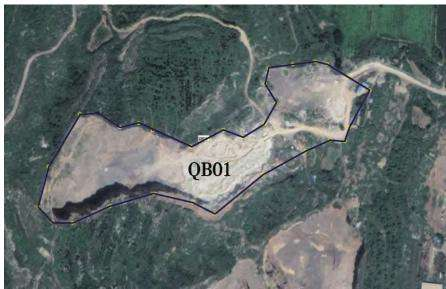  
图1 QB01 区卫星图片  
Fig. 1 Satellite image of QB01 area

采坑现场照片如图2所示。

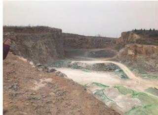  
(a) 西部采坑

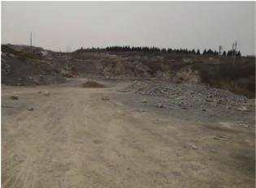  
(b)东北部采坑  
图2 采坑现场照片  
Fig. 2 Photos of the mining site

## 2.1.2 地质环境问题

勘查区内岩层属中奥陶统上马家沟组，岩层呈单斜产状，倾向115°，倾角15°\~19°。整体呈黄色，花斑状灰岩，微晶、隐晶质结构，致密块状构造。灰岩较破碎，夹黏土层较少。岩层上部覆盖层为黏土，厚度为20\~30 cm,红褐色。

(1)矿山地质灾害。勘查区内有废弃采石场(坑)形成的高陡边坡，坡面岩石裂隙发育，因采矿爆破和长期自然风化，岩体破碎，形成了危岩块体。根据现场调查资料，着重对山体危岩区的陡崖、陡坡段的岩性、结构面特征、斜坡形态，以及崩塌和隐患点形成的条件、特点进行了类比分析，定性判断其稳定性。QB01区废弃采石场危岩(崩塌)基本特征如下:危岩编号为W1，边坡及岩层产状边坡为160°∠85°、岩层 $1 1 5 ^ { \circ } \angle 1 6 ^ { \circ }$ ，裂隙面产状为330°∠87°、278°∠90°,危岩体高1.5m、长442m，稳定性评价为欠稳定，破坏模式为拉裂式，危岩体体积为1292m³,危岩体分类为Ⅰ类,位置为 QB01区。

(2)含水层破坏。根据此次实地调查，此区地下水类型为岩溶裂隙水，主要赋存在奥陶系马家沟组灰岩中。该矿区为露天开采，最低开采标高位于当地含水层上部，采矿活动高于地下水位标高，经野外调查，采矿活动未造成矿区及其周围含水层水位下降，也未影响到矿区及其周围生产生活用水。因此，采矿活动对地下含水层影响较轻。

(3)地形地貌景观破坏。QB01勘查区为露天开采的石灰岩矿矿山，历经多年的露天开采，已形成露天采矿坑和陡峭采矿边坡，矿渣沿坡底无序堆放，使大面积原生地形地貌破坏严重，面目全非，破坏面积 $5 . 3 6 \ \mathrm { h m } ^ { 2 }$ 。出露灰岩,坑壁高为5\~28m,坡度为$7 5 ^ { \circ } \sim 8 5 ^ { \circ }$ 。有少量石块堆积，直径0.05\~2.00m,高度3\~4m，长30m,宽10m,坑内坡度5°\~15°,西高东低，较平整。采坑内零星堆存有废渣堆，约300$ { \mathbf { m } } _ { \mathrm { ~ c ~ } } ^ { 3 }$ 原生地貌散布零星桃树、侧柏、火炬树、遍布狗尾巴草，二级平台采坑西侧有成片侧柏，边坡有狗尾巴草及灌木。QB01区露天采坑基本情况：编号CK01,长450 m、宽100m,边坡最大为28 m,岩性为灰岩，面积为 $5 . 3 6 \ \mathrm { h m } ^ { 2 }$ ,形状为长条状。

(4)土地资源破坏。勘查区内由于露天开采石灰岩矿，形成了较大面积的采石场，采场内有废弃构筑物3处，面积约 $4 0 0 \ \mathrm { m } ^ { 2 }$ 。采石场对土地资源破坏与占压严重，主要破坏与占压采矿用地、裸地和耕地。经现场调查统计，采场共破坏占压土地资源$5 . 3 6 \ \mathrm { h m } ^ { 2 }$ 。QB01区土地资源破坏情况统计见表1。

表1 QB01 区土地资源破坏情况统计  
Tab. 1 Statistics on the destruction of land resources in QB01 area
<table><tr><td>序号</td><td>土地类型</td><td>面积/hm²</td></tr><tr><td>1</td><td>采矿用地</td><td>2.50</td></tr><tr><td>2</td><td>裸地</td><td>0.42</td></tr><tr><td>3</td><td>耕地</td><td>2.44</td></tr><tr><td>合计</td><td></td><td>5.36</td></tr></table>

## 2.2 QB15 鹤壁市黑山头玄武岩矿矿山

(1)地理位置。黑山火山公园位于鹤壁淇滨区，鹤壁西北7km处，淇河河畔。在淇河生态文化旅游度假区的中部，为已闭坑的火山岩采矿遗留区，面积 $0 . 1 2 ~ \mathrm { k m } ^ { 2 }$ 。范围内除少量耕地外，全为废弃采矿场。平面位置如图3所示，采坑现场照片如图4所示。

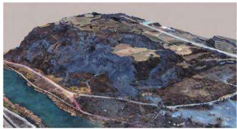  
图 3 QB15 区航飞图片  
Fig. 3 Air flight pictures in QB15 area

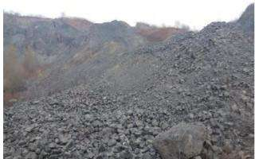  
(a) 位置1

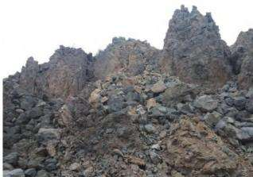  
(b) 位置2  
图4 QB15 鹤壁市黑山头玄武岩矿矿山采坑现场照片  
Fig. 4 QB15 site photo of mining pit of Heishantou Basalt Mine in Hebi City

(2)地层岩性。区附近为古近系、新近系、第四系，北部为新近纪鹤壁组 $\left( \mathrm { { N } } _ { 2 } \mathrm { { h } } \right)$ ，中部为古近纪玄武岩火山结构，南部及沟谷和山顶为第四系中更新统离石黄土 $\left( \mathbf { Q } _ { 2 } \right)$ 、或为上更新统马兰黄土 $\left( \mathbf { 0 } _ { 3 } \right)$ 、或为全新统 $\left( \mathbb { Q } _ { 4 } \right)$ 残坡积物及河床冲积物。以断裂为主，褶皱不发育，构造线方向以北东向为主，次为近东西向、北西一南东向。

(3)地貌地物。植被以灌木杂草为主，灌木较茂盛；山顶覆盖层厚约3m。

(4)地质环境问题。①矿渣堆：地面堆存有部分玄武岩矿石。②露天采坑：经过多年的资源开采，地质环境破坏严重，造成的主要环境地质问题为不稳定边坡、采坑、废弃矿渣。黑山头玄武岩露天采坑治理共1个采场，面积约 $0 . 1 2 ~ \mathrm { k m } ^ { 2 }$ 。采坑上部地面有1道宽2.5m的裂缝，第1道裂缝后15m还有宽80 cm 的裂缝。边坡长约 463 m，高约 15 m,坡度70°左右，局部临空面坡度在 $8 0 ^ { \circ } \sim 9 0 ^ { \circ }$ ，岩面上均有大量松散危岩体。采坑长约270 m，宽约257m，深约38 m。存在崩塌灾害隐患。QB15 区采坑边坡顶部裂缝如图5所示。

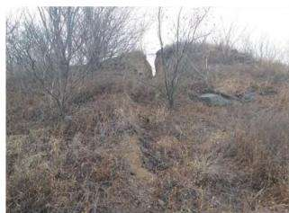  
(a) 位置1

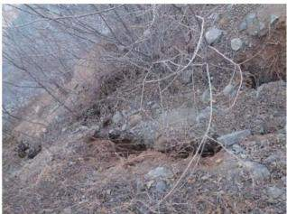  
(b) 位置2  
图 5 QB15 区采坑边坡顶部裂缝  
Fig. 5 Cracks at the top of the mining pit slope in QB15 area

## 3 矿山生态环境修复设计

## 3.1 矿山环境生态治理

QB01 位于省道 302 西侧 400 m，上峪村南 600m。从302省道到采坑区有简易生产道路约500m，面积 $9 . 5 6 \ \mathrm { h m } ^ { 2 }$ 0

(1)矿山地质灾害治理设计[5-7]。QB01 治理区西部高陡边坡，高度10\~30m，临空面坡度在 $8 0 ^ { \circ } \sim$ $9 0 ^ { \circ }$ ,需分层分级进行削坡治理。分级削坡设计依据《河南省矿山地质环境恢复治理勘查、设计、施工技术要求》中岩质边坡坡度允许值，设计分级台阶高度为5m,边坡坡度为1:0.05，台阶宽度 $4 \mathrm { ~ m ~ } _ { \mathrm { o } }$ 每级平台开挖至设计高程，采用光面(预裂)控制爆破施工，以保证平台平整性。削坡后最终平均边坡坡度为55°。山顶有足够距离可供削坡开挖，削坡最终开挖边线已过山脊线，与边坡平台形成反向汇水，因此边坡顶部不需设置截水沟。削坡设计大样如图6所示。

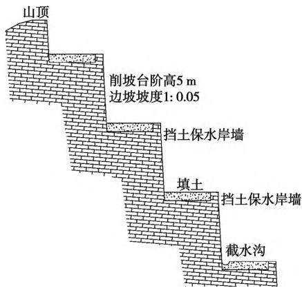  
图6 削坡设计大样  
Fig. 6 Detail of slope cutting design

(2)地形地貌整治设计[8-9]。QB01-2、QB01-7、QB01-8区内分布风化岩层，锥形，需挖风化岩层和堆存着废渣，对废渣进行筛分，碎石交由地方政府处置，细渣回填至采坑，然后采用装载机进行推平，挖掘机配合进行地表整平、整形即可。

(3)废弃建筑物拆除设计。治理区内废弃少量采矿用房及采矿破碎车间等砖混建筑物。该建构筑物需拆除清运，治理区内需要清除的建筑物占地面积约 $2 9 \ 7 1 9 \ \mathrm { m } ^ { 2 }$ 。施工方法为采用机械拆除，挖掘机挖装，自卸汽车运输。

(4)土地资源恢复设计[10-11]。为满足耕种及植树绿化的要求，对初步挖填平衡后的平整场地表面回填矿渣及客土压实。场地平整后，下部回填矿渣0.5m，上部覆土厚0.8m。按照设计削坡后形成的平台表面，为满足绿化要求，下部回填矿渣0.3m，上部覆土厚0.5m。各区需回填矿渣量共21808m³,各区需土量共计 $3 5 \mathrm { ~ } 1 9 4 \mathrm { ~ m } ^ { 3 }$ ,治理之后恢复耕地面积为1. $8 5 \ \mathrm { h m } ^ { 2 }$ 。此次设计矿山治理区面积9.56$\mathrm { h m } ^ { 2 }$ 。其中，矿山自然恢复区面积 $3 . 7 1 \ \mathrm { h m } ^ { 2 }$ ,矿山治理面积5.85 hm²。

(5)挡土保水岸墙设计[12-13]。QB01-4 平台外侧及按照设计削坡后形成的平台外侧筑宽0.5m，高0.8 m的挡土保水岸墙。砌筑浆砌石量1448$\mathbf { m } ^ { 3 }$ ,浆砌石抹面 $1 \ 8 1 0 \ \mathrm { m } ^ { 2 } \circ$ 此次设计挡土保水岸墙是边坡平台覆土外围防止水土流失设置的，基础坐在基岩上，只限制覆土不流失。

(6)植被恢复(绿化)设计。树木选取均为耐瘠薄、耐干旱、少病虫害植物，适宜在治理区种植。QB01 矿山治理范围外侧 10 m 区域及道路两侧选取高100\~150 cm的乔木,栽植间排距1m ×1m,共需14805株，其中栽植侧柏、白皮松、黄栌数量各占1/3;削坡后形成的平台栽植连翘、迎春15株/m²，栽植沙地柏10株/m²,栽植爬山虎10株/m,高度25\~50 cm,共栽植257 745株。削坡后形成的平台最内侧栽植爬山虎1行，10株/m，向外侧依次为连翘、沙地柏、迎春，栽植宽度相同，各占1/3。恢复成耕地面积为 $3 5 ~ 8 2 4 ~ \mathrm { m } ^ { 2 }$ ,种植油菜，撒油菜籽 $1 . 5 ~ \mathrm { g } / \mathrm { m } ^ { 2 }$ ,共需油菜籽53.73 kg。

(7)养护设计。树木栽植后，应浇透第1次的定根水。第1次的定根水一般需要连续浇灌4\~5次，浇水→渗完→浇水→渗完→再浇水→渗完，连续浇灌4\~5次才能真正把定根水给浇透。在浇完第1次的定根水后，一般还需要再浇2次水。第2次浇水一般是在第1次浇水后的第7天或者第10天左右进行。第3次浇水一般是在第2次浇水的10d或者15 d之后。

(8)道路设计。为了便于治理的施工，必须修建施工道路，使施工机械能够到达施工的位置。矿区内原有施工便道，不必重新修建。考虑到后期养护使用，施工道路保留，不复垦。

## 3.2 矿山环境生态治理

黑山火山玄武岩露天矿山位于淇滨区金山办事处许沟村东，紧邻淇河。区玄武岩为沿深大断裂喷溢的火山熔岩堆积，岩石具致密块状或气孔状构造、柱状节理、枕状熔岩等典型的地质遗迹。黑山火山玄武岩矿矿山环境生态治理重点是对地质遗迹进行保护。自南侧入口向北依次为诗经文化展示区、火山地质遗迹重点保护区、火山地质文化科教宣传区、富硒生态果木种植区等不同的功能分区。黑山玄武岩矿山功能分区如图7所示。

黑山头玄武岩露天矿山治理共1个采场,2个采坑，面积约0.12km²。采坑北帮上部有长短不一的裂缝4道，最长1道裂缝长55m，裂缝局部宽2.5m。最北侧裂缝宽80 cm,裂缝长35m,距离第1道裂缝15m。4道裂缝东西走向，基本与边坡临空面走向一致。边坡总长约463 m，北帮最高约35m，东侧边坡高25m，坡度70°左右，局部临空面坡度在

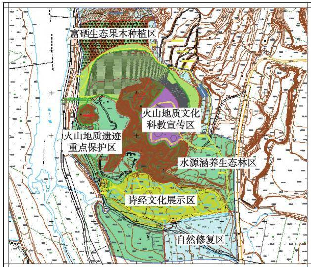  
图7 黑山玄武岩矿山功能分区  
Fig. 7 Functional division of basalt mines in Montenegro

80°\~90°，坡面上岩体松散，极不稳定，存在崩塌灾害隐患。黑山头玄武岩露天采坑不稳定斜坡治理，采用削坡减载、回填压脚措施进行治理，回填采用土工栅格加筋土边坡结构形式。措施简便易行，节约资金，对自然景观影响最小。

(1)削坡减载。QB15治理区北、东部存在高陡边坡，陡坡处有滑坡灾害隐患，边坡长463m,高10\~30m，坡度70°左右，局部临空面坡度在80°\~90°，按原始地形进行处理，消除滑坡地质灾害隐患。削坡采用机械开挖削坡，根据开挖基岩完整性、稳定程度，尽量不分台阶，以保证边坡基岩完整、自然，减少岩壁破碎和出现松动的浮石，造成二次不安全隐患。边坡削坡31 743.27 m³。

(2)回填压脚。将削坡碎石土进行回填压脚。回填压脚在边坡西部坡脚处，每50 cm一层，分层回填碾压，回填厚度共10m，压实度达到95%。土工栅格加筋土边坡结构回填时，首层(最下面一层)双向土工格栅网包裹填土厚度为0.4m，上覆盖土厚度0.1m，其余各层双向土工格栅网包裹填土厚度为0.5m。回填土铺在双向土工格栅网上，每层压实。填土的最优含水率控制在2%。土工格栅网铺设的长度首层为4m，回折反包长度2.0m，横向搭接长度0.3m，用U型钉固定。向上一层为6m，以此类推，坡面理论坡度达到1:2.5。坡面填土要提前混入狗牙草种子和有机肥料。回填压脚共分层碾压土石方量为 $3 9 \ 0 1 8 . 4 8 \ \mathrm { ~ m ~ } ^ { 3 }$ ，需用双向土工格栅网面积为 $1 1 0 \ 3 3 0 . 0 0 \ \mathrm { m } ^ { 2 }$ ,狗牙草种子20kg,洛阳花种子5kg。土工栅格加筋土边坡结构形式设计如图8

所示。

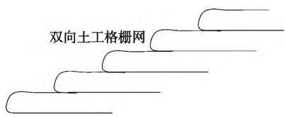  
图8 土工栅格加筋土边坡结构形式设计  
Fig. 8 Structural form design of geogrid reinforced soil slope

(2)玄武岩地质遗迹整形整治设计。玄武岩地质遗迹在该治理区第5区、第7区内分布，由于开采玄武岩矿石，造成表层球状、柱状岩石破碎，为保证该处地质遗迹的自然状态和完整性，需人工清除浮石和破损岩层，将地表整理美观，需清理废石量为16 613.39 m³。此次设计矿山治理区面积16.92hm²。其中，矿山自然恢复区面积3.01 hm²，矿山治理面积 13.91 hm²。

(3)废弃建筑物拆除设计。治理区内废弃少量采矿用房及采矿破碎车间等砖混建筑物。这些建构筑物需拆除清运，治理区内需要清除的建筑物占地面积约1248.29m²。施工方法采用机械拆除，挖掘机挖装，自卸汽车运输。

(4)废弃采坑整治和下沉式玻璃栈道设计。①废弃采坑整治设计。QB15 治理区 QB15-4、QB15-7两个区内存在大小2个露天采坑，坑底高程与淇河滩涂高程一致，拟将2个采坑整形、清理下挖1.5m,用φ500 mm的 PE灌溉管道将2个采坑相连，并且在西侧与淇河连接，南侧与引水渠道连接，形成流动的活水，避免形成黑臭水体。湖底挖方19658.00m³，覆土3504.56m³。管道铺设163m。②下沉式玻璃栈道设计。废弃采坑整治成景观湖后，距离湖水周界8m处，修建下沉式玻璃栈道380 m，护栏447m，亭子1座。景观湖西侧和南侧各设1个出入口。下沉式玻璃栈道建设的目的为将参观者引导至合适的观赏位置，使参观者在视觉适中的位置观赏火山遗迹，既防止意外落石砸伤游客，又禁止游客近距离接触地质遗迹，以免对地质遗迹产生破坏。

(5)地质文化科教宣传区设计。本次设计地质 科普展示牌9块，均使用大理石板材刻制，镶嵌在基 座上。安全警示牌9个安装在湖周围及斜坡护栏 处。黑山火山玄武岩地质科普长廊设置在回填压脚 区域，背靠黑山，南临景观湖及火山岩展示区。设置 火山历史长廊8个，火山口休息平台3个，火山地面 铺装1个，水击鼓4个，木桥1个，亭子1个。

(6)道路。铺设休闲步道1535m,小广场面积$1 ~ 1 2 2 . 7 5 ~ \mathrm { m } ^ { 2 }$ ,护栏长 701 m。

(7)生态景观修复设计。利用治理区南部坑洼区域，设置5个深0.4m的池塘，绿化选取树木高度为2\~3m的乔木，栽植间排距3m×3m，树坑规格为$1 \ \mathrm { m } \times 1 \ \mathrm { m } \times 1 \ \mathrm { m } _ { \odot }$ 边坡削坡后在隔离栏杆外侧种植带刺构骨，栽植25株 $/ \mathrm { m } ^ { 2 }$ ,高度 $4 0 \sim 5 0 ~ \mathrm { c m } ;$ 北侧西段边坡削坡后种植迎春，栽植5株 $/ \mathrm { m } ^ { 2 }$ ,高度40\~50 cm。

## 4 经济效益

治理措施实施后，可修复被破坏的地形地貌景观。增加林地284.73 hm²，恢复耕地 $8 9 . 5 4 ~ \mathrm { h m } ^ { 2 }$ ,其中恢复废弃工矿用地 $4 3 . 7 9 \ \mathrm { h m } ^ { 2 }$ 。剩余石方219.36万m³,净收益按30元/t计算，仅石方收益1.7亿元，废弃工矿用地收益1亿元。直接经济效益显著。治理的实施将保护淇河沿线地质遗迹，恢复生态环境，增加生物多样性。涵养水源，保护淇河全域，串联淇河流域地质遗迹、历史遗迹、形成系统的淇河生态游线，改善居民生存环境，提高生活质量，彰显淇河流域人文气息。

## 5 结语

(1)研究区主要环境问题为矿山地质灾害、含水层破坏、地形地貌景观破坏和土地资源破坏等。针对此，提出了废弃露天矿山生态环境恢复治理技术，主要措施是灾害治理、地貌整治、废弃建筑物拆除、土地资源恢复等。

(2)治理区位于淇滨区淇河流域，矿山开采严重破坏当地的自然生态环境，对周边居民的正常生产生活造成较大影响。通过实施，有效修复了矿山地质环境，改善了周边居民的生产生活条件，营造和谐社会氛围，提高了鹤壁市旅游城市的形象和知名度，社会效益显著。

## 参考文献(References)：

[1] 刘勇，王浩霖，李静静，等.巩义市历史遗留露天矿山地质环境 问题现状及治理对策[J]. 能源与环保,2021,43(4):15-22. Liu Yong, Wang Haolin , Li Jingjing, et al. Research on status quo of geological environmental problems of historic open-pit mines in Gongyi City and countermeasures[ J]. China Energy and Environmental Protection ,2021,43(4) :15-22.

2] 白世强，强真.废弃露天矿山生态修复的问题与对策—以河南省南太行地区为例[J].中国国土资源经济,2022(7):36-

41. Bai Shiqiang, Qiang Zhen. Problems and countermeasures of ecological restoration of abandoned open-pit mine: taking the south Taihang area of Henan Province as an example [ J]. Natural Resource Economics of China ,2022(7) :36-41.

[3] 朱双燕，范旭光，王莹.基于综合判断法的矿山地质环境分区 评价[J].能源与环保,2019,41(5):62-65. Zhu Shuangyan , Fan Xuguang, Wang Ying. Partition evaluation of mine geological environment based on comprehensive judgment method[ J]. China Energy and Environmental Protection ,2019 ,41 (5) :62-65.

[4]侯明允，王延岭，赵新卓.硬岩场地生态环境恢复技术探 讨——以山东省东平县石灰石露天采场综合治理为例[J]. 地质调查与研究,2009,32(2):150-153. Hou Mingyun , Wang Yanling, Zhao Xinzhuo. Discussion on ecological environment restoration technology of hard rock sites : taking the comprehensive treatment of limestone open-pit stopes in Dongping County , Shandong Province as an example[ J]. Geological Survey and Research ,2009 ,32 (2) :150-153.

[5] 张小连，张文炤,武成周，等.矿山地质环境治理工程技术[J]. 能源与环保,2020,42(10):1-6. Zhang Xiaolian , Zhang Wenzhao, Wu Chengzhou , et al. Mine geological environment treatment engineering technology [ J]. China Energy and Environmental Protection ,2020 ,42(10) :1-6.

6] 妙超，王焘，郑海军，等.秦岭南麓废弃露天矿山生态修复治理 研究——以宁陕县寸儿坝花岗岩矿为例[J]. 中国非金属矿工 业导刊,2022(3):62-64. Miao Chao , Wang Tao , Zheng Haijun , et al. Research on ecological restoration and management of abandoned open-pit mines at the southern foot of Qinling Mountains : taking Cunerba granite mine in Ningshan County as an example[ J]. China Non-metallic Minerals Industry ,2022(3) :62-64.

[7]郭朝蓝，张福林，朱安豫，等.太行山区生物多样性修复关键技 术浅析——以鹤壁市淇滨区南山为例[J].河南林业科技， 2018,38(1):54-56. Guo Chaolan ,Zhang Fulin , Zhu Anyu , et al. Analysis of key technologies for biodiversity restoration in Taihang Mountains Area: taking Nanshan Mountain in Qibin District, Hebi City as an example [J]. Journal of Henan Forestry Science and Technology ,2018 ,38 (1):54-56.

[8] 尹力.废弃露天矿山地质环境恢复治理技术研究[J]. 世界有 色金属,2021(11):198-199. Yin Li. Research on restoration and treatment technology of geological environment in abandoned open-pit mines[ J]. World Nonferrous Metals,2021 (11) :198-199.

[9] 阴静慧，邢茂林.陕北地区矿山地质环境评估方法与防治措施 [J]. 能源与环保,2019,41(9):48-51. Yin Jinghui, Xing Maolin. Assessment methods and prevention measures of mine geological environment in northern Shaanxi desert [J]. China Energy and Environmental Protection, 2019,41 (9) : 48-51.

(下转第20页)

tion ,2020,42(4) :46-51.

[12] 王慧明，余波.矿山地质环境影响性评价及保护治理研究— 以山西省阳泉矿区一矿为例[J].山西水土保持科技,2014 (1):17-21. Wang Huiming, Yu Bo. Research on mine geological environment impact assessment and protection management: taking a mine in Yangquan mining area of Shanxi Province as an example[ J]. Soil and Water Conservation Science and Technology in Shanxi , 2014 (1) :17-21.

[13]阴静慧，邢茂林.陕北地区矿山地质环境评估方法与防治措施 [J].能源与环保,2019,41(9):48-51. Yin Jinghui, Xing Maolin. Assessment methods and prevention measures of mine geological environment in northern Shaanxi desert[ J]. China Energy and Environmental Protection ,2019 ,41 (9) : 48-51.

[14] 刘敏俊.基于3S技术的矿山生态环境影响评价——以广东省 信宜铁矿采矿区为例[J].绿色科技,2018(8):147-148. Liu Minjun. Mine ecological environment impact assessment based on 3S technology : taking Xinyi Iron Mine Mining Area in Guangdong Province as an example [ J]. Journal of Green Science and Technology,2018(8) :147-148.

[15]朱双燕，范旭光，王莹.基于综合判断法的矿山地质环境分区 评价[J].能源与环保,2019,41(5):62-65. Zhu Shuangyan , Fan Xuguang, Wang Ying. Partition evaluation of mine geological environment based on comprehensive judgment method[ J]. China Energy and Environmental Protection ,2019 ,41 (5) :62-65.

16]宋建英.采煤对矿山地质环境影响的预测评估—以阳泉三

## (上接第 12 页)

10]何家宝，汪定圣.皖北露天闭坑矿山地质环境治理工作实 践——以萧县某水泥用石灰岩矿为例[J].安徽地质,2021,31 (1):63-66,70. He Jiabao, Wang Dingsheng. Practice of geological environment management in open-pit closed-pit mines in northern Anhui: taking a limestone mine for cement in Xiaoxian as an example[ J]. Geology of Anhui ,2021 ,31 (1) :63-66,70.

11] 朱华平，朱绍富，刘伟.矿山地质环境保护与恢复治理及相关 工作探讨——以杭州市某露天石灰岩矿山为例[J]. 商品与 质量,2016(17):7-8. Zhu Huaping,Zhu Shaofu , Liu Wei. Discussion on mine geological environment protection, restoration and management and related

矿为例[J].能源与节能,2019(10):80-83. Song Jianying. Geological environmental impact assessment induced by coal mining: a case study of Yangquan No.3 Coal Mine [J]. Energy and Energy Conservation ,2019(10) :80-83.

[17]许小龙，杨星辰，魏瑞龙，等.含矿区小流域生境质量评估方 法——以宝兴河流域锅巴岩矿山为例[J].地质力学学报， 2021,27(3):400-408. Xu Xiaolong, Yang Xingchen , Wei Ruilong , et al. Evaluation method of habitat quality in small watershed of mining area: taking Guobayan Mine in Baoxing River Basin as an example[ J]. Journal of Geomechanics ,2021,27 (3) :400-408.

[18]张丽娜.地下开采矿山地质环境保护问题及治理措施探究 [J].山西化工,2019,39(4):144-146. Zhang Lina. Study on the geological environment protection and control measures of underground mining[ J]. Shanxi Chemical Industry ,2019,39(4) :144-146.

[19] 刘翔.安山煤矿地质环境影响评估与恢复治理措施[J].地球， 2015(3):325-327. Liu Xiang. Geological environment impact assessment and restoration measures in Anshan Coal Mine [ J ]. Earth , 2015 (3) : 325- 327.

[20]李永红，何意平，康金栓，等.陕北煤矿区地质环境保护与恢复 治理措施——以神府矿区郭家湾煤矿为例[J]. 中国煤炭地 质,2014(4):41-45,57. Li Yonghong, He Yiping, Kang Jinshuan , et al. Geological environment protection and restoration measures in Northern Shaanxi Coal Mine Area: taking Guojiawan Coal Mine in Shenfu Mining Area as an example[ J]. Coal Geology of China,2014(4) :41-45,57.

work : taking an open-pit limestone mine in Hangzhou as an example[ J]. The Merchandise and Quality ,2016(17) :7-8.

[12]陈宇清，陈振宁.干尾砂充填露天采坑的技术方案探讨[J].绿 色科技,2016(4):121-123. Chen Yuqing, Chen Zhenyu. Discussion on technical scheme of filling open pit with dry tailings[ J]. Journal of Green Science and Technology ,2016(4) :121-123.

[13]韩琳琳，张华，范旭光，等.矿山地质环境治理与土地复垦工程 设计研究[J].能源与环保,2021,43(4):30-36. Han Linlin , Zhang Hua, Fan Xuguang, et al. Study on mine geological environment control and design of land reclamation engineering [J]. China Energy and Environmental Protection , 2021 ,43 (4) : 30-36.