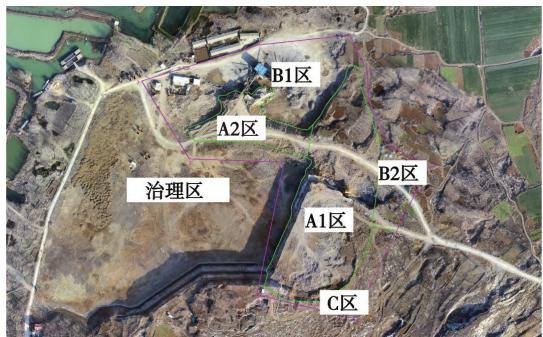
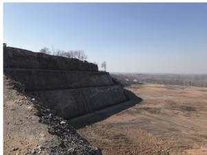
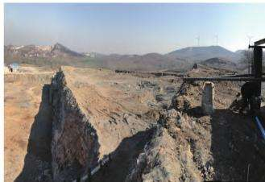
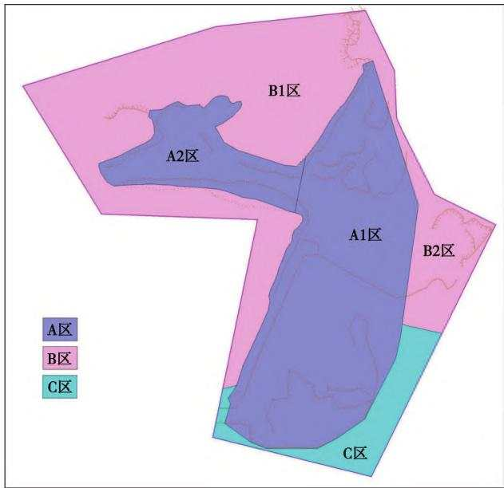
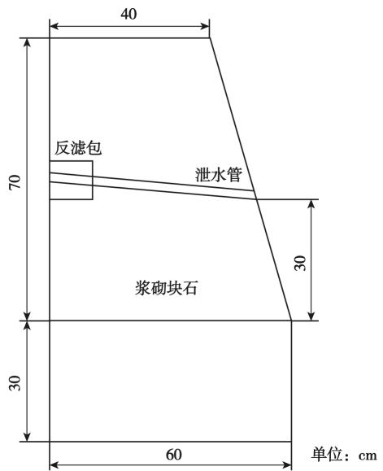
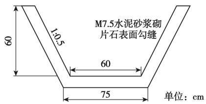

“矿山生态环境修复技术研究”专题 1

【编者按】党的十九大报告明确提出必须树立和践行绿水青山就是金山银山的理念，统筹山水林田湖草系统治理，建设美丽中国。习近平总书记强调，“山水林田湖草是生命共同体，生态环境是统一的有机整体，必须按照系统的思路，构建生态环境治理体系，着力扩大容量和生态空间，全方位、全地域、全过程开展生态环境保护”。为了贯彻落实国家五部委《关于加强矿山地质环境恢复和综合治理的指导意见》、国家六部委《关于加快建设绿色矿山的实施意见》以及九个行业国家绿色矿山建设规范，促进矿山地质环境保护，加快矿山地质环境恢复和综合治理，推动绿色矿山建设，《能源与环保》策划了“矿山生态环境修复技术研究”专题，报道了矿山地质环境问题及其恢复治理措施、矿山生态修复技术等成果，以飨读者。在此衷心感谢各位作者为专题撰稿！

# 徐州市塔山废弃矿山地质环境问题及治理对策研究

李恒宝，郭绍珂，陈梦影(江苏省地质矿产局第五地质大队，江苏徐州 221004)

摘要：塔山废弃矿山位于徐淮陆表海盆地，属碳酸盐岩一陆缘碎屑岩建造区，矿山开采年代较早，且不规范开采形成的高陡边坡，可能造成崩塌等地质灾害，矿山开采造成了原有山体生态景观和地貌形态的严重破坏。通过矿山地质环境调查，依据地形、地质条件和治理措施的不同，将该矿区划分为不同的研究区块，针对不同的地质环境问题，开展爆破挖削方、机械挖削方、场地平整、修筑挡土墙、修筑排水沟、边坡及平台植被复绿等治理措施，以达到改善研究区生态环境和消除地质灾害隐患目的。经过废弃露采矿山经地质环境综合治理，将消除地质灾害隐患，遏制水土流失的发生，消除对周边环境的污染，解决历史遗留矿山的地质环境问题，促进地方经济的可持续发展，可取得较好的环境、经济和社会效益。

关键词：徐州市；废弃矿山；地质环境；治理措施；效益评价

中图分类号：TD167;X141

文献标志码：A

文章编号:1003-0506(2023)01-0001-06

# Study on geological environment problems and treatment countermeasures of Tashan abandoned mine in Xuzhou City

Li Hengbao , Guo Shaoke , Chen Mengying

(The fifth Geological Brigade of Jiangsu Bureau of Geology and Mineral Resources ,Xuzhou 221004 , China)

Abstract: The abandoned Tashan mine is located in the Xuhuai epicontinental sea basin, which belongs to the carbonate rock continental margin clastic rock construction area. The mining age is early , and the mining is not standardized. The high and steep slope formed may cause geological disasters such as collapse , and the mining has caused serious damage to the original mountain ecological landscape and landform. Based on the mine geology environment investigation , according to the topographical , geological conditions and the different control measures , the mine area can be divided into block , different research according to different geological environment problem , carry out to party , mechanical digging blasting digging sharpen party , grading, retaining wall and dam construction , construction drain-

age , slope and vegetation complex green platform management measures. In order to improve the ecological environment of the study area and eliminate geological hazards. Through the comprehensive treatment of the geological environment of the abandoned open-pit mining mountain , the hidden danger of geological disasters will be eliminated , the occurrence of soil erosion will be curbed , the pollution to the surrounding environment will be eliminated , the mining geological environment problems left over by history will be solved , the sustainable development of local economy will be promoted , and better environmental , economic and social benefits will be achieved.

Keywords: Xuzhou City ; abandoned mines; geological environment; governance measures; evaluation of benefit

该矿区为石灰岩采石场，开采方式为斜坡式露天开采，现已关停。目前，矿山内遗留了大面积的废弃采石场、乱掘地以及裸露岩质开采坡面，边坡陡立，危岩耸峙，存在多处崩塌地质灾害隐患，使周边原有生态环境遭到了严重的破坏，破坏了山体自然景观[14]。近年来，矿山地质环境持续受到关注，已成为我国生态文明建设的重要内容之一，为了实现矿产资源开发和生态环境保护的和谐可持续发展，诸多学者、专家从法律政策、采矿方法、生态恢复工程等开展研究，取得了一定的进展。如各地相关部门相继出台了法律法规条例，对矿山乱挖、乱采，不顾当地生态环境保护的现象，给予严厉打击5]；有些学者从采矿方法研究[6-9]，尽可能减少对生态环境的破坏，在矿山勘探、开发时，建立“三同时”制度，同时设计、同时开发、同时治理；在矿山开发过程中，边开采边治理，对生态环境破坏降到最低状态；矿山开采后，要针对具体的地质环境问题开展修复工程，避免对环境造成二次破坏。如武乐霞[10]开展的矿山地质环境治理工程技术研究，温久川11]开展的矿区生态环境问题及生态恢复研究，对矿山生态恢复治理具有指导意义。本文从矿山环境的影响因素、生态环境现状、治理方法等方面进行分析，以期能为政府对矿山地质环境的监督管理和决策提供借鉴。

## 1 地质环境概况

## 1.1 区域地质环境

研究区地层属胶东古陆块，徐淮陆表海盆地，徐州一贾汪古生代碳酸盐岩一陆缘碎屑岩建造，出露地层主要为奥陶系下统肖县组下段及第四系。肖县组下段分布于整个矿区，为赋矿层位。厚度约121m。地层总体走向北东—南西，倾向130°\~160°，倾角5°\~15°。局部地层倾向北西呈现宽缓的小背斜构造。区内断层构造不发育，但节理、裂隙构造较发育，且节理多与宕口边坡斜交。因此，产生层面滑动(滑坡)的可能性较小。

## 1.2 水文地质条件

研究区地层为奥陶系肖县组下段，代表岩性为厚层灰岩、白云质灰岩等。石灰岩透水不含水，治理区地下水主要为松散岩类孔隙水和碳酸盐岩类岩溶水，分布面积大，水资源较为丰富。地下水流向自北向南，地下水补给除大气降水、微山湖水外，还受基岩裂隙降水补给，潜水补给条件好。但治理范围均位于地下水位以上，水文地质条件简单。

## 1.3 工程地质条件

研究区矿层为石灰岩、白云岩类工程地质岩组，属中等坚硬岩石，节理裂隙发育，加之原开采面较为陡峭，部分岩石已经产生位移、崩塌，影响了边坡的稳定性。北部边坡及+62m平台顶部分布一层人工回填碎石土，厚3.0\~5.0m,平均厚3.8m,工程地质性质差；下部灰岩普遍夹厚1.7\~2.9m(平均厚2.3m)的贾汪组黄、黄绿色页片状泥质白云岩及角砾岩，该层岩体工程地质性质较差，不能作为建筑石料加工利用。综上，研究区岩体工程地质条件较差。

## 2 矿山地质环境现状及问题

## 2.1 矿山地质环境现状

塔山矿区开采年代较早，开采不规范，西、北、东三面已被开采，仅残留南部山体，残留山体及宕底废弃地有少量杂树。山体生态景观和地貌情况破坏严重，开采后形成的边坡较为陡峭。目前一期项目实施已基本完成，根据现状地形对研究区进行分区，各分区地质环境现状描述如下，分区如图1所示。

  
图1 矿山地质环境现状分区  
Fig. 1 Zoning diagram of mine geological environment status

(1)A区。A1区西南侧为一期已治理边坡，边坡走向大致呈西南—北东，坡高约34m，坡角60°，坡底标高约 + 36 m,边坡设置 + 50 m、+ 62 m安全平台，坡顶设有安全围栏，不存在崩塌地质灾害隐患(图2(a))。A1区西南部为未治理人工边坡，走向北东，边坡较陡峭，节理、裂隙构造较发育，向西南与一期已治理边坡相通，坡高约26m，坡体近乎直立，坡底标高约36m,坡顶为+62m平台。边坡无危岩分布，不存在崩塌地质灾害隐患。该区域岩体普遍夹厚1.7\~2.9m的泥质白云岩，坡顶分布3\~5 m人工回填碎石土(图2(b))。A1区北部为未治理人工边坡，走向北东，坡高4\~12m，坡顶分布3\~4m人工回填碎石土。A2区原为废弃地，后经垫土整平为道路，道路北侧连接石料加工设备，标高为+37\~+45 m。

  
(a) 已治理

  
(b) 未治理  
图2 A1 区西南侧边坡现状  
Fig. 2 Status quo of treated slope in the southwest of A1 area

(2)B区。B1区为一期已治理整平区域，地势平坦，地面标高为+33\~+37m，总体呈西高东低之势，北部分布有石料加工设备。B2区地面标高为+38\~+55m，总体呈西南—北东递减，南部为自然山体，北部分布人工整平道路及陡坎，陡坎高1\~2m。

(3)C区。C 区为自然山体，地面标高为+55\~+73 m。

## 2.2 矿山地质环境问题

(1)地质灾害隐患。据现状调查及资料分析，研究区不具备发生泥石流、地面塌陷、地裂缝、地面沉降的地质条件。A1区西南角为已治理边坡，坡角60°,坡高约30m，设有+50、+62m安全平台,无危岩分布，且并未发生明显的变形破坏迹象，整体稳定性较好；A1 区+62 m平台西侧及北侧边坡未治理，坡面近乎直立，节理、裂隙构造较发育，北侧坡角堆积碎石，但坡面无危岩分布，不存在崩塌隐患，坡体稳定性较好，崩塌发育程度弱。研究区周围无重要公路和其他设施，发生灾害的直接经济损失小于100万，受威胁人数小于10人，危害程度小。综上，研究区崩塌发育程度弱，危害程度小，发生崩塌地质灾害的可能性小，危险性小[12-16]。

(2)地形地貌景观的破坏。研究区由于以往的无序开采，形成大量采石边坡，原山体植被遭到破坏，区内采场及周边岩石裸露，水土流失严重，与周围自然生态环境极不相称。研究区开山采石破坏了山体的稳定性，原始生态环境和地形地貌景观遭到了严重破坏，与微山湖景区规划极不协调。

(3)破坏和浪费土地资源。研究区内累计受破坏的土地约 $8 7 \ 1 0 3 . 3 7 \ \mathrm { m } ^ { 2 }$ ，土地类型主要为采矿用地和裸地，破坏耕地小于2 hm2，破坏林地小于2hm²，破坏未开发利用土地小于 $1 0 \ \mathrm { h m } ^ { 2 }$ 。现状条件下，土地资源影响较轻。

## 2.3 边坡稳定性评价

根据研究区现状调查，A1区西南角原一期治理边坡坡角60°，岩体类型为微风化灰岩，坡高大于30m,边坡坡度1:0.15\~1:0.25,且设有+50、+62m安全平台，平台均设有挡土墙并复绿，为稳定性边坡。A1区西部边坡岩体类型为微风化灰岩，坡度近乎直立,坡高20\~26m,边坡坡度1:0.15\~1:0.25，存在发生崩塌地质灾害的可能性。但地层总体走向北东—南西，倾向130°\~160°，倾角2°\~15°，局部坡角堆积碎石，为逆向坡，岩体整体结构特征对边坡保持稳定状态比较有利，边坡发生整体性失稳的可能性较低，目前天然状态下边坡坡面无危岩分布，且并未发生明显的变形破坏迹象，整体稳定性较好，为稳定性边坡。

## 3 工程治理措施

根据地形、地质条件和治理措施的不同，将研究区划分为不同的研究区块(图3)，主要对A1、A2、B1、B2区开展生态恢复治理。治理措施有爆破挖削方、机械挖削方、场地平整、修筑挡土墙、修筑排水沟、边坡及平台植被复绿。

## 3.1 场地地形整治

(1)挖削方。挖削方区分为A1、A2区。对A1区进行挖削方，南部边坡与一期治理边坡相接，最终边坡角由西向东递缓，由原 $6 0 ^ { \circ }$ 过渡至45°，最终向东降至30°以下；东部及北部边坡最终坡角降至30°。经爆破挖削方后，坡底平台标高控制在+36m，与西部一期治理平台相通；由于边坡高度大于20m,故在边坡中部标高 +50 m处留设宽度为 4 m的安全平台，西侧与一期+50m平台相通。挖削方总量 435 403.70 m³,新增平台面积19 769.66 m²。A2区为机械挖削方区，治理后场地标高为+33.88\~+36.00m，地势整体呈西北低东南高之势，挖方量为 $3 8 ~ 0 0 3 . 4 3 ~ \mathrm { m } ^ { 3 }$ ,面积8 592.87 m²。

  
图3 治理分区示意  
Fig. 3 Schematic diagram of governance partition

(2)场地整平。场地平整区分为B1、B2区。对B1区进行治理，拆除场地内石料加工设备等建构筑物，平整场地，治理后场地标高 +33.02\~ +36.00m,B1区局部为+36 m平台，由缓坡过渡带向外地势逐渐降低，为小于5°缓坡；B1区场地平整面积为$3 3 ~ 0 8 5 . 0 5 ~ \mathrm { m } ^ { 2 }$ 。其中，缓坡地区面积 $1 9 \ 6 7 1 . 0 6 \ \mathrm { m } ^ { 2 }$ O对B2区进行整治，对无植被分布的低洼陡坎进行填土整平，治理后场地标高+41.80\~+55.26 m，由南向北为小于5°缓坡，B2区场地平整面积7378.37m²。场地平整主以机械施工为主，辅以人工或小型机具配合进行。场地平整对低洼陡坎应进行填平压实。碎石类土或爆破石渣作为填料时，其最大粒径不得超过每层铺填厚度的2/3(当使用振动碾时，不得超过每层铺填厚度的3/4）。铺填时大块料不应集中，且不得填在分段接头处或填方与山坡连接处。本治理区填方整平石料来源于挖方土石料。

## 3.2 修筑挡土墙

在 A1 区坡脚向外 2 m 及 + 50 m 安全平台外缘设置挡土墙，挡土墙以块石浆砌而成，断面呈梯形，底座宽0.6m，上顶宽0.4m，墙身高0.7m，基础埋深不小于0.3m，挡土墙全长589.98 m。挡墙墙面使用M7.5水泥砂浆勾缝，墙顶部使用混凝土压顶，压顶厚度不小于5cm，然后使用水泥砂浆抹平。挡墙内设置一排泄水孔，泄水孔高出地面30 cm，泄水孔水平孔距 3 m,泄水管采用 φ75 mm的 PVC 塑料排水管，自墙内向外倾斜布设，坡度5%，采用土工布包扎，挡墙内侧泄水管处设置碎（砾）石反滤包[14-18]，挡土墙大样如图4所示。其中，+36 m坡脚平台长 378.67 m，+50 m 安全平台长 211.31 m。

  
图4 挡土墙大样  
Fig. 4 Large sample of retaining wall

## 3.3 修筑排水沟

修筑排水沟时应注意，排水沟的布设与施工必须在削坡、清坡分项工程施工结束后进行；砌筑排水沟采用M7.5砂浆；为防止淤塞，沟底纵坡坡度一般不宜小于1%；排水沟底板和边墙砌筑工艺总的要求：平(砌筑层面大体平整)、稳(块石大面向下，安放稳实)、紧(石块间应靠紧)、满(石缝要以砂浆填满捣实，不留空隙)；应勾缝的砌石面，在砂浆初凝后，应将灰缝抠深30\~50mm，清净湿润，然后填浆勾阴缝；回填压脚坡底排水沟，不与南部边坡坡底排水沟相连，排水沟直接连入治理区外市政排水系统。

为确保雨季时场地排水通畅，在+36m平台边坡坡脚设置排水沟，排水沟横断面为梯形，底部宽0.6m,深0.6m,斜坡坡率1:0.5。沟内两侧斜坡及沟底以M7.5水泥砂浆砌片石罩面，片石厚度不小于 $1 0 \ \mathrm { c m } _ { \odot }$ 纵向排水沟每延米挖方量 $0 . 7 6 \mathrm { ~ m ~ } ^ { 3 }$ ,浆砌片石 $0 . 2 1 ~ \mathrm { m } ^ { 3 }$ 。排水沟大样如图5所示，设计排水沟

长378.67m。

  
图 5 排水沟大样  
Fig. 5 Detail drawing of drainage ditch

## 3.4 边坡及平台植被复绿工程

通过对研究区适当区域进行植被恢复以改善研究区的生态环境[19]。此次经挖削方后形成的+36m标高平台作为建设用地开发利用。因此，+36m标高平台暂不考虑绿化，复绿区域主要为A1区坡脚及+50 m安全平台、30°边坡。在坡脚及+50 m安全平台与挡土墙之间覆土0.6m厚，坡脚向外1m 种植一排女贞（+ 50 m平台为 2排)，株距2 m，并撒播草种。乔木种植应开挖种植穴，种植穴直径0.8m，深0.6 m。坡脚及平台绿化面积1602.58m²,需覆土739.65m³（填土松散系数按1.3），种植乔木400株。在30°边坡坡面上均匀覆盖过筛后的细粒土，覆土0.6m厚，并压实，应施入腐熟的有机肥作为基肥。在种植沟中客土回填，土层厚度应将沟内侧填满，以保证植被的生长。土质以微酸性、土壤pH值为5.5\~8.5、含盐量不大于0.3%、富含有机腐殖质为宜。在坡面种植女贞，种植穴直径0.6m，深0.5m，种植穴按正六边形布置，相邻株距均为3.0m。30°边坡坡面绿化面积 $1 3 \ 5 8 6 . 7 1 \ \mathrm { m } ^ { 2 }$ ,需覆$\pm 6 2 7 0 . 7 9 \ \mathrm { m } ^ { 3 }$ ,种植乔木3484株。

## 3.5 植被养护

复绿工程结束后需对边坡及平台的植被进行养护。前期持续养护时间为45d左右，应随时观察坡面植物生长状况，作好坡面植物生长状况记录调查表，并根据结果及时采取应对措施。植被养护面积为 $1 5 \ 1 8 9 . 2 9 \ \mathrm { m } ^ { 2 }$ O

## 4 效益分析

## 4.1 社会效益

塔山废弃露采矿山经地质环境综合治理，将消除地质灾害隐患，遏制水土流失的发生，消除对周边环境的污染，解决了历史遗留的矿山地质环境问题。有利于改善柳泉镇微山湖生态形象及周边居民生活环境，保障周边人民生命财产的安全，落实了国家倡导的“五位一体”发展理念，促进地方经济的可持续发展。

## 4.2 环境效益

矿山环境治理的环境效益是一种综合性的效益，具有渐进式累计增生的特点，环境效益是一切效益之根本，对破坏了的矿山环境采取生物措施治理，潜在综合效益长久而非经济价值能估算的。从环境效益来看，矿山地质环境治理恢复以后，得以还青山绿水于世人，留碧水蓝天给后代。改善了该地区的生态环境，提高了人民的生活质量。

## 4.3 经济效益

塔山废弃露采矿山经过治理后，其地质灾害隐患消除、生态环境改善，其中经矿山地质环境治理后可形成 $4 1 \ 1 7 3 \ \mathrm { m } ^ { 2 }$ 土地作为建设地开发利用。项目的实施缓解了用地紧张矛盾，还可创造更多的财政收入。生态环境改善带来的周边土地获益、旅游资源的开发利用、周边人民生活条件和生活质量的提高，人文环境及居住环境的改善，以及项目所在地投资环境的优化,其间接效益不可估量[17-20]。

## 5 结语

(1)塔山矿区因不规范开采，形成了高陡边坡，随时有产生崩塌地质灾害的可能；矿区西、北、东三面已被开采，残留山体及宕底废弃地有少量杂树，周边原有山体生态景观和地貌情况遭到了严重的破坏，破坏了山体自然景观。

(2)根据地形、地质条件和治理措施的不同，将研究区划分为不同的研究区块，针对不同的地质环境问题，开展以爆破挖削方、机械挖削方、场地平整、修筑挡土墙、修筑排水沟、边坡及平台植被复绿等治理措施。以达到改善研究区生态环境和消除地质灾害隐患目的。

(3)塔山废弃露采矿山经地质环境综合治理，将消除地质灾害隐患，遏制水土流失的发生，消除对周边环境的污染，解决了历史遗留的矿山地质环境问题，改善了区内生态环境和当地居民生存环境，可促进地方经济的可持续发展，取得了较好的环境、经济和社会效益。

## 参考文献(References):

[1] 卫智军，李青丰，贾鲜艳，等.矿业废弃地的植被恢复与重建[J]. 水土保持学报,2003,17(4):172-175.

Wei Zhijun , Li Qingfeng, Jia Xianyan , et al. Vegetation recovery on industrial mining disposal site[ J]. Journal of Soil and Water Conservation,2003,17(4) :172-175.

[2] 田安家，杜琴瑶，刘格升，等.矿山地质环境治理与土地复垦可 行性分析[J].能源与环保,2021,43(4):1-7,14. Tian Anjia, Du Qinyao, Liu Gesheng, et al. Feasibility analysis of mine geological environment control and land reclamation[ J]. China Energy and Environmental Protection ,2021 ,43 (4) :1-7,14.

[3] 刘德成.京津冀矿山环境修复治理措施研究—以玉田县某矿 山为例[J].环境生态学,2020,2(11):69-73. Liu Decheng. Study on the measures of mine environment restoration in Beijing,Tianjin and Hebei-Taking a mine in Yutian County as an example[ J]. Environmental Ecology ,2020 ,2(11) :69-73.

[4] 束文圣，张志权，蓝崇钰.中国矿业废弃地的复垦对策研究 [J]. 生态科学,2000,19(2):24-29. Shu Wensheng, Zhang Zhiquan , Lan Chongyu. Strategies for restoration of mining wastelands in China[ J]. Ecologic Science ,2000 , 19(2):24-29.

[5] 杨金中，许文佳，姚维岭，等.全国采矿损毁土地分布与治理状 况及存在问题[J].地学前缘,2021,28(4):83-89. Yang Jinzhong, Xu Wenjia, Yao Weiling, et al, Land destroyed by mining in China: damage distribution , rehabilitation status and existing problems[ J]. Earth Science Frontiers ,2021 ,28(4) :83-89

6] 夏玉成，王锐，马丽.矿井地质灾害要素与地质灾源体辨识评 价[J]. 中国煤炭地质,2019,31(2):51-55. Xia Yucheng, Wang Rui, Ma Li. Identification and evaluation of mine geological disaster elements and geological disaster source [J]. Coal Geology of China ,2019 ,31 (2) :51-55.

[7] 原振雷，肖荣阁，李明立，等.矿产资源开发区生态环境问题及 其防治[J]. 矿产保护与利用,2005(1):40-44. Yuan Zhenlei , Xiao Rongge , Li Mingli , et al. Ecological and environmental problems in mineral resource development zones and their prevention and control[ J]. Mineral Resources Protection and Utilization,2005(1):40-44.

[8] 贾晗，刘军省，殷显阳，等.安徽铜陵硫铁矿集中开采区矿山地 质环境评价研究[J].地学前缘,2021,28(4):131-141. Jia Han , Liu Junxing, Yin Xianyang, et al. Study on mine geological environment evaluation of Tongling pyrite concentrated mining area in Anhui Province[ J]. Earth Science Frontiers ,2021 ,28(4) :131- 141.

[9] 张小连，张文炤，武成周，等.矿山地质环境治理工程技术[J]. 能源与环保,2020,42(10):1-6. Zhang Xiaolian , Zhang Wenzhao, Wu Chengzhou , et al. Mine geological environment treatment engineering technology [ J]. China Energy and Environmental Protection ,2020 ,42(10) :1-6.

[10] 武乐霞.矿山地质环境治理工程技术研究[J]. 能源与环保， 2020,42(4):50-55. Wu Yuexia. Research on engineering technology of mine geological environment treatment[ J]. China Energy and Environmental Protection ,2020 ,42(4) :50-55.

[11] 温久川.矿区生态环境问题及生态恢复研究[D].呼和浩特：内蒙古大学,2012.

12]庞朋朋，郭振斌，张立勋.天祝县华藏寺冰岭沟石膏矿地质环 境问题及治理对策探讨[J]. 中国锰业,2022,40(3):94-99. Pang Pengpeng, Guo Zhenbin , Zhang Lixun. Discussion on the geological environment problems and management countermeasures of Binglinggou gypsum mine in Huazang Temple, Tianzhu County [J]. China Manganese Industry ,2022 ,40 (3) :94-99.

[13]陈龙，柴波，梁敏，等.湖北黄梅马尾山铁矿废弃地恢复的工程 学研究[J].环境工程学报,2017,11(3):1966-1974. Chen Long, Chai Bo , Liang Min , et al. Engineering research on restoration of abandoned land of Maweishan lron Mine in Huangmei, Hubei[ J]. Chinese Journal of Environmental Engineering, 2017, 11(3):1966-1974.

[14]张昊,张强，左小，等.生态环境保护性的采选充系统设计及应 用[J].中国矿业大学学报,2021,50(3):548-557. Zhang Hao , Zhang Qiang, Zuo Xiao , et al. Design and application of mining-separating-backfilling system for mining ecological and environmental protection[ J] . Journal of China University of Mining & Technology ,2021 ,50(3) :548-557.

[15]何芳,徐友宁,乔冈，等.中国矿山地质灾害分布特征[J].地质 通报,2012,31(2/3):476-485. He Fang, Xu Youning, Qiao Gang, et al. Distribution characteristics of mine geological hazards in China [ J ]. Geological Bulletin of China,2012,31 (2/3) :476-485.

[16] 牛百强,张玉有.废弃矿山生态修复技术研究[J].能源与环 保,2022,44(2):18-23. Niu Baiqiang, Zhang Yuyou. Research on ecological restoration technology of an abandoned mine[ J]. China Energy and Environmental Protection ,2022 ,44(2) :18-23.

[17] 石焱.铁矿开采对地下水环境影响评价实证研究[J].中国金 属通报,2020(9):222-223. Shi Yan. Empirical Study on the evaluation of the impact of iron ore mining on groundwater environment[ J]. China Metal Bulletin, 2020(9):222-223.

[18]全强，孙立新，成格尔，等.林西关沟废弃矿山地质环境及生态 修复治理技术研究[J]. 中国矿业,2022,31(5);63-68. Quan Qiang, Sun Lixin, Cheng Ge'er, et al. Research on geological environment and ecological rehabilitation technology of Guangou Abandoned Mines in Linxi County [ J]. China Mining Magazine, 2022,31 (5):63-68.

19] 李成，彭捷，陈建平，等.陕西省矿山地形地貌景观损毁现状及 修复技术[J].灾害学,2019,34(4):143-147,152. Li Cheng, Peng Jie , Chen Jianping, et al. Current situation of landscape damage and rehabilitation technology of mine topography in Shaanxi Province [ J ]. Journal of Catastrophology, 2019 , 34 (4) : 143-147,152.

[20] 韩琳琳，张华，范旭光，等.矿山地质环境治理与土地复垦工程 设计研究[J].能源与环保,2021,43(4):30-36. Han Linlin , Zhang Hua, Fan Xuguang , et al. Study on mine geological environment control and design of land reclamation engineering [J]. China Energy and Environmental Protection , 2021 ,43 (4) : 30-36.