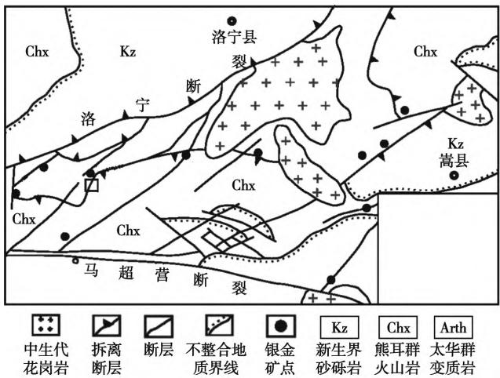
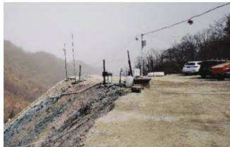
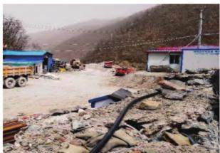
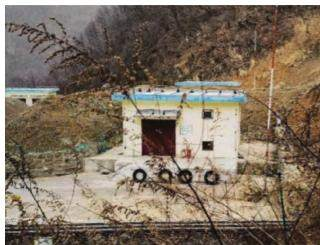
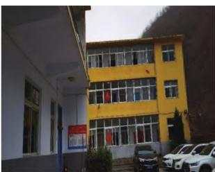
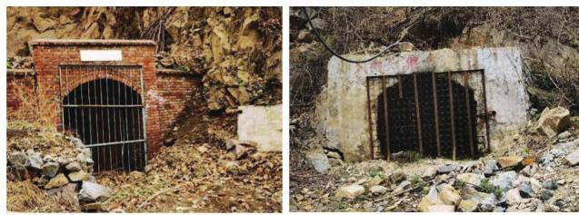
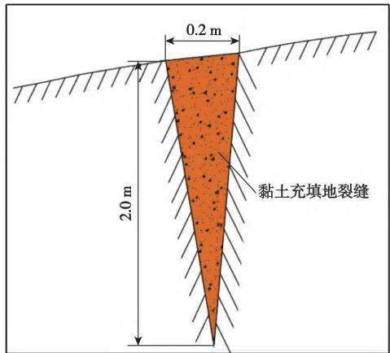
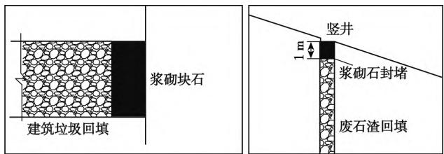
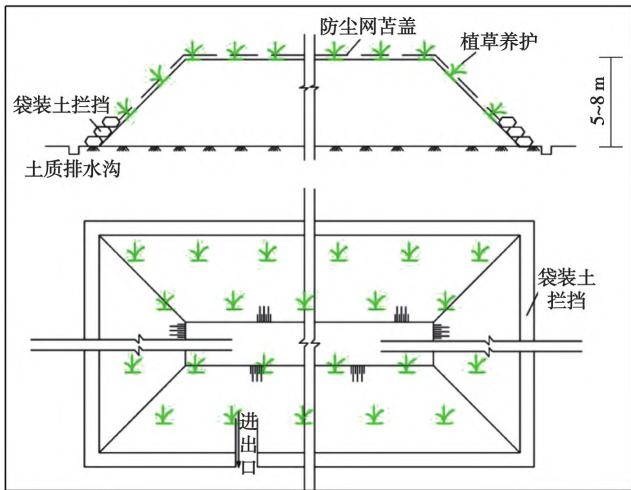

# 洛宁县龙门店银矿矿山环境地质问题及综合治理措施研究

王旭1²，张晨3，刘思聪4

(1.河南省有色金属地质矿产局第四地质大队，河南郑州 450000；2.河南省有色金属矿产探测工程技术研究中心，河南郑州 450000；3.河南省有色金属地质矿产局第六地质大队，河南郑州 450000；4.河南有色地矿钻探有限公司，河南郑州 450000）

摘要：河南省洛宁县龙门店银矿位于熊耳山多金属成矿带，矿区采矿活动频繁，对周边的环境造成了严重的影响，随着国家对绿色矿山建设的加快推进，矿山地质环境恢复和综合治理已刻不容缓。以洛宁县龙门店银矿区为研究对象，通过矿山地质及地质环境调查，分析了矿山的开采规模、地貌环境特征、环境影响范围、地质灾害引发方式等因素，初步认为地质环境问题主要表现为矿业活动对地形地貌景观的破坏、引发的地质灾害、对地表土地的占压等。针对矿业活动引发的地质环境问题，采取相应的地质灾害防治和土地复垦工作，进行地裂缝防治、矿井回填、土地治理复垦，最大限度地避免或减轻因矿山工程建设和采矿活动对矿山地质环境的影响和破坏。

关键词：绿色矿山；矿山地质调查；地质灾害；地质环境治理

中图分类号：TD176;X141

文献标志码：A

文章编号:1003-0506(2023)01-0065-07

# Study on environmental geological problems and control measures of Longmendian Silver Mine in Luoning County

Wang Xu12 , Zhang Chen³ , Liu Sicong4

(1. The Fourth Geological Brigade of Henan Provincial Bureau of Nonferrous Metals Geology and Minerals ,

Zhengzhou 450000 , China; 2. Henan Nonferrous Metal Minerals Exploration Engineering Technology Research Center , Zhengzhou 450000 , China; 3. The Sixth Geological Brigade of Henan Provincial Bureau of Nonferrous Metals Geology and Minerals , Zhengzhou 450000 , China; 4. Henan Nonferrous Geology and Mineral Drilling Co. ,Ltd. , Zhengzhou 450000 , China)

Abstract: Longstorem Silver mine , Luoning County , Henan Province , is located in Xiong' er Mountain polymetallic metallogenic belt. Mining activities in the mining area are frequent , which has caused a serious impact on the surrounding environment. With the acceleration of green mine construction by the state , the recovery and comprehensive management of the mine geological environment has become urgent. In this paper,longstorem Silver mining area in Luoning County was taken as the research object. Through the investigation of mine geology and geological environment , the mining scale, geomorphic environment characteristics , environmental impact range, geological disaster initiation mode and other factors were analyzed. It was preliminarily concluded that the geological environment problems are mainly manifested in the destruction of landform and landscape by mining activities , geological disasters easily caused , and the occupation and destruction of land surface. In view of the geological environment problems caused by mining activities, geological disaster prevention and control work was carried out , ground crack prevention and control , mine backfilling, land management and reclamation , so as to avoid or reduce the influence and destruction of mine geological environment caused by mine engineering construction and mining activities to the maximum extent.

Keywords: green mine; mine geological survey; geological disaster; geological environment control

近年来，随着国家对生态文明建设的重视，提出了绿色矿山建设工程，以资源开发方式、资源综合利用、节能减排、科技创新与数字化(智能化)矿山、企业管理与企业形象为共同体16]。而绿色矿山建设所涉及矿山生态修复、矿山环境修复、矿山生态恢复、矿山生态重建等过程，但基本上强调的是绿化矿山，是实现矿区环境生态化和矿区社区和谐化的重要组成部分[2-10]。

洛宁县龙门店银矿已开采多年，开采的过程中不可避免的产生了地形地貌景观破坏、土地资源破坏、含水层破坏等诸多矿山地质环境问题，这些问题直接或间接的影响了当地社会经济的可持续发展[3-11]。通过矿山地质环境现状调查，矿区现状条件下已损毁土地主要有6号工业场地、PD1136工业场地、地面爆破器材库、公司矿部和7处废石场、矿山道路对土地破坏，主要以开挖、占用等形式破坏地形地貌景观及水土形态，破坏面积总计5.809hm²。并针对具体的地质环境问题，开展地质灾害防治和土地复垦研究，建设以资源开发、生态文明的绿色矿山，以保障矿产资源的可持续发展[6-20]。

## 1 地质环境概况

## 1.1 地形地貌

矿区总体地势南高北低，地面标高+1758.6\~+883.2 m,相对高差875.4 m。区内地形切割强烈，山势陡峭，“V”型沟谷发育，地形坡度30°\~45°，局部60°，矿区内最大沟溪为崇阳沟，近南北向，其它冲沟有圪了沟、段沟、香炉沟，走向多为东西向，汇入崇阳沟，冲沟纵坡度10°\~30°，沟底宽度为3\~15m，利于排水。

## 1.2 区域地质

龙门店矿区位于河南省洛宁县南部熊耳山西段北坡，大地构造位置处于中朝准地台南缘、华熊台缘凹陷、崤山一鲁山拱褶断束的中部，熊耳山多金属成矿区之西部 Ag-Pb-Au地球化学异常区[5-6]（图1)。区内出露地层主要为新太古界太华群和中元古界熊耳群，少量新近系和第四系地层分布在洛宁山前断裂北侧卢氏—洛宁盆地和现代沟谷中[5]。区内构造一岩浆活动频繁，褶皱、断裂均有发育，其中以北东一—北北东向断裂规模较大，金、银多金属矿产众多[5-6]。岩浆活动表现为多期次、多类型的特点，表现为广泛的基性一中基性一酸性火山岩的喷发作用和超基性岩的侵入活动，对本区矿床的形成和分布

有重要的控制作用[6]。

  
图1 熊耳山地区主要银金矿点分布  
Fig. 1 Sketch of main silver and gold occurrences distribution in the Xiongershan area

## 2 工程地质条件

矿区主要以结晶变质岩为主，间或有少量岩浆岩类。岩性较复杂，主要为太古界太华群的古老变质岩和中元古界长城系熊耳群安山岩。地质构造发育，地表岩石风化中等，一般岩体稳定性好，局部地段有工程地质问题。

## 2.1 工程地质岩组特征

根据岩石成因、岩性、结构特征、结构面发育程度和分布特点及岩石物理力学性质和对矿山开采的影响程度等，矿区岩石可划分为4个工程地质岩组。①太华群片麻岩组。岩性以角闪斜长片麻岩为主，粒状变晶结构，片麻状构造。抗压强度123.06\~203.60MPa，属坚硬岩石，稳固性较好。②熊耳群安山岩组。岩性以安山岩为主，致密块状构造，交织结构、玻璃质结构。岩组裂隙不发育，属坚硬岩石，稳固性好。③构造蚀变岩组。岩性为片麻岩蚀变后的产物，具有较强烈的硅化、绢云母化、绿泥石化。粒状结构、块状构造，矿物成分主要以长英质为主。该岩组裂隙不发育，岩石抗压强度35.80\~145.20MPa。④辉绿岩组。岩石呈辉绿结构，块状构造。岩石抗压强度119.30\~223.96 MPa,质地坚硬,性脆。该岩组节理裂隙发育，局部地段可见有渗水现象。岩体完整性中等。

## 2.2 矿层和围岩的物理力学性质

(1)矿层的物理力学性质。矿层赋存在太华群片麻岩类之层间滑脱蚀变破碎带，抗压强度69.7\~

128.7MPa,静泊松比为0.18\~0.20,干密度为2.77 t/m³。

(2)围岩的物理力学性质。太古宇太华群片麻岩类构成矿体围岩，物理力学性质如下：抗压强度48.8\~110.7 MPa,静弹模量 $2 8 . 0 \times 1 0 ^ { 3 } \sim 6 6 . 9 \times 1 0 ^ { 3 }$ MPa,抗剪强度黏聚力0.020\~0.042 MPa,内摩擦角$3 3 . 0 2 ^ { \circ } \sim 3 5 . 1 1 ^ { \circ }$ ，静泊松比0.20\~0.25，干密度$2 . 5 2 \sim 2 . 6 2 ~ { \mathrm { t } } / { \mathrm { m } } ^ { 3 }$ O

(3)矿体顶底板的稳固性。矿层直接顶底板为构造蚀变岩，其平均RQD值为0.79,完整度好，岩石坚硬系数1.13,岩体质量系数0.67,岩体质量一般，总体稳定性良好，不易发生不良工程地质现象。但局部较破碎，有发生不良工程地质的可能[16-18] C

局部直接顶底板为混合岩化角闪斜长片麻岩，其平均RQD值为0.82，完整度好，岩石坚硬系数1.36,岩体质量系数0.94,岩体质量一般,岩石裂隙率5%\~10%，总体稳定性良好，不易发生不良工程地质现象。其次为黑云角闪斜长片麻岩，平均RQD值为0.73,完整度好，岩石硬度系数1.20,岩体质量系数0.81,岩体质量一般，岩石裂隙率5%\~15%，总体稳定性良好，不易发生不良工程地质现象[16-18]

## 3 主要矿山生态环境地质问题

矿山地质环境影响评估的范围除矿山用地范围外，还应包括采矿活动影响范围[8-13]。根据矿山矿产资源开采方案及矿山地质环境现状调查结果可知，本矿山矿区面积为4.2721km²，矿山生产建设占地部分位于矿区范围之外，矿区外采矿活动影响范围面积合计 $0 . 9 3 3 \ 9 \ \mathrm { h m } ^ { 2 }$ 。因此，确定本次矿山地质环境影响评估区范围为矿区范围与矿区外采矿活动影响范围之和，面积为4.281439km²。

## 3.1 矿山地质环境现状

龙门店银矿目前已形成2个工业场地、7处废石场、15处平硐、1处地面爆破器材库、1处公司矿部、2条矿山道路。其现状地形地貌景观影响和破坏情况如下。

(1)工业场地。①6号工业场地。场地内建（构）筑物及设施集中布置在XPD918斜坡道和PD918平硐口(图2(a))，主要有矿场、废石场、值班室、机修房、仓库、食堂、澡堂、宿舍、配电室等。工业场地通向矿区外部有简易公路北行8km通向宜故公路。矿山道路为水泥路面，宽4.0m，坡度0%\~

9.0%。②PD1136工业场地。位于平硐口（图2右），布置了值班室、食堂、宿舍、空压机房、材料库、废石场。有矿区道路到达工业场地，泥结碎石路面，宽4.0\~7.0m。

  
(a)6号工业场地

  
(b)PD1136工业场地  
图 2 6 号工业场地和 PD1136 工业场地  
Fig. 2 Industrial site No. 6 and PD1136 industrial site

(2)地面爆破器材库及公司矿部。矿山已在道路东侧设置了爆破器库(图3(a))。库房建筑为地面建筑，砖砌结构，炸药库坐北朝南，占地面积0.2762 hm²。公司矿部设置在工业场地东20 m，现有2幢3层砖混结构楼房(图3(b))，占地面积约0.1519hm²。工业场地、矿部、炸药库的建设改变了原有微地貌形态，破坏了地表原有植被，对原生地形地貌景观影响和破坏程度为较严重。

  
(a)爆破器库

  
(b) 公司矿部  
图3 爆破器库和公司矿部  
Fig. 3 Blasting chamber and mining department of the company

(3)废石场。龙门店银矿现有7处废石场，分别布置在平硐口，为PD1163废石场、PD1136废石场、PD1018废石场、XPD918废石场、PD948废石场、PD1006废石场、PD943废石场。各废石场现状堆高、边坡角度、占地面积、堆积废石量见表1。现有废石场主要破坏林地及采矿用地等，废石渣的排放损毁了原有地表植被，改变了原有微地貌形态，对原生地形地貌景观影响和破坏较严重。

(4)平硐。龙门店银矿已施工PD988平硐、PDS1058平硐、PD1018平硐、PD948平硐、PD918平硐、PD1136平硐、PD1163平硐、PD1320平硐、

  
图4 矿区采矿平硐口  
Fig. 4 Mining adit in mining area

表1 废石场现状  
Tab. 1 Status list of waste rock site
<table><tr><td>废石场</td><td>开采矿体</td><td>堆高  $/ \mathrm { m }$ </td><td>边坡角/(°)</td><td>占地面积  $/ \mathrm { m } ^ { 2 }$ </td><td>废石量  $/ \mathrm { m } ^ { 3 }$ </td><td>平台面积  $/ \mathrm { m } ^ { 2 }$ </td><td>废石场斜坡面积  $/ \mathrm { m } ^ { 2 }$ </td></tr><tr><td>PD1163</td><td>505-I</td><td>30</td><td>33</td><td>2 050</td><td>5 000</td><td>500</td><td>1550</td></tr><tr><td>PD1136</td><td>505-Ⅱ</td><td>20</td><td>33</td><td>3 656</td><td>12 207</td><td>1 831</td><td>1 825</td></tr><tr><td>PD1018</td><td>K6</td><td>15</td><td>33</td><td>1 045</td><td>2 320</td><td>464</td><td>581</td></tr><tr><td>XPD918</td><td>K6</td><td>20</td><td>34</td><td>9 467</td><td>41 793</td><td>6 269</td><td>3198</td></tr><tr><td>PD948</td><td>K6</td><td>15</td><td>34</td><td>4134</td><td>7 640</td><td>1 528</td><td>2 606</td></tr><tr><td>PD1006</td><td>K6</td><td>10</td><td>34</td><td>2 642</td><td>5 093</td><td>1 013</td><td>1 629</td></tr><tr><td>PD943</td><td>K9</td><td>10</td><td>34</td><td>1 671</td><td>3342</td><td>350</td><td>1 321</td></tr><tr><td>合计</td><td></td><td></td><td></td><td>24 665</td><td>77 395</td><td></td><td></td></tr></table>

PD1370平硐、PD985平硐、PD1175平硐、PDN1058平硐、PD1006平硐、PD943平硐等15个平硐和XPD918斜坡道。斜坡道和平硐口的开挖、砌筑，主要造成硐口植被破坏，对原生地形地貌景观影响和破坏程度不大(图4)。因此，确定平硐和斜坡道对地形地貌景观和破坏程度为较轻。

(5)矿山道路。矿区现有道路2条，分别自乡道通向一采区和四采区。一采区道路全长3012m，其中外段是利用现有村村通道路，水泥路面，宽4.5m,全长997m;里段是本矿山修建道路，宽4.5m，全长2015m,面积 $0 . 9 0 6 \mathrm { ~ 8 ~ h m } ^ { 2 }$ 。四采区道路全长为2493m，其中外段是利用现有村村通道路，水泥路面,宽4.5 m,全长796 m；里段是本 $\overrightarrow { A D } \bot$ 修建道路,宽4.5m,全长1697m,面积 $0 . 7 6 3 7 \ \mathrm { h m } ^ { 2 }$ 。矿山道路建设主要为削坡、垫高、整平等工程，其修筑破坏了原生地形地貌，地表植被彻底被摧毁，现状矿山道路对地形地貌景观影响和破坏程度为较严重。

## 3.2 已损毁土地现状

矿区现状条件下已损毁土地主要有6号工业场地、PD1136工业场地、地面爆破器材库、公司矿部和7处废石场、矿山道路对土地破坏，面积总计5.809$\mathrm { h m } ^ { 2 }$ 。对土地损毁的方式主要为压占。2处工业场地主要为建筑物占地，占地面积 $2 . 7 3 9 \ \mathrm { h m } ^ { 2 } \circ$ 爆破器材库为砖混结构，占地面积 $0 . 2 7 6 2 \ \mathrm { h m } ^ { 2 } \mathrm { ~ c ~ }$ 公司矿部为2幢3层砖混结构楼房，占地面积0.1519$\mathrm { h m } ^ { 2 }$ 。7处废石场总计占地面积 $2 . 4 6 6 \ 5 \ \mathrm { h m } ^ { 2 }$ ,总计堆积废石量约 $7 7 ~ 3 9 5 ~ \mathrm { m } ^ { 3 } .$ 矿区现有道路2条，总计长5505m,宽4.0\~7.0 m,占地面积 $1 . 6 7 0 5 ~ \mathrm { h m } ^ { 2 }$ 0

## 3.3 已损毁程度分析

将矿山已损毁土地与矿区土地利用现状图进行套合，统计得出各单元损毁土地利用类型及面积。龙门店银矿已损毁土地总面积为 $5 . 8 0 9 ~ \mathrm { h m } ^ { 2 }$ 。其中，损毁旱地 $0 . 3 8 7 \ 2 \ \mathrm { h m } ^ { 2 }$ 、有林地 $3 . 5 8 1 \ 4 \ \mathrm { h m } ^ { 2 }$ 、其他草地 $0 . 7 1 8 \ 5 \ \mathrm { h m } ^ { 2 }$ 、村庄 $0 . 0 4 2 \mathrm { ~ 8 ~ h m } ^ { 2 }$ 、采矿用地$1 . 0 7 9 \ 2 \ \mathrm { h m } ^ { 2 }$ O

## 4 地质灾害防治

## 4.1 塌陷影响区地裂缝防治措施

预测塌陷影响区塌陷下沉值较小，不会形成明显塌陷坑。塌陷影响区治理主要是对地裂缝进行充填，防止水土流失。塌陷影响区地裂缝宽0.2m、深2m，每公顷长约200m，利用黏土充填地裂缝，预防地表发生塌陷，同时防止水土流失。地裂缝黏土回填标准 $4 0 \mathrm { ~ m } ^ { 3 } / \mathrm { h m } ^ { 2 }$ ，地裂缝回填如图5所示。

  
图5 地裂缝回填示意  
Fig. 5 Schematic diagram of ground crack backfilling

## 4.2 工业场地、废石场泥石流防治措施

对工业场地废石场永久性堆存的废石进行平整、降坡。利用推土机推运石渣对其进行降坡、分台阶堆放，推运距离约200m，边坡整治后坡面角度不大于33°。矿山现有PD1136废石场、PD1163废石场、PD1018废石场、PD1006废石场、PD948废石场、XPD918废石场，其中设计利用 PD1163废石场作为2号废石场、XPD918废石场作为6号废石场。新增加1号废石场、3号废石场、4号废石场、5号废石场。根据企业意见，设计将PD1136废石场、PD1018废石场、PD1006废石场废石全部清运销售。3号废石场堆置高度不足10m，因此需要坡面整治的废石场有：1号废石场、2号废石场、4号废石场、5号废石场、6号废石场及PD948废石场。2号废石场划分2个台阶进行整治，其他废石场划分单个台阶进行整治，台阶高度 $1 0 \mathrm { ~ m ~ } _ { \mathrm { { ~ \scriptsize ~ m ~ } ~ } }$ 。两台阶之间设置平台，宽度5m，修成反向坡，坡向内侧，倾角5%。经估算，单位长度废石场削坡需推运废石量约 $1 0 \mathrm { ~ m } ^ { 3 }$ 。其他废石场单台阶堆放。废石场坡面整治工程量见表2。

表2 废石场坡面整治工程量估算  
Tab. 2 Slope remediation engineering quantity estimation table of waste rock yard
<table><tr><td>工程项目</td><td>面积/hm²</td><td>堆置高度/m</td><td>分台阶标高/m</td><td>台阶长度/m</td><td>坡面整治/m3</td></tr><tr><td>1号废石场</td><td>0.187 9</td><td>25</td><td>+1 360</td><td>41</td><td>410</td></tr><tr><td>2号废石场</td><td>0.4523</td><td>30</td><td> $+ 1 ~ 1 5 0 ~ . + 1 ~ 1 4 0$ </td><td>125</td><td>2 500</td></tr><tr><td>4号废石场</td><td>0.2134</td><td>15</td><td>+970</td><td>142</td><td>1 420</td></tr><tr><td>5号废石场</td><td>0.1516</td><td>15</td><td>+1 165</td><td>40</td><td>400</td></tr><tr><td>6号废石场</td><td>0.7471</td><td>20</td><td>+910</td><td>210</td><td>2 100</td></tr><tr><td>PD948 废石场</td><td>0.413 4</td><td>15</td><td>+940</td><td>118</td><td>1 180</td></tr></table>

## 4.3 井硐口回填封堵

利用废石场废石渣对竖井及平硐口进行回填封堵。其中平硐断面 $4 . 9 4 \mathrm { ~ m } ^ { 2 }$ ;主井断面 $1 1 . 3 2 \mathrm { ~ m } ^ { 2 }$ ,风井断面 $5 . 3 1 \mathrm { ~ m } ^ { 2 }$ (竖井) $\ 、 4 . 0 0 \mathrm { ~ m ~ } ^ { 2 }$ (斜井)。平硐回填深度20m,封堵厚度3.0m;风井回填深度30m,封堵厚度 $1 . 0 \mathrm { ~ m ~ } _ { \circ }$ 设计将竖井、斜井底部回填废石渣至距离井口1m处，上部用浆砌块石封堵，废石渣来源于场地内废石场，平均运距约 $2 0 0 \mathrm { ~ m ~ } _ { \mathrm { o } }$ 平硐内建筑垃圾回填后用浆砌块石封堵，封堵距离3m。平硐、斜井、竖井回填封堵如图6所示。

  
图 6 井硐回填封堵示意  
Fig. 6 Schematic diagram of hole backfill plugging

## 5 矿区土地复垦

## 5.1 土壤重构

本矿山设计2个表土堆场，主要用于堆放矿山后期损毁的土地剥离的有效土层。1号表土堆场

$0 . 0 6 4 \ 8 \ \mathrm { h m } ^ { 2 }$ ,用于堆存一采区剥离的表土，堆高5m,底部长36m,宽18m,表土量2 $1 4 5 \mathrm { ~ m } ^ { 3 } ; 2$ 号表土堆场 $0 . 1 2 5 \mathrm { ~ 0 ~ h m } ^ { 2 }$ ，用于堆存二、三、四采区剥离的表土,堆高8m,底部长50 m，宽25 m,表土量5651$ { \mathbf { m } } _ { \mathrm { ~ o ~ } } ^ { 3 }$ 表土清运结束后，对表土堆场进行全面复垦，复垦方向为有林地。

对拟损毁区土壤进行分层剥离分别单独堆放。在一、二、三采区工业场地附近设置表土堆场，堆存养护，堆存高度5\~8m，边坡角度约 $4 5 ^ { \circ }$ ,作为后期土地复垦的覆土土源。表土堆存期间对其撒播草籽进行培肥养护，草种为黄背草、艾蒿混合草籽，撒播标准为 $5 0 ~ \mathrm { k g } / \mathrm { h m } ^ { 2 }$ 。同时，顶部用防尘网进行苫盖防尘，边坡用护坡生态袋装土源混草籽后码放于土堆周围，以保护土源，防止水土流失。表土堆场临时保护设施如图7所示。

## 5.2 覆土工程

复垦为旱地的区域，按高标准农田建设规范复垦，设计覆土厚度为0.8m。复垦为有林地的区域，采用穴植技术，种植穴的规格为 $0 . 8 \mathrm { ~ m ~ } \times 0 . 8 \mathrm { ~ m ~ } \times$ 0.8 m,株距 $2 \mathrm { ~ m ~ } \times 2 \mathrm { ~ m ~ }$ ，挖树坑覆土，计算每株乔木需要土方为 $0 . 5 1 2 \mathrm { ~ m ~ } ^ { 3 }$ ,其他区域覆土0.3m。故复垦有林地需土量为 $3 \ 8 0 0 \ \mathrm { m } ^ { 3 } / \mathrm { h m } ^ { 2 }$ 。废石场边坡植草，覆土厚度0.3m，需土量为 $3 ~ 0 0 0 ~ \mathrm { m } ^ { 3 } / \mathrm { h m } ^ { 2 }$ 。草籽选择黄背草、艾蒿混合草籽，撒播标准 $5 0 ~ \mathrm { k g } / \mathrm { h m } ^ { 2 }$ O矿山道路两侧行道树采用树坑内覆土，种植穴的规格0.8m×0.8m×0.8m,株距2m,每株乔木需要土方为0.512m³。

  
图7 表土堆放区临时防护设施  
Fig. 7 Temporary protective facilities in topsoil stacking area

## 5.3 生物化学工程

复垦后的土壤初期有机质含量低，缺乏必要的营养元素和物质。为加速土壤熟化提高土壤质量，从而保证复垦植被的成活率。对复垦土地施加有机肥加速其熟化，旱地施肥标准为 $4 ~ 5 0 0 ~ \mathrm { k g / h m } ^ { 2 }$ ,乔木施肥标准为3kg/株，在穴中与表土拌匀，然后植树。

## 6 结语

(1)矿区工程地质条件良好，出露的片麻岩组、安山岩组、蚀变岩组、辉绿岩组，岩石稳固性较好。现有的矿山地质环境问题，均由矿山开采引起。

(2)通过矿山地质环境现状调查可知，矿区面积为 $4 . 2 7 2 \ 1 \ \mathrm { k m } ^ { 2 }$ ,矿区外采矿活动影响范围面积为$0 . 9 3 3 \ 9 \ \mathrm { h m } ^ { 2 }$ ,本次矿山地质环境影响评估区范围为矿区范围与矿区外采矿活动影响范围之和，面积为$4 . 2 8 1 \ 4 3 9 \ \mathrm { k m } ^ { 2 }$ 0

(3)矿区现状条件下已损毁土地主要有6号工业场地、PD1136工业场地、地面爆破器材库、公司矿部和7处废石场、矿山道路对土地破坏，面积总计$5 . 8 0 9 \mathrm { ~ 0 ~ h m } ^ { 2 }$ 。对土地损毁的方式主要为压占。

(4)通过治理复垦工程的实施，最大限度地避免或减轻因矿山工程建设和采矿活动对矿山地质环境的影响和破坏，尽可能减少矿山生产建设占用土地数量，降低土地损毁程度，闭坑后对存在的地质灾害隐患采取永久性防治措施，对破坏土地进行复垦，恢复其利用功能，使矿山地质环境问题得到有效治理，土地破坏情况得到修复。

## 参考文献(References):

[1] 杨金中，许文佳，姚维岭，等.全国采矿损毁土地分布与治理状 况及存在问题[J].地学前缘,2021,28(4):83-89. Yang Jinzhong, Xu Wenjia, Yao Weiling, et al. Land destroyed by mining in China: damage distribution , rehabilitation status and existing problems[ J]. Earth Science Frontiers ,2021 ,28(4) :83-89.

[2] 温久川.矿区生态环境问题及生态恢复研究[D].呼和浩特：内蒙古大学,2012.

[3] 陈龙，柴波，梁敏，等.湖北黄梅马尾山铁矿废弃地恢复的工程 学研究[J].环境工程学报,2017,11(3):1966-1974. Chen Long, Chai Bo , Liang Min , et al. Engineering research on restoration of abandoned land of Maweishan lron Mine in Huangmei, Hubei[ J]. Chinese Journal of Environmental Engineering, 2017, 11(3):1966-1974.

[4] 周亚光.玉皇全采石场建筑石料用灰岩矿矿山地质环境治理 工程设计[J].能源与环保,2020,42(9):45-49. Zhou Yaguang. Design of mine geological environment treatment engineering design for limestone mines used for building stones in Yuhuang Quan Quarry[J]. China Energy and Environmental Protection ,2020,42(9) :45-49.

[5] 庞绪成，张凯涛，赵少攀，等.豫西龙门店银矿成矿规律及深部 预测[J].矿物岩石地球化学通报,2016,35(2):272-278. Pang Xucheng, Zhang Kaitao , Zhao Shaopan , et al. Metallogenic regularities and deep prospecting of the Longmendian Silver Deposit in Western Henan Province[ J]. Bulletin of Mineralogy. Petrology and Geochemistry,2016,35(2) :272-278.

6] 赵少攀，庞绪成，郭跃闪，等.河南龙门店银矿断裂构造分形特 征分析[J]. 黄金科学技术,2015,23(3):12-18. Zhao Shaopan , Pang Xucheng, Guo Yueshan , et al. Analysis of fractal characteristics at the Longmendian Silver Mine in Henan Province[ J]. Gold Science and Technology ,2015 ,23(3) :12-18.

[7] 刘德成.京津冀矿山环境修复治理措施研究—以玉田县某 矿山为例[J].环境生态学,2020,2(11):69-73. Liu Decheng. Study on the measures of mine environment restoration in Beijing, Tianjin and Hebei: taking a mine in Yutian County as an example[ J]. Environmental Ecology ,2020 ,2(11) :69-73.

[8] 武乐霞.矿山地质环境治理工程技术研究[J].能源与环保， 2020,42(4):46-51. Wu Yuexia. Study on engineering technology of mine geological environment control [ J]. China Energy and Environmental Protection,2020,42(4) :46-51.

[9] 夏玉成，王锐，马丽.矿井地质灾害要素与地质灾源体辨识评 价[J]. 中国煤炭地质,2019,31(2):51-55. Xia Yucheng, Wang Rui , Ma Li. Identification and evaluation of mine geological hazard elements and geological hazard source[ J]. Coal Geology of China ,2019,31 (2) :51-55.

[10] 张昊，张强，左小，等.生态环境保护性的采选充系统设计及应用[J].中国矿业大学学报,2021,50(3):548-557.

Zhang Hao , Zhang Qiang, Zuo Xiao , et al. Design and application of mining-separating-backfilling system for mining ecological and environmental protection[ J]. Journal of China University of Mining & Technology ,2021 ,50 (3) :548-557.

[11]刘勇，王浩霖，李静静，等.巩义市历史遗留露天矿山地质环境 问题现状及治理对策[J].能源与环保,2021,43(4):15-22. Liu Yong, Wang Haolin , Li Jingjing, et al. Research on status quo of geological environmental problems of historic open-pit mines in Gongyi City and countermeasures[ J]. China Energy and Environmental Protection ,2021,43(4) :15-22.

[12]原振雷，肖荣阁，李明立，等.矿产资源开发区生态环境问题及 其防治[J].矿产保护与利用,2005(1):40-44. Yuan Zhenlei , Xiao Rongge , Li Mingli , et al. Ecological and environmental problems in mineral resource development zones and their prevention and control[ J]. Mineral Resources Protection and Utilization,2005(1):40-44.

[13] 孙厚云，吴丁丁，毛启贵，等.基于遥感解译与模糊数学的矿山 地质环境综合评价-以戈壁荒漠区某有色金属矿山为例[J]. 矿产勘查,2019,10(3):681-688. Sun Houyun , Wu Dingding, Mao Qigui , et al. Comprehensive evaluation of mine geological environment based on remote sensing interpretation and fuzzy mathematics : taking a nonferrous metal mine in gobi desert area as an example[ J]. Mineral Exploration ,2019 , 10(3):681-688.

[14]贾晗，刘军省，殷显阳，等.安徽铜陵硫铁矿集中开采区矿山地 质环境评价研究[J].地学前缘,2021,28(4):131-141. Jia Han , Liu Junxing, Yin Xianyang, et al. Study on mine geological environment evaluation of Tongling pyrite concentrated mining area in Anhui Province[ J]. Earth Science Frontiers ,2021 ,28 (4) : 131- 141.

[15]任克雄，刘园福，陈骏峰，等.宜昌磷矿樟村坪矿区矿山地质环境管理工作探讨[J].资源环境与工程,2018,32(3):398-402.

(上接第 64 页)

[14] 郭东杰.矿山地质环境综合治理与土地复垦工程设计[J]. 能 源与环保,2020,42(3):13-16. Guo Dongjie. Design of mine geological environment comprehensive treatment and land reclamation engineering[ J]. China Energy and Environmental Protection,2020,42(3) :13-16.

15]唐毅.矿山地质环境保护与土地复垦方法--以付老庄铁矿为例 [J].西部资源,2020(4):186-188. Tang Yi. Mine geological environment protection and land reclamation method: taking Fulaozhuang Iron Mine as an example [ J]. Western Resources,2020(4) :186-188.

16]阴静慧，邢茂林.陕北地区矿山地质环境评估方法与防治措施 [J].能源与环保,2019,41(9):48-51. Yin Jinghui, Xing Maolin. Assessment methods and prevention measures of mine geological environment in northern Shaanxi desert[ J]. China Energy and Environmental Protection ,2019 ,41 (9) : 48-51.

[17] 颜智华.贵州省矿山地质环境保护与恢复治理和矿山土地复垦工作开展情况综述[J].资源信息与工程,2018,33(2):177-

Ren Kexiong, Liu Yuanfu , Chen Junfeng, et al. Discussion on mine geological environment management of Zhangcunping Mining Area in Yichang Phosphorite Deposits [ J]. Resources Environment & Engineering,2018,32(3):398-402.

[16] 张小连，张文炤，武成周，等.矿山地质环境治理工程技术[J]. 能源与环保,2020,42(10):1-6. Zhang Xiaolian ,Zhang Wenzhao , Wu Chengzhou , et al. Mine geological environment treatment engineering technology [ J]. China Energy and Environmental Protection ,2020 ,42(10) :1-6.

[17]孙小妹，陈菁菁，李金霞，等.施肥后青藏高原亚高寒草甸典型 物种生态化学计量特征及光合特性的变化[J].兰州大学学报 (自然科学版),2018,54(6):804-810. Sun Xiaomei, Chen Jingjing, Li Jingxia, et al. Effects of nutrient addition on ecological stoichiometric characteristics and photosynthesis of representative species in a sub – alpine meadow community[ J]. Journal of Lanzhou University(Natural Sciences) ,2018 ,54 (6) :804-810.

18]束文圣，张志权，蓝崇钰.中国矿业废弃地的复垦对策研究 [J].生态科学,2000,19(2):24-29. Shu Wensheng , Zhang Zhiquan , Lan Chongyu. Strategies for restoration of mining wastelands in China[ J]. Ecologic Science ,2000 , 19(2):24-29.

19] 卫智军，李青丰，贾鲜艳，等.矿业废弃地的植被恢复与重建 [J]. 水土保持学报,2003,17(4):172-175. Wei Zhijun , Li Qingfeng, Jia Xianyan , et al. Vegetation recovery on industrial mining disposal site[ J] . Journal of Soil and Water Conservation,2003,17(4) :172-175.

[20] 何芳,徐友宁,乔冈，等.中国矿山地质灾害分布特征[J].地质 通报,2012,31(2/3):476-485. He Fang, Xu Youning, Qiao Gang, et al. Distribution characteristics of mine geological hazards in China [ J]. Geological Bulletin of China,2012,31 (2/3):476-485.

Yan Zhihua. A summary of the development of mine geological environmental protection , restoration and management and mine land reclamation in Guizhou Province [ J]. Resource Information and Engineering,2018,33(2):177-178.

18]朱双燕，范旭光，王莹.基于综合判断法的矿山地质环境分区 评价[J].能源与环保,2019,41(5):62-65. Zhu Shuangyan , Fan Xuguang, Wang Ying. Partition evaluation of mine geological environment based on comprehensive judgment method[ J]. China Energy and Environmental Protection ,2019 ,41 (5):62-65.

[19]祁欢欢，宋少秋，崔萌.煤层气田矿山地质环境保护与土地复 垦方案探讨——以四川筠连煤层气田为例[J]. 矿产勘查， 2019,10(11):2817-2824. Qi Huanhuan , Song Shaoqiu , Cui Meng. Discussion on mine geological environmental protection and land reclamation scheme in coalbed gas field : taking Sichuan Junlian Coalbed Gas Field as an example[ J]. Mineral Exploration ,2019,10(11) :2817-2824.