# 伊川郭沟铝土矿矿山环境问题及恢复治理技术研究

高远方，郑景鸿 (河南省资源环境调查二院，河南洛阳 471023)

摘要：为改善矿区地质环境，履行矿山业主主体责任，对研究范围内的21个图斑进行治理，分为10个治理区进行统一治理。分析了1号、2号治理的矿山环境问题，主要为地质灾害、地形地貌景观破坏、土地资源破坏等。并对矿区内的生态环境问题、矿山地质环境问题(如地质灾害、地形地貌景观破坏、土地资源破坏等)进行治理修复，通过拆除工程、危岩清理工程、坑底整平及边坡修整工程、覆土工程、绿化工程、养护工程等工程手段，基本消除治理区内因采矿造成的地形地貌景观破坏与地质灾害隐患等地质环境问题，修复治理区内地形地貌景观，改善当地居民的生产生活环境，建立和谐的自然生态环境。研究最大限度地修复了因矿山建设和采矿活动对矿山地质环境、生态环境带来的影响和破坏，实现了生态环境、矿山地质环境的有效恢复。

关键词：地质灾害；地形地貌景观破坏；土地资源破坏；坑底整平及边坡修整工程；绿化工程

中图分类号：TD167;X141

文献标志码：A

文章编号:1003-0506(2023)01-0079-09

# Research on mine environmental problems and restoration and control technology of Yichuan Guogou Bauxite Mine

Gao Yuanfang , Zheng Jinghong (The Second Institute of Henan Provincial Resources and Environment Survey , Luoyang 471023 , China)

Abstract: In order to improve the geological environment of the mining area and fulfill the main responsibility of the mine owner, the thesis treats the 21 patterns within the research scope and divides them into 10 treatment areas for unified treatment ,this paper mainly studies the No. 1 and No. 2 governance areas. The mine environmental problems addressed by No. 1 and No. 2 were analyzed , mainly including geological disasters , damage to topography and landscape , and damage to land resources. And the ecological environment problems and mine geological environment problems in the mining area , such as geological disasters , topographical landscape damage , land resource damage, etc. , are treated and repaired. Projects , greening projects , maintenance projects and other engineering means , basically eliminate the geological environment problems such as the damage to the topography and landscape and hidden dangers of geological disasters caused by mining in the governance area, restore the topography and landscape in the governance area , improve the production and living environment of the local residents , and establish a harmonious natural ecological environment. Research has maximized the restoration of the impact and damage caused by mine construction and mining activities on the mine geological environment and ecological environment, and achieve effective restoration of the ecological environment and mine geological environment

Keywords: geological hazards;topography and landscape destruction;land resource destruction; pit bottom leveling and slope trimming works ; greening works

为贯彻习近平生态文明思想，统筹推动黄河流域的高质量发展，落实《中共中央国务院关于全面加强生态环境保护坚决打好污染防治攻坚战的意见》（中发〔2018〕17号）、《国务院打赢蓝天保卫战三年行动计划》（国发〔2018〕22号）、《河南省人民政府关于印发河南省污染防治攻坚战三年行动计划(2018—2020年)的通知(豫政〔2018〕30号)》及《河南省露天矿山综合整治三年行动计划(2018—2020年)实施方案的通知》等文件精神。本文以洛阳香江万基铝业有限公司伊川郭沟铝土矿为例，对矿区内的生态环境问题、矿山地质环境问题如地质灾害、地形地貌景观破坏、土地资源破坏等进行治理修复，通过原地清渣回填、采坑回填、地表整形、客土调运等工程手段，基本消除治理区内因采矿造成的地形地貌景观破坏与地质灾害隐患等地质环境问题，修复治理区内地形地貌景观，改善当地居民的生产生活环境，建立和谐的自然生态环境。

## 1 工程概况

## 1.1 地质环境条件

(1)地层岩性。矿区为近东西向不规则的长条状，位于寒武系地层和石炭系接触面附近，地层呈倾向北、走向近东西向的单斜状产出，出露的地层从老到新有寒武系上统、石炭系、二叠系下统和第四系。

(2)地质构造。断裂有近东西向，北东向和近南北向3组，多分布在矿区外部，矿区内仅有2条小断层。其中郭庄附近有F1断层，近南北向，倾向西，斜角85°，大郭沟村附近上盘为石炭系、二叠系地层，下盘为寒武系地层，断层为1个右行平移断层，平面移动距离约600m，断层南端位于寒武系灰岩出露区，沿大郭沟出露，地表不明显，北段进入第四系覆盖区。断层穿过矿区Ⅰ号铝土矿矿体，为其资源储量估算边界。矿区附近铝土矿形成依赖仅有差异升降运动，水平运动不明显，褶皱不发育。矿区范围内仅发育局部沉积成因的小型褶皱，呈疏缓波状，受单斜构造控制。

(3)区域地壳稳定性评价。根据《中国地震活动参数区划图》(GB18306—2015)勘查区地处于地震值加速度0.05g区，对应抗震设防裂度为VI度。参照《工程地质调查规范》(ZDB14002—89)规定，勘查区所在区域及附近地区区域地壳属稳定型(表1)。

表1 区域地壳稳定性评价  
Tab. 1 Regional crustal stability assessment
<table><tr><td>地震基本烈度</td><td>≤VI</td><td>VII</td><td>II</td><td>≥X</td></tr><tr><td>区域地壳稳定性</td><td>稳定</td><td>较稳定</td><td>较不稳定</td><td>不稳定</td></tr></table>

## 1.2 水文地质条件

(1)含水层。矿区主要含水层有第四系孔隙含水层、二叠系孔隙裂隙含水组、石炭系裂隙岩溶含水组、寒武系裂隙岩溶含水组。

(2)隔水层。矿区主要隔水层有黄土层和石炭系黏土页岩。①黄土层。厚0\~20m，主要成分为黏土类矿物，隔水性能较好，舍水性、透水性均较差。②石炭系黏土页岩。石炭系地层中有多层黏土页岩，厚数十厘米到1\~2m，为矿区重要的隔水层，舍矿岩系顶底板为灰岩，致密坚硬，空隙不发育，舍水性、透水性差，一般情况下隔水性能良好，但局部发育岩溶形成溶洞，成为地下水运动的有利部位。

(3)地下水的补给、径流、排泄。本区地下水主要接受大气降水补给，人工开采，矿井排水等是地下水的主要排泄方式。矿区及附近无较大的地表水体，无外来河流通过，大气降水为矿区地下及地表水的主要来源。矿区以两侧山脉为界，大气降水后为从两侧山脉向沟谷底部运动，由于两侧山脉主要由吸水性较差的灰岩、砂岩构成，加上矿区植被不发育，因此大气降水后，多数沿地表沟谷排出区外，仅少量渗入地下形成地下水。采矿活动对地下水几乎无影响。

(4)矿体与侵蚀基准面关系。矿区当地最低侵蚀基准面标高为+425m。开采矿体标高为+690\~+470m，位于最低侵蚀基准面以上。

(5)供水水源。矿区附近没有能满足矿山用水要求的河流或水体，设计采用附近村庄水井购买。

(6)矿床充水因素。矿区铝土矿体位于山坡上，远高于当地地下水排泄基准面，矿区无大的地表水体，地下水来源为大气降水，水量有限，矿坑充水的可能性较小。

综上所述，矿区水文地质条件属简单类型，水文地质条件良好。

## 1.3 工程地质条件

本区出露的岩石类型主要为碎屑岩和碳酸盐岩，根据岩体结构面和岩体完整状态，矿区工程地质结构类型主要为层状岩体，薄层状岩体。顶板灰岩抗压强度105.6\~148.3 MPa,黏聚力为 22.9\~26.6MPa;底板灰岩抗压强度101.3\~119.4 MPa,黏聚力为17.2\~18.8 MPa;铝土矿抗压强度135.6\~144.6MPa;黏土矿抗压强度17.5\~57.5 MPa。矿石松散系数为1.360\~1.676,安息角为30°。矿区岩石可划分为4个工程地质岩组，其特征见表2。

表2 工程地质岩组特征统计  
Tab. 2 Engineering geology rock group characteristics statistics
<table><tr><td>工程地质岩组</td><td>主要岩石名称</td><td>工程地质特征</td><td>剖面分析</td></tr><tr><td>坚硬岩石层组</td><td>含燧石生物碎屑灰岩、生物灰岩、白云质灰 岩、铝土矿</td><td>节理、裂隙发育一般或中等，中厚层状构造。单轴 极限抗压强度一般为98~147 MPa</td><td>矿层及间接顶板</td></tr><tr><td>半坚硬岩石岩组</td><td>粗粒砂岩</td><td>节理裂隙发育，层状构造，泥钙质胶结</td><td>矿层间接顶板</td></tr><tr><td>软弱岩石岩组</td><td>黏土(岩）、铁质黏土岩</td><td>主要由黏土矿物组成，易风化，遇水后变软，硬度极 低，单轴极限抗压强度一般小于29.4MPa</td><td>矿层直接顶板</td></tr><tr><td>松散沉积岩组</td><td>粉砂质轻亚黏土，粉砂质重亚黏土</td><td>垂直节理较发育，干燥后强度较高，具湿陷性</td><td>覆盖于矿层或基岩 之上</td></tr></table>

作为矿体的间接顶底板的灰岩类，其硬度指标属坚硬的层状石灰岩组范围，抗风化能力较强，一般为半风化一未风化基岩，机械稳固性能良好。矿体直接顶底板的各类黏土岩(矿)，为矿体与间接顶底板之间的软弱夹层，机械稳固性较差，易风化，对矿床开采有一定影响。矿体直接顶底板稳固性较差，在露采过程中，经现有采坑调查，矿体露采边坡稳定性一般。铝土矿自身为坚硬岩石，其中节理较发育，对开采有利。

综上所述，矿区工程地质条件应属中等类型，工程地质条件较差。

## 1.4 人类工程活动

治理区属低山丘陵区，治理区及周边村民主要农业生产活动以农业耕作和畜牧业生产为主，农业耕植分春秋两季，主要农产品有小麦、大豆、玉米等。与农业耕植相关的人类活动还有地下水开采、沟渠开挖等。人类工程活动较简单。

## 2 矿山地质环境问题分析

本次洛阳香江万基铝业有限公司伊川郭沟铝土矿共有21个图斑待治理，根据分布情况可将这21个图斑划分为10个治理区，本文主要对1号、2号治理区进行了研究。其治理区现状统计见表3。

## 2.1 1号治理区

1号治理区内仅有73号1个图斑，位于白窑村南，紧挨五白线公路，治理区周围有大量耕地，交通较为便利。该治理区包含3个采坑和5个沙石堆放场地。具体位置如图1所示。

治理区为一个6.2hm²的露天采场，整个采场呈不规则梯形，露天采场包括采坑边坡、坡前工业广场2个部分，露天采场东部已被当地村民自行复垦为耕地，耕地内已有正在生长的庄稼和蔬菜，南部山体上有渣顺坡流下，均处于本露天采场内，交通便利，人类活动较为频繁。治理区内采坑均为无序开采造成，采坑面积共 $4 \ 5 3 0 . 0 3 \ \mathrm { m } ^ { 2 }$ ,采面形成的陡崖最大高差可达17m，陡崖上有少量危岩，陡崖基本面向南方向,呈椭圆形，最长55.24m,最宽8.78m，高差6\~15m，采坑陡崖近乎于直立，坡角 $6 0 ^ { \circ } \sim$ 80°，采坑边坡大部分为灰岩，岩层产状为 $3 4 5 ^ { \circ }$ $\angle 1 8 ^ { \circ }$ ,西边少部分为薄层状黄色粉砂岩和砂质泥岩，治理区边坡分为两级开采平台，平台不规范，采面较破碎、裂隙较发育、风化较严重，采坑附近有5处沙石堆放场，较为平整，有少量沙石堆放，危险性较小；工业场地占地面积约 $2 \ 1 5 1 . 0 4 \ \mathrm { m } ^ { 2 }$ ，基本被碎渣土覆盖，渣土已压实。目前露天采场边坡坡度较陡、岩壁风化较严重、裂隙较多，时有碎石掉落现象，边坡不稳定。1号治理区现状如图2所示。

表3 治理区现状统计  
Tab. 3 Statistics on the current situation of the governance area
<table><tr><td>治理区</td><td>编号</td><td>长/m</td><td>宽/m</td><td>面积/m²</td><td>高差/m</td><td>类型</td></tr><tr><td rowspan="6">1号 治理区</td><td>CK1</td><td>42.47</td><td>68.78</td><td>1485.54</td><td>8</td><td>灰岩坑</td></tr><tr><td>CK2</td><td>27.82</td><td>44.48</td><td>924.43</td><td>6</td><td>灰岩坑</td></tr><tr><td>CK3</td><td>53.84</td><td>59.06</td><td>2 120.06</td><td>14~17</td><td>灰岩坑</td></tr><tr><td>沙石堆放场1</td><td>102.89</td><td>67.65</td><td>2 628.75</td><td>2~3</td><td>沙石场</td></tr><tr><td>沙石堆放场2</td><td>46.36</td><td>39.62</td><td>1245.23</td><td>2~3</td><td>沙石场</td></tr><tr><td>沙石堆放场3 沙石堆放场4</td><td>20.94 65.04</td><td>42.61</td><td>559.56</td><td>2~3</td><td>沙石场</td></tr><tr><td>沙石堆放场5</td><td>65.79</td><td>54.95 33.64</td><td></td><td>1687.16 1185.82</td><td>2~3 2~3</td><td>沙石场 沙石场</td></tr><tr><td rowspan="8">2号 治理区</td><td>ZD1</td><td>174.65</td><td>536.53</td><td>41457.50</td><td>9~28</td><td>废渣堆</td></tr><tr><td>ZD2</td><td></td><td></td><td></td><td></td><td></td></tr><tr><td>ZD3</td><td>363.84</td><td>533.18</td><td>100 878.76</td><td>11~41</td><td>废渣堆</td></tr><tr><td>ZD4</td><td>80.56 119.96</td><td>105.72</td><td>5 910.55</td><td>15</td><td>废渣堆</td></tr><tr><td>CK1</td><td>280.78</td><td>115.79</td><td>7 215.12</td><td>4~13 23</td><td>废渣堆 灰岩坑</td></tr><tr><td>CK2</td><td></td><td>335.92 78.74</td><td>47536.30 4 548.71</td><td>24</td><td>灰岩坑</td></tr><tr><td>CK3</td><td>88.02 42.74</td><td>73.10</td><td>2 416.95</td><td>7~13</td><td></td></tr><tr><td>CK4</td><td></td><td></td><td></td><td></td><td>灰岩坑</td></tr><tr><td>CK5</td><td></td><td>85.38 78.80</td><td>80.19 52.46</td><td>1414.46 2 208.61</td><td>10~13 10~17</td><td>灰岩坑 灰岩坑</td></tr></table>

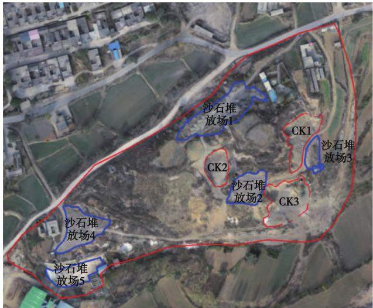  
图1 1号治理区位置  
Fig. 1 Location of No.1 governance area

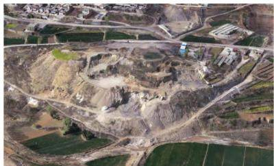  
图2 1号治理区现状  
Fig. 2 Status of No.1 governance area

1号治理区的主要矿山地质环境问题为存在崩塌地质灾害、地形地貌景观破坏和土地资源破坏等。现根据调查成果将治理区存在的各类地质环境问题分述如下。

(1)崩塌地质灾害。治理区前期为露天开采因爆破震动，岩体松动破裂严重，在采场形成的高陡边坡上发育部分危岩体，存在较大的安全隐患，易以崩塌的形式发生失稳。在采场坡角有少量的崩塌堆积体分布。根据勘查，区内采面陡壁发育的危岩体4处，均属小型规模，危岩体主要分布于采面顶部及不规则开采的采面上，在强降水、震动等外在条件的作用下有产生崩塌失稳的可能，如图3所示。

治理区危岩体离周边居民点较近，人类活动较为频繁，会对附近居民有一定危害，在后期治理施工时，人员、设备遭受其危害的可能性较大，需重点加以防范和采取相应的预防措施。

(2)地形地貌景观破坏。无序的采矿活动造成采面高陡，岩面落差大，使山体遭受破坏，采面开采的不规则，危石凌空，浮石、危石块体残留边坡，植物损毁，破坏了原始地形地貌景观。据野外调查，治理区目前破坏山体面积为 $1 1 ~ 8 3 6 . 5 5 ~ \mathrm { m } ^ { 2 }$ 。沙石堆放场上堆放了一些沙石，堆积高度2\~3m，破坏了地形地貌景观。

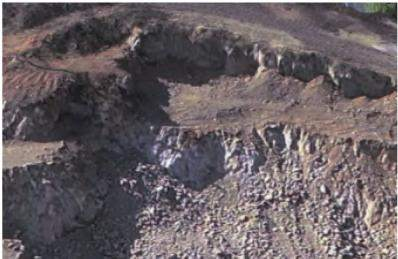

(a) 位置1  
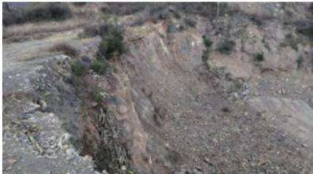  
(b) 位置2

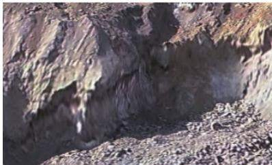  
(c) 位置3  
图3 危岩体现状  
Fig. 3 Status of dangerous rock mass

(3)土地资源破坏。区内土地资源的破坏主要表现为露天采面的挖损与废石压占。由于露天开采，植被和表层土层完全剥离，原始地貌已不复存在，裸露的岩石及堆积的沙石使土地的种植功能几乎完全丧失，需对其进行土地功能恢复。治理区破坏土地资源面积为 $1 1 ~ 8 3 6 . 5 5 ~ \mathrm { m } ^ { 2 }$ 。其中，破坏裸地面积为 $9 \ 7 2 7 . 7 1 \ \mathrm { m } ^ { 2 }$ ,采矿用地2108.84 m²。

1号治理区土地利用现状如图4所示。

## 2.2 2 号治理区

2号治理区由77号和34号2个图斑组成，位于白窑村西南部，治理区紧挨五白线公路，2个图斑呈西北及东南方向分布，治理区分布有4个渣堆和5个采坑，具体位置如图5所示。

## 2.2.1 4 个渣堆

(1)ZD1为一铝土矿废渣堆，位于半坡镇白窑村西段岭东南角，废渣堆面积为 $4 1 ~ 4 5 7 . 5 0 ~ \mathrm { m } ^ { 2 }$ 。该渣堆北部紧邻024乡道，渣堆周边有大量耕地，东部为厂房及耕地，西部为耕地，东西两侧均有运输道路通过，交通便利，如图 $6 ( \mathrm { a } )$ 所示。渣堆高出周边地面为8\~28m,渣堆呈长条状,东西长174.65m,南北宽536.53m，沿着渣堆高出地面部分边缘形成长约325m的边坡，边坡集中在45°\~65°，边坡较为松散，时有碎石和风化较严重的粉土被风吹下，有失稳危险。

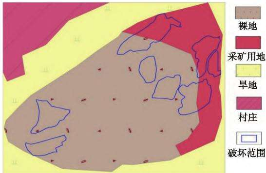  
图4 1号治理区土地利用现状

Fig. 4 Status of land use in No.1 governance area  
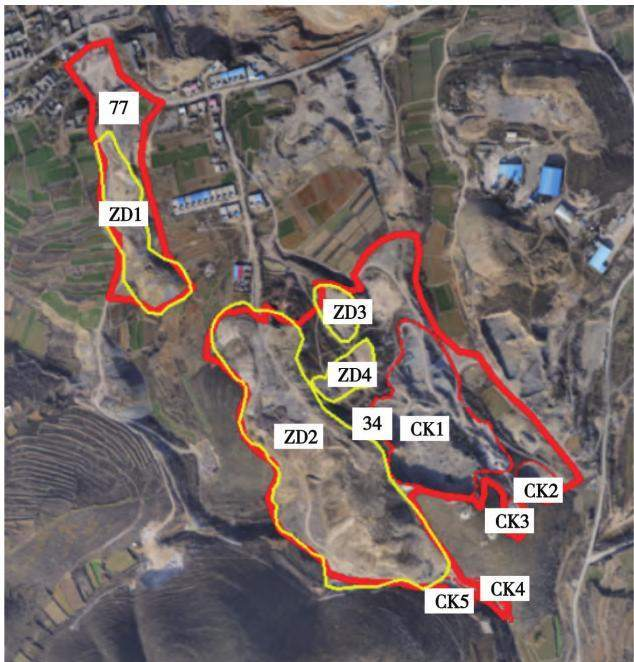  
图 5 2 号治理区位置  
Fig. 5 Location of No. 2 governance area

(2)渣堆ZD2位于治理区西南部，为一废弃铝土矿渣堆。渣堆长363.84 m，宽533.18 m,治理面积为 $1 0 0 \ 8 7 8 . 7 6 \ \mathrm { m } ^ { 2 }$ ，渣堆南、西部沿着渣堆高出地面部分边缘形成不稳定边坡。渣堆东北部高，西南部低，高出周边地面11\~41m，跨度较大，沿着渣堆高出地面部分边缘形成长约800 m的边坡，边坡集中在30°\~35°，边坡较为松散，时有碎石和风化较严重的粉土被风吹下，有失稳危险，如图6(b)所示。

(3)渣堆 ZD3位于ZD2 东北方，该渣堆占地面积较小，近似椭圆形，渣堆顺坡堆放，顶部形成平台。渣堆长80.56m,宽105.72 m,面积为 $5 ~ 9 1 0 . 5 5 ~ \mathrm { m } ^ { 2 }$ 渣堆南、东部沿着渣堆高出地面部分边缘形成不稳定边坡。渣堆东北部高，西南部低，高出周边地面约15 m,沿着渣堆高出地面部分边缘形成长105 m的边坡，边坡集中在30°\~40°。

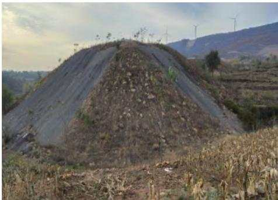  
(a) ZD1现状

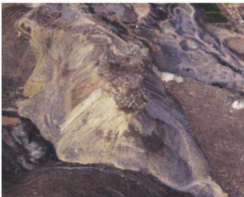  
(b) ZD2现状  
图 6 ZD1 现状和 ZD2 现状  
Fig. 6 Status of ZD1 and ZD2

(4)渣堆ZD4 位于ZD2 东部，CK1西北部，该渣堆占地面积较小，近似椭圆形，渣堆顺坡堆放，顶部形成两级平台。渣堆长119.96m,宽15.79m，面积为7215.12m²。一级平台渣堆南、东部顺坡堆放，形成约113m的边坡，边坡坡度集中在35°\~45°，二级平台高出一级平台形成长约87m的边坡，边坡集中在35°\~40°。

## 2.2.2 5 个采坑

(1)采坑CK1位于治理区中南部，为一灰岩采坑，近似椭圆形。CK1采坑由采坑边坡和坑底平台组成，占地面积24502.27m2,采坑长246m,宽124m,高约28m,坡角35°\~90°,坡面损毁较为严重，裂隙分布较广，可见较多崩塌隐患体，坡脚处可见大量崩塌体沿坡脚散乱分布。

(2)采坑CK2位于治理区西北部，为一灰岩采坑，近似椭圆形。CK2采坑由采坑边坡和坑底平台组成，占地面积 $2 \ 3 1 9 . 6 7 \ \mathrm { m } ^ { 2 }$ ,采坑长56 m,宽52 m，高约16 m,坡角 $6 5 ^ { \circ } \sim 9 0 ^ { \circ }$ ,坡面损毁较为严重，裂隙分布较广，可见较多崩塌隐患体，坡脚处可见大量崩塌体沿坡脚散乱分布(图7(a))。

(3)采坑CK3位于治理区东北部，为一灰岩采坑，近似圆形。采坑由采坑边坡和坑底平台组成，占地面积 $1 \ 8 3 4 . 0 4 \ \mathrm { m } ^ { 2 }$ ,采坑长44m,宽41m,高约10m,坡角 $7 0 ^ { \circ } \sim 9 0 ^ { \circ }$ ，坡面损毁较严重，裂隙分布较广，可见较多崩塌隐患体，坡脚及坑底平台处可见大量崩塌体沿坡脚散乱分布(图7(b))。

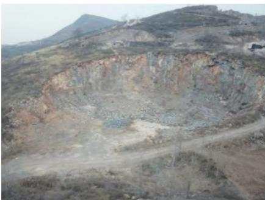  
(a)CK2现状

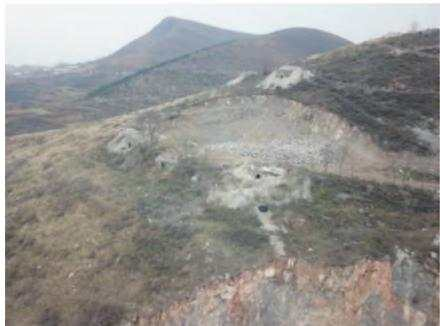  
(b) CK3现状  
图 7 CK2 现状和 CK3 现状  
Fig. 7 CK2 status and CK3 status

(4)采坑CK4位于治理区东部，为一灰岩采坑，近似圆形。CK4采坑由采坑边坡和坑底平台组成，占地面积 $4 ~ 4 6 8 . 2 1 ~ \mathrm { m } ^ { 2 }$ ,采坑长85 m,宽69 m,高约26 m,坡角 $7 0 ^ { \circ } \sim 9 0 ^ { \circ }$ ,坡面损毁较严重，裂隙分布较广，可见崩塌隐患体，坡脚及坑底平台处可见大量崩塌体沿坡脚散乱分布。

(5)采坑CK5位于治理区南部，为一灰岩采坑，近似椭圆形。CK5采坑由采坑边坡和坑底平台组成，占地面积为 $1 ~ 4 0 6 . 4 2 ~ \mathrm { m } ^ { 2 }$ ,采坑长70 m,宽31m，高约13 m,坡角 $7 0 ^ { \circ } \sim 9 0 ^ { \circ }$ ,坡面损毁较为严重，裂隙分布较广，可见崩塌隐患体，坡脚处可见崩塌体沿坡脚散乱分布。

## 2.2.3 矿山地质环境问题

2号治理区的主要矿山地质环境问题有：存在崩塌和不稳定边坡地质灾害、地形地貌景观破坏和土地资源破坏等。现根据调查成果将治理区存在的各类地质环境问题分述如下。

(1)崩塌地质灾害。治理区前期为露天开采因爆破震动，岩体松动破裂严重，在采场形成的高陡边坡上发育部分危岩体，存在较大的安全隐患，易以崩塌的形式发生失稳。在采场坡角有少量的崩塌堆积体分布。根据勘查，区内采面陡壁发育的危岩体9处，均属小型规模，危岩体主要分布于采面顶部及不规则开采的采面上，在强降水、震动等外在条件的作用下有产生崩塌失稳的可能，如图8所示。2号治理区危岩体离周边居民点较远，无直接危害，在后期治理施工时，人员、设备遭受其危害的可能性较大，需重点加以防范和采取相应的预防措施。

(2)不稳定边坡。渣堆ZD1为采矿废渣无序堆积而成，堆积而成的废渣堆边坡坡度较大，未进行过边坡修整压实,不稳定边坡长约325m，高9\~28m，坡度大多数在 $4 5 ^ { \circ } \sim 6 5 ^ { \circ }$ ,在风力、降雨，人工振动等自然或人为外力作用下可能发生部分边坡失稳，使得渣堆边坡向坡脚滑塌，最大滑塌量为 $7 ~ 8 0 0 ~ \mathrm { m } ^ { 3 }$ 如图9(a)所示。渣堆 ZD2不稳定边坡长约 800 m，高11\~41m,坡度大多数在 $3 5 ^ { \circ } \sim 5 2 ^ { \circ }$ ,最大滑塌量为 $1 3 0 \ 0 0 0 \ \mathrm { m } ^ { 3 }$ ,如图9(b)所示。

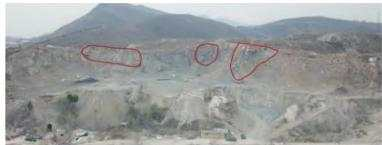  
(a)CK1危岩体

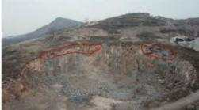

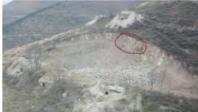  
(c) CK3危岩体

(b) CK2危岩体  
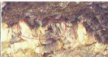  
(d) CK4危岩体

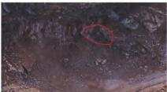  
(e)CK5危岩体  
图8 崩塌地质灾害

Fig. 8 Collapse geological disaster  
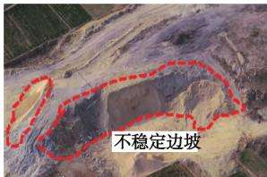  
(a) ZD1边坡

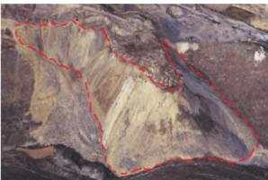  
(b) ZD2边坡  
图9 不稳定边坡  
Fig. 9 Unstable slope

(3)地形地貌景观破坏。无序的采矿活动造成采面高陡，岩面落差大，使山体遭受破坏，采面开采的不规则，危石凌空，浮石、危石块体残留边坡，植物损毁，破坏了原始地形地貌景观。据野外调查，治理区目前破坏山体面积为 $2 1 3 \ 5 8 6 . 9 6 \ \mathrm { m } ^ { 2 }$ 。采矿剥离的废渣顺坡堆放，堆积高度4\~41m，对地形地貌景观破坏较为严重。

(4)土地资源破坏。2号治理区土地利用现状如图10所示。

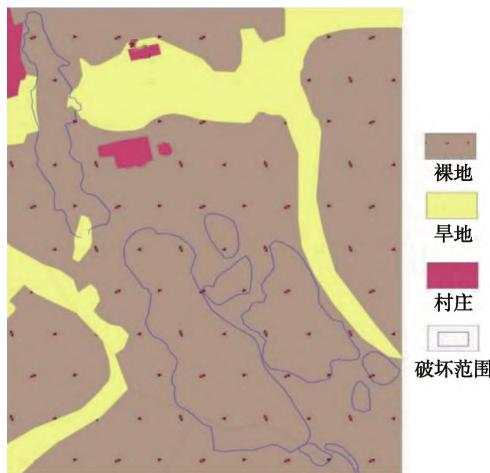  
图 10 2 号治理区土地利用现状  
Fig. 10 Current situation of land use in No.2 treatment area

治理区内土地资源的破坏主要表现为露天采面的挖损与废石压占。由于露天开采，植被和表层土层完全剥离，原始地貌已不复存在，裸露的岩石及堆积的废渣使土地的种植功能几乎完全丧失，需对其进行土地功能恢复。治理区破坏土地资源面积为$2 1 3 \ 5 8 6 . 9 6 \ \mathrm { m } ^ { 2 }$ ,其中旱地面积为 $2 ~ 8 6 9 . 1 8 ~ \mathrm { m } ^ { 2 }$ ,裸地面积为 $2 1 0 \ 7 1 8 . 7 8 \ \mathrm { m } ^ { 2 }$ O

## 3 矿山环境回复治理技术

## 3.1 1号治理区分项设计

(1)拆除工程。治理区有遗留简易房和设备，采用机械拆除，并外运。具体工程量为 $1 1 0 \mathrm { ~ m } ^ { 2 }$

(2)危岩清理工程。矿山开采后形成高陡边坡，发育多组陡倾节理、裂隙。由于表层风化强烈和开采的震动破坏作用，边坡表层坡面分割为块裂一碎裂状。在雨水淋滤、震动、风化作用等条件下坡体可能失稳，存在崩塌灾害隐患，需及时清理。危岩清理的原则：危岩体进行清除并兼顾治理周围的坡面，使坡面平整顺直。设计清危岩工程量为159.22$\mathrm { m } ^ { 3 } .$ 。清理危岩产生渣石回填采坑进行场地平整。

(3)坑底整平及边坡修整工程。治理区内共有3个采坑和5个沙石堆放场，根据地形地貌，将采坑与沙石堆放场内的渣堆和碎石原地整平，共设计整平9个平台，场地平整面积10 079.12m²。

(4)覆土工程。对平整后的平台外购客土后整平，达到其他草地标准，恢复其生态功能。客土压覆的目的主要是为了平整场地，优化植物生长基质和生长环境，为绿化工程做准备。平台全面覆渣覆土，草地覆土0.2m,调查统计，覆土面积共10 079.12$\mathbf { m } ^ { 2 }$ ,调运土方 $2 \ 0 1 5 . \ 8 2 \ \mathrm { ~ m ~ } ^ { 3 }$ ,外购客土运距小于10km。地表整形使用机械整理与人工整理相结合的作业方式。

(5)绿化工程。根据治理区现场地形、植被及对当地居民走访调查，植被恢复工程选用榆树、栎树和爬山虎。在其他草地区域播撒狗尾巴草草籽和树籽，播撒量为：草籽 $1 0 ~ \mathrm { k g } / \mathrm { h m } ^ { 2 }$ ,树籽 $1 0 ~ \mathrm { k g } / \mathrm { h m } ^ { 2 }$ ,播撒面积 $1 0 \ 0 7 9 . \ 1 2 \ \mathrm { m } ^ { 2 }$ 。在斜坡旁种植爬山虎，长度824.75m,播撒量0.5m/株,共需爬山虎1649株。

(6)养护工程。养护期为3a,养护用水从就近村庄购买。浇水次数：种植后第1个月，头3天每天1次，第4—9天每3天1次，第10—30天,每10天1次，共7次，先保证成活；第2—4个月，每月1次。总计10次。用水量：爬山虎每次15kg。共需用水247.35t。

## 3.2 2号治理区分项设计

(1)拆除工程。治理区有遗留砖房和设备，采用机械拆除，并外运。具体工作量为 $6 2 9 \mathrm { ~ m } ^ { 2 }$ O

(2)危岩清理工程。矿山开采后形成高陡边坡，发育多组陡倾节理、裂隙。由于表层风化强烈和开采的震动破坏作用，边坡表层坡面分割为块裂一碎裂状。在雨水淋滤、震动、风化作用等条件下坡体可能失稳，存在崩塌灾害隐患，需及时清理。危岩清理的原则：危岩体进行清除并兼顾治理周围的坡面，使坡面平整顺直。设计清危岩工程量为2703.00$\mathbf { m } ^ { 3 }$ 。危岩清理所得渣石用于回填采坑。

(3)坑底整平及边坡修整工程。治理区内共有5个采坑和4个渣堆，根据地形地貌，对采坑坑底进行整平，斜坡堆积的石渣进行清理，共设计整平18个平台，3个斜坡。设计场地平整面积54019.26$\mathbf { m } ^ { 2 }$ ,设计挖方工程量 $1 0 6 ~ 7 1 6 . 9 0 ~ \mathrm { m } ^ { 3 }$ ,其中原地清渣回填47 $8 5 8 . 0 0 ~ \mathrm { m } ^ { 3 }$ ，回填采坑 $5 8 ~ 8 5 8 . 9 0 ~ \mathrm { m } ^ { 3 }$ 0

(4)覆土工程。对平整后的平台及斜坡外购客土后整平，达到其他草地、旱地标准，恢复其生态功能。客土压覆主是为了平整场地，优化植物生长基质和生长环境，为绿化工程和农作物种植做准备。

平台及斜坡全面覆土，旱地区域覆土0.8m，其他草地覆土0.2 m，调查统计，覆土面积共145376.28$\mathbf { m } ^ { 2 }$ ,调运土方43432.98 m³,外购客土运距小于10km。地表整形使用机械整理与人工整理相结合的作业方式。

(5)绿化工程。根据治理区现场地形、植被及对当地居民走访调查，植被恢复工程选用榆树、栎树和爬山虎。在其他草地区域播撒狗尾巴草草籽和树籽，播撒量为：草籽 $1 0 ~ \mathrm { k g } / \mathrm { h m } ^ { 2 }$ ,树籽 $1 0 ~ \mathrm { k g } / \mathrm { h m } ^ { 2 }$ ,播撒面积 $1 2 1 ~ 4 4 6 . 7 5 ~ \mathrm { m } ^ { 2 }$ 。在斜坡旁种植爬山虎，长度4485.34 m,播撒量0.5m/株，共需爬山虎8 971株。

(6)养护工程。养护期为3年，养护用水从就近村庄购买。浇水次数：种植后第1个月，头3天每天1次，第4—9天每3天1次；第10—30天，每10天1次，共7次，先保证成活；第2—4个月，每月1次。总计10次。用水量：爬山虎每次15kg。共需用水 1 345.65 m³。

(7)渣石平衡分析。①分项工程渣石量分析。危岩清理产生石方 $2 ~ 7 0 3 . 0 ~ \mathrm { m } ^ { 3 }$ ,用于回填采坑;坑底整平及边坡修整设计挖方工程量为106716.9m³，填方109419.9m³，均为渣石。②渣石量平衡分析。治理区内各分项工程开挖使用剩余渣、石量计算结果见表4。

表4 渣、石平衡分析  
Tab. 4 Analysis of slag and stone balance
<table><tr><td>名称 类型危岩清理</td><td> $/ \mathrm { m } ^ { 3 }$ </td><td>坑底整平与边坡修整  $/ \mathrm { m } ^ { 3 }$ </td><td>小计</td></tr><tr><td rowspan="2">挖方量</td><td>石方 2 703.0</td><td>0.0</td><td>2 703.0</td></tr><tr><td>渣量 0.0</td><td>106716.9</td><td>106 716.9</td></tr><tr><td rowspan="2">使用量</td><td>石方 0.0</td><td>2 703.0</td><td>2 703.0</td></tr><tr><td>渣量 0.0</td><td>106 716.9</td><td>106716.9</td></tr><tr><td rowspan="2">剩余量</td><td>石方 2 703.0</td><td>-2 703.0</td><td>0.0</td></tr><tr><td>渣量 0.0</td><td>0.0</td><td>0.0</td></tr></table>

## 4 经济效益

治理项目实施后，可修复被破坏的地形地貌景观，可完成造林1. $8 6 \ \mathrm { h m } ^ { 2 } .$ 。按照《森林河南生态建设规划(2018—2027年)》的统计数据，每亩林地涵养水源142.8 t,固土2.81 t,减少土壤肥力损失119kg，固定二氧化碳281 kg,释放氧气1 365160 kg，增加土壤氮、磷、钾营养物质4.8kg，吸收二氧化硫、氟化物、氮氧化物及滞尘912kg，森林生态服务价值为2750元。项目实施后可涵养水源3986.976t,固土

78.455 2 t,减少土壤肥力损失 3 322.48 kg,固定二氧化碳 7 845.52 kg,释放氧气 38 115 267.2 kg,增加土壤氮、磷、钾营养物质134.016kg，吸收二氧化硫、氟化物、氮氧化物及滞尘25463.04 kg，森林生态服务价值76780元。项目新增耕地 $3 0 . 6 6 \ \mathrm { h m } ^ { 2 }$ 小麦按亩产小麦800斤、每斤小麦1元算，理论上的总收入应在800元/亩，物力投入大致在700元/亩，纯利润在100元/亩。玉米价格约1.05 元/500 g。如果按亩产1200斤计算的话，毛收入就是1260元/亩，物力投入大致在440元/亩，纯收入为820元/亩。一年水浇地种两茬，年收入约为920元/亩，536.31亩耕地年纯收入约为423154元。项目实施后，可为半坡镇周边每年提供至少可靠的经济来源423154元。同时，该矿山环境恢复治理工程的实施，增加治理区农民就业岗位，推动了地方经济的发展，经济效益显著。该环境恢复治理工程的实施综合效益显著。

## 5 结语

洛阳香江万基铝业有限公司伊川郭沟铝土矿矿山环境恢复治理工程主要分项工程有危岩清理工程、坑底整平及边坡修整工程、覆土工程、截排水沟工程、绿化工程、养护工程。矿山环境恢复治理工程属公益性、社会性项目，其价值具有间接性、潜在性和长久性的特点，具有明显的社会效益、环境效益、经济效益。

## 参考文献(References)：

[1] 张小连，张文炤，武成周，等.矿山地质环境治理工程技术[J]. 能源与环保,2020,42(10):1-6. Zhang Xiaolian , Zhang Wenzhao, Wu Chengzhou , et al. Mine geological environment treatment engineering technology [ J]. China Energy and Environmental Protection ,2020 ,42(10) :1-6.

[2] 任克雄，刘园福，陈骏峰，等.宜昌磷矿樟村坪矿区矿山地质环 境管理工作探讨[J].资源环境与工程,2018,32(3):398-402. Ren Kexiong, Liu Yuanfu , Chen Junfeng, et al. Discussion on mine geological environment management of Zhangcunping Mining Area in Yichang Phosphorite Deposits [ J ]. Resources Environment & Engineering,2018,32(3):398-402.

[3] 贾晗，刘军省，殷显阳，等.安徽铜陵硫铁矿集中开采区矿山地 质环境评价研究[J].地学前缘,2021,28(4):131-141. Jia Han , Liu Junxing, Yin Xianyang, et al. Study on mine geological environment evaluation of Tongling pyrite concentrated mining area in Anhui Province[ J]. Earth Science Frontiers ,2021 ,28(4) :131- 141.

[4] 孙厚云，吴丁丁，毛启贵，等.基于遥感解译与模糊数学的矿山

地质环境综合评价—以戈壁荒漠区某有色金属矿山为例[J]. 矿产勘查,2019,10(3):681-688. Sun Houyun , Wu Dingding, Mao Qigui , et al. Comprehensive evaluation of mine geological environment based on remote sensing interpretation and fuzzy mathematics : taking a nonferrous metal mine in gobi desert area as an example[ J]. Mineral Exploration ,2019 ,10 (3):681-688.

[5] 原振雷，肖荣阁，李明立，等.矿产资源开发区生态环境问题及 其防治[J].矿产保护与利用,2005(1):40-44. Yuan Zhenlei , Xiao Rongge , Li Mingli , et al. Ecological and environmental problems in mineral resource development zones and their prevention and control[ J]. Mineral Resources Protection and Utilization ,2005(1):40-44.

[6] 刘勇，王浩霖，李静静，等.巩义市历史遗留露天矿山地质环境 问题现状及治理对策[J]. 能源与环保.2021.43(4):15-22. Liu Yong, Wang Haolin , Li Jingjing, et al. Research on status quo of geological environmental problems of historic open-pit mines in Gongyi City and countermeasures[ J]. China Energy and Environ-

## (上接第78页)

[3] 赵芝法.浅析胶州市矿山地质环境综合治理现状[J].中国矿 业,2021,30(S2):117-119. Zhao Zhifa. Brief Analysis on the current situation of comprehensive management of mine geological environment in Jiaozhou City [J]. China Mining Magazine ,2021,30(S2) :117-119.

[4] 彭建阳，崔朋涛，朱文慧，等.山西省大同塔山煤矿地质环境问 题与治理对策研究[J].能源与环保,2022,44(2):13-17,23. Peng Jianyang, Cui Pengtao, Zhu Wenhui, et al. Research on geological environment problems and treatment countermeasures of Tashan Coal Mine in Datong, Shanxi Province[ J]. China Energy and Environmental Protection,2022,44(2) :13-17,23.

[5] 李凤明，丁鑫品，白国良，等.高原高寒露井联合矿区生态地质 环境综合治理模式[J].煤炭学报,2021,46(12):4033-4044. Li Fengming, Ding Xinpin, Bai Guoliang, et al. Comprehensive management model of ecological geological environment in plateau alpine open pit combined mining area [ J]. Journal of China Coal Society,2021,46(12):4033-4044.

6] 李超，樊子玉.灵丘县国营露天砂金矿矿山地质环境问题及治 理对策[J].能源与环保,2022,44(2):24-28,34. Li Chao, Fan Ziyu. Geological environment problems and control countermeasures of state-owned open-pit placer gold mine in Lingqiu County[ J]. China Energy and Environmental Protection,

mental Protection ,2021 ,43(4) :15-22.

[7] 张昊，张强，左小，等.生态环境保护性的采选充系统设计及应 用[J]. 中国矿业大学学报,2021,50(3):548-557. Zhang Hao , Zhang Qiang , Zuo Xiao , et al. Design and application of mining-separating-backfilling system for mining ecological and environmental protection[ J] . Journal of China University of Mining & Technology ,2021 ,50 (3) :548-557.

[8] 周亚光.玉皇全采石场建筑石料用灰岩矿矿山地质环境治理 工程设计[J].能源与环保,2020,42(9):45-49. Zhou Yaguang. Design of mine geological environment treatment engineering design for limestone mines used for building stones in Yuhuang Quan Quarry[J]. China Energy and Environmental Protection ,2020,42(9) :45-49.

[9] 武乐霞.矿山地质环境治理工程技术研究[J]. 能源与环保， 2020,42(4):46-51. Wu Yuexia. Study on engineering technology of mine geological environment control [ J]. China Energy and Environmental Protection ,2020,42(4) :46-51.

2022,44(2):24-28,34.

[7] 王丽伟，阎昆，杨延伟.河南报庄铝土矿矿山环境地质问题及 治理措施研究[J]. 中国锰业,2021,39(4):43-46. Wang Liwei, Yan Kun, Yang Yanwei. Research on environmental geological problems and control measures of Baozhuang bauxite mine in Henan[ J]. China Manganese Industry,2021,39 (4) :43- 46.

[8] 王让，崔朋涛，尚佳楠.滦平县宝财铁矿地质环境评估及恢复 治理研究[J].能源与环保,2022,44(2):35-40,46. Wang Rang, Cui Pengtao , Shang Jianan. Research on geological environment assessment and environmental restoration in Baocai Iron Mine , Luanping County[ J]. China Energy and Environmental Protection ,2022 ,44(2) :35-40 ,46.

[9] 李晨夕，陈静.露天矿山地质环境恢复与综合治理的探讨[J]. 低碳世界,2019,9(9):156-157. Li Chenxi, Chen Jing. Discussion on restoration and comprehensive treatment of geological environment of open-pit mine[ J] . Low Carbon World,2019,9(9) :156-157.

[10] 姚杰.露天石材矿山地质环境影响及生态恢复研究[J].能源 与环保,2022,44(2):47-53. Yao Jie. Study on geological environment influence and ecological restoration of open-pit stone mine[ J]. China Energy and Environmental Protection ,2022,44(2) :47-53.