# 废弃露天矿山生态修复治理现状及发展趋势研究

魏中凯(河南省地质矿产勘查开发局第四地质勘查院，河南郑州 450000)

摘要：为了研究废弃露天矿山生态修复治理现状及发展趋势，以郑州市矿区为例，结合无人机遥感调查、野外实地调查等技术，明确了研究区域生态修复治理现状，即当前矿山土地资源破坏总面积约为19105 000 m²，仅有9%的土地资源完成了生态修复。经过治理的矿区土壤有机质含量为6.6g/kg，植被资源覆盖度为25.07%，空气达标率为80%，区地上地下水资源均呈现出匮乏状态。当前矿山生态修复取得了一定效果，但需要进一步完善。根据区域生态修复治理现状，从土地资源、土壤适宜性、水资源分布、植被资源覆盖、水土流失、空气质量等方面出发分析矿山生态修复治理未来发展趋势，以期保障相关生态修复治理工作的顺利进行。

关键词：生态修复；露天矿山；生态治理；发展趋势；水土流失；水资源

中图分类号：TD167

文献标志码：A

文章编号:1003-0506(2023)01-0045-07

# Study on current situation and development trend of ecological restoration and treatment of abandoned open-pit mines

Wei Zhongkai (The Fourth Geological Exploration Bureau of Henan Province , Zhengzhou 450000 , China)

Abstract: In order to study the abandoned open-pit mine ecological restoration management status and development trend , taking the mining area of Zhengzhou as an example , combined with UAV remote sensing survey , field investigation technology , clear research area ecological restoration management status , namely the current mining land resources damage a total area of about 19 105 000 m² , only 9% of the land resources completed the ecological restoration. The average soil organic matter content in the treated mining area is 6.6 g/kg, the coverage of vegetation resources is 25.07% ,the air standard rate is 80% , and the aboveground groundwater resources in the area are scarce. At present , the mine ecological restoration has achieved some results , but it needs further improvement. According to the current situation of regional ecological restoration and management , the future development trend of mine ecological restoration and management is analyzed from the aspects of land resources , soil suitability , water resources distribution , vegetation resources coverage , soil erosion and air quality , in order to ensure the smooth progress of relevant ecological restoration and management work.

Keywords: ecological restoration;open-pit mine;ecological governance; development trend; soil erosion; water resources

露天矿山的开采对区域生态环境造成了直接破坏，使得土地资源、水资源、地形地貌等多方面出现了一定的问题1]，倘若放任这些问题继续发展，会阻碍矿山所在区域的社会经济发展，而随着社会经济发展模式的优化，推动了废弃露天矿山生态修复治理工作的开展[2]。通过深入研究矿山的生态修复与生态恢复等定义，可以发现生态修复的内涵远远超过了生态恢复和土地复垦所呈现的内容3]。尤其是多种矿山生态修复模式，在实践后所呈现出来的治理效果差异较大4]。如何对矿山生态修复治理现状进行研究，并针对当前治理情况提出研究生态治理趋势，是一项值得研究的内容。

目前，对于矿山生态修复治理现状和发展趋势的研究，大部分以高分辨率无人机遥感技术为核心[5]，辅以传统地质调查模式。以矿区生态治理导向为要求，明确应用传统生态修复模式应用后矿区依旧存在的生态问题，并将其划分为不同的生态环境问题类型6]。采用物理、化学、生物等多种方式分析矿区生态修复现状，再结合区域实际环境，设计生态治理植物配置原则7]，并对生态治理未来发展趋势进行研究。参考上述传统研究方法，文中针对废弃露天矿山生态修复治理问题进行研究，主要将郑州市的矿区作为研究区域，应用无人机遥感和实地调查相结合的方式明确该区域生态修复治理现状，并以此为基础研究未来生态治理发展趋势8]。

## 1 研究区概况

此次选定位于河南省郑州市的矿区为研究区域，进行废弃露天矿山生态修复治理现状及发展趋势研究。该矿区属于山地，西侧一处标高+850m的山坡为最高山坡，而矿区内最低山坡标高为+320m。最高山坡的东向坡面形成多个沟谷，且山坡主要植被是杂草和灌木，表层基岩裸露问题严重。研究矿区区位于小秦岭一嵩山东西向构造带东端的北侧，华北沉降带的西缘。地层走向北 $7 0 ^ { \circ } \sim 8 0 ^ { \circ }$ 西，倾向北东，倾角10°\~15°。断裂构造以东西向、北西向正断层为主，且多隐伏于第四纪松散堆积物之下，仅在西南丘陵岗地有所出露，出露地层为奥陶系中统马家沟组 $\left( \mathbf { 0 } _ { 2 } \mathbf { m } \right)$ 和磁县组 $\left( \mathbf { 0 } _ { 2 } \mathbf { c } \right)$ 灰岩、白云质灰岩以及第四系砂砾石层和残坡积层(Q)[9]。研究区域内的岩层呈现出闭合状态，且表层3cm以内的岩石普遍存在无规律的发育风化裂隙10]。该区域的生态环境问题较多，例如露天矿山开采引起的地形地貌破坏，造成高陡边坡问题的同时，引发了山体开裂、泥石流等多项安全问题，间接导致了水土流失、植被破坏等生态问题。

此外，矿区的开采方式为露天斜坡式，在矿石资源开采结束后，废弃露天矿山依旧遏制了当地环境质量提升，并引起了土地资源的巨大浪费。为了促进该区域经济发展，对该矿区进行生态修复治理是一项势在必行的工作。

## 2 研究内容与方法

## 2.1 研究内容

通过调查可知，郑州市的矿区在开采结束后，近年来已经开始采用多种生态修复技术，开展废弃露天矿山生态治理工作。文中针对该矿区的治理现状及发展趋势进行研究，需要收集矿山生态治理相关的文献资料和背景资料，再应用无人机航拍、实地勘察等技术[11]，获取矿区生态环境数据，明确生态修复治理现状12]。在现状调查结束后分析依旧存在的生态环境问题，提出生态修复治理下一步发展趋势，具体的研究路线和内容如图1所示。

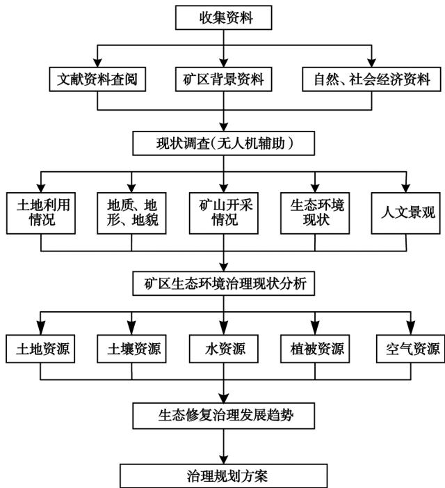  
图1 研究内容路线  
Fig. 1 Research content roadmap

结合无人机航拍与实地踏勘2种调查手段，获取研究区地形、植被覆盖情况、水资源状态等生态信息。再运用ArcGIS地理信息系统对采集的数据和图像进行处理13]，提取出与矿山生态修复治理现状研究相关的信息，全面掌握研究区的环境状态。

## 2.2 研究方法

无人机遥感信息采集，是废弃露天矿山生态修复治理现状研究的主要技术。此次研究采用中海达专业航拍无人机，采集矿区的整体航拍影像，并通过Pix4D软件提升航拍图像的精度，得到包含坐标信息的正射影像图14]。而后，对于矿区内排土场等关键区域，采用大疆精灵4P小型无人机，获取近距离航拍图像，如图2(a)所示，明确局部区域的生态环境现状。运用无人机航拍技术，获取矿区空间信息，为后期的生态环境现状分析提供基础。

矿区实地勘察是研究区域生态修复治理现状的另一种关键技术，依托于事先采集的文献资料和航拍影像，明确矿山的基本情况。与矿山周围居民进行沟通，进入矿山内容进行考察15]，获取矿区外排土场坡长、开采方式、地表工程设施等相关数据信息。为了掌握矿区内基本生态修复现状，在矿区的排土场坡面采集表层土壤，如图2(b)所示，作为土壤养分测定的样本。除此之外，通过实地考察还可以得到矿区水土流失情况、水资源状态等生态环境信息，如图2(c)和图2(d)所示。

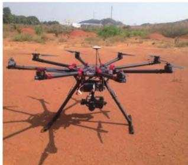  
(a) 无人机

  
(b)采集表层土壤

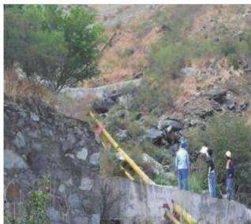  
(c) 水土流失情况

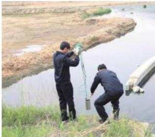  
(d) 水资源状态  
图2 无人机航拍与野外调查示意  
Fig. 2 Schematic diagram of UAV aerial photography and field investigation

采用ArcGIS 地理信息系统16]，对航拍图像和实地调查结果进行叠加处理[17]，按照1:1000的比例尺，绘制包含土地利用现状、地表水系分布等基础资料的矿区生态研究影像图。

## 3 矿山生态修复治理现状分析

考虑到矿山生态修复治理是一项复杂的工作，为了全面获取研究区治理现状，文中从土地资源、土壤适宜性、水资源分布、植被资源覆盖18]、水土流失、空气质量6个角度分析矿山生态修复治理现状。

## 3.1 土地资源现状分析

郑州市矿区的开采使得区域土地资源储量大幅度下降，生态问题频发，尤其是废弃矿区内的采矿区、排土场，都是引发生态问题的主要源头。通过深入了解可知，该区域最初由多家小型石子厂构成，这些小型工厂对于矿产资源的开采没有合理的规划，几年下来直接造成了山体损伤。同时矿区南部临近民采区、振兴石料厂采区，使得矿山采区连成一片，每个采区的开采技术不同，造成整个矿区开采结束后土地资源得到严重破坏。以矿区边坡为例，治理前土地状态如图3(a)所示。为了修复该区域生态环境，近年来采用传统的地灾治理+景观绿化的形式对矿区的土地资源进行治理，得到图3(b)所示的治理效果。

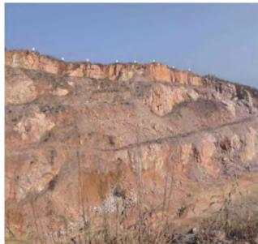  
(a) 治理前

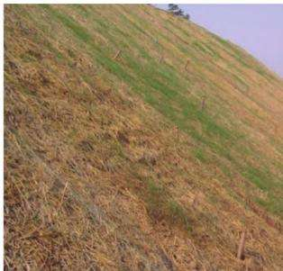  
(b) 治理后  
图3 边坡治理示意  
Fig. 3 Schematic diagram of slope treatment

根据图3显示的边坡治理前后示意图可以看出，经过生态修复治理后，虽然使得被破坏的土地资源向着绿色景观转变，但治理效果不明显。通过对治理后的土地资源形态进行记录，得到统计结果如图4所示。

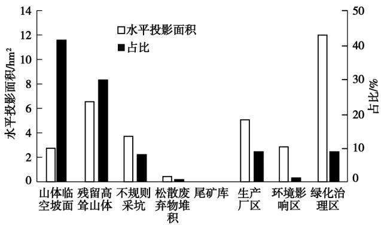  
图4 研究区土地资源破坏形态统计结果  
Fig. 4 Statistical results of land resources destruction patterns in the study area

从图4可以看出，现在该矿区内包含山体临空坡面、残留高耸山体、不规则采坑、松散废弃物堆积等主要破坏形态。其中，山体临空坡面类型的土地资源破坏占比为41%，最急需治理。此外，经过几年来的治理，形成 $\overline { { \Gamma } } ~ 1 2 ~ \mathrm { h m } ^ { 2 }$ 的绿化治理区，仅有9%的土地资源完成了生态修复。

## 3.2 土壤适宜性分析

土壤作为生态系统的重要组成部分，是反映生态修复治理效果的重要指标之一[19]。对于矿区来说，区域内容土壤受到长期风蚀影响极为粗糙。文中为了研究矿区生态修复治理效果，从矿区内不同样点采集土壤，检测土壤内有机质 $\mathrm { \nabla \cdot ^ { p H } }$ 、全氮和全磷含量，并将测定结果见表1。

表1 矿区土壤养分测定结果  
Tab. 1 Determination results of soil nutrients in mining area
<table><tr><td rowspan="2">采样点</td><td colspan="2">全氮/%</td><td colspan="2">全磷/%</td><td colspan="2">有机质/  $\mathrm { ( g \cdot k g ^ { \cdot } }$  1)</td><td colspan="2"> $\mathrm { p H }$  值</td></tr><tr><td>治理前</td><td>治理后</td><td>治理前</td><td>治理后</td><td>治理前</td><td>治理后</td><td>治理前</td><td>治理后</td></tr><tr><td>样点1</td><td>0.020</td><td>0.010</td><td>0.056</td><td>0.030</td><td>0.80</td><td>7.22</td><td>9.4</td><td>6.4</td></tr><tr><td>样点2</td><td>0.015</td><td>0.010</td><td>0.075</td><td>0.040</td><td>0.49</td><td>6.49</td><td>8.2</td><td>7.5</td></tr><tr><td>样点3</td><td>0.050</td><td>0.020</td><td>0.029</td><td>0.010</td><td>0.94</td><td>6.09</td><td>6.6</td><td>5.9</td></tr></table>

为了便于分析矿区生态治理现状，从文献资料中采集治理前的土壤养分信息，与当前测定结果进行对比，更加直观地表现土壤适宜性。根据统一划分的土壤分级标准可知，矿区生态治理前土壤有机质平均含量为0.74g/kg，属于六级养分土壤。生态修复治理后，矿区土壤有机质平均含量为6.6g/kg，土壤内养分含量有所增长，但依旧较低，无法为大部分植被生长提供基础环境。

## 3.3 水资源分布现状分析

通过ArcGIS 软件对无人机航拍图像进行处理，再应用水文分析功能显示研究区内水资源分布现状。通过分析可知，矿区治理后山谷间河道呈现出树枝状分布特点，整体规模较小，且河沟底部包含较少的堆积物，表明区域河道存在严重的冲刷问题。不仅如此，研究区内地表水资源极为匮乏，无常年性的地表水体。

对矿区地下水进行分析可知，露天采场的开采深度为60m，而不同岩石种类中地下水位底板埋深在45\~55m，局部大于 $6 0 \mathrm { ~ m ~ } _ { \mathrm { o } }$ 因此，矿区的资源开采直接破坏了地下含水层结构。而传统的生态修复治理模式没有涉及水资源修复问题，当前研究区内没有良好的生态补给条件，使得大气降水难以渗入地下，地下水资源贫乏[20]。

## 3.4 植被资源覆盖现状分析

受到采矿生产活动的影响，区域内大部分植被资源被占压损毁，造成了植被退化和多样性降低。针对废弃露天矿山进行生态修复治理，矿区内部分区域种植了对生长环境要求较低的灌草，对矿区进行植被覆盖。通过了解可知，治理后矿区植被覆盖情况如图5所示。由图5可以看出，该矿区整体植被覆盖率低，且矿采区、排土场等局部区域的植被恢复效果较差。为了更加直观地表现研究区植被资源覆盖情况，结合航拍遥感采集的多光谱数据，计算归一化植被指数。

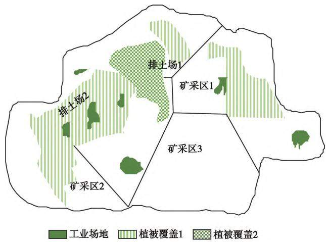  
图5 郑州市矿区植被覆盖  
Fig. 5 Vegetation cover map of Zhengzhou Mining Area

归一化植被指数计算公式为：

$$
N = \frac { \phi - I } { \phi + I } \times 1 0 0 \%\tag{1}
$$

式中， $N$ 为植被覆盖度 ${ \ ; } \phi$ 为近红外波段 $_ { ; I }$ 为红波段。

根据式(1)计算结果可知，矿山经过生态恢复治理后，植被资源覆盖度为13.45%。

## 3.5 水土流失现状分析

水土流失是典型的生态问题，根据矿区野外实地调查结果可知，该区域内风力、水力侵蚀是引起水土流失的主要原因，且研究区内大部分地面呈裸露状态，在遭遇季节性水蚀后，发生水土流失现象。随着几年来生态修复治理工程的推进，针对露天矿山内的排土场等区域进行覆土固化和边坡防护，具体水土流失治理效果如图6所示。

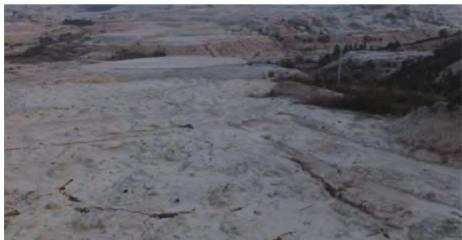

(a) 治理前  
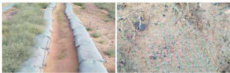  
(b) 治理后  
图6 排土场水土流失治理效果示意  
Fig. 6 Schematic diagram of soil erosion control effect of waste dump

经过长期治理，郑州市的矿区水土流失治理取得一定成果，相比生态修复治理之前，矿区新增水土流失面积统计结果如图7所示。从图7可以看出，矿区治理前每年新增的水土流失面积为 $3 9 8 \mathrm { ~ m } ^ { 2 }$ ，而经过生态修复处理，研究区年增水土流失面积为$1 4 9 \mathrm { ~ m } ^ { 2 }$ 。综上所述，表明废弃露天矿山生态修复后，矿山水土流失年增长面积降低了62.56%，表明了生态修复治理效果良好。

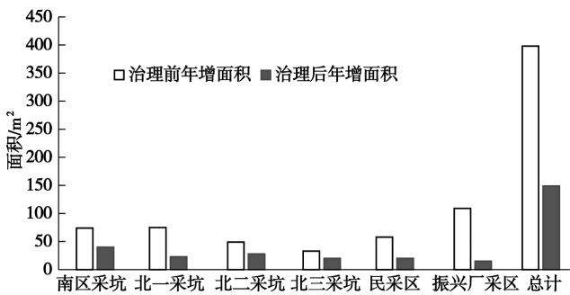  
图7 矿区新增水土流失面积统计结果  
Fig.7 Statistical results of newly increased water and soil loss area in the mining area  
表2 矿区空气质量检测结果  
Tab. 2 Test results of air quality

## 3.6 空气质量分析

露天矿区造成的空气污染是短期的，根据调查资料可知，郑州市开采结束后，经过生态修复治理，$\mathrm { S O } _ { 2 } \ 、 \mathrm { N O } _ { 2 } \ 、 \mathrm { P M } 1 0$ 等指标大部分都低于达标限值，具体检测结果见表2。

从表2可以看出，对生态修复处理后的矿区空气质量进行检测，除了PM2.5高出达标限值5.66$\mu \mathrm { g } / \mathrm { m } ^ { 3 }$ 外，其余项目均达到了优良空气评估指标，所以当前矿区空气达标率为84%。

$$
\mu \mathrm { g } / \mathrm { m } ^ { 3 }
$$

<table><tr><td>参数</td><td> $\mathrm { S O } _ { 2 }$ </td><td> ${ \mathrm { N O } } _ { 2 }$ </td><td>PM10</td><td>PM2.5</td><td>CO</td><td> ${ \bf O } _ { 3 }$ </td></tr><tr><td>达标值</td><td>60</td><td>50</td><td>80</td><td>40</td><td>5</td><td>150</td></tr><tr><td>治理后</td><td>45.86</td><td>31.72</td><td>79.78</td><td>45.66</td><td>4.75</td><td>85.45</td></tr></table>

## 4 矿山生态修复未来发展趋势

(1)土地资源。依据矿山生态修复治理现状研究结果可以得出，生态修复未来发展趋势为分区治理、新兴技术融合、低成本植生基材研发以及动态监测技术研究。考虑到矿山的地形地貌和采矿生产活动造成不同的生态环境破坏类型，生态修复过程中可以按照治理空间相似性，将矿区土地资源划分为修复试验区、修复治理区与修复保护区，对每个区域的主要生态环境问题，提出满足不同区域治理要求的修复方案，以此最大程度地提升土地资源利用率的同时，降低土地污染以及植被退化的概率。

(2)土壤适宜性。根据矿区生态修复治理现状分析结果可知，矿区当前被破坏土地资源，只有9%得到良好治理，土壤养分等级从最初的六级提升至五级，土壤有机质含量达到 $6 . 6 ~ \mathrm { g / k g }$ ,但是依旧难以满足大部分植被生长要求。矿区土壤养分较低造成土壤适宜性较差，无法为土壤微生物与植物的生长提供良好环境，阻碍了生态修复工程进度。一般来说，当植物根系分布层中的土壤易溶盐类含量达到0.1%时，植物的生长已经收到损害，达到0.2%时则影响较为明显，达到0.5%时大部分植物就已经不能生长。因此，为了保证植物的正常生长，需要把土壤中的易溶盐类含量控制在0.1%以下。不仅如此，为了保证植物的正常生长，土壤中的 $\mathrm { H C O } _ { 3 }$ 要保持在0.08以下，pH值要保持在 $6 . 5 \sim 7 . 5 , \mathrm { C l } ^ { - }$ 含量在保持在0.05%以下，以这些数据为指导研究低成本植生基材的种植技术。为了减低相关成本，根据土壤微生物与植物的生长要求，配置生长基材，通过人工的方式改变土壤内部微结构，提升矿区土壤样本质量，保证植被的快速生长。

(3)水资源分布。研究区降水入渗条件良好，属于本区地下水系的降水补给区。主要含水层为第四系砂砾石含水层和奥陶系中统岩溶裂隙含水层，地下水接受补给后，呈自西向东、向南运动的径流趋势，水文地质条件较简单。因此，在未来需要结合相关的水资源分布情况调查结果，通过增加水库调蓄能力、开发地下水、跨区域调水、实施生态环境配水以及根据水资源分布构建大供水网络缓解水资源短缺状况，保证灌溉用水的充足性。

(4)植被资源覆盖。考虑到生态修复治理属于一项长期工程，在未来治理过程中动态监测技术的建立是主要发展趋势之一，以实现全区域覆盖监测为目标，结合5G技术、GIS技术等，获取矿区内不同区域的植被资源覆盖情况，根据不同区域的土壤类型，栽种合适的植物，合理利用灌溉用水，应用新兴技术设计新的灌溉养护模式，最大程度地提升植被资源覆盖率。

(5)水土流失。矿区内地表地面径流的不均衡，没有常年性水体，而地下水资源没有得到任何修复，整体水资源贫乏。经过治理，废弃露天矿区的植被覆盖度增长至13.45%，但排土场等均布区域的地貌依旧具有裸露特点。而从水土流失和空气质量的角度，分析生态治理现状可以发现，通过多种水土流失治理措施的实施，矿区水土流失年增长面积降低了62.56%，这方面传统生态修复技术具有较好的应用效果，但未来依旧需要进一步完善。

(6)空气质量现代科技手段的进步，使得多种新兴科技涌现出来。为了保证治理废弃露天矿山生态修复治理效果的提升，未来可以应用新兴技术设计新的空气质量监测体系，对空气质量做出实时监测。不仅如此，还可以融合大数据和人工智能技术，根据矿区天气变化实时改变区域空气湿度，提升矿区空气质量。

## 5 结语

为了提升废弃露天矿山生态修复治理水平，选择河南省郑州市的矿区为研究区域，通过无人机航拍、实地考察勘测等技术，明确研究区域的生态修复治理效果，并以治理后存在的主要问题为核心，从土地资源、土壤适宜性、水资源分布、植被资源覆盖、水土流失、空气质量等方面出发分析矿山生态修复治理未来发展趋势，以期推进废弃露天矿山生态修复治理工作的深入贯彻落实，改善矿区生态环境质量。但是由于研究时间的限制，文中提出生态修复治理发展趋势缺少更多的项目支撑，下一步需要重点解决这一问题。

## 参考文献(References):

[1] 李富平，贾淯斐，夏冬，等.石矿迹地生态修复技术研究现状与

发展趋势[J].金属矿山,2021(1):168-184. Li Fuping, Jia Yufei , Xia Dong, et al. Research status and development trend of ecological restoration technology in stone mine slash [J]. Metal Mine ,2021 (1) :168-184.

[2] 李婧，郝育红，孙京敏，等.基于遥感生态指数的城市矿山生态 环境时空变化评价[J].城市发展研究,2021,28(1):17-22. Li Jing, Hao Yuhong, Sun Jingmin , et al. Evaluation of temporal and spatial changes of urban mine ecological environment based on remote sensing ecological index[ J]. Urban Development Research, 2021,28(1):17-22.

[3] 李凤明，丁鑫品，孙家恺.我国采煤沉陷区生态环境现状与治 理技术发展趋势[J].煤矿安全,2021,52(11):232-239. Li Fengming , Ding Xinpin , Sun Jiakai. Present situation of ecological environment and development trend of treatment technology in coal mining subsidence areas in China[ J] Safety in Coal Mines, 2021,52(11):232-239.

[4]倪庆琳，侯湖平，丁忠义，等.基于生态安全格局识别的国土空 间生态修复分区——以徐州市贾汪区为例[J]. 自然资源学 报,2020,35(1):204-216. Ni Qinglin , Hou Huping, Ding Zhongyi , et al. Land space ecological restoration zoning based on ecological security pattern identification : a case study of Jiawang District, Xuzhou City [ J]. Journal of Natural Resources ,2020 ,35 (1) :204-216.

[5] 周连碧，王琼，杨越晴.典型金属矿区污染土壤生态修复研究 与实践进展[J]. 有色金属(冶炼部分),2021(3):10-18. Zhou Lianbi, Wang Qiong, Yang Yueqing. Research and practice progress of ecological remediation of contaminated soil in typical metal mining areas [ J]. Nonferrous Metals (Smelting Part) , 2021 (3):10-18.

[6] 王佟，杜斌，李聪聪，等.高原高寒煤矿区生态环境修复治理模 式与关键技术[J].煤炭学报,2021,46(1):230-244. Wang Tong, Du Bin, Li Congcong, et al. Ecological environment restoration and treatment model and key technology in Plateau and alpine coal mining area[ J]. Journal of China Coal Society ,2021 , 46(1):230-244.

[7] 王娜，田磊，文可戈，等.基于遥感技术的矿山生态修复调查研 究——以冀东铁矿为例[J].金属矿山,2021(10):192-198. Wang Na , Tian Lei , Wen Kege , et al. Investigation and Research on mine ecological restoration based on remote sensing technology: taking Jidong iron mine as an example [ J]. Metal Mine, 2021 (10):192-198.

[8] 李聪聪，王佟，王辉，等.木里煤田聚乎更矿区生态环境修复监 测技术与方法[J].煤炭学报,2021,46(5):1451-1462. Li Congcong, Wang Tong, Wang Hui , et al. Monitoring technology and method of ecological environment restoration in Juhugeng mining area of Muli Coalfield [ J]. Journal of China Coal Society, 2021,46(5):1451-1462.

9] 杨金中，许文佳，姚维岭，等.全国采矿损毁土地分布与治理状 况及存在问题[J].地学前缘,2021,28(4):83-89. Yang Jinzhong, Xu Wenjia, Yao Weiling, et al. Distribution , treatment and existing problems of mining damaged land in China[ J].

Earth Science Frontiers,2021 ,28(4) :83-89.

[10]卞正富，于昊辰，雷少刚，等.黄河流域煤炭资源开发战略研判 与生态修复策略思考[J].煤炭学报,2021,46(5):1378-1391. Bian Zhengfu , Yu Haochen , Lei Shaogang, et al. Study and judgment of coal resources development strategy and ecological restoration strategy in the Yellow River Basin[ J]. Journal of China Coal Society,2021,46(5):1378-1391.

[11]姜月华，倪化勇，周权平，等.长江经济带生态修复示范关键技 术及其应用[J].中国地质,2021,48(5):1305-1333. Jiang Yuehua , Ni Huayong, Zhou Quanping, et al. Key technologies and application of ecological restoration demonstration in the Yangtze River economic belt [ J]. Geology of China, 2021 , 48 (5) : 1305-1333.

12] 王红梅.基于层次分析法的煤矿矿山生态环境评价定量模型 研究[J].中国矿业,2020,29(7):70-75. Wang Hongmei. Study on quantitative model of coal mine ecological environment evaluation based on analytic hierarchy process [J]. China Mining Magazine ,2020 ,29(7) :70-75.

[13]韦宝玺,孙晓玲.矿山生态修复的利益相关者分析及共同参与 建议[J]. 中国矿业,2020,29(8):47-54. Wei Baoxi , Sun Xiaoling. Stakeholder analysis and joint participation suggestions for mine ecological restoration [ J]. China Mining Magazine,2020,29(8) :47-54.

[14]陈飞,尹炳,沈强，等.基于Citespace的矿业废弃地复垦与生态 修复研究热点和趋势分析[J]. 西南农业学报,2020,33(8)： 1806-1815. Chen Fei , Yin Bing, Shen Qiang, et al. Research hotspot and trend analysis of mining wasteland reclamation and ecological restoration based on Citespace [ J]. Southwest China Journal of Agricultural Sciences,2020,33(8) :1806-1815.

[15]蔡海生，陈艺，查东平，等.基于主导功能的国土空间生态修复 分区的原理与方法[J].农业工程学报,2020,36(15):261- 270,325. Cai Haisheng, Chen Yi, Zha Dongping, et al . Principle and method of land space ecological restoration zoning based on dominant function[ J]. Transactions of the Chinese Society of Agricultural Engi-

(上接第44页)

[7] 刘勇，王浩霖，李静静，等.巩义市历史遗留露天矿山地质环境 问题现状及治理对策[J].能源与环保,2021,43(4):15-22. Liu Yong, Wang Haolin , Li Jingjing, et al. Research on status quo of geological environmental problems of historic open-pit mines in Gongyi City and countermeasures[ J]. China Energy and Environmental Protection ,2021,43(4) :15-22.

8] 杨帆，秦福锋，冯英明，等.矿山地质环境影响和土地损毁评估 研究[J].能源与环保,2021,43(4):23-29,36. Yang Fan , Qin Fufeng, Feng Yingming, et al. Research on mine geological environmental impact and land damage assessment [ J]. China Energy and Environmental Protection ,2021,43 (4) :23-29,

neering,2020,36(15):261-270,325.

[16] 张进德，郗富瑞.我国废弃矿山生态修复研究[J].生态学报，2020,40(21):7921-7930.Zhang Jinde, Xi Furui. Study on ecological restoration of aban-doned mines in China[ J]. Acta Ecologica Sinica,2020 ,40 (21) :7921-7930.

[17]张中秋，劳燕玲，胡宝清，等.老少边山穷地区城镇化与国土空 间生态修复耦合协调机制研究[J].农业资源与环境学报， 2020,37(6) :882-893. Zhang Zhongqiu , Lao Yanling, Hu Baoqing , et al. Study on the coupling and coordination mechanism between urbanization and land space ecological restoration in mountainous and poor areas [ J]. Journal of Agricultural Resources and Environment ,2020 ,37(6) : 882-893.

[18]王涛，刘以珍，孔召玉，等.稀土矿山生态修复研究现状与热点——基于 CiteSpace的可视化分析[J]. 稀土,2021,42(6)：134-145.Wang Tao, Liu Yizhen , Kong Zhaoyu , et al. Research status andhotspot of ecological restoration of rare earth mines : visual analysisbased on CiteSpace[ J]. Chinese Rare Earths , 2021 ,42 (6) : 134-145.

[19]李丽，杨金中，陈栋，等.长江经济带江苏段废弃露天矿山分布 与生态修复遥感调查研究[J].水文地质工程地质，2022,49 (1):183-190. Li Li, Yang Jinzhong, Chen Dong, et al. Remote sensing investigation on the distribution and ecological restoration of abandoned open-pit mines in Jiangsu section of the Yangtze River economic belt[ J]. Hydrogeology & Engineering Geology ,2022 ,49 (1) : 183- 190.

[20]翟紫含，王立威，周妍，等.离子型稀土矿山生态保护修复思路 与实践——以赣江流域为例[J].有色金属工程,2022,12(1)： 137-143. Zhai Zihan , Wang Liwei ,Zhou Yan , et al. Thinking and practice of ecological protection and restoration of ion rare earth mines : taking Ganjiang River Basin as an example[ J]. Nonferrous Metal Engineering,2022,12(1):137-143.

36.

[9] 王琼，辜再元，周连碧.废弃采石场景观设计与植被恢复研究 [J]. 中国矿业,2010(6):57-59. Wang Qiong, Gu Zaiyuan , Zhou Lianbi. Research on landscape design and vegetation restoration of abandoned quarry [ J]. China Mining Magazine ,2010(6) :57-59.

[10]韩琳琳，张华，范旭光，等.矿山地质环境治理与土地复垦工程 设计研究[J].能源与环保,2021,43(4):30-36. Han Linlin , Zhang Hua, Fan Xuguang, et al. Study on mine geological environment control and design of land reclamation engineering [J]. China Energy and Environmental Protection , 2021 ,43 (4) : 30-36.