DOI: 10.20103/j.stxb.202211283432

马少伟，胡慧，包维楷，王子龙，杨雨，胡斌，黄龙，李芳兰.岷江干旱河谷土石混合边坡不同种植处理下乡土植被的生态效益.生态学报，2024，44(4):1647-1661.

Ma S W, Hu H, Bao W K, Wang Z L, Yang Y, Hu B, Huang L, Li F L.Ecological benefits of different planting treatments using indigenous species on the road slope in the Minjiang dry valley.Acta Ecologica Sinica ,2024,44(4) :1647-1661.

# 岷江干旱河谷土石混合边坡不同种植处理下乡土植被的生态效益

马少伟1,2，胡 慧1,2，包维楷1，王子龙12，杨 雨12，胡 斌1，黄 龙12，李芳兰1，\*

1中国科学院山地生态恢复与生物资源利用重点实验室，生态恢复与生物多样性保育四川省重点实验室，中国科学院成都生物研究所，成都610041

2 中国科学院大学，北京 100049

摘要:岷江干旱河谷生态环境脆弱，植被恢复困难，大规模的公路建设极易对当地生态环境造成破坏。筛选适宜的植被恢复措施对于旱地区道路边坡的乡土植被恢复重建和生态功能提升尤为重要。以岷江于旱河谷极端退化的土石混合的道路边坡为案例，选取乡土灌木和草本植物构建植物群落，进行裸地播种、播种后覆盖纤维毯和添加腐殖土后播种并地表覆盖纤维毯3种不同的种植处理，揭示了不同处理下群落结构、土壤改良以及水土保持效益的差异。发现，乡土灌草群落是干旱河谷适宜的道路边坡植被恢复模式，种植后第3年群落特征趋近于岷江干旱河谷区自然生态系统的多年生灌草植被。纤维毯覆盖+覆土处理在促进植物生长和群落构建，水土流失防治上效果最好，群落总盖度为74%，群落总生物量为506.35g/m²：生长季内，与自然恢复相比小区径流量减少了87.8%，泥沙流失量降低了92.1%。土壤改良效应在3种处理之间差异不明显，但是与自然恢复样地相比，各处理均提升了边坡0—20cm土层土壤养分。不同种植处理下植物群落结构差异是影响干旱河谷土石混合的道路边坡水土流失的关键因子。

关键词：干旱区；道路边坡；群落模式；植被恢复；乡土物种；水土保持

# Ecological benefits of different planting treatments using indigenous species on the road slope in the Minjiang dry valley

MA Shaowei1,2, HU Hui1,2, BAO Weikai1, WANG Zilong1,2, YANG Yu1,2, HU Bin1, HUANG Long1,2, LI Fanglan¹, \*

1 Key Laboratory of Mountain Ecological Restoration and Bioresource Utilization, Ecological Restoration and Biodiversity Conservation Key Laboratory of Sichuan Province, Chengdu Institute of Biology, Chinese Academy of Sciences , Chengdu 610041, China

2 University of Chinese Academy of Sciences , Beijing 100049, China

Abstract: Highways construction adversely imposes on the surrounding fragile environment, leading to difficulty for revegetation in dry valleys of the Minjiang River. Appropriate vegetation restoration measures are of great significance for the restoration and reconstruction of vegetation and enhancement of ecological functions of roadside slopes in arid areas. Indigenous shrubs and herbs were planted with three treatments on an extremely degraded earth-rock roadside slope., including seeding, seeding before fiber blanket coverage, as well as seeding before fiber blanket and forest humus coverage The difference in vegetation characteristics, soil physical and chemical properties, and the control of runoff generation and

soil erosion under different treatments were analyzed. The results showed that average height , coverage and total biomass of artificial communities were 26.1—46.7 cm, 63%—89% and 347.02—593.78 g/m², respectively. The vegetation characteristic of artificial communities was similar to local perennial plant communities. Both cover and biomass were higher for the artificial communities than for naturally regenerated control plots after three years of revegetation. The effectiveness of seeding before fiber blanket and forest humus coverage was higher than others in promoting plant growth, accelerating community construction and preventing soil and water loss. The total coverage of seeding with fiber blanket and forest humus was 74% , and its total biomass was 506.35 g/m² ; during the growing season , compared with the natural recovery , its runoff decreased by 87.8% , and the soil loss decreased by 92.1%. The species richness of treatments with fiber blanket coverage were significantly higher than seeding and natural recovery (P<0.05). However, there was no significant difference in soil improvement among the three planting treatments. Compared with the natural recovery , the total carbon in soil among the three planting treatments increased 9.4%—31.1% and the total phosphorus in soil increased 37.3%—117.3% , indicating that all restoration measures improved soil nutrients status in the 0—20 cm soil layer of the slope. In addition , according to redundancy analysis and partial least squares path model, the difference of plant community structure under different planting treatments was the key factor affecting soil erosion on the earth-rock road slope in the Minjiang dry valley; and the direct effect of vegetation on soil and water loss was -0.935 (P<0.05). We suggested that artificial indigenous shrub-grass community structure was a suitable vegetation restoration model for the road slope in the dry valley and possessed a good applied perspective in ecological restoration of arid areas.

Key Words: arid region; road slope; community mode; vegetation restoration; indigenous species; water and soil conservation

岷江干旱河谷是横断山区北段河谷类型的缩影，面积720km²，海拔范围1100—2600m，生态环境对外界于扰敏感1，是岷江上游人口聚居区。在自然因素限制和人类活动于扰下，该地区局部生态退化较为严重，主要表现为地质灾害频繁、水土流失严重、气候于燥、生物多样性减少、植被退化和土地过垦等方面2]。干旱河谷区植被一旦受到破坏，恢复十分困难。然而，近20年的城乡建设和社会经济快速发展，尤其是铁路、公路和乡村道路等基础设施建设导致干旱河谷局部地段植被破坏、水土流失和生态系统退化，这使该地区生态保护面临巨大挑战，并且对社会经济发展产生不良影响。于旱河谷工程创面的植被恢复对乡土灌草的应用很少，植被恢复技术和模式相当缺乏1,3]；尤其是村落周围、乡村道路沿线等植被退化与水土流失严重地段仍未受到足够关注。

道路修建对周边生态环境产生负面影响主要表现在景观破碎化、微地形和生态系统水文过程发生改变、植被盖度和生产力降低、物种组成变化、水土流失加剧等方面[45]，而边坡是其主要的生态退化区之一[67]道路边坡往往裸露且陡峭，具有小气候复杂，地表昼夜温差较大，物理风化强烈，蒸发量大[8一9]；土壤贫瘠，渗透性差[10]；植被覆盖度低，土壤种子库丧失[11]等特征。边坡土壤条件较差，植被自然恢复能力降低，甚至丧失，植被过程恢复缓慢[6]。由于地被地表保护层缺乏，道路边坡的水土流失严重[6,12]。例如在深圳南坪路的定点观测发现，新开挖60°山体边坡水土流失量达8500—15000 t km−2a-1[13]。目前，急需适应当地气候和土壤等环境的边坡植被恢复技术和群落配置模式以解决道路沿线生态保护难题，保障工程建设顺利实施。

植被护坡是减少道路边坡水土流失、稳定边坡的有效防护措施[7,14]。在我国，植被护坡常利用外来速生的单一或混合草种，这些物种不仅造成群落结构单一、多样性低、稳定性差，恢复成效低，还存在生物入侵的潜在风险[15]。乡土植物是在某一地区或区域内原有的天然分布的植物，不受人类活动的直接或间接影响，如人为引种等1]。具有生态优势的乡土物种逐步成为一个具有吸引力的替代方案。与外来物种相比，乡土物种不仅更加适应当地气候和土壤，能够形成结构和功能稳定植物群落，促进群落的快速正向演替，从而降低边坡植被的管理成本17]。乡土物种也有利于维持边坡群落物种多样性，从而减少外来物种入侵风险17]。在半干旱的地中海地区，与标准商业物种(Standard commercial species)相比，乡土物种可以更有效地提高植被盖度，减少土壤侵蚀12]。可见，种植适宜的乡土物种对于提高道路边坡植被恢复质量，改善生态环境具有重要意义。但是，目前干旱区工程边坡乡土植被恢复模式研究与其生态效益的定量评估缺乏。

岷江干旱河谷气候干燥，风大风频，土壤干旱贫瘠，植被发育不良，生态系统高度脆弱1]。随着基础设施建设不断扩张，该地区土壤侵蚀类型表现出多样化，涵盖水力侵蚀、风力侵蚀、工程侵蚀等1]，导致局部地段水土流失严重并呈现加剧趋势，进而导致土壤变薄，养分流失，水肥失调，严重制约着区域生态保护与发展1]。因而，在进行植被恢复时，采取有效技术措施如覆土、纤维毯覆盖等以促进植物生长、定植是必要的。但在干旱河谷区工程创面的植被恢复过程中，相关的植被恢复技术和模式相当缺乏[1,3]。植被恢复实践证明，植物纤维毯则能够在植被防护的“真空期”(原有植被破坏之后至植被恢复之前)内减少径流产生、控制地表侵蚀，保持坡面水土，同时也能够避免因雨滴打击和径流冲刷而造成的种子损失[18]。植物纤维毯的降解也能改善土壤结构，提高有机质含量，增强土壤肥力；避免阳光直射土壤，降低表层土壤温度，保持土壤水分[19]。另外，裸露坡面少土少肥，土壤结构较差，限制植物定居和建植20]。表土回填或客土覆盖等方式可以提高土壤肥力，增加土壤渗透性，改善土壤理化性质：提供植物繁殖体，为自然定植提供种源，进而促进植物生长和群落演替[21-22]。在伊犁地区公路边坡的植被恢复过程中，覆土厚度较厚的小区中植被与土壤协调更快[23]。因此，研究包括植物纤维毯覆盖和覆土在内的不同种植处理对于干旱河谷道路边坡植被恢复的影响，对于评价不同恢复方式的有效性、指导干旱河谷受损生态系统的可持续恢复具有重要意义。

道路边坡植被恢复的生态效益主要包括三个方面，一是提高植被覆盖度，增加碳汇[24]；合理的植物配置也可以改善植被群落结构，提高物种多样性[25]。二是土壤改良，植被的生长过程，是植物与土壤相互影响和相互作用的过程。在土壤为植物生长提供养分的同时，植物凋落物及根系的分解也是土壤肥力提高的重要来源：植物根系可以穿透压实的土壤，降低土壤容重，增加土壤孔隙度和团聚体稳定性26」，改善土壤结构。三是水土流失防治，植物冠幅能截留降水和减弱风速，同时其根系可以固定土壤，从而降低道路边坡的土壤侵蚀。林冠层、灌草层、枯枝落叶层均有保水固土和维持坡面稳定的作用，且乔木、灌木和草本植物在整个植物群落中均有不可替代的作用27]。另外，通过对植物根系与边坡的力学效应的分析，植物根系与土体形成的复合层可以加强边坡土体的抗剪强度，从而实现植物根系对边坡的加固[28]。

研究选择岷江干旱河谷乡村道路边坡，以乡土灌木和草本植物为试验材料，以自然恢复作为对照，采用3种种植处理包括裸地播种、播种后覆盖纤维毯和添加腐殖土后播种并地表覆盖纤维毯。拟解决以下两个问题：（1）边坡乡土植物群落结构特征在不同种植处理有何差异？哪种处理是于旱河道路边坡谷最有效乡土植物种植方式？（2）在不同种植处理下的边坡乡土植物群落在水土保持效益方面有何差异？哪种处理的水土流失防治效益最佳？研究综合分析并筛选适宜的植被恢复措施，为干旱地区道路边坡的乡土植被恢复重建和生态功能提升提供重要理论依据与技术指导。

## 1 材料和方法

## 1.1 研究地点

实验地点位于四川省阿坝藏族羌族自治州茂县飞虹乡两河口(图1），位于岷江正河谷，属于干旱河谷的核心区域，地理坐标为103.90°E.31.83°N.海拔1860m。受高原季风气候的控制，其气候十分于燥，年降水量369mm,蒸发量大1883.1mm，年均温13.33℃，干湿季交替明显[1,3]；与附近区域相比，年均温度和年蒸发量更高，年降水量更低1]。同时，该地区也处于四川省“大规模绿化全川行动”的工程试验区和干旱河谷综合治理造林工程示范区。该地区基础建设较多，人为于扰严重，产生大量裸露边坡，水土流失严重。土壤类型为燥褐土，主要分布于岷江干旱河谷地区土壤垂直带基部，海拔1500—1800m，土壤侵蚀严重1]。土壤粉粒(0.05—0.002 mm)在剖面中各土层含量最大,约占50%;砂粒含量(0.05—1mm)次之,约占40%；黏粒含量(<0.002mm)最低，约占10%[1]。自然植被主要由旱生灌丛或半灌丛组成，其中灌木优势种为鞍叶羊蹄甲(Bauhinia brachycarpa)、白刺花(Sophora davidii)、四川黄栌（Cotinus szechuanensis）和小叶杭子梢(Campylotropis wilsonii)等；半灌木为灌木亚菊(Ajaniafruticulosa）、灰枝紫菀（Aster poliothamnus）和毛莲蒿(Artemisia vestita)等；草本植物主要有狗尾草（Setariaviridis)、早熟禾(Poa annua)、芒(Miscanthus sp.)和角蒿(Incarvillea sinensis)等[29]。

## 1.2 试验设计

试验边坡是2017年夏季和秋季修建形成，其周围的自然植被受到 $\overline { { \int } } \overline { { \boldsymbol { J } } } ^ { \mathrm { n } \overline { { \boldsymbol { \varepsilon } } } }$ 重的破坏，道路两侧形成了宽度3—12m不等的边坡。坡度 $3 8 ^ { \circ }$ ,坡向为东南 $1 4 6 ^ { \circ } ,$ 坡面为土石混杂基质，土壤石砾含量较高，体积含量为(36.21±8.43)%,土壤容重 $( 1 . 4 1 \pm 0 . 3 2 ) \ \mathrm { g / c m } ^ { 3 }$ ;边坡植被覆盖度低(<5%)，仅有少量狗尾草[29]。

研究以干旱河谷乡土灌木和草本为材料，于2018年4月，在宽度4—6m，长约4km的下边坡上布置不同种植处理措施比较试验。试验采用裂区设计，以裸露边坡的自然恢复作为对照(Control)，设置直接播种(Bare)、播种后覆盖椰丝纤维毯(Cover)和添加森林腐殖土(覆土深度20 cm)并地表覆盖椰丝纤维毯再进行播种(Cover+N)。腐殖土来此亚高山针阔叶混交林林下 0—20 cm 土壤,总有机碳含量为 17.1 g/kg, pH 5.5，容重 $1 \ { \mathrm { g } } / { \mathrm { c m } } ^ { 3 }$ ,全氮 2.6 g/kg,有效磷 8.4 mg/kg,速效钾

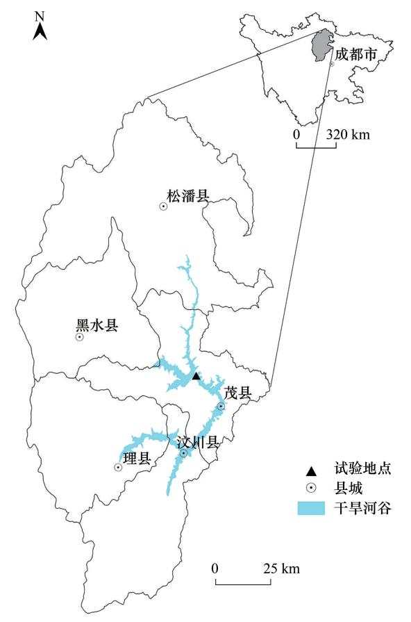  
图1 岷江干旱河谷及试验地点地理位置示意图  
Fig.1 Location of the Minjiang dry valley and experimental site

89mg/kg。试验共4个处理，每个处理设置3个重复，共12个试验小区，每个处理试验地面积为 $7 5 - 1 0 0 ~ \mathrm { m } ^ { 2 }$ O

## 1.3 群落模式配置

根据该地区的群落结构和受试种子发芽率确定了种植密度和播种量。首先，估算总播种密度和每个物种播种量:其中狗尾草为30粒 $/ \mathrm { m } ^ { 2 }$ 、早熟禾12粒 $/ \mathrm { m } ^ { 2 }$ 、毛莲蒿估算180粒 $/ \mathrm { m } ^ { 2 }$ 、鞍叶羊蹄甲4粒 $/ \mathrm { m } ^ { 2 }$ 、小叶笠子梢4粒 $/ \mathrm { m } ^ { 2 }$ 、四川黄栌8粒 $/ \mathrm { m } ^ { 2 }$ 。其次，根据种子千粒质量估算不同物种种子于质量的比例，确定总播种量为 $9 0 ~ \mathrm { g / }$ $\mathrm { m } _ { \mathrm { ~ c ~ } } ^ { 2 }$ 播种前，不同种子按照干质量比例混合，用0.1%的 ${ \mathrm { K } } _ { 2 } { \mathrm { M n O } } _ { 4 }$ 水溶液消毒30min.再用清水浸泡24h.使种子充分吸水膨胀。播种时，种子与湿沙混合，采用人工条状播种，种植深度约 $3 \ \mathrm { c m } _ { \mathrm { o } }$ 播种后1个月内，每周各处理等量浇水1次，保持土面湿润，其后植物在自然气候条件下生长。播种1月后，早熟禾、狗尾草、鞍叶羊蹄甲、小叶杭子梢的出苗率较高，达到50%以上；毛莲蒿和四川黄栌的种子出苗率低于30%。第一个生长季结束时,3种灌木幼苗具有较高的保存率，均在75%以上[29]

每个处理内建立1个小型的径流小区，共4个径流小区。考虑到地形因素以及试验小区面积，径流小区规格为长4m,宽 $2 ~ \mathrm { m _ { \mathrm { o } } }$ 小区四周用钢筋水泥板(1m×0.4m×0.05m)进行围挡，其埋入地下深度和露出地表高度均为20cm，防止小区内降水外流。在水势低的地段安装导流管和集流桶，疏导并收集坡面径流和泥沙。

## 1.4 数据收集

## 1.4.1 群落数量特征调查

2020年10月初，植物生长季结束，分别在每个试验小区上、中、下三个坡位布置3个样方，调查植被总盖度及平均高度，物种数量，灌木盖度及平均高度，草本植物盖度及平均高度。调查后，采用挖取法收割样方内所有植物，将每个样方中的灌木和草本植物分开，装入信封，所有样品在80℃下烘干至恒重，称取各部分生

物量。

## 1.4.2 土壤样品采集与理化性质测定

在生物量收割的同时采用土钻法进行土壤取样。在每个样方对角线上设置2个取样点，用直径8cm土钻分别采集0—10cm、10—20cm土层的土壤，分别放入自封袋，同一样方中同一层土样充分混合，共收集到(4处理×3重复×2土层)24个土壤样品。土壤剔除植被细根和石砾后，过2mm筛并风干，用于土壤全碳(TC)、全氮（TN)、全磷（TP)。土壤中 TC、TN含量采用土壤碳氮元素分析仪（ElementarVario MAX，Germany)进行测定；TP 采用酸溶钼锑抗比色法测定[30]。同时，采用环刀法收集各样地0—10 cm和10—20cm土层的原状土样，用于测定土壤容重、含水率、最大持水量、毛管持水量和毛管孔隙度等指标。采用排水法测定土壤石砾体积含量。

## 1.4.3 坡面径流收集及样品测定

坡面径流收集时间为2020年8—10月份，分别为8月20日、8月31日、9月6日、9月22日、9月26日、9月27日、9月29日、10月2日和10月4日，共收集到9次有效样品。每次降雨之后，将容器内的雨水与泥沙摇匀后，用量筒和量杯测量坡面径流的体积，然后用量筒取500mL作为样品，带回实验室-20℃冷冻保存。测定样品前，将解冻后的样品沉淀12 h,之后取上清液过0.45μm的滤膜用于测定坡面径流中全碳(TC)、全氮(TN)、全钾(TK)、全磷(TP)。使用总有机碳/有机氮分析仪(Vario TOC，Germany)测定全碳(TC)和全氮(TN)含量;采用电感耦合等离子体发射光谱仪(Optima 8300，USA)分析测定全磷(TP)和全钾(TK)含量。过滤后的泥沙称其鲜重，然后放到105℃烘箱中烘干至恒重，称取其干重，以计算泥沙含量。

## 1.5 统计分析

首先，用 Shapiro-Wilk 检验数据的正态性，再用 Levene's test 检验数据的方差齐性。采用单因素方差分析比较群落结构、土壤理化性质和水土流失等参数在不同种植处理之间的差异(n=3），评估不同处理条件下边坡乡土植被结构与功能提升效果及其差异性。如果满足方差齐性，则采用最小显著差异(LSD)法进行多重比较(α<0.05);如果方差不齐,则采用塔姆黑尼(Tamhane's T2)检验方法。采用独立样本t检验分析发现，除了土壤容重以外,其余土壤理化性质在0—10 cm 和10—20 cm 土层之间没有明显差异，在 Spearman 相关性分析和冗余分析（Redundancy Analysis,RDA）中，土壤理化性质用 0—10 cm 和 10—20 cm 土层的均值,分析植物群落特征、土壤理化性质以及水土流失之间的关系。采用R(v.3.2.0)软件中的“vegan”程序包对植物群落特征参数、土壤理化性质参数以及水土流失参数进行冗余分析(RDA)。由于群落结构参数存在共线性，在RDA中选用群落总盖度和物种丰富。路径模型中重要观测变量利用R(v.3.2.0)软件中的“plspm”程序包构建偏最小二乘路径模型（PLS-PM）确定[31]，进一步探究植被恢复过程中控制水土流失的可能路径。利用Bootstrapping对路径模型中估计的路径系数和决定系数 $\left( R ^ { 2 } \right)$ 进行了验证，bootstrap自助抽样次数为 2000次。统计分析和作图主要在软件 Excel 2010、SPSS 25、Origin 2022下进行。

## 2 结果分析

## 2.1 植被群落结构特征在不同种植处理之间的差异

与自然恢复的对照边坡(Control)相比，裸地播种、纤维毯覆盖、纤维毯覆盖+覆土三种人工种植处理均显著提高了道路边坡上的群落总盖度(图2)、灌木盖度(图2)、草本盖度(图2)、群落总生物量(图3)、灌木生物量(图3)、草本生物量(图3)和灌木平均高度(图2）(P<0.05)；并且纤维毯覆盖+覆土处理下的群落总生物量和草本生物量显著高于其余两种处理(P<0.05；图3)。此外，与自然恢复和裸地播种相比，纤维毯覆盖、纤维毯覆盖+覆土显著提高了物种丰富度(P<0.05；图3)。总体上，群落平均高度(P=0.069；图2)、草本平均高度 $\left( P = 0 . 2 0 3 \right.$ ；图2)在不同种植处理之间无显著差异。

## 2.2 土壤理化性质在不同种植处理之间的差异

在0—10cm土层，最大持水量、土壤容重、毛管持水量、非毛管持水量、土壤含水率、石砾含量、土壤全氮在不同种植处理无明显变化(P>0.05；表1)。但是，与自然恢复的对照边坡(Control)相比,3种人工处理下的土壤容重均呈下降趋势，全氮含量均有上升趋势，其中裸地播种处理下土壤容重最低，全氮含量最高。与自然恢复相比，裸地播种、纤维毯覆盖+覆土，纤维毯覆盖三种种植处理下土壤全碳分别增加31.1%、25.2%和23.8%;土壤全磷含量分别增加48.9%、68.9%和 37.3%。

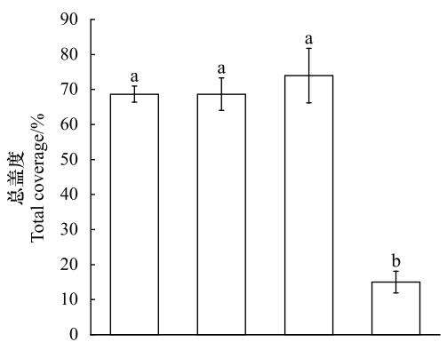

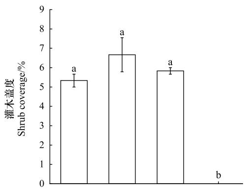

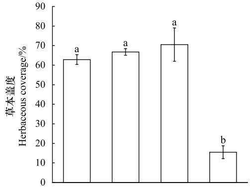

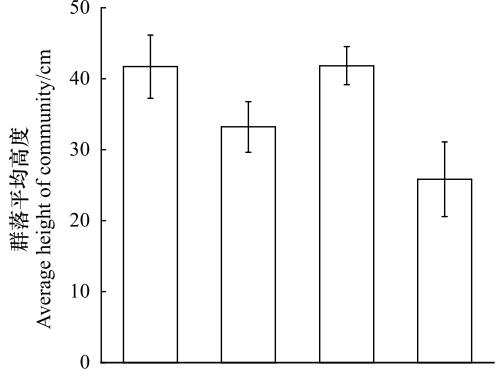

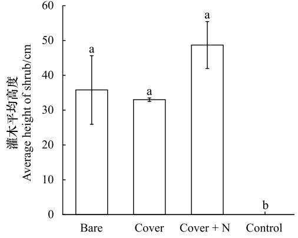

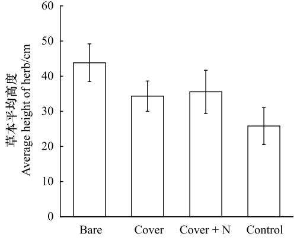  
处理 Treatment  
图2 干旱河谷道路边坡不同种植处理下植被盖度和植被高度(平均值±标准误差)  
Fig.2 Vegetation cover and height (mean±SE) under varying planting treatments on roadside slope of the dry valley studied

在10一20cm土层，最大持水量、土壤容重、毛管持水量、非毛管持水量、土壤含水率、土壤全氮在不同种植处理之间不显著差异 $( P { > } 0 . 0 5 )$ ，但是其3种种植处理下的土壤全氮含量均明显高于自然恢复样地，其中纤维毯覆盖下全氮含量最高。相较于自然恢复边坡，裸地播种、纤维毯覆盖+覆土，纤维毯覆盖三种种植处理下土壤全碳分别增加 24.1%、20%和 9.4%；土壤全磷含量分别增加 54.1%、117.3%和 53.7%。

独立样本t检验的结果显示，除土壤容重外，其他土壤理化性质在不同土层之间没有明显差异(表2)。

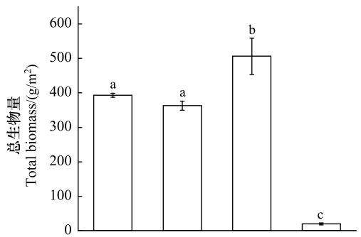

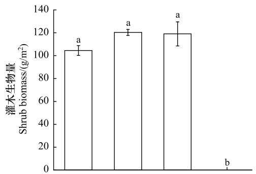

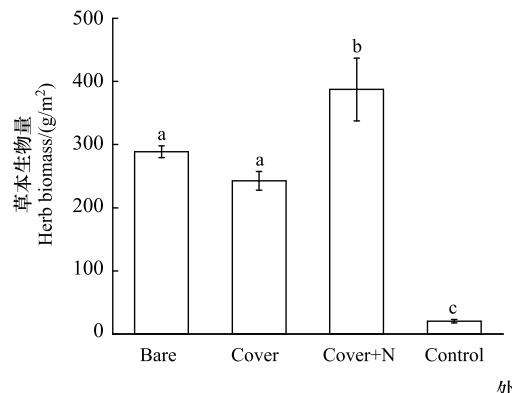

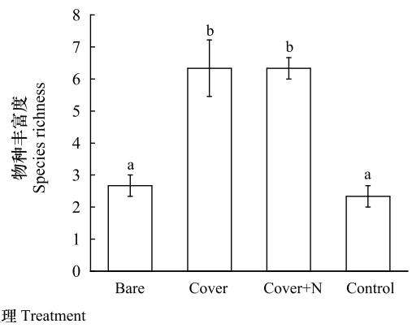  
图3 干旱河谷道路边坡不同种植处理下植被生物量和物种丰富度(平均值±标准误差)  
Fig.3 Vegetation biomass and species richness (means±SE) under varying planting treatments on roadside slope of the dry valley studied不同小写字母表示不同种植处理之间差异显著 $\stackrel { \prime } { _ { n } } = 3 ; ~ P { < } 0 . 0 5 )$ ，没有字母标记表明不同处理之间差异不显著

## 2.3 地表径流在不同种植处理之间的差异

在2020年8月20日至10月4日的9次降雨事件中，纤维毯覆盖+覆土，纤维毯覆盖，裸地播种以及自然恢复下收集总径流量分别为4499mL,5815mL,23060mL和36955mL。可见，纤维毯覆盖+覆土处理下径流量都低于其他处理，纤维毯覆盖和裸地播种处理次之，自然恢复的对照边坡(Control)径流量最高(图4)。

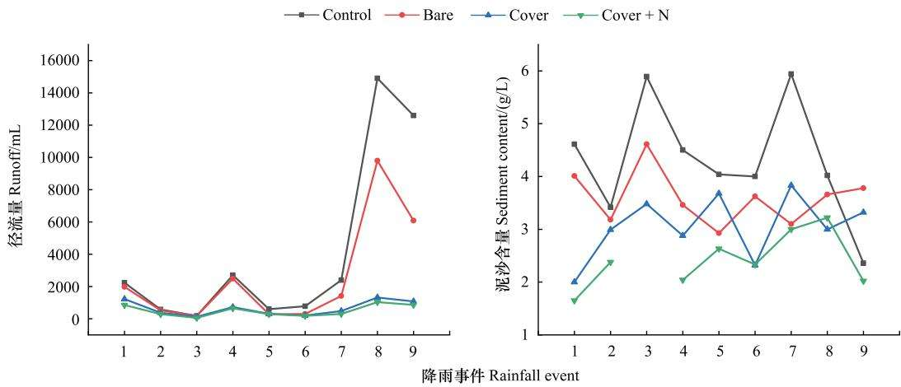  
图4 干旱河谷道路边坡不同种植处理下径流量和泥沙含量  
Fig.4 Runoff and sediment content under varying planting treatments on roadside slope of the dry valley studied

在9次降雨事件中，纤维毯覆盖+覆土处理下泥沙含量低于其他处理的事件共计6次(第2次的纤维毯覆盖+覆土泥沙含量丢失）；纤维毯覆盖处理下泥沙含量低于裸地播种处理的事件共计7次；自然恢复中泥沙含

<table><tr><td colspan="10">Table 1 Physical and chemical properties of 0—10cm, 10—20cm soil layer (mean±SE) under varying planting treatments on roadside slope of the dry valley studied</td></tr><tr><td>土层</td><td>处理</td><td>MM/</td><td>BD/</td><td>CM/</td><td>NC/</td><td>MC/%</td><td>GC/%</td><td>TCs/</td><td>TNs/</td><td>TPs/</td></tr><tr><td>Soil depth</td><td>Treatment</td><td>(g/cm³)</td><td>(g/cm³)</td><td>(g/cm³)</td><td>(g/cm³)</td><td></td><td></td><td>(g/kg)</td><td>(g/kg)</td><td>(g/kg)</td></tr><tr><td>0—10 cm</td><td>Control</td><td>0.416±0.010a</td><td>1.673±0.089a</td><td>0.309±0.005a</td><td>0.107±0.005a</td><td>6.762±0.753a</td><td>26.667±1.667a</td><td>22.829±0.106a</td><td>1.143±0.206a</td><td>1.326±0.043a</td></tr><tr><td rowspan="6">10—20 cm</td><td>Bare</td><td>0.423±0.003a</td><td>1.455±0.021a</td><td>0.301±0.018a</td><td>0.122±0.018a</td><td>6.034±0.284a</td><td>28.000±2.646a</td><td>29.926±1.080b</td><td>1.609±0.075a</td><td>1.975±0.190b</td></tr><tr><td>Cover</td><td>0.410±0.013a</td><td>1.466±0.061a</td><td>0.304±0.012a</td><td>0.106±0.018a</td><td>8.017±0.497a</td><td>32.000±1.732a</td><td>28.577±0.790b</td><td>1.589±0.082a</td><td>2.240±0.178b</td></tr><tr><td>Cover+N</td><td>0.407±0.006a</td><td>1.532±0.064a</td><td>0.324±0.036a</td><td>0.084±0.040a</td><td>7.610±0.662a</td><td>27.667±5.364a</td><td>28.269±0.524b</td><td>1.521±0.118a</td><td>1.820±0.094b</td></tr><tr><td>Control</td><td>0.402±0.007a</td><td>1.657±0.063a</td><td>0.294±0.007a</td><td>0.109±0.005a</td><td>6.551±0.266a</td><td>35.000±1.155b</td><td>23.515±0.871a</td><td>1.172±0.041a</td><td>1.288±0.021a</td></tr><tr><td>Bare</td><td>0.414±0.011a</td><td>1.702±0.030a</td><td>0.291±0.027a</td><td>0.123±0.019a</td><td>5.453±0.436a</td><td>28.667±1.333a</td><td>29.176±0.758c</td><td>1.485±0.107a</td><td>1.985±0.238ab</td></tr><tr><td>Cover</td><td>0.402±0.014a</td><td>1.704±0.066a</td><td>0.292±0.019a</td><td>0.110±0.005a</td><td>6.723±0.909a</td><td>36.333±1.453b</td><td>28.222±0.384bc</td><td>1.640±0.067a</td><td>2.799±0.303ab</td></tr><tr><td></td><td>Cover+N</td><td>0.422±0.005a</td><td>1.580±0.079a</td><td>0.304±0.007a</td><td>0.118±0.012a</td><td>7.362±0.652a</td><td>28.667±2.963a</td><td>25.714±1.470ab</td><td>1.576±0.209a</td><td>1.979±0.058b</td></tr></table>

d   d ：:    :d    :( = : o:     :       : :  :     : :    - : a

表2 不同土层的土壤理化性质独立样本t检验  
Table 2 The independent-samples T test of soil physical and chemical properties in different soil depth
<table><tr><td>土壤性质 Soil properties</td><td>t</td><td> $P$ </td><td>土壤性质 Soil properties</td><td>t</td><td> $P$ </td></tr><tr><td> $\mathbf { M } \mathbf { M } / ( \mathbf { g } / \mathbf { c m } ^ { 3 } )$ </td><td>0.67</td><td>0.51</td><td>GC/%</td><td>-1.78</td><td>0.09</td></tr><tr><td> $\mathbf { B D } / ( \mathbf { g } / \mathrm { c m } ^ { 3 } )$ </td><td>-2.67</td><td>0.01</td><td> $\mathrm { T C _ { S } / ( \ g / k g ) }$ </td><td>0.64</td><td>0.53</td></tr><tr><td> $\mathrm { C M } / ( \mathrm { g } / \mathrm { c m } ^ { 3 } )$ </td><td>1.27</td><td>0.24</td><td> $\mathrm { T N _ { s } } / ( \mathrm { g } / \mathrm { k g } )$ </td><td>-0.03</td><td>0.98</td></tr><tr><td> $\mathbf { N C } / ( \mathbf { g } / \mathrm { c m } ^ { 3 } )$ </td><td>-0.83</td><td>0.42</td><td> $\mathrm { T P _ { s } } / ( \mathbf { g } / \mathbf { k g } )$ </td><td>-0.80</td><td>0.43</td></tr><tr><td>MC/%</td><td>1.23</td><td>0.23</td><td></td><td></td><td></td></tr></table>

量高于其他处理的事件共计8次(图4)。纤维毯覆盖+覆土，纤维毯覆盖，裸地播种以及自然恢复四种处理在这 9 次的降雨事件中,泥沙流失总量分别为 10.55 g,17.01 g,84.24 g,134.85 g。

总体上，自然恢复下地表径流中全碳含量低于其他处理，并且纤维毯覆盖处理下地表径流的全碳含量高于其他处理(图5):地表径流的全氮、全钾含量在不同种植处理之间无显著变化(图5):纤维毯覆盖处理下地表径流中全磷含量高于其他处理，并且对照组中地表径流的全磷含量都低于其他处理(图5)。

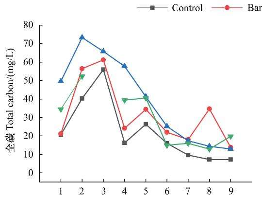

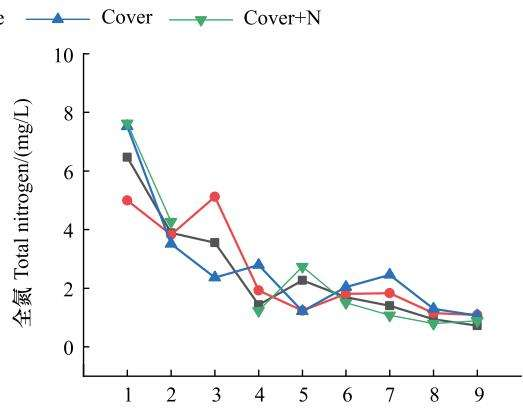

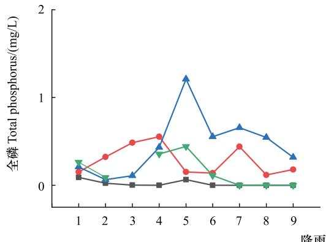

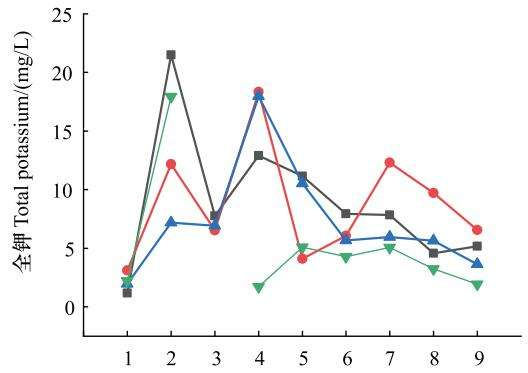  
降雨事件 Rainfall event  
图5干旱河谷道路边坡不同种植处理下地表径流中全碳、全氮、全磷、全钾含量  
Fig.5 Total carbon, total nitrogen, total phosphorus and total potassium content in runoff under varying planting treatments on roadside slope of the dry valley studied

## 2.4植被群落结构特征、土壤理化性质与水土流失因子之间的相关关系

冗余分析显示，径流量、泥沙含量的变异主要由群落总盖度、物种丰富度解释：群落总盖度和物种丰富度是影响水土流失(径流量、泥沙含量)的主要植被因子：且水土流失(径流量、泥沙含量)与植被因子呈负相关关系(图 $6 ;$ 表3)。

Spearman相关分析显示，径流量、泥沙含量及地表径流的全钾含量与群落平均高度、总盖度、总生物量、灌木高度、灌木盖度、灌木生物量、草本盖度、草本生物量以及物种丰富度9个植被群落结构参数(草本平均高度除外)之间呈显著的负相关关系(P<0.05；表4)。地表径流的全碳、全氮、全磷含量与灌木盖度、灌木生物量呈显著的正相关关系(P<0.05；表4)。土壤容重、最大持水量、毛管持水量、非毛管持水量、含水率、石砾含量与径流量、泥沙含量关系不显著 $( P { > } 0 . 0 5 ;$ 表5);地表径流的全碳、全氮、全磷含量与土壤的全碳、全氮、全磷含量呈显著的正相关关系 $( P { < } 0 . 0 5$ ；表5)。

各群落结构参数均与土壤养分(全碳、全氮、全钾)呈正相关关系，其中，群落总盖度、灌木盖度、草本盖度、平均高度与土壤全氮含量关系显著；灌木盖度、生物量与土壤全磷含量关系显著(P<0.05；表6)。群落盖度与最大持水量呈正相关关系，物种丰富度与土壤含水率呈正相关关系 $( P { < } 0 . 0 5 $ ；表6)。此外，各植物群落结构参数与土壤物理性质之间无显著相关性 $\mathrm { \Omega } ^ { \prime } P > 0 . 0 5$ 表6)。

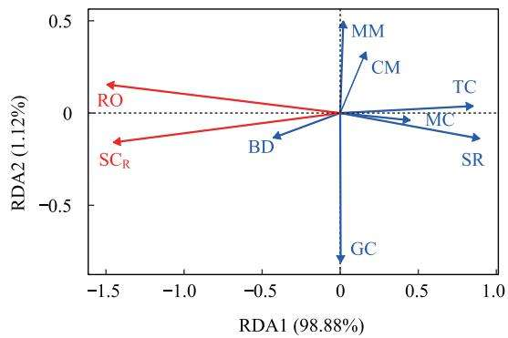  
图6干旱河谷道路边坡不同种植处理下径流量、泥沙含量和植物群落结构参数、土壤物理性质参数的冗余分析  
Fig.6 Redundancy analysis of runoff, sediment content and plant community structure parameters, soil physical property parameters under varying planting treatments on roadside slope of the dry valley studied  
$\mathrm { R O } ;$ 径流量 $\mathrm { r u n o f f } ; \mathrm { S C } _ { \mathrm { R } } :$ 泥沙含量 sediment content ${ \mathrm { ; T C } } ;$ 总盖度 total$_ \mathrm { c o v e r a g e ; S R }$ 物种丰富度 species richness

表3植物群落结构参数、土壤物理性质参数对冗余分析中径流量和泥沙含量变异的解释和贡献  
Table 3 Explains and contribution of plant community structure paraments and soil physical property paraments on runoff and sediment content variation in redundancy analysis
<table><tr><td>植物-土壤参数 Plant-soil Paraments</td><td>解释 Explains/%</td><td>贡献 Contribution/%</td><td>F</td><td>P</td></tr><tr><td>TC</td><td>37.99</td><td>46.05</td><td>42.23</td><td>&lt; 0.001</td></tr><tr><td>SR</td><td>53.50</td><td>64.85</td><td>14.61</td><td>0.02</td></tr><tr><td>BD</td><td>2.51</td><td>3.04</td><td>0.07</td><td>0.84</td></tr><tr><td>MM</td><td>-2.82</td><td>-3.42</td><td>0.15</td><td>0.74</td></tr><tr><td>CM</td><td>3.20</td><td>-3.88</td><td>0.11</td><td>0.77</td></tr><tr><td>MC</td><td>1.80</td><td>2.18</td><td>1.31</td><td>0.31</td></tr><tr><td>GC</td><td>-4.27</td><td>-5.18</td><td>0.47</td><td>0.53</td></tr></table>

TC:总盖度 total coverage;SR:物种丰富度 species richness

表4 干旱河谷道路边坡乡土植物群落结构参数与径流参数之间 Spearman 相关性分析 $\left( n = 1 2 \right)$  
Table 4 Spearman correlation analysis between community structure parameters of indigenous plants and runoff parameters on roadside slope of the dry valley studied (n = 12)
<table><tr><td>群落结构 Community structure</td><td>RO</td><td> $\mathrm { S C _ { R } }$ </td><td> $\mathrm { T C } _ { \mathrm { R } }$ </td><td> $\mathrm { T N } _ { \mathrm { R } }$ </td><td> $\mathrm { T P } _ { \mathrm { R } }$ </td><td> $\mathrm { T K } _ { \mathrm { R } }$ </td></tr><tr><td>CH</td><td> $- 0 . 5 8 3 ^ { * }$ </td><td> $- 0 . 5 8 3 \ ^ { * }$ </td><td>0.216</td><td>0.216</td><td>0.216</td><td> $- 0 . 5 8 3 ^ { * }$ </td></tr><tr><td>SH</td><td> $- 0 . 8 2 8 ^ { \ast \ast }$ </td><td> $- 0 . 8 2 8 \textsuperscript { * * }$ </td><td>0.370</td><td>0.370</td><td>0.370</td><td>-0.828**</td></tr><tr><td>HH</td><td>-0.335</td><td>-0.335</td><td>0.476</td><td>0.476</td><td>0.476</td><td>-0.335</td></tr><tr><td>TC</td><td> $- 0 . 5 8 4 ^ { \ast }$ </td><td>-0.584*</td><td>0.519</td><td>0.519</td><td>0.519</td><td>-0.584*</td></tr><tr><td>SC</td><td> $- 0 . 7 2 8 ^ { \ast \ast }$ </td><td> $- 0 . 7 2 8 ^ { \ast \ast }$ </td><td>0.662*</td><td>0.662*</td><td>0.662*</td><td>-0.728**</td></tr><tr><td>HC</td><td> $- 0 . 7 3 4 ^ { \ast \ast }$ </td><td> $- 0 . 7 3 4 ^ { \ast \ast }$ </td><td>0.540</td><td>0.540</td><td>0.540</td><td> $- 0 . 7 3 4 ^ { \ast \ast }$ </td></tr><tr><td>TB</td><td> $- 0 . 7 9 9 ^ { \ast \ast }$ </td><td> $- 0 . 7 9 9 ^ { \ast \ast }$ </td><td>0.216</td><td>0.216</td><td>0.216</td><td> $- 0 . 7 9 9 ^ { \ast \ast }$ </td></tr><tr><td>SB</td><td> $- 0 . 7 6 1 ~ ^ { * * }$ </td><td> $- 0 . 7 6 1 ~ ^ { * * }$ </td><td> $0 . 6 9 6 ^ { * }$ </td><td>0.696*</td><td>0.696*</td><td> $- 0 . 7 6 1 ~ ^ { * * }$ </td></tr><tr><td>HB</td><td> $- 0 . 7 9 9 ^ { \ast \ast }$ </td><td> $- 0 . 7 9 9 ^ { \ast \ast }$ </td><td>0.216</td><td>0.216</td><td>0.216</td><td>-0.799 **</td></tr><tr><td>SR</td><td> $- 0 . 8 3 8 ^ { \ast \ast }$ </td><td> $- 0 . 8 3 8 ^ { \ast \ast }$ </td><td>0.441</td><td>0.441</td><td>0.441</td><td> $- 0 . 8 3 8 ^ { \ast \ast }$ </td></tr></table>

\*表示在P<0.05水平(双侧)上显著相关；\*\*表示在 $P { < } 0 . 0 1$ 水平(双侧)上极显著相关；RO:径流量 runoff; $\mathrm { S C } _ { \mathrm { R } } :$ 泥沙含量 sedimentcontent; $\mathrm { T C } _ { \mathrm { R } } :$ 地表径流中全碳含量 the contents of total carbon in the $\mathrm { r u n o f f } ; \mathrm { T N } _ { \mathrm { R } } :$ 地表径流中全氮含量 the contents of total nitrogen in the runoff;$\mathrm { T P } _ { \mathrm { R } } :$ 地表径流中全磷含量 the contents of total phosphorus in the runoff $\mathrm { { ; T K _ { R } } }$ :地表径流中全钾含量 the contents of total potassium in the runoff; CH:群落平均高度 average community height;SH:灌木平均高度 average height of $\mathrm { \ s h r u b s { ; } H H { ; } }$ 草本平均高度 average height of herbs;SC:灌木盖度 shrubcoverage;HC:草本盖度 herbaceous coverage;TB:总生物量 total $\mathrm { b i o m a s s ; S B }$ 灌木生物量 shrub biomass;HB:草本生物量 herbaceous biomass

表 5 干旱河谷道路边坡土壤理化性质参数和径流参数之间 Spearman 相关性分析(n= 12)  
Table 5 Spearman correlation analysis between soil chemical and physical property parameters and runoff parameters on roadside slope of the dry valley studied (n = 12)
<table><tr><td>土壤特性 Soil properties</td><td>RO</td><td> $\mathrm { S C _ { R } }$ </td><td> $\mathrm { T C } _ { \mathrm { R } }$ </td><td> $\mathrm { T N } _ { \mathrm { R } }$ </td><td> $\mathrm { T P } _ { \mathrm { R } }$ </td><td> $\mathrm { T K } _ { \mathrm { R } }$ </td></tr><tr><td> $\mathrm { T C _ { S } }$ </td><td>-0.281</td><td>-0.281</td><td> $0 . 7 9 9 ^ { \ast \ast }$ </td><td> $0 . 7 9 9 ^ { \ast \ast }$ </td><td> $0 . 7 9 9 ^ { \ast \ast }$ </td><td>-0.281</td></tr><tr><td> $\mathrm { T N _ { s } }$ </td><td>-0.453</td><td>-0.453</td><td> $0 . 6 9 1 \ ^ { * }$ </td><td> $0 . 6 9 1 ^ { \ast }$ </td><td> $0 . 6 9 1 ^ { \ast }$ </td><td>-0.453</td></tr><tr><td> $\mathrm { T P _ { s } }$ </td><td>-0.518</td><td>-0.518</td><td> $0 . 9 0 7 ^ { \ast \ast }$ </td><td> $0 . 9 0 7 ^ { \ast \ast }$ </td><td> $0 . 9 0 7 ^ { \ast \ast }$ </td><td>-0.518</td></tr><tr><td>BD</td><td>0.216</td><td>0.216</td><td>-0.194</td><td>-0.194</td><td> $- 0 . 1 9 4$ </td><td>0.216</td></tr><tr><td>MM</td><td>-0.151</td><td>-0.151</td><td>0.194</td><td>0.194</td><td>0.194</td><td>-0.151</td></tr><tr><td>CM</td><td>-0.086</td><td>-0.086</td><td>-0.151</td><td>-0.151</td><td>-0.151</td><td>-0.086</td></tr><tr><td>NC</td><td>-0.022</td><td>-0.022</td><td>0.086</td><td>0.086</td><td>0.086</td><td>-0.022</td></tr><tr><td>MC</td><td>-0.453</td><td>-0.453</td><td>0.065</td><td>0.065</td><td>0.065</td><td>-0.453</td></tr><tr><td>GC</td><td>-0.119</td><td>-0.119</td><td>0.325</td><td>0.325</td><td>0.325</td><td>-0.119</td></tr></table>

\*表示在P<0.05水平(双侧)上显著相关；\*\*表示在P<0.01水平(双侧)上极显著相关

表6 干旱河谷道路边坡乡土植物群落结构参数和土壤理化性质参数之间 Spearman相关性分析 $\left( n = 1 2 \right)$  
Table 6 Spearman correlation analysis between community structure parameters of indigenous plants and soil physical and chemical property parameters on roadside slope of the dry valley studied (n = 12)
<table><tr><td>群落结构 Community structure</td><td> $\mathrm { T C _ { s } }$ </td><td> $\mathrm { T N _ { s } }$ </td><td> $\mathrm { T P _ { s } }$ </td><td>BD</td><td>MM</td><td>CM</td><td>NC</td><td>MC</td><td>GC</td></tr><tr><td>CH</td><td>0.28</td><td>0.343</td><td>0.133</td><td>-0.545</td><td>0.566</td><td>0.161</td><td>0.301</td><td>0.084</td><td>-0.526</td></tr><tr><td>SH</td><td>0.384</td><td>0.473</td><td>0.547</td><td>-0.36</td><td>0.317</td><td>0.004</td><td>0.275</td><td>0.24</td><td>0.189</td></tr><tr><td>HH</td><td>0.511</td><td>0.862**</td><td>0.298</td><td>-0.294</td><td>0.277</td><td>0.172</td><td>0.095</td><td>-0.028</td><td>-0.483</td></tr><tr><td>TC</td><td>0.357</td><td>0.715**</td><td>0.55</td><td>-0.445</td><td>0.595*</td><td>0.448</td><td>-0.046</td><td>0.354</td><td>-0.288</td></tr><tr><td>SC</td><td>0.422</td><td>0.707*</td><td>0.636*</td><td>-0.307</td><td>0.307</td><td>0.014</td><td>0.129</td><td>0.229</td><td>-0.018</td></tr><tr><td>HC</td><td>0.413</td><td>0.727**</td><td>0.545</td><td>-0.413</td><td>0.147</td><td>0.175</td><td>-0.014</td><td>0.392</td><td>-0.112</td></tr><tr><td>TB</td><td>0.364</td><td>0.259</td><td>0.238</td><td>-0.336</td><td>0.287</td><td>0.021</td><td>0.301</td><td>0.084</td><td>-0.235</td></tr><tr><td>SB</td><td>0.542</td><td>0.401</td><td>0.789**</td><td>-0.19</td><td>0.232</td><td>-0.232</td><td>0.204</td><td>0.345</td><td>0.569</td></tr><tr><td>HB</td><td>0.364</td><td>0.259</td><td>0.238</td><td>-0.336</td><td>0.287</td><td>0.021</td><td>0.301</td><td>0.084</td><td>-0.235</td></tr><tr><td>SR</td><td>0.271</td><td>0.293</td><td>0.479</td><td>0.007</td><td>-0.007</td><td>0.021</td><td>-0.186</td><td>0.600*</td><td>0.319</td></tr></table>

\*表示在P<0.05水平(双侧)上显著相关；\*\*表示在P<0.01水平(双侧)上极显著相关

## 2.5 植被群落结构特征和土壤物理性质影响水土流失的PLS-PM分析

为了探讨植被群落结构特征和土壤物理性质对水土流失的影响，我们进一步构建了偏最小二乘路径模型(PLS-PM)。模型整体的拟合优度(GOF)为0.576（图7)。植被恢复措施对水土流失缓解主要在于植被的直接效应(-0.935，P<0.05);而植被通过影响土壤物理性质(0.229，P>0.05),进而间接影响水土流失(0.272，$P { > } 0 . 0 5 )$ 的效应较弱。

## 3 讨论

## 3.1 乡土灌草群落结构是干旱河谷道路边坡适宜的植被恢复模式

在干旱河谷极端严酷的自然环境条件下，边坡植被自然恢复能力低下，恢复速度极为缓慢。本研究根据边坡立地条件，选择乡土灌木和草本植物构建植物群落，经历3个生长季以后，不同种植处理下植物群落平均高度在 26.1—46.7 cm 之间，群落总盖度在 63%—89%之间,群落总生物量在 347.02—593.78 g/m²之间,群落结构稳定，类似于岷江干旱河谷区自然生态系统的多年生灌草植被[32—33]。这表明采用干旱河谷乡土植物构建的灌草群落能够实现植被快速建立、水土流失及时治理，是干旱河谷道路边坡适宜的植被恢复模式。此结果对类似生态系统中工程创面的植被恢复提供重要的理论依据与技术指导。

## 3.2 不同种植处理下边坡乡土植被生态效益

## 3.2.1 植物群落结构

前期观测表明，在播种后第一年内，纤维毯覆盖有利于提高草本植物出苗率以及维持草本植株密度在较高水平，对于植物的早期定居具有重要意义[29]。李宏钧等19]也发现，播种后第1年，覆盖纤维毯样地中的植物比无纺布样地根系更为发达、植株密度更高、生物量总量更大。但是，我们发现随着植被恢复年限的增加，纤维毯逐渐分解，其对于植物生长促进作用减弱。因此，植物经历3个生长季以后，地表覆盖处理下的植被高度、盖度、生物量与边坡裸地播种之间没有显著差异(图1;图2)。

覆盖森林腐殖土不仅能够减少边坡地表蒸发，保持土壤水分，而且腐殖土含有丰富的有机质和微生物，能够增加土壤养分，改善边坡和渣场等极端退化土壤的结构与功能[34]。另外，随着覆土厚度的增加，公路边坡的植被质量逐渐增加23]。相关研究在不同地区环境条件下，所获得实验结果并不一致。例如，在本研究的干旱

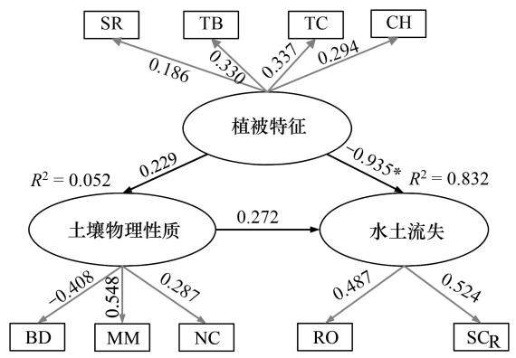  
图7 植被特征、土壤物理性质与水土流失的偏最小二乘路径模型(PLS-PM)  
Fig.7 The Partial least squares path model (PLS-PM) of vegetation characteristics, soil physical properties and water and soil loss  
图中黑色线条指示结构模型中各潜变量之间的相互关系，灰色线条指示测量模型中潜变量与观测变量的关系。\*表示显著性水平P<0.05,模型拟合优度(GOF)为0.6208

河谷区，与裸地播种和纤维毯覆盖处理相比，森林腐殖土的添加显著提高了边坡上草本植物以及群落总生物量(图3)。这是由于干旱河谷区植物生长与植被发育主要的限制因素为干旱胁迫与土壤贫瘠35]，腐殖土丰富的肥力和保水性恰好对于植物群落的构建具有明显的促进作用。类似地在高寒矿区煤矸石山生态恢复研究发现，覆土能够显著提高植被盖度、密度、高度以及地上生物量[36]。然而，在青海省木里煤矿区排土场，覆土和不覆土处理下植被特征和土壤理化性质差异不显著[37]。这可能与回填土壤的质量、深度、边坡基质以及当地的气候条件等因素有关[38]。在岷江干旱河谷，覆盖森林腐殖土对于道路边坡的植物群落构建具有促进作用。有学者在考虑经济成本后，建议以施肥代替人工覆土进行高寒矿区木里煤田的植被恢复[36—37]。因此，筛选干旱河谷适宜的植被恢复方式，仍需进一步的成本-效益分析。

## 3.2.2 土壤改良效应

于旱河谷边坡上人工构建的灌草群落表层土壤中全碳、全磷含量得到有效改善，与自然恢复的对照样地(Control)存在差异显著(P<0.05：表1)。而自然恢复群落与人工构建的灌草群落中土壤最大持水量、土壤容重、土壤毛管持水量、土壤非毛管持水量、土壤含水率、土壤全氮无显著差异(P>0.05)。在黄土沟壑区的也研究发现，植物纤维毯护坡措施对表层土壤含水率和总孔隙度具有明显的改善效果，但对土壤容重影响不大；土壤化学性质上，全氮和有机质含量提升效果显著，而全磷和全钾含量与裸坡差异不显著，且铺设纤维毯2年后的全磷含量均低于裸露边坡[38]。在我国北方半湿润区向半干旱区的过渡地带，流动沙地铺设生态垫2年后，相对于流动沙丘裸地，土壤速效磷的的含量提高了240%：而土壤有机质、全氮、速效磷的含量变化不大39]。这些研究均表明，人工群落可以提高土壤有机质，对于贫瘠边坡的恢复具有重要意义：但短期内(3年以内)人工群落对干旱半干旱地区的土壤理化性质改善效果有限，且土层之间差异不显著(表2)，仍需进一步强化动态监测。

## 3.2.3 水土保持效应

干旱河谷边坡不同种植处理下人工植物群落地表径流量明显低于自然恢复的对照群落(Control)。采用覆盖植物纤维毯和添加腐殖土措施通常能够在边坡植物恢复初期提升边坡的抗侵蚀能力，有效地减少地表径流产生和泥沙流失。大量的研究强调了纤维毯本身在水土保持方面的物理作用。例如，与裸地相比，椰丝纤维毯降低67%—99%的土壤侵蚀速率，减少26%—81%的径流量[40]，说明纤维毯在植被恢复初期对于水土保持有着积极的作用。但是，有研究发现椰丝纤维毯覆盖导致径流增加(此时纤维毯尚未分解），纤维毯覆盖的小区比对照小区径流量增加150.2%和228%[41]。这可能与边坡坡度以及纤维毯特征等因素有关，雨水在纤维上沿着纤维形成直接径流而土壤入渗速率减弱41]。纤维毯对于径流产生和土壤流失的影响主要包括两个方面。一方面是自身的直接效应；另一方面则是通过影响植物群落的建成间接控制水土流失。本研究中在植物第3个生长季后，水土流失的减弱主要原因是恢复初期纤维毯促进了植物的定居、生长。与其他三组处理相比，自然恢复下地表径流中全碳、全磷含量较低。而地表径流养分主要来源土壤中的养分，这也间接说明人工恢复措施对于改善土壤养分起到积极作用。

## 3.2.4 植被群落结构特征、土壤理化性质与水土流失因子之间的相关关系

Spearman相关性分析与PLS-PM分析结果表明，植被的盖度、生物量等群落结构特征对于减少径流和侵蚀具有显著的促进作用(表4：图7).说明快速构建适宜的乡土植物群落对于旱河谷边坡水土流失的防治具有积极作用。一方面，植被的冠层可以拦截降水，降低雨滴的动能，减少飞溅侵蚀，并且灌-草群落的多层结构可以增加这种效应42]。在本研究中.RDA分析结果表明植被盖度对径流量、泥沙含量变异有着较高的解释和贡献(表3)。另一方面，密集的植物根茎能够抑制大面积的集中汇流的形成，产生无数细小的径流，从而降低径流对于土壤的侵蚀能力43]。此外，地表凋落物层也具有许多重要生态水文功能，如截留降雨、增加入渗、干扰蒸发等，对减缓地表径流、降低土壤侵蚀具有促进作用[44]。然而，在本试验条件下，地表凋落物的水土保持作用并未被体现出来。群落调查发现，样方中凋落物盖度较低，未测量到有效的凋落物生物量，植物生长年份较小可能是其原因之一。另外，试验区属于典型高山峡谷地形，坡陡，风大风频，植被矮小，这导致地表凋落物难以留存。植物的根系与土壤形成的复合体也可以增加土壤的抗剪强度45」.影响边坡稳定性、团聚体稳定性、坡面侵蚀以及入渗[46]。

植被恢复可以增加土壤有机质，改善土壤物理性质(如降低土壤容重)和团聚体稳定性，增加土壤的渗透性，间接减少径流和侵蚀47」。在本研究中，群落结构特征与土壤养分之间呈显著的相关性，与土壤容重，最大持水量等物理性质之间的关系并不显著(表6)。在黄土沟壑区的植被恢复过程中，植被盖度增加、地下根系生物量增加、土壤容重减少和团聚体(>0.25mm)稳定性增加是边坡径流和产沙量减少的主要原因：且植被恢复对径流和产沙量的直接影响低于其间接影响[48]。在本实验中，径流量、泥沙含量与土壤物理性质参数之间也尚未呈现出明显相关性(P>0.05；表5)，导致该结果的主要原因在于坡面上不同种植处理之间的径流量、泥沙含量有明显的差异(P<0.05：图5).但是由于试验区立地条件相同，不同种植处理之间原有坡面土壤物理结构比较相似，整体上土壤本身结构较差，恢复年限较短，植被恢复对于土壤结构的影响并不显著(P>0.05；表1)。PLS-PM分析结果也表明，植被通过影响土壤物理性质(0.229，P>0.05)，进而对水土流失(0.272.P>0.05)的间接效应较弱(图7)。另外.本研究中选择的测量土壤物理结构参数有限，仅关注土壤的水源涵养能力，土壤团聚体稳定性和抗剪强度等能够反映抗侵蚀能力的物理性质需要进一步研究。

## 4 结论

乡土灌草组成的群落结构是干旱河谷道路边坡适宜的植被恢复模式，在干旱区工程创面生态恢复中具有较好应用前景，本试验不同种植处理下的生态效益存在明显差异。在植物生长和群落结构参数方面，采用纤维毯覆盖+覆土种植处理下效果最好，3个生长季后群落平均高度41.83cm，群落总盖度74%，群落总生物量$5 0 6 . 3 5 ~ \mathrm { g } / \mathrm { m } ^ { 2 }$ .显著大于对照。不同种植处理的土壤改良和水土保持效应的差异性分析结果显示，裸地播种、纤维毯覆盖和纤维毯覆盖+覆土3种种植处理之间土壤养分差异不明显，但是与自然恢复样地相比，各处理均明显提升了边坡0一20cm土层土壤养分，表明边坡上构建乡土灌草群落就有较好的土壤改良效应。在水土保持效应方面，在植物恢复初期覆盖植物纤维毯和添加腐殖土的措施具有更强的抗侵蚀能力，能有效地减少地表径流，缓解表层土壤侵蚀。该处理能使流量减少了87.8%，泥沙流失量降低了92.1%，纤维毯覆盖和裸地播种水土保持效应次之。不同种植处理下植物群落结构差异是影响边坡水土流失的关键因子。

## 参考文献(References)：

1] 包维楷，庞学勇，李芳兰.干旱河谷生态恢复与持续管理的科学基础.北京：科学出版社，2012.

[2] 姚建，丁晶，艾南山.岷江上游生态脆弱性评价.长江流域资源与环境，2004，13(4)：380-383.

[3]李芳兰，包维楷，庞学勇，冷俐.岷江干旱河谷5种乡土植物的出苗、存活和生长.生态学报，2009，29(5)：2219-2230.

[ 4 ] Forman R T T, Alexander L E. Roads and their major ecological effects. Annual Review of Ecology and Systematics, 1998, 29: 207-231.

[ 5 ] Saraswati S, Bhusal Y, Trant A J, Strack M. Roads impact tree and shrub productivity in adjacent boreal peatlands. Forests, 2020, 11(5) : 594.

[ 6 ] Bochet E, Garcia-Fayos P. Factors controlling vegetation establishment and water erosion on motorway slopes in Valencia, Spain. Restoration Ecology, 2004, 12(2):166-174.

[ 7 ] Cerdà A. Soil water erosion on road embankments in eastern Spain. Science of the Total Environment, 2007, 378( 1/2) : 151- 155.

[ 8 ] Osman N, Barakbah S S. Parameters to predict slope stability—soil water and root profiles. Ecological Engineering, 2006, 28(1) : 90-95.

[ 9 ] Sangode S, Vhatkar K, Patil S, Meshram D, Pawar N J, Gudadhe S S, Badekar A, Kumaravel V. Magnetic susceptibility distribution in the soils of Pune Metropolitan Region : implications to soil magnetometry of anthropogenic loading. Current Science, 2010, 98: 516-527.

[10] 王代军，胡桂馨，高洁.公路边坡侵蚀及坡面生态工程的应用现状.草原与草坪，2000，20(3)：22-24.

[11] 余海龙，黄菊莹.道路边坡生态恢复立地质量评价.辽宁工程技术大学学报：自然科学版，2012，31(3)：345-348.

[ 12] Bochet E, García-Fayos P, Tormo J. How can we control erosion of roadslopes in semiarid Mediterranean areas? Soil improvement and native plant establishment. Land Degradation & Development, 2010, 21(2) : 110- 121.

13] 徐国钢，程睿，赖庆旺，朱兆华，孙吉雄.中国南方基础工程建设中土壤生态修复技术体系与实践.土壤学报，2015,52(2)：381-389.

[14] Bochet E, García-Fayos P, Poesen J. Topographic thresholds for plant colonization on semi-arid eroded slopes. Earth Surface Processes and Landforms, 2009, 34(13) : 1758-1771.

[15] 罗双，孙海龙，李绍才，刘冲，庞亮，李成俊.四川道路边坡自然恢复的植被调查.中国水土保持，2011(10)：12-16.

[16] Harper-Lore B L. Using native plants as problem-solvers. Environmental Management, 1996, 20(6) : 827-830.

[17] Novák J, Prach K. Artificial sowing of endangered dry grassland species into disused basalt Quarries. Flora-Morphology, Distribution, Functional Ecology of Plants, 2010, 205(3) : 179-183.

[18] 李宏钧，孔亚平，张岩.植物纤维毯生态防护效益研究述评.中国水土保持科学，2016，14(3)：146-154.

19] 李宏钧，孔亚平，张岩，简丽，陈学平.植物纤维毯对道路边坡微生境的影响.公路交通科技，2016，33(6)：146-151.

20] 朱兆华，徐国钢，陈晓蓉，曹华英，孙吉雄，赖庆旺.道路边坡及裸露山体植被恢复与生态防护技术.中国科技成果，2014(16)：26-30

[21] Bowen C K, Schuman G E, Olson R A, Ingram J. Influence of topsoil depth on plant and soil attributes of 24-year old reclaimed mined lands. Arid Land Research and Management, 2005, 19(3) : 267-284.

[22] Rivera D, Mejías V, Jáuregui B M, Costa-Tenorio M, López-Archilla A I, Peco B. Spreading topsoil encourages ecological restoration on embankments: soil fertility, microbial activity and vegetation cover. PLoS One, 2014, 9(7) : e101413.

[23] 刘涛，程金花，李宏钧，朱方方.伊犁地区公路边坡植被恢复措施与土壤因子的耦合关系.公路交通科技，2021，38(4)：28-35.

[24] Phillips B B, Bullock J M, Osborne J L, Gaston K J. Ecosystem service provision by road verges. Journal of Applied Ecology, 2020, 57 (3) : 488-501.

[25] Roach G L, Kirkpatrick R D. Wildlife use of roadside woody plantings in Indiana. Transportation Research Record, 1984, 1016, 11- 15.

[26] Li Y Y, Shao M A. Change of soil physical properties under long-term natural vegetation restoration in the Loess Plateau of China. Journal of Arid Environments, 2006, 64(1):77-96.

[27] 邓辅唐，吕小玲，喻正富，孙石，晏雨鸿.高速公路边坡植物群落的水土保持效应.中国水土保持，2007(5)：43-46，60.

[28] 杨焕辉，赵明华，刘小平.生态防护加固岩质边坡的机理分析及应用.中南公路工程，2007，32(1)：47-50.

[29] 胡慧，杨雨，包维楷，刘鑫，李芳兰.干旱河谷微生境变化对乡土植物幼苗定植的影响.植物生态学报，2020，44(10)：1028-1039.

[30] 鲍士旦.土壤农化分析.3版.北京：中国农业出版社，2000.

[31] Sanchez G. PLS path modeling with R. Berkeley: Trowchez Editions. (2013) [2022-09-22]. http://www.gastonsanchez.com/PLS Path Modeling with R.pdf.

[32] 刘国华，马克明，傅伯杰，关文彬，康永祥，周建云，刘世梁.岷江干旱河谷主要灌丛类型地上生物量研究.生态学报，2003，23(9)：1757-1764.

[33]黎燕琼，陈泓，郑绍伟，杨素香，刘大虎，龚良春.岷江上游干旱河谷区植被特征与多样性研究.四川林业科技，2009，30(5)：28-34, 43.

[34] 张建银，韩梅.苹果园覆盖森林腐殖土综合效应调查.西北园艺：果树，2015(3)：38-39.

[35] Wu F Z, Bao W K, Zhou Z Q, Li F L. Appropriate nitrogen supply could improve soil microbial and chemical characteristics WithSophora davidiiseedlings cultivated in water stress conditions. Acta Agriculturae Scandinavica, Section B-Soil & Plant Science, 2012, 62(1) : 49-58.

[36] 杨鑫光，李希来，金立群，孙华方.不同人工恢复措施下高寒矿区煤矸石山植被和土壤恢复效果研究.草业学报，2019，28(3)：1-11

[37] 高志香，李希来，张静，金立群，周伟.覆土处理对高寒矿区露天煤矿排土场植被和土壤特征的影响.水土保持通报，2021，41(1)：82-87, 96.

[38]张平，王树森，马迎梅，徐军，李国靖，孟凡旭，张娜，程冀文.植物纤维毯对黄土沟壑区沟道边坡产流产沙及土壤的影响.内蒙古林业科技，2020，46(2)：15-22.

39] 杨越，曹波，孙保平，杨志国，杨莉，刘莹.生态垫对流动沙地土壤温湿度和养分的影响.水土保持研究，2008，15(3)：81-83,87.

[40] Bhattacharyya R, Fullen M A, Booth C A, Kertesz A, Toth A, Szalai Z, Jakab G, Kozma K, Jankauskas B, Jankauskiene G, Bühmann C, Paterson G, Mulibana E, Nell J P, Van Der Merwe G M E, Guerra A J T, Mendonca J K S, Guerra T T, Sathler R, Bezerra J F R, Peres S M, Yi Z, Yongmei L, Li T, Panomtarachichigul M, Peukrai S, Thu D C, Cuong T H, Toan T T. Effectiveness of biological geotextiles for soil and water conservation in different agro-environments. Land Degradation & Development, 2011, 22(5) : 495-504.

[41] Álvarez-Mozos J, Abad E, Giménez R, Campo M A, Goñi M, Arive M, Casalí J, Díez J, Diego I. Evaluation of erosion control geotextiles on steep slopes. Part 1 : effects on runoff and soil loss. CATENA, 2014, 118: 168-178.

[42] 刘窑军，王天巍，李朝霞，蔡崇法.不同植被防护措施对三峡库区土质道路边坡侵蚀的影响.应用生态学报，2012，23(4)：896-902

[43] Liu Y J, Hu J M, Wang T W, Cai C F, Li Z X, Zhang Y. Effects of vegetation cover and road-concentrated flow on hillslope erosion in rainfall and scouring simulation tests in the Three Gorges Reservoir Area, China. CATENA, 2016, 136: 108-117.

[44] Liu J B, Gao G Y, Wang S, Jiao L, Wu X, Fu B J. The effects of vegetation on runoff and soil loss: Multidimensional structure analysis and scale characteristics. Journal of Geographical Sciences, 2018, 28(1) : 59-78.

[45] Waldron L J, Dakessian S. Soil reinforcement by roots. Soil Science, 1981, 132(6) : 427-435.

[46] Reubens B, Poesen J, Danjon F, Geudens G, Muys B. The role of fine and coarse roots in shallow slope stability and soil erosion control with a focus on root system architecture: a review. Trees, 2007, 21(4) : 385-402.

[47] Zhang L, Wang J M, Bai Z K, Lv C J. Effects of vegetation on runoff and soil erosion on reclaimed land in an opencast coal-mine dump in a loess area. CATENA, 2015, 128: 44-53.

[48] Gu C J, Mu X M, Gao P, Zhao G J, Sun W Y, Tan X J. Distinguishing the effects of vegetation restoration on runoff and sediment generation on simulated rainfall on the hillslopes of the loess plateau of China. Plant and Soil, 2020, 447(1) : 393-412.