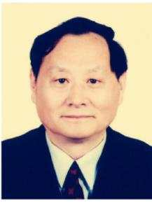
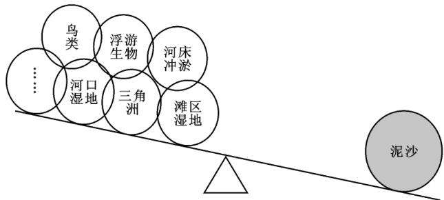
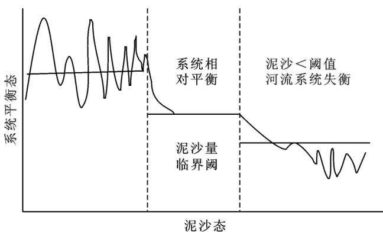

# 新时期黄河流域水土保持战略目标的转变与发展对策

姚文艺1，2， 刘国彬3

（1．黄河水利委员会 黄河水利科学研究院 郑州450003； 2．水利部 黄土高原水土流失过程与控制重点实验室 郑州450003； 3．中国科学院 水利部 水土保持研究所 陕西 杨凌712100）

摘 要 ［目的］ 遵循黄河流域生态保护和高质量发展国家战略（简称“黄河国家战略”）赋予黄河流域水土保持工作的新使命，分析黄河流域水土保持面临的重大挑战，旨在为黄河流域生态建设的高质量发展提供参考 ［方法］ 基于“黄河国家战略”的需求 结合长期的野外考察和学术研究成果 对新时期黄河流域水土保持发展战略目标的转变进行了重点分析和探讨 ［结果］ 新中国成立以来 通过70a余的持续治理 黄河泥沙显著减少 流域生态环境明显好转 但目前仍存在一些问题 ①空间治理不均衡 局部地区水土流失依然严重； ②人工植被系统空间结构雷同化 生态系统不稳定； ③缺乏景观格局优化配置 难以有效解决黄土高原生态系统由“绿”变“稳”的问题； ④生态治理的功能

性机制性问题凸显 影响水土保持的可持续发展 新时期的水土保持肩负着高质量发展根基的新使命 其本身也面临着战略定位和发展方式的转变 以及传统理论内涵和理念更新的重大挑战 因此 迫切需要研究严重制约生态治理效益与生态经济协同发展提质增效的关键技术难题 以及促进新时期黄河流域水土保持事业发展的对策 ［结论］ “黄河国家战略”的实施必将大大推进黄河流域水土保持事业的发展 黄河流域生态治理研究应着力解决高质量发展中生态保护治理的一系列关键科技问题 将水土保持战略目标由低标准大面积治理转向精致和精准治理 提升水土保持在推动黄河流域高质量发展中的地位和作用

关键词 ： 水土保持 ； 生态建设 ； 生态经济 ； 战略目标转变 ； 高质量发展 ； 黄河流域

文献标识码 ： C

文章编号 ： 1000－288X（2020）05－0333－09

中图分类号 ： S157

文献参数 ： 姚文艺 刘国彬．新时期黄河流域水土保持战略目标的转变与发展对策 ［J］．水土保持通报2020，40（5） ：333－340．DOI：10．13961／j．cnki．stbctb．2020．05．047； YaoWenyi， LiuGuobin．StrategicgoalchangeanddevelopmentcountermeasuresofsoilandwaterconservationinYellowRiverbasininnewperiod［J］．BulletinofSoilandWaterConservation 202040（5） 333－340

# StrategicGoalChangeandDevelopmentCountermeasuresofSoiland WaterConservationinYellowRiverBasininNewPeriod

YaoWenyi1，2， LiuGuobin3

（1．the Yellow River Institute of Hydraulic Research ， the Yellow River Conservancy Commission of the Water Resources Zhengzhou He ’ nan450003 China ； 2．Key Laboratory of the Loess Plateau Soil Water Process and Control ， Ministry of Water Resources ， Zhengzhou ， He ’ nan450003， China ； 3．Institute of Water Resources Yangling Shaanxi712100 China）

Abstract： ［Objective］ Accordingtoanewmissiongivenbythenationalstrategyofecologicalprotectionand high－qualitydevelopmentintheYellowRiverbasin （abbreviatedas“YellowRiverNationalStrategy”） ， the majorchallengesfacedbysoilandwaterconservationwereanalyzedinordertoprovidereferencesforthe highqualitydevelopmentofecologicalconstructionintheYellow Riverbasin．［Methods］ Basedonthe requirementsofthe “Yellow RiverNationalStrategy” combinedwithlong－termfieldinvestigationsand academicresearchresults， thedevelopmentgoalofsoilandwaterconservationintheYellowRiverbasinin thenewerawasanalyzedandconsidered．［Results］ SincethefoundingofthePeople’sRepublicofChina，

throughmorethan70yearsofmanagement sedimentsoftheYellowRiverhasbeensignificantlyreduced andtheecologicalenvironmentofthebasinbeenimprovedobviously．However， therearestillsomeproblems： ① Theimbalanceofspatialmanagement， andsoilerosioninsomeareasisstillserious； ② Thespatialstructure ofartificialvegetationsystemissimilar andtheecosystemisunstable ③ Theecosystemconstructionlacks theoptimalconfigurationoflandscapepatterns whichmakesitdifficulttosolvethetransformationofthe vegetationecosystemontheLoessPlateaufrom “green” to “stable” effectively； ④ Thefunctionaland mechanismproblemsofecologicalgovernanceareprominentandaffectsthesustainabledevelopmentofsoil andwaterconservation．Soilandwaterconservationinthenewerashouldersthenew missionofhigh－quality development anditisalsofacingthechangeofstrategicpositioninganddevelopmentmode aswellasthe majorchallengesofupdatingtraditionaltheoreticalconnotationsandconcepts．Therefore， itisurgentto studythekeytechnicalproblemsthatseriouslyrestrictthecoordinateddevelopmentofecologicalmanagement benefitsandecologicaleconomy， andtopromotethedevelopmentofsoilandwaterconservationinthe YellowRiverbasininthenewera．［Conclusion］ Theimplementationofthe“YellowRiverNationalStrategy” willgreatlypromotethedevelopmentofsoilandwaterconservationintheYellowRiverbasin．Researcheson ecologicalmanagementoftheYellowRiverbasinshouldfocusonsolvingaseriesofkeyscientificandtechnological problemsofecologicalprotectionandmanagementinhigh－qualitydevelopment．Thestrategicgoalofsoiland waterconservationshouldbechangedfromlowstandardandcoveringlargeareatodelicateandaccurate management， andtoenhancingtheroleofsoilandwaterconservationinpromotinghigh－qualitydevelopment oftheYellowRiverbasin

Keywords： soilandwaterconservation； ecologicalconstruction； ecologicaleconomy； strategicgoalchange； high－

qualitydevelopment；theYellowRivebasin

黄河流域是中华文明的重要发祥地 是连接青藏高原 黄土高原和华北冲积平原的关键生态屏障 并拥有煤炭 油气等丰富的自然资源 在中国经济社会发展战略格局中占有十分重要的地位［1－2］ 然而 黄河流经的黄土高原是中国典型的生态脆弱区和世界上水土流失最为严重的区域［3－4］ 水土流失导致水土资源破坏生态系统退化 农业综合生产能力降低 自然灾害加剧 同时 水土流失产生的大量泥沙使黄河下游河道成为世界闻名的“地上悬河” 严重威胁中国华北地区的防洪安全和生态安全 对北方地区生态安全屏障构筑和黄河流域高质量发展带来极大挑战 因此，迫切需要根据黄河流域生态保护和高质量发展国家战略（简称“黄河国家战略”）对生态保护提出的新使命 确定新时期水土保持战略目标 创新水土保持的理论体系和技术体系，更新水土保持治理理念与实践模式，从顶层设计上提高水土保持在黄河流域高质量发展中的地位。

新中国成立70a余来 黄河流域水土保持理论技术和实践均取得了显著成就 以小流域为单元综合治理的模式与实践成为世界水土保持发展的成功范例 具有黄河特色的生物措施 工程措施 耕作措施科学配置的综合治理模式与技术体系［5］ 保障了水土保持生态效益 经济效益和社会效益的统一 较好地解决了治理与开发 治坡与治沟 保水保土与生态修复的关系［5－6］ 初步改变了黄土高原“一片黄色不见绿”的历史状况 近年来探索的水土流失综合治理与生态产业协同发展的相关理论和实践将为新时期水土保持高质量发展提供新的动力［7］ “黄河国家战略”对水土保持工作提出了新的使命和要求 必将促使中国的水土保持进入一个新的发展阶段 另外 随着气候变化及人们对环境问题日趋高度关注 ，水土保持也面临许多新课题 国家发展和改革委员会与自然资源部联合颁布的《全国重要生态系统保护和修复重大工程规划（2021—2035年） 》所确定的到2035年生态服务功能显著提高 生态稳定性明显增强 自然生态系统基本上良性循环的目标 以及联合国粮农组织（FAO） 提出的实现可持续 生态服务等发展目标［8］和亚洲开发银行 （ADB） 开展的“黄河流域保护与治理问题对策”项目都将为黄河流域水土保持的科学理论与技术体系研究带来新的机遇 为适应新时期发展的需求 水土保持科学必须由传统的单一的保土保水研究领域向着水—土—气—生宽域度的方向发展，这也是学科发展所面临的新课题新任务

本文在系统总结黄河流域水土保持研究成果和长期实地调研的基础上 ，基于“黄河国家战略”提出的历史新使命 剖析目前存在的主要问题及需要应对的挑战 提出相应对策和建议 以期为新时期黄河流域高质量发展以及水土保持科学研究提供参考

## 1 目前黄河流域水土保持面临的关键问题

目前， 黄河流域水土保持工作还难以完全满足“黄河国家战略”重大需求， 与新要求 新使命不完全相适应 还有一些亟需解决的问题

## 1．1 治理程度空间不均衡

长期持续的大面积治理尤其是退耕还林还草工程的实施 使黄土高原整体植被覆盖度明显增加 入黄泥沙大大减少 例如 黄河多沙粗沙区的皇甫川窟野河 秃尾河等18条主要支流的输沙量由1954—1969年的1．19×109t／a减到2000—2012年的2．19×108t／a 然而 在遇有局地暴雨时 一些支流的水土流失现象仍比较严重 根据有关数据统计［9－10］ 尽管近年来实测最大洪水的径流量 输沙量均较以往历史洪水有所降低 但水流含沙量仍然较高 来沙系数（定义为沙峰含沙量与洪峰流量之比）没有明显减小甚至还有所增加（见表1） 究其原因 第一是与水土保持措施对大暴雨的控制作用有限相关［11］ ， 第二则与空间治理不均衡 低治理区水土流失依然严重也有很大关系 也就是说 虽然黄土高原生态退化总体上得到初步遏制 但是从局部区域或典型地带来看 有些地方仍属于弱治理区 例如 皇甫川 窟野河 秃尾河 十大孔兑等流域 包括砒砂岩区 黄土高原干旱半干旱部分区域及大部分沟道还属于典型的低治理区坡耕地较多 植被覆盖度低 其水土流失仍然严重 生态系统依然脆弱 一旦发生局地暴雨 就会产生高含沙洪水，形成严重的洪水泥沙灾害［12－13］ 再如，砒砂岩区是黄土高原侵蚀最剧烈的区域［14］ 虽然自20世纪80年代中期以来 国家先后实施了一些专项治理工程 但治理度低且治理效果不明显 根据观测统计， 该区的侵蚀模数目前 仍达 5000～18000$\mathrm { t } / ( \mathrm { k m } ^ { 2 } \cdot \mathrm { a } )$ 生态退化并未得到根本遏制

自2000年以来 黄土高原坡顶和缓坡地带植被得到明显恢复［15］ 但沟道治理仍很薄弱 不少沟道的边坡还属于裸露的侵蚀地带［16］ 根据观测 黄土高原大部分水土流失区的沟道侵蚀面积仍占总侵蚀面积的近60％［17］ 沟道侵蚀量也占流域侵蚀总量的60％左右［18］ 始终未能在广大区域内有效阻控沟道重力侵蚀

表1 黄河流域典型支流2000年前后最大洪水水沙要素
<table><tr><td rowspan="3">支流 名称</td><td colspan="4">历史实测最大洪水</td><td colspan="4">2000年以后实测最大洪水</td></tr><tr><td>流量/</td><td>含沙量/</td><td>来沙系数/</td><td>发生</td><td>流量/</td><td>含沙量/</td><td>来沙系数</td><td>发生</td></tr><tr><td> $( \mathrm { m } ^ { 3 } \cdot \mathrm { s } ^ { - 1 } )$ </td><td> $( \mathrm { k g } \cdot \mathrm { m } ^ { - 3 } )$ </td><td> $( \mathrm { k g \cdot s \cdot m ^ { - 6 } } )$ </td><td>年份</td><td> $( \mathrm { m } ^ { 3 } \cdot \mathrm { s } ^ { - 1 } )$ </td><td> $( \mathrm { k g \cdot \ m ^ { - 3 } ) }$ </td><td> $( \mathrm { k g \cdot s \cdot m ^ { - 6 } } )$ </td><td>年份</td></tr><tr><td>皇甫川</td><td>10 600</td><td>1030</td><td>0.097</td><td>1989</td><td>4730</td><td>774</td><td>0.164</td><td>2012</td></tr><tr><td>偏关河</td><td></td><td></td><td></td><td></td><td>57.3</td><td>419</td><td>7.312</td><td>2012</td></tr><tr><td>湫水河</td><td>3760</td><td>755</td><td>0.201</td><td>1961</td><td>1 350</td><td>507</td><td>0.376</td><td>2012</td></tr><tr><td>清凉寺沟</td><td>1670</td><td>800</td><td>0.479</td><td>1961</td><td>1 020</td><td>448</td><td>0.439</td><td>2012</td></tr><tr><td>无定河</td><td>4980</td><td>1 290</td><td>0.259</td><td>1966</td><td>4500</td><td>980</td><td>0.218</td><td>2017</td></tr><tr><td>大理河</td><td>2450</td><td>893</td><td>0.364</td><td>1966</td><td>3160</td><td>839</td><td>0.266</td><td>2017</td></tr></table>

## 1．2 人工植被系统空间结构雷同化

黄河流域气候 地形地貌 土壤 侵蚀类型空间分异性大 不同区域生态退化程度与机理也有很大差别 因此 所形成的生物群落结构也表现出明显的区域特征 根据分析 黄土高原草地净初级生产力（NPP）分布具有明显的空间异质性 大体呈南高北低的状态 且植物群落丰富度指数 多样性指数 优势度指数和均匀度指数具有强烈的空间相关性［19－20］ 显然 生态治理需要分区量化施策 科学配置水土保持措施类型 结构与模式 使之匹配于水资源承载力 保证人工生态系统的稳定性 然而 目前在生态治理实践中 黄土高原从南到北 从东到西种植的林草类型 配置结构高度雷同 人工林树种单调 对林草稳定性 生物多样性和生态系统可持续发展等问题重视不够

通过调查发现 松树（多为油松 樟子松） 柏树 刺槐 沙棘基本上成了黄土高原各地区必配的林灌种类而且生态林∶经济林∶人工草地∶自然恢复地的比例和人工林密度也不甚合理 没有充分体现人口 资源 环境的空间分异性 加之缺乏必要的管养措施 人工林退化问题非常突出 根据黄河水利委员会绥德水土保持科学试验站工作人员对绥德 吕梁地区的典型调查 侧柏和油松的枯叶病发生率达到15％左右 以致于年年种树却年年补树 大大降低了投资效益 同时还会引起土层土壤水分严重亏损，形成土壤干层化的诸多环境问题［21－22］

因此 黄土高原的人工生态系统建设要以提升生态系统质量和稳定性为目标 ， 需要分区量化 ， 以不同气候区的水资源承载力为刚性约束 对现有的人工生态系统进行改造 科学配置人工生态系统的结构 类型 解决植树的种类和适宜立地条件 建造淤地坝的适宜位置 以及生态恢复的方式（以人工修复还是以自然恢复为主）等问题，提质增效促稳 ，实现生态治理的高质量发展

## 1．3 生态系统建设缺乏景观格局优化配置

在目前的水土保持工程治理中 多从保持水土资源的层面上 关注工程措施 生物措施和耕作措施的结构配置及其治理水土流失的效应 而没有从景观格局层面上考虑具有生态学意义的水土保持措施类型植被结构 群落多样性和空间配置的问题 由此可能带来如下3个问题 ①植被建设模式单一 没有体现景观要素构型的空间异质规律 在不同区域小流域植被建设中 从梁峁顶到梁峁坡 从沟坡到沟床 植物类型 空间单元分布 构型组合等没有明显差异 单就草被类型来说 种植的主要就是紫花苜蓿 沙打旺 草木樨等 对其他草种的研究与推广都不多 弱化了草被建设的景观格局效应； ②由于人们对黄土高原人工植被群落演替规律 多样性形成机制及与水土保持因子的关系缺乏深入认识 因而 对于气候—地貌—植被—侵蚀多元环境要素耦合关系有着很大差异的区域来说 如何优化其植被措施配置 构建稳定的 群落多样性的人工林草生态系统 则成为一个需要从景观格局层面上解决的科学问题 ③在以牧业为主的地区 如何在改造和更新现有生态林的同时科学配置植被结构 考虑植被景观格局效应 促进人工草地的发展也是没有解决的问题

与景观格局构建有关的另外一个问题是 在近20a大规模实施退耕还林还草的自然植被恢复实践中发现 不少区域在一定时段内 植被恢复效果非常明显 但其后则出现了不同程度的退化及病虫害现象 表现为枯萎 萌芽率降低 死亡等 那么 关于黄土高原不同区域到底有什么样的顶级群落结构和是否需要及需要什么样的方式进行适度的人为干预才能形成稳定的植物群落的问题 ，目前只能说在黄土高原部分区域初步解决了“绿”的低品质阶段 但都没有达到高质量发展的自然植被群落“稳”的高品质阶段为此 需要解决天然植被封育及人工促进恢复 严酷生境林草种类选育 植物群落结构及物种多样性调控的空间格局效应等一系列理论与技术问题 提出不同区域的生态系统景观格局优化配置模式［23］

## 1．4 治理措施功能缺位及定量评估缺失

（1） 水土保持同黄土高原当地生态经济发展结合不紧密 虽然一些地区实施了生态移民 创造了生态自然恢复的有利条件，但是生态治理与移民致富方式方法脱节 影响了农民对生态保护和环境治理的积极性［16］ 加之水土保持监测监管体系不完善 监管主体的职能设置薄弱且发挥不充分，导致诸如毁林开荒 上山放牧的现象有所反弹，在局部区域甚至相当严重

（2） 仍未建立起有效的退耕还林还草生态补偿运行机制 缺乏科学定量评价指标体系和监督评价技术手段 使公平公正地执行补贴政策难以实现 直接影响到退耕还林还草工程的可持续实施 为此需要以生态功能和生态系统服务空间流动的视角 精准界定补偿政策实施的主要群体 建立公平公正的补偿方式 形成科学的生态补偿机制和合理的补偿标准 进而破解受偿区群众生态保护积极性不高的难题［16，24］

## 2 水土保持战略目标的转变

“黄河国家战略”确立的目标任务 要求新时期水土保持工作的战略目标需要向流域高质量发展的方向转变 需要在目标提升 理念更新 技术创新和评估重构等方面做出调整和补缺

（1） 更新水土保持科学理念 着力加强生态保护治理 积极支持流域省（区）打赢脱贫攻坚战是“黄河国家战略”向水土保持工作提出的新要求 为此 水土保持工作必须转变思路和理念 把水土流失治理 生态环境改善与农民增收 脱贫致富和流域高质量发展作为同等重要的任务 通过生态治理让人民群众充分享受绿色福利 通过生态惠民 生态利民 生态为民 使水土保持在黄河流域高质量发展中发挥重要作用［16］ 为此 水土保持需要长远规划 综合施策 遵循生态保护优先原则 基于黄河流域水资源承载力空间分异性充分考虑资源特色 产业特色 农牧业特色和文化特色 构建与之适应的综合治理模式 优选具有保持水土资源和经济开发价值双重功能的生态治理措施 通过生态建设培育新型生态衍生产业 带动当地产业经济发展 转变传统的水土保持科学理念和模式

（2） 提升水土保持战略目标 在黄河流域植被得到明显修复 生态环境得到总体改善的形势下 水土保持工作在战略层面上需要从单一的水土资源保持阶段转向水土保持与生态经济相协同的高质量发展阶段；在技术层面上 需要把大规模面上治理阶段转到高风险低治理区进行集中精准和精致治理阶段 ；在治理实践层面上 需要改变工程学意义上的以小流域为单元的多措施综合治理 转向注重生态学意义上的以小流域为单元的空间优化的水土保持生态景观格局建设；在管理层面上 需要由重建设 轻管理转向强监管 重评价

今后一个时期 黄河流域水土保持的治理目标应主要包含如下几方面 ①要突出黄河粗泥沙集中来源区重点治理项目 粗泥沙集中来源区生态系统的整合性 持续性和协调性属于黄河流域中最弱的 ， 不仅生态系统功能不完整 ，生态承载力极低，且处于人类强烈干扰的胁迫中 对其治理还相当薄弱 尤其是砒砂岩区和黄河上游十大孔兑流域的生态问题尤为突出为此 建议将黄河粗泥沙集中来源区治理作为优先行动计划项目 探索生态极度脆弱区的治理经验 建立干旱半干旱区水资源节约集约利用技术体系与生态补偿模式 形成富有地域特色的生态—经济协同高质量发展的新路子 ②要从改善生态系统层面建立以小流域为单元的空间生态景观格局治理模式 优化小流域景观组成单元的类型 数目以及空间分布与配置 量化小流域空间异质性 生态学过程和尺度的关系 进行精致精准治理 形成生态学上具有不可替代意义的人工与自然共生的植被系统 用以更加有效地涵养水源 保护水土资源和生态环境 另外 禁牧政策也需要与时俱进 有研究表明 封禁10～15a的生态效果最好 其后可以合理利用草被资源 例如，适度放牧利用将会有利于后续植被演替［25］ 那么， 禁牧政策应当如何调整与完善 这也涉及到退耕还林还草等生态建设战略目标转变的大问题 ③要确立水土保持助力黄土高原乡村振兴的重要职责 把水土保持同生态环境改善和经济社会发展有机结合起来 形成空间治理需求多元化与空间治理分工化的协同治理格局

（3） 理清水土保持科技问题 进入新时代 迫切需要理清制约水土保持发展的科技瓶颈问题 以应对生态治理与经济社会协调发展的挑战 需要提高对“绿水青山就是金山银山”论断的科学认知水平 发挥水土保持在生态保护治理与经济社会发展中良性平衡的功能性作用 形成区域特色鲜明 充分体现水土保持特点的水土保持—生态治理—脱贫致富融合的发展模式 实现水土保持高质量发展 同时 在水土保持科学研究上 也要求把水土保持固土蓄水的传统学科目标转变为侵蚀阻控与生态功能整体提升 服务功能增值的科学权衡 完善水土保持的科学内涵和知识体系 提升水土保持学科在国家经济社会发展中的科技支撑作用 建立起水土保持新的理论体系与技术体系

（4） 重构生态治理成效评估 近期 由国家林业和草原局发布的《中国退耕还林还草二十年（1999—2019） 》白皮书系统介绍了退耕还林还草工程的建设成就 自1999年以来 黄土高原陆续开展的退耕还林还草工程促进了生态改善 农民增收 农业增效和农村发展 然而 目前黄河流域仍未建立起科学长效的生态补偿机制与完善的评价指标体系 不利于退耕还林还草工程建设的高质量发展 难以做到补偿政策实施的公正性和公平性 构成了机制性的挑战 迫切需要精准界定生态补偿和受偿的主要群体 ，明确生态补偿对象并制定合理补偿标准 ，明晰生态补偿主体与受偿主体的空间格局 经济链环的复杂勾稽关系 建立起完善且能够有效保障补偿政策公平公正实施的监测评价机制 开展生态系统保护成效监测评估 将按单位面积（亩）核算的均等化补偿方式转变为能够体现生态价值的差异化补偿 从战略层面解决制约生态治理持续发展的机制性问题

## 3 新时期黄河流域水土保持的重大关键科学技术难题

根据新时期水土保持所承担的使命和面对的诸多挑战 仍有不少规律还需要深化认识 有不少严重制约生态治理提质增效的关键技术迫切需要突破

（1） 植被稳定性与功能持续发挥机制 大规模退耕还林还草工程的实施 使黄土高原人工林面积增加至 $7 . 5 0 \times 1 0 ^ { 6 } \ \mathrm { h m ^ { 2 } }$ 多，植被覆盖度增加了50％， 多数治理地区的植被覆盖度从原来的30％左右提高到60％左右 在减少水土流失 实现该区由“黄”变“绿”的过程中发挥了重要的作用 但目前面临人工植被结构单一 植物群落尚不稳定 生态功能没有完全发挥 人工林如刺槐林出现退化等问题 在新的历史时期，对于黄土高原人工林的生态功能，需要从注重水土保持单一功能向保持水土资源 碳汇 生物多样性保育和景观格局效应等多功能并重的方向发展 因此 应该系统研究植物群落结构和生态功能的区域分异与演变规律 进行系统提质改造；同时需要揭示人工林结构对水土保持功能 碳汇功能和生物多样性保育功能的影响机制 提出基于系统功能平衡的人工林结构调控方法 为人工林改造和生态再建设提供理论依据

（2） 黄河流域容许水土流失量的合理阈值 黄河是世界上水流含沙量最高的河流 且较其他流域具有更为复杂环境结构的自然—社会—经济复合生态系统 泥沙是该系统的关键组分 与流失地区土壤肥力 河流水沙关系 水生生物生存环境 下游河床演变 滩区湿地演替 河口三角洲冲淤及其生物多样性等密切相关 是河流生态系统演化的主导因子 决定了河流生态系统这一“翘板”结构的稳定性（见图1）

  
图1 泥沙在河流生态系统动态平衡中的作用示意图

黄河流域生态系统演变与泥沙具有密切的响应关系 存在着系统平衡下的泥沙量及其过程的多维临界规律 输沙量一旦大幅偏离该阈值 将引发全流域或部分地区的生态系统作出调整 导致总体系统失衡（见图2） 近几十年来 黄河泥沙显著减少 由原来的年均产沙 $1 . 6 0 \times 1 0 ^ { 9 }$ t减至 $3 . \ 0 0 \times 1 0 ^ { 8 }$ t左 右［26］黄河泥沙到底应减少到什么程度？这就要求必须从整体黄河生态系统观出发 研究黄土高原生态承载力及生态修复临界值 维持黄河生态系统相对稳定的水沙临界值 保持黄河三角洲生态系统动态平衡与安全的水沙约束条件 进而给出多重约束条件下基于生态系统相对稳定的黄河流域土壤容许流失量和输沙量（包括水沙关系）的多维复合临界值 为科学确定黄土高原的治理目标提供依据

  
图2 泥沙与生态系统平衡的关系示意图

（3） 典型区域和特殊情景下的土壤侵蚀规律目前 黄河流域砒砂岩区及黄土区沟坡等典型区域的土壤侵蚀仍很严重 是治理的短板和难点 需要研究砒砂岩区水力 风力 冻融多动力复合侵蚀交互特征与复合关系 定量揭示复合侵蚀发生发展机理及复合侵蚀对植被退化的影响作用 明晰土壤侵蚀强度格局与植被景观格局的空间耦合关系［16］ 阐明复合侵蚀与生态退化的耦合过程与互动效应 突破砒砂岩区复合侵蚀治理与植被快速修复的关键技术 ；需要加强研究沟道重力侵蚀发生的动力机制及其临界条件 ，揭示沟道重力侵蚀发生的随机触发规律

（4） 区域尺度治理关键技术与优化布局 以黄河流域总体系统为对象，基于空间治理均衡的系统观点，以实现坡面—沟道系统侵蚀全过程阻控为目标 研发基于重力侵蚀阻控 洪水泥沙调控 沟道人工湿地生态系统构建的多功能的沟道整治新技术 新模式 解决有效控制沟道稳定的技术难题 需要优化水土保持与生态治理措施体系在黄河流域区域尺度上的布局，深化关于气候—地貌—植被—侵蚀耦合机理及多维复合临界规律的研究，揭示植被时空演替特征及驱动因子，研究适宜种树的立地条件和适宜树种的问题 系统解决治理措施配置体系的空间优化布局等重大实践问题

（5） 基于水土资源可持续利用的生态—经济协同发展模式 实现水土资源可持续利用不仅是黄土高原内部的问题 同时也是确保黄河长治久安和振兴黄河流域经济的关键所在 需要深化认识不同类型区生态承载力 揭示基于水量平衡及土壤侵蚀环境制约的生态承载力维持和提升机制 判别提升阈值及其主控因子 研究基于生态友好型土地资源开发与保护和基于生物性节水［27］ 的水资源高效利用关键术 建立区域经济社会发展和生态安全的空间科学布局 重构水土资源可持续开发与利用结构模式 量化经济与社会对水土资源利用的优化结构［28］ 完善空间治理保障生态修复质量 形成一个与人口增长相适应的水土资源保护型生产体系和一个水土资源可持续利用的粮食安全保障技术体系［29］ 需要深入研究“绿水青山就是金山银山”的理论内涵和实践途径 建立“绿水青山”的生态 经济和社会效益核算方法与评价指标体系；集成研发极具生态和经济效益的复合水土保持产业技术与模式 揭示黄河流域生态屏障和经济地带的空间协同关系 构建水土保持与生态产业相配套 经济发展与生态服务功能保护提升相融合的技术体系 并积极探索商品型生态农业发展模式 促进流域生态经济系统超常规演替 ，实现生态经济系统良性发展［30］ 构建生态修复—经济发展协同推进的水土保持关键技术体系

（6） 水土保持效益与生态服务功能监测评估关键技术 集成创新高分辨率卫星影像和全流域 分区域多门类 多层次的监测技术体系 构建以生态优先为原则的黄河流域水土保持分区域多目标多层次的效益与功能评估评价指标体系 开展基于大数据的水土保持监测多元化数据关联分析 进而逐步实现黄河流域水土保持重点工程图斑化精细管理 水土流失实时动态监测 生产建设项目天地一体化动态监控和监管全覆盖 破解制约数据共享的瓶颈技术与“堵点”机制 最终构建起完善的能够满足科研 监管双需求的水土流失综合监测 大数据同化及评估 预测和预警的水土保持综合信息系统 为水土保持强监管提供坚实的决策支持技术平台 贡献智能防控治理方案与监管对策

## 4 新时期黄河流域水土保持发展对策

（1） 开展高风险低治理区水土流失专项调查在全国水利普查／地方水土流失普查及土壤侵蚀动态监测基础上 对一些具有高风险和亟待治理的区域和地带等（例如 对低治理区 极度脆弱生态区 坡耕地沟坡等低植被覆盖区 砒砂岩 黄土沟坡 风蚀水蚀交错区 塬边等区域）进行专项详查 重点了解黄土高原存在强烈侵蚀潜在风险的区域或地带 ；了解低治理区的生态退化程度 黄土高原沟道重力侵蚀规模及其时空分布 定量评估未得到有效治理的沟坡潜在侵蚀量 研究与评估治理措施配置与区域布局的合理性寻找治理的薄弱环节 研究水土流失治理的攻坚点和难度 提出有效的对策 以便制定切实可行的治理规划 达到精准治理

（2） 做好新时期水土保持发展顶层设计 需要从全流域高质量发展的多维度深化认识新时期水土保持的科学知识体系 工程实践内涵 同时以民生保障与改善作为水土保持工作的出发点和落脚点 做好新时期黄河流域水土保持高质量发展的顶层设计 提出解决新时期黄土高原水土保持补短板 强监管等重点难点的成套技术和政策方案 ， 明确建设目标和任务，确定重点建设项目

（3） 建立高效完善的水土保持生态建设工作机制 应借鉴以下国际先进经验 ①澳大利亚墨累—达令河（MurrayDarlingRiver）流域水生态水环境一条龙管理机构统一管理［31－32］ ； ②欧洲莱茵河（RhineRiver）在各涉河国协作机制框架下从流域整体生态系统出发统筹综合治理［33］ ； ③美国田纳西河（TennesseeRiver）流域在州际资源统一管理和规划的基础上开展综合性生态治理［34－35］ ； ④美国密西西比河流域 （MississippiRiver）联邦统一协调 流域各州合作落实 多方共同参与综合治理［36－37］ 同时 充分发挥中央流域管理机构在中央政府 地方政府 企业与涉域农民之间的协调功能［38］ 为此 应该强化黄河水利委员会的职能 强化流域内各省共同协作的工作机制 建立水土保持 林草生态环境 农业 资源 水利等多部门的会商与联署工作机制，形成多方一致的目标与行动 要充分发挥水土保持工作能够统筹各方力量和综合发力的优势 创新水土保持生态建设工作体制机制 探索出一套满足全流域统筹要求的合作机制 形成全流域推进生态保护治理事业发展的强大合力，破解“九龙治水”的困境

（4） 建立“黄河国家战略”先行示范区 强化水土保持在“黄河国家战略”中的重要地位，建设黄土高原生态保护和高质量发展的国家战略先行示范区 形成示范带动效应 推进形成中国自主的黄土高原现代化水土保持的科学技术体系 生态衍生产业体系 监测监督评估体系 管理创新体系和模式示范应用体系 为黄河流域高质量发展提供成套技术支撑 并为世界水土保持与生态治理提供高质量发展的成功案例

（5） 提升水土保持监测监管水平 完善和优化黄河流域水土保持监测站网空间布局 创新和补充基于黄河流域高质量发展需求的监测指标和参数 ；重点加强砒砂岩区 粗泥沙集中来源区等生态极度脆弱区监测站网建设；推动站点监测设备和设施的更新与升级改造工作 加强基于时空大数据理念的水土保持现代化监测评价技术研发 提升监测监管水平 把黄土高原水土保持监测站网纳入国家生态监测网络体系使其成为黄河流域生态保护和高质量发展的可靠基础数据支撑平台

（6） 强化水土保持科技支撑作用 在国家科技计划顶层设计中 应加强黄土高原特别是典型生态脆弱区土壤侵蚀与生态退化互馈机制 水土流失过程精确预测及作业预报 水土保持措施优化配置与空间合理 均衡布局 水土保持景观格局建设 精准施策重点治理的相关应用基础及关键技术 生态治理对黄河水沙调控机制与应对策略 ，以及生态治理新技术新模式等方面的研究 用新技术带动水土保持项目实施与投资 解决黄河流域水土保持高质量发展的制约性瓶颈技术问题

## 5 结 论

人民治黄70a余来 黄河流域水土保持与生态治理得到极大发展 水土流失得到明显遏制 生态恢复效果显著，并在治理理论与技术方面取得了多项研究进展 奠定了中国在生态脆弱区综合治理理论与技术上的国际领先地位 “黄河国家战略”赋予了黄河流域水土保持新的使命 同时也为水土保持事业提供了大有作为的高质量发展战略期 无论是在实践维度还是在学科知识体系方面 这是水土保持大发展的一个系统的 宽域的新机遇 需要相关管理 科研 生产 教育等多领域的工作者协同努力 抓住这一历史机遇，针对黄河流域水土保持在空间格局（砒砂岩区沟道 低治理区） 结构创新 （新模式 新措施 新技术） 功能提升（生态产业经济 水土保持—生态—经济协同发展）和机制运行（水土保持与生态治理措施建设 管理 维护和监测）等方面存在的突出问题 ， 制定科学 可行的应对策略与措施 确立水土保持发展战略新目标，重点解决减沙效益与流域生态系统稳定的临界关系，人工生态系统稳定及其生态功能持续 ，空间治理系统均衡 景观格局优化 措施科学配置与空间布局 水土保持—生态—经济协同发展模式与路径，水土保持监管与水土流失监测的智能化全域化等薄弱环节中的关键技术问题 完善水土保持与生态综合治理技术体系 丰富水土保持学科的知识体系 提升黄河流域水土保持质量 为筑牢黄河流域生态安全屏障，实现黄河长治久安提供坚实的科技支撑与科学高效的体制机制保障

## ［ 参 考 文 献 ］

［1］ 水利部黄河水利委员会．黄河流域综合规划 （2012—2030年） ［M］．郑州 ：黄河水利出版社 2013

［2］ 水利部 ， 国家发展改革委 ， 财政部 ， 等．全国水土保持规划（2015—2030年） ［R］．2015

［3］ 朱显谟 ，任美锷．中国黄土高原的形成过程与整治对策［J］．中国历史地理论丛 ，1991（4） ：1－14

［4］ 山仑 ，徐炳成．新时期黄土高原退耕还林 （草） 有关问题探讨［J］．水土保持通报 ，2019，39（6） ：295－297

［5］ 姚文艺 ，李占斌 ，康玲玲．黄土高原土壤侵蚀治理的生态环境效应［M］．北京 ：科学出版社 2005：89－211

［6］ 李春安．继往开来 深化改革 努力建设黄土高原生态文明［J］．中国水土保持 2016（9） ：4－8

［7］ 刘国彬 ， 王兵 ， 卫伟 ， 等．黄土高原水土流失综合治理技术及示范［J］．生态学报 ，2016，36（22） ：7074－7077

［8］ WorldMeteorologicalOrganization［EB／OL］．［2020－09－23］

［9］ 徐建华 金双彦 王玉明 等．2006年皇甫川“7·27”高含沙洪水分析［J］．人民黄河 ，2007，29（7） ：12－13，16

［10］ 赵梅 ，刘玉斗 ， 崔殿河．皇甫川流域水文情况分析［J］东北水利水电 2015（5） ：41－4259

［11］ 许炯心 ， 姚文艺 ， 韩鹏．基于气候地貌植被耦合的黄河中游侵蚀过程［J］．北京 ：科学出版社 2009：198－262

［12］ 姚文艺 ， 侯素珍 ， 郭彦 ， 等．陕北绥德县 子洲县城区2017“7· 26”暴雨致灾成因分析 ［J］．中国防汛抗旱2018，28（9） ：27－32，49

［13］ 刘宝元 刘晓燕 杨勤科 等．黄土高原小流域水土流失综合治理抗暴雨能力考察报告 ［J］．水土保持通报 ，201737（4） ：封2－4

［14］ 王愿昌 ，吴永红 ，李敏 ，等．砒砂岩地区水土流失及其治理途径［M］．郑州 ：黄河水利出版社 ，2007

［15］ 尤南山 ，董金玮 ，肖桐 ，等．退耕还林还草工程对黄土高原植被总初级生产力的影响 ［J］．地理科学 ，2020，40（2） ：315－323

［16］ 姚文艺．新时代黄河流域水土保持发展机遇与科学定位［J］．人民黄河 201941（12） ：1－7

［17］ 刘林 ，王小平 ， 孙瑞．半干旱黄土丘陵沟壑区沟道侵蚀特征研究［J］．水土保持研究 ，2015，22（1） ：38－43

［18］ 马瞳宇 ，李谭宝 ， 张平仓 ， 等．近20年水蚀风蚀交错区小流域侵蚀及坡—沟产沙演变的粒径对比分析［J］．水土保持学报 ，2013，27（4） ：83－87，185

［19］ 张凯 陈丽茹 徐慧敏 等．黄土高原水蚀风蚀交错带小流域植物群落特征的空间变异及其影响因素［J］．应用生态学报 ，2019，30（8） ：2521－2530

［20］ 刘洋洋 王倩 杨悦 等．黄土高原草地净初级生产力时空动态及其影响因素［J］．应用生态学报 201930（7）2309－2319

［21］ 杨磊 ，卫伟 ，莫保儒 ，等．半干旱黄土丘陵区不同人工植被恢复土壤水分的相对亏缺 ［J］．生态学报．201131（11） 3060－3068

［22］ 王瑜 朱清科 赵维军 等．陕北黄土区人工林地土壤水分的垂直变化规律 ［J］．中国水土保持科学 ，2015，13（6） ：54－60

［23］ 孙书存 ，包维楷．恢复生态学［M］．北京 ： 化学工业出版社 ，2005：27－97

［24］ 傅伯杰．以空间优化为抓手保障生态安全［N］．中国科学报 ，2019－9－9（1）

［25］ 程积民 井赵斌 金晶 等．黄土高原半干旱区退化草地恢复与利用过程研究［J］．中国科学（生命科学） ，2014，44（3） ： 267－279

［26］ YaoWenyi， XiaoPeiqing， ShenZhenzhou，etal．Anal－ysisofthecontributionofmultiplefactorstotherecentdecreaseindischargeandsedimentyieldintheYellowRiverbasin， China ［J］．JournalofGeographicalSci－ences， 2016，26（9） ：1289－1304

［27］ 山仑 ，邓西平．黄土高原半干旱地区的农业发展与高效用水［J］．中国农业科技导报 ，2000，2（4） ：34－38

［28］ 任烨 ，梁文辉．构建黄土高原地区水土资源可持续开发与利用三结构模式 以陇东 （平凉） 黄土高原地区为例［J］．水土保持研究 ，2003，10（4） ：46－50

［29］ 李靖．黄土高原地区农业水土资源可持续利用的问题与举措［J］．中国农业科技导报 ，2000，2（4） ：29－33

［30］ 刘国彬 李敏 上官周平 等．西北黄土区水土流失现状与综合治理对策［J］．中国水土保持科学，2008，6（1） ：1621

［31］ DonBlackmore．墨累—达令河流域管理的关键 ：汇流区域一体化管理［J］．中国水利 ，2003（21） ：55－56

［32］ AngYang DushmantaDutta JaiVaze etal．Aninte－ gratedmodellingframeworkforbuildingadailyriver systemmodelfortheMurray－DarlingBasin Australia ［J］．InternationalJournalofRiverBasinManagement， 201715 （3） ：373－384

［33］ RaadgeverGT， MostertE， KranzN， etal．Assessing managementregimesintransboundaryRiverbasins： Do theysupportadaptivemanagement？［J］．Ecologyand Society 200813（1） DOI10．5751／es－02385－130114

［34］ EKBLADH D．“Mr．TVA” ： Grass－rootsdevelop－ment， DavidLilienthal， andtheriseandfalloftheTennesseevalleyauthorityasasymbolforU．S．over－seasdevelopment， 1933－1973［J］．DiplomaticHistory，2002，26（3） ：335－374

［35］ AboutTVA［EB／OL］．［2020－07－23］．http： ∥www tva．com／abouttva／index．htm

［36］ AboutEPA［EB／OL］．［2020－07－25］．https： ∥wwwepa．gov／aboutepa

［37］ MississippiRiver｜ History，Physical，Features，Culture， ＆．．．［EB／OL］．［2020－07－28］．https： ∥www．baidu com／s？ie＝utf－8＆f＝3＆rs－vbp＝1＆rsvidx＝1＆tn＝ baidu＆wd＝mississippi％20river＆fenlei＝256＆oq＝mis－ sissippi％2520river＆rsvpq＝8118564200017bb6 ＆rsvt＝ ab26AxcFZG8X0tGwKMmbLudTEJHFT0I7y8qJCcWjQK－ tIlPiYj7ileinVbj8＆rqlang＝cn＆rsvdl＝ts0＆rsventer＝ 0＆rsvbtype＝t＆prefixsug＝mississippi％2520river＆rsp＝0

［38］ Abouttheofficeofcongressionalandintergovernmental relations（OCIR） ［EB／OL］．［2020－07－25］．https： ∥ www．epa．gov／aboute－pa／about－office－congressional－ and－intergovernmental－relations－ocir