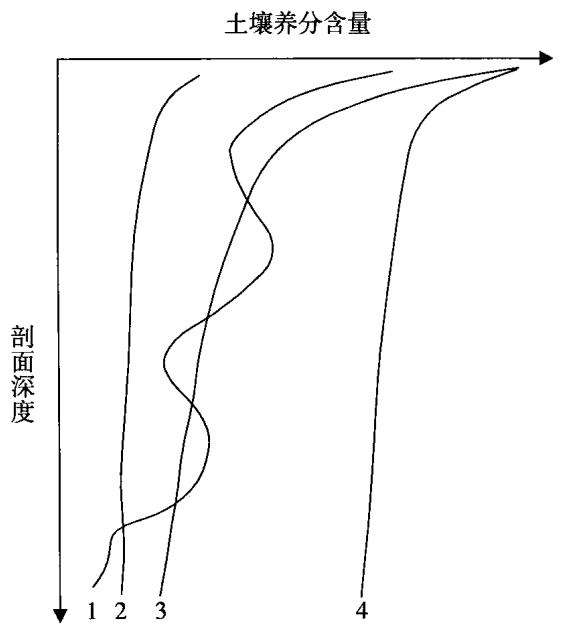

# 关于耕作层土壤剥离用于土壤培肥的必要条件探讨

徐艳1，张凤荣1，赵华甫2，姜广辉3

(1. 中国农业大学土地利用与管理研究中心，北京 100193；2. 中国地质大学(北京)土地科学技术学院，北京100083；3. 北京师范大学资源学院，北京100875)

摘要：研究目的:探讨不同区域耕作层土壤剥离用于新增耕地、劣质耕地土壤培肥的必要条件。研究方法：现象溯因法和综合分析法。研究结果：不同土壤类型的耕地其土壤肥力水平和在剖面中的分布特征不一样。研究结论：开展耕作层土壤剥离再利用应该因地制宜，使得取土区的供土状况与填土区的需土条件相互匹配。

关键词：耕作层土壤；剥离；新增耕地；劣质耕地；土壤培肥

中图分类号：F301.21

文献标识码：A

文章编号：1001-8158(2011)11-0093-05

# Prerequisites for Preserving the Fertility and the Soil Layer Before Farmland Converted for Construction Use

XU Yan', ZHANG Feng-rong1, ZHAO Hua-fu², JIANG Guang-hui³

(1. Research Center of Land Use and Management, China Agricultural University, Beijing 100193, China; 2. College of Land Science and Technology, China University of Geosciences, Beijing 100083, China; 3. College of Resources Science and Technology, Beijing Normal University, Beijing 100875, China)

Abstract: The purpose of this paper is to discuss the prerequisites for preserving the fertility and the soil layer for future use before the land is converted for construction use. Methods of phenomenon reasoning and comprehensive analysis were used. The results indicated that the fertility of soil and its distribution features were different regarding different types of soil. The paper concluded that to reuse the soil layer of the land converted for construction should take the local condition into account, matching the original features of the preserved soil with the condition of the new land.

Key words: farmland; surface soil reuse; soil fertility improvement; poor quality cultivated land; land fertility cultivation

很多国家都非常重视表土剥离及其再利用工作。国外的表土剥离工作主要发生在矿产资源开发和各类建设活动过程中的土地复垦，也有用于提高土地质量和治理土壤污染等，并形成了较为成熟的方法和制度-2]。在中国，《中华人民共和国土地管理法》(以下简称《土地管理法》)第32条规定：“县级以上地方人民政府可以要求占用耕地的单位将所占用耕地耕作层的土壤用于新开垦耕地、劣质地或者其他耕地的土壤改良。”鼓励将耕作层土壤(表土)剥离出来，用于土地开发、整理、复垦项目或其他需要土壤的项目，提高补充耕地质量。

目前，《土地管理法》关于耕作层土壤剥离再利用是弹性要求，而且缺乏相应的技术指南或指导规范。由于剥离耕作层土壤会增加成本，建设用地单位在占用耕地时，绝大多数情况下不对耕作层土壤进行剥离和再利用。耕地占补平衡工作普遍存在“占优补劣”现象。因此，国土资源管理部门一直在考虑加强耕作层土壤剥离再利用的工作，并通过立法或政策形式，重新考量《土地管理法》中的耕作层土壤剥离再利用的弹性要求。本文通过研究各种耕种土壤的肥力，辨析“土壤肥力”，研究“供土”和“需土”两者的关系，论证实施耕作层土壤剥离再利用的操作性，明确什么情况下可以实施耕作层土壤剥离再利用工程。

## 1 土壤培肥的概念

## 1.1 土壤肥力的概念

土壤肥力是土壤区别于成土母质和其他自然体的最本质的特征。土壤肥力包括狭义土壤肥力和广义土壤肥力。狭义土壤肥力是指土壤能够直接为植物或者农作物提供矿物质养分(氮、磷、钾等)的能力[3]。土壤养分存在于土壤有机质中或被吸附在土壤矿物质颗粒中，通过分解或解析成为植物可以吸收的养分。施用化肥或有机肥的目的就是补充土壤矿质养分。广义的土壤肥力是指土壤水肥气热以及扎根立地条件。

## 1.2 土壤培肥

笔者认为，土壤培肥不仅仅是提高土壤养分供应能力，更应该增强土壤为植物生长提供和协调营养条件和立地条件的综合能力。耕作层土壤剥离用于新增耕地、劣质耕地土壤培肥的目标有三：一是增加土层厚度，二是改善土体构型(包括表层土壤质地)，三是增加养分水平。其中，增加土层厚度最为重要，因为这不仅可以增加蓄水保肥能力，提高水分利用率[4]，还可以保持肥力，抵抗侵蚀5]。

## 2 不同类型的土壤养分分布特征

传统意义的利用剥离的耕作层土壤进行培肥，一般是指被占用耕地的表土肥沃，富含有机质和养分，但是，不同土壤类型其表层土壤的有机质及其养分水平不同，并且有机质及其养分在土壤剖面中的垂直分布也不同。

基于《中国土壤》6二次土壤普查数据，中国主要土壤类型养分含量在剖面中的分布状况各具特色。土壤中氮、磷、钾是作物生长需要量和收获时带走量较多的营养元素，能够反映土壤肥力水平。许多研究表明土壤有机质含量和土壤氮等元素高度相关[7-8]，因此，本文也用有机质含量来反映土壤养分状况(表1)。

土壤养分在土体中分布通常包括三种类型(图1)。一类如图中线3所示，这类土壤养分含量随着土壤剖面深度的增加而减少，尤其是表土肥力非常高，典型的是黑土、黑钙土等草原土壤系列。以黑土为例，其全土体中的有机质含量均较高，尤以表层土壤有机质含量最高，多在30—65g/kg之间，自表层向下土壤有机质含量逐渐降低，心土层和底土层一般在4一30g/kg之间。第二类如图中线2和线4所示，土壤剖面通体养分差别不大。线2表示整个土体土壤养分含量都不高，表层土壤养分含量不比剖面下部的高，比较典型的是黄土高原土壤特点。黄土分布遍及整个黄土高原，土层深厚疏松，质地多为均一的粉砂壤土。由于长期的土壤侵蚀，黄土母质被裸露地表，表土层的土壤有机质含量不高，有机质含量在剖面中的分布变化也不大，通体土壤养分含量都比较低。线4也是体现土壤剖面通体养分含量差别不大，但是养分含量比线2较高，典型的是紫色十等土壤。紫色土也是遭受强烈侵蚀的土壤，剖面层次分化不明显，因侵蚀强烈而风化成土速度较快，基本保持了母岩理化性质特征，虽然土壤中钾、钙等矿质养分含量丰富，但是有机质与氮素积累低，而且土层薄。还有一类则是土壤养分含量随剖面深度增加出现不规则变化，如图中线1所示，比较典型的是冲积平原土壤特点，以潮土为典型。潮土主要成土母质是近代河流冲积物，在沉积过程中沉积物受水力分选作用支配，造成在不同层次上土壤颗粒组成不同，因此土壤剖面中养分纵向分布也呈现不规则变化。潮土因水热条件及种植利用程度不同，土壤养分含量表现出明显的区域特点，黄淮海平原的潮土有机质含量为 $5 - 1 1 \ \mathrm { g / k g }$ ，长江中下游平原为 $8 - 1 8 ~ \mathrm { g / k g }$ ,珠江三角洲为 $1 7 - 2 7 \ \mathrm { g / k g } _ { \odot }$ 菜园土因为长期施用大量肥料(包括有机肥)形成了比较深厚的有机质含量和氮磷钾含量都非常高的厚熟表层。

  
图1 土壤养分在土体中分布示意图  
Fig.1 Sketch map of soil nutrients distribution in profile

表1 不同土壤类型土体中有机质含量分布  
Tab.1 Soil organic matter distribution in different soil types
<table><tr><td>土壤 类型</td><td>深度 cm</td><td>有机质  ${ \pmb g } / { \pmb k } { \pmb g }$ </td><td>深度 cm</td><td>有机质  $\mathbf { g } / \mathbf { k } \mathbf { g }$ </td><td>土壤 类型</td><td>深度 cm</td><td>有机质  $\mathbf { g } / \mathbf { k g }$ </td><td>深度 cm</td><td>有机质 g/kg</td></tr><tr><td rowspan="6">黑土</td><td colspan="2">黑龙江德都</td><td colspan="2">吉林公主岭</td><td rowspan="6">黑钙土</td><td colspan="2">黑龙江大庆</td><td colspan="2">吉林公主岭</td></tr><tr><td>0-24</td><td>64.98</td><td>0-18</td><td>28.8</td><td>0-15</td><td>35.7</td><td>0-19</td><td>20.5</td></tr><tr><td>24-40</td><td>34.23</td><td>18-59</td><td>32.8</td><td>15-50</td><td>16.7</td><td>19-49</td><td>13.9</td></tr><tr><td>40-70</td><td>14.15</td><td>59-85</td><td>14.5</td><td>50-105</td><td>6.1</td><td>49-78</td><td>6.8</td></tr><tr><td>70-100</td><td>9.92</td><td>85-106</td><td>10.8</td><td>105-150</td><td>5.0</td><td></td><td></td></tr><tr><td>100-130</td><td>7.79</td><td>106-130</td><td>9.8</td><td></td><td></td><td></td><td></td></tr><tr><td rowspan="4">黄绵土</td><td>陕西米脂</td><td></td><td>陕西子长</td><td></td><td>莱园土</td><td colspan="2">湖南长沙9</td><td>北京丰台*</td><td></td></tr><tr><td>0-20</td><td>3.24</td><td>0-18</td><td>3.19</td><td></td><td>0-20</td><td>37.7</td><td>0-25</td><td>45.3</td></tr><tr><td>20-50</td><td>2.07</td><td>18-60</td><td>3.08</td><td></td><td>20-40</td><td>26.8</td><td>25-65</td><td>17.4</td></tr><tr><td>50-75</td><td>2.09</td><td>60-120</td><td>2.96</td><td>40-75</td><td>9.1</td><td></td><td>65-100</td><td>14.0</td></tr><tr><td rowspan="6">潮土</td><td>山东禹城梁庄</td><td></td><td>河南尉氏</td><td></td><td>灰漠土</td><td colspan="2">新疆精河托托南戈壁</td><td></td><td>内蒙古乌兰察布</td></tr><tr><td>0-20</td><td>11.2</td><td>0-20</td><td>10.9</td><td></td><td>0-1.5</td><td>4.6</td><td>0-3</td><td>5.4</td></tr><tr><td>20-28</td><td>8.5</td><td>20-35</td><td>6.5</td><td></td><td>1.5-5</td><td>3.6</td><td>3-10</td><td>6.9</td></tr><tr><td>28-63</td><td>10.0</td><td>35-64</td><td>4.8</td><td></td><td>5-23</td><td>2.5</td><td>10-37</td><td>一</td></tr><tr><td>63-96</td><td>5.4</td><td>64-105</td><td>5.3</td><td></td><td>23-40</td><td>一</td><td>37-48</td><td></td></tr><tr><td>96-105</td><td>4.5</td><td>105-130</td><td>5.5</td><td></td><td></td><td></td><td></td><td>一</td></tr><tr><td rowspan="4">紫色土</td><td>四川合川</td><td></td><td>四川会东</td><td></td><td></td><td rowspan="4"></td><td></td><td></td><td></td></tr><tr><td>0-33</td><td>12.0</td><td>0-38</td><td>12.2</td><td></td><td></td><td></td><td></td><td></td></tr><tr><td>33-59</td><td>9.6</td><td>38 以下</td><td>33.5</td><td></td><td></td><td></td><td></td><td></td></tr><tr><td>59-100</td><td>4.0</td><td></td><td></td><td></td><td></td><td></td><td></td><td></td></tr></table>

注：(1)除特殊标注，表1数据均来自《中国土壤》;(2)\*引自《北京土壤》. 北京市农业区划办公室，北京市农林科学院、北京市农业局，1984。

## 3 耕作层土壤剥离用于土壤培肥的状况分析

## 3.1 只有具有肥沃表层土壤的耕作层剥离才能够用于提高培肥地的有机质与养分含量

黑土、黑钙土、菜园土等是有肥沃表层的土壤类型，耕作层土壤剥离提供的肥力水平比较高，只有剥离这一类具有肥沃表土的耕地的表土，用于培肥才能够达到提高有机质与养分含量的目的。那些经常遭受侵蚀，原先肥

沃表土已被侵蚀掉，而且耕作熟化培肥经常受侵蚀打断的土壤，如黄绵土、紫色土等，剥离它们的表土用于培肥并不能达到增加养分水平的目的。值的注意的是，菜园土虽然耕作层深厚且肥沃，但临近城市，可能遭受污染，只有没有污染的菜园土才可以剥离用于培肥。

## 3.2即使是养分贫瘠的土壤，也可以用于增厚土层，改善作物立地条件

中国地域辽阔，不同区域土层厚度有差异。根据第二次土壤普查1627个土壤剖面数据资料研究表明，全国土层厚度具有明显的块状或连续分布的特点：华北平原、长江中下游平原等平原区以及黄土高原、内蒙古草原等土层比较厚；山地、丘陵地带的土层比较薄；西藏、青海、新疆、云贵高原以及四川盆地的部分地区的土层最薄10]在这些土层薄的地区，土壤有效土层厚度是影响农作物扎根生长的限制性因素。因此，从增厚土层、改善覆土区立地条件的角度考虑，即便建设占用的是养分贫瘠的耕地，其表土层甚至是耕作层以下的土壤都可以剥离用于增加覆土区土壤厚度，提高其蓄水抗旱能力。比如丘陵山区是典型的“有收无收在于土，多收少收在于肥”，新增耕地的立地条件是否能够满足作物生长的要求，主要决定于土层厚度是否满足作物扎根需求，而产量高低取决于后期作物养分等的投入，所以土层薄的区域的覆土应强调以增加土层厚度为基础，养分多寡为辅助。

## 4 因地制宜移土培肥

## 4.1 土层深厚，但表土养分贫瘠土壤的培肥——移肥沃表土

对于覆土区域土层深厚但肥力不足的土壤，肥力是农业生产的限制因素，在耕作层土壤剥离实践中要移肥沃表土。例如，白浆土和黑土都土层深厚，但是白浆土表层的有机质含量和养分水平比黑土低，如果把白浆土表层移到黑土上没有必要；黄绵土等没有肥沃表土，土层上下肥力水平没有明显差异，表(耕)层土壤有机质含量也较低，需要提高耕作层土壤有机质或养分水平。在黄土高原，如果建设占用菜园土，那将菜园土肥沃的表土调配到填方区的黄绵土上，是很值得的，如果建设占用的也是黄绵土，就没有必要考虑开展表土剥离。

## 4.2 土层薄耕作土壤的培肥——移所有的土

土层瘠薄的土壤，其中绝大部分因土层薄、土质差和土体构造不良，成为高产稳产的限制因素，比如坡耕地等，垫厚耕作层，创造良好的立地条件满足作物生长尤为重要。中国丘陵山地面积占总耕地面积的70%，丘陵区梯田建设不再拘泥于一般剥离20一30cm的耕作层土壤用于覆土，可以考虑尽可能移所有疏松土壤物质用于垫厚耕作层。比如国家实施的重大工程“三峡库区移土培肥工程”，由于实施填土的区域都是坡耕地，土层非常薄，极容易发生土壤侵蚀，因此，可以考虑将被淹没的耕地土壤，无论其肥力如何，是否表层，都移走覆于坡耕地上，或用于新造耕地。

## 4.3 土层虽深厚，但沙砾含量高的耕作土壤培肥——移壤质土

有的土壤土层深厚，但沙砾含量高，比如山前洪积扇上，砾石影响耕作栽培，也影响作物生长，同时漏水漏肥。这样的区域需要移壤质土。通过表层覆盖壤质土，改变耕层土壤质地，改善土壤耕性，也为作物生长创立良好的立地条件。

## 4.4 河滩、裸岩上造地—移所有的土

围滩造地或者在裸岩上造地，需要大量土壤覆土，构造深厚土体，这时，只要是疏松的土壤即可。通过覆土建造作物生长基地，至于土壤养分可以在未来的耕种过程中逐渐培肥。

## 5 结论和讨论

## 5.1 结论

开展耕作层土壤剥离再利用的工作，必须因地制宜。耕作层土壤剥离用于土壤培肥实践应当更趋向于广义培肥，营造耕种条件，狭义肥力可以在未来的耕种过程中慢慢增长。在耕作层土壤剥离用于新增耕地、劣质耕地土壤培肥工作中，必须对占用耕地的肥力状况和有效土层厚度以及取土区耕作层土壤的肥力情况进行对比分析，结合当地的实际情况，使得填十区和取十区的供需匹配。一般来说，如果土层厚度是新造耕地的主要限制因素，则取土区耕作层以下的土壤也可以取来覆土，不必考虑肥力；如果填土区本身有深厚土壤，只有养分含量是填土区的限制因素，那么必须覆盖肥力水平比较高的土壤；如果取土区土壤肥力不高或者表层和下部肥力差别不大，不用进行表土剥离。

## 5.2 讨论

(1)保留现有法规相关内容的“弹性”，有差别地开展耕作层土壤剥离再利用工作。建议将《土地管理法》第32条规定更改为：“积极利用宝贵的耕地土壤资源，鼓励占用耕地的单位将所占用耕地的土壤用于新增耕地、劣质地或者其他耕地的十壤改良。”对于不宜开展耕作层剥离的区域(如坡耕地、沙地)，剥离表土可能引发水土流失问题，不宜出台“一刀切”式的具有绝对刚性约束力的表土剥离政策或法规。可以考虑通过行政干预等手段，制定相关的技术指南作为实践工作的辅助参考，实现有差别地实施表土剥离再利用工作。

(2)研究制订《被占用耕地土壤剥离再利用技术指南》。为了更好地贯彻落实《土地管理法》和开展耕作层土壤剥离再利用工作，有必要研究制订《被占用耕地土壤剥离再利用技术指南》，包含以下几个内容：一是耕地土壤剥离再利用分区。明确什么情况下实施表十剥离再利用工程，什么情况下没有必要。二是表土剥离的技术程序。三是表土剥离再利用的环境评价。关注取土区污染土壤问题，开展表土剥离时一定要提前采样进行实验室分析，防止污染扩散，所以避免出现生态环境问题。四是耕地土壤剥离再利用的管理体制。采用行政和技术等管理措施对耕地土壤剥离再利用进行协调和支撑。

## 参考文献(References):

[1] 朱先云，国外表土剥离实践及其特征J]. 中国国土资源经济，2009，(9)：24-26

[2] 刘新卫. 日本表土剥离的利用和完善措施[J].国土资源，2008，(9)：52-55.

[3]陆景陵，植物营养学(上)M].北京：中国农业大学出版社，2002

[4] 刘永红，高强，刘晓军.丘陵黄壤区不同土层厚度下3个玉米品种花后水分利用效率比较[J].干旱地区农业研究，2005,23(6) : 42 - 46.

[5 张本家，高岚，辽宁土壤之土层厚度与抗蚀年限J.水土保持研究，1997,4(4)：57-59.

[6] 全国土壤普查办公室. 中国土壤[M].北京：中国农业出版社，1998.

[7] 韩凤朋，张兴昌，郑纪勇.黄河中游土壤有机质与氮磷相关性分析[J]. 人民黄河,2007,29(4)：58-59.

[8] 赵英淑.延边地区土壤有机质、氮、磷含量之间的相关关系[J]. 吉林农业科学，1989,5：58-60.

[9] 张杨珠，黄运湘，王翠红，等.菜园土壤肥力特征与蔬菜硝酸盐污染的控制技术[J].湖南农业大学学报,2004,30(3)：229 - 232.

[10] 王绍强，朱松丽，周成虎. 中国土壤土层厚度的空间变异性特征[J]. 地理研究，2001,20(2)：161- 169.