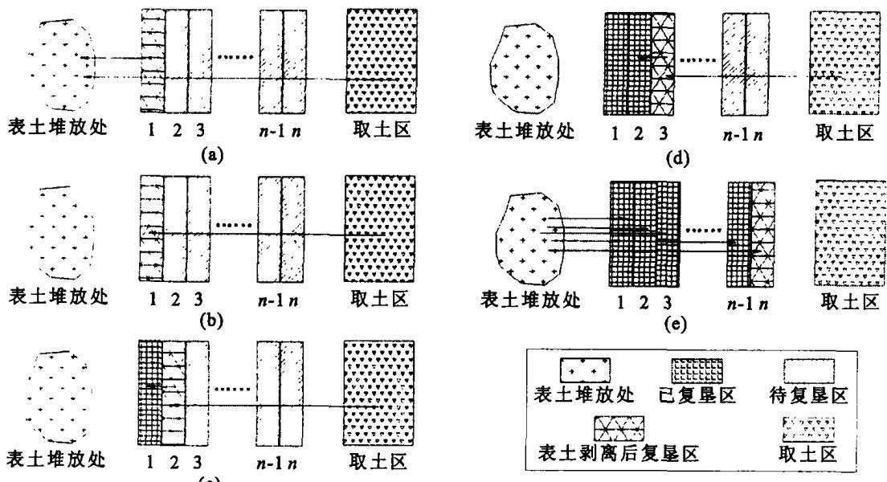
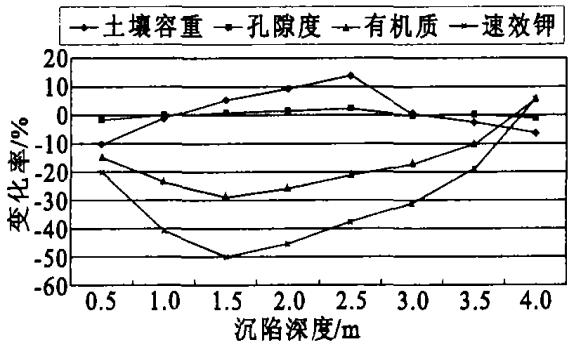
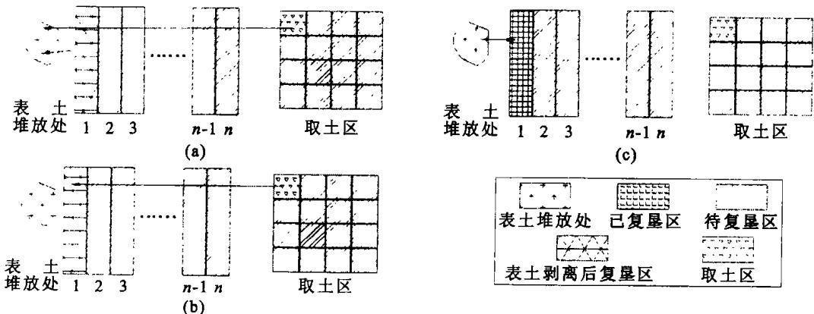

文章编号：1671-1912(2004)02—0155—04

# 煤矿区生态复垦和预复垦中表土剥离及其工艺

付梅臣1‚陈秋计1‚谢宏全1‚2

（1．中国矿业大学北京校区 土地复垦与生态研究所‚北京 100083；2．河北理工学院 地测系‚河北 唐山 063009）

摘 要 通过对高潜水位煤矿区土地复垦工艺效果的分析 提出 条带复垦表土外移剥离法 梯田模式表土剥离法 等生态复垦表土剥离工艺 同时根据淹没后土壤质量低下 需要复垦时投资进行土壤改良等不良影响 阐明生态预复垦的表土剥离工艺 表土剥离工艺分析表明 表土在复垦中具有十分重要的作用 因此应通过建立相应的法律 法规 把表土剥离工艺纳入土地复垦的总体工程之中

关键词 煤矿区 生态复垦 表土剥离

中图分类号：TD991；Q149

文献标识码：A

## 0 引 言

煤矿区生态环境恢复的主要途径是土地复垦 根据我国环保 十五 规划 煤矿区以土地复垦为重点 加强矿区环境综合整治 建立各种类型的矿区生态建设示范基地 逐步形成与生产同步的生态恢复建设机制 复垦后的土地 为耕地 其余的多数为其他农用地 因此 必须要求复垦的土壤有较高的生产力和较高的经济效益 而表土的多少与质量对土壤条件有重要作用

复垦土壤重构可分为工程措施重构与生物措施重构 包括微生物重构 工程重构主要是采用工程措施 同时使用相应的物理措施和化学措施 根据当地重构条件 按照重构土地的利用方向 对沉陷破坏土地进行剥离回填 挖垫 覆土与平整等处理 工程重构一般应用于土壤重构的初始阶段 生物重构是工程重构结束后或与工程重构同时进行的重构 土壤 培肥改良与种植措施 目的是加速重构 土壤 剖面发育 逐步恢复重构土壤肥力 提高重构土壤生产力 生物重构是一项长期的任务 决定了土壤重构的长期性 如果在工程中能够保证充足的 优质的表土 将缩短土壤的熟化期 迅速恢复重构土壤肥力［1］

表 揭示了不同复垦工艺对土壤养分含量的影响 反映出不同复垦技术对土壤重构质量影响较大 表土剥离复垦的土壤有机质 全氮 全磷及速效钾等土壤养分状况明显高于其他复垦方式 特别是混合复垦方式 对植物和农作物等净第一性生物量积累基本没有影响 表 揭示的物理性状表明 由于表土剥离复垦碾压次数较多 土壤容重略大 总孔隙度略小 经松翻后 能够得到改善 一般表土剥离复垦 $2 \sim 3 \textrm { a }$ 后 土壤养分状况和物理性能基本与当地复垦前相同 在高潜水位塌陷区甚至高于淹没的土壤质量

表1 不同复垦工艺对土壤养分含量的影响  
Tab．1 Effect of different technologies of reclamation on content of soil nutrients
<table><tr><td>复垦方法</td><td>土层深度/cm</td><td>有机质  $/ \mathrm { g } \cdot \mathrm { k g } ^ { - 1 }$ </td><td> $\underline { { \widehat { \bf { E } } \overleftarrow { \mathcal { R } } } } / { \mathrm { g } \cdot \mathrm { k g } } ^ { - 1 }$ </td><td>全磷  $/ \mathrm { g } \bullet \mathrm { k g } ^ { - 1 }$ </td><td>速效钾  $/ \mathrm { g } \bullet \mathrm { k g } ^ { - 1 }$ </td></tr><tr><td>表土剥离</td><td>0~20</td><td>18.58</td><td>0.70</td><td>0.56</td><td>157.5</td></tr><tr><td>混合复垦</td><td>0~20</td><td>14.55</td><td>0.68</td><td>0.50</td><td>108.0</td></tr></table>

## 1 煤矿区土地复垦工艺效果分析

## 1．1 泥浆泵挖深垫浅复垦重构土壤存在的问题

泥浆泵复垦是采煤沉陷地常用的一种挖深垫浅法复垦工艺 它是把由高压水泵产生的高压水通过水枪喷出 高压水流将挖深区土壤切割分散形成泥浆 再由泥浆泵通过管道输送到待复垦的较浅区域 泥浆泵复垦工艺简单 投资少 是一种有效的沉陷地复垦工艺［2］ 用泥浆泵挖深垫浅复垦采煤沉陷地始于 世纪 年代初目前已在我国安徽 江苏等地区得到较广泛的应用 但另一方面 泥浆泵复垦土壤还存在许多问题 需要进一步研究解决 养分损失 土壤的上下土层混合 土壤含水量大 且不易排出 土壤盐渍化 土壤微生物以及土壤动物的破坏

表 不同复垦工艺对土壤物理性状的影响  
Tab．2 Effect of different technologies of reclamation on soil physical properties
<table><tr><td>复垦方法</td><td>土层深度/cm</td><td>容重  $/ { \mathrm { g } } { \cdot } { \mathrm { c m } } ^ { - 3 }$ </td><td>毛管持水量/%</td><td>总孔隙度  $/ { \mathrm { g } } \cdot { \mathrm { k g } } ^ { - 1 }$ </td></tr><tr><td>表土剥离</td><td>0~20</td><td>1.53</td><td>27.30</td><td>43.77</td></tr><tr><td>混合复垦</td><td>0~20</td><td>1.17</td><td>37.04</td><td>55.85</td></tr></table>

## 推土机挖深垫浅复垦重构土壤存在的问题

推土机是沉陷地复垦施工中常用的工具 它可以用于挖深垫浅 平整土地 修路开渠等方面的施工 推土机挖深垫浅法复垦与泥浆泵复垦各有侧重 同为采煤沉陷地常用的复垦工艺 以推土机为工具进行复垦施工 效率高 工期短 但推土机经济运距较短 运距过长将大大增加施工成本

目前推土机重构土壤普遍存在上下土层混合及土壤压实问题 只考虑工程进度而没有注意采取表土选择剥离与回填技术 而且机械严重压实的复垦耕地表层土壤性状不良 短时间内难以得到有效改良 上下土层混和问题比较好的解决方法是应用分层剥离与交错回填土壤剖面重构方法

## 1．3 拖式铲运机挖深垫浅重构土壤存在的问题

采煤沉陷地拖式铲运机挖深垫浅新工艺较以往推土机工艺更符合复垦土壤重构的要求 所构造的土壤质量更高 达到目标生产力的时间更短 一般当年或第二年即可恢复 虽然比其他复垦工艺有了较大的改进 但由于是在塌陷后进行的复垦 仍可能存在上下土层混合 肥力不足等问题

## 2 生态复垦中表土的剥离工艺

矿山开采和复垦过程常常改变原有土壤剖面的特征 使历经数十 数百甚至数千年形成的土壤受到破坏现行的土地复垦工艺往往导致土层顺序的变化和上下土壤层的混合 从而使复垦土壤条件差 较难快速达到期望的生产力水平 因此 如何使表土在开采复垦后保持基本不变或更适宜作物生长乃是土地复垦的关键 胡振琪首次提出了复垦土壤重构的原理与方法［1］ 为复垦优质土壤奠定了理论基础 文中试图就复垦表土的剥离及其工艺进行探讨

## 2．1 “挖深垫浅”的条带复垦表土外移剥离法

根据拖式铲运机 或其他施工机械 宽度 由外到里 塌陷中心 预算出每一拖式铲运机 或其他施工机械 宽度范围内的土方量 然后将复垦区划分成不同的复垦条带和取土区 每一条带大致为拖式铲运机 或其他施工机械 宽度的整数倍数 最后由外向里层层剥离 图 该工艺主要适用于地下潜水位较高 需要 挖深垫浅 的采矿区。

先将第 条带的表土层和取土区的表土层剥离 并堆积在复垦区外 图 然后从取土区取生土填在第条带 再将第 条带表土移至第 条带 图 依次类推 图 最后将剥离的第 条带表土层和取土区表土层回填到第 n 条带及各层整平（图1（e））。复垦后土层的剖面结构可表示如下。

第 i 条带土壤剖面＝第 i 条带下部生土＋取土区下部生土＋第 i＋1条带表土（i＝1‚2‚…‚n－1）＋第1条带与取土区表土回填；

第 n 条带土壤剖面＝第 n 条带下部生土＋第1条带与取土区表土回填。

施工后‚外围复垦耕地用于发展生态农业‚中心取土塘区用于水产养殖或蓄水、排水、水上公园等

## 2．2 梯田模式表土剥离法

在地下潜水位较低的采矿区 当潜水位对农作物及植物生长没有影响时 可修筑梯田 对塌陷区进行平整能够提高净增耕地数量。对于梯田的修筑‚可借鉴梯田表土保留的施工方法‚采用表土逐行置换法、表土中间堆置法 上挖下填与下挖上填等工艺 在地下潜水位较高 土壤匮乏的矿区也可采用此方法

## 3 生态预复垦的表土剥离工艺

## 3．1 高潜水位沉陷地土壤质量

在废弃地和矿区 一个关键的问题是 用于复垦的表土不足或者完全缺乏［3］ 地下潜水位较高的采矿区 待稳沉后复垦时 常常形成大面积积水区 需要进行排水 采用挖深垫浅工艺施工 易使土壤层混合 而且长期淹没后土壤质量也不佳 质地粘 肥力低 需要进行改良 后期经营投入较大

  
图 挖深垫浅的条带复垦表土外移剥离法  
Fig．1 T he method of surface soil peeling off in digging deep to fill shallow band reclamation

图 揭示了高潜水位土地沉陷后积水对土壤特性的影响 土壤物理方面特性受重力影响 沉陷边缘土壤容重在拉力作用下呈减少状态 沉陷边坡在压力作用下呈增加状态 沉陷坡底和底部在拉力和伸展作用下呈减少状态 土壤总孔隙度与容重状态相反 土壤肥力方面特性受坡度影响 在水力侵蚀作用下 沉陷边缘和边坡的土壤养分被淋融减少 沉陷坡底和底部则呈增加状态 但因质地变粘 复垦后短期肥力难以发挥效力

目前在我国部分地区 如淮北矿区 已经开展的预复垦由于部分工程对表土重视不够 采用泥浆泵复垦工艺 影响了复垦效果 基于国内外的土地复垦实践 可采用表土剥离技术 利用推土机 拖式铲运机等对土壤理化性状损坏较小的机械施工。

## 3．2 生态预复垦的表土剥离工艺

生态预复垦的表土剥离工艺可借鉴 条带复垦表土外移剥离法 在划分造地区 条带 取土区时 须结合塌陷预计结果进行合理划分 按开采时序划分工期进行施工 此时划分的条带数与划分工期数一致 即每一工期进行一条带的施工 地表坡向与沉降方向相反 以满足塌陷后整平 图

第一工期将第 条带的表土和取土区 与第 条带等面积或足够填充第 条带取土量的范围 的表土层剥离 并堆

  
图2 高潜水位沉陷地土壤特性变化情况  
Fig．2 T he change of soil properties in the subsidence area of high ground water elevation

积在复垦区外 图 然后从取土区取生土填在第 条带 图 再将剥离的表土回填 图 第二工期表土剥离过程与工艺与第一工期基本一致 将第 条带表土和取土区 与第 条带等面积或足够填充第 条带取土量的范围 如果填充第 条带取土量的范围内的生土能够满足时不剥离 的表土层剥离 移至第 条带堆放然后从取土区取生土填在第2条带‚再将剥离的表土回填；依次类推。待稳沉后‚对造地区进行平整。复垦后土层的剖面结构可表示如下

第 i 条带土壤剖面＝第 i 条带下部生土＋取土区下部生土＋第 i 条带表土 $( i ^ { = 1 , ~ 2 , ~ \cdots , ~ n } )$ ＋取土区表土其他条带表土平整

## 4 结 论

复垦工程表土剥离工艺分析表明 表土在复垦中的作用是十分重要的 但在实际复垦工程中由于工程施工单位为了提高功效 减少工期 降低工程成本 忽视表土剥离 使复垦后的土地景观难以迅速恢复 因此 应该把表土剥离工艺纳入土地整理开发复垦中必要的工程内容 通过土地复垦相关的法律 法规和规范予以明确 使今后能够按照科学的表土剥离工艺引导生态复垦和生态预复垦 为景观重建创造良好斑块基质

  
图 生态预复垦的表土剥离工艺  
Fig．3 Surface soil peeling off technology in ecology beforehand reclamation

总之 作为土壤重构重要内容的表土剥离是生态复垦的基础 土壤重构和土地平整不是一次性的行为 尤其生态预复垦 更是一个长期的过程 由于复垦施工机械对土壤有一定的压实 需要对复垦后的土壤进行疏松增施有机肥等改良措施 实现矿区土地资源的持续利用

## 参考文献：

［1］ 胡振琪．煤矿山复垦土壤剖面重构的基本原理与方法［J］．煤炭学报‚1997‚22（6）：617－622

胡振琪 采煤沉陷土地资源的管理与复垦 北京 煤炭工业出版社

孙 凤 袁中群 王晓峰 废弃土地的林业复垦技术 郑州 黄河水利出版社

# Surface soil peeling off and technology of ecological reclamation and beforehand reclamation in coal mining area

FU Me-i chen1‚CHEN Qiu-ji1‚XIE Hong-quan1‚2

（1．Research Instit ute of L and Reclamation and Ecology‚China University of Mining and Technology Beijing Camp us Beijing 100083‚China；2．Dept．of Geology and Survey‚Hebei Institute of Technology‚Tangshan 063009‚China）

Abstract： T hrough analyzing the effect of reclamation technology in high groundwater elevation coal area‚new technologies of peeling off surface soil in ecological reclamation are provided‚such as band reclamation‚surface soil peeling off and putting aside‚terrace mode surface soil peeling off．At the same time‚according to the fact that the soil quality of the land is poor after submerged and need to improve w hen reclamation‚the surface soil peeling off technology of ecological beforehand reclamation also is given

Key words： coal mine area；ecological reclamation；surface soil peeling off