# 煤矿山复垦土壤剖面重构的基本原理与方法

胡 振 琪

（中国矿业大学）

摘要 基于土壤学理论和国外露天矿复垦的实践‚提出了 “分层剥离、交错回填” 的土壤剖面重构原理 使破坏土地的土层顺序在复垦后保持基本不变 更适宜于作物生长 并以上覆土 岩 分为两层 部分 为例 给出了土壤剖面重构的公式和图示 进而总结出上覆土（岩） 分为两层以上的通用的土壤剖面重构公式‚同时成功地将这一原理应用于横跨采场倒堆工艺 连续开采工艺 的露天矿复垦土壤剖面重构方法的描述和研制出一种新颖的采煤沉陷地泥浆泵挖深垫浅复垦的土壤剖面重构方法

关键词 矿区 土地复垦 土壤重构 原理 土壤剖面

中图分类号 TD824 X144

土地复垦是新兴的交叉学科‚土壤重构 （soil reconstruction） 是土地复垦的核心任务［1‚2］．有关研究表明 现代复垦技术研究的重点应是土壤因素的重构而不应仅仅是作物因素的建立 为使复垦土壤达到最优的生产力 构造一个最优的土壤物理 化学和生物条件是最基本的［3］ 将土壤重构与矿山工艺结合往往是最经济 有效的方法［1］ 在某些情况下 可以不增加成本而构造出比采矿前更好的土壤［4］因此‚土壤重构是决定复垦成败与效益高低的关键‚理所当然地成为土地复垦的核心问题．尽管土壤重构的定义和内涵尚无明确和统一的表述‚英国与美国还存在一定的差异［2‚5］‚但有一点共识是：构造一个适宜的土壤剖面是土壤重构的最主要任务

传统的露天开采与复垦方法是依次剥离和回填上覆岩层 往往导致土层顺序的完全颠倒［6］ 现行的采煤沉陷地 挖深垫浅复垦法 也称为泥浆泵复垦法 也往往导致土层顺序的变化和上下土壤层的混合［7‚8］ 从而使复垦土壤条件差 较难很快达到期望的生产力水平 因此 深入研究土壤剖面重构的理论与方法 对构造一个适宜于植物生长的土壤介质和迅速恢复土壤生产力及复垦效益都具有十分重要的理论和现实意义

## 1 土壤自然形成的原理

土壤是具有肥力能够生长植物的 疏松的陆地表层 它的形成必须经过 个阶段 先是岩石经过风化变成母质 尔后是成土母质在自然因素的作用下 经过生物作用产生肥力而发育成土壤 这 个过程是同时同地进行的 且需很长时间的演变才能成为土壤 所以最终土壤的形成是成土母质 气候 生物 地形和时间 个因素相互影响 相互渗透 以生物为主导综合作用的结果 图 展示了典型自然土壤的剖面 上部为有机质含量较高的表土层 颜色为灰黑色 疏松 水 气 热状况比较好 根系在该层 下部为风化形成的土壤母质 无有机质 中部为成土次于表土的半熟土层 （心土层）‚根系分布较少‚占20％～30％‚主要起保水、保肥作用．土壤剖面自上而下营养成分含量一般由多到少 颜色由深变浅 土壤颗粒也由小逐渐变大

## 2 煤矿山复垦土壤剖面的重构原理

矿山开采和复垦工程过程常常改变原有土壤剖面的特征 使历经数十 数百甚至数千年的土壤受到破坏 所谓复垦土壤剖面的重构 就是采用合理的开采和复垦工艺 构造一个与原土壤一致或更加合理的土壤剖面 使复垦土地的生产力更高 对于基本农用地的复垦 土壤剖面重构的任务是应保持土层顺序不变 其中表土的剥离 贮存及回填是必要

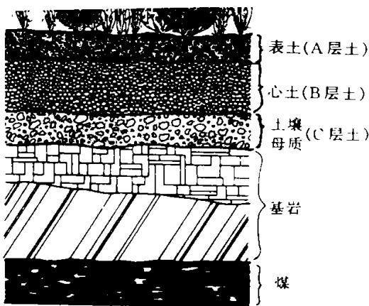  
图1 自然土壤剖面  
Fig∙1 Natural soil profile

的 对于山地或表土层很薄的地区 常作为林业复垦用地 复垦后土地利用对土壤肥力要求不严 土壤剖面重构的主要任务是选择合适的表土替代材料 如剥离物中的砂岩 粘土岩及页岩 并回填在复垦土地表层 构成了独特的矿山土 岩土层的混合 美国露天采矿与复垦法要求复垦土地达到等于或超过采前土地生产力‚对基本农田 （prime farmland） 复垦要求剥离表土和构造较适宜的心土层以形成较好作物根系生长发育的土壤介质 其目的是要求土层顺序在开采复垦后基本保持不变 即上部土层仍在上部 下层岩石仍在下部 因此 如何实现土层顺序在开采复垦后保持基本不变或更适宜作物生长乃是土壤剖面重构的关键

基于国内外的土地复垦实践 我们提出 分层剥离 交错回填 的复垦方式就可实现土层顺序的基本不变 其基本特点是 剥离表土并堆存于开采通道上 供复垦土地回填作为新土壤的表土层 耕植土 将上覆岩层分为若干层 如分为上部土层和下部岩石层 并分别加以剥离 分层剥离的岩（土） 层通过错位的方式交错回填以实现土层顺序的基本不变．其中‚交错回填是该重构原理的核心

## 2∙1 上覆岩 （土） 层分为两层的交错回填原理

## 2∙1∙1 条带式倒堆工艺的交错回填原理

先将第 条带的上部土层和下部岩层分别剥离和堆积 然后将第 条带的上部土层也剥离和堆积此时 在开采区域外形成了 个土堆 见图 并可以开采 条带的煤层 在 条带采空后 将条带下部岩层剥离并充填在第 条带的采空区内 形成第 条带新构土的下部岩层 然后将第 条带的上部土层剥离回填在第1条带内‚就构成了以第2条带下部岩石和第3条带上部土层组成的新的第1条带土壤剖面 使上部土层仍在上部 下部岩层仍在下部 见图 以此类推就可通过这种交错回填实现新构土层顺序的正位 基本不变 其中最后 个条带的重构需用第 条带剥离并堆积的岩土来回填 但在实际的条带开采复垦工作中 由于最后条带所需回填的岩土运距太远 费用太高 往往并不回填 而复垦成水池或人工湖

## 新构土层的剖面结构可表示为

$$
\begin{array} { r } { \frac { \varkappa _ { \widehat { \widehat { \mu } } } ^ { \sharp } } { \widehat { \varkappa } ^ { \sharp } } \ i \frac { \varkappa _ { \widehat { \mu } } + \mathtt { i } + \mathtt { i } } { \varkappa ^ { \sharp } } \mathtt { W } [ \pm \frac { \varkappa _ { \widehat { \mu } } } { \varkappa } \ i + 1 \varkappa \frac { \varkappa + \mathtt { i } } { \varkappa \overline { { \textnormal { H } } } } \mathrm { ~ \overline { { \mu } } ~ } ] \overset { \mathtt { a n } } { \mathtt { H } } \ \pm \frac { \varkappa _ { \widehat { \mu } } } { \sharp } \ \pm + \frac { \varkappa _ { \widehat { \mu } } } { \varkappa \overline { { \textnormal { H } } } } \ \mathtt { i } + 2 \varkappa \frac { \varkappa + \mathtt { i } } { \varkappa \overline { { \textnormal { T } } } \sharp } \ \underline { { \varrho } } { \varrho } \mathrm { E } \pm [ \ \mathtt { i } = 1 , \ \ 2 , \ \cdots , \ n ^ { - 2 } ) , } \end{array}\tag{1}
$$

$$
\begin{array} { r } { \xrightarrow [ ] { \kappa  } ~ n - 1 \xrightarrow [ ] { \kappa } \xrightarrow [ ] { + + 1 + 3 \eta \ddot { \eta } } \xrightarrow [ ] { + } \xrightarrow [ ] { \kappa  } ~ n \xrightarrow [ ] { \kappa } \xrightarrow [ ] { + 1 + } \mathrm { ~ \dotsc ~ } \xrightarrow [ ] { 3 \eta \langle [ ] { \kappa \bot } } \pm \pm \frac { \kappa  } { \sqrt { \eta } } ~ 1 , ~ 2 \xrightarrow [ ] { \kappa } \xrightarrow [ ] { + \eta  } \mathrm { ~ \dotsc ~ } \xrightarrow [ ] { 3 \eta } \mathrm { ~ \dotsc ~ } \mathrm { ~ } } \end{array}\tag{2}
$$

$$
\begin{array} { r l } { \widehat { \mathcal { H } } } & { n \underset { \mathcal { H } } { \overset {  } {  } } \frac { \overrightarrow { n } + \overrightarrow { n } + \overrightarrow { n } } { \uparrow \uparrow } \uparrow \downarrow \downarrow \stackrel {  } { \longrightarrow } \frac { \overrightarrow { n } + \overrightarrow { n } } { \downarrow \downarrow \downarrow } = \widehat { \mathcal { H } } } & { 1 \underset { \mathcal { H } } { \overset {  } {  } } \frac { \overrightarrow { n } + \overrightarrow { 1 } } { \uparrow \uparrow } \uparrow \stackrel {  } { \vdash } \frac { \overrightarrow { n } / \uparrow } { \downarrow \downarrow } \downarrow \pm \bot + \widehat { \mathcal { H } } } & { 1 , ~ 2 \underset { \mathcal { H } } { \overset {  } {  } } \frac { \overrightarrow { n } + \overrightarrow { 1 } } { \uparrow \uparrow } \downarrow \downarrow \pm \rfloor \underset { \overline { { \mathbb { E } } } } { \overset {  } { \pm } } \frac { \overrightarrow { n } } { \downarrow \downarrow } . } \end{array}\tag{n(3b}
$$

## 2∙1∙2 其它开采类型的交错回填原理

对于其它类型的开采方法‚可以通过划分若干采矿块段‚通过采矿块段间的交错回填‚达到构造出

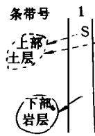

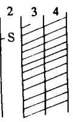  
(a)

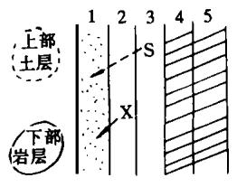  
(b)

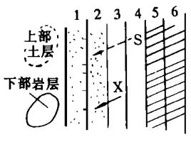  
(c)

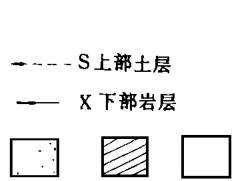  
图 上覆岩 土 层分为两层的条带式倒堆工艺的土壤剖面重构原理  
Fig∙2 T he principle of soil profile reconstruction for strip overcasting technique with two-layers divided overburden

土层顺序基本不变的新造土壤 其原理和新构造土层的公式与条带式倒堆工艺的一致 只不过将开采条带变成开采块段 见图 所示

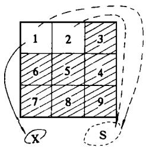  
(a)

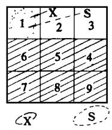  
(b)

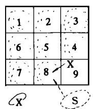  
(c)

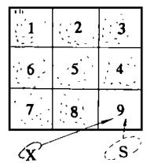  
(d)  
图 上覆岩 土 层分为两层的划分为开采块段的土壤剖面重构原理  
Fig∙3 T he principle of soil profile reconstruction for mining blocks divided with two-layers of overburden

## 2∙2 上覆岩 （土） 层分为两层以上通用的交错回填原理

上述的讨论都是将表土剥离‚并将上覆岩 （土） 层分为2层进行剥离与回填．根据以上讨论的方法 不难得出上覆岩层分为 层以上的交错回填原理

设上覆岩 （土） 层分为 m 层‚自上而下的岩 （土） 层为 $L _ { 1 } , \quad L _ { 2 } , \quad \cdots , \quad L _ { m }$ ‚开采条带或块段数为  
n‚则在开切阶段‚开采区域的外部将形成 m 个土堆‚分别用 ${ L _ { 1 } } ^ { \prime } , { L _ { 2 } } ^ { \prime } , \cdots , { L _ { m } } ^ { \prime }$ 表示‚其中‚ ${ L _ { 1 } } ^ { \prime }$ 由  
第1‚2‚…‚m 条带的L 土层混合而成的土堆； $L { _ { 2 } } ^ { ' }$ 由第1‚2‚…‚m－1条带 L 土层混合而成的土  
堆； $L _ { m ^ { - 1 } } { } ^ { ' }$ 由1‚2条带的 $L _ { m } - 1$ 土层混合而成的土堆； ${ L _ { m } } ^ { \prime }$ 由第1条带的 $L _ { m }$ 土层混合而成的土堆新构造的土壤结构是

$$
\begin{array} { r l } &  \begin{array} { r l }  \frac { \varkappa + \mathtt { N } } { \mathtt { N } } \ \mathtt { M } \mathtt { M } \mathtt { M } \mathtt { M } \mathtt { M } \mathtt { F } \pm \frac { \mathtt { M } \mathtt { M } } { \mathtt { M } } \mathtt { E } = \frac { \varkappa + \mathtt { N } } { \mathtt { M } } \ ( i + 1 ) \ \overset { \varkappa } { \varkappa } \mathtt { M } \mathtt { M } \mathtt { M } \mathtt { M } \mathtt { M } \mathtt { M } \mathtt { M } \mathtt { M } \pm \frac { \mathtt { m } \mathtt { M } } { \mathtt { S } } \ \pm + \mathtt { N } \mathtt { M } \mathtt { M } \mathtt { M } \mathtt { M } \mathtt { M } \mathtt { M } \mathtt { M } \mathtt { M } \mathtt { M } \mathtt { M } \mathtt { M } \mathtt { M } \mathtt { M } \mathtt { M } \mathtt { M } \mathtt { M } \mathtt { M } \mathtt { M } \mathtt { M } \mathtt { M } \mathtt { M } \mathtt { M } \mathtt { M } \mathtt { M } \mathtt { M } \mathtt { M } \mathtt { M } \mathtt { M } \mathtt { M } \mathtt { M } \mathtt { M } \mathtt { M } \mathtt { M } \mathtt { M } \mathtt { M } \mathtt { M } \mathtt { M } \mathtt { M } \mathtt { M } \mathtt { M } \mathtt { M } \mathtt { M } \mathtt { M } \mathtt { M } \mathtt { M } \mathtt { M } \mathtt { M } \mathtt { M } \mathtt { M } \mathtt { M } \mathtt { M } \mathtt { M } \mathtt { M } \mathtt { M } \mathtt { M } \mathtt { M } \mathtt { M } \mathtt { M } \mathtt { M } \mathtt { M } \mathtt { M } \mathtt { M } \mathtt { M } \mathtt { M } \mathtt { M } \mathtt { M } \mathtt { M } \mathtt { M } \mathtt { M } \mathtt { M } \mathtt { M } \mathtt { M } \mathtt { M } \mathtt { M } \mathtt { M } \mathtt { M } \mathtt { M } \mathtt { M } \mathtt { M } \mathtt { M } \mathtt { M } \mathtt { M } \mathtt { M } \mathtt { M } \mathtt { M } \mathtt { M } \mathtt { M } \mathtt { M } \mathtt { M } \mathtt { M } \mathtt { M } \mathtt { M } \mathtt { M } \mathtt { M } \mathtt { M } \mathtt { M } \mathtt { M } \mathtt { M } \mathtt { M } \mathtt { M } \mathtt { M } \mathtt  \end{array} \end{array}\tag{4}
$$

第 n－ （m－k） 条带新土壤＝ $\sum _ { j = 1 } ^ { k } L { ^ { \prime } } _ { j }$ 岩土 $+ \sum _ { j = k + 1 } ^ { m } [ { \bf n } ^ { - } { \bf \Xi } ( m ^ { - } j ) ]$ 条带 $\operatorname { L } \{ { } _ { m } - [ \operatorname { j } ^ { - } ( k ^ { + 1 } ) ] ^  \}$ 层岩土（ k＝1‚2‚…‚ m－1）

（5）

第 n 条带新土壤＝ $\sum _ { j = 1 } ^ { m } { \cal L } _ { \ j } ^ { ' }$ 岩土

（6）

## 3 土壤剖面重构原理在露天煤矿开采与复垦中的应用

平坦地区的露天煤矿农田复垦能较好地体现复垦对土壤重构的要求‚而在平坦地区目前广为采用的横跨采场倒堆的铲斗轮开采系统又是较为典型的露天矿土地复垦技术 因此 我们以这种倒堆工艺的复垦技术为例阐述其土壤重构原理的应用

横跨采场倒堆的铲斗轮开采系统是一种同时使用剥离铲和斗轮挖掘机进行剥离的无运输倒堆工艺属于露天区域采矿方法的一种 适用于倾角小于 的水平或近水平煤层 由于这种开采方法没有运输环节 与其它露天开采工艺相比 具有投资省 成本低 工效高和复田快等一系列优点 并能形成边采煤边复垦的良性循环 除美国外 英 加 澳 俄等国也广为使用 我国虽然尚未采用这种工艺和方法 但在山西 内蒙 云南等地有大量水平 近水平煤层适于采用这种工艺［9］ 可以预见 随着土地复垦工作日益引起人们的重视 这种横跨采场倒堆的铲斗轮开采方法 将在我国得到推广和应用 这种开采与复垦方法是符合土壤重构原理的 由于这种方法在开采布置上常呈条带推进 与上述条带开采的土壤重构原理一致 其特点是 在采矿前将表土剥离并堆存 采后回填和覆置于复垦土地的表面 将煤层上覆岩层 除表土外 分成两部分 上部松软土 常包括心土层和土壤母质层 和下部较硬的岩石层 并分别用 种设备分别剥离 条带间错位剥离与交错回填实现复垦后土层顺序的正位 我们以第 i 条带开采为例阐述其开采与复垦工艺 见图

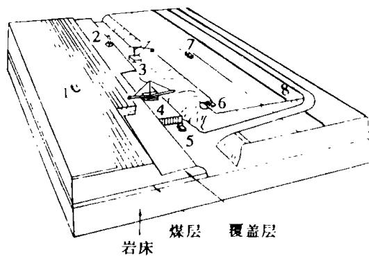  
图4 横跨采场倒堆的铲斗轮开采与复垦系统  
Fig∙4 Bucket w heel excavator for cross pit overcasting and reclamation

（1） 剥离表土 在开采第 i 条带前‚用推土机超前剥离表土并推存于开采掘进的通道上；一般剥离厚度为‚同时也应超前剥离 个条带‚即 i ‚i ‚i＋3条带

（2） 在第 i 条带的下部较坚硬岩石上打眼放炮

（3） 用巨大的剥离铲 （strip shovel） 剥离经步骤 （2）疏松的第 i 条带的下部较坚硬岩石‚并堆放在内侧的采空区上 （即 i－1条带上）

（ ） 用可与剥离铲在矿坑内交叉移动的大斗轮挖掘机（BWE）‚挖掘 i＋1条带上部较松软的土层 （B 和 C 层土）并覆盖在 i－1条带内经步骤 （3） 操作而形成的新下部岩层———较硬岩层的剥离物

（5） 在剥离铲剥离上覆岩层后‚i 条带的煤层被暴露出来‚用采煤机械进行采煤和运煤

（ ） 用推土机平整内排土场第 i 条带的复垦土壤———剥离物‚就构成了以 i 条带上部较疏松土层 （ 与 层） 的剥离物为心土层、以 i 条带下部较硬岩层的剥离物为新下部土层的复垦土壤

（7） 用铲运机回填表土并覆盖在复垦的心土上

（8） 在复垦后的土地上种上植被 （一般首先播种禾本科和豆科混合的草种）‚并喷洒秸杆覆盖层以利于水土保持和植被生长

## 4 土壤剖面重构原理在采煤沉陷地泥浆泵复垦工艺中的应用

用泥浆泵挖深垫浅复垦采煤沉陷地已在我国得到较广泛的应用．但现行的泥浆泵复垦工艺存在两大弊端［7‚8］： 复垦土壤条件较差：复垦土壤不仅贫瘠‚而且土壤上下层混合‚结构性差‚土壤中水分含量过大‚使复垦土壤迟迟达不到目标产量； 沉淀时间长：因自然沉淀慢‚复垦土壤泥泞‚使平整土地工序难以进行‚致使工期推迟‚严重影响复垦效率．为了克服现行泥浆泵复垦工艺存在的弊端‚我们提出了一个新颖的复垦工艺流程［8］‚其实质是构造新的土壤结构．其中剥离与回填表土和新的挖土与充填顺序的优化是重构土壤的关键．

增加剥离和回填待复垦区 即垫浅区 表土工序 对于待复田的土地在复垦前应尽可能地将表土层 （一般20～30cm 厚） 用推土机剥离并堆存起来‚待泥浆泵复垦完毕后再回填到泥浆复垦的土地上 形成优质的熟化土层 以利于早日达到目标产量 在堆存表土时应注意采取水土保持和保肥措施

挖土顺序和充填位置的优化 现行挖土工序和充填位置导致挖深区上下土层的混合或下层土覆盖在上层土上挖深区 由于积水或含水量较高不易像 垫浅区 一样剥离表土 因此宜采用与倒堆法露天开采复垦工艺类似的方法 使复垦土壤的土层顺序保持基本不变 图 展示了新的冲土顺序和充填位置 即新的土壤重构方法 其方法是把 “挖深区” 和 “垫浅区” 划分成若干块段 （依地形和土方量划分）‚并在 “垫浅区” 剥离表土后对该区划分的块段边界设立小土 田 埂以利于充填 用泥浆泵挖掘 开切块段 取出的土充填 首填块段 这一步工作与原工艺一致 往往导致上下土层的混合 因此 开切块段 和 首填块段 应尽量小 将 挖深区 的土层分为上层土 一

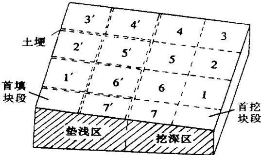  
图5 泥浆泵复垦工艺的新的  
挖土顺序与充填位置  
Fig∙5 New soil excavating sequence and flushing location of hydraulic dredge pump

般 和下层土 一般大于 或 按以下的顺序进行挖掘与充填 首先将挖深区 块段的上层土覆盖在 首填块段 上 然后将 块段下层土充填在垫浅区 块段上 然后将 块段的上层土覆盖在1′块段‚使得1′块段的结构为 “2块段上层土” ＋ “1块段下层土”‚如此类推‚就可构造一个新土壤结构 可用下式表述为

$$
\begin{array} { r l } & { i ^ { \prime } \dot { \mathbb { A } } \mathbb { E } \underline { { s } } \underline { { \texttt { i } } } \underline { { \texttt { i } } } \underline { { \texttt { i } } } \underline { { \texttt { i } } } \underline { { \texttt { i } } } \underline { { \texttt { i } } } \underline { { \texttt { i } } } \underline { { \texttt { i } } } \underline { { \texttt { i } } } \underline { { \texttt { i } } } \underline { { \texttt { i } } } , } \\ & { \qquad \Ddot { \mathbb { A } } \underline { { \texttt { i } } } \underline { { \texttt { i } } } \underline { { \texttt { i } } } , \ \underline { { \texttt { i } } } \underline { { \texttt { i } } } \underline { { \texttt { i } } } \underline { { \texttt { i } } } \underline { { \texttt { i } } } \underline { { \texttt { i } } } \underline { { \texttt { i } } } \underline { { \texttt { i } } } \underline { { \texttt { i } } } \underline { { \texttt { i } } } \underline { { \texttt { i } } } \underline { { \texttt { i } } } , } \\ & { \qquad \Ddot { \texttt { i } } \underline { { \texttt { i } } } \underline { { \texttt { i } } } , \ \underline { { \texttt { i } } } \underline { { \texttt { i } } } , \ \underline { { \texttt { i } } } \underline { { \texttt { i } } } \underline { { \texttt { i } } } \underline { { \texttt { i } } } \underline { { \texttt { i } } } \underline { { \texttt { i } } } \underline { { \texttt { i } } } \underline { { \texttt { i } } } \underline { { \texttt { i } } } \underline { { \texttt { i } } } \underline { { \texttt { i } } } \underline { { \texttt { i } } } \underline { { \texttt { i } } } \underline { { \texttt { i } } } } \end{array} ,\tag{7}
$$

$$
n ^ { \prime } \pm \pm \frac { p \cdot p } { \sqrt [ 4 ] { 2 } + \frac { p \cdot p } { \sqrt [ 4 ] { 2 } } } = - 4 \pm \frac { p \cdot p } { 2 \cdot p } - \frac { 1 } { 2 \cdot p } + \pm \frac { \cdot p } { 2 \cdot p } - ( \mp \frac { \cdot p \cdot p } { 2 \cdot p } + \pm \frac { \cdot p \cdot p } { 2 \cdot p } ) \neq - \frac { 1 } { n } + \frac { \cdot p \cdot p } { 2 \cdot p } - \mp \frac { 1 } { n } + \frac { \cdot p \cdot p } { 2 \cdot p } .\tag{8}
$$

由此可见 垫浅区 上新构造的土壤除 首填块段 以外 其余块段的土层顺序基本保持不变当复垦土地上多余水分排走后 再回填原 垫浅区 的表土 这样所构的复垦土壤比原复垦技术优越并极有可能当年恢复原土壤生产力

## 5 结束语

土地复垦在我国属于新兴的交叉学科 对复垦核心任务 土壤重构的研究明显不足 从而影响了复垦的效果和复垦工艺的革新 此外土地复垦常被当作纯工程问题 尚未建立其理论体系 本文的研究是在国内外已有研究成果的基础上 将采矿工程 土木工程与土壤科学结合起来 系统总结现行的采矿与复垦方法 进而提炼出矿山复垦土壤剖面重构的原理与方法 其研究成果对土地复垦学理论和技术体系的建立与完善将有一定的推动作用 对修定或制定我国土地复垦法规和基本农田复垦标准也有参考价值．

## 参 考 文 献

胡振琪 露天煤矿土地复垦研究 北京 煤炭工业出版社

2 Moffat A J‚Mcneill J D．Reclaiming disturbed land for forestry．London：HMSO‚1994．112

3 National Research Council．Surface mining：soil‚coal and society．Washington D C：National Academy Press‚1981．246

4 McCormack D E‚Carlson C L．Formulation of soil reconstruction and productivity standards．In：Innovative approaches to

mined land reclamation．Carlson and Sarishered．Carbondale：Southern Illinois U niversity Press‚1986．19～30

5 McCormack D E．Legislating soil reconstruction on surface-mined land in the U nited States．Minerals and the Environment 1984 (6)：154\~157

马恩霖 邬立国编译 露天开采复田 北京 中国建筑工业出版社

胡振琪 秦延春 殷耀西等 采煤沉陷土地资源的管理与复垦 北京 煤炭工业出版社

8 Hu Zhenqi．T he technique of reclaiming subsidence areas by use of a hydraulic dredge pump in Chinese coal mines．International Journal of Surface Mining‚Reclamation and Environment‚1994‚8 （4）：137～140

骆中洲主编 露天采矿学 徐州 中国矿业大学出版社

## 作 者 简 介

胡振琪 男 教授 博士生导师 年毕业于中国矿业大学并获工学博士学位 为中美联合培养的土地复垦学博士 年 月 年 月留学美国南伊利诺斯大学 年 月 年 月在中国矿业大学博士后流动站完成煤矿沉陷区土地复垦的博士后研究 获中国科学技术发展基金会孙越崎博士后奖 连续 年应邀赴美国作学术报告和讲学 年 月 年 月获英国皇家学会对华研究员奖学金 以 大学荣誉研究员的身份在该大学坎伯恩矿院研究污染土地的复垦 现为中国土地学会理事 美国露天采矿与土地复垦学会 终身会员 国际土地复垦家联合会会员 英国 大学荣誉研究员 国际露天采矿 复垦和环境杂志 英文 编委 出版 露天煤矿土地复垦研究 和 采煤沉陷地的土地资源管理与复垦 本专著 发表了 试论土地复垦学 半干旱地区煤矸石山绿化技术研究 等 余篇论文 北京市海淀区中国矿业大学北京研究生部 邮政编码

# PRINCIPLE AND METHOD OF SOIL PROFILE RECONSTRUCTIONFOR COAL MINE LAND RECLAMATION

Hu Zhenqi

（ China University of Mining and Technology）

Abstract Based on the theory of soil science and the practice of surface mine land reclamation abroad‚a basic principle of soil profile reconstruction called “strip overburden by layers and replace layers in serial positions （a special order）” was presented‚w hich ensures the reclaimed land retain its soil profile w hich will be beneficial to the revegetation．T wo layers overburden is taken for example and formula and charts of soil profile reconstruction is presented and then general formula of soil profile reconstruction for more than two layers is summarized．Moreover‚this principle is successfully applied for description of method of soil profile reconstruction for open pit with cross pit overcasting technique （continuous excavating technique） and a new soil profile reconstruction method for reclaiming subsidence land by hydraulic dredge pump is developed

Keywords mining areas‚land reclamation‚soil reconstruction‚principle‚soil profile