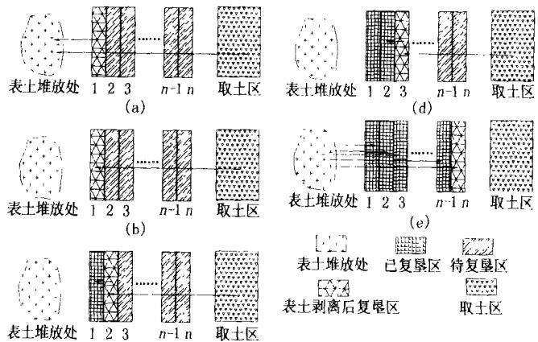
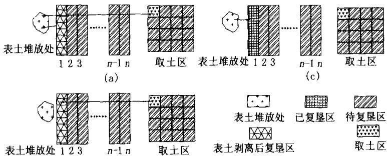

# 矿区生态复垦中表土剥离及其工艺

付梅臣 陈秋计（中国矿业大学）

摘 要 矿区生态环境恢复的主要途径是土地复垦 而土地复垦中表土的来源与性质将决定复垦土地的生产力和复垦的经济效益 对此 通过对土地复垦工艺效果分析 表明泥浆泵挖深垫浅复垦工艺不适宜在耕地恢复中应用 目前拖式铲运机挖深垫浅工艺比较理想 同时 提出 条带复垦表土外移剥离法 梯田模式表土剥离法等生态复垦表土剥离工艺 以及生态预复垦的表土剥离工艺

关键词 矿区 生态复垦 表土剥离 工艺

# Surface Soil Stripping and Its Technology in Ecological Reclamation in Mine Area

Fu Meichen Chen Qiuji

（ China University of Mining and Technology）

Abstract T he main way of the ecological environment rehabiliation in coal mine area is land reclamation‚w here the surface soil origin and properties will decide the productivity of reclaimed land and the economic benefit of reclamation T he analysis of the results of land reclamation technologies indicates that the technology of deep-digging and shallow-filling using pulp pump is not applicable in farmland restoration w hile the technology of deep-digging and shallow-filling using towed scraper is ideal at present．Meanw hile‚surface soil stripping technologies for ecological reclamation and prereclama tion are proposed such as “band reclamation‚surface soil stripping and putting aside” and “terrace mode surface soil stripping”

Keywords Mine area‚Ecological reclamation‚Surface soil stripping‚T echnology

矿山开采对矿区生态环境造成扰动 引起地面景观格局发生变化 破坏地质结构 危害矿区的生态安全与持续发展 矿区生态环境恢复的主要途径是土地复垦 根据我国环保 十五 规划 煤矿区以土地复垦为重点 加强矿区环境综合整治 建立各种类型的矿区生态建设示范基地 逐步形成与生产同步的生态恢复建设机制 复垦后的土地 为耕地其余的多数为其他农用地 因此 必须要求复垦的土壤有较高的生产力和较高的经济效益 而表土的多少与质量对土壤条件有重要作用。

## 1 表土对生态复垦的影响

表土是土地恢复的重要基础 是复垦区非常珍贵的资源 它能使矿区复垦具有重大的灵活性 优质农田（prime farmland）的复垦往往严格要求构造土壤剖面‚对表土和心土的构造都有特定的要求‚以保证复垦土壤的生产力等于或优于原土壤［1］。

有关研究表明 现代复垦技术研究的重点应该是土壤因素的重构而不仅仅是作物因素的建立（胡振琪 为使复垦土壤达到最优的生产力 构造一个较优的土壤物理 化学和生物条件是最基本的和最重要的内容 在土壤重构的前期和中期 应该十分明确土壤重构最为重要的任务是重构、改良与培肥土壤‚作物与林草措施应该十分注重以土壤的重构和快速培肥为目的

复垦土壤重构可分为工程措施重构与生物措施重构（包括微生物重构）。工程重构主要是采用工程措施 同时使用相应的物理措施和化学措施 根据当地重构条件 按照重构土地的利用方向 对沉陷破坏土地进行的剥离、回填、挖垫、覆土与平整等处理。工程重构一般应用于土壤重构的初始阶段 生物重构是工程重构结束或同时进行的重构 土壤 培肥改良与种植措施 目的是加速重构 土壤 剖面发育 逐步恢复重构土壤肥力 提高重构土壤生产力 生物重构是一项长期的任务‚决定了土壤重构的长期性。如果在工程中能够保证充足的 优质的表土 将缩短土壤的熟化期‚迅速恢复重构土壤肥力。

## 2 矿区土地复垦工艺效果分析

## 2∙1 泥浆泵挖深垫浅复垦重构土壤存在的问题

泥浆泵复垦是采煤沉陷地常用的一种挖深垫浅法复垦工艺 它是把由高压水泵产生的高压水通过水枪喷出 高压水流将挖深区土壤切割分散形成泥浆 再由泥浆泵通过管道输送到待复垦的较浅区域泥浆泵复垦工艺简单 投资少 是一种有效的沉陷地复垦工艺［2］。用泥浆泵挖深垫浅复垦采煤沉陷地始于 世纪 年代初 目前已在我国安徽 江苏等地区得到较广泛的应用 但另一方面 泥浆泵复垦土壤还存在有下述问题‚需要进一步研究解决。

（1）泥浆泵复垦土壤的养分损失。

（2）泥浆泵复垦土壤的上下土层混合。

（3）泥浆泵复垦土壤含水量大‚且不易排出。

（4）土壤盐渍化。

（5）土壤微生物以及土壤动物的破坏。

## 2∙2 推土机挖深垫浅复垦重构土壤存在的问题

推土机是沉陷地复垦施工中常用的工具 它可以用于挖深垫浅 平整土地 修路开渠等方面的施工 推土机挖深垫浅法复垦与泥浆泵复垦各有侧重 同为采煤沉陷地常用的复垦工艺 以推土机为工具进行复垦施工‚效率高、工期短；但推土机经济运距较短 运距过长将大大增加施工成本

目前推土机重构土壤普遍存在上下土层混合及土壤压实问题 只考虑工程进度而没有注意采取表土选择、剥离与回填技术‚而且机械严重压实的复垦耕地表层土壤性状不良‚短时间内难以得到有效改良 上下土层混和问题比较好的解决方法是应用分层剥离与交错回填土壤剖面重构方法。

## 2∙3 拖式铲运机挖深垫浅重构土壤存在的问题

采煤沉陷地拖式铲运机挖深垫浅新工艺较以往推土机工艺更符合复垦土壤重构的要求 所构造的土壤质量更高 达到目标生产力的时间更短 一般当年或第 年即可恢复 虽然比其他复垦工艺有了较大的改进‚由于是在塌陷后进行的复垦‚仍然存在上下表土混合 土壤质地略差 肥力不足等问题

## 3 生态复垦中表土的剥离工艺

矿山开采和复垦常常改变原有土壤剖面的特征 使地质形成的土壤受到破坏 现行的土地复垦工艺往往导致土层顺序的变化和上下土壤层的混合 从而使复垦土壤条件差 较难快速达到期望的生产力水平 美国露天采矿与复垦法要求复垦土地达到或超过采前土地生产力 对基本农田复垦要求剥离表土和构造较适宜的心土层以形成较好作物根系生长发育的土壤介质 其目的是为植物生长创造良好土壤环境 因此 如何使表土在开采复垦后保持基本不变或更适宜作物生长乃是土地复垦的关键。

## 3∙1 条带复垦表土外移剥离法

根据拖式铲运机 或其它施工机械 宽度 由外到里（塌陷中心）预算出每一拖式铲运机（或其它施工机械 宽度范围内的土方量 然后将复垦区划分成不同的复垦条带和取土区 每一条带大致为拖式铲运机（或其它施工机械）宽度的倍数‚最后由外向里层层剥离 如图 所示 该工艺主要适用于地下潜水位较高‚需要“挖深垫浅”的采矿区。

先将第 l 条带的表土层和取土区的表土层剥离‚并堆积在复垦区外‚然后从取土区取生土填在第条带 再将第 条带表土移至第 条带 依次类推最后将剥离的第 条带表土层和取土区表土层回填到第 n 条带及各层整平 复垦后土层的剖面结构可表示为：

  
图1 条带复垦表土外移剥离法

第 i条带土壤＝第 i条带下部生土＋取土区下部生土＋第 i＋1条带表土（i＝1‚2‚…‚n－1）＋第 条带与取土区表土回填。

第 n 条带土壤 ＝第 n 条带下部生土＋第 条带与取土区表土＋第1条带与取土区表土回填。

施工后 外围复垦耕地用于发展生态农业 中心取土塘区用于水产养殖或蓄水 排水 水上公园等

## 3∙2 梯田模式表土剥离法

在地下潜水位较低的采矿区 当潜水位对农作物及植物生长没有影响时 可修筑梯田 对塌陷区进行平整‚能够提高净增耕地数量。对于梯田的修筑可借鉴梯田表土保留的施工方法 采用表土逐行置换法、表土中间堆置法、上挖下填与下挖上填等工艺［3］。在地下潜水位较高、土壤匮乏的矿区也可采用此方法。

## 4 生态预复垦的表土剥离工艺

在废弃地和矿区 一个关键的问题是 用于复垦的表土不足或者完全缺乏［4］ 目前在我国部分地区 如淮北矿区 已经开展预复垦 由于部分工程对表土重视不够 采用泥浆泵复垦工艺 影响了复垦效果 基于国内外的土地复垦实践 可采用表土剥离技术 利用推土机 拖式铲运机等对土壤理化性状损坏较小的机械施工。

生态预复垦的表土剥离工艺可借鉴 条带复垦表土外移剥离法”。在划分造地区、条带、取土区时须结合塌陷预计结果进行合理划分 按开采时序划分工期进行施工 此时划分的条带数与划分工期数一致‚即每一工期进行一条带的施工‚地表坡向与沉降方向相反 以满足塌陷后整平 如图 所示

  
图2 生态预复垦的表土剥离工艺

第一工期将第 条带的表土和取土区 与第 条带等面积或足够填充第 条带取土量的范围 的表土层剥离‚并堆积在复垦区外‚然后从取土区取生土填在第 条带 再将剥离的表土回填 第二工期将第条带表土和取土区 与第 条带等面积或足够填充第 条带取土量的范围 如果填充第 条带取土量的范围内的生土能够满足时不剥离）的表土层剥离‚移至第l 条带堆放‚然后从取土区取生土填在第条带 再将剥离的表土回填 依次类推 待稳沉后 对造地区进行平整 复垦后土层的剖面结构可表示为：

第 i条带土壤＝第 i条带下部生土＋取土区下部生土＋第 i 条带表土（ i ＝1‚2‚…‚n）＋取土区表土＋其它条带表土平整 。

## 5 结 论

通过复垦工程表土剥离工艺的分析‚明确了表土在复垦中的重要作用 土壤重构和土地平整不是一次性的行为 尤其生态预复垦 更是一个长期的过程。由于复垦施工中机械对土壤有一定的压实‚需要对复垦后的土壤进行疏松、增施有机肥等改良措施 实现矿区土地资源的持续利用

## 参 考 文 献

1 Robert E‚Dunker‚Richard I‚Barnhisel‚et al．Prime farmland reclamation．Proceedings of the 1992 national symposium － the S MCRA 15years of progress．Department of Agronomy‚U ．S．A 1992

2 胡振琪．采煤沉陷土地资源的管理与复垦．北京：煤炭工业出版社‚1996

3 水土保持综合治理技术规范．北京：中国标准出版社‚1997

4 孙 凤‚袁中群‚王晓峰译．废弃土地的林业复垦技术．郑州：黄河水利出版社‚2001

（收稿日期 2004-05-15）