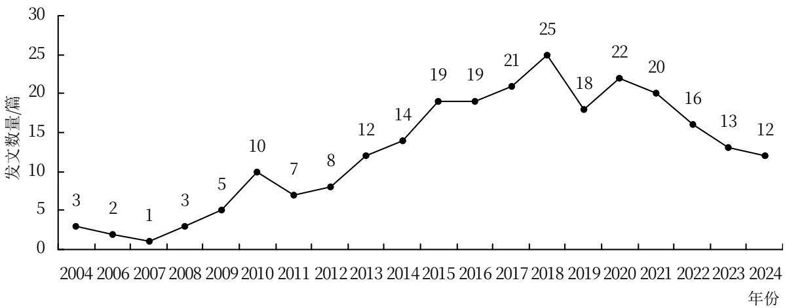
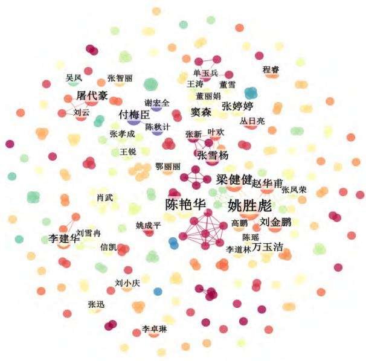
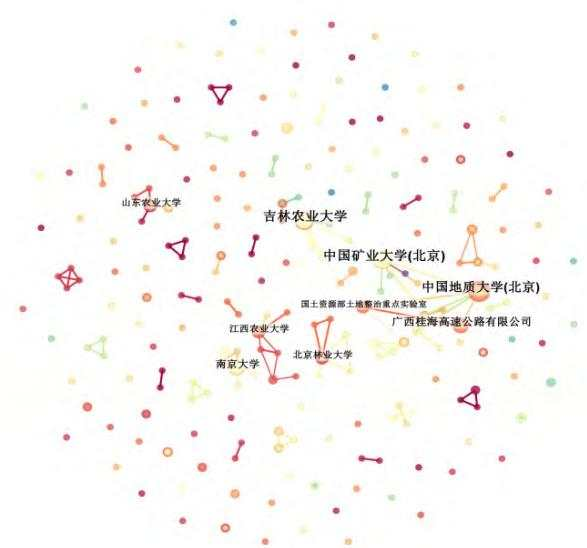
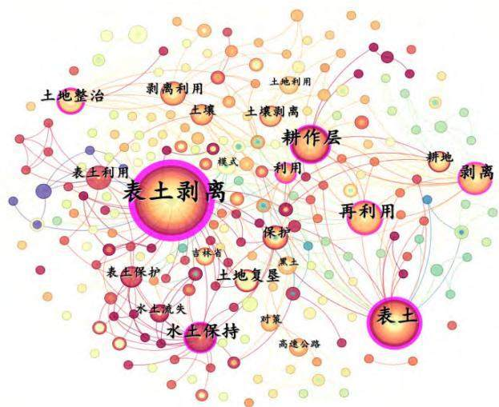
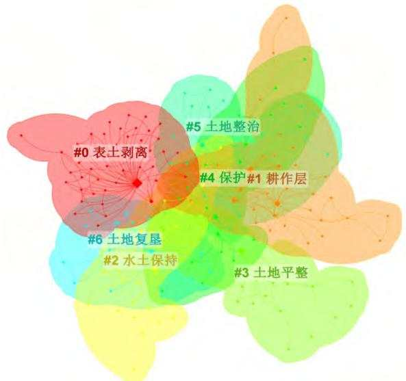

# 表土剥离再利用研究进展与趋势——基于CiteSpace文献计量分析

刘晓丽1，曹宝钰2，刘甲明1，侯松宇2，徐小晗1，付 娟1，王子成1，陈为峰3，迟振海1

（1山东省国土空间生态修复中心，济南 250100；2平阴县自然资源局，山东平阴 250401；3山东农业大学，山东泰安271018）

摘 要：为研究表土剥离再利用技术在中国的研究进展和趋势，使用CiteSpace软件对2004—2024年在中国知网发表的相关文献进行筛选、归纳和总结。结果表明，表土剥离的研究存在一次小高峰，整体发展可以分为探索期、快速增长期和缓慢下降期3个时期。文献的作者与机构多为内部合作或者同地域合作，跨域合作交流较少。对耕作层的保护与利用是表土剥离研究的基础，集中在耕地保护、水土保持和土地复垦领域。从研究前沿看，表土剥离技术将对生态保护的稳定推进做出巨大贡献。

关键词：表土剥离；CiteSpace；耕地保护；水土保持；土地复垦

中图分类号：S143.1

文献标识码：A

论文编号：casb2024-0579

# Research Progress and Trend of Topsoil Stripping and Reuse:

Bibliometric Analysis Based on CiteSpace

LIU Xiaoli1, CAO Baoyu2, LIU Jiaming1, HOU Songyu2, XU Xiaohan1, FU Juan1,

WANG Zicheng1, CHEN Weifeng3, CHI Zhenhai

(1Shandong Provincial Territorial Spatial Ecological Restoration Center, Jinan 250100;

2Pingyin Natural Resources Bureau, Pingyin, Shandong 250401; 3Shandong Agricultural University, Taian, Shandong 271018) gJ g g

Abstract: In order to study the research progress and trend of topsoil stripping and reuse technology in China, relevant literature published in China National Knowledge Infrastructure (CNKI) from 2004 to 2024 were screened, summarized, and synthesized by using CiteSpace software. The results indicated that there was a small peak in the research on topsoil stripping, and the overall development could be divided into three periods. The authors and institutions of the literature primarily engaged in internal or regional collaborations, with limited cross-regional cooperation and communication. The protection and utilization of the plow layer are fundamental to topsoil stripping research, focusing on arable land protection, soil and water conservation, and land reclamation. From the perspective of research frontiers, topsoil stripping technology is expected to make significant contributions to the stable advancement of ecological protection.

Keywords: topsoil stripping; CiteSpace; cultivated land protection; water and soil conservation; land reclamation

## 0 引言

土壤是地球上最重要的自然资源之一，土壤的质量状况对生态系统的良好循环与人类社会的稳定发展起到了至关重要的作用[1]。在农业生产过程中，表层土壤的价值最为珍贵，不仅发育形成的时间周期长，还富含有机质、土壤酶和微生物等物质，能充分满足植物生长发育的需要[2]。但是在中国工业化和城市化的发展进程中，表土资源面临巨大的威胁，众多生产项目的建设对表土造成了严重的破坏和大规模的占用，1949—2009年，有660万hm2的表土因项目建设而遭到损毁，是同时期自然灾害损毁表土面积的5倍以上[3]。对于表土资源的保护和利用，成为土地工作者们需要深入思考和研究的问题。

表土剥离是指将建设用地或者露天开采用地中，适合耕种的表层土壤进行剥离，后续将表土用于原处或异地土地复垦、土壤改良或者其他用途的一种工程技术措施[4]。受到采矿业环境污染的影响，国外在20世纪初期就已经开始了对于表土剥离技术的研究和探索，至20世纪中叶时，一些国家就制定了相应的法律法规应用于现实生产，并在后续的研究中形成了完善的法律体系和专业的技术规程[5]。中国对于表土剥离技术的研究开始于20世纪末期，在1991年颁布的《中华人民共和国水土保持法》中，首次对生产建设中的表土处理步骤提出了要求[6]，要求对表土和植被进行恢复。时至今日，中国对于表土剥离工作的要求不断丰富和完善，出台了一系列法律文件并在国内多地积极开展工程实践，取得了一定的进展与成效，积累了丰富的工程经验[7]。对表土剥离技术的研究与应用，不仅可以加强对表土资源的保护与利用，还能利用剥离的耕作层实现深层次的耕地保护、提升土地质量，对于维护中国粮食生产安全、实现环境绿色发展[8]、持续推进美丽中国建设具有重要意义。因此，本研究使用CiteSpace可视化分析软件，从研究内容、论文作者、科研机构和发展趋势等方面，对土壤剥离相关文献进行汇总分析，明确研究前沿，以期为该技术进一步的研究和相关政策制定提供参考。

期刊文献，为保证获取文献的全面性与典型性，检索方式为单个主题词与组合主题词模糊检索，检索词设置为“耕作层剥离”、“土壤剥离”、“表土剥离”、“表土保护”、“耕作层AND占用”。检索共获得1194个搜索结果，对检索结果进行初步筛选，仅保留检索结果中的学术期刊与学位论文，再对文献内容进行逐一核对，最后筛选出论文251篇，其中期刊论文213篇、学位论文38篇。文献检索日期为2024年7月14日，经过筛选后，文献最早发表年份为2004年，最迟发表年份为2024年。

本研究从中国知网(CNKI)中获取研究所需的学术

## 1.2 研究方法

## 1 数据来源与研究方法

CiteSpace软件可以对输入的文献进行共现或聚类分析并进行可视化，明晰某一学术领域的趋势和研究重点，从而提高科研工作的效率和准确性。本研究通过CiteSpace 6.3.R1软件对文献的关键词、作者、机构和发表年份进行分析，绘制可视化图谱，明确该领域的研究热点与前沿进展。

## 2 结果与分析

## 2.1 文献发表数量年度分析

为明确表土剥离领域整体的研究趋势，选取年度文献发表数量为指标，绘制文献发表数量变化趋势图。由图1可以看出，表土剥离相关文献发表数量增长呈明显波动增长趋势，20年间的文献发表情况可以分为研究探索期、快速增长期和缓慢下降期3个阶段。研究探索期为2004—2011年，该阶段文献发表数量较少且增长缓慢，整体呈下凹形，于2010年出现一次文献发表数量小高峰。快速增长期为2012—2020年，在该阶段内，文献发表数量与增速较上一阶段有了明显的提升，该阶段前期发文数量呈稳定增长趋势，自2016年开始，年度发文数量呈明显波动，发展势头开始回落，但是仍于2018年达到20年间年度发文数量的峰值。缓慢下降期为2021—2024年，自2021年开始，

## 1.1 数据来源与筛选

  
图1 表土剥离年度文献发表数量趋势图

年度文献发表数量呈现出明显的下降趋势，直到2023年后降速才开始放缓并保持稳定，但年度发文数量仍远高于第1阶段。

## 2.2 文献作者分析

对文献作者共现分析可以显示出在该领域的主要发文学者以及作者群体之间的合作强度关系[9]。由图2可以看出，在表土剥离研究领域发文量靠前的作者有姚胜彪、陈艳华和梁健健，其中姚胜彪共现次数为6次，稳居第1位；陈艳华共现次数为5次，位居第2位；梁健健共现次数为4次，排名第3位；其余作者的共现次数为3次及以下。在与其他作者的合作方面，存在多个作者合作群体。发文最多的作者合作群体以姚胜彪为核心，由梁健健、赵华甫、刘金鹏和高鹏等学者组成。发文量次之的合作群体存在多个，包括以张婷婷、窦森为核心的合作群体，以付梅臣为核心的合作群体，以张雪杨为核心的团队和以万玉洁为核心的合作群体。从联系程度上看，同一群体中的学者合作比较紧密，形成了多个合作关系网，但是不同群体之间的合作联系较弱、交流较少，不利于不同研究思想的沟通与碰撞，建议在今后的研究中加强合作交流。

  
图2 发文作者共现图

## 2.3 文献发表机构分析

通过表1可以看出，科研高校是表土剥离领域主要的文献发表机构，其次是国有企业和政府事业单位。所有发文的高校中，中国地质大学发表文献最多，以14篇发文量位居榜首，中国矿业大学和吉林农业大学均以12篇发文量并列第2位，南京农业大学以6篇文献排名第5位。从图3中可以看出，表土剥离领域的文献发表机构呈现出明显的地域特色与独特的专业倾向。从地域上看，发文机构主要集中在北京地区，吉林、山东、南京、江西和广西地区都仅有1所机构发表相关文献较多，同一地域内各机构之间的合作交流比较密切，但跨地域的合作交流较少，在未来的研究过程中建议加强联系。从专业倾向上看，发文高校多集中于地质类、农业类，此类高校从自身优势学科出发，对中国表土剥离领域的科研学术发展做出了重要贡献。

表1 表土剥离主要文献发表机构
<table><tr><td>排序</td><td>数量/篇</td><td>发文机构</td></tr><tr><td>1</td><td>14</td><td>中国地质大学(北京)</td></tr><tr><td>2</td><td>12</td><td>中国矿业大学(北京)</td></tr><tr><td>2</td><td>12</td><td>吉林农业大学</td></tr><tr><td>4</td><td>7</td><td>广西桂海高速公路有限公司</td></tr><tr><td>5</td><td>6</td><td>南京大学</td></tr><tr><td>6</td><td>5</td><td>北京林业大学</td></tr><tr><td>7</td><td>5</td><td>山东农业大学</td></tr><tr><td>7</td><td>5</td><td>江西农业大学</td></tr></table>

  
图3 文献发表机构共现图

## 2.4 关键词分析

2.4.1 关键词共现分析 文献的关键词是对文献内容精炼概括后的表达，代表了一篇文献的核心内容[10]，通过对表土剥离领域的研究关键词进行共现分析，可以直观地反映出该领域的研究热点。通过对文献关键词进行共现分析并进行可视化展示，时间跨度为2004—2024年，时间间隔为1年。表2展示了表土剥离领域排名前10位的高频关键词，表土剥离、表土、耕作层、再利用和剥离等关键词的出现频率最高，表明该领域研究的重点依旧集中在对耕作层和表土的保护与再利用相关方面。从关键词首次出现的年份看，水土保持、土地复垦和土地整治等关键词出现时间较晚，是近年来表土剥离领域的研究热点问题。从图4可以看出，在地域方面，关键词吉林省通过对黑土的保护和利用，在表土剥离领域的研究中出现最多。在工程应用方面，关键词高速公路表明了在基础设施建设过程中重视表土资源的保护。表土剥离的研究与发展不是孤立的，而是将其与土地管理、整治、复垦工作相结合，真正将各项工程技术措施在实践中应用，把对表土资源的保护落在实处。

表2 表土剥离研究前10位高频关键词
<table><tr><td>序号</td><td>关键词</td><td>频次/次</td><td>首现年份</td></tr><tr><td>1</td><td>表土剥离</td><td>76</td><td>2004</td></tr><tr><td>2</td><td>表土</td><td>31</td><td>2006</td></tr><tr><td>3</td><td>耕作层</td><td>23</td><td>2011</td></tr><tr><td>4</td><td>再利用</td><td>19</td><td>2009</td></tr><tr><td>5</td><td>剥离</td><td>18</td><td>2010</td></tr><tr><td>6</td><td>水土保持</td><td>17</td><td>2010</td></tr><tr><td>7</td><td>土地复垦</td><td>11</td><td>2010</td></tr><tr><td>8</td><td>土地整治</td><td>11</td><td>2012</td></tr><tr><td>9</td><td>利用</td><td>10</td><td>2008</td></tr><tr><td>10</td><td>保护</td><td>8</td><td>2007</td></tr></table>

  
图4 表土剥离关键词共现图

2.4.2 关键词聚类分析 在CiteSpace中使用对数似然比算法(LLR)对本研究表土剥离关键词进行聚类分析，以展示该领域的热点主题组成。对于运算的结果，有2个值可以表征聚类的准确性和可靠性，当聚类模块值(Q)大于0.3时聚类结构显著，当聚类平均轮廓值(S)大于0.5时聚类结果合理，经过运算后，本研究Q值为0.6818，S值为0.6139，聚类结果表现优秀。从图5中可以看出，前6种聚类依次为表土剥离、耕作层、水土保持、土地平整、保护、土地整治和土地复垦，研究方向集中在以下3个方面。

  
图5 表土剥离关键词聚类图

（1）耕地保护背景下，耕作层土壤的保护与利用。中国幅员辽阔、人口众多，自然资源储量位居世界前列，但人均耕地面积却远远落后于世界平均水平[11]。20世纪90年代中国学者就充分认识到耕地资源的稀缺性，并明确提出保护耕地的重要性[12]。面对经济发展对土地需求的增加，中国积极开展了利用表土剥离技术保护耕地资源的探索，在1998年修订的《中华人民共和国土地管理法》中，法律条文明确规定，当项目建设占用耕地时，要将耕作层土壤用于其他耕地的土壤改良。同年，吉林省修建国道需要占用松嫩平原的耕地260 hm2，交通部门通过将耕作层剥离用于取土场的复垦，实现了经济和生态双赢[13]。山东省文登区在项目建设前，将肥沃的耕作层剥离并用于新增耕地的垦造，解决了新增耕地肥力水平低、资源浪费的问题[14]。徐艳等[15]通过对耕作层土壤养分状况的分析，对不同区域有针对性地提出了移土培肥的建议，促进了耕层土壤质量的提升；沈志勤等[16]对浙江省开展耕作层剥离过程中遇到的问题和利用情况进行汇总，有针对性地从多角度提出了改进建议，为耕作层的保护与再利用做出了贡献；根据江西省建设占用耕地的情况，余敦等[17]归纳出了4种建设占用类型，并在此基础上总结了工艺要点与问题，实现了土壤耕作层的可持续利用；强丹阳等[18]从重庆市涪陵区一公路建设项目出发，从耕作层剥离的区域选择、施工工艺、土壤储存、土壤运输和土壤回覆5个方面，对表土剥离的全过程进行技术总结，为其他地区的耕层土壤剥离提供了参考方案。对耕作层的剥离与再利用，不仅完成了对中国耕地资源的保护，维护了粮食生产的安全与稳定，还充分满足了经济发展对土地资源的需求。

（2）水土保持工作中，项目建设与生态稳定的平衡。在中国的山地丘陵地带，水土流失问题是当地生态保护工作需要面临的首要问题[19]。中国的水土保持工作历史源远流长，在春秋后期就已经出现了有关水土保持的记载。近代的水土保持开始于20世纪20年代，至今已经百余年，在此期间，水土保持工作的指导思想与治理措施经历了多次更新换代，相关的法律规章也日臻完善[20]。水土保持工作中首次出现对表土的要求是在1991颁布的《中华人民共和国水土保持法》中，要求较为简单。在2008年颁布的《开发建设项目水土保持规范》中，对表土的保护与利用有了明确的规定，要求在项目开始之前对表土进行剥离，并在施工后将表土作为耕地、林地、园地的覆土进行再利用。2011年新修订的《中华人民共和国水土保持法》中，明确规定要对表土进行分层剥离、保存和利用。通过关键词时间线可以看出，2010年水土保持在表土剥离领域出现并成为重要的关键词之一。自此以后，在项目建设过程中如何对表土进行剥离、保护与利用成了研究的热点问题。段东亮[21]依托水库灌区续建配套与节水改造工程，从表土剥离方案设计中的多个方面进行了讨论，提出了指导性意见；王童等[22]从表土剥离厚度、存放方式、利用措施等方面，对水利水电施工过程中表土资源的保护与利用提出了合理可行的措施；赵晓娟等[23]利用土壤中的有机质含量对土壤养分进行分级，并以此为依据，为不同地域输变电工程中的表土剥离厚度提出了科学合理的建议。科研人员通过对项目建设过程中表土剥离技术的深入研究，结合不同项目的施工特点，提出了相应的保护措施，对表土剥离技术在水土保持工作的稳步推进中发挥了重要作用。

（3）煤矿区土地复垦，表土资源的抢救与利用。为了满足社会经济发展的需求，中国对矿产资源进行了大规模的开采，在此过程中，矿山的地貌景观和自然环境被严重破坏，损毁土地的复垦率极低，导致人地矛盾问题进一步加剧[24]。在20世纪70年代，苏联和美国颁布了有关土地复垦的相关法律，80年代末中国也颁布了土地复垦方面的相关规定[25]。土地复垦的核心关键在于土壤重构，重构后土壤的质量决定了复垦工程的成败。胡振琪[26]在研究国内外土地复垦实践的基础上，于20世纪90年代末提出了“分层剥离”、“交错回填”的土壤重构原理，推动了中国土地复垦技术体系的发展；付梅臣等[27]深刻认识到了表土对于土地复垦的重要性，2004年发表的研究成果中从多个方面详细阐述了加强表土管理的必要性，并提出了生态复垦的表土剥离工艺，为矿区土地资源的可持续利用做出了贡献；童洁等[28]以低潜水位煤矿区为研究对象，分析如何通过表土剥离及回覆、土地平整和客土工程等方式，填充地裂缝隙，实现煤矿区土地复垦；为避免错过剥离时机导致表土沉陷无法利用，肖武等[29]从沉陷学机理出发，构建基于概率积分算法的表土剥离模型，明确实施剥离工程的时间节点，并在实际应用中证明了其有效性；高潜水位矿区采煤塌陷后极易形成积水，造成表土资源的损毁，李亚龙等[30]通过计算得到不同格网单元到达临界积水的时间，明确不同格网单元表土剥离的先后顺序，实现更加精准科学的表土资源的保护与再利用。在矿区土地复垦的过程中，表土剥离是必不可少的一环，既通过剥离和储存表土避免了对土壤结构和生态环境的进一步破坏，还有效提高了复垦效率，为生态恢复和可持续发展奠定了基础。

## 2.5 表土剥离研究前沿分析

作为CiteSpace软件的特色功能之一，关键词突发词检测可以表明在不同时期研究学者们关注的热点话题，并对热点问题出现和持续的时间进行明确的可视化分析[31]。通过图6可以看出，表土剥离的研究热点呈现出由工程措施向生态保护的转变。早期的关键词有土地平整、模式、土地复垦和移土培肥，除移土培肥外，其余3个关键词研究热点期较长。中期关键词有对策、土壤剥离、再利用等，但研究热点期都持续时间较短。后期的热点关键词为表土利用、水土保持、表土保护和水土流失，其中水土保持与水土流失至今仍处于研究关注期，为当下的热点研究问题。

<table><tr><td colspan="4">Keywords Year Strength Begin End</td></tr><tr><td>土地平整</td><td>2006</td><td>1.7 2006 2011</td><td></td></tr><tr><td>模式</td><td>2008</td><td>1.66 2008 2014</td><td></td></tr><tr><td>土地复垦</td><td>2010</td><td>2.01 2010 2015</td><td></td></tr><tr><td>移土培肥</td><td>2011</td><td>2.52 2011 2014</td><td></td></tr><tr><td>对策</td><td>2016</td><td>1.96 2016 2019</td><td></td></tr><tr><td>土壤剥离</td><td>2011</td><td>1.81 2016 2018</td><td></td></tr><tr><td>高速公路</td><td>2016</td><td>1.56 2016 2019</td><td></td></tr><tr><td>再利用</td><td>2009</td><td>1.98 2017 2019</td><td></td></tr><tr><td></td><td>2010</td><td></td><td></td></tr><tr><td>剥离 表土</td><td>2006</td><td>1.79 2017 2020</td><td></td></tr><tr><td></td><td></td><td>1.94 2019 2021</td><td></td></tr><tr><td>表土利用</td><td>2014</td><td>3.91 2021 2022</td><td></td></tr><tr><td>水土保持</td><td>2010</td><td>3.74 2021 2024</td><td></td></tr><tr><td>表土保护</td><td>2008</td><td>2.62 2021 2022</td><td></td></tr><tr><td>水土流失</td><td>2013</td><td>1.74 2022 2024</td><td></td></tr></table>

图6 表土剥离突现词

## 3 结论与讨论

本研究使用CiteSpace工具对表土剥离领域在2004—2024年发表的文献进行综合分析，总结该领域主要研究内容与热点研究方向，得出了以下结论。

（1）从发文量上看，表土剥离领域经历了一次研究的高峰期。从2012年开始文献发表数量激增，虽然自2020年开始发文量略有回落，但从总体上看，每年的发文数量仍处于中上水平。

（2）从文献作者和发文机构上看，表土剥离领域的学者们更倾向于内部交流合作，与其他地域作者的交流较少，存在多个研究合作群体。发文较多的作者有姚胜彪、陈艳华和梁健健，以张婷婷和窦森、付梅臣、张雪杨、万玉洁等人为核心的合作群体发文也较多。

（3）发文机构多为地质类与农业类院校，北京地区的高校是论文发表的主力军，国有企业和政府事业单位也有论文产出，但远低于高校产出。在高校中，中国地质大学发表文献最多，中国矿业大学和吉林农业大学发文量并列第2位。发文机构之间的问题与文献作者的问题相似，高校之间多为同地域内合作交流，跨地域高校之间的合作寥寥无几，高校与事业单位、国有企业之间的合作也多为同地域合作，跨地域合作较少。

（4）表土剥离研究热点由工程措施聚焦到生态保护。从关键词出现频率上看，表土剥离、表土、耕作层和再利用等关键词出现频率极高，研究集中在对耕作层的保护与利用。从关键词聚类分析上看，研究主要集中在耕地保护、水土保持和土地复垦3个方向，表土剥离技术在多个领域得到了应用。从突现词看，未来的研究重点是将表土剥离更好地应用到生态保护中，为生态保护的稳定推进发挥作用。

在今后的发展进程中，对表土剥离的研究仍需要在以下2个方面继续推进：（1）加强对表土剥离全流程的研究，构建联系更加紧密的技术链条。将表土剥离的各环节，如位置选择、剥离顺序、存放与运输、质量提升及合理利用等，进行综合衔接，打破技术隔阂，明晰各阶段的专属诉求与共性特征，构建一个完善高效的综合技术体系。通过该体系能够加强各步骤的监管、提升保护措施、提高施工效率，实现对表土资源的更科学、合理与有效地保护与利用。（2）积极学习国外研究技术前沿，对国内实践经验及时总结精炼。国外开展表土剥离研究早、持续时间长，不论是技术流程还是相关的规章制度，都有值得学习和借鉴的地方。要不断丰富完善现有政策、法律体系，形成更加完备的规章制度，为中国表土剥离事业的发展构建坚

实的制度保障。

## 参考文献

[1] 王慧婷,王洪敏,李百庆.土壤资源环境保护研究[J].环境与发展,2018,30(5):240.

[2] 孙礼. 关于保护和利用表土资源的思考[J]. 中国水土保持,2010(3):4-6.

[3] 张振超,张琳琳,王冬梅,等.生产建设项目表土保护与利用[J].中国水土保持科学,2015,13(1):127-132.

[4] 颜世芳,王涛,窦森.高速公路取土场表土剥离工程技术要点[J].吉林农业,2010(11):238.

[5] 朱先云.国外表土剥离实践及其特征[J].中国国土资源经济,2009,22(9):24-26.

[6] 郭月婷.中国耕作层土壤剥离利用研究进展[J].中国水土保持科学,2017,15(1):148-156.

[7] 曹继灵,谭文垦.借鉴与创新:国内外表土剥离工作的经验与启示[J]. 中国资源综合利用,2024,42(3):86-88.

[8] 平原,马美景,郭忠录.像呵护皮肤一样呵护土壤——论土壤的重要性及表土保护与利用[J]. 中国水土保持,2021(1):14-17.

[9] 胡泽文,孙建军,武夷山.国内知识图谱应用研究综述[J].图书情报工作,2013,57(3):131-137.

[10] 尹慧敏,胡秀娟,杨立娟,等.城市生态遥感研究热点与发展趋势的可视化分析[J]. 遥感技术与应用,2024,39(3):642-658.

[11] 江雅婷,赵伟,骆佳玲,等.基于“极化—涓滴”理论的成渝地区双城经济圈休耕地分区研究[J]. 中国土地科学,2024,38(2):73-82.

[12] 石玉林,陈国南,石竹筠.切实保护、充分利用耕地资源[J].中国土地科学,1989,3(3):9-12.

[13] 张强.让耕地再生——耕作层土壤剥离造地的基本经验[J].国土资源,2006(8):34-35.

[14] 杨军明,侯登平,范喜秋.文登市建设用地耕作层土壤剥离工作探讨[J]. 山东国土资源,2011,27(5):49-51.

[15] 徐艳,张凤荣,赵华甫,等.关于耕作层土壤剥离用于土壤培肥的必要条件探讨[J]. 中国土地科学,2011,25(11):93-97.

[16] 沈志勤,严庆良,何佑勇.对全面推进建设占用耕地耕作层土壤剥离再利用的思考[J]. 国土资源情报,2015(4):36-40.

[17] 余敦,袁胜国.江西省建设占用耕地表土剥离的技术探讨[J].中国农业资源与区划,2016,37(8):47-51.

[18] 强丹阳,邵景安,陈娟,等.重庆市建设占用耕地耕作层土壤剥离及再利用技术体系研究[J]. 西部资源,2020(2):169-173.

[19] 李荣华.20世纪50年代以来中国水土保持史研究综述[J].农业考古,2020(6):265-272.

[20] 杨光,丁国栋,屈志强.中国水土保持发展综述[J].北京林业大学学报(社会科学版),2006(S1):72-77.

[21] 段东亮.开发建设项目水土保持设计中表土的剥离、保护及利用[J]. 广东水利水电,2013(3):54-56.

[22] 王童,焦莹,菅宇翔,等. 水利水电工程表土剥离相关问题探讨[J].水利水电工程设计,2016,35(3):7-9.

[23] 赵晓娟,郑树海,姚姬璇,等.输变电工程表土剥离技术指标研究[J].中国水土保持,2024(2):40-44.

[24] 梁海超,张定宇,李妍均. 我国土地复垦研究综述[J]. 安徽农业科

学,2011,39(30):18793-18795.

[25] 卞正富.国内外煤矿区土地复垦研究综述[J].中国土地科学,2000(1):6-11.

[26] 胡振琪.煤矿山复垦土壤剖面重构的基本原理与方法[J].煤炭学报,1997(6):59-64.

[27] 付梅臣,谢宏全.煤矿区生态复垦中表土管理模式研究[J].中国矿业,2004(4):38-40.

[28] 童洁,刘立忠,吴新恒.低潜水位煤矿区土地复垦工程技术措施研

究[J]. 矿山测量,2008(4):66-68.

[29] 肖武,胡振琪,高杨,等.井工煤矿山边采边复过程中表土剥离时机 计算模型构建及应用[J]. 矿山测量,2013(5):84-89.

[30] 李亚龙,赵艳玲,陈慧玲,等.基于格网法表土剥离时空顺序确定[J].中国矿业,2016,25(10):97-100.

[31] 何书金,刘昌明,袁振杰.从《地理学报》创刊85年载文审视中国地理学发展特征[J]. 地理学报,2019,74(11):2209-2229.