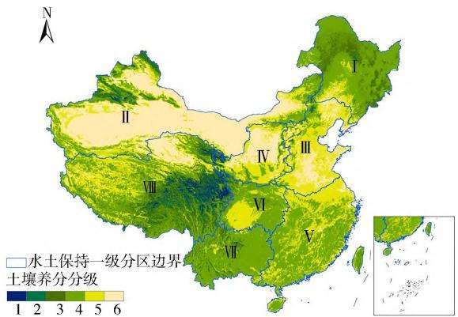
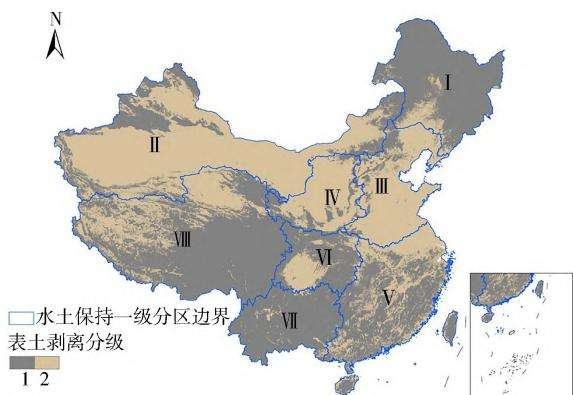

# 输变电工程表土剥离技术指标研究

赵晓娟1，郑树海2，姚姬璇3，王昕宇4，段金贵3，陈 卓3，田堪良3，4

（1．西北农林科技大学 资源环境学院，陕西 杨凌 712100；

2．国家电网有限公司 特高压建设分公司，北京 100052；

3．西北农林科技大学 水土保持研究所，陕西 杨凌 712100；

4．中国科学院 水利部 水土保持研究所，陕西 杨凌 712100）

［关键词］ 表土；剥离厚度；有机质含量；技术指标；输变电工程

［摘 要］ 表土是植物赖以生存的表层土壤，表土剥离和保护是水土保持的重要任务，研究输变电工程表土剥离厚度指标对指导绿色电网建设具有重要意义。 将白鹤滩—江苏 特高压直流输变电工程沿线不同区域土壤有机质含量实测值与根据 90 m 分辨率全国土壤有机碳分布数据集得到的有机质含量预测值进行对比分析，发现预测值具有良好的可靠性，可以作为表土剥离等级划分的依据。 将 分辨率全国土壤有机碳分布数据集参照全国第二次土壤普查中土壤有机质分级标准划分出土壤养分等级，利用 软件绘制出全国范围的土壤养分分级图及表土剥离分级图，并参照表土利用方式确定出表土剥离厚度，即：有机质含量＜10 g ／ kg 的地区，土壤养分等级为 5 ～ 6 级，表土的剥离等级为 2级，对应的剥离厚度为 20～30 cm；而有机质含量≥10 g／kg 的地区，土壤养分等级为 1～4 级，表土的剥离等级为 1 级，对应的剥离厚度根据需要加深 10～20 cm。 同时，针对水土保持区划一级区的表土剥离分级和水土保持功能，提出了适宜的表土剥离建议。

［中图分类号］ S157

［文献标识码］ A

DOI：10．3969 ／ j．issn．1000－0941．2024．02．010

［引用格式］ 赵晓娟，郑树海，姚姬璇，等．输变电工程表土剥离技术指标研究［J］．中国水土保持，2024（2）：40－44．

输变电工程是国家电力系统的基础工程，跨越不同的地形地貌，难免扰动地表、破坏植被，造成水土流失和生态破坏 表土的剥离 保护和利用是水土保持和生态修复的重要措施［1－2］，制定科学合理的表土剥离保护指标对绿色电网建设具有重要意义。 表土是指土地靠近表面的那层土壤，对于农田土壤来说，一般指的是土壤耕层，深 30～50 cm；对于绿地、林地来说，一般包括枯落物层、腐殖质层和淋溶层的上部，深 20～30cm。 表土是泥土中含有机质和微生物最多的地方，具有良好的肥力特性［3］。 一般来说，土壤有机质含量的多少，是土壤肥力高低的一个重要指标［4－6］，因此依据有机质含量来划分土壤养分等级、确定表土剥离厚度是一种较为合理可行的方法 表土的剥离厚度决定了表土的剥离量，而表土的剥离量是水土保持措施设计中时常遇到的问题［2］，所处区域不同，剥离的厚度也应不同 为了保护利用表土 许多学者对表土剥离的厚度指标进行了研究。 《水土保持工程设计规范》（GB51018—2014）、《水利水电工程水土保持技术规范》（SL 575—2012）中提出表土剥离厚度参考值可取 20～

［3］ 段东亮，张晓远，李建生，等．深圳抽水蓄能电站水土保持设计［J］．水利技术监督，2021（6）：206－207，236．

［4］ 叶鑫，石松林，顾羊羊，等．紫金矿山生态影响与生态修复效果研究［J］．环境生态学，2019，1（1）：84－90．

80 cm，且不同地区参考值范围可有所差别；《水电工程水土保持设计规范》（NB∕T 10344—2019）中规定表土剥离深度应结合现场调查和表土检测数据进行确定，宜控制在30 cm 以内，若土壤符合质量要求，则剥离深度可放宽到 或更深 但相关规范划分的区域范围较为宽泛，时常会造成表土剥离厚度难以确定、缺乏依据及表土利用效率低下等问题。 输变电工程跨越不同的土壤类型区 表土的剥离厚度更应有科学合理的指标。 本研究以白鹤滩—江苏±800 kV 特高压直流输变电工程为例，对土壤养分进行分析、分级，旨在更好地保护和利用输变电工程建设期间的表土资源，为输变电工程表土剥离制定出科学合理的技术指标，为国家绿色生态文明建设提供科学依据和技术支撑。

## 1 研究材料与方法

## 1．1 研究材料

## 1．1．1 土样采集

依托白鹤滩 江苏 特高压直流输变电工程开展相关研究，分别采集工程沿线四川省、重庆市、湖北省 安徽省及陕西省不同土层深度的表土 见表1），然后测定其土壤有机质含量作为实测值，并与收集的土壤有机质含量预测值 土壤有机碳分布数据集进行对比分析。 同时，将收集到的全国土壤有机碳分布数据集参照全国第二次土壤普查中土壤有机质分级标准来划分出土壤养分等级，利用 ArcGIS 软件绘制出全国范围的土壤养分分级图及表土剥离分级图，最终为输变电工程提供全国范围内适宜的表土剥离指标。

表 1 有机质采样信息
<table><tr><td>土样编号</td><td>采样地点</td><td>采样土层深度</td></tr><tr><td>样1</td><td>湖北省恩施州建始县高坪镇土地岭村</td><td></td></tr><tr><td>样2</td><td>湖北省麻城市乘马岗镇许家河村</td><td></td></tr><tr><td>样3</td><td>安徽省六安市舒城县干汊河镇正安村</td><td></td></tr><tr><td>样4</td><td>安徽省六安市金寨县花石乡鸦雀湾村</td><td>分层采集，</td></tr><tr><td>样5</td><td>四川省凉山彝族自治州布拖县光明村新 建布拖换流站</td><td>各土层深度分 别为 0~5 cm、</td></tr><tr><td>样6</td><td>四川省宜宾市叙州区大山坡村</td><td>&gt; 5 ~ 15 cm、</td></tr><tr><td>样7</td><td>重庆市黔江区杉岭乡枇杷塘村 S209省 道旁</td><td>&gt;15 ~ 30 cm、 &gt;30~60 cm</td></tr><tr><td>样8</td><td>重庆市南川区木凉镇土槽沟村</td><td></td></tr><tr><td>样9</td><td>陕西省杨凌区马超岭高陡边坡水力侵蚀 观测站</td><td></td></tr></table>

## 1．1．2 数据集来源

国家地球系统科学数据中心发布的中国高分辨率国家土壤信息格网基本属性数据集＿90 米土壤有机碳（2010—2018）［7］，是全国范围的土壤有机碳含量高分辨率空间分布数据集，其根据中国的土壤分布规律，选取具有代表性的 5 000 多个土壤剖面，采用深度函数自适应拟合、集合式机器学习等方法生成了 90 m 分辨率土壤有机碳分布图，垂直方向包括 6 个土层深度：$0 \sim 5 \mathrm { \ c m \ } _ { \sim } > 5 \sim 1 5 \mathrm { \ c m \ } _ { \sim } > 1 5 \sim 3 0 \mathrm { \ c m \ } _ { \sim } > 3 0 \sim 6 0 \mathrm { \ c m \ } _ { \sim } > 6 0 \sim$ 100 cm、＞100 ～ 200 cm。 本研究将该数据集作为有机质预测值，与实际采样测得的有机质含量进行对比分析。 根据《建设占用耕地表土剥离技术规范》（DB22／T及相关研究要求 考虑土壤质量和成本两个因素，耕作层土壤剥离厚度一般应在20～40 cm，土层较厚的区域经论证可以扩大到 60 cm。 故本研究将利用＞30～60 cm 土层的有机质数据进行划分处理，进而确定表土剥离厚度指标。

## 1．2 研究方法

## 1．2．1 土壤养分差异分析

土壤有机质的测定采用重铬酸钾容量法－外加热法 由于该方法只能氧化 的有机碳 因此将测得的有机碳数值乘以校正系数 1．1，得到有机碳含量，再乘以平均换算系数1．724 得到土壤有机质含量［4］。 分层采集土样，即对照数据集分别在 0 ～ 5 cm、＞5 ～ 15 cm、$> 1 5 \sim 3 0 \ \mathrm { c m } \ > 3 0 \sim 6 0 \ \mathrm { c m }$ 土层深度处采样，且每层土壤采集3 个重复样，计算其有机质含量的平均值。

对应实际采样点的位置信息查询数据集的有机质含量预测值 将其与实测值的差异性进行分析与评价使用均方根误差（RMSE）和一致性指数（d）检验数据集预测值的精度，以判断其作为表土剥离划分依据的可行性。 公式为

$$
R M S E = { \sqrt { \frac { \displaystyle \sum _ { i = 1 } ^ { n } { \bf \sigma } ( Y _ { i } - Z _ { i } ) \bf \sigma ^ { 2 } } { n } } }\tag{1}
$$

$$
d = 1 - \frac { \displaystyle \sum _ { i = 1 } ^ { n } \left( Y _ { i } - Z _ { i } \right) ^ { 2 } } { \displaystyle \sum _ { i = 1 } ^ { n } \left( \mid Z _ { i } - \overline { { Y } } \mid + \mid Y _ { i } - \overline { { Y } } \mid \right) ^ { 2 } }\tag{2}
$$

式中： $Y _ { i }$ 为采样点i的有机质含量实测值； $\mathbf { \nabla } _ { : Z _ { i } }$ 为采样点i的有机质含量预测值；Y 为有机质含量实测值的平均值；n 为样点数。

RMSE 值越小、d 值越接近 1，表明误差越小，数据集的预测精度越高［8］。

## 1．2．2 表土剥离厚度指标划定

根据《建设占用耕地表土剥离技术规范》（DB22／T2278—2015）要求，土壤有机质含量 $\geqslant 1 0 \ \mathbf { g } / \mathbf { k g }$ 时应进行表土剥离。 本研究依据表土养分分级标准及表土的利用方式，确定出适宜的表土剥离厚度指标，详见表 2。

表 2 表土剥离厚度技术指标
<table><tr><td rowspan="2">有机质含量/土壤养分  $\bf ( \^ { \alpha } \bf { g } / \bar { k } \bf { g } )$ </td><td rowspan="2">级别</td><td rowspan="2">土壤养分 丰缺程度</td><td rowspan="2">剥离级别</td><td colspan="4">不同表土利用方式的剥离厚度/cm</td></tr><tr><td>种草</td><td>种植灌木</td><td>种植乔木</td><td>复耕</td></tr><tr><td>≥40</td><td>1</td><td>极丰</td><td rowspan="4">1</td><td>20~30</td><td>30~40</td><td>30~50</td><td>30~50</td></tr><tr><td>30~&lt;40</td><td>2</td><td>丰富</td><td>20~30</td><td>30~40</td><td>30~50</td><td>30~50</td></tr><tr><td>20~&lt;30</td><td>3</td><td>中上</td><td>20~30</td><td>30~40</td><td>30~50</td><td>30~50</td></tr><tr><td>10~&lt;20</td><td>4</td><td>中下</td><td>20~30</td><td>30~40</td><td>30~50</td><td>30~50</td></tr><tr><td>6~&lt;10</td><td>5</td><td>缺乏</td><td rowspan="2">2</td><td>20</td><td>30</td><td>30</td><td>30</td></tr><tr><td>&lt;6</td><td>6</td><td>极缺</td><td>20</td><td>30</td><td>30</td><td>30</td></tr></table>

注：沙漠、沙地和砾质戈壁地区不必剥离表土。

通过对相关标准规范［9］ 植物的不同生长特性及输变电工程经济效益进行分析 针对不同表土利用方式确定不同的表土剥离厚度 在养分较低的区域即有机质含量 $< 1 0 ~ \mathrm { g / k g }$ 的区域，按照最低的剥离厚度要求进行剥离保护即可；在养分含量较高的区域，剥离厚度需要适当加深，以便最大化保护表土资源。 采用软件的栅格计算器 重分类 编辑器等功能对收集到的有机碳数据集进行处理，最终绘制出全国土壤养分分级图及表土剥离分级图，并针对水土保持区划的一级区提出剥离建议

全国水土保持区划的一级区分别为：Ⅰ———东北黑土区（东北山地丘陵区）；Ⅱ———北方风沙区（新甘蒙高原盆地区）；Ⅲ———北方土石山区（北方山地丘陵区）；Ⅳ———西北黄土高原区；Ⅴ———南方红壤区（南方山地丘陵区）；Ⅵ———西南紫色土区（四川盆地及周围山地丘陵区）；Ⅶ———西南岩溶区（云贵高原区）；Ⅷ———青藏高原区。

## 2 结果与分析

## 2．1 有机质含量预测值与实测值的差异性

实际采样时记录采样点的位置信息，即采样点的经纬度，并将其绘制成矢量数据，之后使用 ArcGIS 软件中的信息识别功能 查到数据集对应点的有机质含量的预测值，计算分析其与实测值的差异性，结果见表3。

由表 可以发现 有机质含量的预测值都随土层深度的增加而逐渐降低 而实测值虽有部分数据随土层深度的增加而升高 但总体也呈降低的趋势 土样有机质含量实测值与预测值有所偏差，可能是工程建设扰动表土所造成的，因此对于可能发生过土层扰动、土层为回填土的区域，在进行表土剥离前，应调查其土壤背景，并采样测定其有机质含量。

由表 还可以发现 不同土层深度处的 d 值都大于0．7，说明数据集的预测值精度较高，＞30～60 cm 深度处的 RMSE 值最小 d 值最接近于 表明该深度的预测值最为准确。 综上，有机质含量的预测值具有良好的可靠性，可以作为土壤养分等级及表土剥离等级划分的依据。

## 2．2 表土剥离厚度指标

将数据处理后得到全国土壤养分分级图（＞30～60cm）和全国表土剥离分级图，结果见图1 和图2。

由图1 和图2 可以看出，青藏高原东部、东北和云贵高原地区土壤养分级别较高 西北沙漠地区土壤养分级别最低，整体上由东南向西北呈递减趋势。 在中国东部，以水田和森林为主的南部地区的土壤养分级别明显高于以旱地为主的北部地区。 当土壤有机质含量 $\geqslant 1 0 \ { \mathrm { g / k g } }$ 时，土壤养分级别较高，其对应的表土剥离级别也较高，表土的剥离厚度也应适当提高。 为了方便输变电工程表土剥离工作的开展，本研究针对水土保持区划不同一级区提出剥离建议（见表 4），具体的县级行政范围请参照水利部印发的《全国水土保持区划（试行）》。

表 土样有机质含量的预测值精度分析
<table><tr><td>土层深度/ cm</td><td>土样编号</td><td>有机质含 量预测值/ (g/kg)</td><td>有机质含 量实测值/ (g/kg)</td><td>RMSE</td><td>d</td></tr><tr><td rowspan="10">0~5</td><td>1</td><td>33.82</td><td>34.39</td><td rowspan="10"></td><td rowspan="10"></td></tr><tr><td>2</td><td>17.84</td><td>10.39</td></tr><tr><td>3</td><td>21.64</td><td>20.87</td></tr><tr><td>4</td><td>22.65</td><td>8.93</td></tr><tr><td>5</td><td>42.69</td><td>28.02</td></tr><tr><td>6</td><td>20.33</td><td>15.19</td></tr><tr><td>7</td><td>27.46</td><td>24.97</td></tr><tr><td>8</td><td>20.81</td><td></td></tr><tr><td>9</td><td>16.21</td><td>5.68 15.31</td></tr><tr><td></td><td>30.38</td><td>29.00</td></tr><tr><td rowspan="9">&gt;5~15</td><td>2</td><td>17.62</td><td>7.47</td><td rowspan="9"></td><td rowspan="9">0.74</td></tr><tr><td>3</td><td>20.29</td><td>17.23</td></tr><tr><td>4</td><td>20.39</td><td>8.30</td></tr><tr><td>5</td><td>42.29</td><td>26.73</td></tr><tr><td>6</td><td>17.96</td><td>11.79</td></tr><tr><td></td><td>23.81</td><td>15.65</td></tr><tr><td>7 8</td><td>20.02</td><td>8.20</td></tr><tr><td>9</td><td>15.48</td><td>8.46</td></tr><tr><td>1</td><td>20.64</td><td>15.30</td></tr><tr><td rowspan="9">&gt;15~30</td><td>2</td><td>12.55</td><td>6.20</td><td rowspan="9"></td><td rowspan="9">0.77</td></tr><tr><td>3 4</td><td>13.26</td><td>11.16</td></tr><tr><td></td><td>15.67</td><td>9.73</td></tr><tr><td>5</td><td>33.24</td><td>26.34</td></tr><tr><td>6</td><td>11.98</td><td>22.45</td></tr><tr><td>7</td><td>17.50</td><td>12.04</td></tr><tr><td>8</td><td>13.91</td><td>16.84</td></tr><tr><td>9</td><td>11.93</td><td>6.52</td></tr><tr><td></td><td>12.21</td><td>14.43</td></tr><tr><td rowspan="7"></td><td>2</td><td>8.05</td><td>4.63</td><td rowspan="7">3.17</td><td rowspan="7">0.91</td></tr><tr><td>3</td><td>9.33</td><td>7.80</td></tr><tr><td>4</td><td>11.69</td><td>9.09</td></tr><tr><td>5</td><td>26.02</td><td>23.65</td></tr><tr><td>6</td><td>9.41</td><td>14.43</td></tr><tr><td>7</td><td>11.17</td><td>10.48</td></tr><tr><td>8 9</td><td>11.14</td><td>16.86</td></tr><tr><td></td><td>8.53</td><td></td><td>7.76</td></tr></table>

  
图 1 全国土壤养分分级图（＞30～ 60 cm 土层）

  
图 2 全国表土剥离分级图（＞30～60 cm 土层）

误差可以发现 中国高分辨率国家土壤信息格网基本属性数据集＿90 米土壤有机碳（2010—2018）对有机质的预测值是较为合理 准确的 尤其是在较深的土层故以此数据集为基础来划分全国的表土剥离分级指标是可行的 处理得到的数据图表明 表土剥离不同等级的分布规律对应于水土保持区划范围是比较匹配的，可以方便快捷地指导输变电工程表土剥离技术指标的确定。 由于输变电工程中表土剥离工作大部分集中在塔基建设中 可视为点状剥离 表土的利用方式大部分为原地利用，且依照原植被类型进行恢复，因此在考虑土壤养分的同时依照表土的利用方式来确定表土剥离厚度是较为合理可行的，研究结果可为输变电工程表土资源的保护提供科学依据。

## 3 讨论

考虑土壤自身存在的养分变异［10］及采样、测定的

表 4 水土保持区划一级区剥离建议
<table><tr><td>一级区代码</td><td>一级区名称</td><td>表土剥离建议</td></tr><tr><td>I</td><td>东北黑土区(东北山地丘 陵区)</td><td>东北黑土区的有机质含量普遍较高，除大兴安岭东南低山丘陵土壤保持区、东北漫川漫岗土壤保持 区、松辽平原防沙农田防护区的部分区域需要采取2级剥离指标外，剩余地区均可采用1级剥离指标</td></tr><tr><td>Ⅱ</td><td>北方风沙区(新甘蒙高原 盆地区)</td><td>北方风沙区的有机质含量普遍偏低，大多为一些沙漠、沙地和砾质戈壁地区，不需要剥离表土，剩余地 区多数可采用1级剥离指标 北方土石山区的有机质含量普遍较低，大部分地区采取2级剥离指标即可。辽西山地丘陵保土蓄水</td></tr><tr><td>Ⅲ</td><td>北方土石山区(北方山地 丘陵区)</td><td>区、燕山山地丘陵水源涵养生态维护区、太行山西北部山地丘陵防沙水源涵养区、太行山西南部山地丘 陵保土水源涵养区、豫西黄土丘陵保土蓄水区、伏牛山山地丘陵保土水源涵养区部分需要采取1级剥离 指标，但为了满足水土保持的基础功能，对于水源涵养区可以全部采取1级剥离指标</td></tr><tr><td>Ⅳ</td><td>西北黄土高原区</td><td>西北黄土高原区有机质含量普遍较低，鄂乌高原丘陵保土蓄水区、宁中北丘陵平原防沙生态维护区、 陕北黄土丘陵沟壑拦沙保土区、陕北盖沙丘陵沟壑拦沙防沙区、延安中部丘陵沟壑拦沙保土区这些地区 养分含量较低，采取2级剥离指标即可，其余地区需要视施工位置而定</td></tr><tr><td>V</td><td>南方红壤区(南方山地丘 陵区)</td><td>南方红壤区整体来说有机质含量较高，但分布比较分散，除江淮下游平原农田防护水质维护区与江淮 丘陵岗地农田防护保土区按照2级剥离指标剥离表土外，其他地区均需视项目位置而定，在预算充足的 情况下考虑全部采用1级剥离指标</td></tr><tr><td>VI</td><td>西南紫色土区(四川盆地 及周围山地丘陵区)</td><td>西南紫色土区有机质含量较高的区域分布比较集中，川渝平行岭谷山地保土人居环境维护区、四川盆 地北中部山地丘陵保土人居环境维护区和四川盆地南部中低丘土壤保持区的大部分区域采取2级剥离 指标，其余地区则可以全部采取1级剥离指标</td></tr><tr><td>VII</td><td>西南岩溶区(云贵高原 区)</td><td>西南岩溶区有机质含量都比较高，且分布比较集中，整体可全部采取1级剥离指标</td></tr><tr><td>IⅧI</td><td>青藏高原区</td><td>青藏高原区有机质含量普遍比较高，除柴达木盆地农田防护防沙区采取2级剥离指标外，其余地区在 考虑满足水土保持生态功能的前提下都可采取1级剥离指标</td></tr></table>

注：本研究并未对台湾省相关区域进行具体的剥离指标分析，如读者需要可自行参考图 2 中相关数据。

## 4 结论

通过将白鹤滩 江苏 特高压直流输变电工程沿线土壤有机质含量实测值与采用 ArcGIS 软件处理全国有机碳数据集得到的预测值进行对比分析，结果表明预测值具有良好的可靠性，可以作为表土剥离等级划分的依据。

依据土壤有机碳分布数据集绘制得到了全国的土壤养分分级图和表土剥离分级图 参照表土利用方式可确定表土的剥离厚度，即：有机质含量 $< 1 0 ~ \mathrm { g / k g }$ 的地区，土壤养分等级为 5～6 级，表土的剥离等级为 2级，对应的剥离厚度为 20～30 cm；而有机质含量≥10g／kg 的地区，土壤养分等级为 1～4 级，表土的剥离等级为 1 级，对应的剥离厚度根据需要加深 10～20 cm。

3）针对全国水土保持区划一级区的表土剥离分级及水土保持功能，提出了科学合理的剥离建议，可方便输变电工程快速开展实际的表土剥离工作。

## ［参考文献］

［1］ 袁瑾雯，周淼．表土剥离存在问题及措施［J］．河南水利与南水北调，2020，49（10）：89－90

［2］ 刘安芳．新建建设类项目表土剥离的重要性［J］．中国高新科技，2021（17）：147－148．

［3］ 郝瑞军．园林土壤工程的表土剥离和再利用技术［ J］．上海建设科技，2021（5）：86－87．

［4］ 鲍士旦．土壤农化分析［M］．3 版．北京：中国农业出版社，2000：25－38．

# 间伐对千岛湖流域生态公益林氮磷养分流失的影响

许在恩1，叶子豪2，傅 伟3，潘 鑫3，潘鑫桐3，童志鹏4

（1．建德市林业局，浙江 建德 311600； 2．浙江农林大学 环境与资源学院，浙江 杭州 311300；3．建德鑫农林业勘察设计有限公司，浙江 建德 311600； 4．杭州市临安区农业农村局，浙江 杭州 311300）

［关键词］ 间伐；氮；磷；地表径流；杉木林；阔叶林；千岛湖流域

［摘 要］ 掌握间伐对千岛湖流域森林地表径流及养分流失的影响，可为生态公益间伐提供依据。 在浙江省建德市设置杉木林（CF）、间伐杉木林（TCF）、阔叶林（BF）、间伐阔叶林（TBF）4 种处理径流小区，于 2021 年监测地表径流量并分析径流中不同形态氮、磷浓度，结果表明：杉木林和阔叶林间伐后径流量分别显著减小 28．6％和 25．5％（p＜0．05）；间伐增大了地表径流中不同形态氮、磷的浓度，4 种处理不同形态的氮、磷浓度排序均为 TBF＞TCF＞BF＞CF，按排序各处理总氮平均浓度分别为 1．11、1．05、0．89、0．88 mg／L，总磷平均浓度分别为 0．46、0．40、0．37、0．33 mg／L；间伐没有对林地氮、磷养分流失产生显著影响（p＞0．05），4 种处理的氮流失量介于 182．59～ 211．47 g／hm2之间、磷流失量介于 69．17～ 81．79 g／hm2 之间。综上，在千岛湖流域实施生态公益林的适度间伐是可行的，可有效兼顾生态公益林的保护与利用功能。

［中图分类号］ S157

［文献标识码］ A

DOI：10．3969 ／ j．issn．1000－0941．2024．02．011

［引用格式］ 许在恩，叶子豪，傅伟，等．间伐对千岛湖流域生态公益林氮磷养分流失的影响［J］．中国水土保持，2024（2）：44－47．

千岛湖流域是浙江省重要的水源地和水源保护区，有70％以上的森林被认定为生态公益林，其中有较大面积的公益林是由人工杉木林和阔叶林划分而来的 因此在生态公益林可持续经营与管理中如何做好对人工杉木林和阔叶林的保护与利用显得尤为重要。

抚育间伐是提升森林质量的重要措施，不仅可获得部分经济收入，还能减缓树木间的竞争，促进保留木生长，改变林内光照、温度、水分和地表径流等森林小环境［1］。 地表径流不仅能体现森林的水文特征，也是河流、湖泊的氮磷来源之一，因此受到国内外相关学者的关注 研究表明 大兴安岭针阔混交林径流量随着间伐强度增大而增加［2］，冀北山地蒙古栎（Quercusmongolica）天然次生林在间伐强度为 25％时地表径流量最大［3］，30％的间伐强度更有利于减少湖南会同生态站 的 杉 木 （ Cunninghamia lanceolata） 林 的 地 表 径流［4］，福建永安安砂库区公益林地的养分流失量总体上随着间伐强度的加大而增加［5］。 但是，有关抚育间伐对千岛湖流域生态公益林地表径流和养分流失的研究较少［6］。 为此，本研究以该区域杉木林和阔叶林为对象 分析比较抚育间伐对林地径流量及不同形态氮磷流失的影响，以期为生态公益林的可持续经营和林分管理提供基础。

［5］ HUANG Biao， SUN Weixia， ZHAO Yongcun， et al． Temporaland spatial variability of soil organic matter and total nitrogenin an agricultural ecosystem as affected by farming practices［J］．Geoderma，2007，139（3－4）：336－345．

［6］ 陈雅敏，冯述青，杨天翔，等．我国不同类型土壤有机质含量的统计学特征［ J］．复旦学报（ 自然科学版），2013，52（2）：220－224．

［7］ LIU Feng， WU Huayong， ZHAO Yuguo， et al． Mapping highresolution National Soil Information Grids of China［J］．ScienceBulletin，2022，67（3）：328－340．

［8］ 尹群．区域土壤养分空间预测与不确定性分析［D］．淮南：安徽理工大学，2020：20－21．

［9］ 全国国土资源标准化技术委员会．土地复垦质量控制标准：TD／T 1036—2013［S］．北京：中国标准出版社，2013：7－8．

［10］ 王秀，赵春江，孟志军，等．精准农业土壤采样栅格划分方法的研究［J］．土壤学报，2005，42（2）：199－205．

# SOIL AND WATER CONSERVATION IN CHINA

No． 2 （503） 2024

## Abstracts

Thinking on the Development of Ecological⁃clean Small Watersheds in the New Era ………………………………… QIAO Dianxin （Monitoring Center of Soil and Water Conservation， Ministry of Water Resources， Beijing 100053， China）（1）

In 2003， the construction of ecological⁃clean small watersheds in Beijing marked the beginning of the management of ecological⁃clean small watersheds． Ecological⁃clean small watersheds continue to develop， with the total reached about four thousands nationwide， which has become a banner for high⁃quality development of soil and water conservation and got widely praised． The paper summarized the development of ecological⁃clean small watersheds， analyzed the current situation， explained the basic attributes of ecological⁃clean small watersheds， ex plored work requirements and main tasks， and proposed suggestions for promoting the development of ecological⁃clean small watersheds in the new era with the latest requirements of Opinions on Strengthening Soil and Water Conservation Work in the New Era， Guidelines on Promotion of the Construction of Ecological⁃Clean Small Watersheds， and Technical Specifications for the Construction of Ecological⁃clean Small Water sheds （SL／T 534—2023）．

Key words： ecological⁃clean small watersheds； the new era； development

A Review of Carbon Sink Research on Vegetable Measures of Soil and Water Conservation

……………………………………………………………………………………… ZHANG Jieming， ZHAO Guangju， JIN Qiu， et al

（State Key Laboratory of Hydrology⁃Water Resources and Hydraulic Engineering，

Nanjing Hydraulic Research Institute， Nanjing， Jiangsu 210029， China）（6）

Conducting research on carbon sink of soil and water conservation and analyzing the carbon sink effects of vegetable measures of soil and water conservation can provide scientific basis for comprehensively improving carbon sink capacity of soil and water conservation， formulating carbon sink improved policies and measures， promoting comprehensive soil erosion and water loss control work， promoting high⁃quality development， and achieving carbon peaking and carbon neutrality goals． The paper discussed the significance of carbon sink of vegetable measures of soil and water conservation， carbon sink function meanings and mechanism， and calculation method of carbon sink． According to summarizing and analyzing relevant papers at home and abroad， the paper deeply analyzed the impact of vegetable measures of soil and water conser vation on ecosystem carbon sink function， vegetation carbon sink， and soil carbon pool and proposed configuration plans for vegetable meas ures of soil and water conservation with goal of improving carbon sink capacity

Key words： soil and water conservation； vegetable measures； carbon sink

Research on Technical Indicators of Topsoil Stripping in Power Transmission and Transformation Projects

ZHAO Xiaojuan1， ZHENG Shuhai2， YAO Jixuan3 ， et al．

（1．College of Natural Resources and Environment， Northwest A＆F University， Yangling， Shaanxi 712100， China；

2．Ultra High Voltage Construction Branch， State Grid Corporation of China， Beijing 100052， China；

3．Institute of Soil and Water Conservation， Northwest A＆F University， Yangling， Shaanxi 712100， China）（40）

Topsoil is the surface soil for the survival of plants． Topsoil stripping and protection are important tasks for soil and water conservation． Studying the thickness index of topsoil stripping in power transmission and transformation projects is of great significance for guiding green electricity net construction． The paper compared measured values of soil organic matter content in different areas along the Baihetan⁃Jiangsu ±800 kV ultra⁃high voltage direct current transmission and transformation project with predicted values of soil organic matter content based on national soil organic carbon distribution dataset with 90 m resolution． The results showed that the predicted values can be used as the basis for dividing the topsoil stripping levels． The paper divided national soil organic carbon distribution dataset into different soil nutrient levels referring to the grading standards for soil organic matter in the second national soil survey and used ArcGIS software to draw the national soil nutri ent classification map and topsoil stripping classification map． And the the paper determined the topsoil stripping thickness based on the top soil utilization method． In areas with soil organic matter content less than 10 $\mathrm { { g / k g } }$ ， the soil nutrient level is $^ { 5 - 6 }$ ， the topsoil stripping level is 2， and the corresponding stripping thickness is 20－30 cm． In areas with soil organic matter content greater than or equal to 10 g／kg， the soil nutrient level is 1－4， the topsoil stripping level is 1， and the corresponding stripping thickness should be deepened by 10－20 cm． And the paper proposed topsoil stripping suggestions based on topsoil stripping levels and soil and water conservation functions in the first level zone of soil and water conservation zoning

Key words： topsoil； stripping thickness； organic matter content； technical indicators； power transmission and transformation projects