# 基于无人机可见光及多光谱数据的林草覆盖率提取方法研究

赵 莹1，王光辉2，任建锋3，杜文贞1，邱 浩1

( 1． 山东省水利科学研究院，250010，济南; 2． 威海水利工程集团有限公司，264200，山东威海;3． 滨州市政务服务中心，256600，山东滨州)

摘要: 为了高效 准确地监测生产建设项目林草覆盖率指标，在山东省东营市建立典型样区，采用无人机搭载相同光谱分辨率的可见光和多光谱相机分别获取可见光 多光谱影像，建立16 种植被指数( 多光谱8 种 可见光8 种)采用阈值法、支持向量机法计算林草覆盖率，并用混淆矩阵对结果精度进行对比，筛选出最优植被指数和分类方法。 研究表明:1) 8 种多光谱植被指数和3 种可见光植被指数识别精度 ＞90%，Kappa 系数 ＞0.90，以上 11 种植被指数可满足实际水土保持监测需求。 2) 多光谱植被指数提取植被信息分类方法中，GRVI SAVI GNDVI NDRE 可用支持向量机法，RENDVI EVI2 NDVI OSAVI 可用阈值法，可见光植被指数 R G EXG 可用阈值法 3) 在正常状况下，多光谱和可见光植被指数获得较好的植被信息识别效果，但在有阴影存在情况下，单波段可见光 R G 有错分现象。 4) 多光谱植被指数相比于可见光植被指数，具有更好的适用性和稳定性。

关键词: 可见光; 多光谱; 植被指数; 无人机; 林草覆盖率

中图分类号: S157. 1 文献标志码: A 文章编号: 2096-2673( 2023) 05-0120-09

DOI: 10． 16843 /j． sswc． 2023． 05． 014

# Extracting methods for forestry and grass coverage based on UAV visible light data and multispectral data

ZHAO Ying1，WANG Guanghui2，REN Jianfeng3，DU Wenzhen1，QIU Hao1 ( 1． Water Resources Research Institute of Shandong Province，250010，Jinan，China; 2． Weihai Water Conservancy Engineering Group Co． Ltd，264200，Weihai，Shandong，China; 3． Binzhou Government Service Center，256600，Binzhou，Shandong，China)

Abstract: ［Background］The remote sensing image obtained with unmanned aerial vehicle ( UAV) has been widely used in soil and water conservation monitoring． However，compared with other industries， there are shortcomings in the UAV remote image，such as inadequate research depth，few application functions，and low monitoring accuracy． Moreover，images shot with different cameras and application of different classification methods will have impact on the monitoring accuracy of forest and grassland coverage in the monitoring process． The objective of our study is to provide a rapid and accurate method to monitor the coverage rate of forest and grass． ［Methods］This study conducted a case study in Kenli， Dongying，Shandong province． The forest and grass coverage was calculated based on the multispectral data of UAV，and then the coverage was compared with the vegetation information extracted from the visible light． The visible light and multispectral images with high-resolutions were simultaneously obtained via UAV equipped with visible light and multispectral cameras having 5 multispectral sensors． Each

camera was equipped with the same spectral resolution of 2 megapixels． Sixteen vegetation indices， including 8 multispectral vegetation indices and 8 visible light vegetation indices，were established，and the object-oriented threshold method and support vector machine method were used to extract the vegetation information and calculate the forest and grass coverage，respectively． Finally，the optimal vegetation index and classification method were chosen via the confusion matrix． ［Results］The accuracy of vegetation index identified by multi-spectrum was over 90% ，and the Kappa coefficient was over 0. 90． Three types of visible light vegetation indices had reached the above level． The 11 vegetation indices mentioned above met the requirements of practical applications in soil and water conservation monitoring for the production and construction projects． In the classification method of multispectral vegetation indices，the available support vector machine methods were used in green ratio vegetation index ( GRVI ) ， soil-adjusted vegetation index ( SAVI ) ， green normalized difference vegetation index ( GNDVI) and normalized differential index with red edge ( NDRE) ，while the threshold methods were used in normalized difference vegetation index with red edge ( RENDVI) ，enhanced vegetation index2 ( EVI2) ，normalized difference vegetation index ( NDVI) and optimized soil-adjusted vegetation index ( OSAVI) ． The threshold methods were all used in the visible light vegetation indices，including red ( R) ，green ( G) ，and excess green vegetation index ( EXG) ． Confirmatory experiments in three study areas showed that under normal conditions，better effects of vegetation information identification in calculating the forest and grass coverage might be obtained under both of the multispectral and visible light vegetation indices． In the presence of shadows，the single-band visible lights R and G were not well classified． On the contrary，the multispectral vegetation index presented better applicability and stability compared with the visible light covered index． ［Conclusions］This study provides a high-precision extraction method to monitor the forestry and grass coverage for soil and water conservation based on UAV visible light data and multispectral data．

Keywords: visible light; multi-spectrum; vegetation index; UAV; forestry and grass coverage

林草覆盖率是生产建设项目水土流失防治标准中的一项重要指标 在水土保持监测中，林草覆盖率一般采用样方的监测方法，小面积测量经常代表性差，大面积调查受人力、物力等限制。 近年来，无人机越来越多地应用在水土保持监测领域，国内学者基于可见光数据在土石方量 水保措施［1］ 植被盖度［2 － 4］的提取等方面开展了研究。 随着无人机技术的发展，无人机搭载多光谱相机获取多光谱影像，已经应用到精准农业等领域，如采用多光谱中红绿 蓝 近红外 红边等波段进行构建植被指数，结合野外实测数据建立模型预测生物多样性 作物农业参数［5 － 8］等;不少学者们研究发现，不同的分类方法与遥感数据结合可以满足不同领域测算需求 徐存东等［9］应用监督分类的 5 种分类器执行分类，支持向量机对于无人机遥感盐碱地信息提取法优于其他方法。 孙玉琳等［10］采用 8 种监督分类方法分析研究区的土地利用状况，在相同的分类条件下，支持向量机分类精度最高。

目前，高分辨率多光谱影像在水土保持林草覆盖率监测的应用较少，且通过比较多种方法，探索不同分类方法在林草覆盖率监测中分类效果的研究也较少。 因此，笔者基于无人机多光谱数据计算林草覆盖率，结果与可见光植被信息提取成果进行对比分析，筛选出最优植被指数及分类方法，以期为快速、准确开展水土保持监测提供方法依据。

## 1 研究区概况

研究区位于山东省东营市垦利区，地理坐标E 118°15' ～ 119°19' 、 N 37°24' ～ 38°10'，属于暖温带大陆性季风气候，多年平均气温 12. 1 ℃，年均降水量556 mm 该区属暖温带落叶阔叶林区，植被组成结构简单。 研究区 1 为黄河口生态旅游区停车场，地类为灌木、草地和硬化路面;研究区2 为公路及绿化带( 乔、灌、草) ; 研究区 3 为采油井附近( 灌、草)及乡村道路;研究区 4 为施工区迹地恢复过程中的草地。 4 个研究区( 图1) 分别代表乔、灌、草和硬化面1 种、2 种或3 种不同组合，具有代表性。

研究区4  
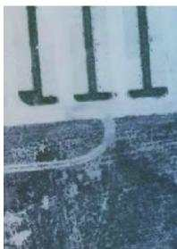  
Study area 1

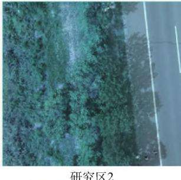  
Study area 2

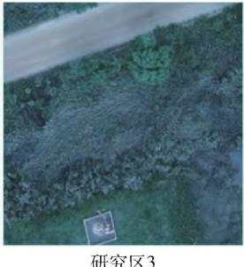  
Study area 3

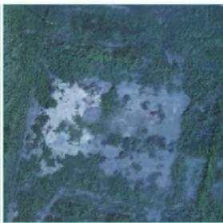  
Study area 4  
图1 研究区可见光( RGB) 正射影像图  
Fig． 1 Orthophoto images obtained with visible light ( RGB) in the study area

## 2 数据与方法

## 2. 1 数据来源

笔者使用的无人机为大疆精灵 4RTK 多光谱版，飞行时间为 2020 年 7 月。 搭载一体式多光谱成像系统，6 个1/2. 9 英寸 CMOS，包括1 个用于可见光成像的彩色传感器和 5 个用于多光谱成像的单色传感器。 主要技术指标: 1) 多光谱传感器，波段设置参数为蓝( B) : $\vdots 4 5 0 \ \mathrm { n m } \pm 1 6 \ \mathrm { n m } ;$ 绿 ( G ) :560 nm ± 16 nm; 红 ( R ) : 650 nm ± 16 nm; 红 边( RE) : 730 nm ± 16 nm; 近 红 外 ( NIR) : 840 nm ±26 nm; 镜头焦距为 5. 74 mm; 2) 传感器光谱分辨率均为 200 万像素( 1 600 × 1 200) ; 3) 空间分辨率为( H/18. 9) cm/像素( H 为飞行器相对于建图区域的飞行高度，m) ，飞行高度采用 90 m，飞行参数选择航向重叠率 80% 、 旁向重叠率 60% 时，GSD约 4. 76 cm /像素 。

数据采用 DJI Terra 软件进行拼接，形成 JPEG( 可见光成像) + TIFF( 多光谱成像) 文件。 利用ENVI 5.3 软件，分离可见光 JPEG 图像3 通道，提取3 个单波段( 蓝 B，绿 G，红 R) 灰度值 将可见光 3波段灰度值和多光谱5 波段灰度值分别进行组合加权运算，构造新型植被指数灰度图 用不同分类方法进行分类提取植被信息，采用混淆矩阵法对结果进行精度验证。 研究区对应分类方案中采用同一组训练样本;进行精度验证时，分类结果采用同一组验证样本。

## 2. 2 可见光、多光谱植被指数的计算

选择常见的 8 种可见光指数进行建模［4，11 － 12］分别为红色度坐标( red，R) 、 绿色度坐标( green，G) 、川岛指数( Kawashima index， $, \mathrm { I } _ { \mathrm { K A W } } ]$ 、可见光波段差异植被指数( visible light band difference vegetationindex，VDVI) 、 红 绿 比 指 数 ( red green ratio index，RGRI) 、绿蓝比指数( green blue ratio index，GBRI) 、过绿指数( excess green vegetation index，ExG) 、 过绿减过 红 指 数 ( excess green minus excess red index，EXG －EXR) 。 同样，选择常见的8 种多光谱指数进行建模［7，11 － 13］，分别为两波段增强型植被指数( en-hanced vegetation index 2，EVI 2) 、 优化土壤调节植被指数( optimize soil-adjusted vegetation index，OSA-VI) 、 归一化植被指数( normalized difference vegeta-tion index，NDVI) 、 绿色归一化植被指数( green nor-malized difference vegetation index，GNDVI) 、 绿色比值植被指数( green ratio vegetation index，GRVI) 、 红边归 一 化 植 被 指 数 ( red edge normalized differencevegetation index，RENDVI) 、 归一化差异红色边缘指数( normalized differential red edge index，NDRE) 、 土壤 调 整 植 被 指 数 ( soil-adjusted vegetation index，SAVI) 。

## 2. 3 林草覆盖率的计算

林草覆盖率定义为 “水土流失防治责任范围内林草类植被面积占总面积的比例”( GB/T 50434—2018 《生产建设项目水土流失防治标准》) 根据定义，林草覆盖率计算只包括林地、草地植被信息。 根据现有国家标准 GB/T 21010—2017 《土地现状利用分类》中，有 4 种占地类型涉及植被信息，即林地、草地 耕地和园地。 如果防治责任范围内有耕地 园地占地类型，采用ENVI 5.3 软件中剪切或掩膜的方法处理，只保留林地、草地。 林草覆盖率 =植被信息像元/防治范围总像元 ×100% 。

面向对象的分类方法能够更加充分的利用遥感影像中所包含的信息，回避 “椒盐噪声”等对分类结果造成的影响［14］。 植被信息的提取应用 ENVI 5. 3软件进行。

阈值分类法: 笔者利用已有研究中采取的阈值迭代法［4］。 初始阈值 t( 最大、 最小灰度值的平均值) 将灰度图一分为二，求出新阈值 T( 前景灰度值和背景灰度值所在区间的平均值) 。 若 T≠ t，将 T赋予 t，循环迭代，直到满足 $T = t , T$ 即为图像的最佳阈值。

支持向量机分类法: 支持向量机是一种监督分类的二分类模型［9 － 10］，主要针对小样本数据进行学习、分类和预测。 植被信息提取可以看成一种二分类求解问题。 进行分类之前先对植被 非植被手工选择训练样本，每组各 10 个，训练样本在图像中具有代表性且均匀分布。

## 2. 4 结果精度评价

在完成分类之后，使用目视判读的方法从图像上选取100 个植被像元、100 个非植被像元分别对2类地物分类结果计算混淆矩阵［14］进行验证和精度评价。

## 3 结果与分析

## 3.1 可见光、多光谱植被指数计算结果

以研究区1 为研究对象，可见光 多光谱各选择常见的8 种植被指数进行建模，得到 16 种灰度图( 图2) 。 经过初次分割，植被与非植被之间的分离度增强。 可见光植被指数中 $\mathrm { R } \setminus \mathrm { G } \setminus \mathrm { R G R I } \setminus \mathrm { I } _ { \mathrm { K A W } }$ 植被亮度低于硬化路面，其他指数相反。 可见光植被指数中 $\mathrm { R G R I } \setminus \mathrm { I } _ { \mathrm { K A W } }$ 、GBRI 受到航拍光线影响。 多光谱植被指数 GNDVI OSAVI NDRE 出现块状阴影，这是由于无人机在获取影像时，受到大气衰减、云雾浓度以及背光和向光等不同程度的影响，会出现亮度和色调的差异，进而影响镶嵌的质量。

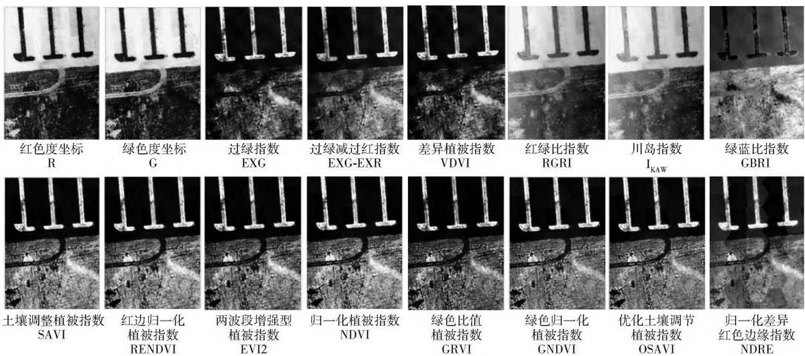  
R: Red． G: Green． EXG: Excess green vegetation index． EXG － EXR: Excess green minus excess red index． VDVI: Visible light band difference vegetation index． RGRI: Red green ratio index． $\mathrm { I } _ { \mathrm { K A W } } { \boldsymbol { : } }$ Kawashima index． GBRI: Green blue ratio index． SAVI: Soil-adjusted vegetation index． RENDVI: Red edge normalized difference vegetation index． EVI2: Enhanced vegetation index2． NDVI: Normalized difference vegetation index． GRVI: Green ratio vegetation index． GNDVI: Green normalized difference vegetation index． OSAVI: Optimized soil-adjusted vegetation index． NDRE: Normalized differential red edge index． The same below．  
图2 研究区1 的可见光、多光谱植被指数计算结果  
Fig． 2 Vegetation indices observed with the visible light and multi-spectrum of study area 1

## 3. 2 可见光、多光谱植被信息提取结果( 阈值法)

对可见光、多光谱植被指数计算结果采用阈值分类方法提取植被信息( 图 3) 。 可见，整体上多光谱提取植被信息效果比可见光效果好。 可见光 GR 指数的提取效果较好，EXG、 EXG － EXR、 VDVI 有部分漏分，而 RGRI、 $\mathrm { I } _ { \mathrm { K A W } }$ 、GBRI 出现严重的错分和漏分，这与指数计算结果受光照条件出现明暗不均匀有关，进而影响分类结果。 而多光谱指数分类的过程中，整体上都表现出较好的分类效果，只有NDRE 在低植被覆盖区有很少部分漏分。 由此得出，可见光植被指数更容易受到光线照射的强弱

影响。

## 3.3 可见光、多光谱植被信息提取结果( 支持向量机法)

同样，用支持向量机分类方法提取植被信息，结果见图4。 多光谱指数分类效果要比可见光指数效果好，这与阈值分类方法结论一致。 对比不同方法的分类结果可以看出，可见光阈值法分类效果优于支持向量机，在支持向量机法分类中，错分 漏分情况较多。 多光谱指数两者分类效果差别不大，即在多光谱指数分类的情况下，阈值分类、支持向量机2种方法都可以使用，而且支持向量机方法只需建立

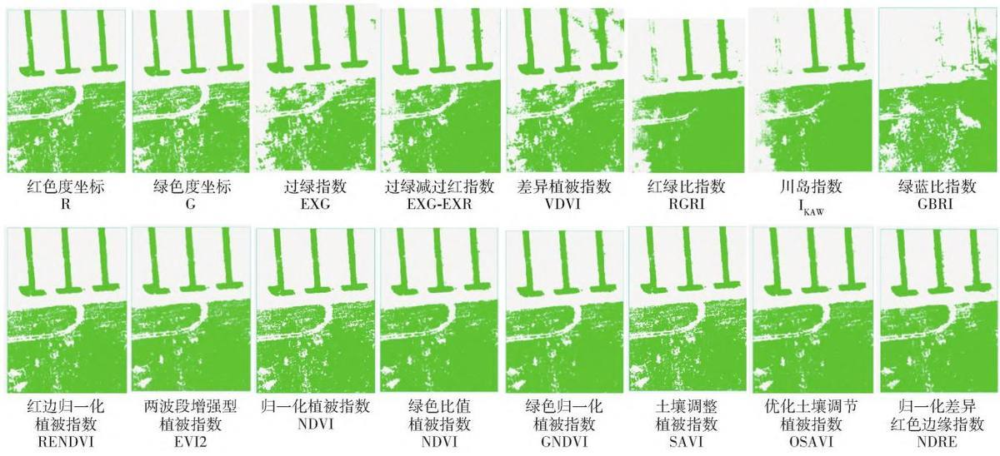  
图3 可见光、多光谱植被信息提取结果( 阈值法)

Fig． 3 Vegetation information extracted with visible light and multi-spectrum ( threshold method)  
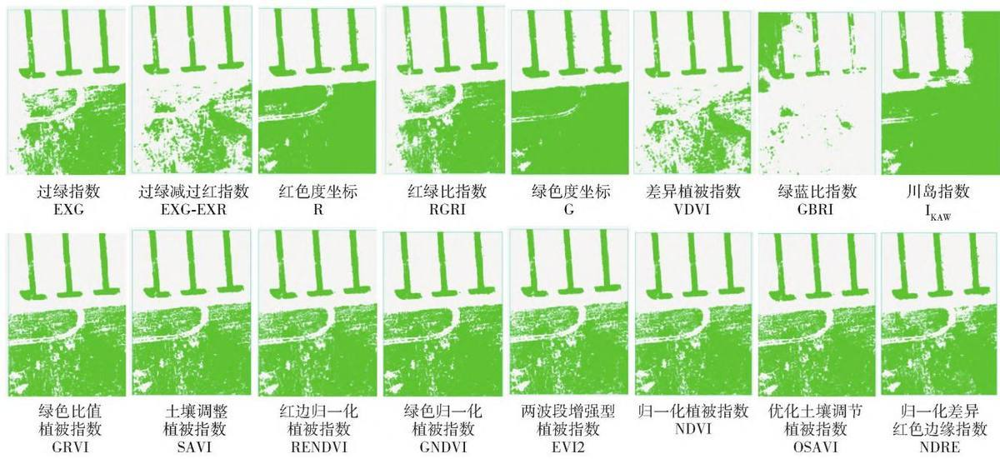  
图4 可见光、多光谱植被信息提取结果( 支持向量机)  
Fig． 4 Vegetation information extracted with visible light and multi-spectrum ( support vector machine)  
很少的训练样本，计算要相对简单快捷。  
相符合。

## 3. 4 精度评价

由同一验证样本，利用混淆矩阵对结果正确率进行验证，见表 1。 无论是阈值法还是支持向量机的分类方法，多光谱植被指数提取植被信息整体都有较高的正确率，Kappa 系数 ＞ 0. 9。 可见光植被指数分类结果中，阈值法要比支持向量机算法分类效果好，Kappa 系数在0. 9 以上有3 个，支持向量机都＜ 0. 9 。 在 8 种可见光植被指数 中，G、 R、 EXG、EXG －EXR 植被指数提取效果优于其他可见光指数，Kappa 系数都 ＞ 0. 8 。 这与以往的研究结果［12］

把 Kappa 系数 ＞ 0.9 所有植被指数进行排序( 表2) 其中可见光植被指数有 3 种，即 R、 G、EXG，都是用阈值法进行分类。 其他 16 个植被指数，都是多光谱植被指数，而且是由8 种相同的植被指数(2 种分类方法) 出现 2 次构成。 所以，在多光谱植被指数应用到植被分类中，提取结果与实际结果具有高度一致性，8 种多光谱植被指数都可以很好应用，其中 GRVI、 SAVI、 GNDVI、 NDRE 优选支持向量机法分类，RENDVI、 EVI 2、 NDVI、 OSAVI 优选阈值分类方法。

表1 植被信息分类精度评价  
Tab． 1 Precision evaluation of vegetation information classification
<table><tr><td rowspan="2">分类方法 Classification method</td><td colspan="3">可见光 Visible light</td><td colspan="3">多光谱 Multi-spectrum</td></tr><tr><td>植被指数 Vegetation index</td><td>正确率 Correct rate/%</td><td>Kappa 系数 Kappa coefficient</td><td>植被指数 Vegetation index</td><td>正确率 Correct rate/%</td><td>Kappa 系数 Kappa coefficient</td></tr><tr><td rowspan="8">阈值法 Threshold method</td><td>G</td><td>95.948</td><td>0.958</td><td>RENDVI</td><td>95.947</td><td>0.958</td></tr><tr><td>R</td><td>95.807</td><td>0.952</td><td>EVI2</td><td>95.944</td><td>0.958</td></tr><tr><td>EXG</td><td>94.178</td><td>0.905</td><td>NDVI</td><td>95.920</td><td>0.957</td></tr><tr><td>EXG - EXR</td><td>93.479</td><td>0.847</td><td>GRVI</td><td>95.902</td><td>0.956</td></tr><tr><td>VDVI</td><td>91.733</td><td>0.782</td><td>GNDVI</td><td>95.901</td><td>0.956</td></tr><tr><td>RGRI</td><td>90.706</td><td>0.741</td><td>SAVI</td><td>95.910</td><td>0.956</td></tr><tr><td>IKAW</td><td>88.242</td><td>0.639</td><td>OSAVI</td><td>95.869</td><td>0.954</td></tr><tr><td>GBRI</td><td>42.771</td><td>0.014</td><td>NDRE</td><td>95.092</td><td>0.921</td></tr><tr><td rowspan="7">支持向量机 Support vector machine</td><td>EXG</td><td>93.153</td><td>0.823</td><td>GRVI</td><td>95.982</td><td>0.960</td></tr><tr><td>EXG – EXR</td><td>92.970</td><td>0.813</td><td>SAVI</td><td>95.990</td><td>0.959</td></tr><tr><td>R</td><td>91.723</td><td>0.796</td><td>RENDVI</td><td>95.944</td><td>0.958</td></tr><tr><td>RGRI</td><td>92.631</td><td>0.795</td><td>GNDVI</td><td>95.941</td><td>0.957</td></tr><tr><td>G</td><td>91.213</td><td>0.779</td><td>EVI2</td><td>95.913</td><td>0.956</td></tr><tr><td>VDVI</td><td>91.775</td><td>0.746</td><td>NDVI</td><td>95.899</td><td>0.956</td></tr><tr><td>GBRI</td><td>82.159</td><td>0.284</td><td>OSAVI</td><td>95.867</td><td>0.954</td></tr><tr><td></td><td>IKAW</td><td>52.161</td><td>0.156</td><td>NDRE</td><td>95.440</td><td>0.935</td></tr></table>

表2 植被分类精度结果排序

Tab． 2 Rank of accuracy assessments for vegetation classification
<table><tr><td rowspan="2">植被指数 Vegetation index</td><td rowspan="2">多光谱排序 Multi-spectrum ranking</td><td rowspan="2">Kappa 系数 Kappa coefficient</td><td rowspan="2">分类方法</td><td rowspan="2">影像类型 Image type</td><td rowspan="2">可见光排序 Visible light ranking</td></tr><tr><td>Classification method</td></tr><tr><td>GRVI</td><td>1</td><td>0.960</td><td>支持向量机 Support vector machine</td><td>多光谱 Multi-spectrum</td><td></td></tr><tr><td>SAVI</td><td>2</td><td>0.959</td><td>支持向量机 Support vector machine</td><td>多光谱 Multi-spectrum</td><td></td></tr><tr><td>RENDVI</td><td>3</td><td>0.958</td><td>阈值法 Threshold method</td><td>多光谱 Multi-spectrum</td><td></td></tr><tr><td>R</td><td></td><td>0.958</td><td>阈值法 Threshold method</td><td>可见光 Visible light</td><td>1</td></tr><tr><td>RENDVI</td><td>(3)</td><td>0.958</td><td>支持向量机 Support vector machine</td><td>多光谱 Multi-spectrum</td><td></td></tr><tr><td>EVI2</td><td>4</td><td>0.958</td><td>阈值法 Threshold method</td><td>多光谱 Multi-spectrum</td><td></td></tr><tr><td>GNDVI</td><td>5</td><td>0.957</td><td>支持向量机 Support vector machine</td><td>多光谱 Multi-spectrum</td><td></td></tr><tr><td>NDVI</td><td>6</td><td>0.957</td><td>阈值法 Threshold method</td><td>多光谱 Multi-spectrum</td><td></td></tr><tr><td>EVI2</td><td>(4)</td><td>0.956</td><td>支持向量机 Support vector machine</td><td>多光谱 Multi-spectrum</td><td></td></tr><tr><td>SAVI</td><td>(2)</td><td>0.956</td><td>阈值法 Threshold method</td><td>多光谱 Multi-spectrum</td><td></td></tr><tr><td>GRVI</td><td>(1)</td><td>0.956</td><td>阈值法 Threshold method</td><td>多光谱 Multi-spectrum</td><td></td></tr><tr><td>GNDVI</td><td>(5)</td><td>0.956</td><td>阈值法 Threshold method</td><td>多光谱 Multi-spectrum</td><td></td></tr><tr><td>NDVI</td><td>(6)</td><td>0.956</td><td>支持向量机 Support vector machine</td><td>多光谱Multi-spectrum</td><td></td></tr><tr><td>OSAVI</td><td>7</td><td>0.954</td><td>阈值法 Threshold method</td><td>多光谱 Multi-spectrum</td><td></td></tr><tr><td>OSAVI</td><td>(7)</td><td>0.954</td><td>支持向量机 Support vector machine</td><td>多光谱 Multi-spectrum</td><td></td></tr><tr><td>G</td><td></td><td>0.952</td><td>阈值法 Threshold method</td><td>可见光 Visible light</td><td>2</td></tr><tr><td>NDRE</td><td>8</td><td>0.935</td><td>支持向量机 Support vector machine</td><td>多光谱 Multi-spectrum</td><td></td></tr><tr><td>NDRE</td><td>(8)</td><td>0.921</td><td>阈值法 Threshold method</td><td>多光谱 Multi-spectrum</td><td></td></tr><tr><td>EXG</td><td></td><td>0.905</td><td>阈值法 Threshold method</td><td>可见光 Visible light</td><td>3</td></tr></table>

## 3. 5 适用性评价及林草覆盖率计算

为了更好地验证植被指数及分类方法的适用性和准确性，选择3 个研究小区( 研究区 2 研究区 3研究区4) ，选取可见光与多光谱数据源中精度较高各 3 种植被指数( 多光谱 GRVI SAVI RENDVI，可见光 R、G、EXG) 进行植被信息提取( 图 5) 。 3 幅实验影像同一时间段拍摄。 植被分类精度、林草覆盖率计算结果如表 3 由实验结果可知，在研究区 3研究区4 中，6 种植被指数均获得较佳的分类效果，分类精度 Kappa 系数都 ＞0. 8，整体上多光谱要优于可见光。 在研究区2 中，单波段可见光 G、R 分类后存在明显的阴影区域，分类精度较低，而多光谱分类效果较好，没有出现此类现象

在研究区 2 中( 图 6) ，由于乔木自身高度和太

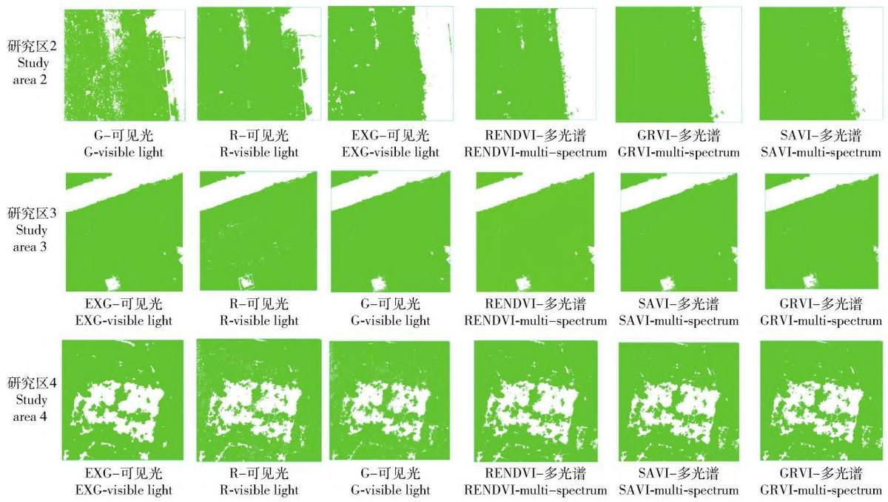  
图5 精度较高指数的分类结果( 可见光3 种，多光谱3 种)  
Fig． 5 Classification of top 3 high-precision indices ( 3 visible lights and 3 multi-spectrums are included)

阳高度角的存在产生阴影，可见光 G R 由于阴影的灰度值和植被内部灰度值有相同部分，将少部分树影信息错分为植被信息，影响分类结果。 而可见光EXG 和多光谱指数，通过波段处理减少阴影的干扰，使植被信息与其他信息在影像中区分更加明显，能有效地抑制乔木阴影信息，不会过多地造成错分现象。 这和一些学者利用不同波段特性及波段运算方式，构建植被指数以增强植被信息达到消除阴影影响的研究非常相似［15 － 17］。 虽然本研究选取的指数能去除阴影效果，但研究范围局限于 1 个研究区类型，其他场景能否使用有待研究。 下一步在研究基础上可更深入研究构建 “阴影消除植被指数”，以提高特殊情况下分类精度。

综上所述，多光谱植被指数在 3 个研究区均获得较好的植被信息识别效果，具有较好的适用性和稳定性，其中 RENDVI 表现最优。 可见光植被指数在正常的影像中可获得较好的识别，EXG 表现最优。 但存在阴影的情况下，单波段指数 G、R 区分阴影与植被相似的部分信息的能力较弱。 所以在可见光应用中，在拍摄时间的选择上注意尽量避免阴影的产生。

## 4 结论

1) 与同类研究相衔接，笔者选取 16 种植被指数( 多光谱8 种 可见光 8 种) 提取植被信息，用混淆矩阵方式对提取精度进行验证，其中，8 种多光谱植被指数和3 种可见光植被指数的 Kappa 系数均为0.90 以上。 以上11 种植被指数分类效果可满足实际应用需求，实现生产建设项目水土保持林草覆盖率准确计算。

2) 面向对象的方法，能够充分挖掘无人机影像的大部分特征信息，有效实现对植被信息的快速 精准识别。 阈值法的准确率大于支持向量机分类法。满足要求的11 种植被指数中，多光谱植被指数分类的方法 GRVI、SAVI、GNDVI、NDRE 为支持向量机分类法，RENDVI、 EVI2、 NDVI、 OSAVI 采用阈值分类法;可见光植被指数 R、G、EXG 均采用阈值法。

表3 植被分类精度评价及林草覆盖率计算表  
Tab． 3 Precision evaluation of vegetation classification and forest and grass coverage
<table><tr><td rowspan="2">研究区 域编号 No. of</td><td colspan="5">可见光 Visible light</td><td colspan="5">多光谱 Multi-spectrum</td></tr><tr><td>植被指数 Vegetation index</td><td>分类方法 Classification method</td><td>正确率 Correct rate/%</td><td>Kappa 系数 Kappa</td><td>林草覆盖率 Forest and grass coefficient coverage/%</td><td>植被指数 Vegetation index</td><td>分类方法 Classification method</td><td>正确率 Correct rate/%</td><td>Kappa 系数 Kappa</td><td>林草覆盖率 Forest and grass</td></tr><tr><td rowspan="3">2</td><td>EXG</td><td>阈值法 Threshold method</td><td>92.25</td><td>0.801</td><td>72.02</td><td>RENDVI</td><td>阈值法 Threshold method</td><td>98.11</td><td>0.958</td><td>coefficient coverage /% 70.16</td></tr><tr><td>R</td><td>阈值法 Threshold method</td><td>91.02</td><td>0.793</td><td>78.88</td><td>GRVI</td><td>支持向量机 Support vector machine</td><td>95.71</td><td>0.903</td><td>71.36</td></tr><tr><td>G</td><td>阈值法 Threshold method</td><td>87.30</td><td>0.695</td><td>71.44</td><td>SAVI</td><td>支持向量机 Support vector machine</td><td>95.06</td><td>0.877</td><td>72.95</td></tr><tr><td rowspan="3">3</td><td>EXG</td><td>阈值法 Threshold method</td><td>98.02</td><td>0.960</td><td>84.52</td><td>RENDVI</td><td>阈值法 Threshold method</td><td>97.83</td><td>0.956</td><td>84.60</td></tr><tr><td>R</td><td>阈值法 Threshold method</td><td>93.15</td><td>0.861</td><td>83.94</td><td>SAVI</td><td>支持向量机 Support vector machine</td><td>97.54</td><td>0.950</td><td>84.73</td></tr><tr><td>G</td><td>阈值法 Threshold method</td><td>91.44</td><td>0.826</td><td>85.41</td><td>GRVI</td><td>支持向量机 Support vector machine</td><td>95.99</td><td>0.919</td><td>84.75</td></tr><tr><td rowspan="3">4</td><td>EXG</td><td>阈值法 Threshold method</td><td>96.63</td><td>0.912</td><td>79.15</td><td>RENDVI</td><td>支持向量机 Support vector machine</td><td>96.73</td><td>0.962</td><td>77.39</td></tr><tr><td>R</td><td>阈值法 Threshold method</td><td>93.41</td><td>0.907</td><td>74.45</td><td>SAVI</td><td>阈值法 Threshold method</td><td>96.48</td><td>0.959</td><td>78.48</td></tr><tr><td>G</td><td>阈值法 Threshold method</td><td>92.57</td><td>0.889</td><td>76.12</td><td>GRVI</td><td>支持向量机 Support vector machine</td><td>96.17</td><td>0.951</td><td>79.19</td></tr></table>

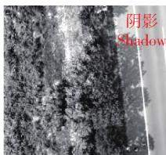  
G-可见光G-visible light

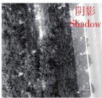  
R-可见光 R-visible light

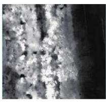  
EXG-可见光  
EXG-visible light

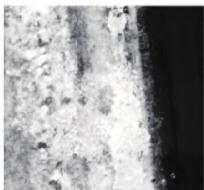  
RENDVI-多光谱  
RENDVI-multi-spectrum

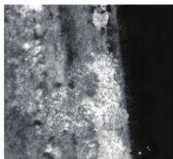  
GRVI-多光谱  
GRVI-multi-spectrum

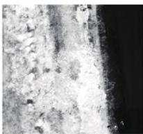  
SAVI-多光谱  
SAVI-multi-spectrum  
图6 研究区2 植被指数图  
Fig． 6 Vegetation indices in the study area 2

3) 在3 个研究区适应性验证实验结果表明，在正常状况下，多光谱和可见光植被指数均获得较好的植被信息识别效果来计算林草覆盖率; 在有阴影存在情况下，单波段可见光 R G 有错分现象，可见光 EXG 和多光谱指数通过波段处理减少阴影的干扰。 多光谱植被指数具有更好的适用性和稳定性。

## 5 参考文献

［1］ 夏晨真，张月． 基于厘米级无人机影像的水土保持措施精准识别［J］． 水土保持学报，2020，34( 5) : 111．XIA Chenzhen，ZHANG Yue． Accurate identification ofsoil and water conservation measures based on centimeter-resolution UAV images ［J］． Journal of Soil and Water

Conservation，2020，34( 5) : 111．

［2］ 李鹏飞． 基于无人机遥感的排土( 矸) 场立地对植被盖度影响研究［D］． 北京: 北京林业大学，2021: 13．LI Pengfei． Influence study of sites on vegetation coveragein dumps and gangue fields based on UAV remote sensingtechnology ［D］． Beijing: Beijing Forestry University，2021: 13．

［3］ 林成行，朱首军，周涛，等． 基于无人机遥感技术的水土保持植被恢复率提取［J］． 水土保持研究，2018，25( 6) : 211．LIN Chenghang，ZHU Shoujun，ZHOU Tao，et al． Theextraction of vegetation recovery rate in soil and waterconservation based on the technology of Unmanned AerialVehicle ( UAV) remote sensing ［J］． Research of Soil andWater Conservation，2018，25( 6) : 211．

［4］ 崔万新，李锦荣，司前程，等． 基于无人机可见光波对荒漠植被覆盖率提取的研究［J］． 水土保持研究，

2021，28( 6) : 175． CUI Wanxin，LI Jinrong，SI Qiancheng，et al． Research on extraction method of desert shrub coverage based on UAV visible light data ［J］． Research of Soil and Water Conservation，2021，28( 6) : 175．

［5］ 汪小钦，王苗苗，王绍强，等． 基于可见光波段无人机遥感的植被信息提取［J］． 农业工程学报，2015，31( 5) : 152．WANG Xiaoqin，WANG Miaomiao，WANG Shaoqiang，et al． Extraction of vegetation information from visible un-manned aerial vehicle images ［J］． Transactions of theCSAE，2015，31( 5) : 152．

［6］ 万炜，肖生春，陈小红，等． 无人机遥感在野外植被盖度调查中的应用: 以阿拉善荒漠区灌木为例［J］． 干旱区资源与环境，2018，32( 9) : 150．WAN Wei，XIAO Shengchun，CHEN Xiaohong，et al．Application of unmanned aerial vehicles to field vegetationcoverage survey: A study of shrubs on Alxa desert ［J］．Journal of Arid Land Resources and Environment，2018，32( 9) : 150．

［7］ 陈浩，冯浩，杨祯婷，等． 基于无人机多光谱遥感的夏玉米冠层叶绿素含量估计［J］． 排灌机械工程学报，2021，39( 6) : 622．CHEN Hao，FENG Hao，YANG Zhenting，et al． Estima-tion of chlorophyll content of summer maize canopy basedon UAV multispectral remote sensing ［J］． Journal ofDrainage and Irrigation Machinery Engineering，2021，39( 6) : 622．

［8］ 李冰，刘镕源，刘素红，等． 基于低空无人机遥感的冬小麦覆盖度变化监测［J］． 农业工程学报，2012，28( 13) : 160．LI Bing，LIU Rongyuan，LIU Suhong，et al． Monitoringvegetation coverage variation of winter wheat by low-alti-tude UAV remote sensing system ［J］． Transactions of theCSAE，2012，28( 13) : 160．

［9］ 徐存东，李洪飞，谷丰佑，等． 基于无人机遥感影像的盐碱地信息的精准提取方法［J］． 中国农村水利水电，2021( 18) : 116．XU Cundong，LI Hongfei，GU Fengyou，et al． An accu-rate method to extract saline-alkali land information basedon Unmanned Aerial Vehicle remote sensing image ［J］．China Rural Water and Hydropower，2021( 18) : 116．

［10］ 孙玉琳，黄宇，李伟，等． 基于无人机多光谱影像的土地利用分类方法研究［J］． 新疆农机化，2022(2) :11．SUN Yulin，HUANG Yu，LI Wei，et al． Research onland utilization and classification method based on UAVmultispectral image［J］． Xinjiang Agricultural Mechani-zation，2022( 2) : 11．

［11］ 牛庆林，冯海宽，周新国，等． 冬小麦 SPAD 值无人机可

见光和多光谱植被指数结合估算［J］． 农业机械学报， 2021，52( 8) : 183． NIU Qinglin，FENG Haikuan，ZHOU Xinguo，et al． Combining UAV visible light and multispectral vegetation indices for estimating SPAD value of winter wheat ［J］． Transactions of the CSAM，2021，52( 8) : 183．

［12］ 高永刚，林悦欢，温小乐，等． 基于无人机影像的可见光波段植被信息识别［J］． 农业工程学报，2020，36( 3) : 178．GAO Yonggang，LIN Yuehuan，WEN Xiaole，et al． Veg-etation information recognition in visible band based onUAV images ［J］． Transactions of the CSAE，2020，36( 3) : 178．

［13］ 左萍萍，付波霖，蓝斐芜，等． 基于无人机多光谱的沼泽植被识别方法［J］． 中国环境科学，2021，41( 5) :2399．ZUO Pingping，FU Bolin，LAN Feiwu，et al． Classifica-tion method of swamp vegetation using UAV multispectraldata ［J］． China Environmental Science，2021，41( 5) :2399．

［14］ 张舒昱，李兆富，徐锋，等． 基于多时相无人机遥感影像优化河口湿地景观分类［J］． 生态学杂志，2020，39( 9) : 3174．ZHANG Shuyu，LI Zhaofu，XU Feng，et al． Optimizationof estuary wetland landscape classification based on multi-temporal UAV images ［J］． Chinese Journal of Ecology，2020，39( 9) : 3174．

［15］ 李美炫，朱西存，白雪源，等． 基于无人机影像阴影去除的苹果树冠层氮素含量遥感反演［J］． 中国农业科学，2021，54( 10) : 2084．LI Meixuan，ZHU Xicun，BAI Xueyuan，et al． Remotesensing inversion of nitrogen content in apple canopybased on shadow removal in UAV multi-spectral remotesensing images ［J］． Scientia Agricultura Sinica，2021，54( 10) : 2084．

［16］ 柳晓农，江洪，汪小钦． 构建植被区分阴影消除植被指 数提取山地植被信息［J］． 农业工程学报，2019， 35( 20) : 135． LIU Xiaonong，JIANG Hong，WANG Xiaoqin． Extraction of mountain vegetation information based on vegetation distinguished and shadow eliminated vegetation index J］． Transactions of the CSAE，2019，35( 20) : 135．

［17］ 许章华，刘健，余坤勇，等． 阴影植被指数 SVI 的构建及其在四种遥感影像中的应用效果［J］． 光谱学与光谱分析，2013，33( 12) : 3359．XU Zhanghua，LIU Jian，YU Kunyong，et al． Construc-tion of vegetation shadow index ( SVI) and applicationeffects in four remote sensing images ［J］． Spectroscopyand Spectral Analysis，2013，33( 12) : 3359．