# 水土保持率：概念内涵 阈值确定及实践应用

曹文洪1，2 ， 宁堆虎1，3 ， 秦 伟1，2

（1．中国水利水电科学研究院 ， 北京100048； 2．水利部水土保持生态工程技术研究中心 北京100048； 3．国际泥沙研究培训中心 北京100048）

摘 要 ： ［目的］ 确定全国及不同区域水土流失防治的适宜目标 帮助社会各界了解和应用水土保持率概念及相关研究成果 ，为促进新时代水土保持高质量发展提供有益参考 ［方法］ 根据2019年水利部首次提出的“水土保持率”指标及其专项研究成果 阐述了水土保持率概念的内涵及其阈值确定方法 以30m分辨率网格为空间单元 基于土壤侵蚀分类分级 土地利用 地形地貌 植被覆盖等多源地理空间数据 分析计算了全国及各省份水土保持率阈值 ，并解读了水土保持率系列目标在中国水土保持目标责任考核和落实中的应用 ［结果］ 水土保持率概念的核心是表征符合自然规律并满足经济社会发展要求的水土流失防治适宜程度 远期应当包含减量 降级 增效等多维

度的阈值体系 可综合评估区域水土流失防治现状及其所能达到的适宜程度 目前的水土保持率指标主要反映水土流失面积的减量适宜目标 已被用于美丽中国建设评估 并被作为中共中央办公厅 国务院办公厅《关于加强新时代水土保持工作的意见》中的核心指标 ［结论］ 建议基于社会—生态系统范式 在全面考虑自然与社会领域综合因素影响 本地和溢出维度不同效应协同 生态和经济层面多重目标权衡的基础上 深入研究不同地区水土流失消长变化阈值及评估方法等问题 同时 围绕流域系统综合治理的有关要求 关注梯田 林草 淤地坝 坡耕地侵蚀沟等主要治理措施或重点治理对象的适宜规模与合理布局等重大问题

关键词 ： 水土保持率 ； 水土流失防治 ； 适宜目标 ； 阈值确定 ； 阶段目标值 ； 目标值分解

文献标识码 ： B

文章编号 ： 1000－288X（2023）01－0409－08

中图分类号 ： S157

文献参数 ： 曹文洪 宁堆虎 秦伟．水土保持率 ：概念内涵 阈值确定及实践应用［J］．水土保持通报 202343（1） ：409－416．DOI：10．13961／j．cnki．stbctb．2023．01．046； Cao Wenhong， NingDuihu， Qin Wei．Soilandwaterconservationrate： connotationofconcept， thresholddeterminationandpracticalapplication ［J］BulletinofSoilandWaterConservation 202343（1） ：409－416

# SoilandWaterConservationRate： ConnotationofConcept， ThresholdDeterminationandPracticalApplication

CaoWenhong1，2， NingDuihu1，3， QinWei1，2

（1.China Institute of Water Resources and Hydropower Research ， Beijing 100048， China ； 2.Research Center on Soil and Water Conservation of the Ministry of Water Resources ， Beijing 100048， ； 3. ， 100048， ）

Abstract： ［Objective］ Thesuitabletargetsforsoiland waterlosspreventionandcontrolindifferent provincesandallofChinaweredeterminedinordertohelppeopleofallsectorsofsocietyinunderstanding andapplyingtheconceptofsoilandwaterconservationrate（SWCR）andrelatedresearch，therebyproviding ausefulreferenceforfacilitatingthehighqualitydevelopmentofsoilandwaterconservationinthenewage ［Methods］ BasedontheconceptandrelatedresearchresultsofSWCRasfirstpresentedbytheMinistryof WaterResourcesin2019，theconceptofSWCRwasexpoundedandthethresholdofSWCRwasdetermined Agridof30 mresolutionwasusedasthespatialunit， andthemulti－sourcegeospatialdata （including classificationandgradingofsoilerosion，landuse，topography， vegetationcover，etc．） wereusedtocalculateand

analyzethethresholdsofSWCRinChinaanddifferentprovinces andtoexplaintheapplicationofserial targetsforSWCRintheliabilityassessmentandimplementationoftargetsforsoilandwaterconservationin China．［Results］ ThecoreconnotationofconceptforSWCRrepresentstheappropriatedegreeofsoilerosion controlthatconformstothenaturallawandmeetstherequirementsofeconomicandsocialdevelopment．In thefuture SWCR willbecomethemulti－dimensionalthresholdsystemthatincludesreductingareaand downgradingintensityofsoilandwaterloss andenhancingfunctionofsoilandwaterconservation．Itcould beusedtocomprehensivelyevaluatethecurrentsituationofregionalsoilandwaterlosscontrol andtheir appropriatedegreecouldbeachieved．Atpresent SWCRmainlyreflectstheappropriategoalofreducingthe areaofsoilandwaterloss whichhasbeenemployedintheassessmentof“BeautifulChinaConstruction” andwhichhasbecomethecoreindicatorin Opinions on Strengthening Soil and Water Conservation in the Age thatwasprintedanddistributedbytheGeneralOfficeoftheCPCCentralCommitteeandthe GeneralOfficeoftheStateCouncil．［Conclusion］ Basedonthesocialecosystemparadigm，itissuggestedto studythethresholdvalueandassessmentmethodsofthechangeofsoilandwaterlossindifferentregionsat differentlevelsbasedoncomprehensiveconsiderationoftheinfluenceofnaturalandsocialfactors the synergyofdifferentlocalandspillovereffects，andthebalanceofmultipleobjectivesatecologicalandeconomiclevels Atthesametime，focusingontherelevantrequirementsofthecomprehensivemanagementofthebasinsystem， we shouldpayattentiontotheappropriatescaleandreasonablelayoutofthemaincontrolmeasuresorkeyobjects， suchasterraces，forestandgrass， siltingdam， slopecroplanderosiongullies， etc

Keywords： soilandwaterconservationrate；soilandwaterlosspreventionandcontrol；suitabletarget； determination

oflong－termthreshold； phase－targetvalue； assigningtarget－value

中国是世界上水土流失最严重的国家之一 水土保持作为流域生态保护修复 河湖生态环境复苏的根本措施 是生态文明建设的重要内容 被列为长期坚持的基本国策 经过70a余的不懈治理， 全国水土流失面积由20世纪80年代中期的 $3 . 6 7 \times 1 0 ^ { 6 } \ \mathrm { k m ^ { 2 } }$ 减少为2011年的 $2 . 9 5 \times 1 0 ^ { 6 } ~ \mathrm { k m } ^ { 2 }$ 2021年的2．67×106km2，累计减幅达1／4以上，其中的中度及以上水土流失面积比例由49．32％降至35．58％ 实现了水土流失面积 强度 “双下降”［1－3］ 当前国家提出 “到2035年生态环境根本好转 美丽中国目标基本实现；到2050年生态文明全面提升”的发展愿景 相应地水土流失防治到什么程度才算好？如何评价？能否满足国家2035年和2050年的美丽中国和生态文明建设目标？这一系列重大问题迫切需要回答［4］ 与此同时，随着全球生态环境保护与治理持续深入 ， 关于区域植被恢复适宜目标［5］ 生态系统服务功能权衡［6］ 社会生态系统演变溢出效应［7］ 等诸多研究表明 一定时空范围内的单一生态要素 过程及其效应对于系统整体而言 大多存在相对稳定或适宜的阈值区间 水土流失作为水力 风力 重力及冻融等自然营力及人类活动作用下的地表过程［8］ 受到水分承载 土地利用 治理能力等自然和社会因素综合影响［9－11］ 其面积 强度在一定区域与时期内处于变化消长的动态过程 既非通过治理就只减不增的静态存量 也不可能或不适宜彻底消除 势必存在科学治理的“天花板”与综合权衡的“适宜度”

为满足新时期国家生态文明建设要求和促进学科发展 需要确定全国及不同区域的水土流失防治适宜目标 因此 2019年水利部首次提出“水土保持率”概念 用于正向表征区域水土保持综合状况 将其阈值定义为符合自然规律并满足经济社会发展要求的水土流失防治适宜程度［12］ 并被列入美丽中国建设评估指标体系［13］ 2020—2022年 水利部水土保持司专门组织中国水利水电科学研究院等水利行业和中国科学院系统的10家科研机构 开展“新时代水土保持目标和对策研究”（以下简称“专项研究”） ， 提出了“水土保持率“的内涵 外延 表征指标和阈值确定方法 并经省级复核与上报 最终形成全国 8个一级区和31个省份的水土保持率系列目标值 相关研究成果已被中共中央办公厅 国务院办公厅印发的《关于加强新时代水土保持工作的意见》［14］ 和水利部《水土保持“十四五”实施方案》［15］ 等重要文件采纳并应用于各省级水土流失防治规划布局等生态建设实践

本文依据相关研究成果 介绍水土保持率概念的内涵及其阈值确定 阐释全国及各省份水土保持率目标值特点 并分析其应用前景 以期为水土保持率的持续深入研究与相关实践应用提供理论和方法参考 ，为促进新时代水土保持高质量发展提供支撑

## 1 水土保持率的内涵概念及其阈值确定

## 1．1 水土保持率的内涵

“水土保持率”的提出，目的是回答当前及今后一段时期水土流失预防和治理应该且能够“干到什么程度才算好？如何评价是否实现了好的目标？”等重大问题［4］ 其核心内涵是 在符合自然规律并满足经济社会发展要求条件下 水土流失预防和治理应当达到的程度 长远而言 应当包括“减少水土流失面积数量” “降低水土流失强度等级” “增强水土保持功能成效”等3方面的适宜程度 即所谓“减量—降级—增效”的综合适宜目标 因此 在形式上需要针对不同维度的具体内容 设定相应表征指标 以实际发挥状态量化与目标导向的作用

鉴于中国目前仍存在占国土空间1／4以上的水土流失面积［3］ ，相当长的时期内“去存量， 控增量”依然是很多地区的水土保持首要任务 同时考虑“可获取 可分解 可衡量 可操作”等原则，当前主要以水土流失面积减少适宜程度作为全国水土保持宏观管控的总指标 并据此明确了“水土保持率”指标的定义即区域内水土保持状况良好面积（非水土流失面积）占国土面积的比例 ，是水土流失预防治理效果和自然禀赋水土保持功能在空间尺度的综合体现［4］

按此定义的“水土保持率”指标 包含现状值和阈值两个状态 其中 现状值即当前或基准期区域内水土保持状况良好面积占国土面积的比例 ；阈值即通过水土流失预防和治理 区域内水土保持状况良好面积占国土面积比例的远期上限 反映符合自然规律并满足经济社会发展要求下 水土流失防治在减小面积维度上应当达到的适宜程度 可视为水土保持工作的远期目标 结合生态文明和美丽中国建设要求 阈值年暂定为2050年 现状值较阈值的差距 则是相应区域一定时期的水土保持总任务

## 12 水土保持率的阈值确定

本研究按照东北黑土区 北方风沙区 北方土石山区 西北黄土高原区 南方红壤区 西南紫色土区西南岩溶区 青藏高原区8个全国水土保持一级分区［16］ ，综合分析各区自然地理条件 经济社会发展水平和趋势 提出了全国尺度的现存水土流失远期防治情势研判原则［12］ 在此基础上，以30m分辨率网格为空间单元，基于土壤侵蚀分类分级 土地利用 地形地貌 植被覆盖等多源地理空间数据叠加分析 逐片研判现存水土流失中哪些不需治理 哪些应当治理哪些可以完全治理（治理后土壤侵蚀强度可降至轻度以下，不再计入水土流失面积） ， 哪些不可完全治理（治理后土壤侵蚀强度降低但仍在轻度及以上 依然计入水土流失面积）等问题 进而确定全国及不同类型区的远期水土流失面积阈值 并计算对应水土保持率阈值 水土流失远期防治分类及研判原则见表1确定水土保持率阈值的技术方案如图1所示

表1 水土流失远期防治分类及其主要研判原则  
Table1 Classificationoflong－termcontrolofsoilerosionanditsmainresearchandjudgmentprinciples
<table><tr><td>水土流失远期 防治分类</td><td>定义</td><td>主要研判原则</td></tr><tr><td>不需治理的 水土流失</td><td>指区域内对生产、生活、生态无不利影响或影响较 小，无需进行专门治理且难以自然恢复消除的水 土流失</td><td>高寒高海拔人口稀疏区的水土流失 沙漠、戈壁和流动沙地腹地的水土流失 集中连片裸露基岩为主体地表内的破碎散布水土流失</td></tr><tr><td>应当治理的 水土流失</td><td>指区域内对生产、生活、生态存在不利影响，需要 实施针对性预防、治理措施的水土流失</td><td>研判确定不需治理的水土流失后，其余现存水土流失均视为 应当治理 东北、西北、西南、东南、华北等地漫岗区或山丘区的部分坡耕</td></tr><tr><td>不可完全治理 的水土流失</td><td>指应当治理的水土流失类型中，受自然、经济、技 术水平等限制，治理后不能将土壤侵蚀强度完全 控制在轻度以下的水土流失</td><td>地和园地水土流失 华北、西南、东南等地山丘区陡坡和沟谷地形下的部分中、低 覆盖度林草地水土流失 黄土高原沟壑陡坡的水力、重力混合侵蚀形成的水土流失 西北地区固定沙地、绿洲与荒漠过渡带、重要交通水利设施沿 线等风蚀水土流失 必要生产建设项目(活动)造成的阶段性人为水土流失</td></tr><tr><td>可以完全治理 的水土流失</td><td>指应当治理的水土流失类型中，通过因地制宜、分 类施策的综合防治，治理后土壤侵蚀强度能控制 到轻度以下的水土流失</td><td>研判确定不可完全治理的水土流失后，其余应当治理的现存 水土流失均视为可以完全治理</td></tr></table>

## 2 全国及各省份水土保持率阈值和阶段目标

依据有关定义和阈值确定方法 结合中国不同类型区和省份2018年有关数据资料的空间分析统计，专项研究最终提出了全国与31个省份（不含香港 澳门特别行政区和台湾省）的水土保持率阈值 明确了不同省级行政区域的水土流失防治适宜目标 在此基础上 为推动各地水土流失防治任务的完成 落实各省水土保持工作责任，水利部采取自上而下与自下而上相结合的方式 同步组织各省在复核确认其所在省份水土保持率阈值的基础上 综合统筹区域生态建设的相关基础 部署和需求 遵循“先易后难 先急后缓 分类治理 分步实施”等基本原则 合理规划上报了各自20252030年和2035年水土保持率阶段目标 最终形成2021—2035年的全国水土保持率不同阶段目标值

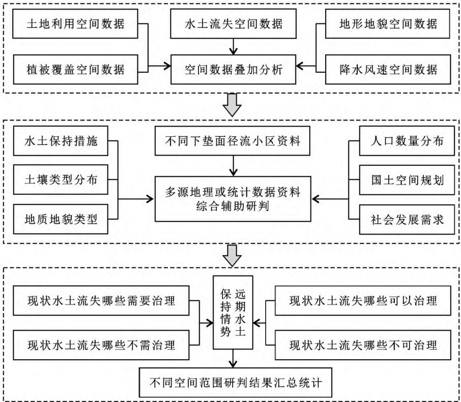  
图1 确定区域水土保持率阈值的技术方案  
Fig1 Technicalschemefordeterminingthethresholdvalueofregionalsoilandwaterconservationrate

## 21 全国水土保持率目标

2．1．1 全国水土保持率阈值 专项研究结果表明 全国2021年现存水土流失面积中 约有 $1 . 2 3 \times 1 0 ^ { 6 } ~ \mathrm { k m ^ { 2 } }$ 综合自然与社会因素而不需或不宜治理 主要为分布在西北地区沙漠 戈壁和流动沙地腹地的风力侵蚀以及青藏高原 横断山地等高寒高海拔人口稀疏区的水力侵蚀 其余约 $1 . 4 4 \times 1 0 ^ { 6 } ~ \mathrm { k m } ^ { 2 }$ 则应当分区施策 因地制宜地开展综合治理 统筹分析与权衡水土流失特性 自然地理条件以及技术经济因素 应当治理的水土流失中 约 $5 . 2 0 \times 1 0 ^ { 5 } ~ \mathrm { k m } ^ { 2 }$ 可将土壤侵蚀强度降至轻度以下 实现其对应水土流失面积“销号”外 其余约 $9 . 2 0 \times 1 0 ^ { 5 } ~ \mathrm { k m } ^ { 2 }$ 治理后的土壤侵蚀强度虽有不同程度降低 但因仍在轻度及以上而需长期计入水土流失面积 这些治理后难以“销号”的水土流失主要为西北地区固定沙地 绿洲与荒漠过渡带的风力侵蚀 ，华北 东南 西南等地山丘区和东北漫川漫岗区部分坡耕地 园地和陡坡林草地的水力侵蚀 黄土高原沟壑陡坡的水力 重力混合侵蚀 以及必要生产建设扰动所造成的阶段性人为水土流失 2021年全国水土流失面积 构成 分布及其远期防治分类格局见图2及表2，不需（或不宜）治理水土流失或治理后难以降至轻度以下的水土流失类型组成如图3所示 根据以上结果，全国水土流失面积远期应该且能够减少至$2 . 1 5 \times 1 0 ^ { 6 } ~ \mathrm { k m } ^ { 2 }$ ，水土保持率阈值可达77．5％以上

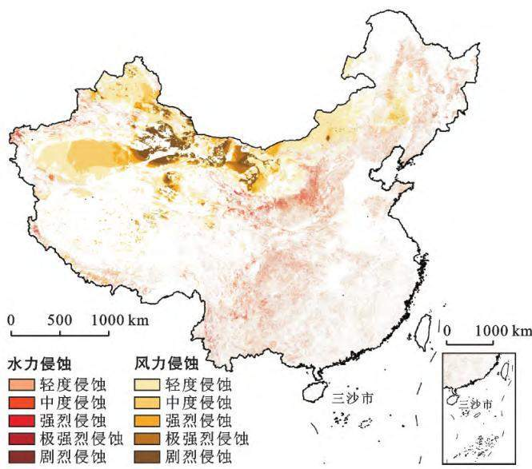  
注 ： 中国地图国界根据1∶740万标准地图绘制 ， 审图号 GS（2002）4306； 下载网址 http：∥bzdt．ch．mnr．gov．cn。 下同。

图2 2021年全国水土流失类型空间分布

Fig2 Area composition distributionandlong－termcontrol classificationofexistin soilandwaterlossin2021

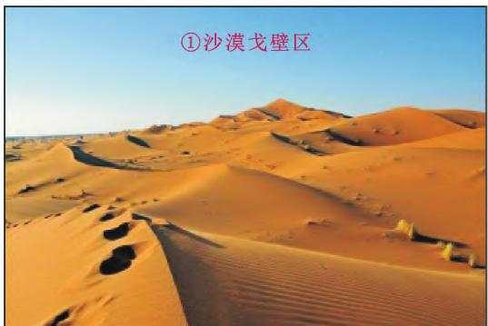

a不需或不宜治理的水土流失典型区  
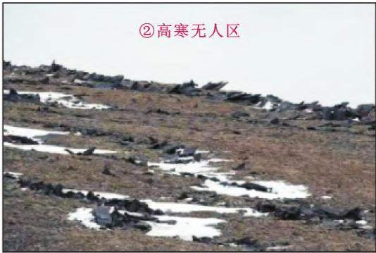  
不需或不宜治理的水土流失类型  
①西北地区沙漠、戈壁和流动沙地腹地的风力侵蚀  
②青藏高原、横断山地等高寒高海拔人口稀疏区的水力侵蚀

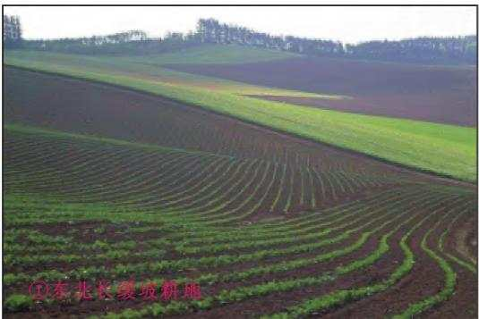

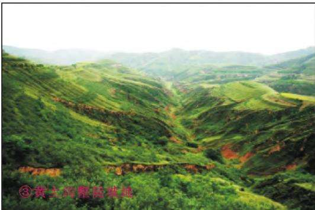

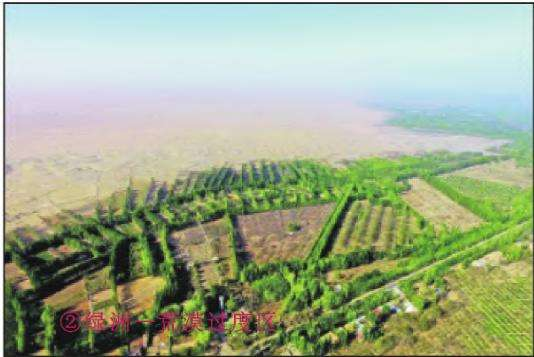  
②西北地区固定沙地、绿洲与荒漠过渡带的风力侵蚀

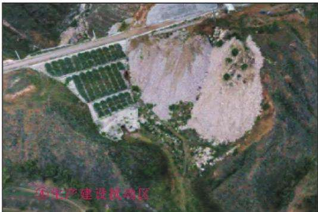

## 治理后难以降至轻度以下的水土流失类型

①东北漫川漫岗区和华北、东南、西南等地山丘区部分坡耕地、园地和陡坡林草地的水力侵蚀

③黄土高原沟壑陡坡的水力、重力混合侵蚀

④必要生产建设活动所造成的阶段性人为水土流失

b 治理后难以降至轻度以下的水土流失典型区  
图3 2021年全国不需或不宜治理（a）及治理后难以降至轻度以下（b）的水土流失类型组成  
Fig3 Compositionofsoilandwaterlosstypesthatdonotneedorshouldnotbetreated （a） and aredifficulttobereducedtolessthanmildaftertreatment（b）inChinain2021  
表2 2021年全国现存水土流失类型 强度组成及其治理分类  
Table2 Typesandintensitycompositionofexisting soilandwaterlossinChinaanditscontrol classificationin2021
<table><tr><td>项目</td><td>分类/分级</td><td>面积/104km²</td><td>比例/%</td></tr><tr><td rowspan="5">强度分级</td><td>轻度侵蚀</td><td>172.28</td><td>64.42</td></tr><tr><td>中度侵蚀</td><td>44.52</td><td>16.65</td></tr><tr><td>强烈侵蚀</td><td>19.72</td><td>7.37</td></tr><tr><td>极强烈侵蚀</td><td>14.68</td><td>5.49</td></tr><tr><td>剧烈侵蚀</td><td>16.22</td><td>6.07</td></tr><tr><td rowspan="3">侵蚀类型</td><td>水力侵蚀</td><td>110.58</td><td>41.35</td></tr><tr><td>风力侵蚀</td><td>156.84</td><td>58.65</td></tr><tr><td>不需治理</td><td>123</td><td>46.07</td></tr><tr><td rowspan="2">治理分类</td><td>可完全治理</td><td>52</td><td>19.48</td></tr><tr><td>不可完全治理</td><td>92</td><td>34.45</td></tr></table>

2．1．2 全国水土保持率阶段目标 基于各省份根据水土保持率阈值所确定的水土保持率阶段目标 经综合分析得到 20252030年和2035年的全国水土保持率阶段目标分别为73．00％ 74．36％和75．26％其中 2025年和2035年的阶段目标已写入中共中央办公厅、国务院办公厅印发的《关于加强新时代水土保持工作的意见》［14］ ，成为加强新时代水土保持工作的核心指标 为如期实现上述各阶段水土保持率目标 意味着相较2021年 未来5a10a和15a全国共需消减水土流失面积9．20×104，2．22×105 和3．08×105km2 这不仅明确了满足美丽中国和生态文明建设要求的全国水土流失防治减量（减少水土流失面积）适宜目标 也为各项水土保持工作提供了根本遵循

一定时期的水土流失面积减幅是同期治理投入、治理技术和治理难度等多项因素的综合结果 20世纪80年代中期至今 伴随生态建设持续推进 全国水土流失面积持续下降 尤以20世纪末至21世纪初的减幅最为明显 之后随着治理进程推进 治理难度加大 减幅趋缓 全国不同时期水土流失面积变化见图4

这一方面体现了中国水土流失量大面广 不同地区的存量及其治理难度与成效不尽一致 ；另一方面也反映出水土流失治理先易后难的特点 意味着今后在治理投入和技术无重大变化的情况下 ，水土流失面积消减难度会不断增大， 减幅将更加趋缓 与2021年全国现存水土流失面积相比 为实现全国水土保持率的阶段性目标 未来15a间需要年均提升水土保持率0．2％以上 相应每年平均消减水土流失面积2．00×104km2 左右 该治理规模和速度略小于全国近10a水土流失面积年均消减比例（0．27％） 总体可行但也具有相当大的挑战 ，这充分彰显了国家加快推进水土流失防治和生态文明建设的决心

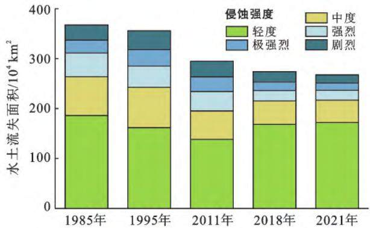  
图4 全国不同时期水土流失面积变化  
Fig4 Changesofsoilandwaterlossareaof Chinaindifferentperiods

## 2．2 不同省份水土保持率目标

2．2．1 各省水土保持率阈值 从各省份水土保持率阈值统计结果来看 31个省份的阈值均在50％以上天津最高（99．3％） 新疆最低 （52．4％） 其中 16个省份可达90％以上 10个省份介于80％～90％ 3个省份介于70％～80％。 甘肃、内蒙古、新疆3个省份因分布较大面积不需或不宜治理的沙漠 戈壁和流动沙地等风力侵蚀区 故其阈值介于50％～70％ 在省际分布上 总体以黑龙江省呼玛县—云南省文山市一线为界 其东南部19个省份的水土保持率阈值均可达85％以上 且除黑龙江 吉林 辽宁 河北 江西5省的阈值介于88％～90％外 其余14个省份的阈值均超过90％；该界线西北部除西藏自治区（冻融侵蚀不直接计入水土流失面积） 四川省的水土保持率阈值相对较高 宁夏 贵州 云南 重庆4省份阈值介于80％～85％外 其余6个省份的阈值均低于80％ 水土保持率阈值呈东部省份高于西部省份 南方省份高于北方省份的分布格局 西北部阈值较低的省份之间 沙漠 戈壁和流动沙地面积越大 阈值越低 省际间的水土保持率阈值分异特征较好地反映出水土保持率阈值对气候 地形等自然条件以及人类活动强度的约束性响应 当然 由于区域自然禀赋条件 经济社会发展和水土流失特点不同 其水土保持率远期阈值均反映各自因地制宜的适宜目标 相互不可也不宜横向比较 不按绝对大小论高低 各省水土保持率阈值分布见图5。

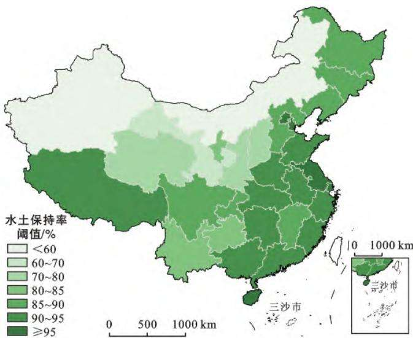  
图5 各省份（不含香港 澳门特别行政区和台湾省）水土保持率远期（2050年）阈值分布  
Fig．5 Long－term （2050）thresholddistributionofsoilandwaterconservationratesineachprovince（excludingHongkong，MacaoSpecialAdministrativeRegionandTaiwanProvince）

2．2．2 各省水土保持率阶段目标 从不同省份的水土保持率阶段目标来看 由于各自的现状值与阈值均有所差异 因此2025年 2030年和2035年的阶段目标较2021年现状值的提升程度并不一致（图6）

总体上 水土保持率现状值较阈值差距越大的省份，未来5a，10a和15a需提升的比例越高 2021—2035年的15a间 上海 天津市由于现状水土保持率已较接近阈值 西藏由于受气候变化和地域特征影响大而水土保持率提升比例不足1％ 应通过强化监管和提质增效 重点保障水土保持率稳定维持 ；江苏 海南 安徽 青海 浙江 湖南 福建 广东 江西 黑龙江新疆11个省份 水土保持率提升比例为3％～5％ 应注重精准治理与预防保护并举 积极攻克现存水土流失中治理难度较大但仍需消减的面积 河南 湖北 云南 四川 山东 广西 吉林 甘肃 河北 内蒙古 贵州11个省份提升比例为5％～10％ 需科学规划 突出重点 稳步推进水土流失降级减量目标 ； 宁夏 陕西辽宁 北京 重庆 山西6个省份提升比例超过10％要加大部门协同和综合治理 促进水土流失减量“销号”的提速升级 当然 由于不同省份的国土面积差异，新疆 河南 广西等一些省份， 虽然水土保持率提升比例相对不高（＜3％） 但需消减的水土流失绝对面积较大 $( \geqslant 1 . 0 0 \times 1 0 ^ { 4 } \ \mathrm { k m } ^ { 2 } )$ ； 重庆 北京 河北 山东等省份 虽然水土保持率提升比例不低（≥5％） 但需消减的水土流失面积相对不大 $( < 1 . 0 0 \times 1 0 ^ { 4 } \ \mathrm { k m } ^ { 2 } )$ 因此 不同省份都应围绕水土保持率目标所对应的减量任务，结合自身实际， 科学规划布局 ， 创新政策机制 强化科技支撑 因地制宜地通过综合施策确保当地水土保持率各阶段目标顺利实现

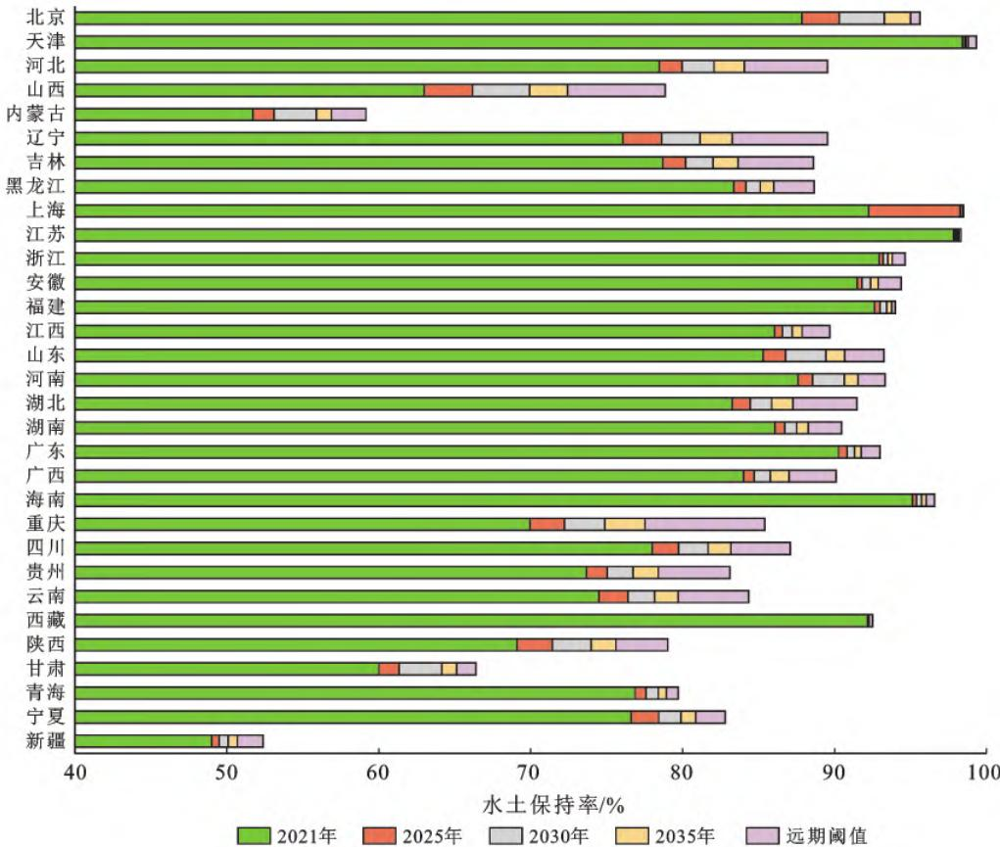  
图6 各省份（不含香港 澳门特别行政区和台湾省）水土保持率阶段目标与提升值  
Fig6 Phaseobjectivesandpromotionratioofsoilandwaterconservationratesineachprovince（excludingHongkong MacaoSpecialAdministrativeRegionandTaiwanProvince）

## 3 水土保持率系列目标值应用

为进一步明确各地区水土保持任务目标 ，强化各级地方政府工作责任 2022—2023年水利部安排各省级水土保持管理部门依据前期基础和当地实际情况，专项开展并完成了既定省级水土保持率阈值和阶段目标的市县行政区分解工作［17］ 从而构建了覆盖国家 省 市 县 包含202520302035年阶段目标和远期阈值的水土保持率4级4期系列目标体系

目前 水土保持率目标已被列为美丽中国建设评估的22项指标之一［17］ 以及黄河流域生态保护与高质量发展的约束性指标 ， 并在中共中央办公厅、国务院办公厅《关于加强新时代水土保持工作的意见》中，被作为加强新时代水土保持工作的核心指标 未来将在全国及地方各级的水土保持和生态建设实践中发挥重要引领与支撑作用 水土保持率指标主要涉及

以下两方面应用领域。

（1） 支撑水土流失防治精准布局与精准施策中国水土流失类型多 分布广 大到区域 小到流域的水土流失存量 特点及其防治基础各不相同 须因地制宜 分类施策 单纯依据绝对规模或相对比例的任务与措施规划布局已难以满足高质量发展的要求水土保持率目标体系能明确各地现存水土流失中多少需治理和哪些可“销号”等问题 进而科学指导各地水土保持等生态建设的分区划定 规划制定（修订）以及相关重点工程布局和流域治理的措施配置等 提升水土流失分区分类的精准防治水平［4］

（2） 促进水土保持工作部门协同与定量考评各级党委和政府统一领导 不同部门间相互协作 社会力量参与既是中国水土保持工作的成功经验 也是《水土保持法》要求的法定职责 水土保持率目标体系能明确区域内不同土地利用条件下的水土流失减量和降级规模 结合国土空间的事权分工 可为促进不同行业协同开展水土保持综合治理和系统治理提供科学依据 同时 水土保持率目标体系已在美丽中国建设评估 全国水土保持规划实施情况考核评估［18］ 以及部分省 市的水土保持目标责任考核中得到应用［19－21］ 成为衡量各级政府水土保持工作的重要依据 为促进水土保持任务和责任的落实提供了有效依据［22］

## 4 结 论

本文介绍了水土保持率内涵概念的提出和阈值确定 分析了全国及各省份水土保持率阈值和阶段目标的组成 分布等特点 解读了水土保持系列目标的具体应用 回答了水土保持率是什么？怎样定？是多少？如何用等一系列当前热点问题 可帮助社会各界了解水土保持率的概念 并正确应用该指标

按照水土保持率概念的内涵 水土保持率指标应当包含减量 降级 增效等多维度的阈值体系 目前的指标主要反映了水土流失面积的减量适宜目标 今后还需在降级 增效方面深入研究 并不断丰富水土保持率的理论 方法及其内容体系 建议基于社会—生态系统范式 在全面考虑自然与社会领域综合因素影响本地和溢出维度不同效应协同 生态和经济层面多重目标权衡的基础上 深入研究不同级别地区水土流失消长变化阈值及评估方法等问题 同时 围绕流域系统综合治理的各项要求 关注梯田 林草 淤地坝 坡耕地侵蚀沟等主要治理措施或重点治理对象的适宜规模与合理布局等重大问题 为新时代中国水土保持高质量发展和生态文明建设提供强有力的科技支撑

致 谢 本文的全国及各省份水土保持率阈值基于中国水利水电科学研究院主持开展的水利部水利重大科技问题研究项目“新时代水土保持目标与对策研究”成果 另外 参加不同区域研究的单位及研究团队还有中国科学院东北地理与农业生态研究所张兴义研究团队 中国科学院西北生态环境资源研究院赵文智研究团队 中国科学院水利部水土保持研究所焦菊英研究团队 黄河水利科学研究院史学建研究团队，中国科学院南京土壤研究所梁音研究团队 长江水利委员会长江科学院张平仓研究团队 中国地质科学院岩溶地质研究所蒋忠诚研究团队 中国科学院青藏高原研究所张凡研究团队等 ，谨此一并致谢

## ［ 参 考 文 献 ］

［1］ 水利部 ，中国科学院 ， 中国工程院．中国水土流失防治与生态安全（总卷 ，上册） ［M］．北京 ：科学出版社 ，2010

［2］ 水利部．第一次全国水利普查水土保持情况公报［B］．北京 ：水利部 ，2013

［3］ 水利部．2021年中国水土保持公报［B］．北京：水利部，2021

［4］ 蒲朝勇．科学做好水土保持率目标确定和应用［J］．中国水土保持 ，2021（3） ：1－3

［5］ FengXiaoming， FuBojie， PiaoShilong，etal．Revegeta－tioninChina’sLoessPlateauisapproachingsustainablewaterresourcelimits［J］．NatureClimateChange， 2016（6） ：1019－1022

［6］ OuyangZhiyun， ZhengHua， XiaoYi， etal．Improve－ mentsinecosystemservicesfrominvestmentsinnatural capital［J］．Science， 2016，352：1455－1459

［7］ WuXutong， WeiYongping， FuBojie， etal．Evolutionandeffectsofthesocial－ecologicalsystemoveramillen－niuminChina’sLoessPlateau ［J］．ScienceAdvances，2020（6） ：eabc0276

［8］ 李锐 杨勤科 吴普特 等．中国水土保持科技发展战略思考［J］．中国水土保持科学 ，2003，1（3） ：5－9

［9］ WeiJie， ZhouJie， TianJunliang， etal．Decouplingsoil erosionandhumanactivitiesontheChineseLoessPlateau inthe20thCentury［J］．Catena， 2006，68（1） ：10－15

［10］ WoltersMichelL， SunZhongchang， HuangChong， et al．Environmentalawarenessandvulnerabilityinthe YellowRiverDelta： Resultsbasedonacomprehensive householdsurvey［J］．OceanandCoastalManagement 2016（120） ：1－10

［11］ 刘晓燕．关于黄河水沙形势及对策的思考 ［J］．人民黄河 ，2020，42（9） ：34－40

［12］ 曹文洪 ，宁堆虎 ，秦伟．水土保持率远期目标确定的技术方法［J］．中国水土保持 ，2021（4） ：5－8，21

［13］ 国家发展和改革委员会．关于印发《美丽中国建设评估指标体系及实施方案》的通知 （发改环资 〔2020〕2962号） ［B］．北京 ：2020

［14］ 中共中央办公厅 国务院办公厅．关于加强新时代水土保持工作的意见（中办发〔2022〕68号） ［B］ 北京 2022

［15］ 水利部办公厅．关于印发《水土保持“十四五”实施方案》的通知（办水保〔2021〕392号） ［B］ 北京 2021

［16］ 水利部办公厅．关于印发《全国水土保持区划（试行） 》的通知（办水保〔2012〕512号） ［B］ ，北京 ：2012

［17］ 水利部办公厅．关于印发2022年水土保持工作要点的通知（办水保〔2022〕24号） ［B］ ，北京 ：2022

［18］ 水利部办公厅．关于开展2021年度全国水土保持规划实施情况评估工作的通知（办水保〔2021〕943号） ［B］ ，北京 ：2021

［19］ 四川省水土保持委员会办公室．关于印发《2022年度四川省水土保持目标责任制考核方案》的通知（川水保委办〔2022〕6号） ［B］ ，四川 ：2022

［20］ 甘肃省人民政府办公厅．关于印发《甘肃省水土保持目标责任考核办法的通知》（甘政办发〔2022〕88号） ［B］ ，甘肃 ：2022

［21］ 江西省人民政府办公室．关于印发江西省水土保持目标责任考核办法的通知（赣府厅发〔2022〕13号）［B］ ，江西：2022

［22］ 水利部．关于印发贯彻落实《关于加强新时代水土保持工作的意见》实施方案的通知（水保〔2023〕25号） ［B］ ，北京 ：2023