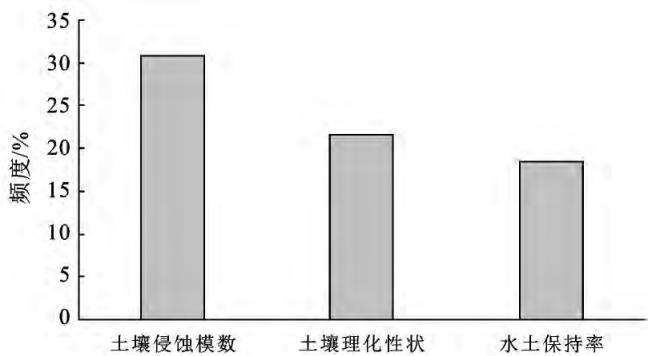
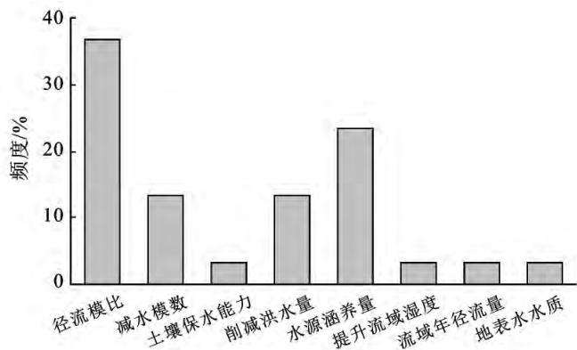
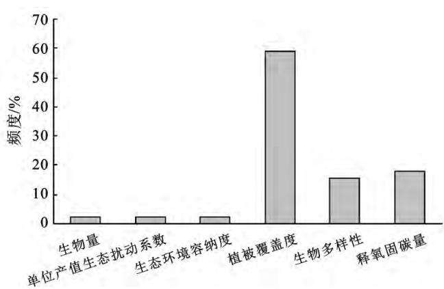
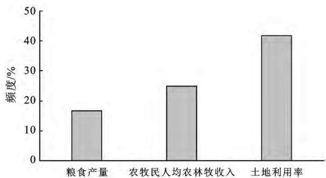
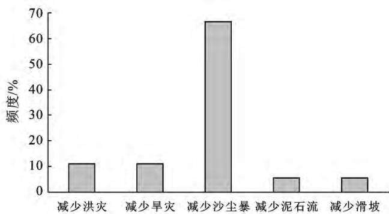

# 国家水土保持重点工程效益综合评价模型研究

王海燕， 丛佩娟， 袁普金， 李斌斌， 王爱娟， 李 琦（水利部 水土保持监测中心 北京100055）

摘 要 ： ［目的］ 研究水土流失治理效益评价指标体系 评价模型与评价标准 为国家水土保持重点工程绩效评价 实施效果后评价等工作提供技术支撑 ［方法］ 采用频度分析法筛选评价指标 采用层次分析法确定评价指标权重 ［结果］ 提出水土保持工程效益评价指标体系 并构建综合评价模型 模型包含土壤固持与保护 水源涵养 生态改善 收益增加 防灾减灾等5大类15个指标 在此基础上 ，提出了优秀 良好缓慢改善 恶化 极度恶化5级评价标准 ［结论］ 水土保持工程效益综合评价模型涵盖了生态 经济 社会等多方面因素以及各因素之间相互作用关系 可为国家水土保持重点工程实施效果提供直观的 综合的可量化的评价结果

关键词 ： 实施效果评价 ； 综合评价模型 ； 评价标准 ； 水土保持率 ； 国家重点水土保持工程

文献标识码 ： B

文章编号 ： 1000－288X（2021）06－0119－08

中图分类号 ： S157．2

文献参数 ： 王海燕 ， 丛佩娟 ， 袁普金 ， 等．国家水土保持重点工程效益综合评价模型研究［J］．水土保持通 报 202141（6） ：119－126．DOI：10．13961／j．cnki．stbctb．2021．06．017； WangHaiyan CongPeijuan Yuan Pujin， etal．Comprehensiveevaluationmodelofnationalkeyprojectbenefitsofsoilandwaterconservation ［J］．BulletinofSoilandWaterConservation 202141（6） ：119－126

# ComprehensiveEvaluationModelofNationalKeyProject BenefitsofSoilandWaterConservation

WangHaiyan CongPeijuan YuanPujin LiBinbin WangAijuan LiQi （ Soil and Water Resources ， Beijing 100055， China ）

Abstract： ［Objective］ Theevaluationindexsystem evaluationmodelandevaluationstandardofwaterand soilconservationbenefitswerestudied inordertoprovidetechnicalsupportfortheperformanceevaluation andpostimplementationeffectevaluationofnationalkeyprojectsofwaterandsoilconservation．［Methods］ Thefrequencyanalysismethodwasusedtoscreentheevaluationindexes， andtheanalytichierarchyprocess wasusedtodeterminetheindexweight．［Results］ Theevaluationindexsystemofthebenefitsofnational soilandwaterconservationprojectswasproposed andthecomprehensiveevaluationmodelwasestablished Themodelincluded15indicatorsinfivecategories： soilfixationandprotection， waterconservation， ecological improvement，incomeincrease， disasterpreventionandreduction．Basedonthis， theevaluationcriteriawas proposedincluding： excellent， good， slow improvement， deterioration and extreme deterioration ［Conclusion］ Thecomprehensiveevaluationmodelforsoilandwaterconservationbenefitevaluationcovers manyfactorssuchasecology， economyandsociety， anditalsocoverstheinteractionrelationshipbetween differentfactors， whichcanprovideintuitive， comprehensiveandquantifiableevaluationresultsforthe implementationeffectsofnationalkeysoilandwaterconservationprojects

Keywords： implementationeffectevaluation； comprehensiveevaluation model； evaluationcriteria； soiland waterconservationrate； nationalkeyprojectsofsoilandwaterconservation

1983 年 中 国第 一个 国 家 水 土 保 持 重 点 工程———八片国家水土流失重点治理工程启动实施。之后国家先后启动实施了黄河中游 长江上游 黄土高原淤地坝、京津风沙源、东北黑土区和岩溶地区石漠化治理等一大批水土保持重点工程 对加快水土流失治理进度 改善生态环境 建设美丽中国 维护国家和区域生态安全 以及推动中国早日实现“碳达峰”和“碳中和”发挥了重要作用 截至2018年底 全国累计治理水土流失面积 $1 . 3 1 \times 1 0 ^ { 6 } ~ \mathrm { k m } ^ { 2 }$ ， 水土保持措施年均可保持土壤 $1 . 6 0 \times 1 0 ^ { 9 }$ t 项目区生产生活条件显著提升 粮食产量增加 农民增收显著 乡村面貌焕然一新［1］ 但是 从国家水土保持工程实践来看与水土保持规划 科研 设计 施工建设以及工程项目管理等工作相比 水土保持工程实施效果后评价工作相对滞后 尽管一些专家学者和工程技术人员也进行了有益的探索 在一些地方开展了小流域综合治理效益评价 但并未形成一套受到相关各方广泛认可的 权威的水土保持工程重点实施效果评价指标体系和评价模型

目前 国家水土保持重点工程绩效评价等工作也仅停留在设计任务落实 项目管理和资金管理合规性等方面的考量 水土保持工程实施后对生态环境的影响和改善作用并未在评价指标中得到充分重视 ，因而对水土保持工程绩效评价和下一阶段项目安排布局发挥的作用十分有限 另外，现行技术标准中提出了有关效益评价指标体系和方法 例如 《水土保持综合治理效益计算方法（GB／T15774－2008） 》给出了一套水土保持工程生态效益 经济效益和社会效益评价指标体系 但其在实际应用中存在较多问题 主要包括 ： ①指标太多 实际应用比较复杂 有些指标采集难度较大 影响评价结果准确性； ②缺少对每个指标权重赋值 仅对给定区域单一水土保持工程可以进行评价，评价结果不足以支撑不同区域 不同工程之间的比较 也不支撑工程实施对生态环境总体改善的定量评价； ③对水土保持基础效果和衍生效果没有进行区分 指标之间关联性较强 例如 增加地表径流入渗与减少洪水流量 提高地面林草覆盖度与增加植物固碳量等存在较强关联性 是基础效果和衍生效果的关系 随着国家生态工程建设管理要求和项目管理水平不断提高 定量开展生态建设工程投资实施效果评估工作也越来越受到重视 绩效评价 后评估等各类水土保持工程实施效果后评价工作也逐步推进因而 亟需建立一套全面 系统 科学 操作简便的水土保持工程效益评价指标体系和评价模型支撑相关实践工作 本文采用频度分析法和层次分析法研究水土保持工程效益评价指标体系、评价模型与评价标准，旨在为国家水土保持重点工程绩效评价 实施效果后评价等工作提供技术支撑

## 1 评价指标体系构建原则

水土保持工程效益评价指标体系是由反映水土流失综合治理效果各方面特性及其相互联系的多个指标所构成的有机整体 ， 构建指标体系遵循以下原则。

（1） 科学性原则 指标体系构建要从改善区域生态环境 促进区域人与自然和谐 实现可持续发展出发 遵循生态学的基本规律 较为准确地反映水土流失治理效果的客观实际和固有特性以及各指标之间的真实关系

（2） 系统性原则 评价指标之间要有一定的逻辑关系 从不同角度反映生态技术实施效果的不同特征 综合所有指标即能刻画出生态技术实施效果的主要特征和状态 各指标之间相互独立 ， 又彼此联系，共同构成一个有机整体 同时 指标体系层次清晰自上而下 从宏观到具体 形成一个不可分割的有机整体。

（3） 典型性原则 评价指标应具有一定的典型代表性 尽可能准确地反映特定区域的环境 经济 社会变化的综合特征 即使在减少指标数量的情况下也要便于数据计算和提高结果的可靠性 另外 评价指标体系的设置 权重在各指标间的分配及评价标准的划分都应该与水土流失治理效果特性相对应

（4） 简明性原则 评价指标设置应本着简明性原则 在满足基本要求的前提下 尽量选择具有典型性和代表性的指标 避免指标过多过细和相互重叠各指标尽量简单明了 数据容易获取 计算方法简单易行。

## 2 评价指标体系筛选

水土保持工程效益是指水土流失防治措施实施后促进生态系统的改善以及由此带来经济收益和社会收益 也就是生态效益 经济效益和社会效益的总称 本质上 水土保持工程效益主要包括最基础的固持土壤 涵养水源 改善生态 以及粮食等农林牧产品收益的增加和水旱风沙灾害的减少

## 2．1 筛选方法

本研究拟采用较为常用的文献频度分析法［2－3］结合定性分析筛选出水土保持工程实施效益评价指标 基于国内1999—2021年的文献样本 以及《美丽中国建设评估指标体系》《水土保持综合治理效益计算方法（GB／T15774－2008） 》等资料 对符合的样本进行筛选分析 统计指标频次 初步确定评价指标因子 通过定性分析 判断指标之间关联性较低具有相对独立性 在此基础上 采用层次分析法 依据相关领域专家和示范点工程技术人员评价结果 确定各个指标的优先关系及其权重 建立二级评价指标体系。

## 2．2 指标筛选

从文献初步统计出水土流失治理效益评价指标45个［4－8］ ，其中土壤固持与保护类16个，水源涵养类8个，生态改善类9个，收益增加类6个，防灾减灾类5个（表1） 。

表1 文献样本中水土保持工程效益评价指标统计
<table><tr><td>类別</td><td>评价指标</td></tr><tr><td>土壤固持与保护</td><td>土壤肥力、土壤理化性状、土壤孔隙率、土壤密度、水土流失面积比、土壤侵蚀模数、土壤退化、崩塌土石方 量、产沙量、泥沙量、土壤保持量、耕地防护比、耕作层厚度、水土流失治理度、拦蓄泥沙、水土保持率</td></tr><tr><td>水源涵养</td><td>径流模比、减水模数、土壤保水能力、削减洪水量、水源涵养量、提升流域湿度、流域年径流量、地表水水质</td></tr><tr><td>生态改善</td><td>生物量、单位产值生态扰动系数、生态环境容纳度、水土保持服务价值、植被覆盖度、生物多样性、释氧量、 固碳量、水土保持服务能值</td></tr><tr><td>收益增加</td><td>粮食产量、林业产量、畜牧业产量、载畜量、土地生产效率、土地利用变化</td></tr><tr><td>防灾减灾</td><td>减少洪灾、减少旱灾、减少沙尘暴、减少泥石流、减少滑坡</td></tr></table>

2．2．1 土壤固持与保护类 主要包括土壤肥力［9］ 土壤理化性状 土壤孔隙率 土壤密度 水土流失面积比 土壤侵蚀模数 土壤退化 崩塌土石方量 产沙量洪水泥沙含量 土壤保持量 耕地防护比 耕作层厚度 水土流失治理度 拦蓄泥沙量 水土保持率共16个指标。

统计结果发现频度最高的指标是土壤侵蚀模数（26％） 最小为水土保持率 （1％） 水土保持率是2019年水利部部长鄂竟平同志在江河流域水资源管理现场会上首次提出的 2020年该指标纳入了美丽中国建设评估指标体系 相关研究文献较少 其次土壤理化性状 土壤肥力 土壤保持量 水土流失治理度 水土流失面积比分别为11％ 9％ 10％ 7％和6％其他均小于5％ 这些指标中 土壤理化性状与土壤肥力 土壤孔隙率 土壤密度为同类指标可以合并 以降低指标离散度；同理 对水土流失面积比 水土流失治理度 水土保持率也进行合并 优化后水土保持率频度为18％ 土壤理化性状频度为22％（图1）

  
图1 土壤固持和保护类指标

参照国内学者采用频度分析法研究构建评价指标体系方法 选择频度高于20％的作为初步选定指标 在此基础上 分析各类指标间的相互关系 将符合指标体系构建原则的指标作为筛选最终结果 其中 水土保持率为新出现概念 作为美丽中国建设22个评估指标其中一个 是当前评价水土流失防治效果较为常用的一个重要指标 ，应当作为本研究选定的一个指标 土壤理化性状指标对生态系统修复和改善具有重要意义 进行优化处理后超过了20％ 也应保留 因此 土壤固持和保护类指标选定土壤侵蚀模数 土壤理化性状 水土保持率

2．2．2 水源涵养类 主要包括径流模比 减水模数土壤保水能力 削减洪水量 水源涵养量 提升流域湿度 流域年径流量 地表水水质优良共8个指标 经频度分析 径流模比和水源涵养量分别为 37％和23％ 减水模数 削减洪水量均为13％ 其余均小于5％（图2） 由于地表水水质优良是美丽中国建设评估指标体系的一个指标 对评价生态环境质量具有重要作用 同时鉴于美丽中国评估指标体系是在大量研究和调研的基础上形成 且得到相关各方认可 因此水源涵养类指标选定径流模比 水源涵养量 地表水水质3个指标

  
图2 水源涵养类指标

2．2．3 生态改善类 主要包括生物量 单位产值生态扰动系数 生态环境容纳度 水土保持服务价值［10］植被覆盖度［11］ 生物多样性 释氧量 固碳量 水土保持服务能值共9个指标 经频度初步分析 植被覆盖度出现频度为43％ 水土保持服务价值和水土保持服务能值分别为15％和13％ 生物多样性为11％ 其余均为2％ 其中 水土保持服务能值是水保持服务价值的一种计量方法 二者应归为同类指标 水土保持服务价值包含了释氧量 固碳量 生物多样性以及“保土 保肥 保水”等指标 是一个综合评价指标 这个指标应作为评价水土流失治理效益的综合指标 ，是等同于水土流失治理效益层次的一个评价指标 ，不应包含在生态改善类指标中 应加以剔除 释氧量和固碳量应为同类指标进行整合而成释氧固碳量 优化后进行频度分析，植被覆盖度的频度为59％， 释氧固碳量为18％ 生物多样性为16％ （图3） 中国于2020年9月向世界宣布了新的碳达峰和碳中和愿景 因此 未来生态建设中碳汇将是一个重要目标 释氧固碳应纳入评价指标体系 同时生物多样性也是评价生态系统发展演化程度和质量的一个重要因素也应纳入 因此 生态改善类指标选定植被覆盖度生物多样性和释氧固碳量3个指标

  
图3 生态改善类指标

2．2．4 收益增加类 主要包括粮食产量 林业产量畜牧业产量 载畜量 土地生产效率 土地利用变化6个指标［12］ 经频度分析 土地利用变化的频度为42％ 粮食产量和土地生产效率的频度均为17％ 林业产量 畜牧业产量 载畜量均为8％ 其中 林业产量 畜牧业产量和载畜量可折算成生态工程实施区农牧民人均年农林牧收入 ；土地生产效率与土地利用变化整合 优化后指标如图4所示 收益增加类选定土地利用变化 农牧民人均年农林牧收入 粮食产量3个指标

  
图4 收益增加类指标

2．2．5 防灾减灾类 主要包括减少洪灾 减少旱灾减少沙尘暴 减少泥石流 减少滑坡等指标 经频度分析 减少沙尘暴的频度为67％ 减少洪灾和减少旱灾的频度均为11％ 减少泥石流 减少滑坡的频度均为6％（图5） 尽管目前相关文献对水土流失治理减少洪灾和旱灾关注较少 但因中国特殊的自然地理条件 许多生态退化区往往洪涝灾害与生态退化密切相关，水土流失治理工程实施的一个重要作用就是减少洪灾和旱灾 这两个指标应纳入评价指标体系 防灾减灾类选定减少沙尘暴 减少洪灾 减少旱灾3个指标。

  
图5 防灾减灾类指标

## 2．3 水土保持工程效益评价指标体系

综上分析 本研究最终选定5类 15个指标构成水土保持工程效益评价指标体系 指标体系为二级指标结构，一级指标包括土壤固持与保护 水源涵养生态改善 收益增加 防灾减灾5个， 二级指标有15个 （表2） 。

## 3 评价模型确定

## 3．1 一级指标参数确定

3．1．1 建立判断矩阵 对照层次分析法中的指标标度（表3）标准 收集有关专家 示范点工程技术人员以及研究组成员评价意见 ， 对一级 二级指标分别进行对比评价［13］

表2 水土保持重点工程效益评价指标体系
<table><tr><td>一级指标</td><td>二级评价指标</td><td>频度/%</td></tr><tr><td rowspan="3">土壤固持与保护  $( C _ { 1 } )$ </td><td>土壤侵蚀模数</td><td>57</td></tr><tr><td>土壤理化性状</td><td>26</td></tr><tr><td>水土保持率</td><td>18</td></tr><tr><td rowspan="3">水源涵养  $( C _ { 2 } )$ </td><td>水源涵养量</td><td>24</td></tr><tr><td>地表水水质</td><td>1</td></tr><tr><td>径流模比</td><td>38</td></tr><tr><td rowspan="3">生态改善  $( C _ { 3 } )$ </td><td>植被覆盖度</td><td>59</td></tr><tr><td>生物多样性</td><td>16</td></tr><tr><td>固碳释氧量</td><td>18</td></tr><tr><td rowspan="3">收益增加  $( C _ { 4 } )$ </td><td>土地利用变化</td><td>58</td></tr><tr><td>农牧民人均年农林牧收入</td><td>25</td></tr><tr><td>粮食产量</td><td>17</td></tr><tr><td rowspan="3">防灾减灾  $( C _ { 5 } )$ </td><td>减少沙尘暴</td><td>67</td></tr><tr><td>减少洪灾</td><td>11</td></tr><tr><td>减少旱灾</td><td>11</td></tr></table>

对土壤固持与保护 $( C _ { 1 } )$ 、 水源涵养 $\left( \mathbf { \boldsymbol { C } } _ { 2 } \right)$ 、 生 态改善 $( C _ { 3 } )$ 、收 益 增 加 $( C _ { 4 } )$ 、防灾减灾 $( C _ { 5 } ) 5$ 个一级指标进行分析评价 依据评价结果构建判断矩阵 P如下 ：

$$
\begin{array} { r } { { \cal P } = \left| \begin{array} { c c c c c c c } { { \cal C } _ { 1 } } & { { \cal C } _ { 2 } } & { { \cal C } _ { 3 } } & { { \cal C } _ { 4 } } & { { \cal C } _ { 5 } } \\ { { \cal C } _ { 1 } } & { 1 . 0 0 } & { 3 . 8 4 } & { 2 . 9 5 } & { 5 . 1 2 } & { 2 . 1 8 } \\ { { \cal C } _ { 2 } } & { 0 . 2 6 } & { 1 . 0 0 } & { 2 . 9 5 } & { 4 . 0 0 } & { 2 . 6 0 } \\ { { \cal C } _ { 3 } } & { 0 . 3 3 } & { 0 . 3 3 } & { 1 . 0 0 } & { 4 . 0 0 } & { 0 . 5 0 } \\ { { \cal C } _ { 4 } } & { 0 . 1 9 } & { 0 . 2 3 } & { 0 . 2 5 } & { 1 . 0 0 } & { 0 . 2 0 } \\ { { \cal C } _ { 5 } } & { 0 . 3 3 } & { 0 . 5 0 } & { 3 . 2 0 } & { 4 . 7 0 } & { 1 . 0 0 } \end{array} \right| } \end{array}\tag{1}
$$

3．1．2 计算指标权重 根据矩阵 P 求出最大特征值对应的特征向量， 特征向量就是评价因子重要性次序，即权重分配 本研究采用和积法求特征向量 ：

（1） 对判断矩阵每一列进行归一化处理 处理方法如下 ：

$$
{ \overline { { u } } } _ { i j } = { \frac { u _ { i j } } { \displaystyle { \sum _ { i = 1 } ^ { n } u _ { i j } } } } \qquad ( i , j = 1 , 2 , 3 , 4 , 5 )\tag{2}
$$

式中 $\mathbf { \nabla } : u _ { i }$ j是第i 单元中第 $y$ 个因子的值。

表3 指标标度及其含义
<table><tr><td>标度</td><td>定义(指标 i 和 j 的比较)</td><td>标度</td><td>定义(指标 j 和i的比较)</td></tr><tr><td>1</td><td>指标i和指标j 同等重要</td><td></td><td></td></tr><tr><td>3</td><td>指标 i 比指标 j 稍微重要</td><td>1/3</td><td>指标 j 比指标 i 稍微重要</td></tr><tr><td>5</td><td>指标 i比指标 j较强重要</td><td>1/5</td><td>指标 j 比指标 i 较强重要</td></tr><tr><td>7</td><td>指标i比指标j强烈重要</td><td>1/7</td><td>指标 j 比指标i强烈重要</td></tr><tr><td>9</td><td>指标 i 比指标 j 极端重要</td><td>1/9</td><td>指标 j 比指标 i 极端重要</td></tr><tr><td> $2 , 4 , 6 , 8$ </td><td>指标i与指标j比较，情况介于奇数标度之间</td><td> $1 / 2 , 1 / 4 , 1 / 6 , 1 / 8$ </td><td>指标i与指标j比较，情况介于奇数标度之间</td></tr></table>

得出正规化的判断矩阵 P 为 ：

$$
\pmb { P } = \left| \begin{array} { c c c c c c } { 0 . 4 7 4 } & { 0 . 6 5 1 } & { 0 . 2 8 5 } & { 0 . 2 7 2 } & { 0 . 3 3 6 } \\ { 0 . 1 2 3 } & { 0 . 1 6 9 } & { 0 . 2 8 5 } & { 0 . 2 1 3 } & { 0 . 4 0 1 } \\ { 0 . 1 5 6 } & { 0 . 0 5 6 } & { 0 . 0 9 7 } & { 0 . 2 1 3 } & { 0 . 0 7 7 } \\ { 0 . 0 9 0 } & { 0 . 0 3 9 } & { 0 . 0 2 4 } & { 0 . 0 5 3 } & { 0 . 0 3 1 } \\ { 0 . 1 5 6 } & { 0 . 0 8 5 } & { 0 . 3 0 9 } & { 0 . 2 5 0 } & { 0 . 1 5 4 } \end{array} \right|\tag{3}
$$

（2） 对正规化处理后的判断矩阵 P 按行相加，得：

$$
\overline { { { W _ { i } } } } = \sum _ { j = 1 } ^ { n } u _ { i j } \qquad ( i , j = 1 , 2 , 3 , 4 , 5 )\tag{4}
$$

（3） 对向量 $\overline { { \pmb { W } } } = ( \overline { { \pmb { W } _ { 1 } } } , \cdots , \overline { { \pmb { W } _ { 5 } } } ) ^ { T }$ 作正规化处理即对向量W＝（2．018，1．192， 0．599，0．237，0．954） 进行归一化处理，处理方法为 ：

$$
W _ { j } = \frac { \overline { { W _ { j } } } } { \displaystyle \sum _ { j = 1 } ^ { 5 } W _ { j } }\tag{5}
$$

计算得， $W _ { 1 } = 0 . 4 0 4 , W _ { 2 } = 0 . 2 3 8 , W _ { 3 } = 0 . 1 2 0 , W _ { 4 }$ $= 0 . 0 4 7 , W _ { 5 } = 0 . 1 9 1$ ， 求得特征向量 $\pmb { W } = ( \mathrm { ~ 0 . ~ } 4 0 4$ 0．2230．1200．0470．191）T

（4） 计算判断矩阵最大特征值。

$$
\lambda _ { \mathrm { \scriptsize ~ m a x } } = \frac { 1 } { 5 } \sum _ { i = 1 } ^ { 5 } \frac { ( P W ) _ { i } } { W _ { i } }\tag{6}
$$

$$
\begin{array} { r } { P = \left| \begin{array} { l } { ( P W ) _ { 1 } } \\ { ( P W ) _ { 2 } } \\ { ( P W ) _ { 3 } } \\ { ( P W ) _ { 4 } } \\ { ( P W ) _ { 5 } } \end{array} \right| = P \cdot W = \left| \begin{array} { l } { 2 . 3 3 1 } \\ { 1 . 3 8 2 } \\ { 0 . 6 1 7 } \\ { 0 . 2 4 7 } \\ { 1 . 0 4 9 } \end{array} \right| } \end{array}
$$

$$
\begin{array} { l } { { \lambda _ { \mathrm { { m a x } } } = \displaystyle \frac { 1 } { 5 } \sum _ { i = 1 } ^ { 5 } \displaystyle \frac { ( P W ) _ { i } } { W _ { i } } } } \\ { { = \displaystyle \frac { 1 } { 5 } \displaystyle \Big ( \displaystyle \frac { 2 . 3 3 1 } { 0 . 4 0 4 } + \displaystyle \frac { 1 . 3 8 2 } { 0 . 2 2 3 } + \displaystyle \frac { 0 . 6 1 7 } { 0 . 1 2 0 } + \displaystyle \frac { 0 . 2 4 7 } { 0 . 0 4 7 } + \displaystyle \frac { 1 . 0 4 9 } { 0 . 1 9 1 } \Big ) = 1 . 1 2 5 } } \end{array}
$$

3．1．3 一致性检验 根据公式（7）计算层次总排序一致性比例 CR 当 CR＜0．1时 可以认为层次总排序的计算结果具有满意的一致性

$$
\mathrm { C R } { = } \mathrm { C I } / \mathrm { R I }\tag{7}
$$

式中 ：CI为层次总排序一致性指标， 依据公式 （8）计算

$$
\operatorname { C I } { = } { \frac { \lambda _ { \operatorname* { m a x } } - n } { n - 1 } }\tag{8}
$$

RI为平均一致 性指标， 仅与矩阵阶数 有 关对于1—8阶矩阵平均一致性指标 RI， 其取值详见表4。

表4 平均一致性指标RI值
<table><tr><td>n</td><td>1</td><td>2</td><td> $3$ </td><td>4</td><td>5</td><td>6</td><td>7</td><td>8</td></tr><tr><td>RI</td><td>0.00</td><td>0.00</td><td>0.58</td><td>0.90</td><td>1.12</td><td>1.24</td><td>1.32</td><td>1.41</td></tr></table>

计算CI值 ： $\mathrm { C I } { = } \frac { 1 . 1 2 5 { - } 5 } { 5 { - } 1 } { = } { - } 0 . 9 6$

按照公式（9）计算CR

$$
\mathrm { C R } { = } \mathrm { C I } / \mathrm { R I }\tag{9}
$$

根据表5查得 n＝5对应的 RI＝1．12 CR＝$\frac { - 0 . 9 6 } { 1 . 1 2 } = - 0 . 8 6 < 0 . 1 0$

计算得出判断矩阵具有满意的一致性 说明权重分配是合理可信的

得出水土流失治理效益评价模型为

$$
\mathbf { A } = ( C _ { 1 } , C _ { 2 } , C _ { 3 } , C _ { 4 } , C _ { 5 } ) \left| { 0 . 1 2 0 } \right.\tag{10}
$$

式中 ： $C _ { 1 }$ 为土壤固持与保护 ； $C _ { 2 }$ 为水源涵养； $C _ { 3 }$ 为生态改善； $C _ { 4 }$ 为收益增加； $C _ { 5 }$ 为防灾减灾

## 3．2 二级指标参数确定

土壤固持与保护（C ） 水源涵养 $\left( C _ { 2 } \right)$ 生态改善（C3） 收益增加 $\left( C _ { 4 } \right)$ 和防灾减灾（C5） 判断矩阵详见表5—9。

表5 土壤固持与保护二级指标判断矩阵（C1）
<table><tr><td>项目</td><td>土壤侵蚀模数</td><td>土壤理化性状</td><td>水土保持率</td></tr><tr><td>土壤侵蚀模数</td><td>1.000</td><td>4.563</td><td>2.346</td></tr><tr><td>土壤理化性状</td><td>0.210</td><td>1.000</td><td>0.398</td></tr><tr><td>水土保持率</td><td>0.420</td><td>2.510</td><td>1.000</td></tr></table>

表6 水源涵养二级指标判断矩阵（C2）
<table><tr><td>项目</td><td>水源涵养量</td><td>地表水水质</td><td>径流模比</td></tr><tr><td>水源涵养量</td><td>1.000</td><td>2.003</td><td>0.198</td></tr><tr><td>地表水水质</td><td>0.497</td><td>1.000</td><td>0.163</td></tr><tr><td>径流模比</td><td>4.989</td><td>5.997</td><td>1.000</td></tr></table>

表7 生态改善二级指标判断矩阵（C ）
<table><tr><td>项目</td><td>植被覆盖度</td><td>生物多样性</td><td>固碳释氧量</td></tr><tr><td>植被覆盖度</td><td>1.000</td><td>2.003</td><td>0.198</td></tr><tr><td>生物多样性</td><td>0.497</td><td>1.000</td><td>0.163</td></tr><tr><td>固碳释氧量</td><td>4.989</td><td>5.997</td><td>1.000</td></tr></table>

表8 收益增加二级指标判断矩阵 $( C _ { 4 } )$
<table><tr><td>项目</td><td>土地利用 变化</td><td>农牧民人均 年农林牧收入</td><td>粮食 产量</td></tr><tr><td>土地利用变化</td><td>1.000</td><td>2.456</td><td>0.167</td></tr><tr><td>农牧民人均年农林牧收入</td><td>0.000</td><td>1.000</td><td>0.143</td></tr><tr><td>粮食产量</td><td>0.000</td><td>0.000</td><td>1.000</td></tr></table>

表9 防灾减灾二级指标判断矩阵（C5）
<table><tr><td>项目</td><td>减少洪灾</td><td>减少旱灾</td><td>减少沙尘暴</td></tr><tr><td>减少洪灾</td><td>1.000</td><td>2.363</td><td>1.963</td></tr><tr><td>减少旱灾</td><td>0.000</td><td>1.000</td><td>2.103</td></tr><tr><td>减少沙尘暴</td><td>0.000</td><td>0.000</td><td>1.000</td></tr></table>

对土壤固持与保护判断矩阵 $( C _ { 1 } )$ 水源涵养判断矩阵 $\left( C _ { 2 } \right)$ 生态改善判断矩阵 $( C _ { 3 } )$ 收益增加判断矩阵$( C _ { 4 } )$ 防灾减灾判断矩阵 $( C _ { 5 } ) -$ 致性检验结果详见表10 CR值均小于0．1 具有很好的一致性 因此 基于层次分析法得到二级评价指标权重是合理可信的

表10 二级指标判断矩阵一致性检验结果
<table><tr><td>判断矩阵</td><td>CR</td></tr><tr><td> $C _ { 1 }$ </td><td>-0.011</td></tr><tr><td> $C _ { 2 }$ </td><td>0.088</td></tr><tr><td> $C _ { 3 }$ </td><td>-1.950</td></tr><tr><td> $C _ { 4 }$ </td><td>-1.470</td></tr><tr><td> $C _ { 5 }$ </td><td>-1.189</td></tr></table>

依据上述分析 构建水土保持工程实施效益评价指标体系详见表11。

表11 水土工程实施效益评价指标体系
<table><tr><td rowspan="2">目标层</td><td colspan="2">一级指标</td><td colspan="2">二级指标</td></tr><tr><td>权重</td><td>指标</td><td>权重</td><td>指标</td></tr><tr><td rowspan="6">水 土 流</td><td></td><td>土壤固持</td><td>0.602</td><td>土壤侵蚀模数</td></tr><tr><td>0.404</td><td>与保护</td><td>0.120</td><td>土壤理化性状</td></tr><tr><td rowspan="4"></td><td rowspan="4">水源涵养</td><td>0.279</td><td>水土保持率</td></tr><tr><td>0.179</td><td>水源涵养量</td></tr><tr><td>0.082</td><td>地表水水质</td></tr><tr><td>0.739 0.769</td><td>径流模比 植被覆盖度</td></tr><tr><td>失 治</td><td rowspan="4">0.120</td><td>生态改善</td><td></td><td></td></tr><tr><td rowspan="3">理</td><td></td><td>0.192</td><td>生物多样性</td></tr><tr><td></td><td>0.039</td><td>固碳释氧量</td></tr><tr><td></td><td>0.613</td><td>土地利用变化</td></tr><tr><td rowspan="5">效 益</td><td>0.047</td><td>收益增加</td><td>0.133</td><td>农牧民人均年农林牧收入</td></tr><tr><td rowspan="4"></td><td rowspan="4"></td><td>0.255</td><td>粮食产量</td></tr><tr><td>0.730</td><td>减少洪灾</td></tr><tr><td>0.216</td><td>减少旱灾</td></tr><tr><td>0.054</td><td>减少沙尘暴</td></tr></table>

## 3．3 评价模型

确定国家水土保持重点工程效益评价模型为：

$$
E = \sum _ { i = 1 } ^ { n } k _ { i } A _ { i } \qquad ( i = 1 , 2 , 3 , \cdots , n )\tag{11}
$$

式中 ：E 为国家水土保持工程治理效果评价结果 ； k为指标权重； A 为标准化指标值 标准化处理可以采用总和标准化 最大值标准化等方法

## 3．4 评价指标数据监测与获取

筛选确定的评价指标 均为常用指标 可以通过常用方法测算获取或者现场调查获得

3．4．1 固持土壤与保护类指标 土壤侵蚀模数采用国际上通行的通用土壤流失方程测得

$$
A = R \bullet K \bullet L \bullet S \bullet C \bullet P\tag{12}
$$

式中 ：A 为年均土壤流失量 $\left[ \mathrm { t } / ( \mathrm { k m } ^ { 2 } \cdot \mathrm { a } ) \right]$ ； R 为降雨侵蚀力因子 $\mathrm { [ M J \bullet \ m m / ( h m ^ { 2 } \bullet \ h \bullet \ a ) ] }$ ； K 为土壤可蚀性 因 子 $\ [ { \bf t } \bullet \ { \bf h } { \bf m } ^ { 2 } \bullet \ { \bf h } / ( \mathrm { h } { \bf m } ^ { 2 } \bullet \ \mathrm { M } \ J \bullet \ \mathrm { m } \mathrm { m } ) ]$ ； L 为坡长因子； S 为坡度因子； C 为植被覆盖与管理因子；为水土保持措施因子

土壤理化性状主要包括土壤养分状况 化学条件等 一般而言，主要考虑土壤容重和重量直径， 有机质 全氮 全磷 全钾 pH 值等 通常采用常规方法测定土样获得相关数据 其中，土壤平均重量直径是一定粒级团聚体的重量百分比 $W _ { i }$ 乘以这一粒级的平均直径 X 所有所测粒级的上述乘积之和 即为平均重量直径（MWD）

$$
\mathrm { M W D } { = } \sum _ { i } ^ { n } \overline { { { X _ { i } } } } W _ { i }\tag{13}
$$

水土保持率（SWC）是指区域内水土保持状况良好的面积（非水土流失面积）占国土面积的比例 是反映水土保持总体状况的宏观管理指标［14］ 计算公式如下为 ：

$$
\operatorname { S W C } = \frac { S _ { n } } { S } \times 1 0 0\tag{14}
$$

式中 $S _ { i }$ 指治理区内土壤侵蚀强度轻度以下的现状国土面积； S 是指区域国土面积

3．4．2 水源涵养类指标 水源涵养量采用水量平衡法计算，计算公式为 ：

$$
E _ { w } = ( P - \mathrm { E T } ) \times A\tag{15}
$$

式中 ： $E _ { i }$ 为治理区水源涵养量 $\mathrm { ( m ^ { 3 } ) }$ ； P 为治理区年降水量（mm） ； ET为治理区年蒸散量（mm） ； A 为治理区面积。

3．4．3 生态改善类指标 植被覆盖指数 （NDVI） 计算公式为 ：

$$
\mathrm { N D V I } { = } ( \mathrm { N I R } { - } R ) / ( \mathrm { N I R } { + } R )\tag{16}
$$

式中 R 表示红外波段的灰度值 NIR表示近红外波段的灰度值 NDVI取值范围是－1～1 负值表示地面覆盖度为云 水 雪等； 0表示岩石或裸地； 正值表示植被覆盖，其数值越接近1， 说明区域植被覆盖度越高 植被生长状况越好

生物多样性指数计算公式为 ：

$$
H = \sum _ { i = 1 } ^ { s } P _ { i } \ln P _ { i }\tag{17}
$$

式中 ： $H$ 为多样性指数； s 为样地中的物种总数； $P$ 为第i 种物种的个体数占所有种个体总数的比例

固定 CO2的物质量的计算公式为 ：

$$
E _ { \mathrm { C O _ { 2 } } } = \mathrm { N P P } \times 1 . 6 3 \times A\tag{18}
$$

式中 ： $E _ { \mathrm { C O 2 } }$ 为固定 $\mathrm { C O _ { 2 } }$ 的物质量（t） NPP为年净初级生产力 $( { \mathrm { t } } / { \mathrm { k m } ^ { 2 } } )  ; A$ 为治理区域面积

释放 O2物质量的计算公式为 ：

$$
E _ { \mathrm { O } _ { 2 } } = \mathrm { N P P } \times 1 . 1 9 \times A\tag{19}
$$

中 ： $E _ { \mathrm { O 2 } }$ 为释放 $\mathrm { O _ { 2 } }$ 的物质量（t） 。

3．4．4 收益增加类指标 一定时期内区域内土地利用变化状况一般用土地利用变化动态度表示 土地利用变化动态度通常包括单一土地利用变化动态度和综合土地利用变化动态度 单一土地利用动态度表示在一定时期内不同土地利用类型的变化速度和幅度 计算公式如下 ：

$$
K = \frac { S _ { j } - S _ { i } } { S _ { i } } \times \frac { 1 } { T } \times 1 0 0 \%\tag{20}
$$

式中 $K$ 为治理区域某一时段内某一土地利用类型变化速率 $( \% ) \ ; \ S _ { i } \ , S _ { j }$ 为水土流失治理前和治理后土地利用类型面积 $\mathrm { ( k m ^ { 2 } ) }$ ； T 为研究时段

综合土地利用变化动态度用来定量治理区域某一时期的土地利用变化速率 是预测未来土地变化趋势的指标 计算公式为 ：

$$
L _ { c } = \frac { \displaystyle \sum _ { i = 1 } ^ { n } \Delta S _ { i - j } } { \displaystyle 2 \sum _ { i = 1 } ^ { n } S _ { i } } \times \frac { 1 } { T } \times 1 0 0 \%\tag{21}
$$

式中 $L _ { c }$ 为治理区域内某时段内土地利用变化速率（ ％ ） ； $\Delta S _ { i }$ －j为治理期内第 i 类土地利用类型的土地转化为j 类型土地面积总和 $\mathrm { ( k m ^ { 2 } ) }$ ； T 为研究时段

农民年均收入 粮食产量等指标可以通过查阅统计部门数据或现场调查获取

3．4．5 防灾减灾类指标 减少水旱风沙灾害可以通过查阅水文 气象以及统计部门数据获取 也可通过现场调查获取

减少洪水灾害采用洪水频率变化度表示 ，计算公式为 ：

$$
F { = } \frac { F _ { i } { - } F _ { j } } { F _ { i } } { \times } 1 0 0 \%\tag{22}
$$

式中 ： $F$ 为项目区治理前后洪水频率变化度 （％） ；F i $F$ 为治理前与治理后项目区洪水频率（次／a）

减少旱灾采用旱灾发生频率变化度表示 计算公式为 ：

$$
D { = } \frac { D _ { i } { - } D _ { j } } { D _ { i } } { \times } 1 0 0 \%\tag{23}
$$

式中 ： D 为项目区治理前后旱灾发生频率变化度$( \% ) \{ \beta _ { i } , D _ { j }$ 治理前与治理后项目区旱灾发生频率（ 次 ／a） 。

减少沙尘暴采用沙尘暴发生频率变化度表示 计算公式如下 ：

$$
W { = } \frac { W _ { i } { - } W _ { j } } { W _ { i } } { \times } 1 0 0 \%\tag{24}
$$

式中 ：W 为项目区治理前后沙尘暴发生频率变化度$( \% ) ; W _ { i } , W _ { j }$ 治理前与治理后项目区沙尘暴发生频率 （ 次 ／a） 。

## 3．5 水土保持工程实施效益评价

上述评价指标单位各不相同 正向指标和负向指标都存在（指标值越大对生态环境改善越有利的为正向指标 指标值越大对生态环境改善越不利的为负向指标） 因此 在获取原始数据后需要进行标准化处理 按照上述评价模型测算得出的评价结果是在0～100范围内的分值 根据水土流失治理效果评价分值 结合定性指标要求 确定水土保持工程实施效果评价结论 可分为优秀 良好 缓慢改善 恶化 极度恶化5个级别［15］ 限于实际样本数限制 本研究仅从每类指标中抽取1个指标 分别在西北黄土高原西南岩溶区选取1个小流域进行试算 初步提出了国家水土保持重点工程效益评价标准（表12）

表12 国家水土保持重点工程效益评价标准
<table><tr><td>评价等级</td><td>优秀</td><td>良好</td><td>缓慢改善</td><td>恶化</td><td>极度恶化</td></tr><tr><td>得分(满分为100)</td><td>A≥75</td><td>75&gt;A≥60</td><td>60&gt;A≥50</td><td>50&gt;A≥35</td><td>A&lt;35</td></tr><tr><td>定性描述</td><td>水土流失强度小于容许土 壤流失强度，植被覆盖度高 且种类多样，生态系统稳定</td><td>水土流失强度小于容许土 壤流失强度，植被覆盖度高 且种类多样，生态系统较为</td><td>水土流失强度在轻度 以下，植被覆盖度较 高，生态系统较为稳定</td><td>水土流失强度在 中度以下，生态系 统呈现退化趋势</td><td>水土流失强度 为强度及以上</td></tr></table>

## 4 讨论与结论

本研究在大量查阅文献的基础上 提出了国家水土保持重点工程效益评价指标体系 评价指标体系基本涵盖了通常水土流失治理效益评价的生态效益经济效益和社会效益 包括土壤固持与保护类 水源涵养类 生态改善类 收益增加类和防灾减灾类5大类 以及土壤侵蚀模数 土壤理化性状 水土保持率水源涵养量 地表水水质优良 径流模比 植被覆盖度 生物多样性 固碳释氧量 土地利用变化 农牧民人均年农林牧收入 粮食产量 减少沙尘暴 减少洪灾 减少旱灾15个指标 其中 土壤固持与保护类指标中 土壤侵蚀模数主要表征土壤侵蚀严重程度 水土保持率实质反映的是水土流失空间分布情况 土壤理化性状主要表征土壤生产力大小 ，这3个指标分别侧重于水土流失严重程度 空间分布范围 土地生产力 因而是相对独立的

本研究提出的评价模型需要在后续研究中跟踪国家水土保持重点工程实践 收集相关基础资料 不断验证和完善 同时 限于样本数及数据不足 本研究初步提出了国家水土保持重点工程效益评价分级标准 需要通过增加样本数和大量数据进行验证和完善 才能作为实践支撑

## ［ 参 考 文 献 ］

［1］ 水利部水土保持司．水土保持70年［J］．中国水土保持 ，2019， （10） ：3－7

［2］ 刘江南 ，基于自然水文过程健康的城市湿地评价指标体系筛选研究［J］．水利规划与设计 ，2021（5） ：69－73，83

［3］ 王效科 ，杨宁 ，吴凡 ，等．生态效益评价内容和评价指标筛选［J］．生态学报 ，2019，39（15） ：5442－5449

［4］ 任红．绥中县宽邦镇大栗小流域综合治理工程效益评价［J］．黑龙江水利科技 ，2021，49（4） ：230－240

［5］ 苏长芳．谢家沟小流域水土流失治理及其效益评价［J］水利发展研究 ，2021，21（3） ：61－64

［6］ 关红．砂下小流域水土保持效益评价［J］．水土保持应用技术 ，2021（1） ：25－27，42

［7］ 高嵩．秦州区退耕还林工 程20周年效益综合评价［J］．林业科技通讯 ，2021（1） ：34－36

［8］ 焦爱玲．小流域水土保持综合治理措施及效益分析［J］农业科技与信息 ，2021（6） ：8－9

［9］ 王彦武 牛莉婷 张峰．黄土区高标准梯田生态服务功能及其价值［J］．水土保持学报 ，2019，33（6） ：190－196

［10］ 王晶 ， 白清俊．黄土高原生态系统服务价值研究探析［J］．土地开发工程研究 ，2020，5（2） ：63－72

［11］ 文慧 ，冯舒悦 ，王军先 ，等．南方红壤区不同崩岗侵蚀治理模式及评价指标体系研究 ［J］．中国水土保持 ，2019（9） ：40－44

［12］ 李宗杰 ，宋玲玲 ，田青 ，等．甘肃省水土保持综合治理效益分析［J］．环境科学与技术 ，2016，39（11） ：182－1189

［13］ 熊强辉．喀斯特石漠化区综合治理效益评价［D］．贵州贵阳 ：贵州财经大学．2016

［14］ 浦朝涌．科学做好水土保持率目标确定和应用［J］．中国水土保持 ，2021（3） ：1－3

［15］ 李永敏 ，郭华明．黄土高原农业生态环境治理效果评价体系初探［J］．环境保护 ，1999（10） ：22－23