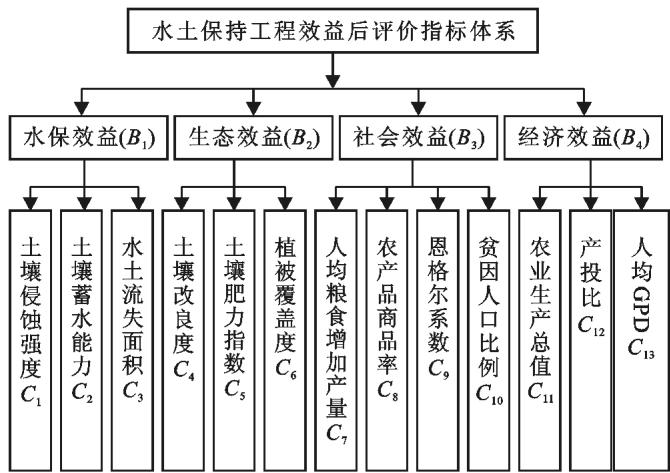

# 基于集对分析模型的水土保持工程效益后评价研究

王 静1，3 ， 行仙峰1，3 ， 侯 彪2 ， 李云川1，3 ， 张连根

（1．云南农业大学 水利学院 云南 昆明650201； 2．成都理工大学 四川 成都610051；3．云南省高校城乡水安全与节水减排重点实验室 云南 昆明650201）

摘 要 ： ［目的］ 建立一个科学合理的水土保持效益后评价指标体系对水土保持工程进行效益评价 ，为小流域的生态治理提供科学后评估依据 ［方法］ 综合分析小流域水土保持工程特性和影响水土保持工程效益的关键因素 ，识别和选取水土保持工程效益后评价的13项关键指标 ， 建立小流域工程效益后评价指标体系 运用层次分析法和熵值法改进评价指标的权重 结合评价指标数据和指标评价标准应用改进的集对分析模型开展工程效益后评价研究 ［结果］ 改进的集对分析模型结果表明 评价指标体系中水保效益 生态效益 社会效益 流域水土保持工程效益评价总体处于2级水平 流域治理的成效显著 可供开发的空间和潜力较大 ［结论］ 该方法是一种有效地针对小流域的水土保持工程效益评价的新方法 在构建水土保持工程效益后评价指标体系的基础上 将该方法运用到水土保持工程效益后评价中 基本达到了预期的研究目的

关键词 ： 项目后评价 ； 集对分析模型 ； 水土保持工程 ； 效益评价

文献标识码 ： B

文章编号 ： 1000－288X（2019）06－0106－06

中图分类号 ： S157．2

文献参数 ： 王静 ， 行仙峰 ， 侯彪 ， 等．基于集对分析模型的水土保持工程效益后评价研究［J］．水土保持通报 ，2019，39（6） ：106－111．DOI：10．13961／j．cnki．stbctb．2019．06．015； WangJing， XingXianfeng， HouBi－ao， etal．Post－evaluationofsoilandwaterconservationprojectbenefitsbasedonsetpairanalysismodel［J］．BulletinofSoilandWaterConservation 201939（6） 106－111

# Post－evaluationofSoilandWaterConservationProject BenefitsBasedonSetPairAnalysisModel

WangJing1，3， XingXianfeng1，3， HouBiao2， LiYunchuan1，3， ZhangLiangen1 （1．College of Water Conservancy ， Yunnan Agriculture University ， Yunnan ， Kunming 650201， China ； 2．Chengdu University of Technology ， Chengdu ， Sichuan610051， China ； 3．Key Laboratory of Urban and ， ， 650201， ）

Abstract ［Objective］ Ascientificandreasonablepost－evaluationindexsystemforsoilandwaterconservation projectbenefitswasestablished，inordertoprovideascientificpost－assessmentbasisforecologicalmanagementof smallwatersheds．［Methods］ Accordingtothecomprehensiveanalysisofthecharacteristicsofsoilandwater conservationengineeringinsmallwatershedsandthekeyfactorsaffectingtheefficiencyofsoilandwater conservationprojects 13keyindicatorsforpost－evaluationofsoilandwaterconservationprojectwereidentified andselected， toestablishapost－evaluationindexsystem．Analytichierarchyprocess（AHP） andtheentropy methodwereusedtoimprovetheweightoftheevaluationindex．Combinedwiththeevaluationindexdata theindexevaluationcriteriawasappliedtoimprovesetpairanalysismodelandanalyzethepostevaluationof projectbenefits．［Results］ Theimprovedsetpairanalysismodelshowedthatthewaterconservationbenefits， ecologicalbenefitsandsocialbenefitsintheevaluationindexsystemweregenerallyatthelevelof2， andthe effectivenessofwatershedmanagementwassignificant，andthepotentialfordevelopmentwasgreat．［Conclusion］ Theresearchdemonstratesanew methodtoeffectivelyevaluatethebenefitofsoilandwaterconservation

projectsinsmallwatersheds．Thenew methodisappliedtothepost－evaluationofsoilandwaterconservation projectbenefitonthebasisofconstructingthepost－evaluationindexsystem， whichbasicallyachievesthe expectedresearchpurpose

Keywords： post－projectevaluation； setpairanalysismodel； soilandwaterconservationengineering； benefits evaluation

项目后评价起源于20世纪30年代的美国 是对已经完成的项目或工程的目的 执行过程 效益 作用和影响所进行的系统 客观的综合分析评价［1－2］ 其原理是通过项目活动实践的检查总结 确定项目预期的目标是否达到 工程规划是否合理有效 主要效益指标是否实现；从而找出成败的原因；总结经验教训；为未来的项目提供有效的信息反馈［3］ 项目后评价经过近 $8 0 \textrm { a }$ 的发展， 在国内外已经得到广泛的应用和认可 然而 由于水土保持工程项目往往因涉及范围广 建设周期长 对当地生态 经济 环境 可持续性等方面会产生积极影响 工程效益后评价开展工作较少 随着国家生态文明建设工程的投资力度及建设深度拓展 对进一步提高水土保持工程项目决策的科学化水平和投资效益的要求提出新的要求 开展水土保持工程项目的后评价工作成为目前水保工程一项新的重要内容

水土保持工程效益后评价指标是指对水土工程保持效益进行定性描述 定量分析时所用的变量精准识别 确定水土保持工程生态效益 经济效益及社会效益的评价依据和标准 避免项目建设及管理的人为主观臆断 水土保持工程效益后评价指标及体系的辨识将明确工程措施实施前后的影响及作用 进而进一步识别制约项目建设效益的关键因素［4－5］ ， 为工程项目效益评估提供决策依据 基于项目后评价理论相对于传统的多指标综合评价方法 ，集对分析法［6］ 可从整体和局部分析水土保持工程效益后评价指标体系的多种复杂关系 把对不确定性的辩证认识转换成具体的数学问题［7］ 以此分析水土保持工程评价指标体系及水土保持工程指标效益的关联度 依据评价指标体系构建的独立客观性 可操作性和权威性3大原则 在专业工程技术人员和相关专家技术人员的指导下 建立了水土保持工程的效益评价指标体系 通过集对分析模型评价水土保持工程效益

## 1 集对分析评价模型

## 1．1 集对分析模型

集对分析是我国学者赵克勤［8－10］ 在1989年提出的一种系统分析理论和方法 核心思想是将系统中普遍联系的两个集合构造为集对 再对集对的各个特性进行同一性 差异性 对立性分析 构建集对分析模型［11－13］ 步骤为 ：

（1） 步骤1 构建评价指标体系 并确定评价指标的评价标准 对存在相互联系的水土保持工程效益指标 x 和评价标准 $s , x$ 有n 项表征特性，即 $x = ( x _ { 1 }$ $x _ { 2 } , \cdots , x _ { n } )$ 亦有 项特性 即 $s = ( s _ { 1 } , s _ { 2 } , \cdots , s _ { n } ) , _ { \mathcal { X } }$ 和 y 构成集对 $H \left( x , s \right)$

（2） 步骤2 确定评价指标和评价标准的联系度 计算在 j 种情况下指标i 与评价标准等级 k 的联系度 $u _ { i j k }$ ， 其中 ， $i = ( 1 , 2 , \cdots , n ) ; k = ( 1 , 2 , \cdots , K )$ 差异系数 i 其取值在［－11］区间变化 若指标值处在所要评价的等级之中 则认为是同一 若处于相隔的等级之中 则认为是对立；若处在相邻的等级之中 则认为是差异；指标值越接近评价标准等级 差异系数越接近1； 指标值越接近相隔的评价标准等级 ， 差异系数越接近－1 当评价指标 $\mathscr { X } _ { i j }$ 随着评价标准等级的增大而增大（正向指标）时， 联系度 $u _ { i k }$ 的具体计算公式为 ：

$$
\begin{array} { r l } & { a _ { z \eta } = \{ \displaystyle { 1 - 2 \frac { \kappa _ { \eta } - S _ { \eta } } { s _ { z } - s _ { z \downarrow } } \quad \quad \quad } \quad \{ C _ { x \eta } \le \hat { z } _ { x \xi } \le \hat { z } _ { x \xi } \le \hat { z } _ { x \xi } \} } \\ & { \quad \quad \quad - 1 } \\ & { \quad \quad \quad \quad \quad \quad \quad \quad \quad \quad \quad \quad \quad \quad \quad \quad \quad \quad \quad \quad \quad \quad \quad \quad \quad \quad \quad \quad \quad \quad \quad \quad \quad \quad \quad \quad } \\ & { a _ { z \eta } = \{ \displaystyle { 1 - 2 \frac { \kappa _ { \eta } - S _ { z \eta } } { s _ { z } - s _ { z \downarrow } } \quad \quad \quad \quad \quad \quad \quad \quad \quad \quad \quad \quad \quad \quad \quad \quad \quad \quad } \quad \quad \quad \quad \quad } \\ & { \quad \quad \quad \quad \quad \quad \quad \quad \quad \quad \quad \quad \quad \quad \quad \quad \quad \quad \quad \quad \quad \quad \quad \quad \quad \quad \quad \quad \quad \quad \quad \quad \quad \quad \quad \quad \quad } \\ & { \quad \quad \quad \quad \quad \quad \quad \quad \quad \quad \quad \quad \quad \quad \quad \quad \quad \quad \quad \quad \quad \quad \quad \quad \quad \quad \quad \quad \quad \quad \quad \quad \quad \quad \quad \quad \quad \quad \quad \quad } \\ & { \quad \quad \quad \quad \quad \quad \quad \quad \quad \quad \quad \quad \quad \quad \quad \quad \quad \quad \quad \quad \quad \quad \quad \quad \quad \quad \quad \quad \quad \quad \quad \quad \quad \quad \quad \quad \quad \quad \quad \quad \quad \quad } \\ & { \quad \quad \quad \quad \quad \quad \quad \quad \quad \quad \quad \quad \quad \quad \quad \quad \quad \quad \quad \quad \quad \quad \quad \quad \quad \quad \quad \quad \quad \quad \quad \quad \quad \quad \quad \quad \quad \quad \quad \quad \quad \quad \quad \quad \quad \quad \quad } \\ &  \quad \quad \quad \quad \quad \quad \quad \quad \quad \quad \quad \quad \quad \quad \quad \quad \quad \quad \quad \quad \quad \quad \quad \quad \quad \quad \quad \quad \quad \quad \quad \quad \quad \quad \quad \quad \quad \ \end{array}
$$

当评价指标 $\mathscr { X } _ { i j }$ 随着评价标准等级的增大而减小（负向指标）时，联系度 $u _ { i k }$ 的具体计算公式为 ：

$$
u _ { i j 1 } = \left\{ \begin{array} { c c c } { 1 } & { } & { ( x _ { i } \geqslant s _ { 1 i } ) } \\ { 1 - 2 \frac { x _ { i j } - s _ { 1 i } } { s _ { 2 i } - s _ { 1 i } } } & { } & { ( s _ { 1 i } > x _ { i j } \geqslant s _ { 2 i } ) } \\ { - 1 } & { } & { ( x _ { i } < s _ { 2 i } ) } \end{array} \right.
$$

$$
u _ { i j 1 } = \left\{ \begin{array} { c c } { 1 - 2 \frac { s _ { 1 i } - x _ { i j } } { s _ { 1 i } - s _ { 0 i } } } & { ( x _ { i } \geqslant s _ { 1 i } ) } \\ { 1 } & { ( s _ { 1 i } > x _ { i j } \geqslant s _ { 2 i } ) } \\ { 1 - 2 \frac { x _ { i j } - s _ { 2 i } } { s _ { 3 i } - s _ { 2 i } } } & { ( s _ { 2 i } > x _ { i j } \geqslant s _ { 3 i } ) } \end{array} \right.
$$

$$
u _ { i j 1 } = \left\{ \begin{array} { c c } { 1 } & { ( x _ { i } \geqslant s _ { 1 i } ) } \\ { 1 - 2 \frac { s _ { 2 i } - x _ { i j } } { s _ { 2 i } - s _ { 1 i } } } & { ( s _ { 1 i } > x _ { i j } \geqslant s _ { 2 i } ) } \\ { - 1 } & { ( s _ { 2 i } > x _ { i j } \geqslant s _ { 3 i } ) } \end{array} \right.
$$

（3） 步骤3 计算评价指标和评价标准的综合联系度 $u _ { k }$ ：

$$
u _ { k } = u _ { k } = \sum _ { j = 1 } ^ { m } = A _ { j } u _ { j k }
$$

式中 $: A _ { j }$ ———各指标的权重值。

（4） 步骤4 计算评价指标隶属于评价等级的隶属度 评价指标隶属于评价等级的相对隶属度表达公式为 ：

$$
{ v _ { k } } = 0 . 5 + 0 . 5 u _ { i k }
$$

把相对隶属度归一化 ，得 ：

$$
R _ { k } = u _ { k } ( \sum _ { k = 1 } ^ { k } v _ { k } ) ^ { - 1 }
$$

（5） 步骤5 通过置信度准则评判法进行整体评价等级评判，计算公式为 ：

$$
h = \sum _ { \boldsymbol { k } ^ { \ast } } ^ { \mathrm { m a x } } \{ \boldsymbol { k } ^ { \ast } | \sum _ { k = 1 } ^ { k ^ { \ast } } \boldsymbol { R } _ { K } > \gamma , 1 \leqslant k \leqslant K \}
$$

式中：γ———置信度，本文取0．6（一般取0．5～0．（7） ，γ取值越大，评价结果越倾向于保守

## 1．2 改进评估模型组合权重确定

目前常用权重的确定方法主要有层次分析法［14］和熵值法［15］ 层次分析法虽然能够综合考虑评价指标体系中各级指标的重要程度 但是该方法主观性较强 难以准确确定权重赋值；熵值法作为客观赋权法不受主观判断的影响 但难以体现研究对不同指标的重视程度 本次将层次分析和熵值法的优点结合 改进综合评价的权重分析

1．2．1 层次分析法权重计算 $A _ { 1 j }$ 层次分析法 能够评标指标体系一个比较全面的总体评价 基本步骤如下 ： ①根据评标指标体系层次结构模型 ； ②构造判断矩阵； ③层次单排序和一致性检验 满足一致性比例 $\mathrm { C R } { < } 0 . 1 ;$ ④层次总排序，得到各指标层次分析法权重 $A _ { 1 j }$ 。

## 1．2．2 熵值法权重计算 $A _ { 2 j }$

（1） 为消除计量单位和数量级之间的差异 对指标数据进行标准化处理 按照极值法进行无量纲处理得到无量纲指数 $y$ ：

正向指标 ： $y = \frac { x } { x _ { \mathrm { m a x } } }$

负向指标 ： $y = \frac { x } { x _ { \operatorname* { m i n } } }$

式中 $: \mathcal { X } ^ { - }$ 指标数据； $x _ { \mathrm { m a x } }$ 该评价标准的最大值 ； $x _ { \mathrm { m i n } }$ 该评价标准的最小值。

（2） 计算单个指标占指标总和的比重 ：

$$
b _ { j } = \frac { y _ { i } } { \sum _ { 1 } ^ { n } y _ { j } }
$$

式中 $: y _ { j }$ 指标数据无量纲化的数值

（3） 计算指标的熵值

$$
c _ { j } = - k \sum _ { 1 } ^ { n } b _ { j } \ln b _ { j }
$$

式中 ： $k = ( 1 , 2 , \ , n )$ ，指评价标准的评价等级

（4） 计算各指标因子的熵权 ：

$$
A _ { 2 j } = \frac { 1 - c _ { j } } { m - \sum _ { 1 } ^ { m } c _ { j } }
$$

式中 ：m———指标数目

1．2．3 组合权重 $A _ { j }$ 计算 用层次分析法计算指标的主观权重 $A _ { 1 j }$ 用熵值法计算指标的客观权重 $A _ { 2 j }$ 综合指标的主观权重 $A _ { 1 j }$ 和客观权重 $A _ { 2 j }$ 得综合权重 $A _ { j }$ $j = ( 1 , 2 , \cdots , m )$ 根据最小相对信息熵［13］原理有

$$
\begin{array} { c } { { \mathrm { m i n } F { = } \displaystyle { \sum _ { j = 1 } ^ { M } } A _ { j } ( \mathrm { l n } A _ { j } { - } \mathrm { l n } A _ { 1 j } ) + } } \\ { { \displaystyle { \sum _ { J } } ^ { M } } A _ { j } ( \mathrm { l n } A _ { j } { - } \mathrm { l n } A _ { 2 j } ) } \end{array}
$$

式中 $\sum _ { j = 1 } ^ { M } A _ { j } = 1 , A _ { j } > 0 , j = ( 1 , 2 , \cdots , m )$ ， 利用拉格朗日乘子法解上式得 ：

$$
A _ { j } = \frac { ( A _ { 1 j } A _ { 2 j } ) ^ { 0 . 5 } } { \displaystyle \sum _ { I = 1 } ^ { m } ( A _ { 1 j } A _ { 2 j } ) ^ { 0 . 5 } }
$$

## 2 案例分析

## 2．1 研究区概况

研究小流域位于云南省沾益县东部 地处东经103°56′15″—103°59′57″ 北纬 $2 5 ^ { \circ } 4 0 ^ { \prime } 2 6 ^ { \prime \prime } - 2 5 ^ { \circ } 4 3 ^ { \prime } 1 8 ^ { \prime \prime }$ 该区具有典型的高原中山地貌特征 岩溶发育 地势南北高中间低 流域土地总面积 $2 4 . 8 8 ~ \mathrm { k m ^ { 2 } }$ ，水土流失面积为12．42km2 耕地面积 $1 ~ 2 8 8 . 0 8 ~ \mathrm { h m ^ { 2 } }$ ，占土地总面积的51．78％ 其中水田8．54 $\mathrm { h m } ^ { 2 }$ 梯平地500．01$\mathrm { h m } ^ { 2 }$ ，坡耕地779．53hm2；林地 $1 ~ 0 6 7 . 3 8 ~ \mathrm { h m ^ { 2 } }$ ，占土地总面积的42．91％，工程治理面积为10．02 $\mathrm { k m ^ { 2 } }$ ，其中：坡改梯 $6 0 , 5 8 \ \mathrm { h m ^ { 2 } }$ ， 经果林 $1 8 . \ 9 9 \ \mathrm { {  h m } ^ { 2 } }$ 水保林183．88$\mathrm { h m } ^ { 2 }$ ，封禁治理 $2 4 0 . \ 9 2 \ \mathrm { h m ^ { 2 } }$ ， 保土耕作 $4 9 7 . 7 1 \ \mathrm { h m ^ { 2 } }$ ；生产道路9．48km， 道路排水沟2．97km， 灌溉管道17．38km 灌桩222个 $1 0 0 ~ \mathrm { m ^ { 3 } }$ 蓄水池1座 $1 5 0 ~ \mathrm { m ^ { 3 } }$ 蓄水池1座， $3 0 0 ~ \mathrm { m ^ { 3 } }$ 蓄水池1座，20 $\mathrm { m ^ { 3 } }$ 取水池2座，沟道整治1．46km 谷坊2座 拦砂坝1座

## 2．2 评价指标体系

根据项目后评价理论 水土保持工程后评价效益指标用于评估水土保持工程的实施效果 ，结合水土保持工程的特点，以代表性、可比性、相对独立性、易量化为原则 综合运用调查研究法 目标分解法 多元统计法等方法选取科学合理的指标［16－18］ 参考国家相关规范 行业标准和相关研究成果 将水土保持工程效益后评价指标体系作为目标层 水保效益 生态效益社会效益和经济效益作为准则层 优选关键的13个评价指标作为评价指标体系层 具体为3个水保效益指标 分别为土壤侵蚀强度 土壤蓄水能力 水土流失面积；3个生态效益指标 分别为土壤改良度 土壤保肥能力和植被覆盖度；4个社会效益指标 分别为人均粮食增加产量 农产品商品率 恩格尔系数和贫困人口比例 3个经济效益指标 分别为农业生产总值产投比和人均GDP 评价指标体系如图1所示

## 2．3 数据来源和评价标准

本次研究小流域水土保持效益后评价选取《2018座棚小流域监测报告》和区域相关的“十三五”规划数据 其中2016年为工程实施前的监测数据为本底值2018年为工程实施后监测提供数据为目标值 评价标准依据《南方地区耕地土壤肥力诊断与评价（NY／T1749－2009） 》 《石漠化敏感性评价指标标准》 《土壤侵蚀强度分级标准 （SL190－2007） 》和当地十三五水土保持建设规划 具体数据详见表1

  
图1 水土保持工程效益后评价指标体系

值得注意的是 由于数据的可获得性限制 本研究主要分析云南座棚小流域的水土保持工程效益状况，水土保持工程效益后评价标准的确定主要着眼于云南岩溶区小流域的水土保持治理工程 土壤侵蚀强度 水土流失面积等指标的评价标准在不同地理区域存在一定的差异 在分析水土保持工程后评价效益时 需要结合区域的实际情况进一步讨论确定评价标准

表1 2018年小流域水土保持工程效益后评价指标数据和评价标准
<table><tr><td rowspan="2">评价指标</td><td colspan="2">年份</td><td colspan="3">评价标准</td></tr><tr><td>2016年</td><td>2018年</td><td>Ⅲ级</td><td>Ⅱ级</td><td>Ⅰ级</td></tr><tr><td>C1土壤侵蚀强度/(104t)</td><td>2.68</td><td>1.55</td><td>2.8≤</td><td>1.5&lt;X&lt;2.8</td><td>≤1.5</td></tr><tr><td>C2土壤蓄水能力/(%,m³·hm−²)</td><td>27.36</td><td>33.85</td><td>≤35</td><td>35&lt;X&lt;41.6</td><td>41.6≤</td></tr><tr><td>C3水土流失面积  $/ \mathrm { { h m } ^ { 2 } }$ </td><td>1242.18</td><td>1001.26</td><td>900≤</td><td>500&lt;X&lt;900</td><td>≤500</td></tr><tr><td>C4土壤改良度/%</td><td>12.3</td><td>18.6</td><td>≤12.5</td><td>12.5&lt;X&lt;20</td><td>20≤</td></tr><tr><td>C5土壤肥力指数</td><td>0.89</td><td>1.03</td><td>≤0.9</td><td>0.9&lt;X&lt;1.7</td><td>1.7≤</td></tr><tr><td>C6植被覆盖度/%</td><td>25.53</td><td>43.33</td><td>≤35</td><td>35&lt;X&lt;60</td><td>60≤</td></tr><tr><td>C7人均粮食增加产量/kg</td><td>524.38</td><td>644.36</td><td>≤500</td><td>500&lt;X&lt;850</td><td>850≤</td></tr><tr><td>C8农产品商品率/%</td><td>7</td><td>12.6</td><td>≤12.8</td><td>12.8&lt;X&lt;26.6</td><td>26.6≤</td></tr><tr><td>C9恩格尔系数/%</td><td>51</td><td>32.4</td><td>50≤</td><td>30&lt;X&lt;50</td><td>≤30</td></tr><tr><td> $C _ { 1 0 }$  贫困人口比例/%</td><td>21</td><td>11</td><td>12≤</td><td>8&lt;X&lt;12</td><td>≤8</td></tr><tr><td> $C _ { 1 1 }$  农业产品总值/万元</td><td>1209.28</td><td>1 711.39</td><td>≤1 200</td><td>1 200&lt;X&lt;1 860</td><td>1 860≤</td></tr><tr><td> $C _ { 1 2 }$  产投比/%</td><td>0.2</td><td>0.35</td><td>≤0.24</td><td>0.24&lt;X&lt;0.42</td><td>0.42≤</td></tr><tr><td> $C _ { 1 3 }$  人均 GDP/万元</td><td>24769</td><td>28806</td><td>≤7000</td><td>7000&lt;X&lt;81000</td><td>81 000≤</td></tr></table>

## 2．4 结果与分析

2．4．1 指标组合权重 将本次收集到的数据以上文阐述的层次分析法和熵值法相结合的指标权重确定方法处理 便可得到各指标的权重 其中表2—6为基于DPS数据处理系统构建的层次分析法判断矩阵满足CR＜0．1 表7为熵值法计算结果 表9为指标组合权重的汇总

表2 目标层 A与基准层 $\pmb { { B } } _ { i }$ 的判断矩阵
<table><tr><td>基准层</td><td> $B _ { 1 }$ </td><td> $B _ { 2 }$ </td><td> $B _ { 3 }$ </td><td> $B _ { 4 }$ </td><td>权重  $A _ { 1 j }$ </td><td>一致性分析</td></tr><tr><td> $B _ { 1 }$ </td><td>1</td><td>2</td><td>4</td><td>3</td><td>0.480</td><td></td></tr><tr><td> $B _ { 2 }$ </td><td>1/2</td><td>1</td><td>2</td><td>1</td><td>0.216</td><td> $\lambda _ { \operatorname* { m a x } } = 4 . \ : 0 2$ </td></tr><tr><td> $B _ { 3 }$ </td><td>1/4</td><td>1/2</td><td>1</td><td>1/2</td><td>0.108</td><td>CR=0</td></tr><tr><td> $B _ { 4 }$ </td><td>1/3</td><td>1</td><td>2</td><td>1</td><td>0.196</td><td></td></tr></table>

注 $: \lambda _ { \mathrm { m a x } }$ 为判断矩阵的最大特征根 ；CR为判断矩阵的一致性比例下同。

表3 基准层 $\scriptstyle B _ { 1 }$ 与因子层 $C _ { 1 j }$ 的判断矩阵
<table><tr><td>水保效益</td><td> $C _ { 1 }$ </td><td> $C _ { 2 }$ </td><td> $C _ { 3 }$ </td><td>权重  $A _ { 1 j }$ </td><td>一致性分析</td></tr><tr><td> $C _ { 1 }$ </td><td>1</td><td>1/3</td><td>1/2</td><td>0.163</td><td></td></tr><tr><td> $C _ { 2 }$ </td><td>3</td><td>1</td><td>2</td><td>0.541</td><td> $\lambda _ { \operatorname* { m a x } } = 3$   $\mathrm { C R } = 0$ </td></tr><tr><td> $C _ { 3 }$ </td><td>2</td><td>1/2</td><td>1</td><td>0.297</td><td></td></tr></table>

表4 基准层 $\pmb { { \cal B } } _ { 2 }$ 与因子层 $C _ { 2 j }$ 的判断矩阵
<table><tr><td>生态效益</td><td> $C _ { 4 }$ </td><td> $C _ { 5 }$ </td><td> $C _ { 6 }$ </td><td>权重  $A _ { 1 j }$ </td><td>一致性分析</td></tr><tr><td> $C _ { 4 }$ </td><td>1</td><td>3</td><td>4</td><td>0.625</td><td></td></tr><tr><td> $C _ { 5 }$ </td><td>1/3</td><td>1</td><td>2</td><td>0.239</td><td> $\lambda _ { \operatorname* { m a x } } = 3 . 0 1$ </td></tr><tr><td> $C _ { 6 }$ </td><td>1/4</td><td>1/2</td><td>1</td><td>0.137</td><td> $\mathrm { C R } { = } 0 . 0 1$ </td></tr></table>

表5 基准层 $\mathbf { { \boldsymbol { B } } } _ { 3 }$ 与因子层 $C _ { 3 j }$ 的判断矩阵
<table><tr><td>社会效益</td><td> $C _ { 7 }$ </td><td> $C _ { 8 }$ </td><td> $C _ { 9 }$ </td><td> $C _ { 1 0 }$ </td><td>权重  $A _ { 1 j }$ </td><td>一致性分析</td></tr><tr><td> $C _ { 7 }$ </td><td>1</td><td>2</td><td>4</td><td>3</td><td>0.480</td><td rowspan="4"> $\lambda _ { \operatorname* { m a x } } = 4 . \ : 0 2$ </td></tr><tr><td> $C _ { 8 }$ </td><td>1/2</td><td>1</td><td>2</td><td>1</td><td>0.216</td></tr><tr><td> $C _ { 9 }$ </td><td>1/4</td><td>1/2</td><td>1</td><td>1/2</td><td>0.108</td></tr><tr><td> $C _ { 1 0 }$ </td><td>1/3</td><td>1</td><td>2</td><td>1</td><td>0.196</td></tr></table>

表6 基准层 $\mathbf { { \delta } } B _ { 4 }$ 与因子层 $C _ { 4 j }$ 的判断矩阵
<table><tr><td>经济效益</td><td> $C _ { 1 1 }$ </td><td> $C _ { 1 2 }$ </td><td> $C _ { 1 3 }$ </td><td>权重  $A _ { 1 j }$ </td><td>一致性分析</td></tr><tr><td> $C _ { 1 1 }$ </td><td>1</td><td>2</td><td>1/2</td><td>0.286</td><td></td></tr><tr><td> $C _ { 1 2 }$ </td><td>1/2</td><td>1</td><td>1/4</td><td>0.143</td><td> $\lambda _ { \operatorname* { m a x } } = 3$ </td></tr><tr><td> $C _ { 1 3 }$ </td><td>2</td><td>4</td><td>14</td><td>0.571</td><td> $\mathrm { C R } = 0$ </td></tr></table>

表7 熵值法权重计算结果
<table><tr><td>评价指标</td><td> $y$ </td><td> $b _ { j }$ </td><td> $c _ { j }$ </td><td> $A _ { 2 j }$ </td></tr><tr><td>C1土壤侵蚀强度/104t</td><td>0.968</td><td>0.102</td><td>0.232</td><td>0.073</td></tr><tr><td>C2土壤蓄水能力  $/ ( \mathrm { \% , m ^ { 3 } \cdot h m ^ { - 2 } } )$ </td><td>0.814</td><td>0.085</td><td>0.210</td><td>0.075</td></tr><tr><td>C3水土流失面积  $/ \mathrm { { h m } ^ { 2 } }$ </td><td>0.499</td><td>0.052</td><td>0.154</td><td>0.081</td></tr><tr><td>C4土壤改良度/%</td><td>0.930</td><td>0.098</td><td>0.227</td><td>0.074</td></tr><tr><td>C5土壤肥力指数</td><td>0.606</td><td>0.064</td><td>0.175</td><td>0.079</td></tr><tr><td>C6植被覆盖度/%</td><td>0.722</td><td>0.076</td><td>0.195</td><td>0.077</td></tr><tr><td>C7人均粮食增加产量/kg</td><td>0.758</td><td>0.080</td><td>0.201</td><td>0.076</td></tr><tr><td>C8农产品商品率/%</td><td>0.474</td><td>0.050</td><td>0.149</td><td>0.081</td></tr><tr><td>C9恩格尔系数/%</td><td>0.926</td><td>0.097</td><td>0.226</td><td>0.074</td></tr><tr><td>C10贫困人口比例/%</td><td>0.727</td><td>0.076</td><td>0.196</td><td>0.077</td></tr><tr><td> $C _ { 1 1 }$  农业产品总值/万元</td><td>0.920</td><td>0.097</td><td>0.226</td><td>0.074</td></tr><tr><td>C12产投比/%</td><td>0.833</td><td>0.087</td><td>0.213</td><td>0.075</td></tr><tr><td>C13人均 GDP/万元</td><td>0.356</td><td>0.037</td><td>0.123</td><td>0.084</td></tr></table>

表8 水土保持工程效益后评价指标权重汇总

从表8可得 水土保持工程效益指标体系由水保效益 生态效益 社会效益 经济效益4个部分组成其中水保效益 生态效益 社会效益 经济效益的层次权重分别是0．480．2150．1080．196 熵值权重分别是0．229 0．23 0．308 0．233 组合权重分别是0．4770．2110．1080．203；结果表明 水保效益所占比重最大 生态效益和经济效益占有较大比重 社会效益比重最小 由于熵值权重的影响 使指标权重大小次序发生变化 这从侧面印证了熵值法的客观作用 使指标权重占比更加合理化 达到了预期目的 说明权重改进是有必要的

<table><tr><td>评价指标</td><td> $A _ { 1 j }$ </td><td> $A _ { 2 j }$ </td><td> $A _ { j }$ </td></tr><tr><td>C1土壤侵蚀强度/104t</td><td>0.078</td><td>0.073</td><td>0.074</td></tr><tr><td>C2土壤蓄水能力  $/ ( \% , \mathrm { { m ^ { 3 } } \cdot { h m } ^ { - 2 } ) }$ </td><td>0.260</td><td>0.075</td><td>0.254</td></tr><tr><td>C3水土流失面积/hm²</td><td>0.142</td><td>0.081</td><td>0.149</td></tr><tr><td>C4土壤改良度/%</td><td>0.135</td><td>0.074</td><td>0.129</td></tr><tr><td>C5土壤肥力指数</td><td>0.051</td><td>0.079</td><td>0.053</td></tr><tr><td>C6植被覆盖度/%</td><td>0.029</td><td>0.077</td><td>0.029</td></tr><tr><td>C7人均粮食增加产量/kg</td><td>0.052</td><td>0.076</td><td>0.051</td></tr><tr><td>C8农产品商品率/%</td><td>0.023</td><td>0.081</td><td>0.025</td></tr><tr><td>C9恩格尔系数/%</td><td>0.012</td><td>0.074</td><td>0.011</td></tr><tr><td> $C _ { 1 ( }$  贫困人口比例/%</td><td>0.021</td><td>0.077</td><td>0.021</td></tr><tr><td> $C _ { 1 1 }$  农业产品总值/万元</td><td>0.056</td><td>0.074</td><td>0.054</td></tr><tr><td> $C _ { 1 2 } \notin$  投比/%</td><td>0.028</td><td>0.075</td><td>0.027</td></tr><tr><td>C13人均 GDP/万元</td><td>0.112</td><td>0.084</td><td>0.122</td></tr></table>

2．4．2 结果分析 根据表1的数据采用集对分析模型分析 可得到水土保持工程效益后评价指标体系的各个指标的综合联系度 相对隶属度 计算结果详见表9 评价结果表明 2018年座棚小流域水土保持工程效益评价总体处于2级水平 有3个指标处于三级水平 10个指标处于2级水平 流域治理的成效显著 可供开发的空间和潜力较大 符合该小流域建设前后的实际情况

表9 改进集对分析模型评价结果
<table><tr><td rowspan="2">指标</td><td colspan="3">综合联系度  $u _ { k }$ </td><td colspan="3">归一化相对隶属度Rk</td><td rowspan="2"> $h$ </td><td rowspan="2">置信度 等级</td></tr><tr><td>一级</td><td>二级</td><td>三级</td><td>一级</td><td>二级</td><td>三级</td></tr><tr><td> $C _ { 1 }$ </td><td>0.069</td><td>0.074</td><td>-0.069</td><td>0.348</td><td>0.349</td><td>0.303</td><td>0.349</td><td>2</td></tr><tr><td> $C _ { 2 }$ </td><td>0.000</td><td>0.000</td><td>0.000</td><td>0.333</td><td>0.333</td><td>0.333</td><td>0.333</td><td>3</td></tr><tr><td> $C _ { 3 }$ </td><td>0.000</td><td>0.000</td><td>0.000</td><td>0.333</td><td>0.333</td><td>0.333</td><td>0.333</td><td>3</td></tr><tr><td> $C _ { 4 }$ </td><td>-0.081</td><td>0.129</td><td>0.081</td><td>0.294</td><td>0.361</td><td>0.345</td><td>0.361</td><td>2</td></tr><tr><td> $C _ { 5 }$ </td><td>0.036</td><td>0.053</td><td>-0.036</td><td>0.339</td><td>0.345</td><td>0.316</td><td>0.345</td><td>2</td></tr><tr><td> $C _ { 6 }$ </td><td>0.010</td><td>0.029</td><td>-0.010</td><td>0.333</td><td>0.340</td><td>0.327</td><td>0.340</td><td>2</td></tr><tr><td> $C _ { 7 }$ </td><td>0.009</td><td>0.051</td><td>-0.009</td><td>0.331</td><td>0.345</td><td>0.325</td><td>0.345</td><td>2</td></tr><tr><td> $C _ { 8 }$ </td><td>0.000</td><td>0.000</td><td>0.000</td><td>0.333</td><td>0.333</td><td>0.333</td><td>0.333</td><td>3</td></tr><tr><td> $C _ { 9 }$ </td><td>0.008</td><td>0.011</td><td>-0.008</td><td>0.335</td><td>0.336</td><td>0.329</td><td>0.336</td><td>2</td></tr><tr><td> $C _ { 1 0 }$ </td><td>-0.011</td><td>0.021</td><td>0.011</td><td>0.328</td><td>0.338</td><td>0.334</td><td>0.338</td><td>2</td></tr><tr><td> $C _ { 1 1 }$ </td><td>-0.030</td><td>0.054</td><td>0.030</td><td>0.318</td><td>0.345</td><td>0.337</td><td>0.345</td><td>2</td></tr><tr><td> $C _ { 1 2 }$ </td><td>-0.006</td><td>0.027</td><td>0.006</td><td>0.328</td><td>0.339</td><td>0.332</td><td>0.339</td><td>2</td></tr><tr><td> $C _ { 1 3 }$ </td><td>0.050</td><td>0.122</td><td>-0.050</td><td>0.336</td><td>0.359</td><td>0.304</td><td>0.359</td><td>2</td></tr></table>

## 3 结 论

本研究尝试建立了一套适用于云南岩溶区小流域的水土保持工程效益后评价的指标体系和评价标准 从水保效益 生态效益 社会效益 经济效益四个方面构建了指标评价体系 在运用 AHP和熵值法计算的组合权重确定各指标权重基础上 探索应用集对分析法构建基于水土保持工程效益后评价的集对分析模型 对水土保持工程效益进行综合评价 以云南典型座棚小流域为例 验证了该模型在云南岩溶区石漠化小流域的适用性 为云南岩溶区石漠化小流域的水土保持工程进一步实施提供了科学依据

由于实测的监测年限较短 未能对座棚小流域的工程未来一段时期的生态 经济和社会效益做出有效测定 工程效益随着年限的增加 研究区评价标准还应随着实际情况做出一些微调 以便进行更加科学的比较，同时工程项目的实施措施也可以根据评估指标的情况进一步针对性完善 促进区域生态 社会经济的可持续发展

其次 基于对集对分析法的研究探讨 本文在构建水土保持工程效益后评价指标体系的基础上 尝试性地将该方法运用到水土保持工程效益后评价中 基本达到了预期的研究目的 由于效益评价指标与工程实施措施紧密相关 其受制于小流域的工程实施状况和当地自然环境条件 该研究中的评价指标体系和评级标准仅适用于云南岩溶区石漠化小流域 所以水土保持工程效益后评价的指标选择 评价标准的确定 集对分析法中联系度的普适性等问题有待进一步深入研究

## ［ 参 考 文 献 ］

［1］ 安中仁 张文洁．水利建设项目后评价［M］．北京 ： 中国水利水电出版社 ，2008：96－98

［2］ 陈文晖．工程项目后评价［M］．北京 ： 中国经济出版社 ，2009：15－19

［3］ 周鹏．项目验收与后评价［M］．北 京 ： 机械工业出版社 ，2007：15－30

［4］ 刘晖 马力 田红卫．高速公路水土保持建设项目后评价研究［J］．中国水土持 ，2013（12） ：40－43

［5］ 张龙 汤崇军 郑海金．鄱阳湖流域水土保持重点治理一期工程效益后评价研究［J］．中国水土保持 ，2013（9） ：61－64

［6］ 赵克勤．集对分析及其初步应用［M］．浙江 杭州 ： 浙江科学技术出版社 ，2000：10－15

［7］ 汪明武 金菊良．联系数理论与应用［M］．北京 科学出版社 ，2017：30－45

［8］ 金菊良．沈时兴．潘争伟 ， 等．水资源集对分析理论与应用研究进展［J］．华北水利水电大学学报 ， 2017，38（4） ：54－65

［9］ 李欣 方斌 施龙博 等．基于集对分析法的城市土地利用集约水平研究 以南京市江宁区为例［J］．南京师大学报 ：自然科学版 ，2018，41（1） ：130－139，148

［10］ 李继清 郑威 李建昌 等．基于集对分析的径流丰枯分析［J］．华北水利水电大学学报 ： 自然科学版 ，2019，40（1） ：16－26

［11］ 卢敏 张展羽 石月珍．集对分析法在水安全评价中的应用研究［J］．河海大学学报 ：自然科学版 ，2006，34（5） ：505－508

［12］ 黄显峰 李宛谕 方国华 等．基于SPA和云理论的水资源承载能力评价研究［J］．华北水利水电大学学报 自然科学版 201940（1） 9－1563

［13］ 赵吴静 吴开亚 金菊良．防洪工程安全评价集对分析 ：可变模糊集模型［J］．水电能源科学 2007（2） ：5－713

［14］ 晋良海 魏雄伟 李华费 等．水电工程项目后评价FAHP模型及其应用 ［J］．人民长江 ，2012，43（1） ：95－98

［15］ 刘晓敏 刘志辉 孙天合．基于熵权法的河北省水资源脆弱性评价［J］．水电能源科学 201937（4） ：33－3539

［16］ 华娟 ，熊明彪 ，张贝克 ，等．川东丘陵区水土保持综合效益评价［J］．水土保持研究 ，2016，23（2） ：152－156

［17］ 王一鸣 高鹏 穆兴民 等．南方红壤丘陵区小流域水土保持综合效益评价 以江西阳坑小流域为例［J］．水土保持研究 201724（5） ：6－13

［18］ 朱春竹 赵天忠 孙若修 等．小流域水土保持效益评价系统的研建与应用 以北京市房山区蒲洼小流域为例［J］．林业资源管理 2018（1） ：132－140