# 新密市水资源综合规划报告

<!-- 由 MinerU 分片产物合并生成；共 2/2 片；源目录：md文件/新密市水资源综合规划报告/ -->

<!-- ===== 分片 p1-200（200页，源：新密市水资源综合规划报告（1-200页））===== -->

# 《新密市水资源综合规划》编制工作领导小组

组织部门：新密市人民政府

主持单位：新密市水务局

技术顾问：尚建一李会东陈永清

报告审定：徐绍敏尚建一郭灵敏

技术负责：樊红超

主要完成人：王铁林 郭灵敏闫建亭 魏永亮 樊小会石江同 张金池 李香玲 郭松涛 慎花敏周红丽 李萌瑞 路红军 李培育 李鹏举刘兰菊杨云霞 李 磊

编制单位：河南工程水文地质勘察院有限公司

项目负责：郭永平

技术负责：杜慧杰

报告执笔人：郭永平杜慧杰侯伟博 李凤霞邝智慧许维伟 吴斌 陶洁张金萍郭德天王晓华 王宁史龙献陈国军陈茂杰

##

1001号热证热

质：

证月月0：月

电：用

## 前 言

水是生命之源、生产之要、生态之基。水资源是生态文明建设的核心制约因素，是生态文明的根本基础和重要载体。党的十八大报告以“大力推进生态文明建设”为主题和“创新、协调、绿色、开放、共享”的绿色生态发展理念，独立成篇系统地阐述了生态文明建设，号召全党全国大力推进生态文明建设。为贯彻落实党中央、国务院重大战略部署，水利部于2013年1月印发了《水利部关于加快推进水生态文明建设工作的意见》（水资源[2013]1号文），提出把生态文明理念融入到水资源开发、利用、治理、配置、节约、保护的各个方面和水利规划、建设、管理的各个环节，加快推进水生态文明建设。水生态文明倡导人与自然和谐相处，水生态文明的核心是“人水和谐”。人水和谐是我国政府提出的科学治水战略思想，最严格水资源管理制度则是破除水资源瓶颈制约的根本途径，对我国未来水资源管理工作的顺利开展具有重要指导意义。随着最严格水资源管理制度和水生态文明建设的相继提出和实施，水资源的节约和保护已经成为人们在用水过程中需要重点考虑的问题，人水关系也亟待进一步调整。人口的不断增长和经济社会的快速发展导致用水量不断增加，排放的废水、污水量也在相应增加，水资源供需矛盾日趋突出，水环境问题日益严重，这些已成为经济社会发展的主要制约因素。因此做好水资源的综合规划及利用，是落实科学发展观、促进人与自然和谐发展的必然要求，是推动最严格水资源管理制度和水生态文明建设的主要内容，也是更好为“建设自然积存、自然渗透、自然净化的海绵城市”的全面推行和长制要求服务，对实现水资源可持续利用，促进经济社会长期平稳发展，维持人水关系和谐发展具有重要意义。

新密市是郑州市所辖市（县），地处以郑州市为中心的中原城市群隆起带和“郑州半小时经济圈”内，已纳入郑州国家中心城市建设规划，打造郑州国家中心城市次中心。新密市按照“融入郑州、对接空港、创新驱动、持续转型”的发展要求，以全国新型城镇化综合试点为契机，打造全国一流县城，着力构筑通达郑州城区、航空港区和中原城市群半小时、一小时经济圈，为国家中心城市建设提供空间支撑。围绕打造郑州国家中心城市先进制造业基地，对接郑州“中国制造2025”试点示范城市建设，主动融入“3333”新型制造业体系，打造新材料、家居和品牌服装两个千亿级产业基地和绿色造纸、电力能源、装备制造等6个百亿级产业聚群，为国家中心城市建设提供产业支撑。以创建国家生态文明城市建设为统揽，加强环境保护和生态治理，建设郑州国家中心城市绿色屏障。持续深化交通路网、现代产业、新型城镇、生态环境、社会治理“五个体系”建设，加快全面建成小康社会进程，努力建设“富裕文明、绿色生态、平安和谐、公平有序”现代化宜居宜业新密。然而，由于地下水过量开采及煤矿排水疏干地下水源，导致新密市地下水水位急剧下降。从水资源供需角度来看，新密市长期以来一直是“需大于供”，快速增长的水资源需求不得不依赖过度开采地下水来维持供需平衡。此外，从水资源与社会经济、环境相协调的角度来看，目前的新密市社会经济规模已经超出了当地水资源的承载能力，随着社会的不断发展，新密市水资源短缺和水环境污染问题日趋突出，面临的挑战愈发严峻。

新密市市委、市政府对于水资源管理工作一直非常重视，水资源管理部门通过制定发展规划，加强水资源管理等措施，使新密市近年来水资源管理工作有了长足的进步，但也存在一些有待解决的问题。为进一步实现以水资源的可持续利用，支撑经济社会可持续发展的目标，政府相关部门于2016年5月开始筹备新密市水资源综合规划工作，由市水务局具体负责，及时启动了《新密市水资源综合规划》的相关研究工作，通过招标，委托河南工程水文地质勘察院有限公司承担该项工作。

项目启动后，在市水务局的大力协助下，项目组全面收集资料，多次到实地勘查和现场调研，并多次进行研讨，对全市水资源情况和开发利用状况有了全面的了解。结合搜集的相关资料和调研情况，课题组及时开展了专业计算分析和相关规划内容的研究工作，全面贯彻党的十八大精神，以“落实最严格水资源管理制度，推动生态文明建设”为指导思想，按照全国节水型社会建设大纲的要求，采取理论和实践相结合、定量与定性分析结合的研究路线，完成了《新密市水资源综合规划》报告书的编制。

在项目研究工作中，得到了郑州市水务局、郑州大学、郑州市节约用水办公室、郑州市水文水资源勘测局、新密市水务局、新密市环境保护局、新密市住房与城乡建设局、新密市统计局、新密市自来水公司、新密市各乡镇等有关部门的领导、专家和工作人员的大力支持和热忱指导，在此一并致谢。

衷心期盼通过新密市水资源综合规划成果的应用，为新密市水生态文明建设和最严格水资源管理制度的落实，以及区域经济社会可持续发展提供科学有效的保障，为新密市开展生态城市建设提供有力支撑。

## 目录

1 概述....  
1.1 规划范围与水平年.  
1.2 区域概况 I-自然地理概况..  
1.2.1 地形地貌..  
1.2.2 地质构造..  
1.2.3 水文地质..  
1.2.4 土壤植被....  
1.2.5 水文气象...  
1.2.6 河流水系....  
1.3 区域概况 Ⅱ-经济社会概况...  
1.3.1 区域划分...  
1.3.2 人口...  
1.3.3 经济发展....  
1.3.4 城市发展与定位..  
1.4 水资源开发利用概况及问题分析... ..10  
1.4.1 地表水利用程度低... ..10  
1.4.2 地下水处于超采状态.. .11  
1.4.3 资源型缺水严重. 11  
1.4.4 地表水污染... 11  
1.4.5 浅层地下水水质恶化... 11  
1.4.6河道基流减少与河道断流. 11  
1.4.7超采地下水引起地质灾害.... 11  
1.4.8部分区域仍然处于缺水状态. .11  
1.4.9 水资源短缺已出现制约社会发展苗头.. ..12  
1.5 规划指导思想与原则... ..12  
1.5.1 指导思想... ...12  
1.5.2 基本原则... ...12  
1.6 规划依据..... ....14  
1.6.1 法律法规. ...14  
1.6.2 政策文件... ....14  
1.6.3 相关规划... ...15  
1.6.4 技术标准及基础资料. ..16  
1.7 规划目标.... .. 16  
1.8 主要任务... ... 17  
！ 水资源调查评价. ...19  
2.1 降水量.... .19  
2.1.1 基本资料... ... 19  
2.1.2 降水量地区分布及变化规律. ..19  
2.1.31960\~2015年分区降水量成果.. ....19  
2.1.4 各评价系列年降水量成果比较.. ..21  
2.1.5 降水量的年际变化.... ...21  
2.1.6 各年代平均降水量变化趋势分析.. ...2  
2.1.7 现状年 2015 年降水量... ...23  
2.2 蒸发能力及干旱指数... ...24  
2.2.1 代表站的选取.... ....24  
2.2.2 水面蒸发量空间分布... .….24  
2.2.3 水面蒸发量的年内和年际分配. ..24  
2.2.4 干旱指数及其变化.... ....6  
2.3 河流泥沙.... ..27  
2.3.1 主要河流代表水文站多年平均含沙量及悬移质输沙量. ... 27  
2.3.2 输沙模数的地区分布.. ..28  
2.4 地表水资源量... .. 28  
2.4.1 基本资料及还原计算.. ..28  
2.4.2 河川年径流的地区分布.... ...31  
2.4.3 河川径流的统计参数及时空变化特征.... ...1  
2.4.4 地表水资源量.. ... 32  
2.4.5 出入境水量.... ….33  
2.5 地下水资源量.. ...34  
2.5.1 含水层特征.... ...35  
2.5.2 地下水补给、径流和排泄特征... ....36  
2.5.3 地下水开采特征.... .38  
2.5.4 地下水动态特征. ..40  
2.5.5 水量均衡法及原理... ...42  
2.5.6 均衡区水文地质概念模型 .43  
2.5.7 水量均衡计算数学模型. ..45  
2.5.8 地下水资源计算... ...45  
2.6 地表水水质.... ... 74  
2.6.1 水化学类型分析... ...74  
2.6.2 价现状水价质价评价价... ..75  
2.6.3 水库水质现状评价.... ...76  
2.6.4 水质变化趋势分析.. ..79  
2.6.5 水资源分区水质现状评价... ...79  
2.6.6 水功能区水质达标分析.. ...79  
2.6.7 地表水供水水源地水质评价... ....80  
2.7 地下水水质... ...80  
2.7.1 地下水化学类型及特征... ...81  
2.7.2 地下水质量现状评价.. ..81  
2.7.3 水质变化趋势分析.... ...83  
2.7.4 地下水污染分析.. ....83  
2.7.5 大型地下水水源地水质评价... ...3  
2.8 水资源总量..... ...83  
2.9 水资源可利用量.. .....86  
2.9.1 地表水资源可利用量.. ..86  
2.9.2 地下水资源可开采量.... .….89  
2.9.3 当地水资源可利用总量.... ..0  
水资源开发利用情况调查评价..... ..92  
3.1 经济社会资料分析整理.... ...92  
3.2 供水基础设施调查统计... .…..95  
3.2.1 蓄水工程供水... .….95  
3.2.2 引水和提水工程. ..97  
3.2.3 地下水供水设施... ..98  
3.3 供水量调查统计..... ...98  
3.3.1 行政分区供水量调查分析.... …….99  
3.3.2 供水量变化趋势分析. ....102  
3.4 供水水质调查分析.... .. 103  
3.4.1 地表水供水水质 ...103  
3.4.2 地下水供水水质... ....04  
3.5 用水量调查统计.... ... 104  
3.5.1 行政分区用水量调查分析... ....1004  
3.5.2 用水量变化趋势分析.... ....109  
3.5.3 城市供用水量... ....112  
3.6 用水消耗量分析估算.. ... 114  
3.7 废污水排放量调查分析.... .... 116  
3.7.1 新密市现状年废污水排放量调查.. ....1166  
3.7.2 新密市城市污水处理能力... …. 16  
3.7.3 城市生活污水排放分析...... ... 17  
3.8供、用、耗、排水成果合理性检查.... ....117  
3.8.1 历年用水量与社会经济的关系... ... 117  
3.8.2 历年用水量与降水量的关系... ...122  
3.9 用水水平及效率分析.... ...123  
3.9.1 人均 GDP ... ... 123  
3.9.2 人均用水量.. ....123  
3.9.3 万元 GDP 用水量... ....123  
3.9.4 灌溉亩均用水量.... ....124  
3.9.5 人均生活用水量... ....124  
3.9.6 万元工业增加值用水量.... .....1244  
3.9.7 用水弹性分析... ... 125  
3.9.8 典型灌区分析..... ....128  
3.10 水资源开发利用程度分析.... ... 1229  
3.11 与水相关的生态环境问题调查评价.... .... 130  
3.11.1 河道基流减少与河道断流... ....130  
3.11.2 地下水严重超采.... .. 130  
3.12 现状年水资源供需分析... ....131  
4 节约用水… ..132  
4.1 现状用水水平分析... .... 132  
4.2 节水指标和节水标准... ....133  
4.2.1 节约用水指标体系... ...133  
4.2.2 新密市节约用水指标体系. ....134  
4.3 节水潜力分析... ....6  
4.4 节水目标与措施... ...137  
4.4.1 节水目标... ... 137  
4.4.2 节水措施.... ...139  
4.5 节水方案拟定.... .... 141  
4.6 节水投资估算... … 142  
；水资源保护… ...143  
5.1 水功能区划的补充和调整... ...143  
5.1.1 水功能区划概述.... .. 143  
5.1.2 新密市水功能区划范围... ...145  
5.2 水功能区水质目标拟定... ..149  
5.2.1 基本思路与方法... .. 149  
5.2.2 水功能区水质目标拟定方案.. …….149  
5.3 水功能区纳污能力计算... ...150  
5.3.1 纳污能力设计条件的确定... …. 150  
5.3.2 水域及排污口概化.. .....151  
5.3.3 模型选取.... ... 152  
5.3.4 纳污能力计算.... ..... 153  
5.4 污染物入河量估算.... ...154  
5.4.1 调查范围与方法... .. 154  
5.4.2 污染物产污系数与入河系数确定... ....55  
5.4.3 现状水平年污染物入河量估算.. ....157  
5.4.4 规划水平年污染物入河量估算... ....157  
5.5 污染物控制量与削减量.... .... 160  
5.5.1 污染物控制量与削减量计算方法.. ...160  
5.5.2 污染物控制量与削减量计算结果.. .....160  
5.6 地表水水质保护措施... ... 162  
5.6.1 污染源控制措施... .... 162  
5.6.2 水环境治理工程措施.... ..163  
5.6.3 地表水饮用水源地保护.. ...165  
5.6.4 水功能区划体系建设.. ..165  
5.6.5 地表水水质监测体系建设. ..165  
5.6.6 海绵城市建设规划. ...166  
5.6.7 地表水水质保护管理措施. .....167  
5.7 地下水保护措施... ...167  
5.7.1 地下水超采区治理.. ...167  
5.7.2 地下水地质灾害区治理... ….168  
5.7.3 地下水污染区治理. ...168  
5.7.4 地下水饮用水源地保护. ....169  
5.7.5 地下水动态监测网络建设.... ...170  
5.7.6 地下水保护管理措施.... ....170  
5.8 与水相关的生态环境保护与修复... ....170  
6 社会经济发展指标分析和需水预测… .173  
6.1 社会经济发展指标分析.. ....173  
6.1.1 人口现状及发展预测... ....173  
6.1.2 国民经济发展概况. ...174  
6.1.3 国民经济发展预测. ...176  
6.2 需水预测.... ....180  
6.2.1 预测依据.... .... 180  
6.2.2 生活需水预测.... ...180  
6.2.3 第二产业需水预测... ...183  
6.2.4 第三产业需水预测... ....186  
6.2.5 农业需水预测... ....187  
6.2.6 生态环境需水预测... ....193  
6.2.7 基本方案下需水预测汇总.. .... 193  
6.2.8 强化节水方案下需水预测汇总.. .... 194  
6.2.9 成果合理性分.... . 195  
7 供水预测…… .....197  
7.1 地表水供水.... ...19  
7.2 地下水供水.…. ... 201  
7.3 其他水源开发利用... ... 202  
7.4 供水方案及其供水量... ... 203  
8 供需分析和水资源配置.... .....207  
8.1 现状年水资源供需分析. ..207  
8.2水资源配置（外调水量不增加） ... 208  
8.2.1 基本思路及说明.... ...209  
8.2.2“一次”供需分析.. .....209  
8.2.3 强化节水方案下供需分析. ....211  
8.2.4 水资源配置方案.... ....212  
8.3水资源配置（外调水量增加） ...216  
8.3.1 规划水平年供需分析（外调水量增加） ....216  
8.3.2水资源配置方案（外调水量增加） .....216  
9 总体布局与实施方案.... . 219  
9.1 总体布局思路. ...219  
9.2 总体布局.... ... 220  
9.3 工程实施方案... .. 221  
9.3.1 增加供水实施方案 ..221  
9.3.2 节水实施方案... ..224  
9.3.3 水环境治理与保护实施方案... ...228  
9.3.4 水利行业能力建设... ...231  
10 水资源管理机制及保障体系… ...234  
10.1 水资源管理机制... ... 234  
10.1.1 完善水资源统一管理体制 ...234  
10.1.2 加强法规落实和标准体系建设 ..236  
10.1.3 健全用水总量控制和定额管理相结合的制度. ...237  
10.1.4 健全水功能区限制纳污和减排制度... ..238  
10.1.5 全面推行河长制. ..240  
10.1.6 完善水价形成机制... ...241  
10.1.7 强化实施取水许可和水资源有偿使用制度.. ..241  
10.1.8 推进节水产品认证与市场准入. ..242  
10.1.9 建立健全绩效考核制，完善公众参与机制... .....243  
10.2 保障措施.... ...244  
10.2.1 加强组织领导，强化责任落实.. ...244  
10.2.2 完善政策体系，严格依法管水.... ....245  
10.2.3保障资金投入，拓宽融资渠道.. ...45  
10.2.4 推动科技应用，提高监管效率.. ....446  
10.2.5 加强宣传教育，倡导节水文化.... ...246  
11 建议.... ....8

## 1 概述

## 1.1 规划范围与水平年

## (1） 规划范围

本次规划区域范围为新密市，包括新密中心城区（及城关、袁庄）、新密新区（曲梁）和其他各个乡镇的全部地区，行政区面积1001km²。

## (2) 规划水平年

新密市水资源综合规划以2015年为现状水平年，2020年为近期水平年，2030年为远期水平年。其中以“十三五”（2016～2020年）作为重点规划期，同时考虑新密市未来发展，对远期规划水平年提出展望。

## 1.2 区域概况I-自然地理概况

## 1.2.1 地形地貌

新密市地处五指岭东北支脉的夹角地带，西、北、南三面为嵩山余脉环抱的浅山丘陵区，中部丘陵绵亘、沟谷纵横交错，东部连接广阔的黄淮海平原，地貌似“箕”形。

全市地貌类型复杂多样，海拔高度114～1215m，地势西北高，东南低，落差达1101m，为一西北向东南倾斜的盆地。山地面积为 $2 1 2 . 2 \mathrm { k m } ^ { 2 }$ ，占总面积的 21.2%;丘陵地面积为 $5 7 3 . 6 \mathrm { k m } ^ { 2 }$ ，占57.3%；平原面积为 $2 1 5 . 2 \mathrm { k m } ^ { 2 }$ ，占21.5%。南部、西北部为山区，山脉走向近东西向，山顶为尖形，最高点在尖山乡西部五指岭东麦熟固堆，海拔1215.9m；北部山区山顶为圆形，主要山峰伞盖山海拔623.1m；西部为丘陵区，海拔400～450m，为登封、新密两构造盆地过渡带；中部为丘陵岗地，东西向展布，丘顶浑圆状，东西向冲沟发育，海拔高程200～450m；东部海拔高程降至130m左右，在关口、曲梁一带过渡到平原区，最低点在曲梁镇交流寨，海拔114m。

## 1.2.2 地质构造

新密市位于秦岭纬向复杂构造带之东段，东西向构造十分发育，新华夏构造体系在本区亦有显示。纬向构造体系由一系列北西向或东西向褶皱和断层组成，在本区形成自北向南三个构造带：①荥密复式背斜褶断带，位于北部，长约50km近东西向展布，该复式背斜褶东部倾没段因北西向挤压扭动，断裂力学性质多变，岩层破碎，有利于地下水富集与运移，出露一些大的泉群，由于地下水过量开采，目前均已干枯断流；②旱龙岗复式向斜褶断带，西起登封景店经王村岭至红石堰，全长36km，断裂构造以茅岗断裂、大隗断裂为代表，力学性质复杂；③凤后岭复式背斜褶断带，西起荟萃山、经苟堂至凤后岭，长约20km，轴部为元古界底层，两翼系寒武系灰岩、白云岩，最大断裂构造为关口断裂，长25km，推断断距3000m以上。新华夏构造体系在本区主要以相对隆起和相对坳陷形态出现，自西向东分布有嵩山\~五指岭一级隆起带，曲梁\~辛店坳陷带。新华夏系断裂，以马武断裂为代表，以分段跨越形式进入纬向构造带。新构造运动在本区异常活跃，主要是在燕山期形成的滑动构造骨架基础上发展的，有明显的继承性，主要表现在中部大片第四系发育区。

## 1.2.3 水文地质

新密市全区分松散岩类孔隙水水文地质区、碎屑岩类空隙裂隙水水文地质区、浅变质岩系裂隙水水文地质区及碳酸盐岩裂隙岩溶水水文地质区四部分：松散岩类孔隙水主要赋存于第四系松散堆积岩中，分布于本区东部大隗、曲梁一带，以及双洎河及其支流河谷地带；碎屑岩类空隙裂隙水主要赋存于二迭系石千峰组下段细粒长石石英砂岩、上石盒子段粗粒长石石英砂岩中，多分布在旱龙岗复向斜轴部；浅变质岩系裂隙水主要包括嵩山群石英片岩、绢云千枚岩等组成的一套浅变质岩系；碳酸盐岩含水层共有七个层组，包括：①嵩山群五指岭组二段厚层白云质灰岩含水层，主要分布于尖山寺沟及苟堂一带；②寒武系朱砂洞组厚层含燧石结核灰岩含水层，由于分布地形较高，只在尖山边缘沟谷中时有泉水出露；③寒武系徐庄-张夏组鲕状灰岩含水层，主要分布于荥密复背斜轴部及附近；④寒武系崮山-长山组白云质灰岩含水层；⑤寒武-奥陶系凤山-马家沟组灰岩及白云质灰岩含水层；⑥石灰系太原组灰岩含水层，主要分布于旱龙岗复向斜之两翼；⑦第三系泥灰岩，分布于东部曲梁、刘寨一带。

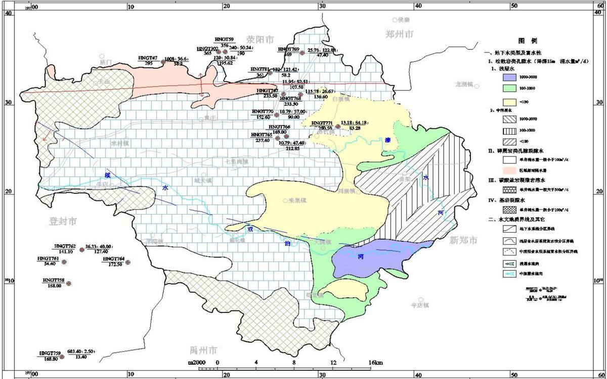  
图 1-1 新密市水文地质图 A3 替换

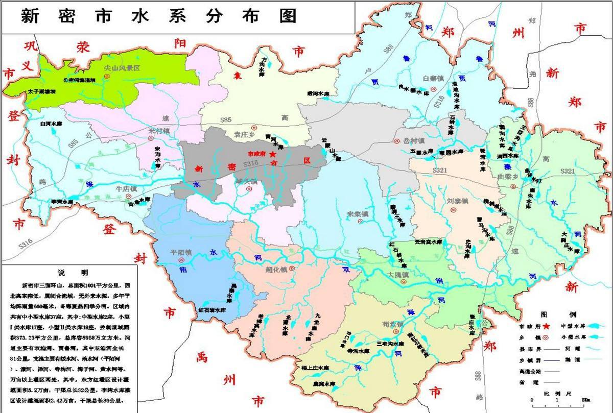  
图1-2 新密市水系分布图

## 1.2.4 土壤植被

新密市境内土壤分布有褐土和潮土与棕壤三个大类、7个亚类、26个土属、98个土种。其中褐土类面积最大，达 $6 6 6 . 6 7 \mathrm { k m } ^ { 2 }$ ，占土地总面积的80%以上；潮土类面积近66.67km²；棕壤面积较小，近 $1 3 . 3 3 \mathrm { k m } ^ { 2 } .$ 。全市土壤养分平均含量分别为有机质1.08%、速效磷4ppm、速效氮37ppm、速效钾 87ppm、pH值7.5左右，土壤有机质含量低，养分比例失调不太均衡。

新密市森林资源丰富，树木种类较多，据调查约有木本植物52科250余种，素有树种基因库和林材资源库之称。

## 1.2.5 水文气象

新密市属暖温带半干旱大陆性季风气候，冷暖气团交替频繁，春夏秋冬四季分明：冬寒干燥，风多雪少；夏季炎热，雨量集中；春旱冷暖无常；秋凉晴爽。全市年平均气温14.3℃。多年月平均最高气温 $2 6 . 9 \mathrm { { ^ \circ C } }$ ，出现在7月份，极端最高气温42.0℃（1972年6月11日）；多年月平均最低气温0.4℃，出现在1月份，极端最低气温-15.8℃（1973年12月24日）。年均无霜期222天。年均日照时数2241.3小时，年日照百分率为51%，全年太阳辐射总量为1147千卡/cm²。风向多西北和东南风，最大风速为22m/s。最大冻土深度为30cm。

根据1960～2015年系列统计资料，全市多年平均降水量656mm，历史最大年降水量1181mm（1964年），最小年降水量397mm（1986年），相差784mm，年际变化量较大。由于受季风气候的影响，降水量时空分布不均：时间上表现为夏季集中、春秋不足、冬季偏少，夏季降水量约占全年降水量的50%，秋季约占25%，春季约占21%，冬季仅占4%左右，汛期6～9月降水量占全年降水量的66.1%左右；空间上表现为米村～岳村以北及王村～大隗以南山区降水较多，大于675mm，中部与东部河谷平原较少。多年平均水面蒸发量为1662mm。

## 1.2.6 河流水系

新密市河流主要有三条：双洎河、贾鲁河、汜水河（图1-2）。按河南省水资源分区成果，该市绝大部分面积属于淮河流域沙颍河水系。境内各河大都属季节性河流，汛期行洪，枯水期河流基本无水。

双洎河属淮河流域，其中有溱河、泽河、绥水河、洧水河、寺沟河、杨河、澧泉河、助泉寺水等二十多条一级支流，其发源于嵩山东麓新密市西北五指岭东侧尖山风景区管委会巩密关村的佛洞，由登封-新密交界南下到月台村向东流入李湾水库，于扶沟县汇入贾鲁河，自西向东流经牛店镇、西大街办事处、城关镇、超化镇、来集镇、大隗镇、刘寨镇，至曲梁镇交流寨进入新郑市，是新密市主要泄洪河道，境内干流长57km，控制流域面积868km²（占该市土地面积87%）；贾鲁河发源于袁庄乡山顶村溅水窝，出新密境内入郑州西郊西流湖，境内长15km，控制流域面积 $1 1 3 \mathrm { k m } ^ { 2 }$ (占本市土地面积11%)；汜水河属黄河流域，位于新密市尖山以北，境内长3.5km，控制流域面积为 $2 0 \mathrm { k m } ^ { 2 }$ (占该市土地面积2%)。

## 1.3 区域概况ⅡI-经济社会概况

## 1.3.1 区域划分

新密市隶属河南省会郑州市，地处郑州市西南，东边同新郑市连接，西边同登封市相邻，南边和禹州市接壤，北边分别和巩义市、荥阳市相邻，全境位于北纬34°20'\~34°40'、东经113°09′\~113°41'之间。

根据统计数据，2015年新密市共设置有13个乡（镇）、4个街道办事处、1个风景区管委会，有303个行政村、25个社区居委会、3166个自然村；全市总面积1001km²。根据新密市城乡总体规划（2016-2030），新密市按照城乡等级，又分为中心城区、新密新区、中心镇镇区和一般镇镇区。具体区域划分见表1-1。

表1-1 新密市分区面积一览表
<table><tr><td rowspan=1 colspan=2>乡镇</td><td rowspan=1 colspan=1>面积（km²）</td></tr><tr><td rowspan=1 colspan=2>新密中心城区（及城关镇、袁庄乡）</td><td rowspan=1 colspan=1>110（146）</td></tr><tr><td rowspan=1 colspan=2>新密新区（曲梁镇）</td><td rowspan=1 colspan=1>102</td></tr><tr><td rowspan=5 colspan=1>中心镇镇区</td><td rowspan=1 colspan=1>超化镇</td><td rowspan=1 colspan=1>79</td></tr><tr><td rowspan=1 colspan=1>大隗镇</td><td rowspan=1 colspan=1>59</td></tr><tr><td rowspan=1 colspan=1>刘寨镇</td><td rowspan=1 colspan=1>61</td></tr><tr><td rowspan=1 colspan=1>白寨镇</td><td rowspan=1 colspan=1>92</td></tr><tr><td rowspan=1 colspan=1>小计</td><td rowspan=1 colspan=1>393</td></tr><tr><td rowspan=7 colspan=1>一般镇镇区</td><td rowspan=1 colspan=1>米村镇</td><td rowspan=1 colspan=1>58</td></tr><tr><td rowspan=1 colspan=1>牛店镇</td><td rowspan=1 colspan=1>76</td></tr><tr><td rowspan=1 colspan=1>平陌镇</td><td rowspan=1 colspan=1>61</td></tr><tr><td rowspan=1 colspan=1>来集镇</td><td rowspan=1 colspan=1>63</td></tr><tr><td rowspan=1 colspan=1>苟堂镇</td><td rowspan=1 colspan=1>89</td></tr><tr><td rowspan=1 colspan=1>岳村镇</td><td rowspan=1 colspan=1>62</td></tr><tr><td rowspan=1 colspan=1>小计</td><td rowspan=1 colspan=1>409</td></tr><tr><td rowspan=1 colspan=2>尖山乡*</td><td rowspan=1 colspan=1>53</td></tr><tr><td rowspan=1 colspan=2>合计</td><td rowspan=1 colspan=1>1001</td></tr></table>

\*注：行政分区名称为尖山风景区管委会，参照《新密市统计年鉴》，称为尖山乡，下文同；新密中心城区（及城关、袁庄乡）的面积表达为110（146），其中括号外面的数据表示新密中心城区面积为110km²，括号里面的数据表示中心城区以及城关镇、袁庄的面积为146km²，下文同。

## 1.3.2 人口

2015年底，新密市常住总人口80.36万人，人口密度达803人/km²，其中，城镇常住人口42.55万人，占总人口比重为52.9%，人口自然增长率5.0%o。根据新密市历年人口数据统计情况分析，自20世纪50年代以来，新密市人口逐渐增长，其中60年代增长比较快，年人口增长率达2.49%；70、80、90年代的人口增长比较慢，年人口增长率分别为1.34%、1.18%和1.21%。

## 1.3.3 经济发展

2015年，全市全年国内生产总值6516731万元，比上年增长10.1%：其中第一产业增加值201012万元，增长5.0%；第二产业增加值3662956万元，增长9.2%；第三产业增加值2652763万元，增长12.5%。三个产业结构由上年的3.1：65.7：31.2调整为3.1：56.2：40.7。人均生产总值81103元，增长9.8%。

2015年新密市工业增加值3662956万元，增长9.2%。其中，规模以上工业增加值完成3033422万元，比上年增长13.9%。从轻重工业看，轻工业完成557250万元，增长-4.2%；重工业完成2476912万元，增长18.9%。规模以上工业产品销售率99.5%。规模以下工业企业及个体增加值431423万元，增长2.4%。

全年粮食种植面积为85.47万亩，农田有效灌溉面积23.68万亩，节水灌溉面积6.32万亩，新增节水灌溉面积1.80万亩。2015年全年实现农林牧渔业增加值205549万元，比上年增长5.0%。粮食总产量218755吨，增长10.9%，其中夏粮总产量116828吨，增长14.1%；秋粮总产量101927吨，增长7.4%。全年油料总产量10588吨，增长-1.8%；蔬菜总产量273300吨，增长0.3%；水果总产量21091吨，增长6.6%。自1995年以来，全市的农业产值保持年均10.74%的增长速度；2000年后，农业发展平均每年以7.46%的速度增长。

## 1.3.4 城市发展与定位

根据《新密市城乡总体规划纲要》（2011-2030），新密市在区域协调方面，未来要积极推进中原经济区、郑州都市区的经济合作与协调发展，加强与郑州都市区内各市、区在产业发展、生态建设、环境保护、城镇空间与基础设置布局等方面的协调发展；进一步落实、强化新密作为“郑州市域非金属矿物制品业基地，以能源、建材为主的新型卫星城市”的重要区域职能；结合郑州都市区轨道交通与区域高速公路体系建设，对接郑州，提升新密交通的效率与便捷程度，融入郑州都市区的区域交通网络；结合新密省级森林公园、河南省神仙洞省级森林公园等生态公园的建设，为新密以及周边市、区提供良好的生态环境空间，加强区域生态环境保护协调。在经济发展战略方面，通过新型城镇化、新型工业化及新型农业现代化的协调发展，形成新密市新的经济发展，成为河南省重要的经济发展高地。通过生产要素和资本投资的双轮驱动及新经济元素的引入，打造千亿耐材产业基地、清洁生产循环经济产业基地（造纸）、服装服饰生产基地和高科技制药业基地，发展耐材交易市场和服饰交易市场，打造地区商贸中心和旅游服务中心，使新密市成为郑州都市圈重要的经济增长极。在社会发展战略方面，不断优化人口结构，提高人口素质，加强人口管理和服务，完善社区服务体系，改善人民环境质量；促进文化事业的全面繁荣和文化产业的快速发展；健全社会保障体系，积极推动和谐社会建设；大力发展信息服务业，建设“数字新密”，社会信息化各项指标达到较高水平；构建城市综合防灾减灾和应急保障的设施系统，建立有效应对各种公共突发事件的预警和防范机制。在生态环境发展战略方面，以生态健康为目标，确保生态安全；加强平原以及山地生态林地的保护和建设；严格执行环境排放标准。

《新密市国民经济和社会发展第十三个五年规划纲要》中指出，“十三五”期间新密市总体坚持创新发展、协调发展、绿色发展、开放发展、共享发展五大理念。发展定位为：融入郑州，建设郑州都市区城乡一体化示范区；对接空港，打造郑州国际商都商贸物流重要节点；创新驱动，打造郑州都市区先进制造业基地；持续转型，打造郑州都市区生态养生福地。

## 1.4 水资源开发利用概况及问题分析

## 1.4.1 地表水利用程度低

新密市地表水开发利用率平均25.1%，总体为中开发利用区，低于国际上公认的极限值（40%），表明新密市地表水开发利用程度低，应加大地表水资源的开发利用。

## 1.4.2地下水处于超采状态

新密市63.7%的供水量来自地下水。新密市用水消耗量为 $5 4 1 1 . 0 { \times } 1 0 ^ { 4 } \mathrm { m } ^ { 3 }$ ，占水资源总量 $1 4 9 3 8 . 8 { \times } 1 0 ^ { 4 } \mathrm { m } ^ { 3 } )$ 的36.2%。

## 1.4.3 资源型缺水严重

根据缺水类型划分标准，新密市属于资源型缺水地区。因此，解决新密市的缺水问题，就要充分利用中水和雨水，大力发展节水型农业、节水型社会。

## 1.4.4 地表水污染

根据监测点双洎河新郑（二）断面，挥发酚随时间的变化不明显；溶解氧随时间的变化呈减小的趋势，且减小趋势明显；而总硬度、高锰酸钾指数、五日生化需氧量和氨氮呈明显的增加趋势，且增加速度比较快。

## 1.4.5浅层地下水水质恶化

新密市浅层地下水水质近30年来一直趋于恶化，其中主要受农药、化肥和工业污染源影响。在新密市造纸厂一带，浅层地下水受到严重污染，近几年来已初步得到控制；煤矿开采对浅层地下水水质也有较大影响。

## 1.4.6河道基流减少与河道断流

根据郑州市水文水资源勘测局统计，1980年以来双洎河的断流情况如表3-39所示。双洎河的最长断流河段是河源～新郑市区，新密市境内断流长度35km。1997、1998、1999三年连续发生断流，不仅直接影响到新密市的农业灌溉，而且使该河的生态环境更加恶化。

## 1.4.7超采地下水引起地质灾害

地下水的超采还引起了其它一系列的问题：地面沉降、塌陷与地裂缝，地下水位的下降导致机电井的出水能力下降，机井的更新和报废速率也加快，抽水成本提高。由于新密的煤炭资源丰富，矿业开采具有一定的规模，大量抽排地下水、采空等，从而造成地面沉降，出现大量的地面塌陷和地裂缝。

## 1.4.8部分区域仍然处于缺水状态

新密市2015年处于丰水年，整体不缺水。但总可供水量仍然小于总需水量，总可供水量为 $1 1 5 9 1 . 1 { \times } 1 0 ^ { 4 } \mathrm { m } ^ { 3 }$ ，需水量为 $1 3 5 9 1 . 1 { \times } 1 0 ^ { 4 } \mathrm { m } ^ { 3 }$ ，超化镇、岳村镇、来集

镇、城区处于缺水状态，其中超化镇缺水率最大，达47.7%。

## 1.4.9水资源短缺已出现制约社会发展苗头

新密市水资源短缺现象已较为明显，水资源短缺将严重制约着全市的发展，水资源短缺状况如果得不到改善，跨越式发展必将受到严重影响。

## 1.5 规划指导思想与原则

## 1.5.1 指导思想

以人水和谐理念和科学发展观为指导，以全国水资源综合规划技术大纲、全国水资源综合规划技术细则、水资源规划规范为依据，以实行最严格水资源管理制度、河长制及水生态文明建设为契机，以服务于未来海绵城市建设为要求，着力贯彻“创新、协调、绿色、开放、共享”发展理念，围绕实现“两个率先”宏伟目标，坚持科学发展观，抓住郑州建设“国家中心城市”的机遇，按照“融入郑州、全域统筹、突出特色、促进转型”的发展要求，立足现实、放眼未来，全方位制定新密市城乡发展战略，前瞻科学、因地制宜地编制覆盖新密市全域的城乡总体规划；突出新密在新型城镇化路径、产业转型发展、丘陵地形利用等方面的特色；近远期结合、统筹协调，合理布局，保持弹性，积极引导，有效控制，促进新密市全面协调可持续发展，建设国内一流的县级城市。

## 1.5.2 基本原则

## （1）以人为本，全面协调可持续发展

坚持以人为本，把人民群众的根本利益作为水资源优化配置和规划的出发点，把提高人民生活水平作为落脚点，坚持协调发展，从现代化建设的全局出发，统筹城乡、经济社会发展、人与自然和谐发展中的水资源和水环境问题，正确处理生活、生产经营和生态用水的关系，优先保障居民基本生活用水，合理安排生态用水，优化配置生产用水，逐步改变对水资源的不合理开发和浪费的现象，促进经济、社会、环境协调可持续发展，实现人水和谐相处。

## (2）坚持全面规划和统筹兼顾的原则

根据统筹新密市经济社会近期与远期发展用水需求，立足现状供水格局，统筹水资源开发利用工程现状及未来项目规划，统筹各类水源的供水保障能力和供用水次序，分近、远期全面的科学的规划水资源的开发、利用、配置、节约、保

护、管理，打造多源联调联供供水格局，保障经济社会用水安全，水生态安全。

## （3）政府主导、市场引导和公众参与

充分发挥政府的宏观调控和主导作用，加强对水资源配置和规划的组织领导和政策、资金支持；根据水资源承载能力积极调整经济结构，建立总量控制与定额管理相结合的管理制度和合理的水价形成机制，通过经济手段和市场机制，开展水资源配置和规划工作。鼓励社会公众的广泛参与，充分调动广大用水户参与水资源管理的积极性，增强节水、水资源保护、提高水资源利用率等观念，在全市形成“全民参与、社会共创”的节水型社会建设氛围。

## （4）以制度建设促进全面节水

用水结构的调整，必须通过合理的制度安排来规范水资源供需关系变化所带来的经济利益关系的变化，形成以利益主导的节水机制，使节水工作渗透到社会的方方面面，以促进经济社会发展中的全面、全过程节水。通过改革体制、健全法制、完善机制，强化制度创新，落实最严格的水资源管理制度，逐步建立完善促进水资源高效利用的体制、机制和制度，规范各行业用水行为，实现水资源的有序开发、有限开发、有偿开发和高效利用。

## (5) 因地制宜、突出重点

根据新密市水资源状况和经济社会条件，要因地制宜地推进节水型社会建设，全面分析评价本地区水资源开发利用、节约、保护及管理情况，立足于区域现状，抓住本地区节水型社会建设的关键问题和薄弱环节，按照不同类别任务需求和经济保障能力来制定详实的工作计划，逐年度实施，切实提高工作方案各项工作的针对性和有效性。

## (6）贯彻生态文明理念

为贯彻落实党的十八大精神，水利部于2013年1月印发了《水利部关于加快推进水生态文明建设工作的意见》，提出把生态文明理念融入到水资源开发、利用、配置、节约、保护以及水灾害防治的各方面和水利规划、建设、管理的各环节，由此可见，全面推进水生态文明建设，对推动全市节水型社会建设具有重大作用。水生态文明倡导人与自然和谐相处，坚持以人为本、全面协调可持续发展的科学发展观，解决由于人口增加和经济社会高速发展出现的洪涝灾害、干旱缺水、水土流失和水污染等水问题，使人和水的关系达到和谐状态。

## 1.6 规划依据

## 1.6.1 法律法规

（1）《中华人民共和国水法》（2002）；

（2）《中华人民共和国防洪法》（1997）；

（3）《中华人民共和国城乡规划法》（2008年）；

（4）《中华人民共和国土地管理法》（2004年）；

（5）《中华人民共和国环境保护法》（2014年）；

（6）《中华人民共和国水土保持法》（1991）；

（7）《中华人民共和国水污染防治法》（2008）；

（8）《取水许可和水资源费征收管理条例》（2006）；

（9）《城市供水水质管理规定》（2007）；

（10）《城市节约用水管理规定》（1988）；

（11）《城市用水定额管理办法》（1991）；

（12）《城市中水设施管理暂行办法》（1995）；

（13）《城市地下水开发利用保护管理规定》（1994）；

（14）其他相关国家法律法规。

## 1.6.2 政策文件

（1）《中共中央国务院关于加快推进生态文明建设的意见》（2015）；

（2）《实行最严格水资源管理制度考核工作实施方案》（水资源[2014]61号）；

（3）《实行最严格水资源管理制度考核办法》（国办发[2013]2号）；

（4）《新密市人民政府关于实行最严格水资源管理制度的实施意见》（新密政[2014]14号）；

（5）《新密市实行最严格水资源管理制度考核办法》；

（6）《关于推进海绵城市建设的指导意见》（国办发[2015]75号）；

（7）《水利部关于加强水资源用途管制的指导意见》（水资源[2016]234号）；

（8）《中国节水技术政策大纲》（2005）；

（9）《新密市人民政府关于推进节水型社会建设的实施意见》（2007）；

（10）《国务院关于加强城市供水节水和水污染防治工作的通知》（国发[2000]36号）；

（11）《住房城乡建设部国家发展改革委关于进一步加强城市节水工作的通知》（建城[2014]114号）；

（12）《关于加强城市水资源费管理使用的通知》（建城（1994）第342号）；

（13）《国务院办公厅关于推进水价改革促进节约用水保护水资源的通知》（国办发（2004）36号）；

（14）其他相关政策文件。

## 1.6.3 相关规划

（1）《中华人民共和国国民经济和社会发展第十三个五年规划纲要》（2016）；

（2）《中共中央、国务院关于进一步加强城市规划建设管理工作的若干意见》(中发（2016）6号);

（3）《中共河南省委、河南省人民政府关于加强城市规划建设管理工作的意见》（豫发（2016）17号）；

（4）《中共河南省委、河南省人民政府关于推进百城建设提质工程的意见》（豫发（2016）39号）；

（5）《河南省城镇体系规划(2010—2020)》；

（6）《中原城市群发展规划》；

（7）《河南省县城规划建设导则》（2016）；

（8）《河南省城市设计导则》（征求意见稿）；

（9）《郑州都市区总体规划（2012-2030）》；

（10）《郑州市城市总体规划（2008—2020）》；

（11）《河南省郑州市地下水资源开发利用规划》；

（12）《新密市新三化协调发展空间布局规划（2011—2030）》；

（13）《新密市土地利用总体规划（2006—2020）》；

（14）《新密市国民经济和社会发展第十三个五年规划纲要》（2016）；

（15）《新密市城乡总体规划纲要》及专题研究报告（2011-2030）；

（16）《新密市节水型社会建设“十三五”规划》（2016）；

（17）《新密市水资源开发利用规划》（2011）；

（18）其他各级部门相关建设发展规划等。《中共中央、国务院关于进一步加强城市规划建设管理工作的若干意见》(中发（2016）6号);

## 1.6.4 技术标准及基础资料

（1）《全国水资源综合规划技术大纲》（2002）；

（2）《全国水资源综合规划技术细则》（2002）；

（3）《水资源规划规范》（GB/T51051-2014）；

（4）《水资源评价导则》（SL/T238-1999）；

（5）《水资源供需预测分析技术规范》（SL429-2008）；

（6）《地表水环境质量标准》（GB3838-2002）；

（7）《地下水质量标准》（GB/T14848-93）；

（8）《取水许可技术考核与管理通则》（GB/T17367-1998）；

（9）《生活饮用水卫生标准》（GB5749-2006）；

（10）《建设项目水资源论证导则》（SL322-2013）；

（11）《节水型社会建设规划编制导则》（2008）；

（12）《环境影响评价技术导则》（HJ2.1-2011）；

（13）《2015年新密市国民经济和社会发展统计公报》（2015）；

（14）《新密市统计年鉴》（2010-2015）；

（15）《郑州市水资源公报》（2010-2015）；

（16）《新密市水务报表》（2001-2015）；

（17）《新密市环境状况公报》（2011-2015）；

（18）其他技术标准及基础资料。

## 1.7 规划目标

在最严格水资源管理制度和水生态文明相继提出的背景下，新密市水资源综合规划应以提高水资源的利用效率和效益为目标，以制度建设为核心，通过开展用水制度改革，建立与用水总量控制相适应的水资源管理体系；通过调整经济结构与产业结构，建立与区域水资源和水环境承载能力相适应的经济结构体系；建设水资源配置和节水工程，建立与水资源优化配置相适应的水利工程体系。将水生态文明理念贯彻到三大体系的建设中，切实转变全社会对水资源的粗放利用方式，促进人与水和谐相处，实现水资源可持续利用，保障国民经济和社会的可持续发展。

## 1.8 主要任务

在已摸清新密市水资源状况、现状供用水的情况下，按经济社会发展和环境改善要求，在水资源节约和保护的基础上，科学预测各规划水平年水资源需求；客观分析不同水平年、不同条件的供需情况；建立水资源配置的宏观指标体系，提出生活、生产和生态用水的优化配置方案，确定节水方案，明确水资源开发利用工程布局，使经济社会发展与水资源条件相适应。主要有以下几个方面：

（1）水资源及开发利用现状评价。全面准确地评价水资源条件和特点，系统地调查评价水资源的数量、质量、可利用量、时空分布特点和演变趋势，分析现状水资源开发利用水平。

（2）制定节水、水资源保护和污水处理再利用规划。在对现状水资源利用效率和水污染状况分析的基础上，评估提高水资源利用效率和节水、污水处理再利用的开发潜力；根据需水预测，确定节水、水资源保护及污水处理再利用目标，制定节水、水资源保护和污水处理再利用措施。

(3）水资源开发利用潜力分析。在水资源评价及开发利用现状分析的基础上，根据节水、水资源保护和污水处理再利用规划，综合考虑各种水源和经济结构调整的可能性，分析水资源的综合开发利用潜力；在水资源供需动态平衡中，充分发挥节约挖潜等作用，寻求开发与保护、开源与节流、供水与治污、需要与可能之间的协调，改进水资源利用方式，制定经济合理、技术可行、环境安全的水资源可持续利用方式。

（4）制定水资源合理配置方案。根据经济社会发展和环境改善对水资源的要求及水资源的实际状况，进行各规划水平年水资源供需分析，在对水资源节约和保护的基础上，建立水资源配置的宏观指标体系，提出协调生活、生产和生态用水之间的水资源合理配置方案；制定提高水资源利用效率的对策措施，包括调整产业结构与生产力布局，提出节约用水措施等，使经济社会发展与水资源条件相适应。

（5）提出水资源开发、利用、治理、配置、节约和保护的布局与措施的实施方案。在水资源合理配置和节约、保护的基础上，统筹规划水资源的开发利用和综合治理等措施，提出与生态建设和环境保护相协调、与经济社会发展相适应的开发利用布局和治理实施方案。

（6）制定水资源管理的对策和措施，建立适应社会主义市场经济体制的水资源管理制度。以健全的法制法规手段规范水事活动、以行政手段界定水事行为、以经济手段实现高效节水、以科学技术手段开发利用和管理水资源，逐步建立起以政府宏观调控、用户民主协商、市场经济杠杆调节三者有机结合体制为基础的水资源有效管理和高效利用运行模式。

## 2 水资源调查评价

## 2.1 降水量

## 2.1.1 基本资料

降水资料主要从新密市气象局获取。时间序列从1960年到2015年，共56年；多年平均降水量（1960年～2015年）为651mm；降水量年内分布不均（图2-1），每年12月至次年2月降水量偏少，汛期6月至9月其降水量占全年降水量的66.1%。

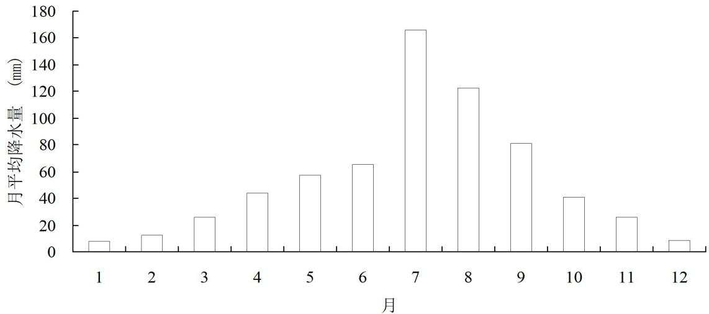  
图2-1 新密市多年（1960～2015年）月平均降水量分布图

## 2.1.2 降水量地区分布及变化规律

新密市降水量受地形影响，从平原区到丘陵区、山区依次增大，见图2-2。降水量以米村-岳村以北及王庄-大隗以南山区分布较多，大于675mm，中部与东部河谷平原较少。

## 2.1.31960～2015年分区降水量成果

1960～2015年全市多年平均降水量为651mm，折合水量为6.52亿 $\mathrm { m } ^ { 3 }$ 。最大年降水量为1964年达1181mm，最小年降水量是1986年为397mm。1960～2015年各分区多年平均降水量见表2-1。根据多年平均降水量等值线图（图2-2），确定各乡镇降水量，得到各分区多年平均降水量，其中，最大为曲梁镇，占全区总降水量的10.2%；最小为城关镇，占全区总降水量的2.3%。

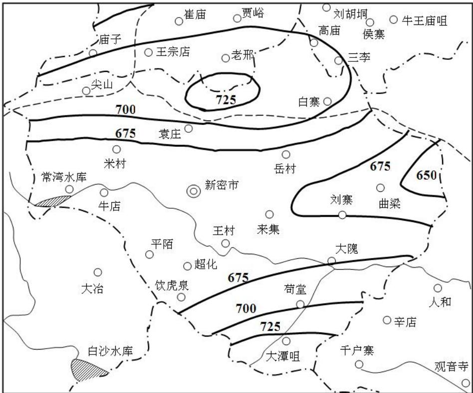  
图2-2 新密市多年平均降水量等值线图（1945～1995年）[2]

表 2-1 1960～2015 年各分区多年平均降水量统计表
<table><tr><td rowspan=1 colspan=2>乡镇</td><td rowspan=1 colspan=1>面积（km²）</td><td rowspan=1 colspan=1>多年平均降水量(104m³)</td><td rowspan=1 colspan=1>占全区降水量百分比（%）</td></tr><tr><td rowspan=1 colspan=2>新密中心城区（及城关镇、袁庄乡）</td><td rowspan=1 colspan=1>110（146）</td><td rowspan=1 colspan=1>4367(9450.9)</td><td rowspan=1 colspan=1>6.7(14.5)</td></tr><tr><td rowspan=1 colspan=2>新密新区（曲梁镇）</td><td rowspan=1 colspan=1>102</td><td rowspan=1 colspan=1>6648.2</td><td rowspan=1 colspan=1>10.2</td></tr><tr><td rowspan=5 colspan=1>中心镇</td><td rowspan=1 colspan=1>超化镇</td><td rowspan=1 colspan=1>79</td><td rowspan=1 colspan=1>4758</td><td rowspan=1 colspan=1>7.3</td></tr><tr><td rowspan=1 colspan=1>大隗镇</td><td rowspan=1 colspan=1>59</td><td rowspan=1 colspan=1>3845.5</td><td rowspan=1 colspan=1>5.9</td></tr><tr><td rowspan=1 colspan=1>刘寨镇</td><td rowspan=1 colspan=1>61</td><td rowspan=1 colspan=1>4041.1</td><td rowspan=1 colspan=1>6.2</td></tr><tr><td rowspan=1 colspan=1>白寨镇</td><td rowspan=1 colspan=1>92</td><td rowspan=1 colspan=1>6387.5</td><td rowspan=1 colspan=1>9.8</td></tr><tr><td rowspan=1 colspan=1>小计</td><td rowspan=1 colspan=1>393</td><td rowspan=1 colspan=1>25680.3</td><td rowspan=1 colspan=1>39.4</td></tr><tr><td rowspan=7 colspan=1>一般镇</td><td rowspan=1 colspan=1>米村镇</td><td rowspan=1 colspan=1>58</td><td rowspan=1 colspan=1>3780.4</td><td rowspan=1 colspan=1>5.8</td></tr><tr><td rowspan=1 colspan=1>牛店镇</td><td rowspan=1 colspan=1>76</td><td rowspan=1 colspan=1>4692.8</td><td rowspan=1 colspan=1>7.2</td></tr><tr><td rowspan=1 colspan=1>平陌镇</td><td rowspan=1 colspan=1>61</td><td rowspan=1 colspan=1>3650</td><td rowspan=1 colspan=1>5.6</td></tr><tr><td rowspan=1 colspan=1>来集镇</td><td rowspan=1 colspan=1>63</td><td rowspan=1 colspan=1>4041.1</td><td rowspan=1 colspan=1>6.2</td></tr><tr><td rowspan=1 colspan=1>苟堂镇</td><td rowspan=1 colspan=1>89</td><td rowspan=1 colspan=1>6061.6</td><td rowspan=1 colspan=1>9.3</td></tr><tr><td rowspan=1 colspan=1>岳村镇</td><td rowspan=1 colspan=1>62</td><td rowspan=1 colspan=1>4106.2</td><td rowspan=1 colspan=1>6.3</td></tr><tr><td rowspan=1 colspan=1>小计</td><td rowspan=1 colspan=1>409</td><td rowspan=1 colspan=1>26332.1</td><td rowspan=1 colspan=1>40.4</td></tr><tr><td rowspan=1 colspan=2>尖山乡*</td><td rowspan=1 colspan=1>53</td><td rowspan=1 colspan=1>3715.2</td><td rowspan=1 colspan=1>5.7</td></tr><tr><td rowspan=1 colspan=2>合计</td><td rowspan=1 colspan=1>1001</td><td rowspan=1 colspan=1>65178.5</td><td rowspan=1 colspan=1>100</td></tr></table>

## 2.1.4 各评价系列年降水量成果比较

表2-2反映出不同阶段年降水量相对于1960～2015年系列的丰枯变化比较情况。

表2-2 各评价系列与1960～2015年降水量系列对比结果表
<table><tr><td rowspan=2 colspan=1>1960~2015(1)（mm)</td><td rowspan=2 colspan=1>1956~2000(2)（mm)*</td><td rowspan=2 colspan=1>1956~1979(3)（mm）*</td><td rowspan=2 colspan=1>1971~2000(4) (mm)*</td><td rowspan=2 colspan=1>1980~2000(5)（mm）*</td><td rowspan=1 colspan=4>对比1960~2015年系列变化比例(%)</td></tr><tr><td rowspan=1 colspan=1>(2)~(1)</td><td rowspan=1 colspan=1>(3)～(1)</td><td rowspan=1 colspan=1>(4)~(1)</td><td rowspan=1 colspan=1>(5)～(1)</td></tr><tr><td rowspan=1 colspan=1>651</td><td rowspan=1 colspan=1>688</td><td rowspan=1 colspan=1>698</td><td rowspan=1 colspan=1>680</td><td rowspan=1 colspan=1>677</td><td rowspan=1 colspan=1>5.7</td><td rowspan=1 colspan=1>8</td><td rowspan=1 colspan=1>5.3</td><td rowspan=1 colspan=1>4.8</td></tr></table>

注：\*表示资料来源于《郑州市水资源综合规划报告》（2008）[11]

## 2.1.5 降水量的年际变化

用年降水量统计参数Cv和极值比来反映降水量的年际变化。全市降水量系列的统计参数、极值比和降水量特征值见表2-3，利用1960～2015年降水量序列，采用P-型曲线拟合法（图2-3），得到各典型年份的降水量见表2-3。

表2-3 新密市降水量特征值统计及不同频率年降水量一览表
<table><tr><td rowspan=1 colspan=3>统计参数</td><td rowspan=1 colspan=4>不同频率年降水量（mm）</td></tr><tr><td rowspan=1 colspan=1> $\mathrm { C _ { v } }$ </td><td rowspan=1 colspan=1> $\mathrm { C _ { s } / C _ { v } }$ </td><td rowspan=1 colspan=1>极值比</td><td rowspan=1 colspan=1>20%</td><td rowspan=1 colspan=1>50%</td><td rowspan=1 colspan=1>75%</td><td rowspan=1 colspan=1>95%</td></tr><tr><td rowspan=1 colspan=1>0.26</td><td rowspan=1 colspan=1>2.5</td><td rowspan=1 colspan=1>2.98</td><td rowspan=1 colspan=1>802</td><td rowspan=1 colspan=1>653</td><td rowspan=1 colspan=1>558</td><td rowspan=1 colspan=1>458</td></tr></table>

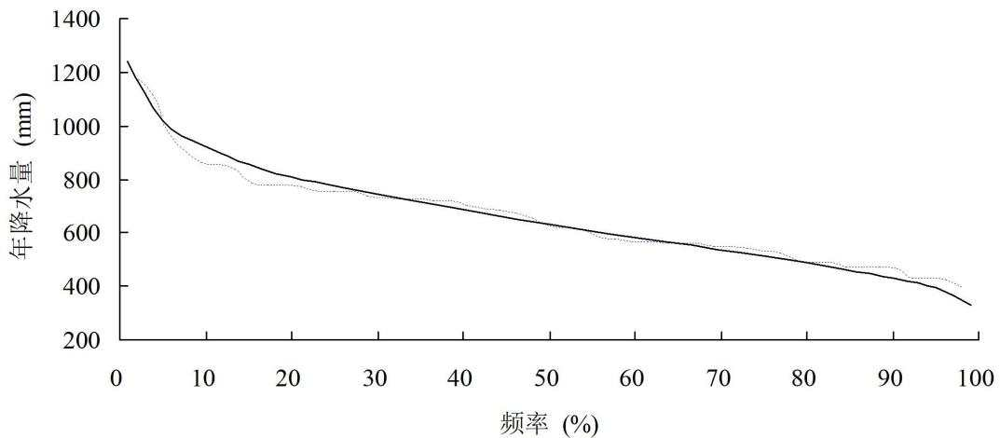  
…经验曲线—理论曲线  
图2-3 新密市降水量频率分析曲线图

图2-4表明，新密市从1960年到2015年，共有30年降水量低于多年平均降水量，其中连续3年低于平均降水量的年段有1968～1972年、1991～1993年、1997～1999年、2012～2014年；共有26年降水量高于多年平均降水量，其中连续3年高于平均降水量的年段有1961～1964年、1982～1985年、2002～2006年。

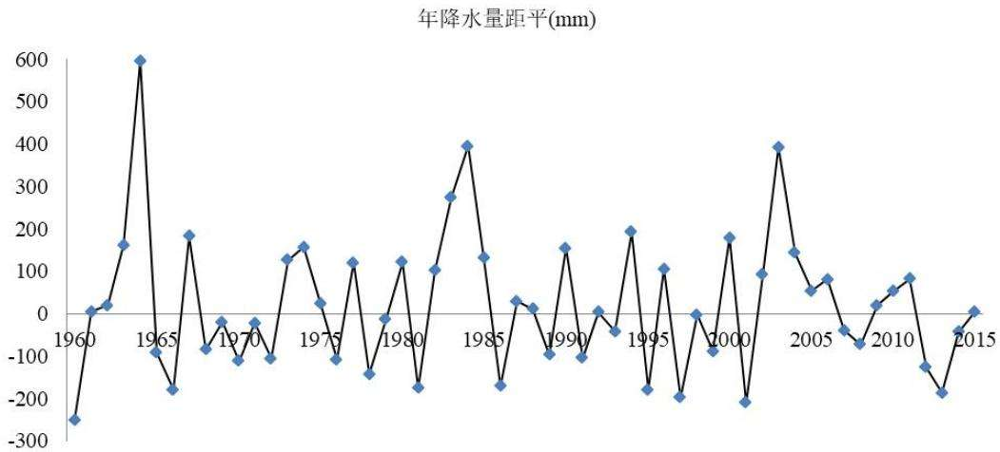  
图2-4 新密市年降水量（1960～2015年）距平曲线图

新密市降水量从1960年到2015年并没有明显增加或减少的趋势（图2-5），处于相对稳定状态。降水量累积距平曲线显示（图2-5），1969～1984年段、1986～2004年段年降水量累积距平均低于多年平均降水量，处于枯水期；1963年～1969年段、2003\~2015年段年降水量累积距平均高于多年平均降水量，处于丰水期。

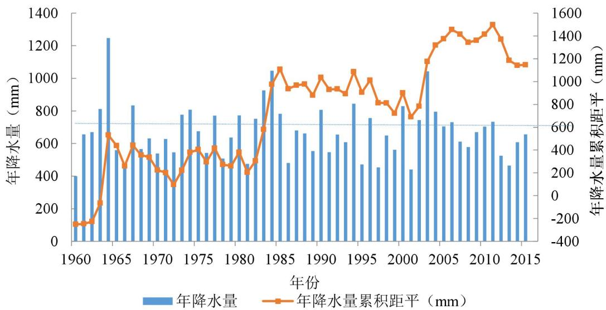  
图2-5 新密市历年降水量和年降水量累积距平（1960～2015年）图

## 2.1.6 各年代平均降水量变化趋势分析

按1960～1969年、1970～1979年、1980～1989年、1990～1999年和2000～2009年、2010～2015年分别统计新密市各年代平均降水量，见表2-4。

表2-4表明，从1960年到2015年，全市降水量在本世纪近5年降水量最小为597mm，本世纪前10年降水量最大达706mm，其次为1980～1989年段达677mm，上世纪60年

代和90年代均略低于1960～2015年段多年平均降水量。

表2-4 新密市阶段年平均降水量统计对比表
<table><tr><td rowspan=1 colspan=1>年代</td><td rowspan=1 colspan=1>阶段年平均降水量（mm）</td><td rowspan=1 colspan=1>与总年段（1960～2015）平均降水量差值（mm）</td></tr><tr><td rowspan=1 colspan=1>1960~1969</td><td rowspan=1 colspan=1>649</td><td rowspan=1 colspan=1>-2</td></tr><tr><td rowspan=1 colspan=1>1970~1979</td><td rowspan=1 colspan=1>611</td><td rowspan=1 colspan=1>-40</td></tr><tr><td rowspan=1 colspan=1>1980~1989</td><td rowspan=1 colspan=1>677</td><td rowspan=1 colspan=1>26</td></tr><tr><td rowspan=1 colspan=1>1990~1999</td><td rowspan=1 colspan=1>632</td><td rowspan=1 colspan=1>-19</td></tr><tr><td rowspan=1 colspan=1>2000~2009</td><td rowspan=1 colspan=1>706</td><td rowspan=1 colspan=1>55</td></tr><tr><td rowspan=1 colspan=1>2010~2015</td><td rowspan=1 colspan=1>597</td><td rowspan=1 colspan=1>-54</td></tr></table>

## 2.1.7 现状年 2015 年降水量

2015年新密市降水量655mm，降水总量为 $6 . 5 6 \times 1 0 ^ { 8 } \mathrm { m } ^ { 3 }$ ，比多年平均增加0.73%，属于偏丰水年。2015年年内降水，汛期6～9月降水达313mm，占全年降水量的47.8%；以7月份降水最多，达165.9mm，占全年降水量的25.2%；2月、12月降水最少，分别为0.9mm和1.7mm。2015年各分区降水量见表2-5。

表 2-5 2015年新密市降水量统计对比表
<table><tr><td rowspan=1 colspan=2>乡镇</td><td rowspan=1 colspan=1>2015年降水量 $( 1 0 ^ { 4 } \mathrm { m } ^ { 3 } )$ </td><td rowspan=1 colspan=1>多年平均降水总量 $( 1 0 ^ { 4 } \mathrm { m } ^ { 3 } )$ </td><td rowspan=1 colspan=1>与多年平均比较(%)</td></tr><tr><td rowspan=1 colspan=2>新密中心城区（及城关镇、袁庄乡）</td><td rowspan=1 colspan=1>4399(9520.2)</td><td rowspan=1 colspan=1>4367(9450.9)</td><td rowspan=1 colspan=1>0.73</td></tr><tr><td rowspan=1 colspan=2>新密新区（曲梁镇）</td><td rowspan=1 colspan=1>6696.9</td><td rowspan=1 colspan=1>6648.2</td><td rowspan=1 colspan=1>0.73</td></tr><tr><td rowspan=5 colspan=1>中心镇</td><td rowspan=1 colspan=1>超化镇</td><td rowspan=1 colspan=1>4792.9</td><td rowspan=1 colspan=1>4758</td><td rowspan=1 colspan=1>0.73</td></tr><tr><td rowspan=1 colspan=1>大隗镇</td><td rowspan=1 colspan=1>3873.7</td><td rowspan=1 colspan=1>3845.5</td><td rowspan=1 colspan=1>0.73</td></tr><tr><td rowspan=1 colspan=1>刘寨镇</td><td rowspan=1 colspan=1>4070.7</td><td rowspan=1 colspan=1>4041.1</td><td rowspan=1 colspan=1>0.73</td></tr><tr><td rowspan=1 colspan=1>白寨镇</td><td rowspan=1 colspan=1>6434.3</td><td rowspan=1 colspan=1>6387.5</td><td rowspan=1 colspan=1>0.73</td></tr><tr><td rowspan=1 colspan=1>小计</td><td rowspan=1 colspan=1>19171.6</td><td rowspan=1 colspan=1>19032.1</td><td rowspan=1 colspan=1>0.73</td></tr><tr><td rowspan=7 colspan=1>一般镇</td><td rowspan=1 colspan=1>米村镇</td><td rowspan=1 colspan=1>3808</td><td rowspan=1 colspan=1>3780.4</td><td rowspan=1 colspan=1>0.73</td></tr><tr><td rowspan=1 colspan=1>牛店镇</td><td rowspan=1 colspan=1>4727.2</td><td rowspan=1 colspan=1>4692.8</td><td rowspan=1 colspan=1>0.73</td></tr><tr><td rowspan=1 colspan=1>平陌镇</td><td rowspan=1 colspan=1>3676.7</td><td rowspan=1 colspan=1>3650</td><td rowspan=1 colspan=1>0.73</td></tr><tr><td rowspan=1 colspan=1>来集镇</td><td rowspan=1 colspan=1>4070.7</td><td rowspan=1 colspan=1>4041.1</td><td rowspan=1 colspan=1>0.73</td></tr><tr><td rowspan=1 colspan=1>苟堂镇</td><td rowspan=1 colspan=1>6106</td><td rowspan=1 colspan=1>6061.6</td><td rowspan=1 colspan=1>0.73</td></tr><tr><td rowspan=1 colspan=1>岳村镇</td><td rowspan=1 colspan=1>4136.3</td><td rowspan=1 colspan=1>4106.2</td><td rowspan=1 colspan=1>0.73</td></tr><tr><td rowspan=1 colspan=1>小计</td><td rowspan=1 colspan=1>26524.9</td><td rowspan=1 colspan=1>26332.1</td><td rowspan=1 colspan=1>0.73</td></tr><tr><td rowspan=1 colspan=2>尖山乡*</td><td rowspan=1 colspan=1>3742.4</td><td rowspan=1 colspan=1>3715.2</td><td rowspan=1 colspan=1>0.73</td></tr></table>

## 2.2 蒸发能力及干旱指数

## 2.2.1 代表站的选取

本次分析评价选用的蒸发代表站是新密市气象局蒸发站点，采用 $\Phi _ { 2 0 }$ 型蒸发皿观测(以下数据均已经过系数0.72折算)。

## 2.2.2 水面蒸发量空间分布

新密市水面蒸发量空间分布特征与水汽压力饱和差、水汽扩散作用、空气对流作用及紊动作用有关，主要影响因素包括饱和差、风速、温度、降水、湿度、气压、水质和水面情况等。一般的，山丘区水面蒸发量相对较小，平原区水面蒸发量相对较大。

## 2.2.3 水面蒸发量的年内和年际分配

## （1）年内分配

水面蒸发量年内分配不均，随各月的日照、气温、湿度、风速等气象因素的变化而变化。由新密市1971～2015年月平均蒸发量观测资料（图2-6）可以得出：冬季气温低，水面蒸发量小；3月入春后，由于气温回升，降水较少，风速大，蒸发能力增强，到5月、6月份成为全年蒸发量最旺盛时期，6月份出现最大值；年内最大水面蒸发量主要发生在4～7月，连续最大4个月的水面蒸发量占年总量的48.5%。

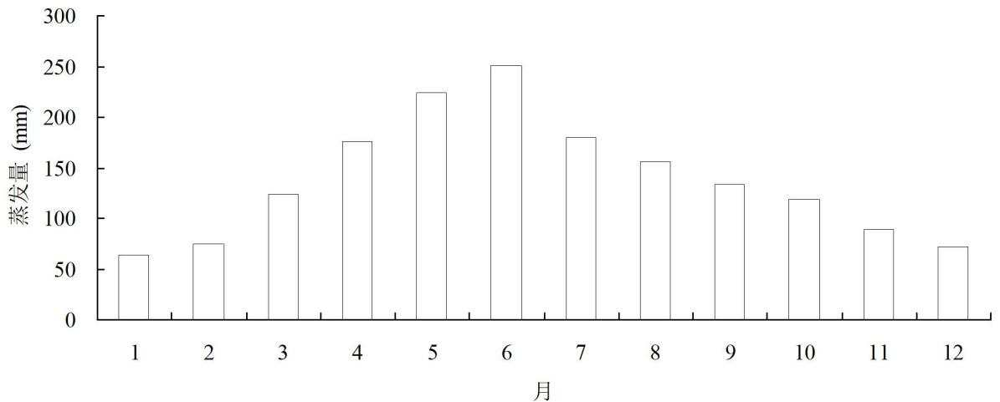  
图2-6新密市1971～2015年多年月水面平均蒸发量统计图

## （2）年际分配

新密市多年平均水面蒸发量为1196.64mm，最大值为1971年的1602mm，最小值为2003年的884.16mm。计算得出，区域1971～2015年蒸发量年际间变差系数 $C _ { \nu }$ 为0.16,年际值比为1.81，由此可见本市蒸发量年际变化不大。年蒸发量呈现明显的波动，且表现为明显下降趋势（图2-7），与全国1957到2001年蒸发量呈减少趋势相符，这可能与本市近15年来实施退耕还林减小了风速等气候因素有关。

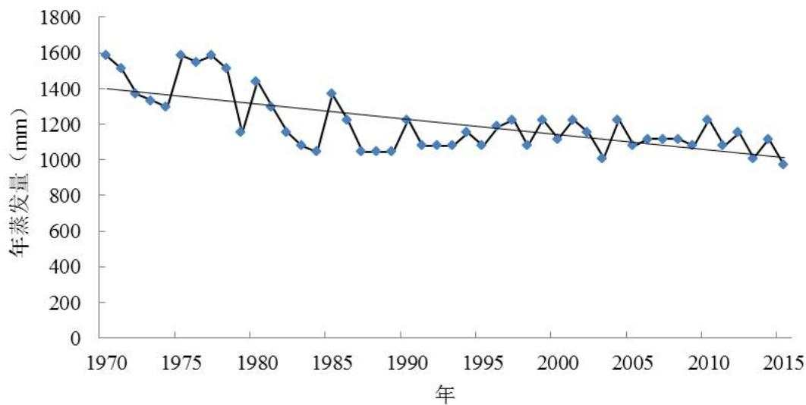  
图2-7 新密市1971～2015年年水面蒸发量变化曲线趋势图

年水面蒸发量累积距平曲线（图2-8）表明，蒸发量从1971年到1983年一直高于多年平均蒸发量，年累积距平一直上升；到1983年达到顶峰，之后略有下降，到1986年仍然处于高峰期；从1986年后蒸发量呈逐年下降趋势，到2015年处于最低值。

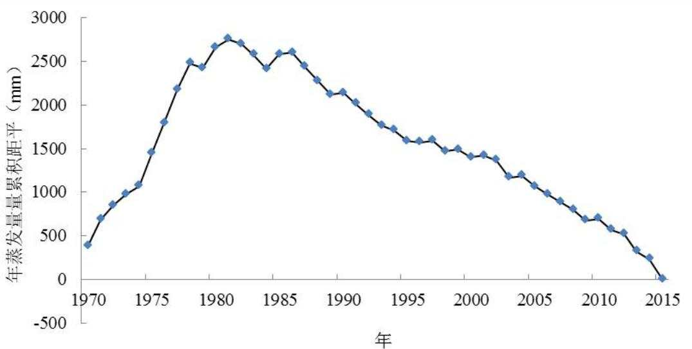  
图2-8 新密市1971～2015年年水面蒸发量累积距平曲线

按照气候学通常上的做法，将上年的12月以及当年的1月和2月作为当年的冬季，3、4、5月份为春季，6、7、8月份为夏季，9、10和11月份为秋季。由表2-6知，近45年来新密市年水面蒸发量也表现出明显下降趋势：20世纪70年代最高为1483.92mm，80年代年水面蒸发量同比骤然减少了285mm，90年代与80年代环比减少了100mm，21世纪初的15年比上世纪90年代又减少了65mm。表2-6表明，夏季、秋季和冬季的年水面蒸发量从20世纪70年代到21世纪初呈现明显下降趋势，春季年水面蒸发量在

21世纪初的10年略有回升。

表2-6阶段年新密市年水面蒸发量统计表（单位：mm）
<table><tr><td rowspan=1 colspan=1>时段</td><td rowspan=1 colspan=1> $\gnapprox$ </td><td rowspan=1 colspan=1>夏</td><td rowspan=1 colspan=1>秋</td><td rowspan=1 colspan=1>冬</td><td rowspan=1 colspan=1>全年</td></tr><tr><td rowspan=1 colspan=1>20世纪70年代</td><td rowspan=1 colspan=1>449</td><td rowspan=1 colspan=1>536</td><td rowspan=1 colspan=1>302</td><td rowspan=1 colspan=1>196</td><td rowspan=1 colspan=1>1483</td></tr><tr><td rowspan=1 colspan=1>20世纪80年代</td><td rowspan=1 colspan=1>391</td><td rowspan=1 colspan=1>404</td><td rowspan=1 colspan=1>242</td><td rowspan=1 colspan=1>161</td><td rowspan=1 colspan=1>1198</td></tr><tr><td rowspan=1 colspan=1>20世纪90年代</td><td rowspan=1 colspan=1>321</td><td rowspan=1 colspan=1>395</td><td rowspan=1 colspan=1>240</td><td rowspan=1 colspan=1>142</td><td rowspan=1 colspan=1>1098</td></tr><tr><td rowspan=1 colspan=1>21世纪初15年</td><td rowspan=1 colspan=1>353</td><td rowspan=1 colspan=1>369</td><td rowspan=1 colspan=1>204</td><td rowspan=1 colspan=1>107</td><td rowspan=1 colspan=1>1033</td></tr></table>

## 2.2.4 干旱指数及其变化

本次评价的干旱指数，采用年水面蒸发量与年降水量的比值表示。当于旱指数小于1.0时，降水量大于蒸发能力，表明该地区气候湿润；反之，当干旱指数大于1.0时，蒸发能力超过降水量，表明该地区偏于干旱。干旱指数越大，干旱程度越严重。根据于旱指数的大小，可以进行气候的干湿分带，其划分标准见表2-7。图2-9和表2-8表明，新密市20世纪70年代于旱指数曾达2.4，为半湿润气候带；21世纪初的10年干旱指数最小，为1.6，下降了0.8，处于半湿润气候带；1971年到2010年干旱指数呈波动下降趋势，这是水面蒸发量下降的直接结果。

表 2-7 气候分带划分等级表
<table><tr><td rowspan=1 colspan=1>气候分带</td><td rowspan=1 colspan=1>干旱指数</td></tr><tr><td rowspan=1 colspan=1>十分湿润</td><td rowspan=1 colspan=1>&lt;0.5</td></tr><tr><td rowspan=1 colspan=1>湿润</td><td rowspan=1 colspan=1>0.5~1.0</td></tr><tr><td rowspan=1 colspan=1>半湿润</td><td rowspan=1 colspan=1>1.0~3.0</td></tr><tr><td rowspan=1 colspan=1>半干旱</td><td rowspan=1 colspan=1>3.0~7.0</td></tr><tr><td rowspan=1 colspan=1>干旱</td><td rowspan=1 colspan=1>&gt;7.0</td></tr></table>

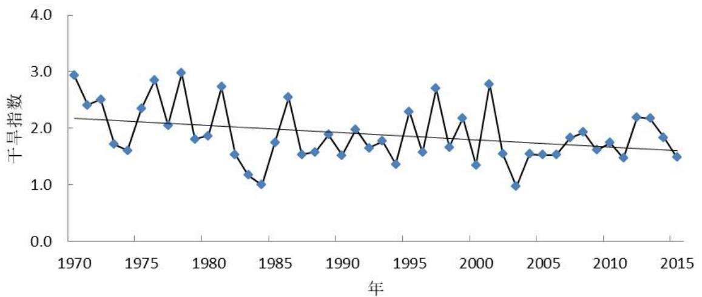  
图2-9新密市干旱指数变化趋势图（1971～2015年）

表2-8 新密市1971～2015年干旱指数统计表
<table><tr><td rowspan=1 colspan=1>20世纪70年代</td><td rowspan=1 colspan=1>干旱指数</td><td rowspan=1 colspan=1>20世纪80年代</td><td rowspan=1 colspan=1>干旱指数</td><td rowspan=1 colspan=1>20世纪90年代</td><td rowspan=1 colspan=1>干旱指数</td><td rowspan=1 colspan=1>21世纪初10年</td><td rowspan=1 colspan=1>干旱指数</td><td rowspan=1 colspan=1>21世纪初20年</td><td rowspan=1 colspan=1>干旱指数</td></tr><tr><td rowspan=1 colspan=1>1970</td><td rowspan=1 colspan=1>2.9</td><td rowspan=1 colspan=1>1980</td><td rowspan=1 colspan=1>1.9</td><td rowspan=1 colspan=1>1990</td><td rowspan=1 colspan=1>1.5</td><td rowspan=1 colspan=1>2000</td><td rowspan=1 colspan=1>1.3</td><td rowspan=1 colspan=1>2010</td><td rowspan=1 colspan=1>1.7</td></tr><tr><td rowspan=1 colspan=1>1971</td><td rowspan=1 colspan=1>2.4</td><td rowspan=1 colspan=1>1981</td><td rowspan=1 colspan=1>2.7</td><td rowspan=1 colspan=1>1991</td><td rowspan=1 colspan=1>2.0</td><td rowspan=1 colspan=1>2001</td><td rowspan=1 colspan=1>2.8</td><td rowspan=1 colspan=1>2011</td><td rowspan=1 colspan=1>1.5</td></tr><tr><td rowspan=1 colspan=1>1972</td><td rowspan=1 colspan=1>2.5</td><td rowspan=1 colspan=1>1982</td><td rowspan=1 colspan=1>1.5</td><td rowspan=1 colspan=1>1992</td><td rowspan=1 colspan=1>1.6</td><td rowspan=1 colspan=1>2002</td><td rowspan=1 colspan=1>1.5</td><td rowspan=1 colspan=1>2012</td><td rowspan=1 colspan=1>2.2</td></tr><tr><td rowspan=1 colspan=1>1973</td><td rowspan=1 colspan=1>1.7</td><td rowspan=1 colspan=1>1983</td><td rowspan=1 colspan=1>1.2</td><td rowspan=1 colspan=1>1993</td><td rowspan=1 colspan=1>1.8</td><td rowspan=1 colspan=1>2003</td><td rowspan=1 colspan=1>1.0</td><td rowspan=1 colspan=1>2013</td><td rowspan=1 colspan=1>2.2</td></tr><tr><td rowspan=1 colspan=1>1974</td><td rowspan=1 colspan=1>1.6</td><td rowspan=1 colspan=1>1984</td><td rowspan=1 colspan=1>1.0</td><td rowspan=1 colspan=1>1994</td><td rowspan=1 colspan=1>1.4</td><td rowspan=1 colspan=1>2004</td><td rowspan=1 colspan=1>1.5</td><td rowspan=1 colspan=1>2014</td><td rowspan=1 colspan=1>1.8</td></tr><tr><td rowspan=1 colspan=1>1975</td><td rowspan=1 colspan=1>2.3</td><td rowspan=1 colspan=1>1985</td><td rowspan=1 colspan=1>1.7</td><td rowspan=1 colspan=1>1995</td><td rowspan=1 colspan=1>2.3</td><td rowspan=1 colspan=1>2005</td><td rowspan=1 colspan=1>1.5</td><td rowspan=1 colspan=1>2015</td><td rowspan=1 colspan=1>1.5</td></tr><tr><td rowspan=1 colspan=1>1976</td><td rowspan=1 colspan=1>2.9</td><td rowspan=1 colspan=1>1986</td><td rowspan=1 colspan=1>2.5</td><td rowspan=1 colspan=1>1996</td><td rowspan=1 colspan=1>1.6</td><td rowspan=1 colspan=1>2006</td><td rowspan=1 colspan=1>1.5</td><td rowspan=1 colspan=1></td><td rowspan=1 colspan=1></td></tr><tr><td rowspan=1 colspan=1>1977</td><td rowspan=1 colspan=1>2.1</td><td rowspan=1 colspan=1>1987</td><td rowspan=1 colspan=1>1.5</td><td rowspan=1 colspan=1>1997</td><td rowspan=1 colspan=1>2.7</td><td rowspan=1 colspan=1>2007</td><td rowspan=1 colspan=1>1.8</td><td rowspan=1 colspan=1></td><td rowspan=1 colspan=1></td></tr><tr><td rowspan=1 colspan=1>1978</td><td rowspan=1 colspan=1>3.0</td><td rowspan=1 colspan=1>1988</td><td rowspan=1 colspan=1>1.6</td><td rowspan=1 colspan=1>1998</td><td rowspan=1 colspan=1>1.7</td><td rowspan=1 colspan=1>2008</td><td rowspan=1 colspan=1>1.9</td><td rowspan=1 colspan=1></td><td rowspan=1 colspan=1></td></tr><tr><td rowspan=1 colspan=1>1979</td><td rowspan=1 colspan=1>1.8</td><td rowspan=1 colspan=1>1989</td><td rowspan=1 colspan=1>1.9</td><td rowspan=1 colspan=1>1999</td><td rowspan=1 colspan=1>2.2</td><td rowspan=1 colspan=1>2009</td><td rowspan=1 colspan=1>1.6</td><td rowspan=1 colspan=1></td><td rowspan=1 colspan=1></td></tr><tr><td rowspan=1 colspan=1>平均</td><td rowspan=1 colspan=1>2.4</td><td rowspan=1 colspan=1>平均</td><td rowspan=1 colspan=1>1.9</td><td rowspan=1 colspan=1>平均</td><td rowspan=1 colspan=1>1.9</td><td rowspan=1 colspan=1>平均</td><td rowspan=1 colspan=1>1.6</td><td rowspan=1 colspan=1>平均</td><td rowspan=1 colspan=1>1.8</td></tr></table>

## 2.3 河流泥沙

本次评价所说的泥沙是指河流中的悬移质泥沙，即悬浮于水中，以与水流基本相同的速度运动的细颗粒泥沙，含沙量和输沙量均未包括推移质泥沙。河流中的泥沙具有两面性：不利方面主要表现在泥沙在河渠、湖泊、水库和取水口淤积，常给防洪、发电、灌溉和供水等带来困难；泥沙及其淤积对水工建筑物和水利机械的磨损及有关工程的建设和运营影响很大，不仅会增加工程造价和维护费用，也会降低工程效益，缩短工程寿命；水土流失对生态环境的影响也很大。有利方面主要是粗颗粒是良好的建筑材料；细颗粒泥沙进行灌溉，可以改良农田，使盐碱沙荒变为良田；抽水放淤可以加固大堤，从而增强抗洪能力等。

## 2.3.1 主要河流代表水文站多年平均含沙量及悬移质输沙量

天然径流悬移质输沙量是指流域在天然状态下的输沙量，包括控制站的实测输沙量以及水库淤积、农灌引沙、引洪淤灌、河道冲淤等各项还原计算沙量。双洎河是新密市主要的河流，发源于嵩山东麓新密市西北五指岭东侧，尖山乡巩密关村的佛洞，由西向东流经新密市、新郑市后转向东南，从新郑市黄湾出境在许昌市境内汇入贾鲁河。新密境内控制流域面积868km²（占新密市土地面积约87%）。双洎河在新密市境内无实测资料，但在新郑境内有实测资料，新郑站以上流域控制面积达1079km²，见表2-9，可作为双洎河新密市境内平均含沙量和悬移质输沙量参考值。

表2-9 双洎河（新郑站）代表水文站实测含沙量及输沙量一览表
<table><tr><td rowspan=2 colspan=1>统计年段</td><td rowspan=2 colspan=1>多年平均含沙量(kg/m³)</td><td rowspan=1 colspan=2>最大年含沙量</td><td rowspan=1 colspan=1>多年平均</td><td rowspan=1 colspan=2>最大年输沙量</td><td rowspan=2 colspan=1>多年平均年输沙模数(t/km²)</td></tr><tr><td rowspan=1 colspan=1>含沙量(kg/m³)</td><td rowspan=1 colspan=1>出现年份</td><td rowspan=1 colspan=1>年输沙量(10⁴t)</td><td rowspan=1 colspan=1>输沙量(104t)</td><td rowspan=1 colspan=1>出现年份</td></tr><tr><td rowspan=1 colspan=1>1956~1979</td><td rowspan=1 colspan=1>0.96</td><td rowspan=1 colspan=1>3.91</td><td rowspan=1 colspan=1>1969</td><td rowspan=1 colspan=1>16.1</td><td rowspan=1 colspan=1>60.2</td><td rowspan=1 colspan=1>1963</td><td rowspan=1 colspan=1>149.2</td></tr><tr><td rowspan=1 colspan=1>1971~2000</td><td rowspan=1 colspan=1>0.50</td><td rowspan=1 colspan=1>2.05</td><td rowspan=1 colspan=1>2000</td><td rowspan=1 colspan=1>5.1</td><td rowspan=1 colspan=1>18.5</td><td rowspan=1 colspan=1>1977</td><td rowspan=1 colspan=1>47.4</td></tr><tr><td rowspan=1 colspan=1>1980~2000</td><td rowspan=1 colspan=1>0.39</td><td rowspan=1 colspan=1>2.05</td><td rowspan=1 colspan=1>2000</td><td rowspan=1 colspan=1>3.6</td><td rowspan=1 colspan=1>16.9</td><td rowspan=1 colspan=1>1980</td><td rowspan=1 colspan=1>32.9</td></tr><tr><td rowspan=1 colspan=1>1956~2000</td><td rowspan=1 colspan=1>0.69</td><td rowspan=1 colspan=1>3.91</td><td rowspan=1 colspan=1>1969</td><td rowspan=1 colspan=1>10.2</td><td rowspan=1 colspan=1>60.2</td><td rowspan=1 colspan=1>1963</td><td rowspan=1 colspan=1>94.9</td></tr></table>

注：数据来源于《郑州市水资源综合规划报告》（2008）[11]

河流输沙量大小主要取决于流量与含沙量的大小，含沙量大的河流输沙量不一定大；含沙量小的河流输沙量不一定小。河流输沙量随时间变化，一年中最大输沙量在汛期，最小输沙量在枯水期。年际输沙量变化也较大，变化较年径流更为剧烈。在一次洪水过程中，最大输沙量与最大洪水量出现时间大体一致。就一条河流而言，山区河段输沙能力强，河道以冲刷为主，输沙量沿程增加；平原河段河道以淤积为主，输沙量沿程减少。

## 2.3.2 输沙模数的地区分布

输沙模数和河流含沙量存在着密切的因果关系。输沙模数大的地区，其河流含沙量也必然大，反之亦然。山区河流输沙模数是水土流失严重程度的一项重要指标，变化的机理较为复杂，除受降水、径流等自然因素作用外，主要与土地利用结构密切相关。合理的土地利用结构，可有效地减少河流的输沙模数，起到保持水土，改善生态环境的作用。新密市悬移质多年平均输沙模数的地区分布总趋势是西部大于东部，山地大于平原。本市1956～1979年多年平均输沙模数为 $1 4 9 . 2 \mathrm { t } / \mathrm { k m } ^ { 2 }$ ，1980～2000年多年平均输沙模数为32.9t/km²。1980～2000年对比1956～1979年多年平均输沙模数呈大幅减小趋势，其主要原因有两方面：一是上游中小型水库建设拦蓄了部分泥沙；二是20世纪80年代中期后，随着水土保持工作综合治理等措施的实施，有效地控制了水土流失。

## 2.4 地表水资源量

## 2.4.1 基本资料及还原计算

前文述及新密市按流域划分，主要河流有双洎河、贾鲁河和汜水河，概况如前。本次评价本市境内河流流量资料缺乏，但可根据双洎河新郑站估算主要河流双洎河新密市境内流量数据。本次评价选择双洎河新郑站为代表站，计算成果见表2-10。

根据水资源调查评价导则，河川天然径流量采用如下公式计算：

$$
\mathbf { W } _ { \ j \ast \ j \ast } = \mathbf { W } _ { \ j \ast \ j \ast } + \mathbf { W } _ { \ j \ast \ j \ast } + \mathbf { W } _ { \ j \ast \ j \ast } + \mathbf { W } _ { \ast \ j \ast } \pm \mathbf { W } _ { \ - \ j \ast \ j \ast } \pm \mathbf { W } _ { \ - \ j \ast \ j \ast } \pm \mathbf { W } _ { \ - \ast \ j \ast }
$$

式中： $\mathrm { w } _ { \scriptscriptstyle \mathscr { F } _ { \mathrm { a s } } }$ 为还原后的天然径流量；

$\mathbb { W } _ { ☉ }$ 为水文站实测径流量；

$\mathbf { W } _ { \mathrm { \# \# } }$ 为农业灌溉耗水量；

$\mathrm { W } _ { \underline { { \tau } } \underline { { \nu } } \underline { { \nu } } }$ 为工业用水耗水量；

$\mathsf { W } _ { \underline { { \Psi } } , \ast \sharp }$ 为城、乡生活用水耗水量；

$\mathsf { W } _ { \vec { \jmath } | \jmath \mathrm { k } }$ 为跨流域（或跨区间）引水量，引出为正，引入为负；

$\mathrm { W } _ { \mathcal { H } \backslash \# }$ 为河道分洪决口水量，分出为正，分入为负；

$\mathbf { W _ { \lambda \_ { \beta } } }$ 为大、中型水库蓄水变量，增加为正，减少为负；

表2-10双洎河（新郑水文站）历年还原水量统计计算
<table><tr><td colspan="1" rowspan="1">年份</td><td colspan="1" rowspan="1">天然 $( 1 0 ^ { 4 } \mathrm { m } ^ { 3 } )$ </td><td colspan="1" rowspan="1">实测 $( 1 0 ^ { 4 } \mathrm { m } ^ { 3 } )$ </td><td colspan="1" rowspan="1">还原 $( 1 0 ^ { 4 } \mathrm { m } ^ { 3 } )$ </td><td colspan="1" rowspan="1">降雨 $\left( \mathrm { m m } \right)$ </td></tr><tr><td colspan="1" rowspan="1">1956</td><td colspan="1" rowspan="1">26347</td><td colspan="1" rowspan="1">28059</td><td colspan="1" rowspan="1">289</td><td colspan="1" rowspan="1">836.1</td></tr><tr><td colspan="1" rowspan="1">1957</td><td colspan="1" rowspan="1">16442</td><td colspan="1" rowspan="1">12050</td><td colspan="1" rowspan="1">392</td><td colspan="1" rowspan="1">623.5</td></tr><tr><td colspan="1" rowspan="1">1958</td><td colspan="1" rowspan="1">25980</td><td colspan="1" rowspan="1">22588</td><td colspan="1" rowspan="1">392</td><td colspan="1" rowspan="1">842.6</td></tr><tr><td colspan="1" rowspan="1">1959</td><td colspan="1" rowspan="1">5286</td><td colspan="1" rowspan="1">4790</td><td colspan="1" rowspan="1">496</td><td colspan="1" rowspan="1">483.2</td></tr><tr><td colspan="1" rowspan="1">1960</td><td colspan="1" rowspan="1">4966</td><td colspan="1" rowspan="1">2689</td><td colspan="1" rowspan="1">277</td><td colspan="1" rowspan="1">400.2</td></tr><tr><td colspan="1" rowspan="1">1961</td><td colspan="1" rowspan="1">6764</td><td colspan="1" rowspan="1">6360</td><td colspan="1" rowspan="1">404</td><td colspan="1" rowspan="1">656.6</td></tr><tr><td colspan="1" rowspan="1">1962</td><td colspan="1" rowspan="1">9164</td><td colspan="1" rowspan="1">8980</td><td colspan="1" rowspan="1">185</td><td colspan="1" rowspan="1">670.4</td></tr><tr><td colspan="1" rowspan="1">1963</td><td colspan="1" rowspan="1">24261</td><td colspan="1" rowspan="1">23973</td><td colspan="1" rowspan="1">343</td><td colspan="1" rowspan="1">722.7</td></tr><tr><td colspan="1" rowspan="1">1964</td><td colspan="1" rowspan="1">38188.9</td><td colspan="1" rowspan="1">37805</td><td colspan="1" rowspan="1">384</td><td colspan="1" rowspan="1">1181.0</td></tr><tr><td colspan="1" rowspan="1">1965</td><td colspan="1" rowspan="1">6879</td><td colspan="1" rowspan="1">6325</td><td colspan="1" rowspan="1">658</td><td colspan="1" rowspan="1">559.0</td></tr><tr><td colspan="1" rowspan="1">1966</td><td colspan="1" rowspan="1">5532</td><td colspan="1" rowspan="1">3059</td><td colspan="1" rowspan="1">562</td><td colspan="1" rowspan="1">471.3</td></tr><tr><td colspan="1" rowspan="1">1967</td><td colspan="1" rowspan="1">19057</td><td colspan="1" rowspan="1">8045</td><td colspan="1" rowspan="1">3577</td><td colspan="1" rowspan="1">733.5</td></tr><tr><td colspan="1" rowspan="1">1968</td><td colspan="1" rowspan="1">6741</td><td colspan="1" rowspan="1">5205</td><td colspan="1" rowspan="1">1823</td><td colspan="1" rowspan="1">565.8</td></tr><tr><td colspan="1" rowspan="1">1969</td><td colspan="1" rowspan="1">9187</td><td colspan="1" rowspan="1">7860</td><td colspan="1" rowspan="1">1576</td><td colspan="1" rowspan="1">531.6</td></tr><tr><td colspan="1" rowspan="1">1970</td><td colspan="1" rowspan="1">8126</td><td colspan="1" rowspan="1">6440</td><td colspan="1" rowspan="1">2001</td><td colspan="1" rowspan="1">538.9</td></tr><tr><td colspan="1" rowspan="1">1971</td><td colspan="1" rowspan="1">7260</td><td colspan="1" rowspan="1">5621</td><td colspan="1" rowspan="1">1946</td><td colspan="1" rowspan="1">608.2</td></tr><tr><td colspan="1" rowspan="1">1972</td><td colspan="1" rowspan="1">6659</td><td colspan="1" rowspan="1">1962</td><td colspan="1" rowspan="1">2014</td><td colspan="1" rowspan="1">545.9</td></tr><tr><td colspan="1" rowspan="1">1973</td><td colspan="1" rowspan="1">13827</td><td colspan="1" rowspan="1">11311</td><td colspan="1" rowspan="1">2987</td><td colspan="1" rowspan="1">696.8</td></tr><tr><td colspan="1" rowspan="1">1974</td><td colspan="1" rowspan="1">13888</td><td colspan="1" rowspan="1">7699</td><td colspan="1" rowspan="1">4974</td><td colspan="1" rowspan="1">698.2</td></tr><tr><td colspan="1" rowspan="1">1975</td><td colspan="1" rowspan="1">13843</td><td colspan="1" rowspan="1">13573</td><td colspan="1" rowspan="1">1507</td><td colspan="1" rowspan="1">675.2</td></tr><tr><td colspan="1" rowspan="1">1976</td><td colspan="1" rowspan="1">9799</td><td colspan="1" rowspan="1">8530</td><td colspan="1" rowspan="1">1507</td><td colspan="1" rowspan="1">542.8</td></tr><tr><td colspan="1" rowspan="1">1977</td><td colspan="1" rowspan="1">15291</td><td colspan="1" rowspan="1">9903</td><td colspan="1" rowspan="1">1713</td><td colspan="1" rowspan="1">681.3</td></tr><tr><td colspan="1" rowspan="1">1978</td><td colspan="1" rowspan="1">6083</td><td colspan="1" rowspan="1">2759</td><td colspan="1" rowspan="1">3947</td><td colspan="1" rowspan="1">508.3</td></tr><tr><td colspan="1" rowspan="1">1979</td><td colspan="1" rowspan="1">6787</td><td colspan="1" rowspan="1">3186</td><td colspan="1" rowspan="1">4275</td><td colspan="1" rowspan="1">616.8</td></tr><tr><td colspan="1" rowspan="1">1980</td><td colspan="1" rowspan="1">9892</td><td colspan="1" rowspan="1">8871</td><td colspan="1" rowspan="1">1211</td><td colspan="1" rowspan="1">752.2</td></tr><tr><td colspan="1" rowspan="1">1981</td><td colspan="1" rowspan="1">6788</td><td colspan="1" rowspan="1">2701</td><td colspan="1" rowspan="1">2478</td><td colspan="1" rowspan="1">475.2</td></tr><tr><td colspan="1" rowspan="1">1982</td><td colspan="1" rowspan="1">13645</td><td colspan="1" rowspan="1">11632</td><td colspan="1" rowspan="1">2390</td><td colspan="1" rowspan="1">752.3</td></tr><tr><td colspan="1" rowspan="1">1983</td><td colspan="1" rowspan="1">18554</td><td colspan="1" rowspan="1">14709</td><td colspan="1" rowspan="1">2190</td><td colspan="1" rowspan="1">926.0</td></tr><tr><td colspan="1" rowspan="1">1984</td><td colspan="1" rowspan="1">22463</td><td colspan="1" rowspan="1">20967</td><td colspan="1" rowspan="1">1776</td><td colspan="1" rowspan="1">846.2</td></tr><tr><td colspan="1" rowspan="1">1985</td><td colspan="1" rowspan="1">14506</td><td colspan="1" rowspan="1">10930</td><td colspan="1" rowspan="1">684</td><td colspan="1" rowspan="1">722.7</td></tr><tr><td colspan="1" rowspan="1">1986</td><td colspan="1" rowspan="1">3987</td><td colspan="1" rowspan="1">2973</td><td colspan="1" rowspan="1">1203</td><td colspan="1" rowspan="1">397.0</td></tr><tr><td colspan="1" rowspan="1">1987</td><td colspan="1" rowspan="1">4299</td><td colspan="1" rowspan="1">2663</td><td colspan="1" rowspan="1">1943</td><td colspan="1" rowspan="1">680.5</td></tr><tr><td colspan="1" rowspan="1">1988</td><td colspan="1" rowspan="1">13091</td><td colspan="1" rowspan="1">10431</td><td colspan="1" rowspan="1">3159</td><td colspan="1" rowspan="1">661.8</td></tr><tr><td colspan="1" rowspan="1">1989</td><td colspan="1" rowspan="1">6264</td><td colspan="1" rowspan="1">5129</td><td colspan="1" rowspan="1">1347</td><td colspan="1" rowspan="1">553.8</td></tr><tr><td colspan="1" rowspan="1">1990</td><td colspan="1" rowspan="1">9408</td><td colspan="1" rowspan="1">6230</td><td colspan="1" rowspan="1">1398</td><td colspan="1" rowspan="1">806.0</td></tr><tr><td colspan="1" rowspan="1">1991</td><td colspan="1" rowspan="1">3862</td><td colspan="1" rowspan="1">2913</td><td colspan="1" rowspan="1">1126</td><td colspan="1" rowspan="1">546.5</td></tr><tr><td colspan="1" rowspan="1">1992</td><td colspan="1" rowspan="1">6711</td><td colspan="1" rowspan="1">1708</td><td colspan="1" rowspan="1">2378</td><td colspan="1" rowspan="1">654.7</td></tr><tr><td colspan="1" rowspan="1">1993</td><td colspan="1" rowspan="1">6811</td><td colspan="1" rowspan="1">2151</td><td colspan="1" rowspan="1">1971</td><td colspan="1" rowspan="1">608.9</td></tr><tr><td colspan="1" rowspan="1">1994</td><td colspan="1" rowspan="1">10051</td><td colspan="1" rowspan="1">4646</td><td colspan="1" rowspan="1">2856</td><td colspan="1" rowspan="1">814.1</td></tr><tr><td colspan="1" rowspan="1">1995</td><td colspan="1" rowspan="1">3106</td><td colspan="1" rowspan="1">1913</td><td colspan="1" rowspan="1">1417</td><td colspan="1" rowspan="1">471.4</td></tr><tr><td colspan="1" rowspan="1">1996</td><td colspan="1" rowspan="1">17996</td><td colspan="1" rowspan="1">15942</td><td colspan="1" rowspan="1">2439</td><td colspan="1" rowspan="1">756.7</td></tr><tr><td colspan="1" rowspan="1">1997</td><td colspan="1" rowspan="1">4114</td><td colspan="1" rowspan="1">2633</td><td colspan="1" rowspan="1">1758</td><td colspan="1" rowspan="1">453.3</td></tr><tr><td colspan="1" rowspan="1">1998</td><td colspan="1" rowspan="1">6712</td><td colspan="1" rowspan="1">3631</td><td colspan="1" rowspan="1">2471</td><td colspan="1" rowspan="1">648.9</td></tr><tr><td colspan="1" rowspan="1">1999</td><td colspan="1" rowspan="1">2889</td><td colspan="1" rowspan="1">1372</td><td colspan="1" rowspan="1">1517</td><td colspan="1" rowspan="1">562.0</td></tr><tr><td colspan="1" rowspan="1">2000</td><td colspan="1" rowspan="1">14461</td><td colspan="1" rowspan="1">8867</td><td colspan="1" rowspan="1">1892</td><td colspan="1" rowspan="1">829.6</td></tr><tr><td colspan="1" rowspan="1">2001</td><td colspan="1" rowspan="1">3446</td><td colspan="1" rowspan="1">1670</td><td colspan="1" rowspan="1">2109</td><td colspan="1" rowspan="1">460.6</td></tr><tr><td colspan="1" rowspan="1">2002</td><td colspan="1" rowspan="1">5733</td><td colspan="1" rowspan="1">1648</td><td colspan="1" rowspan="1">2475</td><td colspan="1" rowspan="1">743.4</td></tr><tr><td colspan="1" rowspan="1">2003</td><td colspan="1" rowspan="1">20817</td><td colspan="1" rowspan="1">18964</td><td colspan="1" rowspan="1">-174</td><td colspan="1" rowspan="1">1043.6</td></tr><tr><td colspan="1" rowspan="1">2004</td><td colspan="1" rowspan="1">13689</td><td colspan="1" rowspan="1">9301</td><td colspan="1" rowspan="1">1649</td><td colspan="1" rowspan="1">794.6</td></tr><tr><td colspan="1" rowspan="1">2005</td><td colspan="1" rowspan="1">9576</td><td colspan="1" rowspan="1">7229</td><td colspan="1" rowspan="1">412</td><td colspan="1" rowspan="1">705.5</td></tr><tr><td colspan="1" rowspan="1">2006</td><td colspan="1" rowspan="1">6906</td><td colspan="1" rowspan="1">6019</td><td colspan="1" rowspan="1">1052</td><td colspan="1" rowspan="1">731.8</td></tr><tr><td colspan="1" rowspan="1">2007</td><td colspan="1" rowspan="1">5371</td><td colspan="1" rowspan="1">4388</td><td colspan="1" rowspan="1">-21</td><td colspan="1" rowspan="1">611.5</td></tr><tr><td colspan="1" rowspan="1">2008</td><td colspan="1" rowspan="1">2684</td><td colspan="1" rowspan="1">2532</td><td colspan="1" rowspan="1">180</td><td colspan="1" rowspan="1">598.4</td></tr><tr><td colspan="1" rowspan="1">2009</td><td colspan="1" rowspan="1">3587</td><td colspan="1" rowspan="1">3572</td><td colspan="1" rowspan="1">18</td><td colspan="1" rowspan="1">670.1</td></tr><tr><td colspan="1" rowspan="1">2010</td><td colspan="1" rowspan="1">8436</td><td colspan="1" rowspan="1">9274</td><td colspan="1" rowspan="1">-995</td><td colspan="1" rowspan="1">703.9</td></tr><tr><td colspan="1" rowspan="1">2011</td><td colspan="1" rowspan="1">9268</td><td colspan="1" rowspan="1">8926</td><td colspan="1" rowspan="1">343</td><td colspan="1" rowspan="1">733.7</td></tr><tr><td colspan="1" rowspan="1">2012</td><td colspan="1" rowspan="1">10866</td><td colspan="1" rowspan="1">10105</td><td colspan="1" rowspan="1">761</td><td colspan="1" rowspan="1">524.9</td></tr><tr><td colspan="1" rowspan="1">2013</td><td colspan="1" rowspan="1">6692</td><td colspan="1" rowspan="1">6531</td><td colspan="1" rowspan="1">162</td><td colspan="1" rowspan="1">464.8</td></tr><tr><td colspan="1" rowspan="1">2014</td><td colspan="1" rowspan="1">5739</td><td colspan="1" rowspan="1">4960</td><td colspan="1" rowspan="1">780</td><td colspan="1" rowspan="1">607.8</td></tr><tr><td colspan="1" rowspan="1">2015</td><td colspan="1" rowspan="1">5611</td><td colspan="1" rowspan="1">4851</td><td colspan="1" rowspan="1">759</td><td colspan="1" rowspan="1">655.0</td></tr><tr><td colspan="1" rowspan="1">1956-2015</td><td colspan="1" rowspan="1">10406</td><td colspan="1" rowspan="1">8196</td><td colspan="1" rowspan="1">1456</td><td colspan="1" rowspan="1">656.0</td></tr><tr><td colspan="1" rowspan="1">1956-1980</td><td colspan="1" rowspan="1">12650</td><td colspan="1" rowspan="1">10306</td><td colspan="1" rowspan="1">1578</td><td colspan="1" rowspan="1">645.7</td></tr><tr><td colspan="1" rowspan="1">1980-2000</td><td colspan="1" rowspan="1">9486</td><td colspan="1" rowspan="1">6707</td><td colspan="1" rowspan="1">1920</td><td colspan="1" rowspan="1">658.4</td></tr><tr><td colspan="1" rowspan="1">2000-2015</td><td colspan="1" rowspan="1">7895</td><td colspan="1" rowspan="1">6665</td><td colspan="1" rowspan="1">634</td><td colspan="1" rowspan="1">670.0</td></tr></table>

从表2-10可以看出，双洎河（新郑水文站）控制流域 $( 1 0 7 9 \mathrm { k m } ^ { 2 }$ ）多年平均天然径流量10406万 $\mathrm { m } ^ { 3 }$ ，多年平均降雨量为656mm。

## 2.4.2 河川年径流的地区分布

年径流量的地区分布与年降水量的分布近似，基本上是山区大，丘陵区次之，平原区最小。沙颍河水系双洎河、贾鲁河流域以西的新密市境内山丘区，地表径流深为80～200mm。

## 2.4.3 河川径流的统计参数及时空变化特征

年径流变差系数 $C _ { \nu }$ 是反映地表水资源多年变化的统计参数，其大小反映径流量年际间变化的剧烈程度。年径流变差系数的大小，主要影响因素有降水量的年际变化、地下水补给的差异、流域面积的大小以及下垫面情况等。降水量年际变化大的地区，年径流变差系数值大；地下水补给越大，年径流变差系数愈小。流域面积大、支流河网密、河槽切割相对较深的地下水补给量大，因此，年径流变差系数比小流域的要小；地面坡度平缓，降水的入渗量大，地面径流就小，地下水补给量占年降水中的比重就大，其年径流变差系数也小。

本次评价选择双洎河新郑站为代表站，来反映年径流变差系数C和天然最大最小极值比，见表2-11。

表2-11双洎河（新郑代表站）天然径流量系列参数表
<table><tr><td rowspan=1 colspan=1>控制面积 $( \mathrm { k m } ^ { 2 } )$ </td><td rowspan=1 colspan=1>系列</td><td rowspan=1 colspan=1>径流量均值 $( 1 0 ^ { 4 } \mathrm { m } ^ { 3 } )$ </td><td rowspan=1 colspan=1>径流深均值(mm)</td><td rowspan=1 colspan=1> $\operatorname { C v }$ </td><td rowspan=1 colspan=1>Cs/Cv</td></tr><tr><td rowspan=1 colspan=1>1079</td><td rowspan=1 colspan=1>1956~2015年</td><td rowspan=1 colspan=1>10406</td><td rowspan=1 colspan=1>96.5</td><td rowspan=1 colspan=1>0.50</td><td rowspan=1 colspan=1>2.5</td></tr><tr><td rowspan=1 colspan=2>最大年</td><td rowspan=1 colspan=2>最小年</td><td rowspan=2 colspan=1>极值比</td><td rowspan=2 colspan=1>极差(104m³)</td></tr><tr><td rowspan=1 colspan=1>年径流量(104m³)</td><td rowspan=1 colspan=1>出现年份</td><td rowspan=1 colspan=1>年径流量(104m³)</td><td rowspan=1 colspan=1>出现年份</td></tr><tr><td rowspan=1 colspan=1>38188.9</td><td rowspan=1 colspan=1>1964</td><td rowspan=1 colspan=1>2889.3</td><td rowspan=1 colspan=1>1999</td><td rowspan=1 colspan=1>13.2</td><td rowspan=1 colspan=1>35299.6</td></tr></table>

## 2.4.4 地表水资源量

新密市地表水资源量计算方法主要采用《郑州市水资源综合规划》报告中介绍的三种方法，计算成果见表2-12。各分区地表水资源量见表2-13，不同典型年各分区地表水资源量见表2-14。

表2-12 新密市地表水资源量分析计算结果表
<table><tr><td rowspan=1 colspan=4>统计参数</td><td rowspan=1 colspan=4>不同频率天然年径流量（104m³）</td></tr><tr><td rowspan=1 colspan=1>地表水资源量 $( 1 0 ^ { 4 } \mathrm m ^ { 3 } )$ </td><td rowspan=1 colspan=1>年径流深(mm)</td><td rowspan=1 colspan=1>Cv</td><td rowspan=1 colspan=1>Cs/Cv</td><td rowspan=1 colspan=1>20%</td><td rowspan=1 colspan=1>50%</td><td rowspan=1 colspan=1>75%</td><td rowspan=1 colspan=1>95%</td></tr><tr><td rowspan=1 colspan=1>9669.0</td><td rowspan=1 colspan=1>97</td><td rowspan=1 colspan=1>0.50</td><td rowspan=1 colspan=1>2.5</td><td rowspan=1 colspan=1>13178.4</td><td rowspan=1 colspan=1>8688.5</td><td rowspan=1 colspan=1>6114.2</td><td rowspan=1 colspan=1>3749.6</td></tr></table>

注：资料来源于《郑州市水资源综合规划报告》（2008）[11]。

表2-13 新密市地表水资源量一览表
<table><tr><td rowspan=1 colspan=2>乡镇</td><td rowspan=1 colspan=1>面积（km²）</td><td rowspan=1 colspan=1>地表水资源量 $\left( 1 0 ^ { 4 } \mathrm { m } ^ { 3 } / \mathrm { a } \right)$ </td><td rowspan=1 colspan=1>年径流深(mm)</td><td rowspan=1 colspan=1> $\mathbf { \Delta C v }$ </td><td rowspan=1 colspan=1> $\mathrm { C s / C v }$ </td></tr><tr><td rowspan=1 colspan=2>新密中心城区（及城关镇、袁庄乡）</td><td rowspan=1 colspan=1>110（146）</td><td rowspan=1 colspan=1>647(1403.4)</td><td rowspan=1 colspan=1>88(271)</td><td rowspan=1 colspan=1>0.5</td><td rowspan=1 colspan=1>2.5</td></tr><tr><td rowspan=1 colspan=2>新密新区（曲梁镇）</td><td rowspan=1 colspan=1>102</td><td rowspan=1 colspan=1>983.6</td><td rowspan=1 colspan=1>91</td><td rowspan=1 colspan=1>0.5</td><td rowspan=1 colspan=1>2.5</td></tr><tr><td rowspan=5 colspan=1>中心镇</td><td rowspan=1 colspan=1>超化镇</td><td rowspan=1 colspan=1>79</td><td rowspan=1 colspan=1>707.6</td><td rowspan=1 colspan=1>85</td><td rowspan=1 colspan=1>0.5</td><td rowspan=1 colspan=1>2.5</td></tr><tr><td rowspan=1 colspan=1>大隗镇</td><td rowspan=1 colspan=1>59</td><td rowspan=1 colspan=1>573.9</td><td rowspan=1 colspan=1>93</td><td rowspan=1 colspan=1>0.5</td><td rowspan=1 colspan=1>2.5</td></tr><tr><td rowspan=1 colspan=1>刘寨镇</td><td rowspan=1 colspan=1>61</td><td rowspan=1 colspan=1>599.8</td><td rowspan=1 colspan=1>93</td><td rowspan=1 colspan=1>0.5</td><td rowspan=1 colspan=1>2.5</td></tr><tr><td rowspan=1 colspan=1>白寨镇</td><td rowspan=1 colspan=1>92</td><td rowspan=1 colspan=1>944.8</td><td rowspan=1 colspan=1>98</td><td rowspan=1 colspan=1>0.5</td><td rowspan=1 colspan=1>2.5</td></tr><tr><td rowspan=1 colspan=1>小计</td><td rowspan=1 colspan=1>393</td><td rowspan=1 colspan=1>2826.1</td><td rowspan=1 colspan=1>92.3</td><td rowspan=1 colspan=1>0.5</td><td rowspan=1 colspan=1>2.5</td></tr><tr><td rowspan=7 colspan=1>一般镇</td><td rowspan=1 colspan=1>米村镇</td><td rowspan=1 colspan=1>58</td><td rowspan=1 colspan=1>561.8</td><td rowspan=1 colspan=1>92.0</td><td rowspan=1 colspan=1>0.5</td><td rowspan=1 colspan=1>2.5</td></tr><tr><td rowspan=1 colspan=1>牛店镇</td><td rowspan=1 colspan=1>76</td><td rowspan=1 colspan=1>693.0</td><td rowspan=1 colspan=1>86.0</td><td rowspan=1 colspan=1>0.5</td><td rowspan=1 colspan=1>2.5</td></tr><tr><td rowspan=1 colspan=1>平陌镇</td><td rowspan=1 colspan=1>61</td><td rowspan=1 colspan=1>542.0</td><td rowspan=1 colspan=1>85.0</td><td rowspan=1 colspan=1>0.5</td><td rowspan=1 colspan=1>2.5</td></tr><tr><td rowspan=1 colspan=1>来集镇</td><td rowspan=1 colspan=1>63</td><td rowspan=1 colspan=1>601.1</td><td rowspan=1 colspan=1>90.0</td><td rowspan=1 colspan=1>0.5</td><td rowspan=1 colspan=1>2.5</td></tr><tr><td rowspan=1 colspan=1>苟堂镇</td><td rowspan=1 colspan=1>89</td><td rowspan=1 colspan=1>904.0</td><td rowspan=1 colspan=1>96.0</td><td rowspan=1 colspan=1>0.5</td><td rowspan=1 colspan=1>2.5</td></tr><tr><td rowspan=1 colspan=1>岳村镇</td><td rowspan=1 colspan=1>62</td><td rowspan=1 colspan=1>605.1</td><td rowspan=1 colspan=1>93.0</td><td rowspan=1 colspan=1>0.5</td><td rowspan=1 colspan=1>2.5</td></tr><tr><td rowspan=1 colspan=1>小计</td><td rowspan=1 colspan=1>409</td><td rowspan=1 colspan=1>3907.0</td><td rowspan=1 colspan=1>90.3</td><td rowspan=1 colspan=1>0.5</td><td rowspan=1 colspan=1>2.5</td></tr><tr><td rowspan=1 colspan=2>尖山乡*</td><td rowspan=1 colspan=1>53</td><td rowspan=1 colspan=1>549.2</td><td rowspan=1 colspan=1>98</td><td rowspan=1 colspan=1>0.5</td><td rowspan=1 colspan=1>2.5</td></tr></table>

表2-14 新密市典型年地表水资源量计算结果表
<table><tr><td rowspan=2 colspan=2>乡镇</td><td rowspan=2 colspan=1>面积（km²）</td><td rowspan=1 colspan=4>不同频率下地表水资源量（104m³）</td></tr><tr><td rowspan=1 colspan=1>20%</td><td rowspan=1 colspan=1>50%</td><td rowspan=1 colspan=1>75%</td><td rowspan=1 colspan=1>95%</td></tr><tr><td rowspan=1 colspan=2>新密中心城区（及城关镇、袁庄乡）</td><td rowspan=1 colspan=1>110（146）</td><td rowspan=1 colspan=1>876.3(633.6)</td><td rowspan=1 colspan=1>602.6(435.7)</td><td rowspan=1 colspan=1>445.9(322.4)</td><td rowspan=1 colspan=1>291.7(210.9)</td></tr><tr><td rowspan=1 colspan=2>新密新区（曲梁镇）</td><td rowspan=1 colspan=1>102</td><td rowspan=1 colspan=1>1332.3</td><td rowspan=1 colspan=1>916.1</td><td rowspan=1 colspan=1>677.9</td><td rowspan=1 colspan=1>443.4</td></tr><tr><td rowspan=5 colspan=1>中心镇</td><td rowspan=1 colspan=1>超化镇</td><td rowspan=1 colspan=1>79</td><td rowspan=1 colspan=1>958.4</td><td rowspan=1 colspan=1>659.0</td><td rowspan=1 colspan=1>487.6</td><td rowspan=1 colspan=1>319.0</td></tr><tr><td rowspan=1 colspan=1>大隗镇</td><td rowspan=1 colspan=1>59</td><td rowspan=1 colspan=1>777.3</td><td rowspan=1 colspan=1>534.5</td><td rowspan=1 colspan=1>395.5</td><td rowspan=1 colspan=1>258.6</td></tr><tr><td rowspan=1 colspan=1>刘寨镇</td><td rowspan=1 colspan=1>61</td><td rowspan=1 colspan=1>812.4</td><td rowspan=1 colspan=1>558.6</td><td rowspan=1 colspan=1>413.4</td><td rowspan=1 colspan=1>270.4</td></tr><tr><td rowspan=1 colspan=1>白寨镇</td><td rowspan=1 colspan=1>92</td><td rowspan=1 colspan=1>1279.7</td><td rowspan=1 colspan=1>880.0</td><td rowspan=1 colspan=1>651.1</td><td rowspan=1 colspan=1>425.9</td></tr><tr><td rowspan=1 colspan=1>小计</td><td rowspan=1 colspan=1>393</td><td rowspan=1 colspan=1>957.0</td><td rowspan=1 colspan=1>658.0</td><td rowspan=1 colspan=1>486.9</td><td rowspan=1 colspan=1>318.5</td></tr><tr><td rowspan=7 colspan=1>一般镇</td><td rowspan=1 colspan=1>米村镇</td><td rowspan=1 colspan=1>58</td><td rowspan=1 colspan=1>761.0</td><td rowspan=1 colspan=1>523.2</td><td rowspan=1 colspan=1>387.2</td><td rowspan=1 colspan=1>253.3</td></tr><tr><td rowspan=1 colspan=1>牛店镇</td><td rowspan=1 colspan=1>76</td><td rowspan=1 colspan=1>938.6</td><td rowspan=1 colspan=1>645.4</td><td rowspan=1 colspan=1>477.6</td><td rowspan=1 colspan=1>312.3</td></tr><tr><td rowspan=1 colspan=1>平陌镇</td><td rowspan=1 colspan=1>61</td><td rowspan=1 colspan=1>734.1</td><td rowspan=1 colspan=1>504.8</td><td rowspan=1 colspan=1>373.5</td><td rowspan=1 colspan=1>244.3</td></tr><tr><td rowspan=1 colspan=1>来集镇</td><td rowspan=1 colspan=1>63</td><td rowspan=1 colspan=1>814.1</td><td rowspan=1 colspan=1>559.8</td><td rowspan=1 colspan=1>414.2</td><td rowspan=1 colspan=1>271.0</td></tr><tr><td rowspan=1 colspan=1>苟堂镇</td><td rowspan=1 colspan=1>89</td><td rowspan=1 colspan=1>1224.6</td><td rowspan=1 colspan=1>842.1</td><td rowspan=1 colspan=1>623.1</td><td rowspan=1 colspan=1>407.6</td></tr><tr><td rowspan=1 colspan=1>岳村镇</td><td rowspan=1 colspan=1>62</td><td rowspan=1 colspan=1>819.6</td><td rowspan=1 colspan=1>563.5</td><td rowspan=1 colspan=1>417.0</td><td rowspan=1 colspan=1>272.7</td></tr><tr><td rowspan=1 colspan=1>小计</td><td rowspan=1 colspan=1>409</td><td rowspan=1 colspan=1>882.0</td><td rowspan=1 colspan=1>606.5</td><td rowspan=1 colspan=1>448.8</td><td rowspan=1 colspan=1>293.5</td></tr><tr><td rowspan=1 colspan=2>尖山乡*</td><td rowspan=1 colspan=1>53</td><td rowspan=1 colspan=1>743.9</td><td rowspan=1 colspan=1>511.5</td><td rowspan=1 colspan=1>378.5</td><td rowspan=1 colspan=1>247.6</td></tr></table>

表2-15列出了新密市1956～2015年60年系列不同年代的地表水资源量均值，结果表明：该市1956～1959年地表水资源量最大，达到 $1 3 7 9 9 . 8 { \times } 1 0 ^ { 4 } \mathrm { m } ^ { 3 } ;$ 其次为1980\~1989年间，达 $1 1 9 7 9 . 9 { \times } 1 0 ^ { 4 } \mathrm { m } ^ { 3 }$ ;1990～1999年地表水资源量最少，为 $6 3 3 6 . 5 { \times } 1 0 ^ { 4 } \mathrm { m } ^ { 3 }$ ，仅为1956～1969年的45.9%。从“1956～1959年”到“1990～1999年”地表水资源量有减少的趋势，但成波动起伏式递减；2000～2005年间地表水资源量为 $9 0 0 4 . 6 { \times } 1 0 ^ { 4 } \mathrm { m } ^ { 3 }$ ，高于上世纪70年代和90年代，而低于上世纪60年代；2005～2015年间地表水资源量为 $7 7 7 1 . 5 { \times } 1 0 ^ { 4 } \mathrm { m } ^ { 3 }$ 高于上世纪70年代和90年代，而低于2000～2005年。

表2-15 新密市地表水资源量阶段年均值一览表
<table><tr><td rowspan=1 colspan=7>各阶段年均值  $( 1 0 ^ { 4 } \mathrm m ^ { 3 } )$ </td></tr><tr><td rowspan=1 colspan=1>1956~1959</td><td rowspan=1 colspan=1>1960~1969</td><td rowspan=1 colspan=1>1970~1979</td><td rowspan=1 colspan=1>1980~1989</td><td rowspan=1 colspan=1>1990~1999</td><td rowspan=1 colspan=1>2000~2005</td><td rowspan=1 colspan=1>2005~2015</td></tr><tr><td rowspan=1 colspan=1>13799.8</td><td rowspan=1 colspan=1>11603.0</td><td rowspan=1 colspan=1>7268.6</td><td rowspan=1 colspan=1>11979.9</td><td rowspan=1 colspan=1>6336.5</td><td rowspan=1 colspan=1>9004.6</td><td rowspan=1 colspan=1>7771.5</td></tr></table>

## 2.4.5 出入境水量

新密市出境河流主要有双洎河、贾鲁河和汜水河，入境河流有双洎河，双洎河的支

流包括马明寺水、红河、平陌河、朝阳水、贾鲁河和汜水河。

## （1）双洎河

该河由登封新密交界南下到月台村向东流入李湾水库，自西向东流经牛店镇、西大街办事处、城关镇、超化镇、来集镇、大隗镇、刘寨镇，至曲梁镇交流寨进入新郑市。该河交流寨以上主河道全长81km，总控制流域面积 $9 2 9 \mathrm { k m } ^ { 2 }$ ，新密境内控制流域面积$8 6 8 \mathrm { k m } ^ { 2 }$ (占新密市土地面积约87%)；在新密境内干流长57km，从李湾水库以下至曲梁交流寨于流长51km。双洎河是新密市主要泄洪河道。该河在新郑市西关设有新郑水文站，其控制面积为 $1 0 7 9 \mathrm { k m } ^ { 2 }$ ，新郑站有1956～2015年系列的实测径流量，按控制站水量系列面积比缩放法计算，确定出该河1956～2015年多年平均入、出该市境内径流量分别为 $5 9 4 . 5 { \times } 1 0 ^ { 4 } \mathrm { m } ^ { 3 }$ $9 0 5 5 . 1 { \times } 1 0 ^ { 4 } \mathrm { m } ^ { 3 }$ 。双洎河的支流马明寺水、红河、平陌河、朝阳水在新密市境内汇入双洎河，不再单独计算，已包含在该河主干流的计算中。

## (2）贾鲁河

贾鲁河发源于袁庄乡山顶村溅水窝，出新密境内入郑州西郊西流湖，在新密境内长15km，新密境内控制流域面积 $1 1 3 \mathrm { k m } ^ { 2 }$ ，占全市土地面积11%。采用移用径流特征值法，利用双洎河的径流数据评估计算出贾鲁河1956～2015年多年平均出新密市的径流量为$1 1 7 9 . 1 { \times } 1 0 ^ { 4 } \mathrm { m } ^ { 3 }$ o

## （3）汜水河

黄河支流，东支发源于新密市尖山乡田种湾村五指岭北坡，流经荥阳市庙子乡，巩义市米河镇、荥阳市刘河、高阳、峡窝镇，由汜水镇口子村注入黄河；西支发源于新密市尖山乡巩密关村以北五指岭东牛旦山，经仲沟村入巩义市新中镇，经小关镇，至米河镇两河口村汇入东支。汜水河总长42km，流域面积 $5 6 0 \mathrm { k m } ^ { 2 }$ ，在新密市境内长3.5km，新密境内控制流域面积为 $2 0 \mathrm { k m } ^ { 2 }$ ，占新密土地面积2%。采用移用径流特征值法，利用双洎河的径流数据评估计算出汜水河1956～2015年多年平均出新密市的径流量为$2 0 8 . 6 { \times } 1 0 ^ { 4 } \mathrm { m } ^ { 3 }$

## 2.5 地下水资源量

新密市对地下水研究较早较深，主要包括河南省地质局水文地质工程地质大队1968年提交的《密县地区水文地质条件说明书》、原河南省地矿厅水文二队1980年提交的《密县地区水文地质调查报告》、河南省电力勘测设计院1984年提交的《密县电厂水源地供水勘察报告》、煤炭部地测队1984年完成的《河南省嵩箕区水文地质测绘报告》、河南省水文二队和南京大学1987年提交的《河南省密县地区裂隙—岩溶水资源评价方法研究报告》、河南省地矿厅环境水文地质总站提交的《豫西地区岩溶地下水资源大水矿区及岩溶水的预测、利用和管理的研究报告》和《郑州市地下水资源保证程度论证报告》、河南省地矿厅环境水文地质总站和新密市水资源管理委员会1998年提交的《河南省新密市区域水文地质调查报告》、河南省电力勘察设计院2003年完成的《芦沟、裴沟矿井排水及岳村水源地供水水文地质勘察报告》及近几年的一些建设项目水资源论证报告，这些报告都对新密市区域或局部地下水资源进行了计算和评价。以上研究成果为本次评价工作提供了基础和借鉴。随着气候变化和人类活动的影响，全市地下水系统特征也不断发生变化，地下水的赋存条件、地下水补给、径流和排泄特征、地下水动态特征等均发生了变化。因此，本次项目在总结分析已有研究的基础上，从整体观点出发，运用系统工程理论方法，展开本地区地下水资源评价工作。

## 2.5.1 含水层特征

根据地下水的含水介质和含水层性质特征，新密市地下水含水层可以划分为四个类型：（1）第四系松散岩类孔隙含水层；（2）碎屑岩类孔隙—裂隙含水层；（3）浅层变质岩系裂隙含水层；（4）碳酸盐岩裂隙—岩溶含水层。

## （1）第四系松散岩类孔隙含水层

该含水层赋存孔隙水，主要分布于本区（指本市区境内，下同）东部大隗、曲梁一带，以及双洎河及其支流的河谷阶地。含水介质主要为第四系全新统和上更新统冲积和冲洪积的砂、砂卵石层，以双洎河及其支流两岸的冲积层富水性较好，钻孔单位涌水量 5.0\~60.4m³/h·m。

## （2）碎屑岩类孔隙—裂隙含水层

此含水层多分布在旱龙岗复向斜轴部。含水介质为二叠系石千组下段细粒长石石英砂岩、上石盒子组上端粗粒长石石英砂岩；含水层夹有多层页岩，地下水补给条件差、富水性中等，钻孔单位涌水量最大达2.5～3.5m³/h·m；含水层厚度各地差异很大，矿坑用水量一般不超过100m³/h。

## （3）浅变质岩系裂隙含水层

主要包括嵩山群石英片岩、绢云千枚岩等组成的一套浅变质岩系，由绢云千枚岩形成的风化层于地势低洼处常汇集成泉，但流量极小。

## （4）碳酸盐岩裂隙—岩溶含水层

境内碳酸盐岩含水层组共包括七个层组：

①嵩山群五指岭二段厚层白云质灰岩含水层，交互多层千枚岩：主要出露于北部千山寺沟及南部苟堂镇一带，由于位于复背斜轴部岩性脆裂并且经受多层构造运动影响，裂隙、岩溶均较发育。在尖山一带，因其出露位置较高，灰岩分布面积较小，不利于地下水的补给与存储，一般含水量不大；而在苟堂镇一带，山前成片出露，有利于地下水的富集，水量丰富，钻孔单位用水量为9.96～145.72m³/h·m。

②寒武系朱砂洞组厚层含遂石结核灰岩含水层组：主要出露于荥密复背斜轴部，裂隙、岩溶发育。但由于分布地形较高，只在尖山边缘沟谷中有不少泉水出露，一般流量不大；在尖山东北神仙洞流出的岩溶泉，其流量曾达4.7L/s（1975年）。

③寒武系徐庄—张夏组鲕状灰岩含水层：主要出露于荥密复背斜轴部及附近。因其出露位置较高，不利于地下水的富集与交替，水量一般不大，钻孔单位涌水量小于1.5m³/h·m。

④寒武系崮山—长山组白云质灰岩含水层：该层灰岩不纯，岩溶发育较弱，地层呈薄层状，岩体柔性大，裂隙较少，所以含水性较差，钻孔单位涌水量小于1.5m³/h·m。

⑤寒武—奥陶系凤山—马家沟组灰岩及白云质灰岩含水层组：灰岩质地较纯，裂隙、岩溶均较发育。据统计钻孔单位涌水量最大可达28.5m³/h·m，一般大于5m³/h·m。位于这两个含水层之间的贾旺页岩，因其厚度不大，且极不稳定，加上多次构造运动的影响，导致上下两个含水层有统一水力联系。

⑥石炭系太原组灰岩含水层组：主要出露于旱龙岗复向斜之两翼。太原组灰岩共有8\~11层，分别夹于砂页岩与煤组成的煤系地层中，灰岩单层厚度最大14m。由于该层多被上覆二叠系地层覆盖，出露面积不大，接受大气降水及地表水补给量较少，含水量较小；但是常因下部铝土页岩厚度不稳，或由于构造破坏，石炭系含水层与奥陶系含水层相通使水量较大，如在超化—灰徐沟一带，钻孔涌水量最大可达33m³/h·m。

7第三系泥灰岩：主要出露在东部曲梁、刘寨一带，在研究区内分布面积较小。该地层岩溶较为发育，钻孔单位涌水量变化较大，最小 $1 . 1 2 \mathrm { m } ^ { 3 } / \mathrm { h } { \cdot } \mathrm { m }$ ，最大可达 $1 8 . 0 \mathrm { m } ^ { 3 } / \mathrm { h } \cdot \mathrm { m }$ O

## 2.5.2 地下水补给、径流和排泄特征

## （1）地下水补给特征

## ①大气降水补给

新密市地处大型构造盆地，构成独立的水文地质单元。作为若干河流的发源地，外来地表水补给较少，因而大气降水成为本区地下水的主要来源。城区北部至市区的大范围内处于可溶岩裸露—半裸露区，构造破碎程度高，地表岩溶发育，降水入渗后直接转化为地下水径流；市区南部的变质岩区裂隙发育，降水量入渗补给率高；构成双洎河阶地并覆盖曲梁坳陷盆地的第四系堆积物，地势平坦，也有利于大气降水对该区浅层地下水的补给。

## ②地表水体渗漏补给

双洎河上游两岸发育有古生界灰岩，由于水头差，使得地表水沿溶洞和裂隙转入地下，补给地下水；同时在曲梁、大隗一带沿双洎河河谷第四系浅埋区，浅层地下水位低于河水位，河水常年补给地下水。

新密市常年蓄水并且发生渗漏的水库26座，水库渗漏补给也是地下水的补给来源之一。

## ③灌溉回渗补给

灌溉渠道的渗漏与田间灌溉入渗补给是浅层地下水的又一补给来源：灌溉渠道补给（带状下渗）的方式类似于地表水体渗漏补给；田间灌溉补给（面状下渗）类似于大气降水补给。

## ④越流补给

因断裂破碎带的存在及地下水的开采，造成不同含水层组之间产生水力联系，导致含水层之间发生越流现象。本区因岩溶水过量开采，水位持续下降，水头降低，导致上部碎屑岩孔隙裂隙水通过断裂补给下部的岩溶水；另外，矿区附近因矿坑排水也有岩溶水的顶托补给。

## ⑤矿坑排水补给

区内矿坑排水量大而集中，据统计新密市共有大小煤矿102座，年矿坑排水量达4080.0×104m³，这些矿坑排水在形成地表径流的同时，部分渗入地下，补给地下水。

## （2）地下水径流特征

境内区域地下水径流总体特征是自西北向东南，水力坡度为10%o；在局部漏斗区为自漏斗四周流向其中心。

大隗断层以北，地下水由西向东自流，山区为入渗补给区，山前为补给径流区；在王村—米村、城关—来集一带由于地下水开采，仅有一小部分地下水向东径流，由于地下水长期处于超采状态，在山前一带水力坡度可达20%o；大隗断层以南，地下水从西部大冶、平陌向东径流。

## （3）地下水排泄特征

新密市地下水排泄的方式主要有地下水开采、矿坑排水、潜水蒸发、径流排泄及地下水排泄于河流或水库，其中地下水开采和矿坑排水为主要方式。2015年全市地下水开采达 $8 6 5 7 { \times } 1 0 ^ { 4 } \mathrm { m } ^ { 3 }$

## 2.5.3 地下水开采特征

## （1） 多年开采特征

1991～2010年，新密市农业用地下水开采量整体呈下降趋势（如图2-10）。多年来全市平均农业用地下水开采量为 $1 2 8 6 . 7 { \times } 1 0 ^ { 4 } \mathrm { m } ^ { 3 }$ ，占多年平均地下水开采总量的11.8%，其中1991年达到最大值 $2 0 7 7 . 2 { \times } 1 0 ^ { 4 } \mathrm { m } ^ { 3 }$ ，2015年达到最小值 $5 5 2 . 5 { \times } 1 0 ^ { 4 } \mathrm { m } ^ { 3 }$ ，差值为$1 5 2 7 . 4 { \times } 1 0 ^ { 4 } \mathrm { m } ^ { 3 }$

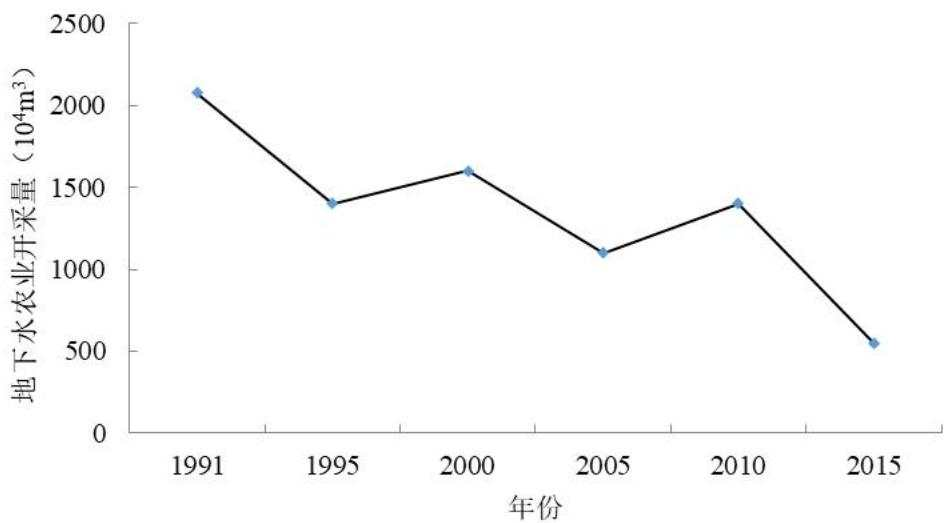  
图2-10 1991～2010年新密市地下水农业开采量变化图

1991～2015年，新密市工业用地下水开采量整体呈下降趋势（如图2-11），最近几年起伏波动比较大。多年来全市平均工业用地下水开采量为 $6 6 0 1 . 2 { \times } 1 0 ^ { 4 } \mathrm { m } ^ { 3 }$ ，占多年平均地下水开采总量的61.0%，其中1992年达到最大值 $9 6 6 0 . 1 { \times } 1 0 ^ { 4 } \mathrm { m } ^ { 3 }$ ，2005年达到最小值$4 7 5 3 . 1 { \times } 1 0 ^ { 4 } \mathrm { m } ^ { 3 }$ ，差值为 $4 9 0 7 . 0 { \times } 1 0 ^ { 4 } \mathrm { m } ^ { 3 }$ 。最近几年中，全市工业用地下水开采量一直呈上升趋势，在2009年时达到近5年中的最大值 $7 5 9 9 . 8 { \times } 1 0 ^ { 4 } \mathrm { m } ^ { 3 }$ ，但在2015年时有所减少。

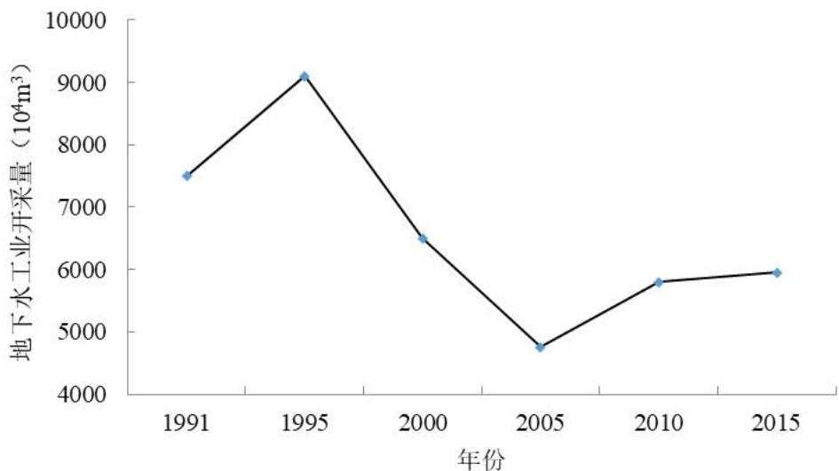  
图2-11 1991～2010 年新密市地下水工业开采量变化图

1991～2015年，新密市生活用地下水开采量整体基本不变（如图2-12），在某些年份，起伏波动较大。多年来全市平均生活用地下水开采量为 $3 0 1 6 . 1 { \times } 1 0 ^ { 4 } \mathrm { m } ^ { 3 }$ ，占多年平均地下水开采总量的27.2%，其中2000年达到最大值 $2 6 4 0 . 7 { \times } 1 0 ^ { 4 } \mathrm { m } ^ { 3 }$ ，1992年达到最小值$1 5 0 5 . 4 \times 1 0 ^ { 4 } \mathrm { m } ^ { 3 }$ ，差值为 $1 1 3 5 . 3 { \times } 1 0 ^ { 4 } \mathrm { m } ^ { 3 }$ 0

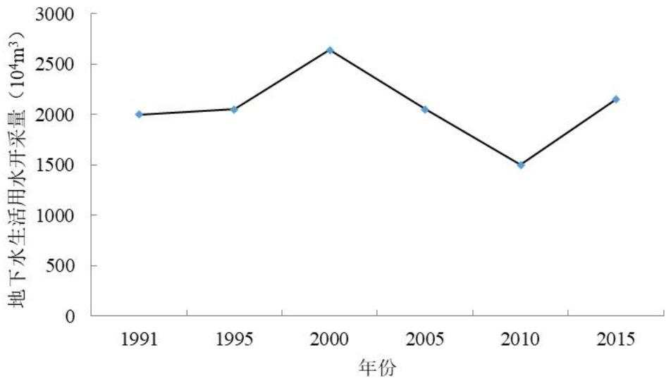  
图2-12 1991～2015年新密市生活用地下水量变化图

新密市1991～2015年地下水开采总量除2005～2013年稍有上升趋势外，整体呈下降趋势，变化幅度比较平缓（如图2-13)。多年平均地下水开采量为 $1 0 2 3 6 . 3 { \times } 1 0 ^ { 4 } \mathrm { m } ^ { 3 }$ ，其中1994年开采量达到最大值，为 $1 3 2 2 2 . 7 { \times } 1 0 ^ { 4 } \mathrm { m } ^ { 3 }$ ，2005年开采量最小，为 $7 7 9 6 . 1 \times 1 0 ^ { 4 } \mathrm { { m } ^ { 3 } \mathrm { { [ 1 2 ] } } }$

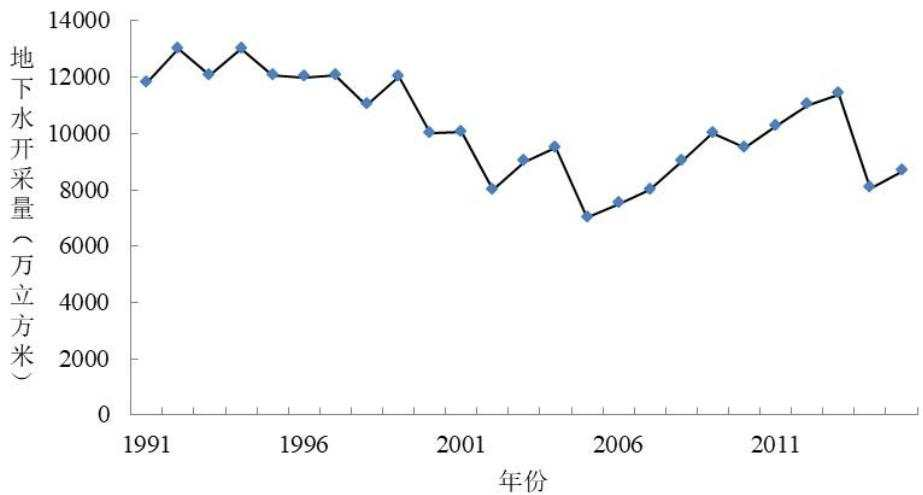  
图2-13 1991～2015年新密市地下水总开采量变化图

## (2) 现状年特征

2015年新密市地下水总开采量为 $8 6 5 7 { \times } 1 0 ^ { 4 } \mathrm { m } ^ { 3 }$ ，其中农业、工业及生活用水开采量分别为 $5 5 2 . 5 { \times } 1 0 ^ { 4 } \mathrm { m } ^ { 3 }$ $5 9 5 4 . 7 { \times } 1 0 ^ { 4 } \mathrm { m } ^ { 3 }$ 1 $2 1 4 9 . 8 { \times } 1 0 ^ { 4 } \mathrm { m } ^ { 3 }$ ，所占开采总量比例分别为6.4%、68.8%、24.8%。从以上数据分析，全市在农业、工业、生活用地下水开采量中工业开采量所占比重最大，生活用水开采量次之，农业开采量所占比重最小。

## 2.5.4 地下水动态特征

## (1）多年动态特征

受自然及人为多种因素的影响，不同含水层组的水位动态特征亦有不同的反映。新密市地下水动态主要可分为两种类型，一类为第三、第四系为主的地下水，另一类为古生界各含水层基岩地下水。

第三、第四系为主的地下水因其埋藏浅，与地表水体存在着密切的水力联系，加之开采量较小，多年降雨补给量与人工开采量之间处于相对平衡状态，地下水水位长期较为稳定，其动态为水文—开采型。

该类地下水主要分布在曲梁—大隗一带，该区域碳酸盐岩顶埋深达500m以上，岩溶发育极弱，处于滞流状态，浅层第三、第四系泥灰岩，砂砾石含水层富水性及补给条件较好。刘寨水竹园及大隗大侯庄、河屯1989～2006年观测井数据显示，刘寨、大隗镇的地下水位变化平稳，变幅均在6m之内。由于曲梁老户王观测井数据较全，因此以曲梁老户王为代表对该区域进行地下水位变化分析。

如图2-14，1989～2015年曲梁老户王4号观测井多年平均地下水位为159.33m。1989\~2006年该观测井地下水位升降变化不大，都在158.81～163.05m范围内；2006～

2015年这五年内地下水位变幅较大，差值达16.81m。2010年后由161m后有小幅下降，2015年降至157.06m。由于2007年、2008年降雨量与2006年相比分别减少了22.7%、23.6%，而地下水开采量与2006年相比分别增加了11.9%、25.8%，故2008年地下水位降到最低值144.01m；2015年降雨量为656mm，同时地下水开采量大大减少，因此地下水水位又上升至160.72m；1995年年降雨量与1994年、1996年相比差值较大，但是由于该年7月份降雨突然增加，导致地下水位急剧上升，这也正说明了该区域降雨补给较好。

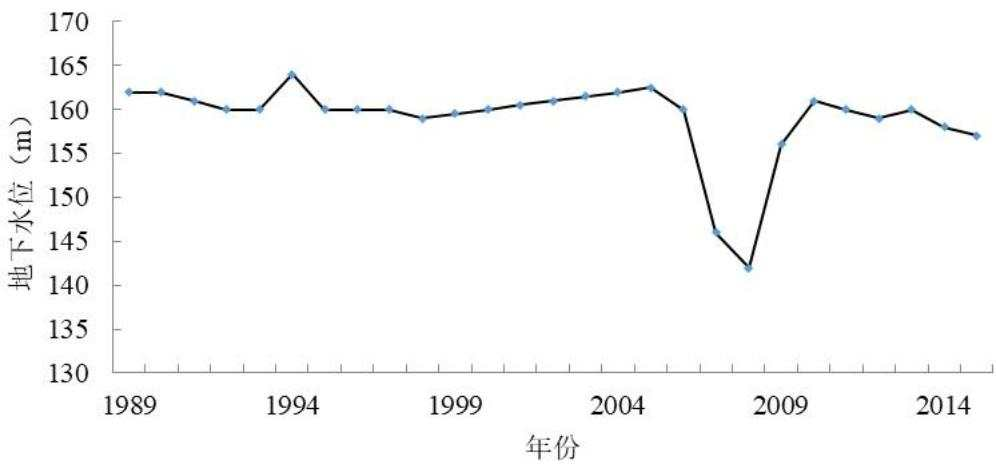  
图 2-14 1989\~2015年曲梁老户王地下水位变化图

古生界各含水层基岩地下水，其水位动态为开采型。由于岩溶地下水开采量长期大于补给量，即地下水长期处于疏干过程中，地下水位呈持续下降趋势，大气降水周期性补给作用亦不甚明显。

该类地下水主要分布在平陌-超化-苟堂一带及米村-岳村一带，该区域以岩溶水含水层为主，丘陵山区为主要的补给区，补给条件差，且地下水开采集中，因此形成大片降落漏斗区。平陌、超化、岳村近年来地下水位急剧下降，2005～2015年平陌一组地下水位由169.24m降至152.94m，2007-2015年超化杏树岗地下水位由113.87m降至80.60m，2006～2015年岳村镇政府地下水位由114.59m降至72.00m。岩溶水开采主要集中在苟堂西北部，中心水位降至60m以下，为区域岩溶水最低水位点。下面以城关屈咀为代表对该区域进行地下水位变化分析。

如图2-15，1996～2015年城关屈咀42号观测井多年平均地下水位为144.70m，1996～2010年整体呈下降趋势，2010年后开始小幅上升，2014年开始下降。2002至2004年，地下水位升降出现波动主要是由于地下水开采量与以前相比明显减少，且降雨有所增加，因此地下水位有所上升。总体看来，岩溶地下水开采量长期大于补给量，地下水长期处于疏干过程中，地下水位呈持续下降趋势，降雨补给作用短期对水位变化影响不大，地下水开采量是地下水位变化的主要原因。

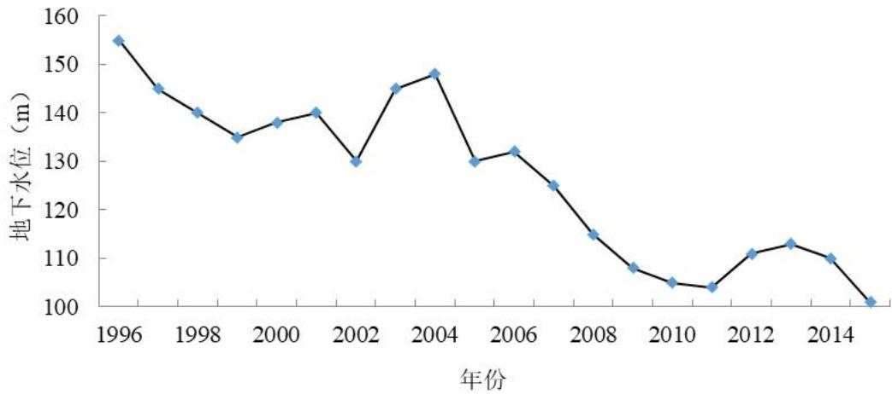  
图 2-15 1996～2015 年城关屈咀地下水位变化图

## (2) 年内动态特征

地下水水位埋深集中体现了地下水埋藏条件，也反映了地下水开采状况。2015年新密市地下水位埋深范围为30m至200m，其中曲梁一带地下水位埋深小于40m，平陌一带地下水位埋深在90m以下，超化以南地下水位埋深在80～180m，城关、岳村、牛店一带地下水位埋深大于150m，接近200m。从整体上看，全市地下水位埋深呈现自南向北、自东向西逐渐增大的趋势。

与2014年相比，2015年岳村、曲梁地下水水位动态变化分别增加了3.14m、1.38m；而城关、牛店、平陌、苟堂、超化地下水水位埋深分别减少了6.51m、5.09m、0.55m、4.44m、9.39m。2015年年降雨量较2014年增加了12.8%，地下水开采量增加了7.5%，因此补给条件较好的城关、牛店、平陌、苟堂、超化一带地下水埋深减少，地下水水位有所上升；而岳村、曲梁等局部开采漏斗区，降雨补给条件差，地下水开采量长期大于补给量，导致水位有所下降。

## 2.5.5 水量均衡法及原理

水量均衡法是研究计算区（均衡区）在一定时间段（均衡期）内地下水补给量、储存量之间数量转化关系的方法。通过均衡法计算，可以得到地下水允许开采量。

一个均衡区内的含水层系统，在任一时间段(△t)内的补给量与排泄量之差等于含水

层系统中体积的变化量，即

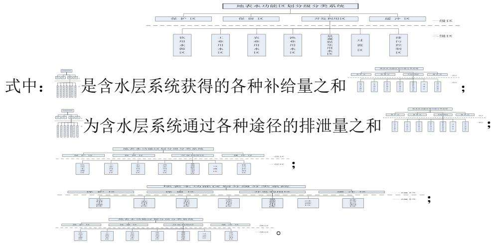

(2-1)

## 2.5.6 均衡区水文地质概念模型

根据上述水文地质条件，采用均衡法进行地下水资源计算。

## （1）计算区范围

含水层分布的范围就是计算区的范围，总面积为942.2km²，见图2-19。

## (2) 计算目的层

计算目的层包括参与计算的含水层及弱透水层。

## ①含水层

a）寒武系西部朱砂洞碳酸盐岩含水岩组：岩性主要为厚层豹皮状白云质灰岩与白云岩，岩溶发育好，富水性较好。本组仅分布在北部山区分水岭地带，零星分布，与新密市中部盆地地区地下水没有直接水力联系。

b）寒武系中上部及奥陶系碳酸盐岩含水岩组，含徐庄组至马家沟组：含水层主要岩性为中厚层状白云岩、白云质灰岩及燧石灰岩、薄层泥质灰岩等。岩组上部奥陶系马家沟组及寒武系凤山组厚180m左右，岩溶裂隙发育好，地下水较丰富；下部各组岩溶发育弱，富水性差。

c）石炭系上部碳酸盐岩组，包括太原组和山西组：主要含水介质为灰岩、燧石灰岩，其间的砂岩、页岩层含水量较少或不含水。

d）第三系、第四系灰岩、砂砾石含水岩组：主要分布于市区东部。第三系为泥灰岩、粘土岩及砂砾岩；第四系上部为亚砂土、亚粘土，下部为砂砾石。该含水岩组上部的砂砾石层与下部的泥灰岩、砂砾岩间没有较稳定的弱透水岩层相隔，同时，现有生产井又多为混合开采，使上下含水层有统一的水力联系。

②弱透水层

上述主要含水层组间，均存在弱透水层：

a）寒武系中下部泥岩弱透水岩段：有馒头组及毛庄组组成，岩性主要为砂质泥岩、页岩夹砂岩及灰岩、泥灰条带灰岩组成，厚度稳定，形成区域弱透水层。

b）石炭系下部铝土质泥岩弱透水岩段：为本溪组，岩性主要为铝土页岩、粘土岩夹铁铝矿层，隔水性能好，但厚度不稳定。通常情况下，上下含水层之间无统一的水力联系，但在断裂部位，上下含水层有统一的水力联系。

c）二叠系下部页岩弱透水岩段：二叠系下部上下石盒子组，主要为页岩、砂质页岩，厚度达500m以上，透水性极差。

## （3）边界条件

## ①水平边界

北部：荥密背斜轴部基本与地形分水岭一致，将其视为北部边界。背斜轴部为元古界及古生界下部地层，视为隔水边界；分水岭以北的新密辖区，为另一个地下水系统，地下水流向新密市境外，本次工作暂不做评价（面积约为58km²）。

西部北段及中段与登封市之间：地形较高，为一个分水岭，界线大致垂直地层走向，分布地层主要为元古界变质岩及古生界泥岩，为弱透水层。地下水主要赋存在上部风化裂隙带，深部裂隙发育较弱，视为零流量边界。

西部南段，平陌与登封的大冶间：为碳酸盐岩分布，分水岭偏向登封境内，为补给边界。

南部与禹州间，以箕山山脉为界：构造上为箕山复背斜的东段，背斜轴部与地形分水岭大致一致，分布地层为元古界变质岩，透水性弱，为隔水边界。

东部：为岩溶地下水的排泄区。由于岩溶水含水层向东无限延伸，水力坡度逐渐变小，渐处于滞流状态。为了便于计算，仅计算白寨东北部的排泄量，为排泄边界。

东北部，白寨镇的北部以北：为嵩山北斜的倾末端，背斜北翼的岩溶水向东流入区内，其西区为补给边界。

东部曲梁、大隗：为第三系、第四系分布区，砂砾石及泥灰岩为主要含水层。从地下水流向分析，北部、东部为隔水边界，东南部为排泄边界。

## ②垂向边界

计算区顶部以潜水面为界，通过该边界，浅层地下水与外部环境发生水量交换，如地下水接受大气降水的入渗补给、潜水蒸发排泄、地表水体补给等。计算区底部为隔水边界。

## 2.5.7 水量均衡计算数学模型

根据上述水文地质概念模型和水均衡原理，新密市地下水系统水均衡方程如下：

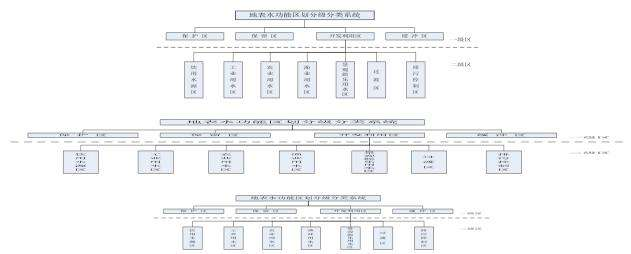

(2-2)

(2-3)

(2-4)

式中：

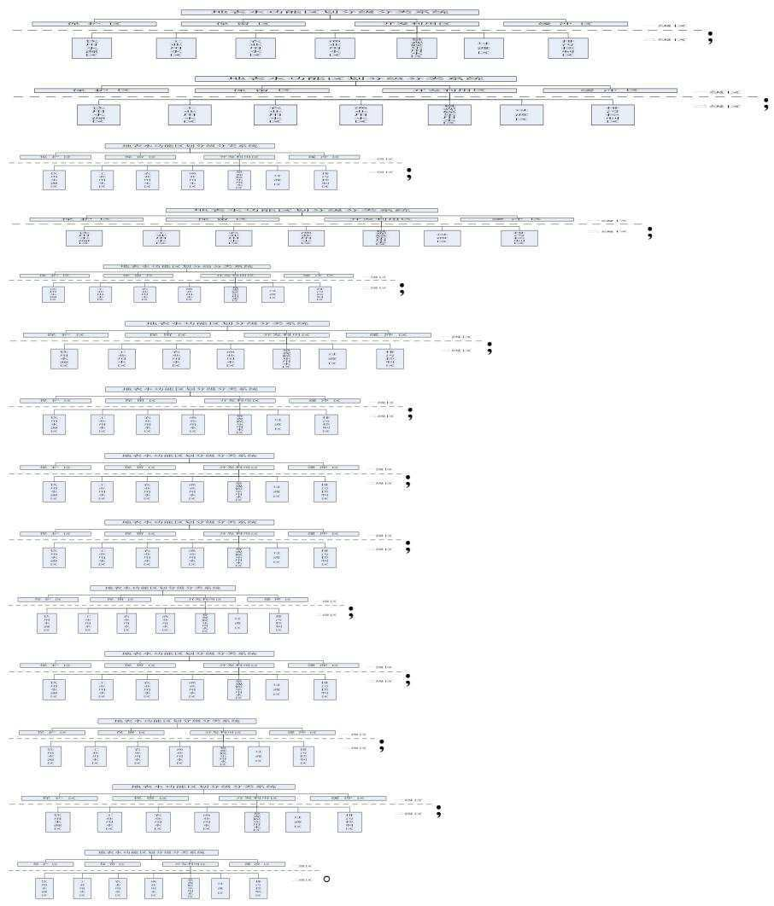

## 2.5.8 地下水资源计算

## （1） 均衡区划分

均衡区的划分主要是按水文地质单元或地下水系统来划分的。新密市境内西北方向的大隗断层为一隔水断层。已有研究认为断层两侧岩溶水无水力联系，形成南北两个相对独立的岩溶地下水系统，作为两个地下水资源计算均衡区，断层以北为Ⅰ区，以南为Ⅱ区。根据城镇及工矿区供水排水现状划分，将各主要开采区及其附近补给区作为一个计算段，大隗断层以北的I区划分为三个亚区（Ⅰ1、Ⅰ₂和Ⅰ₃），以南的Ⅱ区划分为两个均衡计算亚区（Ⅱ₁和Ⅱ₂）。

东部曲梁、大隗一带，为碳酸盐岩深埋区。奥陶系碳酸盐岩顶部埋藏深度大于500m，岩溶水水力坡度小，地下水处于近滞流状态，岩溶裂隙不发育，富水性很弱；上部的第三、第四系含水层为主要含水层，形成一个独立的地下水系统，将其作为一个计算均衡区。

各均衡计算区及亚区分布与概况见图2-16和表2-16。

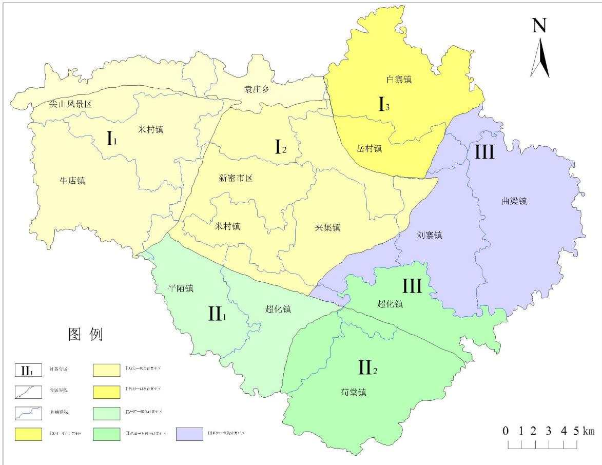  
图2-16 地下水资源计算均衡分区图

表2-16 新密市地下水资源计算均衡分布表[2]
<table><tr><td colspan="2" rowspan="1">计算区分区</td><td colspan="1" rowspan="2">面积(km²)</td><td colspan="1" rowspan="2">基本情况</td></tr><tr><td colspan="1" rowspan="1">区</td><td colspan="1" rowspan="1">亚区</td></tr><tr><td colspan="1" rowspan="2">米村1岳村(I)</td><td colspan="1" rowspan="1">米村—牛店(I1)</td><td colspan="1" rowspan="1">163.5</td><td colspan="1" rowspan="1">盆地地形区：岩溶含水层主要分布在盆地区；周边山区主要为变质岩、碎屑岩分布，为补给区。地下水排泄主要通过王庄、米村煤矿排水及其他供水井开采，现已经形成漏斗。</td></tr><tr><td colspan="1" rowspan="1">城关—来集(I2)</td><td colspan="1" rowspan="1">193.0</td><td colspan="1" rowspan="1">北部山区：碳酸盐岩裸露，是地下水的主要补给区；南部丘陵岗地区：是地下水的主要开采区。城市供水、电厂供水及煤矿排水等，大量开采地下水，老城至来集一带已经形成面积较大的水位降落漏斗。</td></tr><tr><td colspan="1" rowspan="1"></td><td colspan="1" rowspan="1">岳村—白寨(I3)</td><td colspan="1" rowspan="1">119.5</td><td colspan="1" rowspan="1">位于嵩山山脉东段，西部为善妒，东部为丘陵岗地。山区大部分为碳酸盐岩裸露，成为地下水补给区。地下水排泄主要为卢沟煤矿排水，其他供水开采较分散，已形成局部漏斗。</td></tr><tr><td colspan="1" rowspan="2">平陌1苟堂(I)</td><td colspan="1" rowspan="1">平陌—超化(II1)</td><td colspan="1" rowspan="1">107.7</td><td colspan="1" rowspan="1">岩溶含水层主要分布在北部的平陌-超化一带，是南部山区地下水补给区。地下水开采集中在超化一带，申沟煤矿排水所占比例较大，在20世纪90年代后期已经形成水位降落漏斗。</td></tr><tr><td colspan="1" rowspan="1">苟堂—灰徐沟(II2)</td><td colspan="1" rowspan="1">116.0</td><td colspan="1" rowspan="1">为丘陵山区，岩溶水分布面积小，补给条件差。岩溶水开采主要集中在苟堂西北部，形成降落漏斗，为均衡区岩溶水最低水位点。</td></tr><tr><td colspan="1" rowspan="1">曲梁1大隗(III)</td><td colspan="1" rowspan="1">曲梁—大隗(III)</td><td colspan="1" rowspan="1">242.5</td><td colspan="1" rowspan="1">为浅层第三、第四细泥灰岩，砂砾石含水层富水性及补给条件较好，是农田灌溉开发地下水的主要地段。</td></tr></table>

## (2) 计算参数确定

## ①降水入渗补给系数(α)

降水入渗补给系数α是降水渗入量与降水总量的比值。α值的大小取决于地表土层的岩性和土层结构、地形坡度、植被覆盖情况、降水量的大小和降水形式等，一般情况下地表土层的岩性对α值的影响最显著。本次地下水资源计算，α值的大小主要根据已有研究成果进行确定。

## a）碳酸盐岩分布区

《河南省密县地区裂隙—岩溶水资源评价方法研究报告》（1987）中碳酸盐岩裸露区入渗系数取0.30，半裸露区取0.21～0.28；《密县电厂水源地供水勘察报告》（1984）中碳酸盐岩裸露区及覆盖区入渗系数取0.4；《河南省嵩箕区水文地质测绘报告》（1984）中碳酸盐岩区入渗系数为0.3；《河南省新密市区域水文地质调查报告》（1998）中碳酸盐岩裸露区取0.30，半裸露区取0.26；陕西渭北东部部分碳酸盐岩裸露区降水入渗系数为0.37。本次评价依照《河南省新密市区域水文地质调查报告》（1998）中的取值。

## b）碎屑岩分布区

根据《河南省新密市区域水文地质调查报告》（1998)，确定碎屑岩分布区大气降水入渗系数为0.08。

## c）变质岩分布区

根据《河南省新密市区域水文地质调查报告》（1998)，确定碎屑岩分布区大气降水入渗系数为0.11。

## d）第四系松散岩分布区

根据《河南省新密市区域水文地质调查报告》（1998)，确定双洎河河谷地带取0.20，

曲梁一带取0.16。

## ②含水层储水系数

给水度：对于碳酸盐岩发育区潜水含水层区，根据《河南省新密市区域水文地质调查报告》（1998），确定岩溶水潜水区的给水度为0.05；第四系松散岩类潜水含水层区的给水度确定为0.1。

承压水区的弹性释水系数：大隗断层以南，根据《密县电厂水源地供水勘察报告》（1984）取为 $6 . 8 1 \times 1 0 ^ { - 5 }$ ；大隗断层以北，根据《河南省密县地区裂隙—岩溶水资源评价方法研究报告》（1987）取为 $6 . 6 \times 1 0 ^ { - 5 }$ O

## ③灌溉入渗补给系数

灌溉入渗补给系数包括渠系渗漏补给系数m、田间灌溉入渗系数β以及井灌回归系数 $\lvert \beta _ { \# }$ o

a）境内除袁庄乡、白寨镇和市区外，其他均有引地表水进行灌溉，渠系渗漏补给系数采用经验数值法，见表2-17。根据新密市实际特点，本次评价取0.145。

b）田间灌溉入渗补给系数是指某一时段田间灌溉入渗补给量与灌溉水量的比值。田间灌溉入渗补给系数主要的影响因素是岩性、地下水水位埋深和灌溉定额，见表2-18。本次评价据实取值，田间灌溉入渗补给系数为0.15。

## c）井灌回归系数

在抽取当地地下水灌溉的井灌区，灌溉水的一部分下渗返回补给地下水，这种现象称为地下水灌溉回归。井灌回归系数 $\scriptstyle  \{ \beta _ { \# }$ 是指灌溉水回归量与灌溉水量的比值，一般取值范围为0.1～0.3。结合实际，本次评价取井灌回归系数为0.15。

## ④渗透系数（K）、导水系数（T）

已有研究是通过抽水试验确定渗透系数和导水系数。《河南省新密市区域水文地质调查报告》（1998）抽水试验成果见表2-19。

表 2-17 渠系渗漏补给系数 m 值表
<table><tr><td rowspan=1 colspan=1>衬砌情况</td><td rowspan=1 colspan=1>渠床下岩性</td><td rowspan=1 colspan=1>地下水埋深（m）</td><td rowspan=1 colspan=1>渠系渗漏补给系数</td></tr><tr><td rowspan=3 colspan=1>未衬砌</td><td rowspan=1 colspan=1>亚粘土</td><td rowspan=1 colspan=1>&lt;4</td><td rowspan=1 colspan=1>0.144</td></tr><tr><td rowspan=1 colspan=1>亚砂土</td><td rowspan=1 colspan=1>&lt;4</td><td rowspan=1 colspan=1>0.18~0.3</td></tr><tr><td rowspan=1 colspan=1>亚粘土、亚砂土</td><td rowspan=1 colspan=1>&lt;4</td><td rowspan=1 colspan=1>0.14~0.3</td></tr><tr><td rowspan=4 colspan=1>部分衬砌</td><td rowspan=2 colspan=1>亚粘土</td><td rowspan=1 colspan=1>&lt;4</td><td rowspan=1 colspan=1>0.09~0.14</td></tr><tr><td rowspan=1 colspan=1>&gt;4</td><td rowspan=1 colspan=1>0.09~0.135</td></tr><tr><td rowspan=2 colspan=1>亚砂土</td><td rowspan=1 colspan=1>&lt;4</td><td rowspan=1 colspan=1>0.12~0.17</td></tr><tr><td rowspan=1 colspan=1>&gt;4</td><td rowspan=1 colspan=1>0.10~0.17</td></tr><tr><td rowspan=3 colspan=1>衬砌</td><td rowspan=1 colspan=1>亚粘土</td><td rowspan=1 colspan=1>&lt;4</td><td rowspan=1 colspan=1>0.09~0.17</td></tr><tr><td rowspan=1 colspan=1>亚砂土</td><td rowspan=1 colspan=1>&lt;4</td><td rowspan=1 colspan=1>0.04~0.112</td></tr><tr><td rowspan=1 colspan=1>亚粘土、亚砂土</td><td rowspan=1 colspan=1>&lt;4</td><td rowspan=1 colspan=1>0.10~0.16</td></tr></table>

表2-18 田间灌溉入渗补给系数β值表
<table><tr><td rowspan=2 colspan=1>地下水埋深(m)</td><td rowspan=2 colspan=1>灌水定额(m³/亩)</td><td rowspan=1 colspan=3>岩性</td></tr><tr><td rowspan=1 colspan=1>亚粘土</td><td rowspan=1 colspan=1>亚砂土</td><td rowspan=1 colspan=1>粉细砂</td></tr><tr><td rowspan=3 colspan=1>&lt;4</td><td rowspan=1 colspan=1>40~70</td><td rowspan=1 colspan=1>0.10~0.17</td><td rowspan=1 colspan=1>0.10~0.20</td><td rowspan=1 colspan=1></td></tr><tr><td rowspan=1 colspan=1>70~100</td><td rowspan=1 colspan=1>0.10~0.20</td><td rowspan=1 colspan=1>0.15~0.25</td><td rowspan=1 colspan=1>0.20~0.35</td></tr><tr><td rowspan=1 colspan=1>&gt;100</td><td rowspan=1 colspan=1>0.10~0.25</td><td rowspan=1 colspan=1>0.20~0.30</td><td rowspan=1 colspan=1>0.25~0.40</td></tr><tr><td rowspan=3 colspan=1>4~8</td><td rowspan=1 colspan=1>40~70</td><td rowspan=1 colspan=1>0.05~0.10</td><td rowspan=1 colspan=1>0.05~0.15</td><td rowspan=1 colspan=1></td></tr><tr><td rowspan=1 colspan=1>70~100</td><td rowspan=1 colspan=1>0.05~0.15</td><td rowspan=1 colspan=1>0.05~0.20</td><td rowspan=1 colspan=1>0.05~0.25</td></tr><tr><td rowspan=1 colspan=1>&gt;100</td><td rowspan=1 colspan=1>0.10~0.20</td><td rowspan=1 colspan=1>0.10~0.25</td><td rowspan=1 colspan=1>0.10~0.30</td></tr><tr><td rowspan=3 colspan=1>&gt;8</td><td rowspan=1 colspan=1>40~70</td><td rowspan=1 colspan=1>0.05</td><td rowspan=1 colspan=1>0.05</td><td rowspan=1 colspan=1>0.05~0.10</td></tr><tr><td rowspan=1 colspan=1>70~100</td><td rowspan=1 colspan=1>0.05~0.10</td><td rowspan=1 colspan=1>0.05~0.10</td><td rowspan=1 colspan=1>0.05~0.20</td></tr><tr><td rowspan=1 colspan=1>&gt;100</td><td rowspan=1 colspan=1>0.05~0.15</td><td rowspan=1 colspan=1>0.10~0.20</td><td rowspan=1 colspan=1>0.05~0.20</td></tr></table>

表 2-19 机井抽水试验参数表
<table><tr><td rowspan=1 colspan=1>井位</td><td rowspan=1 colspan=1>渗透系数(m/d)</td><td rowspan=1 colspan=1>导水系数(m²/d)</td><td rowspan=1 colspan=1>井位</td><td rowspan=1 colspan=1>渗透系数(m/d)</td><td rowspan=1 colspan=1>导水系数(m²/d)</td></tr><tr><td rowspan=1 colspan=1>米村电信局</td><td rowspan=1 colspan=1>7.408</td><td rowspan=1 colspan=1></td><td rowspan=1 colspan=1>裴沟供水井</td><td rowspan=1 colspan=1>4.575</td><td rowspan=1 colspan=1></td></tr><tr><td rowspan=1 colspan=1>小位楼</td><td rowspan=1 colspan=1>25.6</td><td rowspan=1 colspan=1></td><td rowspan=1 colspan=1>老城供水井</td><td rowspan=1 colspan=1>8.38</td><td rowspan=1 colspan=1></td></tr><tr><td rowspan=1 colspan=1>刘楼</td><td rowspan=1 colspan=1>13.7</td><td rowspan=1 colspan=1></td><td rowspan=1 colspan=1>平陌一组</td><td rowspan=1 colspan=1>67.40</td><td rowspan=1 colspan=1></td></tr><tr><td rowspan=1 colspan=1>东瓦店</td><td rowspan=1 colspan=1>4.0</td><td rowspan=1 colspan=1></td><td rowspan=1 colspan=1>宋楼七组</td><td rowspan=1 colspan=1>6.42</td><td rowspan=1 colspan=1>231.28</td></tr><tr><td rowspan=1 colspan=1>岳岗深井</td><td rowspan=1 colspan=1>2.35</td><td rowspan=1 colspan=1></td><td rowspan=1 colspan=1>楚岭127孔</td><td rowspan=1 colspan=1></td><td rowspan=1 colspan=1>154.31</td></tr></table>

## （3）地下水补给资源计算

①降水入渗补给量

大气降水入渗补给地下水的水量用下式确定：

(2-5)

式中：Q为降水入渗补给地下水量 $\mathrm { ( m } ^ { 3 } / \mathrm { a } )$

X为年降水量（mm);

α为入渗系数；

F为补给区面积 $( \mathrm { k m } ^ { 2 } )$

根据各均衡区及亚区大气降水入渗系数和多年平均降水量、各降水保证率降水量和2015年现状年降水量分别计算大气降水入渗补给量，结果见表2-20。

②灌溉回渗补给量

灌溉回渗补给量包括渠系渗漏补给量、渠灌田间渗漏补给量和井灌回归补给量。

a) 渠系渗漏补给量

渠系渗漏补给量采用系数法计算：

(2-6)

式中： $\mathcal { Q } _ { \mathit { \Pi } _ { \overline { { \Pi } } } }$ 为渠首引水量；

$\mathcal { Q } _ { \sharp \sharp }$ 为渠系渗漏补给地下水的水量；

m为渠系渗漏补给系数。

计算结果见表2-21。

b)渠灌田间灌溉入渗补给量

渠灌田间灌溉入渗补给量采用系数法计算：

表2-20 典型频率年新密市大气降水入渗补给量计算结果表（单位：104m3/a）
<table><tr><td rowspan=2 colspan=1>均衡区</td><td rowspan=2 colspan=1>均衡亚区</td><td rowspan=2 colspan=2>含水层类型</td><td rowspan=2 colspan=1>面积（km²）</td><td rowspan=2 colspan=1>入渗系数</td><td rowspan=1 colspan=1>20%频率年</td><td rowspan=1 colspan=1>50%频率年</td><td rowspan=1 colspan=1>75%频率年</td><td rowspan=1 colspan=1>95%频率年</td><td rowspan=1 colspan=1>多年平均年份</td></tr><tr><td rowspan=1 colspan=1>入渗量</td><td rowspan=1 colspan=1>入渗量</td><td rowspan=1 colspan=1>入渗量</td><td rowspan=1 colspan=1>入渗量</td><td rowspan=1 colspan=1>入渗量</td></tr><tr><td rowspan=12 colspan=1>I</td><td rowspan=5 colspan=1>I1</td><td rowspan=2 colspan=1>碳酸盐岩类</td><td rowspan=1 colspan=1>裸露</td><td rowspan=1 colspan=1>14.9</td><td rowspan=1 colspan=1>0.27</td><td rowspan=1 colspan=1>322.6</td><td rowspan=1 colspan=1>262.6</td><td rowspan=1 colspan=1>224.4</td><td rowspan=1 colspan=1>184.1</td><td rowspan=1 colspan=1>261.9</td></tr><tr><td rowspan=1 colspan=1>半裸露</td><td rowspan=1 colspan=1>8.5</td><td rowspan=1 colspan=1>0.23</td><td rowspan=1 colspan=1>159.5</td><td rowspan=1 colspan=1>129.9</td><td rowspan=1 colspan=1>111.0</td><td rowspan=1 colspan=1>91.1</td><td rowspan=1 colspan=1>129.5</td></tr><tr><td rowspan=1 colspan=2>碎屑岩类</td><td rowspan=1 colspan=1>99.1</td><td rowspan=1 colspan=1>0.07</td><td rowspan=1 colspan=1>572.1</td><td rowspan=1 colspan=1>465.8</td><td rowspan=1 colspan=1>397.9</td><td rowspan=1 colspan=1>326.5</td><td rowspan=1 colspan=1>464.5</td></tr><tr><td rowspan=1 colspan=2>变质岩类</td><td rowspan=1 colspan=1>41.0</td><td rowspan=1 colspan=1>0.10</td><td rowspan=1 colspan=1>325.5</td><td rowspan=1 colspan=1>265.0</td><td rowspan=1 colspan=1>226.3</td><td rowspan=1 colspan=1>185.7</td><td rowspan=1 colspan=1>264.2</td></tr><tr><td rowspan=1 colspan=2>小计</td><td rowspan=1 colspan=1>163.5</td><td rowspan=1 colspan=1></td><td rowspan=1 colspan=1>1379.7</td><td rowspan=1 colspan=1>1123.2</td><td rowspan=1 colspan=1>959.6</td><td rowspan=1 colspan=1>787.4</td><td rowspan=1 colspan=1>1120.1</td></tr><tr><td rowspan=4 colspan=1>I2</td><td rowspan=2 colspan=1>碳酸盐岩类</td><td rowspan=1 colspan=1>裸露</td><td rowspan=1 colspan=1>17.3</td><td rowspan=1 colspan=1>0.27</td><td rowspan=1 colspan=1>374.5</td><td rowspan=1 colspan=1>305.0</td><td rowspan=1 colspan=1>260.5</td><td rowspan=1 colspan=1>213.7</td><td rowspan=1 colspan=1>304.1</td></tr><tr><td rowspan=1 colspan=1>半裸露</td><td rowspan=1 colspan=1>93.1</td><td rowspan=1 colspan=1>0.23</td><td rowspan=1 colspan=1>1746.9</td><td rowspan=1 colspan=1>1422.0</td><td rowspan=1 colspan=1>1214.8</td><td rowspan=1 colspan=1>996.7</td><td rowspan=1 colspan=1>1418.2</td></tr><tr><td rowspan=1 colspan=2>碎屑岩类</td><td rowspan=1 colspan=1>82.6</td><td rowspan=1 colspan=1>0.07</td><td rowspan=1 colspan=1>476.9</td><td rowspan=1 colspan=1>388.3</td><td rowspan=1 colspan=1>331.7</td><td rowspan=1 colspan=1>272.1</td><td rowspan=1 colspan=1>387.2</td></tr><tr><td rowspan=1 colspan=2>小计</td><td rowspan=1 colspan=1>193.0</td><td rowspan=1 colspan=1></td><td rowspan=1 colspan=1>2598.3</td><td rowspan=1 colspan=1>2115.2</td><td rowspan=1 colspan=1>1807.0</td><td rowspan=1 colspan=1>1482.5</td><td rowspan=1 colspan=1>2109.5</td></tr><tr><td rowspan=3 colspan=1>I3</td><td rowspan=1 colspan=2>碳酸盐岩类</td><td rowspan=1 colspan=1>44.9</td><td rowspan=1 colspan=1>0.23</td><td rowspan=1 colspan=1>842.5</td><td rowspan=1 colspan=1>685.8</td><td rowspan=1 colspan=1>585.8</td><td rowspan=1 colspan=1>480.7</td><td rowspan=1 colspan=1>684.0</td></tr><tr><td rowspan=1 colspan=2>碎屑岩类</td><td rowspan=1 colspan=1>74.6</td><td rowspan=1 colspan=1>0.07</td><td rowspan=1 colspan=1>430.7</td><td rowspan=1 colspan=1>350.6</td><td rowspan=1 colspan=1>299.5</td><td rowspan=1 colspan=1>245.8</td><td rowspan=1 colspan=1>349.7</td></tr><tr><td rowspan=1 colspan=2>小计</td><td rowspan=1 colspan=1>119.5</td><td rowspan=1 colspan=1></td><td rowspan=1 colspan=1>1273.2</td><td rowspan=1 colspan=1>1036.4</td><td rowspan=1 colspan=1>885.3</td><td rowspan=1 colspan=1>726.5</td><td rowspan=1 colspan=1>1033.6</td></tr><tr><td rowspan=8 colspan=1>Ⅱ</td><td rowspan=4 colspan=1>I1</td><td rowspan=1 colspan=2>碳酸盐岩类</td><td rowspan=1 colspan=1>27.1</td><td rowspan=1 colspan=1>0.27</td><td rowspan=1 colspan=1>586.7</td><td rowspan=1 colspan=1>477.6</td><td rowspan=1 colspan=1>408.1</td><td rowspan=1 colspan=1>334.9</td><td rowspan=1 colspan=1>476.3</td></tr><tr><td rowspan=1 colspan=2>碎屑岩类</td><td rowspan=1 colspan=1>56.1</td><td rowspan=1 colspan=1>0.07</td><td rowspan=1 colspan=1>323.8</td><td rowspan=1 colspan=1>263.6</td><td rowspan=1 colspan=1>225.2</td><td rowspan=1 colspan=1>184.8</td><td rowspan=1 colspan=1>263.0</td></tr><tr><td rowspan=1 colspan=2>变质岩类</td><td rowspan=1 colspan=1>24.5</td><td rowspan=1 colspan=1>0.10</td><td rowspan=1 colspan=1>194.6</td><td rowspan=1 colspan=1>158.5</td><td rowspan=1 colspan=1>135.3</td><td rowspan=1 colspan=1>111.0</td><td rowspan=1 colspan=1>157.9</td></tr><tr><td rowspan=1 colspan=2>小计</td><td rowspan=1 colspan=1>107.7</td><td rowspan=1 colspan=1></td><td rowspan=1 colspan=1>1105.1</td><td rowspan=1 colspan=1>899.7</td><td rowspan=1 colspan=1>768.7</td><td rowspan=1 colspan=1>630.7</td><td rowspan=1 colspan=1>897.2</td></tr><tr><td rowspan=4 colspan=1>II2</td><td rowspan=1 colspan=2>碳酸盐岩类</td><td rowspan=1 colspan=1>12.1</td><td rowspan=1 colspan=1>0.23</td><td rowspan=1 colspan=1>227.0</td><td rowspan=1 colspan=1>184.8</td><td rowspan=1 colspan=1>157.9</td><td rowspan=1 colspan=1>129.6</td><td rowspan=1 colspan=1>184.3</td></tr><tr><td rowspan=1 colspan=2>碎屑岩类</td><td rowspan=1 colspan=1>43.8</td><td rowspan=1 colspan=1>0.07</td><td rowspan=1 colspan=1>252.9</td><td rowspan=1 colspan=1>205.8</td><td rowspan=1 colspan=1>175.8</td><td rowspan=1 colspan=1>144.2</td><td rowspan=1 colspan=1>205.3</td></tr><tr><td rowspan=1 colspan=2>变质岩类</td><td rowspan=1 colspan=1>60.1</td><td rowspan=1 colspan=1>0.10</td><td rowspan=1 colspan=1>477.1</td><td rowspan=1 colspan=1>388.3</td><td rowspan=1 colspan=1>331.8</td><td rowspan=1 colspan=1>272.2</td><td rowspan=1 colspan=1>387.3</td></tr><tr><td rowspan=1 colspan=2>小计</td><td rowspan=1 colspan=1>116.0</td><td rowspan=1 colspan=1></td><td rowspan=1 colspan=1>957.0</td><td rowspan=1 colspan=1>778.9</td><td rowspan=1 colspan=1>665.5</td><td rowspan=1 colspan=1>777.0</td><td rowspan=1 colspan=1>777.0</td></tr><tr><td rowspan=4 colspan=1>Ⅲ</td><td rowspan=1 colspan=3>碎屑岩类</td><td rowspan=1 colspan=1>57.1</td><td rowspan=1 colspan=1>0.07</td><td rowspan=1 colspan=1>329.6</td><td rowspan=1 colspan=1>268.4</td><td rowspan=1 colspan=1>229.2</td><td rowspan=1 colspan=1>188.1</td><td rowspan=1 colspan=1>267.6</td></tr><tr><td rowspan=2 colspan=2>松散岩类</td><td rowspan=1 colspan=1>亚砂土、亚粘土</td><td rowspan=1 colspan=1>15.0</td><td rowspan=1 colspan=1>0.18</td><td rowspan=1 colspan=1>216.4</td><td rowspan=1 colspan=1>176.1</td><td rowspan=1 colspan=1>150.6</td><td rowspan=1 colspan=1>123.5</td><td rowspan=1 colspan=1>175.8</td></tr><tr><td rowspan=1 colspan=1>亚粘土、亚粘土</td><td rowspan=1 colspan=1>170.4</td><td rowspan=1 colspan=1>0.14</td><td rowspan=1 colspan=1>1967.6</td><td rowspan=1 colspan=1>1601.7</td><td rowspan=1 colspan=1>1368.3</td><td rowspan=1 colspan=1>1122.6</td><td rowspan=1 colspan=1>1597.4</td></tr><tr><td rowspan=1 colspan=3>小计</td><td rowspan=1 colspan=1>242.5</td><td rowspan=1 colspan=1></td><td rowspan=1 colspan=1>2513.7</td><td rowspan=1 colspan=1>2046.2</td><td rowspan=1 colspan=1>1748.0</td><td rowspan=1 colspan=1>2040.8</td><td rowspan=1 colspan=1>2040.8</td></tr><tr><td rowspan=1 colspan=4>合计</td><td rowspan=1 colspan=1>942.2</td><td rowspan=1 colspan=1></td><td rowspan=1 colspan=1>9827.0</td><td rowspan=1 colspan=1>7999.6</td><td rowspan=1 colspan=1>6834.1</td><td rowspan=1 colspan=1>5607.2</td><td rowspan=1 colspan=1>7978.2</td></tr></table>

式中： $\mathcal { Q } _ { \# \# }$ 为渠灌田间入渗补给量；

$\beta \mathrm { \dot { \varepsilon } }$ 为田间灌溉入渗补给系数；

$\mathcal { Q } _ { \sharp \sharp }$ 为渠灌水进入斗渠渠首水量；

$\boldsymbol { \mathcal { Q } } _ { \mathrm { \scriptsize ~ \ddag \perp } }$ 为渠系输水过程中的损失量，包括水面蒸发损失、湿润渠底、两侧土层的水量损失及退水填底损失等的总和。

由于缺乏实际监测数据，根据本市实际情况， $\boldsymbol { \mathcal { Q } } _ { \mathrm { \scriptsize ~ \ddag \perp } } .$ 在本次评价中忽略为零。计算结果见表2-22。

表2-21 典型频率年渠系渗漏补给量计算结果表（单位： $1 0 ^ { 4 } \mathrm { m } ^ { 3 } / \mathrm { a } )$
<table><tr><td rowspan=1 colspan=2>分区</td><td rowspan=1 colspan=1>20%频率年</td><td rowspan=1 colspan=1>50%频率年</td><td rowspan=1 colspan=1>75%频率年</td><td rowspan=1 colspan=1>95%频率年</td><td rowspan=1 colspan=1>多年平均年份</td></tr><tr><td rowspan=4 colspan=1>I</td><td rowspan=1 colspan=1>I1</td><td rowspan=1 colspan=1>12.8</td><td rowspan=1 colspan=1>14.0</td><td rowspan=1 colspan=1>15.2</td><td rowspan=1 colspan=1>16.4</td><td rowspan=1 colspan=1>14.0</td></tr><tr><td rowspan=1 colspan=1>I2</td><td rowspan=1 colspan=1>10.1</td><td rowspan=1 colspan=1>11.1</td><td rowspan=1 colspan=1>12.0</td><td rowspan=1 colspan=1>13.0</td><td rowspan=1 colspan=1>11.1</td></tr><tr><td rowspan=1 colspan=1>13</td><td rowspan=1 colspan=1>3.9</td><td rowspan=1 colspan=1>4.2</td><td rowspan=1 colspan=1>4.6</td><td rowspan=1 colspan=1>5.0</td><td rowspan=1 colspan=1>4.2</td></tr><tr><td rowspan=1 colspan=1>小计</td><td rowspan=1 colspan=1>26.8</td><td rowspan=1 colspan=1>29.3</td><td rowspan=1 colspan=1>31.8</td><td rowspan=1 colspan=1>34.3</td><td rowspan=1 colspan=1>29.3</td></tr><tr><td rowspan=3 colspan=1>II</td><td rowspan=1 colspan=1>II1</td><td rowspan=1 colspan=1>6.0</td><td rowspan=1 colspan=1>6.5</td><td rowspan=1 colspan=1>7.1</td><td rowspan=1 colspan=1>7.6</td><td rowspan=1 colspan=1>6.5</td></tr><tr><td rowspan=1 colspan=1>II2</td><td rowspan=1 colspan=1>6.4</td><td rowspan=1 colspan=1>7.0</td><td rowspan=1 colspan=1>7.6</td><td rowspan=1 colspan=1>8.2</td><td rowspan=1 colspan=1>7.0</td></tr><tr><td rowspan=1 colspan=1>小计</td><td rowspan=1 colspan=1>12.3</td><td rowspan=1 colspan=1>13.5</td><td rowspan=1 colspan=1>14.6</td><td rowspan=1 colspan=1>15.8</td><td rowspan=1 colspan=1>13.5</td></tr><tr><td rowspan=1 colspan=2>ⅢII</td><td rowspan=1 colspan=1>25.0</td><td rowspan=1 colspan=1>27.3</td><td rowspan=1 colspan=1>29.7</td><td rowspan=1 colspan=1>32.0</td><td rowspan=1 colspan=1>27.3</td></tr><tr><td rowspan=1 colspan=2>合计</td><td rowspan=1 colspan=1>64.1</td><td rowspan=1 colspan=1>70.1</td><td rowspan=1 colspan=1>76.1</td><td rowspan=1 colspan=1>82.2</td><td rowspan=1 colspan=1>70.1</td></tr></table>

表2-22 渠灌田间灌溉入渗补给量计算结果表（单位： $\mathbf { 1 0 ^ { 4 } m ^ { 3 } / a } )$
<table><tr><td rowspan=1 colspan=2>分区</td><td rowspan=1 colspan=1>20%频率年</td><td rowspan=1 colspan=1>50%降水保证率年份</td><td rowspan=1 colspan=1>75%降水保证率年份</td><td rowspan=1 colspan=1>95%降水保证率年份</td><td rowspan=1 colspan=1>多年平均年份</td></tr><tr><td rowspan=4 colspan=1>I</td><td rowspan=1 colspan=1>I1</td><td rowspan=1 colspan=1>11.5</td><td rowspan=1 colspan=1>12.6</td><td rowspan=1 colspan=1>13.6</td><td rowspan=1 colspan=1>14.7</td><td rowspan=1 colspan=1>12.6</td></tr><tr><td rowspan=1 colspan=1>12</td><td rowspan=1 colspan=1>9.1</td><td rowspan=1 colspan=1>10.0</td><td rowspan=1 colspan=1>10.9</td><td rowspan=1 colspan=1>11.7</td><td rowspan=1 colspan=1>10.0</td></tr><tr><td rowspan=1 colspan=1>13</td><td rowspan=1 colspan=1>3.4</td><td rowspan=1 colspan=1>3.7</td><td rowspan=1 colspan=1>4.1</td><td rowspan=1 colspan=1>4.4</td><td rowspan=1 colspan=1>3.7</td></tr><tr><td rowspan=1 colspan=1>小计</td><td rowspan=1 colspan=1>24.0</td><td rowspan=1 colspan=1>26.3</td><td rowspan=1 colspan=1>28.6</td><td rowspan=1 colspan=1>30.8</td><td rowspan=1 colspan=1>26.3</td></tr><tr><td rowspan=3 colspan=1>II</td><td rowspan=1 colspan=1>II1</td><td rowspan=1 colspan=1>5.3</td><td rowspan=1 colspan=1>5.8</td><td rowspan=1 colspan=1>6.3</td><td rowspan=1 colspan=1>6.8</td><td rowspan=1 colspan=1>5.8</td></tr><tr><td rowspan=1 colspan=1>II2</td><td rowspan=1 colspan=1>5.6</td><td rowspan=1 colspan=1>6.2</td><td rowspan=1 colspan=1>6.7</td><td rowspan=1 colspan=1>7.2</td><td rowspan=1 colspan=1>6.2</td></tr><tr><td rowspan=1 colspan=1>小计</td><td rowspan=1 colspan=1>10.9</td><td rowspan=1 colspan=1>11.9</td><td rowspan=1 colspan=1>12.9</td><td rowspan=1 colspan=1>14.0</td><td rowspan=1 colspan=1>11.9</td></tr><tr><td rowspan=1 colspan=2>Ⅲ</td><td rowspan=1 colspan=1>22.1</td><td rowspan=1 colspan=1>24.2</td><td rowspan=1 colspan=1>26.2</td><td rowspan=1 colspan=1>28.3</td><td rowspan=1 colspan=1>24.2</td></tr><tr><td rowspan=1 colspan=2>合计</td><td rowspan=1 colspan=1>57.0</td><td rowspan=1 colspan=1>62.4</td><td rowspan=1 colspan=1>67.8</td><td rowspan=1 colspan=1>73.1</td><td rowspan=1 colspan=1>62.4</td></tr></table>

## c) 井灌回归补给量

在抽取当地地下水灌溉的井灌区，灌溉水的一部分下渗返回补给地下水，这种现象称为地下水灌溉回归。

(2-9)

式中： $\boldsymbol { \mathcal { Q } } _ { \# \boxed { \Theta } }$ 为井灌回归补给量；

$\beta _ { \# }$ 为井灌回归系数；

$\boldsymbol { \mathcal { Q } } _ { \# \sharp \sharp }$ 为抽取地下水灌溉量；

计算结果见表2-23。

表2-23 井灌回归补给量计算结果表（单位： $\mathbf { 1 0 ^ { 4 } m ^ { 3 } / a } )$
<table><tr><td rowspan=1 colspan=2>分区</td><td rowspan=1 colspan=1>20%频率年</td><td rowspan=1 colspan=1>50%降水保证率年份</td><td rowspan=1 colspan=1>75%降水保证率年份</td><td rowspan=1 colspan=1>95%降水保证率年份</td><td rowspan=1 colspan=1>多年平均年份</td></tr><tr><td rowspan=4 colspan=1>I</td><td rowspan=1 colspan=1>I1</td><td rowspan=1 colspan=1>25.0</td><td rowspan=1 colspan=1>27.4</td><td rowspan=1 colspan=1>29.8</td><td rowspan=1 colspan=1>32.2</td><td rowspan=1 colspan=1>27.4</td></tr><tr><td rowspan=1 colspan=1>I2</td><td rowspan=1 colspan=1>36.5</td><td rowspan=1 colspan=1>40.0</td><td rowspan=1 colspan=1>43.4</td><td rowspan=1 colspan=1>46.9</td><td rowspan=1 colspan=1>40.0</td></tr><tr><td rowspan=1 colspan=1>13</td><td rowspan=1 colspan=1>5.1</td><td rowspan=1 colspan=1>5.6</td><td rowspan=1 colspan=1>6.1</td><td rowspan=1 colspan=1>6.5</td><td rowspan=1 colspan=1>5.6</td></tr><tr><td rowspan=1 colspan=1>小计</td><td rowspan=1 colspan=1>66.6</td><td rowspan=1 colspan=1>73.0</td><td rowspan=1 colspan=1>79.3</td><td rowspan=1 colspan=1>85.6</td><td rowspan=1 colspan=1>73.0</td></tr><tr><td rowspan=3 colspan=1>II</td><td rowspan=1 colspan=1>II1</td><td rowspan=1 colspan=1>8.6</td><td rowspan=1 colspan=1>9.4</td><td rowspan=1 colspan=1>10.2</td><td rowspan=1 colspan=1>11.0</td><td rowspan=1 colspan=1>9.4</td></tr><tr><td rowspan=1 colspan=1>II2</td><td rowspan=1 colspan=1>17.2</td><td rowspan=1 colspan=1>18.8</td><td rowspan=1 colspan=1>20.4</td><td rowspan=1 colspan=1>22.1</td><td rowspan=1 colspan=1>18.8</td></tr><tr><td rowspan=1 colspan=1>小计</td><td rowspan=1 colspan=1>25.7</td><td rowspan=1 colspan=1>28.2</td><td rowspan=1 colspan=1>30.6</td><td rowspan=1 colspan=1>33.0</td><td rowspan=1 colspan=1>28.2</td></tr><tr><td rowspan=1 colspan=2>III</td><td rowspan=1 colspan=1>101.8</td><td rowspan=1 colspan=1>111.5</td><td rowspan=1 colspan=1>121.1</td><td rowspan=1 colspan=1>130.7</td><td rowspan=1 colspan=1>111.5</td></tr><tr><td rowspan=1 colspan=2>合计</td><td rowspan=1 colspan=1>194.1</td><td rowspan=1 colspan=1>212.7</td><td rowspan=1 colspan=1>231.0</td><td rowspan=1 colspan=1>249.3</td><td rowspan=1 colspan=1>212.7</td></tr></table>

## ③河流渗漏补给量

新密市境内河水与地下水相互作用关系复杂，河水对地下水的补给，主要采用已有研究成果。境内河水对地下水的补给主要表现为双洎河对下庄河、康楼、湖地地段岩溶地下水的补给，根据《河南省密县地区裂隙—岩溶水资源评价方法研究报告》（1987）资料，确定为 $3 6 . 5 { \times } 1 0 ^ { 4 } \mathrm { m } ^ { 3 } / \mathrm { a }$ o

## ④ 水库渗漏

新密市现有大小水库42座，常年蓄水且发生渗漏的有26座。位于二叠、三叠系砂页岩分布区的水库，因泥质岩石厚度大，岩石的透水性弱，库区及坝下渗漏很弱；位于碎屑岩区、变质岩及第四系区的水库渗漏量按正常蓄水量的10%估算。境内水库渗漏地下水总量见表2-24。

## ⑤矿坑排水渗漏补给

矿坑排水渗漏补给地下水量按系数法确定，渗漏补给系数采用水库渗漏补给系数，为0.1。新密市境内矿坑排水渗漏补给量为 $4 0 8 . 0 { \times } 1 0 ^ { 4 } \mathrm { m } ^ { 3 }$

## ⑥侧向径流补给

平陌与登封交界处及白寨西北与荥阳交界处碳酸盐岩分布区，地下水位西高东低，有境外地下水侧向径流补给，采用下面公式计算：

(2-10)

式中：

$\boldsymbol { Q } _ { \mathrm { \scriptsize ~ \textmu \textmu \gg ~ } }$ 为侧渗径流补给量 $( \mathbf { m } ^ { 3 } / \mathbf { a } )$

i为水力坡度；

L 为断面长度(m);

T为导水系数（m²/d）。

计算结果见表2-25。

表2-24 水库渗漏补给量计算结果表
<table><tr><td rowspan=1 colspan=2>分区</td><td rowspan=1 colspan=1>发生渗漏水库数量</td><td rowspan=1 colspan=1>蓄水库容 $( 1 0 ^ { 4 } \mathrm { m } ^ { 3 } )$ </td><td rowspan=1 colspan=1>渗漏系数</td><td rowspan=1 colspan=1>渗漏补给量 $\left( 1 0 ^ { 4 } \mathrm { m } ^ { 3 } / \mathrm { a } \right)$ </td></tr><tr><td rowspan=3 colspan=1>I</td><td rowspan=1 colspan=1>I1</td><td rowspan=1 colspan=1>3</td><td rowspan=1 colspan=1>1436</td><td rowspan=1 colspan=1>0.10</td><td rowspan=1 colspan=1>143.6</td></tr><tr><td rowspan=1 colspan=1>I2</td><td rowspan=1 colspan=1>1</td><td rowspan=1 colspan=1>2</td><td rowspan=1 colspan=1>0.10</td><td rowspan=1 colspan=1>0.2</td></tr><tr><td rowspan=1 colspan=1>I3</td><td rowspan=1 colspan=1>5</td><td rowspan=1 colspan=1>316</td><td rowspan=1 colspan=1>0.10</td><td rowspan=1 colspan=1>31.6</td></tr><tr><td rowspan=2 colspan=1>II</td><td rowspan=1 colspan=1>III</td><td rowspan=1 colspan=1>3</td><td rowspan=1 colspan=1>190</td><td rowspan=1 colspan=1>0.10</td><td rowspan=1 colspan=1>19.0</td></tr><tr><td rowspan=1 colspan=1>II2</td><td rowspan=1 colspan=1>5</td><td rowspan=1 colspan=1>54</td><td rowspan=1 colspan=1>0.10</td><td rowspan=1 colspan=1>5.4</td></tr><tr><td rowspan=1 colspan=2>ⅢII</td><td rowspan=1 colspan=1>9</td><td rowspan=1 colspan=1>876</td><td rowspan=1 colspan=1>0.10</td><td rowspan=1 colspan=1>87.6</td></tr><tr><td rowspan=1 colspan=2>合计</td><td rowspan=1 colspan=1>26</td><td rowspan=1 colspan=1>2874</td><td rowspan=1 colspan=1></td><td rowspan=1 colspan=1>287.4</td></tr></table>

表 2-25 侧向径流补给量计算结果表
<table><tr><td rowspan=1 colspan=1>分区</td><td rowspan=1 colspan=1>断面</td><td rowspan=1 colspan=1>断面长度 $\left( \mathbf { m } \right)$ </td><td rowspan=1 colspan=1>水力坡度</td><td rowspan=1 colspan=1>导水系数 $\mathrm { ( m } ^ { 2 } / \mathrm { d } )$ </td><td rowspan=1 colspan=1>径流补给量 $\left( 1 0 ^ { 4 } \mathrm { m } ^ { 3 } / \mathrm { a } \right)$ </td></tr><tr><td rowspan=1 colspan=1>I3</td><td rowspan=1 colspan=1>刘坡沟—赵村</td><td rowspan=1 colspan=1>2000</td><td rowspan=1 colspan=1>0.02</td><td rowspan=1 colspan=1>210</td><td rowspan=1 colspan=1>306.6</td></tr><tr><td rowspan=1 colspan=1>II1</td><td rowspan=1 colspan=1>赵家门—界河</td><td rowspan=1 colspan=1>1500</td><td rowspan=1 colspan=1>0.015</td><td rowspan=1 colspan=1>750</td><td rowspan=1 colspan=1>615.9</td></tr></table>

## ⑦ 总补给量

按地下水资源计算分区（下称“分区”)，各项补给量汇总见表2-26；按分区（或称“行政区”）地下水资源补给量汇总见表2-27。

表2-26分区地下水补给量计算汇总表（单位：104m³/a）
<table><tr><td colspan="1" rowspan="2"></td><td colspan="2" rowspan="2">分区</td><td colspan="1" rowspan="2">降水入渗</td><td colspan="3" rowspan="1">灌溉回渗</td><td colspan="1" rowspan="2">河流渗漏</td><td colspan="1" rowspan="2">水库渗漏</td><td colspan="1" rowspan="2">矿坑排水渗漏</td><td colspan="1" rowspan="2">侧向径流补给</td><td colspan="1" rowspan="2">合计</td><td colspan="1" rowspan="2">总计</td></tr><tr><td colspan="1" rowspan="1">渠系渗漏</td><td colspan="1" rowspan="1">田间灌溉渗漏</td><td colspan="1" rowspan="1">井灌回归</td></tr><tr><td colspan="1" rowspan="6">20%降水保证率年份</td><td colspan="1" rowspan="3">I</td><td colspan="1" rowspan="1">Ⅱ</td><td colspan="1" rowspan="1">1379.7</td><td colspan="1" rowspan="1">12.8</td><td colspan="1" rowspan="1">11.5</td><td colspan="1" rowspan="1">25.0</td><td colspan="1" rowspan="1"></td><td colspan="1" rowspan="1">143.6</td><td colspan="1" rowspan="1">70.8</td><td colspan="1" rowspan="1"></td><td colspan="1" rowspan="1">1643.4</td><td colspan="1" rowspan="6">10874.3</td></tr><tr><td colspan="1" rowspan="1">I2</td><td colspan="1" rowspan="1">2598.3</td><td colspan="1" rowspan="1">10.1</td><td colspan="1" rowspan="1">9.1</td><td colspan="1" rowspan="1">36.5</td><td colspan="1" rowspan="1">36.5</td><td colspan="1" rowspan="1">0.2</td><td colspan="1" rowspan="1">83.6</td><td colspan="1" rowspan="1"></td><td colspan="1" rowspan="1">2774.3</td></tr><tr><td colspan="1" rowspan="1">I3</td><td colspan="1" rowspan="1">1273.2</td><td colspan="1" rowspan="1">3.9</td><td colspan="1" rowspan="1">3.4</td><td colspan="1" rowspan="1">5.1</td><td colspan="1" rowspan="1"></td><td colspan="1" rowspan="1">31.6</td><td colspan="1" rowspan="1">51.8</td><td colspan="1" rowspan="1">306.6</td><td colspan="1" rowspan="1">1369.0</td></tr><tr><td colspan="1" rowspan="2">II</td><td colspan="1" rowspan="1">II1</td><td colspan="1" rowspan="1">1105.1</td><td colspan="1" rowspan="1">6.0</td><td colspan="1" rowspan="1">5.3</td><td colspan="1" rowspan="1">8.6</td><td colspan="1" rowspan="1"></td><td colspan="1" rowspan="1">19.0</td><td colspan="1" rowspan="1">46.6</td><td colspan="1" rowspan="1">615.9</td><td colspan="1" rowspan="1">1190.6</td></tr><tr><td colspan="1" rowspan="1">II2</td><td colspan="1" rowspan="1">957.0</td><td colspan="1" rowspan="1">6.4</td><td colspan="1" rowspan="1">5.6</td><td colspan="1" rowspan="1">17.2</td><td colspan="1" rowspan="1"></td><td colspan="1" rowspan="1">5.4</td><td colspan="1" rowspan="1">50.2</td><td colspan="1" rowspan="1"></td><td colspan="1" rowspan="1">1041.8</td></tr><tr><td colspan="1" rowspan="1"></td><td colspan="1" rowspan="1">III</td><td colspan="1" rowspan="1">2513.7</td><td colspan="1" rowspan="1">25.0</td><td colspan="1" rowspan="1">22.1</td><td colspan="1" rowspan="1">101.8</td><td colspan="1" rowspan="1"></td><td colspan="1" rowspan="1">87.6</td><td colspan="1" rowspan="1">105.0</td><td colspan="1" rowspan="1"></td><td colspan="1" rowspan="1">2855.2</td></tr><tr><td colspan="1" rowspan="6">50%降水保证率年份</td><td colspan="1" rowspan="3">I</td><td colspan="1" rowspan="1">I1</td><td colspan="1" rowspan="1">1123.2</td><td colspan="1" rowspan="1">14.0</td><td colspan="1" rowspan="1">12.6</td><td colspan="1" rowspan="1">27.4</td><td colspan="1" rowspan="1"></td><td colspan="1" rowspan="1">143.6</td><td colspan="1" rowspan="1">70.8</td><td colspan="1" rowspan="1"></td><td colspan="1" rowspan="1">1391.6</td><td colspan="1" rowspan="6">9076.8</td></tr><tr><td colspan="1" rowspan="1">1L2</td><td colspan="1" rowspan="1">2115.2</td><td colspan="1" rowspan="1">11.1</td><td colspan="1" rowspan="1">10.0</td><td colspan="1" rowspan="1">40.0</td><td colspan="1" rowspan="1">36.5</td><td colspan="1" rowspan="1">0.2</td><td colspan="1" rowspan="1">83.6</td><td colspan="1" rowspan="1"></td><td colspan="1" rowspan="1">2296.6</td></tr><tr><td colspan="1" rowspan="1">I3</td><td colspan="1" rowspan="1">1036.4</td><td colspan="1" rowspan="1">4.2</td><td colspan="1" rowspan="1">3.7</td><td colspan="1" rowspan="1">5.6</td><td colspan="1" rowspan="1"></td><td colspan="1" rowspan="1">31.6</td><td colspan="1" rowspan="1">51.8</td><td colspan="1" rowspan="1">306.6</td><td colspan="1" rowspan="1">1133.3</td></tr><tr><td colspan="1" rowspan="2">II</td><td colspan="1" rowspan="1">III</td><td colspan="1" rowspan="1">899.7</td><td colspan="1" rowspan="1">6.5</td><td colspan="1" rowspan="1">5.8</td><td colspan="1" rowspan="1">9.4</td><td colspan="1" rowspan="1"></td><td colspan="1" rowspan="1">19.0</td><td colspan="1" rowspan="1">46.6</td><td colspan="1" rowspan="1">615.9</td><td colspan="1" rowspan="1">987.0</td></tr><tr><td colspan="1" rowspan="1">II2</td><td colspan="1" rowspan="1">778.9</td><td colspan="1" rowspan="1">7.0</td><td colspan="1" rowspan="1">6.2</td><td colspan="1" rowspan="1">18.8</td><td colspan="1" rowspan="1"></td><td colspan="1" rowspan="1">5.4</td><td colspan="1" rowspan="1">50.2</td><td colspan="1" rowspan="1"></td><td colspan="1" rowspan="1">866.5</td></tr><tr><td colspan="1" rowspan="1"></td><td colspan="1" rowspan="1">ⅢII</td><td colspan="1" rowspan="1">2046.2.3</td><td colspan="1" rowspan="1">27.3</td><td colspan="1" rowspan="1">24.2</td><td colspan="1" rowspan="1">111.5</td><td colspan="1" rowspan="1"></td><td colspan="1" rowspan="1">87.6</td><td colspan="1" rowspan="1">105.0</td><td colspan="1" rowspan="1"></td><td colspan="1" rowspan="1">2401.8</td></tr><tr><td colspan="1" rowspan="6">75%降水保证率年份</td><td colspan="1" rowspan="3">I</td><td colspan="1" rowspan="1">I1</td><td colspan="1" rowspan="1">959.6</td><td colspan="1" rowspan="1">15.2</td><td colspan="1" rowspan="1">13.6</td><td colspan="1" rowspan="1">29.8</td><td colspan="1" rowspan="1"></td><td colspan="1" rowspan="1">143.6</td><td colspan="1" rowspan="1">70.8</td><td colspan="1" rowspan="1"></td><td colspan="1" rowspan="1">1232.6</td><td colspan="1" rowspan="6">7941.0</td></tr><tr><td colspan="1" rowspan="1">12</td><td colspan="1" rowspan="1">1807.0</td><td colspan="1" rowspan="1">12.0</td><td colspan="1" rowspan="1">10.9</td><td colspan="1" rowspan="1">43.4</td><td colspan="1" rowspan="1">36.5</td><td colspan="1" rowspan="1">0.2</td><td colspan="1" rowspan="1">83.6</td><td colspan="1" rowspan="1"></td><td colspan="1" rowspan="1">1993.6</td></tr><tr><td colspan="1" rowspan="1">I3</td><td colspan="1" rowspan="1">885.3</td><td colspan="1" rowspan="1">4.6</td><td colspan="1" rowspan="1">4.1</td><td colspan="1" rowspan="1">6.1</td><td colspan="1" rowspan="1"></td><td colspan="1" rowspan="1">31.6</td><td colspan="1" rowspan="1">51.8</td><td colspan="1" rowspan="1">306.6</td><td colspan="1" rowspan="1">983.5</td></tr><tr><td colspan="1" rowspan="2">II</td><td colspan="1" rowspan="1">III</td><td colspan="1" rowspan="1">768.7</td><td colspan="1" rowspan="1">7.1</td><td colspan="1" rowspan="1">6.3</td><td colspan="1" rowspan="1">10.2</td><td colspan="1" rowspan="1"></td><td colspan="1" rowspan="1">19.0</td><td colspan="1" rowspan="1">46.6</td><td colspan="1" rowspan="1">615.9</td><td colspan="1" rowspan="1">857.9</td></tr><tr><td colspan="1" rowspan="1">II2</td><td colspan="1" rowspan="1">665.5</td><td colspan="1" rowspan="1">7.6</td><td colspan="1" rowspan="1">6.7</td><td colspan="1" rowspan="1">20.4</td><td colspan="1" rowspan="1"></td><td colspan="1" rowspan="1">5.4</td><td colspan="1" rowspan="1">50.2</td><td colspan="1" rowspan="1"></td><td colspan="1" rowspan="1">755.8</td></tr><tr><td colspan="1" rowspan="1"></td><td colspan="1" rowspan="1">ⅢII</td><td colspan="1" rowspan="1">1748.0</td><td colspan="1" rowspan="1">29.7</td><td colspan="1" rowspan="1">26.2</td><td colspan="1" rowspan="1">121.1</td><td colspan="1" rowspan="1"></td><td colspan="1" rowspan="1">87.6</td><td colspan="1" rowspan="1">105.0</td><td colspan="1" rowspan="1"></td><td colspan="1" rowspan="1">2117.6</td></tr><tr><td colspan="1" rowspan="5">95%降水保证率年份</td><td colspan="1" rowspan="3">I</td><td colspan="1" rowspan="1">I1</td><td colspan="1" rowspan="1">787.4</td><td colspan="1" rowspan="1">16.4</td><td colspan="1" rowspan="1">14.7</td><td colspan="1" rowspan="1">32.2</td><td colspan="1" rowspan="1"></td><td colspan="1" rowspan="1">143.6</td><td colspan="1" rowspan="1">70.8</td><td colspan="1" rowspan="1"></td><td colspan="1" rowspan="1">1065.1</td><td colspan="1" rowspan="5">6743.8</td></tr><tr><td colspan="1" rowspan="1">I2</td><td colspan="1" rowspan="1">1482.5</td><td colspan="1" rowspan="1">13.0</td><td colspan="1" rowspan="1">11.7</td><td colspan="1" rowspan="1">46.9</td><td colspan="1" rowspan="1">36.5</td><td colspan="1" rowspan="1">0.2</td><td colspan="1" rowspan="1">83.6</td><td colspan="1" rowspan="1"></td><td colspan="1" rowspan="1">1674.4</td></tr><tr><td colspan="1" rowspan="1">I3</td><td colspan="1" rowspan="1">726.5</td><td colspan="1" rowspan="1">5.0</td><td colspan="1" rowspan="1">4.4</td><td colspan="1" rowspan="1">6.5</td><td colspan="1" rowspan="1"></td><td colspan="1" rowspan="1">31.6</td><td colspan="1" rowspan="1">51.8</td><td colspan="1" rowspan="1">306.6</td><td colspan="1" rowspan="1">825.8</td></tr><tr><td colspan="1" rowspan="2">II</td><td colspan="1" rowspan="1">II1</td><td colspan="1" rowspan="1">630.7</td><td colspan="1" rowspan="1">7.6</td><td colspan="1" rowspan="1">6.8</td><td colspan="1" rowspan="1">11.0</td><td colspan="1" rowspan="1"></td><td colspan="1" rowspan="1">19.0</td><td colspan="1" rowspan="1">46.6</td><td colspan="1" rowspan="1">615.9</td><td colspan="1" rowspan="1">721.7</td></tr><tr><td colspan="1" rowspan="1">II2</td><td colspan="1" rowspan="1">546.0</td><td colspan="1" rowspan="1">8.2</td><td colspan="1" rowspan="1">7.2</td><td colspan="1" rowspan="1">22.1</td><td colspan="1" rowspan="1"></td><td colspan="1" rowspan="1">5.4</td><td colspan="1" rowspan="1">50.2</td><td colspan="1" rowspan="1"></td><td colspan="1" rowspan="1">639.1</td></tr><tr><td colspan="1" rowspan="1"></td><td colspan="2" rowspan="1">II</td><td colspan="1" rowspan="1">1434.1</td><td colspan="1" rowspan="1">32.0</td><td colspan="1" rowspan="1">28.3</td><td colspan="1" rowspan="1">130.7</td><td colspan="1" rowspan="1"></td><td colspan="1" rowspan="1">87.6</td><td colspan="1" rowspan="1">105.0</td><td colspan="1" rowspan="1"></td><td colspan="1" rowspan="1">1817.7</td><td colspan="1" rowspan="1"></td></tr><tr><td colspan="1" rowspan="6">多年平均</td><td colspan="1" rowspan="3">I</td><td colspan="1" rowspan="1">I1</td><td colspan="1" rowspan="1">1120.1</td><td colspan="1" rowspan="1">14.0</td><td colspan="1" rowspan="1">12.6</td><td colspan="1" rowspan="1">27.4</td><td colspan="1" rowspan="1"></td><td colspan="1" rowspan="1">143.6</td><td colspan="1" rowspan="1">70.8</td><td colspan="1" rowspan="1"></td><td colspan="1" rowspan="1">1388.5</td><td colspan="1" rowspan="6">9055.4</td></tr><tr><td colspan="1" rowspan="1">I2</td><td colspan="1" rowspan="1">2109.5</td><td colspan="1" rowspan="1">11.1</td><td colspan="1" rowspan="1">10.0</td><td colspan="1" rowspan="1">40.0</td><td colspan="1" rowspan="1">36.5</td><td colspan="1" rowspan="1">0.2</td><td colspan="1" rowspan="1">83.6</td><td colspan="1" rowspan="1"></td><td colspan="1" rowspan="1">2290.9</td></tr><tr><td colspan="1" rowspan="1">I3</td><td colspan="1" rowspan="1">1033.6</td><td colspan="1" rowspan="1">4.2</td><td colspan="1" rowspan="1">3.7</td><td colspan="1" rowspan="1">5.6</td><td colspan="1" rowspan="1"></td><td colspan="1" rowspan="1">31.6</td><td colspan="1" rowspan="1">51.8</td><td colspan="1" rowspan="1">306.6</td><td colspan="1" rowspan="1">1130.5</td></tr><tr><td colspan="1" rowspan="2">II</td><td colspan="1" rowspan="1">ⅢI1</td><td colspan="1" rowspan="1">897.2</td><td colspan="1" rowspan="1">6.5</td><td colspan="1" rowspan="1">5.8</td><td colspan="1" rowspan="1">9.4</td><td colspan="1" rowspan="1"></td><td colspan="1" rowspan="1">19.0</td><td colspan="1" rowspan="1">46.6</td><td colspan="1" rowspan="1">615.9</td><td colspan="1" rowspan="1">984.5</td></tr><tr><td colspan="1" rowspan="1">II2</td><td colspan="1" rowspan="1">777.0</td><td colspan="1" rowspan="1">7.0</td><td colspan="1" rowspan="1">6.2</td><td colspan="1" rowspan="1">18.8</td><td colspan="1" rowspan="1"></td><td colspan="1" rowspan="1">5.4</td><td colspan="1" rowspan="1">50.2</td><td colspan="1" rowspan="1"></td><td colspan="1" rowspan="1">864.6</td></tr><tr><td colspan="2" rowspan="1">IⅢI</td><td colspan="1" rowspan="1">2040.8</td><td colspan="1" rowspan="1">27.3</td><td colspan="1" rowspan="1">24.2</td><td colspan="1" rowspan="1">111.5</td><td colspan="1" rowspan="1"></td><td colspan="1" rowspan="1">87.6</td><td colspan="1" rowspan="1">105.0</td><td colspan="1" rowspan="1"></td><td colspan="1" rowspan="1">2396.4</td></tr></table>

表2-27新密地下水资源补给量计算汇总表（单位： $\mathbf { 1 0 ^ { 4 } m ^ { 3 } / a } )$
<table><tr><td colspan="1" rowspan="2">典型年</td><td colspan="2" rowspan="2">乡镇</td><td colspan="1" rowspan="2">降水入渗</td><td colspan="3" rowspan="1">灌溉回渗</td><td colspan="1" rowspan="2">河流渗漏</td><td colspan="1" rowspan="2">水库渗漏</td><td colspan="1" rowspan="2">矿坑排水渗漏</td><td colspan="1" rowspan="2">侧向径流补给</td><td colspan="1" rowspan="2">合计</td><td colspan="1" rowspan="2">总计</td></tr><tr><td colspan="1" rowspan="1">渠系渗漏</td><td colspan="1" rowspan="1">田间渗漏</td><td colspan="1" rowspan="1">井灌回归</td></tr><tr><td colspan="1" rowspan="15">20%降水保证率年份</td><td colspan="2" rowspan="1">新密中心城区（及城关镇、袁庄乡）</td><td colspan="1" rowspan="1">884.2（1645.8)</td><td colspan="1" rowspan="1">0(0.7）</td><td colspan="1" rowspan="1">0(0.5入</td><td colspan="1" rowspan="1">9.3(24)</td><td colspan="1" rowspan="1">11.6(15.8)</td><td colspan="1" rowspan="1">7.2</td><td colspan="1" rowspan="1">0</td><td colspan="1" rowspan="1">0</td><td colspan="1" rowspan="1">912.3(1704.3)</td><td colspan="1" rowspan="15">11799.4</td></tr><tr><td colspan="2" rowspan="1">新密新区（曲梁镇）</td><td colspan="1" rowspan="1">1067.7</td><td colspan="1" rowspan="1">9.7</td><td colspan="1" rowspan="1">8.6</td><td colspan="1" rowspan="1">51.1</td><td colspan="1" rowspan="1">0</td><td colspan="1" rowspan="1">36.8</td><td colspan="1" rowspan="1">2.1</td><td colspan="1" rowspan="1">0</td><td colspan="1" rowspan="1">1176</td></tr><tr><td colspan="1" rowspan="5">中心镇</td><td colspan="1" rowspan="1">超化镇</td><td colspan="1" rowspan="1">759.5</td><td colspan="1" rowspan="1">0.1</td><td colspan="1" rowspan="1">0.1</td><td colspan="1" rowspan="1">6.9</td><td colspan="1" rowspan="1">1</td><td colspan="1" rowspan="1">11.5</td><td colspan="1" rowspan="1">137.6</td><td colspan="1" rowspan="1">299.1</td><td colspan="1" rowspan="1">1215.8</td></tr><tr><td colspan="1" rowspan="1">大隗镇</td><td colspan="1" rowspan="1">595.8</td><td colspan="1" rowspan="1">12.8</td><td colspan="1" rowspan="1">11.3</td><td colspan="1" rowspan="1">24.8</td><td colspan="1" rowspan="1">0</td><td colspan="1" rowspan="1">18.1</td><td colspan="1" rowspan="1">2.5</td><td colspan="1" rowspan="1">0</td><td colspan="1" rowspan="1">665.3</td></tr><tr><td colspan="1" rowspan="1">刘寨镇</td><td colspan="1" rowspan="1">655.3</td><td colspan="1" rowspan="1">1</td><td colspan="1" rowspan="1">0.9</td><td colspan="1" rowspan="1">28.4</td><td colspan="1" rowspan="1">1.1</td><td colspan="1" rowspan="1">19.9</td><td colspan="1" rowspan="1">0</td><td colspan="1" rowspan="1">0</td><td colspan="1" rowspan="1">706.6</td></tr><tr><td colspan="1" rowspan="1">白寨镇</td><td colspan="1" rowspan="1">1024.8</td><td colspan="1" rowspan="1">0.1</td><td colspan="1" rowspan="1">0</td><td colspan="1" rowspan="1">1.1</td><td colspan="1" rowspan="1">0</td><td colspan="1" rowspan="1">25.1</td><td colspan="1" rowspan="1">0</td><td colspan="1" rowspan="1">215.1</td><td colspan="1" rowspan="1">1266.2</td></tr><tr><td colspan="1" rowspan="1">小计</td><td colspan="1" rowspan="1">3035.4</td><td colspan="1" rowspan="1">14</td><td colspan="1" rowspan="1">12.3</td><td colspan="1" rowspan="1">61.2</td><td colspan="1" rowspan="1">2.1</td><td colspan="1" rowspan="1">74.6</td><td colspan="1" rowspan="1">140.1</td><td colspan="1" rowspan="1">514.2</td><td colspan="1" rowspan="1">3853.9</td></tr><tr><td colspan="1" rowspan="7">一般镇</td><td colspan="1" rowspan="1">米村镇</td><td colspan="1" rowspan="1">424.1</td><td colspan="1" rowspan="1">10.6</td><td colspan="1" rowspan="1">9.4</td><td colspan="1" rowspan="1">2.6</td><td colspan="1" rowspan="1">0</td><td colspan="1" rowspan="1">44.8</td><td colspan="1" rowspan="1">30.9</td><td colspan="1" rowspan="1">0</td><td colspan="1" rowspan="1">522.4</td></tr><tr><td colspan="1" rowspan="1">牛店镇</td><td colspan="1" rowspan="1">631.6</td><td colspan="1" rowspan="1">3.2</td><td colspan="1" rowspan="1">2.8</td><td colspan="1" rowspan="1">21.2</td><td colspan="1" rowspan="1">0</td><td colspan="1" rowspan="1">66.7</td><td colspan="1" rowspan="1">27.9</td><td colspan="1" rowspan="1">0</td><td colspan="1" rowspan="1">753.4</td></tr><tr><td colspan="1" rowspan="1">平陌镇</td><td colspan="1" rowspan="1">578.2</td><td colspan="1" rowspan="1">6.5</td><td colspan="1" rowspan="1">5.7</td><td colspan="1" rowspan="1">4.3</td><td colspan="1" rowspan="1">0.2</td><td colspan="1" rowspan="1">13.3</td><td colspan="1" rowspan="1">13</td><td colspan="1" rowspan="1">316.8</td><td colspan="1" rowspan="1">938</td></tr><tr><td colspan="1" rowspan="1">来集镇</td><td colspan="1" rowspan="1">787.7</td><td colspan="1" rowspan="1">10.5</td><td colspan="1" rowspan="1">9.3</td><td colspan="1" rowspan="1">11.3</td><td colspan="1" rowspan="1">8.5</td><td colspan="1" rowspan="1">6.6</td><td colspan="1" rowspan="1">115.9</td><td colspan="1" rowspan="1">0</td><td colspan="1" rowspan="1">949.8</td></tr><tr><td colspan="1" rowspan="1">苟堂镇</td><td colspan="1" rowspan="1">760.5</td><td colspan="1" rowspan="1">4.2</td><td colspan="1" rowspan="1">3.7</td><td colspan="1" rowspan="1">11.5</td><td colspan="1" rowspan="1">0</td><td colspan="1" rowspan="1">4.2</td><td colspan="1" rowspan="1">0</td><td colspan="1" rowspan="1">0</td><td colspan="1" rowspan="1">784.1</td></tr><tr><td colspan="1" rowspan="1">岳村镇</td><td colspan="1" rowspan="1">732.5</td><td colspan="1" rowspan="1">6.6</td><td colspan="1" rowspan="1">5.9</td><td colspan="1" rowspan="1">7.1</td><td colspan="1" rowspan="1">3.8</td><td colspan="1" rowspan="1">11.7</td><td colspan="1" rowspan="1">77.4</td><td colspan="1" rowspan="1">91.5</td><td colspan="1" rowspan="1">936.5</td></tr><tr><td colspan="1" rowspan="1">小计</td><td colspan="1" rowspan="1">3914.6</td><td colspan="1" rowspan="1">41.6</td><td colspan="1" rowspan="1">36.8</td><td colspan="1" rowspan="1">58</td><td colspan="1" rowspan="1">12.5</td><td colspan="1" rowspan="1">147.3</td><td colspan="1" rowspan="1">265.1</td><td colspan="1" rowspan="1">408.3</td><td colspan="1" rowspan="1">4884.2</td></tr><tr><td colspan="2" rowspan="1">尖山乡*</td><td colspan="1" rowspan="1">163.5</td><td colspan="1" rowspan="1">0</td><td colspan="1" rowspan="1">0</td><td colspan="1" rowspan="1">0.2</td><td colspan="1" rowspan="1">0</td><td colspan="1" rowspan="1">17.3</td><td colspan="1" rowspan="1">0</td><td colspan="1" rowspan="1">0</td><td colspan="1" rowspan="1">181</td></tr><tr><td colspan="1" rowspan="16">50%降水保证率年份</td><td colspan="2" rowspan="2">新密中心城区（及城关镇、袁庄乡）</td><td colspan="1" rowspan="2">719.7(1339.6)</td><td colspan="1" rowspan="2">0(0.7）</td><td colspan="1" rowspan="2">0(0.7）</td><td colspan="1" rowspan="2">10.2(26.3)</td><td colspan="1" rowspan="1">11.6(21.</td><td colspan="1" rowspan="1">7.2(11.4</td><td colspan="1" rowspan="2">0</td><td colspan="1" rowspan="2">0</td><td colspan="1" rowspan="2">748.7(1400.6)</td><td colspan="1" rowspan="16">10002.2</td></tr><tr><td colspan="1" rowspan="1">9)</td><td colspan="1" rowspan="1">）</td></tr><tr><td colspan="2" rowspan="1">新密新区（曲梁镇）</td><td colspan="1" rowspan="1">869.1</td><td colspan="1" rowspan="1">10.7</td><td colspan="1" rowspan="1">9.4</td><td colspan="1" rowspan="1">56</td><td colspan="1" rowspan="1">0</td><td colspan="1" rowspan="1">36.8</td><td colspan="1" rowspan="1">2.1</td><td colspan="1" rowspan="1">0</td><td colspan="1" rowspan="1">984.1</td></tr><tr><td colspan="1" rowspan="5">中心镇</td><td colspan="1" rowspan="1">超化镇</td><td colspan="1" rowspan="1">618.2</td><td colspan="1" rowspan="1">0.1</td><td colspan="1" rowspan="1">0.1</td><td colspan="1" rowspan="1">7.6</td><td colspan="1" rowspan="1">1</td><td colspan="1" rowspan="1">11.5</td><td colspan="1" rowspan="1">137.6</td><td colspan="1" rowspan="1">299.1</td><td colspan="1" rowspan="1">1075.2</td></tr><tr><td colspan="1" rowspan="1">大隗镇</td><td colspan="1" rowspan="1">485</td><td colspan="1" rowspan="1">14</td><td colspan="1" rowspan="1">12.4</td><td colspan="1" rowspan="1">27.2</td><td colspan="1" rowspan="1">0</td><td colspan="1" rowspan="1">18.1</td><td colspan="1" rowspan="1">2.5</td><td colspan="1" rowspan="1">0</td><td colspan="1" rowspan="1">559.2</td></tr><tr><td colspan="1" rowspan="1">刘寨镇</td><td colspan="1" rowspan="1">533.4</td><td colspan="1" rowspan="1">1.1</td><td colspan="1" rowspan="1">1</td><td colspan="1" rowspan="1">31.1</td><td colspan="1" rowspan="1">1.1</td><td colspan="1" rowspan="1">19.9</td><td colspan="1" rowspan="1">0</td><td colspan="1" rowspan="1">0</td><td colspan="1" rowspan="1">587.6</td></tr><tr><td colspan="1" rowspan="1">白寨镇</td><td colspan="1" rowspan="1">834.1</td><td colspan="1" rowspan="1">0.1</td><td colspan="1" rowspan="1">0.1</td><td colspan="1" rowspan="1">1.2</td><td colspan="1" rowspan="1">0</td><td colspan="1" rowspan="1">25.1</td><td colspan="1" rowspan="1">0</td><td colspan="1" rowspan="1">215.1</td><td colspan="1" rowspan="1">1075.7</td></tr><tr><td colspan="1" rowspan="1">小计</td><td colspan="1" rowspan="1">2470.7</td><td colspan="1" rowspan="1">15.3</td><td colspan="1" rowspan="1">13.6</td><td colspan="1" rowspan="1">67.1</td><td colspan="1" rowspan="1">2.1</td><td colspan="1" rowspan="1">74.6</td><td colspan="1" rowspan="1">140.1</td><td colspan="1" rowspan="1">514.2</td><td colspan="1" rowspan="1">3297.7</td></tr><tr><td colspan="1" rowspan="7">一般镇</td><td colspan="1" rowspan="1">米村镇</td><td colspan="1" rowspan="1">345.2</td><td colspan="1" rowspan="1">11.6</td><td colspan="1" rowspan="1">10.2</td><td colspan="1" rowspan="1">2.9</td><td colspan="1" rowspan="1">0</td><td colspan="1" rowspan="1">44.8</td><td colspan="1" rowspan="1">30.9</td><td colspan="1" rowspan="1">0</td><td colspan="1" rowspan="1">445.6</td></tr><tr><td colspan="1" rowspan="1">牛店镇</td><td colspan="1" rowspan="1">514.2</td><td colspan="1" rowspan="1">3.5</td><td colspan="1" rowspan="1">3.1</td><td colspan="1" rowspan="1">23.3</td><td colspan="1" rowspan="1">0</td><td colspan="1" rowspan="1">66.7</td><td colspan="1" rowspan="1">27.9</td><td colspan="1" rowspan="1">0</td><td colspan="1" rowspan="1">638.7</td></tr><tr><td colspan="1" rowspan="1">平陌镇</td><td colspan="1" rowspan="1">470.8</td><td colspan="1" rowspan="1">7.1</td><td colspan="1" rowspan="1">6.2</td><td colspan="1" rowspan="1">4.7</td><td colspan="1" rowspan="1">0.2</td><td colspan="1" rowspan="1">13.3</td><td colspan="1" rowspan="1">13</td><td colspan="1" rowspan="1">316.8</td><td colspan="1" rowspan="1">832.1</td></tr><tr><td colspan="1" rowspan="1">来集镇</td><td colspan="1" rowspan="1">641.3</td><td colspan="1" rowspan="1">11.5</td><td colspan="1" rowspan="1">10.2</td><td colspan="1" rowspan="1">12.3</td><td colspan="1" rowspan="1">8.5</td><td colspan="1" rowspan="1">6.6</td><td colspan="1" rowspan="1">115.9</td><td colspan="1" rowspan="1">0</td><td colspan="1" rowspan="1">806.3</td></tr><tr><td colspan="1" rowspan="1">苟堂镇</td><td colspan="1" rowspan="1">619</td><td colspan="1" rowspan="1">4.5</td><td colspan="1" rowspan="1">4</td><td colspan="1" rowspan="1">12.6</td><td colspan="1" rowspan="1">0</td><td colspan="1" rowspan="1">4.2</td><td colspan="1" rowspan="1">0</td><td colspan="1" rowspan="1">0</td><td colspan="1" rowspan="1">644.3</td></tr><tr><td colspan="1" rowspan="1">岳村镇</td><td colspan="1" rowspan="1">596.4</td><td colspan="1" rowspan="1">7.3</td><td colspan="1" rowspan="1">6.4</td><td colspan="1" rowspan="1">7.7</td><td colspan="1" rowspan="1">3.8</td><td colspan="1" rowspan="1">11.7</td><td colspan="1" rowspan="1">77.4</td><td colspan="1" rowspan="1">91.5</td><td colspan="1" rowspan="1">802.2</td></tr><tr><td colspan="1" rowspan="1">小计</td><td colspan="1" rowspan="1">3186.9</td><td colspan="1" rowspan="1">45.5</td><td colspan="1" rowspan="1">40.1</td><td colspan="1" rowspan="1">63.5</td><td colspan="1" rowspan="1">12.5</td><td colspan="1" rowspan="1">147.3</td><td colspan="1" rowspan="1">265.1</td><td colspan="1" rowspan="1">408.3</td><td colspan="1" rowspan="1">4169.2</td></tr><tr><td colspan="2" rowspan="1">尖山乡*</td><td colspan="1" rowspan="1">133</td><td colspan="1" rowspan="1">0</td><td colspan="1" rowspan="1">0</td><td colspan="1" rowspan="1">0.2</td><td colspan="1" rowspan="1">0</td><td colspan="1" rowspan="1">17.3</td><td colspan="1" rowspan="1">0</td><td colspan="1" rowspan="1">0</td><td colspan="1" rowspan="1">150.5</td></tr><tr><td colspan="1" rowspan="15">75%降水保证率年份</td><td colspan="2" rowspan="1">新密中心城区（及城关镇、袁庄乡）</td><td colspan="1" rowspan="1">614.9(1144.5）</td><td colspan="1" rowspan="1">0(0.7)</td><td colspan="1" rowspan="1">0(0.7)</td><td colspan="1" rowspan="1">11.1(28.5)</td><td colspan="1" rowspan="1">11.6(21.9)</td><td colspan="1" rowspan="1">7.2(11.4)</td><td colspan="1" rowspan="1">0</td><td colspan="1" rowspan="1">0</td><td colspan="1" rowspan="1">644.8(1207.7)</td><td colspan="1" rowspan="15">8866.6</td></tr><tr><td colspan="2" rowspan="1">新密新区（曲梁镇）</td><td colspan="1" rowspan="1">742.5</td><td colspan="1" rowspan="1">11.6</td><td colspan="1" rowspan="1">10.2</td><td colspan="1" rowspan="1">60.8</td><td colspan="1" rowspan="1">0</td><td colspan="1" rowspan="1">36.8</td><td colspan="1" rowspan="1">2.1</td><td colspan="1" rowspan="1">0</td><td colspan="1" rowspan="1">864</td></tr><tr><td colspan="1" rowspan="5">中心镇</td><td colspan="1" rowspan="1">超化镇</td><td colspan="1" rowspan="1">528.1</td><td colspan="1" rowspan="1">0.1</td><td colspan="1" rowspan="1">0.1</td><td colspan="1" rowspan="1">8.2</td><td colspan="1" rowspan="1">1</td><td colspan="1" rowspan="1">11.5</td><td colspan="1" rowspan="1">137.6</td><td colspan="1" rowspan="1">299.1</td><td colspan="1" rowspan="1">985.7</td></tr><tr><td colspan="1" rowspan="1">大隗镇</td><td colspan="1" rowspan="1">414.3</td><td colspan="1" rowspan="1">15.2</td><td colspan="1" rowspan="1">13.4</td><td colspan="1" rowspan="1">29.5</td><td colspan="1" rowspan="1">0</td><td colspan="1" rowspan="1">18.1</td><td colspan="1" rowspan="1">2.5</td><td colspan="1" rowspan="1">0</td><td colspan="1" rowspan="1">493</td></tr><tr><td colspan="1" rowspan="1">刘寨镇</td><td colspan="1" rowspan="1">455.7</td><td colspan="1" rowspan="1">1.2</td><td colspan="1" rowspan="1">1.1</td><td colspan="1" rowspan="1">33.8</td><td colspan="1" rowspan="1">1.1</td><td colspan="1" rowspan="1">19.9</td><td colspan="1" rowspan="1">0</td><td colspan="1" rowspan="1">0</td><td colspan="1" rowspan="1">512.8</td></tr><tr><td colspan="1" rowspan="1">白寨镇</td><td colspan="1" rowspan="1">712.7</td><td colspan="1" rowspan="1">0.1</td><td colspan="1" rowspan="1">0.1</td><td colspan="1" rowspan="1">1.3</td><td colspan="1" rowspan="1">0</td><td colspan="1" rowspan="1">25.1</td><td colspan="1" rowspan="1">0</td><td colspan="1" rowspan="1">215.1</td><td colspan="1" rowspan="1">954.4</td></tr><tr><td colspan="1" rowspan="1">小计</td><td colspan="1" rowspan="1">2110.8</td><td colspan="1" rowspan="1">16.6</td><td colspan="1" rowspan="1">14.7</td><td colspan="1" rowspan="1">72.8</td><td colspan="1" rowspan="1">2.1</td><td colspan="1" rowspan="1">74.6</td><td colspan="1" rowspan="1">140.1</td><td colspan="1" rowspan="1">514.2</td><td colspan="1" rowspan="1">2945.9</td></tr><tr><td colspan="1" rowspan="7">一般镇</td><td colspan="1" rowspan="1">米村镇</td><td colspan="1" rowspan="1">294.8</td><td colspan="1" rowspan="1">12.6</td><td colspan="1" rowspan="1">11.1</td><td colspan="1" rowspan="1">3.1</td><td colspan="1" rowspan="1">0</td><td colspan="1" rowspan="1">44.8</td><td colspan="1" rowspan="1">30.9</td><td colspan="1" rowspan="1">0</td><td colspan="1" rowspan="1">397.3</td></tr><tr><td colspan="1" rowspan="1">牛店镇</td><td colspan="1" rowspan="1">439.2</td><td colspan="1" rowspan="1">3.8</td><td colspan="1" rowspan="1">3.4</td><td colspan="1" rowspan="1">25.3</td><td colspan="1" rowspan="1">0</td><td colspan="1" rowspan="1">66.7</td><td colspan="1" rowspan="1">27.9</td><td colspan="1" rowspan="1">0</td><td colspan="1" rowspan="1">566.3</td></tr><tr><td colspan="1" rowspan="1">平陌镇</td><td colspan="1" rowspan="1">402.1</td><td colspan="1" rowspan="1">7.7</td><td colspan="1" rowspan="1">6.8</td><td colspan="1" rowspan="1">5.1</td><td colspan="1" rowspan="1">0.2</td><td colspan="1" rowspan="1">13.3</td><td colspan="1" rowspan="1">13</td><td colspan="1" rowspan="1">316.8</td><td colspan="1" rowspan="1">765</td></tr><tr><td colspan="1" rowspan="1">来集镇</td><td colspan="1" rowspan="1">547.8</td><td colspan="1" rowspan="1">12.5</td><td colspan="1" rowspan="1">11.1</td><td colspan="1" rowspan="1">13.4</td><td colspan="1" rowspan="1">8.5</td><td colspan="1" rowspan="1">6.6</td><td colspan="1" rowspan="1">115.9</td><td colspan="1" rowspan="1">0</td><td colspan="1" rowspan="1">715.8</td></tr><tr><td colspan="1" rowspan="1">苟堂镇</td><td colspan="1" rowspan="1">528.9</td><td colspan="1" rowspan="1">4.9</td><td colspan="1" rowspan="1">4.4</td><td colspan="1" rowspan="1">13.6</td><td colspan="1" rowspan="1">0</td><td colspan="1" rowspan="1">4.2</td><td colspan="1" rowspan="1">0</td><td colspan="1" rowspan="1">0</td><td colspan="1" rowspan="1">556</td></tr><tr><td colspan="1" rowspan="1">岳村镇</td><td colspan="1" rowspan="1">509.5</td><td colspan="1" rowspan="1">7.9</td><td colspan="1" rowspan="1">7</td><td colspan="1" rowspan="1">8.4</td><td colspan="1" rowspan="1">3.8</td><td colspan="1" rowspan="1">11.7</td><td colspan="1" rowspan="1">77.4</td><td colspan="1" rowspan="1">91.5</td><td colspan="1" rowspan="1">717.2</td></tr><tr><td colspan="1" rowspan="1">小计</td><td colspan="1" rowspan="1">2722.3</td><td colspan="1" rowspan="1">49.4</td><td colspan="1" rowspan="1">43.8</td><td colspan="1" rowspan="1">68.9</td><td colspan="1" rowspan="1">12.5</td><td colspan="1" rowspan="1">147.3</td><td colspan="1" rowspan="1">265.1</td><td colspan="1" rowspan="1">408.3</td><td colspan="1" rowspan="1">3717.6</td></tr><tr><td colspan="2" rowspan="1">尖山乡*</td><td colspan="1" rowspan="1">113.7</td><td colspan="1" rowspan="1">0</td><td colspan="1" rowspan="1">0</td><td colspan="1" rowspan="1">0.3</td><td colspan="1" rowspan="1">0</td><td colspan="1" rowspan="1">17.3</td><td colspan="1" rowspan="1">0</td><td colspan="1" rowspan="1">0</td><td colspan="1" rowspan="1">131.3</td></tr><tr><td colspan="1" rowspan="15">95%降水保证率年份</td><td colspan="2" rowspan="1">新密中心城区（及城关镇、袁庄乡）</td><td colspan="1" rowspan="1">504.5(939)</td><td colspan="1" rowspan="1">0(0.8)</td><td colspan="1" rowspan="1">0(0.7)</td><td colspan="1" rowspan="1">12(30.9)</td><td colspan="1" rowspan="1">11.6(21.9)</td><td colspan="1" rowspan="1">7.2(11.4)</td><td colspan="1" rowspan="1">0</td><td colspan="1" rowspan="1">0</td><td colspan="1" rowspan="1">535.3(1408.9)</td><td colspan="1" rowspan="15">7669.2</td></tr><tr><td colspan="2" rowspan="1">新密新区（曲梁镇）</td><td colspan="1" rowspan="1">609.2</td><td colspan="1" rowspan="1">12.5</td><td colspan="1" rowspan="1">11.1</td><td colspan="1" rowspan="1">65.6</td><td colspan="1" rowspan="1">0</td><td colspan="1" rowspan="1">36.8</td><td colspan="1" rowspan="1">2.1</td><td colspan="1" rowspan="1">0</td><td colspan="1" rowspan="1">737.3</td></tr><tr><td colspan="1" rowspan="5">中心镇</td><td colspan="1" rowspan="1">超化镇</td><td colspan="1" rowspan="1">433.3</td><td colspan="1" rowspan="1">0.1</td><td colspan="1" rowspan="1">0.1</td><td colspan="1" rowspan="1">8.9</td><td colspan="1" rowspan="1">1</td><td colspan="1" rowspan="1">11.5</td><td colspan="1" rowspan="1">137.6</td><td colspan="1" rowspan="1">299.1</td><td colspan="1" rowspan="1">891.6</td></tr><tr><td colspan="1" rowspan="1">大隗镇</td><td colspan="1" rowspan="1">340</td><td colspan="1" rowspan="1">16.4</td><td colspan="1" rowspan="1">14.5</td><td colspan="1" rowspan="1">31.9</td><td colspan="1" rowspan="1">0</td><td colspan="1" rowspan="1">18.1</td><td colspan="1" rowspan="1">2.5</td><td colspan="1" rowspan="1">0</td><td colspan="1" rowspan="1">423.4</td></tr><tr><td colspan="1" rowspan="1">刘寨镇</td><td colspan="1" rowspan="1">373.9</td><td colspan="1" rowspan="1">1.3</td><td colspan="1" rowspan="1">1.2</td><td colspan="1" rowspan="1">36.5</td><td colspan="1" rowspan="1">1.1</td><td colspan="1" rowspan="1">19.9</td><td colspan="1" rowspan="1">0</td><td colspan="1" rowspan="1">0</td><td colspan="1" rowspan="1">433.9</td></tr><tr><td colspan="1" rowspan="1">白寨镇</td><td colspan="1" rowspan="1">584.7</td><td colspan="1" rowspan="1">0.1</td><td colspan="1" rowspan="1">0.1</td><td colspan="1" rowspan="1">1.4</td><td colspan="1" rowspan="1">0</td><td colspan="1" rowspan="1">25.1</td><td colspan="1" rowspan="1">0</td><td colspan="1" rowspan="1">215.1</td><td colspan="1" rowspan="1">826.5</td></tr><tr><td colspan="1" rowspan="1">小计</td><td colspan="1" rowspan="1">1731.9</td><td colspan="1" rowspan="1">17.9</td><td colspan="1" rowspan="1">15.9</td><td colspan="1" rowspan="1">78.7</td><td colspan="1" rowspan="1">2.1</td><td colspan="1" rowspan="1">74.6</td><td colspan="1" rowspan="1">140.1</td><td colspan="1" rowspan="1">514.2</td><td colspan="1" rowspan="1">2575.4</td></tr><tr><td colspan="1" rowspan="7">一般镇</td><td colspan="1" rowspan="1">米村镇</td><td colspan="1" rowspan="1">241.9</td><td colspan="1" rowspan="1">13.6</td><td colspan="1" rowspan="1">12</td><td colspan="1" rowspan="1">3.4</td><td colspan="1" rowspan="1">0</td><td colspan="1" rowspan="1">44.8</td><td colspan="1" rowspan="1">30.9</td><td colspan="1" rowspan="1">0</td><td colspan="1" rowspan="1">346.6</td></tr><tr><td colspan="1" rowspan="1">牛店镇</td><td colspan="1" rowspan="1">360.4</td><td colspan="1" rowspan="1">4.1</td><td colspan="1" rowspan="1">3.6</td><td colspan="1" rowspan="1">27.3</td><td colspan="1" rowspan="1">0</td><td colspan="1" rowspan="1">66.7</td><td colspan="1" rowspan="1">27.9</td><td colspan="1" rowspan="1">0</td><td colspan="1" rowspan="1">490</td></tr><tr><td colspan="1" rowspan="1">平陌镇</td><td colspan="1" rowspan="1">330</td><td colspan="1" rowspan="1">8.3</td><td colspan="1" rowspan="1">7.3</td><td colspan="1" rowspan="1">5.5</td><td colspan="1" rowspan="1">0.2</td><td colspan="1" rowspan="1">13.3</td><td colspan="1" rowspan="1">13</td><td colspan="1" rowspan="1">316.8</td><td colspan="1" rowspan="1">694.4</td></tr><tr><td colspan="1" rowspan="1">来集镇</td><td colspan="1" rowspan="1">449.5</td><td colspan="1" rowspan="1">13.5</td><td colspan="1" rowspan="1">11.9</td><td colspan="1" rowspan="1">14.5</td><td colspan="1" rowspan="1">8.5</td><td colspan="1" rowspan="1">6.6</td><td colspan="1" rowspan="1">115.9</td><td colspan="1" rowspan="1">0</td><td colspan="1" rowspan="1">620.4</td></tr><tr><td colspan="1" rowspan="1">苟堂镇</td><td colspan="1" rowspan="1">434</td><td colspan="1" rowspan="1">5.3</td><td colspan="1" rowspan="1">4.7</td><td colspan="1" rowspan="1">14.7</td><td colspan="1" rowspan="1">0</td><td colspan="1" rowspan="1">4.2</td><td colspan="1" rowspan="1">0</td><td colspan="1" rowspan="1">0</td><td colspan="1" rowspan="1">462.9</td></tr><tr><td colspan="1" rowspan="1">岳村镇</td><td colspan="1" rowspan="1">418</td><td colspan="1" rowspan="1">8.5</td><td colspan="1" rowspan="1">7.5</td><td colspan="1" rowspan="1">9.1</td><td colspan="1" rowspan="1">3.8</td><td colspan="1" rowspan="1">11.7</td><td colspan="1" rowspan="1">77.4</td><td colspan="1" rowspan="1">91.5</td><td colspan="1" rowspan="1">627.5</td></tr><tr><td colspan="1" rowspan="1">小计</td><td colspan="1" rowspan="1">2233.8</td><td colspan="1" rowspan="1">53.3</td><td colspan="1" rowspan="1">47</td><td colspan="1" rowspan="1">74.5</td><td colspan="1" rowspan="1">12.5</td><td colspan="1" rowspan="1">147.3</td><td colspan="1" rowspan="1">265.1</td><td colspan="1" rowspan="1">408.3</td><td colspan="1" rowspan="1">3241.8</td></tr><tr><td colspan="2" rowspan="1">尖山乡*</td><td colspan="1" rowspan="1">93.2</td><td colspan="1" rowspan="1">0</td><td colspan="1" rowspan="1">0</td><td colspan="1" rowspan="1">0.3</td><td colspan="1" rowspan="1">0</td><td colspan="1" rowspan="1">17.3</td><td colspan="1" rowspan="1">0</td><td colspan="1" rowspan="1">0</td><td colspan="1" rowspan="1">110.8</td></tr><tr><td colspan="1" rowspan="4">多年平均</td><td colspan="2" rowspan="1">新密中心城区（及城关镇、袁庄乡）</td><td colspan="1" rowspan="1">717.8(1336.1)</td><td colspan="1" rowspan="1">0(0.7）</td><td colspan="1" rowspan="1">0(0.7入</td><td colspan="1" rowspan="1">10.2(26.3)</td><td colspan="1" rowspan="1">11.6(21.9)</td><td colspan="1" rowspan="1">7.2(11.4入</td><td colspan="1" rowspan="1">0</td><td colspan="1" rowspan="1">0</td><td colspan="1" rowspan="1">746.8(1397.1)</td><td colspan="1" rowspan="4">9980.2</td></tr><tr><td colspan="2" rowspan="1">新密新区（曲梁镇）</td><td colspan="1" rowspan="1">866.7</td><td colspan="1" rowspan="1">10.7</td><td colspan="1" rowspan="1">9.4</td><td colspan="1" rowspan="1">56</td><td colspan="1" rowspan="1">0</td><td colspan="1" rowspan="1">36.8</td><td colspan="1" rowspan="1">2.1</td><td colspan="1" rowspan="1">0</td><td colspan="1" rowspan="1">981.7</td></tr><tr><td colspan="1" rowspan="2">中心镇</td><td colspan="1" rowspan="1">超化镇</td><td colspan="1" rowspan="1">616.6</td><td colspan="1" rowspan="1">0.1</td><td colspan="1" rowspan="1">0.1</td><td colspan="1" rowspan="1">7.6</td><td colspan="1" rowspan="1">1</td><td colspan="1" rowspan="1">11.5</td><td colspan="1" rowspan="1">137.6</td><td colspan="1" rowspan="1">299.1</td><td colspan="1" rowspan="1">1073.6</td></tr><tr><td colspan="1" rowspan="1">大隗镇</td><td colspan="1" rowspan="1">483.7</td><td colspan="1" rowspan="1">14</td><td colspan="1" rowspan="1">12.4</td><td colspan="1" rowspan="1">27.2</td><td colspan="1" rowspan="1">0</td><td colspan="1" rowspan="1">18.1</td><td colspan="1" rowspan="1">2.5</td><td colspan="1" rowspan="1">0</td><td colspan="1" rowspan="1">557.9</td></tr><tr><td colspan="1" rowspan="11"></td><td colspan="1" rowspan="3"></td><td colspan="1" rowspan="1">刘寨镇</td><td colspan="1" rowspan="1">532</td><td colspan="1" rowspan="1">1.1</td><td colspan="1" rowspan="1">1</td><td colspan="1" rowspan="1">31.1</td><td colspan="1" rowspan="1">1.1</td><td colspan="1" rowspan="1">19.9</td><td colspan="1" rowspan="1">0</td><td colspan="1" rowspan="1">0</td><td colspan="1" rowspan="1">586.2</td><td colspan="1" rowspan="11"></td></tr><tr><td colspan="1" rowspan="1">白寨镇</td><td colspan="1" rowspan="1">831.8</td><td colspan="1" rowspan="1">0.1</td><td colspan="1" rowspan="1">0.1</td><td colspan="1" rowspan="1">1.2</td><td colspan="1" rowspan="1">0</td><td colspan="1" rowspan="1">25.1</td><td colspan="1" rowspan="1">0</td><td colspan="1" rowspan="1">215.1</td><td colspan="1" rowspan="1">1073.4</td></tr><tr><td colspan="1" rowspan="1">小计</td><td colspan="1" rowspan="1">2464.1</td><td colspan="1" rowspan="1">15.3</td><td colspan="1" rowspan="1">13.6</td><td colspan="1" rowspan="1">67.1</td><td colspan="1" rowspan="1">2.1</td><td colspan="1" rowspan="1">74.6</td><td colspan="1" rowspan="1">140.1</td><td colspan="1" rowspan="1">514.2</td><td colspan="1" rowspan="1">3291.1</td></tr><tr><td colspan="1" rowspan="7">一般镇</td><td colspan="1" rowspan="1">米村镇</td><td colspan="1" rowspan="1">344.2</td><td colspan="1" rowspan="1">11.6</td><td colspan="1" rowspan="1">10.2</td><td colspan="1" rowspan="1">2.9</td><td colspan="1" rowspan="1">0</td><td colspan="1" rowspan="1">44.8</td><td colspan="1" rowspan="1">30.9</td><td colspan="1" rowspan="1">0</td><td colspan="1" rowspan="1">444.6</td></tr><tr><td colspan="1" rowspan="1">牛店镇</td><td colspan="1" rowspan="1">512.7</td><td colspan="1" rowspan="1">3.5</td><td colspan="1" rowspan="1">3.1</td><td colspan="1" rowspan="1">23.3</td><td colspan="1" rowspan="1">0</td><td colspan="1" rowspan="1">66.7</td><td colspan="1" rowspan="1">27.9</td><td colspan="1" rowspan="1">0</td><td colspan="1" rowspan="1">637.2</td></tr><tr><td colspan="1" rowspan="1">平陌镇</td><td colspan="1" rowspan="1">469.4</td><td colspan="1" rowspan="1">7.1</td><td colspan="1" rowspan="1">6.2</td><td colspan="1" rowspan="1">4.7</td><td colspan="1" rowspan="1">0.2</td><td colspan="1" rowspan="1">13.3</td><td colspan="1" rowspan="1">13</td><td colspan="1" rowspan="1">316.8</td><td colspan="1" rowspan="1">830.7</td></tr><tr><td colspan="1" rowspan="1">来集镇</td><td colspan="1" rowspan="1">639.5</td><td colspan="1" rowspan="1">11.5</td><td colspan="1" rowspan="1">10.2</td><td colspan="1" rowspan="1">12.3</td><td colspan="1" rowspan="1">8.5</td><td colspan="1" rowspan="1">6.6</td><td colspan="1" rowspan="1">115.9</td><td colspan="1" rowspan="1">0</td><td colspan="1" rowspan="1">804.5</td></tr><tr><td colspan="1" rowspan="1">苟堂镇</td><td colspan="1" rowspan="1">617.3</td><td colspan="1" rowspan="1">4.5</td><td colspan="1" rowspan="1">4</td><td colspan="1" rowspan="1">12.6</td><td colspan="1" rowspan="1">0</td><td colspan="1" rowspan="1">4.2</td><td colspan="1" rowspan="1">0</td><td colspan="1" rowspan="1">0</td><td colspan="1" rowspan="1">642.6</td></tr><tr><td colspan="1" rowspan="1">岳村镇</td><td colspan="1" rowspan="1">594.7</td><td colspan="1" rowspan="1">7.3</td><td colspan="1" rowspan="1">6.4</td><td colspan="1" rowspan="1">7.7</td><td colspan="1" rowspan="1">3.8</td><td colspan="1" rowspan="1">11.7</td><td colspan="1" rowspan="1">77.4</td><td colspan="1" rowspan="1">91.5</td><td colspan="1" rowspan="1">800.5</td></tr><tr><td colspan="1" rowspan="1">小计</td><td colspan="1" rowspan="1">3177.8</td><td colspan="1" rowspan="1">45.5</td><td colspan="1" rowspan="1">40.1</td><td colspan="1" rowspan="1">63.5</td><td colspan="1" rowspan="1">12.5</td><td colspan="1" rowspan="1">147.3</td><td colspan="1" rowspan="1">265.1</td><td colspan="1" rowspan="1">408.3</td><td colspan="1" rowspan="1">4160.1</td></tr><tr><td colspan="2" rowspan="1">尖山乡*</td><td colspan="1" rowspan="1">132.7</td><td colspan="1" rowspan="1">0</td><td colspan="1" rowspan="1">0</td><td colspan="1" rowspan="1">0.2</td><td colspan="1" rowspan="1">0</td><td colspan="1" rowspan="1">17.3</td><td colspan="1" rowspan="1">0</td><td colspan="1" rowspan="1">0</td><td colspan="1" rowspan="1">150.2</td></tr></table>

## （4）地下水排泄量计算

境内地下水排泄量包括地下水开采量、矿坑排水量、潜水蒸发量、河道排泄量、侧向排泄量、泉水出流量、植物蒸腾量。

## ① 地下水开采量

2015年全市农业、工业和生活用水开采地下水资源量见表2-28\~2-30。

## a) 地下水农业开采量

根据本市土壤特性及历年灌溉用水，并参考邻区灌溉定额情况，确定各典型年份的灌溉定额分别为：丰水年106m³/亩·年，平水年及多年平均为116m³/亩·年，枯水年126m³/亩·年，特枯水年为136m³/亩·年。各降水保证率典型年、多年平均及2015年地下水开采量见表2-28。

表2-28 地下水农业开采量计算表（单位： $1 0 ^ { 4 } \mathrm { m } ^ { 3 } / \mathrm { a } )$
<table><tr><td rowspan=1 colspan=2>分区</td><td rowspan=1 colspan=1>20%降水保证率年份</td><td rowspan=1 colspan=1>50%降水保证率年份</td><td rowspan=1 colspan=1>75%降水保证率年份</td><td rowspan=1 colspan=1>95%降水保证率年份</td><td rowspan=1 colspan=1>多年平均年份</td><td rowspan=1 colspan=1>2015年</td></tr><tr><td rowspan=4 colspan=1>I</td><td rowspan=1 colspan=1>I1</td><td rowspan=1 colspan=1>71.3</td><td rowspan=1 colspan=1>78.1</td><td rowspan=1 colspan=1>84.8</td><td rowspan=1 colspan=1>91.5</td><td rowspan=1 colspan=1>182.9</td><td rowspan=1 colspan=1>71.3</td></tr><tr><td rowspan=1 colspan=1>I2</td><td rowspan=1 colspan=1>103.9</td><td rowspan=1 colspan=1>113.8</td><td rowspan=1 colspan=1>123.7</td><td rowspan=1 colspan=1>133.5</td><td rowspan=1 colspan=1>266.6</td><td rowspan=1 colspan=1>103.9</td></tr><tr><td rowspan=1 colspan=1>I3</td><td rowspan=1 colspan=1>14.5</td><td rowspan=1 colspan=1>15.9</td><td rowspan=1 colspan=1>17.3</td><td rowspan=1 colspan=1>18.6</td><td rowspan=1 colspan=1>37.2</td><td rowspan=1 colspan=1>14.5</td></tr><tr><td rowspan=1 colspan=1>小计</td><td rowspan=1 colspan=1>189.6</td><td rowspan=1 colspan=1>207.8</td><td rowspan=1 colspan=1>225.7</td><td rowspan=1 colspan=1>243.6</td><td rowspan=1 colspan=1>486.6</td><td rowspan=1 colspan=1>189.6</td></tr><tr><td rowspan=3 colspan=1>II</td><td rowspan=1 colspan=1>II1</td><td rowspan=1 colspan=1>24.3</td><td rowspan=1 colspan=1>26.7</td><td rowspan=1 colspan=1>29.0</td><td rowspan=1 colspan=1>31.3</td><td rowspan=1 colspan=1>62.5</td><td rowspan=1 colspan=1>24.3</td></tr><tr><td rowspan=1 colspan=1>II₂</td><td rowspan=1 colspan=1>48.8</td><td rowspan=1 colspan=1>53.5</td><td rowspan=1 colspan=1>58.2</td><td rowspan=1 colspan=1>62.8</td><td rowspan=1 colspan=1>125.4</td><td rowspan=1 colspan=1>48.8</td></tr><tr><td rowspan=1 colspan=1>小计</td><td rowspan=1 colspan=1>73.2</td><td rowspan=1 colspan=1>80.2</td><td rowspan=1 colspan=1>87.2</td><td rowspan=1 colspan=1>94.1</td><td rowspan=1 colspan=1>187.9</td><td rowspan=1 colspan=1>73.2</td></tr><tr><td rowspan=1 colspan=2>ⅢⅢ</td><td rowspan=1 colspan=1>289.6</td><td rowspan=1 colspan=1>317.4</td><td rowspan=1 colspan=1>344.8</td><td rowspan=1 colspan=1>372.1</td><td rowspan=1 colspan=1>743.4</td><td rowspan=1 colspan=1>289.6</td></tr><tr><td rowspan=1 colspan=2>合计</td><td rowspan=1 colspan=1>552.5</td><td rowspan=1 colspan=1>605.4</td><td rowspan=1 colspan=1>657.6</td><td rowspan=1 colspan=1>709.8</td><td rowspan=1 colspan=1>1417.9</td><td rowspan=1 colspan=1>552.5</td></tr></table>

b) 地下水工业开采量及生活用水开采量

表2-29地下水工业开采量及生活用水开采量计算表（单位： $1 0 ^ { 4 } \mathrm { m } ^ { 3 } / \mathrm { a } )$
<table><tr><td rowspan=1 colspan=2>分区</td><td rowspan=1 colspan=1>工业开采量</td><td rowspan=1 colspan=1>生活用水开采量</td></tr><tr><td rowspan=4 colspan=1>I</td><td rowspan=1 colspan=1>I1</td><td rowspan=1 colspan=1>681.3</td><td rowspan=1 colspan=1>356.0</td></tr><tr><td rowspan=1 colspan=1>I2</td><td rowspan=1 colspan=1>2716.6</td><td rowspan=1 colspan=1>891.0</td></tr><tr><td rowspan=1 colspan=1>I3</td><td rowspan=1 colspan=1>301.3</td><td rowspan=1 colspan=1>267.5</td></tr><tr><td rowspan=1 colspan=1>小计</td><td rowspan=1 colspan=1>3699.2</td><td rowspan=1 colspan=1>1514.4</td></tr><tr><td rowspan=3 colspan=1>ⅡI</td><td rowspan=1 colspan=1>II1</td><td rowspan=1 colspan=1>725.5</td><td rowspan=1 colspan=1>285.4</td></tr><tr><td rowspan=1 colspan=1>II₂</td><td rowspan=1 colspan=1>675.7</td><td rowspan=1 colspan=1>261.1</td></tr><tr><td rowspan=1 colspan=1>小计</td><td rowspan=1 colspan=1>1401.2</td><td rowspan=1 colspan=1>546.4</td></tr><tr><td rowspan=1 colspan=2>ⅢII</td><td rowspan=1 colspan=1>854.2</td><td rowspan=1 colspan=1>626.4</td></tr><tr><td rowspan=1 colspan=2>合计</td><td rowspan=1 colspan=1>5954.7</td><td rowspan=1 colspan=1>2687.3</td></tr></table>

## c) 总开采量

表2-30 地下水总开采量计算表（单位： $\mathbf { 1 0 ^ { 4 } m ^ { 3 } / a } )$
<table><tr><td rowspan=1 colspan=2>分区</td><td rowspan=1 colspan=1>20%降水保证率年份</td><td rowspan=1 colspan=1>50%降水保证率年份</td><td rowspan=1 colspan=1>75%降水保证率年份</td><td rowspan=1 colspan=1>95%降水保证率年份</td><td rowspan=1 colspan=1>多年平均年份</td><td rowspan=1 colspan=1>2015年</td></tr><tr><td rowspan=4 colspan=1>I</td><td rowspan=1 colspan=1>I1</td><td rowspan=1 colspan=1>1037.4</td><td rowspan=1 colspan=1>1053.6</td><td rowspan=1 colspan=1>1069.6</td><td rowspan=1 colspan=1>1085.6</td><td rowspan=1 colspan=1>1037.9</td><td rowspan=1 colspan=1>1101.8</td></tr><tr><td rowspan=1 colspan=1>I₂</td><td rowspan=1 colspan=1>3533.3</td><td rowspan=1 colspan=1>3557.8</td><td rowspan=1 colspan=1>3582.1</td><td rowspan=1 colspan=1>3606.2</td><td rowspan=1 colspan=1>3378.3</td><td rowspan=1 colspan=1>3752.7</td></tr><tr><td rowspan=1 colspan=1>I3</td><td rowspan=1 colspan=1>529.7</td><td rowspan=1 colspan=1>533.4</td><td rowspan=1 colspan=1>537.0</td><td rowspan=1 colspan=1>540.6</td><td rowspan=1 colspan=1>477.4</td><td rowspan=1 colspan=1>562.6</td></tr><tr><td rowspan=1 colspan=1>小计</td><td rowspan=1 colspan=1>5100.4</td><td rowspan=1 colspan=1>5145.1</td><td rowspan=1 colspan=1>5189.2</td><td rowspan=1 colspan=1>5233.3</td><td rowspan=1 colspan=1>4893.5</td><td rowspan=1 colspan=1>5417.1</td></tr><tr><td rowspan=3 colspan=1>Ⅱ</td><td rowspan=1 colspan=1>II</td><td rowspan=1 colspan=1>978.1</td><td rowspan=1 colspan=1>984.0</td><td rowspan=1 colspan=1>989.8</td><td rowspan=1 colspan=1>995.5</td><td rowspan=1 colspan=1>920.2</td><td rowspan=1 colspan=1>1038.8</td></tr><tr><td rowspan=1 colspan=1>II₂2</td><td rowspan=1 colspan=1>933.4</td><td rowspan=1 colspan=1>944.6</td><td rowspan=1 colspan=1>955.7</td><td rowspan=1 colspan=1>966.8</td><td rowspan=1 colspan=1>921.6</td><td rowspan=1 colspan=1>991.4</td></tr><tr><td rowspan=1 colspan=1>小计</td><td rowspan=1 colspan=1>1911.6</td><td rowspan=1 colspan=1>1928.7</td><td rowspan=1 colspan=1>1945.7</td><td rowspan=1 colspan=1>1962.7</td><td rowspan=1 colspan=1>1841.8</td><td rowspan=1 colspan=1>2030.3</td></tr><tr><td rowspan=1 colspan=2>IⅢ</td><td rowspan=1 colspan=1>1644.9</td><td rowspan=1 colspan=1>1702.7</td><td rowspan=1 colspan=1>1759.6</td><td rowspan=1 colspan=1>1816.4</td><td rowspan=1 colspan=1>1917.0</td><td rowspan=1 colspan=1>1747.0</td></tr><tr><td rowspan=1 colspan=2>合计</td><td rowspan=1 colspan=1>8657.0</td><td rowspan=1 colspan=1>8782.9</td><td rowspan=1 colspan=1>8906.9</td><td rowspan=1 colspan=1>9031.0</td><td rowspan=1 colspan=1>8652.4</td><td rowspan=1 colspan=1>9194.5</td></tr></table>

## ②矿坑排水量

煤矿企业为安全生产，需要大量抽排地下水，这是导致新密市地下水持续下降的主要原因之一。据本市观测统计，各类煤矿年均抽排地下水高达4080万m³。

## ③侧向径流排泄量

侧向径流排泄量的确定采用已有研究成果，见表2-31。

表2-31 侧向径流排泄量数据表（单位： $\mathbf { 1 0 ^ { 4 } m ^ { 3 } / a } )$
<table><tr><td rowspan=1 colspan=1>分区</td><td rowspan=1 colspan=1>断面位置</td><td rowspan=1 colspan=1>断面长度</td><td rowspan=1 colspan=1>水力坡度</td><td rowspan=1 colspan=1>导水系数</td><td rowspan=1 colspan=1>径流排泄量</td></tr><tr><td rowspan=1 colspan=1> $\mathrm { I } _ { 3 }$ </td><td rowspan=1 colspan=1>赵砦—韦沟</td><td rowspan=1 colspan=1>8000</td><td rowspan=1 colspan=1>0.002</td><td rowspan=1 colspan=1>223</td><td rowspan=1 colspan=1>131</td></tr><tr><td rowspan=1 colspan=1>ⅢⅢI</td><td rowspan=1 colspan=1>大候庄—大樊庄</td><td rowspan=1 colspan=1>6500</td><td rowspan=1 colspan=1>0.0028</td><td rowspan=1 colspan=1>100</td><td rowspan=1 colspan=1>66</td></tr></table>

## ④河道排泄量

境内河流与地下水关系复杂，部分地段表现为河流排泄地下水，因监测资料缺乏，本次评价忽略为零。

## ⑤潜水蒸发量

境内局部地段地下水埋藏较浅，潜水蒸发强烈，但由于缺乏统一监测资料，无法确定具体范围，潜水蒸发量暂不计算。

## ⑥泉水出流量

由于本市地下水长期处于超采状态，加上大量矿坑排水，导致地下水水位不断下降，大量泉水干涸，仅局部地段有泉水出露，因缺乏监测资料，本次评价暂不计算其流量。

## ⑦植物蒸腾量

植物在生长过程中，经由根系吸收水分，在叶面转化为气态水而蒸发，称为叶面蒸发，也称为蒸腾。植物通常吸收土壤水、地下水及与其附近的地表水体，但由于缺乏实际监测及试验数据，本次暂不计算植物吸收并蒸腾的地下水量。

⑧总排泄量汇总见表 2-32、表 2-33。

## （5）地下水均衡分析

各分区地下水均衡见表2-34，各行政区地下水均衡见表2-35。

表2-32 地下水分区排泄量汇总表（单位： $\mathbf { 1 0 ^ { 4 } m ^ { 3 } / a } )$
<table><tr><td colspan="1" rowspan="2">典型年</td><td colspan="2" rowspan="2">分区</td><td colspan="3" rowspan="1">开采量</td><td colspan="1" rowspan="2">矿坑排水量</td><td colspan="1" rowspan="2">侧向径流排泄量</td><td colspan="1" rowspan="2">合计</td><td colspan="1" rowspan="2">总计</td></tr><tr><td colspan="1" rowspan="1">工业</td><td colspan="1" rowspan="1">农业</td><td colspan="1" rowspan="1">生活</td></tr><tr><td colspan="1" rowspan="6">20%降水保证率年份</td><td colspan="1" rowspan="3">I</td><td colspan="1" rowspan="1"> $\mathrm { I } _ { 1 }$ </td><td colspan="1" rowspan="1">654.4</td><td colspan="1" rowspan="1">171.3</td><td colspan="1" rowspan="1">200.7</td><td colspan="1" rowspan="1">708.0</td><td colspan="1" rowspan="1"></td><td colspan="1" rowspan="1">1734.4</td><td colspan="1" rowspan="6">12863.8</td></tr><tr><td colspan="1" rowspan="1"> $\mathrm { I } _ { 2 }$ </td><td colspan="1" rowspan="1">2609.2</td><td colspan="1" rowspan="1">203.9</td><td colspan="1" rowspan="1">502.4</td><td colspan="1" rowspan="1">835.8</td><td colspan="1" rowspan="1"></td><td colspan="1" rowspan="1">4151.3</td></tr><tr><td colspan="1" rowspan="1"> $\mathrm { I } _ { 3 }$ </td><td colspan="1" rowspan="1">289.4</td><td colspan="1" rowspan="1">114.5</td><td colspan="1" rowspan="1">150.8</td><td colspan="1" rowspan="1">517.4</td><td colspan="1" rowspan="1">131.0</td><td colspan="1" rowspan="1">1203.1</td></tr><tr><td colspan="1" rowspan="2">ⅡI</td><td colspan="1" rowspan="1"> $\mathrm { I I } _ { 1 }$ </td><td colspan="1" rowspan="1">696.8</td><td colspan="1" rowspan="1">124.3</td><td colspan="1" rowspan="1">160.9</td><td colspan="1" rowspan="1">466.4</td><td colspan="1" rowspan="1"></td><td colspan="1" rowspan="1">1448.4</td></tr><tr><td colspan="1" rowspan="1"> $\mathrm { I I } _ { 2 }$ </td><td colspan="1" rowspan="1">649.0</td><td colspan="1" rowspan="1">148.8</td><td colspan="1" rowspan="1">147.2</td><td colspan="1" rowspan="1">502.3</td><td colspan="1" rowspan="1"></td><td colspan="1" rowspan="1">1447.3</td></tr><tr><td colspan="1" rowspan="1">IⅢI</td><td colspan="1" rowspan="1"></td><td colspan="1" rowspan="1">820.4</td><td colspan="1" rowspan="1">589.6</td><td colspan="1" rowspan="1">353.2</td><td colspan="1" rowspan="1">1050.1</td><td colspan="1" rowspan="1">66.0</td><td colspan="1" rowspan="1">2879.3</td></tr><tr><td colspan="1" rowspan="6">50%降水保证率年份</td><td colspan="1" rowspan="3">I</td><td colspan="1" rowspan="1"> $\mathrm { I } _ { 1 }$ </td><td colspan="1" rowspan="1">654.4</td><td colspan="1" rowspan="1">178.1</td><td colspan="1" rowspan="1">200.7</td><td colspan="1" rowspan="1">708.0</td><td colspan="1" rowspan="1"></td><td colspan="1" rowspan="1">1741.2</td><td colspan="1" rowspan="6">12916.8</td></tr><tr><td colspan="1" rowspan="1"> $\mathrm { I } _ { 2 }$ </td><td colspan="1" rowspan="1">2609.2</td><td colspan="1" rowspan="1">213.8</td><td colspan="1" rowspan="1">502.4</td><td colspan="1" rowspan="1">835.8</td><td colspan="1" rowspan="1"></td><td colspan="1" rowspan="1">4161.2</td></tr><tr><td colspan="1" rowspan="1"> $\mathrm { I } _ { 3 }$ </td><td colspan="1" rowspan="1">289.4</td><td colspan="1" rowspan="1">115.9</td><td colspan="1" rowspan="1">150.8</td><td colspan="1" rowspan="1">517.4</td><td colspan="1" rowspan="1">131.0</td><td colspan="1" rowspan="1">1204.5</td></tr><tr><td colspan="1" rowspan="2">ⅡI</td><td colspan="1" rowspan="1"> $\mathrm { I I } _ { 1 }$ </td><td colspan="1" rowspan="1">696.8</td><td colspan="1" rowspan="1">126.7</td><td colspan="1" rowspan="1">160.9</td><td colspan="1" rowspan="1">466.4</td><td colspan="1" rowspan="1"></td><td colspan="1" rowspan="1">1450.8</td></tr><tr><td colspan="1" rowspan="1"> $\mathrm { I I } _ { 2 }$ </td><td colspan="1" rowspan="1">649.0</td><td colspan="1" rowspan="1">153.5</td><td colspan="1" rowspan="1">147.2</td><td colspan="1" rowspan="1">502.3</td><td colspan="1" rowspan="1"></td><td colspan="1" rowspan="1">1452.0</td></tr><tr><td colspan="1" rowspan="1">II</td><td colspan="1" rowspan="1"></td><td colspan="1" rowspan="1">820.4</td><td colspan="1" rowspan="1">617.4</td><td colspan="1" rowspan="1">353.2</td><td colspan="1" rowspan="1">1050.1</td><td colspan="1" rowspan="1">66.0</td><td colspan="1" rowspan="1">2907.1</td></tr><tr><td colspan="1" rowspan="6">75%降水保证率年份</td><td colspan="1" rowspan="3">I</td><td colspan="1" rowspan="1"> $\mathrm { I } _ { 1 }$ </td><td colspan="1" rowspan="1">654.4</td><td colspan="1" rowspan="1">184.8</td><td colspan="1" rowspan="1">200.7</td><td colspan="1" rowspan="1">708.0</td><td colspan="1" rowspan="1"></td><td colspan="1" rowspan="1">1747.9</td><td colspan="1" rowspan="6">13169.2</td></tr><tr><td colspan="1" rowspan="1"> $\mathrm { I } _ { 2 }$ </td><td colspan="1" rowspan="1">2609.2</td><td colspan="1" rowspan="1">223.7</td><td colspan="1" rowspan="1">502.4</td><td colspan="1" rowspan="1">835.8</td><td colspan="1" rowspan="1"></td><td colspan="1" rowspan="1">4171.1</td></tr><tr><td colspan="1" rowspan="1"> $\mathrm { I } _ { 3 }$ </td><td colspan="1" rowspan="1">289.4</td><td colspan="1" rowspan="1">117.3</td><td colspan="1" rowspan="1">150.8</td><td colspan="1" rowspan="1">517.4</td><td colspan="1" rowspan="1">131.0</td><td colspan="1" rowspan="1">1205.9</td></tr><tr><td colspan="1" rowspan="2">Ⅱ</td><td colspan="1" rowspan="1"> $\mathrm { I I } _ { 1 }$ </td><td colspan="1" rowspan="1">696.8</td><td colspan="1" rowspan="1">129</td><td colspan="1" rowspan="1">160.9</td><td colspan="1" rowspan="1">466.4</td><td colspan="1" rowspan="1"></td><td colspan="1" rowspan="1">1453.1</td></tr><tr><td colspan="1" rowspan="1"> $\mathrm { I I } _ { 2 }$ </td><td colspan="1" rowspan="1">649.0</td><td colspan="1" rowspan="1">158.2</td><td colspan="1" rowspan="1">147.2</td><td colspan="1" rowspan="1">502.3</td><td colspan="1" rowspan="1"></td><td colspan="1" rowspan="1">1456.7</td></tr><tr><td colspan="1" rowspan="1">III</td><td colspan="1" rowspan="1"></td><td colspan="1" rowspan="1">820.4</td><td colspan="1" rowspan="1">844.8</td><td colspan="1" rowspan="1">353.2</td><td colspan="1" rowspan="1">1050.1</td><td colspan="1" rowspan="1">66.0</td><td colspan="1" rowspan="1">3134.5</td></tr><tr><td colspan="1" rowspan="6">95%降水保证率年份</td><td colspan="1" rowspan="3">I</td><td colspan="1" rowspan="1"> $\mathrm { I } _ { 1 }$ </td><td colspan="1" rowspan="1">654.4</td><td colspan="1" rowspan="1">191.5</td><td colspan="1" rowspan="1">200.7</td><td colspan="1" rowspan="1">708.0</td><td colspan="1" rowspan="1"></td><td colspan="1" rowspan="1">1754.6</td><td colspan="1" rowspan="6">13221.2</td></tr><tr><td colspan="1" rowspan="1"> $\mathrm { I } _ { 2 }$ </td><td colspan="1" rowspan="1">2609.2</td><td colspan="1" rowspan="1">233.5</td><td colspan="1" rowspan="1">502.4</td><td colspan="1" rowspan="1">835.8</td><td colspan="1" rowspan="1"></td><td colspan="1" rowspan="1">4180.9</td></tr><tr><td colspan="1" rowspan="1"> $\mathrm { I } _ { 3 }$ </td><td colspan="1" rowspan="1">289.4</td><td colspan="1" rowspan="1">118.6</td><td colspan="1" rowspan="1">150.8</td><td colspan="1" rowspan="1">517.4</td><td colspan="1" rowspan="1">131.0</td><td colspan="1" rowspan="1">1207.2</td></tr><tr><td colspan="1" rowspan="2">Ⅱ</td><td colspan="1" rowspan="1"> $\mathrm { I I } _ { 1 }$ </td><td colspan="1" rowspan="1">696.8</td><td colspan="1" rowspan="1">131.3</td><td colspan="1" rowspan="1">160.9</td><td colspan="1" rowspan="1">466.4</td><td colspan="1" rowspan="1"></td><td colspan="1" rowspan="1">1455.4</td></tr><tr><td colspan="1" rowspan="1"> $\mathrm { I I } _ { 2 }$ </td><td colspan="1" rowspan="1">649.0</td><td colspan="1" rowspan="1">162.8</td><td colspan="1" rowspan="1">147.2</td><td colspan="1" rowspan="1">502.3</td><td colspan="1" rowspan="1"></td><td colspan="1" rowspan="1">1461.3</td></tr><tr><td colspan="1" rowspan="1">IⅢI</td><td colspan="1" rowspan="1"></td><td colspan="1" rowspan="1">820.4</td><td colspan="1" rowspan="1">872.1</td><td colspan="1" rowspan="1">353.2</td><td colspan="1" rowspan="1">1050.1</td><td colspan="1" rowspan="1">66.0</td><td colspan="1" rowspan="1">4161.8</td></tr><tr><td colspan="1" rowspan="6">多年平均</td><td colspan="1" rowspan="3">I</td><td colspan="1" rowspan="1"> $\mathrm { I } _ { 1 }$ </td><td colspan="1" rowspan="1">654.4</td><td colspan="1" rowspan="1">182.9</td><td colspan="1" rowspan="1">200.7</td><td colspan="1" rowspan="1">708.0</td><td colspan="1" rowspan="1"></td><td colspan="1" rowspan="1">1746.0</td><td colspan="1" rowspan="6">12929.4</td></tr><tr><td colspan="1" rowspan="1"> $\mathrm { I } _ { 2 }$ </td><td colspan="1" rowspan="1">2609.2</td><td colspan="1" rowspan="1">266.6</td><td colspan="1" rowspan="1">502.4</td><td colspan="1" rowspan="1">835.8</td><td colspan="1" rowspan="1"></td><td colspan="1" rowspan="1">4214.0</td></tr><tr><td colspan="1" rowspan="1"> $\mathrm { I } _ { 3 }$ </td><td colspan="1" rowspan="1">289.4</td><td colspan="1" rowspan="1">37.2</td><td colspan="1" rowspan="1">150.8</td><td colspan="1" rowspan="1">517.4</td><td colspan="1" rowspan="1">131.0</td><td colspan="1" rowspan="1">1125.8</td></tr><tr><td colspan="1" rowspan="2">ⅡI</td><td colspan="1" rowspan="1"> $\mathrm { I I } _ { 1 }$ </td><td colspan="1" rowspan="1">696.8</td><td colspan="1" rowspan="1">62.5</td><td colspan="1" rowspan="1">160.9</td><td colspan="1" rowspan="1">466.4</td><td colspan="1" rowspan="1"></td><td colspan="1" rowspan="1">1386.6</td></tr><tr><td colspan="1" rowspan="1"> $\mathrm { I I } _ { 2 }$ </td><td colspan="1" rowspan="1">649.0</td><td colspan="1" rowspan="1">125.4</td><td colspan="1" rowspan="1">147.2</td><td colspan="1" rowspan="1">502.3</td><td colspan="1" rowspan="1"></td><td colspan="1" rowspan="1">1423.9</td></tr><tr><td colspan="1" rowspan="1">IⅢI</td><td colspan="1" rowspan="1"></td><td colspan="1" rowspan="1">820.4</td><td colspan="1" rowspan="1">743.4</td><td colspan="1" rowspan="1">353.2</td><td colspan="1" rowspan="1">1050.1</td><td colspan="1" rowspan="1">66.0</td><td colspan="1" rowspan="1">3033.1</td></tr></table>

表2-33新密市地下水排泄量汇总表（单位： $\mathbf { 1 0 ^ { 4 } m ^ { 3 } / a } )$
<table><tr><td colspan="1" rowspan="2">典型年</td><td colspan="2" rowspan="2">乡镇</td><td colspan="3" rowspan="1">开采量</td><td colspan="1" rowspan="2">矿坑排水量</td><td colspan="1" rowspan="2">侧向径流排泄量</td><td colspan="1" rowspan="2">合计</td><td colspan="1" rowspan="2">总计</td></tr><tr><td colspan="1" rowspan="1">工业</td><td colspan="1" rowspan="1">农业</td><td colspan="1" rowspan="1">生活</td></tr><tr><td colspan="1" rowspan="6">20%降水保证率年份</td><td colspan="2" rowspan="1">新密中心城区（及城关镇、袁庄乡)</td><td colspan="1" rowspan="1">1733.5(1987.6)</td><td colspan="1" rowspan="1">62.2(160.1)</td><td colspan="1" rowspan="1">338.4(442.1)</td><td colspan="1" rowspan="1">0</td><td colspan="1" rowspan="1">0</td><td colspan="1" rowspan="1">2134.1(2589.8)</td><td colspan="1" rowspan="6">12868.9</td></tr><tr><td colspan="2" rowspan="1">新密新区（曲梁镇）</td><td colspan="1" rowspan="1">143.9</td><td colspan="1" rowspan="1">340.6</td><td colspan="1" rowspan="1">140.8</td><td colspan="1" rowspan="1">20.6</td><td colspan="1" rowspan="1">27.8</td><td colspan="1" rowspan="1">673.7</td></tr><tr><td colspan="1" rowspan="4">中心镇</td><td colspan="1" rowspan="1">超化镇</td><td colspan="1" rowspan="1">857.4</td><td colspan="1" rowspan="1">46.1</td><td colspan="1" rowspan="1">133.5</td><td colspan="1" rowspan="1">1378.2</td><td colspan="1" rowspan="1">1.1</td><td colspan="1" rowspan="1">2416.3</td></tr><tr><td colspan="1" rowspan="1">大隗镇</td><td colspan="1" rowspan="1">237.8</td><td colspan="1" rowspan="1">165.4</td><td colspan="1" rowspan="1">103.1</td><td colspan="1" rowspan="1">25.4</td><td colspan="1" rowspan="1">13.3</td><td colspan="1" rowspan="1">545</td></tr><tr><td colspan="1" rowspan="1">刘寨镇</td><td colspan="1" rowspan="1">150</td><td colspan="1" rowspan="1">189.5</td><td colspan="1" rowspan="1">78.8</td><td colspan="1" rowspan="1">0</td><td colspan="1" rowspan="1">15</td><td colspan="1" rowspan="1">433.3</td></tr><tr><td colspan="1" rowspan="1">白寨镇</td><td colspan="1" rowspan="1">75</td><td colspan="1" rowspan="1">7.5</td><td colspan="1" rowspan="1">116.8</td><td colspan="1" rowspan="1">0</td><td colspan="1" rowspan="1">94.1</td><td colspan="1" rowspan="1">293.4</td></tr><tr><td colspan="1" rowspan="9"></td><td colspan="1" rowspan="1"></td><td colspan="1" rowspan="1">小计</td><td colspan="1" rowspan="1">1320.2</td><td colspan="1" rowspan="1">408.5</td><td colspan="1" rowspan="1">432.2</td><td colspan="1" rowspan="1">1403.6</td><td colspan="1" rowspan="1">123.5</td><td colspan="1" rowspan="1">3688</td><td colspan="1" rowspan="24">12993.1</td></tr><tr><td colspan="1" rowspan="7">一般镇</td><td colspan="1" rowspan="1">米村镇</td><td colspan="1" rowspan="1">240.8</td><td colspan="1" rowspan="1">17.6</td><td colspan="1" rowspan="1">79.2</td><td colspan="1" rowspan="1">309.1</td><td colspan="1" rowspan="1">0</td><td colspan="1" rowspan="1">646.7</td></tr><tr><td colspan="1" rowspan="1">牛店镇</td><td colspan="1" rowspan="1">229.9</td><td colspan="1" rowspan="1">141.6</td><td colspan="1" rowspan="1">82</td><td colspan="1" rowspan="1">279.4</td><td colspan="1" rowspan="1">0</td><td colspan="1" rowspan="1">732.9</td></tr><tr><td colspan="1" rowspan="1">平陌镇</td><td colspan="1" rowspan="1">137.9</td><td colspan="1" rowspan="1">28.8</td><td colspan="1" rowspan="1">78.7</td><td colspan="1" rowspan="1">130.3</td><td colspan="1" rowspan="1">0</td><td colspan="1" rowspan="1">375.7</td></tr><tr><td colspan="1" rowspan="1">来集镇</td><td colspan="1" rowspan="1">882</td><td colspan="1" rowspan="1">75.1</td><td colspan="1" rowspan="1">106.1</td><td colspan="1" rowspan="1">1162.7</td><td colspan="1" rowspan="1">4.9</td><td colspan="1" rowspan="1">2230.8</td></tr><tr><td colspan="1" rowspan="1">苟堂镇</td><td colspan="1" rowspan="1">426.8</td><td colspan="1" rowspan="1">76.4</td><td colspan="1" rowspan="1">101.3</td><td colspan="1" rowspan="1">0</td><td colspan="1" rowspan="1">0</td><td colspan="1" rowspan="1">604.5</td></tr><tr><td colspan="1" rowspan="1">岳村镇</td><td colspan="1" rowspan="1">384.5</td><td colspan="1" rowspan="1">47.1</td><td colspan="1" rowspan="1">77.1</td><td colspan="1" rowspan="1">774.3</td><td colspan="1" rowspan="1">40.8</td><td colspan="1" rowspan="1">1323.8</td></tr><tr><td colspan="1" rowspan="1">小计</td><td colspan="1" rowspan="1">2301.9</td><td colspan="1" rowspan="1">386.6</td><td colspan="1" rowspan="1">524.4</td><td colspan="1" rowspan="1">2655.8</td><td colspan="1" rowspan="1">45.7</td><td colspan="1" rowspan="1">5914.4</td></tr><tr><td colspan="2" rowspan="1">尖山乡*</td><td colspan="1" rowspan="1">0.5</td><td colspan="1" rowspan="1">1.4</td><td colspan="1" rowspan="1">1.1</td><td colspan="1" rowspan="1">0</td><td colspan="1" rowspan="1">0</td><td colspan="1" rowspan="1">3</td></tr><tr><td colspan="1" rowspan="15">50%降水保证率年份</td><td colspan="2" rowspan="1">新密中心城区（及城关镇、袁庄乡)</td><td colspan="1" rowspan="1">1733.5(1987.6)</td><td colspan="1" rowspan="1">68.1(175.4)</td><td colspan="1" rowspan="1">338.4(442.1)</td><td colspan="1" rowspan="1">0</td><td colspan="1" rowspan="1">0</td><td colspan="1" rowspan="1">2140(2605.1)</td></tr><tr><td colspan="2" rowspan="1">新密新区（曲梁镇）</td><td colspan="1" rowspan="1">143.9</td><td colspan="1" rowspan="1">373.2</td><td colspan="1" rowspan="1">140.8</td><td colspan="1" rowspan="1">20.6</td><td colspan="1" rowspan="1">27.8</td><td colspan="1" rowspan="1">706.3</td></tr><tr><td colspan="1" rowspan="5">中心镇</td><td colspan="1" rowspan="1">超化镇</td><td colspan="1" rowspan="1">857.4</td><td colspan="1" rowspan="1">50.5</td><td colspan="1" rowspan="1">133.5</td><td colspan="1" rowspan="1">1378.2</td><td colspan="1" rowspan="1">1.1</td><td colspan="1" rowspan="1">2420.7</td></tr><tr><td colspan="1" rowspan="1">大隗镇</td><td colspan="1" rowspan="1">237.8</td><td colspan="1" rowspan="1">181.3</td><td colspan="1" rowspan="1">103.1</td><td colspan="1" rowspan="1">25.4</td><td colspan="1" rowspan="1">13.3</td><td colspan="1" rowspan="1">560.9</td></tr><tr><td colspan="1" rowspan="1">刘寨镇</td><td colspan="1" rowspan="1">150</td><td colspan="1" rowspan="1">207.6</td><td colspan="1" rowspan="1">78.8</td><td colspan="1" rowspan="1">0</td><td colspan="1" rowspan="1">15</td><td colspan="1" rowspan="1">451.4</td></tr><tr><td colspan="1" rowspan="1">白寨镇</td><td colspan="1" rowspan="1">75</td><td colspan="1" rowspan="1">8.2</td><td colspan="1" rowspan="1">116.8</td><td colspan="1" rowspan="1">0</td><td colspan="1" rowspan="1">94.1</td><td colspan="1" rowspan="1">294.1</td></tr><tr><td colspan="1" rowspan="1">小计</td><td colspan="1" rowspan="1">1320.2</td><td colspan="1" rowspan="1">447.6</td><td colspan="1" rowspan="1">432.2</td><td colspan="1" rowspan="1">1403.6</td><td colspan="1" rowspan="1">123.5</td><td colspan="1" rowspan="1">3727.1</td></tr><tr><td colspan="1" rowspan="7">一般镇</td><td colspan="1" rowspan="1">米村镇</td><td colspan="1" rowspan="1">240.8</td><td colspan="1" rowspan="1">19.3</td><td colspan="1" rowspan="1">79.2</td><td colspan="1" rowspan="1">309.1</td><td colspan="1" rowspan="1">0</td><td colspan="1" rowspan="1">648.4</td></tr><tr><td colspan="1" rowspan="1">牛店镇</td><td colspan="1" rowspan="1">229.9</td><td colspan="1" rowspan="1">155.2</td><td colspan="1" rowspan="1">82</td><td colspan="1" rowspan="1">279.4</td><td colspan="1" rowspan="1">0</td><td colspan="1" rowspan="1">746.5</td></tr><tr><td colspan="1" rowspan="1">平陌镇</td><td colspan="1" rowspan="1">137.9</td><td colspan="1" rowspan="1">31.6</td><td colspan="1" rowspan="1">78.7</td><td colspan="1" rowspan="1">130.3</td><td colspan="1" rowspan="1">0</td><td colspan="1" rowspan="1">378.5</td></tr><tr><td colspan="1" rowspan="1">来集镇</td><td colspan="1" rowspan="1">882</td><td colspan="1" rowspan="1">82.3</td><td colspan="1" rowspan="1">106.1</td><td colspan="1" rowspan="1">1162.7</td><td colspan="1" rowspan="1">4.9</td><td colspan="1" rowspan="1">2238</td></tr><tr><td colspan="1" rowspan="1">苟堂镇</td><td colspan="1" rowspan="1">426.8</td><td colspan="1" rowspan="1">83.7</td><td colspan="1" rowspan="1">101.3</td><td colspan="1" rowspan="1">0</td><td colspan="1" rowspan="1">0</td><td colspan="1" rowspan="1">611.8</td></tr><tr><td colspan="1" rowspan="1">岳村镇</td><td colspan="1" rowspan="1">384.5</td><td colspan="1" rowspan="1">51.6</td><td colspan="1" rowspan="1">77.1</td><td colspan="1" rowspan="1">774.3</td><td colspan="1" rowspan="1">40.8</td><td colspan="1" rowspan="1">1328.3</td></tr><tr><td colspan="1" rowspan="1">小计</td><td colspan="1" rowspan="1">2301.9</td><td colspan="1" rowspan="1">423.7</td><td colspan="1" rowspan="1">524.4</td><td colspan="1" rowspan="1">2655.8</td><td colspan="1" rowspan="1">45.7</td><td colspan="1" rowspan="1">5951.5</td></tr><tr><td colspan="2" rowspan="1">尖山乡*</td><td colspan="1" rowspan="1">0.5</td><td colspan="1" rowspan="1">1.5</td><td colspan="1" rowspan="1">1.1</td><td colspan="1" rowspan="1">0</td><td colspan="1" rowspan="1">0</td><td colspan="1" rowspan="1">3.1</td></tr><tr><td colspan="1" rowspan="12">75%降水保证率年份</td><td colspan="2" rowspan="1">新密中心城区（及城关镇、袁庄乡）</td><td colspan="1" rowspan="1">1733.5(1987.6)</td><td colspan="1" rowspan="1">74(190.5)</td><td colspan="1" rowspan="1">338.4(442.1)</td><td colspan="1" rowspan="1">0</td><td colspan="1" rowspan="1">0</td><td colspan="1" rowspan="1">2145.9(2620.2)</td><td colspan="1" rowspan="12">13115.8</td></tr><tr><td colspan="2" rowspan="1">新密新区（曲梁镇）</td><td colspan="1" rowspan="1">143.9</td><td colspan="1" rowspan="1">405.4</td><td colspan="1" rowspan="1">140.8</td><td colspan="1" rowspan="1">20.6</td><td colspan="1" rowspan="1">27.8</td><td colspan="1" rowspan="1">738.5</td></tr><tr><td colspan="1" rowspan="5">中心镇</td><td colspan="1" rowspan="1">超化镇</td><td colspan="1" rowspan="1">857.4</td><td colspan="1" rowspan="1">54.9</td><td colspan="1" rowspan="1">133.5</td><td colspan="1" rowspan="1">1378.2</td><td colspan="1" rowspan="1">1.1</td><td colspan="1" rowspan="1">2425.1</td></tr><tr><td colspan="1" rowspan="1">大隗镇</td><td colspan="1" rowspan="1">237.8</td><td colspan="1" rowspan="1">196.9</td><td colspan="1" rowspan="1">103.1</td><td colspan="1" rowspan="1">25.4</td><td colspan="1" rowspan="1">13.3</td><td colspan="1" rowspan="1">576.5</td></tr><tr><td colspan="1" rowspan="1">刘寨镇</td><td colspan="1" rowspan="1">150</td><td colspan="1" rowspan="1">225.5</td><td colspan="1" rowspan="1">78.8</td><td colspan="1" rowspan="1">0</td><td colspan="1" rowspan="1">15</td><td colspan="1" rowspan="1">469.3</td></tr><tr><td colspan="1" rowspan="1">白寨镇</td><td colspan="1" rowspan="1">75</td><td colspan="1" rowspan="1">8.9</td><td colspan="1" rowspan="1">116.8</td><td colspan="1" rowspan="1">0</td><td colspan="1" rowspan="1">94.1</td><td colspan="1" rowspan="1">294.8</td></tr><tr><td colspan="1" rowspan="1">小计</td><td colspan="1" rowspan="1">1320.2</td><td colspan="1" rowspan="1">486.2</td><td colspan="1" rowspan="1">432.2</td><td colspan="1" rowspan="1">1403.6</td><td colspan="1" rowspan="1">123.5</td><td colspan="1" rowspan="1">3765.7</td></tr><tr><td colspan="1" rowspan="5">一般镇</td><td colspan="1" rowspan="1">米村镇</td><td colspan="1" rowspan="1">240.8</td><td colspan="1" rowspan="1">21</td><td colspan="1" rowspan="1">79.2</td><td colspan="1" rowspan="1">309.1</td><td colspan="1" rowspan="1">0</td><td colspan="1" rowspan="1">650.1</td></tr><tr><td colspan="1" rowspan="1">牛店镇</td><td colspan="1" rowspan="1">229.9</td><td colspan="1" rowspan="1">168.6</td><td colspan="1" rowspan="1">82</td><td colspan="1" rowspan="1">279.4</td><td colspan="1" rowspan="1">0</td><td colspan="1" rowspan="1">759.9</td></tr><tr><td colspan="1" rowspan="1">平陌镇</td><td colspan="1" rowspan="1">137.9</td><td colspan="1" rowspan="1">34.3</td><td colspan="1" rowspan="1">78.7</td><td colspan="1" rowspan="1">130.3</td><td colspan="1" rowspan="1">0</td><td colspan="1" rowspan="1">381.2</td></tr><tr><td colspan="1" rowspan="1">来集镇</td><td colspan="1" rowspan="1">882</td><td colspan="1" rowspan="1">89.4</td><td colspan="1" rowspan="1">106.1</td><td colspan="1" rowspan="1">1162.7</td><td colspan="1" rowspan="1">4.9</td><td colspan="1" rowspan="1">2245.1</td></tr><tr><td colspan="1" rowspan="1">苟堂镇</td><td colspan="1" rowspan="1">426.8</td><td colspan="1" rowspan="1">90.9</td><td colspan="1" rowspan="1">101.3</td><td colspan="1" rowspan="1">0</td><td colspan="1" rowspan="1">0</td><td colspan="1" rowspan="1">619</td></tr><tr><td colspan="1" rowspan="3"></td><td colspan="1" rowspan="2"></td><td colspan="1" rowspan="1">岳村镇</td><td colspan="1" rowspan="1">384.5</td><td colspan="1" rowspan="1">56.1</td><td colspan="1" rowspan="1">77.1</td><td colspan="1" rowspan="1">774.3</td><td colspan="1" rowspan="1">40.8</td><td colspan="1" rowspan="1">1332.8</td><td colspan="1" rowspan="3"></td></tr><tr><td colspan="1" rowspan="1">小计</td><td colspan="1" rowspan="1">2301.9</td><td colspan="1" rowspan="1">460.3</td><td colspan="1" rowspan="1">524.4</td><td colspan="1" rowspan="1">2655.8</td><td colspan="1" rowspan="1">45.7</td><td colspan="1" rowspan="1">5988.1</td></tr><tr><td colspan="2" rowspan="1">尖山乡*</td><td colspan="1" rowspan="1">0.5</td><td colspan="1" rowspan="1">1.7</td><td colspan="1" rowspan="1">1.1</td><td colspan="1" rowspan="1">0</td><td colspan="1" rowspan="1">0</td><td colspan="1" rowspan="1">3.3</td></tr><tr><td colspan="1" rowspan="15">95%降水保证率年份</td><td colspan="2" rowspan="1">新密中心城区（及城关镇、袁庄乡）</td><td colspan="1" rowspan="1">1733.5(1987.6)</td><td colspan="1" rowspan="1">79.9(205.7)</td><td colspan="1" rowspan="1">338.4(442.1)</td><td colspan="1" rowspan="1">0</td><td colspan="1" rowspan="1">0</td><td colspan="1" rowspan="1">2151.8(2635.4)</td><td colspan="1" rowspan="15">13238.2</td></tr><tr><td colspan="2" rowspan="1">新密新区（曲梁镇）</td><td colspan="1" rowspan="1">143.9</td><td colspan="1" rowspan="1">437.5</td><td colspan="1" rowspan="1">140.8</td><td colspan="1" rowspan="1">20.6</td><td colspan="1" rowspan="1">27.8</td><td colspan="1" rowspan="1">770.6</td></tr><tr><td colspan="1" rowspan="5">中心镇</td><td colspan="1" rowspan="1">超化镇</td><td colspan="1" rowspan="1">857.4</td><td colspan="1" rowspan="1">59.2</td><td colspan="1" rowspan="1">133.5</td><td colspan="1" rowspan="1">1378.2</td><td colspan="1" rowspan="1">1.1</td><td colspan="1" rowspan="1">2429.4</td></tr><tr><td colspan="1" rowspan="1">大隗镇</td><td colspan="1" rowspan="1">237.8</td><td colspan="1" rowspan="1">212.6</td><td colspan="1" rowspan="1">103.1</td><td colspan="1" rowspan="1">25.4</td><td colspan="1" rowspan="1">13.3</td><td colspan="1" rowspan="1">592.2</td></tr><tr><td colspan="1" rowspan="1">刘寨镇</td><td colspan="1" rowspan="1">150</td><td colspan="1" rowspan="1">243.5</td><td colspan="1" rowspan="1">78.8</td><td colspan="1" rowspan="1">0</td><td colspan="1" rowspan="1">15</td><td colspan="1" rowspan="1">487.3</td></tr><tr><td colspan="1" rowspan="1">白寨镇</td><td colspan="1" rowspan="1">75</td><td colspan="1" rowspan="1">9.6</td><td colspan="1" rowspan="1">116.8</td><td colspan="1" rowspan="1">0</td><td colspan="1" rowspan="1">94.1</td><td colspan="1" rowspan="1">295.5</td></tr><tr><td colspan="1" rowspan="1">小计</td><td colspan="1" rowspan="1">1320.2</td><td colspan="1" rowspan="1">524.9</td><td colspan="1" rowspan="1">432.2</td><td colspan="1" rowspan="1">1403.6</td><td colspan="1" rowspan="1">123.5</td><td colspan="1" rowspan="1">3804.4</td></tr><tr><td colspan="1" rowspan="7">一般镇</td><td colspan="1" rowspan="1">米村镇</td><td colspan="1" rowspan="1">240.8</td><td colspan="1" rowspan="1">22.7</td><td colspan="1" rowspan="1">79.2</td><td colspan="1" rowspan="1">309.1</td><td colspan="1" rowspan="1">0</td><td colspan="1" rowspan="1">651.8</td></tr><tr><td colspan="1" rowspan="1">牛店镇</td><td colspan="1" rowspan="1">229.9</td><td colspan="1" rowspan="1">181.9</td><td colspan="1" rowspan="1">82</td><td colspan="1" rowspan="1">279.4</td><td colspan="1" rowspan="1">0</td><td colspan="1" rowspan="1">773.2</td></tr><tr><td colspan="1" rowspan="1">平陌镇</td><td colspan="1" rowspan="1">137.9</td><td colspan="1" rowspan="1">37</td><td colspan="1" rowspan="1">78.7</td><td colspan="1" rowspan="1">130.3</td><td colspan="1" rowspan="1">0</td><td colspan="1" rowspan="1">383.9</td></tr><tr><td colspan="1" rowspan="1">来集镇</td><td colspan="1" rowspan="1">882</td><td colspan="1" rowspan="1">96.5</td><td colspan="1" rowspan="1">106.1</td><td colspan="1" rowspan="1">1162.7</td><td colspan="1" rowspan="1">4.9</td><td colspan="1" rowspan="1">2252.2</td></tr><tr><td colspan="1" rowspan="1">苟堂镇</td><td colspan="1" rowspan="1">426.8</td><td colspan="1" rowspan="1">98.1</td><td colspan="1" rowspan="1">101.3</td><td colspan="1" rowspan="1">0</td><td colspan="1" rowspan="1">0</td><td colspan="1" rowspan="1">626.2</td></tr><tr><td colspan="1" rowspan="1">岳村镇</td><td colspan="1" rowspan="1">384.5</td><td colspan="1" rowspan="1">60.5</td><td colspan="1" rowspan="1">77.1</td><td colspan="1" rowspan="1">774.3</td><td colspan="1" rowspan="1">40.8</td><td colspan="1" rowspan="1">1337.2</td></tr><tr><td colspan="1" rowspan="1">小计</td><td colspan="1" rowspan="1">2301.9</td><td colspan="1" rowspan="1">496.7</td><td colspan="1" rowspan="1">524.4</td><td colspan="1" rowspan="1">2655.8</td><td colspan="1" rowspan="1">45.7</td><td colspan="1" rowspan="1">6024.5</td></tr><tr><td colspan="2" rowspan="1">尖山乡*</td><td colspan="1" rowspan="1">0.5</td><td colspan="1" rowspan="1">1.8</td><td colspan="1" rowspan="1">1.1</td><td colspan="1" rowspan="1">0</td><td colspan="1" rowspan="1">0</td><td colspan="1" rowspan="1">3.4</td></tr><tr><td colspan="1" rowspan="15">多年平均</td><td colspan="2" rowspan="1">新密中心城区（及城关镇、袁庄乡）</td><td colspan="1" rowspan="1">1733.5(1987.6)</td><td colspan="1" rowspan="1">68.1(175.4)</td><td colspan="1" rowspan="1">338.4(442.1)</td><td colspan="1" rowspan="1">0</td><td colspan="1" rowspan="1">0</td><td colspan="1" rowspan="1">2140(2605.1)</td><td colspan="1" rowspan="15">12993.1</td></tr><tr><td colspan="2" rowspan="1">新密新区（曲梁镇）</td><td colspan="1" rowspan="1">143.9</td><td colspan="1" rowspan="1">373.2</td><td colspan="1" rowspan="1">140.8</td><td colspan="1" rowspan="1">20.6</td><td colspan="1" rowspan="1">27.8</td><td colspan="1" rowspan="1">706.3</td></tr><tr><td colspan="1" rowspan="5">中心镇</td><td colspan="1" rowspan="1">超化镇</td><td colspan="1" rowspan="1">857.4</td><td colspan="1" rowspan="1">50.5</td><td colspan="1" rowspan="1">133.5</td><td colspan="1" rowspan="1">1378.2</td><td colspan="1" rowspan="1">1.1</td><td colspan="1" rowspan="1">2420.7</td></tr><tr><td colspan="1" rowspan="1">大隗镇</td><td colspan="1" rowspan="1">237.8</td><td colspan="1" rowspan="1">181.3</td><td colspan="1" rowspan="1">103.1</td><td colspan="1" rowspan="1">25.4</td><td colspan="1" rowspan="1">13.3</td><td colspan="1" rowspan="1">560.9</td></tr><tr><td colspan="1" rowspan="1">刘寨镇</td><td colspan="1" rowspan="1">150</td><td colspan="1" rowspan="1">207.6</td><td colspan="1" rowspan="1">78.8</td><td colspan="1" rowspan="1">0</td><td colspan="1" rowspan="1">15</td><td colspan="1" rowspan="1">451.4</td></tr><tr><td colspan="1" rowspan="1">白寨镇</td><td colspan="1" rowspan="1">75</td><td colspan="1" rowspan="1">8.2</td><td colspan="1" rowspan="1">116.8</td><td colspan="1" rowspan="1">0</td><td colspan="1" rowspan="1">94.1</td><td colspan="1" rowspan="1">294.1</td></tr><tr><td colspan="1" rowspan="1">小计</td><td colspan="1" rowspan="1">1320.2</td><td colspan="1" rowspan="1">447.6</td><td colspan="1" rowspan="1">432.2</td><td colspan="1" rowspan="1">1403.6</td><td colspan="1" rowspan="1">123.5</td><td colspan="1" rowspan="1">3727.1</td></tr><tr><td colspan="1" rowspan="7">一般镇</td><td colspan="1" rowspan="1">米村镇</td><td colspan="1" rowspan="1">240.8</td><td colspan="1" rowspan="1">19.3</td><td colspan="1" rowspan="1">79.2</td><td colspan="1" rowspan="1">309.1</td><td colspan="1" rowspan="1">0</td><td colspan="1" rowspan="1">648.4</td></tr><tr><td colspan="1" rowspan="1">牛店镇</td><td colspan="1" rowspan="1">229.9</td><td colspan="1" rowspan="1">155.2</td><td colspan="1" rowspan="1">82</td><td colspan="1" rowspan="1">279.4</td><td colspan="1" rowspan="1">0</td><td colspan="1" rowspan="1">746.5</td></tr><tr><td colspan="1" rowspan="1">平陌镇</td><td colspan="1" rowspan="1">137.9</td><td colspan="1" rowspan="1">31.6</td><td colspan="1" rowspan="1">78.7</td><td colspan="1" rowspan="1">130.3</td><td colspan="1" rowspan="1">0</td><td colspan="1" rowspan="1">378.5</td></tr><tr><td colspan="1" rowspan="1">来集镇</td><td colspan="1" rowspan="1">882</td><td colspan="1" rowspan="1">82.3</td><td colspan="1" rowspan="1">106.1</td><td colspan="1" rowspan="1">1162.7</td><td colspan="1" rowspan="1">4.9</td><td colspan="1" rowspan="1">2238</td></tr><tr><td colspan="1" rowspan="1">苟堂镇</td><td colspan="1" rowspan="1">426.8</td><td colspan="1" rowspan="1">83.7</td><td colspan="1" rowspan="1">101.3</td><td colspan="1" rowspan="1">0</td><td colspan="1" rowspan="1">0</td><td colspan="1" rowspan="1">611.8</td></tr><tr><td colspan="1" rowspan="1">岳村镇</td><td colspan="1" rowspan="1">384.5</td><td colspan="1" rowspan="1">51.6</td><td colspan="1" rowspan="1">77.1</td><td colspan="1" rowspan="1">774.3</td><td colspan="1" rowspan="1">40.8</td><td colspan="1" rowspan="1">1328.3</td></tr><tr><td colspan="1" rowspan="1">小计</td><td colspan="1" rowspan="1">2301.9</td><td colspan="1" rowspan="1">423.7</td><td colspan="1" rowspan="1">524.4</td><td colspan="1" rowspan="1">2655.8</td><td colspan="1" rowspan="1">45.7</td><td colspan="1" rowspan="1">5951.5</td></tr><tr><td colspan="2" rowspan="1">尖山乡*</td><td colspan="1" rowspan="1">0.5</td><td colspan="1" rowspan="1">1.5</td><td colspan="1" rowspan="1">1.1</td><td colspan="1" rowspan="1">0</td><td colspan="1" rowspan="1">0</td><td colspan="1" rowspan="1">3.1</td></tr></table>

表2-34（I）不同气象年份各分区地下水均衡表（单位：104m³/a）
<table><tr><td rowspan=3 colspan=4>典型年均衡区均衡项</td><td rowspan=1 colspan=6>20%降水保证率年份</td><td rowspan=1 colspan=6>50%降水保证率年份</td></tr><tr><td rowspan=1 colspan=3>I</td><td rowspan=1 colspan=2>ⅡI</td><td rowspan=2 colspan=1>IⅢ</td><td rowspan=1 colspan=3>I</td><td rowspan=1 colspan=2>ⅡI</td><td rowspan=2 colspan=1>IⅢ</td></tr><tr><td rowspan=1 colspan=1>I1</td><td rowspan=1 colspan=1>I2</td><td rowspan=1 colspan=1>I3</td><td rowspan=1 colspan=1>II1</td><td rowspan=1 colspan=1>II2</td><td rowspan=1 colspan=1>I1</td><td rowspan=1 colspan=1>I2</td><td rowspan=1 colspan=1>I3</td><td rowspan=1 colspan=1>II1</td><td rowspan=1 colspan=1>II2</td></tr><tr><td rowspan=9 colspan=1>补给项</td><td rowspan=1 colspan=3>降水入渗</td><td rowspan=1 colspan=1>1379.7</td><td rowspan=1 colspan=1>2598.3</td><td rowspan=1 colspan=1>1273.2</td><td rowspan=1 colspan=1>1105.1</td><td rowspan=1 colspan=1>957.0</td><td rowspan=1 colspan=1>2513.7</td><td rowspan=1 colspan=1>1123.2</td><td rowspan=1 colspan=1>2115.2</td><td rowspan=1 colspan=1>1036.4</td><td rowspan=1 colspan=1>899.7</td><td rowspan=1 colspan=1>778.9</td><td rowspan=1 colspan=1>2046.2</td></tr><tr><td rowspan=3 colspan=1>灌溉回渗</td><td rowspan=1 colspan=2>渠系渗漏</td><td rowspan=1 colspan=1>12.8</td><td rowspan=1 colspan=1>10.1</td><td rowspan=1 colspan=1>3.9</td><td rowspan=1 colspan=1>6.0</td><td rowspan=1 colspan=1>6.4</td><td rowspan=1 colspan=1>25.0</td><td rowspan=1 colspan=1>14.0</td><td rowspan=1 colspan=1>11.1</td><td rowspan=1 colspan=1>4.2</td><td rowspan=1 colspan=1>6.5</td><td rowspan=1 colspan=1>7.0</td><td rowspan=1 colspan=1>27.3</td></tr><tr><td rowspan=1 colspan=2>田间渗漏</td><td rowspan=1 colspan=1>11.5</td><td rowspan=1 colspan=1>9.1</td><td rowspan=1 colspan=1>3.4</td><td rowspan=1 colspan=1>5.3</td><td rowspan=1 colspan=1>5.6</td><td rowspan=1 colspan=1>22.1</td><td rowspan=1 colspan=1>12.6</td><td rowspan=1 colspan=1>10.0</td><td rowspan=1 colspan=1>3.7</td><td rowspan=1 colspan=1>5.8</td><td rowspan=1 colspan=1>6.2</td><td rowspan=1 colspan=1>24.2</td></tr><tr><td rowspan=1 colspan=2>井灌回归</td><td rowspan=1 colspan=1>25.0</td><td rowspan=1 colspan=1>36.5</td><td rowspan=1 colspan=1>5.1</td><td rowspan=1 colspan=1>8.6</td><td rowspan=1 colspan=1>17.2</td><td rowspan=1 colspan=1>101.8</td><td rowspan=1 colspan=1>27.4</td><td rowspan=1 colspan=1>40.0</td><td rowspan=1 colspan=1>5.6</td><td rowspan=1 colspan=1>9.4</td><td rowspan=1 colspan=1>18.8</td><td rowspan=1 colspan=1>111.5</td></tr><tr><td rowspan=1 colspan=3>河流渗漏</td><td rowspan=1 colspan=1></td><td rowspan=1 colspan=1>36.5</td><td rowspan=1 colspan=1></td><td rowspan=1 colspan=1></td><td rowspan=1 colspan=1></td><td rowspan=1 colspan=1></td><td rowspan=1 colspan=1></td><td rowspan=1 colspan=1>36.5</td><td rowspan=1 colspan=1></td><td rowspan=1 colspan=1></td><td rowspan=1 colspan=1></td><td rowspan=1 colspan=1></td></tr><tr><td rowspan=1 colspan=3>水库渗漏</td><td rowspan=1 colspan=1>143.6</td><td rowspan=1 colspan=1>0.2</td><td rowspan=1 colspan=1>31.6</td><td rowspan=1 colspan=1>19.0</td><td rowspan=1 colspan=1>5.4</td><td rowspan=1 colspan=1>87.6</td><td rowspan=1 colspan=1>143.6</td><td rowspan=1 colspan=1>0.2</td><td rowspan=1 colspan=1>31.6</td><td rowspan=1 colspan=1>19.0</td><td rowspan=1 colspan=1>5.4</td><td rowspan=1 colspan=1>87.6</td></tr><tr><td rowspan=1 colspan=3>矿坑排水渗漏</td><td rowspan=1 colspan=1>70.8</td><td rowspan=1 colspan=1>83.6</td><td rowspan=1 colspan=1>51.8</td><td rowspan=1 colspan=1>46.6</td><td rowspan=1 colspan=1>50.2</td><td rowspan=1 colspan=1>105.0</td><td rowspan=1 colspan=1>70.8</td><td rowspan=1 colspan=1>83.6</td><td rowspan=1 colspan=1>51.8</td><td rowspan=1 colspan=1>46.6</td><td rowspan=1 colspan=1>50.2</td><td rowspan=1 colspan=1>105.0</td></tr><tr><td rowspan=1 colspan=3>侧向径流补给</td><td rowspan=1 colspan=1></td><td rowspan=1 colspan=1></td><td rowspan=1 colspan=1>306.6</td><td rowspan=1 colspan=1>615.9</td><td rowspan=1 colspan=1></td><td rowspan=1 colspan=1></td><td rowspan=1 colspan=1></td><td rowspan=1 colspan=1></td><td rowspan=1 colspan=1>306.6</td><td rowspan=1 colspan=1>615.9</td><td rowspan=1 colspan=1></td><td rowspan=1 colspan=1></td></tr><tr><td rowspan=1 colspan=3>合计</td><td rowspan=1 colspan=1>1643.4</td><td rowspan=1 colspan=1>2774.3</td><td rowspan=1 colspan=1>1675.6</td><td rowspan=1 colspan=1>1806.5</td><td rowspan=1 colspan=1>1041.8</td><td rowspan=1 colspan=1>2855.2</td><td rowspan=1 colspan=1>1391.6</td><td rowspan=1 colspan=1>2296.6</td><td rowspan=1 colspan=1>1439.9</td><td rowspan=1 colspan=1>1602.9</td><td rowspan=1 colspan=1>866.5</td><td rowspan=1 colspan=1>2401.8</td></tr><tr><td rowspan=6 colspan=1>排泄项</td><td rowspan=3 colspan=2>开采量</td><td rowspan=1 colspan=1>工业</td><td rowspan=1 colspan=1>654.4</td><td rowspan=1 colspan=1>2609.2</td><td rowspan=1 colspan=1>289.4</td><td rowspan=1 colspan=1>696.8</td><td rowspan=1 colspan=1>649.0</td><td rowspan=1 colspan=1>820.4</td><td rowspan=1 colspan=1>654.4</td><td rowspan=1 colspan=1>2609.2</td><td rowspan=1 colspan=1>289.4</td><td rowspan=1 colspan=1>696.8</td><td rowspan=1 colspan=1>649.0</td><td rowspan=1 colspan=1>820.4</td></tr><tr><td rowspan=1 colspan=1>农业</td><td rowspan=1 colspan=1>171.3</td><td rowspan=1 colspan=1>203.9</td><td rowspan=1 colspan=1>114.5</td><td rowspan=1 colspan=1>57</td><td rowspan=1 colspan=1>114.4</td><td rowspan=1 colspan=1>589.6</td><td rowspan=1 colspan=1>178.1</td><td rowspan=1 colspan=1>213.8</td><td rowspan=1 colspan=1>115.9</td><td rowspan=1 colspan=1>126.7</td><td rowspan=1 colspan=1>153.5</td><td rowspan=1 colspan=1>617.4</td></tr><tr><td rowspan=1 colspan=1>生活</td><td rowspan=1 colspan=1>200.7</td><td rowspan=1 colspan=1>502.4</td><td rowspan=1 colspan=1>150.8</td><td rowspan=1 colspan=1>160.9</td><td rowspan=1 colspan=1>147.2</td><td rowspan=1 colspan=1>353.2</td><td rowspan=1 colspan=1>200.7</td><td rowspan=1 colspan=1>502.4</td><td rowspan=1 colspan=1>150.8</td><td rowspan=1 colspan=1>160.9</td><td rowspan=1 colspan=1>147.2</td><td rowspan=1 colspan=1>353.2</td></tr><tr><td rowspan=1 colspan=3>矿坑排水渗漏</td><td rowspan=1 colspan=1>708.0</td><td rowspan=1 colspan=1>835.8</td><td rowspan=1 colspan=1>517.4</td><td rowspan=1 colspan=1>502.3</td><td rowspan=1 colspan=1>708.0</td><td rowspan=1 colspan=1>835.8</td><td rowspan=1 colspan=1>517.4</td><td rowspan=1 colspan=1>466.4</td><td rowspan=1 colspan=1>502.3</td><td rowspan=1 colspan=1>1050.1</td><td rowspan=1 colspan=1>708.0</td><td rowspan=1 colspan=1>835.8</td></tr><tr><td rowspan=1 colspan=3>侧向径流补给</td><td rowspan=1 colspan=1></td><td rowspan=1 colspan=1></td><td rowspan=1 colspan=1>131.0</td><td rowspan=1 colspan=1></td><td rowspan=1 colspan=1></td><td rowspan=1 colspan=1>66.0</td><td rowspan=1 colspan=1></td><td rowspan=1 colspan=1></td><td rowspan=1 colspan=1>131.0</td><td rowspan=1 colspan=1></td><td rowspan=1 colspan=1></td><td rowspan=1 colspan=1>66.0</td></tr><tr><td rowspan=1 colspan=3>合计</td><td rowspan=1 colspan=1>1734.4</td><td rowspan=1 colspan=1>4151.3</td><td rowspan=1 colspan=1>1203.1</td><td rowspan=1 colspan=1>1344.5</td><td rowspan=1 colspan=1>1414.5</td><td rowspan=1 colspan=1>2879.3</td><td rowspan=1 colspan=1>1741.2</td><td rowspan=1 colspan=1>4161.2</td><td rowspan=1 colspan=1>1204.5</td><td rowspan=1 colspan=1>1450.8</td><td rowspan=1 colspan=1>1452.0</td><td rowspan=1 colspan=1>2907.1</td></tr><tr><td rowspan=1 colspan=4>均衡差</td><td rowspan=1 colspan=1>-91.0</td><td rowspan=1 colspan=1>-1377.0</td><td rowspan=1 colspan=1>472.5</td><td rowspan=1 colspan=1>462.0</td><td rowspan=1 colspan=1>-372.7</td><td rowspan=1 colspan=1>-24.1</td><td rowspan=1 colspan=1>-349.6</td><td rowspan=1 colspan=1>-1864.6</td><td rowspan=1 colspan=1>235.4</td><td rowspan=1 colspan=1>152.1</td><td rowspan=1 colspan=1>-585.5</td><td rowspan=1 colspan=1>-505.3</td></tr></table>

表2-34（I）不同气象年份各分区地下水均衡表（单位：104m³/a）
<table><tr><td rowspan=3 colspan=4>典型年均衡区均衡项</td><td rowspan=1 colspan=6>75%降水保证率年份</td><td rowspan=1 colspan=6>95%降水保证率年份</td></tr><tr><td rowspan=1 colspan=3>I</td><td rowspan=1 colspan=2>ⅡI</td><td rowspan=1 colspan=1>IⅢ</td><td rowspan=1 colspan=3>I</td><td rowspan=1 colspan=2>ⅡI</td><td rowspan=2 colspan=1>III</td></tr><tr><td rowspan=1 colspan=1>I1</td><td rowspan=1 colspan=1>I2</td><td rowspan=1 colspan=1>I3</td><td rowspan=1 colspan=1>II1</td><td rowspan=1 colspan=1>I2</td><td rowspan=1 colspan=1></td><td rowspan=1 colspan=1>I1</td><td rowspan=1 colspan=1>I2</td><td rowspan=1 colspan=1>I3</td><td rowspan=1 colspan=1>II1</td><td rowspan=1 colspan=1>II2</td></tr><tr><td rowspan=9 colspan=1>补给项</td><td rowspan=1 colspan=3>降水入渗</td><td rowspan=1 colspan=1>959.6</td><td rowspan=1 colspan=1>1807.0</td><td rowspan=1 colspan=1>885.3</td><td rowspan=1 colspan=1>768.7</td><td rowspan=1 colspan=1>665.5</td><td rowspan=1 colspan=1>1748.0</td><td rowspan=1 colspan=1>787.4</td><td rowspan=1 colspan=1>1482.5</td><td rowspan=1 colspan=1>726.5</td><td rowspan=1 colspan=1>630.7</td><td rowspan=1 colspan=1>546.0</td><td rowspan=1 colspan=1>1434.1</td></tr><tr><td rowspan=3 colspan=1>灌溉回渗</td><td rowspan=1 colspan=2>渠系渗漏</td><td rowspan=1 colspan=1>15.2</td><td rowspan=1 colspan=1>12.0</td><td rowspan=1 colspan=1>4.6</td><td rowspan=1 colspan=1>7.1</td><td rowspan=1 colspan=1>7.6</td><td rowspan=1 colspan=1>29.7</td><td rowspan=1 colspan=1>16.4</td><td rowspan=1 colspan=1>13.0</td><td rowspan=1 colspan=1>5.0</td><td rowspan=1 colspan=1>7.6</td><td rowspan=1 colspan=1>8.2</td><td rowspan=1 colspan=1>32.0</td></tr><tr><td rowspan=1 colspan=2>田间渗漏</td><td rowspan=1 colspan=1>13.6</td><td rowspan=1 colspan=1>10.9</td><td rowspan=1 colspan=1>4.1</td><td rowspan=1 colspan=1>6.3</td><td rowspan=1 colspan=1>6.7</td><td rowspan=1 colspan=1>26.2</td><td rowspan=1 colspan=1>14.7</td><td rowspan=1 colspan=1>11.7</td><td rowspan=1 colspan=1>4.4</td><td rowspan=1 colspan=1>6.8</td><td rowspan=1 colspan=1>7.2</td><td rowspan=1 colspan=1>28.3</td></tr><tr><td rowspan=1 colspan=2>井灌回归</td><td rowspan=1 colspan=1>29.8</td><td rowspan=1 colspan=1>43.4</td><td rowspan=1 colspan=1>6.1</td><td rowspan=1 colspan=1>10.2</td><td rowspan=1 colspan=1>20.4</td><td rowspan=1 colspan=1>121.1</td><td rowspan=1 colspan=1>32.2</td><td rowspan=1 colspan=1>46.9</td><td rowspan=1 colspan=1>6.5</td><td rowspan=1 colspan=1>11.0</td><td rowspan=1 colspan=1>22.1</td><td rowspan=1 colspan=1>130.7</td></tr><tr><td rowspan=1 colspan=3>河流渗漏</td><td rowspan=1 colspan=1></td><td rowspan=1 colspan=1>36.5</td><td rowspan=1 colspan=1></td><td rowspan=1 colspan=1></td><td rowspan=1 colspan=1></td><td rowspan=1 colspan=1></td><td rowspan=1 colspan=1></td><td rowspan=1 colspan=1>36.5</td><td rowspan=1 colspan=1></td><td rowspan=1 colspan=1></td><td rowspan=1 colspan=1></td><td rowspan=1 colspan=1></td></tr><tr><td rowspan=1 colspan=3>水库渗漏</td><td rowspan=1 colspan=1>143.6</td><td rowspan=1 colspan=1>0.2</td><td rowspan=1 colspan=1>31.6</td><td rowspan=1 colspan=1>19.0</td><td rowspan=1 colspan=1>5.4</td><td rowspan=1 colspan=1>87.6</td><td rowspan=1 colspan=1>143.6</td><td rowspan=1 colspan=1>0.2</td><td rowspan=1 colspan=1>31.6</td><td rowspan=1 colspan=1>19.0</td><td rowspan=1 colspan=1>5.4</td><td rowspan=1 colspan=1>87.6</td></tr><tr><td rowspan=1 colspan=3>矿坑排水渗漏</td><td rowspan=1 colspan=1>70.8</td><td rowspan=1 colspan=1>83.6</td><td rowspan=1 colspan=1>51.8</td><td rowspan=1 colspan=1>46.6</td><td rowspan=1 colspan=1>50.2</td><td rowspan=1 colspan=1>105.0</td><td rowspan=1 colspan=1>70.8</td><td rowspan=1 colspan=1>83.6</td><td rowspan=1 colspan=1>51.8</td><td rowspan=1 colspan=1>46.6</td><td rowspan=1 colspan=1>50.2</td><td rowspan=1 colspan=1>105.0</td></tr><tr><td rowspan=1 colspan=3>侧向径流补给</td><td rowspan=1 colspan=1></td><td rowspan=1 colspan=1></td><td rowspan=1 colspan=1>306.6</td><td rowspan=1 colspan=1>615.9</td><td rowspan=1 colspan=1></td><td rowspan=1 colspan=1></td><td rowspan=1 colspan=1></td><td rowspan=1 colspan=1></td><td rowspan=1 colspan=1>306.6</td><td rowspan=1 colspan=1>615.9</td><td rowspan=1 colspan=1></td><td rowspan=1 colspan=1></td></tr><tr><td rowspan=1 colspan=3>合计</td><td rowspan=1 colspan=1>1232.6</td><td rowspan=1 colspan=1>1993.6</td><td rowspan=1 colspan=1>1290.1</td><td rowspan=1 colspan=1>1473.8</td><td rowspan=1 colspan=1>755.8</td><td rowspan=1 colspan=1>2117.6</td><td rowspan=1 colspan=1>1065.1</td><td rowspan=1 colspan=1>1674.4</td><td rowspan=1 colspan=1>1132.4</td><td rowspan=1 colspan=1>1337.6</td><td rowspan=1 colspan=1>639.1</td><td rowspan=1 colspan=1>1817.7</td></tr><tr><td rowspan=6 colspan=1>排泄项</td><td rowspan=3 colspan=2>开采量</td><td rowspan=1 colspan=1>工业</td><td rowspan=1 colspan=1>654.4</td><td rowspan=1 colspan=1>2609.2</td><td rowspan=1 colspan=1>289.4</td><td rowspan=1 colspan=1>696.8</td><td rowspan=1 colspan=1>649.0</td><td rowspan=1 colspan=1>820.4</td><td rowspan=1 colspan=1>654.4</td><td rowspan=1 colspan=1>2609.2</td><td rowspan=1 colspan=1>289.4</td><td rowspan=1 colspan=1>696.8</td><td rowspan=1 colspan=1>649.0</td><td rowspan=1 colspan=1>820.4</td></tr><tr><td rowspan=1 colspan=1>农业</td><td rowspan=1 colspan=1>184.8</td><td rowspan=1 colspan=1>223.7</td><td rowspan=1 colspan=1>117.3</td><td rowspan=1 colspan=1>129</td><td rowspan=1 colspan=1>158.2</td><td rowspan=1 colspan=1>844.8</td><td rowspan=1 colspan=1>191.5</td><td rowspan=1 colspan=1>233.5</td><td rowspan=1 colspan=1>118.6</td><td rowspan=1 colspan=1>131.3</td><td rowspan=1 colspan=1>162.8</td><td rowspan=1 colspan=1>872.1</td></tr><tr><td rowspan=1 colspan=1>生活</td><td rowspan=1 colspan=1>200.7</td><td rowspan=1 colspan=1>502.4</td><td rowspan=1 colspan=1>150.8</td><td rowspan=1 colspan=1>160.9</td><td rowspan=1 colspan=1>147.2</td><td rowspan=1 colspan=1>353.2</td><td rowspan=1 colspan=1>200.7</td><td rowspan=1 colspan=1>502.4</td><td rowspan=1 colspan=1>150.8</td><td rowspan=1 colspan=1>160.9</td><td rowspan=1 colspan=1>147.2</td><td rowspan=1 colspan=1>353.2</td></tr><tr><td rowspan=1 colspan=3>矿坑排水渗漏</td><td rowspan=1 colspan=1>708.0</td><td rowspan=1 colspan=1>835.8</td><td rowspan=1 colspan=1>517.4</td><td rowspan=1 colspan=1>466.4</td><td rowspan=1 colspan=1>502.3</td><td rowspan=1 colspan=1>1050.1</td><td rowspan=1 colspan=1>708.0</td><td rowspan=1 colspan=1>835.8</td><td rowspan=1 colspan=1>517.4</td><td rowspan=1 colspan=1>466.4</td><td rowspan=1 colspan=1>502.3</td><td rowspan=1 colspan=1>1050.1</td></tr><tr><td rowspan=1 colspan=3>侧向径流补给</td><td rowspan=1 colspan=1></td><td rowspan=1 colspan=1></td><td rowspan=1 colspan=1>131.0</td><td rowspan=1 colspan=1></td><td rowspan=1 colspan=1></td><td rowspan=1 colspan=1>66.0</td><td rowspan=1 colspan=1></td><td rowspan=1 colspan=1></td><td rowspan=1 colspan=1>131.0</td><td rowspan=1 colspan=1></td><td rowspan=1 colspan=1></td><td rowspan=1 colspan=1>66.0</td></tr><tr><td rowspan=1 colspan=3>合计</td><td rowspan=1 colspan=1>1747.9</td><td rowspan=1 colspan=1>4171.1</td><td rowspan=1 colspan=1>1205.9</td><td rowspan=1 colspan=1>1489.0</td><td rowspan=1 colspan=1>1662.4</td><td rowspan=1 colspan=1>2920.2</td><td rowspan=1 colspan=1>1564.0</td><td rowspan=1 colspan=1>3811.5</td><td rowspan=1 colspan=1>1192.1</td><td rowspan=1 colspan=1>2039.1</td><td rowspan=1 colspan=1>1667.0</td><td rowspan=1 colspan=1>2947.5</td></tr><tr><td rowspan=1 colspan=4>均衡差</td><td rowspan=1 colspan=1>-515.3</td><td rowspan=1 colspan=1>-2177.5</td><td rowspan=1 colspan=1>84.2</td><td rowspan=1 colspan=1>-15.2</td><td rowspan=1 colspan=1>-906.6</td><td rowspan=1 colspan=1>-802.6</td><td rowspan=1 colspan=1>-498.9</td><td rowspan=1 colspan=1>-2137.1</td><td rowspan=1 colspan=1>-59.7</td><td rowspan=1 colspan=1>-701.5</td><td rowspan=1 colspan=1>-1027.9</td><td rowspan=1 colspan=1>-1129.8</td></tr></table>

表2-34（）不同气象年份各分区地下水均衡表（单位：104m³/a）
<table><tr><td rowspan=3 colspan=4>典型年均衡区均衡项</td><td rowspan=1 colspan=6>多年平均</td></tr><tr><td rowspan=1 colspan=3>I</td><td rowspan=1 colspan=2>ⅡI</td><td rowspan=2 colspan=1>III</td></tr><tr><td rowspan=1 colspan=1>I1</td><td rowspan=1 colspan=1>I2</td><td rowspan=1 colspan=1>I3</td><td rowspan=1 colspan=1>II1</td><td rowspan=1 colspan=1>II2</td></tr><tr><td rowspan=9 colspan=1>补给项</td><td rowspan=1 colspan=3>降水入渗</td><td rowspan=1 colspan=1>1120.1</td><td rowspan=1 colspan=1>2109.5</td><td rowspan=1 colspan=1>1033.6</td><td rowspan=1 colspan=1>897.2</td><td rowspan=1 colspan=1>777.0</td><td rowspan=1 colspan=1>2040.8</td></tr><tr><td rowspan=3 colspan=1>灌溉回渗</td><td rowspan=1 colspan=2>渠系渗漏</td><td rowspan=1 colspan=1>14.0</td><td rowspan=1 colspan=1>11.1</td><td rowspan=1 colspan=1>4.2</td><td rowspan=1 colspan=1>6.5</td><td rowspan=1 colspan=1>7.0</td><td rowspan=1 colspan=1>27.3</td></tr><tr><td rowspan=1 colspan=2>田间渗漏</td><td rowspan=1 colspan=1>12.6</td><td rowspan=1 colspan=1>10.0</td><td rowspan=1 colspan=1>3.7</td><td rowspan=1 colspan=1>5.8</td><td rowspan=1 colspan=1>6.2</td><td rowspan=1 colspan=1>24.2</td></tr><tr><td rowspan=1 colspan=2>井灌回归</td><td rowspan=1 colspan=1>27.4</td><td rowspan=1 colspan=1>40.0</td><td rowspan=1 colspan=1>5.6</td><td rowspan=1 colspan=1>9.4</td><td rowspan=1 colspan=1>18.8</td><td rowspan=1 colspan=1>111.5</td></tr><tr><td rowspan=1 colspan=3>河流渗漏</td><td rowspan=1 colspan=1></td><td rowspan=1 colspan=1>36.5</td><td rowspan=1 colspan=1></td><td rowspan=1 colspan=1></td><td rowspan=1 colspan=1></td><td rowspan=1 colspan=1></td></tr><tr><td rowspan=1 colspan=3>水库渗漏</td><td rowspan=1 colspan=1>143.6</td><td rowspan=1 colspan=1>0.2</td><td rowspan=1 colspan=1>31.6</td><td rowspan=1 colspan=1>19.0</td><td rowspan=1 colspan=1>5.4</td><td rowspan=1 colspan=1>87.6</td></tr><tr><td rowspan=1 colspan=3>矿坑排水渗漏</td><td rowspan=1 colspan=1>70.8</td><td rowspan=1 colspan=1>83.6</td><td rowspan=1 colspan=1>51.8</td><td rowspan=1 colspan=1>46.6</td><td rowspan=1 colspan=1>50.2</td><td rowspan=1 colspan=1>105.0</td></tr><tr><td rowspan=1 colspan=3>侧向径流补给</td><td rowspan=1 colspan=1></td><td rowspan=1 colspan=1></td><td rowspan=1 colspan=1>306.6</td><td rowspan=1 colspan=1>615.9</td><td rowspan=1 colspan=1></td><td rowspan=1 colspan=1></td></tr><tr><td rowspan=1 colspan=3>合计</td><td rowspan=1 colspan=1>1388.5</td><td rowspan=1 colspan=1>2290.9</td><td rowspan=1 colspan=1>1437.1</td><td rowspan=1 colspan=1>1600.4</td><td rowspan=1 colspan=1>864.6</td><td rowspan=1 colspan=1>2396.4</td></tr><tr><td rowspan=6 colspan=1>排泄项</td><td rowspan=3 colspan=2>开采量</td><td rowspan=1 colspan=1>工业</td><td rowspan=1 colspan=1>654.4</td><td rowspan=1 colspan=1>2609.2</td><td rowspan=1 colspan=1>289.4</td><td rowspan=1 colspan=1>696.8</td><td rowspan=1 colspan=1>649.0</td><td rowspan=1 colspan=1>820.4</td></tr><tr><td rowspan=1 colspan=1>农业</td><td rowspan=1 colspan=1>182.9</td><td rowspan=1 colspan=1>266.6</td><td rowspan=1 colspan=1>37.2</td><td rowspan=1 colspan=1>62.5</td><td rowspan=1 colspan=1>125.4</td><td rowspan=1 colspan=1>743.4</td></tr><tr><td rowspan=1 colspan=1>生活</td><td rowspan=1 colspan=1>200.7</td><td rowspan=1 colspan=1>502.4</td><td rowspan=1 colspan=1>150.8</td><td rowspan=1 colspan=1>160.9</td><td rowspan=1 colspan=1>147.2</td><td rowspan=1 colspan=1>353.2</td></tr><tr><td rowspan=1 colspan=3>矿坑排水渗漏</td><td rowspan=1 colspan=1>708.0</td><td rowspan=1 colspan=1>835.8</td><td rowspan=1 colspan=1>517.4</td><td rowspan=1 colspan=1>466.4</td><td rowspan=1 colspan=1>502.3</td><td rowspan=1 colspan=1>1050.1</td></tr><tr><td rowspan=1 colspan=3>侧向径流补给</td><td rowspan=1 colspan=1></td><td rowspan=1 colspan=1></td><td rowspan=1 colspan=1>131.0</td><td rowspan=1 colspan=1></td><td rowspan=1 colspan=1></td><td rowspan=1 colspan=1>66.0</td></tr><tr><td rowspan=1 colspan=3>合计</td><td rowspan=1 colspan=1>1746.0</td><td rowspan=1 colspan=1>4214.0</td><td rowspan=1 colspan=1>1125.8</td><td rowspan=1 colspan=1>1422.5</td><td rowspan=1 colspan=1>1629.6</td><td rowspan=1 colspan=1>2818.8</td></tr><tr><td rowspan=1 colspan=4>均衡差</td><td rowspan=1 colspan=1>-357.5</td><td rowspan=1 colspan=1>-1923.1</td><td rowspan=1 colspan=1>311.3</td><td rowspan=1 colspan=1>177.9</td><td rowspan=1 colspan=1>-765.0</td><td rowspan=1 colspan=1>-422.4</td></tr><tr><td rowspan=1 colspan=4></td><td rowspan=1 colspan=1></td><td rowspan=1 colspan=1></td><td rowspan=1 colspan=1></td><td rowspan=1 colspan=1></td><td rowspan=1 colspan=1></td><td rowspan=1 colspan=1></td></tr></table>

表2-35不同气象年份新密市地下水均衡表（单位：104m³/a）
<table><tr><td rowspan=1 colspan=1>典型年</td><td rowspan=1 colspan=2>乡镇</td><td rowspan=1 colspan=1>地下水补给量</td><td rowspan=1 colspan=1>地下水排泄量</td><td rowspan=1 colspan=1>均衡差</td><td></td><td rowspan=1 colspan=2>典型年</td><td rowspan=1 colspan=2>乡镇</td><td rowspan=1 colspan=1>地下水补给量</td><td rowspan=1 colspan=1>地下水排泄量</td><td rowspan=1 colspan=1>均衡差</td><td></td><td rowspan=1 colspan=2>典型年</td><td rowspan=1 colspan=2>乡镇</td><td rowspan=1 colspan=1>地下水补给量</td><td rowspan=1 colspan=1>地下水排泄量</td><td rowspan=1 colspan=1>均衡差</td></tr><tr><td rowspan=17 colspan=1>20%降水保证率年份</td><td rowspan=1 colspan=2>新密中心城区(及城关镇、袁庄乡）</td><td rowspan=1 colspan=1>912.3(1704.3)</td><td rowspan=1 colspan=1>2134.1(2589.8)</td><td rowspan=1 colspan=1>-1221.8(-885.5)</td><td></td><td rowspan=1 colspan=2></td><td rowspan=1 colspan=2>新密中心城区(及城关镇、袁庄乡）</td><td rowspan=1 colspan=1>535.3(1004.7)</td><td rowspan=1 colspan=1>2151.8(2635.4)</td><td rowspan=1 colspan=1>-1616.5(-1630.7)</td><td></td><td rowspan=1 colspan=2></td><td rowspan=1 colspan=2>新密中心城区(及城关镇、袁庄乡）</td><td rowspan=1 colspan=1>746.8(1397.1)</td><td rowspan=1 colspan=1>2140(2605.1)</td><td rowspan=1 colspan=1>-1393.2(-1208)</td></tr><tr><td rowspan=1 colspan=2>新密新区（曲梁镇）</td><td rowspan=1 colspan=1>1176</td><td rowspan=1 colspan=1>673.7</td><td rowspan=1 colspan=1>502.3</td><td></td><td rowspan=1 colspan=2></td><td rowspan=1 colspan=2>新密新区(曲梁镇)</td><td rowspan=1 colspan=1>737.3</td><td rowspan=1 colspan=1>770.6</td><td rowspan=1 colspan=1>-33.3</td><td rowspan=1 colspan=3></td><td rowspan=1 colspan=2>新密新区(曲梁镇)</td><td rowspan=1 colspan=1>981.7</td><td rowspan=1 colspan=1>706.3</td><td rowspan=1 colspan=1>275.4</td></tr><tr><td rowspan=5 colspan=1>中心镇</td><td rowspan=1 colspan=1>超化镇</td><td rowspan=1 colspan=1>1215.8</td><td rowspan=1 colspan=1>2416.3</td><td rowspan=1 colspan=1>-1200.5</td><td rowspan=5 colspan=3>95%降水保</td><td rowspan=1 colspan=1></td><td rowspan=5 colspan=1>中心镇</td><td rowspan=1 colspan=1>超化镇</td><td rowspan=1 colspan=1>891.6</td><td rowspan=1 colspan=1>2429.4</td><td rowspan=1 colspan=1>-1537.8</td><td rowspan=5 colspan=3></td><td rowspan=1 colspan=1></td><td rowspan=5 colspan=1>中心镇</td><td rowspan=1 colspan=1>超化镇</td><td rowspan=1 colspan=1>1073.6</td><td rowspan=1 colspan=1>2420.7</td></tr><tr><td rowspan=1 colspan=1>大隗镇</td><td rowspan=1 colspan=1>665.3</td><td rowspan=1 colspan=1>545</td><td rowspan=1 colspan=1>120.3</td><td rowspan=1 colspan=1>大隗镇</td><td rowspan=1 colspan=1>423.4</td><td rowspan=1 colspan=1>592.2</td><td rowspan=1 colspan=1>-168.8</td><td></td><td rowspan=1 colspan=1>大隗镇</td><td rowspan=1 colspan=1>557.9</td><td rowspan=1 colspan=1>560.9</td><td rowspan=1 colspan=1>-3</td></tr><tr><td rowspan=1 colspan=1>刘寨镇</td><td rowspan=1 colspan=1>706.6</td><td rowspan=1 colspan=1>433.3</td><td rowspan=1 colspan=1>273.3</td><td rowspan=1 colspan=1>刘寨镇</td><td rowspan=1 colspan=1>433.9</td><td rowspan=1 colspan=1>487.3</td><td rowspan=1 colspan=1>-53.4</td><td></td><td rowspan=1 colspan=1>刘寨镇</td><td rowspan=1 colspan=1>586.2</td><td rowspan=1 colspan=1>451.4</td><td rowspan=1 colspan=1>134.8</td></tr><tr><td rowspan=1 colspan=1>白寨镇</td><td rowspan=1 colspan=1>1266.2</td><td rowspan=1 colspan=1>293.4</td><td rowspan=1 colspan=1>972.8</td><td rowspan=1 colspan=1>白寨镇</td><td rowspan=1 colspan=1>826.5</td><td rowspan=1 colspan=1>295.5</td><td rowspan=1 colspan=1>531</td><td></td><td rowspan=1 colspan=1>白寨镇</td><td rowspan=1 colspan=1>1073.4</td><td rowspan=1 colspan=1>294.1</td><td rowspan=1 colspan=1>779.3</td></tr><tr><td rowspan=1 colspan=1>小计</td><td rowspan=1 colspan=1>3853.9</td><td rowspan=1 colspan=1>3688</td><td rowspan=1 colspan=1>165.9</td><td rowspan=1 colspan=2>水保</td><td rowspan=1 colspan=1>小计</td><td rowspan=1 colspan=1>2575.4</td><td rowspan=1 colspan=1>3804.4</td><td rowspan=1 colspan=1>-1229</td><td rowspan=1 colspan=2>多年</td><td></td><td rowspan=1 colspan=1>小计</td><td rowspan=1 colspan=1>3291.1</td><td rowspan=1 colspan=1>3727.1</td><td rowspan=1 colspan=1>-436</td></tr><tr><td rowspan=7 colspan=1>般镇</td><td rowspan=1 colspan=1>米村镇</td><td rowspan=1 colspan=1>522.4</td><td rowspan=1 colspan=1>646.7</td><td rowspan=1 colspan=1>-124.3</td><td></td><td rowspan=7 colspan=2>率年份</td><td rowspan=7 colspan=1>般镇</td><td rowspan=1 colspan=1>米村镇</td><td rowspan=1 colspan=1>346.6</td><td rowspan=1 colspan=1>651.8</td><td rowspan=1 colspan=1>-305.2</td><td></td><td rowspan=1 colspan=2></td><td rowspan=7 colspan=1></td><td rowspan=7 colspan=1>般镇</td><td rowspan=1 colspan=1>米村镇</td><td rowspan=1 colspan=1>444.6</td><td rowspan=1 colspan=1>648.4</td><td rowspan=1 colspan=1>-203.8</td></tr><tr><td rowspan=1 colspan=1>牛店镇</td><td rowspan=1 colspan=1>753.4</td><td rowspan=1 colspan=1>732.9</td><td rowspan=1 colspan=1>20.5</td><td></td><td rowspan=1 colspan=1>牛店镇</td><td rowspan=1 colspan=1>490</td><td rowspan=1 colspan=1>773.2</td><td rowspan=1 colspan=1>-283.2</td><td></td><td></td><td rowspan=1 colspan=1>牛店镇</td><td rowspan=1 colspan=1>637.2</td><td rowspan=1 colspan=1>746.5</td><td rowspan=1 colspan=1>-109.3</td></tr><tr><td rowspan=1 colspan=1>平陌镇</td><td rowspan=1 colspan=1>938</td><td rowspan=1 colspan=1>375.7</td><td rowspan=1 colspan=1>562.3</td><td></td><td rowspan=1 colspan=1>平陌镇</td><td rowspan=1 colspan=1>694.4</td><td rowspan=1 colspan=1>383.9</td><td rowspan=1 colspan=1>310.5</td><td></td><td></td><td rowspan=1 colspan=1>平陌镇</td><td rowspan=1 colspan=1>830.7</td><td rowspan=1 colspan=1>378.5</td><td rowspan=1 colspan=1>452.2</td></tr><tr><td rowspan=1 colspan=1>来集镇</td><td rowspan=1 colspan=1>949.8</td><td rowspan=1 colspan=1>2230.8</td><td rowspan=1 colspan=1>-1281</td><td></td><td rowspan=1 colspan=1>来集镇</td><td rowspan=1 colspan=1>620.4</td><td rowspan=1 colspan=1>2252.2</td><td rowspan=1 colspan=1>-1631.8</td><td></td><td></td><td rowspan=1 colspan=1>来集镇</td><td rowspan=1 colspan=1>804.5</td><td rowspan=1 colspan=1>2238</td><td rowspan=1 colspan=1>-1433.5</td></tr><tr><td rowspan=1 colspan=1>苟堂镇</td><td rowspan=1 colspan=1>784.1</td><td rowspan=1 colspan=1>604.5</td><td rowspan=1 colspan=1>179.6</td><td></td><td rowspan=1 colspan=1>苟堂镇</td><td rowspan=1 colspan=1>462.9</td><td rowspan=1 colspan=1>626.2</td><td rowspan=1 colspan=1>-163.3</td><td></td><td></td><td rowspan=1 colspan=1>苟堂镇</td><td rowspan=1 colspan=1>642.6</td><td rowspan=1 colspan=1>611.8</td><td rowspan=1 colspan=1>30.8</td></tr><tr><td rowspan=1 colspan=1>岳村镇</td><td rowspan=1 colspan=1>936.5</td><td rowspan=1 colspan=1>1323.8</td><td rowspan=1 colspan=1>-387.3</td><td></td><td rowspan=1 colspan=1>岳村镇</td><td rowspan=1 colspan=1>627.5</td><td rowspan=1 colspan=1>1337.2</td><td rowspan=1 colspan=1>-709.7</td><td></td><td></td><td rowspan=1 colspan=1>岳村镇</td><td rowspan=1 colspan=1>800.5</td><td rowspan=1 colspan=1>1328.3</td><td rowspan=1 colspan=1>-527.8</td></tr><tr><td rowspan=1 colspan=1>小计</td><td rowspan=1 colspan=1>4884.2</td><td rowspan=1 colspan=1>5914.4</td><td rowspan=1 colspan=1>-1030.2</td><td></td><td rowspan=1 colspan=2></td><td rowspan=1 colspan=1>小计</td><td rowspan=1 colspan=1>3241.8</td><td rowspan=1 colspan=1>6024.5</td><td rowspan=1 colspan=1>-2782.7</td><td></td><td rowspan=1 colspan=2></td><td rowspan=1 colspan=1>小计</td><td rowspan=1 colspan=1>4160.1</td><td rowspan=1 colspan=1>5951.5</td><td rowspan=1 colspan=1>-1791.4</td></tr><tr><td rowspan=2 colspan=2>尖山乡*</td><td rowspan=2 colspan=1>181</td><td rowspan=2 colspan=1>3</td><td rowspan=2 colspan=1>178</td><td></td><td rowspan=1 colspan=2></td><td rowspan=2 colspan=1></td><td rowspan=2 colspan=2>尖山乡*</td><td rowspan=2 colspan=1>110.8</td><td rowspan=2 colspan=1>3.4</td><td rowspan=2 colspan=1>107.4</td><td></td><td rowspan=1 colspan=2></td><td rowspan=2 colspan=1></td><td rowspan=2 colspan=2>尖山乡*</td><td rowspan=2 colspan=1>150.2</td><td rowspan=2 colspan=1>3.1</td></tr><tr><td></td><td rowspan=1 colspan=2></td><td></td><td rowspan=1 colspan=2></td></tr><tr><td rowspan=1 colspan=2>合计</td><td rowspan=1 colspan=1>11799.4</td><td rowspan=1 colspan=1>12868.9</td><td rowspan=1 colspan=1>-1069.5</td><td></td><td rowspan=1 colspan=2></td><td rowspan=1 colspan=2>合计</td><td rowspan=1 colspan=1>7669.9</td><td rowspan=1 colspan=1>13238.3</td><td rowspan=1 colspan=1>-5568.4</td><td></td><td rowspan=1 colspan=2></td><td rowspan=1 colspan=2>合计</td><td rowspan=1 colspan=1>9980.2</td><td rowspan=1 colspan=1>12993.1</td><td rowspan=1 colspan=1>-3012.9</td></tr></table>

<table><tr><td rowspan=16 colspan=1>50%降水保证率年份</td><td rowspan=1 colspan=2>新密中心城区(及城关镇、袁庄乡）</td><td rowspan=1 colspan=1>748.7(1400.6)</td><td rowspan=1 colspan=1>2140(2605.1）</td><td rowspan=1 colspan=1>-1391.3(-1204.5)</td></tr><tr><td rowspan=1 colspan=2>新密新区（曲梁镇）</td><td rowspan=1 colspan=1>984.1</td><td rowspan=1 colspan=1>706.3</td><td rowspan=1 colspan=1>277.8</td></tr><tr><td rowspan=5 colspan=1>中心镇</td><td rowspan=1 colspan=1>超化镇</td><td rowspan=1 colspan=1>1075.2</td><td rowspan=1 colspan=1>2420.7</td><td rowspan=1 colspan=1>-1345.5</td></tr><tr><td rowspan=1 colspan=1>大隗镇</td><td rowspan=1 colspan=1>559.2</td><td rowspan=1 colspan=1>560.9</td><td rowspan=1 colspan=1>-1.7</td></tr><tr><td rowspan=1 colspan=1>刘寨镇</td><td rowspan=1 colspan=1>587.6</td><td rowspan=1 colspan=1>451.4</td><td rowspan=1 colspan=1>136.2</td></tr><tr><td rowspan=1 colspan=1>白寨镇</td><td rowspan=1 colspan=1>1075.7</td><td rowspan=1 colspan=1>294.1</td><td rowspan=1 colspan=1>781.6</td></tr><tr><td rowspan=1 colspan=1>小计</td><td rowspan=1 colspan=1>3297.7</td><td rowspan=1 colspan=1>3727.1</td><td rowspan=1 colspan=1>-429.4</td></tr><tr><td rowspan=7 colspan=1>一般镇</td><td rowspan=1 colspan=1>米村镇</td><td rowspan=1 colspan=1>445.6</td><td rowspan=1 colspan=1>648.4</td><td rowspan=1 colspan=1>-202.8</td></tr><tr><td rowspan=1 colspan=1>牛店镇</td><td rowspan=1 colspan=1>638.7</td><td rowspan=1 colspan=1>746.5</td><td rowspan=1 colspan=1>-107.8</td></tr><tr><td rowspan=1 colspan=1>平陌镇</td><td rowspan=1 colspan=1>832.1</td><td rowspan=1 colspan=1>378.5</td><td rowspan=1 colspan=1>453.6</td></tr><tr><td rowspan=1 colspan=1>来集镇</td><td rowspan=1 colspan=1>806.3</td><td rowspan=1 colspan=1>2238</td><td rowspan=1 colspan=1>-1431.7</td></tr><tr><td rowspan=1 colspan=1>苟堂镇</td><td rowspan=1 colspan=1>644.3</td><td rowspan=1 colspan=1>611.8</td><td rowspan=1 colspan=1>32.5</td></tr><tr><td rowspan=1 colspan=1>岳村镇</td><td rowspan=1 colspan=1>802.2</td><td rowspan=1 colspan=1>1328.3</td><td rowspan=1 colspan=1>-526.1</td></tr><tr><td rowspan=1 colspan=1>小计</td><td rowspan=1 colspan=1>4169.2</td><td rowspan=1 colspan=1>5951.5</td><td rowspan=1 colspan=1>-1782.3</td></tr><tr><td rowspan=1 colspan=2>尖山乡*</td><td rowspan=1 colspan=1>150.5</td><td rowspan=1 colspan=1>3.1</td><td rowspan=1 colspan=1>147.4</td></tr><tr><td rowspan=1 colspan=2>合计</td><td rowspan=1 colspan=1>10002.2</td><td rowspan=1 colspan=1>12993.1</td><td rowspan=1 colspan=1>-2990.9</td></tr></table>

<table><tr><td rowspan=1 colspan=2>新密中心城区(及城关镇、袁庄乡）</td><td rowspan=1 colspan=1>644.8(1207.7)</td><td rowspan=1 colspan=1>2145.9(2620.2)</td><td rowspan=1 colspan=1>-1501.1(-1412.5)</td></tr><tr><td rowspan=1 colspan=2>新密新区(曲梁镇）</td><td rowspan=1 colspan=1>864</td><td rowspan=1 colspan=1>738.5</td><td rowspan=1 colspan=1>125.5</td></tr><tr><td rowspan=5 colspan=1>中心镇</td><td rowspan=1 colspan=1>超化镇</td><td rowspan=1 colspan=1>985.7</td><td rowspan=1 colspan=1>2425.1</td><td rowspan=1 colspan=1>-1439.4</td></tr><tr><td rowspan=1 colspan=1>大隗镇</td><td rowspan=1 colspan=1>493</td><td rowspan=1 colspan=1>576.5</td><td rowspan=1 colspan=1>-83.5</td></tr><tr><td rowspan=1 colspan=1>刘寨镇</td><td rowspan=1 colspan=1>512.8</td><td rowspan=1 colspan=1>469.3</td><td rowspan=1 colspan=1>43.5</td></tr><tr><td rowspan=1 colspan=1>白寨镇</td><td rowspan=1 colspan=1>954.4</td><td rowspan=1 colspan=1>294.8</td><td rowspan=1 colspan=1>659.6</td></tr><tr><td rowspan=1 colspan=1>小计</td><td rowspan=1 colspan=1>2945.9</td><td rowspan=1 colspan=1>3765.7</td><td rowspan=1 colspan=1>-819.8</td></tr><tr><td rowspan=7 colspan=1>一般镇</td><td rowspan=1 colspan=1>米村镇</td><td rowspan=1 colspan=1>397.3</td><td rowspan=1 colspan=1>650.1</td><td rowspan=1 colspan=1>-252.8</td></tr><tr><td rowspan=1 colspan=1>牛店镇</td><td rowspan=1 colspan=1>566.3</td><td rowspan=1 colspan=1>759.9</td><td rowspan=1 colspan=1>-193.6</td></tr><tr><td rowspan=1 colspan=1>平陌镇</td><td rowspan=1 colspan=1>765</td><td rowspan=1 colspan=1>381.2</td><td rowspan=1 colspan=1>383.8</td></tr><tr><td rowspan=1 colspan=1>来集镇</td><td rowspan=1 colspan=1>715.8</td><td rowspan=1 colspan=1>2245.1</td><td rowspan=1 colspan=1>-1529.3</td></tr><tr><td rowspan=1 colspan=1>苟堂镇</td><td rowspan=1 colspan=1>556</td><td rowspan=1 colspan=1>619</td><td rowspan=1 colspan=1>-63</td></tr><tr><td rowspan=1 colspan=1>岳村镇</td><td rowspan=1 colspan=1>717.2</td><td rowspan=1 colspan=1>1332.8</td><td rowspan=1 colspan=1>-615.6</td></tr><tr><td rowspan=1 colspan=1>小计</td><td rowspan=1 colspan=1>3717.6</td><td rowspan=1 colspan=1>5988.1</td><td rowspan=1 colspan=1>-2270.5</td></tr><tr><td rowspan=1 colspan=2>尖山乡*</td><td rowspan=1 colspan=1>131.3</td><td rowspan=1 colspan=1>3.3</td><td rowspan=1 colspan=1>128</td></tr><tr><td rowspan=1 colspan=2>合计</td><td rowspan=1 colspan=1>8866.6</td><td rowspan=1 colspan=1>13115.8</td><td rowspan=1 colspan=1>-4249.2</td></tr></table>

## （6）地下水资源量计算

根据全国水资源综合规划技术细则，将多年平均降水入渗量、地表水体补给量、山前侧向补给量三项之和为本次评价的地下水资源量。

地下水资源量计算公式如下：

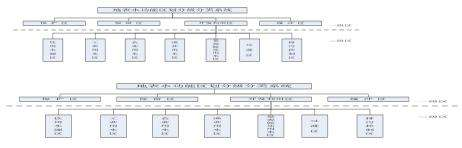

(2-11)

(2-12)

式中：

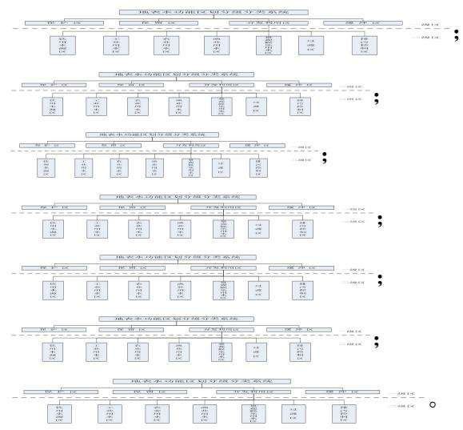  
计算结果如表2-36、表 2-37。

表2-36 典型年各分区地下水资源量计算结果表（单位：104m³/a）
<table><tr><td colspan="1" rowspan="2">典型年</td><td colspan="2" rowspan="2">分区</td><td colspan="1" rowspan="2">降水入渗</td><td colspan="4" rowspan="1">地表水体补给</td><td colspan="1" rowspan="2">侧向径流补给</td><td colspan="1" rowspan="2">合计</td><td colspan="1" rowspan="2">总计</td></tr><tr><td colspan="1" rowspan="1">渠系渗漏</td><td colspan="1" rowspan="1">田间渗漏</td><td colspan="1" rowspan="1">水库渗漏</td><td colspan="1" rowspan="1">河流渗漏</td></tr><tr><td colspan="1" rowspan="6">20%降水保证率年份</td><td colspan="1" rowspan="3">I</td><td colspan="1" rowspan="1"> $\mathrm { I } _ { 1 }$ </td><td colspan="1" rowspan="1">1379.7</td><td colspan="1" rowspan="1">12.8</td><td colspan="1" rowspan="1">11.5</td><td colspan="1" rowspan="1">143.6</td><td colspan="1" rowspan="1"></td><td colspan="1" rowspan="1"></td><td colspan="1" rowspan="1">1547.6</td><td colspan="1" rowspan="6">11194.6</td></tr><tr><td colspan="1" rowspan="1">I2</td><td colspan="1" rowspan="1">2598.3</td><td colspan="1" rowspan="1">10.1</td><td colspan="1" rowspan="1">9.1</td><td colspan="1" rowspan="1">0.2</td><td colspan="1" rowspan="1">36.5</td><td colspan="1" rowspan="1"></td><td colspan="1" rowspan="1">2654.2</td></tr><tr><td colspan="1" rowspan="1"> $\mathrm { I } _ { 3 }$ </td><td colspan="1" rowspan="1">1273.2</td><td colspan="1" rowspan="1">3.9</td><td colspan="1" rowspan="1">3.4</td><td colspan="1" rowspan="1">31.6</td><td colspan="1" rowspan="1"></td><td colspan="1" rowspan="1">306.6</td><td colspan="1" rowspan="1">1618.7</td></tr><tr><td colspan="1" rowspan="2">ⅡI</td><td colspan="1" rowspan="1"> $\mathrm { I I } _ { 1 }$ </td><td colspan="1" rowspan="1">1105.1</td><td colspan="1" rowspan="1">6.0</td><td colspan="1" rowspan="1">5.3</td><td colspan="1" rowspan="1">19.0</td><td colspan="1" rowspan="1"></td><td colspan="1" rowspan="1">615.9</td><td colspan="1" rowspan="1">1751.3</td></tr><tr><td colspan="1" rowspan="1"> $\mathrm { I I } _ { 2 }$ </td><td colspan="1" rowspan="1">957.0</td><td colspan="1" rowspan="1">6.4</td><td colspan="1" rowspan="1">5.6</td><td colspan="1" rowspan="1">5.4</td><td colspan="1" rowspan="1"></td><td colspan="1" rowspan="1"></td><td colspan="1" rowspan="1">974.4</td></tr><tr><td colspan="1" rowspan="1">IⅢI</td><td colspan="1" rowspan="1"></td><td colspan="1" rowspan="1">2513.7</td><td colspan="1" rowspan="1">25.0</td><td colspan="1" rowspan="1">22.1</td><td colspan="1" rowspan="1">87.6</td><td colspan="1" rowspan="1"></td><td colspan="1" rowspan="1"></td><td colspan="1" rowspan="1">2648.4</td></tr><tr><td colspan="1" rowspan="3">50%降水保证率</td><td colspan="1" rowspan="3">I</td><td colspan="1" rowspan="1"> $\mathrm { I } _ { 1 }$ </td><td colspan="1" rowspan="1">1123.2</td><td colspan="1" rowspan="1">14.0</td><td colspan="1" rowspan="1">12.6</td><td colspan="1" rowspan="1">143.6</td><td colspan="1" rowspan="1"></td><td colspan="1" rowspan="1"></td><td colspan="1" rowspan="1">1293.4</td><td colspan="1" rowspan="5">9378.6</td></tr><tr><td colspan="1" rowspan="1"> $\mathrm { I } _ { 2 }$ </td><td colspan="1" rowspan="1">2115.2</td><td colspan="1" rowspan="1">11.1</td><td colspan="1" rowspan="1">10.0</td><td colspan="1" rowspan="1">0.2</td><td colspan="1" rowspan="1">36.5</td><td colspan="1" rowspan="1"></td><td colspan="1" rowspan="1">2173.0</td></tr><tr><td colspan="1" rowspan="1"> $\mathrm { I } _ { 3 }$ </td><td colspan="1" rowspan="1">1036.4</td><td colspan="1" rowspan="1">4.2</td><td colspan="1" rowspan="1">3.7</td><td colspan="1" rowspan="1">31.6</td><td colspan="1" rowspan="1"></td><td colspan="1" rowspan="1">306.6</td><td colspan="1" rowspan="1">1382.5</td></tr><tr><td colspan="1" rowspan="2">年份</td><td colspan="1" rowspan="2">ⅡI</td><td colspan="1" rowspan="1"> $\mathrm { I I } _ { 1 }$ </td><td colspan="1" rowspan="1">899.7</td><td colspan="1" rowspan="1">6.5</td><td colspan="1" rowspan="1">5.8</td><td colspan="1" rowspan="1">19.0</td><td colspan="1" rowspan="1"></td><td colspan="1" rowspan="1">615.9</td><td colspan="1" rowspan="1">1546.9</td></tr><tr><td colspan="1" rowspan="1"> $\mathrm { I I } _ { 2 }$ </td><td colspan="1" rowspan="1">778.9</td><td colspan="1" rowspan="1">7.0</td><td colspan="1" rowspan="1">6.2</td><td colspan="1" rowspan="1">5.4</td><td colspan="1" rowspan="1"></td><td colspan="1" rowspan="1"></td><td colspan="1" rowspan="1">797.5</td></tr><tr><td colspan="1" rowspan="1"></td><td colspan="1" rowspan="1">IⅢ</td><td colspan="1" rowspan="1"></td><td colspan="1" rowspan="1">2046.2</td><td colspan="1" rowspan="1">27.3</td><td colspan="1" rowspan="1">24.2</td><td colspan="1" rowspan="1">87.6</td><td colspan="1" rowspan="1"></td><td colspan="1" rowspan="1"></td><td colspan="1" rowspan="1">2185.3</td><td colspan="1" rowspan="1"></td></tr><tr><td colspan="1" rowspan="3">75%降水保</td><td colspan="1" rowspan="3">I</td><td colspan="1" rowspan="1"> $\mathrm { I } _ { 1 }$ </td><td colspan="1" rowspan="1">959.6</td><td colspan="1" rowspan="1">15.2</td><td colspan="1" rowspan="1">13.6</td><td colspan="1" rowspan="1">143.6</td><td colspan="1" rowspan="1"></td><td colspan="1" rowspan="1"></td><td colspan="1" rowspan="1">1132.0</td><td colspan="1" rowspan="6">8224.5</td></tr><tr><td colspan="1" rowspan="1"> $\mathrm { I } _ { 2 }$ </td><td colspan="1" rowspan="1">1807.0</td><td colspan="1" rowspan="1">12.0</td><td colspan="1" rowspan="1">10.9</td><td colspan="1" rowspan="1">0.2</td><td colspan="1" rowspan="1">36.5</td><td colspan="1" rowspan="1"></td><td colspan="1" rowspan="1">1866.6</td></tr><tr><td colspan="1" rowspan="1"> $\mathrm { I } _ { 3 }$ </td><td colspan="1" rowspan="1">885.3</td><td colspan="1" rowspan="1">4.6</td><td colspan="1" rowspan="1">4.1</td><td colspan="1" rowspan="1">31.6</td><td colspan="1" rowspan="1"></td><td colspan="1" rowspan="1">306.6</td><td colspan="1" rowspan="1">1232.2</td></tr><tr><td colspan="1" rowspan="3">证率年份</td><td colspan="1" rowspan="2">ⅡI</td><td colspan="1" rowspan="1"> $\mathrm { I I } _ { 1 }$ </td><td colspan="1" rowspan="1">768.7</td><td colspan="1" rowspan="1">7.1</td><td colspan="1" rowspan="1">6.3</td><td colspan="1" rowspan="1">19.0</td><td colspan="1" rowspan="1"></td><td colspan="1" rowspan="1">615.9</td><td colspan="1" rowspan="1">1417.0</td></tr><tr><td colspan="1" rowspan="1"> $\mathrm { I I } _ { 2 }$ </td><td colspan="1" rowspan="1">665.5</td><td colspan="1" rowspan="1">7.6</td><td colspan="1" rowspan="1">6.7</td><td colspan="1" rowspan="1">5.4</td><td colspan="1" rowspan="1"></td><td colspan="1" rowspan="1"></td><td colspan="1" rowspan="1">685.2</td></tr><tr><td colspan="1" rowspan="1">III</td><td colspan="1" rowspan="1"></td><td colspan="1" rowspan="1">1748.0</td><td colspan="1" rowspan="1">29.7</td><td colspan="1" rowspan="1">26.2</td><td colspan="1" rowspan="1">87.6</td><td colspan="1" rowspan="1"></td><td colspan="1" rowspan="1"></td><td colspan="1" rowspan="1">1891.5</td></tr><tr><td colspan="1" rowspan="6">95%降水保证率年份</td><td colspan="1" rowspan="3">I</td><td colspan="1" rowspan="1"> $\mathrm { I } _ { 1 }$ </td><td colspan="1" rowspan="1">787.4</td><td colspan="1" rowspan="1">16.4</td><td colspan="1" rowspan="1">14.7</td><td colspan="1" rowspan="1">143.6</td><td colspan="1" rowspan="1"></td><td colspan="1" rowspan="1"></td><td colspan="1" rowspan="1">962.1</td><td colspan="1" rowspan="6">7008.9</td></tr><tr><td colspan="1" rowspan="1"> $\mathrm { I } _ { 2 }$ </td><td colspan="1" rowspan="1">1482.5</td><td colspan="1" rowspan="1">13.0</td><td colspan="1" rowspan="1">11.7</td><td colspan="1" rowspan="1">0.2</td><td colspan="1" rowspan="1">36.5</td><td colspan="1" rowspan="1"></td><td colspan="1" rowspan="1">1543.9</td></tr><tr><td colspan="1" rowspan="1"> $\mathrm { I } _ { 3 }$ </td><td colspan="1" rowspan="1">726.5</td><td colspan="1" rowspan="1">5.0</td><td colspan="1" rowspan="1">4.4</td><td colspan="1" rowspan="1">31.6</td><td colspan="1" rowspan="1"></td><td colspan="1" rowspan="1">306.6</td><td colspan="1" rowspan="1">1074.1</td></tr><tr><td colspan="1" rowspan="2">ⅡI</td><td colspan="1" rowspan="1">II1</td><td colspan="1" rowspan="1">630.7</td><td colspan="1" rowspan="1">7.6</td><td colspan="1" rowspan="1">6.8</td><td colspan="1" rowspan="1">19.0</td><td colspan="1" rowspan="1"></td><td colspan="1" rowspan="1">615.9</td><td colspan="1" rowspan="1">1280.0</td></tr><tr><td colspan="1" rowspan="1">II2</td><td colspan="1" rowspan="1">546.0</td><td colspan="1" rowspan="1">8.2</td><td colspan="1" rowspan="1">7.2</td><td colspan="1" rowspan="1">5.4</td><td colspan="1" rowspan="1"></td><td colspan="1" rowspan="1"></td><td colspan="1" rowspan="1">566.8</td></tr><tr><td colspan="1" rowspan="1">III</td><td colspan="1" rowspan="1"></td><td colspan="1" rowspan="1">1434.1</td><td colspan="1" rowspan="1">32.0</td><td colspan="1" rowspan="1">28.3</td><td colspan="1" rowspan="1">87.6</td><td colspan="1" rowspan="1"></td><td colspan="1" rowspan="1"></td><td colspan="1" rowspan="1">1582.0</td></tr><tr><td colspan="1" rowspan="6">多年平均年份</td><td colspan="1" rowspan="3">I</td><td colspan="1" rowspan="1"> $\mathrm { I } _ { 1 }$ </td><td colspan="1" rowspan="1">1120.1</td><td colspan="1" rowspan="1">14.0</td><td colspan="1" rowspan="1">12.6</td><td colspan="1" rowspan="1">143.6</td><td colspan="1" rowspan="1"></td><td colspan="1" rowspan="1"></td><td colspan="1" rowspan="1">1290.3</td><td colspan="1" rowspan="6">9357.2</td></tr><tr><td colspan="1" rowspan="1"> $\mathrm { I } _ { 2 }$ </td><td colspan="1" rowspan="1">2109.5</td><td colspan="1" rowspan="1">11.1</td><td colspan="1" rowspan="1">10.0</td><td colspan="1" rowspan="1">0.2</td><td colspan="1" rowspan="1">36.5</td><td colspan="1" rowspan="1"></td><td colspan="1" rowspan="1">2167.3</td></tr><tr><td colspan="1" rowspan="1"> $\mathrm { I } _ { 3 }$ </td><td colspan="1" rowspan="1">1033.6</td><td colspan="1" rowspan="1">4.2</td><td colspan="1" rowspan="1">3.7</td><td colspan="1" rowspan="1">31.6</td><td colspan="1" rowspan="1"></td><td colspan="1" rowspan="1">306.6</td><td colspan="1" rowspan="1">1379.7</td></tr><tr><td colspan="1" rowspan="2">ⅡI</td><td colspan="1" rowspan="1"> $\mathrm { I I } _ { 1 }$ </td><td colspan="1" rowspan="1">897.2</td><td colspan="1" rowspan="1">6.5</td><td colspan="1" rowspan="1">5.8</td><td colspan="1" rowspan="1">19.0</td><td colspan="1" rowspan="1"></td><td colspan="1" rowspan="1">615.9</td><td colspan="1" rowspan="1">1544.4</td></tr><tr><td colspan="1" rowspan="1"> $\mathrm { I I } _ { 2 }$ </td><td colspan="1" rowspan="1">777.0</td><td colspan="1" rowspan="1">7.0</td><td colspan="1" rowspan="1">6.2</td><td colspan="1" rowspan="1">5.4</td><td colspan="1" rowspan="1"></td><td colspan="1" rowspan="1"></td><td colspan="1" rowspan="1">795.6</td></tr><tr><td colspan="1" rowspan="1">IⅢ</td><td colspan="1" rowspan="1"></td><td colspan="1" rowspan="1">2040.8</td><td colspan="1" rowspan="1">27.3</td><td colspan="1" rowspan="1">24.2</td><td colspan="1" rowspan="1">87.6</td><td colspan="1" rowspan="1"></td><td colspan="1" rowspan="1"></td><td colspan="1" rowspan="1">2179.9</td></tr></table>

表2-37 典型年各行政区地下水资源量计算结果表（单位： $\mathbf { 1 0 ^ { 4 } m ^ { 3 } / a } )$
<table><tr><td colspan="1" rowspan="2">典型年</td><td colspan="2" rowspan="2">乡镇</td><td colspan="1" rowspan="2">降水入渗</td><td colspan="4" rowspan="1">地表水体补给</td><td colspan="1" rowspan="2">侧向径流补给</td><td colspan="1" rowspan="2">合计</td><td colspan="1" rowspan="2">总计</td></tr><tr><td colspan="1" rowspan="1">渠系渗漏</td><td colspan="1" rowspan="1">田间渗漏</td><td colspan="1" rowspan="1">水库渗漏</td><td colspan="1" rowspan="1">河流渗漏</td></tr><tr><td colspan="1" rowspan="9">20%降水保证率年份</td><td colspan="2" rowspan="1">新密中心城区（及城关镇、袁庄乡）</td><td colspan="1" rowspan="1">884.2(1645.8)</td><td colspan="1" rowspan="1">0（0.7)</td><td colspan="1" rowspan="1">0 (0.5)</td><td colspan="1" rowspan="1">7.2(11.4)</td><td colspan="1" rowspan="1">11.6(21.9)</td><td colspan="1" rowspan="1">0</td><td colspan="1" rowspan="1">903(1680.3)</td><td colspan="1" rowspan="9">11197.6</td></tr><tr><td colspan="2" rowspan="1">新密新区（曲梁镇）</td><td colspan="1" rowspan="1">1067.7</td><td colspan="1" rowspan="1">9.7</td><td colspan="1" rowspan="1">8.6</td><td colspan="1" rowspan="1">36.8</td><td colspan="1" rowspan="1">0</td><td colspan="1" rowspan="1">0</td><td colspan="1" rowspan="1">1122.8</td></tr><tr><td colspan="1" rowspan="5">中心镇</td><td colspan="1" rowspan="1">超化镇</td><td colspan="1" rowspan="1">759.5</td><td colspan="1" rowspan="1">0.1</td><td colspan="1" rowspan="1">0.1</td><td colspan="1" rowspan="1">11.5</td><td colspan="1" rowspan="1">1</td><td colspan="1" rowspan="1">299.1</td><td colspan="1" rowspan="1">1071.3</td></tr><tr><td colspan="1" rowspan="1">大隗镇</td><td colspan="1" rowspan="1">595.8</td><td colspan="1" rowspan="1">12.8</td><td colspan="1" rowspan="1">11.3</td><td colspan="1" rowspan="1">18.1</td><td colspan="1" rowspan="1">0</td><td colspan="1" rowspan="1">0</td><td colspan="1" rowspan="1">638</td></tr><tr><td colspan="1" rowspan="1">刘寨镇</td><td colspan="1" rowspan="1">655.3</td><td colspan="1" rowspan="1">1</td><td colspan="1" rowspan="1">0.9</td><td colspan="1" rowspan="1">19.9</td><td colspan="1" rowspan="1">1.1</td><td colspan="1" rowspan="1">0</td><td colspan="1" rowspan="1">678.2</td></tr><tr><td colspan="1" rowspan="1">白寨镇</td><td colspan="1" rowspan="1">1024.8</td><td colspan="1" rowspan="1">0.1</td><td colspan="1" rowspan="1">0</td><td colspan="1" rowspan="1">25.1</td><td colspan="1" rowspan="1">0</td><td colspan="1" rowspan="1">215.1</td><td colspan="1" rowspan="1">1265.1</td></tr><tr><td colspan="1" rowspan="1">小计</td><td colspan="1" rowspan="1">3035.4</td><td colspan="1" rowspan="1">14</td><td colspan="1" rowspan="1">12.3</td><td colspan="1" rowspan="1">74.6</td><td colspan="1" rowspan="1">2.1</td><td colspan="1" rowspan="1">514.2</td><td colspan="1" rowspan="1">3652.6</td></tr><tr><td colspan="1" rowspan="2">一般镇</td><td colspan="1" rowspan="1">米村镇</td><td colspan="1" rowspan="1">424.1</td><td colspan="1" rowspan="1">10.6</td><td colspan="1" rowspan="1">9.4</td><td colspan="1" rowspan="1">44.8</td><td colspan="1" rowspan="1">0</td><td colspan="1" rowspan="1">0</td><td colspan="1" rowspan="1">488.9</td></tr><tr><td colspan="1" rowspan="1">牛店镇</td><td colspan="1" rowspan="1">631.6</td><td colspan="1" rowspan="1">3.2</td><td colspan="1" rowspan="1">2.8</td><td colspan="1" rowspan="1">66.7</td><td colspan="1" rowspan="1">0</td><td colspan="1" rowspan="1">0</td><td colspan="1" rowspan="1">704.3</td></tr><tr><td colspan="1" rowspan="6"></td><td colspan="1" rowspan="5"></td><td colspan="1" rowspan="1">平陌镇</td><td colspan="1" rowspan="1">578.2</td><td colspan="1" rowspan="1">6.5</td><td colspan="1" rowspan="1">5.7</td><td colspan="1" rowspan="1">13.3</td><td colspan="1" rowspan="1">0.2</td><td colspan="1" rowspan="1">316.8</td><td colspan="1" rowspan="1">920.7</td><td colspan="1" rowspan="36">9381.88228.0</td></tr><tr><td colspan="1" rowspan="1">来集镇</td><td colspan="1" rowspan="1">787.7</td><td colspan="1" rowspan="1">10.5</td><td colspan="1" rowspan="1">9.3</td><td colspan="1" rowspan="1">6.6</td><td colspan="1" rowspan="1">8.5</td><td colspan="1" rowspan="1">0</td><td colspan="1" rowspan="1">822.6</td></tr><tr><td colspan="1" rowspan="1">苟堂镇</td><td colspan="1" rowspan="1">760.5</td><td colspan="1" rowspan="1">4.2</td><td colspan="1" rowspan="1">3.7</td><td colspan="1" rowspan="1">4.2</td><td colspan="1" rowspan="1">0</td><td colspan="1" rowspan="1">0</td><td colspan="1" rowspan="1">772.6</td></tr><tr><td colspan="1" rowspan="1">岳村镇</td><td colspan="1" rowspan="1">732.5</td><td colspan="1" rowspan="1">6.6</td><td colspan="1" rowspan="1">5.9</td><td colspan="1" rowspan="1">11.7</td><td colspan="1" rowspan="1">3.8</td><td colspan="1" rowspan="1">91.5</td><td colspan="1" rowspan="1">852</td></tr><tr><td colspan="1" rowspan="1">小计</td><td colspan="1" rowspan="1">3914.6</td><td colspan="1" rowspan="1">41.6</td><td colspan="1" rowspan="1">36.8</td><td colspan="1" rowspan="1">147.3</td><td colspan="1" rowspan="1">12.5</td><td colspan="1" rowspan="1">408.3</td><td colspan="1" rowspan="1">4561.1</td></tr><tr><td colspan="2" rowspan="1">尖山乡*</td><td colspan="1" rowspan="1">163.5</td><td colspan="1" rowspan="1">0</td><td colspan="1" rowspan="1">0</td><td colspan="1" rowspan="1">17.3</td><td colspan="1" rowspan="1">0</td><td colspan="1" rowspan="1">0</td><td colspan="1" rowspan="1">180.8</td></tr><tr><td colspan="1" rowspan="15">50%降水保证率年份</td><td colspan="2" rowspan="1">新密中心城区（及城关镇、袁庄乡）</td><td colspan="1" rowspan="1">719.7(1339.6)</td><td colspan="1" rowspan="1">0(0.7)</td><td colspan="1" rowspan="1">0(0.7)</td><td colspan="1" rowspan="1">7.2(11.4）</td><td colspan="1" rowspan="1">11.6(21.9)</td><td colspan="1" rowspan="1">0</td><td colspan="1" rowspan="1">738.5(1374.3)</td></tr><tr><td colspan="2" rowspan="1">新密新区（曲梁镇）</td><td colspan="1" rowspan="1">869.1</td><td colspan="1" rowspan="1">10.7</td><td colspan="1" rowspan="1">9.4</td><td colspan="1" rowspan="1">36.8</td><td colspan="1" rowspan="1">0</td><td colspan="1" rowspan="1">0</td><td colspan="1" rowspan="1">926</td></tr><tr><td colspan="1" rowspan="5">中心镇</td><td colspan="1" rowspan="1">超化镇</td><td colspan="1" rowspan="1">618.2</td><td colspan="1" rowspan="1">0.1</td><td colspan="1" rowspan="1">0.1</td><td colspan="1" rowspan="1">11.5</td><td colspan="1" rowspan="1">1</td><td colspan="1" rowspan="1">299.1</td><td colspan="1" rowspan="1">930</td></tr><tr><td colspan="1" rowspan="1">大隗镇</td><td colspan="1" rowspan="1">485</td><td colspan="1" rowspan="1">14</td><td colspan="1" rowspan="1">12.4</td><td colspan="1" rowspan="1">18.1</td><td colspan="1" rowspan="1">0</td><td colspan="1" rowspan="1">0</td><td colspan="1" rowspan="1">529.5</td></tr><tr><td colspan="1" rowspan="1">刘寨镇</td><td colspan="1" rowspan="1">533.4</td><td colspan="1" rowspan="1">1.1</td><td colspan="1" rowspan="1">1</td><td colspan="1" rowspan="1">19.9</td><td colspan="1" rowspan="1">1.1</td><td colspan="1" rowspan="1">0</td><td colspan="1" rowspan="1">556.5</td></tr><tr><td colspan="1" rowspan="1">白寨镇</td><td colspan="1" rowspan="1">834.1</td><td colspan="1" rowspan="1">0.1</td><td colspan="1" rowspan="1">0.1</td><td colspan="1" rowspan="1">25.1</td><td colspan="1" rowspan="1">0</td><td colspan="1" rowspan="1">215.1</td><td colspan="1" rowspan="1">1074.5</td></tr><tr><td colspan="1" rowspan="1">小计</td><td colspan="1" rowspan="1">2470.7</td><td colspan="1" rowspan="1">15.3</td><td colspan="1" rowspan="1">13.6</td><td colspan="1" rowspan="1">74.6</td><td colspan="1" rowspan="1">2.1</td><td colspan="1" rowspan="1">514.2</td><td colspan="1" rowspan="1">3090.5</td></tr><tr><td colspan="1" rowspan="7">一般镇</td><td colspan="1" rowspan="1">米村镇</td><td colspan="1" rowspan="1">345.2</td><td colspan="1" rowspan="1">11.6</td><td colspan="1" rowspan="1">10.2</td><td colspan="1" rowspan="1">44.8</td><td colspan="1" rowspan="1">0</td><td colspan="1" rowspan="1">0</td><td colspan="1" rowspan="1">411.8</td></tr><tr><td colspan="1" rowspan="1">牛店镇</td><td colspan="1" rowspan="1">514.2</td><td colspan="1" rowspan="1">3.5</td><td colspan="1" rowspan="1">3.1</td><td colspan="1" rowspan="1">66.7</td><td colspan="1" rowspan="1">0</td><td colspan="1" rowspan="1">0</td><td colspan="1" rowspan="1">587.5</td></tr><tr><td colspan="1" rowspan="1">平陌镇</td><td colspan="1" rowspan="1">470.8</td><td colspan="1" rowspan="1">7.1</td><td colspan="1" rowspan="1">6.2</td><td colspan="1" rowspan="1">13.3</td><td colspan="1" rowspan="1">0.2</td><td colspan="1" rowspan="1">316.8</td><td colspan="1" rowspan="1">814.4</td></tr><tr><td colspan="1" rowspan="1">来集镇</td><td colspan="1" rowspan="1">641.3</td><td colspan="1" rowspan="1">11.5</td><td colspan="1" rowspan="1">10.2</td><td colspan="1" rowspan="1">6.6</td><td colspan="1" rowspan="1">8.5</td><td colspan="1" rowspan="1">0</td><td colspan="1" rowspan="1">678.1</td></tr><tr><td colspan="1" rowspan="1">苟堂镇</td><td colspan="1" rowspan="1">619</td><td colspan="1" rowspan="1">4.5</td><td colspan="1" rowspan="1">4</td><td colspan="1" rowspan="1">4.2</td><td colspan="1" rowspan="1">0</td><td colspan="1" rowspan="1">0</td><td colspan="1" rowspan="1">631.7</td></tr><tr><td colspan="1" rowspan="1">岳村镇</td><td colspan="1" rowspan="1">596.4</td><td colspan="1" rowspan="1">7.3</td><td colspan="1" rowspan="1">6.4</td><td colspan="1" rowspan="1">11.7</td><td colspan="1" rowspan="1">3.8</td><td colspan="1" rowspan="1">91.5</td><td colspan="1" rowspan="1">717.1</td></tr><tr><td colspan="1" rowspan="1">小计</td><td colspan="1" rowspan="1">3186.9</td><td colspan="1" rowspan="1">45.5</td><td colspan="1" rowspan="1">40.1</td><td colspan="1" rowspan="1">147.3</td><td colspan="1" rowspan="1">12.5</td><td colspan="1" rowspan="1">408.3</td><td colspan="1" rowspan="1">3840.6</td></tr><tr><td colspan="2" rowspan="1">尖山乡*</td><td colspan="1" rowspan="1">133</td><td colspan="1" rowspan="1">0</td><td colspan="1" rowspan="1">0</td><td colspan="1" rowspan="1">17.3</td><td colspan="1" rowspan="1">0</td><td colspan="1" rowspan="1">0</td><td colspan="1" rowspan="1">150.3</td></tr><tr><td colspan="1" rowspan="15">75%降水保证率年份</td><td colspan="2" rowspan="1">新密中心城区（及城关镇、袁庄乡）</td><td colspan="1" rowspan="1">614.9(1144.5)</td><td colspan="1" rowspan="1">0(0.7)</td><td colspan="1" rowspan="1">0(0.7)</td><td colspan="1" rowspan="1">7.2(11.4）</td><td colspan="1" rowspan="1">11.6(21.9)</td><td colspan="1" rowspan="1">0</td><td colspan="1" rowspan="1">633.7(1179.2)</td></tr><tr><td colspan="2" rowspan="1">新密新区（曲梁镇）</td><td colspan="1" rowspan="1">742.5</td><td colspan="1" rowspan="1">11.6</td><td colspan="1" rowspan="1">10.2</td><td colspan="1" rowspan="1">36.8</td><td colspan="1" rowspan="1">0</td><td colspan="1" rowspan="1">0</td><td colspan="1" rowspan="1">801.1</td></tr><tr><td colspan="1" rowspan="5">中心镇</td><td colspan="1" rowspan="1">超化镇</td><td colspan="1" rowspan="1">528.1</td><td colspan="1" rowspan="1">0.1</td><td colspan="1" rowspan="1">0.1</td><td colspan="1" rowspan="1">11.5</td><td colspan="1" rowspan="1">1</td><td colspan="1" rowspan="1">299.1</td><td colspan="1" rowspan="1">839.9</td></tr><tr><td colspan="1" rowspan="1">大隗镇</td><td colspan="1" rowspan="1">414.3</td><td colspan="1" rowspan="1">15.2</td><td colspan="1" rowspan="1">13.4</td><td colspan="1" rowspan="1">18.1</td><td colspan="1" rowspan="1">0</td><td colspan="1" rowspan="1">0</td><td colspan="1" rowspan="1">461</td></tr><tr><td colspan="1" rowspan="1">刘寨镇</td><td colspan="1" rowspan="1">455.7</td><td colspan="1" rowspan="1">1.2</td><td colspan="1" rowspan="1">1.1</td><td colspan="1" rowspan="1">19.9</td><td colspan="1" rowspan="1">1.1</td><td colspan="1" rowspan="1">0</td><td colspan="1" rowspan="1">479</td></tr><tr><td colspan="1" rowspan="1">白寨镇</td><td colspan="1" rowspan="1">712.7</td><td colspan="1" rowspan="1">0.1</td><td colspan="1" rowspan="1">0.1</td><td colspan="1" rowspan="1">25.1</td><td colspan="1" rowspan="1">0</td><td colspan="1" rowspan="1">215.1</td><td colspan="1" rowspan="1">953.1</td></tr><tr><td colspan="1" rowspan="1">小计</td><td colspan="1" rowspan="1">2110.8</td><td colspan="1" rowspan="1">16.6</td><td colspan="1" rowspan="1">14.7</td><td colspan="1" rowspan="1">74.6</td><td colspan="1" rowspan="1">2.1</td><td colspan="1" rowspan="1">514.2</td><td colspan="1" rowspan="1">2733</td></tr><tr><td colspan="1" rowspan="7">一般镇</td><td colspan="1" rowspan="1">米村镇</td><td colspan="1" rowspan="1">294.8</td><td colspan="1" rowspan="1">12.6</td><td colspan="1" rowspan="1">11.1</td><td colspan="1" rowspan="1">44.8</td><td colspan="1" rowspan="1">0</td><td colspan="1" rowspan="1">0</td><td colspan="1" rowspan="1">363.3</td></tr><tr><td colspan="1" rowspan="1">牛店镇</td><td colspan="1" rowspan="1">439.2</td><td colspan="1" rowspan="1">3.8</td><td colspan="1" rowspan="1">3.4</td><td colspan="1" rowspan="1">66.7</td><td colspan="1" rowspan="1">0</td><td colspan="1" rowspan="1">0</td><td colspan="1" rowspan="1">513.1</td></tr><tr><td colspan="1" rowspan="1">平陌镇</td><td colspan="1" rowspan="1">402.1</td><td colspan="1" rowspan="1">7.7</td><td colspan="1" rowspan="1">6.8</td><td colspan="1" rowspan="1">13.3</td><td colspan="1" rowspan="1">0.2</td><td colspan="1" rowspan="1">316.8</td><td colspan="1" rowspan="1">746.9</td></tr><tr><td colspan="1" rowspan="1">来集镇</td><td colspan="1" rowspan="1">547.8</td><td colspan="1" rowspan="1">12.5</td><td colspan="1" rowspan="1">11.1</td><td colspan="1" rowspan="1">6.6</td><td colspan="1" rowspan="1">8.5</td><td colspan="1" rowspan="1">0</td><td colspan="1" rowspan="1">586.5</td></tr><tr><td colspan="1" rowspan="1">苟堂镇</td><td colspan="1" rowspan="1">528.9</td><td colspan="1" rowspan="1">4.9</td><td colspan="1" rowspan="1">4.4</td><td colspan="1" rowspan="1">4.2</td><td colspan="1" rowspan="1">0</td><td colspan="1" rowspan="1">0</td><td colspan="1" rowspan="1">542.4</td></tr><tr><td colspan="1" rowspan="1">岳村镇</td><td colspan="1" rowspan="1">509.5</td><td colspan="1" rowspan="1">7.9</td><td colspan="1" rowspan="1">7</td><td colspan="1" rowspan="1">11.7</td><td colspan="1" rowspan="1">3.8</td><td colspan="1" rowspan="1">91.5</td><td colspan="1" rowspan="1">631.4</td></tr><tr><td colspan="1" rowspan="1">小计</td><td colspan="1" rowspan="1">2722.3</td><td colspan="1" rowspan="1">49.4</td><td colspan="1" rowspan="1">43.8</td><td colspan="1" rowspan="1">147.3</td><td colspan="1" rowspan="1">12.5</td><td colspan="1" rowspan="1">408.3</td><td colspan="1" rowspan="1">3383.6</td></tr><tr><td colspan="2" rowspan="1">尖山乡*</td><td colspan="1" rowspan="1">113.7</td><td colspan="1" rowspan="1">0</td><td colspan="1" rowspan="1">0</td><td colspan="1" rowspan="1">17.3</td><td colspan="1" rowspan="1">0</td><td colspan="1" rowspan="1">0</td><td colspan="1" rowspan="1">131</td></tr><tr><td colspan="1" rowspan="15">95%降水保证率年份</td><td colspan="2" rowspan="1">新密中心城区（及城关镇、袁庄乡）</td><td colspan="1" rowspan="1">504.5(939）</td><td colspan="1" rowspan="1">0(0.8)</td><td colspan="1" rowspan="1">0(0.7)</td><td colspan="1" rowspan="1">7.2(11.4）</td><td colspan="1" rowspan="1">11.6(21.9)</td><td colspan="1" rowspan="1">0</td><td colspan="1" rowspan="1">523.3(937.8)</td><td colspan="1" rowspan="15">7012.6</td></tr><tr><td colspan="2" rowspan="1">新密新区（曲梁镇）</td><td colspan="1" rowspan="1">609.2</td><td colspan="1" rowspan="1">12.5</td><td colspan="1" rowspan="1">11.1</td><td colspan="1" rowspan="1">36.8</td><td colspan="1" rowspan="1">0</td><td colspan="1" rowspan="1">0</td><td colspan="1" rowspan="1">669.6</td></tr><tr><td colspan="1" rowspan="5">中心镇</td><td colspan="1" rowspan="1">超化镇</td><td colspan="1" rowspan="1">433.3</td><td colspan="1" rowspan="1">0.1</td><td colspan="1" rowspan="1">0.1</td><td colspan="1" rowspan="1">11.5</td><td colspan="1" rowspan="1">1</td><td colspan="1" rowspan="1">299.1</td><td colspan="1" rowspan="1">745.1</td></tr><tr><td colspan="1" rowspan="1">大隗镇</td><td colspan="1" rowspan="1">340</td><td colspan="1" rowspan="1">16.4</td><td colspan="1" rowspan="1">14.5</td><td colspan="1" rowspan="1">18.1</td><td colspan="1" rowspan="1">0</td><td colspan="1" rowspan="1">0</td><td colspan="1" rowspan="1">389</td></tr><tr><td colspan="1" rowspan="1">刘寨镇</td><td colspan="1" rowspan="1">373.9</td><td colspan="1" rowspan="1">1.3</td><td colspan="1" rowspan="1">1.2</td><td colspan="1" rowspan="1">19.9</td><td colspan="1" rowspan="1">1.1</td><td colspan="1" rowspan="1">0</td><td colspan="1" rowspan="1">397.4</td></tr><tr><td colspan="1" rowspan="1">白寨镇</td><td colspan="1" rowspan="1">584.7</td><td colspan="1" rowspan="1">0.1</td><td colspan="1" rowspan="1">0.1</td><td colspan="1" rowspan="1">25.1</td><td colspan="1" rowspan="1">0</td><td colspan="1" rowspan="1">215.1</td><td colspan="1" rowspan="1">825.1</td></tr><tr><td colspan="1" rowspan="1">小计</td><td colspan="1" rowspan="1">1731.9</td><td colspan="1" rowspan="1">17.9</td><td colspan="1" rowspan="1">15.9</td><td colspan="1" rowspan="1">74.6</td><td colspan="1" rowspan="1">2.1</td><td colspan="1" rowspan="1">514.2</td><td colspan="1" rowspan="1">2356.6</td></tr><tr><td colspan="1" rowspan="7">一般镇</td><td colspan="1" rowspan="1">米村镇</td><td colspan="1" rowspan="1">241.9</td><td colspan="1" rowspan="1">13.6</td><td colspan="1" rowspan="1">12</td><td colspan="1" rowspan="1">44.8</td><td colspan="1" rowspan="1">0</td><td colspan="1" rowspan="1">0</td><td colspan="1" rowspan="1">312.3</td></tr><tr><td colspan="1" rowspan="1">牛店镇</td><td colspan="1" rowspan="1">360.4</td><td colspan="1" rowspan="1">4.1</td><td colspan="1" rowspan="1">3.6</td><td colspan="1" rowspan="1">66.7</td><td colspan="1" rowspan="1">0</td><td colspan="1" rowspan="1">0</td><td colspan="1" rowspan="1">434.8</td></tr><tr><td colspan="1" rowspan="1">平陌镇</td><td colspan="1" rowspan="1">330</td><td colspan="1" rowspan="1">8.3</td><td colspan="1" rowspan="1">7.3</td><td colspan="1" rowspan="1">13.3</td><td colspan="1" rowspan="1">0.2</td><td colspan="1" rowspan="1">316.8</td><td colspan="1" rowspan="1">675.9</td></tr><tr><td colspan="1" rowspan="1">来集镇</td><td colspan="1" rowspan="1">449.5</td><td colspan="1" rowspan="1">13.5</td><td colspan="1" rowspan="1">11.9</td><td colspan="1" rowspan="1">6.6</td><td colspan="1" rowspan="1">8.5</td><td colspan="1" rowspan="1">0</td><td colspan="1" rowspan="1">490</td></tr><tr><td colspan="1" rowspan="1">苟堂镇</td><td colspan="1" rowspan="1">434</td><td colspan="1" rowspan="1">5.3</td><td colspan="1" rowspan="1">4.7</td><td colspan="1" rowspan="1">4.2</td><td colspan="1" rowspan="1">0</td><td colspan="1" rowspan="1">0</td><td colspan="1" rowspan="1">448.2</td></tr><tr><td colspan="1" rowspan="1">岳村镇</td><td colspan="1" rowspan="1">418</td><td colspan="1" rowspan="1">8.5</td><td colspan="1" rowspan="1">7.5</td><td colspan="1" rowspan="1">11.7</td><td colspan="1" rowspan="1">3.8</td><td colspan="1" rowspan="1">91.5</td><td colspan="1" rowspan="1">541</td></tr><tr><td colspan="1" rowspan="1">小计</td><td colspan="1" rowspan="1">2233.8</td><td colspan="1" rowspan="1">53.3</td><td colspan="1" rowspan="1">47</td><td colspan="1" rowspan="1">147.3</td><td colspan="1" rowspan="1">12.5</td><td colspan="1" rowspan="1">408.3</td><td colspan="1" rowspan="1">2902.2</td></tr><tr><td colspan="2" rowspan="1">尖山乡*</td><td colspan="1" rowspan="1">93.2</td><td colspan="1" rowspan="1">0</td><td colspan="1" rowspan="1">0</td><td colspan="1" rowspan="1">17.3</td><td colspan="1" rowspan="1">0</td><td colspan="1" rowspan="1">0</td><td colspan="1" rowspan="1">110.5</td></tr><tr><td colspan="1" rowspan="15">多年平均</td><td colspan="2" rowspan="1">新密中心城区（及城关镇、袁庄乡）</td><td colspan="1" rowspan="1">717.8(1336.1)</td><td colspan="1" rowspan="1">0(0.7)</td><td colspan="1" rowspan="1">0(0.7)</td><td colspan="1" rowspan="1">7.2(11.4）</td><td colspan="1" rowspan="1">11.6(21.9)</td><td colspan="1" rowspan="1">0</td><td colspan="1" rowspan="1">736.6(1370.8)</td><td colspan="1" rowspan="15">9359.8</td></tr><tr><td colspan="2" rowspan="1">新密新区（曲梁镇）</td><td colspan="1" rowspan="1">866.7</td><td colspan="1" rowspan="1">10.7</td><td colspan="1" rowspan="1">9.4</td><td colspan="1" rowspan="1">36.8</td><td colspan="1" rowspan="1">0</td><td colspan="1" rowspan="1">0</td><td colspan="1" rowspan="1">923.6</td></tr><tr><td colspan="1" rowspan="5">中心镇</td><td colspan="1" rowspan="1">超化镇</td><td colspan="1" rowspan="1">616.6</td><td colspan="1" rowspan="1">0.1</td><td colspan="1" rowspan="1">0.1</td><td colspan="1" rowspan="1">11.5</td><td colspan="1" rowspan="1">1</td><td colspan="1" rowspan="1">299.1</td><td colspan="1" rowspan="1">928.4</td></tr><tr><td colspan="1" rowspan="1">大隗镇</td><td colspan="1" rowspan="1">483.7</td><td colspan="1" rowspan="1">14</td><td colspan="1" rowspan="1">12.4</td><td colspan="1" rowspan="1">18.1</td><td colspan="1" rowspan="1">0</td><td colspan="1" rowspan="1">0</td><td colspan="1" rowspan="1">528.2</td></tr><tr><td colspan="1" rowspan="1">刘寨镇</td><td colspan="1" rowspan="1">532</td><td colspan="1" rowspan="1">1.1</td><td colspan="1" rowspan="1">1</td><td colspan="1" rowspan="1">19.9</td><td colspan="1" rowspan="1">1.1</td><td colspan="1" rowspan="1">0</td><td colspan="1" rowspan="1">555.1</td></tr><tr><td colspan="1" rowspan="1">白寨镇</td><td colspan="1" rowspan="1">831.8</td><td colspan="1" rowspan="1">0.1</td><td colspan="1" rowspan="1">0.1</td><td colspan="1" rowspan="1">25.1</td><td colspan="1" rowspan="1">0</td><td colspan="1" rowspan="1">215.1</td><td colspan="1" rowspan="1">1072.2</td></tr><tr><td colspan="1" rowspan="1">小计</td><td colspan="1" rowspan="1">2464.1</td><td colspan="1" rowspan="1">15.3</td><td colspan="1" rowspan="1">13.6</td><td colspan="1" rowspan="1">74.6</td><td colspan="1" rowspan="1">2.1</td><td colspan="1" rowspan="1">514.2</td><td colspan="1" rowspan="1">3083.9</td></tr><tr><td colspan="1" rowspan="7">一般镇</td><td colspan="1" rowspan="1">米村镇</td><td colspan="1" rowspan="1">344.2</td><td colspan="1" rowspan="1">11.6</td><td colspan="1" rowspan="1">10.2</td><td colspan="1" rowspan="1">44.8</td><td colspan="1" rowspan="1">0</td><td colspan="1" rowspan="1">0</td><td colspan="1" rowspan="1">410.8</td></tr><tr><td colspan="1" rowspan="1">牛店镇</td><td colspan="1" rowspan="1">512.7</td><td colspan="1" rowspan="1">3.5</td><td colspan="1" rowspan="1">3.1</td><td colspan="1" rowspan="1">66.7</td><td colspan="1" rowspan="1">0</td><td colspan="1" rowspan="1">0</td><td colspan="1" rowspan="1">586</td></tr><tr><td colspan="1" rowspan="1">平陌镇</td><td colspan="1" rowspan="1">469.4</td><td colspan="1" rowspan="1">7.1</td><td colspan="1" rowspan="1">6.2</td><td colspan="1" rowspan="1">13.3</td><td colspan="1" rowspan="1">0.2</td><td colspan="1" rowspan="1">316.8</td><td colspan="1" rowspan="1">813</td></tr><tr><td colspan="1" rowspan="1">来集镇</td><td colspan="1" rowspan="1">639.5</td><td colspan="1" rowspan="1">11.5</td><td colspan="1" rowspan="1">10.2</td><td colspan="1" rowspan="1">6.6</td><td colspan="1" rowspan="1">8.5</td><td colspan="1" rowspan="1">0</td><td colspan="1" rowspan="1">676.3</td></tr><tr><td colspan="1" rowspan="1">苟堂镇</td><td colspan="1" rowspan="1">617.3</td><td colspan="1" rowspan="1">4.5</td><td colspan="1" rowspan="1">4</td><td colspan="1" rowspan="1">4.2</td><td colspan="1" rowspan="1">0</td><td colspan="1" rowspan="1">0</td><td colspan="1" rowspan="1">630</td></tr><tr><td colspan="1" rowspan="1">岳村镇</td><td colspan="1" rowspan="1">594.7</td><td colspan="1" rowspan="1">7.3</td><td colspan="1" rowspan="1">6.4</td><td colspan="1" rowspan="1">11.7</td><td colspan="1" rowspan="1">3.8</td><td colspan="1" rowspan="1">91.5</td><td colspan="1" rowspan="1">715.4</td></tr><tr><td colspan="1" rowspan="1">小计</td><td colspan="1" rowspan="1">3177.8</td><td colspan="1" rowspan="1">45.5</td><td colspan="1" rowspan="1">40.1</td><td colspan="1" rowspan="1">147.3</td><td colspan="1" rowspan="1">12.5</td><td colspan="1" rowspan="1">408.3</td><td colspan="1" rowspan="1">3831.5</td></tr><tr><td colspan="2" rowspan="1">尖山乡*</td><td colspan="1" rowspan="1">132.7</td><td colspan="1" rowspan="1">0</td><td colspan="1" rowspan="1">0</td><td colspan="1" rowspan="1">17.3</td><td colspan="1" rowspan="1">0</td><td colspan="1" rowspan="1">0</td><td colspan="1" rowspan="1">150</td></tr></table>

## 2.6 地表水水质

地表水化学特征分析和水质评价根据《2015年新密市环境质量年鉴》得出。

## 2.6.1 水化学类型分析

地表径流在运移过程中可不断从环境（包括土壤、岩石、大气、生物有机体）中溶解各种溶质，同时又通过吸附—解吸、溶解—沉淀、氧化—还原、化合—分解等物理化学过程与环境实现溶质交换，使天然水质发生改变。天然水的水质主要取决于水流经过的岩石、土壤、生物有机体的成分；同时受水热条件的影响和人类活动及水生生物活动的影响；另外，河流、水库和湖泊中的水还不断通过蒸发、降水以及水气界面的物质交换改变着水化学成分，进而使水化学类型发生变化。分析河流、湖泊（水库）的水化学类型的水文学意义，在于研究其水的来源、运动和与环境的交换过程及结果。

本次评价采用阿列金分类法划分水化学类型，即按水体中阴阳离子的优势成分和离子间的比例关系来确定水化学类型。首先按优势阴离子将天然水划分为三类：重碳酸盐类 $\mathrm { ( H C O _ { 3 } \mathrm { ^ { - } + C O _ { 3 } \mathrm { ^ { 2 - } ) } } }$ 、硫酸盐类和氯化物类，它们的矿化度依次增加，水质变差。然后，在每一类中又按优势阳离子分为钙组、镁组和钠组（钾加钠）三个组，在每个组内再按照阴阳离子的比例关系分为四个型：

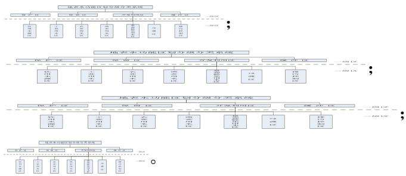

新密市位于秦岭-淮河一线以北，于湿季节明显，地表呈季节性积盐状态，使河水矿化度升高。由于水质监测项目不全，无法准确确定新密市境内河流和水库的水化学类型，但其河流和水库的水化学类型的的阴离子主要以重碳酸盐类为主。这主要是新密市境内碳酸岩分布广泛，在矿区环境污染地区、造纸污染地区，硫酸盐和氯化物的含量会增加。阳离子主要是钙离子和镁离子为主，污染区钠离子含量会升高。水化学类型分布与矿化度有一定的关系，随着矿化度的增加，水的化学组分也相应变化，水化学类型就由重碳酸钙组变化成重碳酸钠组，水型也由Ⅰ型过渡到Ⅱ型或Ⅲ型。

## 2.6.2 现状水质评价

本次地表水水质评价的基准年为2015年，以此作为现状年成果进行评价。结合新密市监测资料实际情况（表2-38），确定化学需氧量和氨氮作为评价项目。评价的河流为双洎河，自上游到下游共有8个监测断面。

评价标准采用《地面水环境质量标准》（GB3838-2002）。评价方法采用单指标评价法（最差的项目赋全权，又称一票否决法），即对某河段各单项指标某水情的平均值进行评价，作为各项目的类别；在单项评价的基础上进行综合评价，即挑选单项评价中类别最差者，作为河段的综合评价结果；以Ⅲ类地表水标准值作为水质是否超标的判定值（Ⅰ类、Ⅱ类、类水质定义为达标，Ⅳ类、V类、劣V类水质定义为超标），当出现不同类别的评价标准值相同的情况时，按最优类别确定水质类别。评价结果的表示采用下式：

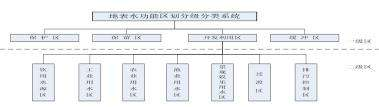  
双洎河评价结果见表2-38。

(2-13)

表2-38 2015年双洎河各断面水质评价结果表
<table><tr><td rowspan=2 colspan=1>监测断面</td><td rowspan=2 colspan=1>监测次数</td><td rowspan=1 colspan=4>化学需氧量</td><td rowspan=1 colspan=4>氨氮</td></tr><tr><td rowspan=1 colspan=1>标准限值(mg/L)</td><td rowspan=1 colspan=1>浓度范围(mg/L)</td><td rowspan=1 colspan=1>超标次数</td><td rowspan=1 colspan=1>超标率</td><td rowspan=1 colspan=1>标准限值(mg/L)</td><td rowspan=1 colspan=1>浓度范围(mg/L)</td><td rowspan=1 colspan=1>超标次数</td><td rowspan=1 colspan=1>超标率</td></tr><tr><td rowspan=1 colspan=1>1#断面</td><td rowspan=1 colspan=1>54</td><td rowspan=1 colspan=1>≤40</td><td rowspan=1 colspan=1>8-72</td><td rowspan=1 colspan=1>2</td><td rowspan=1 colspan=1>3.7%</td><td rowspan=1 colspan=1>≤2.0</td><td rowspan=1 colspan=1>0.200-9.02</td><td rowspan=1 colspan=1>21</td><td rowspan=1 colspan=1>38.9%</td></tr><tr><td rowspan=1 colspan=1>2#断面</td><td rowspan=1 colspan=1>54</td><td rowspan=1 colspan=1>≤40</td><td rowspan=1 colspan=1>12-68</td><td rowspan=1 colspan=1>4</td><td rowspan=1 colspan=1>7.4%</td><td rowspan=1 colspan=1>≤2.0</td><td rowspan=1 colspan=1>0.350-4.98</td><td rowspan=1 colspan=1>11</td><td rowspan=1 colspan=1>20.4%</td></tr><tr><td rowspan=1 colspan=1>3#断面</td><td rowspan=1 colspan=1>54</td><td rowspan=1 colspan=1>≤40</td><td rowspan=1 colspan=1>14-92</td><td rowspan=1 colspan=1>12</td><td rowspan=1 colspan=1>22.2%</td><td rowspan=1 colspan=1>≤2.0</td><td rowspan=1 colspan=1>0.450-5.84</td><td rowspan=1 colspan=1>9</td><td rowspan=1 colspan=1>16.7%</td></tr><tr><td rowspan=1 colspan=1>4#断面</td><td rowspan=1 colspan=1>54</td><td rowspan=1 colspan=1>≤40</td><td rowspan=1 colspan=1>8-28</td><td rowspan=1 colspan=1></td><td rowspan=1 colspan=1></td><td rowspan=1 colspan=1>≤2.0</td><td rowspan=1 colspan=1>0.022-1.21</td><td rowspan=1 colspan=1></td><td rowspan=1 colspan=1></td></tr><tr><td rowspan=1 colspan=1>5#断面</td><td rowspan=1 colspan=1>54</td><td rowspan=1 colspan=1>≤40</td><td rowspan=1 colspan=1>18-176</td><td rowspan=1 colspan=1>36</td><td rowspan=1 colspan=1>66.7%</td><td rowspan=1 colspan=1>≤2.0</td><td rowspan=1 colspan=1>0.750-5.45</td><td rowspan=1 colspan=1>27</td><td rowspan=1 colspan=1>50%</td></tr><tr><td rowspan=1 colspan=1>6#断面</td><td rowspan=1 colspan=1>54</td><td rowspan=1 colspan=1>≤40</td><td rowspan=1 colspan=1>16-125</td><td rowspan=1 colspan=1>26</td><td rowspan=1 colspan=1>48.1%</td><td rowspan=1 colspan=1>≤2.0</td><td rowspan=1 colspan=1>0.062-7.02</td><td rowspan=1 colspan=1>24</td><td rowspan=1 colspan=1>44.4%</td></tr><tr><td rowspan=1 colspan=1>马鞍洞</td><td rowspan=1 colspan=9>1-12月份累计达标率100%，符合目标达标率70%的要求。</td></tr><tr><td rowspan=1 colspan=1>界河</td><td rowspan=1 colspan=9>1-12月份累计达标率100%。</td></tr></table>

表2-38表明，2015年双洎河水质状况不容乐观，部分断面氨氮超标率达50%，5#断面、6#断面超标最严重，超标率均达40%以上。

## 2.6.3 水库水质现状评价

水库水通常阳离子以钙离子含量为最高，阴离子以碳酸氢根含量最高。水库水交换量大，含盐量较低，离子组成与含盐量主要取决于所拦截的河水。本次评价水库三座，总库容 $4 1 1 1 . 0 { \times } 1 0 ^ { 4 } \mathrm { m } ^ { 3 }$ ，包括李湾水库、五星水库和皇帝宫水库。

## （1）水库现状水质评价

水库水质现状评价方法、标准、项目与河流一致，总磷和总氮仅作为水库营养状态评价项目，未参与水质类别评价。根据监测水质项目实际情况，对李湾水库选定13个水质评价项目，包括pH值、高锰酸钾指数、溶解氧、氟化物、挥发酚、粪大肠杆菌群、氨氮、五日生化需氧量、氯化物、砷、六价铬、氰化物、硫化物，评价项目基本标准值见表2-39；对五星水库和皇帝宫水库选定5个水质评价项目，包括pH值、溶解氧、五日生化需氧量、高锰酸钾指数、氨氮。评价结果见表2-40、表2-41和表2-42。

表2-39 新密市水库水质评价基本项目标准值表（单位：mg/L）
<table><tr><td rowspan=1 colspan=1>序号</td><td rowspan=1 colspan=1>分类标准项目</td><td rowspan=1 colspan=1>I类</td><td rowspan=1 colspan=1>ⅡI类</td><td rowspan=1 colspan=1>ⅢⅢ类</td><td rowspan=1 colspan=1>IⅣ类</td><td rowspan=1 colspan=1>V类</td></tr><tr><td rowspan=1 colspan=1>1</td><td rowspan=1 colspan=1>pH值（无量纲）</td><td rowspan=1 colspan=5>6~9</td></tr><tr><td rowspan=1 colspan=1>2</td><td rowspan=1 colspan=1>高锰酸钾指数≤</td><td rowspan=1 colspan=1>2</td><td rowspan=1 colspan=1>4</td><td rowspan=1 colspan=1>6</td><td rowspan=1 colspan=1>10</td><td rowspan=1 colspan=1>15</td></tr><tr><td rowspan=1 colspan=1>3</td><td rowspan=1 colspan=1>溶解氧≥</td><td rowspan=1 colspan=1>7.5</td><td rowspan=1 colspan=1>6</td><td rowspan=1 colspan=1>5</td><td rowspan=1 colspan=1>3</td><td rowspan=1 colspan=1>2</td></tr><tr><td rowspan=1 colspan=1>4</td><td rowspan=1 colspan=1>氟化物(以 F-计)≤</td><td rowspan=1 colspan=1>1.0</td><td rowspan=1 colspan=1>1.0</td><td rowspan=1 colspan=1>1.0</td><td rowspan=1 colspan=1>1.5</td><td rowspan=1 colspan=1>1.5</td></tr><tr><td rowspan=1 colspan=1>5</td><td rowspan=1 colspan=1>挥发酚≤</td><td rowspan=1 colspan=1>0.002</td><td rowspan=1 colspan=1>0.002</td><td rowspan=1 colspan=1>0.005</td><td rowspan=1 colspan=1>0.01</td><td rowspan=1 colspan=1>0.1</td></tr><tr><td rowspan=1 colspan=1>6</td><td rowspan=1 colspan=1>粪大肠杆菌群(个/L)≤</td><td rowspan=1 colspan=1>200</td><td rowspan=1 colspan=1>2000</td><td rowspan=1 colspan=1>10000</td><td rowspan=1 colspan=1>20000</td><td rowspan=1 colspan=1>40000</td></tr><tr><td rowspan=1 colspan=1>7</td><td rowspan=1 colspan=1>氨氮(NH3-N)≤</td><td rowspan=1 colspan=1>0.15</td><td rowspan=1 colspan=1>0.5</td><td rowspan=1 colspan=1>1.0</td><td rowspan=1 colspan=1>1.5</td><td rowspan=1 colspan=1>2.0</td></tr><tr><td rowspan=1 colspan=1>8</td><td rowspan=1 colspan=1>五日生化需氧量≤</td><td rowspan=1 colspan=1>3</td><td rowspan=1 colspan=1>3</td><td rowspan=1 colspan=1>4</td><td rowspan=1 colspan=1>6</td><td rowspan=1 colspan=1>10</td></tr><tr><td rowspan=1 colspan=1>9</td><td rowspan=1 colspan=1>氯化物≤</td><td rowspan=1 colspan=5>250(集中式生活饮用水地表水源地补充项目标准限值)</td></tr><tr><td rowspan=1 colspan=1>10</td><td rowspan=1 colspan=1>砷≤</td><td rowspan=1 colspan=1>0.05</td><td rowspan=1 colspan=1>0.05</td><td rowspan=1 colspan=1>0.05</td><td rowspan=1 colspan=1>0.1</td><td rowspan=1 colspan=1>0.1</td></tr><tr><td rowspan=1 colspan=1>11</td><td rowspan=1 colspan=1>六价铬≤</td><td rowspan=1 colspan=1>0.01</td><td rowspan=1 colspan=1>0.05</td><td rowspan=1 colspan=1>0.05</td><td rowspan=1 colspan=1>0.05</td><td rowspan=1 colspan=1>0.1</td></tr><tr><td rowspan=1 colspan=1>12</td><td rowspan=1 colspan=1>氰化物≤</td><td rowspan=1 colspan=1>0.005</td><td rowspan=1 colspan=1>0.05</td><td rowspan=1 colspan=1>0.2</td><td rowspan=1 colspan=1>0.2</td><td rowspan=1 colspan=1>0.2</td></tr><tr><td rowspan=1 colspan=1>13</td><td rowspan=1 colspan=1>硫化物≤</td><td rowspan=1 colspan=1>0.05</td><td rowspan=1 colspan=1>0.1</td><td rowspan=1 colspan=1>0.2</td><td rowspan=1 colspan=1>0.5</td><td rowspan=1 colspan=1>1.0</td></tr></table>

表2-40表明，2015年李湾水库水质较好，除氨氮外，其他指标均达到Ⅰ类水，水质达标率达100%。

表2-41表明，2015年五星水库水质较好，水质达标率达100%。依据监测结果统计，2015年五星水库的5项水质项目达到了GB3838-2002《地表水环境质量标准》Ⅳ类水标准，满足相应的水环境功能区要求。

表2-42表明，2015年皇帝宫水库水质较好，依据监测结果统计，2015年黄帝宫水库的5项水质项目达到了GB3838-2002《地表水环境质量标准》Ⅲ类水标准。满足相应的水环境功能区要求。

表2-40 李湾水库水质评价结果表
<table><tr><td rowspan=1 colspan=1>水质项目</td><td rowspan=1 colspan=1>浓度值范围（mg/L）</td><td rowspan=1 colspan=1>单项评价结果</td><td rowspan=1 colspan=1>标准限值（mg/L）</td><td rowspan=1 colspan=1>达标率（%）</td></tr><tr><td rowspan=1 colspan=1>pH值</td><td rowspan=1 colspan=1>7.43~7.86</td><td rowspan=1 colspan=1>I类</td><td rowspan=1 colspan=1>6~9</td><td rowspan=1 colspan=1>100</td></tr><tr><td rowspan=1 colspan=1>高锰酸盐指数</td><td rowspan=1 colspan=1>3.28~5.43</td><td rowspan=1 colspan=1>Ⅱ类或Ⅲ类</td><td rowspan=1 colspan=1>6</td><td rowspan=1 colspan=1>100</td></tr><tr><td rowspan=1 colspan=1>溶解氧</td><td rowspan=1 colspan=1>6.13~7.2</td><td rowspan=1 colspan=1>ⅡI类</td><td rowspan=1 colspan=1>6</td><td rowspan=1 colspan=1>100</td></tr><tr><td rowspan=1 colspan=1>氟化物</td><td rowspan=1 colspan=1>0.61~0.96</td><td rowspan=1 colspan=1>I类</td><td rowspan=1 colspan=1>1</td><td rowspan=1 colspan=1>100</td></tr><tr><td rowspan=1 colspan=1>挥发酚</td><td rowspan=1 colspan=1>0.002</td><td rowspan=1 colspan=1>ⅢI类</td><td rowspan=1 colspan=1>0.005</td><td rowspan=1 colspan=1>100</td></tr><tr><td rowspan=1 colspan=1>粪大肠菌群</td><td rowspan=1 colspan=1>20~50</td><td rowspan=1 colspan=1>ⅡI类</td><td rowspan=1 colspan=1>10000</td><td rowspan=1 colspan=1>100</td></tr><tr><td rowspan=1 colspan=1>氨氮</td><td rowspan=1 colspan=1>0.069~0.96</td><td rowspan=1 colspan=1>I类或Ⅱ类</td><td rowspan=1 colspan=1>1</td><td rowspan=1 colspan=1>100</td></tr><tr><td rowspan=1 colspan=1>五日生化需氧量</td><td rowspan=1 colspan=1>2~2.9</td><td rowspan=1 colspan=1>I类</td><td rowspan=1 colspan=1>4</td><td rowspan=1 colspan=1>100</td></tr><tr><td rowspan=1 colspan=1>氯化物</td><td rowspan=1 colspan=1>0.004</td><td rowspan=1 colspan=1>合格</td><td rowspan=1 colspan=1>0.2</td><td rowspan=1 colspan=1>100</td></tr><tr><td rowspan=1 colspan=1>砷</td><td rowspan=1 colspan=1>0.0016~0.007</td><td rowspan=1 colspan=1>I类</td><td rowspan=1 colspan=1>0.05</td><td rowspan=1 colspan=1>100</td></tr><tr><td rowspan=1 colspan=1>六价铬</td><td rowspan=1 colspan=1>0.004</td><td rowspan=1 colspan=1>I类</td><td rowspan=1 colspan=1>0.05</td><td rowspan=1 colspan=1>100</td></tr><tr><td rowspan=1 colspan=1>氰化物</td><td rowspan=1 colspan=1>0.004</td><td rowspan=1 colspan=1>I类</td><td rowspan=1 colspan=1>0.05</td><td rowspan=1 colspan=1>100</td></tr><tr><td rowspan=1 colspan=1>硫化物</td><td rowspan=1 colspan=1>0.005~0.02</td><td rowspan=1 colspan=1>I类</td><td rowspan=1 colspan=1>0.05</td><td rowspan=1 colspan=1>100</td></tr></table>

注：粪大肠菌群：个/L

表 2-41 五星水库水质状况评价结果表
<table><tr><td rowspan=1 colspan=1>水质项目</td><td rowspan=1 colspan=1>浓度值范围（mg/L）</td><td rowspan=1 colspan=1>标准限值（mg/L）</td><td rowspan=1 colspan=1>达标率（%）</td></tr><tr><td rowspan=1 colspan=1>pH值</td><td rowspan=1 colspan=1>7.03~7.31</td><td rowspan=1 colspan=1>6~9</td><td rowspan=1 colspan=1>100</td></tr><tr><td rowspan=1 colspan=1>溶解氧</td><td rowspan=1 colspan=1>3.2~5.7</td><td rowspan=1 colspan=1>3</td><td rowspan=1 colspan=1>100</td></tr><tr><td rowspan=1 colspan=1>五日生化需氧量</td><td rowspan=1 colspan=1>2~4</td><td rowspan=1 colspan=1>6</td><td rowspan=1 colspan=1>100</td></tr><tr><td rowspan=1 colspan=1>高锰酸盐指数</td><td rowspan=1 colspan=1>4.27~5.37</td><td rowspan=1 colspan=1>10</td><td rowspan=1 colspan=1>100</td></tr><tr><td rowspan=1 colspan=1>氨氮</td><td rowspan=1 colspan=1>0.118~0.654</td><td rowspan=1 colspan=1>1.5</td><td rowspan=1 colspan=1>100</td></tr></table>

表2-42 黄帝宫水库水质状况评价结果表

<table><tr><td colspan="1" rowspan="1">水质项目</td><td colspan="1" rowspan="1">浓度值范围（mg/L）</td><td colspan="1" rowspan="1">标准限值（mg/L）</td><td colspan="1" rowspan="1">达标率（%）</td><td colspan="1" rowspan="1">水质项目</td></tr><tr><td colspan="1" rowspan="1">pH值</td><td colspan="1" rowspan="1">7.02-7.15</td><td colspan="1" rowspan="1">69</td><td colspan="1" rowspan="1">100</td><td colspan="1" rowspan="1">pH值</td></tr><tr><td colspan="1" rowspan="1">溶解氧</td><td colspan="1" rowspan="1">3.4-5.9</td><td colspan="1" rowspan="1">3</td><td colspan="1" rowspan="1">100</td><td colspan="1" rowspan="1">溶解氧</td></tr><tr><td colspan="1" rowspan="1">五日生化需氧量</td><td colspan="1" rowspan="1">2-4</td><td colspan="1" rowspan="1">6</td><td colspan="1" rowspan="1">100</td><td colspan="1" rowspan="1">五日生化需氧量</td></tr><tr><td colspan="1" rowspan="1">高锰酸盐指数</td><td colspan="1" rowspan="1">3.54-5.42</td><td colspan="1" rowspan="1">10</td><td colspan="1" rowspan="1">100</td><td colspan="1" rowspan="1">高锰酸盐指数</td></tr><tr><td colspan="1" rowspan="1">氨氮</td><td colspan="1" rowspan="1">0.099-0.717</td><td colspan="1" rowspan="1">1.5</td><td colspan="1" rowspan="1">100</td><td colspan="1" rowspan="1">氨氮</td></tr></table>

## （2）水库营养状态评价

## ①评价标准

采用《湖泊（水库）营养状态评价标准》，见表2-43。

## ②评价项目

水库营养状态评价项目为总磷、总氮、高锰酸钾指数、叶绿素和透明度，此次评价限于监测条件，叶绿素和透明度两项指标不参与评价。

表2-43 湖库营养状态评价标准表
<table><tr><td rowspan=1 colspan=1>营养状态</td><td rowspan=1 colspan=1>指数</td><td rowspan=1 colspan=1>总磷</td><td rowspan=1 colspan=1>总氮</td><td rowspan=1 colspan=1>叶绿素</td><td rowspan=1 colspan=1>高锰酸钾指数</td><td rowspan=1 colspan=1>透明度</td></tr><tr><td rowspan=2 colspan=1>贫营养</td><td rowspan=1 colspan=1>10</td><td rowspan=1 colspan=1>0.001</td><td rowspan=1 colspan=1>0.02</td><td rowspan=1 colspan=1>0.0005</td><td rowspan=1 colspan=1>0.15</td><td rowspan=1 colspan=1>10</td></tr><tr><td rowspan=1 colspan=1>20</td><td rowspan=1 colspan=1>0.004</td><td rowspan=1 colspan=1>0.05</td><td rowspan=1 colspan=1>0.001</td><td rowspan=1 colspan=1>0.4</td><td rowspan=1 colspan=1>5.0</td></tr><tr><td rowspan=3 colspan=1>中营养</td><td rowspan=1 colspan=1>30</td><td rowspan=1 colspan=1>0.01</td><td rowspan=1 colspan=1>0.1</td><td rowspan=1 colspan=1>0.002</td><td rowspan=1 colspan=1>1.0</td><td rowspan=1 colspan=1>3.0</td></tr><tr><td rowspan=1 colspan=1>40</td><td rowspan=1 colspan=1>0.025</td><td rowspan=1 colspan=1>0.3</td><td rowspan=1 colspan=1>0.004</td><td rowspan=1 colspan=1>2.0</td><td rowspan=1 colspan=1>1.5</td></tr><tr><td rowspan=1 colspan=1>50</td><td rowspan=1 colspan=1>0.05</td><td rowspan=1 colspan=1>0.5</td><td rowspan=1 colspan=1>0.010</td><td rowspan=1 colspan=1>4.0</td><td rowspan=1 colspan=1>1.0</td></tr><tr><td rowspan=5 colspan=1>富营养</td><td rowspan=1 colspan=1>60</td><td rowspan=1 colspan=1>0.1</td><td rowspan=1 colspan=1>1.0</td><td rowspan=1 colspan=1>0.026</td><td rowspan=1 colspan=1>8.0</td><td rowspan=1 colspan=1>0.5</td></tr><tr><td rowspan=1 colspan=1>70</td><td rowspan=1 colspan=1>0.2</td><td rowspan=1 colspan=1>2.0</td><td rowspan=1 colspan=1>0.064</td><td rowspan=1 colspan=1>10</td><td rowspan=1 colspan=1>0.4</td></tr><tr><td rowspan=1 colspan=1>80</td><td rowspan=1 colspan=1>0.6</td><td rowspan=1 colspan=1>6.0</td><td rowspan=1 colspan=1>0.16</td><td rowspan=1 colspan=1>25</td><td rowspan=1 colspan=1>0.3</td></tr><tr><td rowspan=1 colspan=1>90</td><td rowspan=1 colspan=1>0.9</td><td rowspan=1 colspan=1>9.0</td><td rowspan=1 colspan=1>0.4</td><td rowspan=1 colspan=1>40</td><td rowspan=1 colspan=1>0.2</td></tr><tr><td rowspan=1 colspan=1>100</td><td rowspan=1 colspan=1>1.3</td><td rowspan=1 colspan=1>16.0</td><td rowspan=1 colspan=1>1.0</td><td rowspan=1 colspan=1>60</td><td rowspan=1 colspan=1>0.12</td></tr></table>

## ③ 评价方法

首先根据评价标准表将项目浓度值转换为评分值(即指数)，监测值处于表列值两者中间采用相邻点内插；然后把几个评价项目的评分值取平均值；最后用求得的平均值再查表得到营养状态等级。营养状态等级判别方法：当0<指数<20，定为贫营养；20<指数≤50，定位中营养；50<指数≤100，定位富营养。

## ④评价结果

本次评价无新密市境内水库关于营养状态项目的监测，但2005年河南省水资源编纂委员会编写的《河南省水资源》[13]和2008年郑州市水务局、郑州大学、中国科学院地理科学与资源研究所编写的《郑州市水资源综合规划报告》均涉及李湾水库的营养状态评价。上述两个报告显示，李湾水库在全年期、汛期和非汛期

均为中营养状态。

## （3）评价结果分析

现状水质单项评价结果基本符合新密市地表水水质实际情况。水库现状水质评价结果基本符合实际情况，水库营养状态评价的资料基本反映了水库水质的基本情况。水库营养状态一般与接纳径流量的大小及蓄水量的多少具有相关关系，来水量越大，蓄水量也多，营养程度就越低。但取样时，受当时降雨量年内变化分配的影响，适逢汛期不一定来水量最大或蓄水量最多，因此可能出现汛期水库水质营养程度高于非汛期的情况。

## 2.6.4 水质变化趋势分析

本次评价，境内无地表水质长期监测数据，采用《郑州市水资源综合规划报告》（2008年）的评价结果说明双洎河新郑监测断面（1980～2000）的水质变化趋势。双洎河新郑（二）断面的污染是观测断面中污染变化最严重的断面，挥发酚随时间的变化不明显；溶解氧随时间的变化呈减小的趋势，且减小趋势明显；而总硬度、高锰酸钾指数、五日生化需氧量和氨氮呈明显的增加趋势，且增加速度比较快。

## 2.6.5 水资源分区水质现状评价

水质级别采用综合指数评价法判断。评价水域的水质综合指数以综合项目、一般污染项目和有毒项目三大类间的赋权连乘方式获得。

新密市分属沙颖河山区和小浪底-花园口干流区，其中沙颍河山区面积为全市面积的98%，小浪底-花园口干流区占全市面积的2%。《郑州市水资源综合规划报告》（1998）给出：沙颍河山区水质类别为劣V类；沙颍河山区登封境内水库水质较好，下游水质变差；至新密段由于双洎河沿岸工厂较多，污染严重，流入沙颍河平原区的水水质很差。分析结果见表2-44。

表2-44 水资源分区水质现状评价表
<table><tr><td rowspan=1 colspan=2>所在</td><td rowspan=2 colspan=1>断面名称</td><td rowspan=2 colspan=1>综合指数评价法水质类别</td></tr><tr><td rowspan=1 colspan=1>流域</td><td rowspan=1 colspan=1>四级区</td></tr><tr><td rowspan=1 colspan=1>淮河</td><td rowspan=1 colspan=1>沙颍河山区</td><td rowspan=1 colspan=1>李湾水库（大坝）</td><td rowspan=1 colspan=1>ⅡI类</td></tr><tr><td rowspan=1 colspan=1>淮河</td><td rowspan=1 colspan=1>沙颍河山区</td><td rowspan=1 colspan=1>新密（大隗镇南）</td><td rowspan=1 colspan=1>劣V类</td></tr></table>

## 2.6.6 水功能区水质达标分析

本次评价采用2005年河南省水资源编纂委员会编写的《河南省水功能区划报告》中划定的的河南省水功能区，一级水功能区包括保护区、保留区、开发利用区和缓冲区四类；水功能二级区包括饮用水源区、工业用水区、农业用水区、渔业用水区、景观娱乐用水区、过渡区和排污控制区七类。保护区执行《地表水环境质量标准》（GB3838-2002）Ⅰ、Ⅱ类水质标准，开发利用区按各水功能区划分别执行相应的地表水环境质量标准。

本次共评价水功能区3个，其中一级水功能区1个，二级水功能区2个。评价结果见表2-45。

表2-45 水功能区水质评价结论表
<table><tr><td rowspan=2 colspan=1>断面名称</td><td rowspan=1 colspan=2>水功能区</td><td rowspan=1 colspan=1>代表河长</td><td rowspan=2 colspan=1>现状水质</td><td rowspan=2 colspan=1>目标水质</td><td rowspan=2 colspan=1>是否达标</td></tr><tr><td rowspan=1 colspan=1>一级</td><td rowspan=1 colspan=1>二级</td><td rowspan=1 colspan=1>(km)</td></tr><tr><td rowspan=1 colspan=1>李湾水库（坝上）</td><td rowspan=1 colspan=1>双洎河新郑开发利用区</td><td rowspan=1 colspan=1>双洎河新密饮用水源区</td><td rowspan=1 colspan=1>15.6</td><td rowspan=1 colspan=1>IV</td><td rowspan=1 colspan=1>Ⅲ</td><td rowspan=1 colspan=1>否</td></tr><tr><td rowspan=1 colspan=1>新密（大隗镇南）</td><td rowspan=1 colspan=1>双洎河新郑开发利用区</td><td rowspan=1 colspan=1>双洎河新密排污控制区</td><td rowspan=1 colspan=1>31.0</td><td rowspan=1 colspan=1>&gt;V</td><td rowspan=1 colspan=1>V</td><td rowspan=1 colspan=1>否</td></tr><tr><td rowspan=1 colspan=1>新郑107 国道上500m</td><td rowspan=1 colspan=1>双洎河新郑开发利用区</td><td rowspan=1 colspan=1>双洎河新密-新郑过渡区</td><td rowspan=1 colspan=1>25.4</td><td rowspan=1 colspan=1>&gt;V</td><td rowspan=1 colspan=1>V</td><td rowspan=1 colspan=1>否</td></tr></table>

## 2.6.7 地表水供水水源地水质评价

## （1）饮用水源地基本情况

李湾水库是新密市最大的一座中型水库，是淮河流域、颍河水系、双洎河上游的一座以防洪、城市供水为主，兼顾农业灌溉、水产养殖等综合利用的中型水利枢纽工程。水库控制流域面积 $7 2 \mathrm { k m } ^ { 2 }$ ，有效库容 $1 5 0 0 { \times } 1 0 ^ { 4 } \mathrm { m } ^ { 3 }$ ，总库容 $2 4 1 5 { \times } 1 0 ^ { 4 } \mathrm { m } ^ { 3 }$

## （2）饮用水源地供水状况

李湾水库城市供水工程于1998年初正式并网供水，供水管道断面径Φ400mm全长15.8km，年设计供水能力 $4 0 0 { \times } 1 0 ^ { 4 } \mathrm { m } ^ { 3 }$ ，现每年实际向城区供水 $1 5 0 { \times } 1 0 ^ { 4 } \mathrm { m } ^ { 3 }$

## （3）饮用水源地水质状况

评价结果见表2-41，达标率100%。

## 2.7 地下水水质

地下水的化学成分是地下水与环境—自然地理、地质背景以及人类活动长期相互作用的产物，一个地区地下水的化学特征，反映了该地区地下水的历史演变。研究地下水的化学成分，有助于分析一个地区水文地质历史，阐明地下水的形成和运动特点。

## 2.7.1 地下水化学类型及特征

地下水化学类型采用舒卡列夫分类法确定，是根据地下水中六种主要离子 ${ { ( \mathrm { K ^ { + } } } }$ 合并于 $\mathrm { N a ^ { + } }$ 中）及矿化度划分的。含量大于25%毫克当量的阴离子和阳离子进行组合，共分成49个类型水，每型以一个阿拉伯数字作为代号（表2-46）；按矿化度又划分为4组：A组矿化度小于1.5g/L，B组 $1 . 5 { \sim } 1 0 \mathrm { g / L }$ ，C组10～40g/L，D组大于 $4 0 \mathrm { g / L }$ o

表2-46 舒卡列夫地下水化学类型分类表
<table><tr><td rowspan=1 colspan=1>超过 25%毫克当量的离子</td><td rowspan=1 colspan=1> $\mathrm { H C O } _ { 3 - }$ </td><td rowspan=1 colspan=1> $\mathrm { H C O } _ { 3 } { + } \mathrm { S O } _ { 4 }$ </td><td rowspan=1 colspan=1> $\mathrm { H C O } _ { 3 } { + } \mathrm { S O } _ { 4 }$  $+ \mathbf { C l }$ </td><td rowspan=1 colspan=1> $\mathrm { H C O } _ { 3 } + \mathrm { C l }$ </td><td rowspan=1 colspan=1> $\mathrm { S O } _ { 4 }$ </td><td rowspan=1 colspan=1> $\mathrm { S O } _ { 4 } \mathrm { + C l }$ </td><td rowspan=1 colspan=1>Cl</td></tr><tr><td rowspan=1 colspan=1> $\mathrm { C a }$ </td><td rowspan=1 colspan=1>1</td><td rowspan=1 colspan=1>8</td><td rowspan=1 colspan=1>15</td><td rowspan=1 colspan=1>22</td><td rowspan=1 colspan=1>29</td><td rowspan=1 colspan=1>36</td><td rowspan=1 colspan=1>43</td></tr><tr><td rowspan=1 colspan=1> $\mathrm { C a + M g }$ </td><td rowspan=1 colspan=1>2</td><td rowspan=1 colspan=1>9</td><td rowspan=1 colspan=1>16</td><td rowspan=1 colspan=1>23</td><td rowspan=1 colspan=1>30</td><td rowspan=1 colspan=1>37</td><td rowspan=1 colspan=1>44</td></tr><tr><td rowspan=1 colspan=1> $\mathrm { M g }$ </td><td rowspan=1 colspan=1>3</td><td rowspan=1 colspan=1>10</td><td rowspan=1 colspan=1>17</td><td rowspan=1 colspan=1>24</td><td rowspan=1 colspan=1>31</td><td rowspan=1 colspan=1>38</td><td rowspan=1 colspan=1>45</td></tr><tr><td rowspan=1 colspan=1> $\mathrm { N a } { + } \mathrm { C a }$ </td><td rowspan=1 colspan=1>4</td><td rowspan=1 colspan=1>11</td><td rowspan=1 colspan=1>18</td><td rowspan=1 colspan=1>25</td><td rowspan=1 colspan=1>32</td><td rowspan=1 colspan=1>39</td><td rowspan=1 colspan=1>46</td></tr><tr><td rowspan=1 colspan=1> $\mathrm { N a + C a + M g }$ </td><td rowspan=1 colspan=1>5</td><td rowspan=1 colspan=1>12</td><td rowspan=1 colspan=1>19</td><td rowspan=1 colspan=1>26</td><td rowspan=1 colspan=1>33</td><td rowspan=1 colspan=1>40</td><td rowspan=1 colspan=1>47</td></tr><tr><td rowspan=1 colspan=1> $\mathrm { N a } { + } \mathrm { M g }$ </td><td rowspan=1 colspan=1>6</td><td rowspan=1 colspan=1>13</td><td rowspan=1 colspan=1>20</td><td rowspan=1 colspan=1>27</td><td rowspan=1 colspan=1>34</td><td rowspan=1 colspan=1>41</td><td rowspan=1 colspan=1>48</td></tr><tr><td rowspan=1 colspan=1> $\mathrm { N a }$ </td><td rowspan=1 colspan=1>7</td><td rowspan=1 colspan=1>14</td><td rowspan=1 colspan=1>21</td><td rowspan=1 colspan=1>28</td><td rowspan=1 colspan=1>35</td><td rowspan=1 colspan=1>42</td><td rowspan=1 colspan=1>49</td></tr></table>

《河南省新密市区域水文地质调查报告》（1998）显示，新密市岩溶水以${ \mathrm { H C O } } _ { 3 } { \mathrm { - } } { \mathrm { C a } } { \cdot } { \mathrm { M g } }$ 为主，即2型水；裂隙水及浅层水以 $\mathrm { H C O } _ { 3 } – \mathrm { C a }$ 型为主，这是典型的溶滤水，即1型水，与本区地下径流途径短，流速快有关。但2010年新密市自来水公司和水利局监测项目不全，无法确定境内地下水化学类型。

## 2.7.2 地下水质量现状评价

采用2010年新密市水务局和自来水公司监测资料，进行地下水质量现状评价。

依据《地下水质量标准》（GB/T14848-93），采用单项组份评价和综合评价，单项组份评价按照分类评价标准进行，综合评价在单项评价的基础上按综合指数进行评价。单项组份评价分值及综合评价分值标准见表2-47，综合评价分值计算公式如下式：

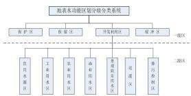

(2-14)

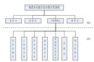

式中： ，其中，F为综合评价分值；为各单项组份评价分值 $F _ { i }$ 的平均值； $F _ { m a x }$ 为单项组份评价分值最大值； $F _ { i }$ 为单项组份评价分值；n为参加评分的项数。

表 2-47 地下水质量评价标准表
<table><tr><td rowspan=1 colspan=1>类别</td><td rowspan=1 colspan=1>I</td><td rowspan=1 colspan=1>II</td><td rowspan=1 colspan=1>Ⅲ</td><td rowspan=1 colspan=1>IV</td><td rowspan=1 colspan=1>V</td></tr><tr><td rowspan=1 colspan=1>单项组份评价分值Fi</td><td rowspan=1 colspan=1>0</td><td rowspan=1 colspan=1>1</td><td rowspan=1 colspan=1>3</td><td rowspan=1 colspan=1>6</td><td rowspan=1 colspan=1>10</td></tr><tr><td rowspan=1 colspan=1>综合评价分值F</td><td rowspan=1 colspan=1>&lt;0.80</td><td rowspan=1 colspan=1>0.8~&lt;2.50</td><td rowspan=1 colspan=1>2.50~&lt;4.25</td><td rowspan=1 colspan=1>4.25~&lt;7.20</td><td rowspan=1 colspan=1>&gt;7.20</td></tr><tr><td rowspan=1 colspan=1>质量级别</td><td rowspan=1 colspan=1>优良</td><td rowspan=1 colspan=1>良好</td><td rowspan=1 colspan=1>较好</td><td rowspan=1 colspan=1>较差</td><td rowspan=1 colspan=1>极差</td></tr></table>

2015年，新密市水务局共对三个地下水源地的11个水质项目：pH值、总硬度、氯化物、高锰酸盐指数、氨氮、氟化物、总大肠菌群、挥发酚、氰化物、砷和六价铬，分别进行了12次监测，水质监测结果见表2-48。

表2-48五里店水井、老城水井、西关水井水质状况统计表
<table><tr><td rowspan=2 colspan=1>水质项目</td><td rowspan=1 colspan=3>浓度值范围（mg/L）</td><td rowspan=2 colspan=1>标准限值(mg/L)</td><td rowspan=1 colspan=3>达标率（%）</td></tr><tr><td rowspan=1 colspan=1>五里店水井</td><td rowspan=1 colspan=1>老城水井</td><td rowspan=1 colspan=1>西关水井</td><td rowspan=1 colspan=1>五里店水井</td><td rowspan=1 colspan=1>老城水井</td><td rowspan=1 colspan=1>西关水井</td></tr><tr><td rowspan=1 colspan=1> $\mathsf { p H }$ 值</td><td rowspan=1 colspan=1>7.13~7.89</td><td rowspan=1 colspan=1>7.06~7.72</td><td rowspan=1 colspan=1>7.17~7.84</td><td rowspan=1 colspan=1>6.5~8.5</td><td rowspan=1 colspan=1>100</td><td rowspan=1 colspan=1>100</td><td rowspan=1 colspan=1>100</td></tr><tr><td rowspan=1 colspan=1>总硬度</td><td rowspan=1 colspan=1>327~400</td><td rowspan=1 colspan=1>414~427</td><td rowspan=1 colspan=1>342~436</td><td rowspan=1 colspan=1>450</td><td rowspan=1 colspan=1>100</td><td rowspan=1 colspan=1>100</td><td rowspan=1 colspan=1>100</td></tr><tr><td rowspan=1 colspan=1>氯化物</td><td rowspan=1 colspan=1>26~43</td><td rowspan=1 colspan=1>23~38</td><td rowspan=1 colspan=1>21~40</td><td rowspan=1 colspan=1>250</td><td rowspan=1 colspan=1>100</td><td rowspan=1 colspan=1>100</td><td rowspan=1 colspan=1>100</td></tr><tr><td rowspan=1 colspan=1>高锰酸盐指数</td><td rowspan=1 colspan=1>0.76~0.87</td><td rowspan=1 colspan=1>0.8~0.85</td><td rowspan=1 colspan=1>0.8~0.9</td><td rowspan=1 colspan=1>3.0</td><td rowspan=1 colspan=1>100</td><td rowspan=1 colspan=1>100</td><td rowspan=1 colspan=1>100</td></tr><tr><td rowspan=1 colspan=1>氨氮</td><td rowspan=1 colspan=1>0.013~0.138</td><td rowspan=1 colspan=1>0.013~0.145</td><td rowspan=1 colspan=1>0.013~0.15</td><td rowspan=1 colspan=1>0.2</td><td rowspan=1 colspan=1>100</td><td rowspan=1 colspan=1>100</td><td rowspan=1 colspan=1>100</td></tr><tr><td rowspan=1 colspan=1>氟化物</td><td rowspan=1 colspan=1>0.55~0.74</td><td rowspan=1 colspan=1>0.5~0.54</td><td rowspan=1 colspan=1>0.44~0.68</td><td rowspan=1 colspan=1>1.0</td><td rowspan=1 colspan=1>100</td><td rowspan=1 colspan=1>100</td><td rowspan=1 colspan=1>100</td></tr><tr><td rowspan=1 colspan=1>总大肠菌群</td><td rowspan=1 colspan=1>0</td><td rowspan=1 colspan=1>0</td><td rowspan=1 colspan=1>0</td><td rowspan=1 colspan=1>3</td><td rowspan=1 colspan=1>100</td><td rowspan=1 colspan=1>100</td><td rowspan=1 colspan=1>100</td></tr><tr><td rowspan=1 colspan=1>挥发酚</td><td rowspan=1 colspan=1>未检出</td><td rowspan=1 colspan=1>未检出</td><td rowspan=1 colspan=1>未检出</td><td rowspan=1 colspan=1>0.002</td><td rowspan=1 colspan=1>100</td><td rowspan=1 colspan=1>100</td><td rowspan=1 colspan=1>100</td></tr><tr><td rowspan=1 colspan=1>氰化物</td><td rowspan=1 colspan=1>未检出</td><td rowspan=1 colspan=1>未检出</td><td rowspan=1 colspan=1>未检出</td><td rowspan=1 colspan=1>0.05</td><td rowspan=1 colspan=1>100</td><td rowspan=1 colspan=1>100</td><td rowspan=1 colspan=1>100</td></tr><tr><td rowspan=1 colspan=1>砷</td><td rowspan=1 colspan=1>未检出</td><td rowspan=1 colspan=1>未检出</td><td rowspan=1 colspan=1>未检出</td><td rowspan=1 colspan=1>0.05</td><td rowspan=1 colspan=1>100</td><td rowspan=1 colspan=1>100</td><td rowspan=1 colspan=1>100</td></tr><tr><td rowspan=1 colspan=1>六价铬</td><td rowspan=1 colspan=1>未检出</td><td rowspan=1 colspan=1>未检出</td><td rowspan=1 colspan=1>未检出</td><td rowspan=1 colspan=1>0.05</td><td rowspan=1 colspan=1>100</td><td rowspan=1 colspan=1>100</td><td rowspan=1 colspan=1>100</td></tr></table>

注：来源于《新密市2015年度环境质量年鉴》

评价结果见表2-49。

表2-49水井单项组分水质评价结果表
<table><tr><td colspan="1" rowspan="2">水质项目</td><td colspan="3" rowspan="1">水质类别</td></tr><tr><td colspan="1" rowspan="1">五里店水井</td><td colspan="1" rowspan="1">老城水井</td><td colspan="1" rowspan="1">西关水井</td></tr><tr><td colspan="1" rowspan="1">pH值</td><td colspan="1" rowspan="1">I</td><td colspan="1" rowspan="1">I</td><td colspan="1" rowspan="1">I</td></tr><tr><td colspan="1" rowspan="1">总硬度</td><td colspan="1" rowspan="1">IⅢI</td><td colspan="1" rowspan="1">ⅢI</td><td colspan="1" rowspan="1">Ⅲ</td></tr><tr><td colspan="1" rowspan="1">氯化物</td><td colspan="1" rowspan="1">1,ⅡI</td><td colspan="1" rowspan="1">I,II</td><td colspan="1" rowspan="1">I,ⅡI</td></tr><tr><td colspan="1" rowspan="1">高锰酸盐指数</td><td colspan="1" rowspan="1">1,II</td><td colspan="1" rowspan="1">1,II</td><td colspan="1" rowspan="1">I,II</td></tr><tr><td colspan="1" rowspan="1">氨氮</td><td colspan="1" rowspan="1">I</td><td colspan="1" rowspan="1">I</td><td colspan="1" rowspan="1">I</td></tr><tr><td colspan="1" rowspan="1">氟化物</td><td colspan="1" rowspan="1">I</td><td colspan="1" rowspan="1">I</td><td colspan="1" rowspan="1">I</td></tr><tr><td colspan="1" rowspan="1">总大肠菌群</td><td colspan="1" rowspan="1">I</td><td colspan="1" rowspan="1">I</td><td colspan="1" rowspan="1">I</td></tr><tr><td colspan="1" rowspan="1">挥发酚</td><td colspan="1" rowspan="1">I</td><td colspan="1" rowspan="1">I</td><td colspan="1" rowspan="1">I</td></tr><tr><td colspan="1" rowspan="1">氰化物</td><td colspan="1" rowspan="1">I</td><td colspan="1" rowspan="1">I</td><td colspan="1" rowspan="1">I</td></tr><tr><td colspan="1" rowspan="1">砷</td><td colspan="1" rowspan="1">I</td><td colspan="1" rowspan="1">I</td><td colspan="1" rowspan="1">I</td></tr><tr><td colspan="1" rowspan="1">六价铬</td><td colspan="1" rowspan="1">I</td><td colspan="1" rowspan="1">I</td><td colspan="1" rowspan="1">I</td></tr></table>

表2-49表明，三个水源地地下水硬度偏高，但不超标，氯化物和高锰酸盐指数达到Ⅰ或Ⅱ类水标准，其他指标则均达到Ⅰ类水标准。

## 2.7.3 水质变化趋势分析

新密市浅层地下水水质和全国浅层地下水水质一样，近30年来一直趋于恶化，其中主要受农药、化肥和工业污染源影响。在新密市造纸厂一带，浅层地下水受到严重污染，近几年来已初步得到控制；煤矿开采对浅层地下水水质也有较大影响。

## 2.7.4 地下水污染分析

境内地下水污染源主要有矿区环境污染，其中以煤矿最为突出；工业污染源以造纸工业废水排放污染为主；农业污染源以农药和化肥为主；城镇生活污染源主要有生活垃圾污染、生活废水污染、医院废弃物和医疗用水污染。

## 2.7.5 大型地下水水源地水质评价

新密市城市供水地下水水源地有西区水厂水源地、五里店水厂水源地和西关水厂水源地，三个水源地水质评价结果见表2-48，2-49。

## 2.8 水资源总量

本次评价水资源总量计算采用地表水资源量（河川径流量）与地下水资源量之和再扣除重复量的计算方法。

地表水与地下水重复量的计算是建立在地表水与地下水相互作用的基础上的，从补给关系上来说，地表水补给地下水量主要体现在河流渗漏补给、水库或湖泊渗漏补给、地表水灌溉时渠系渗漏补给和渠系田间灌溉渗漏补给；而地下水补给地表水量可以体现在地下水补给河道、水库或湖泊的水，这是由于地下水的水头高于地表水头引起的。在全国水资源综合规划技术细则中，地表水资源量是指天然河川径流量，那么地下水补给地表水可以理解为河川基流量。

因此，水资源总量采用如下公式计算：

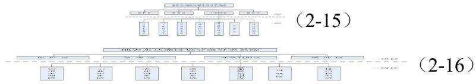

式中：

W为水资源总量；

R为河川径流量（地表水资源量）；

$\mathrm { ~ P ~ } _ { \mathrm { f f } \mathrm { f \mathrm { f } } }$ 为地下水资源量；

$\textrm { R } _ { \nexists \AA }$ 为地表水与地下水重复量；

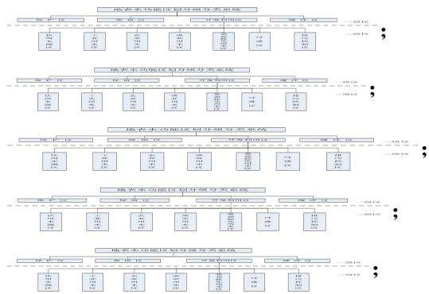

$\mathrm { R _ { b } }$ 为河川基流量。

新密市各分区地表水地下水重复量计算见表2-50，不同频率的水资源总量计算结果见表2-51和2-52所示。

表2-50 新密市地表水地下水重复量计算表
<table><tr><td colspan="2" rowspan="2">乡镇</td><td colspan="4" rowspan="1">地表水体补给  $\left( 1 0 ^ { 4 } \mathrm { m } ^ { 3 } / \mathrm { a } \right)$ </td><td colspan="1" rowspan="2">河川基流量 $( 1 0 ^ { 4 } \mathrm { m } ^ { 3 } / \mathrm { a } )$ </td><td colspan="1" rowspan="2">重复量(104m³/a)</td></tr><tr><td colspan="1" rowspan="1">渠系渗漏</td><td colspan="1" rowspan="1">田间渗漏</td><td colspan="1" rowspan="1">水库渗漏</td><td colspan="1" rowspan="1">河流渗漏</td></tr><tr><td colspan="2" rowspan="1">新密中心城区（及城关镇、袁庄乡）</td><td colspan="1" rowspan="1">0(0.7)</td><td colspan="1" rowspan="1">0（0.7)</td><td colspan="1" rowspan="1">7.2（11.4）</td><td colspan="1" rowspan="1">11.6(21.9)</td><td colspan="1" rowspan="1">334.8（693.3）</td><td colspan="1" rowspan="1">353.6（728）</td></tr><tr><td colspan="2" rowspan="1">新密新区（曲梁镇）</td><td colspan="1" rowspan="1">10.7</td><td colspan="1" rowspan="1">9.4</td><td colspan="1" rowspan="1">36.8</td><td colspan="1" rowspan="1">0</td><td colspan="1" rowspan="1">475.5</td><td colspan="1" rowspan="1">532.4</td></tr><tr><td colspan="1" rowspan="5">中心镇</td><td colspan="1" rowspan="1">超化镇</td><td colspan="1" rowspan="1">0.1</td><td colspan="1" rowspan="1">0.1</td><td colspan="1" rowspan="1">11.5</td><td colspan="1" rowspan="1">1</td><td colspan="1" rowspan="1">412.2</td><td colspan="1" rowspan="1">424.9</td></tr><tr><td colspan="1" rowspan="1">大隗镇</td><td colspan="1" rowspan="1">14</td><td colspan="1" rowspan="1">12.4</td><td colspan="1" rowspan="1">18.1</td><td colspan="1" rowspan="1">0</td><td colspan="1" rowspan="1">274.1</td><td colspan="1" rowspan="1">318.6</td></tr><tr><td colspan="1" rowspan="1">刘寨镇</td><td colspan="1" rowspan="1">1.1</td><td colspan="1" rowspan="1">1</td><td colspan="1" rowspan="1">19.9</td><td colspan="1" rowspan="1">1.1</td><td colspan="1" rowspan="1">290.5</td><td colspan="1" rowspan="1">313.6</td></tr><tr><td colspan="1" rowspan="1">白寨镇</td><td colspan="1" rowspan="1">0.1</td><td colspan="1" rowspan="1">0.1</td><td colspan="1" rowspan="1">25.1</td><td colspan="1" rowspan="1">0</td><td colspan="1" rowspan="1">507.7</td><td colspan="1" rowspan="1">533</td></tr><tr><td colspan="1" rowspan="1">小计</td><td colspan="1" rowspan="1">15.3</td><td colspan="1" rowspan="1">13.6</td><td colspan="1" rowspan="1">74.6</td><td colspan="1" rowspan="1">2.1</td><td colspan="1" rowspan="1">1484.5</td><td colspan="1" rowspan="1">1590.1</td></tr><tr><td colspan="1" rowspan="2">一般镇</td><td colspan="1" rowspan="1">米村镇</td><td colspan="1" rowspan="1">11.6</td><td colspan="1" rowspan="1">10.2</td><td colspan="1" rowspan="1">44.8</td><td colspan="1" rowspan="1">0</td><td colspan="1" rowspan="1">249.1</td><td colspan="1" rowspan="1">315.7</td></tr><tr><td colspan="1" rowspan="1">牛店镇</td><td colspan="1" rowspan="1">3.5</td><td colspan="1" rowspan="1">3.1</td><td colspan="1" rowspan="1">66.7</td><td colspan="1" rowspan="1">0</td><td colspan="1" rowspan="1">320.4</td><td colspan="1" rowspan="1">393.7</td></tr><tr><td colspan="1" rowspan="5"></td><td colspan="1" rowspan="1">平陌镇</td><td colspan="1" rowspan="1">7.1</td><td colspan="1" rowspan="1">6.2</td><td colspan="1" rowspan="1">13.3</td><td colspan="1" rowspan="1">0.2</td><td colspan="1" rowspan="1">336.1</td><td colspan="1" rowspan="1">362.9</td></tr><tr><td colspan="1" rowspan="1">来集镇</td><td colspan="1" rowspan="1">11.5</td><td colspan="1" rowspan="1">10.2</td><td colspan="1" rowspan="1">6.6</td><td colspan="1" rowspan="1">8.5</td><td colspan="1" rowspan="1">307</td><td colspan="1" rowspan="1">343.8</td></tr><tr><td colspan="1" rowspan="1">苟堂镇</td><td colspan="1" rowspan="1">4.5</td><td colspan="1" rowspan="1">4</td><td colspan="1" rowspan="1">4.2</td><td colspan="1" rowspan="1">0</td><td colspan="1" rowspan="1">410.2</td><td colspan="1" rowspan="1">422.9</td></tr><tr><td colspan="1" rowspan="1">岳村镇</td><td colspan="1" rowspan="1">7.3</td><td colspan="1" rowspan="1">6.4</td><td colspan="1" rowspan="1">11.7</td><td colspan="1" rowspan="1">3.8</td><td colspan="1" rowspan="1">323.4</td><td colspan="1" rowspan="1">352.6</td></tr><tr><td colspan="1" rowspan="1">小计</td><td colspan="1" rowspan="1">45.5</td><td colspan="1" rowspan="1">40.1</td><td colspan="1" rowspan="1">147.3</td><td colspan="1" rowspan="1">12.5</td><td colspan="1" rowspan="1">1946.2</td><td colspan="1" rowspan="1">2191.6</td></tr><tr><td colspan="2" rowspan="1">尖山乡*</td><td colspan="1" rowspan="1">0</td><td colspan="1" rowspan="1">0</td><td colspan="1" rowspan="1">17.3</td><td colspan="1" rowspan="1">0</td><td colspan="1" rowspan="1">213.2</td><td colspan="1" rowspan="1">230.5</td></tr><tr><td colspan="2" rowspan="1">全区</td><td colspan="1" rowspan="1">72.2</td><td colspan="1" rowspan="1">63.8</td><td colspan="1" rowspan="1">287.4</td><td colspan="1" rowspan="1">36.5</td><td colspan="1" rowspan="1">4812.3</td><td colspan="1" rowspan="1">5272.2</td></tr></table>

表2-51新密市水资源总量计算表
<table><tr><td rowspan=2 colspan=2>乡镇</td><td rowspan=2 colspan=1>多年平均水资源总量(104m³)</td><td rowspan=1 colspan=1>产水模数</td><td rowspan=1 colspan=1>降水量</td><td rowspan=2 colspan=1>产水系数</td></tr><tr><td rowspan=1 colspan=1>(104m³/km²)</td><td rowspan=1 colspan=1>(mm)</td></tr><tr><td rowspan=1 colspan=2>新密中心城区（及城关镇、袁庄乡）</td><td rowspan=1 colspan=1>1030</td><td rowspan=1 colspan=1>14.8</td><td rowspan=1 colspan=1>634</td><td rowspan=1 colspan=1>0.0234</td></tr><tr><td rowspan=1 colspan=2>新密新区（曲梁镇）</td><td rowspan=1 colspan=1>1374.8</td><td rowspan=1 colspan=1>13.5</td><td rowspan=1 colspan=1>655</td><td rowspan=1 colspan=1>0.0206</td></tr><tr><td rowspan=5 colspan=1>中心镇</td><td rowspan=1 colspan=1>超化镇</td><td rowspan=1 colspan=1>1211.1</td><td rowspan=1 colspan=1>15.4</td><td rowspan=1 colspan=1>612</td><td rowspan=1 colspan=1>0.0252</td></tr><tr><td rowspan=1 colspan=1>大隗镇</td><td rowspan=1 colspan=1>783.5</td><td rowspan=1 colspan=1>13.3</td><td rowspan=1 colspan=1>663</td><td rowspan=1 colspan=1>0.0201</td></tr><tr><td rowspan=1 colspan=1>刘寨镇</td><td rowspan=1 colspan=1>841.3</td><td rowspan=1 colspan=1>13.8</td><td rowspan=1 colspan=1>668</td><td rowspan=1 colspan=1>0.0206</td></tr><tr><td rowspan=1 colspan=1>白寨镇</td><td rowspan=1 colspan=1>1484</td><td rowspan=1 colspan=1>16.1</td><td rowspan=1 colspan=1>663</td><td rowspan=1 colspan=1>0.0243</td></tr><tr><td rowspan=1 colspan=1>小计</td><td rowspan=1 colspan=1>4319.9</td><td rowspan=1 colspan=1>58.6</td><td rowspan=1 colspan=1>2606</td><td rowspan=1 colspan=1>0.02255</td></tr><tr><td rowspan=7 colspan=1>一般镇</td><td rowspan=1 colspan=1>米村镇</td><td rowspan=1 colspan=1>656.9</td><td rowspan=1 colspan=1>11.3</td><td rowspan=1 colspan=1>703</td><td rowspan=1 colspan=1>0.0161</td></tr><tr><td rowspan=1 colspan=1>牛店镇</td><td rowspan=1 colspan=1>885.3</td><td rowspan=1 colspan=1>11.6</td><td rowspan=1 colspan=1>620</td><td rowspan=1 colspan=1>0.0188</td></tr><tr><td rowspan=1 colspan=1>平陌镇</td><td rowspan=1 colspan=1>992.1</td><td rowspan=1 colspan=1>16.4</td><td rowspan=1 colspan=1>609</td><td rowspan=1 colspan=1>0.0269</td></tr><tr><td rowspan=1 colspan=1>来集镇</td><td rowspan=1 colspan=1>933.6</td><td rowspan=1 colspan=1>14.8</td><td rowspan=1 colspan=1>626</td><td rowspan=1 colspan=1>0.0237</td></tr><tr><td rowspan=1 colspan=1>苟堂镇</td><td rowspan=1 colspan=1>1111.1</td><td rowspan=1 colspan=1>12.4</td><td rowspan=1 colspan=1>688</td><td rowspan=1 colspan=1>0.0181</td></tr><tr><td rowspan=1 colspan=1>岳村镇</td><td rowspan=1 colspan=1>967.9</td><td rowspan=1 colspan=1>15.6</td><td rowspan=1 colspan=1>648</td><td rowspan=1 colspan=1>0.0241</td></tr><tr><td rowspan=1 colspan=1>小计</td><td rowspan=1 colspan=1>5546.9</td><td rowspan=1 colspan=1>82.1</td><td rowspan=1 colspan=1>3894</td><td rowspan=1 colspan=1>0.021283</td></tr><tr><td rowspan=1 colspan=2>尖山乡*</td><td rowspan=1 colspan=1>468.7</td><td rowspan=1 colspan=1>8.8</td><td rowspan=1 colspan=1>658</td><td rowspan=1 colspan=1>0.0134</td></tr><tr><td rowspan=1 colspan=2>全区</td><td rowspan=1 colspan=1>13756.6</td><td rowspan=1 colspan=1>13.7</td><td rowspan=1 colspan=1>651</td><td rowspan=1 colspan=1>0.0211</td></tr></table>

表2-52新密市不同频率的水资源总量计算表

<table><tr><td colspan="2" rowspan="2">乡镇</td><td colspan="4" rowspan="1">不同频率年水资源总量(104m³)</td></tr><tr><td colspan="1" rowspan="1">20%</td><td colspan="1" rowspan="1">50%</td><td colspan="1" rowspan="1">75%</td><td colspan="1" rowspan="1">95%</td></tr><tr><td colspan="2" rowspan="1">新密中心城区（及城关镇、袁庄乡）</td><td colspan="1" rowspan="1">1586.7(3164.4)</td><td colspan="1" rowspan="1">1208.5(2395.6)</td><td colspan="1" rowspan="1">981.2(1935.2)</td><td colspan="1" rowspan="1">748.5(1465.1)</td></tr><tr><td colspan="2" rowspan="1">新密新区（曲梁镇）</td><td colspan="1" rowspan="1">2130.2</td><td colspan="1" rowspan="1">1607.7</td><td colspan="1" rowspan="1">1295.4</td><td colspan="1" rowspan="1">976.9</td></tr><tr><td colspan="1" rowspan="3">中心镇</td><td colspan="1" rowspan="1">超化镇</td><td colspan="1" rowspan="1">1799.4</td><td colspan="1" rowspan="1">1424.9</td><td colspan="1" rowspan="1">1201.3</td><td colspan="1" rowspan="1">973.2</td></tr><tr><td colspan="1" rowspan="1">大隗镇</td><td colspan="1" rowspan="1">1215.4</td><td colspan="1" rowspan="1">915.6</td><td colspan="1" rowspan="1">736.6</td><td colspan="1" rowspan="1">554.2</td></tr><tr><td colspan="1" rowspan="1">刘寨镇</td><td colspan="1" rowspan="1">1303.3</td><td colspan="1" rowspan="1">983.9</td><td colspan="1" rowspan="1">792.9</td><td colspan="1" rowspan="1">598.2</td></tr><tr><td colspan="1" rowspan="2"></td><td colspan="1" rowspan="1">白寨镇</td><td colspan="1" rowspan="1">2243.6</td><td colspan="1" rowspan="1">1741.8</td><td colspan="1" rowspan="1">1441.9</td><td colspan="1" rowspan="1">1136</td></tr><tr><td colspan="1" rowspan="1">小计</td><td colspan="1" rowspan="1">6561.7</td><td colspan="1" rowspan="1">5066.2</td><td colspan="1" rowspan="1">4172.7</td><td colspan="1" rowspan="1">3261.6</td></tr><tr><td colspan="1" rowspan="7">一般镇</td><td colspan="1" rowspan="1">米村镇</td><td colspan="1" rowspan="1">1027.5</td><td colspan="1" rowspan="1">764.1</td><td colspan="1" rowspan="1">608</td><td colspan="1" rowspan="1">449.8</td></tr><tr><td colspan="1" rowspan="1">牛店镇</td><td colspan="1" rowspan="1">1377.9</td><td colspan="1" rowspan="1">1032.7</td><td colspan="1" rowspan="1">827.1</td><td colspan="1" rowspan="1">618</td></tr><tr><td colspan="1" rowspan="1">平陌镇</td><td colspan="1" rowspan="1">1455.3</td><td colspan="1" rowspan="1">1169.4</td><td colspan="1" rowspan="1">998.4</td><td colspan="1" rowspan="1">824.1</td></tr><tr><td colspan="1" rowspan="1">来集镇</td><td colspan="1" rowspan="1">1439.9</td><td colspan="1" rowspan="1">1094.9</td><td colspan="1" rowspan="1">887.5</td><td colspan="1" rowspan="1">675.7</td></tr><tr><td colspan="1" rowspan="1">苟堂镇</td><td colspan="1" rowspan="1">1733</td><td colspan="1" rowspan="1">1294.5</td><td colspan="1" rowspan="1">1034.2</td><td colspan="1" rowspan="1">769.5</td></tr><tr><td colspan="1" rowspan="1">岳村镇</td><td colspan="1" rowspan="1">1472.1</td><td colspan="1" rowspan="1">1136.3</td><td colspan="1" rowspan="1">935</td><td colspan="1" rowspan="1">729.2</td></tr><tr><td colspan="1" rowspan="1">小计</td><td colspan="1" rowspan="1">8505.7</td><td colspan="1" rowspan="1">6491.9</td><td colspan="1" rowspan="1">5290.2</td><td colspan="1" rowspan="1">4066.3</td></tr><tr><td colspan="2" rowspan="1">尖山乡*</td><td colspan="1" rowspan="1">748.4</td><td colspan="1" rowspan="1">538.5</td><td colspan="1" rowspan="1">416.5</td><td colspan="1" rowspan="1">293.6</td></tr><tr><td colspan="2" rowspan="1">全区</td><td colspan="1" rowspan="1">21110.4</td><td colspan="1" rowspan="1">16099.8</td><td colspan="1" rowspan="1">13110.1</td><td colspan="1" rowspan="1">10063.3</td></tr></table>

## 2.9 水资源可利用量

水资源可利用量是从区域资源、环境、技术和经济条件的角度，综合分析可以被利用的水量。

地表水可利用量是指在可预见时期内，在统筹考虑河道内生态环境和其他用水的基础上，通过经济合理、技术可行的措施，可供河道外生活、生产、生态用水的一次性最大水量。

地下水可开采量（允许开采量）是通过技术经济合理的取水方案，在整个开采期内出水量不会减少、动水位不超过设计要求、水质和水温变化在允许范围内、不影响已建水源地正常开采、不发生危害性的环境地质现象的前提下，单位时间内从水文地质单元或取水地段中能够取得的水量。

水资源可利用总量是指在可预见的时期内，在统筹考虑生活、生产和生态环境用水的基础上，通过经济合理、技术可行的措施在当地水资源中可提供一次性利用的最大水量。水资源可利用总量是分析计算由当地降水形成的水资源的可利用量，不包括外来水。水资源可利用总量与水资源总量相对应，包括地表水和地下水两部分可利用量，而且扣除地表水与地下水相互转化的重复计算量。

## 2.9.1 地表水资源可利用量

## （1）地表水资源可利用量的计算

采用倒算法计算新密市地表水可利用量。倒算法是用多年平均水资源量减去不可以被利用的水量和不可能被利用水量，求得多年平均地表水资源可利用量，

计算公式如下：

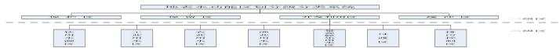

(2-17)

地表水资源可利用量见表2-53、2-54。

①不可以被利用水量

不可以被利用水量是指不允许利用的水量，它包括河道内生态环境需水量和河道内生产需水量。由于河道内需水具有基本不消耗水量和可重复利用等特点，因此选择河道内各项需水量的最大值，作为河道内需水量。河道内生态环境需水量主要包括维持河道基本功能的需水量、通河湖泊湿地需水量、河口生态环境需水量等。维持河道基本功能需水量是指河道基流量，它是维持河床基本形态、保障河道输水能力、防止河道断流、保持水体一定的自净能力的最小流量。本次评价采用多年平均径流量的百分比法确定不可以被利用水量为河道内需水量的最大值，计算公式如下：

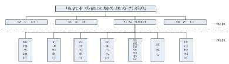

(2-18)

式中： $W _ { \mathrm { i } \overline { { \mathbb { I } } } \mathrm { j } \overline { { \mathbb { I } } } \sharp \lvert \mathcal { H } \overline { { \widehat { \pi } } } \rangle \mathrm { k g } \mathrm { k g } \mathrm { \neq } \mathrm { k g } }$ 为河道内需水量最大值；

Wi为第i年的地表水资源量；

K为选取的百分数；

n为统计年数。

根据新密市实际特点，取K为15%。

②不可能被利用水量

不可能被利用水量是指受多种因素和条件的限制，无法被利用的水量。主要包括：超出工程最大调蓄能力和供水能力的洪水量；在可预见时期内受工程经济技术影响不可能被利用的水量。汛期难以控制利用洪水量是指在可预见的时期内，不能被工程措施控制利用的汛期洪水量。汛期水量中除一部分可供当时利用，还有一部分可通过工程蓄存起来供以后利用外，其余水量即为汛期难以控制利用的洪水量。

（1）不考虑现状水质条件下地表水资源可利用量

表2-53 地表水资源可利用量计算表

<table><tr><td rowspan=1 colspan=2>乡镇</td><td rowspan=1 colspan=1>地表水资源量 $( 1 0 ^ { 4 } \mathrm { m } ^ { 3 } )$ </td><td rowspan=1 colspan=1>地表水资源可利用量 $( 1 0 ^ { 4 } \mathrm { m } ^ { 3 } )$ </td><td rowspan=1 colspan=1>占地表水资源的比例(%)</td><td rowspan=1 colspan=1>占全市的比例（%）</td></tr><tr><td rowspan=1 colspan=2>新密中心城区（及城关镇、袁庄乡）</td><td rowspan=1 colspan=1>647(1403.4)</td><td rowspan=1 colspan=1>190.2(432.4)</td><td rowspan=1 colspan=1>29.4(91.5)</td><td rowspan=1 colspan=1>6.3(14.3)</td></tr><tr><td rowspan=1 colspan=2>新密新区（曲梁镇）</td><td rowspan=1 colspan=1>983.6</td><td rowspan=1 colspan=1>307.3</td><td rowspan=1 colspan=1>31.2</td><td rowspan=1 colspan=1>10.1</td></tr><tr><td rowspan=5 colspan=1>中心镇</td><td rowspan=1 colspan=1>超化镇</td><td rowspan=1 colspan=1>707.6</td><td rowspan=1 colspan=1>194</td><td rowspan=1 colspan=1>27.4</td><td rowspan=1 colspan=1>6.4</td></tr><tr><td rowspan=1 colspan=1>大隗镇</td><td rowspan=1 colspan=1>573.9</td><td rowspan=1 colspan=1>183</td><td rowspan=1 colspan=1>31.9</td><td rowspan=1 colspan=1>6</td></tr><tr><td rowspan=1 colspan=1>刘寨镇</td><td rowspan=1 colspan=1>599.8</td><td rowspan=1 colspan=1>193.6</td><td rowspan=1 colspan=1>32.3</td><td rowspan=1 colspan=1>6.4</td></tr><tr><td rowspan=1 colspan=1>白寨镇</td><td rowspan=1 colspan=1>944.8</td><td rowspan=1 colspan=1>326.1</td><td rowspan=1 colspan=1>34.5</td><td rowspan=1 colspan=1>10.8</td></tr><tr><td rowspan=1 colspan=1>小计</td><td rowspan=1 colspan=1>2826.1</td><td rowspan=1 colspan=1>896.7</td><td rowspan=1 colspan=1>126.1</td><td rowspan=1 colspan=1>29.6</td></tr><tr><td rowspan=7 colspan=1>一般镇</td><td rowspan=1 colspan=1>米村镇</td><td rowspan=1 colspan=1>561.8</td><td rowspan=1 colspan=1>176.9</td><td rowspan=1 colspan=1>31.5</td><td rowspan=1 colspan=1>5.8</td></tr><tr><td rowspan=1 colspan=1>牛店镇</td><td rowspan=1 colspan=1>693</td><td rowspan=1 colspan=1>195.1</td><td rowspan=1 colspan=1>28.1</td><td rowspan=1 colspan=1>6.4</td></tr><tr><td rowspan=1 colspan=1>平陌镇</td><td rowspan=1 colspan=1>542</td><td rowspan=1 colspan=1>147</td><td rowspan=1 colspan=1>27.1</td><td rowspan=1 colspan=1>4.9</td></tr><tr><td rowspan=1 colspan=1>来集镇</td><td rowspan=1 colspan=1>601.1</td><td rowspan=1 colspan=1>184.3</td><td rowspan=1 colspan=1>30.7</td><td rowspan=1 colspan=1>6.1</td></tr><tr><td rowspan=1 colspan=1>苟堂镇</td><td rowspan=1 colspan=1>904</td><td rowspan=1 colspan=1>305.5</td><td rowspan=1 colspan=1>33.8</td><td rowspan=1 colspan=1>10.1</td></tr><tr><td rowspan=1 colspan=1>岳村镇</td><td rowspan=1 colspan=1>605.1</td><td rowspan=1 colspan=1>192.9</td><td rowspan=1 colspan=1>31.9</td><td rowspan=1 colspan=1>6.4</td></tr><tr><td rowspan=1 colspan=1>小计</td><td rowspan=1 colspan=1>3907</td><td rowspan=1 colspan=1>1201.7</td><td rowspan=1 colspan=1>183.1</td><td rowspan=1 colspan=1>39.7</td></tr><tr><td rowspan=1 colspan=2>尖山乡*</td><td rowspan=1 colspan=1>549.2</td><td rowspan=1 colspan=1>191.5</td><td rowspan=1 colspan=1>34.9</td><td rowspan=1 colspan=1>6.3</td></tr><tr><td rowspan=1 colspan=2>全区</td><td rowspan=1 colspan=1>9669</td><td rowspan=1 colspan=1>3029.5</td><td rowspan=1 colspan=1>31.3</td><td rowspan=1 colspan=1>100</td></tr></table>

（2）现状水质条件下地表水资源可利用量

表2-54 现状水质条件下地表水资源可利用量（单位： $1 0 ^ { 4 } \mathrm { m } ^ { 3 } / \mathrm { a } )$
<table><tr><td colspan="2" rowspan="1">乡镇</td><td colspan="1" rowspan="1">地表水资源量</td><td colspan="1" rowspan="1">地表水资源可利用量</td><td colspan="1" rowspan="1">劣V类河长所占比例（%）</td><td colspan="1" rowspan="1">现状水质下地表水资源可利用量</td></tr><tr><td colspan="2" rowspan="1">新密中心城区（及城关镇、袁庄乡）</td><td colspan="1" rowspan="1">647(1403.4)</td><td colspan="1" rowspan="1">190.2(432.4)</td><td colspan="1" rowspan="1">81.5(244.5)</td><td colspan="1" rowspan="1">35.2(80)</td></tr><tr><td colspan="2" rowspan="1">新密新区（曲梁）</td><td colspan="1" rowspan="1">983.6</td><td colspan="1" rowspan="1">307.3</td><td colspan="1" rowspan="1">81.5</td><td colspan="1" rowspan="1">56.8</td></tr><tr><td colspan="1" rowspan="5">中心镇</td><td colspan="1" rowspan="1">超化镇</td><td colspan="1" rowspan="1">707.6</td><td colspan="1" rowspan="1">194</td><td colspan="1" rowspan="1">81.5</td><td colspan="1" rowspan="1">35.9</td></tr><tr><td colspan="1" rowspan="1">大隗镇</td><td colspan="1" rowspan="1">573.9</td><td colspan="1" rowspan="1">183</td><td colspan="1" rowspan="1">81.5</td><td colspan="1" rowspan="1">33.8</td></tr><tr><td colspan="1" rowspan="1">刘寨镇</td><td colspan="1" rowspan="1">599.8</td><td colspan="1" rowspan="1">193.6</td><td colspan="1" rowspan="1">81.5</td><td colspan="1" rowspan="1">35.8</td></tr><tr><td colspan="1" rowspan="1">白寨镇</td><td colspan="1" rowspan="1">944.8</td><td colspan="1" rowspan="1">326.1</td><td colspan="1" rowspan="1">81.5</td><td colspan="1" rowspan="1">60.3</td></tr><tr><td colspan="1" rowspan="1">小计</td><td colspan="1" rowspan="1">2826.1</td><td colspan="1" rowspan="1">896.7</td><td colspan="1" rowspan="1">326</td><td colspan="1" rowspan="1">165.8</td></tr><tr><td colspan="1" rowspan="2">一般镇</td><td colspan="1" rowspan="1">米村镇</td><td colspan="1" rowspan="1">561.8</td><td colspan="1" rowspan="1">176.9</td><td colspan="1" rowspan="1">81.5</td><td colspan="1" rowspan="1">32.7</td></tr><tr><td colspan="1" rowspan="1">牛店镇</td><td colspan="1" rowspan="1">693</td><td colspan="1" rowspan="1">195.1</td><td colspan="1" rowspan="1">81.5</td><td colspan="1" rowspan="1">36.1</td></tr><tr><td colspan="1" rowspan="5"></td><td colspan="1" rowspan="1">平陌镇</td><td colspan="1" rowspan="1">542</td><td colspan="1" rowspan="1">147</td><td colspan="1" rowspan="1">81.5</td><td colspan="1" rowspan="1">27.2</td></tr><tr><td colspan="1" rowspan="1">来集镇</td><td colspan="1" rowspan="1">601.1</td><td colspan="1" rowspan="1">184.3</td><td colspan="1" rowspan="1">81.5</td><td colspan="1" rowspan="1">34.1</td></tr><tr><td colspan="1" rowspan="1">苟堂镇</td><td colspan="1" rowspan="1">904</td><td colspan="1" rowspan="1">305.5</td><td colspan="1" rowspan="1">81.5</td><td colspan="1" rowspan="1">56.5</td></tr><tr><td colspan="1" rowspan="1">岳村镇</td><td colspan="1" rowspan="1">605.1</td><td colspan="1" rowspan="1">192.9</td><td colspan="1" rowspan="1">81.5</td><td colspan="1" rowspan="1">35.7</td></tr><tr><td colspan="1" rowspan="1">小计</td><td colspan="1" rowspan="1">3907</td><td colspan="1" rowspan="1">1201.7</td><td colspan="1" rowspan="1">489</td><td colspan="1" rowspan="1">222.3</td></tr><tr><td colspan="2" rowspan="1">尖山乡*</td><td colspan="1" rowspan="1">549.2</td><td colspan="1" rowspan="1">191.5</td><td colspan="1" rowspan="1">81.5</td><td colspan="1" rowspan="1">35.4</td></tr><tr><td colspan="2" rowspan="1">全区</td><td colspan="1" rowspan="1">9669</td><td colspan="1" rowspan="1">3029.5</td><td colspan="1" rowspan="1">81.5</td><td colspan="1" rowspan="1">560.4</td></tr></table>

## 2.9.2 地下水资源可开采量

地下水资源可开采量（地下水允许开采量）的大小，主要取决于补给量。新密市地下水资源可开采量的计算，采用可开采系数法。根据新密市地下水赋存条件和开采现状及单井单位降深出水量特点确定可开采系数为0.70。

按分区多年平均地下水资源可开采量见表2-55。

表2-55 各分区地下水资源可采量计算结果表
<table><tr><td rowspan=1 colspan=2>乡镇</td><td rowspan=1 colspan=1>面积(km²)</td><td rowspan=1 colspan=1>多年平均地下水资源可开采量(104m³)</td><td rowspan=1 colspan=1>可开采模数(104m³/a·km²)</td></tr><tr><td rowspan=1 colspan=2>新密中心城区(及城关镇、袁庄乡）</td><td rowspan=1 colspan=1>110（146）</td><td rowspan=1 colspan=1>522.8(978)</td><td rowspan=1 colspan=1>7.5(6.8)</td></tr><tr><td rowspan=1 colspan=2>新密新区（曲梁镇）</td><td rowspan=1 colspan=1>102.0</td><td rowspan=1 colspan=1>687.2</td><td rowspan=1 colspan=1>6.7</td></tr><tr><td rowspan=5 colspan=1>中心镇</td><td rowspan=1 colspan=1>超化镇</td><td rowspan=1 colspan=1>79.0</td><td rowspan=1 colspan=1>751.5</td><td rowspan=1 colspan=1>9.6</td></tr><tr><td rowspan=1 colspan=1>大隗镇</td><td rowspan=1 colspan=1>59.0</td><td rowspan=1 colspan=1>390.6</td><td rowspan=1 colspan=1>6.6</td></tr><tr><td rowspan=1 colspan=1>刘寨镇</td><td rowspan=1 colspan=1>61.0</td><td rowspan=1 colspan=1>410.3</td><td rowspan=1 colspan=1>6.7</td></tr><tr><td rowspan=1 colspan=1>白寨镇</td><td rowspan=1 colspan=1>92.0</td><td rowspan=1 colspan=1>751.4</td><td rowspan=1 colspan=1>8.2</td></tr><tr><td rowspan=1 colspan=1>小计</td><td rowspan=1 colspan=1>393.0</td><td rowspan=1 colspan=1>2303.8</td><td rowspan=1 colspan=1>7.8</td></tr><tr><td rowspan=7 colspan=1>一般镇</td><td rowspan=1 colspan=1>米村镇</td><td rowspan=1 colspan=1>58.0</td><td rowspan=1 colspan=1>311.2</td><td rowspan=1 colspan=1>5.4</td></tr><tr><td rowspan=1 colspan=1>牛店镇</td><td rowspan=1 colspan=1>76.0</td><td rowspan=1 colspan=1>446.1</td><td rowspan=1 colspan=1>5.9</td></tr><tr><td rowspan=1 colspan=1>平陌镇</td><td rowspan=1 colspan=1>61.0</td><td rowspan=1 colspan=1>581.5</td><td rowspan=1 colspan=1>9.6</td></tr><tr><td rowspan=1 colspan=1>来集镇</td><td rowspan=1 colspan=1>63.0</td><td rowspan=1 colspan=1>563.2</td><td rowspan=1 colspan=1>8.9</td></tr><tr><td rowspan=1 colspan=1>苟堂镇</td><td rowspan=1 colspan=1>89.0</td><td rowspan=1 colspan=1>449.8</td><td rowspan=1 colspan=1>5.0</td></tr><tr><td rowspan=1 colspan=1>岳村镇</td><td rowspan=1 colspan=1>62.0</td><td rowspan=1 colspan=1>560.4</td><td rowspan=1 colspan=1>9.0</td></tr><tr><td rowspan=1 colspan=1>小计</td><td rowspan=1 colspan=1>409.0</td><td rowspan=1 colspan=1>2912.2</td><td rowspan=1 colspan=1>7.3</td></tr><tr><td rowspan=1 colspan=2>尖山乡*</td><td rowspan=1 colspan=1>53.0</td><td rowspan=1 colspan=1>105.1</td><td rowspan=1 colspan=1>2.0</td></tr><tr><td rowspan=1 colspan=2>全区</td><td rowspan=1 colspan=1>1001.0</td><td rowspan=1 colspan=1>6986.1</td><td rowspan=1 colspan=1>7.0</td></tr></table>

## 2.9.3 当地水资源可利用总量

水资源可利用总量为地表水资源可利用量与地下水资源可开采量之和再扣除两者之间的重复计算量。地表水可利用量与地下水资源可采量的重复量为灌溉回渗量。计算公式如下：

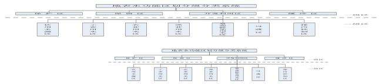

(2-19)

(2-20)

式中：

$W _ { \oplus \star \boxed { 1 } \star \boxed { 2 } }$ 为地下水可开采量与地表水可利用量的重复计算资源量；

$\rho \mathrm { \backslash }$ 为可开采系数；

$W _ { i j k \not \equiv \not \equiv }$ 为渠系渗漏补给量；

$W _ { ☉ \mathrm { H } }$ 为地表灌溉水入渗补给量。

（1）不考虑现状水质时

表2-56 当地水资源可利用总量（单位： $\mathbf { 1 0 ^ { 4 } m ^ { 3 } / a } )$
<table><tr><td rowspan=1 colspan=2>乡镇</td><td rowspan=1 colspan=1>地表水资源可利用量</td><td rowspan=1 colspan=1>地下水资源可开采量</td><td rowspan=1 colspan=1>渠系渗漏</td><td rowspan=1 colspan=1>田间渗漏</td><td rowspan=1 colspan=1>重复资源量</td><td rowspan=1 colspan=1>水资源可利用总量</td></tr><tr><td rowspan=1 colspan=2>新密中心城区（及城关镇、袁庄乡)</td><td rowspan=1 colspan=1>190.2(432.4)</td><td rowspan=1 colspan=1>522.8(978)</td><td rowspan=1 colspan=1>0(0.7)</td><td rowspan=1 colspan=1>0 (0.7)</td><td rowspan=1 colspan=1>0（1)</td><td rowspan=1 colspan=1>713(1409.4)</td></tr><tr><td rowspan=1 colspan=2>新密新区（曲梁镇）</td><td rowspan=1 colspan=1>307.3</td><td rowspan=1 colspan=1>687.2</td><td rowspan=1 colspan=1>10.7</td><td rowspan=1 colspan=1>9.4</td><td rowspan=1 colspan=1>16.1</td><td rowspan=1 colspan=1>978.4</td></tr><tr><td rowspan=5 colspan=1>中心镇</td><td rowspan=1 colspan=1>超化镇</td><td rowspan=1 colspan=1>194</td><td rowspan=1 colspan=1>751.5</td><td rowspan=1 colspan=1>0.1</td><td rowspan=1 colspan=1>0.1</td><td rowspan=1 colspan=1>0.1</td><td rowspan=1 colspan=1>945.4</td></tr><tr><td rowspan=1 colspan=1>大隗镇</td><td rowspan=1 colspan=1>183</td><td rowspan=1 colspan=1>390.6</td><td rowspan=1 colspan=1>14</td><td rowspan=1 colspan=1>12.4</td><td rowspan=1 colspan=1>21.1</td><td rowspan=1 colspan=1>552.5</td></tr><tr><td rowspan=1 colspan=1>刘寨镇</td><td rowspan=1 colspan=1>193.6</td><td rowspan=1 colspan=1>410.3</td><td rowspan=1 colspan=1>1.1</td><td rowspan=1 colspan=1>1</td><td rowspan=1 colspan=1>1.7</td><td rowspan=1 colspan=1>602.2</td></tr><tr><td rowspan=1 colspan=1>白寨镇</td><td rowspan=1 colspan=1>326.1</td><td rowspan=1 colspan=1>751.4</td><td rowspan=1 colspan=1>0.1</td><td rowspan=1 colspan=1>0.1</td><td rowspan=1 colspan=1>0.1</td><td rowspan=1 colspan=1>1077.4</td></tr><tr><td rowspan=1 colspan=1>小计</td><td rowspan=1 colspan=1>896.7</td><td rowspan=1 colspan=1>2303.8</td><td rowspan=1 colspan=1>15.3</td><td rowspan=1 colspan=1>13.6</td><td rowspan=1 colspan=1>23</td><td rowspan=1 colspan=1>3177.5</td></tr><tr><td rowspan=7 colspan=1>一般镇</td><td rowspan=1 colspan=1>米村镇</td><td rowspan=1 colspan=1>176.9</td><td rowspan=1 colspan=1>311.2</td><td rowspan=1 colspan=1>11.6</td><td rowspan=1 colspan=1>10.2</td><td rowspan=1 colspan=1>17.5</td><td rowspan=1 colspan=1>470.6</td></tr><tr><td rowspan=1 colspan=1>牛店镇</td><td rowspan=1 colspan=1>195.1</td><td rowspan=1 colspan=1>446.1</td><td rowspan=1 colspan=1>3.5</td><td rowspan=1 colspan=1>3.1</td><td rowspan=1 colspan=1>5.3</td><td rowspan=1 colspan=1>635.9</td></tr><tr><td rowspan=1 colspan=1>平陌镇</td><td rowspan=1 colspan=1>147</td><td rowspan=1 colspan=1>581.5</td><td rowspan=1 colspan=1>7.1</td><td rowspan=1 colspan=1>6.2</td><td rowspan=1 colspan=1>10.6</td><td rowspan=1 colspan=1>717.9</td></tr><tr><td rowspan=1 colspan=1>来集镇</td><td rowspan=1 colspan=1>184.3</td><td rowspan=1 colspan=1>563.2</td><td rowspan=1 colspan=1>11.5</td><td rowspan=1 colspan=1>10.2</td><td rowspan=1 colspan=1>17.4</td><td rowspan=1 colspan=1>730.1</td></tr><tr><td rowspan=1 colspan=1>苟堂镇</td><td rowspan=1 colspan=1>305.5</td><td rowspan=1 colspan=1>449.8</td><td rowspan=1 colspan=1>4.5</td><td rowspan=1 colspan=1>4</td><td rowspan=1 colspan=1>6.9</td><td rowspan=1 colspan=1>748.4</td></tr><tr><td rowspan=1 colspan=1>岳村镇</td><td rowspan=1 colspan=1>192.9</td><td rowspan=1 colspan=1>560.4</td><td rowspan=1 colspan=1>7.3</td><td rowspan=1 colspan=1>6.4</td><td rowspan=1 colspan=1>10.9</td><td rowspan=1 colspan=1>742.4</td></tr><tr><td rowspan=1 colspan=1>小计</td><td rowspan=1 colspan=1>1201.7</td><td rowspan=1 colspan=1>2912.2</td><td rowspan=1 colspan=1>45.5</td><td rowspan=1 colspan=1>40.1</td><td rowspan=1 colspan=1>68.6</td><td rowspan=1 colspan=1>4045.3</td></tr><tr><td rowspan=1 colspan=2>尖山乡*</td><td rowspan=1 colspan=1>191.5</td><td rowspan=1 colspan=1>105.1</td><td rowspan=1 colspan=1>0</td><td rowspan=1 colspan=1>0</td><td rowspan=1 colspan=1>0</td><td rowspan=1 colspan=1>296.6</td></tr><tr><td rowspan=1 colspan=2>全区</td><td rowspan=1 colspan=1>3029.5</td><td rowspan=1 colspan=1>6986.1</td><td rowspan=1 colspan=1>72.1</td><td rowspan=1 colspan=1>63.7</td><td rowspan=1 colspan=1>108.6</td><td rowspan=1 colspan=1>9907</td></tr></table>

## （2）考虑现状水质时

表2-57 现状当地水资源可利用总量（单位： $\mathbf { 1 0 ^ { 4 } m ^ { 3 } / a } )$
<table><tr><td rowspan=1 colspan=2>乡镇</td><td rowspan=1 colspan=1>地表水资源可利用量</td><td rowspan=1 colspan=1>地下水资源可开采量</td><td rowspan=1 colspan=1>渠系渗漏</td><td rowspan=1 colspan=1>田间渗漏</td><td rowspan=1 colspan=1>重复资源量</td><td rowspan=1 colspan=1>水资源可利用总量</td></tr><tr><td rowspan=1 colspan=2>新密中心城区（及城关镇、袁庄乡）</td><td rowspan=1 colspan=1>35.2(80)</td><td rowspan=1 colspan=1>522.8(978)</td><td rowspan=1 colspan=1>0(0.7)</td><td rowspan=1 colspan=1>0(0.7)</td><td rowspan=1 colspan=1>0(1)</td><td rowspan=1 colspan=1>558(1057)</td></tr><tr><td rowspan=1 colspan=2>新密新区（曲梁镇）</td><td rowspan=1 colspan=1>56.8</td><td rowspan=1 colspan=1>687.2</td><td rowspan=1 colspan=1>10.7</td><td rowspan=1 colspan=1>9.4</td><td rowspan=1 colspan=1>16.1</td><td rowspan=1 colspan=1>727.9</td></tr><tr><td rowspan=5 colspan=1>中心镇</td><td rowspan=1 colspan=1>超化镇</td><td rowspan=1 colspan=1>35.9</td><td rowspan=1 colspan=1>751.5</td><td rowspan=1 colspan=1>0.1</td><td rowspan=1 colspan=1>0.1</td><td rowspan=1 colspan=1>0.1</td><td rowspan=1 colspan=1>787.3</td></tr><tr><td rowspan=1 colspan=1>大隗镇</td><td rowspan=1 colspan=1>33.8</td><td rowspan=1 colspan=1>390.6</td><td rowspan=1 colspan=1>14</td><td rowspan=1 colspan=1>12.4</td><td rowspan=1 colspan=1>21.1</td><td rowspan=1 colspan=1>403.3</td></tr><tr><td rowspan=1 colspan=1>刘寨镇</td><td rowspan=1 colspan=1>35.8</td><td rowspan=1 colspan=1>410.3</td><td rowspan=1 colspan=1>1.1</td><td rowspan=1 colspan=1>1</td><td rowspan=1 colspan=1>1.7</td><td rowspan=1 colspan=1>444.4</td></tr><tr><td rowspan=1 colspan=1>白寨镇</td><td rowspan=1 colspan=1>60.3</td><td rowspan=1 colspan=1>751.4</td><td rowspan=1 colspan=1>0.1</td><td rowspan=1 colspan=1>0.1</td><td rowspan=1 colspan=1>0.1</td><td rowspan=1 colspan=1>811.6</td></tr><tr><td rowspan=1 colspan=1>小计</td><td rowspan=1 colspan=1>165.8</td><td rowspan=1 colspan=1>2303.8</td><td rowspan=1 colspan=1>15.3</td><td rowspan=1 colspan=1>13.6</td><td rowspan=1 colspan=1>23</td><td rowspan=1 colspan=1>2446.6</td></tr><tr><td rowspan=7 colspan=1>一般镇</td><td rowspan=1 colspan=1>米村镇</td><td rowspan=1 colspan=1>32.7</td><td rowspan=1 colspan=1>311.2</td><td rowspan=1 colspan=1>11.6</td><td rowspan=1 colspan=1>10.2</td><td rowspan=1 colspan=1>17.5</td><td rowspan=1 colspan=1>326.4</td></tr><tr><td rowspan=1 colspan=1>牛店镇</td><td rowspan=1 colspan=1>36.1</td><td rowspan=1 colspan=1>446.1</td><td rowspan=1 colspan=1>3.5</td><td rowspan=1 colspan=1>3.1</td><td rowspan=1 colspan=1>5.3</td><td rowspan=1 colspan=1>476.9</td></tr><tr><td rowspan=1 colspan=1>平陌镇</td><td rowspan=1 colspan=1>27.2</td><td rowspan=1 colspan=1>581.5</td><td rowspan=1 colspan=1>7.1</td><td rowspan=1 colspan=1>6.2</td><td rowspan=1 colspan=1>10.6</td><td rowspan=1 colspan=1>598.1</td></tr><tr><td rowspan=1 colspan=1>来集镇</td><td rowspan=1 colspan=1>34.1</td><td rowspan=1 colspan=1>563.2</td><td rowspan=1 colspan=1>11.5</td><td rowspan=1 colspan=1>10.2</td><td rowspan=1 colspan=1>17.4</td><td rowspan=1 colspan=1>579.9</td></tr><tr><td rowspan=1 colspan=1>苟堂镇</td><td rowspan=1 colspan=1>56.5</td><td rowspan=1 colspan=1>449.8</td><td rowspan=1 colspan=1>4.5</td><td rowspan=1 colspan=1>4</td><td rowspan=1 colspan=1>6.9</td><td rowspan=1 colspan=1>499.4</td></tr><tr><td rowspan=1 colspan=1>岳村镇</td><td rowspan=1 colspan=1>35.7</td><td rowspan=1 colspan=1>560.4</td><td rowspan=1 colspan=1>7.3</td><td rowspan=1 colspan=1>6.4</td><td rowspan=1 colspan=1>10.9</td><td rowspan=1 colspan=1>585.2</td></tr><tr><td rowspan=1 colspan=1>小计</td><td rowspan=1 colspan=1>222.3</td><td rowspan=1 colspan=1>2912.2</td><td rowspan=1 colspan=1>45.5</td><td rowspan=1 colspan=1>40.1</td><td rowspan=1 colspan=1>68.6</td><td rowspan=1 colspan=1>3065.9</td></tr><tr><td rowspan=1 colspan=2>尖山乡*</td><td rowspan=1 colspan=1>35.4</td><td rowspan=1 colspan=1>105.1</td><td rowspan=1 colspan=1>0</td><td rowspan=1 colspan=1>0</td><td rowspan=1 colspan=1>0</td><td rowspan=1 colspan=1>140.5</td></tr><tr><td rowspan=1 colspan=2>全区</td><td rowspan=1 colspan=1>560.4</td><td rowspan=1 colspan=1>6986.1</td><td rowspan=1 colspan=1>72.1</td><td rowspan=1 colspan=1>63.7</td><td rowspan=1 colspan=1>108.6</td><td rowspan=1 colspan=1>7437.9</td></tr></table>

由评价可以看出，新密市地表水开发利用率平均18.5%，总体为中开发利用区，低于国际上公认的极限值（40%），表明新密市地表水开发利用程度低，应加大地表水资源的开发利用。

## 3 水资源开发利用情况调查评价

## 3.1 经济社会资料分析整理

收集的经济社会指标主要有人口、工农业增加值、灌溉面积、牲畜头数、国内生产总值（GDP）、耕地面积、粮食产量等。统计整理的新密市1980～2015年经济社会主要指标如表3-1、表3-2、图3-1、图3-2、图3-3、图3-4所示。

2015年新密市总人口803685人，其中农业人口378215人，占总人口的47.06%；非农业人口425470人，占总人口的52.94%。2015年农业增加值、工业增加值、建筑业增加值、第三产业增加值和国内生产总值（GDP）依次为$2 0 . 1 0 1 2 \times 1 0 ^ { 8 }$ 元、 $3 4 3 . 3 4 1 0 { \times } 1 0 ^ { 8 }$ 元、 $2 2 . 9 5 4 6 \times 1 0 ^ { 8 }$ 元、 $2 6 5 . 2 7 6 3 { \times } 1 0 ^ { 8 }$ 元和 $6 5 1 . 6 7 3 1 \times 1 0 ^ { 8 }$ 元（均按当年价计）。从表3-1中可看出，新密市的人口在2011年骤降之后持续增长，GDP和工农业增加值都在持续增长。

2015年新密市耕地面积 $5 2 . 6 4 \times 1 0 ^ { 4 }$ 亩 $( 3 4 . 9 3 \times 1 0 ^ { 3 }$ 公顷），农作物播种面积85.47万亩 $5 6 . 9 8 \times 1 0 ^ { 3 }$ 公顷），粮食产量 $2 1 . 8 7 5 5 \times 1 0 ^ { 4 } \mathrm { t }$ 。耕地面积比2010年增加1.3%；播种面积比2010年减少11.7%，粮食产量增加5.2%。2015年新密市有效灌溉面积 $2 3 . 6 8 \times 1 0 ^ { 4 }$ 亩 $( 1 5 . 7 9 \times 1 0 ^ { 3 }$ 公顷），比2010年减少了 $6 . 6 9 \times 1 0 ^ { 4 }$ 亩 $( 4 . 4 6 \times 1 0 ^ { 3 }$ 公顷），即比2010年减少了22.0%。因此，科学技术的进步是导致粮食产量增加的主要原因。

表3-1新密市不同年份人口、国内生产总值和工农业总产值
<table><tr><td colspan="1" rowspan="2">年份</td><td colspan="2" rowspan="1">人口（人）</td><td colspan="1" rowspan="1">GDP</td><td colspan="1" rowspan="1">农业增加值</td><td colspan="1" rowspan="1">工业增加值</td><td colspan="1" rowspan="1">建筑业增加值</td><td colspan="1" rowspan="1">第三产业增加值</td></tr><tr><td colspan="1" rowspan="1">总人口</td><td colspan="1" rowspan="1">其中：农业人口</td><td colspan="1" rowspan="1"> $( 1 0 ^ { 4 } \overrightarrow { \pi } )$ </td><td colspan="1" rowspan="1"> $( 1 0 ^ { 4 } \overrightarrow { \pi } )$ </td><td colspan="1" rowspan="1"> $( 1 0 ^ { 4 } \overrightarrow { \pi } )$ </td><td colspan="1" rowspan="1"> $( 1 0 ^ { 4 } \overrightarrow { \pi } )$ </td><td colspan="1" rowspan="1"> $( 1 0 ^ { 4 } \overrightarrow { \pi } )$ </td></tr><tr><td colspan="1" rowspan="1">1980</td><td colspan="1" rowspan="1">569113</td><td colspan="1" rowspan="1">550813</td><td colspan="1" rowspan="1">13874</td><td colspan="1" rowspan="1">4836</td><td colspan="1" rowspan="1">4701</td><td colspan="1" rowspan="1">492</td><td colspan="1" rowspan="1">3845</td></tr><tr><td colspan="1" rowspan="1">1985</td><td colspan="1" rowspan="1">600902</td><td colspan="1" rowspan="1">568425</td><td colspan="1" rowspan="1">30043</td><td colspan="1" rowspan="1">8601</td><td colspan="1" rowspan="1">11214</td><td colspan="1" rowspan="1">1599</td><td colspan="1" rowspan="1">8629</td></tr><tr><td colspan="1" rowspan="1">1990</td><td colspan="1" rowspan="1">664227</td><td colspan="1" rowspan="1">620854</td><td colspan="1" rowspan="1">106488</td><td colspan="1" rowspan="1">16541</td><td colspan="1" rowspan="1">49184</td><td colspan="1" rowspan="1">3775</td><td colspan="1" rowspan="1">36988</td></tr><tr><td colspan="1" rowspan="1">1995</td><td colspan="1" rowspan="1">703241</td><td colspan="1" rowspan="1">630130</td><td colspan="1" rowspan="1">315272</td><td colspan="1" rowspan="1">30442</td><td colspan="1" rowspan="1">153563</td><td colspan="1" rowspan="1">28780</td><td colspan="1" rowspan="1">102487</td></tr><tr><td colspan="1" rowspan="1">2000</td><td colspan="1" rowspan="1">742546</td><td colspan="1" rowspan="1">647953</td><td colspan="1" rowspan="1">688054</td><td colspan="1" rowspan="1">42183</td><td colspan="1" rowspan="1">388009</td><td colspan="1" rowspan="1">18672</td><td colspan="1" rowspan="1">239190</td></tr><tr><td colspan="1" rowspan="1">2001</td><td colspan="1" rowspan="1">745197</td><td colspan="1" rowspan="1">648931</td><td colspan="1" rowspan="1">764464</td><td colspan="1" rowspan="1">42832</td><td colspan="1" rowspan="1">428661</td><td colspan="1" rowspan="1">19775</td><td colspan="1" rowspan="1">273196</td></tr><tr><td colspan="1" rowspan="1">2002</td><td colspan="1" rowspan="1">750690</td><td colspan="1" rowspan="1">650815</td><td colspan="1" rowspan="1">855289</td><td colspan="1" rowspan="1">43039</td><td colspan="1" rowspan="1">472499</td><td colspan="1" rowspan="1">28330</td><td colspan="1" rowspan="1">311421</td></tr><tr><td colspan="1" rowspan="1">2003</td><td colspan="1" rowspan="1">754687</td><td colspan="1" rowspan="1">652763</td><td colspan="1" rowspan="1">982537</td><td colspan="1" rowspan="1">43555</td><td colspan="1" rowspan="1">558241</td><td colspan="1" rowspan="1">25957</td><td colspan="1" rowspan="1">354784</td></tr><tr><td colspan="1" rowspan="1">2004</td><td colspan="1" rowspan="1">755788</td><td colspan="1" rowspan="1">647173</td><td colspan="1" rowspan="1">1240707</td><td colspan="1" rowspan="1">52014</td><td colspan="1" rowspan="1">739355</td><td colspan="1" rowspan="1">33098</td><td colspan="1" rowspan="1">416240</td></tr><tr><td colspan="1" rowspan="1">2005</td><td colspan="1" rowspan="1">759840</td><td colspan="1" rowspan="1">644310</td><td colspan="1" rowspan="1">1654243</td><td colspan="1" rowspan="1">55063</td><td colspan="1" rowspan="1">1062292</td><td colspan="1" rowspan="1">35365</td><td colspan="1" rowspan="1">501523</td></tr><tr><td colspan="1" rowspan="1">2006</td><td colspan="1" rowspan="1">774202</td><td colspan="1" rowspan="1">652421</td><td colspan="1" rowspan="1">2092218</td><td colspan="1" rowspan="1">60615</td><td colspan="1" rowspan="1">1372511</td><td colspan="1" rowspan="1">51229</td><td colspan="1" rowspan="1">607863</td></tr><tr><td colspan="1" rowspan="1">2007</td><td colspan="1" rowspan="1">787125</td><td colspan="1" rowspan="1">663659</td><td colspan="1" rowspan="1">2616699</td><td colspan="1" rowspan="1">58104</td><td colspan="1" rowspan="1">1714430</td><td colspan="1" rowspan="1">80032</td><td colspan="1" rowspan="1">764133</td></tr><tr><td colspan="1" rowspan="1">2010</td><td colspan="1" rowspan="1">794959</td><td colspan="1" rowspan="1">669923</td><td colspan="1" rowspan="1">3210271</td><td colspan="1" rowspan="1">69580</td><td colspan="1" rowspan="1">2144214</td><td colspan="1" rowspan="1">96839</td><td colspan="1" rowspan="1">899638</td></tr><tr><td colspan="1" rowspan="1">2009</td><td colspan="1" rowspan="1">804241</td><td colspan="1" rowspan="1">678989</td><td colspan="1" rowspan="1">3477502</td><td colspan="1" rowspan="1">92024</td><td colspan="1" rowspan="1">2456889</td><td colspan="1" rowspan="1">114948</td><td colspan="1" rowspan="1">813641</td></tr><tr><td colspan="1" rowspan="1">2010</td><td colspan="1" rowspan="1">809312*</td><td colspan="1" rowspan="1">683004*</td><td colspan="1" rowspan="1">3915338*</td><td colspan="1" rowspan="1">128632</td><td colspan="1" rowspan="1">2732301*</td><td colspan="1" rowspan="1">133529</td><td colspan="1" rowspan="1">920876</td></tr><tr><td colspan="1" rowspan="1">2011</td><td colspan="1" rowspan="1">799802</td><td colspan="1" rowspan="1">430373</td><td colspan="1" rowspan="1">4785461</td><td colspan="1" rowspan="1">140284</td><td colspan="1" rowspan="1">3307088</td><td colspan="1" rowspan="1">153628</td><td colspan="1" rowspan="1">1184461</td></tr><tr><td colspan="1" rowspan="1">2012</td><td colspan="1" rowspan="1">799910</td><td colspan="1" rowspan="1">411714</td><td colspan="1" rowspan="1">5152860</td><td colspan="1" rowspan="1">155800</td><td colspan="1" rowspan="1">3464839</td><td colspan="1" rowspan="1">176260</td><td colspan="1" rowspan="1">1355961</td></tr><tr><td colspan="1" rowspan="1">2013</td><td colspan="1" rowspan="1">799994</td><td colspan="1" rowspan="1">404717</td><td colspan="1" rowspan="1">5598308</td><td colspan="1" rowspan="1">167764</td><td colspan="1" rowspan="1">3533924</td><td colspan="1" rowspan="1">199315</td><td colspan="1" rowspan="1">1697305</td></tr><tr><td colspan="1" rowspan="1">2014</td><td colspan="1" rowspan="1">803343</td><td colspan="1" rowspan="1">392433</td><td colspan="1" rowspan="1">6018650</td><td colspan="1" rowspan="1">189226</td><td colspan="1" rowspan="1">3723636</td><td colspan="1" rowspan="1">229012</td><td colspan="1" rowspan="1">1876776</td></tr><tr><td colspan="1" rowspan="1">2015</td><td colspan="1" rowspan="1">803685</td><td colspan="1" rowspan="1">378215</td><td colspan="1" rowspan="1">6516731</td><td colspan="1" rowspan="1">201012</td><td colspan="1" rowspan="1">3433410</td><td colspan="1" rowspan="1">229546</td><td colspan="1" rowspan="1">2652763</td></tr></table>

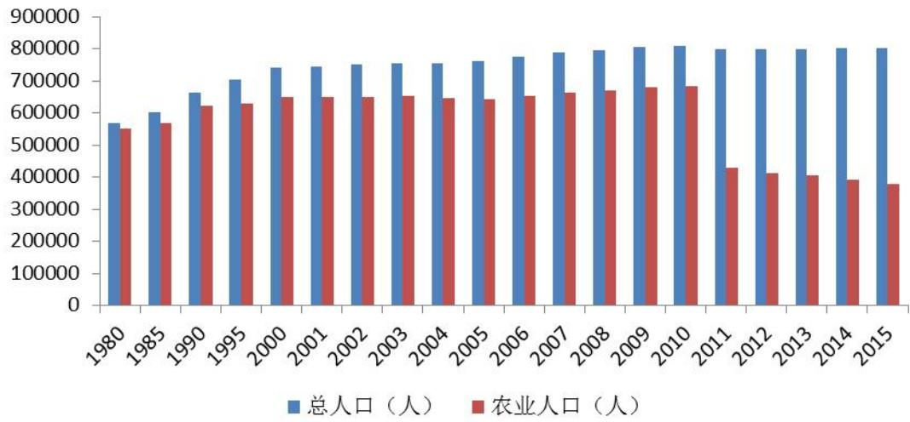

图 3-1 新密市不同年份人口情况  
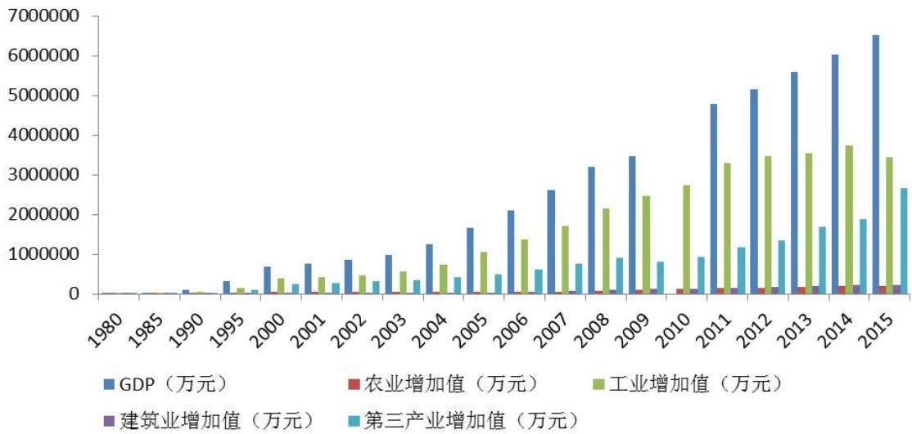  
图3-2 新密市不同年份 GDP和各行业增加值

表3-2 新密市不同年份农业生产情况
<table><tr><td rowspan=2 colspan=1>年份</td><td rowspan=1 colspan=1>耕地面积</td><td rowspan=1 colspan=1>播种面积</td><td rowspan=2 colspan=1>农田有效灌溉面积(104亩)</td><td rowspan=1 colspan=1>粮食产量</td><td rowspan=1 colspan=3>牲畜（头）</td></tr><tr><td rowspan=1 colspan=1> $( 1 0 ^ { 4 } \overrightarrow { \boxplus } )$ </td><td rowspan=1 colspan=1> $( 1 0 ^ { 4 } \overrightarrow { \boxplus } )$ </td><td rowspan=1 colspan=1>(t)</td><td rowspan=1 colspan=1>大牲畜</td><td rowspan=1 colspan=1>小牲畜</td><td rowspan=1 colspan=1>合计</td></tr><tr><td rowspan=1 colspan=1>1980</td><td rowspan=1 colspan=1>71</td><td rowspan=1 colspan=1></td><td rowspan=1 colspan=1></td><td rowspan=1 colspan=1>184200</td><td rowspan=1 colspan=1>39902</td><td rowspan=1 colspan=1>261390</td><td rowspan=1 colspan=1>301292</td></tr><tr><td rowspan=1 colspan=1>1985</td><td rowspan=1 colspan=1>66.63</td><td rowspan=1 colspan=1></td><td rowspan=1 colspan=1></td><td rowspan=1 colspan=1>125900</td><td rowspan=1 colspan=1>36600</td><td rowspan=1 colspan=1></td><td rowspan=1 colspan=1></td></tr><tr><td rowspan=1 colspan=1>1990</td><td rowspan=1 colspan=1>64.8</td><td rowspan=1 colspan=1></td><td rowspan=1 colspan=1></td><td rowspan=1 colspan=1>214100</td><td rowspan=1 colspan=1>40900</td><td rowspan=1 colspan=1>233604</td><td rowspan=1 colspan=1>274504</td></tr><tr><td rowspan=1 colspan=1>1995</td><td rowspan=1 colspan=1>64.65</td><td rowspan=1 colspan=1>106.36</td><td rowspan=1 colspan=1>19.56</td><td rowspan=1 colspan=1>187000</td><td rowspan=1 colspan=1>40800</td><td rowspan=1 colspan=1></td><td rowspan=1 colspan=1></td></tr><tr><td rowspan=1 colspan=1>2000</td><td rowspan=1 colspan=1>61.61</td><td rowspan=1 colspan=1>108.09</td><td rowspan=1 colspan=1>21.36</td><td rowspan=1 colspan=1>192536</td><td rowspan=1 colspan=1>28962</td><td rowspan=1 colspan=1>271160</td><td rowspan=1 colspan=1>300122</td></tr><tr><td rowspan=1 colspan=1>2001</td><td rowspan=1 colspan=1>62.17</td><td rowspan=1 colspan=1>105.83</td><td rowspan=1 colspan=1>20.04</td><td rowspan=1 colspan=1>187624</td><td rowspan=1 colspan=1>29751</td><td rowspan=1 colspan=1>292335</td><td rowspan=1 colspan=1>322086</td></tr><tr><td rowspan=1 colspan=1>2002</td><td rowspan=1 colspan=1>67.01</td><td rowspan=1 colspan=1>105.41</td><td rowspan=1 colspan=1>20.32</td><td rowspan=1 colspan=1>173285</td><td rowspan=1 colspan=1>31384</td><td rowspan=1 colspan=1>296263</td><td rowspan=1 colspan=1>327647</td></tr><tr><td rowspan=1 colspan=1>2003</td><td rowspan=1 colspan=1>59.88</td><td rowspan=1 colspan=1>104.17</td><td rowspan=1 colspan=1>20.09</td><td rowspan=1 colspan=1>211300</td><td rowspan=1 colspan=1>36448</td><td rowspan=1 colspan=1>299555</td><td rowspan=1 colspan=1>336003</td></tr><tr><td rowspan=1 colspan=1>2004</td><td rowspan=1 colspan=1>57.25</td><td rowspan=1 colspan=1>100.74</td><td rowspan=1 colspan=1>19.13</td><td rowspan=1 colspan=1>201522</td><td rowspan=1 colspan=1>32928</td><td rowspan=1 colspan=1>311800</td><td rowspan=1 colspan=1>344728</td></tr><tr><td rowspan=1 colspan=1>2005</td><td rowspan=1 colspan=1>56.48</td><td rowspan=1 colspan=1>99.6</td><td rowspan=1 colspan=1>19.36</td><td rowspan=1 colspan=1>198603</td><td rowspan=1 colspan=1>23677</td><td rowspan=1 colspan=1>264221</td><td rowspan=1 colspan=1>287898</td></tr><tr><td rowspan=1 colspan=1>2006</td><td rowspan=1 colspan=1>54.88</td><td rowspan=1 colspan=1>99.39</td><td rowspan=1 colspan=1>20.58</td><td rowspan=1 colspan=1>200596</td><td rowspan=1 colspan=1>21585</td><td rowspan=1 colspan=1>269913</td><td rowspan=1 colspan=1>291498</td></tr><tr><td rowspan=1 colspan=1>2007</td><td rowspan=1 colspan=1>51.23</td><td rowspan=1 colspan=1>97.55</td><td rowspan=1 colspan=1>24.95</td><td rowspan=1 colspan=1>199706</td><td rowspan=1 colspan=1>17900</td><td rowspan=1 colspan=1>189400</td><td rowspan=1 colspan=1>207300</td></tr><tr><td rowspan=1 colspan=1>2008</td><td rowspan=1 colspan=1>51.04</td><td rowspan=1 colspan=1>95.12</td><td rowspan=1 colspan=1>25.49</td><td rowspan=1 colspan=1>205937</td><td rowspan=1 colspan=1>20104</td><td rowspan=1 colspan=1>209076</td><td rowspan=1 colspan=1>229180</td></tr><tr><td rowspan=1 colspan=1>2009</td><td rowspan=1 colspan=1></td><td rowspan=1 colspan=1>95.69</td><td rowspan=1 colspan=1>29.57</td><td rowspan=1 colspan=1>206371</td><td rowspan=1 colspan=1>21581</td><td rowspan=1 colspan=1>209917</td><td rowspan=1 colspan=1>231498</td></tr><tr><td rowspan=1 colspan=1>2010</td><td rowspan=1 colspan=1>51.96</td><td rowspan=1 colspan=1>96.82</td><td rowspan=1 colspan=1>30.37</td><td rowspan=1 colspan=1>207928</td><td rowspan=1 colspan=1>21264</td><td rowspan=1 colspan=1>209943</td><td rowspan=1 colspan=1>231207</td></tr><tr><td rowspan=1 colspan=1>2011</td><td rowspan=1 colspan=1>71.55</td><td rowspan=1 colspan=1>82.89</td><td rowspan=1 colspan=1>30.87</td><td rowspan=1 colspan=1>198908</td><td rowspan=1 colspan=1>9400</td><td rowspan=1 colspan=1>193200</td><td rowspan=1 colspan=1>202600</td></tr><tr><td rowspan=1 colspan=1>2012</td><td rowspan=1 colspan=1>71.55</td><td rowspan=1 colspan=1>83.54</td><td rowspan=1 colspan=1>31.82</td><td rowspan=1 colspan=1>207059</td><td rowspan=1 colspan=1>9100</td><td rowspan=1 colspan=1>206900</td><td rowspan=1 colspan=1>216000</td></tr><tr><td rowspan=1 colspan=1>2013</td><td rowspan=1 colspan=1>69.65</td><td rowspan=1 colspan=1>83.58</td><td rowspan=1 colspan=1>21.14</td><td rowspan=1 colspan=1>207300</td><td rowspan=1 colspan=1>16500</td><td rowspan=1 colspan=1>169300</td><td rowspan=1 colspan=1>185800</td></tr><tr><td rowspan=1 colspan=1>2014</td><td rowspan=1 colspan=1>69.28</td><td rowspan=1 colspan=1>85.39</td><td rowspan=1 colspan=1>23.69</td><td rowspan=1 colspan=1>197295</td><td rowspan=1 colspan=1>19600</td><td rowspan=1 colspan=1>238200</td><td rowspan=1 colspan=1>257800</td></tr><tr><td rowspan=1 colspan=1>2015</td><td rowspan=1 colspan=1>52.64</td><td rowspan=1 colspan=1>85.47</td><td rowspan=1 colspan=1>23.68</td><td rowspan=1 colspan=1>218755</td><td rowspan=1 colspan=1>17700</td><td rowspan=1 colspan=1>228400</td><td rowspan=1 colspan=1>246100</td></tr></table>

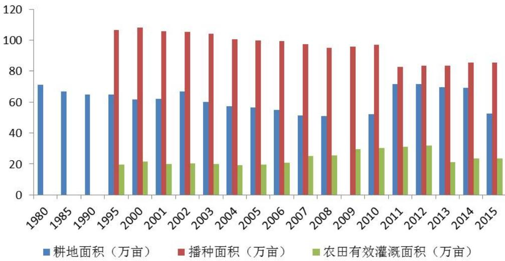  
图3-3 新密市不同年份农业生产情况

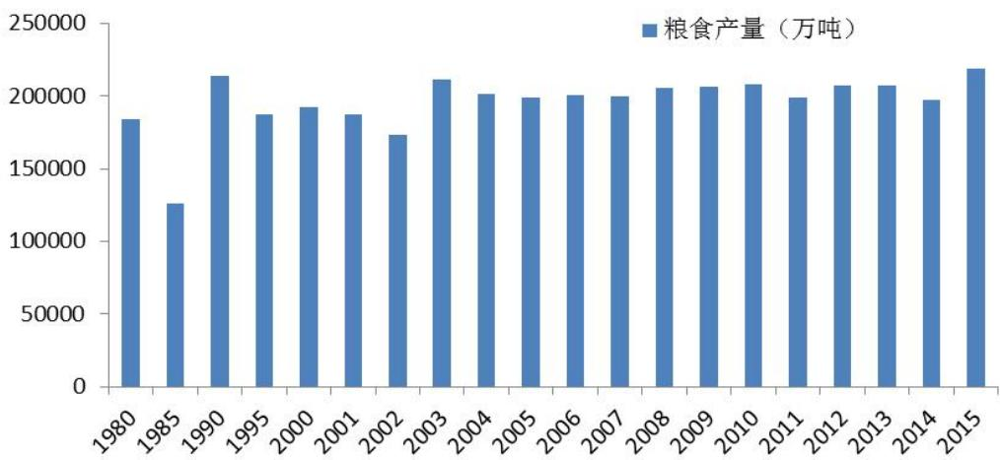  
图3-4 新密市不同年份粮食产量

## 3.2 供水基础设施调查统计

新密市的主要水利工程有地表水源工程和地下水源工程。地表水源工程分为蓄水工程、引水工程、提水工程。蓄水工程主要包括水库和塘坝。地下水源工程包括利用地下水的水井工程。这些水利工程对促进新密市的经济社会发展、保障城乡人民财产安全和改善人民生活条件都发挥了重要作用。供水工程的建设和发展促进了新密市农业和工业生产的发展和生活条件的改善，为新密市的国民经济建设打下了良好的基础。

## 3.2.1 蓄水工程供水

新密市主要蓄水工程为水库，1980年到2015年水库的具体情况如表3-3。除了中型水库为工业、农业和生活供水外，小型水库基本上为农业生产服务。

表3-3 1980年到2015年新密市地表蓄水工程基本情况调查统计表
<table><tr><td colspan="1" rowspan="4">年份</td><td colspan="8" rowspan="1">水          库</td></tr><tr><td colspan="2" rowspan="1">总计</td><td colspan="2" rowspan="1">中型水库</td><td colspan="2" rowspan="1">小Ⅰ型</td><td colspan="2" rowspan="1">小Ⅱ型</td></tr><tr><td colspan="1" rowspan="2">座</td><td colspan="1" rowspan="1">总库容</td><td colspan="1" rowspan="1"></td><td colspan="1" rowspan="1">库容</td><td colspan="1" rowspan="1"></td><td colspan="1" rowspan="1">库容</td><td colspan="1" rowspan="1"></td><td colspan="1" rowspan="1">库容</td></tr><tr><td colspan="1" rowspan="1"> $( 1 0 ^ { 4 } \mathrm { m } ^ { 3 } )$ </td><td colspan="1" rowspan="1"></td><td colspan="1" rowspan="1"> $( 1 0 ^ { 4 } \mathrm { m } ^ { 3 } )$ </td><td colspan="1" rowspan="1"></td><td colspan="1" rowspan="1"> $( 1 0 ^ { 4 } \mathrm { m } ^ { 3 } )$ </td><td colspan="1" rowspan="1"></td><td colspan="1" rowspan="1"> $( 1 0 ^ { 4 } \mathrm { m } ^ { 3 } )$ </td></tr><tr><td colspan="1" rowspan="1">1980</td><td colspan="1" rowspan="1">37</td><td colspan="1" rowspan="1">8957.95</td><td colspan="1" rowspan="1">2</td><td colspan="1" rowspan="1">3605</td><td colspan="1" rowspan="1">17</td><td colspan="1" rowspan="1">4437</td><td colspan="1" rowspan="1">18</td><td colspan="1" rowspan="1">915.95</td></tr><tr><td colspan="1" rowspan="1">1985</td><td colspan="1" rowspan="1">37</td><td colspan="1" rowspan="1">8957.95</td><td colspan="1" rowspan="1">2</td><td colspan="1" rowspan="1">3605</td><td colspan="1" rowspan="1">17</td><td colspan="1" rowspan="1">4437</td><td colspan="1" rowspan="1">18</td><td colspan="1" rowspan="1">915.95</td></tr><tr><td colspan="1" rowspan="1">1990</td><td colspan="1" rowspan="1">37</td><td colspan="1" rowspan="1">8957.95</td><td colspan="1" rowspan="1">2</td><td colspan="1" rowspan="1">3605</td><td colspan="1" rowspan="1">17</td><td colspan="1" rowspan="1">4437</td><td colspan="1" rowspan="1">18</td><td colspan="1" rowspan="1">915.95</td></tr><tr><td colspan="1" rowspan="1">2000</td><td colspan="1" rowspan="1">37</td><td colspan="1" rowspan="1">8957.95</td><td colspan="1" rowspan="1">2</td><td colspan="1" rowspan="1">3605</td><td colspan="1" rowspan="1">17</td><td colspan="1" rowspan="1">4437</td><td colspan="1" rowspan="1">18</td><td colspan="1" rowspan="1">915.95</td></tr><tr><td colspan="1" rowspan="1">2005</td><td colspan="1" rowspan="1">37</td><td colspan="1" rowspan="1">8957.95</td><td colspan="1" rowspan="1">2</td><td colspan="1" rowspan="1">3605</td><td colspan="1" rowspan="1">17</td><td colspan="1" rowspan="1">4437</td><td colspan="1" rowspan="1">18</td><td colspan="1" rowspan="1">915.95</td></tr><tr><td colspan="1" rowspan="1">2008</td><td colspan="1" rowspan="1">37</td><td colspan="1" rowspan="1">8957.95</td><td colspan="1" rowspan="1">2</td><td colspan="1" rowspan="1">3605</td><td colspan="1" rowspan="1">17</td><td colspan="1" rowspan="1">4437</td><td colspan="1" rowspan="1">18</td><td colspan="1" rowspan="1">915.95</td></tr><tr><td colspan="1" rowspan="1">2009</td><td colspan="1" rowspan="1">37</td><td colspan="1" rowspan="1">8957.95</td><td colspan="1" rowspan="1">2</td><td colspan="1" rowspan="1">3605</td><td colspan="1" rowspan="1">17</td><td colspan="1" rowspan="1">4437</td><td colspan="1" rowspan="1">18</td><td colspan="1" rowspan="1">915.95</td></tr><tr><td colspan="1" rowspan="1">2010</td><td colspan="1" rowspan="1">37</td><td colspan="1" rowspan="1">8957.95</td><td colspan="1" rowspan="1">2</td><td colspan="1" rowspan="1">3605</td><td colspan="1" rowspan="1">17</td><td colspan="1" rowspan="1">4437</td><td colspan="1" rowspan="1">18</td><td colspan="1" rowspan="1">915.95</td></tr><tr><td colspan="1" rowspan="1">2011</td><td colspan="1" rowspan="1">37</td><td colspan="1" rowspan="1">8957.95</td><td colspan="1" rowspan="1">2</td><td colspan="1" rowspan="1">3605</td><td colspan="1" rowspan="1">17</td><td colspan="1" rowspan="1">4437</td><td colspan="1" rowspan="1">18</td><td colspan="1" rowspan="1">915.95</td></tr><tr><td colspan="1" rowspan="1">2012</td><td colspan="1" rowspan="1">37</td><td colspan="1" rowspan="1">8957.95</td><td colspan="1" rowspan="1">2</td><td colspan="1" rowspan="1">3605</td><td colspan="1" rowspan="1">17</td><td colspan="1" rowspan="1">4437</td><td colspan="1" rowspan="1">18</td><td colspan="1" rowspan="1">915.95</td></tr><tr><td colspan="1" rowspan="1">2013</td><td colspan="1" rowspan="1">37</td><td colspan="1" rowspan="1">8957.95</td><td colspan="1" rowspan="1">2</td><td colspan="1" rowspan="1">3605</td><td colspan="1" rowspan="1">17</td><td colspan="1" rowspan="1">4437</td><td colspan="1" rowspan="1">18</td><td colspan="1" rowspan="1">915.95</td></tr><tr><td colspan="1" rowspan="1">2014</td><td colspan="1" rowspan="1">37</td><td colspan="1" rowspan="1">8957.95</td><td colspan="1" rowspan="1">2</td><td colspan="1" rowspan="1">3605</td><td colspan="1" rowspan="1">17</td><td colspan="1" rowspan="1">4437</td><td colspan="1" rowspan="1">18</td><td colspan="1" rowspan="1">915.95</td></tr><tr><td colspan="1" rowspan="1">2015</td><td colspan="1" rowspan="1">37</td><td colspan="1" rowspan="1">8957.95</td><td colspan="1" rowspan="1">2</td><td colspan="1" rowspan="1">3605</td><td colspan="1" rowspan="1">17</td><td colspan="1" rowspan="1">4437</td><td colspan="1" rowspan="1">18</td><td colspan="1" rowspan="1">915.95</td></tr></table>

## (1） 中型水库

2015年，新密市有李湾水库和五星水库2座中型水库。李湾水库属淮河流域、颍河水系、双洎河上游的一座中型水库，五星水库属淮河流域颖河水系双洎河支流溱河上的一座中型水库。两座水库的总设计库容为 $3 4 5 9 \times 1 0 ^ { 4 } \mathrm { m } ^ { 3 }$ ，兴利库容为 $1 9 3 0 { \times } 1 0 ^ { 4 } \mathrm { m } ^ { 3 }$ 。这两座水库对于新密市的工业、农业和生活用水起着重要的作用。2015年这两座水库的具体信息见表3-4。

表3-4 新密市中型水库基本情况及综合效益发挥情况调查统计表（2015年）
<table><tr><td rowspan=2 colspan=1>序号</td><td rowspan=2 colspan=1>水库名称</td><td rowspan=2 colspan=1>所在乡镇</td><td rowspan=2 colspan=1>所在河流</td><td rowspan=2 colspan=1>控制面积 $( \mathrm { k m } ^ { 2 } )$ </td><td rowspan=1 colspan=3>库容 $( 1 0 ^ { 4 } \mathrm m ^ { 3 } )$ </td><td rowspan=2 colspan=1>设计洪水标准(%)</td><td rowspan=2 colspan=1>设计洪峰流量(m³/s)</td><td rowspan=2 colspan=1>设计灌溉面积 $( 1 0 ^ { 4 } \overrightarrow { \boxplus } )$ </td><td rowspan=2 colspan=1>有效灌溉面积 $( 1 0 ^ { 4 } \overrightarrow { \boxplus } )$ </td><td rowspan=2 colspan=1>年供水量(104m³)</td></tr><tr><td rowspan=1 colspan=1>总库容</td><td rowspan=1 colspan=1>兴利库容</td><td rowspan=1 colspan=1>防洪库容</td></tr><tr><td rowspan=1 colspan=1>1</td><td rowspan=1 colspan=1>李湾水库</td><td rowspan=1 colspan=1>牛店镇双</td><td rowspan=1 colspan=1>洎河</td><td rowspan=1 colspan=1>72.0</td><td rowspan=1 colspan=1>2415</td><td rowspan=1 colspan=1>1500</td><td rowspan=1 colspan=1>1277</td><td rowspan=1 colspan=1>2</td><td rowspan=1 colspan=1>1238</td><td rowspan=1 colspan=1>2.52</td><td rowspan=1 colspan=1>0.525</td><td rowspan=1 colspan=1>260</td></tr><tr><td rowspan=1 colspan=1>2</td><td rowspan=1 colspan=1>五星水库</td><td rowspan=1 colspan=1>岳村镇双</td><td rowspan=1 colspan=1>洎河</td><td rowspan=1 colspan=1>26.0</td><td rowspan=1 colspan=1>1044</td><td rowspan=1 colspan=1>430</td><td rowspan=1 colspan=1>590</td><td rowspan=1 colspan=1></td><td rowspan=1 colspan=1></td><td rowspan=1 colspan=1>1.95</td><td rowspan=1 colspan=1>1.005</td><td rowspan=1 colspan=1>450</td></tr><tr><td rowspan=1 colspan=2>合     计</td><td rowspan=1 colspan=1></td><td rowspan=1 colspan=1></td><td rowspan=1 colspan=1>98.0</td><td rowspan=1 colspan=1>3459</td><td rowspan=1 colspan=1>1930</td><td rowspan=1 colspan=1>1867</td><td rowspan=1 colspan=1></td><td rowspan=1 colspan=1></td><td rowspan=1 colspan=1>4.47</td><td rowspan=1 colspan=1>1.53</td><td rowspan=1 colspan=1>710</td></tr></table>

## (2) 小型水库

2015年新密市共有小型水库35座，大多数兴建于20世纪50\~70年代，控制了 $2 7 3 . 2 3 \mathrm { k m } ^ { 2 }$ 的集水面积。小型水库总库容 $5 3 5 2 . 9 5 { \times } 1 0 ^ { 4 } \mathrm { m } ^ { 3 }$ ，设计库容$4 9 8 0 . 5 { \times } 1 0 ^ { 4 } \mathrm { m } ^ { 3 }$ ，兴利库容 $2 0 9 5 . 4 5 { \times } 1 0 ^ { 4 } \mathrm { m } ^ { 3 }$ 。其中，小Ⅰ型水库17座，兴利库容为$1 6 9 9 \times 1 0 ^ { 4 } \mathrm { m } ^ { 3 }$ ，小Ⅱ型水库18座，兴利库容为 $3 9 6 . 4 5 { \times } 1 0 ^ { 4 } \mathrm { m } ^ { 3 }$ 。具体各小型水库的基本情况如表3-5。

表3-5 新密市小型水库基本情况调查统计表
<table><tr><td colspan="1" rowspan="2">编号</td><td colspan="1" rowspan="2">小Ⅰ型水库名称</td><td colspan="1" rowspan="1">总集水面积</td><td colspan="1" rowspan="1">总库容</td><td colspan="1" rowspan="1">兴利库容</td><td colspan="1" rowspan="2">编号</td><td colspan="1" rowspan="2">小Ⅱ型水库名称</td><td colspan="1" rowspan="1">总集水面积</td><td colspan="1" rowspan="1">总库容</td><td colspan="1" rowspan="1">兴利库容</td></tr><tr><td colspan="1" rowspan="1"> $( \mathrm { k m } ^ { 2 } )$ </td><td colspan="1" rowspan="1"> $( 1 0 ^ { 4 } \mathrm { m } ^ { 3 } )$ </td><td colspan="1" rowspan="1"> $( 1 0 ^ { 4 } \mathrm { m } ^ { 3 } )$ </td><td colspan="1" rowspan="1"> $( \mathrm { k m } ^ { 2 } )$ </td><td colspan="1" rowspan="1"> $( 1 0 ^ { 4 } \mathrm { m } ^ { 3 } )$ </td><td colspan="1" rowspan="1"> $( 1 0 ^ { 4 } \mathrm { m } ^ { 3 } )$ </td></tr><tr><td colspan="1" rowspan="1">1</td><td colspan="1" rowspan="1">张湾</td><td colspan="1" rowspan="1">12.8</td><td colspan="1" rowspan="1">641</td><td colspan="1" rowspan="1">122</td><td colspan="1" rowspan="1">1</td><td colspan="1" rowspan="1">大樊庄</td><td colspan="1" rowspan="1">23.1</td><td colspan="1" rowspan="1">91.3</td><td colspan="1" rowspan="1">25</td></tr><tr><td colspan="1" rowspan="1">2</td><td colspan="1" rowspan="1">云岩宫</td><td colspan="1" rowspan="1">22.9</td><td colspan="1" rowspan="1">506</td><td colspan="1" rowspan="1">132</td><td colspan="1" rowspan="1">2</td><td colspan="1" rowspan="1">王陈沟</td><td colspan="1" rowspan="1">9.4</td><td colspan="1" rowspan="1">89</td><td colspan="1" rowspan="1">27</td></tr><tr><td colspan="1" rowspan="1">3</td><td colspan="1" rowspan="1">云蒙山</td><td colspan="1" rowspan="1">13.5</td><td colspan="1" rowspan="1">408</td><td colspan="1" rowspan="1">218</td><td colspan="1" rowspan="1">3</td><td colspan="1" rowspan="1">红石崖</td><td colspan="1" rowspan="1">2.2</td><td colspan="1" rowspan="1">76.2</td><td colspan="1" rowspan="1">44</td></tr><tr><td colspan="1" rowspan="1">4</td><td colspan="1" rowspan="1">禹砦</td><td colspan="1" rowspan="1">8.2</td><td colspan="1" rowspan="1">403</td><td colspan="1" rowspan="1">222</td><td colspan="1" rowspan="1">4</td><td colspan="1" rowspan="1">方沟</td><td colspan="1" rowspan="1">9</td><td colspan="1" rowspan="1">72</td><td colspan="1" rowspan="1">34</td></tr><tr><td colspan="1" rowspan="1">5</td><td colspan="1" rowspan="1">红石峡</td><td colspan="1" rowspan="1">38</td><td colspan="1" rowspan="1">373</td><td colspan="1" rowspan="1">128</td><td colspan="1" rowspan="1">5</td><td colspan="1" rowspan="1">青河</td><td colspan="1" rowspan="1">10.4</td><td colspan="1" rowspan="1">70.4</td><td colspan="1" rowspan="1">25.5</td></tr><tr><td colspan="1" rowspan="1">6</td><td colspan="1" rowspan="1">河西</td><td colspan="1" rowspan="1">8.1</td><td colspan="1" rowspan="1">270</td><td colspan="1" rowspan="1">90</td><td colspan="1" rowspan="1">6</td><td colspan="1" rowspan="1">劝门</td><td colspan="1" rowspan="1">1.5</td><td colspan="1" rowspan="1">58.55</td><td colspan="1" rowspan="1">31.05</td></tr><tr><td colspan="1" rowspan="1">7</td><td colspan="1" rowspan="1">曹马沟</td><td colspan="1" rowspan="1">4.73</td><td colspan="1" rowspan="1">245</td><td colspan="1" rowspan="1">71</td><td colspan="1" rowspan="1">7</td><td colspan="1" rowspan="1">后河</td><td colspan="1" rowspan="1">2</td><td colspan="1" rowspan="1">56.6</td><td colspan="1" rowspan="1">30</td></tr><tr><td colspan="1" rowspan="1">8</td><td colspan="1" rowspan="1">古角</td><td colspan="1" rowspan="1">5.3</td><td colspan="1" rowspan="1">238</td><td colspan="1" rowspan="1">150</td><td colspan="1" rowspan="1">8</td><td colspan="1" rowspan="1">石岭</td><td colspan="1" rowspan="1">3.9</td><td colspan="1" rowspan="1">56</td><td colspan="1" rowspan="1">25</td></tr><tr><td colspan="1" rowspan="1">9</td><td colspan="1" rowspan="1">庙朱</td><td colspan="1" rowspan="1">27.6</td><td colspan="1" rowspan="1">231</td><td colspan="1" rowspan="1">69</td><td colspan="1" rowspan="1">9</td><td colspan="1" rowspan="1">苇园</td><td colspan="1" rowspan="1">0.5</td><td colspan="1" rowspan="1">54</td><td colspan="1" rowspan="1">7.6</td></tr><tr><td colspan="1" rowspan="1">10</td><td colspan="1" rowspan="1">曲梁</td><td colspan="1" rowspan="1">6.5</td><td colspan="1" rowspan="1">203</td><td colspan="1" rowspan="1">21</td><td colspan="1" rowspan="1">10</td><td colspan="1" rowspan="1">白河</td><td colspan="1" rowspan="1">2</td><td colspan="1" rowspan="1">50.8</td><td colspan="1" rowspan="1">19.7</td></tr><tr><td colspan="1" rowspan="1">11</td><td colspan="1" rowspan="1">老樟窝</td><td colspan="1" rowspan="1">8.7</td><td colspan="1" rowspan="1">183</td><td colspan="1" rowspan="1">125</td><td colspan="1" rowspan="1">11</td><td colspan="1" rowspan="1">磨洞王</td><td colspan="1" rowspan="1">7.5</td><td colspan="1" rowspan="1">46</td><td colspan="1" rowspan="1">21</td></tr><tr><td colspan="1" rowspan="1">12</td><td colspan="1" rowspan="1">槐树嘴</td><td colspan="1" rowspan="1">7.24</td><td colspan="1" rowspan="1">163</td><td colspan="1" rowspan="1">67</td><td colspan="1" rowspan="1">12</td><td colspan="1" rowspan="1">三宅沟</td><td colspan="1" rowspan="1">5.4</td><td colspan="1" rowspan="1">39.6</td><td colspan="1" rowspan="1">12.4</td></tr><tr><td colspan="1" rowspan="1">13</td><td colspan="1" rowspan="1">张庄</td><td colspan="1" rowspan="1">7.25</td><td colspan="1" rowspan="1">134</td><td colspan="1" rowspan="1">71</td><td colspan="1" rowspan="1">13</td><td colspan="1" rowspan="1">鱼池沟</td><td colspan="1" rowspan="1">2.7</td><td colspan="1" rowspan="1">39.5</td><td colspan="1" rowspan="1">19</td></tr><tr><td colspan="1" rowspan="1">14</td><td colspan="1" rowspan="1">龙潭</td><td colspan="1" rowspan="1">2.36</td><td colspan="1" rowspan="1">114</td><td colspan="1" rowspan="1">69</td><td colspan="1" rowspan="1">14</td><td colspan="1" rowspan="1">史沟</td><td colspan="1" rowspan="1">1.41</td><td colspan="1" rowspan="1">32.2</td><td colspan="1" rowspan="1">32.2</td></tr><tr><td colspan="1" rowspan="1">15</td><td colspan="1" rowspan="1">南红石峡</td><td colspan="1" rowspan="1">9.28</td><td colspan="1" rowspan="1">113</td><td colspan="1" rowspan="1">29</td><td colspan="1" rowspan="1">15</td><td colspan="1" rowspan="1">寺沟</td><td colspan="1" rowspan="1">1</td><td colspan="1" rowspan="1">29</td><td colspan="1" rowspan="1">14</td></tr><tr><td colspan="1" rowspan="1">16</td><td colspan="1" rowspan="1">楼上庄</td><td colspan="1" rowspan="1">3.25</td><td colspan="1" rowspan="1">108</td><td colspan="1" rowspan="1">68</td><td colspan="1" rowspan="1">16</td><td colspan="1" rowspan="1">良水寨</td><td colspan="1" rowspan="1">1.1</td><td colspan="1" rowspan="1">20.4</td><td colspan="1" rowspan="1">7</td></tr><tr><td colspan="1" rowspan="1">17</td><td colspan="1" rowspan="1">九龙庙</td><td colspan="1" rowspan="1">3.2</td><td colspan="1" rowspan="1">104</td><td colspan="1" rowspan="1">47</td><td colspan="1" rowspan="1">17</td><td colspan="1" rowspan="1">鹿窝</td><td colspan="1" rowspan="1">0.73</td><td colspan="1" rowspan="1">18</td><td colspan="1" rowspan="1">12</td></tr><tr><td colspan="2" rowspan="2">合计</td><td colspan="1" rowspan="2">188.91</td><td colspan="1" rowspan="2">4437</td><td colspan="1" rowspan="2">1699</td><td colspan="1" rowspan="1">18</td><td colspan="1" rowspan="1">宋沟</td><td colspan="1" rowspan="1">0.48</td><td colspan="1" rowspan="1">16.4</td><td colspan="1" rowspan="1">10</td></tr><tr><td colspan="2" rowspan="1">合计</td><td colspan="1" rowspan="1">84.32</td><td colspan="1" rowspan="1">915.95</td><td colspan="1" rowspan="1">396.45</td></tr></table>

## 3.2.2 引水和提水工程

## （1）提水工程

现状年新密市提水工程6处，设计年供水能力 $6 8 . 8 { \times } 1 0 ^ { 4 } \mathrm { m } ^ { 3 }$ ，现状年供水量达$1 2 1 7 { \times } 1 0 ^ { 4 } \mathrm { m } ^ { 3 }$ 。提水工程主要集中在米村镇、刘寨镇、来集镇、平陌镇。

## (2) 引水工程

现状年新密市无引水工程。

## (3) 其它水源工程

其他水源工程包括集雨工程、污水处理再利用等供水工程。集雨工程是群众利用人工收集储存屋顶、场院和道路等场所产生径流的微型蓄水工程，包括水窖、水柜等，充分利用坡面、路面、田面和沟道等自然地形，拦蓄天然雨洪的一项水源工程。污水处理再利用统计的是污水集中处理厂处理后的污水回用设施。

截止2015年，配合节水措施，新密市共修建26238个集雨水窖、4个蓄水池和5个集流坝，主要用于农业灌溉，年利用量达 $7 1 8 { \times } 1 0 ^ { 4 } \mathrm { m } ^ { 3 }$ ，屋顶接水共25000处，主要用于农村生活，年利用量达 $1 9 0 { \times } 1 0 ^ { 4 } \mathrm { m } ^ { 3 }$

现状年下新密市造纸群工业污水处理厂和城市污水处理厂处于运行状态，其中新密市造纸群工业污水处理厂日处理污水5万吨左右，中水回用 $1 1 0 0 . 0 { \times } 1 0 ^ { 4 } \mathrm { m } ^ { 3 }$ 而城市污水处理厂因中水回用工程暂未建成，污水处理后全部排走。

## 3.2.3 地下水供水设施

根据统计，新密市2015年共有生产水井2503眼，配套机电井1312眼，供水量 $8 5 9 2 . 0 { \times } 1 0 ^ { 4 } \mathrm { m } ^ { 3 }$ 。地下水源供水在新密市的供水中占重要地位，约占总供水量的63.2%左右。2015年新密市各行政分区地下水供水基础设施基本情况调查统计如表3-6所示。

表3-6 新密市地下水供水基础设施基本情况调查统计表（2015年）
<table><tr><td rowspan=2 colspan=2>乡镇</td><td rowspan=1 colspan=3>地下水</td></tr><tr><td rowspan=1 colspan=1>生产井数量(眼)</td><td rowspan=1 colspan=1>配套机电井数量（眼）</td><td rowspan=1 colspan=1>现状年供水量（104m³）</td></tr><tr><td rowspan=1 colspan=2>新密中心城区(及城关镇、袁庄乡)</td><td rowspan=1 colspan=1>121(156)</td><td rowspan=1 colspan=1>42(62)</td><td rowspan=1 colspan=1>2377(2590)</td></tr><tr><td rowspan=1 colspan=2>新密新区（曲梁镇）</td><td rowspan=1 colspan=1>624</td><td rowspan=1 colspan=1>310</td><td rowspan=1 colspan=1>625.3</td></tr><tr><td rowspan=5 colspan=1>中心镇</td><td rowspan=1 colspan=1>超化镇</td><td rowspan=1 colspan=1>115</td><td rowspan=1 colspan=1>79</td><td rowspan=1 colspan=1>1037.1</td></tr><tr><td rowspan=1 colspan=1>大隗镇</td><td rowspan=1 colspan=1>487</td><td rowspan=1 colspan=1>234</td><td rowspan=1 colspan=1>506.4</td></tr><tr><td rowspan=1 colspan=1>刘寨镇</td><td rowspan=1 colspan=1>278</td><td rowspan=1 colspan=1>137</td><td rowspan=1 colspan=1>418.3</td></tr><tr><td rowspan=1 colspan=1>白寨镇</td><td rowspan=1 colspan=1>11</td><td rowspan=1 colspan=1>46</td><td rowspan=1 colspan=1>199.2</td></tr><tr><td rowspan=1 colspan=1>小计</td><td rowspan=1 colspan=1>891</td><td rowspan=1 colspan=1>496</td><td rowspan=1 colspan=1>2161</td></tr><tr><td rowspan=7 colspan=1>一般镇</td><td rowspan=1 colspan=1>米村镇</td><td rowspan=1 colspan=1>31</td><td rowspan=1 colspan=1>25</td><td rowspan=1 colspan=1>337.7</td></tr><tr><td rowspan=1 colspan=1>牛店镇</td><td rowspan=1 colspan=1>411</td><td rowspan=1 colspan=1>172</td><td rowspan=1 colspan=1>453.5</td></tr><tr><td rowspan=1 colspan=1>平陌镇</td><td rowspan=1 colspan=1>119</td><td rowspan=1 colspan=1>59</td><td rowspan=1 colspan=1>245.4</td></tr><tr><td rowspan=1 colspan=1>来集镇</td><td rowspan=1 colspan=1>104</td><td rowspan=1 colspan=1>15</td><td rowspan=1 colspan=1>1063.2</td></tr><tr><td rowspan=1 colspan=1>苟堂镇</td><td rowspan=1 colspan=1>103</td><td rowspan=1 colspan=1>119</td><td rowspan=1 colspan=1>604.5</td></tr><tr><td rowspan=1 colspan=1>岳村镇</td><td rowspan=1 colspan=1>44</td><td rowspan=1 colspan=1>34</td><td rowspan=1 colspan=1>508.7</td></tr><tr><td rowspan=1 colspan=1>小计</td><td rowspan=1 colspan=1>812</td><td rowspan=1 colspan=1>424</td><td rowspan=1 colspan=1>3213</td></tr><tr><td rowspan=1 colspan=2>尖山乡</td><td rowspan=1 colspan=1>20</td><td rowspan=1 colspan=1>20</td><td rowspan=1 colspan=1>3</td></tr><tr><td rowspan=1 colspan=2>全区</td><td rowspan=1 colspan=1>2503</td><td rowspan=1 colspan=1>1312</td><td rowspan=1 colspan=1>8592</td></tr></table>

## 3.3 供水量调查统计

供水量调查按行政分区进行统计，供水量的统计按照地表水源、地下水源和其他水源三种类型统计。地表水源的统计分蓄、引、提三种形式统计，从水库中引水或提水，均属于蓄水工程供水量；从河道或湖泊中自流引水的，无论有闸或无闸，均属引水工程供水量；利用扬水站从河道、湖泊中直接取水的，属提水工程供水量。

本次规划对新密市各行政分区调查年份（1995年、2000年、2005年、2010年和2015年）的供用水情况进行了调查分析。调查内容包括各行政分区各种水利工程的供水量，以及各种水源向各个行业的供水量。

## 3.3.1 行政分区供水量调查分析

新密市是以地下水供水为主，地表水供水为辅的城市。2015年新密市各行政分区不同水源供水量调查统计见表3-7。可以看出，2015年新密市的总供水量为 $1 3 5 9 1 . 0 { \times } 1 0 ^ { 4 } \mathrm { m } ^ { 3 }$ ，地表水工程供水量为 $3 6 4 4 . 0 { \times } 1 0 ^ { 4 } \mathrm { m } ^ { 3 }$ ，占总供水量的26.8%，地下水工程供水量为 $8 6 5 7 . 0 { \times } 1 0 ^ { 4 } \mathrm { m } ^ { 3 }$ ，占总供水量的63.7%，其他水源供水量为$1 2 9 0 . 0 { \times } 1 0 ^ { 4 } \mathrm { m } ^ { 3 }$ ，占总供水量的9.5%。各行政分区各种工程的供水量及比例分别如表3-8和表3-9所示。

表3-7 新密市各行政分区2015年不同水源供水量调查统计表（单位： $1 0 ^ { 4 } \mathrm { m } ^ { 3 } )$
<table><tr><td rowspan=2 colspan=2>乡镇</td><td rowspan=1 colspan=2>地表水源</td><td rowspan=1 colspan=2>地下水源</td><td rowspan=1 colspan=2>其他水源</td><td rowspan=2 colspan=1>总供水量</td></tr><tr><td rowspan=1 colspan=1>供水量</td><td rowspan=1 colspan=1>比例</td><td rowspan=1 colspan=1>供水量</td><td rowspan=1 colspan=1>比例</td><td rowspan=1 colspan=1>供水量</td><td rowspan=1 colspan=1>比例</td></tr><tr><td rowspan=1 colspan=2>新密中心城区(及城关镇、袁庄乡)</td><td rowspan=1 colspan=1>83.5(114.5)</td><td rowspan=1 colspan=1>5.25(6.1)</td><td rowspan=1 colspan=1>1373.3(1600.1)</td><td rowspan=1 colspan=1>86.37(84.8)</td><td rowspan=1 colspan=1>133.3(173.2)</td><td rowspan=1 colspan=1>8.38(9.2)</td><td rowspan=1 colspan=1>1590.0(1887.8)</td></tr><tr><td rowspan=1 colspan=2>新密新区（曲梁镇）</td><td rowspan=1 colspan=1>613.7</td><td rowspan=1 colspan=1>27.08</td><td rowspan=1 colspan=1>1451.7</td><td rowspan=1 colspan=1>64.06</td><td rowspan=1 colspan=1>200.9</td><td rowspan=1 colspan=1>8.86</td><td rowspan=1 colspan=1>2266.3</td></tr><tr><td rowspan=5 colspan=1>中心镇</td><td rowspan=1 colspan=1>超化镇</td><td rowspan=1 colspan=1>614.3</td><td rowspan=1 colspan=1>32.50</td><td rowspan=1 colspan=1>1110.6</td><td rowspan=1 colspan=1>58.76</td><td rowspan=1 colspan=1>165.3</td><td rowspan=1 colspan=1>8.75</td><td rowspan=1 colspan=1>1890.2</td></tr><tr><td rowspan=1 colspan=1>大隗镇</td><td rowspan=1 colspan=1>401.9</td><td rowspan=1 colspan=1>32.07</td><td rowspan=1 colspan=1>650.3</td><td rowspan=1 colspan=1>51.88</td><td rowspan=1 colspan=1>201.1</td><td rowspan=1 colspan=1>16.05</td><td rowspan=1 colspan=1>1253.3</td></tr><tr><td rowspan=1 colspan=1>刘寨镇</td><td rowspan=1 colspan=1>546.1</td><td rowspan=1 colspan=1>43.36</td><td rowspan=1 colspan=1>588.7</td><td rowspan=1 colspan=1>46.74</td><td rowspan=1 colspan=1>124.6</td><td rowspan=1 colspan=1>9.90</td><td rowspan=1 colspan=1>1259.4</td></tr><tr><td rowspan=1 colspan=1>白寨镇</td><td rowspan=1 colspan=1>42.6</td><td rowspan=1 colspan=1>16.86</td><td rowspan=1 colspan=1>194.5</td><td rowspan=1 colspan=1>76.99</td><td rowspan=1 colspan=1>15.5</td><td rowspan=1 colspan=1>6.15</td><td rowspan=1 colspan=1>252.7</td></tr><tr><td rowspan=1 colspan=1>小计</td><td rowspan=1 colspan=1>1604.9</td><td rowspan=1 colspan=1>34.47</td><td rowspan=1 colspan=1>2544.1</td><td rowspan=1 colspan=1>54.65</td><td rowspan=1 colspan=1>506.6</td><td rowspan=1 colspan=1>10.88</td><td rowspan=1 colspan=1>4655.6</td></tr><tr><td rowspan=7 colspan=1>一般镇</td><td rowspan=1 colspan=1>米村镇</td><td rowspan=1 colspan=1>77.6</td><td rowspan=1 colspan=1>14.06</td><td rowspan=1 colspan=1>437.7</td><td rowspan=1 colspan=1>79.33</td><td rowspan=1 colspan=1>36.5</td><td rowspan=1 colspan=1>6.61</td><td rowspan=1 colspan=1>551.7</td></tr><tr><td rowspan=1 colspan=1>牛店镇</td><td rowspan=1 colspan=1>215.9</td><td rowspan=1 colspan=1>39.47</td><td rowspan=1 colspan=1>271.7</td><td rowspan=1 colspan=1>49.69</td><td rowspan=1 colspan=1>59.3</td><td rowspan=1 colspan=1>10.84</td><td rowspan=1 colspan=1>546.9</td></tr><tr><td rowspan=1 colspan=1>平陌镇</td><td rowspan=1 colspan=1>269.8</td><td rowspan=1 colspan=1>40.61</td><td rowspan=1 colspan=1>341.0</td><td rowspan=1 colspan=1>51.33</td><td rowspan=1 colspan=1>53.5</td><td rowspan=1 colspan=1>8.05</td><td rowspan=1 colspan=1>664.4</td></tr><tr><td rowspan=1 colspan=1>来集镇</td><td rowspan=1 colspan=1>165.2</td><td rowspan=1 colspan=1>11.44</td><td rowspan=1 colspan=1>1181.1</td><td rowspan=1 colspan=1>81.78</td><td rowspan=1 colspan=1>97.9</td><td rowspan=1 colspan=1>6.78</td><td rowspan=1 colspan=1>1444.3</td></tr><tr><td rowspan=1 colspan=1>苟堂镇</td><td rowspan=1 colspan=1>253.5</td><td rowspan=1 colspan=1>29.99</td><td rowspan=1 colspan=1>471.4</td><td rowspan=1 colspan=1>55.76</td><td rowspan=1 colspan=1>120.4</td><td rowspan=1 colspan=1>14.25</td><td rowspan=1 colspan=1>845.3</td></tr><tr><td rowspan=1 colspan=1>岳村镇</td><td rowspan=1 colspan=1>321.6</td><td rowspan=1 colspan=1>46.30</td><td rowspan=1 colspan=1>342.0</td><td rowspan=1 colspan=1>49.24</td><td rowspan=1 colspan=1>31.0</td><td rowspan=1 colspan=1>4.46</td><td rowspan=1 colspan=1>694.6</td></tr><tr><td rowspan=1 colspan=1>小计</td><td rowspan=1 colspan=1>1303.6</td><td rowspan=1 colspan=1>27.46</td><td rowspan=1 colspan=1>3045.0</td><td rowspan=1 colspan=1>64.14</td><td rowspan=1 colspan=1>398.6</td><td rowspan=1 colspan=1>8.40</td><td rowspan=1 colspan=1>4747.2</td></tr><tr><td rowspan=1 colspan=2>尖山乡</td><td rowspan=1 colspan=1>7.3</td><td rowspan=1 colspan=1>21.25</td><td rowspan=1 colspan=1>16.0</td><td rowspan=1 colspan=1>46.38</td><td rowspan=1 colspan=1>11.2</td><td rowspan=1 colspan=1>32.37</td><td rowspan=1 colspan=1>34.5</td></tr><tr><td rowspan=1 colspan=2>全区</td><td rowspan=1 colspan=1>3644.1</td><td rowspan=1 colspan=1>26.81</td><td rowspan=1 colspan=1>8657.0</td><td rowspan=1 colspan=1>63.69</td><td rowspan=1 colspan=1>1290.4</td><td rowspan=1 colspan=1>9.49</td><td rowspan=1 colspan=1>13591.4</td></tr></table>

表3-8 新密市各行政分区2015年分工程供水量调查统计表（单位： $1 0 ^ { 4 } \mathrm { m } ^ { 3 } )$
<table><tr><td colspan="1" rowspan="2">乡镇</td><td colspan="3" rowspan="1">地表水供水量</td><td colspan="1" rowspan="2">地下水供水量</td><td colspan="1" rowspan="2">其他水源</td><td colspan="2" rowspan="2">总供水量</td></tr><tr><td colspan="1" rowspan="1">蓄水工程</td><td colspan="1" rowspan="1">引水工程</td><td colspan="2" rowspan="1">提水工程</td></tr><tr><td colspan="2" rowspan="1">新密中心城区(及城关镇、袁庄乡)</td><td colspan="1" rowspan="1">83.5(114.5)</td><td colspan="1" rowspan="1">0.0(0.0)</td><td colspan="1" rowspan="1">0.0(0.0)</td><td colspan="1" rowspan="1">1373.3(1600.1)</td><td colspan="1" rowspan="1">133.3(173.2)</td><td colspan="1" rowspan="1">1590.01887.8</td></tr><tr><td colspan="2" rowspan="1">新密新区（曲梁镇）</td><td colspan="1" rowspan="1">373.0</td><td colspan="1" rowspan="1"></td><td colspan="1" rowspan="1">240.7</td><td colspan="1" rowspan="1">1451.7</td><td colspan="1" rowspan="1">200.9</td><td colspan="1" rowspan="1">2266.3</td></tr><tr><td colspan="1" rowspan="5">中心镇</td><td colspan="1" rowspan="1">超化镇</td><td colspan="1" rowspan="1">493.9</td><td colspan="1" rowspan="1"></td><td colspan="1" rowspan="1">120.4</td><td colspan="1" rowspan="1">1110.6</td><td colspan="1" rowspan="1">165.3</td><td colspan="1" rowspan="1">1890.2</td></tr><tr><td colspan="1" rowspan="1">大隗镇</td><td colspan="1" rowspan="1">152.2</td><td colspan="1" rowspan="1"></td><td colspan="1" rowspan="1">249.7</td><td colspan="1" rowspan="1">650.3</td><td colspan="1" rowspan="1">201.1</td><td colspan="1" rowspan="1">1253.3</td></tr><tr><td colspan="1" rowspan="1">刘寨镇</td><td colspan="1" rowspan="1">327.1</td><td colspan="1" rowspan="1"></td><td colspan="1" rowspan="1">219.0</td><td colspan="1" rowspan="1">588.7</td><td colspan="1" rowspan="1">124.6</td><td colspan="1" rowspan="1">1259.4</td></tr><tr><td colspan="1" rowspan="1">白寨镇</td><td colspan="1" rowspan="1">42.6</td><td colspan="1" rowspan="1"></td><td colspan="1" rowspan="1">0.0</td><td colspan="1" rowspan="1">194.5</td><td colspan="1" rowspan="1">15.5</td><td colspan="1" rowspan="1">252.7</td></tr><tr><td colspan="1" rowspan="1">小计</td><td colspan="1" rowspan="1">1015.8</td><td colspan="1" rowspan="1"></td><td colspan="1" rowspan="1">589.1</td><td colspan="1" rowspan="1">2544.1</td><td colspan="1" rowspan="1">506.6</td><td colspan="1" rowspan="1">4655.6</td></tr><tr><td colspan="1" rowspan="7">一般镇</td><td colspan="1" rowspan="1">米村镇</td><td colspan="1" rowspan="1">63.8</td><td colspan="1" rowspan="1"></td><td colspan="1" rowspan="1">13.8</td><td colspan="1" rowspan="1">437.7</td><td colspan="1" rowspan="1">36.5</td><td colspan="1" rowspan="1">551.7</td></tr><tr><td colspan="1" rowspan="1">牛店镇</td><td colspan="1" rowspan="1">215.9</td><td colspan="1" rowspan="1"></td><td colspan="1" rowspan="1">0.0</td><td colspan="1" rowspan="1">271.7</td><td colspan="1" rowspan="1">59.3</td><td colspan="1" rowspan="1">546.9</td></tr><tr><td colspan="1" rowspan="1">平陌镇</td><td colspan="1" rowspan="1">197.2</td><td colspan="1" rowspan="1"></td><td colspan="1" rowspan="1">72.6</td><td colspan="1" rowspan="1">341.0</td><td colspan="1" rowspan="1">53.5</td><td colspan="1" rowspan="1">664.4</td></tr><tr><td colspan="1" rowspan="1">来集镇</td><td colspan="1" rowspan="1">103.4</td><td colspan="1" rowspan="1"></td><td colspan="1" rowspan="1">61.8</td><td colspan="1" rowspan="1">1181.1</td><td colspan="1" rowspan="1">97.9</td><td colspan="1" rowspan="1">1444.3</td></tr><tr><td colspan="1" rowspan="1">苟堂镇</td><td colspan="1" rowspan="1">238.3</td><td colspan="1" rowspan="1"></td><td colspan="1" rowspan="1">15.2</td><td colspan="1" rowspan="1">471.4</td><td colspan="1" rowspan="1">120.4</td><td colspan="1" rowspan="1">845.3</td></tr><tr><td colspan="1" rowspan="1">岳村镇</td><td colspan="1" rowspan="1">97.8</td><td colspan="1" rowspan="1"></td><td colspan="1" rowspan="1">223.8</td><td colspan="1" rowspan="1">342.0</td><td colspan="1" rowspan="1">31.0</td><td colspan="1" rowspan="1">694.6</td></tr><tr><td colspan="1" rowspan="1">小计</td><td colspan="1" rowspan="1">916.4</td><td colspan="1" rowspan="1"></td><td colspan="1" rowspan="1">387.2</td><td colspan="1" rowspan="1">3045.0</td><td colspan="1" rowspan="1">398.6</td><td colspan="1" rowspan="1">4747.2</td></tr><tr><td colspan="2" rowspan="1">尖山乡</td><td colspan="1" rowspan="1">7.3</td><td colspan="1" rowspan="1"></td><td colspan="1" rowspan="1">0.0</td><td colspan="1" rowspan="1">16.0</td><td colspan="1" rowspan="1">11.2</td><td colspan="1" rowspan="1">34.5</td></tr><tr><td colspan="2" rowspan="1">合计</td><td colspan="1" rowspan="1">2427.1</td><td colspan="1" rowspan="1">0.0</td><td colspan="1" rowspan="1">1217.0</td><td colspan="1" rowspan="1">8657.0</td><td colspan="1" rowspan="1">1290.4</td><td colspan="1" rowspan="1">13591.4</td></tr></table>

表3-9 新密市2015年各行政分区不同工程供水比例表（单位：%）
<table><tr><td rowspan=2 colspan=2>乡镇</td><td rowspan=1 colspan=3>地表水供水量</td><td rowspan=2 colspan=1>地下水供水量</td><td rowspan=2 colspan=1>其他水源</td><td rowspan=2 colspan=1>总供水量</td></tr><tr><td rowspan=1 colspan=1>蓄水工程</td><td rowspan=1 colspan=1>引水工程</td><td rowspan=1 colspan=1>提水工程</td></tr><tr><td rowspan=1 colspan=2>新密中心城区(及城关镇、袁庄乡)</td><td rowspan=1 colspan=1>5.2(6.1)</td><td rowspan=1 colspan=1></td><td rowspan=1 colspan=1>0.0(0.0)</td><td rowspan=1 colspan=1>86.4(84.8)</td><td rowspan=1 colspan=1>8.4(9.2)</td><td rowspan=1 colspan=1>100(100.0)</td></tr><tr><td rowspan=1 colspan=2>新密新区（曲梁镇）</td><td rowspan=1 colspan=1>16.5</td><td rowspan=1 colspan=1></td><td rowspan=1 colspan=1>10.6</td><td rowspan=1 colspan=1>64.1</td><td rowspan=1 colspan=1>8.9</td><td rowspan=1 colspan=1>100</td></tr><tr><td rowspan=5 colspan=1>中心镇</td><td rowspan=1 colspan=1>超化镇</td><td rowspan=1 colspan=1>26.1</td><td rowspan=1 colspan=1></td><td rowspan=1 colspan=1>6.4</td><td rowspan=1 colspan=1>58.8</td><td rowspan=1 colspan=1>8.7</td><td rowspan=1 colspan=1>100</td></tr><tr><td rowspan=1 colspan=1>大隗镇</td><td rowspan=1 colspan=1>12.1</td><td rowspan=1 colspan=1></td><td rowspan=1 colspan=1>19.9</td><td rowspan=1 colspan=1>51.9</td><td rowspan=1 colspan=1>16.0</td><td rowspan=1 colspan=1>100</td></tr><tr><td rowspan=1 colspan=1>刘寨镇</td><td rowspan=1 colspan=1>26.0</td><td rowspan=1 colspan=1></td><td rowspan=1 colspan=1>17.4</td><td rowspan=1 colspan=1>46.7</td><td rowspan=1 colspan=1>9.9</td><td rowspan=1 colspan=1>100</td></tr><tr><td rowspan=1 colspan=1>白寨镇</td><td rowspan=1 colspan=1>16.9</td><td rowspan=1 colspan=1></td><td rowspan=1 colspan=1>0.0</td><td rowspan=1 colspan=1>77.0</td><td rowspan=1 colspan=1>6.1</td><td rowspan=1 colspan=1>100</td></tr><tr><td rowspan=1 colspan=1>小计</td><td rowspan=1 colspan=1>21.8</td><td rowspan=1 colspan=1></td><td rowspan=1 colspan=1>12.7</td><td rowspan=1 colspan=1>54.6</td><td rowspan=1 colspan=1>10.9</td><td rowspan=1 colspan=1>100</td></tr><tr><td rowspan=7 colspan=1>一般镇</td><td rowspan=1 colspan=1>米村镇</td><td rowspan=1 colspan=1>11.6</td><td rowspan=1 colspan=1></td><td rowspan=1 colspan=1>2.5</td><td rowspan=1 colspan=1>79.3</td><td rowspan=1 colspan=1>6.6</td><td rowspan=1 colspan=1>100</td></tr><tr><td rowspan=1 colspan=1>牛店镇</td><td rowspan=1 colspan=1>39.5</td><td rowspan=1 colspan=1></td><td rowspan=1 colspan=1>0.0</td><td rowspan=1 colspan=1>49.7</td><td rowspan=1 colspan=1>10.8</td><td rowspan=1 colspan=1>100</td></tr><tr><td rowspan=1 colspan=1>平陌镇</td><td rowspan=1 colspan=1>29.7</td><td rowspan=1 colspan=1></td><td rowspan=1 colspan=1>10.9</td><td rowspan=1 colspan=1>51.3</td><td rowspan=1 colspan=1>8.1</td><td rowspan=1 colspan=1>100</td></tr><tr><td rowspan=1 colspan=1>来集镇</td><td rowspan=1 colspan=1>7.2</td><td rowspan=1 colspan=1></td><td rowspan=1 colspan=1>4.3</td><td rowspan=1 colspan=1>81.8</td><td rowspan=1 colspan=1>6.8</td><td rowspan=1 colspan=1>100</td></tr><tr><td rowspan=1 colspan=1>苟堂镇</td><td rowspan=1 colspan=1>28.2</td><td rowspan=1 colspan=1></td><td rowspan=1 colspan=1>1.8</td><td rowspan=1 colspan=1>55.8</td><td rowspan=1 colspan=1>14.2</td><td rowspan=1 colspan=1>100</td></tr><tr><td rowspan=1 colspan=1>岳村镇</td><td rowspan=1 colspan=1>14.1</td><td rowspan=1 colspan=1></td><td rowspan=1 colspan=1>32.2</td><td rowspan=1 colspan=1>49.2</td><td rowspan=1 colspan=1>4.5</td><td rowspan=1 colspan=1>100</td></tr><tr><td rowspan=1 colspan=1>小计</td><td rowspan=1 colspan=1>19.3</td><td rowspan=1 colspan=1></td><td rowspan=1 colspan=1>8.2</td><td rowspan=1 colspan=1>64.1</td><td rowspan=1 colspan=1>8.4</td><td rowspan=1 colspan=1>100</td></tr><tr><td rowspan=1 colspan=2>尖山乡</td><td rowspan=1 colspan=1>21.3</td><td rowspan=1 colspan=1></td><td rowspan=1 colspan=1>0.0</td><td rowspan=1 colspan=1>46.4</td><td rowspan=1 colspan=1>32.4</td><td rowspan=1 colspan=1>100</td></tr><tr><td rowspan=1 colspan=2>合计</td><td rowspan=1 colspan=1>17.9</td><td rowspan=1 colspan=1>0.0</td><td rowspan=1 colspan=1>9.0</td><td rowspan=1 colspan=1>63.7</td><td rowspan=1 colspan=1>9.5</td><td rowspan=1 colspan=1>100</td></tr></table>

在2015年，新密市的总供水量中，按行业及水源划分的调查结果如表3-10。在总的供水量中，农业灌溉供水 $2 3 6 9 . 0 { \times } 1 0 ^ { 4 } \mathrm { m } ^ { 3 }$ ，占17.7%;工业供水 $8 4 9 0 . 0 { \times } 1 0 ^ { 4 } \mathrm { m } ^ { 3 }$ 9占63.3%；城乡生活供水 $2 5 4 9 . 0 { \times } 1 0 ^ { 4 } \mathrm { m } ^ { 3 }$ ，占19.0%。从行政分区及各行业的供水情况来看，在总供水量中，城乡生活供水居首位的有新密中心城区（65.5%）、中心镇的白寨镇（62.1%）、尖山乡（57.0%），其他各乡镇工业供水都居首位，其中，工业供水比例最高的为一般镇中的来集镇（82.9%），新密新区的曲梁镇（77.4%）次之。新密市各个行政分区的供水中，各个行政分区有各自不同的供水特点，这反映了各行政分区的经济社会结构及其发展水平的差异。

表3-10 新密市2015年各行政分区分行业及水源供水量表
<table><tr><td colspan="2" rowspan="2">乡镇</td><td colspan="1" rowspan="2">水源工程</td><td colspan="2" rowspan="1">农业</td><td colspan="2" rowspan="1">工业</td><td colspan="2" rowspan="1">城乡生活</td><td colspan="1" rowspan="2">总计 $( 1 0 ^ { 4 } \mathrm { m } ^ { 3 } )$ </td></tr><tr><td colspan="1" rowspan="1">供水量 $( 1 0 ^ { 4 } \mathrm { m } ^ { 3 } )$ </td><td colspan="1" rowspan="1">比例(%)</td><td colspan="1" rowspan="1">供水量 $( 1 0 ^ { 4 } \mathrm { m } ^ { 3 } )$ </td><td colspan="1" rowspan="1">比例(%)</td><td colspan="1" rowspan="1">供水量 $( 1 0 ^ { 4 } \mathrm { m } ^ { 3 } )$ </td><td colspan="1" rowspan="1">比例(%)</td></tr><tr><td colspan="2" rowspan="3">新密中心城区(及城关镇、袁庄乡）</td><td colspan="1" rowspan="1">地表水源</td><td colspan="1" rowspan="1">108.8(149.9)</td><td colspan="1" rowspan="1">50.2(52.1)</td><td colspan="1" rowspan="1">52.5(79.8)</td><td colspan="1" rowspan="1">24.2(27.7)</td><td colspan="1" rowspan="1">55.4(58.0)</td><td colspan="1" rowspan="1">25.6(20.2)</td><td colspan="1" rowspan="1">216.8(287.7)</td></tr><tr><td colspan="1" rowspan="1">地下水源</td><td colspan="1" rowspan="1">45.6(65.7)</td><td colspan="1" rowspan="1">3.3(4.1)</td><td colspan="1" rowspan="1">341.1(474.7)</td><td colspan="1" rowspan="1">24.8(29.7)</td><td colspan="1" rowspan="1">986.6(1059.7)</td><td colspan="1" rowspan="1">71.8(66.2)</td><td colspan="1" rowspan="1">1373.3(1600.1)</td></tr><tr><td colspan="1" rowspan="1">合计</td><td colspan="1" rowspan="1">154.4(215.6)</td><td colspan="1" rowspan="1">9.7(11.4)</td><td colspan="1" rowspan="1">393.6(554.5)</td><td colspan="1" rowspan="1">24.8(29.4)</td><td colspan="1" rowspan="1">1042.0(1117.7)</td><td colspan="1" rowspan="1">65.5(59.2)</td><td colspan="1" rowspan="1">1590.0(1887.8)</td></tr><tr><td colspan="2" rowspan="3">新密新区(曲梁镇)</td><td colspan="1" rowspan="1">地表水源</td><td colspan="1" rowspan="1">201.3</td><td colspan="1" rowspan="1">24.7</td><td colspan="1" rowspan="1">603.5</td><td colspan="1" rowspan="1">74.1</td><td colspan="1" rowspan="1">9.8</td><td colspan="1" rowspan="1">1.2</td><td colspan="1" rowspan="1">814.6</td></tr><tr><td colspan="1" rowspan="1">地下水源</td><td colspan="1" rowspan="1">50.5</td><td colspan="1" rowspan="1">3.5</td><td colspan="1" rowspan="1">1149.9</td><td colspan="1" rowspan="1">79.2</td><td colspan="1" rowspan="1">251.4</td><td colspan="1" rowspan="1">17.3</td><td colspan="1" rowspan="1">1451.7</td></tr><tr><td colspan="1" rowspan="1">合计</td><td colspan="1" rowspan="1">251.8</td><td colspan="1" rowspan="1">11.1</td><td colspan="1" rowspan="1">1753.4</td><td colspan="1" rowspan="1">77.4</td><td colspan="1" rowspan="1">261.2</td><td colspan="1" rowspan="1">11.5</td><td colspan="1" rowspan="1">2266.3</td></tr><tr><td colspan="1" rowspan="14">中心镇</td><td colspan="1" rowspan="3">超化镇</td><td colspan="1" rowspan="1">地表水源</td><td colspan="1" rowspan="1">247.5</td><td colspan="1" rowspan="1">31.8</td><td colspan="1" rowspan="1">530.3</td><td colspan="1" rowspan="1">68.0</td><td colspan="1" rowspan="1">1.8</td><td colspan="1" rowspan="1">0.2</td><td colspan="1" rowspan="1">779.6</td></tr><tr><td colspan="1" rowspan="1">地下水源</td><td colspan="1" rowspan="1">17.9</td><td colspan="1" rowspan="1">1.6</td><td colspan="1" rowspan="1">908.8</td><td colspan="1" rowspan="1">81.8</td><td colspan="1" rowspan="1">183.9</td><td colspan="1" rowspan="1">16.6</td><td colspan="1" rowspan="1">1110.6</td></tr><tr><td colspan="1" rowspan="1">合计</td><td colspan="1" rowspan="1">265.4</td><td colspan="1" rowspan="1">14.0</td><td colspan="1" rowspan="1">1439.0</td><td colspan="1" rowspan="1">76.1</td><td colspan="1" rowspan="1">185.7</td><td colspan="1" rowspan="1">9.8</td><td colspan="1" rowspan="1">1890.2</td></tr><tr><td colspan="1" rowspan="3">大隗镇</td><td colspan="1" rowspan="1">地表水源</td><td colspan="1" rowspan="1">220.3</td><td colspan="1" rowspan="1">36.5</td><td colspan="1" rowspan="1">382.4</td><td colspan="1" rowspan="1">63.4</td><td colspan="1" rowspan="1">0.4</td><td colspan="1" rowspan="1">0.1</td><td colspan="1" rowspan="1">603.0</td></tr><tr><td colspan="1" rowspan="1">地下水源</td><td colspan="1" rowspan="1">14.7</td><td colspan="1" rowspan="1">2.3</td><td colspan="1" rowspan="1">469.1</td><td colspan="1" rowspan="1">72.1</td><td colspan="1" rowspan="1">166.4</td><td colspan="1" rowspan="1">25.6</td><td colspan="1" rowspan="1">650.3</td></tr><tr><td colspan="1" rowspan="1">合计</td><td colspan="1" rowspan="1">235.0</td><td colspan="1" rowspan="1">18.7</td><td colspan="1" rowspan="1">851.5</td><td colspan="1" rowspan="1">67.9</td><td colspan="1" rowspan="1">166.8</td><td colspan="1" rowspan="1">13.3</td><td colspan="1" rowspan="1">1253.3</td></tr><tr><td colspan="1" rowspan="3">刘寨镇</td><td colspan="1" rowspan="1">地表水源</td><td colspan="1" rowspan="1">331.4</td><td colspan="1" rowspan="1">49.4</td><td colspan="1" rowspan="1">329.0</td><td colspan="1" rowspan="1">49.0</td><td colspan="1" rowspan="1">10.4</td><td colspan="1" rowspan="1">1.5</td><td colspan="1" rowspan="1">670.7</td></tr><tr><td colspan="1" rowspan="1">地下水源</td><td colspan="1" rowspan="1">60.4</td><td colspan="1" rowspan="1">10.3</td><td colspan="1" rowspan="1">420.9</td><td colspan="1" rowspan="1">71.5</td><td colspan="1" rowspan="1">107.4</td><td colspan="1" rowspan="1">18.2</td><td colspan="1" rowspan="1">588.7</td></tr><tr><td colspan="1" rowspan="1">合计</td><td colspan="1" rowspan="1">391.8</td><td colspan="1" rowspan="1">31.1</td><td colspan="1" rowspan="1">749.8</td><td colspan="1" rowspan="1">59.5</td><td colspan="1" rowspan="1">117.8</td><td colspan="1" rowspan="1">9.4</td><td colspan="1" rowspan="1">1259.4</td></tr><tr><td colspan="1" rowspan="3">白寨镇</td><td colspan="1" rowspan="1">地表水源</td><td colspan="1" rowspan="1">19.9</td><td colspan="1" rowspan="1">34.2</td><td colspan="1" rowspan="1">36.9</td><td colspan="1" rowspan="1">63.5</td><td colspan="1" rowspan="1">1.4</td><td colspan="1" rowspan="1">2.4</td><td colspan="1" rowspan="1">58.1</td></tr><tr><td colspan="1" rowspan="1">地下水源</td><td colspan="1" rowspan="1">8.8</td><td colspan="1" rowspan="1">4.5</td><td colspan="1" rowspan="1">30.2</td><td colspan="1" rowspan="1">15.5</td><td colspan="1" rowspan="1">155.6</td><td colspan="1" rowspan="1">80.0</td><td colspan="1" rowspan="1">194.5</td></tr><tr><td colspan="1" rowspan="1">合计</td><td colspan="1" rowspan="1">28.6</td><td colspan="1" rowspan="1">11.3</td><td colspan="1" rowspan="1">67.1</td><td colspan="1" rowspan="1">26.6</td><td colspan="1" rowspan="1">156.9</td><td colspan="1" rowspan="1">62.1</td><td colspan="1" rowspan="1">252.7</td></tr><tr><td colspan="1" rowspan="2">小计</td><td colspan="1" rowspan="1">地表水源</td><td colspan="1" rowspan="1">819.0</td><td colspan="1" rowspan="1">38.8</td><td colspan="1" rowspan="1">1278.5</td><td colspan="1" rowspan="1">60.6</td><td colspan="1" rowspan="1">13.9</td><td colspan="1" rowspan="1">0.7</td><td colspan="1" rowspan="1">2111.5</td></tr><tr><td colspan="1" rowspan="1">地下水源</td><td colspan="1" rowspan="1">101.9</td><td colspan="1" rowspan="1">4.0</td><td colspan="1" rowspan="1">1828.9</td><td colspan="1" rowspan="1">71.9</td><td colspan="1" rowspan="1">613.3</td><td colspan="1" rowspan="1">24.1</td><td colspan="1" rowspan="1">2544.1</td></tr><tr><td colspan="1" rowspan="1"></td><td colspan="1" rowspan="1"></td><td colspan="1" rowspan="1">合计</td><td colspan="1" rowspan="1">920.9</td><td colspan="1" rowspan="1">19.8</td><td colspan="1" rowspan="1">3107.5</td><td colspan="1" rowspan="1">66.7</td><td colspan="1" rowspan="1">627.2</td><td colspan="1" rowspan="1">13.5</td><td colspan="1" rowspan="1">4655.6</td></tr><tr><td colspan="1" rowspan="21">般镇</td><td colspan="1" rowspan="3">米村镇</td><td colspan="1" rowspan="1">地表水源</td><td colspan="1" rowspan="1">66.7</td><td colspan="1" rowspan="1">58.5</td><td colspan="1" rowspan="1">42.2</td><td colspan="1" rowspan="1">37.0</td><td colspan="1" rowspan="1">5.1</td><td colspan="1" rowspan="1">4.5</td><td colspan="1" rowspan="1">114.0</td></tr><tr><td colspan="1" rowspan="1">地下水源</td><td colspan="1" rowspan="1">49.1</td><td colspan="1" rowspan="1">11.2</td><td colspan="1" rowspan="1">300.4</td><td colspan="1" rowspan="1">68.6</td><td colspan="1" rowspan="1">88.3</td><td colspan="1" rowspan="1">20.2</td><td colspan="1" rowspan="1">437.7</td></tr><tr><td colspan="1" rowspan="1">合计</td><td colspan="1" rowspan="1">115.8</td><td colspan="1" rowspan="1">21.0</td><td colspan="1" rowspan="1">342.6</td><td colspan="1" rowspan="1">62.1</td><td colspan="1" rowspan="1">93.4</td><td colspan="1" rowspan="1">16.9</td><td colspan="1" rowspan="1">551.7</td></tr><tr><td colspan="1" rowspan="3">牛店镇</td><td colspan="1" rowspan="1">地表水源</td><td colspan="1" rowspan="1">234.7</td><td colspan="1" rowspan="1">85.3</td><td colspan="1" rowspan="1">33.9</td><td colspan="1" rowspan="1">12.3</td><td colspan="1" rowspan="1">6.6</td><td colspan="1" rowspan="1">2.4</td><td colspan="1" rowspan="1">275.2</td></tr><tr><td colspan="1" rowspan="1">地下水源</td><td colspan="1" rowspan="1">35.0</td><td colspan="1" rowspan="1">12.9</td><td colspan="1" rowspan="1">120.3</td><td colspan="1" rowspan="1">44.3</td><td colspan="1" rowspan="1">116.4</td><td colspan="1" rowspan="1">42.8</td><td colspan="1" rowspan="1">271.7</td></tr><tr><td colspan="1" rowspan="1">合计</td><td colspan="1" rowspan="1">269.8</td><td colspan="1" rowspan="1">49.3</td><td colspan="1" rowspan="1">154.2</td><td colspan="1" rowspan="1">28.2</td><td colspan="1" rowspan="1">122.9</td><td colspan="1" rowspan="1">22.5</td><td colspan="1" rowspan="1">546.9</td></tr><tr><td colspan="1" rowspan="3">平陌镇</td><td colspan="1" rowspan="1">地表水源</td><td colspan="1" rowspan="1">167.7</td><td colspan="1" rowspan="1">51.9</td><td colspan="1" rowspan="1">152.7</td><td colspan="1" rowspan="1">47.2</td><td colspan="1" rowspan="1">3.0</td><td colspan="1" rowspan="1">0.9</td><td colspan="1" rowspan="1">323.3</td></tr><tr><td colspan="1" rowspan="1">地下水源</td><td colspan="1" rowspan="1">22.4</td><td colspan="1" rowspan="1">6.6</td><td colspan="1" rowspan="1">215.7</td><td colspan="1" rowspan="1">63.3</td><td colspan="1" rowspan="1">103.0</td><td colspan="1" rowspan="1">30.2</td><td colspan="1" rowspan="1">341.0</td></tr><tr><td colspan="1" rowspan="1">合计</td><td colspan="1" rowspan="1">190.1</td><td colspan="1" rowspan="1">28.6</td><td colspan="1" rowspan="1">368.4</td><td colspan="1" rowspan="1">55.4</td><td colspan="1" rowspan="1">105.9</td><td colspan="1" rowspan="1">15.9</td><td colspan="1" rowspan="1">664.4</td></tr><tr><td colspan="1" rowspan="3">来集镇</td><td colspan="1" rowspan="1">地表水源</td><td colspan="1" rowspan="1">74.1</td><td colspan="1" rowspan="1">28.2</td><td colspan="1" rowspan="1">187.2</td><td colspan="1" rowspan="1">71.2</td><td colspan="1" rowspan="1">1.8</td><td colspan="1" rowspan="1">0.7</td><td colspan="1" rowspan="1">263.1</td></tr><tr><td colspan="1" rowspan="1">地下水源</td><td colspan="1" rowspan="1">27.0</td><td colspan="1" rowspan="1">2.3</td><td colspan="1" rowspan="1">1010.6</td><td colspan="1" rowspan="1">85.6</td><td colspan="1" rowspan="1">143.6</td><td colspan="1" rowspan="1">12.2</td><td colspan="1" rowspan="1">1181.1</td></tr><tr><td colspan="1" rowspan="1">合计</td><td colspan="1" rowspan="1">101.1</td><td colspan="1" rowspan="1">7.0</td><td colspan="1" rowspan="1">1197.8</td><td colspan="1" rowspan="1">82.9</td><td colspan="1" rowspan="1">145.4</td><td colspan="1" rowspan="1">10.1</td><td colspan="1" rowspan="1">1444.3</td></tr><tr><td colspan="1" rowspan="3">苟堂镇</td><td colspan="1" rowspan="1">地表水源</td><td colspan="1" rowspan="1">136.3</td><td colspan="1" rowspan="1">36.4</td><td colspan="1" rowspan="1">237.6</td><td colspan="1" rowspan="1">63.5</td><td colspan="1" rowspan="1">0.1</td><td colspan="1" rowspan="1">0.0</td><td colspan="1" rowspan="1">373.9</td></tr><tr><td colspan="1" rowspan="1">地下水源</td><td colspan="1" rowspan="1">10.6</td><td colspan="1" rowspan="1">2.2</td><td colspan="1" rowspan="1">325.6</td><td colspan="1" rowspan="1">69.1</td><td colspan="1" rowspan="1">135.2</td><td colspan="1" rowspan="1">28.7</td><td colspan="1" rowspan="1">471.4</td></tr><tr><td colspan="1" rowspan="1">合计</td><td colspan="1" rowspan="1">146.8</td><td colspan="1" rowspan="1">17.4</td><td colspan="1" rowspan="1">563.2</td><td colspan="1" rowspan="1">66.6</td><td colspan="1" rowspan="1">135.3</td><td colspan="1" rowspan="1">16.0</td><td colspan="1" rowspan="1">845.3</td></tr><tr><td colspan="1" rowspan="3">岳村镇</td><td colspan="1" rowspan="1">地表水源</td><td colspan="1" rowspan="1">128.7</td><td colspan="1" rowspan="1">36.5</td><td colspan="1" rowspan="1">219.6</td><td colspan="1" rowspan="1">62.3</td><td colspan="1" rowspan="1">4.2</td><td colspan="1" rowspan="1">1.2</td><td colspan="1" rowspan="1">352.5</td></tr><tr><td colspan="1" rowspan="1">地下水源</td><td colspan="1" rowspan="1">18.0</td><td colspan="1" rowspan="1">5.3</td><td colspan="1" rowspan="1">224.8</td><td colspan="1" rowspan="1">65.7</td><td colspan="1" rowspan="1">99.2</td><td colspan="1" rowspan="1">29.0</td><td colspan="1" rowspan="1">342.0</td></tr><tr><td colspan="1" rowspan="1">合计</td><td colspan="1" rowspan="1">146.7</td><td colspan="1" rowspan="1">21.1</td><td colspan="1" rowspan="1">444.4</td><td colspan="1" rowspan="1">64.0</td><td colspan="1" rowspan="1">103.5</td><td colspan="1" rowspan="1">14.9</td><td colspan="1" rowspan="1">694.6</td></tr><tr><td colspan="1" rowspan="3">小计</td><td colspan="1" rowspan="1">地表水源</td><td colspan="1" rowspan="1">808.3</td><td colspan="1" rowspan="1">47.5</td><td colspan="1" rowspan="1">873.1</td><td colspan="1" rowspan="1">51.3</td><td colspan="1" rowspan="1">20.7</td><td colspan="1" rowspan="1">1.2</td><td colspan="1" rowspan="1">1702.1</td></tr><tr><td colspan="1" rowspan="1">地下水源</td><td colspan="1" rowspan="1">162.0</td><td colspan="1" rowspan="1">5.3</td><td colspan="1" rowspan="1">2197.4</td><td colspan="1" rowspan="1">72.2</td><td colspan="1" rowspan="1">685.7</td><td colspan="1" rowspan="1">22.5</td><td colspan="1" rowspan="1">3045.0</td></tr><tr><td colspan="1" rowspan="1">合计</td><td colspan="1" rowspan="1">970.3</td><td colspan="1" rowspan="1">20.4</td><td colspan="1" rowspan="1">3070.5</td><td colspan="1" rowspan="1">64.7</td><td colspan="1" rowspan="1">706.4</td><td colspan="1" rowspan="1">14.9</td><td colspan="1" rowspan="1">4747.2</td></tr><tr><td colspan="2" rowspan="3">尖山乡</td><td colspan="1" rowspan="1">地表水源</td><td colspan="1" rowspan="1">6.3</td><td colspan="1" rowspan="1">34.0</td><td colspan="1" rowspan="1">2.0</td><td colspan="1" rowspan="1">10.7</td><td colspan="1" rowspan="1">10.2</td><td colspan="1" rowspan="1">55.3</td><td colspan="1" rowspan="1">18.5</td></tr><tr><td colspan="1" rowspan="1">地下水源</td><td colspan="1" rowspan="1">4.4</td><td colspan="1" rowspan="1">27.5</td><td colspan="1" rowspan="1">2.2</td><td colspan="1" rowspan="1">13.6</td><td colspan="1" rowspan="1">9.4</td><td colspan="1" rowspan="1">58.9</td><td colspan="1" rowspan="1">16.0</td></tr><tr><td colspan="1" rowspan="1">合计</td><td colspan="1" rowspan="1">10.7</td><td colspan="1" rowspan="1">31.0</td><td colspan="1" rowspan="1">4.2</td><td colspan="1" rowspan="1">12.1</td><td colspan="1" rowspan="1">19.7</td><td colspan="1" rowspan="1">57.0</td><td colspan="1" rowspan="1">34.5</td></tr><tr><td colspan="2" rowspan="3">合计</td><td colspan="1" rowspan="1">地表水源</td><td colspan="1" rowspan="1">1984.8</td><td colspan="1" rowspan="1">40.2</td><td colspan="1" rowspan="1">2836.9</td><td colspan="1" rowspan="1">57.5</td><td colspan="1" rowspan="1">112.7</td><td colspan="1" rowspan="1">2.3</td><td colspan="1" rowspan="1">4934.4</td></tr><tr><td colspan="1" rowspan="1">地下水源</td><td colspan="1" rowspan="1">384.5</td><td colspan="1" rowspan="1">4.4</td><td colspan="1" rowspan="1">5653.1</td><td colspan="1" rowspan="1">65.3</td><td colspan="1" rowspan="1">2619.4</td><td colspan="1" rowspan="1">30.3</td><td colspan="1" rowspan="1">8657.0</td></tr><tr><td colspan="1" rowspan="1">合计</td><td colspan="1" rowspan="1">2369.3</td><td colspan="1" rowspan="1">17.4</td><td colspan="1" rowspan="1">8490.0</td><td colspan="1" rowspan="1">62.5</td><td colspan="1" rowspan="1">2732.1</td><td colspan="1" rowspan="1">20.1</td><td colspan="1" rowspan="1">13591.4</td></tr></table>

## 3.3.2 供水量变化趋势分析

对新密市从1995年到2015年典型年的不同水源工程的供水量进行了统计和分析，具体分析结果如表3-11。由表可知，自20世纪90年代以来，新密市的总供水量大体呈下降趋势，由1995年的 $1 5 6 5 9 . 0 { \times } 1 0 ^ { 4 } \mathrm { m } ^ { 3 }$ 减少到2015年的$1 3 5 9 1 . 0 { \times } 1 0 ^ { 4 } \mathrm { m } ^ { 3 }$ ，年平均递减率约为0.71%。其中，地表水工程的供水量略有减少趋势，但是蓄水工程供水近20年平均以3.82%的速度提升。随着新密市用水量的不断减少，地下水供水量不断有不同程度的下降，近20年来平均每年以2.10%的速度下降，在水源比例中，地下水水源供水量由1995年的83.9%减少为2015年的 63.2%。

表3-11 新密市不同水源工程供水量的对比结果表（单位： $1 0 ^ { 4 } \mathrm { m } ^ { 3 } .$ 0
<table><tr><td rowspan=2 colspan=1>年份</td><td rowspan=2 colspan=1>总供水量</td><td rowspan=1 colspan=5>地表水源供水量</td><td rowspan=1 colspan=2>地下水源供水量</td><td rowspan=2 colspan=1>其它水源供水量</td></tr><tr><td rowspan=1 colspan=1>蓄水工程</td><td rowspan=1 colspan=1>引水工程</td><td rowspan=1 colspan=1>提水工程</td><td rowspan=1 colspan=1>合计</td><td rowspan=1 colspan=1>占总供水量比例（%）</td><td rowspan=1 colspan=1>机电井</td><td rowspan=1 colspan=1>占总供水比例（%）</td></tr><tr><td rowspan=1 colspan=1>1995</td><td rowspan=1 colspan=1>15659</td><td rowspan=1 colspan=1>1147</td><td rowspan=1 colspan=1>467</td><td rowspan=1 colspan=1>903</td><td rowspan=1 colspan=1>2517</td><td rowspan=1 colspan=1>16.1</td><td rowspan=1 colspan=1>13142</td><td rowspan=1 colspan=1>83.9</td><td rowspan=1 colspan=1></td></tr><tr><td rowspan=1 colspan=1>2000</td><td rowspan=1 colspan=1>8458</td><td rowspan=1 colspan=1>1068</td><td rowspan=1 colspan=1>434</td><td rowspan=1 colspan=1>729</td><td rowspan=1 colspan=1>2231</td><td rowspan=1 colspan=1>26.4</td><td rowspan=1 colspan=1>6227</td><td rowspan=1 colspan=1>73.6</td><td rowspan=1 colspan=1></td></tr><tr><td rowspan=1 colspan=1>2005</td><td rowspan=1 colspan=1>12165</td><td rowspan=1 colspan=1>1083</td><td rowspan=1 colspan=1>467</td><td rowspan=1 colspan=1>889</td><td rowspan=1 colspan=1>2439</td><td rowspan=1 colspan=1>20</td><td rowspan=1 colspan=1>9607</td><td rowspan=1 colspan=1>79</td><td rowspan=1 colspan=1>120</td></tr><tr><td rowspan=1 colspan=1>2010</td><td rowspan=1 colspan=1>11515.2</td><td rowspan=1 colspan=1>1414.3</td><td rowspan=1 colspan=1>491.4</td><td rowspan=1 colspan=1>603.3</td><td rowspan=1 colspan=1>2509</td><td rowspan=1 colspan=1>21.8</td><td rowspan=1 colspan=1>8592</td><td rowspan=1 colspan=1>74.6</td><td rowspan=1 colspan=1>414.2</td></tr><tr><td rowspan=1 colspan=1>2015</td><td rowspan=1 colspan=1>13591</td><td rowspan=1 colspan=1>2427</td><td rowspan=1 colspan=1>0</td><td rowspan=1 colspan=1>1217</td><td rowspan=1 colspan=1>3644</td><td rowspan=1 colspan=1>26.8</td><td rowspan=1 colspan=1>8592</td><td rowspan=1 colspan=1>63.2</td><td rowspan=1 colspan=1>1290</td></tr><tr><td rowspan=1 colspan=1>1995~2000年均增长率</td><td rowspan=1 colspan=1>-11.6</td><td rowspan=1 colspan=1>-1.4</td><td rowspan=1 colspan=1>-1.5</td><td rowspan=1 colspan=1>-4.2</td><td rowspan=1 colspan=1>-2.4</td><td rowspan=1 colspan=1></td><td rowspan=1 colspan=1>-13.9</td><td rowspan=1 colspan=1></td><td rowspan=1 colspan=1></td></tr><tr><td rowspan=1 colspan=1>2000~2005年均增长率</td><td rowspan=1 colspan=1>7.5</td><td rowspan=1 colspan=1>0.3</td><td rowspan=1 colspan=1>1.5</td><td rowspan=1 colspan=1>4</td><td rowspan=1 colspan=1>1.8</td><td rowspan=1 colspan=1></td><td rowspan=1 colspan=1>9.1</td><td rowspan=1 colspan=1></td><td rowspan=1 colspan=1></td></tr><tr><td rowspan=1 colspan=1>2005~2010年均增长率</td><td rowspan=1 colspan=1>-1.1</td><td rowspan=1 colspan=1>5.5</td><td rowspan=1 colspan=1>1</td><td rowspan=1 colspan=1>-7.5</td><td rowspan=1 colspan=1>0.6</td><td rowspan=1 colspan=1></td><td rowspan=1 colspan=1>-2.2</td><td rowspan=1 colspan=1></td><td rowspan=1 colspan=1></td></tr><tr><td rowspan=1 colspan=1>2010~2015年均增长率</td><td rowspan=1 colspan=1>4.23</td><td rowspan=1 colspan=1>14.45</td><td rowspan=1 colspan=1>-100</td><td rowspan=1 colspan=1>19.18</td><td rowspan=1 colspan=1>9.78</td><td rowspan=1 colspan=1></td><td rowspan=1 colspan=1>0</td><td rowspan=1 colspan=1></td><td rowspan=1 colspan=1>32.84</td></tr><tr><td rowspan=1 colspan=1>1995~2015年均增长率</td><td rowspan=1 colspan=1>-0.71</td><td rowspan=1 colspan=1>3.82</td><td rowspan=1 colspan=1>-100</td><td rowspan=1 colspan=1>1.5</td><td rowspan=1 colspan=1>1.87</td><td rowspan=1 colspan=1>2.58</td><td rowspan=1 colspan=1>-2.1</td><td rowspan=1 colspan=1></td><td rowspan=1 colspan=1></td></tr></table>

## 3.4 供水水质调查分析

## 3.4.1 地表水供水水质

本次规划评价了新密市1995年、2000年地表水供水水质，结果如表3-12。从分析结果可以看出，在地表水供水水源中，生活、工业和农业供水水源均为Ⅲ类水。生活用水中，2000年有 $4 2 . 0 { \times } 1 0 ^ { 4 } \mathrm { m } ^ { 3 }$ 的Ⅲ类水用于城镇生活供水；工业供水中，1995年有 $2 0 0 . 0 { \times } 1 0 ^ { 4 } \mathrm { m } ^ { 3 }$ 的Ⅲ类水、2000年有 $7 3 4 { \times } 1 0 ^ { 4 } \mathrm { m } ^ { 3 }$ 的Ⅲ类水用于工业供水。农业供水中，1995年 $3 4 9 6 . 0 { \times } 1 0 ^ { 4 } \mathrm { m } ^ { 3 }$ 的农业供水为Ⅲ类水，2000年$1 4 5 5 . 0 { \times } 1 0 ^ { 4 } \mathrm { m } ^ { 3 }$ 的农业供水为Ⅲ类水。

表3-12新密市地表水源不同水质供水量调查统计表（单位： $1 0 ^ { 4 } \mathrm { m } ^ { 3 } )$
<table><tr><td rowspan=3 colspan=1>年份</td><td rowspan=1 colspan=3>生活供水</td><td rowspan=1 colspan=2>工业供水</td><td rowspan=1 colspan=2>农业供水</td></tr><tr><td rowspan=1 colspan=2>城镇生活</td><td rowspan=1 colspan=1>农村生活</td><td rowspan=2 colspan=1>Ⅱ类</td><td rowspan=2 colspan=1>ⅢI类</td><td rowspan=1 colspan=2>大型灌区</td></tr><tr><td rowspan=1 colspan=1>Ⅱ类</td><td rowspan=1 colspan=1>ⅢⅢI类</td><td rowspan=1 colspan=1>符合</td><td rowspan=1 colspan=1>ⅢII类</td><td rowspan=1 colspan=1>IV类</td></tr><tr><td rowspan=1 colspan=1>1995</td><td rowspan=1 colspan=1></td><td rowspan=1 colspan=1></td><td rowspan=1 colspan=1></td><td rowspan=1 colspan=1></td><td rowspan=1 colspan=1>200</td><td rowspan=1 colspan=1>3496</td><td rowspan=1 colspan=1></td></tr><tr><td rowspan=1 colspan=1>2000</td><td rowspan=1 colspan=1></td><td rowspan=1 colspan=1>42</td><td rowspan=1 colspan=1></td><td rowspan=1 colspan=1></td><td rowspan=1 colspan=1>734</td><td rowspan=1 colspan=1>1455</td><td rowspan=1 colspan=1></td></tr></table>

## 3.4.2 地下水供水水质

本次规划评价了新密市1995年、2000年地下水供水水质情况，结果如表3-13。从分析结果可以看出，城镇生活供水主要为Ⅱ类水，其中1995年有$3 6 0 . 0 { \times } 1 0 ^ { 4 } \mathrm { m } ^ { 3 }$ 、2000年有 $4 3 3 . 0 { \times } 1 0 ^ { 4 } \mathrm { m }$ 的Ⅱ类水用于城镇生活供水；工业供水的地下水水质类型为IⅣ类水，1995年和2000年分别有 $7 5 2 1 . 0 { \times } 1 0 ^ { 4 } \mathrm { m }$ 和 $2 4 0 0 . 0 { \times } 1 0 ^ { 4 } \mathrm { m }$ 的地下水供水量达不到Ⅲ类水；供给农业和农村生活的地下水供水量均能达标。

表3-13 新密市地下水源不同水质供水量调查统计表（单位： $1 0 ^ { 4 } \mathrm { m } ^ { 3 } )$
<table><tr><td rowspan=3 colspan=1>行政分区</td><td rowspan=3 colspan=1>年份</td><td rowspan=1 colspan=4>生活供水</td><td rowspan=1 colspan=3>工业供水</td><td rowspan=1 colspan=1>农业供水</td></tr><tr><td rowspan=1 colspan=3>城镇生活</td><td rowspan=1 colspan=1>农村生活</td><td rowspan=2 colspan=1>Ⅱ类</td><td rowspan=2 colspan=1>ⅢⅢ类</td><td rowspan=2 colspan=1>IⅣ类</td><td rowspan=2 colspan=1>符合</td></tr><tr><td rowspan=1 colspan=1>I类</td><td rowspan=1 colspan=1>ⅡI类</td><td rowspan=1 colspan=1>ⅢⅢ类</td><td rowspan=1 colspan=1>符合</td></tr><tr><td rowspan=2 colspan=1>新密</td><td rowspan=1 colspan=1>1995</td><td rowspan=1 colspan=1></td><td rowspan=1 colspan=1>360</td><td rowspan=1 colspan=1></td><td rowspan=1 colspan=1>1179</td><td rowspan=1 colspan=1></td><td rowspan=1 colspan=1></td><td rowspan=1 colspan=1>7521</td><td rowspan=1 colspan=1>2903</td></tr><tr><td rowspan=1 colspan=1>2000</td><td rowspan=1 colspan=1></td><td rowspan=1 colspan=1>433</td><td rowspan=1 colspan=1></td><td rowspan=1 colspan=1>1047</td><td rowspan=1 colspan=1></td><td rowspan=1 colspan=1></td><td rowspan=1 colspan=1>2400</td><td rowspan=1 colspan=1>2347</td></tr></table>

## 3.5 用水量调查统计

## 3.5.1 行政分区用水量调查分析

## (1） 总用水量

2015年新密市农业灌溉、工业用水量和生活用水量分别为： $2 3 6 9 . 0 { \times } 1 0 ^ { 4 } \mathrm { m } ^ { 3 }$ C$8 4 9 0 . 0 { \times } 1 0 ^ { 4 } \mathrm { m } ^ { 3 }$ 和 $2 7 3 2 . 0 { \times } 1 0 ^ { 4 } \mathrm { m } ^ { 3 }$ ；分别占总用水量的17.4%、62.5%和20.1%。各个行政分区用水量及总用水量调查统计结果如表3-14和表3-15。

表3-14 新密市2015年各行政分区不同用水部门用水量表（单位： $1 0 ^ { 4 } \mathrm { m } ^ { 3 } )$
<table><tr><td rowspan=2 colspan=1>乡镇</td><td rowspan=1 colspan=2>农业</td><td rowspan=1 colspan=2>工业</td><td rowspan=1 colspan=2>城乡生活</td><td rowspan=1 colspan=3>总计</td></tr><tr><td rowspan=1 colspan=1>总量</td><td rowspan=1 colspan=1>其中：地下水</td><td rowspan=1 colspan=1>总量</td><td rowspan=1 colspan=1>其中：地下水</td><td rowspan=1 colspan=1>总量</td><td rowspan=1 colspan=1>其中：地下水</td><td rowspan=1 colspan=1>总量</td><td rowspan=1 colspan=1>其中：地下水</td><td rowspan=1 colspan=1>比例(%)</td></tr><tr><td rowspan=1 colspan=1>新密中心城区(及城关镇、袁庄乡)</td><td rowspan=1 colspan=1>154.4(215.6)</td><td rowspan=1 colspan=1>45.6(65.7)</td><td rowspan=1 colspan=1>393.6(554.5)</td><td rowspan=1 colspan=1>341.1(474.7)</td><td rowspan=1 colspan=1>1042.0(1117.7)</td><td rowspan=1 colspan=1>986.6(1059.7)</td><td rowspan=1 colspan=1>1590.0(1887.8)</td><td rowspan=1 colspan=1>1373.3(1600.1)</td><td rowspan=1 colspan=1>86.4(84.8)</td></tr><tr><td rowspan=1 colspan=1>新密新区（曲梁镇）</td><td rowspan=1 colspan=1>251.8</td><td rowspan=1 colspan=1>50.5</td><td rowspan=1 colspan=1>1753.4</td><td rowspan=1 colspan=1>1149.9</td><td rowspan=1 colspan=1>261.2</td><td rowspan=1 colspan=1>251.4</td><td rowspan=1 colspan=1>2266.3</td><td rowspan=1 colspan=1>1451.7</td><td rowspan=1 colspan=1>64.1</td></tr></table>

<table><tr><td rowspan=5 colspan=1>中心镇</td><td rowspan=1 colspan=1>超化镇</td><td rowspan=1 colspan=1>265.4</td><td rowspan=1 colspan=1>17.9</td><td rowspan=1 colspan=1>1439.0</td><td rowspan=1 colspan=1>908.8</td><td rowspan=1 colspan=1>185.7</td><td rowspan=1 colspan=1>183.9</td><td rowspan=1 colspan=1>1890.2</td><td rowspan=1 colspan=1>1110.6</td><td rowspan=1 colspan=1>58.8</td></tr><tr><td rowspan=1 colspan=1>大隗镇</td><td rowspan=1 colspan=1>235.0</td><td rowspan=1 colspan=1>14.7</td><td rowspan=1 colspan=1>851.5</td><td rowspan=1 colspan=1>469.1</td><td rowspan=1 colspan=1>166.8</td><td rowspan=1 colspan=1>166.4</td><td rowspan=1 colspan=1>1253.3</td><td rowspan=1 colspan=1>650.3</td><td rowspan=1 colspan=1>51.9</td></tr><tr><td rowspan=1 colspan=1>刘寨镇</td><td rowspan=1 colspan=1>391.8</td><td rowspan=1 colspan=1>60.4</td><td rowspan=1 colspan=1>749.8</td><td rowspan=1 colspan=1>420.9</td><td rowspan=1 colspan=1>117.8</td><td rowspan=1 colspan=1>107.4</td><td rowspan=1 colspan=1>1259.4</td><td rowspan=1 colspan=1>588.7</td><td rowspan=1 colspan=1>46.7</td></tr><tr><td rowspan=1 colspan=1>白寨镇</td><td rowspan=1 colspan=1>28.6</td><td rowspan=1 colspan=1>8.8</td><td rowspan=1 colspan=1>67.1</td><td rowspan=1 colspan=1>30.2</td><td rowspan=1 colspan=1>156.9</td><td rowspan=1 colspan=1>155.6</td><td rowspan=1 colspan=1>252.7</td><td rowspan=1 colspan=1>194.5</td><td rowspan=1 colspan=1>77.0</td></tr><tr><td rowspan=1 colspan=1>小计</td><td rowspan=1 colspan=1>920.9</td><td rowspan=1 colspan=1>101.9</td><td rowspan=1 colspan=1>3107.5</td><td rowspan=1 colspan=1>1828.9</td><td rowspan=1 colspan=1>627.2</td><td rowspan=1 colspan=1>613.3</td><td rowspan=1 colspan=1>4655.6</td><td rowspan=1 colspan=1>2544.1</td><td rowspan=1 colspan=1>54.6</td></tr><tr><td rowspan=7 colspan=1>一般镇</td><td rowspan=1 colspan=1>米村镇</td><td rowspan=1 colspan=1>115.8</td><td rowspan=1 colspan=1>49.1</td><td rowspan=1 colspan=1>342.6</td><td rowspan=1 colspan=1>300.4</td><td rowspan=1 colspan=1>93.4</td><td rowspan=1 colspan=1>88.3</td><td rowspan=1 colspan=1>551.7</td><td rowspan=1 colspan=1>437.7</td><td rowspan=1 colspan=1>79.3</td></tr><tr><td rowspan=1 colspan=1>牛店镇</td><td rowspan=1 colspan=1>269.8</td><td rowspan=1 colspan=1>35.0</td><td rowspan=1 colspan=1>154.2</td><td rowspan=1 colspan=1>120.3</td><td rowspan=1 colspan=1>122.9</td><td rowspan=1 colspan=1>116.4</td><td rowspan=1 colspan=1>546.9</td><td rowspan=1 colspan=1>271.7</td><td rowspan=1 colspan=1>49.7</td></tr><tr><td rowspan=1 colspan=1>平陌镇</td><td rowspan=1 colspan=1>190.1</td><td rowspan=1 colspan=1>22.4</td><td rowspan=1 colspan=1>368.4</td><td rowspan=1 colspan=1>215.7</td><td rowspan=1 colspan=1>105.9</td><td rowspan=1 colspan=1>103.0</td><td rowspan=1 colspan=1>664.4</td><td rowspan=1 colspan=1>341.0</td><td rowspan=1 colspan=1>51.3</td></tr><tr><td rowspan=1 colspan=1>来集镇</td><td rowspan=1 colspan=1>101.1</td><td rowspan=1 colspan=1>27.0</td><td rowspan=1 colspan=1>1197.8</td><td rowspan=1 colspan=1>1010.6</td><td rowspan=1 colspan=1>145.4</td><td rowspan=1 colspan=1>143.6</td><td rowspan=1 colspan=1>1444.3</td><td rowspan=1 colspan=1>1181.1</td><td rowspan=1 colspan=1>81.8</td></tr><tr><td rowspan=1 colspan=1>苟堂镇</td><td rowspan=1 colspan=1>146.8</td><td rowspan=1 colspan=1>10.6</td><td rowspan=1 colspan=1>563.2</td><td rowspan=1 colspan=1>325.6</td><td rowspan=1 colspan=1>135.3</td><td rowspan=1 colspan=1>135.2</td><td rowspan=1 colspan=1>845.3</td><td rowspan=1 colspan=1>471.4</td><td rowspan=1 colspan=1>55.8</td></tr><tr><td rowspan=1 colspan=1>岳村镇</td><td rowspan=1 colspan=1>146.7</td><td rowspan=1 colspan=1>18.0</td><td rowspan=1 colspan=1>444.4</td><td rowspan=1 colspan=1>224.8</td><td rowspan=1 colspan=1>103.5</td><td rowspan=1 colspan=1>99.2</td><td rowspan=1 colspan=1>694.6</td><td rowspan=1 colspan=1>342.0</td><td rowspan=1 colspan=1>49.2</td></tr><tr><td rowspan=1 colspan=1>小计</td><td rowspan=1 colspan=1>970.3</td><td rowspan=1 colspan=1>162.0</td><td rowspan=1 colspan=1>3070.5</td><td rowspan=1 colspan=1>2197.4</td><td rowspan=1 colspan=1>706.4</td><td rowspan=1 colspan=1>685.7</td><td rowspan=1 colspan=1>4747.2</td><td rowspan=1 colspan=1>3045.0</td><td rowspan=1 colspan=1>64.1</td></tr><tr><td rowspan=1 colspan=2>尖山乡</td><td rowspan=1 colspan=1>10.7</td><td rowspan=1 colspan=1>4.4</td><td rowspan=1 colspan=1>4.2</td><td rowspan=1 colspan=1>2.2</td><td rowspan=1 colspan=1>19.7</td><td rowspan=1 colspan=1>9.4</td><td rowspan=1 colspan=1>34.5</td><td rowspan=1 colspan=1>16.0</td><td rowspan=1 colspan=1>46.4</td></tr><tr><td rowspan=1 colspan=2>全区</td><td rowspan=1 colspan=1>2369.3</td><td rowspan=1 colspan=1>384.5</td><td rowspan=1 colspan=1>8490.0</td><td rowspan=1 colspan=1>5653.1</td><td rowspan=1 colspan=1>2732.1</td><td rowspan=1 colspan=1>2619.4</td><td rowspan=1 colspan=1>13591.4</td><td rowspan=1 colspan=1>8657.0</td><td rowspan=1 colspan=1>63.7</td></tr></table>

表3-15新密市2015年各行政分区部门用水量比例表（单位：%）
<table><tr><td rowspan=1 colspan=2>乡镇</td><td rowspan=1 colspan=1>农业</td><td rowspan=1 colspan=1>工业</td><td rowspan=1 colspan=1>生活</td><td rowspan=1 colspan=1>合计</td></tr><tr><td rowspan=1 colspan=2>新密中心城区(及城关镇、袁庄乡)</td><td rowspan=1 colspan=1>6.5(9.1)</td><td rowspan=1 colspan=1>4.6(6.5)</td><td rowspan=1 colspan=1>38.1(40.9)</td><td rowspan=1 colspan=1>11.7(13.9)</td></tr><tr><td rowspan=1 colspan=2>新密新区（曲梁镇）</td><td rowspan=1 colspan=1>10.6</td><td rowspan=1 colspan=1>20.7</td><td rowspan=1 colspan=1>9.6</td><td rowspan=1 colspan=1>16.7</td></tr><tr><td rowspan=5 colspan=1>中心镇</td><td rowspan=1 colspan=1>超化镇</td><td rowspan=1 colspan=1>11.2</td><td rowspan=1 colspan=1>16.9</td><td rowspan=1 colspan=1>6.8</td><td rowspan=1 colspan=1>13.9</td></tr><tr><td rowspan=1 colspan=1>大隗镇</td><td rowspan=1 colspan=1>9.9</td><td rowspan=1 colspan=1>10.0</td><td rowspan=1 colspan=1>6.1</td><td rowspan=1 colspan=1>9.2</td></tr><tr><td rowspan=1 colspan=1>刘寨镇</td><td rowspan=1 colspan=1>16.5</td><td rowspan=1 colspan=1>8.8</td><td rowspan=1 colspan=1>4.3</td><td rowspan=1 colspan=1>9.3</td></tr><tr><td rowspan=1 colspan=1>白寨镇</td><td rowspan=1 colspan=1>1.2</td><td rowspan=1 colspan=1>0.8</td><td rowspan=1 colspan=1>5.7</td><td rowspan=1 colspan=1>1.9</td></tr><tr><td rowspan=1 colspan=1>小计</td><td rowspan=1 colspan=1>38.9</td><td rowspan=1 colspan=1>36.6</td><td rowspan=1 colspan=1>23.0</td><td rowspan=1 colspan=1>34.3</td></tr><tr><td rowspan=7 colspan=1>一般镇</td><td rowspan=1 colspan=1>米村镇</td><td rowspan=1 colspan=1>4.9</td><td rowspan=1 colspan=1>4.0</td><td rowspan=1 colspan=1>3.4</td><td rowspan=1 colspan=1>4.1</td></tr><tr><td rowspan=1 colspan=1>牛店镇</td><td rowspan=1 colspan=1>11.4</td><td rowspan=1 colspan=1>1.8</td><td rowspan=1 colspan=1>4.5</td><td rowspan=1 colspan=1>4.0</td></tr><tr><td rowspan=1 colspan=1>平陌镇</td><td rowspan=1 colspan=1>8.0</td><td rowspan=1 colspan=1>4.3</td><td rowspan=1 colspan=1>3.9</td><td rowspan=1 colspan=1>4.9</td></tr><tr><td rowspan=1 colspan=1>来集镇</td><td rowspan=1 colspan=1>4.3</td><td rowspan=1 colspan=1>14.1</td><td rowspan=1 colspan=1>5.3</td><td rowspan=1 colspan=1>10.6</td></tr><tr><td rowspan=1 colspan=1>苟堂镇</td><td rowspan=1 colspan=1>6.2</td><td rowspan=1 colspan=1>6.6</td><td rowspan=1 colspan=1>5.0</td><td rowspan=1 colspan=1>6.2</td></tr><tr><td rowspan=1 colspan=1>岳村镇</td><td rowspan=1 colspan=1>6.2</td><td rowspan=1 colspan=1>5.2</td><td rowspan=1 colspan=1>3.8</td><td rowspan=1 colspan=1>5.1</td></tr><tr><td rowspan=1 colspan=1>小计</td><td rowspan=1 colspan=1>41.0</td><td rowspan=1 colspan=1>36.2</td><td rowspan=1 colspan=1>25.9</td><td rowspan=1 colspan=1>34.9</td></tr><tr><td rowspan=1 colspan=2>尖山乡</td><td rowspan=1 colspan=1>0.5</td><td rowspan=1 colspan=1>0.0</td><td rowspan=1 colspan=1>0.7</td><td rowspan=1 colspan=1>0.3</td></tr><tr><td rowspan=1 colspan=2>合计</td><td rowspan=1 colspan=1>100.0</td><td rowspan=1 colspan=1>100.0</td><td rowspan=1 colspan=1>100.0</td><td rowspan=1 colspan=1>100.0</td></tr></table>

## (2) 农业用水量

新密市的农业用水主要集中在农田灌溉用水，2015年的农业灌溉面积调查统计结果如表3-16。从表中可以看出，2015年新密市农业用水中主要的用水量为农田灌溉用水，新密市总灌溉面积为 $2 3 . 6 9 \times 1 0 ^ { 4 }$ 亩，其中节水灌溉面积为$6 . 3 0 \times 1 0 ^ { 4 }$ 亩。各行政分区中，中心镇镇区的灌溉面积最大，达 $1 0 . 4 2 \times 1 0 ^ { 4 }$ 亩，占整个新密市灌溉面积的44.0%，其中刘寨镇的灌溉面积最大，达 $4 . 5 5 \times 1 0 ^ { 4 }$ 亩；尖山乡总有效灌溉面积为最小，为 $0 . 1 0 \times 1 0 ^ { 4 }$ 亩，占整个新密市灌溉面积的0.4%。

表3-16 新密市各行政分区2015年农业灌溉面积统计表（单位：104亩）
<table><tr><td rowspan=2 colspan=2>乡镇</td><td rowspan=1 colspan=3>总灌溉面积</td><td rowspan=1 colspan=2>农田</td><td rowspan=2 colspan=1>总节水灌溉面积</td></tr><tr><td rowspan=1 colspan=1>农田有效灌溉面积</td><td rowspan=1 colspan=1>林果地灌溉面积</td><td rowspan=1 colspan=1>总灌溉面积</td><td rowspan=1 colspan=1>有效实灌面积</td><td rowspan=1 colspan=1>旱涝保收面积</td></tr><tr><td rowspan=1 colspan=2>新密中心城区</td><td rowspan=1 colspan=1>1.15</td><td rowspan=1 colspan=1>0.00</td><td rowspan=1 colspan=1>1.15</td><td rowspan=1 colspan=1>1.02</td><td rowspan=1 colspan=1>0.90</td><td rowspan=1 colspan=1>0.42</td></tr><tr><td rowspan=1 colspan=2>(及城关镇、袁庄乡)</td><td rowspan=1 colspan=1>(1.7)</td><td rowspan=1 colspan=1>(0.0)</td><td rowspan=1 colspan=1>(1.7)</td><td rowspan=1 colspan=1>(0.8)</td><td rowspan=1 colspan=1>(1.3)</td><td rowspan=1 colspan=1>(0.4)</td></tr><tr><td rowspan=1 colspan=2>新密新区（曲梁镇）</td><td rowspan=1 colspan=1>2.18</td><td rowspan=1 colspan=1></td><td rowspan=1 colspan=1>2.18</td><td rowspan=1 colspan=1>1.64</td><td rowspan=1 colspan=1>4.47</td><td rowspan=1 colspan=1>1.51</td></tr><tr><td rowspan=5 colspan=1>中心镇</td><td rowspan=1 colspan=1>超化镇</td><td rowspan=1 colspan=1>3.16</td><td rowspan=1 colspan=1></td><td rowspan=1 colspan=1>3.16</td><td rowspan=1 colspan=1>2.84</td><td rowspan=1 colspan=1>0.21</td><td rowspan=1 colspan=1>0.56</td></tr><tr><td rowspan=1 colspan=1>大隗镇</td><td rowspan=1 colspan=1>2.42</td><td rowspan=1 colspan=1></td><td rowspan=1 colspan=1>2.42</td><td rowspan=1 colspan=1>2.22</td><td rowspan=1 colspan=1>3.05</td><td rowspan=1 colspan=1>0.65</td></tr><tr><td rowspan=1 colspan=1>刘寨镇</td><td rowspan=1 colspan=1>4.55</td><td rowspan=1 colspan=1></td><td rowspan=1 colspan=1>4.55</td><td rowspan=1 colspan=1>3.25</td><td rowspan=1 colspan=1>2.49</td><td rowspan=1 colspan=1>0.46</td></tr><tr><td rowspan=1 colspan=1>白寨镇</td><td rowspan=1 colspan=1>0.29</td><td rowspan=1 colspan=1></td><td rowspan=1 colspan=1>0.29</td><td rowspan=1 colspan=1>0.23</td><td rowspan=1 colspan=1>0.17</td><td rowspan=1 colspan=1>0.06</td></tr><tr><td rowspan=1 colspan=1>小计</td><td rowspan=1 colspan=1>10.42</td><td rowspan=1 colspan=1>0</td><td rowspan=1 colspan=1>10.42</td><td rowspan=1 colspan=1>8.54</td><td rowspan=1 colspan=1>5.92</td><td rowspan=1 colspan=1>1.73</td></tr><tr><td rowspan=7 colspan=1>一般镇</td><td rowspan=1 colspan=1>米村镇</td><td rowspan=1 colspan=1>1.03</td><td rowspan=1 colspan=1></td><td rowspan=1 colspan=1>1.03</td><td rowspan=1 colspan=1>0.29</td><td rowspan=1 colspan=1>0.58</td><td rowspan=1 colspan=1>0.53</td></tr><tr><td rowspan=1 colspan=1>牛店镇</td><td rowspan=1 colspan=1>2.86</td><td rowspan=1 colspan=1></td><td rowspan=1 colspan=1>2.86</td><td rowspan=1 colspan=1>2.36</td><td rowspan=1 colspan=1>0.9</td><td rowspan=1 colspan=1>0.45</td></tr><tr><td rowspan=1 colspan=1>平陌镇</td><td rowspan=1 colspan=1>1.65</td><td rowspan=1 colspan=1></td><td rowspan=1 colspan=1>1.65</td><td rowspan=1 colspan=1>0.62</td><td rowspan=1 colspan=1>0.43</td><td rowspan=1 colspan=1>0.4</td></tr><tr><td rowspan=1 colspan=1>来集镇</td><td rowspan=1 colspan=1>1.02</td><td rowspan=1 colspan=1></td><td rowspan=1 colspan=1>1.02</td><td rowspan=1 colspan=1>0.62</td><td rowspan=1 colspan=1>1.4</td><td rowspan=1 colspan=1>0.45</td></tr><tr><td rowspan=1 colspan=1>苟堂镇</td><td rowspan=1 colspan=1>1.23</td><td rowspan=1 colspan=1></td><td rowspan=1 colspan=1>1.23</td><td rowspan=1 colspan=1>1.09</td><td rowspan=1 colspan=1>0.8</td><td rowspan=1 colspan=1>0.64</td></tr><tr><td rowspan=1 colspan=1>岳村镇</td><td rowspan=1 colspan=1>1.55</td><td rowspan=1 colspan=1></td><td rowspan=1 colspan=1>1.55</td><td rowspan=1 colspan=1>1.01</td><td rowspan=1 colspan=1>0.83</td><td rowspan=1 colspan=1>0.2</td></tr><tr><td rowspan=1 colspan=1>小计</td><td rowspan=1 colspan=1>9.34</td><td rowspan=1 colspan=1>0</td><td rowspan=1 colspan=1>9.34</td><td rowspan=1 colspan=1>5.99</td><td rowspan=1 colspan=1>4.94</td><td rowspan=1 colspan=1>2.67</td></tr><tr><td rowspan=1 colspan=2>尖山乡</td><td rowspan=1 colspan=1>0.1</td><td rowspan=1 colspan=1></td><td rowspan=1 colspan=1>0.1</td><td rowspan=1 colspan=1>0.08</td><td rowspan=1 colspan=1>0.05</td><td rowspan=1 colspan=1></td></tr><tr><td rowspan=1 colspan=2>合计</td><td rowspan=1 colspan=1>23.69</td><td rowspan=1 colspan=1>0</td><td rowspan=1 colspan=1>23.69</td><td rowspan=1 colspan=1>17.05</td><td rowspan=1 colspan=1>16.65</td><td rowspan=1 colspan=1>6.3</td></tr></table>

新密市2015年农业用水量调查统计结果如表3-17。在农业用水量中，种植业的灌溉用水量是总农业用水量的主要部分，现状年种植业总用水量为$1 9 8 2 . 0 { \times } 1 0 ^ { 4 } \mathrm { m } ^ { 3 }$ ，占总灌溉用水量的83.7%，水产养殖的用水量比较小，用水量为$3 3 0 { \times } 1 0 ^ { 4 } \mathrm { m } ^ { 3 }$ ，为新密市总灌溉用水量的13.9%，牲畜用水很小，用水量为 $5 7 { \times } 1 0 ^ { 4 } \mathrm { m } ^ { 3 }$ 仅为新密市总灌溉用水量的2.4%。在种植业灌溉用水量中，一般镇和新密新区的毛灌溉定额比较高，分别达到 $8 6 . 0 , \ 8 5 . 4 \mathrm { { m } } ^ { 3 } / \cdot$ 亩，尖山乡的毛灌溉定额比较小，为75.2m³/亩。水产养殖主要分布在一般镇镇区为847亩，新密中心城区和新密新区的水产养殖面积也较高，分别为454亩和308亩，用水量分别占新密市水产养殖总用水量的22.2%和 16.9%。

表3-17 新密市2015年各行政分区灌溉用水量统计表（单位： $1 0 ^ { 4 } \mathrm { m } ^ { 3 } )$
<table><tr><td rowspan=2 colspan=2>乡镇</td><td rowspan=1 colspan=3>种植业</td><td rowspan=1 colspan=2>水产养殖</td><td rowspan=1 colspan=2>大牲畜用水</td><td rowspan=1 colspan=2>小牲畜用水</td><td rowspan=2 colspan=1>总用水量 $( 1 0 ^ { 4 } \mathrm m ^ { 3 } )$ </td></tr><tr><td rowspan=1 colspan=1>实灌面积(104亩)</td><td rowspan=1 colspan=1>灌溉用水量(104m³）</td><td rowspan=1 colspan=1>毛灌溉定额(m³/亩）</td><td rowspan=1 colspan=1>面积(亩)</td><td rowspan=1 colspan=1>用水量 $( 1 0 ^ { 4 } \mathrm { m } ^ { 3 ) }$ </td><td rowspan=1 colspan=1>数量(头)</td><td rowspan=1 colspan=1>用水量 $( 1 0 ^ { 4 } \mathrm { m } ^ { 3 } )$ </td><td rowspan=1 colspan=1>数量(头)</td><td rowspan=1 colspan=1>用水量 $( 1 0 ^ { 4 } \mathrm { m } ^ { 3 } )$ </td></tr><tr><td rowspan=1 colspan=2>新密中心城区(及城关镇、袁庄乡)</td><td rowspan=1 colspan=1>1.03(1.65)</td><td rowspan=1 colspan=1>85.91(134.65)</td><td rowspan=1 colspan=1>82.8(81.38)</td><td rowspan=1 colspan=1>390(454)</td><td rowspan=1 colspan=1>63.92(73.50)</td><td rowspan=1 colspan=1>328(616)</td><td rowspan=1 colspan=1>0.32(0.60)</td><td rowspan=1 colspan=1>24285(39119)</td><td rowspan=1 colspan=1>4.27(6.87)</td><td rowspan=1 colspan=1>154.4(215.6)</td></tr><tr><td rowspan=1 colspan=2>新密新区(曲梁镇)</td><td rowspan=1 colspan=1>2.18</td><td rowspan=1 colspan=1>185.96</td><td rowspan=1 colspan=1>85.4</td><td rowspan=1 colspan=1>308</td><td rowspan=1 colspan=1>56</td><td rowspan=1 colspan=1>2783</td><td rowspan=1 colspan=1>2.71</td><td rowspan=1 colspan=1>40359</td><td rowspan=1 colspan=1>7.08</td><td rowspan=1 colspan=1>251.8</td></tr><tr><td rowspan=5 colspan=1>中心镇</td><td rowspan=1 colspan=1>超化镇</td><td rowspan=1 colspan=1>3.16</td><td rowspan=1 colspan=1>246.88</td><td rowspan=1 colspan=1>78.0</td><td rowspan=1 colspan=1>98</td><td rowspan=1 colspan=1>14.77</td><td rowspan=1 colspan=1>1759</td><td rowspan=1 colspan=1>1.71</td><td rowspan=1 colspan=1>11865</td><td rowspan=1 colspan=1>2.08</td><td rowspan=1 colspan=1>265.4</td></tr><tr><td rowspan=1 colspan=1>大隗镇</td><td rowspan=1 colspan=1>2.42</td><td rowspan=1 colspan=1>211.44</td><td rowspan=1 colspan=1>87.5</td><td rowspan=1 colspan=1>135</td><td rowspan=1 colspan=1>20.21</td><td rowspan=1 colspan=1>1963</td><td rowspan=1 colspan=1>1.91</td><td rowspan=1 colspan=1>8170</td><td rowspan=1 colspan=1>1.43</td><td rowspan=1 colspan=1>235.2</td></tr><tr><td rowspan=1 colspan=1>刘寨镇</td><td rowspan=1 colspan=1>4.55</td><td rowspan=1 colspan=1>369.41</td><td rowspan=1 colspan=1>81.3</td><td rowspan=1 colspan=1>127</td><td rowspan=1 colspan=1>19.1</td><td rowspan=1 colspan=1>1012</td><td rowspan=1 colspan=1>0.99</td><td rowspan=1 colspan=1>13364</td><td rowspan=1 colspan=1>2.35</td><td rowspan=1 colspan=1>391.5</td></tr><tr><td rowspan=1 colspan=1>白寨镇</td><td rowspan=1 colspan=1>0.29</td><td rowspan=1 colspan=1>23.46</td><td rowspan=1 colspan=1>80.1</td><td rowspan=1 colspan=1>15</td><td rowspan=1 colspan=1>1.8</td><td rowspan=1 colspan=1>1257</td><td rowspan=1 colspan=1>1.22</td><td rowspan=1 colspan=1>12324</td><td rowspan=1 colspan=1>2.16</td><td rowspan=1 colspan=1>28.6</td></tr><tr><td rowspan=1 colspan=1>小计</td><td rowspan=1 colspan=1>10.42</td><td rowspan=1 colspan=1>851.19</td><td rowspan=1 colspan=1>81.7</td><td rowspan=1 colspan=1>375</td><td rowspan=1 colspan=1>55.88</td><td rowspan=1 colspan=1>5991</td><td rowspan=1 colspan=1>5.83</td><td rowspan=1 colspan=1>45723</td><td rowspan=1 colspan=1>8.02</td><td rowspan=1 colspan=1>920.7</td></tr><tr><td rowspan=7 colspan=1>一般镇</td><td rowspan=1 colspan=1>米村镇</td><td rowspan=1 colspan=1>1.03</td><td rowspan=1 colspan=1>92.35</td><td rowspan=1 colspan=1>89.9</td><td rowspan=1 colspan=1>98</td><td rowspan=1 colspan=1>14.27</td><td rowspan=1 colspan=1>1269</td><td rowspan=1 colspan=1>1.23</td><td rowspan=1 colspan=1>45302</td><td rowspan=1 colspan=1>7.95</td><td rowspan=1 colspan=1>115.8</td></tr><tr><td rowspan=1 colspan=1>牛店镇</td><td rowspan=1 colspan=1>2.86</td><td rowspan=1 colspan=1>241.27</td><td rowspan=1 colspan=1>84.2</td><td rowspan=1 colspan=1>168</td><td rowspan=1 colspan=1>25.21</td><td rowspan=1 colspan=1>575</td><td rowspan=1 colspan=1>0.56</td><td rowspan=1 colspan=1>15587</td><td rowspan=1 colspan=1>2.74</td><td rowspan=1 colspan=1>269.8</td></tr><tr><td rowspan=1 colspan=1>平陌镇</td><td rowspan=1 colspan=1>1.65</td><td rowspan=1 colspan=1>142.14</td><td rowspan=1 colspan=1>86.2</td><td rowspan=1 colspan=1>219</td><td rowspan=1 colspan=1>44</td><td rowspan=1 colspan=1>1949</td><td rowspan=1 colspan=1>1.9</td><td rowspan=1 colspan=1>11580</td><td rowspan=1 colspan=1>2.03</td><td rowspan=1 colspan=1>190.1</td></tr><tr><td rowspan=1 colspan=1>来集镇</td><td rowspan=1 colspan=1>1.02</td><td rowspan=1 colspan=1>88.06</td><td rowspan=1 colspan=1>86.6</td><td rowspan=1 colspan=1>67</td><td rowspan=1 colspan=1>9.99</td><td rowspan=1 colspan=1>1313</td><td rowspan=1 colspan=1>1.28</td><td rowspan=1 colspan=1>10112</td><td rowspan=1 colspan=1>1.77</td><td rowspan=1 colspan=1>101.2</td></tr><tr><td rowspan=1 colspan=1>苟堂镇</td><td rowspan=1 colspan=1>1.23</td><td rowspan=1 colspan=1>108.46</td><td rowspan=1 colspan=1>88.4</td><td rowspan=1 colspan=1>200</td><td rowspan=1 colspan=1>35</td><td rowspan=1 colspan=1>2009</td><td rowspan=1 colspan=1>1.95</td><td rowspan=1 colspan=1>8097</td><td rowspan=1 colspan=1>1.42</td><td rowspan=1 colspan=1>146.8</td></tr><tr><td rowspan=1 colspan=1>岳村镇</td><td rowspan=1 colspan=1>1.55</td><td rowspan=1 colspan=1>130.48</td><td rowspan=1 colspan=1>84.4</td><td rowspan=1 colspan=1>95</td><td rowspan=1 colspan=1>14.32</td><td rowspan=1 colspan=1>222</td><td rowspan=1 colspan=1>0.22</td><td rowspan=1 colspan=1>9600</td><td rowspan=1 colspan=1>1.68</td><td rowspan=1 colspan=1>146.7</td></tr><tr><td rowspan=1 colspan=1>小计</td><td rowspan=1 colspan=1>9.34</td><td rowspan=1 colspan=1>802.76</td><td rowspan=1 colspan=1>86.0</td><td rowspan=1 colspan=1>847</td><td rowspan=1 colspan=1>142.79</td><td rowspan=1 colspan=1>7337</td><td rowspan=1 colspan=1>7.14</td><td rowspan=1 colspan=1>100278</td><td rowspan=1 colspan=1>17.59</td><td rowspan=1 colspan=1>970.4</td></tr><tr><td rowspan=1 colspan=2>尖山乡</td><td rowspan=1 colspan=1>0.1</td><td rowspan=1 colspan=1>7.44</td><td rowspan=1 colspan=1>75.2</td><td rowspan=1 colspan=1>15</td><td rowspan=1 colspan=1>1.8</td><td rowspan=1 colspan=1>975</td><td rowspan=1 colspan=1>0.95</td><td rowspan=1 colspan=1>2920</td><td rowspan=1 colspan=1>0.51</td><td rowspan=1 colspan=1>10.7</td></tr><tr><td rowspan=1 colspan=2>合计</td><td rowspan=1 colspan=1>23.69</td><td rowspan=1 colspan=1>1982.00</td><td rowspan=1 colspan=1>83.7</td><td rowspan=1 colspan=1>1999</td><td rowspan=1 colspan=1>329.97</td><td rowspan=1 colspan=1>17702</td><td rowspan=1 colspan=1>17.23</td><td rowspan=1 colspan=1>228399</td><td rowspan=1 colspan=1>40.07</td><td rowspan=1 colspan=1>2369.2</td></tr></table>

## (3) 工业用水量

新密市2015年的工业总用水量为 $8 4 9 0 . 0 { \times } 1 0 ^ { 4 } \mathrm { m } ^ { 3 }$ ，占新密市总用水量的62.5%。工业用水量中，66.6%的用水来自地下水。根据新密市各主要工业行业用水量的调查和统计分析结果，结果如表3-18，可见，曲梁镇的工业用水量最大，达 $1 7 5 3 . 4 \times 1 0 ^ { 4 } \mathrm { m } ^ { 3 }$ ，占新密市总工业用水量的20.7%。尖山乡基本上无任何工业，故工业用水量最小，仅为 $4 . 2 { \times } 1 0 ^ { 4 } \mathrm { m } ^ { 3 }$ ，占新密市总工业用水量的0.0005%。这一用水结构与新密市的工业结构比例相对应。

在工业用水统计中，主要统计了火电、一般工业的用水量，从表3-20可以看出，一般工业用水占整个工业用水的87.5%，火电用水占12.5%。

表3-18 新密市2015年工业用水量调查统计结果表（单位： $1 0 ^ { 4 } \mathrm { m } ^ { 3 } )$
<table><tr><td rowspan=2 colspan=2>乡镇</td><td rowspan=1 colspan=2>火电</td><td rowspan=1 colspan=2>一般工业</td><td rowspan=2 colspan=1>合计 $( 1 0 ^ { 4 } \mathrm { m } ^ { 3 } )$ </td><td rowspan=1 colspan=2>其中：地下水</td></tr><tr><td rowspan=1 colspan=1>用水量 $( 1 0 ^ { 4 } \mathrm { m } ^ { 3 } )$ </td><td rowspan=1 colspan=1>比例(%)</td><td rowspan=1 colspan=1>用水量 $( 1 0 ^ { 4 } \mathrm { m } ^ { 3 } )$ </td><td rowspan=1 colspan=1>比例(%)</td><td rowspan=1 colspan=1>用水量 $( 1 0 ^ { 4 } \mathrm { m } ^ { 3 } )$ </td><td rowspan=1 colspan=1>比例(%)</td></tr><tr><td rowspan=1 colspan=2>新密中心城区(及城关镇、袁庄乡)</td><td rowspan=1 colspan=1>179.9(180.0)</td><td rowspan=1 colspan=1>45.7(32.5)</td><td rowspan=1 colspan=1>213.7(374.5)</td><td rowspan=1 colspan=1>54.3(67.5)</td><td rowspan=1 colspan=1>393.6(554.5)</td><td rowspan=1 colspan=1>341.1(474.7)</td><td rowspan=1 colspan=1>86.7(85.6)</td></tr><tr><td rowspan=1 colspan=2>新密新区（曲梁镇）</td><td rowspan=1 colspan=1>883.7</td><td rowspan=1 colspan=1>50.4</td><td rowspan=1 colspan=1>869.7</td><td rowspan=1 colspan=1>49.6</td><td rowspan=1 colspan=1>1753.4</td><td rowspan=1 colspan=1>1149.9</td><td rowspan=1 colspan=1>65.6</td></tr><tr><td rowspan=5 colspan=1>中心镇</td><td rowspan=1 colspan=1>超化镇</td><td rowspan=1 colspan=1>0.0</td><td rowspan=1 colspan=1>0</td><td rowspan=1 colspan=1>1439.0</td><td rowspan=1 colspan=1>100</td><td rowspan=1 colspan=1>1439.0</td><td rowspan=1 colspan=1>908.8</td><td rowspan=1 colspan=1>63.1</td></tr><tr><td rowspan=1 colspan=1>大隗镇</td><td rowspan=1 colspan=1>0.0</td><td rowspan=1 colspan=1>0</td><td rowspan=1 colspan=1>851.5</td><td rowspan=1 colspan=1>100</td><td rowspan=1 colspan=1>851.5</td><td rowspan=1 colspan=1>469.1</td><td rowspan=1 colspan=1>55.1</td></tr><tr><td rowspan=1 colspan=1>刘寨镇</td><td rowspan=1 colspan=1>0.0</td><td rowspan=1 colspan=1>0</td><td rowspan=1 colspan=1>749.8</td><td rowspan=1 colspan=1>100</td><td rowspan=1 colspan=1>749.8</td><td rowspan=1 colspan=1>420.9</td><td rowspan=1 colspan=1>56.1</td></tr><tr><td rowspan=1 colspan=1>白寨镇</td><td rowspan=1 colspan=1>0.0</td><td rowspan=1 colspan=1>0</td><td rowspan=1 colspan=1>67.1</td><td rowspan=1 colspan=1>100</td><td rowspan=1 colspan=1>67.1</td><td rowspan=1 colspan=1>30.2</td><td rowspan=1 colspan=1>45.0</td></tr><tr><td rowspan=1 colspan=1>小计</td><td rowspan=1 colspan=1>0.0</td><td rowspan=1 colspan=1>0</td><td rowspan=1 colspan=1>3107.5</td><td rowspan=1 colspan=1>100</td><td rowspan=1 colspan=1>3107.5</td><td rowspan=1 colspan=1>1828.9</td><td rowspan=1 colspan=1>58.9</td></tr><tr><td rowspan=7 colspan=1>一般镇</td><td rowspan=1 colspan=1>米村镇</td><td rowspan=1 colspan=1>0.0</td><td rowspan=1 colspan=1>0</td><td rowspan=1 colspan=1>342.6</td><td rowspan=1 colspan=1>100</td><td rowspan=1 colspan=1>342.6</td><td rowspan=1 colspan=1>300.4</td><td rowspan=1 colspan=1>87.7</td></tr><tr><td rowspan=1 colspan=1>牛店镇</td><td rowspan=1 colspan=1>0.0</td><td rowspan=1 colspan=1>0</td><td rowspan=1 colspan=1>154.2</td><td rowspan=1 colspan=1>100</td><td rowspan=1 colspan=1>154.2</td><td rowspan=1 colspan=1>120.3</td><td rowspan=1 colspan=1>78.0</td></tr><tr><td rowspan=1 colspan=1>平陌镇</td><td rowspan=1 colspan=1>0.0</td><td rowspan=1 colspan=1>0</td><td rowspan=1 colspan=1>368.4</td><td rowspan=1 colspan=1>100</td><td rowspan=1 colspan=1>368.4</td><td rowspan=1 colspan=1>215.7</td><td rowspan=1 colspan=1>58.6</td></tr><tr><td rowspan=1 colspan=1>来集镇</td><td rowspan=1 colspan=1>0.0</td><td rowspan=1 colspan=1>0</td><td rowspan=1 colspan=1>1197.8</td><td rowspan=1 colspan=1>100</td><td rowspan=1 colspan=1>1197.8</td><td rowspan=1 colspan=1>1010.6</td><td rowspan=1 colspan=1>84.4</td></tr><tr><td rowspan=1 colspan=1>苟堂镇</td><td rowspan=1 colspan=1>0.0</td><td rowspan=1 colspan=1>0</td><td rowspan=1 colspan=1>563.2</td><td rowspan=1 colspan=1>100</td><td rowspan=1 colspan=1>563.2</td><td rowspan=1 colspan=1>325.6</td><td rowspan=1 colspan=1>57.8</td></tr><tr><td rowspan=1 colspan=1>岳村镇</td><td rowspan=1 colspan=1>0.0</td><td rowspan=1 colspan=1>0</td><td rowspan=1 colspan=1>444.4</td><td rowspan=1 colspan=1>100</td><td rowspan=1 colspan=1>444.4</td><td rowspan=1 colspan=1>224.8</td><td rowspan=1 colspan=1>50.6</td></tr><tr><td rowspan=1 colspan=1>小计</td><td rowspan=1 colspan=1>0.0</td><td rowspan=1 colspan=1>0</td><td rowspan=1 colspan=1>3070.5</td><td rowspan=1 colspan=1>100</td><td rowspan=1 colspan=1>3070.5</td><td rowspan=1 colspan=1>2197.4</td><td rowspan=1 colspan=1>71.6</td></tr><tr><td rowspan=1 colspan=2>尖山乡</td><td rowspan=1 colspan=1>0.0</td><td rowspan=1 colspan=1>0</td><td rowspan=1 colspan=1>4.2</td><td rowspan=1 colspan=1>100</td><td rowspan=1 colspan=1>4.2</td><td rowspan=1 colspan=1>2.2</td><td rowspan=1 colspan=1>52.4</td></tr><tr><td rowspan=1 colspan=2>合计</td><td rowspan=1 colspan=1>1063.7</td><td rowspan=1 colspan=1>12.5</td><td rowspan=1 colspan=1>7426.3</td><td rowspan=1 colspan=1>87.5</td><td rowspan=1 colspan=1>8490.0</td><td rowspan=1 colspan=1>5653.1</td><td rowspan=1 colspan=1>66.6</td></tr></table>

## (4) 生活用水量

生活用水包括城镇生活用水和农村生活用水，城镇生活用水由居民用水和公共用水组成，城镇公共用水包括服务业、商饮业、货运邮电业以及建筑业用水等。农村生活用水包括居民生活用水和牲畜用水。2015年新密市居民生活用水量为$2 1 7 3 . 1 { \times } 1 0 ^ { 4 } \mathrm { m } ^ { 3 }$ ，约占新密市生活总用水量的79.5%。其中，城镇生活用水量达$1 2 6 3 . 9 { \times } 1 0 ^ { 4 } \mathrm { m } ^ { 3 }$ ，占新密市总生活用水量的58.2%，农村生活用水量为 $9 0 9 . 2 { \times } 1 0 ^ { 4 } \mathrm { m } ^ { 3 }$ 占新密市总生活用水量的41.8%。根据新密市所管辖区域的用水调查资料，新密市生活用水统计结果如表3-19。

由表3-19可以看出，2015年新密中心城区（及城关、袁庄）的生活用水量最大，达 $1 1 1 7 . 6 8 \times 1 0 ^ { 4 } \mathrm { m } ^ { 3 }$ ，占新密市生活用水总量的40.91%，而其它行政分区的生活用水量所占的比例很少（0.7%～9.6%），尖山乡的生活用水量最小，仅为$1 9 . 7 { \times } 1 0 ^ { 4 } \mathrm { m } ^ { 3 }$ ，占新密市生活用水总量的0.7%。

表3-19 新密市 2015年生活用水调查统计表（单位： $1 0 ^ { 4 } \mathrm { m } ^ { 3 } )$
<table><tr><td rowspan=2 colspan=2>乡镇</td><td rowspan=1 colspan=3>居民生活用水量</td><td rowspan=2 colspan=1>第三产业(104m³)</td><td rowspan=2 colspan=1>建筑业(104m³)</td><td rowspan=2 colspan=1>生态环境(104m³)</td><td rowspan=2 colspan=1>合计(104m³)</td><td rowspan=2 colspan=1>比例(%)</td></tr><tr><td rowspan=1 colspan=1>城镇居民(104m³)</td><td rowspan=1 colspan=1>农村居民(104m³)</td><td rowspan=1 colspan=1>小计(104m³)</td></tr><tr><td rowspan=1 colspan=2>新密中心城区(及城关镇、袁庄乡)</td><td rowspan=1 colspan=1>619.19(658.35)</td><td rowspan=1 colspan=1>152.94(179.17)</td><td rowspan=1 colspan=1>772.12(837.52)</td><td rowspan=1 colspan=1>108.08(109.16)</td><td rowspan=1 colspan=1>32.84(39.39)</td><td rowspan=1 colspan=1>128.99(131.61)</td><td rowspan=1 colspan=1>1042.02(1117.68)</td><td rowspan=1 colspan=1>38.14(40.91)</td></tr><tr><td rowspan=1 colspan=2>新密新区（曲梁镇）</td><td rowspan=1 colspan=1>93.51</td><td rowspan=1 colspan=1>83.12</td><td rowspan=1 colspan=1>176.64</td><td rowspan=1 colspan=1>2.27</td><td rowspan=1 colspan=1>64.69</td><td rowspan=1 colspan=1>17.64</td><td rowspan=1 colspan=1>261.23</td><td rowspan=1 colspan=1>9.56</td></tr><tr><td rowspan=5 colspan=1>中心镇</td><td rowspan=1 colspan=1>超化镇</td><td rowspan=1 colspan=1>77.66</td><td rowspan=1 colspan=1>80.72</td><td rowspan=1 colspan=1>158.38</td><td rowspan=1 colspan=1>3.62</td><td rowspan=1 colspan=1>22.56</td><td rowspan=1 colspan=1>1.10</td><td rowspan=1 colspan=1>185.66</td><td rowspan=1 colspan=1>6.80</td></tr><tr><td rowspan=1 colspan=1>大隗镇</td><td rowspan=1 colspan=1>72.87</td><td rowspan=1 colspan=1>60.87</td><td rowspan=1 colspan=1>133.74</td><td rowspan=1 colspan=1>2.24</td><td rowspan=1 colspan=1>27.24</td><td rowspan=1 colspan=1>3.60</td><td rowspan=1 colspan=1>166.83</td><td rowspan=1 colspan=1>6.11</td></tr><tr><td rowspan=1 colspan=1>刘寨镇</td><td rowspan=1 colspan=1>37.39</td><td rowspan=1 colspan=1>70.07</td><td rowspan=1 colspan=1>107.45</td><td rowspan=1 colspan=1>2.37</td><td rowspan=1 colspan=1>6.55</td><td rowspan=1 colspan=1>1.40</td><td rowspan=1 colspan=1>117.77</td><td rowspan=1 colspan=1>4.31</td></tr><tr><td rowspan=1 colspan=1>白寨镇</td><td rowspan=1 colspan=1>75.59</td><td rowspan=1 colspan=1>70.32</td><td rowspan=1 colspan=1>145.90</td><td rowspan=1 colspan=1>1.67</td><td rowspan=1 colspan=1>7.25</td><td rowspan=1 colspan=1>2.10</td><td rowspan=1 colspan=1>156.92</td><td rowspan=1 colspan=1>5.74</td></tr><tr><td rowspan=1 colspan=1>小计</td><td rowspan=1 colspan=1>263.50</td><td rowspan=1 colspan=1>281.97</td><td rowspan=1 colspan=1>545.48</td><td rowspan=1 colspan=1>9.90</td><td rowspan=1 colspan=1>63.60</td><td rowspan=1 colspan=1>8.20</td><td rowspan=1 colspan=1>627.19</td><td rowspan=1 colspan=1>22.96</td></tr><tr><td rowspan=7 colspan=1>一般镇</td><td rowspan=1 colspan=1>米村镇</td><td rowspan=1 colspan=1>34.57</td><td rowspan=1 colspan=1>46.29</td><td rowspan=1 colspan=1>80.87</td><td rowspan=1 colspan=1>1.61</td><td rowspan=1 colspan=1>10.10</td><td rowspan=1 colspan=1>0.80</td><td rowspan=1 colspan=1>93.38</td><td rowspan=1 colspan=1>3.42</td></tr><tr><td rowspan=1 colspan=1>牛店镇</td><td rowspan=1 colspan=1>39.41</td><td rowspan=1 colspan=1>66.72</td><td rowspan=1 colspan=1>106.13</td><td rowspan=1 colspan=1>2.29</td><td rowspan=1 colspan=1>5.71</td><td rowspan=1 colspan=1>8.82</td><td rowspan=1 colspan=1>122.95</td><td rowspan=1 colspan=1>4.50</td></tr><tr><td rowspan=1 colspan=1>平陌镇</td><td rowspan=1 colspan=1>39.50</td><td rowspan=1 colspan=1>54.11</td><td rowspan=1 colspan=1>93.61</td><td rowspan=1 colspan=1>2.65</td><td rowspan=1 colspan=1>7.45</td><td rowspan=1 colspan=1>2.20</td><td rowspan=1 colspan=1>105.92</td><td rowspan=1 colspan=1>3.88</td></tr><tr><td rowspan=1 colspan=1>来集镇</td><td rowspan=1 colspan=1>50.62</td><td rowspan=1 colspan=1>62.05</td><td rowspan=1 colspan=1>112.67</td><td rowspan=1 colspan=1>2.27</td><td rowspan=1 colspan=1>26.04</td><td rowspan=1 colspan=1>4.41</td><td rowspan=1 colspan=1>145.40</td><td rowspan=1 colspan=1>5.32</td></tr><tr><td rowspan=1 colspan=1>苟堂镇</td><td rowspan=1 colspan=1>44.61</td><td rowspan=1 colspan=1>74.41</td><td rowspan=1 colspan=1>119.02</td><td rowspan=1 colspan=1>1.89</td><td rowspan=1 colspan=1>9.94</td><td rowspan=1 colspan=1>4.41</td><td rowspan=1 colspan=1>135.26</td><td rowspan=1 colspan=1>4.95</td></tr><tr><td rowspan=1 colspan=1>岳村镇</td><td rowspan=1 colspan=1>35.22</td><td rowspan=1 colspan=1>49.49</td><td rowspan=1 colspan=1>84.71</td><td rowspan=1 colspan=1>3.85</td><td rowspan=1 colspan=1>10.51</td><td rowspan=1 colspan=1>4.41</td><td rowspan=1 colspan=1>103.48</td><td rowspan=1 colspan=1>3.79</td></tr><tr><td rowspan=1 colspan=1>小计</td><td rowspan=1 colspan=1>243.93</td><td rowspan=1 colspan=1>353.07</td><td rowspan=1 colspan=1>597.01</td><td rowspan=1 colspan=1>14.56</td><td rowspan=1 colspan=1>69.76</td><td rowspan=1 colspan=1>25.05</td><td rowspan=1 colspan=1>706.38</td><td rowspan=1 colspan=1>25.85</td></tr><tr><td rowspan=1 colspan=2>尖山乡</td><td rowspan=1 colspan=1>4.65</td><td rowspan=1 colspan=1>11.85</td><td rowspan=1 colspan=1>16.50</td><td rowspan=1 colspan=1>0.11</td><td rowspan=1 colspan=1>2.56</td><td rowspan=1 colspan=1>0.50</td><td rowspan=1 colspan=1>19.67</td><td rowspan=1 colspan=1>0.72</td></tr><tr><td rowspan=1 colspan=2>合计</td><td rowspan=1 colspan=1>1263.95</td><td rowspan=1 colspan=1>909.20</td><td rowspan=1 colspan=1>2173.14</td><td rowspan=1 colspan=1>136.00</td><td rowspan=1 colspan=1>240.00</td><td rowspan=1 colspan=1>183.00</td><td rowspan=1 colspan=1>2732.14</td><td rowspan=1 colspan=1>100.00</td></tr></table>

## 3.5.2 用水量变化趋势分析

利用本次水资源开发利用现状调查资料，对新密市从1995年到2015年典型年的不同用水部门的用水量进行了统计和分析，调查统计分析结果如表3-20。

从表3-20可以看出，新密市从1995年到2015年用水量呈递减的趋势，以0.71%的年平均递减速率递减，2000年的用水量低于1995年的用水量，2000年到2005年期间以7.5%的年平均速度递增，2005年到2010年期间以1.1%的年平均递减速率递减，2010年到2015年用水量有略微递增的趋势。从各行业的用水情况来看，随着人口数量和生活水平的不断提高，生活用水量也呈增加趋势，从1995年的 $1 5 3 9 . 0 { \times } 1 0 ^ { 4 } \mathrm { m } ^ { 3 }$ ，增加到2015年的 $2 7 3 2 . 1 { \times } 1 0 ^ { 4 } \mathrm { m } ^ { 3 }$ ，年均增长率为2.9%，2000年生活用水量比1995年略有减少，2010年生活用水量也比2005年有所减少，2015年生活用水量也比2010年有所增加；工业用水量从1995年的$7 7 2 8 . 0 { \times } 1 0 ^ { 4 } \mathrm { m } ^ { 3 }$ 下降到2000年的 $3 1 3 4 . 0 { \times } 1 0 ^ { 4 } \mathrm { m } ^ { 3 }$ ，后十五年工业用水量递增，2005年增加至 $6 7 4 2 . 0 { \times } 1 0 ^ { 4 } \mathrm { m } ^ { 3 }$ ，2010年增加至 $7 5 1 4 . 2 { \times } 1 0 ^ { 4 } \mathrm { m } ^ { 3 }$ ，到2015年增加至$8 4 9 0 . 0 { \times } 1 0 ^ { 4 } \mathrm { m } ^ { 3 }$ ，1995年到2000年工业用水量下降的比较快，平均每年以11.9%下降，2000年到2005年工业用水量增加较快，平均每年以23.0%的速度增加，2005年至2010年工业用水量平均每年以2.2%的速度递增，2010年至2015年工业用水量平均每年以3.1%的速度递增；农业用水量与降水量的关系密切，当年降水量的大小直接影响到当年的农业用水量的多少，从1995年到2015年总体上呈递减趋势，变化量较大，在 $6 3 9 9 . 0 { \times } 1 0 ^ { 4 } \mathrm { m } ^ { 3 }$ （1995年）和 $2 3 6 9 . 3 { \times } 1 0 ^ { 4 } \mathrm { m } ^ { 3 }$ (2015年）之间变化。由于各行政分区自然条件、降水量大小、作物种植结构、生活水平和经济发展条件的差异，不同年份各行政分区的用水量和组成有所不同。

表3-20 新密市行政分区典型年用水量调查统计表
<table><tr><td colspan="2" rowspan="2">乡镇</td><td colspan="1" rowspan="2">年份</td><td colspan="4" rowspan="1">用水量 $( 1 0 ^ { 4 } \mathrm { m } ^ { 3 } )$ </td><td colspan="3" rowspan="1">用水比例（%）</td></tr><tr><td colspan="1" rowspan="1">生活</td><td colspan="1" rowspan="1">工业</td><td colspan="1" rowspan="1">农业</td><td colspan="1" rowspan="1">合计</td><td colspan="1" rowspan="1">生活</td><td colspan="1" rowspan="1">工业</td><td colspan="1" rowspan="1">农业</td></tr><tr><td colspan="2" rowspan="5">新密中心城区(及城关镇、袁庄乡)</td><td colspan="1" rowspan="1">1995</td><td colspan="1" rowspan="1">339.6(393.7)</td><td colspan="1" rowspan="1">1172.2(1376.5)</td><td colspan="1" rowspan="1">297.5(399.8)</td><td colspan="1" rowspan="1">1809.3(2170.1)</td><td colspan="1" rowspan="1">18.8(18.1)</td><td colspan="1" rowspan="1">64.8(63.4)</td><td colspan="1" rowspan="1">16.4(22.1)</td></tr><tr><td colspan="1" rowspan="1">2000</td><td colspan="1" rowspan="1">441.7(502.8)</td><td colspan="1" rowspan="1">380.1(489.0)</td><td colspan="1" rowspan="1">176.7(242.9)</td><td colspan="1" rowspan="1">998.5(1234.7)</td><td colspan="1" rowspan="1">44.2(40.7)</td><td colspan="1" rowspan="1">38.1(39.6)</td><td colspan="1" rowspan="1">9.8(13.4)</td></tr><tr><td colspan="1" rowspan="1">2005</td><td colspan="1" rowspan="1">935.9(1007.4)</td><td colspan="1" rowspan="1">837.9(941.4)</td><td colspan="1" rowspan="1">217.1(301.9)</td><td colspan="1" rowspan="1">1991.0(2250.7)</td><td colspan="1" rowspan="1">47.0(44.8)</td><td colspan="1" rowspan="1">42.1(41.8)</td><td colspan="1" rowspan="1">12.0(16.7)</td></tr><tr><td colspan="1" rowspan="1">2010</td><td colspan="1" rowspan="1">634.0(700.0)</td><td colspan="1" rowspan="1">1890.9(2029.1)</td><td colspan="1" rowspan="1">116.7(164.5)</td><td colspan="1" rowspan="1">2641.5(2893.5)</td><td colspan="1" rowspan="1">24.0(24.2)</td><td colspan="1" rowspan="1">71.6(70.1)</td><td colspan="1" rowspan="1">6.4(9.1)</td></tr><tr><td colspan="1" rowspan="1">2015</td><td colspan="1" rowspan="1">1042.1(1117.7)</td><td colspan="1" rowspan="1">393.6(554.5)</td><td colspan="1" rowspan="1">154.4(215.6)</td><td colspan="1" rowspan="1">1590.0(1887.8)</td><td colspan="1" rowspan="1">65.5(59.2)</td><td colspan="1" rowspan="1">24.8(30.6)</td><td colspan="1" rowspan="1">8.5(11.9)</td></tr><tr><td colspan="2" rowspan="5">新密新区(曲梁镇)</td><td colspan="1" rowspan="1">1995</td><td colspan="1" rowspan="1">134.8</td><td colspan="1" rowspan="1">327</td><td colspan="1" rowspan="1">1497.8</td><td colspan="1" rowspan="1">1959.6</td><td colspan="1" rowspan="1">6.9</td><td colspan="1" rowspan="1">16.7</td><td colspan="1" rowspan="1">76.4</td></tr><tr><td colspan="1" rowspan="1">2000</td><td colspan="1" rowspan="1">119.8</td><td colspan="1" rowspan="1">9</td><td colspan="1" rowspan="1">881</td><td colspan="1" rowspan="1">1009.8</td><td colspan="1" rowspan="1">11.9</td><td colspan="1" rowspan="1">0.9</td><td colspan="1" rowspan="1">87.2</td></tr><tr><td colspan="1" rowspan="1">2005</td><td colspan="1" rowspan="1">204.2</td><td colspan="1" rowspan="1">465.6</td><td colspan="1" rowspan="1">664.7</td><td colspan="1" rowspan="1">1334.5</td><td colspan="1" rowspan="1">15.3</td><td colspan="1" rowspan="1">34.9</td><td colspan="1" rowspan="1">49.8</td></tr><tr><td colspan="1" rowspan="1">2010</td><td colspan="1" rowspan="1">213.3</td><td colspan="1" rowspan="1">716.9</td><td colspan="1" rowspan="1">407.8</td><td colspan="1" rowspan="1">1338</td><td colspan="1" rowspan="1">15.9</td><td colspan="1" rowspan="1">53.6</td><td colspan="1" rowspan="1">30.5</td></tr><tr><td colspan="1" rowspan="1">2015</td><td colspan="1" rowspan="1">261.2</td><td colspan="1" rowspan="1">1753.4</td><td colspan="1" rowspan="1">251.8</td><td colspan="1" rowspan="1">2266.3</td><td colspan="1" rowspan="1">11.5</td><td colspan="1" rowspan="1">77.4</td><td colspan="1" rowspan="1">11.1</td></tr><tr><td colspan="1" rowspan="7">中心镇</td><td colspan="1" rowspan="5">超化镇</td><td colspan="1" rowspan="1">1995</td><td colspan="1" rowspan="1">138.9</td><td colspan="1" rowspan="1">907</td><td colspan="1" rowspan="1">585.3</td><td colspan="1" rowspan="1">1631.2</td><td colspan="1" rowspan="1">8.5</td><td colspan="1" rowspan="1">55.6</td><td colspan="1" rowspan="1">35.9</td></tr><tr><td colspan="1" rowspan="1">2000</td><td colspan="1" rowspan="1">133.4</td><td colspan="1" rowspan="1">310</td><td colspan="1" rowspan="1">330.5</td><td colspan="1" rowspan="1">773.9</td><td colspan="1" rowspan="1">17.2</td><td colspan="1" rowspan="1">40.1</td><td colspan="1" rowspan="1">42.7</td></tr><tr><td colspan="1" rowspan="1">2005</td><td colspan="1" rowspan="1">217.7</td><td colspan="1" rowspan="1">878.5</td><td colspan="1" rowspan="1">87.1</td><td colspan="1" rowspan="1">1183.3</td><td colspan="1" rowspan="1">18.4</td><td colspan="1" rowspan="1">74.2</td><td colspan="1" rowspan="1">7.4</td></tr><tr><td colspan="1" rowspan="1">2010</td><td colspan="1" rowspan="1">199.2</td><td colspan="1" rowspan="1">981.6</td><td colspan="1" rowspan="1">46.5</td><td colspan="1" rowspan="1">1227.4</td><td colspan="1" rowspan="1">16.2</td><td colspan="1" rowspan="1">80</td><td colspan="1" rowspan="1">3.8</td></tr><tr><td colspan="1" rowspan="1">2015</td><td colspan="1" rowspan="1">185.7</td><td colspan="1" rowspan="1">1439</td><td colspan="1" rowspan="1">265.4</td><td colspan="1" rowspan="1">1890.2</td><td colspan="1" rowspan="1">9.8</td><td colspan="1" rowspan="1">76.1</td><td colspan="1" rowspan="1">14</td></tr><tr><td colspan="1" rowspan="2">大隗镇</td><td colspan="1" rowspan="1">1995</td><td colspan="1" rowspan="1">113.5</td><td colspan="1" rowspan="1">791.6</td><td colspan="1" rowspan="1">918.9</td><td colspan="1" rowspan="1">1824</td><td colspan="1" rowspan="1">6.2</td><td colspan="1" rowspan="1">43.4</td><td colspan="1" rowspan="1">50.4</td></tr><tr><td colspan="1" rowspan="1">2000</td><td colspan="1" rowspan="1">99.5</td><td colspan="1" rowspan="1">832</td><td colspan="1" rowspan="1">542.7</td><td colspan="1" rowspan="1">1474.2</td><td colspan="1" rowspan="1">6.7</td><td colspan="1" rowspan="1">56.4</td><td colspan="1" rowspan="1">36.8</td></tr><tr><td colspan="1" rowspan="18"></td><td colspan="1" rowspan="3"></td><td colspan="1" rowspan="1">2005</td><td colspan="1" rowspan="1">168</td><td colspan="1" rowspan="1">494.9</td><td colspan="1" rowspan="1">339</td><td colspan="1" rowspan="1">1001.8</td><td colspan="1" rowspan="1">16.8</td><td colspan="1" rowspan="1">49.4</td><td colspan="1" rowspan="1">33.8</td></tr><tr><td colspan="1" rowspan="1">2010</td><td colspan="1" rowspan="1">148.2</td><td colspan="1" rowspan="1">533.1</td><td colspan="1" rowspan="1">253.5</td><td colspan="1" rowspan="1">934.9</td><td colspan="1" rowspan="1">15.9</td><td colspan="1" rowspan="1">57</td><td colspan="1" rowspan="1">27.1</td></tr><tr><td colspan="1" rowspan="1">2015</td><td colspan="1" rowspan="1">166.8</td><td colspan="1" rowspan="1">851.5</td><td colspan="1" rowspan="1">235</td><td colspan="1" rowspan="1">1253.3</td><td colspan="1" rowspan="1">13.3</td><td colspan="1" rowspan="1">67.9</td><td colspan="1" rowspan="1">18.7</td></tr><tr><td colspan="1" rowspan="5">刘寨镇</td><td colspan="1" rowspan="1">1995</td><td colspan="1" rowspan="1">84</td><td colspan="1" rowspan="1">220.6</td><td colspan="1" rowspan="1">763.4</td><td colspan="1" rowspan="1">1068</td><td colspan="1" rowspan="1">7.9</td><td colspan="1" rowspan="1">20.7</td><td colspan="1" rowspan="1">71.5</td></tr><tr><td colspan="1" rowspan="1">2000</td><td colspan="1" rowspan="1">76.3</td><td colspan="1" rowspan="1">180</td><td colspan="1" rowspan="1">475.2</td><td colspan="1" rowspan="1">731.4</td><td colspan="1" rowspan="1">10.4</td><td colspan="1" rowspan="1">24.6</td><td colspan="1" rowspan="1">65</td></tr><tr><td colspan="1" rowspan="1">2005</td><td colspan="1" rowspan="1">121.3</td><td colspan="1" rowspan="1">348.4</td><td colspan="1" rowspan="1">271.8</td><td colspan="1" rowspan="1">741.5</td><td colspan="1" rowspan="1">16.4</td><td colspan="1" rowspan="1">47</td><td colspan="1" rowspan="1">36.7</td></tr><tr><td colspan="1" rowspan="1">2010</td><td colspan="1" rowspan="1">117.1</td><td colspan="1" rowspan="1">485.7</td><td colspan="1" rowspan="1">196.6</td><td colspan="1" rowspan="1">799.3</td><td colspan="1" rowspan="1">14.6</td><td colspan="1" rowspan="1">60.8</td><td colspan="1" rowspan="1">24.6</td></tr><tr><td colspan="1" rowspan="1">2015</td><td colspan="1" rowspan="1">117.8</td><td colspan="1" rowspan="1">749.8</td><td colspan="1" rowspan="1">391.8</td><td colspan="1" rowspan="1">1259.4</td><td colspan="1" rowspan="1">9.4</td><td colspan="1" rowspan="1">59.5</td><td colspan="1" rowspan="1">31.1</td></tr><tr><td colspan="1" rowspan="5">白寨镇</td><td colspan="1" rowspan="1">1995</td><td colspan="1" rowspan="1">110.1</td><td colspan="1" rowspan="1">225.6</td><td colspan="1" rowspan="1">114.3</td><td colspan="1" rowspan="1">450.1</td><td colspan="1" rowspan="1">24.5</td><td colspan="1" rowspan="1">50.1</td><td colspan="1" rowspan="1">25.4</td></tr><tr><td colspan="1" rowspan="1">2000</td><td colspan="1" rowspan="1">99.5</td><td colspan="1" rowspan="1">35</td><td colspan="1" rowspan="1">64.1</td><td colspan="1" rowspan="1">198.6</td><td colspan="1" rowspan="1">50.1</td><td colspan="1" rowspan="1">17.6</td><td colspan="1" rowspan="1">32.3</td></tr><tr><td colspan="1" rowspan="1">2005</td><td colspan="1" rowspan="1">139.8</td><td colspan="1" rowspan="1">112.5</td><td colspan="1" rowspan="1">14.9</td><td colspan="1" rowspan="1">267.2</td><td colspan="1" rowspan="1">52.3</td><td colspan="1" rowspan="1">42.1</td><td colspan="1" rowspan="1">5.6</td></tr><tr><td colspan="1" rowspan="1">2010</td><td colspan="1" rowspan="1">142.1</td><td colspan="1" rowspan="1">75</td><td colspan="1" rowspan="1">7.8</td><td colspan="1" rowspan="1">224.9</td><td colspan="1" rowspan="1">63.2</td><td colspan="1" rowspan="1">33.3</td><td colspan="1" rowspan="1">3.5</td></tr><tr><td colspan="1" rowspan="1">2015</td><td colspan="1" rowspan="1">156.9</td><td colspan="1" rowspan="1">67.1</td><td colspan="1" rowspan="1">28.6</td><td colspan="1" rowspan="1">252.7</td><td colspan="1" rowspan="1">62.1</td><td colspan="1" rowspan="1">26.6</td><td colspan="1" rowspan="1">11.3</td></tr><tr><td colspan="1" rowspan="5">小计</td><td colspan="1" rowspan="1">1995</td><td colspan="1" rowspan="1">446.5</td><td colspan="1" rowspan="1">2144.8</td><td colspan="1" rowspan="1">2381.9</td><td colspan="1" rowspan="1">4973.3</td><td colspan="1" rowspan="1">9.0</td><td colspan="1" rowspan="1">43.1</td><td colspan="1" rowspan="1">47.9</td></tr><tr><td colspan="1" rowspan="1">2000</td><td colspan="1" rowspan="1">408.7</td><td colspan="1" rowspan="1">1357</td><td colspan="1" rowspan="1">1412.5</td><td colspan="1" rowspan="1">3178.1</td><td colspan="1" rowspan="1">12.9</td><td colspan="1" rowspan="1">42.7</td><td colspan="1" rowspan="1">44.4</td></tr><tr><td colspan="1" rowspan="1">2005</td><td colspan="1" rowspan="1">646.8</td><td colspan="1" rowspan="1">1834.3</td><td colspan="1" rowspan="1">712.8</td><td colspan="1" rowspan="1">3193.8</td><td colspan="1" rowspan="1">20.3</td><td colspan="1" rowspan="1">57.4</td><td colspan="1" rowspan="1">22.3</td></tr><tr><td colspan="1" rowspan="1">2010</td><td colspan="1" rowspan="1">606.6</td><td colspan="1" rowspan="1">2075.4</td><td colspan="1" rowspan="1">504.4</td><td colspan="1" rowspan="1">3186.5</td><td colspan="1" rowspan="1">19.0</td><td colspan="1" rowspan="1">65.1</td><td colspan="1" rowspan="1">15.8</td></tr><tr><td colspan="1" rowspan="1">2015</td><td colspan="1" rowspan="1">627.2</td><td colspan="1" rowspan="1">3107.4</td><td colspan="1" rowspan="1">920.8</td><td colspan="1" rowspan="1">4655.6</td><td colspan="1" rowspan="1">13.5</td><td colspan="1" rowspan="1">66.7</td><td colspan="1" rowspan="1">19.8</td></tr><tr><td colspan="1" rowspan="22">一般镇</td><td colspan="1" rowspan="5">米村镇</td><td colspan="1" rowspan="1">1995</td><td colspan="1" rowspan="1">82.3</td><td colspan="1" rowspan="1">634.6</td><td colspan="1" rowspan="1">297.3</td><td colspan="1" rowspan="1">1014.2</td><td colspan="1" rowspan="1">8.1</td><td colspan="1" rowspan="1">62.6</td><td colspan="1" rowspan="1">29.3</td></tr><tr><td colspan="1" rowspan="1">2000</td><td colspan="1" rowspan="1">68</td><td colspan="1" rowspan="1">80</td><td colspan="1" rowspan="1">169</td><td colspan="1" rowspan="1">316.9</td><td colspan="1" rowspan="1">21.5</td><td colspan="1" rowspan="1">25.2</td><td colspan="1" rowspan="1">53.3</td></tr><tr><td colspan="1" rowspan="1">2005</td><td colspan="1" rowspan="1">99.5</td><td colspan="1" rowspan="1">539.2</td><td colspan="1" rowspan="1">136.7</td><td colspan="1" rowspan="1">775.4</td><td colspan="1" rowspan="1">12.8</td><td colspan="1" rowspan="1">69.5</td><td colspan="1" rowspan="1">17.6</td></tr><tr><td colspan="1" rowspan="1">2010</td><td colspan="1" rowspan="1">93.1</td><td colspan="1" rowspan="1">311.3</td><td colspan="1" rowspan="1">90.6</td><td colspan="1" rowspan="1">495</td><td colspan="1" rowspan="1">18.8</td><td colspan="1" rowspan="1">62.9</td><td colspan="1" rowspan="1">18.3</td></tr><tr><td colspan="1" rowspan="1">2015</td><td colspan="1" rowspan="1">93.4</td><td colspan="1" rowspan="1">342.6</td><td colspan="1" rowspan="1">115.8</td><td colspan="1" rowspan="1">551.7</td><td colspan="1" rowspan="1">16.9</td><td colspan="1" rowspan="1">62.1</td><td colspan="1" rowspan="1">21</td></tr><tr><td colspan="1" rowspan="5">牛店镇</td><td colspan="1" rowspan="1">1995</td><td colspan="1" rowspan="1">91.5</td><td colspan="1" rowspan="1">558.5</td><td colspan="1" rowspan="1">535.3</td><td colspan="1" rowspan="1">1185.3</td><td colspan="1" rowspan="1">7.7</td><td colspan="1" rowspan="1">47.1</td><td colspan="1" rowspan="1">45.2</td></tr><tr><td colspan="1" rowspan="1">2000</td><td colspan="1" rowspan="1">79.3</td><td colspan="1" rowspan="1">139</td><td colspan="1" rowspan="1">304.3</td><td colspan="1" rowspan="1">522.7</td><td colspan="1" rowspan="1">15.2</td><td colspan="1" rowspan="1">26.6</td><td colspan="1" rowspan="1">58.2</td></tr><tr><td colspan="1" rowspan="1">2005</td><td colspan="1" rowspan="1">130.1</td><td colspan="1" rowspan="1">464.8</td><td colspan="1" rowspan="1">194.8</td><td colspan="1" rowspan="1">789.7</td><td colspan="1" rowspan="1">16.5</td><td colspan="1" rowspan="1">58.9</td><td colspan="1" rowspan="1">24.7</td></tr><tr><td colspan="1" rowspan="1">2010</td><td colspan="1" rowspan="1">123.2</td><td colspan="1" rowspan="1">259.6</td><td colspan="1" rowspan="1">163.7</td><td colspan="1" rowspan="1">546.4</td><td colspan="1" rowspan="1">22.5</td><td colspan="1" rowspan="1">47.5</td><td colspan="1" rowspan="1">30</td></tr><tr><td colspan="1" rowspan="1">2015</td><td colspan="1" rowspan="1">122.9</td><td colspan="1" rowspan="1">154.2</td><td colspan="1" rowspan="1">269.8</td><td colspan="1" rowspan="1">546.9</td><td colspan="1" rowspan="1">22.5</td><td colspan="1" rowspan="1">28.2</td><td colspan="1" rowspan="1">49.3</td></tr><tr><td colspan="1" rowspan="5">平陌镇</td><td colspan="1" rowspan="1">1995</td><td colspan="1" rowspan="1">79.2</td><td colspan="1" rowspan="1">257.8</td><td colspan="1" rowspan="1">206.1</td><td colspan="1" rowspan="1">543</td><td colspan="1" rowspan="1">14.6</td><td colspan="1" rowspan="1">47.5</td><td colspan="1" rowspan="1">38</td></tr><tr><td colspan="1" rowspan="1">2000</td><td colspan="1" rowspan="1">68.2</td><td colspan="1" rowspan="1">100</td><td colspan="1" rowspan="1">131.6</td><td colspan="1" rowspan="1">299.8</td><td colspan="1" rowspan="1">22.7</td><td colspan="1" rowspan="1">33.4</td><td colspan="1" rowspan="1">43.9</td></tr><tr><td colspan="1" rowspan="1">2005</td><td colspan="1" rowspan="1">121.9</td><td colspan="1" rowspan="1">335.8</td><td colspan="1" rowspan="1">131.3</td><td colspan="1" rowspan="1">589</td><td colspan="1" rowspan="1">20.7</td><td colspan="1" rowspan="1">57</td><td colspan="1" rowspan="1">22.3</td></tr><tr><td colspan="1" rowspan="1">2010</td><td colspan="1" rowspan="1">107.4</td><td colspan="1" rowspan="1">298.6</td><td colspan="1" rowspan="1">73.3</td><td colspan="1" rowspan="1">479.3</td><td colspan="1" rowspan="1">22.4</td><td colspan="1" rowspan="1">62.3</td><td colspan="1" rowspan="1">15.3</td></tr><tr><td colspan="1" rowspan="1">2015</td><td colspan="1" rowspan="1">105.9</td><td colspan="1" rowspan="1">368.4</td><td colspan="1" rowspan="1">190.1</td><td colspan="1" rowspan="1">664.4</td><td colspan="1" rowspan="1">15.9</td><td colspan="1" rowspan="1">55.4</td><td colspan="1" rowspan="1">28.6</td></tr><tr><td colspan="1" rowspan="5">来集镇</td><td colspan="1" rowspan="1">1995</td><td colspan="1" rowspan="1">101.5</td><td colspan="1" rowspan="1">1224.3</td><td colspan="1" rowspan="1">372.9</td><td colspan="1" rowspan="1">1698.7</td><td colspan="1" rowspan="1">6</td><td colspan="1" rowspan="1">72.1</td><td colspan="1" rowspan="1">22</td></tr><tr><td colspan="1" rowspan="1">2000</td><td colspan="1" rowspan="1">85.2</td><td colspan="1" rowspan="1">500</td><td colspan="1" rowspan="1">237.6</td><td colspan="1" rowspan="1">822.8</td><td colspan="1" rowspan="1">10.4</td><td colspan="1" rowspan="1">60.8</td><td colspan="1" rowspan="1">28.9</td></tr><tr><td colspan="1" rowspan="1">2005</td><td colspan="1" rowspan="1">168.4</td><td colspan="1" rowspan="1">1218.5</td><td colspan="1" rowspan="1">212.2</td><td colspan="1" rowspan="1">1599.1</td><td colspan="1" rowspan="1">10.5</td><td colspan="1" rowspan="1">76.2</td><td colspan="1" rowspan="1">13.3</td></tr><tr><td colspan="1" rowspan="1">2010</td><td colspan="1" rowspan="1">141.9</td><td colspan="1" rowspan="1">932.3</td><td colspan="1" rowspan="1">147.7</td><td colspan="1" rowspan="1">1221.9</td><td colspan="1" rowspan="1">11.6</td><td colspan="1" rowspan="1">76.3</td><td colspan="1" rowspan="1">12.1</td></tr><tr><td colspan="1" rowspan="1">2015</td><td colspan="1" rowspan="1">145.4</td><td colspan="1" rowspan="1">1197.8</td><td colspan="1" rowspan="1">101.1</td><td colspan="1" rowspan="1">1444.3</td><td colspan="1" rowspan="1">10.1</td><td colspan="1" rowspan="1">82.9</td><td colspan="1" rowspan="1">7</td></tr><tr><td colspan="1" rowspan="2">苟堂镇</td><td colspan="1" rowspan="1">1995</td><td colspan="1" rowspan="1">108.7</td><td colspan="1" rowspan="1">430.4</td><td colspan="1" rowspan="1">340</td><td colspan="1" rowspan="1">879.1</td><td colspan="1" rowspan="1">12.4</td><td colspan="1" rowspan="1">49</td><td colspan="1" rowspan="1">38.7</td></tr><tr><td colspan="1" rowspan="1">2000</td><td colspan="1" rowspan="1">94.9</td><td colspan="1" rowspan="1">340</td><td colspan="1" rowspan="1">199.4</td><td colspan="1" rowspan="1">634.3</td><td colspan="1" rowspan="1">15</td><td colspan="1" rowspan="1">53.6</td><td colspan="1" rowspan="1">31.4</td></tr><tr><td colspan="1" rowspan="13"></td><td colspan="1" rowspan="3"></td><td colspan="1" rowspan="1">2005</td><td colspan="1" rowspan="1">163.1</td><td colspan="1" rowspan="1">275.2</td><td colspan="1" rowspan="1">186.5</td><td colspan="1" rowspan="1">624.8</td><td colspan="1" rowspan="1">26.1</td><td colspan="1" rowspan="1">44</td><td colspan="1" rowspan="1">29.8</td></tr><tr><td colspan="1" rowspan="1">2010</td><td colspan="1" rowspan="1">141.3</td><td colspan="1" rowspan="1">488</td><td colspan="1" rowspan="1">105</td><td colspan="1" rowspan="1">734.3</td><td colspan="1" rowspan="1">19.2</td><td colspan="1" rowspan="1">66.5</td><td colspan="1" rowspan="1">14.3</td></tr><tr><td colspan="1" rowspan="1">2015</td><td colspan="1" rowspan="1">135.3</td><td colspan="1" rowspan="1">563.2</td><td colspan="1" rowspan="1">146.8</td><td colspan="1" rowspan="1">845.3</td><td colspan="1" rowspan="1">16</td><td colspan="1" rowspan="1">66.6</td><td colspan="1" rowspan="1">17.4</td></tr><tr><td colspan="1" rowspan="5">岳村镇</td><td colspan="1" rowspan="1">1995</td><td colspan="1" rowspan="1">73.6</td><td colspan="1" rowspan="1">766.9</td><td colspan="1" rowspan="1">368</td><td colspan="1" rowspan="1">1208.5</td><td colspan="1" rowspan="1">6.1</td><td colspan="1" rowspan="1">63.5</td><td colspan="1" rowspan="1">30.5</td></tr><tr><td colspan="1" rowspan="1">2000</td><td colspan="1" rowspan="1">75.1</td><td colspan="1" rowspan="1">120</td><td colspan="1" rowspan="1">218.9</td><td colspan="1" rowspan="1">414</td><td colspan="1" rowspan="1">18.1</td><td colspan="1" rowspan="1">29</td><td colspan="1" rowspan="1">52.9</td></tr><tr><td colspan="1" rowspan="1">2005</td><td colspan="1" rowspan="1">126.5</td><td colspan="1" rowspan="1">665.9</td><td colspan="1" rowspan="1">143.3</td><td colspan="1" rowspan="1">935.7</td><td colspan="1" rowspan="1">13.5</td><td colspan="1" rowspan="1">71.2</td><td colspan="1" rowspan="1">15.3</td></tr><tr><td colspan="1" rowspan="1">2010</td><td colspan="1" rowspan="1">104.4</td><td colspan="1" rowspan="1">402.7</td><td colspan="1" rowspan="1">92.9</td><td colspan="1" rowspan="1">599.9</td><td colspan="1" rowspan="1">17.4</td><td colspan="1" rowspan="1">67.1</td><td colspan="1" rowspan="1">15.5</td></tr><tr><td colspan="1" rowspan="1">2015</td><td colspan="1" rowspan="1">103.5</td><td colspan="1" rowspan="1">444.4</td><td colspan="1" rowspan="1">146.7</td><td colspan="1" rowspan="1">694.6</td><td colspan="1" rowspan="1">14.9</td><td colspan="1" rowspan="1">64</td><td colspan="1" rowspan="1">21.1</td></tr><tr><td colspan="1" rowspan="5">小计</td><td colspan="1" rowspan="1">1995</td><td colspan="1" rowspan="1">536.8</td><td colspan="1" rowspan="1">3872.5</td><td colspan="1" rowspan="1">2119.6</td><td colspan="1" rowspan="1">6528.8</td><td colspan="1" rowspan="1">8.2</td><td colspan="1" rowspan="1">59.3</td><td colspan="1" rowspan="1">32.5</td></tr><tr><td colspan="1" rowspan="1">2000</td><td colspan="1" rowspan="1">470.7</td><td colspan="1" rowspan="1">1279</td><td colspan="1" rowspan="1">1260.8</td><td colspan="1" rowspan="1">3010.5</td><td colspan="1" rowspan="1">15.6</td><td colspan="1" rowspan="1">42.5</td><td colspan="1" rowspan="1">41.9</td></tr><tr><td colspan="1" rowspan="1">2005</td><td colspan="1" rowspan="1">809.5</td><td colspan="1" rowspan="1">3499.4</td><td colspan="1" rowspan="1">1004.8</td><td colspan="1" rowspan="1">5313.7</td><td colspan="1" rowspan="1">15.2</td><td colspan="1" rowspan="1">65.9</td><td colspan="1" rowspan="1">18.9</td></tr><tr><td colspan="1" rowspan="1">2010</td><td colspan="1" rowspan="1">711.3</td><td colspan="1" rowspan="1">2692.5</td><td colspan="1" rowspan="1">673.2</td><td colspan="1" rowspan="1">4076.8</td><td colspan="1" rowspan="1">17.4</td><td colspan="1" rowspan="1">66.0</td><td colspan="1" rowspan="1">16.5</td></tr><tr><td colspan="1" rowspan="1">2015</td><td colspan="1" rowspan="1">706.4</td><td colspan="1" rowspan="1">3070.6</td><td colspan="1" rowspan="1">970.3</td><td colspan="1" rowspan="1">4747.2</td><td colspan="1" rowspan="1">14.9</td><td colspan="1" rowspan="1">64.7</td><td colspan="1" rowspan="1">20.4</td></tr><tr><td colspan="2" rowspan="5">尖山乡</td><td colspan="1" rowspan="1">1995</td><td colspan="1" rowspan="1">27.1</td><td colspan="1" rowspan="1"></td><td colspan="1" rowspan="1"></td><td colspan="1" rowspan="1">27.1</td><td colspan="1" rowspan="1">100</td><td colspan="1" rowspan="1">0</td><td colspan="1" rowspan="1">0</td></tr><tr><td colspan="1" rowspan="1">2000</td><td colspan="1" rowspan="1">19.6</td><td colspan="1" rowspan="1"></td><td colspan="1" rowspan="1">4.8</td><td colspan="1" rowspan="1">24.4</td><td colspan="1" rowspan="1">80.3</td><td colspan="1" rowspan="1">0</td><td colspan="1" rowspan="1">19.7</td></tr><tr><td colspan="1" rowspan="1">2005</td><td colspan="1" rowspan="1">26.6</td><td colspan="1" rowspan="1">1.4</td><td colspan="1" rowspan="1">44.2</td><td colspan="1" rowspan="1">72.2</td><td colspan="1" rowspan="1">36.8</td><td colspan="1" rowspan="1">1.9</td><td colspan="1" rowspan="1">61.2</td></tr><tr><td colspan="1" rowspan="1">2010</td><td colspan="1" rowspan="1">18.4</td><td colspan="1" rowspan="1">0.5</td><td colspan="1" rowspan="1">1.4</td><td colspan="1" rowspan="1">20.3</td><td colspan="1" rowspan="1">90.7</td><td colspan="1" rowspan="1">2.5</td><td colspan="1" rowspan="1">6.9</td></tr><tr><td colspan="1" rowspan="1">2015</td><td colspan="1" rowspan="1">19.7</td><td colspan="1" rowspan="1">4.2</td><td colspan="1" rowspan="1">10.7</td><td colspan="1" rowspan="1">34.5</td><td colspan="1" rowspan="1">57</td><td colspan="1" rowspan="1">12.1</td><td colspan="1" rowspan="1">31</td></tr><tr><td colspan="2" rowspan="5">合计</td><td colspan="1" rowspan="1">1995</td><td colspan="1" rowspan="1">1539</td><td colspan="1" rowspan="1">7720.8</td><td colspan="1" rowspan="1">6399</td><td colspan="1" rowspan="1">15658.8</td><td colspan="1" rowspan="1">9.8</td><td colspan="1" rowspan="1">49.3</td><td colspan="1" rowspan="1">40.9</td></tr><tr><td colspan="1" rowspan="1">2000</td><td colspan="1" rowspan="1">1521.5</td><td colspan="1" rowspan="1">3134</td><td colspan="1" rowspan="1">3802</td><td colspan="1" rowspan="1">8457.5</td><td colspan="1" rowspan="1">18</td><td colspan="1" rowspan="1">37.1</td><td colspan="1" rowspan="1">45</td></tr><tr><td colspan="1" rowspan="1">2005</td><td colspan="1" rowspan="1">2694.5</td><td colspan="1" rowspan="1">6742</td><td colspan="1" rowspan="1">2728.4</td><td colspan="1" rowspan="1">12165</td><td colspan="1" rowspan="1">22.1</td><td colspan="1" rowspan="1">55.4</td><td colspan="1" rowspan="1">22.4</td></tr><tr><td colspan="1" rowspan="1">2010</td><td colspan="1" rowspan="1">2249.6</td><td colspan="1" rowspan="1">7514.2</td><td colspan="1" rowspan="1">1751.3</td><td colspan="1" rowspan="1">11515.2</td><td colspan="1" rowspan="1">19.5</td><td colspan="1" rowspan="1">65.3</td><td colspan="1" rowspan="1">15.2</td></tr><tr><td colspan="1" rowspan="1">2015</td><td colspan="1" rowspan="1">2732.1</td><td colspan="1" rowspan="1">8490</td><td colspan="1" rowspan="1">2369.3</td><td colspan="1" rowspan="1">13591.4</td><td colspan="1" rowspan="1">20.1</td><td colspan="1" rowspan="1">62.5</td><td colspan="1" rowspan="1">17.4</td></tr></table>

## 3.5.3 城市供用水量

新密市是郑州都市圈的重要卫星城市，市辖13个乡镇、4个街道办事处和1个风景区管理委员会。新密市城区是新密市政治、经济和文化中心。截止到2015年，新密市建成区面积达25km²，人口 $4 2 . 5 5 \times 1 0 ^ { 4 }$ 人，工业增加值达 $1 8 7 6 0 9 \times 1 0 ^ { 4 }$ 元，工业增加值占整个新密市工业增加值的5.46%。1995年、2000年、2005年、2010年和2015年新密市城区的社会经济发展具体情况如表3-21。

表3-21 新密市城区典型年社会经济发展情况表
<table><tr><td colspan="1" rowspan="1">行政分区</td><td colspan="1" rowspan="1">年份</td><td colspan="1" rowspan="1">建成区面积 $( \mathrm { k m } ^ { 2 } )$ </td><td colspan="1" rowspan="1">人口（104人）</td><td colspan="1" rowspan="1">工业增加值  $( 1 0 ^ { 4 } \overrightarrow { \pi } )$ </td></tr><tr><td colspan="1" rowspan="4">新密</td><td colspan="1" rowspan="1">1995</td><td colspan="1" rowspan="1">13</td><td colspan="1" rowspan="1">11</td><td colspan="1" rowspan="1">29184</td></tr><tr><td colspan="1" rowspan="1">2000</td><td colspan="1" rowspan="1">16</td><td colspan="1" rowspan="1">14</td><td colspan="1" rowspan="1">47062</td></tr><tr><td colspan="1" rowspan="1">2005</td><td colspan="1" rowspan="1">18</td><td colspan="1" rowspan="1">15</td><td colspan="1" rowspan="1">120129</td></tr><tr><td colspan="1" rowspan="1">2010</td><td colspan="1" rowspan="1">23.1</td><td colspan="1" rowspan="1">15.3</td><td colspan="1" rowspan="1">202733</td></tr><tr><td colspan="1" rowspan="1"></td><td colspan="1" rowspan="1">2015</td><td colspan="1" rowspan="1">25</td><td colspan="1" rowspan="1">42.55</td><td colspan="1" rowspan="1">187609</td></tr></table>

注：2015年城市工业增加值的数据就是将市区和城关镇相应的数据求和。1995-2005年数据来源于《郑州市水资源综合规划》（2008）。

## （1）供水量

表3-22为1995年、2000年、2005年、2010、2015年新密市城市供水量调查统计表。1995年新密市城市总供水量为 $6 2 2 . 0 { \times } 1 0 ^ { 4 } \mathrm { m } ^ { 3 }$ ，占当年新密市总供水量的4.0%；2000年为 $9 0 0 . 0 { \times } 1 0 ^ { 4 } \mathrm { m } ^ { 3 }$ ，占当年总供水量的10.6%；2005年为$9 4 3 . 0 { \times } 1 0 ^ { 4 } \mathrm { m } ^ { 3 }$ ，占当年总供水量的7.8%；2010年为 $1 3 3 3 . 2 \times 1 0 ^ { 4 } \mathrm { m } ^ { 3 }$ ，占当年总供水量的11.6%；2015年为 $1 6 7 5 . 0 { \times } 1 0 ^ { 4 } \mathrm { m } ^ { 3 }$ ，占当年总供水量的12.3%。城市供水主要来自城市管网，即自来水供水，1995年约74.3%来自城市管网，2000年约77.8%的供水来自城市管网，2005年约78.8%的供水来自城市管网，2010年约71.4%的供水来自城市管网，2015年约80.6%的供水来自城市管网。

表3-22 新密市城市供水量调查统计表（单位： $1 0 ^ { 4 } \mathrm { m } ^ { 3 } )$
<table><tr><td rowspan=2 colspan=1>行政分区</td><td rowspan=2 colspan=1>年份</td><td rowspan=2 colspan=1>地表水</td><td rowspan=2 colspan=1>地下水</td><td rowspan=2 colspan=1>污水回用</td><td rowspan=2 colspan=1>合计</td><td rowspan=1 colspan=1>其中：</td></tr><tr><td rowspan=1 colspan=1>城镇管网</td></tr><tr><td rowspan=5 colspan=1>新密</td><td rowspan=1 colspan=1>1995</td><td rowspan=1 colspan=1>0</td><td rowspan=1 colspan=1>622</td><td rowspan=1 colspan=1></td><td rowspan=1 colspan=1>622</td><td rowspan=1 colspan=1>462</td></tr><tr><td rowspan=1 colspan=1>2000</td><td rowspan=1 colspan=1>0</td><td rowspan=1 colspan=1>900</td><td rowspan=1 colspan=1></td><td rowspan=1 colspan=1>900</td><td rowspan=1 colspan=1>700</td></tr><tr><td rowspan=1 colspan=1>2005</td><td rowspan=1 colspan=1>107</td><td rowspan=1 colspan=1>836</td><td rowspan=1 colspan=1></td><td rowspan=1 colspan=1>943</td><td rowspan=1 colspan=1>743</td></tr><tr><td rowspan=1 colspan=1>2010</td><td rowspan=1 colspan=1>160</td><td rowspan=1 colspan=1>1173.2</td><td rowspan=1 colspan=1></td><td rowspan=1 colspan=1>1333.2</td><td rowspan=1 colspan=1>952</td></tr><tr><td rowspan=1 colspan=1>2015</td><td rowspan=1 colspan=1>13</td><td rowspan=1 colspan=1>372</td><td rowspan=1 colspan=1>1290</td><td rowspan=1 colspan=1>1675</td><td rowspan=1 colspan=1>1350</td></tr></table>

## (2) 用水量

表3-23为新密市城市用水量和各类用户用水量比例表。城市用水户类型包括城镇生活、工业、公共服务等，工业用水是城市用水量的主要部分，1995年工业用水量 $1 4 4 . 0 { \times } 1 0 ^ { 4 } \mathrm { m } ^ { 3 }$ ，城镇生活用水量 $1 0 4 . 0 { \times } 1 0 ^ { 4 } \mathrm { m } ^ { 3 }$ ，公共服务用水量$8 3 . 0 { \times } 1 0 ^ { 4 } \mathrm { m } ^ { 3 }$ ，分别占城市总用水量 $6 2 2 . 0 { \times } 1 0 ^ { 4 } \mathrm { m } ^ { 3 }$ 的23.2%、16.7%、13.3%。2000年工业用水量占城市用水量的27.1%，城镇生活用水占22.2%，公共服务用水占6.4%。2005年工业用水量占城市用水量的7.1%，城镇生活用水占62.6%，公共服务用水占25.0%。2010年工业用水量占城市用水量的7.3%，城镇生活用水占56.8%，公共服务用水占26.8%。2015年工业用水量 $2 1 2 . 0 { \times } 1 0 ^ { 4 } \mathrm { m } ^ { 3 }$ ，城镇生活用水量 $1 1 4 4 . 0 { \times } 1 0 ^ { 4 } \mathrm { m } ^ { 3 }$ ，公共服务用水量 $1 3 6 . 0 { \times } 1 0 ^ { 4 } \mathrm { m } ^ { 3 }$ ，分别占城市总用水量$1 6 7 5 . 0 { \times } 1 0 ^ { 4 } \mathrm { m } ^ { 3 }$ 的68.3%、12.7%、8.1%。可以看出，随着社会经济的不断发展，城镇生活水平和绿化水平的不断提高，城镇生活和公共服务的用水量在逐渐增

加。

新密市城市各类用水中城镇生活用水最大，2005年城镇生活用水占新密市区用水量的62.6%；2010年占56.8%；2015年占68.3%。2005年开始新密市区的城镇生活用水量超过所有行业，成为市区用水量的第一大用户。这说明，随着社会经济的发展、生活水平的提高、城市环境的不断改善，城市用水结构在不断调整。

表3-23 新密市城市用水量调查统计表 （单位： $1 0 ^ { 4 } \mathrm { m } ^ { 3 } ,$
<table><tr><td rowspan=2 colspan=1>行政分区</td><td rowspan=2 colspan=1>年份</td><td rowspan=1 colspan=2>城镇生活</td><td rowspan=1 colspan=2>工业</td><td rowspan=1 colspan=2>公共服务</td><td rowspan=1 colspan=2>其他</td><td rowspan=2 colspan=1>合计</td></tr><tr><td rowspan=1 colspan=1>用水量</td><td rowspan=1 colspan=1>比例</td><td rowspan=1 colspan=1>用水量</td><td rowspan=1 colspan=1>比例</td><td rowspan=1 colspan=1>用水量</td><td rowspan=1 colspan=1>比例</td><td rowspan=1 colspan=1>用水量</td><td rowspan=1 colspan=1>比例</td></tr><tr><td rowspan=5 colspan=1>新密</td><td rowspan=1 colspan=1>1995</td><td rowspan=1 colspan=1>104</td><td rowspan=1 colspan=1>16.7</td><td rowspan=1 colspan=1>144</td><td rowspan=1 colspan=1>23.2</td><td rowspan=1 colspan=1>83</td><td rowspan=1 colspan=1>13.3</td><td rowspan=1 colspan=1>291</td><td rowspan=1 colspan=1>46.8</td><td rowspan=1 colspan=1>622</td></tr><tr><td rowspan=1 colspan=1>2000</td><td rowspan=1 colspan=1>200</td><td rowspan=1 colspan=1>22.2</td><td rowspan=1 colspan=1>244</td><td rowspan=1 colspan=1>27.1</td><td rowspan=1 colspan=1>58</td><td rowspan=1 colspan=1>6.4</td><td rowspan=1 colspan=1>398</td><td rowspan=1 colspan=1>44.2</td><td rowspan=1 colspan=1>900</td></tr><tr><td rowspan=1 colspan=1>2005</td><td rowspan=1 colspan=1>590</td><td rowspan=1 colspan=1>62.6</td><td rowspan=1 colspan=1>67</td><td rowspan=1 colspan=1>7.1</td><td rowspan=1 colspan=1>236</td><td rowspan=1 colspan=1>25</td><td rowspan=1 colspan=1>50</td><td rowspan=1 colspan=1>5.3</td><td rowspan=1 colspan=1>943</td></tr><tr><td rowspan=1 colspan=1>2010</td><td rowspan=1 colspan=1>757.2</td><td rowspan=1 colspan=1>56.8</td><td rowspan=1 colspan=1>97.5</td><td rowspan=1 colspan=1>7.3</td><td rowspan=1 colspan=1>357.6</td><td rowspan=1 colspan=1>26.8</td><td rowspan=1 colspan=1>120.9</td><td rowspan=1 colspan=1>9.1</td><td rowspan=1 colspan=1>1333.2</td></tr><tr><td rowspan=1 colspan=1>2015</td><td rowspan=1 colspan=1>1144</td><td rowspan=1 colspan=1>68.3</td><td rowspan=1 colspan=1>212</td><td rowspan=1 colspan=1>12.7</td><td rowspan=1 colspan=1>136</td><td rowspan=1 colspan=1>8.1</td><td rowspan=1 colspan=1>183</td><td rowspan=1 colspan=1>10.9</td><td rowspan=1 colspan=1>1675</td></tr></table>

## 3.6 用水消耗量分析估算

用水消耗量是指毛用水量在输水、用水过程中通过蒸腾蒸发、土壤吸收、产品带走、居民和牲畜饮用等多种途径消耗掉而不能回归到地表水体或地下含水层的水量。农田灌溉耗水量包括作物蒸腾、颗间蒸散发、渠系水面蒸发和浸润损失等水量，工业耗水量包括输水损失和生产过程中的蒸发损失量、产品带走的水量、厂区生活耗水量等，生活耗水量包括输水损失以及居民家庭和公共用水消耗的水量，农村住宅一般没有给排水设施，用水定额低，耗水率较高。1995年、2000年、2005年、2010年、2015年新密市各行业耗水量详见表3-24。2015年各行业各乡镇耗水量如表3-25。

1995年全市各类用户消耗水量 $7 4 2 4 . 0 { \times } 1 0 ^ { 4 } \mathrm { m } ^ { 3 }$ ，其中城镇生活耗水量$7 2 . 0 { \times } 1 0 ^ { 4 } \mathrm { m } ^ { 3 }$ ，农村生活耗水量 $1 1 7 9 . 0 { \times } 1 0 ^ { 4 } \mathrm { m } ^ { 3 }$ ，工业耗水量 $2 2 5 5 . 0 { \times } 1 0 ^ { 4 } \mathrm { m } ^ { 3 }$ ，农林牧渔耗水量 $3 9 1 8 . 0 { \times } 1 0 ^ { 4 } \mathrm { m } ^ { 3 }$ ，综合耗水率0.47。2000年全市各类用户消耗水量$4 8 6 1 . 0 { \times } 1 0 ^ { 4 } \mathrm { m } ^ { 3 }$ ，其中城镇生活消耗水量 $9 5 . 0 { \times } 1 0 ^ { 4 } \mathrm { m } ^ { 3 }$ ，农村生活消耗水量$1 0 4 7 . 0 { \times } 1 0 ^ { 4 } \mathrm { m } ^ { 3 }$ ，工业消耗水量 $7 6 7 . 0 { \times } 1 0 ^ { 4 } \mathrm { m } ^ { 3 }$ ，农林牧渔消耗水量 $2 9 5 2 . 0 { \times } 1 0 ^ { 4 } \mathrm { m } ^ { 3 }$ 综合耗水率0.57。2005年全市各类用户消耗水量 $5 2 8 3 . 0 { \times } 1 0 ^ { 4 } \mathrm { m } ^ { 3 }$ ，其中城镇生活消耗水量 $2 1 6 . 0 { \times } 1 0 ^ { 4 } \mathrm { m } ^ { 3 }$ ，农村生活消耗水量 $1 6 1 9 . 0 { \times } 1 0 ^ { 4 } \mathrm { m } ^ { 3 }$ ，工业消耗水量

$1 5 4 1 . 0 { \times } 1 0 ^ { 4 } \mathrm { m } ^ { 3 }$ ，农林牧渔消耗水量 $1 9 0 7 . 0 { \times } 1 0 ^ { 4 } \mathrm { m } ^ { 3 }$ ，综合耗水率0.43。2010年全市各类用户消耗水量 $4 4 5 9 . 5 { \times } 1 0 ^ { 4 } \mathrm { m } ^ { 3 }$ ，其中城镇生活消耗水量 $3 1 7 . 9 { \times } 1 0 ^ { 4 } \mathrm { m } ^ { 3 }$ ，农村生活消耗水量 $9 1 5 . 9 { \times } 1 0 ^ { 4 } \mathrm { m } ^ { 3 }$ ，工业消耗水量 $1 8 9 3 . 6 { \times } 1 0 ^ { 4 } \mathrm { m } ^ { 3 }$ ，农林牧渔消耗水量$1 3 3 2 . 1 { \times } 1 0 ^ { 4 } \mathrm { m } ^ { 3 }$ ，综合耗水率0.39。2015年全市各类用户消耗水量 $5 4 1 1 . 0 { \times } 1 0 ^ { 4 } \mathrm { m } ^ { 3 }$ 9其中城镇生活消耗水量 $4 9 0 . 8 { \times } 1 0 ^ { 4 } \mathrm { m } ^ { 3 }$ ，农村生活消耗水量 $1 1 4 5 . 7 { \times } 1 0 ^ { 4 } \mathrm { m } ^ { 3 }$ ，工业消耗水量 $2 3 7 6 . 8 { \times } 1 0 ^ { 4 } \mathrm { m } ^ { 3 }$ ，农林牧渔消耗水量 $1 3 9 8 . 2 { \times } 1 0 ^ { 4 } \mathrm { m } ^ { 3 }$ ，综合耗水率0.40。

表3-24新密市用水耗水量表（单位： $1 0 ^ { 4 } \mathrm { m } ^ { 3 } )$
<table><tr><td rowspan=1 colspan=1>行政分区</td><td rowspan=1 colspan=1>年份</td><td rowspan=1 colspan=1>城镇生活</td><td rowspan=1 colspan=1>农村生活</td><td rowspan=1 colspan=1>工业</td><td rowspan=1 colspan=1>农田灌溉</td><td rowspan=1 colspan=1>林牧渔</td><td rowspan=1 colspan=1>总耗水量</td><td rowspan=1 colspan=1>总用水量</td></tr><tr><td rowspan=5 colspan=1>新密市</td><td rowspan=1 colspan=1>1995</td><td rowspan=1 colspan=1>72</td><td rowspan=1 colspan=1>1179</td><td rowspan=1 colspan=1>2255</td><td rowspan=1 colspan=1>3841</td><td rowspan=1 colspan=1>77</td><td rowspan=1 colspan=1>7424</td><td rowspan=1 colspan=1>15659</td></tr><tr><td rowspan=1 colspan=1>2000</td><td rowspan=1 colspan=1>95</td><td rowspan=1 colspan=1>1047</td><td rowspan=1 colspan=1>767</td><td rowspan=1 colspan=1>2887</td><td rowspan=1 colspan=1>65</td><td rowspan=1 colspan=1>4861</td><td rowspan=1 colspan=1>8458</td></tr><tr><td rowspan=1 colspan=1>2005</td><td rowspan=1 colspan=1>216</td><td rowspan=1 colspan=1>1619</td><td rowspan=1 colspan=1>1541</td><td rowspan=1 colspan=1>1815</td><td rowspan=1 colspan=1>92</td><td rowspan=1 colspan=1>5283</td><td rowspan=1 colspan=1>12165</td></tr><tr><td rowspan=1 colspan=1>2010</td><td rowspan=1 colspan=1>317.9</td><td rowspan=1 colspan=1>915.9</td><td rowspan=1 colspan=1>1893.6</td><td rowspan=1 colspan=1>1326</td><td rowspan=1 colspan=1>6.1</td><td rowspan=1 colspan=1>4459.5</td><td rowspan=1 colspan=1>11515.2</td></tr><tr><td rowspan=1 colspan=1>2015</td><td rowspan=1 colspan=1>490.8</td><td rowspan=1 colspan=1>1145.2</td><td rowspan=1 colspan=1>2377</td><td rowspan=1 colspan=1>1314.1</td><td rowspan=1 colspan=1>83.9</td><td rowspan=1 colspan=1>5411</td><td rowspan=1 colspan=1>13591</td></tr></table>

表3-252015年新密市各行政区用水耗水量表（单位： $1 0 ^ { 4 } \mathrm { m } ^ { 3 } )$
<table><tr><td rowspan=1 colspan=2>乡镇</td><td rowspan=1 colspan=1>城镇生活</td><td rowspan=1 colspan=1>农村生活</td><td rowspan=1 colspan=1>工业</td><td rowspan=1 colspan=1>农田灌溉</td><td rowspan=1 colspan=1>林牧渔</td><td rowspan=1 colspan=1>合计</td></tr><tr><td rowspan=1 colspan=2>新密中心城区(及城关镇、袁庄乡)</td><td rowspan=1 colspan=1>209.1(223.1)</td><td rowspan=1 colspan=1>114.2(147.4)</td><td rowspan=1 colspan=1>598.1(641.8)</td><td rowspan=1 colspan=1>86.6(122.5)</td><td rowspan=1 colspan=1>16.7(19.3)</td><td rowspan=1 colspan=1>1024.6(1154.0)</td></tr><tr><td rowspan=1 colspan=2>新密新区（曲梁镇）</td><td rowspan=1 colspan=1>41.4</td><td rowspan=1 colspan=1>127</td><td rowspan=1 colspan=1>226.8</td><td rowspan=1 colspan=1>306.4</td><td rowspan=1 colspan=1>13.8</td><td rowspan=1 colspan=1>715.4</td></tr><tr><td rowspan=5 colspan=1>中心镇</td><td rowspan=1 colspan=1>超化镇</td><td rowspan=1 colspan=1>42.1</td><td rowspan=1 colspan=1>106.7</td><td rowspan=1 colspan=1>310.6</td><td rowspan=1 colspan=1>34.8</td><td rowspan=1 colspan=1>4.1</td><td rowspan=1 colspan=1>498.3</td></tr><tr><td rowspan=1 colspan=1>大隗镇</td><td rowspan=1 colspan=1>32.9</td><td rowspan=1 colspan=1>69.8</td><td rowspan=1 colspan=1>168.6</td><td rowspan=1 colspan=1>190.8</td><td rowspan=1 colspan=1>5.5</td><td rowspan=1 colspan=1>467.5</td></tr><tr><td rowspan=1 colspan=1>刘寨镇</td><td rowspan=1 colspan=1>15.6</td><td rowspan=1 colspan=1>93.9</td><td rowspan=1 colspan=1>153.6</td><td rowspan=1 colspan=1>147.9</td><td rowspan=1 colspan=1>5.5</td><td rowspan=1 colspan=1>416.5</td></tr><tr><td rowspan=1 colspan=1>白寨镇</td><td rowspan=1 colspan=1>27.5</td><td rowspan=1 colspan=1>84.9</td><td rowspan=1 colspan=1>23.7</td><td rowspan=1 colspan=1>5.9</td><td rowspan=1 colspan=1>0</td><td rowspan=1 colspan=1>142.1</td></tr><tr><td rowspan=1 colspan=1>小计</td><td rowspan=1 colspan=1>118.1</td><td rowspan=1 colspan=1>355.3</td><td rowspan=1 colspan=1>656.5</td><td rowspan=1 colspan=1>379.4</td><td rowspan=1 colspan=1>15.1</td><td rowspan=1 colspan=1>1524.4</td></tr><tr><td rowspan=7 colspan=1>一般镇</td><td rowspan=1 colspan=1>米村镇</td><td rowspan=1 colspan=1>13</td><td rowspan=1 colspan=1>66.3</td><td rowspan=1 colspan=1>98.4</td><td rowspan=1 colspan=1>68</td><td rowspan=1 colspan=1>4.1</td><td rowspan=1 colspan=1>249.8</td></tr><tr><td rowspan=1 colspan=1>牛店镇</td><td rowspan=1 colspan=1>17.4</td><td rowspan=1 colspan=1>92.7</td><td rowspan=1 colspan=1>82.1</td><td rowspan=1 colspan=1>122.9</td><td rowspan=1 colspan=1>6.9</td><td rowspan=1 colspan=1>322</td></tr><tr><td rowspan=1 colspan=1>平陌镇</td><td rowspan=1 colspan=1>15.9</td><td rowspan=1 colspan=1>78.1</td><td rowspan=1 colspan=1>94.4</td><td rowspan=1 colspan=1>54.5</td><td rowspan=1 colspan=1>9.6</td><td rowspan=1 colspan=1>252.6</td></tr><tr><td rowspan=1 colspan=1>来集镇</td><td rowspan=1 colspan=1>26.2</td><td rowspan=1 colspan=1>85.3</td><td rowspan=1 colspan=1>294.9</td><td rowspan=1 colspan=1>111.2</td><td rowspan=1 colspan=1>2.8</td><td rowspan=1 colspan=1>520.3</td></tr><tr><td rowspan=1 colspan=1>苟堂镇</td><td rowspan=1 colspan=1>17.6</td><td rowspan=1 colspan=1>108.7</td><td rowspan=1 colspan=1>154.4</td><td rowspan=1 colspan=1>78.5</td><td rowspan=1 colspan=1>8.3</td><td rowspan=1 colspan=1>367.4</td></tr><tr><td rowspan=1 colspan=1>岳村镇</td><td rowspan=1 colspan=1>16.2</td><td rowspan=1 colspan=1>67.9</td><td rowspan=1 colspan=1>127.4</td><td rowspan=1 colspan=1>69.7</td><td rowspan=1 colspan=1>4.1</td><td rowspan=1 colspan=1>285.3</td></tr><tr><td rowspan=1 colspan=1>小计</td><td rowspan=1 colspan=1>106.3</td><td rowspan=1 colspan=1>499</td><td rowspan=1 colspan=1>851.6</td><td rowspan=1 colspan=1>504.8</td><td rowspan=1 colspan=1>35.8</td><td rowspan=1 colspan=1>1997.4</td></tr><tr><td rowspan=1 colspan=2>尖山乡</td><td rowspan=1 colspan=1>1.7</td><td rowspan=1 colspan=1>17</td><td rowspan=1 colspan=1>0.1</td><td rowspan=1 colspan=1>1.1</td><td rowspan=1 colspan=1>0</td><td rowspan=1 colspan=1>19.9</td></tr><tr><td rowspan=1 colspan=2>合计</td><td rowspan=1 colspan=1>490.6</td><td rowspan=1 colspan=1>1145.7</td><td rowspan=1 colspan=1>2376.8</td><td rowspan=1 colspan=1>1314.2</td><td rowspan=1 colspan=1>84.0</td><td rowspan=1 colspan=1>5411.1</td></tr></table>

## 3.7 废污水排放量调查分析

污废水排放量是指工业企业废水排放量和城镇生活污水排放量之和。下面对2010年新密市的污废水排放情况进行分析。

## 3.7.1 新密市现状年废污水排放量调查

现状年新密市污废水排放总量为 $8 1 8 0 . 0 { \times } 1 0 ^ { 4 } \mathrm { t }$ ，其中工业废水 $5 6 4 4 . 0 { \times } 1 0 ^ { 4 } \mathrm { t }$ 占污废水排放总量的69.0%；城镇生活污水 $2 5 3 6 . 0 { \times } 1 0 ^ { 4 } \mathrm { t }$ ，占污废水排放总量的31.0%，工业废水所占比例较大。

## 3.7.2 新密市城市污水处理能力

新密市现状共有污水处理厂10座，新密市城区生活污水全部进入污水处理厂集中处理，现状年下新密市造纸群工业污水处理厂和城市污水处理厂处于运行状态。2015年新密市城镇全年排放量 $2 5 3 6 . 0 { \times } 1 0 ^ { 4 } \mathrm { t }$ ，城市及乡镇污水处理厂处于污水 $1 9 7 8 . 3 { \times } 1 0 ^ { 4 } \mathrm { t }$ ，污水集中处理率为78.74%。新密市2015年废污水总排放量$8 1 8 0 . 0 { \times } 1 0 ^ { 4 } \mathrm { t } .$ ，其中，工业企业直排 $5 6 4 4 . 0 { \times } 1 0 ^ { 4 } \mathrm { t }$ ，污水处理排放量 $1 1 0 0 \times 1 0 ^ { 4 } \mathrm { t }$

从以上数据来看，现状新密市的污水处理厂少，处理能力有限，致使大量的城市生活污水得不到适当的处理而排放。这不仅严重威胁地表水体的环境质量，而且造成“水质型”缺水，使新密市本来就缺水的形势更加严峻。表3-26列出了新密市现状年下污水处理厂的概况。

表3-26 现状年新密市污水处理厂概况
<table><tr><td colspan="1" rowspan="1">序号</td><td colspan="1" rowspan="1">名称</td><td colspan="1" rowspan="1">所在乡镇</td><td colspan="1" rowspan="1">占地面积（亩）</td><td colspan="1" rowspan="1">处理模式（t/d）</td><td colspan="1" rowspan="1">处理工艺</td><td colspan="1" rowspan="1">运行状况</td></tr><tr><td colspan="1" rowspan="1">1</td><td colspan="1" rowspan="1">超化镇生活污水处理厂</td><td colspan="1" rowspan="1">超化镇申沟村</td><td colspan="1" rowspan="1">12</td><td colspan="1" rowspan="1">5000</td><td colspan="1" rowspan="1">物化预处理+A2/O+BAF</td><td colspan="1" rowspan="1">运行</td></tr><tr><td colspan="1" rowspan="1">2</td><td colspan="1" rowspan="1">牛店镇生活污水处理厂</td><td colspan="1" rowspan="1">牛店镇牛店村</td><td colspan="1" rowspan="1">12.75</td><td colspan="1" rowspan="1">2000</td><td colspan="1" rowspan="1">物化预处理+A2/O+BAF</td><td colspan="1" rowspan="1">运行</td></tr><tr><td colspan="1" rowspan="1">3</td><td colspan="1" rowspan="1">大隗镇生活污水处理厂</td><td colspan="1" rowspan="1">大隗镇大隗村</td><td colspan="1" rowspan="1">6</td><td colspan="1" rowspan="1">2500</td><td colspan="1" rowspan="1">物化预处理+A2/O+生物滤池</td><td colspan="1" rowspan="1">运行</td></tr><tr><td colspan="1" rowspan="1">4</td><td colspan="1" rowspan="1">来集镇生活污水处理厂（二期）</td><td colspan="1" rowspan="1">来集镇陈沟村</td><td colspan="1" rowspan="1">16</td><td colspan="1" rowspan="1">3000</td><td colspan="1" rowspan="1">物化预处理+CASS+气浮过滤</td><td colspan="1" rowspan="1">运行</td></tr><tr><td colspan="1" rowspan="1">5</td><td colspan="1" rowspan="1">平陌镇生活污水处理厂</td><td colspan="1" rowspan="1">平陌镇刘门村</td><td colspan="1" rowspan="1">9</td><td colspan="1" rowspan="1">2500</td><td colspan="1" rowspan="1">物化预处理+CASS+气浮过滤</td><td colspan="1" rowspan="1">运行</td></tr><tr><td colspan="1" rowspan="1">6</td><td colspan="1" rowspan="1">苟堂镇生活污水处理厂</td><td colspan="1" rowspan="1">苟堂镇小刘寨村</td><td colspan="1" rowspan="1">6</td><td colspan="1" rowspan="1">2000</td><td colspan="1" rowspan="1">物化预处理+氧化沟</td><td colspan="1" rowspan="1">运行</td></tr><tr><td colspan="1" rowspan="1">7</td><td colspan="1" rowspan="1">产业集聚区生活污水处理厂</td><td colspan="1" rowspan="1">产业集聚区五虎庙村</td><td colspan="1" rowspan="1">10.9</td><td colspan="1" rowspan="1">2500</td><td colspan="1" rowspan="1">物化预处理+A2/O+BAF</td><td colspan="1" rowspan="1">运行</td></tr><tr><td colspan="1" rowspan="1">8</td><td colspan="1" rowspan="1">刘寨镇生活污水处理厂</td><td colspan="1" rowspan="1">刘寨镇</td><td colspan="1" rowspan="1">6</td><td colspan="1" rowspan="1">2000</td><td colspan="1" rowspan="1">物化预处理+A2/O+生物滤池+消毒</td><td colspan="1" rowspan="1">运行</td></tr><tr><td colspan="1" rowspan="1">9</td><td colspan="1" rowspan="1">造纸群工业污水处理厂</td><td colspan="1" rowspan="1">大隗镇河屯村</td><td colspan="1" rowspan="1">87</td><td colspan="1" rowspan="1">150000</td><td colspan="1" rowspan="1">絮凝沉淀+过滤+消毒</td><td colspan="1" rowspan="1">运行</td></tr><tr><td colspan="1" rowspan="1">10</td><td colspan="1" rowspan="1">城市污水处理厂</td><td colspan="1" rowspan="1">城关镇湾子河村</td><td colspan="1" rowspan="1">47</td><td colspan="1" rowspan="1">50000</td><td colspan="1" rowspan="1">氧化沟</td><td colspan="1" rowspan="1">运行</td></tr></table>

## 3.7.3 城市生活污水排放分析

新密市的污水处理厂虽然不少，但大部分未能投入运行，处理能力有限，致使大量的城市生活污水得不到适当的处理而排放。2015年新密市污水处理能力仅为 $5 { \times } 1 0 ^ { 4 } \mathrm { t / d }$ ，这不仅严重威胁地表水体的环境质量，而且造成“水质型”缺水，使新密市本来就缺水的形势更加严峻。

随着新密市一些污水处理厂的建成运行，新密市的污水处理局面将逐渐改观。可以预计，随着这些污水处理厂的逐步投产运行，以及达到其设计处理能力，新密市的污水排放将会得到有效控制。

## 3.8供、用、耗、排水成果合理性检查

## 3.8.1 历年用水量与社会经济的关系

## (1） 历年人均用水量

根据调查统计的经济社会指标和用水量指标，对新密市的人均用水量情况进行分析。表3-27为各个行政分区的人均用水量的统计计算结果。可以看出，从1995年到2015年新密市人均用水量呈递减的趋势，2000年降至最小值。各个行政分区又有各自不同的用水特点，主要与各个行政分区的经济、生活状况、工农业结构及降水量等有关。

表3-27 新密市人均用水量统计分析表单位：（m³/人）
<table><tr><td colspan="1" rowspan="1">乡镇</td><td colspan="1" rowspan="1">年份</td><td colspan="1" rowspan="1">人均用水量</td><td colspan="2" rowspan="1">乡镇</td><td colspan="1" rowspan="1">年份</td><td colspan="8" rowspan="1">人均用水量</td></tr><tr><td colspan="1" rowspan="7">新密中心城区(及城关镇、袁庄乡)</td><td colspan="1" rowspan="2">1995</td><td colspan="1" rowspan="2">296.9(393.2)</td><td colspan="1" rowspan="7">一般镇</td><td colspan="1" rowspan="5">米村镇</td><td colspan="1" rowspan="1">1995</td><td colspan="8" rowspan="1">249.5</td></tr><tr><td colspan="1" rowspan="1">2000</td><td colspan="8" rowspan="1">78</td></tr><tr><td colspan="1" rowspan="2">2000</td><td colspan="1" rowspan="2">151.7(220.2)</td><td colspan="1" rowspan="1">2005</td><td colspan="8" rowspan="1">215</td></tr><tr><td colspan="1" rowspan="1">2010</td><td colspan="8" rowspan="1">132.1</td></tr><tr><td colspan="1" rowspan="2">2005</td><td colspan="1" rowspan="2">233.9(315.5)</td><td colspan="1" rowspan="1">2015</td><td colspan="8" rowspan="1">161.9</td></tr><tr><td colspan="1" rowspan="2">牛店镇</td><td colspan="1" rowspan="1">1995</td><td colspan="8" rowspan="1">261</td></tr><tr><td colspan="1" rowspan="1">2010</td><td colspan="1" rowspan="1">289.5</td><td colspan="1" rowspan="1">2000</td><td colspan="8" rowspan="1">112.1</td></tr><tr><td colspan="2" rowspan="3"></td><td colspan="1" rowspan="1"></td><td colspan="2" rowspan="1">(370.9)</td><td colspan="3" rowspan="28"></td><td colspan="1" rowspan="3"></td><td colspan="1" rowspan="1">2005</td><td colspan="1" rowspan="1">169.6</td></tr><tr><td colspan="1" rowspan="2">2015</td><td colspan="2" rowspan="2">175.8(279.0)</td><td colspan="1" rowspan="1">2010</td><td colspan="1" rowspan="1">123.5</td></tr><tr><td colspan="1" rowspan="1">2015</td><td colspan="1" rowspan="1">203.1</td></tr><tr><td colspan="2" rowspan="5">新密新区(曲梁镇)</td><td colspan="1" rowspan="1">1995</td><td colspan="2" rowspan="1">297.2</td><td colspan="1" rowspan="5">平陌镇</td><td colspan="1" rowspan="1">1995</td><td colspan="1" rowspan="1">144</td></tr><tr><td colspan="1" rowspan="1">2000</td><td colspan="2" rowspan="1">146.4</td><td colspan="1" rowspan="1">2000</td><td colspan="1" rowspan="1">76.8</td></tr><tr><td colspan="1" rowspan="1">2005</td><td colspan="2" rowspan="1">193.7</td><td colspan="1" rowspan="1">2005</td><td colspan="1" rowspan="1">150.1</td></tr><tr><td colspan="1" rowspan="1">2010</td><td colspan="2" rowspan="1">171.5</td><td colspan="1" rowspan="1">2010</td><td colspan="1" rowspan="1">114</td></tr><tr><td colspan="1" rowspan="1">2015</td><td colspan="2" rowspan="1">334.5</td><td colspan="1" rowspan="1">2015</td><td colspan="1" rowspan="1">176.6</td></tr><tr><td colspan="1" rowspan="25">中心镇</td><td colspan="1" rowspan="5">超化镇</td><td colspan="1" rowspan="1">1995</td><td colspan="2" rowspan="1">228.1</td><td colspan="1" rowspan="5">来集镇</td><td colspan="1" rowspan="1">1995</td><td colspan="1" rowspan="1">327.6</td></tr><tr><td colspan="1" rowspan="1">2000</td><td colspan="2" rowspan="1">104.9</td><td colspan="1" rowspan="1">2000</td><td colspan="1" rowspan="1">154.1</td></tr><tr><td colspan="1" rowspan="1">2005</td><td colspan="2" rowspan="1">156.5</td><td colspan="1" rowspan="1">2005</td><td colspan="1" rowspan="1">297.1</td></tr><tr><td colspan="1" rowspan="1">2010</td><td colspan="2" rowspan="1">153.1</td><td colspan="1" rowspan="1">2010</td><td colspan="1" rowspan="1">213.3</td></tr><tr><td colspan="1" rowspan="1">2015</td><td colspan="2" rowspan="1">307.9</td><td colspan="1" rowspan="1">2015</td><td colspan="1" rowspan="1">327.1</td></tr><tr><td colspan="1" rowspan="5">大隗镇</td><td colspan="1" rowspan="1">1995</td><td colspan="2" rowspan="1">316.9</td><td colspan="1" rowspan="5">苟堂镇</td><td colspan="1" rowspan="1">1995</td><td colspan="1" rowspan="1">171.3</td></tr><tr><td colspan="1" rowspan="1">2000</td><td colspan="2" rowspan="1">244.4</td><td colspan="1" rowspan="1">2000</td><td colspan="1" rowspan="1">121.4</td></tr><tr><td colspan="1" rowspan="1">2005</td><td colspan="2" rowspan="1">167.4</td><td colspan="1" rowspan="1">2005</td><td colspan="1" rowspan="1">114.4</td></tr><tr><td colspan="1" rowspan="1">2010</td><td colspan="2" rowspan="1">149.7</td><td colspan="1" rowspan="1">2010</td><td colspan="1" rowspan="1">125.1</td></tr><tr><td colspan="1" rowspan="1">2015</td><td colspan="2" rowspan="1">229.4</td><td colspan="1" rowspan="1">2015</td><td colspan="1" rowspan="1">177</td></tr><tr><td colspan="1" rowspan="5">刘寨镇</td><td colspan="1" rowspan="1">1995</td><td colspan="2" rowspan="1">250.2</td><td colspan="1" rowspan="5">岳村镇</td><td colspan="1" rowspan="1">1995</td><td colspan="1" rowspan="1">322.7</td></tr><tr><td colspan="1" rowspan="1">2000</td><td colspan="2" rowspan="1">165.3</td><td colspan="1" rowspan="1">2000</td><td colspan="1" rowspan="1">105.8</td></tr><tr><td colspan="1" rowspan="1">2005</td><td colspan="2" rowspan="1">168.4</td><td colspan="1" rowspan="1">2005</td><td colspan="1" rowspan="1">241.2</td></tr><tr><td colspan="1" rowspan="1">2010</td><td colspan="2" rowspan="1">164.1</td><td colspan="1" rowspan="1">2010</td><td colspan="1" rowspan="1">145.4</td></tr><tr><td colspan="1" rowspan="1">2015</td><td colspan="2" rowspan="1">294.4</td><td colspan="1" rowspan="1">2015</td><td colspan="1" rowspan="1">198.6</td></tr><tr><td colspan="1" rowspan="5">白寨镇</td><td colspan="1" rowspan="1">1995</td><td colspan="2" rowspan="1">82.2</td><td colspan="1" rowspan="5">小计</td><td colspan="1" rowspan="1">1995</td><td colspan="1" rowspan="1">1476.1</td></tr><tr><td colspan="1" rowspan="1">2000</td><td colspan="2" rowspan="1">35.2</td><td colspan="1" rowspan="1">2000</td><td colspan="1" rowspan="1">648.2</td></tr><tr><td colspan="1" rowspan="1">2005</td><td colspan="2" rowspan="1">46.6</td><td colspan="1" rowspan="1">2005</td><td colspan="1" rowspan="1">1187.4</td></tr><tr><td colspan="1" rowspan="1">2010</td><td colspan="2" rowspan="1">34.4</td><td colspan="1" rowspan="1">2010</td><td colspan="1" rowspan="1">853.4</td></tr><tr><td colspan="1" rowspan="1">2015</td><td colspan="2" rowspan="1">43.7</td><td colspan="1" rowspan="1">2015</td><td colspan="1" rowspan="1">1244.3</td></tr><tr><td colspan="1" rowspan="5">小计</td><td colspan="1" rowspan="1">1995</td><td colspan="2" rowspan="1">877.4</td><td colspan="4" rowspan="5">尖山乡</td><td colspan="1" rowspan="1">1995</td><td colspan="1" rowspan="1">26.5</td></tr><tr><td colspan="1" rowspan="1">2000</td><td colspan="2" rowspan="1">549.8</td><td colspan="2" rowspan="1"></td><td colspan="1" rowspan="1">2000</td><td colspan="1" rowspan="1">24</td></tr><tr><td colspan="1" rowspan="1">2005</td><td colspan="2" rowspan="1">538.9</td><td colspan="1" rowspan="1">2005</td><td colspan="1" rowspan="1">72.8</td></tr><tr><td colspan="1" rowspan="1">2010</td><td colspan="2" rowspan="1">501.3</td><td colspan="1" rowspan="1">2010</td><td colspan="1" rowspan="1">20.3</td></tr><tr><td colspan="1" rowspan="1">2015</td><td colspan="2" rowspan="1">875.4</td><td colspan="1" rowspan="1">2015</td><td colspan="1" rowspan="1">46.5</td></tr><tr><td colspan="2" rowspan="5">合计</td><td colspan="1" rowspan="1">1995</td><td colspan="2" rowspan="1">222.7</td><td colspan="6" rowspan="5"></td></tr><tr><td colspan="1" rowspan="1">2000</td><td colspan="2" rowspan="1">113.9</td><td colspan="2" rowspan="1"></td></tr><tr><td colspan="1" rowspan="1">2005</td><td colspan="2" rowspan="1">160.1</td><td colspan="3" rowspan="1"></td></tr><tr><td colspan="1" rowspan="1">2010</td><td colspan="2" rowspan="1">142.3</td></tr><tr><td colspan="1" rowspan="1">2015</td><td colspan="2" rowspan="1">169.1</td></tr></table>

## (2) 万元 GDP 用水量

新密市各行政分区的万元GDP用水量变化情况如表3-28。从表中可以看出，1995年到2015年新密市万元GDP用水量总体呈减少的趋势，平均每年以14.6%的速度减少，1995年万元GDP用水量为 $4 9 4 . 3 \mathrm { m } ^ { 3 } / 1 0 ^ { 4 }$ 元，到2015年已减少为20.9m³/104元，各个行政分区的变化趋势表现出了各自不同的特点。

表3-28 新密市各行政分区万元GDP用水量变化情况表（1995～2015年）  
（单位：m³/104元）
<table><tr><td colspan="2" rowspan="1">乡镇</td><td colspan="1" rowspan="1">年份</td><td colspan="1" rowspan="1">万元 GDP用水量</td><td colspan="2" rowspan="1">乡镇</td><td colspan="1" rowspan="1">年份</td><td colspan="3" rowspan="1">万元 GDP用水量</td></tr><tr><td colspan="2" rowspan="10">新密中心城区(及城关镇、袁庄乡)</td><td colspan="1" rowspan="2">1995</td><td colspan="1" rowspan="2">1250.9(1410.0)</td><td colspan="1" rowspan="30">一般镇</td><td colspan="1" rowspan="5">米村镇</td><td colspan="1" rowspan="1">1995</td><td colspan="3" rowspan="1">1009.7</td></tr><tr><td colspan="1" rowspan="1">2000</td><td colspan="3" rowspan="1">260.9</td></tr><tr><td colspan="1" rowspan="2">2000</td><td colspan="1" rowspan="2">293.4(341.1)</td><td colspan="1" rowspan="1">2005</td><td colspan="3" rowspan="1">269.2</td></tr><tr><td colspan="1" rowspan="1">2010</td><td colspan="3" rowspan="1">69.5</td></tr><tr><td colspan="1" rowspan="2">2005</td><td colspan="1" rowspan="2">245.1(339.8)</td><td colspan="1" rowspan="1">2015</td><td colspan="3" rowspan="1">32</td></tr><tr><td colspan="1" rowspan="5">牛店镇</td><td colspan="1" rowspan="1">1995</td><td colspan="3" rowspan="1">446.8</td></tr><tr><td colspan="1" rowspan="2">2010</td><td colspan="1" rowspan="2">65.1(100.8)</td><td colspan="1" rowspan="1">2000</td><td colspan="3" rowspan="1">134</td></tr><tr><td colspan="1" rowspan="1">2005</td><td colspan="3" rowspan="1">42.6</td></tr><tr><td colspan="1" rowspan="2">2015</td><td colspan="1" rowspan="2">38.4(65.3)</td><td colspan="1" rowspan="1">2010</td><td colspan="3" rowspan="1">31.7</td></tr><tr><td colspan="1" rowspan="1">2015</td><td colspan="3" rowspan="1">33.6</td></tr><tr><td colspan="2" rowspan="5">新密新区(曲梁镇)</td><td colspan="1" rowspan="1">1995</td><td colspan="1" rowspan="1">1358.6</td><td colspan="1" rowspan="5">平陌镇</td><td colspan="1" rowspan="1">1995</td><td colspan="3" rowspan="1">400.1</td></tr><tr><td colspan="1" rowspan="1">2000</td><td colspan="1" rowspan="1">265.8</td><td colspan="1" rowspan="1">2000</td><td colspan="3" rowspan="1">95.8</td></tr><tr><td colspan="1" rowspan="1">2005</td><td colspan="1" rowspan="1">144.8</td><td colspan="1" rowspan="1">2005</td><td colspan="3" rowspan="1">77.5</td></tr><tr><td colspan="1" rowspan="1">2010</td><td colspan="1" rowspan="1">39.1</td><td colspan="1" rowspan="1">2010</td><td colspan="3" rowspan="1">29.6</td></tr><tr><td colspan="1" rowspan="1">2015</td><td colspan="1" rowspan="1">24</td><td colspan="1" rowspan="1">2015</td><td colspan="3" rowspan="1">28.9</td></tr><tr><td colspan="1" rowspan="15">中心镇</td><td colspan="1" rowspan="5">超化镇</td><td colspan="1" rowspan="1">1995</td><td colspan="1" rowspan="1">330</td><td colspan="1" rowspan="5">来集镇</td><td colspan="1" rowspan="1">1995</td><td colspan="3" rowspan="1">579.4</td></tr><tr><td colspan="1" rowspan="1">2000</td><td colspan="1" rowspan="1">81.5</td><td colspan="1" rowspan="1">2000</td><td colspan="3" rowspan="1">116.8</td></tr><tr><td colspan="1" rowspan="1">2005</td><td colspan="1" rowspan="1">48.4</td><td colspan="1" rowspan="1">2005</td><td colspan="3" rowspan="1">65.3</td></tr><tr><td colspan="1" rowspan="1">2010</td><td colspan="1" rowspan="1">23.1</td><td colspan="1" rowspan="1">2010</td><td colspan="3" rowspan="1">26.8</td></tr><tr><td colspan="1" rowspan="1">2015</td><td colspan="1" rowspan="1">22.3</td><td colspan="1" rowspan="1">2015</td><td colspan="3" rowspan="1">22.1</td></tr><tr><td colspan="1" rowspan="5">大隗镇</td><td colspan="1" rowspan="1">1995</td><td colspan="1" rowspan="1">372.9</td><td colspan="1" rowspan="5">苟堂镇</td><td colspan="1" rowspan="1">1995</td><td colspan="3" rowspan="1">346.3</td></tr><tr><td colspan="1" rowspan="1">2000</td><td colspan="1" rowspan="1">121</td><td colspan="1" rowspan="1">2000</td><td colspan="3" rowspan="1">93.7</td></tr><tr><td colspan="1" rowspan="1">2005</td><td colspan="1" rowspan="1">43.2</td><td colspan="1" rowspan="1">2005</td><td colspan="3" rowspan="1">56.5</td></tr><tr><td colspan="1" rowspan="1">2010</td><td colspan="1" rowspan="1">31.7</td><td colspan="1" rowspan="1">2010</td><td colspan="3" rowspan="1">31.5</td></tr><tr><td colspan="1" rowspan="1">2015</td><td colspan="1" rowspan="1">28.8</td><td colspan="1" rowspan="1">2015</td><td colspan="3" rowspan="1">26.9</td></tr><tr><td colspan="1" rowspan="5">刘寨镇</td><td colspan="1" rowspan="1">1995</td><td colspan="1" rowspan="1">777</td><td colspan="1" rowspan="5">岳村镇</td><td colspan="1" rowspan="1">1995</td><td colspan="3" rowspan="1">581.6</td></tr><tr><td colspan="1" rowspan="1">2000</td><td colspan="1" rowspan="1">194.4</td><td colspan="1" rowspan="1">2000</td><td colspan="3" rowspan="1">118.4</td></tr><tr><td colspan="1" rowspan="1">2005</td><td colspan="1" rowspan="1">71.6</td><td colspan="1" rowspan="1">2005</td><td colspan="3" rowspan="1">112.3</td></tr><tr><td colspan="1" rowspan="1">2010</td><td colspan="1" rowspan="1">30.4</td><td colspan="1" rowspan="1">2010</td><td colspan="3" rowspan="1">25.6</td></tr><tr><td colspan="1" rowspan="1">2015</td><td colspan="1" rowspan="1">25.5</td><td colspan="1" rowspan="1">2015</td><td colspan="3" rowspan="1">22.2</td></tr><tr><td colspan="1" rowspan="10"></td><td colspan="1" rowspan="5">白寨镇</td><td colspan="1" rowspan="1">1995</td><td colspan="1" rowspan="1">317.4</td><td colspan="1" rowspan="5"></td><td colspan="2" rowspan="2"></td><td colspan="1" rowspan="1">1995</td><td colspan="1" rowspan="1">3363.9</td></tr><tr><td colspan="1" rowspan="1">2000</td><td colspan="1" rowspan="1">78.3</td><td colspan="1" rowspan="1"></td><td colspan="1" rowspan="1">2000</td><td colspan="1" rowspan="1">819.6</td></tr><tr><td colspan="1" rowspan="1">2005</td><td colspan="1" rowspan="1">50.4</td><td colspan="2" rowspan="3">小计</td><td colspan="1" rowspan="1"></td><td colspan="1" rowspan="1">2005</td><td colspan="1" rowspan="1">623.4</td></tr><tr><td colspan="1" rowspan="1">2010</td><td colspan="1" rowspan="1">44.7</td><td colspan="1" rowspan="1">2010</td><td colspan="1" rowspan="1">214.7</td></tr><tr><td colspan="1" rowspan="1">2015</td><td colspan="1" rowspan="1">22</td><td colspan="1" rowspan="1">2015</td><td colspan="1" rowspan="1">165.7</td></tr><tr><td colspan="1" rowspan="5">小计</td><td colspan="1" rowspan="1">1995</td><td colspan="1" rowspan="1">1797.3</td><td colspan="3" rowspan="5">尖山乡</td><td colspan="1" rowspan="1">1995</td><td colspan="1" rowspan="1">216.8</td></tr><tr><td colspan="1" rowspan="1">2000</td><td colspan="1" rowspan="1">475.2</td><td colspan="1" rowspan="1">2000</td><td colspan="1" rowspan="1">108.1</td></tr><tr><td colspan="1" rowspan="1">2005</td><td colspan="1" rowspan="1">213.6</td><td colspan="1" rowspan="1">2005</td><td colspan="1" rowspan="1">511.7</td></tr><tr><td colspan="1" rowspan="1">2010</td><td colspan="1" rowspan="1">129.9</td><td colspan="1" rowspan="1">2010</td><td colspan="1" rowspan="1">62.5</td></tr><tr><td colspan="1" rowspan="1">2015</td><td colspan="1" rowspan="1">98.6</td><td colspan="1" rowspan="1">2015</td><td colspan="1" rowspan="1">33.8</td></tr><tr><td colspan="2" rowspan="5">合计</td><td colspan="1" rowspan="1">1995</td><td colspan="1" rowspan="1">494.3</td><td colspan="5" rowspan="5"></td></tr><tr><td colspan="1" rowspan="1">2000</td><td colspan="1" rowspan="1">122.9</td></tr><tr><td colspan="1" rowspan="1">2005</td><td colspan="1" rowspan="1">74.5</td></tr><tr><td colspan="1" rowspan="1">2010</td><td colspan="1" rowspan="1">29.4</td></tr><tr><td colspan="1" rowspan="1">2015</td><td colspan="1" rowspan="1">20.9</td></tr></table>

## (3）工业万元增加值用水量

新密市各行政分区工业万元增加值用水量的统计分析结果如表3-29。工业万元增加值用水量，从1995年到2015年，随着工业增加值的增加，万元增加值用水量在减少。这是由于从20世纪90年代起狠抓工业生产节约用水、设备更新、生产工艺及工业生产用水重复率提高，工业用水定额下降。由于各乡镇工业结构、生产工艺、生产设备的先进程度、重复利用率高低的不同，工业增加值的用水量差别比较大。从表中可以看出，1995年到2015年新密市工业万元增加值用水量总体呈递减趋势，平均每年以16.9%递减，全市平均工业用水定额从1995年的1000.4m³/104元减少到2015年的24.7m³/104元。

表3-29 新密市万元工业增加值用水量变化情况表  
（单位：m³/104元）
<table><tr><td colspan="1" rowspan="1">乡镇</td><td colspan="1" rowspan="1">年份</td><td colspan="1" rowspan="1">万元工业增加值用水量</td><td colspan="2" rowspan="1">乡镇</td><td colspan="1" rowspan="1">年份</td><td colspan="2" rowspan="1">万元工业增加值用水量</td></tr><tr><td colspan="1" rowspan="7">新密中心城区(及城关镇、袁庄乡)</td><td colspan="1" rowspan="2">1995</td><td colspan="1" rowspan="2">2761.7(3238.5)</td><td colspan="1" rowspan="7">一般镇</td><td colspan="1" rowspan="5">米村镇</td><td colspan="1" rowspan="1">1995</td><td colspan="2" rowspan="1">1861.7</td></tr><tr><td colspan="1" rowspan="1">2000</td><td colspan="2" rowspan="1">507.5</td></tr><tr><td colspan="1" rowspan="2">2000</td><td colspan="1" rowspan="2">601.9(702.1)</td><td colspan="1" rowspan="1">2005</td><td colspan="2" rowspan="1">450.6</td></tr><tr><td colspan="1" rowspan="1">2010</td><td colspan="2" rowspan="1">35.5</td></tr><tr><td colspan="1" rowspan="2">2005</td><td colspan="1" rowspan="2">561.2(726.8)</td><td colspan="1" rowspan="1">2015</td><td colspan="2" rowspan="1">34.6</td></tr><tr><td colspan="1" rowspan="2">牛店镇</td><td colspan="1" rowspan="1">1995</td><td colspan="2" rowspan="1">792.8</td></tr><tr><td colspan="1" rowspan="1">2010</td><td colspan="1" rowspan="1">79.0</td><td colspan="1" rowspan="1">2000</td><td colspan="2" rowspan="1">218.9</td></tr><tr><td colspan="2" rowspan="3"></td><td colspan="1" rowspan="1"></td><td colspan="1" rowspan="1">(109.9)</td><td colspan="1" rowspan="28"></td><td colspan="1" rowspan="3"></td><td colspan="1" rowspan="1">2005</td><td colspan="1" rowspan="1">51.5</td></tr><tr><td colspan="1" rowspan="2">2015</td><td colspan="1" rowspan="2">53.2(80.5)</td><td colspan="1" rowspan="1">2010</td><td colspan="1" rowspan="1">21.3</td></tr><tr><td colspan="1" rowspan="1">2015</td><td colspan="1" rowspan="1">28.7</td></tr><tr><td colspan="2" rowspan="5">新密新区(曲梁)</td><td colspan="1" rowspan="1">1995</td><td colspan="1" rowspan="1">4445.7</td><td colspan="1" rowspan="5">平陌镇</td><td colspan="1" rowspan="1">1995</td><td colspan="1" rowspan="1">643.5</td></tr><tr><td colspan="1" rowspan="1">2000</td><td colspan="1" rowspan="1">493.6</td><td colspan="1" rowspan="1">2000</td><td colspan="1" rowspan="1">161.9</td></tr><tr><td colspan="1" rowspan="1">2005</td><td colspan="1" rowspan="1">245.5</td><td colspan="1" rowspan="1">2005</td><td colspan="1" rowspan="1">122.6</td></tr><tr><td colspan="1" rowspan="1">2010</td><td colspan="1" rowspan="1">29.4</td><td colspan="1" rowspan="1">2010</td><td colspan="1" rowspan="1">27.4</td></tr><tr><td colspan="1" rowspan="1">2015</td><td colspan="1" rowspan="1">22.6</td><td colspan="1" rowspan="1">2015</td><td colspan="1" rowspan="1">32.4</td></tr><tr><td colspan="1" rowspan="25">中心镇</td><td colspan="1" rowspan="5">超化镇</td><td colspan="1" rowspan="1">1995</td><td colspan="1" rowspan="1">666.6</td><td colspan="1" rowspan="5">来集镇</td><td colspan="1" rowspan="1">1995</td><td colspan="1" rowspan="1">984.8</td></tr><tr><td colspan="1" rowspan="1">2000</td><td colspan="1" rowspan="1">136.7</td><td colspan="1" rowspan="1">2000</td><td colspan="1" rowspan="1">196.1</td></tr><tr><td colspan="1" rowspan="1">2005</td><td colspan="1" rowspan="1">74.4</td><td colspan="1" rowspan="1">2005</td><td colspan="1" rowspan="1">100</td></tr><tr><td colspan="1" rowspan="1">2010</td><td colspan="1" rowspan="1">21.3</td><td colspan="1" rowspan="1">2010</td><td colspan="1" rowspan="1">21.3</td></tr><tr><td colspan="1" rowspan="1">2015</td><td colspan="1" rowspan="1">22.2</td><td colspan="1" rowspan="1">2015</td><td colspan="1" rowspan="1">23.1</td></tr><tr><td colspan="1" rowspan="5">大隗镇</td><td colspan="1" rowspan="1">1995</td><td colspan="1" rowspan="1">719.1</td><td colspan="1" rowspan="5">苟堂镇</td><td colspan="1" rowspan="1">1995</td><td colspan="1" rowspan="1">575</td></tr><tr><td colspan="1" rowspan="1">2000</td><td colspan="1" rowspan="1">182.1</td><td colspan="1" rowspan="1">2000</td><td colspan="1" rowspan="1">206.7</td></tr><tr><td colspan="1" rowspan="1">2005</td><td colspan="1" rowspan="1">68.3</td><td colspan="1" rowspan="1">2005</td><td colspan="1" rowspan="1">84.2</td></tr><tr><td colspan="1" rowspan="1">2010</td><td colspan="1" rowspan="1">26.4</td><td colspan="1" rowspan="1">2010</td><td colspan="1" rowspan="1">29.4</td></tr><tr><td colspan="1" rowspan="1">2015</td><td colspan="1" rowspan="1">28.9</td><td colspan="1" rowspan="1">2015</td><td colspan="1" rowspan="1">27.4</td></tr><tr><td colspan="1" rowspan="5">刘寨镇</td><td colspan="1" rowspan="1">1995</td><td colspan="1" rowspan="1">1659.6</td><td colspan="1" rowspan="5">岳村镇</td><td colspan="1" rowspan="1">1995</td><td colspan="1" rowspan="1">1154.9</td></tr><tr><td colspan="1" rowspan="1">2000</td><td colspan="1" rowspan="1">340.5</td><td colspan="1" rowspan="1">2000</td><td colspan="1" rowspan="1">197.3</td></tr><tr><td colspan="1" rowspan="1">2005</td><td colspan="1" rowspan="1">101.4</td><td colspan="1" rowspan="1">2005</td><td colspan="1" rowspan="1">159.4</td></tr><tr><td colspan="1" rowspan="1">2010</td><td colspan="1" rowspan="1">24.4</td><td colspan="1" rowspan="1">2010</td><td colspan="1" rowspan="1">20.3</td></tr><tr><td colspan="1" rowspan="1">2015</td><td colspan="1" rowspan="1">21.6</td><td colspan="1" rowspan="1">2015</td><td colspan="1" rowspan="1">29.7</td></tr><tr><td colspan="1" rowspan="5">白寨镇</td><td colspan="1" rowspan="1">1995</td><td colspan="1" rowspan="1">899.5</td><td colspan="1" rowspan="5">小计</td><td colspan="1" rowspan="1">1995</td><td colspan="1" rowspan="1">6012.7</td></tr><tr><td colspan="1" rowspan="1">2000</td><td colspan="1" rowspan="1">147.9</td><td colspan="1" rowspan="1">2000</td><td colspan="1" rowspan="1">1488.4</td></tr><tr><td colspan="1" rowspan="1">2005</td><td colspan="1" rowspan="1">96.2</td><td colspan="1" rowspan="1">2005</td><td colspan="1" rowspan="1">968.3</td></tr><tr><td colspan="1" rowspan="1">2010</td><td colspan="1" rowspan="1">32.5</td><td colspan="1" rowspan="1">2010</td><td colspan="1" rowspan="1">155.2</td></tr><tr><td colspan="1" rowspan="1">2015</td><td colspan="1" rowspan="1">33</td><td colspan="1" rowspan="1">2015</td><td colspan="1" rowspan="1">175.9</td></tr><tr><td colspan="1" rowspan="5">小计</td><td colspan="1" rowspan="1">1995</td><td colspan="1" rowspan="1">3944.8</td><td colspan="2" rowspan="5">尖山乡</td><td colspan="1" rowspan="1">1995</td><td colspan="1" rowspan="1">926.9</td></tr><tr><td colspan="1" rowspan="1">2000</td><td colspan="1" rowspan="1">807.2</td><td colspan="1" rowspan="1">2000</td><td colspan="1" rowspan="1">439.6</td></tr><tr><td colspan="1" rowspan="1">2005</td><td colspan="1" rowspan="1">340.3</td><td colspan="1" rowspan="1">2005</td><td colspan="1" rowspan="1">5153.4</td></tr><tr><td colspan="1" rowspan="1">2010</td><td colspan="1" rowspan="1">104.6</td><td colspan="1" rowspan="1">2010</td><td colspan="1" rowspan="1">22.3</td></tr><tr><td colspan="1" rowspan="1">2015</td><td colspan="1" rowspan="1">105.7</td><td colspan="1" rowspan="1">2015</td><td colspan="1" rowspan="1">23.3</td></tr><tr><td colspan="2" rowspan="5">合计</td><td colspan="1" rowspan="1">1995</td><td colspan="1" rowspan="1">1000.4</td><td colspan="4" rowspan="5"></td></tr><tr><td colspan="1" rowspan="1">2000</td><td colspan="1" rowspan="1">218</td></tr><tr><td colspan="1" rowspan="1">2005</td><td colspan="1" rowspan="1">116.1</td></tr><tr><td colspan="1" rowspan="1">2010</td><td colspan="1" rowspan="1">27.5</td></tr><tr><td colspan="1" rowspan="1">2015</td><td colspan="1" rowspan="1">24.7</td></tr></table>

## 3.8.2 历年用水量与降水量的关系

## (1） 历年降水量情况

各调查年份的降水量见表3-30，新密市多年平均降水量为651.0mm。2000、2003和2005年降水量分别达728.6mm、1118.8mm和704.6mm，都属于偏丰年；1995、2001和2013年降水量471.8mm、467.1mm、464.8mm，属于偏枯年；2015年的降水量为651.0mm，属于偏丰年。

表3-30新密市调查年份降水量表（单位：mm）
<table><tr><td rowspan=1 colspan=1>年份</td><td rowspan=1 colspan=1>降水量</td><td rowspan=1 colspan=1>年份</td><td rowspan=1 colspan=1>降水量</td><td rowspan=1 colspan=1>年份</td><td rowspan=1 colspan=1>降水量</td></tr><tr><td rowspan=1 colspan=1>1995</td><td rowspan=1 colspan=1>471.8</td><td rowspan=1 colspan=1>2002</td><td rowspan=1 colspan=1>756.9</td><td rowspan=1 colspan=1>2009</td><td rowspan=1 colspan=1>659</td></tr><tr><td rowspan=1 colspan=1>1996</td><td rowspan=1 colspan=1>739.8</td><td rowspan=1 colspan=1>2003</td><td rowspan=1 colspan=1>1118.8</td><td rowspan=1 colspan=1>2010</td><td rowspan=1 colspan=1>730.7</td></tr><tr><td rowspan=1 colspan=1>1997</td><td rowspan=1 colspan=1>428.3</td><td rowspan=1 colspan=1>2004</td><td rowspan=1 colspan=1>780.2</td><td rowspan=1 colspan=1>2011</td><td rowspan=1 colspan=1>733.7</td></tr><tr><td rowspan=1 colspan=1>1998</td><td rowspan=1 colspan=1>624.9</td><td rowspan=1 colspan=1>2005</td><td rowspan=1 colspan=1>704.6</td><td rowspan=1 colspan=1>2012</td><td rowspan=1 colspan=1>524.9</td></tr><tr><td rowspan=1 colspan=1>1999</td><td rowspan=1 colspan=1>579.5</td><td rowspan=1 colspan=1>2006</td><td rowspan=1 colspan=1>722.1</td><td rowspan=1 colspan=1>2013</td><td rowspan=1 colspan=1>464.8</td></tr><tr><td rowspan=1 colspan=1>2000</td><td rowspan=1 colspan=1>728.6</td><td rowspan=1 colspan=1>2007</td><td rowspan=1 colspan=1>558.3</td><td rowspan=1 colspan=1>2014</td><td rowspan=1 colspan=1>607.8</td></tr><tr><td rowspan=1 colspan=1>2001</td><td rowspan=1 colspan=1>467.1</td><td rowspan=1 colspan=1>2008</td><td rowspan=1 colspan=1>551.7</td><td rowspan=1 colspan=1>2015</td><td rowspan=1 colspan=1>651</td></tr></table>

## (2） 历年农业灌溉用水量与降水的关系

农业供水与当年的降水量有着密切的关系。1995年到2015年灌溉定额的变化范围在105.9m³/亩～419.8m³/亩之间，其中，1995年灌溉定额为419.8m³/亩，2000年灌溉定额为260.9m³/亩，2005年灌溉定额为181.9m³/亩，2010年灌溉定额为105.9m³/亩，2015年灌溉定额为83.7m³/亩。不同年份灌溉定额变化趋势基本与降水量变化相对应，枯水年灌溉定额比较高，而在偏丰年灌溉定额偏低，说明农业用水的变化与降水变化密切相关。各乡镇由于农业种植结构、供水条件、灌溉条件以及节水措施等不同，灌溉定额差别很大。

表3-31 新密市农业灌溉用水定额分析表（1995\~2015年）
<table><tr><td rowspan=2 colspan=1>行政分区</td><td rowspan=2 colspan=1>年份</td><td rowspan=1 colspan=1>水田</td><td rowspan=1 colspan=1>水浇地</td><td rowspan=1 colspan=1>菜田</td><td rowspan=1 colspan=1>综合</td></tr><tr><td rowspan=1 colspan=1> $( \mathbf { m } ^ { 3 } / \overrightarrow { \boxplus } )$ </td><td rowspan=1 colspan=1> $( \mathbf { m } ^ { 3 } / \overrightarrow { \mathbb { E } } )$ </td><td rowspan=1 colspan=1> $( \mathbf { m } ^ { 3 } / \overrightarrow { \mathrm { E H } } )$ </td><td rowspan=1 colspan=1>(m³/亩)</td></tr><tr><td rowspan=5 colspan=1>新密市</td><td rowspan=1 colspan=1>1995</td><td rowspan=1 colspan=1>一</td><td rowspan=1 colspan=1>349.0</td><td rowspan=1 colspan=1>743.3</td><td rowspan=1 colspan=1>419.8</td></tr><tr><td rowspan=1 colspan=1>2000</td><td rowspan=1 colspan=1>1</td><td rowspan=1 colspan=1>254.3</td><td rowspan=1 colspan=1>282.1</td><td rowspan=1 colspan=1>260.9</td></tr><tr><td rowspan=1 colspan=1>2005</td><td rowspan=1 colspan=1>1</td><td rowspan=1 colspan=1>144.8</td><td rowspan=1 colspan=1>242.1</td><td rowspan=1 colspan=1>181.9</td></tr><tr><td rowspan=1 colspan=1>2010</td><td rowspan=1 colspan=1>一</td><td rowspan=1 colspan=1></td><td rowspan=1 colspan=1></td><td rowspan=1 colspan=1>105.9</td></tr><tr><td rowspan=1 colspan=1>2015</td><td rowspan=1 colspan=1>1</td><td rowspan=1 colspan=1></td><td rowspan=1 colspan=1></td><td rowspan=1 colspan=1>83.7</td></tr></table>

## 3.9 用水水平及效率分析

2015年新密市农业灌溉定额为83.7m³/亩，农业耗水率0.59；工业万元增加值用水量 $2 4 . 7 \mathrm { m } ^ { 3 } / 1 0 ^ { 4 }$ 元，工业耗水率0.28；城镇生活综合日用水量81.4L/(人d)，城镇生活耗水率0.39，农村生活综合日用水量65.9L/(人d)，人均综合年用水量$1 6 9 . 1 \mathrm m ^ { 3 } / .$ 人。新密市单位GDP综合用水量为 $2 0 . 9 \mathrm { m } ^ { 3 } / 1 0 ^ { 4 }$ 元，总用水量的综合耗水率为0.40。上述指标较综合地反映了新密市的水资源利用效率。根据不同年份用水调查资料分析，新密市的工业万元增加值取水量呈下降趋势，农业灌溉定额从1995年到2015年逐年递减，2015年达到最小值，说明新密市用水效率在不断提高。

为了更详细地了解新密市的水资源利用效率，将新密市2015年的水资源利用效率与国内一些典型地区进行对比分析。表3-32给出了2015年新密市各行政分区、郑州市和河南省以及全国的用水指标。对比的用水指标有：人均GDP、人均用水量、万元GDP用水量、农田灌溉亩均用水量、人均生活用水量以及万元工业增加值用水量。人均用水量和万元GDP用水量为综合用水指标。

## 3.9.1 人均 GDP

新密市2015年人均GDP为 $8 . 1 \times 1 0 ^ { 4 }$ 元，高于全国平均水平 $4 . 9 \times 1 0 ^ { 4 }$ 元，也高于河南省平均水平 $3 . 9 \times 1 0 ^ { 4 }$ 元，也高于郑州市平均水平 $( 7 . 8 \times 1 0 ^ { 4 }$ 元)。各行政分区中新密中心城区、新密新区、中心镇镇区和一般镇镇区分别为 $7 . 0 \times 1 0 ^ { 4 }$ 元、$1 3 . 9 \times 1 0 ^ { 4 }$ 元、 $8 . 7 \times 1 0 ^ { 4 }$ 元和 $7 . 6 \times 1 0 ^ { 4 }$ 元；其中一般镇镇区的来集镇和中心镇镇区的超化镇人均GDP较高，分别为 $1 4 . 8 \times 1 0 ^ { 4 }$ 元和 $1 3 . 8 \times 1 0 ^ { 4 }$ 元。

## 3.9.2 人均用水量

新密市2015年人均用水量 $1 6 9 . 1 \mathrm { m } ^ { 3 }$ ，低于全国平均水平 $4 5 0 . 0 \mathrm { m } ^ { 3 }$ ，低于河南省平均人均用水水平 $( 2 5 4 . 0 \mathrm { m } ^ { 3 } )$ ，也低于郑州市平均用水水平 $( 1 8 8 . 6 ^ { 3 } )$ 。各行政分区中新密中心城区、新密新区、中心镇镇区和一般镇镇区分别为 $6 5 . 2 ~ \mathrm { m } ^ { 3 }$ $3 3 4 . 5 ~ \mathrm { m } ^ { 3 }$ $2 1 5 . 0 \mathrm { m } ^ { 3 }$ 和 $1 9 5 . 5 ~ \mathrm { m } ^ { 3 }$ 。其中一般镇镇区的来集镇和中心镇镇区的超化镇的人均用水量较高，分别为 $3 2 7 . 1 ~ \mathrm { m } ^ { 3 }$ 和 $3 0 7 . 9 \mathrm { m } ^ { 3 }$

## 3.9.3 万元 GDP 用水量

新密市 2015年万元 GDP 用水量 $2 0 . 9 \mathrm { m } ^ { 3 }$ ，低于全国的万元GDP用水量$( 1 1 8 . 0 \mathrm { m } ^ { 3 } )$ ，低于河南省的万元GDP用水量 ${ \bf \delta } ( 6 5 . 0 \mathrm { m } ^ { 3 } )$ ，低于郑州市的万元GDP用水量 $( 3 0 . 7 \mathrm { m } ^ { 3 } )$ 。各行政分区中新密中心城区、新密新区、中心镇镇区和一般镇镇区分别为 $9 . 3 ~ \mathrm { m } ^ { 3 }$ $2 4 . 0 \mathrm { m } ^ { 3 }$ $2 4 . 6 \mathrm { m } ^ { 3 }$ 和 $2 5 . 7 \mathrm { m } ^ { 3 }$ ；其中，万元GDP用水量最大的是尖山乡，达 $3 3 . 8 \mathrm { m } ^ { 3 }$ ，最小的是中心镇镇区的白寨镇，为 $2 2 . 0 \mathrm { m } ^ { 3 }$ ，其它行政分区的万元GDP用水量均在 $2 2 . 1 { \sim } 3 3 . 6 \mathrm { m } ^ { 3 }$ 之间。

## 3.9.4 灌溉亩均用水量

新密市2015年农田灌溉亩均用水量83.7m³，低于全国平均水平 $( 4 0 2 . 0 \mathrm { m } ^ { 3 } )$ 低于河南省的农田灌溉亩均用水量 $( 1 6 7 . 0 \mathrm { m } ^ { 3 } )$ ，低于郑州市的农田灌溉亩均用水量 $( 1 2 2 . 9 \mathrm { m } ^ { 3 } )$ 。各行政分区中新密中心城区、新密新区、中心镇镇区和一般镇镇区分别为 $8 2 . 8 \mathrm { m } ^ { 3 }$ $8 5 . 4 \mathrm { m } ^ { 3 }$ $8 1 . 7 \mathrm { m } ^ { 3 }$ 和 $8 6 . 0 \mathrm { m } ^ { 3 }$ ；其中，新密市一般镇镇区的米村镇的农田灌溉亩均用水量最高，达 $8 9 . 9 \mathrm { m } ^ { 3 }$ ，但低于全国平均水平，尖山乡的农田灌溉亩均用水量最小，仅为 $7 5 . 2 \mathrm { m } ^ { 3 }$

## 3.9.5 人均生活用水量

新密市2015年城镇人均生活用水量81.4L/d，低于全国城镇人均生活用水量(174.5L/d)，低于河南省的城镇人均生活用水量（203.0L/d)，低于郑州市的城镇人均生活用水量（141.1L/d）。新密市农村人均生活用水量为65.9L/d，低于全国农村人均生活用水量(79.0L/d)，低于郑州市(86.0L/d)，略高于河南省（71.6L/d)。各行政分区中新密中心城区、新密新区、中心镇镇区和一般镇镇区的城镇人均生活用水量分别为 90.4 L/d、75.7 L/d、75.5 L/d和 72.2L/d；农村人均生活用水量分别为74.5 L/d、67.2L/d、63.8 L/d和 64.4 L/d。各行政分区中，城镇人均生活用水量和农村人均生活用水量最低的均是尖山乡，仅为67.1L/d和58.7L/d。

## 3.9.6 万元工业增加值用水量

2015年新密市万元工业增加值用水量 $2 4 . 7 \mathrm { m } ^ { 3 }$ ，低于全国平均水平 $( 5 8 . 0 \mathrm { m } ^ { 3 } )$ 也低于河南省平均水平（26.7m³），稍高于低于郑州市平均水平 $( 2 4 . 6 \mathrm { m } ^ { 3 } )$ °

因此，综合各用水指标，可以认为，新密市的单位产值或人均用水量较低，用水效益和用水水平比较高。

表3-32 2015年新密市用水指标与全国及河南地区的对比表
<table><tr><td rowspan=3 colspan=2>行政区</td><td rowspan=2 colspan=1>人均GDP</td><td rowspan=2 colspan=1>人均用水量</td><td rowspan=2 colspan=1>万元GDP用水量</td><td rowspan=2 colspan=1>农田灌溉亩均用水量</td><td rowspan=1 colspan=2>人均生活用水量</td><td rowspan=2 colspan=1>万元工业增加值用水量</td></tr><tr><td rowspan=1 colspan=2>(L/d)</td></tr><tr><td rowspan=1 colspan=1>(104元)</td><td rowspan=1 colspan=1> $( \mathbf { m } ^ { 3 } )$ </td><td rowspan=1 colspan=1> $( \mathbf { m } ^ { 3 } )$ </td><td rowspan=1 colspan=1> $( \mathbf { m } ^ { 3 } )$ </td><td rowspan=1 colspan=1>城镇生活</td><td rowspan=1 colspan=1>农村生活</td><td rowspan=1 colspan=1> $\left( \mathbf { m } ^ { 3 } \right)$ </td></tr><tr><td rowspan=1 colspan=2>全国</td><td rowspan=1 colspan=1>4.9</td><td rowspan=1 colspan=1>450</td><td rowspan=1 colspan=1>118</td><td rowspan=1 colspan=1>402</td><td rowspan=1 colspan=1>174.5</td><td rowspan=1 colspan=1>79</td><td rowspan=1 colspan=1>58</td></tr><tr><td rowspan=1 colspan=2>河南</td><td rowspan=1 colspan=1>3.9</td><td rowspan=1 colspan=1>254</td><td rowspan=1 colspan=1>65</td><td rowspan=1 colspan=1>167</td><td rowspan=1 colspan=1>203</td><td rowspan=1 colspan=1>86</td><td rowspan=1 colspan=1>26.7</td></tr><tr><td rowspan=1 colspan=2>郑州市</td><td rowspan=1 colspan=1>7.8</td><td rowspan=1 colspan=1>188.6</td><td rowspan=1 colspan=1>30.7</td><td rowspan=1 colspan=1>122.9</td><td rowspan=1 colspan=1>141.1</td><td rowspan=1 colspan=1>71.6</td><td rowspan=1 colspan=1>24.6</td></tr><tr><td rowspan=1 colspan=2>新密市</td><td rowspan=1 colspan=1>8.1</td><td rowspan=1 colspan=1>169.1</td><td rowspan=1 colspan=1>20.9</td><td rowspan=1 colspan=1>83.7</td><td rowspan=1 colspan=1>81.4</td><td rowspan=1 colspan=1>65.9</td><td rowspan=1 colspan=1>24.7</td></tr><tr><td rowspan=1 colspan=2>新密中心城区(及城关镇、袁庄乡)</td><td rowspan=1 colspan=1>7.0(6.7)</td><td rowspan=1 colspan=1>65.2(70.2)</td><td rowspan=1 colspan=1>9.3(10.5)</td><td rowspan=1 colspan=1>82.8(81.4)</td><td rowspan=1 colspan=1>90.4(89.5)</td><td rowspan=1 colspan=1>74.5(72.7)</td><td rowspan=1 colspan=1>25.6(26.9)</td></tr><tr><td rowspan=1 colspan=2>新密新区（曲梁镇）</td><td rowspan=1 colspan=1>13.9</td><td rowspan=1 colspan=1>334.5</td><td rowspan=1 colspan=1>24.0</td><td rowspan=1 colspan=1>85.4</td><td rowspan=1 colspan=1>75.7</td><td rowspan=1 colspan=1>67.2</td><td rowspan=1 colspan=1>22.6</td></tr><tr><td rowspan=5 colspan=1>中心镇</td><td rowspan=1 colspan=1>超化镇</td><td rowspan=1 colspan=1>13.8</td><td rowspan=1 colspan=1>307.9</td><td rowspan=1 colspan=1>22.3</td><td rowspan=1 colspan=1>78.0</td><td rowspan=1 colspan=1>76.9</td><td rowspan=1 colspan=1>65.6</td><td rowspan=1 colspan=1>22.2</td></tr><tr><td rowspan=1 colspan=1>大隗镇</td><td rowspan=1 colspan=1>8.0</td><td rowspan=1 colspan=1>229.4</td><td rowspan=1 colspan=1>28.8</td><td rowspan=1 colspan=1>87.5</td><td rowspan=1 colspan=1>73.4</td><td rowspan=1 colspan=1>60.8</td><td rowspan=1 colspan=1>28.9</td></tr><tr><td rowspan=1 colspan=1>刘寨镇</td><td rowspan=1 colspan=1>11.6</td><td rowspan=1 colspan=1>294.4</td><td rowspan=1 colspan=1>25.5</td><td rowspan=1 colspan=1>81.3</td><td rowspan=1 colspan=1>77.0</td><td rowspan=1 colspan=1>65.1</td><td rowspan=1 colspan=1>21.6</td></tr><tr><td rowspan=1 colspan=1>白寨镇</td><td rowspan=1 colspan=1>2.0</td><td rowspan=1 colspan=1>43.7</td><td rowspan=1 colspan=1>22.0</td><td rowspan=1 colspan=1>80.1</td><td rowspan=1 colspan=1>75.5</td><td rowspan=1 colspan=1>63.5</td><td rowspan=1 colspan=1>33.0</td></tr><tr><td rowspan=1 colspan=1>小计</td><td rowspan=1 colspan=1>8.7</td><td rowspan=1 colspan=1>215.0</td><td rowspan=1 colspan=1>24.6</td><td rowspan=1 colspan=1>81.7</td><td rowspan=1 colspan=1>75.5</td><td rowspan=1 colspan=1>63.8</td><td rowspan=1 colspan=1>23.7</td></tr><tr><td rowspan=7 colspan=1>一般镇</td><td rowspan=1 colspan=1>米村镇</td><td rowspan=1 colspan=1>5.1</td><td rowspan=1 colspan=1>161.9</td><td rowspan=1 colspan=1>32.0</td><td rowspan=1 colspan=1>89.9</td><td rowspan=1 colspan=1>69.3</td><td rowspan=1 colspan=1>62.1</td><td rowspan=1 colspan=1>34.6</td></tr><tr><td rowspan=1 colspan=1>牛店镇</td><td rowspan=1 colspan=1>3.7</td><td rowspan=1 colspan=1>123.5</td><td rowspan=1 colspan=1>33.6</td><td rowspan=1 colspan=1>84.2</td><td rowspan=1 colspan=1>68.7</td><td rowspan=1 colspan=1>64.0</td><td rowspan=1 colspan=1>28.7</td></tr><tr><td rowspan=1 colspan=1>平陌镇</td><td rowspan=1 colspan=1>6.1</td><td rowspan=1 colspan=1>176.6</td><td rowspan=1 colspan=1>28.9</td><td rowspan=1 colspan=1>86.2</td><td rowspan=1 colspan=1>76.5</td><td rowspan=1 colspan=1>63.1</td><td rowspan=1 colspan=1>32.4</td></tr><tr><td rowspan=1 colspan=1>来集镇</td><td rowspan=1 colspan=1>14.8</td><td rowspan=1 colspan=1>327.1</td><td rowspan=1 colspan=1>22.1</td><td rowspan=1 colspan=1>86.6</td><td rowspan=1 colspan=1>75.3</td><td rowspan=1 colspan=1>66.1</td><td rowspan=1 colspan=1>23.1</td></tr><tr><td rowspan=1 colspan=1>苟堂镇</td><td rowspan=1 colspan=1>6.6</td><td rowspan=1 colspan=1>177.0</td><td rowspan=1 colspan=1>26.9</td><td rowspan=1 colspan=1>88.4</td><td rowspan=1 colspan=1>72.9</td><td rowspan=1 colspan=1>65.8</td><td rowspan=1 colspan=1>27.4</td></tr><tr><td rowspan=1 colspan=1>岳村镇</td><td rowspan=1 colspan=1>8.9</td><td rowspan=1 colspan=1>198.6</td><td rowspan=1 colspan=1>22.2</td><td rowspan=1 colspan=1>84.4</td><td rowspan=1 colspan=1>69.5</td><td rowspan=1 colspan=1>64.3</td><td rowspan=1 colspan=1>29.7</td></tr><tr><td rowspan=1 colspan=1>小计</td><td rowspan=1 colspan=1>7.6</td><td rowspan=1 colspan=1>195.5</td><td rowspan=1 colspan=1>25.7</td><td rowspan=1 colspan=1>86.0</td><td rowspan=1 colspan=1>72.2</td><td rowspan=1 colspan=1>64.4</td><td rowspan=1 colspan=1>26.9</td></tr><tr><td rowspan=1 colspan=2>尖山乡</td><td rowspan=1 colspan=1>1.4</td><td rowspan=1 colspan=1>46.5</td><td rowspan=1 colspan=1>33.8</td><td rowspan=1 colspan=1>75.2</td><td rowspan=1 colspan=1>67.1</td><td rowspan=1 colspan=1>58.7</td><td rowspan=1 colspan=1>23.3</td></tr></table>

注：全国、河南省和郑州市均为2014年用水指标，新密市为2015年用水指标

## 3.9.7 用水弹性分析

总用水量、农业用水和工业用水的弹性系数计算表达式如下

$$
\begin{array} { r l } { \underset { i = 1 } { \overset { \underset { \{ i , j \} } { \sum } } } \mathbb { H } \underset { j } { \lVert } { \lVert } \underset { \lVert } { \lVert } { \lVert } \underset { i } { \lVert } { \lVert } { \underline { { \sum } } } \underset { j \backslash } { \frac { \underset { \{ i , j \} } { \sum } } { \sum } } \underset { \{ i , j \} } { \frac { \underset { \{ i , j \} } { \sum } } { \sum } } \underset { j } { \lVert } { \lVert } { \underline { { \sum } } } \underset { i } { \lVert } { \lVert } { \underline { { \sum } } } \underset { i } { \lVert } { \underline { { \sum } } } \underset { j \backslash } { \underline { { \sum } } } } \end{array}\tag{3-1}
$$

$$
\pi \times \lfloor \boldsymbol { k } \rfloor \neq \pi \times \frac { \eta \times \boldsymbol { \mu } } { \boldsymbol { \mu } } \rfloor \neq \frac { \pi } { \hbar } \ast \boldsymbol { \mathcal { U } } = \frac { \boldsymbol { \mathcal { U } } \times \lfloor \boldsymbol { k } \rfloor \neq \boldsymbol { \jmath } \times \mathbf { \mu } + \hbar \boldsymbol { \mu } }  \boldsymbol { \mathcal { U } } \times \lfloor \boldsymbol { k } \rfloor \neq \langle \dot { \boldsymbol { \mathrm { H } } } \cdot \boldsymbol { \mu } \rangle + \hbar \boldsymbol { \mu } \ll \frac { \eta \times \boldsymbol { \mu } } { \hbar } \ k \ll\tag{3-2}
$$

$$
\mathbb { T } \underline { { \vee } } \mathbb { k } \mathbb { H } \jmath \mathbb { k } \mathbb { m } \jmath \mathbb { k } \mathbb { m } \jmath \mathbb { k } \mathbb { m } = \frac { \mathbb { T } \underline { { \vee } } \mathbb { k } \mathbb { H } \jmath \mathbb { k } \mathbb { H } \jmath \mathbb { k } \mathbb { H } \mathbb { m } \mathbb { k } \mathbb { m } \mathbb { m } } { \mathbb { T } \underline { { \vee } } \mathbb { H } \mathbb { K } \mathbb { H } \mathbb { H } \mathbb { H } \mathbb { H } \mathbb { K } \mathbb { m } \mathbb { K } \imath \mathbb { K } }\tag{3-3}
$$

1990年到2015年新密市弹性系数计算结果如表3-33。

## （1）1995～2015年用水弹性系数分析

1995年到2015年新密市总用水量弹性系数为-4.3%，随着GDP的增长，年用水量以低于GDP增长速率的速度降低。弹性系数最大的行政区是牛店镇，达-34.6%，随着单位GDP的增长，年用水量降低最多，最小的是苟堂镇，弹性系数为-1.6%。部分行政区的用水量随着GDP的增长而增长，分别是袁庄乡(46.3%）、尖山乡（18.5%）。

新密市1995\~2015年工业用水弹性系数为-49.4%，随着工业产值的不断增加，工业用水量以低于工业产值的增长速率降低。而各个行政分区则随着工业产值的不断增加，工业用水量增加或减少。其中，工业弹性系数最大的新密新区的曲梁镇，达-131.8%，最小的是一般镇镇区的平陌镇，为-5.2%。

新密市1995\~2015年农业用水弹性系数为3.0%，随着农业产值的不断增加，农业用水量以高于农业产值的增长速率在增加。而各个行政分区则随着农业产值的不断增加，农业用水量增加或减少。其中市区减少的最多，用水弹性系数达-56.6%，其减少速度已超过农业产值的增加速度；最小的是来集镇，用水弹性系数是-0.6%。

表3-33（I）1995～2015年新密市各行政分区用水弹性系数分析表（单位：%）
<table><tr><td rowspan=2 colspan=2>乡镇</td><td rowspan=1 colspan=3>1995~2000</td><td rowspan=1 colspan=3>2000~2005</td></tr><tr><td rowspan=1 colspan=1>总用水</td><td rowspan=1 colspan=1>工业用水</td><td rowspan=1 colspan=1>农业用水</td><td rowspan=1 colspan=1>总用水</td><td rowspan=1 colspan=1>工业用水</td><td rowspan=1 colspan=1>农业用水</td></tr><tr><td rowspan=1 colspan=2>新密中心城区(及城关镇、袁庄乡)</td><td rowspan=1 colspan=1>-109.8(-59.6)</td><td rowspan=1 colspan=1>-125.7(-88.8)</td><td rowspan=1 colspan=1>-100.2(-67.3)</td><td rowspan=1 colspan=1>239.6(368.1)</td><td rowspan=1 colspan=1>130.4(133.7)</td><td rowspan=1 colspan=1>38.9(44.1)</td></tr><tr><td rowspan=1 colspan=2>新密新区（曲梁镇）</td><td rowspan=1 colspan=1>-79.2</td><td rowspan=1 colspan=1>-149.7</td><td rowspan=1 colspan=1>-226.2</td><td rowspan=1 colspan=1>26.6</td><td rowspan=1 colspan=1>419.8</td><td rowspan=1 colspan=1>-66</td></tr><tr><td rowspan=5 colspan=1>中心镇</td><td rowspan=1 colspan=1>超化镇</td><td rowspan=1 colspan=1>-100</td><td rowspan=1 colspan=1>-63.8</td><td rowspan=1 colspan=1>-286.4</td><td rowspan=1 colspan=1>38.5</td><td rowspan=1 colspan=1>86.4</td><td rowspan=1 colspan=1>-419.7</td></tr><tr><td rowspan=1 colspan=1>大隗镇</td><td rowspan=1 colspan=1>-26.1</td><td rowspan=1 colspan=1>15</td><td rowspan=1 colspan=1>-163.4</td><td rowspan=1 colspan=1>-47</td><td rowspan=1 colspan=1>-120.8</td><td rowspan=1 colspan=1>-121.4</td></tr><tr><td rowspan=1 colspan=1>刘寨镇</td><td rowspan=1 colspan=1>-44</td><td rowspan=1 colspan=1>-13.2</td><td rowspan=1 colspan=1>-147.3</td><td rowspan=1 colspan=1>1.1</td><td rowspan=1 colspan=1>45.9</td><td rowspan=1 colspan=1>-225.3</td></tr><tr><td rowspan=1 colspan=1>白寨镇</td><td rowspan=1 colspan=1>-138.9</td><td rowspan=1 colspan=1>-80.3</td><td rowspan=1 colspan=1>-302.4</td><td rowspan=1 colspan=1>34</td><td rowspan=1 colspan=1>76.3</td><td rowspan=1 colspan=1>-477.4</td></tr><tr><td rowspan=1 colspan=1>小计</td><td rowspan=1 colspan=1>-77.25</td><td rowspan=1 colspan=1>-35.575</td><td rowspan=1 colspan=1>-224.875</td><td rowspan=1 colspan=1>6.65</td><td rowspan=1 colspan=1>21.95</td><td rowspan=1 colspan=1>-310.95</td></tr><tr><td rowspan=7 colspan=1>一般镇</td><td rowspan=1 colspan=1>米村镇</td><td rowspan=1 colspan=1>-420.3</td><td rowspan=1 colspan=1>-233.7</td><td rowspan=1 colspan=1>-335.6</td><td rowspan=1 colspan=1>93.3</td><td rowspan=1 colspan=1>196.2</td><td rowspan=1 colspan=1>-138.4</td></tr><tr><td rowspan=1 colspan=1>牛店镇</td><td rowspan=1 colspan=1>-138.8</td><td rowspan=1 colspan=1>-107.3</td><td rowspan=1 colspan=1>-180.6</td><td rowspan=1 colspan=1>22</td><td rowspan=1 colspan=1>126.7</td><td rowspan=1 colspan=1>-112.1</td></tr><tr><td rowspan=1 colspan=1>平陌镇</td><td rowspan=1 colspan=1>-77.4</td><td rowspan=1 colspan=1>-54.3</td><td rowspan=1 colspan=1>-131.6</td><td rowspan=1 colspan=1>67</td><td rowspan=1 colspan=1>86.8</td><td rowspan=1 colspan=1>-0.4</td></tr><tr><td rowspan=1 colspan=1>来集镇</td><td rowspan=1 colspan=1>-86.4</td><td rowspan=1 colspan=1>-73.1</td><td rowspan=1 colspan=1>-167.9</td><td rowspan=1 colspan=1>46.4</td><td rowspan=1 colspan=1>89</td><td rowspan=1 colspan=1>-38.5</td></tr><tr><td rowspan=1 colspan=1>苟堂镇</td><td rowspan=1 colspan=1>-40.7</td><td rowspan=1 colspan=1>-47</td><td rowspan=1 colspan=1>759.4</td><td rowspan=1 colspan=1>-2.4</td><td rowspan=1 colspan=1>-25.7</td><td rowspan=1 colspan=1>-50</td></tr><tr><td rowspan=1 colspan=1>岳村镇</td><td rowspan=1 colspan=1>-162.3</td><td rowspan=1 colspan=1>-127.8</td><td rowspan=1 colspan=1>-68.6</td><td rowspan=1 colspan=1>83.9</td><td rowspan=1 colspan=1>120</td><td rowspan=1 colspan=1>-426.1</td></tr><tr><td rowspan=1 colspan=1>小计</td><td rowspan=1 colspan=1>-154.3</td><td rowspan=1 colspan=1>-107.2</td><td rowspan=1 colspan=1>-20.8</td><td rowspan=1 colspan=1>51.7</td><td rowspan=1 colspan=1>98.8</td><td rowspan=1 colspan=1>-127.6</td></tr><tr><td rowspan=1 colspan=2>尖山乡</td><td rowspan=1 colspan=1>-19.1</td><td rowspan=1 colspan=1></td><td rowspan=1 colspan=1></td><td rowspan=1 colspan=1>-331.4</td><td rowspan=1 colspan=1>0</td><td rowspan=1 colspan=1>-847.8</td></tr><tr><td rowspan=1 colspan=2>全区</td><td rowspan=1 colspan=1>-81.7</td><td rowspan=1 colspan=1>-108.8</td><td rowspan=1 colspan=1>-193.3</td><td rowspan=1 colspan=1>35.9</td><td rowspan=1 colspan=1>81.1</td><td rowspan=1 colspan=1>-106.5</td></tr></table>

表3-33（Ⅱ）1995～2015年新密市各行政分区用水弹性系数分析表（单位：%）
<table><tr><td rowspan=2 colspan=2>乡镇</td><td rowspan=1 colspan=3>2005~2010</td><td rowspan=1 colspan=3>2010~2015</td></tr><tr><td rowspan=1 colspan=1>总用水</td><td rowspan=1 colspan=1>工业用水</td><td rowspan=1 colspan=1>农业用水</td><td rowspan=1 colspan=1>总用水</td><td rowspan=1 colspan=1>工业用水</td><td rowspan=1 colspan=1>农业用水</td></tr><tr><td rowspan=1 colspan=2>新密中心城区(及城关镇、袁庄乡)</td><td rowspan=1 colspan=1>11.6(1.6)</td><td rowspan=1 colspan=1>75.1(38.7)</td><td rowspan=1 colspan=1>-126.4(-110.1)</td><td rowspan=1 colspan=1>-51.3(4.5)</td><td rowspan=1 colspan=1>135.6(31.2)</td><td rowspan=1 colspan=1>-33.6(-168.2)</td></tr><tr><td rowspan=1 colspan=2>新密新区（曲梁镇）</td><td rowspan=1 colspan=1>0.2</td><td rowspan=1 colspan=1>31.1</td><td rowspan=1 colspan=1>-43</td><td rowspan=1 colspan=1>46.8</td><td rowspan=1 colspan=1>70.9</td><td rowspan=1 colspan=1>-144.5</td></tr><tr><td rowspan=5 colspan=1>中心镇</td><td rowspan=1 colspan=1>超化镇</td><td rowspan=1 colspan=1>4.2</td><td rowspan=1 colspan=1>9.1</td><td rowspan=1 colspan=1>-71.9</td><td rowspan=1 colspan=1>134.7</td><td rowspan=1 colspan=1>108.6</td><td rowspan=1 colspan=1>785.2</td></tr><tr><td rowspan=1 colspan=1>大隗镇</td><td rowspan=1 colspan=1>-24.9</td><td rowspan=1 colspan=1>17.1</td><td rowspan=1 colspan=1>-34.7</td><td rowspan=1 colspan=1>74.1</td><td rowspan=1 colspan=1>104.2</td><td rowspan=1 colspan=1>26.3</td></tr><tr><td rowspan=1 colspan=1>刘寨镇</td><td rowspan=1 colspan=1>7.2</td><td rowspan=1 colspan=1>23.9</td><td rowspan=1 colspan=1>-33.6</td><td rowspan=1 colspan=1>74.6</td><td rowspan=1 colspan=1>78.6</td><td rowspan=1 colspan=1>48.2</td></tr><tr><td rowspan=1 colspan=1>白寨镇</td><td rowspan=1 colspan=1>669.3</td><td rowspan=1 colspan=1>-31.2</td><td rowspan=1 colspan=1>-110.4</td><td rowspan=1 colspan=1>13.8</td><td rowspan=1 colspan=1>-119.6</td><td rowspan=1 colspan=1>103.1</td></tr><tr><td rowspan=1 colspan=1>小计</td><td rowspan=1 colspan=1>163.95</td><td rowspan=1 colspan=1>4.725</td><td rowspan=1 colspan=1>-62.65</td><td rowspan=1 colspan=1>74.3</td><td rowspan=1 colspan=1>42.95</td><td rowspan=1 colspan=1>240.7</td></tr><tr><td rowspan=7 colspan=1>一般镇</td><td rowspan=1 colspan=1>米村镇</td><td rowspan=1 colspan=1>-41.9</td><td rowspan=1 colspan=1>-40.5</td><td rowspan=1 colspan=1>-30.7</td><td rowspan=1 colspan=1>31.6</td><td rowspan=1 colspan=1>59.4</td><td rowspan=1 colspan=1>20.7</td></tr><tr><td rowspan=1 colspan=1>牛店镇</td><td rowspan=1 colspan=1>766.2</td><td rowspan=1 colspan=1>-50.3</td><td rowspan=1 colspan=1>-13.5</td><td rowspan=1 colspan=1>-3.5</td><td rowspan=1 colspan=1>70.8</td><td rowspan=1 colspan=1>144.7</td></tr><tr><td rowspan=1 colspan=1>平陌镇</td><td rowspan=1 colspan=1>-23.7</td><td rowspan=1 colspan=1>-9.2</td><td rowspan=1 colspan=1>-78</td><td rowspan=1 colspan=1>97.6</td><td rowspan=1 colspan=1>409.3</td><td rowspan=1 colspan=1>371.9</td></tr><tr><td rowspan=1 colspan=1>来集镇</td><td rowspan=1 colspan=1>-37.7</td><td rowspan=1 colspan=1>-19.6</td><td rowspan=1 colspan=1>-28</td><td rowspan=1 colspan=1>98.5</td><td rowspan=1 colspan=1>132.1</td><td rowspan=1 colspan=1>-19.7</td></tr><tr><td rowspan=1 colspan=1>苟堂镇</td><td rowspan=1 colspan=1>19.7</td><td rowspan=1 colspan=1>76.6</td><td rowspan=1 colspan=1>-47.2</td><td rowspan=1 colspan=1>46.2</td><td rowspan=1 colspan=1>63.4</td><td rowspan=1 colspan=1>90.6</td></tr><tr><td rowspan=1 colspan=1>岳村镇</td><td rowspan=1 colspan=1>-36</td><td rowspan=1 colspan=1>-26.7</td><td rowspan=1 colspan=1>-38</td><td rowspan=1 colspan=1>74.5</td><td rowspan=1 colspan=1>-39.8</td><td rowspan=1 colspan=1>119.1</td></tr><tr><td rowspan=1 colspan=1>小计</td><td rowspan=1 colspan=1>107.8</td><td rowspan=1 colspan=1>-11.6</td><td rowspan=1 colspan=1>-39.2</td><td rowspan=1 colspan=1>57.5</td><td rowspan=1 colspan=1>115.9</td><td rowspan=1 colspan=1>121.2</td></tr><tr><td rowspan=1 colspan=2>尖山乡</td><td rowspan=1 colspan=1>-119.1</td><td rowspan=1 colspan=1>-78.8</td><td rowspan=1 colspan=1>-188.7</td><td rowspan=1 colspan=1>194.4</td><td rowspan=1 colspan=1>78.3</td><td rowspan=1 colspan=1>-2003.7</td></tr><tr><td rowspan=1 colspan=2>全区</td><td rowspan=1 colspan=1>-5.5</td><td rowspan=1 colspan=1>9.4</td><td rowspan=1 colspan=1>-43.8</td><td rowspan=1 colspan=1>31.2</td><td rowspan=1 colspan=1>49</td><td rowspan=1 colspan=1>66.5</td></tr></table>

表3-33（I）1995～2015年新密市各行政分区用水弹性系数分析表（单位：%）
<table><tr><td rowspan=2 colspan=2>乡镇</td><td rowspan=1 colspan=3>1995~2015</td></tr><tr><td rowspan=1 colspan=1>总用水</td><td rowspan=1 colspan=1>工业用水</td><td rowspan=1 colspan=1>农业用水</td></tr><tr><td rowspan=1 colspan=2>新密中心城区(及城关镇、袁庄乡)</td><td rowspan=1 colspan=1>2.4(7.6)</td><td rowspan=1 colspan=1>-40.6(11.2)</td><td rowspan=1 colspan=1>-42.9(-21.9)</td></tr><tr><td rowspan=1 colspan=2>新密新区（曲梁镇）</td><td rowspan=1 colspan=1>3.2</td><td rowspan=1 colspan=1>29.5</td><td rowspan=1 colspan=1>-131.8</td></tr><tr><td rowspan=5 colspan=1>中心镇</td><td rowspan=1 colspan=1>超化镇</td><td rowspan=1 colspan=1>4.9</td><td rowspan=1 colspan=1>10.5</td><td rowspan=1 colspan=1>-54.9</td></tr><tr><td rowspan=1 colspan=1>大隗镇</td><td rowspan=1 colspan=1>-16.6</td><td rowspan=1 colspan=1>4.4</td><td rowspan=1 colspan=1>-118.7</td></tr><tr><td rowspan=1 colspan=1>刘寨镇</td><td rowspan=1 colspan=1>4.4</td><td rowspan=1 colspan=1>25.3</td><td rowspan=1 colspan=1>-20.9</td></tr><tr><td rowspan=1 colspan=1>白寨镇</td><td rowspan=1 colspan=1>-25.7</td><td rowspan=1 colspan=1>-24.5</td><td rowspan=1 colspan=1>-40.9</td></tr><tr><td rowspan=1 colspan=1>小计</td><td rowspan=1 colspan=1>-8.25</td><td rowspan=1 colspan=1>3.925</td><td rowspan=1 colspan=1>-58.85</td></tr><tr><td rowspan=7 colspan=1>一般镇</td><td rowspan=1 colspan=1>米村镇</td><td rowspan=1 colspan=1>-23</td><td rowspan=1 colspan=1>-18.6</td><td rowspan=1 colspan=1>-30.1</td></tr><tr><td rowspan=1 colspan=1>牛店镇</td><td rowspan=1 colspan=1>-34.6</td><td rowspan=1 colspan=1>-53.2</td><td rowspan=1 colspan=1>-34</td></tr><tr><td rowspan=1 colspan=1>平陌镇</td><td rowspan=1 colspan=1>6.8</td><td rowspan=1 colspan=1>8.2</td><td rowspan=1 colspan=1>-5.2</td></tr><tr><td rowspan=1 colspan=1>来集镇</td><td rowspan=1 colspan=1>-5.2</td><td rowspan=1 colspan=1>-0.6</td><td rowspan=1 colspan=1>-48.3</td></tr><tr><td rowspan=1 colspan=1>苟堂镇</td><td rowspan=1 colspan=1>-1.6</td><td rowspan=1 colspan=1>11.9</td><td rowspan=1 colspan=1>-44.3</td></tr><tr><td rowspan=1 colspan=1>岳村镇</td><td rowspan=1 colspan=1>-18.4</td><td rowspan=1 colspan=1>-12.8</td><td rowspan=1 colspan=1>-42</td></tr><tr><td rowspan=1 colspan=1>小计</td><td rowspan=1 colspan=1>-12.7</td><td rowspan=1 colspan=1>-10.9</td><td rowspan=1 colspan=1>-34.0</td></tr><tr><td rowspan=1 colspan=2>尖山乡</td><td rowspan=1 colspan=1>18.5</td><td rowspan=1 colspan=1></td><td rowspan=1 colspan=1></td></tr><tr><td rowspan=1 colspan=2>全区</td><td rowspan=1 colspan=1>-4.3</td><td rowspan=1 colspan=1>-49.4</td><td rowspan=1 colspan=1>3</td></tr></table>

## （2）1995～2010年各分阶段弹性系数分析

从各个分阶段的弹性系数对比来看，随着GDP、工业产值和农业产值年增长率的不断提高，用水量增长的阶段是2000\~2005年之间，总用水弹性系数为35.9%，工业用水弹性系数为81.1%，农业用水弹性系数为-106.5%，说明该阶段农业用水以高于农业产值增长率的速度降低，但总用水量仍是增长的；其余阶段总用水量均减少，其中减少最快的阶段是1995\~2000年之间，总用水弹性系数为-81.7%，其中工业用水弹性系数为-108.8%，农业用水弹性系数为-193.3%，工业和农业用水均以高于工业和农业产值增长率的速度降低。2000\~2005年期间，总用水、工业和农业用水弹性系数分别为-5.5%、9.4%、-43.8%，说明随着GDP、工业产值和农业产值的增长，总用水量和农业用水量逐渐减少，而工业用水量在不断增加。

## 3.9.8 典型灌区分析

截止到2015年，新密市建成的万亩以上灌区主要有东方红灌区和李湾灌区。

东方红灌区兴建于1959年，是新密市最大的自流灌区，干渠全长32km，渠首设计引水流量1.8m³/s，贯穿超化、来集、大隗、刘寨、曲梁等5个乡镇43个行政村，设计灌溉面积 $7 . 8 \times 1 0 ^ { 4 }$ 亩。由于历经40多年运行，工程老化，加之自然和人为损坏，灌溉面积逐年锐减。2007年新密市政府融资 $3 6 0 0 \times 1 0 ^ { 4 }$ 元对东方红灌区进行了修复改造，改建渠首枢纽工程、新建申沟和宋楼2处引水补源工程，修复改造及配套长2278km干渠工程，以提高渠系水利用数和灌溉水利用系数。“十二五”期间，新密市实施了东方红灌区节水配套改造项目，涉及新密市东南的超化镇、来集镇、刘寨镇和曲梁镇，项目主要建设内容包括：完成渠道总长38.29km，其中干渠长3.9km，支斗渠长34.39km，重建各类建筑物39座。项目概算总投资1531万元，于2014年6月经新密市政府批复成立项目建设管理局负责项目的全面工作，于2015年底完成主要建设任务。工程完成后，可使项目区灌溉水利用系数由0.44提高到0.604，年节约水量 $5 7 3 . 5 { \times } 1 0 ^ { 4 } \mathrm { m } ^ { 3 }$ ，恢复灌溉面积13530亩，改善灌溉面积31320亩。然而就表3-434可见，目前东方红灌区的实际灌溉面积仍很小，灌溉效益没能正常发挥。

李湾灌区始建于1961年，由于工程年久失修，渠道淤积损坏严重，该灌区分南北两条干渠，南干渠长19km，北干渠长16km，设计灌溉面积 $2 . 5 2 \times 1 0 ^ { 4 }$ 亩，有效灌溉面积仅 $0 . 5 2 5 { \times } 1 0 ^ { 4 }$ 亩，实时灌溉面积不足千亩，途经的牛店、米村、平陌、超化等乡镇的地域，均属严重贫水区。“十二五”期间，进行了李湾水库灌区骨干工程及末级渠系续建配套节水改造工程。恢复节水灌溉面积2.52万亩，灌溉设计保证率为75%。灌区排涝标准达到3～5年一遇，建筑物防洪标准达到10年一遇，建筑物设计标准5级，田间地面灌溉工程达到节水灌溉标准，末级渠系水利用系数达到90%以上。

新密市中型典型灌区的调查统计分析结果如表3-34。从表中可以看出，李湾灌区的年每亩毛用水量较高，为196m³3/亩以上，东方红灌区只有95m³。

表3-34 现状年万亩以上灌区调查统计分析表
<table><tr><td rowspan=1 colspan=1>灌区</td><td rowspan=1 colspan=1>所属流域</td><td rowspan=1 colspan=1>水源名称</td><td rowspan=1 colspan=1>年灌溉引提水量(104m³)</td><td rowspan=1 colspan=1>年每亩毛用水量(m³)</td><td rowspan=1 colspan=1>设计灌溉面积(10⁴亩)</td><td rowspan=1 colspan=1>有效灌溉面积(10⁴亩)</td><td rowspan=1 colspan=1>实际灌溉面积(10⁴亩)</td><td rowspan=1 colspan=1>输水干渠长度(km)</td><td rowspan=1 colspan=1>灌区渠系水利用系数(%)</td></tr><tr><td rowspan=1 colspan=1>东方红灌区</td><td rowspan=1 colspan=1>淮河</td><td rowspan=1 colspan=1>双洎河</td><td rowspan=1 colspan=1>200</td><td rowspan=1 colspan=1>100</td><td rowspan=1 colspan=1>7.8</td><td rowspan=1 colspan=1>1.35</td><td rowspan=1 colspan=1>1.35</td><td rowspan=1 colspan=1>38.29</td><td rowspan=1 colspan=1>60.4</td></tr><tr><td rowspan=1 colspan=1>李湾灌区</td><td rowspan=1 colspan=1>淮河</td><td rowspan=1 colspan=1>李湾水库</td><td rowspan=1 colspan=1>70</td><td rowspan=1 colspan=1>196</td><td rowspan=1 colspan=1>2.52</td><td rowspan=1 colspan=1>0.525</td><td rowspan=1 colspan=1>0.075</td><td rowspan=1 colspan=1>35.85</td><td rowspan=1 colspan=1></td></tr></table>

## 3.10 水资源开发利用程度分析

根据水资源量和供用水计算成果，并考虑水库蓄水变量和地下水储存变量等因素影响，对新密市各行政分区的地表水控制利用率、水资源总量利用消耗率及地下水开采率进行估算。本次评价地表水资源量、地下水资源量和水资源总量采用1960～2015年系列多年平均值，地下水开采量采用多年平均值，用水消耗量采用1995年、2000年、2005年、2010、2015年的平均值。

按新密市地表水的时空分布特点，除河道内保持一定的生态环境用水外，河道外用水为主要供水目标。按地表水开发利用率指标，将地表水资源开发利用状况划分为3类：

（1）地表水资源开发利用率大于40%为高开发利用区；

（2）地表水资源开发利用率在20%～40%之间，为中开发利用区；

（3）地表水资源开发利用率小于20%，为低开发利用区或难开发利用区。

经计算如下，新密市地表水开发利用率平均18.5%，总体为中开发利用区，低于国际上公认的极限值（40%），表明新密市地表水开发利用程度低，应加大地表水资源的开发利用。

新密市63.7%的供水量来自地下水。新密市用水消耗量为 $5 4 1 1 . 0 { \times } 1 0 ^ { 4 } \mathrm { m } ^ { 3 }$ ，占

水资源总量 $( 1 4 9 3 8 . 8 { \times } 1 0 ^ { 4 } \mathrm { m } ^ { 3 } )$ 的36.2%。

根据缺水类型划分标准，新密市属于资源型缺水地区。因此，解决新密市的缺水问题，就要充分利用中水和雨水，大力发展节水型农业、节水型社会。

## 3.11 与水相关的生态环境问题调查评价

## 3.11.1 河道基流减少与河道断流

新密市主要河流有8条，多数河流为季节性河流，汛期行洪，枯水河干。双洎河超化以下河段已成为排污河道。

根据郑州市水文水资源勘测局统计，1980年以来双洎河的断流情况如表3-39所示。双洎河的最长断流河段是河源～新郑市区，新密市境内断流长度35km。1997、1998、1999三年连续发生断流，不仅直接影响到新密市的农业灌溉，而且使该河的生态环境更加恶化。

表3-35 新密市河流断流情况
<table><tr><td rowspan=1 colspan=1>河流</td><td rowspan=1 colspan=1>断流年份</td><td rowspan=1 colspan=1>新密市境内断流河段长度（km）</td><td rowspan=1 colspan=1>断流次数</td><td rowspan=1 colspan=1>年断流天数（天）</td></tr><tr><td rowspan=5 colspan=1>双洎河</td><td rowspan=1 colspan=1>1988</td><td rowspan=1 colspan=1>35</td><td rowspan=1 colspan=1>1</td><td rowspan=1 colspan=1>4</td></tr><tr><td rowspan=1 colspan=1>1992</td><td rowspan=1 colspan=1>35</td><td rowspan=1 colspan=1>1</td><td rowspan=1 colspan=1>21</td></tr><tr><td rowspan=1 colspan=1>1997</td><td rowspan=1 colspan=1>35</td><td rowspan=1 colspan=1>1</td><td rowspan=1 colspan=1>21</td></tr><tr><td rowspan=1 colspan=1>1998</td><td rowspan=1 colspan=1>35</td><td rowspan=1 colspan=1>2</td><td rowspan=1 colspan=1>4</td></tr><tr><td rowspan=1 colspan=1>1999</td><td rowspan=1 colspan=1>35</td><td rowspan=1 colspan=1>4</td><td rowspan=1 colspan=1>31</td></tr></table>

## 3.11.2 地下水严重超采

新密市自产地表水资源极其匮乏，本区域可利用的地表水资源远远不能满足供水的要求，因而加大了对地下水的开采。新密市属于浅山丘陵区，该区漏斗主要是以郑煤集团下属的米村煤矿、裴沟煤矿、超化煤矿、芦沟煤矿为中心的四个大的地下水降落漏斗区，范围在 $4 5 \mathrm { k m } ^ { 2 } \sim 1 2 0 \mathrm { k m } ^ { 2 }$ ，降落漏斗的深度以各大煤矿的矿井排水的深度为准，在160～240m之间，因附近没有观测井，具体变化情况不明。

地下水的超采还引起了其它一系列的问题：地面沉降、塌陷与地裂缝，地下水位的下降导致机电井的出水能力下降，机井的更新和报废速率也加快，抽水成本提高。由于新密的煤炭资源丰富，矿业开采具有一定的规模，大量抽排地下水、采空等，从而造成地面沉降，出现大量的地面塌陷和地裂缝。根据新密市水利局的统计，新密市的地面沉降、塌陷与地裂缝情况如表3-36。地面沉降最大处有1.5m，地面塌陷最深处有10m，裂缝最深达30m。

表3-36新密市主要地面沉降、塌陷与地裂缝统计表
<table><tr><td rowspan=1 colspan=3>地面沉降</td><td rowspan=1 colspan=3>地面塌陷</td><td rowspan=1 colspan=3>地裂缝</td></tr><tr><td rowspan=1 colspan=1>沉降面积(km²)</td><td rowspan=1 colspan=1>最大沉降(mm)</td><td rowspan=1 colspan=1>沉降速度(mm/年)</td><td rowspan=1 colspan=1>塌陷范围(km²)</td><td rowspan=1 colspan=1>塌陷坑数(个)</td><td rowspan=1 colspan=1>最大深度(m)</td><td rowspan=1 colspan=1>地裂范围(km²)</td><td rowspan=1 colspan=1>裂缝条数(条)</td><td rowspan=1 colspan=1>最大深度(m)</td></tr><tr><td rowspan=1 colspan=1>40.82</td><td rowspan=1 colspan=1>15~1500</td><td rowspan=1 colspan=1>5~150</td><td rowspan=1 colspan=1>16.62</td><td rowspan=1 colspan=1>1720</td><td rowspan=1 colspan=1>1.5~10</td><td rowspan=1 colspan=1>54.5</td><td rowspan=1 colspan=1>22100</td><td rowspan=1 colspan=1>0.1~30</td></tr></table>

## 3.12 现状年水资源供需分析

2015年各行政分区的水资源供需合理性分析结果如表3-37。表中，供水量为新密市正常供水量，需水量为实际用水量。

由表3-37可见，总可供水量小于总需水量，总可供水量为 $9 9 0 7 . 0 { \times } 1 0 ^ { 4 } \mathrm { m } ^ { 3 }$ 需水量为 $1 3 5 9 1 . 1 { \times } 1 0 ^ { 4 } \mathrm { m } ^ { 3 }$ ，曲梁镇、超化镇、来集镇、城区等处于缺水状态，其中新密新区曲梁镇缺水率最大，达56.8%。虽然新密市供用水基本能满足要求，但是长期以来处于“需大于供”的状态，快速增长的水资源需求不得不依赖过度开采地下水来维持供需平衡，而地下水的过量开采及煤矿排水疏干地下水源，导致新密市地下水水位急剧下降。而且用水结构单一，属于功能型缺水和资源型缺水，急切需要调配外来水来满足新密市的正常生产生活。

表3-37 新密市2015年水资源供需分析合理性分析表
<table><tr><td rowspan=2 colspan=2>乡镇</td><td rowspan=1 colspan=1>可供水量</td><td rowspan=1 colspan=1>需水量</td><td rowspan=1 colspan=3>余缺水量</td></tr><tr><td rowspan=1 colspan=1> $( 1 0 ^ { 4 } \mathrm { m } ^ { 3 } )$ </td><td rowspan=1 colspan=1> $( 1 0 ^ { 4 } \mathrm { m } ^ { 3 } )$ </td><td rowspan=1 colspan=1>余水 $( 1 0 ^ { 4 } \mathrm { m } ^ { 3 } )$ </td><td rowspan=1 colspan=1>缺水量 $( 1 0 ^ { 4 } \mathrm { m } ^ { 3 } )$ </td><td rowspan=1 colspan=1>缺水率（%）</td></tr><tr><td rowspan=2 colspan=2>新密中心城区(及城关镇、袁庄乡)</td><td rowspan=2 colspan=1>750.5(1409.4)</td><td rowspan=2 colspan=1>1005.2(1887.8)</td><td rowspan=2 colspan=1></td><td rowspan=2 colspan=1>254.7(478.4)</td><td rowspan=1 colspan=1>25.3</td></tr><tr><td rowspan=1 colspan=1>25.3</td></tr><tr><td rowspan=1 colspan=2>新密新区（曲梁镇）</td><td rowspan=1 colspan=1>978.4</td><td rowspan=1 colspan=1>2266.3</td><td rowspan=1 colspan=1></td><td rowspan=1 colspan=1>1287.9</td><td rowspan=1 colspan=1>56.8</td></tr><tr><td rowspan=5 colspan=1>中心镇</td><td rowspan=1 colspan=1>超化镇</td><td rowspan=1 colspan=1>945.4</td><td rowspan=1 colspan=1>1890.2</td><td rowspan=1 colspan=1></td><td rowspan=1 colspan=1>944.8</td><td rowspan=1 colspan=1>50.0</td></tr><tr><td rowspan=1 colspan=1>大隗镇</td><td rowspan=1 colspan=1>552.5</td><td rowspan=1 colspan=1>1253.3</td><td rowspan=1 colspan=1></td><td rowspan=1 colspan=1>700.8</td><td rowspan=1 colspan=1>55.9</td></tr><tr><td rowspan=1 colspan=1>刘寨镇</td><td rowspan=1 colspan=1>602.2</td><td rowspan=1 colspan=1>1259.4</td><td rowspan=1 colspan=1></td><td rowspan=1 colspan=1>657.2</td><td rowspan=1 colspan=1>52.2</td></tr><tr><td rowspan=1 colspan=1>白寨镇</td><td rowspan=1 colspan=1>1077.4</td><td rowspan=1 colspan=1>252.7</td><td rowspan=1 colspan=1>824.7</td><td rowspan=1 colspan=1></td><td rowspan=1 colspan=1></td></tr><tr><td rowspan=1 colspan=1>小计</td><td rowspan=1 colspan=1>3177.5</td><td rowspan=1 colspan=1>4655.6</td><td rowspan=1 colspan=1></td><td rowspan=1 colspan=1>1478.1</td><td rowspan=1 colspan=1>31.7</td></tr><tr><td rowspan=7 colspan=1>一般镇</td><td rowspan=1 colspan=1>米村镇</td><td rowspan=1 colspan=1>470.6</td><td rowspan=1 colspan=1>551.7</td><td rowspan=1 colspan=1></td><td rowspan=1 colspan=1>81.1</td><td rowspan=1 colspan=1>14.7</td></tr><tr><td rowspan=1 colspan=1>牛店镇</td><td rowspan=1 colspan=1>635.9</td><td rowspan=1 colspan=1>546.9</td><td rowspan=1 colspan=1>89</td><td rowspan=1 colspan=1></td><td rowspan=1 colspan=1></td></tr><tr><td rowspan=1 colspan=1>平陌镇</td><td rowspan=1 colspan=1>717.9</td><td rowspan=1 colspan=1>664.4</td><td rowspan=1 colspan=1>53.5</td><td rowspan=1 colspan=1></td><td rowspan=1 colspan=1></td></tr><tr><td rowspan=1 colspan=1>来集镇</td><td rowspan=1 colspan=1>730.1</td><td rowspan=1 colspan=1>1444.3</td><td rowspan=1 colspan=1></td><td rowspan=1 colspan=1>714.2</td><td rowspan=1 colspan=1>49.4</td></tr><tr><td rowspan=1 colspan=1>苟堂镇</td><td rowspan=1 colspan=1>748.4</td><td rowspan=1 colspan=1>845.3</td><td rowspan=1 colspan=1></td><td rowspan=1 colspan=1>96.9</td><td rowspan=1 colspan=1>11.5</td></tr><tr><td rowspan=1 colspan=1>岳村镇</td><td rowspan=1 colspan=1>742.4</td><td rowspan=1 colspan=1>694.6</td><td rowspan=1 colspan=1>47.8</td><td rowspan=1 colspan=1></td><td rowspan=1 colspan=1></td></tr><tr><td rowspan=1 colspan=1>小计</td><td rowspan=1 colspan=1>4045.3</td><td rowspan=1 colspan=1>4747.2</td><td rowspan=1 colspan=1></td><td rowspan=1 colspan=1>701.9</td><td rowspan=1 colspan=1>14.8</td></tr><tr><td rowspan=1 colspan=2>尖山乡</td><td rowspan=1 colspan=1>296.6</td><td rowspan=1 colspan=1>34.5</td><td rowspan=1 colspan=1>262.1</td><td rowspan=1 colspan=1></td><td rowspan=1 colspan=1></td></tr><tr><td rowspan=1 colspan=2>合      计</td><td rowspan=1 colspan=1>9907</td><td rowspan=1 colspan=1>13591.1</td><td rowspan=1 colspan=1></td><td rowspan=1 colspan=1>5246.2</td><td rowspan=1 colspan=1>38.6</td></tr></table>

## 4 节约用水

## 4.1 现状用水水平分析

## （1）用水指标及效率分析

2015年，新密市各行业用水指标统计如下：人均用水量为 $1 6 9 . 1 \mathrm { m } ^ { 3 }$ ，万元 GDP用水量为 $2 0 . 9 \mathrm { m } ^ { 3 }$ ；万元工业增加值用水量为 $2 4 . 7 \mathrm { m } ^ { 3 }$ ，重点工业企业用水重复率为93.47%左右；农田实灌亩均用水量83.7m³/亩；城镇人均居民生活用水量为81.4L/d农村人均居民生活用水量65.9L/d；节水器具普及率和城市污水回用率较低。

综合各项用水指标（见水资源开发利用章节），可以认为新密市人均国内生产总值高于全国、河南省和郑州市平均水平，人均用水量均低于全国、河南省和郑州市平均水平，用水效率和效益比较高。

## (2) 典型灌区分析

截止到2015年，新密市建成的万亩以上灌区主要有东方红灌区和李湾灌区。

东方红灌区兴建于1959年，是全市最大的自流灌区。干渠全长32km，渠首设计引水流量1.8m³/s，贯穿超化、来集、大隗、刘寨、曲梁等5个乡镇43个行政村，设计灌溉面积 $7 . 8 \times 1 0 ^ { 4 }$ 亩。历经多年运行，工程老化，加之自然和人为损坏，灌溉面积逐年递减，2007年新密市政府融资3600万元对该灌区进行了修复改造，改建渠首枢纽工程、新建申沟和宋楼2处引水补源工程，修复改造及配套长2278km干渠工程，以提高渠系水利用系数和灌溉水利用系数。“十二五”期间，新密市实施了东方红灌区节水配套改造项目，涉及新密市东南的超化镇、来集镇、刘寨镇和曲梁镇，项目主要建设内容包括：完成渠道总长38.29km，其中干渠长3.9km，支斗渠长34.39km，重建各类建筑物39座。项目概算总投资1531万元，于2014年6月经新密市政府批复成立项目建设管理局负责项目的全面工作，于2015年底完成主要建设任务。工程完成后，可使项目区灌溉水利用系数由0.44提高到0.604，年节约水量 $5 7 3 . 5 { \times } 1 0 ^ { 4 } \mathrm { m } ^ { 3 }$ ，恢复灌溉面积13530亩，改善灌溉面积31320亩。

李湾灌区始建于1961年，由于工程年久失修，渠道淤积严重。该灌区分南北两条干渠，南干渠长19km，北干渠长16km，设计灌溉面积 $2 . 5 2 \times 1 0 ^ { 4 }$ 亩。“十二五”期间，进行了李湾水库灌区骨干工程及末级渠系续建配套节水改造工程。恢复节水灌溉面积2.52万亩，灌溉设计保证率为75%。灌区排涝标准达到3～5年一遇，建筑物防洪标准达到10年一遇，建筑物设计标准5级，田间地面灌溉工程达到节水灌溉标准，末级渠系水利用系数达到90%以上。

## 4.2 节水指标和节水标准

## 4.2.1 节约用水指标体系

节约用水是在确保合理用水，不降低经济社会发展能力和人民生活质量的前提下，以提高水资源利用效率、降低在使用过程中的浪费和减少污水排放为目的，所采取的工程、技术和管理等各项综合措施的行为。节约用水的涵义包括水资源的合理开发、高效利用、优化配置、全面节约、有效保护和综合治理。

节约用水指标主要反映了一个地区的总体节水水平，可以从横向和纵向上比较各地区的节水潜力和发展趋势。根据2006年由建设部和国家发改委共同修订的《节水型城市考核标准》的规定，国家节水型城市应具备六个基本条件：

（1）法规制度健全，具有本级人大或政府颁发的有关供水、节水、地下水资源管理方面的法规、规章和规范性文件；具有健全的节水管理制度和奖惩制度。

（2）城市节水管理机构健全，有根据市编委文件专门设立的节水管理机构且职责明确，依法对用水单位进行全面的节水检查、指导和管理。

（3）重视节水投入，建有节水专项财政投入制度。

（4）建有节水统计制度，建立科学合理的节水指标体系；实行规范的节水统计制度；定期报告本市节水统计报表。

（5）广泛开展节水宣传，利用全国城市节水宣传周、世界水日、中国水周、世界环境日等开展定期及日常节水宣传活动。

（6）全面开展节水型企业（单位）等有关创建活动。

2012年颁布的《节水型社会评价指标体系和评价方法》（GB/T28284—2012）提出了节水型社会评价指标体系，见表4-1。指标体系总共有26个指标，其中4个综合指标，17个分类指标，以及5个参考指标，分类指标中包含5个二级分类指标。在进行评价或考核时，可结合各地区实际情况，选用部分参考指标和增补个别地方性特征指标。

表4-1 节水型社会评价指标体系
<table><tr><td rowspan=1 colspan=1>类别</td><td rowspan=1 colspan=1>序号</td><td rowspan=1 colspan=1>评价指标</td><td rowspan=1 colspan=1>适用范围</td></tr><tr><td rowspan=4 colspan=1>综合性指标</td><td rowspan=1 colspan=1>1</td><td rowspan=1 colspan=1>人均 GDP 增长率</td><td rowspan=1 colspan=1>通用</td></tr><tr><td rowspan=1 colspan=1>2</td><td rowspan=1 colspan=1>万元 GDP 用水量</td><td rowspan=1 colspan=1>通用</td></tr><tr><td rowspan=1 colspan=1>3</td><td rowspan=1 colspan=1>取水总量控制度</td><td rowspan=1 colspan=1>通用</td></tr><tr><td rowspan=1 colspan=1>4</td><td rowspan=1 colspan=1>非常规水源利用替代水资源比例</td><td rowspan=1 colspan=1>缺水区</td></tr><tr><td rowspan=2 colspan=1>农业用水指标</td><td rowspan=1 colspan=1>5</td><td rowspan=1 colspan=1>农田灌溉水有效利用系数</td><td rowspan=1 colspan=1>通用</td></tr><tr><td rowspan=1 colspan=1>6</td><td rowspan=1 colspan=1>节水灌溉工程控制面积比例</td><td rowspan=1 colspan=1>通用</td></tr><tr><td rowspan=2 colspan=1>工业用水指标</td><td rowspan=1 colspan=1>7</td><td rowspan=1 colspan=1>万元工业增加值取水量</td><td rowspan=1 colspan=1>通用</td></tr><tr><td rowspan=1 colspan=1>8</td><td rowspan=1 colspan=1>工业用水重复利用率</td><td rowspan=1 colspan=1>通用</td></tr><tr><td rowspan=2 colspan=1>生活用水指标</td><td rowspan=1 colspan=1>9</td><td rowspan=1 colspan=1>城镇供水管网漏损率</td><td rowspan=1 colspan=1>通用</td></tr><tr><td rowspan=1 colspan=1>10</td><td rowspan=1 colspan=1>节水器具普及率</td><td rowspan=1 colspan=1>通用</td></tr><tr><td rowspan=3 colspan=1>水生态与环境指标</td><td rowspan=1 colspan=1>11</td><td rowspan=1 colspan=1>地表水水功能区水质达标率</td><td rowspan=1 colspan=1>通用</td></tr><tr><td rowspan=1 colspan=1>12</td><td rowspan=1 colspan=1>工业废水达标排放率</td><td rowspan=1 colspan=1>通用</td></tr><tr><td rowspan=1 colspan=1>13</td><td rowspan=1 colspan=1>城镇污水集中处理率</td><td rowspan=1 colspan=1>通用</td></tr><tr><td rowspan=8 colspan=1>节水管理指标</td><td rowspan=1 colspan=1>14</td><td rowspan=1 colspan=1>节水管理机构</td><td rowspan=1 colspan=1>通用</td></tr><tr><td rowspan=1 colspan=1>15</td><td rowspan=1 colspan=1>水资源和节水法规制度建设</td><td rowspan=1 colspan=1>通用</td></tr><tr><td rowspan=1 colspan=1>16</td><td rowspan=1 colspan=1>节水型社会建设规制</td><td rowspan=1 colspan=1>通用</td></tr><tr><td rowspan=1 colspan=1>17</td><td rowspan=1 colspan=1>节水市场运行机制</td><td rowspan=1 colspan=1>通用</td></tr><tr><td rowspan=1 colspan=1>18</td><td rowspan=1 colspan=1>节水投入机制</td><td rowspan=1 colspan=1>通用</td></tr><tr><td rowspan=1 colspan=1>19</td><td rowspan=1 colspan=1>节水宣传与大众参与</td><td rowspan=1 colspan=1>通用</td></tr><tr><td rowspan=1 colspan=1>20</td><td rowspan=1 colspan=1>计划用水率</td><td rowspan=1 colspan=1>通用</td></tr><tr><td rowspan=1 colspan=1>21</td><td rowspan=1 colspan=1>取水计量率</td><td rowspan=1 colspan=1>通用</td></tr><tr><td rowspan=5 colspan=1>参考指标</td><td rowspan=1 colspan=1>1</td><td rowspan=1 colspan=1>人均用水量</td><td rowspan=1 colspan=1>通用</td></tr><tr><td rowspan=1 colspan=1>2</td><td rowspan=1 colspan=1>城镇人均生活用水量</td><td rowspan=1 colspan=1>通用</td></tr><tr><td rowspan=1 colspan=1>3</td><td rowspan=1 colspan=1>水资源开发利用率</td><td rowspan=1 colspan=1>缺水区</td></tr><tr><td rowspan=1 colspan=1>4</td><td rowspan=1 colspan=1>地下水超采程度</td><td rowspan=1 colspan=1>地下水超采区</td></tr><tr><td rowspan=1 colspan=1>5</td><td rowspan=1 colspan=1>地下水水质达标率</td><td rowspan=1 colspan=1>地下水开采区</td></tr></table>

## 4.2.2 新密市节约用水指标体系

根据现有的节水型社会评价指标体系，通过考核标准来量化，分为基础管理指标、技术考核指标和鼓励性指标三大类。新密市节约用水指标体系可归纳为管理指标和技术考核指标。节水型城市考核指标构成了该体系的基础，在此基础上充分考虑新密市节水管理的实际情况，参照《中国城市节水2010年技术进步发展规划》及《全国节水规划纲要》、《节水型社会评级指标体系》等提出的相关指标

确定新密市节水指标。

## (1) 基础管理指标

1）城市节水规划：新密市以不同经济社会发展阶段的节水相关规划为基础，未来主要结合本中长期规划作为依据，开展区域节水工作。

2）地下水管理：目前新密市境内地下水开采利用程度很高，主城区的地下水超采严重，随着城市供水水源的增加和供水管网的进一步完善，地下水需要逐步进行压采，特定区域内考虑实施禁采。

3）节水“三同时”制度：根据新密市节水型社会建设的要求，在水资源管理工作中，依据有关部门发布的“三同时”管理文件执行相关的水资源管理工作。（《中华人民共和国水法》第五十三条规定：“新建、扩建、改建建设项目，应当制订节水措施方案，配套建设节水设施,节水设施应当与主体工程，同时设计、同时施工、同时投产。”)

4）计划用水与定额管理：新密市区域内，用水量达到一定规模以上的用水单位要全部纳入计划管理。2015年河南省制定了《河南省用水定额》，修订了部分工业用水定额，逐步实现计划用水与定额管理相结合并过渡到定额管理。

5）价格管理：居民生活用水实行阶梯式水价，逐步在“十三五”期间推行阶梯式水价，企业、单位用水采取超量加价措施。

## (2) 技术考核指标

根据新密市的水资源条件、经济社会发展状况、科学技术水平、水价等条件，参考河南省以及省外的用水定额和先进用水水平的指标与参数，确定本地区不同用户的节水措施和标准。所确定的节水标准主要用于后面估算节水潜力及不同水平年节水水平的比较分析。

## 1）城镇生活节水指标

城镇生活节水的重点是减少水的浪费和损失，主要体现在通过提高水价、普及节水器具、减少渗漏损失、增强节水意识等，将用水量和用水定额控制在与经济社会发展水平和生活条件改善相适应的范围内。

## 2）工业节水指标

工业节水的重点是通过调整工艺和设备改造以提高工业用水重复利用率，通过调整产业结构、水价等措施控制用水量的不合理增长。在制定工业节水指标时，通常要求按火电、冶金、石化、纺织、造纸及其他一般工业等分行业来划定，包

括节水定额、各行业要求达到的最佳用水重复利用率等。

## 3）农业节水指标

农业节水指标通常要求按水稻、小麦、玉米、棉花、蔬菜、油料等主要作物以及林果地、草场划分，提出在高水平节水条件下的灌溉定额、可能达到的最高灌溉水利用系数及节水定额等。

## 4）建筑业及商饮业、服务业节水指标

按省级行政分区分类分析建筑业及商饮业、服务业节水定额，确定其相应的节水指标，具体见表4-2。

新密市节水指标和节水标准详见表4-2。

表4-2 新密市节水指标和标准表
<table><tr><td rowspan=2 colspan=1>水平年</td><td rowspan=1 colspan=1>城镇生活节水指标</td><td rowspan=1 colspan=1>工业节水指标</td><td rowspan=1 colspan=1>第三产业节水指标</td><td rowspan=1 colspan=1>建筑业节水指标</td><td rowspan=1 colspan=1>农田灌溉节水指标</td></tr><tr><td rowspan=1 colspan=1>(L/人·d)</td><td rowspan=1 colspan=1> $( \mathbf { m } ^ { 3 } / 1 0 ^ { 4 } \vec { \mathcal { T } } )$ </td><td rowspan=1 colspan=1> $( \mathbf { m } ^ { 3 } / 1 0 ^ { 4 } \vec { \mathcal { T } } )$ </td><td rowspan=1 colspan=1> $( \mathbf { m } ^ { 3 } / 1 0 ^ { 4 } \vec { \mathcal { T } } )$ </td><td rowspan=1 colspan=1>(m³/亩)</td></tr><tr><td rowspan=1 colspan=1>2020</td><td rowspan=1 colspan=1>5</td><td rowspan=1 colspan=1>2.5</td><td rowspan=1 colspan=1>0.03</td><td rowspan=1 colspan=1>0.3</td><td rowspan=1 colspan=1>3</td></tr><tr><td rowspan=1 colspan=1>2030</td><td rowspan=1 colspan=1>5</td><td rowspan=1 colspan=1>1.6</td><td rowspan=1 colspan=1>0.03</td><td rowspan=1 colspan=1>0.3</td><td rowspan=1 colspan=1>3</td></tr></table>

## 4.3 节水潜力分析

节水潜力是以各部门和各行业(或作物)通过综合节水措施所达到的节水指标为参照标准，分析现状用水水平与节水指标的差值，并根据现状发展的实物量指标计算可能最大的节水数量。

## (1）农业节水潜力

2015年，新密市农业用水量约占全市总用水量的17.43%，农田实灌亩均用水量为83.7m³，与同期全国平均水平相比，亩均灌溉用水量较低；与河南省及郑州市的实灌亩均用水量相比仍然偏低。可以通过提高灌溉水利用系数和调整种植结构，减少灌溉用水量，农业用水有一定的节水潜力。

2015年全市节水灌溉面积为 $8 . 1 2 \times 1 0 ^ { 4 }$ 亩，占有效灌溉面积的34.3%，略高于全国平均水平（34.1%）。要实现灌溉用水量不增长，在灌溉面积增长的前提下，必须提高节水灌溉面积。

近几年来，新密市相继完成了超化国家级节水增效示范项目、大隗省级节水灌溉示范项目、长虹节水灌溉科技示范园等农业节水项目，这些项目将对推动农业节水发挥示范带头作用。

在考虑到新密市农业发展现状的基础上，通过采取综合节水措施，包括节水灌溉工程措施和调整农作物种植结构、生物节水及农艺节水等非工程措施，可较大幅度挖掘农业节水的潜力。根据计算，全市农业节水潜力 $7 1 . 0 4 \times 1 0 ^ { 4 } \mathrm { m } ^ { 3 }$ o

## (2) 工业节水潜力

新密工业节水水平相对较高，2015年万元工业增加值用水量为 $2 4 . 7 \mathrm { m } ^ { 3 }$ ，基本满足《中国城市节水2015年技术进步发展规划》中工业用水重复利用率大于75%、万元工业增加值用水量小于 $4 0 \mathrm m ^ { 3 }$ 的要求。工业用水在整个用水中的比重较大，因此，工业仍然有较大的节水潜力。随着节水技术的不断提高，规划水平年可节水潜力分别为 $8 5 8 . 4 { \times } 1 0 ^ { 4 } \mathrm { m } ^ { 3 }$ $5 4 9 . 3 { \times } 1 0 ^ { 4 } \mathrm { m } ^ { 3 }$ 0

## （3）建筑业及服务业节水潜力

本市建筑业和服务业近年来发展较快，有一定的节水空间，预计采取节水措施，分别可节水 $6 . 8 9 \times 1 0 ^ { 4 } \mathrm { m } ^ { 3 }$ 和 $7 . 9 6 \times 1 0 ^ { 4 } \mathrm { m } ^ { 3 }$

## (4)城镇生活节水潜力

本市城镇居民人均生活用水量81.4L/d，低于郑州市平均水平（141.1L/d），与全国平均水平（212.0L/d）相差更大，因此节水潜力有限。但新密市供水管网漏失率较高，达30%左右，节水器具普及率较低，故而生活节水尚有一定的潜力，可节水 $7 7 . 6 5 { \times } 1 0 ^ { 4 } \mathrm { m } ^ { 3 }$ o

## 4.4 节水目标与措施

## 4.4.1 节水目标

在最严格水资源管理制度和水生态文明相继提出的背景下，新密市节水型社会建设应以提高水资源的利用效率和效益为目标，以制度建设为核心，通过开展用水制度改革，建立与用水总量控制相适应的水资源管理体系；通过调整经济结构与产业结构，建立与区域水资源和水环境承载能力相适应的经济结构体系；建设水资源配置和节水工程，建立与水资源优化配置相适应的水利工程体系。将水生态文明理念贯彻到三大体系的建设中，切实转变全社会对水资源的粗放利用方式，促进人与水和谐相处，实现水资源可持续利用，保障国民经济和社会的可持续发展。

新密市节水型社会建设是一个渐进过程，近期目标（2020年）是初步建立节水型社会；远期目标（2030年）进一步发展和完善，并全面建设为节水型社会。

2015年，新密市万元工业增加值用水量为24.7m³；重点工业企业用水重复率为93.47%；城镇污水收集处理集中率达到78.74%；农田灌溉水有效利用系数为0.624；水功能区水质达标率为50%。

## （1）近期目标

到2020年，初步建立与节水型社会建设相配套的水资源管理体制和运行机制，建立水资源的宏观控制和定额管理指标体系，结合河南省、郑州市的节水要求和新密市的水资源管理相关规划，保证各项节水指标如期达标。

经济社会发展方面：争取节水水平处于全国中东部地区县级市节水水平，万元工业增加值用水量降低20%左右，产业结构不断优化，重点工业用水重复利用率提高到95%以上；各种污水收集处理技术得到很好的应用，全市10个污水处理厂均正常维护运转；节灌技术不断发展，农业灌溉用水利用系数提高0.03左右。

水资源管理方面：形成统一的水资源管理制度，全面推行用水和排污总量控制制度，形成合理的水价形成机制和水资源与水生态保护的运行机制，建成水资源管理信息系统，实现多种水源和水质的实时监控、优化调度和数字化管理。

人与自然和谐方面：初步实现水系网络化，各种生态环境问题有所改善，水资源与水环境承载能力有一定的提高，水生态文明建设平稳推进。

## (2) 远期目标

到2030年，全面建设与小康社会相适应的节水型社会。在全社会树立起节约用水的氛围；建立以水权管理为核心的全过程和全面节约的用水管理制度体系，水权交易市场完善成熟，水权明晰、流转顺畅；建立与水资源承载能力相协调的经济结构体系，形成合理的用水方式；建成与水资源优化配置相适应的水利工程体系，计量设施完善，信息化水平大大提高；全社会自觉节水的机制基本形成；各项节水指标如期达标。

经济社会发展方面：力争节水水平处于全国先进节水城市的前列，万元工业增加值降低25%左右，产业结构进一步优化，与水资源承载能力相协调；一般工业用水重复利用率提高0.1左右；污水处理回用率达到90%；节水灌溉工程覆盖率达到68%以上，农业灌溉用水利用率在2020年基础上提高0.05左右。

水资源管理方面：建成与小康社会相适应的节水型社会。建成以用水权管理为核心的全过程用水管理制度体系，形成完善的用水权分配机制交易市场；建立与水资源承载能力相协调的经济结构体系，形成合理的用水方式；建成与水资源优化配置相适应的水利工程体系，并形成全社会自觉节水的机制；在维系生态系统的基础上实现水资源的供需平衡。

人与自然和谐方面：全面实现水系网络化，河湖连通性明显提高，地下水水位得到有效恢复，生态用水保障系统逐步完善，因水资源开发利用生态环境问题得到有效遏制。水资源与水环境承载能力显著提高，基本完成水生态文明建设。

## 4.4.2 节水措施

新密市节水型社会建设的重点区域是中心城区，作为新密市政治、经济、文化、商贸和金融中心，由于煤矿排水疏干地下水源，地下水过量开采，导致地下水水位急剧下降，加之近几年来，新密市降雨量较少，地下水得不到有效补给，地表水得不到有效汇集，导致新密市水资源短缺，城区供水严重紧张，严重影响着新密市城区居民的正常生活，直接关系着社会的稳定和经济的快速发展。

新密市节水型社会建设必须把中心城区作为重点，逐步完善水资源统一管理体制，积极推行水务一体化管理，建立健全节水管理机构；加强重要水源地的保护和管理，保证生活饮用水水质要求；严格限制高耗水、高耗能、高排放行业的发展，积极推行高用水行业技术改造，降低单位产值（产品）用水量；加强用水管理，实行阶梯水价，超计划累进加价；加大废污水处理力度，积极推行一水多用、中水回用和再生水的开发利用，提高水的重复利用率，利用中水和再生水满足冲厕、道路清扫、消防、绿化、车辆冲洗、景观环境及部分工业用水需要；开展城市供水管网改造工程，降低管网漏损率；推广使用节水器具；加大宣传力度，提高群众节水意识，形成人人节水的氛围。

## (1） 农业节水措施

## 1）促进农业结构调整

根据经济社会发展水平、水土资源条件，合理确定灌溉规模和灌溉模式，因地制宜确定农业产业结构和种植结构，建立与水资源条件相适应的农业发展方式，大力发展农业高效节水。

## 2）加快高效节水灌溉工程建设

结合现代农业发展，大力发展低压管道输水灌溉、喷灌、微灌等先进高效节水灌溉技术，加强高效节水技术的综合集成与示范。

## 3）积极推行村镇集中供水和农村生活节水

发展村镇集中供水工程，保障农村饮水安全，推广家用水表和节水器具。结合新农村建设，推进农村生活垃圾及污水集中处理，加强农村水环境保护。

## (2) 工业节水措施

## 1）促进工业结构调整和发展方式转变

加强用水总量控制和定额管理、严格实行水资源论证等措施，限制高耗水、高排放、低效率、产能过剩行业盲目发展，科学引导和促进工业结构、工业布局合理调整。严格控制新上高耗水工业项目。

## 2）大力推进节水型企业建设

积极开展节水型企业创建活动，树立一批行业示范典型。工业企业特别是高耗水企业要根据新修订的河南省地方标准《工业与城镇生活用水定额》（DB41/T385-2014）以及省、市有关节水规划的要求，制定企业节水目标、节水计划，把节水工作贯穿于企业管理、生产全过程。通过强化管理、加强节水技术改造、开展水平衡测试等措施，挖掘节水潜力，提高用水效率。大型骨干企业（集团）要积极率先创建节水示范企业和污水“零”排放企业。

## 3）以产业集聚区建设作为抓手，实现工业节水的跨越发展

加快建立节水和废水处理回用专业技术服务支撑体系，鼓励工业集聚区推行清洁生产技术，循环用水技术。实施废水集中处理回用，从源头和全过程控制污染物产生和排放，加强废水综合处理，实现废水资源化。

## 4）大力推广节水工艺技术和设备

重点抓好高耗水行业节水技术改造，采用先进适用的节水技术和生产工艺，提高工业用水重复利用率和循环利用率。

## （3）城镇生活节水措施

## 1）加快城镇供水管网改造及一户一表改造

科学制定和实施管网改造技术方案，进行城镇供水管网优化配置，加大新型防漏、防污染管材的更新力度；完善管网检漏制度，推广先进检漏技术，减低城镇供水管网漏损率；加快推进一户一表工程，降低小区（单位）管网漏损率。通过改造工程，降低公共供水漏损率，改善供水水质，提高供水、节水管理水平。

## 2）积极推广再生水利用

推广城市建筑中水利用技术，完善促进再生水利用的政策。在缺水城市建设一批单体建筑和居民小区再生水利用示范工程，推广公共建筑、小区住宅循环用

水技术。

## 3）加强公共用水管理

农村结合人畜饮水安全和新农村建设，逐步实现集中供水，计量用水；园林绿化、环卫用水及单位内部绿地用水应优先使用雨水或再生水，城市公共供水管网覆盖的区域要逐步关停自备井。限制洗浴、洗车等高用水服务业发展，严禁使用地下水源。

## 4）全面推广节水器具

禁止生产落后的用水器具，从源头促进节水器具升级。新建住宅及政府机关、商场宾馆等公共建筑全面普及节水器具，禁止使用不符合节水标准的用水器具。引导和支持居民逐步淘汰现有住宅中不符合节水标准的用水器具，提高节水器具普及率。

## （4）非常规水源利用措施

## 1）再生水利用

再生水也称中水，它的水质介于污水和自来水之间，是城市污水、废水经净化处理后达到国家标准，能在一定范围内使用的非饮用水。再生水直接利用指城市景观用水、城市杂用水和工业用水等途径，在区域水资源条件达到一定保障程度的情形下，可以考虑生态环境用水等用水途径。

## 2）雨水集蓄利用

根据新密市的地形和水资源基础条件，重点在缺水的西部和西北部的山丘区，建设集雨水窖、水池、水塘等小型雨水集蓄工程。因地制宜建设城市雨水综合利用工程。推广雨水集蓄回灌技术和利用雨水改善生态环境技术，提高雨水集蓄利用水平。综合运用“渗、滞、蓄、净、用、排”等工程措施和非工程措施，在城市建设中，充分考虑“低影响开发”理念，建设自然积存、自然渗透、自然净化的“海绵城市”。

## 3）矿井水利用

重点在煤矿排水量的乡镇建设一批矿井水利用工程，对矿井水进行净化处理，作为矿区和周边地区生活和生产和环境用水。

## 4.5 节水方案拟定

根据估算的节水潜力以及各水平年水资源供需分析反馈的缺水状况，拟定逐步加大节水投资力度的节水方案，明确分阶段采取的节水措施及其相应的技术经济指标，估算各计算分区不同水平年各部门的节水量，并依据水资源需求预测的结果，确定合理抑制需求、减少需水量的新方案，供进一步进行供需分析和水资源配置选用。在水资源紧缺地区，水资源供需分析和合理配置，需要进行多次反馈的动态分析，以水资源配置最终确定的供需基本达到平衡所采用的节水方案作为推荐方案。

根据新密市的实际情况，提出两套方案，即基本方案和强化节水方案。基本方案是现状节水力度水平下的方案。在基本方案需水预测的基础上，根据水资源配置的要求，进行节水潜力的分析。强化节水方案下提出的方案即为强化节水方案。强化节水方案为在经济合理、技术可行的条件下，增加节水投入力度的方案。

## 4.6 节水投资估算

节水投资包括管理体制与运行机制建设、经济结构和经济布局调整、各业节水与非常规水资源开发利用、配置工程和管理设施建设、水环境与水生态保护、公众意识与能力提高等方面的投资。

经初步估算，新密市节水型社会建设试点阶段（2016～2020年）重点节水工程措施的投资为 $2 7 8 8 0 { \times } 1 0 ^ { 4 }$ 元，其中农业节水投资 $7 2 1 0 { \times } 1 0 ^ { 4 }$ 元，工业节水投资$1 4 4 0 \times 1 0 ^ { 4 }$ 元，城区生活节水投资 $1 1 0 0 0 { \times } 1 0 ^ { 4 }$ 元；节水制度建设、人才队伍建设、节水技术推广服务体系建设、宣传培训活动等投资 $9 5 0 \times 1 0 ^ { 4 }$ 元。

节水型社会建设工程筹资采取政府投资、政策融资、银行贷款、社会筹资、利用外资等多种方式，形成多元化、多渠道、多层次的投融资结构，形成各级政府和社会共同出资建设节水型社会的局面。

## 5 水资源保护

## 5.1 水功能区划的补充和调整

## 5.1.1 水功能区划概述

## （1）意义与原则

水功能区划分是根据区划水域的自然属性，结合社会需求，协调整体与局部的关系，确定该水域的功能及功能顺序，即按人类最适宜的用途和最优化的使用水域将水体按功能进行分类。通过水功能区的划分，审定水域纳污能力和实施污染物排放总量控制，从宏观上对流域水资源利用状况进行总体控制，以便为水资源的合理利用、保护与管理提供依据。

## (2) 区划范围

在《河南省水功能区划报告》和《郑州市水资源综合规划》中，已确定了郑州市大部分水域的水功能区划，并经过上级管理部门批准。本次工作是在现有区划的基础上，对新密市的水功能区划做部分调整和补充，其区划范围为区域内的主要河流、水库，其中一级区划范围主要包括淮河流域上的双洎河、李湾水库和五星水库；二级区划范围为一级区划中开发利用区所在水域。

## （3）区划体系及分级分类系统

水功能区划分采用两级体系，即一级区划和二级区划。一级区划（流域级）是宏观上解决水资源合理开发利用与保护的问题，主要协调地区间用水关系，长远上考虑可持续发展的需求；二级区划（县市级）主要协调用水部门之间的关系。

一级功能区分4类，即保护区、保留区、开发利用区、缓冲区；二级功能区划分重点在一级区划的开发利用区内进行，共分7类，即饮用水源区、工业用水区、农业用水区、渔业用水区、景观娱乐用水区、过渡区、排污控制区。

水功能区划分类系统如图5-1所示。

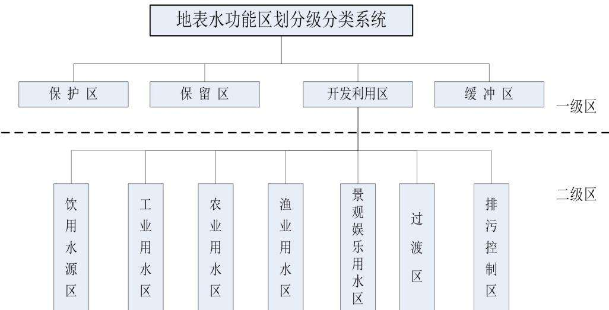  
图5-1 水功能区划分级分类系统图

## (4) 区划程序与方法

水功能一级区划和二级区划工作程序基本相同，均需经过资料收集、资料分析评价、功能区划分和征求有关方面意见等4个阶段或步骤，最后提出正式区划结论申请报批。

## 1）一级区划程序与方法

根据对收集的资料分析，第一步先划分出源头水保护区、自然保护区和调水水源保护区；第二步将跨省界河流的省界河段或用水矛盾突出的地区水域划分为缓冲区；第三步根据经济社会发展、水资源开发程度、水环境状况划分出保留区和开发利用区，对水资源开发利用程度较高、对水域有各种用水和排污要求的水域划为开发利用区，划定保护区、缓冲区和开发利用区后的其余水域均划为保留区；第四步，对水质差异较大的开发利用区与保护区相连的水域划为功能缓冲区。

## 2）二级区划程序

在一级区划的开发利用区中，根据经济社会布局和规划、用水需求、排污情况等划分出饮用、工业、农业、渔业、景观娱乐、过渡、排污控制等7个二级区。当下游功能区水质要求高于上游相邻功能区的水质要求时，在两个功能区之间划出适当长度的过渡区。

## (5) 功能区命名及编码

根据全国水资源保护规划技术大纲，一级功能区的命名采用形象化复合命名，由三个部分组成：第一部分为河流名称，第二部分为地理位置，第三部分为水域功能，即“河名+地名+功能区名”，如“双洎河新密新郑开发利用区”。二级功能区命名与一级功能区命名相似，功能区有重叠者以主导功能加第二功能表示，如“双洎河新密饮用水源区”、“白河南阳饮用工业用水区”。

功能区的编码采取全国统一的办法：主导因素法，将水资源一级区、水资源二级区、水资源三级区、水功能一级区、水功能二级区等五大因子进行编号，力求从编号中反映出水域、功能及隶属关系。

水功能区编码由十四位数字组成：第一、二位数字表示一级水资源分区，按全国统一规划分区，河南省黄河流域区为04，淮河流域区为05；第三、四位数字表示二级水资源分区或水系；第五、六、七位数字表示河流，按干流至支流、上游至下游、左岸至右岸的顺序，由001编至999；第八、九、十位数字表示一级功能区的序号，由010编至990，其中第十位数字是为以后增加一级功能区预留的编码；第十一位数字表示一级功能区类型：保护区为1、保留区为2、开发利用区为3、缓冲区为4；第十二、十三位数字表示二级功能区的序号；第十四位数字表示二级功能区类型：饮用水源区为1、工业用水区为2、农业用水区为3、渔业用水区为4、景观娱乐用水区为5、过渡区为6、排污控制区为7。一级功能区编码的后三位数字为000，如“双洎河新密新郑开发利用区”为05020020153000；如“双洎河新密饮用水源区”为05020020153011。

## 5.1.2 新密市水功能区划范围

根据《郑州市水资源综合规划》（2008）和《新密市水资源开发利用规划编制报告》（2011），结合新密市实际情况及水功能区划原则、条件和方法，新密市划属双洎河新郑开发利用区，其中在新密市境内的河长为54.9km，范围自新密市牛店镇月台村至曲梁镇大樊庄，现状水质为Ⅱ类～劣V类。

新密市共划分出3个二级水功能区，区划河流总长度为54.9km。按第一主导功能统计为：饮用水源区1个、过渡区1个、排污控制区1个。新密市各水功能二级区划结果详见表5-1和图5-2。

（1）双洎河新密饮用水源区：自登封塔水磨源头至新密李湾水库大坝，河长15.6km，其中在新密市境内的河长为3.5km，范围自新密市牛店镇月台村至李湾水库大坝；该区基本未开发，区内的李湾水库为新密市主要生活饮用水和工业用水水源地，现状水质Ⅲ类，规划水质目标Ⅱ类。

（2）双洎河新密排污控制区：自李湾水库大坝至大隗镇南公路桥，河长

31.0km；河段流经新密市郊，沿程有煤矿、纸厂等排放的污水，主要排污口有洧水河口、超化、观寨、苏湾、化工厂等；现状水质劣V类，规划水质目标V类。

（3）双洎河新密新郑过渡区：自新密市大隗镇南公路桥至新郑市107国道以上500m，河长25.4km，其中在新密市境内的河长为20.4km，范围自新密市大隗镇南公路桥至曲梁镇大樊庄；该段位于新密市东部，工矿企业较少，除过渡功能外，兼有农业用水；现状水质劣于V类，规划水质目标IⅣ类。

表5-1 新密市二级水功能区划一览表
<table><tr><td rowspan=2 colspan=1>编号</td><td rowspan=2 colspan=1>一级功能区名称</td><td rowspan=2 colspan=1>二级功能区名称</td><td rowspan=2 colspan=1>水资源分区</td><td rowspan=2 colspan=1>河流</td><td rowspan=1 colspan=2>范围</td><td rowspan=2 colspan=1>水质代表断面</td><td rowspan=2 colspan=1>长度（km）/面积（km³）</td><td rowspan=2 colspan=1>水质现状</td><td rowspan=2 colspan=1>水质目标</td><td rowspan=2 colspan=1>区划依据</td></tr><tr><td rowspan=1 colspan=1>起始断面</td><td rowspan=1 colspan=1>终止断面</td></tr><tr><td rowspan=1 colspan=1>05020020103011</td><td rowspan=1 colspan=1>双洎河新郑开发利用区</td><td rowspan=1 colspan=1>双洎河新密饮用水源区</td><td rowspan=1 colspan=1>沙颍河山区</td><td rowspan=1 colspan=1>双洎河</td><td rowspan=1 colspan=1>新密月台村</td><td rowspan=1 colspan=1>李湾水库大坝</td><td rowspan=1 colspan=1>李湾水库(坝上)</td><td rowspan=1 colspan=1>3.5*</td><td rowspan=1 colspan=1>III</td><td rowspan=1 colspan=1>ⅡI</td><td rowspan=1 colspan=1>源头水</td></tr><tr><td rowspan=1 colspan=1>05020020103027</td><td rowspan=1 colspan=1>双洎河新郑开发利用区</td><td rowspan=1 colspan=1>双洎河新密排污控制区</td><td rowspan=1 colspan=1>沙颍河山区</td><td rowspan=1 colspan=1>双洎河</td><td rowspan=1 colspan=1>李湾水库大坝</td><td rowspan=1 colspan=1>大隗镇南公路桥</td><td rowspan=1 colspan=1>新密(大隗镇南)</td><td rowspan=1 colspan=1>31.0</td><td rowspan=1 colspan=1>&gt;V</td><td rowspan=1 colspan=1>V</td><td rowspan=1 colspan=1>排污控制</td></tr><tr><td rowspan=1 colspan=1>05020020103036</td><td rowspan=1 colspan=1>双洎河新郑开发利用区</td><td rowspan=1 colspan=1>双洎河新密新郑过渡区</td><td rowspan=1 colspan=1>沙颍河山区</td><td rowspan=1 colspan=1>双洎河</td><td rowspan=1 colspan=1>大隗镇南公路桥</td><td rowspan=1 colspan=1>新密大樊庄</td><td rowspan=1 colspan=1>新密大樊庄</td><td rowspan=1 colspan=1>20.4*</td><td rowspan=1 colspan=1>&gt;V</td><td rowspan=1 colspan=1>ⅣV</td><td rowspan=1 colspan=1>功能过渡农灌用水</td></tr></table>

注：\*为在新密市境内的河长。

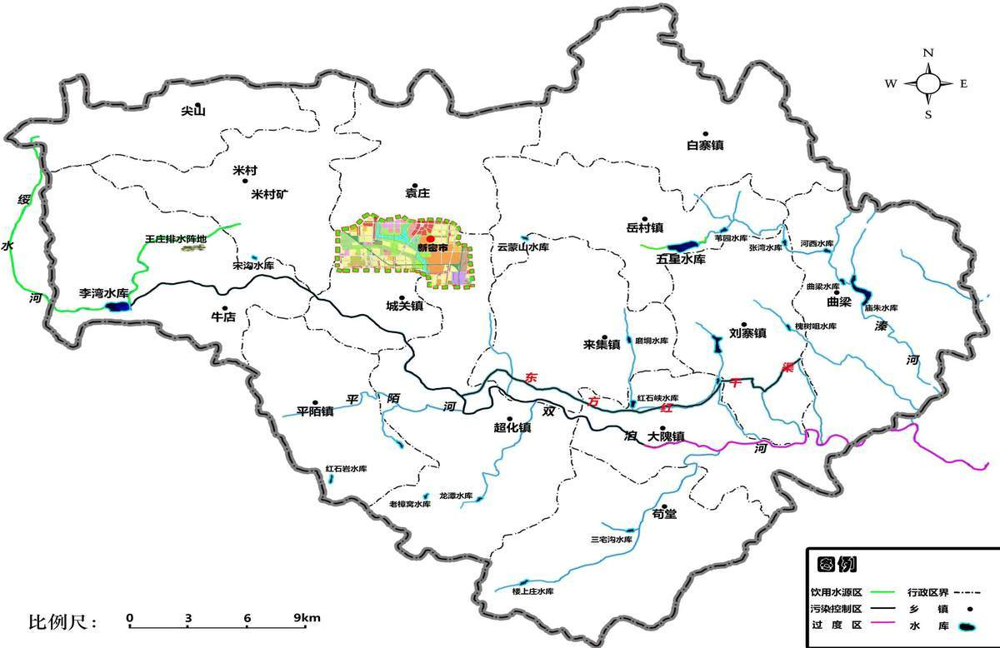  
图5-2 新密市水功能区划成果图

## 5.2 水功能区水质目标拟定

## 5.2.1 基本思路与方法

根据新密市水功能区水质现状、排污状况、不同水功能区的特点、水资源配置对水功能区的要求以及当地技术经济等条件，依据《地表水环境质量标准》（GB3838-2002)，并参照《渔业水质标准》（GB11607-89）、《景观娱乐用水水质标准》（GB12941-91）等，拟定各二级水功能区现状条件与规划条件下的水质目标。

拟定水质目标的具体方法是，将水功能区水质现状与功能区主导功能水质类别指标进行比较后，按下述情况分别处理：

（1）当现状水质未满足水功能区水质类别时，在综合考虑上述因素后，应拟定水质保护目标，水质目标可分阶段达标；

（2）当现状水质已满足水功能区水质类别时，应按照控制水体污染负荷不增加的原则，拟定水质保护目标。

拟定水功能区水质目标应综合考虑：(1水功能区水质类别；②水功能区水质现状；③相邻水功能区的水质要求；④水功能区排污现状与相应的规划；⑤用水部门对水功能区水质的要求，包括现状和规划；⑥经济社会状况及特殊要求；（7水资源配置对水域的总体安排。

## 5.2.2 水功能区水质目标拟定方案

根据《郑州市水资源开发利用规划编制项目报告》、《新密市水务发展“十三五”规划》、《新密市国民经济和社会发展“十三五”规划》等已有成果及水质目标拟定原则，结合本市工农业及城镇发展规划，拟定各二级水功能区现状条件与规划条件下的水质目标。水功能区分阶段水质目标见表5-2。

表5-2 新密市水功能区分阶段水质目标一览表
<table><tr><td rowspan=1 colspan=2>水功能区</td><td rowspan=2 colspan=1>现状水质</td><td rowspan=1 colspan=2>水质目标</td></tr><tr><td rowspan=1 colspan=1>一级功能区</td><td rowspan=1 colspan=1>二级功能区</td><td rowspan=1 colspan=1>2020</td><td rowspan=1 colspan=1>2030</td></tr><tr><td rowspan=3 colspan=1>双洎河新郑开发利用区</td><td rowspan=1 colspan=1>双洎河新密饮用水源区</td><td rowspan=1 colspan=1>ⅢII</td><td rowspan=1 colspan=1>III</td><td rowspan=1 colspan=1>Ⅱ</td></tr><tr><td rowspan=1 colspan=1>双洎河新密排污控制区</td><td rowspan=1 colspan=1>&gt;V</td><td rowspan=1 colspan=1>V</td><td rowspan=1 colspan=1>V</td></tr><tr><td rowspan=1 colspan=1>双洎河新密新郑过渡区</td><td rowspan=1 colspan=1>&gt;V</td><td rowspan=1 colspan=1>V</td><td rowspan=1 colspan=1>IV</td></tr></table>

## 5.3 水功能区纳污能力计算

水功能区纳污能力是在给定水域范围和一定设计流量条件下，满足水功能区环境质量标准要求的最大允许纳污量。纳污能力分为现状纳污能力和规划水平年纳污能力。

新密市各水功能区多数存在不同程度的入河排污现象，直接导致排污口以下水体污染。合理的纳污是水资源有效利用的一部分，同时，计算出各河段的纳污能力也是实现水质目标、确定入河削减量的一个重要前提。

## 5.3.1 纳污能力设计条件的确定

## （1）水文设计条件

水文设计条件是以计算断面的设计流量（水量）表示。现状条件下，一般采用最近10年最枯月平均流量（水量）或90%保证率最枯月平均流量（水量）作为设计流量（水量）。

新密市属于北方地区（淮河流域），部分河流由于枯水月流量太小或可能断流，根据实际情况适当调整设计保证率，取75%保证率最枯月平均流量（水量）作为枯水期设计流量；另外，计算90%保证率最丰月平均流量（水量）作为丰水期设计流量。本次规划主要采用本市域内李湾水库和双洎河下游新郑（二）水文站的长期观测水文资料，结果如表5-3。

表5-3 双洎河断面水文设计条件计算结果表
<table><tr><td rowspan=2 colspan=1>断面名称</td><td rowspan=2 colspan=1>控制汇水面积(km2)</td><td rowspan=2 colspan=1>年份</td><td rowspan=1 colspan=4>75%频率最枯月</td><td rowspan=1 colspan=4>90%频率最丰月</td></tr><tr><td rowspan=1 colspan=1>设计流量(m³/s)</td><td rowspan=1 colspan=1>设计流速(m/s)</td><td rowspan=1 colspan=1>河宽(m)</td><td rowspan=1 colspan=1>水深(m)</td><td rowspan=1 colspan=1>设计流量(m³/s)</td><td rowspan=1 colspan=1>设计流速(m/s)</td><td rowspan=1 colspan=1>河宽(m)</td><td rowspan=1 colspan=1>水深(m)</td></tr><tr><td rowspan=3 colspan=1>新密大隗镇</td><td rowspan=3 colspan=1>633.18</td><td rowspan=1 colspan=1>2015</td><td rowspan=1 colspan=1>0.34</td><td rowspan=1 colspan=1>0.46</td><td rowspan=1 colspan=1>5.62</td><td rowspan=1 colspan=1>0.13</td><td rowspan=1 colspan=1>2.41</td><td rowspan=1 colspan=1>0.16</td><td rowspan=1 colspan=1>19.20</td><td rowspan=1 colspan=1>0.78</td></tr><tr><td rowspan=1 colspan=1>2020</td><td rowspan=1 colspan=1>0.25</td><td rowspan=1 colspan=1>0.37</td><td rowspan=1 colspan=1>5.15</td><td rowspan=1 colspan=1>0.12</td><td rowspan=1 colspan=1>2.18</td><td rowspan=1 colspan=1>0.15</td><td rowspan=1 colspan=1>18.95</td><td rowspan=1 colspan=1>0.78</td></tr><tr><td rowspan=1 colspan=1>2030</td><td rowspan=1 colspan=1>0.065</td><td rowspan=1 colspan=1>0.15</td><td rowspan=1 colspan=1>4.50</td><td rowspan=1 colspan=1>0.10</td><td rowspan=1 colspan=1>1.86</td><td rowspan=1 colspan=1>0.13</td><td rowspan=1 colspan=1>18.50</td><td rowspan=1 colspan=1>0.77</td></tr><tr><td rowspan=3 colspan=1>新郑(二)</td><td rowspan=3 colspan=1>1079.00</td><td rowspan=1 colspan=1>2015</td><td rowspan=1 colspan=1>0.58</td><td rowspan=1 colspan=1>0.78</td><td rowspan=1 colspan=1>5.90</td><td rowspan=1 colspan=1>0.13</td><td rowspan=1 colspan=1>4.10</td><td rowspan=1 colspan=1>0.28</td><td rowspan=1 colspan=1>20.32</td><td rowspan=1 colspan=1>0.72</td></tr><tr><td rowspan=1 colspan=1>2020</td><td rowspan=1 colspan=1>052</td><td rowspan=1 colspan=1>0.77</td><td rowspan=1 colspan=1>5.77</td><td rowspan=1 colspan=1>0.12</td><td rowspan=1 colspan=1>3.97</td><td rowspan=1 colspan=1>0.28</td><td rowspan=1 colspan=1>20.28</td><td rowspan=1 colspan=1>0.72</td></tr><tr><td rowspan=1 colspan=1>2030</td><td rowspan=1 colspan=1>0.39</td><td rowspan=1 colspan=1>0.75</td><td rowspan=1 colspan=1>5.50</td><td rowspan=1 colspan=1>0.10</td><td rowspan=1 colspan=1>3.72</td><td rowspan=1 colspan=1>0.26</td><td rowspan=1 colspan=1>20.20</td><td rowspan=1 colspan=1>0.71</td></tr></table>

## （2）控制因子

根据水污染现状和水污染物总量控制现状，选择CODcr和氨氮作为纳污能力

计算的主要控制因子，湖库增加总磷、总氮指标。

## （3）水质目标

以水功能区相应水环境质量标准类别的上限值作为水质目标值。水功能区相应环境质量标准具体落实于相应的监控断面，断面达标即意味着水功能区水质达标。

## (4） 本底浓度

参考上游水功能区水质目标，以对应《地表水环境质量标准》（GB3838-2002）的上限值（达到对应水环境质量标准的最大值）作为本底浓度（来水浓度）。

## (5）综合衰减系数

由于缺乏本市地表水水体降解系数的相关调查和实验资料，各水功能区水体自净能力不详；另外受技术水平等因素影响，精确测验综合衰减系数难以进行。本次项目根据《全国地表水环境容量核定技术复核要点》中提供的河道水质综合衰减系数参考值，结合各功能区水质优劣状况和水文特征，进行水质综合衰减系数参考值的选取：水质及生态环境较好的，水质综合衰减系数值大，反之小；CODcr综合衰减系数一般不宜大于0.25，氨氮衰减系数一般不宜大于0.2。水质综合衰减系数参考值见表5-4。

表5-4 河道水质综合衰减系数参考值表
<table><tr><td rowspan=2 colspan=1>水质及水生态环境状况</td><td rowspan=1 colspan=2>水质综合衰减系数参考值（1/d）</td></tr><tr><td rowspan=1 colspan=1>CODcr</td><td rowspan=1 colspan=1>氨氮</td></tr><tr><td rowspan=1 colspan=1>优（相应水质为II-II类）</td><td rowspan=1 colspan=1>0.18~0.25</td><td rowspan=1 colspan=1>0.15~0.20</td></tr><tr><td rowspan=1 colspan=1>中（相应水质为III-IV类）</td><td rowspan=1 colspan=1>0.10~0.18</td><td rowspan=1 colspan=1>0.10~0.15</td></tr><tr><td rowspan=1 colspan=1>劣（相应水质为V类或劣V类）</td><td rowspan=1 colspan=1>0.05~0.10</td><td rowspan=1 colspan=1>0.05~0.10</td></tr></table>

采用经验取值法，确定新密市水功能区枯水期 $\mathrm { C O D } _ { \mathrm { c r } }$ 、氨氮的综合衰减系数为 $K { = } 0 . 0 6$ ；通过不同水温条件下综合衰减系数值估算关系式计算，丰水高温期衰减系数 $K { = } 0 . 1 0$

## 5.3.2 水域及排污口概化

双洎河新郑开发利用区水域及排污口概化情况见图5-3和表5-5。

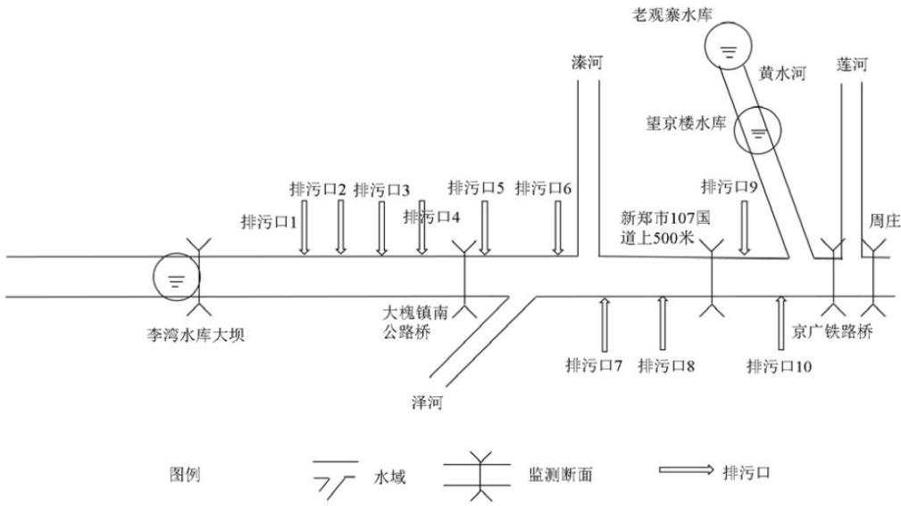  
图5-3 双洎河水域与排污口概化图

表5-5 双洎河新密市水功能区段概化
<table><tr><td rowspan=1 colspan=1>水功能区段</td><td rowspan=1 colspan=1>河段编号</td><td rowspan=1 colspan=2>河段起止</td><td rowspan=1 colspan=1>长度（km）</td></tr><tr><td rowspan=1 colspan=1>双洎河新密饮用水源区</td><td rowspan=1 colspan=1>1</td><td rowspan=1 colspan=1>新密月台村</td><td rowspan=1 colspan=1>李湾水库坝上</td><td rowspan=1 colspan=1>3.5</td></tr><tr><td rowspan=5 colspan=1>双洎河新密排污控制区</td><td rowspan=1 colspan=1>2</td><td rowspan=1 colspan=1>李湾水库坝上</td><td rowspan=1 colspan=1>排污口1</td><td rowspan=1 colspan=1>12.255</td></tr><tr><td rowspan=1 colspan=1>3</td><td rowspan=1 colspan=1>排污口1</td><td rowspan=1 colspan=1>排污口2</td><td rowspan=1 colspan=1>5.228</td></tr><tr><td rowspan=1 colspan=1>4</td><td rowspan=1 colspan=1>排污口2</td><td rowspan=1 colspan=1>排污口3</td><td rowspan=1 colspan=1>5.210</td></tr><tr><td rowspan=1 colspan=1>5</td><td rowspan=1 colspan=1>排污口3</td><td rowspan=1 colspan=1>排污口4</td><td rowspan=1 colspan=1>6.526</td></tr><tr><td rowspan=1 colspan=1>6</td><td rowspan=1 colspan=1>排污口4</td><td rowspan=1 colspan=1>大隗镇南公路桥</td><td rowspan=1 colspan=1>1.781</td></tr><tr><td rowspan=7 colspan=1>双洎河新密新郑过渡区</td><td rowspan=1 colspan=1>7</td><td rowspan=1 colspan=1>大隗镇南公路桥</td><td rowspan=1 colspan=1>排污口5</td><td rowspan=1 colspan=1>0.791</td></tr><tr><td rowspan=1 colspan=1>8</td><td rowspan=1 colspan=1>排污口 5</td><td rowspan=1 colspan=1>泽河</td><td rowspan=1 colspan=1>2.777</td></tr><tr><td rowspan=1 colspan=1>9</td><td rowspan=1 colspan=1>泽河</td><td rowspan=1 colspan=1>排污口6</td><td rowspan=1 colspan=1>0.65</td></tr><tr><td rowspan=1 colspan=1>10</td><td rowspan=1 colspan=1>排污口6</td><td rowspan=1 colspan=1>溱河</td><td rowspan=1 colspan=1>8.764</td></tr><tr><td rowspan=1 colspan=1>11</td><td rowspan=1 colspan=1>溱河</td><td rowspan=1 colspan=1>排污口7</td><td rowspan=1 colspan=1>0.715</td></tr><tr><td rowspan=1 colspan=1>12</td><td rowspan=1 colspan=1>排污口7</td><td rowspan=1 colspan=1>排污口8</td><td rowspan=1 colspan=1>2.413</td></tr><tr><td rowspan=1 colspan=1>13</td><td rowspan=1 colspan=1>排污口8</td><td rowspan=1 colspan=1>新密大樊庄</td><td rowspan=1 colspan=1>4.29</td></tr></table>

## 5.3.3 模型选取

## （1）河流水功能区纳污能力计算方法

新密市境内主要河道较窄，污染物在较短时间内即可混合均匀，因此，可采用概化的一维模型进行水功能区纳污能力计算，方程为：

$$
\stackrel { - } { u } \frac { \partial C } { \partial X } = - k \bullet C\tag{5-1}
$$

求解得：

$$
C ( x ) { = } C _ { 0 } \exp ( - k \cdot x / u )\tag{5-2}
$$

一维模型纳污能力计算公式为：

$$
W _ { i } = 3 1 . 5 4 * ( C _ { s } - C _ { 0 } * e ^ { - k x / u } ) * ( Q _ { i } + Q _ { j } )\tag{5-3}
$$

式中： $C ( x )$ 为控制断面污染物浓度，mg/L； $C _ { 0 }$ 为起始断面污染物浓度，mg/L；x为计算点到第i节点的距离，m；k为污染物综合自净系数，k值一般以1/d表示，计算时应换算成1/s； $W _ { i }$ 为第i个排污口允许排放量，t/a； $C _ { S }$ 为河段第i个节点处的目标水质浓度，mg/L； $Q _ { i }$ 为河道节点后流量， $\mathrm { m } ^ { 3 } / \mathrm { s }$ $Q _ { j }$ 为第i节点处废水入河量， $\mathrm { m } ^ { 3 } / \mathrm { s }$ ；u为第i个河段的设计流速，m/s。

通过计算，得到各排污口的允许排污量之和，即为此水功能区的纳污能力。

## （2）湖库水功能区纳污能力

境内的李湾水库饮用水源区已规划为饮用水水源一级保护区，在2015年应取缔饮用水水源一级保护区内排污口，可不进行该水功能区纳污能力计算。

## 5.3.4 纳污能力计算

新密市河流丰枯水期特征明显，本次按照枯水期与丰水期分别进行水功能区纳污能力计算。根据丰枯水期特点，丰水期（6～9月）按四个月计算，枯水期（1～5月、10～12月）按八个月计算，汇总得到全年的水功能区纳污能力。

## （1）现状年水功能区纳污能力计算

经计算核定，2015年地表水总纳污能力：CODcr为1059.3 t/a、氨氮为 61.1 t/a，现状年各水功能区纳污能力详见表5-6。

## （2）规划水平年水功能区纳污能力计算

经计算核定，2020年地表水总的纳污能力：CODcr为 958.2 t/a、氨氮为 55.1 t/a;2030年地表水总的纳污能力：CODcr为896.6 t/a、氨氮为51.1 t/a，规划水平年各水功能区纳污能力详见表5-6。

表5-6 规划水平年新密市水功能区纳污能力计算表
<table><tr><td colspan="2" rowspan="1">水功能区</td><td colspan="1" rowspan="2">纳污能力条件</td><td colspan="4" rowspan="1">CODcr</td><td colspan="4" rowspan="1">氨氮</td></tr><tr><td colspan="1" rowspan="1">一级功能区</td><td colspan="1" rowspan="1">二级功能区</td><td colspan="1" rowspan="1">水质目标 $\mathrm { ( m g / L ) }$ </td><td colspan="1" rowspan="1">设计流量(m³/s)</td><td colspan="1" rowspan="1">综合衰减系数(1/d)</td><td colspan="1" rowspan="1">纳污能力(t/a)</td><td colspan="1" rowspan="1">水质目标 $\mathrm { { ( m g / L ) } }$ </td><td colspan="1" rowspan="1">设计流量(m³/s)</td><td colspan="1" rowspan="1">综合衰减系数(1/d)</td><td colspan="1" rowspan="1">纳污能力(t/a)</td></tr><tr><td colspan="1" rowspan="2">双洎河新郑开发利用区</td><td colspan="1" rowspan="2">双洎河新密排污控制区</td><td colspan="1" rowspan="1">2015</td><td colspan="1" rowspan="1">40</td><td colspan="1" rowspan="1">0.34/2.41</td><td colspan="1" rowspan="1">0.06/0.10</td><td colspan="1" rowspan="1">1059.3</td><td colspan="1" rowspan="1">2.0</td><td colspan="1" rowspan="1">0.34/2.41</td><td colspan="1" rowspan="1">0.06/0.10</td><td colspan="1" rowspan="1">61.1</td></tr><tr><td colspan="1" rowspan="1">2020</td><td colspan="1" rowspan="1">40</td><td colspan="1" rowspan="1">0.25/2.18</td><td colspan="1" rowspan="1">0.06/0.10</td><td colspan="1" rowspan="1">958.2</td><td colspan="1" rowspan="1">2.0</td><td colspan="1" rowspan="1">0.25/2.18</td><td colspan="1" rowspan="1">0.06/ 0.10</td><td colspan="1" rowspan="1">55.1</td></tr><tr><td colspan="1" rowspan="4"></td><td colspan="1" rowspan="1"></td><td colspan="1" rowspan="1">2030</td><td colspan="1" rowspan="1">40</td><td colspan="1" rowspan="1">0.065/1.86</td><td colspan="1" rowspan="1">0.06/0.10</td><td colspan="1" rowspan="1">896.6</td><td colspan="1" rowspan="1">2.0</td><td colspan="1" rowspan="1">0.065/1.86</td><td colspan="1" rowspan="1">0.06/ 0.10</td><td colspan="1" rowspan="1">51.1</td></tr><tr><td colspan="1" rowspan="3">双洎河新密新郑过渡区</td><td colspan="1" rowspan="1">2015</td><td colspan="1" rowspan="1">30</td><td colspan="1" rowspan="1">0.34/2.41</td><td colspan="1" rowspan="1">0.06/0.10</td><td colspan="1" rowspan="1">0.0</td><td colspan="1" rowspan="1">1.5</td><td colspan="1" rowspan="1">0.34/ 2.41</td><td colspan="1" rowspan="1">0.06/ 0.10</td><td colspan="1" rowspan="1">0.0</td></tr><tr><td colspan="1" rowspan="1">2020</td><td colspan="1" rowspan="1">30</td><td colspan="1" rowspan="1">0.25/2.18</td><td colspan="1" rowspan="1">0.06/0.10</td><td colspan="1" rowspan="1">0.0</td><td colspan="1" rowspan="1">1.5</td><td colspan="1" rowspan="1">0.25/ 2.18</td><td colspan="1" rowspan="1">0.06/ 0.10</td><td colspan="1" rowspan="1">0.0</td></tr><tr><td colspan="1" rowspan="1">2030</td><td colspan="1" rowspan="1">30</td><td colspan="1" rowspan="1">0.065/1.86</td><td colspan="1" rowspan="1">0.06/0.10</td><td colspan="1" rowspan="1">0.0</td><td colspan="1" rowspan="1">1.5</td><td colspan="1" rowspan="1">0.065/1.86</td><td colspan="1" rowspan="1">0.06/ 0.10</td><td colspan="1" rowspan="1">0.0</td></tr></table>

注：综合衰减系数一栏中，斜线前的数据为水期综合衰减系数，斜线后的数据为丰水期综合衰减系数；设计流量一栏中，斜线前的数据为最枯月设计流量，斜线前的数据为最丰月设计流量：

## 5.4 污染物入河量估算

## 5.4.1 调查范围与方法

本次水资源保护是以所划定的水功能区作为基本单元，保护的最终目的是要将水功能区的污染物削减量分解到相应的陆域污染源。在进行水功能区划分之后，应确定水功能区所对应的陆域范围，以便掌握进入该水功能区的陆域主要污染源和主要污染物的现状及其发展趋势。

水功能区所对应陆域范围的确定方法为：通过污染源调查，收集有关入河排污口的设置、市政排水管网布置、企业和单位自行设置排污口的现状及规划等资料，特别是对水功能区水质影响大的污水排放源进行实地勘查分析，尽可能搞清水功能区对应的污染源的陆域范围和排污量，并以此作为陆域污染物排放控制的范围。

## （1）工业污染物排放量计算

工业污染物排放量的计算方法是由万元工业增加值与万元增加值产污系数的乘积求得，计算公式为：

工业污染物排放量=万元工业增加值×产污系数

用现状年工业污染物排放量除以万元工业增加值，得到现状年的万元工业增加值污染物产污系数；以此为基础，综合考虑当地经济社会发展、城市化速率与人口预测、科技进步等因素，结合生产力布局、经济结构调整，以及城市排水管网等基础设施建设的情况，估算规划年工业产污系数，进而乘以规划年万元工业增加值可得规划年工业污染物排放量。一般COD产污系数为 $0 . 5 { \sim } 1 0 \mathrm { k g } / ( 1 0 ^ { 4 } \overline { { \mathcal { T } } } { \cdot } \mathbf { a } )$ 氨氮产污系数为 $0 . 1 { \sim } 1 { \mathrm { k g } } / \ ( 1 0 ^ { 4 } \mathrm { \overline { { \mathcal { I } } } } { \cdot } \mathbf { a } )$ o

## （2）城市生活污染物排放量计算

城市生活污染物排放量的计算方法是由城镇人口数与年人均生活产污系数的乘积求得，计算公式为：

## 城市生活污染物排放量=城镇人口数×年人均生活产污系数

用现状年城市生活污染物排放量除以城镇人口数，得到当前的年人均生活产污系数，与相应的经验值进行对比验证。一般城市人均产污系数约为：COD1～10kg/(人·a)，氨氮0.1～0.5kg/(人·a)，如各单元的取值位于此范围内，则基本符合实际情况。

## （3）农村污染物排放量计算

对于非点源污染物排放量的计算，在全市非点源排放总量确定以后，以平均分配为基本原则，根据各类非点源的影响因素加以修正，将非点源总量分解到各个功能区划河段；利用农村生活和农田灌溉需水量乘上排放系数，计算出农村污水排放量，再乘以产污系数和入河系数就获得污染物入河量。在查阅目前国内有关非点源产污系数研究进展基础上，考虑新密市农村发展水平、种植结构模式、污废水处理情况，给出一般农村产污系数范围为：COD8\~25t/104m³，氨氮为0.05～$1 \mathrm { t } / 1 0 ^ { 4 } \mathrm { m } ^ { 3 }$ O

## 5.4.2 污染物产污系数与入河系数确定

陆域范围内污染源所排放的污染物，仅有一部分最终流入水功能区，进入水功能区的污染物入河量占污染物排放总量的比例即为污染物入河系数，按下式计算：

$$
\lambda \mathbin { \dot { \gamma } } \mathbin { \mathbb { H } } \mathbin { \mathop { \lesssim } } \mathbin { \dot { \ast } } \mathbin { \ddot { \lambda } } \mathbin { \ddot { \lambda } } \mathbin { \ddot { \lambda } } = \frac { \dot { \sqrt { \frac { \pi } { 5 } } } \mathbin { \dot { \mathcal { H } } } \mathbin { \mathbb { A } } \mathbin { \dot { \mathcal { H } } } \mathbin { \mathcal { H } } \mathbin { \lambda } \mathbin { \dot { \mathcal { H } } } \mathbin { \varepsilon } } { \dot { \sqrt { \frac { \pi } { 5 } } } \mathbin { \dot { \mathcal { H } } } \mathbin { \ddot { \mathcal { H } } } \mathbin { \varepsilon } \mathrm { \not \Delta } \mathbin { \dot { \mathcal { H } } } \mathbin { \varepsilon } \mathrm { \dot { \mathcal { H } } } \mathbin { \varepsilon } }
$$

由污染源排放的进入水功能区水域的污染物数量，受众多因素影响，情况十分复杂，区域差异很大。尤其是非点源污染具有广泛性、随机性和难以定点监测的特点，目前我国缺乏连续的非点源水质水量同步监测资料，其研究还处在起步阶段。根据清华大学对淮河流域非点源污染的研究，入河量不到排放量的1/10。本次研究采用经验取值法确定污染源的入河系数：各类点源污染物入河系数按照《全国水环境容量核定技术指南》提供的参考值进行选取，非点源污染物入河系数在0.001～0.1之间选取，详见表5-7。考虑到新密境内主要河流为双洎河，许多乡镇距离双洎河干流较远，且管网设备不完善，本次研究假定入河系数随着距离双洎河的远近及当地污水处理设施的情况有所变化，且双洎河未流经的部分乡镇所有污水排放量均以面源形式计算（如：袁庄乡、尖山乡、米村镇），根据实际情况，结合以上参考值，综合确定各类污染物源强系数和入河系数如表5-8。

表5-7 各类污染物入河系数参考值
<table><tr><td rowspan=1 colspan=1>类别</td><td rowspan=1 colspan=2>系数修正</td><td rowspan=1 colspan=1>入河系数</td></tr><tr><td rowspan=7 colspan=1>点源</td><td rowspan=4 colspan=1>距离修正</td><td rowspan=1 colspan=1>L≤1km</td><td rowspan=1 colspan=1>1~0.9</td></tr><tr><td rowspan=1 colspan=1>1km&lt;L≤20km</td><td rowspan=1 colspan=1>0.8~0.5</td></tr><tr><td rowspan=1 colspan=1>20&lt;L≤40km</td><td rowspan=1 colspan=1>0.4~0.3</td></tr><tr><td rowspan=1 colspan=1>L&gt;40km</td><td rowspan=1 colspan=1>0.2</td></tr><tr><td rowspan=3 colspan=1>污水处理水平</td><td rowspan=1 colspan=1>有污水处理厂</td><td rowspan=1 colspan=1>0.1~0.4</td></tr><tr><td rowspan=1 colspan=1>有简易的污水处理装置</td><td rowspan=1 colspan=1>0.4~0.7</td></tr><tr><td rowspan=1 colspan=1>没有污水处理设施</td><td rowspan=1 colspan=1>1</td></tr><tr><td rowspan=5 colspan=1>非点源</td><td rowspan=5 colspan=1>距离修正</td><td rowspan=1 colspan=1>L≤lkm</td><td rowspan=1 colspan=1>0.1</td></tr><tr><td rowspan=1 colspan=1>1km&lt;L≤10km</td><td rowspan=1 colspan=1>0.07</td></tr><tr><td rowspan=1 colspan=1>10&lt;L≤20km</td><td rowspan=1 colspan=1>0.04</td></tr><tr><td rowspan=1 colspan=1>20&lt;L≤40km</td><td rowspan=1 colspan=1>0.01</td></tr><tr><td rowspan=1 colspan=1>L&gt;40km</td><td rowspan=1 colspan=1>0.001</td></tr></table>

表5-8（I） 新密市污水排放各类系数汇总表
<table><tr><td rowspan=2 colspan=1>污染源类别</td><td rowspan=2 colspan=1>污水排放系数</td><td rowspan=1 colspan=3>COD产生系数</td></tr><tr><td rowspan=1 colspan=1>2015</td><td rowspan=1 colspan=1>2020</td><td rowspan=1 colspan=1>2030</td></tr><tr><td rowspan=1 colspan=1>工业污染源</td><td rowspan=1 colspan=1>0.712</td><td rowspan=1 colspan=1> $\begin{array} { c } { { 1 . 3 0 } } \\ { { ( \mathrm { k g } / 1 0 ^ { 4 } \vec { \mathcal { T } } \bullet \mathbf { a } ) } } \end{array}$ </td><td rowspan=1 colspan=1>1.12 $( \mathrm { { k g } / 1 0 ^ { 4 } \mathit { \overline { { \mathcal { X } } } ^ { \bullet } \mathbf { a } ) } }$ </td><td rowspan=1 colspan=1>0.87 $( \mathrm { { k g } / 1 0 ^ { 4 } \mathit { \overline { { \mathcal { X } } } ^ { \bullet } \mathbf { a } ) } }$ </td></tr><tr><td rowspan=1 colspan=1>城市生活污染源</td><td rowspan=1 colspan=1>0.754</td><td rowspan=1 colspan=1> $\begin{array} { c } { { 4 . 1 6 } } \\ { { ( \mathrm { k g / \lambda ^ { } \bullet a } ) } } \end{array}$ </td><td rowspan=1 colspan=1>3.31(kg/人·a)</td><td rowspan=1 colspan=1> $\begin{array} { c } { { 2 . 4 8 } } \\ { { ( \mathrm { k g / \lambda \bullet a } ) } } \end{array}$ </td></tr><tr><td rowspan=1 colspan=1>面源污染源</td><td rowspan=1 colspan=1>0.278</td><td rowspan=1 colspan=1>9.72(t/104m³)</td><td rowspan=1 colspan=1>9.72(t/104m³)</td><td rowspan=1 colspan=1>9.72(t/104m³)</td></tr></table>

表5-8（I）新密市污水排放各类系数汇总表

<table><tr><td rowspan=2 colspan=1>污染源类别</td><td rowspan=1 colspan=3>氨氮产生系数</td><td rowspan=1 colspan=3>入河系数</td></tr><tr><td rowspan=1 colspan=1>2015</td><td rowspan=1 colspan=1>2020</td><td rowspan=1 colspan=1>2030</td><td rowspan=1 colspan=1>2015</td><td rowspan=1 colspan=1>2020</td><td rowspan=1 colspan=1>2030</td></tr><tr><td rowspan=1 colspan=1>工业污染源</td><td rowspan=1 colspan=1>0.17 $( \mathrm { { k g } / 1 0 ^ { 4 } \vec { \mathcal { T } } ^ { \bullet } \mathbf { a } ) }$ </td><td rowspan=1 colspan=1> $\begin{array} { c } { { 0 . 1 5 } } \\ { { ( \mathrm { { k g } / 1 0 ^ { 4 } \vec { \mathcal { T } } \vec { \ t } \bullet \mathbf { a } ) } } } \end{array}$ </td><td rowspan=1 colspan=1>0.12 $( \mathrm { { k g } / 1 0 ^ { 4 } \mathit { \overline { { \mathcal { X } } } ^ { \bullet } \mathbf { a } ) } }$ </td><td rowspan=1 colspan=1>0.33</td><td rowspan=1 colspan=1>0.30</td><td rowspan=1 colspan=1>0.29</td></tr><tr><td rowspan=1 colspan=1>城市生活污染源</td><td rowspan=1 colspan=1>0.26(kg/人·a·a)</td><td rowspan=1 colspan=1>0.24(kg/人·a)</td><td rowspan=1 colspan=1> $\begin{array} { c } { { 0 . 2 0 } } \\ { { ( \mathrm { k g / \lambda \bullet a } ) } } \end{array}$ </td><td rowspan=1 colspan=1>0.33</td><td rowspan=1 colspan=1>0.30</td><td rowspan=1 colspan=1>0.29</td></tr><tr><td rowspan=1 colspan=1>面源污染源</td><td rowspan=1 colspan=1>0.22(t/104m³)</td><td rowspan=1 colspan=1>0.22(t/104m³)</td><td rowspan=1 colspan=1> $\begin{array} { c } { { 0 . 2 2 } } \\ { { ( \mathrm { t } / 1 0 ^ { 4 } \mathrm { m } ^ { 3 } ) } } \end{array}$ </td><td rowspan=1 colspan=1>0.05</td><td rowspan=1 colspan=1>0.05</td><td rowspan=1 colspan=1>0.05</td></tr></table>

## 5.4.3 现状水平年污染物入河量估算

2015年新密市污水排放总量为 $8 1 8 0 \times 1 0 ^ { 4 } \mathrm { t }$ ，其中工业、城镇（以下部分当中的“城市”都为“城镇”）生活和非点源污水排放量分别为 $6 2 1 2 . 3 { \times } 1 0 ^ { 4 } \mathrm { t }$ $1 0 5 5 . 7 { \times } 1 0 ^ { 4 } \mathrm { t }$ 和$9 1 2 . 0 { \times } 1 0 ^ { 4 } \mathrm { t }$ ；COD排放总量为15100t，其中工业、城镇生活和非点源COD排放量分别为4469.6t、1767.9t和8862.5t；氨氮排放总量为900t，其中工业、城镇生活和非点源氨氮排放量分别为588.4t、112.7t和198.9t。

根据各类污染物入河系数计算得到，2015年全市污水入河量为 $4 0 0 7 . 0 { \times } 1 0 ^ { 4 } \mathrm { t }$ 其中工业、城镇生活和非点源污水入河量分别为 $3 3 6 8 . 5 { \times } 1 0 ^ { 4 } \mathrm { t }$ 1 $5 8 9 . 8 { \times } 1 0 ^ { 4 } \mathrm { t }$ 和$4 8 . 7 \times 1 0 ^ { 4 } \mathrm { t }$ ；COD 入河量为 2521.7t，其中点源和非点源COD 入河量分别为2048.2t和473.4t；氨氮入河量为236.8t，其中点源和非点源氨氮入河量分别为226.1t和10.6t。

各水功能区现状年污染物排放量及入河量估算结果见表5-9。

## 5.4.4 规划水平年污染物入河量估算

规划水平年污染物排放量的预测与需水预测相结合，原则上，生活污水按当地规划水平年内的人口增长状况进行预测；工业污染负荷预测是指排污口的污染物排放总量，预测时考虑排污总量控制目标。根据本项目需水预测部分的结论，污水排放量以需水预测中的工业、城市生活和农村生活需水量减去对应的耗水量求得。各规划水平年预测的污染物排放量乘以相应的入河系数，即可求得规划水平年污染物入河量。

## （1）2020年污染物入河量估算

2020年新密市污水排放总量为 $9 2 5 4 . 6 { \times } 1 0 ^ { 4 } \mathrm { t }$ ，其中工业、城镇生活和非点源污水排放量分别为 $6 2 2 9 . 1 { \times } 1 0 ^ { 4 } \mathrm { t } . 2 0 4 6 . 4 { \times } 1 0 ^ { 4 } \mathrm { t }$ 和 $9 7 9 . 0 { \times } 1 0 ^ { 4 } \mathrm { t } ; \mathrm { C O D }$ 排放总量为17859.2t，其中工业、城市生活和非点源COD排放量分别为 6266.2t、2079.4t和 9513.6t；氨氮排放总量为1207.3t，其中工业、城市生活和非点源氨氮排放量分别为841.8t、151.9t 和 213.5t。

根据各类污染物入河系数计算得到，2020年新密市污水入河量为 $3 4 4 0 . 6 { \times } 1 0 ^ { 4 } \mathrm { t }$ 其中工业、城镇生活和非点源污水入河量分别为 $2 5 2 0 . 1 { \times } 1 0 ^ { 4 } \mathrm { t }$ $8 6 7 . 5 { \times } 1 0 ^ { 4 } \mathrm { t }$ 和$5 3 . 0 { \times } 1 0 ^ { 4 } \mathrm { t }$ ；COD入河量为2995.5t，其中点源和非点源COD入河量分别为2480.1t和 515.4t；氨氮入河量为304.5t，其中点源和非点源氨氮入河量分别为293.0t和

11.6t。

## （2）2030年污染物入河量估算

2030年新密市污水排放总量为 $1 2 7 4 0 . 9 { \times } 1 0 ^ { 4 } \mathrm { t }$ ，其中工业、城市生活和非点源污水排放量分别为 $8 2 4 6 . 3 { \times } 1 0 ^ { 4 } \mathrm { t } , 3 5 3 0 . 0 { \times } 1 0 ^ { 4 } \mathrm { t }$ 和 $9 6 4 . 6 { \times } 1 0 ^ { 4 } \mathrm { t } ; \mathrm { C O D }$ 排放总量为20308.5t，其中工业、城市生活和非点源COD排放量分别为8517.2t、2417.6t和9373.7t；氨氮排放总量为1579.4t，其中工业、城市生活和非点源氨氮排放量分别为1173.7t、195.3t 和 210.4t。

根据各类污染物入河系数计算得到，2030年新密市污水入河量为 $4 6 5 6 . 8 { \times } 1 0 ^ { 4 } \mathrm { t }$ 其中工业、城市生活和非点源污水入河量分别为 $3 1 6 9 . 6 { \times } 1 0 ^ { 4 } \mathrm { t }$ $1 4 3 5 . 9 { \times } 1 0 ^ { 4 } \mathrm { t }$ 和$5 1 . 3 { \times } 1 0 ^ { 4 } \mathrm { t }$ ；COD入河量为 3599.6t，其中点源和非点源COD入河量分别为3098.8t和 500.8t；氨氮入河量为394.1t，其中点源和非点源氨氮入河量分别为382.9t和11.2t。

各水功能区规划水平年污染物排放量及入河量估算结果见表5-9。

表5-9 新密市水功能区污染物排放量及入河量估算表
<table><tr><td rowspan=2 colspan=2>水功能区</td><td rowspan=2 colspan=1>水平年</td><td rowspan=1 colspan=7>废污水</td><td rowspan=1 colspan=7>COD</td><td rowspan=1 colspan=7>氨氮</td></tr><tr><td rowspan=1 colspan=4>排放量（104t/a）</td><td rowspan=1 colspan=2>入河系数</td><td rowspan=1 colspan=1></td><td rowspan=1 colspan=4>排放量（t/a）</td><td rowspan=1 colspan=2>入河系数</td><td rowspan=1 colspan=1></td><td rowspan=1 colspan=4>排放量（t/a）</td><td rowspan=1 colspan=2>入河系数</td><td rowspan=2 colspan=1>入河量(t/a)</td></tr><tr><td rowspan=1 colspan=1>一级</td><td rowspan=1 colspan=1>二级</td><td rowspan=1 colspan=1></td><td rowspan=1 colspan=1>工业</td><td rowspan=1 colspan=1>城市生活</td><td rowspan=1 colspan=1>非点源</td><td rowspan=1 colspan=1>合计</td><td rowspan=1 colspan=1>点源非</td><td rowspan=1 colspan=1>点源</td><td rowspan=1 colspan=1>(104t/a)</td><td rowspan=1 colspan=1>工业</td><td rowspan=1 colspan=1>城市生活</td><td rowspan=1 colspan=1>非点源</td><td rowspan=1 colspan=1>合计</td><td rowspan=1 colspan=1>点源非</td><td rowspan=1 colspan=1>点源</td><td rowspan=1 colspan=1>入河量(t/a)</td><td rowspan=1 colspan=1>工业</td><td rowspan=1 colspan=1>城市生活</td><td rowspan=1 colspan=1>非点源</td><td rowspan=1 colspan=1>合计</td><td rowspan=1 colspan=1>点源</td><td rowspan=1 colspan=1>非点源</td></tr><tr><td rowspan=3 colspan=1>双洎河新郑</td><td rowspan=2 colspan=1>双洎河新密排污控制区</td><td rowspan=1 colspan=1>2015</td><td rowspan=1 colspan=1>5743.3</td><td rowspan=1 colspan=1>1012.6</td><td rowspan=1 colspan=1>849.9</td><td rowspan=1 colspan=1>7605.7</td><td rowspan=1 colspan=1>0.56</td><td rowspan=1 colspan=1>0.05</td><td rowspan=1 colspan=1>3796.8</td><td rowspan=1 colspan=1>4187.5</td><td rowspan=1 colspan=1>1687.6</td><td rowspan=1 colspan=1>8258.6</td><td rowspan=1 colspan=1>14133.7</td><td rowspan=1 colspan=1>0.33</td><td rowspan=1 colspan=1>0.05</td><td rowspan=1 colspan=1>2368.9</td><td rowspan=1 colspan=1>550.5</td><td rowspan=1 colspan=1>107.3</td><td rowspan=1 colspan=1>185.4</td><td rowspan=1 colspan=1>843.2</td><td rowspan=1 colspan=1>0.33</td><td rowspan=1 colspan=1>0.05</td><td rowspan=1 colspan=1>223.5</td></tr><tr><td rowspan=1 colspan=1>2020</td><td rowspan=1 colspan=1>5792.6</td><td rowspan=1 colspan=1>1996.9</td><td rowspan=1 colspan=1>908.4</td><td rowspan=1 colspan=1>8697.9</td><td rowspan=1 colspan=1>0.42</td><td rowspan=1 colspan=1>0.05</td><td rowspan=1 colspan=1>3337.4</td><td rowspan=1 colspan=1>5902.8</td><td rowspan=1 colspan=1>2024.9</td><td rowspan=1 colspan=1>8827.3</td><td rowspan=1 colspan=1>16755.0</td><td rowspan=1 colspan=1>0.30</td><td rowspan=1 colspan=1>0.05</td><td rowspan=1 colspan=1>2853.5</td><td rowspan=1 colspan=1>792.4</td><td rowspan=1 colspan=1>147.8</td><td rowspan=1 colspan=1>198.1</td><td rowspan=1 colspan=1>1138.4</td><td rowspan=1 colspan=1>0.30</td><td rowspan=1 colspan=1>0.05</td><td rowspan=1 colspan=1>292.5</td></tr><tr><td rowspan=1 colspan=1></td><td rowspan=1 colspan=1>2030</td><td rowspan=1 colspan=1>7704.0</td><td rowspan=1 colspan=1>3481.5</td><td rowspan=1 colspan=1>892.1</td><td rowspan=1 colspan=1>12077.6</td><td rowspan=1 colspan=1>0.40</td><td rowspan=1 colspan=1>0.05</td><td rowspan=1 colspan=1>4532.5</td><td rowspan=1 colspan=1>8051.1</td><td rowspan=1 colspan=1>2386.0</td><td rowspan=1 colspan=1>8669.0</td><td rowspan=1 colspan=1>19106.1</td><td rowspan=1 colspan=1>0.29</td><td rowspan=1 colspan=1>0.05</td><td rowspan=1 colspan=1>3465.0</td><td rowspan=1 colspan=1>1109.0</td><td rowspan=1 colspan=1>192.3</td><td rowspan=1 colspan=1>194.6</td><td rowspan=1 colspan=1>1495.9</td><td rowspan=1 colspan=1>0.29</td><td rowspan=1 colspan=1>0.05</td><td rowspan=1 colspan=1>382.6</td></tr><tr><td rowspan=3 colspan=1>开发利用区</td><td rowspan=1 colspan=1></td><td rowspan=1 colspan=1>2015</td><td rowspan=1 colspan=1>469.0</td><td rowspan=1 colspan=1>43.1</td><td rowspan=1 colspan=1>62.1</td><td rowspan=1 colspan=1>574.2</td><td rowspan=1 colspan=1>0.40</td><td rowspan=1 colspan=1>0.085</td><td rowspan=1 colspan=1>210.1</td><td rowspan=1 colspan=1>282.1</td><td rowspan=1 colspan=1>80.3</td><td rowspan=1 colspan=1>603.9</td><td rowspan=1 colspan=1>966.3</td><td rowspan=1 colspan=1>0.28</td><td rowspan=1 colspan=1>0.09</td><td rowspan=1 colspan=1>152.8</td><td rowspan=1 colspan=1>37.9</td><td rowspan=1 colspan=1>5.4</td><td rowspan=1 colspan=1>13.6</td><td rowspan=1 colspan=1>56.8</td><td rowspan=1 colspan=1>0.28</td><td rowspan=1 colspan=1>0.09</td><td rowspan=1 colspan=1>13.3</td></tr><tr><td rowspan=2 colspan=1>双洎河新密新郑过渡区</td><td rowspan=1 colspan=1>2020</td><td rowspan=1 colspan=1>436.5</td><td rowspan=1 colspan=1>49.5</td><td rowspan=1 colspan=1>70.6</td><td rowspan=1 colspan=1>556.7</td><td rowspan=1 colspan=1>0.20</td><td rowspan=1 colspan=1>0.085</td><td rowspan=1 colspan=1>103.2</td><td rowspan=1 colspan=1>363.4</td><td rowspan=1 colspan=1>54.5</td><td rowspan=1 colspan=1>686.3</td><td rowspan=1 colspan=1>1104.3</td><td rowspan=1 colspan=1>0.20</td><td rowspan=1 colspan=1>0.09</td><td rowspan=1 colspan=1>141.9</td><td rowspan=1 colspan=1>49.4</td><td rowspan=1 colspan=1>4.1</td><td rowspan=1 colspan=1>15.4</td><td rowspan=1 colspan=1>68.9</td><td rowspan=1 colspan=1>0.20</td><td rowspan=1 colspan=1>0.09</td><td rowspan=1 colspan=1>12.0</td></tr><tr><td rowspan=1 colspan=1>2030</td><td rowspan=1 colspan=1>542.3</td><td rowspan=1 colspan=1>48.5</td><td rowspan=1 colspan=1>72.5</td><td rowspan=1 colspan=1>663.3</td><td rowspan=1 colspan=1>0.20</td><td rowspan=1 colspan=1>0.085</td><td rowspan=1 colspan=1>124.3</td><td rowspan=1 colspan=1>466.0</td><td rowspan=1 colspan=1>31.7</td><td rowspan=1 colspan=1>704.7</td><td rowspan=1 colspan=1>1202.4</td><td rowspan=1 colspan=1>0.15</td><td rowspan=1 colspan=1>0.09</td><td rowspan=1 colspan=1>134.6</td><td rowspan=1 colspan=1>64.7</td><td rowspan=1 colspan=1>3.0</td><td rowspan=1 colspan=1>15.8</td><td rowspan=1 colspan=1>83.5</td><td rowspan=1 colspan=1>0.15</td><td rowspan=1 colspan=1>0.09</td><td rowspan=1 colspan=1>11.5</td></tr></table>

注：入河系数指年入河（湖库）数量占年排放量的比例。

## 5.5 污染物控制量与削减量

## 5.5.1 污染物控制量与削减量计算方法

以水功能区为单元，将规划水平年的污染物入河量与纳污能力相比较，如果污染物入河量超过水功能区的纳污能力，需要计算入河削减量和相应的排放削减量；反之，制订入河控制量和排放控制量。排放削减量和排放控制量均需要进一步分配到相应的陆域。

水功能区规划水平年的污染物入河量与相应的纳污能力之差，即为该水功能区规划水平年的污染物入河削减量。

当水功能区规划水平年的污染物入河量预测结果小于纳污能力时，为有效控制污染物入河量，应制定水功能区污染物入河控制量。制定入河控制量时，应考虑水功能区的水质状况、水资源可利用量、经济与社会发展现状及未来人口增长和经济社会发展对水资源的需求等。

一般情况下，对经济欠发达、水资源丰富、现状水质良好的地区，污染物入河控制量可适当放宽，但不得超过水功能区的纳污能力。

水功能区规划水平年的污染物入河削减量除以入河系数，即可得到水功能区的排放削减量。水功能区排放削减量等于水功能区所对应的陆域范围内在规划水平年的污染物排放削减量之和。要按照核定的该水域纳污能力，向环境保护行政主管部门提出该水域的限制排污总量的意见。

水功能区规划水平年的污染物入河控制量除以入河系数，即可得到功能区的排放控制量。

## 5.5.2 污染物控制量与削减量计算结果

新密市不同水平年水功能区污染物入河总量控制、污废水排放及其处理规划见表5-10。经计算核定不同水平年水功能区排放削减量和排放控制量后,还需要进一步将其分配到相应的陆域。新密不同水平年城市污染物入河总量控制及排放量控制规划见表5-11。

表5-10 新密市不同水平年水功能区污染物入河总量控制及排放量控制规划表
<table><tr><td rowspan=2 colspan=2>水功能区</td><td rowspan=2 colspan=1></td><td rowspan=1 colspan=10>COD(t/a)</td><td rowspan=1 colspan=10>氨氮（t/a）</td></tr><tr><td rowspan=2 colspan=1>水平年</td><td rowspan=2 colspan=1>排放量</td><td rowspan=2 colspan=1>入河量</td><td rowspan=2 colspan=1>纳污能力</td><td rowspan=2 colspan=1>入河控制量</td><td rowspan=2 colspan=1>入河削减量</td><td rowspan=2 colspan=1>排放控制量</td><td rowspan=2 colspan=1>排放削减量</td><td rowspan=1 colspan=1>陆域</td><td rowspan=1 colspan=1>治理量</td><td rowspan=1 colspan=1></td><td rowspan=2 colspan=1>排放量</td><td rowspan=2 colspan=1>入河量</td><td rowspan=2 colspan=1>纳污能力</td><td rowspan=2 colspan=1>入河控制量</td><td rowspan=2 colspan=1>入河削减量</td><td rowspan=2 colspan=1>排放控制量</td><td rowspan=2 colspan=1>排放削减量</td><td rowspan=1 colspan=1>陆域</td><td rowspan=1 colspan=1>治理</td><td rowspan=1 colspan=1>量</td></tr><tr><td rowspan=1 colspan=1>一级</td><td rowspan=1 colspan=1>二级</td><td rowspan=1 colspan=1>处理量</td><td rowspan=1 colspan=1>城镇导污</td><td rowspan=1 colspan=1>其他处理</td><td rowspan=1 colspan=1>处理量</td><td rowspan=1 colspan=1>城镇导污</td><td rowspan=1 colspan=1>其他处理</td></tr><tr><td rowspan=3 colspan=1>双洎河新郑</td><td rowspan=3 colspan=1>双洎河新密排污控制区</td><td rowspan=1 colspan=1>2015</td><td rowspan=1 colspan=1>14133.7</td><td rowspan=1 colspan=1>2368.9</td><td rowspan=1 colspan=1>1059.3</td><td rowspan=1 colspan=1></td><td rowspan=1 colspan=1>1309.6</td><td rowspan=1 colspan=1></td><td rowspan=1 colspan=1>7813.6</td><td rowspan=1 colspan=1>7813.6</td><td rowspan=1 colspan=1></td><td rowspan=1 colspan=1></td><td rowspan=1 colspan=1>843.2</td><td rowspan=1 colspan=1>223.5</td><td rowspan=1 colspan=1>61.1</td><td rowspan=1 colspan=1></td><td rowspan=1 colspan=1>162.4</td><td rowspan=1 colspan=1></td><td rowspan=1 colspan=1>612.5</td><td rowspan=1 colspan=1>612.5</td><td rowspan=1 colspan=1></td><td rowspan=1 colspan=1></td></tr><tr><td rowspan=1 colspan=1>2020</td><td rowspan=1 colspan=1>16755.0</td><td rowspan=1 colspan=1>2853.5</td><td rowspan=1 colspan=1>958.2</td><td rowspan=1 colspan=1></td><td rowspan=1 colspan=1>1895.3</td><td rowspan=1 colspan=1></td><td rowspan=1 colspan=1>11128.5</td><td rowspan=1 colspan=1>11128.5</td><td rowspan=1 colspan=1></td><td rowspan=1 colspan=1></td><td rowspan=1 colspan=1>1138.4</td><td rowspan=1 colspan=1>292.5</td><td rowspan=1 colspan=1>55.1</td><td rowspan=1 colspan=1></td><td rowspan=1 colspan=1>237.4</td><td rowspan=1 colspan=1></td><td rowspan=1 colspan=1>924.0</td><td rowspan=1 colspan=1>924.0</td><td rowspan=1 colspan=1></td><td rowspan=1 colspan=1></td></tr><tr><td rowspan=1 colspan=1>2030</td><td rowspan=1 colspan=1>19106.1</td><td rowspan=1 colspan=1>3465.0</td><td rowspan=1 colspan=1>896.6</td><td rowspan=1 colspan=1></td><td rowspan=1 colspan=1>2568.5</td><td rowspan=1 colspan=1></td><td rowspan=1 colspan=1>14162.5</td><td rowspan=1 colspan=1>14162.5</td><td rowspan=1 colspan=1></td><td rowspan=1 colspan=1></td><td rowspan=1 colspan=1>1495.9</td><td rowspan=1 colspan=1>382.6</td><td rowspan=1 colspan=1>51.1</td><td rowspan=1 colspan=1></td><td rowspan=1 colspan=1>331.5</td><td rowspan=1 colspan=1></td><td rowspan=1 colspan=1>1296.1</td><td rowspan=1 colspan=1>1296.1</td><td rowspan=1 colspan=1></td><td rowspan=1 colspan=1></td></tr><tr><td rowspan=3 colspan=1>开发利用区</td><td rowspan=3 colspan=1>双洎河新密新郑过渡区</td><td rowspan=1 colspan=1>2015</td><td rowspan=1 colspan=1>966.3</td><td rowspan=1 colspan=1>152.8</td><td rowspan=1 colspan=1>0.0</td><td rowspan=1 colspan=1></td><td rowspan=1 colspan=1>152.8</td><td rowspan=1 colspan=1></td><td rowspan=1 colspan=1>966.3</td><td rowspan=1 colspan=1>966.3</td><td rowspan=1 colspan=1></td><td rowspan=1 colspan=1></td><td rowspan=1 colspan=1>56.8</td><td rowspan=1 colspan=1>13.3</td><td rowspan=1 colspan=1>0.0</td><td rowspan=1 colspan=1></td><td rowspan=1 colspan=1>13.3</td><td rowspan=1 colspan=1></td><td rowspan=1 colspan=1>56.8</td><td rowspan=1 colspan=1>56.8</td><td rowspan=1 colspan=1></td><td rowspan=1 colspan=1></td></tr><tr><td rowspan=1 colspan=1>2020</td><td rowspan=1 colspan=1>1104.3</td><td rowspan=1 colspan=1>141.9</td><td rowspan=1 colspan=1>0.0</td><td rowspan=1 colspan=1></td><td rowspan=1 colspan=1>141.9</td><td rowspan=1 colspan=1></td><td rowspan=1 colspan=1>1104.3</td><td rowspan=1 colspan=1>1104.3</td><td rowspan=1 colspan=1></td><td rowspan=1 colspan=1></td><td rowspan=1 colspan=1>68.9</td><td rowspan=1 colspan=1>12.0</td><td rowspan=1 colspan=1>0.0</td><td rowspan=1 colspan=1></td><td rowspan=1 colspan=1>12.0</td><td rowspan=1 colspan=1></td><td rowspan=1 colspan=1>68.9</td><td rowspan=1 colspan=1>68.9</td><td rowspan=1 colspan=1></td><td rowspan=1 colspan=1></td></tr><tr><td rowspan=1 colspan=1>2030</td><td rowspan=1 colspan=1>1202.4</td><td rowspan=1 colspan=1>134.6</td><td rowspan=1 colspan=1>0.0</td><td rowspan=1 colspan=1></td><td rowspan=1 colspan=1>134.6</td><td rowspan=1 colspan=1></td><td rowspan=1 colspan=1>1202.4</td><td rowspan=1 colspan=1>1202.4</td><td rowspan=1 colspan=1></td><td rowspan=1 colspan=1></td><td rowspan=1 colspan=1>83.5</td><td rowspan=1 colspan=1>11.5</td><td rowspan=1 colspan=1>0.0</td><td rowspan=1 colspan=1></td><td rowspan=1 colspan=1>11.5</td><td rowspan=1 colspan=1></td><td rowspan=1 colspan=1>83.5</td><td rowspan=1 colspan=1>83.5</td><td rowspan=1 colspan=1></td><td rowspan=1 colspan=1></td></tr></table>

注：估算不同水平年污染物入河控制量时，对2020年以前采用现状纳污能力，2020年以后采用规划纳污能力控制。

表5-11 新密市不同水平年城市污染物入河总量控制及排放量控制规划表
<table><tr><td rowspan=3 colspan=1>水平年</td><td rowspan=1 colspan=10>COD量（t/a）</td><td rowspan=1 colspan=10>氨氮（t/a）</td></tr><tr><td rowspan=2 colspan=1>排放量</td><td rowspan=2 colspan=1>入河量</td><td rowspan=2 colspan=1>纳污能力</td><td rowspan=2 colspan=1>入河控制量</td><td rowspan=2 colspan=1>入河削减量</td><td rowspan=2 colspan=1>排放控制量</td><td rowspan=2 colspan=1>排放削减量</td><td rowspan=1 colspan=3>陆域治理量</td><td rowspan=2 colspan=1>排放量</td><td rowspan=2 colspan=1>入河量</td><td rowspan=2 colspan=1>纳污能力</td><td rowspan=2 colspan=1>入河控制量</td><td rowspan=2 colspan=1>入河削减量</td><td rowspan=2 colspan=1>排放控制量</td><td rowspan=2 colspan=1>排放削减量</td><td rowspan=1 colspan=3>陆域治理量</td></tr><tr><td rowspan=1 colspan=1>处理</td><td rowspan=1 colspan=1>导污</td><td rowspan=1 colspan=1>其他</td><td rowspan=1 colspan=1>处理</td><td rowspan=1 colspan=1>城镇</td><td rowspan=1 colspan=1>其他</td></tr><tr><td rowspan=1 colspan=1>2015</td><td rowspan=1 colspan=1>15100.0</td><td rowspan=1 colspan=1>2521.7</td><td rowspan=1 colspan=1>1059.3</td><td rowspan=1 colspan=1></td><td rowspan=1 colspan=1>1462.4</td><td rowspan=1 colspan=1></td><td rowspan=1 colspan=1>8779.9</td><td rowspan=1 colspan=1>8779.9</td><td rowspan=1 colspan=1></td><td rowspan=1 colspan=1></td><td rowspan=1 colspan=1>900.0</td><td rowspan=1 colspan=1>236.8</td><td rowspan=1 colspan=1>61.1</td><td rowspan=1 colspan=1></td><td rowspan=1 colspan=1>175.6</td><td rowspan=1 colspan=1></td><td rowspan=1 colspan=1>669.3</td><td rowspan=1 colspan=1>669.3</td><td rowspan=1 colspan=1></td><td rowspan=1 colspan=1></td></tr><tr><td rowspan=1 colspan=1>2020</td><td rowspan=1 colspan=1>17859.2</td><td rowspan=1 colspan=1>2995.5</td><td rowspan=1 colspan=1>958.2</td><td rowspan=1 colspan=1></td><td rowspan=1 colspan=1>2037.2</td><td rowspan=1 colspan=1></td><td rowspan=1 colspan=1>12232.8</td><td rowspan=1 colspan=1>12232.8</td><td rowspan=1 colspan=1></td><td rowspan=1 colspan=1></td><td rowspan=1 colspan=1>1207.3</td><td rowspan=1 colspan=1>304.5</td><td rowspan=1 colspan=1>55.1</td><td rowspan=1 colspan=1></td><td rowspan=1 colspan=1>249.4</td><td rowspan=1 colspan=1></td><td rowspan=1 colspan=1>992.8</td><td rowspan=1 colspan=1>992.8</td><td rowspan=1 colspan=1></td><td rowspan=1 colspan=1></td></tr><tr><td rowspan=1 colspan=1>2030</td><td rowspan=1 colspan=1>20308.5</td><td rowspan=1 colspan=1>3599.6</td><td rowspan=1 colspan=1>896.6</td><td rowspan=1 colspan=1></td><td rowspan=1 colspan=1>2703.0</td><td rowspan=1 colspan=1></td><td rowspan=1 colspan=1>15364.9</td><td rowspan=1 colspan=1>15364.9</td><td rowspan=1 colspan=1></td><td rowspan=1 colspan=1></td><td rowspan=1 colspan=1>1579.4</td><td rowspan=1 colspan=1>394.1</td><td rowspan=1 colspan=1>51.1</td><td rowspan=1 colspan=1></td><td rowspan=1 colspan=1>343.0</td><td rowspan=1 colspan=1></td><td rowspan=1 colspan=1>1379.6</td><td rowspan=1 colspan=1>1379.6</td><td rowspan=1 colspan=1></td><td rowspan=1 colspan=1></td></tr></table>

## 5.6 地表水水质保护措施

地表水水质保护措施可分为工程措施和非工程措施两大类。工程措施包括推行清洁生产工艺、加大工业废水处理与达标排放率、提高水环境容量和水体自净能力（主要包括水利工程调度、引水减污、疏浚清淤等工程措施）、水质监测网络布设等；非工程措施主要表现在管理方面，即软环境的建设，包括调整工业布局和产业结构、关停污染严重企业、环境监察与环境执法、建立地表水水质保护机构和应对突发事件机制等。

## 5.6.1 污染源控制措施

污染源控制可分为水体外部污染源控制与水体内部污染源控制两部分。外源控制又包括点源控制与非点源控制两方面，其控制对象包括生活污水、工业废水、畜禽养殖的粪尿与废水、农业面源污染等；内源污染控制主要指江、河、湖、库水体污染物转化和底泥积聚与释放的控制。

（1）城镇生活污染源控制。主要控制措施：加快城镇污水处理设施建设，加大生活污水处理力度；加强污水处理费的征收，提高污水处理设施的运行效率，全面规范污水处理厂的排污监管。

（2）工业污染源控制。一般可分为宏观性控制、技术性控制以及管理性控制三大类，其中，发展清洁生产及节水减污是控制工业废水污染最重要的对策和措施。主要控制措施包括：加大产业宏观调控力度，严格企业淘汰与准入制度；加强对工业企业的技术改造，积极推进清洁生产：加大工业废水处理力度，实现达标排放；加强水资源保护管理，全面推行污染物排放总量与排污许可证制度。

（3）规模养殖业污染源控制。搬迁或关闭位于水源保护区、城市和城镇居住区等人口集中地区的畜禽养殖场；适度控制养殖规模，引导畜禽养殖业向土地相对充足的地区转移，走生态养殖道路，减少畜禽废水排放；提高畜禽养殖业清洁生产水平及废弃物资源化利用水平。

（4）农业面源污染控制。农药、化肥是农业生产对水影像影响的重要因子，应合理控制施肥量，加强水土保护。

（5）水体内源污染控制：主要指对江、河、湖、库水体污染物转化和底泥积聚与释放的控制。江、河、湖、库底泥疏浚是解决水体内源磷污染释放的重要措施；另外，可以通过对支流河岸的整治与基底修复，种植适宜的水生、陆生植物，构成绿化隔离带，维护河流良性生态系统。

## 5.6.2 水环境治理工程措施

水环境修复工程措施主要包括水工程调度、引水减污、疏浚清淤以及生物净化等工程措施，以提高水环境容量和水体的自净能力，适用于已污染水体的治理。

## （1）水利工程

水利工程在水资源保护中具有十分重要的作用。采用正确的水利工程设施能够有效改善水质状况；水利工程的引水、调水、蓄水、排水等各种设施，可以改善、提高水环境的质量。通过水利工程的合理调度，改变天然水系丰、枯水期水量不平衡状况，改善天然河道枯水期径流量，使河流在枯水期具有一定的水量来稀释净化污染物质，改善水环境状况。

## （2)引水减污工程

引水减污工程措施就是通过引水增加河流水域的水环境容量，提高水体自净能力，将污水冲走。引水可以在本河流内，也可跨河流引水、调水。结合本市的实际情况，引水减污主要应依靠引矿坑排水、污水处理厂再生中水至双洎河，来净化环境、改善水质。

## （3）综合治理工程

小流域：开展生态清洁小流域建设规划，根据小流域内不同区域的自然条件、人为活动等特点，划分出生态修复区、生态治理区和生态保护区，以便有针对性地采取不同治理措施和管理方式。未来五年新密市生态清洁小流域建设将围绕新密市主城区，构建涉及我市东中部岳村、刘寨、大隗、来集、城关镇，西南部米村、牛店、平陌、超化、苟堂，北部尖山、袁庄等乡镇，共约20余条小流域，涵盖全市约30个规划保留村。

河流、湿地和湖泊：根据《新密市水务发展“十三五”规划》，新密未来将以重点中小河流治理为契机，通过河道清淤疏浚、清障固堤、护岸绿化等一系列措施，努力实现河道“水清、河畅、岸绿、景美”目标，打造出具有当地特色的生态清洁小流域，力争“十三五”期间完成全市重点中小河流综合治理长度14.78km。此外，“十三五”期间重点治理河道项目见表5-12。根据《新密市水务发展“十三五”规划》，新密市“十三五”期间也将完成部分湿地、湖泊生态环境治理，具体

项目见表5-13。

水库：对中小型水库严格按照临近死水位的淤积量统一标准的摸底调查，新密市最终规划上报29座中小型水库清淤规划。其中，中型水库2座，小Ⅰ型水库14座，小Ⅱ型水库13座。

表5-12 新密市河道治理项目一览表
<table><tr><td rowspan=1 colspan=1>序号</td><td rowspan=1 colspan=1>河流名称</td><td rowspan=1 colspan=1>规划治理范围</td><td rowspan=1 colspan=1>规划治理河长</td><td rowspan=1 colspan=1>治理内容</td></tr><tr><td rowspan=1 colspan=1>1</td><td rowspan=1 colspan=1>双洎河</td><td rowspan=1 colspan=1>双洎河干流牛店段、大隗东段</td><td rowspan=1 colspan=1>26.73km，其中“十三五”期间治理14.87km</td><td rowspan=1 colspan=1>河道疏挖、堤防加固、弯道边坡护砌、支流沟口加固、跨河建筑物、生态护岸植被、河道绿化等</td></tr><tr><td rowspan=1 colspan=1>2</td><td rowspan=1 colspan=1>溱水河</td><td rowspan=1 colspan=1>张湾水库上游500米处至新密市曲梁镇范围为河道中心线两侧各500米；曲梁境内为沿河两侧规划的生态公园、滨河休闲公园、历史文化遗址公园范围大学南路一西区域</td><td rowspan=1 colspan=1>18.5km</td><td rowspan=1 colspan=1>河道整治工程，截污工程，生态修复工程，防汛通道及跨河桥梁工程等；设计防洪标准20年一遇，设计除涝标准5年一遇</td></tr><tr><td rowspan=1 colspan=1>3</td><td rowspan=1 colspan=1>泽河</td><td rowspan=1 colspan=1>泽河苟堂镇区段</td><td rowspan=1 colspan=1>3.5km</td><td rowspan=1 colspan=1>河道疏浚、堤防填筑、坡岸护砌</td></tr><tr><td rowspan=1 colspan=1>4</td><td rowspan=1 colspan=1>寺沟河</td><td rowspan=1 colspan=1>寺沟河城区段（溱水路-入双洎河口）</td><td rowspan=1 colspan=1>4km</td><td rowspan=1 colspan=1>河道疏浚、堤防填筑、坡岸护砌</td></tr></table>

表5-13 新密市湿地、湖泊治理项目一览表

<table><tr><td rowspan=1 colspan=1>序号</td><td rowspan=1 colspan=1>项目</td><td rowspan=1 colspan=1>项目位置和面积  $( 1 0 ^ { 4 } \mathrm { m } ^ { 3 } )$ </td><td rowspan=1 colspan=1>建设内容</td></tr><tr><td rowspan=1 colspan=1>1</td><td rowspan=1 colspan=1>新密市西区生态环境治理工程项目</td><td rowspan=1 colspan=1>新密市西侧，荥密公路东侧，东靠新密市植物园，北临西大街，南至报恩街（规划道路）；占地 66.7×104m³</td><td rowspan=1 colspan=1>①水体净化及利用工程；②土地整理工程；③护坡加固工程；④园林绿化工程；⑤道路修复工程；⑥后期养护设施工程；⑦公共设施</td></tr><tr><td rowspan=1 colspan=1>2</td><td rowspan=1 colspan=1>雷泽湖建设项目</td><td rowspan=1 colspan=2>老城区青河水库下游，规划水面面积3.3×104m3</td></tr><tr><td rowspan=1 colspan=1>3</td><td rowspan=1 colspan=1>云垂湖、风扬湖建设项目</td><td rowspan=1 colspan=2>云垂湖位于青河水库下游，与雷泽湖同为青河水库串联湖波，规划水面面积1.38×104m³;风扬湖位于新华路南侧，规划水面面积1.7×104m³</td></tr><tr><td rowspan=1 colspan=1>4</td><td rowspan=1 colspan=1>天覆湖、地载湖建设项目</td><td rowspan=1 colspan=2>该项目是位于青石河城区河段上的两座串联湖波。天覆湖位于东西大街北侧，规划水面面积2.39×104m³；地载湖位于嵩山大道北侧，规划水面面积2.4×104m3</td></tr></table>

## （4）生物净化工程

生物净化工程，是利用生态工程学原理及自然界微生物的作用，对废污水实现净化处理的工艺流程，例如在稳定塘、水生植物塘、水生动物塘、湿地、土地处理系统，以及上述处理方式的组合系统等。其特点是投资小、运行费用低、净化效率高。

## 5.6.3 地表水饮用水源地保护

## （1）地表水饮用水源保护区划分

根据《城市饮用水水源保护区划分技术细则》及《新密市水务发展“十三五”规划》，结合新密实际，对全市的较大的供水水源地划分相应的保护区和准保护区。目前，全市共划分1个地表水饮用水水源地保护区。保护区水质管理目标主要为Ⅱ级，准保护区水质管理目标以Ⅲ级为主，其中保护区的总面积为 $3 . 8 \mathrm { k m } ^ { 2 }$ ，准保护区的总面积为 $6 6 . 0 \mathrm { k m } ^ { 2 }$ 。地表水饮用水源保护区见表5-14。

表5-14 新密市地表水饮用水源保护区一览表
<table><tr><td rowspan=2 colspan=1>行政区</td><td rowspan=2 colspan=1>饮用水水源地名称</td><td rowspan=2 colspan=1>所在水系</td><td rowspan=2 colspan=1>水源地类型</td><td rowspan=1 colspan=2>保护区</td><td rowspan=1 colspan=2>准保护区</td></tr><tr><td rowspan=1 colspan=1>面积(km²)</td><td rowspan=1 colspan=1>水质管理目标</td><td rowspan=1 colspan=1>面积 $( \mathrm { k m } ^ { 2 } )$ </td><td rowspan=1 colspan=1>水质管理目标</td></tr><tr><td rowspan=1 colspan=1>新密市</td><td rowspan=1 colspan=1>李湾水库</td><td rowspan=1 colspan=1>双洎河</td><td rowspan=1 colspan=1>河道</td><td rowspan=1 colspan=1>2.3</td><td rowspan=1 colspan=1>ⅡI</td><td rowspan=1 colspan=1>66</td><td rowspan=1 colspan=1>ⅢⅢ</td></tr></table>

## （2）地表水饮用水源地保护措施

主要措施包括：①地表水饮用水水源地保护及综合整治工程；②地表水饮用水源地隔离防护工程；③地表水饮用水水源保护区污染源综合整治工程；④湖库型饮用水水源保护区生态修复与保护工程。

## 5.6.4 水功能区划体系建设

根据《河南省水功能区划报告》及《郑州市水资源综合规划》，新密市现有3个二级水功能区，区划河流总长度为54.9km，主要集中在双洎河于流，而对于双洎河支流及其他河库尚没有进行水功能区划。故应结合新密市水功能区划现状，进一步补充和完善市域内其他河流及水库的水功能区划体系规划及河湖现状健康评价，区划范围覆盖全部河流及湖库区，并根据不同功能区的水量水质特点设定控制目标。

## 5.6.5 地表水水质监测体系建设

水质监测为水功能区划管理服务，其主要目的是检验水资源保护规划的执行情况，包括加强水功能区的水质监测、加强污染事故应急监测和入河排污口监督监测等。

监测站点布设要求、监测时间、频次与项目等，应按照《全国水资源综合规划技术大纲》、《全国水资源综合规划地表水资源保护补充技术细则》（2003）、《水

环境监测规范》（SL219-98）、《地表水环境质量标准》（GB/3838-2002）等技术文件来执行。

## 5.6.6 海绵城市建设规划

## （1）目标要求

根据《海绵城市建设技术指南—低影响开发雨水系统构建》（2014）及《国务院办公厅关于推进海绵城市建设的指导意见》（2015）文件要求，海绵城市建设，综合采取“渗、滞、蓄、净、用、排”等措施，最大限度地减少城市开发建设对生态环境的影响，将70%的降雨就地消纳和利用。到2020年，城市建成区20%以上的面积达到目标要求；到2030年，城市建成区80%以上的面积达到目标要求。

## (2） 遵循原则

海绵城市建设应遵循生态优先等原则，将自然途径与人工措施相结合，在确保城市排水防涝安全的前提下，最大限度地实现雨水在城市区域的积存、渗透和净化，促进雨水资源的利用和生态环境保护。在海绵城市建设过程中，应统筹自然降水、地表水和地下水的系统性，协调给水、排水等水循环利用各环节，并考虑其复杂性和长期性。

坚持生态为本、自然循环。充分发挥山水林田湖等原始地形地貌对降雨的积存作用，充分发挥植被、土壤等自然下垫面对雨水的渗透作用，充分发挥湿地、水体等对水质的自然净化作用，努力实现城市水体的自然循环。

坚持规划引领、统筹推进。因地制宜确定海绵城市建设目标和具体指标，科学编制和严格实施相关规划，完善技术标准规范。统筹发挥自然生态功能和人工干预功能，实施源头减排、过程控制、系统治理，切实提高城市排水、防涝、防洪和防灾减灾能力。

坚持政府引导、社会参与。发挥市场配置资源的决定性作用和政府的调控引导作用，加大政策支持力度，营造良好发展环境。积极推广政府和社会资本合作（PPP)、特许经营等模式，吸引社会资本广泛参与海绵城市建设。

## (3) 建设途径

一是对城市原有生态系统的保护。最大限度地保护原有的河流、湖泊、湿地、坑塘、沟渠等水生态敏感区，留有足够涵养水源、应对较大强度降雨的林地、草地、湖泊、湿地，维持城市开发前的自然水文特征，这是海绵城市建设的基本要

求；

二是生态恢复和修复。对传统粗放式城市建设模式下，已经受到破坏的水体和其他自然环境，运用生态的手段进行恢复和修复，并维持一定比例的生态空间；

三是低影响开发（LID）。按照对城市生态环境影响最低的开发建设理念，合理控制开发强度，在城市中保留足够的生态用地，控制城市不透水面积比例，最大限度的减少对城市原有水生态环境的破坏，同时，根据需求适当开挖河湖沟渠、增加水域面积，促进雨水的积存、渗透和净化。

## 5.6.7 地表水水质保护管理措施

造成水环境质量下降的一个非常重要原因是管理不善。因此，必须强化水资源保护意识，科学管理，确保水功能区水质目标的实现，具体措施是：

（1）明确水体功能与水质保护目标，确保水功能区水质达标；

（2）继续推行总量控制制度，实施排污许可证制度；

（3）加强环境监测能力建设，完善水域水质监测网络体系；

（4）完善水资源保护管理机制，建立健全水质保护相关法规体系。

## 5.7 地下水保护措施

地下水作为新密市主要的供水水源之一，自20世纪90年代以来，其年开采量占全市年取用水总量的70%以上，连年超采已造成地下水位持续下降。因此，在进一步对地下水水质及其污染现状进行调查地基础上，合理编制地下水保护规划，对于保护地下水饮用水源地具有十分重要的意义。

## 5.7.1 地下水超采区治理

新密市本地地表水资源极其匮乏，可利用的地表水资源远远不能满足需水要求，故加大对地下水的开采；而地下水超采引起了地下水位持续下降，形成多处闭合或不闭合的降落漏斗。

新密市超采区的地下水保护应从以下三个方面考虑：

（1）城市建成区超采区地下水保护

城市建成区的超采区主要是由于自备井的不合理开采造成的，应认真贯彻取水许可证制度，依法严厉打击非法取用地下水的行为，对市区自来水管网覆盖区和地下水漏斗区内所有自备井、小水（压）井进行全面清查，除因政策规定和特

殊需要而批准保留的外，一律予以封闭。

## （2）煤矿超采区地下水保护

首先，相关部门应严格要求采矿单位实行井下分层开采，清污分流，按质利用；其次，建设煤矿排水处理设施，凡是矿坑排水，必须经沉淀池等措施处理并符合有关标准后的水实施排放或回用；再者，建设采煤区水井工程，结合设计开采方案和当地水文地质条件，从煤炭安全生产的实际出发，建设水井工程，加大煤系水的开发力度，提前疏干煤系地层水，用于煤矿生产或农业灌溉，实现地下水保护与煤炭安全生产的“双赢”。

## （3）农业井灌超采区地下水保护

合理规划纯井灌或井渠混合灌区的井灌面积，防止出现地下水超采；对于已经出现超采现象的农业灌区，应采用调整井灌面积、推行节水灌溉、引用替代水源等措施。

## 5.7.2 地下水地质灾害区治理

新密市与地下水相关的地质灾害主要有地面沉降、地面塌陷与地裂缝等。由于本市煤炭资源丰富，在开采过程中大量抽排、采空疏干含水层，由此引发地面塌陷和地裂缝现象。地面沉降最大处有1.5m，地面塌陷最深处有15m，而地裂缝最长达100m。漏斗范围主要以郑煤集团各矿为中心的周边区域，是由各大煤矿排水引起的。根据《新密市地下水年报》统计，自20世纪90年代初，由于地下水开采量不断增加，造成水位急剧下降，地下水水位下降最大深度达100m以上。

地下水超采是诱发新密市一系列地质灾害问题（地面沉降、地面塌陷与地裂缝）的主要因素。因此，最有效的遏制措施就是加强对地下水资源的监督管理，禁采或限采地下水。

## 5.7.3 地下水污染区治理

新密市地下水水质主要为较差～良好级，影响地下水质量级别的主要因子是Fe、Mn、 $\mathrm { N O } _ { 3 ^ { - } } \mathrm { N }$ 、NH3、总硬度及氟化物。山丘区浅层地下水水质类别大部分为IⅢ类水，局部地区出现Ⅳ、V类劣质水，总体上水质处于良好级。

本市地下水污染的途径主要有：一是受污染的河水渗入两岸的地下水中，这种污染的范围一般有限，但如两岸大量开采地下水时，会使这种污染的范围大大增加，这种污染称之为诱导性污染；二是污水直接或通过下水道渗入到地下，经

过包气带渗入含水层中；三是地表的固体污染物在降水和地表水作用下，进入地下含水层。

日趋严重的地下水污染，严重威胁到城乡居民的饮用水安全和身体健康。因此，应大力加强对地下水污染的控制和预防，提出如下几点对策：

（1）开展地下水环境脆弱性评价，为决策、管理、规划、设计人员提供依据；

（2）加强饮用水源地保护，重视农村人口饮用水问题；

（3）推广清洁生产技术，减少污染物的排放量；

（4）完善污水截流及排水系统，加快城市污水处理厂建设；

（5）加强固体废弃物的收集、处置、利用和处理；

（6）合理使用农药、化肥，减少农业面源污染；

（7）加强地下水保护监管和执法力度，贯彻实施地下水保护相关法律法规；

（8）建立健全地下水水质监控网络。

## 5.7.4 地下水饮用水源地保护

## （1）一级保护区设置及保护措施

一级保护区通常位于开采井周围，保护带宽度以开采并为中心，半径为100m范围内的区域，是水源地最重要的保护区。保护要求：(1)禁止建设与取水设施无关的建筑物；②禁止从事饲养、放养畜禽、建立墓地等活动；③禁止倾倒或堆放工业废渣、城市垃圾、粪便和其他有毒有害废弃物；④禁止输送污水的管道、渠道及输油管线通过本区；⑤禁止建设油库及加油站。

## （2）二级保护区设置及保护措施

二级保护区通常位于一级保护区以外，以开采并为中心，半径为1000m范围内的区域保护要求：（①禁止建设化工、电镀、皮革、造纸、制浆、冶炼、放射性、印染、染料、炼焦、炼油及其他有严重污染的企业，已建成的要限期治理，较严重的要搬迁；②禁止设置城市垃圾、粪便和易溶、有毒有害废弃物堆放场和转运站，已有上述场站的要限期搬迁；③禁止利用未经净化的污水灌溉农田，不得对农作物施用持久性或剧毒性农药，不准用污水渗坑和铺设污水渠道；④保护区内不得从事破坏深层土层的活动，其他单位凿井不得妨碍水源取水，更不得在同一水层（层深100～300m）取水，以防污染。

## （3）准保护区设置及保护措施

在二级保护区外一定范围内设置准保护区。规定：（1禁止建设城市垃圾、粪便和易溶、有毒有害废弃物的堆放站；②禁止区内补给源的地表水体污染，该地表水体水质不应低于《地表水环境质量标准》（GB3838-2002）Ⅲ类标准；③不得使用不符合《农田灌溉水质标准》（GB5084-92）的污水进行灌溉，必须合理使用化肥，施用高效低毒农药；④保护水源涵养林，禁止毁林开荒，禁止非更新砍伐水源涵养林。

## 5.7.5 地下水动态监测网络建设

对现有地下水监测网的监测密度和监测频率进行优化，建立科学、有效的地下水动态监测网。从资料采集、分析到评价进行统一规划，对地下水功能区实施全方位监控，以便为政府部门提供科学可靠的地下水信息。地下水动态监测内容主要包括水位、水量、水质及水温监测，尤其要对水源地的地下水动态进行监测。监测站点布设要求、监测时间、频次与项目等，必须按照《全国水资源综合规划技术大纲》、《地下水监测规范》（SL183-2005）、《水环境监测规范》（SL219-98）、《地下水质量标准》（GB/T14848-93）等技术文件执行。

## 5.7.6 地下水保护管理措施

地下水作为新密市主要的供水水源，是经济社会可持续发展的重要基础保障，加强对地下水资源管理和具体保护措施的落实，具有十分重要的现实意义。具体管理措施主要有：

（1）加强宣传，努力创造保护地下水资源的良好社会氛围；

（2）强化法制建设，严格规范各项用水行为；

（3）运用经济杠杆作用，大力开展节约用水；

（4）建立高效有序的水资源管理机制，完善地下水动态监测体系。

（5）加大对地表水、矿坑排水等替代水源工程建设的投入，压缩地下水开采规模。

## 5.8 与水相关的生态环境保护与修复

新密市与水相关的生态环境问题主要包括河道断流（干枯）、水环境污染和生态恶化。双洎河的最长断流河段是河源～新郑市区，断流长度79km，不仅直接影响到新郑市的供水，而且使该河的生态环境更加恶化。近年来，随着经济的发展，

人为造成的水土流失呈愈演愈烈之势，主要表现在开矿、采石、修路等基本建设和生产过程中破坏生态、损伤地貌植被、乱堆乱倾废弃物等现象。

本次研究在“水资源配置”部分，提出了包括生态环境用水在内的水资源配置方案，从而在满足生活、生产用水的条件下，对生态环境用水做出总体安排。本节针对新密市生态环境实际情况，制定与水相关的生态环境保护对策措施。

## (1）生态环境保护区建设

坚持保护优先和自然恢复为主，从源头上扭转生态环境恶化趋势。加快建立生态补偿机制，修复和保护自然生态环境，切实保护森林植被，确保生态安全；按照生态优先、生态建设与产业发展并重的原则，构建完备的林业生态体系，建设“生态新密”。

根据《新密市水务发展“十三五”规划》。“十三五”期间新密将继续加强水土保持和生态修复工程建设，进一步加强大潭咀项目区水土保持综合治理、易灾区小流域综合治理工程、生态清洁小流域治理建设，使水土流失的状况得到遏制，地下水严重超采状况得以好转，浅域及湿地面积逐步恢复，水生态得到显著改善。

## (2) 生态水系建设

根据《新密市水务发展“十三五”规划》，新密将加快推进新密市生态水系建设，融入“海绵城市”建设新理念，建立起水系水生态环境可持续性评价体系，打造出防洪安全、环境宜人和水景美观、舒适，散发自然气息的河湖健康水系，努力实现满足市民“不出城郭而获山水之怡，身居闹市而有林泉之致”的美好愿望的目标。至2020年，在考虑城市化发展速度快速增长的情况下，人均占有水面面积10.41m²，河湖水系水质完全满足景观用水水质要求。

全市生态水系建设规划范围包括双洎河、溱河等河流，李湾、五星等37座中小型水库，以及与其上下游相连的水系。结合现状水系格局，将新密市区及周边地区范围内的河、湖、库相连，实现防洪、供水、生态景观等综合利用功能。

## 1）城市河道生态修复

双洎河是新密市的重要河道，虽然经过了整治，在一定程度上缓解了水环境污染问题，但也留下了一些严重的后遗症，例如河道笔直僵硬，硬质型驳岸缺乏透气性和透水性，隔断了驳岸土体与其上部空间的水气交换和循环，调节空气温度和湿度的能力也较差，在一定程度上弱化了滨水空间的空气环流过程；进而使得岸坡与河床寸草不生，生态基质基本丧失，没有了自净能力，没有了鱼鳖虾蟹等赖以生存的水生环境。这一系列问题的产生，使得河流基本丧失了生态廊道功能。基于以上原因，提出城市河道生态修复的措施主要有：

1建立河床式人工湿地，通过采用先进的生物生境修复技术，在双洎河下游修建河床式人工湿地以净化水体，改善河道景观用水质量；

2在河流沿线的不同地段分散设置水生植物浮床，通过在硬化的河道中、在不影响河流防洪标准的基础上恢复植物生长的小环境，并设置一定数量的供鱼鳖虾蟹繁衍生长的设施，让植物再现充满生机的景象；

③修建多个自然型生态堤防、护岸，可有效保证河岸与河流水体之间的水分交换和调节功能，同时具有防御洪水的基础功能。

## 2）生态走廊保护与修复

随着城市化进程的加快、水利工程修建以及道路交通发展在无形中不同程度的切断了动植物迁徙通道与觅食环境。因此，应在城市周边建立动植物园、自然保护区及野生动植物群落之间的迁徙廊道或暂息地，将被保护的动植物与自然生境版块融入其中。

①在有动植物栖息的河道及河道两岸设立保护、恢复水生动植物栖息生境和维护城市景观性质的自然生态发展空间，将每一条河流建设成连接城市生态绿地的生态走廊，以恢复城市滨河退化了的自然生态系统功能，保证生物栖息和迁徙有较为独立、安静的空间。

②采用乡土植物恢复、物种引入技术和生物工程措施，为各类生物提供生态繁殖和栖息环境，恢复动植物生境。

③在不影响河道行洪的基础上，在河床的某段设置种植槽，在岸坡上种植蔓生植物，以遮盖硬化的混凝土岸坡，最大程度的恢复自然的河道风貌，改善小环境，形成绿色廊道。

## 6 社会经济发展指标分析和需水预测

## 6.1 社会经济发展指标分析

## 6.1.1 人口现状及发展预测

## （1） 人口现状

2015年新密市全市共计80.37万人，其中城镇人口42.55万人，占总人口52.9%。新密市主城区（包括市区和城关镇）的总人口24.65万人，占全市人口的30.68%。人口的增长不仅取决于经济社会的发展水平，还取决于生活消费水平和计划生育政策等方面的因素。根据2000～2015年的统计数据分析，新密市人口呈增长的趋势，人口发展有以下两个比较显著的特点：人口增长速度趋缓；城镇化进程加快。

## (2) 人口发展预测

新密市未来人口变化主要受两个因素影响：人口自然增长和人口机械增长。其特点是：总人口增长率呈逐年递减的趋势，但各乡镇人口发展不均衡。参照《新密市国民经济和社会发展第十三个五年规划纲要》、《新密市城乡总体规划（2016-2030)》等资料进行人口预测，预计全市人口将从2015年的80.37万人增加到2020年的95.48万人，2015～2020年的年均增长率为3.51%；预测到2030年人口将增加到120万人，其中新密市中心城区人口控制为48万。由于快速发展和产业结构调整，使全市人口总体上呈增长趋势，这比较符合本市人口发展的客观实际。

表6-1 新密市人口预测结果表
<table><tr><td colspan="2" rowspan="2">乡镇</td><td colspan="3" rowspan="1">人口（人）</td><td colspan="2" rowspan="1">年均增长率（%）</td></tr><tr><td colspan="1" rowspan="1">2015</td><td colspan="1" rowspan="1">2020</td><td colspan="1" rowspan="1">2030</td><td colspan="1" rowspan="1">2015~2020</td><td colspan="1" rowspan="1">2020～2030</td></tr><tr><td colspan="2" rowspan="1">新密中心城区（及城关镇、袁庄乡）</td><td colspan="1" rowspan="1">243787(269070)</td><td colspan="1" rowspan="1">298033(319571)</td><td colspan="1" rowspan="1">480000(498100)</td><td colspan="1" rowspan="1">4.1(3.5)</td><td colspan="1" rowspan="1">4.9(4.5)</td></tr><tr><td colspan="2" rowspan="1">新密新区（曲梁镇）</td><td colspan="1" rowspan="1">67748</td><td colspan="1" rowspan="1">205266</td><td colspan="1" rowspan="1">304400</td><td colspan="1" rowspan="1">24.82</td><td colspan="1" rowspan="1">4.02</td></tr><tr><td colspan="1" rowspan="4">中心镇镇区</td><td colspan="1" rowspan="1">超化镇</td><td colspan="1" rowspan="1">61379</td><td colspan="1" rowspan="1">64350</td><td colspan="1" rowspan="1">71000</td><td colspan="1" rowspan="1">0.95</td><td colspan="1" rowspan="1">0.99</td></tr><tr><td colspan="1" rowspan="1">大隗镇</td><td colspan="1" rowspan="1">54638</td><td colspan="1" rowspan="1">48141</td><td colspan="1" rowspan="1">42700</td><td colspan="1" rowspan="1">-2.50</td><td colspan="1" rowspan="1">-1.19</td></tr><tr><td colspan="1" rowspan="1">刘寨镇</td><td colspan="1" rowspan="1">42784</td><td colspan="1" rowspan="1">43516</td><td colspan="1" rowspan="1">45000</td><td colspan="1" rowspan="1">0.34</td><td colspan="1" rowspan="1">0.34</td></tr><tr><td colspan="1" rowspan="1">白寨镇</td><td colspan="1" rowspan="1">57773</td><td colspan="1" rowspan="1">56741</td><td colspan="1" rowspan="1">55700</td><td colspan="1" rowspan="1">-0.36</td><td colspan="1" rowspan="1">-0.18</td></tr><tr><td colspan="1" rowspan="1"></td><td colspan="1" rowspan="1">小计</td><td colspan="1" rowspan="1">216574</td><td colspan="1" rowspan="1">212749</td><td colspan="1" rowspan="1">214400</td><td colspan="1" rowspan="1">0.64</td><td colspan="1" rowspan="1">0.08</td></tr><tr><td colspan="1" rowspan="7">一般镇镇区</td><td colspan="1" rowspan="1">米村镇</td><td colspan="1" rowspan="1">34081</td><td colspan="1" rowspan="1">27215</td><td colspan="1" rowspan="1">20250</td><td colspan="1" rowspan="1">-4.40</td><td colspan="1" rowspan="1">-2.91</td></tr><tr><td colspan="1" rowspan="1">牛店镇</td><td colspan="1" rowspan="1">44284</td><td colspan="1" rowspan="1">39622</td><td colspan="1" rowspan="1">34700</td><td colspan="1" rowspan="1">-2.20</td><td colspan="1" rowspan="1">-1.32</td></tr><tr><td colspan="1" rowspan="1">平陌镇</td><td colspan="1" rowspan="1">37623</td><td colspan="1" rowspan="1">30837</td><td colspan="1" rowspan="1">23400</td><td colspan="1" rowspan="1">-3.90</td><td colspan="1" rowspan="1">-2.72</td></tr><tr><td colspan="1" rowspan="1">来集镇</td><td colspan="1" rowspan="1">44149</td><td colspan="1" rowspan="1">38206</td><td colspan="1" rowspan="1">31800</td><td colspan="1" rowspan="1">-2.85</td><td colspan="1" rowspan="1">-1.82</td></tr><tr><td colspan="1" rowspan="1">苟堂镇</td><td colspan="1" rowspan="1">47751</td><td colspan="1" rowspan="1">40167</td><td colspan="1" rowspan="1">33050</td><td colspan="1" rowspan="1">-3.40</td><td colspan="1" rowspan="1">-1.93</td></tr><tr><td colspan="1" rowspan="1">岳村镇</td><td colspan="1" rowspan="1">34972</td><td colspan="1" rowspan="1">33970</td><td colspan="1" rowspan="1">33000</td><td colspan="1" rowspan="1">-0.58</td><td colspan="1" rowspan="1">-0.29</td></tr><tr><td colspan="1" rowspan="1">小计</td><td colspan="1" rowspan="1">242860</td><td colspan="1" rowspan="1">210017</td><td colspan="1" rowspan="1">176200</td><td colspan="1" rowspan="1">-0.66</td><td colspan="1" rowspan="1">-0.41</td></tr><tr><td colspan="2" rowspan="1">尖山乡</td><td colspan="1" rowspan="1">7433</td><td colspan="1" rowspan="1">7191</td><td colspan="1" rowspan="1">6900</td><td colspan="1" rowspan="1">-0.66</td><td colspan="1" rowspan="1">-0.41</td></tr><tr><td colspan="2" rowspan="1">全区</td><td colspan="1" rowspan="1">803685</td><td colspan="1" rowspan="1">954793</td><td colspan="1" rowspan="1">1200000</td><td colspan="1" rowspan="1">3.51</td><td colspan="1" rowspan="1">2.31</td></tr></table>

## (3) 城市化水平

目前我国的城市化政策是适度城市化，大力发展小城镇，建立以大城市为骨干、中小城市为主体、广大小城镇为基础的科学合理的城市体系。城市化水平的提高将对城市供水及公共设施建设提出更高的要求。

城镇人口预测需要考虑城镇化率。城镇化率受国家政策、经济发展、未来城市发展定位等因素影响，同时，所处地域、发展阶段等也是必须考虑的因素。新密市城镇化率的预测，既要考虑区域乃至全国发展趋势，也要使城市人口的自然增长与整个区域的城镇化发展速度相匹配。

根据《新密市国民经济和社会发展第十三个五年规划纲要》、《新密市城乡总体规划（2016-2030)》，本市的城镇化速度不仅与当地的经济发展速度密切相关，而且与城镇人口、总人口的增长速度有关。当前，本市的总体城镇化水平比较低，但随着经济社会的快速发展，城镇化水平将会有较大的提高。预测到2020年、2030年城镇化率将分别达到66.3%、81.4%，城镇人口分别为63.60万人、97.65万人。

## 6.1.2 国民经济发展概况

随着经济社会发展和各项技术的不断进步，新密市的工农业生产条件也在不断改善，基础设施不断加强，现代化水平显著提高；工业蓬勃发展，工业经济成为拉动全市经济快速增长的主要动力，产业布局逐步优化，目前已建成以传统产业（耐火材料工业、纺织服装业、建材工业）为基础、重点发展优势产业（装备制造业、铝工业、食品工业和能源工业）的工业格局；在第三产业中，交通、邮电和文教卫生等行业也有了很大发展。新密主要年份经济社会发展指标见表6-2。

表6-2 新密市主要年份经济社会发展指标一览表
<table><tr><td rowspan=1 colspan=1>指标</td><td rowspan=1 colspan=1>1980年</td><td rowspan=1 colspan=1>1990年</td><td rowspan=1 colspan=1>1995年</td><td rowspan=1 colspan=1>2000年</td><td rowspan=1 colspan=1>2005年</td><td rowspan=1 colspan=1>2010年</td><td rowspan=1 colspan=1>2015年</td></tr><tr><td rowspan=1 colspan=1>1、人口与劳动力</td><td rowspan=1 colspan=7></td></tr><tr><td rowspan=1 colspan=1>年底总人口（人）</td><td rowspan=1 colspan=1>569113</td><td rowspan=1 colspan=1>632123</td><td rowspan=1 colspan=1>664227</td><td rowspan=1 colspan=1>742546</td><td rowspan=1 colspan=1>759840</td><td rowspan=1 colspan=1>809312</td><td rowspan=1 colspan=1>803685</td></tr><tr><td rowspan=1 colspan=1>2、经济总量指标</td><td rowspan=1 colspan=7></td></tr><tr><td rowspan=1 colspan=1>国内生产总值（万元）</td><td rowspan=1 colspan=1>13874</td><td rowspan=1 colspan=1>106488</td><td rowspan=1 colspan=1>315272</td><td rowspan=1 colspan=1>688054</td><td rowspan=1 colspan=1>1631923</td><td rowspan=1 colspan=1>3915338</td><td rowspan=1 colspan=1>6516731</td></tr><tr><td rowspan=1 colspan=1>第一产业（万元）</td><td rowspan=1 colspan=1>4836</td><td rowspan=1 colspan=1>16541</td><td rowspan=1 colspan=1>30442</td><td rowspan=1 colspan=1>42183</td><td rowspan=1 colspan=1>55062</td><td rowspan=1 colspan=1>128632</td><td rowspan=1 colspan=1>201012</td></tr><tr><td rowspan=1 colspan=1>第二产业（万元）</td><td rowspan=1 colspan=1>5193</td><td rowspan=1 colspan=1>52959</td><td rowspan=1 colspan=1>182343</td><td rowspan=1 colspan=1>406681</td><td rowspan=1 colspan=1>1097657</td><td rowspan=1 colspan=1>2865830</td><td rowspan=1 colspan=1>3662956</td></tr><tr><td rowspan=1 colspan=1>第三产业（万元）</td><td rowspan=1 colspan=1>3845</td><td rowspan=1 colspan=1>36988</td><td rowspan=1 colspan=1>102487</td><td rowspan=1 colspan=1>239190</td><td rowspan=1 colspan=1>479204</td><td rowspan=1 colspan=1>920876</td><td rowspan=1 colspan=1>2652763</td></tr><tr><td rowspan=1 colspan=1>工业总产值（万元）</td><td rowspan=1 colspan=1>15457</td><td rowspan=1 colspan=1>154937</td><td rowspan=1 colspan=1>586578</td><td rowspan=1 colspan=1>1187968</td><td rowspan=1 colspan=1>1062292</td><td rowspan=1 colspan=1>2732301</td><td rowspan=1 colspan=1>3435232</td></tr><tr><td rowspan=1 colspan=1>农业总产值（万元）</td><td rowspan=1 colspan=1></td><td rowspan=1 colspan=1></td><td rowspan=1 colspan=1>54440</td><td rowspan=1 colspan=1>69875</td><td rowspan=1 colspan=1>96753</td><td rowspan=1 colspan=1>129000</td><td rowspan=1 colspan=1>205549</td></tr></table>

1980～2015年，全市产业结构调整取得了显著成效，三产比重由1980年的34.9：37.4：27.7调整为2000年的6.1：59.1：34.8，到2010年为3.3：73.2：23.5，以及到2015年的3.1:56.2:40.7。以工业为主体的第二产业保持了年均20.6%的发展速度，比第一产业发展速度高出9.4个百分点，正是这一具有特征性的结构转变成为经济快速增长的主要源泉；2015年规模以上工业增加值达到3435232万元，工业经济成为拉动全市经济快速增长的主要动力。第三产业在新的经济社会体制中稳步发展，2015年第三产业增加值达到2652763万元，年均增长20.5%；该产业的发展是城市化水平和人民收入提高的必然要求，在经济社会中的地位也日益突出。农业和农村经济持续发展，2015年，全市农业增加值205549万元；农业发展在“十五”、“十一五”期间趋于缓慢，主要是调整产业结构，促进农村经济的全面发展；现代农业示范园区和龙头企业发展较快。人民生活水平不断提高，1980年人均GDP为2434元，2000年为8242元，2010年为48934元，2015年为81086元。2000～2015年期间人均GDP的年均增长率为16.5%。

新密市无论在综合经济实力、社会进步，还是在人民生活水平提高方面，都有了长足的进步，但与全国发达地区相比仍存在一定的差距。“七五”期间，全国国内生产总值年均增长7.7%，本市年均增长4.4%，低于全国的平均发展水平；“八五”期间，全国年均增长速度达到12.0%，郑州市为14.3%，本市为25.1%，远高于全国与郑州市平均发展水平，进入了高速发展时期；“九五”到“十一五”期间年均增长18.3%，社会经济发展速度虽有回落，但仍高于全国平均发展水平（“九五”全国平均8.6%，“十五”全国平均9.5%，“十一五”全国平均11.1%）；“十二五”期间，本市国内生产总值增长速度为10.7%，提前完成了规划所确定的主要指标。

## 6.1.3 国民经济发展预测

未来国民经济的发展规模与速度、产业结构的优化与调整、区内与区外的经济贸易等，都将对新密市水资源的需求和配置、保护和管理等产生直接的影响。因此，全市国民经济的发展趋势预测在节水型社会建设规划中占有重要地位。

## （1）国民经济发展预测

国民经济发展受到很多不确定性因素的影响，如不同的发展政策、发展战略、市场需求和技术水平等，都将对经济发展产生较大的影响。

经多因素分析，对新密市经济发展作出如下预测：2015～2020年均增长速度也略高于8.9%，在此增长速度下，2020年新密市的GDP总量为1000亿元；2020～2030年新密市GDP年均增长率为7.7%，到2030年GDP总量将达到2100亿元。

在对各乡镇的GDP预测中，根据《新密市国民经济和社会发展第十三个五年规划纲要》和《新密市城乡总体规划》（2016-2030），全市“十三五”期间将着力加快结构调整，强力推进新型工业化，加快产业聚集区的建设发展，因此，新密新区（曲梁镇）、刘寨镇的经济增速较快，超化、大隗、白寨等中心镇的经济也将在相应的经济结构调整下加速发展。考虑到部分乡镇目前的产业结构较单一，主要以采煤为主（如米村镇、牛店镇、岳村镇），由于矿产资源的有限性和不可再生性，从而限制了这些乡镇的进一步发展。在预测时，这些乡镇的煤矿产量逐渐降低，这成为导致其在规划水平年GDP年增长率较低的主要原因。

表6-3 新密市经济发展预测表
<table><tr><td colspan="2" rowspan="2">乡镇</td><td colspan="1" rowspan="2">2015年 GDP(万元)</td><td colspan="2" rowspan="1">年均增长率（%）</td><td colspan="2" rowspan="1">GDP（万元）</td></tr><tr><td colspan="1" rowspan="1">2015～2020</td><td colspan="1" rowspan="1">2020-2030</td><td colspan="1" rowspan="1">2020年</td><td colspan="1" rowspan="1">2030年</td></tr><tr><td colspan="2" rowspan="1">新密中心城区（及城关镇、袁庄乡）</td><td colspan="1" rowspan="1">1723972(1827505)</td><td colspan="1" rowspan="1">9.14(9.09)</td><td colspan="1" rowspan="1">7.05(7.02)</td><td colspan="1" rowspan="1">2669326(2823380)</td><td colspan="1" rowspan="1">5276964(5563189)</td></tr><tr><td colspan="2" rowspan="1">新密新区（曲梁镇）</td><td colspan="1" rowspan="1">947088</td><td colspan="1" rowspan="1">16.8</td><td colspan="1" rowspan="1">13.0</td><td colspan="1" rowspan="1">2060895</td><td colspan="1" rowspan="1">6983752</td></tr><tr><td colspan="1" rowspan="2">中心镇镇区</td><td colspan="1" rowspan="1">超化镇</td><td colspan="1" rowspan="1">846937</td><td colspan="1" rowspan="1">8.2</td><td colspan="1" rowspan="1">6.3</td><td colspan="1" rowspan="1">1255994</td><td colspan="1" rowspan="1">2319555</td></tr><tr><td colspan="1" rowspan="1">大隗镇</td><td colspan="1" rowspan="1">435794</td><td colspan="1" rowspan="1">7.9</td><td colspan="1" rowspan="1">6.1</td><td colspan="1" rowspan="1">637365</td><td colspan="1" rowspan="1">1151705</td></tr><tr><td colspan="1" rowspan="3"></td><td colspan="1" rowspan="1">刘寨镇</td><td colspan="1" rowspan="1">494090</td><td colspan="1" rowspan="1">8.4</td><td colspan="1" rowspan="1">6.5</td><td colspan="1" rowspan="1">739524</td><td colspan="1" rowspan="1">1385696</td></tr><tr><td colspan="1" rowspan="1">白寨镇</td><td colspan="1" rowspan="1">113446</td><td colspan="1" rowspan="1">8.5</td><td colspan="1" rowspan="1">6.6</td><td colspan="1" rowspan="1">170584</td><td colspan="1" rowspan="1">321958</td></tr><tr><td colspan="1" rowspan="1">小计</td><td colspan="1" rowspan="1">1890267</td><td colspan="1" rowspan="1">8.20</td><td colspan="1" rowspan="1">6.33</td><td colspan="1" rowspan="1">2803467</td><td colspan="1" rowspan="1">5178914</td></tr><tr><td colspan="1" rowspan="7">一般镇镇区</td><td colspan="1" rowspan="1">米村镇</td><td colspan="1" rowspan="1">171807</td><td colspan="1" rowspan="1">6.5</td><td colspan="1" rowspan="1">5.0</td><td colspan="1" rowspan="1">235390</td><td colspan="1" rowspan="1">383973</td></tr><tr><td colspan="1" rowspan="1">牛店镇</td><td colspan="1" rowspan="1">161363</td><td colspan="1" rowspan="1">2.9</td><td colspan="1" rowspan="1">2.2</td><td colspan="1" rowspan="1">186158</td><td colspan="1" rowspan="1">232263</td></tr><tr><td colspan="1" rowspan="1">平陌镇</td><td colspan="1" rowspan="1">228370</td><td colspan="1" rowspan="1">4.6</td><td colspan="1" rowspan="1">3.5</td><td colspan="1" rowspan="1">285955</td><td colspan="1" rowspan="1">405283</td></tr><tr><td colspan="1" rowspan="1">来集镇</td><td colspan="1" rowspan="1">654769</td><td colspan="1" rowspan="1">4.8</td><td colspan="1" rowspan="1">3.7</td><td colspan="1" rowspan="1">827741</td><td colspan="1" rowspan="1">1190755</td></tr><tr><td colspan="1" rowspan="1">苟堂镇</td><td colspan="1" rowspan="1">313504</td><td colspan="1" rowspan="1">4.2</td><td colspan="1" rowspan="1">3.2</td><td colspan="1" rowspan="1">385107</td><td colspan="1" rowspan="1">529761</td></tr><tr><td colspan="1" rowspan="1">岳村镇</td><td colspan="1" rowspan="1">311864</td><td colspan="1" rowspan="1">3.9</td><td colspan="1" rowspan="1">3.0</td><td colspan="1" rowspan="1">377610</td><td colspan="1" rowspan="1">507918</td></tr><tr><td colspan="1" rowspan="1">小计</td><td colspan="1" rowspan="1">1841677</td><td colspan="1" rowspan="1">4.53</td><td colspan="1" rowspan="1">3.53</td><td colspan="1" rowspan="1">2297961</td><td colspan="1" rowspan="1">3249952</td></tr><tr><td colspan="2" rowspan="1">尖山乡</td><td colspan="1" rowspan="1">10194</td><td colspan="1" rowspan="1">7.0</td><td colspan="1" rowspan="1">5.4</td><td colspan="1" rowspan="1">14298</td><td colspan="1" rowspan="1">24194</td></tr><tr><td colspan="2" rowspan="1">全区</td><td colspan="1" rowspan="1">6516731</td><td colspan="1" rowspan="1">8.9</td><td colspan="1" rowspan="1">7.7</td><td colspan="1" rowspan="1">10000000</td><td colspan="1" rowspan="1">21000000</td></tr></table>

## (2) 第二产业发展预测

根据发展规划，未来新密市三大产业比重将逐步调整。目前，相对于其他地区，本市第一产业的比重较低，但预计第一产业比重将继续降低，第二产业呈现下降的趋势，第三产业则呈持续增长的趋势。三产结构将由2015年的3.1：56.2：40.7转变为2020年的3：60：37；2030年三产结构比例进一步调整为3：50：47。本市第二产业发展预测结果见表6-4。

2015～2020年、2020～2030年第二产业的年平均增长速度分别为10.4%和5.8%；到2020年第二产业增加值将达到600亿元，2030年将达到1050亿元。

表6-4 不同水平年新密市第二产业发展预测表
<table><tr><td colspan="2" rowspan="2">乡镇</td><td colspan="1" rowspan="2">2015年</td><td colspan="2" rowspan="1">年均增长率（%）</td><td colspan="2" rowspan="1">产业增加值（万元）</td></tr><tr><td colspan="1" rowspan="1">2015~2020</td><td colspan="1" rowspan="1">2020~2030</td><td colspan="1" rowspan="1">2020年</td><td colspan="1" rowspan="1">2030年</td></tr><tr><td colspan="2" rowspan="1">新密中心城区（及城关镇、袁庄乡）</td><td colspan="1" rowspan="1">185411(243666)</td><td colspan="1" rowspan="1">8.9(8.7)</td><td colspan="1" rowspan="1">5.4(5.3)</td><td colspan="1" rowspan="1">283681(369167)</td><td colspan="1" rowspan="1">481462(618998)</td></tr><tr><td colspan="2" rowspan="1">新密新区（曲梁镇）</td><td colspan="1" rowspan="1">836472</td><td colspan="1" rowspan="1">20.0</td><td colspan="1" rowspan="1">8.2</td><td colspan="1" rowspan="1">2084645</td><td colspan="1" rowspan="1">4583623</td></tr><tr><td colspan="1" rowspan="5">中心镇镇区</td><td colspan="1" rowspan="1">超化镇</td><td colspan="1" rowspan="1">669571</td><td colspan="1" rowspan="1">8.7</td><td colspan="1" rowspan="1">5.3</td><td colspan="1" rowspan="1">1016119</td><td colspan="1" rowspan="1">1704186</td></tr><tr><td colspan="1" rowspan="1">大隗镇</td><td colspan="1" rowspan="1">320566</td><td colspan="1" rowspan="1">8.3</td><td colspan="1" rowspan="1">5.1</td><td colspan="1" rowspan="1">477595</td><td colspan="1" rowspan="1">782633</td></tr><tr><td colspan="1" rowspan="1">刘寨镇</td><td colspan="1" rowspan="1">352804</td><td colspan="1" rowspan="1">5.0</td><td colspan="1" rowspan="1">3.1</td><td colspan="1" rowspan="1">450277</td><td colspan="1" rowspan="1">608079</td></tr><tr><td colspan="1" rowspan="1">白寨镇</td><td colspan="1" rowspan="1">27282</td><td colspan="1" rowspan="1">5.2</td><td colspan="1" rowspan="1">3.2</td><td colspan="1" rowspan="1">35152</td><td colspan="1" rowspan="1">48036</td></tr><tr><td colspan="1" rowspan="1">小计</td><td colspan="1" rowspan="1">1370223</td><td colspan="1" rowspan="1">7.6</td><td colspan="1" rowspan="1">4.7</td><td colspan="1" rowspan="1">1979144</td><td colspan="1" rowspan="1">3142934</td></tr><tr><td></td><td colspan="1" rowspan="1">米村镇</td><td colspan="1" rowspan="1">108681</td><td colspan="1" rowspan="1">7.5</td><td colspan="1" rowspan="1">4.6</td><td colspan="1" rowspan="1">156026</td><td colspan="1" rowspan="1">244047</td></tr><tr><td></td><td colspan="1" rowspan="1">牛店镇</td><td colspan="1" rowspan="1">59181</td><td colspan="1" rowspan="1">4.6</td><td colspan="1" rowspan="1">2.8</td><td colspan="1" rowspan="1">74117</td><td colspan="1" rowspan="1">97768</td></tr><tr><td></td><td colspan="1" rowspan="1">平陌镇</td><td colspan="1" rowspan="1">120937</td><td colspan="1" rowspan="1">4.7</td><td colspan="1" rowspan="1">2.9</td><td colspan="1" rowspan="1">152374</td><td colspan="1" rowspan="1">202507</td></tr><tr><td></td><td colspan="1" rowspan="1">来集镇</td><td colspan="1" rowspan="1">544297</td><td colspan="1" rowspan="1">5.5</td><td colspan="1" rowspan="1">3.3</td><td colspan="1" rowspan="1">710027</td><td colspan="1" rowspan="1">985291</td></tr><tr><td></td><td colspan="1" rowspan="1">苟堂镇</td><td colspan="1" rowspan="1">215398</td><td colspan="1" rowspan="1">4.7</td><td colspan="1" rowspan="1">2.9</td><td colspan="1" rowspan="1">271327</td><td colspan="1" rowspan="1">360493</td></tr><tr><td></td><td colspan="1" rowspan="1">岳村镇</td><td colspan="1" rowspan="1">159860</td><td colspan="1" rowspan="1">4.3</td><td colspan="1" rowspan="1">2.6</td><td colspan="1" rowspan="1">197363</td><td colspan="1" rowspan="1">255766</td></tr><tr><td></td><td colspan="1" rowspan="1">小计</td><td colspan="1" rowspan="1">1208353</td><td colspan="1" rowspan="1">5.3</td><td colspan="1" rowspan="1">3.2</td><td colspan="1" rowspan="1">1561233</td><td colspan="1" rowspan="1">2145872</td></tr><tr><td colspan="2" rowspan="1">尖山乡</td><td colspan="1" rowspan="1">4241</td><td colspan="1" rowspan="1">6.5</td><td colspan="1" rowspan="1">4.0</td><td colspan="1" rowspan="1">5811</td><td colspan="1" rowspan="1">8572</td></tr><tr><td colspan="2" rowspan="1">全区</td><td colspan="1" rowspan="1">3662956</td><td colspan="1" rowspan="1">10.4</td><td colspan="1" rowspan="1">5.8</td><td colspan="1" rowspan="1">6000000</td><td colspan="1" rowspan="1">10500000</td></tr></table>

## (3） 第三产业发展预测

2015～2020年、2020～2030年第三产业的年平均增长速度分别为6.9%、10.3%；到2020年第三产业增加值将达到370亿元，2030年将达到987亿元。

表6-5 不同水平年新密市第三产业发展预测表
<table><tr><td rowspan=2 colspan=2>乡镇</td><td rowspan=2 colspan=1>2015年</td><td rowspan=1 colspan=2>年均增长率（%）</td><td rowspan=1 colspan=2>产业增加值（万元）</td></tr><tr><td rowspan=1 colspan=1>2015~2020</td><td rowspan=1 colspan=1>2020~2030</td><td rowspan=1 colspan=1>2020年</td><td rowspan=1 colspan=1>2030年</td></tr><tr><td rowspan=1 colspan=2>新密中心城区（及城关镇、袁庄乡）</td><td rowspan=1 colspan=1>1519070(1557238)</td><td rowspan=1 colspan=1>7.6(7.6)</td><td rowspan=1 colspan=1>11.2(11.2)</td><td rowspan=1 colspan=1>2194102(2247717)</td><td rowspan=1 colspan=1>6336237(6473491)</td></tr><tr><td rowspan=1 colspan=2>新密新区（曲梁镇）</td><td rowspan=1 colspan=1>81407</td><td rowspan=1 colspan=1>7.0</td><td rowspan=1 colspan=1>9.8</td><td rowspan=1 colspan=1>114177</td><td rowspan=1 colspan=1>290806</td></tr><tr><td rowspan=5 colspan=1>中心镇镇区</td><td rowspan=1 colspan=1>超化镇</td><td rowspan=1 colspan=1>162564</td><td rowspan=1 colspan=1>7.2</td><td rowspan=1 colspan=1>10.1</td><td rowspan=1 colspan=1>230582</td><td rowspan=1 colspan=1>605572</td></tr><tr><td rowspan=1 colspan=1>大隗镇</td><td rowspan=1 colspan=1>100646</td><td rowspan=1 colspan=1>7.4</td><td rowspan=1 colspan=1>10.4</td><td rowspan=1 colspan=1>144047</td><td rowspan=1 colspan=1>387697</td></tr><tr><td rowspan=1 colspan=1>刘寨镇</td><td rowspan=1 colspan=1>127421</td><td rowspan=1 colspan=1>8.2</td><td rowspan=1 colspan=1>12.5</td><td rowspan=1 colspan=1>188963</td><td rowspan=1 colspan=1>612534</td></tr><tr><td rowspan=1 colspan=1>白寨镇</td><td rowspan=1 colspan=1>75172</td><td rowspan=1 colspan=1>8.3</td><td rowspan=1 colspan=1>12.7</td><td rowspan=1 colspan=1>111994</td><td rowspan=1 colspan=1>370199</td></tr><tr><td rowspan=1 colspan=1>小计</td><td rowspan=1 colspan=1>465803</td><td rowspan=1 colspan=1>7.7</td><td rowspan=1 colspan=1>11.3</td><td rowspan=1 colspan=1>675587</td><td rowspan=1 colspan=1>1976002</td></tr><tr><td rowspan=7 colspan=1>一般镇镇区</td><td rowspan=1 colspan=1>米村镇</td><td rowspan=1 colspan=1>51050</td><td rowspan=1 colspan=1>5.4</td><td rowspan=1 colspan=1>7.6</td><td rowspan=1 colspan=1>66405</td><td rowspan=1 colspan=1>137629</td></tr><tr><td rowspan=1 colspan=1>牛店镇</td><td rowspan=1 colspan=1>82232</td><td rowspan=1 colspan=1>2.4</td><td rowspan=1 colspan=1>3.4</td><td rowspan=1 colspan=1>92585</td><td rowspan=1 colspan=1>128845</td></tr><tr><td rowspan=1 colspan=1>平陌镇</td><td rowspan=1 colspan=1>95109</td><td rowspan=1 colspan=1>4.3</td><td rowspan=1 colspan=1>6.0</td><td rowspan=1 colspan=1>117393</td><td rowspan=1 colspan=1>210630</td></tr><tr><td rowspan=1 colspan=1>来集镇</td><td rowspan=1 colspan=1>94178</td><td rowspan=1 colspan=1>4.1</td><td rowspan=1 colspan=1>5.7</td><td rowspan=1 colspan=1>115134</td><td rowspan=1 colspan=1>201185</td></tr><tr><td rowspan=1 colspan=1>苟堂镇</td><td rowspan=1 colspan=1>84867</td><td rowspan=1 colspan=1>3.8</td><td rowspan=1 colspan=1>5.3</td><td rowspan=1 colspan=1>102264</td><td rowspan=1 colspan=1>171724</td></tr><tr><td rowspan=1 colspan=1>岳村镇</td><td rowspan=1 colspan=1>138146</td><td rowspan=1 colspan=1>3.6</td><td rowspan=1 colspan=1>5.0</td><td rowspan=1 colspan=1>164868</td><td rowspan=1 colspan=1>269578</td></tr><tr><td rowspan=1 colspan=1>小计</td><td rowspan=1 colspan=1>545582</td><td rowspan=1 colspan=1>3.8</td><td rowspan=1 colspan=1>5.4</td><td rowspan=1 colspan=1>658650</td><td rowspan=1 colspan=1>1119591</td></tr><tr><td rowspan=1 colspan=2>尖山乡</td><td rowspan=1 colspan=1>2733</td><td rowspan=1 colspan=1>7.2</td><td rowspan=1 colspan=1>10.1</td><td rowspan=1 colspan=1>3870</td><td rowspan=1 colspan=1>10110</td></tr><tr><td rowspan=1 colspan=2>合计</td><td rowspan=1 colspan=1>2652763</td><td rowspan=1 colspan=1>6.9</td><td rowspan=1 colspan=1>10.3</td><td rowspan=1 colspan=1>3700000</td><td rowspan=1 colspan=1>9870000</td></tr></table>

## (3） 农业发展预测

农田灌溉面积的发展与区域自然地理状况、水资源条件有密切的关系。在《新密市国民经济和社会发展第十三个五年规划纲要》、《新密市水利发展“十三五”规划》中，都明确提出了增加有效灌溉面积的发展目标。

根据分析，并考虑2015年实际灌溉面积为23.68万亩，进一步对规划水平年的灌溉面积及相应指标进行预测。结果见表6-6。

由于新密属于缺水地区，渔业不会有太大发展，因此结合地方规划，确定鱼塘补水面积只有小幅增长，预测2020年将达130亩，2030年为172亩。林果地面积规划年基本保持不变，即为5250亩。牲畜养殖，预计2020年新密市牲畜将达到27.76万头，2030年为28.80万头。

表6-6 新密市农业发展预测结果表
<table><tr><td rowspan=2 colspan=2>乡镇</td><td rowspan=2 colspan=1>2015年实际灌溉面积（亩）</td><td rowspan=1 colspan=2>农田灌溉面积（亩）</td></tr><tr><td rowspan=1 colspan=1>2020年</td><td rowspan=1 colspan=1>2030年</td></tr><tr><td rowspan=1 colspan=2>新密中心城区（及城关镇、袁庄乡)</td><td rowspan=1 colspan=1>10372(16546)</td><td rowspan=1 colspan=1>11480(18314)</td><td rowspan=1 colspan=1>13018(20768)</td></tr><tr><td rowspan=1 colspan=2>新密新区（曲梁镇）</td><td rowspan=1 colspan=1>21787</td><td rowspan=1 colspan=1>24114.6</td><td rowspan=1 colspan=1>27345.9</td></tr><tr><td rowspan=5 colspan=1>中心镇镇区</td><td rowspan=1 colspan=1>超化镇</td><td rowspan=1 colspan=1>31634</td><td rowspan=1 colspan=1>35014</td><td rowspan=1 colspan=1>39706</td></tr><tr><td rowspan=1 colspan=1>大隗镇</td><td rowspan=1 colspan=1>24155</td><td rowspan=1 colspan=1>26736</td><td rowspan=1 colspan=1>30318</td></tr><tr><td rowspan=1 colspan=1>刘寨镇</td><td rowspan=1 colspan=1>45454</td><td rowspan=1 colspan=1>50311</td><td rowspan=1 colspan=1>57052</td></tr><tr><td rowspan=1 colspan=1>白寨镇</td><td rowspan=1 colspan=1>2930</td><td rowspan=1 colspan=1>3243</td><td rowspan=1 colspan=1>3677</td></tr><tr><td rowspan=1 colspan=1>小计</td><td rowspan=1 colspan=1>104174</td><td rowspan=1 colspan=1>115304</td><td rowspan=1 colspan=1>130754</td></tr><tr><td rowspan=7 colspan=1>一般镇镇区</td><td rowspan=1 colspan=1>米村镇</td><td rowspan=1 colspan=1>10271</td><td rowspan=1 colspan=1>11369</td><td rowspan=1 colspan=1>12892</td></tr><tr><td rowspan=1 colspan=1>牛店镇</td><td rowspan=1 colspan=1>28642</td><td rowspan=1 colspan=1>31702</td><td rowspan=1 colspan=1>35950</td></tr><tr><td rowspan=1 colspan=1>平陌镇</td><td rowspan=1 colspan=1>16485</td><td rowspan=1 colspan=1>18246</td><td rowspan=1 colspan=1>20691</td></tr><tr><td rowspan=1 colspan=1>来集镇</td><td rowspan=1 colspan=1>10169</td><td rowspan=1 colspan=1>11255</td><td rowspan=1 colspan=1>12763</td></tr><tr><td rowspan=1 colspan=1>苟堂镇</td><td rowspan=1 colspan=1>12276</td><td rowspan=1 colspan=1>13588</td><td rowspan=1 colspan=1>15409</td></tr><tr><td rowspan=1 colspan=1>岳村镇</td><td rowspan=1 colspan=1>15462</td><td rowspan=1 colspan=1>17114</td><td rowspan=1 colspan=1>19407</td></tr><tr><td rowspan=1 colspan=1>小计</td><td rowspan=1 colspan=1>93304</td><td rowspan=1 colspan=1>103273</td><td rowspan=1 colspan=1>117112</td></tr><tr><td rowspan=1 colspan=2>尖山乡</td><td rowspan=1 colspan=1>989</td><td rowspan=1 colspan=1>1094.4</td><td rowspan=1 colspan=1>1241.1</td></tr><tr><td rowspan=1 colspan=2>全区</td><td rowspan=1 colspan=1>236800</td><td rowspan=1 colspan=1>262100</td><td rowspan=1 colspan=1>297221</td></tr></table>

## 6.2 需水预测

## 6.2.1 预测依据

现状水平年数据依据郑州水资源公报、新密市水务年报和新密市统计年鉴获得。规划水平年参照《河南省用水定额》（DB41/T385-2009)、《郑州市国民经济和社会发展第十三个五年规划纲要》(2016)、《新密市水利发展“十三五”规划》(2016)、《新密市国民经济和社会发展第十三个五年规划纲要》（2016)、《新密市城乡总体规划（2016-2030）》、《新密市节水型社会建设“十三五”规划》（2016）等，进行新密市规划水平年需水预测。

进行需水预测时，根据新密市的实际情况提出两套方案，即基本方案和强化节水方案。基本方案是现状节水力度水平下的方案；强化节水方案是在经济合理、技术可行的条件下，增加节水投入力度的方案。

## 6.2.2 生活需水预测

## (1)生活需水预测方法

生活需水预测采定额法、指标分析与直观预测法相结合的方式来进行预测。在不同水平年人口发展预测的基础上，进行需水预测，主要步骤如下：①分析当地历史年份的需水资料，结合地区规划目标，确定生活需水定额标准；②根据规划资料，确定生活供水管网漏损率；③预测最终生活需水量。生活需水分城镇居民和农村居民两类，采用人均日需水量方法进行预测。计算公式如下：

$$
L W _ { n i } ^ { t } = P O _ { i } ^ { t } \times L Q _ { i } ^ { t } \times 3 6 5 / 1 0 0 0
$$

$$
L W _ { g i } ^ { t } = L W _ { n i } ^ { t } / \eta _ { i } ^ { t } = P o _ { l i } ^ { t } \times L Q _ { i } ^ { t } \times 3 6 5 / 1 0 0 0 / \eta _ { l i } ^ { t }
$$

式中，i为用户分类序号，i=1 为城镇，i=2为农村；t为规划水平年序号； $L W _ { n i } ^ { t }$ 为第i用户第t水平年生活净需水量 $( 1 0 ^ { 4 } \mathrm m ^ { 3 } )$ ; $P O _ { i } ^ { t }$ 为第i用户第t水平年的用水人口(万人)； $L Q _ { i } ^ { t }$ 为第i用户第t年的生活用水净定额（L/人·d）； $L W _ { g i } ^ { t }$ 为第i用户第t水平年生活毛需水量 $\left( 1 0 ^ { 4 } \mathrm { m } ^ { 3 } \right.$ ); $\eta _ { l i } ^ { t }$ 为第i用户第t水平年生活供水系统水利用系数。生活需水量年内分配相对比较均匀，按年内月平均需水量确定其年内需水量过程。

## (2）生活需水预测成果

在生活需水量预测时，将生活需水量分为城镇居民生活需水量和农村居民生活需水量两部分，生活需水定额也分为城镇居民生活需水定额和农村居民生活需水定额。

随着城市管网系统的建设、更新和改造，以及市政基础设施建设、节水措施不断普及和居民生活水平的不断提高，城镇生活需水定额将呈现出较缓慢的增长趋势。在详细分析新密市近几年城镇生活用水量调查统计资料基础上，综合考虑经济社会发展和居民生活消费水平提高、节水技术推广和应用、水资源管理水平不断提高、以及水价政策调整和暂住人口等变化等因素，最后分析和确定不同水平年的城镇生活需水定额。

目前新密市农村生活用水水平比较低。但从近几年的人均农村生活用水指标变化趋势来看，农村生活饮用水条件在不断改善，人均生活用水量持续增长。可预见，随着今后经济社会发展、城乡差别缩小以及生活水平不断提高，农村人均生活需水量将会有较大幅度的增长。

基于上述考虑，根据本市各乡镇水资源条件和开发利用难易程度以及经济实力等，预测基本方案和强化节水方案的新密市城镇居民生活需水定额如表6-7，农业居民生活需水定额如表6-9。

表6-7 新密市不同水平年城镇居民生活需水定额表 （单位：L/人·d）
<table><tr><td colspan="2" rowspan="2">乡镇</td><td colspan="1" rowspan="2">2015年</td><td colspan="2" rowspan="1">基本方案（L/人·d）</td><td colspan="2" rowspan="1">强化节水方案（L/人·d）</td></tr><tr><td colspan="1" rowspan="1">2020年</td><td colspan="1" rowspan="1">2030年</td><td colspan="1" rowspan="1">2020年</td><td colspan="1" rowspan="1">2030年</td></tr><tr><td colspan="2" rowspan="1">新密中心城区（及城关镇、袁庄乡）</td><td colspan="1" rowspan="1">89.5</td><td colspan="1" rowspan="1">125</td><td colspan="1" rowspan="1">135</td><td colspan="1" rowspan="1">120</td><td colspan="1" rowspan="1">130</td></tr><tr><td colspan="2" rowspan="1">新密新区（曲梁镇）</td><td colspan="1" rowspan="1">75.7</td><td colspan="1" rowspan="1">110</td><td colspan="1" rowspan="1">119</td><td colspan="1" rowspan="1">105</td><td colspan="1" rowspan="1">114</td></tr><tr><td colspan="1" rowspan="5">中心镇镇区</td><td colspan="1" rowspan="1">超化镇</td><td colspan="1" rowspan="1">76.9</td><td colspan="1" rowspan="1">111</td><td colspan="1" rowspan="1">120</td><td colspan="1" rowspan="1">106</td><td colspan="1" rowspan="1">115</td></tr><tr><td colspan="1" rowspan="1">大隗镇</td><td colspan="1" rowspan="1">73.4</td><td colspan="1" rowspan="1">106</td><td colspan="1" rowspan="1">115</td><td colspan="1" rowspan="1">101</td><td colspan="1" rowspan="1">110</td></tr><tr><td colspan="1" rowspan="1">刘寨镇</td><td colspan="1" rowspan="1">77.0</td><td colspan="1" rowspan="1">105</td><td colspan="1" rowspan="1">113</td><td colspan="1" rowspan="1">100</td><td colspan="1" rowspan="1">108</td></tr><tr><td colspan="1" rowspan="1">白寨镇</td><td colspan="1" rowspan="1">75.5</td><td colspan="1" rowspan="1">102</td><td colspan="1" rowspan="1">110</td><td colspan="1" rowspan="1">97</td><td colspan="1" rowspan="1">105</td></tr><tr><td colspan="1" rowspan="1">小计</td><td colspan="1" rowspan="1">75.5</td><td colspan="1" rowspan="1">106</td><td colspan="1" rowspan="1">115</td><td colspan="1" rowspan="1">101</td><td colspan="1" rowspan="1">110</td></tr><tr><td colspan="1" rowspan="4">一般镇镇区</td><td colspan="1" rowspan="1">米村镇</td><td colspan="1" rowspan="1">69.3</td><td colspan="1" rowspan="1">98</td><td colspan="1" rowspan="1">106</td><td colspan="1" rowspan="1">93</td><td colspan="1" rowspan="1">101</td></tr><tr><td colspan="1" rowspan="1">牛店镇</td><td colspan="1" rowspan="1">68.7</td><td colspan="1" rowspan="1">92</td><td colspan="1" rowspan="1">99</td><td colspan="1" rowspan="1">87</td><td colspan="1" rowspan="1">94</td></tr><tr><td colspan="1" rowspan="1">平陌镇</td><td colspan="1" rowspan="1">76.5</td><td colspan="1" rowspan="1">104</td><td colspan="1" rowspan="1">112</td><td colspan="1" rowspan="1">99</td><td colspan="1" rowspan="1">107</td></tr><tr><td colspan="1" rowspan="1">来集镇</td><td colspan="1" rowspan="1">75.3</td><td colspan="1" rowspan="1">95</td><td colspan="1" rowspan="1">103</td><td colspan="1" rowspan="1">90</td><td colspan="1" rowspan="1">98</td></tr><tr><td></td><td colspan="1" rowspan="1">苟堂镇</td><td colspan="1" rowspan="1">72.9</td><td colspan="1" rowspan="1">94</td><td colspan="1" rowspan="1">101</td><td colspan="1" rowspan="1">89</td><td colspan="1" rowspan="1">96</td></tr><tr><td></td><td colspan="1" rowspan="1">岳村镇</td><td colspan="1" rowspan="1">69.5</td><td colspan="1" rowspan="1">92</td><td colspan="1" rowspan="1">99</td><td colspan="1" rowspan="1">87</td><td colspan="1" rowspan="1">94</td></tr><tr><td></td><td colspan="1" rowspan="1">小计</td><td colspan="1" rowspan="1">72.2</td><td colspan="1" rowspan="1">96</td><td colspan="1" rowspan="1">103</td><td colspan="1" rowspan="1">91</td><td colspan="1" rowspan="1">98</td></tr><tr><td colspan="2" rowspan="1">尖山乡</td><td colspan="1" rowspan="1">67.1</td><td colspan="1" rowspan="1">90</td><td colspan="1" rowspan="1">97</td><td colspan="1" rowspan="1">85</td><td colspan="1" rowspan="1">92</td></tr><tr><td colspan="2" rowspan="1">合计</td><td colspan="1" rowspan="1">81.4</td><td colspan="1" rowspan="1">113</td><td colspan="1" rowspan="1">125</td><td colspan="1" rowspan="1">108</td><td colspan="1" rowspan="1">120</td></tr></table>

表6-8 新密市不同水平年城镇居民生活需水量预测结果表（单位： $1 0 ^ { 4 } \mathrm { m } ^ { 3 } )$
<table><tr><td rowspan=2 colspan=2>乡镇</td><td rowspan=2 colspan=1>2015年</td><td rowspan=1 colspan=2>基本方案 $( \mathcal { F } \mathbf { m } 3 )$ </td><td rowspan=1 colspan=2>强化节水方案（万m3）</td></tr><tr><td rowspan=1 colspan=1>2020年</td><td rowspan=1 colspan=1>2030年</td><td rowspan=1 colspan=1>2020年</td><td rowspan=1 colspan=1>2030年</td></tr><tr><td rowspan=1 colspan=2>新密中心城区（及城关镇、袁庄乡）</td><td rowspan=1 colspan=1>658.3</td><td rowspan=1 colspan=1>1140.1</td><td rowspan=1 colspan=1>2397.2</td><td rowspan=1 colspan=1>1094.5</td><td rowspan=1 colspan=1>2308.4</td></tr><tr><td rowspan=1 colspan=2>新密新区（曲梁镇）</td><td rowspan=1 colspan=1>93.5</td><td rowspan=1 colspan=1>803.0</td><td rowspan=1 colspan=1>1300.9</td><td rowspan=1 colspan=1>766.5</td><td rowspan=1 colspan=1>1246.1</td></tr><tr><td rowspan=5 colspan=1>中心镇镇区</td><td rowspan=1 colspan=1>超化镇</td><td rowspan=1 colspan=1>77.7</td><td rowspan=1 colspan=1>125.1</td><td rowspan=1 colspan=1>175.0</td><td rowspan=1 colspan=1>119.5</td><td rowspan=1 colspan=1>167.7</td></tr><tr><td rowspan=1 colspan=1>大隗镇</td><td rowspan=1 colspan=1>72.9</td><td rowspan=1 colspan=1>88.1</td><td rowspan=1 colspan=1>83.8</td><td rowspan=1 colspan=1>84.0</td><td rowspan=1 colspan=1>80.1</td></tr><tr><td rowspan=1 colspan=1>刘寨镇</td><td rowspan=1 colspan=1>37.4</td><td rowspan=1 colspan=1>76.4</td><td rowspan=1 colspan=1>123.7</td><td rowspan=1 colspan=1>72.8</td><td rowspan=1 colspan=1>118.3</td></tr><tr><td rowspan=1 colspan=1>白寨镇</td><td rowspan=1 colspan=1>75.6</td><td rowspan=1 colspan=1>104.6</td><td rowspan=1 colspan=1>120.6</td><td rowspan=1 colspan=1>99.4</td><td rowspan=1 colspan=1>115.2</td></tr><tr><td rowspan=1 colspan=1>小计</td><td rowspan=1 colspan=1>263.5</td><td rowspan=1 colspan=1>394.3</td><td rowspan=1 colspan=1>503.1</td><td rowspan=1 colspan=1>375.7</td><td rowspan=1 colspan=1>481.2</td></tr><tr><td rowspan=7 colspan=1>一般镇镇区</td><td rowspan=1 colspan=1>米村镇</td><td rowspan=1 colspan=1>34.6</td><td rowspan=1 colspan=1>54.5</td><td rowspan=1 colspan=1>57.9</td><td rowspan=1 colspan=1>51.7</td><td rowspan=1 colspan=1>55.2</td></tr><tr><td rowspan=1 colspan=1>牛店镇</td><td rowspan=1 colspan=1>39.4</td><td rowspan=1 colspan=1>41.9</td><td rowspan=1 colspan=1>36.3</td><td rowspan=1 colspan=1>39.6</td><td rowspan=1 colspan=1>34.4</td></tr><tr><td rowspan=1 colspan=1>平陌镇</td><td rowspan=1 colspan=1>39.5</td><td rowspan=1 colspan=1>46.2</td><td rowspan=1 colspan=1>40.9</td><td rowspan=1 colspan=1>43.9</td><td rowspan=1 colspan=1>39.1</td></tr><tr><td rowspan=1 colspan=1>来集镇</td><td rowspan=1 colspan=1>50.6</td><td rowspan=1 colspan=1>47.0</td><td rowspan=1 colspan=1>37.4</td><td rowspan=1 colspan=1>44.6</td><td rowspan=1 colspan=1>35.6</td></tr><tr><td rowspan=1 colspan=1>苟堂镇</td><td rowspan=1 colspan=1>44.6</td><td rowspan=1 colspan=1>43.9</td><td rowspan=1 colspan=1>36.9</td><td rowspan=1 colspan=1>41.5</td><td rowspan=1 colspan=1>35.0</td></tr><tr><td rowspan=1 colspan=1>岳村镇</td><td rowspan=1 colspan=1>35.2</td><td rowspan=1 colspan=1>47.2</td><td rowspan=1 colspan=1>54.2</td><td rowspan=1 colspan=1>44.6</td><td rowspan=1 colspan=1>51.5</td></tr><tr><td rowspan=1 colspan=1>小计</td><td rowspan=1 colspan=1>243.9</td><td rowspan=1 colspan=1>280.7</td><td rowspan=1 colspan=1>263.7</td><td rowspan=1 colspan=1>266.0</td><td rowspan=1 colspan=1>250.9</td></tr><tr><td rowspan=1 colspan=2>尖山乡</td><td rowspan=1 colspan=1>4.7</td><td rowspan=1 colspan=1>3.3</td><td rowspan=1 colspan=1>0.0</td><td rowspan=1 colspan=1>3.1</td><td rowspan=1 colspan=1>0.0</td></tr><tr><td rowspan=1 colspan=2>合计</td><td rowspan=1 colspan=1>1263.9</td><td rowspan=1 colspan=1>2621.4</td><td rowspan=1 colspan=1>4464.9</td><td rowspan=1 colspan=1>2505.9</td><td rowspan=1 colspan=1>4286.7</td></tr></table>

表6-9 新密市不同水平年农村生活需水定额及需水量预测结果表
<table><tr><td colspan="2" rowspan="2">乡镇</td><td colspan="1" rowspan="2">2015年</td><td colspan="2" rowspan="1">需水定额 $( \mathbf { L } / \lambda \mathbf { \cdot d } )$ </td><td colspan="2" rowspan="1">需水量（万m3）</td></tr><tr><td colspan="1" rowspan="1">2020年</td><td colspan="1" rowspan="1">2030年</td><td colspan="1" rowspan="1">2020年</td><td colspan="1" rowspan="1">2030年</td></tr><tr><td colspan="2" rowspan="1">新密中心城区（及城关镇、袁庄乡）</td><td colspan="1" rowspan="1">72.7</td><td colspan="1" rowspan="1">87</td><td colspan="1" rowspan="1">97</td><td colspan="1" rowspan="1">222.3</td><td colspan="1" rowspan="1">41.2</td></tr><tr><td colspan="2" rowspan="1">新密新区（曲梁镇）</td><td colspan="1" rowspan="1">67.2</td><td colspan="1" rowspan="1">86</td><td colspan="1" rowspan="1">96</td><td colspan="1" rowspan="1">16.5</td><td colspan="1" rowspan="1">15.4</td></tr><tr><td colspan="1" rowspan="1">中心镇镇</td><td colspan="1" rowspan="1">超化镇</td><td colspan="1" rowspan="1">65.6</td><td colspan="1" rowspan="1">81</td><td colspan="1" rowspan="1">91</td><td colspan="1" rowspan="1">98.9</td><td colspan="1" rowspan="1">103.0</td></tr><tr><td colspan="1" rowspan="4">区</td><td colspan="1" rowspan="1">大隗镇</td><td colspan="1" rowspan="1">60.8</td><td colspan="1" rowspan="1">75</td><td colspan="1" rowspan="1">85</td><td colspan="1" rowspan="1">69.6</td><td colspan="1" rowspan="1">70.4</td></tr><tr><td colspan="1" rowspan="1">刘寨镇</td><td colspan="1" rowspan="1">65.1</td><td colspan="1" rowspan="1">80</td><td colspan="1" rowspan="1">90</td><td colspan="1" rowspan="1">68.6</td><td colspan="1" rowspan="1">49.3</td></tr><tr><td colspan="1" rowspan="1">白寨镇</td><td colspan="1" rowspan="1">63.5</td><td colspan="1" rowspan="1">78</td><td colspan="1" rowspan="1">88</td><td colspan="1" rowspan="1">81.6</td><td colspan="1" rowspan="1">82.5</td></tr><tr><td colspan="1" rowspan="1">小计</td><td colspan="1" rowspan="1">63.8</td><td colspan="1" rowspan="1">79</td><td colspan="1" rowspan="1">89</td><td colspan="1" rowspan="1">318.7</td><td colspan="1" rowspan="1">305.2</td></tr><tr><td colspan="1" rowspan="7">一般镇镇区</td><td colspan="1" rowspan="1">米村镇</td><td colspan="1" rowspan="1">62.1</td><td colspan="1" rowspan="1">69</td><td colspan="1" rowspan="1">79</td><td colspan="1" rowspan="1">30.2</td><td colspan="1" rowspan="1">15.1</td></tr><tr><td colspan="1" rowspan="1">牛店镇</td><td colspan="1" rowspan="1">64.0</td><td colspan="1" rowspan="1">71</td><td colspan="1" rowspan="1">81</td><td colspan="1" rowspan="1">70.3</td><td colspan="1" rowspan="1">73.0</td></tr><tr><td colspan="1" rowspan="1">平陌镇</td><td colspan="1" rowspan="1">63.1</td><td colspan="1" rowspan="1">70</td><td colspan="1" rowspan="1">80</td><td colspan="1" rowspan="1">47.7</td><td colspan="1" rowspan="1">39.1</td></tr><tr><td colspan="1" rowspan="1">来集镇</td><td colspan="1" rowspan="1">66.1</td><td colspan="1" rowspan="1">74</td><td colspan="1" rowspan="1">84</td><td colspan="1" rowspan="1">66.6</td><td colspan="1" rowspan="1">66.8</td></tr><tr><td colspan="1" rowspan="1">苟堂镇</td><td colspan="1" rowspan="1">65.8</td><td colspan="1" rowspan="1">73</td><td colspan="1" rowspan="1">83</td><td colspan="1" rowspan="1">72.8</td><td colspan="1" rowspan="1">69.8</td></tr><tr><td colspan="1" rowspan="1">岳村镇</td><td colspan="1" rowspan="1">64.3</td><td colspan="1" rowspan="1">72</td><td colspan="1" rowspan="1">82</td><td colspan="1" rowspan="1">52.2</td><td colspan="1" rowspan="1">53.9</td></tr><tr><td colspan="1" rowspan="1">小计</td><td colspan="1" rowspan="1">64.4</td><td colspan="1" rowspan="1">72</td><td colspan="1" rowspan="1">82</td><td colspan="1" rowspan="1">339.7</td><td colspan="1" rowspan="1">317.8</td></tr><tr><td colspan="2" rowspan="1">尖山乡</td><td colspan="1" rowspan="1">58.7</td><td colspan="1" rowspan="1">66</td><td colspan="1" rowspan="1">76</td><td colspan="1" rowspan="1">14.9</td><td colspan="1" rowspan="1">19.1</td></tr><tr><td colspan="2" rowspan="1">合计</td><td colspan="1" rowspan="1">65.9</td><td colspan="1" rowspan="1">78</td><td colspan="1" rowspan="1">86</td><td colspan="1" rowspan="1">912.1</td><td colspan="1" rowspan="1">698.8</td></tr></table>

预测结果表明，随着城镇化率的提高以及人均用水的增加，城镇居民生活需水增长较快，本市城镇生活需水量将从2015年的 $1 2 6 3 . 9 { \times } 1 0 ^ { 4 } \mathrm { m } ^ { 3 }$ 增加到2020年基本方案的 $2 6 2 1 . 4 { \times } 1 0 ^ { 4 } \mathrm { m } ^ { 3 }$ ，年均增长15.7%;2030年城镇生活需水量为 $4 4 6 4 . 5 { \times } 1 0 ^ { 4 } \mathrm { m } ^ { 3 }$ 2020～2030年年均增长为5.5%。实行强化节水方案后，与基本方案下的水平年需水量相比较，2020年、2030年城镇生活需水量将分别减少为 $2 5 0 5 . 9 { \times } 1 0 ^ { 4 } \mathrm { m } ^ { 3 }$ $4 2 8 6 . 7 { \times } 1 0 ^ { 4 } \mathrm { m } ^ { 3 }$

由于城镇化进程加快，农村人口逐渐向城市转移，农村生活需水量增长相对较慢，总体数量上可能会呈现小幅度的增减，预测2020年、2030年的农村生活需水量分别为 $9 1 2 . 1 { \times } 1 0 ^ { 4 } \mathrm { m } ^ { 3 } , \ 6 9 8 . 8 { \times } 1 0 ^ { 4 } \mathrm { m } ^ { 3 }$ 。由于城镇化水平提高，使得农村人口数量相对降低，2015～2020年的农村生活需水量略有提高；2020～2030年间随着农村生活水平的提高，总体需水量缩减后将趋于稳定。

## 6.2.3 第二产业需水预测

## （1）第二产业需水预测方法

第二产业需水预测方法与生活需水预测方法基本相似，也采用定额法预测。新密市工业需水预测采用综合万元增加值取水量定额预测法，并用取水量年增长

率、弹性系数和人均需水量等进行复核。受工业用水重复利用率提高、技术进步、工业结构变化等因素的影响，工业用水定额将逐年下降。

第二产业需水量包括工业和建筑业，需水量依据不同水平年第二产业增加值和第二产业需水定额来计算：

$$
I W _ { n } ^ { t } = S e V ^ { t } { \times } I Q ^ { t } / 1 0 0 0 0
$$

$$
I W _ { g } ^ { t } = I W _ { n } ^ { t } / \eta _ { s } ^ { t } = S e V ^ { t } \times I Q ^ { t } / 1 0 0 0 0 / \eta _ { s } ^ { t }
$$

式中， $I W _ { n } ^ { \textit { t } }$ 为第二产业第t水平年净需水量 $( 1 0 ^ { 4 } \mathrm { m } ^ { 3 } )$ ; $S e V ^ { t }$ 为第二产业第t水平年的增加值（万元）； $I Q ^ { t }$ 为第二产业第t年的需水净定额（m³/万元）； $I W _ { g } ^ { ~ t }$ 为第二产业第t水平年毛需水量 $\left( 1 0 ^ { 4 } \mathrm { m } ^ { 3 } \right)$ ； $\eta _ { s } ^ { t }$ 为第t水平年第二产业供水系统的水利用系数。

## (2) 第二产业需水预测成果

第二产业需水量预测分为工业需水量预测和建筑业需水量预测。本市今后工业发展的方向是：依靠科技进步，深化企业改革和创新，在不断优化产业结构和调整工业布局的基础上，大力发展低能耗、低耗水和低污染的产业。随着科技进步、生产工艺的不断改进，工业用水重复利用率不断提高，工业万元增加值用水量将会随之下降。通过综合分析和对比，预计本市工业万元增加值用水量下降幅度不会太大，水的重复利用率将会进一步提高。

在预测中，以2015年为基础，结合实际情况，以保障全市经济稳定发展为目标，考虑工业发展中所导致的水需求增长和节水技术推广应用等因素的综合影响，按照行业需水性质的不同，对工业需水定额做了相应的调整（已考虑到部分乡镇工业产值基本来源于煤矿生产，因煤矿生产过程中需水量较少，其所在的乡镇工业需水定额也较小)。基本方案和强化节水方案下需水量定额分别见表6-10。

表6-10新密市不同水平年工业发展需水定额表（单位：m³/万元）
<table><tr><td colspan="2" rowspan="2">乡镇</td><td colspan="1" rowspan="2">2015年</td><td colspan="2" rowspan="1">基本方案</td><td colspan="2" rowspan="1">强化节水方案</td></tr><tr><td colspan="1" rowspan="1">2020年</td><td colspan="1" rowspan="1">2030年</td><td colspan="1" rowspan="1">2020年</td><td colspan="1" rowspan="1">2030年</td></tr><tr><td colspan="2" rowspan="1">新密中心城区（及城关镇、袁庄乡）</td><td colspan="1" rowspan="1">26.9</td><td colspan="1" rowspan="1">19</td><td colspan="1" rowspan="1">15</td><td colspan="1" rowspan="1">17</td><td colspan="1" rowspan="1">13</td></tr><tr><td colspan="2" rowspan="1">新密新区（曲梁镇）</td><td colspan="1" rowspan="1">22.6</td><td colspan="1" rowspan="1">17</td><td colspan="1" rowspan="1">13</td><td colspan="1" rowspan="1">15</td><td colspan="1" rowspan="1">11</td></tr><tr><td colspan="1" rowspan="1">中心镇镇</td><td colspan="1" rowspan="1">超化镇</td><td colspan="1" rowspan="1">22.2</td><td colspan="1" rowspan="1">16</td><td colspan="1" rowspan="1">12</td><td colspan="1" rowspan="1">14</td><td colspan="1" rowspan="1">10</td></tr><tr><td colspan="1" rowspan="4">区</td><td colspan="1" rowspan="1">大隗镇</td><td colspan="1" rowspan="1">28.9</td><td colspan="1" rowspan="1">21</td><td colspan="1" rowspan="1">15</td><td colspan="1" rowspan="1">18</td><td colspan="1" rowspan="1">14</td></tr><tr><td colspan="1" rowspan="1">刘寨镇</td><td colspan="1" rowspan="1">21.6</td><td colspan="1" rowspan="1">15</td><td colspan="1" rowspan="1">11</td><td colspan="1" rowspan="1">13</td><td colspan="1" rowspan="1">10</td></tr><tr><td colspan="1" rowspan="1">白寨镇</td><td colspan="1" rowspan="1">33.0</td><td colspan="1" rowspan="1">24</td><td colspan="1" rowspan="1">17</td><td colspan="1" rowspan="1">21</td><td colspan="1" rowspan="1">15</td></tr><tr><td colspan="1" rowspan="1">小计</td><td colspan="1" rowspan="1">23.7</td><td colspan="1" rowspan="1">17</td><td colspan="1" rowspan="1">13</td><td colspan="1" rowspan="1">15</td><td colspan="1" rowspan="1">11</td></tr><tr><td colspan="1" rowspan="7">一般镇镇区</td><td colspan="1" rowspan="1">米村镇</td><td colspan="1" rowspan="1">34.6</td><td colspan="1" rowspan="1">23</td><td colspan="1" rowspan="1">17</td><td colspan="1" rowspan="1">21</td><td colspan="1" rowspan="1">16</td></tr><tr><td colspan="1" rowspan="1">牛店镇</td><td colspan="1" rowspan="1">28.7</td><td colspan="1" rowspan="1">20</td><td colspan="1" rowspan="1">14</td><td colspan="1" rowspan="1">17</td><td colspan="1" rowspan="1">13</td></tr><tr><td colspan="1" rowspan="1">平陌镇</td><td colspan="1" rowspan="1">32.4</td><td colspan="1" rowspan="1">23</td><td colspan="1" rowspan="1">17</td><td colspan="1" rowspan="1">20</td><td colspan="1" rowspan="1">15</td></tr><tr><td colspan="1" rowspan="1">来集镇</td><td colspan="1" rowspan="1">23.1</td><td colspan="1" rowspan="1">16</td><td colspan="1" rowspan="1">13</td><td colspan="1" rowspan="1">14</td><td colspan="1" rowspan="1">11</td></tr><tr><td colspan="1" rowspan="1">苟堂镇</td><td colspan="1" rowspan="1">27.4</td><td colspan="1" rowspan="1">19</td><td colspan="1" rowspan="1">15</td><td colspan="1" rowspan="1">17</td><td colspan="1" rowspan="1">13</td></tr><tr><td colspan="1" rowspan="1">岳村镇</td><td colspan="1" rowspan="1">29.7</td><td colspan="1" rowspan="1">20</td><td colspan="1" rowspan="1">14</td><td colspan="1" rowspan="1">17</td><td colspan="1" rowspan="1">13</td></tr><tr><td colspan="1" rowspan="1">小计</td><td colspan="1" rowspan="1">26.9</td><td colspan="1" rowspan="1">19</td><td colspan="1" rowspan="1">14</td><td colspan="1" rowspan="1">16</td><td colspan="1" rowspan="1">12</td></tr><tr><td colspan="2" rowspan="1">尖山乡</td><td colspan="1" rowspan="1">23.3</td><td colspan="1" rowspan="1">19</td><td colspan="1" rowspan="1">14</td><td colspan="1" rowspan="1">16</td><td colspan="1" rowspan="1">13</td></tr><tr><td colspan="2" rowspan="1">合计</td><td colspan="1" rowspan="1">24.7</td><td colspan="1" rowspan="1">18</td><td colspan="1" rowspan="1">13</td><td colspan="1" rowspan="1">15</td><td colspan="1" rowspan="1">12</td></tr></table>

表6-11 新密市不同水平年工业需水量预测结果表（单位： $1 0 ^ { 4 } \mathrm { m } ^ { 3 } )$
<table><tr><td rowspan=2 colspan=2>乡镇</td><td rowspan=2 colspan=1>2015年</td><td rowspan=1 colspan=2>基本方案</td><td rowspan=1 colspan=2>强化节水方案</td></tr><tr><td rowspan=1 colspan=1>2020年</td><td rowspan=1 colspan=1>2030年</td><td rowspan=1 colspan=1>2020年</td><td rowspan=1 colspan=1>2030年</td></tr><tr><td rowspan=1 colspan=2>新密中心城区（及城关镇、袁庄乡）</td><td rowspan=1 colspan=1>554.5</td><td rowspan=1 colspan=1>598.9</td><td rowspan=1 colspan=1>739.5</td><td rowspan=1 colspan=1>520.6</td><td rowspan=1 colspan=1>658.2</td></tr><tr><td rowspan=1 colspan=2>新密新区（曲梁镇）</td><td rowspan=1 colspan=1>1753.4</td><td rowspan=1 colspan=1>3285.5</td><td rowspan=1 colspan=1>5402.1</td><td rowspan=1 colspan=1>2802.9</td><td rowspan=1 colspan=1>4723.0</td></tr><tr><td rowspan=5 colspan=1>中心镇镇区</td><td rowspan=1 colspan=1>超化镇</td><td rowspan=1 colspan=1>1439.0</td><td rowspan=1 colspan=1>1586.0</td><td rowspan=1 colspan=1>1989.1</td><td rowspan=1 colspan=1>1340.2</td><td rowspan=1 colspan=1>1725.3</td></tr><tr><td rowspan=1 colspan=1>大隗镇</td><td rowspan=1 colspan=1>851.5</td><td rowspan=1 colspan=1>899.6</td><td rowspan=1 colspan=1>1102.4</td><td rowspan=1 colspan=1>789.9</td><td rowspan=1 colspan=1>987.4</td></tr><tr><td rowspan=1 colspan=1>刘寨镇</td><td rowspan=1 colspan=1>749.8</td><td rowspan=1 colspan=1>678.6</td><td rowspan=1 colspan=1>685.3</td><td rowspan=1 colspan=1>568.1</td><td rowspan=1 colspan=1>589.8</td></tr><tr><td rowspan=1 colspan=1>白寨镇</td><td rowspan=1 colspan=1>67.1</td><td rowspan=1 colspan=1>62.4</td><td rowspan=1 colspan=1>59.6</td><td rowspan=1 colspan=1>55.9</td><td rowspan=1 colspan=1>53.9</td></tr><tr><td rowspan=1 colspan=1>小计</td><td rowspan=1 colspan=1>3107.5</td><td rowspan=1 colspan=1>3227</td><td rowspan=1 colspan=1>3837</td><td rowspan=1 colspan=1>2754</td><td rowspan=1 colspan=1>3356</td></tr><tr><td rowspan=7 colspan=1>一般镇镇区</td><td rowspan=1 colspan=1>米村镇</td><td rowspan=1 colspan=1>342.6</td><td rowspan=1 colspan=1>329.8</td><td rowspan=1 colspan=1>379.3</td><td rowspan=1 colspan=1>294.0</td><td rowspan=1 colspan=1>344.1</td></tr><tr><td rowspan=1 colspan=1>牛店镇</td><td rowspan=1 colspan=1>154.2</td><td rowspan=1 colspan=1>132.2</td><td rowspan=1 colspan=1>126.0</td><td rowspan=1 colspan=1>115.4</td><td rowspan=1 colspan=1>111.8</td></tr><tr><td rowspan=1 colspan=1>平陌镇</td><td rowspan=1 colspan=1>368.4</td><td rowspan=1 colspan=1>325.2</td><td rowspan=1 colspan=1>323.2</td><td rowspan=1 colspan=1>289.3</td><td rowspan=1 colspan=1>292.7</td></tr><tr><td rowspan=1 colspan=1>来集镇</td><td rowspan=1 colspan=1>1197.8</td><td rowspan=1 colspan=1>1108.0</td><td rowspan=1 colspan=1>1177.9</td><td rowspan=1 colspan=1>938.6</td><td rowspan=1 colspan=1>1027.4</td></tr><tr><td rowspan=1 colspan=1>苟堂镇</td><td rowspan=1 colspan=1>563.2</td><td rowspan=1 colspan=1>503.1</td><td rowspan=1 colspan=1>499.8</td><td rowspan=1 colspan=1>438.2</td><td rowspan=1 colspan=1>444.7</td></tr><tr><td rowspan=1 colspan=1>岳村镇</td><td rowspan=1 colspan=1>444.4</td><td rowspan=1 colspan=1>363.4</td><td rowspan=1 colspan=1>340.7</td><td rowspan=1 colspan=1>317.2</td><td rowspan=1 colspan=1>302.3</td></tr><tr><td rowspan=1 colspan=1>小计</td><td rowspan=1 colspan=1>3070.5</td><td rowspan=1 colspan=1>2762</td><td rowspan=1 colspan=1>2847</td><td rowspan=1 colspan=1>2393</td><td rowspan=1 colspan=1>2523</td></tr><tr><td rowspan=1 colspan=2>尖山乡</td><td rowspan=1 colspan=1>4.2</td><td rowspan=1 colspan=1>4.6</td><td rowspan=1 colspan=1>4.7</td><td rowspan=1 colspan=1>4.0</td><td rowspan=1 colspan=1>4.2</td></tr><tr><td rowspan=1 colspan=2>合计</td><td rowspan=1 colspan=1>8490.0</td><td rowspan=1 colspan=1>9877.4</td><td rowspan=1 colspan=1>12829.8</td><td rowspan=1 colspan=1>8474.4</td><td rowspan=1 colspan=1>11264.8</td></tr></table>

建筑业的万元产值定额分别取 $7 . 5 ~ \mathrm { m } ^ { 3 } \setminus 4 . 8 ~ \mathrm { m } ^ { 3 }$ ；据此估算出基本方案下2020年、2030年建筑业需水量分别为 $2 9 1 . 0 { \times } 1 0 ^ { 4 } \mathrm { m } ^ { 3 }$ $3 4 5 . 1 { \times } 1 0 ^ { 4 } \mathrm { m } ^ { 3 }$ ；强化节水方案下2020年、2030年建筑业需水量分别为 $2 7 9 . 3 { \times } 1 0 ^ { 4 } \mathrm { m } ^ { 3 }$ $3 2 3 . 5 { \times } 1 0 ^ { 4 } \mathrm { m } ^ { 3 }$

总体来说，随着工业的发展，全市未来第二产业需水呈增长趋势，2015～2020年第二产业需水量将由 $8 7 3 0 . 0 { \times } 1 0 ^ { 4 } \mathrm { m } ^ { 3 }$ 增加到 $1 0 1 6 8 . 3 { \times } 1 0 ^ { 4 } \mathrm { m } ^ { 3 }$ ，2030年第二产业需水量为 $1 3 1 7 4 . 9 { \times } 1 0 ^ { 4 } \mathrm { m } ^ { 3 }$ ，2015～2020、2020～2030年均增长率分别为3.1%、2.6%。强化节水方案下，2020年、2030年第二产业需水量分别为 $8 7 5 3 . 7 { \times } 1 0 ^ { 4 } \mathrm { m } ^ { 3 }$ $1 1 5 8 8 . 4 { \times } 1 0 ^ { 4 } \mathrm { m } ^ { 3 }$

## 6.2.4 第三产业需水预测

基本方案和强化节水方案下第三产业需水定额预测结果见表6-12。2015\~2030年期间，新密市第三产业需水定额在逐年减少，由于产业结构的调整，使得第三产业的发展速度较快，需水量不断增长。基本方案下，2020年、2030年的第三产业需水量分别为 $2 1 5 . 7 { \times } 1 0 ^ { 4 } \mathrm { m } ^ { 3 }$ $4 2 7 . 6 { \times } 1 0 ^ { 4 } \mathrm { m } ^ { 3 }$ ；2015～2020年、2020～2030年各个阶段年间年均增长率分别为9.7%、7.1%。

表6-12 新密市第三产业需水定额预测结果表（单位：m³/万元）
<table><tr><td colspan="2" rowspan="2">乡镇</td><td colspan="1" rowspan="2">2015年</td><td colspan="2" rowspan="1">基本方案</td><td colspan="2" rowspan="1">强化节水方案</td></tr><tr><td colspan="1" rowspan="1">2020年</td><td colspan="1" rowspan="1">2030年</td><td colspan="1" rowspan="1">2020年</td><td colspan="1" rowspan="1">2030年</td></tr><tr><td colspan="2" rowspan="1">新密中心城区（及城关镇、袁庄乡)</td><td colspan="1" rowspan="1">0.7</td><td colspan="1" rowspan="1">0.80</td><td colspan="1" rowspan="1">0.56</td><td colspan="1" rowspan="1">0.77</td><td colspan="1" rowspan="1">0.53</td></tr><tr><td colspan="2" rowspan="1">新密新区（曲梁镇）</td><td colspan="1" rowspan="1">0.28</td><td colspan="1" rowspan="1">0.29</td><td colspan="1" rowspan="1">0.22</td><td colspan="1" rowspan="1">0.26</td><td colspan="1" rowspan="1">0.19</td></tr><tr><td colspan="1" rowspan="5">中心镇镇区</td><td colspan="1" rowspan="1">超化镇</td><td colspan="1" rowspan="1">0.22</td><td colspan="1" rowspan="1">0.31</td><td colspan="1" rowspan="1">0.25</td><td colspan="1" rowspan="1">0.28</td><td colspan="1" rowspan="1">0.22</td></tr><tr><td colspan="1" rowspan="1">大隗镇</td><td colspan="1" rowspan="1">0.22</td><td colspan="1" rowspan="1">0.19</td><td colspan="1" rowspan="1">0.15</td><td colspan="1" rowspan="1">0.16</td><td colspan="1" rowspan="1">0.12</td></tr><tr><td colspan="1" rowspan="1">刘寨镇</td><td colspan="1" rowspan="1">0.19</td><td colspan="1" rowspan="1">0.15</td><td colspan="1" rowspan="1">0.10</td><td colspan="1" rowspan="1">0.12</td><td colspan="1" rowspan="1">0.07</td></tr><tr><td colspan="1" rowspan="1">白寨镇</td><td colspan="1" rowspan="1">0.22</td><td colspan="1" rowspan="1">0.28</td><td colspan="1" rowspan="1">0.18</td><td colspan="1" rowspan="1">0.25</td><td colspan="1" rowspan="1">0.15</td></tr><tr><td colspan="1" rowspan="1">小计</td><td colspan="1" rowspan="1">0.21</td><td colspan="1" rowspan="1">0.24</td><td colspan="1" rowspan="1">0.17</td><td colspan="1" rowspan="1">0.21</td><td colspan="1" rowspan="1">0.14</td></tr><tr><td colspan="1" rowspan="6">一般镇镇区</td><td colspan="1" rowspan="1">米村镇</td><td colspan="1" rowspan="1">0.32</td><td colspan="1" rowspan="1">0.29</td><td colspan="1" rowspan="1">0.25</td><td colspan="1" rowspan="1">0.26</td><td colspan="1" rowspan="1">0.22</td></tr><tr><td colspan="1" rowspan="1">牛店镇</td><td colspan="1" rowspan="1">0.28</td><td colspan="1" rowspan="1">0.26</td><td colspan="1" rowspan="1">0.22</td><td colspan="1" rowspan="1">0.23</td><td colspan="1" rowspan="1">0.19</td></tr><tr><td colspan="1" rowspan="1">平陌镇</td><td colspan="1" rowspan="1">0.28</td><td colspan="1" rowspan="1">0.31</td><td colspan="1" rowspan="1">0.25</td><td colspan="1" rowspan="1">0.28</td><td colspan="1" rowspan="1">0.22</td></tr><tr><td colspan="1" rowspan="1">来集镇</td><td colspan="1" rowspan="1">0.24</td><td colspan="1" rowspan="1">0.26</td><td colspan="1" rowspan="1">0.21</td><td colspan="1" rowspan="1">0.23</td><td colspan="1" rowspan="1">0.18</td></tr><tr><td colspan="1" rowspan="1">苟堂镇</td><td colspan="1" rowspan="1">0.22</td><td colspan="1" rowspan="1">0.19</td><td colspan="1" rowspan="1">0.15</td><td colspan="1" rowspan="1">0.16</td><td colspan="1" rowspan="1">0.12</td></tr><tr><td colspan="1" rowspan="1">岳村镇</td><td colspan="1" rowspan="1">0.28</td><td colspan="1" rowspan="1">0.25</td><td colspan="1" rowspan="1">0.20</td><td colspan="1" rowspan="1">0.22</td><td colspan="1" rowspan="1">0.17</td></tr><tr><td colspan="1" rowspan="1"></td><td colspan="1" rowspan="1">小计</td><td colspan="1" rowspan="1">0.27</td><td colspan="1" rowspan="1">0.26</td><td colspan="1" rowspan="1">0.21</td><td colspan="1" rowspan="1">0.23</td><td colspan="1" rowspan="1">0.18</td></tr><tr><td colspan="2" rowspan="1">尖山乡</td><td colspan="1" rowspan="1">0.39</td><td colspan="1" rowspan="1">0.47</td><td colspan="1" rowspan="1">0.41</td><td colspan="1" rowspan="1">0.44</td><td colspan="1" rowspan="1">0.39</td></tr><tr><td colspan="2" rowspan="1">合计</td><td colspan="1" rowspan="1">0.51</td><td colspan="1" rowspan="1">0.58</td><td colspan="1" rowspan="1">0.43</td><td colspan="1" rowspan="1">0.55</td><td colspan="1" rowspan="1">0.40</td></tr></table>

表6-13新密市第三产业需水量预测结果表 （单位： $1 0 ^ { 4 } \mathrm { m } ^ { 3 } ,$ 0
<table><tr><td rowspan=2 colspan=2>乡镇</td><td rowspan=2 colspan=1>2015年</td><td rowspan=1 colspan=2>基本方案</td><td rowspan=1 colspan=2>强化节水方案</td></tr><tr><td rowspan=1 colspan=1>2020年</td><td rowspan=1 colspan=1>2030年</td><td rowspan=1 colspan=1>2020年</td><td rowspan=1 colspan=1>2030年</td></tr><tr><td rowspan=1 colspan=2>新密中心城区（及城关镇、袁庄乡）</td><td rowspan=1 colspan=1>109.2</td><td rowspan=1 colspan=1>179.0</td><td rowspan=1 colspan=1>363.5</td><td rowspan=1 colspan=1>172.3</td><td rowspan=1 colspan=1>344.1</td></tr><tr><td rowspan=1 colspan=2>新密新区（曲梁镇）</td><td rowspan=1 colspan=1>2.3</td><td rowspan=1 colspan=1>3.4</td><td rowspan=1 colspan=1>6.4</td><td rowspan=1 colspan=1>3.0</td><td rowspan=1 colspan=1>5.5</td></tr><tr><td rowspan=5 colspan=1>中心镇镇区</td><td rowspan=1 colspan=1>超化镇</td><td rowspan=1 colspan=1>3.6</td><td rowspan=1 colspan=1>7.1</td><td rowspan=1 colspan=1>15.2</td><td rowspan=1 colspan=1>6.4</td><td rowspan=1 colspan=1>13.3</td></tr><tr><td rowspan=1 colspan=1>大隗镇</td><td rowspan=1 colspan=1>2.2</td><td rowspan=1 colspan=1>2.8</td><td rowspan=1 colspan=1>5.6</td><td rowspan=1 colspan=1>2.4</td><td rowspan=1 colspan=1>4.5</td></tr><tr><td rowspan=1 colspan=1>刘寨镇</td><td rowspan=1 colspan=1>2.4</td><td rowspan=1 colspan=1>2.9</td><td rowspan=1 colspan=1>6.3</td><td rowspan=1 colspan=1>2.3</td><td rowspan=1 colspan=1>4.4</td></tr><tr><td rowspan=1 colspan=1>白寨镇</td><td rowspan=1 colspan=1>1.7</td><td rowspan=1 colspan=1>3.1</td><td rowspan=1 colspan=1>6.5</td><td rowspan=1 colspan=1>2.8</td><td rowspan=1 colspan=1>5.4</td></tr><tr><td rowspan=1 colspan=1>小计</td><td rowspan=1 colspan=1>9.9</td><td rowspan=1 colspan=1>16.0</td><td rowspan=1 colspan=1>33.6</td><td rowspan=1 colspan=1>13.9</td><td rowspan=1 colspan=1>27.7</td></tr><tr><td rowspan=7 colspan=1>一般镇镇区</td><td rowspan=1 colspan=1>米村镇</td><td rowspan=1 colspan=1>1.6</td><td rowspan=1 colspan=1>2.0</td><td rowspan=1 colspan=1>3.4</td><td rowspan=1 colspan=1>1.8</td><td rowspan=1 colspan=1>3.0</td></tr><tr><td rowspan=1 colspan=1>牛店镇</td><td rowspan=1 colspan=1>2.3</td><td rowspan=1 colspan=1>2.5</td><td rowspan=1 colspan=1>2.8</td><td rowspan=1 colspan=1>2.2</td><td rowspan=1 colspan=1>2.5</td></tr><tr><td rowspan=1 colspan=1>平陌镇</td><td rowspan=1 colspan=1>2.6</td><td rowspan=1 colspan=1>3.6</td><td rowspan=1 colspan=1>5.3</td><td rowspan=1 colspan=1>3.3</td><td rowspan=1 colspan=1>4.6</td></tr><tr><td rowspan=1 colspan=1>来集镇</td><td rowspan=1 colspan=1>2.3</td><td rowspan=1 colspan=1>3.1</td><td rowspan=1 colspan=1>4.1</td><td rowspan=1 colspan=1>2.7</td><td rowspan=1 colspan=1>3.5</td></tr><tr><td rowspan=1 colspan=1>苟堂镇</td><td rowspan=1 colspan=1>1.9</td><td rowspan=1 colspan=1>2.0</td><td rowspan=1 colspan=1>2.5</td><td rowspan=1 colspan=1>1.7</td><td rowspan=1 colspan=1>2.0</td></tr><tr><td rowspan=1 colspan=1>岳村镇</td><td rowspan=1 colspan=1>3.8</td><td rowspan=1 colspan=1>4.1</td><td rowspan=1 colspan=1>5.5</td><td rowspan=1 colspan=1>3.6</td><td rowspan=1 colspan=1>4.7</td></tr><tr><td rowspan=1 colspan=1>小计</td><td rowspan=1 colspan=1>14.6</td><td rowspan=1 colspan=1>17.2</td><td rowspan=1 colspan=1>23.7</td><td rowspan=1 colspan=1>15.2</td><td rowspan=1 colspan=1>20.3</td></tr><tr><td rowspan=1 colspan=2>尖山乡</td><td rowspan=1 colspan=1>0.1</td><td rowspan=1 colspan=1>0.2</td><td rowspan=1 colspan=1>0.4</td><td rowspan=1 colspan=1>0.2</td><td rowspan=1 colspan=1>0.4</td></tr><tr><td rowspan=1 colspan=2>合计</td><td rowspan=1 colspan=1>136.0</td><td rowspan=1 colspan=1>215.7</td><td rowspan=1 colspan=1>427.6</td><td rowspan=1 colspan=1>204.6</td><td rowspan=1 colspan=1>398.0</td></tr></table>

## 6.2.5 农业需水预测

## (1）农业需水预测方法

农业需水包括农田灌溉需水、林草灌溉需水、鱼塘补水和牲畜需水。

农田灌溉需水，根据预测的农田灌溉面积、渠系水利用系数和灌溉定额，分别计算净灌溉需水量和毛灌溉需水量。农田净灌溉定额根据作物需水量和田间灌溉损失计算，毛灌溉需水量根据计算的农田净灌溉定额和比较选定的灌溉水利用系数计算。农田灌溉定额根据《河南省用水定额》和新密市作物种植结构来确定。

林牧渔业的灌溉（补水）需水量根据面积或数量和用水定额计算。对于林地、草地需水量计算，首先根据实际调查和《河南省用水定额》分析，分别确定林果地和草场灌溉的净灌溉定额，本次规划考虑到新密林果地多靠天然降雨，定额取0;然后根据灌溉水源及灌溉方式，确定渠系水利用系数；最后结合林果地与草场发展面积预测指标，计算林地和草场灌溉净需水量和毛需水量。鱼塘补水量采用亩均补水定额方法来计算。牧业需水量则根据牲畜数量和单位需水定额来计算。

## (2) 农业需水预测成果

在预测中，以2015年为基础，以保障社会发展和提高农民收入为目标进行农业需水预测，结合全市农业发展的实际情况，同时考虑了农业生产发展所导致的水需求增长、节水技术推广引起农业需水量等因素的综合影响。根据用水的影响因素和现有资料条件，对农田灌溉、渔业分别采用不同的预测方法：农田灌溉需水量采用指标预测法。

总体上，农业需水量增长很缓慢，而农田灌溉需水量将会呈下降趋势。一方面，由于农业节水技术的推广应用和种植结构调整，灌溉定额将逐渐减少；另一方面，由于城市化水平的提高，预计在规划期内将有一部分农田转变为城市用地，城市面积不断扩大，农村耕地和面积将缩小，农村人口比例也逐渐降低，导致农业从业人口和农田灌溉需水量下降。

根据本市农业发展规划、作物种植结构调整计划，预测各分区农业需水量，其基本方案和强化节水方案下的预测结果分别见表6-14\~6-17。

表6-14 新密市基本方案下不同水平年农田灌溉定额预测结果（单位：m³/亩）
<table><tr><td colspan="2" rowspan="2">乡镇</td><td colspan="1" rowspan="2">2015年</td><td colspan="2" rowspan="1">P=50%</td><td colspan="2" rowspan="1">P=75%</td><td colspan="2" rowspan="1">P=95%</td></tr><tr><td colspan="1" rowspan="1">2020年</td><td colspan="1" rowspan="1">2030年</td><td colspan="1" rowspan="1">2020年</td><td colspan="1" rowspan="1">2030年</td><td colspan="1" rowspan="1">2020年</td><td colspan="1" rowspan="1">2030年</td></tr><tr><td colspan="2" rowspan="1">新密中心城区（及城关镇、袁庄乡）</td><td colspan="1" rowspan="1">81.4</td><td colspan="1" rowspan="1">87</td><td colspan="1" rowspan="1">81</td><td colspan="1" rowspan="1">92</td><td colspan="1" rowspan="1">86</td><td colspan="1" rowspan="1">97</td><td colspan="1" rowspan="1">91</td></tr><tr><td colspan="2" rowspan="1">新密新区（曲梁镇）</td><td colspan="1" rowspan="1">85.4</td><td colspan="1" rowspan="1">83</td><td colspan="1" rowspan="1">76</td><td colspan="1" rowspan="1">88</td><td colspan="1" rowspan="1">81</td><td colspan="1" rowspan="1">93</td><td colspan="1" rowspan="1">86</td></tr><tr><td colspan="1" rowspan="5">中心镇镇区</td><td colspan="1" rowspan="1">超化镇</td><td colspan="1" rowspan="1">78.0</td><td colspan="1" rowspan="1">80</td><td colspan="1" rowspan="1">74</td><td colspan="1" rowspan="1">85</td><td colspan="1" rowspan="1">79</td><td colspan="1" rowspan="1">90</td><td colspan="1" rowspan="1">84</td></tr><tr><td colspan="1" rowspan="1">大隗镇</td><td colspan="1" rowspan="1">87.5</td><td colspan="1" rowspan="1">93</td><td colspan="1" rowspan="1">85</td><td colspan="1" rowspan="1">98</td><td colspan="1" rowspan="1">90</td><td colspan="1" rowspan="1">103</td><td colspan="1" rowspan="1">95</td></tr><tr><td colspan="1" rowspan="1">刘寨镇</td><td colspan="1" rowspan="1">81.3</td><td colspan="1" rowspan="1">86</td><td colspan="1" rowspan="1">82</td><td colspan="1" rowspan="1">91</td><td colspan="1" rowspan="1">87</td><td colspan="1" rowspan="1">96</td><td colspan="1" rowspan="1">92</td></tr><tr><td colspan="1" rowspan="1">白寨镇</td><td colspan="1" rowspan="1">80.1</td><td colspan="1" rowspan="1">74</td><td colspan="1" rowspan="1">69</td><td colspan="1" rowspan="1">79</td><td colspan="1" rowspan="1">74</td><td colspan="1" rowspan="1">84</td><td colspan="1" rowspan="1">79</td></tr><tr><td colspan="1" rowspan="1">小计</td><td colspan="1" rowspan="1">81.7</td><td colspan="1" rowspan="1">86</td><td colspan="1" rowspan="1">80</td><td colspan="1" rowspan="1">91</td><td colspan="1" rowspan="1">85</td><td colspan="1" rowspan="1">96</td><td colspan="1" rowspan="1">90</td></tr><tr><td colspan="1" rowspan="7">一般镇镇区</td><td colspan="1" rowspan="1">米村镇</td><td colspan="1" rowspan="1">89.9</td><td colspan="1" rowspan="1">88</td><td colspan="1" rowspan="1">85</td><td colspan="1" rowspan="1">93</td><td colspan="1" rowspan="1">90</td><td colspan="1" rowspan="1">98</td><td colspan="1" rowspan="1">95</td></tr><tr><td colspan="1" rowspan="1">牛店镇</td><td colspan="1" rowspan="1">84.2</td><td colspan="1" rowspan="1">88</td><td colspan="1" rowspan="1">85</td><td colspan="1" rowspan="1">93</td><td colspan="1" rowspan="1">90</td><td colspan="1" rowspan="1">98</td><td colspan="1" rowspan="1">95</td></tr><tr><td colspan="1" rowspan="1">平陌镇</td><td colspan="1" rowspan="1">86.2</td><td colspan="1" rowspan="1">91</td><td colspan="1" rowspan="1">86</td><td colspan="1" rowspan="1">96</td><td colspan="1" rowspan="1">91</td><td colspan="1" rowspan="1">101</td><td colspan="1" rowspan="1">96</td></tr><tr><td colspan="1" rowspan="1">来集镇</td><td colspan="1" rowspan="1">86.6</td><td colspan="1" rowspan="1">85</td><td colspan="1" rowspan="1">78</td><td colspan="1" rowspan="1">90</td><td colspan="1" rowspan="1">83</td><td colspan="1" rowspan="1">95</td><td colspan="1" rowspan="1">88</td></tr><tr><td colspan="1" rowspan="1">苟堂镇</td><td colspan="1" rowspan="1">88.4</td><td colspan="1" rowspan="1">93</td><td colspan="1" rowspan="1">85</td><td colspan="1" rowspan="1">98</td><td colspan="1" rowspan="1">90</td><td colspan="1" rowspan="1">103</td><td colspan="1" rowspan="1">95</td></tr><tr><td colspan="1" rowspan="1">岳村镇</td><td colspan="1" rowspan="1">84.4</td><td colspan="1" rowspan="1">87</td><td colspan="1" rowspan="1">81</td><td colspan="1" rowspan="1">92</td><td colspan="1" rowspan="1">86</td><td colspan="1" rowspan="1">97</td><td colspan="1" rowspan="1">91</td></tr><tr><td colspan="1" rowspan="1">小计</td><td colspan="1" rowspan="1">86.0</td><td colspan="1" rowspan="1">89</td><td colspan="1" rowspan="1">84</td><td colspan="1" rowspan="1">94</td><td colspan="1" rowspan="1">89</td><td colspan="1" rowspan="1">99</td><td colspan="1" rowspan="1">94</td></tr><tr><td colspan="2" rowspan="1">尖山乡</td><td colspan="1" rowspan="1">75.2</td><td colspan="1" rowspan="1">82</td><td colspan="1" rowspan="1">76</td><td colspan="1" rowspan="1">87</td><td colspan="1" rowspan="1">81</td><td colspan="1" rowspan="1">92</td><td colspan="1" rowspan="1">86</td></tr><tr><td colspan="2" rowspan="1">合计</td><td colspan="1" rowspan="1">83.7</td><td colspan="1" rowspan="1">87</td><td colspan="1" rowspan="1">81</td><td colspan="1" rowspan="1">92</td><td colspan="1" rowspan="1">86</td><td colspan="1" rowspan="1">97</td><td colspan="1" rowspan="1">91</td></tr></table>

表6-15新密市强化节水方案下不同水平年农田灌溉定额预测结果（单位：m³/亩）
<table><tr><td rowspan=2 colspan=2>乡镇</td><td rowspan=1 colspan=2>P=50%</td><td rowspan=1 colspan=2>P=75%</td><td rowspan=1 colspan=2>P=95%</td></tr><tr><td rowspan=1 colspan=1>2020年</td><td rowspan=1 colspan=1>2030年</td><td rowspan=1 colspan=1>2020年</td><td rowspan=1 colspan=1>2030年</td><td rowspan=1 colspan=1>2020年</td><td rowspan=1 colspan=1>2030年</td></tr><tr><td rowspan=1 colspan=2>新密中心城区（及城关镇、袁庄乡)</td><td rowspan=1 colspan=1>84</td><td rowspan=1 colspan=1>78</td><td rowspan=1 colspan=1>89</td><td rowspan=1 colspan=1>83</td><td rowspan=1 colspan=1>94</td><td rowspan=1 colspan=1>88</td></tr><tr><td rowspan=1 colspan=2>新密新区（曲梁镇）</td><td rowspan=1 colspan=1>80</td><td rowspan=1 colspan=1>73</td><td rowspan=1 colspan=1>85</td><td rowspan=1 colspan=1>78</td><td rowspan=1 colspan=1>90</td><td rowspan=1 colspan=1>83</td></tr><tr><td rowspan=5 colspan=1>中心镇镇区</td><td rowspan=1 colspan=1>超化镇</td><td rowspan=1 colspan=1>77</td><td rowspan=1 colspan=1>71</td><td rowspan=1 colspan=1>82</td><td rowspan=1 colspan=1>76</td><td rowspan=1 colspan=1>87</td><td rowspan=1 colspan=1>81</td></tr><tr><td rowspan=1 colspan=1>大隗镇</td><td rowspan=1 colspan=1>90</td><td rowspan=1 colspan=1>82</td><td rowspan=1 colspan=1>95</td><td rowspan=1 colspan=1>87</td><td rowspan=1 colspan=1>100</td><td rowspan=1 colspan=1>92</td></tr><tr><td rowspan=1 colspan=1>刘寨镇</td><td rowspan=1 colspan=1>83</td><td rowspan=1 colspan=1>79</td><td rowspan=1 colspan=1>88</td><td rowspan=1 colspan=1>84</td><td rowspan=1 colspan=1>93</td><td rowspan=1 colspan=1>89</td></tr><tr><td rowspan=1 colspan=1>白寨镇</td><td rowspan=1 colspan=1>71</td><td rowspan=1 colspan=1>66</td><td rowspan=1 colspan=1>76</td><td rowspan=1 colspan=1>71</td><td rowspan=1 colspan=1>81</td><td rowspan=1 colspan=1>76</td></tr><tr><td rowspan=1 colspan=1>小计</td><td rowspan=1 colspan=1>83</td><td rowspan=1 colspan=1>77</td><td rowspan=1 colspan=1>88</td><td rowspan=1 colspan=1>82</td><td rowspan=1 colspan=1>93</td><td rowspan=1 colspan=1>87</td></tr><tr><td rowspan=7 colspan=1>一般镇镇区</td><td rowspan=1 colspan=1>米村镇</td><td rowspan=1 colspan=1>85</td><td rowspan=1 colspan=1>82</td><td rowspan=1 colspan=1>90</td><td rowspan=1 colspan=1>87</td><td rowspan=1 colspan=1>95</td><td rowspan=1 colspan=1>92</td></tr><tr><td rowspan=1 colspan=1>牛店镇</td><td rowspan=1 colspan=1>85</td><td rowspan=1 colspan=1>82</td><td rowspan=1 colspan=1>90</td><td rowspan=1 colspan=1>87</td><td rowspan=1 colspan=1>95</td><td rowspan=1 colspan=1>92</td></tr><tr><td rowspan=1 colspan=1>平陌镇</td><td rowspan=1 colspan=1>88</td><td rowspan=1 colspan=1>83</td><td rowspan=1 colspan=1>93</td><td rowspan=1 colspan=1>88</td><td rowspan=1 colspan=1>98</td><td rowspan=1 colspan=1>93</td></tr><tr><td rowspan=1 colspan=1>来集镇</td><td rowspan=1 colspan=1>82</td><td rowspan=1 colspan=1>75</td><td rowspan=1 colspan=1>87</td><td rowspan=1 colspan=1>80</td><td rowspan=1 colspan=1>92</td><td rowspan=1 colspan=1>85</td></tr><tr><td rowspan=1 colspan=1>苟堂镇</td><td rowspan=1 colspan=1>90</td><td rowspan=1 colspan=1>82</td><td rowspan=1 colspan=1>95</td><td rowspan=1 colspan=1>87</td><td rowspan=1 colspan=1>100</td><td rowspan=1 colspan=1>92</td></tr><tr><td rowspan=1 colspan=1>岳村镇</td><td rowspan=1 colspan=1>84</td><td rowspan=1 colspan=1>78</td><td rowspan=1 colspan=1>89</td><td rowspan=1 colspan=1>83</td><td rowspan=1 colspan=1>94</td><td rowspan=1 colspan=1>88</td></tr><tr><td rowspan=1 colspan=1>小计</td><td rowspan=1 colspan=1>86</td><td rowspan=1 colspan=1>81</td><td rowspan=1 colspan=1>91</td><td rowspan=1 colspan=1>86</td><td rowspan=1 colspan=1>96</td><td rowspan=1 colspan=1>91</td></tr><tr><td rowspan=1 colspan=2>尖山乡</td><td rowspan=1 colspan=1>79</td><td rowspan=1 colspan=1>73</td><td rowspan=1 colspan=1>84</td><td rowspan=1 colspan=1>78</td><td rowspan=1 colspan=1>89</td><td rowspan=1 colspan=1>83</td></tr><tr><td rowspan=1 colspan=2>合计</td><td rowspan=1 colspan=1>84</td><td rowspan=1 colspan=1>78</td><td rowspan=1 colspan=1>89</td><td rowspan=1 colspan=1>83</td><td rowspan=1 colspan=1>94</td><td rowspan=1 colspan=1>88</td></tr></table>

表6-16新密市基本方案下不同水平年农田灌溉需水量预测结果（单位： $1 0 ^ { 4 } \mathrm { m } ^ { 3 } )$
<table><tr><td colspan="1" rowspan="2">乡镇</td><td colspan="1" rowspan="2">2015年</td><td colspan="2" rowspan="1">P=50%</td><td colspan="2" rowspan="1">P=75%</td><td colspan="3" rowspan="1">P=95%</td></tr><tr><td colspan="1" rowspan="1">2020年</td><td colspan="1" rowspan="1">2030年</td><td colspan="1" rowspan="1">2020年</td><td colspan="1" rowspan="1">2030年</td><td colspan="1" rowspan="1">2020年</td><td colspan="2" rowspan="1">2030年</td></tr><tr><td colspan="2" rowspan="1">新密中心城区（及城关镇、袁庄乡）</td><td colspan="1" rowspan="1">134.6</td><td colspan="1" rowspan="1">159.9</td><td colspan="1" rowspan="1">168.3</td><td colspan="1" rowspan="1">169.1</td><td colspan="1" rowspan="1">178.6</td><td colspan="1" rowspan="1">178.3</td><td colspan="1" rowspan="1">189.0</td></tr><tr><td colspan="2" rowspan="1">新密新区（曲梁镇）</td><td colspan="1" rowspan="1">186.0</td><td colspan="1" rowspan="1">199.6</td><td colspan="1" rowspan="1">208.9</td><td colspan="1" rowspan="1">211.7</td><td colspan="1" rowspan="1">222.6</td><td colspan="1" rowspan="1">223.7</td><td colspan="1" rowspan="1">236.3</td></tr><tr><td colspan="1" rowspan="5">中心镇镇区</td><td colspan="1" rowspan="1">超化镇</td><td colspan="1" rowspan="1">246.9</td><td colspan="1" rowspan="1">278.8</td><td colspan="1" rowspan="1">294.2</td><td colspan="1" rowspan="1">296.3</td><td colspan="1" rowspan="1">314.1</td><td colspan="1" rowspan="1">313.8</td><td colspan="1" rowspan="1">333.9</td></tr><tr><td colspan="1" rowspan="1">大隗镇</td><td colspan="1" rowspan="1">211.4</td><td colspan="1" rowspan="1">249.7</td><td colspan="1" rowspan="1">257.2</td><td colspan="1" rowspan="1">263.1</td><td colspan="1" rowspan="1">272.4</td><td colspan="1" rowspan="1">276.5</td><td colspan="1" rowspan="1">287.5</td></tr><tr><td colspan="1" rowspan="1">刘寨镇</td><td colspan="1" rowspan="1">369.4</td><td colspan="1" rowspan="1">434.6</td><td colspan="1" rowspan="1">465.4</td><td colspan="1" rowspan="1">459.7</td><td colspan="1" rowspan="1">493.9</td><td colspan="1" rowspan="1">484.9</td><td colspan="1" rowspan="1">522.5</td></tr><tr><td colspan="1" rowspan="1">白寨镇</td><td colspan="1" rowspan="1">23.5</td><td colspan="1" rowspan="1">24.0</td><td colspan="1" rowspan="1">25.3</td><td colspan="1" rowspan="1">25.6</td><td colspan="1" rowspan="1">27.2</td><td colspan="1" rowspan="1">27.3</td><td colspan="1" rowspan="1">29.0</td></tr><tr><td colspan="1" rowspan="1">小计</td><td colspan="1" rowspan="1">851.2</td><td colspan="1" rowspan="1">987.1</td><td colspan="1" rowspan="1">1042.2</td><td colspan="1" rowspan="1">1044.8</td><td colspan="1" rowspan="1">1107.5</td><td colspan="1" rowspan="1">1102.4</td><td colspan="1" rowspan="1">1172.9</td></tr><tr><td colspan="1" rowspan="7">一般镇镇区</td><td colspan="1" rowspan="1">米村镇</td><td colspan="1" rowspan="1">92.4</td><td colspan="1" rowspan="1">100.2</td><td colspan="1" rowspan="1">109.7</td><td colspan="1" rowspan="1">105.9</td><td colspan="1" rowspan="1">116.1</td><td colspan="1" rowspan="1">111.6</td><td colspan="1" rowspan="1">122.6</td></tr><tr><td colspan="1" rowspan="1">牛店镇</td><td colspan="1" rowspan="1">241.3</td><td colspan="1" rowspan="1">278.0</td><td colspan="1" rowspan="1">304.3</td><td colspan="1" rowspan="1">293.9</td><td colspan="1" rowspan="1">322.3</td><td colspan="1" rowspan="1">309.7</td><td colspan="1" rowspan="1">340.3</td></tr><tr><td colspan="1" rowspan="1">平陌镇</td><td colspan="1" rowspan="1">142.1</td><td colspan="1" rowspan="1">166.4</td><td colspan="1" rowspan="1">177.0</td><td colspan="1" rowspan="1">175.5</td><td colspan="1" rowspan="1">187.4</td><td colspan="1" rowspan="1">184.6</td><td colspan="1" rowspan="1">197.7</td></tr><tr><td colspan="1" rowspan="1">来集镇</td><td colspan="1" rowspan="1">88.1</td><td colspan="1" rowspan="1">95.9</td><td colspan="1" rowspan="1">99.4</td><td colspan="1" rowspan="1">101.6</td><td colspan="1" rowspan="1">105.8</td><td colspan="1" rowspan="1">107.2</td><td colspan="1" rowspan="1">112.2</td></tr><tr><td colspan="1" rowspan="1">苟堂镇</td><td colspan="1" rowspan="1">108.5</td><td colspan="1" rowspan="1">125.7</td><td colspan="1" rowspan="1">131.0</td><td colspan="1" rowspan="1">132.5</td><td colspan="1" rowspan="1">138.7</td><td colspan="1" rowspan="1">139.3</td><td colspan="1" rowspan="1">146.4</td></tr><tr><td colspan="1" rowspan="1">岳村镇</td><td colspan="1" rowspan="1">130.5</td><td colspan="1" rowspan="1">148.9</td><td colspan="1" rowspan="1">157.1</td><td colspan="1" rowspan="1">157.5</td><td colspan="1" rowspan="1">166.8</td><td colspan="1" rowspan="1">166.1</td><td colspan="1" rowspan="1">176.5</td></tr><tr><td colspan="1" rowspan="1">小计</td><td colspan="1" rowspan="1">802.8</td><td colspan="1" rowspan="1">915.2</td><td colspan="1" rowspan="1">978.5</td><td colspan="1" rowspan="1">966.9</td><td colspan="1" rowspan="1">1037.1</td><td colspan="1" rowspan="1">1018.5</td><td colspan="1" rowspan="1">1095.7</td></tr><tr><td colspan="2" rowspan="1">尖山乡</td><td colspan="1" rowspan="1">7.4</td><td colspan="1" rowspan="1">9.0</td><td colspan="1" rowspan="1">9.5</td><td colspan="1" rowspan="1">9.5</td><td colspan="1" rowspan="1">10.1</td><td colspan="1" rowspan="1">10.1</td><td colspan="1" rowspan="1">10.7</td></tr><tr><td colspan="2" rowspan="1">合计</td><td colspan="1" rowspan="1">1982.0</td><td colspan="1" rowspan="1">2270.9</td><td colspan="1" rowspan="1">2407.3</td><td colspan="1" rowspan="1">2401.9</td><td colspan="1" rowspan="1">2556.0</td><td colspan="1" rowspan="1">2533.0</td><td colspan="1" rowspan="1">2704.6</td></tr></table>

表6-17 新密市强化节水方案下不同水平年农田灌溉需水量预测结果 （单位： $1 0 ^ { 4 } \mathrm { m } ^ { 3 } )$
<table><tr><td rowspan=2 colspan=2>乡镇</td><td rowspan=1 colspan=2>P=50%</td><td rowspan=1 colspan=2>P=75%</td><td rowspan=1 colspan=2>P=95%</td></tr><tr><td rowspan=1 colspan=1>2020年</td><td rowspan=1 colspan=1>2030年</td><td rowspan=1 colspan=1>2020年</td><td rowspan=1 colspan=1>2030年</td><td rowspan=1 colspan=1>2020年</td><td rowspan=1 colspan=1>2030年</td></tr><tr><td rowspan=1 colspan=2>新密中心城区（及城关镇、袁庄乡)</td><td rowspan=1 colspan=1>154.4</td><td rowspan=1 colspan=1>162.0</td><td rowspan=1 colspan=1>163.6</td><td rowspan=1 colspan=1>172.4</td><td rowspan=1 colspan=1>172.8</td><td rowspan=1 colspan=1>182.8</td></tr><tr><td rowspan=1 colspan=2>新密新区（曲梁镇）</td><td rowspan=1 colspan=1>192.4</td><td rowspan=1 colspan=1>200.7</td><td rowspan=1 colspan=1>204.4</td><td rowspan=1 colspan=1>214.4</td><td rowspan=1 colspan=1>216.5</td><td rowspan=1 colspan=1>228.1</td></tr><tr><td rowspan=5 colspan=1>中心镇镇区</td><td rowspan=1 colspan=1>超化镇</td><td rowspan=1 colspan=1>268.3</td><td rowspan=1 colspan=1>282.3</td><td rowspan=1 colspan=1>285.8</td><td rowspan=1 colspan=1>302.1</td><td rowspan=1 colspan=1>303.3</td><td rowspan=1 colspan=1>322.0</td></tr><tr><td rowspan=1 colspan=1>大隗镇</td><td rowspan=1 colspan=1>241.7</td><td rowspan=1 colspan=1>248.1</td><td rowspan=1 colspan=1>255.1</td><td rowspan=1 colspan=1>263.3</td><td rowspan=1 colspan=1>268.5</td><td rowspan=1 colspan=1>278.4</td></tr><tr><td rowspan=1 colspan=1>刘寨镇</td><td rowspan=1 colspan=1>419.5</td><td rowspan=1 colspan=1>448.3</td><td rowspan=1 colspan=1>444.6</td><td rowspan=1 colspan=1>476.8</td><td rowspan=1 colspan=1>469.8</td><td rowspan=1 colspan=1>505.4</td></tr><tr><td rowspan=1 colspan=1>白寨镇</td><td rowspan=1 colspan=1>23.0</td><td rowspan=1 colspan=1>24.2</td><td rowspan=1 colspan=1>24.7</td><td rowspan=1 colspan=1>26.1</td><td rowspan=1 colspan=1>26.3</td><td rowspan=1 colspan=1>27.9</td></tr><tr><td rowspan=1 colspan=1>小计</td><td rowspan=1 colspan=1>952.5</td><td rowspan=1 colspan=1>1002.9</td><td rowspan=1 colspan=1>1010.2</td><td rowspan=1 colspan=1>1068.3</td><td rowspan=1 colspan=1>1067.8</td><td rowspan=1 colspan=1>1133.7</td></tr><tr><td rowspan=7 colspan=1>一般镇镇区</td><td rowspan=1 colspan=1>米村镇</td><td rowspan=1 colspan=1>96.8</td><td rowspan=1 colspan=1>105.8</td><td rowspan=1 colspan=1>102.5</td><td rowspan=1 colspan=1>112.3</td><td rowspan=1 colspan=1>108.2</td><td rowspan=1 colspan=1>118.7</td></tr><tr><td rowspan=1 colspan=1>牛店镇</td><td rowspan=1 colspan=1>268.5</td><td rowspan=1 colspan=1>293.5</td><td rowspan=1 colspan=1>284.4</td><td rowspan=1 colspan=1>311.5</td><td rowspan=1 colspan=1>300.2</td><td rowspan=1 colspan=1>329.5</td></tr><tr><td rowspan=1 colspan=1>平陌镇</td><td rowspan=1 colspan=1>160.9</td><td rowspan=1 colspan=1>170.8</td><td rowspan=1 colspan=1>170.0</td><td rowspan=1 colspan=1>181.2</td><td rowspan=1 colspan=1>179.1</td><td rowspan=1 colspan=1>191.5</td></tr><tr><td rowspan=1 colspan=1>来集镇</td><td rowspan=1 colspan=1>92.6</td><td rowspan=1 colspan=1>95.6</td><td rowspan=1 colspan=1>98.2</td><td rowspan=1 colspan=1>102.0</td><td rowspan=1 colspan=1>103.8</td><td rowspan=1 colspan=1>108.4</td></tr><tr><td rowspan=1 colspan=1>苟堂镇</td><td rowspan=1 colspan=1>121.7</td><td rowspan=1 colspan=1>126.4</td><td rowspan=1 colspan=1>128.5</td><td rowspan=1 colspan=1>134.1</td><td rowspan=1 colspan=1>135.3</td><td rowspan=1 colspan=1>141.8</td></tr><tr><td rowspan=1 colspan=1>岳村镇</td><td rowspan=1 colspan=1>143.8</td><td rowspan=1 colspan=1>151.2</td><td rowspan=1 colspan=1>152.4</td><td rowspan=1 colspan=1>161.0</td><td rowspan=1 colspan=1>160.9</td><td rowspan=1 colspan=1>170.7</td></tr><tr><td rowspan=1 colspan=1>小计</td><td rowspan=1 colspan=1>884.3</td><td rowspan=1 colspan=1>943.4</td><td rowspan=1 colspan=1>935.9</td><td rowspan=1 colspan=1>1002.0</td><td rowspan=1 colspan=1>987.5</td><td rowspan=1 colspan=1>1060.5</td></tr><tr><td rowspan=1 colspan=2>尖山乡</td><td rowspan=1 colspan=1>8.6</td><td rowspan=1 colspan=1>9.1</td><td rowspan=1 colspan=1>9.2</td><td rowspan=1 colspan=1>9.7</td><td rowspan=1 colspan=1>9.7</td><td rowspan=1 colspan=1>10.3</td></tr><tr><td rowspan=1 colspan=2>合计</td><td rowspan=1 colspan=1>2192.2</td><td rowspan=1 colspan=1>2318.2</td><td rowspan=1 colspan=1>2323.3</td><td rowspan=1 colspan=1>2466.8</td><td rowspan=1 colspan=1>2454.3</td><td rowspan=1 colspan=1>2615.4</td></tr></table>

<!-- ===== 分片 p201-264（64页，源：新密市水资源综合规划报告（201-264页））===== -->

预测数据表明，全市农田灌溉需水量在将来有所增长，但增长的幅度不是很大。在P=75%保证率下，基本方案和强化节水方案下2020年农田灌溉需水量分别为 $2 4 0 1 . 9 { \times } 1 0 ^ { 4 } \mathrm { m } ^ { 3 }$ 和 $2 3 2 3 . 3 { \times } 1 0 ^ { 4 } \mathrm { m } ^ { 3 }$ ，2030年分别为 $2 5 5 6 . 0 { \times } 1 0 ^ { 4 } \mathrm { m } ^ { 3 }$ 和 $2 4 6 6 . 8 { \times } 1 0 ^ { 4 } \mathrm { m } ^ { 3 }$

## 2）渔业及林果地需水量

结合地方规划，确定本市鱼塘补水面积将有小幅度增长，预测不同水平年鱼塘补水量。预测显示P=50%保证率下，2020年渔业需水量为 $3 5 3 . 0 { \times } 1 0 ^ { 4 } \mathrm { m } ^ { 3 }$ ，2030年为 $3 8 0 . 9 { \times } 1 0 ^ { 4 } \mathrm { m } ^ { 3 }$ ；P=75%保证率下，2020年渔业需水量为 $3 6 3 . 1 { \times } 1 0 ^ { 4 } \mathrm { m } ^ { 3 }$ ，2030年为 $3 9 1 . 2 { \times } 1 0 ^ { 4 } \mathrm { m } ^ { 3 }$ ；P=95%保证率下，2020年渔业需水量为 $3 7 3 . 1 { \times } 1 0 ^ { 4 } \mathrm { m } ^ { 3 }$ ，2030年为$4 0 1 . 5 { \times } 1 0 ^ { 4 } \mathrm { m } ^ { 3 }$ ，增加幅度不大。

本市主要以天然林果地为主，其灌溉用水来源于天然降雨，人工浇灌面积很小。此次规划对本市林果灌溉需水量给予简化处理，暂不计入水量的供需分析。

## 3）牲畜需水量

本市现状2015年大牲畜和小牲畜需水定额分别为26.7L/头·d和4.8L/头·d。一般牲畜用水定额不会有太大的变化，考虑河南省大、小牲畜的需水定额情况，确定本市不同水平年牲畜日需水定额，即2020年、2025年、2030年大牲畜用水定额分别为27.2L/头·d、27.7L/头·d和 28.2L/头·d，小牲畜用水定额分别为5.1 L/头·d、5.4 L/头·d 和 5.8 L/头·d。

根据牧业发展状况及牲畜日需水定额，计算得出的牲畜需水量，即预计到2020年、2030年新密市牲畜需水量分别为 $6 1 . 9 { \times } 1 0 ^ { 4 } \mathrm { m } ^ { 3 }$ $6 9 . 6 { \times } 1 0 ^ { 4 } \mathrm { m } ^ { 3 }$

## (3) 农业需水总量

根据以上分项预测结果，给出基本方案和强化节水方案下农业需水量见表6-18和表6-19。预测结果表明，基本方案，P=75%保证率下，2020年、2025年和2030年本市农业需水总量分别为 $3 2 6 7 . 6 { \times } 1 0 ^ { 4 } \mathrm { m } ^ { 3 }$ $3 4 0 7 . 8 { \times } 1 0 ^ { 4 } \mathrm { m } ^ { 3 }$ 和 $3 4 9 3 . 7 { \times } 1 0 ^ { 4 } \mathrm { m } ^ { 3 }$ 农业需水量有一定程度的增加，但增加幅度不大。

在强化节水方案下，农业用水的构成中农田灌溉需水量有所下降。在P=75%保证率下，2020年、2025年和2030年新密市农业需水量分别为： $3 1 8 9 . 0 { \times } 1 0 ^ { 4 } \mathrm { m } ^ { 3 }$ $3 3 2 2 . 9 { \times } 1 0 ^ { 4 } \mathrm { m } ^ { 3 }$ 和 $3 4 0 4 . 5 { \times } 1 0 ^ { 4 } \mathrm { m } ^ { 3 }$

表6-18新密市基本方案下不同水平年农业需水总量汇总（单位： $1 0 ^ { 4 } \mathrm { m } 3 \ r$
<table><tr><td rowspan=2 colspan=2>乡镇</td><td rowspan=1 colspan=2>P=50%</td><td rowspan=1 colspan=2>P=75%</td><td rowspan=1 colspan=2>P=95%</td></tr><tr><td rowspan=1 colspan=1>2020年</td><td rowspan=1 colspan=1>2030年</td><td rowspan=1 colspan=1>2020年</td><td rowspan=1 colspan=1>2030年</td><td rowspan=1 colspan=1>2020年</td><td rowspan=1 colspan=1>2030年</td></tr><tr><td rowspan=1 colspan=2>新密中心城区（及城关镇、袁庄乡）</td><td rowspan=1 colspan=1>248.3</td><td rowspan=1 colspan=1>264.2</td><td rowspan=1 colspan=1>259.8</td><td rowspan=1 colspan=1>276.9</td><td rowspan=1 colspan=1>271.2</td><td rowspan=1 colspan=1>289.7</td></tr><tr><td rowspan=1 colspan=2>新密新区（曲梁镇）</td><td rowspan=1 colspan=1>264.5</td><td rowspan=1 colspan=1>278.9</td><td rowspan=1 colspan=1>278.1</td><td rowspan=1 colspan=1>294.2</td><td rowspan=1 colspan=1>291.7</td><td rowspan=1 colspan=1>309.4</td></tr><tr><td rowspan=5 colspan=1>中心镇镇区</td><td rowspan=1 colspan=1>超化镇</td><td rowspan=1 colspan=1>300.3</td><td rowspan=1 colspan=1>317.9</td><td rowspan=1 colspan=1>318.3</td><td rowspan=1 colspan=1>338.3</td><td rowspan=1 colspan=1>336.3</td><td rowspan=1 colspan=1>358.6</td></tr><tr><td rowspan=1 colspan=1>大隗镇</td><td rowspan=1 colspan=1>277.0</td><td rowspan=1 colspan=1>286.2</td><td rowspan=1 colspan=1>291.0</td><td rowspan=1 colspan=1>302.1</td><td rowspan=1 colspan=1>305.0</td><td rowspan=1 colspan=1>317.9</td></tr><tr><td rowspan=1 colspan=1>刘寨镇</td><td rowspan=1 colspan=1>460.4</td><td rowspan=1 colspan=1>493.3</td><td rowspan=1 colspan=1>486.2</td><td rowspan=1 colspan=1>522.4</td><td rowspan=1 colspan=1>512.0</td><td rowspan=1 colspan=1>551.6</td></tr><tr><td rowspan=1 colspan=1>白寨镇</td><td rowspan=1 colspan=1>30.4</td><td rowspan=1 colspan=1>32.6</td><td rowspan=1 colspan=1>32.1</td><td rowspan=1 colspan=1>34.5</td><td rowspan=1 colspan=1>33.8</td><td rowspan=1 colspan=1>36.4</td></tr><tr><td rowspan=1 colspan=1>小计</td><td rowspan=1 colspan=1>1068.1</td><td rowspan=1 colspan=1>1129.9</td><td rowspan=1 colspan=1>1127.6</td><td rowspan=1 colspan=1>1197.3</td><td rowspan=1 colspan=1>1187.1</td><td rowspan=1 colspan=1>1264.6</td></tr><tr><td rowspan=7 colspan=1>一般镇镇区</td><td rowspan=1 colspan=1>米村镇</td><td rowspan=1 colspan=1>128.0</td><td rowspan=1 colspan=1>141.1</td><td rowspan=1 colspan=1>134.2</td><td rowspan=1 colspan=1>148.1</td><td rowspan=1 colspan=1>140.3</td><td rowspan=1 colspan=1>155.1</td></tr><tr><td rowspan=1 colspan=1>牛店镇</td><td rowspan=1 colspan=1>311.4</td><td rowspan=1 colspan=1>340.7</td><td rowspan=1 colspan=1>328.1</td><td rowspan=1 colspan=1>359.5</td><td rowspan=1 colspan=1>344.8</td><td rowspan=1 colspan=1>378.4</td></tr><tr><td rowspan=1 colspan=1>平陌镇</td><td rowspan=1 colspan=1>209.0</td><td rowspan=1 colspan=1>222.9</td><td rowspan=1 colspan=1>219.2</td><td rowspan=1 colspan=1>234.4</td><td rowspan=1 colspan=1>229.4</td><td rowspan=1 colspan=1>245.8</td></tr><tr><td rowspan=1 colspan=1>来集镇</td><td rowspan=1 colspan=1>110.9</td><td rowspan=1 colspan=1>115.4</td><td rowspan=1 colspan=1>116.9</td><td rowspan=1 colspan=1>122.1</td><td rowspan=1 colspan=1>122.8</td><td rowspan=1 colspan=1>128.8</td></tr><tr><td rowspan=1 colspan=1>苟堂镇</td><td rowspan=1 colspan=1>164.5</td><td rowspan=1 colspan=1>172.6</td><td rowspan=1 colspan=1>172.3</td><td rowspan=1 colspan=1>181.4</td><td rowspan=1 colspan=1>180.1</td><td rowspan=1 colspan=1>190.1</td></tr><tr><td rowspan=1 colspan=1>岳村镇</td><td rowspan=1 colspan=1>167.7</td><td rowspan=1 colspan=1>177.3</td><td rowspan=1 colspan=1>176.7</td><td rowspan=1 colspan=1>187.5</td><td rowspan=1 colspan=1>185.8</td><td rowspan=1 colspan=1>197.7</td></tr><tr><td rowspan=1 colspan=1>小计</td><td rowspan=1 colspan=1>1091.5</td><td rowspan=1 colspan=1>1170.1</td><td rowspan=1 colspan=1>1147.4</td><td rowspan=1 colspan=1>1233.0</td><td rowspan=1 colspan=1>1203.3</td><td rowspan=1 colspan=1>1296.0</td></tr><tr><td rowspan=1 colspan=2>尖山乡</td><td rowspan=1 colspan=1>13.4</td><td rowspan=1 colspan=1>14.7</td><td rowspan=1 colspan=1>14.0</td><td rowspan=1 colspan=1>15.4</td><td rowspan=1 colspan=1>14.7</td><td rowspan=1 colspan=1>16.1</td></tr><tr><td rowspan=1 colspan=2>合计</td><td rowspan=1 colspan=1>2685.8</td><td rowspan=1 colspan=1>2857.9</td><td rowspan=1 colspan=1>2826.9</td><td rowspan=1 colspan=1>3016.8</td><td rowspan=1 colspan=1>2968.1</td><td rowspan=1 colspan=1>3175.7</td></tr></table>

表6-19新密市强化节水方案下不同水平年农业需水总量汇总（单位： $1 0 ^ { 4 } \mathrm { m } ^ { 3 } )$
<table><tr><td colspan="2" rowspan="2">乡镇</td><td colspan="2" rowspan="1">P=50%</td><td colspan="2" rowspan="1">P=75%</td><td colspan="2" rowspan="1">P=95%</td></tr><tr><td colspan="1" rowspan="1">2020年</td><td colspan="1" rowspan="1">2030年</td><td colspan="1" rowspan="1">2020年</td><td colspan="1" rowspan="1">2030年</td><td colspan="1" rowspan="1">2020年</td><td colspan="1" rowspan="1">2030年</td></tr><tr><td colspan="2" rowspan="1">新密中心城区（及城关镇、袁庄乡）</td><td colspan="1" rowspan="1">242.8</td><td colspan="1" rowspan="1">258.0</td><td colspan="1" rowspan="1">254.3</td><td colspan="1" rowspan="1">270.7</td><td colspan="1" rowspan="1">265.7</td><td colspan="1" rowspan="1">283.4</td></tr><tr><td colspan="2" rowspan="1">新密新区（曲梁镇）</td><td colspan="1" rowspan="1">257.3</td><td colspan="1" rowspan="1">270.7</td><td colspan="1" rowspan="1">270.9</td><td colspan="1" rowspan="1">286.0</td><td colspan="1" rowspan="1">284.5</td><td colspan="1" rowspan="1">301.2</td></tr><tr><td colspan="1" rowspan="5">中心镇镇区</td><td colspan="1" rowspan="1">超化镇</td><td colspan="1" rowspan="1">289.8</td><td colspan="1" rowspan="1">306.0</td><td colspan="1" rowspan="1">307.8</td><td colspan="1" rowspan="1">326.3</td><td colspan="1" rowspan="1">325.8</td><td colspan="1" rowspan="1">346.7</td></tr><tr><td colspan="1" rowspan="1">大隗镇</td><td colspan="1" rowspan="1">268.9</td><td colspan="1" rowspan="1">277.1</td><td colspan="1" rowspan="1">283.0</td><td colspan="1" rowspan="1">293.0</td><td colspan="1" rowspan="1">297.0</td><td colspan="1" rowspan="1">308.8</td></tr><tr><td colspan="1" rowspan="1">刘寨镇</td><td colspan="1" rowspan="1">445.3</td><td colspan="1" rowspan="1">476.1</td><td colspan="1" rowspan="1">471.1</td><td colspan="1" rowspan="1">505.3</td><td colspan="1" rowspan="1">496.9</td><td colspan="1" rowspan="1">534.5</td></tr><tr><td colspan="1" rowspan="1">白寨镇</td><td colspan="1" rowspan="1">29.5</td><td colspan="1" rowspan="1">31.5</td><td colspan="1" rowspan="1">31.2</td><td colspan="1" rowspan="1">33.4</td><td colspan="1" rowspan="1">32.9</td><td colspan="1" rowspan="1">35.3</td></tr><tr><td colspan="1" rowspan="1">小计</td><td colspan="1" rowspan="1">1033.5</td><td colspan="1" rowspan="1">1090.7</td><td colspan="1" rowspan="1">1093.0</td><td colspan="1" rowspan="1">1158.0</td><td colspan="1" rowspan="1">1152.6</td><td colspan="1" rowspan="1">1225.3</td></tr><tr><td colspan="1" rowspan="2">一般镇镇区</td><td colspan="1" rowspan="1">米村镇</td><td colspan="1" rowspan="1">124.6</td><td colspan="1" rowspan="1">137.3</td><td colspan="1" rowspan="1">130.8</td><td colspan="1" rowspan="1">144.2</td><td colspan="1" rowspan="1">136.9</td><td colspan="1" rowspan="1">151.2</td></tr><tr><td colspan="1" rowspan="1">牛店镇</td><td colspan="1" rowspan="1">301.9</td><td colspan="1" rowspan="1">329.9</td><td colspan="1" rowspan="1">318.6</td><td colspan="1" rowspan="1">348.7</td><td colspan="1" rowspan="1">335.3</td><td colspan="1" rowspan="1">367.6</td></tr><tr><td colspan="1" rowspan="5"></td><td colspan="1" rowspan="1">平陌镇</td><td colspan="1" rowspan="1">203.5</td><td colspan="1" rowspan="1">216.7</td><td colspan="1" rowspan="1">213.7</td><td colspan="1" rowspan="1">228.2</td><td colspan="1" rowspan="1">223.9</td><td colspan="1" rowspan="1">239.6</td></tr><tr><td colspan="1" rowspan="1">来集镇</td><td colspan="1" rowspan="1">107.5</td><td colspan="1" rowspan="1">111.6</td><td colspan="1" rowspan="1">113.5</td><td colspan="1" rowspan="1">118.3</td><td colspan="1" rowspan="1">119.4</td><td colspan="1" rowspan="1">125.0</td></tr><tr><td colspan="1" rowspan="1">苟堂镇</td><td colspan="1" rowspan="1">160.5</td><td colspan="1" rowspan="1">168.0</td><td colspan="1" rowspan="1">168.3</td><td colspan="1" rowspan="1">176.8</td><td colspan="1" rowspan="1">176.1</td><td colspan="1" rowspan="1">185.5</td></tr><tr><td colspan="1" rowspan="1">岳村镇</td><td colspan="1" rowspan="1">162.6</td><td colspan="1" rowspan="1">171.5</td><td colspan="1" rowspan="1">171.6</td><td colspan="1" rowspan="1">181.7</td><td colspan="1" rowspan="1">180.6</td><td colspan="1" rowspan="1">191.9</td></tr><tr><td colspan="1" rowspan="1">小计</td><td colspan="1" rowspan="1">1060.5</td><td colspan="1" rowspan="1">1135.0</td><td colspan="1" rowspan="1">1116.4</td><td colspan="1" rowspan="1">1197.9</td><td colspan="1" rowspan="1">1172.3</td><td colspan="1" rowspan="1">1260.8</td></tr><tr><td colspan="2" rowspan="1">尖山乡</td><td colspan="1" rowspan="1">13.1</td><td colspan="1" rowspan="1">14.3</td><td colspan="1" rowspan="1">13.7</td><td colspan="1" rowspan="1">15.0</td><td colspan="1" rowspan="1">14.3</td><td colspan="1" rowspan="1">15.7</td></tr><tr><td colspan="2" rowspan="1">合计</td><td colspan="1" rowspan="1">2607.2</td><td colspan="1" rowspan="1">2768.7</td><td colspan="1" rowspan="1">2748.3</td><td colspan="1" rowspan="1">2927.6</td><td colspan="1" rowspan="1">2889.4</td><td colspan="1" rowspan="1">3086.5</td></tr></table>

## 6.2.6 生态环境需水预测

## （1）生态环境需水预测方法

在生态环境需水中，河道外需水主要为城市绿地需水。城市绿地需水的计算，首先根据新密市城镇发展规划中的绿化率确定植被覆盖度，再结合气候状况确定单位面积植被需水量，最后计算城市绿地总需水量。

河道内需水主要为维持城市水系所需要的水量，根据河道的渗漏量和蒸发量计算；蒸发量根据潜在蒸发量和水面面积计算。

## (2）生态环境需水预测成果

随着城市化的发展以及人民生活水平的提高，人们对城市生态环境的要求会越来越高，城市生态环境用水量将日趋增加。新密市水务发展“十三五”规划明确指出，新密将加快推进生态水系建设，打造出防洪安全、环境宜人和水景美观、舒适，散发自然气息的河湖健康水系，努力实现满足市民“不出城郭而获山水之怡，身居闹市而有林泉之致”的美好愿望的目标。

通过预测，在50%保证率下，2020年、2030年新密生态环境需水量分别为$5 4 9 . 0 { \times } 1 0 ^ { 4 } \mathrm { m } ^ { 3 }$ $1 9 7 6 . 4 { \times } 1 0 ^ { 4 } \mathrm { m } ^ { 3 }$ ；在75%保证率下，2020年、2030年生态环境需水量分别为 $6 3 4 . 1 { \times } 1 0 ^ { 4 } \mathrm { m } ^ { 3 } , \ 2 2 7 2 . 9 { \times } 1 0 ^ { 4 } \mathrm { m } ^ { 3 }$ ；在95%保证率下，2020年、2030年生态环境需水量分别为 $7 2 6 . 1 { \times } 1 0 ^ { 4 } \mathrm { m } ^ { 3 }$ $2 6 1 3 . 8 { \times } 1 0 ^ { 4 } \mathrm { m } ^ { 3 }$ o

## 6.2.7 基本方案下需水预测汇总

综合以上各部门需水量预测结果，得到新密市各行政分区2020年、2030年基本方案下的需水总量，见表6-20。在P=75%保证率下，全市2020年、2030年的

需水总量分别为 $1 7 3 7 5 . 9 { \times } 1 0 ^ { 4 } \mathrm { m } ^ { 3 }$ $2 4 0 5 6 . 0 { \times } 1 0 ^ { 4 } \mathrm { m } ^ { 3 }$ ，2020～2030年间的年均增长率分别为3.31%。

## 6.2.8 强化节水方案下需水预测汇总

强化节水方案下的需水总量见表6-21，在P=75%保证率下，2020年、2030年的需水总量分别为 $1 5 7 5 6 . 0 { \times } 1 0 ^ { 4 } \mathrm { m } ^ { 3 }$ $2 2 1 7 2 . 5 { \times } 1 0 ^ { 4 } \mathrm { m } ^ { 3 }$ ，分别比基本方案下节水$1 6 1 9 . 9 { \times } 1 0 ^ { 4 } \mathrm { m } ^ { 3 }$ $1 8 8 3 . 5 { \times } 1 0 ^ { 4 } \mathrm { m } ^ { 3 }$

表6-20 新密市基本方案下需水预测结果汇总表（单位： $1 0 ^ { 4 } \mathrm { m } ^ { 3 } )$
<table><tr><td rowspan=2 colspan=2>乡镇</td><td rowspan=1 colspan=3>2020年</td><td rowspan=1 colspan=3>2030年</td></tr><tr><td rowspan=1 colspan=1>P=50%</td><td rowspan=1 colspan=1>P=75%</td><td rowspan=1 colspan=1>P=95%</td><td rowspan=1 colspan=1>P=50%</td><td rowspan=1 colspan=1>P=75%</td><td rowspan=1 colspan=1>P=95%</td></tr><tr><td rowspan=1 colspan=2>新密中心城区（及城关镇、袁庄乡）</td><td rowspan=1 colspan=1>2825.5</td><td rowspan=1 colspan=1>2896.2</td><td rowspan=1 colspan=1>2975.8</td><td rowspan=1 colspan=1>5280.3</td><td rowspan=1 colspan=1>5506.2</td><td rowspan=1 colspan=1>5764.1</td></tr><tr><td rowspan=1 colspan=2>新密新区（曲梁镇）</td><td rowspan=1 colspan=1>4541.4</td><td rowspan=1 colspan=1>4563.0</td><td rowspan=1 colspan=1>4585.7</td><td rowspan=1 colspan=1>7357.0</td><td rowspan=1 colspan=1>7400.8</td><td rowspan=1 colspan=1>7448.9</td></tr><tr><td rowspan=5 colspan=1>中心镇镇区</td><td rowspan=1 colspan=1>超化镇</td><td rowspan=1 colspan=1>2145.3</td><td rowspan=1 colspan=1>2163.8</td><td rowspan=1 colspan=1>2182.4</td><td rowspan=1 colspan=1>2638.4</td><td rowspan=1 colspan=1>2660.6</td><td rowspan=1 colspan=1>2683.0</td></tr><tr><td rowspan=1 colspan=1>大隗镇</td><td rowspan=1 colspan=1>1377.0</td><td rowspan=1 colspan=1>1392.7</td><td rowspan=1 colspan=1>1408.6</td><td rowspan=1 colspan=1>1617.9</td><td rowspan=1 colspan=1>1639.6</td><td rowspan=1 colspan=1>1662.2</td></tr><tr><td rowspan=1 colspan=1>刘寨镇</td><td rowspan=1 colspan=1>1297.2</td><td rowspan=1 colspan=1>1323.6</td><td rowspan=1 colspan=1>1350.1</td><td rowspan=1 colspan=1>1378.2</td><td rowspan=1 colspan=1>1409.6</td><td rowspan=1 colspan=1>1441.4</td></tr><tr><td rowspan=1 colspan=1>白寨镇</td><td rowspan=1 colspan=1>295.2</td><td rowspan=1 colspan=1>297.9</td><td rowspan=1 colspan=1>300.7</td><td rowspan=1 colspan=1>330.5</td><td rowspan=1 colspan=1>335.8</td><td rowspan=1 colspan=1>341.6</td></tr><tr><td rowspan=1 colspan=1>小计</td><td rowspan=1 colspan=1>5114.8</td><td rowspan=1 colspan=1>5178.0</td><td rowspan=1 colspan=1>5241.8</td><td rowspan=1 colspan=1>5965.0</td><td rowspan=1 colspan=1>6045.6</td><td rowspan=1 colspan=1>6128.2</td></tr><tr><td rowspan=7 colspan=1>一般镇镇区</td><td rowspan=1 colspan=1>米村镇</td><td rowspan=1 colspan=1>556.5</td><td rowspan=1 colspan=1>563.1</td><td rowspan=1 colspan=1>569.7</td><td rowspan=1 colspan=1>617.2</td><td rowspan=1 colspan=1>625.4</td><td rowspan=1 colspan=1>633.9</td></tr><tr><td rowspan=1 colspan=1>牛店镇</td><td rowspan=1 colspan=1>589.9</td><td rowspan=1 colspan=1>610.6</td><td rowspan=1 colspan=1>631.9</td><td rowspan=1 colspan=1>678.4</td><td rowspan=1 colspan=1>711.5</td><td rowspan=1 colspan=1>746.8</td></tr><tr><td rowspan=1 colspan=1>平陌镇</td><td rowspan=1 colspan=1>645.0</td><td rowspan=1 colspan=1>656.2</td><td rowspan=1 colspan=1>667.5</td><td rowspan=1 colspan=1>661.0</td><td rowspan=1 colspan=1>676.0</td><td rowspan=1 colspan=1>691.6</td></tr><tr><td rowspan=1 colspan=1>来集镇</td><td rowspan=1 colspan=1>1373.2</td><td rowspan=1 colspan=1>1381.1</td><td rowspan=1 colspan=1>1389.3</td><td rowspan=1 colspan=1>1471.0</td><td rowspan=1 colspan=1>1484.8</td><td rowspan=1 colspan=1>1499.8</td></tr><tr><td rowspan=1 colspan=1>苟堂镇</td><td rowspan=1 colspan=1>808.5</td><td rowspan=1 colspan=1>818.3</td><td rowspan=1 colspan=1>828.3</td><td rowspan=1 colspan=1>836.9</td><td rowspan=1 colspan=1>852.8</td><td rowspan=1 colspan=1>869.8</td></tr><tr><td rowspan=1 colspan=1>岳村镇</td><td rowspan=1 colspan=1>657.3</td><td rowspan=1 colspan=1>668.3</td><td rowspan=1 colspan=1>679.6</td><td rowspan=1 colspan=1>687.0</td><td rowspan=1 colspan=1>704.3</td><td rowspan=1 colspan=1>722.7</td></tr><tr><td rowspan=1 colspan=1>小计</td><td rowspan=1 colspan=1>4630.3</td><td rowspan=1 colspan=1>4697.5</td><td rowspan=1 colspan=1>4766.3</td><td rowspan=1 colspan=1>4951.4</td><td rowspan=1 colspan=1>5055.0</td><td rowspan=1 colspan=1>5164.6</td></tr><tr><td rowspan=1 colspan=2>尖山乡</td><td rowspan=1 colspan=1>40.4</td><td rowspan=1 colspan=1>41.2</td><td rowspan=1 colspan=1>42.1</td><td rowspan=1 colspan=1>46.9</td><td rowspan=1 colspan=1>48.4</td><td rowspan=1 colspan=1>50.0</td></tr><tr><td rowspan=1 colspan=2>合计</td><td rowspan=1 colspan=1>17152.4</td><td rowspan=1 colspan=1>17375.9</td><td rowspan=1 colspan=1>17611.7</td><td rowspan=1 colspan=1>23600.6</td><td rowspan=1 colspan=1>24056.0</td><td rowspan=1 colspan=1>24555.8</td></tr></table>

表6-21 新密市强化节水方案下需水预测结果汇总表（单位： $1 0 ^ { 4 } \mathrm { m } ^ { 3 } )$

<table><tr><td rowspan=2 colspan=1>乡镇</td><td rowspan=1 colspan=3>2020年</td><td rowspan=1 colspan=3>2030年</td></tr><tr><td rowspan=1 colspan=1>P=50%</td><td rowspan=1 colspan=1>P=75%</td><td rowspan=1 colspan=1>P=95%</td><td rowspan=1 colspan=1>P=50%</td><td rowspan=1 colspan=1>P=75%</td><td rowspan=1 colspan=1>P=95%</td></tr><tr><td rowspan=1 colspan=1>新密中心城区（及城关镇、袁庄乡）</td><td rowspan=1 colspan=1>2687.7</td><td rowspan=1 colspan=1>2758.4</td><td rowspan=1 colspan=1>2838.0</td><td rowspan=1 colspan=1>5081.3</td><td rowspan=1 colspan=1>5307.2</td><td rowspan=1 colspan=1>5565.1</td></tr><tr><td rowspan=1 colspan=1>新密新区（曲梁镇）</td><td rowspan=1 colspan=1>4010.1</td><td rowspan=1 colspan=1>4031.6</td><td rowspan=1 colspan=1>4054.4</td><td rowspan=1 colspan=1>6603.9</td><td rowspan=1 colspan=1>6647.7</td><td rowspan=1 colspan=1>6695.8</td></tr></table>

<table><tr><td rowspan=5 colspan=1>中心镇镇区</td><td rowspan=1 colspan=1>超化镇</td><td rowspan=1 colspan=1>1881.7</td><td rowspan=1 colspan=1>1900.2</td><td rowspan=1 colspan=1>1918.8</td><td rowspan=1 colspan=1>2351.8</td><td rowspan=1 colspan=1>2374.0</td><td rowspan=1 colspan=1>2396.4</td></tr><tr><td rowspan=1 colspan=1>大隗镇</td><td rowspan=1 colspan=1>1253.5</td><td rowspan=1 colspan=1>1269.2</td><td rowspan=1 colspan=1>1285.1</td><td rowspan=1 colspan=1>1487.1</td><td rowspan=1 colspan=1>1508.7</td><td rowspan=1 colspan=1>1531.3</td></tr><tr><td rowspan=1 colspan=1>刘寨镇</td><td rowspan=1 colspan=1>1167.1</td><td rowspan=1 colspan=1>1193.5</td><td rowspan=1 colspan=1>1220.0</td><td rowspan=1 colspan=1>1257.9</td><td rowspan=1 colspan=1>1289.3</td><td rowspan=1 colspan=1>1321.1</td></tr><tr><td rowspan=1 colspan=1>白寨镇</td><td rowspan=1 colspan=1>282.0</td><td rowspan=1 colspan=1>284.6</td><td rowspan=1 colspan=1>287.4</td><td rowspan=1 colspan=1>316.7</td><td rowspan=1 colspan=1>322.0</td><td rowspan=1 colspan=1>327.9</td></tr><tr><td rowspan=1 colspan=1>小计</td><td rowspan=1 colspan=1>4584.3</td><td rowspan=1 colspan=1>4647.5</td><td rowspan=1 colspan=1>4711.3</td><td rowspan=1 colspan=1>5413.5</td><td rowspan=1 colspan=1>5494.1</td><td rowspan=1 colspan=1>5576.7</td></tr><tr><td rowspan=7 colspan=1>一般镇镇区</td><td rowspan=1 colspan=1>米村镇</td><td rowspan=1 colspan=1>514.0</td><td rowspan=1 colspan=1>520.5</td><td rowspan=1 colspan=1>527.1</td><td rowspan=1 colspan=1>574.2</td><td rowspan=1 colspan=1>582.5</td><td rowspan=1 colspan=1>590.9</td></tr><tr><td rowspan=1 colspan=1>牛店镇</td><td rowspan=1 colspan=1>560.8</td><td rowspan=1 colspan=1>581.5</td><td rowspan=1 colspan=1>602.8</td><td rowspan=1 colspan=1>650.9</td><td rowspan=1 colspan=1>684.1</td><td rowspan=1 colspan=1>719.3</td></tr><tr><td rowspan=1 colspan=1>平陌镇</td><td rowspan=1 colspan=1>600.8</td><td rowspan=1 colspan=1>612.0</td><td rowspan=1 colspan=1>623.4</td><td rowspan=1 colspan=1>621.5</td><td rowspan=1 colspan=1>636.5</td><td rowspan=1 colspan=1>652.1</td></tr><tr><td rowspan=1 colspan=1>来集镇</td><td rowspan=1 colspan=1>1196.6</td><td rowspan=1 colspan=1>1204.6</td><td rowspan=1 colspan=1>1212.8</td><td rowspan=1 colspan=1>1312.9</td><td rowspan=1 colspan=1>1326.8</td><td rowspan=1 colspan=1>1341.7</td></tr><tr><td rowspan=1 colspan=1>苟堂镇</td><td rowspan=1 colspan=1>736.5</td><td rowspan=1 colspan=1>746.3</td><td rowspan=1 colspan=1>756.4</td><td rowspan=1 colspan=1>774.4</td><td rowspan=1 colspan=1>790.3</td><td rowspan=1 colspan=1>807.2</td></tr><tr><td rowspan=1 colspan=1>岳村镇</td><td rowspan=1 colspan=1>602.4</td><td rowspan=1 colspan=1>613.5</td><td rowspan=1 colspan=1>624.8</td><td rowspan=1 colspan=1>638.8</td><td rowspan=1 colspan=1>656.1</td><td rowspan=1 colspan=1>674.5</td></tr><tr><td rowspan=1 colspan=1>小计</td><td rowspan=1 colspan=1>4211.2</td><td rowspan=1 colspan=1>4278.4</td><td rowspan=1 colspan=1>4347.3</td><td rowspan=1 colspan=1>4572.7</td><td rowspan=1 colspan=1>4676.2</td><td rowspan=1 colspan=1>4785.8</td></tr><tr><td rowspan=1 colspan=2>尖山乡</td><td rowspan=1 colspan=1>39.2</td><td rowspan=1 colspan=1>40.0</td><td rowspan=1 colspan=1>40.9</td><td rowspan=1 colspan=1>45.8</td><td rowspan=1 colspan=1>47.3</td><td rowspan=1 colspan=1>49.0</td></tr><tr><td rowspan=1 colspan=2>合计</td><td rowspan=1 colspan=1>15532.5</td><td rowspan=1 colspan=1>15756.0</td><td rowspan=1 colspan=1>15991.8</td><td rowspan=1 colspan=1>21717.1</td><td rowspan=1 colspan=1>22172.5</td><td rowspan=1 colspan=1>22672.3</td></tr></table>

## 6.2.9 成果合理性分析

## (1) 区域分布

从区域分布看，以P=75%保证率为例，在基本方案下，煤矿开采量大的乡镇（米村镇、超化镇、来集镇）的需水总量占全市24%左右，但由于受水资源条件和产业结构的制约，需水量增长率在全区中属较低的；随着新密的建设发展，新区曲梁产业集聚区、大隗镇、刘寨、白寨成为新密市经济增长发展较快的地区，其需水总量占全市44%左右，由于未来经济社会继续发展较快，使得需水量比起其他地区有更大幅度的增长。新密中心城区作为人口集聚中心，需水量保持较高的水平。

## (2) 需水结构

不同保证率下不同水平年的需水量可以看出，全市在75%保证率下不同水平年的人均需水量在182.0～200.5m³之间波动，随着生活水平的提高，总体上呈上升趋势，相对于现状年2015年全市用水总量，到2020年、2030年，新增水量分别为 $3 7 8 4 . 5 { \times } 1 0 ^ { 4 } \mathrm { m } ^ { 3 }$ $1 0 4 6 4 . 6 { \times } 1 0 ^ { 4 } \mathrm { m } ^ { 3 }$ ，2015～2030年期间年均增长率为3.88%。

计算结果显示，需水增长主要集中在工业较发达的乡镇，主要原因在于工业快速增长和人口增长等造成需水增加所致。由于农业广泛采取节水措施，大力推广先进的节水高产灌溉模式，加之灌溉面积的变化和作物结构调整，农业需水量的增长幅度得到有效控制。到2030年农田灌溉面积比2015年新增60421亩，灌溉需水量比2015年分别增加 $4 2 5 . 3 { \times } 1 0 ^ { 4 } \mathrm { m } ^ { 3 }$ （P=50%）和 $5 7 4 . 0 { \times } 1 0 ^ { 4 } \mathrm { m } ^ { 3 }$ (P=75%)。

全市现状年人均用水量169.1m³，其生活、二产和三产、农业、生态环境用水量比例为16.0：65.2：17.4：1.3；到2030年上述需水结构比例调整为21.5：56.5:12.5：9.4（P=75%频率下）。由上可见，随着经济社会不断发展和居民生活水平不断提高，生活用水比例明显增加；现状年工业用水量占总用水量比重较高，今后工业仍将保持较高速度增长，产业结构调整将日趋合理，但是随着科技进步和生产工艺改进，工业产品单位用水量将保持一定下降趋势，因此工业产值虽然保持了较高增长，但用水量增速并不快，服务业用水稳定增长，二产和三产整体用水比例下降；农业由于广泛采取先进高效节水措施，用水定额减少，虽然灌溉面积增加，但用水比例有所减少；生态环境对需水量的要求提高，需水量有所增长，需水比例明显增加。该需水结构的变化基本反映了全市产业结构调整和经济社会良性发展的要求和趋势。

## 7 供水预测

## 7.1 地表水供水

按照《全国水资源综合规划技术细则》的划分，新密市地表水供水预测中的地表水可供水量主要包括蓄水工程（水库、塘坝）可供水量、引水工程可供水量和提水工程可供水量。

## （1）蓄水工程供水

全市现有中型水库2座，总库容 $3 6 0 5 { \times } 1 0 ^ { 4 } \mathrm { m } ^ { 3 }$ ；小型水库约35座（扣除了常年无水或多年来已丧失了供水作用的小水库)，总库容 $5 3 5 2 . 9 5 { \times } 1 0 ^ { 4 } \mathrm { m } ^ { 3 }$ 。其中中型水库主要为工业、农业和生活供水，小型水库及塘坝基本上为农业生产服务。据《新密市水务“十三五”发展规划报告》，“十三五”期间将新建大潭嘴水库，总库容为$2 8 1 3 . 1 { \times } 1 0 ^ { 4 } \mathrm { m } ^ { 3 }$ ，兴利库容 $1 4 9 7 . 6 { \times } 1 0 ^ { 4 } \mathrm { m } ^ { 3 }$

中型水库李湾水库的可供水量计算，据原来根据该库1962年～2008年来水系列进行兴利调节计算得到，在50%、75%、95%频率条件下，水库可供水量分别为$3 1 2 . 4 \times 1 0 ^ { 4 }$ $2 3 9 . 7 { \times } 1 0 ^ { 4 }$ $1 9 0 . 1 { \times } 1 0 ^ { 4 } \mathrm { m } ^ { 3 } / \mathrm { a }$ ，供水对象主要是新密中心城区。但近些年调研发现李湾水库由于上游来水不足，水库长期处于死水位之下，向城区的供水能力有限。

中型水库五星水库由于天然汇流面积较小（仅 $2 6 \mathrm { k m } ^ { 2 } )$ ，区域产生的地表径流量少，其水源补给主要以芦沟矿矿坑排水为主（占总来水量的77.1%），其可供水量主要受芦沟矿矿坑排水量大小的影响。市水务局统计显示，芦沟矿多年来的矿坑排水比较稳定，基本维持在 $1 0 9 2 { \times } 1 0 ^ { 4 } \mathrm { m } ^ { 3 } / \mathrm { a }$ 左右，可认为在50%、75%、95%频率条件下，水库可供水量均为 $5 0 0 { \times } 1 0 ^ { 4 } \mathrm { m } ^ { 3 } / \mathrm { a }$ 。现状年五星水库主要给裕中电厂和当地农村供水。

中型水库大潭嘴水库的可供水量，鉴于目前处于规划设计阶段，大致估算其在50%、75%、95%频率条件下的可供水量分别为 $2 6 7 . 7 { \times } 1 0 ^ { 4 } \mathrm { m } ^ { 3 } / \mathrm { a }$ $2 0 5 . 4 { \times } 1 0 ^ { 4 } \mathrm { m } ^ { 3 } / \mathrm { a }$ 1$1 6 2 . 9 { \times } 1 0 ^ { 4 } \mathrm { m } ^ { 3 } / \mathrm { a }$ ；规划到2020年向苟堂镇和大隗镇供水，其中苟堂镇供水量占70%。

对于小型水库及塘坝，以行政分区为单位，将其概化为单一水库，采用兴利库容乘以复蓄系数进行估算。参考有关资料，本次估算时复蓄系数采用的具体数值为：平水年（P=50%）为0.70；枯水年（P=75%）为0.55；特枯年（P=95%）为0.30。据《新密市“十三五”水利发展规划报告》，规划对云岩宫水库进行扩容建设，总库容由原来的 $5 0 6 { \times } 1 0 ^ { 4 } \mathrm { m } ^ { 3 }$ 扩大到 $9 7 6 . 4 \times 1 0 ^ { 4 } \mathrm { m } ^ { 3 }$ ，正常蓄水位为165.0m，估算其兴利库容为 $3 2 2 . 2 { \times } 1 0 ^ { 4 } \mathrm { m } ^ { 3 }$ 。同时至2020年规划新增米村大石门、白寨镇灵子门、袁庄乡龙泉寺、尖山乡寺沟、超化镇寺沟等5座小型水库。

将各行政分区中型水库、小型水库及塘坝的可供水量相加，得到各行政分区蓄水工程可供水量估算结果见表7-1。由于中心城区共属一个供水管网系统，可将其合并在一起进行供水预测；由于本市蓄水工程是利用当地地表水资源的主要工程措施，将估算的各行政分区蓄水工程可供水量与地表水资源可利用量进行比较，其值均未超过地表水资源可利用量。

表7-1 新密市蓄水工程可供水量估算表（单位： $1 0 ^ { 4 } \mathrm { m } ^ { 3 } )$
<table><tr><td colspan="1" rowspan="2">蓄水工程类型</td><td colspan="1" rowspan="2">水库名称</td><td colspan="1" rowspan="2">供水辖区</td><td colspan="3" rowspan="1">保证率</td></tr><tr><td colspan="1" rowspan="1">50%频率</td><td colspan="1" rowspan="1">75%频率</td><td colspan="1" rowspan="1">95%频率</td></tr><tr><td colspan="1" rowspan="4">中型水库</td><td colspan="1" rowspan="1">李湾水库</td><td colspan="1" rowspan="1">中心城区</td><td colspan="1" rowspan="1">52.5</td><td colspan="1" rowspan="1">41.3</td><td colspan="1" rowspan="1">22.5</td></tr><tr><td colspan="1" rowspan="1">五星水库</td><td colspan="1" rowspan="1">新区（曲梁）</td><td colspan="1" rowspan="1">500.0</td><td colspan="1" rowspan="1">500.0</td><td colspan="1" rowspan="1">500.0</td></tr><tr><td colspan="1" rowspan="1">大潭嘴水库</td><td colspan="1" rowspan="1">苟堂镇+大隗镇</td><td colspan="1" rowspan="1">267.7</td><td colspan="1" rowspan="1">205.4</td><td colspan="1" rowspan="1">162.9</td></tr><tr><td colspan="2" rowspan="1">小计</td><td colspan="1" rowspan="1">820.2</td><td colspan="1" rowspan="1">742.9</td><td colspan="1" rowspan="1">685.4</td></tr><tr><td colspan="1" rowspan="15">小型水库</td><td colspan="1" rowspan="1">方沟水库</td><td colspan="1" rowspan="1">袁庄乡</td><td colspan="1" rowspan="1">16.6</td><td colspan="1" rowspan="1">11.9</td><td colspan="1" rowspan="1">7.1</td></tr><tr><td colspan="1" rowspan="1">青河水库</td><td colspan="1" rowspan="1">袁庄乡</td><td colspan="1" rowspan="1">16.3</td><td colspan="1" rowspan="1">11.6</td><td colspan="1" rowspan="1">7.0</td></tr><tr><td colspan="1" rowspan="1">宋沟水库</td><td colspan="1" rowspan="1">米村镇</td><td colspan="1" rowspan="1">3.8</td><td colspan="1" rowspan="1">2.7</td><td colspan="1" rowspan="1">1.6</td></tr><tr><td colspan="1" rowspan="1">古角水库</td><td colspan="1" rowspan="1">牛店镇</td><td colspan="1" rowspan="1">55.0</td><td colspan="1" rowspan="1">39.3</td><td colspan="1" rowspan="1">23.6</td></tr><tr><td colspan="1" rowspan="1">白河水库</td><td colspan="1" rowspan="1">牛店镇</td><td colspan="1" rowspan="1">11.7</td><td colspan="1" rowspan="1">8.4</td><td colspan="1" rowspan="1">5.0</td></tr><tr><td colspan="1" rowspan="1">红石岩水库</td><td colspan="1" rowspan="1">平陌镇</td><td colspan="1" rowspan="1">17.6</td><td colspan="1" rowspan="1">12.6</td><td colspan="1" rowspan="1">7.5</td></tr><tr><td colspan="1" rowspan="1">禹砦水库</td><td colspan="1" rowspan="1">平陌镇</td><td colspan="1" rowspan="1">93.1</td><td colspan="1" rowspan="1">66.5</td><td colspan="1" rowspan="1">39.9</td></tr><tr><td colspan="1" rowspan="1">老樟窝水库</td><td colspan="1" rowspan="1">超化镇</td><td colspan="1" rowspan="1">42.3</td><td colspan="1" rowspan="1">30.2</td><td colspan="1" rowspan="1">18.1</td></tr><tr><td colspan="1" rowspan="1">九龙庙水库</td><td colspan="1" rowspan="1">超化镇</td><td colspan="1" rowspan="1">24.0</td><td colspan="1" rowspan="1">17.2</td><td colspan="1" rowspan="1">10.3</td></tr><tr><td colspan="1" rowspan="1">龙潭水库</td><td colspan="1" rowspan="1">超化镇</td><td colspan="1" rowspan="1">26.3</td><td colspan="1" rowspan="1">18.8</td><td colspan="1" rowspan="1">11.3</td></tr><tr><td colspan="1" rowspan="1">南红石峡水库</td><td colspan="1" rowspan="1">苟堂镇</td><td colspan="1" rowspan="1">26.1</td><td colspan="1" rowspan="1">18.6</td><td colspan="1" rowspan="1">11.2</td></tr><tr><td colspan="1" rowspan="1">楼上庄水库</td><td colspan="1" rowspan="1">苟堂镇</td><td colspan="1" rowspan="1">24.9</td><td colspan="1" rowspan="1">17.8</td><td colspan="1" rowspan="1">10.7</td></tr><tr><td colspan="1" rowspan="1">劝门水库</td><td colspan="1" rowspan="1">苟堂镇</td><td colspan="1" rowspan="1">13.5</td><td colspan="1" rowspan="1">9.7</td><td colspan="1" rowspan="1">5.8</td></tr><tr><td colspan="1" rowspan="1">三宅沟水库</td><td colspan="1" rowspan="1">苟堂镇</td><td colspan="1" rowspan="1">9.1</td><td colspan="1" rowspan="1">6.5</td><td colspan="1" rowspan="1">3.9</td></tr><tr><td colspan="1" rowspan="1">寺沟水库</td><td colspan="1" rowspan="1">苟堂镇</td><td colspan="1" rowspan="1">6.7</td><td colspan="1" rowspan="1">4.8</td><td colspan="1" rowspan="1">2.9</td></tr><tr><td colspan="1" rowspan="26"></td><td colspan="1" rowspan="1">鹿窝水库</td><td colspan="1" rowspan="1">苟堂镇</td><td colspan="1" rowspan="1">4.2</td><td colspan="1" rowspan="1">3.0</td><td colspan="1" rowspan="1">1.8</td></tr><tr><td colspan="1" rowspan="1">红石峡水库</td><td colspan="1" rowspan="1">大隗镇</td><td colspan="1" rowspan="1">86.2</td><td colspan="1" rowspan="1">61.5</td><td colspan="1" rowspan="1">36.9</td></tr><tr><td colspan="1" rowspan="1">张庄水库</td><td colspan="1" rowspan="1">大隗镇</td><td colspan="1" rowspan="1">31.0</td><td colspan="1" rowspan="1">22.1</td><td colspan="1" rowspan="1">13.3</td></tr><tr><td colspan="1" rowspan="1">云岩宫水库</td><td colspan="1" rowspan="1">刘寨镇</td><td colspan="1" rowspan="1">225.5</td><td colspan="1" rowspan="1">161.1</td><td colspan="1" rowspan="1">96.7</td></tr><tr><td colspan="1" rowspan="1">槐树嘴水库</td><td colspan="1" rowspan="1">刘寨镇</td><td colspan="1" rowspan="1">37.7</td><td colspan="1" rowspan="1">26.9</td><td colspan="1" rowspan="1">16.1</td></tr><tr><td colspan="1" rowspan="1">史沟水库</td><td colspan="1" rowspan="1">刘寨镇</td><td colspan="1" rowspan="1">7.4</td><td colspan="1" rowspan="1">5.3</td><td colspan="1" rowspan="1">3.2</td></tr><tr><td colspan="1" rowspan="1">张湾水库</td><td colspan="1" rowspan="1">曲梁镇</td><td colspan="1" rowspan="1">148.1</td><td colspan="1" rowspan="1">105.8</td><td colspan="1" rowspan="1">63.5</td></tr><tr><td colspan="1" rowspan="1">河西水库</td><td colspan="1" rowspan="1">曲梁镇</td><td colspan="1" rowspan="1">62.4</td><td colspan="1" rowspan="1">44.6</td><td colspan="1" rowspan="1">26.7</td></tr><tr><td colspan="1" rowspan="1">曹马沟水库</td><td colspan="1" rowspan="1">曲梁镇</td><td colspan="1" rowspan="1">56.6</td><td colspan="1" rowspan="1">40.4</td><td colspan="1" rowspan="1">24.3</td></tr><tr><td colspan="1" rowspan="1">庙朱水库</td><td colspan="1" rowspan="1">曲梁镇</td><td colspan="1" rowspan="1">53.4</td><td colspan="1" rowspan="1">38.1</td><td colspan="1" rowspan="1">22.9</td></tr><tr><td colspan="1" rowspan="1">曲梁水库</td><td colspan="1" rowspan="1">曲梁镇</td><td colspan="1" rowspan="1">46.9</td><td colspan="1" rowspan="1">33.5</td><td colspan="1" rowspan="1">20.1</td></tr><tr><td colspan="1" rowspan="1">大樊庄水库</td><td colspan="1" rowspan="1">曲梁镇</td><td colspan="1" rowspan="1">21.1</td><td colspan="1" rowspan="1">15.1</td><td colspan="1" rowspan="1">9.0</td></tr><tr><td colspan="1" rowspan="1">王臣沟水库</td><td colspan="1" rowspan="1">曲梁镇</td><td colspan="1" rowspan="1">20.6</td><td colspan="1" rowspan="1">14.7</td><td colspan="1" rowspan="1">8.8</td></tr><tr><td colspan="1" rowspan="1">鱼池沟水库</td><td colspan="1" rowspan="1">白寨镇</td><td colspan="1" rowspan="1">9.1</td><td colspan="1" rowspan="1">6.5</td><td colspan="1" rowspan="1">3.9</td></tr><tr><td colspan="1" rowspan="1">良水寨水库</td><td colspan="1" rowspan="1">白寨镇</td><td colspan="1" rowspan="1">4.7</td><td colspan="1" rowspan="1">3.4</td><td colspan="1" rowspan="1">2.0</td></tr><tr><td colspan="1" rowspan="1">后河水库</td><td colspan="1" rowspan="1">岳村镇</td><td colspan="1" rowspan="1">13.1</td><td colspan="1" rowspan="1">9.3</td><td colspan="1" rowspan="1">5.6</td></tr><tr><td colspan="1" rowspan="1">石岭水库</td><td colspan="1" rowspan="1">岳村镇</td><td colspan="1" rowspan="1">12.9</td><td colspan="1" rowspan="1">9.2</td><td colspan="1" rowspan="1">5.5</td></tr><tr><td colspan="1" rowspan="1">苇园水库</td><td colspan="1" rowspan="1">岳村镇</td><td colspan="1" rowspan="1">12.5</td><td colspan="1" rowspan="1">8.9</td><td colspan="1" rowspan="1">5.3</td></tr><tr><td colspan="1" rowspan="1">云蒙山水库</td><td colspan="1" rowspan="1">来集镇</td><td colspan="1" rowspan="1">94.2</td><td colspan="1" rowspan="1">125.5</td><td colspan="1" rowspan="1">40.4</td></tr><tr><td colspan="1" rowspan="1">磨洞王水库</td><td colspan="1" rowspan="1">来集镇</td><td colspan="1" rowspan="1">10.6</td><td colspan="1" rowspan="1">7.6</td><td colspan="1" rowspan="1">4.6</td></tr><tr><td colspan="1" rowspan="1">大石门</td><td colspan="1" rowspan="1">米村镇</td><td colspan="1" rowspan="1">8.4</td><td colspan="1" rowspan="1">6.0</td><td colspan="1" rowspan="1">3.6</td></tr><tr><td colspan="1" rowspan="1">灵子门</td><td colspan="1" rowspan="1">白寨镇</td><td colspan="1" rowspan="1">12.6</td><td colspan="1" rowspan="1">9.0</td><td colspan="1" rowspan="1">5.4</td></tr><tr><td colspan="1" rowspan="1">龙泉寺</td><td colspan="1" rowspan="1">袁庄乡</td><td colspan="1" rowspan="1">8.4</td><td colspan="1" rowspan="1">6.0</td><td colspan="1" rowspan="1">3.6</td></tr><tr><td colspan="1" rowspan="1">寺沟</td><td colspan="1" rowspan="1">尖山乡</td><td colspan="1" rowspan="1">21.0</td><td colspan="1" rowspan="1">15.0</td><td colspan="1" rowspan="1">9.0</td></tr><tr><td colspan="1" rowspan="1">寺沟</td><td colspan="1" rowspan="1">超化镇</td><td colspan="1" rowspan="1">8.4</td><td colspan="1" rowspan="1">6.0</td><td colspan="1" rowspan="1">3.6</td></tr><tr><td colspan="2" rowspan="1">小计</td><td colspan="1" rowspan="1">1485.4</td><td colspan="1" rowspan="1">1061.0</td><td colspan="1" rowspan="1">636.6</td></tr></table>

## (2) 引水工程供水

根据《郑州市水资源公报》历年引水工程供水量数据计算其平均值，可作为现状引水工程供水量。且由于在规划水平年没有相关的规划资料，其可供水量近似认为与现状年的相同。根据近2011-2015年相关资料显示，新密市引水工程（不包括提黄）均为0，因此规划水平年引水工程的可供水量视为0。

## (3） 提水工程供水

提水工程可供水量估算方法与引水工程可供水量的估算方法相同。由此估算的各行政分区提水工程的可供水量见表7-2。

表7-2 新密市提水工程可供水量估算表（单位： $1 0 ^ { 4 } \mathrm { m } ^ { 3 } )$
<table><tr><td rowspan=2 colspan=2>乡镇</td><td rowspan=2 colspan=1>现状供水量</td><td rowspan=1 colspan=2>2020年</td><td rowspan=1 colspan=2>2030年</td></tr><tr><td rowspan=1 colspan=1>新增供水</td><td rowspan=1 colspan=1>可供水量</td><td rowspan=1 colspan=1>新增供水</td><td rowspan=1 colspan=1>可供水量</td></tr><tr><td rowspan=1 colspan=2>新密中心城区（及城关镇、袁庄乡)</td><td rowspan=1 colspan=1></td><td rowspan=1 colspan=1></td><td rowspan=1 colspan=1></td><td rowspan=1 colspan=1></td><td rowspan=1 colspan=1></td></tr><tr><td rowspan=1 colspan=2>新密新区（曲梁镇）</td><td rowspan=1 colspan=1>240.7</td><td rowspan=1 colspan=1></td><td rowspan=1 colspan=1>267.7</td><td rowspan=1 colspan=1></td><td rowspan=1 colspan=1>267.7</td></tr><tr><td rowspan=5 colspan=1>中心镇镇区</td><td rowspan=1 colspan=1>超化镇</td><td rowspan=1 colspan=1>120.4</td><td rowspan=1 colspan=1></td><td rowspan=1 colspan=1>133.9</td><td rowspan=1 colspan=1></td><td rowspan=1 colspan=1>133.9</td></tr><tr><td rowspan=1 colspan=1>大隗镇</td><td rowspan=1 colspan=1>249.7</td><td rowspan=1 colspan=1></td><td rowspan=1 colspan=1>277.7</td><td rowspan=1 colspan=1></td><td rowspan=1 colspan=1>277.7</td></tr><tr><td rowspan=1 colspan=1>刘寨镇</td><td rowspan=1 colspan=1>219</td><td rowspan=1 colspan=1></td><td rowspan=1 colspan=1>243.6</td><td rowspan=1 colspan=1></td><td rowspan=1 colspan=1>243.6</td></tr><tr><td rowspan=1 colspan=1>白寨镇</td><td rowspan=1 colspan=1></td><td rowspan=1 colspan=1></td><td rowspan=1 colspan=1></td><td rowspan=1 colspan=1></td><td rowspan=1 colspan=1></td></tr><tr><td rowspan=1 colspan=1>小计</td><td rowspan=1 colspan=1>589.1</td><td rowspan=1 colspan=1></td><td rowspan=1 colspan=1>655.3</td><td rowspan=1 colspan=1></td><td rowspan=1 colspan=1>655.3</td></tr><tr><td rowspan=7 colspan=1>一般镇镇区</td><td rowspan=1 colspan=1>米村镇</td><td rowspan=1 colspan=1>13.8</td><td rowspan=1 colspan=1></td><td rowspan=1 colspan=1>15.4</td><td rowspan=1 colspan=1></td><td rowspan=1 colspan=1>15.4</td></tr><tr><td rowspan=1 colspan=1>牛店镇</td><td rowspan=1 colspan=1></td><td rowspan=1 colspan=1></td><td rowspan=1 colspan=1></td><td rowspan=1 colspan=1></td><td rowspan=1 colspan=1></td></tr><tr><td rowspan=1 colspan=1>平陌镇</td><td rowspan=1 colspan=1>72.6</td><td rowspan=1 colspan=1></td><td rowspan=1 colspan=1>80.8</td><td rowspan=1 colspan=1></td><td rowspan=1 colspan=1>80.8</td></tr><tr><td rowspan=1 colspan=1>来集镇</td><td rowspan=1 colspan=1>61.8</td><td rowspan=1 colspan=1></td><td rowspan=1 colspan=1>68.7</td><td rowspan=1 colspan=1></td><td rowspan=1 colspan=1>68.7</td></tr><tr><td rowspan=1 colspan=1>苟堂镇</td><td rowspan=1 colspan=1>15.2</td><td rowspan=1 colspan=1></td><td rowspan=1 colspan=1>16.9</td><td rowspan=1 colspan=1></td><td rowspan=1 colspan=1>16.9</td></tr><tr><td rowspan=1 colspan=1>岳村镇</td><td rowspan=1 colspan=1>223.8</td><td rowspan=1 colspan=1></td><td rowspan=1 colspan=1>248.9</td><td rowspan=1 colspan=1></td><td rowspan=1 colspan=1>248.9</td></tr><tr><td rowspan=1 colspan=1>小计</td><td rowspan=1 colspan=1>387.2</td><td rowspan=1 colspan=1></td><td rowspan=1 colspan=1>430.7</td><td rowspan=1 colspan=1></td><td rowspan=1 colspan=1>430.7</td></tr><tr><td rowspan=1 colspan=2>尖山乡</td><td rowspan=1 colspan=1></td><td rowspan=1 colspan=1></td><td rowspan=1 colspan=1></td><td rowspan=1 colspan=1></td><td rowspan=1 colspan=1></td></tr><tr><td rowspan=1 colspan=2>合计</td><td rowspan=1 colspan=1>1217.0</td><td rowspan=1 colspan=1></td><td rowspan=1 colspan=1>1353.7</td><td rowspan=1 colspan=1></td><td rowspan=1 colspan=1>1353.7</td></tr></table>

## (4)跨流域调水工程供水

新密市引水入密工程，通过水权交易年引南水北调水量 $2 2 0 0 { \times } 1 0 ^ { 4 } \mathrm { m } ^ { 3 }$ 。并根据《新密市水务发展“十三五”规划》，为更好地利用南水北调水，2016-2018年期间新密计划建设3处抗旱应急引调水工程，涉及岳村镇、袁庄乡、白寨镇3个乡镇，分别分配水量 $1 0 0 { \times } 1 0 ^ { 4 } \mathrm { m } ^ { 3 }$ $2 0 0 { \times } 1 0 ^ { 4 } \mathrm { m } ^ { 3 }$ $5 0 0 { \times } 1 0 ^ { 4 } \mathrm { m } ^ { 3 }$

据《新密市水务发展“十三五”规划》，新密计划配合郑州“西水东引”项目，建设坞罗水库至新密市李湾水库引水项目。考虑新密市经济社会发展及区域水资源结构调整需要，拟定2020\~2030年期间，除了从郑州“西水东引”工程引水$1 0 0 0 { \times } 1 0 ^ { 4 } \mathrm { m } ^ { 3 }$ ，另从国家南水北调中线工程二期水量配置中申请指标 $6 5 0 0 { \times } 1 0 ^ { 4 } \mathrm { m } ^ { 3 }$ 见表7-3所示。

表7-3 新密市地表水外调水量增加及分配方案（单位 $1 0 ^ { 4 } \mathrm { m } ^ { 3 } )$
<table><tr><td colspan="1" rowspan="2">乡镇</td><td colspan="1" rowspan="1">2020年</td><td colspan="2" rowspan="1">2030年</td></tr><tr><td colspan="1" rowspan="1">新增水量</td><td colspan="2" rowspan="1">累计新增水量</td></tr><tr><td colspan="2" rowspan="1">新密中心城区（及城关镇、袁庄乡）</td><td colspan="1" rowspan="1">1600</td><td colspan="1" rowspan="1">2700</td></tr><tr><td colspan="2" rowspan="1">新密新区（曲梁镇）</td><td colspan="1" rowspan="1"></td><td colspan="1" rowspan="1">2900</td></tr><tr><td colspan="1" rowspan="5">中心镇镇区</td><td colspan="1" rowspan="1">超化镇</td><td colspan="1" rowspan="1"></td><td colspan="1" rowspan="1">1000</td></tr><tr><td colspan="1" rowspan="1">大隗镇</td><td colspan="1" rowspan="1"></td><td colspan="1" rowspan="1">600</td></tr><tr><td colspan="1" rowspan="1">刘寨镇</td><td colspan="1" rowspan="1"></td><td colspan="1" rowspan="1">500</td></tr><tr><td colspan="1" rowspan="1">白寨镇</td><td colspan="1" rowspan="1">500</td><td colspan="1" rowspan="1">500</td></tr><tr><td colspan="1" rowspan="1">小计</td><td colspan="1" rowspan="1">500</td><td colspan="1" rowspan="1">2600</td></tr><tr><td colspan="1" rowspan="7">一般镇镇区</td><td colspan="1" rowspan="1">米村镇</td><td colspan="1" rowspan="1"></td><td colspan="1" rowspan="1">300</td></tr><tr><td colspan="1" rowspan="1">牛店镇</td><td colspan="1" rowspan="1"></td><td colspan="1" rowspan="1">300</td></tr><tr><td colspan="1" rowspan="1">平陌镇</td><td colspan="1" rowspan="1"></td><td colspan="1" rowspan="1"></td></tr><tr><td colspan="1" rowspan="1">来集镇</td><td colspan="1" rowspan="1"></td><td colspan="1" rowspan="1">600</td></tr><tr><td colspan="1" rowspan="1">苟堂镇</td><td colspan="1" rowspan="1"></td><td colspan="1" rowspan="1">200</td></tr><tr><td colspan="1" rowspan="1">岳村镇</td><td colspan="1" rowspan="1">100</td><td colspan="1" rowspan="1">100</td></tr><tr><td colspan="1" rowspan="1">小计</td><td colspan="1" rowspan="1">100</td><td colspan="1" rowspan="1">1500</td></tr><tr><td colspan="2" rowspan="1">尖山乡</td><td colspan="1" rowspan="1"></td><td colspan="1" rowspan="1"></td></tr><tr><td colspan="2" rowspan="1">合计</td><td colspan="1" rowspan="1">2200</td><td colspan="1" rowspan="1">9700</td></tr></table>

## 7.2 地下水供水

新密市地形为低山丘陵过渡到平原，中间为一盆地，其水文地质单元主体部位系新密复向斜，地下水资源主要由上部新生界孔隙水和下部的岩溶裂隙水组成。地下水可供水量取决于机井提水能力和地下水可开采量，由于新密市超采地下水现象严重，地下水可供水量不受提水能力的限制。为不断改善由于地下水超采引起的地面沉降、塌陷与地裂缝等系列问题，在水资源供需平衡和配置环节中，取地下水可开采量的多年平均值的95%作为可供水量进行计算分析。由于还考虑了十二五期间完工并投入使用的李湾水库王庄排水阵地补源工程，该工程每年向城区供水 $2 0 0 { \times } 1 0 ^ { 4 } \mathrm { m } ^ { 3 }$ ，因此分别在牛店镇和城区扣除和添加相应的可供水量。

表7-4 新密市地下水可供水量估算表（单位： $1 0 ^ { 4 } \mathrm { m } ^ { 3 } )$
<table><tr><td colspan="2" rowspan="1">乡镇</td><td colspan="1" rowspan="1">2015</td><td colspan="1" rowspan="1">2020</td><td colspan="1" rowspan="1">2030</td></tr><tr><td colspan="2" rowspan="1">新密中心城区（及城关镇、袁庄乡）</td><td colspan="1" rowspan="1">1261.5</td><td colspan="1" rowspan="1">1261.5</td><td colspan="1" rowspan="1">1261.5</td></tr><tr><td colspan="2" rowspan="1">新密新区（曲梁镇）</td><td colspan="1" rowspan="1">742.7</td><td colspan="1" rowspan="1">742.7</td><td colspan="1" rowspan="1">742.7</td></tr><tr><td colspan="1" rowspan="4">中心镇镇区</td><td colspan="1" rowspan="1">超化镇</td><td colspan="1" rowspan="1">689.1</td><td colspan="1" rowspan="1">689.1</td><td colspan="1" rowspan="1">689.1</td></tr><tr><td colspan="1" rowspan="1">大隗镇</td><td colspan="1" rowspan="1">420.8</td><td colspan="1" rowspan="1">420.8</td><td colspan="1" rowspan="1">420.8</td></tr><tr><td colspan="1" rowspan="1">刘寨镇</td><td colspan="1" rowspan="1">445.4</td><td colspan="1" rowspan="1">445.4</td><td colspan="1" rowspan="1">445.4</td></tr><tr><td colspan="1" rowspan="1">白寨镇</td><td colspan="1" rowspan="1">799.7</td><td colspan="1" rowspan="1">799.7</td><td colspan="1" rowspan="1">799.7</td></tr><tr><td colspan="1" rowspan="1"></td><td colspan="1" rowspan="1">小计</td><td colspan="1" rowspan="1">2355.0</td><td colspan="1" rowspan="1">2355.0</td><td colspan="1" rowspan="1">2355.0</td></tr><tr><td colspan="1" rowspan="7">一般镇镇区</td><td colspan="1" rowspan="1">米村镇</td><td colspan="1" rowspan="1">314.4</td><td colspan="1" rowspan="1">314.4</td><td colspan="1" rowspan="1">314.4</td></tr><tr><td colspan="1" rowspan="1">牛店镇</td><td colspan="1" rowspan="1">263.7</td><td colspan="1" rowspan="1">263.7</td><td colspan="1" rowspan="1">263.7</td></tr><tr><td colspan="1" rowspan="1">平陌镇</td><td colspan="1" rowspan="1">594.7</td><td colspan="1" rowspan="1">594.7</td><td colspan="1" rowspan="1">594.7</td></tr><tr><td colspan="1" rowspan="1">来集镇</td><td colspan="1" rowspan="1">521.7</td><td colspan="1" rowspan="1">521.7</td><td colspan="1" rowspan="1">521.7</td></tr><tr><td colspan="1" rowspan="1">苟堂镇</td><td colspan="1" rowspan="1">497.1</td><td colspan="1" rowspan="1">497.1</td><td colspan="1" rowspan="1">497.1</td></tr><tr><td colspan="1" rowspan="1">岳村镇</td><td colspan="1" rowspan="1">541.2</td><td colspan="1" rowspan="1">541.2</td><td colspan="1" rowspan="1">541.2</td></tr><tr><td colspan="1" rowspan="1">小计</td><td colspan="1" rowspan="1">2732.8</td><td colspan="1" rowspan="1">2732.8</td><td colspan="1" rowspan="1">2732.8</td></tr><tr><td colspan="2" rowspan="1">尖山乡</td><td colspan="1" rowspan="1">115.0</td><td colspan="1" rowspan="1">115.0</td><td colspan="1" rowspan="1">115.0</td></tr><tr><td colspan="2" rowspan="1">合计</td><td colspan="1" rowspan="1">7207.0</td><td colspan="1" rowspan="1">7207.0</td><td colspan="1" rowspan="1">7207.0</td></tr></table>

## 7.3 其他水源开发利用

新密市其他供水水源主要包括雨水集蓄利用和污水回用。相对于郑州市的其他县市，新密市雨水利用是解决部分群众生活用水的重要措施，也是城市环境用水与回补地下水的重要措施。当前全市的污水再利用数量有限，仅为污水处理厂的草坪灌溉用水，绝大部分污水处理后直接排入河道；但污水回用的潜力很大，是今后解决部分工业用水和生态环境用水的重要途径。

## （1）雨水积蓄利用量

雨水集蓄利用量估算主要考虑农村集雨工程供水量，包括农村集雨灌溉和部分山区、丘陵区居民生活用水的集雨量。其中农村集雨灌溉供水量采用节灌面积乘以雨水灌溉定额来计算；农村生活用水集雨量是利用以雨水集蓄作为生活用水的人数乘以农村饮水定额来估算，不同水平年的雨水集蓄利用量估算结果如表7-5所示。

表7-5 新密市行政分区集雨工程供水量估算表 （单位： $1 0 ^ { 4 } \mathrm { m } ^ { 3 } )$
<table><tr><td colspan="2" rowspan="2">乡镇</td><td colspan="3" rowspan="1">2015年</td><td colspan="3" rowspan="1">2020年</td><td colspan="3" rowspan="1">2030年</td></tr><tr><td colspan="1" rowspan="1">50%</td><td colspan="1" rowspan="1">75%</td><td colspan="1" rowspan="1">95%</td><td colspan="1" rowspan="1">50%</td><td colspan="1" rowspan="1">75%</td><td colspan="1" rowspan="1">95%</td><td colspan="1" rowspan="1">50%</td><td colspan="1" rowspan="1">75%</td><td colspan="1" rowspan="1">95%</td></tr><tr><td colspan="2" rowspan="1">新密中心城区（及城关镇、袁庄乡）</td><td colspan="1" rowspan="1">42.9</td><td colspan="1" rowspan="1">40.0</td><td colspan="1" rowspan="1">37.1</td><td colspan="1" rowspan="1">47.5</td><td colspan="1" rowspan="1">44.1</td><td colspan="1" rowspan="1">40.7</td><td colspan="1" rowspan="1">53.5</td><td colspan="1" rowspan="1">49.5</td><td colspan="1" rowspan="1">45.5</td></tr><tr><td colspan="2" rowspan="1">新密新区(曲梁镇)</td><td colspan="1" rowspan="1">1.1</td><td colspan="1" rowspan="1">1.1</td><td colspan="1" rowspan="1">1.1</td><td colspan="1" rowspan="1">4.1</td><td colspan="1" rowspan="1">3.8</td><td colspan="1" rowspan="1">3.5</td><td colspan="1" rowspan="1">8.1</td><td colspan="1" rowspan="1">7.4</td><td colspan="1" rowspan="1">6.7</td></tr><tr><td colspan="1" rowspan="5">中心镇镇区</td><td colspan="1" rowspan="1">超化镇</td><td colspan="1" rowspan="1">22.7</td><td colspan="1" rowspan="1">21.4</td><td colspan="1" rowspan="1">20.1</td><td colspan="1" rowspan="1">25.7</td><td colspan="1" rowspan="1">24.1</td><td colspan="1" rowspan="1">22.5</td><td colspan="1" rowspan="1">29.7</td><td colspan="1" rowspan="1">27.7</td><td colspan="1" rowspan="1">25.7</td></tr><tr><td colspan="1" rowspan="1">大隗镇</td><td colspan="1" rowspan="1">1.4</td><td colspan="1" rowspan="1">1.4</td><td colspan="1" rowspan="1">1.4</td><td colspan="1" rowspan="1">4.4</td><td colspan="1" rowspan="1">4.1</td><td colspan="1" rowspan="1">3.8</td><td colspan="1" rowspan="1">8.4</td><td colspan="1" rowspan="1">7.7</td><td colspan="1" rowspan="1">7.0</td></tr><tr><td colspan="1" rowspan="1">刘寨镇</td><td colspan="1" rowspan="1">11.9</td><td colspan="1" rowspan="1">10.9</td><td colspan="1" rowspan="1">9.9</td><td colspan="1" rowspan="1">14.9</td><td colspan="1" rowspan="1">13.6</td><td colspan="1" rowspan="1">12.3</td><td colspan="1" rowspan="1">18.9</td><td colspan="1" rowspan="1">17.2</td><td colspan="1" rowspan="1">15.5</td></tr><tr><td colspan="1" rowspan="1">白寨镇</td><td colspan="1" rowspan="1">14.2</td><td colspan="1" rowspan="1">14.2</td><td colspan="1" rowspan="1">14.2</td><td colspan="1" rowspan="1">17.2</td><td colspan="1" rowspan="1">16.9</td><td colspan="1" rowspan="1">16.6</td><td colspan="1" rowspan="1">21.2</td><td colspan="1" rowspan="1">20.5</td><td colspan="1" rowspan="1">19.8</td></tr><tr><td colspan="1" rowspan="1">小计</td><td colspan="1" rowspan="1">50.2</td><td colspan="1" rowspan="1">47.9</td><td colspan="1" rowspan="1">45.6</td><td colspan="1" rowspan="1">62.2</td><td colspan="1" rowspan="1">58.7</td><td colspan="1" rowspan="1">55.2</td><td colspan="1" rowspan="1">78.2</td><td colspan="1" rowspan="1">73.1</td><td colspan="1" rowspan="1">68.0</td></tr><tr><td colspan="1" rowspan="7">一般镇镇区</td><td colspan="1" rowspan="1">米村镇</td><td colspan="1" rowspan="1">54.3</td><td colspan="1" rowspan="1">49.7</td><td colspan="1" rowspan="1">45.2</td><td colspan="1" rowspan="1">57.3</td><td colspan="1" rowspan="1">52.4</td><td colspan="1" rowspan="1">47.6</td><td colspan="1" rowspan="1">61.3</td><td colspan="1" rowspan="1">56.0</td><td colspan="1" rowspan="1">50.8</td></tr><tr><td colspan="1" rowspan="1">牛店镇</td><td colspan="1" rowspan="1">29.8</td><td colspan="1" rowspan="1">27.3</td><td colspan="1" rowspan="1">24.8</td><td colspan="1" rowspan="1">32.8</td><td colspan="1" rowspan="1">30.0</td><td colspan="1" rowspan="1">27.2</td><td colspan="1" rowspan="1">36.8</td><td colspan="1" rowspan="1">33.6</td><td colspan="1" rowspan="1">30.4</td></tr><tr><td colspan="1" rowspan="1">平陌镇</td><td colspan="1" rowspan="1">47.8</td><td colspan="1" rowspan="1">44.5</td><td colspan="1" rowspan="1">41.2</td><td colspan="1" rowspan="1">50.8</td><td colspan="1" rowspan="1">47.2</td><td colspan="1" rowspan="1">43.6</td><td colspan="1" rowspan="1">54.8</td><td colspan="1" rowspan="1">50.8</td><td colspan="1" rowspan="1">46.8</td></tr><tr><td colspan="1" rowspan="1">来集镇</td><td colspan="1" rowspan="1">4.1</td><td colspan="1" rowspan="1">4.1</td><td colspan="1" rowspan="1">4.1</td><td colspan="1" rowspan="1">7.1</td><td colspan="1" rowspan="1">6.8</td><td colspan="1" rowspan="1">6.5</td><td colspan="1" rowspan="1">11.1</td><td colspan="1" rowspan="1">10.4</td><td colspan="1" rowspan="1">9.7</td></tr><tr><td colspan="1" rowspan="1">苟堂镇</td><td colspan="1" rowspan="1">45.9</td><td colspan="1" rowspan="1">41.5</td><td colspan="1" rowspan="1">37.1</td><td colspan="1" rowspan="1">48.9</td><td colspan="1" rowspan="1">44.2</td><td colspan="1" rowspan="1">39.5</td><td colspan="1" rowspan="1">52.9</td><td colspan="1" rowspan="1">47.8</td><td colspan="1" rowspan="1">42.7</td></tr><tr><td colspan="1" rowspan="1">岳村镇</td><td colspan="1" rowspan="1">9.3</td><td colspan="1" rowspan="1">9.2</td><td colspan="1" rowspan="1">9.1</td><td colspan="1" rowspan="1">12.3</td><td colspan="1" rowspan="1">11.9</td><td colspan="1" rowspan="1">11.5</td><td colspan="1" rowspan="1">16.3</td><td colspan="1" rowspan="1">15.5</td><td colspan="1" rowspan="1">14.7</td></tr><tr><td colspan="1" rowspan="1">小计</td><td colspan="1" rowspan="1">191.2</td><td colspan="1" rowspan="1">176.3</td><td colspan="1" rowspan="1">161.5</td><td colspan="1" rowspan="1">209.2</td><td colspan="1" rowspan="1">192.5</td><td colspan="1" rowspan="1">175.9</td><td colspan="1" rowspan="1">233.2</td><td colspan="1" rowspan="1">214.1</td><td colspan="1" rowspan="1">195.1</td></tr><tr><td colspan="2" rowspan="1">尖山乡</td><td colspan="1" rowspan="1">23.1</td><td colspan="1" rowspan="1">20.6</td><td colspan="1" rowspan="1">19.7</td><td colspan="1" rowspan="1">24.1</td><td colspan="1" rowspan="1">21.7</td><td colspan="1" rowspan="1">20.1</td><td colspan="1" rowspan="1">25.1</td><td colspan="1" rowspan="1">22.6</td><td colspan="1" rowspan="1">21.7</td></tr><tr><td colspan="2" rowspan="1">合计</td><td colspan="1" rowspan="1">308.5</td><td colspan="1" rowspan="1">285.9</td><td colspan="1" rowspan="1">265.0</td><td colspan="1" rowspan="1">347.1</td><td colspan="1" rowspan="1">320.8</td><td colspan="1" rowspan="1">295.4</td><td colspan="1" rowspan="1">398.1</td><td colspan="1" rowspan="1">366.7</td><td colspan="1" rowspan="1">337.0</td></tr></table>

## (2) 污水回用量

污水回用量采用各规划水平年污水排放量乘以污水处理率再乘以污水回用率的方法计算。在污水回用量计算时，2020年除了新密市中心城区必须考虑污水回用外，新密新区（曲梁镇）、中心镇镇区和其他规模较大的乡镇（主要有超化镇、大隗镇、刘寨镇、白寨镇、牛店镇、平陌镇、岳村镇、来集镇、苟堂镇等）也必须考虑污水回用；2030年每个乡镇都考虑污水回用。污水排放量是根据需水预测中的城镇生活和工业需水之和乘以综合系数0.7得到。参照《新密市国民经济和社会发展第十三个五年规划纲要》、《新密市水务发展“十三五”规划》、《新密市城乡发展总体规划》（2016-2030），暂定2020年的中心城区生活污水集中处理率为95%，新区（曲梁）、中心镇区（超化、大隗、刘寨等）、一般城镇（来集、苟堂、平陌、牛店、岳村等）处理率分别为85%、85%、70%；工业污水处理率中心城区为45%，、新区为30%、中心镇区为30%，一般城镇为20%；在污水利用率方面需要逐步改变人们的观念，逐步提高再利用率。2030年的中心城区生活污水处理率为100%，新区、中心镇区、一般城镇分别为100%、95%、80%；工业污水处理率在中心城区为85%，新区、中心镇区、一般城镇处理率分别为60%、55%、35%；污水再利用率在中心城区为50%，新区、中心镇区、一般城镇再利用率分别为35%、35%、25%。通过预测，各行政分区在2020年、2030年的污水回用量结果分别为$6 9 0 . 1 { \times } 1 0 ^ { 4 } \mathrm { m } ^ { 3 }$ $3 0 0 6 . 6 { \times } 1 0 ^ { 4 } \mathrm { m } ^ { 3 }$

## 7.4 供水方案及其供水量

根据本市规划新建的供水工程情况，初步拟定两个供水方案，即：

方案一：新建的引水、应急调水工程按期建成，发挥相应的供水效益，包括已经通过水权交易方式获得的南水北调外调入新密水量，2020年实现外调水量$2 2 0 0 { \times } 1 0 ^ { 4 } \mathrm { m } ^ { 3 }$ ，未来外调水量不再增长。

方案二：在方案一的基础上，新增加外调水量 $7 5 0 0 { \times } 1 0 ^ { 4 } \mathrm { m } ^ { 3 }$ 。考虑郑州“西水东引”工程引水 $1 0 0 0 { \times } 1 0 ^ { 4 } \mathrm { m } ^ { 3 }$ ，以及2030年从国家南水北调中线工程二期水量配置中申请外调水量 $6 5 0 0 { \times } 1 0 ^ { 4 } \mathrm { m } ^ { 3 }$

根据本市规划新建的供水工程情况，初步拟定可供水量为规划的各种供水工程均按期建成，且有外流域调水条件下的全市各行政分区、不同水平年、不同保证率的可供水量。将以上两个方案条件下的新密市地表水、地下水和其他水源的可供水量按照各行政分区、不同水平年及不同保证率下的可供水量进行汇总，得到相应的可供水总量，结果见表7-6、表7-7。

可以看出，全市未来规划水平年2020年50%、75%、95%频率下的可供水总量分別 $1 3 8 3 5 . 8 { \times } 1 0 ^ { 4 } \mathrm { m } ^ { 3 }$ 、 $1 3 3 7 0 . 1 { \times } 1 0 ^ { 4 } \mathrm { m } ^ { 3 }$ 、 $1 2 9 0 5 . 3 { \times } 1 0 ^ { 4 } \mathrm { m } ^ { 3 }$ ；2030年在不考虑外调水量增加的情况下，不同保证率条件下的可供水总量分别为 $1 6 4 7 1 . 0 { \times } 1 0 ^ { 4 } \mathrm { m } ^ { 3 }$ $1 5 9 3 7 . 9 { \times } 1 0 ^ { 4 } \mathrm { m } ^ { 3 }$ $1 5 4 2 6 . 2 { \times } 1 0 ^ { 4 } \mathrm { m } ^ { 3 }$

若在实现2020年外调水量 $2 2 0 0 { \times } 1 0 ^ { 4 } \mathrm { m } ^ { 3 }$ 目标的基础上，进一步采取措施增加外调水量，使2030年外调水量达到 $9 7 0 0 { \times } 1 0 ^ { 4 } \mathrm { m } ^ { 3 }$ ，则新密市2030年50%、75%、95%频率下供水量可达 $2 3 9 7 1 . 0 { \times } 1 0 ^ { 4 } \mathrm { m } ^ { 3 }$ $2 3 4 3 7 . 9 { \times } 1 0 ^ { 4 } \mathrm { m } ^ { 3 }$ 和 $2 2 9 2 6 . 2 { \times } 1 0 ^ { 4 } \mathrm { m } ^ { 3 }$ O

表7-6 新密市行政分区可供水总量预测表（2020年外调水量2200万m³，2030年外调水不增加）
<table><tr><td rowspan=2 colspan=2>乡镇</td><td rowspan=1 colspan=3>2015年</td><td rowspan=1 colspan=3>2020年</td><td rowspan=1 colspan=3>2030年</td></tr><tr><td rowspan=1 colspan=1>50%</td><td rowspan=1 colspan=1>75%</td><td rowspan=1 colspan=1>95%</td><td rowspan=1 colspan=1>50%</td><td rowspan=1 colspan=1>75%</td><td rowspan=1 colspan=1>95%</td><td rowspan=1 colspan=1>50%</td><td rowspan=1 colspan=1>75%</td><td rowspan=1 colspan=1>95%</td></tr><tr><td rowspan=1 colspan=2>新密中心城区（及城关镇、袁庄乡）</td><td rowspan=1 colspan=1>1398.2</td><td rowspan=1 colspan=1>1368.5</td><td rowspan=1 colspan=1>1338.8</td><td rowspan=1 colspan=1>3256.6</td><td rowspan=1 colspan=1>3226.4</td><td rowspan=1 colspan=1>3196.2</td><td rowspan=1 colspan=1>4525.9</td><td rowspan=1 colspan=1>4495.1</td><td rowspan=1 colspan=1>4464.3</td></tr><tr><td rowspan=1 colspan=2>新密新区（曲梁镇）</td><td rowspan=1 colspan=1>1920.5</td><td rowspan=1 colspan=1>1803.6</td><td rowspan=1 colspan=1>1686.8</td><td rowspan=1 colspan=1>2157.0</td><td rowspan=1 colspan=1>2039.9</td><td rowspan=1 colspan=1>1922.8</td><td rowspan=1 colspan=1>2540.3</td><td rowspan=1 colspan=1>2422.8</td><td rowspan=1 colspan=1>2305.2</td></tr><tr><td rowspan=5 colspan=1>中心镇镇区</td><td rowspan=1 colspan=1>超化镇</td><td rowspan=1 colspan=1>946.8</td><td rowspan=1 colspan=1>916.6</td><td rowspan=1 colspan=1>886.5</td><td rowspan=1 colspan=1>1031.3</td><td rowspan=1 colspan=1>1000.8</td><td rowspan=1 colspan=1>970.4</td><td rowspan=1 colspan=1>1286.9</td><td rowspan=1 colspan=1>1256.1</td><td rowspan=1 colspan=1>1225.2</td></tr><tr><td rowspan=1 colspan=1>大隗镇</td><td rowspan=1 colspan=1>817.0</td><td rowspan=1 colspan=1>783.6</td><td rowspan=1 colspan=1>750.1</td><td rowspan=1 colspan=1>868.3</td><td rowspan=1 colspan=1>834.5</td><td rowspan=1 colspan=1>800.8</td><td rowspan=1 colspan=1>1085.9</td><td rowspan=1 colspan=1>1033.0</td><td rowspan=1 colspan=1>986.1</td></tr><tr><td rowspan=1 colspan=1>刘寨镇</td><td rowspan=1 colspan=1>862.8</td><td rowspan=1 colspan=1>815.6</td><td rowspan=1 colspan=1>768.3</td><td rowspan=1 colspan=1>995.2</td><td rowspan=1 colspan=1>916.5</td><td rowspan=1 colspan=1>837.9</td><td rowspan=1 colspan=1>1046.0</td><td rowspan=1 colspan=1>966.9</td><td rowspan=1 colspan=1>887.9</td></tr><tr><td rowspan=1 colspan=1>白寨镇</td><td rowspan=1 colspan=1>840.3</td><td rowspan=1 colspan=1>832.8</td><td rowspan=1 colspan=1>825.2</td><td rowspan=1 colspan=1>1343.3</td><td rowspan=1 colspan=1>1335.5</td><td rowspan=1 colspan=1>1327.6</td><td rowspan=1 colspan=1>1370.0</td><td rowspan=1 colspan=1>1361.7</td><td rowspan=1 colspan=1>1353.5</td></tr><tr><td rowspan=1 colspan=1>合计</td><td rowspan=1 colspan=1>3467</td><td rowspan=1 colspan=1>3349</td><td rowspan=1 colspan=1>3230</td><td rowspan=1 colspan=1>4238</td><td rowspan=1 colspan=1>4087</td><td rowspan=1 colspan=1>3937</td><td rowspan=1 colspan=1>4789</td><td rowspan=1 colspan=1>4618</td><td rowspan=1 colspan=1>4453</td></tr><tr><td rowspan=7 colspan=1>一般镇镇区</td><td rowspan=1 colspan=1>米村镇</td><td rowspan=1 colspan=1>396.2</td><td rowspan=1 colspan=1>388.1</td><td rowspan=1 colspan=1>380.1</td><td rowspan=1 colspan=1>403.8</td><td rowspan=1 colspan=1>395.4</td><td rowspan=1 colspan=1>387.1</td><td rowspan=1 colspan=1>434.5</td><td rowspan=1 colspan=1>425.8</td><td rowspan=1 colspan=1>417.1</td></tr><tr><td rowspan=1 colspan=1>牛店镇</td><td rowspan=1 colspan=1>360.2</td><td rowspan=1 colspan=1>338.6</td><td rowspan=1 colspan=1>317.1</td><td rowspan=1 colspan=1>367.1</td><td rowspan=1 colspan=1>345.3</td><td rowspan=1 colspan=1>323.4</td><td rowspan=1 colspan=1>380.0</td><td rowspan=1 colspan=1>357.7</td><td rowspan=1 colspan=1>335.5</td></tr><tr><td rowspan=1 colspan=1>平陌镇</td><td rowspan=1 colspan=1>834.0</td><td rowspan=1 colspan=1>799.0</td><td rowspan=1 colspan=1>764.1</td><td rowspan=1 colspan=1>843.8</td><td rowspan=1 colspan=1>808.5</td><td rowspan=1 colspan=1>773.3</td><td rowspan=1 colspan=1>866.5</td><td rowspan=1 colspan=1>830.8</td><td rowspan=1 colspan=1>795.2</td></tr><tr><td rowspan=1 colspan=1>来集镇</td><td rowspan=1 colspan=1>780.9</td><td rowspan=1 colspan=1>727.7</td><td rowspan=1 colspan=1>674.4</td><td rowspan=1 colspan=1>816.7</td><td rowspan=1 colspan=1>763.2</td><td rowspan=1 colspan=1>709.6</td><td rowspan=1 colspan=1>925.6</td><td rowspan=1 colspan=1>871.6</td><td rowspan=1 colspan=1>817.7</td></tr><tr><td rowspan=1 colspan=1>苟堂镇</td><td rowspan=1 colspan=1>644.5</td><td rowspan=1 colspan=1>616.0</td><td rowspan=1 colspan=1>587.4</td><td rowspan=1 colspan=1>649.7</td><td rowspan=1 colspan=1>620.8</td><td rowspan=1 colspan=1>591.9</td><td rowspan=1 colspan=1>874.7</td><td rowspan=1 colspan=1>801.8</td><td rowspan=1 colspan=1>742.8</td></tr><tr><td rowspan=1 colspan=1>岳村镇</td><td rowspan=1 colspan=1>837.9</td><td rowspan=1 colspan=1>826.8</td><td rowspan=1 colspan=1>815.7</td><td rowspan=1 colspan=1>942.9</td><td rowspan=1 colspan=1>931.5</td><td rowspan=1 colspan=1>920.1</td><td rowspan=1 colspan=1>973.4</td><td rowspan=1 colspan=1>961.6</td><td rowspan=1 colspan=1>949.8</td></tr><tr><td rowspan=1 colspan=1>合计</td><td rowspan=1 colspan=1>3853.7</td><td rowspan=1 colspan=1>3696.3</td><td rowspan=1 colspan=1>3538.9</td><td rowspan=1 colspan=1>4024.0</td><td rowspan=1 colspan=1>3864.7</td><td rowspan=1 colspan=1>3705.5</td><td rowspan=1 colspan=1>4454.6</td><td rowspan=1 colspan=1>4249.4</td><td rowspan=1 colspan=1>4058.1</td></tr><tr><td rowspan=1 colspan=2>尖山乡</td><td rowspan=1 colspan=1>159.1</td><td rowspan=1 colspan=1>150.6</td><td rowspan=1 colspan=1>143.7</td><td rowspan=1 colspan=1>160.1</td><td rowspan=1 colspan=1>151.7</td><td rowspan=1 colspan=1>144.1</td><td rowspan=1 colspan=1>161.3</td><td rowspan=1 colspan=1>152.8</td><td rowspan=1 colspan=1>145.9</td></tr><tr><td rowspan=1 colspan=2>全区</td><td rowspan=1 colspan=1>10798.5</td><td rowspan=1 colspan=1>10367.5</td><td rowspan=1 colspan=1>9938.2</td><td rowspan=1 colspan=1>13835.8</td><td rowspan=1 colspan=1>13370.1</td><td rowspan=1 colspan=1>12905.3</td><td rowspan=1 colspan=1>16471.0</td><td rowspan=1 colspan=1>15937.9</td><td rowspan=1 colspan=1>15426.2</td></tr></table>

表7-7 新密市行政分区可供水总量预测表（2020年外调水2200万m3，2030年外调水9700万m³）
<table><tr><td rowspan=2 colspan=2>乡镇</td><td rowspan=1 colspan=3>2015年</td><td rowspan=1 colspan=3>2020年</td><td rowspan=1 colspan=3>2030年</td></tr><tr><td rowspan=1 colspan=1>50%</td><td rowspan=1 colspan=1>75%</td><td rowspan=1 colspan=1>95%</td><td rowspan=1 colspan=1>50%</td><td rowspan=1 colspan=1>75%</td><td rowspan=1 colspan=1>95%</td><td rowspan=1 colspan=1>50%</td><td rowspan=1 colspan=1>75%</td><td rowspan=1 colspan=1>95%</td></tr><tr><td rowspan=1 colspan=2>新密中心城区（及城关镇、袁庄乡）</td><td rowspan=1 colspan=1>1398.2</td><td rowspan=1 colspan=1>1368.5</td><td rowspan=1 colspan=1>1338.8</td><td rowspan=1 colspan=1>3256.6</td><td rowspan=1 colspan=1>3226.4</td><td rowspan=1 colspan=1>3196.2</td><td rowspan=1 colspan=1>5625.9</td><td rowspan=1 colspan=1>5595.1</td><td rowspan=1 colspan=1>5564.3</td></tr><tr><td rowspan=1 colspan=2>新密新区（曲梁镇）</td><td rowspan=1 colspan=1>1920.5</td><td rowspan=1 colspan=1>1803.6</td><td rowspan=1 colspan=1>1686.8</td><td rowspan=1 colspan=1>2157.0</td><td rowspan=1 colspan=1>2039.9</td><td rowspan=1 colspan=1>1922.8</td><td rowspan=1 colspan=1>5440.3</td><td rowspan=1 colspan=1>5322.8</td><td rowspan=1 colspan=1>5205.2</td></tr><tr><td rowspan=5 colspan=1>中心镇镇区</td><td rowspan=1 colspan=1>超化镇</td><td rowspan=1 colspan=1>946.8</td><td rowspan=1 colspan=1>916.6</td><td rowspan=1 colspan=1>886.5</td><td rowspan=1 colspan=1>1031.3</td><td rowspan=1 colspan=1>1000.8</td><td rowspan=1 colspan=1>970.4</td><td rowspan=1 colspan=1>2286.9</td><td rowspan=1 colspan=1>2256.1</td><td rowspan=1 colspan=1>2225.2</td></tr><tr><td rowspan=1 colspan=1>大隗镇</td><td rowspan=1 colspan=1>817.0</td><td rowspan=1 colspan=1>783.6</td><td rowspan=1 colspan=1>750.1</td><td rowspan=1 colspan=1>868.3</td><td rowspan=1 colspan=1>834.5</td><td rowspan=1 colspan=1>800.8</td><td rowspan=1 colspan=1>1685.9</td><td rowspan=1 colspan=1>1633.0</td><td rowspan=1 colspan=1>1586.1</td></tr><tr><td rowspan=1 colspan=1>刘寨镇</td><td rowspan=1 colspan=1>862.8</td><td rowspan=1 colspan=1>815.6</td><td rowspan=1 colspan=1>768.3</td><td rowspan=1 colspan=1>995.2</td><td rowspan=1 colspan=1>916.5</td><td rowspan=1 colspan=1>837.9</td><td rowspan=1 colspan=1>1546.0</td><td rowspan=1 colspan=1>1466.9</td><td rowspan=1 colspan=1>1387.9</td></tr><tr><td rowspan=1 colspan=1>白寨镇</td><td rowspan=1 colspan=1>840.3</td><td rowspan=1 colspan=1>832.8</td><td rowspan=1 colspan=1>825.2</td><td rowspan=1 colspan=1>1343.3</td><td rowspan=1 colspan=1>1335.5</td><td rowspan=1 colspan=1>1327.6</td><td rowspan=1 colspan=1>1370.0</td><td rowspan=1 colspan=1>1361.7</td><td rowspan=1 colspan=1>1353.5</td></tr><tr><td rowspan=1 colspan=1>合计</td><td rowspan=1 colspan=1>3467.0</td><td rowspan=1 colspan=1>3348.5</td><td rowspan=1 colspan=1>3230.1</td><td rowspan=1 colspan=1>4238.1</td><td rowspan=1 colspan=1>4087.4</td><td rowspan=1 colspan=1>3936.7</td><td rowspan=1 colspan=1>6888.8</td><td rowspan=1 colspan=1>6717.8</td><td rowspan=1 colspan=1>6552.7</td></tr><tr><td rowspan=7 colspan=1>一般镇镇区</td><td rowspan=1 colspan=1>米村镇</td><td rowspan=1 colspan=1>396.2</td><td rowspan=1 colspan=1>388.1</td><td rowspan=1 colspan=1>380.1</td><td rowspan=1 colspan=1>403.8</td><td rowspan=1 colspan=1>395.4</td><td rowspan=1 colspan=1>387.1</td><td rowspan=1 colspan=1>734.5</td><td rowspan=1 colspan=1>725.8</td><td rowspan=1 colspan=1>717.1</td></tr><tr><td rowspan=1 colspan=1>牛店镇</td><td rowspan=1 colspan=1>360.2</td><td rowspan=1 colspan=1>338.6</td><td rowspan=1 colspan=1>317.1</td><td rowspan=1 colspan=1>367.1</td><td rowspan=1 colspan=1>345.3</td><td rowspan=1 colspan=1>323.4</td><td rowspan=1 colspan=1>680.0</td><td rowspan=1 colspan=1>657.7</td><td rowspan=1 colspan=1>635.5</td></tr><tr><td rowspan=1 colspan=1>平陌镇</td><td rowspan=1 colspan=1>834.0</td><td rowspan=1 colspan=1>799.0</td><td rowspan=1 colspan=1>764.1</td><td rowspan=1 colspan=1>843.8</td><td rowspan=1 colspan=1>808.5</td><td rowspan=1 colspan=1>773.3</td><td rowspan=1 colspan=1>866.5</td><td rowspan=1 colspan=1>830.8</td><td rowspan=1 colspan=1>795.2</td></tr><tr><td rowspan=1 colspan=1>来集镇</td><td rowspan=1 colspan=1>780.9</td><td rowspan=1 colspan=1>727.7</td><td rowspan=1 colspan=1>674.4</td><td rowspan=1 colspan=1>816.7</td><td rowspan=1 colspan=1>763.2</td><td rowspan=1 colspan=1>709.6</td><td rowspan=1 colspan=1>1525.6</td><td rowspan=1 colspan=1>1471.6</td><td rowspan=1 colspan=1>1417.7</td></tr><tr><td rowspan=1 colspan=1>苟堂镇</td><td rowspan=1 colspan=1>644.5</td><td rowspan=1 colspan=1>616.0</td><td rowspan=1 colspan=1>587.4</td><td rowspan=1 colspan=1>649.7</td><td rowspan=1 colspan=1>620.8</td><td rowspan=1 colspan=1>591.9</td><td rowspan=1 colspan=1>1074.7</td><td rowspan=1 colspan=1>1001.8</td><td rowspan=1 colspan=1>942.8</td></tr><tr><td rowspan=1 colspan=1>岳村镇</td><td rowspan=1 colspan=1>837.9</td><td rowspan=1 colspan=1>826.8</td><td rowspan=1 colspan=1>815.7</td><td rowspan=1 colspan=1>942.9</td><td rowspan=1 colspan=1>931.5</td><td rowspan=1 colspan=1>920.1</td><td rowspan=1 colspan=1>973.4</td><td rowspan=1 colspan=1>961.6</td><td rowspan=1 colspan=1>949.8</td></tr><tr><td rowspan=1 colspan=1>合计</td><td rowspan=1 colspan=1>3853.7</td><td rowspan=1 colspan=1>3696.3</td><td rowspan=1 colspan=1>3538.9</td><td rowspan=1 colspan=1>4024.0</td><td rowspan=1 colspan=1>3864.7</td><td rowspan=1 colspan=1>3705.5</td><td rowspan=1 colspan=1>5854.6</td><td rowspan=1 colspan=1>5649.4</td><td rowspan=1 colspan=1>5458.1</td></tr><tr><td rowspan=1 colspan=2>尖山乡</td><td rowspan=1 colspan=1>159.1</td><td rowspan=1 colspan=1>150.6</td><td rowspan=1 colspan=1>143.7</td><td rowspan=1 colspan=1>160.1</td><td rowspan=1 colspan=1>151.7</td><td rowspan=1 colspan=1>144.1</td><td rowspan=1 colspan=1>161.3</td><td rowspan=1 colspan=1>152.8</td><td rowspan=1 colspan=1>145.9</td></tr><tr><td rowspan=1 colspan=2>全区</td><td rowspan=1 colspan=1>10798.5</td><td rowspan=1 colspan=1>10367.5</td><td rowspan=1 colspan=1>9938.2</td><td rowspan=1 colspan=1>13835.8</td><td rowspan=1 colspan=1>13370.1</td><td rowspan=1 colspan=1>12905.3</td><td rowspan=1 colspan=1>23971.0</td><td rowspan=1 colspan=1>23437.9</td><td rowspan=1 colspan=1>22926.2</td></tr></table>

## 8 供需分析和水资源配置

## 8.1 现状年水资源供需分析

2015年各行政分区水资源供需合理性分析结果如表8-1。表中，可供水量为新密市正常可供水量，需水量为实际用水量。

由表8-1可见，新密市2015年处于缺水状态，总缺水量为 $3 2 2 3 . 9 { \times } 1 0 ^ { 4 } \mathrm { m } ^ { 3 }$ ，缺水率为23.7%。各行政分区中，米村镇、牛店镇、超化镇、苟堂镇、大隗镇、刘寨镇、曲梁镇、来集镇、城区处于缺水状态，其中超化镇缺水率最大，达51.5%，其次为来集镇、牛店镇、大隗镇、刘寨镇、中心城区（及城关、袁庄）等，缺水率分别达49.7%、38.4%、37.6%、35.3%、27.6%。新密市缺水现象严重，必须进行水资源合理调配。

表8-1 新密市2015年水资源供需合理性分析表
<table><tr><td rowspan=2 colspan=2>乡镇</td><td rowspan=2 colspan=1>可供水量 $( 1 0 ^ { 4 } \mathrm m ^ { 3 } )$ </td><td rowspan=2 colspan=1>需水量 $( 1 0 ^ { 4 } \mathrm m ^ { 3 } )$ </td><td rowspan=1 colspan=3>余缺水量</td></tr><tr><td rowspan=1 colspan=1>余水量 $( 1 0 ^ { 4 } \mathrm { m } ^ { 3 } )$ </td><td rowspan=1 colspan=1>缺水量 $( 1 0 ^ { 4 } \mathrm { m } ^ { 3 } )$ </td><td rowspan=1 colspan=1>缺水率(%)</td></tr><tr><td rowspan=1 colspan=2>新密中心城区（及城关镇、袁庄乡）</td><td rowspan=1 colspan=1>1368.5</td><td rowspan=1 colspan=1>1889.2</td><td rowspan=1 colspan=1></td><td rowspan=1 colspan=1>520.7</td><td rowspan=1 colspan=1>27.6</td></tr><tr><td rowspan=1 colspan=2>新密新区（曲梁镇）</td><td rowspan=1 colspan=1>1803.6</td><td rowspan=1 colspan=1>2261.1</td><td rowspan=1 colspan=1></td><td rowspan=1 colspan=1>457.5</td><td rowspan=1 colspan=1>20.2</td></tr><tr><td rowspan=5 colspan=1>中心镇镇区</td><td rowspan=1 colspan=1>超化镇</td><td rowspan=1 colspan=1>916.6</td><td rowspan=1 colspan=1>1891.6</td><td rowspan=1 colspan=1></td><td rowspan=1 colspan=1>975</td><td rowspan=1 colspan=1>51.5</td></tr><tr><td rowspan=1 colspan=1>大隗镇</td><td rowspan=1 colspan=1>783.6</td><td rowspan=1 colspan=1>1255.3</td><td rowspan=1 colspan=1></td><td rowspan=1 colspan=1>471.8</td><td rowspan=1 colspan=1>37.6</td></tr><tr><td rowspan=1 colspan=1>刘寨镇</td><td rowspan=1 colspan=1>815.6</td><td rowspan=1 colspan=1>1261.3</td><td rowspan=1 colspan=1></td><td rowspan=1 colspan=1>445.8</td><td rowspan=1 colspan=1>35.3</td></tr><tr><td rowspan=1 colspan=1>白寨镇</td><td rowspan=1 colspan=1>832.8</td><td rowspan=1 colspan=1>253.4</td><td rowspan=1 colspan=1>579.4</td><td rowspan=1 colspan=1></td><td rowspan=1 colspan=1></td></tr><tr><td rowspan=1 colspan=1>合计</td><td rowspan=1 colspan=1>3348.6</td><td rowspan=1 colspan=1>4661.6</td><td rowspan=1 colspan=1>579.4</td><td rowspan=1 colspan=1>1892.6</td><td rowspan=1 colspan=1></td></tr><tr><td rowspan=7 colspan=1>一般镇镇区</td><td rowspan=1 colspan=1>米村镇</td><td rowspan=1 colspan=1>388.1</td><td rowspan=1 colspan=1>553.7</td><td rowspan=1 colspan=1></td><td rowspan=1 colspan=1>165.6</td><td rowspan=1 colspan=1>29.9</td></tr><tr><td rowspan=1 colspan=1>牛店镇</td><td rowspan=1 colspan=1>338.6</td><td rowspan=1 colspan=1>549.5</td><td rowspan=1 colspan=1></td><td rowspan=1 colspan=1>210.8</td><td rowspan=1 colspan=1>38.4</td></tr><tr><td rowspan=1 colspan=1>平陌镇</td><td rowspan=1 colspan=1>799</td><td rowspan=1 colspan=1>656.5</td><td rowspan=1 colspan=1>142.6</td><td rowspan=1 colspan=1></td><td rowspan=1 colspan=1></td></tr><tr><td rowspan=1 colspan=1>来集镇</td><td rowspan=1 colspan=1>727.7</td><td rowspan=1 colspan=1>1445.3</td><td rowspan=1 colspan=1></td><td rowspan=1 colspan=1>717.6</td><td rowspan=1 colspan=1>49.7</td></tr><tr><td rowspan=1 colspan=1>苟堂镇</td><td rowspan=1 colspan=1>616</td><td rowspan=1 colspan=1>843.3</td><td rowspan=1 colspan=1></td><td rowspan=1 colspan=1>227.3</td><td rowspan=1 colspan=1>27</td></tr><tr><td rowspan=1 colspan=1>岳村镇</td><td rowspan=1 colspan=1>826.8</td><td rowspan=1 colspan=1>696</td><td rowspan=1 colspan=1>130.8</td><td rowspan=1 colspan=1></td><td rowspan=1 colspan=1></td></tr><tr><td rowspan=1 colspan=1>合计</td><td rowspan=1 colspan=1>3696.2</td><td rowspan=1 colspan=1>4744.3</td><td rowspan=1 colspan=1>273.4</td><td rowspan=1 colspan=1>1321.3</td><td rowspan=1 colspan=1></td></tr><tr><td rowspan=1 colspan=2>尖山乡</td><td rowspan=1 colspan=1>150.6</td><td rowspan=1 colspan=1>35.2</td><td rowspan=1 colspan=1>115.3</td><td rowspan=1 colspan=1></td><td rowspan=1 colspan=1></td></tr><tr><td rowspan=1 colspan=2>全区</td><td rowspan=1 colspan=1>10367.5</td><td rowspan=1 colspan=1>13591.4</td><td rowspan=1 colspan=1></td><td rowspan=1 colspan=1>3223.9</td><td rowspan=1 colspan=1>23.7</td></tr></table>

## 8.2 水资源配置（外调水量不增加）

水资源配置是以“水资源调查评价”、“水资源开发利用情况调查评价”为基础，结合“节约用水”、“水资源保护”、“需水预测”、“供水预测”等有关部分，以水资源供需理论为手段，在对现状供需分析、满足合理需求、有效增加供水、积极保护生态环境的可能措施进行组合、研究的基础上，借助计算机模拟技术，对各种可行的水资源配置方案演绎生成、评价和比选，提出推荐方案，以作为制定总体布局与实施方案的基础。

水资源配置的主要内容包括：

（1）分析市内计算分区或控制节点的水资源供、用、耗、排水间的相互联系，以反映各计算分区间的水力联系，是水资源供需分析、水资源配置的第一步工作。本次规划，按照划分的计算分区，考虑了中型水库、矿坑排水利用工程以及众多主干河流和引水渠等。

（2）水资源供需平衡分析。水资源供需平衡分析是按计算分区为单元，以水量平衡为基本原理，对研究区内水资源的供、用、耗、排水等进行分析计算，得出不同水平年的相关指标。供需分析计算一般采用二到三次供需分析的方法。一次供需分析是考虑人口的自然增长、经济的发展、城市化程度和人民生活水平的提高，按供水预测的“零方案”，即在现状水资源开发利用格局和发挥现有供水工程潜力的情况下，进行水资源供需分析；若一次供需分析有缺口，则在此基础上进行二次供需分析，即考虑强化节水、污水处理再利用、挖潜配套以及合理提高水价、调整产业结构、合理抑制需求和保护生态环境等措施进行水资源供需分析；若二次供需分析仍有较大缺口，应进一步加大调整经济布局和产业结构及节水、调水的力度，进行三次供需分析。本报告考虑强化节水方案下的一次供需分析和强化节水方案下的二次供需分析。

（3）水资源配置方案比选。在供需分析基础上，以水资源配置模型为基础，对各种可能方案进行多次模拟计算；通过分析比较给出优化合理的推荐方案，这是进行水资源配置的核心工作。

考虑到现状条件下，全市水资源的基本情况，本次规划工作除了进行常规状况下的水资源供需分析，还对未来水平年增加外调水源状况下的情景进行了水资

源供需平衡分析。

## 8.2.1 基本思路及说明

本节主要考虑在有外调水的情况下，新密市的水资源供需状况。所论述的规划水平年供需水分析不同水平年（2020年、2030年）需水量、可供水量为基础，考虑有外调水源的状况，通过“一次”、“二次”供需水量计算，分析缺水状况。

假设规划水平年的外调水量及分配状况如供水预测，按照设置的外调水方案，全市在2020年可以利用的外调水量为 $2 2 0 0 { \times } 1 0 ^ { 4 } \mathrm { m } ^ { 3 }$ ，在规划期内，不再增加新的外调水量。

## 8.2.2“一次”供需分析

在新密市需水预测的和供水预测的基础上，进行基本方案下的水资源供需分析，结果见表8-2\~表8-3。

## （1）规划水平年2020年

外调水量 $2 2 0 0 { \times } 1 0 ^ { 4 } \mathrm { m } ^ { 3 }$ 状况下，新密市的水资源供需状况，以75%频率为例（下文在没有特殊说明的情况下，均指75%频率)，在实施全市供水已规划建设工程，引用一定量雨水、中水条件下，可供水量为 $1 3 3 7 0 . 1 { \times } 1 0 ^ { 4 } \mathrm { m } ^ { 3 }$ ；此时按照“零方案”预测，需水为 $1 7 3 7 5 . 9 { \times } 1 0 ^ { 4 } \mathrm { m } ^ { 3 }$ ，全市缺水量为 $4 0 0 5 . 8 { \times } 1 0 ^ { 4 } \mathrm { m } ^ { 3 }$ ，缺水率为23.1%。

## （2）规划水平年2030年

对于全市的水资源供需情况来说，在未来的规划期内稳定获得 $2 2 0 0 . 0 { \times } 1 0 ^ { 4 } \mathrm { m } ^ { 3 }$ 的外调水量基础上，2030年可供水量为 $1 5 9 3 7 . 9 { \times } 1 0 ^ { 4 } \mathrm { m } ^ { 3 }$ ；此时按照“零方案”预测，需水为 $2 4 0 5 6 . 0 { \times } 1 0 ^ { 4 } \mathrm { m } ^ { 3 }$ ，全市缺水量为 $8 1 1 8 . 1 { \times } 1 0 ^ { 4 } \mathrm { m } ^ { 3 }$ ，缺水率为33.7%。

表8-2 规划水平年2020年新密市供需水分析表（单位： $1 0 ^ { 4 } \mathrm { m } ^ { 3 } )$
<table><tr><td colspan="2" rowspan="2">乡镇</td><td colspan="3" rowspan="1">50%保证率</td><td colspan="3" rowspan="1">75%保证率</td><td colspan="3" rowspan="1">95%保证率</td></tr><tr><td colspan="1" rowspan="1">需水量</td><td colspan="1" rowspan="1">供水量</td><td colspan="1" rowspan="1">余缺水量 $\left( + , \mathbf { \Phi } _ { \mathbf { \ddots } } \right)$ </td><td colspan="1" rowspan="1">需水量</td><td colspan="1" rowspan="1">供水量</td><td colspan="1" rowspan="1">余缺水量 $( + , ~ - )$ </td><td colspan="1" rowspan="1">需水量</td><td colspan="1" rowspan="1">供水量</td><td colspan="1" rowspan="1">余缺水量 $( + , ~ - )$ </td></tr><tr><td colspan="2" rowspan="1">新密中心城区（及城关镇、袁庄乡）</td><td colspan="1" rowspan="1">2825.5</td><td colspan="1" rowspan="1">3256.6</td><td colspan="1" rowspan="1">431.1</td><td colspan="1" rowspan="1">2896.2</td><td colspan="1" rowspan="1">3226.4</td><td colspan="1" rowspan="1">330.2</td><td colspan="1" rowspan="1">2975.8</td><td colspan="1" rowspan="1">3196.2</td><td colspan="1" rowspan="1">220.5</td></tr><tr><td colspan="2" rowspan="1">新密新区（曲梁镇）</td><td colspan="1" rowspan="1">4541.4</td><td colspan="1" rowspan="1">2157.0</td><td colspan="1" rowspan="1">-2384.4</td><td colspan="1" rowspan="1">4563.0</td><td colspan="1" rowspan="1">2039.9</td><td colspan="1" rowspan="1">-2523.1</td><td colspan="1" rowspan="1">4585.7</td><td colspan="1" rowspan="1">1922.8</td><td colspan="1" rowspan="1">-2662.9</td></tr><tr><td colspan="1" rowspan="3">中心镇镇区</td><td colspan="1" rowspan="1">超化镇</td><td colspan="1" rowspan="1">2145.3</td><td colspan="1" rowspan="1">1031.3</td><td colspan="1" rowspan="1">-1114.0</td><td colspan="1" rowspan="1">2163.8</td><td colspan="1" rowspan="1">1000.8</td><td colspan="1" rowspan="1">-1163.0</td><td colspan="1" rowspan="1">2182.4</td><td colspan="1" rowspan="1">970.4</td><td colspan="1" rowspan="1">-1212.1</td></tr><tr><td colspan="1" rowspan="1">大隗镇</td><td colspan="1" rowspan="1">1377.0</td><td colspan="1" rowspan="1">868.3</td><td colspan="1" rowspan="1">-508.7</td><td colspan="1" rowspan="1">1392.7</td><td colspan="1" rowspan="1">834.5</td><td colspan="1" rowspan="1">-558.1</td><td colspan="1" rowspan="1">1408.6</td><td colspan="1" rowspan="1">800.8</td><td colspan="1" rowspan="1">-607.8</td></tr><tr><td colspan="1" rowspan="1">刘寨镇</td><td colspan="1" rowspan="1">1297.2</td><td colspan="1" rowspan="1">995.2</td><td colspan="1" rowspan="1">-302.0</td><td colspan="1" rowspan="1">1323.6</td><td colspan="1" rowspan="1">916.5</td><td colspan="1" rowspan="1">-407.1</td><td colspan="1" rowspan="1">1350.1</td><td colspan="1" rowspan="1">837.9</td><td colspan="1" rowspan="1">-512.2</td></tr><tr><td colspan="1" rowspan="2"></td><td colspan="1" rowspan="1">白寨镇</td><td colspan="1" rowspan="1">295.2</td><td colspan="1" rowspan="1">1343.3</td><td colspan="1" rowspan="1">1048.1</td><td colspan="1" rowspan="1">297.9</td><td colspan="1" rowspan="1">1335.5</td><td colspan="1" rowspan="1">1037.6</td><td colspan="1" rowspan="1">300.7</td><td colspan="1" rowspan="1">1327.6</td><td colspan="1" rowspan="1">1027.0</td></tr><tr><td colspan="1" rowspan="1">小计</td><td colspan="1" rowspan="1">5114.8</td><td colspan="1" rowspan="1">4238.1</td><td colspan="1" rowspan="1">-876.7</td><td colspan="1" rowspan="1">5178.0</td><td colspan="1" rowspan="1">4087.4</td><td colspan="1" rowspan="1">-1090.6</td><td colspan="1" rowspan="1">5241.8</td><td colspan="1" rowspan="1">3936.7</td><td colspan="1" rowspan="1">-1305.1</td></tr><tr><td colspan="1" rowspan="7">一般镇镇区</td><td colspan="1" rowspan="1">米村镇</td><td colspan="1" rowspan="1">556.5</td><td colspan="1" rowspan="1">403.8</td><td colspan="1" rowspan="1">-152.7</td><td colspan="1" rowspan="1">563.1</td><td colspan="1" rowspan="1">395.4</td><td colspan="1" rowspan="1">-167.7</td><td colspan="1" rowspan="1">569.7</td><td colspan="1" rowspan="1">387.1</td><td colspan="1" rowspan="1">-182.6</td></tr><tr><td colspan="1" rowspan="1">牛店镇</td><td colspan="1" rowspan="1">589.9</td><td colspan="1" rowspan="1">367.1</td><td colspan="1" rowspan="1">-222.8</td><td colspan="1" rowspan="1">610.6</td><td colspan="1" rowspan="1">345.3</td><td colspan="1" rowspan="1">-265.3</td><td colspan="1" rowspan="1">631.9</td><td colspan="1" rowspan="1">323.4</td><td colspan="1" rowspan="1">-308.5</td></tr><tr><td colspan="1" rowspan="1">平陌镇</td><td colspan="1" rowspan="1">645.0</td><td colspan="1" rowspan="1">843.8</td><td colspan="1" rowspan="1">198.8</td><td colspan="1" rowspan="1">656.2</td><td colspan="1" rowspan="1">808.5</td><td colspan="1" rowspan="1">152.4</td><td colspan="1" rowspan="1">667.5</td><td colspan="1" rowspan="1">773.3</td><td colspan="1" rowspan="1">105.8</td></tr><tr><td colspan="1" rowspan="1">来集镇</td><td colspan="1" rowspan="1">1373.2</td><td colspan="1" rowspan="1">816.7</td><td colspan="1" rowspan="1">-556.5</td><td colspan="1" rowspan="1">1381.1</td><td colspan="1" rowspan="1">763.2</td><td colspan="1" rowspan="1">-617.9</td><td colspan="1" rowspan="1">1389.3</td><td colspan="1" rowspan="1">709.6</td><td colspan="1" rowspan="1">-679.7</td></tr><tr><td colspan="1" rowspan="1">苟堂镇</td><td colspan="1" rowspan="1">808.5</td><td colspan="1" rowspan="1">649.7</td><td colspan="1" rowspan="1">-158.8</td><td colspan="1" rowspan="1">818.3</td><td colspan="1" rowspan="1">620.8</td><td colspan="1" rowspan="1">-197.4</td><td colspan="1" rowspan="1">828.3</td><td colspan="1" rowspan="1">591.9</td><td colspan="1" rowspan="1">-236.4</td></tr><tr><td colspan="1" rowspan="1">岳村镇</td><td colspan="1" rowspan="1">657.3</td><td colspan="1" rowspan="1">942.9</td><td colspan="1" rowspan="1">285.7</td><td colspan="1" rowspan="1">668.3</td><td colspan="1" rowspan="1">931.5</td><td colspan="1" rowspan="1">263.3</td><td colspan="1" rowspan="1">679.6</td><td colspan="1" rowspan="1">920.1</td><td colspan="1" rowspan="1">240.5</td></tr><tr><td colspan="1" rowspan="1">小计</td><td colspan="1" rowspan="1">4630.3</td><td colspan="1" rowspan="1">4024.0</td><td colspan="1" rowspan="1">-606.3</td><td colspan="1" rowspan="1">4697.5</td><td colspan="1" rowspan="1">3864.7</td><td colspan="1" rowspan="1">-832.8</td><td colspan="1" rowspan="1">4766.3</td><td colspan="1" rowspan="1">3705.5</td><td colspan="1" rowspan="1">-1060.8</td></tr><tr><td colspan="2" rowspan="1">尖山乡</td><td colspan="1" rowspan="1">40.4</td><td colspan="1" rowspan="1">160.1</td><td colspan="1" rowspan="1">119.7</td><td colspan="1" rowspan="1">41.2</td><td colspan="1" rowspan="1">151.7</td><td colspan="1" rowspan="1">110.4</td><td colspan="1" rowspan="1">42.1</td><td colspan="1" rowspan="1">144.1</td><td colspan="1" rowspan="1">101.9</td></tr><tr><td colspan="2" rowspan="1">全区</td><td colspan="1" rowspan="1">17152.4</td><td colspan="1" rowspan="1">13835.8</td><td colspan="1" rowspan="1">-3316.6</td><td colspan="1" rowspan="1">17375.9</td><td colspan="1" rowspan="1">13370.1</td><td colspan="1" rowspan="1">-4005.8</td><td colspan="1" rowspan="1">17611.7</td><td colspan="1" rowspan="1">12905.3</td><td colspan="1" rowspan="1">-4706.5</td></tr></table>

表8-3 规划水平年2030年新密市供需水分析表（单位： $1 0 ^ { 4 } \mathrm { m } ^ { 3 } )$
<table><tr><td rowspan=2 colspan=2>乡镇</td><td rowspan=1 colspan=3>50%保证率</td><td rowspan=1 colspan=3>75%保证率</td><td rowspan=1 colspan=3>95%保证率</td></tr><tr><td rowspan=1 colspan=1>需水量</td><td rowspan=1 colspan=1>供水量</td><td rowspan=1 colspan=1>余缺水量(+、-)</td><td rowspan=1 colspan=1>需水量</td><td rowspan=1 colspan=1>供水量</td><td rowspan=1 colspan=1>余缺水量(+、-)</td><td rowspan=1 colspan=1>需水量</td><td rowspan=1 colspan=1>供水量</td><td rowspan=1 colspan=1>余缺水量(+、-)</td></tr><tr><td rowspan=1 colspan=2>新密中心城区（及城关镇、袁庄乡）</td><td rowspan=1 colspan=1>5280.3</td><td rowspan=1 colspan=1>4525.9</td><td rowspan=1 colspan=1>-754.4</td><td rowspan=1 colspan=1>5506.2</td><td rowspan=1 colspan=1>4495.1</td><td rowspan=1 colspan=1>-1011.1</td><td rowspan=1 colspan=1>5764.1</td><td rowspan=1 colspan=1>4464.3</td><td rowspan=1 colspan=1>-1299.8</td></tr><tr><td rowspan=1 colspan=2>新密新区（曲梁镇）</td><td rowspan=1 colspan=1>7357.0</td><td rowspan=1 colspan=1>2540.3</td><td rowspan=1 colspan=1>-4816.7</td><td rowspan=1 colspan=1>7400.8</td><td rowspan=1 colspan=1>2422.8</td><td rowspan=1 colspan=1>-4978.0</td><td rowspan=1 colspan=1>7448.9</td><td rowspan=1 colspan=1>2305.2</td><td rowspan=1 colspan=1>-5143.7</td></tr><tr><td rowspan=5 colspan=1>中心镇镇区</td><td rowspan=1 colspan=1>超化镇</td><td rowspan=1 colspan=1>2638.4</td><td rowspan=1 colspan=1>1286.9</td><td rowspan=1 colspan=1>-1351.5</td><td rowspan=1 colspan=1>2660.6</td><td rowspan=1 colspan=1>1256.1</td><td rowspan=1 colspan=1>-1404.5</td><td rowspan=1 colspan=1>2683.0</td><td rowspan=1 colspan=1>1225.2</td><td rowspan=1 colspan=1>-1457.8</td></tr><tr><td rowspan=1 colspan=1>大隗镇</td><td rowspan=1 colspan=1>1617.9</td><td rowspan=1 colspan=1>1085.9</td><td rowspan=1 colspan=1>-532.1</td><td rowspan=1 colspan=1>1639.6</td><td rowspan=1 colspan=1>1033.0</td><td rowspan=1 colspan=1>-606.6</td><td rowspan=1 colspan=1>1662.2</td><td rowspan=1 colspan=1>986.1</td><td rowspan=1 colspan=1>-676.1</td></tr><tr><td rowspan=1 colspan=1>刘寨镇</td><td rowspan=1 colspan=1>1378.2</td><td rowspan=1 colspan=1>1046.0</td><td rowspan=1 colspan=1>-332.2</td><td rowspan=1 colspan=1>1409.6</td><td rowspan=1 colspan=1>966.9</td><td rowspan=1 colspan=1>-442.7</td><td rowspan=1 colspan=1>1441.4</td><td rowspan=1 colspan=1>887.9</td><td rowspan=1 colspan=1>-553.5</td></tr><tr><td rowspan=1 colspan=1>白寨镇</td><td rowspan=1 colspan=1>330.5</td><td rowspan=1 colspan=1>1370.0</td><td rowspan=1 colspan=1>1039.5</td><td rowspan=1 colspan=1>335.8</td><td rowspan=1 colspan=1>1361.7</td><td rowspan=1 colspan=1>1025.9</td><td rowspan=1 colspan=1>341.6</td><td rowspan=1 colspan=1>1353.5</td><td rowspan=1 colspan=1>1011.8</td></tr><tr><td rowspan=1 colspan=1>小计</td><td rowspan=1 colspan=1>5965.0</td><td rowspan=1 colspan=1>4788.8</td><td rowspan=1 colspan=1>-1176.2</td><td rowspan=1 colspan=1>6045.6</td><td rowspan=1 colspan=1>4617.8</td><td rowspan=1 colspan=1>-1427.8</td><td rowspan=1 colspan=1>6128.2</td><td rowspan=1 colspan=1>4452.7</td><td rowspan=1 colspan=1>-1675.5</td></tr><tr><td rowspan=7 colspan=1>一般镇镇区</td><td rowspan=1 colspan=1>米村镇</td><td rowspan=1 colspan=1>617.2</td><td rowspan=1 colspan=1>434.5</td><td rowspan=1 colspan=1>-182.6</td><td rowspan=1 colspan=1>625.4</td><td rowspan=1 colspan=1>425.8</td><td rowspan=1 colspan=1>-199.7</td><td rowspan=1 colspan=1>633.9</td><td rowspan=1 colspan=1>417.1</td><td rowspan=1 colspan=1>-216.8</td></tr><tr><td rowspan=1 colspan=1>牛店镇</td><td rowspan=1 colspan=1>678.4</td><td rowspan=1 colspan=1>380.0</td><td rowspan=1 colspan=1>-298.4</td><td rowspan=1 colspan=1>711.5</td><td rowspan=1 colspan=1>357.7</td><td rowspan=1 colspan=1>-353.8</td><td rowspan=1 colspan=1>746.8</td><td rowspan=1 colspan=1>335.5</td><td rowspan=1 colspan=1>-411.3</td></tr><tr><td rowspan=1 colspan=1>平陌镇</td><td rowspan=1 colspan=1>661.0</td><td rowspan=1 colspan=1>866.5</td><td rowspan=1 colspan=1>205.5</td><td rowspan=1 colspan=1>676.0</td><td rowspan=1 colspan=1>830.8</td><td rowspan=1 colspan=1>154.8</td><td rowspan=1 colspan=1>691.6</td><td rowspan=1 colspan=1>795.2</td><td rowspan=1 colspan=1>103.6</td></tr><tr><td rowspan=1 colspan=1>来集镇</td><td rowspan=1 colspan=1>1471.0</td><td rowspan=1 colspan=1>925.6</td><td rowspan=1 colspan=1>-545.4</td><td rowspan=1 colspan=1>1484.8</td><td rowspan=1 colspan=1>871.6</td><td rowspan=1 colspan=1>-613.2</td><td rowspan=1 colspan=1>1499.8</td><td rowspan=1 colspan=1>817.7</td><td rowspan=1 colspan=1>-682.1</td></tr><tr><td rowspan=1 colspan=1>苟堂镇</td><td rowspan=1 colspan=1>836.9</td><td rowspan=1 colspan=1>874.7</td><td rowspan=1 colspan=1>37.7</td><td rowspan=1 colspan=1>852.8</td><td rowspan=1 colspan=1>801.8</td><td rowspan=1 colspan=1>-51.0</td><td rowspan=1 colspan=1>869.8</td><td rowspan=1 colspan=1>742.8</td><td rowspan=1 colspan=1>-127.0</td></tr><tr><td rowspan=1 colspan=1>岳村镇</td><td rowspan=1 colspan=1>687.0</td><td rowspan=1 colspan=1>973.4</td><td rowspan=1 colspan=1>286.4</td><td rowspan=1 colspan=1>704.3</td><td rowspan=1 colspan=1>961.6</td><td rowspan=1 colspan=1>257.3</td><td rowspan=1 colspan=1>722.7</td><td rowspan=1 colspan=1>949.8</td><td rowspan=1 colspan=1>227.1</td></tr><tr><td rowspan=1 colspan=1>小计</td><td rowspan=1 colspan=1>4951.4</td><td rowspan=1 colspan=1>4454.6</td><td rowspan=1 colspan=1>-496.8</td><td rowspan=1 colspan=1>5055.0</td><td rowspan=1 colspan=1>4249.4</td><td rowspan=1 colspan=1>-805.6</td><td rowspan=1 colspan=1>5164.6</td><td rowspan=1 colspan=1>4058.1</td><td rowspan=1 colspan=1>-1106.5</td></tr><tr><td rowspan=1 colspan=2>尖山乡</td><td rowspan=1 colspan=1>46.9</td><td rowspan=1 colspan=1>161.3</td><td rowspan=1 colspan=1>114.5</td><td rowspan=1 colspan=1>48.4</td><td rowspan=1 colspan=1>152.8</td><td rowspan=1 colspan=1>104.5</td><td rowspan=1 colspan=1>50.0</td><td rowspan=1 colspan=1>145.9</td><td rowspan=1 colspan=1>95.9</td></tr><tr><td rowspan=1 colspan=2>全区</td><td rowspan=1 colspan=1>23600.6</td><td rowspan=1 colspan=1>16471.0</td><td rowspan=1 colspan=1>-7129.6</td><td rowspan=1 colspan=1>24056.0</td><td rowspan=1 colspan=1>15937.9</td><td rowspan=1 colspan=1>-8118.1</td><td rowspan=1 colspan=1>24555.8</td><td rowspan=1 colspan=1>15426.2</td><td rowspan=1 colspan=1>-9129.6</td></tr></table>

## 8.2.3 强化节水方案下供需分析

从以上预测可见，通过外调水的方式来缓解水资源短缺问题，全市规划水平年缺水状况得到改善，但依然存在着不同程度的缺水。从缓解缺水矛盾的措施上分析，可以实施“节流”，也就是采取节水措施，本节将分析“强化节水方案下”的水资源供需情况和缺水状况，预测结果见表8-4\~表8-5。

## （1）规划水平年2020年

规划水平年2020年“强化节水方案”全市的需水量为 $1 5 7 5 6 . 0 { \times } 1 0 ^ { 4 } \mathrm { m } ^ { 3 }$ ，可供水量为 $1 3 3 7 0 . 1 { \times } 1 0 ^ { 4 } \mathrm { m } ^ { 3 }$ ，缺水量为 $2 3 8 5 . 9 { \times } 1 0 ^ { 4 } \mathrm { m } ^ { 3 }$ ；与“一次”供需测算相比，供水不足的情况有所缓解。

## （2）规划水平年2030年

规划水平年2030年“强化节水方案”下，全市的需水量为 $2 2 1 7 2 . 5 { \times } 1 0 ^ { 4 } \mathrm { m } ^ { 3 }$ ，可供水量为 $1 5 9 3 7 . 9 { \times } 1 0 ^ { 4 } \mathrm { m } ^ { 3 }$ ，缺水总量为 $6 2 3 4 . 6 { \times } 1 0 ^ { 4 } \mathrm { m } ^ { 3 }$ ；与“一次”供需测算相比，缺水局面得到缓解，但是仍有较大的缺口。

表8-4 规划水平年2020年新密市供需水分析表（强化节水方案）（单位： $1 0 ^ { 4 } \mathrm { m } ^ { 3 } )$
<table><tr><td rowspan=2 colspan=2>乡镇</td><td rowspan=1 colspan=3>50%保证率</td><td rowspan=1 colspan=3>75%保证率</td><td rowspan=1 colspan=3>95%保证率</td></tr><tr><td rowspan=1 colspan=1>需水量</td><td rowspan=1 colspan=1>供水量</td><td rowspan=1 colspan=1>余缺水量(+、-)</td><td rowspan=1 colspan=1>需水量</td><td rowspan=1 colspan=1>供水量</td><td rowspan=1 colspan=1>余缺水量(+、-)</td><td rowspan=1 colspan=1>需水量</td><td rowspan=1 colspan=1>供水量</td><td rowspan=1 colspan=1>余缺水量(+、-)</td></tr><tr><td rowspan=1 colspan=2>新密中心城区（及城关镇、袁庄乡）</td><td rowspan=1 colspan=1>2687.7</td><td rowspan=1 colspan=1>3256.6</td><td rowspan=1 colspan=1>568.9</td><td rowspan=1 colspan=1>2758.4</td><td rowspan=1 colspan=1>3226.4</td><td rowspan=1 colspan=1>468.0</td><td rowspan=1 colspan=1>2838.0</td><td rowspan=1 colspan=1>3196.2</td><td rowspan=1 colspan=1>358.3</td></tr><tr><td rowspan=1 colspan=2>新密新区（曲梁镇）</td><td rowspan=1 colspan=1>4010.1</td><td rowspan=1 colspan=1>2157.0</td><td rowspan=1 colspan=1>-1853.1</td><td rowspan=1 colspan=1>4031.6</td><td rowspan=1 colspan=1>2039.9</td><td rowspan=1 colspan=1>-1991.8</td><td rowspan=1 colspan=1>4054.4</td><td rowspan=1 colspan=1>1922.8</td><td rowspan=1 colspan=1>-2131.6</td></tr><tr><td rowspan=5 colspan=1>中心镇镇区</td><td rowspan=1 colspan=1>超化镇</td><td rowspan=1 colspan=1>1881.7</td><td rowspan=1 colspan=1>1031.3</td><td rowspan=1 colspan=1>-850.4</td><td rowspan=1 colspan=1>1900.2</td><td rowspan=1 colspan=1>1000.8</td><td rowspan=1 colspan=1>-899.4</td><td rowspan=1 colspan=1>1918.8</td><td rowspan=1 colspan=1>970.4</td><td rowspan=1 colspan=1>-948.4</td></tr><tr><td rowspan=1 colspan=1>大隗镇</td><td rowspan=1 colspan=1>1253.5</td><td rowspan=1 colspan=1>868.3</td><td rowspan=1 colspan=1>-385.2</td><td rowspan=1 colspan=1>1269.2</td><td rowspan=1 colspan=1>834.5</td><td rowspan=1 colspan=1>-434.7</td><td rowspan=1 colspan=1>1285.1</td><td rowspan=1 colspan=1>800.8</td><td rowspan=1 colspan=1>-484.3</td></tr><tr><td rowspan=1 colspan=1>刘寨镇</td><td rowspan=1 colspan=1>1167.1</td><td rowspan=1 colspan=1>995.2</td><td rowspan=1 colspan=1>-171.9</td><td rowspan=1 colspan=1>1193.5</td><td rowspan=1 colspan=1>916.5</td><td rowspan=1 colspan=1>-276.9</td><td rowspan=1 colspan=1>1220.0</td><td rowspan=1 colspan=1>837.9</td><td rowspan=1 colspan=1>-382.1</td></tr><tr><td rowspan=1 colspan=1>白寨镇</td><td rowspan=1 colspan=1>282.0</td><td rowspan=1 colspan=1>1343.3</td><td rowspan=1 colspan=1>1061.3</td><td rowspan=1 colspan=1>284.6</td><td rowspan=1 colspan=1>1335.5</td><td rowspan=1 colspan=1>1050.8</td><td rowspan=1 colspan=1>287.4</td><td rowspan=1 colspan=1>1327.6</td><td rowspan=1 colspan=1>1040.2</td></tr><tr><td rowspan=1 colspan=1>小计</td><td rowspan=1 colspan=1>4584.3</td><td rowspan=1 colspan=1>4238.1</td><td rowspan=1 colspan=1>-346.2</td><td rowspan=1 colspan=1>4647.5</td><td rowspan=1 colspan=1>4087.4</td><td rowspan=1 colspan=1>-560.1</td><td rowspan=1 colspan=1>4711.3</td><td rowspan=1 colspan=1>3936.7</td><td rowspan=1 colspan=1>-774.6</td></tr><tr><td rowspan=7 colspan=1>一般镇镇区</td><td rowspan=1 colspan=1>米村镇</td><td rowspan=1 colspan=1>514.0</td><td rowspan=1 colspan=1>403.8</td><td rowspan=1 colspan=1>-110.2</td><td rowspan=1 colspan=1>520.5</td><td rowspan=1 colspan=1>395.4</td><td rowspan=1 colspan=1>-125.1</td><td rowspan=1 colspan=1>527.1</td><td rowspan=1 colspan=1>387.1</td><td rowspan=1 colspan=1>-140.0</td></tr><tr><td rowspan=1 colspan=1>牛店镇</td><td rowspan=1 colspan=1>560.8</td><td rowspan=1 colspan=1>367.1</td><td rowspan=1 colspan=1>-193.7</td><td rowspan=1 colspan=1>581.5</td><td rowspan=1 colspan=1>345.3</td><td rowspan=1 colspan=1>-236.3</td><td rowspan=1 colspan=1>602.8</td><td rowspan=1 colspan=1>323.4</td><td rowspan=1 colspan=1>-279.4</td></tr><tr><td rowspan=1 colspan=1>平陌镇</td><td rowspan=1 colspan=1>600.8</td><td rowspan=1 colspan=1>843.8</td><td rowspan=1 colspan=1>243.0</td><td rowspan=1 colspan=1>612.0</td><td rowspan=1 colspan=1>808.5</td><td rowspan=1 colspan=1>196.5</td><td rowspan=1 colspan=1>623.4</td><td rowspan=1 colspan=1>773.3</td><td rowspan=1 colspan=1>149.9</td></tr><tr><td rowspan=1 colspan=1>来集镇</td><td rowspan=1 colspan=1>1196.6</td><td rowspan=1 colspan=1>816.7</td><td rowspan=1 colspan=1>-379.9</td><td rowspan=1 colspan=1>1204.6</td><td rowspan=1 colspan=1>763.2</td><td rowspan=1 colspan=1>-441.4</td><td rowspan=1 colspan=1>1212.8</td><td rowspan=1 colspan=1>709.6</td><td rowspan=1 colspan=1>-503.2</td></tr><tr><td rowspan=1 colspan=1>苟堂镇</td><td rowspan=1 colspan=1>736.5</td><td rowspan=1 colspan=1>649.7</td><td rowspan=1 colspan=1>-86.9</td><td rowspan=1 colspan=1>746.3</td><td rowspan=1 colspan=1>620.8</td><td rowspan=1 colspan=1>-125.5</td><td rowspan=1 colspan=1>756.4</td><td rowspan=1 colspan=1>591.9</td><td rowspan=1 colspan=1>-164.5</td></tr><tr><td rowspan=1 colspan=1>岳村镇</td><td rowspan=1 colspan=1>602.4</td><td rowspan=1 colspan=1>942.9</td><td rowspan=1 colspan=1>340.5</td><td rowspan=1 colspan=1>613.5</td><td rowspan=1 colspan=1>931.5</td><td rowspan=1 colspan=1>318.1</td><td rowspan=1 colspan=1>624.8</td><td rowspan=1 colspan=1>920.1</td><td rowspan=1 colspan=1>295.4</td></tr><tr><td rowspan=1 colspan=1>小计</td><td rowspan=1 colspan=1>4211.2</td><td rowspan=1 colspan=1>4024.0</td><td rowspan=1 colspan=1>-187.2</td><td rowspan=1 colspan=1>4278.4</td><td rowspan=1 colspan=1>3864.7</td><td rowspan=1 colspan=1>-413.7</td><td rowspan=1 colspan=1>4347.3</td><td rowspan=1 colspan=1>3705.5</td><td rowspan=1 colspan=1>-641.7</td></tr><tr><td rowspan=1 colspan=2>尖山乡</td><td rowspan=1 colspan=1>39.2</td><td rowspan=1 colspan=1>160.1</td><td rowspan=1 colspan=1>120.9</td><td rowspan=1 colspan=1>40.0</td><td rowspan=1 colspan=1>151.7</td><td rowspan=1 colspan=1>111.6</td><td rowspan=1 colspan=1>40.9</td><td rowspan=1 colspan=1>144.1</td><td rowspan=1 colspan=1>103.1</td></tr><tr><td rowspan=1 colspan=2>全区</td><td rowspan=1 colspan=1>15532.5</td><td rowspan=1 colspan=1>13835.8</td><td rowspan=1 colspan=1>-1696.7</td><td rowspan=1 colspan=1>15756.0</td><td rowspan=1 colspan=1>13370.1</td><td rowspan=1 colspan=1>-2385.9</td><td rowspan=1 colspan=1>15991.8</td><td rowspan=1 colspan=1>12905.3</td><td rowspan=1 colspan=1>-3086.5</td></tr></table>

表8-5 规划水平年2030年新密市供需水分析表（强化节水方案）（单位： $1 0 ^ { 4 } \mathrm { m } ^ { 3 } )$
<table><tr><td rowspan=2 colspan=2>乡镇</td><td rowspan=1 colspan=3>50%保证率</td><td rowspan=1 colspan=3>75%保证率</td><td rowspan=1 colspan=3>95%保证率</td></tr><tr><td rowspan=1 colspan=1>需水量</td><td rowspan=1 colspan=1>供水量</td><td rowspan=1 colspan=1>余缺水量(+、-)</td><td rowspan=1 colspan=1>需水量</td><td rowspan=1 colspan=1>供水量</td><td rowspan=1 colspan=1>余缺水量(+、-)</td><td rowspan=1 colspan=1>需水量</td><td rowspan=1 colspan=1>供水量</td><td rowspan=1 colspan=1>余缺水量(+、-)</td></tr><tr><td rowspan=1 colspan=2>新密中心城区（及城关镇、袁庄乡）</td><td rowspan=1 colspan=1>5081.3</td><td rowspan=1 colspan=1>4525.9</td><td rowspan=1 colspan=1>-555.4</td><td rowspan=1 colspan=1>5307.2</td><td rowspan=1 colspan=1>4495.1</td><td rowspan=1 colspan=1>-812.1</td><td rowspan=1 colspan=1>5565.1</td><td rowspan=1 colspan=1>4464.3</td><td rowspan=1 colspan=1>-1100.8</td></tr><tr><td rowspan=1 colspan=2>新密新区（曲梁镇）</td><td rowspan=1 colspan=1>6603.9</td><td rowspan=1 colspan=1>2540.3</td><td rowspan=1 colspan=1>-4063.6</td><td rowspan=1 colspan=1>6647.7</td><td rowspan=1 colspan=1>2422.8</td><td rowspan=1 colspan=1>-4224.9</td><td rowspan=1 colspan=1>6695.8</td><td rowspan=1 colspan=1>2305.2</td><td rowspan=1 colspan=1>-4390.5</td></tr><tr><td rowspan=5 colspan=1>中心镇镇区</td><td rowspan=1 colspan=1>超化镇</td><td rowspan=1 colspan=1>2351.8</td><td rowspan=1 colspan=1>1286.9</td><td rowspan=1 colspan=1>-1064.9</td><td rowspan=1 colspan=1>2374.0</td><td rowspan=1 colspan=1>1256.1</td><td rowspan=1 colspan=1>-1117.9</td><td rowspan=1 colspan=1>2396.4</td><td rowspan=1 colspan=1>1225.2</td><td rowspan=1 colspan=1>-1171.2</td></tr><tr><td rowspan=1 colspan=1>大隗镇</td><td rowspan=1 colspan=1>1487.1</td><td rowspan=1 colspan=1>1085.9</td><td rowspan=1 colspan=1>-401.2</td><td rowspan=1 colspan=1>1508.7</td><td rowspan=1 colspan=1>1033.0</td><td rowspan=1 colspan=1>-475.7</td><td rowspan=1 colspan=1>1531.3</td><td rowspan=1 colspan=1>986.1</td><td rowspan=1 colspan=1>-545.2</td></tr><tr><td rowspan=1 colspan=1>刘寨镇</td><td rowspan=1 colspan=1>1257.9</td><td rowspan=1 colspan=1>1046.0</td><td rowspan=1 colspan=1>-211.9</td><td rowspan=1 colspan=1>1289.3</td><td rowspan=1 colspan=1>966.9</td><td rowspan=1 colspan=1>-322.4</td><td rowspan=1 colspan=1>1321.1</td><td rowspan=1 colspan=1>887.9</td><td rowspan=1 colspan=1>-433.2</td></tr><tr><td rowspan=1 colspan=1>白寨镇</td><td rowspan=1 colspan=1>316.7</td><td rowspan=1 colspan=1>1370.0</td><td rowspan=1 colspan=1>1053.3</td><td rowspan=1 colspan=1>322.0</td><td rowspan=1 colspan=1>1361.7</td><td rowspan=1 colspan=1>1039.7</td><td rowspan=1 colspan=1>327.9</td><td rowspan=1 colspan=1>1353.5</td><td rowspan=1 colspan=1>1025.6</td></tr><tr><td rowspan=1 colspan=1>小计</td><td rowspan=1 colspan=1>5413.5</td><td rowspan=1 colspan=1>4788.8</td><td rowspan=1 colspan=1>-624.7</td><td rowspan=1 colspan=1>5494.1</td><td rowspan=1 colspan=1>4617.8</td><td rowspan=1 colspan=1>-876.3</td><td rowspan=1 colspan=1>5576.7</td><td rowspan=1 colspan=1>4452.7</td><td rowspan=1 colspan=1>-1124.0</td></tr><tr><td rowspan=7 colspan=1>一般镇镇区</td><td rowspan=1 colspan=1>米村镇</td><td rowspan=1 colspan=1>574.2</td><td rowspan=1 colspan=1>434.5</td><td rowspan=1 colspan=1>-139.7</td><td rowspan=1 colspan=1>582.5</td><td rowspan=1 colspan=1>425.8</td><td rowspan=1 colspan=1>-156.7</td><td rowspan=1 colspan=1>590.9</td><td rowspan=1 colspan=1>417.1</td><td rowspan=1 colspan=1>-173.9</td></tr><tr><td rowspan=1 colspan=1>牛店镇</td><td rowspan=1 colspan=1>650.9</td><td rowspan=1 colspan=1>380.0</td><td rowspan=1 colspan=1>-270.9</td><td rowspan=1 colspan=1>684.1</td><td rowspan=1 colspan=1>357.7</td><td rowspan=1 colspan=1>-326.3</td><td rowspan=1 colspan=1>719.3</td><td rowspan=1 colspan=1>335.5</td><td rowspan=1 colspan=1>-383.9</td></tr><tr><td rowspan=1 colspan=1>平陌镇</td><td rowspan=1 colspan=1>621.5</td><td rowspan=1 colspan=1>866.5</td><td rowspan=1 colspan=1>245.0</td><td rowspan=1 colspan=1>636.5</td><td rowspan=1 colspan=1>830.8</td><td rowspan=1 colspan=1>194.4</td><td rowspan=1 colspan=1>652.1</td><td rowspan=1 colspan=1>795.2</td><td rowspan=1 colspan=1>143.2</td></tr><tr><td rowspan=1 colspan=1>来集镇</td><td rowspan=1 colspan=1>1312.9</td><td rowspan=1 colspan=1>925.6</td><td rowspan=1 colspan=1>-387.4</td><td rowspan=1 colspan=1>1326.8</td><td rowspan=1 colspan=1>871.6</td><td rowspan=1 colspan=1>-455.2</td><td rowspan=1 colspan=1>1341.7</td><td rowspan=1 colspan=1>817.7</td><td rowspan=1 colspan=1>-524.0</td></tr><tr><td rowspan=1 colspan=1>苟堂镇</td><td rowspan=1 colspan=1>774.4</td><td rowspan=1 colspan=1>874.7</td><td rowspan=1 colspan=1>100.3</td><td rowspan=1 colspan=1>790.3</td><td rowspan=1 colspan=1>801.8</td><td rowspan=1 colspan=1>11.5</td><td rowspan=1 colspan=1>807.2</td><td rowspan=1 colspan=1>742.8</td><td rowspan=1 colspan=1>-64.4</td></tr><tr><td rowspan=1 colspan=1>岳村镇</td><td rowspan=1 colspan=1>638.8</td><td rowspan=1 colspan=1>973.4</td><td rowspan=1 colspan=1>334.6</td><td rowspan=1 colspan=1>656.1</td><td rowspan=1 colspan=1>961.6</td><td rowspan=1 colspan=1>305.5</td><td rowspan=1 colspan=1>674.5</td><td rowspan=1 colspan=1>949.8</td><td rowspan=1 colspan=1>275.3</td></tr><tr><td rowspan=1 colspan=1>小计</td><td rowspan=1 colspan=1>4572.7</td><td rowspan=1 colspan=1>4454.6</td><td rowspan=1 colspan=1>-118.1</td><td rowspan=1 colspan=1>4676.2</td><td rowspan=1 colspan=1>4249.4</td><td rowspan=1 colspan=1>-426.8</td><td rowspan=1 colspan=1>4785.8</td><td rowspan=1 colspan=1>4058.1</td><td rowspan=1 colspan=1>-727.8</td></tr><tr><td rowspan=1 colspan=2>尖山乡</td><td rowspan=1 colspan=1>45.8</td><td rowspan=1 colspan=1>161.3</td><td rowspan=1 colspan=1>115.6</td><td rowspan=1 colspan=1>47.3</td><td rowspan=1 colspan=1>152.8</td><td rowspan=1 colspan=1>105.5</td><td rowspan=1 colspan=1>49.0</td><td rowspan=1 colspan=1>145.9</td><td rowspan=1 colspan=1>97.0</td></tr><tr><td rowspan=1 colspan=2>全区</td><td rowspan=1 colspan=1>21717.1</td><td rowspan=1 colspan=1>16471.0</td><td rowspan=1 colspan=1>-5246.1</td><td rowspan=1 colspan=1>22172.5</td><td rowspan=1 colspan=1>15937.9</td><td rowspan=1 colspan=1>-6234.6</td><td rowspan=1 colspan=1>22672.3</td><td rowspan=1 colspan=1>15426.2</td><td rowspan=1 colspan=1>-7246.1</td></tr></table>

## 8.2.4 水资源配置方案

## （1）方案可行域

根据不同水平年需水预测、节约用水、水资源保护以及供水预测等部分的结论，以供水预测“零方案”和需水预测基本方案相结合作为方案集的下限；以供水预测高方案和需水预测强化节水方案相结合作为方案集的上限；方案集上、下限之间为方案集的可行域。

## (2) 方案设置

在方案集可行域内，针对不同流域或区域存在的供需矛盾等问题，如工程性缺水、资源性缺水和污染性缺水等，结合现实可能的投资状况，以方案集的下限为基础，逐渐加大投入，逐次增加边际成本最小的供水与节水投资，提出具有代表性、方向性的方案，并进行初步筛选，形成水资源供需分析计算方案集。方案的设置，应依据流域或区域的社会、经济、生态、环境等方面具体情况，有针对性地选取增大供水、加强节水等的各种措施组合。对于资源性缺水地区可以偏重于采用加大节水以及扩大其他水源利用量的措施，提高用水效率；对于水资源丰沛的工程性缺水地区，可侧重加大供水投入；对于因水质较差而引起的污染性缺水，可侧重加大污水处理再利用措施和节水措施。可以考虑各种可能采取的不同投资水平，在每种投资水平下根据不同侧重点的措施组合得到效果有别的不同方案；但对加大各种供水、节水和治污力度时所取方案的投资需求应与可能的投入大致相等。

## （3）方案调整与比选

结合全市实现最严格水资源管理所需要达到的“三条红线”控制目标，在拟定的水资源供需方案基础上，以水资源配置优化模型为基础，对各种可能方案进行多次模拟计算，通过分析比较最终得到较合理的推荐方案。

在新密市当地水资源条件的基础上，同时实现2020年外调水量达到2200万方，新密市规划水平年的推荐水资源配置方案见表8-6\~8-7。

表8-6 规划水平年2020年新密市水资源配置方案（P=75%） （单位：104m³）
<table><tr><td rowspan=2 colspan=2>乡镇</td><td rowspan=1 colspan=7>需水量</td><td rowspan=1 colspan=5>供水量</td><td rowspan=2 colspan=1>余缺水量</td></tr><tr><td rowspan=1 colspan=1>城镇生活</td><td rowspan=1 colspan=1>农村生活</td><td rowspan=1 colspan=1>第二产业</td><td rowspan=1 colspan=1>第三产业</td><td rowspan=1 colspan=1>农业</td><td rowspan=1 colspan=1>生态环境</td><td rowspan=1 colspan=1>小计</td><td rowspan=1 colspan=1>地表水</td><td rowspan=1 colspan=1>地下水</td><td rowspan=1 colspan=1>雨水利用</td><td rowspan=1 colspan=1>污水回用</td><td rowspan=1 colspan=1>小计</td></tr><tr><td rowspan=1 colspan=2>新密中心城区（及城关镇、袁庄乡）</td><td rowspan=1 colspan=1>1094.5</td><td rowspan=1 colspan=1>222.3</td><td rowspan=1 colspan=1>561.0</td><td rowspan=1 colspan=1>172.3</td><td rowspan=1 colspan=1>254.3</td><td rowspan=1 colspan=1>454.1</td><td rowspan=1 colspan=1>2758.4</td><td rowspan=1 colspan=1>1667.0</td><td rowspan=1 colspan=1>793.5</td><td rowspan=1 colspan=1>44.1</td><td rowspan=1 colspan=1>253.8</td><td rowspan=1 colspan=1>2758.4</td><td rowspan=1 colspan=1>0.0</td></tr><tr><td rowspan=1 colspan=2>新密新区（曲梁镇）</td><td rowspan=1 colspan=1>766.5</td><td rowspan=1 colspan=1>16.5</td><td rowspan=1 colspan=1>2253.0</td><td rowspan=1 colspan=1>3.0</td><td rowspan=1 colspan=1>205.9</td><td rowspan=1 colspan=1>45.9</td><td rowspan=1 colspan=1>3290.7</td><td rowspan=1 colspan=1>1459.8</td><td rowspan=1 colspan=1>1593.6</td><td rowspan=1 colspan=1>3.8</td><td rowspan=1 colspan=1>233.5</td><td rowspan=1 colspan=1>3290.7</td><td rowspan=1 colspan=1>0.0</td></tr><tr><td rowspan=5 colspan=1>中心镇镇区</td><td rowspan=1 colspan=1>超化镇</td><td rowspan=1 colspan=1>119.5</td><td rowspan=1 colspan=1>98.9</td><td rowspan=1 colspan=1>1115.5</td><td rowspan=1 colspan=1>6.4</td><td rowspan=1 colspan=1>307.8</td><td rowspan=1 colspan=1>3.8</td><td rowspan=1 colspan=1>1651.9</td><td rowspan=1 colspan=1>206.1</td><td rowspan=1 colspan=1>1340.2</td><td rowspan=1 colspan=1>24.1</td><td rowspan=1 colspan=1>81.5</td><td rowspan=1 colspan=1>1651.9</td><td rowspan=1 colspan=1>0.0</td></tr><tr><td rowspan=1 colspan=1>大隗镇</td><td rowspan=1 colspan=1>84.0</td><td rowspan=1 colspan=1>69.6</td><td rowspan=1 colspan=1>483.2</td><td rowspan=1 colspan=1>2.4</td><td rowspan=1 colspan=1>183.0</td><td rowspan=1 colspan=1>12.4</td><td rowspan=1 colspan=1>834.5</td><td rowspan=1 colspan=1>361.4</td><td rowspan=1 colspan=1>420.8</td><td rowspan=1 colspan=1>4.1</td><td rowspan=1 colspan=1>48.3</td><td rowspan=1 colspan=1>834.5</td><td rowspan=1 colspan=1>0.0</td></tr><tr><td rowspan=1 colspan=1>刘寨镇</td><td rowspan=1 colspan=1>72.8</td><td rowspan=1 colspan=1>68.6</td><td rowspan=1 colspan=1>446.9</td><td rowspan=1 colspan=1>2.3</td><td rowspan=1 colspan=1>321.1</td><td rowspan=1 colspan=1>4.8</td><td rowspan=1 colspan=1>916.5</td><td rowspan=1 colspan=1>436.9</td><td rowspan=1 colspan=1>445.4</td><td rowspan=1 colspan=1>13.6</td><td rowspan=1 colspan=1>20.7</td><td rowspan=1 colspan=1>916.5</td><td rowspan=1 colspan=1>0.0</td></tr><tr><td rowspan=1 colspan=1>白寨镇</td><td rowspan=1 colspan=1>99.4</td><td rowspan=1 colspan=1>81.6</td><td rowspan=1 colspan=1>62.4</td><td rowspan=1 colspan=1>2.8</td><td rowspan=1 colspan=1>31.2</td><td rowspan=1 colspan=1>7.2</td><td rowspan=1 colspan=1>284.6</td><td rowspan=1 colspan=1>118.9</td><td rowspan=1 colspan=1>148.9</td><td rowspan=1 colspan=1>16.9</td><td rowspan=1 colspan=1>0.0</td><td rowspan=1 colspan=1>284.6</td><td rowspan=1 colspan=1>0.0</td></tr><tr><td rowspan=1 colspan=1>小计</td><td rowspan=1 colspan=1>375.7</td><td rowspan=1 colspan=1>318.7</td><td rowspan=1 colspan=1>2108.0</td><td rowspan=1 colspan=1>13.9</td><td rowspan=1 colspan=1>843.0</td><td rowspan=1 colspan=1>28.3</td><td rowspan=1 colspan=1>3687.6</td><td rowspan=1 colspan=1>1123.3</td><td rowspan=1 colspan=1>2355.2</td><td rowspan=1 colspan=1>58.7</td><td rowspan=1 colspan=1>150.4</td><td rowspan=1 colspan=1>3687.6</td><td rowspan=1 colspan=1>0.0</td></tr><tr><td rowspan=7 colspan=1>一般镇镇区</td><td rowspan=1 colspan=1>米村镇</td><td rowspan=1 colspan=1>51.7</td><td rowspan=1 colspan=1>30.2</td><td rowspan=1 colspan=1>251.7</td><td rowspan=1 colspan=1>1.8</td><td rowspan=1 colspan=1>100.8</td><td rowspan=1 colspan=1>2.8</td><td rowspan=1 colspan=1>438.9</td><td rowspan=1 colspan=1>24.1</td><td rowspan=1 colspan=1>357.8</td><td rowspan=1 colspan=1>52.4</td><td rowspan=1 colspan=1>4.6</td><td rowspan=1 colspan=1>438.9</td><td rowspan=1 colspan=1>0.0</td></tr><tr><td rowspan=1 colspan=1>牛店镇</td><td rowspan=1 colspan=1>39.6</td><td rowspan=1 colspan=1>70.3</td><td rowspan=1 colspan=1>95.7</td><td rowspan=1 colspan=1>2.2</td><td rowspan=1 colspan=1>198.6</td><td rowspan=1 colspan=1>20.4</td><td rowspan=1 colspan=1>426.9</td><td rowspan=1 colspan=1>47.7</td><td rowspan=1 colspan=1>345.3</td><td rowspan=1 colspan=1>30.0</td><td rowspan=1 colspan=1>3.9</td><td rowspan=1 colspan=1>426.9</td><td rowspan=1 colspan=1>0.0</td></tr><tr><td rowspan=1 colspan=1>平陌镇</td><td rowspan=1 colspan=1>43.9</td><td rowspan=1 colspan=1>47.7</td><td rowspan=1 colspan=1>295.8</td><td rowspan=1 colspan=1>3.3</td><td rowspan=1 colspan=1>213.7</td><td rowspan=1 colspan=1>7.6</td><td rowspan=1 colspan=1>612.0</td><td rowspan=1 colspan=1>159.8</td><td rowspan=1 colspan=1>398.2</td><td rowspan=1 colspan=1>47.2</td><td rowspan=1 colspan=1>6.8</td><td rowspan=1 colspan=1>612.0</td><td rowspan=1 colspan=1>0.0</td></tr><tr><td rowspan=1 colspan=1>来集镇</td><td rowspan=1 colspan=1>44.6</td><td rowspan=1 colspan=1>66.6</td><td rowspan=1 colspan=1>658.7</td><td rowspan=1 colspan=1>2.7</td><td rowspan=1 colspan=1>93.5</td><td rowspan=1 colspan=1>15.2</td><td rowspan=1 colspan=1>881.2</td><td rowspan=1 colspan=1>201.8</td><td rowspan=1 colspan=1>639.8</td><td rowspan=1 colspan=1>6.8</td><td rowspan=1 colspan=1>32.8</td><td rowspan=1 colspan=1>881.2</td><td rowspan=1 colspan=1>0.</td></tr><tr><td rowspan=1 colspan=1>苟堂镇</td><td rowspan=1 colspan=1>41.5</td><td rowspan=1 colspan=1>72.8</td><td rowspan=1 colspan=1>371.3</td><td rowspan=1 colspan=1>1.7</td><td rowspan=1 colspan=1>118.3</td><td rowspan=1 colspan=1>15.2</td><td rowspan=1 colspan=1>620.8</td><td rowspan=1 colspan=1>77.3</td><td rowspan=1 colspan=1>497.1</td><td rowspan=1 colspan=1>44.2</td><td rowspan=1 colspan=1>2.1</td><td rowspan=1 colspan=1>620.8</td><td rowspan=1 colspan=1>0.0</td></tr><tr><td rowspan=1 colspan=1>岳村镇</td><td rowspan=1 colspan=1>44.6</td><td rowspan=1 colspan=1>52.2</td><td rowspan=1 colspan=1>326.1</td><td rowspan=1 colspan=1>3.6</td><td rowspan=1 colspan=1>171.6</td><td rowspan=1 colspan=1>15.2</td><td rowspan=1 colspan=1>613.5</td><td rowspan=1 colspan=1>376.4</td><td rowspan=1 colspan=1>223.1</td><td rowspan=1 colspan=1>11.9</td><td rowspan=1 colspan=1>2.0</td><td rowspan=1 colspan=1>613.5</td><td rowspan=1 colspan=1>0.0</td></tr><tr><td rowspan=1 colspan=1>小计</td><td rowspan=1 colspan=1>266.0</td><td rowspan=1 colspan=1>339.7</td><td rowspan=1 colspan=1>1999.5</td><td rowspan=1 colspan=1>15.2</td><td rowspan=1 colspan=1>896.4</td><td rowspan=1 colspan=1>76.4</td><td rowspan=1 colspan=1>3593.3</td><td rowspan=1 colspan=1>887.1</td><td rowspan=1 colspan=1>2461.4</td><td rowspan=1 colspan=1>192.5</td><td rowspan=1 colspan=1>52.2</td><td rowspan=1 colspan=1>3593.3</td><td rowspan=1 colspan=1>0.0</td></tr><tr><td rowspan=1 colspan=2>尖山乡</td><td rowspan=1 colspan=1>3.1</td><td rowspan=1 colspan=1>14.9</td><td rowspan=1 colspan=1>6.4</td><td rowspan=1 colspan=1>0.2</td><td rowspan=1 colspan=1>13.7</td><td rowspan=1 colspan=1>1.7</td><td rowspan=1 colspan=1>40.0</td><td rowspan=1 colspan=1>15.0</td><td rowspan=1 colspan=1>3.3</td><td rowspan=1 colspan=1>21.7</td><td rowspan=1 colspan=1>0.0</td><td rowspan=1 colspan=1>40.0</td><td rowspan=1 colspan=1>0.0</td></tr><tr><td rowspan=1 colspan=2>全区</td><td rowspan=1 colspan=1>2505.9</td><td rowspan=1 colspan=1>912.1</td><td rowspan=1 colspan=1>6927.8</td><td rowspan=1 colspan=1>204.6</td><td rowspan=1 colspan=1>2213.3</td><td rowspan=1 colspan=1>606.4</td><td rowspan=1 colspan=1>13370.1</td><td rowspan=1 colspan=1>5152.2</td><td rowspan=1 colspan=1>7207.0</td><td rowspan=1 colspan=1>320.8</td><td rowspan=1 colspan=1>690.1</td><td rowspan=1 colspan=1>13370.1</td><td rowspan=1 colspan=1>0.0</td></tr></table>

表8-7 规划水平年2030年新密市水资源配置方案（P=75%）  
（单位：104m³）
<table><tr><td rowspan=2 colspan=2>乡镇</td><td rowspan=1 colspan=7>需水量</td><td rowspan=1 colspan=5>供水量</td><td rowspan=2 colspan=1>余缺水量</td></tr><tr><td rowspan=1 colspan=1>城镇生活</td><td rowspan=1 colspan=1>农村生活</td><td rowspan=1 colspan=1>第二产业</td><td rowspan=1 colspan=1>第三产业</td><td rowspan=1 colspan=1>农业</td><td rowspan=1 colspan=1>生态环境</td><td rowspan=1 colspan=1>小计</td><td rowspan=1 colspan=1>地表水</td><td rowspan=1 colspan=1>地下水</td><td rowspan=1 colspan=1>雨水利用</td><td rowspan=1 colspan=1>污水回用</td><td rowspan=1 colspan=1>小计</td></tr><tr><td rowspan=1 colspan=2>新密中心城区（及城关镇、袁庄乡）</td><td rowspan=1 colspan=1>2308.4</td><td rowspan=1 colspan=1>41.2</td><td rowspan=1 colspan=1>708.1</td><td rowspan=1 colspan=1>344.1</td><td rowspan=1 colspan=1>270.7</td><td rowspan=1 colspan=1>851.8</td><td rowspan=1 colspan=1>4524.3</td><td rowspan=1 colspan=1>2167.0</td><td rowspan=1 colspan=1>1290.8</td><td rowspan=1 colspan=1>49.5</td><td rowspan=1 colspan=1>1017.1</td><td rowspan=1 colspan=1>4524.3</td><td rowspan=1 colspan=1>0.0</td></tr><tr><td rowspan=1 colspan=2>新密新区（曲梁镇）</td><td rowspan=1 colspan=1>1246.1</td><td rowspan=1 colspan=1>15.4</td><td rowspan=1 colspan=1>2225.8</td><td rowspan=1 colspan=1>5.5</td><td rowspan=1 colspan=1>206.0</td><td rowspan=1 colspan=1>69.1</td><td rowspan=1 colspan=1>3767.9</td><td rowspan=1 colspan=1>959.8</td><td rowspan=1 colspan=1>1687.9</td><td rowspan=1 colspan=1>7.4</td><td rowspan=1 colspan=1>1112.8</td><td rowspan=1 colspan=1>3767.9</td><td rowspan=1 colspan=1>0.0</td></tr><tr><td rowspan=5 colspan=1>中心镇镇区</td><td rowspan=1 colspan=1>超化镇</td><td rowspan=1 colspan=1>167.7</td><td rowspan=1 colspan=1>103.0</td><td rowspan=1 colspan=1>876.4</td><td rowspan=1 colspan=1>13.3</td><td rowspan=1 colspan=1>286.3</td><td rowspan=1 colspan=1>3.7</td><td rowspan=1 colspan=1>1450.4</td><td rowspan=1 colspan=1>206.1</td><td rowspan=1 colspan=1>883.5</td><td rowspan=1 colspan=1>27.7</td><td rowspan=1 colspan=1>333.1</td><td rowspan=1 colspan=1>1450.4</td><td rowspan=1 colspan=1>0.0</td></tr><tr><td rowspan=1 colspan=1>大隗镇</td><td rowspan=1 colspan=1>80.1</td><td rowspan=1 colspan=1>70.4</td><td rowspan=1 colspan=1>656.8</td><td rowspan=1 colspan=1>4.5</td><td rowspan=1 colspan=1>203.0</td><td rowspan=1 colspan=1>29.7</td><td rowspan=1 colspan=1>1044.6</td><td rowspan=1 colspan=1>423.0</td><td rowspan=1 colspan=1>432.3</td><td rowspan=1 colspan=1>7.7</td><td rowspan=1 colspan=1>181.6</td><td rowspan=1 colspan=1>1044.6</td><td rowspan=1 colspan=1>0.0</td></tr><tr><td rowspan=1 colspan=1>刘寨镇</td><td rowspan=1 colspan=1>118.3</td><td rowspan=1 colspan=1>49.3</td><td rowspan=1 colspan=1>472.3</td><td rowspan=1 colspan=1>4.4</td><td rowspan=1 colspan=1>305.3</td><td rowspan=1 colspan=1>17.4</td><td rowspan=1 colspan=1>966.9</td><td rowspan=1 colspan=1>436.9</td><td rowspan=1 colspan=1>445.4</td><td rowspan=1 colspan=1>17.2</td><td rowspan=1 colspan=1>67.5</td><td rowspan=1 colspan=1>966.9</td><td rowspan=1 colspan=1>0.0</td></tr><tr><td rowspan=1 colspan=1>白寨镇</td><td rowspan=1 colspan=1>115.2</td><td rowspan=1 colspan=1>82.5</td><td rowspan=1 colspan=1>59.4</td><td rowspan=1 colspan=1>5.4</td><td rowspan=1 colspan=1>33.4</td><td rowspan=1 colspan=1>26.1</td><td rowspan=1 colspan=1>322.0</td><td rowspan=1 colspan=1>118.9</td><td rowspan=1 colspan=1>160.0</td><td rowspan=1 colspan=1>20.5</td><td rowspan=1 colspan=1>22.6</td><td rowspan=1 colspan=1>322.0</td><td rowspan=1 colspan=1>0.0</td></tr><tr><td rowspan=1 colspan=1>小计</td><td rowspan=1 colspan=1>481.2</td><td rowspan=1 colspan=1>305.2</td><td rowspan=1 colspan=1>2065.0</td><td rowspan=1 colspan=1>27.7</td><td rowspan=1 colspan=1>828.0</td><td rowspan=1 colspan=1>76.8</td><td rowspan=1 colspan=1>3784.0</td><td rowspan=1 colspan=1>1184.9</td><td rowspan=1 colspan=1>1921.2</td><td rowspan=1 colspan=1>73.1</td><td rowspan=1 colspan=1>604.8</td><td rowspan=1 colspan=1>3784.0</td><td rowspan=1 colspan=1>0.0</td></tr><tr><td rowspan=7 colspan=1>一般镇镇区</td><td rowspan=1 colspan=1>米村镇</td><td rowspan=1 colspan=1>55.2</td><td rowspan=1 colspan=1>15.1</td><td rowspan=1 colspan=1>238.2</td><td rowspan=1 colspan=1>3.0</td><td rowspan=1 colspan=1>104.2</td><td rowspan=1 colspan=1>9.9</td><td rowspan=1 colspan=1>425.8</td><td rowspan=1 colspan=1>24.1</td><td rowspan=1 colspan=1>314.4</td><td rowspan=1 colspan=1>56.0</td><td rowspan=1 colspan=1>31.3</td><td rowspan=1 colspan=1>425.8</td><td rowspan=1 colspan=1>0.0</td></tr><tr><td rowspan=1 colspan=1>牛店镇</td><td rowspan=1 colspan=1>34.4</td><td rowspan=1 colspan=1>73.0</td><td rowspan=1 colspan=1>95.9</td><td rowspan=1 colspan=1>2.5</td><td rowspan=1 colspan=1>188.7</td><td rowspan=1 colspan=1>39.5</td><td rowspan=1 colspan=1>434.1</td><td rowspan=1 colspan=1>47.7</td><td rowspan=1 colspan=1>340.0</td><td rowspan=1 colspan=1>33.6</td><td rowspan=1 colspan=1>12.8</td><td rowspan=1 colspan=1>434.1</td><td rowspan=1 colspan=1>0.0</td></tr><tr><td rowspan=1 colspan=1>平陌镇</td><td rowspan=1 colspan=1>39.1</td><td rowspan=1 colspan=1>39.1</td><td rowspan=1 colspan=1>298.1</td><td rowspan=1 colspan=1>4.6</td><td rowspan=1 colspan=1>228.2</td><td rowspan=1 colspan=1>27.4</td><td rowspan=1 colspan=1>636.5</td><td rowspan=1 colspan=1>159.8</td><td rowspan=1 colspan=1>400.3</td><td rowspan=1 colspan=1>50.8</td><td rowspan=1 colspan=1>25.5</td><td rowspan=1 colspan=1>636.5</td><td rowspan=1 colspan=1>0.0</td></tr><tr><td rowspan=1 colspan=1>来集镇</td><td rowspan=1 colspan=1>35.6</td><td rowspan=1 colspan=1>66.8</td><td rowspan=1 colspan=1>652.6</td><td rowspan=1 colspan=1>3.5</td><td rowspan=1 colspan=1>93.3</td><td rowspan=1 colspan=1>19.8</td><td rowspan=1 colspan=1>871.6</td><td rowspan=1 colspan=1>201.8</td><td rowspan=1 colspan=1>521.7</td><td rowspan=1 colspan=1>10.4</td><td rowspan=1 colspan=1>137.7</td><td rowspan=1 colspan=1>871.6</td><td rowspan=1 colspan=1>0.0</td></tr><tr><td rowspan=1 colspan=1>苟堂镇</td><td rowspan=1 colspan=1>35.0</td><td rowspan=1 colspan=1>69.8</td><td rowspan=1 colspan=1>451.9</td><td rowspan=1 colspan=1>2.0</td><td rowspan=1 colspan=1>176.8</td><td rowspan=1 colspan=1>54.8</td><td rowspan=1 colspan=1>790.3</td><td rowspan=1 colspan=1>221.1</td><td rowspan=1 colspan=1>485.6</td><td rowspan=1 colspan=1>47.8</td><td rowspan=1 colspan=1>35.8</td><td rowspan=1 colspan=1>790.3</td><td rowspan=1 colspan=1>0.0</td></tr><tr><td rowspan=1 colspan=1>岳村镇</td><td rowspan=1 colspan=1>51.5</td><td rowspan=1 colspan=1>53.9</td><td rowspan=1 colspan=1>309.6</td><td rowspan=1 colspan=1>4.7</td><td rowspan=1 colspan=1>181.7</td><td rowspan=1 colspan=1>54.8</td><td rowspan=1 colspan=1>656.1</td><td rowspan=1 colspan=1>376.4</td><td rowspan=1 colspan=1>235.7</td><td rowspan=1 colspan=1>15.5</td><td rowspan=1 colspan=1>28.5</td><td rowspan=1 colspan=1>656.1</td><td rowspan=1 colspan=1>0.0</td></tr><tr><td rowspan=1 colspan=1>小计</td><td rowspan=1 colspan=1>250.9</td><td rowspan=1 colspan=1>317.8</td><td rowspan=1 colspan=1>2046.2</td><td rowspan=1 colspan=1>20.3</td><td rowspan=1 colspan=1>972.9</td><td rowspan=1 colspan=1>206.2</td><td rowspan=1 colspan=1>3814.3</td><td rowspan=1 colspan=1>1030.9</td><td rowspan=1 colspan=1>2297.8</td><td rowspan=1 colspan=1>214.1</td><td rowspan=1 colspan=1>271.6</td><td rowspan=1 colspan=1>3814.3</td><td rowspan=1 colspan=1>0.0</td></tr><tr><td rowspan=1 colspan=2>尖山乡</td><td rowspan=1 colspan=1>0.0</td><td rowspan=1 colspan=1>19.1</td><td rowspan=1 colspan=1>6.5</td><td rowspan=1 colspan=1>0.4</td><td rowspan=1 colspan=1>15.0</td><td rowspan=1 colspan=1>6.2</td><td rowspan=1 colspan=1>47.3</td><td rowspan=1 colspan=1>15.0</td><td rowspan=1 colspan=1>9.4</td><td rowspan=1 colspan=1>22.6</td><td rowspan=1 colspan=1>0.3</td><td rowspan=1 colspan=1>47.3</td><td rowspan=1 colspan=1>0.0</td></tr><tr><td rowspan=1 colspan=2>全区</td><td rowspan=1 colspan=1>4286.7</td><td rowspan=1 colspan=1>698.8</td><td rowspan=1 colspan=1>7051.6</td><td rowspan=1 colspan=1>398.0</td><td rowspan=1 colspan=1>2292.6</td><td rowspan=1 colspan=1>1210.0</td><td rowspan=1 colspan=1>15937.9</td><td rowspan=1 colspan=1>5357.6</td><td rowspan=1 colspan=1>7207.0</td><td rowspan=1 colspan=1>366.7</td><td rowspan=1 colspan=1>3006.6</td><td rowspan=1 colspan=1>15937.9</td><td rowspan=1 colspan=1>0.0</td></tr></table>

## 8.3水资源配置（外调水量增加）

## 8.3.1规划水平年供需分析（外调水量增加）

从以上预测来看，通过外调水的方式来缓解水资源短缺问题，全市规划水平年缺水状况得到明显改善，但依然存在着不同程度的缺水。

考虑新密市的经济社会发展规划，并对新密市及周边地区的水资源条件进行分析，从水资源高效开发利用，以及水资源合理配置的角度，结合当前水资源管理的新理念，综合分析，进一步考虑从外部增加调水量的可能性，规划至2030年，实现新密市外调水量 $9 7 0 0 { \times } 1 0 ^ { 4 } \mathrm { m } ^ { 3 }$ ，以有力保障新密的水资源需求，改变地下水严重超采的局面，实现水生态系统的良性循环和可持续发展。

2020年的水资源供需分析和配置情况见之前所述。本节主要考虑在强化节水条件下，2030年进一步增加外调水量 $7 5 0 0 { \times } 1 0 ^ { 4 } \mathrm { m } ^ { 3 }$ ，实现全市外调水量 $9 7 0 0 { \times } 1 0 ^ { 4 } \mathrm { m } ^ { 3 }$ 供需分析情况见表8-8。

规划水平年2030年“强化节水方案”下，全市的需水量为 $2 2 1 7 2 . 5 { \times } 1 0 ^ { 4 } \mathrm { m } ^ { 3 }$ ，可供水量为 $2 3 4 3 7 . 9 { \times } 1 0 ^ { 4 } \mathrm { m } ^ { 3 }$ ，余水总量为 $1 2 6 5 . 4 { \times } 1 0 ^ { 4 } \mathrm { m } ^ { 3 }$ ；与不增加外调水量相比，供水的保障程度彻底得到改善。

## 8.3.2水资源配置方案（外调水量增加）

分析表明，通过进一步增加外调水的方式，至2030年可以完全缓解新密市的水资源短缺问题。在外调水量增长的基础上，结合节水措施的推进，可以在未来的水资源管理中，逐步压采地下水，推动经济社会发展和生态环境的改善。该情形下的水资源配置方案见表8-9。

表8-8 规划水平年2030年新密市水资源供需分析  
（强化节水、增加外调水) (单位： $1 0 ^ { 4 } \mathrm { m } ^ { 3 } )$
<table><tr><td colspan="2" rowspan="2">乡镇</td><td colspan="3" rowspan="1">50%保证率</td><td colspan="3" rowspan="1">75%保证率</td><td colspan="3" rowspan="1">95%保证率</td></tr><tr><td colspan="1" rowspan="1">需水量</td><td colspan="1" rowspan="1">供水量</td><td colspan="1" rowspan="1">余缺水量 $\left( + , - \right)$ </td><td colspan="1" rowspan="1">需水量</td><td colspan="1" rowspan="1">供水量</td><td colspan="1" rowspan="1">余缺水量(+、-)</td><td colspan="1" rowspan="1">需水量</td><td colspan="1" rowspan="1">供水量</td><td colspan="1" rowspan="1">余缺水量(+、-)</td></tr><tr><td colspan="2" rowspan="1">新密中心城区（及城关镇、袁庄乡）</td><td colspan="1" rowspan="1">5081.3</td><td colspan="1" rowspan="1">5625.9</td><td colspan="1" rowspan="1">544.6</td><td colspan="1" rowspan="1">5307.2</td><td colspan="1" rowspan="1">5595.1</td><td colspan="1" rowspan="1">287.9</td><td colspan="1" rowspan="1">5565.1</td><td colspan="1" rowspan="1">5564.3</td><td colspan="1" rowspan="1">-0.8</td></tr><tr><td colspan="2" rowspan="1">新密新区（曲梁镇）</td><td colspan="1" rowspan="1">6603.9</td><td colspan="1" rowspan="1">5440.3</td><td colspan="1" rowspan="1">-1163.6</td><td colspan="1" rowspan="1">6647.7</td><td colspan="1" rowspan="1">5322.8</td><td colspan="1" rowspan="1">-1324.9</td><td colspan="1" rowspan="1">6695.8</td><td colspan="1" rowspan="1">5205.2</td><td colspan="1" rowspan="1">-1490.5</td></tr><tr><td colspan="1" rowspan="2">中心镇镇区</td><td colspan="1" rowspan="1">超化镇</td><td colspan="1" rowspan="1">2351.8</td><td colspan="1" rowspan="1">2286.9</td><td colspan="1" rowspan="1">-64.9</td><td colspan="1" rowspan="1">2374.0</td><td colspan="1" rowspan="1">2256.1</td><td colspan="1" rowspan="1">-117.9</td><td colspan="1" rowspan="1">2396.4</td><td colspan="1" rowspan="1">2225.2</td><td colspan="1" rowspan="1">-171.2</td></tr><tr><td colspan="1" rowspan="1">大隗镇</td><td colspan="1" rowspan="1">1487.1</td><td colspan="1" rowspan="1">1685.9</td><td colspan="1" rowspan="1">198.8</td><td colspan="1" rowspan="1">1508.7</td><td colspan="1" rowspan="1">1633.0</td><td colspan="1" rowspan="1">124.3</td><td colspan="1" rowspan="1">1531.3</td><td colspan="1" rowspan="1">1586.1</td><td colspan="1" rowspan="1">54.8</td></tr><tr><td colspan="1" rowspan="3"></td><td colspan="1" rowspan="1">刘寨镇</td><td colspan="1" rowspan="1">1257.9</td><td colspan="1" rowspan="1">1546.0</td><td colspan="1" rowspan="1">288.1</td><td colspan="1" rowspan="1">1289.3</td><td colspan="1" rowspan="1">1466.9</td><td colspan="1" rowspan="1">177.6</td><td colspan="1" rowspan="1">1321.1</td><td colspan="1" rowspan="1">1387.9</td><td colspan="1" rowspan="1">66.8</td></tr><tr><td colspan="1" rowspan="1">白寨镇</td><td colspan="1" rowspan="1">316.7</td><td colspan="1" rowspan="1">1370.0</td><td colspan="1" rowspan="1">1053.3</td><td colspan="1" rowspan="1">322.0</td><td colspan="1" rowspan="1">1361.7</td><td colspan="1" rowspan="1">1039.7</td><td colspan="1" rowspan="1">327.9</td><td colspan="1" rowspan="1">1353.5</td><td colspan="1" rowspan="1">1025.6</td></tr><tr><td colspan="1" rowspan="1">小计</td><td colspan="1" rowspan="1">5413.5</td><td colspan="1" rowspan="1">6888.8</td><td colspan="1" rowspan="1">1475.3</td><td colspan="1" rowspan="1">5494.1</td><td colspan="1" rowspan="1">6717.8</td><td colspan="1" rowspan="1">1223.7</td><td colspan="1" rowspan="1">5576.7</td><td colspan="1" rowspan="1">6552.7</td><td colspan="1" rowspan="1">976.0</td></tr><tr><td colspan="1" rowspan="7">一般镇镇区</td><td colspan="1" rowspan="1">米村镇</td><td colspan="1" rowspan="1">574.2</td><td colspan="1" rowspan="1">734.5</td><td colspan="1" rowspan="1">160.3</td><td colspan="1" rowspan="1">582.5</td><td colspan="1" rowspan="1">725.8</td><td colspan="1" rowspan="1">143.3</td><td colspan="1" rowspan="1">590.9</td><td colspan="1" rowspan="1">717.1</td><td colspan="1" rowspan="1">126.1</td></tr><tr><td colspan="1" rowspan="1">牛店镇</td><td colspan="1" rowspan="1">650.9</td><td colspan="1" rowspan="1">680.0</td><td colspan="1" rowspan="1">29.1</td><td colspan="1" rowspan="1">684.1</td><td colspan="1" rowspan="1">657.7</td><td colspan="1" rowspan="1">-26.3</td><td colspan="1" rowspan="1">719.3</td><td colspan="1" rowspan="1">635.5</td><td colspan="1" rowspan="1">-83.9</td></tr><tr><td colspan="1" rowspan="1">平陌镇</td><td colspan="1" rowspan="1">621.5</td><td colspan="1" rowspan="1">866.5</td><td colspan="1" rowspan="1">245.0</td><td colspan="1" rowspan="1">636.5</td><td colspan="1" rowspan="1">830.8</td><td colspan="1" rowspan="1">194.4</td><td colspan="1" rowspan="1">652.1</td><td colspan="1" rowspan="1">795.2</td><td colspan="1" rowspan="1">143.2</td></tr><tr><td colspan="1" rowspan="1">来集镇</td><td colspan="1" rowspan="1">1312.9</td><td colspan="1" rowspan="1">1525.6</td><td colspan="1" rowspan="1">212.6</td><td colspan="1" rowspan="1">1326.8</td><td colspan="1" rowspan="1">1471.6</td><td colspan="1" rowspan="1">144.8</td><td colspan="1" rowspan="1">1341.7</td><td colspan="1" rowspan="1">1417.7</td><td colspan="1" rowspan="1">76.0</td></tr><tr><td colspan="1" rowspan="1">苟堂镇</td><td colspan="1" rowspan="1">774.4</td><td colspan="1" rowspan="1">1074.7</td><td colspan="1" rowspan="1">300.3</td><td colspan="1" rowspan="1">790.3</td><td colspan="1" rowspan="1">1001.8</td><td colspan="1" rowspan="1">211.5</td><td colspan="1" rowspan="1">807.2</td><td colspan="1" rowspan="1">942.8</td><td colspan="1" rowspan="1">135.6</td></tr><tr><td colspan="1" rowspan="1">岳村镇</td><td colspan="1" rowspan="1">638.8</td><td colspan="1" rowspan="1">973.4</td><td colspan="1" rowspan="1">334.6</td><td colspan="1" rowspan="1">656.1</td><td colspan="1" rowspan="1">961.6</td><td colspan="1" rowspan="1">305.5</td><td colspan="1" rowspan="1">674.5</td><td colspan="1" rowspan="1">949.8</td><td colspan="1" rowspan="1">275.3</td></tr><tr><td colspan="1" rowspan="1">小计</td><td colspan="1" rowspan="1">4572.7</td><td colspan="1" rowspan="1">5854.6</td><td colspan="1" rowspan="1">1281.9</td><td colspan="1" rowspan="1">4676.2</td><td colspan="1" rowspan="1">5649.4</td><td colspan="1" rowspan="1">973.2</td><td colspan="1" rowspan="1">4785.8</td><td colspan="1" rowspan="1">5458.1</td><td colspan="1" rowspan="1">672.2</td></tr><tr><td colspan="2" rowspan="1">尖山乡</td><td colspan="1" rowspan="1">45.8</td><td colspan="1" rowspan="1">161.3</td><td colspan="1" rowspan="1">115.6</td><td colspan="1" rowspan="1">47.3</td><td colspan="1" rowspan="1">152.8</td><td colspan="1" rowspan="1">105.5</td><td colspan="1" rowspan="1">49.0</td><td colspan="1" rowspan="1">145.9</td><td colspan="1" rowspan="1">97.0</td></tr><tr><td colspan="2" rowspan="1">全区</td><td colspan="1" rowspan="1">21717.1</td><td colspan="1" rowspan="1">23971.0</td><td colspan="1" rowspan="1">2253.9</td><td colspan="1" rowspan="1">22172.5</td><td colspan="1" rowspan="1">23437.9</td><td colspan="1" rowspan="1">1265.4</td><td colspan="1" rowspan="1">22672.3</td><td colspan="1" rowspan="1">22926.2</td><td colspan="1" rowspan="1">253.9</td></tr></table>

表8-9（增加外调水条件下）规划水平年2030年新密市水资源配置方案（P=75%） （单位：104m³）
<table><tr><td rowspan=2 colspan=2>乡镇</td><td rowspan=1 colspan=7>需水量</td><td rowspan=1 colspan=5>供水量</td><td rowspan=2 colspan=1>余缺水量</td></tr><tr><td rowspan=1 colspan=1>城镇生活</td><td rowspan=1 colspan=1>农村生活</td><td rowspan=1 colspan=1>第二产业</td><td rowspan=1 colspan=1>第三产业</td><td rowspan=1 colspan=1>农业</td><td rowspan=1 colspan=1>生态环境</td><td rowspan=1 colspan=1>小计</td><td rowspan=1 colspan=1>地表水</td><td rowspan=1 colspan=1>地下水</td><td rowspan=1 colspan=1>雨水利用</td><td rowspan=1 colspan=1>污水回用</td><td rowspan=1 colspan=1>小计</td></tr><tr><td rowspan=1 colspan=2>新密中心城区（及城关镇、袁庄乡）</td><td rowspan=1 colspan=1>2308.4</td><td rowspan=1 colspan=1>41.2</td><td rowspan=1 colspan=1>708.1</td><td rowspan=1 colspan=1>344.1</td><td rowspan=1 colspan=1>270.7</td><td rowspan=1 colspan=1>1634.6</td><td rowspan=1 colspan=1>5307.2</td><td rowspan=1 colspan=1>3267.0</td><td rowspan=1 colspan=1>973.6</td><td rowspan=1 colspan=1>49.5</td><td rowspan=1 colspan=1>1017.1</td><td rowspan=1 colspan=1>5307.2</td><td rowspan=1 colspan=1>0.0</td></tr><tr><td rowspan=1 colspan=2>新密新区（曲梁镇）</td><td rowspan=1 colspan=1>1246.1</td><td rowspan=1 colspan=1>15.4</td><td rowspan=1 colspan=1>4875.6</td><td rowspan=1 colspan=1>5.5</td><td rowspan=1 colspan=1>286.0</td><td rowspan=1 colspan=1>219.1</td><td rowspan=1 colspan=1>6647.7</td><td rowspan=1 colspan=1>3859.8</td><td rowspan=1 colspan=1>1667.6</td><td rowspan=1 colspan=1>7.4</td><td rowspan=1 colspan=1>1112.8</td><td rowspan=1 colspan=1>6647.7</td><td rowspan=1 colspan=1>0.0</td></tr><tr><td rowspan=5 colspan=1>中心镇镇区</td><td rowspan=1 colspan=1>超化镇</td><td rowspan=1 colspan=1>167.7</td><td rowspan=1 colspan=1>103.0</td><td rowspan=1 colspan=1>1750.0</td><td rowspan=1 colspan=1>13.3</td><td rowspan=1 colspan=1>326.3</td><td rowspan=1 colspan=1>13.7</td><td rowspan=1 colspan=1>2374.0</td><td rowspan=1 colspan=1>1206.1</td><td rowspan=1 colspan=1>807.1</td><td rowspan=1 colspan=1>27.7</td><td rowspan=1 colspan=1>333.1</td><td rowspan=1 colspan=1>2374.0</td><td rowspan=1 colspan=1>0.0</td></tr><tr><td rowspan=1 colspan=1>大隗镇</td><td rowspan=1 colspan=1>80.1</td><td rowspan=1 colspan=1>70.4</td><td rowspan=1 colspan=1>1016.0</td><td rowspan=1 colspan=1>4.5</td><td rowspan=1 colspan=1>293.0</td><td rowspan=1 colspan=1>44.7</td><td rowspan=1 colspan=1>1508.7</td><td rowspan=1 colspan=1>1023.0</td><td rowspan=1 colspan=1>296.5</td><td rowspan=1 colspan=1>7.7</td><td rowspan=1 colspan=1>181.6</td><td rowspan=1 colspan=1>1508.8</td><td rowspan=1 colspan=1>0.0</td></tr><tr><td rowspan=1 colspan=1>刘寨镇</td><td rowspan=1 colspan=1>118.3</td><td rowspan=1 colspan=1>49.3</td><td rowspan=1 colspan=1>594.6</td><td rowspan=1 colspan=1>4.4</td><td rowspan=1 colspan=1>505.3</td><td rowspan=1 colspan=1>17.4</td><td rowspan=1 colspan=1>1289.3</td><td rowspan=1 colspan=1>936.9</td><td rowspan=1 colspan=1>267.7</td><td rowspan=1 colspan=1>17.2</td><td rowspan=1 colspan=1>67.5</td><td rowspan=1 colspan=1>1289.3</td><td rowspan=1 colspan=1>0.0</td></tr><tr><td rowspan=1 colspan=1>白寨镇</td><td rowspan=1 colspan=1>115.2</td><td rowspan=1 colspan=1>82.5</td><td rowspan=1 colspan=1>59.4</td><td rowspan=1 colspan=1>5.4</td><td rowspan=1 colspan=1>33.4</td><td rowspan=1 colspan=1>26.1</td><td rowspan=1 colspan=1>322.0</td><td rowspan=1 colspan=1>118.9</td><td rowspan=1 colspan=1>160.0</td><td rowspan=1 colspan=1>20.5</td><td rowspan=1 colspan=1>22.6</td><td rowspan=1 colspan=1>322.0</td><td rowspan=1 colspan=1>0.0</td></tr><tr><td rowspan=1 colspan=1>小计</td><td rowspan=1 colspan=1>481.2</td><td rowspan=1 colspan=1>305.2</td><td rowspan=1 colspan=1>3420.1</td><td rowspan=1 colspan=1>27.7</td><td rowspan=1 colspan=1>1158.0</td><td rowspan=1 colspan=1>101.8</td><td rowspan=1 colspan=1>5494.1</td><td rowspan=1 colspan=1>3284.9</td><td rowspan=1 colspan=1>1531.3</td><td rowspan=1 colspan=1>73.1</td><td rowspan=1 colspan=1>604.8</td><td rowspan=1 colspan=1>5494.1</td><td rowspan=1 colspan=1>0.0</td></tr><tr><td rowspan=7 colspan=1>一般镇镇区</td><td rowspan=1 colspan=1>米村镇</td><td rowspan=1 colspan=1>55.2</td><td rowspan=1 colspan=1>15.1</td><td rowspan=1 colspan=1>354.9</td><td rowspan=1 colspan=1>3.0</td><td rowspan=1 colspan=1>144.2</td><td rowspan=1 colspan=1>9.9</td><td rowspan=1 colspan=1>582.5</td><td rowspan=1 colspan=1>324.1</td><td rowspan=1 colspan=1>171.1</td><td rowspan=1 colspan=1>56.0</td><td rowspan=1 colspan=1>31.3</td><td rowspan=1 colspan=1>582.5</td><td rowspan=1 colspan=1>0.0</td></tr><tr><td rowspan=1 colspan=1>牛店镇</td><td rowspan=1 colspan=1>34.4</td><td rowspan=1 colspan=1>73.0</td><td rowspan=1 colspan=1>115.9</td><td rowspan=1 colspan=1>2.5</td><td rowspan=1 colspan=1>348.7</td><td rowspan=1 colspan=1>109.5</td><td rowspan=1 colspan=1>684.1</td><td rowspan=1 colspan=1>347.7</td><td rowspan=1 colspan=1>290.0</td><td rowspan=1 colspan=1>33.6</td><td rowspan=1 colspan=1>12.8</td><td rowspan=1 colspan=1>684.1</td><td rowspan=1 colspan=1>0.0</td></tr><tr><td rowspan=1 colspan=1>平陌镇</td><td rowspan=1 colspan=1>39.1</td><td rowspan=1 colspan=1>39.1</td><td rowspan=1 colspan=1>298.1</td><td rowspan=1 colspan=1>4.6</td><td rowspan=1 colspan=1>228.2</td><td rowspan=1 colspan=1>27.4</td><td rowspan=1 colspan=1>636.5</td><td rowspan=1 colspan=1>159.8</td><td rowspan=1 colspan=1>400.3</td><td rowspan=1 colspan=1>50.8</td><td rowspan=1 colspan=1>25.5</td><td rowspan=1 colspan=1>636.5</td><td rowspan=1 colspan=1>0.0</td></tr><tr><td rowspan=1 colspan=1>来集镇</td><td rowspan=1 colspan=1>35.6</td><td rowspan=1 colspan=1>66.8</td><td rowspan=1 colspan=1>1047.7</td><td rowspan=1 colspan=1>3.5</td><td rowspan=1 colspan=1>118.3</td><td rowspan=1 colspan=1>54.8</td><td rowspan=1 colspan=1>1326.8</td><td rowspan=1 colspan=1>801.8</td><td rowspan=1 colspan=1>376.9</td><td rowspan=1 colspan=1>10.4</td><td rowspan=1 colspan=1>137.7</td><td rowspan=1 colspan=1>1326.8</td><td rowspan=1 colspan=1>0.0</td></tr><tr><td rowspan=1 colspan=1>苟堂镇</td><td rowspan=1 colspan=1>35.0</td><td rowspan=1 colspan=1>69.8</td><td rowspan=1 colspan=1>451.9</td><td rowspan=1 colspan=1>2.0</td><td rowspan=1 colspan=1>176.8</td><td rowspan=1 colspan=1>54.8</td><td rowspan=1 colspan=1>790.3</td><td rowspan=1 colspan=1>421.1</td><td rowspan=1 colspan=1>285.6</td><td rowspan=1 colspan=1>47.8</td><td rowspan=1 colspan=1>35.8</td><td rowspan=1 colspan=1>790.3</td><td rowspan=1 colspan=1>0.0</td></tr><tr><td rowspan=1 colspan=1>岳村镇</td><td rowspan=1 colspan=1>51.5</td><td rowspan=1 colspan=1>53.9</td><td rowspan=1 colspan=1>309.6</td><td rowspan=1 colspan=1>4.7</td><td rowspan=1 colspan=1>181.7</td><td rowspan=1 colspan=1>54.8</td><td rowspan=1 colspan=1>656.1</td><td rowspan=1 colspan=1>376.4</td><td rowspan=1 colspan=1>235.7</td><td rowspan=1 colspan=1>15.5</td><td rowspan=1 colspan=1>28.5</td><td rowspan=1 colspan=1>656.1</td><td rowspan=1 colspan=1>0.0</td></tr><tr><td rowspan=1 colspan=1>小计</td><td rowspan=1 colspan=1>250.9</td><td rowspan=1 colspan=1>317.8</td><td rowspan=1 colspan=1>2578.1</td><td rowspan=1 colspan=1>20.3</td><td rowspan=1 colspan=1>1197.9</td><td rowspan=1 colspan=1>311.2</td><td rowspan=1 colspan=1>4676.2</td><td rowspan=1 colspan=1>2430.9</td><td rowspan=1 colspan=1>1759.7</td><td rowspan=1 colspan=1>214.1</td><td rowspan=1 colspan=1>271.6</td><td rowspan=1 colspan=1>4676.2</td><td rowspan=1 colspan=1>0.0</td></tr><tr><td rowspan=1 colspan=2>尖山乡</td><td rowspan=1 colspan=1>0.0</td><td rowspan=1 colspan=1>19.1</td><td rowspan=1 colspan=1>6.5</td><td rowspan=1 colspan=1>0.4</td><td rowspan=1 colspan=1>15.0</td><td rowspan=1 colspan=1>6.2</td><td rowspan=1 colspan=1>47.3</td><td rowspan=1 colspan=1>15.0</td><td rowspan=1 colspan=1>9.4</td><td rowspan=1 colspan=1>22.6</td><td rowspan=1 colspan=1>0.3</td><td rowspan=1 colspan=1>47.3</td><td rowspan=1 colspan=1>0.0</td></tr><tr><td rowspan=1 colspan=2>全区</td><td rowspan=1 colspan=1>4286.7</td><td rowspan=1 colspan=1>698.8</td><td rowspan=1 colspan=1>11588.4</td><td rowspan=1 colspan=1>398.0</td><td rowspan=1 colspan=1>2927.6</td><td rowspan=1 colspan=1>2272.9</td><td rowspan=1 colspan=1>22172.5</td><td rowspan=1 colspan=1>12857.6</td><td rowspan=1 colspan=1>5941.6</td><td rowspan=1 colspan=1>366.7</td><td rowspan=1 colspan=1>3006.6</td><td rowspan=1 colspan=1>22172.5</td><td rowspan=1 colspan=1>0.0</td></tr></table>

## 9 总体布局与实施方案

## 9.1 总体布局思路

按照“节水优先、空间均衡、系统治理、两手发力”的新时期治水思路，以生态水系建设为重点，以民生水利为基础，以落实最严格水资源管理制度为抓手，以深化水利改革和依法治水管水为保障，以供水安全、防洪安全、粮食安全、生态建设为目标，统筹谋划，合理布局，突出重点，力争构建与全面建成小康社会相适应的水安全保障体系。总体布局思路如下：

（1）坚持“全面规划、统筹兼顾、综合利用、标本兼治、讲究实效”的原则，“开源”、“节流”、“治污”并举，工程措施和非工程措施相结合，对供水、用水、节水、治污、水资源保护等方面进行统筹安排，实现对地表水、地下水及其他水源在不同区域、不同用水目标、不同用水部门按照不同要求进行水量与水质的统一、合理调配，协调好开发与保护、近期与远期、流域与区域、城市与农村、投资规模与资金来源以及相应管理机制等方面的关系。

（2）遵循“突出重点，节水优先、保护为本，经济合理、技术可行”的原则。针对各区域的特点，突出对供水、用水、节水、治污与生态环境保护等基础设施所构成的水网络体系的统筹安排，重视对水资源开发、利用、治理、配置、节约与保护等领域的非工程措施的制定。

（3）把对水资源开发利用保护的基础设施建设和非工程措施建设作为统一的实施整体，重视相关领域的非工程措施建设，提高水资源利用效率，实现水资源的可持续利用。

（4）依据水资源配置提出的推荐方案，统筹考虑水资源的开发、利用、治理、配置、节约和保护，研究提出水资源开发利用总体布局、实施方案与管理方式。

（5）根据不同地区的自然特点、水资源条件和经济社会发展目标要求，因地制宜，大中小工程相结合，努力提高用水效率，合理利用地表水与地下水资源；有效保护水资源，积极治理利用污废水、雨水等其他水源；统筹考虑开源、节流、保护、治污的工程措施，建设骨干性控制工程、跨流域调水工程，为缺水地区补充新水源。

（6）以实施“最严格水资源管理制度”为目标，全面建设科学、协调、持续发展的“新密市蓄-供-排-处理-回用大水网”框架，实现全市发展“一盘棋”：建设高效、科学的法律、行政、经济、技术、宣传教育等方面的制度与措施；工程措施与非工程措施配合协调，构筑“新密市水资源安全保障体系”。

## 9.2 总体布局

## (1）建立“新密市蓄(调)-供-排-处理-回用大水网”工程体系

针对本市特点，综合考虑经济、社会、资源、环境协调发展的需要，在规划水平年，逐步建立具有超前意识的“新密市蓄（调）-供-排-处理-回用大水网”工程体系，实现水利基础设施建设、水务管理与服务等全市水利一体化。

（2）水资源供给保障体系

随着全市工农业跨越式发展、城市化进程加快以及人民生活质量不断提高，对水量的需求也将不断增大，预测到2030年全市年需水总量达 $2 . 2 { \times } 1 0 ^ { 8 } \mathrm { m } ^ { 3 }$ ；而 2015年现状年供水量仅为 $1 . 3 6 \times 1 0 ^ { 8 } \mathrm { m } ^ { 3 }$ ，其中还存在大量超采地下水的现象。可见，水资源短缺将严重制约着全市的发展，水资源短缺状况如果得不到改善，跨越式发展必将受到严重影响。因此，建设水资源供给保障体系是全市“蓄（调）-供-排-处理-回用大水网”工程体系中的首要任务。

按照水资源优化配置形成的总体开发利用格局，开源与节流并举，在对现有工程除险加固、续建配套与节水改造的同时，加大污水回用、雨水利用工程建设力度，建设骨干水利工程，架构由“水库及配套供水工程、跨流域调水工程、引提水工程、地下水供水工程、强化节水工程、污水处理及回用工程、雨水利用工程、矿坑排水利用工程”组成的统一调控、多水源并举的水资源配置格局，为确保实现“新密市水更清、天更蓝、地更绿、景更美”的规划目标提供水资源保障。

在实地考察与分析基础上，结合本市供水、用水特点，综合考虑经济、社会、资源、环境协调发展的需要，在规划水平年逐步建立起“新密市供水保障体系”，实现全市供水安全。按照总体部署，该工程体系中的主体工程包括：

1）抗旱应急引调水工程（利用新密市每年争取的南水北调水量指标）；

2）申请南水北调中线二期水量分配，与之相配套的工程；

3）“西水东引”工程（坞罗水库至李湾水库引水工程）；

4）大潭嘴水库复建工程和云岩宫水库改扩建工程；

5）新建5座小型水库（尖山寺沟村寺沟水库、米村镇白槐村大石门水库、超

化镇草庙村寺沟水库、袁庄乡龙泉寺村龙泉寺水库、白寨镇翟沟村灵子门)；

6）地下水供水工程：新打机井，并对新井进行配套安装；

7）雨水利用工程：一是继续推行屋顶接水工程和集雨工程的建设，二是所有新建小区，必须配套建设雨水利用设施和循环水利用设施；

8）节水工程：节水灌溉工程、管区配套与修复改造工程、污水再处理回用工程等；

9）水环境治理保护工程：河道（湿地、湖泊）治理工程、水库清淤工程、生态清洁型小流域建设工程等。

## 9.3 工程实施方案

## 9.3.1 增加供水实施方案

## 9.3.1.1 南水北调配套工程（抗旱应急引调水工程）

利用新密市每年争取的南水北调水量指标，建设3处抗旱应急引调水工程，涉及岳村镇、袁庄乡、白寨镇3个乡镇。目前白寨镇抗旱应急引调水工程已经建成，岳村镇抗旱应急引调水工程正在建设，袁庄乡抗旱应急引调水工程将于2018年实施建设，工程总投资8600万元。

白寨镇抗旱应急引调水工程，位于新密市白寨镇，年可分配白寨镇区用水量500万m³，工程将新密市东水西引工程一级泵站水源引至白寨镇小樱桃项目区，可解决白寨镇3万人饮水问题及小樱桃生产生活用水问题。工程主要建设内容：提灌站1座，配套变压器1台套，配电房1座，泵房1处，配套机泵2台套，控制柜1台；铺设供水管网8000米，1万m³蓄水池1座，工程总投资3000万元。

岳村镇抗旱应急引调水工程，位于新密市岳村镇，年可分配岳村镇区用水量100万m³，工程将新密市东水西引工程三级泵站水源引至岳村镇镇区，可解决岳村镇镇区3万人饮水问题。工程主要建设内容：整修水源地1处，提灌站1座，配套变压器1台套，配电房1座，泵房1处，配套机泵2台套，控制柜1台；铺设供水管网9000米，1万m³蓄水池1座，工程总投资3000万元。

袁庄乡抗旱应急引调水工程，位于新密市袁庄乡，年可分配袁庄乡用水量200万m³，新密市东水西引工程水引至来集镇云蒙山水库，而该工程将库水引至与之相邻的袁庄乡，解决袁庄乡镇区5万人饮水问题。主要建设内容：提灌站1座，配套变压器1台套，配电房1座，泵房1处，配套机泵2台套，控制柜1台；铺设供水管网8000米，1万m³蓄水池1座，工程总投资2600万元。

## 9.3.1.2 南水北调中线二期水量配置的配套工程

新密市在现状年和规划年供需水情况下，缺水问题还很严重，存在地下水严重超采的想象。通过水资源配置，从国家南水北调中线二期水资源配置中申请新密市外调水量 $6 5 0 0 { \times } 1 0 ^ { 4 } \mathrm { m } ^ { 3 }$ ，可极大改善缺水问题，并结合节水措施的推进，逐步压采地下水，有效地推动了经济社会发展和生态环境的改善。

配合南水北调中线二期水量配置，开展相应的工程规划与建设工作。

## 9.3.1.3 云蒙山水库除漏防渗工程

云蒙山水库的除漏防渗是新密引水入密工程的重要建设内容。工程对岸坡陡于1：2进行削坡，塌坑应进行开挖至坑底，并采用C15混凝土对坑底进行回填，清除库区树木，清除库底1.5米覆土，再铺设膨润土防水毯。上铺1m厚素土保护层。用浆砌石框格对库底进行防护。

水库防渗之后，可库容 $3 0 0 { \times } 1 0 ^ { 4 } \mathrm { m } ^ { 3 }$ ，工程投资6200万。

## 9.3.1.4“西水东引”工程（坞罗水库至李湾水库引水工程）

郑州市“西水东调”引水工程，以伊河中游陆浑水库为供水水源，供水线路西起陆浑水库东一干渠未端，在坞罗水库西罗口村处引水，供水管道通过巩义市、荥阳市、郑州市区，在楼河村北进入尖岗水库，全长56.6km，由陆浑水库至郑州市区可实现自流引水。该工程作为郑州市可能出现突发事件的重要和后备水源。

为了就从根本上解决新密市水资源缺乏，进一步降低居民用水成本，计划配合郑州市“西水东引”项目时间节点，在坞罗水库处新建提水泵站1座、坞罗水库至大南沟输水管道12km，新建隧洞9km、隧洞出口至郑少高速输水管道3.5km和河道疏挖治理3.5km，工程线路总长28km，规划总投资6.7亿元。

## 9.3.1.5 大潭嘴水库复建工程

拟建大潭嘴水库位于新密市苟堂镇，坝址在付家门村，距镇政府及镇新区约1公里，坝址以上控制流域面积 $4 7 . 0 \mathrm { k m } ^ { 2 }$ ，占泽河总流域面积的52.2%，坝址以上河道长度11.4km。水库防洪标准按100年一遇设计、2000年一遇校核。坝长350m，坝高36.0m，坝顶宽8.0m。水库总库容为2813.1万m³，正常蓄水位186m，水库兴利库容为1497.6万m³，水库调洪库容达1144万m³。是一座以防洪、供水为主，兼顾农业灌溉、生态环境改善等综合利用的中型水利枢纽工程。可为下游苟堂镇新农村3.5万人提供生活用水，同时每年可为苟堂镇、大隗镇以及新密市区提供工业用水900万 $\mathrm { m } ^ { 3 }$ ，解决下游两岸2.5万亩农田灌溉用水。同时可减轻水库下游的洪水灾害，改善当地生态环境。社会经济效益十分显著。

工程估算总投资48132.88万元，其中工程部分总投资11882.75万元，工程拆迁及移民补偿部分为35627.60万元，水土保持、环境保护部分投资622.53万元；于2017-2018年实施建设。

## 9.3.1.6 云岩宫水库改扩建工程

云岩宫水库改扩建工程总投资4.97亿元，其中工程部分投资1.7亿元，移民拆迁补偿3.27亿元。改扩建后水库控制流域面积22.9平方公里，设计洪水标准为50年一遇，校核洪水标准为500年一遇，水库改扩建后规划总库容966万 $\mathrm { m } ^ { 3 }$ ，兴利库容337万 $\mathrm { m } ^ { 3 }$ 。兴建的大坝为均质土坝，设计最大坝高35米，坝顶长度510.5米。通过该工程的实施，水库的防洪兴利能力由现在的198万 $\mathbf { m } ^ { 3 } .$ 提高到357万 $\mathrm { m } ^ { 3 }$ 兴利库容由现在的109万 $\mathbf { m } ^ { 3 } \cdot$ 提高到339万 $\mathrm { m } ^ { 3 }$ ，灌溉面积由2600亩提高到1万亩，社会经济效益十分显著。

到2015年底，该项目已累计完成投资4.3亿元，剩余0.67亿元工程已于目前全部完成。

## 9.3.1.7 新建 5 座小型水库

在新密市南北部山区改扩建尖山风景区管委会寺沟村寺沟水库、米村镇白槐村大石门水库、超化镇草庙村寺沟水库、袁庄乡龙泉寺村龙泉寺水库、白寨镇翟沟村灵子门等5座小型水库，增加兴利库容84万方。该项目已列入河南省水利厅“十三五”规划。计划2018-2020年实施建设，计划总投资7000万。

2018年实施建设米村镇白槐村大石门水库，水库控制流域面积 $1 3 . 1 \mathrm { k m } ^ { 2 }$ ，总库容20万 $\mathrm { m } ^ { 3 }$ ，兴利库容12万 $\mathrm { m } ^ { 3 }$ ，总投资1000万元；

2019年实施建设白寨镇翟沟村灵子门水库，水库控制流域面积 $2 9 . 8 \mathrm { k m } ^ { 2 }$ ，总库容30万 $\mathrm { m } ^ { 3 }$ ，兴利库容18万 $\mathrm { m } ^ { 3 }$ ，总投资1500万元。实施建设袁庄乡龙泉寺村龙泉寺水库，水库控制流域面积 $1 . 8 \mathrm { k m } ^ { 2 }$ ，总库容20万 $\mathrm { m } ^ { 3 }$ ，兴利库容12万 $\mathrm { m } ^ { 3 }$ ，总投资1000万元；

2020年实施建设尖山寺沟水库，水库控制流域面积 $9 \mathrm { k m } ^ { 2 }$ ，总库容50万m³，兴利库容30万m³，总投资2500万元；超化镇草庙村寺沟水库，水库控制流域面积4.8km²，总库容20万m³，兴利库容12万m³，总投资1000万元。

## 9.3.1.8 小型水源工程

根据《新密市水务发展“十三五”规划》，为增加生活供水量和灌溉供水等，至2020年新密计划新打机井37眼，新建塘坝7座，新建集雨水池8座，新建坑塘6座，坑塘清淤整修6座，新建提灌站23处，干渠整修清淤3.5km，整修提灌站4处。计划投资4350万元。

## 9.3.1.9 非常规水源利用

据《新密市水务发展“十三五”规划》，新密市将加大雨水、污水和矿坑排水等非常规水源的利用，具体工程如下：

郑州煤电股份有限公司超化煤矿矿排水向超化镇区及周边企业供水工程，工程总投资3500万元，目前已建设完成。

国网河南省电力公司电力科学研究院雨水收集和污水处理工程，工程总投资380万元，目前已建设完成。

新密市超化煤矿有限公司大磨岭煤矿矿井水综合利用工程及生活污水处理厂，工程总投资1170万元，目前已建设完成。

郑州煤电股份有限公司东风电厂利用杨河煤业矿排水工程，工程总投资2180万元，正于2017年建设实施。

## 9.3.2 节水实施方案

## 9.3.2.1 农业节水

## （1）节水灌溉工程

新密计划于“十三五”期间打机井34眼，建蓄水池3座，建提灌站18处，整修坑塘1座，铺设管网70700米，范围涉及7个乡镇41个行政村，可发展节水灌溉面积25400亩。工程计划总投资1260万元，将于2020年前全部完成，目前部分工程已经建设完成。

2016年完成的节水灌溉工程涉及7个乡镇。建设内容：超化镇利用低洼处建坑塘2座，发展节水灌溉面积1000亩；周岗村利用双洎河水建提灌站1座，发展节水灌溉面积600亩。曲梁镇新打机井5眼，铺设地埋管1.5万米，效益面积1000亩。米村镇整修坑塘1座，铺设输水管网，效益面积600亩。西大街办事处利用机井，配压力水罐1套，发展节水灌溉400亩。岳村镇铺设地埋管，发展节水灌溉400亩。刘寨镇新打机井2眼，井深250米，铺设管道0.5万米，新增灌溉面积400亩。大隗镇新打机井8眼，可解决600亩地灌溉，建蓄水池1座，蓄水量0.2万m³，铺设输水管网0.6万米。

2017年完成的节水灌溉工程涉及4个乡镇。建设内容：大隗镇更换地埋管1万米，打10眼机井可解决1500亩地灌溉；利用东方红大渠建4座提灌站解决1400亩地灌溉；刘寨镇新打机井4眼，井深100米，铺设管道0.4万米，新增灌溉面积1000亩；苟堂镇建设节水灌溉工程100m³集雨水池10个，新增节水灌溉面积600亩。超化镇利用马河水库水源建提灌站1座，发展节水灌溉500亩；计划总投资240万元。

2018年正在建设的节水灌溉工程涉及6个乡镇。建设内容：大隗镇建提灌站1座，可解决1000亩地灌溉；刘寨镇打机井2眼，井深300米，铺设管道0.6万米，新增灌溉面积1000亩。袁庄乡建坑塘1座，蓄水量0.3万m³，效益面积600亩。曲梁镇新打机井6眼，铺设地埋管1万米，效益面积1200亩。城关镇铺设管网600米，灌溉面积200亩；白寨镇园丰专业合作社铺设输水管网，建滴灌一处，300余亩（果园土地流转）；计划总投资270万元。

2019年计划建设的节水灌溉工程涉及6个乡镇。建设内容：苟堂镇新打机井3眼，修复加固玉皇庙石门冲坑塘水源工程，铺设输水管网，新增节水灌溉面积2000亩；大隗镇新打机井2眼，埋地埋管，建提灌站2处，可灌溉1000亩地，利用东方红渠水建3座提灌站，解决灌溉700亩地，同时埋地埋管，利用竹园沟坑塘建一提灌站，可解决200亩地；超化镇利用双洎河水建提灌站2座，发展节水灌溉面积700亩；曲梁镇农业科技园新打机井2眼，铺设地埋管道0.5万米，发展节水灌溉面积600亩。牛店镇新打机井1眼，铺设管网1500米，效益面积300亩。城关镇新打机井1眼，铺设管网1500米，灌溉面积200亩；计划总投资320万元。

2020年计划建设的节水灌溉工程涉及5个乡镇。建设内容：城关镇新打机井1眼，铺设管网，灌溉面积1000亩；刘寨镇新打机井7眼，井深200米，铺设管道0.9万米，新增灌溉面积2000亩；大隗镇利用东方红渠水建提灌站1座，可浇地400亩，需修复东方红渠南明渠，浇地200亩；超化镇利用龙潭水库建提灌站2座，发展节水灌溉面积1000亩；苟堂镇百果山建1万m³蓄水池1座，发展节水灌溉面积600亩；计划总投资180万元。

## （2）灌区配套与修复改造工程

对已除险加固后的小水库自流灌溉渠及提灌站工程进行修复改造，工程主要建设内容：土石方开挖回填、修复自流渠灌溉渠13780米、铺设管道28830米，安装水泵5台等，发展灌溉面积31000亩，建设地点主要涉及云岩宫水库，红石峡水库、曹马沟水库、史沟水库。计划2020年前实施建设完成，工程总投资5950万元。

2017年实施的云岩宫水库自流灌溉渠修复工程，建设内容：建设云岩宫水库自流灌溉渠总长4.88km，渠道断面1.0m×1.2m，可改善灌溉面积6000亩。

2018年正在实施曹马沟水库东提灌站工程、史沟水库东提灌站工程、罗湾补源工程、红石峡水库自流灌溉渠修复工程，建设内容：安装水泵2台，铺设管道长6530m，修复暗渠长600m,新建自流灌溉渠总长3.8km，可改善灌溉面积9500亩。

2019年计划实施红石峡水库西提灌站工程、红石峡水库东提灌站工程、曹马沟水库自流灌溉渠修复工程、曹马沟水库西提灌站工程，建设内容：安装水泵3台，铺设管道长10100m，新修自流灌溉渠总长5.1km，可改善灌溉面积13000亩。

2020年计划实施史沟水库西提灌站工程、裴沟矿引水工程、大隗污水处理厂中水补源工程，安装水泵一台，铺设管道长90200m，可改善灌溉面积2500亩。

“十三五”期间，继续推进东方红灌区的续建与节水改造，加快中小型灌区的改造，完成灌溉示范区建设。力争“十三五”期间新增节水灌溉面积5.62万亩。

## 9.3.2.2 工业节水

## （1）工业布局和产业结构调整

限制高效水项目，淘汰高效水工业和高效水设备。大力扶持高技术产业和高技术产品发展，加快发展超硬材料、复合功能材料、新型建材、硅材料等新型材料产业，建设全国绿色耐材生产基地，淘汰落后生产设备，加快新技术推广步伐，压缩高耗水产业，发展节水型工业、服务业。抓好企业的节水技术改造，实现一水多用，循环利用。

## (2) 工业节水重点工程

郑州振东科技有限公司二期生产生活污水处理及回用工程，目前已经建成。

郑州煤炭工业（集团）有限责任公司桧树亭煤矿矿排水净化处理扩建，目前正在建设实施，总投资520万元。

河南泰丰制药有限公司生产生活污水处理及回用工程，计划2018年建设实施，总投资270万元。

## 9.3.2.3 生活节水

推广应用节水型器具和设备是城市生活用水的主要节水途径之一，为全面推进全市节水型器具普及工作。

首先，由市节水办会同市质量技术监督管理部门向社会公布本市节水型产品名录和明令淘汰的用水器具名录，并加大有关节水型器具的国家标准和行业标准的宣传力度；其次，本市经济行政主管部门督促有关企业按照节水标准的要求，调整用水产品的设计方案，加快技术进步，使用水产品的性能指标符合节水标准要求，禁止生产和销售不符合节水标准的用水产品，从源头上推广使用节水型器具；第三，对目前的不符合节水标准的用水器具进行改换，并积极推广新型节水器具，生活用水计量水表更新，生活用水器具更新改造，旧小区通过政策引导，逐步推广节水型器具，新建小区全面推广节水型用水器具，发展节水型住宅。

## 9.3.2.4 节水技术服务体系建设

## （1）加强节水技术创新体系

加强节水技术推广服务体系建设，组织开展技术交流、技术推广、技术咨询、信息发布、宣传培训等活动。加强节水标准体系建设，建立和完善取水定额标准体系，完善节水基础标准、节水考核标准、节水设施和产品标准、节水技术规范，开展节水宣传教育活动。采取各种有效形式，开展节水技术科普宣传，加快节水技术的推广。

根据不同用水户，宣传推广不同的节水技术。工业节水方面，重点推广节水新技术、新工艺以及工业废水、污水处理和回用技术，推广各种先进的节水和污水处理技术、设备。生活节水方面，大力推广节水器具，发展节水型住宅，充分利用中水回用技术；农业节水方面，大力推广节水灌溉技术，农艺节水技术。利用科学先进的技术体系，加快节水型社会建设的步伐。

## （2）新技术研究利用体系

在新密市节水型社会建设中，积极推动国内、国际节水技术交流，引进和消化吸收国内外先进的节水技术、节水经验，发展具有自主知识产权的节水技术、产品和成果转化机制。加快新密市节水技术创新体系建设。逐步建立节水工程技术中心，培养和聘用节水人才，加快节水技术的研究开发。

## 9.3.3 水环境治理与保护实施方案

依据确定的水功能区水质目标和污染物入河总量与排放总量控制目标，制定水资源保护实施方案，制定地表水域保护实施方案，依据地下水超采区治理目标制定地下水保护实施方案，实现排污总量和入河排污总量控制，切实保护和改善水环境。

## 9.3.3.1 新密溱水河综合治理工程

新密溱水河综合治理工程范围：张湾水库上游500米处至新密市曲梁镇范围为河道中心线两侧各500米，治理长度18.5km；曲梁境内为沿河两侧规划的生态公园、滨河休闲公园、历史文化遗址公园范围大学南路一西区域；主要内容：河道整治工程，截污工程，生态修复工程，防汛通道及跨河桥梁工程等；设计防洪标准20年一遇，设计除涝标准5年一遇。

工程估算总投资为99952万元，其中建筑工程72905万元，独立费用7733万元，基本预备费4032万元，拆迁安置费14802万元，环境投资480万元。工程已于2017年底开工。

## 9.3.3.2 双洎河干流治理工程

新密境内双洎河干流从李湾水库至交流寨全长51km，“十一五”“十二五”期间已治理24.27km，近期还需治理26.73km。“十三五”期间计划对双洎河主干流14.87km河道进行分期治理，分别是双洎河干流牛店段、大隗东段。治理内容为：河道疏挖、堤防加固、弯道边坡护砌、支流沟口加固、跨河建筑物、生态护岸植被、河道绿化等。工程规划投资5890万元，其中双洎河干流牛店段投资2910万元，双洎河干流大隗段投资2980万元。

## 9.3.3.3 山洪沟治理工程

## (1）泽河山洪沟治理工程

泽河是我市双洎河第三大支流，治理范围为泽河苟堂镇区段，全长约3.5公里。治理内容：河道疏浚、堤防填筑、坡岸护砌。工程于2016年实施建设，规划投资

1000万元。

## (2）寺沟河山洪沟治理工程

治理范围为寺沟河城区段（溱水路-入双洎河口），全长4公里。治理内容：河道疏浚、堤防填筑、坡岸护砌。工程于“十三五”期间建设完成，规划投资1000万元。

## 9.3.3.4 湿地、湖泊治理工程

## （1）新密市西区生态环境治理工程项目

项目位于新密市西侧，荥密公路东侧，东靠新密市植物园，北临西大街，南至报恩街（规划道路），占地总面积约1000亩。主要建设内容：①水体净化及利用工程：贯通现有两个湖面，并对驳岸现有自然资源进行保护和整合。对城市雨水的收集与利用系统、水质净化系统（沉水植物、挺水植物的净化处理和水质净化设施)。②土地整理工程：建设生态风景林，地形处理，用建筑垃圾和废矸石填埋塌陷坑。③护坡加固工程：针对场地内采矿塌陷形成的陡坎，采用多种护坡加固技术。④园林绿化工程：现场林地保护、园林风景林的营造以及必要的游憩场地及设施的建设；构建低影响开发雨水系统，建设具有自然积存、自然渗透、自然净化功能的海绵城市。⑤道路修复工程：道路修复及维修通道的建设。⑥后期养护设施工程：包含植物灌溉、养护以及基本电气照明。⑦公共设施：包含警示牌、标识系统、垃圾箱等。

新密市西区生态环境治理工程项目总面积约1000亩，面积约66.7万平方米。项目总体投资费用约14100万元。工程于2016年-2017年建设。

项目实施后，特色的水景水文化建设，满足城市公众欣赏自然、感受自然、依赖自然的多重精神需求，有助于公众的身心健康，给城市居民创造游憩休闲的良好场所和优美舒适的生活环境，提高了城市品位，保障新密早日建设成为“干净整洁、结构优良、富足文明、风清气正”的现代化宜居宜业城市。

## (2) 雷泽湖建设项目

该项目位于老城区青河水库下游，设计平均水深3米，规划水面面积3.3公顷，库容约9万m³，于2017年实施建设，总投资1980万元。

## （3）云垂湖、风扬湖建设项目

该项目位于青河水库下游，与雷泽湖同为青河水库串联湖波。云垂湖位于东西大街北侧，设计平均水深3m，规划水面面积1.38公顷，共可容纳水体4.14万m³，于2017年实施建设，计划投资828万元；风扬湖位于新华路南侧，设计平均水深1.5m，规划水面面积1.7公顷，共可容纳水体2.55万 $\mathrm { m } ^ { 3 }$ ，计划2018年实施建设，计划投资1028万元。

## （4）天覆湖、地载湖建设项目

该项目位于青石河城区河段上的两座串联湖泊。天覆湖位于东西大街北侧，设计平均水深3m，规划水面面积2.39公顷，可容纳水体7.16万m³，计划2019年实施建设，计划投资1430万元。地载湖位于嵩山大道北侧，设计平均水深2m，规划水面面积2.4公顷，可容纳水体4.8万 $\mathrm { m } ^ { 3 }$ ，计划2020年实施建设，计划投资1440万元。

## 9.3.3.5 水库清淤项目

新密市规划对29座中小型水库，其中2座中型水库（李湾水库和五星水库），14座小Ⅰ型水库，13座小Ⅱ型水库进行清淤规划，共需完成清淤量560万m³，计划2018-2020年实施建设，计划总投资24080万元。

其中，2018年计划完成10座水库清淤，包括：李湾水库、五星水库、红石峡水库、良水寨水库、鱼池沟水库、禹寨水库、白河水库、槐树嘴水库、王臣沟水库、张湾水库等，完成清淤量281万m³，计划完成投资12083万元；2019年计划完成10座水库清淤，包括：河西水库、曲梁水库、庙朱水库、曹马沟水库、大樊庄水库、南红石峡水库、三宅沟水库、楼上庄水库、劝门水库、苇园水库等，完成清淤量195万m³，计划完成投资8385万元；2020年计划完成9座水库清淤，包括：后河水库、九龙庙水库、龙潭水库、老樟窝水库、磨洞王水库、青河水库、方沟水库、宋沟水库、张庄水库等，完成清淤量84万m³，计划完成投资3612万元。

## 9.3.3.6 生态清洁型小流域建设项目

生态清洁小流域建设规划的主要任务是合理安排工程措施和管理措施，力争用最少的人力、物力和资金，在最短的时间内获得最佳的水资源保护效益、生态效益、经济效益和社会效益。根据小流域内不同区域的自然条件、人为活动等特点，划分出生态修复区、生态治理区和生态保护区，以便有针对性地采取不同治理措施和管理方式。

（1）生态修复区。该区位于山顶及山坡的上部，坡度一般大于25°，系人为活动较少、没有开发建设及大规模的农业生产活动等人为干扰的区域。项目建设地点主要涉及尖山景区管委会：钟沟小流域、神仙洞小流域、下寺沟小流域；平陌镇：官地沟小流域；苟堂镇：大潭嘴小流域；袁庄乡：泉西坡小流域、北方沟小流域。

（2）生态治理区。该区位于山坡的中下部和坡脚地区，坡度小于25°，区内村镇建设、农业生产、风景旅游等人为活动频繁，部分有废弃矿山等开发建设项目遗留的废弃地以及大面积裸露的荒坡。项目建设地点主要涉及米村镇：李宽窑小流域、于湾小流域；牛店镇：青水口小流域、牛店小流域；平陌镇：天爷洞小流域；苟堂镇：苟堂小流域、靳寨小流域；大隗镇：苏湾小流域；刘寨镇：云岩宫小流域；来集镇：红石峡小流域；岳村镇：马沟小流域。

（3）生态保护区。该区位于流域下游河（沟）道及两侧，一般为水域及河川地、河滩地等滨水区域。项目建设地点主要涉及牛店镇：李湾小流域；平陌镇：禹寨小流域；超化镇：老樟窝小流域、龙潭小流域、九龙庙小流域；袁庄乡：青河小流域；城关镇：绥水河小流域。

“十三五”期间，新密市生态清洁小流域建设会围绕新密市主城区，构建涉及我市东中部岳村、刘寨、大隗、来集、城关镇，西南部米村、牛店、平陌、超化、苟堂，北部尖山、袁庄等乡镇，共约20余条小流域，涵盖全市约30个规划保留村，计划总投资2.38亿元。

## 9.3.4 水利行业能力建设

## 9.3.4.1 水利信息化建设

随着科技的飞速发展，网络、通信、数据库、多媒体、地理信息系统等高新技术在各个领域得到广泛应用。与高新技术接轨，不仅是水资源工作的迫切需要，也是整个水利行业发展的必然趋势。

以水资源信息化促进水利现代化和水资源管理现代化。利用计算机网络和数字化等先进的技术，在全市逐步建立现代化的水资源实时监测监控系统、优化配置信息管理系统和专家决策系统。对水资源实行优化配置和科学调度，提高其开发利用水平。采用先进、实用、可靠的采集设施，建成覆盖全市包括气象、雨情、水情、旱情、灾情、水质、供用水量动态信息监测等信息采集系统，实现信息的动态监测、自动采集和实时在线分析，为水资源管理信息建设提供基础、准确、可靠的数据源。据《新密市水务发展“十三五”规划》，至2020年新密市建成现代化的全市信息网络，建设完成重要站网的水文信息采集、传输、处理系统、水利自动化调度系统和信息化管理系统建设，水利信息化水平与小康社会的信息化水平相适应。

水务信息化是水利现代化的基础和重要标志，需要建设三方面内容：基础设施、业务应用体系、信息化保障环境。

## （1）水利信息基础设施

这是业务应用系统的硬件支撑平台，由信息采集传输设施、水务信息网络、水务数据中心、水务调度管理中心等四部分组成。

## （2）业务应用体系

包括水务信息实时监控、防汛抗旱指挥决策支持、水资源管理信息、水环境管理信息、水土保持管理信息、水利工程建设管理信息、灌区管理信息、水资源调度决策支持、电子政务和办公自动化、公共信息服务等。

## （3）信息化保障环境

是水务信息化建设得以顺利进行的基本支撑，由水务信息化标准体系与安全体系、建设及运行管理制度、政策法规的制定与实施、资金保障、人才队伍培养等构成。

## 9.3.4.2 水文水资源和水土保持监测能力建设

加强水文水资源和水土保持基础设施建设的力度，完善水生态水环境及旱情监测体系，充实和发展基本水文站网；结合生态水系建设，加强和完善重点站，增设特需站，扩大测站的综合服务能力；完成水文数据库建设；加强全市地表水和地下水水质水量同步监测工作。

例如为保护好水资源，必须加强水资源动态监测，完善水质监测网络，利用全市已建成的15眼观测井，对水质、水量、水温等进行观测按月汇总按月上报，并在年终及时做好地下水资源开采量的计算汇总上报，利用全市已建立年排水量在200到400万吨的煤矿设置检测断面十处，进行检测，通过对控制点及控制断面的实时监测，及时准确掌握保护区水域的排污状况和水质变化趋势，实现水资源的科学管理，为合理开发利用有限的水资源提供基础资料。

## 9.3.4.3 应急管理能力建设

健全完善防汛机动抢险队伍的建设，加大县级抗旱服务队管理、运行、投入机制，实现防汛抗旱应急管理的良性发展、良性循环。

## 9.3.4.4 人才队伍建设

建立引进来与走出去相结合的长效制度，一方面引进高级专业技术人才满足需求，另一方面更加重视自身内部技术人才的成长，加强技术人才在基层水利建设项目的锻炼和在各单位之间的互动交流，进一步提高水利人才教育培训水平，积极发挥老专家的传帮带作用，探索继续教育的有效机制，营造良好的人才成长环境，建设一支适应新形势下的高素质的水利人才队伍。

## 9.3.4.5 水利科技进步与创新

通过坚持不懈的努力，水利科技基础条件平台建设整体得到较高的提升，科技创新体系健全完备，科技创新机制完善高效，创新能力显著增强，技术引进、消化吸收和推广转化有机衔接，一批事关水务发展与改革的重点科技问题得到解决，先进科技成果较广泛应用，科技管理水平不断提高，科技投入满足创新需求，水利科技综合实力明显提高，以水利科技创新引领和支撑水利可持续发展。

## 10 水资源管理机制及保障体系

## 10.1 水资源管理机制

## 10.1.1 完善水资源统一管理体制

水的自然属性要求必须把水资源作为一个完整的系统进行统一管理。水资源的统一管理在统一调配水资源，统一编制涉水规划，提高城乡防洪安全、供水安全、生态安全等方面。需要进一步完善流域管理与行政区域管理相结合的水资源管理制度，强化水行政主管部门的水资源统一管理与监督职能，形成权责明确、分工合理、配合协调、运转高效的水利管理工作格局；切实加强水资源统一管理，强化水资源配置与调控手段，充分发挥水资源在优化结构、提高效益、降低消耗、保护环境上的基础性、导向性作用，促进经济发展方式的转变。

## （1）积极推行水务一体化管理

新密市水务局是集水行政、水产业、水事业于一体，对水资源、水环境进行统一管理、统一保护、合理调度、优化配置的水务综合管理机构。鉴于目前新密市水资源紧缺及管理现状，要加强城乡水务一体化进程，尽快建立利于统筹规划、有序开发、优化配置、综合利用、有效节约、注重保护、统一管理的水行政行业的水资源统一管理体制和基于市场运作的水工程管理体制，分阶段、分步骤、分层次逐步完善水务管理，以保障新密市经济社会的发展。具体措施和途径包括：

①首先建立水资源统一管理体制，将水资源保护、配置、开发、调度、利用、节约、治理等涉及水资源的事务统一纳入以水行政行业管理为主的管理体制，逐步实行区域水资源统一配置、统一调度、统一行业管理。

②依据最严格水资源管理制度和水生态文明等新的治水方略和经济社会可持续发展要求，在水资源统一管理体制改革先行基础上，水务一体化管理体制改革逐步跟进，其中政府职能转变是水务一体化的关键。作为水务一体化管理的政府部门—水务局要以水资源统一管理为核心，根据现有的法规和技术标准，以及市场规则和企业服务标准，把政府职能切实转变到宏观调控、公共服务和监督企事业单位运行方面来，对各类水事活动实施统一规划、统一调度、统一管理，逐步建立投资主体多元化，产业发展市场化，行业监管法制化的运行机制，实现水务政务公开、公正、公平，树立水务新形象，为经济和社会可持续发展提供保障。

③对具体子项目实行政府宏观调控、企业市场运作、公众(用水户)参与管理的体制，根据工程管理性质组建项目法人，按市场化运作管理；对子项目实行前期工作、建设管理、运行管理等项目全过程的系统管理，使建设管理与运行管理有机结合，合理分期建设，促进滚动发展，积极推行建设管理一体化、代建制、总承包、BOT、PPP等与国际接轨的建设模式。

④子项目各功能、各部分实行统一调度和统一管理。在此基础上，工程内部实行分级管理，设置相应的职能部门管理相应工程内容和管理任务。

⑤管理参与方式上实行“管理单位+用水者协会+用水户”的管理模式，其中管理单位负责工程建设和管理、用水分配和调度，用水者协会自治管理本区域的用水和水费收缴，用水户负责水费缴纳和节约用水管理。

⑥推行管养分离，精简管理机构，降低运行成本。推行管养分离，维修养护、物流人流等实行社会化。在实行目标责任绩效考核制度基础上，“因事设岗、以岗定责、以工作量定人”，积极推行一人多岗、合理兼职、优化人员结构、精简高效的集约化管理，科学设置内部机构，推行竞争上岗制度、聘用制度以提高管理效率和管理水平。

## （2）加强水资源全过程管理

在地下水的监测工作中，新密市水务局根据全市水资源的分布现状设置了15眼观测井，分布在13个乡镇，对水资源的变化情况进行观测，并将观测情况按月汇总上报，使水资源变化情况始终处于可控状态。2003年以来，新密市又新设了14处地表水观测断面。在规划期间，应逐步建立并完善地表水和地下水资源信息监测网络，实现对降水、地表水、土壤墒情、水库信息、水环境、水生态等多元信息监测，提高地下水监测站的现代化水平、加强自动测报手段，到2030年建成站网优化、布局合理、项目齐全、功能完备的监测站网体系，为水资源的科学调配与管理奠定基础，加强水资源开发利用从源头到末端的全过程管理。

## （3）建立健全节水管理机构

加强节水管理机构建设。应使从各单位划并的各项管理职能相互协调，在公开、公平、公正、择优的原则指导下引进人才，加强培训，扩展专业知识结构，建设有知识、懂技术、善经营的水务队伍，为节水管理体制改革提供人力资源保障。同时，要向节水先进地区学习管理经验，使节水工作少走弯路，达到提高水行政效率和效益，优化水资源配置的目的。

全面加强水行政执法工作。转变观念，调整思路，从单纯依靠行政手段治水管水向全面依法管理转变，充分发挥水行政执法队伍的作用，全面启动水行政执法工作，依法查处典型的水事案件；积极贯彻预防为主的方针，扩大法制教育的影响范围，加强执法巡查，尽可能地减少水事违法案件的发生。在执法检查中要注意积极争取党委、政府、人大、政协、公安、法院等部门的理解与支持。

## 10.1.2 加强法规落实和标准体系建设

## （1）地方性水资源管理条例制定与修订

法规、制度是节水管理的法律依据，水务改革涉及到许多部门的权利、利益，涉及到制度变化，甚至可能涉及到法律变化，因此需要不断积累、不断完善。

基于各级水资源管理法规，结合新密实际，进行配套实施意见的制定，对全市水资源（包括非常规水资源）统一规划和管理，优化水资源配置，完善水资源有偿使用制度，建立有效的计划用水、节约用水管理体制；做好水功能区划，加强水域和水源地的管理保护，防治水污染，改善水环境，完善违反管理规定的处罚措施，推进依法行政、依法治水，以水资源的可持续利用促进社会经济的可持续发展。

与新密市实际水资源情况结合，研究制定郑州市水资源综合管理的有关配套设施和办法，进一步促进新密市的节约用水、水资源保护等工作。细化新密市关于实施取水许可管理的相关办法，完善多种水源取水总量控制与取水许可制度。

## （2）强化水执法体系建设

加强执法队伍建设，积极探索水利行业相对集中行使行政处罚权，整合水行政执法队伍，用以适应水务一体化管理的要求。积极加强规范化制度建设，规范执法行为，提高水行政管理水平，努力建立一支政治合格、权责明确、行为规范、监督有效的水行政执法队伍。

强化执法能力建设，按照全面推进依法行政的要求，不断深化吸收新的管理模式，严格执法人员资格认证制度，强化执法人员业务知识培训，不断提高执法人员整体素质。加强执法保障体系建设，改善执法办公条件，通过建立执法监督机制和保证机制，稳定执法队伍、激励执法人员认真履行职责，全面提升水务执法整体效能。

## （3）用水管理设施建设

强化工业、农业、生活用水等用水计量设施安装，是支持节水型社会建设的基本措施。

工业用水的计量、控制是水量的统计、管理和节水技术进步的基础工作。重点用水系统和设备配置计量水表和控制仪表；选择应用限量水表和限时控制、水压控制、水位控制、水位传感控制等控制仪表；企业建立用水和节水计算机管理系统和数据库。工业用水计量设施选择安装自动采集的计量设施，如电磁流量计、超声波流量计、脉冲流量计等，以实现在线监测。

生活用水推行IC卡水表，计量准确，管理方便。

由于农业用水计量设施相对利用率较低，要求成本低且易于使用管理，地表水一般利用堰槽测流、测速仪器等，地下水计量则采用水表、电量计量转换、管道式流速流量计等。

通过用水管理设施的建设，力争到2020年全市工业、农业、生活用水基本安装计量设施。

## （4）加强用水统计和管理制度

配套相应的管理设施基础上，完善用水统计制度，对于一定取水规模以上的取水点全部实施计量与监控。加强监督检查重点用水单位的取水定额情况，节水新技术、新产品的推广使用情况，结合国家在节水技术、节水产品方面的相关政策，对高耗水落后工艺、技术与设备进行淘汰管理，同时进一步规范用水统计。切实推进抄表到户工作，把用水统计纳入统计系列，做好各行业的用水量、用水效率和效益的统计工作。

## 10.1.3 健全用水总量控制和定额管理相结合的制度

## （1）建立健全用水总量控制和定额管理制度

严格落实最严格水资源管理制度，根据郑州市下达的水资源管理三条红线指标，严格实行用水总量控制；基于用水效率红线，坚决遏制用水浪费；初步完成对用水实行总量控制和定额管理相结合的管理制度。

各级节约用水行政主管部门应分别制定工业、农业、生活、环境用水总量控制指标和供用水计划；提出全市节水的总量控制目标，并提出农业节水、工业节水、生活节水等分部门的节水发展目标，提出不同水平年各部门要求达到的节水控制指标；不同水平年节水总体目标要按照水资源供需协调、综合平衡、保护生态、厉行节约、合理开源的原则制定；不同水平年节水力度总体上要与需水和开源相配合，协调生活、生产和生态用水，共同建立安全可靠的水资源供给与节水型经济社会发展保障体系，达到区域水资源供需的基本平衡。

宏观用水总量控制指标应通过层层分解，明确到乡镇、灌区、用水户，做到层层有指标，对各级用水总量进行控制。各区域用水总量指标要根据全市用水总量、各区域的多年平均可利用水资源量（包括外调水量）、现状用水量、人口、经济规模、经济结构和经济发展态势等因素，统筹考虑确定。按照不同保证率条件下的可供水量和水质要求，确定各分区的用水总量控制指标，同时根据当年的水资源量变化情况对年对用水计划进行适度调整。各行业、各灌区、自来水企业、自备井用水总量控制指标应根据区域用水总量、行业用水定额和提供的产品或服务的数量测算，进行综合平衡后确定。提出重点行业和高耗水行业的用水定额和用水总量控制指标，实行总量和定额双控制。

## (2） 计划用水制度

计划用水是节水管理的重要基础工作，是推动城市节水工作行之有效的重要制度和手段。通过计划管理，超定额、超计划用水实行累进加价收费，促使人们逐步改变常年在低水价形成的粗放型用水观念和习惯，不断增强节水意识。

①在完善定额标准的基础上，推行基于行业定额的计划用水管理制度，根据初始水权分配情况，结合水情预报和调度，依据定额科学制定用水计划，合理科学下达计划用水指标。

②改进和完善计划用水的考核方式，使计划用水的考核更加科学和具有可操作性。

③加大计划用水监管力度，对于超计划用水的部门和企业，除缴纳超定额水费以外，采取责令技改、罚款、曝光、停水等分级管理措施，依法强制企业和单位节水。

## 10.1.4 健全水功能区限制纳污和减排制度

## （1）水功能区管理制度

根据《新密市水资源开发利用规划》，新密市水功能区共分为3个二级水功能区。规划期间应严格按照水功能区划及相应水质目标，加强水功能区划管理，尤其是严格重要供水水源地和重要引水工程的管理。加强各级水环境监测机构的能力建设，在逐步完善常规监测的基础上，大力提高水环境监测系统的运行能力、快速反应能力和自动测报能力，建设重点地区、重点水域和供水水源地的水质自动测报和预警预报监控系统，建立较强的通讯和计算机网络系统，实现水质信息采集、传输、科学决策的实时化、现代化。

## (2) 排污总量控制制度

建立水功能区限制纳污红线，严格控制入河排污总量。根据划定的水功能区划以及不同水平年水环境保护目标，确定允许排污控制总量，并将排污总量控制指标分解到各区县，进而由各区县进行逐层分解，最终确定各排污口的排污量控制指标和排污浓度控制指标，以此为依据制定各排污点排污削减计划。减少污染物排放是改善水环境的根本措施，为此要全面实行污染物排放总量控制制度，严格控制向河道、湖泊、水库等水域排放污染物，使污水处理设施的建设与水环境保护的要求相适应。加强工业老污染源和城市生活污水的治理；对新、改、扩建的大中型项目，要进行“三同时”把关，并坚持以新代老，污染物减少的原则；对污染严重、治理无望，或根本没有治理价值、不符合事业发展方向的“十五小”企业，坚决执行关、停、禁、改、转；结合城市环境综合整治，逐步杜绝生活污水、垃圾、粪便排入河道的行为；污水资源化，提高工业用水重复利用率。

## （3）加强入河排污口的监督和管理

加强入河排污口的监督和管理，落实排污口设置审批、已设排污口登记、入河排污口档案和统计以及检查等主要制度和措施。按照水功能区划、水资源保护规划和防洪规划的要求，设置入河排污口；加强入河排污口的普查和登记工作；禁止在饮用水水源保护区内设置排污口；加强入河排污口的执法监督。

## (4) 有偿排污制度

目前新密市已全面开征污水处理费，但是总体水平仍偏低；多数未建污水处理厂和已建尚处于调试或试运行阶段的地方缺少正常运营成本，使得成本监审和收费标准调整工作难以推进。规划期间要把污水处理收费改革作为贯彻落实科学发展观的一件实事摆上重要议事日程，在排污许可范围内实行有偿排污，科学制定和调整区域排污费标准，对于超标排污处罚不属于有偿排污范畴，坚决避免“以罚代管”现象发生。要尽快改变不分对象、不分污染程度，按统一标准收取污水处理费的办法。按照“谁污染、谁付费”和公平负担的原则，积极探索和推行按用户排放污水的污染程度分类、分档计价收费的办法。结合国家产业政策要求，在条件具备时，适当拉大各类用水污水处理费的比价关系，重点提高工业污水，特别是水污染严重的造纸、酿造、皮革、农药、化工、电镀、电解等行业的污水处理费收取标准，根据污染程度收费。

## （5）排污监控与管理制度

建立水行政、环保、工商、税务联合管理体系，实行排污登记和公示制度，同时加大超标排放的处罚力度。要严格按照《河南省城市污水处理费征收使用管理办法》（2005）确定污水处理厂的净资产利润率，对盈利水平超出确定的净资产利润率的，要适时核减收费标准。要防止只收费不处理或全面收费、部分处理情况的发生。污水处理企业应按照有关规定做到达标排放，无正当理由擅自停止运行或未能做到达标排放的，由相关部门责令整改、依法处罚，相应停止拨付或扣减污水处理费。

探索建立区内排污权交易制度，规划期实时制定和出台排污权交易管理办法。

新建、改建、扩建的建设项目必须和污水处理设施同时设计、同时施工、同时投入运行，控制污水排放，保护水资源。严禁用水单位在城市排水管网覆盖范围内，擅自将污水直接排入水体；禁止向废井、废坑排放和倾倒有害的污水和其他废弃物。

## 10.1.5 全面推行河长制

实际认真贯彻落实《关于全面推行河长制的意见》。“河长制”工作的主要任务包括六个方面：一是加强水资源保护，全面落实最严格水资源管理制度，严守“三条红线”；二是加强河湖水域岸线管理保护，严格水域、岸线等水生态空间管控，严禁侵占河道、围垦湖泊；三是加强水污染防治，统筹水上、岸上污染治理，排查入河湖污染源，优化入河排污口布局；四是加强水环境治理，保障饮用水水源安全，加大黑臭水体治理力度，实现河湖环境整洁优美、水清岸绿；五是加强水生态修复，依法划定河湖管理范围，强化山水林田湖系统治理；六是加强执法监管，严厉打击涉河湖违法行为。

深化认识全面推行河长制的重要性和紧迫性，扎实做好全面推行河长制工作。根据河湖的自然属性、跨行政区域情况，以及对经济社会发展、生态环境影响的重要性等，做好与流域、省、市河湖管理保护工作衔接，抓紧提出由县（区）、乡（镇）级领导分级担任河长的河湖名录。围绕《中共中央办公厅国务院办公厅印发〈关于全面推行河长制的意见〉的通知》提出的水资源保护、水域岸线管理保护、水污染防治、水环境治理、水生态修复、执法监管等任务，结合本地实际，统筹经济社会发展和生态环境保护要求，处理好河湖管理保护与开发利用的关系，细化实化工作任务，完善相关制度和考核办法。

## 10.1.6 完善水价形成机制

水价对水资源管理的重要作用主要有五方面：一是科学合理的水价是促进节约用水、减少水资源浪费的重要手段；二是合理的水价能够发挥价格杠杆作用，自动调节水资源供需关系，缓解水资源的供求矛盾；三是合理的水价，能够促进水资源的优化配置，促进经济社会可持续发展；四是科学合理的水价，是培养水市场良性运行机制、促进水行业由供水管理向需水管理转变的必要手段；五是合理的水价是营造节水产品发展空间和建立良性节水机制的基础条件。

建设节水型社会，必须制定和完善科学的水价制度，逐步提高水利工程水价，合理调整城市供水价格体系，完善农业水费计收办法。加大水资源费征管力度，提高污水处理费、排污费征收标准，加强监督、管理和计量。

## 10.1.7 强化实施取水许可和水资源有偿使用制度

## （1）强化实施取水许可制度

实行最严格的水资源管理制度。根据2006年国务院460号令《取水许可和水资源费征收管理条例》，结合新密市实际情况制定《新密市取水许可管理办法》，将取水许可制度与允许取水总量相挂钩，实施总量控制下的取水许可；将地表水及外调水纳入取水许可审批范畴，实现全口径取水许可制度；公共供水管网能到达地区的地下水自备水源取水管理问题；严格审批和年检程序，以取水许可的审批和年检监督，控制用水计划的执行、节水目标的实现、节水措施的到位等情况，及时掌握用水水质、水量的变化。

加强取水许可管理，狠抓节约用水。依照《国务院关于实行最严格水资源管理制度的意见》，严格实行取水许可证制度，对取水申请严把审查关。对未办理取水许可的项目进行清理，补办取水许可证；所有新增取水项目必须进行包括水源、节水和水资源保护等内容的水资源论证，未通过水资源论证的取水项目，不予受理。同时通过合理的水价制度提高人们的水资源意识及农业灌溉用水和生活用水的利用率。大力推广使用节水新工艺和新技术，逐步推进用水管理，对超计划的用水户，实行累进加价收费。要把节约用水作为减少水污染的一个重要方面来抓。

## （2）完善水资源论证制度

制定和出台《新密市建设项目水资源论证管理实施办法》，完善现有的水资源论证制度，重点包括三方面内容：一是要对全市范围内一定规模以上的取水项目全部实行水资源论证制度；二是要重点加强取水项目的水资源论证比较分析，实现分质供水、优水优用；三是实行重大用水项目水资源论证结果公示与质询制度。

## （3）水资源有偿使用制度

修订完善水资源费征收使用管理办法，提高水资源费标准，扩大水资源征收范围，提高水资源费在水价中的比重；针对不同用水对象实施差异化水价政策，对用水浪费、污染严重等社会成本较高的用水户，实行阶梯式水资源费，制定更加严格的收费标准；地下水超采区水资源费高于一般地区。

研究收取农业用水尤其是经济作物等高附加值农业用水水资源费。根据不同区域的水资源紧缺程度和用水对象，征收不同标准的水资源费。对城市绿化、市政设施、消防等公用设施用水尽快实行计量计价制定。

强化水资源费征收管理，建立起水资源费统一征收、集中管理、依法使用、有效监督的运行管理制度，由粗放管理转变为制度管理。

## 10.1.8 推进节水产品认证与市场准入

新密市目前节水设施建设和生产节水器具设备已有一定的基础，也引进了国内外的一些先进节水设施和节水器具设备。但从大力推进新密市节水发展的角度看，仍有几个方面要认真妥善解决。

## （1）大力推广节水型生活器具

节水水平真正的、长久的提高和巩固，要靠大力建设节水设施和大力推广使用节水器具设备，因为它是节水的物质基础。大力推广节水型生活器具，对新建、改、扩建的公共和民用建筑，不得继续使用已经明确淘汰的用水器具。积极采取补贴等措施，鼓励和引导单位和居民尽快更换现有建筑中不符合节水要求的用水器具。扶持鼓励节水器具的研发生产。

## (2）加强节水器具生产的统一管理，严格监督执法

强化有关协会职能，加强对洁具配件生产的定点管理和对产品质量的监督，重点把好生产关，理顺节水器具的管理体系。工商行政部门和行业管理单位应对节水器具生产厂的资格进行审查，对流通市场节水器具的销售进行市场监督检查，对违反规定的严厉处罚，对达不到质量标准的产品不许销售。设计单位要设计选用节水型产品，建设部门、节水部门对新建工程严格执行“三同时”的规定，即建设项目的主体工程与节水措施同时设计、同时施工、同时投入使用，项目开工审批以及竣工验收应有节水部门的意见，不符合规定的不予通过。限制高耗水项目，淘汰高耗水工艺和高耗水设备。

## 10.1.9建立健全绩效考核制，完善公众参与机制

## （1）建立健全绩效考核制

建立科学合理的绩效考核制度，是水资源管理工作向前推进的重要保障。

1完善执法监督和处罚机制，建立水资源管理绩效考核制度，将水资源管理的目标与任务纳入同级国民经济和社会发展计划，并分解到各地区、各有关行业和重点企业，做到层层有责任，逐级抓落实；在编制国民经济的总体规划、城市规划和建设重大项目时都必须考虑水资源条件，以水定规模。

②调整、健全本市水资源管理组织机构，理顺关系，统一管理，提高工作效率。理顺水资源管理组织机构，形成自上而下的管理机构体系。区（乡）水资源管理机构要从供水企业内分离出来，实现政企分开、政事分开，统一管理和执法。市水资源管理机构要定期召开全市水资源管理工作会议，交流经验、部署工作，使全市的节水管理工作协调发展。

③明确职能分工，形成内部合理有效的管理机制。市水资源管理机构要根据水资源工作的各个侧重点划定人员职能，做到分工明确、责任清晰；设定目标责任书，有针对性地制定适合于各部门的考核内容和评价指标，减少指标中的模糊语言，强调可操作性，保证每一项考核指标有针对性，对考核部门有压力，有动力，能够落到实处；各个部门之间要加强协调，及时沟通，以保护珍惜、优化配置水资源和提高城市水资源水平为目标，将本市的水资源管理工作推上一个新的台阶。

## （2）营造有效的公众参与机制

公众参与就是把民主政治的思想贯穿到水资源管理的全过程，建立公开透明、公众参与的民主管理机制。建立公民充分参与水资源管理的制度安排，注重鼓励用水者组织参与水资源管理制度建设，参与用水权、水量的分配、管理和监督，以及水价的制定和实施；用水者组织应实行民主决策、民主管理、民主监督，充分调动广大用水户参与水资源管理的积极性，促进水资源管理的社会化。

①高耗水行业用水者协会。针对新密市高耗水行业比较多，建议由各耗水行业主要用水企业的节水节能办管理人员选出代表，成立高耗水行业用水者协会，作为各用水户与水行政主管部门的联结纽带。

②农民用水者协会。在借鉴国内相关地区农民用水者协会经验和做法的基础上，以各区县为单位成立农民用水者协会，作为农业用水自我管理的基层组织，同时还是基层水管单位延伸服务的重要平台。用水户按照水资源管理部门制定的用水总量和定额计划，按照灌溉用水量计收水费，将有效减少浪费水的现象；农民依靠自己的组织，加强对灌溉工程的维修和管护，将确保工程的良性运行和长期效益的发挥；实行民主决策和民主管理，水务、财务公开，将减少中间环节，杜绝搭车收费。

③节水型社会载体建设。以区乡、工业企业、社区、家庭等不同单元作为节水型社会不同层次的建设载体，开展节水型区县、节水型企业、节水型社区等建设和评比活动，并将文明单位、先进集体等相关荣誉称号与之结合，推动全市节水型社会建设整体进程。

④公众参与制度平台建设。规划期间将建设公众参与制度平台，为公众参与水资源管理提供良好的软环境。提高政策制定过程的开放度和信息透明度，在政策制定和实施过程中建立水相关利益团体的制度化表达机制和参与机制。重点建立重要水情公示与通报制度、重大用水项目水资源论证结果公示与咨询制度，重大水事决策听证制度等；建立公众参与有效性保障制度，完善决策程序，加强公众节水知识和技术培训，提高参与的能力和质量。

## 10.2 保障措施

## 10.2.1 加强组织领导，强化责任落实

应建立起高效的工作机制，成立由新密市人民政府主持，包括水利、计划、建设、环保、农业、林业、宣传等相关部门参加的“新密市水资源综合规划建设工作领导小组”，由市政府主要领导担任组长，各乡（镇）领导参加，严格落实最严格水资源管理制度，全面负责水资源规划及管理相关工作的组织协调和实施。加强新密市节约用水办公室各组成单位之间的交流协作，形成有效的工作机制，制定相关的工作程序，通过定期或不定期的沟通，探讨解决水资源工作中的问题，达成共识，制定对策。各级各部门可实行行政首长负责制，健全水资源管理机构，理顺关系，明确职责分工，强化职能，定期部署、协调、监督和检查推动各部门、各行业的水资源管理和节水工作，把相关责任纳入各单位日常管理和工作考核之中，将水资源管理措施落在实处。

为保障新密市水资源规划和目标的实现，新密市人民政府需要定期组织领导小组进行指导、监督和检查，包括对试点方案实施的日常监督指导、阶段性检查和管理。

## 10.2.2 完善政策体系，严格依法管水

根据新密市具体实际，积极开展节约用水、水资源保护、地下水管理、区域水资源管理体制等方面的立法工作，制定一套完善的水资源管理体系，以及制定合理的配置政策，包括：不同水源的开发利用顺序；不同行业、不同地区、不同用水类型的供水顺序；行政、经济、工程等综合措施；分配水量及实时调度等。

坚持节水优先方针，实行水资源消耗总量和强度双控工作。对新开发区和新建设的项目应制定严格的节水政策和配套工程建设政策；对不符合节水要求的工程和用水习惯，制定明确的政策规定，按照相关要求进行改造和改进。对落后的耗水过高的项目、产品、设备实施淘汰制度。出台鼓励节水的相关政策，尤其是对于中水回用、雨水利用、矿井排水利用等，通过制定相应的政策和管理办法进行鼓励和推广；根据国家制定的产业政策，结合本市实际，制定地区性产业政策，制定发展目标，提供优先发展项目顺序和规模，建立和完善建设许可、生产许可和市场准入的条件和审批制度，实现水资源的集约节约利用。为有效进行雨水利用，对于新建小区，必须同时建设雨水利用系统；工业用水规划用中水的，必须严格执行。

坚持生态优先和绿色发展道路，以改善水环境质量为核心，建立联合防污控污治污机制，加快实施水污染防治行动计划。强化政府水环境保护职责，落实排污单位主体责任，采取控源截污、调水引流、清淤疏浚、生态修复等措施，全面加强城乡水环境整治。

## 10.2.3保障资金投入，拓宽融资渠道

要依据最严格水资源管理制度的实施意见，合理调整新密市水资源费征收标准，扩大征收范围，严格水资源费征收、使用和管理。新密市要抓紧完善水资源费征收、使用和管理的规章制度，严格按照规定的征收范围、对象、标准和程序征收，确保应收尽收，任何单位和个人不得擅自减免、缓征或停征水资源费，严格依法查处挤占挪用水资源费的行为。在此基础上，各级政府要把建设水资源规划和管理工作列入同级国民经济和社会发展计划，保障节水型社会和水资源防污控污建设的稳定投入；继续增加节水灌溉、灌区节水改造投入，加大对工业节水技术改造的支撑力度，对用水总量控制与定额管理制度建设、用水监测与计量设施安装和改造，加快实施水污染防治行动计划等给以专项资金支持。另外，新密市可以考虑放宽市场准入、改变投融资管理，对城市供水、污水处理等一些具有一定经营收入的公共服务项目给予一定优惠政策，积极探索BOT、出售、特许经营等市场融资方式，为节水项目提供资金保障；鼓励企业自筹部分资金上节水项目，通过节水技术改造节省下来的能源费用收回成本等。

## 10.2.4推动科技应用，提高监管效率

建设水务信息管理系统，建立和完善水资源节约用水、水资源保护等技术推广和服务网络。掌握本市水资源及其开发利用状况，收集发达国家、地区及我国先进省市的水资源开发利用、配置、节约、保护、管理的技术、方法、经验，为水资源综合管理决策、制定相关法规、推进节水、水环境治理、管理等技术进步等提供可靠依据和丰富、充足的资料。加强与水资源规划管理有关的重大科学问题与宏观战略的前期综合研究，建立水务跟踪、分类、评价管理信息系统。积极落实最严格水资源管理制度实施意见，加快保障供水安全，推进节水技术改造，提高各行业用水效率；积极研究各种先进的处理方法、工艺，开展污水再利用工程试点，深化污水处理。在规划建设污水处理设施的同时，一并考虑污水再利用设施建设。对于一些工业用水和市政、环卫、园林绿化及生态景观用水，应该考虑优先利用经处理后的污水。要注重加大对水利科技和人才培训的投入，提高水资源开发利用水平和节约保护水平。

## 10.2.5 加强宣传教育，倡导节水文化

增强全民节水意识，鼓励群众参与。充分利用一切宣传形式，大力宣传节约用水的方针、政策、法规和科学知识，增强全社会的节水意识。建立健全节水工作的社会监督体系，多形式、多层次组织社会公众参与节水工作，充分发挥新闻媒体的舆论监督作用，树立节水光荣的社会风尚。

以网络、媒体、社会宣传等为载体建立全方位宣传网。通过广播电视、报刊杂志、电子公告牌等各种新闻媒体形式广泛宣传各种节水工作经验和节水先进方法；制作节水宣传册，在社区、单位、商业街分发，将国家和本市节水政策法规、水资源现状、节水规划、节水方法等宣传到千家万户；建立专门的节水网站，让市民了解最新的水资源现状动态、节水工作开展情况，并设立节水论坛让市民参与探讨节水建议、方法等，同时对于市民提出的各类节水建议、方法及发明的节水专利等进行备案，并报有关部门参考。

建立社会监督网。各街道、居委会、企业、单位等设立节水监督员，负责日常监督其辖区内是否有偷、漏水、浪费用水现象。对于违反节水法规的行为和漏水现象及时向有关部门反映；对于浪费用水和不合理用水的行为要当即制止，并进行宣传教育；设立节水热线，接受市民关于偷、漏水等用水违法行为的举报并及时处理解决。

广泛开展民间节水活动。结合每年“节水宣传周”、“世界水日”、“中国水周”进行重点宣传；联合街道居委会进行节约用水的评优活动，在广大市民中树立节约用水观念，养成良好的节水习惯。

## 11 建议

通过本次水资源综合规划，得出结论为：新密市若按照当前的发展趋势（即在当前经济社会发展趋势和用水水平等综合作用下)，全市的水资源承载能力将无法支撑当地的经济社会发展速度和规模，这也从总体上反映出全市的水资源十分短缺，水资源状况不容乐观。应未雨绸缪，积极采取“开源节流”措施，在全面推进节水型社会建设、深入挖掘本地水资源潜力的同时，尽快实施跨流域调水工程，形成功能齐全的供水工程保障体系。要根据全市经济社会发展以及生态环境保护的目标与要求，按照经济社会发展水平，依据供水预测与水资源合理配置确定的供水目标、任务和要求以及不同地区的水资源条件，考虑技术经济因素、对生态环境影响、不同水质的用水要求和利用其他水源的可行性等，在充分发挥现有工程效益的基础上，规划新的水工程项目，提出在不同地区增加新的供水能力的水源地；根据总体布局，制定合理的水资源开发利用模式、步骤、规模、方案；制定通过开源增加供水的实施方案；研究相配套的投融资体制、建设和管理体制及运营机制。

结合新密市的实际情况，具体建议如下：

## （1）全面推进节水型社会建设

全面落实党的十八大以来各级会议精神，牢固树立“创新、协调、绿色、开放、共享”的发展理念，围绕新密市委、市政府提出的战略定位，按照“以水定城、以水定地、以水定人、以水定产”的原则和新密市发展的整体部署，统筹空间、规模、产业三大结构，充分发挥水资源对新密市区域经济社会发展的约束引导作用，切实把地表水引进来、把地下水管起来、把雨洪水蓄起来、把再生水用起来。严格遵循“节水优先、空间均衡、系统治理、两手发力”的新时期治水方针，坚持向观念要水、向机制要水、向科技要水，建立健全政府调控、市场引导、公众参与相结合的节水机制，努力营造有利于节约用水的政策、制度和社会环境，努力为建设“富裕文明、绿色生态、平安和谐、公平有序”现代化宜居宜业新密提供坚实保障。

全面落实《中共中央、国务院关于加快推进生态文明建设的意见》（2015）要求，加强规划和项目的水资源论证，在新密市国民经济和社会发展规划、城市总体规划、土地利用总体规划、主体功能区规划及有关行业、产业发展规划的编制过程中，要努力贯彻“多规合一”理念，尊重城市发展规律，充分考虑水资源和水环境承载能力，实现全市工农业用水合理增长、生活用水控制增长、生态用水适度增长，在城区和乡镇、所有行业全面推进节水型社会建设，增强新密市的可持续发展能力。

在以水定需、科学编制城乡发展规划的基础上，在城镇化、工业产业布局及调整和生态建设中要充分考虑水资源匹配条件，尽力做到量水而行，通过实施“禁、关、控、转、调”等措施，加快调整经济结构和空间结构。建议政府部门出台相关政策，限制高耗水项目的引进，压缩高耗水产业的规模，淘汰高耗水工业和高耗水设备，适时加大工业企业的整合和转移。建议政府相关部门联合，出台具体的管理办法和技术措施，共同抓好企业的节水技术改造，严格取水许可制度，限制企业抽排地下水，要求其全部使用煤矿排水或污水处理厂中水，实现一水多用、循环利用，保障区域经济社会的可持续健康发展。

## （2）节水优先，进一步开展水权交易，增加外调水源

新密市自产水资源很难满足规划水平年的用水需求，未来经济社会发展将在很大程度上受到有限水资源的制约。在全面节水的基础上，未雨绸缪，积极响应国家和水利等行业的方针、政策，结合新密市经济社会发展中面临和出现的水利发展问题及发展需求，开展水资源管理的相关工作。

目前，新密市通过水权交易的方式，可以在“十三五”期间实现2200×104m³的外调水量，可以有效缓解新密市特别是城区的供水紧张问题。根据新密市中长期的经济社会发展预测，及相应的用水需求，在2030年，在当地现状水资源条件下，在现有水权交易及调水的基础上，仍需要增加外调水量 $7 5 0 0 { \times } 1 0 ^ { 4 } \mathrm { m } ^ { 3 }$ 。同时，随着水资源开发利用方式的转变，地下水的开采利用将进一步得到限制，因此，新密市未来的水资源形势依然严峻。建议继续推进外调水源的争取工作，以持续保障新密市水资源需求。

## (3） 节水与防污相结合

严格实行依法节水和水污染防治制度。新密市水务部门要会同市有关部门和市区、乡镇各级政府，综合运用法律、经济、行政、科技等手段，统筹“节水”与“防污”监督管理；进一步健全节水与水污染防治法规和执法体系，划定水体保护线和水资源保护目标，逐级明确执法主体和任务分工，加强联合执法，严肃查处违法违规取用水和排污行为。

全面落实《国务院关于印发水污染防治行动计划的通知》（2015)，加快全市再生水循环利用工程及其配套设施建设，再生水输配管网覆盖范围内的工业生产、城市绿化、道路清扫、车辆冲洗、建筑施工及生态景观用水一律使用再生水。健全有利于促进再生水利用的价格机制，不断提高再生水利用率。各级政府机构和水利管理部门要加强对城镇再生水利用设施和农村污水处理设施的运营维护管理，完善配套制度，落实专项资金，确保设施正常运转。

## （4）进一步开发和利用非常规水资源

1）煤矿排水利用。据不完全统计，全市煤矿生产年排水量达5100万m³，大量的煤矿排水流入河道而未得到有效利用，浪费的同时还造成区域环境地质问题。煤矿排水是地下水的重要组成部分，同样需要限制开采。为高效合理利用煤矿排水，建议政府出台采矿行业排水管理和煤矿排水利用的指导意见或相关政策，通过有效的措施，激励和引导煤矿企业，在矿井周围修建排水处理净化和利用设施，通过生产企业的节水改造和政府职能部门的有效监督管理，满足矿区和周边地区的生产生活及农业灌溉用水。新密市已经开展了煤矿排水充分利用的相关工程措施，包括引王庄排水阵地煤矿排水入李湾水库补源，可进一步考虑将永祥、裴沟、李岗等煤矿的矿井排水经处理达标后，在满足当地居民用水和农田灌溉用水外，将多余水量引至净化水厂处理后并入城区管网，供生活生产和生态用水，提高新密市城区的供水保障能力。

2）雨水利用。除在山丘区利用地形大力发展雨水灌溉以外，加大城区雨水利用力度。建议水务及相关部门，通过工程体系建设，广泛开展小流域治理，兴建拦蓄补源工程，利用好现有的水库、河道、坑塘、绿地，充分拦蓄降水；因地制宜修建一些塘、坝、堰等拦蓄工程，提高对雨水资源的存留量；加强山坡地治理，提高植被覆盖率，涵养水源。对新建小区和工程，要求其配建雨水和中水利用设施，通过城区雨水收集系统，将雨水作为生态景观用水，同时也可以存蓄补给地下水，作为生态水系建设的主要水源。

3）建议提高对废水、中水的处理能力和使用能力，鼓励支持工业、农业、企业、生活和生态环境充分利用中水。

雨水利用和中水回用工作的开展实施，建议以水务管理部门为主导，各政府部门统一协调，通过制定合理的雨水利用及中水回用政策、建立完善的行业机制，来促进和推动雨水利用和污水回用，保障区域水资源的需求。

## （5）全面推进水生态文明建设

水利部于2013年1月印发了《水利部关于加快推进水生态文明建设工作的意见》，提出把生态文明理念融入到水资源开发、利用、配置、节约、保护以及水灾害防治的各方面和水利规划、建设、管理的各环节，由此可见，全面推进水生态文明建设，对推动全市节水型社会建设具有重大作用。水生态文明倡导人与自然和谐相处，坚持以人为本、全面协调可持续发展的科学发展观，解决由于人口增加和经济社会高速发展出现的洪涝灾害、干旱缺水、水土流失和水污染等水问题，使人和水的关系达到一个和谐的状态。

新密市在进行节水型社会建设过程中，要始终贯彻水生态文明理念，强化节约用水管理，和谐发展节水工程措施与非工程措施，加大宣传教育，在公众心中牢固树立人水和谐与可持续发展理念。

## （6）进一步落实最严格水资源管理制度

1）为推动和保障新密市节水型社会建设的顺利开展，在确定水资源开发利用总量控制、用水效率控制、水功能区限制纳污的“三条红线”的基础上，充分发挥红线的约束调节作用，节约集约用水，推动经济社会发展与水资源、水环境承载能力相协调。

2）建议政府出台一系列水资源管理制度，全面落实最严格水资源管理制度实施用水总量控制，遏制不合理用水需求，推动经济社会发展与水资源承载能力相协调。实施总量控制与定额管理相结合的制度，实现计划用水管理，抓紧制定区域水量分配方案，建立覆盖区域取用水总量控制指标体系。

3）严格取水许可和水资源论证制度，将地表水、地下水全部纳入取水许可范畴，特别要加强特殊地区如地下水超采区的取水许可监管，严格限制地下水的抽排，落实水资源论证制度，强化取水计量的监管。

4）严格实行节水“三同时”制度。新建、扩建、改建建设项目要遵循绿色循环低碳的理念，配套建设节水设施，并保证其与主体工程同时设计、同时施工、同时投入使用。水利主管部门要严格审查建设项目节水设施方案和施工图，加大施工、监理、竣工验收等环节的监管力度，对节水设施未经验收或验收不合格的建设项目，不予核定用水指标，供水单位不予供水；验收合格的项目，要由建设单位会同运营单位制定节水设施运营维护机制，确保节水设施正常运行。

## (7)全面推行河长制

深化认识全面推行河长制的重要性和紧迫性，扎实做好全面推行河长制工作。

根据河湖的自然属性、跨行政区域情况，以及对经济社会发展、生态环境影响的重要性等，做好与流域、省、市河湖管理保护工作衔接，抓紧提出由县、乡级领导分级担任河长的河湖名录。围绕《中共中央办公厅国务院办公厅印发〈关于全面推行河长制的意见〉的通知》提出的水资源保护、水域岸线管理保护、水污染防治、水环境治理、水生态修复、执法监管等任务，结合新密实际，统筹经济社会发展和生态环境保护要求，处理好河湖管理保护与开发利用的关系，细化实化工作任务，完善相关制度和考核办法。

## （8）加强水源地的保护建设

1）完善水功能区划及相关规划建设，建立水源地保护区，通过立法的形式，在保护区内，坚决杜绝重污染企业的建设。

2）对于新建城镇的规划，应避免建在基岩裸露、水源易受污染的区域，可考虑选择在覆盖层较厚的地方，以减少对水源的污染威胁。

3）在进行区域经济发展规划时，要把对水源地的保护规划放到至关重要的位置，做好规划的协调工作，积极完善水源保护、污水截流及废水排水系统，加快城镇生活和工业污水处理厂建设，减少水体污染的强度和范围。

4）加强固体废弃物的收集、处置、利用和处理，降低发生水污染的风险。

5）加强水源地保护监管和执法力度，贯彻实施水资源保护的相关法律法规，依法治水、管水和用水。全面建立健全水质监控网络，以提高水污染事件的预警和防范能力。

## （9）推动海绵城市建设

《国务院办公厅关于推进海绵城市建设的指导意见》（2015）提出，结合城市开发、旧城改造、市政基础设施及公共服务设施建设，加快实施“渗、滞、蓄、净、用、排”相结合的雨洪水控制与利用工程，降低硬覆盖率，提升地面蓄水、渗水和涵养水源能力。中小河道治理、生态清洁小流域建设、高标准农田建设及绿化造林等工程，要统筹考虑防汛安全和雨洪水利用，建设相关配套设施，实现雨洪水自然蓄积、自然渗透、自然净化，提升防洪排涝能力，改善自然生态环境。

海绵城市的提出是雨洪利用理论的创新和发展，是新时期治水思路的丰富和完善，开展海绵城市建设为解决城市水问题提供了新思路，对于解决城市水问题意义十分重大。如果能够在新密市开展海绵城市建设加以利用，节水效益将会十分显著。

## （10）加强宣传教育，鼓励公众参与

1）以网络、媒体、社会宣传等为载体建立全方位宣传网。通过广播电视、报刊杂志、电子公告牌等各种新闻媒体形式广泛宣传各种节水工作经验和节水先进方法；制作节水宣传册，在社区、单位、商业街分发，将国家和本市节水政策法规、水资源现状、节水规划、节水方法等宣传到千家万户；建立专门的节水网站，让市民了解最新的水资源现状动态、节水工作开展情况，并设立节水论坛让市民参与探讨节水建议、方法等，同时对于市民提出的各类节水建议、方法及发明的节水专利等进行备案，并报有关部门参考。建立社会监督网络，广泛开展民间节水活动，将节水教育纳入现行教育课程。

2）建立公开透明、公众参与的民主管理机制。建立公众充分参与节水的制度，注重鼓励用水者组织，特别是非政府组织，充分参与节水型社会建设。培育和发展用水者组织，参与到用水权、水量的分配、管理和监督，以及水价的制定和实施中来。用水者组织应实行民主决策、民主管理、民主监督，充分调动广大用水户参与水资源管理的积极性，促进节水社会化。提高政策制定过程的开放度和信息透明度，在政策制定和实施过程中建立水相关利益团体的制度化表达机制和参与机制。建立多部门协作制度、咨询制度、水价听证制度，用水、节水和水交易信息公布制度、群众有奖举报制度以及其他充分体现公众知情权、参与决策权、监督权、舆论权的制度。

## （11）加强水利信息化建设，打造全智能监控体系，增强应急管理能力

通过微电子、计算机、网络、通讯、遥感、数字化等技术的应用，加强或开展水务管理信息化、水资源调度中心运行管理系统及防汛指挥系统建设。提高水资源管理能力，建设排污口、取水口监测工程，实现水资源供、用、排即时监控，实现地表水、地下水、中水等的科学调度、统一调控；增强水系统应急管理能力实现防汛抗旱应急管理的良性发展、良性循环。

## （12）加强制度创新，提高建设成效

新密市节水型社会建设“十三五”阶段，要努力实现五个转变：由行政推动为主向经济、法律、政策手段为主的转变；由注重农业节水管理向全社会节水管理的转变；由依靠工程节水为主向机制激励和工程建设相结合的转变；由城乡分割节水管理向城乡统筹节水管理的转变；由注重保护和利用传统水资源向传统与非传统水资源并重的转变。通过法律、工程、经济、行政、科技等多个方面，加强制度建设，充分发挥经济杠杆的促进作用、发挥科技的支撑作用、发挥社会的监督作用等，是顺利实现五个转变的基本保障。

充分发挥经济杠杆促进作用，实行水资源的“超用加价，节约有奖，转让有偿”制度。严格执行非居民用水超定额、超计划累进加价政策和特殊行业用水水价政策，全面落实居民用水阶梯水价政策，健全农村生活用水价格及收费管理机制，研究调整水资源费征收标准。开展农业水价综合改革，规范农业用水收费，提高农业用水效率。按照节能节水专用设备企业所得税优惠目录，落实有关税收优惠政策。

充分发挥科技支撑作用，依托科技人才优势，推动节水技术创新。按照产、学、研、用一体化的发展思路，通过政府购买服务、制定奖励和支持政策等方式，鼓励企业、科研院所、高等院校开展协同创新，积极研发先进节水技术和产品。不断健全用水定额等节水技术标准体系，完善节水技术推广服务网络。加强区域合作和对外交流，积极引进推广先进节水技术和经验。

充分发挥社会监督作用。各级管理部门要建立违法取用水及浪费水资源监督举报机制，并加大对有关行为和案件的曝光力度。定期邀请专家、代表、委员开展节水检查，积极听取企事业单位、科研院所、高等院校有关专家和社会志愿者对节水工作的意见建议，不断改进方式方法，推动节水工作取得新成效。

完善工作制度，加强组织领导。强化部门管理责任和各乡镇政府主体责任，实现权责分明、政策协同，统筹指导相关工作，合力推进节水型社会建设，并将节水目标任务纳入政府绩效考核体系。水务部门、节约用水管理部门要进一步健全机构，加强对节水工作的监督管理和业务指导，提高管理效率，为节水型社会建设提供有力组织保障。
