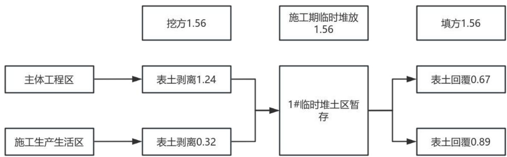
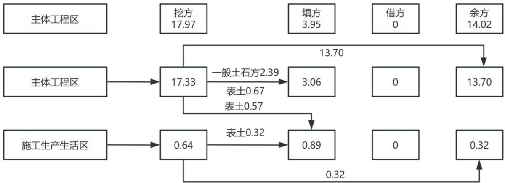
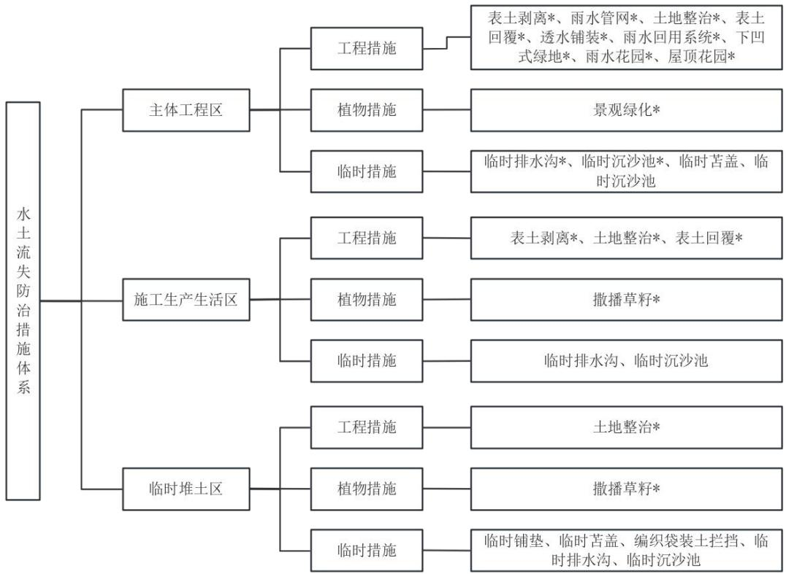
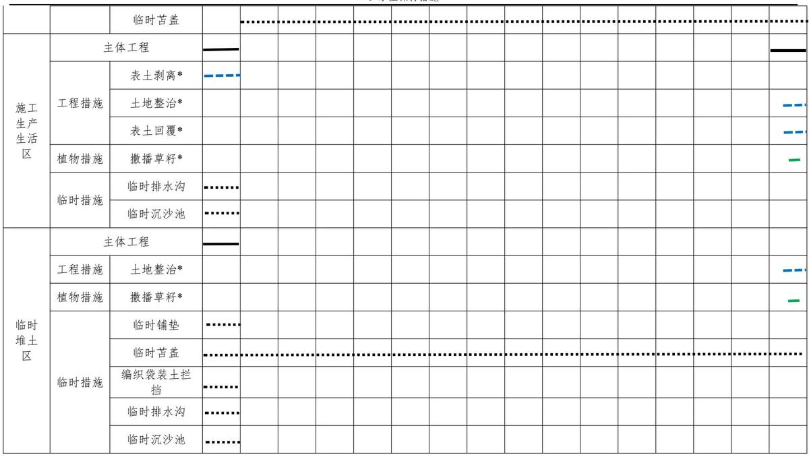

> **Zone C（应用范例层）使用边界**——仅可用于**写作风格、章节展开方式、表达逻辑、表格设计**的参考。
> **不得**用于合规判断；**不得**引入其项目数据（名称／地点／数字／单位名）；
> **不得**因其"曾经通过审批"而推定其做法在当前标准下仍然合规。
> 与 Zone A 冲突时**一律以 Zone A 为准**；Zone A 未明确规定时输出
> 「**Zone A 未明确规定，以下为参考写法，需人工判断**」。
>
> **坐标系警告**：本范例为**老八章结构**（GB 50433—2018 附录B），与 2026 版 10 章模板**同号不同义**
> （老 `1.5`＝防治目标，新 `1.5`＝水土流失预测结果；老 4→新 6 …偏移 +2；新版第 4/5 章老结构无独立章）。
> 因此 **`chapter_mapping: pending`——不得按章节号挂载**，检索一律走 `topic_tags`。
>
> **待加工**：`topic_tags`（主题标签）、`approval_basis_list`（编制依据逐字清单）、
> `structure_summary`（只提取结构：章节展开顺序／段落功能／表格栏目结构／句式模板／论证链步骤）。

1 综合说明 .....  
1.1 项目简况...  
1.2 编制依据...  
1.3 设计水平年...  
1.4水土流失防治责任范围.  
1.5水土流失防治目标.... 5  
1.6项目水土保持评价结论...  
1.7 水土流失预测结果..... . 8  
1.8水土保持措施布设成果.. .. 8  
1.9 水土保持监测方案..... .. 9  
1.10水土保持投资及效益分析成果... ..9  
1.11 结论 ..... ..9  
2 项目概况 ...... .... 12  
2.1项目组成及工程布置. .... 12  
2.2 施工组织... .... 18  
2.3 工程占地... ... 24  
2.4 土石方平衡.... .... 24  
2.5拆迁（移民）安置与专项设施改（迁）建..... .... 32  
2.6 施工进度.... ... 32  
2.7 自然概况... ... 34  
3 项目水土保持评价..... ..... 38  
3.1主体工程选址水土保持评价.. .... 38  
3.2建设方案与布局水土保持评价. ....39  
3.3主体工程设计中水土保持措施界定... ....48  
4 水土流失分析与预测...... .....52  
4.1 水土流失现状...... .... 52  
4.2水土流失影响因素分析... .... 52  
4.3土壤流失量预测. .. 54  
4.4水土流失危害分析.. .. 60  
4.5 指导性意见... ... 63  
5 水土保持措施..... ... 65  
5.1防治区划分. ... 65  
5.2措施总体布局. .. 66  
5.3分区措施布设.. .. 69  
5.4 施工要求.... .. 78  
6 水土保持监测.... ... 84  
6.1 范围和时段... .. 84  
6.2 内容和方法... ... 84  
6.3频次和点位布设. .. 87  
6.4实施条件和成果.. .. 91  
7 水土保持投资估算和效益分析... ... 95  
7.1 投资估算. .. 95  
7.2 效益分析. . 103  
8 水土保持管理... .... 105  
8.1 组织管理.. .. 105  
8.2 后续设计... .. 105  
8.3水土保持监测.. .. 106  
8.4水土保持监理.. ... 106  
8.5水土保持施工. .. 107  
8.6水土保持设施验收.. ..108

## 附表 单价分析表

## 附件

附件1 《教育部关于东南大学九龙湖校区梅园宿舍综合体项目建议书的批复》（教发函〔2024〕31 号）

附件2《教育部关于东南大学九龙湖校区梅园宿舍综合体项目可行性研究报告的批复》（教发函〔2024〕61号）

附件3 南京市规划和自然资源局江宁分局《关于东南大学关于申请九龙湖校区梅园宿舍综合体项目规划意见的复函》

附件4 江苏省住房和城乡建设厅《关于征求东南大学申请将九龙湖校区梅园宿舍综合体江北校区学生宿舍纳入江苏省集中建设模式管理体系意见的函》

附件5 江苏省住房和城乡建设厅《关于同意东南大学九龙湖校区梅园宿舍综合体江北校区学生宿舍纳入江苏省集中建设模式管理体系的复函》

附件6 土地证

附件7 临时用地说明

附件8 土方综合利用承诺

附件9 校内其他工程渣土处理许可证

附件10 南京市7-9 月份土场公示信息

附件11 水土保持方案报告书编制任务的函

## 附图

附图1 项目地理位置图

附图2 项目区水系图

附图3项目区土壤侵蚀强度分布图

附图4江苏省省级水土流失重点预防区和重点治理区分布图

附图5 项目区原始地形地貌图

附图6 项目总体布置图

附图7 项目室外管线综合平面图

附图8 水土流失防治责任范围及分区图

附图9 分区防治措施总体布局图（含监测点位）

附图10 三级沉沙池、沉沙池、临时排水沟典型布设图

附图11 临时堆土区防护措施典型布设图

## 1 综合说明

## 1.1项目简况

## 1.1.1 项目基本情况

东南大学梅园宿舍综合体项目是为改善学校办学条件，满足学生住宿需求，提升校园基础设施水平而建设的重要工程。项目的实施将有助于优化教育资源配置，改善学生住宿环境，推动学校教育事业的高质量发展，因此项目建设是必要的。

根据江苏省住建厅文件《关于同意东南大学九龙湖校区梅园宿舍综合体江北校区学生宿舍纳入江苏省集中建设模式管理体系的复函》，东南大学九龙湖梅园宿舍综合体项目纳入了江苏省省级集中建设管理体系，江苏省公共工程建设中心有限公司为项目建设实施主体，履行建设单位职责；东南大学为项目使用和接受主体，项目施工合格后予以接受和管理。

东南大学九龙湖校区梅园宿舍综合体项目选址位于江苏省南京市江宁区秣陵街道东南大学九龙湖校区内部，南七路西侧、东三路北侧地块，项目地块中心位置地理坐标为：118°49′20.65″E，31°53′14.22″N。

本项目建设性质为新建建设类项目，根据《中华人民共和国国有土地使用证》（宁江国用 2009第 04798 号）校区总用地面积为 2501579.50m2，本次建设项目位于本用地范围内。根据项目总平面图，项目用地面积为 49984.98m2。

本项目为新建社会事业类项目，建设内容包括新建1 幢15F学生宿舍组团C 楼、2幢 11F 学生宿舍组团 A 楼和 B 楼、1 幢 3F 食堂 D 楼，其中学生宿舍组团 A 楼和 B 楼整体下设1层大底盘地下室。项目总建筑面积185000m2，其中地上建筑面积163596.71m2，地下建筑面积21403.29m2，规划用地内统一配套建设室外给排水、综合绿化、道路广场等设施。

项目共设置1处施工生产生活区，2 处临时堆土场，位于本项目建设用地范围外、学校红线范围内，可衔接校内已有道路，无需另外修建施工便道。其中施工生产生活用地 $1 . 2 1 \mathrm { h m } ^ { 2 } ; $ ；2处临时堆土场分别占地 $0 . 8 1 \mathrm { h m } ^ { 2 }$ $1 . 2 8 \mathrm { h m } ^ { 2 }$ ，合计 $2 . 0 9 \mathrm { h m } ^ { 2 }$ ，主要用于堆放剥离的表土、开挖土方等，设计堆土边坡坡比 1:1.5，堆土高度不超过 2.5m，堆土区可容纳堆土量约4.18万m3。

项目用地通过划拨方式获得，现选址处西北角存在校内快递站，需拆除建筑面积为2000m2，不涉及移民安置方面问题。拆除由建设单位组织实施，相应水土流失防治责任

由其负责。

项目总投资132647.00万元，其中土建投资117330.78万元。项目施工期31个月，计划于2025年12月动工，2028年 6月完工。

项目总用地面积 8.30hm²，其中永久占地 5.00hm²，临时占地 3.30hm²，工程占地类型均为教育用地。

本项目挖填方总量 21.92万m3，其中挖方量17.97万 m3（含表土剥离1.56 万m3），填方量 3.95 万 m3（含表土回覆 1.56 万 m3），无借方，余方量 14.02 万 m3。余方将根据《南京市渣土运输管理办法》申请渣土处置许可，运至南京市城市管理局公示的消纳场地。

## 1.1.2 项目前期工作进展情况

东南大学于2009年3月获得《中华人民共和国国有土地使用证》（宁江国用2009第 04798 号）；

2024年2月22日，取得由教育部批准的《教育部关于东南大学九龙湖校区梅园宿舍综合体项目建议书的批复》（教发函〔2024〕31号）；

2024年2月28日，取得南京市规划和自然资源局江宁分局出具的《关于东南大学关于申请九龙湖校区梅园宿舍综合体项目规划意见的复函》；

2024年3月，由东南大学建筑设计研究院有限公司编制了《东南大学九龙湖校区梅园宿舍综合体项目可行性研究报告》；

2024年4月16日，项目取得由教育部批准的《教育部关于东南大学九龙湖校区梅园宿舍综合体项目可行性研究报告的批复》（教发函〔2024〕61号）；

2024年7月26日，江苏省住房和城乡建设厅批复了《关于同意东南大学九龙湖校区梅园宿舍综合体江北校区学生宿舍纳入江苏省集中建设模式管理体系的复函》；

2025年4月，东南大学建筑设计研究院有限公司提交了《东南大学九龙湖校区梅宿舍综合体项目初步设计》。

项目建设单位为江苏省公共工程建设中心有限公司，设计单位为东南大学建筑设计研究院有限公司，勘察单位为江苏省地质工程勘察院。

根据《中华人民共和国水土保持法》及有关法律法规规定，江苏省公共工程建设中心有限公司于 2025 年3 月委托中国建筑材料工业地质勘查中心江苏总队编制项目水土保持方案，我单位接受委托后，组织方案编制人员开展外业勘查、收集资料、分析项目

可行性研究报告、总平面布置图、水文气象资料、设计方案等相关资料。根据本项目建设特点编制水土保持方案，结合可能造成的水土流失情况进行分析整理，2025 年8月编制完成了《东南大学九龙湖校区梅园宿舍综合体项目水土保持方案报告书》。

2025年4月，我单位完成该项目现场勘查工作，项目现处于施工图设计阶段。

## 1.1.3 自然简况

本项目位于南京市江宁区秣陵街道，项目建设场地属于平原，项目地块通过划拨方式获得土地使用权。实测场地原地面标高+6.30m\~+8.36m（1985国家高程系，下同），场地内平均标高为+7.30m，地势存在一定的高差，但总体情况较为平坦。江宁区属于亚热带季风气候，1952\~2020 年多年平均降雨量为 1042.8mm，年最大降雨量达 2015.2mm，年最小降雨量达 479.6mm，无霜期约 238d。

项目区内土壤类型为黄棕壤，植被类型为亚热带落叶阔叶混交林，根据历史影像资料分析，项目建设前原地貌植被覆盖率约为 61.9%。按《土壤侵蚀分类分级标准》（SL190-2007），项目区为全国水力侵蚀类型区南方红壤丘陵区的长江中下游平原区，土壤侵蚀强度为微度，容许土壤流失量为 $5 0 0 \mathrm { t } / ( \mathrm { k m } ^ { 2 } { \cdot } \mathrm { a }$ ），原地貌土壤侵蚀模数为 $7 9 \mathrm { t } / ( \mathrm { k m } ^ { 2 } { \cdot } \mathbf { a } )$ ）。项目区属于江苏省省级水土流失重点预防区。

项目不涉及饮用水水源保护区、水功能一级区的保护区和保留区、自然保护区、世界文化和自然遗产地、风景名胜区、地质公园、森林公园以及重要湿地等水土保持敏感区。

## 1.2编制依据

## 1.2.1 法律法规、规章与规范性文件

（1）《中华人民共和国水土保持法》（主席令第 39号，2010年修订）；

（2）《中华人民共和国长江保护法》（2020年12 月26日第十三届全国人民代表大会常务委员会第二十四次会议通过）；

（3）《生产建设项目水土保持方案管理办法》（水利部〔2023〕53号令）；

（4）《水利部关于加强水土保持空间管控的意见》（水保〔2024〕4号）；

（5）《水利部办公厅关于印发生产建设项目水土保持文件编写和印刷格式规定（试行）的通知》（办水保〔2018〕135 号）；

（6）《水利部办公厅关于进一步加强生产建设项目水土保持监测工作的通 6)知》

（办水保〔2020〕161 号，2020 年 7 月 28 日）

（7）《水利部办公厅关于印发生产建设项目水土保持方案审查要点的通知》（办水保〔2023〕177 号，2023 年 7 月 4 日）

（6）《江苏省水土保持条例》（2013年11月29 日江苏省第十二届人民代表大会常务委员会第六次会议通过，根据2021年9月29日江苏省第十三届人民代表大会常务委员会第二十五次会议第二次修正）；

（7）《江苏省生产建设项目水土保持管理办法》（苏水规〔2021〕8号）；

（8）《南京市水土保持办法》（2015 年南京市人民政府令第313 号修订，自2015年12月20日起施行）。

## 1.2.2 技术标准

（1）《生产建设项目水土保持技术标准》（GB50433-2018）；

（2）《生产建设项目水土流失防治标准》（GB/T50434-2018）；

（3）《水土保持工程调查与勘测标准》（GB/T51297-2018）；

（4）《生产建设项目水土保持监测与评价标准》（GB/T51240-2018）；

（5）《水土保持工程设计规范》（GB51018-2014）；

（6）《土壤侵蚀分类分级标准》（SL190-2007）；

（7）《水利水电工程制图标准水土保持图》（SL73.6-2015）；

（8）《生产建设项目土壤流失量测算导则》（SL773-2018）；

（9）《水土保持监测技术规范》（SL/T277-2024）；

（10）《水土保持监理规范》（SL/T523-2024）。

## 1.2.3 技术资料

（1）《东南大学九龙湖校区梅园宿舍综合体项目可行性研究报告》（编制单位：东南大学建筑设计研究院有限公司，2024年4月）；

（2）《东南大学九龙湖校区梅园宿舍综合体项目岩土工程勘察报告》（勘察单位：江苏省地质工程勘察院，2025年1月）；

（3）《东南大学九龙湖校区梅园宿舍综合体项目初步设计》（设计单位：东南大学建筑设计研究院有限公司，2025年 4月）；

（4）《东南大学九龙湖校区梅园宿舍综合体项目基坑支护工程设计》（设计单位：江苏省岩土工程公司，2025 年4月）；

（5）《江苏省水土保持公报（2023 年）》（江苏省水利厅2024 年10 月22 日发布）；

（6）《江苏省南京市水土保持规划（2016\~2030 年）》（报批稿）（规划编制单位：南京市水务局、南京市水利规划设计院股份有限公司，2018 年2月）；

（7）其他有关工程设计资料。

## 1.3设计水平年

根据《生产建设项目水土保持技术标准》（GB50433-2018）第 4.1.3条规定，设计水平年应为主体工程完工后的当年或后一年，根据主体工程完工时间和水土保持措施实施进度安排等综合确定。本项目为新建工程项目，计划于2025年12月开工，2028年6月完工，设计水平为2028年。

## 1.4水土流失防治责任范围

根据《生产建设项目水土保持技术标准》（GB50433-2018）的规定，水土流失防治责任范围即生产建设单位依法应承担水土流失防治义务的区域。生产建设项目水土流失防治责任范围应包括项目永久占地、临时占地以及其他使用与管辖区域。本项目水土流失防治责任范围总面积为8.30hm2，其中永久占地 5.00hm2，临时占地3.30hm2，所属管辖区为南京市江宁区。

表1.4-1 工程防治责任范围一览表（单位：hm2）
<table><tr><td rowspan=2 colspan=1>所属行政区</td><td rowspan=2 colspan=1>防治分区</td><td rowspan=1 colspan=2>占地性质</td><td rowspan=2 colspan=1>占地面积</td></tr><tr><td rowspan=1 colspan=1>永久占地</td><td rowspan=1 colspan=1>临时占地</td></tr><tr><td rowspan=4 colspan=1>南京市江宁区</td><td rowspan=1 colspan=1>主体工程区</td><td rowspan=1 colspan=1>5.00</td><td rowspan=1 colspan=1></td><td rowspan=1 colspan=1>5.00</td></tr><tr><td rowspan=1 colspan=1>施工生产生活</td><td rowspan=1 colspan=1></td><td rowspan=1 colspan=1>1.21</td><td rowspan=1 colspan=1>1.21</td></tr><tr><td rowspan=1 colspan=1>临时堆土区</td><td rowspan=1 colspan=1></td><td rowspan=1 colspan=1>2.09</td><td rowspan=1 colspan=1>2.09</td></tr><tr><td rowspan=1 colspan=1>合计</td><td rowspan=1 colspan=1>5.00</td><td rowspan=1 colspan=1>3.30</td><td rowspan=1 colspan=1>8.30</td></tr></table>

## 1.5水土流失防治目标

## 1.5.1 执行标准等级

本项目位于南京市江宁区秣陵街道。根据《江苏省水利厅关于发布<江苏省水土流失重点预防区和重点治理区>的公告》（苏水农〔2014〕48号），本项目所在地属于江苏省省级水土流失重点预防区。本项目不涉及饮用水水源保护区、水功能一级区的保护区和预留区、自然保护区、世界文化和自然遗产地、风景名胜区、地质公园、森林公园、重要湿地，但位于县级以上城市区域。依据《生产建设项目水土流失防治标准》（GB50434-2018），从建设项目所处位置确定，项目水土流失防治标准执行南方红壤区

一级标准。

## 1.5.2 防治目标

## （1）基本目标

1）项目建设范围内新增水土流失应得到有效控制，原有水土流失得到治理；

2）水土保持设施应安全有效；

3）水土资源、林草植被应得到最大限度地保护与恢复；

4）水土流失治理度、土壤流失控制比、渣土防护率、表土保护率、林草植被恢复率、林草覆盖率六项指标应符合现行国家标准《生产建设项目水土流失防治标准》（GB/T50434-2018）的规定。

## （2）六项防治指标

本项目六项防治指标根据所在地区干旱程度、土壤侵蚀强度、地形因素、区位等因素加以调整：

1）项目区土壤侵蚀强度为微度，土壤流失控制比防治目标值提高至1.10。

2）按区位因素调整渣土防护率和林草覆盖率：本项目位于南京市江宁区，渣土防 护率和林草覆盖率可提高1%～2%，故本项目渣土防护率提高2%，林草覆盖率提高2%。

本项目水土流失防治指标值详见表 1.5-1。

表1.5-1 水土流失防治指标修正表
<table><tr><td rowspan=2 colspan=1>防治指标</td><td rowspan=1 colspan=2>一级标准</td><td rowspan=1 colspan=1>按土壤侵蚀强度调整</td><td rowspan=1 colspan=1>按地理位置调整</td><td rowspan=1 colspan=2>本项目防治目标</td></tr><tr><td rowspan=1 colspan=1>施工期</td><td rowspan=1 colspan=1>设计水平年</td><td rowspan=1 colspan=1>微度</td><td rowspan=1 colspan=1>位于城市区</td><td rowspan=1 colspan=1>施工期设</td><td rowspan=1 colspan=1>计水平年</td></tr><tr><td rowspan=1 colspan=1>水土流失治理度（%）</td><td rowspan=1 colspan=1>-</td><td rowspan=1 colspan=1>98</td><td rowspan=1 colspan=1>-</td><td rowspan=1 colspan=1>-</td><td rowspan=1 colspan=1>-</td><td rowspan=1 colspan=1>98</td></tr><tr><td rowspan=1 colspan=1>土壤流失控制比</td><td rowspan=1 colspan=1>-</td><td rowspan=1 colspan=1>0.90</td><td rowspan=1 colspan=1>+0.20</td><td rowspan=1 colspan=1>-</td><td rowspan=1 colspan=1>-</td><td rowspan=1 colspan=1>1.10</td></tr><tr><td rowspan=1 colspan=1>渣土防护率（%）</td><td rowspan=1 colspan=1>95</td><td rowspan=1 colspan=1>97</td><td rowspan=1 colspan=1>-</td><td rowspan=1 colspan=1>+2</td><td rowspan=1 colspan=1>95</td><td rowspan=1 colspan=1>99</td></tr><tr><td rowspan=1 colspan=1>表土保护率（%）</td><td rowspan=1 colspan=1>92</td><td rowspan=1 colspan=1>92</td><td rowspan=1 colspan=1>-</td><td rowspan=1 colspan=1>-</td><td rowspan=1 colspan=1>92</td><td rowspan=1 colspan=1>92</td></tr><tr><td rowspan=1 colspan=1>林草植被恢复率（%）</td><td rowspan=1 colspan=1>-</td><td rowspan=1 colspan=1>98</td><td rowspan=1 colspan=1>-</td><td rowspan=1 colspan=1>-</td><td rowspan=1 colspan=1>-</td><td rowspan=1 colspan=1>98</td></tr><tr><td rowspan=1 colspan=1>林草覆盖率（%）</td><td rowspan=1 colspan=1>-</td><td rowspan=1 colspan=1>25</td><td rowspan=1 colspan=1>-</td><td rowspan=1 colspan=1>+2</td><td rowspan=1 colspan=1>-</td><td rowspan=1 colspan=1>27</td></tr></table>

## 1.6 项目水土保持评价结论

## 1.6.1 主体工程选址评价

本项目选址不涉及全国水土保持监测网络中的水土保持监测站点、重点试验区及国家确定的水土保持长期定位观测站，不涉及河流两岸周边的植物保护带，项目区及周边不涉及泥石流易发区、崩塌滑坡危险区、易引起严重水土流失和生态恶化的地区；项目所在地属于江苏省省级水土流失重点预防区，且无法避让，本方案在执行南方红壤区防治指标一级标准的基础上，将土壤流失控制比提高 0.20，渣土防护率提高 2%，林草覆盖率提高2%。施工过程中灌注桩采用旋挖机干成孔、基坑大范围采用垂直支护等优化施工工艺，填方利用自身挖方，减少余方产生；项目主体已设计雨水回用系统、下凹式绿地、雨水花园、透水铺装、屋顶花园等措施，有利于场地降水蓄渗；项目主体已考虑基坑截排水，方案增加临时排水沟、临时沉沙池、编织袋装土拦挡、临时苫盖等临时措施，有利于施工活动中排水，有效拦截项目区泥沙，减少地表扰动。本项目设计了较为全面的水土保持措施，尽可能的减少水土流失。

综上所述，本项目建设符合国家及地方政策，通过优化施工工艺与方法，加强施工组织管理，完善水土保持措施布设，可以使项目建设范围内的水土流失得到有效控制，生态环境得到一定程度的恢复和改善。因此，主体工程选址基本符合水土保持相关规定和要求，从水土保持角度评价项目建设是可行的。

## 1.6.2 建设方案与布局评价

建设项目贯彻节约用地原则，充分利用周边的基础设施条件。

项目属于城市建设类项目，主体设计已包括海绵城市设计，符合《南京市海绵城市专项规划（2016—2030年）》。施工机械须严格控制扰动范围，出入车辆经洗车平台后进出项目区；同时配套建设排水设施，采取临时排水沟、沉沙池等措施，减少雨水对地面的冲刷。项目主体工程设计中考虑了乔灌草绿化，能够有效减少雨水的击溅侵蚀，同时设计了雨水回用系统，减少水土流失。因此从工程建设方案上看，基本符合水土保持要求，无制约因素。

项目在工程占地方面，主体建筑设计综合考虑现状地形地势，充分利用竖向空间，集约化使用土地。另于施工期设置1 处施工生活区、2 处临时堆土场临时用地，工程占地合理，符合水土保持的规定和要求，并能满足项目施工要求。

本方案对本项目的土石方平衡进行了复核计算，挖、填土方施工时序合理，项目填方均来源于自身挖方，无借方，余方将根据《南京市渣土运输管理办法》申请渣土处置许可，运至南京市城市管理局公示的消纳场地，符合水土保持要求。

工程拟采取封闭式施工，表土剥离、场地平整以机械施工为主，基坑放坡坡面采用挂网喷砼体系，灌注桩采用旋挖机干成孔，管线埋设同道路填筑同步施工等一系列优化的施工方法和工艺，可严格控制施工活动场地，减少地面重复开挖扰动，有效减少水土流失。

本方案通过对建设方案、工程占地情况、土石方平衡、施工方法及施工工艺、具有水土保持功能工程的评价，认为本项目对水土保持的要求考虑较充分，符合水土保持相关规定。本方案对主体设计不完善的地方，如对临时苫盖、临时排水沟、临时沉沙池、编织袋装土拦挡等防治措施进行了补充设计。到设计水平年末，各项措施将发挥效益，各项防治指标均能够达到水土流失防治标准。

## 1.7水土流失预测结果

项目工程建设过程中，若不采取水土保持措施，将产生新增水土流失。根据预测结果，得出以下结论：

（1）工程建设期如不采取水保措施，项目在整个建设期可能产生水土流失总量为294.20t，新增水土流失量为 272.85t；

（2）水土流失重点区域为主体工程区和临时堆土区，水土流失主要时段是施工期；

（3）项目施工前需布设临时排水沟、临时沉沙池、临时苫盖、编织袋装土拦挡等水土保持措施；如果项目不采取水土保持措施防治，可能淤积校内排水管网，造成城市新的集淹点，影响建设项目施工安全，影响周边的生态环境质量。

## 1.8水土保持措施布设成果

本项目水土流失防治措施体系由已有水土保持工程和新增的水土流失防治工程组成，按照主体工程区、施工生产生活区、临时堆土区三个分区进行布设。

## （1）主体工程区

工程措施：主体工程已有——表土剥离 1.24 万 m3；雨水管网 2187m；雨水回用装置 1 套；透水铺装 0.73hm2；土地整治 0.86hm2；表土回覆 0.67 万 $\mathrm { m } ^ { 3 } ;$ ；下凹式绿地 0.04hm2；雨水花园 0.09hm2；屋顶花园 0.13hm2。

植物措施：主体工程已有——景观绿化 0.99hm2。

临时措施：主体工程已有——临时排水沟 1418m；临时沉沙池 1 座。方案新增——临时苫盖 $1 . 0 6 \mathrm { h m } ^ { 2 } ; $ ；临时沉沙池6座。

## （2）施工生产生活区

工程措施：主体工程已有——表土剥离 0.32 万 $\mathrm { m } ^ { 3 }$ ；土地整治 $1 . 0 8 \mathrm { h m } ^ { 2 } \cdotp$ ；表土回覆0.89 万 m3。

植物措施：主体工程已有——播撒草籽 1.08hm2。

临时措施：方案新增——临时排水沟 610m；临时沉沙池2座。

## （3）临时堆土区

工程措施：主体工程已有——土地整治 2.09hm2。

植物措施：主体工程已有——撒播草籽 2.09hm2。

临时措施：方案新增——临时铺垫 0.81hm2；临时苫盖2.09m2；临时排水沟790m；临时沉沙池2 座；编织袋装土拦挡780m。

## 1.9水土保持监测方案

水土保持监测内容主要包括水土流失自然影响因素、项目施工全过程各阶段扰动土地情况、水土流失状况、水土流失防治成效、水土流失危害等。

本方案的监测范围为本工程水土流失防治责任范围，分为主体工程区、施工生产生活区、临时堆土区 3 个防治分区，监测范围面积为 8.30hm2。监测时段从 2025 年 12月开始，至2028年12月结束，共计监测 37个月。

方案针对本工程采用实地调查、遥感监测、集沙池法、抽样调查法和资料查阅相结合的方法。方案初步确定布设监测点 5个，其中主体工程区2个，施工生产生活区1 个，临时堆土区2 个。

## 1.10 水土保持投资及效益分析成果

本项目水土保持总投资 837.11 万元（主体已有措施投资共计 676.48 万元，方案新增措施投资 160.63 万元），其中，工程措施费279.23 万元，植物措施费 334.08万元，监测措施费42.77万元，施工临时工程费91.96万元，独立费用费为49.55万元（其中工程建设监理费 22.06 万元），基本预备费为 39.86 万元，水土保持补偿费可申请免征99526.80 元。

本方案实施后能够控制和减轻工程建设所造成的水土流失效果显著，并减少水土流失对工程建设和运行的危害。在严格执行和落实本方案设计的水土保持措施后，工程在水土流失治理度、土壤流失控制比、渣土防护率、表土保护率、林草植被恢复率和林草覆盖率6项防治目标均能达到方案编制目标，可减少水土流失量274.15t。

## 1.11 结论

本项目选址、建设方案及布置、水土流失防治等方面符合有关法律法规、规范文件的约束性约定；主体工程设计的水土保持措施与本方案新增的水土保持措施组成水土流失防治体系，能够有效减少建设期水土流失，工程建设引起的水土流失可以控制在规定范围内，经水土保持分析论证，项目的建设是可行的。

建设单位应设立实施方案的管理机构，严格落实报告书中水土流失防治措施，设专人负责水土保持方案的组织、管理及实施工作，明确设计、施工、监理和监测等工作职责和要求，建立相关管理制度，明确做好档案工作要求；明确设计、施工、监理和监测等水土保持责任，各阶段水土保持工作任务，实行计划管理，确保按方案要求组织实施。

设计单位在下阶段主体设计时，应将批复的本项目水土保持方案中的水土保持措施纳入主体工程设计中，水土保持工程投资纳入主体工程概算中，进行水土保持设施专项设计、进一步细化工程占地内的工程措施内容，并按照批复后的水土保持方案落实各项措施。

施工单位应将水土保持方案报告书及设计文件中规定的水土保持措施进行细化，做到管理到位，监理到场，责任到人。施工单位应采取各种有效措施，减少在其防治责任范围内发生的水土流失，避免对其防治责任范围外的土地扰动、地表植被破坏、生态环境影响。严格按照水土保持要求进行施工，施工过程中，如需设计变更，及时与建设单位、设计单位和监理单位协商，按相关程序变更获准后再进行相应的施工。

本项目水土保持方案工程主要特性见表 1.11-1。

表1.11-1 水土保持方案特性表
<table><tr><td rowspan=1 colspan=2>项目名称</td><td rowspan=1 colspan=3>东南大学九龙湖校区梅园宿舍综合体项目</td><td rowspan=1 colspan=3>流域管理机构</td><td rowspan=1 colspan=1>长江水利委员会</td></tr><tr><td rowspan=1 colspan=2>涉及省(市、区）</td><td rowspan=1 colspan=2>江苏省</td><td rowspan=1 colspan=1>涉及地市或个数</td><td rowspan=1 colspan=1>南京市</td><td rowspan=1 colspan=2>涉及县或个数</td><td rowspan=1 colspan=1>江宁区</td></tr><tr><td rowspan=1 colspan=2>项目规模</td><td rowspan=1 colspan=2>总建筑面积185000m²</td><td rowspan=1 colspan=1>总投资（万元）</td><td rowspan=1 colspan=1>132647.00</td><td rowspan=1 colspan=2>土建投资（万元）</td><td rowspan=1 colspan=1>117330.78</td></tr><tr><td rowspan=1 colspan=2>开工时间</td><td rowspan=1 colspan=2>2025年12月</td><td rowspan=1 colspan=1>完工时间</td><td rowspan=1 colspan=1>2028年6月</td><td rowspan=1 colspan=2>设计水平年</td><td rowspan=1 colspan=1>2028年</td></tr><tr><td rowspan=1 colspan=2>工程占地（hm²）</td><td rowspan=1 colspan=2>8.30</td><td rowspan=1 colspan=1>永久占地（hm²）</td><td rowspan=1 colspan=1>5.00</td><td rowspan=1 colspan=2>临时占地（hm²）</td><td rowspan=1 colspan=1>3.30</td></tr><tr><td rowspan=2 colspan=4>土石方量（万m³）</td><td rowspan=1 colspan=1>挖方</td><td rowspan=1 colspan=1>填方</td><td rowspan=1 colspan=2>借方</td><td rowspan=1 colspan=1>余（弃）方</td></tr><tr><td rowspan=1 colspan=1>17.97</td><td rowspan=1 colspan=1>3.95</td><td rowspan=1 colspan=2>-</td><td rowspan=1 colspan=1>14.02</td></tr><tr><td rowspan=1 colspan=3>重点防治区名称</td><td rowspan=1 colspan=6>江苏省省级水土流失重点预防区</td></tr><tr><td rowspan=1 colspan=3>地貌类型</td><td rowspan=1 colspan=2>平原</td><td rowspan=1 colspan=2>水土保持区划</td><td rowspan=1 colspan=2>南方红壤区</td></tr><tr><td rowspan=1 colspan=3>土壤侵蚀类型</td><td rowspan=1 colspan=2>水力侵蚀</td><td rowspan=1 colspan=2>土壤侵蚀强度</td><td rowspan=1 colspan=2>微度</td></tr><tr><td rowspan=1 colspan=3>防治责任范围面积（hm²）</td><td rowspan=1 colspan=2>8.30</td><td rowspan=1 colspan=2>容许土壤流失量[t/(km²·a)]</td><td rowspan=1 colspan=2>500</td></tr><tr><td rowspan=1 colspan=3>土壤流失预测总量（t）</td><td rowspan=1 colspan=2>294.20</td><td rowspan=1 colspan=2>新增土壤流失量（t）</td><td rowspan=1 colspan=2>272.85</td></tr><tr><td rowspan=1 colspan=3>水土流失防治标准执行等级</td><td rowspan=1 colspan=2></td><td rowspan=1 colspan=4>南方红壤区一级防治标准</td></tr><tr><td rowspan=3 colspan=1>防治目标</td><td rowspan=1 colspan=2>水土流失治理度（%）</td><td rowspan=1 colspan=2>98</td><td rowspan=1 colspan=2>土壤流失控制比</td><td rowspan=1 colspan=2>1.10</td></tr><tr><td rowspan=1 colspan=2>渣土防护率（%）</td><td rowspan=1 colspan=2>99</td><td rowspan=1 colspan=2>表土保护率（%）</td><td rowspan=1 colspan=2>92</td></tr><tr><td rowspan=1 colspan=2>林草植被恢复率（%）</td><td rowspan=1 colspan=2>98</td><td rowspan=1 colspan=2>林草覆盖率（%）</td><td rowspan=1 colspan=2>27</td></tr><tr><td rowspan=4 colspan=1>防治措施及工程量</td><td rowspan=1 colspan=1>防治分区</td><td rowspan=1 colspan=3>工程措施</td><td rowspan=1 colspan=1>植物措施</td><td rowspan=1 colspan=3>临时措施</td></tr><tr><td rowspan=1 colspan=1>主体工程区</td><td rowspan=1 colspan=3>表土剥离1.24万m³、雨水管网2187m、雨水回用装置1套、透水铺装0.73hm²、土地整治0.86hm²、表土回覆 0.67万m³下凹式绿地0.04hm²、雨水花园 0.09hm²、屋顶花园 0.13hm²</td><td rowspan=1 colspan=1>景观绿化0.99hm²</td><td rowspan=1 colspan=3>临时排水沟1418m、临时苫盖1.06hm²、临时沉沙池7座</td></tr><tr><td rowspan=1 colspan=1>施工生产生活区</td><td rowspan=1 colspan=3>表土剥离0.32万m³、土地整治1.08hm²、表土回覆 0.89 万 m³</td><td rowspan=1 colspan=1>播撒草籽1.08hm2</td><td rowspan=1 colspan=3>临时排水沟610m、临时沉沙池2座。</td></tr><tr><td rowspan=1 colspan=1>临时堆土区</td><td rowspan=1 colspan=3>土地整治 2.09hm²</td><td rowspan=1 colspan=1>播撒草籽2.09hm²</td><td rowspan=1 colspan=3>临时铺垫0.81hm²、临时苫盖2.09m²、临时排水沟790m、临时沉沙池2座、编织袋装土拦挡780m</td></tr><tr><td rowspan=1 colspan=2>投资（万元）</td><td rowspan=1 colspan=3>279.23</td><td rowspan=1 colspan=1>334.08</td><td rowspan=1 colspan=3>91.61</td></tr><tr><td rowspan=1 colspan=2>水土保持总投资（万元）</td><td rowspan=1 colspan=3>837.11</td><td rowspan=1 colspan=1>独立费用(万元）</td><td rowspan=1 colspan=3>49.55</td></tr><tr><td rowspan=1 colspan=2>监理费（万元）</td><td rowspan=1 colspan=2>22.06</td><td rowspan=1 colspan=1>监测费（万元）</td><td rowspan=1 colspan=1>42.77</td><td rowspan=1 colspan=2>补偿费（元）</td><td rowspan=1 colspan=1>/</td></tr><tr><td rowspan=1 colspan=2>方案编制单位</td><td rowspan=1 colspan=3>中国建筑材料工业地质勘查中心江苏总队</td><td rowspan=1 colspan=1>建设单位</td><td rowspan=1 colspan=3>江苏省公共工程建设中心有限公司</td></tr><tr><td rowspan=1 colspan=2>法定代表人</td><td rowspan=1 colspan=3>邬喜春</td><td rowspan=1 colspan=1>法定代表人</td><td rowspan=1 colspan=3>高飞</td></tr><tr><td rowspan=1 colspan=2>地址</td><td rowspan=1 colspan=3>江苏省南京市江宁区临淮街32号C座11/12F</td><td rowspan=1 colspan=1>地址</td><td rowspan=1 colspan=3>南京市鼓楼区北京西路5号</td></tr><tr><td rowspan=1 colspan=2>邮编</td><td rowspan=1 colspan=3>211100</td><td rowspan=1 colspan=1>邮编</td><td rowspan=1 colspan=3>210008</td></tr><tr><td rowspan=1 colspan=2>联系人及电话</td><td rowspan=1 colspan=3>联系人/【已脱敏】</td><td rowspan=1 colspan=1>联系人及电话</td><td rowspan=1 colspan=3>联系人/【已脱敏】</td></tr><tr><td rowspan=1 colspan=2>传真</td><td rowspan=1 colspan=3>025-84124527</td><td rowspan=1 colspan=1>传真</td><td rowspan=1 colspan=3>/</td></tr><tr><td rowspan=1 colspan=2>电子信箱</td><td rowspan=1 colspan=3>【已脱敏邮箱】</td><td rowspan=1 colspan=1>电子信箱</td><td rowspan=1 colspan=3>yukang@cjigroup.com.cn</td></tr></table>

## 2 项目概况

## 2.1项目组成及工程布置

## 2.1.1 项目基本情况

项目名称：东南大学九龙湖校区梅园宿舍综合体项目。

建设单位：江苏省公共工程建设中心有限公司。

建设地点：东南大学九龙湖校区内部，南七路西侧、东三路北侧地块。项目地块中心位置地理坐标为：118°49′20.65″，31°53′14.22″。

建设性质：新建建设类项目。

项目类型：社会事业类项目。

建设工期：项目施工期31 个月，2025年12月动工，2028 年6月完工。

工程总投资：132647.00 万元，其中土建投资 117330.78 万元。

建设内容及规模：项目总建筑面积 185000m2，建筑主要规划功能为宿舍、服务配套用房及食堂，其中地上建筑面积 163596.71m2；地下建筑面积 21403.29m2，主要为车库及人防功能。本项目建设内容包括新建1幢15F学生宿舍组团C 楼、2幢11F学生宿舍组团 A 和 B 楼、1 幢 3F 食堂 D 楼，其中学生宿舍组团 A 楼和 B 楼整体下设 1 层大底盘地下室。

拆迁安置：项目用地通过划拨方式获得，现选址处西北角存在校内快递站，需拆除建筑面积为 2000m2，不涉及移民安置方面问题。拆除由建设单位组织实施，相应水土流失防治责任由其负责。

项目主要技术指标见表 2.1-1。

表 2.1-1 项目主要技术指标一览表
<table><tr><td colspan="8" rowspan="1">第一部分 项目基本情况</td></tr><tr><td colspan="1" rowspan="1">一</td><td colspan="3" rowspan="1">项目名称</td><td colspan="4" rowspan="1">东南大学九龙湖校区梅园宿舍综合体项目</td></tr><tr><td colspan="1" rowspan="1">二</td><td colspan="3" rowspan="1">建设单位</td><td colspan="4" rowspan="1">江苏省公共工程建设中心有限公司</td></tr><tr><td colspan="1" rowspan="1">三</td><td colspan="3" rowspan="1">建设地点</td><td colspan="4" rowspan="1">东南大学九龙湖校区内部，南七路西侧、东三路北侧地块</td></tr><tr><td colspan="1" rowspan="1">四</td><td colspan="3" rowspan="1">建设性质</td><td colspan="4" rowspan="1">新建</td></tr><tr><td colspan="1" rowspan="1">五</td><td colspan="3" rowspan="1">建设工期</td><td colspan="4" rowspan="1">项目施工期31个月，2025年12月动工，2028年6月完工</td></tr><tr><td colspan="1" rowspan="1">六</td><td colspan="3" rowspan="1">工程总投资</td><td colspan="4" rowspan="1">132647.00万元，其中土建投资117330.78万元</td></tr><tr><td colspan="1" rowspan="1">七</td><td colspan="3" rowspan="1">建设规模</td><td colspan="4" rowspan="1">项目建设内容包括新建1幢15F学生宿舍组团C楼、2幢11F学生宿舍组团A、B楼、1幢3F食堂D楼，其中学生宿舍组团 A楼和学生宿舍组团 B楼整体下设1座1F 大底盘地下室。项目总建筑面积185000m²，其中地上建筑面积163596.71m²，地下建筑面积 21403.29m²。</td></tr><tr><td colspan="8" rowspan="1">第二部分项目经济技术指标</td></tr><tr><td colspan="4" rowspan="1">项目</td><td colspan="2" rowspan="1">设计指标</td><td colspan="1" rowspan="1">单位</td><td colspan="1" rowspan="1">备注</td></tr><tr><td colspan="4" rowspan="1">规划用地面积</td><td colspan="2" rowspan="1">49984.98</td><td colspan="1" rowspan="1"> $\mathrm { m } ^ { 2 }$ </td><td colspan="1" rowspan="1"></td></tr><tr><td colspan="4" rowspan="1">总建筑面积</td><td colspan="2" rowspan="1">185000</td><td colspan="1" rowspan="1"> $\mathrm { m } ^ { 2 }$ </td><td colspan="1" rowspan="1"></td></tr><tr><td colspan="1" rowspan="8">其中</td><td colspan="3" rowspan="1">地上建筑面积</td><td colspan="2" rowspan="1">163596.71</td><td colspan="1" rowspan="1"> $\mathrm { m } ^ { 2 }$ </td><td colspan="1" rowspan="1"></td></tr><tr><td colspan="1" rowspan="6">其中</td><td colspan="1" rowspan="3">宿舍</td><td colspan="1" rowspan="1">A#</td><td colspan="1" rowspan="3">139007.71</td><td colspan="1" rowspan="1">42776.94</td><td colspan="1" rowspan="1"> $\mathrm { m } ^ { 2 }$ </td><td colspan="1" rowspan="1"></td></tr><tr><td colspan="1" rowspan="1">B#</td><td colspan="1" rowspan="1">42776.94</td><td colspan="1" rowspan="1"> $\mathrm { m } ^ { 2 }$ </td><td colspan="1" rowspan="1"></td></tr><tr><td colspan="1" rowspan="1">C#</td><td colspan="1" rowspan="1">53453.83</td><td colspan="1" rowspan="1"> $\mathrm { m } ^ { 2 }$ </td><td colspan="1" rowspan="1"></td></tr><tr><td colspan="1" rowspan="2">公共活动用房</td><td colspan="1" rowspan="2">A/B/C#</td><td colspan="1" rowspan="2">16193.2</td><td colspan="1" rowspan="1">2950</td><td colspan="1" rowspan="1"> $\mathrm { m } ^ { 2 }$ </td><td colspan="1" rowspan="1"></td></tr><tr><td colspan="1" rowspan="1">13243.2</td><td colspan="1" rowspan="1"> $\mathrm { m } ^ { 2 }$ </td><td colspan="1" rowspan="1"></td></tr><tr><td colspan="1" rowspan="1">食堂</td><td colspan="1" rowspan="1">D#</td><td colspan="2" rowspan="1">8395.8</td><td colspan="1" rowspan="1"> $\mathrm { m } ^ { 2 }$ </td><td colspan="1" rowspan="1">同时就餐人数18122.5 轮转后 4530 人次</td></tr><tr><td colspan="3" rowspan="1">地下建筑面积</td><td colspan="2" rowspan="1">21403.29</td><td colspan="1" rowspan="1"> $\mathrm { m } ^ { 2 }$ </td><td colspan="1" rowspan="1">地下室</td></tr><tr><td colspan="4" rowspan="1">建筑基底面积</td><td colspan="2" rowspan="1">25415</td><td colspan="1" rowspan="1"> $\mathrm { m } ^ { 2 }$ </td><td colspan="1" rowspan="1"></td></tr><tr><td colspan="4" rowspan="1">容积率</td><td colspan="2" rowspan="1">3.27</td><td colspan="1" rowspan="1"></td><td colspan="1" rowspan="1"></td></tr><tr><td colspan="4" rowspan="1">绿地面积</td><td colspan="2" rowspan="1">9928.37</td><td colspan="1" rowspan="1"> $\mathrm { m } ^ { 2 }$ </td><td colspan="1" rowspan="1">不含屋顶花园</td></tr><tr><td colspan="4" rowspan="1">绿地率</td><td colspan="2" rowspan="1">20.64</td><td colspan="1" rowspan="1"> $\%$ </td><td colspan="1" rowspan="1">含屋顶花园折算面积，折算系数为 30%</td></tr><tr><td colspan="4" rowspan="1">机动车停车数量</td><td colspan="2" rowspan="1">331</td><td colspan="1" rowspan="1">辆</td><td colspan="1" rowspan="1">地下停车其中无障碍停车5 辆</td></tr><tr><td colspan="4" rowspan="1">非机动车停车数量</td><td colspan="2" rowspan="1">1751</td><td colspan="1" rowspan="1">辆</td><td colspan="1" rowspan="1">其中地上 996 辆地下 755辆</td></tr><tr><td colspan="4" rowspan="1">宿舍间数</td><td colspan="2" rowspan="1">3912</td><td colspan="1" rowspan="1">间</td><td colspan="1" rowspan="1">其中无障碍宿舍44间</td></tr><tr><td colspan="4" rowspan="1">居住人数</td><td colspan="2" rowspan="1">7608</td><td colspan="1" rowspan="1">人</td><td colspan="1" rowspan="1"></td></tr><tr><td colspan="8" rowspan="1">第三部分 工程拆迁安置情况</td></tr><tr><td colspan="8" rowspan="1">项目用地通过划拨方式获得，现选址处西北角存在校内快递站，需拆除建筑面积为2000m²，不涉及移民安置方面问题。拆除由建设单位组织实施，相应水土流失防治责任由其负责。</td></tr></table>

## 2.1.2 项目现状及周边依托关系

## （1）项目现状

根据现场踏勘，项目已于2025 年4月完成初步设计，现进入施工图设计阶段，还处于开工建设前期工作阶段。

## （2）项目周边情况

项目位于东南大学九龙湖校区内，该校区位于南京市江宁区秣陵街道，地理位置优

越，交通便利，校区周边设施齐全，现有完善的市政设施。

梅园综合体北侧为体育馆，东侧为网球场，南侧为宿舍和食堂区，西侧为校区内绿化，根据校区整体规划，目前梅园综合体周边建筑物均为永久建筑，与本项目建设互不影响。

## （3）项目依托关系

## 1）进场道路

项目施工准备期以及基础施工阶段结合现场实际施工情况，利用学校现有道路作为施工便道。

## 2）供水设施

校区已铺有完善的供水管网，施工时可从校区已有供水管网接入，供水量满足施工用水需求。

## 3）供电设施

校区已有完善的市政用电网路，项目施工期间从校区内就近架空接入，满足工程用电等需要。

## 4）排水设施

校区内沿学校道路已铺有完善的雨水管网，项目施工期间排水经沉沙后，根据地形就近接入学校内部雨水管网。

## 5）余方去向

余方将根据《南京市渣土运输管理办法》申请渣土处置许可，运至南京市城市管理局公示的消纳场地。

## 2.1.3 项目组成

项目共建设4栋地面建筑，以及人防及非人防地下室，其中 A#、B#、C#栋为宿舍综合楼，D#栋为食堂。景观绿化工程和道路广场布置在建筑四周，配套建设市政管线、照明等附属工程。

A#、B#、C#、D#四栋建筑总占地面积为25415.00m2，地下室建设1层，主要位于A#、B#栋宿舍综合楼下，地下建筑总面积为 $2 1 4 0 3 . 2 9 \mathrm { m } ^ { 2 }$ ，层高为5.6m；场地内道路广场围绕各建筑单体设置，包括道路、广场、非机动车停车位等，占地面积14641.61m2；绿地呈间歇性块状，设置在建筑与道路之间，占地面积9928.37m2。

表2.1-2 项目组成情况表
<table><tr><td rowspan=1 colspan=2>项目组成</td><td rowspan=1 colspan=1>占地面积(m²)</td><td rowspan=1 colspan=1>布设位置</td><td rowspan=1 colspan=1>主要功能</td><td rowspan=1 colspan=1>备注</td></tr><tr><td rowspan=4 colspan=1>建筑物</td><td rowspan=1 colspan=1>A#</td><td rowspan=4 colspan=1>25415.00</td><td rowspan=1 colspan=1>项目区西北侧</td><td rowspan=1 colspan=1>宿舍</td><td rowspan=4 colspan=1>含屋顶花园区域</td></tr><tr><td rowspan=1 colspan=1>B#</td><td rowspan=1 colspan=1>项目区东北侧</td><td rowspan=1 colspan=1>宿舍</td></tr><tr><td rowspan=1 colspan=1>C#</td><td rowspan=1 colspan=1>项目区东南侧</td><td rowspan=1 colspan=1>宿舍</td></tr><tr><td rowspan=1 colspan=1>D#</td><td rowspan=1 colspan=1>项目区西南侧</td><td rowspan=1 colspan=1>食堂</td></tr><tr><td rowspan=1 colspan=2>道路广场</td><td rowspan=1 colspan=1>14641.61</td><td rowspan=1 colspan=1>围绕各建筑物周边</td><td rowspan=1 colspan=1>人行步道、机动车道、非机动车道</td><td rowspan=1 colspan=1></td></tr><tr><td rowspan=1 colspan=2>绿地</td><td rowspan=1 colspan=1>9928.37</td><td rowspan=1 colspan=1>建筑物与道路之间</td><td rowspan=1 colspan=1>景观</td><td rowspan=1 colspan=1>绿化8620.37m²、雨水花园 885m²、下凹绿地423m²</td></tr><tr><td rowspan=1 colspan=2>地库</td><td rowspan=1 colspan=1>21403.29</td><td rowspan=1 colspan=1>建筑、道路、绿地正下方</td><td rowspan=1 colspan=1>机动车停车位及设备用房</td><td rowspan=1 colspan=1>包含在建筑物、道路广场、绿地中</td></tr><tr><td rowspan=1 colspan=2>合计</td><td rowspan=1 colspan=1>49984.98</td><td rowspan=1 colspan=1></td><td rowspan=1 colspan=1></td><td rowspan=1 colspan=1>不含地库</td></tr></table>

## 2.1.4 工程布置

## （1）平面布置

东南大学九龙湖校区梅园宿舍综合体项目位于东南大学九龙湖校区内部，南七路西侧、东三路北侧。

A#、B#栋宿舍综合楼地上建筑面积为85553.88m2，建筑高度39.95m，地上层数11层，地下层数 1 层，主要功能为双人间及单人间宿舍用房、师生活动及后勤用房；C#栋宿舍综合楼地上建筑面积为53453.83m2，建筑高度53.45m，地上层数15层，主要功能为双人间宿舍用房、师生活动及后勤用房；D#楼地上建筑面积为8395.8m2，高度22m，地上层数 3 层，功能为食堂；本项目地下室主要位于 A#、B#栋宿舍综合楼下，地下建筑总面积为21403.29m2，地下建设一层，层高为5.6m。

## （2）道路广场布置

项目位于校园东侧，紧邻校园东侧主入口，该入口为整个校园主要的人行车行出入口，地块南侧为一期建设宿舍。项目地块内道路均以开放式广场和人行步道为主，建筑外围设置对外开放道路，与项目地块四周校园内道路无障碍连接。

设置两处地库机动车出入口，分别位于A#栋宿舍综合楼的西侧和B#栋宿舍综合楼的南侧，位置较为隐蔽，不影响主立面的建筑形象，同时也一定程度上起到了人车分流的作用。对于人行口，宿舍区一层外侧面对校园道路的方向置入以生活配套服务为主的后勤服务功能，同时服务宿舍内部居住人员和宿舍区外侧来自校园的人流。根据主设文件，道路广场面积为14641.61m2，主要建设道路、广场、非机动车停车位等，其中道路广场区透水铺装面积为 7293.44m2，结构形式为透水沥青混凝土。

## （3）景观绿化

考虑项目自身用地紧凑，绿地呈间歇性块状布设在建筑物屋顶或建筑物、道路、广场等周边，与校园内部景观相结合，种植草坪及部分观赏乔木；按海绵城市设计雨水花园、下凹式绿地等绿色措施组织排水，构建低影响雨水径流排放系统。

本项目建设下凹式绿地 423.00m2，雨水花园 885.00m2，一般绿地 8620.37m2、屋顶花园 1293.00m2，满足海绵城市设计要求。

## （4）竖向布置

根据项目地勘报告，场地地面标高+6.30m\~+8.36m，场地内平均标高为+7.30m，整体地势较为平坦。

地面设计标高：项目建成后，与校园道路平整衔接，竖向设计结合场地现状及周边道路标高，在满足消防、交通、防洪等要求的前提下，尽量减少土方工程量。根据设计，A#、B#宿舍综合楼相对标高±0.000 设计为绝对标高+7.300m，C#宿舍综合楼的±0.000设计为绝对标高+7.450m，D#食堂的±0.000 设计为绝对标高+7.450m，项目建筑区平均设计标高为+7.300m（相对标高+0.000m）。场地内道路广场平均设计标高为+7.15m（相对标高-0.15m）；一般绿地平均设计标高为+7.15m（相对标高-0.15m）；雨水花园、下凹式绿地平均设计标高为+7.00m（相对标高-0.30m）。主要出入口均采用平坡出入口，项目配套建设的地下室位于主体工程区正下方。

竖向设计标高：根据项目竖向设计方案，A#、B#宿舍综合楼下配置一层地库，地库面积为 21403.29m2，地库底板地面高程为+1.30m（相对标高为-6.00m，底板厚度400mm）；道路广场区地库顶板回填深度0.95m、上部铺设结构层厚度0.4m；绿化区（一般绿地）地库顶板回填深度1.35m，绿化区（下凹式绿地）地库顶板回填深度1.2m（其中结构层厚 0.3m）。道路广场非地库区开挖深度 0.55m，结构层厚度 0.4m；绿化（一般绿地）非地库区开挖深度0.5m，回填厚度0.35m；绿化（雨水花园）非地库区开挖深度1.05m，回填厚度0.75m。绿化结构层均来源于表土改良。

地下室竖向设计见图2.1-3，项目竖向设计具体情况表2.1-3。

表2.1-3 项目竖向设计一览表
<table><tr><td rowspan=2 colspan=2>分区</td><td rowspan=1 colspan=3>平面布置</td><td rowspan=1 colspan=9>竖向设计</td></tr><tr><td rowspan=1 colspan=1>总占地面积(m²)</td><td rowspan=1 colspan=1>地库面积（m²）</td><td rowspan=1 colspan=1>非地库面积(m2)</td><td rowspan=1 colspan=1>原始平均高程(m)</td><td rowspan=1 colspan=1>设计高程（m）</td><td rowspan=1 colspan=1>地库底板底面高程(m)</td><td rowspan=1 colspan=1>基坑开挖深度(m)</td><td rowspan=1 colspan=1>地库顶板高程(m)</td><td rowspan=1 colspan=1>硬化厚度（m）</td><td rowspan=1 colspan=1>地库顶板回填厚度(m)</td><td rowspan=1 colspan=1>非地库区平均开挖深度（m）</td><td rowspan=1 colspan=1>非地库区覆土平均厚度（m）</td></tr><tr><td rowspan=1 colspan=2>建筑区</td><td rowspan=1 colspan=1>25415.00</td><td rowspan=1 colspan=1>15082.00</td><td rowspan=1 colspan=1>10333.00</td><td rowspan=1 colspan=1>7.30</td><td rowspan=1 colspan=1>7.30</td><td rowspan=1 colspan=1>1.10</td><td rowspan=1 colspan=1>6.20</td><td rowspan=1 colspan=1>7.30</td><td rowspan=1 colspan=1>1</td><td rowspan=1 colspan=1>/</td><td rowspan=1 colspan=1>1</td><td rowspan=1 colspan=1>/</td></tr><tr><td rowspan=1 colspan=2>道路广场区</td><td rowspan=1 colspan=1>14641.61</td><td rowspan=1 colspan=1>2819.57</td><td rowspan=1 colspan=1>11822.04</td><td rowspan=1 colspan=1>7.30</td><td rowspan=1 colspan=1>7.15</td><td rowspan=1 colspan=1>1.10</td><td rowspan=1 colspan=1>6.20</td><td rowspan=1 colspan=1>5.80</td><td rowspan=1 colspan=1>0.40</td><td rowspan=1 colspan=1>0.95</td><td rowspan=1 colspan=1>0.55</td><td rowspan=1 colspan=1>1</td></tr><tr><td rowspan=3 colspan=1>绿化区</td><td rowspan=1 colspan=1>一般绿地</td><td rowspan=1 colspan=1>8620.37</td><td rowspan=1 colspan=1>3078.72</td><td rowspan=1 colspan=1>5541.65</td><td rowspan=1 colspan=1>7.30</td><td rowspan=1 colspan=1>7.15</td><td rowspan=1 colspan=1>1.10</td><td rowspan=1 colspan=1>6.20</td><td rowspan=1 colspan=1>5.80</td><td rowspan=1 colspan=1>1</td><td rowspan=1 colspan=1>1.35</td><td rowspan=1 colspan=1>0.50</td><td rowspan=1 colspan=1>0.35</td></tr><tr><td rowspan=1 colspan=1>雨水花园</td><td rowspan=1 colspan=1>885.00</td><td rowspan=1 colspan=1>0.00</td><td rowspan=1 colspan=1>885.00</td><td rowspan=1 colspan=1>7.30</td><td rowspan=1 colspan=1>7.00</td><td rowspan=1 colspan=1>1</td><td rowspan=1 colspan=1>1</td><td rowspan=1 colspan=1>1</td><td rowspan=1 colspan=1>1</td><td rowspan=1 colspan=1>/</td><td rowspan=1 colspan=1>1.05</td><td rowspan=1 colspan=1>0.75</td></tr><tr><td rowspan=1 colspan=1>下凹式绿地</td><td rowspan=1 colspan=1>423.00</td><td rowspan=1 colspan=1>423.00</td><td rowspan=1 colspan=1>0.00</td><td rowspan=1 colspan=1>7.30</td><td rowspan=1 colspan=1>7.00</td><td rowspan=1 colspan=1>1.10</td><td rowspan=1 colspan=1>6.20</td><td rowspan=1 colspan=1>5.80</td><td rowspan=1 colspan=1>1</td><td rowspan=1 colspan=1>1.20</td><td rowspan=1 colspan=1>1</td><td rowspan=1 colspan=1>1</td></tr><tr><td rowspan=1 colspan=1></td><td rowspan=1 colspan=1>合计</td><td rowspan=1 colspan=1>49984.98</td><td rowspan=1 colspan=1>21403.29</td><td rowspan=1 colspan=1>28581.69</td><td rowspan=1 colspan=1></td><td rowspan=1 colspan=1></td><td rowspan=1 colspan=1></td><td rowspan=1 colspan=1></td><td rowspan=1 colspan=1></td><td rowspan=1 colspan=1></td><td rowspan=1 colspan=1></td><td rowspan=1 colspan=1></td><td rowspan=1 colspan=1></td></tr></table>

备注：（1）下凹式绿地和雨水花园根据海绵城市设计要求低于一般绿地 150mm。下凹式绿地底部素土夯实，覆 30cm厚种植土（表土改良）；雨水花园，底部 20cm（粒径30\~50mm）碎石层→10cm碎石层（粒径 5\~10mm）→40cm种植土（表土改良）→5cm厚有机覆盖层；雨水花园结构层来源于表土改良。  
（2）道路广场区地库内回填高度已扣除道路结构层厚度 0.40m；绿化区回填高度为种植覆土和碎石层厚度；非地库区一般绿地区全部为表土回覆。

（3）地库底板厚度 400mm。

## 2.1.5 项目配套设施建设

## （1）给水工程

本工程全部用水水源（含生活用水、消防用水等）引自市政道路给水管网。校园前期规划时在项目区北侧南工南路预留了市政给水管网，校园内市政给水干管上引出供水管，在地块内构成环状给水网，确保生活、绿化、室内及消防用水要求。

## （2）排水工程

本项目排水采用雨污分流制。

屋面雨水经收集后排至室外雨水管网，经过初雨弃流、粗滤后进入雨水收集设施，处理后作为室外绿化、道路冲洗和洗车使用，过量雨水经溢流设施排至项目区北侧已建市政雨水管网。

生活污废水合流排放，卫生间污水与冲厕污水经化粪池处理后排至室外污水管道，其中厨房生活废水经隔油池处理后排至校园污水管网。

## （3）雨水回用系统

项目设有雨水收集池550m3，在地下室设置雨水收集回用系统，通过径流流域布置、雨水调蓄设施、雨水收集处理设施和雨水收集回用管网为整个项目提供室外绿化灌溉、浇洒地面和水景补水的用水需要和达到雨水径流总量控制的目的。

## （4）供电工程

根据校园电力建设规划，在校园东南侧的110kV清水亭变电站可以为本项目提供10kV电源。本项目用电考虑从110kV清水亭变电站接入，校园前期建设已预埋相关供电箱涵。

## （5）通信工程

本工程沿区内道路铺设电线导管，对于网络光缆等涉及信息系统的所有管线均在管内解决，为方便日后检查维修，要求同管不同井。

## 2.2施工组织

## 2.2.1 施工生产生活区

根据项目施工需求，在本项目红线外北东侧布设1处施工生产生活区，占地面积约1.21hm²，为本次建设范围线外临时用地，临时占用校内其余教育用地，现状为草地（间植乔木）、校园内部道路、广场等。主要功能为项目部人员施工办公和现场施工人员的生活住所，使用时段为2025年12月—2028年6月。主体工程施工结束后拆除硬化路面、活动板房，结合学校环境及后期规划建设对原地貌恢复为水泥硬化地面，其他区域进行土地整治、播撒草籽绿化。施工生产生活区遥感影像见图2.2-1，现场如照片2.2-1、2.2-2所示。

## 2.2.2 临时堆土场（点）

## （1）临时堆土场

本项目在校园内设置 2 处临时堆土场，占地面积约 2.09hm2。1#堆土场位于校内东南角，距离项目150m，占地面积0.81hm2，用于项目表土的临时堆放，现地貌类型主要为乔木林地，使用时间为2025 年12 月—2027 年9月；2#堆土场位于校内西门处，距离项目 1100m，占地面积 1.28hm2，用于项目一般土方的临时堆放，现为建设单位在学校内另一在建项目临时堆土场，根据施工单位进度安排，该土场预计 2025年11月使用完毕，并归还校方，本项目使用时间为 2025年12月—2028年6 月。

项目设计堆土场总容量4.18万 m3，堆土边坡坡比1:1.5，堆存高度不超过2.5m。主体工程施工结束后，结合学校环境及后期规划建设，对临时堆土场场地进行土地整治、播撒草籽绿化。

表2.2-1 临时堆土场设置表
<table><tr><td rowspan=1 colspan=1>序号</td><td rowspan=1 colspan=1>编号</td><td rowspan=1 colspan=1>位置</td><td rowspan=1 colspan=1>占地面积(hm²)</td><td rowspan=1 colspan=1>最大堆高(m)</td><td rowspan=1 colspan=1>最大容量（万m³)</td><td rowspan=1 colspan=1>占地类型</td><td rowspan=1 colspan=1>后期恢复方向</td></tr><tr><td rowspan=1 colspan=1>1</td><td rowspan=1 colspan=1>1#</td><td rowspan=1 colspan=1>校内东南角，距离项目150m</td><td rowspan=1 colspan=1>0.81</td><td rowspan=1 colspan=1>2.5</td><td rowspan=1 colspan=1>1.62</td><td rowspan=2 colspan=1>教育用地</td><td rowspan=1 colspan=1>土地整治，播撒草籽</td></tr><tr><td rowspan=1 colspan=1>2</td><td rowspan=1 colspan=1>2#</td><td rowspan=1 colspan=1>校内西门处，距离项目1100m</td><td rowspan=1 colspan=1>1.28</td><td rowspan=1 colspan=1>2.5</td><td rowspan=1 colspan=1>2.56</td><td rowspan=1 colspan=1>土地整治，播撒草籽</td></tr><tr><td rowspan=1 colspan=3>合计</td><td rowspan=1 colspan=1>2.09</td><td rowspan=1 colspan=1></td><td rowspan=1 colspan=1>4.18</td><td rowspan=1 colspan=1></td><td rowspan=1 colspan=1></td></tr></table>

## （2）临时堆土点

施工后期管线开挖，沿沟槽两侧边缘不小于 1m 范围内临时堆放开挖土方，管线分段开挖，即挖即填，临时堆土点堆土高度不超过 1.5m，堆土时长不超过15天。

项目施工期间合理做好施工安排，基坑外运土方即挖即运，考虑到极端情况，余方无法及时转运至指定场所，可在距基坑边缘不小于 1m 的位置处临时堆放，堆放高度不超过 1.5m。

## 2.2.3 施工便道

根据文明施工的规定及建设方要求，施工工地设置 2.5m 以上高度的封闭围挡。项目施工准备期以及基础施工阶段结合现场实际施工情况，利用学校现有道路作为施工便道。后期进入主体工程阶段，项目场地根据施工图设计沿基坑周边布设水泥硬化路面作为施工道路，施工道路宽度约5m，总长约1085m，占地面积5425m2，临时占用主体工程区部分区域。

## 2.2.4 施工用水、用电

施工用水：施工期用水来源于校内管网接驳，给水管道沿施工道路埋地铺设，由接驳点引到现场各用水点。

施工用电：用电为市政用电，考虑最短线路布设，沿建筑物四周布置动力、照明主干线，埋地电缆接至主配电箱。

## 2.2.5 施工排水

基坑内排水情况：基坑开挖成型后，沿基坑底四周设置一圈排水沟，间距20m 设置集水井，防止雨天造成基坑积水，到集水井后，由水泵抽向基坑外围的截水沟，并设专人负责抽水，确保基坑地面干燥。集水井周围必须充填有一定级配和磨圆度较好的中粗石英砂，不宜采用棱角状石渣料、风化料或其他粘质岩石；严格控制填滤料的规格，保证水井出清水，防止水井淤塞和坑外掏空。保证水井的施工质量，钻进时采用清水，成井后应立即洗井，可用空压机自下而上洗至水清，井底不存在泥沙为止，洗井后安排水泵并进行单井试抽，并做好工作压力、水位、抽水量的记录。基坑开挖前应提前一周进行降水，确保基坑开挖面无明水；如果基坑较长时间未开挖，集水井应保证每天抽水直至抽出清水，再抽1\~2 小时方可停止。

基坑外排水情况：①项目在基坑外围设置一圈临时排水沟，施工期雨水经临时排水沟收集后排入临时沉沙池，经沉沙池预处理后接入项目场地北侧校内雨水管网。②项目施工准备期建设，施工排水主要通过北东侧施工出入口的沉沙池，汇集的雨水排入校内雨水管网。

生活污水排放情况：生活污水经化粪池处理后，排入校内污水管网。

## 2.2.6 取土（石、砂）场

本项目土方遵循综合利用原则，回填土方均利用项目自身挖方；本工程所需砂石料等主要建筑材料均在具有开采资质的采场购买。项目不另设取土（石、砂）场。

## 2.2.7 弃土（石、砂）场

余方总量14.02万m3，由建设单位根据《南京市渣土运输管理办法》申请渣土处置许可，运至南京市城市管理局公示的消纳场地，水土流失防治责任由土方接收单位负责。本项目不涉及弃土（石、砂）场。

## 2.2.8 施工方法与工艺

本项目施工过程与土石方工程相关的施工环节有：场地平整、基坑开挖、基础施工、道路施工、管线挖填、绿化施工。各施工环节主要施工内容及方法：

## （1）场地平整

按照设计施工要求，对地表清杂平整，使场地达到施工条件。施工方法主要为人、机（推土机、挖掘机等）结合。

## （2）基坑开挖

本项目A#、B#楼下方设置一层地下室，地下室基础形式采用筏板基础。

本项目基坑采用顺作法施工，根据基坑挖深、场地土层性质及基坑周边环境保护要求，支护方式为：灌注桩+一道钢筋混凝土支撑、双排桩、悬臂灌注桩、二级放坡。东、西、北三侧采用∅ 650@900三轴水泥土搅拌桩，南侧采用∅ 700@500 双轴深搅桩作为止水帷幕。

基坑排水：基坑内采用明沟集水井以及管井降水相结合的方法进行，同时基坑周边采取截水措施，将地下水位控制在基坑底板下约 1.0m 深度，以保证坑内无积水，确保基础施工的正常进行，同时坡顶外侧在场地容许范围内尽可能设置散水面层，并布设临时排水沟，防止地表水流入坑内。本项目主体沿基坑周边布设临时排水沟，以利于项目区内排水。临时排水沟采用砖砌结构，矩形断面，断面尺寸为0.4m×0.4m（宽×深），内壁及底采用M7.5 砂浆抹面。

## （3）基础施工

本项目C#、D#楼采用预制管桩+承台作为主体基础，主要施工顺序为：施工准备—预制管桩施工（打桩或压桩）—土方开挖（开挖至承台底标高）—桩头处理—承台施工—土方回填（至设计标高）。

放坡：①定位放线：根据设计图纸确定开挖边线，并设置坡顶截水沟（距坡顶1m），清除场地内杂物并整平，预留机械通行通道；②土方开挖：采用机械分层开挖，每层高度≤3.0m，根据地质条件调整放坡坡度1:0.8-1:2.5；③机械开挖后人工修整坡面，平整度误差≤10cm，对面层采用C20喷射砼（厚度80mm），挂钢筋网锚固加固；④基底整平，采用压路机或平板夯夯实基底，压实度≥93%。

基础：①定位放线：先是主轴线、再根据结构图设计地下室室内外墙、柱、剪力墙柱、基础梁（梁板式筏基）、后浇带位置等；②土方开挖：采用机械开挖时，基坑底面以上 20\~40cm 厚的土层应采用人工清除，根据情况设置排水降水工作，深基坑则需要制定基坑支护方案；③地基验槽；④基础底线抄平：抄平后及灰土夯实后，挖出集水坑及电梯基坑；⑤垫层施工：浇筑垫层→钢筋绑扎→浇筑混凝土；⑥绑筋支模；⑦混凝土浇筑及养护：浇筑筏板下混凝土垫层、浇筑筏板及地梁下垫层、浇筑基础下混凝土垫层。

施工时沿基础周边布设临时排水沟，以利于项目区内排水。临时排水沟采用砖砌结构，矩形断面，断面尺寸为0.4m×0.4m（宽×深），内壁及底采用 M7.5 砂浆抹面。隔油池位于D#食堂下方，采用放坡开挖，与基础同时施工。

## （4）道路广场施工

区内道路施工工序主要为场地平整→施工放线→沟槽开挖→管道铺设→砌筑检查井→回填→路槽→垫层→路面→车行和人行道路。项目区内道路路基填筑施工采用机械施工为主，适当配合人工施工的方案。回填时配置符合要求的压实机械，严格控制含水量，尤其是梅雨季节，严禁使用超规定含水量填料，做到分层压实，控制有效压实厚度，不得超厚压实，回填料夯实至路基顶面。路面工程采用配套路面施工机械设备，专业化施工方案，配置少量的人工辅助施工。严格控制材料级配和数量，做好现场监理与工序监测，在不满足规定气温要求的条件下不准施工。

道路施工时同步进行管线埋设施工，管线分段开挖后及时回填。透水铺装垫层采用专门的海绵体材质。

## （5）管线施工

地下室顶板覆土结束后应立即进行管线施工，避免填筑土方裸露时间较长造成水土流失。管线工程包括给水、雨水、污水、电力、燃气等综合管线沟槽开挖。具体施工方法为：定位放线→验收灰线→基槽开挖→垫层施工→安装管道接口→检查井→闭水试验→回填土。①定位放线：按照图纸及中心控制点和水准点，按设计标高的高程、尺寸中心线进行测量沟槽中心的起终点。并在沟槽处适当位置设置方向控制桩及高程桩，以便施工随时测定中心线及高程。②土方开挖：按规定设置工作面，并在槽底开挖纵向排水沟及积水坑进行排水，保证桩底土层不受水浸泡，严禁发生超挖；管线开挖的土石方临时堆于管沟一侧，管沟开挖一般采用分段施工，上一段建设结束才开展下一段的施工，减少地表裸露。③按设计要求铺设砂石垫层，基础厚15\~20cm，管道敷设后，回填土方，少量余土平铺拍实在管线占地区域内。

## （6）绿化施工

包括一般绿地、下凹式绿地、雨水花园和屋顶花园施工。景观绿化工程做到适地适树，并尽量选择乡土树种。对于不同种类的植物，在种植时要结合各自的特点，保证足够的土壤厚度和一定的种植表土确保植物正常、可持续地生长。土壤在平整和改造过程中要充分认识回填土方的特性，做好苗木种植前底肥工作，改造土壤性状，增加肥力。对于不同地段的土壤平整要分别对待，注意土壤的自然沉降和道路边缘土壤不能太高的特点，确保地形改造达到规范和设计的要求。

一般绿地施工工序：绿化区域土方填筑→场地平整→绿化地清理→土壤改良→放样 →挖穴→苗木选择及种植→种植浇灌→养护修整。

下凹式绿地施工工艺：测量放线→基槽开挖、基底整平→两侧槽壁防渗土工布安装→素土夯实（压实度90%）→靠近建筑侧壁和沟底防渗土工布安装→靠近建筑侧和沟底铺设 HDPE 膜→碎石包裹盲管施工（碎石粒径范围为30\~50mm）→300mm 种植土回填及溢流式雨水口施工→两侧碎石过滤槽施工→耐淹苗木选择及种植→养护修整。

雨水花园施工工艺：测量放线→基槽开挖、基底整平→靠近建筑侧壁和沟底防渗土工布安装→靠近建筑侧和沟底铺设HDPE 膜→200mm碎石层施工（碎石粒径范围为

30\~50mm）→100mm 碎石层（碎石粒径范围为 5\~10mm）→400mm 种植土回填及溢流式雨水口施工→两侧碎石过滤槽施工→50mm厚有机覆盖层（松树皮）施工→四周碎石过滤槽施工→耐淹苗木选择及种植→养护修整。

屋顶花园施工工艺：基层处理→找坡层→保温层铺设→找平层→防水卷材铺设→阻根层铺设→隔离层铺设→保护层施工→蓄排水板→土工格栅、土工布过滤层铺设→种植土（表土改良95cm）→植被。

## 2.3工程占地

项目总占地面积约 8.30hm2，其中永久占地5.00hm2，临时占地3.30hm2。其中永久占地面积包括主体工程区5.00hm2；临时占地 $3 . 3 0 \mathrm { h m } ^ { 2 }$ （施工生产生活区 $1 . 2 1 \mathrm { h m } ^ { 2 }$ ，临时堆土区2.09hm2）。临时占用校内教育用地，待施工结束后施工生产生活区原硬化恢复、其他区域恢复为绿化，临时堆土区恢复为绿化。项目占地情况见表2.3-1。

表2.3-1 工程占地一览情况表（单位：hm2）
<table><tr><td rowspan=1 colspan=1>行政属权</td><td rowspan=1 colspan=1>项目组成</td><td rowspan=1 colspan=1>占地面积(hm²)</td><td rowspan=1 colspan=1>占地性质</td><td rowspan=1 colspan=1>占地类型</td><td rowspan=1 colspan=1>备注</td></tr><tr><td rowspan=4 colspan=1>南京市江宁区</td><td rowspan=1 colspan=1>主体工程区</td><td rowspan=1 colspan=1>5.00</td><td rowspan=1 colspan=1>永久占地</td><td rowspan=3 colspan=1>教育用地</td><td rowspan=1 colspan=1>1</td></tr><tr><td rowspan=1 colspan=1>施工生产生活区</td><td rowspan=1 colspan=1>1.21</td><td rowspan=2 colspan=1>临时占地</td><td rowspan=1 colspan=1>位于校区内，项目建设范围外北东侧</td></tr><tr><td rowspan=1 colspan=1>临时堆土区</td><td rowspan=1 colspan=1>2.09</td><td rowspan=1 colspan=1>位于校区内，项目建设范围外，1#堆土区占地0.81hm²，位于校区东南角，距项目150m；2#堆土区占地1.28hm²，位于校区西门处，距项目1100m</td></tr><tr><td rowspan=1 colspan=1>合计</td><td rowspan=1 colspan=1>8.30</td><td rowspan=1 colspan=1></td><td rowspan=1 colspan=1></td><td rowspan=1 colspan=1></td></tr></table>

## 2.4土石方平衡

根据现场调查、基坑开挖方案、咨询建设单位以及查阅相关施工设计方案资料，对各分区土石方开挖、填筑情况进行分述。

## 2.4.1 表土剥离及利用平衡分析

## （1）表土剥离设计原则

为有效的保护和利用珍贵的表土资源，结合施工进度和立地条件，需对区域内可利用表层土进行剥离收集。工程可剥离表土区域原地貌主要为学校绿地，植被类型以草地为主，间植乔灌木，现场踏勘、开挖剖面情况：项目区土壤为黄棕壤，土层较厚，挖至50\~55cm 厚未见明显表土层分界。

结合现场勘查及项目岩土工程勘察报告，项目区内绿地土壤来源于原学校建设期素填土回填，非耕地区，回填时间约10～15年，参照《表土剥离及其再利用技术要求》（GB/T45107-2024），设计此区域表土剥离厚度为30cm。项目表土资源分布情况调查详见表 2.4-1 及照片 2.4-1\~照片 2.4-6，可剥离表土量统计详见表 2.4-2。

表2.4-1 表土现场情况调查表
<table><tr><td rowspan=2 colspan=1>调查点编号</td><td rowspan=2 colspan=1>位置</td><td rowspan=2 colspan=1>地形坡度(°)</td><td rowspan=2 colspan=1>土壤侵蚀程度</td><td rowspan=2 colspan=1>地面平整度</td><td rowspan=2 colspan=1>土地利用形式</td><td rowspan=1 colspan=2>地表概况</td><td rowspan=1 colspan=2>土壤剖面</td></tr><tr><td rowspan=1 colspan=1>植物势</td><td rowspan=1 colspan=1>地表水</td><td rowspan=1 colspan=1>表土可剥离厚度（cm）</td><td rowspan=1 colspan=1>土壤剖面深度（cm）</td></tr><tr><td rowspan=1 colspan=1>1#</td><td rowspan=1 colspan=1>主体工程区（东）</td><td rowspan=1 colspan=1>1</td><td rowspan=1 colspan=1>微度</td><td rowspan=1 colspan=1>平整</td><td rowspan=1 colspan=1>草地</td><td rowspan=1 colspan=1>茂盛</td><td rowspan=1 colspan=1>无</td><td rowspan=1 colspan=1>30</td><td rowspan=1 colspan=1>50</td></tr><tr><td rowspan=1 colspan=1>2#</td><td rowspan=1 colspan=1>主体工程区（西）</td><td rowspan=1 colspan=1>1</td><td rowspan=1 colspan=1>微度</td><td rowspan=1 colspan=1>平整</td><td rowspan=1 colspan=1>草地</td><td rowspan=1 colspan=1>茂盛</td><td rowspan=1 colspan=1>无</td><td rowspan=1 colspan=1>30</td><td rowspan=1 colspan=1>55</td></tr><tr><td rowspan=1 colspan=1>3#</td><td rowspan=1 colspan=1>施工生产生活区</td><td rowspan=1 colspan=1>1</td><td rowspan=1 colspan=1>微度</td><td rowspan=1 colspan=1>平整</td><td rowspan=1 colspan=1>草地、乔灌木</td><td rowspan=1 colspan=1>茂盛</td><td rowspan=1 colspan=1>无</td><td rowspan=1 colspan=1>30</td><td rowspan=1 colspan=1>55</td></tr></table>

## （2）表土剥离与回覆平衡分析

根据现场调查，结合施工时序和立地条件，对表土剥离、表土防护和表土回覆进行合理安排和调配，具体原则如下：

## 1）表土剥离量分析

主体工程区可剥离表土面积 4.12hm2，剥离厚度30cm，剥离表土1.24万 $\mathbf { m } ^ { 3 } ;$ ；施工生产生活区可剥离表土面积 $1 . 0 8 \mathrm { h m } ^ { 2 }$ ，剥离厚度30cm，剥离表土 0.32万m3。项目区内合计剥离表土 1.56 万 m3，见表 2.4-2。

表2.4-2 表土剥离量计算表
<table><tr><td rowspan=1 colspan=1>工程分区</td><td rowspan=1 colspan=1>面积（hm²）</td><td rowspan=1 colspan=1>平均厚度（cm）</td><td rowspan=1 colspan=1>方量（万m³）</td></tr><tr><td rowspan=1 colspan=1>主体工程区</td><td rowspan=1 colspan=1>4.12</td><td rowspan=1 colspan=1>30</td><td rowspan=1 colspan=1>1.24</td></tr><tr><td rowspan=1 colspan=1>施工生产生活区</td><td rowspan=1 colspan=1>1.08</td><td rowspan=1 colspan=1>30</td><td rowspan=1 colspan=1>0.32</td></tr><tr><td rowspan=1 colspan=1>合计</td><td rowspan=1 colspan=1>5.20</td><td rowspan=1 colspan=1></td><td rowspan=1 colspan=1>1.56</td></tr></table>

## 2）表土回覆量分析

项目区表土的利用方式主要为绿化覆土。主体工程区表土主要为综合绿化使用，施工生产生活区主要为后期植草绿化使用。

表 2.4-3 表土需求与用量分析统计表
<table><tr><td rowspan=1 colspan=2>工程分区</td><td rowspan=1 colspan=1>面积（hm²）</td><td rowspan=1 colspan=1>平均厚度（cm）</td><td rowspan=1 colspan=1>方量（万m³）</td></tr><tr><td rowspan=2 colspan=1>主体工程区</td><td rowspan=1 colspan=1>绿化区</td><td rowspan=1 colspan=1>0.99</td><td rowspan=1 colspan=1>55</td><td rowspan=1 colspan=1>0.55</td></tr><tr><td rowspan=1 colspan=1>屋顶花园</td><td rowspan=1 colspan=1>0.13</td><td rowspan=1 colspan=1>95</td><td rowspan=1 colspan=1>0.12</td></tr><tr><td rowspan=1 colspan=2>施工生产生活区</td><td rowspan=1 colspan=1>1.08</td><td rowspan=1 colspan=1>82</td><td rowspan=1 colspan=1>0.89</td></tr><tr><td rowspan=1 colspan=2>合计</td><td rowspan=1 colspan=1>2.20</td><td rowspan=1 colspan=1></td><td rowspan=1 colspan=1>1.56</td></tr></table>

## 3）表土剥离与回覆平衡分析

经计算，本项目共计表土剥离量1.56 万 $\mathrm { m } ^ { 3 }$ ，表土回覆量1.56 万 $\mathrm { m } ^ { 3 }$ 。各工程区表土剥离与回覆平衡情况见表2.4-4、图2.4-1。

表 2.4-4 表土剥离与回覆数量平衡分析表
<table><tr><td rowspan=2 colspan=1>分区</td><td rowspan=2 colspan=1>表土剥离量 $\textstyle ( { \mathcal { F } } _ { \mathbf { \lambda } } _ { \mathbf { m } ^ { 3 } } )$ </td><td rowspan=2 colspan=1>表土回覆量 $\textstyle ( { \mathcal { F } } _ { \mathbf { \lambda } } _ { \mathbf { m } ^ { 3 } } )$ </td><td rowspan=1 colspan=3>表土平衡</td></tr><tr><td rowspan=1 colspan=1>调入 $\textstyle ( { \mathcal { F } } _ { \mathbf { \lambda } } _ { \mathbf { m } ^ { 3 } } )$ </td><td rowspan=1 colspan=1>调出 $\textstyle ( { \mathcal { F } } _ { \mathbf { \lambda } } _ { \mathbf { m } ^ { 3 } } )$ </td><td rowspan=1 colspan=1>余方(万m³)</td></tr><tr><td rowspan=1 colspan=1>主体工程区</td><td rowspan=1 colspan=1>1.24</td><td rowspan=1 colspan=1>0.67</td><td rowspan=1 colspan=1>0.00</td><td rowspan=1 colspan=1>0.57</td><td rowspan=1 colspan=1>0.00</td></tr><tr><td rowspan=1 colspan=1>施工生产生活区</td><td rowspan=1 colspan=1>0.32</td><td rowspan=1 colspan=1>0.89</td><td rowspan=1 colspan=1>0.57</td><td rowspan=1 colspan=1>0.00</td><td rowspan=1 colspan=1>0.00</td></tr><tr><td rowspan=1 colspan=1>合计</td><td rowspan=1 colspan=1>1.56</td><td rowspan=1 colspan=1>1.56</td><td rowspan=1 colspan=1></td><td rowspan=1 colspan=1></td><td rowspan=1 colspan=1>0.00</td></tr></table>

  
图2.4-1 表土流向平衡框图（单位：万m3）

## 2.4.2 一般土石方平衡分析

考虑到在工程施工过程中，由于受到挖填量的差别、挖填的先后顺序以及运输道路状况等因素的影响，方案根据主体设计资料对土石方量进行初步统计，经过与工程设计单位、建设单位沟通，并结合现场踏勘的实际情况，对土石方进行综合平衡。综合本项目涉及的土石方工程主要有：原建筑拆除、场地平整、A#、B#基坑开挖（开挖至圈梁底、基础支护开挖、整体开挖至设计底板底标高）、C#、D#基础开挖、非地库区铺设结构层挖方、管沟土石方挖填、一般土方回填、临建设施硬化层拆除土石方等，因此分项考虑项目土方挖填量。同时参考最终外运土方量，得出以下土石方平衡数据。

## （1）主体工程区

## 1）原建筑拆除

根据主体设计相关资料，将地块现有快递站及配电柜用房进行拆除，拆除建筑面积0.2hm2，拆渣量按每平方米 $0 . 5 6 \mathrm { m } ^ { 3 }$ 计，预计产生拆渣0.11万 $\mathrm { m } ^ { 3 }$

## 2）场地平整

主体工程施工前对场地进行平整，平整面积 5.00hm2，表土剥离后场地平均标高+6.9m，场平后平均标高为+6.8m，平均开挖厚度0.1m，挖方量约0.50万m3。

## 3）A#、B#基坑开挖

## ①开挖至圈梁底

支撑区域开挖至圈梁垫层底（相对标高-3.1m，绝对标高+4.2m），临时放坡开挖至圈梁底，考虑1:0.8\~1:2.5 放坡因素，开挖面积为2.21hm2，开挖深度2.6m，开挖土方约5.75 万 m3。

## ②基坑支护开挖

本工程采用钻孔灌注桩进行支护，钻孔过程中采用旋挖机干挖孔，施工过程中由于场内土质较好，施工过程中无需泥浆护壁且无需配设泥浆沉沙池。据统计，项目中钻孔灌注桩共计 427 根，桩径规格分别为 700mm、900mm、1000mm，桩长 14.0\~19.7m 不等，挖方量为 0.43 万 m³。

## ③开挖至设计底板底标高

剩余土方分区、分层开挖至基坑垫层底（相对标高-6.20m，绝对标高+1.10m）的方式进行开挖。开挖过程中，局部区域采用分层错台式开挖，开挖面积 2.15hm2，开挖深度 3.1m，挖方量 6.67 万 m3。

## 4）C#、D#基础开挖

C栋基础承台底部相对标高-2.50m，绝对标高+4.80m，场平后平均标高+6.80m，开挖深度2.0m，开挖面积0.77hm2，开挖土方1.54万m³；D栋基础承台底部相对标高-2.60m，绝对标高+4.70m，场平后平均标高+6.80m，开挖深度2.1m，开挖面积0.36hm2，开挖土方 0.76 万 m³；隔油池位于 D 栋食堂下方，深度 3.8m，在开挖 D 栋基础时一并开挖，较基础深1.2m，隔油池面积 $0 . 0 1 \mathrm { h m } ^ { 2 }$ ，开挖土方 0.012 万 m³。合计开挖 2.31 万 m³。

## 5）非地库区铺设结构层挖方

## ①道路广场区

道路广场区以路基开挖为主，其次为广场结构铺设层。根据主体设计资料，开挖深度按路基铺设结构层厚度为 0.4m，开挖面积为 1.18hm2，场平之后开挖深度 0.05m，挖方量为 0.06 万 m3。

## ②绿化区

场平后，非地库区一般绿地区无需开挖；非地库区雨水花园开挖面积 $0 . 0 9 \mathrm { h m } ^ { 2 }$ ，场平之后开挖深度0.55m，挖方量为0.05万 $\mathrm { m } ^ { 3 }$ 。

非地库区铺设结构层挖方共计0.11万 $\mathbf { m } ^ { 3 } .$

## 6）管沟土石方挖填

本工程沿路网建设完善的雨水管网，雨排管网基槽开挖长度1500m，平均开挖深度1.5m，开挖宽度1.00m，合计开挖土方0.23万m3，临时堆放于管沟两侧。

管线安装完成后立即利用管沟两侧土方回填，平均回填深度 1.1m，平均回填宽度1.0m，合计回填土方量 0.17 万 m3。

## 7）一般土方回填

## ①地库顶板回填

道路广场区回填面积0.28hm2，回填深度0.95m，回填方量0.27万m3；一般绿地区回填面积0.31hm2，平均回填深度0.75m，一般土石方回填方量0.23万m3；下凹式绿地区回填面积0.04hm2，平均回填深度0.60m，回填方量0.02万m3。地库顶板一般土方回填量共计 0.52 万 m3。

## ②C、D 栋基础回填

C、D 栋承台、立柱完工后进行土方回填，平均回填厚度1.5m，回填面积1.13hm2，回填方量 1.70 万 m3。

表 2.4-5 主体工程区挖填土石方量情况表
<table><tr><td rowspan=2 colspan=1>序号</td><td rowspan=2 colspan=2>项目内容</td><td rowspan=1 colspan=3>挖方</td><td rowspan=1 colspan=1>填方</td></tr><tr><td rowspan=1 colspan=1>拆渣(万m³)</td><td rowspan=1 colspan=1>一般土方量(万m³)</td><td rowspan=1 colspan=1>小计(万m³)</td><td rowspan=1 colspan=1>一般土方量(万m³)</td></tr><tr><td rowspan=1 colspan=1>1</td><td rowspan=1 colspan=2>原建筑拆除</td><td rowspan=1 colspan=1>0.11</td><td rowspan=1 colspan=1></td><td rowspan=1 colspan=1>0.11</td><td rowspan=1 colspan=1></td></tr><tr><td rowspan=1 colspan=1>2</td><td rowspan=1 colspan=2>场地平整</td><td rowspan=1 colspan=1></td><td rowspan=1 colspan=1>0.50</td><td rowspan=1 colspan=1>0.50</td><td rowspan=1 colspan=1></td></tr><tr><td rowspan=1 colspan=1>3</td><td rowspan=3 colspan=1>A、B栋基坑开挖</td><td rowspan=1 colspan=1>开挖至圈梁底</td><td rowspan=1 colspan=1></td><td rowspan=1 colspan=1>5.75</td><td rowspan=1 colspan=1>5.75</td><td rowspan=1 colspan=1></td></tr><tr><td rowspan=1 colspan=1>4</td><td rowspan=1 colspan=1>基坑支护开挖</td><td rowspan=1 colspan=1></td><td rowspan=1 colspan=1>0.43</td><td rowspan=1 colspan=1>0.43</td><td rowspan=1 colspan=1></td></tr><tr><td rowspan=1 colspan=1>5</td><td rowspan=1 colspan=1>开挖至设计底板底标高</td><td rowspan=1 colspan=1></td><td rowspan=1 colspan=1>6.67</td><td rowspan=1 colspan=1>6.67</td><td rowspan=1 colspan=1></td></tr><tr><td rowspan=1 colspan=1>6</td><td rowspan=3 colspan=1>C、D栋基础开挖</td><td rowspan=1 colspan=1>C栋基础</td><td rowspan=1 colspan=1></td><td rowspan=1 colspan=1>1.54</td><td rowspan=1 colspan=1>1.54</td><td rowspan=1 colspan=1></td></tr><tr><td rowspan=1 colspan=1>7</td><td rowspan=1 colspan=1>D栋基础</td><td rowspan=1 colspan=1></td><td rowspan=1 colspan=1>0.76</td><td rowspan=1 colspan=1>0.76</td><td rowspan=1 colspan=1></td></tr><tr><td rowspan=1 colspan=1>8</td><td rowspan=1 colspan=1>局部隔油池</td><td rowspan=1 colspan=1></td><td rowspan=1 colspan=1>0.01</td><td rowspan=1 colspan=1>0.01</td><td rowspan=1 colspan=1></td></tr><tr><td rowspan=1 colspan=1>9</td><td rowspan=1 colspan=1>非地库区铺设</td><td rowspan=1 colspan=1>道路广场</td><td rowspan=1 colspan=1></td><td rowspan=1 colspan=1>0.06</td><td rowspan=1 colspan=1>0.06</td><td rowspan=1 colspan=1></td></tr><tr><td rowspan=1 colspan=1>10</td><td rowspan=1 colspan=1>结构层挖方</td><td rowspan=1 colspan=1>雨水花园</td><td rowspan=1 colspan=1></td><td rowspan=1 colspan=1>0.05</td><td rowspan=1 colspan=1>0.05</td><td rowspan=1 colspan=1></td></tr><tr><td rowspan=1 colspan=1>11</td><td rowspan=1 colspan=2>管沟土石方挖填</td><td rowspan=1 colspan=1></td><td rowspan=1 colspan=1>0.23</td><td rowspan=1 colspan=1>0.23</td><td rowspan=1 colspan=1>0.17</td></tr><tr><td rowspan=1 colspan=1>12</td><td rowspan=4 colspan=1>一般土石方回填</td><td rowspan=1 colspan=1>地库顶板道路广场</td><td rowspan=1 colspan=1></td><td rowspan=1 colspan=1></td><td rowspan=1 colspan=1></td><td rowspan=1 colspan=1>0.27</td></tr><tr><td rowspan=1 colspan=1>13</td><td rowspan=1 colspan=1>地库顶板一般绿地</td><td rowspan=1 colspan=1></td><td rowspan=1 colspan=1></td><td rowspan=1 colspan=1></td><td rowspan=1 colspan=1>0.23</td></tr><tr><td rowspan=1 colspan=1>14</td><td rowspan=1 colspan=1>地库顶板下凹式绿地</td><td rowspan=1 colspan=1></td><td rowspan=1 colspan=1></td><td rowspan=1 colspan=1></td><td rowspan=1 colspan=1>0.02</td></tr><tr><td rowspan=1 colspan=1>15</td><td rowspan=1 colspan=1>C、D栋基础</td><td rowspan=1 colspan=1></td><td rowspan=1 colspan=1></td><td rowspan=1 colspan=1></td><td rowspan=1 colspan=1>1.70</td></tr><tr><td rowspan=1 colspan=2>合计</td><td rowspan=1 colspan=1></td><td rowspan=1 colspan=1>0.11</td><td rowspan=1 colspan=1>15.98</td><td rowspan=1 colspan=1>16.09</td><td rowspan=1 colspan=1>2.39</td></tr></table>

## （2）施工生产生活区

施工生产生活区主要为地面硬化、活动板房搭建，施工后期需拆除硬化层，拆除面积 1.08hm2，硬化层厚度平均 0.3m，后期拆渣量约 0.32 万 m3。

## 2.4.3 项目土石方量汇总

本项目挖填方总量 21.92 万 $\mathrm { m } ^ { 3 }$ ，其中挖方量 17.97 万 $\mathrm { m } ^ { 3 }$ （拆渣量 $0 . 4 3 \mathrm { m } ^ { 3 }$ 、一般土石方 15.98 万 $\mathrm { m } ^ { 3 }$ 、表土 $1 . 5 6 \ \mathcal { F } \ \mathrm { m } ^ { 3 } \ )$ ），填方量3.95万 $\mathrm { m } ^ { 3 }$ （一般土石方2.39万 $\mathrm { m } ^ { 3 }$ 、表土1.56 万 $\mathbf { m } ^ { 3 } )$ ），无借方，余方量14.02万 $\mathrm { m } ^ { 3 }$ 。

本项目不设置弃土场、取土场。余方随挖随运，余方将根据《南京市渣土运输管理办法》申请渣土处置许可，运至南京市城市管理局公示的消纳场地，土方运输过程中水土流失防治责任由建设单位负责，待土方接收完成后，水土流失防治责任由土方接收单位负责。

本工程土石方工程量详见表2.4-6；土石方流向框图详见图2.4-2。

表2.4-6 项目土石方数量及平衡表（单位：万 m3）
<table><tr><td rowspan=2 colspan=1>项目组成</td><td rowspan=2 colspan=1>项目内容</td><td rowspan=1 colspan=4>挖方</td><td rowspan=1 colspan=3>填方</td><td rowspan=2 colspan=1>调入</td><td rowspan=2 colspan=1>调出</td><td rowspan=2 colspan=1>借方</td><td rowspan=2 colspan=1>余方</td></tr><tr><td rowspan=1 colspan=1>表土</td><td rowspan=1 colspan=1>拆渣</td><td rowspan=1 colspan=1>一般土方</td><td rowspan=1 colspan=1>小计</td><td rowspan=1 colspan=1>表土</td><td rowspan=1 colspan=1>一般土方</td><td rowspan=1 colspan=1>小计</td></tr><tr><td rowspan=9 colspan=1>主体工程区</td><td rowspan=1 colspan=1>表土剥离与回覆</td><td rowspan=1 colspan=1>1.24</td><td rowspan=1 colspan=1></td><td rowspan=1 colspan=1></td><td rowspan=1 colspan=1>1.24</td><td rowspan=1 colspan=1>0.67</td><td rowspan=1 colspan=1></td><td rowspan=1 colspan=1>0.67</td><td rowspan=1 colspan=1></td><td rowspan=1 colspan=1>0.57</td><td rowspan=1 colspan=1>0</td><td rowspan=1 colspan=1>0.00</td></tr><tr><td rowspan=1 colspan=1>原建筑物拆除</td><td rowspan=1 colspan=1></td><td rowspan=1 colspan=1>0.11</td><td rowspan=1 colspan=1></td><td rowspan=1 colspan=1>0.11</td><td rowspan=1 colspan=1></td><td rowspan=1 colspan=1></td><td rowspan=1 colspan=1>0.00</td><td rowspan=1 colspan=1></td><td rowspan=1 colspan=1></td><td rowspan=1 colspan=1>0</td><td rowspan=1 colspan=1>0.11</td></tr><tr><td rowspan=1 colspan=1>场地平整</td><td rowspan=1 colspan=1></td><td rowspan=1 colspan=1></td><td rowspan=1 colspan=1>0.50</td><td rowspan=1 colspan=1>0.50</td><td rowspan=1 colspan=1></td><td rowspan=1 colspan=1></td><td rowspan=1 colspan=1>0.00</td><td rowspan=1 colspan=1></td><td rowspan=1 colspan=1></td><td rowspan=1 colspan=1>0</td><td rowspan=1 colspan=1>0.50</td></tr><tr><td rowspan=1 colspan=1>AB 栋基坑开挖</td><td rowspan=1 colspan=1></td><td rowspan=1 colspan=1></td><td rowspan=1 colspan=1>12.84</td><td rowspan=1 colspan=1>12.82</td><td rowspan=1 colspan=1></td><td rowspan=1 colspan=1></td><td rowspan=1 colspan=1>0.00</td><td rowspan=1 colspan=1></td><td rowspan=1 colspan=1>2.22</td><td rowspan=1 colspan=1>0</td><td rowspan=1 colspan=1>10.60</td></tr><tr><td rowspan=1 colspan=1>C、D栋基础开挖</td><td rowspan=1 colspan=1></td><td rowspan=1 colspan=1></td><td rowspan=1 colspan=1>2.31</td><td rowspan=1 colspan=1>2.31</td><td rowspan=1 colspan=1></td><td rowspan=1 colspan=1></td><td rowspan=1 colspan=1>0.00</td><td rowspan=1 colspan=1></td><td rowspan=1 colspan=1></td><td rowspan=1 colspan=1>0</td><td rowspan=1 colspan=1>2.31</td></tr><tr><td rowspan=1 colspan=1>非地库区铺设结构层挖方</td><td rowspan=1 colspan=1></td><td rowspan=1 colspan=1></td><td rowspan=1 colspan=1>0.11</td><td rowspan=1 colspan=1>0.12</td><td rowspan=1 colspan=1></td><td rowspan=1 colspan=1></td><td rowspan=1 colspan=1>0.00</td><td rowspan=1 colspan=1></td><td rowspan=1 colspan=1></td><td rowspan=1 colspan=1>0</td><td rowspan=1 colspan=1>0.12</td></tr><tr><td rowspan=1 colspan=1>管沟土石方挖填</td><td rowspan=1 colspan=1></td><td rowspan=1 colspan=1></td><td rowspan=1 colspan=1>0.23</td><td rowspan=1 colspan=1>0.23</td><td rowspan=1 colspan=1></td><td rowspan=1 colspan=1>0.17</td><td rowspan=1 colspan=1>0.17</td><td rowspan=1 colspan=1></td><td rowspan=1 colspan=1></td><td rowspan=1 colspan=1>0</td><td rowspan=1 colspan=1>0.06</td></tr><tr><td rowspan=1 colspan=1>一般土石方回填</td><td rowspan=1 colspan=1></td><td rowspan=1 colspan=1></td><td rowspan=1 colspan=1></td><td rowspan=1 colspan=1>0</td><td rowspan=1 colspan=1></td><td rowspan=1 colspan=1>2.22</td><td rowspan=1 colspan=1>2.22</td><td rowspan=1 colspan=1>2.22</td><td rowspan=1 colspan=1></td><td rowspan=1 colspan=1>0</td><td rowspan=1 colspan=1>0</td></tr><tr><td rowspan=1 colspan=1>小计</td><td rowspan=1 colspan=1>1.24</td><td rowspan=1 colspan=1>0.11</td><td rowspan=1 colspan=1>15.98</td><td rowspan=1 colspan=1>17.33</td><td rowspan=1 colspan=1>0.67</td><td rowspan=1 colspan=1>2.39</td><td rowspan=1 colspan=1>3.06</td><td rowspan=1 colspan=1>2.22</td><td rowspan=1 colspan=1>2.79</td><td rowspan=1 colspan=1>0</td><td rowspan=1 colspan=1>13.70</td></tr><tr><td rowspan=3 colspan=1>施工生产生活区</td><td rowspan=1 colspan=1>表土剥离与回覆</td><td rowspan=1 colspan=1>0.32</td><td rowspan=1 colspan=1></td><td rowspan=1 colspan=1></td><td rowspan=1 colspan=1>0.32</td><td rowspan=1 colspan=1>0.89</td><td rowspan=1 colspan=1></td><td rowspan=1 colspan=1>0.89</td><td rowspan=1 colspan=1>0.57</td><td rowspan=1 colspan=1></td><td rowspan=1 colspan=1>0</td><td rowspan=1 colspan=1>0</td></tr><tr><td rowspan=1 colspan=1>硬化地面拆除</td><td rowspan=1 colspan=1></td><td rowspan=1 colspan=1>0.32</td><td rowspan=1 colspan=1></td><td rowspan=1 colspan=1>0.32</td><td rowspan=1 colspan=1></td><td rowspan=1 colspan=1></td><td rowspan=1 colspan=1></td><td rowspan=1 colspan=1></td><td rowspan=1 colspan=1></td><td rowspan=1 colspan=1>0</td><td rowspan=1 colspan=1>0.32</td></tr><tr><td rowspan=1 colspan=1>小计</td><td rowspan=1 colspan=1>0.32</td><td rowspan=1 colspan=1>0.32</td><td rowspan=1 colspan=1>0.00</td><td rowspan=1 colspan=1>0.64</td><td rowspan=1 colspan=1>0.89</td><td rowspan=1 colspan=1>0.00</td><td rowspan=1 colspan=1>0.89</td><td rowspan=1 colspan=1>0.57</td><td rowspan=1 colspan=1>0.00</td><td rowspan=1 colspan=1>0</td><td rowspan=1 colspan=1>0.32</td></tr><tr><td rowspan=1 colspan=2>合计</td><td rowspan=1 colspan=1>1.56</td><td rowspan=1 colspan=1>0.43</td><td rowspan=1 colspan=1>15.98</td><td rowspan=1 colspan=1>17.97</td><td rowspan=1 colspan=1>1.56</td><td rowspan=1 colspan=1>2.39</td><td rowspan=1 colspan=1>3.95</td><td rowspan=1 colspan=1>2.79</td><td rowspan=1 colspan=1>2.79</td><td rowspan=1 colspan=1>0</td><td rowspan=1 colspan=1>14.02</td></tr></table>

  
图2.4-2 项目土石方平衡流向框图（单位：万 m3）

## 2.5拆迁（移民）安置与专项设施改（迁）建

本项目建设需拆除用地范围内西北角一层快递站，拆除面积约 2000m²，每平方米拆除面积产生的建筑垃圾量按0.56m3计，预计产生拆渣约0.11万m3，拆除产生的拆渣将全部运至南京市城市管理局公示的消纳场地。拆除由建设单位组织实施，相应水土流失防治责任由其负责，不涉及移民安置方面问题。

## 2.6施工进度

工程于 2025 年 12 月施工准备，2026年 1 月开工建设，预计于 2028 年6 月完工，总工期31 个月。工程施工进度安排表如下表 2.6-1。

表2.6-1 工程施工进度计划表
<table><tr><td rowspan=3 colspan=1>措施内容</td><td rowspan=1 colspan=16>施工进度（年/月）</td></tr><tr><td rowspan=1 colspan=1>2025</td><td rowspan=1 colspan=6>2026</td><td rowspan=1 colspan=6>2027</td><td rowspan=1 colspan=3>2028</td></tr><tr><td rowspan=1 colspan=1>12</td><td rowspan=1 colspan=1>1.2</td><td rowspan=1 colspan=1>3、4</td><td rowspan=1 colspan=1>5、6</td><td rowspan=1 colspan=1>7.8</td><td rowspan=1 colspan=1>9、10</td><td rowspan=1 colspan=1>11、12</td><td rowspan=1 colspan=1>1.2</td><td rowspan=1 colspan=1>3.4</td><td rowspan=1 colspan=1>5.6</td><td rowspan=1 colspan=1>7.8</td><td rowspan=1 colspan=1>9、10</td><td rowspan=1 colspan=1>11、12</td><td rowspan=1 colspan=1>1、2</td><td rowspan=1 colspan=1>3、4</td><td rowspan=1 colspan=1>5、6</td></tr><tr><td rowspan=2 colspan=1>施工准备</td><td rowspan=1 colspan=1></td><td rowspan=2 colspan=1></td><td rowspan=2 colspan=1></td><td rowspan=2 colspan=1></td><td rowspan=2 colspan=1></td><td rowspan=2 colspan=1></td><td rowspan=2 colspan=1></td><td rowspan=2 colspan=1></td><td rowspan=2 colspan=1></td><td rowspan=2 colspan=1></td><td rowspan=2 colspan=1></td><td rowspan=2 colspan=1></td><td rowspan=2 colspan=1></td><td rowspan=2 colspan=1></td><td rowspan=2 colspan=1></td><td rowspan=2 colspan=1></td></tr><tr><td rowspan=1 colspan=1></td></tr><tr><td rowspan=2 colspan=1>桩基工程</td><td rowspan=2 colspan=1></td><td rowspan=1 colspan=1></td><td rowspan=2 colspan=1></td><td rowspan=2 colspan=1></td><td rowspan=2 colspan=1></td><td rowspan=2 colspan=1></td><td rowspan=2 colspan=1></td><td rowspan=2 colspan=1></td><td rowspan=2 colspan=1></td><td rowspan=2 colspan=1></td><td rowspan=2 colspan=1></td><td rowspan=2 colspan=1></td><td rowspan=2 colspan=1></td><td rowspan=2 colspan=1></td><td rowspan=2 colspan=1></td><td rowspan=2 colspan=1></td></tr><tr><td rowspan=1 colspan=1></td></tr><tr><td rowspan=2 colspan=1>地下结构</td><td rowspan=2 colspan=1></td><td rowspan=2 colspan=1></td><td rowspan=1 colspan=1></td><td rowspan=1 colspan=1></td><td rowspan=1 colspan=1></td><td rowspan=2 colspan=1></td><td rowspan=2 colspan=1></td><td rowspan=2 colspan=1></td><td rowspan=2 colspan=1></td><td rowspan=2 colspan=1></td><td rowspan=2 colspan=1></td><td rowspan=2 colspan=1></td><td rowspan=2 colspan=1></td><td rowspan=2 colspan=1></td><td rowspan=2 colspan=1></td><td rowspan=2 colspan=1></td></tr><tr><td rowspan=1 colspan=1></td><td rowspan=1 colspan=1></td><td rowspan=1 colspan=1></td></tr><tr><td rowspan=2 colspan=1>地上结构</td><td rowspan=2 colspan=1></td><td rowspan=2 colspan=1></td><td rowspan=2 colspan=1></td><td rowspan=2 colspan=1></td><td rowspan=2 colspan=1></td><td rowspan=1 colspan=1></td><td rowspan=1 colspan=1></td><td rowspan=1 colspan=1></td><td rowspan=1 colspan=1></td><td rowspan=1 colspan=1></td><td rowspan=2 colspan=1></td><td rowspan=2 colspan=1></td><td rowspan=2 colspan=1></td><td rowspan=2 colspan=1></td><td rowspan=2 colspan=1></td><td rowspan=2 colspan=1></td></tr><tr><td rowspan=1 colspan=1></td><td rowspan=1 colspan=1></td><td rowspan=1 colspan=1></td><td rowspan=1 colspan=1></td><td rowspan=1 colspan=1></td></tr><tr><td rowspan=2 colspan=1>建筑装饰装修</td><td rowspan=2 colspan=1></td><td rowspan=2 colspan=1></td><td rowspan=2 colspan=1></td><td rowspan=2 colspan=1></td><td rowspan=2 colspan=1></td><td rowspan=2 colspan=1></td><td rowspan=2 colspan=1></td><td rowspan=2 colspan=1></td><td rowspan=2 colspan=1></td><td rowspan=2 colspan=1></td><td rowspan=1 colspan=1></td><td rowspan=1 colspan=1></td><td rowspan=1 colspan=1></td><td rowspan=1 colspan=1></td><td rowspan=2 colspan=1></td><td rowspan=2 colspan=1></td></tr><tr><td rowspan=1 colspan=1></td><td rowspan=1 colspan=1></td><td rowspan=1 colspan=1></td><td rowspan=1 colspan=1></td></tr><tr><td rowspan=2 colspan=1>综合管线工程</td><td rowspan=2 colspan=1></td><td rowspan=2 colspan=1></td><td rowspan=2 colspan=1></td><td rowspan=2 colspan=1></td><td rowspan=2 colspan=1></td><td rowspan=1 colspan=1></td><td rowspan=1 colspan=1></td><td rowspan=2 colspan=1></td><td rowspan=2 colspan=1></td><td rowspan=2 colspan=1></td><td rowspan=2 colspan=1></td><td rowspan=2 colspan=1></td><td rowspan=2 colspan=1></td><td rowspan=2 colspan=1></td><td rowspan=2 colspan=1></td><td rowspan=2 colspan=1></td></tr><tr><td rowspan=1 colspan=1></td><td rowspan=1 colspan=1></td></tr><tr><td rowspan=2 colspan=1>景观绿化工程</td><td rowspan=2 colspan=1></td><td rowspan=2 colspan=1></td><td rowspan=2 colspan=1></td><td rowspan=2 colspan=1></td><td rowspan=2 colspan=1></td><td rowspan=2 colspan=1></td><td rowspan=2 colspan=1></td><td rowspan=2 colspan=1></td><td rowspan=2 colspan=1></td><td rowspan=2 colspan=1></td><td rowspan=2 colspan=1></td><td rowspan=2 colspan=1></td><td rowspan=2 colspan=1></td><td rowspan=1 colspan=1></td><td rowspan=1 colspan=1></td><td rowspan=2 colspan=1></td></tr><tr><td rowspan=1 colspan=1></td><td rowspan=1 colspan=1></td></tr><tr><td rowspan=2 colspan=1>其他配套设施工程</td><td rowspan=2 colspan=1></td><td rowspan=2 colspan=1></td><td rowspan=2 colspan=1></td><td rowspan=2 colspan=1></td><td rowspan=2 colspan=1></td><td rowspan=2 colspan=1></td><td rowspan=2 colspan=1></td><td rowspan=2 colspan=1></td><td rowspan=2 colspan=1></td><td rowspan=2 colspan=1></td><td rowspan=2 colspan=1></td><td rowspan=2 colspan=1></td><td rowspan=2 colspan=1></td><td rowspan=2 colspan=1></td><td rowspan=1 colspan=1></td><td rowspan=1 colspan=1></td></tr><tr><td rowspan=1 colspan=1></td><td rowspan=1 colspan=1></td></tr></table>

## 2.7自然概况

## 2.7.1 地形地貌

南京市江宁区地貌区域为宁镇丘陵山地的一部分，结构复杂。东北部是宁镇山脉西段，西南部为宁芜断陷盆地的北缘，中部为东北和西南低山丘陵有明显倾斜的黄土岗地及一个由秦淮河串连冲积而成的秦淮河平原，西部为滨江平原。地势南北高、中间低，形同“马鞍”。按地貌形态分类，大体可分为低山、丘陵、岗地和平原。低山丘陵和黄土岗地约占总面积的2/3，沿河沿江平原约占1/3。低山丘陵在区境东北部和西南部，总面积316km2，海拔高程300m左右。黄土岗地分布于南北低山丘陵之间，面积816.1km2。地势呈残丘缓岗，局部留于平原圩区之中。沿河沿江平原以秦淮河平原较为宽广，面积569.6km2，地面高仅 6.0～8.0m。此外，还有沿江平原，位于区内西部的江宁街道。地势平坦，海拔多在 5m 以下，最低处海拔 2.20m。沿江平原成土和耕作较迟，一般在数百年和数十年不等。

项目建设场地属于平原，实测场地原地面标高+6.30m\~+8.36mm，场地内平均标高为+7.30m，现主要为校区内前期预留用地，地势存在一定的高差，但总体情况较为平坦。

## 2.7.2 地质地震

根据《东南大学九龙湖校区梅园宿舍综合体项目岩土工程勘察报告》，项目区内勘察深度范围内岩土体划分为5个工程地质层，18个亚层。分别为：第四系全新世（①1杂填土、①2 素填土、第四系全新世中晚期（②1b1-2 粉质黏土、②2a4 黏土、②2b4粉质黏土、②3b2 粉质黏土、②3c2d 粉土夹粉砂、②4b2 粉质黏土、②2a4 黏土）、第四系全新世早中期（③1b1 粉质黏土、③2b2 粉质黏土、③3b1 粉质黏土、③3a1 黏土、③4b2c粉质黏土夹粉土）、第四系晚更新世（④3b2层粉质黏土、④4d2c 粉砂夹粉土、④4e 含卵砾石中粗砂）、白垩系赤山组粉砂岩（ $\mathrm { K } _ { 2 } \mathrm { c } { - 2 }$ 层强风化泥质粉砂岩、 $\mathrm { K } _ { 2 } \mathbf { c } { - 3 }$ 层中等风化泥质粉砂岩）。

根据地下水的赋存、埋藏条件，本场地的地下水类型主要为孔隙潜水、承压水和基岩裂隙水。潜水补给来源主要是大气降水、管道渗漏和场外含水层及地表水体的侧向径流补给，排泄方式为自然蒸发和侧向径流。承压水补给来源为场地外含水层侧向径流及孔隙潜水的径流补给，以地下径流为排泄方式。基岩裂隙水补给来源为上履松散地层中孔隙水的补给，以侧向径流为主要排泄方式。场地潜水与承压水之间因存在相对隔水层，水力联系不密切；承压水与基岩裂隙水之间存在较好的水力联系。对本工程有影响的地下水类型主要为孔隙潜水和承压水。近 3～5 年及历史最高地下水位为现状地面下埋深0.5m。

根据《中国地震动参数区划图》（GB18306-2015）及《建筑抗震设计规范》（GB50011-2010），建筑物抗震设防类别为丙类。抗震设防烈度为7度，地震动峰值加速度为0.10g，特征周期为0.35s，该场地属于稳定场地。

## 2.7.3 气象

南京市江宁区属于亚热带季风气候，1952\~2020 年多年平均降雨量为1042.8mm，从南向北依次递减，降水年际间变幅较大，约 82%年份的年平均降雨量在800mm 以上，年最大降雨量达 2015.2mm（1991 年），年最小降雨量达 479.6mm（1978年），最大24h降水量244.0mm（2017年8月15日）。四季分明，但春秋短，冬夏长，冬夏温差显著。多年平均年水面蒸发量1309mm。多年平均气温15.5℃，极端最高气温43℃（1934 年 7 月 13 日），极端最低气温零下 14℃（1955 年 1 月 6 日），最大冻土深度 200mm。冬季以北风为主，夏季以东南风为主，多年平均风速 3.6m/s，极端最大风速 39.9m/s。年均日照 1686.5h，无霜期约 238d。

表2.7-1 主要气象气候特征表（江宁东山站）
<table><tr><td rowspan=1 colspan=2>项目</td><td rowspan=1 colspan=1>数值</td></tr><tr><td rowspan=3 colspan=1>气温</td><td rowspan=1 colspan=1>多年平均气温</td><td rowspan=1 colspan=1>15.5℃</td></tr><tr><td rowspan=1 colspan=1>极端最高气温</td><td rowspan=1 colspan=1>43℃（1934年7月13日）</td></tr><tr><td rowspan=1 colspan=1>极端最低气温</td><td rowspan=1 colspan=1>-14℃（1955年1月6日）</td></tr><tr><td rowspan=6 colspan=1>降水</td><td rowspan=1 colspan=1>多年平均降雨量</td><td rowspan=1 colspan=1>1042.8mm（1952年~2020年）</td></tr><tr><td rowspan=1 colspan=1>年最大降雨量</td><td rowspan=1 colspan=1>2015.2mm（1991年）</td></tr><tr><td rowspan=1 colspan=1>年最小降雨量</td><td rowspan=1 colspan=1>479.6mm（1978年）</td></tr><tr><td rowspan=1 colspan=1>多年平均年水面蒸发量</td><td rowspan=1 colspan=1>1309mm（2004年~2013年）</td></tr><tr><td rowspan=1 colspan=1>最大 24h 降水量</td><td rowspan=1 colspan=1>244mm（2017年8月15日）</td></tr><tr><td rowspan=1 colspan=1>小时最大降水量</td><td rowspan=1 colspan=1>93.2mm</td></tr><tr><td rowspan=1 colspan=1>冻土深度</td><td rowspan=1 colspan=1>最大冻土深度（1991）</td><td rowspan=1 colspan=1>200mm</td></tr><tr><td rowspan=3 colspan=1>风向</td><td rowspan=1 colspan=1>主导风向</td><td rowspan=1 colspan=1>冬季以北风为主夏季以东南风为主</td></tr><tr><td rowspan=1 colspan=1>多年平均风速</td><td rowspan=1 colspan=1>3.6m/s</td></tr><tr><td rowspan=1 colspan=1>极端最大风速</td><td rowspan=1 colspan=1>39.9m/s</td></tr><tr><td rowspan=1 colspan=1>日照</td><td rowspan=1 colspan=1>年均日照</td><td rowspan=1 colspan=1>1686.5h</td></tr><tr><td rowspan=1 colspan=1>无霜期</td><td rowspan=1 colspan=1>无霜期</td><td rowspan=1 colspan=1>约 238d</td></tr></table>

## 2.7.4 水文

南京市江宁区境内河道主要有秦淮河和长江干流两大水系。秦淮河为区境最长的河流，位于境内中部，纵贯南北，经南京市雨花台区入江，支流密布，灌溉江宁区一半以上的农田。境内西部濒临长江，江岸线长22.5公里，水面3667公顷。流入长江的主要干流有便民河、九乡河、七乡河、江宁河、牧龙河、铜井河等。在江宁的秦淮河主要支流有汤水河、索墅河、解溪河、云台山河、牛首山河，总长共 167.8 公里。境内主要湖泊有百家湖、杨柳湖、西湖、白鹭湖、南山湖、甘泉湖等。

本项目距离九龙湖的直线距离约为1.5km，九龙湖在勘察期间测得其水位+3.79m，水深1.0\~2.0m；东侧为秦淮河，距离秦淮河的直线距离约为2.50km，秦淮河两岸为低洼圩区，地面高程+6m\~+8m，圩区后面是丘陵山区，地面高程+300m以下，秦淮河水位常年保持在+6.5m以上，秦淮河是一条集泄洪抗旱、通航为一体的人工河，可以抵御百年一遇的特大洪涝灾害。本项目周边50m范围内无地表水分布。

项目在施工阶段布设临时排水沟和临时沉沙池等措施，建设区内排水经临时排水沟、临时沉沙池收集处理后接入项目区周边校内道路雨水管网，不会对周边地表水产生影响。

## 2.7.5 土壤

南京土壤类型主要有水稻土、潮土、红壤、紫色土、黄棕壤等，成土母质有紫色砂质岩、第四纪红黏土、红砂岩、千枚岩及河流冲积物等。地带性土壤主要是红壤、黄棕壤。非地带性土壤有潮土及水稻土。

江宁区土壤是由地形、气候、母质和年龄等成土因素的差异造成，区内各地形成不同的土类，各类土的可耕性和肥力差别很大。按照区第二次土壤普查分类，共6个土类，10个亚类，24个土属，50个土种。

根据现场调查，项目区土壤类型以黄棕壤为主。

## 2.7.6 植被

南京市江宁区植被类型为亚热带常绿落叶阔叶混交林，植被包括针叶林、阔叶林、山顶灌丛、竹林等。亚热带、热带树种、疏林草地均有分布。

项目区植被类型为亚热带常绿落叶阔叶混交林，树种主要有雪松、槐树、落羽杉、竹子、构树、香樟、桑树、桂花、紫叶李、石楠、杨树、玉兰、榉树、朴树等。根据现场调查及历史影像资料分析，建设地块原地貌林草植被覆盖率约为61.9%。

## 2.7.7 其他

根据《省政府关于全省县级以上集中式饮用水水源地保护区划分方案的批复》、《南京市生态红线区域保护规划》，项目选址不涉及饮用水水源保护区、水功能一级区的保

护区和保留区、自然保护区、世界文化和自然遗产地、地质公园、森林公园、重要湿地和风景名胜区。项目所在地不涉及永久基本农田，不涉及国家级生态保护红线，江苏省生态空间管控区域与各级自然保护地。

本项目所在区域属于江苏省省级水土流失重点预防区，项目防治标准已执行一级标准，并相应提高土壤流失控制比、渣土防护率、林草覆盖率的目标值。施工过程中，优化施工工艺，并采取有效的水土保持措施。

## 3 项目水土保持评价

## 3.1 主体工程选址水土保持评价

## 3.1.1主体工程选址水土保持制约性因素分析与评价

本项目为新建社会事业类工程，建设地点位于江苏省南京市江宁区秣陵街道东南大学路2号。依据江苏省水利厅关于发布《江苏省水土流失重点预防区和重点治理区》（苏水农〔2014〕48号）的公告，项目所在区域属于江苏省省级水土流失重点预防区。工程不占用全国水土保持监测网络中的水土保持监测站点重点试验区及国家确定的水土保持长期定位观测站。本项目不处于水土流失严重生态脆弱的地区；不涉及泥石流易发区、崩塌滑坡危险区以及易引起严重水土流失和生态恶化的地区。

根据《中华人民共和国水土保持法》、《南京市水土保持办法》、《生产建设项目水土保持技术标准》（GB50433-2018），对工程水土保持制约性因素进行逐条分析和评价，对照评价结果见表 3.1-1\~表 3.1-3。

## 3.1.2与《中华人民共和国水土保持法》制约性因素分析

本项目的选址符合《中华人民共和国水土保持法》的第三章“预防”中的第十七和十八条、第二十四条等对生产建设项目的法律要求。

表3.1-1 《中华人民共和国水土保持法》水土保持制约因素分析表
<table><tr><td colspan="1" rowspan="1">约束性条文</td><td colspan="1" rowspan="1">本项目情况</td><td colspan="1" rowspan="1">符合性分析</td></tr><tr><td colspan="1" rowspan="1">第十七条：禁止在崩塌、滑坡危险区和泥石流易发区从事取土、挖砂、采石等可能造成水土流失的活动。崩塌、滑坡危险区和泥石流易发区的范围，由县级以上地方人民政府划定并公告。崩塌、滑坡危险区和泥石流易发区的划定，应当与地质灾害防治规划确定的地质灾害易发区、重点防治区相衔接。</td><td colspan="1" rowspan="1">本项目不涉及上述区域。</td><td colspan="1" rowspan="1">符合</td></tr><tr><td colspan="1" rowspan="1">第十八条：水土流失严重、生态脆弱的地区，应当限制或者禁止可能造成水土流失的生产建设活动，严格保护植物、沙壳、结皮、地衣等。在侵蚀沟的沟坡和沟岸、河流的两岸以及湖泊和水库的周边，土地所有权人、使用权人或者有关管理单位应当营造植物保护带。禁止开垦、开发植物保护带。</td><td colspan="1" rowspan="1">本项目不涉及上述区域。</td><td colspan="1" rowspan="1">符合</td></tr><tr><td colspan="1" rowspan="1">第二十四条：生产建设项目选址、选线应当避让水土流失重点预防区和重点治理区；无法避让的，应当提高防治标准，优化施工工艺，减少地表扰动和植被损坏范围，有效控制可能造成的水土流失。</td><td colspan="1" rowspan="1">项目所在地属于江苏省省级水土流失重点预防区，且无法避让，项目防治标准已执行一级标准，并相应调整土壤流失控制比、渣土防护率、林草覆盖率的防治目标值。施工过程中，本项目设计了较为全面的水土保持措施尽可能的减少水土流</td><td colspan="1" rowspan="1">符合</td></tr><tr><td></td><td></td><td></td></tr></table>

## 3.1.3与《南京市水土保持办法》制约性因素分析

项目建设应符合《南京市水土保持办法》的第三章“预防”中的第十四条等对生产建设项目的法律要求。与上述规定相同的内容不再重复分析。

表3.1-2 《南京市水土保持办法》相关规定分析表
<table><tr><td rowspan=1 colspan=1>约束性条文</td><td rowspan=1 colspan=1>本项目情况</td><td rowspan=1 colspan=1>符合性分析</td></tr><tr><td rowspan=1 colspan=1>第十四条：列入水土流失重点预防区的河流及湖泊上游水源涵养区、水库集水区，应当限制或者禁止可能造成水土流失的生产建设活动。</td><td rowspan=1 colspan=1>本项目不涉及上述区域。</td><td rowspan=1 colspan=1>符合</td></tr></table>

## 3.1.4与《生产建设项目水土保持技术标准》制约性因素分析

表3.1-3 与《生产建设项目水土保持技术标准》有关规定相符性分析
<table><tr><td rowspan=1 colspan=1>约束性条文</td><td rowspan=1 colspan=1>本项目情况</td><td rowspan=1 colspan=1>符合性分析</td></tr><tr><td rowspan=1 colspan=1>3.2.1主体工程选址（线）应避让下列区域</td><td rowspan=1 colspan=1></td><td rowspan=1 colspan=1>1</td></tr><tr><td rowspan=1 colspan=1>水土流失重点预防区和重点治理区</td><td rowspan=1 colspan=1>项目所在地属于江苏省省级水土流失重点预防区，且无法避让，项目防治标准已执行南方红壤区一级标准，并相应调整土壤流失控制比、渣土防护率、林草覆盖率的防治目标值。施工过程中，本项目设计了较为全面的水土保持措施尽可能的减少水土流失。</td><td rowspan=1 colspan=1>符合</td></tr><tr><td rowspan=1 colspan=1>河流两岸、湖泊和水库周边的植物保护带</td><td rowspan=1 colspan=1>本项目不占用河流两岸、湖泊和水库周边的植物保护带。</td><td rowspan=1 colspan=1>符合</td></tr><tr><td rowspan=1 colspan=1>全国水土保持监测网络中的水土保持监测站点、重点试验区及国家确定的水土保持长期定位观测站</td><td rowspan=1 colspan=1>本项目不占用全国水土保持监测网络中的水土保持监测站点、重点试验区及国家确定的水土保持长期定位观测站。</td><td rowspan=1 colspan=1>符合</td></tr></table>

综合以上分析，本项目选址符合《中华人民共和国水土保持法》（2010年修订）、《南京市水土保持办法》和《生产建设项目水土保持技术标准》（GB50433-2018）有关主体工程约束性规定的要求，不存在重大的水土保持制约性因素，项目可行。

## 3.2 建设方案与布局水土保持评价

## 3.2.1工程建设方案评价

本工程竖向布置在考虑现状标高、现状地形地势以及周边地形和排水的要求下、在满足各种工程规范要求的基础上，在施工中优化施工工艺，建筑根据地形平坡式布置，采用支护、冠梁支撑梁等施工方式，减少占地和施工土石方量，同时布置排水沟、沉沙

池、雨水收集池，有效的防治水土流失。

项目主体设计中已有完整的绿化设计，通过下凹式绿地、雨水花园、屋顶花园等优化绿化空间布局，结合项目区自然条件与水土流失特征，构建乔灌草复合生态系统，配套建设排水、雨水利用设施系统。项目室外排水系统采用雨污分流。

项目所在区域无法避让江苏省省级水土流失重点预防区，主体工程已优化建设方案：项目区内道路、建筑结合地形地势采用平坡方式，尽可能减少土石方扰动；项目采用海绵城市设计，尊重原有地形地貌，尽量依靠自然排水，建设透水铺装、下凹式绿地、雨水花园、雨水回用系统等排水工程，控制地表径流量，年径流总量控制率达80%；项目通过采用屋顶花园等方式，且合理利用空间，增加绿化面积，优化绿化空间布局，林草植被覆盖率可提高2%。

主体施工期间，施工场地四周布设围挡，加强施工管理，严格控制扰动范围，减少了地面扰动；主体工程已考虑布设基坑顶部截水沟，本方案补充完善临时排水沟、沉沙池等排水措施，完善施工期间排水防护措施。

在建设方案方面，项目的建筑密度、容积率、绿地率等均符合规划条件的设计要点和行业标准的要求。

综上，项目建设方案合理可行，符合行业标准，满足水土保持要求。

## 3.2.2工程占地评价

本项目总用地面积为8.30m2，其中永久占地面积5.00hm2，临时占地面积3.30hm2，临时占地包含施工生产生活区1.21hm2，1#堆土场占地0.81hm2，2#堆土场占地1.28hm2。工程占地均位于东南大学九龙湖校区红线范围内。

## （1）占地面积和占地性质评价

本项目设置2 处临时堆土场，其中2#临时堆土场利用学校内部现有工程建设项目已建堆土场，节约新增占地 1.21hm2。临时堆土区及施工生产生活区结合校区整体规划布置在红线范围外，但布置在东南大学九龙湖校区红线范围内。本项目对外交通便利，场内施工道路与既有道路相连接，可减少项目区外道路占地。施工用电、用水等利用已有设施或就近引接，综合管线设计均埋入主体工程区下方，属重叠占地。经分析评价，在不影响施工的前提下，本项目充分利用红线内用地，减少了工程临时占地，工程占地不存在缺项漏项，占地面积、占地性质符合水土保持要求。

## （2）占地类型评价

本项目占地类型为公共管理与公共服务用地—教育用地，永久占地已取得建设用地规划许可证，临时占地位于东南大学九龙湖校区用地红线范围内，占地类型符合规划和水土保持要求。

（3）从占地恢复方面分析，施工结束后，项目区被建构筑物、硬化铺装及道路覆盖，同时主体设计在可绿化区域进行景观绿化，临时占地后期做好平整，恢复为绿地功能。

综上所述，工程确定的永久和临时占地布局总体上较为合理，符合用地标准，对施工生产区、临时堆土区等占地考虑较周全，无漏项，在满足工程布置的同时，严格控制施工场地的面积，尽量减少占地，本工程在占地性质、占地可恢复性和占地数量等方面对水土保持而言并未形成制约，基本符合水土保持要求。

## 3.2.3土石方平衡分析评价

## （1）弃渣减量化、资源化分析

根据项目地勘报告，场地内平均标高为+7.30m，整体地势较为平坦。项目建成后，A#、B#宿舍综合楼相对标高±0.000 设计为绝对标高+7.300m，C#宿舍综合楼的±0.000设计为绝对标高+7.450m，D#食堂的±0.000 设计为绝对标高+7.450m，施工后，标高的增加充分利用了基坑开挖多余土方，减少了弃方。

本项目主要挖方为场地平整、基坑开挖（包括放坡支护）以及管沟挖填等。场地平整时剥离的表土堆放在临时堆土场内，全部用于绿化区域回覆，有效保护表土资源；基坑东侧、北侧、西侧基本均采用悬臂式灌注桩和双排桩垂直支护方式，相较于 1:1 放坡开挖工艺，减少了土方开挖量约 8500m3。局部采用放坡开挖方式的，基坑坡面采用挂网喷砼体系，封闭了开挖面，减少开挖面水土流失；灌注桩采用旋挖机干成孔，全钢护筒封闭孔壁，避免孔壁水土流失。项目管沟回填用土临时堆存在管沟两侧，后期原土压实回填，压实度不低于92%。

本项目土石方在开挖与回填过程中注重施工区域与施工时序的衔接，填方优先利用项目区基坑挖方，利用方量为 $2 . 3 9 \mathrm { ~ \mathscr ~ { ~ H ~ } ~ m ~ } ^ { 3 }$ ，减少了余方。本项目挖、填土方施工时序合理。本方案对工程表土剥离与回覆进行了平衡，有效保护表土资源。经土方综合利用，本项目自身利用 $3 . 9 5 \mathrm { ~ ‰ ~ }$ （含表土1.56万m3，一般土方2.39 万m3）。

## （2）表土资源保护与利用评价

为有效的保护和利用珍贵的表土资源，结合施工进度和立地条件，对区域内可利用表层土进行剥离收集。工程可剥离表土区域原地貌主要为学校绿地，植被类型以草地为主，间植乔灌木，现场踏勘、开挖剖面情况：项目区土壤为黄棕壤，土层较厚，挖至50\~55cm 厚未见明显表土层分界。

结合现场勘查及项目岩土工程勘察报告，项目区内绿地土壤来源于原学校建设期素填土回填，非耕地区，回填时间约10～15 年，参照《表土剥离及其再利用技术要求》（GB/T 45107-2024），设计此区域表土剥离厚度为 30cm，表土剥离量为 1.56 万 m3。剥除的表土暂堆放于1#临时堆土区。

剥离表土经改良后可利用于项目区绿化回填，土壤改良施工首先通过土壤检测明确粉质土的理化特性（pH、有机质、盐分等）制定针对性方案；随后采用有机肥掺混法，按每立方土掺入 20-30kg 腐熟堆肥或泥炭，结合旋耕机分层深翻（深度 30-50cm）使有机质与土壤均匀混合；按比例客土改良，掺入 30%\~40%砂土及 20%椰糠优化透气性；同步进行pH 调节，酸性土撒施生石灰、碱性土施硫磺粉，翻耕后静置反应；再通过有机肥混合施入，激活土壤活性；对改良后的土壤进行水分管理和养分管理，确保改良效果；放置期间进行覆盖保护，定期翻堆活化并补充有机质，形成疏松肥沃、保水透气的绿化腐殖土层。改良表土量为1.56万m3。

## （3）余方综合利用评价

本项目余方总量共计14.02万m3，根据《南京市渣土运输管理办法》第二十四条“本市实行渣土运输工程招投标制度。渣土运输量超过二万立方米的，应当以招投标方式确定运输企业”。根据以上规定，梅园宿舍综合体项目需要通过公开招标确定渣土运输企业。运输渣土前，由运输单位协助选择渣土弃置场地、运输路线，并向城市管理部门申请许可。现阶段我司正在推进施工总承包招标、渣土运输处置招标及前期报批报建各项工作。由于不具备渣土招标和运输方案编制条件，暂无法提供渣土弃置场地相关协议。

为积极推动本项目水土保持方案编制工作，建设单位自2025年4月以来，尝试与“六合区龙袍新城工业园地块平整”、“南京云台山硫铁矿塌陷坑治理修复”等多个满足本项目余方外运时间和方量要求的渣土消纳场地联系沟通渣土处置意向，但由于手续问题，均暂无法签订相关协议。

根据已获得水土保持方案准予许可并已实施的东南大学九龙湖校区钟山书院、工科综合科研大楼、未来技术楼、兰园宿舍等项目，建设单位均根据《南京市渣土运输管理办法》相关要求，在南京市城市管理局公示的“南京市回填项目公示”范围内选定分别选定金榜吉山大和尚庄低洼地平整回填项目、南京云台山硫铁矿塌陷坑治理修复项目为弃置场，并向南京市渣土联合整治管理办公室提交渣土处置方案申报表，该渣土处置方案取得住建部门、环保部门、城管部门、公安部门的审核同意（详见附件 9）。本项目建设过程中亦将效仿东南大学九龙湖校区其他在建项目进行余方外运。根据南京市城市管理局网站公示的南京市回填项目公示，2025年7月南京市回填项目公示土场可容纳土方2293.33 万 m3，2025 年 8 月南京市回填项目公示土场可容纳土方 2381.21 万 m3，2025年 9 月南京市回填项目公示土场可容纳土方 2023.37 万 m3（详见附件 10）。结合南京市城市管理局 2025 年 7 月\~2025 年 9 月公示的回填项目情况，本项目余方 14.02 万 m3在确定土方运输企业后，可以满足外运回填的需求。项目开挖土方随挖随运，土方运输过程中的水土流失防治责任由建设单位负责，到达接收方指定位置后由土方接收单位负责。

本项目土石方在开挖与回填过程中注重施工区域与施工时序的衔接，减少余方量挖、填土方施工时序合理，开挖土石方随挖随运输，及时转运至指定场所，减少水土流失量和对周边生态环境的影响，符合水土保持要求。

主体建筑施工过程中加强施工组织设计，项目开挖土方即挖即运，后期回填时即需即调，注重各分项工程之间的土方时空调配，土石方调运应符合节点适宜时序可行、运距合理原则。

综上所述，本项目优化土石方挖填数量，土石方调配合理、得当，尽量用于项目自身回填，做到综合利用，土石方平衡符合水土保持要求，不存在水土保持制约性因素。

（4）本项目不涉及借方

本项目土石方在开挖与回填过程中注重施工区域与施工时序的衔接，减少余方量，挖、填土方施工时序合理，减少临时占地面积，减少水土流失量和对周边生态环境的影响，符合水土保持要求。

主体建筑施工过程中加强施工组织设计，项目开挖土方即挖即运，后期回填时即需即调，注重各分项工程之间的土方时空调配，土石方调运应符合节点适宜时序可行、运距合理原则。

综上所述，本项目优化土石方挖填数量，土石方调配合理、得当，尽量用于项目自身回填，做到综合利用，土石方平衡符合水土保持要求，不存在水土保持制约性因素。

## 3.2.4 取土（石、砂）场设置评价

工程建设所需的水泥、砂砾石料、砂子、块石等材料全部来源于外购，所涉及的水土保持责任由供货方负责。本项目不设取土场，符合水土保持要求，不存在水土保持制约性因素。

## 3.2.5弃方（石、渣、灰、矸石、尾矿）场设置评价

项目余方总量为14.02万 m3，由建设单位委托专业土方运输单位运至南京市城市管理局公示的消纳场地综合利用，开挖及运输过程中的水土流失防治责任由建设单位负责，待土方接收完成，水土流失防治责任由土方接收单位负责。本项目无弃方，不设置弃土（石、渣）场。

## 3.2.6施工方法与工艺评价

## （1）施工场地安排

施工过程中的2#临时堆土场利用校园内其他项目堆土场，满足施工要求的同时，又能控制施工单位，减少对周围环境的影响。

施工过程中最大程度利用校园及周边永久道路，不在建设用地单位外另设施工道路，最大限度地减少了工程占地。

## （2）施工进度安排

项目区每年雨季为5\~9 月，本项目建设期为2025年12月—2028 年6月，项目工期31个月，建设周期需跨越3个雨季。因此，要尽可能避免在降雨期间进行地表扰动大的施工、开挖土方的工程活动，同时应加强雨季施工过程中的临时防护措施，如地表裸露面、临时堆土裸露面加强苫盖，修筑、维护好临时排水沟、沉沙池等。

## （2）施工工艺与方法分析

主体工程施工时场地平整以机械施工为主，人工配合机械对零星场地进行平整。项目区建筑基坑开挖采用机械化大开挖，反铲挖掘机挖土，自卸汽车运土，推土机配合下进行联合作业，空地完全满足施工场地需求。回填时采用分层分时段回填，确保与周边地坪同步抬升，避免高陡边坡的产生，回填采用机械和人工相结合的方法，土方由挖掘机装土，自卸汽车运土，推土机铺土、摊平，用振动碾压机碾压，边缘压实不到之处，辅以人工和电动冲击夯实。自卸汽车运土期间采取密闭棚顶，减少运输期间土方遗撒，此外，项目裸露地表及时采取苫盖措施，填筑土方做到随挖、随运随填、随压，临时防护措施实施到位，符合水土保持要求。道路施工先进行地下管道（线）的布设，减少了二次开挖，降低了水土流失的可能性，符合水土保持要求。各项工程施工工序均预先安排截、排水沟的放样及开挖，排走施工区内的地表水，避免径流冲刷裸露面，有效防治水土流失危害，然后安排后续工作，符合水土保持要求。

综上，本项目施工时序及施工工艺较为合理，不仅确保主体工程顺利实施，而且综合考虑了水土保持要求，注重施工过程中的临时防护，能有效控制工程建设产生的水土流失。

## 3.2.7主体工程设计中具有水土保持功能工程的评价

## （1）主体工程区

表土剥离：主体工程对该区进行表土剥离 1.24 万 m3，将表土集中堆放，可用于后期的绿化覆土，利于水土保持。

场地平整：施工期时进行的场地平整，可使本项目区原起伏的地势趋于平缓，有利于水土保持。

基坑坑壁防护：基坑坑壁采取支护等防护措施，可防止边坡坍塌，有利于水土保持。

基坑内排水沟和集水井：防止雨水和地下水在基坑内汇集影响施工安全，有序排水，有利于水土保持。

基坑（基础）顶排水沟：主体工程设计项目建设期沿项目基坑、基础周边布设排水沟，以防止地面雨水进入基坑、基础，具有较好的水土保持功能。该区布设排水沟长1418m，采用砖砌结构，矩形断面，断面尺寸为 0.4m×0.4m（宽×深），内壁及底采用M7.5 砂浆抹面。

施工围挡：项目场地四周设置施工围挡，可有效防止施工场地内泥沙流失，利于水土保持。

硬质铺装：可防止地面溅蚀，利于水土保持。

雨水管网：主体工程设计沿道路铺设室外永久排水管网，使项目建成后的道路及硬化面雨水有序汇入排水管道，最终排入校内内环路雨水管网。该区雨水管网采用钢丝网骨架聚乙烯复合管进行布设，布设管径 DN400、DN500、DN600 长度分别为 2003m、150m、34m，合计 2187m。

污水管网：主体工程设计沿道路铺设污水管网，使项目建成后产生的污水有序汇入校内道路污水管网，最终进入污水处理厂进行深度处理，布设污水管径DN300，长度为

1984m。

透水铺装：主体工程设计对区内部分道路与非机动车位布设透水铺装，面积约为0.73hm2，型式为透水沥青混凝土。

土地整治与表土回覆：施工结束后，主体设计对绿化工程区进行杂物清理、土地平整、回覆表土，土地平整面积0.86hm2，表土回覆量0.67万m3。

景观绿化：主体工程在该区依据乔灌草相结合的原则，兼顾物种多样性的需求设计绿化，景观绿化面积约为 0.99hm2，区内采取乔灌草相结合的原则进行布设绿植，使项目建成后区内土壤不裸露，并发挥植物水土保持作用，可达到防治水土流失要求。

下凹式绿地：主体工程在该区依据海绵城市设计，结合自然地形，设置下凹式绿地0.04hm2，此项措施能够合理利用开放空间承接和贮存雨水，达到减少径流外排的作用，可有效减少水土流失。

雨水花园：主体工程在该区依据海绵城市设计，结合自然地形，设置雨水花园0.09hm2，此项措施能够合理利用开放空间承接和贮存雨水，达到减少径流外排的作用，可有效减少水土流失。

屋顶花园：主体设计中在部分屋顶设计了屋顶花园，有利于水土保持，设置屋顶花园 0.13hm2。

雨水回用系统：主体工程设计1套地埋式雨水回用装置，其中地下室负一层设置4个100m3雨水收集池，室外 1个150m3雨水收集池，共计 550m3。雨水回收处理后用于绿化浇灌、道路浇洒，该回用装置能在收集利用雨水，降低耗水耗能同时减轻了地面排水对于城市排水管网和河道的压力，具有较好的保水保土功能。

洗车平台：主体已设计洗车平台1 套，由洗车池和洗车槽两部分组成，其中洗车池为混凝土结构（尺寸长 15m×宽 3.6m×深 1m），洗车槽钢结构（尺寸长 2.2m×宽 3.6m×深 0.2m），排水口接入下游临时沉沙池，布设于项目西南侧施工出入口。洗车平台对进出车辆进行清洗，能有效去除车身、轮胎及底盘上的泥土和污染物，避免车辆带泥上路导致周边道路扬尘和土壤流失，有利于水土保持。

临时沉沙池：在施工出入口设置1座配套临时沉沙池，砖砌结构，C20 砼护底厚25cm，内侧 M7.5 砂浆抹面厚 2cm，矩形断面，尺寸为长 3.48m×宽 1.5m×深 1.5m，布设于项目西南侧截水沟末端。场内雨水经排水沟汇集后进入临时沉沙池，经沉淀后排入校内雨水管网，有利于水土保持。

综合评价：主体工程在该区域已考虑的表土剥离、场地平整、基坑坑壁防护、基坑内的排水沟和集水井、基坑（基础）顶排水沟、施工围墙、硬质铺装、雨水管网、污水管网、透水铺装、土地整治、表土回覆、景观绿化、下凹式绿地、雨水花园、屋顶花园、雨水回用系统、洗车平台、临时沉沙池等措施，设计合理可行，能在一定程度上防止水土流失，但考虑该区域施工期间可能会存在裸露地表及基坑周边排水沟沉沙设备不完善，本方案要求在该区域新增临时苫盖、临时沉沙池等措施。

## （2）施工生产生活区

表土剥离：主体工程对该区进行表土剥离 0.32 万m3，将表土集中堆放，可用于后期的绿化覆土，利于水土保持。

地面硬化：可防止地面溅蚀，利于水土保持。

土地整治与表土回覆：施工结束后，主体设计对主体工程对该区播撒草籽前，进行杂物清理、土地平整、回覆表土，土地平整面积 1.08hm2，表土回覆量0.89 万m3。

播撒草籽：主体工程完工后在施工生产生活区拆除后，计划对该区域进行播撒草籽，其面积约为 1.08hm2，草籽规格按 20.0g/m2，有助于土地恢复，利于水土保持。

综合评价：主体工程在该区域已考虑表土剥离、地面硬化、土地整治、表土回覆、播撒草籽，能在一定程度上防止水土流失，但施工期间可能存在裸露地表及场地内排水设施不完善，本方案要求在该区域新增临时排水沟、临时沉沙池等措施。

## （3）临时堆土区

土地整治：施工结束后，主体工程计划对该区原植被区进行整治，其面积约为2.09hm2，主要工作内容为翻松和施肥，达到改良绿化土壤，使土地条件达到种植需求，有助于植被生长，利于水土保持。

播撒草籽：主体工程计划在临时堆土外运后对该区域进行播撒草籽，其面积约为2.09hm2，草籽规格按 20.0g/m2，有助于土地恢复，利于水土保持。

综合评价：主体工程在该区域已考虑的土地整治、播撒草籽，能在一定程度上防止水土流失，但施工期间可能存在机械碾压时造成水土流失、裸露地表、坡脚水土流失及场地内排水设施不完善，本方案要求在该区域施工之前采取临时铺垫，在临时堆土区四周采取编织袋装土拦挡、临时排水沟、临时沉沙池，施工期对堆土区采取临时苫盖等措施。

## 3.3 主体工程设计中水土保持措施界定

## 3.3.1水土保持工程界定原则

（1）主导功能原则：以防治水土流失为目标的工程为水土保持工程；以主体设计为主，同时具有水土保持功能的工程，不作为水土保持工程。

（2）责任分区原则：对建设项目临时征、占地范围内的各项防护工程均作为水土保持工程。

（3）试验排除原则：难以区分以主体设计功能为主或以水土保持功能为主的工程，可按破坏性试验原则进行排除。假定没有这些工程，主体设计功能仍旧可以发挥作用，但会产生较大的水土流失，此类工程应作为水土保持工程。

## 3.3.2主体工程已有水土保持措施工程量统计及投资

（1）主体工程区。

1) 表土剥离有效保护了表土资源，其可用于绿化覆土的回填，该工程界定为水土保持工程；

2) 施工期时进行的场地平整，虽使本项目区原起伏的地势趋于平缓，利于水土保持，但其以主体设计功能为主，不界定为水土保持工程；

3) 基坑开挖的坑壁防护工程虽有防止边坡坍塌水保功能，但主要为主体工程施工安全设计，不界定为水土保持工程；

4) 布设在基坑内的排水沟和集水井，以主体工程基坑排水、保证施工安全的设计功能为主，兼顾有序排水的水土保持功能，因此不界定为水土保持工程；

5) 基坑外围排水沟可将废水中泥沙截留在项目场地内，减少水土流失量，界定为水土保持工程；

6) 项目场地四周设置施工围挡，主要目的是防止外来人员随便进入和城市的整体美观，不界定为水土保持工程；

7) 道路和广场硬化工程，虽可防止地面溅蚀，但其主要设计功能为交通、休闲，不界定为水土保持工程；

8) 项目区沿路网布置的雨水管网，是控制项目区设计雨水归槽排泄，减少对地面冲刷和水土流失，界定为水土保持工程；

9) 污水管网主要是环境功能为主，不界定为水土保持工程；

10)项目道路广场区设置透水铺装，可以减少雨水对地面的冲刷和水土流失，界定

为水土保持工程；

11)土地整治与表土回覆主要为回覆表土、翻松、平整种植土，增加入渗，为后期绿化工程提供栽植条件，该工程界定为水土保持工程；

12)景观绿化中采取乔、灌、草结合进行景观绿化，有效减少地表水土流失，涵养水土，界定为水土保持工程；

13)下凹式绿地、雨水花园、屋顶花园均为海绵体一部分，可有效贮存雨水，达到减少径流外排的作用，界定为水土保持工程；

14)雨水回用系统可保护并利用水资源，界定为水土保持工程；

15)洗车平台对进出车辆进行冲洗，减少进出车辆的车轮表面粘连的渣土量，具有一定的水土保持功效，但主要以施工环境影响设计功能为主，不界定为水土保持工程；

16)临时沉沙池，可将排水中泥沙截留在项目场地内，且能有效降低施工出水口的排水压力，减少水土流失量，界定为水土保持工程。

（2）施工生产生活区

1）表土剥离有效保护了表土资源，其可用于绿化覆土的回填，该工程界定为水土保持工程；

2）地面硬化工程，虽可防止地面溅蚀，但其主要设计功能为道路交通，不界定为水土保持工程；

3）土地整治与表土回覆主要为回覆表土、翻松、平整种植土，增加入渗，为后期绿化工程提供栽植条件，该工程界定为水土保持工程；

4）播撒草籽有效减少地表水土流失，涵养水土，界定为水土保持工程。

（3）临时堆土区

1）土地整治主要为翻松、平整种植土，增加入渗，为后期绿化工程提供栽植条件，界定为水土保持工程；

2）播撒草籽有效减少地表水土流失，涵养水土，界定为水土保持工程；

3）对裸露地表进行临时苫盖，能减轻溅蚀危害，减少土壤侵蚀，界定为水土保持工程。

通过对主体设计中具有水土保持功能工程的分析评价，按照《生产建设项目水土保持技术标准》（GB50433-2018）中的界定原则，本项目主体工程设计中界定为水土保持措施的工程，见表3.3-1。

表3.3-1 水土保持措施界定表
<table><tr><td rowspan=1 colspan=1>分区</td><td rowspan=1 colspan=1>界定为水土保持措施</td><td rowspan=1 colspan=1>不界定为水土保持措施</td><td rowspan=1 colspan=1>需补充完善的措施</td></tr><tr><td rowspan=1 colspan=1>主体工程区</td><td rowspan=1 colspan=1>表土剥离、雨水管网、透水铺装、临时排水沟、土地整治、表土回覆、雨水回用系统、景观绿化、下凹式绿地、雨水花园、屋顶花园、临时沉沙池</td><td rowspan=1 colspan=1>基坑坑壁防护、基坑内的排水沟和集水井、场地平整、施工围挡、道路和广场硬化、污水管网、洗车平台</td><td rowspan=1 colspan=1>临时苫盖、临时沉沙池</td></tr><tr><td rowspan=1 colspan=1>施工生产生活区</td><td rowspan=1 colspan=1>表土剥离、土地整治、表土回覆、播撒草籽</td><td rowspan=1 colspan=1>地面硬化</td><td rowspan=1 colspan=1>临时排水沟、临时沉沙池</td></tr><tr><td rowspan=1 colspan=1>临时堆土区</td><td rowspan=1 colspan=1>土地整治、播撒草籽</td><td rowspan=1 colspan=1>/</td><td rowspan=1 colspan=1>临时铺垫、临时苫盖、编织袋装土拦挡、临时排水沟、临时沉沙池</td></tr></table>

以上界定为水土保持措施的内容均纳入本方案水土流失防治体系，其投资纳入水土保持工程总投资。经统计，主体工程设计中已有水土保持措施工程投资估算总额为633.71 万元，其中工程措施投资 279.23 万元，植物措施投资 334.08 万元，临时措施投资20.40万元。主体工程已有水土保持工程数量及投资估算见表3.3-2。

表 3.3-2 主体工程已有水土保持措施工程量及投资汇总表
<table><tr><td rowspan=1 colspan=1>序号</td><td rowspan=1 colspan=2>工程或措施名称</td><td rowspan=1 colspan=1>单位</td><td rowspan=1 colspan=1>工程量</td><td rowspan=1 colspan=1>投资（万元）</td></tr><tr><td rowspan=1 colspan=1>一</td><td rowspan=1 colspan=2>工程措施</td><td rowspan=1 colspan=1></td><td rowspan=1 colspan=1></td><td rowspan=1 colspan=1>279.23</td></tr><tr><td rowspan=1 colspan=1>(一)</td><td rowspan=1 colspan=2>主体工程区</td><td rowspan=1 colspan=1></td><td rowspan=1 colspan=1></td><td rowspan=1 colspan=1>243.67</td></tr><tr><td rowspan=1 colspan=1>1</td><td rowspan=1 colspan=2>表土剥离</td><td rowspan=1 colspan=1> $\mathcal { F } \mathrm { ~ m } ^ { 3 }$ </td><td rowspan=1 colspan=1>1.24</td><td rowspan=1 colspan=1>16.46</td></tr><tr><td rowspan=1 colspan=1>2</td><td rowspan=3 colspan=1>雨水管网</td><td rowspan=1 colspan=1>DN400</td><td rowspan=1 colspan=1>m</td><td rowspan=1 colspan=1>2003</td><td rowspan=1 colspan=1>36.05</td></tr><tr><td rowspan=1 colspan=1>3</td><td rowspan=1 colspan=1>DN500</td><td rowspan=1 colspan=1>m</td><td rowspan=1 colspan=1>150</td><td rowspan=1 colspan=1>2.40</td></tr><tr><td rowspan=1 colspan=1>4</td><td rowspan=1 colspan=1>DN600</td><td rowspan=1 colspan=1>m</td><td rowspan=1 colspan=1>34</td><td rowspan=1 colspan=1>0.48</td></tr><tr><td rowspan=1 colspan=1>5</td><td rowspan=1 colspan=2>土地整治</td><td rowspan=1 colspan=1> $\mathrm { h m } ^ { 2 }$ </td><td rowspan=1 colspan=1>0.86</td><td rowspan=1 colspan=1>2.00</td></tr><tr><td rowspan=1 colspan=1>6</td><td rowspan=1 colspan=2>表土回覆</td><td rowspan=1 colspan=1> $\mathcal { F } \mathrm { ~ m } ^ { 3 }$ </td><td rowspan=1 colspan=1>0.67</td><td rowspan=1 colspan=1>18.76</td></tr><tr><td rowspan=1 colspan=1>7</td><td rowspan=1 colspan=2>透水铺装</td><td rowspan=1 colspan=1> $\mathrm { m } ^ { 2 }$ </td><td rowspan=1 colspan=1>0.73</td><td rowspan=1 colspan=1>69.35</td></tr><tr><td rowspan=1 colspan=1>8</td><td rowspan=1 colspan=2>雨水回用系统</td><td rowspan=1 colspan=1>套</td><td rowspan=1 colspan=1>1</td><td rowspan=1 colspan=1>63.60</td></tr><tr><td rowspan=1 colspan=1>9</td><td rowspan=1 colspan=2>下凹式绿地</td><td rowspan=1 colspan=1> $\mathrm { h m } ^ { 2 }$ </td><td rowspan=1 colspan=1>0.04</td><td rowspan=1 colspan=1>6.63</td></tr><tr><td rowspan=1 colspan=1>10</td><td rowspan=1 colspan=2>雨水花园</td><td rowspan=1 colspan=1> $\mathrm { h m } ^ { 2 }$ </td><td rowspan=1 colspan=1>0.09</td><td rowspan=1 colspan=1>12.59</td></tr><tr><td rowspan=1 colspan=1>11</td><td rowspan=1 colspan=2>绿色屋顶</td><td rowspan=1 colspan=1> $\mathrm { h m } ^ { 2 }$ </td><td rowspan=1 colspan=1>0.13</td><td rowspan=1 colspan=1>15.36</td></tr><tr><td rowspan=1 colspan=1>(二)</td><td rowspan=1 colspan=2>施工生产生活区</td><td rowspan=1 colspan=1></td><td rowspan=1 colspan=1></td><td rowspan=1 colspan=1>31.34</td></tr><tr><td rowspan=1 colspan=1>1</td><td rowspan=1 colspan=2>表土剥离</td><td rowspan=1 colspan=1> $\mathcal { F } \mathrm { ~ m } ^ { 3 }$ </td><td rowspan=1 colspan=1>0.32</td><td rowspan=1 colspan=1>4.25</td></tr><tr><td rowspan=1 colspan=1>2</td><td rowspan=1 colspan=2>土地整治</td><td rowspan=1 colspan=1> $\mathrm { h m } ^ { 2 }$ </td><td rowspan=1 colspan=1>1.08</td><td rowspan=1 colspan=1>2.18</td></tr><tr><td rowspan=1 colspan=1>3</td><td rowspan=1 colspan=2>表土回覆</td><td rowspan=1 colspan=1> $\mathcal { F } \mathrm { ~ m } ^ { 3 }$ </td><td rowspan=1 colspan=1>0.89</td><td rowspan=1 colspan=1>24.92</td></tr><tr><td rowspan=1 colspan=1>(三)</td><td rowspan=1 colspan=2>临时堆土区</td><td rowspan=1 colspan=1></td><td rowspan=1 colspan=1></td><td rowspan=1 colspan=1>4.21</td></tr><tr><td rowspan=1 colspan=1>1</td><td rowspan=1 colspan=2>土地整治</td><td rowspan=1 colspan=1> $\mathrm { h m } ^ { 2 }$ </td><td rowspan=1 colspan=1>2.09</td><td rowspan=1 colspan=1>4.21</td></tr><tr><td rowspan=1 colspan=1>二</td><td rowspan=1 colspan=2>植物措施</td><td rowspan=1 colspan=1></td><td rowspan=1 colspan=1></td><td rowspan=1 colspan=1>334.08</td></tr><tr><td rowspan=1 colspan=1>(一)</td><td rowspan=1 colspan=2>主体工程区</td><td rowspan=1 colspan=1></td><td rowspan=1 colspan=1></td><td rowspan=1 colspan=1>327.55</td></tr><tr><td rowspan=1 colspan=1>1</td><td rowspan=1 colspan=2>景观绿化</td><td rowspan=1 colspan=1> $\mathrm { h m } ^ { 2 }$ </td><td rowspan=1 colspan=1>0.99</td><td rowspan=1 colspan=1>327.55</td></tr><tr><td rowspan=1 colspan=1>(二)</td><td rowspan=1 colspan=2>施工生产生活区</td><td rowspan=1 colspan=1></td><td rowspan=1 colspan=1></td><td rowspan=1 colspan=1>2.22</td></tr></table>

3 项目水土保持评价
<table><tr><td rowspan=1 colspan=1>1</td><td rowspan=1 colspan=1>撒播草籽</td><td rowspan=1 colspan=1>hm²</td><td rowspan=1 colspan=1>1.08</td><td rowspan=1 colspan=1>2.22</td></tr><tr><td rowspan=1 colspan=1>(三)</td><td rowspan=1 colspan=1>施工生产生活区</td><td rowspan=1 colspan=1></td><td rowspan=1 colspan=1></td><td rowspan=1 colspan=1>4.31</td></tr><tr><td rowspan=1 colspan=1>1</td><td rowspan=1 colspan=1>撒播草籽</td><td rowspan=1 colspan=1>hm²</td><td rowspan=1 colspan=1>2.09</td><td rowspan=1 colspan=1>4.31</td></tr><tr><td rowspan=1 colspan=1>三</td><td rowspan=1 colspan=1>临时措施</td><td rowspan=1 colspan=1></td><td rowspan=1 colspan=1></td><td rowspan=1 colspan=1>20.40</td></tr><tr><td rowspan=1 colspan=1>(一)</td><td rowspan=1 colspan=1>主体工程区</td><td rowspan=1 colspan=1></td><td rowspan=1 colspan=1></td><td rowspan=1 colspan=1>20.40</td></tr><tr><td rowspan=1 colspan=1>1</td><td rowspan=1 colspan=1>临时排水沟</td><td rowspan=1 colspan=1>m</td><td rowspan=1 colspan=1>1418</td><td rowspan=1 colspan=1>19.86</td></tr><tr><td rowspan=1 colspan=1>2</td><td rowspan=1 colspan=1>临时沉沙池</td><td rowspan=1 colspan=1>座</td><td rowspan=1 colspan=1>1</td><td rowspan=1 colspan=1>0.54</td></tr><tr><td rowspan=1 colspan=4>合计</td><td rowspan=1 colspan=1>633.71</td></tr></table>

## 4 水土流失分析与预测

## 4.1水土流失现状

本项目区属于南京市江宁区秣陵街道。根据《全国水土保持区划 （2015-2030）》，项目区属于一级区南方红壤区—二级区江淮丘陵及下游平原区—三级区沿江丘陵岗地农田防护人居环境维护区。依据江苏省水利厅关于发布《江苏省水土流失重点预防区和重点治理区》（苏水农〔2014〕48 号）的公告，项目所在区域秣陵街道属于江苏省省级水土流失重点预防区。根据《土壤侵蚀分类分级标准》（SL190-2007），本项目属水力侵蚀类型区南方丘陵红壤区长江中下游平原区，容许土壤流失量500t/（km2·a）。

项目建设地点属于南京市江宁区，根据《江苏省水土保持公报2023》，江宁区属于水力侵蚀类型区，侵蚀强度主要为微度侵蚀，轻度侵蚀以上水土流失面积共100.81km2，南京市江宁区2023 年水土流失面积情况见表 4.1-1。

本项目所在区域土壤侵蚀类型以水力侵蚀为主，侵蚀强度为微度侵蚀；根据项目区现状调查分析，地块原地貌植被覆盖率约 61.9%；结合项目所在区域地形地貌、土壤、植被、地表组成物质等情况，确定项目区原地貌侵蚀模数为 $7 9 \mathrm { t } / \ \left( \mathrm { k m } ^ { 2 } { \cdot } \mathbf { a } \right)$

表4.1-1 南京市江宁区 2023年水土保持率和水土流失面积统计表
<table><tr><td rowspan=2 colspan=1>行政区</td><td rowspan=2 colspan=1>水土保持率(%)</td><td rowspan=1 colspan=6>水土流失面积（km²）</td></tr><tr><td rowspan=1 colspan=1>轻度侵蚀</td><td rowspan=1 colspan=1>中度侵蚀</td><td rowspan=1 colspan=1>强度侵蚀</td><td rowspan=1 colspan=1>极强烈侵蚀</td><td rowspan=1 colspan=1>剧烈侵蚀</td><td rowspan=1 colspan=1>小计</td></tr><tr><td rowspan=2 colspan=1>江宁区</td><td rowspan=2 colspan=1>93.55</td><td rowspan=1 colspan=1>90.37</td><td rowspan=1 colspan=1>8.80</td><td rowspan=1 colspan=1>1.60</td><td rowspan=1 colspan=1>0.04</td><td rowspan=1 colspan=1>0</td><td rowspan=1 colspan=1>100.81</td></tr><tr><td rowspan=1 colspan=1>89.64%</td><td rowspan=1 colspan=1>8.73%</td><td rowspan=1 colspan=1>1.59%</td><td rowspan=1 colspan=1>0.04%</td><td rowspan=1 colspan=1>0</td><td rowspan=1 colspan=1>100%</td></tr></table>

## 4.2水土流失影响因素分析

## 4.2.1 项目建设对水土流失的影响

工程区水土流失以水力侵蚀为主，结合当地水土流失情况及房屋建筑工程的施工特点，工程建设可能造成的水土流失影响因素为自然因素和人为因素。自然因素是水土流失发生的潜在客观条件，而人为因素则是水土流失加剧的主导原因。

## （1）自然条件对水土流失的影响

工程项目区属于亚热带季风气候，雨量充足，多年平均降雨量 1042.8mm，但雨量分布不均，形成春夏雨多且集中，秋冬少雨干旱的特点，导致区域内的水土流失主要以水力侵蚀为主，土壤结构疏松，在高温多雨的作用下，容易沙粒化，受水力冲刷后，极易流失。

## （2）工程建设对水土流失的影响

本项目在施工过程中，损坏原地表形态、地表植被和土壤结构，增加了裸露面积，

使地表的抗蚀、抗冲能力减弱，并移动大量土方，产生一定数量的余方，如不采取相应的防治措施，遇暴雨会形成严重水土流失，加剧项目周边区域水土流失的强度和程度。

## 1）施工期（包括施工准备期）

在基坑开挖施工过程中，大部分占地都受到不同程度的人为扰动和破坏，损坏了原地表土壤结构，增加了裸露面积，使表土的抗蚀、抗冲能力减弱，在降雨等自然因素的作用下形成新的水土流失。建筑物地上结构施工期，基本不存在土壤侵蚀，但是道路广场和绿化区域的地表裸露，应及时采取防尘网覆盖措施进行防护，减少水土流失量。若场区基坑外围排水沟、沉沙池等措施实施不到位，很可能会导致区内排水不畅，基坑壁泥土被地表径流冲刷，泥沙淤积，将产生较大的水土流失，汇集于低洼处，对施工造成不便。

## 2）自然恢复期

工程施工结束后，因施工引起水土流失的各项因素逐渐减弱，地表扰动基本停止，水土流失将明显减少，但由于植物措施不能在短时间内发挥水土保持功能，在自然恢复期项目区仍会有一定量的水土流失。

## 4.2.2 扰动地表面积预测

通过查阅有关技术资料、工程资料和设计图纸，并进行现场实地踏勘，本项目总占地面积8.30hm2，建设过程中地表均受扰动，因此，项目建设期扰动地表面积为8.30hm2。

## 4.2.3 损毁植被面积预测

项目区从项目平面布置来看，总占地面积8.30hm2，原地貌植被区占地 $6 . 0 1 \mathrm { h m } ^ { 2 }$ ，植被覆盖率为61.94%。

表4.2-2 工程扰动地表面积及损毁植被面积统计表
<table><tr><td rowspan=2 colspan=1>项目组成</td><td rowspan=1 colspan=2>用地性质</td><td rowspan=2 colspan=1>占地类型</td><td rowspan=1 colspan=2>植被区</td><td rowspan=2 colspan=1>备注</td></tr><tr><td rowspan=1 colspan=1>永久占地 $\left( \mathrm { ~ h m } ^ { 2 } \right)$ </td><td rowspan=1 colspan=1>临时占地 $\left( \mathrm { ~ h m } ^ { 2 } \right)$ </td><td rowspan=1 colspan=1>面积 $\left( \mathrm { h m } ^ { 2 } \right)$ </td><td rowspan=1 colspan=1>覆盖率</td></tr><tr><td rowspan=1 colspan=1>主体工程区</td><td rowspan=1 colspan=1>5.00</td><td rowspan=1 colspan=1></td><td rowspan=3 colspan=1>教育用地</td><td rowspan=1 colspan=1>3.40</td><td rowspan=1 colspan=1>68.02%</td><td rowspan=1 colspan=1></td></tr><tr><td rowspan=1 colspan=1>施工生产生活区</td><td rowspan=1 colspan=1></td><td rowspan=1 colspan=1>1.21</td><td rowspan=1 colspan=1>0.93</td><td rowspan=1 colspan=1>76.86%</td><td rowspan=2 colspan=1>学校红线内，本次建设用地范围外</td></tr><tr><td rowspan=1 colspan=1>临时堆土场区</td><td rowspan=1 colspan=1></td><td rowspan=1 colspan=1>2.09</td><td rowspan=1 colspan=1>0.81</td><td rowspan=1 colspan=1>38.76%</td></tr><tr><td rowspan=1 colspan=1>合计</td><td rowspan=1 colspan=1>5.00</td><td rowspan=1 colspan=1>3.30</td><td rowspan=1 colspan=1></td><td rowspan=1 colspan=1>5.14</td><td rowspan=1 colspan=1>61.94%</td><td rowspan=1 colspan=1></td></tr></table>

## 4.2.4 弃土弃渣量预测

项目建设过程中土方来源于建筑物地基及地下室开挖、道路修建及管线铺设不可避免的要产生余方。合理堆放、处理开挖土方可有效杜绝余方产生新的水土流失。本项目

余方总量为14.02万m3。

## 4.3土壤流失量预测

## 4.3.1 预测单元

计算单元划分依据为扰动地表形式、强度、时段等大体一致的区域，按此依据本项目预测单元划分与水土流失防治分区划分一致，即为主体工程区、施工生产生活区、临时堆土区。

项目区从项目平面布置来看，总占地面积8.30hm2，包括主体工程区5.00hm2，施工生产生活区1.21hm2，临时堆土区2.09hm2。其中，施工生产生活区和临时堆土区均为本次建设范围线外用地，临时占用校内教育用地，待施工结束后施工生产生活区和临时堆土区除部分硬化区原地貌还原，剩余大部分区域恢复为绿地。各单元预测面积详见表4.3-1。

表4.3-1 水土流失预测面积统计表
<table><tr><td rowspan=2 colspan=1>序号</td><td rowspan=2 colspan=1>预测单元</td><td rowspan=1 colspan=2>预测面积（hm²）</td><td rowspan=2 colspan=1>备注</td></tr><tr><td rowspan=1 colspan=1>施工期</td><td rowspan=1 colspan=1>自然恢复期</td></tr><tr><td rowspan=1 colspan=1>1</td><td rowspan=1 colspan=1>主体工程区</td><td rowspan=1 colspan=1>5.00</td><td rowspan=1 colspan=1>1.03</td><td rowspan=1 colspan=1>屋顶花园0.13hm²，按30%折合为绿地面积</td></tr><tr><td rowspan=1 colspan=1>2</td><td rowspan=1 colspan=1>施工生产生活区</td><td rowspan=1 colspan=1>1.21</td><td rowspan=1 colspan=1>1.08</td><td rowspan=1 colspan=1>其中占用硬化地面0.13hm²，后期恢复原貌</td></tr><tr><td rowspan=1 colspan=1>3</td><td rowspan=1 colspan=1>临时堆土区</td><td rowspan=1 colspan=1>2.09</td><td rowspan=1 colspan=1>2.09</td><td rowspan=1 colspan=1></td></tr><tr><td rowspan=1 colspan=2>合计</td><td rowspan=1 colspan=1>8.30</td><td rowspan=1 colspan=1>4.20</td><td rowspan=1 colspan=1></td></tr></table>

根据《生产建设项目土壤流失量测算导则》（SL773-2018），本工程预测范围为项目水土流失责任范围，各预测单元按照地形地貌、扰动方式、扰动后地表的物质组成、气象特征等相近的原则划分。本项目所有预测单元一级分类均属于水力作用下的土壤流失，二级分类包括一般扰动地表、工程开挖面、工程堆积体，三级分类包括地表翻扰型一般扰动地表、植被破坏型一般扰动地表、上方无来水工程开挖面和上方无来水工程堆积体，见表4.3-2。

表 4.3-2 项目预测单元土壤流失类型划分
<table><tr><td rowspan=1 colspan=1>时段</td><td rowspan=1 colspan=1>一级预测单元</td><td rowspan=1 colspan=1>二级预测单元</td><td rowspan=1 colspan=1>三级预测单元</td><td rowspan=1 colspan=1>面积(hm²)</td><td rowspan=1 colspan=1>扰动内容</td></tr><tr><td rowspan=5 colspan=1>施工期（含施工准备期）</td><td rowspan=2 colspan=1>主体工程区</td><td rowspan=1 colspan=1>工程开挖面</td><td rowspan=1 colspan=1>上方无来水</td><td rowspan=1 colspan=1>3.34</td><td rowspan=1 colspan=1>地库、基础土方挖填、砌筑操作</td></tr><tr><td rowspan=1 colspan=1>一般扰动地表</td><td rowspan=1 colspan=1>地表翻扰型</td><td rowspan=1 colspan=1>1.66</td><td rowspan=1 colspan=1>地库外施工</td></tr><tr><td rowspan=1 colspan=1>施工生产生活区</td><td rowspan=1 colspan=1>一般扰动地表</td><td rowspan=1 colspan=1>地表翻扰型</td><td rowspan=1 colspan=1>1.21</td><td rowspan=1 colspan=1>活动板房搭建、拆除</td></tr><tr><td rowspan=2 colspan=1>临时堆土区</td><td rowspan=1 colspan=1>工程堆积体</td><td rowspan=1 colspan=1>上方无来水</td><td rowspan=1 colspan=1>1.28</td><td rowspan=1 colspan=1>一般土石方堆放、运输</td></tr><tr><td rowspan=1 colspan=1>工程堆积体</td><td rowspan=1 colspan=1>上方无来水</td><td rowspan=1 colspan=1>0.81</td><td rowspan=1 colspan=1>表土堆放、运输</td></tr><tr><td rowspan=3 colspan=1>自然恢复期</td><td rowspan=1 colspan=1>主体工程区</td><td rowspan=1 colspan=1>一般扰动地表</td><td rowspan=1 colspan=1>植被破坏型</td><td rowspan=1 colspan=1>1.03</td><td rowspan=1 colspan=1>植被未完全恢复</td></tr><tr><td rowspan=1 colspan=1>施工生产生活区</td><td rowspan=1 colspan=1>一般扰动地表</td><td rowspan=1 colspan=1>植被破坏型</td><td rowspan=1 colspan=1>1.08</td><td rowspan=1 colspan=1>植被未完全恢复</td></tr><tr><td rowspan=1 colspan=1>临时堆土区</td><td rowspan=1 colspan=1>一般扰动地表</td><td rowspan=1 colspan=1>植被破坏型</td><td rowspan=1 colspan=1>2.09</td><td rowspan=1 colspan=1>植被未完全恢复</td></tr></table>

## 4.3.2 预测时段

根据进度计划，本工程的施工准备期较短，且在时间上与施工期有重合，为避免重复计算，因此将施工准备期并入施工期进行水土流失预测。本项目水土流失预测时段包括施工期（含施工准备期）和自然恢复期两个时段：

施工进度根据建设期内各个时期的施工特性划分，项目施工主要水土流失产生在施工准备期及主体工程施工阶段，装饰整修期流失量已大幅减少；根据主体设计各单元工程的施工进度来确定，并考虑施工建设对水土保持最不利的影响来确定施工时段，施工时段超过雨季长度的按全年计算，未超过雨季长度的按所占雨季长度的比例计算。项目区雨季为5月—9月。

在运行初期（即植被恢复期），大规模施工活动停止，地表已经采取了有效的水土保持措施，但由于植被远未完全生长起来，土层还未完全固结，水土流失还不能完全控制。自然恢复期为施工扰动结束后，在不采取水土保持措施的情况下，土壤侵蚀强度自然恢复到扰动前原地貌土壤侵蚀强度所需要时间，根据水利部《生产建设项目水土保持方案技术评审要点》的通知（水保监〔2020〕63号），自然恢复期一般情况下湿润区取2年，故本项目取 2年。

工程于2025年12月施工准备，2026年1月开工建设，预计于2028年6 月完工，总工期31 个月。各预测分区水土流失预测时段见表 4.3-3。

表 4.3-3 各区水土流失预测时段划分表
<table><tr><td rowspan=1 colspan=1>阶段</td><td rowspan=1 colspan=1>计算单位</td><td rowspan=1 colspan=1>面积(hm²)</td><td rowspan=1 colspan=1>施工时段</td><td rowspan=1 colspan=1>计算时段(a)</td><td rowspan=1 colspan=1>水土流失因素</td></tr><tr><td rowspan=5 colspan=1>施工期（含施工准备期）</td><td rowspan=2 colspan=1>主体工程区</td><td rowspan=1 colspan=1>3.34</td><td rowspan=1 colspan=1>2025.12—2026.8</td><td rowspan=1 colspan=1>1</td><td rowspan=1 colspan=1>地库、基础土方挖填、砌筑操作</td></tr><tr><td rowspan=1 colspan=1>1.66</td><td rowspan=1 colspan=1>2025.12—2028.5</td><td rowspan=1 colspan=1>3</td><td rowspan=1 colspan=1>地库外施工</td></tr><tr><td rowspan=1 colspan=1>施工生产生活区</td><td rowspan=1 colspan=1>1.21</td><td rowspan=1 colspan=1>2025.12、2028.6</td><td rowspan=1 colspan=1>0.4</td><td rowspan=1 colspan=1>活动板房搭建、拆除</td></tr><tr><td rowspan=2 colspan=1>临时堆土区</td><td rowspan=1 colspan=1>1.28</td><td rowspan=1 colspan=1>2025.12—2027.9</td><td rowspan=1 colspan=1>2</td><td rowspan=1 colspan=1>一般土石方堆放、运输</td></tr><tr><td rowspan=1 colspan=1>0.81</td><td rowspan=1 colspan=1>2025.12—2028.6</td><td rowspan=1 colspan=1>3</td><td rowspan=1 colspan=1>表土堆放、运输</td></tr><tr><td rowspan=3 colspan=1>自然恢复期</td><td rowspan=1 colspan=1>主体工程区</td><td rowspan=1 colspan=1>1.03</td><td rowspan=1 colspan=1>2028.7—2030.6</td><td rowspan=1 colspan=1>2</td><td rowspan=1 colspan=1>植被未完全恢复</td></tr><tr><td rowspan=1 colspan=1>施工生产生活区</td><td rowspan=1 colspan=1>1.08</td><td rowspan=1 colspan=1>2028.7—2030.6</td><td rowspan=1 colspan=1>2</td><td rowspan=1 colspan=1>植被未完全恢复</td></tr><tr><td rowspan=1 colspan=1>临时堆土区</td><td rowspan=1 colspan=1>2.09</td><td rowspan=1 colspan=1>2028.7—2030.6</td><td rowspan=1 colspan=1>2</td><td rowspan=1 colspan=1>植被未完全恢复</td></tr></table>

## 4.3.3 土壤流失量计算

## （1）背景流失量计算

## 1）土壤背景侵蚀模数计算

根据现场勘查并结合项目区降水、地形、地貌及植被覆盖度等因素，依据《生产建设项目土壤流失量测算导则》（SL773-2018）中植被破坏型一般扰动地表土壤侵蚀模数计算方法进行测算项目各分区土壤背景侵蚀模数，其对应的计算公式如下：

$$
M _ { y z } = R K L _ { y } S _ { y } B E T A
$$

式中： $\mathrm { M _ { y z } }$ —植被破坏型一般扰动地表计算单元土壤流失量，t;

R—降雨侵蚀力因子， $\mathrm { M J . m m / \Omega \left( \ h m ^ { 2 } . h \right) }$ ；

K—土壤可蚀性因子， $\mathbf { t \cdot h m } ^ { 2 } \mathbf { \cdot h } / \textrm { ( h m } ^ { 2 } \mathbf { \cdot M J \cdot m m ) }$ ；

$\mathrm { L _ { y } }$ —坡长因子，无量纲；

$\mathrm { S _ { y } }$ —坡度因子，无量纲；

B—植被覆盖因子，无量纲；

E—工程措施因子，无量纲；

T—耕作措施因子，无量纲；

A—计算单元投影面积， $\mathrm { h m } ^ { 2 }$

表4.3-4 项目所在地多年平均逐月和年降雨侵蚀力因子及土壤可蚀性因子参考值（附表 C.1）
<table><tr><td rowspan=2 colspan=1>行政区划</td><td rowspan=1 colspan=13>R</td><td rowspan=2 colspan=1>R</td></tr><tr><td rowspan=1 colspan=1>1</td><td rowspan=1 colspan=1>2</td><td rowspan=1 colspan=1>3</td><td rowspan=1 colspan=1>4</td><td rowspan=1 colspan=1>5</td><td rowspan=1 colspan=1>6</td><td rowspan=1 colspan=1>7</td><td rowspan=1 colspan=1>8</td><td rowspan=1 colspan=1>9</td><td rowspan=1 colspan=1>10</td><td rowspan=1 colspan=1>11</td><td rowspan=1 colspan=1>12</td><td rowspan=1 colspan=1>全年</td></tr><tr><td rowspan=1 colspan=1>江宁区</td><td rowspan=1 colspan=1>60.3</td><td rowspan=1 colspan=1>63.6</td><td rowspan=1 colspan=1>166.8</td><td rowspan=1 colspan=1>254.9</td><td rowspan=1 colspan=1>485.7</td><td rowspan=1 colspan=1>901.4</td><td rowspan=1 colspan=1>1635.5</td><td rowspan=1 colspan=1>860.3</td><td rowspan=1 colspan=1>490.2</td><td rowspan=1 colspan=1>186.8</td><td rowspan=1 colspan=1>125.9</td><td rowspan=1 colspan=1>35.3</td><td rowspan=1 colspan=1>5266.7</td><td rowspan=1 colspan=1>0.0036</td></tr></table>

表4.3-5 项目区土壤背景流失量计算表（植被破坏型一般扰动地表）
<table><tr><td rowspan=3 colspan=1>序号</td><td rowspan=3 colspan=1>项目</td><td rowspan=3 colspan=1>因子</td><td rowspan=3 colspan=1>公式</td><td rowspan=1 colspan=5>施工期</td><td rowspan=1 colspan=3>自然恢复期</td></tr><tr><td rowspan=1 colspan=2>主体工程区</td><td rowspan=2 colspan=1>施工生产生活区</td><td rowspan=1 colspan=2>临时堆土区</td><td rowspan=2 colspan=1>主体工程区</td><td rowspan=2 colspan=1>施工生产生活区</td><td rowspan=2 colspan=1>临时堆土区</td></tr><tr><td rowspan=1 colspan=1>地库、基础开挖区</td><td rowspan=1 colspan=1>地库外</td><td rowspan=1 colspan=1>一般土石方</td><td rowspan=1 colspan=1>表土</td></tr><tr><td rowspan=1 colspan=1>1</td><td rowspan=1 colspan=1>植被破坏型</td><td rowspan=1 colspan=1>Myz</td><td rowspan=1 colspan=1> $\mathrm { M _ { y z } = R K L _ { y } S _ { y } B E T A }$ </td><td rowspan=1 colspan=1>3.28</td><td rowspan=1 colspan=1>3.59</td><td rowspan=1 colspan=1>0.17</td><td rowspan=1 colspan=1>3.04</td><td rowspan=1 colspan=1>2.24</td><td rowspan=1 colspan=1>2.02</td><td rowspan=1 colspan=1>1.74</td><td rowspan=1 colspan=1>5.26</td></tr><tr><td rowspan=1 colspan=1>1.1</td><td rowspan=1 colspan=1>降雨侵蚀力因子</td><td rowspan=1 colspan=1>R</td><td rowspan=1 colspan=1></td><td rowspan=1 colspan=1>5266.7</td><td rowspan=1 colspan=1>11600</td><td rowspan=1 colspan=1>936.7</td><td rowspan=1 colspan=1>10533.4</td><td rowspan=1 colspan=1>11600</td><td rowspan=1 colspan=1>10533.4</td><td rowspan=1 colspan=1>10533.4</td><td rowspan=1 colspan=1>10533.4</td></tr><tr><td rowspan=1 colspan=1>1.2</td><td rowspan=1 colspan=1>地表翻扰后土壤可蚀性因子</td><td rowspan=1 colspan=1>K</td><td rowspan=1 colspan=1></td><td rowspan=1 colspan=1>0.0036</td><td rowspan=1 colspan=1>0.0036</td><td rowspan=1 colspan=1>0.0036</td><td rowspan=1 colspan=1>0.0036</td><td rowspan=1 colspan=1>0.0036</td><td rowspan=1 colspan=1>0.0036</td><td rowspan=1 colspan=1>0.0036</td><td rowspan=1 colspan=1>0.0036</td></tr><tr><td rowspan=1 colspan=1>1.3</td><td rowspan=1 colspan=1>一般扰动地表坡长因子</td><td rowspan=1 colspan=1>Ly</td><td rowspan=1 colspan=1>Ly=（λ/20）m</td><td rowspan=1 colspan=1>2.21</td><td rowspan=1 colspan=1>2.21</td><td rowspan=1 colspan=1>1.81</td><td rowspan=1 colspan=1>2.83</td><td rowspan=1 colspan=1>2.83</td><td rowspan=1 colspan=1>2.21</td><td rowspan=1 colspan=1>1.81</td><td rowspan=1 colspan=1>2.83</td></tr><tr><td rowspan=1 colspan=1></td><td rowspan=1 colspan=1>坡长（m）</td><td rowspan=1 colspan=1>λ</td><td rowspan=1 colspan=1>λ=λxcosθ</td><td rowspan=1 colspan=1>279.62</td><td rowspan=1 colspan=1>279.62</td><td rowspan=1 colspan=1>144.80</td><td rowspan=1 colspan=1>159.78</td><td rowspan=1 colspan=1>159.78</td><td rowspan=1 colspan=1>279.62</td><td rowspan=1 colspan=1>144.80</td><td rowspan=1 colspan=1>159.78</td></tr><tr><td rowspan=1 colspan=1></td><td rowspan=1 colspan=1>斜坡长度</td><td rowspan=1 colspan=1>λx</td><td rowspan=1 colspan=1></td><td rowspan=1 colspan=1>280</td><td rowspan=1 colspan=1>280</td><td rowspan=1 colspan=1>145</td><td rowspan=1 colspan=1>160</td><td rowspan=1 colspan=1>160</td><td rowspan=1 colspan=1>280</td><td rowspan=1 colspan=1>145</td><td rowspan=1 colspan=1>160</td></tr><tr><td rowspan=1 colspan=1></td><td rowspan=1 colspan=1>坡长指数</td><td rowspan=1 colspan=1>m</td><td rowspan=1 colspan=1></td><td rowspan=1 colspan=1>0.3</td><td rowspan=1 colspan=1>0.3</td><td rowspan=1 colspan=1>0.3</td><td rowspan=1 colspan=1>0.5</td><td rowspan=1 colspan=1>0.5</td><td rowspan=1 colspan=1>0.3</td><td rowspan=1 colspan=1>0.3</td><td rowspan=1 colspan=1>0.5</td></tr><tr><td rowspan=1 colspan=1>1.4</td><td rowspan=1 colspan=1>一般扰动地表坡度因子</td><td rowspan=1 colspan=1>Sy</td><td rowspan=1 colspan=1>Sy=-1.5+17/[1+e(2.3-6.1sinθ)]</td><td rowspan=1 colspan=1>0.56</td><td rowspan=1 colspan=1>0.56</td><td rowspan=1 colspan=1>0.56</td><td rowspan=1 colspan=1>0.56</td><td rowspan=1 colspan=1>0.56</td><td rowspan=1 colspan=1>0.56</td><td rowspan=1 colspan=1>0.56</td><td rowspan=1 colspan=1>0.56</td></tr><tr><td rowspan=1 colspan=1></td><td rowspan=1 colspan=1>坡度（°）</td><td rowspan=1 colspan=1>θ</td><td rowspan=1 colspan=1></td><td rowspan=1 colspan=1>3</td><td rowspan=1 colspan=1>3</td><td rowspan=1 colspan=1>3</td><td rowspan=1 colspan=1>3</td><td rowspan=1 colspan=1>3</td><td rowspan=1 colspan=1>3</td><td rowspan=1 colspan=1>3</td><td rowspan=1 colspan=1>3</td></tr><tr><td rowspan=1 colspan=1>1.5</td><td rowspan=1 colspan=1>植被覆盖因子</td><td rowspan=1 colspan=1>B</td><td rowspan=1 colspan=1></td><td rowspan=1 colspan=1>0.042</td><td rowspan=1 colspan=1>0.042</td><td rowspan=1 colspan=1>0.042</td><td rowspan=1 colspan=1>0.042</td><td rowspan=1 colspan=1>0.042</td><td rowspan=1 colspan=1>0.042</td><td rowspan=1 colspan=1>0.042</td><td rowspan=1 colspan=1>0.042</td></tr><tr><td rowspan=1 colspan=1>1.6</td><td rowspan=1 colspan=1>工程措施因子</td><td rowspan=1 colspan=1>E</td><td rowspan=1 colspan=1></td><td rowspan=1 colspan=1>1</td><td rowspan=1 colspan=1>1</td><td rowspan=1 colspan=1>1</td><td rowspan=1 colspan=1>1</td><td rowspan=1 colspan=1>1</td><td rowspan=1 colspan=1>1</td><td rowspan=1 colspan=1>1</td><td rowspan=1 colspan=1>1</td></tr><tr><td rowspan=1 colspan=1>1.7</td><td rowspan=1 colspan=1>耕作措施因子</td><td rowspan=1 colspan=1>T</td><td rowspan=1 colspan=1></td><td rowspan=1 colspan=1>1</td><td rowspan=1 colspan=1>1</td><td rowspan=1 colspan=1>1</td><td rowspan=1 colspan=1>1</td><td rowspan=1 colspan=1>1</td><td rowspan=1 colspan=1>1</td><td rowspan=1 colspan=1>1</td><td rowspan=1 colspan=1>1</td></tr><tr><td rowspan=1 colspan=1>1.8</td><td rowspan=1 colspan=1>计算单元的水平投影面积</td><td rowspan=1 colspan=1>A</td><td rowspan=1 colspan=1>A=10^（-4）Wλxcosθ</td><td rowspan=1 colspan=1>3.34</td><td rowspan=1 colspan=1>1.66</td><td rowspan=1 colspan=1>1.21</td><td rowspan=1 colspan=1>1.21</td><td rowspan=1 colspan=1>0.81</td><td rowspan=1 colspan=1>1.03</td><td rowspan=1 colspan=1>1.08</td><td rowspan=1 colspan=1>2.09</td></tr></table>

## （2）扰动后土壤流失量计算

影响水土流失的主要因素除气候条件外，项目区的地形条件、植被状况以及工程的施工方法和工艺对水土流失状况的影响也较大。根据《生产建设项目水土保持技术标准》（GB50433-2018），施工扰动后土壤侵蚀模数宜采用数字模型、试验观测等方案确定，本方案计划采用《生产建设项目土壤流失量测算导则》（SL773-2018）中推荐的计算方式采用数字模型的方式计算施工扰动后土壤侵蚀模数。

## 1）地表翻扰型一般扰动地表土壤流失量测算：

$$
\begin{array} { c } { M _ { \mathrm { y d } } = R K _ { \mathrm { y d } } L _ { y } S _ { \mathrm { y } } B E T A } \\ { K _ { y d } = N K } \end{array}
$$

式中： $\mathrm { M _ { y d } }$ —地表翻扰型一般扰动地表计算单元土壤流失量，t。

R—降雨侵蚀力因子， $\mathrm { M J . m m / \Omega \left( \ h m ^ { 2 } . h \right) }$ ;

$\mathrm { K _ { y d } }$ —地表翻扰后土壤可蚀性因子， $\mathbf { t \cdot h m } ^ { 2 } \mathbf { \cdot h } / \textrm { ( h m } ^ { 2 } \mathbf { \cdot M J \cdot m m ) }$

K—土壤可蚀性因子， $\mathbf { t \cdot h m } ^ { 2 } \mathbf { \cdot h } / \textrm { ( h m } ^ { 2 } \mathbf { \cdot M J \cdot m m ) }$ ；

N—地表翻扰后土壤可蚀性因子增大系数，无量纲；

$\mathrm { L _ { y } }$ —坡长因子，无量纲；

$\mathrm { S _ { y } }$ —坡度因子，无量纲；

B—植被覆盖因子，无量纲；

E—工程措施因子，无量纲；

T—耕作措施因子，无量纲；

A—计算单元投影面积， $\mathrm { h m } ^ { 2 }$

2）上方无来水工程开挖面土壤流失量测算：

$$
\mathrm { M } _ { \mathrm { k w } } { = } \mathrm { R G } _ { \mathrm { k w } } \mathrm { L } _ { \mathrm { k w } } \mathrm { S } _ { \mathrm { k w } } \mathrm { A }
$$

式中： $\mathrm { M } _ { \mathrm { k w } }$ —上方无来水工程开挖面计算单元土壤流失量，t；

R—降雨侵蚀力因子， $\mathrm { M J . m m / \Omega ( \ h m ^ { 2 } . h ) }$ ；

$\mathrm { G } _ { \mathrm { k w } }$ —上方无来水工程开挖面土质因子， $\mathrm { \bf t \bullet h m ^ { 2 } \bullet h / \Gamma ( \ h m ^ { 2 } \bullet M J \cdot \bullet m m ) }$

$\operatorname { L } _ { \mathrm { k w } }$ —上方无来水工程开挖面坡长因子，无量纲；

$\mathbf { S } _ { \mathrm { k w } }$ —上方无来水工程开挖面坡度因子，无量纲；

A—计算单元投影面积， $\mathrm { h m } ^ { 2 }$

## 3）上方无来水工程堆积体土壤流失量测算：

该类型的扰动区域土壤流失量采用以下公式计算：

$$
\scriptstyle M _ { d w } = X R G _ { d w } L _ { d w } S _ { d w } A
$$

式中：

$M d w \mathrm { . }$ —上方无来水工程堆积体计算单元土壤流失量，t；

X—工程堆积体形态因子，无量纲；

R—降雨侵蚀力因子， $\mathbf { M J \cdot m m } / \ ( \mathbf { \lambda } \mathbf { h m } ^ { 2 } { \cdot } \mathbf { h } \ )$ ；

$G _ { d w }$ —上方无来水工程堆积体土石质因子， $\mathrm { t . h m ^ { 2 } . h / \Omega ( \ h m ^ { 2 } { \cdot } M J { \cdot } m m ) }$

$L _ { d w }$ —上方无来水工程堆积体坡长因子，无量纲；

$S _ { d w }$ —上方无来水工程堆积体坡度因子，无量纲；

A—计算单元投影面积， $\mathrm { h m } ^ { 2 }$

工程堆积体土石质因子 $G _ { d w }$ 采用下面公式计算：

$$
\scriptstyle \mathbf { G } _ { \mathrm { d w } } = \mathbf { a } _ { 1 } \mathbf { e } ^ { \mathrm { { b } } 1 \delta }
$$

式中：

δ—计算单元侵蚀面土体砾石含量，重量百分数；

a1、 b1—上方无来水工程堆积体土石质系数。

坡度因子按以下公式计算：

$$
\mathrm { S } _ { \mathrm { d w } } = \mathrm { ~ ( ~ } 6 / 2 5 \mathrm { ~ ) ~ } ^ { \mathrm { d } } 1
$$

式中：

$d _ { I ^ { - } }$ —上方无来水工程堆积坡度因子系数；

坡长因子按以下公式计算：

$$
\mathrm { L d w } \mathrm { = } \ ( \lambda / 5 \ ) \ ^ { \mathrm { ~ f 1 ~ } }
$$

式中：

$f I -$ —上方无来水工程堆积坡长因子系数，可按导则给定的经验值取值，取0.632。

4）植被破坏型一般扰动地表土壤流失量测算：

$$
M _ { y z } = R K L _ { y } S _ { y } B E T A
$$

式中： $\mathrm { M _ { y z } }$ —植被破坏型一般扰动地表计算单元土壤流失量， $\mathfrak { t } ;$

R—降雨侵蚀力因子， $\mathrm { M J . m m / \Omega \left( \ h m ^ { 2 } . h \right) }$

K—土壤可蚀性因子， $\mathbf { t \cdot h m } ^ { 2 } \mathbf { \cdot h } / \textrm { ( h m } ^ { 2 } \mathbf { \cdot M J \cdot m m ) }$ ；

$\mathrm { L _ { y } }$ —坡长因子，无量纲；

$\mathrm { S _ { y } }$ —坡度因子，无量纲；

B—植被覆盖因子，无量纲；

E—工程措施因子，无量纲；

T—耕作措施因子，无量纲；

A—计算单元投影面积，hm2。

## 4.3.4 预测结果

## （1）各防治分区流失量计算

结合上述计算方法得到各计算单元在施工期和自然恢复期土壤流失量，见表4.3-6～表 4.3-9。

表4.3-6 施工期上方无来水工程开挖面土壤流失量计算表
<table><tr><td rowspan=1 colspan=5>一、上方无来水工程开挖面</td></tr><tr><td rowspan=1 colspan=1>序号</td><td rowspan=1 colspan=1>项目</td><td rowspan=1 colspan=1> $\boxed { \star } \frac { \pi } { \surd }$ </td><td rowspan=1 colspan=1>公式</td><td rowspan=1 colspan=1>主体工程区</td></tr><tr><td rowspan=1 colspan=1>1</td><td rowspan=1 colspan=1>计算单元土壤流失量</td><td rowspan=1 colspan=1> $\mathrm { M } _ { \mathrm { k w } }$ </td><td rowspan=1 colspan=1> $\scriptstyle \mathbf { M } _ { \mathrm { y d } } = \mathbf { R G } _ { \mathrm { k w } } \mathbf { L } _ { \mathrm { k w } } \mathbf { S } _ { \mathrm { k w } } \mathbf { A }$ </td><td rowspan=1 colspan=1>53.281</td></tr><tr><td rowspan=1 colspan=1>1.1</td><td rowspan=1 colspan=1>降雨侵蚀力因子</td><td rowspan=1 colspan=1>R</td><td rowspan=1 colspan=1></td><td rowspan=1 colspan=1>5266.7</td></tr><tr><td rowspan=1 colspan=1>1.2</td><td rowspan=1 colspan=1>上方无来水工程开挖面土质因子</td><td rowspan=1 colspan=1> $\mathrm { G } _ { \mathrm { k w } }$ </td><td rowspan=1 colspan=1> $\mathrm { G _ { k w } = 0 . 0 0 4 e ^ { 4 . 2 8 S I L \hbar ^ { ( } 1 - C A L ^ { ( } ) / \ p } }$ </td><td rowspan=1 colspan=1>0.004</td></tr><tr><td rowspan=1 colspan=1></td><td rowspan=1 colspan=1>粉粒</td><td rowspan=1 colspan=1> $\mathrm { S I L }$ </td><td rowspan=1 colspan=1></td><td rowspan=1 colspan=1>0.10</td></tr><tr><td rowspan=1 colspan=1></td><td rowspan=1 colspan=1>黏粒</td><td rowspan=1 colspan=1> $\mathrm { C L A }$ </td><td rowspan=1 colspan=1></td><td rowspan=1 colspan=1>0.70</td></tr><tr><td rowspan=1 colspan=1></td><td rowspan=1 colspan=1>土体密度</td><td rowspan=1 colspan=1>ρ</td><td rowspan=1 colspan=1></td><td rowspan=1 colspan=1>1.67</td></tr><tr><td rowspan=1 colspan=1>1.3</td><td rowspan=1 colspan=1>上方无来水工程开挖面坡长因子</td><td rowspan=1 colspan=1> $\mathrm { L } _ { \mathrm { k w } }$ </td><td rowspan=1 colspan=1> $\mathrm { L y } = \left( \lambda / 5 \right) ~ ^ { - 0 . 5 7 }$ </td><td rowspan=1 colspan=1>0.784</td></tr><tr><td rowspan=1 colspan=1></td><td rowspan=1 colspan=1>坡长（m）</td><td rowspan=1 colspan=1> $\gimel$ </td><td rowspan=1 colspan=1> $\lambda { = } \lambda _ { \mathrm { x } } { \cos \theta }$ </td><td rowspan=1 colspan=1>7.660</td></tr><tr><td rowspan=1 colspan=1></td><td rowspan=1 colspan=1>斜坡长度</td><td rowspan=1 colspan=1> $\lambda$ </td><td rowspan=1 colspan=1></td><td rowspan=1 colspan=1>10</td></tr><tr><td rowspan=1 colspan=1></td><td rowspan=1 colspan=1>坡度（°）</td><td rowspan=1 colspan=1>θ</td><td rowspan=1 colspan=1></td><td rowspan=1 colspan=1>40</td></tr><tr><td rowspan=1 colspan=1>1.4</td><td rowspan=1 colspan=1>上方无来水工程开挖面坡度因子</td><td rowspan=1 colspan=1> $\mathbf { S } _ { \mathrm { k w } }$ </td><td rowspan=1 colspan=1> $\mathrm { S } _ { \mathrm { k w } } { = } 0 . 8 0 { \mathrm { s i n } } \theta { + } 0 . 3 8$ </td><td rowspan=1 colspan=1>0.894</td></tr><tr><td rowspan=1 colspan=1></td><td rowspan=1 colspan=1>坡度（°）</td><td rowspan=1 colspan=1>θ</td><td rowspan=1 colspan=1></td><td rowspan=1 colspan=1>40</td></tr><tr><td rowspan=1 colspan=1>1.8</td><td rowspan=1 colspan=1>计算单元的水平投影面积</td><td rowspan=1 colspan=1>A</td><td rowspan=1 colspan=1>A=10^（-4）Wλxcosθ</td><td rowspan=1 colspan=1>3.34</td></tr></table>

表4.3-7 施工期地表翻扰型一般扰动地表土壤流失量计算表
<table><tr><td rowspan=1 colspan=6>二、地表翻扰型一般扰动地表</td></tr><tr><td rowspan=1 colspan=1>序号</td><td rowspan=1 colspan=1>项目</td><td rowspan=1 colspan=1>因子</td><td rowspan=1 colspan=1>公式</td><td rowspan=1 colspan=1>主体工程区</td><td rowspan=1 colspan=1>施工生产生活区</td></tr><tr><td rowspan=1 colspan=1>1</td><td rowspan=1 colspan=1>计算单元土壤流失量</td><td rowspan=1 colspan=1> $\mathrm { M _ { y d } }$ </td><td rowspan=1 colspan=1> $\mathrm { M _ { y d } { = } R K _ { y d } L _ { y } S _ { y } B E T }$  $\mathbf { A }$ </td><td rowspan=1 colspan=1>66.349</td><td rowspan=1 colspan=1>3.206</td></tr><tr><td rowspan=1 colspan=1>1.1</td><td rowspan=1 colspan=1>降雨侵蚀力因子</td><td rowspan=1 colspan=1>R</td><td rowspan=1 colspan=1></td><td rowspan=1 colspan=1>11600</td><td rowspan=1 colspan=1>936.7</td></tr><tr><td rowspan=1 colspan=1>1.2</td><td rowspan=1 colspan=1>地表翻扰后土壤可蚀性因子</td><td rowspan=1 colspan=1> $\mathrm { K _ { y d } }$ </td><td rowspan=1 colspan=1> $\mathrm { K _ { y d } = N K }$ </td><td rowspan=1 colspan=1>0.008094</td><td rowspan=1 colspan=1>0.008094</td></tr><tr><td rowspan=1 colspan=1></td><td rowspan=1 colspan=1>可蚀性因子增大系数</td><td rowspan=1 colspan=1>N</td><td rowspan=1 colspan=1></td><td rowspan=1 colspan=1>2.13</td><td rowspan=1 colspan=1>2.13</td></tr><tr><td rowspan=1 colspan=1></td><td rowspan=1 colspan=1>土壤可蚀性系数</td><td rowspan=1 colspan=1>K</td><td rowspan=1 colspan=1></td><td rowspan=1 colspan=1>0.0038</td><td rowspan=1 colspan=1>0.0038</td></tr><tr><td rowspan=1 colspan=1>1.3</td><td rowspan=1 colspan=1>一般扰动地表坡长因子</td><td rowspan=1 colspan=1> $\mathrm { L _ { y } }$ </td><td rowspan=1 colspan=1> $\mathrm { L y } = \textnormal { ( } \lambda / 2 0 \textnormal { ) } ^ { \textnormal { m } }$ </td><td rowspan=1 colspan=1>2.207</td><td rowspan=1 colspan=1>1.811</td></tr><tr><td rowspan=1 colspan=1></td><td rowspan=1 colspan=1>坡长（m）</td><td rowspan=1 colspan=1> $\gimel$ </td><td rowspan=1 colspan=1> $\lambda { = } \lambda _ { \mathrm { x } } { \cos \theta }$ </td><td rowspan=1 colspan=1>279.829</td><td rowspan=1 colspan=1>144.912</td></tr><tr><td rowspan=1 colspan=1></td><td rowspan=1 colspan=1>斜坡长度</td><td rowspan=1 colspan=1> $\lambda _ { \mathrm { x } }$ </td><td rowspan=1 colspan=1></td><td rowspan=1 colspan=1>280</td><td rowspan=1 colspan=1>145</td></tr><tr><td rowspan=1 colspan=1></td><td rowspan=1 colspan=1>坡长指数</td><td rowspan=1 colspan=1>m</td><td rowspan=1 colspan=1></td><td rowspan=1 colspan=1>0.3</td><td rowspan=1 colspan=1>0.3</td></tr><tr><td rowspan=1 colspan=1>1.4</td><td rowspan=1 colspan=1>一般扰动地表坡度因子</td><td rowspan=1 colspan=1> $\mathrm { S _ { y } }$ </td><td rowspan=1 colspan=1> $\mathbf { S } _ { \mathrm { y } } = - 1 . 5 + 1 7 / [ 1 + \mathrm { e }$ </td><td rowspan=1 colspan=1>0.374</td><td rowspan=1 colspan=1>0.374</td></tr><tr><td rowspan=1 colspan=1></td><td rowspan=1 colspan=1>坡度（°）</td><td rowspan=1 colspan=1>θ</td><td rowspan=1 colspan=1></td><td rowspan=1 colspan=1>2</td><td rowspan=1 colspan=1>2</td></tr><tr><td rowspan=1 colspan=1>1.5</td><td rowspan=1 colspan=1>植被覆盖因子</td><td rowspan=1 colspan=1>B</td><td rowspan=1 colspan=1></td><td rowspan=1 colspan=1>0.516</td><td rowspan=1 colspan=1>0.516</td></tr><tr><td rowspan=1 colspan=1>1.6</td><td rowspan=1 colspan=1>工程措施因子</td><td rowspan=1 colspan=1>E</td><td rowspan=1 colspan=1></td><td rowspan=1 colspan=1>1</td><td rowspan=1 colspan=1>1</td></tr><tr><td rowspan=1 colspan=1>1.7</td><td rowspan=1 colspan=1>耕作措施因子</td><td rowspan=1 colspan=1>T</td><td rowspan=1 colspan=1></td><td rowspan=1 colspan=1>1</td><td rowspan=1 colspan=1>1</td></tr><tr><td rowspan=1 colspan=1>1.8</td><td rowspan=1 colspan=1>计算单元的水平投影面积</td><td rowspan=1 colspan=1>A</td><td rowspan=1 colspan=1> $\mathrm { A } { = } 1 0 ^ { \setminus ( \mathrm { ~ } - 4 \mathrm { ~ } ) } \mathrm { W } \lambda _ { \mathrm { x } } \mathrm { c o s } \Theta$ </td><td rowspan=1 colspan=1>1.66</td><td rowspan=1 colspan=1>1.21</td></tr></table>

表4.3-8 施工期上方无来水工程堆积体土壤流失量计算表
<table><tr><td rowspan=1 colspan=6>三、上方无来水工程堆积体</td></tr><tr><td rowspan=1 colspan=1>序号</td><td rowspan=1 colspan=1>项目</td><td rowspan=1 colspan=1>因 $\ J$ </td><td rowspan=1 colspan=1>公式</td><td rowspan=1 colspan=1>表土临时堆土场</td><td rowspan=1 colspan=1>一般土石方临时堆土场</td></tr><tr><td rowspan=1 colspan=1>1</td><td rowspan=1 colspan=1>计算单元土壤流失量</td><td rowspan=1 colspan=1> $\mathrm { M } _ { \mathrm { d w } }$ </td><td rowspan=1 colspan=1> $\mathrm { M _ { k w } { = } X R G _ { d w } L _ { d w } S _ { d w } A }$ </td><td rowspan=1 colspan=1>64.86</td><td rowspan=1 colspan=1>93.08</td></tr><tr><td rowspan=1 colspan=1>1.1</td><td rowspan=1 colspan=1>工程堆积体形态因子</td><td rowspan=1 colspan=1>X</td><td rowspan=1 colspan=1></td><td rowspan=1 colspan=1>0.92</td><td rowspan=1 colspan=1>0.92</td></tr><tr><td rowspan=1 colspan=1>1.2</td><td rowspan=1 colspan=1>降雨侵蚀力因子</td><td rowspan=1 colspan=1>R</td><td rowspan=1 colspan=1></td><td rowspan=1 colspan=1>11600</td><td rowspan=1 colspan=1>10533.4</td></tr><tr><td rowspan=1 colspan=1>1.3</td><td rowspan=1 colspan=1>工程堆积体土石质因子</td><td rowspan=1 colspan=1> $\mathrm { G } _ { \mathrm { d w } }$ </td><td rowspan=1 colspan=1> $\scriptstyle \mathbf { G } _ { \mathrm { d w } } = \mathbf { a } _ { 1 } \mathbf { e } ^ { \mathrm { { b } } 1 \delta }$ </td><td rowspan=1 colspan=1>0.0167</td><td rowspan=1 colspan=1>0.0167</td></tr><tr><td rowspan=1 colspan=1></td><td rowspan=2 colspan=1>土石质因子系数</td><td rowspan=1 colspan=1>al</td><td rowspan=1 colspan=1></td><td rowspan=1 colspan=1>0.046</td><td rowspan=1 colspan=1>0.046</td></tr><tr><td rowspan=1 colspan=1></td><td rowspan=1 colspan=1>b1</td><td rowspan=1 colspan=1></td><td rowspan=1 colspan=1>-3.379</td><td rowspan=1 colspan=1>-3.379</td></tr><tr><td rowspan=1 colspan=1></td><td rowspan=1 colspan=1>土体砾石含量</td><td rowspan=1 colspan=1>δ</td><td rowspan=1 colspan=1></td><td rowspan=1 colspan=1>0.3000</td><td rowspan=1 colspan=1>0.3000</td></tr><tr><td rowspan=1 colspan=1>1.4</td><td rowspan=1 colspan=1>堆积体坡长因子</td><td rowspan=1 colspan=1> $\mathrm { L } _ { \mathrm { d w } }$ </td><td rowspan=1 colspan=1> $\mathrm { L } _ { \mathrm { d w } } \mathrm { = } \ ( \lambda / 5 \ ) \ ^ { \mathrm { ~ f 1 ~ } }$ </td><td rowspan=1 colspan=1>0.8496</td><td rowspan=1 colspan=1>0.8496</td></tr><tr><td rowspan=1 colspan=1></td><td rowspan=1 colspan=1>坡长（m）</td><td rowspan=1 colspan=1> $\gimel$ </td><td rowspan=1 colspan=1> $\lambda { = } \lambda _ { \mathrm { x } } { \cos } \Theta$ </td><td rowspan=1 colspan=1>3.864</td><td rowspan=1 colspan=1>3.864</td></tr><tr><td rowspan=1 colspan=1></td><td rowspan=1 colspan=1>斜坡长度（m）</td><td rowspan=1 colspan=1> $\lambda _ { \mathrm { x } }$ </td><td rowspan=1 colspan=1></td><td rowspan=1 colspan=1>4.00</td><td rowspan=1 colspan=1>4.00</td></tr><tr><td rowspan=1 colspan=1></td><td rowspan=1 colspan=1>坡长因子系数</td><td rowspan=1 colspan=1>f1</td><td rowspan=1 colspan=1></td><td rowspan=1 colspan=1>0.632</td><td rowspan=1 colspan=1>0.632</td></tr><tr><td rowspan=1 colspan=1>1.5</td><td rowspan=1 colspan=1>堆积体坡度因子</td><td rowspan=1 colspan=1> $\mathbf { S } _ { \mathrm { d w } }$ </td><td rowspan=1 colspan=1> $\mathrm { S } _ { \mathrm { d w } } { = } \ \mathrm { ( \ } 6 / 2 5 \ ) \ ^ { \mathrm { ~ d 1 } }$ </td><td rowspan=1 colspan=1>0.5294</td><td rowspan=1 colspan=1>0.5294</td></tr><tr><td rowspan=1 colspan=1></td><td rowspan=1 colspan=1>坡度因子系数</td><td rowspan=1 colspan=1>d1</td><td rowspan=1 colspan=1></td><td rowspan=1 colspan=1>1.245</td><td rowspan=1 colspan=1>1.245</td></tr><tr><td rowspan=1 colspan=1></td><td rowspan=1 colspan=1>坡度（°）</td><td rowspan=1 colspan=1>θ</td><td rowspan=1 colspan=1></td><td rowspan=1 colspan=1>15</td><td rowspan=1 colspan=1>15</td></tr><tr><td rowspan=1 colspan=1>1.6</td><td rowspan=1 colspan=1>计算单元的水平投影面积</td><td rowspan=1 colspan=1>A</td><td rowspan=1 colspan=1></td><td rowspan=1 colspan=1>0.81</td><td rowspan=1 colspan=1>1.28</td></tr></table>

表4.3-9 自然恢复期各计算单元土壤流失量计算表
<table><tr><td rowspan=1 colspan=7>植被破坏型一般扰动地表</td></tr><tr><td rowspan=1 colspan=1>序号</td><td rowspan=1 colspan=1>项目</td><td rowspan=1 colspan=1>因子</td><td rowspan=1 colspan=1>公式</td><td rowspan=1 colspan=1>主体工程区</td><td rowspan=1 colspan=1>施工生产生活区</td><td rowspan=1 colspan=1>临时堆土区</td></tr><tr><td rowspan=1 colspan=1>1</td><td rowspan=1 colspan=1>计算单元土壤流失量</td><td rowspan=1 colspan=1> $\mathbf { M } _ { \mathrm { y z } }$ </td><td rowspan=1 colspan=1> $\scriptstyle \mathbf { M } _ { \mathrm { y z } } = \mathbf { R K L y } \mathbf { S } _ { \mathrm { y } }$ BETA</td><td rowspan=1 colspan=1>3.59</td><td rowspan=1 colspan=1>3.31</td><td rowspan=1 colspan=1>6.53</td></tr><tr><td rowspan=1 colspan=1>1.1</td><td rowspan=1 colspan=1>降雨侵蚀力因子</td><td rowspan=1 colspan=1>R</td><td rowspan=1 colspan=1></td><td rowspan=1 colspan=1>10533.4</td><td rowspan=1 colspan=1>10533.4</td><td rowspan=1 colspan=1>10533.4</td></tr><tr><td rowspan=1 colspan=1>1.2</td><td rowspan=1 colspan=1>地表翻扰后土壤可蚀性因子</td><td rowspan=1 colspan=1>K</td><td rowspan=1 colspan=1></td><td rowspan=1 colspan=1>0.0036</td><td rowspan=1 colspan=1>0.0036</td><td rowspan=1 colspan=1>0.0036</td></tr><tr><td rowspan=1 colspan=1>1.3</td><td rowspan=1 colspan=1>一般扰动地表坡长因子</td><td rowspan=1 colspan=1>Ly</td><td rowspan=1 colspan=1>Ly=（λ/20）m</td><td rowspan=1 colspan=1>1.70</td><td rowspan=1 colspan=1>1.49</td><td rowspan=1 colspan=1>1.52</td></tr><tr><td rowspan=1 colspan=1></td><td rowspan=1 colspan=1>坡长（m）</td><td rowspan=1 colspan=1>λ</td><td rowspan=1 colspan=1>λ=λxcosθ</td><td rowspan=1 colspan=1>279.96</td><td rowspan=1 colspan=1>144.98</td><td rowspan=1 colspan=1>159.98</td></tr><tr><td rowspan=1 colspan=1></td><td rowspan=1 colspan=1>斜坡长度</td><td rowspan=1 colspan=1> $\lambda _ { \mathrm { x } }$ </td><td rowspan=1 colspan=1></td><td rowspan=1 colspan=1>280</td><td rowspan=1 colspan=1>145</td><td rowspan=1 colspan=1>160</td></tr><tr><td rowspan=1 colspan=1></td><td rowspan=1 colspan=1>坡长指数</td><td rowspan=1 colspan=1>m</td><td rowspan=1 colspan=1></td><td rowspan=1 colspan=1>0.2</td><td rowspan=1 colspan=1>0.2</td><td rowspan=1 colspan=1>0.2</td></tr><tr><td rowspan=1 colspan=1>1.4</td><td rowspan=1 colspan=1>一般扰动地表坡度因子</td><td rowspan=1 colspan=1>Sy</td><td rowspan=1 colspan=1>Sy=-1.5+17/[1+e(2.3-6.1sinθ)]</td><td rowspan=1 colspan=1>0.20</td><td rowspan=1 colspan=1>0.20</td><td rowspan=1 colspan=1>0.20</td></tr><tr><td rowspan=1 colspan=1></td><td rowspan=1 colspan=1>坡度（°）</td><td rowspan=1 colspan=1>θ</td><td rowspan=1 colspan=1></td><td rowspan=1 colspan=1>1</td><td rowspan=1 colspan=1>1</td><td rowspan=1 colspan=1>1</td></tr><tr><td rowspan=1 colspan=1>1.5</td><td rowspan=1 colspan=1>植被覆盖因子</td><td rowspan=1 colspan=1>B</td><td rowspan=1 colspan=1></td><td rowspan=1 colspan=1>0.267</td><td rowspan=1 colspan=1>0.267</td><td rowspan=1 colspan=1>0.267</td></tr><tr><td rowspan=1 colspan=1>1.6</td><td rowspan=1 colspan=1>工程措施因子</td><td rowspan=1 colspan=1>E</td><td rowspan=1 colspan=1></td><td rowspan=1 colspan=1>1</td><td rowspan=1 colspan=1>1</td><td rowspan=1 colspan=1>1</td></tr><tr><td rowspan=1 colspan=1>1.7</td><td rowspan=1 colspan=1>耕作措施因子</td><td rowspan=1 colspan=1>T</td><td rowspan=1 colspan=1></td><td rowspan=1 colspan=1>1</td><td rowspan=1 colspan=1>1</td><td rowspan=1 colspan=1>1</td></tr><tr><td rowspan=1 colspan=1>1.8</td><td rowspan=1 colspan=1>计算单元的水平投影面积</td><td rowspan=1 colspan=1>A</td><td rowspan=1 colspan=1>A=10^（-4）Wλxcosθ</td><td rowspan=1 colspan=1>1.03</td><td rowspan=1 colspan=1>1.08</td><td rowspan=1 colspan=1>2.09</td></tr></table>

## （2）预测结果汇总

根据水土流失预测量计算成果表可知，如不采取水保措施，项目在整个建设期可能产生水土流失总量为294.20t，新增水土流失量为272.85t，其中施工期268.45t，自然恢复期 4.41t。水土流失量较大区域为施工期主体工程区和临时堆土区，占新增水土流失总量的 41.33%和 55.95%。

表 4.3-10 项目工程土壤流失量预测结果汇总表
<table><tr><td rowspan=1 colspan=1>计算时段</td><td rowspan=1 colspan=1>项目分区</td><td rowspan=1 colspan=1>扰动内容</td><td rowspan=1 colspan=1>面积 $\left( \mathrm { h m } ^ { 2 } \right)$ </td><td rowspan=1 colspan=1>背景流失量(t)</td><td rowspan=1 colspan=1>预测流失量(t)</td><td rowspan=1 colspan=1>新增流失量(t)</td><td rowspan=1 colspan=1>新增土壤流失量占比（%）</td></tr><tr><td rowspan=6 colspan=1>施工期</td><td rowspan=2 colspan=1>主体工程区</td><td rowspan=1 colspan=1>地库、基础土方挖填、砌筑操作</td><td rowspan=1 colspan=1>3.34</td><td rowspan=1 colspan=1>3.28</td><td rowspan=1 colspan=1>53.28</td><td rowspan=1 colspan=1>50.00</td><td rowspan=1 colspan=1>18.33%</td></tr><tr><td rowspan=1 colspan=1>地库外施工</td><td rowspan=1 colspan=1>1.66</td><td rowspan=1 colspan=1>3.59</td><td rowspan=1 colspan=1>66.35</td><td rowspan=1 colspan=1>62.76</td><td rowspan=1 colspan=1>23.00%</td></tr><tr><td rowspan=1 colspan=1>施工生产生活区</td><td rowspan=1 colspan=1>活动板房搭建、拆除</td><td rowspan=1 colspan=1>1.21</td><td rowspan=1 colspan=1>0.17</td><td rowspan=1 colspan=1>3.21</td><td rowspan=1 colspan=1>3.03</td><td rowspan=1 colspan=1>1.11%</td></tr><tr><td rowspan=2 colspan=1>临时堆土区</td><td rowspan=1 colspan=1>一般土石方堆放运输</td><td rowspan=1 colspan=1>1.28</td><td rowspan=1 colspan=1>3.04</td><td rowspan=1 colspan=1>93.08</td><td rowspan=1 colspan=1>90.03</td><td rowspan=1 colspan=1>33.00%</td></tr><tr><td rowspan=1 colspan=1>表土堆放、运输</td><td rowspan=1 colspan=1>0.81</td><td rowspan=1 colspan=1>2.24</td><td rowspan=1 colspan=1>64.86</td><td rowspan=1 colspan=1>62.62</td><td rowspan=1 colspan=1>22.95%</td></tr><tr><td rowspan=1 colspan=2>小计</td><td rowspan=1 colspan=1>8.30</td><td rowspan=1 colspan=1>12.33</td><td rowspan=1 colspan=1>280.78</td><td rowspan=1 colspan=1>268.45</td><td rowspan=1 colspan=1>98.38%</td></tr><tr><td rowspan=4 colspan=1>自然恢复期</td><td rowspan=1 colspan=1>主体工程区</td><td rowspan=1 colspan=1>植被未完全恢复</td><td rowspan=1 colspan=1>1.03</td><td rowspan=1 colspan=1>2.02</td><td rowspan=1 colspan=1>3.59</td><td rowspan=1 colspan=1>1.57</td><td rowspan=1 colspan=1>0.58%</td></tr><tr><td rowspan=1 colspan=1>施工生产生活区</td><td rowspan=1 colspan=1>植被未完全恢复</td><td rowspan=1 colspan=1>1.08</td><td rowspan=1 colspan=1>1.74</td><td rowspan=1 colspan=1>3.31</td><td rowspan=1 colspan=1>1.57</td><td rowspan=1 colspan=1>0.57%</td></tr><tr><td rowspan=1 colspan=1>临时堆土区</td><td rowspan=1 colspan=1>植被未完全恢复</td><td rowspan=1 colspan=1>2.09</td><td rowspan=1 colspan=1>5.26</td><td rowspan=1 colspan=1>6.53</td><td rowspan=1 colspan=1>1.27</td><td rowspan=1 colspan=1>0.47%</td></tr><tr><td rowspan=1 colspan=2>小计</td><td rowspan=1 colspan=1>4.20</td><td rowspan=1 colspan=1>9.02</td><td rowspan=1 colspan=1>13.43</td><td rowspan=1 colspan=1>4.41</td><td rowspan=1 colspan=1>1.62%</td></tr><tr><td rowspan=1 colspan=3>合计</td><td rowspan=1 colspan=1>12.50</td><td rowspan=1 colspan=1>21.35</td><td rowspan=1 colspan=1>294.20</td><td rowspan=1 colspan=1>272.85</td><td rowspan=1 colspan=1>100.00%</td></tr></table>

## 4.4水土流失危害分析

水土流失危害往往具有潜在性，若不采取水土保持措施，将对工程自身及项目区周

边生态环境造成负面影响，甚至危及项目安全运行，主要危害表现在：

## （1）淤积市政雨排管网，造成局部内涝

工程施工过程中，使地表裸露，并产生一定量的被雨水冲刷的泥沙，顺势排入周边市政管网，会造成市政雨水管网堵塞，引发排涝不畅。

## （2）影响建设项目施工安全

本项目地下室基础开挖会形成坑槽，若不加强防护，不修建排水沟，遇强降雨时，降雨对坑槽冲刷，大量泥土流失进入坑槽，造成坑槽淤积，也有可能导致基坑不符合承载力要求，影响项目的正常施工建设。

## （3）影响周边的生态环境质量

因项目建设扰动地表、破坏植被，土壤结构受到破坏，土壤保水、保土能力下降，大面积土壤松懈、裸露，土地稳定性能减弱，裸露地表晴天或大风时尘土飞扬，遇大雨则泥水横流，严重影响周围生态环境质量。

## （4）影响周边的生态环境质量

因项目建设扰动地表、破坏植被，土壤结构受到破坏，土壤保水、保土能力下降，大面积土壤松懈、裸露，土地稳定性能减弱，裸露地表晴天或大风时尘土飞扬，遇大雨则泥水横流，严重影响周围生态环境质量。

## 4.5指导性意见

## 4.5.1 综合分析

（1）通过对项目区水土流失预测分析，工程建设期间扰动地表面积 8.30hm2，损毁植被面积 6.01hm2。本项目总挖填土方量为 21.92 万 m3，其中挖方 17.97 万 m3，填方 3.95万m³，余方 14.02万m3。计算时段内项目扰动地表水土流失总量为294.20t，新增水土流失量为 272.85t。

（2）通过对表 4.3-10 的分析可知，施工期为本工程水土流失重点防护时段；重点监测区域为主体工程区、临时堆土区。

（3）根据水土流失预测结果，应尽量缩短雨季施工时间，避免暴雨期施工。主体工程设计和方案新增的水土保持措施应按照水土保持要求布设，临时防治措施布设要和主体工程进度相适应。施工前期，主体工程区、施工生产生活区、临时堆土区均应布设临时截（排）水、沉沙等排水措施，堆土区应布设编织袋装土拦挡，裸露地表、堆土应及时进行苫盖等防护措施，确保泥沙不流出项目区外。

## 4.5.2 指导意见

（1）合理安排施工时序。根据本项目的特点，建设和施工单位应注意挖、运施工时序衔接，合理安排渣土车车辆。

（2）加强水土流失重点时段和区域的水保设施布设和管护。从计算流失量和新增流失量结果来看，水土流失重点时段为施工期，重点区域是主体工程区基础及地下室工程开挖区。

（3）建设单位在后续施工中进一步细化景观施工，重视地被植物布置，涵养水土，防治地表水土流失，达到水土保持要求。

（4）雨季施工应该做好场地的排水措施。雨季施工前，应完善施工场地的排水系统，保证排水通畅，并采取良好的截排水措施，以阻止地面水流入基坑内。根据本工程的基坑支护图纸，在基坑周边设置一圈排水沟，地面水经排水沟收集汇入临时沉沙池，最终排入校内道路雨水管网。雨季施工的工作面不宜过大，基坑应分段开挖，及时支护。

（5）加强重点区域水土保持监测。水土流失防治的重点时段、重点区域，同时也应该是水土流失监测的重点时段和重点区域。对于主体工程区、施工生产生活区以及临时堆土区，应重点监测各分区施工期的水土流失、土地整治、植被恢复措施的防治效果。

（6）生产建设单位在工程运行过程中，负责建设范围内的水土保持设施管护工作，尤其要求加强项目区植物措施的巡视和管理工作，保证植被存活率，切实做好工程水土保持工作。

## 5 水土保持措施

## 5.1防治区划分

## 5.1.1 分区依据及原则

依据主体工程布局、施工扰动特点、建设时序、地貌特征以及产生的水土流失影响，进行水土流失防治分区。在确定防治分区的时候，要遵循以下基本原则：

（1）区内相似性原则：各分区造成水土流失主导因子和采取水土保持措施基本一致。

（2）区间差异性原则：各分区在工程布局、建设功能、建设期土壤扰动侵蚀强度等方面都有明显的差异。

（3）综合性与层次性原则：分区的结果应对防治措施的总体布局具有分类指导作用，有利于分类实施各项防治措施。

（4）科学合理性原则。

## 5.1.2 防治责任范围及分区

按照《中华人民共和国水土保持法》“谁开发、谁保护，谁造成水土流失、谁负责治理”的原则，根据《生产建设项目水土保持技术标准》要求，水土流失防治责任范围应包括项目永久征地、临时占地（含租赁土地）以及其他使用与管辖区域。

工程扰动范围即水土流失防治责任范围，根据本项目水土流失防治责任范围内各部分的地貌类型、主体工程布局、施工扰动特点、建设时序、自然属性，以及不同场地水土流失特征、土地整治后的发展利用方向、水土流失防治重点等因素，确定水土流失防治分区。

依据项目设计文件及现场实际施工状况，本工程水土流失防治责任范围面积为$8 . 3 0 \mathrm { h m } ^ { 2 }$ ，其中永久占地 $5 . 0 0 \mathrm { h m } ^ { 2 }$ ，临时占地 $3 . 3 0 \mathrm { h m } ^ { 2 } .$ 。其中永久占地面积 $5 . 0 0 \mathrm { h m } ^ { 2 }$ 即主体工程区占地；临时占地包括施工生产生活区 $1 . 2 1 \mathrm { h m } ^ { 2 }$ ，临时堆土区 $2 . 0 9 \mathrm { h m } ^ { 2 }$ ，临时占用校内教育用地，待施工结束后施工生产生活区恢复为草地、道路广场，临时堆土区恢复为草地。

表5.1-1 项目水土流失防治责任范围及防治分区情况表 （单位：hm2）
<table><tr><td rowspan=1 colspan=1>防治分区</td><td rowspan=1 colspan=1>防治责任范围面积 $\left( \mathrm { ~ h m } ^ { 2 } \right)$ </td><td rowspan=1 colspan=1>占地性质</td><td rowspan=1 colspan=1>备注</td></tr><tr><td rowspan=1 colspan=1>主体工程区</td><td rowspan=1 colspan=1>5.00</td><td rowspan=1 colspan=1>永久占地</td><td rowspan=1 colspan=1></td></tr><tr><td rowspan=1 colspan=1>施工生产生活区</td><td rowspan=1 colspan=1>1.21</td><td rowspan=1 colspan=1>临时占地</td><td rowspan=2 colspan=1>位于本次建设工程范围外，校区红线范围内</td></tr><tr><td rowspan=1 colspan=1>临时堆土区</td><td rowspan=1 colspan=1>2.09</td><td rowspan=1 colspan=1>临时占地</td></tr><tr><td rowspan=1 colspan=1>合计</td><td rowspan=1 colspan=1>8.30</td><td rowspan=1 colspan=1></td><td rowspan=1 colspan=1></td></tr></table>

表5.1-2 各工程分区建设特点
<table><tr><td rowspan=1 colspan=1>防治分区</td><td rowspan=1 colspan=1>占地面积(hm²)</td><td rowspan=1 colspan=1>建设项目</td><td rowspan=1 colspan=1>主要施工特点</td><td rowspan=1 colspan=1>备注</td></tr><tr><td rowspan=1 colspan=1>主体工程区</td><td rowspan=1 colspan=1>5.00</td><td rowspan=1 colspan=1>地下室、主体工程建筑物、路面广场建设、管道管线建设、绿化</td><td rowspan=1 colspan=1>边坡支护、基础开挖及回填、场地平整，路面、广场、绿地结构层铺筑，管沟挖填铺设，植被种植</td><td rowspan=1 colspan=1></td></tr><tr><td rowspan=1 colspan=1>施工生产生活区</td><td rowspan=1 colspan=1>1.21</td><td rowspan=1 colspan=1>施工人员活动板房</td><td rowspan=1 colspan=1>活动板房的搭建与拆除；土地整治、播撒草籽</td><td rowspan=2 colspan=1>位于本次建设工程范围外，校区红线范围内</td></tr><tr><td rowspan=1 colspan=1>临时堆土区</td><td rowspan=1 colspan=1>2.09</td><td rowspan=1 colspan=1>土方堆置、运输</td><td rowspan=1 colspan=1>土地整治、播撒草籽</td></tr></table>

## 5.2措施总体布局

## 5.2.1 布设原则

根据项目施工总布置、施工特点和工程完工后的土地利用意向，采取水土保持综合防治措施，结合主体工程设计中具有水土保持功能的工程及工程实施进度安排，按照工程措施与临时措施相结合、工程措施与植物措施相结合，布设水土流失防治措施。水土流失防治措施布设具体原则有：

（1）树立人与自然和谐相处的理念，尊重自然规律，注重与周边景观相协调。

（2）结合工程实际和项目区水土流失现状，因地制宜、因害设防、防治结合、全面布局、科学配置。

（3）项目建设过程中应注重生态环境保护，设置临时性防护措施，减少施工过程中造成的人为扰动及产生的废弃土（石、渣）。

（4）防治措施布设要与主体工程密切配合，相互协调，形成整体。

（5）工程措施、植物措施、临时措施合理配置、统筹兼顾，形成综合防护体系。

（6）工程措施要尽量选用当地材料，做到技术上可靠、经济上合理。

（7）植物措施要尽量选用适合当地的品种，并考虑绿化美化效果。

（8）减少对原地表和植被的破坏，合理布设弃土（石、渣）场，弃土（石、渣）应分类集中堆放。

（9）注重吸收当地水土保持的成功经验，借鉴国内外先进技术。

## 5.2.2 防治措施总体布局

针对本工程施工建设活动引发水土流失的特点和造成危害的程度，采取有效的水土流失防治措施，把水土保持工程措施与植物措施、永久措施与临时措施有机结合起来，并把主体工程中具有水土保持功能的工程纳入水土流失防治措施体系中，合理确定水土保持措施的总体布局，以形成完整、科学的水土保持措施防治体系。

在3.3节主体工程设计中水土保持措施界定中，已明确主体工程已有水土保持措施并提出建议。因此，水土流失防治措施体系，由主体已有水土保持措施和本方案新增的水土保持措施工程组成，按照主体工程区、施工生产生活区、临时堆土区3 个分区进行水土流失防治措施总体布局，见表5.2-1 及图5.2-1。

表5.2-1 水土流失防治措施体系表
<table><tr><td rowspan=1 colspan=1>分区</td><td rowspan=1 colspan=1>措施类型</td><td rowspan=1 colspan=1>主体工程已有设计措施</td><td rowspan=1 colspan=1>本方案补充设计措施</td></tr><tr><td rowspan=3 colspan=1>主体工程区</td><td rowspan=1 colspan=1>工程措施</td><td rowspan=1 colspan=1>表土剥离、雨水管网、土地整治、表土回覆、透水铺装、雨水回用系统、下凹式绿地、雨水花园、屋顶花园</td><td rowspan=1 colspan=1>/</td></tr><tr><td rowspan=1 colspan=1>植物措施</td><td rowspan=1 colspan=1>景观绿化</td><td rowspan=1 colspan=1>1</td></tr><tr><td rowspan=1 colspan=1>临时措施</td><td rowspan=1 colspan=1>临时排水沟、临时沉沙池</td><td rowspan=1 colspan=1>临时苫盖、临时沉沙池</td></tr><tr><td rowspan=3 colspan=1>施工生产生活区</td><td rowspan=1 colspan=1>工程措施</td><td rowspan=1 colspan=1>表土剥离、土地整治、表土回覆</td><td rowspan=1 colspan=1>1</td></tr><tr><td rowspan=1 colspan=1>植物措施</td><td rowspan=1 colspan=1>撒播草籽</td><td rowspan=1 colspan=1>1</td></tr><tr><td rowspan=1 colspan=1>临时措施</td><td rowspan=1 colspan=1>1</td><td rowspan=1 colspan=1>临时排水沟、临时沉沙池</td></tr><tr><td rowspan=3 colspan=1>临时堆土区</td><td rowspan=1 colspan=1>工程措施</td><td rowspan=1 colspan=1>土地整治</td><td rowspan=1 colspan=1>/</td></tr><tr><td rowspan=1 colspan=1>植物措施</td><td rowspan=1 colspan=1>撒播草籽</td><td rowspan=1 colspan=1>1</td></tr><tr><td rowspan=1 colspan=1>临时措施</td><td rowspan=1 colspan=1>/</td><td rowspan=1 colspan=1>临时铺垫、临时苫盖、编织袋装土拦挡、临时排水沟、临时沉沙池</td></tr></table>

  
注：带\*的措施为主体设计已有水土保持措施。

图 5.2-1 水土流失防治措施体系框图

## 5.2.3 水土保持措施设计标准

根据《生产建设项目水土保持技术标准》（GB50433-2018）、《水土保持工程设计规范》（GB51018-2014）、《防洪标准》（GB50201-2014）、《室外排水设计标准》（GB50014-2021）、《雨水集蓄利用工程技术规范》（GB50596-2010）、《城市绿地设计规范》GB20420-2007、《城市绿化工程施工及验收规范》CJJ/T82-2012 中相关规定执行。

## （1）工程措施

①土地整治与表土回覆工程：参照《水土保持工程设计规范》（GB51018-2014），根据原占地类型、占地性质、立地条件及环境绿化等需要，进行场地平整；参照《城市绿地设计规范》GB20420-2007、《城市绿化工程施工及验收规范》CJJ/T82-2012，场地绿化区植物生长所必需的最低种植土层回覆厚度，主体工程区中一般绿化区回覆厚度0.55m、屋顶花园区回覆厚度0.95m，施工生产生活区0.82m。

②海绵城市设计：符合《南京市海绵城市专项规划（2016-2030）》的相关要求，进行下凹式绿地、雨水花园、屋顶花园、透水铺装等设计。

③雨水管线工程：按照主体设计标准执行，雨水管线设计标准为排水能力不小于5年重现期降雨流量。

④排水设计，根据《室外排水设计标准》（GB50014-2021），采用雨污分流制，依据南京暴雨强度公式 i=16.696（1+0.954lgP）/（t+18.825）0.751，排水明沟、雨水管网设计标准按3年一遇10min的降雨强度计算。

## （2）植物措施

根据《生产建设项目水土保持技术标准》（GB 50433-2018）、《水土保持工程设计规范》（GB 51018-2014），本项目植被恢复与建设工程级别为1 级。

主体设计遵循以下原则：①选择本土或适应性强的植物品种，营造与本土自然景观协调，极具原生态意味的植物景观。②在保证植物景观整体协调一致的基础上，提倡多品种混交，提倡乔灌草多层次植物群落结构配置。③适当配置色叶植物，给植物景观整体添加色彩。④合理配置常绿小乔与常绿大灌木的比例，满足及时效果需要，满足人们对绿的偏爱。⑤打造以梅花为特色的校园宿舍景观。

## （3）临时措施

## 1）临时排水

临时排水沟设计标准按3年一遇 10min的降雨强度计算。

## 2）编织袋装土拦挡

编织袋装土拦挡工程采用3级设计标准，码砌尺寸为底宽1.2m×顶宽0.60m×高度0.80m，符合《水土保持工程设计规范》（GB51018-2014）相关要求。

## 3）沉淀（沙）池

根据施工经验，结合场地空间、沉沙效果、泥沙含量等综合确定，采用串联布置，深度不超过1.5m。

## 4）临时铺垫

根据施工经验，1#临时堆土场施工前采用土工布进行临时铺垫，防止车辆碾压造成水土流失。

## 5）临时苫盖

根据施工经验，土壤裸露区域、堆土区采用6针防尘网进行临时苫盖以防止水土流失。

## 5.3分区措施布设

## 5.3.1 分区防治措施

根据主体工程水土保持分析与评价，项目主体具有水土保持防治功能的工程主要有：表土剥离、雨水管网、土地整治、透水铺装、雨水回用系统、景观绿化、下凹式绿地、雨水花园、屋顶花园、临时排水沟、撒播草籽等措施。各项措施设计标准均按照相应工程的设计规程规范，设计成果均能满足水土保持要求，只要在施工中能完全落实，就能起到保障工程安全和防治水土流失、美化环境的作用。

根据项目实际情况分析，本方案认为防护措施尚未完善；因此，本方案将根据实际情况进行合理增设防护措施，以减轻项目建设造成的水土流失。

## （1）主体工程区

工程措施：主体工程已有——表土剥离1.24万m3，剥离厚度30cm，剥离面积4.12hm2；主体工程设计雨水管网 2187m，雨水管网采用钢丝网骨架聚乙烯复合管，其中管径DN400 为 2003m，管径 DN500 为 150m，管径 DN600 为 34m，按照城市排水标准沿路网进行布设；主体工程设计1套地埋式雨水回用装置，其中地下室负一层设置4个100m3雨水收集池，室外1个150m3雨水收集池，共计550m3；主体工程设计在道路广场地面部分道路、地面非机动车停车位等区域采用透水混凝土铺装，透水铺装面积 0.73hm2；景观绿化开始前进行土地整治和表土回覆，采取机械+人工方式进行深翻土层、回覆表土、并施用肥料，以提高后续绿化成活率，整治面积0.86hm2、回覆表土0.67 万m3；主体建筑物及道路广场之间空地分布下凹式绿地 0.04hm2、雨水花园0.09hm2；主体建筑物屋顶布设屋顶花园0.13hm2。

植物措施：主体工程已有——主体设计有景观绿化 0.99hm2。

临时措施：主体工程已有——基坑开挖前，在基坑周边设置临时排水沟 1418m，采用砖砌结构，C20 砼护底厚 10cm，内侧 M7.5 砂浆抹面厚 2cm，矩形断面，尺寸为宽0.4m×深0.4m；在洗车池末端设置临时沉沙池1座，砖砌结构，C20砼护底厚25cm，内侧 M7.5 砂浆抹面厚 2cm，矩形断面，尺寸为长 3.48m×宽 1.5m×深 1.5m。方案新增——临时苫盖 1.06hm2，对主体工程区施工期间裸露地表、临时堆土点采用 6针防尘网进行苫盖，防尘网可重复利用；顺排水沟关键节点间隔100m 左右布设临时沉沙池6 座，结构形式为砖砌结构，C20 砼护底厚10cm，内侧M7.5砂浆抹面厚2cm，矩形断面，尺寸为长 2.0m×宽 1.0m×深 1.5m。

## （2）施工生产生活区

工程措施：主体工程已有——表土剥离0.32万m3，剥离厚度30cm，剥离面积1.08hm2；原绿地区域撒播草籽之前进行土地整治、表土回覆，土地整治面积1.08hm2、回覆表土0.89m3。

植物措施：主体工程已有——施工生产生活区拆除后播撒草籽 1.08hm2，草籽选择狗牙根，草籽量216kg。

临时措施：方案新增——临时排水沟 610m，沿活动板房四周布设，结构形式为砖砌结构，内侧M7.5砂浆抹面厚2cm，C20砼护底厚10cm，矩形断面，尺寸为宽0.4m×深0.40m；临时沉沙池 2 座，布设于临时排水沟末端，结构形式为砖砌结构，C20 砼护底厚 10cm，内侧 M7.5 砂浆抹面厚 2cm，矩形断面，尺寸为长 2.0m×宽 1.0m×深 1.5m。

## （3）临时堆土区

工程措施：主体工程已有——撒播草籽之前对整个堆土区进行土地整治，土地整治面积 2.09hm2。

植物措施：主体工程已有——施工结束后，对临时堆土区撒播草籽绿化，撒播草籽2.09hm2，草籽选择狗牙根，草籽量 216kg。

临时措施：方案新增——临时铺垫0.81hm2，对1#临时堆土区采用土工布进行铺垫；临时苫盖2.09m2，对堆土区采用6针防尘网进行苫盖，防尘网可重复利用；临时排水沟790m，沿堆土场四周布设，结构形式为砖砌结构，内侧M7.5 砂浆抹面厚2cm，C20 砼护底厚10cm，矩形断面，尺寸为宽 0.4m×深0.40m；沉沙池2座，布设于临时排水沟末端，结构形式为砖砌结构，C20 砼护底厚10cm，内侧M7.5砂浆抹面厚2cm，矩形断面，尺寸为长 2.0m×宽 1.0m×深 1.5m；堆土前设置编织袋土临时挡土墙，编织袋装土拦挡780m，编织袋装土砌筑、拆除561.60m3堰体。

表 5.3-1 主体工程区水土保持措施工程量
<table><tr><td colspan="1" rowspan="1">措施类型</td><td colspan="1" rowspan="1">措施内容</td><td colspan="1" rowspan="1">结构形式</td><td colspan="1" rowspan="1">单位</td><td colspan="1" rowspan="1">工程量</td><td colspan="1" rowspan="1">布设位置</td><td colspan="1" rowspan="1">布设时间</td><td colspan="1" rowspan="1">备注</td></tr><tr><td colspan="1" rowspan="11">工程措施</td><td colspan="1" rowspan="1">表土剥离</td><td colspan="1" rowspan="1">剥离厚度 30cm</td><td colspan="1" rowspan="1">万m³</td><td colspan="1" rowspan="1">1.24</td><td colspan="1" rowspan="1">表土覆盖区域</td><td colspan="1" rowspan="1">2025.12</td><td colspan="1" rowspan="1">主体已有</td></tr><tr><td colspan="1" rowspan="3">雨水管网</td><td colspan="1" rowspan="1">钢丝网骨架聚乙烯复合管；管径DN400</td><td colspan="1" rowspan="1">m</td><td colspan="1" rowspan="1">2003.00</td><td colspan="1" rowspan="1">沿道路、广场布设</td><td colspan="1" rowspan="1">2026.8~2026.12</td><td colspan="1" rowspan="1">主体已有</td></tr><tr><td colspan="1" rowspan="1">钢丝网骨架聚乙烯复合管；管径DN500</td><td colspan="1" rowspan="1">m</td><td colspan="1" rowspan="1">150.00</td><td colspan="1" rowspan="1">沿道路、广场布设</td><td colspan="1" rowspan="1">2026.8~2026.12</td><td colspan="1" rowspan="1">主体已有</td></tr><tr><td colspan="1" rowspan="1">钢丝网骨架聚乙烯复合管；管径DN600</td><td colspan="1" rowspan="1">m</td><td colspan="1" rowspan="1">34.00</td><td colspan="1" rowspan="1">沿道路、广场布设</td><td colspan="1" rowspan="1">2026.8~2026.12</td><td colspan="1" rowspan="1">主体已有</td></tr><tr><td colspan="1" rowspan="1">土地整治</td><td colspan="1" rowspan="1">场地平整、翻松</td><td colspan="1" rowspan="1">hm²</td><td colspan="1" rowspan="1">0.86</td><td colspan="1" rowspan="1">一般绿地绿化区域</td><td colspan="1" rowspan="1">2028.4</td><td colspan="1" rowspan="1">主体已有</td></tr><tr><td colspan="1" rowspan="1">表土回覆</td><td colspan="1" rowspan="1">一般绿化区回覆厚度0.55m、屋顶花园区回覆厚度0.95m</td><td colspan="1" rowspan="1">万m³</td><td colspan="1" rowspan="1">0.67</td><td colspan="1" rowspan="1">一般绿地绿化区、屋顶花园区</td><td colspan="1" rowspan="1">2028.4</td><td colspan="1" rowspan="1">主体已有</td></tr><tr><td colspan="1" rowspan="1">透水铺装</td><td colspan="1" rowspan="1">透水沥青混凝土</td><td colspan="1" rowspan="1">m²</td><td colspan="1" rowspan="1">0.73</td><td colspan="1" rowspan="1">道路广场地面部分道路、地面非机动车停车位</td><td colspan="1" rowspan="1">2028.4~2028.5</td><td colspan="1" rowspan="1">主体已有</td></tr><tr><td colspan="1" rowspan="1">雨水回用系统</td><td colspan="1" rowspan="1">有效容积550m³</td><td colspan="1" rowspan="1">套</td><td colspan="1" rowspan="1">1.00</td><td colspan="1" rowspan="1">地下室负一层设置4个，室外1个</td><td colspan="1" rowspan="1">2026.9</td><td colspan="1" rowspan="1">主体已有</td></tr><tr><td colspan="1" rowspan="1">下凹式绿地</td><td colspan="1" rowspan="1">素土夯实→碎石包裹盲管（粒径30~50mm)→300mm种植土回填</td><td colspan="1" rowspan="1">hm²</td><td colspan="1" rowspan="1">0.04</td><td colspan="1" rowspan="1">沿建筑四周布设</td><td colspan="1" rowspan="1">2028.1~2028.4</td><td colspan="1" rowspan="1">主体已有</td></tr><tr><td colspan="1" rowspan="1">雨水花园</td><td colspan="1" rowspan="1">200mm碎石层(粒径30~50mm)→100mm碎石层(粒径5~10mm)→400mm种植土回填→50mm厚有机覆盖层</td><td colspan="1" rowspan="1">hm²</td><td colspan="1" rowspan="1">0.09</td><td colspan="1" rowspan="1">沿建筑四周布设</td><td colspan="1" rowspan="1">2028.1~2028.4</td><td colspan="1" rowspan="1">主体已有</td></tr><tr><td colspan="1" rowspan="1">绿色屋顶</td><td colspan="1" rowspan="1">100cm 厚种植土</td><td colspan="1" rowspan="1">hm²</td><td colspan="1" rowspan="1">0.13</td><td colspan="1" rowspan="1">主体建筑物屋顶区域</td><td colspan="1" rowspan="1">2028.1~2028.4</td><td colspan="1" rowspan="1">主体已有</td></tr><tr><td colspan="1" rowspan="1">植物措施</td><td colspan="1" rowspan="1">景观绿化</td><td colspan="1" rowspan="1">乔灌草相结合</td><td colspan="1" rowspan="1">hm²</td><td colspan="1" rowspan="1">0.99</td><td colspan="1" rowspan="1">一般绿地、雨水花园、下凹式绿地绿化区域</td><td colspan="1" rowspan="1">2028.1~2028.4</td><td colspan="1" rowspan="1">主体已有</td></tr><tr><td colspan="1" rowspan="4">临时措施</td><td colspan="1" rowspan="1">临时排水沟</td><td colspan="1" rowspan="1">砖砌结构，矩形断面，断面尺寸为宽 0.4mx深 0.4m，内壁及底采用 M7.5 砂浆抹面</td><td colspan="1" rowspan="1">m</td><td colspan="1" rowspan="1">1418.00</td><td colspan="1" rowspan="1">基坑及基础外围</td><td colspan="1" rowspan="1">2026.1</td><td colspan="1" rowspan="1">主体已有</td></tr><tr><td colspan="1" rowspan="1">临时沉沙池</td><td colspan="1" rowspan="1">三级沉淀池，砖砌结构，矩形断面，尺寸为长3.5m×宽1.5m×深1.5m</td><td colspan="1" rowspan="1">座</td><td colspan="1" rowspan="1">1</td><td colspan="1" rowspan="1">主体工程区临时排水沟末端</td><td colspan="1" rowspan="1">2026.1</td><td colspan="1" rowspan="1">主体已有</td></tr><tr><td colspan="1" rowspan="1">临时沉沙池</td><td colspan="1" rowspan="1">砖砌结构，矩形截面，尺寸为长2m×宽1m×深1.5m</td><td colspan="1" rowspan="1">座</td><td colspan="1" rowspan="1">6</td><td colspan="1" rowspan="1">顺排水沟关键节点间隔100m左右布设</td><td colspan="1" rowspan="1">2026.1</td><td colspan="1" rowspan="1">方案新增</td></tr><tr><td colspan="1" rowspan="1">临时苫盖</td><td colspan="1" rowspan="1">6 针防尘网</td><td colspan="1" rowspan="1">hm²</td><td colspan="1" rowspan="1">1.06</td><td colspan="1" rowspan="1">施工期裸露地表</td><td colspan="1" rowspan="1">2026.1~2028.6</td><td colspan="1" rowspan="1">方案新增</td></tr></table>

表 5.3-2 施工生产生活区水土保持措施工程量
<table><tr><td rowspan=1 colspan=1>措施类型</td><td rowspan=1 colspan=1>措施内容</td><td rowspan=1 colspan=1>结构形式</td><td rowspan=1 colspan=1>单位</td><td rowspan=1 colspan=1>工程量</td><td rowspan=1 colspan=1>布设位置</td><td rowspan=1 colspan=1>布设时间</td><td rowspan=1 colspan=1>备注</td></tr><tr><td rowspan=3 colspan=1>工程措施</td><td rowspan=1 colspan=1>表土剥离</td><td rowspan=1 colspan=1>剥离厚度30cm</td><td rowspan=1 colspan=1>万m³</td><td rowspan=1 colspan=1>0.32</td><td rowspan=1 colspan=1>表土覆盖区域</td><td rowspan=1 colspan=1>2025.12</td><td rowspan=1 colspan=1>主体已有</td></tr><tr><td rowspan=1 colspan=1>土地整治</td><td rowspan=1 colspan=1>场地平整</td><td rowspan=1 colspan=1>hm²</td><td rowspan=1 colspan=1>1.08</td><td rowspan=1 colspan=1>裸露地表</td><td rowspan=1 colspan=1>2028.6</td><td rowspan=1 colspan=1>主体已有</td></tr><tr><td rowspan=1 colspan=1>表土回覆</td><td rowspan=1 colspan=1>回覆厚度0.82m</td><td rowspan=1 colspan=1>万m³</td><td rowspan=1 colspan=1>0.89</td><td rowspan=1 colspan=1>裸露地表</td><td rowspan=1 colspan=1>2028.6</td><td rowspan=1 colspan=1>主体已有</td></tr><tr><td rowspan=1 colspan=1>植物措施</td><td rowspan=1 colspan=1>撒播草籽</td><td rowspan=1 colspan=1>播撒狗牙根草籽 20.0g/m²</td><td rowspan=1 colspan=1>hm²</td><td rowspan=1 colspan=1>1.08</td><td rowspan=1 colspan=1>绿化区域</td><td rowspan=1 colspan=1>2028.6</td><td rowspan=1 colspan=1>主体已有</td></tr><tr><td rowspan=2 colspan=1>临时措施</td><td rowspan=1 colspan=1>临时排水沟</td><td rowspan=1 colspan=1>砖砌结构，矩形断面，断面尺寸为宽0.4m×深0.4m，内壁及底采用 M7.5 砂浆抹面</td><td rowspan=1 colspan=1>m</td><td rowspan=1 colspan=1>610.00</td><td rowspan=1 colspan=1>施工活动板房四周</td><td rowspan=1 colspan=1>2025.12</td><td rowspan=1 colspan=1>方案新增</td></tr><tr><td rowspan=1 colspan=1>临时沉沙池</td><td rowspan=1 colspan=1>砖砌结构，矩形截面，尺寸为长2m×宽1m×深1.5m</td><td rowspan=1 colspan=1>座</td><td rowspan=1 colspan=1>2</td><td rowspan=1 colspan=1>临时排水沟末端</td><td rowspan=1 colspan=1>2025.12</td><td rowspan=1 colspan=1>方案新增</td></tr></table>

表 5.3-3 临时堆土区水土保持措施工程量
<table><tr><td rowspan=1 colspan=1>措施类型</td><td rowspan=1 colspan=1>措施内容</td><td rowspan=1 colspan=1>结构形式</td><td rowspan=1 colspan=1>单位</td><td rowspan=1 colspan=1>工程量</td><td rowspan=1 colspan=1>布设位置</td><td rowspan=1 colspan=1>布设时间</td><td rowspan=1 colspan=1>备注</td></tr><tr><td rowspan=1 colspan=1>工程措施</td><td rowspan=1 colspan=1>土地整治</td><td rowspan=1 colspan=1>场地平整</td><td rowspan=1 colspan=1>hm²</td><td rowspan=1 colspan=1>2.09</td><td rowspan=1 colspan=1>整个临时堆土区裸露地表</td><td rowspan=1 colspan=1>2028.6</td><td rowspan=1 colspan=1>主体已有</td></tr><tr><td rowspan=1 colspan=1>植物措施</td><td rowspan=1 colspan=1>撒播草籽</td><td rowspan=1 colspan=1>播撒狗牙根草籽 20.0g/m²</td><td rowspan=1 colspan=1>hm²</td><td rowspan=1 colspan=1>2.09</td><td rowspan=1 colspan=1>整个临时堆土区绿化区域</td><td rowspan=1 colspan=1>2028.6</td><td rowspan=1 colspan=1>主体已有</td></tr><tr><td rowspan=5 colspan=1>临时措施</td><td rowspan=1 colspan=1>临时铺垫</td><td rowspan=1 colspan=1>长丝土工布</td><td rowspan=1 colspan=1>hm²</td><td rowspan=1 colspan=1>0.81</td><td rowspan=1 colspan=1>1#临时堆土场</td><td rowspan=1 colspan=1>2026.1</td><td rowspan=1 colspan=1>方案新增</td></tr><tr><td rowspan=1 colspan=1>临时苫盖</td><td rowspan=1 colspan=1>6针防尘网</td><td rowspan=1 colspan=1>hm²</td><td rowspan=1 colspan=1>2.09</td><td rowspan=1 colspan=1>堆土区域</td><td rowspan=1 colspan=1>2026.1</td><td rowspan=1 colspan=1>方案新增</td></tr><tr><td rowspan=1 colspan=1>临时拦挡</td><td rowspan=1 colspan=1>采用编织袋装一般土堆砌成高0.8m，上底宽0.6m，下底宽1.2m的梯形断面挡墙</td><td rowspan=1 colspan=1>m</td><td rowspan=1 colspan=1>780.00</td><td rowspan=1 colspan=1>堆土区坡脚</td><td rowspan=1 colspan=1>2026.1</td><td rowspan=1 colspan=1>方案新增</td></tr><tr><td rowspan=1 colspan=1>临时排水沟</td><td rowspan=1 colspan=1>砖砌结构，矩形断面，断面尺寸为宽0.4m×深 0.4m，内壁及底采用 M7.5 砂浆抹面</td><td rowspan=1 colspan=1>m</td><td rowspan=1 colspan=1>790.00</td><td rowspan=1 colspan=1>堆土区坡脚</td><td rowspan=1 colspan=1>2026.1</td><td rowspan=1 colspan=1>方案新增</td></tr><tr><td rowspan=1 colspan=1>临时沉沙池</td><td rowspan=1 colspan=1>砖砌结构，矩形截面，尺寸为长2m×宽1m×深1.5m</td><td rowspan=1 colspan=1>座</td><td rowspan=1 colspan=1>6</td><td rowspan=1 colspan=1>排水沟末端</td><td rowspan=1 colspan=1>2026.1</td><td rowspan=1 colspan=1>方案新增</td></tr></table>

## 5.3.2 典型措施设计

## （1）临时排水、沉沙

为了沉降径流泥沙，降低水流流速，防止水流对地面的冲刷侵蚀，需在基坑支护工程中已考虑的基坑截水沟中部布设数个临时沉沙池，施工生产生活区、临时堆土区布设临时排水沟、沉沙池。根据《水土流失综合治理技术规范》（GB/T16453-2008），并结合周边工地施工布设情况及主体已设计排水沟，对需补充的排水沟、三级沉沙池、沉沙池进行设计：

## 1）临时排水沟

参考已设计排水沟尺寸，按照三年一遇10min 的降雨强度设计标准，新增临时排水沟，砖砌结构，C20砼护底，内侧M7.5 砂浆抹面，矩形断面，尺寸宽0.4m×深0.40m，单位工程量为：土方开挖 0.32m3/m（宽 0.64 m×深 0.5 m），C20 砼底板 0.064m3/m（底厚 10cm），砌砖 0.096m3/m（砌砖厚度 12cm），水泥砂浆抹面 1.2m2/m（砂浆抹面厚2cm）。

## 排水沟设计流量验算：

①本工程永久排水沟、临时截（排）水沟设计标准参照《水土保持工程设计规范》（GB51018-2014），均采用3年一遇标准设计。

②流量计算公式采用：

$$
\begin{array} { c c c c c c c c c c c c c c c c c c c c c } { { Q _ { \ Z ^ { } * } = 1 6 . 6 7 \times _ { \tt G P } \times _ { \tt G P } \times _ { \tt G P } \times _ { \tt G P } } } & { { } } & { { } } & { { } } & { { } } & { { } } & { { } } & { { } } & { { } } & { { } } & { { } } & { { } } & { { } } & { { } } & { { } } & { { } } & { { } } & { { } } & { { } } & { { } } & { { } } & { { } } & { { } } & { { } } & { { } } & { { } } & { { } } & { { } } & { { } } & { { } } & { { } } & { { } } & { { } } & { { } } & { { } } & { { } } & { { } } & { { } } & { { } } & { { } } & { { } } & { { } } & { { } } & { { } } & { { } } & { { } } & { { } } & { { } } & { { } } & { { } } & { { } } & { { } } & { { } } & { { } } & { { } } & { { } } & { { } } & { { } } & { { } } & { { } } & { { } } & { { } } & { { } } & { { } } & { { } } & { { } } & { { } } & { { } } & { { } } & { { } } & { { } } & { { } } & { { } } & { { } } & { { } } & { { } } & { { } } & { { } } & { { } } & { { } } & { { } } & { { } } & { { } } & { { } } & { { } } & { { } } & { { } } & { { } } & { { } } & { } { } & { } { } & { } { } & { } { } & { } { } & { } { } & { } { } & { } { } & { } { } & { } { } & { } & { } { } & { } { } & { } & { } { } &   \end{array}
$$

$$
{ \bf q } { = } { \bf C } _ { \mathrm { t } } { \times } { \bf C } _ { \mathrm { p } } { \times } { \bf q } { \ s } , \ 1 0
$$

式中：

$\mathrm { Q } _ { \mathrm { m } } .$ —设计频率产生的洪峰流量， $\mathrm { m } ^ { 3 } / \mathrm { s }$

$\Phi ^ { - }$ —径流系数，项目区均为硬化地面，取0.9；

q—设计重现期和降雨历时内的平均降雨强度（mm/min）；

q5，10—5 年重现期和 10min 降雨历时的标准降雨强度（mm/min） ，根据《水土保持工程设计规范》（GB51018-2014）附录A，项目所在地区q5，10取值为2.0；

$\mathrm { C _ { p } }$ —重现期转换系数，查阅《水土保持工程设计规范》（GB51018-2014）附录A，按3 年重现期取值为0.86；

Ct—降雨历时转换系数，查阅《水土保持工程设计规范》（GB51018-2014）附录A，取值为 0.25；

F—汇水面积， $\mathrm { k m } ^ { 2 }$ 。经现场勘查，项目区地形坡度平缓，本项目排水沟汇流面积只

针对项目区排水，通过实地调查选取最大汇水面积作为项目排水沟断面的典型计算，结合图纸测量，本项目排水沟最大汇水面积约为 $0 . 0 1 \mathrm { k m } ^ { 2 }$

计算得出 $\scriptstyle \mathrm { Q _ { m } = 0 . 0 6 m ^ { 3 } / s }$

## ③ 断面计算

采用明渠均匀流公式：

$$
 \scriptstyle \mathbf { Q } _ { \ i \ast } = \mathbf { A } \mathbf { C } \ \left( \ \mathbf { R } \mathbf { i } \right) \ ^ { 1 / 2 }
$$

式 5-3

式中：

$\mathrm { \Delta Q _ { \ i \sharp } }$ —最大径流量， $\mathrm { m } ^ { 3 } / \mathrm { s } ;$

A—过水断面面积， $\mathrm { m } ^ { 2 } ;$

C—谢才系数， $\mathrm { C } = 1 / \mathrm { n R } ^ { 1 / 6 } ;$ ；n—排水沟糙率，砖砌排水沟内侧水泥砂浆抹面取 0.015；

R—水力半径，m；R=bh/（b+2h），b—水沟底宽，取 0.4m；h—水深，挡土墙坡脚永久排水沟、施工地面临时排水沟取 0.20m，基坑内排水沟取 0.25m；

i—排水沟纵比降，参考《水土保持工程设计规范》（GB 51018-2014），结合本项目场地地形，取 0.4%；

计算得出设计截水沟过水能力 $\scriptstyle \mathrm { Q } _ { \mathrm { \ i } \mathrm { k } } = 0 . 0 7 3 \mathrm { m } ^ { 3 } / \mathrm { s }$

$\mathrm { ~ Q ~ } _ { \mathrm { i } \mathrm { g } } > \mathrm { Q } _ { \mathrm { m } }$ ，设计流速为 0.87m/s\~0.91m/s，满足不冲（不大于不冲流速 3.50\~6.00m/s）且不淤（不小于 0.40\~0.60m/s）流速的要求。因此设计临时排水沟过水量均满足项目要求。

表 5.3-4 临时排水沟断面设计流量计算表
<table><tr><td rowspan=1 colspan=1>排水沟断面</td><td rowspan=1 colspan=1>过水断面面积A $\left( \mathrm { m } ^ { 2 } \right)$ </td><td rowspan=1 colspan=1>排水沟糙率n</td><td rowspan=1 colspan=1>水沟底宽b(m)</td><td rowspan=1 colspan=1>水深 h(m)</td><td rowspan=1 colspan=1>水力半径R(m)</td><td rowspan=1 colspan=1>谢才系数C</td><td rowspan=1 colspan=1>排水沟纵比降i</td><td rowspan=1 colspan=1>设计流量 $\mathrm { ( ~ m ^ { 3 } / s ~ ) }$ </td></tr><tr><td rowspan=1 colspan=1>宽0.4m×深0.4m</td><td rowspan=1 colspan=1>0.08</td><td rowspan=1 colspan=1>0.015</td><td rowspan=1 colspan=1>0.4</td><td rowspan=1 colspan=1>0.2</td><td rowspan=1 colspan=1>0.10</td><td rowspan=1 colspan=1>45.42</td><td rowspan=1 colspan=1>0.40%</td><td rowspan=1 colspan=1>0.073</td></tr></table>

## 2）临时沉沙池

根据施工经验、结合周边工地施工布设，布设临时沉沙池尺寸、规格：

主体工程区临时沉沙池：主体工程区已考虑设置1座沉沙池，采用砖砌结构，C20砼护底，内侧采用M7.5 砂浆抹面，矩形断面，尺寸为长3.48m×宽 1.5m×深1.5m。单位工程量为：土方开挖 13.72m3/座（长 3.96m×宽 1.98m×深 1.75m），C20 砼底板 2m3/座（底厚25cm），砌砖4.92m3/座（砌砖厚度 24cm），水泥砂浆抹面26.19m2/座（砂浆抹面厚

2cm）。

本方案新增临时沉沙池如下：主体工程区排水沟中部增设6座，施工生产生活区布设2 座，临时堆土区布设2座。沉沙池结构：砖砌结构，C20 砼护底，内侧 M7.5 砂浆抹面，矩形断面，尺寸为长2.0m×宽1.0m×深1.5m。单位工程量为：沉沙池土方开挖5.87m3/座（长 2.48m×宽 1.48m×深 1.6m），C20 砼底板 0.37 m3/座（底厚 10cm），砌砖 2.82m3/座（砌砖厚度24cm），水泥砂浆抹面10.68m2/座（砂浆抹面厚度 2cm）。

为保证施工现场安全施工，临时沉沙池池口均配备盖板且做好安全警醒标记，防止安全事故的发生。

## （2）临时铺垫

选用长丝土工布，单位面积质量为 600g，1#临时堆土区施工启用前均匀铺设地表，四周采用石块、砖块或编织袋装一般土方固定。

## （3）临时苫盖

选用规格ML1.8×66 针防尘网，人工铺设，四周采用石块、砖块或编织袋装一般土方固定。

## （4）编织袋装土拦挡

采用编织袋装土堆筑成挡墙形式，堆筑呈底宽 1.2m×顶宽 0.6m×高 0.80m；施工后期，编织袋拆除的土方全部用于场地平整、绿化覆土。装、拆土方单位工程量为0.72m3/m。

## （5）临时堆土区

临时堆土场 2 处，采用平地堆放方案，设计堆放边坡坡比 1:1.5，最大堆高不超过2.5m，四周布设临时排水沟，排水沟末端布设沉沙池，坡脚设置编织袋装土拦挡，堆土区采用6针防尘网苫盖。

## 5.3.3 防治措施工程量汇总

根据不同类型防治工程典型设计和不同防治区措施布设量及主体工程已有水土保持功能工程的措施量，汇总本项目水土保持方案防治措施类型及工程量。

表 5.3-5 水土保持措施工程量汇总表
<table><tr><td colspan="1" rowspan="2">序号</td><td colspan="2" rowspan="2">措施</td><td colspan="1" rowspan="2">单位</td><td colspan="3" rowspan="1">防治分区</td><td colspan="1" rowspan="2">合计</td></tr><tr><td colspan="1" rowspan="1">主体工程区</td><td colspan="1" rowspan="1">施工生产生活区</td><td colspan="1" rowspan="1">临时堆土区</td></tr><tr><td colspan="1" rowspan="1">一</td><td colspan="2" rowspan="1">工程措施</td><td colspan="1" rowspan="1"></td><td colspan="1" rowspan="1"></td><td colspan="1" rowspan="1"></td><td colspan="1" rowspan="1"></td><td colspan="1" rowspan="1"></td></tr><tr><td colspan="1" rowspan="1">1</td><td colspan="1" rowspan="1">表土剥离*</td><td colspan="1" rowspan="1">剥离厚度 30cm</td><td colspan="1" rowspan="1">万m³</td><td colspan="1" rowspan="1">1.24</td><td colspan="1" rowspan="1">0.32</td><td colspan="1" rowspan="1"></td><td colspan="1" rowspan="1">1.56</td></tr><tr><td colspan="1" rowspan="1">2</td><td colspan="1" rowspan="1">雨水管网*</td><td colspan="1" rowspan="1">钢丝网骨架聚乙烯复合管；管径 DN400</td><td colspan="1" rowspan="1">m</td><td colspan="1" rowspan="1">2003</td><td colspan="1" rowspan="1"></td><td colspan="1" rowspan="1"></td><td colspan="1" rowspan="1">2003</td></tr><tr><td colspan="1" rowspan="2"></td><td colspan="1" rowspan="2"></td><td colspan="1" rowspan="1">钢丝网骨架聚乙烯复合管；管径 DN500</td><td colspan="1" rowspan="1">m</td><td colspan="1" rowspan="1">150</td><td colspan="1" rowspan="1"></td><td colspan="1" rowspan="1"></td><td colspan="1" rowspan="1">150</td></tr><tr><td colspan="1" rowspan="1">钢丝网骨架聚乙烯复合管；管径 DN600</td><td colspan="1" rowspan="1">m</td><td colspan="1" rowspan="1">34</td><td colspan="1" rowspan="1"></td><td colspan="1" rowspan="1"></td><td colspan="1" rowspan="1">34</td></tr><tr><td colspan="1" rowspan="1">3</td><td colspan="2" rowspan="1">土地整治*</td><td colspan="1" rowspan="1">hm2</td><td colspan="1" rowspan="1">0.86</td><td colspan="1" rowspan="1">1.08</td><td colspan="1" rowspan="1">2.09</td><td colspan="1" rowspan="1">4.03</td></tr><tr><td colspan="1" rowspan="1">4</td><td colspan="2" rowspan="1">表土回覆</td><td colspan="1" rowspan="1">万m³</td><td colspan="1" rowspan="1">0.67</td><td colspan="1" rowspan="1">0.89</td><td colspan="1" rowspan="1"></td><td colspan="1" rowspan="1">1.56</td></tr><tr><td colspan="1" rowspan="1">5</td><td colspan="2" rowspan="1">透水铺装*</td><td colspan="1" rowspan="1">m²</td><td colspan="1" rowspan="1">0.73</td><td colspan="1" rowspan="1"></td><td colspan="1" rowspan="1"></td><td colspan="1" rowspan="1">0.73</td></tr><tr><td colspan="1" rowspan="1">6</td><td colspan="2" rowspan="1">雨水回用系统*</td><td colspan="1" rowspan="1">套</td><td colspan="1" rowspan="1">1</td><td colspan="1" rowspan="1"></td><td colspan="1" rowspan="1"></td><td colspan="1" rowspan="1">1</td></tr><tr><td colspan="1" rowspan="1">7</td><td colspan="2" rowspan="1">下凹式绿地*</td><td colspan="1" rowspan="1">hm²</td><td colspan="1" rowspan="1">0.04</td><td colspan="1" rowspan="1"></td><td colspan="1" rowspan="1"></td><td colspan="1" rowspan="1">0.04</td></tr><tr><td colspan="1" rowspan="1">8</td><td colspan="2" rowspan="1">雨水花园*</td><td colspan="1" rowspan="1">hm²</td><td colspan="1" rowspan="1">0.09</td><td colspan="1" rowspan="1"></td><td colspan="1" rowspan="1"></td><td colspan="1" rowspan="1">0.09</td></tr><tr><td colspan="1" rowspan="1">9</td><td colspan="2" rowspan="1">绿色屋顶*</td><td colspan="1" rowspan="1">hm²</td><td colspan="1" rowspan="1">0.13</td><td colspan="1" rowspan="1"></td><td colspan="1" rowspan="1"></td><td colspan="1" rowspan="1">0.13</td></tr><tr><td colspan="1" rowspan="1">二</td><td colspan="2" rowspan="1">植物措施</td><td colspan="1" rowspan="1"></td><td colspan="1" rowspan="1"></td><td colspan="1" rowspan="1"></td><td colspan="1" rowspan="1"></td><td colspan="1" rowspan="1"></td></tr><tr><td colspan="1" rowspan="1">1</td><td colspan="2" rowspan="1">景观绿化*</td><td colspan="1" rowspan="1">hm²</td><td colspan="1" rowspan="1">0.99</td><td colspan="1" rowspan="1"></td><td colspan="1" rowspan="1"></td><td colspan="1" rowspan="1">0.99</td></tr><tr><td colspan="1" rowspan="1">2</td><td colspan="2" rowspan="1">撒播草籽*</td><td colspan="1" rowspan="1">hm²</td><td colspan="1" rowspan="1"></td><td colspan="1" rowspan="1">1.08</td><td colspan="1" rowspan="1">2.09</td><td colspan="1" rowspan="1">3.17</td></tr><tr><td colspan="1" rowspan="1">三</td><td colspan="2" rowspan="1">临时措施</td><td colspan="1" rowspan="1"></td><td colspan="1" rowspan="1"></td><td colspan="1" rowspan="1"></td><td colspan="1" rowspan="1"></td><td colspan="1" rowspan="1"></td></tr><tr><td colspan="1" rowspan="1">1</td><td colspan="2" rowspan="1">临时排水沟*</td><td colspan="1" rowspan="1">m</td><td colspan="1" rowspan="1">1418</td><td colspan="1" rowspan="1"></td><td colspan="1" rowspan="1"></td><td colspan="1" rowspan="1">1418</td></tr><tr><td colspan="1" rowspan="1">2</td><td colspan="2" rowspan="1">临时排水沟</td><td colspan="1" rowspan="1">m</td><td colspan="1" rowspan="1"></td><td colspan="1" rowspan="1">610</td><td colspan="1" rowspan="1">790</td><td colspan="1" rowspan="1">1400</td></tr><tr><td colspan="1" rowspan="2">3</td><td colspan="1" rowspan="1">临时沉沙池</td><td colspan="1" rowspan="1">长3.5m×宽1.5m×深1.5m</td><td colspan="1" rowspan="1">座</td><td colspan="1" rowspan="1">1</td><td colspan="1" rowspan="1"></td><td colspan="1" rowspan="1"></td><td colspan="1" rowspan="1">1</td></tr><tr><td colspan="1" rowspan="1">临时沉沙池</td><td colspan="1" rowspan="1">长 2m×宽 1m×深1.5m</td><td colspan="1" rowspan="1">座</td><td colspan="1" rowspan="1">6</td><td colspan="1" rowspan="1">2</td><td colspan="1" rowspan="1">2</td><td colspan="1" rowspan="1">10</td></tr><tr><td colspan="1" rowspan="1">4</td><td colspan="2" rowspan="1">临时铺垫</td><td colspan="1" rowspan="1">hm²</td><td colspan="1" rowspan="1"></td><td colspan="1" rowspan="1"></td><td colspan="1" rowspan="1">0.81</td><td colspan="1" rowspan="1">0.81</td></tr><tr><td colspan="1" rowspan="1">5</td><td colspan="2" rowspan="1">临时苫盖</td><td colspan="1" rowspan="1">hm2</td><td colspan="1" rowspan="1">1.06</td><td colspan="1" rowspan="1"></td><td colspan="1" rowspan="1">2.09</td><td colspan="1" rowspan="1">3.15</td></tr><tr><td colspan="1" rowspan="1">6</td><td colspan="2" rowspan="1">编织袋装土拦挡</td><td colspan="1" rowspan="1">m</td><td colspan="1" rowspan="1">780</td><td colspan="1" rowspan="1"></td><td colspan="1" rowspan="1"></td><td colspan="1" rowspan="1">780</td></tr></table>

备注：\*为主体工程已有。

## 5.4施工要求

## 5.4.1 施工组织

本方案水土保持措施是对主体工程设计水土保持措施不足的补充，方案新增水土保持措施均纳入主体工程，实行项目法人制、招投标制及项目监理制，补充的水土流失防治工程应当纳入主体工程同步实施，将新增的水土保持工程补充进施工合同，按要求完成布设。

## 5.4.2 施工条件

按照“三同时”制度，水土保持措施实施进度与主体工程建设进度相适应，及时防治新增水土流失。水土保持工程均围绕主体工程布设，与主体工程相配合、协调，实行同时施工，在不影响主体工程施工的前提下，可利用主体工程一切施工场地、道路交通、物资供应、供电供水等施工条件，减少施工辅助设施工程量。

主体工程所在区域道路状况良好，可满足施工材料运输需要。水土保持措施施工用水和用电量相对较小，施工用水可采取市政管道供水；施工用电可由主体工程供电系统统一供应。水土保持措施选用的树种和草种，可由当地园林苗圃基地供应，其现有苗木基本满足植物措施需要。

## 5.4.3 施工方法

## （1）工程措施

表土剥离：为更合理地利用表土资源，在主体工程区、施工生产生活区等区域施工前，对其占地范围内的林草地地表进行表层土的剥离。即在人工清理完地面草木及石砾等杂物后，采用以装载机为主、人工为辅的施工形式，对地表以下 30cm 深度范围内腐殖土进行挖除，并去除较大的残根、石块，集中堆放于临时堆土场区，后期用于绿化覆土工程。

土地整治：对绿化区域进行土地整治，土地整治后进行植树种草。内容包含场地清理、平整、覆土等。土地整治后表层土壤厚度不小于 0.30m。

雨水管网：管线沟槽开挖采用明挖法，具体施工先用挖掘机开挖，底部留 20cm 左右一层，人工清底，沟槽断面采用梯形，沟底宽度根据管径、土质、施工方法等确定:沟槽底部在管道两侧各预留0.30m的宽度，以保证工作面及回土夯实机具的行进。管线开挖分段施工，土方堆放于沟槽口上缘外侧 1.0m 外，堆土高度不超过1.5m。施工后按设计要求对管顶及两侧覆土采用人工夯实的方法回填、压实。

雨水回用系统：室外地面雨水调蓄池土石方开挖安排在非主汛期，地库区雨水管道在覆土前铺设，施工重点为防渗层施工，以及设备选型与安装。

下凹式绿地：主要包括底部素土夯实、碎石垫层施工、过滤土工布、顶部 300mm种植土回填及溢流式雨水口施工、两侧碎石过滤槽施工以及15cm 蓄水层施工。工程措施尽量安排在非主汛期。

雨水花园：主要包括200mm 碎石层（碎石粒径范围为30\~50mm）、100mm碎石层（碎石粒径范围为5\~10mm）垫层施工、400mm种植土回填及溢流式雨水口、两侧碎石过滤槽及25cm 蓄水层施工。工程措施尽量安排在非主汛期。

屋顶花园：100cm 厚屋顶花园施工需先进行结构安全检测，确认承重达标后依次铺设防水卷材及防根膜，安装排水板与导水管确保排水通畅，填充轻质腐殖土混合基质并塑造地形，选择耐旱浅根植物栽种，最后设置滴灌系统并定期维护，重点做好防水闭水试验与植物防风加固。

透水铺装：施工前应该对场地现场进行检查，泥潭地面应采用石子夯实，低洼地段应提前做好放水，留意天气变化，雨天或雪天即将到来时应暂停施工，并做好防护措施。

透水路面只需要使用轻型人工辊压即可，不能使用重型机器碾压。施工过程中应该注意避免泥沙、杂质掉落透水混凝土中，以防透水孔堵塞。施工完成后，需要使用防水工布覆盖，养护7～10天，期间应注意防止人员与动物踩踏。

## （2）植物措施

景观绿化：1）放线、打号：严格按照绿化工程施工图纸的布局要求，用测量仪器进行定点测量、放线，标出种植地段、种植位置及品种的轮廓，据此进行放样。

## 2）苗木栽植

①栽植进行挂线作业，做到“高低一线，左右一线”。

②栽植技术做到规范化。栽植时先将苗木放入穴中，理好根系，使其均匀舒展不窝根，更不能上翘、外露，同时注意保持深度，适当深栽，超出原土印2\~3cm，然后分层覆土，做到“三埋两踩一提”，把肥沃的湿润土壤填于根际，提根并分层踏实。踏实后穴面可再覆一层虚土，或盖上塑料薄膜、植物茎干、碎石等，以减少土壤水分蒸发。种植宜选择在无风的阴天或多云的天气。

③及时发现倾斜苗和根部覆盖不严苗，进行扶正和培土。

④浇水：植苗前检查树坑规格，然后浇灌底水，待水全部渗透后方可种植。种植后做土埂，其半径比树坑半径大20\~30cm。种植后须立即浇灌定植水，定植水浇足浇透，待水全部渗下后及时覆土或封埂。及时浇水 4\~5d后再浇第二遍水，10d之内要浇第三遍水，干旱无雨季节，要增加浇水的次数。每次浇水后，发现土壤出现裂缝或洞穴后，及时覆土夯实。

## 3）种草

草本采用人工撒播或铺植草皮的方法。撒播方法即将草籽按设计的撒播密度均匀撒在整好的地上，然后用耙或耱等方法覆土埋压，覆土厚度一般为 1\~2cm，撒播后喷水湿润种植区。草皮运输过程中，遇晴天应直接向草皮洒水，避免根系脱水，草皮采用满膛或满坡铺设，边铺设边压实，确保草皮附着土壤，铺设完毕后浇水、踏实。

## 4）抚育管理

乔灌木种植后，在种植穴周围筑成 10\~15cm 的灌水土堰，不漏水。新植苗木在当日浇透第一遍水，一般隔 3\~5d 浇第二遍水，再隔7\~8d 浇第三遍水。为了保证植物成活率，管理工作包括洒水、施肥、修剪、清除杂草杂物及垃圾、防治病虫害等。草籽播种后必须立即浇透水，第一次喷水量以入土深度不低于 10cm 为宜，生长初期应经常喷水保持湿润。对缺苗地段进行集中补播，增加植被覆盖度，同时做好病虫害防治工作。

## （3）临时措施

临时铺垫：采购土工布，人工铺盖，四角埋入土中，每隔 3m～5m 需要石块或砖块重压，不允许出现漏缝或错缝。

临时苫盖：采购防尘网，人工铺盖，四角埋入土中，每隔 3m～5m 需要石块或砖块重压，不允许出现漏缝或错缝。

临时绿化：播撒狗牙根草籽，播种前用温水（30-40°C）浸泡 8～12 小时，采用撒播方式，种子与细沙按 1:1比例混合确保均匀。

临时截（排）水沟、沉沙池：根据水土保持工程设计图纸，按施工有关规范施工。①测量放样。②开挖采用人工开挖的方法进行施工，施工时应严格按照标高、轴线控制桩进行检查，其标高、沟渠几何尺寸、坡度应符合设计要求，并接近沟渠底标高时采用人工进行修整，以免超挖。③沟渠开挖前应采用控制水平板复核管沟的中心线，边线及坡度，确认符合设计要求后方可开挖，开挖时严格按照标高控制进行检查，确保标高、坡度符合设计要求。④沟渠开挖到沟底时，在沟底补设临时桩控制标高，防止因多挖而破坏自然土层，一般可在挖至接近标高时留出 10cm 深土层暂时不挖，留至沟渠底夯实施工时清底找平。⑤开挖后进行人工原土夯实，夯实厚度一般为 5cm，以保证沟渠不渗漏和边坡稳定。

编织袋装土拦挡：剥离表土、开挖土方堆放需采用临时挡墙进行拦挡，挡墙用编织袋填入普通土或表土，按一定宽度和高度码砌而成，同时注意堆放次序及规则，力求稳定。堆土时，从挡墙处开始向后依次堆积。施工后期，编织袋拆除的土料全部用于场地平整、绿化覆土。

## 5.4.4 水土保持措施安排

本项目水土保持措施的实施进度与主体工程的建设同步，根据主体工程施工进度及水土保持工程特点，确定防治工程的期限和年度计划。水土保持方案实施的进度总原则为：体现预防为主的方针，综合考虑生态效应和社会效应。

本方案水土保持措施实施进度详见表 5.4-1。

表 5.4-1 项目水土保持措施实施进度表
<table><tr><td rowspan=3 colspan=1>防治分区</td><td rowspan=3 colspan=1>措施类型</td><td rowspan=3 colspan=1>措施内容</td><td rowspan=1 colspan=16>施工进度（年/月）</td></tr><tr><td rowspan=1 colspan=1>2025</td><td rowspan=1 colspan=6>2026</td><td rowspan=1 colspan=6>2027</td><td rowspan=1 colspan=3>2028</td></tr><tr><td rowspan=1 colspan=1>12</td><td rowspan=1 colspan=1>1、2</td><td rowspan=1 colspan=1>3、4</td><td rowspan=1 colspan=1>5、6</td><td rowspan=1 colspan=1>7、8</td><td rowspan=1 colspan=1>9、10</td><td rowspan=1 colspan=1>11.12</td><td rowspan=1 colspan=1>1、2</td><td rowspan=1 colspan=1>3、4</td><td rowspan=1 colspan=1>5、6</td><td rowspan=1 colspan=1>7、8</td><td rowspan=1 colspan=1>9、10</td><td rowspan=1 colspan=1>12</td><td rowspan=1 colspan=1>1、2</td><td rowspan=1 colspan=1>3、4</td><td rowspan=1 colspan=1>5、6</td></tr><tr><td rowspan=15 colspan=1>生工区</td><td rowspan=2 colspan=2>主体工程</td><td rowspan=1 colspan=1></td><td rowspan=1 colspan=1></td><td rowspan=1 colspan=1></td><td rowspan=1 colspan=1></td><td rowspan=1 colspan=1></td><td rowspan=1 colspan=1></td><td rowspan=1 colspan=1></td><td rowspan=1 colspan=1></td><td rowspan=1 colspan=1></td><td rowspan=1 colspan=1></td><td rowspan=1 colspan=1></td><td rowspan=1 colspan=1></td><td rowspan=1 colspan=1></td><td rowspan=1 colspan=1></td><td rowspan=1 colspan=1></td><td rowspan=1 colspan=1></td></tr><tr><td rowspan=1 colspan=1></td><td rowspan=1 colspan=1></td><td rowspan=1 colspan=1></td><td rowspan=1 colspan=1></td><td rowspan=1 colspan=1></td><td rowspan=1 colspan=1></td><td rowspan=1 colspan=1></td><td rowspan=1 colspan=1></td><td rowspan=1 colspan=1></td><td rowspan=1 colspan=1></td><td rowspan=1 colspan=1></td><td rowspan=1 colspan=1></td><td rowspan=1 colspan=1></td><td rowspan=1 colspan=1></td><td rowspan=1 colspan=1></td><td rowspan=1 colspan=1></td></tr><tr><td rowspan=9 colspan=1>工程措施</td><td rowspan=1 colspan=1>表土剥离*</td><td rowspan=1 colspan=1></td><td rowspan=1 colspan=1></td><td rowspan=1 colspan=1></td><td rowspan=1 colspan=1></td><td rowspan=1 colspan=1></td><td rowspan=1 colspan=1></td><td rowspan=1 colspan=1></td><td rowspan=1 colspan=1></td><td rowspan=1 colspan=1></td><td rowspan=1 colspan=1></td><td rowspan=1 colspan=1></td><td rowspan=1 colspan=1></td><td rowspan=1 colspan=1></td><td rowspan=1 colspan=1></td><td rowspan=1 colspan=1></td><td rowspan=1 colspan=1></td></tr><tr><td rowspan=1 colspan=1>雨水管网*</td><td rowspan=1 colspan=1></td><td rowspan=1 colspan=1></td><td rowspan=1 colspan=1></td><td rowspan=1 colspan=1></td><td rowspan=1 colspan=1>--</td><td rowspan=1 colspan=1>----</td><td rowspan=1 colspan=1>---</td><td rowspan=1 colspan=1></td><td rowspan=1 colspan=1></td><td rowspan=1 colspan=1></td><td rowspan=1 colspan=1></td><td rowspan=1 colspan=1></td><td rowspan=1 colspan=1></td><td rowspan=1 colspan=1></td><td rowspan=1 colspan=1></td><td rowspan=1 colspan=1></td></tr><tr><td rowspan=1 colspan=1>土地整治*</td><td rowspan=1 colspan=1></td><td rowspan=1 colspan=1></td><td rowspan=1 colspan=1></td><td rowspan=1 colspan=1></td><td rowspan=1 colspan=1></td><td rowspan=1 colspan=1></td><td rowspan=1 colspan=1></td><td rowspan=1 colspan=1></td><td rowspan=1 colspan=1></td><td rowspan=1 colspan=1></td><td rowspan=1 colspan=1></td><td rowspan=1 colspan=1></td><td rowspan=1 colspan=1></td><td rowspan=1 colspan=1></td><td rowspan=1 colspan=1>--</td><td rowspan=1 colspan=1></td></tr><tr><td rowspan=1 colspan=1>表土回覆*</td><td rowspan=1 colspan=1></td><td rowspan=1 colspan=1></td><td rowspan=1 colspan=1></td><td rowspan=1 colspan=1></td><td rowspan=1 colspan=1></td><td rowspan=1 colspan=1></td><td rowspan=1 colspan=1></td><td rowspan=1 colspan=1></td><td rowspan=1 colspan=1></td><td rowspan=1 colspan=1></td><td rowspan=1 colspan=1></td><td rowspan=1 colspan=1></td><td rowspan=1 colspan=1></td><td rowspan=1 colspan=1></td><td rowspan=1 colspan=1>--</td><td rowspan=1 colspan=1></td></tr><tr><td rowspan=1 colspan=1>透水铺装*</td><td rowspan=1 colspan=1></td><td rowspan=1 colspan=1></td><td rowspan=1 colspan=1></td><td rowspan=1 colspan=1></td><td rowspan=1 colspan=1></td><td rowspan=1 colspan=1></td><td rowspan=1 colspan=1></td><td rowspan=1 colspan=1></td><td rowspan=1 colspan=1></td><td rowspan=1 colspan=1></td><td rowspan=1 colspan=1></td><td rowspan=1 colspan=1></td><td rowspan=1 colspan=1></td><td rowspan=1 colspan=1></td><td rowspan=1 colspan=1>--</td><td rowspan=1 colspan=1>--</td></tr><tr><td rowspan=1 colspan=1>雨水回用系统*</td><td rowspan=1 colspan=1></td><td rowspan=1 colspan=1></td><td rowspan=1 colspan=1></td><td rowspan=1 colspan=1></td><td rowspan=1 colspan=1></td><td rowspan=1 colspan=1>--</td><td rowspan=1 colspan=1></td><td rowspan=1 colspan=1></td><td rowspan=1 colspan=1></td><td rowspan=1 colspan=1></td><td rowspan=1 colspan=1></td><td rowspan=1 colspan=1></td><td rowspan=1 colspan=1></td><td rowspan=1 colspan=1></td><td rowspan=1 colspan=1></td><td rowspan=1 colspan=1></td></tr><tr><td rowspan=1 colspan=1>下凹式绿地*</td><td rowspan=1 colspan=1></td><td rowspan=1 colspan=1></td><td rowspan=1 colspan=1></td><td rowspan=1 colspan=1></td><td rowspan=1 colspan=1></td><td rowspan=1 colspan=1></td><td rowspan=1 colspan=1></td><td rowspan=1 colspan=1></td><td rowspan=1 colspan=1></td><td rowspan=1 colspan=1></td><td rowspan=1 colspan=1></td><td rowspan=1 colspan=1></td><td rowspan=1 colspan=1></td><td rowspan=1 colspan=1></td><td rowspan=1 colspan=1>--</td><td rowspan=1 colspan=1>-</td></tr><tr><td rowspan=1 colspan=1>雨水花园*</td><td rowspan=1 colspan=1></td><td rowspan=1 colspan=1></td><td rowspan=1 colspan=1></td><td rowspan=1 colspan=1></td><td rowspan=1 colspan=1></td><td rowspan=1 colspan=1></td><td rowspan=1 colspan=1></td><td rowspan=1 colspan=1></td><td rowspan=1 colspan=1></td><td rowspan=1 colspan=1></td><td rowspan=1 colspan=1></td><td rowspan=1 colspan=1></td><td rowspan=1 colspan=1></td><td rowspan=1 colspan=1></td><td rowspan=1 colspan=1>--</td><td rowspan=1 colspan=1>--</td></tr><tr><td rowspan=1 colspan=1>屋顶花园*</td><td rowspan=1 colspan=1></td><td rowspan=1 colspan=1></td><td rowspan=1 colspan=1></td><td rowspan=1 colspan=1></td><td rowspan=1 colspan=1></td><td rowspan=1 colspan=1></td><td rowspan=1 colspan=1></td><td rowspan=1 colspan=1></td><td rowspan=1 colspan=1></td><td rowspan=1 colspan=1></td><td rowspan=1 colspan=1></td><td rowspan=1 colspan=1></td><td rowspan=1 colspan=1></td><td rowspan=1 colspan=1>---</td><td rowspan=1 colspan=1>---</td><td rowspan=1 colspan=1></td></tr><tr><td rowspan=1 colspan=1>植物措施</td><td rowspan=1 colspan=1>景观绿化*</td><td rowspan=1 colspan=1></td><td rowspan=1 colspan=1></td><td rowspan=1 colspan=1></td><td rowspan=1 colspan=1></td><td rowspan=1 colspan=1></td><td rowspan=1 colspan=1></td><td rowspan=1 colspan=1></td><td rowspan=1 colspan=1></td><td rowspan=1 colspan=1></td><td rowspan=1 colspan=1></td><td rowspan=1 colspan=1></td><td rowspan=1 colspan=1></td><td rowspan=1 colspan=1></td><td rowspan=1 colspan=1></td><td rowspan=1 colspan=1></td><td rowspan=1 colspan=1>--</td></tr><tr><td rowspan=3 colspan=1>临时措施</td><td rowspan=1 colspan=1>临时排水沟*</td><td rowspan=1 colspan=1>………</td><td rowspan=1 colspan=1></td><td rowspan=1 colspan=1></td><td rowspan=1 colspan=1></td><td rowspan=1 colspan=1></td><td rowspan=1 colspan=1></td><td rowspan=1 colspan=1></td><td rowspan=1 colspan=1></td><td rowspan=1 colspan=1></td><td rowspan=1 colspan=1></td><td rowspan=1 colspan=1></td><td rowspan=1 colspan=1></td><td rowspan=1 colspan=1></td><td rowspan=1 colspan=1></td><td rowspan=1 colspan=1></td><td rowspan=1 colspan=1></td></tr><tr><td rowspan=1 colspan=1>临时沉沙池*</td><td rowspan=1 colspan=1>………</td><td rowspan=1 colspan=1></td><td rowspan=1 colspan=1></td><td rowspan=1 colspan=1></td><td rowspan=1 colspan=1></td><td rowspan=1 colspan=1></td><td rowspan=1 colspan=1></td><td rowspan=1 colspan=1></td><td rowspan=1 colspan=1></td><td rowspan=1 colspan=1></td><td rowspan=1 colspan=1></td><td rowspan=1 colspan=1></td><td rowspan=1 colspan=1></td><td rowspan=1 colspan=1></td><td rowspan=1 colspan=1></td><td rowspan=1 colspan=1></td></tr><tr><td rowspan=1 colspan=1>临时沉沙池</td><td rowspan=1 colspan=1>…</td><td rowspan=1 colspan=1></td><td rowspan=1 colspan=1></td><td rowspan=1 colspan=1></td><td rowspan=1 colspan=1></td><td rowspan=1 colspan=1></td><td rowspan=1 colspan=1></td><td rowspan=1 colspan=1></td><td rowspan=1 colspan=1></td><td rowspan=1 colspan=1></td><td rowspan=1 colspan=1></td><td rowspan=1 colspan=1></td><td rowspan=1 colspan=1></td><td rowspan=1 colspan=1></td><td rowspan=1 colspan=1></td><td rowspan=1 colspan=1></td></tr></table>

## 6 水土保持监测

## 6.1范围和时段

## 6.1.1 监测范围

监测范围为本项目水土流失防治责任范围，面积为8.30hm2。

本工程建设工程不同功能区其水土流失类型、强度、危害、防治措施各不相同，按照《生产建设项目水土保持技术标准》和《生产建设项目水土保持监测规程（试行）》的要求，依据项目区总体布局、水土流失防治责任范围及水土流失预测结果，将水土保持监测区分为主体工程区、施工生产生活区、临时堆土区3个监测区。重点监测区主要为主体工程区、临时堆土区。

## 6.1.2 监测时段

本项目计划于 2025年12 月动工，于 2028 年6月完成，施工期31个月；本工程保持监测期从施工期开始至设计水平年结束，即2025 年12 月至2028年12月结束，监测共计37 个月。

## 6.2内容和方法

## 6.2.1 监测内容

按照《生产建设项目水土保持监测与评价标准》（GB/T51240-2018）以及《水利部办公厅关于加强生产建设项目水土保持监测工作的通知》（办水保〔2020〕161号）的相关规定，结合本项目工程的实际情况确定监测重点内容，具体如下：

## （1）水土流失影响因素

①影响土壤侵蚀的气象水文、地形地貌、地表组成物质、植被等自然影响因素及工程建设对这些因子的影响；

②项目建设对原地表、水土保持设施、植被的占压和损毁情况；

③项目征占地和水土流失防治责任范围变化情况。

## （2）扰动土地

项目建设对原地表、植被的占压和损毁情况，项目征占地和水土流失防治责任范围变化情况，项目土方堆放形式及变化情况。

## （3）水土流失状况

监测内容包括水土流失成因、类型、强度和分布情况，各监测分区及其重点对象的

土壤流失量。

## （4）水土流失防治成效

①工程措施的类型、数量、分布和完好程度；

②植物措施的种类、面积、分布、生长状况、成活率、保存率和林草覆盖率；

③临时措施的类型、数量和分布；

④主体工程和各项水土保持措施的实施进展情况；

⑤水土保持措施对主体工程安全建设和运行发挥的作用；

⑥水土保持措施对周边生态环境发挥的作用。

## （5）水土流失危害

应重点监测水土流失对主体工程、周边重要设施等造成的影响及危害等。主要包括：

①水土流失危害监测包括水土流失对主体工程造成危害的方式、数量和程度；

②水土流失掩埋冲毁校园道路等的数量、程度。

## 6.2.2 监测方法

水土保持监测方法按《生产建设项目水土保持监测与评价标准》（GB/T51240-2018 ）文件规定进行，针对不同监测内容和重点，结合工程实际，本方案初步确定监测方法主要调查监测、地面定位观测、现场巡查、遥感监测等多种方法，对生产建设项目水土流失进行定量监测和过程控制。具体监测方法如下：

## （1）调查监测

调查监测可通过资料查阅、实地调查、抽样调查等方式。降雨风力等气象资料、地形地貌、地表组成物、植被状况、地表扰动情况、水土流失防治责任范围、弃土（石、渣）量及占地、取土（石、料）、水土流失危害面积及程度、水土保持设施的建设情况等内容可采用调查监测的方法。

## 1）资料查阅

项目区降雨资料可通过附近气象站收集；临时措施实施情况可通过查阅工程施工、项目监理资料获取。

## 2）实地调查

采用全站仪、照相机、标杆、尺子等对土地扰动面积和程度、林草覆盖率、挖填方量、弃土弃渣量、岩土类型和堆放状态（面积、高度、坡长、坡度和堆放时间等）及工程造成危害进行调查，并对水土保持措施实施情况进行测量。

其中，面积监测可采用全站仪进行，先记录调查点名称、工程名称、扰动类型和监测数据编号等。在所设控制点架设全站仪后（确保与其他参照点通视），沿所测区域边界选择特征点依次立棱镜，在全站仪微电脑上即可记录所测区域的形状（边界坐标），然后将所测结果导入计算机 CAD 程序中，即可查询面积（现大部分全站仪都具备面积量算程序，可现场测出面积）。对弃土弃渣量测量，把堆积物近似看成多面体，通过测一些特征点的坐标，再通过软件模拟原地面形态，即求出堆积物体积。

## 3）抽样调查法

采用抽样调查法对已实施的水土保持植物措施进行典型样方的测定，主要监测指标包括植物种类、植被类型、林草生长量、林草植被覆盖度等。采用样方进行调查时，采用调查法调查植物种类、计量植物措施的实际布设量、成活率和保存率，采用线段法（针刺法）观测计算筛选有代表性的地块作为标准地，标准地的面积为水平投影面积，占地1m×1m。如为组团景观绿化，可按组团绿地面积，选择适宜样方，根据样方投影面积，调查计算植被覆盖率。

## （2）地面定位观测

对项目建设产生的水土流失量监测，地面定位观测有集沙池法等，具体方法如下：

集沙池法：在项目排水出口处以沉沙池法测定项目区水土流失量，定时测定沉沙池中泥沙干重，池底清除泥砂后进行下一段观测。将施工期各时段观测的泥沙干重累加，即为该沉沙池控制的汇水区土壤侵蚀量。

$$
s _ { T } = { \frac { \mathbf { h } _ { 1 } + \mathbf { h } _ { 2 } + \mathbf { h } _ { 3 } + \mathbf { h } _ { 4 } } { 4 } } S \mathbf { r } _ { \mathrm { s } } ( 1 + { \frac { X } { T } } )
$$

式中： $\mathbf { S } _ { \mathrm { T } }$ 为排水系统控制区域的侵蚀总量，kg；hi为沉沙池四角的泥沙厚度，m；S为沉沙池底面积， $\mathrm { m } ^ { 2 }$ ； $\mathbf { r _ { s } }$ 为侵蚀土壤密度， $\mathrm { k g } / \mathrm { m } ^ { 3 }$ ；X/T 为侵蚀径流泥沙中悬移质与推移质重量之比。

## （3）现场巡查

在实际监测中，始终坚持以地面定位观测监测和调查监测法相结合的原则进行监测，突出重点，除了对选取的监测点定时监测外，还要对项目区内其他开挖边坡、土方转运情况等采取随机、不定期现场巡查的方法，能较为全面准确地掌握该工程各个阶段、各个扰动分区内的水土流失及防治状况。

## （4）遥感监测

本项目遥感监测主要利用无人机监测技术。无人机搭载自动驾驶仪、GPS 接收机、高分辨率专用数码相机等专业设备结合地面控制系统，能够对项目区内地表扰动情况、水土保持工程、林草、临时措施实施情况等进行全方位拍摄。拍摄完成后，应用地理信息软件 Arcgis 对数据进行分析处理，能译出土壤侵蚀、地表扰动、防治责任范围等数据，通过与过去同期数据的对比分析，获取相关信息的变化数据。

## 无人机监测的主要技术路线为：

1）航摄方案设计：以监测区地形图为基础，根据监测区域地形、地貌设计航摄方案，主要包括航摄比例尺、重叠度、航摄时间等。

2）外业工作：在航摄区域布设一定数量的地面标志，检测无人机起飞后即可进行野外航摄。

3）数据预处理及格式标准化：整理航摄范围内航片、清除异常航片、错误纠正、重复航片的清除等。

4）数据处理及解译校对：利用遥感影像处理软件对影像进行拼接、纠正、调色等处置，通过野外调查，建立解译标志；依据解译标志针对影像提取植被覆盖度及土地利用信息；利用 GIS 坡度分析功能从 DEM 数据空间分析获取坡度信息。

5）分析比对叠加及成果输出：结合土壤侵蚀分级指标，在建立的土地利用、植被覆盖和坡度三类信息的矢量图层基础上，利用 GIS 矢量图层叠加分析，根据土壤侵蚀分级分类标准判别各划分单位的土壤侵蚀强度。

## 6.3频次和点位布设

## 6.3.1 监测频次

根据《生产建设项目水土保持监测与评价标准》（GBIT51240-2018）和《水利部办公厅关于进一步加强生产建设项目水土保持监测工作的通知》（办水保(2020〕161 号），结合本期工程的水土流失与防治特点，针对各项水土保持监测内容拟定监测频次。

## （1）水土流失自然影响因素

地形地貌状况：整个监测期监测 1 次；地表物质：施工准备期和设计水平年各监测 1 次；植被状况：施工准备期前测定 1 次；气象因子：每月监测 1 次。

（2）项目施工全过程各阶段扰动土地情况

扰动土地情况应至少每月监测1 次。

（3）水土流失状况

水土流失状况应至少每月监测 1 次，发生强降水等情况后及时监测。其中土壤流

失量结合拦挡、排水等措施，设置必要的控制站，进行定量观测。

## （4）水土流失防治成效

水土流失防治成效至少每季度监测 1 次，其中临时措施至少每月监测 1 次。

## （5）水土流失危害

结合上述监测内容与水土流失状况一并开展，灾害事件发生后 1 周内完成监测。

表6.3-1 水土保持监测计划表
<table><tr><td rowspan=1 colspan=2>监测内容</td><td rowspan=1 colspan=1>监测方法</td><td rowspan=1 colspan=1>监测时间</td><td rowspan=1 colspan=1>监测频次</td><td rowspan=1 colspan=1>监测区域</td></tr><tr><td rowspan=4 colspan=1>水土流失自然影响因素监测</td><td rowspan=1 colspan=1>地形地貌状况监测</td><td rowspan=1 colspan=1>实地调查和遥感监测</td><td rowspan=1 colspan=1>施工期</td><td rowspan=1 colspan=1>整个监测期监测1次</td><td rowspan=1 colspan=1>全区</td></tr><tr><td rowspan=1 colspan=1>地表组成物质监测</td><td rowspan=1 colspan=1>实地调查</td><td rowspan=1 colspan=1>施工准备期和设计水平年</td><td rowspan=1 colspan=1>施工准备期和设计水平年各监测1次</td><td rowspan=1 colspan=1>全区</td></tr><tr><td rowspan=1 colspan=1>植被状况监测</td><td rowspan=1 colspan=1>实地调查、遥感监测</td><td rowspan=1 colspan=1>施工期</td><td rowspan=1 colspan=1>施工期前测定1次</td><td rowspan=1 colspan=1>全区</td></tr><tr><td rowspan=1 colspan=1>气象因子</td><td rowspan=1 colspan=1>资料查阅</td><td rowspan=1 colspan=1>施工期</td><td rowspan=1 colspan=1>每月监测1次</td><td rowspan=1 colspan=1>全区</td></tr><tr><td rowspan=1 colspan=1>施工全过程各阶段扰动土地情况监测</td><td rowspan=1 colspan=1>地表扰动情况监测</td><td rowspan=1 colspan=1>实地调查、遥感监测</td><td rowspan=1 colspan=1>施工期</td><td rowspan=1 colspan=1>每月监测1次</td><td rowspan=6 colspan=1>全区</td></tr><tr><td rowspan=5 colspan=1>水土流失状况监测</td><td rowspan=1 colspan=1>水土流失类型及形式监测</td><td rowspan=1 colspan=1>实地调查</td><td rowspan=1 colspan=1>施工期</td><td rowspan=1 colspan=1>每年不少于1次</td></tr><tr><td rowspan=1 colspan=1>水土流失面积监测</td><td rowspan=1 colspan=1>实地调查、遥感监测</td><td rowspan=1 colspan=1>施工期</td><td rowspan=1 colspan=1>每季度监测1次</td></tr><tr><td rowspan=1 colspan=1>土壤侵蚀强度监测</td><td rowspan=1 colspan=1>实地调查</td><td rowspan=1 colspan=1>全时段</td><td rowspan=1 colspan=1>施工准备期前和监测期末各1次，施工期每年1次</td></tr><tr><td rowspan=1 colspan=1>土壤流失量监测</td><td rowspan=1 colspan=1>集沙池法</td><td rowspan=1 colspan=1>施工期</td><td rowspan=1 colspan=1>每月监测1次</td></tr><tr><td rowspan=1 colspan=1>水土流失危害的其他指标和危害程度</td><td rowspan=1 colspan=1>实地调查</td><td rowspan=1 colspan=1>施工期</td><td rowspan=1 colspan=1></td></tr></table>

6 水土保持监测
<table><tr><td rowspan=9 colspan=1>水土保持防治成效监测</td><td rowspan=1 colspan=1>植物类型及面积</td><td rowspan=1 colspan=1>抽样调查法</td><td rowspan=4 colspan=1>施工期试运行期</td><td rowspan=1 colspan=1>每季度监测1次</td><td rowspan=4 colspan=1>主体工程区</td></tr><tr><td rowspan=1 colspan=1>成活率、保存率及生长状况</td><td rowspan=1 colspan=1>抽样调查法</td><td rowspan=1 colspan=1>栽植后6个月调查成活率，每年监测1次保存率及生长状况</td></tr><tr><td rowspan=1 colspan=1>郁闭度和盖度</td><td rowspan=1 colspan=1>抽样调查法</td><td rowspan=1 colspan=1>每年在植物生长最茂盛季节监测1次</td></tr><tr><td rowspan=1 colspan=1>林草覆盖率</td><td rowspan=1 colspan=1>抽样调查法</td><td rowspan=1 colspan=1>在统计林草地面积的基础上分析计算</td></tr><tr><td rowspan=1 colspan=1>工程措施的类型、数量、分布和完好程遥度监测</td><td rowspan=1 colspan=1>感监测、现场巡查、资料查阅</td><td rowspan=1 colspan=1>施工期试运行期</td><td rowspan=1 colspan=1>每月监测1次</td><td rowspan=1 colspan=1>全区</td></tr><tr><td rowspan=1 colspan=1>临时措施的类型、数量和分布监测</td><td rowspan=1 colspan=1>实地调查、资料查阅</td><td rowspan=1 colspan=1>施工期</td><td rowspan=1 colspan=1>每月监测1次</td><td rowspan=1 colspan=1>全区</td></tr><tr><td rowspan=1 colspan=1>措施实施进展情况监测</td><td rowspan=1 colspan=1>实地调查、资料查阅</td><td rowspan=1 colspan=1>施工期</td><td rowspan=1 colspan=1>汛期前后及大风、暴雨后进行</td><td rowspan=1 colspan=1>全区</td></tr><tr><td rowspan=1 colspan=1>水土保持措施对主体工程安全建设和运行发挥的作用监测</td><td rowspan=1 colspan=1>实地调查</td><td rowspan=1 colspan=1>施工期</td><td rowspan=1 colspan=1>汛期前后及大风、暴雨后进行</td><td rowspan=1 colspan=1>全区</td></tr><tr><td rowspan=1 colspan=1>水土保持措施对周边生态环境发挥的作用监测</td><td rowspan=1 colspan=1>实地调查</td><td rowspan=1 colspan=1>施工期</td><td rowspan=1 colspan=1>汛期前后及大风、暴雨后进行</td><td rowspan=1 colspan=1>全区</td></tr><tr><td rowspan=2 colspan=1>水土流失危害监测</td><td rowspan=1 colspan=1>水土流失危害的面积</td><td rowspan=1 colspan=1>实地调查、遥感监测</td><td rowspan=1 colspan=1>施工期</td><td rowspan=2 colspan=1>水土流失危害事件发生后1周内完成监测</td><td rowspan=2 colspan=1>全区</td></tr><tr><td rowspan=1 colspan=1>水土流失危害的其他指标和危害程度</td><td rowspan=1 colspan=1>实地调查</td><td rowspan=1 colspan=1>施工期</td></tr></table>

## 6.3.2监测点位布设

## （1）监测点位布局原则

1）监测点的分布应反映项目所在区域的水土流失特征。

2）监测点应与项目构成和工程特性相适应。

3）监测点应按监测分区，根据监测重点布设，同时兼顾项目所涉及的行政区。

4）监测点布设应统筹考虑监测内容，尽量布设综合监测点。

5）监测点应相对稳定，满足持续监测要求。

6）监测点数量应满足水土流失及其防治效果监测与评价的要求。植物措施监测点数量可根据抽样设计确定，每个有植物措施的监测分区和县级行政区应至少布设1个监测点；对点型项目，每个监测分区应至少布设1个监测点。

## （2）监测点布设

水土保持监测站点的布设根据上述原则及考虑建设项目工程特点﹑扰动地表面积和特征、涉及的水土流失不同类型、扰动开挖和堆积形态、植被状况、水土保持设施及其布局，以及交通、通信等条件综合确定。针对本项目工程特点、施工布置、水土流失的特点和水土保持措施的布局特征，并考虑观测和管理的方便性，本方案初步确定项目布设监测点5个：主体工程区2个监测点（1#监测点位、2#监测点位），施工生产生活区1 个监测点（3#监测点位），临时堆土区1个监测点（4#监测点位、5#监测点位）。本项目水土保持监测点位见表6.3-2。

表6.3-2 监测点位布设情况表
<table><tr><td rowspan=1 colspan=1>监测分区</td><td rowspan=1 colspan=1>监测点位</td><td rowspan=1 colspan=1>监测方法</td><td rowspan=1 colspan=1>布设位置</td></tr><tr><td rowspan=2 colspan=1>主体工程区</td><td rowspan=1 colspan=1>1#</td><td rowspan=1 colspan=1>集沙池法</td><td rowspan=1 colspan=1>排水沟末端临时沉沙池</td></tr><tr><td rowspan=1 colspan=1>2#</td><td rowspan=1 colspan=1>调查监测、遥感监测</td><td rowspan=1 colspan=1>绿化区</td></tr><tr><td rowspan=1 colspan=1>施工生产生活区</td><td rowspan=1 colspan=1>3#</td><td rowspan=1 colspan=1>集沙池法</td><td rowspan=1 colspan=1>排水沟末端临时沉沙池</td></tr><tr><td rowspan=2 colspan=1>临时堆土区</td><td rowspan=1 colspan=1>4#</td><td rowspan=1 colspan=1>集沙池法</td><td rowspan=1 colspan=1>1#临时堆土场排水沟末端沉沙池</td></tr><tr><td rowspan=1 colspan=1>5#</td><td rowspan=1 colspan=1>集沙池法</td><td rowspan=1 colspan=1>2#临时堆土场排水沟末端沉沙池</td></tr></table>

## 6.4 实施条件和成果

## 6.4.1 实施条件

## （1）监测设施设备

根据监测内容和监测方法落实监测点位置和监测设施设备，监测设施、监测设备均由监测单位提供。为准确获取各项地面观测及调查数据，水土保持监测必须采用现代技术与传统手段相结合的方法，借助一定的先进仪器设备，使监测方法更科学，监测结论更合理。本项目水土保持监测主要监测仪器有卷尺、钢钎、采样工具等消耗性材料，便携笔记本电脑、坡度仪、无人机、数码相机以及机械天平等，并购置遥感影像资料进行解译。

## （3）监测机构及人员配置

## （1）监测项目部组建

为确保本工程监测工作顺利开展，监测单位应设立监测项目部。监测单位应及时将项目部组建情况报送建设单位，并按照相关规定编制水土保持监测实施方案

## （2）项目部主要职责

①负责监测项目的组织、协调和实施；②负责监测进度、质量、设备配置和项目管理；③负责与施工单位日常联络，收集主体工程进度、施工报表等资料；④负责日常监测数据采集，做好原始记录；⑤负责监测资料汇总、复核、成果编制与报送；⑥开展施工现场突发性水土流失事件应急监测。

## （3）人员配备及岗位职责

本项目水土保持监测项目部下设总监测工程师、监测工程师等岗位，共安排3 人，各岗位职责为：

①总监测工程师为项目负责人，全面负责项目监测工作的组织领导及统筹安排，协调各方技术工作，审定相关技术成果，联络建设单位和施工单位，协助向水行政主管部门报送监测成果，签署有关文件等；组织编制监测实施方案，开展人员培训，质量检查和控制，数据汇总分析，审核监测季报、年报、总结报告；

②监测工程师负责具体监测工作，包括开展定位地面观测、调查监测、遥感监测试验分析等，完成各项监测任务，配合做好水土保持专项验收，负责监测数据的采集、整理、汇总、校核，编制监测实施方案、监测季报、年报、总结报告和监测原始记录文档、图件、成果的管理。

## 6.4.2 监测成果

监测单位应该严格按照《生产建设项目水土保持监测与评价标准》（GB/T51240-2018)）、《水利部办公厅关于进一步加强生产建设项目水土保持监测工作的通知》（办水保〔2020〕161号）要求，提交水土保持监测实施方案、监测季度报告表、监测总结报告、观测量测及调查数据、图件及影像资料等监测成果。

## （1）报送要求

在监测单位进场后，应及时进行现场查勘、调查和补充监测，并应根据相关技术标准和水土保持方案编制《生产建设项目水土保持监测实施方案》。项目建设期内及时按要求开展监测工作，定期整理监测资料数据并汇编成册，编制监测季度报告表，并于每季度第一个月报送上季度的水土保持监测季度报告表至所在流域管理机构，同时抄送江苏省水行政主管部门，并将监测中发现的问题及时通报各参建单位；因降雨或人为原因发生严重水土流失危害事件的，应于事件发生后1 周内报送有关情况；项目建设期间自觉接受水土保持监督管理部门的监管和指导。监测任务完成后，及时对监测资料和成果进行统计、整理和分析，竣工验收时提交水土保持监测总结报告，并按照水保验收相关规定公示监测总结报告，与验收报告一并完成向水行政主管部门的验收报备。

## （2）成果要求

1）监测成果包括监测实施方案、水土保持监测意见、监测季度报告、监测汇报材料、监测总结报告及相关图件、影像资料等。

①监测实施方案：合同签订生效后 30 天内，根据相关行业的规定和工程进展情况编制、修改及完善监测计划及实施细则，根据工程实际情况编制详细的监测实施方案并提交建设单位。

②监测季度报告表：全面反映季度监测过程及监测结果，主要内容包括：季度内项目区水土流失情况、水土保持工作情况、水土流失防治措施实施情况（数量、质量及进度）、特别是因项目建设造成的水土流失及其防治情况、以及造成的水土流失危害、存在的问题和建议等。

③监测总结报告：监测任务完成后，整理、分析监测季度报告和监测年度报告，分析评价土壤流失情况和水土流失防治效果，编制监测总结报告，对防治责任范围、扰动土地情况、弃渣情况、水土流失情况、水土保持措施效果等重点评价，应内容全面、语言简明、数据真实、重点突出、结论客观。

④图件和照片：附图包括项目区地理位置图、水土流失防治责任范围图、监测分区及监测点布设图。影像资料包括照片集和影音资料，照片集应包含监测项目部和监测点照片。监测点照片应包含施工前、施工期和施工后三个时期同一位置、角度的对比，同一监测点每次监测应拍摄同一位置、角度照片不少于三张，照片标注拍摄时间。

⑤监测附件：包括监测技术服务合同和水土保持方案批复函，上述报送的监测报告书和报告表等成果均要加盖建设单位、监测单位公章，并由水土保持监测项目负责人签字。

## （3）监测三色评价

监测单位应依据扰动土地情况、水土流失状况、防治成效及水土流失危害等监测结果，对项目水土流失防治情况进行评价，在监测季报和总结报告中明确“绿黄红”三色评价结论。三色评价结论是建设单位落实各参建单位责任、控制施工过程水土流失的重要依据，也是流域管理机构和地方各级水行政主管部门实施监管的重要依据。三色评价以方案确定的防治目标为基础，以监测获取的实际数据为依据，针对不同的监测内容，定量评价和定性分析相结合来进行量化打分。

## （4）档案管理

应按照档案管理相关规定建立监测技术档案，内容包括：水土保持的监测记录文件；②水土保持设施的设计及建设文件；③监测设备及仪器的校验文件；④各项监测成果（监测实施方案、水土保持监测意见、监测季度报告、监测汇报材料、监测总结报告及相关图件、影像资料）；⑤其它与监测工作有关的技术文件资料等。

## 7 水土保持投资估算和效益分析

## 7.1投资估算

## 7.1.1 编制原则及依据

## 7.1.1.1 编制原则

（1）遵循国家和地方颁布的有关水土保持政策法规；

（2）凡治理因工程建设造成的水土流失所采取的措施和所需费用，均列入主体工程投资中。投资估算包括新增水土保持工程投资和主体工程中已有的具有水土保持功能工程的投资；

（3）水土保持工程作为主体工程的一部分，价格水平年与主体工程一致，即水土保持投资估算所采用的价格水平年为 2025年第二季度；

（4）投资估算的预算单价与主体工程一致，未明确规定的按水利部〔2024〕323 号文《水利工程设计概（估）算编制规定》《水土保持工程概算定额》或其他行业、地方标准和当地现行市场价格计算；

（5）水土保持投资费用构成按《水利工程设计概（估）算编制规定》（水土保持工程）执行；

（6）本项目水土保持投资估算，作为主体工程投资组成部分，计入总投资。建设期的水土保持投资从基建费中列支。

## 7.1.1.2 编制依据

（1）《水利部关于发布<水利工程设计概（估）算编制规定>及水利工程系列定额的通知》（水利部，水总〔2024〕323 号，2024 年12月09 日）；

（2）《关于发布<工程勘测设计收费管理规定>的通知》（国家计委、建设部，计价格〔2002〕10 号，2002 年 1 月 7 日）；

（3）《江苏省住房和城乡建设厅关于发布建设工程人工工资指导价的通知》（苏建函价〔2016〕117号）；

（4）《关于印发<江苏省水土保持补偿费征收使用管理办法>的通知》（江苏省财 政厅、江苏省物价局、江苏省水利厅、中国人民银行南京分行；苏财综〔2014〕39 号，2014年7 月24 日）；

（5）《水利部办公厅关于调整水利工程计价依据增值税计算标准的通知》（办财务函〔2019〕448 号）；

（6）《关于印发<建设工程监理与相关服务收费管理规定>的通知》（发改价格〔2007670 号）；

（7）《江苏省物价局江苏省财政厅关于降低水土保持补偿费征收标准的通知》（苏价农〔2018〕112 号，2018 年 8 月 21 日）。

## 7.1.2 编制说明与估算成果

## 7.1.2.1 编制说明

根据水利部《水利工程设计概（估）算编制规定》的要求，本方案水土保持投资由工程措施、植物措施、临时措施、独立费用、水土保持补偿费、基本预备费等部分组成。

## （1）估算编制

①第一部分 工程措施费=工程量×单价；

②第二部分 植物措施费=工程量×单价（苗木、草、种子等材料费+种植费）；

③第三部分 监测措施费=工程量×单价（工程、设备单价）+安装费+建设期观测费（运行材料费、维护检修费和常规观测费）；

④第四部分 施工临时工程费=临时工程量×单价+其他临时工程费+施工安全生产专项；

⑤第五部分 独立费用：包括建设管理费、水土保持监理费、科研勘测设计费三项费用；

⑥基本预备费：（第一部分～第五部分之和）×费率；

⑦水土保持补偿费：按《水土保持补偿费征收使用管理办法》财综〔2014〕8号计取。

## （2）基础单价

根据《水利工程设计概（估）算编制规定》（水土保持工程），本项目水土保持工程主要材料预算价格直接采用主体工程造价文件中选定的同类材料预算价格；其他材料预算价格采用工程所在地信息价格或市场调查价格，价格不含增值税进项税额。

本项目地区类别为一般地区，水土保持措施人工预算单价为6.38元/工时。

## （3）费率标准

水土保持措施单价由直接费、间接费、利润和税金组成，考虑到设计深度不同，投资估算工程单价应乘以扩大系数。

①直接费：由基本直接费和其他直接费组成。

a.直接费：直接费由人工费、材料费和施工机械使用费组成。

b.其他直接费包括冬雨季施工增加费（按基本直接费的0.5%计算）、夜间施工增加费（不涉及）、临时设施费（土地整治及植物措施按基本直接费的1%计算，其他工程措施按基本直接费的2%计算）及其他费（按基本直接费的0.5%计算）。

②间接费：由规费和企业管理费组成，具体取值参考《水利工程设计概（估）算编制规定》（水土保持工程）表1.4-3。

③利润：利润按直接费和间接费之和的 7%计算。

④税金：《关于深化增值税改革有关政策的公告》（财政部税务总局海关总署公告2019 年第39 号，自2019 年4 月 1 日起执行），以9%计。

## （4）施工临时工程费

包括临时防护工程、其他临时工程、施工安全生产专项：

临时防护工程=设计工程量×单价；

其他临时工程按一至三部分投资合计的 1.0%\~2.0%计列，本方案取1.0%。

施工安全生产专项按一至四部分建安工作量（不含设备购置费）之和的2.5%计算。费率变化时，应根据国家财政主管部门发布的文件适时调整。本方案取2.5%。

## （5）独立费用

①建设管理费：按工程措施费、植物措施费、监测措施费及施工临时工程费之和的1%\~4%计列，本项目取 2.5%。

②工程建设监理费：参照国家发展改革委、建设部以发改价格〔2007〕670号印发的《建设工程监理与相关服务收费管理规定》计算。

③科研勘测设计费：仅计列水土保持方案编制费，根据实际计算。

## （6）预备费

生产建设项目水土保持工程仅计列基本预备费。基本预备费按一至五部分投资合计的3%\~5%计算。投资规模大的工程取中值或小值，反之取大值，本项目取值为5%。

## （7）水土保持补偿费

按照《江苏省物价局江苏省财政厅关于降低水土保持补偿费征收标准的通知》（苏价农〔2018〕112 号），占用土地每平方米1.2 元水土保持补偿费计列（不足1m2的按1m2计）。依据《水土保持补偿费征收使用管理办法》（财综〔2014〕8 号）第十一条“（一）建设学校、幼儿园、医院、养老服务设施、孤儿院、福利院等公益性工程项目的”免征水土保持补偿费。本项目属于学校建设项目，符合上述免征水土保持补偿费的情形。因此，本项目水土保持补偿费可申请免征，可申请免征费用为99526.80元。

## 7.1.2.2 估算成果

本项目水土保持总投资 837.11 万元（主体已有措施投资共计 676.48 万元，方案新增措施投资160.63 万元），其中，工程措施费279.23 万元，植物措施费 334.08万元，监测措施费42.77万元，施工临时工程费91.96万元，独立费用费为49.55万元（其中工程建设监理费 22.06 万元），基本预备费为 39.86 万元，水土保持补偿费可申请免征99526.80 元。

具体费用计算详见表 7.1-1\~表 7.1-8。

表 7.1-1 水土保持工程投资总估算表（单位：万元）
<table><tr><td colspan="1" rowspan="2">序号</td><td colspan="1" rowspan="2">工程或费用名称</td><td colspan="4" rowspan="1">主体已有</td><td colspan="4" rowspan="1">方案新增</td><td colspan="1" rowspan="2">合计</td></tr><tr><td colspan="1" rowspan="1">建筑安装工程费</td><td colspan="1" rowspan="1">设备购置费</td><td colspan="1" rowspan="1">独立费用</td><td colspan="1" rowspan="1">小计</td><td colspan="1" rowspan="1">建筑安装工程费</td><td colspan="1" rowspan="1">设备购置费</td><td colspan="1" rowspan="1">独立费用</td><td colspan="1" rowspan="1">小计</td></tr><tr><td colspan="1" rowspan="1">一</td><td colspan="1" rowspan="1">第一部分工程措施</td><td colspan="1" rowspan="1">279.23</td><td colspan="1" rowspan="1"></td><td colspan="1" rowspan="1"></td><td colspan="1" rowspan="1">279.23</td><td colspan="1" rowspan="1"></td><td colspan="1" rowspan="1"></td><td colspan="1" rowspan="1"></td><td colspan="1" rowspan="1"></td><td colspan="1" rowspan="1">279.23</td></tr><tr><td colspan="1" rowspan="1">1</td><td colspan="1" rowspan="1">主体工程区</td><td colspan="1" rowspan="1">243.67</td><td colspan="1" rowspan="1"></td><td colspan="1" rowspan="1"></td><td colspan="1" rowspan="1">243.67</td><td colspan="1" rowspan="1"></td><td colspan="1" rowspan="1"></td><td colspan="1" rowspan="1"></td><td colspan="1" rowspan="1"></td><td colspan="1" rowspan="1">243.67</td></tr><tr><td colspan="1" rowspan="1">2</td><td colspan="1" rowspan="1">施工生产生活区</td><td colspan="1" rowspan="1">31.34</td><td colspan="1" rowspan="1"></td><td colspan="1" rowspan="1"></td><td colspan="1" rowspan="1">31.34</td><td colspan="1" rowspan="1"></td><td colspan="1" rowspan="1"></td><td colspan="1" rowspan="1"></td><td colspan="1" rowspan="1"></td><td colspan="1" rowspan="1">31.34</td></tr><tr><td colspan="1" rowspan="1">3</td><td colspan="1" rowspan="1">临时堆土区</td><td colspan="1" rowspan="1">4.21</td><td colspan="1" rowspan="1"></td><td colspan="1" rowspan="1"></td><td colspan="1" rowspan="1">4.21</td><td colspan="1" rowspan="1"></td><td colspan="1" rowspan="1"></td><td colspan="1" rowspan="1"></td><td colspan="1" rowspan="1"></td><td colspan="1" rowspan="1">4.21</td></tr><tr><td colspan="1" rowspan="1">二</td><td colspan="1" rowspan="1">第二部分植物措施</td><td colspan="1" rowspan="1">334.08</td><td colspan="1" rowspan="1"></td><td colspan="1" rowspan="1"></td><td colspan="1" rowspan="1">334.08</td><td colspan="1" rowspan="1"></td><td colspan="1" rowspan="1"></td><td colspan="1" rowspan="1"></td><td colspan="1" rowspan="1"></td><td colspan="1" rowspan="1">334.08</td></tr><tr><td colspan="1" rowspan="1">1</td><td colspan="1" rowspan="1">主体工程区</td><td colspan="1" rowspan="1">327.55</td><td colspan="1" rowspan="1"></td><td colspan="1" rowspan="1"></td><td colspan="1" rowspan="1">327.55</td><td colspan="1" rowspan="1"></td><td colspan="1" rowspan="1"></td><td colspan="1" rowspan="1"></td><td colspan="1" rowspan="1"></td><td colspan="1" rowspan="1">327.55</td></tr><tr><td colspan="1" rowspan="1">2</td><td colspan="1" rowspan="1">施工生产生活区</td><td colspan="1" rowspan="1">2.22</td><td colspan="1" rowspan="1"></td><td colspan="1" rowspan="1"></td><td colspan="1" rowspan="1">2.22</td><td colspan="1" rowspan="1"></td><td colspan="1" rowspan="1"></td><td colspan="1" rowspan="1"></td><td colspan="1" rowspan="1"></td><td colspan="1" rowspan="1">2.22</td></tr><tr><td colspan="1" rowspan="1">3</td><td colspan="1" rowspan="1">临时堆土区</td><td colspan="1" rowspan="1">4.31</td><td colspan="1" rowspan="1"></td><td colspan="1" rowspan="1"></td><td colspan="1" rowspan="1">4.31</td><td colspan="1" rowspan="1"></td><td colspan="1" rowspan="1"></td><td colspan="1" rowspan="1"></td><td colspan="1" rowspan="1"></td><td colspan="1" rowspan="1">4.31</td></tr><tr><td colspan="1" rowspan="1">三</td><td colspan="1" rowspan="1">第三部分监测措施</td><td colspan="1" rowspan="1">42.77</td><td colspan="1" rowspan="1"></td><td colspan="1" rowspan="1"></td><td colspan="1" rowspan="1">42.77</td><td colspan="1" rowspan="1"></td><td colspan="1" rowspan="1"></td><td colspan="1" rowspan="1"></td><td colspan="1" rowspan="1"></td><td colspan="1" rowspan="1">42.77</td></tr><tr><td colspan="1" rowspan="1">1</td><td colspan="1" rowspan="1">水土保持监测</td><td colspan="1" rowspan="1">0.00</td><td colspan="1" rowspan="1"></td><td colspan="1" rowspan="1"></td><td colspan="1" rowspan="1">0.00</td><td colspan="1" rowspan="1"></td><td colspan="1" rowspan="1"></td><td colspan="1" rowspan="1"></td><td colspan="1" rowspan="1"></td><td colspan="1" rowspan="1">0.00</td></tr><tr><td colspan="1" rowspan="1">2</td><td colspan="1" rowspan="1">建设期观测费</td><td colspan="1" rowspan="1">42.77</td><td colspan="1" rowspan="1"></td><td colspan="1" rowspan="1"></td><td colspan="1" rowspan="1">42.77</td><td colspan="1" rowspan="1"></td><td colspan="1" rowspan="1"></td><td colspan="1" rowspan="1"></td><td colspan="1" rowspan="1"></td><td colspan="1" rowspan="1">42.77</td></tr><tr><td colspan="1" rowspan="1">四</td><td colspan="1" rowspan="1">第四部分施工临时工程</td><td colspan="1" rowspan="1">20.40</td><td colspan="1" rowspan="1"></td><td colspan="1" rowspan="1"></td><td colspan="1" rowspan="1">20.40</td><td colspan="1" rowspan="1">71.22</td><td colspan="1" rowspan="1"></td><td colspan="1" rowspan="1"></td><td colspan="1" rowspan="1">71.22</td><td colspan="1" rowspan="1">91.61</td></tr><tr><td colspan="1" rowspan="1">(一)</td><td colspan="1" rowspan="1">临时防护工程</td><td colspan="1" rowspan="1">20.40</td><td colspan="1" rowspan="1"></td><td colspan="1" rowspan="1"></td><td colspan="1" rowspan="1">20.40</td><td colspan="1" rowspan="1">46.42</td><td colspan="1" rowspan="1"></td><td colspan="1" rowspan="1"></td><td colspan="1" rowspan="1">46.42</td><td colspan="1" rowspan="1">66.82</td></tr><tr><td colspan="1" rowspan="1">1</td><td colspan="1" rowspan="1">主体工程区</td><td colspan="1" rowspan="1">20.40</td><td colspan="1" rowspan="1"></td><td colspan="1" rowspan="1"></td><td colspan="1" rowspan="1">20.40</td><td colspan="1" rowspan="1">5.04</td><td colspan="1" rowspan="1"></td><td colspan="1" rowspan="1"></td><td colspan="1" rowspan="1">5.04</td><td colspan="1" rowspan="1">25.44</td></tr><tr><td colspan="1" rowspan="1">2</td><td colspan="1" rowspan="1">施工生产生活区</td><td colspan="1" rowspan="1"></td><td colspan="1" rowspan="1"></td><td colspan="1" rowspan="1"></td><td colspan="1" rowspan="1"></td><td colspan="1" rowspan="1">9.01</td><td colspan="1" rowspan="1"></td><td colspan="1" rowspan="1"></td><td colspan="1" rowspan="1">9.01</td><td colspan="1" rowspan="1">9.01</td></tr><tr><td colspan="1" rowspan="1">3</td><td colspan="1" rowspan="1">临时堆土区</td><td colspan="1" rowspan="1"></td><td colspan="1" rowspan="1"></td><td colspan="1" rowspan="1"></td><td colspan="1" rowspan="1"></td><td colspan="1" rowspan="1">32.37</td><td colspan="1" rowspan="1"></td><td colspan="1" rowspan="1"></td><td colspan="1" rowspan="1">32.37</td><td colspan="1" rowspan="1">32.37</td></tr><tr><td colspan="1" rowspan="1">(二)</td><td colspan="1" rowspan="1">其他临时工程</td><td colspan="1" rowspan="1"></td><td colspan="1" rowspan="1"></td><td colspan="1" rowspan="1"></td><td colspan="1" rowspan="1"></td><td colspan="1" rowspan="1">6.56</td><td colspan="1" rowspan="1"></td><td colspan="1" rowspan="1"></td><td colspan="1" rowspan="1">6.56</td><td colspan="1" rowspan="1">6.56</td></tr><tr><td colspan="1" rowspan="1">(三)</td><td colspan="1" rowspan="1">施工安全生产专项</td><td colspan="1" rowspan="1"></td><td colspan="1" rowspan="1"></td><td colspan="1" rowspan="1"></td><td colspan="1" rowspan="1"></td><td colspan="1" rowspan="1">18.24</td><td colspan="1" rowspan="1"></td><td colspan="1" rowspan="1"></td><td colspan="1" rowspan="1">18.24</td><td colspan="1" rowspan="1">18.24</td></tr><tr><td colspan="1" rowspan="1">五</td><td colspan="1" rowspan="1">第五部分独立费用</td><td colspan="1" rowspan="1"></td><td colspan="1" rowspan="1"></td><td colspan="1" rowspan="1"></td><td colspan="1" rowspan="1"></td><td colspan="1" rowspan="1"></td><td colspan="1" rowspan="1"></td><td colspan="1" rowspan="1">49.55</td><td colspan="1" rowspan="1">49.55</td><td colspan="1" rowspan="1">49.55</td></tr><tr><td colspan="1" rowspan="1">1</td><td colspan="1" rowspan="1">建设管理费</td><td colspan="1" rowspan="1"></td><td colspan="1" rowspan="1"></td><td colspan="1" rowspan="1"></td><td colspan="1" rowspan="1"></td><td colspan="1" rowspan="1"></td><td colspan="1" rowspan="1"></td><td colspan="1" rowspan="1">18.69</td><td colspan="1" rowspan="1">18.69</td><td colspan="1" rowspan="1">18.69</td></tr><tr><td colspan="1" rowspan="1">2</td><td colspan="1" rowspan="1">工程建设监理费</td><td colspan="1" rowspan="1"></td><td colspan="1" rowspan="1"></td><td colspan="1" rowspan="1"></td><td colspan="1" rowspan="1"></td><td colspan="1" rowspan="1"></td><td colspan="1" rowspan="1"></td><td colspan="1" rowspan="1">22.06</td><td colspan="1" rowspan="1">22.06</td><td colspan="1" rowspan="1">22.06</td></tr><tr><td colspan="1" rowspan="1">3</td><td colspan="1" rowspan="1">科研勘察设计费</td><td colspan="1" rowspan="1"></td><td colspan="1" rowspan="1"></td><td colspan="1" rowspan="1"></td><td colspan="1" rowspan="1"></td><td colspan="1" rowspan="1"></td><td colspan="1" rowspan="1"></td><td colspan="1" rowspan="1">8.80</td><td colspan="1" rowspan="1">8.80</td><td colspan="1" rowspan="1">8.80</td></tr><tr><td colspan="2" rowspan="1">一~五部分合计</td><td colspan="1" rowspan="1">676.48</td><td colspan="1" rowspan="1">0</td><td colspan="1" rowspan="1">0</td><td colspan="1" rowspan="1">676.48</td><td colspan="1" rowspan="1">71.22</td><td colspan="1" rowspan="1">0.00</td><td colspan="1" rowspan="1">49.55</td><td colspan="1" rowspan="1">120.77</td><td colspan="1" rowspan="1">797.24</td></tr><tr><td colspan="1" rowspan="1">六</td><td colspan="1" rowspan="1">基本预备费</td><td colspan="1" rowspan="1"></td><td colspan="1" rowspan="1"></td><td colspan="1" rowspan="1"></td><td colspan="1" rowspan="1"></td><td colspan="1" rowspan="1"></td><td colspan="1" rowspan="1"></td><td colspan="1" rowspan="1"></td><td colspan="1" rowspan="1">39.86</td><td colspan="1" rowspan="1">39.86</td></tr><tr><td colspan="1" rowspan="1">七</td><td colspan="1" rowspan="1">水土保持补偿费</td><td colspan="1" rowspan="1"></td><td colspan="1" rowspan="1"></td><td colspan="1" rowspan="1"></td><td colspan="1" rowspan="1"></td><td colspan="1" rowspan="1"></td><td colspan="1" rowspan="1"></td><td colspan="1" rowspan="1"></td><td colspan="1" rowspan="1"></td><td colspan="1" rowspan="1">免征</td></tr><tr><td colspan="1" rowspan="1">八</td><td colspan="1" rowspan="1">水土保持工程总投资</td><td colspan="1" rowspan="1">676.48</td><td colspan="1" rowspan="1">0</td><td colspan="1" rowspan="1">0</td><td colspan="1" rowspan="1">676.48</td><td colspan="1" rowspan="1">71.22</td><td colspan="1" rowspan="1">0.00</td><td colspan="1" rowspan="1">49.55</td><td colspan="1" rowspan="1">160.63</td><td colspan="1" rowspan="1">837.11</td></tr></table>

表7.1-2 工程措施投资估算表
<table><tr><td rowspan=1 colspan=1>序号</td><td rowspan=1 colspan=2>工程或费用名称</td><td rowspan=1 colspan=1>单位</td><td rowspan=1 colspan=1>工程量</td><td rowspan=1 colspan=1>单价 $( \bar { \pi } )$ </td><td rowspan=1 colspan=1>合计 $( \pi \pi )$ </td></tr><tr><td rowspan=1 colspan=1></td><td rowspan=1 colspan=2>第一部分 工程措施</td><td rowspan=1 colspan=1></td><td rowspan=1 colspan=1></td><td rowspan=1 colspan=1></td><td rowspan=1 colspan=1>279.23</td></tr><tr><td rowspan=1 colspan=1>(一)</td><td rowspan=1 colspan=2>主体工程区</td><td rowspan=1 colspan=1></td><td rowspan=1 colspan=1></td><td rowspan=1 colspan=1></td><td rowspan=1 colspan=1>243.67</td></tr><tr><td rowspan=1 colspan=1>1</td><td rowspan=1 colspan=2>表土剥离</td><td rowspan=1 colspan=1> $\mathcal { F } \mathrm { ~ m } ^ { 3 }$ </td><td rowspan=1 colspan=1>1.24</td><td rowspan=1 colspan=1>132710</td><td rowspan=1 colspan=1>16.46</td></tr><tr><td rowspan=1 colspan=1>2</td><td rowspan=3 colspan=1>雨水管网</td><td rowspan=1 colspan=1>DN400</td><td rowspan=1 colspan=1>m</td><td rowspan=1 colspan=1>2003.00</td><td rowspan=1 colspan=1>180</td><td rowspan=1 colspan=1>36.05</td></tr><tr><td rowspan=1 colspan=1>3</td><td rowspan=1 colspan=1>DN500</td><td rowspan=1 colspan=1>m</td><td rowspan=1 colspan=1>150.00</td><td rowspan=1 colspan=1>160</td><td rowspan=1 colspan=1>2.40</td></tr><tr><td rowspan=1 colspan=1>4</td><td rowspan=1 colspan=1>DN600</td><td rowspan=1 colspan=1>m</td><td rowspan=1 colspan=1>34.00</td><td rowspan=1 colspan=1>140</td><td rowspan=1 colspan=1>0.48</td></tr><tr><td rowspan=1 colspan=1>5</td><td rowspan=1 colspan=2>土地整治</td><td rowspan=1 colspan=1> $\mathrm { h m } ^ { 2 }$ </td><td rowspan=1 colspan=1>0.86</td><td rowspan=1 colspan=1>23200</td><td rowspan=1 colspan=1>2.00</td></tr><tr><td rowspan=1 colspan=1>6</td><td rowspan=1 colspan=2>表土回覆</td><td rowspan=1 colspan=1> $\overline { { \mathcal { H } } } \mathrm { ~ m } ^ { 3 }$ </td><td rowspan=1 colspan=1>0.67</td><td rowspan=1 colspan=1>280000</td><td rowspan=1 colspan=1>18.76</td></tr><tr><td rowspan=1 colspan=1>7</td><td rowspan=1 colspan=2>透水铺装</td><td rowspan=1 colspan=1> $\mathrm { m } ^ { 2 }$ </td><td rowspan=1 colspan=1>0.73</td><td rowspan=1 colspan=1>950000</td><td rowspan=1 colspan=1>69.35</td></tr><tr><td rowspan=1 colspan=1>8</td><td rowspan=1 colspan=2>雨水回用系统</td><td rowspan=1 colspan=1>套</td><td rowspan=1 colspan=1>1.00</td><td rowspan=1 colspan=1>636009</td><td rowspan=1 colspan=1>63.60</td></tr><tr><td rowspan=1 colspan=1>9</td><td rowspan=1 colspan=2>下凹式绿地</td><td rowspan=1 colspan=1> $\mathrm { h m } ^ { 2 }$ </td><td rowspan=1 colspan=1>0.04</td><td rowspan=1 colspan=1>1566700</td><td rowspan=1 colspan=1>6.63</td></tr><tr><td rowspan=1 colspan=1>10</td><td rowspan=1 colspan=2>雨水花园</td><td rowspan=1 colspan=1> $\mathrm { h m } ^ { 2 }$ </td><td rowspan=1 colspan=1>0.09</td><td rowspan=1 colspan=1>1422500</td><td rowspan=1 colspan=1>12.59</td></tr><tr><td rowspan=1 colspan=1>11</td><td rowspan=1 colspan=2>绿色屋顶</td><td rowspan=1 colspan=1> $\mathrm { h m } ^ { 2 }$ </td><td rowspan=1 colspan=1>0.13</td><td rowspan=1 colspan=1>1181500</td><td rowspan=1 colspan=1>15.36</td></tr><tr><td rowspan=1 colspan=1>(二)</td><td rowspan=1 colspan=2>施工生产生活区</td><td rowspan=1 colspan=1></td><td rowspan=1 colspan=1></td><td rowspan=1 colspan=1></td><td rowspan=1 colspan=1>31.34</td></tr><tr><td rowspan=1 colspan=1>1</td><td rowspan=1 colspan=2>表土剥离</td><td rowspan=1 colspan=1> $\mathcal { F } \mathrm { ~ m } ^ { 3 }$ </td><td rowspan=1 colspan=1>0.32</td><td rowspan=1 colspan=1>132710</td><td rowspan=1 colspan=1>4.25</td></tr><tr><td rowspan=1 colspan=1>2</td><td rowspan=1 colspan=2>土地整治</td><td rowspan=1 colspan=1> $\mathrm { h m } ^ { 2 }$ </td><td rowspan=1 colspan=1>1.08</td><td rowspan=1 colspan=1>20156.25</td><td rowspan=1 colspan=1>2.18</td></tr><tr><td rowspan=1 colspan=1>3</td><td rowspan=1 colspan=2>表土回覆</td><td rowspan=1 colspan=1> $\overline { { \mathcal { H } } } \mathrm { ~ m } ^ { 3 }$ </td><td rowspan=1 colspan=1>0.89</td><td rowspan=1 colspan=1>280000</td><td rowspan=1 colspan=1>24.92</td></tr><tr><td rowspan=1 colspan=1>(三)</td><td rowspan=1 colspan=2>临时堆土区</td><td rowspan=1 colspan=1></td><td rowspan=1 colspan=1></td><td rowspan=1 colspan=1></td><td rowspan=1 colspan=1>4.21</td></tr><tr><td rowspan=1 colspan=1>1</td><td rowspan=1 colspan=2>土地整治</td><td rowspan=1 colspan=1> $\mathrm { h m } ^ { 2 }$ </td><td rowspan=1 colspan=1>2.09</td><td rowspan=1 colspan=1>20156.25</td><td rowspan=1 colspan=1>4.21</td></tr></table>

表7.1-3 植物措施投资估算表
<table><tr><td rowspan=1 colspan=1>序号</td><td rowspan=1 colspan=1>工程或费用名称</td><td rowspan=1 colspan=1>单位</td><td rowspan=1 colspan=1>工程量</td><td rowspan=1 colspan=1>单价（元）</td><td rowspan=1 colspan=1>合计（万元）</td></tr><tr><td rowspan=1 colspan=1></td><td rowspan=1 colspan=1>第二部分植物措施</td><td rowspan=1 colspan=1></td><td rowspan=1 colspan=1></td><td rowspan=1 colspan=1></td><td rowspan=1 colspan=1>334.08</td></tr><tr><td rowspan=1 colspan=1>(一)</td><td rowspan=1 colspan=1>主体工程区</td><td rowspan=1 colspan=1></td><td rowspan=1 colspan=1></td><td rowspan=1 colspan=1></td><td rowspan=1 colspan=1>327.55</td></tr><tr><td rowspan=1 colspan=1>1</td><td rowspan=1 colspan=1>景观绿化</td><td rowspan=1 colspan=1> $\mathrm { h m } ^ { 2 }$ </td><td rowspan=1 colspan=1>0.99</td><td rowspan=1 colspan=1>3308600.0</td><td rowspan=1 colspan=1>327.55</td></tr><tr><td rowspan=1 colspan=1>(二)</td><td rowspan=1 colspan=1>施工生产生活区</td><td rowspan=1 colspan=1></td><td rowspan=1 colspan=1></td><td rowspan=1 colspan=1></td><td rowspan=1 colspan=1>2.22</td></tr><tr><td rowspan=1 colspan=1>1</td><td rowspan=1 colspan=1>撒播草籽</td><td rowspan=1 colspan=1> $\mathrm { h m } ^ { 2 }$ </td><td rowspan=1 colspan=1>1.08</td><td rowspan=1 colspan=1>20600.0</td><td rowspan=1 colspan=1>2.22</td></tr><tr><td rowspan=1 colspan=1>(三)</td><td rowspan=1 colspan=1>临时堆土区</td><td rowspan=1 colspan=1></td><td rowspan=1 colspan=1></td><td rowspan=1 colspan=1></td><td rowspan=1 colspan=1>4.31</td></tr><tr><td rowspan=1 colspan=1>1</td><td rowspan=1 colspan=1>撒播草籽</td><td rowspan=1 colspan=1> $\mathrm { h m } ^ { 2 }$ </td><td rowspan=1 colspan=1>2.09</td><td rowspan=1 colspan=1>20600.0</td><td rowspan=1 colspan=1>4.31</td></tr></table>

表7.1-4 监测措施投资估算表
<table><tr><td rowspan=1 colspan=1>序号</td><td rowspan=1 colspan=1>工程或费用名称</td><td rowspan=1 colspan=1>单位</td><td rowspan=1 colspan=1>工程量</td><td rowspan=1 colspan=1>单价(元)</td><td rowspan=1 colspan=1>合计(万元)</td><td rowspan=1 colspan=1>备注</td></tr><tr><td rowspan=1 colspan=1></td><td rowspan=1 colspan=1>第三部分 监测措施</td><td rowspan=1 colspan=1></td><td rowspan=1 colspan=1></td><td rowspan=1 colspan=1></td><td rowspan=1 colspan=1>42.77</td><td rowspan=1 colspan=1></td></tr><tr><td rowspan=1 colspan=1>(一)</td><td rowspan=1 colspan=1>水土保持监测</td><td rowspan=1 colspan=1></td><td rowspan=1 colspan=1></td><td rowspan=1 colspan=1></td><td rowspan=1 colspan=1>0.00</td><td rowspan=1 colspan=1></td></tr><tr><td rowspan=1 colspan=1>1</td><td rowspan=1 colspan=1>土建设施</td><td rowspan=1 colspan=1></td><td rowspan=1 colspan=1></td><td rowspan=1 colspan=1></td><td rowspan=1 colspan=1>0.00</td><td rowspan=1 colspan=1></td></tr><tr><td rowspan=1 colspan=1>1</td><td rowspan=1 colspan=1>临时沉沙池</td><td rowspan=1 colspan=1>座</td><td rowspan=1 colspan=1>4.00</td><td rowspan=1 colspan=1>0.00</td><td rowspan=1 colspan=1>0.00</td><td rowspan=1 colspan=1>利用主体建设的沉沙池</td></tr><tr><td rowspan=1 colspan=1>(二)</td><td rowspan=1 colspan=1>建设期观测费</td><td rowspan=1 colspan=1></td><td rowspan=1 colspan=1></td><td rowspan=1 colspan=1></td><td rowspan=1 colspan=1>42.77</td><td rowspan=1 colspan=1></td></tr><tr><td rowspan=1 colspan=1>1</td><td rowspan=1 colspan=1>消耗性材料</td><td rowspan=1 colspan=1></td><td rowspan=1 colspan=1></td><td rowspan=1 colspan=1></td><td rowspan=1 colspan=1>0.90</td><td rowspan=1 colspan=1></td></tr><tr><td rowspan=1 colspan=1>1.1</td><td rowspan=1 colspan=1>采样工具（铁铲、水桶、三角瓶等）</td><td rowspan=1 colspan=1>批</td><td rowspan=1 colspan=1>1</td><td rowspan=1 colspan=1>500</td><td rowspan=1 colspan=1>0.05</td><td rowspan=9 colspan=1>消耗易损品全计</td></tr><tr><td rowspan=1 colspan=1>1.2</td><td rowspan=1 colspan=1>皮尺</td><td rowspan=1 colspan=1>把</td><td rowspan=1 colspan=1>1</td><td rowspan=1 colspan=1>50</td><td rowspan=1 colspan=1>0.01</td></tr><tr><td rowspan=1 colspan=1>1.3</td><td rowspan=1 colspan=1>钢卷尺</td><td rowspan=1 colspan=1>把</td><td rowspan=1 colspan=1>1</td><td rowspan=1 colspan=1>60</td><td rowspan=1 colspan=1>0.01</td></tr><tr><td rowspan=1 colspan=1>1.4</td><td rowspan=1 colspan=1>测绳、剪刀等</td><td rowspan=1 colspan=1>批</td><td rowspan=1 colspan=1>1</td><td rowspan=1 colspan=1>100</td><td rowspan=1 colspan=1>0.01</td></tr><tr><td rowspan=1 colspan=1>1.5</td><td rowspan=1 colspan=1>铝盒</td><td rowspan=1 colspan=1>批</td><td rowspan=1 colspan=1>1</td><td rowspan=1 colspan=1>300</td><td rowspan=1 colspan=1>0.03</td></tr><tr><td rowspan=1 colspan=1>1.6</td><td rowspan=1 colspan=1>滤纸</td><td rowspan=1 colspan=1>批</td><td rowspan=1 colspan=1>1</td><td rowspan=1 colspan=1>100</td><td rowspan=1 colspan=1>0.01</td></tr><tr><td rowspan=1 colspan=1>1.7</td><td rowspan=1 colspan=1>漏斗</td><td rowspan=1 colspan=1>批</td><td rowspan=1 colspan=1>1</td><td rowspan=1 colspan=1>100</td><td rowspan=1 colspan=1>0.01</td></tr><tr><td rowspan=1 colspan=1>1.8</td><td rowspan=1 colspan=1>1L量筒</td><td rowspan=1 colspan=1>个</td><td rowspan=1 colspan=1>5</td><td rowspan=1 colspan=1>50</td><td rowspan=1 colspan=1>0.03</td></tr><tr><td rowspan=1 colspan=1>1.9</td><td rowspan=1 colspan=1>卫星影像资料</td><td rowspan=1 colspan=1>份</td><td rowspan=1 colspan=1>1</td><td rowspan=1 colspan=1>7500</td><td rowspan=1 colspan=1>0.75</td></tr><tr><td rowspan=1 colspan=1>2</td><td rowspan=1 colspan=1>设备</td><td rowspan=1 colspan=1></td><td rowspan=1 colspan=1></td><td rowspan=1 colspan=1></td><td rowspan=1 colspan=1>4.91</td><td rowspan=1 colspan=1></td></tr><tr><td rowspan=1 colspan=1>2.1</td><td rowspan=1 colspan=1>台秤</td><td rowspan=1 colspan=1>台</td><td rowspan=1 colspan=1>1</td><td rowspan=1 colspan=1>300</td><td rowspan=1 colspan=1>0.01</td><td rowspan=2 colspan=1>按 10%×3.08年折旧</td></tr><tr><td rowspan=1 colspan=1>2.2</td><td rowspan=1 colspan=1>烘箱</td><td rowspan=1 colspan=1>台</td><td rowspan=1 colspan=1>1</td><td rowspan=1 colspan=1>700</td><td rowspan=1 colspan=1>0.02</td></tr><tr><td rowspan=1 colspan=1>2.3</td><td rowspan=1 colspan=1>测高仪</td><td rowspan=1 colspan=1>台</td><td rowspan=1 colspan=1>1</td><td rowspan=1 colspan=1>600</td><td rowspan=1 colspan=1>0.03</td><td rowspan=11 colspan=1>按17%×3.08年折旧</td></tr><tr><td rowspan=1 colspan=1>2.4</td><td rowspan=1 colspan=1>多功能坡度仪</td><td rowspan=1 colspan=1>台</td><td rowspan=1 colspan=1>1</td><td rowspan=1 colspan=1>60</td><td rowspan=1 colspan=1>0.00</td></tr><tr><td rowspan=1 colspan=1>2.5</td><td rowspan=1 colspan=1>全站仪</td><td rowspan=1 colspan=1>套</td><td rowspan=1 colspan=1>1</td><td rowspan=1 colspan=1>10000</td><td rowspan=1 colspan=1>0.52</td></tr><tr><td rowspan=1 colspan=1>2.6</td><td rowspan=1 colspan=1>摄像设备</td><td rowspan=1 colspan=1>台</td><td rowspan=1 colspan=1>1</td><td rowspan=1 colspan=1>3000</td><td rowspan=1 colspan=1>0.16</td></tr><tr><td rowspan=1 colspan=1>2.7</td><td rowspan=1 colspan=1>笔记本电脑</td><td rowspan=1 colspan=1>台</td><td rowspan=1 colspan=1>1</td><td rowspan=1 colspan=1>4000</td><td rowspan=1 colspan=1>0.21</td></tr><tr><td rowspan=1 colspan=1>2.8</td><td rowspan=1 colspan=1>打印机</td><td rowspan=1 colspan=1>台</td><td rowspan=1 colspan=1>1</td><td rowspan=1 colspan=1>1000</td><td rowspan=1 colspan=1>0.05</td></tr><tr><td rowspan=1 colspan=1>2.9</td><td rowspan=1 colspan=1>自记雨量计</td><td rowspan=1 colspan=1>台</td><td rowspan=1 colspan=1>1</td><td rowspan=1 colspan=1>500</td><td rowspan=1 colspan=1>0.03</td></tr><tr><td rowspan=1 colspan=1>2.10</td><td rowspan=1 colspan=1>比重计</td><td rowspan=1 colspan=1>个</td><td rowspan=1 colspan=1>1</td><td rowspan=1 colspan=1>2000</td><td rowspan=1 colspan=1>0.10</td></tr><tr><td rowspan=1 colspan=1>2.11</td><td rowspan=1 colspan=1>手持 GPS 定位仪</td><td rowspan=1 colspan=1>个</td><td rowspan=1 colspan=1>1</td><td rowspan=1 colspan=1>1000</td><td rowspan=1 colspan=1>0.05</td></tr><tr><td rowspan=1 colspan=1>2.12</td><td rowspan=1 colspan=1>2m 抽式标杆</td><td rowspan=1 colspan=1>支</td><td rowspan=1 colspan=1>4</td><td rowspan=1 colspan=1>70</td><td rowspan=1 colspan=1>0.01</td></tr><tr><td rowspan=1 colspan=1>2.13</td><td rowspan=1 colspan=1>无人机</td><td rowspan=1 colspan=1>台</td><td rowspan=1 colspan=1>1</td><td rowspan=1 colspan=1>12000</td><td rowspan=1 colspan=1>0.63</td></tr><tr><td rowspan=1 colspan=1>2.14</td><td rowspan=1 colspan=1>越野车</td><td rowspan=1 colspan=1>年</td><td rowspan=1 colspan=1>3.08</td><td rowspan=1 colspan=1>10000</td><td rowspan=1 colspan=1>3.08</td><td rowspan=1 colspan=1>含油费</td></tr><tr><td rowspan=1 colspan=1>3</td><td rowspan=1 colspan=1>常规观测费</td><td rowspan=1 colspan=1></td><td rowspan=1 colspan=1></td><td rowspan=1 colspan=1></td><td rowspan=1 colspan=1>36.96</td><td rowspan=1 colspan=1></td></tr><tr><td rowspan=1 colspan=1>3.1</td><td rowspan=1 colspan=1>人工监测费</td><td rowspan=1 colspan=1>人*年</td><td rowspan=1 colspan=1>9.24</td><td rowspan=1 colspan=1>40000</td><td rowspan=1 colspan=1>36.96</td><td rowspan=1 colspan=1></td></tr></table>

表7.1-5 施工临时工程投资估算表
<table><tr><td colspan="1" rowspan="1">序号</td><td colspan="1" rowspan="1">工程或费用名称</td><td colspan="1" rowspan="1">单位</td><td colspan="1" rowspan="1">工程量</td><td colspan="1" rowspan="1">单价(元)</td><td colspan="1" rowspan="1">主体已有（万元）</td><td colspan="1" rowspan="1">方案新增（万元）</td><td colspan="1" rowspan="1">合计(万元)</td></tr><tr><td colspan="1" rowspan="1"></td><td colspan="1" rowspan="1">第四部分施工临时工程</td><td colspan="1" rowspan="1"></td><td colspan="1" rowspan="1"></td><td colspan="1" rowspan="1"></td><td colspan="1" rowspan="1"></td><td colspan="1" rowspan="1"></td><td colspan="1" rowspan="1">91.61</td></tr><tr><td colspan="1" rowspan="1">一</td><td colspan="1" rowspan="1">临时防护工程</td><td colspan="1" rowspan="1"></td><td colspan="1" rowspan="1"></td><td colspan="1" rowspan="1"></td><td colspan="1" rowspan="1">20.40</td><td colspan="1" rowspan="1">46.42</td><td colspan="1" rowspan="1">66.82</td></tr><tr><td colspan="1" rowspan="1">(一)</td><td colspan="1" rowspan="1">主体工程区</td><td colspan="1" rowspan="1"></td><td colspan="1" rowspan="1"></td><td colspan="1" rowspan="1"></td><td colspan="1" rowspan="1">20.40</td><td colspan="1" rowspan="1">5.04</td><td colspan="1" rowspan="1">25.44</td></tr><tr><td colspan="1" rowspan="1">1</td><td colspan="1" rowspan="1">临时排水沟</td><td colspan="1" rowspan="1">m</td><td colspan="1" rowspan="1">1418.00</td><td colspan="1" rowspan="1"></td><td colspan="1" rowspan="1">19.86</td><td colspan="1" rowspan="1"></td><td colspan="1" rowspan="1">19.86</td></tr><tr><td colspan="1" rowspan="1">1.1</td><td colspan="1" rowspan="1">土方开挖</td><td colspan="1" rowspan="1"> $\mathrm { m } ^ { 3 }$ </td><td colspan="1" rowspan="1">453.76</td><td colspan="1" rowspan="1">3.30</td><td colspan="1" rowspan="1">0.15</td><td colspan="1" rowspan="1"></td><td colspan="1" rowspan="1">0.15</td></tr><tr><td colspan="1" rowspan="1">1.2</td><td colspan="1" rowspan="1">M7.5 砂浆抹面</td><td colspan="1" rowspan="1"> $\mathrm { h m } ^ { 2 }$ </td><td colspan="1" rowspan="1">1701.60</td><td colspan="1" rowspan="1">19.93</td><td colspan="1" rowspan="1">3.39</td><td colspan="1" rowspan="1"></td><td colspan="1" rowspan="1">3.39</td></tr><tr><td colspan="1" rowspan="1">1.3</td><td colspan="1" rowspan="1">C20 砼底板</td><td colspan="1" rowspan="1"> $\mathrm { m } ^ { 3 }$ </td><td colspan="1" rowspan="1">90.75</td><td colspan="1" rowspan="1">827.23</td><td colspan="1" rowspan="1">7.51</td><td colspan="1" rowspan="1"></td><td colspan="1" rowspan="1">7.51</td></tr><tr><td colspan="1" rowspan="1">1.4</td><td colspan="1" rowspan="1">砌砖</td><td colspan="1" rowspan="1"> $\mathrm { m } ^ { 3 }$ </td><td colspan="1" rowspan="1">136.13</td><td colspan="1" rowspan="1">647.03</td><td colspan="1" rowspan="1">8.81</td><td colspan="1" rowspan="1"></td><td colspan="1" rowspan="1">8.81</td></tr><tr><td colspan="1" rowspan="1">2</td><td colspan="1" rowspan="1">临时沉沙池（长3.5m×宽1.5m×深 1.5m）</td><td colspan="1" rowspan="1">座</td><td colspan="1" rowspan="1">1</td><td colspan="1" rowspan="1"></td><td colspan="1" rowspan="1">0.54</td><td colspan="1" rowspan="1"></td><td colspan="1" rowspan="1">0.54</td></tr><tr><td colspan="1" rowspan="1">2.1</td><td colspan="1" rowspan="1">土方开挖</td><td colspan="1" rowspan="1"> $\mathrm { m } ^ { 3 }$ </td><td colspan="1" rowspan="1">13.72</td><td colspan="1" rowspan="1">3.30</td><td colspan="1" rowspan="1">0.005</td><td colspan="1" rowspan="1"></td><td colspan="1" rowspan="1">0.00</td></tr><tr><td colspan="1" rowspan="1">2.2</td><td colspan="1" rowspan="1">M7.5 砂浆抹面</td><td colspan="1" rowspan="1">hm²</td><td colspan="1" rowspan="1">26.19</td><td colspan="1" rowspan="1">19.93</td><td colspan="1" rowspan="1">0.052</td><td colspan="1" rowspan="1"></td><td colspan="1" rowspan="1">0.05</td></tr><tr><td colspan="1" rowspan="1">2.3</td><td colspan="1" rowspan="1">C20 砼底板</td><td colspan="1" rowspan="1"> $\mathrm { m } ^ { 3 }$ </td><td colspan="1" rowspan="1">2.00</td><td colspan="1" rowspan="1">827.23</td><td colspan="1" rowspan="1">0.165</td><td colspan="1" rowspan="1"></td><td colspan="1" rowspan="1">0.17</td></tr><tr><td colspan="1" rowspan="1">2.4</td><td colspan="1" rowspan="1">砌砖</td><td colspan="1" rowspan="1"> $\mathrm { m } ^ { 3 }$ </td><td colspan="1" rowspan="1">4.92</td><td colspan="1" rowspan="1">647.03</td><td colspan="1" rowspan="1">0.318</td><td colspan="1" rowspan="1"></td><td colspan="1" rowspan="1">0.32</td></tr><tr><td colspan="1" rowspan="1">3</td><td colspan="1" rowspan="1">临时沉沙池（长2m×宽1m×深 1.5m）</td><td colspan="1" rowspan="1">座</td><td colspan="1" rowspan="1">6</td><td colspan="1" rowspan="1"></td><td colspan="1" rowspan="1"></td><td colspan="1" rowspan="1">1.42</td><td colspan="1" rowspan="1">1.42</td></tr><tr><td colspan="1" rowspan="1">3.1</td><td colspan="1" rowspan="1">土方开挖</td><td colspan="1" rowspan="1">m³</td><td colspan="1" rowspan="1">35.22</td><td colspan="1" rowspan="1">3.30</td><td colspan="1" rowspan="1"></td><td colspan="1" rowspan="1">0.01</td><td colspan="1" rowspan="1">0.01</td></tr><tr><td colspan="1" rowspan="1">3.2</td><td colspan="1" rowspan="1">M7.5 砂浆抹面</td><td colspan="1" rowspan="1">hm²</td><td colspan="1" rowspan="1">64.08</td><td colspan="1" rowspan="1">19.93</td><td colspan="1" rowspan="1"></td><td colspan="1" rowspan="1">0.13</td><td colspan="1" rowspan="1">0.13</td></tr><tr><td colspan="1" rowspan="1">3.3</td><td colspan="1" rowspan="1">C20 砼底板</td><td colspan="1" rowspan="1"> $\mathrm { m } ^ { 3 }$ </td><td colspan="1" rowspan="1">2.22</td><td colspan="1" rowspan="1">827.23</td><td colspan="1" rowspan="1"></td><td colspan="1" rowspan="1">0.18</td><td colspan="1" rowspan="1">0.18</td></tr><tr><td colspan="1" rowspan="1">3.4</td><td colspan="1" rowspan="1">砌砖</td><td colspan="1" rowspan="1"> $\mathrm { m } ^ { 3 }$ </td><td colspan="1" rowspan="1">16.92</td><td colspan="1" rowspan="1">647.03</td><td colspan="1" rowspan="1"></td><td colspan="1" rowspan="1">1.09</td><td colspan="1" rowspan="1">1.09</td></tr><tr><td colspan="1" rowspan="1">4</td><td colspan="1" rowspan="1">临时苫盖</td><td colspan="1" rowspan="1">hm2</td><td colspan="1" rowspan="1">1.06</td><td colspan="1" rowspan="1">34164</td><td colspan="1" rowspan="1"></td><td colspan="1" rowspan="1">3.62</td><td colspan="1" rowspan="1">3.62</td></tr><tr><td colspan="1" rowspan="1">(二)</td><td colspan="1" rowspan="1">施工生产生活区</td><td colspan="1" rowspan="1"></td><td colspan="1" rowspan="1"></td><td colspan="1" rowspan="1"></td><td colspan="1" rowspan="1"></td><td colspan="1" rowspan="1">9.01</td><td colspan="1" rowspan="1">9.01</td></tr><tr><td colspan="1" rowspan="1">1</td><td colspan="1" rowspan="1">临时排水沟</td><td colspan="1" rowspan="1">m</td><td colspan="1" rowspan="1">610.00</td><td colspan="1" rowspan="1"></td><td colspan="1" rowspan="1"></td><td colspan="1" rowspan="1">8.54</td><td colspan="1" rowspan="1">8.54</td></tr><tr><td colspan="1" rowspan="1">1.1</td><td colspan="1" rowspan="1">土方开挖</td><td colspan="1" rowspan="1"> $\mathrm { m } ^ { 3 }$ </td><td colspan="1" rowspan="1">195.20</td><td colspan="1" rowspan="1">3.30</td><td colspan="1" rowspan="1"></td><td colspan="1" rowspan="1">0.06</td><td colspan="1" rowspan="1">0.06</td></tr><tr><td colspan="1" rowspan="1">1.2</td><td colspan="1" rowspan="1">M7.5 砂浆抹面</td><td colspan="1" rowspan="1">hm²</td><td colspan="1" rowspan="1">732.00</td><td colspan="1" rowspan="1">19.93</td><td colspan="1" rowspan="1"></td><td colspan="1" rowspan="1">1.46</td><td colspan="1" rowspan="1">1.46</td></tr><tr><td colspan="1" rowspan="1">1.3</td><td colspan="1" rowspan="1">C20 砼底板</td><td colspan="1" rowspan="1"> $\mathrm { m } ^ { 3 }$ </td><td colspan="1" rowspan="1">39.04</td><td colspan="1" rowspan="1">827.23</td><td colspan="1" rowspan="1"></td><td colspan="1" rowspan="1">3.23</td><td colspan="1" rowspan="1">3.23</td></tr><tr><td colspan="1" rowspan="1">1.4</td><td colspan="1" rowspan="1">砌砖</td><td colspan="1" rowspan="1"> $\mathrm { m } ^ { 3 }$ </td><td colspan="1" rowspan="1">58.56</td><td colspan="1" rowspan="1">647.03</td><td colspan="1" rowspan="1"></td><td colspan="1" rowspan="1">3.79</td><td colspan="1" rowspan="1">3.79</td></tr><tr><td colspan="1" rowspan="1">2</td><td colspan="1" rowspan="1">临时沉沙池（长2m×宽1m×深1.5m）</td><td colspan="1" rowspan="1">座</td><td colspan="1" rowspan="1">2</td><td colspan="1" rowspan="1"></td><td colspan="1" rowspan="1"></td><td colspan="1" rowspan="1">0.47</td><td colspan="1" rowspan="1">0.47</td></tr><tr><td colspan="1" rowspan="1">2.1</td><td colspan="1" rowspan="1">土方开挖</td><td colspan="1" rowspan="1">m3</td><td colspan="1" rowspan="1">11.74</td><td colspan="1" rowspan="1">3.30</td><td colspan="1" rowspan="1"></td><td colspan="1" rowspan="1">0.004</td><td colspan="1" rowspan="1">0.00</td></tr><tr><td colspan="1" rowspan="1">2.2</td><td colspan="1" rowspan="1">M7.5 砂浆抹面</td><td colspan="1" rowspan="1">hm²</td><td colspan="1" rowspan="1">21.36</td><td colspan="1" rowspan="1">19.93</td><td colspan="1" rowspan="1"></td><td colspan="1" rowspan="1">0.04</td><td colspan="1" rowspan="1">0.04</td></tr><tr><td colspan="1" rowspan="1">2.3</td><td colspan="1" rowspan="1">C20 砼底板</td><td colspan="1" rowspan="1"> $\mathrm { m } ^ { 3 }$ </td><td colspan="1" rowspan="1">0.74</td><td colspan="1" rowspan="1">827.23</td><td colspan="1" rowspan="1"></td><td colspan="1" rowspan="1">0.06</td><td colspan="1" rowspan="1">0.06</td></tr><tr><td colspan="1" rowspan="1">2.4</td><td colspan="1" rowspan="1">砌砖</td><td colspan="1" rowspan="1"> $\mathrm { m } ^ { 3 }$ </td><td colspan="1" rowspan="1">5.64</td><td colspan="1" rowspan="1">647.03</td><td colspan="1" rowspan="1"></td><td colspan="1" rowspan="1">0.36</td><td colspan="1" rowspan="1">0.36</td></tr><tr><td colspan="1" rowspan="1">(三)</td><td colspan="1" rowspan="1">临时堆土区</td><td colspan="1" rowspan="1"></td><td colspan="1" rowspan="1"></td><td colspan="1" rowspan="1"></td><td colspan="1" rowspan="1"></td><td colspan="1" rowspan="1">32.37</td><td colspan="1" rowspan="1">32.37</td></tr><tr><td colspan="1" rowspan="1">1</td><td colspan="1" rowspan="1">临时铺垫</td><td colspan="1" rowspan="1">hm²</td><td colspan="1" rowspan="1">0.81</td><td colspan="1" rowspan="1">48600</td><td colspan="1" rowspan="1"></td><td colspan="1" rowspan="1">3.94</td><td colspan="1" rowspan="1">3.94</td></tr><tr><td colspan="1" rowspan="1">2</td><td colspan="1" rowspan="1">临时苫盖</td><td colspan="1" rowspan="1"> $\mathrm { h m } ^ { 2 }$ </td><td colspan="1" rowspan="1">2.09</td><td colspan="1" rowspan="1">34164</td><td colspan="1" rowspan="1"></td><td colspan="1" rowspan="1">7.14</td><td colspan="1" rowspan="1">7.14</td></tr><tr><td colspan="1" rowspan="1">3</td><td colspan="1" rowspan="1">临时拦挡</td><td colspan="1" rowspan="1">m</td><td colspan="1" rowspan="1">780</td><td colspan="1" rowspan="1"></td><td colspan="1" rowspan="1"></td><td colspan="1" rowspan="1">9.75</td><td colspan="1" rowspan="1">9.75</td></tr><tr><td colspan="1" rowspan="1">3.1</td><td colspan="1" rowspan="1">编织袋装土填筑</td><td colspan="1" rowspan="1"> $\mathrm { m } ^ { 3 }$ </td><td colspan="1" rowspan="1">561.60</td><td colspan="1" rowspan="1">159.55</td><td colspan="1" rowspan="1"></td><td colspan="1" rowspan="1">8.96</td><td colspan="1" rowspan="1">8.96</td></tr><tr><td colspan="1" rowspan="1">3.2</td><td colspan="1" rowspan="1">编织袋装土拆除</td><td colspan="1" rowspan="1"> $\mathrm { m } ^ { 3 }$ </td><td colspan="1" rowspan="1">561.60</td><td colspan="1" rowspan="1">14.13</td><td colspan="1" rowspan="1"></td><td colspan="1" rowspan="1">0.79</td><td colspan="1" rowspan="1">0.79</td></tr><tr><td colspan="1" rowspan="1">4</td><td colspan="1" rowspan="1">临时排水沟</td><td colspan="1" rowspan="1">m</td><td colspan="1" rowspan="1">790.00</td><td colspan="1" rowspan="1"></td><td colspan="1" rowspan="1"></td><td colspan="1" rowspan="1">11.06</td><td colspan="1" rowspan="1">11.06</td></tr><tr><td colspan="1" rowspan="1">4.1</td><td colspan="1" rowspan="1">土方开挖</td><td colspan="1" rowspan="1"> $\mathrm { m } ^ { 3 }$ </td><td colspan="1" rowspan="1">252.80</td><td colspan="1" rowspan="1">3.30</td><td colspan="1" rowspan="1"></td><td colspan="1" rowspan="1">0.08</td><td colspan="1" rowspan="1">0.08</td></tr><tr><td colspan="1" rowspan="1">4.2</td><td colspan="1" rowspan="1">M7.5 砂浆抹面</td><td colspan="1" rowspan="1"> $\mathrm { h m } ^ { 2 }$ </td><td colspan="1" rowspan="1">948.00</td><td colspan="1" rowspan="1">19.93</td><td colspan="1" rowspan="1"></td><td colspan="1" rowspan="1">1.89</td><td colspan="1" rowspan="1">1.89</td></tr><tr><td colspan="1" rowspan="1">4.3</td><td colspan="1" rowspan="1">C20 砼底板</td><td colspan="1" rowspan="1"> $\mathrm { m } ^ { 3 }$ </td><td colspan="1" rowspan="1">50.56</td><td colspan="1" rowspan="1">827.23</td><td colspan="1" rowspan="1"></td><td colspan="1" rowspan="1">4.18</td><td colspan="1" rowspan="1">4.18</td></tr><tr><td colspan="1" rowspan="1">4.4</td><td colspan="1" rowspan="1">砌砖</td><td colspan="1" rowspan="1"> $\mathrm { m } ^ { 3 }$ </td><td colspan="1" rowspan="1">75.84</td><td colspan="1" rowspan="1">647.03</td><td colspan="1" rowspan="1"></td><td colspan="1" rowspan="1">4.91</td><td colspan="1" rowspan="1">4.91</td></tr><tr><td colspan="1" rowspan="1">5</td><td colspan="1" rowspan="1">临时沉沙池（长2m×宽1m×深 1.5m）</td><td colspan="1" rowspan="1">座</td><td colspan="1" rowspan="1">2</td><td colspan="1" rowspan="1"></td><td colspan="1" rowspan="1"></td><td colspan="1" rowspan="1">0.47</td><td colspan="1" rowspan="1">0.47</td></tr><tr><td colspan="1" rowspan="1">5.1</td><td colspan="1" rowspan="1">土方开挖</td><td colspan="1" rowspan="1"> $\mathrm { m } ^ { 3 }$ </td><td colspan="1" rowspan="1">11.74</td><td colspan="1" rowspan="1">3.30</td><td colspan="1" rowspan="1"></td><td colspan="1" rowspan="1">0.00</td><td colspan="1" rowspan="1">0.00</td></tr><tr><td colspan="1" rowspan="1">5.2</td><td colspan="1" rowspan="1">M7.5 砂浆抹面</td><td colspan="1" rowspan="1"> $\mathrm { h m } ^ { 2 }$ </td><td colspan="1" rowspan="1">21.36</td><td colspan="1" rowspan="1">19.93</td><td colspan="1" rowspan="1"></td><td colspan="1" rowspan="1">0.04</td><td colspan="1" rowspan="1">0.04</td></tr><tr><td colspan="1" rowspan="1">5.3</td><td colspan="1" rowspan="1">C20 砼底板</td><td colspan="1" rowspan="1"> $\mathrm { m } ^ { 3 }$ </td><td colspan="1" rowspan="1">0.74</td><td colspan="1" rowspan="1">827.23</td><td colspan="1" rowspan="1"></td><td colspan="1" rowspan="1">0.06</td><td colspan="1" rowspan="1">0.06</td></tr><tr><td colspan="1" rowspan="1">5.4</td><td colspan="1" rowspan="1">砌砖</td><td colspan="1" rowspan="1"> $\mathrm { m } ^ { 3 }$ </td><td colspan="1" rowspan="1">5.64</td><td colspan="1" rowspan="1">647.03</td><td colspan="1" rowspan="1"></td><td colspan="1" rowspan="1">0.36</td><td colspan="1" rowspan="1">0.36</td></tr><tr><td colspan="1" rowspan="1">二</td><td colspan="1" rowspan="1">其他临时工程</td><td colspan="1" rowspan="1">万元</td><td colspan="1" rowspan="1">656.08</td><td colspan="1" rowspan="1">1.0%</td><td colspan="1" rowspan="1"></td><td colspan="1" rowspan="1">6.56</td><td colspan="1" rowspan="1">6.56</td></tr><tr><td colspan="1" rowspan="1">三</td><td colspan="1" rowspan="1">施工安全生产专项</td><td colspan="1" rowspan="1">万元</td><td colspan="1" rowspan="1">729.46</td><td colspan="1" rowspan="1">2.5%</td><td colspan="1" rowspan="1"></td><td colspan="1" rowspan="1">18.24</td><td colspan="1" rowspan="1">18.24</td></tr></table>

表7.1-6 独立费用计算表
<table><tr><td rowspan=1 colspan=1>序号</td><td rowspan=1 colspan=1>工程或费用名称</td><td rowspan=1 colspan=1>单位</td><td rowspan=1 colspan=1>数量</td><td rowspan=1 colspan=1>单价（万元）</td><td rowspan=1 colspan=1>合计（万元）</td></tr><tr><td rowspan=1 colspan=1></td><td rowspan=1 colspan=1></td><td rowspan=1 colspan=1></td><td rowspan=1 colspan=1>49.55</td><td rowspan=1 colspan=1></td><td rowspan=1 colspan=1></td></tr><tr><td rowspan=1 colspan=1>1</td><td rowspan=1 colspan=1>2.50%</td><td rowspan=1 colspan=1>747.69</td><td rowspan=1 colspan=1>18.69</td><td rowspan=1 colspan=1>2.50%</td><td rowspan=1 colspan=1>747.69</td></tr><tr><td rowspan=1 colspan=1>2</td><td rowspan=1 colspan=1>2.95%</td><td rowspan=1 colspan=1>747.69</td><td rowspan=1 colspan=1>22.06</td><td rowspan=1 colspan=1>2.95%</td><td rowspan=1 colspan=1>747.69</td></tr><tr><td rowspan=1 colspan=1>3</td><td rowspan=1 colspan=1>1</td><td rowspan=1 colspan=1>8.80</td><td rowspan=1 colspan=1>8.80</td><td rowspan=1 colspan=1>1</td><td rowspan=1 colspan=1>8.80</td></tr></table>

表7.1-7 水土保持补偿费计算表
<table><tr><td rowspan=1 colspan=1>行政区划</td><td rowspan=1 colspan=1>占地性质</td><td rowspan=1 colspan=1>项目用地面积 $\left( \mathbf { m } ^ { 2 } \right)$ </td><td rowspan=1 colspan=1>计征面积 $\left( \mathbf { m } ^ { 2 } \right)$ </td><td rowspan=1 colspan=1>补偿费征收单价 $( \mathrm { ~ \overline { { \pi } } / m ^ { 2 } } )$ </td><td rowspan=1 colspan=1>补偿费（元）</td></tr><tr><td rowspan=2 colspan=1>江苏省南京市江宁区</td><td rowspan=1 colspan=1>永久占地</td><td rowspan=1 colspan=1>49984.98</td><td rowspan=1 colspan=1>49985</td><td rowspan=1 colspan=1>1.2</td><td rowspan=1 colspan=1>58892</td></tr><tr><td rowspan=1 colspan=1>临时占地</td><td rowspan=1 colspan=1>32953.91</td><td rowspan=1 colspan=1>32954</td><td rowspan=1 colspan=1>1.2</td><td rowspan=1 colspan=1>39544.8</td></tr><tr><td rowspan=1 colspan=1></td><td rowspan=1 colspan=1>合计</td><td rowspan=1 colspan=1>82938.89</td><td rowspan=1 colspan=1>82939</td><td rowspan=1 colspan=1>1.2</td><td rowspan=1 colspan=1>99526.8</td></tr></table>

注：水土保持补偿费每平方米 1.2 元，不足 1m2按1m2计算。

表7.1-8 分年度投资计划表（单位：万元）
<table><tr><td colspan="1" rowspan="2">序号</td><td colspan="1" rowspan="2">费用名称</td><td colspan="4" rowspan="1">年份</td><td colspan="1" rowspan="2">合计</td></tr><tr><td colspan="1" rowspan="1">2025年</td><td colspan="1" rowspan="1">2026年</td><td colspan="1" rowspan="1">2027年</td><td colspan="1" rowspan="1">2028年</td></tr><tr><td colspan="1" rowspan="1">一</td><td colspan="1" rowspan="1">工程措施</td><td colspan="1" rowspan="1">20.70</td><td colspan="1" rowspan="1">102.53</td><td colspan="1" rowspan="1">0.00</td><td colspan="1" rowspan="1">156.00</td><td colspan="1" rowspan="1">279.23</td></tr><tr><td colspan="1" rowspan="1">1</td><td colspan="1" rowspan="1">主体工程区</td><td colspan="1" rowspan="1">16.46</td><td colspan="1" rowspan="1">102.53</td><td colspan="1" rowspan="1"></td><td colspan="1" rowspan="1">124.69</td><td colspan="1" rowspan="1">243.67</td></tr><tr><td colspan="1" rowspan="1">2</td><td colspan="1" rowspan="1">施工生产生活区</td><td colspan="1" rowspan="1">4.25</td><td colspan="1" rowspan="1"></td><td colspan="1" rowspan="1"></td><td colspan="1" rowspan="1">27.10</td><td colspan="1" rowspan="1">31.34</td></tr><tr><td colspan="1" rowspan="1">3</td><td colspan="1" rowspan="1">临时堆土区</td><td colspan="1" rowspan="1"></td><td colspan="1" rowspan="1"></td><td colspan="1" rowspan="1"></td><td colspan="1" rowspan="1">4.21</td><td colspan="1" rowspan="1">4.21</td></tr><tr><td colspan="1" rowspan="1">二</td><td colspan="1" rowspan="1">植物措施</td><td colspan="1" rowspan="1">0.00</td><td colspan="1" rowspan="1">0.00</td><td colspan="1" rowspan="1">0.00</td><td colspan="1" rowspan="1">334.08</td><td colspan="1" rowspan="1">334.08</td></tr><tr><td colspan="1" rowspan="1">1</td><td colspan="1" rowspan="1">主体工程区</td><td colspan="1" rowspan="1"></td><td colspan="1" rowspan="1"></td><td colspan="1" rowspan="1"></td><td colspan="1" rowspan="1">327.55</td><td colspan="1" rowspan="1">327.55</td></tr><tr><td colspan="1" rowspan="1">2</td><td colspan="1" rowspan="1">施工生产生活区</td><td colspan="1" rowspan="1"></td><td colspan="1" rowspan="1"></td><td colspan="1" rowspan="1"></td><td colspan="1" rowspan="1">2.22</td><td colspan="1" rowspan="1">2.22</td></tr><tr><td colspan="1" rowspan="1">3</td><td colspan="1" rowspan="1">临时堆土区</td><td colspan="1" rowspan="1"></td><td colspan="1" rowspan="1"></td><td colspan="1" rowspan="1"></td><td colspan="1" rowspan="1">4.31</td><td colspan="1" rowspan="1">4.31</td></tr><tr><td colspan="1" rowspan="1">三</td><td colspan="1" rowspan="1">监测措施</td><td colspan="1" rowspan="1">2.57</td><td colspan="1" rowspan="1">13.40</td><td colspan="1" rowspan="1">13.40</td><td colspan="1" rowspan="1">13.40</td><td colspan="1" rowspan="1">42.77</td></tr><tr><td colspan="1" rowspan="1">1</td><td colspan="1" rowspan="1">水土保持监测费</td><td colspan="1" rowspan="1">0.00</td><td colspan="1" rowspan="1">0.00</td><td colspan="1" rowspan="1">0.00</td><td colspan="1" rowspan="1">0.00</td><td colspan="1" rowspan="1">0.00</td></tr><tr><td colspan="1" rowspan="1">2</td><td colspan="1" rowspan="1">建设期观测费</td><td colspan="1" rowspan="1">2.57</td><td colspan="1" rowspan="1">13.40</td><td colspan="1" rowspan="1">13.40</td><td colspan="1" rowspan="1">13.40</td><td colspan="1" rowspan="1">42.77</td></tr><tr><td colspan="1" rowspan="1">四</td><td colspan="1" rowspan="1">施工临时工程</td><td colspan="1" rowspan="1">11.49</td><td colspan="1" rowspan="1">64.13</td><td colspan="1" rowspan="1">9.95</td><td colspan="1" rowspan="1">6.05</td><td colspan="1" rowspan="1">91.61</td></tr><tr><td colspan="1" rowspan="1">1</td><td colspan="1" rowspan="1">临时防护工程</td><td colspan="1" rowspan="1">9.01</td><td colspan="1" rowspan="1">55.45</td><td colspan="1" rowspan="1">1.27</td><td colspan="1" rowspan="1">1.09</td><td colspan="1" rowspan="1">66.82</td></tr><tr><td colspan="1" rowspan="1">1.1</td><td colspan="1" rowspan="1">主体工程区</td><td colspan="1" rowspan="1"></td><td colspan="1" rowspan="1">23.08</td><td colspan="1" rowspan="1">1.27</td><td colspan="1" rowspan="1">1.09</td><td colspan="1" rowspan="1">25.44</td></tr><tr><td colspan="1" rowspan="1">1.2</td><td colspan="1" rowspan="1">施工生产生活区</td><td colspan="1" rowspan="1">9.01</td><td colspan="1" rowspan="1"></td><td colspan="1" rowspan="1"></td><td colspan="1" rowspan="1"></td><td colspan="1" rowspan="1">9.01</td></tr><tr><td colspan="1" rowspan="1">1.3</td><td colspan="1" rowspan="1">临时堆土区</td><td colspan="1" rowspan="1"></td><td colspan="1" rowspan="1">32.37</td><td colspan="1" rowspan="1"></td><td colspan="1" rowspan="1"></td><td colspan="1" rowspan="1">32.37</td></tr><tr><td colspan="1" rowspan="1">2</td><td colspan="1" rowspan="1">其他临时工程</td><td colspan="1" rowspan="1">0.66</td><td colspan="1" rowspan="1">2.30</td><td colspan="1" rowspan="1">2.30</td><td colspan="1" rowspan="1">1.31</td><td colspan="1" rowspan="1">6.56</td></tr><tr><td colspan="1" rowspan="1">3</td><td colspan="1" rowspan="1">施工安全生产专项</td><td colspan="1" rowspan="1">1.82</td><td colspan="1" rowspan="1">6.38</td><td colspan="1" rowspan="1">6.38</td><td colspan="1" rowspan="1">3.65</td><td colspan="1" rowspan="1">18.24</td></tr><tr><td colspan="1" rowspan="1">五</td><td colspan="1" rowspan="1">独立费用</td><td colspan="1" rowspan="1">12.87</td><td colspan="1" rowspan="1">14.26</td><td colspan="1" rowspan="1">14.26</td><td colspan="1" rowspan="1">8.15</td><td colspan="1" rowspan="1">49.55</td></tr><tr><td colspan="1" rowspan="1">1</td><td colspan="1" rowspan="1">建设管理费</td><td colspan="1" rowspan="1">1.87</td><td colspan="1" rowspan="1">6.54</td><td colspan="1" rowspan="1">6.54</td><td colspan="1" rowspan="1">3.74</td><td colspan="1" rowspan="1">18.69</td></tr><tr><td colspan="1" rowspan="1">2</td><td colspan="1" rowspan="1">工程建设监理费</td><td colspan="1" rowspan="1">2.21</td><td colspan="1" rowspan="1">7.72</td><td colspan="1" rowspan="1">7.72</td><td colspan="1" rowspan="1">4.41</td><td colspan="1" rowspan="1">22.06</td></tr><tr><td colspan="1" rowspan="1">3</td><td colspan="1" rowspan="1">科研勘察设计费</td><td colspan="1" rowspan="1">8.80</td><td colspan="1" rowspan="1"></td><td colspan="1" rowspan="1"></td><td colspan="1" rowspan="1"></td><td colspan="1" rowspan="1">8.80</td></tr><tr><td colspan="1" rowspan="1">五</td><td colspan="1" rowspan="1">基本预备费</td><td colspan="1" rowspan="1">3.99</td><td colspan="1" rowspan="1">13.95</td><td colspan="1" rowspan="1">13.95</td><td colspan="1" rowspan="1">7.97</td><td colspan="1" rowspan="1">39.86</td></tr><tr><td colspan="1" rowspan="1">六</td><td colspan="1" rowspan="1">水土保持补偿费</td><td colspan="1" rowspan="1">-</td><td colspan="1" rowspan="1">一</td><td colspan="1" rowspan="1">–</td><td colspan="1" rowspan="1">–</td><td colspan="1" rowspan="1">-</td></tr><tr><td colspan="2" rowspan="1">水土保持总投资</td><td colspan="1" rowspan="1">51.63</td><td colspan="1" rowspan="1">208.27</td><td colspan="1" rowspan="1">51.56</td><td colspan="1" rowspan="1">525.64</td><td colspan="1" rowspan="1">837.11</td></tr></table>

## 7.2效益分析

本方案水土保持措施布设目的在于最大程度地控制工程建设造成的新增水土流失，防治扰动面的土壤大量流失和边坡等的冲刷与垮塌，维护工程的安全运行，恢复改善工程占地区因占压、挖损、扰动破坏的土地及植被资源。依据《生产建设项目水土流失防治标准》，分析项目工程采取水土保持措施后达到的各项指标值。

经分析，本方案实施后，至设计水平年，各区扰动地表面积、项目建设区面积、水土保持措施防治面积及建筑物覆盖面积详见表 7.2-1。

表7.2-1 各防治分区面积预测表（单位：hm2）
<table><tr><td rowspan=2 colspan=1>分区</td><td rowspan=2 colspan=1>占地面积</td><td rowspan=2 colspan=1>扰动地表面积</td><td rowspan=2 colspan=1>造成水土流失面积</td><td rowspan=2 colspan=1>永久建筑及场地硬化面积</td><td rowspan=2 colspan=1>可绿化面积</td><td rowspan=1 colspan=2>水土保持措施面积</td><td rowspan=2 colspan=1>水土流失治理达标面积</td></tr><tr><td rowspan=1 colspan=1>工程措施</td><td rowspan=1 colspan=1>植物措施</td></tr><tr><td rowspan=1 colspan=1>主体工程区</td><td rowspan=1 colspan=1>5.00</td><td rowspan=1 colspan=1>5.00</td><td rowspan=1 colspan=1>5.00</td><td rowspan=1 colspan=1>3.28</td><td rowspan=1 colspan=1>0.99</td><td rowspan=1 colspan=1>0.73</td><td rowspan=1 colspan=1>0.98</td><td rowspan=1 colspan=1>4.98</td></tr><tr><td rowspan=1 colspan=1>施工生产生活区</td><td rowspan=1 colspan=1>1.21</td><td rowspan=1 colspan=1>1.21</td><td rowspan=1 colspan=1>1.21</td><td rowspan=1 colspan=1>0.13</td><td rowspan=1 colspan=1>1.08</td><td rowspan=1 colspan=1>-</td><td rowspan=1 colspan=1>1.07</td><td rowspan=1 colspan=1>1.20</td></tr><tr><td rowspan=1 colspan=1>临时堆土区</td><td rowspan=1 colspan=1>2.09</td><td rowspan=1 colspan=1>2.09</td><td rowspan=1 colspan=1>2.09</td><td rowspan=1 colspan=1>-</td><td rowspan=1 colspan=1>2.09</td><td rowspan=1 colspan=1>-</td><td rowspan=1 colspan=1>2.08</td><td rowspan=1 colspan=1>2.08</td></tr><tr><td rowspan=1 colspan=1>综合效益</td><td rowspan=1 colspan=1>8.30</td><td rowspan=1 colspan=1>8.30</td><td rowspan=1 colspan=1>8.30</td><td rowspan=1 colspan=1>3.41</td><td rowspan=1 colspan=1>4.16</td><td rowspan=1 colspan=1>0.73</td><td rowspan=1 colspan=1>4.13</td><td rowspan=1 colspan=1>8.26</td></tr></table>

备注：包含屋顶花园折算 30%绿化面积。

## （1）水土流失治理度

设计水平年末，各防治区分别采取相应的水土流失治理措施后， $8 . 2 6 \mathrm { h m } ^ { 2 }$ 的水土流失面积基本得到治理，因工程建设带来的水土流失将会得到有效的控制，减少水土流失量为 265.33t，可达到目标值。

## （2）土壤流失控制比

本项目所在区域的容许土壤流失量为 $5 0 0 \mathrm { t } / \ \left( \mathrm { k m } ^ { 2 } { \cdot } \mathrm { a } \right)$ ，对比方案实施后土壤侵蚀模数可达 $7 3 \mathrm { t } / \ \left( \mathrm { k m } ^ { 2 } { \cdot } \mathrm { a } \right)$ ，土壤流失控制比可达到目标值。

## （3）渣土防护率

本方案临时堆土区、主体工程区临时堆土点新增设计了临时排水沟、编织袋装土拦挡、临时沉沙池、临时绿化、临时苫盖等防护措施，有效拦挡了临时堆土。在此基础上，

至设计水平年渣土防护率可达到目标值。

## （4）表土保护率

根据现场前期勘察，场地原为校区内建设预留地，为遵循表土保护与利用原则，项目开工前对场地进行表土剥离。

施工准备期对原植被区表土层进行表土剥离，表土剥离面积约 5.20hm2，剥离平均厚度 30cm，可剥离表土量 1.56万m3，剥除的表土暂堆放于校内临时堆土区，剥离的表土可用于主体工程区绿化区域和施工生产生活区的回填覆土，表土保护率可达到防治目标值。

## （5）林草植被恢复率

通过方案采取的各项植物措施的实施，项目区可绿化面积基本全部绿化，林草植被恢复率可达到防治目标值。

## （6）林草覆盖率

通过方案采取的各项植物措施的实施，项目区可绿化面积基本全部绿化，林草覆盖率可达到防治目标值。

## 8 水土保持管理

## 8.1组织管理

根据国家有关法律法规，水土保持方案报水利部批准后，建设单位应成立与环境保护相结合的水土保持方案实施管理机构，并设专人负责水土保持工作，协调好水土保持方案与主体工程的关系，负责组织实施审批的水土保持方案，全力保证水土保持工作按年度、按计划进行，积极配合地方水利部门的监督检查。水土保持方案实施管理机构主要工作职责如下：

（1）建设单位应设立实施方案的管理机构，设专人负责水土保持方案的组织、管理及实施工作，明确设计、施工、监理和监测等工作职责和要求，建立相关管理制度，明确做好档案工作要求。

（2）明确设计、施工、监理和监测等水土保持责任，各阶段水土保持工作任务，实行计划管理，确保按方案要求组织实施。

## 8.2后续设计

根据《生产建设项目水土保持方案管理办法》（2023 年 1 月 17 日水利部令第 53号发布）规定生产建设单位应当补充或者修改水土保持方案的情形有：

（1）工程扰动新涉及水土流失重点预防区或者重点治理区的；

（2）水土流失防治责任范围或者开挖填筑土石方总量增加30%以上的；

（3）线型工程山区、丘陵区部分线路横向位移超过300米的长度累计达到该部分线路长度30%以上的；

（4）表土剥离量或者植物措施总面积减少 30%以上的；

（5）水土保持重要单位工程措施发生变化，可能导致水土保持功能显著降低或者丧失的。

因工程扰动范围减少，相应表土剥离和植物措施数量减少的，不需要补充或者修改水土保持方案。

项目水土保持方案经批准后，本项目的地点、规模如发生重大变化，或者水土保持方案实施过程中水土保持措施发生重大变更，应补充或者修改水土保持方案，并报原审批机关重新审批。水土保持方案实施过程中水土保持措施等发生重大变化的，生产建设单位应当报经原审批机关批准。

水土保持方案经行政审批部门批复后，作为水土保持后续设计的依据，建设单位必须委托主体工程设计单位完成水土保持工程后续设计，并报水行政主管部门备案。

根据《水利部关于进一步深化“放管服”改革全面加强水土保持监管的意见》（水保〔2019〕160 号），生产建设单位应当依据批准的水土保持方案与主体工程同步开展水土保持初步设计和施工图设计，按程序与主体工程设计一并报经有关部门审批，作为水土保持措施实施的依据。无设计的水土保持措施，不得通过水土保持设施自主验收。

## 8.3水土保持监测

根据《水利部关于进一步深化“放管服”改革全面加强水土保持监管的意见》（水保〔2019〕160号），编制水土保持方案报告书的项目，应当依法开展水土保持监测工作。

建设单位委托有关机构开展，完成本项目的水土保持监测工作。监测单位按照本项目批复的水土保持方案中规定的监测要求编制水土保持监测计划，开展监测工作，监测成果定期向建设单位及相应的水行政主管部门报告，并在水土保持设施竣工验收时提交监测总结报告。监测内容包括：水土保持防治责任范围，工程建设扰动面积，水土流失面积、分布状况和流失程度，水土流失危害及发展趋势，以及水土保持工作开展情况与效益等。

水土保持监测实行“绿黄红”三色评价，水土保持监测单位根据监测情况，在监测季报和总结报告等监测成果中提出“绿黄红”三色评价结论。生产建设单位应当在工程建设期间将水土保持监测季报在其官方网站公开，同时在业主项目部和施工项目部公开。水行政主管部门对监测评价结论为“红”色的项目，纳入重点监管对象。

监测单位的主要职责如下：

（1）分时段制定监测计划，开展水土保持监测，监测成果定期向水行政主管部门报告。

（2）分析整理监测数据，监测检查水土保持设施运行情况，确定水土保持措施后，水土流失控制效果是否满足生产建设项目水土流失防治要求。

（3）竣工验收时提交监测专项报告，作为工程水土保持设施验收的依据。

## 8.4水土保持监理

根据《水利部关于进一步深化“放管服”改革全面加强水土保持监管的意见》（水保〔2019〕160 号）等要求：“凡主体工程开展监理工作的项目，应当按照水土保持监理标准和规范开展水土保持工程施工监理。其中，征占地面积在 20 公顷以上或者挖填土石方在20 万m3以上的项目，应当配备具有水土保持专业监理资格的工程师；征占地面积在 200 公顷以上或者挖填土石方总量在 200 万 m3以上的项目，应当由具有水土保持工程施工监理专业资质的单位承担监理任务。”本工程征占地面积小于20公顷以上，挖填土石方总量为21.92 万m3，因此，本项目应当配备具有水土保持专业监理资格的工程师。

监理单位应派出具有水土保持专业监理资格的工程师，采取跟踪、旁站等监理方法，对水土保持工程的质量、进度及投资等进行控制，对水土保持工程实行信息管理和合同管理，确保工程如期完成。

监理单位根据监理合同开展工作，需对水土保持工程进行质量、进度和投资控制，对水土保持方案的落实情况进行验收，确保水土保持各项措施的数量和质量，建立施工过程中临时措施照片、影像等档案资料和质量评定的原始资料，及时编制项目水土保持监理规划及实施细则，在施工建设各阶段随时进行质量监督。在监理过程中，将出现的问题及时向建设单位汇报，对水土保持设施的单元工程、分部工程、单位工程提出质量评定意见，并指导施工，接受各级水行政主管部门的监督检查，定期将监理成果向建设单位汇报。在水土保持设施验收时，监理单位需提交水土保持监理报告及临时措施的影像资料。

## 8.5水土保持施工

根据《水利部关于进一步深化“放管服”改革全面加强水土保持监管的意见》（水保〔2019〕160 号），严格控制施工扰动范围，禁止随意占压破坏地表植被。

生产建设单位应当加强对施工单位的管理，在招投标文件和施工合同中明确施工单位的水土保持责任，强化奖惩制度，规范施工行为。

工程建设过程中，施工单位要严格按照招标合同和水土保持方案要求，在文明施工的同时，做好水土保持工作，对施工单位违反水土保持法的，水土保持监理人员和水土保持监督部门有权令其改正，不听劝阻的，有权令其停工。水土保持工程招投标可将水土保持工程纳入到主体工程招投标方案中或单独进行招投标。在招投标过程中，采取公平、公开、公正的原则进行招投标，对参与项目投标的施工单位进行严格的资质审查，以确保施工队伍的素质、技术质量；同时在招标文件中需明确承包商的水土流失防治责任范围、水土保持施工要求、工程量、各项参数和费用计量支付办法等内容，确保方案措施落实到位，水土保持工程与主体工程同时施工，同时交付使用。

（1）水土保持工程施工过程中，建设单位须对施工单位提出具体的水土保持施工要求，并要求施工单位对其施工责任范围内的水土流失负责。

（2）施工期间，施工单位应严格按照工程设计图纸和施工技术要求施工，并满足施工进度的要求。

（3）施工过程中，应采取各种有效措施防止在其占用的土地上发生不必要的水土流失，防止其对占用地范围外土地的侵占及植被资源的损坏，严格控制和管理车辆机械的运行范围，防止扩大对地表的扰动。

（4）施工期间，应对项目区排水沟等防洪设施进行经常性检查维护，保证其防洪效果和通畅，防止工程施工开挖料和其他土石方在沟道淤积。各类工程措施，从总体部署、施工设计到设备安装等全部完成，各道工序的质量都应及时测定，不合要求的及时改正，以确保工程安全和治理效果。

（5）植物措施实施时应注意整个施工过程的质量，及时测定每道工序，不符合要求的及时整改。同时，还需加强灌、草栽植后的抚育管理工作，做好养护，确保其成活率和保存率，以求尽快发挥植物措施的保土保水功能。

（6）水土保持方案经批准后，主动与各级水行政主管部门取得联系，自觉接受地方水行政主管部门的监督检查。在水土保持工程施工过程中，如需进行设计变更，施工单位需及时与建设单位、设计单位和监理单位协商，按相关程序要求实施变更或补充设计，并经批准后方可实施。

在招标文件中，业主单位应明确施工单位的施工责任，明确其防治水土流失的责任范围。中标单位在实施本方案时，设计内容如有变更，应按变更有关规定实施报批程序。

## 8.6水土保持设施验收

水土保持工程施工过程中，应接受水行政主管部门的检查。根据水土保持“三同时”制度的要求，在主体工程验收时，应依据《生产建设项目水土保持管理办法》（水利部令第 53 号）、《水利部关于加强事中事后监管规范生产建设项目水土保持设施自主验收的通知》（水保〔2017〕365 号）和《水土保持工程质量评定规程（SL336-2006）》，同时验收水土保持设施，水土保持设施验收合格后，主体工程方可正式投入使用，验收不合格，主体工程不得投入运行。

验收时，建设单位应依据《水利部关于加强事中事后监管规范生产建设项目水土保持设施自主验收的通知》（水保〔2017〕365 号）、《水利部办公厅关于印发生产建设项目水土保持设施自主验收规程（试行）的通知》（办水保〔2018〕133 号）等文件的要求开展水土保持验收工作，并报水利部备案。

（1）组织第三方机构编制水土保持设施验收报告。依法编制水土保持方案报告书的生产建设项目投产使用前，生产建设单位应根据水土保持方案及其审批决定等，组织第三方机构编制水土保持设施验收报告，并明确验收成果的结论。

（2）明确验收结论。水土保持设施验收报告编制完成后，生产建设单位应当按照水土保持法律法规、标准规范、水土保持方案及其审批决定、水土保持后续设计等，组织水土保持设施验收工作，生产建设单位、水土保持方案编制单位、设计单位、施工单位、监理单位、监测单位应当参加验收会议。与会专家负责对生产建设项目水土保持主要技术问题进行把关，并对其是否符合验收要求提出意见，形成水土保持设施验收鉴定书，明确水土保持设施验收合格的结论。水土保持设施验收合格后，生产建设项目方可通过验收和投产使用。

（3）公开验收情况。除按照国家规定需要保密的情形外，生产建设单位应当在水土保持设施验收合格后，通过其官方网站或者其他便于公众知悉的方式向社会公开水土保持设施验收鉴定书、水土保持设施验收报告和水土保持监测总结报告。公示时间不得少于 20 个工作日。对于公众反映的主要问题和意见，生产建设单位应当及时给予处理或者回应。

（4）报备验收材料。生产建设单位应在向社会公开水土保持设施验收材料后、生产建设项目投产使用前（验收后三个月内），向水利部报备水土保持设施验收材料。报备材料包括水土保持设施验收鉴定书、水土保持设施验收报告和水土保持监测总结报告。

生产建设单位、第三方机构和水土保持监测机构分别对水土保持设施验收鉴定书、水土保持设施验收报告和水土保持监测总结报告等材料的真实性负责。验收过程中应注意总结水土保持措施实施过程中的成功经验和不足部分；对于未达标或存在缺陷的工程部分，应责令相关责任单位进行重新设计、补充完善，直至各项水土保持措施均符合本工程的水土保持防治标准及验收指标。

（5）生产建设单位应当严格执行水土保持设施验收标准、规范、规程确定的验收要求，有下列情形之一的，不得通过验收：

1）未依法依规履行水土保持方案及重大变更的编报审批程序的；

2）未依法依规开展水土保持监理监测的；

3）废弃土石渣未堆放在经批准的水土保持方案确定的专门存放地的；

4）水土保持措施体系、等级和标准未按批准的水土保持方案要求落实的；

5）水土流失防治指标未达到批准的水土保持方案要求的；

6）水土保持分部工程和单位工程未经验收或验收不合格的；

7）水土保持设施验收报告、水土保持监测总结报告等材料弄虚作假或存在重大技术问题的；

8）存在其他不符合相关法律法规规定的情形的。

附 表

表1 工程单价汇总
<table><tr><td rowspan=2 colspan=1>编号</td><td rowspan=2 colspan=1>工程名称</td><td rowspan=2 colspan=1>单位</td><td rowspan=2 colspan=1>单价（元）</td><td rowspan=1 colspan=10>其中</td></tr><tr><td rowspan=1 colspan=1>人工费</td><td rowspan=1 colspan=1>材料费</td><td rowspan=1 colspan=1>机械使用费</td><td rowspan=1 colspan=1>混凝土拌制</td><td rowspan=1 colspan=1>混凝土运输</td><td rowspan=1 colspan=1>其他直接费</td><td rowspan=1 colspan=1>间接费</td><td rowspan=1 colspan=1>利润</td><td rowspan=1 colspan=1>材料补差</td><td rowspan=1 colspan=1>税金</td></tr><tr><td rowspan=1 colspan=1>01</td><td rowspan=1 colspan=1>挖掘机挖土</td><td rowspan=1 colspan=1>100m³自然方</td><td rowspan=1 colspan=1>329.85</td><td rowspan=1 colspan=1>30.62</td><td rowspan=1 colspan=1>7.04</td><td rowspan=1 colspan=1>223.84</td><td rowspan=1 colspan=1></td><td rowspan=1 colspan=1></td><td rowspan=1 colspan=1>7.85</td><td rowspan=1 colspan=1>13.47</td><td rowspan=1 colspan=1>19.80</td><td rowspan=1 colspan=1>0</td><td rowspan=1 colspan=1>27.24</td></tr><tr><td rowspan=1 colspan=1>02</td><td rowspan=1 colspan=1>M7.5 水泥砂浆抹面</td><td rowspan=1 colspan=1>100m²</td><td rowspan=1 colspan=1>1993.09</td><td rowspan=1 colspan=1>536.56</td><td rowspan=1 colspan=1>368.82</td><td rowspan=1 colspan=1>143.04</td><td rowspan=1 colspan=1></td><td rowspan=1 colspan=1></td><td rowspan=1 colspan=1>31.45</td><td rowspan=1 colspan=1>75.59</td><td rowspan=1 colspan=1>80.88</td><td rowspan=1 colspan=1>592.17</td><td rowspan=1 colspan=1>164.57</td></tr><tr><td rowspan=1 colspan=1>03</td><td rowspan=1 colspan=1>砼 C20 底板</td><td rowspan=1 colspan=1>100m³</td><td rowspan=1 colspan=1>82723.04</td><td rowspan=1 colspan=1>2757.44</td><td rowspan=1 colspan=1>19736.40</td><td rowspan=1 colspan=1>295.65</td><td rowspan=1 colspan=1>6821.15</td><td rowspan=1 colspan=1>1433.51</td><td rowspan=1 colspan=1>931.32</td><td rowspan=1 colspan=1>2238.28</td><td rowspan=1 colspan=1>2394.96</td><td rowspan=1 colspan=1>40168.92</td><td rowspan=1 colspan=1>6909.99</td></tr><tr><td rowspan=1 colspan=1>04</td><td rowspan=1 colspan=1>机动翻斗车运混凝土</td><td rowspan=1 colspan=1>100m³</td><td rowspan=1 colspan=1>1229.42</td><td rowspan=1 colspan=1>448.51</td><td rowspan=1 colspan=1>22.43</td><td rowspan=1 colspan=1>485.53</td><td rowspan=1 colspan=1></td><td rowspan=1 colspan=1></td><td rowspan=1 colspan=1>28.69</td><td rowspan=1 colspan=1>68.96</td><td rowspan=1 colspan=1>73.79</td><td rowspan=1 colspan=1>0</td><td rowspan=1 colspan=1>101.51</td></tr><tr><td rowspan=1 colspan=1>05</td><td rowspan=1 colspan=1>搅拌机拌制混凝土</td><td rowspan=1 colspan=1>100m³</td><td rowspan=1 colspan=1>5850.05</td><td rowspan=1 colspan=1>3982.13</td><td rowspan=1 colspan=1>79.64</td><td rowspan=1 colspan=1>489.45</td><td rowspan=1 colspan=1></td><td rowspan=1 colspan=1></td><td rowspan=1 colspan=1>136.54</td><td rowspan=1 colspan=1>328.14</td><td rowspan=1 colspan=1>351.11</td><td rowspan=1 colspan=1>0</td><td rowspan=1 colspan=1>483.03</td></tr><tr><td rowspan=1 colspan=1>06</td><td rowspan=1 colspan=1>砌砖</td><td rowspan=1 colspan=1>100m³</td><td rowspan=1 colspan=1>64703.23</td><td rowspan=1 colspan=1>3688.92</td><td rowspan=1 colspan=1>40829.50</td><td rowspan=1 colspan=1>142.82</td><td rowspan=1 colspan=1></td><td rowspan=1 colspan=1></td><td rowspan=1 colspan=1>1339.84</td><td rowspan=1 colspan=1>3220.08</td><td rowspan=1 colspan=1>3445.48</td><td rowspan=1 colspan=1>6694.13</td><td rowspan=1 colspan=1>5342.47</td></tr><tr><td rowspan=1 colspan=1>07</td><td rowspan=1 colspan=1>编织袋装土填筑</td><td rowspan=1 colspan=1>100m³堰体方</td><td rowspan=1 colspan=1>15955.49</td><td rowspan=1 colspan=1>7413.56</td><td rowspan=1 colspan=1>4999.50</td><td rowspan=1 colspan=1>0</td><td rowspan=1 colspan=1></td><td rowspan=1 colspan=1></td><td rowspan=1 colspan=1>372.39</td><td rowspan=1 colspan=1>894.98</td><td rowspan=1 colspan=1>957.63</td><td rowspan=1 colspan=1>0</td><td rowspan=1 colspan=1>1317.43</td></tr><tr><td rowspan=1 colspan=1>08</td><td rowspan=1 colspan=1>编织袋装土拆除</td><td rowspan=1 colspan=1>100m³堰体方</td><td rowspan=1 colspan=1>1412.98</td><td rowspan=1 colspan=1>1071.84</td><td rowspan=1 colspan=1>32.16</td><td rowspan=1 colspan=1>0</td><td rowspan=1 colspan=1></td><td rowspan=1 colspan=1></td><td rowspan=1 colspan=1>33.12</td><td rowspan=1 colspan=1>79.60</td><td rowspan=1 colspan=1>79.60</td><td rowspan=1 colspan=1>0</td><td rowspan=1 colspan=1>116.67</td></tr><tr><td rowspan=1 colspan=1>09</td><td rowspan=1 colspan=1>防尘网苫盖</td><td rowspan=1 colspan=1>100m²</td><td rowspan=1 colspan=1>341.64</td><td rowspan=1 colspan=1>102.08</td><td rowspan=1 colspan=1>163.71</td><td rowspan=1 colspan=1></td><td rowspan=1 colspan=1></td><td rowspan=1 colspan=1></td><td rowspan=1 colspan=1>7.97</td><td rowspan=1 colspan=1>19.16</td><td rowspan=1 colspan=1>20.50</td><td rowspan=1 colspan=1>0</td><td rowspan=1 colspan=1>28.21</td></tr></table>

表 2 施工用水、电等主要材料单价汇总表
<table><tr><td rowspan=1 colspan=1>序号</td><td rowspan=1 colspan=1>材料名称及规格</td><td rowspan=1 colspan=1>单位</td><td rowspan=1 colspan=1>预算单价（元）</td></tr><tr><td rowspan=1 colspan=1>1</td><td rowspan=1 colspan=1>水</td><td rowspan=1 colspan=1> $\mathrm { m } ^ { 3 }$ </td><td rowspan=1 colspan=1>4.57</td></tr><tr><td rowspan=1 colspan=1>2</td><td rowspan=1 colspan=1>电</td><td rowspan=1 colspan=1> $\mathrm { k W \cdot h }$ </td><td rowspan=1 colspan=1>0.83</td></tr><tr><td rowspan=1 colspan=1>3</td><td rowspan=1 colspan=1>防尘网</td><td rowspan=1 colspan=1> $1 0 0 \mathrm { m } ^ { 2 }$ </td><td rowspan=1 colspan=1>150</td></tr><tr><td rowspan=1 colspan=1>4</td><td rowspan=1 colspan=1>中砂</td><td rowspan=1 colspan=1>t</td><td rowspan=1 colspan=1>185.33</td></tr><tr><td rowspan=1 colspan=1>5</td><td rowspan=1 colspan=1>标准砖</td><td rowspan=1 colspan=1>百块</td><td rowspan=1 colspan=1>72.09</td></tr><tr><td rowspan=1 colspan=1>6</td><td rowspan=1 colspan=1>柴油（0#）</td><td rowspan=1 colspan=1> $\mathrm { k g }$ </td><td rowspan=1 colspan=1>8.53</td></tr><tr><td rowspan=1 colspan=1>7</td><td rowspan=1 colspan=1>汽油</td><td rowspan=1 colspan=1> $\mathrm { k g }$ </td><td rowspan=1 colspan=1>10.31</td></tr><tr><td rowspan=1 colspan=1>8</td><td rowspan=1 colspan=1> $\textstyle { \sqrt { x } }$ </td><td rowspan=1 colspan=1> $\mathrm { m } ^ { 3 }$ </td><td rowspan=1 colspan=1>0.18</td></tr><tr><td rowspan=1 colspan=1>9</td><td rowspan=1 colspan=1>砂石料</td><td rowspan=1 colspan=1> $\mathrm { m } ^ { 3 }$ </td><td rowspan=1 colspan=1>70</td></tr><tr><td rowspan=1 colspan=1>10</td><td rowspan=1 colspan=1>钢模板</td><td rowspan=1 colspan=1> $\mathrm { k g }$ </td><td rowspan=1 colspan=1>4.42</td></tr><tr><td rowspan=1 colspan=1>11</td><td rowspan=1 colspan=1>铁件</td><td rowspan=1 colspan=1>kg</td><td rowspan=1 colspan=1>2.2</td></tr><tr><td rowspan=1 colspan=1>12</td><td rowspan=1 colspan=1>水泥</td><td rowspan=1 colspan=1>t</td><td rowspan=1 colspan=1>421.62</td></tr><tr><td rowspan=1 colspan=1>13</td><td rowspan=1 colspan=1>砂（卵）石</td><td rowspan=1 colspan=1> $\mathrm { m } ^ { 3 }$ </td><td rowspan=1 colspan=1>357.625</td></tr><tr><td rowspan=1 colspan=1>14</td><td rowspan=1 colspan=1>白石子</td><td rowspan=1 colspan=1>t</td><td rowspan=1 colspan=1>239.91</td></tr></table>

表3 施工机械台时费汇总表
<table><tr><td rowspan=2 colspan=1>序号</td><td rowspan=2 colspan=1>定额编号</td><td rowspan=2 colspan=1>名称及规格</td><td rowspan=2 colspan=1>台时费(元)</td><td rowspan=1 colspan=5>其中</td></tr><tr><td rowspan=1 colspan=1>折旧费</td><td rowspan=1 colspan=1>修理费</td><td rowspan=1 colspan=1>安拆费</td><td rowspan=1 colspan=1>人工费</td><td rowspan=1 colspan=1>动力燃料费</td></tr><tr><td rowspan=1 colspan=1>1</td><td rowspan=1 colspan=1>02002</td><td rowspan=1 colspan=1>混凝土搅拌机出料 $0 . 4 0 \mathrm { m } ^ { 3 }$ </td><td rowspan=1 colspan=1>21.598</td><td rowspan=1 colspan=1>2.65</td><td rowspan=1 colspan=1>4.46</td><td rowspan=1 colspan=1>0.97</td><td rowspan=1 colspan=1>6.38</td><td rowspan=1 colspan=1>7.138</td></tr><tr><td rowspan=1 colspan=1>2</td><td rowspan=1 colspan=1>03004</td><td rowspan=1 colspan=1>载重汽车 5t</td><td rowspan=1 colspan=1>77.105</td><td rowspan=1 colspan=1>6.47</td><td rowspan=1 colspan=1>9.37</td><td rowspan=1 colspan=1>-</td><td rowspan=1 colspan=1>7.656</td><td rowspan=1 colspan=1>53.609</td></tr><tr><td rowspan=1 colspan=1>3</td><td rowspan=1 colspan=1>02048</td><td rowspan=1 colspan=1>机动翻斗车（载重量1t）</td><td rowspan=1 colspan=1>21.295</td><td rowspan=1 colspan=1>1.32</td><td rowspan=1 colspan=1>1.23</td><td rowspan=1 colspan=1>-</td><td rowspan=1 colspan=1>7.656</td><td rowspan=1 colspan=1>11.089</td></tr><tr><td rowspan=1 colspan=1>4</td><td rowspan=1 colspan=1>01001</td><td rowspan=1 colspan=1>挖掘机 0.5m³</td><td rowspan=1 colspan=1>139.03</td><td rowspan=1 colspan=1>21.28</td><td rowspan=1 colspan=1>20.55</td><td rowspan=1 colspan=1>-</td><td rowspan=1 colspan=1>15.312</td><td rowspan=1 colspan=1>81.888</td></tr><tr><td rowspan=1 colspan=1>5</td><td rowspan=1 colspan=1>03076</td><td rowspan=1 colspan=1>胶轮车</td><td rowspan=1 colspan=1>0.68</td><td rowspan=1 colspan=1>0.19</td><td rowspan=1 colspan=1>0.49</td><td rowspan=1 colspan=1></td><td rowspan=1 colspan=1></td><td rowspan=1 colspan=1></td></tr><tr><td rowspan=1 colspan=1>6</td><td rowspan=1 colspan=1>02055</td><td rowspan=1 colspan=1>振动器插入式 1.1kW</td><td rowspan=1 colspan=1>1.604</td><td rowspan=1 colspan=1>0.25</td><td rowspan=1 colspan=1>0.69</td><td rowspan=1 colspan=1>-</td><td rowspan=1 colspan=1>-</td><td rowspan=1 colspan=1>0.664</td></tr><tr><td rowspan=1 colspan=1>7</td><td rowspan=1 colspan=1>02090</td><td rowspan=1 colspan=1>风水枪（耗风量6m³/min）</td><td rowspan=1 colspan=1>56.01</td><td rowspan=1 colspan=1>0.17</td><td rowspan=1 colspan=1>0.3</td><td rowspan=1 colspan=1>-</td><td rowspan=1 colspan=1>-</td><td rowspan=1 colspan=1>55.54</td></tr><tr><td rowspan=1 colspan=1>8</td><td rowspan=1 colspan=1>04094</td><td rowspan=1 colspan=1>汽车起重机 8t</td><td rowspan=1 colspan=1>92.486</td><td rowspan=1 colspan=1>16.04</td><td rowspan=1 colspan=1>11.66</td><td rowspan=1 colspan=1>-</td><td rowspan=1 colspan=1>15.312</td><td rowspan=1 colspan=1>49.474</td></tr></table>

表4 挖掘机挖土
<table><tr><td rowspan=1 colspan=4>项目名称：挖掘机挖土</td><td rowspan=1 colspan=2>定额单位：100m³自然方</td></tr><tr><td rowspan=1 colspan=4>定额编号：〔01227〕</td><td rowspan=1 colspan=2>单价编号：01</td></tr><tr><td rowspan=1 colspan=6>工作内容：挖松、堆放。</td></tr><tr><td rowspan=1 colspan=1>编号</td><td rowspan=1 colspan=1>名称及规格</td><td rowspan=1 colspan=1>单位</td><td rowspan=1 colspan=1>数量</td><td rowspan=1 colspan=1>单价（元）</td><td rowspan=1 colspan=1>合价（元）</td></tr><tr><td rowspan=1 colspan=1>一</td><td rowspan=1 colspan=1>直接工程费</td><td rowspan=1 colspan=1></td><td rowspan=1 colspan=1></td><td rowspan=1 colspan=1></td><td rowspan=1 colspan=1>269.35</td></tr><tr><td rowspan=1 colspan=1>(一)</td><td rowspan=1 colspan=1>直接费</td><td rowspan=1 colspan=1></td><td rowspan=1 colspan=1></td><td rowspan=1 colspan=1></td><td rowspan=1 colspan=1>261.51</td></tr><tr><td rowspan=1 colspan=1>1</td><td rowspan=1 colspan=1>人工费</td><td rowspan=1 colspan=1>工时</td><td rowspan=1 colspan=1>4.8</td><td rowspan=1 colspan=1>6.38</td><td rowspan=1 colspan=1>30.62</td></tr><tr><td rowspan=1 colspan=1>2</td><td rowspan=1 colspan=1>零星材料费</td><td rowspan=1 colspan=1></td><td rowspan=1 colspan=1>23%</td><td rowspan=1 colspan=1>30.62</td><td rowspan=1 colspan=1>7.04</td></tr><tr><td rowspan=1 colspan=1>3</td><td rowspan=1 colspan=1>机械使用费</td><td rowspan=1 colspan=1></td><td rowspan=1 colspan=1></td><td rowspan=1 colspan=1></td><td rowspan=1 colspan=1>223.84</td></tr><tr><td rowspan=1 colspan=1></td><td rowspan=1 colspan=1>挖掘机（0.5m³）</td><td rowspan=1 colspan=1>台时</td><td rowspan=1 colspan=1>1.61</td><td rowspan=1 colspan=1>139.03</td><td rowspan=1 colspan=1>223.84</td></tr><tr><td rowspan=1 colspan=1>(二)</td><td rowspan=1 colspan=1>其他直接费</td><td rowspan=1 colspan=1></td><td rowspan=1 colspan=1>3.00%</td><td rowspan=1 colspan=1>261.51</td><td rowspan=1 colspan=1>7.85</td></tr><tr><td rowspan=1 colspan=1>二</td><td rowspan=1 colspan=1>间接费</td><td rowspan=1 colspan=1></td><td rowspan=1 colspan=1>5.00%</td><td rowspan=1 colspan=1>269.35</td><td rowspan=1 colspan=1>13.47</td></tr><tr><td rowspan=1 colspan=1>三</td><td rowspan=1 colspan=1>利润</td><td rowspan=1 colspan=1></td><td rowspan=1 colspan=1>7.00%</td><td rowspan=1 colspan=1>282.82</td><td rowspan=1 colspan=1>19.80</td></tr><tr><td rowspan=1 colspan=1>四</td><td rowspan=1 colspan=1>材料补差</td><td rowspan=1 colspan=1></td><td rowspan=1 colspan=1></td><td rowspan=1 colspan=1></td><td rowspan=1 colspan=1></td></tr><tr><td rowspan=1 colspan=1>五</td><td rowspan=1 colspan=1>税金</td><td rowspan=1 colspan=1></td><td rowspan=1 colspan=1>9.00%</td><td rowspan=1 colspan=1>302.62</td><td rowspan=1 colspan=1>27.24</td></tr><tr><td rowspan=1 colspan=2>合计</td><td rowspan=1 colspan=1></td><td rowspan=1 colspan=1></td><td rowspan=1 colspan=1></td><td rowspan=1 colspan=1>329.85</td></tr></table>

表5 M7.5 水泥砂浆抹面
<table><tr><td rowspan=1 colspan=4>项目名称：M7.5水泥砂浆抹面</td><td rowspan=1 colspan=2>定额单位：100m²</td></tr><tr><td rowspan=1 colspan=4>定额编号：〔03091〕</td><td rowspan=1 colspan=2>单价编号：02</td></tr><tr><td rowspan=1 colspan=6>工作内容：冲洗、制浆、抹平、压光。</td></tr><tr><td rowspan=1 colspan=1>编号</td><td rowspan=1 colspan=1>名称及规格</td><td rowspan=1 colspan=1>单位</td><td rowspan=1 colspan=1>数量</td><td rowspan=1 colspan=1>单价（元）</td><td rowspan=1 colspan=1>合价（元）</td></tr><tr><td rowspan=1 colspan=1>一</td><td rowspan=1 colspan=1>直接工程费</td><td rowspan=1 colspan=1></td><td rowspan=1 colspan=1></td><td rowspan=1 colspan=1></td><td rowspan=1 colspan=1>1079.87</td></tr><tr><td rowspan=1 colspan=1>(一)</td><td rowspan=1 colspan=1>直接费</td><td rowspan=1 colspan=1></td><td rowspan=1 colspan=1></td><td rowspan=1 colspan=1></td><td rowspan=1 colspan=1>1048.42</td></tr><tr><td rowspan=1 colspan=1>1</td><td rowspan=1 colspan=1>人工费</td><td rowspan=1 colspan=1>工时</td><td rowspan=1 colspan=1>84.1</td><td rowspan=1 colspan=1>6.38</td><td rowspan=1 colspan=1>536.56</td></tr><tr><td rowspan=1 colspan=1>2</td><td rowspan=1 colspan=1>材料费</td><td rowspan=1 colspan=1></td><td rowspan=1 colspan=1></td><td rowspan=1 colspan=1></td><td rowspan=1 colspan=1>368.82</td></tr><tr><td rowspan=1 colspan=1>(1)</td><td rowspan=1 colspan=1>M7.5 砂浆</td><td rowspan=1 colspan=1>m³</td><td rowspan=1 colspan=1>2.30</td><td rowspan=1 colspan=1>148.48</td><td rowspan=1 colspan=1>341.50</td></tr><tr><td rowspan=1 colspan=1>①</td><td rowspan=1 colspan=1>水泥</td><td rowspan=1 colspan=1>kg</td><td rowspan=1 colspan=1>260.00</td><td rowspan=1 colspan=1>0.26</td><td rowspan=1 colspan=1>67.60</td></tr><tr><td rowspan=1 colspan=1>②</td><td rowspan=1 colspan=1>中砂</td><td rowspan=1 colspan=1>kg</td><td rowspan=1 colspan=1>1592.00</td><td rowspan=1 colspan=1>0.05</td><td rowspan=1 colspan=1>79.60</td></tr><tr><td rowspan=1 colspan=1>③</td><td rowspan=1 colspan=1>水</td><td rowspan=1 colspan=1>kg</td><td rowspan=1 colspan=1>280.00</td><td rowspan=1 colspan=1>0.005</td><td rowspan=1 colspan=1>1.28</td></tr><tr><td rowspan=1 colspan=1>(2)</td><td rowspan=1 colspan=1>其他材料</td><td rowspan=1 colspan=1></td><td rowspan=1 colspan=1>8.00%</td><td rowspan=1 colspan=1>341.50</td><td rowspan=1 colspan=1>27.32</td></tr><tr><td rowspan=1 colspan=1>3</td><td rowspan=1 colspan=1>机械使用费</td><td rowspan=1 colspan=1></td><td rowspan=1 colspan=1></td><td rowspan=1 colspan=1></td><td rowspan=1 colspan=1>143.04</td></tr><tr><td rowspan=1 colspan=1>(1)</td><td rowspan=1 colspan=1>搅拌机（0.4m³）</td><td rowspan=1 colspan=1>台时</td><td rowspan=1 colspan=1>4.68</td><td rowspan=1 colspan=1>21.60</td><td rowspan=1 colspan=1>101.08</td></tr><tr><td rowspan=1 colspan=1>(2)</td><td rowspan=1 colspan=1>胶轮车</td><td rowspan=1 colspan=1>台时</td><td rowspan=1 colspan=1>61.38</td><td rowspan=1 colspan=1>0.68</td><td rowspan=1 colspan=1>41.74</td></tr><tr><td rowspan=1 colspan=1>(3)</td><td rowspan=1 colspan=1>其他机械费</td><td rowspan=1 colspan=1>%</td><td rowspan=1 colspan=1>1%</td><td rowspan=1 colspan=1>22.28</td><td rowspan=1 colspan=1>0.22</td></tr><tr><td rowspan=1 colspan=1>(二)</td><td rowspan=1 colspan=1>其它直接费</td><td rowspan=1 colspan=1></td><td rowspan=1 colspan=1>3.00%</td><td rowspan=1 colspan=1>1048.42</td><td rowspan=1 colspan=1>31.45</td></tr><tr><td rowspan=1 colspan=1>二</td><td rowspan=1 colspan=1>间接费</td><td rowspan=1 colspan=1></td><td rowspan=1 colspan=1>7.00%</td><td rowspan=1 colspan=1>1079.87</td><td rowspan=1 colspan=1>75.59</td></tr><tr><td rowspan=1 colspan=1>三</td><td rowspan=1 colspan=1>企业利润</td><td rowspan=1 colspan=1></td><td rowspan=1 colspan=1>7.00%</td><td rowspan=1 colspan=1>1155.46</td><td rowspan=1 colspan=1>80.88</td></tr><tr><td rowspan=1 colspan=1>四</td><td rowspan=1 colspan=1>材料补差</td><td rowspan=1 colspan=1></td><td rowspan=1 colspan=1></td><td rowspan=1 colspan=1></td><td rowspan=1 colspan=1>592.17</td></tr><tr><td rowspan=1 colspan=1>1</td><td rowspan=1 colspan=1>M7.5 砂浆</td><td rowspan=1 colspan=1>m³</td><td rowspan=1 colspan=1>2.30</td><td rowspan=1 colspan=1>257.47</td><td rowspan=1 colspan=1>592.17</td></tr><tr><td rowspan=1 colspan=1>(1)</td><td rowspan=1 colspan=1>水泥</td><td rowspan=1 colspan=1>kg</td><td rowspan=1 colspan=1>260.00</td><td rowspan=1 colspan=1>0.16</td><td rowspan=1 colspan=1>42.02</td></tr><tr><td rowspan=1 colspan=1>(2)</td><td rowspan=1 colspan=1>中砂</td><td rowspan=1 colspan=1>kg</td><td rowspan=1 colspan=1>1592.00</td><td rowspan=1 colspan=1>0.14</td><td rowspan=1 colspan=1>215.45</td></tr><tr><td rowspan=1 colspan=1>五</td><td rowspan=1 colspan=1>税金</td><td rowspan=1 colspan=1></td><td rowspan=1 colspan=1>9.00%</td><td rowspan=1 colspan=1>1828.52</td><td rowspan=1 colspan=1>164.57</td></tr><tr><td rowspan=1 colspan=2>合计</td><td rowspan=1 colspan=1></td><td rowspan=1 colspan=1></td><td rowspan=1 colspan=1></td><td rowspan=1 colspan=1>1993.09</td></tr></table>

表 6 砼 C20 底板
<table><tr><td rowspan=1 colspan=4>项目名称：砼C20底板</td><td rowspan=1 colspan=2>定额单位：100m³</td></tr><tr><td rowspan=1 colspan=4>定额编号：〔04035〕</td><td rowspan=1 colspan=2>单价编号：03</td></tr><tr><td rowspan=1 colspan=6>工作内容：模板制作、安装、拆除，凿毛、清洗、浇筑、养护等。</td></tr><tr><td rowspan=1 colspan=1>编号</td><td rowspan=1 colspan=1>名称及规格</td><td rowspan=1 colspan=1>单位</td><td rowspan=1 colspan=1>数量</td><td rowspan=1 colspan=1>单价（元）</td><td rowspan=1 colspan=1>合价（元）</td></tr><tr><td rowspan=1 colspan=1>一</td><td rowspan=1 colspan=1>直接工程费</td><td rowspan=1 colspan=1></td><td rowspan=1 colspan=1></td><td rowspan=1 colspan=1></td><td rowspan=1 colspan=1>31975.47</td></tr><tr><td rowspan=1 colspan=1>(一)</td><td rowspan=1 colspan=1>直接费</td><td rowspan=1 colspan=1></td><td rowspan=1 colspan=1></td><td rowspan=1 colspan=1></td><td rowspan=1 colspan=1>31044.14</td></tr><tr><td rowspan=1 colspan=1>1</td><td rowspan=1 colspan=1>人工费</td><td rowspan=1 colspan=1>工时</td><td rowspan=1 colspan=1>432.2</td><td rowspan=1 colspan=1>6.38</td><td rowspan=1 colspan=1>2757.44</td></tr><tr><td rowspan=1 colspan=1>2</td><td rowspan=1 colspan=1>材料费</td><td rowspan=1 colspan=1></td><td rowspan=1 colspan=1></td><td rowspan=1 colspan=1></td><td rowspan=1 colspan=1>19736.40</td></tr><tr><td rowspan=1 colspan=1>(1)</td><td rowspan=1 colspan=1>钢模板</td><td rowspan=1 colspan=1>kg</td><td rowspan=1 colspan=1>10.53</td><td rowspan=1 colspan=1>4.42</td><td rowspan=1 colspan=1>46.54</td></tr><tr><td rowspan=1 colspan=1>(2)</td><td rowspan=1 colspan=1>铁件</td><td rowspan=1 colspan=1>kg</td><td rowspan=1 colspan=1>36.01</td><td rowspan=1 colspan=1>2.20</td><td rowspan=1 colspan=1>79.22</td></tr><tr><td rowspan=1 colspan=1>(3)</td><td rowspan=1 colspan=1>混凝土</td><td rowspan=1 colspan=1>m³</td><td rowspan=1 colspan=1>106</td><td rowspan=1 colspan=1>184.08</td><td rowspan=1 colspan=1>19512.45</td></tr><tr><td rowspan=1 colspan=1>①</td><td rowspan=1 colspan=1>水泥</td><td rowspan=1 colspan=1>kg</td><td rowspan=1 colspan=1>343</td><td rowspan=1 colspan=1>0.26</td><td rowspan=1 colspan=1>89.18</td></tr><tr><td rowspan=1 colspan=1>②</td><td rowspan=1 colspan=1>中砂</td><td rowspan=1 colspan=1>kg</td><td rowspan=1 colspan=1>621</td><td rowspan=1 colspan=1>0.05</td><td rowspan=1 colspan=1>31.05</td></tr><tr><td rowspan=1 colspan=1>③</td><td rowspan=1 colspan=1>石子</td><td rowspan=1 colspan=1>kg′</td><td rowspan=1 colspan=1>1261</td><td rowspan=1 colspan=1>0.05</td><td rowspan=1 colspan=1>63.05</td></tr><tr><td rowspan=1 colspan=1>④</td><td rowspan=1 colspan=1>水</td><td rowspan=1 colspan=1>kg</td><td rowspan=1 colspan=1>175</td><td rowspan=1 colspan=1>0.005</td><td rowspan=1 colspan=1>0.80</td></tr><tr><td rowspan=1 colspan=1>(4)</td><td rowspan=1 colspan=1>其他材料</td><td rowspan=1 colspan=1></td><td rowspan=1 colspan=1>0.50%</td><td rowspan=1 colspan=1>19638.21</td><td rowspan=1 colspan=1>98.19</td></tr><tr><td rowspan=1 colspan=1>3</td><td rowspan=1 colspan=1>机械使用费</td><td rowspan=1 colspan=1></td><td rowspan=1 colspan=1></td><td rowspan=1 colspan=1></td><td rowspan=1 colspan=1>295.65</td></tr><tr><td rowspan=1 colspan=1>(1)</td><td rowspan=1 colspan=1>振动器插入式1.1kw</td><td rowspan=1 colspan=1>台时</td><td rowspan=1 colspan=1>42.73</td><td rowspan=1 colspan=1>1.60</td><td rowspan=1 colspan=1>68.54</td></tr><tr><td rowspan=1 colspan=1>(2)</td><td rowspan=1 colspan=1>风水枪</td><td rowspan=1 colspan=1>台时</td><td rowspan=1 colspan=1>2.00</td><td rowspan=1 colspan=1>56.01</td><td rowspan=1 colspan=1>112.02</td></tr><tr><td rowspan=1 colspan=1>(3)</td><td rowspan=1 colspan=1>载重汽车 5t</td><td rowspan=1 colspan=1>台时</td><td rowspan=1 colspan=1>0.05</td><td rowspan=1 colspan=1>77.10</td><td rowspan=1 colspan=1>3.86</td></tr><tr><td rowspan=1 colspan=1>(4)</td><td rowspan=1 colspan=1>汽车起重机 8t</td><td rowspan=1 colspan=1>台时</td><td rowspan=1 colspan=1>1.14</td><td rowspan=1 colspan=1>92.49</td><td rowspan=1 colspan=1>105.43</td></tr><tr><td rowspan=1 colspan=1>(5)</td><td rowspan=1 colspan=1>其他机械费</td><td rowspan=1 colspan=1>%</td><td rowspan=1 colspan=1>2%</td><td rowspan=1 colspan=1>289.85</td><td rowspan=1 colspan=1>5.80</td></tr><tr><td rowspan=1 colspan=1>4</td><td rowspan=1 colspan=1>混凝土拌制</td><td rowspan=1 colspan=1>m³</td><td rowspan=1 colspan=1>106</td><td rowspan=1 colspan=1>64.35</td><td rowspan=1 colspan=1>6821.15</td></tr><tr><td rowspan=1 colspan=1>5</td><td rowspan=1 colspan=1>混凝土运输</td><td rowspan=1 colspan=1>m³</td><td rowspan=1 colspan=1>106</td><td rowspan=1 colspan=1>13.52</td><td rowspan=1 colspan=1>1433.51</td></tr><tr><td rowspan=1 colspan=1>(二)</td><td rowspan=1 colspan=1>其它直接费</td><td rowspan=1 colspan=1></td><td rowspan=1 colspan=1>3.00%</td><td rowspan=1 colspan=1>31044.14</td><td rowspan=1 colspan=1>931.32</td></tr><tr><td rowspan=1 colspan=1>二</td><td rowspan=1 colspan=1>间接费</td><td rowspan=1 colspan=1></td><td rowspan=1 colspan=1>7.00%</td><td rowspan=1 colspan=1>31975.47</td><td rowspan=1 colspan=1>2238.28</td></tr><tr><td rowspan=1 colspan=1>三</td><td rowspan=1 colspan=1>企业利润</td><td rowspan=1 colspan=1></td><td rowspan=1 colspan=1>7.00%</td><td rowspan=1 colspan=1>34213.75</td><td rowspan=1 colspan=1>2394.96</td></tr><tr><td rowspan=1 colspan=1>四</td><td rowspan=1 colspan=1>材料补差</td><td rowspan=1 colspan=1></td><td rowspan=1 colspan=1></td><td rowspan=1 colspan=1></td><td rowspan=1 colspan=1>40168.92</td></tr><tr><td rowspan=1 colspan=1>(3)</td><td rowspan=1 colspan=1>混凝土</td><td rowspan=1 colspan=1>m³</td><td rowspan=1 colspan=1>106</td><td rowspan=1 colspan=1>378.95</td><td rowspan=1 colspan=1>40168.92</td></tr><tr><td rowspan=1 colspan=1>①</td><td rowspan=1 colspan=1>水泥</td><td rowspan=1 colspan=1>kg</td><td rowspan=1 colspan=1>343</td><td rowspan=1 colspan=1>0.16</td><td rowspan=1 colspan=1>55.44</td></tr><tr><td rowspan=1 colspan=1>②</td><td rowspan=1 colspan=1>中砂</td><td rowspan=1 colspan=1>kg</td><td rowspan=1 colspan=1>621</td><td rowspan=1 colspan=1>0.14</td><td rowspan=1 colspan=1>84.04</td></tr><tr><td rowspan=1 colspan=1>③</td><td rowspan=1 colspan=1>石子</td><td rowspan=1 colspan=1>kg′</td><td rowspan=1 colspan=1>1261</td><td rowspan=1 colspan=1>0.19</td><td rowspan=1 colspan=1>239.48</td></tr><tr><td rowspan=1 colspan=1>五</td><td rowspan=1 colspan=1>税金</td><td rowspan=1 colspan=1></td><td rowspan=1 colspan=1>9.00%</td><td rowspan=1 colspan=1>76777.63</td><td rowspan=1 colspan=1>6909.99</td></tr><tr><td rowspan=1 colspan=2>合计</td><td rowspan=1 colspan=1></td><td rowspan=1 colspan=1></td><td rowspan=1 colspan=1></td><td rowspan=1 colspan=1>82723.04</td></tr></table>

表7 机动翻斗车运混凝土
<table><tr><td rowspan=1 colspan=4>项目名称：机动翻斗车运混凝土</td><td rowspan=1 colspan=2>定额单位：100m³</td></tr><tr><td rowspan=1 colspan=4>定额编号：〔04091〕</td><td rowspan=1 colspan=2>单价编号：04</td></tr><tr><td rowspan=1 colspan=6>工作内容：装车、运输、卸料、空回、清洗。</td></tr><tr><td rowspan=1 colspan=1>编号</td><td rowspan=1 colspan=1>名称及规格</td><td rowspan=1 colspan=1>单位</td><td rowspan=1 colspan=1>数量</td><td rowspan=1 colspan=1>单价（元）</td><td rowspan=1 colspan=1>合价（元）</td></tr><tr><td rowspan=1 colspan=1>一</td><td rowspan=1 colspan=1>直接工程费</td><td rowspan=1 colspan=1></td><td rowspan=1 colspan=1></td><td rowspan=1 colspan=1></td><td rowspan=1 colspan=1>985.16</td></tr><tr><td rowspan=1 colspan=1>(一)</td><td rowspan=1 colspan=1>直接费</td><td rowspan=1 colspan=1></td><td rowspan=1 colspan=1></td><td rowspan=1 colspan=1></td><td rowspan=1 colspan=1>956.47</td></tr><tr><td rowspan=1 colspan=1>1</td><td rowspan=1 colspan=1>人工费</td><td rowspan=1 colspan=1>工时</td><td rowspan=1 colspan=1>70.3</td><td rowspan=1 colspan=1>6.38</td><td rowspan=1 colspan=1>448.51</td></tr><tr><td rowspan=1 colspan=1>2</td><td rowspan=1 colspan=1>零星材料费</td><td rowspan=1 colspan=1></td><td rowspan=1 colspan=1>5%</td><td rowspan=1 colspan=1>448.51</td><td rowspan=1 colspan=1>22.43</td></tr><tr><td rowspan=1 colspan=1>3</td><td rowspan=1 colspan=1>机械使用费</td><td rowspan=1 colspan=1></td><td rowspan=1 colspan=1></td><td rowspan=1 colspan=1></td><td rowspan=1 colspan=1>485.53</td></tr><tr><td rowspan=1 colspan=1></td><td rowspan=1 colspan=1>机动翻斗车 1t</td><td rowspan=1 colspan=1>台时</td><td rowspan=1 colspan=1>22.80</td><td rowspan=1 colspan=1>21.30</td><td rowspan=1 colspan=1>485.53</td></tr><tr><td rowspan=1 colspan=1>(二)</td><td rowspan=1 colspan=1>其他直接费</td><td rowspan=1 colspan=1></td><td rowspan=1 colspan=1>3.00%</td><td rowspan=1 colspan=1>956.47</td><td rowspan=1 colspan=1>28.69</td></tr><tr><td rowspan=1 colspan=1>二</td><td rowspan=1 colspan=1>间接费</td><td rowspan=1 colspan=1></td><td rowspan=1 colspan=1>7.00%</td><td rowspan=1 colspan=1>985.16</td><td rowspan=1 colspan=1>68.96</td></tr><tr><td rowspan=1 colspan=1>三</td><td rowspan=1 colspan=1>企业利润</td><td rowspan=1 colspan=1></td><td rowspan=1 colspan=1>7.00%</td><td rowspan=1 colspan=1>1054.12</td><td rowspan=1 colspan=1>73.79</td></tr><tr><td rowspan=1 colspan=1>四</td><td rowspan=1 colspan=1>材料补差</td><td rowspan=1 colspan=1></td><td rowspan=1 colspan=1></td><td rowspan=1 colspan=1></td><td rowspan=1 colspan=1></td></tr><tr><td rowspan=1 colspan=1>五</td><td rowspan=1 colspan=1>税金</td><td rowspan=1 colspan=1></td><td rowspan=1 colspan=1>9.00%</td><td rowspan=1 colspan=1>1127.91</td><td rowspan=1 colspan=1>101.51</td></tr><tr><td rowspan=1 colspan=2>合计</td><td rowspan=1 colspan=1></td><td rowspan=1 colspan=1></td><td rowspan=1 colspan=1></td><td rowspan=1 colspan=1>1229.42</td></tr></table>

表 8 搅拌机拌制混凝土
<table><tr><td rowspan=1 colspan=4>项目名称：搅拌机拌制混凝土</td><td rowspan=1 colspan=2>定额单位：100m³</td></tr><tr><td rowspan=1 colspan=4>定额编号：〔04085〕</td><td rowspan=1 colspan=2>单价编号：05</td></tr><tr><td rowspan=1 colspan=6>工作内容：配运水泥、骨料、投料、加水、加外加剂、搅拌、出料、清洗。</td></tr><tr><td rowspan=1 colspan=1>编号</td><td rowspan=1 colspan=1>名称及规格</td><td rowspan=1 colspan=1>单位</td><td rowspan=1 colspan=1>数量</td><td rowspan=1 colspan=1>单价（元）</td><td rowspan=1 colspan=1>合价（元）</td></tr><tr><td rowspan=1 colspan=1>一</td><td rowspan=1 colspan=1>直接工程费</td><td rowspan=1 colspan=1></td><td rowspan=1 colspan=1></td><td rowspan=1 colspan=1></td><td rowspan=1 colspan=1>4687.76</td></tr><tr><td rowspan=1 colspan=1>(一)</td><td rowspan=1 colspan=1>直接费</td><td rowspan=1 colspan=1></td><td rowspan=1 colspan=1></td><td rowspan=1 colspan=1></td><td rowspan=1 colspan=1>4551.22</td></tr><tr><td rowspan=1 colspan=1>1</td><td rowspan=1 colspan=1>人工费</td><td rowspan=1 colspan=1>工时</td><td rowspan=1 colspan=1>287</td><td rowspan=1 colspan=1>13.875</td><td rowspan=1 colspan=1>3982.13</td></tr><tr><td rowspan=1 colspan=1>2</td><td rowspan=1 colspan=1>零星材料费</td><td rowspan=1 colspan=1></td><td rowspan=1 colspan=1>2%</td><td rowspan=1 colspan=1>3982.13</td><td rowspan=1 colspan=1>79.64</td></tr><tr><td rowspan=1 colspan=1>3</td><td rowspan=1 colspan=1>机械使用费</td><td rowspan=1 colspan=1></td><td rowspan=1 colspan=1></td><td rowspan=1 colspan=1></td><td rowspan=1 colspan=1>489.45</td></tr><tr><td rowspan=1 colspan=1></td><td rowspan=1 colspan=1>混凝土搅拌机(0.4m³)</td><td rowspan=1 colspan=1>台时</td><td rowspan=1 colspan=1>19.90</td><td rowspan=1 colspan=1>21.60</td><td rowspan=1 colspan=1>429.80</td></tr><tr><td rowspan=1 colspan=1></td><td rowspan=1 colspan=1>胶轮车</td><td rowspan=1 colspan=1>台时</td><td rowspan=1 colspan=1>87.40</td><td rowspan=1 colspan=1>0.68</td><td rowspan=1 colspan=1>59.43</td></tr><tr><td rowspan=1 colspan=1></td><td rowspan=1 colspan=1>其他机械费</td><td rowspan=1 colspan=1></td><td rowspan=1 colspan=1>1%</td><td rowspan=1 colspan=1>22.28</td><td rowspan=1 colspan=1>0.22</td></tr><tr><td rowspan=1 colspan=1>(二)</td><td rowspan=1 colspan=1>其他直接费</td><td rowspan=1 colspan=1></td><td rowspan=1 colspan=1>3.00%</td><td rowspan=1 colspan=1>4551.22</td><td rowspan=1 colspan=1>136.54</td></tr><tr><td rowspan=1 colspan=1>二</td><td rowspan=1 colspan=1>间接费</td><td rowspan=1 colspan=1></td><td rowspan=1 colspan=1>7.00%</td><td rowspan=1 colspan=1>4687.76</td><td rowspan=1 colspan=1>328.14</td></tr><tr><td rowspan=1 colspan=1>三</td><td rowspan=1 colspan=1>企业利润</td><td rowspan=1 colspan=1></td><td rowspan=1 colspan=1>7.00%</td><td rowspan=1 colspan=1>5015.90</td><td rowspan=1 colspan=1>351.11</td></tr><tr><td rowspan=1 colspan=1>四</td><td rowspan=1 colspan=1>材料补差</td><td rowspan=1 colspan=1></td><td rowspan=1 colspan=1></td><td rowspan=1 colspan=1></td><td rowspan=1 colspan=1></td></tr><tr><td rowspan=1 colspan=1>五</td><td rowspan=1 colspan=1>税金</td><td rowspan=1 colspan=1></td><td rowspan=1 colspan=1>9.00%</td><td rowspan=1 colspan=1>5367.02</td><td rowspan=1 colspan=1>483.03</td></tr><tr><td rowspan=1 colspan=2>合计</td><td rowspan=1 colspan=1></td><td rowspan=1 colspan=1></td><td rowspan=1 colspan=1></td><td rowspan=1 colspan=1>5850.05</td></tr></table>

表9 砌砖
<table><tr><td rowspan=1 colspan=4>项目名称：砌砖</td><td rowspan=1 colspan=2>定额单位：100m³</td></tr><tr><td rowspan=1 colspan=4>定额编号：〔03006〕</td><td rowspan=1 colspan=2>单价编号：06</td></tr><tr><td rowspan=1 colspan=6>工作内容：拌浆、洒水、砌筑、勾缝。</td></tr><tr><td rowspan=1 colspan=1>编号</td><td rowspan=1 colspan=1>名称及规格</td><td rowspan=1 colspan=1>单位</td><td rowspan=1 colspan=1>数量</td><td rowspan=1 colspan=1>单价（元）</td><td rowspan=1 colspan=1>合价（元）</td></tr><tr><td rowspan=1 colspan=1>一</td><td rowspan=1 colspan=1>直接工程费</td><td rowspan=1 colspan=1></td><td rowspan=1 colspan=1></td><td rowspan=1 colspan=1></td><td rowspan=1 colspan=1>46001.07</td></tr><tr><td rowspan=1 colspan=1>(一)</td><td rowspan=1 colspan=1>直接费</td><td rowspan=1 colspan=1></td><td rowspan=1 colspan=1></td><td rowspan=1 colspan=1></td><td rowspan=1 colspan=1>44661.23</td></tr><tr><td rowspan=1 colspan=1>1</td><td rowspan=1 colspan=1>人工费</td><td rowspan=1 colspan=1>工时</td><td rowspan=1 colspan=1>578.2</td><td rowspan=1 colspan=1>6.38</td><td rowspan=1 colspan=1>3688.92</td></tr><tr><td rowspan=1 colspan=1>2</td><td rowspan=1 colspan=1>材料费</td><td rowspan=1 colspan=1></td><td rowspan=1 colspan=1></td><td rowspan=1 colspan=1></td><td rowspan=1 colspan=1>40829.50</td></tr><tr><td rowspan=1 colspan=1>(1)</td><td rowspan=1 colspan=1>普通黏土砖</td><td rowspan=1 colspan=1>千块</td><td rowspan=1 colspan=1>51</td><td rowspan=1 colspan=1>720.90</td><td rowspan=1 colspan=1>36765.90</td></tr><tr><td rowspan=1 colspan=1>(2)</td><td rowspan=1 colspan=1>M7.5 砂浆</td><td rowspan=1 colspan=1>m³</td><td rowspan=1 colspan=1>26.00</td><td rowspan=1 colspan=1>148.48</td><td rowspan=1 colspan=1>3860.47</td></tr><tr><td rowspan=1 colspan=1>①</td><td rowspan=1 colspan=1>水泥</td><td rowspan=1 colspan=1>kg</td><td rowspan=1 colspan=1>260.00</td><td rowspan=1 colspan=1>0.26</td><td rowspan=1 colspan=1>67.60</td></tr><tr><td rowspan=1 colspan=1>②</td><td rowspan=1 colspan=1>中砂</td><td rowspan=1 colspan=1>kg</td><td rowspan=1 colspan=1>1592.00</td><td rowspan=1 colspan=1>0.05</td><td rowspan=1 colspan=1>79.60</td></tr><tr><td rowspan=1 colspan=1>③</td><td rowspan=1 colspan=1>水</td><td rowspan=1 colspan=1>kg</td><td rowspan=1 colspan=1>280.00</td><td rowspan=1 colspan=1>0.005</td><td rowspan=1 colspan=1>1.28</td></tr><tr><td rowspan=1 colspan=1>(3)</td><td rowspan=1 colspan=1>其他材料</td><td rowspan=1 colspan=1></td><td rowspan=1 colspan=1>0.50%</td><td rowspan=1 colspan=1>40626.37</td><td rowspan=1 colspan=1>203.13</td></tr><tr><td rowspan=1 colspan=1>3</td><td rowspan=1 colspan=1>机械使用费</td><td rowspan=1 colspan=1></td><td rowspan=1 colspan=1></td><td rowspan=1 colspan=1></td><td rowspan=1 colspan=1>142.82</td></tr><tr><td rowspan=1 colspan=1>(1)</td><td rowspan=1 colspan=1>搅拌机（0.4m³）</td><td rowspan=1 colspan=1>台时</td><td rowspan=1 colspan=1>4.68</td><td rowspan=1 colspan=1>21.60</td><td rowspan=1 colspan=1>101.08</td></tr><tr><td rowspan=1 colspan=1>(2)</td><td rowspan=1 colspan=1>胶轮车</td><td rowspan=1 colspan=1>台时</td><td rowspan=1 colspan=1>61.38</td><td rowspan=1 colspan=1>0.68</td><td rowspan=1 colspan=1>41.74</td></tr><tr><td rowspan=1 colspan=1>(二)</td><td rowspan=1 colspan=1>其它直接费</td><td rowspan=1 colspan=1></td><td rowspan=1 colspan=1>3.00%</td><td rowspan=1 colspan=1>44661.23</td><td rowspan=1 colspan=1>1339.84</td></tr><tr><td rowspan=1 colspan=1>二</td><td rowspan=1 colspan=1>间接费</td><td rowspan=1 colspan=1></td><td rowspan=1 colspan=1>7.00%</td><td rowspan=1 colspan=1>46001.07</td><td rowspan=1 colspan=1>3220.08</td></tr><tr><td rowspan=1 colspan=1>三</td><td rowspan=1 colspan=1>利润</td><td rowspan=1 colspan=1></td><td rowspan=1 colspan=1>7.00%</td><td rowspan=1 colspan=1>49221.15</td><td rowspan=1 colspan=1>3445.48</td></tr><tr><td rowspan=1 colspan=1>四</td><td rowspan=1 colspan=1>材料补差</td><td rowspan=1 colspan=1></td><td rowspan=1 colspan=1></td><td rowspan=1 colspan=1></td><td rowspan=1 colspan=1>6694.13</td></tr><tr><td rowspan=1 colspan=1>1</td><td rowspan=1 colspan=1>M7.5 砂浆</td><td rowspan=1 colspan=1>m³</td><td rowspan=1 colspan=1>26.00</td><td rowspan=1 colspan=1>257.47</td><td rowspan=1 colspan=1>6694.13</td></tr><tr><td rowspan=1 colspan=1>(1)</td><td rowspan=1 colspan=1>水泥</td><td rowspan=1 colspan=1>kg</td><td rowspan=1 colspan=1>260.00</td><td rowspan=1 colspan=1>0.16</td><td rowspan=1 colspan=1>42.02</td></tr><tr><td rowspan=1 colspan=1>(2)</td><td rowspan=1 colspan=1>中砂</td><td rowspan=1 colspan=1>kg</td><td rowspan=1 colspan=1>1592.00</td><td rowspan=1 colspan=1>0.14</td><td rowspan=1 colspan=1>215.45</td></tr><tr><td rowspan=1 colspan=1>五</td><td rowspan=1 colspan=1>税金</td><td rowspan=1 colspan=1></td><td rowspan=1 colspan=1>9.00%</td><td rowspan=1 colspan=1>59360.76</td><td rowspan=1 colspan=1>5342.47</td></tr><tr><td rowspan=1 colspan=2>合计</td><td rowspan=1 colspan=1></td><td rowspan=1 colspan=1></td><td rowspan=1 colspan=1></td><td rowspan=1 colspan=1>64703.23</td></tr></table>

表 10 编织袋装土填筑
<table><tr><td rowspan=1 colspan=4>项目名称：编织袋装土填筑</td><td rowspan=1 colspan=2>定额单位：100m³堰体方</td></tr><tr><td rowspan=1 colspan=4>定额编号：〔03056〕</td><td rowspan=1 colspan=2>单价编号：07</td></tr><tr><td rowspan=1 colspan=6>工作内容：装土、封包、堆筑。</td></tr><tr><td rowspan=1 colspan=1>编号</td><td rowspan=1 colspan=1>名称及规格</td><td rowspan=1 colspan=1>单位</td><td rowspan=1 colspan=1>数量</td><td rowspan=1 colspan=1>单价（元）</td><td rowspan=1 colspan=1>合价（元）</td></tr><tr><td rowspan=1 colspan=1>一</td><td rowspan=1 colspan=1>直接工程费</td><td rowspan=1 colspan=1></td><td rowspan=1 colspan=1></td><td rowspan=1 colspan=1></td><td rowspan=1 colspan=1>12785.45</td></tr><tr><td rowspan=1 colspan=1>(一)</td><td rowspan=1 colspan=1>直接费</td><td rowspan=1 colspan=1></td><td rowspan=1 colspan=1></td><td rowspan=1 colspan=1></td><td rowspan=1 colspan=1>12413.06</td></tr><tr><td rowspan=1 colspan=1>1</td><td rowspan=1 colspan=1>人工费</td><td rowspan=1 colspan=1></td><td rowspan=1 colspan=1></td><td rowspan=1 colspan=1></td><td rowspan=1 colspan=1>7413.56</td></tr><tr><td rowspan=1 colspan=1></td><td rowspan=1 colspan=1>人工</td><td rowspan=1 colspan=1>工时</td><td rowspan=1 colspan=1>1162</td><td rowspan=1 colspan=1>6.38</td><td rowspan=1 colspan=1>7413.56</td></tr><tr><td rowspan=1 colspan=1>2</td><td rowspan=1 colspan=1>材料费</td><td rowspan=1 colspan=1></td><td rowspan=1 colspan=1></td><td rowspan=1 colspan=1></td><td rowspan=1 colspan=1>4999.50</td></tr><tr><td rowspan=1 colspan=1></td><td rowspan=1 colspan=1>编织袋</td><td rowspan=1 colspan=1>个</td><td rowspan=1 colspan=1>3300</td><td rowspan=1 colspan=1>1.5</td><td rowspan=1 colspan=1>4950.00</td></tr><tr><td rowspan=1 colspan=1></td><td rowspan=1 colspan=1>其他材料费</td><td rowspan=1 colspan=1></td><td rowspan=1 colspan=1>1.00%</td><td rowspan=1 colspan=1>4950.00</td><td rowspan=1 colspan=1>49.50</td></tr><tr><td rowspan=1 colspan=1>(二)</td><td rowspan=1 colspan=1>其他直接费</td><td rowspan=1 colspan=1></td><td rowspan=1 colspan=1>3.00%</td><td rowspan=1 colspan=1>12413.06</td><td rowspan=1 colspan=1>372.39</td></tr><tr><td rowspan=1 colspan=1>二</td><td rowspan=1 colspan=1>间接费</td><td rowspan=1 colspan=1></td><td rowspan=1 colspan=1>7.00%</td><td rowspan=1 colspan=1>12785.45</td><td rowspan=1 colspan=1>894.98</td></tr><tr><td rowspan=1 colspan=1>三</td><td rowspan=1 colspan=1>利润</td><td rowspan=1 colspan=1></td><td rowspan=1 colspan=1>7.00%</td><td rowspan=1 colspan=1>13680.43</td><td rowspan=1 colspan=1>957.63</td></tr><tr><td rowspan=1 colspan=1>四</td><td rowspan=1 colspan=1>价差</td><td rowspan=1 colspan=1></td><td rowspan=1 colspan=1></td><td rowspan=1 colspan=1></td><td rowspan=1 colspan=1>0.00</td></tr><tr><td rowspan=1 colspan=1>五</td><td rowspan=1 colspan=1>税金</td><td rowspan=1 colspan=1></td><td rowspan=1 colspan=1>9.00%</td><td rowspan=1 colspan=1>14638.06</td><td rowspan=1 colspan=1>1317.43</td></tr><tr><td rowspan=1 colspan=2>合计</td><td rowspan=1 colspan=1></td><td rowspan=1 colspan=1></td><td rowspan=1 colspan=1></td><td rowspan=1 colspan=1>15955.49</td></tr></table>

表11 编织袋装土拆除
<table><tr><td rowspan=1 colspan=4>项目名称：编织袋装土拆除</td><td rowspan=1 colspan=2>定额单位：100m³堰体方</td></tr><tr><td rowspan=1 colspan=4>定额编号：〔03057〕</td><td rowspan=1 colspan=2>单价编号：08</td></tr><tr><td rowspan=1 colspan=6>工作内容：拆除、清理。</td></tr><tr><td rowspan=1 colspan=1>编号</td><td rowspan=1 colspan=1>名称及规格</td><td rowspan=1 colspan=1>单位</td><td rowspan=1 colspan=1>数量</td><td rowspan=1 colspan=1>单价（元）</td><td rowspan=1 colspan=1>合价（元）</td></tr><tr><td rowspan=1 colspan=1>一</td><td rowspan=1 colspan=1>直接工程费</td><td rowspan=1 colspan=1></td><td rowspan=1 colspan=1></td><td rowspan=1 colspan=1></td><td rowspan=1 colspan=1>1137.12</td></tr><tr><td rowspan=1 colspan=1>(一)</td><td rowspan=1 colspan=1>直接费</td><td rowspan=1 colspan=1></td><td rowspan=1 colspan=1></td><td rowspan=1 colspan=1></td><td rowspan=1 colspan=1>1104.00</td></tr><tr><td rowspan=1 colspan=1>1</td><td rowspan=1 colspan=1>人工费</td><td rowspan=1 colspan=1></td><td rowspan=1 colspan=1></td><td rowspan=1 colspan=1></td><td rowspan=1 colspan=1>1071.84</td></tr><tr><td rowspan=1 colspan=1></td><td rowspan=1 colspan=1>人工</td><td rowspan=1 colspan=1>工时</td><td rowspan=1 colspan=1>168</td><td rowspan=1 colspan=1>6.38</td><td rowspan=1 colspan=1>1071.84</td></tr><tr><td rowspan=1 colspan=1>2</td><td rowspan=1 colspan=1>材料费</td><td rowspan=1 colspan=1></td><td rowspan=1 colspan=1></td><td rowspan=1 colspan=1></td><td rowspan=1 colspan=1>32.16</td></tr><tr><td rowspan=1 colspan=1></td><td rowspan=1 colspan=1>零星材料费</td><td rowspan=1 colspan=1></td><td rowspan=1 colspan=1>3%</td><td rowspan=1 colspan=1>1071.84</td><td rowspan=1 colspan=1>32.16</td></tr><tr><td rowspan=1 colspan=1>(二)</td><td rowspan=1 colspan=1>其他直接费</td><td rowspan=1 colspan=1></td><td rowspan=1 colspan=1>3.00%</td><td rowspan=1 colspan=1>1104.00</td><td rowspan=1 colspan=1>33.12</td></tr><tr><td rowspan=1 colspan=1>二</td><td rowspan=1 colspan=1>间接费</td><td rowspan=1 colspan=1></td><td rowspan=1 colspan=1>7.00%</td><td rowspan=1 colspan=1>1137.12</td><td rowspan=1 colspan=1>79.60</td></tr><tr><td rowspan=1 colspan=1>三</td><td rowspan=1 colspan=1>利润</td><td rowspan=1 colspan=1></td><td rowspan=1 colspan=1>7.00%</td><td rowspan=1 colspan=1>1137.12</td><td rowspan=1 colspan=1>79.60</td></tr><tr><td rowspan=1 colspan=1>四</td><td rowspan=1 colspan=1>价差</td><td rowspan=1 colspan=1></td><td rowspan=1 colspan=1></td><td rowspan=1 colspan=1></td><td rowspan=1 colspan=1>0.00</td></tr><tr><td rowspan=1 colspan=1>五</td><td rowspan=1 colspan=1>税金</td><td rowspan=1 colspan=1></td><td rowspan=1 colspan=1>9.00%</td><td rowspan=1 colspan=1>1296.31</td><td rowspan=1 colspan=1>116.67</td></tr><tr><td rowspan=1 colspan=2>合计</td><td rowspan=1 colspan=1></td><td rowspan=1 colspan=1></td><td rowspan=1 colspan=1></td><td rowspan=1 colspan=1>1412.98</td></tr></table>

表12 防尘网苫盖
<table><tr><td rowspan=1 colspan=4>项目名称：防尘网苫盖</td><td rowspan=1 colspan=2>定额单位：100m²</td></tr><tr><td rowspan=1 colspan=4>定额编号：〔03003〕</td><td rowspan=1 colspan=2>单价编号：09</td></tr><tr><td rowspan=1 colspan=6>工作内容：场内运输、铺设、接缝（针缝）。</td></tr><tr><td rowspan=1 colspan=1>编号</td><td rowspan=1 colspan=1>名称及规格</td><td rowspan=1 colspan=1>单位</td><td rowspan=1 colspan=1>数量</td><td rowspan=1 colspan=1>单价（元）</td><td rowspan=1 colspan=1>合价（元）</td></tr><tr><td rowspan=1 colspan=1>一</td><td rowspan=1 colspan=1>直接工程费</td><td rowspan=1 colspan=1></td><td rowspan=1 colspan=1></td><td rowspan=1 colspan=1></td><td rowspan=1 colspan=1>273.76</td></tr><tr><td rowspan=1 colspan=1>(一)</td><td rowspan=1 colspan=1>直接费</td><td rowspan=1 colspan=1></td><td rowspan=1 colspan=1></td><td rowspan=1 colspan=1></td><td rowspan=1 colspan=1>265.79</td></tr><tr><td rowspan=1 colspan=1>1</td><td rowspan=1 colspan=1>人工费</td><td rowspan=1 colspan=1></td><td rowspan=1 colspan=1></td><td rowspan=1 colspan=1></td><td rowspan=1 colspan=1>102.08</td></tr><tr><td rowspan=1 colspan=1></td><td rowspan=1 colspan=1>人工</td><td rowspan=1 colspan=1>工时</td><td rowspan=1 colspan=1>16</td><td rowspan=1 colspan=1>6.38</td><td rowspan=1 colspan=1>102.08</td></tr><tr><td rowspan=1 colspan=1>2</td><td rowspan=1 colspan=1>材料费</td><td rowspan=1 colspan=1></td><td rowspan=1 colspan=1></td><td rowspan=1 colspan=1></td><td rowspan=1 colspan=1>163.71</td></tr><tr><td rowspan=1 colspan=1></td><td rowspan=1 colspan=1>防尘网</td><td rowspan=1 colspan=1>m²</td><td rowspan=1 colspan=1>107</td><td rowspan=1 colspan=1>1.50</td><td rowspan=1 colspan=1>160.50</td></tr><tr><td rowspan=1 colspan=1></td><td rowspan=1 colspan=1>其他材料费</td><td rowspan=1 colspan=1></td><td rowspan=1 colspan=1>2.00%</td><td rowspan=1 colspan=1>160.50</td><td rowspan=1 colspan=1>3.21</td></tr><tr><td rowspan=1 colspan=1>(二)</td><td rowspan=1 colspan=1>其他直接费</td><td rowspan=1 colspan=1></td><td rowspan=1 colspan=1>3.00%</td><td rowspan=1 colspan=1>265.79</td><td rowspan=1 colspan=1>7.97</td></tr><tr><td rowspan=1 colspan=1>二</td><td rowspan=1 colspan=1>间接费</td><td rowspan=1 colspan=1></td><td rowspan=1 colspan=1>7.00%</td><td rowspan=1 colspan=1>273.76</td><td rowspan=1 colspan=1>19.16</td></tr><tr><td rowspan=1 colspan=1>三</td><td rowspan=1 colspan=1>利润</td><td rowspan=1 colspan=1></td><td rowspan=1 colspan=1>7.00%</td><td rowspan=1 colspan=1>292.93</td><td rowspan=1 colspan=1>20.50</td></tr><tr><td rowspan=1 colspan=1>四</td><td rowspan=1 colspan=1>价差</td><td rowspan=1 colspan=1></td><td rowspan=1 colspan=1></td><td rowspan=1 colspan=1></td><td rowspan=1 colspan=1>0.00</td></tr><tr><td rowspan=1 colspan=1>五</td><td rowspan=1 colspan=1>税金</td><td rowspan=1 colspan=1></td><td rowspan=1 colspan=1>9.00%</td><td rowspan=1 colspan=1>313.43</td><td rowspan=1 colspan=1>28.21</td></tr><tr><td rowspan=1 colspan=2>合计</td><td rowspan=1 colspan=1></td><td rowspan=1 colspan=1></td><td rowspan=1 colspan=1></td><td rowspan=1 colspan=1>341.64</td></tr></table>