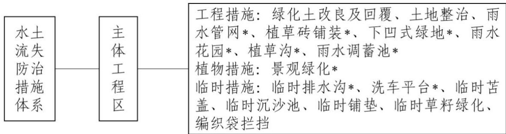

> **Zone C（应用范例层）使用边界**——仅可用于**写作风格、章节展开方式、表达逻辑、表格设计**的参考。
> **不得**用于合规判断；**不得**引入其项目数据（名称／地点／数字／单位名）；
> **不得**因其"曾经通过审批"而推定其做法在当前标准下仍然合规。
> 与 Zone A 冲突时**一律以 Zone A 为准**；Zone A 未明确规定时输出
> 「**Zone A 未明确规定，以下为参考写法，需人工判断**」。
>
> **坐标系警告**：本范例为**老八章结构**（GB 50433—2018 附录B），与 2026 版 10 章模板**同号不同义**
> （老 `1.5`＝防治目标，新 `1.5`＝水土流失预测结果；老 4→新 6 …偏移 +2；新版第 4/5 章老结构无独立章）。
> 因此 **`chapter_mapping: pending`——不得按章节号挂载**，检索一律走 `topic_tags`。
>
> **待加工**：`topic_tags`（主题标签）、`approval_basis_list`（编制依据逐字清单）、
> `structure_summary`（只提取结构：章节展开顺序／段落功能／表格栏目结构／句式模板／论证链步骤）。

1 综合说明 ......  
1.1 项目简况...  
1.2 编制依据...  
1.3 设计水平年..  
1.4 水土流失防治责任范围...  
1.5 水土流失防治目标....  
1.6 项目水土保持评价结论..  
1.7 水土流失预测结果.... 9  
1.8 水土保持措施布设成果. . 9  
1.9 水土保持监测方案... ... 10  
1.10 水土保持投资及效益分析成果... ... 10  
1.11 结论 ... .. 11  
2 项目概况 .... .... 13  
2.1 项目组成及工程布置. ... 13  
2.2 施工组织. ... 17  
2.3 工程占地... ... 22  
2.4 土石方平衡... .... 22  
2.5 拆迁（移民）安置与专项设施改（迁）建... .... 25  
2.6 施工进度... .... 25  
2.7 自然概况 ..... .... 27  
3 项目水土保持评价 .......... ...... 31  
3.1 主体工程选址（线）水土保持评价.. .... 31  
3.2 建设方案与布局水土保持评价.... .... 34  
3.3 主体工程设计中水土保持措施界定.... .... 40  
4 水土流失分析与预测...... ..... 43  
4.1 水土流失现状... ... 43  
4.2 水土流失影响因素分析... ... 43  
4.3 土壤流失量预测.. .. 44  
4.4 水土流失危害分析... .. 50  
4.5 指导性意见.... .. 51  
5 水土保持措施 ........ ....... 53  
5.1 防治区划分. .. 53  
5.2 措施总体布局... ... 53  
5.3 分区措施布设... ... 54  
5.4 施工要求... .. 63  
6 水土保持监测.... ..... 68  
6.1 范围和时段.. ... 68  
6.2 内容和方法 ...... .... 68  
6.3 点位布设... ... 72  
6.4 实施条件和成果.. ... 72  
7 水土保持投资估算及效益分析..... ..... 75  
7.1 投资估算... ... 75  
7.2 效益分析. ... 80  
8 水土保持管理.... ..... 83  
8.1 组织管理... .. 83  
8.2 后续设计... ... 84  
8.3 水土保持监测.. ... 84  
8.4 水土保持监理. ... 85  
8.5 水土保持施工... .... 85  
8.6 水土保持设施验收. .. 86

## 1 综合说明

## 1.1项目简况

## 1.1.1 项目基本情况

## （1）项目建设必要性

本项目依托中南大学湘雅二医院现有优质医疗资源和雄厚学科实力，建设国家紧急医学救援基地，是贯彻落实党的二十大关于“推进健康中国建设”战略部署的具体实践，也是积极回应《“健康中国 2030”规划纲要》及国家应急体系规划中关于完善突发事件卫生应急体系、提升紧急医学救援能力的核心要求。面对我国自然灾害频发、事故灾难多发的严峻形势，以及当前优质医疗资源分布不均、基层应急救援能力薄弱的现实短板，项目建设旨在补齐国家紧急医学救援体系的关键缺口，推动优质医疗资源扩容下沉，实现区域均衡布局，切实保障人民群众生命健康安全，服务国家安全战略大局。

湖南省作为全国灾种最全面的省份之一，洪涝、地质等灾害多发，叠加高危行业密集带来的生产安全风险，现有紧急医学救援能力在批量伤员救治、信息协同、人才储备等方面仍存在明显短板。本项目的建设将有效整合全省应急救援力量，破解基础设施不足、培训体系缺失、科研能力薄弱等瓶颈问题，在提升区域紧急医学救援能力的同时，进一步疏解湘雅二医院现有发展空间压力、优化学科布局，为湘雅二医院可持续发展注入新动能，带动周边地区医疗卫生服务水平整体提升，最终实现“健康湖南”与“健康中国”战略的深度融合。

综上所述，中南大学湘雅二医院国家紧急医学救援基地建设工程是十分必要的。

## （2）项目位置

中南大学湘雅二医院国家紧急医学救援基地建设工程位于湖南省长沙市芙蓉区隆平片区F07-D08-1 地块。项目西邻京港澳高速辅道，南邻滨河路，东邻杉木南路。地块中心经纬度为：东经 113°3′22.388"、北纬 28°11′25.410"。

## （3）项目建设性质、规模、组成

本工程属于新建建设类项目。主要建设内容包括新建 2 栋紧急医学救援综合楼、1栋特种车库与物资仓库楼，以及氧气站、洗消站、垃圾站、地下污水处理站、警卫室、地下室等。总用地面积 65315.12m2，总建筑面积 73326.96m2，其中地上建筑面积51572.81m2，地下建筑面积 $2 1 7 5 4 . 1 5 \mathrm { m } ^ { 2 }$ ，容积率0.852，绿化率28.5%，设置机动车停车位920个，非机动车停车位334个。项目主要由建构筑物工程、道路广场工程、景观绿

化工程组成。

本工程总占地面积 6.53hm2，均为永久占地，占地类型为医疗卫生用地。其中建构筑物工程占地0.94hm2，道路广场工程占地3.73hm2，景观绿化工程占地1.86hm2。

本项目建设过程中土石方挖填总量为 21.22万m3，其中挖方16.42 万m3，填方4.80万 m3，余方 11.62 万 m3。根据《长沙市城市建筑垃圾管理规定》规定，余方计划运往长沙奥体中心建设项目进行综合利用，该项目已取得水土保持批复及城市建筑垃圾处置核准证（处置），需借方167.32万 m3，满足本工程的消纳需求。

## （4）施工组织

项目布置施工生产生活区1处，总占地面积0.30hm2，位于项目红线范围内西南侧，临时占用道路广场工程面积。项目布置临时堆土区 1 处，占地面积 1.70hm2，位于项目红线范围内北侧，临时占用道路广场工程和景观绿化工程面积。项目施工用水用电均由市政管网接入，施工雨水经沉淀处理后排入市政雨水管网。

## （5）拆迁（移民）安置与专项设施改（迁）建

本项目为政府划拨用地，目前政府已完成征地及拆迁工作，用地范围内仅有少量临时工棚。场地内现有架空高压电线需要进行迁改，由国家电网有限公司负责投资建设。

## （6）开工、完工时间及总工期

本工程计划于 2026 年 6 月开工，2029 年11 月完工。总工期42 个月。

## （7）工程投资

本工程动态总投资 74499.62万元，其中土建投资35318.7 万元。建设资金来源为申请中央预算、湖南省财政资金和医院自筹。

## 1.1.2 项目前期工作进展情况

本项目建设单位为中南大学湘雅二医院，可行性研究阶段设计单位为广东省国际工程咨询有限公司，初步设计阶段设计单位为湖南省建筑设计院集团股份有限公司。

2024年3月，广东省国际工程咨询有限公司编制完成了《中南大学湘雅二医院国家紧急医学救援基地建设工程可行性研究报告》。

2024年4月1日，国家卫生健康委员会以《国家卫生健康委关于中南大学湘雅二医院国家紧急医学救援基地建设工程可行性研究报告的批复》（国卫规划函〔2024〕67号）对本项目可行性研究报告进行了批复。

2025年2月，湖南省建筑设计院集团股份有限公司编制完成了《中南大学湘雅二医院国家紧急医学救援基地建设工程初步设计报告》。

2025年3月18日，国家卫生健康委员会以《国家卫生健康委关于中南大学湘雅二医院国家紧急医学救援基地建设工程初步设计和投资概算的批复》（国卫规划函〔202562号）对本项目初步设计报告进行了批复。

## （2）水土保持方案编制情况

根据《中华人民共和国水土保持法》、《湖南省实施〈中华人民共和国水土保持法办法》等法律法规的规定，中南大学湘雅二医院于 2026 年 1 月委托中国能源建设集团湖南省电力设计院有限公司承担《中南大学湘雅二医院国家紧急医学救援基地建设工程水土保持方案报告书》的编制工作。接到委托后，我公司成立了项目组，于 2026 年 2月组织项目组技术人员对本工程现场进行了勘查，收集了工程区有关自然环境、社会经济和水土保持等方面的资料，在分析研究的基础上，按照《生产建设项目水土保持技术标准》（GB50433-2018）的要求，于2026年5 月编制完成了《中南大学湘雅二医院国家紧急医学救援基地建设工程水土保持方案报告书》。

## 1.1.3 自然简况

本项目拟建场地位于长沙市芙蓉区，地貌单元属浏阳河一级阶地，项目区目前已由政府完成拆迁及初次场平工作，区域地面标高为32.8m\~33.7m，最大高差约0.9m，用地现状为裸土地，林草覆盖率约为40%。

项目区气候类型属亚热带季风性湿润气候。雨季为每年的4月\~9 月。项目区多年平均降水量 1394.5mm，多年平均蒸发量 1316mm，年平均风速 2.8m/s， ${ \ge } 1 0 ^ { \circ } \mathrm { C }$ 多年平均积温为 5300℃，无霜期 280 天，年平均湿度 81%。项目区土壤以红壤为主。根据现场调查，项目区已由政府完成场平及拆迁工作，项目区内无可剥离表土。

根据《土壤侵蚀分类分级标准》（SL190-2007），项目区所属土壤侵蚀一级类型区为水力侵蚀类型区，二级类型区为南方红壤丘陵区，三级类型区为江南山地丘陵区，水土流失类型为水力侵蚀，容许土壤流失量为 $5 0 0 \mathrm { t / k m } ^ { 2 }$ ·a。项目区位于长沙市芙蓉区，根据《水利部办公厅关于做好<国家级水土流失重点预防区和重点治理区落地上图成果应用>的通知》（办水保〔2025〕170号）、《湖南省水土保持规划（2016\~2030年）》，项目区不属于国家级、省级水土流失重点预防区和重点治理区。根据《湖南省水土保持公报（2024）》，项目区土壤侵蚀强度为轻度。项目区不涉及饮用水源保护区、水功能区一级保护区和保留区、自然保护区、风景名胜区、地质公园、森林公园以及重要湿地等。本项目不涉及河湖管理范围。

## 1.2编制依据

1.2.1 法律法规、部委规章及规范性文件

（1）《中华人民共和国水土保持法》（1991年6月29日第七届全国人民代表大会常务委员会第二十次会议通过，2010年12月25日第十一届全国人民代表大会常务委员会第十八次会议修订，2011年3月1日施行）；

（2）《中华人民共和国土地管理法》（全国人大常委会，1986年发布，1988年 12月第一次修正，2004年8月第二次修正，2019年8月第三次修正）；

（3）《湖南省实施〈中华人民共和国水土保持法〉办法》（湖南省人大常委会，2021 年 3 月 31 日修订）；

（4）《水利部办公厅关于做好<国家级水土流失重点预防区和重点治理区落地上图成果应用>的通知》（办水保〔2025〕170号）；

（5）《水利部关于加强事中事后监管规范生产建设项目水土保持设施自主验收的通知》（办水保〔2017〕365号）；

（6）《水利部办公厅关于印发<生产建设项目水土保持技术文件编写和印制格式规定（试行）>的通知》（办水保〔2018〕135号）；

（7）《水利部办公厅关于印发生产建设项目水土保持监督管理办法的通知》（办水保〔2019〕172 号）；

（8）《水利部关于进一步深化“放管服”改革全面加强水土保持监管的意见》（水保〔2019〕160 号）；

（9）《水利部办公厅关于实施生产建设项目水土保持信用监管“两单”制度的通知》（办水保〔2020〕157号）；

（10）《水利部办公厅关于进一步加强生产建设项目水土保持监测工作的通知》（办水保〔2020〕161 号）；

（11）《水利部办公厅关于印发生产建设项目水土保持问题分类和责任追究标准的通知》（办水保函〔2020〕564号）；

（12）《生产建设项目水土保持方案管理办法》（2023 年1月17日，水利部令第53号发布）；

（13）《水利部办公厅关于印发生产建设项目水土保持方案审查要点的通知》（办水保〔2023〕177 号）；

（14）《水利部关于加强水土保持空间管控的意见》（水保〔2024〕4号）；

（15）《水利部关于实施水土保持信用评价的意见》（办水保函〔2023〕359 号）；

（16）《湖南省水利厅关于湖南省水土流失重点预防区和重点治理区划定公告》（湖南省水利厅，2017年1 月22日）；

（17）《湖南省水利厅关于修订印发<湖南省生产建设项目水土保持监督管理办法>的通知》（湘水发〔2022〕14号）；

（18）《湖南省水土保持规划（2016-2030 年）》。

## 1.2.2 技术标准

（1）《生产建设项目水土保持技术标准》（GB 50433-2018）；

（2）《生产建设项目水土流失防治标准》（GB/T50434-2018）；

（3）《水土保持工程调查与勘测标准》（GB/T51297-2018）；

（4）《水土保持工程设计规范》（GB 51018-2014）；

（5）《生产建设项目水土保持监测与评价标准》（GB/T51240-2018）；

（6）《生产建设项目土壤流失量测算导则》（SL773-2018）；

（7）《土壤侵蚀分类分级标准》（SL190-2007）；

（8）《水利水电工程制图标准水土保持图》（SL73.6-2015）；

（9）《土地利用现状分类》（GB/T 21010-2017）；

（10）《防洪标准》（GB/T 50201-2014）；

（11）《水土保持监理规范》（SL/T523-2024）；

（12）《表土剥离及其再利用技术要求》（GB/T45107-2024）；

（13）《水土保持监测技术规范》（SL/T277-2024）；

（14）《生产建设项目水土保持设施验收技术规程》（GB/T22490-2025）。

## 1.2.3 技术资料

（1）《中南大学湘雅二医院国家紧急医学救援基地建设工程可行性研究报告》；

（2）国家卫生健康委关于中南大学湘雅二医院国家紧急医学救援基地建设工程可行性研究报告的批复（国卫规划函〔2024〕67号）；

（3）《中南大学湘雅二医院国家紧急医学救援基地建设工程初步设计报告》；

（4）国家卫生健康委关于中南大学湘雅二医院国家紧急医学救援基地建设工程初步设计和投资概算的批复（国卫规划函〔2025〕62号）；

（5）工程涉及的其他相关技术资料。

## 1.3设计水平年

本工程计划 2026 年6 月开工，2029年 11月建成投运，总工期42 个月。根据《生产建设项目水土保持技术标准》（GB 50433-2018）有关规定，水土保持方案设计水平年应为主体工程完工水土保持措施实施及发挥效益的当年或后一年，根据本工程工期安排结合项目所在地实际情况，本方案设计水平年确定为工程完工后一年，即为2030 年。

## 1.4水土流失防治责任范围

根据《生产建设项目水土保持技术标准》（GB 50433-2018）的规定，水土流失防治责任范围即生产建设单位依法应承担水土流失防治义务的区域。生产建设项目水土流失防治责任范围应包括项目永久占地、临时占地以及其他使用与管辖区域。

本工程水土流失防治责任范围总面积为 6.53hm2，均为永久占地面积，占地类型为医疗卫生用地。本工程水土流失防治责任范围见表1.4-1。

表 1.4-1 工程水土流失防治责任范围表 单位：hm2
<table><tr><td rowspan=2 colspan=1>所属行政区</td><td rowspan=2 colspan=1>防治分区</td><td rowspan=1 colspan=1>占地性质</td><td rowspan=2 colspan=1>占地类型</td><td rowspan=2 colspan=1>防治责任范围</td></tr><tr><td rowspan=1 colspan=1>永久用地</td></tr><tr><td rowspan=1 colspan=1>长沙市芙蓉区</td><td rowspan=1 colspan=1>主体工程区</td><td rowspan=1 colspan=1>6.53</td><td rowspan=1 colspan=1>医疗卫生用地</td><td rowspan=1 colspan=1>6.53</td></tr><tr><td rowspan=1 colspan=2>合计</td><td rowspan=1 colspan=1>6.53</td><td rowspan=1 colspan=1></td><td rowspan=1 colspan=1>6.53</td></tr></table>

## 1.5水土流失防治目标

## 1.5.1 执行标准等级

本项目位于湖南省长沙市芙蓉区，根据《土壤侵蚀分类分级标准》（SL190-2007），项目区属于南方红壤区。根据《水利部办公厅关于做好<国家级水土流失重点预防区和重点治理区落地上图成果应用>的通知》（办水保〔2025〕170 号）、《湖南省水土保持规划（2016-2030年）》，项目区不属于国家级、省级水土流失重点预防区和重点治理区。根据《生产建设项目水土流失防治标准》（GB/T 50434-2018），项目区位于长沙市城区，应执行南方红壤区一级标准。

## 1.5.2 防治目标

根据《生产建设项目水土流失防治标准》（GB/T 50434-2018）的有关要求，本项目水土流失防治目标为：

（1）项目建设范围内的新增水土流失应得到有效控制，原有水土流失得到治理；

（2）水土保持设施应安全有效；

（3）水土资源、林草植被应得到最大限度地保护与恢复；

（4）水土流失治理度、土壤流失控制比、渣土防护率、表土保护率、林草植被恢复率、林草覆盖率等指标应符合《生产建设项目水土流失防治标准》（GB/T50434-2018）的规定。

本工程指标值结合项目区土壤侵蚀强度分级、涉及水土流失重点防治区情况等因素进行调整。项目区位于长沙市城区，渣土防护率、林草覆盖率提高 2个百分点；项目区水土流失均以轻度侵蚀为主，土壤流失控制比调高至 1.0。根据现场调查结果，项目区目前已由政府完成初次场平工作，项目区内无可剥离表土，故本项目不计列表土保护率。

本工程水土流失防治指标值详见表 1.5-1。

表 1.5-1 本工程水土流失防治指标值
<table><tr><td rowspan=2 colspan=1>防治标准</td><td rowspan=2 colspan=1>防治指标</td><td rowspan=1 colspan=2>一级标准指标值</td><td rowspan=2 colspan=1>根据土壤侵蚀强度修正</td><td rowspan=2 colspan=1>按水土流失重点防治区修正</td><td rowspan=1 colspan=2>方案确定指标值</td></tr><tr><td rowspan=1 colspan=1>施工期</td><td rowspan=1 colspan=1>设计水平年</td><td rowspan=1 colspan=1>施工期</td><td rowspan=1 colspan=1>设计水平年</td></tr><tr><td rowspan=6 colspan=1>南方红壤区一级标准</td><td rowspan=1 colspan=1>水土流失治理度（%）</td><td rowspan=1 colspan=1>-</td><td rowspan=1 colspan=1>98</td><td rowspan=1 colspan=1>0</td><td rowspan=1 colspan=1></td><td rowspan=1 colspan=1>-</td><td rowspan=1 colspan=1>98</td></tr><tr><td rowspan=1 colspan=1>土壤流失控制比</td><td rowspan=1 colspan=1>-</td><td rowspan=1 colspan=1>0.9</td><td rowspan=1 colspan=1>+0.1</td><td rowspan=1 colspan=1></td><td rowspan=1 colspan=1>-</td><td rowspan=1 colspan=1>1.0</td></tr><tr><td rowspan=1 colspan=1>渣土防护率（%）</td><td rowspan=1 colspan=1>95</td><td rowspan=1 colspan=1>97</td><td rowspan=1 colspan=1></td><td rowspan=1 colspan=1>+2</td><td rowspan=1 colspan=1>95</td><td rowspan=1 colspan=1>99</td></tr><tr><td rowspan=1 colspan=1>表土保护率（%）</td><td rowspan=1 colspan=1>92</td><td rowspan=1 colspan=1>92</td><td rowspan=1 colspan=1>0</td><td rowspan=1 colspan=1></td><td rowspan=1 colspan=1>1</td><td rowspan=1 colspan=1>1</td></tr><tr><td rowspan=1 colspan=1>林草植被恢复率（%）</td><td rowspan=1 colspan=1>-</td><td rowspan=1 colspan=1>98</td><td rowspan=1 colspan=1>0</td><td rowspan=1 colspan=1></td><td rowspan=1 colspan=1>-</td><td rowspan=1 colspan=1>98</td></tr><tr><td rowspan=1 colspan=1>林草覆盖率（%）</td><td rowspan=1 colspan=1>-</td><td rowspan=1 colspan=1>25</td><td rowspan=1 colspan=1></td><td rowspan=1 colspan=1>+2</td><td rowspan=1 colspan=1>-</td><td rowspan=1 colspan=1>27</td></tr></table>

## 1.6项目水土保持评价结论

## 1.6.1 主体工程选址（线）评价

通过与《中华人民共和国水土保持法》、《湖南省实施<中华人民共和国水土保持法>办法》及《生产建设项目水土保持技术标准》（GB 50433-2018）相关规定进行相符性分析，主体工程选址（线）未涉及崩塌和滑坡危险区、易引起严重水土流失和生态恶化地区，不涉及河流两岸、湖泊和水库周边的植物保护带，不在河道管理范围内建设及堆土，不占用全国水土保持监测网络中的水土保持监测站点、重点试验区及国家确定的水土保持长期定位观测站。项目区不涉及国家级、省级水土流失重点预防区和重点治理区，项目区位于长沙市城区，主体设计已按《生产建设项目水土保持技术标准》（GB50433-2018）规定优化了建设方案，提高了水土流失防治标准、截排水工程标准及林草覆盖率标准等，符合相关规定。

综上，主体工程选址（线）无明显水土保持制约性因素。

## 1.6.2 建设方案与布局评价

（1）建设方案评价：项目位于长沙市城区，绿地率达 28.5%，景观效果优美，符合长沙市总体规划要求。主体工程已优化设计方案，结合四周道路、周边地形地貌、排水汇流情况进行设计。项目雨污水管网系统建设完善，室外雨水经雨水口、雨水管网收集后排入市政雨水管网。主体工程已配套设计雨水花园、下凹式绿地、植草沟、雨水调蓄池、植草砖铺装等综合雨水系统，可实现雨水资源化利用。项目建设方案可行，符合水土保持要求。

（2）工程占地评价：项目总占地面积6.53hm2，均为永久占地。项目占地类型为医疗卫生用地。项目用地性质符合规划要求，建筑密度、容积率、绿地率符合行业用地指标规定。本工程占地配置合理，区内给排水、供电、交通等布局完善。施工便道与区内永久道路结合布设。施工生产生活区、临时堆土区布置在项目永久占地内，可减少用地红线外临时用地。工程占地数量、面积可满足项目建设需求，符合水土保持要求。

（3）土石方平衡评价：项目各分区土石方挖填借余量合理。土石方以挖方为主，填方均利用自身挖方，绿化覆土来源于基坑土方土壤改良。项目挖填方主要来源于桩基施工、基坑开挖、土方回填及管沟挖填等，除场地平整、管沟开挖土方就地利用外，填方调运至临时堆土区存放，余方外运至长沙奥体中心建设项目进行综合利用。项目布置临时堆土区1 处，位于用地红线范围内北侧，选址合理，堆土量可满足施工需求。工程土石方调配合理，不存在多次倒运，符合水土保持要求。

（4）取土（石、砂）场设置评价：本项目不涉及取土（石、砂）场。

（5）弃土（石、渣、灰、矸石、尾矿）场设置评价：本项目不涉及弃土（石、渣、灰、矸石、尾矿）场。

（6）施工方法与工艺评价：本项目施工场地不涉及基本农田。施工道路与永久道路结合布设，有助于减少场地二次开挖及扰动，降低对周边环境的影响。项目施工跨越雨季，主体工程已设计基坑降水、集水井、临时排水沟等施工排水综合利用措施。基坑开挖、基坑排水、道路施工、管线铺设等施工方法与工艺明确，对工程建设的水土保持工作起到积极作用。建议进一步优化施工时序，合理安排施工工期，尽量将扰动大的工程安排在非雨日施工，符合水土保持要求。

（7）具有水土保持功能工程的评价：主体工程设计的雨水管网、植草砖铺装、景观绿化、下凹式绿地、雨水花园、植草沟、雨水调蓄池、临时排水沟、洗车平台等措施具有水土保持功能，相关设计满足《水土保持工程设计规范》（GB 51018-2014）的设计要求，能在一定程度上减少工程建设过程中可能造成的水土流失。但项目各防治分区水土保持措施及其工程量尚不完善，本方案根据各防治分区施工建设过程中的水土流失特点，补充设计绿化土改良及回覆、土地整治、临时苫盖、临时铺垫、临时排水沟、临时沉沙池、编织袋装土拦挡、临时草籽绿化等防治措施，实施后可达到本工程水土流失防治标准，有效防治水土流失。

因此，本项目建设方案可行，布局合理，符合水土保持要求。

## 1.7水土流失预测结果

本项目可能造成土壤流失总量为 571.70t，其中背景流失量为59.95t，新增土壤流失量为 511.75t。根据水土流失预测结果，工程建设过程中产生水土流失的重点时段为施工期，重点部位为主体工程区和临时堆土区。

本项目建设过程中如不采取积极有效的水土保持措施，将有可能造成如下水土流失危害：影响项目施工安全；淤积周边排水系统，造成局部区域内涝；影响区域生态环境。

## 1.8水土保持措施布设成果

针对本项目建设过程中的水土流失特点，结合总体布局、施工布置、施工工艺、施工时序等因素进行水土流失防治区的划分，将工程建设区划分为3个一级防治分区，分别为主体工程区、施工生产生活区和临时堆土区。

本项目水土流失防治措施体系由主体工程已有水土保持措施和方案新增水土保持措施组成，按照防治分区进行了布设。布设情况见表1.8-1。

表 1.8-1 水土保持措施布设情况一览表
<table><tr><td colspan="1" rowspan="1">措施类型</td><td colspan="1" rowspan="1">防治措施</td><td colspan="1" rowspan="1">结构形式</td><td colspan="1" rowspan="1">单位</td><td colspan="1" rowspan="1">工程 $\frac { \Xi } { \Xi }$ </td><td colspan="1" rowspan="1">实施时段</td><td colspan="1" rowspan="1">备注</td></tr><tr><td colspan="1" rowspan="15">工程措施</td><td colspan="1" rowspan="8">雨水管网</td><td colspan="1" rowspan="1">DN100</td><td colspan="1" rowspan="1">m</td><td colspan="1" rowspan="1">16.2</td><td colspan="1" rowspan="8">2028.07~2029.03</td><td colspan="1" rowspan="8">主体已有</td></tr><tr><td colspan="1" rowspan="1">DN150</td><td colspan="1" rowspan="1">m</td><td colspan="1" rowspan="1">51</td></tr><tr><td colspan="1" rowspan="1">DN200</td><td colspan="1" rowspan="1">m</td><td colspan="1" rowspan="1">139.4</td></tr><tr><td colspan="1" rowspan="1">DN300</td><td colspan="1" rowspan="1">m</td><td colspan="1" rowspan="1">957.3</td></tr><tr><td colspan="1" rowspan="1">DN400</td><td colspan="1" rowspan="1">m</td><td colspan="1" rowspan="1">754.6</td></tr><tr><td colspan="1" rowspan="1">DN500</td><td colspan="1" rowspan="1">m</td><td colspan="1" rowspan="1">390.2</td></tr><tr><td colspan="1" rowspan="1">DN600</td><td colspan="1" rowspan="1">m</td><td colspan="1" rowspan="1">117.5</td></tr><tr><td colspan="1" rowspan="1">DN800</td><td colspan="1" rowspan="1">m</td><td colspan="1" rowspan="1">152.2</td></tr><tr><td colspan="2" rowspan="1">植草砖铺装</td><td colspan="1" rowspan="1"> $\mathrm { m } ^ { 2 }$ </td><td colspan="1" rowspan="1">9016</td><td colspan="1" rowspan="1">2028.07~2029.03</td><td colspan="1" rowspan="1">主体已有</td></tr><tr><td colspan="2" rowspan="1">下凹式绿地</td><td colspan="1" rowspan="1"> $\mathrm { m } ^ { 2 }$ </td><td colspan="1" rowspan="1">2085</td><td colspan="1" rowspan="3">2029.01~2029.09</td><td colspan="1" rowspan="1">主体已有</td></tr><tr><td colspan="2" rowspan="1">雨水花园</td><td colspan="1" rowspan="1"> $\overline { { { \bf m } ^ { 2 } } }$ </td><td colspan="1" rowspan="1">1173</td><td colspan="1" rowspan="1">主体已有</td></tr><tr><td colspan="2" rowspan="1">植草沟</td><td colspan="1" rowspan="1"> $\mathrm { m } ^ { 2 }$ </td><td colspan="1" rowspan="1">556</td><td colspan="1" rowspan="1">主体已有</td></tr><tr><td colspan="2" rowspan="1">雨水调蓄池</td><td colspan="1" rowspan="1"> $\mathrm { m } ^ { 3 }$ </td><td colspan="1" rowspan="1">100</td><td colspan="1" rowspan="1">2028.07~2028.09</td><td colspan="1" rowspan="1">主体已有</td></tr><tr><td colspan="2" rowspan="1">绿化土改良及回覆</td><td colspan="1" rowspan="1"> $\mathcal { F } \mathrm { ~ m } ^ { 3 }$ </td><td colspan="1" rowspan="1">0.58</td><td colspan="1" rowspan="1">2029.01</td><td colspan="1" rowspan="1">方案新增</td></tr><tr><td colspan="1" rowspan="1">土地整治</td><td colspan="1" rowspan="1">场地平整、翻松</td><td colspan="1" rowspan="1"> $\mathrm { m } ^ { 2 }$ </td><td colspan="1" rowspan="1">14827</td><td colspan="1" rowspan="1">2029.02~2029.03</td><td colspan="1" rowspan="1">方案新增</td></tr><tr><td colspan="1" rowspan="1">植物措施</td><td colspan="1" rowspan="1">景观绿化</td><td colspan="1" rowspan="1">乔灌草结合</td><td colspan="1" rowspan="1"> $\mathrm { m } ^ { 2 }$ </td><td colspan="1" rowspan="1">14827</td><td colspan="1" rowspan="1">2029.01~2029.09</td><td colspan="1" rowspan="1">主体已有</td></tr><tr><td colspan="1" rowspan="1">措施类型</td><td colspan="1" rowspan="1">防治措施</td><td colspan="1" rowspan="1">结构形式</td><td colspan="1" rowspan="1">单位</td><td colspan="1" rowspan="1">工程量</td><td colspan="1" rowspan="1">实施时段</td><td colspan="1" rowspan="1">备注</td></tr><tr><td colspan="1" rowspan="9">临时措施</td><td colspan="2" rowspan="1">洗车平台</td><td colspan="1" rowspan="1">座</td><td colspan="1" rowspan="1">1</td><td colspan="1" rowspan="1">2026.06~2029.11</td><td colspan="1" rowspan="1">主体已有</td></tr><tr><td colspan="1" rowspan="1">临时排水沟</td><td colspan="1" rowspan="1">砖砌结构，矩形断面，断面尺寸为0.3m×0.3m，内壁及底采用砂浆抹面</td><td colspan="1" rowspan="1">m</td><td colspan="1" rowspan="1">1420</td><td colspan="1" rowspan="1">2026.10~2027.03</td><td colspan="1" rowspan="1">主体已有</td></tr><tr><td colspan="1" rowspan="1">临时排水沟</td><td colspan="1" rowspan="1">砖砌结构，矩形断面，断面尺寸为0.3m×0.3m，内壁及底采用砂浆抹面</td><td colspan="1" rowspan="1">m</td><td colspan="1" rowspan="1">770</td><td colspan="1" rowspan="1">2026.08~2028.07</td><td colspan="1" rowspan="1">方案新增</td></tr><tr><td colspan="1" rowspan="1">临时沉沙池</td><td colspan="1" rowspan="1">机砖抹面，单个沉沙池的尺寸为：长×宽×深=2.5m×1.2m×1.5m</td><td colspan="1" rowspan="1">座</td><td colspan="1" rowspan="1">2</td><td colspan="1" rowspan="1">2026.10~2027.03</td><td colspan="1" rowspan="1">方案新增</td></tr><tr><td colspan="1" rowspan="1">临时沉沙池</td><td colspan="1" rowspan="1">机砖抹面，单个沉沙池的尺寸为：长×宽×深=2.5m×1.2m×1.5m</td><td colspan="1" rowspan="1">座</td><td colspan="1" rowspan="1">3</td><td colspan="1" rowspan="1">2026.08~2028.07</td><td colspan="1" rowspan="1">方案新增</td></tr><tr><td colspan="1" rowspan="1">临时苫盖</td><td colspan="1" rowspan="1">6针防尘网</td><td colspan="1" rowspan="1">m2</td><td colspan="1" rowspan="1">39000</td><td colspan="1" rowspan="1">2026.06~2029.11</td><td colspan="1" rowspan="1">方案新增</td></tr><tr><td colspan="1" rowspan="1">临时铺垫</td><td colspan="1" rowspan="1">彩条布</td><td colspan="1" rowspan="1">m2</td><td colspan="1" rowspan="1">17000</td><td colspan="1" rowspan="1">2026.08~2028.07</td><td colspan="1" rowspan="1">方案新增</td></tr><tr><td colspan="1" rowspan="1">编织袋装土拦挡</td><td colspan="1" rowspan="1">底宽1.5m×顶宽0.5m×高度1.0m</td><td colspan="1" rowspan="1">m</td><td colspan="1" rowspan="1">480</td><td colspan="1" rowspan="1">2026.08~2028.07</td><td colspan="1" rowspan="1">方案新增</td></tr><tr><td colspan="1" rowspan="1">临时草籽绿化</td><td colspan="1" rowspan="1">狗牙根，密度18g/m²</td><td colspan="1" rowspan="1">hm²</td><td colspan="1" rowspan="1">2.07</td><td colspan="1" rowspan="1">2026.08~2028.07</td><td colspan="1" rowspan="1">方案新增</td></tr></table>

## 1.9水土保持监测方案

（1）监测内容：水土流失自然影响因素、水土流失状况、水土流失防治成效以及水土流失危害等。

（2）监测时段：2026年6月至 2030年12月，共计55 个月。

（3）监测范围：本项目监测范围包括主体工程区、施工生产生活区、临时堆土区3个监测分区，监测范围总面积6.53hm2。重点监测区域为主体工程区和临时堆土区。

（4）监测方法：集沙池法、抽样调查法、无人机监测。

（5）监测点位布设：本项目共布设监测点位5处，均位于主体工程区（1#监测点，集沙池法；2#监测点，集沙池法；3#监测点，集沙池法；4#监测点，抽样调查法、无人机监测；5#监测点，抽样调查法）。其他区域通过现场巡查，不布设专门的监测点。

## 1.10水土保持投资及效益分析成果

本项目水土保持工程总投资1164.89万元，工程措施投资495.37万元，植物措施投资355.85万元，监测措施费 45.26万元，施工临时工程投资134.56万元，独立费用78.38万元（含水土保持监理费22.60万元），基本预备费55.47 万元，水土保持补偿费免征。

本方案实施后至设计水平年，本项目水土流失治理度达到99.9%，土壤流失控制比达到 1.9，渣土防护率达到99.2%，林草植被恢复率达到99.4%，林草覆盖率达28.5%。可治理水土流失面积6.53hm2，植被恢复面积1.86hm2，可减少土壤流失量约511.75t。

## 1.11 结论

本项目工程建设选址不存在水土保持制约性因素，建设方案及布局合理可行，已尽可能节约用地和减少扰动，项目土石方挖填数量合理，施工方法与工艺明确。本方案已按相关要求补充设计了工程措施、植物措施及临时防护措施，符合水土保持法律法规和技术标准的相关规定。主体设计及本方案新增的水土保持措施实施后，项目工程建设造成的水土流失影响将得到有效控制，达到本工程水土流失防治标准，实现保护生态环境的目的。因此，从水土保持角度分析，本项目建设是可行的。

本方案对从水土保持角度对项目工程设计、施工和建设管理提出以下要求：

（1）主体工程下阶段设计应进一步落实水土保持措施，将本方案新增的措施内容和投资纳入主体。水土保持方案和工程设计产生重大变更的，应按规定报相应水行政主管部门批准。

（2）施工单位应严格控制红线施工，减少施工临时占地面积和土石方挖填方量，及时清运施工垃圾，严格按照批复的水土保持方案落实水土保持措施。同时，施工单位应进一步优化施工时序，合理安排施工工期，尽量将扰动大的工程安排在非雨季施工。

（3）项目建设应落实好水土保持监理和监测工作。监测单位应依据监测结果和防治标准及时向建设单位反馈，补充完善相应水土保持措施，达到方案要求的防治目标。监理单位应按时进场，对水土保持措施进行全过程的监督管理。

（4）项目工程建设完工后，建设单位须开展水土保持设施的验收工作，验收内容及程序按《水利部关于加强事中事后监管规范生产建设项目水土保持设施自主验收的通知》（水保〔2017〕365 号）的规定开展。水土保持工程验收不合格的，主体工程不得投入使用。

表 1.11-1 水土保持方案特性表
<table><tr><td rowspan=1 colspan=2>项目名称</td><td rowspan=1 colspan=3>中南大学湘雅二医院国家紧急医学救援基地建设工程</td><td rowspan=1 colspan=1>流域管理机构</td><td rowspan=1 colspan=5>长江水利委员会</td></tr><tr><td rowspan=1 colspan=2>涉及省份(市、区)</td><td rowspan=1 colspan=2>湖南省</td><td rowspan=1 colspan=1>涉及地市或个数</td><td rowspan=1 colspan=1>长沙市</td><td rowspan=1 colspan=4>涉及县或个数</td><td rowspan=1 colspan=1>芙蓉区</td></tr><tr><td rowspan=1 colspan=2>项目规模</td><td rowspan=1 colspan=2>总建筑面积73326.96m²</td><td rowspan=1 colspan=1>总投资（万元）</td><td rowspan=1 colspan=1>74499.62</td><td rowspan=1 colspan=4>土建投资（万元）</td><td rowspan=1 colspan=1>35318.70</td></tr><tr><td rowspan=1 colspan=2>动工时间</td><td rowspan=1 colspan=2>2026年6月</td><td rowspan=1 colspan=1>完工时间</td><td rowspan=1 colspan=1>2029年11月</td><td rowspan=1 colspan=4>设计水平年</td><td rowspan=1 colspan=1>2030年</td></tr><tr><td rowspan=1 colspan=2>工程占地（hm²）</td><td rowspan=1 colspan=2>6.53</td><td rowspan=1 colspan=1>永久占地（hm²）</td><td rowspan=1 colspan=1>6.53</td><td rowspan=1 colspan=4>临时占地（hm²）</td><td rowspan=1 colspan=1>/</td></tr><tr><td rowspan=2 colspan=4>土石方量（万m³）</td><td rowspan=1 colspan=1>挖方</td><td rowspan=1 colspan=1>填方</td><td rowspan=1 colspan=3>借方</td><td rowspan=1 colspan=2>余（弃）方</td></tr><tr><td rowspan=1 colspan=1>16.42</td><td rowspan=1 colspan=1>4.80</td><td rowspan=1 colspan=3>0</td><td rowspan=1 colspan=2>11.62</td></tr><tr><td rowspan=1 colspan=3>重点防治区名称</td><td rowspan=1 colspan=2></td><td rowspan=1 colspan=6>1</td></tr><tr><td rowspan=1 colspan=3>地貌类型</td><td rowspan=1 colspan=2>平原</td><td rowspan=1 colspan=3>水土保持区划</td><td rowspan=1 colspan=3>南方红壤区</td></tr><tr><td rowspan=1 colspan=3>土壤侵蚀类型</td><td rowspan=1 colspan=2>水力侵蚀</td><td rowspan=1 colspan=3>土壤侵蚀强度</td><td rowspan=1 colspan=3>轻度</td></tr><tr><td rowspan=1 colspan=3>防治责任范围面积（hm²）</td><td rowspan=1 colspan=2>6.53</td><td rowspan=1 colspan=3>容许土壤流失量[t/(km²·a)]</td><td rowspan=1 colspan=3>500</td></tr><tr><td rowspan=1 colspan=3>土壤流失预测总量（t）</td><td rowspan=1 colspan=2>571.70</td><td rowspan=1 colspan=3>新增土壤流失量（t）</td><td rowspan=1 colspan=3>511.75</td></tr><tr><td rowspan=1 colspan=3>水土流失防治标准执行等级</td><td rowspan=1 colspan=2></td><td rowspan=1 colspan=6>南方红壤区一级标准</td></tr><tr><td rowspan=3 colspan=1>防治指标</td><td rowspan=1 colspan=2>水土流失治理度（%）</td><td rowspan=1 colspan=2>98</td><td rowspan=1 colspan=2>土壤流失控制比</td><td rowspan=1 colspan=4>1.0</td></tr><tr><td rowspan=1 colspan=2>渣土防护率（%）</td><td rowspan=1 colspan=2>99</td><td rowspan=1 colspan=2>表土保护率（%）</td><td rowspan=1 colspan=4>/</td></tr><tr><td rowspan=1 colspan=2>林草植被恢复率（%）</td><td rowspan=1 colspan=2>98</td><td rowspan=1 colspan=2>林草覆盖率（%）</td><td rowspan=1 colspan=4>27</td></tr><tr><td rowspan=2 colspan=1>防治措施及工程量</td><td rowspan=1 colspan=1>分区</td><td rowspan=1 colspan=3>工程措施</td><td rowspan=1 colspan=2>植物措施</td><td rowspan=1 colspan=4>临时措施</td></tr><tr><td rowspan=1 colspan=1>主体工程区</td><td rowspan=1 colspan=3>绿化土改良及回覆0.58万m³，土地整治14827m²，雨水管网2578.4m，植草砖铺装 9016m²，下凹式绿地2085m²，雨水花园1173m²，植草沟556m²、雨水调蓄池 100m³</td><td rowspan=1 colspan=2>景观绿化14827m²</td><td rowspan=1 colspan=4>临时排水沟2190m，临时苫盖 61700m²，临时铺垫17000m²，临时沉沙池5座，洗车平台1座，编织袋袋装土拦挡480m，临时草籽绿化2.07hm²</td></tr><tr><td rowspan=1 colspan=2>投资（万元）</td><td rowspan=1 colspan=3>495.37</td><td rowspan=1 colspan=2>355.85</td><td rowspan=1 colspan=4>134.56</td></tr><tr><td rowspan=1 colspan=2>水土保持总投资(万元)</td><td rowspan=1 colspan=3>1164.89</td><td rowspan=1 colspan=2>独立费用(万元)</td><td rowspan=1 colspan=4>78.38</td></tr><tr><td rowspan=1 colspan=2>工程建设监理费(万元)</td><td rowspan=1 colspan=1>22.60</td><td rowspan=1 colspan=2>监测措施费（万元）</td><td rowspan=1 colspan=2>45.26</td><td rowspan=1 colspan=3>水土保持补偿费(元)</td><td rowspan=1 colspan=1>免征</td></tr><tr><td rowspan=1 colspan=2>方案编制单位</td><td rowspan=1 colspan=3>中国能源建设集团湖南省电力设计院有限公司</td><td rowspan=1 colspan=2>建设单位</td><td rowspan=1 colspan=4>中南大学湘雅二医院</td></tr><tr><td rowspan=1 colspan=2>法定代表人</td><td rowspan=1 colspan=3>雷远华</td><td rowspan=1 colspan=2>法定代表人</td><td rowspan=1 colspan=4>吕奔</td></tr><tr><td rowspan=1 colspan=2>地址</td><td rowspan=1 colspan=3>湖南省长沙市雨花区劳动西路471号</td><td rowspan=1 colspan=2>地址</td><td rowspan=1 colspan=4>湖南省长沙市芙蓉区人民中路139号</td></tr><tr><td rowspan=1 colspan=2>邮编</td><td rowspan=1 colspan=3>410007</td><td rowspan=1 colspan=2>邮编</td><td rowspan=1 colspan=4>410011</td></tr><tr><td rowspan=1 colspan=2>联系人及电话</td><td rowspan=1 colspan=3>王冰/18792858619</td><td rowspan=1 colspan=2>联系人及电话</td><td rowspan=1 colspan=4>王振坤/18173164526</td></tr><tr><td rowspan=1 colspan=2>传真</td><td rowspan=1 colspan=3>/</td><td rowspan=1 colspan=2>传真</td><td rowspan=1 colspan=4>1</td></tr><tr><td rowspan=1 colspan=2>电子信箱</td><td rowspan=1 colspan=3>3021508078@qq.com</td><td rowspan=1 colspan=2>电子信箱</td><td rowspan=1 colspan=4>1</td></tr></table>

## 2 项目概况

## 2.1项目组成及工程布置

## 2.1.1 项目基本情况

工程名称：中南大学湘雅二医院国家紧急医学救援基地建设工程

建设性质：新建建设类项目

建设单位：中南大学湘雅二医院

设计单位：湖南省建筑设计院集团股份有限公司

建设地点：湖南省长沙市芙蓉区隆平片区F07-D08-1 地块，东邻杉木南路，西邻京港澳高速辅道，南邻滨河路。

项目区中心经纬度：东经113°3′22.388"、北纬 $2 8 ^ { \circ } 1 1 ^ { \prime } 2 5 . 4 1 0 "$

建设规模及内容：总用地面积65315.12m2，总建筑面积为73326.96m2，其中地上建筑面积 51572.81m2，地下建筑面积 $2 1 7 5 4 . 1 5 \mathrm { m } ^ { 2 } .$ 。主要建设内容为新建2栋紧急医学救援综合楼、1栋特种车库与物资仓库楼，以及氧气站、洗消站、垃圾站、地下污水处理站、警卫室、地下室等。

总投资及土建投资：工程动态总投资74499.62 万元，其中土建投资35318.7万元。建设资金来源为申请中央预算、湖南省财政资金和医院自筹。

建设工期：工程计划于2026年 6月开工建设，于2029 年11月完工，总工期为42个月。

项目组成及主要工程特性：本工程项目组成及工程特性表详见表2.1-1。

表 2.1-1 项目基本组成及工程特性表
<table><tr><td rowspan=1 colspan=5>一、项目的基本情况</td></tr><tr><td rowspan=1 colspan=1>1</td><td rowspan=1 colspan=1>项目名称</td><td rowspan=1 colspan=3>中南大学湘雅二医院国家紧急医学救援基地建设工程</td></tr><tr><td rowspan=1 colspan=1>2</td><td rowspan=1 colspan=1>建设地点</td><td rowspan=1 colspan=3>湖南省长沙市芙蓉区隆平片区 F07-D08-1 地块(东经113°3′22.388&quot;、北纬28°11′25.410&quot;）</td></tr><tr><td rowspan=1 colspan=1>3</td><td rowspan=1 colspan=1>建设单位</td><td rowspan=1 colspan=3>中南大学湘雅二医院</td></tr><tr><td rowspan=1 colspan=1>4</td><td rowspan=1 colspan=1>建设工期</td><td rowspan=1 colspan=3>2026年6月~2029年11月</td></tr><tr><td rowspan=1 colspan=1>5</td><td rowspan=1 colspan=1>工程性质</td><td rowspan=1 colspan=3>新建建设类项目</td></tr><tr><td rowspan=1 colspan=1>6</td><td rowspan=1 colspan=1>建设规模及内容</td><td rowspan=1 colspan=3>总用地面积65315.12m²，总建筑面积为73326.96m²，其中地上建筑面积51572.81m²，地下建筑面积21754.15m²。容积率0.852，建筑密度15.36%，绿地率28.5%。主要建设内容为新建2栋紧急医学救援综合楼、1栋特种车库与物资仓库楼，以及氧气站、洗消站、垃圾站、地下污水处理站、警卫室、地下室等。</td></tr><tr><td rowspan=1 colspan=1>7</td><td rowspan=1 colspan=1>总投资</td><td rowspan=1 colspan=1>74499.62 万元</td><td rowspan=1 colspan=1>土建投资</td><td rowspan=1 colspan=1>35318.70万元</td></tr><tr><td rowspan=1 colspan=4>二、主要经济技术指标</td><td rowspan=1 colspan=1></td></tr><tr><td rowspan=1 colspan=1>序号</td><td rowspan=1 colspan=2>项目</td><td rowspan=1 colspan=1>单位</td><td rowspan=1 colspan=1>数值</td></tr></table>

2.项目概况
<table><tr><td rowspan=1 colspan=1>1</td><td rowspan=1 colspan=5>净用地面积</td><td rowspan=1 colspan=2> $\mathrm { m } ^ { 2 }$ </td><td rowspan=1 colspan=1>65315.12</td></tr><tr><td rowspan=1 colspan=1>2</td><td rowspan=1 colspan=5>建筑基底面积</td><td rowspan=1 colspan=2> $\mathrm { m } ^ { 2 }$ </td><td rowspan=1 colspan=1>10033.33</td></tr><tr><td rowspan=1 colspan=1>3</td><td rowspan=1 colspan=5>总建筑面积</td><td rowspan=1 colspan=2> $\mathrm { m } ^ { 2 }$ </td><td rowspan=1 colspan=1>73326.96</td></tr><tr><td rowspan=12 colspan=1>4</td><td rowspan=12 colspan=1>其中</td><td rowspan=1 colspan=4>地上建筑面积</td><td rowspan=1 colspan=2> $\mathrm { m } ^ { 2 }$ </td><td rowspan=1 colspan=1>51572.81</td></tr><tr><td rowspan=8 colspan=1>其中</td><td rowspan=1 colspan=3>紧急医学救援综合楼(医疗区)</td><td rowspan=1 colspan=2> $\mathrm { m } ^ { 2 }$ </td><td rowspan=1 colspan=1>31680.40</td></tr><tr><td rowspan=1 colspan=3>紧急医学救援综合楼（培训科研区）</td><td rowspan=1 colspan=2> $\mathrm { m } ^ { 2 }$ </td><td rowspan=1 colspan=1>15157.43</td></tr><tr><td rowspan=1 colspan=3>特种车库与物资仓库楼</td><td rowspan=1 colspan=2> $\mathrm { m } ^ { 2 }$ </td><td rowspan=1 colspan=1>3926.02</td></tr><tr><td rowspan=1 colspan=3>洗消站</td><td rowspan=1 colspan=2> $\mathrm { m } ^ { 2 }$ </td><td rowspan=1 colspan=1>176.40</td></tr><tr><td rowspan=1 colspan=3>垃圾站</td><td rowspan=1 colspan=2> $\mathrm { m } ^ { 2 }$ </td><td rowspan=1 colspan=1>273.28</td></tr><tr><td rowspan=1 colspan=3>氧气站</td><td rowspan=1 colspan=2> $\mathrm { m } ^ { 2 }$ </td><td rowspan=1 colspan=1>26.95</td></tr><tr><td rowspan=1 colspan=3>警卫室</td><td rowspan=1 colspan=2> $\mathrm { m } ^ { 2 }$ </td><td rowspan=1 colspan=1>29.62</td></tr><tr><td rowspan=1 colspan=3>地上构筑物</td><td rowspan=1 colspan=2> $\mathrm { m } ^ { 2 }$ </td><td rowspan=1 colspan=1>302.71</td></tr><tr><td rowspan=1 colspan=4>地下建筑面积</td><td rowspan=1 colspan=2> $\mathrm { m } ^ { 2 }$ </td><td rowspan=1 colspan=1>21754.15</td></tr><tr><td rowspan=2 colspan=1>其中</td><td rowspan=1 colspan=3>地下污水处理站</td><td rowspan=1 colspan=2> $\mathrm { m } ^ { 2 }$ </td><td rowspan=1 colspan=1>221.85</td></tr><tr><td rowspan=1 colspan=3>地下室</td><td rowspan=1 colspan=2> $\mathrm { m } ^ { 2 }$ </td><td rowspan=1 colspan=1>21532.30</td></tr><tr><td rowspan=1 colspan=1>5</td><td rowspan=1 colspan=5>计容建筑面积</td><td rowspan=1 colspan=2> $\mathrm { m } ^ { 2 }$ </td><td rowspan=1 colspan=1>55635.26</td></tr><tr><td rowspan=1 colspan=1>6</td><td rowspan=1 colspan=5>容积率</td><td rowspan=1 colspan=2></td><td rowspan=1 colspan=1>0.852</td></tr><tr><td rowspan=1 colspan=1>7</td><td rowspan=1 colspan=5>建筑密度</td><td rowspan=1 colspan=2> $\%$ </td><td rowspan=1 colspan=1>15.36</td></tr><tr><td rowspan=1 colspan=1>8</td><td rowspan=1 colspan=5>绿地率</td><td rowspan=1 colspan=2>%</td><td rowspan=1 colspan=1>28.5</td></tr><tr><td rowspan=1 colspan=1>9</td><td rowspan=1 colspan=5>规划医疗床位</td><td rowspan=1 colspan=2>床</td><td rowspan=1 colspan=1>500</td></tr><tr><td rowspan=3 colspan=1>10</td><td rowspan=1 colspan=5>机动车停车位</td><td rowspan=1 colspan=2>个</td><td rowspan=1 colspan=1>920</td></tr><tr><td rowspan=2 colspan=1>其中</td><td rowspan=1 colspan=4>地上停车位</td><td rowspan=1 colspan=2>个</td><td rowspan=1 colspan=1>686</td></tr><tr><td rowspan=1 colspan=4>地下停车位</td><td rowspan=1 colspan=2>个</td><td rowspan=1 colspan=1>234</td></tr><tr><td rowspan=1 colspan=1>11</td><td rowspan=1 colspan=5>非机动车停车位</td><td rowspan=1 colspan=2>个</td><td rowspan=1 colspan=1>334</td></tr><tr><td rowspan=1 colspan=9>三、项目组成及占地情况</td></tr><tr><td rowspan=2 colspan=4>项目组成</td><td rowspan=1 colspan=1>占地面积(hm²)</td><td rowspan=2 colspan=2>占地类型</td><td rowspan=2 colspan=2>说明</td></tr><tr><td rowspan=1 colspan=1>永久占地</td></tr><tr><td rowspan=1 colspan=4>主体工程区</td><td rowspan=1 colspan=1>6.53</td><td rowspan=1 colspan=2>医疗卫生用地</td><td rowspan=1 colspan=2>施工生产生活区、临时堆土区施工期间布设在用地红线范围内，不新增占地临</td></tr><tr><td rowspan=1 colspan=4>合计</td><td rowspan=1 colspan=1>6.53</td><td rowspan=1 colspan=2></td><td rowspan=1 colspan=2></td></tr></table>

## 2.1.2 项目组成

中南大学湘雅二医院国家紧急医学救援基地工程主要建设内容为新建2栋紧急医学救援综合楼、1 栋特种车库与物资仓库楼，以及氧气站、洗消站、垃圾站、地下污水处理站、警卫室、地下室等。总建筑面积 $7 3 3 2 6 . 9 6 \mathrm { m } ^ { 2 }$ ，其中地上建筑面积 $5 1 5 7 2 . 8 1 \mathrm { m } ^ { 2 }$ ，地下建筑面积21754.15m2，容积率0.852，绿化率28.5%，项目组成情况如下：

## （1）建构筑物工程

建构筑物包括2 栋紧急医学救援综合楼、1栋特种车库与物资仓库楼、以及保障楼氧气站、洗消站、垃圾站、地下污水处理站、警卫室、地下室等。建构筑物技术指标见表 2.1-2。

2.项目概况  
表 2.1-2 建构筑物一览表
<table><tr><td rowspan=1 colspan=1>序号</td><td rowspan=1 colspan=1>建构筑物</td><td rowspan=1 colspan=1>基底面积（m²）</td><td rowspan=1 colspan=1>建筑面积（m²）</td><td rowspan=1 colspan=1>建筑高度（m）</td><td rowspan=1 colspan=1>建筑层数</td><td rowspan=1 colspan=1>正负零标高（m）</td><td rowspan=1 colspan=1>基础形式</td><td rowspan=1 colspan=1>主体结构形式</td></tr><tr><td rowspan=1 colspan=1>1</td><td rowspan=1 colspan=1>紧急医学救援综合楼（医疗区）</td><td rowspan=1 colspan=1>5062.30</td><td rowspan=1 colspan=1>31680.40</td><td rowspan=1 colspan=1>52.2</td><td rowspan=1 colspan=1>11F/2D</td><td rowspan=1 colspan=1>33.40</td><td rowspan=1 colspan=1>筏板基础</td><td rowspan=1 colspan=1>框架-剪力墙</td></tr><tr><td rowspan=1 colspan=1>2</td><td rowspan=1 colspan=1>紧急医学救援综合楼（培训科研区）</td><td rowspan=1 colspan=1>2643.80</td><td rowspan=1 colspan=1>15157.43</td><td rowspan=1 colspan=1>35.5</td><td rowspan=1 colspan=1>6F/2D</td><td rowspan=1 colspan=1>33.40</td><td rowspan=1 colspan=1>筏板基础</td><td rowspan=1 colspan=1>框架</td></tr><tr><td rowspan=1 colspan=1>3</td><td rowspan=1 colspan=1>特种车库与物资仓库楼</td><td rowspan=1 colspan=1>1270.90</td><td rowspan=1 colspan=1>3926.02</td><td rowspan=1 colspan=1>20.00</td><td rowspan=1 colspan=1>3F</td><td rowspan=1 colspan=1>33.40</td><td rowspan=1 colspan=1>筏板基础</td><td rowspan=1 colspan=1>框架</td></tr><tr><td rowspan=1 colspan=1>4</td><td rowspan=1 colspan=1>氧气站</td><td rowspan=1 colspan=1>26.95</td><td rowspan=1 colspan=1>26.95</td><td rowspan=1 colspan=1>4.45</td><td rowspan=1 colspan=1>1F</td><td rowspan=1 colspan=1>33.70</td><td rowspan=1 colspan=1>独立基础</td><td rowspan=1 colspan=1>框架</td></tr><tr><td rowspan=1 colspan=1>5</td><td rowspan=1 colspan=1>洗消站</td><td rowspan=1 colspan=1>176.40</td><td rowspan=1 colspan=1>176.40</td><td rowspan=1 colspan=1>7.10</td><td rowspan=1 colspan=1>1F</td><td rowspan=1 colspan=1>33.40</td><td rowspan=1 colspan=1>独立基础</td><td rowspan=1 colspan=1>框架</td></tr><tr><td rowspan=1 colspan=1>6</td><td rowspan=1 colspan=1>垃圾站</td><td rowspan=1 colspan=1>273.28</td><td rowspan=1 colspan=1>273.28</td><td rowspan=1 colspan=1>6.75</td><td rowspan=1 colspan=1>1F</td><td rowspan=1 colspan=1>33.70</td><td rowspan=1 colspan=1>独立基础</td><td rowspan=1 colspan=1>框架</td></tr><tr><td rowspan=1 colspan=1>7</td><td rowspan=1 colspan=1>地下污水处理站</td><td rowspan=1 colspan=1>0</td><td rowspan=1 colspan=1>221.85</td><td rowspan=1 colspan=1>-6.30</td><td rowspan=1 colspan=1>1F</td><td rowspan=1 colspan=1>33.40</td><td rowspan=1 colspan=1>筏板基础</td><td rowspan=1 colspan=1>框架</td></tr><tr><td rowspan=1 colspan=1>8</td><td rowspan=1 colspan=1>警卫室</td><td rowspan=1 colspan=1>29.62</td><td rowspan=1 colspan=1>29.62</td><td rowspan=1 colspan=1>3.60</td><td rowspan=1 colspan=1>1F</td><td rowspan=1 colspan=1>33.20</td><td rowspan=1 colspan=1>独立基础</td><td rowspan=1 colspan=1>框架</td></tr><tr><td rowspan=1 colspan=1>9</td><td rowspan=1 colspan=1>地上构筑物</td><td rowspan=1 colspan=1>549.78</td><td rowspan=1 colspan=1>302.71</td><td rowspan=1 colspan=1>1</td><td rowspan=1 colspan=1>1</td><td rowspan=1 colspan=1>1</td><td rowspan=1 colspan=1>/</td><td rowspan=1 colspan=1>1</td></tr><tr><td rowspan=1 colspan=1>10</td><td rowspan=1 colspan=1>地下室</td><td rowspan=1 colspan=1>0</td><td rowspan=1 colspan=1>21532.2</td><td rowspan=1 colspan=1>-8.90</td><td rowspan=1 colspan=1>2D</td><td rowspan=1 colspan=1>1</td><td rowspan=1 colspan=1>筏板基础</td><td rowspan=1 colspan=1>框架</td></tr><tr><td rowspan=1 colspan=2>合计</td><td rowspan=1 colspan=1>10033.33</td><td rowspan=1 colspan=1>73326.96</td><td rowspan=1 colspan=1></td><td rowspan=1 colspan=1></td><td rowspan=1 colspan=1></td><td rowspan=1 colspan=1></td><td rowspan=1 colspan=1></td></tr></table>

## （2）道路广场工程

道路广场工程主要包括道路、地面广场、地面停车位等。车行道路采用沥青路面，路面宽 4m\~8m，人行道及停车场采用植草砖铺装。区内设置机动车停车位 920 个，非机动车停车位334个，道路广场区域总面积3.73hm2。

## （3）景观绿化工程

绿化区域主要包括道路广场周边绿化、建筑周边绿化等，绿化形式包括景观绿化、雨水花园、下凹式绿地、植草沟等。绿化区域总面积1.86hm2，绿地率28.5%。

## （4）基础配套设施

1）供电系统：本项目供电等级为一级负荷，本工程拟单独从市政电网中两个110kV降压站各引1 路10kV独立专线（双重电源）以满足工程供电需求，10kV电源采用电缆埋地分别引入地下室设置配电所。建筑总装机容量为8830kVA，整体变压器装机密度指标约 121.1VA/m2。

2）给水系统：本工程水源为市政自来水，市政管网接口处供水压力为 0.20MPa。项目从周边的京港澳高速辅路和杉木南路各引入一根 DN250 给水管道，进入建筑红线内经水表井后，在本工程室外形成环状管网。院区最高日用水量913.14m3，最大小时用水量 143.69m3，平均小时用水量 91.71m3。

## 3）排水系统：本工程室内外排水均采用雨污分流制。

雨水：项目区雨水经管道系统收集后，排入周边市政雨水管网，雨水管道管径为DN100\~DN800，采用 HDPE 双壁波纹管，设计重现期取 P=5 年。为落实源头调蓄，项目通过下凹式绿地、雨水花园、植草沟、植草砖铺装、雨水调蓄池等措施对场地雨水进行调蓄利用，具备调蓄功能的面积占绿地总面积比例超过20%。超出调蓄能力的雨水经溢流排至室外雨水管网。

污废水：项目区污废水排水管采用HDPE 双壁波纹管，生活污废水经室外钢筋混凝土化粪池初步处理后，连同经隔油处理的食堂废水、降温处理后的洗消废水以及经专项预处理的实验室废水，统一汇入位于项目西南角的医院污水处理站。该处理站采用“二级生化+活性氧消毒”工艺，处理能力不小于 500m3/天，达标后排入南侧滨河路市政污水管网。特殊重金属废水则单独收集后交由有资质单位处理。

4）海绵城市：本工程海绵设施包括植草砖铺装、雨水花园、下凹式绿地、植草沟、雨水调蓄池。

①植草砖铺装：本工程设计植草砖铺装 9016m2。植草砖铺装具有有效渗透，净化雨水的功能，使停车场、人行道等区域在保持原有功能的前提下，提高雨水的下渗能力。

②下凹式绿地：本工程设计下凹式绿地 2085m2。通过调整路面、绿地、雨水口高程关系，使下凹式绿地沟底标高低于周边道路标高或绿地标高，道路、建筑等不透水区域的雨水径流会先流入下凹式绿地，用于蓄滞，净化雨水径流。

③雨水花园：本工程设计雨水花园 1173m2。雨水花园是自然形成或人工挖掘的浅凹式绿地，是海绵城市建设中的核心生态设施，通过植物、土壤与微生物的协同作用，实现雨水的滞留、渗透、净化与回补地下水，同时兼具景观美化功能。

④植草沟：本工程设计植草沟556m2。植草沟与其他措施联合并行，可在完成传送功能的同时满足雨水收集及净化处理要求。

⑤雨水调蓄池：本工程设计雨水调蓄池3 座，总有效容积100m3，雨水调蓄池具有调蓄雨水、削减洪峰、调控径流及降低管网负荷的作用。

（5）项目区内外交通

本项目内部采用“人车分流”体系，项目区内设置车行流线，内部道路宽 4\~8m，转弯半径15m，兼具消防车道功能。场地西侧设置污物出口1 处，东侧设置住院出口1处，南侧设置门诊及科研出口各1处，所有车辆均从车行出入口进出，减少对内部人行流线的影响，人行流线位于场地四周及内部，沿铺装路自由到达各个区域。

项目区东邻杉木南路，西邻京港澳高速辅道，南邻滨河路。对外交通便利，周边基础设施完善，地理环境条件优越。

## 2.1.3 工程布置

## 2.1.3.1 平面布置

本项目位于长沙市芙蓉区滨河路与杉木南路西北角，项目建设以“一轴四区”为规划结构，沿南侧城市主干道滨河路展开“应急救援轴”。用地西南侧设置特种车库及后勤保障楼，东侧为医疗医技住院综合楼，实现了雨污分流与动静分区；行政区位于中部，作为连接医疗区与后勤部的枢纽。紧急医疗救援楼（医疗区）内设急诊、手术、ICU 及病房，西北角设地面直升机停机坪。特种车库与物资仓库楼的一层为大型车库，二、三层为各类物资仓库。培训演练区位于特种车库北侧，设有 3000m2室外演练场。后勤保障区则包含独立出入口的食堂厨房、维修洗消车间、垃圾站及氧气站，共同保障基地日常运转与救援需求。

项目区内设置机动车停车位920 个，可满足地块内机动车数量要求，地上停车位主要布置在项目区东北侧。项目区内停车坪和人行道才采用植草砖铺装。项目区内部绿化措施主要包括景观绿化、植草沟、雨水花园和下凹式绿地，绿化总面积1.86hm2。

## 2.1.3.2 竖向布置

本项目竖向设计以原地貌高程为基础，结合四周道路、周边地形地貌、排水汇流情况进行设计。根据现场勘查及项目地勘资料，项目区目前为已平整地块、整体地势平坦，地面标高为 32.8m\~33.7m。

项目场地采用平坡式设计，竖向规划充分协调了现状地形与市政道路的关系。紧急医疗救援楼（医疗区）、行政区与特需车库物资楼的核心建筑群正负零标高统一设定为33.4m，彼此间以约0.2m 的室内外高差便于地面架空综合管架布线；独立区域的保障楼（垃圾站、氧气站）正负零标高则抬升至 33.7m，以衔接用地西侧市政道路的最高点。各建筑物出入口根据地坪高差灵活布置，室外地坪竖向标高控制在32.5m\~33.2m 之间，地面坡度介于0.3%至3%，通过放坡与周边的滨河路、杉木南路进行高差衔接。

## 2.2施工组织

## 2.2.1 施工生产生活区布设

根据项目施工需求，在本项目红线内西南侧设置施工生产生活区 1 处，占地面积0.30hm2，不新增占地。主要功能为项目部人员施工办公和现场施工人员的生活住所，使用时段为2026年6月\~2028 年7月。主体工程施工结束后拆除临建设施，结合项目期规划建设对原地貌进行恢复。

表 2.2-1 施工生产生活区布设情况
<table><tr><td rowspan=1 colspan=1>序号</td><td rowspan=1 colspan=1>布设位置</td><td rowspan=1 colspan=1>面积 $\left( \mathrm { ~ h m } ^ { 2 } \right)$ </td><td rowspan=1 colspan=1>后期恢复方向</td><td rowspan=1 colspan=1>备注</td></tr><tr><td rowspan=1 colspan=1>1</td><td rowspan=1 colspan=1>红线内西南侧</td><td rowspan=1 colspan=1>0.30</td><td rowspan=1 colspan=1>恢复道路广场用地</td><td rowspan=1 colspan=1>永久占地</td></tr></table>

## 2.2.2 临时堆土区布设

为便于本项目待回填土方的集中堆放，项目设置1处临时堆土区，堆土区设置在项目区西北侧，占地面积 $1 . 7 0 \mathrm { h m } ^ { 2 }$ ，长约280m，宽约60m，堆高3m，坡比1:2，可容纳土方约 2.4 万 $\mathrm { m } ^ { 3 }$ ，用于堆放建筑物基坑回填土方及后期绿化用土，土方堆放时间从 2026年8 月\~2029年7月。临时堆土区堆放过程中对堆土区域实施临时草籽绿化、临时苫盖、临时铺垫、编织袋装土拦挡、临时排水沟及临时沉沙池等水土保持措施。

表 2.2-2 临时堆土区布设情况
<table><tr><td rowspan=1 colspan=1>序号</td><td rowspan=1 colspan=1>布设位置</td><td rowspan=1 colspan=1>面积 $\left( \mathrm { h m } ^ { 2 } \right)$ </td><td rowspan=1 colspan=1>堆高(m)</td><td rowspan=1 colspan=1>坡比</td><td rowspan=1 colspan=1>堆土容量 $\big ( \mathrm { \mathcal { H } } \mathrm { \mathtt { m } } ^ { 3 } \big )$ </td><td rowspan=1 colspan=1>后期恢复方向</td><td rowspan=1 colspan=1>备注</td></tr><tr><td rowspan=1 colspan=1>1</td><td rowspan=1 colspan=1>红线内北侧</td><td rowspan=1 colspan=1>1.70</td><td rowspan=1 colspan=1>3</td><td rowspan=1 colspan=1>1:2</td><td rowspan=1 colspan=1>2.4</td><td rowspan=1 colspan=1>恢复道路广场及绿化用地</td><td rowspan=1 colspan=1>永久占地</td></tr></table>

表 2.2-3 临时堆土区与周边保护对象关系表

<table><tr><td rowspan=1 colspan=1>序号</td><td rowspan=1 colspan=1>布设位置</td><td rowspan=1 colspan=1>用途</td><td rowspan=1 colspan=1>原始高程（m）</td><td rowspan=1 colspan=1>堆土顶点高程(m)</td><td rowspan=1 colspan=1>保护对象</td><td rowspan=1 colspan=1>距离(m)</td><td rowspan=1 colspan=1>对应位置最大堆土高度（m）</td><td rowspan=1 colspan=1>周边道路现状高程(m)</td><td rowspan=1 colspan=1>周边道路与堆土区高差（m）</td></tr><tr><td rowspan=3 colspan=1>1</td><td rowspan=3 colspan=1>用地范围内北侧</td><td rowspan=3 colspan=1>堆放基坑回填土方及绿化用土</td><td rowspan=3 colspan=1>33.2</td><td rowspan=3 colspan=1>36.2</td><td rowspan=1 colspan=1>南侧/浏阳河</td><td rowspan=1 colspan=1>150</td><td rowspan=1 colspan=1>3</td><td rowspan=1 colspan=1>1</td><td rowspan=1 colspan=1>1</td></tr><tr><td rowspan=1 colspan=1>北侧/万象时代小区</td><td rowspan=1 colspan=1>45</td><td rowspan=1 colspan=1>3</td><td rowspan=1 colspan=1>33.4</td><td rowspan=1 colspan=1>+2.9</td></tr><tr><td rowspan=1 colspan=1>东侧/杉木安置小区</td><td rowspan=1 colspan=1>30</td><td rowspan=1 colspan=1>3</td><td rowspan=1 colspan=1>33.1</td><td rowspan=1 colspan=1>+3.1</td></tr></table>

## 2.2.3 施工道路布设

施工场地四周设置围墙围挡，项目区西南侧设置1个施工出入口，连接南侧滨河路，不单独另设场外道路，可减少区外道路占地。区内施工便道与永久道路结合布设，沿地块边界设置环形便道。施工道路采用厚250mm 的C30砼硬化，宽度约4m。项目施工便道与周围市政道路相连接，交通便利，满足项目施工运输及消防需求。

## 2.2.4 施工用水、施工用电

施工用水：项目施工期生产及生活施工用水均就近从市政供水管网规范接驳引入，施工现场给水主管沿场内施工主干道统一埋地敷设，管网按施工总平面布局合理布设，从市政接驳接口引水后，分设分支管线分别接入各用水点位，满足施工全过程日常生产、场地降尘、混凝土养护及人员生活等用水需求，供水布局规范合理、管网敷设规整，保

障施工用水连续稳定供应。

施工用电：施工用电由市政供电系统统一接入，现场按照施工总平面规划，全部采用电缆埋地敷设方式，由室外主干线接引至施工现场总配电箱，再分级分配至各级分配电箱及作业面开关箱，形成规范的三级配电、两级保护供电体系，满足工程施工机械设备运行、现场照明、临时办公及生活设施等全部用电需求，布线规整安全，有效保障施工期间电力持续稳定供应。

## 2.2.5 施工排水

施工临时排水采用雨、污水分流的排水方式。具体如下：

（1）基坑内排水：基坑内采用明沟排水，基坑坡脚设置宽 0.3m×深 0.3m 的砖砌临时排水沟，与坡脚线之间喷射混凝土硬化防渗。基坑底设置集水井，集水井底面比排水沟底低 0.5m 以上，以保持水流畅通，坑内抽出的地下水排至集水井后经沉淀后抽走并排入市政排水管网，接口之间设置沉沙池；排水沟、沉沙池使用时应保证排水通畅并应随时清理淤积物。

（2）基坑外排水：基坑顶部设置宽0.3m×深0.3m的截水沟，防止雨水流入基坑。区内沿施工道路设置临时排水沟、临时沉沙池等排水沉沙措施，场地内雨水由临时排水沟汇入沉沙池，经沉淀后排入市政雨水管网。

（3）生活污水排放：施工生产生活区污水排入化粪池沉淀后，排入市政污水管网。

## 2.2.6 取土（石、砂）场布设

本工程所需砂石料等主要建筑材料均在具有开采资质的采场购买。本项目不涉及取土（石、砂）场。

## 2.2.7 弃土（石、渣）场布设

本工程余方总量 11.62 万 m3，根据《长沙市人民政府关于印发<长沙市城市建筑垃圾管理规定>的通知》（长政发〔2025〕5 号）相关规定，余方计划运往长沙奥体中心建设项目进行综合利用，该项目已取得水土保持批复及城市建筑垃圾处置核准证（处置），需借方 $1 6 7 . 3 2 \mathrm { ~ \mathscr { F } ~ m ^ { 3 } }$ ，项目计划的借方来源为雨花区同兴佳苑安置房项目，该项目的弃土量为 $4 1 . 1 \ { \overline { { \mathcal { H } } } } \ \mathrm { m } ^ { 3 } ;$ ，长沙市奥体中心建设项目还需借方126.22万m3，满足本工程的消纳需求。根据施工时序，本工程在 2026 年 12月 19 日前能够完成余方外运工作，满足长沙奥体中心建设项目的要求。建筑垃圾消纳处置合同及项目水土保持批复见附件 8、附件9 和附件10。本项目不涉及弃土（石、渣）场。

## 2.2.8 施工方法与工艺

本项目与水土保持相关的工程主要有二次场平、基础施工、基坑支护、基坑降水、土石方开挖、道路广场施工及景观绿化施工等。

## （1）建构筑物施工

## 1）二次场平

按照设计施工要求，对项目进行二次场平，使场地达到施工条件。施工方法主要为人、机（推土机、挖掘机等）结合，配合渣土运输车将挖方及时运出。

## 2）基础施工

本项目基坑采用大开挖方式，开挖深度 2.0m\~10.1m，基坑支护采用放坡支护（坡比1:1.5，1:2.0）、桩锚+放坡支护、支护桩支护等形式在，支护周长约770m。

保障楼（洗消站）、保障楼（氧气站）、保障楼（垃圾站）采用柱下独立基础，以粉质黏土②为基础持力层，持力层承载力特征值为160kPa。特种车库与物资仓库楼采用筏板基础，以粉质黏土②为基础持力层，持力层承载力特征值为160kPa。污水处理站地下一层，采用筏板基础，以圆砾⑤为基础持力层，持力层承载力特征值为260kPa。紧急医学救援综合楼、地下室采用筏板基础，以圆砾⑤/中风化泥质粉砂岩⑦为基础持力层，持力层承载力特征值为 290/1400kPa。负一层地下室筏板厚400mm，负二层地下室筏板厚度 600mm，柱下采取局部加厚。

筏板基础施工工艺：测量放线→基坑开挖与清底→垫层浇筑→防水层及保护层施工→筏板钢筋绑扎（含地梁、柱插筋）→模板支设→混凝土浇筑与振捣→表面收光→养护→拆模→基础验收。

柱下独立基础施工工艺：测量放线定位→基坑开挖→基底整平夯实→垫层浇筑→基础钢筋绑扎（柱插筋预埋）→侧模支设加固→基础混凝土浇筑振捣→养护拆模→基坑回填夯实→基础验收。

## 3）基坑支护

本项目基坑支护的核心作用在于确保地下结构施工期间基坑边坡的稳定，有效控制周边土体变形，从而保障邻近建构筑物、道路及地下管线的安全。根据《建筑基坑支护技术规程》及《建筑边坡工程技术规范》，综合考虑周边环境与地质条件，确定本基坑支护安全等级为二、三级，重要性系数分别取1.0和0.9。作为临时性支护，基坑设计工作年限为2年，自土方开挖起算，在使用期内坑顶2.0m范围内禁止堆载，施工荷载严格控制在25kPa以内，以防止超载引发边坡失稳。

针对工程地质特点及周边环境限制，基坑支护采用了多种形式相结合的综合体系，主要包括放坡支护、桩锚+放坡组合支护以及支护桩支护。放坡坡比分别采用1:1.5、1:2.0，以适应不同区段的土质条件；在受限区域则通过桩锚结构增强支护能力。同时，为有效控制地下水影响，主体设计采用止水帷幕结合集水明排的方案，通过帷幕截断外围地下水渗入，辅以坑内明沟排水，确保基坑在干燥条件下安全施工。

## 4）基坑降水

基坑内采用坑底两边布置明沟及集水井进行疏排水，明沟采用砖砌，宽度和深度均为0.3m，集水井根据现场水量每30\~40m 设置一个。坑内抽出的地下水排至集水井后经沉淀后抽走并排入市政排水管网。

## 5）土石方开挖

土石方开挖采用机械开挖方式，分级削坡。土石方开挖自上而下有序进行，分层开挖，保持边坡的稳定，基坑两侧严禁推土。土石方开挖施工流程：定位放线→验线→确定开挖顺序→挖土→人工清槽→验收。开挖过程中尽量缩短基坑无支撑暴露时间，严格控制基坑变形。挖土应遵循先撑后挖的原则分层开挖，挖土顺序应严格按施工组织设计进行，不得超挖，坑底必须留200-300mm 厚基土用人工铲除修平。开挖面的高差应控制在 3m以内。基坑开挖过程中，基坑周边施工车辆允许超载及堆载不得大于20kPa。

## （2）道路广场施工

道路广场施工工序主要为场地平整→施工放线→路槽→垫层→路面→广场车行和人行道路。项目区内道路路基填筑施工采用机械施工为主，适当配合人工施工的方案。回填时配置符合要求的压实机械，严格控制含水量，尤其是梅雨季节，严禁使用超规定含水量填料，做到分层压实，控制有效压实厚度，不得超厚压实，回填料夯实至路基顶面。路面工程采用配套路面施工机械设备，专业化施工方案，配置少量的人工辅助施工。严格控制材料级配和数量，做好现场监理与工序监测，在不满足规定气温要求的条件下不准施工。

## （3）景观绿化施工

景观绿化工程包括景观绿化、下凹式绿地、雨水花园、植草沟施工。绿化工程应做到适地适树，并尽量选择乡土树种。对于不同种类的植物，在种植时要结合各自的特点，保证足够的土壤厚度和一定的种植土确保植物正常、可持续地生长。土壤在平整和改造过程中要充分认识回填土方的特性，做好苗木种植前底肥工作，改造土壤性状，增加肥力。对于不同地段的土壤平整要分别对待，注意土壤的自然沉降和道路边缘土壤不能太高的特点，确保地形改造达到规范和设计的要求。

景观绿化施工工艺：绿化区域土方填筑→场地平整→绿化地清理→300mm 种植土回填并改良种植土→放样→挖穴→苗木选择及种植→种植浇灌→养护修整。

下凹式绿地施工工艺：测量放线→素土夯实（压实度>0.95）→300mm 土壤回填并改良种植土、溢流式雨水口施工→种植→养护修整。

雨水花园施工工艺：测量放线→素土夯实（压实度>0.95）→200g/m2防渗土工布安装→200mm 碎石层施工（碎石粒径范围为 30\~50mm）→200g/m2 防渗土工布安装→500mm 土壤回填并改良种植土、溢流式雨水口施工→耐淹苗木选择及种植→养护修整。

植草沟施工工艺：测量放线→基槽开挖整平并压实基底→铺设碎石垫层→铺设透水土工布反滤层→300mm 土壤回填并改良种植土→植被播种→浇水覆盖养护→完善进出水口及消能、溢流等附属设施→养护修整。

## 2.3工程占地

根据主体工程设计提供的用地红线图，经过现场调查，结合工程施工及实际占地需要，对项目工程占地进行了全面复核，工程占地全部位于用地红线范围内。

本工程总占地面积 6.53hm2，均为永久占地。根据《土地利用现状分类标准》（GB/T  
21010-2017），本工程占地类型为医疗卫生用地。主体工程区占地面积 6.53hm2，均为  
永久占地；施工生产生活区、临时堆土区均布设在用地红线范围内，面积不重复计列。本工程占地情况见表2.3-1。

表 2.3-1 工程占地情况一览表 单位：hm2
<table><tr><td rowspan=2 colspan=2>项目组成</td><td rowspan=1 colspan=1>占地类型</td><td rowspan=1 colspan=1>占地性质</td><td rowspan=2 colspan=1>合计</td><td rowspan=2 colspan=1>备注</td></tr><tr><td rowspan=1 colspan=1>医疗卫生用地</td><td rowspan=1 colspan=1>永久占地</td></tr><tr><td rowspan=3 colspan=1>主体工程区</td><td rowspan=1 colspan=1>建构筑物工程</td><td rowspan=1 colspan=1>0.94</td><td rowspan=1 colspan=1>0.94</td><td rowspan=1 colspan=1>0.94</td><td rowspan=3 colspan=1>施工生产生活区、临时堆土区均布设在用地红线范围内，面积不重复计列。</td></tr><tr><td rowspan=1 colspan=1>道路广场工程</td><td rowspan=1 colspan=1>3.73</td><td rowspan=1 colspan=1>3.73</td><td rowspan=1 colspan=1>3.73</td></tr><tr><td rowspan=1 colspan=1>景观绿化工程</td><td rowspan=1 colspan=1>1.86</td><td rowspan=1 colspan=1>1.86</td><td rowspan=1 colspan=1>1.86</td></tr><tr><td rowspan=1 colspan=2>合计</td><td rowspan=1 colspan=1>6.53</td><td rowspan=1 colspan=1>6.53</td><td rowspan=1 colspan=1>6.53</td><td rowspan=1 colspan=1></td></tr></table>

## 2.4土石方平衡

## 2.4.1 表土剥离及利用平衡分析

根据水土保持相关法律法规规定，项目开工前需对占地区域内表土进行剥离并采取防护措施。根据现场调查，项目区已由政府完成场平工作，本项目建设范围内均无可剥离表土，因此，本工程无需进行表土剥离。

根据工程后期植被恢复需求，景观绿化工程中景观绿化、下凹式绿地、植草沟的覆

土厚度为30cm，雨水花园的覆土厚度为50cm。本项目对主体工程基坑开挖的土方进行土壤改良，改良后用于绿化覆土，覆土量共计0.58万 $\mathrm { m } ^ { 3 } .$ 。绿化覆土统计情况见表2.4-1。

表 2.4-1 绿化覆土统计表 单位：万 m3
<table><tr><td rowspan=1 colspan=2>项目组成</td><td rowspan=1 colspan=1>覆土面积（m²）</td><td rowspan=1 colspan=1>覆土厚度（cm）</td><td rowspan=1 colspan=1>覆土量（万m³）</td></tr><tr><td rowspan=4 colspan=1>主体工程区</td><td rowspan=1 colspan=1>下凹式绿地</td><td rowspan=1 colspan=1>2085</td><td rowspan=1 colspan=1>30</td><td rowspan=1 colspan=1>0.06</td></tr><tr><td rowspan=1 colspan=1>雨水花园</td><td rowspan=1 colspan=1>1173</td><td rowspan=1 colspan=1>50</td><td rowspan=1 colspan=1>0.06</td></tr><tr><td rowspan=1 colspan=1>景观绿化</td><td rowspan=1 colspan=1>14827</td><td rowspan=1 colspan=1>30</td><td rowspan=1 colspan=1>0.44</td></tr><tr><td rowspan=1 colspan=1>植草沟</td><td rowspan=1 colspan=1>556</td><td rowspan=1 colspan=1>30</td><td rowspan=1 colspan=1>0.02</td></tr><tr><td rowspan=1 colspan=2>合计</td><td rowspan=1 colspan=1>18641</td><td rowspan=1 colspan=1></td><td rowspan=1 colspan=1>0.58</td></tr></table>

## 2.4.2 一般土石方平衡分析

## （1）主体工程区

## 1）二次场平

工程建设区域进行二次场平，二次场平主要采用推土机、挖掘机等机械施工，辅以人工施工。二次场平面积6.53hm2，场地平整挖方量0.81 万m3。

## 2）基坑支护

本工程采用支护桩进行支护，钻孔过程中采用旋挖机干挖孔。支护桩桩径1000mm，桩间距 2000mm，深度 10.0m\~14.7m 不等，挖方量为 0.62 万 m3。

## 3）基坑土方开挖

本项目紧急医学救援综合楼、特种车库与物资仓库楼、地下室建设前需进行基坑开挖，基坑开挖放坡 1:2，其余各建筑物基础独立开挖，开挖土石方总量 13.29 万m3。需要土方回填地下室侧壁面积2.48hm2，覆土厚度1.7m，共需回填土方3.97万m3。

## 4）道路广场、管线施工

本工程道路广场施工以路基开挖为主，其次为广场结构铺设层。根据主体设计资料，开挖深度按路基铺设结构层厚度为0.4m，开挖面积为3.73hm2，挖方量为 $1 . 4 0 \ \mathcal { F } \ \mathrm { m } ^ { 3 } .$

本工程新建雨水管线约为 2580m，管径为 DN100\~DN800，开挖断面宽度 1m\~1.5m，挖深 0.5m\~1.2m，管线工程合计开挖土石方 0.30 万 m3，回填 0.25 万 m3。

## 5）景观绿化工程

本方案根据室外工程设计标高，在景观绿化工程施工前进行绿化覆土，绿化覆土用基坑土方通过土壤改良解决。其中景观绿化、下凹式绿地、植草沟覆土厚度0.3m，雨水花园覆土厚度取0.5m，共需回覆土方0.58万m3。

## （2）土方堆置方案

本工程设置 1处临时堆土区，位于项目用地红线范围内北侧，占地面积 $1 . 7 0 \mathrm { h m } ^ { 2 }$

主要用于工程开挖土石方临时堆放。临时堆土区设计堆土高度为3m，边坡坡比1:2，单次最大堆土总量约2.4 万m3。

临时堆土区使用期间布置编织袋装土拦挡、临时排水沟、临时沉沙池、临时苫盖、临时铺垫、临时草籽绿化等防护措施，项目开挖土方均需及时处理，在指定区域进行分类堆放或及时转运利用，尽量减少在场地内的二次搬运。

## （3）余方处置方案

本项目在完成自身回填利用后，预计产生工程余方约11.62万m3，该余方主要为一般土石方，属第Ⅰ类一般固体废物。经调查核实，项目用地历史无工业污染，开挖土体为天然粉质粘土、黏土等，不含有毒有害成分，不会对周边环境造成特殊污染风险。

根据《长沙市人民政府关于印发<长沙市城市建筑垃圾管理规定>的通知》（长政发〔2025〕5 号）相关规定（附件11），项目余方计划运往长沙奥体中心建设项目进行综合利用，该项目已取得水土保持批复及城市建筑垃圾处置核准证（处置），需借方167.32万m3，项目计划的借方来源为雨花区同兴佳苑安置房项目，该项目的弃土量为41.1万m3，长沙市奥体中心建设项目还需借方 126.22 万m3，满足本工程的消纳需求。根据施工时序，本工程在 2026 年 12 月 19 日前能够完成余方外运工作，满足长沙奥体中心建设项目的要求。建筑垃圾消纳处置合同及项目水土保持批复见附件8、附件9和附件10。

施工单位在项目开工前将向长沙市城管局申请办理建筑垃圾处置核准（产生），明确余土的运输时间及运输数量，并择优选用长沙市渣土运输企业公示名录中具备相应资质的运输单位承担渣土运输处置工作，使用智能环保车辆，按照审批路线规范运输。运输过程将落实全程密闭、喷淋降尘等措施，防止抛洒滴漏。确保项目余土综合利用全过程合法合规。

## （4）本工程土石方汇总

本项目土石方挖填总量为21.22 万m3，其中挖方16.42万m3，填方4.80万m3，无借方，余方11.62万m3。余方运往长沙奥体中心建设项目进行综合利用。

本工程土石方平衡一览表见表2.4-2，土石方平衡流向图见图 2.4-1。

表 2.4-2 土石方平衡表 单位：万 m3
<table><tr><td rowspan=2 colspan=1>项目组成</td><td rowspan=2 colspan=1>项目内容</td><td rowspan=1 colspan=1>挖方</td><td rowspan=1 colspan=1>填方</td><td rowspan=1 colspan=2>调入</td><td rowspan=1 colspan=2>调出</td><td rowspan=1 colspan=1></td><td rowspan=1 colspan=1>余方</td></tr><tr><td rowspan=1 colspan=1>一般土方</td><td rowspan=1 colspan=1>一般土方</td><td rowspan=1 colspan=1>一般土方</td><td rowspan=1 colspan=1>来源</td><td rowspan=1 colspan=1>一般土方</td><td rowspan=1 colspan=1>去向</td><td rowspan=1 colspan=1>借方</td><td rowspan=1 colspan=1>一般土方</td></tr><tr><td rowspan=5 colspan=1>主体工程区</td><td rowspan=1 colspan=1>二次场平</td><td rowspan=1 colspan=1>0.81</td><td rowspan=1 colspan=1></td><td rowspan=1 colspan=1></td><td rowspan=1 colspan=1></td><td rowspan=1 colspan=1></td><td rowspan=1 colspan=1></td><td rowspan=1 colspan=1></td><td rowspan=1 colspan=1>0.81</td></tr><tr><td rowspan=1 colspan=1>基坑支护</td><td rowspan=1 colspan=1>0.62</td><td rowspan=1 colspan=1></td><td rowspan=1 colspan=1></td><td rowspan=1 colspan=1></td><td rowspan=1 colspan=1></td><td rowspan=1 colspan=1></td><td rowspan=1 colspan=1></td><td rowspan=1 colspan=1>0.62</td></tr><tr><td rowspan=1 colspan=1>基坑土方开挖</td><td rowspan=1 colspan=1>13.29</td><td rowspan=1 colspan=1>3.97</td><td rowspan=1 colspan=1></td><td rowspan=1 colspan=1></td><td rowspan=1 colspan=1>0.58</td><td rowspan=1 colspan=1>景观绿化工程</td><td rowspan=1 colspan=1></td><td rowspan=1 colspan=1>8.74</td></tr><tr><td rowspan=1 colspan=1>道路广场、管线施工</td><td rowspan=1 colspan=1>1.70</td><td rowspan=1 colspan=1>0.25</td><td rowspan=1 colspan=1></td><td rowspan=1 colspan=1></td><td rowspan=1 colspan=1></td><td rowspan=1 colspan=1></td><td rowspan=1 colspan=1></td><td rowspan=1 colspan=1>1.45</td></tr><tr><td rowspan=1 colspan=1>景观绿化工程</td><td rowspan=1 colspan=1></td><td rowspan=1 colspan=1>0.58</td><td rowspan=1 colspan=1>0.58</td><td rowspan=1 colspan=1>基坑土方开挖</td><td rowspan=1 colspan=1></td><td rowspan=1 colspan=1></td><td rowspan=1 colspan=1></td><td rowspan=1 colspan=1></td></tr><tr><td rowspan=1 colspan=2>合计</td><td rowspan=1 colspan=1>16.42</td><td rowspan=1 colspan=1>4.80</td><td rowspan=1 colspan=1>0.58</td><td rowspan=1 colspan=1></td><td rowspan=1 colspan=1>0.58</td><td rowspan=1 colspan=1></td><td rowspan=1 colspan=1></td><td rowspan=1 colspan=1>11.62</td></tr></table>

## 2.5拆迁（移民）安置与专项设施改（迁）建

本项目为政府划拨用地，用地目前已完成征地及拆迁工作，用地范围内仅有少量临时工棚，场地内现有架空高压电线需要进行迁改，迁改工作由国家电网有限公司负责投资建设。

## 2.6施工进度

本工程计划于 2026年 6月开工，2029 年11月建成投产，总工期 42个月。项目具体进度安排如下：

（1）2026年 6月\~2026 年9月，施工准备工作，完成二次场平；

（2）2026年10月\~2027 年3月，完成地下室基坑开挖、基坑支护、地下建筑物结构建设；

（3）2027年 4月\~2027 年12月，完成建构筑物主体结构施工；

（4）2028年 1月\~2028 年9月，完成建构筑物外墙及室内装饰施工；

（5）2028 年 7 月\~2029 年 3月，完成室外道路、管线铺设、海绵城市等配套设施工程；

（6）2029年 1月\~2029 年9月，完成景观绿化、场地清理；

（7）2029年 10月\~2029 年11月，项目调试，竣工验收。

本工程进度安排见表2.6-1。

表 2.6-1 本工程施工进度一览表
<table><tr><td rowspan=2 colspan=1>阶段</td><td rowspan=2 colspan=1>主要内容</td><td rowspan=1 colspan=2>2026年</td><td rowspan=1 colspan=4>2027年</td><td rowspan=1 colspan=4>2028年</td><td rowspan=1 colspan=4>2029年</td></tr><tr><td rowspan=1 colspan=1>6~9</td><td rowspan=1 colspan=1>10~12</td><td rowspan=1 colspan=1>1~3</td><td rowspan=1 colspan=1>4-6</td><td rowspan=1 colspan=1>7~9</td><td rowspan=1 colspan=1>10~12</td><td rowspan=1 colspan=1>1~3</td><td rowspan=1 colspan=1>4-6</td><td rowspan=1 colspan=1>7~9</td><td rowspan=1 colspan=1>10~12</td><td rowspan=1 colspan=1>1~3</td><td rowspan=1 colspan=1>4-6</td><td rowspan=1 colspan=1>7~9</td><td rowspan=1 colspan=1>10~11</td></tr><tr><td rowspan=2 colspan=1>施工准备期</td><td rowspan=2 colspan=1>二次场平</td><td rowspan=1 colspan=1></td><td rowspan=2 colspan=1></td><td rowspan=2 colspan=1></td><td rowspan=2 colspan=1></td><td rowspan=2 colspan=1></td><td rowspan=2 colspan=1></td><td rowspan=2 colspan=1></td><td rowspan=2 colspan=1></td><td rowspan=2 colspan=1></td><td rowspan=2 colspan=1></td><td rowspan=2 colspan=1></td><td rowspan=2 colspan=1></td><td rowspan=2 colspan=1></td><td rowspan=2 colspan=1></td></tr><tr><td rowspan=1 colspan=1></td></tr><tr><td rowspan=2 colspan=1>基础施工期</td><td rowspan=2 colspan=1>基坑开挖、地下室建设、基础施工</td><td rowspan=2 colspan=1></td><td rowspan=1 colspan=1></td><td rowspan=1 colspan=1></td><td rowspan=2 colspan=1></td><td rowspan=2 colspan=1></td><td rowspan=2 colspan=1></td><td rowspan=2 colspan=1></td><td rowspan=2 colspan=1></td><td rowspan=2 colspan=1></td><td rowspan=2 colspan=1></td><td rowspan=2 colspan=1></td><td rowspan=2 colspan=1></td><td rowspan=2 colspan=1></td><td rowspan=2 colspan=1></td></tr><tr><td rowspan=1 colspan=1></td><td rowspan=1 colspan=1></td></tr><tr><td rowspan=4 colspan=1>主体施工期</td><td rowspan=2 colspan=1>建筑物主体结构施工</td><td rowspan=2 colspan=1></td><td rowspan=2 colspan=1></td><td rowspan=2 colspan=1></td><td rowspan=1 colspan=1></td><td rowspan=1 colspan=1></td><td rowspan=1 colspan=1></td><td rowspan=2 colspan=1></td><td rowspan=2 colspan=1></td><td rowspan=2 colspan=1></td><td rowspan=2 colspan=1></td><td rowspan=2 colspan=1></td><td rowspan=2 colspan=1></td><td rowspan=2 colspan=1></td><td rowspan=2 colspan=1></td></tr><tr><td rowspan=1 colspan=1></td><td rowspan=1 colspan=1></td><td rowspan=1 colspan=1></td></tr><tr><td rowspan=2 colspan=1>配套设施建设、室内装修工程</td><td rowspan=2 colspan=1></td><td rowspan=2 colspan=1></td><td rowspan=2 colspan=1></td><td rowspan=2 colspan=1></td><td rowspan=2 colspan=1></td><td rowspan=2 colspan=1></td><td rowspan=1 colspan=1></td><td rowspan=1 colspan=1></td><td rowspan=1 colspan=1></td><td rowspan=2 colspan=1></td><td rowspan=2 colspan=1></td><td rowspan=2 colspan=1></td><td rowspan=2 colspan=1></td><td rowspan=2 colspan=1></td></tr><tr><td rowspan=1 colspan=1></td><td rowspan=1 colspan=1></td><td rowspan=1 colspan=1></td></tr><tr><td rowspan=2 colspan=1>道路广场施工期</td><td rowspan=2 colspan=1>室外地面及配套设施建设</td><td rowspan=2 colspan=1></td><td rowspan=2 colspan=1></td><td rowspan=2 colspan=1></td><td rowspan=2 colspan=1></td><td rowspan=2 colspan=1></td><td rowspan=2 colspan=1></td><td rowspan=2 colspan=1></td><td rowspan=2 colspan=1></td><td rowspan=1 colspan=1></td><td rowspan=1 colspan=1></td><td rowspan=1 colspan=1></td><td rowspan=2 colspan=1></td><td rowspan=2 colspan=1></td><td rowspan=2 colspan=1></td></tr><tr><td rowspan=1 colspan=1></td><td rowspan=1 colspan=1></td><td rowspan=1 colspan=1></td></tr><tr><td rowspan=2 colspan=1>景观绿化施工期</td><td rowspan=2 colspan=1>绿化景观、后期整理</td><td rowspan=2 colspan=1></td><td rowspan=2 colspan=1></td><td rowspan=2 colspan=1></td><td rowspan=2 colspan=1></td><td rowspan=2 colspan=1></td><td rowspan=2 colspan=1></td><td rowspan=2 colspan=1></td><td rowspan=2 colspan=1></td><td rowspan=2 colspan=1></td><td rowspan=2 colspan=1></td><td rowspan=1 colspan=1></td><td rowspan=1 colspan=1></td><td rowspan=1 colspan=1></td><td rowspan=2 colspan=1></td></tr><tr><td rowspan=1 colspan=1></td><td rowspan=1 colspan=1></td><td rowspan=1 colspan=1></td></tr><tr><td rowspan=1 colspan=1>竣工验收</td><td rowspan=1 colspan=1>调试、验收</td><td rowspan=1 colspan=1></td><td rowspan=1 colspan=1></td><td rowspan=1 colspan=1></td><td rowspan=1 colspan=1></td><td rowspan=1 colspan=1></td><td rowspan=1 colspan=1></td><td rowspan=1 colspan=1></td><td rowspan=1 colspan=1></td><td rowspan=1 colspan=1></td><td rowspan=1 colspan=1></td><td rowspan=1 colspan=1></td><td rowspan=1 colspan=1></td><td rowspan=1 colspan=1></td><td rowspan=1 colspan=1>_</td></tr></table>

## 2.7自然概况

## 2.7.1 地质

## （1）地质构造

根据区域地质资料，晚第三纪以来，长沙市区发育一系列北东、北西、南北、北北东以及东西向的断裂，在本市东区（以湘江为界东岸地区）存在的东西向的湘江二桥\~凤咀\~陈家湖断裂、东风广场\~望月湖断裂、劳动广场\~湖南橡胶厂断裂、南门口\~黄泥湖\~五里牌断裂等比较明显，规模较大，它们是第四纪活动断裂，但在全新世不活动，因而为非工程活动断裂。

项目区内上部为第四系松散堆积物，下部地层构成为第三系泥质粉砂岩，未发现新构造运动痕迹，区域稳定性较好。

勘察未发现有影响场地稳定性的全新活动断裂、地面沉降、滑坡、泥石流等不良地质作用；亦未发现有防空洞等地下构筑物。

拟建场区自地面向下各土层分别为杂填土层①、粉质黏土层②、细砂层③、圆砾层④、强风化泥质粉砂岩（上段）层⑤、强风化泥质粉砂岩（下段）层⑥，分述如下：

第①层杂填土 $\left( { \mathrm { Q } } _ { 4 } ^ { \mathrm { m l } } \right)$ ）由黄褐色、灰褐色可塑状黏性土夹碎石、建筑生活垃圾等构成，均匀性差，呈松散状，堆填大于8年，基本完成自重固结。层厚0.5m\~6.1m，层底标高 27.01\~33.98m。场地普遍分布。

第②层粉质黏土 $\big ( \mathrm { { Q } ^ { a l } \big ) }$ ：冲积成因，灰褐色，黄褐色、青灰色，湿，可塑－硬塑状，干强度及韧性中等，切面稍有光泽，无摇振反应，局部夹有粉土团块，底部砂感较强，层厚 0.9m\~4.4m，层底标高 25.00m\~30.28m。场地普遍分布。

第③层细砂 $\big ( \mathrm { { Q } ^ { a l } \big ) }$ ：冲积成因，黄褐色，黄色，灰白色不一，湿－饱和，主要矿物成份为长石、石英、云母等，呈松散\~稍密状，局部泥质含量较高，夹有少量砾石。层厚 0.3\~4.4m，层底标高 23.00m\~29.78m。场地普遍分布。

第④层圆砾 $\big ( \mathrm { { Q } ^ { a l } \big ) }$ ：冲积成因，灰白色、黄色、褐色等杂色，分选性较差，呈稍密\~中密状，主要成份为石英砂岩、硅质岩等，粒径一般为2mm\~20mm，个别大于40mm，骨架颗粒约 60%左右，局部含砂量较高；揭露层厚 0.7m\~7.2m，层底标高 21.22m\~26.69m，场地普遍分布。

第⑤层强风化泥质粉砂岩（上段）：红褐色，暗红色夹灰白色斑点，泥质粉砂质结构，中厚层状构造，岩芯以碎块状、短柱状为主，节理裂隙极发育，沿节理裂隙面上见有褐色铁锰质氧化薄膜，敲击声哑，无回弹，岩芯遇水易软化，裸露后进一步风化特征明显，无膨胀性，具崩解性，RQD50 左右，岩体极破碎，属极软岩，岩体基本质量等级为 V 级，该层中局部夹硬塑-坚硬状残积土。层厚 2.2m\~10.4m，层底标高为13.07m\~20.53m。场地普遍分布。

第⑥层强风化泥质粉砂岩（下段）：红褐色，红褐色，暗红色夹灰白色斑点，泥质粉砂质结构，中厚层状构造，岩芯以短柱状、柱状为主，少量碎块状，节理裂隙较发育，沿节理裂隙面上见有褐色铁锰质氧化薄膜，敲击声哑，无回弹，岩芯遇水易软化，裸露后进一步风化特征明显，无膨胀性，具崩解性，RQD80左右，岩体较完整，属极软岩，岩体基本质量等级为V级。本次勘察最大揭露层厚39.20m，未揭穿。

## （2）地震

根据《建筑抗震设计规范》（GB 50011-2010）2016 年版及《中华人民共和国地震动参数区划图》（GB 18306-2015）有关规定：长沙市芙蓉区基本抗震设防烈度为6 度，Ⅱ类场地，设计基本地震加速度值为 0.05g，设计地震分组为第一组，基本地震动加速度反应谱特征周期为0.35s。

## （3）不良地质

通过现场调查及勘察，项目区内无岩溶、崩塌、滑坡、泥石流等其他不良地质作用。

## 2.7.2 地形地貌

长沙市芙蓉区地处长沙盆地核心区域，属湘江冲积平原地貌，整体地势平坦开阔，起伏和缓，平均海拔约40m，无明显山体与高地；境内以平原地形为主，东部局部残存低矮缓丘，现已经人工改造；浏阳河、圭塘河等水系贯穿全境，河湖相间，地表土层深厚，地质条件稳定，为典型平原型城区地貌。

拟建场地地貌单元属浏阳河冲积阶地，政府交地前已完成场平及拆迁工作，项目区地势基本平坦，地面标高为32.8m\~33.7m。

## 2.7.3 气象

本工程位于长沙市芙蓉区，属亚热带季风性湿润气候区，具有春季低温多雨、夏季高温湿热、秋季温和少雨、冬季冷湿的特点。项目区雨季为每年的 4月\~9 月。根据芙蓉区气象局统计资料，项目区多年平均气温 $1 7 . 2 0 ^ { \circ } \mathrm { C }$ ，极端最高气温 $4 0 . 6 ^ { \circ } \mathrm { C }$ ，极端最低气温 $- 1 1 . 3 ^ { \circ } \mathrm { C } , \ \geqslant 1 0 ^ { \circ } \mathrm { C }$ 积温 $5 3 0 0 \mathrm { { } ^ { \circ } C }$ ，多年平均蒸发量1316mm，多年平均降水量1394.5mm，无霜期 280 天，全年主导风向为 NW，年平均风速 2.8m/s，24h 最大降水量 150.7mm，

10年一遇1小时最大降水量52.76mm。项目区基本气象要素特征值统计见表2.7-1。

表 2.7-1 长沙市芙蓉区基本气象要素特征值表
<table><tr><td rowspan=1 colspan=1>省级行政区</td><td rowspan=1 colspan=1>湖南省</td></tr><tr><td rowspan=1 colspan=1>县级行政区</td><td rowspan=1 colspan=1>芙蓉区</td></tr><tr><td rowspan=1 colspan=1>多年平均气温（℃）</td><td rowspan=1 colspan=1>17.20</td></tr><tr><td rowspan=1 colspan=1>极端最高气温（℃）</td><td rowspan=1 colspan=1>40.6</td></tr><tr><td rowspan=1 colspan=1>极端最低气温（℃）</td><td rowspan=1 colspan=1>-11.3</td></tr><tr><td rowspan=1 colspan=1>≥10℃积温</td><td rowspan=1 colspan=1>5300</td></tr><tr><td rowspan=1 colspan=1>多年平均蒸发量（mm）</td><td rowspan=1 colspan=1>1316</td></tr><tr><td rowspan=1 colspan=1>多年平均降水量（mm）</td><td rowspan=1 colspan=1>1394.5</td></tr><tr><td rowspan=1 colspan=1>无霜期（天）</td><td rowspan=1 colspan=1>280</td></tr><tr><td rowspan=1 colspan=1>全年主导风向</td><td rowspan=1 colspan=1>NW</td></tr><tr><td rowspan=1 colspan=1>年平均风速（m/s）</td><td rowspan=1 colspan=1>2.8</td></tr><tr><td rowspan=1 colspan=1>平均相对湿度（%）</td><td rowspan=1 colspan=1>81</td></tr><tr><td rowspan=1 colspan=1>24h最大降水量（mm）</td><td rowspan=1 colspan=1>150.7</td></tr><tr><td rowspan=1 colspan=1>10年一遇1小时最大降水量（mm）</td><td rowspan=1 colspan=1>52.76</td></tr></table>

## 2.7.4 水文

项目所在区域属于湘江水系，项目区地表附近水体主要为浏阳河，浏阳河位于湖南省东部，全长共 234.8km，流域面积 4.665km2，流经长沙市、长沙县共 40 多个乡镇。浏阳河是湘江的一级支流，发源于罗霄山脉大围山北麓，有大溪河和小溪河两个源流。浏阳河上游为杨潭乡双江口河段，中游为双江口至镇头市河段，下游从镇头市起始，在长沙市的陈家屋场注入湘江。

本工程位于浏阳河东北侧，直线距离约 175m，本工程防洪标准为 100 年一遇，浏阳河主城区段堤防以垸堤+城区岸线堤防为主，均已达到 100 年一遇的防洪标准，本项目周边50m范围内无地表水分布。

项目在施工阶段布设临时排水沟和临时沉沙池等措施，项目区内排水经临时排水沟、临时沉沙池收集处理后接入周边市政雨水管网，不会对周边地表水产生影响。

## 2.7.5 土壤

长沙市芙蓉区的土壤类型比较复杂，全区共分布有红壤、紫色土、潮土、水稻土四种土壤，包括 10个亚类，20 个土属，71个土种。沃土居多，瘠土较少，土壤厚度一般0.5\~2.0m，表层土厚度在 15cm\~30cm 不等。

根据工程地质勘察结果，项目区主要土壤类型为红壤，项目区目前为已平整场地。根据现场勘察，项目区内无可剥离表土。

## 2.7.6 植被

长沙市芙蓉区属亚热带常绿阔叶林带，芙蓉区内主要植被有马尾松、枫香、泡桐、构树、旱柳、棕榈、油茶、樟树、梓树、杉木、枫杨、桑树、竹类等，林下植被有栎类、黄荆、胡枝子、算盘子、牡荆、悬钩子、蕨类、莎草、野燕麦、空心莲子草等。芙蓉区林草植被覆盖率达27.22%。项目区内植被主要为杂草等。

## 2.7.7 水土保持敏感区

项目选址不涉及生态保护红线、河湖管理范围、饮用水水源保护区、水功能一级区的保护区和保留区、自然保护区、世界文化和自然遗产地、地质公园、森林公园、重要湿地和风景名胜区。

根据《水利部办公厅关于做好<国家级水土流失重点预防区和重点治理区落地上图成果应用>的通知》（办水保〔2025〕170 号），经国家级两区核查系统查询，项目区不涉及国家级水土流失重点预防区和重点治理区。根据《湖南省水土保持规划（2016-2030 年）》，项目区不涉及省级水土流失重点防治区。根据《生产建设项目水土流失防治标准》（GB/T 50434-2018），项目区位于长沙市城区，项目防治标准应执行南方红壤区一级标准，并优化水土流失防治指标值。

## 3 项目水土保持评价

## 3.1主体工程选址（线）水土保持评价

根据《水利部办公厅关于做好<国家级水土流失重点预防区和重点治理区落地上图成果应用>的通知》（办水保〔2025〕170号）、《湖南省水土保持规划（2016\~2030 年）》，项目所在地不属于国家级、省级水土流失重点预防区和重点治理区。

经调查，工程所在地区不属于泥石流易发区、易引起严重水土流失和生态恶化的地区，工程建设区不涉及占用全国水土保持监测网络中的水土保持监测站点、重点试验区及水土保持长期定位观测站等。本项目不处于水土流失严重生态脆弱的地区；不涉及泥石流易发区、崩塌滑坡危险区以及易引起严重水土流失和生态恶化的地区。

根据《中华人民共和国水土保持法》、《湖南省实施<中华人民共和国水土保持法>办法》、《生产建设项目水土保持技术标准》（GB 50433-2018）对工程水土保持制约性因素进行逐条分析和评价，对照评价结果见表 3.1-1\~表3.1-3。

## （1）《中华人民共和国水土保持法》限制性分析

本工程与《中华人民共和国水土保持法》的限制性因素的比较分析详见表3.1-1。

表 3.1-1 主体工程限制性因素分析（《中华人民共和国水土保持法》）
<table><tr><td colspan="1" rowspan="1">序号</td><td colspan="1" rowspan="1">相关条文件</td><td colspan="1" rowspan="1">相符性分析</td><td colspan="1" rowspan="1">制约性因素分析</td></tr><tr><td colspan="4" rowspan="1">《中华人民共和国水土保持法》</td></tr><tr><td colspan="1" rowspan="1">1</td><td colspan="1" rowspan="1">第十七条：禁止在崩塌、滑坡危险区和泥石流易发区从事取土、挖砂、采石等可能造成水土流失的活动。</td><td colspan="1" rowspan="1">本工程不在崩塌、滑坡危险区和泥石流易发区从事取土、挖砂、采石。</td><td colspan="1" rowspan="1">符合</td></tr><tr><td colspan="1" rowspan="1">2</td><td colspan="1" rowspan="1">第十八条：水土流失严重、生态脆弱的地区，应当限制或者禁止可能造成水土流失的生产建设活动，严格保护植物、沙壳、结皮、地衣等。在侵蚀沟的沟坡和沟岸、河流的两岸以及湖泊和水库的周边，土地所有权人、使用权人或者有关管理单位应当营造植物保护带。禁止开垦、开发植物保护带。</td><td colspan="1" rowspan="1">本项目所在区域不属于水土流失严重、生态脆弱的地区，不涉及侵蚀沟的沟坡、沟岸、河流的两岸以及湖泊和水库的周边地区。</td><td colspan="1" rowspan="1">符合</td></tr><tr><td colspan="1" rowspan="1">3</td><td colspan="1" rowspan="1">第二十四条：生产建设项目选址、选线应当避让水土流失重点预防区和重点治理区；无法避让的，应当提高防治标准，优化施工工艺，减少地表扰动和植被损坏范围，有效控制可能造成的水土流失。</td><td colspan="1" rowspan="1">本项目所在区域不涉及国家级、省级水土流失重点预防区和重点治理区。</td><td colspan="1" rowspan="1">符合</td></tr><tr><td colspan="1" rowspan="1">4</td><td colspan="1" rowspan="1">第二十八条：依法应当编制水土保持方案的生产建设项目，其生产建设活动中排弃的砂、</td><td colspan="1" rowspan="1">工程建设区域不存在永久弃土场，其他临时堆土均设置了临时堆土</td><td colspan="1" rowspan="1">符合</td></tr><tr><td colspan="1" rowspan="1"></td><td colspan="1" rowspan="1">石、土、矸石、尾矿、废渣等应当综合利用；不能综合利用，确需废弃的，应当堆放在水土保持方案确定的专门存放地，并采取措施保证不产生新的危害。</td><td colspan="1" rowspan="1">场地，本方案也将增设临时防护措施，不产生新的危害，符合法规要求。</td><td colspan="1" rowspan="1"></td></tr><tr><td colspan="1" rowspan="1">5</td><td colspan="1" rowspan="1">第三十二条：在山区、丘陵区、风沙区以及水土保持规划确定的容易发生水土流失的其他区域开办生产建设项目或者从事其他生产建设活动，损坏水土保持设施、地貌植被，不能恢复原有水土保持功能的，应当缴纳水土保持补偿费，专项用于水土流失预防和治理。</td><td colspan="1" rowspan="1">经本方案完善后水土保持措施可满足水土保持要求。本项目属医院建设项目，根据《水土保持补偿费征收使用管理办法》，本项目属免征水土保持补偿费工程。</td><td colspan="1" rowspan="1">符合</td></tr><tr><td colspan="1" rowspan="1">6</td><td colspan="1" rowspan="1">第三十八条：对生产建设活动所占用土地的地表土应当进行分层剥离、保存和利用，做到土石方挖填平衡，减少地表扰动范围；对废弃的砂、石、土、矸石、尾矿、废渣等存放地，应当采取拦挡、坡面防护、防洪排导等措施。</td><td colspan="1" rowspan="1">项目区内无可剥离表土，绿化工程用土通过土壤改良解决。项目余方运往长沙奥体中心建设项目进行综合利用。</td><td colspan="1" rowspan="1">符合</td></tr></table>

（2）《湖南省实施<中华人民共和国水土保持法>办法》限制性分析

本工程与《湖南省实施<中华人民共和国水土保持法>办法》的限制性因素的比较分析详见表 3.1-2。

表 3.1-2 主体工程限制性因素分析（《湖南省实施<中华人民共和国水土保持法>办法》）
<table><tr><td colspan="1" rowspan="1">序号</td><td colspan="1" rowspan="1">相关条文件</td><td colspan="1" rowspan="1">相符性分析</td><td colspan="1" rowspan="1">制约性因素分析</td></tr><tr><td colspan="1" rowspan="1">1</td><td colspan="1" rowspan="1">第十六条：禁止在崩塌、滑坡危险区和泥石流易发区从事取土、挖砂、采石等可能造成水土流失的活动。</td><td colspan="1" rowspan="1">本工程不在崩塌、滑坡危险区和泥石流易发区从事取土、挖砂、采石。</td><td colspan="1" rowspan="1">符合</td></tr><tr><td colspan="1" rowspan="1">2</td><td colspan="1" rowspan="1">第十七条：水土流失严重、生态脆弱的地区，应当限制或者禁止可能造成水土流失的自然资源开发和生产建设活动，严格保护植物、沙壳、结皮、地衣等。在侵蚀沟的沟坡和沟岸、河流的两岸和湖泊、水库的周边，土地所有权人、使用权人或者有关管理单位应当根据当地自然条件营造植物保护带。禁止开垦、开发植物保护带。</td><td colspan="1" rowspan="1">工程建设区域不涉及水土流失严重、生态脆弱的地区，不涉及植物保护带，不涉及河道管理范围。</td><td colspan="1" rowspan="1">符合</td></tr><tr><td colspan="1" rowspan="1">3</td><td colspan="1" rowspan="1">第二十一条：生产建设项目选址、选线应当避让水土流失重点预防区和重点治理区；无法避让的，应当征求有管辖权的水行政主管部门的意见，提高水土流失防治标准，减少工程永久或者临时占地面积，加强工程管理，优化施工工艺，减少地表扰动和植被损坏范围，有效控制可能造</td><td colspan="1" rowspan="1">本工程不涉及国家级、省级水土流失重点防治区，项目位于长沙市城区。本方案通过优化施工工艺，提高水土流失防治标准，有效控制可能新增的水土流失。</td><td colspan="1" rowspan="1">符合</td></tr><tr><td colspan="1" rowspan="1"></td><td colspan="1" rowspan="1">成的水土流失。</td><td colspan="1" rowspan="1"></td><td colspan="1" rowspan="1"></td></tr><tr><td colspan="1" rowspan="1">4</td><td colspan="1" rowspan="1">第二十二条：在山区、丘陵区、风沙区以及水土保持规划确定的容易发生水土流失的其他区域，开办可能造成水土流失的生产建设项目，生产建设单位应当编制水土保持方案，报县级以上人民政府水行政主管部门审批。依法应当编制水土保持方案的生产建设项目，未编制水土保持方案或者水土保持方案未经水行政主管部门批准的，不得开工建设。</td><td colspan="1" rowspan="1">建设单位已委托具有水土保持方案编制资质的单位编制本工程水土保持方案，并履行相关审批手续。</td><td colspan="1" rowspan="1">符合</td></tr></table>

（3）《生产建设项目水土保持技术标准》限制性分析

本工程与《生产建设项目水土保持技术标准》（GB 50433-2018）限制性因素的比较分析详见表3.1-3。

表 3.1-3 主体工程限制性因素分析（《生产建设项目水土保持技术标准》）
<table><tr><td rowspan=1 colspan=1>序号</td><td rowspan=1 colspan=1>相关条文件</td><td rowspan=1 colspan=1>相符性分析</td><td rowspan=1 colspan=1>制约性因素分析</td></tr><tr><td rowspan=1 colspan=1>1</td><td rowspan=1 colspan=1>选址（线）应避让水土流失重点预防区和重点治理区。</td><td rowspan=1 colspan=1>本项目所在区域不属于国家级、省级水土流失重点预防区和重点治理区，项目区位于长沙市城区，本方案通过优化施工工艺，提高水土流失防治标准，有效控制可能新增的水土流失。</td><td rowspan=1 colspan=1>符合</td></tr><tr><td rowspan=1 colspan=1>2</td><td rowspan=1 colspan=1>选址（线）应避让河流两岸、湖泊和水库周边的植物保护带。</td><td rowspan=1 colspan=1>本项目不涉及河流两岸、湖泊和水库周边的植物保护带。</td><td rowspan=1 colspan=1>符合</td></tr><tr><td rowspan=1 colspan=1>3</td><td rowspan=1 colspan=1>选址（线）应避开全国水土保持监测网络中的水土保持监测站点、重点试验区，不得占用国家确定的水土保持长期定位观测站。</td><td rowspan=1 colspan=1>不涉及</td><td rowspan=1 colspan=1>符合</td></tr></table>

本工程不涉及崩塌滑坡危险区和泥石流易发区，未占用全国水土保持监测网络中的水土保持监测站点、重点试验区及国家确定的水土保持长期定位观测站。工程不涉及国家级、省级水土流失重点预防区和重点治理区，项目区位于长沙市城区，根据《生产建设项目水土流失防治标准》（GB 50434-2018）的规定，方案执行南方红壤区一级防治标准，相应调整土壤流失控制比、渣土防护率、林草覆盖率的防治目标值。通过工程采取的各项水土保持措施能较好的防止水土流失的产生。

综上所述，本项目选址符合《中华人民共和国水土保持法》、《湖南省实施<中华人民共和国水土保持法>办法》和《生产建设项目水土保持技术标准》（GB 50433-2018）有关主体工程约束性规定的要求，不存在重大的水土保持制约性因素。

## 3.2建设方案与布局水土保持评价

## 3.2.1 建设方案评价

本工程位于长沙市城区，项目执行南方红壤区一级标准，施工过程中加强管理，做好水土流失防治工作，尽可能减少施工扰动造成的水土流失影响，基本符合水土保持要求。

本工程主要建设内容包括建构筑物、道路广场及景观绿化，各单元布局紧凑合理，整体沿四周道路根据地形平坡布置，充分考虑原有地形地貌，符合城市建设规划布局。竖向布置在考虑现状标高、现状地形地势以及周边地形和排水的要求下、根据相关工程规范要求，在施工中优化施工工艺，建筑根据地形平坡式布置，采用支护等施工方式，减少占地和施工土石方量，同时布置临时排水沟、临时沉沙池等排水设施，有效的防治水土流失，符合水土保持要求。本项目植被建设采用一级标准，通过乔灌草结合方式，按照园林绿化标准实施，项目配套建设了雨水管网、雨水花园、下凹式绿地、植草沟、植草砖铺装、雨水调蓄池等水保措施，建设方案符合水土保持要求。

本方案对照《生产建设项目水土保持技术标准》（GB50433-2018）规定中关于工程建设方案与布局的相关规定进行水土保持分析与评价，并提出相应要求，详见表3.2-1。

表 3.2-1 《生产建设项目水土保持技术标准》关于工程建设方案与布局的分析评价
<table><tr><td colspan="2" rowspan="1">GB50433-2018的约束性条件</td><td colspan="1" rowspan="1">相符性分析</td><td colspan="1" rowspan="1">分析结果</td></tr><tr><td colspan="1" rowspan="4">建设方案应符合下列规定</td><td colspan="1" rowspan="1">公路、铁路工程在高填深挖路段，应采用加大桥涵比例的方案，减少大填大挖，填高大于20m，挖深大于30m的，应进行桥隧替代方案论证，路堤、路堑在保证边坡稳定的基础上，应采用植物防护或工程与植物防护相结合的设计方案。</td><td colspan="1" rowspan="1">不属于左侧所列区域和工程类型。</td><td colspan="1" rowspan="1">符合</td></tr><tr><td colspan="1" rowspan="1">城镇区的建设项目应提高植被建设标准，注重景观效果，配套建设灌溉、排水和雨水利用设施。</td><td colspan="1" rowspan="1">项目区绿地率达28.5%，景观效果优美，主体工程已配套设计雨水花园、下凹式绿地、植草沟、植草砖铺装、雨水调蓄池等措施降低径流负荷，实现雨水资源化利用，符合水土保持要求。</td><td colspan="1" rowspan="1">符合</td></tr><tr><td colspan="1" rowspan="1">山丘区输电工程塔基应采用不等高基础，经过林区的应采用加高杆塔跨越方式。</td><td colspan="1" rowspan="1">不属于左侧所列区域和工程类型。</td><td colspan="1" rowspan="1">符合</td></tr><tr><td colspan="1" rowspan="1">对无法避让水土流失重点预防区和重点治理区的生产建设项目，建设方案应符合下列规定：1）应优化方案，减少工程占地和土石方量；2）截排水工程、拦挡工</td><td colspan="1" rowspan="1">项目所在区域不属于国家级、省级水土流失重点预防区和重点治理区，项目区位于长沙市城区，主体工程结合四周道路、周边地形地貌、</td><td colspan="1" rowspan="1">符合</td></tr><tr><td>程的工程等级和防洪标准应提高一级；3) 宜布设雨洪集蓄、沉沙设施；4）提高植 物措施标准，林草覆盖率应提高1个~2 个百分点。</td><td>排水汇流情况进行设计。施工生产 生活区、临时堆土区利用红线内面 积，减少工程占地。主体工程已设 计下凹式绿地、雨水花园、植草沟、 植草砖铺装、雨水调蓄池等海绵设 施，可有效实现雨水收集、蓄存与 综合利用。本方案已补充设计绿化 土改良及回覆、土地整治、临时苫 盖、临时铺垫、临时排水沟、临时 沉沙池、编制袋装土拦挡、临时草 籽绿化等水土保持措施。</td><td></td></tr></table>

综上所述，本项目建设方案合理，平面布置紧凑，竖向设计统筹场地表标高与市政管网标高，施工方法科学，设计的绿化及排水系统较为完善，能将工程建设可能产生的水土流失降至最低，本工程建设方案符合水土保持要求。

## 3.2.2 工程占地评价

本项目总占地面积 6.53hm2，全部为永久占地，占地类型为医疗卫生用地。其中主体工程区占地6.53hm2，均为永久占地，施工生产生活区占地面积 0.30hm2，临时堆土区占地面积1.70hm2，占地均位于用地红线范围内，临时占用主体工程区域，面积不重复计列。本工程用地规划许可证、用地红线及用地审批单见附件5、6及7。

项目用地性质符合规划要求，建筑密度、容积率、绿地率符合行业用地指标规定。项目不涉及征地拆迁及移民安置、占用基本农田等问题。项目对外交通便利，施工用电、用水利用已有预留管线接引，综合管线均埋入地下，接引线路采用最近线路接入，尽可能减少扰动地表面积，符合水土保持要求。

从占地面积上分析，项目主体工程设计中充分考虑地形条件和场地空间，在满足工程布置的同时，严格控制施工场地的面积，尽量减少占地。临时占地主要是施工生产生活区、临时堆土区，均位于项目红线范围内，不新增占地，符合减少扰动面积的要求。本项目临时堆土区设置在项目用地红线范围内，减少了土方堆放场地临时占地。工程占地不存在缺项漏项，占地面积、占地性质符合水土保持要求。

综上所述，工程确定的永久和临时占地布局总体上较为合理，符合用地标准，对施工生产生活区、临时堆土区等占地考虑较周全，无漏项，在满足工程布置的同时，严格控制施工场地的面积，尽量减少占地，本工程在占地性质、占地可恢复性和占地数量等方面对水土保持而言并未形成制约，符合水土保持要求。

## 3.2.3 土石方平衡评价

本工程土石方挖填总量为 21.22 万 $\mathrm { m } ^ { 3 }$ ，其中挖方 16.42 万 $\mathrm { m } ^ { 3 }$ ，填方 4.8 万 $\mathrm { m } ^ { 3 }$ ，余方 11.62 万 $\mathrm { m } ^ { 3 }$ ，无借方。

## （1）弃渣减量化、资源化分析

本项目土方工程涵盖二次场平、桩基施工、基坑开挖、土方回填及管沟挖填等内容。基坑采用大开挖方式，开挖深度 2.0m\~10.1m，基础采用筏板基础和柱下独立基础，基坑支护采用放坡支护（坡比1:1.5、1:2.0），桩锚+放坡支护，支护桩支护等形式，通过缩小施工坡面范围，从施工工艺上实现弃渣减量，同时降低施工期水土流失。

弃渣减量化方面，除支护优化外，本工程针对一般土石方设置集中临时堆土区，采用“分批次进场、即存即运”的动态周转模式，减少长期堆存造成的损耗和场地占用。

弃渣资源化利用方面，项目土石方经内部回用后产生11.62万m3余方，余方运往长沙奥体中心建设项目进行综合利用，实现弃土的二次利用，符合水土保持要求。

## （2）表土平衡分析

根据现场调查，项目区目前已由政府完成场平工作，项目区范围内无可剥离表土，本项目绿化覆土全部采用基础开挖土方。基础土方经土壤改良后用于项目区绿化回填。

土壤改良施工首先通过土壤检测明确粉质土的理化特性（pH、有机质、盐分等）制定针对性方案；随后采用有机肥掺混法，按每立方土掺入 20-30kg 腐熟堆肥或泥炭，结合旋耕机分层深翻（深度30-50cm）使有机质与土壤均匀混合；按比例客土改良，掺入30%\~40%砂土及20%椰糠优化透气性；同步进行PH调节，酸性土撒施生石灰、碱性土施硫磺粉，翻耕后静置反应；再通过有机肥混合施入，激活土壤活性；对改良后的土壤进行水分管理和养分管理，确保改良效果；放置期间进行覆盖保护，定期翻堆活化并补充有机质，形成疏松肥沃、保水透气的绿化腐殖土层。土壤改良量为0.58万m3。

## （3）土方调配分析

本项目地下建筑范围较大，土石方以挖方为主，填方均利用自身挖方，无借方。其中，场地平整期间地势较高地区挖方直接用于低洼区域即时回填，形成较为平整的地面施工条件；管道施工期间管道敷设完毕后即时回填。项目余方计划运往长沙奥体中心建设项目进行综合利用，该项目已取得水土保持批复及城市建筑垃圾处置核准证（处置），需借方 167.32 万m3，项目计划的借方来源为雨花区同兴佳苑安置房项目，该项目的弃土量为41.1万m3，长沙市奥体中心建设项目还需借方126.22万 $\mathrm { m } ^ { 3 }$ ，满足本工程的消纳

需求。

根据《长沙市人民政府关于印发<长沙市城市建筑垃圾管理规定>的通知》（长政发〔2025〕5 号）相关规定（附件11），施工单位在项目开工前将向长沙市城管局申请办理建筑垃圾处置核准（产生），明确余土的具体运输时间，并择优选用长沙市渣土运输企业公示名录中具备相应资质的运输单位承担渣土运输处置工作。根据施工时序，本工程在 2026 年12 月19日前能够完成余方外运工作，满足长沙奥体中心建设项目的要求。建筑垃圾消纳处置合同及项目水土保持批复见附件8、附件9和附件10。项目余土综合利用全过程符合水土保持相关要求。

## （4）临时堆土容量分析

工程设置1 处临时堆土区，位于项目用地红线范围内，占地面积 1.70hm2。堆土区设计堆土高度不超过3m，边坡坡比为1:2，单次最大堆土总量约2.4万m3。满足工程土石方临时堆放需求。

综上所述，项目土石方挖填借余平衡，主体工程已考虑了弃渣减量化及资源化利用，土石方调配方案合理，临时堆土区布置合理，容量能够满足项目施工全过程要求，符合《生产建设项目水土保持技术标准》（GB 50433-2018）的要求。

## 3.2.4 取土（石、砂）场设置评价

本项目土方遵循综合利用原则，回填土方均利用自身挖方。工程建设所需的水泥、砂砾石料、砂子、块石等材料均来源于外购，涉及的水土流失防治责任由供货方负责。本项目不涉及取土（石、砂）场。

## 3.2.5 弃土（石、渣、灰、矸石、尾矿）场设置评价

本工程余方总量11.62万m3，余方运往长沙奥体中心建设项目进行综合利用，该项目已取得水土保持批复及城市建筑垃圾处置核准（处置），符合水土保持要求。建设单位开工后将依法办理建筑垃圾处置核准（产生），并选用长沙市渣土运输企业公示名录中具备相应资质的运输单位承担渣土运输处置工作。本项目不涉及弃土（石、渣）场，符合水土保持要求。

## 3.2.6 施工方法与工艺评价

## （1）施工条件

本项目所在区域交通条件良好，邻近市政主干道，可满足各类大型材料、设备与施工机械的运输需求。项目所需钢材、水泥、混凝土、预制构件等主要建筑材料均可从本

地及周边正规市场稳定采购供应，货源可靠且运输便捷。施工用水、用电可就近从附近管网及电网接引，现场设置专用配电箱与供水接口，并配备备用发电机作为应急保障，确保施工连续稳定。整体施工条件具备，能够充分保障本项目建设顺利实施。

## （2）施工布置

根据主体设计，施工临建设施主要包含施工生产生活区、临时堆土区，施工生产生活区、临时堆土区均布置在用地红线内，满足项目施工需求。本项目施工布置不涉及基本农田，项目施工道路与永久道路结合布设，有助于减少场地二次开挖及扰动，降低对周边环境的影响，从水土保持的角度分析，主体工程施工布置较为合理。

## （3）施工时序

本工程计划于2026年6月开工，2029 年11月完工，在施工过程中，优先进行建构筑物基础开挖，并将可利用土方在场区内就近调配用于场地垫高，减少土方外运和临时堆放。道路广场工程采用分段施工、随挖随填的方式，控制土方暴露时间。景观绿化工程紧随道路完工后及时实施，合理进行施工时序衔接，缩短地表裸露周期。建议进一步优化施工时序，合理安排施工工期，尽量将扰动大的工程安排在非雨日施工。

综上所述，主体施工时序安排合理，有利于从时间和空间上控制地表扰动范围，符合水土保持相关要求。

## （4）施工工艺

本项目施工过程中，采用先进的施工方法和工艺，加强施工组织管理，施工过程中采取机械施工与人工施工相结合的方法，统筹、合理、科学安排施工工序，避免重复施工和土方二次开挖等现象，在施工组织设计中应包含水土保持要求，施工单位应严格按照施工组织设计施工，施工方法与工艺分析评价如下表所示。

表 3.2-2 本工程施工方法（工艺）水土保持分析与评价
<table><tr><td colspan="1" rowspan="1">序号</td><td colspan="1" rowspan="1">项目</td><td colspan="1" rowspan="1">施工工艺</td><td colspan="1" rowspan="1">水土保持分析与评价</td></tr><tr><td colspan="1" rowspan="1">1</td><td colspan="1" rowspan="1">二次场平</td><td colspan="1" rowspan="1">清除场区杂物，选用推土机进行施工，以挖作填，并利用运土机械和车辆进行场地压实，随运随压。</td><td colspan="1" rowspan="1">平整过后对裸露土地进行临时苫盖，减少雨水冲刷造成的水土流失，符合要求。</td></tr><tr><td colspan="1" rowspan="1">2</td><td colspan="1" rowspan="1">基坑施工</td><td colspan="1" rowspan="1">地下室基坑开挖采用机械大开挖与人工清基相结合，以机械开挖为主，人工开挖为辅，开挖机械主要为挖掘机，余土采用人工清基运至基坑边，由挖掘机挖走，弃方随挖随运，基坑四周设排水沟，确保有效排水。</td><td colspan="1" rowspan="1">土方随挖随运，能够减少土方流转减少了水土流失的发生，符合要求。</td></tr><tr><td colspan="1" rowspan="1">3</td><td colspan="1" rowspan="1">基坑支护</td><td colspan="1" rowspan="1">基坑支护采用桩锚+放坡支护形式，减少放坡开挖产生的开挖面，减少土壤裸露及水土流失。</td><td colspan="1" rowspan="1">符合水土保持要求。</td></tr><tr><td colspan="1" rowspan="1">4</td><td colspan="1" rowspan="1">道路广场</td><td colspan="1" rowspan="1">道路路基施工采用常规的施工方法，路基填筑严格控制填方材料，保证压实密度，施工前对地面压实，铺设碎</td><td colspan="1" rowspan="1">符合要求，路面硬化防止路面的水土流失，道路施工的</td></tr><tr><td colspan="1" rowspan="1"></td><td colspan="1" rowspan="1">工程</td><td colspan="1" rowspan="1">石基层，并浇筑水泥混凝土面层，场内道路施工期间，给排水等管线埋设结合道路填筑施工同步进行。</td><td colspan="1" rowspan="1">同时进行管线埋设避免了二次开挖和回填。</td></tr><tr><td colspan="1" rowspan="1">5</td><td colspan="1" rowspan="1">布设管线</td><td colspan="1" rowspan="1">管线采用直埋敷设，分段施工，开挖土方临时堆放在管线的一侧，在管线埋设后应及时回填并整治压实，管线分段施工，及时回填，可有效减少水土流失</td><td colspan="1" rowspan="1">符合要求，管线埋设后及时回填，减少了临时堆放时间。</td></tr><tr><td colspan="1" rowspan="1">6</td><td colspan="1" rowspan="1">景观绿化工程</td><td colspan="1" rowspan="1">采用景观绿化、下凹式绿地、雨水花园、植草沟等绿化方案，种植的树木花草外购，并定期进行养护，提高植物成活率，尽快发挥保持水土、涵养水源效益。</td><td colspan="1" rowspan="1">符合水土保持要求。</td></tr><tr><td colspan="1" rowspan="1">7</td><td colspan="1" rowspan="1">施工场地布置</td><td colspan="1" rowspan="1">施工前期对施工活动区域设置围挡，进行封闭施工。</td><td colspan="1" rowspan="1">围挡封闭施工，严格控制施工活动场地，符合水土保持要求。</td></tr></table>

综上所述，主体工程施工方法合理，施工工艺对水土保持有利，对工程建设的水土保持工作起到了积极的作用，符合减少水土流失的要求。以上各项工程施工工艺除了有利于各工序间的交叉衔接外，还需满足工程建设进度需要，保证施工安全，主体工程施工工艺合理，减少了地面重复开挖扰动，符合水土保持要求。

## 3.2.7 主体工程设计中具有水土保持功能工程的评价

本项目主体工程设计的部分防护措施具有水土保持功能，一定程度控制和减少了工程建设过程中可能造成的水土流失。主体设计中具有水土保持功能的工程如下：

## （1）主体工程区

1）植草砖铺装：主体工程在人行道、停车场区域设计植草砖铺装9016m2。植草砖铺装能使雨水迅速下渗，补充地下水，防止地面径流，保持土壤湿润，维护地下水及土壤生态平衡，具有水土保持作用。

2）雨水管网：主体工程设置雨水管网2578.4m，管径为DN100\~DN800，结构形式为HDPE 双壁波纹管，雨水经雨水管网收集后排向市政管网，可减轻雨水对地表的侵蚀和雨洪危害，保障人居环境安全，同时满足水土保持需求。

3）下凹式绿地、雨水花园、植草沟：主体工程在该区依据海绵城市设计，结合自然地形设置下凹式绿地 2085m2、雨水花园 $1 1 7 3 \mathrm { m } ^ { 2 }$ 、植草沟 556m2。以上措施能够合理利用开放空间承接和贮存雨水，达到减少径流外排的作用，可有效减少水土流失。

4）雨水调蓄池：主体工程设计雨水调蓄池 3 座，总有效容积 100m3，结构形式为钢筋混凝土。项目区内雨水通过雨水调蓄池得到充分收集利用，可减少因雨水冲刷所造成的水土流失。

5）景观绿化：主体工程对绿化区设计景观绿化 14827m2。景观绿化通过合理搭配种植乔灌草植被，能够提升景观效果，改善空气质量，涵养水土，有效增加地表阻滞，有效减少水土流失。

6）临时排水沟：主体于基坑顶部和坡脚分别设置临时排水沟 1420m，截排水沟尺寸为 $0 . 3 \mathrm { m } \times 0 . 3 \mathrm { m }$ ，结构为砖砌。基坑截排水沟能防止地面雨水进入基坑，有效汇集雨水防止下渗，具有较好的水土保持功能。

7）洗车平台：主体在车辆出入口设置洗车平台 1 座，由洗车池和洗车槽两部分组成，其中洗车池为混凝土结构（尺寸长15m×宽3.6m×深1m），洗车槽钢结构（尺寸长2.2m×宽3.6m×深0.2m），排水口接入下游临时沉沙池，布设于项目西南侧施工出入口。洗车平台对进出车辆进行清洗，能有效去除车身、轮胎及底盘上的泥土和污染物，避免车辆带泥上路导致周边道路扬尘和土壤流失，有利于水土保持。

8）地面硬化：地面硬化属于工程措施，可防止地面溅蚀，具有很好的水土保持作用。

9）基坑坑壁防护：基坑坑壁采取支护等防护措施，可防止边坡坍塌，有利于水土保持。

10）基坑内排水沟、集水井：基坑内排水沟、集水井能够防止雨水和地下水在基坑内汇集影响施工安全，有序排水，有利于水土保持。

11）施工围挡：项目场地四周设置施工围挡，可有效防止施工场地内泥沙流失，利于水土保持。

## 3.3主体工程设计中水土保持措施界定

## 3.3.1 界定原则

（1）主导功能原则：以防治水土流失为目标的工程为水土保持工程；以主体设计为主，同时具有水土保持功能的工程，不作为水土保持工程。

（2）责任分区原则：对建设项目临时征、占地范围内的各项防护工程均作为水土保持工程。

（3）试验排除原则：难以区分以主体设计功能为主或以水土保持功能为主的工程，可按破坏性试验原则进行排除。假定没有这些工程，主体设计功能仍旧可以发挥作用，但会产生较大的水土流失，此类工程应作为水土保持工程。

## 3.3.2 主体工程已有水土保持工程量统计及投资

## （1）主体工程区

1）植草砖铺装：植草砖铺装能使雨水迅速下渗，补充地下水，减少地面径流，保持土壤湿润，维护地下水及土壤生态平衡，可界定为水土保持措施。

2）雨水管网：雨水管网用于控制主体设计的雨水归槽排放，减少对地面冲刷和水土流失，可界定为水土保持措施。

3）下凹式绿地、雨水花园、植草沟：下凹式绿地、雨水花园、植草沟为海绵体一部分，可有效贮存雨水，达到减少径流外排的作用，可界定为水土保持措施。

4）雨水调蓄池：雨水调蓄池能够收集利用项目区内的雨水，达到减少径流外排的作用，减少因雨水冲刷所造成的水土流失，可界定为水土保持措施。

5）景观绿化：景观绿化可有效降低降雨对地表冲刷，涵养水土，有利于水土保持，可界定为水土保持措施。

6）临时排水沟：临时排水沟用于截留地面雨水，防止水流进入基坑，汇流基坑内雨水，防止径流下渗，可界定为水土保持工程。

7）洗车平台：洗车平台可冲洗、收集车辆携带的泥沙，减少项目区泥沙外溢，有利于水土保持，可界定为水土保持措施。

8）地面硬化：地面硬化工程虽可防止地面溅蚀，但其主要设计功能非水土保持，不界定为水土保持措施。

9）基坑坑壁防护：基坑开挖的坑壁防护工程虽有防止边坡坍塌水保功能，但主要为主体工程施工安全设计，不界定为水土保持措施。

10）基坑内排水沟、集水井：布设在基坑内的排水沟和集水井，以主体工程基坑排水、保证施工安全的设计功能为主，兼顾有序排水的功能，不界定为水土保持工程。

11）施工围挡：项目场地四周设置施工围挡，主要目的是防止外来人员随便进入和城市的整体美观，不界定为水土保持工程。

通过对主体设计中具有水土保持功能工程的分析评价，按照《生产建设项目水土保持技术标准》（GB 50433-2018）中的界定原则，本项目主体工程设计中界定为水土保持措施的工程，见表3.3-1

表 3.3-1 水土保持措施界定表
<table><tr><td rowspan=2 colspan=1>防治分区</td><td rowspan=2 colspan=1>措施</td><td rowspan=1 colspan=2>主体具有水土保持功能工程</td><td rowspan=2 colspan=1>需补充水土保持措施</td></tr><tr><td rowspan=1 colspan=1>不界定为水保措施</td><td rowspan=1 colspan=1>界定为水保措施</td></tr><tr><td rowspan=3 colspan=1>主体工程区</td><td rowspan=1 colspan=1>工程措施</td><td rowspan=3 colspan=1>基坑坑壁防护、基坑内的排水沟和集水井、施工围挡、地面硬化</td><td rowspan=1 colspan=1>雨水管网、植草砖铺装、下凹式绿地、雨水花园、植草沟、雨水调蓄池</td><td rowspan=1 colspan=1>土地整治、绿化土改良及回覆</td></tr><tr><td rowspan=1 colspan=1>植物措施</td><td rowspan=1 colspan=1>景观绿化</td><td rowspan=1 colspan=1>/</td></tr><tr><td rowspan=1 colspan=1>临时措施</td><td rowspan=1 colspan=1>临时排水沟、洗车平台</td><td rowspan=1 colspan=1>临时苫盖、临时铺垫、临时排水沟、临时沉沙池、编织袋装土拦挡、临时草籽绿化</td></tr></table>

以上界定为水土保持措施的内容均纳入本方案水土流失防治体系，其投资纳入水土保持工程总投资。经统计，主体工程设计中已有水土保持措施工程投资估算总额877.70万元，其中工程措施投资464.54万元，植物措施投资355.85万元，临时措施投资34.31万元。主体工程已有水土保持工程数量及投资估算见表3.3-2。

表 3.3-2 主体工程设计中具有的水土保持功能工程的措施工程量及投资一览表
<table><tr><td rowspan=1 colspan=1>序号</td><td rowspan=1 colspan=2>工程或措施名称</td><td rowspan=1 colspan=1>单位</td><td rowspan=1 colspan=1>工程量</td><td rowspan=1 colspan=1>单价</td><td rowspan=1 colspan=1>投资</td></tr><tr><td rowspan=1 colspan=1>一</td><td rowspan=1 colspan=2>主体工程区</td><td rowspan=1 colspan=1></td><td rowspan=1 colspan=1></td><td rowspan=1 colspan=1></td><td rowspan=1 colspan=1>877.70</td></tr><tr><td rowspan=1 colspan=1>(一)</td><td rowspan=1 colspan=2>工程措施</td><td rowspan=1 colspan=1></td><td rowspan=1 colspan=1></td><td rowspan=1 colspan=1></td><td rowspan=1 colspan=1>464.54</td></tr><tr><td rowspan=8 colspan=1>1</td><td rowspan=8 colspan=1>雨水管网</td><td rowspan=1 colspan=1>DN100</td><td rowspan=1 colspan=1>m</td><td rowspan=1 colspan=1>16.2</td><td rowspan=1 colspan=1>54.3</td><td rowspan=1 colspan=1>0.09</td></tr><tr><td rowspan=1 colspan=1>DN150</td><td rowspan=1 colspan=1>m</td><td rowspan=1 colspan=1>51</td><td rowspan=1 colspan=1>70.74</td><td rowspan=1 colspan=1>0.36</td></tr><tr><td rowspan=1 colspan=1>DN200</td><td rowspan=1 colspan=1>m</td><td rowspan=1 colspan=1>139.4</td><td rowspan=1 colspan=1>105.1</td><td rowspan=1 colspan=1>1.47</td></tr><tr><td rowspan=1 colspan=1>DN300</td><td rowspan=1 colspan=1>m</td><td rowspan=1 colspan=1>957.3</td><td rowspan=1 colspan=1>155.4</td><td rowspan=1 colspan=1>14.88</td></tr><tr><td rowspan=1 colspan=1>DN400</td><td rowspan=1 colspan=1>m</td><td rowspan=1 colspan=1>754.6</td><td rowspan=1 colspan=1>240.07</td><td rowspan=1 colspan=1>18.12</td></tr><tr><td rowspan=1 colspan=1>DN500</td><td rowspan=1 colspan=1>m</td><td rowspan=1 colspan=1>390.2</td><td rowspan=1 colspan=1>329.69</td><td rowspan=1 colspan=1>12.86</td></tr><tr><td rowspan=1 colspan=1>DN600</td><td rowspan=1 colspan=1>m</td><td rowspan=1 colspan=1>117.5</td><td rowspan=1 colspan=1>341.7</td><td rowspan=1 colspan=1>4.01</td></tr><tr><td rowspan=1 colspan=1>DN800</td><td rowspan=1 colspan=1>m</td><td rowspan=1 colspan=1>152.2</td><td rowspan=1 colspan=1>608.36</td><td rowspan=1 colspan=1>9.26</td></tr><tr><td rowspan=1 colspan=1>2</td><td rowspan=1 colspan=2>下凹式绿地</td><td rowspan=1 colspan=1> $\mathrm { m } ^ { 2 }$ </td><td rowspan=1 colspan=1>2085</td><td rowspan=1 colspan=1>240</td><td rowspan=1 colspan=1>50.04</td></tr><tr><td rowspan=1 colspan=1>3</td><td rowspan=1 colspan=2>雨水花园</td><td rowspan=1 colspan=1> $\mathrm { m } ^ { 2 }$ </td><td rowspan=1 colspan=1>1173</td><td rowspan=1 colspan=1>173</td><td rowspan=1 colspan=1>20.29</td></tr><tr><td rowspan=1 colspan=1>4</td><td rowspan=1 colspan=2>植草沟</td><td rowspan=1 colspan=1> $\mathrm { m } ^ { 2 }$ </td><td rowspan=1 colspan=1>556</td><td rowspan=1 colspan=1>203</td><td rowspan=1 colspan=1>11.29</td></tr><tr><td rowspan=1 colspan=1>5</td><td rowspan=1 colspan=2>雨水调蓄池</td><td rowspan=1 colspan=1> $\mathrm { m } ^ { 3 }$ </td><td rowspan=1 colspan=1>100</td><td rowspan=1 colspan=1>2300</td><td rowspan=1 colspan=1>23.00</td></tr><tr><td rowspan=1 colspan=1>5</td><td rowspan=1 colspan=2>植草砖铺装</td><td rowspan=1 colspan=1> $\mathrm { m } ^ { 2 }$ </td><td rowspan=1 colspan=1>9016</td><td rowspan=1 colspan=1>357</td><td rowspan=1 colspan=1>321.87</td></tr><tr><td rowspan=1 colspan=1>(二)</td><td rowspan=1 colspan=2>植物措施</td><td rowspan=1 colspan=1></td><td rowspan=1 colspan=1></td><td rowspan=1 colspan=1></td><td rowspan=1 colspan=1>355.85</td></tr><tr><td rowspan=1 colspan=1>1</td><td rowspan=1 colspan=2>景观绿化</td><td rowspan=1 colspan=1> $\mathrm { m } ^ { 2 }$ </td><td rowspan=1 colspan=1>14827</td><td rowspan=1 colspan=1>240</td><td rowspan=1 colspan=1>355.85</td></tr><tr><td rowspan=1 colspan=1>(三)</td><td rowspan=1 colspan=2>临时措施</td><td rowspan=1 colspan=1></td><td rowspan=1 colspan=1></td><td rowspan=1 colspan=1></td><td rowspan=1 colspan=1>34.31</td></tr><tr><td rowspan=1 colspan=1>1</td><td rowspan=1 colspan=1>截排水沟</td><td rowspan=1 colspan=1>砖砌</td><td rowspan=1 colspan=1>m</td><td rowspan=1 colspan=1>1420</td><td rowspan=1 colspan=1>233.18</td><td rowspan=1 colspan=1>33.11</td></tr><tr><td rowspan=1 colspan=1>2</td><td rowspan=1 colspan=2>洗车平台</td><td rowspan=1 colspan=1>座</td><td rowspan=1 colspan=1>1</td><td rowspan=1 colspan=1>12000</td><td rowspan=1 colspan=1>1.20</td></tr><tr><td rowspan=1 colspan=6>合计</td><td rowspan=1 colspan=1>877.70</td></tr></table>

## 4 水土流失分析与预测

## 4.1水土流失现状

本项目区位于长沙市芙蓉区，按水土保持区划划分，项目所在地属于南方红壤区-江南山地丘陵区-湘中低山丘陵保土人居环境维护区，水土流失类型为水力侵蚀，容许土壤流失量为 $5 0 0 \mathrm { t } / \ \left( \mathrm { k m } ^ { 2 } { \cdot } \mathbf { a } \ \right)$ ）。根据现场调查，项目区土地利用现状为裸土地，植被覆盖度较低，土壤侵蚀强度以轻度为主。根据《湖南省水土保持公报（2024年）》，长沙市芙蓉区水土流失现状详见表4.1-1。

表 4.1-1 芙蓉区水土流失面积统计表 单位：km2
<table><tr><td rowspan=2 colspan=1>行政区</td><td rowspan=1 colspan=6>水土流失面积</td><td rowspan=2 colspan=1>水土流失面积比例（%）</td><td rowspan=2 colspan=1>土地面积</td></tr><tr><td rowspan=1 colspan=1>轻度</td><td rowspan=1 colspan=1>中度</td><td rowspan=1 colspan=1>强烈</td><td rowspan=1 colspan=1>极强烈</td><td rowspan=1 colspan=1>剧烈</td><td rowspan=1 colspan=1>小计</td></tr><tr><td rowspan=1 colspan=1>芙蓉区</td><td rowspan=1 colspan=1>2.58</td><td rowspan=1 colspan=1>0.07</td><td rowspan=1 colspan=1>0.01</td><td rowspan=1 colspan=1>0.01</td><td rowspan=1 colspan=1>0</td><td rowspan=1 colspan=1>2.67</td><td rowspan=1 colspan=1>6.21</td><td rowspan=1 colspan=1>42.8</td></tr></table>

根据《土壤侵蚀分类分级标准》（SL190-2007）规定，项目所在地长沙市芙蓉区属于南方红壤区，容许土壤流失量为 $5 0 0 \mathrm { t } / \ \left( \mathrm { k m } ^ { 2 } { \cdot } \mathbf { a } \ \right)$ 。根据现场调查和当地水行政主管部门的资料，项目区及周边区域的水土流失类型有降雨面蚀和地表径流冲刷引起的水力侵蚀以及由于人类开发活动造成的水土流失，侵蚀强度为轻度侵蚀。

根据项目区现状调查分析，地块原地貌植被覆盖率约40%，根据芙蓉区土壤侵蚀强度分布图，结合项目所在区域地形地貌、土壤、植被等情况，确定项目区原地貌侵蚀模数为 $5 2 0 \mathrm { t } / \ \left( \mathrm { k m } ^ { 2 } { \cdot } \mathrm { a } \right)$ ）。

## 4.2水土流失影响因素分析

## 4.2.1 项目建设对水土流失的影响

本项目所在区域雨季为4月\~9月，期间降雨强度大，大雨、暴雨频繁且集中。项目计划于2026 年 6 月开工建设，根据工程施工进度，基坑土石方开挖、回填、道路及管线施工等建设活动会破坏地表植被及土层结构，导致地表裸露面积增加、土壤抗蚀能力减弱。在雨季多降雨的情况下，施工过程中如未实施有效的地面硬化、排水沉沙、绿化等措施，降雨径流造成的溅蚀、面蚀、沟蚀等水力侵蚀将加剧项目区的水土流失。

本工程为新建建设类项目，水土流失主要发生在施工期（含施工准备期），建设过程中场地开挖、回填、平整等施工过程必然扰动原地表，损坏原地表土壤、植被，并形成松散堆积体，易造成新的水土流失。项目建设可能产生土壤流失影响因素及侵蚀强度分析见表 4.2-1。

表 4.2-1 工程建设与生产对水土流失的影响分析
<table><tr><td rowspan=1 colspan=1>扰动方式</td><td rowspan=1 colspan=1>影响分析</td><td rowspan=1 colspan=1>可能影响的结果</td></tr><tr><td rowspan=4 colspan=1>主体工程</td><td rowspan=1 colspan=1>基坑开挖扰动原地表，形成裸露开挖边坡，改变原地形地貌，形成裸露面。</td><td rowspan=1 colspan=1>裸露面在降雨作用下发生面蚀或沟蚀水力侵蚀</td></tr><tr><td rowspan=1 colspan=1>道路广场和绿化区域施工扰动地表，形成裸露面。</td><td rowspan=1 colspan=1>使地表破损、裸露，裸露面在降雨作用下发生面蚀或沟蚀</td></tr><tr><td rowspan=1 colspan=1>临时堆土区土方临时堆放形成裸露面、边坡。</td><td rowspan=1 colspan=1>裸露面在降雨作用下发生面蚀或沟蚀等水力侵蚀</td></tr><tr><td rowspan=1 colspan=1>施工生产生活区扰动地表，降低原有水土保持功能，形成裸露面。</td><td rowspan=1 colspan=1>使地表破损、裸露，产生水土流失</td></tr></table>

## 4.2.2 扰动地表、损毁植被面积

本工程项目建设区的面积即为扰动地表的面积。经过统计分析，确定本工程扰动地表的面积为6.53hm2，均为医疗卫生用地。根据项目区影像，原地貌林草覆盖率约为40%，损毁植被面积为2.61hm2。

## 4.2.3 废弃土（石、渣）量

项目建设过程中建筑物地基及地下室开挖、道路广场修建及管线铺设不可避免的产生余方。合理堆放、处理开挖土方可有效杜绝余方产生新的水土流失。本项目余方总量为11.62万m3，余方运往长沙奥体中心建设项目进行综合利用。

## 4.3土壤流失量预测

## 4.3.1 预测单元

根据《生产建设项目土壤流失量测算导则》（SL773-2018），本工程预测范围为项目水土流失责任范围，各预测单元按照地形地貌、扰动方式、扰动后地表的物质组成、气象特征等相近的原则划分。本项目所有预测单元一级分类均属于水力作用下的土壤流失，二级分类包括一般扰动地表、工程开挖面、工程堆积体，三级分类包括地表翻扰型一般扰动地表、植被破坏型一般扰动地表、上方无来水工程开挖面和上方无来水工程堆积体。本工程水土流失预测单元见表 4.3-1。

## 4.3.2 预测时段

根据《生产建设项目水土保持技术标准》（GB 50433-2018）及工程建设特点，工程水土流失预测时段分为施工期和自然恢复期。

主体工程施工期为 2026年6月\~2029 年11月。根据项目区气象水文情况，工程所在区域雨季为4\~9 月份，考虑到本项目所在区域为湿润区，自然恢复期取2年。在水土流失的预测中，预测时段的确定应当与预测单元、施工时序及施工组织结合起来进行分析。工程土壤流失预测时段划分见表 4.3-1。

表 4.3-1 工程预测单元及时段划分
<table><tr><td rowspan=2 colspan=1>阶段</td><td rowspan=2 colspan=2>预测单元</td><td rowspan=2 colspan=1>面积 $\left( \mathrm { h m } ^ { 2 } \right)$ </td><td rowspan=2 colspan=1>预测时段</td><td rowspan=1 colspan=3>土壤流失类型</td></tr><tr><td rowspan=1 colspan=1>一级分类</td><td rowspan=1 colspan=1>二级分类</td><td rowspan=1 colspan=1>三级分类</td></tr><tr><td rowspan=6 colspan=1>施工期</td><td rowspan=6 colspan=1>主体工程区</td><td rowspan=1 colspan=1>二次场平</td><td rowspan=1 colspan=1>6.53</td><td rowspan=1 colspan=1>2026.6~2026.9</td><td rowspan=1 colspan=1></td><td rowspan=1 colspan=1>一般扰动地表</td><td rowspan=1 colspan=1>地表翻扰型</td></tr><tr><td rowspan=1 colspan=1>基坑、基础土方开挖</td><td rowspan=1 colspan=1>2.62</td><td rowspan=1 colspan=1>2026.10~2027.3</td><td rowspan=3 colspan=1>水力侵蚀</td><td rowspan=1 colspan=1>工程开挖面</td><td rowspan=1 colspan=1>上方无来水</td></tr><tr><td rowspan=1 colspan=1>景观绿化工程</td><td rowspan=1 colspan=1>1.86</td><td rowspan=1 colspan=1>2029.1~2029.9</td><td rowspan=1 colspan=1>一般扰动地表</td><td rowspan=1 colspan=1>地表翻扰型</td></tr><tr><td rowspan=1 colspan=1>道路广场工程</td><td rowspan=1 colspan=1>3.73</td><td rowspan=1 colspan=1>2028.7~2029.3</td><td rowspan=1 colspan=1>一般扰动地表</td><td rowspan=1 colspan=1>地表翻扰型</td></tr><tr><td rowspan=1 colspan=1>施工生产生活区地表扰动</td><td rowspan=1 colspan=1>0.30</td><td rowspan=1 colspan=1>2026.8~2028.7</td><td rowspan=1 colspan=1></td><td rowspan=1 colspan=1>一般扰动地表</td><td rowspan=1 colspan=1>地表翻扰型</td></tr><tr><td rowspan=1 colspan=1>临时堆土区土方堆放</td><td rowspan=1 colspan=1>1.70</td><td rowspan=1 colspan=1>2026.8~2028.7</td><td rowspan=2 colspan=1></td><td rowspan=1 colspan=1>工程堆积体</td><td rowspan=1 colspan=1>上方无来水</td></tr><tr><td rowspan=1 colspan=1>自然恢复期</td><td rowspan=1 colspan=1>主体工程区</td><td rowspan=1 colspan=1>景观绿化工程</td><td rowspan=1 colspan=1>1.86</td><td rowspan=1 colspan=1>2029.9~2031.8</td><td rowspan=1 colspan=1>一般扰动地表</td><td rowspan=1 colspan=1>植被破坏型</td></tr></table>

## 4.3.3 预测结果

根据《生产建设项目土壤流失量测算导则》（SL773-2018），项目预测单元可划分为植被破坏型一般扰动地表、地表翻扰型一般扰动地表、上方无来水工程开挖面、上方无来水工程堆积体4种土壤流失类型。

芙蓉区月平均降雨侵蚀力因子计算表如下：

表 4.3-2 芙蓉区降雨侵蚀力因子、土壤可蚀性因子取值表
<table><tr><td rowspan=1 colspan=1>月份</td><td rowspan=1 colspan=1>降雨侵蚀力因子R $\left( \mathrm {  ~ M J ~ } \cdot \mathrm {  ~ m m ~ } \right) \ / \ \left( \mathrm {  ~ h m ^ { 2 } ~ } \cdot \mathrm {  ~ h ~ } \right)$ </td><td rowspan=1 colspan=1>土壤可蚀性因子K $\left( \mathrm {  ~ t ~ } \cdot \mathrm {  ~ h m ^ { 2 } ~ } \cdot \mathrm {  ~ h ~ } \right) \ / \mathrm {  ~ \left( ~ \ h m ^ { 2 } ~ \right)} \cdot \mathrm {  ~ M J ~ } \cdot \mathrm {  ~ m m ~ } $ </td></tr><tr><td rowspan=1 colspan=1>1月</td><td rowspan=1 colspan=1>92.8</td><td rowspan=12 colspan=1>0.0036</td></tr><tr><td rowspan=1 colspan=1>2月</td><td rowspan=1 colspan=1>141.8</td></tr><tr><td rowspan=1 colspan=1>3月</td><td rowspan=1 colspan=1>287.1</td></tr><tr><td rowspan=1 colspan=1>4月</td><td rowspan=1 colspan=1>656.6</td></tr><tr><td rowspan=1 colspan=1>5月</td><td rowspan=1 colspan=1>1070.4</td></tr><tr><td rowspan=1 colspan=1>6月</td><td rowspan=1 colspan=1>1534.7</td></tr><tr><td rowspan=1 colspan=1>7月</td><td rowspan=1 colspan=1>941.6</td></tr><tr><td rowspan=1 colspan=1>8月</td><td rowspan=1 colspan=1>784.8</td></tr><tr><td rowspan=1 colspan=1>9月</td><td rowspan=1 colspan=1>469.0</td></tr><tr><td rowspan=1 colspan=1>10月</td><td rowspan=1 colspan=1>227.0</td></tr><tr><td rowspan=1 colspan=1>11月</td><td rowspan=1 colspan=1>239.3</td></tr><tr><td rowspan=1 colspan=1>12月</td><td rowspan=1 colspan=1>54.4</td></tr><tr><td rowspan=1 colspan=1>全年</td><td rowspan=1 colspan=1>6499.5</td><td rowspan=1 colspan=1>/</td></tr></table>

## （1）施工期土壤流失量计算

## 1）植被破坏型一般扰动地表

植被破坏型一般扰动地表计算单元土壤流失量按以下公式计算：

$$
M _ { y z } = R K L _ { y } S _ { y } B E T A
$$

式中：

$M _ { y z }$ ——植被破坏型一般扰动地表计算单元土壤流失量，t；

R——降雨侵蚀力因子， $\left( \mathrm { { M J } { \cdot } { m m } } \right) ~ / ~ \left( \mathrm { { h m } { ^ 2 } { \cdot } { h } } \right)$

K——土壤可蚀性因子， $\mathrm { \Delta t { \cdot h m } } ^ { 2 } { \cdot } \mathrm { h } / \mathrm { \Omega } ( \mathrm { h m } ^ { 2 } { \cdot } \mathrm { M J } { \cdot } \mathrm { m m \Omega } )$

$L _ { y } .$ ——坡长因子，无量纲；

$S _ { y } .$ ——坡度因子，无量纲；

B——植被覆盖因子，无量纲；

E——工程措施因子，无量纲；

T——耕作措施因子，无量纲；

A——计算单元的水平投影面积， $\tan ^ { 2 } .$

计算结果：施工期背景土壤流失类型为植被破坏型一般扰动地表，各分区背景土壤流失量计算结果见下表。

表 4.3-3 施工期背景土壤流失量计算结果（植被破坏型一般扰动地表）
<table><tr><td rowspan=1 colspan=1>序号</td><td rowspan=1 colspan=1> $\boxed { \star } \frac { \pi }  \downharpoonleft$ </td><td rowspan=1 colspan=1>主体工程区</td></tr><tr><td rowspan=1 colspan=1>1</td><td rowspan=1 colspan=1>R</td><td rowspan=1 colspan=1>22748.25</td></tr><tr><td rowspan=1 colspan=1>2</td><td rowspan=1 colspan=1>K</td><td rowspan=1 colspan=1>0.0036</td></tr><tr><td rowspan=1 colspan=1>3</td><td rowspan=1 colspan=1> $\underline { { \mathrm { L } _ { \mathrm { y } } } }$ </td><td rowspan=1 colspan=1>1.62</td></tr><tr><td rowspan=1 colspan=1>3.1</td><td rowspan=1 colspan=1>λ</td><td rowspan=1 colspan=1>100</td></tr><tr><td rowspan=1 colspan=1>3.2</td><td rowspan=1 colspan=1>m</td><td rowspan=1 colspan=1>0.3</td></tr><tr><td rowspan=1 colspan=1>4</td><td rowspan=1 colspan=1> $\mathrm { S _ { y } }$ </td><td rowspan=1 colspan=1>0.32</td></tr><tr><td rowspan=1 colspan=1>4.1</td><td rowspan=1 colspan=1>0</td><td rowspan=1 colspan=1>0.03</td></tr><tr><td rowspan=1 colspan=1>5</td><td rowspan=1 colspan=1>B</td><td rowspan=1 colspan=1>0.2</td></tr><tr><td rowspan=1 colspan=1>6</td><td rowspan=1 colspan=1>E</td><td rowspan=1 colspan=1>1</td></tr><tr><td rowspan=1 colspan=1>7</td><td rowspan=1 colspan=1>T</td><td rowspan=1 colspan=1>1</td></tr><tr><td rowspan=1 colspan=1>8</td><td rowspan=1 colspan=1>A</td><td rowspan=1 colspan=1>6.53</td></tr><tr><td rowspan=1 colspan=2>Myz</td><td rowspan=1 colspan=1>8.49</td></tr></table>

## 2）地表翻扰型一般扰动地表

地表翻扰型一般扰动地表计算单元土壤流失量按以下公式计算：

$$
M _ { y d } = R K _ { y d } L _ { y } S _ { y } B E T A
$$

$$
K _ { y d } = N K
$$

式中：

$\mathrm { M _ { y d } }$ ——地表翻扰型一般扰动地表计算单元土壤流失量，t；

R——降雨侵蚀力因子， $\left( \mathrm {  ~ M J ~ } \cdot \mathrm {  ~ m m ~ } \right) \ / \ \left( \mathrm {  ~ h m ^ { 2 } ~ } \cdot \mathrm {  ~ h ~ } \right)$

$\mathrm { K _ { y d } }$ ——地表翻扰后土壤可蚀性因子， $\left( \mathrm {  ~ t ~ } \cdot \mathrm {  ~ h m ^ { 2 } ~ } \cdot \mathrm {  ~ h ~ } \right) \ / \mathrm {  ~ \left( ~ \ h m ^ { 2 } ~ \right)} \cdot \mathrm {  ~ M J ~ } \cdot \mathrm {  ~ m m ~ } $

K——土壤可蚀性因子， $\left( \mathrm {  ~ t ~ } \cdot \mathrm {  ~ h m ^ { 2 } ~ } \cdot \mathrm {  ~ h ~ } \right) / \left( \mathrm {  ~ h m ^ { 2 } ~ } \cdot \mathrm {  ~ M J ~ } \cdot \mathrm {  ~ m m ~ } \right)$

$\mathrm { L _ { y } } { \cdot }$ ——坡长因子，无量纲；

$\mathrm { S _ { y } }$ ——坡度因子，无量纲；

B——植被覆盖因子，无量纲；

E——工程措施因子，无量纲；

T——耕作措施因子，无量纲；

A——计算单元的水平投影面积，hm2。

N——地表翻扰后土壤可蚀性因子增大系数，无量纲，取2.13。

计算结果：施工期全区场地平整、道路广场工程施工、景观绿化工程施工、施工生产生活区土壤流失类型为地表翻扰型一般扰动地表，各分区土壤流失量计算结果见下表。

表 4.3-4 施工期地表翻扰型一般扰动地表土壤流失量计算结果
<table><tr><td rowspan=2 colspan=1>序号</td><td rowspan=2 colspan=1>因子</td><td rowspan=1 colspan=4>主体工程区</td></tr><tr><td rowspan=1 colspan=1>二次场平</td><td rowspan=1 colspan=1>景观绿化工程</td><td rowspan=1 colspan=1>道路广场工程</td><td rowspan=1 colspan=1>施工生产生活区地表扰动</td></tr><tr><td rowspan=1 colspan=1>1</td><td rowspan=1 colspan=1>R</td><td rowspan=1 colspan=1>4354.665</td><td rowspan=1 colspan=1>6499.5</td><td rowspan=1 colspan=1>4549.65</td><td rowspan=1 colspan=1>12999</td></tr><tr><td rowspan=1 colspan=1>2</td><td rowspan=1 colspan=1> $\mathrm { K _ { y d } }$ </td><td rowspan=1 colspan=1>0.0077</td><td rowspan=1 colspan=1>0.0077</td><td rowspan=1 colspan=1>0.0077</td><td rowspan=1 colspan=1>0.0077</td></tr><tr><td rowspan=1 colspan=1>3</td><td rowspan=1 colspan=1> $\mathrm { L _ { y } }$ </td><td rowspan=1 colspan=1>1.62</td><td rowspan=1 colspan=1>1.62</td><td rowspan=1 colspan=1>1.32</td><td rowspan=1 colspan=1>1.32</td></tr><tr><td rowspan=1 colspan=1>3.1</td><td rowspan=1 colspan=1> $\lambda$ </td><td rowspan=1 colspan=1>100</td><td rowspan=1 colspan=1>100</td><td rowspan=1 colspan=1>50</td><td rowspan=1 colspan=1>50</td></tr><tr><td rowspan=1 colspan=1>3.2</td><td rowspan=1 colspan=1> $\mathbf { m }$ </td><td rowspan=1 colspan=1>0.3</td><td rowspan=1 colspan=1>0.3</td><td rowspan=1 colspan=1>0.3</td><td rowspan=1 colspan=1>0.3</td></tr><tr><td rowspan=1 colspan=1>4</td><td rowspan=1 colspan=1> $\mathrm { S _ { y } }$ </td><td rowspan=1 colspan=1>0.32</td><td rowspan=1 colspan=1>0.32</td><td rowspan=1 colspan=1>0.53</td><td rowspan=1 colspan=1>0.32</td></tr><tr><td rowspan=1 colspan=1>4.1</td><td rowspan=1 colspan=1>θ</td><td rowspan=1 colspan=1>0.03</td><td rowspan=1 colspan=1>0.03</td><td rowspan=1 colspan=1>0.05</td><td rowspan=1 colspan=1>0.03</td></tr><tr><td rowspan=1 colspan=1>5</td><td rowspan=1 colspan=1>B</td><td rowspan=1 colspan=1>0.2</td><td rowspan=1 colspan=1>0.2</td><td rowspan=1 colspan=1>0.2</td><td rowspan=1 colspan=1>0.2</td></tr><tr><td rowspan=1 colspan=1>6</td><td rowspan=1 colspan=1>E</td><td rowspan=1 colspan=1>1</td><td rowspan=1 colspan=1>1</td><td rowspan=1 colspan=1>1</td><td rowspan=1 colspan=1>1</td></tr><tr><td rowspan=1 colspan=1>7</td><td rowspan=1 colspan=1>T</td><td rowspan=1 colspan=1>1</td><td rowspan=1 colspan=1>1</td><td rowspan=1 colspan=1>1</td><td rowspan=1 colspan=1>1</td></tr><tr><td rowspan=1 colspan=1>8</td><td rowspan=1 colspan=1>A</td><td rowspan=1 colspan=1>6.53</td><td rowspan=1 colspan=1>1.86</td><td rowspan=1 colspan=1>3.73</td><td rowspan=1 colspan=1>0.3</td></tr><tr><td rowspan=1 colspan=1> $\mathrm { M } _ { \</td><td rowspan=1 colspan=1>mathrm { y z } }$ </td><td rowspan=1 colspan=1>22.7</td><td rowspan=1 colspan=1>9.65</td><td rowspan=1 colspan=1>18.28</td><td rowspan=1 colspan=1>2.54</td></tr></table>

3）上方无来水工程开挖面

上方无来水工程开挖面计算单元土壤流失量按以下公式计算：

$$
M _ { k w } = R G _ { k w } L _ { k w } S _ { k w } A
$$

式中：

$\mathrm { M } _ { \mathrm { k w } } .$ ——上方无来水工程开挖面计算单元土壤流失量，t；

R——降雨侵蚀力因子， $\left( \mathrm {  ~ M J ~ } \cdot \mathrm {  ~ m m ~ } \right) \ / \ \left( \mathrm {  ~ h m ^ { 2 } ~ } \cdot \mathrm {  ~ h ~ } \right)$

$\mathrm { G } _ { \mathrm { k w } }$ ——上方无来水工程开挖面土质因子， $\left( \mathrm {  ~ t ~ } \cdot \mathrm {  ~ h m ^ { 2 } ~ } \cdot \mathrm {  ~ h ~ } \right) \ / \mathrm { \Gamma } \left( \mathrm {  ~ h m ^ { 2 } ~ } \cdot \mathrm {  ~ M J ~ } \cdot \mathrm {  ~ m m ~ } \right)$

$\mathrm { L } _ { \mathrm { k w } }$ ——上方无来水工程开挖面坡长因子，无量纲；

$\mathbf { S } _ { \mathrm { k w } }$ ——上方无来水工程开挖面坡度因子，无量纲；

$$
G _ { k w } = 0 . 0 0 4 R e ^ { \frac { 4 . 2 8 S I L ( 1 - C L A ) } { \rho } }
$$

式中：

ρ——土体密度， $\mathrm { { g } / \mathrm { { c m } ; } }$

SIL——粉粒（0.002-0.05mm）含量，取小数；

CLA——黏粒（<0.002mm）含量，取小数；

$$
L _ { k w } = { \it \Omega } ( \lambda / 5 { \it \Omega } ) { \it \Omega } ^ { - 0 . 5 7 }
$$

$$
\lambda = \lambda _ { \mathrm { x } } { \cos \theta }
$$

$$
S _ { k w } = 0 . 8 0 s i n \theta + 0 . 3 8
$$

式中：

λ——计算单元水平投影坡长度，对一般扰动地表，水平投影坡长 $\leq 1 0 0 \mathrm { m }$ 时按实际值计算，水平投影坡长>100m 按100m计算;

θ——计算单元坡度，取值范围为 $0 ^ { \circ } { \sim } 9 0 ^ { \circ }$

计算结果：施工期主体工程区基坑开挖土壤流失类型为上方无来水工程开挖面，各分区土壤流失量计算结果见下表。

表 4.3-5 施工期上方无来水工程开挖面土壤流失量计算结果
<table><tr><td rowspan=2 colspan=1>序号</td><td rowspan=2 colspan=1>因子</td><td rowspan=1 colspan=1>主体工程区</td></tr><tr><td rowspan=1 colspan=1>基坑开挖</td></tr><tr><td rowspan=1 colspan=1>1</td><td rowspan=1 colspan=1>R</td><td rowspan=1 colspan=1>3249.75</td></tr><tr><td rowspan=1 colspan=1>2</td><td rowspan=1 colspan=1> $\mathrm { G } _ { \mathrm { k w } }$ </td><td rowspan=1 colspan=1>0.01</td></tr><tr><td rowspan=1 colspan=1>2.1</td><td rowspan=1 colspan=1> $\mathrm { S I L }$ </td><td rowspan=1 colspan=1>0.65</td></tr><tr><td rowspan=1 colspan=1>2.2</td><td rowspan=1 colspan=1> $\mathrm { C L A }$ </td><td rowspan=1 colspan=1>0.2</td></tr><tr><td rowspan=1 colspan=1>2.3</td><td rowspan=1 colspan=1>ρ</td><td rowspan=1 colspan=1>2.73</td></tr><tr><td rowspan=1 colspan=1>3</td><td rowspan=1 colspan=1> $\mathrm { L } _ { \mathrm { k w } }$ </td><td rowspan=1 colspan=1>0.82</td></tr><tr><td rowspan=1 colspan=1>3.1</td><td rowspan=1 colspan=1> $\gimel$ </td><td rowspan=1 colspan=1>7.07</td></tr><tr><td rowspan=1 colspan=1>4</td><td rowspan=1 colspan=1> $\mathrm { S _ { k w } }$ </td><td rowspan=1 colspan=1>0.95</td></tr><tr><td rowspan=1 colspan=1>6</td><td rowspan=1 colspan=1> $\theta$ </td><td rowspan=1 colspan=1>45</td></tr><tr><td rowspan=1 colspan=1>5</td><td rowspan=1 colspan=1>A</td><td rowspan=1 colspan=1>2.62</td></tr><tr><td rowspan=1 colspan=2> $\mathrm { M } _ { \mathrm { k w } }$ </td><td rowspan=1 colspan=1>66.33</td></tr></table>

## 4）上方无来水工程堆积体

上方无来水工程堆积体计算单元土壤流失量按以下公式计算：

$$
M _ { d w } = X R G _ { d w } L _ { d w } S _ { d w } A
$$

式中：

$\mathrm { M } _ { \mathrm { d w } }$ ——上方无来水工程堆积体计算单元土壤流失量，t；

X——工程堆积体形态因子，无量纲；

R——降雨侵蚀力因子， $\left( \mathrm { { M J } { \cdot } { m m } } \right) ~ / ~ \left( \mathrm { { h m } { ^ 2 } { \cdot } { h } } \right)$ ；

$\mathrm { G } _ { \mathrm { d w } }$ ——上方无来水工程堆积体土石质因子， $\left( \mathrm { \ t { \cdot } h m ^ { 2 } } \right) / \left( \mathrm { \ h m ^ { 2 } { \cdot } M J } \right)$

$\mathrm { L } _ { \mathrm { d w } }$ ——上方无来水工程堆积体坡长因子，无量纲；

$\mathbf { S } _ { \mathrm { d w } } .$ ——上方无来水工程堆积体坡度因子，无量纲。

$$
G _ { d w } = a _ { 1 } e ^ { b 1 \delta }
$$

式中：

δ——计算单元侵蚀面土体砾石含量，重量百分数，取小数；

a1、b1——上方无来水工程堆积体土石质因子系数，按表取值。

$$
L _ { d w } = ( \lambda / 5 ) ^ { f 1 }
$$

$$
\lambda = \lambda _ { \mathrm { x } } { \cos \theta }
$$

式中：

λ——计算单元水平投影坡长度，对一般扰动地表，水平投影坡长≤100m 时按实际值计算，水平投影坡长>100m 按100m计算;

θ——计算单元坡度，取值范围为 $0 ^ { \circ } { \sim } 9 0 ^ { \circ }$

f1——上方无来水工程堆积体坡长因子系数，按系数表取值。

$$
S _ { d w } = ( \theta / 2 5 ) ^ { d 1 }
$$

d1——上方无来水工程堆积体坡度因子系数，按系数表取值。

计算结果：临时堆土区土壤流失类型为上方无来水工程堆积体，计算结果见下表。

表 4.3-6 施工期土壤流失量计算结果（上方无来水工程堆积体）
<table><tr><td rowspan=2 colspan=1>序号</td><td rowspan=2 colspan=1>因子</td><td rowspan=1 colspan=1>主体工程区</td></tr><tr><td rowspan=1 colspan=1>临时堆土区土方堆放</td></tr><tr><td rowspan=1 colspan=1>1</td><td rowspan=1 colspan=1>X</td><td rowspan=1 colspan=1>1</td></tr><tr><td rowspan=1 colspan=1>2</td><td rowspan=1 colspan=1>R</td><td rowspan=1 colspan=1>12999</td></tr><tr><td rowspan=1 colspan=1>3</td><td rowspan=1 colspan=1> $\mathrm { G } _ { \mathrm { d w } }$ </td><td rowspan=1 colspan=1>0.02</td></tr><tr><td rowspan=1 colspan=1>3.1</td><td rowspan=1 colspan=1>a1</td><td rowspan=1 colspan=1>0.023</td></tr><tr><td rowspan=1 colspan=1>3.2</td><td rowspan=1 colspan=1>b1</td><td rowspan=1 colspan=1>-2.297</td></tr><tr><td rowspan=1 colspan=1>3.3</td><td rowspan=1 colspan=1>δ</td><td rowspan=1 colspan=1>0.1</td></tr><tr><td rowspan=1 colspan=1>4</td><td rowspan=1 colspan=1> $\mathrm { L } _ { \mathrm { d w } }$ </td><td rowspan=1 colspan=1>0.93</td></tr><tr><td rowspan=1 colspan=1>4.1</td><td rowspan=1 colspan=1>λ</td><td rowspan=1 colspan=1>4.46</td></tr><tr><td rowspan=1 colspan=1>4.2</td><td rowspan=1 colspan=1>f1</td><td rowspan=1 colspan=1>0.596</td></tr><tr><td rowspan=1 colspan=1>5</td><td rowspan=1 colspan=1> $\mathbf { S } _ { \mathrm { d w } }$ </td><td rowspan=1 colspan=1>1.1</td></tr><tr><td rowspan=1 colspan=1>5.1</td><td rowspan=1 colspan=1>θ</td><td rowspan=1 colspan=1>27</td></tr><tr><td rowspan=1 colspan=1>5.2</td><td rowspan=1 colspan=1>d1</td><td rowspan=1 colspan=1>1.259</td></tr><tr><td rowspan=1 colspan=1>6</td><td rowspan=1 colspan=1>A</td><td rowspan=1 colspan=1>1.7</td></tr><tr><td rowspan=1 colspan=2> $\mathrm { M } _ { \mathrm { d w } }$ </td><td rowspan=1 colspan=1>452.13</td></tr></table>

## （2）自然恢复期土壤流失量计算

本项目主体工程区的景观绿化工程涉及自然恢复期，背景土壤流失类型为植被破坏性一般扰动地表，自然恢复期土壤流失类型为地表翻扰型一般扰动地表。自然恢复期背景土壤流失量及土壤流失总量计算结果见下表。

表 4.3-7 自然恢复期背景土壤流失量计算结果（植被破坏型一般扰动地表）
<table><tr><td rowspan=2 colspan=1>序号</td><td rowspan=2 colspan=1>因子</td><td rowspan=1 colspan=1>主体工程区</td></tr><tr><td rowspan=1 colspan=1>景观绿化工程</td></tr><tr><td rowspan=1 colspan=1>1</td><td rowspan=1 colspan=1>R</td><td rowspan=1 colspan=1>12999</td></tr><tr><td rowspan=1 colspan=1>2</td><td rowspan=1 colspan=1> $\mathrm { K }$ </td><td rowspan=1 colspan=1>0.0036</td></tr><tr><td rowspan=1 colspan=1>3</td><td rowspan=1 colspan=1> $\mathrm { L _ { y } }$ </td><td rowspan=1 colspan=1>0.81</td></tr><tr><td rowspan=1 colspan=1>3.1</td><td rowspan=1 colspan=1> $\lambda$ </td><td rowspan=1 colspan=1>10</td></tr><tr><td rowspan=1 colspan=1>3.2</td><td rowspan=1 colspan=1>m</td><td rowspan=1 colspan=1>0.3</td></tr><tr><td rowspan=1 colspan=1>4</td><td rowspan=1 colspan=1> $\mathrm { S _ { y } }$ </td><td rowspan=1 colspan=1>0.32</td></tr><tr><td rowspan=1 colspan=1>4.1</td><td rowspan=1 colspan=1>0</td><td rowspan=1 colspan=1>0.03</td></tr><tr><td rowspan=1 colspan=1>5</td><td rowspan=1 colspan=1>B</td><td rowspan=1 colspan=1>0.2</td></tr><tr><td rowspan=1 colspan=1>6</td><td rowspan=1 colspan=1>E</td><td rowspan=1 colspan=1>1</td></tr><tr><td rowspan=1 colspan=1>7</td><td rowspan=1 colspan=1>T</td><td rowspan=1 colspan=1>1</td></tr><tr><td rowspan=1 colspan=1>8</td><td rowspan=1 colspan=1>A</td><td rowspan=1 colspan=1>1.86</td></tr><tr><td rowspan=1 colspan=2> $\mathbf { M } _ { \mathrm { y z } }$ </td><td rowspan=1 colspan=1>4.51</td></tr></table>

表 4.3-8 自然恢复期土壤流失总量计算表（地表翻扰型一般扰动地表）
<table><tr><td rowspan=2 colspan=1>序号</td><td rowspan=2 colspan=1>因子</td><td rowspan=1 colspan=1>主体工程区</td></tr><tr><td rowspan=1 colspan=1>景观绿化工程</td></tr><tr><td rowspan=1 colspan=1>1</td><td rowspan=1 colspan=1>R</td><td rowspan=1 colspan=1>12999</td></tr><tr><td rowspan=1 colspan=1>2</td><td rowspan=1 colspan=1> $\mathrm { K _ { y d } }$ </td><td rowspan=1 colspan=1>0.0036</td></tr><tr><td rowspan=1 colspan=1>3</td><td rowspan=1 colspan=1> $\mathrm { L _ { y } }$ </td><td rowspan=1 colspan=1>0.81</td></tr><tr><td rowspan=1 colspan=1>3.1</td><td rowspan=1 colspan=1>λ</td><td rowspan=1 colspan=1>10</td></tr><tr><td rowspan=1 colspan=1>3.2</td><td rowspan=1 colspan=1>m</td><td rowspan=1 colspan=1>0.3</td></tr><tr><td rowspan=1 colspan=1>4</td><td rowspan=1 colspan=1> $\mathrm { S _ { y } }$ </td><td rowspan=1 colspan=1>0.32</td></tr><tr><td rowspan=1 colspan=1>4.1</td><td rowspan=1 colspan=1>0</td><td rowspan=1 colspan=1>0.03</td></tr><tr><td rowspan=1 colspan=1>5</td><td rowspan=1 colspan=1>B</td><td rowspan=1 colspan=1>0.003</td></tr><tr><td rowspan=1 colspan=1>6</td><td rowspan=1 colspan=1>E</td><td rowspan=1 colspan=1>1</td></tr><tr><td rowspan=1 colspan=1>7</td><td rowspan=1 colspan=1>T</td><td rowspan=1 colspan=1>1</td></tr><tr><td rowspan=1 colspan=1>8</td><td rowspan=1 colspan=1>A</td><td rowspan=1 colspan=1>1.86</td></tr><tr><td rowspan=1 colspan=2>Myd</td><td rowspan=1 colspan=1>0.07</td></tr></table>

## （3）土壤流失量预测结果汇总

根据各预测单元施工期、自然恢复期各扰动面的侵蚀模数，应用预测模型公式，根据预测结果，本工程可能产生土壤流失总量571.70t，背景土壤流失量59.95t，新增土壤流失量511.75t。本工程水土流失量预测结果见表4.3-9。

表 4.3-9 工程土壤流失量预测汇总表 单位：t
<table><tr><td rowspan=1 colspan=1>阶段</td><td rowspan=1 colspan=1>预测单元</td><td rowspan=1 colspan=1>背景流失量</td><td rowspan=1 colspan=1>预测流失量</td><td rowspan=1 colspan=1>新增流失量</td></tr><tr><td rowspan=1 colspan=1>施工期</td><td rowspan=1 colspan=1>主体工程区</td><td rowspan=1 colspan=1>55.44</td><td rowspan=1 colspan=1>571.63</td><td rowspan=1 colspan=1>516.19</td></tr><tr><td rowspan=1 colspan=1>自然恢复期</td><td rowspan=1 colspan=1>主体工程区</td><td rowspan=1 colspan=1>4.51</td><td rowspan=1 colspan=1>0.07</td><td rowspan=1 colspan=1>-4.44</td></tr><tr><td rowspan=1 colspan=2>合计</td><td rowspan=1 colspan=1>59.95</td><td rowspan=1 colspan=1>571.7</td><td rowspan=1 colspan=1>511.75</td></tr></table>

## 4.4水土流失危害分析

本项目工程建设过程中，地表扰动、植被破坏等工程活动使场地原有的水土保持功能降低，施工过程中形成的裸露开挖面、填筑面和大量松散土石方均易造成水土流失，对工程所在区域的水土资源、生态环境带来不利影响，影响工程运行安全。项目造成的

水土流失危害主要表现在：

## （1）对当地生态环境的影响

工程施工期间，挖填土石方量大，对地表的扰动较大，导致其涵养水源、拦挡泥沙的能力下降，在遇到暴雨的情况下，泥水可能直接流入城市雨水管网，造成比较严重的水土流失，造成城市排水管网堵塞，对周边生态环境造成破坏。施工期间，扬尘增加空气可吸入颗粒量，降低空气质量，影响周边居民生活和身体健康。同时扬尘沉积，影响城市景观，降低城市容貌。

## （2）对周边道路和排水系统的影响

工程施工阶段跨越雨季，如不采取有效防护，泥土容易在雨水或机械冲洗水管等作用下流出地块范围外，运输车辆离开项目建设区时轮胎携带的泥土，以及运输过程中土料的散落，均会影响项目区周边道路的行车安全、影响路面清洁，且施工期雨水经过排水管网进入市政管网，若施工过程中防护不当，大量携沙水流直接进入市政管网，短期内会造成排水系统堵塞，对正常防洪排涝和水质造成不良影响。

## （3）对工程建设的影响

项目施工过程中挖填土方量大，基础开挖、道路广场施工、管沟开挖等施工过程中如遇较强降雨，在防护措施不到位的情况下将产生大量泥沙，易造成面蚀、沟蚀和重力侵蚀，可能发生地面积水、边坡土体失稳、滑坡及崩塌等状况，严重时可能危及施工人员人身安全，造成较严重的水土流失，影响项目工程的正常施工。

为保障本项目的顺利实施，尽可能将建设引起水土流失危害控制在最小程度，本方案将根据项目建设引起的水土流失特点，将工程措施、植物措施和施工临时工程有机结合，建立完善的水土流失综合防治措施体系，在项目施工及运行过程中进行水土资源的保护，实现社会经济的可持续发展。

## 4.5指导性意见

## 4.5.1 综合分析

（1）本项目建设扰动、破坏原地表面积6.53hm2，损毁植被面积 $2 . 6 1 \mathrm { h m } ^ { 2 }$ 。总挖填土方量为21.22万 m3，其中挖方总量为16.42万m3，回填土方总量为4.80 万m3，余方总量为 11.62 万 $\mathrm { m } ^ { 3 }$ ，无借方。计算时段内项目扰动地貌水土流失总量为 571.70t，新增水土流失量为 511.75t。

（2）从预测流失量和新增流失量结果来看，水土流失重点时段为施工期，重点区

域为主体工程区。

（3）根据水土流失预测结果，应尽量缩短雨季施工时间，避免暴雨期施工。主体工程设计和方案新增的水土保持措施应按照水土保持要求布设，临时防治措施布设要和主体工程进度相适应。施工前期，主体工程区、施工生产生活区、临时堆土区均应布设临时排水、沉沙等排水措施，临时堆土区应布设编织袋装土拦挡，裸露地表、堆土应及时进行临时苫盖等防护措施，确保泥沙不流出项目区外。

## 4.5.2 指导意见

（1）合理安排施工时序。根据本项目的特点，建设和施工单位应注意挖、运施工时序衔接，合理安排渣土车辆。

（2）加强水土流失重点时段和区域水土保持措施的布设和管护。从计算流失量和新增流失量结果来看，水土流失重点时段为施工期，重点区域是主体工程区和临时堆土区。

（3）建设单位在后续施工中应进一步细化景观施工，重视地被植物布置，涵养水土，防治地表水土流失，达到水土保持要求。

（4）雨季施工应该做好场地的排水措施。雨季施工前，应完善施工场地的排水系统，保证排水通畅，并采取良好的挡水措施，以阻止地面水流入基坑内。根据本工程的基坑支护要求，在基坑周边设置一圈排水沟，地面水经排水沟收集汇入临时沉沙池沉淀，最终排入市政雨水管网。雨季施工的工作面不宜过大，挡墙基坑应分段开挖，及时支护。

（5）加强重点区域水土保持监测。水土流失防治的重点时段、重点区域，同时也应该是水土流失监测的重点时段和重点区域。对于主体工程区和临时堆土区，应重点监测各分区施工期的水土流失、土地整治、植被恢复措施的防治效果。

（6）生产建设单位在工程运行过程中，负责建设范围内的水土保持设施管护工作，尤其要求加强项目区植物措施的巡视和管理工作，保证植被存活率，切实做好工程水土保持工作。

## 5 水土保持措施

## 5.1防治区划分

## 5.1.1 分区依据与原则

本方案按照《生产建设项目水土保持技术标准》（GB 50433-2018）的规定，根据实地调查（勘测）结果，在确定的防治责任范围内，依据工程布局、施工扰动特点、建设时序、地貌特征、自然属性、水土流失影响等进行分区。

（1）各区之间应具有显著差异性；

（2）同一区内造成水土流失的主导因子和防治措施应相近或相似；

（3）根据项目的繁简程度和项目区自然情况，防治区可划分为一级或多级；

（4）一级区应具有控制性、整体性、全局性，线型工程应按土壤侵蚀类型、地形地貌、气候类型等因素划分一级区，二级区及其以下分区应结合工程布局、项目组成、占地性质和扰动特点进行逐级分区；

（5）各级分区应层次分明，具有关联性和系统性。

## 5.1.2 水土流失防治分区划分结果

根据水土流失防治责任范围内各主体工程布局、施工工艺、不同场地的水土流失特征、土地整治后的发展利用方向、水土流失防治重点等因素，确定水土保持分区。本项目共划分为主体工程区 1 个水土流失防治一级分区。水土流失防治分区划分结果见表5.1-1。

表 5.1-1 本工程水土流失防治分区
<table><tr><td rowspan=2 colspan=1>一级防治分区</td><td rowspan=2 colspan=1>面积（hm²）</td><td rowspan=1 colspan=1>占地性质</td><td rowspan=2 colspan=1>备注</td></tr><tr><td rowspan=1 colspan=1>永久占地</td></tr><tr><td rowspan=1 colspan=1>主体工程区</td><td rowspan=1 colspan=1>6.53</td><td rowspan=1 colspan=1>6.53</td><td rowspan=1 colspan=1>施工生产生活区、临时堆土区布设在占地红线内，不新增占地</td></tr></table>

## 5.2措施总体布局

根据《生产建设项目水土保持技术标准》（GB 50433-2018）规定，结合本项目工程特点、区域自然条件，本方案措施总体布局符合下列规定：

（1）根据主体设计中具有水土保持功能工程的评价，借鉴当地同类生产建设项目防治经验，布设防治措施。

（2）注重表土资源保护。

（3）注重降水的排导、集蓄利用以及排水与下游的衔接，防止对下游造成危害。

（4）注重地表防护，防止地表裸露，优先布设植物措施，限制硬化面积。

（5）注重施工期的临时防护，对裸露地表应及时防护。

根据水土流失预测结果、水土流失重点危害区域和水土流失防治分区，针对工程建设过程中可能引发水土流失的因素和危害程度，本工程水土流失防治采取工程措施和植物措施、永久措施和临时防治措施相结合的防治体系，将主体工程中具有水土保持功能的工程纳入到防治措施体系中，建立完整有效的水土保持防护体系。在主体工程已有措施的基础上，本方案补充设计了绿化土改良及回覆、土地整治、临时铺垫、临时苫盖、临时排水沟、临时沉沙池、编织袋装土拦挡、临时草籽绿化等措施，实施后可达到本工程水土流失防治标准，有效防治水土流失。

本工程水土流失防治措施布局见表5.2-1，水土流失防治措施体系框图见图5.2-1。

表 5.2-1 水土流失防治措施体系表
<table><tr><td rowspan=1 colspan=1>防治分区</td><td rowspan=1 colspan=1>措施类型</td><td rowspan=1 colspan=1>主体已有水保措施</td><td rowspan=1 colspan=1>方案新增水保措施</td></tr><tr><td rowspan=3 colspan=1>主体工程区</td><td rowspan=1 colspan=1>工程措施</td><td rowspan=1 colspan=1>植草砖铺装*、雨水管网*、下凹式绿地*、雨水花园*、植草沟*、雨水调蓄池*</td><td rowspan=1 colspan=1>绿化土改良及回覆、土地整治</td></tr><tr><td rowspan=1 colspan=1>植物措施</td><td rowspan=1 colspan=1>景观绿化*</td><td rowspan=1 colspan=1>/</td></tr><tr><td rowspan=1 colspan=1>临时措施</td><td rowspan=1 colspan=1>临时排水沟*、洗车平台*</td><td rowspan=1 colspan=1>临时铺垫、临时苫盖、临时排水沟、临时沉沙池、编织袋装土拦挡、临时草籽绿化</td></tr></table>

注：“\*”为主体已有措施

  
注：“\*”为主体已有措施

图 5.2-1 水土流失防治措施体系框图

## 5.3分区措施布设

## 5.3.1 设计原则

根据《生产建设项目水土保持技术标准》（GB 50433-2018）的规定，分区措施布设应结合各区特点和各类水土保持措施的适用条件，在各区内不同部位布设相应的水土保持措施，并在此基础上进行典型措施布设，标准等级应符合现行国家标准《水土保持工程设计规范》（GB 51018-2014）的规定。本项目各类措施布设应符合以下原则：

## （1）工程措施设计原则

1）对城市地区的项目，应布设雨水调蓄池、透水铺装、下凹式绿地、雨水花园、植草沟等措施，集蓄建构筑物和地表硬化后产生的径流。

2）在施工或开采结束后，应对施工生产生活区、施工道路、施工场地、绿化区域及空闲地等进行土地整治。应初步确定土地整治的范围、面积、整治后土地利用方向，包括植树种草、复耕等。

## （2）植物措施设计原则

1）项目占地范围内除建构筑物、场地硬化占地外，适宜植物生长的区域均应布设植物措施；

2）植物品种应优先选择优良的乡土树（草）种；

3）应初步确定布设乔、灌、草的位置、品种、面积或数量。

## （3）临时措施设计原则

1）临时堆土区应布设拦挡、苫盖措施；施工扰动区域应布设临时排水和沉沙措施；相对固定的裸露场地宜布设临时铺垫或苫盖措施，裸露时间长的宜布设临时植草措施；

2）应初步确定临时拦挡、苫盖、排水、沉沙、铺垫、临时草籽绿化等措施的位置、形式、数量。

## 5.3.2 设计标准

## （1）工程措施

1）土地整治工程：参照《水土保持工程设计规范》（GB 51018-2014），根据原占地类型、占地性质、立地条件及环境绿化等需要，进行场地平整，并施肥进行土壤改良；参照《城市绿地设计规范》（GB 20420-2007）、《城市绿化工程施工及验收规范》（CJJ/T82-2012），场地绿化区植物生长所必需的最低种植土层回覆厚度。本工程景观绿化、下凹式绿地、植草沟覆土厚度取300mm，雨水花园覆土厚度取500mm。

2）海绵城市设计：符合《海绵城市建设评定标准》（GB/T 51345-2018）的相关要求进行植草铺装、下凹式绿地、植草沟、雨水花园等设计。

3）排水设计：根据《室外排水设计标准》（GB 50014-2021），采用雨污分流制，雨水管网尺寸为DN100\~DN800，结构形式为HDPE 双壁波纹管，设计标准按5 年一遇10min的短历时暴雨强度，尺寸以DN100 为准，雨水管网的水力校核如下：

## a）设计暴雨强度计算公式：

$$
\mathsf { q } = \mathsf { C } _ { \mathrm { p } } \cdot \mathsf { C } _ { \mathrm { t } } \cdot \mathsf { q } _ { 5 , 1 0 }
$$

式中：q——设计暴雨强度（mm/min）。

$\mathrm { C _ { P } }$ ——重现期转换系数，取1.0。

$\mathrm { C _ { t } }$ ——降雨历时转换系数，取1.0。

q5,10——5年一遇10min降雨强度，mm/min，根据《水土保持工程设计规范》（GB51018-2014）相关规定，取 2.1mm/min。

b）设计流量计算公式：

$$
Q _ { m } = 1 6 . 6 7 q { \cdot } \varPsi { \cdot } F
$$

式中： $\mathrm { Q } _ { \mathrm { m } } .$ ——汇水流量 $\mathrm { ( ~ m ^ { 3 } / s ~ ) }$

q——设计暴雨强度（mm/min），本工程取 2.10mm/min。

Ψ——综合径流系数，本工程参照主体设计情况取0.7。

F——汇水面积 $\left( \mathrm { k m } ^ { 2 } \right)$ ，雨水管网汇水主要为道路和广场排水，取0.0001。

c）雨水管网流量计算公式：

$$
\mathrm { { Q } _ { \mathrm { { b } } } = A \cdot V \qquad V = \frac { 1 } { n } R ^ { \frac { 2 } { 3 } } I ^ { \frac { 1 } { 2 } } } \qquad \mathrm { { R = \frac { A } { \chi } } }
$$

式中： $\mathrm { Q } _ { \mathrm { b } ^ { - } }$ ——设计流量 $\mathrm { ( ~ m ^ { 3 } / s ~ ) }$

A——水流有效断面面积 $\left( \mathbf { m } ^ { 2 } \right)$

V——流速（m/s）。

R——水力半径（m）。

I——水力坡降，根据现场地形，本工程取0.005。

n——粗糙系数，HDPE 双壁波纹管的糙率取 0.01。

χ——湿周（m）。

d）计算成果

表 5.3-1 雨水管网水力校核表
<table><tr><td rowspan=1 colspan=1>项目</td><td rowspan=1 colspan=1>流速v(m/s)</td><td rowspan=1 colspan=1>糙率n</td><td rowspan=1 colspan=1>水力半径R(m)</td><td rowspan=1 colspan=1>纵坡比降I</td><td rowspan=1 colspan=1>断面面积 $\textbf { A } ( \mathbf { m } ^ { 2 } )$ </td><td rowspan=1 colspan=1>设计流量 $\mathrm { Q } _ { \mathrm { b } } \ \mathrm { ( } \ \mathrm { m } ^ { 3 } / \mathrm { s } \ \mathrm { ) }$ </td><td rowspan=1 colspan=1>汇水流量 $\mathrm { Q } _ { \mathrm { m } } \mathrm { ~ } ( \mathrm { m } ^ { 3 } / \mathrm { s } \mathrm { ~ } )$ </td><td rowspan=1 colspan=1>是否符合</td></tr><tr><td rowspan=1 colspan=1>雨水管网DN100</td><td rowspan=1 colspan=1>1.07</td><td rowspan=1 colspan=1>0.01</td><td rowspan=1 colspan=1>0.03</td><td rowspan=1 colspan=1>0.005</td><td rowspan=1 colspan=1>0.007</td><td rowspan=1 colspan=1>0.005</td><td rowspan=1 colspan=1>0.002</td><td rowspan=1 colspan=1>是</td></tr></table>

（2）植被恢复与建设工程

1）工程级别和设计标准

根据《生产建设项目水土保持技术标准》（GB 50433-2018）、《水土保持工程设计规范》（GB 51018-2014），项目主体工程植被恢复与建设工程级别为1级。

2）绿化方案

按园林标准绿化美化，配备灌溉、雨水利用等设施，构筑逐层渐进、与周边整体协调的多维度景观效果。

## 3）树草种选择

①选择原则

a）保持水土、改善景观原则。在保持水土的同时，选择色彩丰富、形态优美的树草种，并通过乔灌草配置，构成多层次混交、相对稳定的群落，改善景观。

b）为主体工程服务原则。拟选树草种的枝叶形态、理化特性等满足主体工程功能，不影响主体工程安全。

c）因地制宜、适地适树适草原则。结合立地条件，选择易成活、病虫害少、群落稳定、管理粗放、蓄水保土能力强、耐贫瘠、耐践踏的树草种。

d）经济合理原则。结合不同绿化部位，采取不同的绿化标准。

e）保护利用项目建设区内优良的乡土树种，推广应用当地具有良好水土保持作用的树草种。

## ②立地条件分析

项目区属亚热带季风性湿润气候区，水热资源丰富，工程周边种源丰富，自然植被生长良好，考虑工程扰动区域土地整治后，立地条件较好，无明显制约因素。

经调查，项目区适生的树草种见表5.3-2。

表 5.3-2 推荐树草种表
<table><tr><td colspan="1" rowspan="1">类型</td><td colspan="1" rowspan="1">种名</td><td colspan="1" rowspan="1">生物学特性</td><td colspan="1" rowspan="1">光照</td><td colspan="1" rowspan="1">水分</td><td colspan="1" rowspan="1">温度</td><td colspan="1" rowspan="1">土壤</td><td colspan="1" rowspan="1">主要作用</td></tr><tr><td colspan="1" rowspan="7">乔木</td><td colspan="1" rowspan="1">香樟</td><td colspan="1" rowspan="1">常绿大乔木，冠大荫浓，全株有香气</td><td colspan="1" rowspan="1">喜光，稍耐阴</td><td colspan="1" rowspan="1">喜湿润，不耐积水</td><td colspan="1" rowspan="1">喜温暖</td><td colspan="1" rowspan="1">喜酸性至中性土</td><td colspan="1" rowspan="1">行道树、庭荫、滞尘、降温、芳香</td></tr><tr><td colspan="1" rowspan="1">广玉兰</td><td colspan="1" rowspan="1">常绿乔木，叶厚革质，花大白色</td><td colspan="1" rowspan="1">喜光，耐半阴</td><td colspan="1" rowspan="1">喜湿润，不耐旱</td><td colspan="1" rowspan="1">喜温暖，耐寒</td><td colspan="1" rowspan="1">肥沃、排水好、微酸性</td><td colspan="1" rowspan="1">行道树、庭荫、观花、抗污染</td></tr><tr><td colspan="1" rowspan="1">桂花</td><td colspan="1" rowspan="1">常绿小乔木，秋季开花，浓香</td><td colspan="1" rowspan="1">喜光，稍耐阴</td><td colspan="1" rowspan="1">喜湿润，忌积水</td><td colspan="1" rowspan="1">喜温暖，耐寒</td><td colspan="1" rowspan="1">疏松肥沃、微酸性</td><td colspan="1" rowspan="1">庭园、观花、芳香、绿篱</td></tr><tr><td colspan="1" rowspan="1">杜英</td><td colspan="1" rowspan="1">常绿乔木，老叶冬季变红，速生</td><td colspan="1" rowspan="1">喜光，稍耐阴</td><td colspan="1" rowspan="1">喜湿润，不耐旱</td><td colspan="1" rowspan="1">喜温暖，耐寒</td><td colspan="1" rowspan="1">肥沃湿润、酸性</td><td colspan="1" rowspan="1">行道、庭园、隔音、固土</td></tr><tr><td colspan="1" rowspan="1">栾树</td><td colspan="1" rowspan="1">落叶乔木，黄花红果，秋色叶</td><td colspan="1" rowspan="1">喜光，不耐阴</td><td colspan="1" rowspan="1">耐旱，不耐积水</td><td colspan="1" rowspan="1">耐寒、耐热</td><td colspan="1" rowspan="1">耐贫瘠、中性至微碱</td><td colspan="1" rowspan="1">行道、庭园、观花观果、抗污染</td></tr><tr><td colspan="1" rowspan="1">水杉</td><td colspan="1" rowspan="1">落叶乔木，树形挺拔，秋叶橙红</td><td colspan="1" rowspan="1">强喜光</td><td colspan="1" rowspan="1">喜水湿，耐水湿</td><td colspan="1" rowspan="1">喜温暖，耐寒</td><td colspan="1" rowspan="1">湿润深厚、酸性</td><td colspan="1" rowspan="1">湿地、公园、列植、固碳</td></tr><tr><td colspan="1" rowspan="1">银杏</td><td colspan="1" rowspan="1">落叶乔木，扇形叶，秋色金黄</td><td colspan="1" rowspan="1">强喜光</td><td colspan="1" rowspan="1">耐旱，忌积水</td><td colspan="1" rowspan="1">耐寒、耐热</td><td colspan="1" rowspan="1">中性至酸性、排水好</td><td colspan="1" rowspan="1">行道、庭园、秋色叶、长寿景观</td></tr><tr><td colspan="1" rowspan="2">灌木</td><td colspan="1" rowspan="1">红叶石楠</td><td colspan="1" rowspan="1">常绿灌木，春新叶鲜红，耐修剪</td><td colspan="1" rowspan="1">喜光，耐半阴</td><td colspan="1" rowspan="1">耐旱，耐湿</td><td colspan="1" rowspan="1">耐寒、耐热</td><td colspan="1" rowspan="1">耐贫瘠</td><td colspan="1" rowspan="1">色块、绿篱、球形、抗污染</td></tr><tr><td colspan="1" rowspan="1">金叶</td><td colspan="1" rowspan="1">半常绿，叶金黄，</td><td colspan="1" rowspan="1">喜光</td><td colspan="1" rowspan="1">耐旱，不</td><td colspan="1" rowspan="1">耐寒、耐</td><td colspan="1" rowspan="1">耐贫瘠、中</td><td colspan="1" rowspan="1">色块、绿篱、模纹、</td></tr><tr><td colspan="1" rowspan="5"></td><td colspan="1" rowspan="1">女贞</td><td colspan="1" rowspan="1">耐修剪</td><td colspan="1" rowspan="1"></td><td colspan="1" rowspan="1">耐积水</td><td colspan="1" rowspan="1">热</td><td colspan="1" rowspan="1">性</td><td colspan="1" rowspan="1">抗污染</td></tr><tr><td colspan="1" rowspan="1">栀子</td><td colspan="1" rowspan="1">常绿灌木，夏季白花浓香</td><td colspan="1" rowspan="1">喜光，耐半阴</td><td colspan="1" rowspan="1">喜湿润，忌积水</td><td colspan="1" rowspan="1">喜温暖，耐寒</td><td colspan="1" rowspan="1">肥沃酸性、排水好</td><td colspan="1" rowspan="1">花篱、观花、芳香、基础种植</td></tr><tr><td colspan="1" rowspan="1">杜鹃</td><td colspan="1" rowspan="1">常绿灌木，春季开花</td><td colspan="1" rowspan="1">喜半阴，忌暴晒</td><td colspan="1" rowspan="1">喜湿润，不耐旱</td><td colspan="1" rowspan="1">喜凉爽，耐寒</td><td colspan="1" rowspan="1">疏松酸性、腐殖质多</td><td colspan="1" rowspan="1">花境、片植、林下、观花</td></tr><tr><td colspan="1" rowspan="1">海桐</td><td colspan="1" rowspan="1">常绿灌木，叶革质有光泽，白花</td><td colspan="1" rowspan="1">喜光，耐阴</td><td colspan="1" rowspan="1">耐旱，耐湿</td><td colspan="1" rowspan="1">喜温暖，耐寒</td><td colspan="1" rowspan="1">耐盐碱、中性土</td><td colspan="1" rowspan="1">绿篱、球形、防风、抗污染</td></tr><tr><td colspan="1" rowspan="1">八角金盘</td><td colspan="1" rowspan="1">常绿灌木，掌状叶</td><td colspan="1" rowspan="1">极耐阴，忌暴晒</td><td colspan="1" rowspan="1">喜湿润，不耐旱</td><td colspan="1" rowspan="1">喜温暖，耐寒</td><td colspan="1" rowspan="1">肥沃湿润、微酸性</td><td colspan="1" rowspan="1">林下、阴处、基础种植、观叶</td></tr><tr><td colspan="1" rowspan="5">草种</td><td colspan="1" rowspan="1">马尼拉草</td><td colspan="1" rowspan="1">多年生暖季型，细叶、密生、耐践踏</td><td colspan="1" rowspan="1">喜光</td><td colspan="1" rowspan="1">耐旱，耐湿</td><td colspan="1" rowspan="1">耐热，耐寒</td><td colspan="1" rowspan="1">疏松、排水好</td><td colspan="1" rowspan="1">固土</td></tr><tr><td colspan="1" rowspan="1">狗牙根</td><td colspan="1" rowspan="1">暖季型，匍匐茎，极耐践踏</td><td colspan="1" rowspan="1">强喜光</td><td colspan="1" rowspan="1">耐旱、耐湿</td><td colspan="1" rowspan="1">耐热，耐寒</td><td colspan="1" rowspan="1">耐贫瘠、中性</td><td colspan="1" rowspan="1">开放草坪、护坡</td></tr><tr><td colspan="1" rowspan="1">麦冬</td><td colspan="1" rowspan="1">多年生常绿草本，叶细长</td><td colspan="1" rowspan="1">耐阴、喜光均可</td><td colspan="1" rowspan="1">耐旱、耐湿</td><td colspan="1" rowspan="1">耐寒、耐热</td><td colspan="1" rowspan="1">耐贫瘠、微酸性</td><td colspan="1" rowspan="1">林下、边缘、地被、固土</td></tr><tr><td colspan="1" rowspan="1">葱兰</td><td colspan="1" rowspan="1">多年生常绿，白花，夏秋季开</td><td colspan="1" rowspan="1">喜光，耐半阴</td><td colspan="1" rowspan="1">耐旱、耐湿</td><td colspan="1" rowspan="1">喜温暖，耐寒</td><td colspan="1" rowspan="1">疏松肥沃、排水好</td><td colspan="1" rowspan="1">地被、花境、边缘、观花</td></tr><tr><td colspan="1" rowspan="1">结缕草</td><td colspan="1" rowspan="1">多年生暖季型，坚韧、耐践踏</td><td colspan="1" rowspan="1">喜光</td><td colspan="1" rowspan="1">耐旱、耐湿</td><td colspan="1" rowspan="1">耐热，耐寒</td><td colspan="1" rowspan="1">耐贫瘠、中性</td><td colspan="1" rowspan="1">草坪、护坡</td></tr></table>

## （3）临时防护工程

## 1）临时排水沟

临时排水沟采用砖砌矩形断面，尺寸为宽0.3m×深 0.3m。根据《水土保持工程设计规范》（GB 51018-2014）的规定，临时排水沟按5年一遇10min 暴雨设计。临时排水沟水力校核如下：

## a）设计暴雨强度计算公式：

$$
\mathsf { q } = \mathsf { C } _ { \mathrm { p } } \cdot \mathsf { C } _ { \mathrm { t } } \cdot \mathsf { q } _ { 5 , 1 0 }
$$

式中：q——设计暴雨强度（mm/min）。

$\mathrm { C _ { p ^ { - } } }$ ——重现期转换系数，取1.0。

$\mathrm { C _ { t } }$ ——降雨历时转换系数，取1.0。

q5,10——5年一遇10min降雨强度，mm/min，根据《水土保持工程设计规范》（GB51018-2014）相关规定，取 2.1mm/min。

b）设计流量计算公式：

$$
Q _ { m } = 1 6 . 6 7 q { \cdot } \varPsi { \cdot } F
$$

式中： $\mathrm { Q } _ { \mathrm { m } } .$ ——汇水流量（m3/s）。

${ \bf q } -$ ——设计暴雨强度（mm/min），本工程取 2.10mm/min。

$\Psi _ { - }$ ——综合径流系数，本工程参照主体设计情况取0.7。

F——汇水面积 $\left( \mathrm { k m } ^ { 2 } \right)$ ），临时排水沟汇水主要为施工区域及基坑边坡雨水，取0.003。c）排水沟流量计算公式：

$$
\mathrm { { Q } _ { \mathrm { { b } } } = A \cdot V \qquad V = \frac { 1 } { n } R ^ { \frac { 2 } { 3 } } I ^ { \frac { 1 } { 2 } } } \qquad \mathrm { { R = \frac { A } { \chi } } }
$$

式中：Qb——设计流量 $\mathrm { ( ~ m ^ { 3 } / s ~ ) }$

A——水流有效断面面积 $\left( \mathbf { m } ^ { 2 } \right)$

V——流速（m/s）。

R——水力半径（m）。

I——水力坡降，根据现场地形，本工程取0.005。

n——粗糙系数，水泥砂浆抹面的糙率取0.015。

χ——湿周（m）。

d）计算成果

表 5.3-3 临时排水沟水力校核表
<table><tr><td rowspan=1 colspan=1>项目</td><td rowspan=1 colspan=1>流速v(m/s)</td><td rowspan=1 colspan=1>糙率n</td><td rowspan=1 colspan=1>水力半径R(m)</td><td rowspan=1 colspan=1>纵坡比降I</td><td rowspan=1 colspan=1>断面面积 $\textbf { A } ( \mathbf { m } ^ { 2 } )$ </td><td rowspan=1 colspan=1>设计流量 $\mathrm { Q } _ { \mathrm { b } } \ \mathrm { ( } \ \mathrm { m } ^ { 3 } / \mathrm { s } \ \mathrm { ) }$ </td><td rowspan=1 colspan=1>汇水流量 $\mathrm { Q } _ { \mathrm { m } } \ ( \mathrm { m } ^ { 3 } / \mathrm { s } \ )$ </td><td rowspan=1 colspan=1>是否符合</td></tr><tr><td rowspan=1 colspan=1>临时排水沟</td><td rowspan=1 colspan=1>1.07</td><td rowspan=1 colspan=1>0.015</td><td rowspan=1 colspan=1>0.1</td><td rowspan=1 colspan=1>0.005</td><td rowspan=1 colspan=1>0.09</td><td rowspan=1 colspan=1>0.09</td><td rowspan=1 colspan=1>0.07</td><td rowspan=1 colspan=1>是</td></tr></table>

表 5.3-4 临时排水沟单位工程量表
<table><tr><td rowspan=2 colspan=1>排水沟类型</td><td rowspan=1 colspan=3>断面尺寸</td><td rowspan=1 colspan=3>工程量</td></tr><tr><td rowspan=1 colspan=1>底（m）</td><td rowspan=1 colspan=1>深（m）</td><td rowspan=1 colspan=1>边坡比</td><td rowspan=1 colspan=1>土方 $\left( \mathbf { m } ^ { 3 } \right)$ </td><td rowspan=1 colspan=1>砌砖 $\left( \mathbf { m } ^ { 3 } \right)$ </td><td rowspan=1 colspan=1>砂浆抹面 $\left( \mathbf { m } ^ { 2 } \right)$ </td></tr><tr><td rowspan=1 colspan=1>砖砌</td><td rowspan=1 colspan=1>0.30</td><td rowspan=1 colspan=1>0.30</td><td rowspan=1 colspan=1>/</td><td rowspan=1 colspan=1>0.40</td><td rowspan=1 colspan=1>0.14</td><td rowspan=1 colspan=1>0.90</td></tr></table>

## 2）临时沉沙池

根据施工经验，结合场地空间、沉沙效果、泥沙含量等综合确定，临时沉沙池采用机砖抹面，单个沉沙池的尺寸为：长 $\times \frac { 4 2 } { 5 2 } \times \dot { \% } = 2 . 5 \mathrm { m } { \times } 1 . 2 \mathrm { m } { \times } 1 . 5 \mathrm { m }$ ，单个沉沙池容积为 $3 \mathrm { m } ^ { 3 }$

表 5.3-5 临时沉沙池单位工程量表
<table><tr><td rowspan=2 colspan=1>沉沙池类型</td><td rowspan=1 colspan=3>断面尺寸</td><td rowspan=1 colspan=3>工程量</td></tr><tr><td rowspan=1 colspan=1>长（m）</td><td rowspan=1 colspan=1>宽（m）</td><td rowspan=1 colspan=1>深（m）</td><td rowspan=1 colspan=1>土方 $\overline { { ( \mathbf { m } ^ { 3 } ) } }$ </td><td rowspan=1 colspan=1>砌砖 $\left( \mathbf { m } ^ { 3 } \right)$ </td><td rowspan=1 colspan=1>砂浆抹面 $\overline { { ( \mathbf { m } ^ { 2 } ) } }$ </td></tr><tr><td rowspan=1 colspan=1>砖砌矩形</td><td rowspan=1 colspan=1>2.5</td><td rowspan=1 colspan=1>1.2</td><td rowspan=1 colspan=1>1.5</td><td rowspan=1 colspan=1>6.09</td><td rowspan=1 colspan=1>3.55</td><td rowspan=1 colspan=1>11.91</td></tr></table>

## 3）临时拦挡

临时拦挡工程采用 3 级设计标准，采用编织袋装土拦挡，尺寸为底宽 1.5m×顶宽0.5m×高度1.0m，符合《水土保持工程设计规范》（GB 51018-2014）相关要求。

## 4）临时苫盖

根据施工经验，地表裸露区域、堆土区域采用6针防尘网进行临时苫盖，以防止水土流失。

## 5）临时铺垫

根据施工经验，临时堆土堆放前针对场地采用彩条布进行铺垫，以防止水土流失，保护临时堆土区内土方资源。

## 5.3.3 分区防治措施布设

（1）主体工程区

## 1）工程措施

## ——绿化土改良及回覆（方案新增）

方案新增对主体工程区绿化区域进行绿化土改良及回覆，绿化土改良及回覆总量0.58万m3，其中景观绿化、下凹式绿地、植草沟覆土厚度0.3m，雨水花园覆土厚度0.5m。表土为基础土方通过增施有机肥进行土壤改良。实施时段为2029.01。

——土地整治（方案新增）

方案新增对景观绿化工程设计土地整治14827m2，主要内容为场地清理、平整等。整治后土地用于植树种草。实施时段为2029.02\~2029.03。

——雨水管网（主体已有）

主体工程设计雨排管网 2578.4m，尺寸为 DN100\~DN800，结构形式为 HDPE 双壁波纹管，其中 DN100 合计 16.2m，DN150 合计 51m，DN200 合计 139.4m，DN300 合计957.3m，DN400 合计 754.6m，DN500 合计 390.2m，DN600 合计 117.5m，DN800 合计152.2m。雨水管网布设于道路边侧，项目建成后的道路及硬化面雨水有序汇入排水管道，最终排入市政雨水管网。实施时段为2028.07\~2029.03。

——植草砖铺装（主体已有）

主体工程设计植草砖铺装 9016m2，布设于人行道及停车场区域。实施时段为2028.07\~2029.03。

——下凹式绿地、雨水花园、植草沟（主体已有）

主体工程在建筑物四周、景观绿化区域布设下凹式绿地、雨水花园和植草沟，下凹式绿地面积 2085m2，雨水花园面积 1173m2，植草沟面积 556m2。实施时段为2029.01\~2029.09。

## ——雨水调蓄池（主体已有）

主体工程在项目区内布设雨水调蓄池3座，总有效容积100m3，结构形式为钢筋混凝土。实施时段为 2028.07\~2028.09。

## 2）植物措施

——景观绿化（主体已有）

主体工程设计景观绿化 14827m2，结构形式为乔灌草绿化。绿化灌溉采用节水灌溉系统（喷灌、微喷灌等），并设置土壤湿度感应器、雨天关闭装置等节水控制措施。实施时段为 2029.01\~2029.09。

## 3）临时措施

——临时排水沟（主体已有）

主体工程在基坑边坡及坡脚设置临时排水沟，尺寸为 0.3m×0.3m，结构为砖砌，基坑截排水沟能防止地面雨水进入基坑，有效汇集雨水防止下渗。临时排水沟长度1420m。实施时段为 2026.10\~2027.03。

## ——洗车平台（主体已有）

主体工程在建设场地西南侧出入口设置1处洗车平台。实施时段为2026.06\~2029.11。——临时沉沙池（方案新增）

为保障施工期主体工程区场地内排水通畅，方案新增在临时排水沟末端设置临时沉沙池，沉沙池为机砖抹面，单个沉沙池的尺寸为：长×宽×深=2.5m×1.2m×1.5m，单个沉沙池容积为4.5m3。共设置临时沉沙池2座。实施时段为2026.10\~2027.03。

——临时排水沟、沉沙池（方案新增）

为保障施工期施工生产生活区、临时堆土区场地内排水通畅，方案新增在施工生产生活区、临时堆土区场周边修建临时排水沟，排水沟末端设置沉沙池。雨水经排水沟汇流后进入沉沙池，经沉沙池沉沙后排至附近自然沟道内，沉沙池定期清淤。临时排水沟采用砖砌，断面尺寸为：宽×高=0.3m×0.3m，沉沙池为机砖抹面，单个沉沙池的尺寸为：长×宽×深=2.5m×1.2m×1.5m，单个沉沙池容积为 4.5m3。施工生产生活区共设置临时排水沟 270m，临时沉沙池1座；临时堆土区共设置临时排水沟500m，临时沉沙池2座。实施时段为 2026.08\~2028.07。

经统计，共设置临时排水沟770m，临时沉沙池3座。

——临时苫盖（方案新增）

方案新增在主体工程区施工期间，对不扰动时间大于24h 的裸露地表采取临时苫盖措施，面积共计 39000m2，要求裸露面 100%苫盖。实施时段为 2026.06\~2029.11；方案新增施工过程中对施工生产生活区裸露地表采取临时苫盖措施，面积共计 2000m2；在土方堆存过程中采取临时苫盖措施对临时堆土区进行防护，面积共计20700m2。实施时段为 2026.08\~2028.07。

经统计，共设置临时苫盖 61700m2。

——临时铺垫（方案新增）

方案新增在土方堆放前对临时堆土区进行临时铺垫防护，共设置临时铺垫 $1 7 0 0 0 \mathrm { m } ^ { 2 }$ 2实施时段为 2026.08\~2028.07。

——编织袋装土拦挡（方案新增）

方案新增在临时堆土四周坡脚处布设拦挡，编织袋尺寸为底宽 1.5m×顶宽0.5m×高度 1.0m，拦挡长度共计 480m，拦挡量 480m3。实施时段为 2026.08\~2028.07。

## ——临时草籽绿化（方案新增）

方案新增针对临时堆土坡面以及坡顶新增撒播狗牙根草籽临时绿化，撒播密度$1 8 \mathrm { g } / \mathrm { m } ^ { 2 }$ ，撒播草籽面积 2.07hm2（372.6kg）。实施时段为 2026.08\~2028.07。

表 5.3-6 主体工程区水土保持措施工程量汇总表
<table><tr><td colspan="1" rowspan="1">措施类型</td><td colspan="1" rowspan="1">防治措施</td><td colspan="1" rowspan="1">结构形式</td><td colspan="1" rowspan="1">单位</td><td colspan="1" rowspan="1">工程量</td><td colspan="1" rowspan="1">实施时段</td><td colspan="1" rowspan="1">备注</td></tr><tr><td colspan="1" rowspan="15">工程措施</td><td colspan="1" rowspan="8">雨水管网</td><td colspan="1" rowspan="1">DN100</td><td colspan="1" rowspan="1">m</td><td colspan="1" rowspan="1">16.2</td><td colspan="1" rowspan="8">2028.07~2029.03</td><td colspan="1" rowspan="8">主体已有</td></tr><tr><td colspan="1" rowspan="1">DN150</td><td colspan="1" rowspan="1">m</td><td colspan="1" rowspan="1">51</td></tr><tr><td colspan="1" rowspan="1">DN200</td><td colspan="1" rowspan="1">m</td><td colspan="1" rowspan="1">139.4</td></tr><tr><td colspan="1" rowspan="1">DN300</td><td colspan="1" rowspan="1">m</td><td colspan="1" rowspan="1">957.3</td></tr><tr><td colspan="1" rowspan="1">DN400</td><td colspan="1" rowspan="1">m</td><td colspan="1" rowspan="1">754.6</td></tr><tr><td colspan="1" rowspan="1">DN500</td><td colspan="1" rowspan="1">m</td><td colspan="1" rowspan="1">390.2</td></tr><tr><td colspan="1" rowspan="1">DN600</td><td colspan="1" rowspan="1">m</td><td colspan="1" rowspan="1">117.5</td></tr><tr><td colspan="1" rowspan="1">DN800</td><td colspan="1" rowspan="1">m</td><td colspan="1" rowspan="1">152.2</td></tr><tr><td colspan="2" rowspan="1">植草砖铺装</td><td colspan="1" rowspan="1"> $\mathrm { m } ^ { 2 }$ </td><td colspan="1" rowspan="1">9016</td><td colspan="1" rowspan="1">2028.07~2029.03</td><td colspan="1" rowspan="1">主体已有</td></tr><tr><td colspan="2" rowspan="1">下凹式绿地</td><td colspan="1" rowspan="1"> $\mathrm { m } ^ { 2 }$ </td><td colspan="1" rowspan="1">2085</td><td colspan="1" rowspan="3">2029.01~2029.09</td><td colspan="1" rowspan="1">主体已有</td></tr><tr><td colspan="2" rowspan="1">雨水花园</td><td colspan="1" rowspan="1"> $\mathrm { m } ^ { 2 }$ </td><td colspan="1" rowspan="1">1173</td><td colspan="1" rowspan="1">主体已有</td></tr><tr><td colspan="2" rowspan="1">植草沟</td><td colspan="1" rowspan="1"> $\mathrm { m } ^ { 2 }$ </td><td colspan="1" rowspan="1">556</td><td colspan="1" rowspan="1">主体已有</td></tr><tr><td colspan="2" rowspan="1">雨水调蓄池</td><td colspan="1" rowspan="1"> $\mathbf { m } ^ { 3 }$ </td><td colspan="1" rowspan="1">100</td><td colspan="1" rowspan="1">2028.07~2028.09</td><td colspan="1" rowspan="1">主体已有</td></tr><tr><td colspan="2" rowspan="1">绿化土改良及回覆</td><td colspan="1" rowspan="1">万m3</td><td colspan="1" rowspan="1">0.58</td><td colspan="1" rowspan="1">2029.01</td><td colspan="1" rowspan="1">方案新增</td></tr><tr><td colspan="1" rowspan="1">土地整治</td><td colspan="1" rowspan="1">场地平整、翻松</td><td colspan="1" rowspan="1"> $\mathrm { m } ^ { 2 }$ </td><td colspan="1" rowspan="1">14827</td><td colspan="1" rowspan="1">2029.02~2029.03</td><td colspan="1" rowspan="1">方案新增</td></tr><tr><td colspan="1" rowspan="1">植物措施</td><td colspan="1" rowspan="1">景观绿化</td><td colspan="1" rowspan="1">乔灌草结合</td><td colspan="1" rowspan="1"> $\mathrm { m } ^ { 2 }$ </td><td colspan="1" rowspan="1">14827</td><td colspan="1" rowspan="1">2029.01~2029.09</td><td colspan="1" rowspan="1">主体已有</td></tr><tr><td colspan="1" rowspan="8">临时措施</td><td colspan="2" rowspan="1">洗车平台</td><td colspan="1" rowspan="1">座</td><td colspan="1" rowspan="1">1</td><td colspan="1" rowspan="1">2026.06~2029.11</td><td colspan="1" rowspan="1">主体已有</td></tr><tr><td colspan="1" rowspan="1">临时排水沟</td><td colspan="1" rowspan="1">砖砌结构，矩形断面，断面尺寸为0.3m×0.3m，内壁及底采用砂浆抹面</td><td colspan="1" rowspan="1">m</td><td colspan="1" rowspan="1">1420</td><td colspan="1" rowspan="1">2026.10~2027.03</td><td colspan="1" rowspan="1">主体已有</td></tr><tr><td colspan="1" rowspan="1">临时排水沟</td><td colspan="1" rowspan="1">砖砌结构，矩形断面，断面尺寸为0.3m×0.3m，内壁及底采用砂浆抹面</td><td colspan="1" rowspan="1">m</td><td colspan="1" rowspan="1">770</td><td colspan="1" rowspan="1">2026.08~2028.07</td><td colspan="1" rowspan="1">方案新增</td></tr><tr><td colspan="1" rowspan="1">临时沉沙池</td><td colspan="1" rowspan="1">机砖抹面，单个沉沙池的尺寸为：长×宽×深=2.5m×1.2m×1.5m</td><td colspan="1" rowspan="1">座</td><td colspan="1" rowspan="1">2</td><td colspan="1" rowspan="1">2026.10~2027.03</td><td colspan="1" rowspan="1">方案新增</td></tr><tr><td colspan="1" rowspan="1">临时沉沙池</td><td colspan="1" rowspan="1">机砖抹面，单个沉沙池的尺寸为：长×宽×深=2.5m×1.2m×1.5m</td><td colspan="1" rowspan="1">座</td><td colspan="1" rowspan="1">3</td><td colspan="1" rowspan="1">2026.08~2028.07</td><td colspan="1" rowspan="1">方案新增</td></tr><tr><td colspan="1" rowspan="1">临时苫盖</td><td colspan="1" rowspan="1">6 针防尘网</td><td colspan="1" rowspan="1"> $\mathrm { m } ^ { 2 }$ </td><td colspan="1" rowspan="1">39000</td><td colspan="1" rowspan="1">2026.06~2029.11</td><td colspan="1" rowspan="1">方案新增</td></tr><tr><td colspan="1" rowspan="1">临时铺垫</td><td colspan="1" rowspan="1">彩条布</td><td colspan="1" rowspan="1"> $\mathrm { m } ^ { 2 }$ </td><td colspan="1" rowspan="1">17000</td><td colspan="1" rowspan="1">2026.08~2028.07</td><td colspan="1" rowspan="1">方案新增</td></tr><tr><td colspan="1" rowspan="1">编织袋装土拦挡</td><td colspan="1" rowspan="1">底宽1.5m×顶宽 0.5m×高度1.0m</td><td colspan="1" rowspan="1">m</td><td colspan="1" rowspan="1">480</td><td colspan="1" rowspan="1">2026.08~2028.07</td><td colspan="1" rowspan="1">方案新增</td></tr><tr><td colspan="1" rowspan="1"></td><td colspan="1" rowspan="1">临时草籽绿化</td><td colspan="1" rowspan="1">狗牙根，密度 $1 8 \mathrm { g } / \mathrm { m } ^ { 2 }$ </td><td colspan="1" rowspan="1"> $\mathrm { h m } ^ { 2 }$ </td><td colspan="1" rowspan="1">2.07</td><td colspan="1" rowspan="1">2026.08~2028.07</td><td colspan="1" rowspan="1">方案新增</td></tr></table>

## 5.3.4 防治措施工程量汇总

本工程水土保持工程量汇总详见表5.3-7。

表 5.3-7 工程水土保持措施工程量汇总表
<table><tr><td rowspan=1 colspan=1>序号</td><td rowspan=1 colspan=2>防治措施</td><td rowspan=1 colspan=1>单位</td><td rowspan=1 colspan=1>主体工程区</td></tr><tr><td rowspan=1 colspan=1>一</td><td rowspan=1 colspan=2>工程措施</td><td rowspan=1 colspan=1></td><td rowspan=1 colspan=1></td></tr><tr><td rowspan=8 colspan=1>1</td><td rowspan=8 colspan=1>雨水管网</td><td rowspan=1 colspan=1>DN100</td><td rowspan=1 colspan=1>m</td><td rowspan=1 colspan=1>16.2</td></tr><tr><td rowspan=1 colspan=1>DN150</td><td rowspan=1 colspan=1>m</td><td rowspan=1 colspan=1>51</td></tr><tr><td rowspan=1 colspan=1>DN200</td><td rowspan=1 colspan=1>m</td><td rowspan=1 colspan=1>139.4</td></tr><tr><td rowspan=1 colspan=1>DN300</td><td rowspan=1 colspan=1>m</td><td rowspan=1 colspan=1>957.3</td></tr><tr><td rowspan=1 colspan=1>DN400</td><td rowspan=1 colspan=1>m</td><td rowspan=1 colspan=1>754.6</td></tr><tr><td rowspan=1 colspan=1>DN500</td><td rowspan=1 colspan=1>m</td><td rowspan=1 colspan=1>390.2</td></tr><tr><td rowspan=1 colspan=1>DN600</td><td rowspan=1 colspan=1>m</td><td rowspan=1 colspan=1>117.5</td></tr><tr><td rowspan=1 colspan=1>DN800</td><td rowspan=1 colspan=1>m</td><td rowspan=1 colspan=1>152.2</td></tr><tr><td rowspan=1 colspan=1>2</td><td rowspan=1 colspan=2>植草砖铺装</td><td rowspan=1 colspan=1> $\mathrm { m } ^ { 2 }$ </td><td rowspan=1 colspan=1>9016</td></tr><tr><td rowspan=1 colspan=1>3</td><td rowspan=1 colspan=2>下凹式绿地</td><td rowspan=1 colspan=1> $\mathrm { m } ^ { 2 }$ </td><td rowspan=1 colspan=1>2085</td></tr><tr><td rowspan=1 colspan=1>4</td><td rowspan=1 colspan=2>雨水花园</td><td rowspan=1 colspan=1> $\mathrm { m } ^ { 2 }$ </td><td rowspan=1 colspan=1>1173</td></tr><tr><td rowspan=1 colspan=1>5</td><td rowspan=1 colspan=2>植草沟</td><td rowspan=1 colspan=1> $\mathrm { m } ^ { 2 }$ </td><td rowspan=1 colspan=1>556</td></tr><tr><td rowspan=1 colspan=1>6</td><td rowspan=1 colspan=2>雨水调蓄池</td><td rowspan=1 colspan=1> $\mathrm { m } ^ { 3 }$ </td><td rowspan=1 colspan=1>100</td></tr><tr><td rowspan=1 colspan=1>7</td><td rowspan=1 colspan=2>绿化土改良及回覆</td><td rowspan=1 colspan=1> $\mathcal { F } \mathrm { ~ m } ^ { 3 }$ </td><td rowspan=1 colspan=1>0.58</td></tr><tr><td rowspan=1 colspan=1>8</td><td rowspan=1 colspan=2>土地整治</td><td rowspan=1 colspan=1> $\mathrm { m } ^ { 2 }$ </td><td rowspan=1 colspan=1>14827</td></tr><tr><td rowspan=1 colspan=1>二</td><td rowspan=1 colspan=2>植物措施</td><td rowspan=1 colspan=1></td><td rowspan=1 colspan=1></td></tr><tr><td rowspan=1 colspan=1>1</td><td rowspan=1 colspan=2>景观绿化</td><td rowspan=1 colspan=1> $\mathrm { m } ^ { 2 }$ </td><td rowspan=1 colspan=1>14827</td></tr><tr><td rowspan=1 colspan=1>三</td><td rowspan=1 colspan=2>临时措施</td><td rowspan=1 colspan=1></td><td rowspan=1 colspan=1></td></tr><tr><td rowspan=1 colspan=1>1</td><td rowspan=1 colspan=2>洗车平台</td><td rowspan=1 colspan=1> $\boxed { \frac { \sqrt { 5 } } { 4 } }$ </td><td rowspan=1 colspan=1>1</td></tr><tr><td rowspan=1 colspan=1>2</td><td rowspan=1 colspan=2>临时铺垫</td><td rowspan=1 colspan=1> $\mathrm { m } ^ { 2 }$ </td><td rowspan=1 colspan=1>17000</td></tr><tr><td rowspan=1 colspan=1>3</td><td rowspan=1 colspan=2>临时苫盖</td><td rowspan=1 colspan=1> $\mathrm { m } ^ { 2 }$ </td><td rowspan=1 colspan=1>61700</td></tr><tr><td rowspan=1 colspan=1>4</td><td rowspan=1 colspan=2>临时排水沟</td><td rowspan=1 colspan=1>m</td><td rowspan=1 colspan=1>2190</td></tr><tr><td rowspan=1 colspan=1>5</td><td rowspan=1 colspan=2>临时沉沙池</td><td rowspan=1 colspan=1>座</td><td rowspan=1 colspan=1>5</td></tr><tr><td rowspan=1 colspan=1>6</td><td rowspan=1 colspan=2>编织袋装土拦挡</td><td rowspan=1 colspan=1> $\mathrm { m } ^ { 3 }$ </td><td rowspan=1 colspan=1>480</td></tr><tr><td rowspan=1 colspan=1>7</td><td rowspan=1 colspan=2>临时草籽绿化</td><td rowspan=1 colspan=1> $\mathrm { h m } ^ { 2 }$ </td><td rowspan=1 colspan=1>2.07</td></tr></table>

## 5.4施工要求

## 5.4.1 施工组织

本方案水土保持措施是对主体工程设计的水土保持措施不足的补充，方案新增水土保持措施均纳入主体工程，实行项目法人制、招投标制及项目监理制，补充的水土流失防治工程应当纳入主体工程同步实施，将新增的水土保持工程补充进施工合同，按要求完成布设。

## 5.4.2 施工条件

按照“三同时”制度，水土保持措施实施进度与主体工程建设进度相适应，及时防治新增水土流失。水土保持工程均围绕主体工程布设，与主体工程相配合、协调，实行同时施工，在不影响主体工程施工的前提下，可利用主体工程施工场地、道路交通、物资供应、供电供水等施工条件，减少施工辅助设施工程量。

主体工程所在区域道路状况良好，可满足施工材料运输需要。水土保持措施施工用水和用电量相对较小，施工用水可采取市政管道供水；施工用电可由主体工程供电系统统一供应。水土保持措施选用的树种和草种，可由当地园林苗圃基地供应，其现有苗木基本满足植物措施需要。

## 5.4.3 施工方法

## （1）工程措施

土地整治：对绿化区域进行土地整治，土地整治后进行植树种草。内容包含场地清理、平整、覆土等。土地整治后表层土壤厚度不小于0.30m。

雨水管网：管线沟槽开挖采用明挖法，具体施工先用挖掘机开挖，底部留20cm 左右一层，人工清底，沟槽断面采用梯形，沟底宽度根据管径、土质、施工方法等确定:沟槽底部在管道两侧各预留 0.30m 的宽度，以保证工作面及回土夯实机具的行进。管线开挖分段施工，土方堆放于沟槽口上缘外侧1.0m 外，堆土高度不超过1.5m。施工后按设计要求对管顶及两侧覆土采用人工夯实的方法回填、压实。

下凹式绿地：主要包括底部素土夯实、碎石垫层施工、过滤土工布、顶部 300mm种植土回填及溢流式雨水口施工、两侧碎石过滤槽施工以及15cm 蓄水层施工。工程措施尽量安排在非主汛期。

雨水花园：主要包括 200mm 碎石层（碎石粒径范围为 30\~50mm）、100mm 碎石层（碎石粒径范围为 5\~10mm）垫层施工、500mm 种植土回填及溢流式雨水口、两侧碎石过滤槽及25cm 蓄水层施工。工程措施尽量安排在非主汛期。

植草沟：主要包括测量放线与沟槽开挖、沟底边坡修整压实、垫层与过滤层（碎石、砂、种植土）铺设、溢流设施及进水口消能处理、植物种植与初期养护等步骤。工程措施尽量安排在非主汛期。

雨水调蓄池：主要施工工艺包括测量放线→基坑开挖→地基处理→底板浇筑→下部防水包裹物铺设→进出水井定位→反冲水管安装→模块拼接→上部防水包裹铺设→配水管连接→排空管、反冲水管铺设→电缆线铺设→土方回填→机电设备安装→系统调试运行。

植草砖铺装：施工前应该对场地现场进行检查，泥潭地面应采用石子夯实，低洼地段应提前做好放水，留意天气变化，雨天或雪天即将到来时应暂停施工，并做好防护措施，植草砖只需要使用轻型人工辊压即可，不能使用重型机器碾压。施工过程中应该注意避免泥沙、杂质掉落透水混凝土中，以防透水孔堵塞。施工完成后，需要使用防水工布覆盖，养护7\~10天，期间应注意防止人员与动物踩踏。

## （2）植物措施

## 景观绿化：

1）放线、打号：严格按照绿化工程施工图纸的布局要求，用测量仪器进行定点测量、放线，标出种植地段、种植位置及品种的轮廓，据此进行放样。

## 2）苗木栽植

①栽植进行挂线作业，做到“高低一线，左右一线”。

②栽植技术做到规范化。栽植时先将苗木放入穴中，理好根系，使其均匀舒展不窝根，更不能上翘、外露，同时注意保持深度，适当深栽，超出原土印2\~3cm，然后分层覆土，做到“三埋两踩一提”，把肥沃的湿润土壤填于根际，提根并分层踏实。踏实后穴面可再覆一层虚土，或盖上塑料薄膜、植物茎干、碎石等，以减少土壤水分蒸发。种植宜选择在无风的阴天或多云的天气。

③及时发现倾斜苗和根部覆盖不严苗，进行扶正和培土。

④浇水：植苗前检查树坑规格，然后浇灌底水，待水全部渗透后方可种植。种植后做土埂，其半径比树坑半径大 20\~30cm。种植后须立即浇灌定植水，定植水浇足浇透，待水全部渗下后及时覆土或封埂。及时浇水 4\~5d 后再浇第二遍水，10d 之内要浇第三遍水，干旱无雨季节，要增加浇水的次数。每次浇水后，发现土壤出现裂缝或洞穴后，及时覆土夯实。

## 3）种草

草本采用人工撒播或铺植草皮的方法。撒播方法即将草籽按设计的撒播密度均匀撒在整好的地上，然后用耙或耱等方法覆土埋压，覆土厚度一般为1\~2cm，撒播后喷水湿润种植区。草皮运输过程中，遇晴天应直接向草皮洒水，避免根系脱水，草皮采用满坡铺设，边铺设边压实，确保草皮附着土壤，铺设完毕后浇水、踏实。

## 4）抚育管理

乔灌木种植后，在种植穴周围筑成 10\~15cm 的灌水土堰，不漏水。新植苗木在当日浇透第一遍水，一般隔3\~5d浇第二遍水，再隔 7\~8d 浇第三遍水。为了保证植物成活率，管理工作包括洒水、施肥、修剪、清除杂草杂物及垃圾、防治病虫害等。草籽播种

后必须立即浇透水，第一次喷水量以入土深度不低于10cm 为宜，生长初期应经常喷水保持湿润。对缺苗地段进行集中补播，增加植被覆盖度，同时做好病虫害防治工作。

## （3）临时措施

临时铺垫：采购彩条布，人工铺盖，四角埋入土中，每隔 3m\~5m 需要石块或砖块重压，不允许出现漏缝或错缝。

临时苫盖：采购防尘网，人工铺盖，四角埋入土中，每隔 3m\~5m 需要石块或砖块重压，不允许出现漏缝或错缝。

临时草籽绿化：播撒狗牙根草籽，播种前用温水（30\~40℃）浸泡8\~12 小时，采用撒播方式，种子与细沙按1:1比例混合确保均匀。

临时截（排）水沟、沉沙池：根据水土保持工程设计图纸，按施工有关规范施工。①测量放样。②开挖采用人工开挖的方法进行施工，施工时应严格按照标高、轴线控制桩进行检查，其标高、沟渠几何尺寸、坡度应符合设计要求，并接近沟渠底标高时采用人工进行修整，以免超挖。③沟渠开挖前应采用控制水平板复核管沟的中心线，边线及坡度，确认符合设计要求后方可开挖，开挖时严格按照标高控制进行检查，确保标高、坡度符合设计要求。④沟渠开挖到沟底时，在沟底补设临时桩控制标高，防止因多挖而破坏自然土层，一般可在挖至接近标高时留出10cm 深土层暂时不挖，留至沟渠底夯实施工时清底找平。⑤开挖后进行人工原土夯实，夯实厚度一般为5cm，以保证沟渠不渗漏和边坡稳定。

编织袋装土拦挡：开挖土方堆放需采用临时挡墙进行拦挡，挡墙用编织袋填入普通土，按一定宽度和高度码砌而成，同时注意堆放次序及规则，力求稳定。堆土时，从挡墙处开始向后依次堆积。施工后期，编织袋拆除的土料全部用于场地平整、绿化覆土。

## 5.4.4 进度安排

根据水土保持技术规范要求，水土保持措施实施计划安排原则如下：

（1）按照“三同时”原则，坚持预防为主，及时防治。

（2）永久性占地区工程措施坚持“先防护、后施工”的原则，及时控制施工过程中的水土流失。

（3）临时占地区使用完毕后需及时拆除并进行场地清理整治。

（4）植物措施应根据季节及时实施。

本工程水土保持的实施进度，本着预防为主、及时防治的原则，根据工程进度进行安排，尽可能减少施工过程中的水土流失。本工程水土保持措施施工进度见表5.4-1。

5.水土保持措施  
表 5.4-1 本工程水土保持措施施工进度表
<table><tr><td rowspan=2 colspan=1>防治分区</td><td rowspan=2 colspan=1>措施类型</td><td rowspan=2 colspan=1>措施名称</td><td rowspan=1 colspan=2>2026年</td><td rowspan=1 colspan=4>2027年</td><td rowspan=1 colspan=4>2028年</td><td rowspan=1 colspan=4>2029年</td></tr><tr><td rowspan=1 colspan=1>6~9</td><td rowspan=1 colspan=1>10~12</td><td rowspan=1 colspan=1>1~3</td><td rowspan=1 colspan=1>4~6</td><td rowspan=1 colspan=1>7~9</td><td rowspan=1 colspan=1>10~12</td><td rowspan=1 colspan=1>1~3</td><td rowspan=1 colspan=1>4~6</td><td rowspan=1 colspan=1>7~9</td><td rowspan=1 colspan=1>10~12</td><td rowspan=1 colspan=1>1~3</td><td rowspan=1 colspan=1>4~6</td><td rowspan=1 colspan=1>7~9</td><td rowspan=1 colspan=1>10~11</td></tr><tr><td rowspan=1 colspan=3>主体工程</td><td rowspan=1 colspan=1></td><td rowspan=1 colspan=1></td><td rowspan=1 colspan=1></td><td rowspan=1 colspan=1></td><td rowspan=1 colspan=1></td><td rowspan=1 colspan=1></td><td rowspan=1 colspan=1></td><td rowspan=1 colspan=1></td><td rowspan=1 colspan=1></td><td rowspan=1 colspan=1></td><td rowspan=1 colspan=1></td><td rowspan=1 colspan=1></td><td rowspan=1 colspan=1></td><td rowspan=1 colspan=1></td></tr><tr><td rowspan=8 colspan=1>主体工程区</td><td rowspan=1 colspan=2>主体工程</td><td rowspan=1 colspan=1></td><td rowspan=1 colspan=1></td><td rowspan=1 colspan=1></td><td rowspan=1 colspan=1></td><td rowspan=1 colspan=1></td><td rowspan=1 colspan=1></td><td rowspan=1 colspan=1></td><td rowspan=1 colspan=1></td><td rowspan=1 colspan=1></td><td rowspan=1 colspan=1></td><td rowspan=1 colspan=1></td><td rowspan=1 colspan=1></td><td rowspan=1 colspan=1></td><td rowspan=1 colspan=1></td></tr><tr><td rowspan=4 colspan=1>工程措施</td><td rowspan=1 colspan=1>绿化覆土、土地整治、</td><td rowspan=1 colspan=1></td><td rowspan=1 colspan=1></td><td rowspan=1 colspan=1></td><td rowspan=1 colspan=1></td><td rowspan=1 colspan=1></td><td rowspan=1 colspan=1></td><td rowspan=1 colspan=1></td><td rowspan=1 colspan=1></td><td rowspan=1 colspan=1></td><td rowspan=1 colspan=1></td><td rowspan=1 colspan=1></td><td rowspan=1 colspan=1></td><td rowspan=1 colspan=1></td><td rowspan=1 colspan=1></td></tr><tr><td rowspan=1 colspan=1>雨水管网、雨水调蓄池</td><td rowspan=1 colspan=1></td><td rowspan=1 colspan=1></td><td rowspan=1 colspan=1></td><td rowspan=1 colspan=1></td><td rowspan=1 colspan=1></td><td rowspan=1 colspan=1></td><td rowspan=1 colspan=1></td><td rowspan=1 colspan=1></td><td rowspan=1 colspan=1></td><td rowspan=1 colspan=1></td><td rowspan=1 colspan=1></td><td rowspan=1 colspan=1></td><td rowspan=1 colspan=1></td><td rowspan=1 colspan=1></td></tr><tr><td rowspan=1 colspan=1>下凹式绿地、雨水花园、植草沟</td><td rowspan=1 colspan=1></td><td rowspan=1 colspan=1></td><td rowspan=1 colspan=1></td><td rowspan=1 colspan=1></td><td rowspan=1 colspan=1></td><td rowspan=1 colspan=1></td><td rowspan=1 colspan=1></td><td rowspan=1 colspan=1></td><td rowspan=1 colspan=1></td><td rowspan=1 colspan=1></td><td rowspan=1 colspan=1></td><td rowspan=1 colspan=1></td><td rowspan=1 colspan=1></td><td rowspan=1 colspan=1></td></tr><tr><td rowspan=1 colspan=1>植草砖铺装</td><td rowspan=1 colspan=1></td><td rowspan=1 colspan=1></td><td rowspan=1 colspan=1></td><td rowspan=1 colspan=1></td><td rowspan=1 colspan=1></td><td rowspan=1 colspan=1></td><td rowspan=1 colspan=1></td><td rowspan=1 colspan=1></td><td rowspan=1 colspan=1></td><td rowspan=1 colspan=1></td><td rowspan=1 colspan=1></td><td rowspan=1 colspan=1></td><td rowspan=1 colspan=1></td><td rowspan=1 colspan=1></td></tr><tr><td rowspan=1 colspan=1>植物措施</td><td rowspan=1 colspan=1>景观绿化</td><td rowspan=1 colspan=1></td><td rowspan=1 colspan=1></td><td rowspan=1 colspan=1></td><td rowspan=1 colspan=1></td><td rowspan=1 colspan=1></td><td rowspan=1 colspan=1></td><td rowspan=1 colspan=1></td><td rowspan=1 colspan=1></td><td rowspan=1 colspan=1></td><td rowspan=1 colspan=1></td><td rowspan=1 colspan=1></td><td rowspan=1 colspan=1></td><td rowspan=1 colspan=1></td><td rowspan=1 colspan=1></td></tr><tr><td rowspan=2 colspan=1>临时措施</td><td rowspan=1 colspan=1>临时草籽绿化、编织袋装土拦挡、彩条布铺垫</td><td rowspan=1 colspan=1></td><td rowspan=1 colspan=1></td><td rowspan=1 colspan=1></td><td rowspan=1 colspan=1></td><td rowspan=1 colspan=1></td><td rowspan=1 colspan=1></td><td rowspan=1 colspan=1></td><td rowspan=1 colspan=1></td><td rowspan=1 colspan=1></td><td rowspan=1 colspan=1></td><td rowspan=1 colspan=1></td><td rowspan=1 colspan=1></td><td rowspan=1 colspan=1></td><td rowspan=1 colspan=1></td></tr><tr><td rowspan=1 colspan=1>洗车平台、临时苫盖、截排水沟、临时沉沙池</td><td rowspan=1 colspan=1></td><td rowspan=1 colspan=1></td><td rowspan=1 colspan=1></td><td rowspan=1 colspan=1></td><td rowspan=1 colspan=1></td><td rowspan=1 colspan=1></td><td rowspan=1 colspan=1></td><td rowspan=1 colspan=1></td><td rowspan=1 colspan=1></td><td rowspan=1 colspan=1></td><td rowspan=1 colspan=1></td><td rowspan=1 colspan=1></td><td rowspan=1 colspan=1></td><td rowspan=1 colspan=1></td></tr></table>

## 6 水土保持监测

本项目水土保持监测应满足《生产建设项目水土保持监测与评价标准》（GB/T51240-2018）等的要求，并结合《水利部办公厅关于进一步加强生产建设项目水土保持监测工作的通知》（办水保〔2020〕161 号）等文件要求开展监测工作。监测过程中明确监测内容、方法和频次，调查获取项目区水土流失背景值，定量分析评价自项目动土至投产使用过程中的水土流失状况和防治效果，及时向生产建设单位提出控制施工过程中水土流失的意见建议。

## 6.1范围和时段

监测范围：根据《生产建设项目水土保持技术标准》（GB 50433-2018）的要求，本项目监测范围为水土流失防治责任范围，包括主体工程区、施工生产生活区和临时堆土区，监测范围总面积 6.53hm2。

监测时段：项目监测时段应涵盖项目施工准备期、施工期至设计水平年结束。本项目监测时段从2026 年6月开始，至设计水平年（2030年12 月）结束，共计55个月。

## 6.2内容和方法

## 6.2.1 监测内容

根据《生产建设项目水土保持技术标准》（GB 50433-2018）、《生产建设项目水土保持监测与评价标准》（GB/T 51240-2018）及《水利部办公厅关于进一步加强生产建设项目水土保持监测工作的通知（办水保〔2020〕161 号）》，结合本项目工程特点，本项目水土保持监测内容应包括水土流失自然影响因素、项目施工全过程各阶段扰动土地情况、取土（石、料）、弃土（石、渣）情况、水土流失状况、水土流失防治成效以及水土流失危害等。具体内容如下：

（1）水土流失影响因素监测应包括下列内容：

1）气象水文、地形地貌、地表组成物质、植被等自然影响因素。

2）项目建设对原地表、水土保持设施、植被的占压和损毁情况。

3）项目征占地和水土流失防治责任范围变化情况。

（2）水土流失状况监测应包括下列内容：

1）水土流失的类型、形式、面积、分布及强度。

2）各监测区及其重点对象的土壤流失量。

（3）水土流失危害监测应包括下列内容：

水土流失为主体工程造成危害的方式、数量和程度。

（4）水土保持措施监测应包括下列内容：

1）植物措施的种类、面积、分布、生长状况、成活率、保存率和林草覆盖率。

2）工程措施的类型、数量、分布和完好程度。

3）临时措施的类型、数量和分布。

4）主体工程和各项水土保持措施的实施进展情况。

5）水土保持措施对主体工程安全建设和运行发挥的作用。

6）水土保持措施对周边生态环境发挥的作用。

## 6.2.2 监测方法

根据《生产建设项目水土保持技术标准》（GB 50433-2018）、《生产建设项目水土保持监测与评价标准》（GB/T 51240-2018）和相关文件要求，结合本工程施工进度和现场情况，本项目水土保持监测采用实地调查为主，辅以必要的相对固定的地面定位观测及无人机监测，作为防治目标计算的辅助资料。调查监测主要监测除了水土流失侵蚀强度、数量以外的其他水土保持监测内容。地面定位观测采用沉沙池体积法，主要测算土壤流失量。无人机监测主要利用无人机遥感影像确定项目区施工前原地貌的水土流失形式、水土流失面积、水土流失强度、水土流失分布等。具体监测方法如下：

## （1）巡查监测

1）水土保持生态环境变化监测以场地巡查法为主，辅以查阅图纸和资料。主要为项目占地和扰动地表面积、挖填方及面积、土石方堆放面积变化监测等。

2）水土保持措施防治效果监测以调查监测法为主。按防治分区调查监测各类防治措施的数量和质量（包括工程措施的稳定性、完好程度和运行情况），林草措施的成活率、保存率、覆盖率以及各类措施的拦渣保土效果等。防治工程质量上需观测排水沟、沉沙池等有否冲刷和坍塌，以及其发挥排水和拦沙的作用效果等；绿化区林草措施的成活率、保存率、覆盖率主要在植被恢复期进行样方和调查观测。

## （2）定位观测

水土流失监测主要以集沙池法、抽样调查法为主。

1）集沙池法：适用于径流冲刷物颗粒较大、汇水面积不大、有集中出口汇水区的土壤流失量监测。在项目临时排水出口处以集沙池法测定项目区土壤流失量，在沉沙池的四个角及中心点分别量测泥沙厚度，定时测定沉沙池中泥沙干重，池底清除泥砂后进行下一段观测。将施工期各时段观测的泥砂干重累加，即为该沉沙池控制的汇水区土壤

侵蚀量。

2）抽样调查法：采用抽样调查法对已实施的水土保持植物措施进行典型样方的测定，主要监测指标包括植物种类、植被类型、林草生长量、林草植被覆盖度等。采用样方进行调查时，采用调查法调查植物种类、计量植物措施的实际布设量、成活率和保存率，采用线段法（针刺法）观测计算灌、草盖度,选有代表性的地块作为标准地，标准地的面积为水平投影面积。如为组团景观绿化，可按组团绿地面积，选择适宜样方，根据样方投影面积，调查计算林草覆盖率。

（3）无人机监测：无人机遥感监测以无人机为空中平台，遥感传感器获取信息，用计算机对图像信息进行处理，并按照一定精度要求制作成图像。通过无人机遥感可以快速获取工程建设过程中各分区、各时段的全部图像信息。包括工程建设情况，土地扰动情况、措施布设情况等。

## 6.2.3 监测频次

根据《生产建设项目水土保持技术标准》（GB 50433-2018）的相关规定，调查监测应根据监测内容和工程进度确定监测频次。根据《生产建设项目水土保持监测与评价标准》（GB/T 51240-2018）、《水利部办公厅关于进一步加强生产建设项目水土保持监测工作的通知（办水保〔2020〕161 号）》，各项内容监测频次如下：

## （1）水土流失自然影响因素

水土流失自然影响因素中地形地貌状况整个监测期监测1次，地表物质施工准备期和设计水平年各监测1次，植被状况施工准备期前测定1 次，气象因子每月监测1次。

## （2）扰动土地情况

扰动土地情况应至少每月监测1 次。

（3）取土（石、料）、弃土（石、渣）情况

取土（石、料）、弃土（石、渣）情况、临时堆放土石方至少每月监测1次，重点关注外弃土石方的去向及其合理性；相关水土保持措施每月监测记录1次。

## （4）水土流失状况

土壤流失面积监测应不少于每季度 1次；土壤流失量、取土（石、料）弃土（石、渣）潜在土壤流失量应不少于每月1 次，发生强降水、大风等情况后应及时加测。

## （5）水土流失防治成效

水土流失防治成效应至少每季度监测 1次，其中工程措施及防治效果至少每月监测记录 1次，植物措施生长情况至少每季度监测记录1次，临时措施及其防治效果至少每

月监测1次；施工结束后水土保持措施数量及面积、永久建（构）筑物占地面积、可恢复林草植被面积及成活率、覆盖率监测 1次；植被种植后每3个月监测1次。

## （6）水土流失危害

水土流失危害结合上述监测内容一并开展，水土流失灾害事件发生后应在1周内完成监测。

本工程监测内容、方法与监测频次见表 6.2-1。

表 6.2-1 项目监测内容、方法与频次一览表
<table><tr><td rowspan=1 colspan=2>监测内容</td><td rowspan=1 colspan=1>监测方法</td><td rowspan=1 colspan=1>监测频次</td></tr><tr><td rowspan=5 colspan=1>水土流失影响因素监测</td><td rowspan=1 colspan=1>降雨和风力等气象资料</td><td rowspan=1 colspan=1>气象站、水文站收集</td><td rowspan=1 colspan=1>1</td></tr><tr><td rowspan=1 colspan=1>地形地貌</td><td rowspan=1 colspan=1>实地调查和查阅资料</td><td rowspan=1 colspan=1>整个监测期监测1次</td></tr><tr><td rowspan=1 colspan=1>地表组成物质</td><td rowspan=1 colspan=1>实地调查</td><td rowspan=1 colspan=1>施工准备期前和试运行期各监测1次</td></tr><tr><td rowspan=1 colspan=1>植被状况</td><td rowspan=1 colspan=1>查阅资料、样方法</td><td rowspan=1 colspan=1>施工准备期前监测1次</td></tr><tr><td rowspan=1 colspan=1>地表扰动情况及水土流失防治责任范围</td><td rowspan=1 colspan=1>实地调查并结合查阅资料，可采用实测法、填图法、遥感监测法</td><td rowspan=1 colspan=1>点型项目每月监测1次，典型地段每月监测1次，边坡区域每月1次。</td></tr><tr><td rowspan=4 colspan=1>水土流失状况监测</td><td rowspan=1 colspan=1>水土流失类型及形式</td><td rowspan=1 colspan=1>实地调查+无人机监测</td><td rowspan=1 colspan=1>每年不应少于1次，边坡区域每月1次。</td></tr><tr><td rowspan=1 colspan=1>水土流失面积</td><td rowspan=1 colspan=1>普查法</td><td rowspan=1 colspan=1>每季度1次</td></tr><tr><td rowspan=1 colspan=1>土壤侵蚀强度</td><td rowspan=1 colspan=1>根据《土壤侵蚀分类分级标准》（SL190-2007）确定</td><td rowspan=1 colspan=1>施工准备期前和监测期末各1次，施工期每年不应少于1次，边坡区域每季度1次。</td></tr><tr><td rowspan=1 colspan=1>各监测分区及其重点对象的土壤流失量</td><td rowspan=1 colspan=1>集沙池法</td><td rowspan=1 colspan=1>每月监测1次</td></tr><tr><td rowspan=2 colspan=1>水土流失危害监测</td><td rowspan=1 colspan=1>水土流失危害的面积</td><td rowspan=1 colspan=1>实测法、填图法或遥感监测法</td><td rowspan=2 colspan=1>水土流失危害事件发生后1周内应完成监测工作</td></tr><tr><td rowspan=1 colspan=1>水土流失危害的其他指标和危害程度</td><td rowspan=1 colspan=1>实地调查、量测和询问</td></tr><tr><td rowspan=10 colspan=1>水土保持措施监测</td><td rowspan=1 colspan=1>植物类型及面积</td><td rowspan=1 colspan=1>资料分析+实地调查+无人机监测</td><td rowspan=1 colspan=1>每季度调查1次，边坡区域每月1次。</td></tr><tr><td rowspan=1 colspan=1>成活率、保存率及生长状况</td><td rowspan=1 colspan=1>抽样调查+样地或样线调查法</td><td rowspan=1 colspan=1>每年调查1次保存率及生长状况，边坡区域每月1次。</td></tr><tr><td rowspan=1 colspan=1>盖度</td><td rowspan=1 colspan=1>样线法和照相法</td><td rowspan=1 colspan=1>每年监测1次</td></tr><tr><td rowspan=1 colspan=1>林草覆盖率</td><td rowspan=1 colspan=1>实地调查+无人机监测</td><td rowspan=1 colspan=1>/</td></tr><tr><td rowspan=1 colspan=1>工程措施的数量、分布和运行状况</td><td rowspan=1 colspan=1>实地调查+无人机监测</td><td rowspan=2 colspan=1>重点区域应每月监测1次，整体状况应每季度1次</td></tr><tr><td rowspan=1 colspan=1>工程措施运行状况</td><td rowspan=1 colspan=1>定期观测</td></tr><tr><td rowspan=1 colspan=1>临时措施类型、数量、分布</td><td rowspan=1 colspan=1>实地调查+无人机监测</td><td rowspan=1 colspan=1>每季度统计1次</td></tr><tr><td rowspan=1 colspan=1>措施实施情况</td><td rowspan=1 colspan=1>实地调查+无人机监测</td><td rowspan=1 colspan=1>每季度统计1次</td></tr><tr><td rowspan=1 colspan=1>水土保持措施对主体工程安全建设和运行发挥的作用</td><td rowspan=1 colspan=1>调查法</td><td rowspan=1 colspan=1>每年汛期前后及大风、暴雨后进行调查</td></tr><tr><td rowspan=1 colspan=1>水土保持措施对周边水土保持生态环境发挥的作用</td><td rowspan=1 colspan=1>调查法</td><td rowspan=1 colspan=1>每年汛期前后及大风、暴雨后进行调查</td></tr><tr><td rowspan=1 colspan=1>土石方平衡监测</td><td rowspan=1 colspan=1>各防治区土石方挖、填、借、弃情况</td><td rowspan=1 colspan=1>查阅资料、调查法</td><td rowspan=1 colspan=1>每季度统计1次</td></tr></table>

## 6.3点位布设

## （1）监测点位布局原则

1）监测点的分布应反映项目所在区域的水土流失特征。

2）监测点应与项目构成和工程特性相适应。

3）监测点应按监测分区，根据监测重点布设，同时兼顾项目所涉及的行政区。

4）监测点布设应统筹考虑监测内容，尽量布设综合监测点。

5）监测点应相对稳定，满足持续监测要求。

6）监测点数量应满足水土流失及其防治效果监测与评价的要求。植物措施监测点数量可根据抽样设计确定，每个有植物措施的监测分区和县级行政区应至少布设1个监测点；对点型项目，每个监测分区应至少布设 1个监测点。

## （2）监测点布设

水土保持监测站点的布设根据上述原则及考虑建设项目工程特点﹑扰动地表面积和特征、涉及的水土流失不同类型、扰动开挖和堆积形态、植被状况、水土保持设施及其布局，以及交通、通信等条件综合确定。针对本项目工程特点、施工布置、水土流失的特点和水土保持措施的布局特征，并考虑观测和管理的方便性，本方案初步确定项目布设监测点5 个。其他区域通过现场巡查，不布设专门的监测点。

本项目水土保持监测点位见表6.3-1。

表 6.3-1 水土保持监测点位布设情况
<table><tr><td rowspan=1 colspan=1>监测分区</td><td rowspan=1 colspan=1>监测点位</td><td rowspan=1 colspan=1>布设位置</td><td rowspan=1 colspan=1>数量</td><td rowspan=1 colspan=1>监测方法</td></tr><tr><td rowspan=5 colspan=1>主体工程区</td><td rowspan=1 colspan=1>1#</td><td rowspan=1 colspan=1>排水出口沉沙池</td><td rowspan=1 colspan=1>1</td><td rowspan=1 colspan=1>集沙池法</td></tr><tr><td rowspan=1 colspan=1>2#</td><td rowspan=1 colspan=1>施工生产生活区</td><td rowspan=1 colspan=1>1</td><td rowspan=1 colspan=1>集沙池法</td></tr><tr><td rowspan=1 colspan=1>3#</td><td rowspan=1 colspan=1>临时堆土区</td><td rowspan=1 colspan=1>1</td><td rowspan=1 colspan=1>集沙池法</td></tr><tr><td rowspan=1 colspan=1>4#</td><td rowspan=1 colspan=1>整个区域</td><td rowspan=1 colspan=1>1</td><td rowspan=1 colspan=1>抽样调查法、无人机监测</td></tr><tr><td rowspan=1 colspan=1>5#</td><td rowspan=1 colspan=1>绿化区域</td><td rowspan=1 colspan=1>1</td><td rowspan=1 colspan=1>抽样调查法</td></tr></table>

## 6.4实施条件和成果

## 6.4.1 监测人员配备

水土保持监测机构应具有水土保持监测能力，监测单位依据《生产建设项目水土保持监测与评价标准》（GB/T51240-2018），编制监测实施方案，根据工程特点制定监测保障措施，指定专人负责本工程水土保持监测工作，监测人员不得少于3 人，全面保障监测工作顺利进行。

## 6.4.2 监测设备

为准确获取各项地面观测及调查数据，水土保持监测必须采用现代技术与传统手段相结合的方法，借助先进仪器设备，使监测方法更科学，监测结论更合理。

## （1）土建设施

本工程在开展水土保持监测时，可充分利用主体工程部分设施如排水沟、沉沙池等进行监测；

## （2）消耗性材料

消耗性材料包括测绳、测尺、土样盒等；

## （3）损耗性设备

这类设备包括GPS定位仪、数码照相机、计算机、烘箱、天平、雨量计等。

## 6.4.3 监测成果

监测单位在监测工作开展前要制定监测实施方案；在监测期间要做好监测记录和数据整编，按季度编制监测报告；在水土保持设施验收前应编制监测总结报告。监测实施方案、日常监测记录和数据、监测意见、监测季报和总结报告，应及时提交生产建设单位。监测单位发现可能发生水土流失危害情况的，应随时向生产建设单位报告。

监测单位应当在每季度第一个月上旬向审批水土保持方案的水行政主管部门（或者其他审批机关的同级水行政主管部门）报送上一季度的监测季报。

发生严重水土流失灾害事件时，应于事件发生后一周内完成专项报告。

监测工作完成后，应编制《生产建设项目水土保持监测总结报告》。

根据办水保〔2019〕160号及办水保〔2020〕161号要求，实行水土保持监测“绿黄红”三色评价，水土保持监测单位根据监测情况，在监测季报和总结报告等监测成果中提出“绿黄红”三色评价结论。

生产建设项目水土保持监测三色评价是指监测单位依据扰动土地情况、水土流失状况、防治成效及水土流失危害等监测结果，对生产建设项目水土流失防治情况进行评价，在监测季报和总结报告中明确“绿黄红”三色评价结论。三色评价结论是生产建设单位落实参建单位责任、控制施工过程水土流失的重要依据，也是各流域管理机构和地方各级水行政主管部门实施监管的重要依据。

三色评价以水土保持方案确定的防治目标为基础，以监测获取的实际数据为依据，针对不同的监测内容，采取定量评价和定性分析相结合的方式进行量化打分。三色评价采用评分法，满分为 100分；得分 80分及以上的为“绿”色，60分及以上不足 80分的为“黄”色，不足60分的为“红”色。

监测季报三色评价得分为本季度实际得分，监测总结报告三色评价得分为全部监测季报得分的平均值。

表 6.4-1 水土保持监测总报告应包含的主要内容
<table><tr><td rowspan=1 colspan=1>序号</td><td rowspan=1 colspan=1>章节安排</td><td rowspan=1 colspan=1>主要内容</td></tr><tr><td rowspan=1 colspan=1>1</td><td rowspan=1 colspan=1>建设项目及水土保持工作概况</td><td rowspan=1 colspan=1>工程建设项目概况水土流失防治工作概况监测工作实施概况</td></tr><tr><td rowspan=1 colspan=1>2</td><td rowspan=1 colspan=1>监测内容和方法</td><td rowspan=1 colspan=1>监测依据监测内容监测方法与频次</td></tr><tr><td rowspan=1 colspan=1>3</td><td rowspan=1 colspan=1>水土流失动态监测结果与分析</td><td rowspan=1 colspan=1>防治责任范围监测结果余方监测结果水土流失防治措施监测结果土壤流失量分析</td></tr><tr><td rowspan=1 colspan=1>4</td><td rowspan=1 colspan=1>水土流失防治效果监测分析</td><td rowspan=1 colspan=1>水土流失治理度土壤流失控制比渣土防护率林草植被恢复率林草覆盖率</td></tr><tr><td rowspan=1 colspan=1>5</td><td rowspan=1 colspan=1>结论</td><td rowspan=1 colspan=1>水土流失动态变化水土流失治理达标评价水土保持措施评价存在问题与建议综合结论</td></tr><tr><td rowspan=1 colspan=1>6</td><td rowspan=1 colspan=1>附图及有关资料</td><td rowspan=1 colspan=1>附图（1）项目区地理位置图（2）扰动地表分布图(3）监测分区布设图(4)土壤侵蚀强度图（5）水土保持措施分布图</td></tr></table>

## 7 水土保持投资估算及效益分析

## 7.1投资估算

## 7.1.1 编制原则及依据

## 7.1.1.1 编制原则

（1）水土保持投资估算的项目划分、费用构成、编制方法、估算表格形式等依据《水利工程设计概（估）算编制规定——水土保持工程》编制；

（2）水土保持投资估算的价格水平与主体工程价格水平保持一致；

（3）工程项目单价采用与主体工程相配套的定额标准编制，主体工程定额中没有的项目，执行《水土保持工程概（估）算定额》；

（4）水土保持工程投资纳入项目建设总投资；

（5）水土保持工程估算由工程措施费、植物措施费、监测措施费、施工临时工程费、独立费用五部分及预备费、水土保持补偿费构成；

（6）措施材料原价依据工程当地价格主管部门定价确定，价格水平定为2026年第二季度；

（7）本项目海拔在2000m以下，人工消耗量和机械消耗量不需要乘以调整系数。

## 7.1.1.2 编制依据

（1）《水土保持补偿费征收使用管理办法》（财综〔2014〕8号）；

（2）《财政部关于水土保持补偿费等四项非税收入划转税务部门征收的通知》（财税〔2020〕58 号）；

（3）《水利部关于发布<水利工程设计概（估）算编制规定>及水利工程系列定额的通知》（水总〔2024〕323号）；

（4）《湖南省发展和改革委员会湖南省财政厅关于发布湖南省水利系统行政事业性收费标准的通知》（湘发改价费规〔2021〕473 号）。

## 7.1.2 编制说明与估算成果

## （1）编制说明

根据水利部《水利工程设计概（估）算编制规定》，本项目适用生产建设项目水土保持工程投资，属于非水利项目。本项目水土保持工程投资编制的概（估）算与生产建设项目主体工程价格水平一致。

水土保持工程估算由工程措施费、植物措施费、监测措施费、施工临时工程费、独

立费用五部分及水土保持补偿费构成，各项工程单价计算方法为：

## 1）工程措施

①按设计工程量或设备清单乘以工程（设备）单价。

②安装费按设备费的百分率计算。

③一级项目和二级项目按《水利工程设计概（估）算编制规定》执行，三级项目可根据水土保持初步设计和工程实际情况调整。

## （2）植物措施

按设计工程量乘以工程单价。

## 3）监测措施

①水土保持监测按土建设施及设备设计工程量或设备清单乘以工程（设备）单价。安装费按设备费的百分率计算。

## ②建设期观测费

建设期观测费包括系统运行材料费、维护检修费和常规观测费，可在具体监测范围、监测内容、监测方法及监测时段上分项计算，或按主体工程土建投资合计为基数，按《水利工程设计概（估）算编制规定》表 1.4-4 所列标准计列。

## 4）施工临时工程

## ①临时防护工程

临时防护工程指施工期为防治水土流失采取的临时防护措施，按设计工程量乘以单价计列。

## ②其他临时工程

其他临时工程按一至三部分投资合计的 1.0%\~2.0%计列。

## ③施工安全生产专项

依据现行规定，施工安全生产专项按一至四部分建安工作量（不含设备购置费）之和的 2.5%计算。

## 5）独立费用

①建设管理费：项目经常费按一至四部分投资合计的 0.6%\~2.5%计算（水土保持竣工验收费可按市场调节价计列或根据实际计算）；技术咨询费根据工作内容，按一至四部分投资合计的0.4%\~1.5%计算（弃渣场稳定安全评估费可按市场调节价计列或根据实际计算，不涉及此项费用的不计列）。

②工程建设监理费：根据同类项目主体监理代水保监理增项施工经验，工程建设监

理费为22.60 万元。

③科研勘测设计费：①工程科学研究试验费。遇大型、特殊工程，经论证确需开展有关科学研究试验的可列此项费用，一般按一至四部分投资合计的0.2%\~0.5%计列，也可根据工程实际需求经方案论证后计列。本项目不涉及；②工程勘测设计费。前期工作阶段（项目建议书、可行性研究阶段）的工程勘测设计费按照批复费用计列。初步设计、招标设计及施工图设计阶段的工程勘测费、设计费参照《国家计委、建设部关于发布<工程勘察设计收费管理规定>的通知》(计价格〔2002〕10 号)计算。水土保持方案编制费可按市场调节价计列或根据实际计算。

## 6）预备费

本项目属于生产建设项目水土保持工程，根据《水利工程设计概（估）算编制规定》，应按以下规定取值：

估算阶段：可行性研究阶段投资估算基本预备费费率取10%；项目建议书阶段基本预备费费率取12%。

概算阶段：基本预备费按一至五部分投资合计的 3%\~5%计算。投资规模大的工程取中值或小值，反之取大值。生产建设项目水土保持工程不单独计列价差预备费。

本项目属于初步设计阶段，基本预备费费率按5%计算。

## 7）水土保持补偿费

根据《湖南省发展和改革委员会湖南省财政厅关于发布湖南省水利系统行政事业性收费标准的通知》（湘发改价费规〔2021〕473号），长沙市水土保持补偿费每平方米1.0元，不足1平方米按1平方米计。本项目总占地面积65313.3m2，水土保持补偿费计征面积 65313.3m2，计算得水土保持补偿费为 65313.3 元。根据《水土保持补偿费征收使用管理办法》（财综〔2014〕8号）第十一条（一）建设学校、幼儿园、医院、养老服务设施、孤儿院、福利院等公益性工程项目的，免征水土保持补偿费。本项目属于医院类项目，可免征水土保持补偿费。

## （2）估算成果

本工程建设期水土保持措施总投资 1164.89万元，其中工程措施为495.37万元，植物措施为355.85 万元，监测措施为45.26万元，施工临时工程为134.56万元，独立费用为 78.38 万元，预备费为 55.47 万元。

本工程水土保持投资估算见表7.1-1 至表7.1-8。

表 7.1-1 水土保持投资估算总表 单位：万元
<table><tr><td rowspan=2 colspan=1>序号</td><td rowspan=2 colspan=1>工程或费用名称</td><td rowspan=2 colspan=1>建筑安装工程费</td><td rowspan=2 colspan=1>设备购置费</td><td rowspan=2 colspan=1>独立费用</td><td rowspan=1 colspan=3>合计</td></tr><tr><td rowspan=1 colspan=1>主体已有</td><td rowspan=1 colspan=1>方案新增</td><td rowspan=1 colspan=1>共计</td></tr><tr><td rowspan=1 colspan=2>第一部分 工程措施</td><td rowspan=1 colspan=1>495.37</td><td rowspan=1 colspan=1></td><td rowspan=1 colspan=1></td><td rowspan=1 colspan=1>487.54</td><td rowspan=1 colspan=1>7.83</td><td rowspan=1 colspan=1>495.37</td></tr><tr><td rowspan=1 colspan=1>一</td><td rowspan=1 colspan=1>主体工程区</td><td rowspan=1 colspan=1>495.37</td><td rowspan=1 colspan=1></td><td rowspan=1 colspan=1></td><td rowspan=1 colspan=1>487.54</td><td rowspan=1 colspan=1>7.83</td><td rowspan=1 colspan=1>495.37</td></tr><tr><td rowspan=1 colspan=1>(一)</td><td rowspan=1 colspan=1>表土保护工程</td><td rowspan=1 colspan=1>6.6</td><td rowspan=1 colspan=1></td><td rowspan=1 colspan=1></td><td rowspan=1 colspan=1></td><td rowspan=1 colspan=1>6.60</td><td rowspan=1 colspan=1>6.6</td></tr><tr><td rowspan=1 colspan=1>(二)</td><td rowspan=1 colspan=1>降雨蓄渗工程</td><td rowspan=1 colspan=1>426.49</td><td rowspan=1 colspan=1></td><td rowspan=1 colspan=1></td><td rowspan=1 colspan=1>426.49</td><td rowspan=1 colspan=1></td><td rowspan=1 colspan=1>426.49</td></tr><tr><td rowspan=1 colspan=1>(三)</td><td rowspan=1 colspan=1>防洪排导工程</td><td rowspan=1 colspan=1>61.05</td><td rowspan=1 colspan=1></td><td rowspan=1 colspan=1></td><td rowspan=1 colspan=1>61.05</td><td rowspan=1 colspan=1></td><td rowspan=1 colspan=1>61.05</td></tr><tr><td rowspan=1 colspan=1>（四）</td><td rowspan=1 colspan=1>土地整治工程</td><td rowspan=1 colspan=1>1.23</td><td rowspan=1 colspan=1></td><td rowspan=1 colspan=1></td><td rowspan=1 colspan=1></td><td rowspan=1 colspan=1>1.23</td><td rowspan=1 colspan=1>1.23</td></tr><tr><td rowspan=1 colspan=2>第二部分植物措施</td><td rowspan=1 colspan=1>355.85</td><td rowspan=1 colspan=1></td><td rowspan=1 colspan=1></td><td rowspan=1 colspan=1>355.85</td><td rowspan=1 colspan=1></td><td rowspan=1 colspan=1>355.85</td></tr><tr><td rowspan=1 colspan=1>一</td><td rowspan=1 colspan=1>主体工程区</td><td rowspan=1 colspan=1>355.85</td><td rowspan=1 colspan=1></td><td rowspan=1 colspan=1></td><td rowspan=1 colspan=1>355.85</td><td rowspan=1 colspan=1></td><td rowspan=1 colspan=1>355.85</td></tr><tr><td rowspan=1 colspan=1>(一)</td><td rowspan=1 colspan=1>绿化工程</td><td rowspan=1 colspan=1>355.85</td><td rowspan=1 colspan=1></td><td rowspan=1 colspan=1></td><td rowspan=1 colspan=1>355.85</td><td rowspan=1 colspan=1></td><td rowspan=1 colspan=1>355.85</td></tr><tr><td rowspan=1 colspan=2>第三部分 监测措施</td><td rowspan=1 colspan=1>45.26</td><td rowspan=1 colspan=1></td><td rowspan=1 colspan=1></td><td rowspan=1 colspan=1></td><td rowspan=1 colspan=1>45.26</td><td rowspan=1 colspan=1>45.26</td></tr><tr><td rowspan=1 colspan=1>一</td><td rowspan=1 colspan=1>水土保持监测</td><td rowspan=1 colspan=1>0.08</td><td rowspan=1 colspan=1></td><td rowspan=1 colspan=1></td><td rowspan=1 colspan=1></td><td rowspan=1 colspan=1>0.08</td><td rowspan=1 colspan=1>0.08</td></tr><tr><td rowspan=1 colspan=1>(一)</td><td rowspan=1 colspan=1>土建设施</td><td rowspan=1 colspan=1>0.08</td><td rowspan=1 colspan=1></td><td rowspan=1 colspan=1></td><td rowspan=1 colspan=1></td><td rowspan=1 colspan=1>0.08</td><td rowspan=1 colspan=1>0.08</td></tr><tr><td rowspan=1 colspan=1>二</td><td rowspan=1 colspan=1>建设期观测费</td><td rowspan=1 colspan=1>45.18</td><td rowspan=1 colspan=1></td><td rowspan=1 colspan=1></td><td rowspan=1 colspan=1></td><td rowspan=1 colspan=1>45.18</td><td rowspan=1 colspan=1>45.18</td></tr><tr><td rowspan=1 colspan=2>第四部分 施工临时工程</td><td rowspan=1 colspan=1>134.56</td><td rowspan=1 colspan=1></td><td rowspan=1 colspan=1></td><td rowspan=1 colspan=1>34.31</td><td rowspan=1 colspan=1>100.25</td><td rowspan=1 colspan=1>134.56</td></tr><tr><td rowspan=1 colspan=1></td><td rowspan=1 colspan=1>临时防护工程</td><td rowspan=1 colspan=1>100.45</td><td rowspan=1 colspan=1></td><td rowspan=1 colspan=1></td><td rowspan=1 colspan=1>34.31</td><td rowspan=1 colspan=1>66.14</td><td rowspan=1 colspan=1>100.45</td></tr><tr><td rowspan=1 colspan=1>(一)</td><td rowspan=1 colspan=1>主体工程区</td><td rowspan=1 colspan=1>100.45</td><td rowspan=1 colspan=1></td><td rowspan=1 colspan=1></td><td rowspan=1 colspan=1>34.31</td><td rowspan=1 colspan=1>66.14</td><td rowspan=1 colspan=1>100.45</td></tr><tr><td rowspan=1 colspan=1>二</td><td rowspan=1 colspan=1>其他临时工程</td><td rowspan=1 colspan=1>8.96</td><td rowspan=1 colspan=1></td><td rowspan=1 colspan=1></td><td rowspan=1 colspan=1></td><td rowspan=1 colspan=1>8.96</td><td rowspan=1 colspan=1>8.96</td></tr><tr><td rowspan=1 colspan=1>三</td><td rowspan=1 colspan=1>施工安全生产专项</td><td rowspan=1 colspan=1>25.15</td><td rowspan=1 colspan=1></td><td rowspan=1 colspan=1></td><td rowspan=1 colspan=1></td><td rowspan=1 colspan=1>25.15</td><td rowspan=1 colspan=1>25.15</td></tr><tr><td rowspan=1 colspan=1></td><td rowspan=1 colspan=1>第五部分 独立费用</td><td rowspan=1 colspan=1></td><td rowspan=1 colspan=1></td><td rowspan=1 colspan=1>78.38</td><td rowspan=1 colspan=1></td><td rowspan=1 colspan=1>78.38</td><td rowspan=1 colspan=1>78.38</td></tr><tr><td rowspan=1 colspan=1>一</td><td rowspan=1 colspan=1>建设管理费</td><td rowspan=1 colspan=1></td><td rowspan=1 colspan=1></td><td rowspan=1 colspan=1>25.78</td><td rowspan=1 colspan=1></td><td rowspan=1 colspan=1>25.78</td><td rowspan=1 colspan=1>25.78</td></tr><tr><td rowspan=1 colspan=1>二</td><td rowspan=1 colspan=1>工程建设监理费</td><td rowspan=1 colspan=1></td><td rowspan=1 colspan=1></td><td rowspan=1 colspan=1>22.6</td><td rowspan=1 colspan=1></td><td rowspan=1 colspan=1>22.6</td><td rowspan=1 colspan=1>22.6</td></tr><tr><td rowspan=1 colspan=1>三</td><td rowspan=1 colspan=1>科研勘测设计费</td><td rowspan=1 colspan=1></td><td rowspan=1 colspan=1></td><td rowspan=1 colspan=1>30</td><td rowspan=1 colspan=1></td><td rowspan=1 colspan=1>30</td><td rowspan=1 colspan=1>30</td></tr><tr><td rowspan=1 colspan=1>I</td><td rowspan=1 colspan=1>一至五部分合计</td><td rowspan=1 colspan=1>1031.04</td><td rowspan=1 colspan=1></td><td rowspan=1 colspan=1>78.38</td><td rowspan=1 colspan=1>877.7</td><td rowspan=1 colspan=1>231.72</td><td rowspan=1 colspan=1>1109.42</td></tr><tr><td rowspan=1 colspan=1>ⅡI</td><td rowspan=1 colspan=1>预备费</td><td rowspan=1 colspan=1></td><td rowspan=1 colspan=1></td><td rowspan=1 colspan=1></td><td rowspan=1 colspan=1></td><td rowspan=1 colspan=1>55.47</td><td rowspan=1 colspan=1>55.47</td></tr><tr><td rowspan=1 colspan=1>ⅢI</td><td rowspan=1 colspan=1>水土保持补偿费</td><td rowspan=1 colspan=1></td><td rowspan=1 colspan=1></td><td rowspan=1 colspan=1></td><td rowspan=1 colspan=1></td><td rowspan=1 colspan=1></td><td rowspan=1 colspan=1>0</td></tr><tr><td rowspan=1 colspan=2>水土保持总投资（I+II+III）</td><td rowspan=1 colspan=1>1031.04</td><td rowspan=1 colspan=1></td><td rowspan=1 colspan=1>78.38</td><td rowspan=1 colspan=1>877.7</td><td rowspan=1 colspan=1>287.19</td><td rowspan=1 colspan=1>1164.89</td></tr></table>

表 7.1-2 工程措施投资估算表
<table><tr><td colspan="1" rowspan="1">序号</td><td colspan="1" rowspan="1">工程或费用名称</td><td colspan="1" rowspan="1">单位</td><td colspan="1" rowspan="1">数量</td><td colspan="1" rowspan="1">单价（元）</td><td colspan="1" rowspan="1">合价（万元）</td></tr><tr><td colspan="2" rowspan="1">第一部分 工程措施</td><td colspan="1" rowspan="1"></td><td colspan="1" rowspan="1"></td><td colspan="1" rowspan="1"></td><td colspan="1" rowspan="1">495.37</td></tr><tr><td colspan="1" rowspan="1">1</td><td colspan="1" rowspan="1">主体工程区</td><td colspan="1" rowspan="1"></td><td colspan="1" rowspan="1"></td><td colspan="1" rowspan="1"></td><td colspan="1" rowspan="1">495.37</td></tr><tr><td colspan="1" rowspan="1">(一)</td><td colspan="1" rowspan="1">表土保护工程</td><td colspan="1" rowspan="1"></td><td colspan="1" rowspan="1"></td><td colspan="1" rowspan="1"></td><td colspan="1" rowspan="1">6.60</td></tr><tr><td colspan="1" rowspan="1"></td><td colspan="1" rowspan="1">绿化土改良及回覆</td><td colspan="1" rowspan="1"> $\mathcal { F } \mathrm { ~ m } ^ { 3 }$ </td><td colspan="1" rowspan="1">0.58</td><td colspan="1" rowspan="1">113819.91</td><td colspan="1" rowspan="1">6.60</td></tr><tr><td colspan="1" rowspan="1">(二)</td><td colspan="1" rowspan="1">降雨蓄渗工程</td><td colspan="1" rowspan="1"></td><td colspan="1" rowspan="1"></td><td colspan="1" rowspan="1"></td><td colspan="1" rowspan="1">426.49</td></tr><tr><td colspan="1" rowspan="1"></td><td colspan="1" rowspan="1">植草砖铺装</td><td colspan="1" rowspan="1"> $\mathrm { m } ^ { 2 }$ </td><td colspan="1" rowspan="1">9016.00</td><td colspan="1" rowspan="1">357</td><td colspan="1" rowspan="1">321.87</td></tr><tr><td colspan="1" rowspan="1"></td><td colspan="1" rowspan="1">下凹式绿地</td><td colspan="1" rowspan="1"> $\mathrm { m } ^ { 2 }$ </td><td colspan="1" rowspan="1">2085</td><td colspan="1" rowspan="1">240</td><td colspan="1" rowspan="1">50.04</td></tr><tr><td colspan="1" rowspan="1"></td><td colspan="1" rowspan="1">雨水花园</td><td colspan="1" rowspan="1"> $\mathrm { m } ^ { 2 }$ </td><td colspan="1" rowspan="1">1173</td><td colspan="1" rowspan="1">173</td><td colspan="1" rowspan="1">20.29</td></tr><tr><td colspan="1" rowspan="1"></td><td colspan="1" rowspan="1">植草沟</td><td colspan="1" rowspan="1"> $\mathrm { m } ^ { 2 }$ </td><td colspan="1" rowspan="1">556</td><td colspan="1" rowspan="1">203</td><td colspan="1" rowspan="1">11.29</td></tr><tr><td colspan="1" rowspan="1"></td><td colspan="1" rowspan="1">雨水调蓄池</td><td colspan="1" rowspan="1"> $\mathrm { m } ^ { 3 }$ </td><td colspan="1" rowspan="1">100</td><td colspan="1" rowspan="1">2300</td><td colspan="1" rowspan="1">23.00</td></tr><tr><td colspan="1" rowspan="1">(三)</td><td colspan="1" rowspan="1">防洪排导工程</td><td colspan="1" rowspan="1"></td><td colspan="1" rowspan="1"></td><td colspan="1" rowspan="1"></td><td colspan="1" rowspan="1">61.05</td></tr><tr><td colspan="1" rowspan="1"></td><td colspan="1" rowspan="1">雨水管网 DN100</td><td colspan="1" rowspan="1">m</td><td colspan="1" rowspan="1">16.2</td><td colspan="1" rowspan="1">54.30</td><td colspan="1" rowspan="1">0.09</td></tr><tr><td colspan="1" rowspan="1"></td><td colspan="1" rowspan="1">雨水管网 DN150</td><td colspan="1" rowspan="1">m</td><td colspan="1" rowspan="1">51</td><td colspan="1" rowspan="1">70.74</td><td colspan="1" rowspan="1">0.36</td></tr><tr><td colspan="1" rowspan="1"></td><td colspan="1" rowspan="1">雨水管网 DN200</td><td colspan="1" rowspan="1">m</td><td colspan="1" rowspan="1">139.4</td><td colspan="1" rowspan="1">105.10</td><td colspan="1" rowspan="1">1.47</td></tr><tr><td colspan="1" rowspan="1"></td><td colspan="1" rowspan="1">雨水管网 DN300</td><td colspan="1" rowspan="1">m</td><td colspan="1" rowspan="1">957.3</td><td colspan="1" rowspan="1">155.40</td><td colspan="1" rowspan="1">14.88</td></tr><tr><td colspan="1" rowspan="1"></td><td colspan="1" rowspan="1">雨水管网 DN400</td><td colspan="1" rowspan="1">m</td><td colspan="1" rowspan="1">754.6</td><td colspan="1" rowspan="1">240.07</td><td colspan="1" rowspan="1">18.12</td></tr><tr><td colspan="1" rowspan="1"></td><td colspan="1" rowspan="1">雨水管网 DN500</td><td colspan="1" rowspan="1">m</td><td colspan="1" rowspan="1">390.2</td><td colspan="1" rowspan="1">329.69</td><td colspan="1" rowspan="1">12.86</td></tr><tr><td colspan="1" rowspan="1"></td><td colspan="1" rowspan="1">雨水管网 DN600</td><td colspan="1" rowspan="1">m</td><td colspan="1" rowspan="1">117.5</td><td colspan="1" rowspan="1">341.70</td><td colspan="1" rowspan="1">4.01</td></tr><tr><td colspan="1" rowspan="1"></td><td colspan="1" rowspan="1">雨水管网 DN800</td><td colspan="1" rowspan="1"> $\mathbf { m }$ </td><td colspan="1" rowspan="1">152.2</td><td colspan="1" rowspan="1">608.36</td><td colspan="1" rowspan="1">9.26</td></tr><tr><td colspan="1" rowspan="1">(二)</td><td colspan="1" rowspan="1">土地整治工程</td><td colspan="1" rowspan="1"></td><td colspan="1" rowspan="1"></td><td colspan="1" rowspan="1"></td><td colspan="1" rowspan="1">1.23</td></tr><tr><td colspan="1" rowspan="1"></td><td colspan="1" rowspan="1">土地平整</td><td colspan="1" rowspan="1"> $\mathrm { m } ^ { 2 }$ </td><td colspan="1" rowspan="1">14827</td><td colspan="1" rowspan="1">0.83</td><td colspan="1" rowspan="1">1.23</td></tr></table>

表 7.1-3 植物措施投资估算表
<table><tr><td rowspan=1 colspan=1>序号</td><td rowspan=1 colspan=1>工程或费用名称</td><td rowspan=1 colspan=1>单位</td><td rowspan=1 colspan=1>数量</td><td rowspan=1 colspan=1>单价（元）</td><td rowspan=1 colspan=1>合价（万元）</td></tr><tr><td rowspan=1 colspan=2>第二部分植物措施</td><td rowspan=1 colspan=1></td><td rowspan=1 colspan=1></td><td rowspan=1 colspan=1></td><td rowspan=1 colspan=1>355.85</td></tr><tr><td rowspan=1 colspan=1>1</td><td rowspan=1 colspan=1>主体工程区</td><td rowspan=1 colspan=1></td><td rowspan=1 colspan=1></td><td rowspan=1 colspan=1></td><td rowspan=1 colspan=1>355.85</td></tr><tr><td rowspan=1 colspan=1>(一)</td><td rowspan=1 colspan=1>绿化工程</td><td rowspan=1 colspan=1></td><td rowspan=1 colspan=1></td><td rowspan=1 colspan=1></td><td rowspan=1 colspan=1>355.85</td></tr><tr><td rowspan=1 colspan=1></td><td rowspan=1 colspan=1>景观绿化</td><td rowspan=1 colspan=1> $\mathrm { m } ^ { 2 }$ </td><td rowspan=1 colspan=1>14827.00</td><td rowspan=1 colspan=1>240.00</td><td rowspan=1 colspan=1>355.85</td></tr></table>

表 7.1-4 监测措施投资估算表
<table><tr><td rowspan=1 colspan=1>序号</td><td rowspan=1 colspan=1>工程或费用名称</td><td rowspan=1 colspan=1>单位</td><td rowspan=1 colspan=1>数量</td><td rowspan=1 colspan=1>单价（元）</td><td rowspan=1 colspan=1>合价（万元）</td></tr><tr><td rowspan=1 colspan=2>第三部分 监测措施</td><td rowspan=1 colspan=1></td><td rowspan=1 colspan=1></td><td rowspan=1 colspan=1></td><td rowspan=1 colspan=1>45.26</td></tr><tr><td rowspan=1 colspan=1>一</td><td rowspan=1 colspan=1>水土保持监测</td><td rowspan=1 colspan=1></td><td rowspan=1 colspan=1></td><td rowspan=1 colspan=1></td><td rowspan=1 colspan=1>0.08</td></tr><tr><td rowspan=1 colspan=1>(一)</td><td rowspan=1 colspan=1>土建设施</td><td rowspan=1 colspan=1></td><td rowspan=1 colspan=1></td><td rowspan=1 colspan=1></td><td rowspan=1 colspan=1>0.08</td></tr><tr><td rowspan=1 colspan=1>1</td><td rowspan=1 colspan=1>观测场地</td><td rowspan=1 colspan=1></td><td rowspan=1 colspan=1></td><td rowspan=1 colspan=1></td><td rowspan=1 colspan=1>0.08</td></tr><tr><td rowspan=1 colspan=1></td><td rowspan=1 colspan=1>土地平整</td><td rowspan=1 colspan=1> $\mathrm { h m } ^ { 2 }$ </td><td rowspan=1 colspan=1>0.01</td><td rowspan=1 colspan=1>8467.70</td><td rowspan=1 colspan=1>0.01</td></tr><tr><td rowspan=1 colspan=1></td><td rowspan=1 colspan=1>彩条旗围栏</td><td rowspan=1 colspan=1> $\mathbf { m }$ </td><td rowspan=1 colspan=1>150</td><td rowspan=1 colspan=1>4.40</td><td rowspan=1 colspan=1>0.07</td></tr><tr><td rowspan=1 colspan=1>2</td><td rowspan=1 colspan=1>观测设施</td><td rowspan=1 colspan=1></td><td rowspan=1 colspan=1></td><td rowspan=1 colspan=1></td><td rowspan=1 colspan=1></td></tr><tr><td rowspan=1 colspan=1>3</td><td rowspan=1 colspan=1>附属设施</td><td rowspan=1 colspan=1></td><td rowspan=1 colspan=1></td><td rowspan=1 colspan=1></td><td rowspan=1 colspan=1></td></tr><tr><td rowspan=1 colspan=1>二</td><td rowspan=1 colspan=1>建设期观测费</td><td rowspan=1 colspan=1></td><td rowspan=1 colspan=1></td><td rowspan=1 colspan=1></td><td rowspan=1 colspan=1>45.18</td></tr></table>

表 7.1-5 施工临时工程投资估算表
<table><tr><td rowspan=1 colspan=1>序号</td><td rowspan=1 colspan=1>工程或费用名称</td><td rowspan=1 colspan=1>单位</td><td rowspan=1 colspan=1>数量</td><td rowspan=1 colspan=1>单价（元）</td><td rowspan=1 colspan=1>合价（万元）</td></tr><tr><td rowspan=1 colspan=2>第四部分 施工临时措施</td><td rowspan=1 colspan=1></td><td rowspan=1 colspan=1></td><td rowspan=1 colspan=1></td><td rowspan=1 colspan=1>134.56</td></tr><tr><td rowspan=1 colspan=1>一</td><td rowspan=1 colspan=1>临时防护工程</td><td rowspan=1 colspan=1></td><td rowspan=1 colspan=1></td><td rowspan=1 colspan=1></td><td rowspan=1 colspan=1>100.45</td></tr><tr><td rowspan=1 colspan=1>1</td><td rowspan=1 colspan=1>主体工程区</td><td rowspan=1 colspan=1></td><td rowspan=1 colspan=1></td><td rowspan=1 colspan=1></td><td rowspan=1 colspan=1>100.45</td></tr><tr><td rowspan=1 colspan=1>(一)</td><td rowspan=1 colspan=1>临时苫盖</td><td rowspan=1 colspan=1></td><td rowspan=1 colspan=1></td><td rowspan=1 colspan=1></td><td rowspan=1 colspan=1>37.87</td></tr><tr><td rowspan=1 colspan=1></td><td rowspan=1 colspan=1>密目网苫盖</td><td rowspan=1 colspan=1> $\mathrm { m } ^ { 2 }$ </td><td rowspan=1 colspan=1>61700</td><td rowspan=1 colspan=1>4.60</td><td rowspan=1 colspan=1>28.38</td></tr><tr><td rowspan=1 colspan=1></td><td rowspan=1 colspan=1>彩条布铺垫</td><td rowspan=1 colspan=1> $\mathrm { m } ^ { 2 }$ </td><td rowspan=1 colspan=1>17000</td><td rowspan=1 colspan=1>5.58</td><td rowspan=1 colspan=1>9.49</td></tr><tr><td rowspan=1 colspan=1>(二)</td><td rowspan=1 colspan=1>临时排水</td><td rowspan=1 colspan=1></td><td rowspan=1 colspan=1></td><td rowspan=1 colspan=1></td><td rowspan=1 colspan=1>51.07</td></tr><tr><td rowspan=1 colspan=1></td><td rowspan=1 colspan=1>截排水沟</td><td rowspan=1 colspan=1>m</td><td rowspan=1 colspan=1>2190</td><td rowspan=1 colspan=1>233.18</td><td rowspan=1 colspan=1>51.07</td></tr><tr><td rowspan=1 colspan=1>(三)</td><td rowspan=1 colspan=1>临时沉沙池</td><td rowspan=1 colspan=1>座</td><td rowspan=1 colspan=1>5</td><td rowspan=1 colspan=1>1271.40</td><td rowspan=1 colspan=1>0.64</td></tr><tr><td rowspan=1 colspan=1>（四）</td><td rowspan=1 colspan=1>洗车平台</td><td rowspan=1 colspan=1>座</td><td rowspan=1 colspan=1>1</td><td rowspan=1 colspan=1>12000.00</td><td rowspan=1 colspan=1>1.20</td></tr><tr><td rowspan=1 colspan=1>(五)</td><td rowspan=1 colspan=1>临时拦挡</td><td rowspan=1 colspan=1>m</td><td rowspan=1 colspan=1></td><td rowspan=1 colspan=1></td><td rowspan=1 colspan=1>8.45</td></tr><tr><td rowspan=1 colspan=1></td><td rowspan=1 colspan=1>装土植生袋填筑</td><td rowspan=1 colspan=1> $\mathrm { m } ^ { 3 }$ </td><td rowspan=1 colspan=1>480</td><td rowspan=1 colspan=1>160.59</td><td rowspan=1 colspan=1>7.71</td></tr><tr><td rowspan=1 colspan=1></td><td rowspan=1 colspan=1>装土植生袋拆除</td><td rowspan=1 colspan=1> $\mathrm { m } ^ { 3 }$ </td><td rowspan=1 colspan=1>480</td><td rowspan=1 colspan=1>15.36</td><td rowspan=1 colspan=1>0.74</td></tr><tr><td rowspan=1 colspan=1>(六)</td><td rowspan=1 colspan=1>临时草籽绿化</td><td rowspan=1 colspan=1></td><td rowspan=1 colspan=1></td><td rowspan=1 colspan=1></td><td rowspan=1 colspan=1>1.22</td></tr><tr><td rowspan=1 colspan=1></td><td rowspan=1 colspan=1>撒播草籽</td><td rowspan=1 colspan=1> $\mathrm { h m } ^ { 2 }$ </td><td rowspan=1 colspan=1>2.07</td><td rowspan=1 colspan=1>5900.75</td><td rowspan=1 colspan=1>1.22</td></tr><tr><td rowspan=1 colspan=1>二</td><td rowspan=1 colspan=1>其它临时工程</td><td rowspan=1 colspan=1> $\%$ </td><td rowspan=1 colspan=1>1</td><td rowspan=1 colspan=1>896.48</td><td rowspan=1 colspan=1>8.96</td></tr><tr><td rowspan=1 colspan=1>三</td><td rowspan=1 colspan=1>施工安全生产专项</td><td rowspan=1 colspan=1> $\%$ </td><td rowspan=1 colspan=1>2.5</td><td rowspan=1 colspan=1>1005.89</td><td rowspan=1 colspan=1>25.15</td></tr></table>

表 7.1-6 独立费用估算表
<table><tr><td rowspan=1 colspan=1>序号</td><td rowspan=1 colspan=1>工程名称及费用</td><td rowspan=1 colspan=1>编制依据及计算公式</td><td rowspan=1 colspan=1>费用(万元)</td></tr><tr><td rowspan=1 colspan=1>1</td><td rowspan=1 colspan=1>建设管理费</td><td rowspan=1 colspan=1>一至四部分和的2.5%</td><td rowspan=1 colspan=1>25.78</td></tr><tr><td rowspan=1 colspan=1>2</td><td rowspan=1 colspan=1>工程建设监理费</td><td rowspan=1 colspan=1>根据同类项目主体监理代水保监理增项施工经验</td><td rowspan=1 colspan=1>22.60</td></tr><tr><td rowspan=1 colspan=1>3</td><td rowspan=1 colspan=1>科研勘测设计费</td><td rowspan=1 colspan=1>按《国家计委、建设部关于发布&lt;工程勘察设计收费标准&gt;的通知》（计价格〔2002〕10号）计算</td><td rowspan=1 colspan=1>30.00</td></tr><tr><td rowspan=1 colspan=2>合计</td><td rowspan=1 colspan=1></td><td rowspan=1 colspan=1>78.38</td></tr></table>

表 7.1-7 本工程水土保持补偿费计算表
<table><tr><td rowspan=1 colspan=1>行政区划</td><td rowspan=1 colspan=1>水土保持补偿费计征面积(hm²)</td><td rowspan=1 colspan=1>补偿标准(元/m²)</td><td rowspan=1 colspan=1>合计（万元）</td><td rowspan=1 colspan=1>是否免征情形</td></tr><tr><td rowspan=1 colspan=1>长沙市芙蓉区</td><td rowspan=1 colspan=1>6.53</td><td rowspan=1 colspan=1>1.0</td><td rowspan=1 colspan=1>6.53</td><td rowspan=1 colspan=1>是</td></tr></table>

注：根据《水土保持补偿费征收使用管理办法》（财综〔2014〕8号）第十一条（一）建设学校、幼儿园、医院、养老服务设施、孤儿院、福利院等公益性工程项目的，免征水土保持补偿费。本项目属于医院项目，可免征水土保持补偿费。

表 7.1-8 本工程水土保持投资分年度实施计划表 单位：万元
<table><tr><td rowspan=2 colspan=1>序号</td><td rowspan=2 colspan=1>工程或费用名称</td><td rowspan=2 colspan=1>合计</td><td rowspan=1 colspan=5>建设工期（年）</td></tr><tr><td rowspan=1 colspan=1>2026年</td><td rowspan=1 colspan=1>2027年</td><td rowspan=1 colspan=1>2028年</td><td rowspan=1 colspan=1>2029年</td><td rowspan=1 colspan=1>2030年</td></tr><tr><td rowspan=1 colspan=2>第一部分 工程措施</td><td rowspan=1 colspan=1>495.37</td><td rowspan=1 colspan=1>67.65</td><td rowspan=1 colspan=1>170.60</td><td rowspan=1 colspan=1>255.89</td><td rowspan=1 colspan=1>1.23</td><td rowspan=1 colspan=1></td></tr><tr><td rowspan=1 colspan=1>一</td><td rowspan=1 colspan=1>主体工程区</td><td rowspan=1 colspan=1>495.37</td><td rowspan=1 colspan=1>67.65</td><td rowspan=1 colspan=1>170.60</td><td rowspan=1 colspan=1>255.89</td><td rowspan=1 colspan=1>1.23</td><td rowspan=1 colspan=1></td></tr><tr><td rowspan=1 colspan=1>(一)</td><td rowspan=1 colspan=1>表土保护工程</td><td rowspan=1 colspan=1>6.6</td><td rowspan=1 colspan=1>6.60</td><td rowspan=1 colspan=1></td><td rowspan=1 colspan=1></td><td rowspan=1 colspan=1></td><td rowspan=1 colspan=1></td></tr><tr><td rowspan=1 colspan=1>(二)</td><td rowspan=1 colspan=1>降雨蓄渗工程</td><td rowspan=1 colspan=1>426.49</td><td rowspan=1 colspan=1></td><td rowspan=1 colspan=1>170.60</td><td rowspan=1 colspan=1>255.89</td><td rowspan=1 colspan=1></td><td rowspan=1 colspan=1></td></tr><tr><td rowspan=1 colspan=1>(三)</td><td rowspan=1 colspan=1>防洪排导工程</td><td rowspan=1 colspan=1>61.05</td><td rowspan=1 colspan=1>61.05</td><td rowspan=1 colspan=1></td><td rowspan=1 colspan=1></td><td rowspan=1 colspan=1></td><td rowspan=1 colspan=1></td></tr><tr><td rowspan=1 colspan=1>(二)</td><td rowspan=1 colspan=1>土地整治工程</td><td rowspan=1 colspan=1>1.23</td><td rowspan=1 colspan=1></td><td rowspan=1 colspan=1></td><td rowspan=1 colspan=1></td><td rowspan=1 colspan=1>1.23</td><td rowspan=1 colspan=1></td></tr><tr><td rowspan=1 colspan=2>第二部分植物措施</td><td rowspan=1 colspan=1>355.85</td><td rowspan=1 colspan=1></td><td rowspan=1 colspan=1>71.17</td><td rowspan=1 colspan=1>106.76</td><td rowspan=1 colspan=1>177.92</td><td rowspan=1 colspan=1></td></tr><tr><td rowspan=1 colspan=1>一</td><td rowspan=1 colspan=1>主体工程区</td><td rowspan=1 colspan=1>355.85</td><td rowspan=1 colspan=1></td><td rowspan=1 colspan=1>71.17</td><td rowspan=1 colspan=1>106.76</td><td rowspan=1 colspan=1>177.92</td><td rowspan=1 colspan=1></td></tr><tr><td rowspan=1 colspan=1>(一)</td><td rowspan=1 colspan=1>绿化工程</td><td rowspan=1 colspan=1>355.85</td><td rowspan=1 colspan=1></td><td rowspan=1 colspan=1>71.17</td><td rowspan=1 colspan=1>106.76</td><td rowspan=1 colspan=1>177.92</td><td rowspan=1 colspan=1></td></tr><tr><td rowspan=1 colspan=2>第三部分 监测措施</td><td rowspan=1 colspan=1>45.26</td><td rowspan=1 colspan=1>9.12</td><td rowspan=1 colspan=1>12.75</td><td rowspan=1 colspan=1>9.05</td><td rowspan=1 colspan=1>9.05</td><td rowspan=1 colspan=1>5.29</td></tr><tr><td rowspan=1 colspan=1>一</td><td rowspan=1 colspan=1>水土保持监测</td><td rowspan=1 colspan=1>0.08</td><td rowspan=1 colspan=1>0.08</td><td rowspan=1 colspan=1></td><td rowspan=1 colspan=1></td><td rowspan=1 colspan=1></td><td rowspan=1 colspan=1></td></tr><tr><td rowspan=1 colspan=1>(一)</td><td rowspan=1 colspan=1>土建设施</td><td rowspan=1 colspan=1>0.08</td><td rowspan=1 colspan=1>0.08</td><td rowspan=1 colspan=1></td><td rowspan=1 colspan=1></td><td rowspan=1 colspan=1></td><td rowspan=1 colspan=1></td></tr><tr><td rowspan=1 colspan=1>二</td><td rowspan=1 colspan=1>建设期观测费</td><td rowspan=1 colspan=1>45.18</td><td rowspan=1 colspan=1>9.04</td><td rowspan=1 colspan=1>13.55</td><td rowspan=1 colspan=1>13.55</td><td rowspan=1 colspan=1>9.04</td><td rowspan=1 colspan=1></td></tr><tr><td rowspan=1 colspan=2>第四部分 施工临时工程</td><td rowspan=1 colspan=1>134.56</td><td rowspan=1 colspan=1>60.55</td><td rowspan=1 colspan=1>12.21</td><td rowspan=1 colspan=1>16.40</td><td rowspan=1 colspan=1>45.41</td><td rowspan=1 colspan=1></td></tr><tr><td rowspan=1 colspan=1></td><td rowspan=1 colspan=1>临时防护工程</td><td rowspan=1 colspan=1>100.45</td><td rowspan=1 colspan=1>50.23</td><td rowspan=1 colspan=1>3.62</td><td rowspan=1 colspan=1>5.42</td><td rowspan=1 colspan=1>41.19</td><td rowspan=1 colspan=1></td></tr><tr><td rowspan=1 colspan=1>(一)</td><td rowspan=1 colspan=1>主体工程区</td><td rowspan=1 colspan=1>100.45</td><td rowspan=1 colspan=1>50.23</td><td rowspan=1 colspan=1>3.62</td><td rowspan=1 colspan=1>5.42</td><td rowspan=1 colspan=1>41.19</td><td rowspan=1 colspan=1></td></tr><tr><td rowspan=1 colspan=1>二</td><td rowspan=1 colspan=1>其他临时工程</td><td rowspan=1 colspan=1>8.96</td><td rowspan=1 colspan=1>2.05</td><td rowspan=1 colspan=1>3.07</td><td rowspan=1 colspan=1>3.84</td><td rowspan=1 colspan=1></td><td rowspan=1 colspan=1></td></tr><tr><td rowspan=1 colspan=1>三</td><td rowspan=1 colspan=1>施工安全生产专项</td><td rowspan=1 colspan=1>25.15</td><td rowspan=1 colspan=1>8.27</td><td rowspan=1 colspan=1>5.52</td><td rowspan=1 colspan=1>7.14</td><td rowspan=1 colspan=1>4.22</td><td rowspan=1 colspan=1></td></tr><tr><td rowspan=1 colspan=1></td><td rowspan=1 colspan=1>第五部分独立费用</td><td rowspan=1 colspan=1>78.38</td><td rowspan=1 colspan=1>52.60</td><td rowspan=1 colspan=1></td><td rowspan=1 colspan=1></td><td rowspan=1 colspan=1>25.78</td><td rowspan=1 colspan=1></td></tr><tr><td rowspan=1 colspan=1>一</td><td rowspan=1 colspan=1>建设管理费</td><td rowspan=1 colspan=1>25.78</td><td rowspan=1 colspan=1></td><td rowspan=1 colspan=1></td><td rowspan=1 colspan=1></td><td rowspan=1 colspan=1>25.78</td><td rowspan=1 colspan=1></td></tr><tr><td rowspan=1 colspan=1>二</td><td rowspan=1 colspan=1>工程建设监理费</td><td rowspan=1 colspan=1>22.6</td><td rowspan=1 colspan=1>22.60</td><td rowspan=1 colspan=1></td><td rowspan=1 colspan=1></td><td rowspan=1 colspan=1></td><td rowspan=1 colspan=1></td></tr><tr><td rowspan=1 colspan=1>三</td><td rowspan=1 colspan=1>科研勘测设计费</td><td rowspan=1 colspan=1>30</td><td rowspan=1 colspan=1>30.00</td><td rowspan=1 colspan=1></td><td rowspan=1 colspan=1></td><td rowspan=1 colspan=1></td><td rowspan=1 colspan=1></td></tr><tr><td rowspan=1 colspan=1>I</td><td rowspan=1 colspan=1>一至五部分合计</td><td rowspan=1 colspan=1>1109.42</td><td rowspan=1 colspan=1>189.92</td><td rowspan=1 colspan=1>266.73</td><td rowspan=1 colspan=1>388.10</td><td rowspan=1 colspan=1>259.39</td><td rowspan=1 colspan=1>5.29</td></tr><tr><td rowspan=1 colspan=1>Ⅱ</td><td rowspan=1 colspan=1>预备费</td><td rowspan=1 colspan=1>55.47</td><td rowspan=1 colspan=1>55.47</td><td rowspan=1 colspan=1></td><td rowspan=1 colspan=1></td><td rowspan=1 colspan=1></td><td rowspan=1 colspan=1></td></tr><tr><td rowspan=1 colspan=1>III</td><td rowspan=1 colspan=1>水土保持补偿费</td><td rowspan=1 colspan=1>0</td><td rowspan=1 colspan=1></td><td rowspan=1 colspan=1></td><td rowspan=1 colspan=1></td><td rowspan=1 colspan=1></td><td rowspan=1 colspan=1></td></tr><tr><td rowspan=1 colspan=2>水土保持总投资（I+II+ⅢI）</td><td rowspan=1 colspan=1>1164.89</td><td rowspan=1 colspan=1>245.39</td><td rowspan=1 colspan=1>266.73</td><td rowspan=1 colspan=1>388.10</td><td rowspan=1 colspan=1>259.39</td><td rowspan=1 colspan=1>5.29</td></tr></table>

## 7.2效益分析

本方案水土保持措施实施后，项目工程建设造成的水土流失影响将得到有效控制，水土流失治理面积达到 6.53hm2，林草植被建设面积达到1.86hm2，可减少土壤流失量约511.75t。方案实施后至设计水平年，各区扰动地表面积、水土保持措施防治面积及建（构）筑物、硬化覆盖面积等详见表7.2-1。

表 7.2-1 水土流失治理面积统计表（单位：hm2）
<table><tr><td rowspan=2 colspan=2>防治分区</td><td rowspan=2 colspan=1>面积</td><td rowspan=2 colspan=1>水土流失面积</td><td rowspan=1 colspan=4>水土流失治理达标面积</td></tr><tr><td rowspan=1 colspan=1>工程措施</td><td rowspan=1 colspan=1>植物措施</td><td rowspan=1 colspan=1>建构筑物覆盖、硬化面积</td><td rowspan=1 colspan=1>小计</td></tr><tr><td rowspan=3 colspan=1>主体工程区</td><td rowspan=1 colspan=1>建构筑物工程</td><td rowspan=1 colspan=1>0.94</td><td rowspan=1 colspan=1>0.94</td><td rowspan=1 colspan=1></td><td rowspan=1 colspan=1></td><td rowspan=1 colspan=1>0.94</td><td rowspan=1 colspan=1>0.94</td></tr><tr><td rowspan=1 colspan=1>道路广场工程</td><td rowspan=1 colspan=1>3.73</td><td rowspan=1 colspan=1>3.73</td><td rowspan=1 colspan=1>0.90</td><td rowspan=1 colspan=1></td><td rowspan=1 colspan=1>2.83</td><td rowspan=1 colspan=1>3.73</td></tr><tr><td rowspan=1 colspan=1>景观绿化工程</td><td rowspan=1 colspan=1>1.86</td><td rowspan=1 colspan=1>1.86</td><td rowspan=1 colspan=1></td><td rowspan=1 colspan=1>1.86</td><td rowspan=1 colspan=1></td><td rowspan=1 colspan=1>1.86</td></tr><tr><td rowspan=1 colspan=1></td><td rowspan=1 colspan=1>合计</td><td rowspan=1 colspan=1>6.53</td><td rowspan=1 colspan=1>6.53</td><td rowspan=1 colspan=1>0.90</td><td rowspan=1 colspan=1>1.86</td><td rowspan=1 colspan=1>3.77</td><td rowspan=1 colspan=1>6.53</td></tr></table>

根据工程所采取的各项水土保持措施，计算施工建设期六项指标。

## （1）水土流失治理度

本项目施工可能造成水土流失的面积 6.53hm2，通过本方案的实施，本工程防治责任范围内的水土流失面积得到了有效的治理，水土保持措施面积 $6 . 5 3 \mathrm { h m } ^ { 2 }$ ，随着水土保持综合措施效益的逐渐发挥，水土流失治理度达到了 99.9%，达到防治目标要求。

## （2）土壤流失控制比

各项水土保持措施完全发挥效益后，项目区土壤侵蚀模数将达到268.5t/（km2·a）（按水力侵蚀考虑），土壤流失控制比为 1.9，达到防治目标要求。

## （3）渣土防护率

工程建设期间堆土及渣土量约4.80 万m3，实际挡护堆土量4.77 万m3，渣土防护率达到 99.2%，达到防治目标要求。

## （4）表土保护率

本项目无可剥离表土，故表土保护率不计列。

## （5）林草植被恢复率

根据主体设计及临时占地类型，本项目后期可恢复植被面积 1.87hm2，植物措施达标面积为 1.86hm2。本方案实施后，本工程林草植被恢复率达到 99.4%，达到防治目标要求。

## （6）林草覆盖率

水土保持方案实施后，植物措施达标面积为 1.86hm2，本期建设防治责任范围6.53hm2，林草覆盖率达到 28.5%，达到防治目标要求。

本工程综合目标分析汇总详见表 7.2-2。

表 7.2-2 本工程水土流失防治效果分析评价指标表
<table><tr><td rowspan=1 colspan=1>评估指标</td><td rowspan=1 colspan=1>计算依据</td><td rowspan=1 colspan=1>单位</td><td rowspan=1 colspan=1>数量</td><td rowspan=1 colspan=1>计算结果</td><td rowspan=1 colspan=1>指标值</td><td rowspan=1 colspan=1>评价结果</td></tr><tr><td rowspan=2 colspan=1>水土流失治理度(%)</td><td rowspan=1 colspan=1>水土流失治理达标面积</td><td rowspan=1 colspan=1> $\mathrm { h m } ^ { 2 }$ </td><td rowspan=1 colspan=1>6.53</td><td rowspan=2 colspan=1>99.9</td><td rowspan=2 colspan=1>98</td><td rowspan=2 colspan=1>达标</td></tr><tr><td rowspan=1 colspan=1>水土流失总面积</td><td rowspan=1 colspan=1> $\mathrm { h m } ^ { 2 }$ </td><td rowspan=1 colspan=1>6.53</td></tr><tr><td rowspan=2 colspan=1>土壤流失控制比</td><td rowspan=1 colspan=1>土壤流失量容许值</td><td rowspan=1 colspan=1> $\mathrm { t } / \mathrm { k m } ^ { 2 } \cdot \mathbf { a }$ </td><td rowspan=1 colspan=1>500</td><td rowspan=2 colspan=1>1.9</td><td rowspan=2 colspan=1>1.0</td><td rowspan=2 colspan=1>达标</td></tr><tr><td rowspan=1 colspan=1>年平均土壤流失量达到值</td><td rowspan=1 colspan=1> $\mathrm { t } / \mathrm { k m } ^ { 2 } \cdot \mathbf { a }$ </td><td rowspan=1 colspan=1>268.5</td></tr><tr><td rowspan=2 colspan=1>渣土防护率（%）</td><td rowspan=1 colspan=1>采取措施实际挡护的永久弃渣和临时堆土数量</td><td rowspan=1 colspan=1> $\mathcal { F } \mathrm { ~ m } ^ { 3 }$ </td><td rowspan=1 colspan=1>4.77</td><td rowspan=2 colspan=1>99.2</td><td rowspan=2 colspan=1>99</td><td rowspan=2 colspan=1>达标</td></tr><tr><td rowspan=1 colspan=1>永久弃渣和临时堆土总量</td><td rowspan=1 colspan=1> $\mathcal { F } \mathrm { ~ m } ^ { 3 }$ </td><td rowspan=1 colspan=1>4.80</td></tr><tr><td rowspan=2 colspan=1>林草植被恢复率(%)</td><td rowspan=1 colspan=1>林草类植被面积</td><td rowspan=1 colspan=1> $\mathrm { h m } ^ { 2 }$ </td><td rowspan=1 colspan=1>1.86</td><td rowspan=2 colspan=1>99.4</td><td rowspan=2 colspan=1>98</td><td rowspan=2 colspan=1>达标</td></tr><tr><td rowspan=1 colspan=1>可恢复林草植被面积</td><td rowspan=1 colspan=1> $\mathrm { h m } ^ { 2 }$ </td><td rowspan=1 colspan=1>1.87</td></tr><tr><td rowspan=2 colspan=1>林草覆盖率(%)</td><td rowspan=1 colspan=1>林草类植被面积</td><td rowspan=1 colspan=1> $\mathrm { h m } ^ { 2 }$ </td><td rowspan=1 colspan=1>1.86</td><td rowspan=2 colspan=1>28.5</td><td rowspan=2 colspan=1>27</td><td rowspan=2 colspan=1>达标</td></tr><tr><td rowspan=1 colspan=1>项目建设区总面积</td><td rowspan=1 colspan=1> $\mathrm { h m } ^ { 2 }$ </td><td rowspan=1 colspan=1>6.53</td></tr></table>

## 8 水土保持管理

为贯彻落实《中华人民共和国水土保持法》，确保水土保持方案落到实处，在本方案实施过程中，建设单位应切实做好水土保持工程的招投标工作，落实水土保持设计、施工、监理、监测工作。要求项目施工单位具有相应的专业资质，尤其注意在承包合同中明确水土流失防治责任。建设单位需成立水土保持方案实施管理机构，制定水土保持管理规章制度，主动向水行政主管部门做好水土保持工程的竣工验收备案工作。

## 8.1组织管理

根据国家有关法律法规，生产建设单位是生产建设项目水土流失防治的责任主体，应当加强全过程水土保持管理，优化施工工艺和时序，提高水土资源利用效率，减少地表扰动和植被损坏，及时采取水土保持措施，有效控制可能造成的水土流失。水土保持方案经水利部批准后，建设单位将成立“中南大学湘雅二医院国家紧急医学救援基地建设工程”水土保持方案实施管理机构，配置专职人员负责水土保持工作的组织、管理和落实。负责协调水土保持方案与主体工程的关系，统一领导，规范施工，制定方案实施的目标责任制，提出方案的实施、检查、验收方法和要求。同时建设单位将加强对施工技术人员水土保持法律、法规的宣传工作，提高其水土保持法律意识。

水土保持实施管理机构应认真贯彻、执行“预防为主、保护优先、全面规划、综合防治、因地制宜、突出重点、科学管理、注重效益”的水土保持工作方针；建立水土保持目标责任制，把水土保持列为工程进度、质量考核的内容之一，按年度向水行政主管部门报告水土流失防治情况，制定水土保持方案详细实施计划；工程施工期间，与设计、施工、监理单位保持联系，协调好水土保持方案与主体工程的关系，确保水土保持设施的有效落实，并按时竣工，最大限度减少人为造成的水土流失和生态环境的破坏；定期深入工程现场进行检查，掌握工程施工和运行期间的水土流失状况及其防治措施落实状况。依据《水土保持补偿费征收使用管理办法》（财综〔2014〕8号）第十一条（一）建设学校、幼儿园、医院、养老服务设施、孤儿院、福利院等公益性工程项目的，免征水土保持补偿费。本项目属于医院类项目，可免征水土保持补偿费。项目建设过程中应自觉接受水行政主管部门的监督检查，与项目所在各省、市、县地方水行政主管部门保持密切联系，工程开工时及时报告。按《中华人民共和国档案法》有关规定建立水土保持工作档案，并做好水土保持施工记录和其他资料（如临时措施的影像资料、照片等）的管理、存档，以备监督检查和验收时查阅。

## 8.2后续设计

水土保持方案经行政主管部门批复后，作为水土保持后续设计的依据，由具有相关资质的单位完成水土保持工程的施工图设计，将方案的措施内容和投资纳入主体工程初步设计文件，单独成章，报行政主管部门备案。

根据《生产建设项目水土保持方案管理办法》（水利部令第 53号发布）规定，水土保持方案经批准后存在下列情形之一的，生产建设单位应当补充或者修改水土保持方案，报原审批部门审批：

（1）工程扰动新涉及水土流失重点预防区或者重点治理区的。

（2）水土流失防治责任范围或者开挖填筑土石方总量增加30%以上的。

（3）线型工程山区、丘陵区部分线路横向位移超过 300 米的长度累计达到该部分线路长度 30%以上的。

（4）表土剥离量或者植物措施总面积减少30%以上的。

（5）水土保持重要单位工程措施发生变化，可能导致水土保持功能显著降低或者丧失的。因工程扰动范围减少，相应表土剥离和植物措施数量减少的，不需要补充或者修改水土保持方案。在水土保持方案确定的弃土（渣）场以外新设弃土（渣）场的，或者因弃渣量增加导致弃土（渣）场等级提高的，生产建设单位应当开展弃渣减量化、资源化论证，并在弃渣前编制水土保持方案补充报告，报原审批部门审批。水土保持方案自批准之日起满3年，生产建设项目方开工建设的，其水土保持方案应当报原审批部门重新审核。原审批部门应当自收到生产建设项目水土保持方案之日起 10 个工作日内，将审核意见书面通知生产建设单位。

## 8.3水土保持监测

根据《水利部办公厅关于进一步加强生产建设项目水土保持监测工作的通知》（办水保〔2020〕161号）的要求，中南大学湘雅二医院应当依法组织开展水土保持监测工作，实行水土保持监测“绿黄红”三色评价。

监测单位在监测工作开展前要制定监测实施方案；在监测期间要做好监测记录和数据整编，按季度编制监测报告；在水土保持设施验收前应编制监测总结报告。监测实施方案、日常监测记录和数据、监测意见、监测季报和总结报告，应及时提交生产建设单位。监测单位发现可能发生水土流失危害情况的，应随时向生产建设单位报告。监测单位应当在每季度第一个月上旬向水利部长江水利委员会报送上一季度的监测季报。

在监测季报和总结报告中明确“绿黄红”三色评价结论。生产建设单位应当在项目建设期间将监测季度报告在其官方网站或其他网站公开；在水土保持设施验收合格后，将监测总结报告在其官方网站或其他网站公开；生产建设单位要根据水土保持监测成果和三色评价结论，不断优化水土保持设计，加强施工组织管理，对监测发现的问题建立台账，及时组织有关参建单位采取整改措施，有效控制新增水土流失；对监测总结报告三色评价结论为“红”色的，务必整改措施到位并发挥效益后，方可通过水土保持设施自主验收。

## 8.4水土保持监理

根据《水利部关于进一步深化“放管服”改革全面加强水土保持监管的意见》（水保〔2019〕160 号）要求：凡主体工程开展监理工作的项目，应当按照水土保持监理标准和规范开展水土保持工程施工监理。其中，征占地面积在 $2 0 \mathrm { h m } ^ { 2 }$ 以上或者挖填土石方总量在 $2 0 \mathrm { ~ \mathscr ~ { ~ H ~ } ~ m ~ } ^ { 3 }$ 以上的项目，应当配备具有水土保持专业监理资格的工程师。本项目征占地面积 $6 . 5 3 \mathrm { h m } ^ { 2 }$ ，土石方挖填总量 $2 1 . 2 2 \mathrm { ~ } \overline { { \mathrm { ~ \mathscr { H } ~ } } } \mathrm { m } ^ { 3 }$ ，因此本项目应当配备具有水土保持专业监理资格的工程师。

监理单位和监理人员要严格按照水保方案设计进行监理，依照监理合同规定对水土保持工程建设的投资、进度、质量、合同等进行全面管理，制定监理制度，做好监理日志，编制监理报告，并协调各方关系，建立水土保持监理档案、留存施工过程中的临时措施影像资料。

## 8.5水土保持施工

根据《生产建设项目水土保持方案管理办法》（水利部令第 53号）有关要求，生产建设单位应当将水土保持工作任务和内容纳入施工合同，落实施工单位水土保持责任，在建设过程中同步实施水土保持方案提出的水土保持措施，保证水土保持措施的质量、实施进度和资金投入。

建设单位在工程施工招标文件和施工合同中明确施工单位的水土保持责任，强化奖惩制度，规范施工行为。对施工单位提出水土保持措施的施工要求，组织施工单位学习、宣传《中华人民共和国水土保持法》，提高工程建设者的水土保持自觉行动意识。要求施工单位配备水土保持专业人员，以解决措施实施过程中的技术问题，接受当地水行政主管部门及流域管理机构的监督检查。同时，应明确承包商在各工程分区的水土流失防治范围及防治责任，外购砂石材料应在购买合同中明确砂石料场的水土流失防治责任。

施工管理满足下列要求：

施工期应严格控制施工扰动范围，禁止随意压占破坏地表植被。设立保护地表及植被的警示牌，施工过程中应注重保护表土与植被。注意施工及生活用火安全，防止火灾烧毁地表植被。建成的水土保持措施应有明确的管理维护要求。加强施工人员的培训和教育，树立保护植被的意识，严禁乱砍、乱伐。严格按设计方案施工，开挖、回填土石方。严格控制施工扰动面积，不得随意扩大施工范围。合理安排工期，尽量避开雨季施工。优化施工工艺，避免重复开挖。自觉接受水行政主管部门的监督，对不达标的措施及时整改。施工完成后，施工单位应在工程验收合格后，方能撤离施工现场。

## 8.6水土保持设施验收

## （1）检查

在工程实施过程中，建设单位应与水行政主管部门积极配合，成立专门管理机构，负责对工程水土保持方案的实施进度、质量、资金落实等情况进行监督，保证水土保持方案高标准、高质量、按进度完成。强化责任，加强检查力度，杜绝施工过程中各种不规范、不文明的行为发生，严防对当地生态环境造成严重破坏。

## （2）水土保持设施竣工验收

依据《水利部办公厅关于印发生产建设项目水土保持监督管理办法的通知》（办水保〔2019〕172 号），生产建设单位是生产建设项目水土保持设施验收的责任主体。在方案实施过程中，建设单位首先进行自检，加强对施工单位的检查，同时加强与水行政主管部门合作，自觉接受地方水行政主管部门的监督管理。建设单位对水行政主管部门监督检查中发现的问题及时处理并回复整改结果。

在主体工程竣工验收时，应依据相关文件，同时验收水土保持设施，水土保持设施验收合格后，主体工程方可正式投入使用，验收不合格，主体工程不得投入运行。验收时，建设单位应依据《水利部关于加强事中事后监管规范生产建设项目水土保持设施自主验收的通知》（水保〔2017〕365 号）、《水利部办公厅关于印发生产建设项目水土保持设施自主验收规程（试行）的通知》（办水保〔2018〕133号）、《生产建设项目水土保持方案管理办法》（水利部令第 53号）开展水土保持设施自主验收工作，并报水行政主管部门备案。

①生产建设项目投产使用前，生产建设单位应当按照水利部规定的标准和要求，开展水土保持设施自主验收，验收结果向社会公开并报审批水土保持方案的水行政主管部门备案。水行政主管部门出具备案回执。生产建设单位组织第三方机构编制水土保持设施验收报告，承担生产建设项目水土保持方案技术评审、水土保持监测、水土保持监理工作的单位不得作为该生产建设项目水土保持设施验收报告编制的第三方机构。

②明确验收结论。水土保持设施验收报告编制完成后，生产建设单位按照水土保持法律法规、标准规范、水土保持方案及其审批决定、水土保持后续设计等，组织水土保持设施验收工作，形成水土保持设施验收鉴定书，明确水土保持设施验收合格的结论。水土保持设施验收合格后，生产建设项目方可通过竣工验收和投产使用。

③公开验收情况。除按照国家规定需要保密的情形外，生产建设单位在水土保持设施验收合格后，通过其官方网站或者其他便于公众知悉的方式向社会公示水土保持设施验收鉴定书、水土保持设施验收报告和水土保持监测总结报告，公示时间不少于 20 个工作日。对于公众反映的主要问题和意见，生产建设单位将及时给予处理或者回应。

④报备验收材料。生产建设单位在向社会公示水土保持设施验收材料后、生产建设项目投产使用前，在自主验收通过后3 个月内向水利部报备水土保持设施验收材料。报备材料包括水土保持设施验收鉴定书、水土保持设施验收报告和水土保持监测总结报告。生产建设单位、第三方机构和水土保持监测机构分别对水土保持设施验收鉴定书、水土保持设施验收报告和水土保持监测总结报告等材料的真实性负责。

验收过程中应注意总结水土保持措施实施过程中的成功经验和不足部分，对没有足额完成的部分或有缺陷的工程，责令相关责任单位整改完善，直到水土保持措施能够按照本工程水土保持防治标准达到验收的指标。存在下列情形之一的，水土保持设施验收结论应当为不合格：

（一）未依法依规履行水土保持方案编报审批程序或者开展水土保持监测、监理的；

（二）弃土弃渣未堆放在经批准的水土保持方案确定的专门存放地的；

（三）水土保持措施体系、等级和标准或者水土流失防治指标未按照水土保持方案批复要求落实的；

（四）存在水土流失风险隐患的；

（五）水土保持设施验收材料明显不实、内容存在重大缺项、遗漏的；

（六）存在法律法规和技术标准规定不得通过水土保持设施验收的其他情形的。生产建设项目水土保持设施验收合格后，生产建设单位或者运行管理单位应当依法防治生产运行过程中发生的水土流失，加强对水土保持设施的管理维护，确保水土保持设施长期发挥效益。