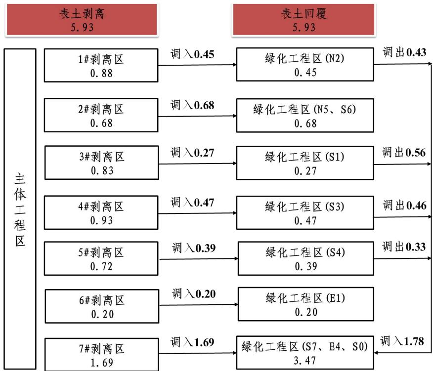
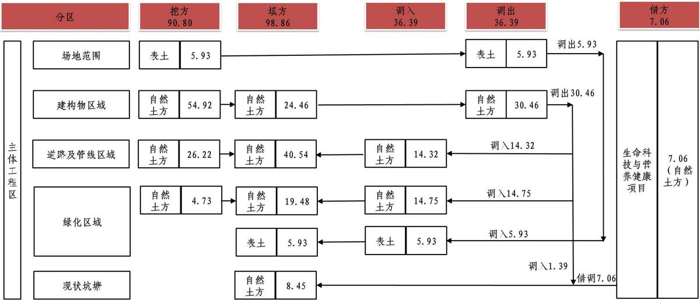
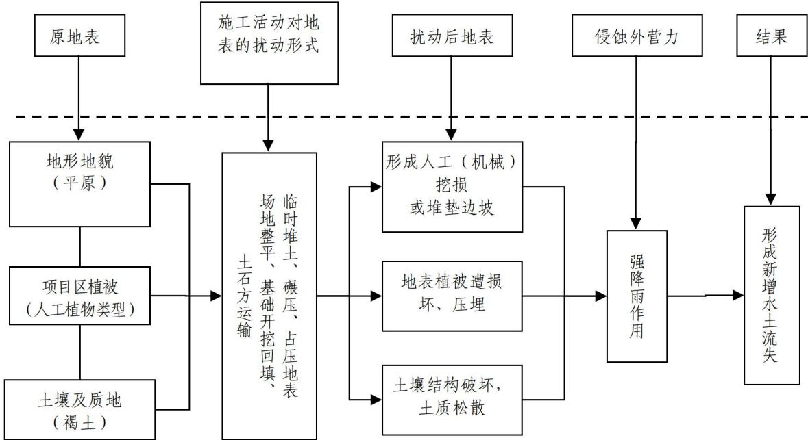
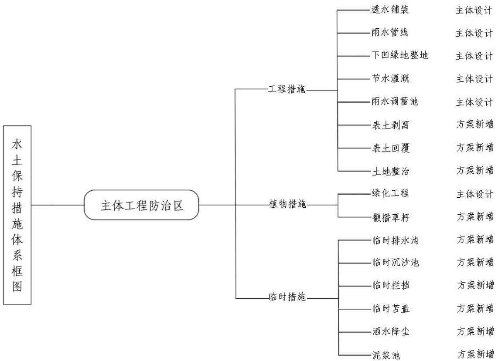

> **Zone C（应用范例层）使用边界**——仅可用于**写作风格、章节展开方式、表达逻辑、表格设计**的参考。
> **不得**用于合规判断；**不得**引入其项目数据（名称／地点／数字／单位名）；
> **不得**因其"曾经通过审批"而推定其做法在当前标准下仍然合规。
> 与 Zone A 冲突时**一律以 Zone A 为准**；Zone A 未明确规定时输出
> 「**Zone A 未明确规定，以下为参考写法，需人工判断**」。
>
> **坐标系警告**：本范例为**老八章结构**（GB 50433—2018 附录B），与 2026 版 10 章模板**同号不同义**
> （老 `1.5`＝防治目标，新 `1.5`＝水土流失预测结果；老 4→新 6 …偏移 +2；新版第 4/5 章老结构无独立章）。
> 因此 **`chapter_mapping: pending`——不得按章节号挂载**，检索一律走 `topic_tags`。
>
> **待加工**：`topic_tags`（主题标签）、`approval_basis_list`（编制依据逐字清单）、
> `structure_summary`（只提取结构：章节展开顺序／段落功能／表格栏目结构／句式模板／论证链步骤）。

1 综合说明..  
1.1 项目简况..  
1.2 编制依据.. . 10  
1.3 设计水平年.. .. 12  
1.4 水土流失防治责任范围... ... 12  
1.5 水土流失防治目标.... .. 12  
1.6 项目水土保持评价结论.. ... 14  
1.7 水土流失预测结果.. .. 18  
1.8 水土保持措施布设成果.. ... 19  
1.9 水土保持监测方案.. . 21  
1.10 水土保持投资及效益分析成果... ...22  
1.11 结论.. ..22  
2 项目概况 .... ..25  
2.1 项目组成及工程布置.. .. 25  
2.2 施工组织. ... 52  
2.3 工程占地.. ... 59  
2.4 土石方平衡... ... 60  
2.5 拆迁（移民）安置与专项设施改（迁）建..... ......80  
2.6 施工进度. ... 80  
2.7 自然概况.. .. 83  
3 项目水土保持评价.... .. 87  
3.1 主体工程选址（线）水土保持评价.... ..... 87  
3.2 建设方案与布局水土保持评价.... ...90  
3.3 主体工程水土保持措施界定与评价..... ..... 103  
4 水土流失分析与预测.... ... 106  
4.1 水土流失现状.. ...106  
4.2 水土流失影响因素分析.... .. 106  
4.3 土壤流失量预测.. ..108  
4.4 水土流失危害分析... .. 119  
4.5 指导性意见. ..119  
5 水土保持措施..... ....121  
5.1 防治区划分.. ... 121  
5.2 措施总体布局.. ... 122  
5.3 分区措施布设.. .. 125  
5.4 施工要求... ..133  
6 水土保持监测... ...138  
6.1 范围和时段.. . 138  
6.2 内容和方法.... .. 138  
6.3 点位布设.. .. 142  
6.4 实施条件及成果.. ..143  
7 水土保持投资估算及效益分析..... . 146  
7.1 投资估算 ..... ... 146  
7.2 效益分析 ...... ... 158  
8 水土保持管理.... ..160  
8.1 组织管理... ... 160  
8.2 后续设计 ...... ... 161  
8.3 水土保持监测...... .... 161  
8.4 水土保持监理... ...162  
8.5 水土保持施工.. ..164  
8.6 水土保持设施验收... ... 165

## 1 综合说明

## 1.1 项目简况

## 1.1.1 项目基本情况

## 1.1.1.1 工程建设必要性

中国农业大学国家农业科技创新港（以下简称“国农港”）位于北京市平谷区大兴庄镇，建设单位为中国农业大学，总用地规模57.84hm2，规划用地为北京市平谷区平谷新城PG00-0101 街区。国农港的建设主要是打造国际农业交流的国家级平台，是北京高质量建设农业中关村的核心支撑，更是建设世界一流大学的关键之举，国农港的建设是符合平谷区空间规划及农业中关村产业发展的需求。

国农港的规划建设，有利于学校深入推进涉农专业产教融合、产研融合，围绕“四个面向”推进农业科技前沿布局快速落地，打造农业基础研究和未来农业科技重大突破创新成果的策源地，成为国家高水平农业科技自立自强的战略高地。国农港将聚焦服务国家种业振兴、粮食安全、生物安全、生态文明、智能制造和乡村振兴等战略需要，致力于在粮食超高产、生物育种、农机装备、智慧农业、未来食品、人畜共患病、农业绿色发展、乡村振兴、全球农业等领域取得一批具有自主原创价值高、重大突破明显的世界级成果；在合成生物学、生物信息学、生物制造、数字农业、绿色低碳农业、细胞农业、医学农业等前沿技术研究领域，实现农业领域前沿性、革命性、颠覆性技术突破，引领世界农业“无人区”领域研究，逐步打造引领型国家重大农业科技设施平台集群，布局前沿新兴交叉学科，培育拔尖创新领军型人才。

中国农业大学国家农业科技创新港一期工程扰动范围41.34hm2，总建筑面积 $3 3 7 5 6 6 { \mathrm m } ^ { 2 }$ ，其中地上建筑面积 $2 6 9 2 1 6 \mathsf { m } ^ { 2 }$ ，地下建筑面积68350m2。包含一站式青年社区北一区、人才培养组团、智能科技与智慧农业创新基地、前沿科技与未来产业创新基地、图书信息综合中心、国际农业与全球发展创新基地、一站式青年社区东区七个地块的建构筑物工程，道路及管线工程、绿化工程等，同步建设国农港市政及基础设施部分。

项目建设是服务农业强国建设的使命担当，是建设世界农业科技创新高地的重大急需，是发展农业新质生产力的率先实践，是加快培育新时代农业高水平人才的迫切需求，是北京高质量建设农业中关村的核心支撑，是推进“平急两用”基础设施建设的重要举措，是学校建设世界一流大学的关键之举。因此，本项目的建设是十分必要的。

## 1.1.1.2 整体项目情况

## （一）国农港前期情况

2023 年9 月，中华人民共和国教育部下发《教育部关于中国农业大学征地建设国家农业科技创新港的批复》（教发函〔2023〕86 号），明确中国农业大学在北京平谷区征地建设国家农业科技创新港，具体位于北京市平谷区大兴庄镇，具体四至情况：东至体育中心西路，南至北环西街，西至兴泽路，北至平谷西大街。

国农港用地属于大兴庄镇集体用地，根据《平谷区平谷新城详细规划街区指引》中两线三区管控，国农港用地属于集中建设区，不涉及生态保护红线、永久基本农田、生态管控区等。根据《北京平谷新城01 街区控制性详细规划管控图则》（阶段成果），用地现状及规划用地不涉及河道保护范围线、无高压管控廊道等。2024 年6 月4 日，北京市平谷区政府授权北京市平谷区大兴庄镇人民政府负责国农港前期工作，确保土地达到平整标准，满足国农港建设施工条件。

## （二）国农港规划情况

国农港总用地面积 $5 7 . 8 4 \mathsf { h m } ^ { 2 }$ ，其中建设用地面积 $4 8 . 3 4 \mathsf { h m } ^ { 2 }$ ，代征城市公共用地 9.50hm2。其中建设用地建设主体为中国农业大学负责实施，代征城市公共用地建设主体为北京市平谷区大兴庄镇人民政府、北京市平谷区城市管理委员会、平谷区移动联通电信、歌华有线平谷分公司，北燃绿谷公司负责实施。建设单位代征不代建。

中国农业大学国农港整体分为三部分建设，包含前期工程，一期工程及二期工程，各阶段进展概况如下：

（1）前期工程：包含一站式青年社区北二区项目、生命科技与营养健康创新基地项目及公共服务组团项目，前期工程现阶段已取得水土保持方案批复，其中一站式青年社区北二区项目已于2025 年2 月开工，生命科技与营养健康创新基地项目及公共服务组团项目计划2025 年12 月底开工。

（2）一期工程：包含一站式青年社区北一区项目、一站式青年社区东区项目、前沿科技与未来产业创新基地项目、智能科技与智慧农业创新基地项目、国际农业与全球发展创新基地项目、人才培养组团项目、图书信息综合中心项目，市政及基础设施项目。计划2026 年1 月开工。

（3）二期工程：包含二期一站式青年社区项目、科技产业融合创新基地、科技产业孵化基地项目，现阶段尚未开展前期工作，计划2027 年11 月开工。

表1-1 国农港各地块信息统计表
<table><tr><td colspan="1" rowspan="1">序号</td><td colspan="1" rowspan="1">项目名称</td><td colspan="1" rowspan="1">水土保持方案类型</td><td colspan="1" rowspan="1">地块编号</td><td colspan="1" rowspan="1">计划水土保持批复时间</td><td colspan="1" rowspan="1">计划开工时间</td><td colspan="1" rowspan="1">备注</td></tr><tr><td colspan="1" rowspan="1">1</td><td colspan="1" rowspan="1">一站式青年社区北二区项目</td><td colspan="1" rowspan="1">报告表</td><td colspan="1" rowspan="1">N4</td><td colspan="1" rowspan="1">2025年1月2(已批复）</td><td colspan="1" rowspan="1">025年2月（已开工）</td><td colspan="1" rowspan="3">前期工程</td></tr><tr><td colspan="1" rowspan="1">2</td><td colspan="1" rowspan="1">生命科技与营养健康创新基地项目</td><td colspan="1" rowspan="1">报告书</td><td colspan="1" rowspan="1">S2</td><td colspan="1" rowspan="1">2025年7月（已批复）</td><td colspan="1" rowspan="1">2025年12月（尚未开工）</td></tr><tr><td colspan="1" rowspan="1">3</td><td colspan="1" rowspan="1">公共服务组团项目</td><td colspan="1" rowspan="1">报告书</td><td colspan="1" rowspan="1">N1、N3、S5、S8、E2</td><td colspan="1" rowspan="1">2025年8月（已批复）</td><td colspan="1" rowspan="1">2025年12月（尚未开工）</td></tr><tr><td colspan="1" rowspan="1">4</td><td colspan="1" rowspan="1">一站式青年社区北一区项目</td><td colspan="1" rowspan="1">报告书</td><td colspan="1" rowspan="1">N2</td><td colspan="1" rowspan="1">2025年12月</td><td colspan="1" rowspan="1">2026年1月</td><td colspan="1" rowspan="8">一期工程</td></tr><tr><td colspan="1" rowspan="1">5</td><td colspan="1" rowspan="1">一站式青年社区东区项目</td><td colspan="1" rowspan="1">报告书</td><td colspan="1" rowspan="1">E1</td><td colspan="1" rowspan="1">2025年12月</td><td colspan="1" rowspan="1">2026年1月</td></tr><tr><td colspan="1" rowspan="1">6</td><td colspan="1" rowspan="1">前沿科技与未来产业创新基地项目</td><td colspan="1" rowspan="1">报告书</td><td colspan="1" rowspan="1">S3</td><td colspan="1" rowspan="1">2025年12月</td><td colspan="1" rowspan="1">2026年1月</td></tr><tr><td colspan="1" rowspan="1">7</td><td colspan="1" rowspan="1">智能科技与智慧农业创新基地项目</td><td colspan="1" rowspan="1">报告书</td><td colspan="1" rowspan="1">S1</td><td colspan="1" rowspan="1">2025年12月</td><td colspan="1" rowspan="1">2026年1月</td></tr><tr><td colspan="1" rowspan="1">8</td><td colspan="1" rowspan="1">国际农业与全球发展创新基地项目</td><td colspan="1" rowspan="1">报告书</td><td colspan="1" rowspan="1">S7、E4</td><td colspan="1" rowspan="1">2025年12月</td><td colspan="1" rowspan="1">2026年7月</td></tr><tr><td colspan="1" rowspan="1">9</td><td colspan="1" rowspan="1">人才培养组团项目</td><td colspan="1" rowspan="1">报告书</td><td colspan="1" rowspan="1">N5、S6、E3</td><td colspan="1" rowspan="1">2025年12月</td><td colspan="1" rowspan="1">2026年7月</td></tr><tr><td colspan="1" rowspan="1">10</td><td colspan="1" rowspan="1">图书信息综合中心项目</td><td colspan="1" rowspan="1">报告书</td><td colspan="1" rowspan="1">S4</td><td colspan="1" rowspan="1">2025年12月</td><td colspan="1" rowspan="1">2026年10月</td></tr><tr><td colspan="1" rowspan="1">11</td><td colspan="1" rowspan="1">市政及基础设施项目</td><td colspan="1" rowspan="1">报告书</td><td colspan="1" rowspan="1">NO、SO、EO</td><td colspan="1" rowspan="1">2025年12月</td><td colspan="1" rowspan="1">2027年7月</td></tr><tr><td colspan="1" rowspan="1">12</td><td colspan="1" rowspan="1">二期一站式青年社区项目</td><td colspan="1" rowspan="1">报告表</td><td colspan="1" rowspan="1">N7</td><td colspan="1" rowspan="1">2027年10月</td><td colspan="1" rowspan="1">2027年11月</td><td colspan="1" rowspan="2">二期工程</td></tr><tr><td colspan="1" rowspan="1">13</td><td colspan="1" rowspan="1">科技产业融合创新基地</td><td colspan="1" rowspan="1">报告书</td><td colspan="1" rowspan="1">N6</td><td colspan="1" rowspan="1">2027年10月</td><td colspan="1" rowspan="1">2027年11月</td></tr><tr><td colspan="1" rowspan="1">14</td><td colspan="1" rowspan="1">科技产业孵化基地项目</td><td colspan="1" rowspan="1">报告书</td><td colspan="1" rowspan="1">E5</td><td colspan="1" rowspan="1">2027年10月</td><td colspan="1" rowspan="1">2027年11月</td><td colspan="1" rowspan="1"></td></tr></table>

## 1.1.1.3 项目情况

## 一、地理位置

本项目位于北京市平谷区大兴庄镇，具体四至为东至体育中心西路，南至北环西街，西至兴泽路，北至平谷西大街。

## 二、项目概况

项目名称：中国农业大学国家农业科技创新港项目一期工程

建设性质：新建项目

建设规模：本项目扰动范围41.34hm2，总建筑面积337566m2，其中地上建筑面积269216m2，地下建筑面积68350m2。包含一站式青年社区北一区、人才培养组团、智能科技与智慧农业创新基地、前沿科技与未来产业创新基地、图书信息综合中心、国际农业与全球发展创新基地、一站式青年社区东区七个地块的建构筑物工程，道路及管线工程、绿化工程等，同步建设国农港市政及基础设施部分。

依据工程规模划分标准，属于中型工程，工程等级为一级。

拆迁（移民）及专项设施改（迁）建方式：不涉及拆迁（移民）及专项设施迁建。

工期：项目计划于 2026 年1 月开工，2028 年5月完工，总工期29 个月。

投资：本项目总投资379425 万元，其中土建投资322512 万元，所需建设资金由中央预算内投资和自筹解决。

工程占地：主体工程占地范围为 41.34hm2，全部为永久占地，其中建构筑物工程区 7.18hm2、道路及管线工程区 16.61hm2、绿化工程区 13.40hm2、施工生产生活区2.65hm2（位于道路、绿化区域，不计入本区用地面积）、临时堆土场 10.05hm2（位于道路、绿化区域，不计入本区用地面积），预留用地 4.15hm2。占地类型为教育用地。

土石方量：项目土石方挖填总量190.66 万m3，其中挖方总量91.80 万m3（自然土方 85.87 万 m3、表土 5.93 万 m3），填方总量 98.86 万 m3（自然土方 92.93 万 $\mathsf { m } ^ { 3 }$ 、表土5.93 万m3），无余方，借方7.06 万 $\mathsf { m } ^ { 3 }$ （自然土方）全部由中国农业大学国家农业科技创新港生命科技与营养健康创新基地项目（简称“生命科技与营养健康创新基地项目”）借调，借方建设主体为中国农业大学，该项目于2024 年 7 月取得了《教育部关于中国农业大学国家农业科技创新港生命科技与营养健康创新基地项目可行性研究报告的批复》（教发函〔2024232 号），2025 年7 月取得了《中国农业大学国家农业科技创新港生命科技与营养健康创新基地项目水土保持方案审批准予行政许可决定书》（水许可决〔2025〕75 号）。该项目总扰动面积 $3 . 1 8 \mathsf { h m } ^ { 2 }$ ，计划于2025 年12 月开工，2027 年6 月底完工。其挖填总量为13.73 万 $\mathsf { m } ^ { 3 }$ ，挖方为 10.69 万 $\mathsf { m } ^ { 3 }$ （表土0.68 万 $\mathsf { m } ^ { 3 }$ 、自然土方10.01 万 $\mathsf { m } ^ { 3 } \mathrm { ~ , ~ }$ ），填方为3.04 万 $\mathsf { m } ^ { 3 }$ （表土 0.48 万 $\mathsf { m } ^ { 3 }$ 自然土方 2.56 万 $\mathsf { m } ^ { 3 }$ ），余方7.65 万 $\mathsf { m } ^ { 3 }$ （表土 0.20 万 $\mathsf { m } ^ { 3 }$ 、自然土方7.45万 $\mathsf { m } ^ { 3 }$ ），其中余方0.20 万 $\mathsf { m } ^ { 3 }$ （表土）运往中国农业大学国家农业科技创新港公共服务组团项目绿化覆土、余方 $0 . 3 9 \mathrm { ~ \mathscr ~ { ~ H ~ } ~ m ~ } ^ { 3 }$ （自然土方）运往中国农业大学国家农业科技创新港一站式青年社区北二区项目、余方6.86 万 $\mathsf { m } ^ { 3 }$ （自然土方）运往中国农业大学国家农业科技创新港一站式青年社区东区项目，余方0.20 万$\mathsf { m } ^ { 3 }$ （自然土方）运往中国农业大学国家农业科技创新港人才培养组团项目进行综合利用。

表土资源：对本项目区内土质较好区域进行表土剥离，可剥离范围16.44hm2，表土剥离量 5.93 万 $\mathsf { m } ^ { 3 }$ ，剥离的表土全部运往1#临时堆土场进行集中堆放，并采用临时拦挡及临时苫盖措施，临时排水及沉沙池措施，并对其进行撒播草籽，保护表土资源。

施工布置：国农港外部有平谷西大街、体育中心西路、鲁各庄北一街、兴泽东路等多条现状城市道路，方便施工期车辆通行，施工用水可就近从附近市政供水管网接引；施工用电由附近已有电网引入作为施工临时用电；工程区附近电讯信号稳定，可接入附近互联网。

场地内施工布置主要包含施工生产生活区及临时堆土场，用地面积$1 2 . 7 0 \mathsf { h m } ^ { 2 }$ ，占地性质为永久占地，占地类型为教育用地。

施工生产生活区用地面积 $2 . 6 5 \mathsf { h m } ^ { 2 }$ 。施工生产生活区共4处，主要用于布置施工材料堆放、加工场地、现场临时居住场地及办公场地，其中1#生产生活区位于一站式青年社区北一区南侧、2#施工生产生活位于人才培养组团（体艺中心北区）北侧、3#施工生产生活区位于市政及基础设施南区南侧，4#施工生产生活区位于市政及基础设施东区西侧，各地块统筹统一布置，节约利用，从而减少扰动范围。

临时堆土场用地面积10.05hm2，共布设4处，单处临时堆土场面积$1 . 6 0 \mathsf { h } \mathsf { m } ^ { 2 } \mathsf { - } 4 . 2 0 \mathsf { h } \mathsf { m } ^ { 2 }$ ，堆高 2.5-3.0m 之间，坡比 1:1.48，堆存量$4 4 1 4 7 \mathsf { m } ^ { 3 } \cdot 1 1 8 0 3 6 \mathsf { m } ^ { 3 }$ ，堆存期2026 年1 月-2027 年10 月，堆存周期为3个月-22 个月，主要分布在预留用地、人才培养组团（艺体中心）东侧、国农港市政基础设施绿地范围内及图书信息综合中心范围，其中1#临时堆土场面积2.56hm2，堆高 2.5m，坡比 1:1.48，堆土量 60088m3，堆存期 2026 年 1月-2027 年10 月，堆存周期22 个月；2#临时堆土场面积1.60hm2，堆高3.0m，坡比 1:1.48，堆土量 $4 4 1 4 7 \mathrm { m } ^ { 3 }$ ，堆存期 2025 年 3 月-2026 年 9 月，堆存周期 6个月；3#临时堆土场面积 $1 . 6 9 \mathsf { h m } ^ { 2 }$ ，堆高 3.0m，坡比 1:1.48，堆土量 46685m3，堆存期 2026 年 7 月-2026 年 9 月，堆存周期 3 个月；4#临时堆土场面积 4.20hm2，堆高 3.0m，坡比 1:1.48，堆土量 118036m3，堆存期 2026年3 月-2026年12 月，堆存周期9个月。

## 1.1.2 前期工作进展

2023 年9 月，中华人民共和国教育部下发《教育部关于中国农业大学征地建设国家农业科技创新港的批复》（附件2），取得国农港立项批复文件。

2024 年3 月，取得《北京市规划和自然资源委员会平谷分局关于中国农业大学国家农业科技创新港项目“多规合一”协同平台初审意见的函》（京规自（平）初审函〔2024〕0018 号），明确了本项目位置、用地性质、建筑规模等。

2024 年5 月，北京市规划和自然资源委员会平谷分局出具建设工程规划用地测量成果报告书，明确国农港建设范围。

根据《中华人民共和国水土保持法》等有关法律法规的要求，建设单位于2024年7月委托北京市首都规划设计工程咨询开发有限公司承担了本项目的水土保持方案编制工作。接受委托后，编制单位成立项目组进行实地踏勘，收集了项目区自然概况、社会经济情况、水土流失和水土保持情况、主体设计等方面的资料，并就技术问题、工程建设进展情况等与项目建设单位、主体设计单位、当地水行政主管部门及有关专家进行了咨询。在此基础上，结合设计文件等资料，按照《生产建设项目水土保持方案管理办法》（水利部令第53 号）、《生产建设项目水土保持技术标准》（GB 50433-2018）的规定和《生产建设项目水土流失防治标准》（GB/T50434-2018）的规定编制完成本项目水土保持方案报告书。

## 1.1.3 自然简况

本项目位于平谷区，位于洳河冲积扇，地势相对平坦，在地貌单元上属于洳河冲洪积平原。平谷区属暖温带大陆性季风气候，四季分明。多年平均气温为$1 1 . 7 ^ { \circ } \mathrm { C }$ ，平谷区多年平均降水量为525.9mm，多年平均蒸发量为1762.3mm，年平均日照时数为2519.0h，多年平均风速2.1m/s。土壤类型以褐土为主。平谷区处于暖温带落叶阔叶林带，属华北植物区系，本项目区植被主要为人工植被。

根据北京市土壤侵蚀强度分布图，本项目土壤侵蚀类型区为北方土石山区，土壤侵蚀强度为微度水力侵蚀为主，容许土壤流失量为 $2 0 0 \mathsf { t } / \left( \mathsf { k m } ^ { 2 } \bullet \mathsf { a } \right)$

本项目地势相对平坦，不属于崩塌、滑坡危险区和泥石流易发区、低洼易涝区等。

本项目所在区域不涉及饮用水水源保护区、水功能一级区的保护区和保留区、自然保护区、世界文化和自然遗产地、风景名胜区、地质公园、森林公园、重要湿地、生态保护红线、河湖管理范围等敏感区。

## 1.2 编制依据

## 1.2.1 法律法规

（1）《中华人民共和国水土保持法》（全国人大常委会，1991 年6 月29日通过，2010 年12 月25 日修订，2011 年3 月1日施行）；

（2）《北京市水土保持条例》（2025 年5月31 日进行修订）。

## 1.2.2 规范性文件

（1）《生产建设项目水土保持方案管理办法》（水利部令第53 号）；

（2）《水利部关于进一步深化“放管服”改革全面加强水土保持监管的意见》（水保〔2019〕160 号）；

（3）《水利部办公厅关于进一步加强生产建设项目水土保持监测工作的通知》（办水保〔2020〕161 号）；

（4）《水利部办公厅关于做好生产建设项目水土保持承诺制管理的通知》（办水保〔2020〕160 号）；

（5）《水利部办公厅关于做好国家级水土流失重点预防区和重点治理区落地上图成果应用的通知》（水利部，办水保[2025]170 号）；

（6）《全国水土保持规划（2015-2030 年）》（国函〔2015〕160 号）；

（7）《水利部办公厅关于印发生产建设项目水土保持方案审查要点的通知》（办水保〔2023〕177 号）；

（8）《北京市水土保持规划》（2017 年5月）；

（9）《北京市发展和改革委员会北京市财政局北京市水务局关于降低本市水土保持补偿费收费标准的通知》（京发改〔2021〕1271 号）；

（10）《北京市生产建设项目水土保持方案管理规定（试行）》（京水务保〔2023〕17 号）；

（11）水利部关于发布《水利工程设计概（估）算编制规定》及水利工程系列定额的通知》（水总〔2024〕323 号）。

## 1.2.3 技术标准

（1）《生产建设项目水土保持技术标准》（GB50433-2018）；

（2）《生产建设项目水土流失防治标准》（GB/T50434-2018）；

（3）《生产建设项目水土保持监测与评价标准》（GB/T 51240-2018）；

（4）《土地利用现状分类》（GB/T21010-2017）；

（5）《水土保持工程设计规范》（GB51018-2014）；

（6）《生产建设项目土壤流失量测算导则》（SL773-2018）；

（7）《水利水电工程制图标准水土保持图》（SL73.6-2015）；

（8）《土壤侵蚀分类分级标准》（SL190-2007）；

（9）《水土保持监理规范》（SL/T 523-2024）；

（10）《水土保持工程质量验收与评价规范》（SL/T336-2025）。

## 1.2.4 技术资料

（1）《中国农业大学国家农业科技创新港项目可行性研究报告》（中咨工程管理咨询有限公司 2024 年5 月）（含可研阶段设计图纸）；

（2）建设单位提供的其它设计基础性资料；

（3）现场调查资料。

## 1.3 设计水平年

根据《生产建设项目水土保持技术标准》（GB50433-2018），本项目属于建设类项目，根据主体工程施工进度安排，施工建设期为2026年1月至2028年 5月完工，主体工程上半年完工的设计水平年一般为完工当年，即本项目水土保持方案设计水平年为2028 年。

## 1.4 水土流失防治责任范围

根据《生产建设项目水土保持技术标准》（GB50433-2018）相关要求，生产建设项目水土流失防治责任范围包括项目永久征地、临时占地。本项目水土流失防治责任范围为41.34hm2。

## 1.5 水土流失防治目标

## 1.5.1 执行标准等级

本项目位于北京市平谷区大兴庄镇，属于平谷新城范围，根据《水利部办公厅关于做好国家级水土流失重点预防区和重点治理区落地上图成果应用的通知》（办水保[2025]170 号），对本项目所在位置在全国水土保持信息管理系统中查询，本项目位置不属于国家级水土流失重点预防区和重点治理区；根据《北京市水土保持保持规划》（2017 年5 月），项目所在区域属于北京市水土流失重点预防区，结合《生产建设项目水土流失防治标准》(GB/T50434-2018)，本项目执行水土流失防治标准等级为北方土石方区一级标准，并适当提高防治目标。

## 1.5.2 防治目标

依据《生产建设项目水土流失防治标准》(GB/T50434-2018)，本项目执行水土流失防治标准等级为北方土石方区一级标准。

结合项目建设特点以及项目区多年平均降雨量，现状土壤侵蚀强度、地形地貌和位置等，对防治目标值修正如下：

（1）根据《生产建设项目水土流失防治标准》（GB/T50434-2018）的规定，本项目所在区域属于北京市水土流失重点预防区，执行一级标准。

（2）现状侵蚀程度影响：项目区现状土壤侵蚀程度以微度侵蚀为主，土壤流失控制比相应提高至 1.00 或以上，本报告确定提高至1.10。

（3）项目区位置影响：项目区位于城市区，渣土防护率提高2%，林草覆盖率根据《北京市规划和自然资源委员会平谷分局关于中国农业大学国家农业科技创新港项目“多规合一”协同平台初审意见的函》（京规自（平）初审函〔20240018 号）的要求，林草覆盖率应与其规划要求的绿地率30%保持一致，因此本项目林草覆盖率提高至30%。至设计水平年生产建设项目水土流失防治目标见下表。

（4）项目表土保护率不作调整。

表 1-2 生产建设项目水土流失防治目标
<table><tr><td rowspan=2 colspan=1>防治指标</td><td rowspan=1 colspan=2>一级标准</td><td rowspan=1 colspan=1>按土壤按</td><td rowspan=2 colspan=1>两区、地域修正</td><td rowspan=2 colspan=1>按多规合修一初审意见函</td><td rowspan=1 colspan=2>正后防治目标目标</td></tr><tr><td rowspan=1 colspan=1>施工期设</td><td rowspan=1 colspan=1>计水平年</td><td rowspan=1 colspan=1>侵蚀强度修正</td><td rowspan=1 colspan=1>施工期设</td><td rowspan=1 colspan=1>计水平年</td></tr><tr><td rowspan=1 colspan=1>水土流失治理度（%）</td><td rowspan=1 colspan=1>一</td><td rowspan=1 colspan=1>95</td><td rowspan=1 colspan=1></td><td rowspan=1 colspan=1></td><td rowspan=1 colspan=1></td><td rowspan=1 colspan=1>1</td><td rowspan=1 colspan=1>95</td></tr><tr><td rowspan=1 colspan=1>土壤流失控制比</td><td rowspan=1 colspan=1>-</td><td rowspan=1 colspan=1>0.90</td><td rowspan=1 colspan=1>+0.20</td><td rowspan=1 colspan=1></td><td rowspan=1 colspan=1></td><td rowspan=1 colspan=1>-</td><td rowspan=1 colspan=1>1.10</td></tr><tr><td rowspan=1 colspan=1>渣土防护率（%）</td><td rowspan=1 colspan=1>95</td><td rowspan=1 colspan=1>97</td><td rowspan=1 colspan=1></td><td rowspan=1 colspan=1>+2.0</td><td rowspan=1 colspan=1></td><td rowspan=1 colspan=1>95</td><td rowspan=1 colspan=1>99</td></tr><tr><td rowspan=1 colspan=1>表土保护率（%）</td><td rowspan=1 colspan=1>95</td><td rowspan=1 colspan=1>95</td><td rowspan=1 colspan=1></td><td rowspan=1 colspan=1></td><td rowspan=1 colspan=1></td><td rowspan=1 colspan=1>95</td><td rowspan=1 colspan=1>95</td></tr><tr><td rowspan=1 colspan=1>林草植被恢复率（%）</td><td rowspan=1 colspan=1>-</td><td rowspan=1 colspan=1>97</td><td rowspan=1 colspan=1></td><td rowspan=1 colspan=1></td><td rowspan=1 colspan=1></td><td rowspan=1 colspan=1>-</td><td rowspan=1 colspan=1>97</td></tr><tr><td rowspan=1 colspan=1>林草覆盖率（%）</td><td rowspan=1 colspan=1>-</td><td rowspan=1 colspan=1>25</td><td rowspan=1 colspan=1></td><td rowspan=1 colspan=1></td><td rowspan=1 colspan=1>+5.0</td><td rowspan=1 colspan=1>-</td><td rowspan=1 colspan=1>30</td></tr></table>

## 1.6 项目水土保持评价结论

## 1.6.1 主体工程选址（线）评价

根据《中华人民共和国水土保持法》、《生产建设项目水土保持技术标准》（GB50433-2018）和规范性文件的相关规定，逐条进行分析可知：

（1）工程建设未在崩塌、滑坡危险区和泥石流易发区从事取土、挖砂、采石等可能造成水土流失的活动；未在水土流失严重、生态脆弱的地区，应当限制或者禁止可能造成水土流失的生产建设活动，严格保护植物、沙壳、结皮、地衣等；未在二十五度以上陡坡地开垦种植农作物；未在毁林、毁草开垦和采集发菜；未在在水土流失重点预防区和重点治理区铲草皮、挖树兜或者滥挖虫草、甘草、麻黄等。

（2）工程选址未在崩塌和滑坡危险区、泥石流易发区内设置取土（石、砂）场；未在对公共设施、基础设施、工业企业、居民点等有重大影晌的区域设置弃土（石、渣、灰、砰石、尾矿）场。

（3）本项目位于北京市平谷区大兴庄镇，属于平谷新城范围，项目所在区域属于北京市水土流失重点预防区，根据《生产建设项目水土流失防治标准》(GB/T50434-2018)，本项目执行水土流失防治标准等级为北方土石方区一级标准，将土壤流失控制比提高0.20，渣土防护率提高2%，林草覆盖率提高5%。

（4）本项目周边主要河道为洳河，国农港东边界距离洳河直线距离300m，洳河管理范围上口线外 40m，保护范围为上口线外100m，本项目位于河道保护范围以外，未占用河道管理范围及河道保护范围。故本项目建设范围内不涉及河流两岸、湖泊和水库周边的植物保护带。

（5）施工期经历雨季，考虑到施工期雨水排除，在项目区内布设临时排水沟，末端接入沉沙池，排入周边低洼地区下渗及周边现有市政雨水管网，工程施工期采取沉沙措施，并且周边不涉及河渠，不会发生河渠淤积现象；本项目不涉及取土（石、砂）场。

（6）结合《生产建设项目水土保持技术标准》（GB50433-2018）的要求，应保存和利用耕作层土壤；结合岩土工程勘察报告及现场查勘，本项目区内可剥离范围 16.44hm2，剥离厚度 0.30-0.40m，剥离量 5.93 万 m3。对其进行撒播草籽及临时苫盖措施，同时在堆体坡面处设置临时排水沟，防止雨水对堆体下方的土壤造成水力侵蚀。项目剥离的表土全部用于本项目绿化覆土，表土回覆量为 5.93 万m3，表土回覆厚度0.40-0.60m，表土来源全部为本项目剥离表土，表土资源利用合理。

（7）本项目区现状场地内地势北部略高于南部，其中国农港北区现状标高为 25.15-27.63m 之间，南区现状标高为 23.10-27.80m 之间，东区现状标高为 21.00-26.62m 之间。国农港内主要道路交叉口控制标高在 25.25-28.90m之间，道路坡度在 0.19%\~1.07%之间，主体设计场地高程 25.70m-28.80m之间，同时场地经过主体设计优化后，本次优化各地块绿地设计微地形的形式，微地形设计高程为 25.80m-29.20m 之间，高于室外场地标高 0.3m-0.8m 之间，通过竖向设计优化，从而将开挖土方优先用于项目区回填，减少项目区余方外运的产生。

总体分析认为，本项目从水土保持角度考虑，工程选址是可行的。

## 1.6.2 建设方案与布局评价

根据《生产建设项目水土保持技术标准》（GB 50433-2018）相关规定从水土保持角度对建设方案、工程占地、土石方平衡、取土（石、砂）场设置、弃土场设置、施工方法与工艺、具有水土保持功能的工程进行评价。

## （1）建设方案评价

## 1）平面分析：

本项目从规划的角度分析，项目整体区域定位主要是完善区域科研资源配备，符合国家及地方规划政策的相关要求。主体设计通过优化施工工艺，利用支护的方式减少基坑占地面积和土方挖填量。雨洪利用通过绿地和透水铺装增加雨水入渗，且主体设计的下凹绿地可有效调蓄部分雨水，使本项目排水设施方案更具有系统性和成效性。

## 2）竖向分析：

主体设计以市政道路作为高程控制点，自西北向东南依次降低，保障国农港道路与其市政道路有序衔接，道路坡度在0.19%\~1.07%之间。主要道路交叉口高程为 25.25-28.90m 之间，高于市政道路0.1-0.6m 之间，有效与周边市政道路顺接。主体设计标高高于现状标高约1.0-1.6m 之间，同时设计场地标高高于周边规划国农港主道路0.1-0.2m 之间，各地块室内外设计高差为0.15m，地块内布设下凹式绿地和微地形景观，下凹绿地低于周边硬化面10cm，各地块非下凹绿地采用微地形的形式，高于周边硬化面0.3-0.8m。主体设计标高与国农港规划路进行顺坡顺接，与周边规划道路及用地不存在高坡高地区域，有效降低水土流失，主体竖向设计合理，方案予以认可。

## （2）工程占地评价

本项目用地面积41.34hm2，占地性质为永久占地，占地类型为教育用地。从占地性质来看，本项目扰动范围全部位于国农港范围内，同时施工期间施工生产生活区及临时堆土场统筹考虑，结合地块间施工时序进行就近布设，从而降低施工期间临时占地的产生，占地性质符合节约用地及减少扰动的要求；从占地类型来看，根据《北京市规划和自然资源委员会平谷分局关于中国农业大学国家农业科技创新港项目“多规合一”协同平台初审意见的函》（京规自（平）初审函〔2024〕0018 号），明确本项目规划建设用地的用地性质为高等教育用地，占地类型符合区域区域规划的要求。

## （3）土石方平衡评价

项目土石方挖填总量190.66万 $\mathsf { m } ^ { 3 }$ ，其中挖方总量 $9 1 . 8 0 \mathrm { ~ } \mathcal { F } \mathrm { ~ m } ^ { 3 }$ （自然土方 85.87 万 $\mathsf { m } ^ { 3 }$ 、表土 $5 . 9 3 \ \mathcal { F } \ \mathsf { m } ^ { 3 } )$ ，填方总量98.86 万 $\mathsf { m } ^ { 3 }$ （自然土方 92.93万 $\mathsf { m } ^ { 3 } .$ 、表土 5.93 万 $\mathsf { m } ^ { 3 } .$ ），借方7.06 万 $\mathsf { m } ^ { 3 }$ （自然土方）全部由中国农业大学国家农业科技创新港生命科技与营养健康创新基地项目（简称“生命科技与营养健康创新基地项目”）借调，借方建设主体为中国农业大学，该项目于2024年 7月取得了《教育部关于中国农业大学国家农业科技创新港生命科技与营养健康创新基地项目可行性研究报告的批复》（教发函〔2024〕232 号），2025年 7月取得了《中国农业大学国家农业科技创新港生命科技与营养健康创新基地项目水土保持方案审批准予行政许可决定书》（水许可决〔2025〕75 号）。该项目总扰动面积 $3 . 1 8 \mathsf { h m } ^ { 2 }$ ，计划于2025 年12 月开工，2027 年6 月底完工。其挖填总量为13.73 万 $\mathsf { m } ^ { 3 }$ ，挖方为 10.69 万 $\mathsf { m } ^ { 3 }$ （表土 0.68 万 $\mathsf { m } ^ { 3 }$ 、自然土方 10.01 万 $\mathsf { m } ^ { 3 } \mathrm { ~ , ~ }$ ），填方为3.04 万 $\mathsf { m } ^ { 3 }$ （表土 0.48 万 $\mathsf { m } ^ { 3 }$ 、自然土方2.56万 $\mathsf { m } ^ { 3 } )$ ），余方7.65 万 $\mathsf { m } ^ { 3 }$ （表土 0.20 万 $\mathsf { m } ^ { 3 }$ 、自然土方7.45 万 $\mathsf { m } ^ { 3 }$ ），其中余方 0.20 万 $\mathsf { m } ^ { 3 }$ （表土）运往中国农业大学国家农业科技创新港公共服务组团项目绿化覆土、余方0.39 万 $\mathsf { m } ^ { 3 }$ （自然土方）运往中国农业大学国家农业科技创新港一站式青年社区北二区项目、余方6.86 万 $\mathsf { m } ^ { 3 }$ （自然土方）运往中国农业大学国家农业科技创新港一站式青年社区东区项目，余方 $0 . 2 0 \mathrm { ~ } \mathcal { F } \mathrm { ~ m } ^ { 3 }$ （自然土方）运往中国农业大学国家农业科技创新港人才培养组团项目进行综合利用。

本项目施工工艺上将基坑开挖形式调整为直立式开挖，并对基坑进行支护，从而降低建筑基础施工坡面范围，将施工期土方挖填总量从 $6 5 . 9 0 \mathrm { ~ \mathscr ~ { ~ H ~ } ~ m ~ } ^ { 3 }$ 减少至 54.92 万m3，挖方量减少了 $1 0 . 9 8 \mathrm { ~ \mathscr { H } ~ m ^ { 3 } }$ ，从而达到开挖土方量的减量化控制。同时通过竖向设计调整，结合地块内绿地采用微地形的形式，其设计标高调整为高于周边硬化面0.3-0.8m 之间，将回填量由 $6 . 9 0 \mathrm { ~ \mathscr { F } ~ m ^ { 3 } }$ 增加了 13.71 万$\mathsf { m } ^ { 3 }$ ，施工期开挖自然土方全部用于项目区回填，实现内部土石方平衡，减少余方的产生，从而达到余方减量化控制。同时，市政基础设施绿地中设计标高与道路硬化面设计高程一致，绿地区域未对其进行场地垫高，为后续二期工程用地预留综合利用土方空间，保障项目区内土石方不外运，达到国农港内部土石方平衡，符合水土保持相关要求。

借方 7.06 万 $\mathsf { m } ^ { 3 }$ （自然土方）全部由生命科技与营养健康创新基地项目借调，从而达到国农港范围内土方资源不外运，合理进行综合利用，符合水土保持相关要求。

综上，主体工程的土石方挖填时序合理，工程土石方平衡合理。

## （4）表土资源评价

根据《北京市规划和自然资源委员会平谷分局多规合一协同平台会商意见（2025 规自（平）综审字0007 号）》，明确建设用地范围内用地性质为高等教育用地，根据岩土工程勘察报告，表层为一般厚度为0.70m-2.50m 的人工堆积之黏质粉土素填土、粉质黏土素填土①层，主要含砖渣、灰渣、砖块、水泥块等，结合平谷区第三次国土调查现状资料情况，明确本项目一级开发之前为果园，场地内局部区域有砖渣、灰渣、砖块、水泥块区域，剖面土质较差，不具备表土剥离条件。场地内草地区域，土质较好，对其进行表土剥离，经复核，本项目区内可剥离范围 16.44hm2。剥离厚度 30-40cm，剥离量 5.93 万 m3，剥离的表土全部运往1#临时堆土区进行集中堆放，临时堆土场面积 $2 . 5 6 \mathsf { h m } ^ { 2 }$

堆放高度 2.5m，坡比 1:1.48，堆土量60088m3，结合施工进度，明确其堆放时间超过 1年，需对其表土资源进行撒播草籽、临时苫盖、临时排水及沉沙措施，有效保护表土资源，施工结束后将其表土全部运往本项目绿化区域绿化覆土，本项目绿化覆土5.93 万m3，表土资源有效保护及利用合理，符合水土保持相关要求。

## （5）取、弃土场设置评价

本项目不涉及取土（石、料）场地，未在崩塌和滑坡危险区、泥石流易发区内设置取土（石、砂）场。

本项目未在对公共设施、基础设施、工业企业、居民点等有重大影响的区域设置弃土（石、渣）场。

## （6）施工方法与工艺评价

本项目采用机械作业，及时回填，大大减少了地表裸露的时间和扰动时间。本项目各地块分布较为分散，施工临建设施尽量就近布设，均布置在国农港范围内。同时场地内施工采取排水、沉沙措施，减少基坑开挖及临时堆土场的水土流失。在基础开挖与支护工艺、土方回填工艺、管线施工工艺、道路施工工艺、绿化施工工艺等方面均符合要求，因此本项目主体工程设计科学合理，工期安排紧凑，可降低因人为扰动诱发的水土流失危害，符合水土保持的要求。

本项目主体设计的透水铺装、绿化工程等具有水土保持功能，报告将其界定为水土保持措施，并补充新增裸露地表密目网苫盖、管线开挖临时堆土密目网苫盖、临时排水沟及沉沙池、土地整治等措施，通过完善雨水径流、景观和土石方综合利用，使之形成一个综合、高效的水土流失防治措施体系。

## 1.7 水土流失预测结果

本项目扰动地表面积为41.34hm2，项目原地貌水土流失量约为237.91t，项目建设对地表土壤扰动后造成的水土流失总量2489.80t，其中施工期可能造成的水土流失总量2253.82t，自然恢复期可能造成的水土流失总量235.98t。新增水土流失量为2255.99t。根据水土流失预测结果，项目施工期是主要水土流失重点时段，水土流失重点防治区位主体工程防治区，水土流失量最大区域为临时堆土场。

## 1.8 水土保持措施布设成果

本项目地形地貌均为平原，按照项目组成划分为主体工程防治区1个分区，主体工程防治区建设内容主要包含建筑物工程、道路管线工程、绿化工程、预留用地。

## （一）工程措施

（1）表土剥离：对占用了表土资源丰富区域进行表土剥离，剥离厚度为30-40cm。剥离范围 16.44hm2，表土剥离 5.93 万 m3。表土剥离措施位置为建构筑物工程区、道路及管线工程区、绿化工程区。实施时间为2026 年1 月。

（2）透水铺装：项目区内人行道及室外广场采用透水砖铺装，透水砖规格为 20cm×10cm×6cm，铺装面积为 4.89hm2。透水铺装措施位置为道路及管线工程区。实施时间为2027 年4 月。

（3）雨水管网：项目区雨水管线有效排水雨水，保障项目排水安全，主体设计雨水管线13102m，雨水管线措施位置为道路及管线工程区。实施时间为2027 年 4 月。

（4）下凹绿地整地：主体设计绿化工程区部分绿地采用下凹绿地的形式，下凹绿地整地面积5.31hm2，下凹绿地整地措施位置为绿化工程区。实施时间2027 年 7 月。

（5）节水灌溉：主体合计绿化区域采用节水灌溉，节水灌溉面积12.67hm2，节水灌溉措施位置为绿化工程区。实施时间为2027 年9 月。

（6）表土回覆：考虑到绿化覆土的需求，对绿化区域进行表土回覆，表土回覆量为 5.93 万m3，表土回覆措施位置为绿化工程区。实施时段为2027 年9月。

（7）土地整治：由于施工期对其绿化区域进行扰动，施工结束后需对其绿化区域进行土地整治，土地整治面积16.82hm2，土地整治措施位置为绿化工程区及预留用地。实施时间为2027 年9 月。

（8）雨水调蓄池：主体设计绿地范围内布设雨水调蓄池，蓄水调蓄池蓄水容积7686m3，有效收集项目雨水，用于后续绿地浇洒用水，雨水调蓄池措施位置为绿化工程区。实施时间为2028年1 月。

## （二）临时措施

（1）临时排水沟：排水明沟采用矩形断面，水泥砂浆抹面，深度为0.3m，底宽为 0.3m，排水沟长约10279m，临时排水沟措施位置为建构筑物工程区、施工生产生活区及临时堆土场。实施时间为2026 年1 月。

（2）临时沉沙池：在临时排水沟排入周边低洼区域前设置沉沙池，采用矩形断面，池长3.0m，池宽1.5m，池深1.5m，设置沉沙池14 座，临时沉沙池措施位置为施工生产生活区及临时堆土场。实施时间为2026 年1 月。

（3）临时苫盖：临时苫盖采用密目网苫盖，临时苫盖量875923m2，临时沉沙池措施位置为临时堆土场、管线施工临时堆土、裸露地表区域。实施时间为实施时间为2027 年1 月。

（4）临时拦挡：工程建设涉及临时堆土场4 处，用地10.05hm2，堆土高度 2.5-3.0m，堆土场周边设置草袋进行拦挡，草袋规格为80cm×55cm，草袋围埂高 60cm，底宽 80cm。草袋长度 4574m，草袋土方 2195.52m3，临时拦挡措施位置为临时堆土场区域。实施时间为2026 年1 月。

（5）洒水降尘：每日1 次（每次1 台时），工程建设期需洒水630 天，需洒水车洒水6300 台时，洒水降尘措施位置为施工生产生活区及临时堆土场。实施时间为 2026 年1 月。

（6）临时泥浆池：地源热泵井位置较为分散，结合就近原则，布设临时泥浆池10 座，泥浆池为成品铁箱，可移动可回收，临时泥浆池措施位置为道路及管线工程区、绿化工程区。实施时间为实施时间为2027 年9 月。

## （三）植物措施

（1）绿化工程：本项目绿化区域采用乔灌木栽植的形式，绿化面积为12.67hm2，种植乔灌草乡土树种，绿化工程措施位置为绿化工程区。实施时间为 2027 年 10 月。

（2）撒播草籽：由于表土堆放时间超过1 年，需对其进行撒播草籽，草籽选择早熟禾，撒播草籽面积7.82hm2，撒播草籽措施位置为 1#临时堆土场及预留用地。实施时间为 2026年 3 月。

## 1.9 水土保持监测方案

本项目水土保持监测工作与主体工程同步开展。根据《生产建设项目水土保持技术标准》（GB50433-2018）、《生产建设项目水土保持监测与评价标准》（GB/T51240-2018）和《水利部办公厅关于进一步加强生产建设项目水土保持监测工作的通知》（办水保〔2020〕161 号），本项目为建设类项目，监测时段从施工准备期开始至设计水平年结束。

（1）监测内容：水土流失影响因素、水土流失状况、水土流失危害和水土保持措施等。

（2）监测时段：2026 年1月开始至2028 年5月结束。

（3）监测方法：采用调查监测、实地量测、样方调查、遥感法、沉沙池法相结合的方法。

（4）监测点位：选取不同工程水土流失及施工特点设定监测点12 个，主要布置于建构筑物工程区2个、道路及管线工程区2 个、绿化工程区2 个、施工生产生活区2个，临时堆土场4 个。

（5）监测频次：本项目水土保持监测应在整个建设期开展全程不间断监测。扰动土地情况应至少每月监测1次。水土流失状况至少每月监测1 次，遇强降雨（日降雨量≥50mm 或1 小时降雨量≥25mm）等重大水土流失危害事件应及时加测，于一周内完成监测。其中土壤流失量结合拦挡、排水等措施，设置必要的控制站，进行定量观测。水土流失防治成效应至少每季度监测1次，植物措施实施进度及数量不少于每月监测记录1次，成活率、保存率及生长状况在栽植6个月后调查成活率，且每年调查 1 次保存率及生长状况；工程措施实施进度及数量每季度1次；临时措施实施情况每月1 次。水土流失危害应综合上述监测内容一并开展，在监测季报和总结报告中应明确“绿黄红”三色评价结论。水土保持监测三色评价是指监测单位依据扰动土地情况、水土流失状况、防治成效及水土流失危害等监测结果，对生产建设项目水土流失防治情况进行评价。

（6）监测重点区域为主体工程防治区中临时堆土场。

## 1.10 水土保持投资及效益分析成果

## 1.10.1 水土保持投资

本项目水土保持估算总投资7902.72 万元，其中工程措施投资3371.71万元，植物措施投资1184.41 万元，监测措施投资150.10 万元，临时措施投资 2061.73 万元，独立费用 416.34 万元，基本预备费 718.43 万元。

## 1.10.2 水土保持效益分析

本项目水土流失面积 41.34hm2，综合治理水土流失面积 41.34hm2。在严格执行和落实本方案设计的水土保持措施后，项目区水土流失可以得到控制，通过水土保持综合治理，水土流失治理度可达到95%、土壤流失控制比可达到1.10、渣土防护率可达到 99%、表土保护率可达到 95%、林草植被恢复率可达到97%和林草覆盖率为30%，均可实现防治目标。水土保持方案实施后，治理水土流失面积41.34hm2，可减少土壤流失量1877.60t。

## 1.11 结论

经过对项目区实地调查踏勘、水土流失预测、水土保持分析与评价及水土流失防治方案设计，从水土保持角度分析，工程选址、布局和施工组织设计可行；项目建设区属北京市水土流失重点预防区，工程选址无法避让。应严格落实本方案，加强管理，减少地表扰动和破坏、加强治理和补偿措施，使项目建设造成的水土流失降低到最小；本方案通过分析论证，力求做到弃渣减量化、资源化利用。从水土保持的角度看，需认真落实水土保持工作，降低水土流失，本项目的建设是可行的。

本方案实施后，水土流失六项防治指标均达到了预期目标值，新增水土流失将有效控制，扰动区域内植被得以恢复，从整体来看，水土流失治理效果显著。

从水土保持的角度加强对施工单位的管理，强化施工单位预防为主的水土保持意识，严格按照工程建设及管理的相关规定，监控人员、机械、车辆等的活动范围，严禁随意扩大施工占地、乱堆乱弃等行为，加强土方运输过程中的临时防护措施，以免对周边市政运行造成不良影响。将水土保持措施纳入主体工程招标文件，一起招标。落实方案设计的水土保持措施，做好水土保持专项设计，加强施工组织管理，落实水土保持“三同时”制度。项目竣工验收或投产使用前，建设单位将根据水土保持方案及其审批决定等，按照《水利部关于加强事中事后监管规范生产建设项目水土保持设施自主验收的通知》（水保〔2017〕365 号）要求，开展水土保持设施自主验收工作，水土保持设施验收合格后方可投入使用。

水土保持方案特性表
<table><tr><td rowspan=1 colspan=1>项目名称</td><td rowspan=1 colspan=7>中国农业大学国家农业科技创新港项目一期工程</td><td rowspan=1 colspan=2>流域管理机构</td><td rowspan=1 colspan=1>海河水利委员会</td></tr><tr><td rowspan=1 colspan=1>涉及省（市、区）</td><td rowspan=1 colspan=3>北京市</td><td rowspan=1 colspan=4>涉及地市或个数</td><td rowspan=1 colspan=1>平谷区</td><td rowspan=1 colspan=1>涉及县或个数</td><td rowspan=1 colspan=1>大兴庄镇</td></tr><tr><td rowspan=1 colspan=1>项目规模</td><td rowspan=1 colspan=3>总建筑面积337566m²</td><td rowspan=1 colspan=4>总投资（万元）</td><td rowspan=1 colspan=1>379425</td><td rowspan=1 colspan=1>土建投资(万元)</td><td rowspan=1 colspan=1>322512</td></tr><tr><td rowspan=1 colspan=1>动工时间</td><td rowspan=1 colspan=3>2026年1月</td><td rowspan=1 colspan=4>完工时间</td><td rowspan=1 colspan=1>2028年5月</td><td rowspan=1 colspan=1>设计水平年</td><td rowspan=1 colspan=1>2028年</td></tr><tr><td rowspan=1 colspan=1>工程占地（hm²）</td><td rowspan=1 colspan=3>41.34</td><td rowspan=1 colspan=4>永久占地（hm²）</td><td rowspan=1 colspan=1>41.34</td><td rowspan=1 colspan=1>临时占地(hm²)</td><td rowspan=1 colspan=1>0</td></tr><tr><td rowspan=2 colspan=1>土石方量(万m3)</td><td rowspan=1 colspan=3>挖方</td><td rowspan=1 colspan=4>填方</td><td rowspan=1 colspan=1>借方</td><td rowspan=1 colspan=2>余（弃）方</td></tr><tr><td rowspan=1 colspan=3>91.80</td><td rowspan=1 colspan=4>98.86</td><td rowspan=1 colspan=1>7.06</td><td rowspan=1 colspan=2>0</td></tr><tr><td rowspan=1 colspan=1>重点防治区名称</td><td rowspan=1 colspan=10>北京市水土流失重点预防区</td></tr><tr><td rowspan=1 colspan=3>地貌类型</td><td rowspan=1 colspan=2>平原区</td><td rowspan=1 colspan=4>水土保持区划</td><td rowspan=1 colspan=2>北方土石山区</td></tr><tr><td rowspan=1 colspan=3>土壤侵蚀类型</td><td rowspan=1 colspan=2>水力侵蚀为主</td><td rowspan=1 colspan=4>土壤侵蚀强度</td><td rowspan=1 colspan=2>微度</td></tr><tr><td rowspan=1 colspan=3>防治责任范围面积（hm²）</td><td rowspan=1 colspan=2>41.34</td><td rowspan=1 colspan=4>容许土壤流失量〔t/（km²•a）〕</td><td rowspan=1 colspan=2>200</td></tr><tr><td rowspan=1 colspan=3>土壤流失预测总量(t)</td><td rowspan=1 colspan=2>2489.80</td><td rowspan=1 colspan=4>新增土壤流失量(t)</td><td rowspan=1 colspan=2>2255.99</td></tr><tr><td rowspan=1 colspan=1>水土流失防治标准执行等级</td><td rowspan=1 colspan=10>北方土石山区一级标准</td></tr><tr><td rowspan=3 colspan=1>防治指标</td><td rowspan=1 colspan=5>水土流失治理度（%）</td><td rowspan=1 colspan=2>95</td><td rowspan=1 colspan=1>土壤流失控制比</td><td rowspan=1 colspan=2>1.10</td></tr><tr><td rowspan=1 colspan=5>渣土防护率（%）</td><td rowspan=1 colspan=2>99</td><td rowspan=1 colspan=1>表土保护率（%）</td><td rowspan=1 colspan=2>95</td></tr><tr><td rowspan=1 colspan=5>林草植被恢复率（%）</td><td rowspan=1 colspan=2>97</td><td rowspan=1 colspan=1>林草覆盖率（%）</td><td rowspan=1 colspan=2>30</td></tr><tr><td rowspan=2 colspan=1>防治措施及工程量</td><td rowspan=1 colspan=2>防治分区</td><td rowspan=1 colspan=5>工程措施</td><td rowspan=1 colspan=1>植物措施</td><td rowspan=1 colspan=2>临时措施</td></tr><tr><td rowspan=1 colspan=2>主体工程防治区</td><td rowspan=1 colspan=5>透水铺装4.89hm²、雨水管线13102m、下凹绿地整地5.31hm²、节水灌溉12.67hm²、雨水调蓄池7686m³、表土剥离5.93万m³、表土回覆5.93万m³、土地整治16.82hm²。</td><td rowspan=1 colspan=1>绿化工程12.67hm²，撒播草籽 7.82hm²。</td><td rowspan=1 colspan=2>临时排水沟10327m、临时沉沙池14座、临时苫盖838673m²、临时拦挡4574m、洒水降尘6300台时、临时泥浆池10座。</td></tr><tr><td rowspan=1 colspan=3>投资（万元）</td><td rowspan=1 colspan=5>3371.71</td><td rowspan=1 colspan=1>1184.41</td><td rowspan=1 colspan=2>2061.73</td></tr><tr><td rowspan=1 colspan=3>水土保持总投资（万元）</td><td rowspan=1 colspan=5>7902.72</td><td rowspan=1 colspan=1>独立费用（万元）</td><td rowspan=1 colspan=2>416.27</td></tr><tr><td rowspan=1 colspan=1>监理费（万元）</td><td rowspan=1 colspan=2>115.63</td><td rowspan=1 colspan=5>监测措施费（万元）</td><td rowspan=1 colspan=1>150.10</td><td rowspan=1 colspan=2>补偿费（万元）     1</td></tr><tr><td rowspan=1 colspan=2>方案编制单位</td><td rowspan=1 colspan=5>北京市首都规划设计工程咨询开发有限公司</td><td rowspan=1 colspan=2>建设单位</td><td rowspan=1 colspan=2>中国农业大学</td></tr><tr><td rowspan=1 colspan=2>法定代表人</td><td rowspan=1 colspan=5>槐宝强</td><td rowspan=1 colspan=2>法定代表人及电话</td><td rowspan=1 colspan=2>孙其信</td></tr><tr><td rowspan=1 colspan=2>地址</td><td rowspan=1 colspan=5>北京市西城区复兴门南大街2号及甲1幢6层601室</td><td rowspan=1 colspan=2>地址</td><td rowspan=1 colspan=2>北京市海淀区圆明园西路2号</td></tr><tr><td rowspan=1 colspan=2>邮编</td><td rowspan=1 colspan=5>100031</td><td rowspan=1 colspan=2>邮编</td><td rowspan=1 colspan=2>100193</td></tr><tr><td rowspan=1 colspan=2>联系人及电话</td><td rowspan=1 colspan=5>联系人/【已脱敏】</td><td rowspan=1 colspan=2>联系人及电话</td><td rowspan=1 colspan=2>联系人/【已脱敏】</td></tr><tr><td rowspan=1 colspan=2>传真</td><td rowspan=1 colspan=5>010-88076821</td><td rowspan=1 colspan=2>传真</td><td rowspan=1 colspan=2>1</td></tr><tr><td rowspan=1 colspan=2>电子信箱</td><td rowspan=1 colspan=5>【已脱敏邮箱】</td><td rowspan=1 colspan=2>电子邮箱</td><td rowspan=1 colspan=2>【已脱敏邮箱】</td></tr></table>

## 2 项目概况

## 2.1 项目组成及工程布置

## 2.1.1 项目基本情况

项目名称：中国农业大学国家农业科技创新港项目一期工程

建设单位：中国农业大学

建设性质：新建

地理位置：本项目位于北京市平谷区大兴庄镇，具体四至为东至体育中心西路，南至北环西街，西至兴泽路，北至平谷西大街。具体位置如下：

建设规模：本项目一期工程扰动范围41.34hm2，总建筑面积337566m2，其中地上建筑面积269216m2，地下建筑面积68350m2。

建设内容：一期项目包含一站式青年社区北一区、人才培养组团、智能科技与智慧农业创新基地、前沿科技与未来产业创新基地、图书信息综合中心、国际农业与全球发展创新基地、一站式青年社区东区七个地块的建构筑物工程，室外道路及管线工程、绿化工程等，同步建设国农港市政及基础设施部分。

工程投资：本项目总投资 379425 万元，其中土建投资322512 万元，所需建设资金由中央预算内投资和自筹解决。

建设周期：项目计划于2026 年1 月开工，2028 年5月完工，总工期29 个月。

## 2.1.2 项目组成及平面布置

## 2.1.2.1 一站式青年社区北一区

一站式青年社区北一区位于国农港北区，用地面积 $2 . 9 4 \mathsf { h m } ^ { 2 }$ ，建筑面积$5 8 3 3 2 \mathsf { m } ^ { 2 }$ ，其中地上建筑面积 $5 2 3 3 2 \mathsf { m } ^ { 2 }$ ，地下建筑面积 $6 0 0 0 { \mathsf { m } } ^ { 2 }$ 。主要建设学生宿舍、实验实习用房、师生活动用房、后期及服务用房等。同步建设室外道路及管线工程、绿化工程等。

## （一）建构筑物工程区

一站式青年社区北一区建构筑物工程区用地面积1.19hm2，建筑面积588332m2，其中地上建筑面积 52332m2，地下建筑面积 $6 0 0 0 { \mathsf { m } } ^ { 2 }$ 。建筑为地上8层，地下1层，地上建筑高度 30.96m，地下建筑高度5.55m。根据建筑物的使用功能、结合屋面形式采用重力流排水系统，通过内排管排入小市政雨水管网，设计降雨重现期按10 年设计，并按50 年设置溢流系统。采用 87 型雨水系统。该区涉及1处下沉庭院，面积0.04hm2，下沉庭院设计2 个泵站， $Q { = } 4 0 \mathsf { m } ^ { 3 } / \mathsf { h }$ H=23m，N=7.5kw，泵站设计重现期为 50 年一遇，两用互备，自带控制柜。雨水通过泵站提升至室外雨水管道，最终排入市政管网。下沉庭院均设置0.5m 挡墙作为防倒灌设施。

## （二）道路及管线工程区

## （1）道路工程

道路工程用地面积为0.62hm2，其中建筑周边硬化面为0.08hm2，透水铺装0.54hm2。

## （2）管线工程

本项目管线工程由给水、污水、雨水等各类管线工程组成，全部以国农港内部市政管线为依托引入。

## 1）给水管网

项目区内新建给水管线长约 275m，管径DN150 球墨给水铸铁管，埋深约1.2m，主要引自国农港市政给水管线。

## 2）再生水管网

项目区内新建再生水管线约 234m，管径DN150，管道埋深≥1.0m，主要用于室内冲厕、道路及绿化浇洒用水。

## 3）污水管网

本项目采用雨、污水分流排放制。项目区内新建污水管网约240m，管径DN200，管道埋深≥1.0m。污水为生活污水，经化粪池处理后排至室外污水管网，最终排入国农港污水管道。

## 4）雨水管网

项目区内新建雨水管线沿道路铺设，管道长约347m，管径DN500，管道埋深≥1.0m。建筑屋面、室外道路、硬化面雨水通过雨水管网收集，经国农港整体调蓄池调蓄后排入市政雨水管网。

## 5）消防管线

项目区内新建消防给水管网长约248m，管径DN200 球墨给水铸铁管，埋深约1.2m，主要引自国农港市政消防管线。

## 6）电力管线

项目区内沿道路布置 0.4kV 电缆，长度为 390m。

## 7）通信管线

本项目内电信及有线电视号源通过国农港内通信管道接入，管线总长度约为330m。

## 8）供热管线

本项目热源通过DN100供热管道引入，管线总长度约为404m，材质为HDPE外护管、硬质聚氨酯泡沫塑料预制直埋保温管。

表 2-1 一站式青年社区北一区小市政管线指标一览表
<table><tr><td rowspan=1 colspan=1>专业管线</td><td rowspan=1 colspan=1>管材材质</td><td rowspan=1 colspan=1>管材规格（mm）</td><td rowspan=1 colspan=1>长度（m）</td></tr><tr><td rowspan=1 colspan=1>雨水</td><td rowspan=1 colspan=1>HDPE 缠绕增强管</td><td rowspan=1 colspan=1>DN500</td><td rowspan=1 colspan=1>347</td></tr><tr><td rowspan=1 colspan=1>污水</td><td rowspan=1 colspan=1>HDPE 双壁波纹管</td><td rowspan=1 colspan=1>DN300</td><td rowspan=1 colspan=1>240</td></tr><tr><td rowspan=1 colspan=1>供水</td><td rowspan=1 colspan=1>球墨给水铸铁管</td><td rowspan=1 colspan=1>DN150</td><td rowspan=1 colspan=1>275</td></tr><tr><td rowspan=1 colspan=1>再生水</td><td rowspan=1 colspan=1>钢丝网骨架聚乙烯管</td><td rowspan=1 colspan=1>DN150</td><td rowspan=1 colspan=1>234</td></tr><tr><td rowspan=1 colspan=1>消防</td><td rowspan=1 colspan=1>球墨给水铸铁管</td><td rowspan=1 colspan=1>DN200</td><td rowspan=1 colspan=1>248</td></tr><tr><td rowspan=1 colspan=1>电力</td><td rowspan=1 colspan=1>0.4kV 电缆</td><td rowspan=1 colspan=1>YJV22-3*240+1*120</td><td rowspan=1 colspan=1>390</td></tr><tr><td rowspan=1 colspan=1>通信</td><td rowspan=1 colspan=1>通信排管</td><td rowspan=1 colspan=1>Φ110</td><td rowspan=1 colspan=1>330</td></tr><tr><td rowspan=1 colspan=1>供热</td><td rowspan=1 colspan=1>HDPE外护管、硬质聚氨酯泡沫塑料预制直埋保温管</td><td rowspan=1 colspan=1>DN100</td><td rowspan=1 colspan=1>404</td></tr><tr><td rowspan=1 colspan=1>合计</td><td rowspan=1 colspan=1>一</td><td rowspan=1 colspan=1>I</td><td rowspan=1 colspan=1>2467</td></tr></table>

## （三）绿化工程区

景观绿化范围1.13hm2，室外绿地以乔、灌、草相结合，部分绿地采用下凹绿地的形式，下凹绿地面积 $0 . 5 6 \mathsf { h m } ^ { 2 }$ 。树种选择为北京市乡土植物树种。

表 2-2 一站式青年社区北一区经济技术指标表
<table><tr><td colspan="1" rowspan="1">序号</td><td colspan="2" rowspan="1">项目</td><td colspan="1" rowspan="1">单位</td><td colspan="1" rowspan="1">数量</td><td colspan="1" rowspan="1">备注</td></tr><tr><td colspan="1" rowspan="1">1</td><td colspan="2" rowspan="1">用地面积</td><td colspan="1" rowspan="1"> $\mathsf { h m } ^ { 2 }$ </td><td colspan="1" rowspan="1">2.94</td><td colspan="1" rowspan="1"></td></tr><tr><td colspan="1" rowspan="1">2</td><td colspan="2" rowspan="1">总建筑面积</td><td colspan="1" rowspan="1"> $\mathsf { m } ^ { 2 }$ </td><td colspan="1" rowspan="1">58332</td><td colspan="1" rowspan="1"></td></tr><tr><td colspan="1" rowspan="1">3</td><td colspan="1" rowspan="1"></td><td colspan="1" rowspan="1">地上建筑面积</td><td colspan="1" rowspan="1"> $\mathsf { m } ^ { 2 }$ </td><td colspan="1" rowspan="1">52332</td><td colspan="1" rowspan="1"></td></tr><tr><td colspan="1" rowspan="1">4</td><td colspan="1" rowspan="1"></td><td colspan="1" rowspan="1">地下建筑面积</td><td colspan="1" rowspan="1"> $\mathsf { m } ^ { 2 }$ </td><td colspan="1" rowspan="1">6000</td><td colspan="1" rowspan="1"></td></tr><tr><td colspan="1" rowspan="1">5</td><td colspan="2" rowspan="1">建筑高度（m）</td><td colspan="1" rowspan="1">m</td><td colspan="1" rowspan="1">30.96</td><td colspan="1" rowspan="1"></td></tr><tr><td colspan="1" rowspan="1">6</td><td colspan="2" rowspan="1">建筑层数</td><td colspan="1" rowspan="1">层</td><td colspan="1" rowspan="1">地上8层，地下1层</td><td colspan="1" rowspan="1"></td></tr><tr><td colspan="1" rowspan="1">7</td><td colspan="2" rowspan="1">容积率</td><td colspan="1" rowspan="1"></td><td colspan="1" rowspan="1">1.17</td><td colspan="1" rowspan="1">校园整体平衡</td></tr><tr><td colspan="1" rowspan="1">8</td><td colspan="2" rowspan="1">建筑密度</td><td colspan="1" rowspan="1">%</td><td colspan="1" rowspan="1">25.19</td><td colspan="1" rowspan="1">校园整体平衡</td></tr><tr><td colspan="1" rowspan="1">9</td><td colspan="2" rowspan="1">绿地率</td><td colspan="1" rowspan="1">%</td><td colspan="1" rowspan="1">38</td><td colspan="1" rowspan="1">校园整体平衡</td></tr></table>

## 2.1.2.2 人才培养组团

人才培养组团包含三部分，分别为人才培养组团体艺中心、教研中心及东区体艺中心，分别位于国农港北区、南区及东区，用地面积 $7 . 4 4 \mathsf { h m } ^ { 2 }$ ，建筑面积$5 2 8 0 0 \mathsf { m } ^ { 2 }$ ，其中地上建筑面积 $3 4 9 0 0 \mathsf { m } ^ { 2 }$ ，地下建筑面积 $1 7 9 0 0 \mathsf { m } ^ { 2 }$ 。主要建设教室、室内体育用房、实验实习用房等。同步建设室外道路及管线工程、绿化工程等。

## （一）建构筑物工程区

人才培养组团建构筑物工程区用地面积 $1 . 7 5 \mathsf { h m } ^ { 2 }$ ，建筑面积 $5 2 8 0 0 \mathsf { m } ^ { 2 }$ ，其中地上建筑面积34900m2，地下建筑面积 $1 7 9 0 0 \mathsf { m } ^ { 2 }$ 。人才培养组团体艺中心建筑为地上2层，地下1 层，地上建筑高度20m，地下建筑高度10m；人才培养组团教研中心建筑为地上4层，地下1 层，地上建筑高度21m，地下建筑高度6m；人才培养组团东区体艺中心建筑为地上2层，无地下建筑，建筑高度16m。根据建筑物的使用功能、结合屋面形式采用重力流排水系统，通过内排管排入小市政雨水管网，设计降雨重现期按10 年设计，并按50 年设置溢流系统。采用87型雨水系统。教研中心涉及1处下沉庭院，面积 $0 . 0 2 \mathsf { h m } ^ { 2 }$ ，下沉庭院设计2 个泵站， $Q { = } 4 0 \mathsf { m } ^ { 3 } / \mathsf { h }$ $\mathsf { H } = 2 3 \mathsf { m }$ ${ \mathsf { N } } { = } 7 . 5 { \mathsf { k w } }$ ，泵站设计重现期为50 年一遇，两用互备，自带控制柜。雨水通过泵站提升至室外雨水管道，最终排入市政管网。下沉庭院均设置0.5m挡墙作为防倒灌设施。

## （二）道路及管线工程区

## （1）道路工程

道路工程用地面积为4.21hm2，其中运动体育场地及建筑周边硬化面为3.65hm2，透水铺装 0.56hm2。

## （2）管线工程

本项目管线工程由给水、污水、雨水等各类管线工程组成，全部以国农港内部市政管线为依托引入。

## 1）给水管网

项目区内新建给水管线长约 165m，管径DN150 球墨给水铸铁管，埋深约1.2m，主要引自国农港市政给水管线。

## 2）再生水管网

项目区内新建再生水管线约 580m，管径DN150，管道埋深≥1.0m，主要用于室内冲厕、道路及绿化浇洒用水。

## 3）污水管网

本项目采用雨、污水分流排放制。项目区内新建污水管网约580m，管径DN200，管道埋深≥1.0m。污水为生活污水，经化粪池处理后排至室外污水管网，最终排入国农港污水管道。

## 4）雨水管网

项目区内新建雨水管线沿道路铺设，管道长约496m，管径DN500，管道埋深≥1.0m。建筑屋面、室外道路、硬化面雨水通过雨水管网收集，经国农港整体调蓄池调蓄后排入市政雨水管网。

## 5）消防管线

项目区内新建消防给水管网长约220m，管径DN200 球墨给水铸铁管，埋深约1.2m，主要引自国农港市政消防管线。

## 6）电力管线

项目区内沿道路布置 0.4kV 电缆，长度为 324m。

## 7）通信管线

本项目内电信及有线电视号源通过国农港内通信管道接入，管线总长度约为324m。

## 8）供热管线

本项目热源通过DN100供热管道引入，管线总长度约为213m，材质为HDPE外护管、硬质聚氨酯泡沫塑料预制直埋保温管。

表2-3 人才培养组团小市政管线指标一览表
<table><tr><td rowspan=1 colspan=1>专业管线</td><td rowspan=1 colspan=1>管材材质</td><td rowspan=1 colspan=1>管材规格（mm）</td><td rowspan=1 colspan=1>长度（m）</td></tr><tr><td rowspan=1 colspan=1>雨水</td><td rowspan=1 colspan=1>HDPE 缠绕增强管</td><td rowspan=1 colspan=1>DN500</td><td rowspan=1 colspan=1>496</td></tr><tr><td rowspan=1 colspan=1>污水</td><td rowspan=1 colspan=1>HDPE 双壁波纹管</td><td rowspan=1 colspan=1>DN300</td><td rowspan=1 colspan=1>580</td></tr><tr><td rowspan=1 colspan=1>供水</td><td rowspan=1 colspan=1>球墨给水铸铁管</td><td rowspan=1 colspan=1>DN200</td><td rowspan=1 colspan=1>165</td></tr><tr><td rowspan=1 colspan=1>再生水</td><td rowspan=1 colspan=1>钢丝网骨架聚乙烯管</td><td rowspan=1 colspan=1>DN150</td><td rowspan=1 colspan=1>580</td></tr><tr><td rowspan=1 colspan=1>消防</td><td rowspan=1 colspan=1>球墨给水铸铁管</td><td rowspan=1 colspan=1>DN200</td><td rowspan=1 colspan=1>220</td></tr><tr><td rowspan=1 colspan=1>电力</td><td rowspan=1 colspan=1>0.4kV 电缆</td><td rowspan=1 colspan=1>YJV22-3*240+1*120</td><td rowspan=1 colspan=1>324</td></tr><tr><td rowspan=1 colspan=1>通信</td><td rowspan=1 colspan=1>缆线</td><td rowspan=1 colspan=1></td><td rowspan=1 colspan=1>324</td></tr><tr><td rowspan=1 colspan=1>供热</td><td rowspan=1 colspan=1>HDPE外护管、硬质聚氨酯泡沫塑料预制直埋保温管</td><td rowspan=1 colspan=1>DN100</td><td rowspan=1 colspan=1>213</td></tr><tr><td rowspan=1 colspan=1>合计</td><td rowspan=1 colspan=1>-</td><td rowspan=1 colspan=1>-</td><td rowspan=1 colspan=1>2902</td></tr></table>

## （三）绿化工程区

景观绿化范围 1.48hm2，其中绿化区域 1.37hm2，景观水体 0.11hm2，部分绿地采用下凹绿地的形式，下凹绿地面积0.58hm2。树种选择为北京市乡土植物树种。景观水体主要以混凝土为垫层，池壁采用钢筋混凝土为主，景观水体水源主要由地块内中水水源相连接，景观水体与国农港整体水体相连接，水体连接处采用地埋暗涵的形式，顶部覆土0.7m。

表2-4 人才培养组团经济技术指标表
<table><tr><td rowspan=1 colspan=1>序号</td><td rowspan=1 colspan=2>项目</td><td rowspan=1 colspan=1>单位</td><td rowspan=1 colspan=1>数量</td><td rowspan=1 colspan=1>备注</td></tr><tr><td rowspan=1 colspan=1>1</td><td rowspan=1 colspan=2>用地面积</td><td rowspan=1 colspan=1> $\mathsf { h m } ^ { 2 }$ </td><td rowspan=1 colspan=1>7.44</td><td rowspan=1 colspan=1></td></tr><tr><td rowspan=1 colspan=1>2</td><td rowspan=1 colspan=2>总建筑面积</td><td rowspan=1 colspan=1> $\mathsf { m } ^ { 2 }$ </td><td rowspan=1 colspan=1>52800</td><td rowspan=1 colspan=1></td></tr><tr><td rowspan=1 colspan=1>3</td><td rowspan=1 colspan=1></td><td rowspan=1 colspan=1>地上建筑面积</td><td rowspan=1 colspan=1> $\mathsf { m } ^ { 2 }$ </td><td rowspan=1 colspan=1>34900</td><td rowspan=1 colspan=1></td></tr><tr><td rowspan=1 colspan=1>4</td><td rowspan=1 colspan=1></td><td rowspan=1 colspan=1>地下建筑面积</td><td rowspan=1 colspan=1> $\mathsf { m } ^ { 2 }$ </td><td rowspan=1 colspan=1>17900</td><td rowspan=1 colspan=1></td></tr><tr><td rowspan=1 colspan=1>5</td><td rowspan=1 colspan=2>建筑高度（m）</td><td rowspan=1 colspan=1>m</td><td rowspan=1 colspan=1>20/21/16</td><td rowspan=1 colspan=1></td></tr><tr><td rowspan=1 colspan=1>6</td><td rowspan=1 colspan=2>建筑层数</td><td rowspan=1 colspan=1>层</td><td rowspan=1 colspan=1>地上4层，地下1层</td><td rowspan=1 colspan=1></td></tr><tr><td rowspan=1 colspan=1>7</td><td rowspan=1 colspan=2>容积率</td><td rowspan=1 colspan=1></td><td rowspan=1 colspan=1>0.74</td><td rowspan=1 colspan=1>校园整体平衡</td></tr><tr><td rowspan=1 colspan=1>8</td><td rowspan=1 colspan=2>建筑密度</td><td rowspan=1 colspan=1>%</td><td rowspan=1 colspan=1>21.96</td><td rowspan=1 colspan=1>校园整体平衡</td></tr><tr><td rowspan=1 colspan=1>9</td><td rowspan=1 colspan=2>绿地率</td><td rowspan=1 colspan=1>%</td><td rowspan=1 colspan=1>30</td><td rowspan=1 colspan=1>校园整体平衡</td></tr></table>

## 2.1.2.3 智能科技与智慧农业创新基地

智能科技与智慧农业创新基地位于国农港南区，用地面积2.07hm2，建筑面积40950m2，其中地上建筑面积31500m2，地下建筑面积 9450m2。主要建设实验实习用房、科研用房等。同步建设室外道路及管线工程、绿化工程等。

## （一）建构筑物工程区

智能科技与智慧农业创新基地建构筑物工程区用地面积0.75hm2，建筑面积40950m2，其中地上建筑面积 31500m2，地下建筑面积 94500m2。建筑为地上5层，地下 1 层，地上建筑高度24m，地下建筑高度6m。根据建筑物的使用功能、结合屋面形式采用重力流排水系统，通过内排管排入小市政雨水管网，设计降雨重现期按10 年设计，并按50 年设置溢流系统。采用87 型雨水系统。建筑南侧设有室外连廊与生命科技与营养健康创新基地科研楼相连通。

## （二）道路及管线工程区

## （1）道路工程

道路工程用地面积为0.62hm2，其中建筑周边硬化面为0.37hm2，透水铺装0.25hm2。

## （2）管线工程

本项目管线工程由给水、污水、雨水等各类管线工程组成，全部以国农港内部市政管线为依托引入。

## 1）给水管线

项目区内新建给水管线长约 264m，管径DN150 球墨给水铸铁管，埋深约1.2m，主要引自国农港市政给水管线。

## 2）再生水管网

项目区内新建再生水管线约 269m，管径DN150，管道埋深≥1.0m，主要用于室内冲厕、道路及绿化浇洒用水。

## 3）污水管网

本项目采用雨、污水分流排放制。项目区内新建污水管网约336m，管径DN200，管道埋深≥1.0m。污水为生活污水，经化粪池处理后排至室外污水管网，最终排入国农港污水管道。

## 4）雨水管网

项目区内新建雨水管线沿道路铺设，管道长约408m，管径DN500，管道埋深≥1.0m。建筑屋面、室外道路、硬化面雨水通过雨水管网收集，经国农港整体调蓄池调蓄后排入市政雨水管网。

## 5）消防管线

项目区内新建消防给水管网长约173m，管径DN200 球墨给水铸铁管，埋深约1.2m，主要引自国农港市政消防管线。

## 6）电力管线

项目区内沿道路布置 0.4kV 电缆，长度为 240m。

## 7）通信管线

本项目内电信及有线电视号源通过国农港内通信管道接入，管线总长度约为380m。

## 8）供热管线

本项目热源通过DN100供热管道引入，管线总长度约为323m，材质为HDPE外护管、硬质聚氨酯泡沫塑料预制直埋保温管。

表2-5 智能科技与智慧农业创新基地小市政管线指标一览表
<table><tr><td rowspan=1 colspan=1>专业管线</td><td rowspan=1 colspan=1>管材材质</td><td rowspan=1 colspan=1>管材规格（mm）</td><td rowspan=1 colspan=1>长度（m）</td></tr><tr><td rowspan=1 colspan=1>雨水</td><td rowspan=1 colspan=1>HDPE 缠绕增强管</td><td rowspan=1 colspan=1>DN500</td><td rowspan=1 colspan=1>408</td></tr><tr><td rowspan=1 colspan=1>污水</td><td rowspan=1 colspan=1>HDPE 双壁波纹管</td><td rowspan=1 colspan=1>DN300</td><td rowspan=1 colspan=1>336</td></tr><tr><td rowspan=1 colspan=1>供水</td><td rowspan=1 colspan=1>球墨给水铸铁管</td><td rowspan=1 colspan=1>DN150</td><td rowspan=1 colspan=1>264</td></tr><tr><td rowspan=1 colspan=1>再生水</td><td rowspan=1 colspan=1>钢丝网骨架聚乙烯管</td><td rowspan=1 colspan=1>DN150</td><td rowspan=1 colspan=1>269</td></tr><tr><td rowspan=1 colspan=1>消防</td><td rowspan=1 colspan=1>球墨给水铸铁管</td><td rowspan=1 colspan=1>DN200</td><td rowspan=1 colspan=1>173</td></tr><tr><td rowspan=1 colspan=1>电力</td><td rowspan=1 colspan=1>0.4kV 电缆</td><td rowspan=1 colspan=1>YJV22-3*240+1*120</td><td rowspan=1 colspan=1>240</td></tr><tr><td rowspan=1 colspan=1>通信</td><td rowspan=1 colspan=1>通信排管</td><td rowspan=1 colspan=1>Φ110</td><td rowspan=1 colspan=1>380</td></tr><tr><td rowspan=1 colspan=1>供热</td><td rowspan=1 colspan=1>HDPE外护管、硬质聚氨酯泡沫塑料预制直埋保温管</td><td rowspan=1 colspan=1>DN100</td><td rowspan=1 colspan=1>323</td></tr><tr><td rowspan=1 colspan=1>合计</td><td rowspan=1 colspan=1>–</td><td rowspan=1 colspan=1>-</td><td rowspan=1 colspan=1>2393</td></tr></table>

## （三）绿化工程区

景观绿化范围0.70hm2，室外绿地以乔、灌、草相结合，部分绿地采用下凹绿地的形式，下凹绿地面积0.33hm2。树种选择为北京市乡土植物树种。

表 2-6 智能科技与智慧农业创新基地经济技术指标表
<table><tr><td rowspan=1 colspan=1>序号</td><td rowspan=1 colspan=2>项目</td><td rowspan=1 colspan=1>单位</td><td rowspan=1 colspan=1>数量</td><td rowspan=1 colspan=1>备注</td></tr><tr><td rowspan=1 colspan=1>1</td><td rowspan=1 colspan=2>用地面积</td><td rowspan=1 colspan=1> $\mathsf { h m } ^ { 2 }$ </td><td rowspan=1 colspan=1>2.07</td><td rowspan=1 colspan=1></td></tr><tr><td rowspan=1 colspan=1>2</td><td rowspan=1 colspan=2>总建筑面积</td><td rowspan=1 colspan=1> $\mathsf { m } ^ { 2 }$ </td><td rowspan=1 colspan=1>40950</td><td rowspan=1 colspan=1></td></tr><tr><td rowspan=1 colspan=1>3</td><td rowspan=1 colspan=1></td><td rowspan=1 colspan=1>地上建筑面积</td><td rowspan=1 colspan=1> $\mathsf { m } ^ { 2 }$ </td><td rowspan=1 colspan=1>31500</td><td rowspan=1 colspan=1></td></tr><tr><td rowspan=1 colspan=1>4</td><td rowspan=1 colspan=1></td><td rowspan=1 colspan=1>地下建筑面积</td><td rowspan=1 colspan=1> $\mathsf { m } ^ { 2 }$ </td><td rowspan=1 colspan=1>9450</td><td rowspan=1 colspan=1></td></tr><tr><td rowspan=1 colspan=1>5</td><td rowspan=1 colspan=2>建筑高度（m）</td><td rowspan=1 colspan=1>m</td><td rowspan=1 colspan=1>24</td><td rowspan=1 colspan=1></td></tr><tr><td rowspan=1 colspan=1>6</td><td rowspan=1 colspan=2>建筑层数</td><td rowspan=1 colspan=1>层</td><td rowspan=1 colspan=1>地上5层，地下1层</td><td rowspan=1 colspan=1></td></tr><tr><td rowspan=1 colspan=1>7</td><td rowspan=1 colspan=2>容积率</td><td rowspan=1 colspan=1></td><td rowspan=1 colspan=1>1.5</td><td rowspan=1 colspan=1>校园整体平衡</td></tr><tr><td rowspan=1 colspan=1>8</td><td rowspan=1 colspan=2>建筑密度</td><td rowspan=1 colspan=1>%</td><td rowspan=1 colspan=1>36.23</td><td rowspan=1 colspan=1>校园整体平衡</td></tr><tr><td rowspan=1 colspan=1>9</td><td rowspan=1 colspan=2>绿地率</td><td rowspan=1 colspan=1>%</td><td rowspan=1 colspan=1>31</td><td rowspan=1 colspan=1>校园整体平衡</td></tr></table>

## 2.1.2.4 前沿科技与未来产业创新基地

前沿科技与未来产业创新基地位于国农港南区，用地面积 $2 . 3 2 \mathsf { h m } ^ { 2 }$ ，建筑面积 $3 2 5 0 0 \mathsf { m } ^ { 2 }$ ，其中地上建筑面积 $2 5 0 0 0 \mathsf { m } ^ { 2 }$ ，地下建筑面积 $7 5 0 0 { \mathrm m } ^ { 2 } .$ 。主要建设实验实习用房、科研用房等。同步建设室外道路及管线工程、绿化工程等。

## （一）建构筑物工程区

前沿科技与未来产业创新基地建构筑物工程区用地面积 $0 . 8 4 \mathsf { h m } ^ { 2 }$ ，建筑面积$3 2 5 0 0 \mathsf { m } ^ { 2 }$ ，其中地上建筑面积 $2 5 0 0 0 \mathsf { m } ^ { 2 }$ ，地下建筑面积 $7 5 0 0 \mathsf { m } ^ { 2 }$ 。建筑为地上5层，地下 1 层，地上建筑高度24m，地下建筑高度6m。根据建筑物的使用功能、结合屋面形式采用重力流排水系统，通过内排管排入小市政雨水管网，设计降雨重现期按 10 年设计，并按50 年设置溢流系统。采用 87 型雨水系统。该区涉及2处下沉庭院，面积 $0 . 1 2 \mathsf { h m } ^ { 2 }$ ，下沉庭院设计4 个泵站， $\mathsf { Q } { = } 4 0 \mathsf { m } ^ { 3 } / \mathsf { h } , \mathsf { H } { = } 2 3 \mathsf { m }$ N=7.5kw，泵站设计重现期为50 年一遇，两用两备，自带控制柜。雨水通过泵站提升至室外雨水管道，最终排入市政管网。下沉庭院均设置0.5m 挡墙作为防倒灌设施。地下建筑采用钢筋混凝土框架结构。地下室防水类别为甲类，防水等级为一级。建筑北侧设有室外连廊与生命科技与营养健康创新基地科研楼相连通。

## （二）道路及管线工程区

## （1）道路工程

道路工程用地面积为0.31hm2，其中建筑周边硬化面为0.11hm2，车行道0.02hm2，透水铺装 0.18hm2。

## （2）管线工程

本项目管线工程由给水、污水、雨水等各类管线工程组成，全部以国农港内部市政管线为依托引入。

## 1）给水管网

项目区内新建给水管线长约 262m，管径DN150 球墨给水铸铁管，埋深约1.2m，主要引自国农港市政给水管线。

## 2）再生水管网

项目区内新建再生水管线约 210m，管径DN150，管道埋深≥1.0m，主要用于室内冲厕、道路及绿化浇洒用水。

## 3）污水管网

本项目采用雨、污水分流排放制。项目区内新建污水管网约300m，管径DN200，管道埋深≥1.0m。污水为生活污水，经化粪池处理后排至室外污水管网，最终排入国农港污水管道。

## 4）雨水管网

项目区内新建雨水管线沿道路铺设，管道长约400m，管径DN500，管道埋深≥1.0m。建筑屋面、室外道路、硬化面雨水通过雨水管网收集，经国农港整体调蓄池调蓄后排入市政雨水管网。

## 5）消防管线

项目区内新建消防给水管网长约280m，管径DN200 球墨给水铸铁管，埋深约1.2m，主要引自国农港市政消防管线。

## 6）电力管线

项目区内沿道路布置 0.4kV 电缆，长度为 225m。

## 7）通信管线

本项目内电信及有线电视号源通过国农港内通信管道接入，管线总长度约为260m。

## 8）供热管线

本项目热源通过DN100供热管道引入，管线总长度约为300m，材质为HDPE外护管、硬质聚氨酯泡沫塑料预制直埋保温管。

表2-7 前沿科技与未来产业创新基地小市政管线指标一览表
<table><tr><td rowspan=1 colspan=1>专业管线</td><td rowspan=1 colspan=1>管材材质</td><td rowspan=1 colspan=1>管材规格（mm）</td><td rowspan=1 colspan=1>长度（m）</td></tr><tr><td rowspan=1 colspan=1>雨水</td><td rowspan=1 colspan=1>HDPE 缠绕增强管</td><td rowspan=1 colspan=1>DN500</td><td rowspan=1 colspan=1>400</td></tr><tr><td rowspan=1 colspan=1>污水</td><td rowspan=1 colspan=1>HDPE 双壁波纹管</td><td rowspan=1 colspan=1>DN300</td><td rowspan=1 colspan=1>300</td></tr><tr><td rowspan=1 colspan=1>供水</td><td rowspan=1 colspan=1>球墨给水铸铁管</td><td rowspan=1 colspan=1>DN200</td><td rowspan=1 colspan=1>262</td></tr><tr><td rowspan=1 colspan=1>再生水</td><td rowspan=1 colspan=1>钢丝网骨架聚乙烯管</td><td rowspan=1 colspan=1>DN150</td><td rowspan=1 colspan=1>210</td></tr><tr><td rowspan=1 colspan=1>消防</td><td rowspan=1 colspan=1>球墨给水铸铁管</td><td rowspan=1 colspan=1>DN200</td><td rowspan=1 colspan=1>280</td></tr><tr><td rowspan=1 colspan=1>电力</td><td rowspan=1 colspan=1>0.4kV 电缆</td><td rowspan=1 colspan=1>YJV22-3*240+1*120</td><td rowspan=1 colspan=1>225</td></tr><tr><td rowspan=1 colspan=1>通信</td><td rowspan=1 colspan=1>通信排管</td><td rowspan=1 colspan=1>Φ110</td><td rowspan=1 colspan=1>260</td></tr><tr><td rowspan=1 colspan=1>供热</td><td rowspan=1 colspan=1>HDPE外护管、硬质聚氨酯泡沫塑料预制直埋保温管</td><td rowspan=1 colspan=1>DN100</td><td rowspan=1 colspan=1>300</td></tr><tr><td rowspan=1 colspan=1>合计</td><td rowspan=1 colspan=1>-</td><td rowspan=1 colspan=1>–</td><td rowspan=1 colspan=1>2237</td></tr></table>

## （三）绿化工程区

景观绿化范围1.17hm2，室外绿地以乔、灌、草相结合，部分绿地采用下凹绿地的形式，下凹绿地面积0.45hm2。树种选择为北京市乡土植物树种。

表 2-8 前沿科技与未来产业创新基地经济技术指标表
<table><tr><td rowspan=1 colspan=1>序号</td><td rowspan=1 colspan=2>项目</td><td rowspan=1 colspan=1>单位</td><td rowspan=1 colspan=1>数量</td><td rowspan=1 colspan=1>备注</td></tr><tr><td rowspan=1 colspan=1>1</td><td rowspan=1 colspan=2>用地面积</td><td rowspan=1 colspan=1> $\mathsf { h m } ^ { 2 }$ </td><td rowspan=1 colspan=1>2.32</td><td rowspan=1 colspan=1></td></tr><tr><td rowspan=1 colspan=1>2</td><td rowspan=1 colspan=2>总建筑面积</td><td rowspan=1 colspan=1> $\mathsf { m } ^ { 2 }$ </td><td rowspan=1 colspan=1>32500</td><td rowspan=1 colspan=1></td></tr><tr><td rowspan=1 colspan=1>3</td><td rowspan=1 colspan=1></td><td rowspan=1 colspan=1>地上建筑面积</td><td rowspan=1 colspan=1> $\mathsf { m } ^ { 2 }$ </td><td rowspan=1 colspan=1>25000</td><td rowspan=1 colspan=1></td></tr><tr><td rowspan=1 colspan=1>4</td><td rowspan=1 colspan=1></td><td rowspan=1 colspan=1>地下建筑面积</td><td rowspan=1 colspan=1> $\mathsf { m } ^ { 2 }$ </td><td rowspan=1 colspan=1>7500</td><td rowspan=1 colspan=1></td></tr><tr><td rowspan=1 colspan=1>5</td><td rowspan=1 colspan=2>建筑高度（m）</td><td rowspan=1 colspan=1>m</td><td rowspan=1 colspan=1>24</td><td rowspan=1 colspan=1></td></tr><tr><td rowspan=1 colspan=1>6</td><td rowspan=1 colspan=2>建筑层数</td><td rowspan=1 colspan=1>层</td><td rowspan=1 colspan=1>地上5层，地下1层</td><td rowspan=1 colspan=1></td></tr><tr><td rowspan=1 colspan=1>7</td><td rowspan=1 colspan=2>容积率</td><td rowspan=1 colspan=1></td><td rowspan=1 colspan=1>1.2</td><td rowspan=1 colspan=1>校园整体平衡</td></tr><tr><td rowspan=1 colspan=1>8</td><td rowspan=1 colspan=2>建筑密度</td><td rowspan=1 colspan=1>%</td><td rowspan=1 colspan=1>30</td><td rowspan=1 colspan=1>校园整体平衡</td></tr><tr><td rowspan=1 colspan=1>9</td><td rowspan=1 colspan=2>绿地率</td><td rowspan=1 colspan=1>%</td><td rowspan=1 colspan=1>38</td><td rowspan=1 colspan=1>校园整体平衡</td></tr></table>

## 2.1.2.5 图书信息综合中心

图书信息综合中心位于国农港南区，用地面积2.38hm2，建筑面积31200m2，其中地上建筑面积27100m2，地下建筑面积 $4 1 0 0 \mathsf m ^ { 2 }$ 。主要建设图书馆、办公用房、后勤及附属用房等。同步建设室外道路及管线工程、绿化工程等。

## （一）建构筑物工程区

图书信息综合中心建构筑物工程区用地面积 0.69hm2，建筑面积31200m2，其中地上建筑面积27100m2，地下建筑面积4100m2。建筑为地上6 层，地下1层，地上建筑高度40m，地下建筑高度6m。根据建筑物的使用功能、结合屋面形式采用重力流排水系统，通过内排管排入小市政雨水管网，设计降雨重现期按10 年设计，并按 50 年设置溢流系统。采用 87 型雨水系统。

## （二）道路及管线工程区

## （1）道路工程

道路工程用地面积为0.74hm2，其中建筑周边硬化面为0.33hm2，透水铺装0.41hm2。

## （2）管线工程

本项目管线工程由给水、污水、雨水等各类管线工程组成，全部以国农港内部市政管线为依托引入。

## 1）给水管网

项目区内新建给水管线长约 168m，管径DN150 球墨给水铸铁管，埋深约1.2m，主要引自国农港市政给水管线。

## 2）再生水管网

项目区内新建再生水管线约 183m，管径DN150，管道埋深≥1.0m，主要用于室内冲厕、道路及绿化浇洒用水。

## 3）污水管网

本项目采用雨、污水分流排放制。项目区内新建污水管网约240m，管径DN200，管道埋深≥1.0m。污水为生活污水，经化粪池处理后排至室外污水管网，最终排入国农港污水管道。

## 4）雨水管网

项目区内新建雨水管线沿道路铺设，管道长约280m，管径DN500，管道埋深≥1.0m。建筑屋面、室外道路、硬化面雨水通过雨水管网收集，经国农港整体调蓄池调蓄后排入市政雨水管网。

## 5）消防管线

项目区内新建消防给水管网长约179m，管径DN200 球墨给水铸铁管，埋深约1.2m，主要引自国农港市政消防管线。

## 6）电力管线

项目区内沿道路布置 0.4kV 电缆，长度为 244m。

## 7）通信管线

本项目内电信及有线电视号源通过国农港内通信管道接入，管线总长度约为206m。

## 8）供热管线

本项目热源通过DN100供热管道引入，管线总长度约为481m，材质为HDPE外护管、硬质聚氨酯泡沫塑料预制直埋保温管。

表2-9 图书信息综合中心小市政管线指标一览表
<table><tr><td rowspan=1 colspan=1>专业管线</td><td rowspan=1 colspan=1>管材材质</td><td rowspan=1 colspan=1>管材规格（mm）</td><td rowspan=1 colspan=1>长度（m）</td></tr><tr><td rowspan=1 colspan=1>雨水</td><td rowspan=1 colspan=1>HDPE 缠绕增强管</td><td rowspan=1 colspan=1>DN500</td><td rowspan=1 colspan=1>280</td></tr><tr><td rowspan=1 colspan=1>污水</td><td rowspan=1 colspan=1>HDPE 双壁波纹管</td><td rowspan=1 colspan=1>DN300</td><td rowspan=1 colspan=1>240</td></tr><tr><td rowspan=1 colspan=1>供水</td><td rowspan=1 colspan=1>球墨给水铸铁管</td><td rowspan=1 colspan=1>DN150</td><td rowspan=1 colspan=1>168</td></tr><tr><td rowspan=1 colspan=1>再生水</td><td rowspan=1 colspan=1>钢丝网骨架聚乙烯管</td><td rowspan=1 colspan=1>DN150</td><td rowspan=1 colspan=1>183</td></tr><tr><td rowspan=1 colspan=1>消防</td><td rowspan=1 colspan=1>球墨给水铸铁管</td><td rowspan=1 colspan=1>DN200</td><td rowspan=1 colspan=1>179</td></tr><tr><td rowspan=1 colspan=1>电力</td><td rowspan=1 colspan=1>0.4kV 电缆</td><td rowspan=1 colspan=1>YJV22-3*240+1*120</td><td rowspan=1 colspan=1>244</td></tr><tr><td rowspan=1 colspan=1>通信</td><td rowspan=1 colspan=1>通信排管</td><td rowspan=1 colspan=1>Φ110</td><td rowspan=1 colspan=1>206</td></tr><tr><td rowspan=1 colspan=1>供热</td><td rowspan=1 colspan=1>HDPE外护管、硬质聚氨酯泡沫塑料预制直埋保温管</td><td rowspan=1 colspan=1>DN100</td><td rowspan=1 colspan=1>481</td></tr><tr><td rowspan=1 colspan=1>合计</td><td rowspan=1 colspan=1>-</td><td rowspan=1 colspan=1>-</td><td rowspan=1 colspan=1>1982</td></tr></table>

## （三）绿化工程区

景观绿化范围0.95hm2，室外绿地以乔、灌、草相结合，部分绿地采用下凹绿地的形式，下凹绿地面积 $0 . 4 2 \mathsf { h m } ^ { 2 }$ 。树种选择为北京市乡土植物树种。

表2-10 图书信息综合中心经济技术指标表
<table><tr><td colspan="1" rowspan="1">序号</td><td colspan="2" rowspan="1">项目</td><td colspan="1" rowspan="1">单位</td><td colspan="1" rowspan="1">数量</td><td colspan="1" rowspan="1">备注</td></tr><tr><td colspan="1" rowspan="1">1</td><td colspan="2" rowspan="1">用地面积</td><td colspan="1" rowspan="1"> $\mathsf { h m } ^ { 2 }$ </td><td colspan="1" rowspan="1">2.38</td><td colspan="1" rowspan="1"></td></tr><tr><td colspan="1" rowspan="1">2</td><td colspan="2" rowspan="1">总建筑面积</td><td colspan="1" rowspan="1"> $\mathsf { m } ^ { 2 }$ </td><td colspan="1" rowspan="1">31200</td><td colspan="1" rowspan="1"></td></tr><tr><td colspan="1" rowspan="1">3</td><td colspan="1" rowspan="1"></td><td colspan="1" rowspan="1">地上建筑面积</td><td colspan="1" rowspan="1"> $\mathsf { m } ^ { 2 }$ </td><td colspan="1" rowspan="1">27100</td><td colspan="1" rowspan="1"></td></tr><tr><td colspan="1" rowspan="1">4</td><td colspan="1" rowspan="1"></td><td colspan="1" rowspan="1">地下建筑面积</td><td colspan="1" rowspan="1"> $\mathsf { m } ^ { 2 }$ </td><td colspan="1" rowspan="1">4100</td><td colspan="1" rowspan="1"></td></tr><tr><td colspan="1" rowspan="1">5</td><td colspan="2" rowspan="1">建筑高度（m）</td><td colspan="1" rowspan="1">m</td><td colspan="1" rowspan="1">40</td><td colspan="1" rowspan="1"></td></tr><tr><td colspan="1" rowspan="1">6</td><td colspan="2" rowspan="1">建筑层数</td><td colspan="1" rowspan="1">层</td><td colspan="1" rowspan="1">地上6层，地下1层</td><td colspan="1" rowspan="1"></td></tr><tr><td colspan="1" rowspan="1">7</td><td colspan="2" rowspan="1">容积率</td><td colspan="1" rowspan="1"></td><td colspan="1" rowspan="1">0.74</td><td colspan="1" rowspan="1">校园整体平衡</td></tr><tr><td colspan="1" rowspan="1">8</td><td colspan="2" rowspan="1">建筑密度</td><td colspan="1" rowspan="1">%</td><td colspan="1" rowspan="1">21.9</td><td colspan="1" rowspan="1">校园整体平衡</td></tr><tr><td colspan="1" rowspan="1">9</td><td colspan="2" rowspan="1">绿地率</td><td colspan="1" rowspan="1">%</td><td colspan="1" rowspan="1">30</td><td colspan="1" rowspan="1">校园整体平衡</td></tr></table>

## 2.1.2.6 国际农业与全球发展创新基地

国际农业与全球发展创新基地包含二部分，分别为国际农业与全球发展创新基地（西区）、国际农业与全球发展创新基地（东区），分别位于国农港南区及东区，用地面积 $2 . 7 0 \mathsf { h m } ^ { 2 }$ ，建筑面积 $5 4 1 0 0 \mathsf { m } ^ { 2 }$ ，其中地上建筑面积 $4 0 7 0 0 \mathsf { m } ^ { 2 }$ ，地下建筑面积 $1 3 4 0 0 \mathsf { m } ^ { 2 }$ 。主要建设实验实习用房、科研用房等。同步建设室外道路及管线工程、绿化工程等。

## （一）建构筑物工程区

国际农业与全球发展创新基地用地面积1.09hm2，建筑面积 $5 4 1 0 0 \mathsf { m } ^ { 2 }$ ，其中地上建筑面积40700m2，地下建筑面积 $1 3 4 0 0 \mathsf { m } ^ { 2 }$ 。国际农业与全球发展创新基地（西区）建筑为地上5层，地下1 层，地上建筑高度24m，地下建筑高度6m；国际农业与全球发展创新基地（东区）建筑为地上8 层，地下1 层，地上建筑高度 36m，地下建筑高度 6m。根据建筑物的使用功能、结合屋面形式采用重力流排水系统，通过内排管排入小市政雨水管网，设计降雨重现期按10 年设计，并按50 年设置溢流系统。采用 87 型雨水系统。

## （二）道路及管线工程区

## （1）道路工程

道路工程用地面积为0.75hm2，其中建筑周边硬化面为 $0 . 1 8 \mathsf { h m } ^ { 2 }$ ，车行道0.15hm2，透水铺装 0.42hm2。

## （2）管线工程

本项目管线工程由给水、污水、雨水等各类管线工程组成，全部以国农港内部市政管线为依托引入。

## 1）给水管网

项目区内新建给水管线长约 320m，管径DN150 球墨给水铸铁管，埋深约1.2m，主要引自国农港市政给水管线。

## 2）再生水管网

项目区内新建再生水管线约 160m，管径DN150，管道埋深≥1.0m，主要用于室内冲厕、道路及绿化浇洒用水。

## 3）污水管网

本项目采用雨、污水分流排放制。项目区内新建污水管网约310m，管径DN200，管道埋深≥1.0m。污水为生活污水，经化粪池处理后排至室外污水管网，最终排入国农港污水管道。

## 4）雨水管网

项目区内新建雨水管线沿道路铺设，管道长约320m，管径DN500，管道埋深≥1.0m。建筑屋面、室外道路、硬化面雨水通过雨水管网收集，经国农港整体调蓄池调蓄后排入市政雨水管网。

## 5）消防管线

项目区内新建消防给水管网长约304m，管径DN200 球墨给水铸铁管，埋深约1.2m，主要引自国农港市政消防管线。

## 6）电力管线

项目区内沿道路布置 0.4kV 电缆，长度为 272m。

## 7）通信管线

本项目内电信及有线电视号源通过国农港内通信管道接入，管线总长度约为280m。

## 8）供热管线

本项目热源通过DN100供热管道引入，管线总长度约为300m，材质为HDPE外护管、硬质聚氨酯泡沫塑料预制直埋保温管。

表2-11 国际农业与全球发展创新基地小市政管线指标一览表

<table><tr><td rowspan=1 colspan=1>专业管线</td><td rowspan=1 colspan=1>管材材质</td><td rowspan=1 colspan=1>管材规格（mm）</td><td rowspan=1 colspan=1>长度（m）</td></tr><tr><td rowspan=1 colspan=1>雨水</td><td rowspan=1 colspan=1>HDPE缠绕增强管</td><td rowspan=1 colspan=1>DN500</td><td rowspan=1 colspan=1>320</td></tr><tr><td rowspan=1 colspan=1>污水</td><td rowspan=1 colspan=1>HDPE 双壁波纹管</td><td rowspan=1 colspan=1>DN300</td><td rowspan=1 colspan=1>310</td></tr><tr><td rowspan=1 colspan=1>供水</td><td rowspan=1 colspan=1>球墨给水铸铁管</td><td rowspan=1 colspan=1>DN200</td><td rowspan=1 colspan=1>320</td></tr><tr><td rowspan=1 colspan=1>再生水</td><td rowspan=1 colspan=1>钢丝网骨架聚乙烯管</td><td rowspan=1 colspan=1>DN150</td><td rowspan=1 colspan=1>160</td></tr><tr><td rowspan=1 colspan=1>消防</td><td rowspan=1 colspan=1>球墨给水铸铁管</td><td rowspan=1 colspan=1>DN200</td><td rowspan=1 colspan=1>304</td></tr><tr><td rowspan=1 colspan=1>电力</td><td rowspan=1 colspan=1>0.4kV 电缆</td><td rowspan=1 colspan=1>YJV22-3*240+1*120</td><td rowspan=1 colspan=1>272</td></tr><tr><td rowspan=1 colspan=1>通信</td><td rowspan=1 colspan=1>通信排管</td><td rowspan=1 colspan=1>Φ110</td><td rowspan=1 colspan=1>280</td></tr><tr><td rowspan=1 colspan=1>供热</td><td rowspan=1 colspan=1>HDPE外护管、硬质聚氨酯泡沫塑料预制直埋保温管</td><td rowspan=1 colspan=1>DN100</td><td rowspan=1 colspan=1>300</td></tr><tr><td rowspan=1 colspan=1>合计</td><td rowspan=1 colspan=1>-</td><td rowspan=1 colspan=1>I</td><td rowspan=1 colspan=1>2266</td></tr></table>

## （三）绿化工程区

景观绿化范围0.86hm2，室外绿地以乔、灌、草相结合，部分绿地采用下凹绿地的形式，下凹绿地面积0.28hm2。树种选择为北京市乡土植物树种。

表2-12 国际农业与全球发展创新基地经济技术指标表
<table><tr><td rowspan=1 colspan=1>序号</td><td rowspan=1 colspan=2>项目</td><td rowspan=1 colspan=1>单位</td><td rowspan=1 colspan=1>数量</td><td rowspan=1 colspan=1>备注</td></tr><tr><td rowspan=1 colspan=1>1</td><td rowspan=1 colspan=2>用地面积</td><td rowspan=1 colspan=1> $\mathsf { h m } ^ { 2 }$ </td><td rowspan=1 colspan=1>2.70</td><td rowspan=1 colspan=1></td></tr><tr><td rowspan=1 colspan=1>2</td><td rowspan=1 colspan=2>总建筑面积</td><td rowspan=1 colspan=1> $\mathsf { m } ^ { 2 }$ </td><td rowspan=1 colspan=1>54100</td><td rowspan=1 colspan=1></td></tr><tr><td rowspan=1 colspan=1>3</td><td rowspan=1 colspan=1></td><td rowspan=1 colspan=1>地上建筑面积</td><td rowspan=1 colspan=1> $\mathsf { m } ^ { 2 }$ </td><td rowspan=1 colspan=1>40700</td><td rowspan=1 colspan=1></td></tr><tr><td rowspan=1 colspan=1>4</td><td rowspan=1 colspan=1>其中</td><td rowspan=1 colspan=1>地下建筑面积</td><td rowspan=1 colspan=1> $\mathsf { m } ^ { 2 }$ </td><td rowspan=1 colspan=1>13400</td><td rowspan=1 colspan=1></td></tr><tr><td rowspan=1 colspan=1>5</td><td rowspan=1 colspan=2>建筑高度（m）</td><td rowspan=1 colspan=1>m</td><td rowspan=1 colspan=1>36</td><td rowspan=1 colspan=1></td></tr><tr><td rowspan=1 colspan=1>6</td><td rowspan=1 colspan=2>建筑层数</td><td rowspan=1 colspan=1>层</td><td rowspan=1 colspan=1>地上8层，地下1层</td><td rowspan=1 colspan=1></td></tr><tr><td rowspan=1 colspan=1>7</td><td rowspan=1 colspan=2>容积率</td><td rowspan=1 colspan=1></td><td rowspan=1 colspan=1>0.66</td><td rowspan=1 colspan=1>校园整体平衡</td></tr><tr><td rowspan=1 colspan=1>8</td><td rowspan=1 colspan=2>建筑密度</td><td rowspan=1 colspan=1>%</td><td rowspan=1 colspan=1>1.51</td><td rowspan=1 colspan=1>校园整体平衡</td></tr><tr><td rowspan=1 colspan=1>9</td><td rowspan=1 colspan=2>绿地率</td><td rowspan=1 colspan=1>%</td><td rowspan=1 colspan=1>30</td><td rowspan=1 colspan=1>校园整体平衡</td></tr></table>

## 2.1.2.7 一站式青年社区东区

一站式青年社区东区位于国农港东区，用地面积 $1 . 9 4 \mathsf { h m } ^ { 2 }$ ，建筑面积$6 7 6 8 4 \mathsf { m } ^ { 2 }$ ，其中地上建筑面积 $5 7 6 8 4 \mathsf { m } ^ { 2 }$ ，地下建筑面积 $1 0 0 0 0 \mathsf { m } ^ { 2 }$ 。主要建设学生宿舍、实验实习用房、师生活动用房、后期及服务用房等。同步建设室外道路及管线工程、绿化工程等。

## （一）建构筑物工程区

一站式青年社区东区建构筑物工程区用地面积 $0 . 8 3 \mathsf { h m } ^ { 2 }$ ，建筑面积$6 7 6 8 4 \mathsf { m } ^ { 2 }$ ，其中地上建筑面积 $5 7 6 8 4 \mathsf { m } ^ { 2 }$ ，地下建筑面积 $1 0 0 0 0 \mathsf { m } ^ { 2 }$ 。建筑为地上10 层，地下1 层，地上建筑高度 35.95m，地下建筑高度5.55m。根据建筑

物的使用功能、结合屋面形式采用重力流排水系统，通过内排管排入小市政雨水管网，设计降雨重现期按10 年设计，并按 50 年设置溢流系统。采用87 型雨水系统。

## （二）道路及管线工程区

## （1）道路工程

道路工程用地面积为0.78hm2，其中建筑周边硬化面为0.31hm2，透水铺装0.47hm2。

## （2）管线工程

本项目管线工程由给水、污水、雨水等各类管线工程组成，全部以国农港内部市政管线为依托引入。

## 1）给水管网

项目区内新建给水管线长约 171m，管径DN150 球墨给水铸铁管，埋深约1.2m，主要引自国农港市政给水管线。

## 2）再生水管网

项目区内新建再生水管线约 177m，管径DN150，管道埋深≥1.0m，主要用于室内冲厕、道路及绿化浇洒用水。

## 3）污水管网

本项目采用雨、污水分流排放制。项目区内新建污水管网约303m，管径DN200，管道埋深≥1.0m。污水为生活污水，经化粪池处理后排至室外污水管网，最终排入国农港污水管道。

## 4）雨水管网

项目区内新建雨水管线沿道路铺设，管道长约233m，管径DN500，管道埋深≥1.0m。建筑屋面、室外道路、硬化面雨水通过雨水管网收集，经国农港整体调蓄池调蓄后排入市政雨水管网。

## 5）消防管线

项目区内新建消防给水管网长约169m，管径DN200 球墨给水铸铁管，埋深约1.2m，主要引自国农港市政消防管线。

## 6）电力管线

项目区内沿道路布置 0.4kV 电缆，长度为 272m。

## 7）通信管线

本项目内电信及有线电视号源通过国农港内通信管道接入，管线总长度约为330m。

## 8）供热管线

本项目热源通过DN100供热管道引入，管线总长度约为370m，材质为HDPE外护管、硬质聚氨酯泡沫塑料预制直埋保温管。

表 2-13 一站式青年社区东区小市政管线指标一览表
<table><tr><td rowspan=1 colspan=1>专业管线</td><td rowspan=1 colspan=1>管材材质</td><td rowspan=1 colspan=1>管材规格（mm）</td><td rowspan=1 colspan=1>长度（m）</td></tr><tr><td rowspan=1 colspan=1>雨水</td><td rowspan=1 colspan=1>HDPE缠绕增强管</td><td rowspan=1 colspan=1>DN500</td><td rowspan=1 colspan=1>233</td></tr><tr><td rowspan=1 colspan=1>污水</td><td rowspan=1 colspan=1>HDPE 双壁波纹管</td><td rowspan=1 colspan=1>DN300</td><td rowspan=1 colspan=1>303</td></tr><tr><td rowspan=1 colspan=1>供水</td><td rowspan=1 colspan=1>球墨给水铸铁管</td><td rowspan=1 colspan=1>DN150</td><td rowspan=1 colspan=1>171</td></tr><tr><td rowspan=1 colspan=1>再生水</td><td rowspan=1 colspan=1>钢丝网骨架聚乙烯管</td><td rowspan=1 colspan=1>DN150</td><td rowspan=1 colspan=1>177</td></tr><tr><td rowspan=1 colspan=1>消防</td><td rowspan=1 colspan=1>球墨给水铸铁管</td><td rowspan=1 colspan=1>DN200</td><td rowspan=1 colspan=1>169</td></tr><tr><td rowspan=1 colspan=1>电力</td><td rowspan=1 colspan=1>0.4kV 电缆</td><td rowspan=1 colspan=1>YJV22-3*240+1*120</td><td rowspan=1 colspan=1>272</td></tr><tr><td rowspan=1 colspan=1>通信</td><td rowspan=1 colspan=1>通信排管</td><td rowspan=1 colspan=1>Φ110</td><td rowspan=1 colspan=1>330</td></tr><tr><td rowspan=1 colspan=1>供热</td><td rowspan=1 colspan=1>HDPE外护管、硬质聚氨酯泡沫塑料预制直埋保温管</td><td rowspan=1 colspan=1>DN100</td><td rowspan=1 colspan=1>370</td></tr><tr><td rowspan=1 colspan=1>合计</td><td rowspan=1 colspan=1>-</td><td rowspan=1 colspan=1>-</td><td rowspan=1 colspan=1>2025</td></tr></table>

## （三）绿化工程区

景观绿化范围0.32hm2，室外绿地以乔、灌、草相结合，部分绿地采用下凹绿地的形式，下凹绿地面积0.09hm2。树种选择为北京市乡土植物树种。

表2-14 一站式青年社区东区经济技术指标表
<table><tr><td rowspan=1 colspan=1>序号</td><td rowspan=1 colspan=2>项目</td><td rowspan=1 colspan=1>单位</td><td rowspan=1 colspan=1>数量</td><td rowspan=1 colspan=1>备注</td></tr><tr><td rowspan=1 colspan=1>1</td><td rowspan=1 colspan=2>用地面积</td><td rowspan=1 colspan=1> $\mathsf { h m } ^ { 2 }$ </td><td rowspan=1 colspan=1>1.94</td><td rowspan=1 colspan=1></td></tr><tr><td rowspan=1 colspan=1>2</td><td rowspan=1 colspan=2>总建筑面积</td><td rowspan=1 colspan=1> $\mathsf { m } ^ { 2 }$ </td><td rowspan=1 colspan=1>67684</td><td rowspan=1 colspan=1></td></tr><tr><td rowspan=1 colspan=1>3</td><td rowspan=1 colspan=1></td><td rowspan=1 colspan=1>地上建筑面积</td><td rowspan=1 colspan=1> $\mathsf { m } ^ { 2 }$ </td><td rowspan=1 colspan=1>57684</td><td rowspan=1 colspan=1></td></tr><tr><td rowspan=1 colspan=1>4</td><td rowspan=1 colspan=1></td><td rowspan=1 colspan=1>地下建筑面积</td><td rowspan=1 colspan=1> $\mathsf { m } ^ { 2 }$ </td><td rowspan=1 colspan=1>10000</td><td rowspan=1 colspan=1></td></tr><tr><td rowspan=1 colspan=1>5</td><td rowspan=1 colspan=2>建筑高度（m）</td><td rowspan=1 colspan=1>m</td><td rowspan=1 colspan=1>35.95</td><td rowspan=1 colspan=1></td></tr><tr><td rowspan=1 colspan=1>6</td><td rowspan=1 colspan=2>建筑层数</td><td rowspan=1 colspan=1>层</td><td rowspan=1 colspan=1>地上10层，地下1层</td><td rowspan=1 colspan=1></td></tr><tr><td rowspan=1 colspan=1>7</td><td rowspan=1 colspan=2>容积率</td><td rowspan=1 colspan=1></td><td rowspan=1 colspan=1>2.97</td><td rowspan=1 colspan=1>校园整体平衡</td></tr><tr><td rowspan=1 colspan=1>8</td><td rowspan=1 colspan=2>建筑密度</td><td rowspan=1 colspan=1>%</td><td rowspan=1 colspan=1>47.7</td><td rowspan=1 colspan=1>校园整体平衡</td></tr><tr><td rowspan=1 colspan=1>9</td><td rowspan=1 colspan=2>绿地率</td><td rowspan=1 colspan=1>%</td><td rowspan=1 colspan=1>10</td><td rowspan=1 colspan=1>校园整体平衡</td></tr></table>

## 2.1.2.8 市政及基础设施

市政及基础设施主要建设内容道路工程、供水管线、污水管线、雨水管线、燃气管线、供热管线、电力管线、电信管线及绿化工程等，同步建设相关配套构筑物，用地面积 15.40hm2。

## 一、建构筑物工程区

该区主要建构筑物为国农港园区内门卫室，电缆分界室和校园开闭所等配套设施，用地面积 0.04hm2。

## 二、道路及管线工程区

## （一）道路工程

## （1）平面情况

道路工程全长5.548km，按交通属性可分为校园主路、校园支路、校园环路。其中校园主路长约1.688km，校园支路长约0.735km，校园环路长约3.125km。道路工程用地面积为7.51hm2。校园主路由北向南并最终向东延伸，总体呈现“L”形走向，分别与平谷西大街、鲁各庄北二街、兴泽东路、体育中心西路平交。

## （2）设计标准

1）设计速度：15km/h；

2）沥青路面设计基准期：10 年；

3）路面设计标准轴载：BZZ-100；

4）通行净高：机动车道≥4.5m，人行道≥2.5m；

5）机动车道宽度：3.25m；

6）路缘带最小宽度：0.25m；

7）停车视距：20m；

8）抗震设防标准：工程区域地震基本烈度为 8度，地震动峰值加速度为 0.2g；

9）交通设施等级：D 级；

## （3）道路横断面

1）校园主路断面方案：3.5m（人行道）+8m（机动车道）+3.5m（人行道）=15m，其中8m 为双向两车道并兼顾非机动车混行。

2）校园支路断面方案：2m（人行道）+7m（机动车道）+2m（人行道）=15m，其中7m 为双向两车道并兼顾非机动车混行。

3）校园环路断面方案：2m（人行道）+7m（机动车道）=9m，其中7m 为双向两车道并兼顾非机动车混行。

## （4）道路竖向设计

国农港周边规划道路竖向标高为24.4m-28.8m，规划道路纵坡在0.06%-0.76%。依据校园外围市政道路作为高程控制点，使校园道路与其衔接，自西北向东南依次降低，校园内主要道路交叉口控制标高为26.0m-27.3m，规划校园主要道路坡度为 0.12%-0.41%。

## （5）人行道设计

国农港人行道采用透水铺装的形式，单侧人行道宽2.0m，结构总厚度29cm。同时设置行道树，行道树间距6m，行道树绿化面积0.55hm2。

## （6）路面结构

## 1）车行道路面结构

4cm 细粒式沥青混凝土 AC-13C（SBS 改性）

6cm 中粒式沥青混凝土 AC-20C

0.6cm 稀浆封层

32cm 水泥稳定碎石

15cm 级配碎石

总厚度 57.6cm

## 2）人行道路面结构

6cm PC 透水砖

3cm 中粗砂

10cm 透水混凝土

10cm 级配碎石

总厚度 29cm

## （7）交通组织

交通组织主要包含交通标志、交通标线及交通信号等，交通标志包含一般禁令标志、停车让行标志、警告标志、指示标志、指路标志。道路交通标线颜色采用白色或黄色实线或虚线。交通信号交叉口采用信号设施控制通行，信号设施包括信号机、信号灯、信号灯杆等。该部分不涉及土建工程。

## （二）管线工程

管线工程主要包含给水工程、污水工程、雨水工程、电力工程等，主要依托于外部大市政管线工程，保障国农港正常生活需求。

## （1）给水工程

国农港范围沿园区内道路敷设 DN200-DN300 给水管道，其中DN200 管径4230m，DN300 管径7116m，管材采用球墨给水铸铁管，整体采用环状布设，分别引自鲁各庄北二街、兴泽东路、体育中心西路及北西环路市政给水管网。

## （2）再生水工程

国农港范围沿园区内道路敷设DN200 再生水管道，长约12193m，管材采用钢丝网骨架聚乙烯管，整体采用环状布设，分别引自鲁各庄北二街、兴泽东路、体育中心西路及北西环路市政给水管网。主要用于室内冲厕、道路及绿化浇洒用水等。

## （3）污水工程

本项目采用雨、污水分流排放制。国农港范围内沿市政道路下敷设 DN300 污水干管，长约12193m，主要收集地块生活污水，并汇入下游化粪池。生活污水经化粪池处理后排放至兴泽东路、鲁各庄北二街、体育中心西路及北环西路市政污水管网。

## （4）雨水工程

## 1）市政雨水排除情况

项目区雨水主要依托周边市政雨水管线，最终向东排入鲁各庄北一街□4200×2000 市政雨水管网，最终排入洳河。城市主干路的雨水管道规划设计重现期采用5年，城市次干路及支路采用3 年，下游雨水管渠规划设计重现期不应低于上游雨水管道。该部分建设主体由北京市平谷区大兴庄镇政府负责实施建设。

## 2）项目雨水排除情况

本项目采用雨、污水分流排放制。国农港范围内沿市政道路下敷设DN100-DN1500 雨水管道，长约10826m，主要收集地块雨水，并汇入下游雨水调蓄池。经雨水调蓄池后排入平谷西大街、兴泽东路、鲁各庄北二街、体育中心西路及北环西路市政雨水管网。雨水调蓄池均采用地埋式，调蓄容积为7686m3，雨水调蓄池内雨水用于项目绿化浇洒和景观水体补水。

## （5）消防工程

国农港范围沿园区内道路敷设DN200 消防管道，长约 889m，管材采用球墨给水铸铁管，整体采用环状布设，与国农管园区给水管线衔接布设。

## （6）电力工程

校园内设置电力排管，供 10 千伏电缆由开闭所引至各个分变电所敷设使用，工程涉及室外电力管线5296m，主要为综合管廊外电力管线，该部分全部位于道路及绿化区域范围下方。电力工程引自鲁各庄北二街、兴泽东路市政电力管网。

## （7）通信工程

通信管线沿国农港主干路在道路人行道下敷设 24 孔通信管道，采用直埋排管方式，至各单体支线采用 12 孔通信管道，工程涉及通信管线 6850m，主要为综合管廊外通信管线，该部分全部位于道路及绿化区域范围下方。电力工程引自鲁各庄北二街、兴泽东路市政通信管网。

## （8）燃气工程

国农港内燃气管线主要为校园食堂供气，燃气管线采用中、低压燃气管道，通过市政兴泽东路及体育西路引接，管径规模为DN100-DN150，采用钢管。

## （9）供热工程

国农港供热能源方式为复合式能源系统形式，主要以地源热泵和空气源热泵为主，不足由市政供热管线引接。具体情况如下：

## 1）地源热泵：

能源站：主要设计3 处能源站，位于共享服务中心、北区服务中心及东区食堂地下室范围内，未在校园内单独布设能源站，本项目能源站不涉及土建工程。红线内可用打孔区域面积约71400m2，共计2997 孔地埋孔。地源热泵考虑大小机组搭配使用，共设置3台制热量4100kW，制冷量4000kW 的地源热泵机组，2台制热量2297kW，制冷量2017kW 的地源热泵机组。

浅层地热井：地埋管系统设计为闭式系统。各孔至机房的HDPE管埋入地下，不影响地表面的硬化和绿化；循环液在完全封闭的地下管路中流动，通过HDPE管表面与地下土壤进行换热。对地下环境无任何污染。浅层单孔有效换热孔深150m，布孔间距 4.5\~5m，共布置 2997 口地埋孔，钻孔直径 150\~180mm。

## 2）空气源热泵

空气能（源）热泵是由电动机驱动的，利用蒸汽压缩制冷循环工作原理，以环境空气为冷（热）源制取冷（热）风或者冷（热）水的设备，主要零部件包括热侧换设备、热源侧换热设备及压缩机等。为提高空气源热泵机组运行效率，空气源热泵布置在共享服务中心屋面，共布置12 台空气源热泵。

## 3）热力管线

国农港供热高峰期不足部分采用市政热力管道，分别从鲁各庄北二街及体育中心西路进行引接，管线长约1139m。

表2-15 市政基础设施管线工程指标一览表
<table><tr><td colspan="1" rowspan="1">专业管线</td><td colspan="1" rowspan="1">管材材质</td><td colspan="1" rowspan="1">管材规格（mm）</td><td colspan="1" rowspan="1">长度（m）</td></tr><tr><td colspan="1" rowspan="9">雨水</td><td colspan="1" rowspan="1">钢筋混凝土</td><td colspan="1" rowspan="1">DN1500</td><td colspan="1" rowspan="1">15</td></tr><tr><td colspan="1" rowspan="1">钢筋混凝土</td><td colspan="1" rowspan="1">DN1200</td><td colspan="1" rowspan="1">30</td></tr><tr><td colspan="1" rowspan="1">双壁缠绕 HDPE</td><td colspan="1" rowspan="1">DN1000</td><td colspan="1" rowspan="1">550</td></tr><tr><td colspan="1" rowspan="1">双壁缠绕 HDPE</td><td colspan="1" rowspan="1">DN800</td><td colspan="1" rowspan="1">282</td></tr><tr><td colspan="1" rowspan="1">双壁缠绕 HDPE</td><td colspan="1" rowspan="1">DN600</td><td colspan="1" rowspan="1">1005</td></tr><tr><td colspan="1" rowspan="1">双壁缠绕 HDPE</td><td colspan="1" rowspan="1">DN500</td><td colspan="1" rowspan="1">2088</td></tr><tr><td colspan="1" rowspan="1">双壁缠绕 HDPE</td><td colspan="1" rowspan="1">DN400</td><td colspan="1" rowspan="1">5136</td></tr><tr><td colspan="1" rowspan="1">双壁缠绕 HDPE</td><td colspan="1" rowspan="1">DN300</td><td colspan="1" rowspan="1">340</td></tr><tr><td colspan="1" rowspan="1">双壁缠绕 HDPE</td><td colspan="1" rowspan="1">DN100</td><td colspan="1" rowspan="1">1380</td></tr><tr><td colspan="1" rowspan="1">污水</td><td colspan="1" rowspan="1">HDPE 双壁波纹管</td><td colspan="1" rowspan="1">DN300</td><td colspan="1" rowspan="1">7670</td></tr><tr><td colspan="1" rowspan="2">供水</td><td colspan="1" rowspan="2">球墨给水铸铁管</td><td colspan="1" rowspan="1">DN200</td><td colspan="1" rowspan="1">4230</td></tr><tr><td colspan="1" rowspan="1">DN300</td><td colspan="1" rowspan="1">7116</td></tr><tr><td colspan="1" rowspan="1">再生水</td><td colspan="1" rowspan="1">钢丝网骨架聚乙烯管</td><td colspan="1" rowspan="1">DN200</td><td colspan="1" rowspan="1">12193</td></tr><tr><td colspan="1" rowspan="1">消防</td><td colspan="1" rowspan="1">球墨给水铸铁管</td><td colspan="1" rowspan="1">DN200</td><td colspan="1" rowspan="1">889</td></tr><tr><td colspan="1" rowspan="1">电力</td><td colspan="1" rowspan="1">10kV 电缆</td><td colspan="1" rowspan="1">12 孔Φ150+2 孔Φ150</td><td colspan="1" rowspan="1">5296</td></tr><tr><td colspan="1" rowspan="1">通信</td><td colspan="1" rowspan="1">通信排管</td><td colspan="1" rowspan="1">24孔Φ110</td><td colspan="1" rowspan="1">6850</td></tr><tr><td colspan="1" rowspan="2">燃气</td><td colspan="1" rowspan="2">钢管</td><td colspan="1" rowspan="1">DN150</td><td colspan="1" rowspan="1">180</td></tr><tr><td colspan="1" rowspan="1">DN100</td><td colspan="1" rowspan="1">840</td></tr><tr><td colspan="1" rowspan="9">供热</td><td colspan="1" rowspan="9">HDPE外护管、硬质聚氨酯泡沫塑料预制直埋保温管</td><td colspan="1" rowspan="1">DN700</td><td colspan="1" rowspan="1">86</td></tr><tr><td colspan="1" rowspan="1">DN600</td><td colspan="1" rowspan="1">68</td></tr><tr><td colspan="1" rowspan="1">DN500</td><td colspan="1" rowspan="1">720</td></tr><tr><td colspan="1" rowspan="1">DN400</td><td colspan="1" rowspan="1">265</td></tr><tr><td colspan="1" rowspan="1">DN350</td><td colspan="1" rowspan="1">53</td></tr><tr><td colspan="1" rowspan="1">DN300</td><td colspan="1" rowspan="1">295</td></tr><tr><td colspan="1" rowspan="1">DN250</td><td colspan="1" rowspan="1">843</td></tr><tr><td colspan="1" rowspan="1">DN200</td><td colspan="1" rowspan="1">286</td></tr><tr><td colspan="1" rowspan="1">DN150</td><td colspan="1" rowspan="1">883</td></tr><tr><td colspan="1" rowspan="1">合计</td><td colspan="1" rowspan="1">■</td><td colspan="1" rowspan="1">-</td><td colspan="1" rowspan="1">59589</td></tr></table>

## （三）综合管廊工程

在国农港南区设置综合管廊，主要进入综合管廊管线包含供水管线，电力管线，通信管线及再生水管线，综合管廊总长度约705m，综合管廊内部高度约3.0m，内部宽度约 2.95m，综合管廊管顶设计高程22.25m-24.30m，管底标高18.65m-20.70m，最终与市政鲁各庄北二街及兴泽东路相连接。

## 三、绿化工程

国农港范围内景观绿化面积 6.78hm2，其中绿地面积6.16hm2，景观水体面积0.62hm2，具体设计内容如下：

## 1）绿化原则

生态性原则。设计要尊重物种的多样性，保持水循环，维持植物生活环境和动物栖息地的质量，以有助于改善人居环境及生态系统的健康。

协调性原则。景观布置中各组成部分是相互联系、相互影响、相互制约的，彼此不可能孤立而存在。因此，每块段植被的规划既要保持排水及种植要求，又要与周围环境融为一体，力求达到自然过渡的效果。

整体性原则。景观设计应是对岸段植物景观整体进行全面设计，而不是孤立地对某一景观元素进行设计。必须满足社会的功能，也要符合自然的规律，遵循生态原则，同时赋予视觉上美的享受。

因地制宜原则。根据工程实际情况，选择适合当地气候条件的植物种类，多使用本地优势物种，减少养护管理成本。“适地适树”， 提升景观的同时突出本土风貌，打造具有当地特色的景观植物群落。

## 2）景观水体

结合国农港整体规划，在国农港南区设有景观水系，水系长约1000m，设计水体底标高为23.80-24.20m 之间，水深约 1.2-1.5m 之间，设计水面标高为25.00m，景观水体坡面采用生态边坡及硬质边坡相结合的形式，坡比为1:5，景观水体主要水源为校园内再生水。

## 四、交叉工程（地铁工程）

市政及基础设施建设范围内南侧绿地范围内现有一条地铁线路，该地铁线路为轨道交通22 号线（平谷线）工程，该地铁线路建设主体单位为北京城市快轨建设管理有限公司，建设过程中施工范围占用建设单位用地范围，该部分土建施工部分计划2025 年11 底完成，2026 年底完成轨道交通试运行。轨道交通22 号线（平谷线）工程地面无场站站址，其地铁亭出入口直接与国际农业与全球发展创新基地地下建筑相连通，施工期相关防治责任范围由北京城市快轨建设管理有限公司负责，土建施工对其场地恢复，恢复后交还给建设单位，建设单位规划为国农港景观绿地区域。

轨道交通地铁部分地下进出口与国际农业与全球发展创新基地相连接，轨道交通地铁部分预留衔接口，该处设计室外高程为25.5m，接地铁处底标高为10.45m，与国际农业与全球发展创新基地相连接底标高20.4m，衔接处深约5m，该部分实施主体为北京城市快轨建设管理有限公司负责实施，建设单位仅负责国际农业与全球发展创新基地地下室部分。

表 2-16 工程特性及主要技术指标表
<table><tr><td rowspan=1 colspan=5>一、项目基本情况</td></tr><tr><td rowspan=1 colspan=1>项目名称</td><td rowspan=1 colspan=4>中国农业大学国家农业科技创新港项目一期工程</td></tr><tr><td rowspan=1 colspan=1>建设单位</td><td rowspan=1 colspan=4>中国农业大学</td></tr><tr><td rowspan=1 colspan=1>建设性质</td><td rowspan=1 colspan=4>新建建设类项目</td></tr><tr><td rowspan=1 colspan=1>用地性质</td><td rowspan=1 colspan=4>A31 高等院校用地</td></tr><tr><td rowspan=1 colspan=1>建设地点</td><td rowspan=1 colspan=4>位于北京市平谷区大兴庄镇，具体四至为东至体育中心西路，南至北环西街，西至兴泽路，北至平谷西大街。</td></tr><tr><td rowspan=1 colspan=1>项目投资</td><td rowspan=1 colspan=4>总投资379425万元，土建投资322512万元，由中央预算内投资和自筹解决。</td></tr><tr><td rowspan=1 colspan=1>建设工期</td><td rowspan=1 colspan=4>计划于2026年1月开工，2028年5月结束，周期总计29个月</td></tr><tr><td rowspan=1 colspan=5>二、主要技术经济指标</td></tr><tr><td rowspan=3 colspan=1>建设规模</td><td rowspan=1 colspan=1>建设用地面积（hm²）</td><td rowspan=1 colspan=1>41.34</td><td rowspan=1 colspan=1>容积率</td><td rowspan=1 colspan=1>2.0</td></tr><tr><td rowspan=1 colspan=1>建筑高度（m）</td><td rowspan=1 colspan=1>36</td><td rowspan=1 colspan=1>总建筑面积（m²）</td><td rowspan=1 colspan=1>337566</td></tr><tr><td rowspan=1 colspan=1>地上建筑面积（m²）</td><td rowspan=1 colspan=1>269216</td><td rowspan=1 colspan=1>地下建筑面积（m²）</td><td rowspan=1 colspan=1>68350</td></tr></table>

<table><tr><td rowspan=1 colspan=9>三、项目占地</td></tr><tr><td rowspan=2 colspan=2>项目</td><td rowspan=1 colspan=2>占地类型</td><td rowspan=2 colspan=1>占地性质</td><td rowspan=2 colspan=4>备注</td></tr><tr><td rowspan=1 colspan=2>教育用地</td></tr><tr><td rowspan=6 colspan=1>主体工程</td><td rowspan=1 colspan=1>建构筑物工程</td><td rowspan=1 colspan=2>7.18</td><td rowspan=1 colspan=1>永久</td><td rowspan=1 colspan=4>各地块单体建筑</td></tr><tr><td rowspan=1 colspan=1>道路及管线工程</td><td rowspan=1 colspan=2>16.61</td><td rowspan=1 colspan=1>永久</td><td rowspan=1 colspan=4>包含各地块道路、人行道及广场、管线工程</td></tr><tr><td rowspan=1 colspan=1>绿化工程</td><td rowspan=1 colspan=2>13.40</td><td rowspan=1 colspan=1>永久</td><td rowspan=1 colspan=4>绿化区域，景观水体</td></tr><tr><td rowspan=1 colspan=1>施工生产生活区</td><td rowspan=1 colspan=2>(2.65)</td><td rowspan=1 colspan=1>永久</td><td rowspan=1 colspan=4>位于道路、绿化区域，不计入本区用地面积。</td></tr><tr><td rowspan=1 colspan=1>临时堆土场</td><td rowspan=1 colspan=2>(10.05)</td><td rowspan=1 colspan=1>永久</td><td rowspan=1 colspan=4>位于道路、绿化区域，不计入本区用地面积。</td></tr><tr><td rowspan=1 colspan=1>预留用地区</td><td rowspan=1 colspan=2>4.15</td><td rowspan=1 colspan=1>永久</td><td rowspan=1 colspan=4>预留二期用地</td></tr><tr><td rowspan=1 colspan=2>合计</td><td rowspan=1 colspan=2>41.34</td><td rowspan=1 colspan=5></td></tr><tr><td rowspan=1 colspan=9>四、项目土石方挖填工程量（万m³）</td></tr><tr><td rowspan=1 colspan=2>项目</td><td rowspan=1 colspan=1>挖方</td><td rowspan=1 colspan=3>填方</td><td rowspan=1 colspan=1>调入</td><td rowspan=1 colspan=1>调出</td><td rowspan=1 colspan=1>借方</td></tr><tr><td rowspan=5 colspan=1>主体工程</td><td rowspan=1 colspan=1>场地范围</td><td rowspan=1 colspan=1>5.93</td><td rowspan=1 colspan=3></td><td rowspan=1 colspan=1></td><td rowspan=1 colspan=1>5.93</td><td rowspan=1 colspan=1></td></tr><tr><td rowspan=1 colspan=1>建构筑物工程区</td><td rowspan=1 colspan=1>54.92</td><td rowspan=1 colspan=3>24.46</td><td rowspan=1 colspan=1></td><td rowspan=1 colspan=1>30.46</td><td rowspan=1 colspan=1></td></tr><tr><td rowspan=1 colspan=1>道路及管线工程区</td><td rowspan=1 colspan=1>26.22</td><td rowspan=1 colspan=3>40.54</td><td rowspan=1 colspan=1>14.32</td><td rowspan=1 colspan=1></td><td rowspan=1 colspan=1></td></tr><tr><td rowspan=1 colspan=1>绿化工程区</td><td rowspan=1 colspan=1>4.73</td><td rowspan=1 colspan=3>25.41</td><td rowspan=1 colspan=1>20.68</td><td rowspan=1 colspan=1></td><td rowspan=1 colspan=1></td></tr><tr><td rowspan=1 colspan=1>现状坑塘填垫</td><td rowspan=1 colspan=1></td><td rowspan=1 colspan=3>8.45</td><td rowspan=1 colspan=1>1.39</td><td rowspan=1 colspan=1></td><td rowspan=1 colspan=1>7.06</td></tr><tr><td rowspan=1 colspan=2>合计</td><td rowspan=1 colspan=1>91.80</td><td rowspan=1 colspan=3>98.86</td><td rowspan=1 colspan=1>36.39</td><td rowspan=1 colspan=1>36.39</td><td rowspan=1 colspan=1>7.06</td></tr></table>

## 2.1.2.9 预留用地

预留用地主要为二期工程，包含一站式青年社区、科技产业融合创新基地和科技产业孵化基地3个项目，预留用地面积4.68hm2，本次不对二期工程进行建设，施工期预留用地作为临时堆土场利用。

## 2.1.2.10 项目周边情况

## （一）国农港周边代征城市公共用地情况

代征城市公共用地9.50hm2，其中城市道路用地8.84hm2、公园绿地0.66hm2，代征城市公共用地建设主体为北京市平谷区大兴庄镇人民政府、北京市平谷区城市管理委员会、平谷区移动联通电信、歌华有线平谷分公司，北燃绿谷公司负责实施。建设单位代征不代建。代征城市公共用地目前尚未建设。

国农港内市政管线全部依托于规划市政管线，规划市政管线具体情况如下：

给水系统：国农港规划供水水源引自平谷新城供水管网，沿兴泽东路、平谷西大街、北环西街、兴泽路、体育中心西路、鲁各庄北二街新建DN200-DN800mm供水管线，供水压力不小于0.28MPa。

再生水系统：国农港规划再生水水源为平谷新城再生水管网，沿兴泽东路、平谷西大街、北环西街、兴泽路、体育中心西路新建DN200-DN400mm 再生水管线。

污水系统：国农港规划污水排出出路为大兴庄镇再生水厂，沿兴泽东路、平谷西大街、北环西街、兴泽路、体育中心西路新建Φ400mm-Φ500mm 污水管道。

雨水系统：规划沿兴泽东路、平谷西大街、北环西街、兴泽路布设市政雨水管网，最终排入洳河。

电力系统：电力由河西110kV 变电站和盘峰110kV 变电站通过大市政电力管线供电。

电信管道及有线电视系统：国农港外东侧现状电信汇聚局房；有线电视信号接自现状王辛庄有线电视基站。

供热管线系统：国农港东侧有01 街区燃气锅炉房，设计供热面积120 万m2，现已安装2台14 兆瓦、1 台29 兆瓦燃气锅炉及 1 台3.8 兆瓦烟气余热深度回收机组，预留1台 29 兆瓦燃气锅炉位置。市政热网从鲁各庄北二街引入DN500 供暖热水供回水管接入国农港内。

燃气系统：燃气气源接自现状鲁各庄北二街DN300mm 中压燃气管道，从鲁各庄北二街向西进入国农港内敷设DN150mm中压A 天然气管线。

（二）本项目范围外已批复水土保持方案情况

国农港建设范围内前期工程已经批复三个水土保持方案，分别为中国农业大学国家农业科技创新港一站式青年社区北二区项目、生命科技与营养健康创新基地项目、公共服务组团项目。各项目具体情况如下：

（1）中国农业大学国家农业科技创新港一站式青年社区北二区项目为报告表，于2025 年1月完成水土保持方案报告表备案工作，同年2 月该项目已开工，现阶段正在进行建筑结构施工，批复扰动范围1.46hm2。

（2）中国农业大学国家农业科技创新港生命科技与营养健康创新基地项目为报告书，于 2025 年 7 月取得《中国农业大学国家农业科技创新港生命科技与营养健康创新基地项目水土保持方案审批准予行政许可决定书》（水许可决〔2025〕75 号），现阶段该项目尚未开工。批复扰动范围3.18hm2。

（3）中国农业大学国家农业科技创新港公共服务组团项目为报告书，于2025年9月取得《中国农业大学国家农业科技创新港生命科技与营养健康创新基地项目水土保持方案审批准予行政许可决定书》（水许可决〔2025〕107 号），现阶段该项目尚未开工。批复扰动范围4.53hm2。

表 2-17 已批复项目扰动范围一览表
<table><tr><td rowspan=1 colspan=1>已批复项目</td><td rowspan=1 colspan=1>扰动范围 $( \mathbf { \hat { h } m } ^ { 2 } )$ </td><td rowspan=1 colspan=1>永久占地 $( \mathbf { \hat { h } m } ^ { 2 } )$ </td><td rowspan=1 colspan=1>临时占地 $( \mathbf { \hat { h } m } ^ { 2 } )$ </td><td rowspan=1 colspan=1>地块编码</td></tr><tr><td rowspan=1 colspan=1>一站式青年社区北二区</td><td rowspan=1 colspan=1>1.46</td><td rowspan=1 colspan=1>1.46</td><td rowspan=1 colspan=1></td><td rowspan=1 colspan=1>N4</td></tr><tr><td rowspan=1 colspan=1>生命科技与营养健康创新基地</td><td rowspan=1 colspan=1>3.18</td><td rowspan=1 colspan=1>2.4</td><td rowspan=1 colspan=1>0.78</td><td rowspan=1 colspan=1>S2</td></tr><tr><td rowspan=1 colspan=1>公共服务组团</td><td rowspan=1 colspan=1>4.53</td><td rowspan=1 colspan=1>2.61</td><td rowspan=1 colspan=1>1.92</td><td rowspan=1 colspan=1>N1、N3、S5、S8、E2</td></tr><tr><td rowspan=1 colspan=1>合计</td><td rowspan=1 colspan=1>9.17</td><td rowspan=1 colspan=1>6.47</td><td rowspan=1 colspan=1>2.70</td><td rowspan=1 colspan=1></td></tr></table>

已批复的临时占地均占用市政及基础设施建设项目规划绿地范围和二期预留用地内，临时占地主要用于施工期临时堆土区域。

## 2.1.3 竖向布置

## （1）现状竖向情况

本项目区现状场地内地势北部略高于南部，其中国农港北区现状标高为25.15-27.63m 之间，南区现状标高为 23.10-27.80m 之间，东区现状标高为21.00-26.62m 之间。国农港内现状无建筑物及构筑物。

## （2）国农港竖向设计

周边规划道路竖向标高 24.40-28.80m，规划道路坡度在 0.06%\~0.76%之间。依据校园外围市政道路作为高程控制点，使校园道路与其衔接，自西北向东南依次降低，校园内主要道路交叉口控制标高在25.25m-28.90m之间，规划校园主要道路坡度在 0.19%\~1.07%之间。

## 2.2 施工组织

## 2.2.1 施工布置

## （一）施工生产生活区

施工生产生活区用地面积 2.65hm2，主要用于布置施工材料堆放、加工场地及现场临时居住场地及办公场地，其中1#生产生活区位于一站式青年社区北一区南侧、2#施工生产生活位于人才培养组团（体艺中心北区）北侧、3#施工生产生活区位于市政及基础设施南区南侧，4#施工生产生活区位于市政及基础设施东区西侧，各地块统筹统一布置，节约利用，从而减少扰动范围。

表2-18 施工生产生活区指标表  
单位：hm2
<table><tr><td rowspan=2 colspan=1>序号</td><td rowspan=2 colspan=1>施工生产生活区</td><td rowspan=2 colspan=1>面积</td><td rowspan=1 colspan=2>用地性质</td><td rowspan=2 colspan=1>位置</td><td rowspan=2 colspan=1>地块编号</td></tr><tr><td rowspan=1 colspan=1>永久占地临</td><td rowspan=1 colspan=1>时占地</td></tr><tr><td rowspan=1 colspan=1>11</td><td rowspan=1 colspan=1>#施工生产生活区</td><td rowspan=1 colspan=1>0.47</td><td rowspan=1 colspan=1>0.47</td><td rowspan=1 colspan=1></td><td rowspan=1 colspan=1>一站式青年社区北一区南侧</td><td rowspan=1 colspan=1>N2</td></tr><tr><td rowspan=1 colspan=1>22</td><td rowspan=1 colspan=1>#施工生产生活区</td><td rowspan=1 colspan=1>0.63</td><td rowspan=1 colspan=1>0.63</td><td rowspan=1 colspan=1></td><td rowspan=1 colspan=1>人才培养组团（体艺中心北区）北侧</td><td rowspan=1 colspan=1>N5</td></tr><tr><td rowspan=1 colspan=1>33</td><td rowspan=1 colspan=1>#施工生产生活区</td><td rowspan=1 colspan=1>1.07</td><td rowspan=1 colspan=1>1.07</td><td rowspan=1 colspan=1></td><td rowspan=1 colspan=1>市政及基础设施南区南侧</td><td rowspan=1 colspan=1>SO</td></tr><tr><td rowspan=1 colspan=1>44</td><td rowspan=1 colspan=1>#施工生产生活区</td><td rowspan=1 colspan=1>0.47</td><td rowspan=1 colspan=1>0.47</td><td rowspan=1 colspan=1></td><td rowspan=1 colspan=1>市政及基础设施东区西侧</td><td rowspan=1 colspan=1>EO</td></tr><tr><td rowspan=1 colspan=1></td><td rowspan=1 colspan=1>合计</td><td rowspan=1 colspan=1>2.65</td><td rowspan=1 colspan=1>2.65</td><td rowspan=1 colspan=1>0.00</td><td rowspan=1 colspan=1></td><td rowspan=1 colspan=1></td></tr></table>

## （二）临时堆土场

临时堆土场布设4处，面积10.05hm2，主要堆放项目表土及建筑基础回填土方。具体情况如下：

1#临时堆土场位于国农港东区预留用地内，面积2.56hm2，堆高2.5m，坡比 1:1.48，堆土量 60088m3，堆存期 2026 年 1 月-2027 年 10 月，主要用于堆放本项目剥离的表土资源。堆存区域为国农港北区预留用地，该项目计划开工时间为2027 年12 月，与本项目土方堆放无时序冲突，可进行顺接。

2#临时堆土场位于国农港北区预留用地，面积1.60hm2，堆高3.0m，坡比1:1.48，堆土量 44147m3，堆存期 2026 年 3 月-2026 年 9 月，用于堆放青年社区北一区、智能科技与智慧农业创新基地，人才培养组团（艺体中心）。堆存区域为国农港北区预留用地，该项目计划开工时间为2027 年11 月，与本项目土方堆放无时序冲突，可进行顺接。

3#临时堆土场位于人才培养组团（艺体中心）东侧，面积 1.69hm2，堆高3.0m，坡比 1:1.48，堆土量 46685m3，堆存期 2026 年 7 月-2026 年 9 月，用于堆放人才培养组团（艺体中心）建筑回填土方。

4#临时堆土场位于国农港市政基础设施绿地范围及图书信息综合中心范围内，面积 4.20hm2，堆高 3.0m，坡比 1:1.48，堆土量 118036m3，堆存期 2026年3月-2026 年12 月，用于堆放前沿科技与未来产业创新基地、人才培养组团（教研中心）、人才培养组团（东区体艺中心）及国际农业与全球发展创新基地建筑回填土方。

表2-19 临时堆土场指标表
<table><tr><td rowspan=2 colspan=1>号</td><td rowspan=2 colspan=1>序临时堆土场</td><td rowspan=2 colspan=1>面积(hm²）</td><td rowspan=1 colspan=2>用地性质</td><td rowspan=2 colspan=1>堆高(m)</td><td rowspan=2 colspan=1>坡比</td><td rowspan=2 colspan=1>堆存量(m³)</td><td rowspan=2 colspan=1>堆存期</td><td rowspan=2 colspan=1>周期(月)</td><td rowspan=2 colspan=1>位置</td><td rowspan=2 colspan=1>堆存地内容编</td><td rowspan=2 colspan=1>块号</td></tr><tr><td rowspan=1 colspan=1>永久临</td><td rowspan=1 colspan=1>时</td></tr><tr><td rowspan=1 colspan=1>1</td><td rowspan=1 colspan=1>1#临时堆土场</td><td rowspan=1 colspan=1>2.56</td><td rowspan=1 colspan=1>2.56</td><td rowspan=1 colspan=1></td><td rowspan=1 colspan=1>2.5</td><td rowspan=1 colspan=1></td><td rowspan=1 colspan=1>60088</td><td rowspan=1 colspan=1>2026年1月-2027年10月</td><td rowspan=1 colspan=1>22</td><td rowspan=1 colspan=1>国农港东区预留用地</td><td rowspan=1 colspan=1>表土</td><td rowspan=1 colspan=1>SO</td></tr><tr><td rowspan=1 colspan=1>2</td><td rowspan=1 colspan=1>2#临时堆土场</td><td rowspan=1 colspan=1>1.60</td><td rowspan=1 colspan=1>1.60</td><td rowspan=1 colspan=1></td><td rowspan=1 colspan=1>3.0</td><td rowspan=1 colspan=1>1:1.4</td><td rowspan=1 colspan=1>44147</td><td rowspan=1 colspan=1>2026年3月-2026年9月</td><td rowspan=1 colspan=1>6</td><td rowspan=1 colspan=1>国农港北区预留用地</td><td rowspan=1 colspan=1></td><td rowspan=1 colspan=1>N6</td></tr><tr><td rowspan=1 colspan=1>3</td><td rowspan=1 colspan=1>3#临时堆土场</td><td rowspan=1 colspan=1>1.69</td><td rowspan=1 colspan=1>1.69</td><td rowspan=1 colspan=1></td><td rowspan=1 colspan=1>3.0</td><td rowspan=1 colspan=1>8</td><td rowspan=1 colspan=1>46685</td><td rowspan=1 colspan=1>2026年7月-2026年9月</td><td rowspan=1 colspan=1>3</td><td rowspan=1 colspan=1>人才培养组团（艺体中心）东侧</td><td rowspan=1 colspan=1>基础回填</td><td rowspan=1 colspan=1>SO</td></tr><tr><td rowspan=1 colspan=1>4</td><td rowspan=1 colspan=1>4#临时堆土场</td><td rowspan=1 colspan=1>4.20</td><td rowspan=1 colspan=1>4.20</td><td rowspan=1 colspan=1></td><td rowspan=1 colspan=1>3.0</td><td rowspan=1 colspan=1></td><td rowspan=1 colspan=1>118036</td><td rowspan=1 colspan=1>2026年3月-2026年12月</td><td rowspan=1 colspan=1>9</td><td rowspan=1 colspan=1>国农港市政基础设施绿地范围内及图书信息综合中心范围</td><td rowspan=1 colspan=1></td><td rowspan=1 colspan=1>EO</td></tr><tr><td rowspan=1 colspan=2>合计</td><td rowspan=1 colspan=1>10.05</td><td rowspan=1 colspan=1>10.05</td><td rowspan=1 colspan=1></td><td rowspan=1 colspan=1></td><td rowspan=1 colspan=1></td><td rowspan=1 colspan=1>268956</td><td rowspan=1 colspan=1></td><td rowspan=1 colspan=1></td><td rowspan=1 colspan=1></td><td rowspan=1 colspan=1></td><td rowspan=1 colspan=1></td></tr></table>

## （三）施工道路

国农港周边有平谷西大街、体育中心西路、鲁各庄北一街、兴泽东路等多条现状城市道路，周边环境能满足项目施工。不涉及施工道路。

## （四）施工用水用电

施工用水可就近从附近现状市政供水管网分接，同时项目区内配备水泵房，区内施工用水皮管接引。

施工用电由附近已有市政电网引入作为施工临时用电，同时施工区内配备配电柜。

工程区附近电讯信号稳定，通讯可配备手机、电话，并可接入附近互联网。

## 2.2.2 施工方法与工艺

## （1）建筑物工程

## 1）基坑及支护

根据岩土工程勘察报告，控制性勘探孔策划深度为30m；一般性勘探孔策划深度为 25m。本次勘察到 4层稳定分布的地下水，1 层地下水类型为潜水，稳定水位埋深为 1.10-3.90 之间，水位标高 22.35-23.90 之间，潜水主要来源为大气降水、地下侧向径流、地表水及城市管网渗漏及人工回灌，主要排泄方式为蒸发、侧向径流、人工抽吸。2-4 层地下水类型均为承压水，稳定水位埋深为4.80-13.20m 之间，水位标高 10.25-16.58m 之间，承压水主要接受地下水侧向径流及越流等方式补给，以地下水侧向径流及越流为主要排泄方式。地下水位观测情况一览表如下表所示。

表2-20 地下水埋藏情况表
<table><tr><td rowspan=1 colspan=1>层号</td><td rowspan=1 colspan=1>地下水类型</td><td rowspan=1 colspan=1>稳定水位埋深(m)</td><td rowspan=1 colspan=1>稳定水位标高(m)</td><td rowspan=1 colspan=1>主要赋存地层</td></tr><tr><td rowspan=1 colspan=1>第1层</td><td rowspan=1 colspan=1>潜水</td><td rowspan=1 colspan=1>1.10-3.90</td><td rowspan=1 colspan=1>22.35-23.90</td><td rowspan=1 colspan=1>第四纪沉积的粉质黏土、重粉质黏土②层，砂质粉土、黏质粉土②1层</td></tr><tr><td rowspan=1 colspan=1>第2层</td><td rowspan=1 colspan=1>承压水</td><td rowspan=1 colspan=1>4.80-5.50</td><td rowspan=1 colspan=1>18.55-21.41</td><td rowspan=1 colspan=1>第四纪沉积的黏质粉土、砂质粉土③2层</td></tr><tr><td rowspan=1 colspan=1>第3层</td><td rowspan=1 colspan=1>承压水</td><td rowspan=1 colspan=1>8.80-9.00</td><td rowspan=1 colspan=1>17.50-18.08</td><td rowspan=1 colspan=1>第四纪沉积的黏质粉土、砂质粉土④1层</td></tr><tr><td rowspan=1 colspan=1>第4层</td><td rowspan=1 colspan=1>承压水</td><td rowspan=1 colspan=1>10.00-13.20</td><td rowspan=1 colspan=1>10.25-16.58</td><td rowspan=1 colspan=1>第四纪沉积的细砂、粉砂⑥层</td></tr></table>

国农港内前沿科技与未来产业创新基地建筑基坑最大开挖深度7.66m，智能科技与智慧农业创新基地建筑基坑最大开挖深度 5.25m，一站式青年社区北一区建筑基坑最大开挖深度4.86m，人才培养组团（体艺中心）建筑基坑最大开挖深度9.57m，达到承压水层，为保障工程基坑施工，主体设计基坑采用止水帷幕的施工工艺，具体工艺如下：

准备工作的检查：喷射注浆前检查高压设备和管路系统，其压力和流量满足技术要求。

钻机就位和钻孔：钻机按布孔孔位就位，就位时机座支垫平稳，钻杆竖直，立轴、转盘与孔位对正，钻孔的倾斜度小于 1.5％，保证旋喷帷幕的垂直度，确保帷幕连续，避免出现旋喷桩底部不能相互交联的现象。钻孔前复核孔位，避免漏钻，孔位偏差小于5cm，钻孔中经常检查孔位及倾斜度。

在钻入过程中，为了防止喷嘴被泥砂堵塞，采取一边钻进一边喷水，喷水压力控制在 1MPa。

注浆管钻入土层预定深度后，由下而上进行喷浆作业。施工中，先喷浆后旋转、提升。钻杆的提升和旋转需连续不中断，由于钻孔较深，分成数次拆卸注浆管，拆卸管后再注浆的搭接长度不小于0.1m。喷浆达到设计深度后，即停止加压，继续用注浆泵注浆，水泥浆从孔口返出，即可停止注浆。

喷浆作业中，仔细观察冒浆情况，并对冒浆妥善处理。

喷射过程中不断的搅拌浆液使盛浆筒上下左右的浆液均匀，防止水泥浆沉淀。

## 2）土石方施工

## ①土方开挖

土方施工应与土钉墙施工及排水密切配合，采用多机组、分班次、立体交叉连续作业，做到充分利用空间和时间。土方开挖分步、分段完成，分段与分步开挖长度应根据现场地层性质确定，保证边坡的稳定。流程如下：现场清理→放线定位→机械挖土至相应标高→人工铲除边坡松土→人工清槽→验槽。

## ②土方回填

基坑土方回填采用人工配合蛙式打夯机、立式打夯机进行分层夯实。流程为：基槽底清理→素土→分层铺土、夯实→检验土的密实度→修整找平。

## （2）管线工程施工工艺

## 1）沟槽开挖

具体施工时先用挖掘机开挖，底部留20cm 左右一层，人工清底以避免超挖。管沟断面形式采用梯形，沟底宽度根据管径、土质、施工方法等确定。沟槽底部在管道两侧各预留一定的宽度以保证工作面及回土夯实机的行进，为保证边坡稳定，槽深小于3m 时，边坡为 1:0.33。管沟开挖分段施工，土方堆放于沟槽口上缘外侧1m 外，并留出适合运输材料的工作面，堆土高度不超过2.0m。

## 2）砂石基础施工

砂砾垫层基础应按设计要求在槽底铺设设计规定厚度的砂砾垫层，并用机具压实，其压实度应达振动台试验法干密度的85%-90%。

## 3）管道铺设

管线应符合现行国家有关质量标准规定。下管前，应检查管体外观及管体承口、插口尺寸，承口、插口工作面的平整度。下管时应使管节承口迎向水流方向。对口时要将管子稍调离槽底，使插口胶圈准确地对入承口锥面内；利用边线调整管身位置，使管身中线符合设计要求。

## 4）土方回填

安装接口完成后，应立即将管道腋下部位填实，并及时将管道两侧、沟槽两侧回填土同时回填，高差不超过30cm，管顶以上50cm 范围内的夯实、宜用木夯轻夯，管顶填土达1.5m以上时，方可使用碾压机械。

## （3）道路工程

## 1）车行道

路基填筑：道路路基土石方填筑采用水平分层填筑法施工，按照横断面全宽逐层向上填筑，如原地面不平，则由最低处分层填筑，每层经过压实符合规定要求后，再填筑下一层。在通常情况下，路基填筑料必须压实到规定密度且必须稳定，在路基面以下0-80cm 的压实度要求达到 90%。

路面工程：路面施工采用 15cm 厚粗粒式二灰碎石和15cm 厚中粒式二灰碎石基层，以集中拌和摊铺机摊铺法施工，9.5cm混凝土面层分上下二层，均采用拌和厂集中拌和、摊铺机摊铺法施工。

## 2）透水铺装

本项目路面采用透水砖铺装，主要施工工艺有垫层铺设、基层铺设、找平层铺设及面层铺设。

底基层的铺设：铺设 100mm厚的级配砾石，并找平压实，压实系数达95%以上；基层的铺设：铺设 150mm 厚级配砂石，并找平压实，压实系数达93%以上；找平层的铺设：找平层用中砂，30mm 厚，中砂要求具有一定的级配，即粒径0.3-5mm的级配砂找平；面层铺设：面层为透水砖，在铺设时，应根据设计图案铺设透水砖，铺设时应轻轻平放，用橡胶锤锤打稳定，但不得损伤砖的边角，质量要求符合联锁型路面砖路面施工及验收规程CJJ79-98 规定。

## （4）绿化工程

1）放线定点：规则式种植要求整齐美观。建筑周边分散式自然种植，树木才用网格定位。

2）栽植修建：树木均要求全冠移植，可以对树冠在不影响树形美观的前提下进行修建，以提高成活率和培养树形，同时减少自然伤害，栽植时，对已劈裂严重磨损和生长不正常的偏根及过长根进行修剪，保证规则种植的树木生长后大小整齐。

3）培苗：对规格种植的苗木，栽植钱按大小分级，使相邻近的苗木保持裁后大小一致，相邻同种苗木的高度要求相差不超过300mm，干径差不超过100mm，对常绿树，应把树形最好的一面朝向主要观赏面，树皮薄干外露的孤植树，最好保持原来的阴阳面，以免引起日灼。

4）栽种：行列式栽植应保持整齐，如有弯杆之苗，应弯向行内，左右相差不超过树干的一半，对大规模苗木为防灌水后土塌树歪，应立支柱，支柱以能支撑数的三分之一处即可，后打支柱时，注意不要打在根上和损坏土球，绿篱灌木栽植，要求保证无退脚，退脚处补栽。

## （5）浅层地埋孔

浅层地热主要分布在国农港规划道路广场及绿地范围内，待地块施工结束后进行浅层井施工。

1）定位放线：对钻孔位置进行放线定位，每个井位点撒白灰点并结合木桩作标识。

2）钻机定位：根据就近施工且钻机间不相互干扰、减少设备远距离调动、就近利用泥浆坑的原则布置钻机。设备就位后，应采用适当的降噪、防尘、排污等措施，减少施工对周围环境的影响。

3）挖泥浆坑：按照一个泥浆坑就近满足周边钻机使用的原则组织泥浆坑，钻机就近利用泥浆坑。泥浆坑采用人工开挖，挖好后现场调制泥浆。

4）管材入场：地埋管运抵施工现场后，地埋管及管件存放时，不得在阳光下曝晒。搬运和运输时，应小心轻放，不得抛摔和沿地拖拽。

5）钻井设备就位后，核查钻孔位置，钻机水平度、钻头直径，本工程使用钻头直径 150mm。PE管运到现场下管前，检查管道的管径大小、壁厚及外观检查。

6）现场清洗试压：下管前先冲洗，然后进行第一次试压。试压采用手动试压泵，试验压力为1.2Mpa，带压观测15min 以上，不渗不漏无破裂，压力下降不超过3%即为合格。试压完毕，每组双U 型换热管管头必须立即密封。

7）下管前为防止换热管上浮，必须降低换热孔的泥浆稠度，同时将换热孔内沉淀物充分捞清减少沉淀物的堆积，保证换热孔的有效深度。全部试验合格后，方可进行管道安装的施工。下管完成后，把所有管头再次密封保压。

8）进行回填砂与原浆混合料，填料时要求砂料由四周缓慢填入，填料的同时间断性地向孔内注水，确保孔内砂料尽可能的密实。进行下一个孔钻孔施工时，派专人进行回填。

9）换热孔钻凿完毕、管道安装完成后，派专人检查换热管道的管口密封情况。及时将换热管道的管口用专用管堵密封并用密封胶带缠裹密实，防止换热孔施工过程中造成杂物进入换热管道影响的使用效果。

## 2.3 工程占地

本项目主体工程占地范围为 41.34hm2，全部为永久占地，其中建构筑物工程区 7.18hm2、道路及管线工程区 16.61hm2、绿化工程区 13.40hm2、施工生产生活区 2.65hm2（位于道路、绿化区域，不计入本区用地面积）、临时堆土场10.05hm2（位于道路、绿化区域，不计入本区用地面积），预留用地4.15hm2。占地类型为教育用地。详见下表。

表2-21 占地类型统计表  
单位：hm2
<table><tr><td colspan="2" rowspan="2">分区</td><td colspan="3" rowspan="2">占地类型</td><td colspan="2" rowspan="1">占地性质</td><td colspan="1" rowspan="2">合计</td><td colspan="1" rowspan="2">备注</td></tr><tr><td colspan="1" rowspan="1">永久</td><td colspan="1" rowspan="1">临时</td></tr><tr><td colspan="1" rowspan="6">主体工程区</td><td colspan="1" rowspan="1">建构筑工程区</td><td colspan="3" rowspan="1"></td><td colspan="1" rowspan="1">7.18</td><td colspan="1" rowspan="1"></td><td colspan="1" rowspan="1">7.18</td><td colspan="1" rowspan="1">建构筑物</td></tr><tr><td colspan="1" rowspan="2">道路及管线工程区</td><td colspan="2" rowspan="2">教</td><td colspan="2" rowspan="1"></td><td colspan="1" rowspan="2">育</td><td colspan="1" rowspan="2">16.61</td><td colspan="1" rowspan="2"></td><td colspan="1" rowspan="2">16.61</td></tr><tr><td colspan="3" rowspan="1">教育</td></tr><tr><td colspan="1" rowspan="2">绿化工程区</td><td colspan="2" rowspan="2">用</td><td colspan="2" rowspan="1"></td><td colspan="1" rowspan="2">地</td><td colspan="1" rowspan="2">13.40</td><td colspan="1" rowspan="2"></td><td colspan="1" rowspan="2">13.40</td></tr><tr><td colspan="3" rowspan="2">用地</td></tr><tr><td colspan="1" rowspan="1">施工生产生活区</td><td colspan="1" rowspan="1">(2.65)</td><td colspan="1" rowspan="1"></td><td colspan="1" rowspan="1">(2.65)</td><td colspan="1" rowspan="1">属于永久占地，位于道路、绿化</td></tr><tr><td colspan="1" rowspan="3"></td><td colspan="1" rowspan="1"></td><td colspan="1" rowspan="1"></td><td colspan="1" rowspan="1"></td><td colspan="1" rowspan="1"></td><td colspan="1" rowspan="1"></td><td colspan="4" rowspan="1">区域，不计入本区用地面积。</td></tr><tr><td colspan="1" rowspan="1">临时堆土场区</td><td colspan="1" rowspan="1"></td><td colspan="1" rowspan="1">(10.05)</td><td colspan="1" rowspan="1"></td><td colspan="1" rowspan="1">(10.05)</td><td colspan="4" rowspan="1">属于永久占地，位于道路、绿化区域，不计入本区用地面积。</td></tr><tr><td colspan="1" rowspan="1">预留用地区</td><td colspan="1" rowspan="1"></td><td colspan="1" rowspan="1">4.15</td><td colspan="1" rowspan="1"></td><td colspan="1" rowspan="1">4.15</td><td colspan="4" rowspan="1"></td></tr><tr><td colspan="2" rowspan="1">合计</td><td colspan="1" rowspan="1">-</td><td colspan="1" rowspan="1">41.34</td><td colspan="1" rowspan="1">0.00</td><td colspan="1" rowspan="1">41.34</td><td colspan="4" rowspan="1"></td></tr></table>

## 2.4 土石方平衡

## 2.4.1 表土剥离

## 2.4.1.1 国农港表土资源情况

2024 年10 月，北京市平谷区大兴庄镇政府委托北京创新建土地整理有限公司编制了《中国农业大学国家农业科技创新港项目耕地耕作层土壤剥离利用实施方案》，该明确表土剥离范围为2.28hm2，表土剥离厚度为30cm，剥离表土量为0.68万m3。该实施方案已于2024 年11 月完成表土剥离工作。

实施方案对其表土剥离范围 $2 . 2 8 \mathsf { h m } ^ { 2 }$ 进行分析，确定4个检测点。

土壤检测结果为土壤不存在遭受持久性有机污染物污染的可能。其耕地耕作层属于轻壤质褐土，地块具有较长的耕作物种植的历史，地表相对平整，耕作层土壤有机质含量虽然不高，但具有深厚的壤质土壤层次，具有实施表土剥离的便利条件和丰富的壤质表土资源。根据检测报告，最终确定本项目表土剥离厚度为30cm，土壤有机质含量 8.6-26g/kg，剥离表土量为 0.68 万 m3。

该实施方案由北京市平谷区大兴庄镇人民政府负责实施，其回覆区域为北京市平谷区大兴庄镇的10 个复垦复耕地块，面积2.33hm2，分别位于北城子村、西柏店村、韩屯村、官庄子村、周村，该10 个复垦复耕地块所需回覆量为0.70 万m3，可完全利用项目剥离的表土资源，用于复垦项目进行表土回覆，项目内不设置表土资源储存区，运距为5km。

2024 年11 月，北京市平谷区大兴庄镇人民政府委托北京跃远华建筑工程有限公司开展该实施方案施工，2024 年12 月，北京市规划和自然资源委员会平谷分局召开了《中国农业大学国家农业科技创新港项目耕地耕作层土壤剥离利用实施方案》验收会，明确实际剥离面积为2.28hm2，剥离量为0.68万m3，与实施方案设计内容一致，符合验收要求，施工质量合格，专家一致建议通过项目验收。国农港范围内已经完成耕地耕作层土壤剥离工作。

## 2.4.1.2 本项目表土资源现状情况

依据《表土剥离及其再利用技术要求》（GB/T 45107-2024）（2024.12.31发布，2025.7.1 实施），表土剥离和再利用应依据各地国土空间规划，结合城乡建设、农田建设、生态建设等要求开展，遵循“应剥尽剥、能用尽用、即剥即用、随剥随运、少储少运”的原则。

## （1）表土调查

根据《北京市规划和自然资源委员会平谷分局多规合一协同平台会商意见（2025 规自（平）综审字0007 号）》，明确建设用地范围内用地性质为高等教育用地，根据岩土工程勘察报告，表层为一般厚度为0.70m-2.50m 的人工堆积之黏质粉土素填土、粉质黏土素填土①层，主要含砖渣、灰渣、砖块、水泥块等，结合平谷区第三次国土调查现状资料情况，明确本项目一级开发之前为果园，场地内局部区域有砖渣、灰渣、砖块、水泥块区域，剖面土质较差，不具备表土剥离条件。场地内草地区域，土质较好，对其进行表土剥离，经复核，本项目区内可剥离范围 16.44hm2。

表2-22 剥离区图斑面积统计表
<table><tr><td rowspan=1 colspan=1>分区</td><td rowspan=1 colspan=1>剥离面积（hm²）</td><td rowspan=1 colspan=1>规划用地性质</td><td rowspan=1 colspan=1>所在地块编号</td></tr><tr><td rowspan=1 colspan=1>1#剥离区</td><td rowspan=1 colspan=1>2.21</td><td rowspan=1 colspan=1>高等教育用地</td><td rowspan=1 colspan=1>N2</td></tr><tr><td rowspan=1 colspan=1>2#剥离区</td><td rowspan=1 colspan=1>2.29</td><td rowspan=1 colspan=1>高等教育用地</td><td rowspan=1 colspan=1>N5、S6</td></tr><tr><td rowspan=1 colspan=1>3#剥离区</td><td rowspan=1 colspan=1>2.07</td><td rowspan=1 colspan=1>高等教育用地</td><td rowspan=1 colspan=1>S1</td></tr><tr><td rowspan=1 colspan=1>4#剥离区</td><td rowspan=1 colspan=1>2.32</td><td rowspan=1 colspan=1>高等教育用地</td><td rowspan=1 colspan=1>S3</td></tr><tr><td rowspan=1 colspan=1>5#剥离区</td><td rowspan=1 colspan=1>2.38</td><td rowspan=1 colspan=1>高等教育用地</td><td rowspan=1 colspan=1>S4</td></tr><tr><td rowspan=1 colspan=1>6#剥离区</td><td rowspan=1 colspan=1>0.67</td><td rowspan=1 colspan=1>高等教育用地</td><td rowspan=1 colspan=1>E1</td></tr><tr><td rowspan=1 colspan=1>7#剥离区</td><td rowspan=1 colspan=1>4.50</td><td rowspan=1 colspan=1>高等教育用地</td><td rowspan=1 colspan=1>S7、E4、SO</td></tr><tr><td rowspan=1 colspan=1>合计</td><td rowspan=1 colspan=1>16.44</td><td rowspan=1 colspan=1></td><td rowspan=1 colspan=1></td></tr></table>

## （2）表土剥离方式

当剥离区地面平整且表土可剥离厚度大于或等于25cm 时，优先选择机械剥离。当剥离区地面起伏较大、表土层厚度小于25cm 且不适宜机械作业时，可配合采用人工剥离。

剥离前应清理、移除剥离区中影响施工的地被植物根系以及石子、砖渣、灰渣等杂物，收集的表土尽量不含杂物、硬黏土块或直径大于3cm 的砾石；不应采用焚烧等破坏表土和环境的方式进行清表。

## （3）表土剥离厚度及数量

根据现状情况，对场地内草地区域7个点进行土壤调查，经调查，表层30-40cm 土质较好，表土剥离量为5.93 万m3，表土剥离厚度及数量见下表。

表2-23 表土剥离统计表
<table><tr><td rowspan=1 colspan=1>分区</td><td rowspan=1 colspan=1>剥离面积（hm²）</td><td rowspan=1 colspan=1>剥离厚度（m）表</td><td rowspan=1 colspan=1>土剥离量(万m³）</td><td rowspan=1 colspan=1>所在地块编号</td></tr><tr><td rowspan=1 colspan=1>1#剥离区</td><td rowspan=1 colspan=1>2.21</td><td rowspan=1 colspan=1>0.40</td><td rowspan=1 colspan=1>0.88</td><td rowspan=1 colspan=1>N2</td></tr><tr><td rowspan=1 colspan=1>2#剥离区</td><td rowspan=1 colspan=1>2.29</td><td rowspan=1 colspan=1>0.30</td><td rowspan=1 colspan=1>0.68</td><td rowspan=1 colspan=1>N5、S6</td></tr><tr><td rowspan=1 colspan=1>3#剥离区</td><td rowspan=1 colspan=1>2.07</td><td rowspan=1 colspan=1>0.40</td><td rowspan=1 colspan=1>0.83</td><td rowspan=1 colspan=1>S1</td></tr><tr><td rowspan=1 colspan=1>4#剥离区</td><td rowspan=1 colspan=1>2.32</td><td rowspan=1 colspan=1>0.40</td><td rowspan=1 colspan=1>0.93</td><td rowspan=1 colspan=1>S3</td></tr><tr><td rowspan=1 colspan=1>5#剥离区</td><td rowspan=1 colspan=1>2.38</td><td rowspan=1 colspan=1>0.30</td><td rowspan=1 colspan=1>0.72</td><td rowspan=1 colspan=1>S4</td></tr><tr><td rowspan=1 colspan=1>6#剥离区</td><td rowspan=1 colspan=1>0.67</td><td rowspan=1 colspan=1>0.30</td><td rowspan=1 colspan=1>0.20</td><td rowspan=1 colspan=1>E1</td></tr><tr><td rowspan=1 colspan=1>7#剥离区</td><td rowspan=1 colspan=1>4.50</td><td rowspan=1 colspan=1>0.30-0.40</td><td rowspan=1 colspan=1>1.69</td><td rowspan=1 colspan=1>S7、E4、S0</td></tr><tr><td rowspan=1 colspan=1>合计</td><td rowspan=1 colspan=1>16.44</td><td rowspan=1 colspan=1></td><td rowspan=1 colspan=1>5.93</td><td rowspan=1 colspan=1></td></tr></table>

## （4）表土运输及储存

剥离的表土就近，表土运输遵循线路最短、成本最低的原则；在本项目预留用地内布设临时表土堆放区，表土堆放期间做好拦挡、排水等水土保持措施，剥离的表土后期用于项目区绿化回填。剥离的表土不能做到“即剥即用”时，应进行剥离表土的储存，储存时间不超过 3年。本项目表土单独堆存于1#临时堆土区，堆存时间 22 个月。

## （5）表土养护

表土资源堆置项目区 1#临时堆土区，临时堆土区范围2.56hm2，表土堆放期间，堆放时间超过1年，对其进行撒播草籽及临时苫盖措施，在堆体坡面处设置临时排水沟，防止雨水对堆体下方的土壤造成水力侵蚀。

## （6）表土再利用

本项目绿化区域面积12.67hm2，绿化区域总表土回覆量为5.93 万m3，表土回覆厚度 0.40-0.60m 之间，本项目剥离的表土5.93 万m3，剥离的表土全部运往1#临时堆土场进行集中堆放，1#临时堆土场面积2.56hm2，高度2.50m，边坡1:1.48，最大可堆土量8.66 万m3，堆土区外围设有临时排水及沉沙措施、临时拦挡及苫盖措施，撒播草籽等措施。

表2-24 表土剥离及利用统计表
<table><tr><td rowspan=1 colspan=1>分区</td><td rowspan=1 colspan=1>表土剥离量 $( \mathcal { F } m ^ { 3 } )$ </td><td rowspan=1 colspan=1>回覆面积(hm²)</td><td rowspan=1 colspan=1>回覆厚度(m)</td><td rowspan=1 colspan=1>表土回覆量 $( \mathcal { F } m ^ { 3 } )$ </td><td rowspan=1 colspan=1>回覆位置(地块编号)</td></tr><tr><td rowspan=1 colspan=1>1#剥离区</td><td rowspan=1 colspan=1>0.88</td><td rowspan=1 colspan=1>1.13</td><td rowspan=1 colspan=1>0.40</td><td rowspan=1 colspan=1>0.45</td><td rowspan=1 colspan=1>N2</td></tr><tr><td rowspan=1 colspan=1>2#剥离区</td><td rowspan=1 colspan=1>0.68</td><td rowspan=1 colspan=1>1.37</td><td rowspan=1 colspan=1>0.50</td><td rowspan=1 colspan=1>0.68</td><td rowspan=1 colspan=1>N5、S6</td></tr><tr><td rowspan=1 colspan=1>3#剥离区</td><td rowspan=1 colspan=1>0.83</td><td rowspan=1 colspan=1>0.70</td><td rowspan=1 colspan=1>0.40</td><td rowspan=1 colspan=1>0.27</td><td rowspan=1 colspan=1>S1</td></tr><tr><td rowspan=1 colspan=1>4#剥离区</td><td rowspan=1 colspan=1>0.93</td><td rowspan=1 colspan=1>1.17</td><td rowspan=1 colspan=1>0.40</td><td rowspan=1 colspan=1>0.47</td><td rowspan=1 colspan=1>S3</td></tr><tr><td rowspan=1 colspan=1>5#剥离区</td><td rowspan=1 colspan=1>0.72</td><td rowspan=1 colspan=1>0.95</td><td rowspan=1 colspan=1>0.40</td><td rowspan=1 colspan=1>0.39</td><td rowspan=1 colspan=1>S4</td></tr><tr><td rowspan=1 colspan=1>6#剥离区</td><td rowspan=1 colspan=1>0.20</td><td rowspan=1 colspan=1>0.33</td><td rowspan=1 colspan=1>0.60</td><td rowspan=1 colspan=1>0.20</td><td rowspan=1 colspan=1>E1</td></tr><tr><td rowspan=1 colspan=1>7#剥离区</td><td rowspan=1 colspan=1>1.69</td><td rowspan=1 colspan=1>7.02</td><td rowspan=1 colspan=1>0.45-0.50</td><td rowspan=1 colspan=1>3.47</td><td rowspan=1 colspan=1>S7、E4、SO</td></tr><tr><td rowspan=1 colspan=1>合计</td><td rowspan=1 colspan=1>5.93</td><td rowspan=1 colspan=1>12.67</td><td rowspan=1 colspan=1></td><td rowspan=1 colspan=1>5.93</td><td rowspan=1 colspan=1></td></tr></table>

## （7）防治责任

表土剥离防治责任主体单位为中国农业大学。

  
图 2-1 表土剥离及表土回覆流向图 单位：万m3

## 2.4.2 土石方平衡

项目土石方挖填总量 190.66 万 $\mathsf { m } ^ { 3 }$ ，其中挖方总量91.80 万 $\mathsf { m } ^ { 3 }$ （自然土方85.87 万 $\mathsf { m } ^ { 3 }$ 、表土 5.93 万 m3），填方总量 98.86 万 $\mathsf { m } ^ { 3 }$ （自然土方92.93 万m3、表土 5.93 万 m3），借方 7.06 万 $\mathsf { m } ^ { 3 }$ （自然土方）全部由中国农业大学国家农业科技创新港生命科技与营养健康创新基地项目（简称“生命科技与营养健康创新基地项目”）借调，借方建设主体为中国农业大学，该项目于 2024 年7 月取得了《教育部关于中国农业大学国家农业科技创新港生命科技与营养健康创新基地项目可行性研究报告的批复》（教发函〔2024〕232 号），2025 年7 月取得了《中国农业大学国家农业科技创新港生命科技与营养健康创新基地项目水土保持方案审批准予行政许可决定书》（水许可决〔2025〕75 号）。该项目总扰动面积$3 . 1 8 \mathsf { h m } ^ { 2 }$ ，计划于2025 年12月开工，2027年6 月底完工。其挖填总量为13.73万 m3，挖方为 10.69 万 m3（表土 0.68 万 $\mathsf { m } ^ { 3 }$ 、自然土方10.01 万m3），填方为 3.04 万 $\mathsf { m } ^ { 3 }$ （表土 0.48 万 m3、自然土方 2.56 万 m3），余方 7.65 万 $\mathsf { m } ^ { 3 }$ （表$\pm 0 . 2 0 \mathrm { ~ } \pi \mathrm { ~ m } ^ { 3 } .$ 、自然土方 7.45 万m3），其中余方0.20 万 $\mathsf { m } ^ { 3 }$ （表土）运往中国农业大学国家农业科技创新港公共服务组团项目绿化覆土、余方0.39 万 $\mathsf { m } ^ { 3 ( \bullet ) }$ （自然土方）运往中国农业大学国家农业科技创新港一站式青年社区北二区项目、余方6.86 万 $\mathsf { m } ^ { 3 }$ （自然土方）运往中国农业大学国家农业科技创新港一站式青年社区东区项目，余方0.20万 $\mathsf { m } ^ { 3 }$ （自然土方）运往中国农业大学国家农业科技创新港人才培养组团项目进行综合利用。

## （一）表土剥离

对本项目场地范围内土质较好区域进行表土剥离，表土剥离范围16.44hm2，剥离厚度0.30-0.40m，表土剥离量为5.93 万m3，全部运往1#临时堆土场进行集中堆放，后续用于项目绿化覆土。

## （二）建构筑物

挖方：该区域挖方主要为建筑基础开挖土方，地下室基础开挖土方，开挖量为54.92 万 $\mathsf { m } ^ { 3 }$ ；

填方：填方主要为建筑基础回填土方及顶板覆土，填方量为24.46 万 $\mathsf { m } ^ { 3 }$ ；

多余 30.46 万 $\mathsf { m } ^ { 3 }$ 全部运往道路区域及绿化区域进行场地垫高。具体土方情况如下表：

表2-25 建构筑物土石方量表
<table><tr><td rowspan=1 colspan=3>地块名称</td><td rowspan=1 colspan=1>现状标高(m)</td><td rowspan=1 colspan=1>场地平均标高(m)</td><td rowspan=1 colspan=1>建筑±0.00高程(m)</td><td rowspan=1 colspan=1>开挖深度（m）</td><td rowspan=1 colspan=1>开挖范围 $\left( \hbar \mathbf { m } ^ { 2 } \right|$ )</td><td rowspan=1 colspan=1>挖方(万 $\mathbf { m } ^ { 3 }$ </td><td rowspan=1 colspan=1>填方(万m³)</td><td rowspan=1 colspan=1>余方(万m³)</td></tr><tr><td rowspan=1 colspan=3>一站式青年社区北一区</td><td rowspan=1 colspan=1>25.37-27.31</td><td rowspan=1 colspan=1>26.71</td><td rowspan=1 colspan=1>28.90</td><td rowspan=1 colspan=1>0.81-4.86</td><td rowspan=1 colspan=1>1.00</td><td rowspan=1 colspan=1>4.87</td><td rowspan=1 colspan=1>1.60</td><td rowspan=1 colspan=1>3.27</td></tr><tr><td rowspan=3 colspan=1>人才培养组团</td><td rowspan=1 colspan=2>体艺中心</td><td rowspan=1 colspan=1>24.28-27.61</td><td rowspan=1 colspan=1>25.98</td><td rowspan=1 colspan=1>27.90</td><td rowspan=1 colspan=1>9.57-10.1</td><td rowspan=1 colspan=1>0.7</td><td rowspan=1 colspan=1>10.09</td><td rowspan=1 colspan=1>6.96</td><td rowspan=1 colspan=1>3.13</td></tr><tr><td rowspan=1 colspan=2>教研中心</td><td rowspan=1 colspan=1>23.16-24.99</td><td rowspan=1 colspan=1>24.25</td><td rowspan=1 colspan=1>26.60</td><td rowspan=1 colspan=1>0.65-5.15</td><td rowspan=1 colspan=1>0.66</td><td rowspan=1 colspan=1>0.52</td><td rowspan=1 colspan=1>0.04</td><td rowspan=1 colspan=1>0.48</td></tr><tr><td rowspan=1 colspan=2>东区体艺中心</td><td rowspan=1 colspan=1>24.60-26.48</td><td rowspan=1 colspan=1>25.98</td><td rowspan=1 colspan=1>26.20</td><td rowspan=1 colspan=1>2.78-4.12</td><td rowspan=1 colspan=1>0.12</td><td rowspan=1 colspan=1>0.25</td><td rowspan=1 colspan=1>0.09</td><td rowspan=1 colspan=1>0.16</td></tr><tr><td rowspan=1 colspan=3>智能科技与智慧24.66农业创新基地</td><td rowspan=1 colspan=1>-27.29</td><td rowspan=1 colspan=1>25.75</td><td rowspan=1 colspan=1>28.00</td><td rowspan=1 colspan=1>0.75-5.25</td><td rowspan=1 colspan=1>1.18</td><td rowspan=1 colspan=1>8.16</td><td rowspan=1 colspan=1>2.84</td><td rowspan=1 colspan=1>5.32</td></tr><tr><td rowspan=1 colspan=3>前沿科技与未来27.45产业创新基地</td><td rowspan=1 colspan=1>-27.86</td><td rowspan=1 colspan=1>27.66</td><td rowspan=1 colspan=1>27.70</td><td rowspan=1 colspan=1>3.16-7.66</td><td rowspan=1 colspan=1>1.17</td><td rowspan=1 colspan=1>11.01</td><td rowspan=1 colspan=1>4.03</td><td rowspan=1 colspan=1>6.98</td></tr><tr><td rowspan=1 colspan=3>图书信息综合中心</td><td rowspan=1 colspan=1>24.22-25.27</td><td rowspan=1 colspan=1>24.82</td><td rowspan=1 colspan=1>27.10</td><td rowspan=1 colspan=1>0.72-5.22</td><td rowspan=1 colspan=1>0.69</td><td rowspan=1 colspan=1>2.81</td><td rowspan=1 colspan=1>1.00</td><td rowspan=1 colspan=1>1.81</td></tr><tr><td rowspan=2 colspan=2>国际农业与全球发展创新基地</td><td rowspan=1 colspan=1>西区</td><td rowspan=1 colspan=1>23.07-25.52</td><td rowspan=1 colspan=1>24.62</td><td rowspan=1 colspan=1>26.00</td><td rowspan=1 colspan=1>6.12-7.50</td><td rowspan=1 colspan=1>0.65</td><td rowspan=1 colspan=1>7.36</td><td rowspan=1 colspan=1>3.47</td><td rowspan=1 colspan=1>3.89</td></tr><tr><td rowspan=1 colspan=1>东区</td><td rowspan=1 colspan=1>22.57-23.47</td><td rowspan=1 colspan=1>23.19</td><td rowspan=1 colspan=1>26.00</td><td rowspan=1 colspan=1>0.19-4.69</td><td rowspan=1 colspan=1>0.74</td><td rowspan=1 colspan=1>5.2</td><td rowspan=1 colspan=1>2.82</td><td rowspan=1 colspan=1>2.38</td></tr><tr><td rowspan=1 colspan=3>一站式青年社区东区</td><td rowspan=1 colspan=1>21.05-26.31</td><td rowspan=1 colspan=1>24.50</td><td rowspan=1 colspan=1>26.90</td><td rowspan=1 colspan=1>4.15-7.70</td><td rowspan=1 colspan=1>1.17</td><td rowspan=1 colspan=1>4.65</td><td rowspan=1 colspan=1>1.61</td><td rowspan=1 colspan=1>3.04</td></tr><tr><td rowspan=1 colspan=3>合计</td><td rowspan=1 colspan=1></td><td rowspan=1 colspan=1></td><td rowspan=1 colspan=1></td><td rowspan=1 colspan=1></td><td rowspan=1 colspan=1></td><td rowspan=1 colspan=1>54.92</td><td rowspan=1 colspan=1>24.46</td><td rowspan=1 colspan=1>30.46</td></tr></table>

## （三）道路及管线工程

## （1）道路及硬化面

前沿科技与未来产业创新基地道路设计标高低于现状标高，需对该区域进行场平开挖，开挖深度 0.80m-1.0m，挖方量为 0.43 万 $\mathsf { m } ^ { 3 } .$ ，其余区域道路设计标高高于现状标高，需对该区域进行场地垫高，垫高高度0.1-2.5m，填方量为20.33万m3，回填土方全部由建构筑工程区及管线开挖多余土方进行调运使用。

表 2-26 道路及硬化面土石方量表

<table><tr><td rowspan=1 colspan=3>地块名称</td><td rowspan=1 colspan=1>现状标高(m)</td><td rowspan=1 colspan=1>道路设计标高(m)</td><td rowspan=1 colspan=1>垫高高度(m)</td><td rowspan=1 colspan=1>挖方(万m³)</td><td rowspan=1 colspan=1>填方(万m³)</td></tr><tr><td rowspan=1 colspan=3>一站式青年社区北一区</td><td rowspan=1 colspan=1>25.37-27.31</td><td rowspan=1 colspan=1>28.60</td><td rowspan=1 colspan=1>1.0-1.9</td><td rowspan=1 colspan=1></td><td rowspan=1 colspan=1>1.17</td></tr><tr><td rowspan=3 colspan=1>人才培养组团</td><td rowspan=1 colspan=2>体艺中心</td><td rowspan=1 colspan=1>24.28-27.61</td><td rowspan=1 colspan=1>27.30</td><td rowspan=1 colspan=1>1.0-1.34</td><td rowspan=1 colspan=1></td><td rowspan=1 colspan=1>4.26</td></tr><tr><td rowspan=1 colspan=2>教研中心</td><td rowspan=1 colspan=1>23.16-24.99</td><td rowspan=1 colspan=1>26.63</td><td rowspan=1 colspan=1>1.8-2.40</td><td rowspan=1 colspan=1></td><td rowspan=1 colspan=1>2.15</td></tr><tr><td rowspan=1 colspan=2>东区体艺中心</td><td rowspan=1 colspan=1>24.60-26.48</td><td rowspan=1 colspan=1>26.10</td><td rowspan=1 colspan=1>0.1-0.3</td><td rowspan=1 colspan=1></td><td rowspan=1 colspan=1>0.02</td></tr><tr><td rowspan=1 colspan=3>智能科技与智慧农业创新基地</td><td rowspan=1 colspan=1>24.66-27.29</td><td rowspan=1 colspan=1>27.67</td><td rowspan=1 colspan=1>1.90-2.0</td><td rowspan=1 colspan=1></td><td rowspan=1 colspan=1>1.08</td></tr><tr><td rowspan=1 colspan=3>前沿科技与未来产业创新基地</td><td rowspan=1 colspan=1>27.45-27.86</td><td rowspan=1 colspan=1>26.99</td><td rowspan=1 colspan=1>0.8-1.0</td><td rowspan=1 colspan=1>0.43</td><td rowspan=1 colspan=1></td></tr><tr><td rowspan=1 colspan=3>图书信息综合中心</td><td rowspan=1 colspan=1>24.22-25.27</td><td rowspan=1 colspan=1>26.33</td><td rowspan=1 colspan=1>1.4-1.6</td><td rowspan=1 colspan=1></td><td rowspan=1 colspan=1>1.12</td></tr><tr><td rowspan=2 colspan=2>国际农业与全球发展创新基地</td><td rowspan=1 colspan=1>西区</td><td rowspan=1 colspan=1>23.07-25.52</td><td rowspan=1 colspan=1>25.70</td><td rowspan=1 colspan=1>1.08-1.60</td><td rowspan=1 colspan=1></td><td rowspan=1 colspan=1>0.32</td></tr><tr><td rowspan=1 colspan=1>东区</td><td rowspan=1 colspan=1>22.57-23.47</td><td rowspan=1 colspan=1>25.70   2.10</td><td rowspan=1 colspan=1>-2.50</td><td rowspan=1 colspan=1></td><td rowspan=1 colspan=1>1.16</td></tr><tr><td rowspan=1 colspan=3>一站式青年社区东区</td><td rowspan=1 colspan=1>21.05-26.31</td><td rowspan=1 colspan=1>26.70</td><td rowspan=1 colspan=1>2.11-2.30</td><td rowspan=1 colspan=1></td><td rowspan=1 colspan=1>1.55</td></tr><tr><td rowspan=1 colspan=3>国农港道路及硬化面</td><td rowspan=1 colspan=1>21.00-27.802</td><td rowspan=1 colspan=1>5.40-28.90</td><td rowspan=1 colspan=1>1.2-1.80</td><td rowspan=1 colspan=1></td><td rowspan=1 colspan=1>9.83</td></tr><tr><td rowspan=1 colspan=3>合计</td><td rowspan=1 colspan=1></td><td rowspan=1 colspan=1></td><td rowspan=1 colspan=1></td><td rowspan=1 colspan=1>0.43</td><td rowspan=1 colspan=1>20.33</td></tr></table>

## （2）管线工程

## 1）各地块管线工程

根据工程进展情况及设计深度，管线施工按最不利情况考虑，采用单槽开挖的形式，边坡比为1:0.3，挖方量为2.92 万m3，填方量主要为管槽回填，填方为2.89万m3，管线施工多余土方0.03 万 m3 全部调入道路硬化面区域场地垫高进行综合利用。

表 2-27 各地块管线工程土石方量表
<table><tr><td rowspan=1 colspan=1>地块</td><td rowspan=1 colspan=1>管线名称</td><td rowspan=1 colspan=1>规格</td><td rowspan=1 colspan=1>长度清(m）</td><td rowspan=1 colspan=1>基剥表后平均高程（m）</td><td rowspan=1 colspan=1>道路设计高程(m)</td><td rowspan=1 colspan=1>平均挖深(m)</td><td rowspan=1 colspan=1>挖方(m³)</td><td rowspan=1 colspan=1>填方(m³)</td><td rowspan=1 colspan=1>余方 $( \mathsf { m } ^ { 3 } )$ </td><td rowspan=1 colspan=1>借方(m³)</td></tr><tr><td rowspan=9 colspan=1>一站式青年社区北一区</td><td rowspan=1 colspan=1>雨水管线</td><td rowspan=1 colspan=1>DN500</td><td rowspan=1 colspan=1>347</td><td rowspan=1 colspan=1>26.41</td><td rowspan=1 colspan=1>28.6</td><td rowspan=1 colspan=1>0.8</td><td rowspan=1 colspan=1>418.4</td><td rowspan=1 colspan=1>264.2</td><td rowspan=1 colspan=1>154.2</td><td rowspan=1 colspan=1></td></tr><tr><td rowspan=1 colspan=1>污水管线</td><td rowspan=1 colspan=1>DN300</td><td rowspan=1 colspan=1>240</td><td rowspan=1 colspan=1>26.41</td><td rowspan=1 colspan=1>28.6</td><td rowspan=1 colspan=1>1.1</td><td rowspan=1 colspan=1>364.5</td><td rowspan=1 colspan=1>187.6</td><td rowspan=1 colspan=1>176.9</td><td rowspan=1 colspan=1></td></tr><tr><td rowspan=1 colspan=1>给水管线</td><td rowspan=1 colspan=1>DN150</td><td rowspan=1 colspan=1>275</td><td rowspan=1 colspan=1>26.41</td><td rowspan=1 colspan=1>28.6</td><td rowspan=1 colspan=1>-0.1</td><td rowspan=1 colspan=1></td><td rowspan=1 colspan=1>10</td><td rowspan=1 colspan=1></td><td rowspan=1 colspan=1>10</td></tr><tr><td rowspan=1 colspan=1>再生水管线</td><td rowspan=1 colspan=1>DN150</td><td rowspan=1 colspan=1>234</td><td rowspan=1 colspan=1>26.41</td><td rowspan=1 colspan=1>28.6</td><td rowspan=1 colspan=1>-0.1</td><td rowspan=1 colspan=1></td><td rowspan=1 colspan=1>13</td><td rowspan=1 colspan=1></td><td rowspan=1 colspan=1>13</td></tr><tr><td rowspan=1 colspan=1>消防管线</td><td rowspan=1 colspan=1>DN200</td><td rowspan=1 colspan=1>248</td><td rowspan=1 colspan=1>26.41</td><td rowspan=1 colspan=1>28.6</td><td rowspan=1 colspan=1>-0.1</td><td rowspan=1 colspan=1></td><td rowspan=1 colspan=1>15</td><td rowspan=1 colspan=1></td><td rowspan=1 colspan=1>15</td></tr><tr><td rowspan=1 colspan=1>电力管线</td><td rowspan=1 colspan=1>YJV22-3*240+1*120</td><td rowspan=1 colspan=1>390</td><td rowspan=1 colspan=1>26.41</td><td rowspan=1 colspan=1>28.6</td><td rowspan=1 colspan=1>-0.1</td><td rowspan=1 colspan=1></td><td rowspan=1 colspan=1>12</td><td rowspan=1 colspan=1></td><td rowspan=1 colspan=1>12</td></tr><tr><td rowspan=1 colspan=1>供热管线</td><td rowspan=1 colspan=1>DN100</td><td rowspan=1 colspan=1>404</td><td rowspan=1 colspan=1>26.41</td><td rowspan=1 colspan=1>28.6</td><td rowspan=1 colspan=1>-0.3</td><td rowspan=1 colspan=1></td><td rowspan=1 colspan=1>50</td><td rowspan=1 colspan=1></td><td rowspan=1 colspan=1>50</td></tr><tr><td rowspan=1 colspan=1>通信管线</td><td rowspan=1 colspan=1>Φ110</td><td rowspan=1 colspan=1>330</td><td rowspan=1 colspan=1>26.41</td><td rowspan=1 colspan=1>28.6</td><td rowspan=1 colspan=1>-0.2</td><td rowspan=1 colspan=1></td><td rowspan=1 colspan=1>20</td><td rowspan=1 colspan=1></td><td rowspan=1 colspan=1>20</td></tr><tr><td rowspan=1 colspan=2>小计</td><td rowspan=1 colspan=1></td><td rowspan=1 colspan=1></td><td rowspan=1 colspan=1></td><td rowspan=1 colspan=1></td><td rowspan=1 colspan=1>782.9</td><td rowspan=1 colspan=1>571.8</td><td rowspan=1 colspan=1>331.1</td><td rowspan=1 colspan=1>120</td></tr></table>

<table><tr><td colspan="2" rowspan="1">地块</td><td colspan="1" rowspan="1">管线名称</td><td colspan="1" rowspan="1">规格</td><td colspan="1" rowspan="1">长度(m）</td><td colspan="1" rowspan="1">清基剥表后平均高程（m）</td><td colspan="1" rowspan="1">道路设计高程(m)</td><td colspan="1" rowspan="1">平均挖深(m)</td><td colspan="1" rowspan="1">挖方(m³)</td><td colspan="1" rowspan="1">填方(m³)</td><td colspan="1" rowspan="1">余方 $( \mathsf { m } ^ { 3 } )$ </td><td colspan="1" rowspan="1">借方(m³)</td></tr><tr><td colspan="2" rowspan="27">体艺中心人才培养组团东区体艺中心</td><td colspan="1" rowspan="1">雨水管线</td><td colspan="1" rowspan="1">DN500</td><td colspan="1" rowspan="1">248</td><td colspan="1" rowspan="1">25.67</td><td colspan="1" rowspan="1">27.3</td><td colspan="1" rowspan="1">1.7</td><td colspan="1" rowspan="1">778.5</td><td colspan="1" rowspan="1">729.9</td><td colspan="1" rowspan="1">48.7</td><td colspan="1" rowspan="1"></td></tr><tr><td colspan="1" rowspan="1">污水管线</td><td colspan="1" rowspan="1">DN300</td><td colspan="1" rowspan="1">290</td><td colspan="1" rowspan="1">25.67</td><td colspan="1" rowspan="1">27.3</td><td colspan="1" rowspan="1">1.7</td><td colspan="1" rowspan="1">796.6</td><td colspan="1" rowspan="1">776.1</td><td colspan="1" rowspan="1">20.5</td><td colspan="1" rowspan="1"></td></tr><tr><td colspan="1" rowspan="1">给水管线</td><td colspan="1" rowspan="1">DN200</td><td colspan="1" rowspan="1">83</td><td colspan="1" rowspan="1">25.67</td><td colspan="1" rowspan="1">27.3</td><td colspan="1" rowspan="1">1.6</td><td colspan="1" rowspan="1">193.3</td><td colspan="1" rowspan="1">190.7</td><td colspan="1" rowspan="1">2.6</td><td colspan="1" rowspan="1"></td></tr><tr><td colspan="1" rowspan="1">再生水管线</td><td colspan="1" rowspan="1">DN150</td><td colspan="1" rowspan="1">290</td><td colspan="1" rowspan="1">25.67</td><td colspan="1" rowspan="1">27.3</td><td colspan="1" rowspan="1">1.5</td><td colspan="1" rowspan="1">624</td><td colspan="1" rowspan="1">618.9</td><td colspan="1" rowspan="1">5.1</td><td colspan="1" rowspan="1"></td></tr><tr><td colspan="1" rowspan="1">消防管线</td><td colspan="1" rowspan="1">DN200</td><td colspan="1" rowspan="1">110</td><td colspan="1" rowspan="1">25.67</td><td colspan="1" rowspan="1">27.3</td><td colspan="1" rowspan="1">1.6</td><td colspan="1" rowspan="1">257.7</td><td colspan="1" rowspan="1">254.2</td><td colspan="1" rowspan="1">3.5</td><td colspan="1" rowspan="1"></td></tr><tr><td colspan="1" rowspan="1">电力管线</td><td colspan="1" rowspan="1">YJV22-3*240+1*120</td><td colspan="1" rowspan="1">162</td><td colspan="1" rowspan="1">25.67</td><td colspan="1" rowspan="1">27.3</td><td colspan="1" rowspan="1">1.5</td><td colspan="1" rowspan="1">318.9</td><td colspan="1" rowspan="1">317.6</td><td colspan="1" rowspan="1">1.3</td><td colspan="1" rowspan="1"></td></tr><tr><td colspan="1" rowspan="1">供热管线</td><td colspan="1" rowspan="1">DN100</td><td colspan="1" rowspan="1">107</td><td colspan="1" rowspan="1">25.67</td><td colspan="1" rowspan="1">27.3</td><td colspan="1" rowspan="1">1.5</td><td colspan="1" rowspan="1">209.7</td><td colspan="1" rowspan="1">208.8</td><td colspan="1" rowspan="1">0.8</td><td colspan="1" rowspan="1"></td></tr><tr><td colspan="1" rowspan="1">通信管线</td><td colspan="1" rowspan="1">Φ110</td><td colspan="1" rowspan="1">162</td><td colspan="1" rowspan="1">25.67</td><td colspan="1" rowspan="1">27.3</td><td colspan="1" rowspan="1">1.5</td><td colspan="1" rowspan="1">324.7</td><td colspan="1" rowspan="1">323.2</td><td colspan="1" rowspan="1">1.5</td><td colspan="1" rowspan="1"></td></tr><tr><td colspan="2" rowspan="1">小计</td><td colspan="1" rowspan="1">1451</td><td colspan="1" rowspan="1"></td><td colspan="1" rowspan="1"></td><td colspan="1" rowspan="1"></td><td colspan="1" rowspan="1">3503.4</td><td colspan="1" rowspan="1">3419.4</td><td colspan="1" rowspan="1">84</td><td colspan="1" rowspan="1"></td></tr><tr><td colspan="1" rowspan="9"></td><td colspan="1" rowspan="1">雨水管线</td><td colspan="1" rowspan="1">DN500</td><td colspan="1" rowspan="1">149</td><td colspan="1" rowspan="1">23.95</td><td colspan="1" rowspan="1">26.63</td><td colspan="1" rowspan="1">0.6</td><td colspan="1" rowspan="1">139.1</td><td colspan="1" rowspan="1">109.9</td><td colspan="1" rowspan="1">29.2</td><td colspan="1" rowspan="1"></td></tr><tr><td colspan="1" rowspan="1">污水管线</td><td colspan="1" rowspan="1">DN300</td><td colspan="1" rowspan="1">174</td><td colspan="1" rowspan="1">23.95</td><td colspan="1" rowspan="1">26.63</td><td colspan="1" rowspan="1">0.6</td><td colspan="1" rowspan="1">137.4</td><td colspan="1" rowspan="1">125.1</td><td colspan="1" rowspan="1">12.3</td><td colspan="1" rowspan="1"></td></tr><tr><td colspan="1" rowspan="1">给水管线</td><td colspan="1" rowspan="1">DN200</td><td colspan="1" rowspan="1">50</td><td colspan="1" rowspan="1">23.95</td><td colspan="1" rowspan="1">26.63</td><td colspan="1" rowspan="1">0.5</td><td colspan="1" rowspan="1">28.8</td><td colspan="1" rowspan="1">27.3</td><td colspan="1" rowspan="1">1.6</td><td colspan="1" rowspan="1"></td></tr><tr><td colspan="1" rowspan="1">再生水管线</td><td colspan="1" rowspan="1">DN150</td><td colspan="1" rowspan="1">174</td><td colspan="1" rowspan="1">23.95</td><td colspan="1" rowspan="1">26.63</td><td colspan="1" rowspan="1">0.5</td><td colspan="1" rowspan="1">85.4</td><td colspan="1" rowspan="1">82.3</td><td colspan="1" rowspan="1">3.1</td><td colspan="1" rowspan="1"></td></tr><tr><td colspan="1" rowspan="1">消防管线</td><td colspan="1" rowspan="1">DN200</td><td colspan="1" rowspan="1">66</td><td colspan="1" rowspan="1">23.95</td><td colspan="1" rowspan="1">26.63</td><td colspan="1" rowspan="1">0.5</td><td colspan="1" rowspan="1">38.5</td><td colspan="1" rowspan="1">36.4</td><td colspan="1" rowspan="1">2.1</td><td colspan="1" rowspan="1"></td></tr><tr><td colspan="1" rowspan="1">电力管线</td><td colspan="1" rowspan="1">YJV22-3*240+1*120</td><td colspan="1" rowspan="1">97</td><td colspan="1" rowspan="1">23.95</td><td colspan="1" rowspan="1">26.63</td><td colspan="1" rowspan="1">0.4</td><td colspan="1" rowspan="1">39.5</td><td colspan="1" rowspan="1">38.7</td><td colspan="1" rowspan="1">0.8</td><td colspan="1" rowspan="1"></td></tr><tr><td colspan="1" rowspan="1">供热管线</td><td colspan="1" rowspan="1">DN100</td><td colspan="1" rowspan="1">64</td><td colspan="1" rowspan="1">23.95</td><td colspan="1" rowspan="1">26.63</td><td colspan="1" rowspan="1">0.4</td><td colspan="1" rowspan="1">26</td><td colspan="1" rowspan="1">25.5</td><td colspan="1" rowspan="1">0.5</td><td colspan="1" rowspan="1"></td></tr><tr><td colspan="1" rowspan="1">通信管线</td><td colspan="1" rowspan="1">Φ110</td><td colspan="1" rowspan="1">97</td><td colspan="1" rowspan="1">23.95</td><td colspan="1" rowspan="1">26.63</td><td colspan="1" rowspan="1">0.4</td><td colspan="1" rowspan="1">41.1</td><td colspan="1" rowspan="1">40.1</td><td colspan="1" rowspan="1">0.9</td><td colspan="1" rowspan="1"></td></tr><tr><td colspan="2" rowspan="1">小计</td><td colspan="1" rowspan="1">870.6</td><td colspan="1" rowspan="1"></td><td colspan="1" rowspan="1"></td><td colspan="1" rowspan="1"></td><td colspan="1" rowspan="1">535.7</td><td colspan="1" rowspan="1">485.3</td><td colspan="1" rowspan="1">50.4</td><td colspan="1" rowspan="1"></td></tr><tr><td colspan="1" rowspan="1">雨水管线</td><td colspan="1" rowspan="1">DN500</td><td colspan="1" rowspan="1">99</td><td colspan="1" rowspan="1">25.68</td><td colspan="1" rowspan="1">26.1</td><td colspan="1" rowspan="1">2.6</td><td colspan="1" rowspan="1">565</td><td colspan="1" rowspan="1">545.5</td><td colspan="1" rowspan="1">19.5</td><td colspan="1" rowspan="1"></td></tr><tr><td colspan="1" rowspan="1">污水管线</td><td colspan="1" rowspan="1">DN300</td><td colspan="1" rowspan="1">116</td><td colspan="1" rowspan="1">25.68</td><td colspan="1" rowspan="1">26.1</td><td colspan="1" rowspan="1">3</td><td colspan="1" rowspan="1">771.1</td><td colspan="1" rowspan="1">756.5</td><td colspan="1" rowspan="1">14.6</td><td colspan="1" rowspan="1"></td></tr><tr><td colspan="1" rowspan="1">给水管线</td><td colspan="1" rowspan="1">DN200</td><td colspan="1" rowspan="1">33</td><td colspan="1" rowspan="1">25.68</td><td colspan="1" rowspan="1">26.1</td><td colspan="1" rowspan="1">1.6</td><td colspan="1" rowspan="1">78.3</td><td colspan="1" rowspan="1">77.3</td><td colspan="1" rowspan="1">1</td><td colspan="1" rowspan="1"></td></tr><tr><td colspan="1" rowspan="1">再生水管线</td><td colspan="1" rowspan="1">DN150</td><td colspan="1" rowspan="1">116</td><td colspan="1" rowspan="1">25.68</td><td colspan="1" rowspan="1">26.1</td><td colspan="1" rowspan="1">2</td><td colspan="1" rowspan="1">377.1</td><td colspan="1" rowspan="1">375</td><td colspan="1" rowspan="1">2</td><td colspan="1" rowspan="1"></td></tr><tr><td colspan="1" rowspan="1">消防管线</td><td colspan="1" rowspan="1">DN200</td><td colspan="1" rowspan="1">44</td><td colspan="1" rowspan="1">25.68</td><td colspan="1" rowspan="1">26.1</td><td colspan="1" rowspan="1">2</td><td colspan="1" rowspan="1">143.1</td><td colspan="1" rowspan="1">141.7</td><td colspan="1" rowspan="1">1.4</td><td colspan="1" rowspan="1"></td></tr><tr><td colspan="1" rowspan="1">电力管线</td><td colspan="1" rowspan="1">YJV22-3*240+1*120</td><td colspan="1" rowspan="1">65</td><td colspan="1" rowspan="1">25.68</td><td colspan="1" rowspan="1">26.1</td><td colspan="1" rowspan="1">2.2</td><td colspan="1" rowspan="1">225.4</td><td colspan="1" rowspan="1">224.9</td><td colspan="1" rowspan="1">0.5</td><td colspan="1" rowspan="1"></td></tr><tr><td colspan="1" rowspan="1">供热管线</td><td colspan="1" rowspan="1">DN100</td><td colspan="1" rowspan="1">43</td><td colspan="1" rowspan="1">25.68</td><td colspan="1" rowspan="1">26.1</td><td colspan="1" rowspan="1">1.9</td><td colspan="1" rowspan="1">119.3</td><td colspan="1" rowspan="1">119</td><td colspan="1" rowspan="1">0.3</td><td colspan="1" rowspan="1"></td></tr><tr><td colspan="1" rowspan="1">通信管线</td><td colspan="1" rowspan="1">Φ110</td><td colspan="1" rowspan="1">65</td><td colspan="1" rowspan="1">25.68</td><td colspan="1" rowspan="1">26.1</td><td colspan="1" rowspan="1">2</td><td colspan="1" rowspan="1">198.6</td><td colspan="1" rowspan="1">198</td><td colspan="1" rowspan="1">0.6</td><td colspan="1" rowspan="1"></td></tr><tr><td colspan="2" rowspan="1">小计</td><td colspan="1" rowspan="1">580.4</td><td colspan="1" rowspan="1"></td><td colspan="1" rowspan="1"></td><td colspan="1" rowspan="1"></td><td colspan="1" rowspan="1">2477.8</td><td colspan="1" rowspan="1">2437.9</td><td colspan="1" rowspan="1">40</td><td colspan="1" rowspan="1"></td></tr><tr><td colspan="2" rowspan="2">智能科技</td><td colspan="1" rowspan="1">雨水管线</td><td colspan="1" rowspan="1">DN500</td><td colspan="1" rowspan="1">408</td><td colspan="1" rowspan="1">25.45</td><td colspan="1" rowspan="1">27.67</td><td colspan="1" rowspan="1">0.8</td><td colspan="1" rowspan="1">344.3</td><td colspan="1" rowspan="1">214.3</td><td colspan="1" rowspan="1">130</td><td colspan="1" rowspan="1"></td></tr><tr><td colspan="1" rowspan="1">污水管线</td><td colspan="1" rowspan="1">DN300</td><td colspan="1" rowspan="1">336</td><td colspan="1" rowspan="1">25.45</td><td colspan="1" rowspan="1">27.67</td><td colspan="1" rowspan="1">1.1</td><td colspan="1" rowspan="1">426.3</td><td colspan="1" rowspan="1">333.6</td><td colspan="1" rowspan="1">92.7</td><td colspan="1" rowspan="1"></td></tr><tr><td colspan="1" rowspan="1">地块</td><td colspan="1" rowspan="1">管线名称</td><td colspan="1" rowspan="1">规格</td><td colspan="1" rowspan="1">长度(m)</td><td colspan="1" rowspan="1">清基剥表后平均高程（m）</td><td colspan="1" rowspan="1">道路设计高程(m)</td><td colspan="1" rowspan="1">平均挖深(m)</td><td colspan="1" rowspan="1">挖方(m³)</td><td colspan="1" rowspan="1">填方(m³)</td><td colspan="1" rowspan="1">余方 $( \mathbf { m } ^ { 3 }$ 0</td><td colspan="3" rowspan="1">借方 $( \mathbf { m } ^ { 3 } )$ </td></tr><tr><td colspan="1" rowspan="7">与智慧农业创新基地</td><td colspan="1" rowspan="1">给水管线</td><td colspan="1" rowspan="1">DN150</td><td colspan="1" rowspan="1">264</td><td colspan="1" rowspan="1">25.45</td><td colspan="1" rowspan="1">27.67</td><td colspan="1" rowspan="1">-0.3</td><td colspan="1" rowspan="1"></td><td colspan="1" rowspan="1">8</td><td colspan="1" rowspan="1"></td><td colspan="3" rowspan="1">8</td></tr><tr><td colspan="1" rowspan="1">再生水管线</td><td colspan="1" rowspan="1">DN150</td><td colspan="1" rowspan="1">269</td><td colspan="1" rowspan="1">25.45</td><td colspan="1" rowspan="1">27.67</td><td colspan="1" rowspan="1">-0.3</td><td colspan="1" rowspan="1"></td><td colspan="1" rowspan="1">10</td><td colspan="1" rowspan="1"></td><td colspan="3" rowspan="1">10</td></tr><tr><td colspan="1" rowspan="1">消防管线</td><td colspan="1" rowspan="1">DN200</td><td colspan="1" rowspan="1">173</td><td colspan="1" rowspan="1">25.45</td><td colspan="1" rowspan="1">27.67</td><td colspan="1" rowspan="1">-0.2</td><td colspan="1" rowspan="1"></td><td colspan="1" rowspan="1">6</td><td colspan="1" rowspan="1"></td><td colspan="3" rowspan="1">6</td></tr><tr><td colspan="1" rowspan="1">电力管线</td><td colspan="1" rowspan="1">YJV22-3*240+1*120</td><td colspan="1" rowspan="1">240</td><td colspan="1" rowspan="1">25.45</td><td colspan="1" rowspan="1">27.67</td><td colspan="1" rowspan="1">-0.1</td><td colspan="1" rowspan="1"></td><td colspan="1" rowspan="1">8</td><td colspan="1" rowspan="1"></td><td colspan="3" rowspan="1">8</td></tr><tr><td colspan="1" rowspan="1">供热管线</td><td colspan="1" rowspan="1">DN100</td><td colspan="1" rowspan="1">323</td><td colspan="1" rowspan="1">25.45</td><td colspan="1" rowspan="1">27.67</td><td colspan="1" rowspan="1">-0.3</td><td colspan="1" rowspan="1"></td><td colspan="1" rowspan="1">7</td><td colspan="1" rowspan="1"></td><td colspan="3" rowspan="1">7</td></tr><tr><td colspan="1" rowspan="1">通信管线</td><td colspan="1" rowspan="1">Φ110</td><td colspan="1" rowspan="1">380</td><td colspan="1" rowspan="1">25.45</td><td colspan="1" rowspan="1">27.67</td><td colspan="1" rowspan="1">-0.3</td><td colspan="1" rowspan="1"></td><td colspan="1" rowspan="1">7</td><td colspan="1" rowspan="1"></td><td colspan="3" rowspan="1">7</td></tr><tr><td colspan="2" rowspan="1">小计</td><td colspan="1" rowspan="1"></td><td colspan="1" rowspan="1"></td><td colspan="1" rowspan="1"></td><td colspan="1" rowspan="1"></td><td colspan="1" rowspan="1">770.6</td><td colspan="1" rowspan="1">593.9</td><td colspan="1" rowspan="1">222.7</td><td colspan="3" rowspan="1">46</td></tr><tr><td colspan="1" rowspan="9">前沿科技与未来产业创新基地</td><td colspan="1" rowspan="1">雨水管线</td><td colspan="1" rowspan="1">DN500</td><td colspan="1" rowspan="1">400</td><td colspan="1" rowspan="1">27.56</td><td colspan="1" rowspan="1">26.99</td><td colspan="1" rowspan="1">3.6</td><td colspan="1" rowspan="1">3655.6</td><td colspan="1" rowspan="1">3577.1</td><td colspan="1" rowspan="1">78.5</td><td colspan="3" rowspan="1"></td></tr><tr><td colspan="1" rowspan="1">污水管线</td><td colspan="1" rowspan="1">DN300</td><td colspan="1" rowspan="1">300</td><td colspan="1" rowspan="1">27.56</td><td colspan="1" rowspan="1">26.99</td><td colspan="1" rowspan="1">3.9</td><td colspan="1" rowspan="1">2821.3</td><td colspan="1" rowspan="1">2800.1</td><td colspan="1" rowspan="1">21.2</td><td colspan="3" rowspan="1"></td></tr><tr><td colspan="1" rowspan="1">给水管线</td><td colspan="1" rowspan="1">DN200</td><td colspan="1" rowspan="1">262</td><td colspan="1" rowspan="1">27.56</td><td colspan="1" rowspan="1">26.99</td><td colspan="1" rowspan="1">2.8</td><td colspan="1" rowspan="1">1396.7</td><td colspan="1" rowspan="1">1388.5</td><td colspan="1" rowspan="1">8.2</td><td colspan="3" rowspan="1"></td></tr><tr><td colspan="1" rowspan="1">再生水管线</td><td colspan="1" rowspan="1">DN150</td><td colspan="1" rowspan="1">210</td><td colspan="1" rowspan="1">27.56</td><td colspan="1" rowspan="1">26.99</td><td colspan="1" rowspan="1">2.7</td><td colspan="1" rowspan="1">1055.6</td><td colspan="1" rowspan="1">1051.8</td><td colspan="1" rowspan="1">3.7</td><td colspan="3" rowspan="1"></td></tr><tr><td colspan="1" rowspan="1">消防管线</td><td colspan="1" rowspan="1">DN200</td><td colspan="1" rowspan="1">280</td><td colspan="1" rowspan="1">27.56</td><td colspan="1" rowspan="1">26.99</td><td colspan="1" rowspan="1">2.8</td><td colspan="1" rowspan="1">1492.7</td><td colspan="1" rowspan="1">1483.9</td><td colspan="1" rowspan="1">8.8</td><td colspan="3" rowspan="1"></td></tr><tr><td colspan="1" rowspan="1">电力管线</td><td colspan="1" rowspan="1">YJV22-3*240+1*120</td><td colspan="1" rowspan="1">225</td><td colspan="1" rowspan="1">27.56</td><td colspan="1" rowspan="1">26.99</td><td colspan="1" rowspan="1">2.7</td><td colspan="1" rowspan="1">1090.7</td><td colspan="1" rowspan="1">1088.1</td><td colspan="1" rowspan="1">2.5</td><td colspan="3" rowspan="1"></td></tr><tr><td colspan="1" rowspan="1">供热管线</td><td colspan="1" rowspan="1">DN100</td><td colspan="1" rowspan="1">300</td><td colspan="1" rowspan="1">27.56</td><td colspan="1" rowspan="1">26.99</td><td colspan="1" rowspan="1">2.7</td><td colspan="1" rowspan="1">1418.9</td><td colspan="1" rowspan="1">1416.5</td><td colspan="1" rowspan="1">2.4</td><td colspan="3" rowspan="1"></td></tr><tr><td colspan="1" rowspan="1">通信管线</td><td colspan="1" rowspan="1">Φ110</td><td colspan="1" rowspan="1">260</td><td colspan="1" rowspan="1">27.56</td><td colspan="1" rowspan="1">26.99</td><td colspan="1" rowspan="1">2.7</td><td colspan="1" rowspan="1">1245</td><td colspan="1" rowspan="1">1242.5</td><td colspan="1" rowspan="1">2.5</td><td colspan="3" rowspan="1"></td></tr><tr><td colspan="2" rowspan="1">小计</td><td colspan="1" rowspan="1"></td><td colspan="1" rowspan="1"></td><td colspan="1" rowspan="1"></td><td colspan="1" rowspan="1"></td><td colspan="1" rowspan="1">14176.4</td><td colspan="1" rowspan="1">14048.6</td><td colspan="1" rowspan="1">127.8</td><td colspan="3" rowspan="1"></td></tr><tr><td colspan="1" rowspan="8">图书信息综合中心</td><td colspan="1" rowspan="1">雨水管线</td><td colspan="1" rowspan="1">DN500</td><td colspan="1" rowspan="1">280</td><td colspan="1" rowspan="1">24.52</td><td colspan="1" rowspan="1">26.33</td><td colspan="1" rowspan="1">1.5</td><td colspan="1" rowspan="1">759</td><td colspan="1" rowspan="1">704</td><td colspan="1" rowspan="1">55</td><td colspan="3" rowspan="1"></td></tr><tr><td colspan="1" rowspan="1">污水管线</td><td colspan="1" rowspan="1">DN300</td><td colspan="1" rowspan="1">240</td><td colspan="1" rowspan="1">24.52</td><td colspan="1" rowspan="1">26.33</td><td colspan="1" rowspan="1">1.5</td><td colspan="1" rowspan="1">566.4</td><td colspan="1" rowspan="1">549.5</td><td colspan="1" rowspan="1">17</td><td colspan="3" rowspan="1"></td></tr><tr><td colspan="1" rowspan="1">给水管线</td><td colspan="1" rowspan="1">DN150</td><td colspan="1" rowspan="1">168</td><td colspan="1" rowspan="1">24.52</td><td colspan="1" rowspan="1">26.33</td><td colspan="1" rowspan="1">1.3</td><td colspan="1" rowspan="1">304.9</td><td colspan="1" rowspan="1">302</td><td colspan="1" rowspan="1">3</td><td colspan="3" rowspan="1"></td></tr><tr><td colspan="1" rowspan="1">再生水管线</td><td colspan="1" rowspan="1">DN150</td><td colspan="1" rowspan="1">183</td><td colspan="1" rowspan="1">24.52</td><td colspan="1" rowspan="1">26.33</td><td colspan="1" rowspan="1">1.3</td><td colspan="1" rowspan="1">332.2</td><td colspan="1" rowspan="1">328.9</td><td colspan="1" rowspan="1">3.2</td><td colspan="3" rowspan="1"></td></tr><tr><td colspan="1" rowspan="1">消防管线</td><td colspan="1" rowspan="1">DN200</td><td colspan="1" rowspan="1">179</td><td colspan="1" rowspan="1">24.52</td><td colspan="1" rowspan="1">26.33</td><td colspan="1" rowspan="1">1.4</td><td colspan="1" rowspan="1">356.5</td><td colspan="1" rowspan="1">350.8</td><td colspan="1" rowspan="1">5.6</td><td colspan="3" rowspan="1"></td></tr><tr><td colspan="1" rowspan="1">电力管线</td><td colspan="1" rowspan="1">YJV22-3*240+1*120</td><td colspan="1" rowspan="1">244</td><td colspan="1" rowspan="1">24.52</td><td colspan="1" rowspan="1">26.33</td><td colspan="1" rowspan="1">1.3</td><td colspan="1" rowspan="1">402.3</td><td colspan="1" rowspan="1">400.4</td><td colspan="1" rowspan="1">1.9</td><td colspan="3" rowspan="1"></td></tr><tr><td colspan="1" rowspan="1">供热管线</td><td colspan="1" rowspan="1">DN100</td><td colspan="1" rowspan="1">481</td><td colspan="1" rowspan="1">24.52</td><td colspan="1" rowspan="1">26.33</td><td colspan="1" rowspan="1">1.3</td><td colspan="1" rowspan="1">793.5</td><td colspan="1" rowspan="1">789.7</td><td colspan="1" rowspan="1">3.8</td><td colspan="3" rowspan="1"></td></tr><tr><td colspan="1" rowspan="1">通信管线</td><td colspan="1" rowspan="1">Φ110</td><td colspan="1" rowspan="1">206</td><td colspan="1" rowspan="1">24.52</td><td colspan="1" rowspan="1">26.33</td><td colspan="1" rowspan="1">1.3</td><td colspan="1" rowspan="1">347</td><td colspan="1" rowspan="1">345.1</td><td colspan="1" rowspan="1">2</td><td colspan="3" rowspan="1"></td></tr><tr><td colspan="1" rowspan="1">地块</td><td colspan="1" rowspan="1">管线名称</td><td colspan="1" rowspan="1">规格</td><td colspan="1" rowspan="1">长度(m)</td><td colspan="1" rowspan="1">清基剥表后平均高程（m）</td><td colspan="1" rowspan="1">道路设计高程(m)</td><td colspan="1" rowspan="1">平均挖深(m)</td><td colspan="1" rowspan="1">挖方(m³)</td><td colspan="1" rowspan="1">填方(m³)</td><td colspan="1" rowspan="1">余方 $( \mathsf { m } ^ { 3 } )$ </td><td colspan="3" rowspan="1">借方(m³)</td></tr><tr><td colspan="1" rowspan="1"></td><td colspan="2" rowspan="1">小计</td><td colspan="1" rowspan="1"></td><td colspan="1" rowspan="1"></td><td colspan="1" rowspan="1"></td><td colspan="1" rowspan="1"></td><td colspan="1" rowspan="1">3861.7</td><td colspan="1" rowspan="1">3770.4</td><td colspan="1" rowspan="1">91.4</td><td colspan="3" rowspan="1"></td></tr><tr><td colspan="1" rowspan="18">国西际区农业与全球发展创新基地东区</td><td colspan="1" rowspan="1">雨水管线</td><td colspan="1" rowspan="1">DN500</td><td colspan="1" rowspan="1">144</td><td colspan="1" rowspan="1">24.32</td><td colspan="1" rowspan="1">25.7</td><td colspan="1" rowspan="1">1.9</td><td colspan="1" rowspan="1">470</td><td colspan="1" rowspan="1">401</td><td colspan="1" rowspan="1">69</td><td colspan="3" rowspan="1"></td></tr><tr><td colspan="1" rowspan="1">污水管线</td><td colspan="1" rowspan="1">DN300</td><td colspan="1" rowspan="1">140</td><td colspan="1" rowspan="1">24.32</td><td colspan="1" rowspan="1">25.7</td><td colspan="1" rowspan="1">1.9</td><td colspan="1" rowspan="1">328</td><td colspan="1" rowspan="1">431</td><td colspan="1" rowspan="1"></td><td colspan="3" rowspan="1">103</td></tr><tr><td colspan="1" rowspan="1">给水管线</td><td colspan="1" rowspan="1">DN200</td><td colspan="1" rowspan="1">144</td><td colspan="1" rowspan="1">24.32</td><td colspan="1" rowspan="1">25.7</td><td colspan="1" rowspan="1">1.8</td><td colspan="1" rowspan="1">340</td><td colspan="1" rowspan="1">411.2</td><td colspan="1" rowspan="1"></td><td colspan="3" rowspan="1">71.2</td></tr><tr><td colspan="1" rowspan="1">再生水管线</td><td colspan="1" rowspan="1">DN150</td><td colspan="1" rowspan="1">72</td><td colspan="1" rowspan="1">24.32</td><td colspan="1" rowspan="1">25.7</td><td colspan="1" rowspan="1">1.8</td><td colspan="1" rowspan="1">156</td><td colspan="1" rowspan="1">191.1</td><td colspan="1" rowspan="1"></td><td colspan="3" rowspan="1">35.1</td></tr><tr><td colspan="1" rowspan="1">消防管线</td><td colspan="1" rowspan="1">DN200</td><td colspan="1" rowspan="1">137</td><td colspan="1" rowspan="1">24.32</td><td colspan="1" rowspan="1">25.7</td><td colspan="1" rowspan="1">1.8</td><td colspan="1" rowspan="1">386</td><td colspan="1" rowspan="1">390.6</td><td colspan="1" rowspan="1"></td><td colspan="3" rowspan="1">4.6</td></tr><tr><td colspan="1" rowspan="1">电力管线</td><td colspan="1" rowspan="1">YJV22-3*240+1*120</td><td colspan="1" rowspan="1">122</td><td colspan="1" rowspan="1">24.32</td><td colspan="1" rowspan="1">25.7</td><td colspan="1" rowspan="1">1.7</td><td colspan="1" rowspan="1">280</td><td colspan="1" rowspan="1">300.8</td><td colspan="1" rowspan="1"></td><td colspan="3" rowspan="1">20.8</td></tr><tr><td colspan="1" rowspan="1">供热管线</td><td colspan="1" rowspan="1">DN100</td><td colspan="1" rowspan="1">126</td><td colspan="1" rowspan="1">24.32</td><td colspan="1" rowspan="1">25.7</td><td colspan="1" rowspan="1">1.7</td><td colspan="1" rowspan="1">306</td><td colspan="1" rowspan="1">309.6</td><td colspan="1" rowspan="1"></td><td colspan="3" rowspan="1">3.6</td></tr><tr><td colspan="1" rowspan="1">通信管线</td><td colspan="1" rowspan="1">Φ110</td><td colspan="1" rowspan="1">135</td><td colspan="1" rowspan="1">24.32</td><td colspan="1" rowspan="1">25.7</td><td colspan="1" rowspan="1">1.7</td><td colspan="1" rowspan="1">268</td><td colspan="1" rowspan="1">337</td><td colspan="1" rowspan="1"></td><td colspan="3" rowspan="1">69</td></tr><tr><td colspan="2" rowspan="1">小计</td><td colspan="1" rowspan="1"></td><td colspan="1" rowspan="1"></td><td colspan="1" rowspan="1"></td><td colspan="1" rowspan="1"></td><td colspan="1" rowspan="1">2534</td><td colspan="1" rowspan="1">2772.3</td><td colspan="1" rowspan="1">69</td><td colspan="3" rowspan="1">307.3</td></tr><tr><td colspan="1" rowspan="1">雨水管线</td><td colspan="1" rowspan="1">DN500</td><td colspan="1" rowspan="1">176</td><td colspan="1" rowspan="1">22.89</td><td colspan="1" rowspan="1">25.7</td><td colspan="1" rowspan="1">0.5</td><td colspan="1" rowspan="1">125.7</td><td colspan="1" rowspan="1">91.2</td><td colspan="1" rowspan="1">34.5</td><td colspan="3" rowspan="1"></td></tr><tr><td colspan="1" rowspan="1">污水管线</td><td colspan="1" rowspan="1">DN300</td><td colspan="1" rowspan="1">171</td><td colspan="1" rowspan="1">22.89</td><td colspan="1" rowspan="1">25.7</td><td colspan="1" rowspan="1">0.5</td><td colspan="1" rowspan="1">102.2</td><td colspan="1" rowspan="1">90.2</td><td colspan="1" rowspan="1">12</td><td colspan="3" rowspan="1"></td></tr><tr><td colspan="1" rowspan="1">给水管线</td><td colspan="1" rowspan="1">DN200</td><td colspan="1" rowspan="1">176</td><td colspan="1" rowspan="1">22.89</td><td colspan="1" rowspan="1">25.7</td><td colspan="1" rowspan="1">0.4</td><td colspan="1" rowspan="1">73.4</td><td colspan="1" rowspan="1">67.9</td><td colspan="1" rowspan="1">5.5</td><td colspan="3" rowspan="1"></td></tr><tr><td colspan="1" rowspan="1">再生水管线</td><td colspan="1" rowspan="1">DN150</td><td colspan="1" rowspan="1">88</td><td colspan="1" rowspan="1">22.89</td><td colspan="1" rowspan="1">25.7</td><td colspan="1" rowspan="1">0.3</td><td colspan="1" rowspan="1">29.7</td><td colspan="1" rowspan="1">28.2</td><td colspan="1" rowspan="1">1.5</td><td colspan="3" rowspan="1"></td></tr><tr><td colspan="1" rowspan="1">消防管线</td><td colspan="1" rowspan="1">DN200</td><td colspan="1" rowspan="1">167</td><td colspan="1" rowspan="1">22.89</td><td colspan="1" rowspan="1">25.7</td><td colspan="1" rowspan="1">0.4</td><td colspan="1" rowspan="1">69.8</td><td colspan="1" rowspan="1">64.5</td><td colspan="1" rowspan="1">5.3</td><td colspan="3" rowspan="1"></td></tr><tr><td colspan="1" rowspan="1">电力管线</td><td colspan="1" rowspan="1">YJV22-3*240+1*120</td><td colspan="1" rowspan="1">150</td><td colspan="1" rowspan="1">22.89</td><td colspan="1" rowspan="1">25.7</td><td colspan="1" rowspan="1">0.3</td><td colspan="1" rowspan="1">39.7</td><td colspan="1" rowspan="1">38.6</td><td colspan="1" rowspan="1">1.1</td><td colspan="3" rowspan="1"></td></tr><tr><td colspan="1" rowspan="1">供热管线</td><td colspan="1" rowspan="1">DN100</td><td colspan="1" rowspan="1">154</td><td colspan="1" rowspan="1">22.89</td><td colspan="1" rowspan="1">25.7</td><td colspan="1" rowspan="1">0.3</td><td colspan="1" rowspan="1">40.9</td><td colspan="1" rowspan="1">39.7</td><td colspan="1" rowspan="1">1.2</td><td colspan="3" rowspan="1"></td></tr><tr><td colspan="1" rowspan="1">通信管线</td><td colspan="1" rowspan="1">Φ110</td><td colspan="1" rowspan="1">165</td><td colspan="1" rowspan="1">22.89</td><td colspan="1" rowspan="1">25.7</td><td colspan="1" rowspan="1">0.3</td><td colspan="1" rowspan="1">46.1</td><td colspan="1" rowspan="1">44.5</td><td colspan="1" rowspan="1">1.6</td><td colspan="3" rowspan="1"></td></tr><tr><td colspan="2" rowspan="1">小计</td><td colspan="1" rowspan="1"></td><td colspan="1" rowspan="1"></td><td colspan="1" rowspan="1"></td><td colspan="1" rowspan="1"></td><td colspan="1" rowspan="1">527.5</td><td colspan="1" rowspan="1">464.8</td><td colspan="1" rowspan="1">62.7</td><td colspan="3" rowspan="1"></td></tr><tr><td colspan="1" rowspan="9">一站式青年社区东区</td><td colspan="1" rowspan="1">雨水管线</td><td colspan="1" rowspan="1">DN500</td><td colspan="1" rowspan="1">233</td><td colspan="1" rowspan="1">24.2</td><td colspan="1" rowspan="1">26.7</td><td colspan="1" rowspan="1">0.5</td><td colspan="1" rowspan="1">30</td><td colspan="1" rowspan="1">165</td><td colspan="1" rowspan="1"></td><td colspan="3" rowspan="1">135</td></tr><tr><td colspan="1" rowspan="1">污水管线</td><td colspan="1" rowspan="1">DN300</td><td colspan="1" rowspan="1">303</td><td colspan="1" rowspan="1">24.2</td><td colspan="1" rowspan="1">26.7</td><td colspan="1" rowspan="1">0.8</td><td colspan="1" rowspan="1">20</td><td colspan="1" rowspan="1">100</td><td colspan="1" rowspan="1"></td><td colspan="3" rowspan="1">80</td></tr><tr><td colspan="1" rowspan="1">给水管线</td><td colspan="1" rowspan="1">DN150</td><td colspan="1" rowspan="1">171</td><td colspan="1" rowspan="1">24.2</td><td colspan="1" rowspan="1">26.7</td><td colspan="1" rowspan="1">-0.6</td><td colspan="1" rowspan="1"></td><td colspan="1" rowspan="1">15</td><td colspan="1" rowspan="1"></td><td colspan="3" rowspan="1">15</td></tr><tr><td colspan="1" rowspan="1">再生水管线</td><td colspan="1" rowspan="1">DN150</td><td colspan="1" rowspan="1">177</td><td colspan="1" rowspan="1">24.2</td><td colspan="1" rowspan="1">26.7</td><td colspan="1" rowspan="1">-0.1</td><td colspan="1" rowspan="1"></td><td colspan="1" rowspan="1">5.6</td><td colspan="1" rowspan="1"></td><td colspan="3" rowspan="1">5.6</td></tr><tr><td colspan="1" rowspan="1">消防管线</td><td colspan="1" rowspan="1">DN200</td><td colspan="1" rowspan="1">169</td><td colspan="1" rowspan="1">24.2</td><td colspan="1" rowspan="1">26.7</td><td colspan="1" rowspan="1">-0.1</td><td colspan="1" rowspan="1"></td><td colspan="1" rowspan="1">10.1</td><td colspan="1" rowspan="1"></td><td colspan="3" rowspan="1">10.1</td></tr><tr><td colspan="1" rowspan="1">电力管线</td><td colspan="1" rowspan="1">YJV22-3*240+1*120</td><td colspan="1" rowspan="1">272</td><td colspan="1" rowspan="1">24.2</td><td colspan="1" rowspan="1">26.7</td><td colspan="1" rowspan="1">0.1</td><td colspan="1" rowspan="1"></td><td colspan="1" rowspan="1">12</td><td colspan="1" rowspan="1"></td><td colspan="3" rowspan="1">12</td></tr><tr><td colspan="1" rowspan="1">供热管线</td><td colspan="1" rowspan="1">DN100</td><td colspan="1" rowspan="1">370</td><td colspan="1" rowspan="1">24.2</td><td colspan="1" rowspan="1">26.7</td><td colspan="1" rowspan="1">-0.2</td><td colspan="1" rowspan="1"></td><td colspan="1" rowspan="1">8.6</td><td colspan="1" rowspan="1"></td><td colspan="3" rowspan="1">8.6</td></tr><tr><td colspan="1" rowspan="1">通信管线</td><td colspan="1" rowspan="1">Φ110</td><td colspan="1" rowspan="1">330</td><td colspan="1" rowspan="1">24.2</td><td colspan="1" rowspan="1">26.7</td><td colspan="1" rowspan="1">-0.1</td><td colspan="1" rowspan="1"></td><td colspan="1" rowspan="1">9.6</td><td colspan="1" rowspan="1"></td><td colspan="3" rowspan="1">9.6</td></tr><tr><td colspan="2" rowspan="1">小计</td><td colspan="1" rowspan="1"></td><td colspan="1" rowspan="1"></td><td colspan="1" rowspan="1"></td><td colspan="1" rowspan="1"></td><td colspan="1" rowspan="1">50</td><td colspan="1" rowspan="1">325.9</td><td colspan="1" rowspan="1"></td><td colspan="3" rowspan="1">275.9</td></tr><tr><td colspan="3" rowspan="1">合计</td><td colspan="1" rowspan="1"></td><td colspan="1" rowspan="1"></td><td colspan="1" rowspan="1"></td><td colspan="1" rowspan="1"></td><td colspan="1" rowspan="1">2922</td><td colspan="1" rowspan="1">28890.</td><td colspan="1" rowspan="1">1079</td><td colspan="3" rowspan="1">749.</td></tr><tr><td colspan="1" rowspan="1">地块</td><td colspan="1" rowspan="1">管线名称</td><td colspan="1" rowspan="1">规格</td><td colspan="1" rowspan="1">长度清(m)）</td><td colspan="1" rowspan="1">基剥表道后平均高程（m）</td><td colspan="1" rowspan="1">路设计高程(m)</td><td colspan="1" rowspan="1">平均挖深(m)</td><td colspan="1" rowspan="1">挖方 $( \mathbf { m } ^ { 3 } )$ </td><td colspan="1" rowspan="1">填方 $( \mathbf { m } ^ { 3 } )$ </td><td colspan="1" rowspan="1">余方 $( \mathbf { m } ^ { 3 } )$ 0</td><td colspan="3" rowspan="1">借方 $( \mathsf { m } ^ { 3 } )$ </td></tr><tr><td colspan="3" rowspan="1"></td><td colspan="1" rowspan="1"></td><td colspan="1" rowspan="1"></td><td colspan="1" rowspan="1"></td><td colspan="1" rowspan="1"></td><td colspan="1" rowspan="1">0</td><td colspan="1" rowspan="1">3</td><td colspan="1" rowspan="1">.1</td><td colspan="3" rowspan="1">2</td></tr></table>

## 2）国农港小市政管线工程

国农港北区管线工程：场平后现状标高 25.15m-27.78m，该地块平均标高26.63m，挖方主要为管线开挖土方，根据工程进展情况及设计深度，管线施工按最不利情况考虑，挖方为8.03 万m3，填方主要为管槽回填土方，填方量为7.83万m3。余方0.20 万m3，全部运往道路硬化面进行场地垫高。

表2-28 北区小市政管线工程土石方量表
<table><tr><td colspan="1" rowspan="1">管线名称</td><td colspan="1" rowspan="1">规格</td><td colspan="1" rowspan="1">长度(m)</td><td colspan="1" rowspan="1">清基剥表后平均高程（m）</td><td colspan="1" rowspan="1">道路设计高程(m)</td><td colspan="1" rowspan="1">平均挖深(m)</td><td colspan="1" rowspan="1">边坡比</td><td colspan="1" rowspan="1">开挖形式</td><td colspan="1" rowspan="1">挖方 $( \mathbf { m } ^ { 3 } )$ </td><td colspan="1" rowspan="1">填方 $( \mathsf { m } ^ { 3 } )$ </td><td colspan="1" rowspan="1">余方 $( \mathbf { m } ^ { 3 } )$ </td></tr><tr><td colspan="1" rowspan="9">雨水管线</td><td colspan="1" rowspan="1">DN1500</td><td colspan="1" rowspan="1">8</td><td colspan="1" rowspan="1">26.33</td><td colspan="1" rowspan="1">27.87</td><td colspan="1" rowspan="1">2.8</td><td colspan="1" rowspan="1">1:0.3</td><td colspan="1" rowspan="1">单槽开挖</td><td colspan="1" rowspan="1">71.2</td><td colspan="1" rowspan="1">58.0</td><td colspan="1" rowspan="1">13.2</td></tr><tr><td colspan="1" rowspan="1">DN1200</td><td colspan="1" rowspan="1">15</td><td colspan="1" rowspan="1">26.33</td><td colspan="1" rowspan="1">27.87</td><td colspan="1" rowspan="1">2.5</td><td colspan="1" rowspan="1">1:0.3单</td><td colspan="1" rowspan="1">槽开挖</td><td colspan="1" rowspan="1">110.0</td><td colspan="1" rowspan="1">93.0</td><td colspan="1" rowspan="1">17.0</td></tr><tr><td colspan="1" rowspan="1">DN1000</td><td colspan="1" rowspan="1">275</td><td colspan="1" rowspan="1">26.33</td><td colspan="1" rowspan="1">27.87</td><td colspan="1" rowspan="1">2.3</td><td colspan="1" rowspan="1">1:0.3单</td><td colspan="1" rowspan="1">槽开挖</td><td colspan="1" rowspan="1">1662.6</td><td colspan="1" rowspan="1">1446.7</td><td colspan="1" rowspan="1">215.9</td></tr><tr><td colspan="1" rowspan="1">DN800</td><td colspan="1" rowspan="1">141</td><td colspan="1" rowspan="1">26.33</td><td colspan="1" rowspan="1">27.87</td><td colspan="1" rowspan="1">2.1</td><td colspan="1" rowspan="1">1:0.3</td><td colspan="1" rowspan="1">1:0.3单槽开挖</td><td colspan="1" rowspan="1">688.2</td><td colspan="1" rowspan="1">617.4</td><td colspan="1" rowspan="1">70.8</td></tr><tr><td colspan="1" rowspan="1">DN600</td><td colspan="1" rowspan="1">503</td><td colspan="1" rowspan="1">26.33</td><td colspan="1" rowspan="1">27.87</td><td colspan="1" rowspan="1">1.9</td><td colspan="1" rowspan="1">1:0.3</td><td colspan="1" rowspan="1">1:0.3单槽开挖</td><td colspan="1" rowspan="1">1928.7</td><td colspan="1" rowspan="1">1786.7</td><td colspan="1" rowspan="1">142.0</td></tr><tr><td colspan="1" rowspan="1">DN500</td><td colspan="1" rowspan="1">1044</td><td colspan="1" rowspan="1">26.33</td><td colspan="1" rowspan="1">27.87</td><td colspan="1" rowspan="1">2.0</td><td colspan="1" rowspan="1">1:0.3单</td><td colspan="1" rowspan="1">槽开挖</td><td colspan="1" rowspan="1">4054.7</td><td colspan="1" rowspan="1">3849.8</td><td colspan="1" rowspan="1">204.9</td></tr><tr><td colspan="1" rowspan="1">DN400</td><td colspan="1" rowspan="1">2568</td><td colspan="1" rowspan="1">26.33</td><td colspan="1" rowspan="1">27.87</td><td colspan="1" rowspan="1">1.9</td><td colspan="1" rowspan="1">1:0.3单</td><td colspan="1" rowspan="1">槽开挖</td><td colspan="1" rowspan="1">8734.7</td><td colspan="1" rowspan="1">8412.1</td><td colspan="1" rowspan="1">322.5</td></tr><tr><td colspan="1" rowspan="1">DN300</td><td colspan="1" rowspan="1">170</td><td colspan="1" rowspan="1">26.33</td><td colspan="1" rowspan="1">27.87</td><td colspan="1" rowspan="1">1.8</td><td colspan="1" rowspan="1">1:0.3单</td><td colspan="1" rowspan="1">槽开挖</td><td colspan="1" rowspan="1">501.4</td><td colspan="1" rowspan="1">489.4</td><td colspan="1" rowspan="1">12.0</td></tr><tr><td colspan="1" rowspan="1">DN100</td><td colspan="1" rowspan="1">690</td><td colspan="1" rowspan="1">26.33</td><td colspan="1" rowspan="1">27.87</td><td colspan="1" rowspan="1">1.6</td><td colspan="1" rowspan="1">1:0.3单</td><td colspan="1" rowspan="1">槽开挖</td><td colspan="1" rowspan="1">1474.9</td><td colspan="1" rowspan="1">1469.5</td><td colspan="1" rowspan="1">5.4</td></tr><tr><td colspan="1" rowspan="1">污水管线</td><td colspan="1" rowspan="1">DN300</td><td colspan="1" rowspan="1">3835</td><td colspan="1" rowspan="1">26.33</td><td colspan="1" rowspan="1">27.87</td><td colspan="1" rowspan="1">1.8</td><td colspan="1" rowspan="1">1:0.3单</td><td colspan="1" rowspan="1">槽开挖</td><td colspan="1" rowspan="1">11311.3</td><td colspan="1" rowspan="1">11040.3</td><td colspan="1" rowspan="1">270.9</td></tr><tr><td colspan="1" rowspan="2">供水管线</td><td colspan="1" rowspan="1">DN200</td><td colspan="1" rowspan="1">2115</td><td colspan="1" rowspan="1">26.33</td><td colspan="1" rowspan="1">27.87</td><td colspan="1" rowspan="1">1.7</td><td colspan="1" rowspan="1">1:0.3</td><td colspan="1" rowspan="1">1:0.3单槽开挖</td><td colspan="1" rowspan="1">5347.1</td><td colspan="1" rowspan="1">5280.7</td><td colspan="1" rowspan="1">66.4</td></tr><tr><td colspan="1" rowspan="1">DN300</td><td colspan="1" rowspan="1">3558</td><td colspan="1" rowspan="1">26.33</td><td colspan="1" rowspan="1">27.87</td><td colspan="1" rowspan="1">1.8</td><td colspan="1" rowspan="1">1:0.3单</td><td colspan="1" rowspan="1">槽开挖</td><td colspan="1" rowspan="1">10494.3</td><td colspan="1" rowspan="1">10242.9</td><td colspan="1" rowspan="1">251.4</td></tr><tr><td colspan="1" rowspan="1">再生水管</td><td colspan="1" rowspan="1">DN200</td><td colspan="1" rowspan="1">6097</td><td colspan="1" rowspan="1">26.33</td><td colspan="1" rowspan="1">27.87</td><td colspan="1" rowspan="1">1.71</td><td colspan="1" rowspan="1">:0.3单</td><td colspan="1" rowspan="1">槽开挖</td><td colspan="1" rowspan="1">15413</td><td colspan="1" rowspan="1">15221</td><td colspan="1" rowspan="1">191.4</td></tr><tr><td colspan="1" rowspan="1">线</td><td colspan="1" rowspan="1"></td><td colspan="1" rowspan="1"></td><td colspan="1" rowspan="1"></td><td colspan="1" rowspan="1"></td><td colspan="1" rowspan="1"></td><td colspan="1" rowspan="1"></td><td colspan="1" rowspan="1"></td><td colspan="1" rowspan="1">.2</td><td colspan="1" rowspan="1">.7</td><td colspan="1" rowspan="1"></td></tr><tr><td colspan="1" rowspan="1">消防管线</td><td colspan="1" rowspan="1">DN200</td><td colspan="1" rowspan="1">445</td><td colspan="1" rowspan="1">26.33</td><td colspan="1" rowspan="1">27.87</td><td colspan="1" rowspan="1">1.7</td><td colspan="1" rowspan="1">1:0.3单</td><td colspan="1" rowspan="1">槽开挖</td><td colspan="1" rowspan="1">1123.8</td><td colspan="1" rowspan="1">1109.8</td><td colspan="1" rowspan="1">14.0</td></tr><tr><td colspan="1" rowspan="1">电力管线</td><td colspan="1" rowspan="1">12 孔Φ150+2孔Φ150</td><td colspan="1" rowspan="1">1589</td><td colspan="1" rowspan="1">26.33</td><td colspan="1" rowspan="1">27.87</td><td colspan="1" rowspan="1">1.6</td><td colspan="1" rowspan="1">1:0.3单</td><td colspan="1" rowspan="1">槽开挖</td><td colspan="1" rowspan="1">3700.4</td><td colspan="1" rowspan="1">3672.3</td><td colspan="1" rowspan="1">28.1</td></tr><tr><td colspan="1" rowspan="1">通信管线</td><td colspan="1" rowspan="1">24孔Φ1103</td><td colspan="1" rowspan="1">425</td><td colspan="1" rowspan="1">26.33</td><td colspan="1" rowspan="1">27.87</td><td colspan="1" rowspan="1">1.6</td><td colspan="1" rowspan="1">1:0.3单</td><td colspan="1" rowspan="1">槽开挖</td><td colspan="1" rowspan="1">7450.0</td><td colspan="1" rowspan="1">7417.5</td><td colspan="1" rowspan="1">32.5</td></tr><tr><td colspan="1" rowspan="2">燃气管线</td><td colspan="1" rowspan="1">DN150</td><td colspan="1" rowspan="1">90</td><td colspan="1" rowspan="1">26.33</td><td colspan="1" rowspan="1">27.87</td><td colspan="1" rowspan="1">1.6</td><td colspan="1" rowspan="1">1:0.3单</td><td colspan="1" rowspan="1">槽开挖</td><td colspan="1" rowspan="1">209.6</td><td colspan="1" rowspan="1">208.0</td><td colspan="1" rowspan="1">1.6</td></tr><tr><td colspan="1" rowspan="1">DN100</td><td colspan="1" rowspan="1">420</td><td colspan="1" rowspan="1">26.33</td><td colspan="1" rowspan="1">27.87</td><td colspan="1" rowspan="1">1.6</td><td colspan="1" rowspan="1">1:0.3单</td><td colspan="1" rowspan="1">槽开挖</td><td colspan="1" rowspan="1">897.8</td><td colspan="1" rowspan="1">894.5</td><td colspan="1" rowspan="1">3.3</td></tr><tr><td colspan="1" rowspan="9">供热管线</td><td colspan="1" rowspan="1">DN700</td><td colspan="1" rowspan="1">43</td><td colspan="1" rowspan="1">26.33</td><td colspan="1" rowspan="1">27.87</td><td colspan="1" rowspan="1">2.2</td><td colspan="1" rowspan="1">1:0.3单</td><td colspan="1" rowspan="1">槽开挖</td><td colspan="1" rowspan="1">212.4</td><td colspan="1" rowspan="1">195.9</td><td colspan="1" rowspan="1">16.5</td></tr><tr><td colspan="1" rowspan="1">DN600</td><td colspan="1" rowspan="1">34</td><td colspan="1" rowspan="1">26.33</td><td colspan="1" rowspan="1">27.87</td><td colspan="1" rowspan="1">2.1</td><td colspan="1" rowspan="1">1:0.3单</td><td colspan="1" rowspan="1">槽开挖</td><td colspan="1" rowspan="1">149.5</td><td colspan="1" rowspan="1">139.9</td><td colspan="1" rowspan="1">9.6</td></tr><tr><td colspan="1" rowspan="1">DN500</td><td colspan="1" rowspan="1">360</td><td colspan="1" rowspan="1">26.33</td><td colspan="1" rowspan="1">27.87</td><td colspan="1" rowspan="1">2.0</td><td colspan="1" rowspan="1">1:0.3单</td><td colspan="1" rowspan="1">槽开挖</td><td colspan="1" rowspan="1">1398.2</td><td colspan="1" rowspan="1">1327.5</td><td colspan="1" rowspan="1">70.7</td></tr><tr><td colspan="1" rowspan="1">DN400</td><td colspan="1" rowspan="1">133</td><td colspan="1" rowspan="1">26.33</td><td colspan="1" rowspan="1">27.87</td><td colspan="1" rowspan="1">1.9</td><td colspan="1" rowspan="1">1:0.3单</td><td colspan="1" rowspan="1">槽开挖</td><td colspan="1" rowspan="1">450.7</td><td colspan="1" rowspan="1">434.0</td><td colspan="1" rowspan="1">16.6</td></tr><tr><td colspan="1" rowspan="1">DN350</td><td colspan="1" rowspan="1">27</td><td colspan="1" rowspan="1">26.33</td><td colspan="1" rowspan="1">27.87</td><td colspan="1" rowspan="1">1.8</td><td colspan="1" rowspan="1">1:0.3单</td><td colspan="1" rowspan="1">槽开挖</td><td colspan="1" rowspan="1">88.3</td><td colspan="1" rowspan="1">85.2</td><td colspan="1" rowspan="1">3.1</td></tr><tr><td colspan="1" rowspan="1">DN300</td><td colspan="1" rowspan="1">148</td><td colspan="1" rowspan="1">26.33</td><td colspan="1" rowspan="1">27.87</td><td colspan="1" rowspan="1">1.8</td><td colspan="1" rowspan="1">1:0.3单</td><td colspan="1" rowspan="1">槽开挖</td><td colspan="1" rowspan="1">435.0</td><td colspan="1" rowspan="1">424.6</td><td colspan="1" rowspan="1">10.4</td></tr><tr><td colspan="1" rowspan="1">DN250</td><td colspan="1" rowspan="1">422</td><td colspan="1" rowspan="1">26.33</td><td colspan="1" rowspan="1">27.87</td><td colspan="1" rowspan="1">1.7</td><td colspan="1" rowspan="1">1:0.3单</td><td colspan="1" rowspan="1">槽开挖</td><td colspan="1" rowspan="1">1152.8</td><td colspan="1" rowspan="1">1132.1</td><td colspan="1" rowspan="1">20.7</td></tr><tr><td colspan="1" rowspan="1">DN200</td><td colspan="1" rowspan="1">86</td><td colspan="1" rowspan="1">26.33</td><td colspan="1" rowspan="1">27.87</td><td colspan="1" rowspan="1">1.7</td><td colspan="1" rowspan="1">1:0.3单</td><td colspan="1" rowspan="1">槽开挖</td><td colspan="1" rowspan="1">216.9</td><td colspan="1" rowspan="1">214.2</td><td colspan="1" rowspan="1">2.7</td></tr><tr><td colspan="1" rowspan="1">DN150</td><td colspan="1" rowspan="1">442</td><td colspan="1" rowspan="1">26.33</td><td colspan="1" rowspan="1">27.87</td><td colspan="1" rowspan="1">1.6</td><td colspan="1" rowspan="1">1:0.3单</td><td colspan="1" rowspan="1">槽开挖</td><td colspan="1" rowspan="1">1028.3</td><td colspan="1" rowspan="1">1020.5</td><td colspan="1" rowspan="1">7.8</td></tr><tr><td colspan="2" rowspan="1">合计</td><td colspan="1" rowspan="1"></td><td colspan="1" rowspan="1"></td><td colspan="1" rowspan="1"></td><td colspan="1" rowspan="1"></td><td colspan="1" rowspan="1"></td><td colspan="1" rowspan="1"></td><td colspan="1" rowspan="1">80305.8</td><td colspan="1" rowspan="1">78284.4</td><td colspan="1" rowspan="1">2021.5</td></tr></table>

国农港南区管线工程：场平后现状标高23.10m-27.80m，该地块平均标高25.67m，挖方主要为管线开挖土方，根据工程进展情况及设计深度，管线施工按最不利情况考虑，挖方为7.16 万 $\mathsf { m } ^ { 3 }$ ，填方主要为管槽回填土方，填方量为7.03万 $\mathsf { m } ^ { 3 } .$ 。余方 0.13 万 $\mathsf { m } ^ { 3 }$ ，全部运往道路硬化面进行场地垫高。

表2-29 南区小市政管线工程土石方量表
<table><tr><td colspan="1" rowspan="1">管线名称</td><td colspan="1" rowspan="1">规格</td><td colspan="1" rowspan="1">长度(m)</td><td colspan="1" rowspan="1">清基剥表后平均高程（m）</td><td colspan="1" rowspan="1">道路设计高程(m)</td><td colspan="1" rowspan="1">平均挖深(m)</td><td colspan="1" rowspan="1">边坡比</td><td colspan="1" rowspan="1">开挖形式</td><td colspan="1" rowspan="1">挖方 $( \mathbf { m } ^ { 3 } )$ </td><td colspan="1" rowspan="1">填方 $( \mathbf { m } ^ { 3 } )$ </td><td colspan="1" rowspan="1">余方 $( \mathbf { m } ^ { 3 } )$ </td></tr><tr><td colspan="1" rowspan="2">雨水管线</td><td colspan="1" rowspan="1">DN1500</td><td colspan="1" rowspan="1">5</td><td colspan="1" rowspan="1">25.37</td><td colspan="1" rowspan="1">26.42</td><td colspan="1" rowspan="1">3.2</td><td colspan="1" rowspan="1">1:0.3</td><td colspan="1" rowspan="1">单槽开挖</td><td colspan="1" rowspan="1">52.9</td><td colspan="1" rowspan="1">44.9</td><td colspan="1" rowspan="1">7.9</td></tr><tr><td colspan="1" rowspan="1">DN1200</td><td colspan="1" rowspan="1">9</td><td colspan="1" rowspan="1">25.37</td><td colspan="1" rowspan="1">26.42</td><td colspan="1" rowspan="1">2.9</td><td colspan="1" rowspan="1">1:</td><td colspan="1" rowspan="1">单槽开挖</td><td colspan="1" rowspan="1">83.8</td><td colspan="1" rowspan="1">73.6</td><td colspan="1" rowspan="1">10.2</td></tr><tr><td colspan="1" rowspan="1">管线名称</td><td colspan="1" rowspan="1">规格</td><td colspan="1" rowspan="1">长度(m)</td><td colspan="1" rowspan="1">清基剥表后平均高程（m）</td><td colspan="1" rowspan="1">道路设计高程(m)</td><td colspan="1" rowspan="1">平均挖深(m)</td><td colspan="1" rowspan="1">边坡比</td><td colspan="1" rowspan="1">开挖形式</td><td colspan="1" rowspan="1">挖方(m³)</td><td colspan="1" rowspan="1">填方(m³)</td><td colspan="1" rowspan="1">余方(m³)</td></tr><tr><td colspan="1" rowspan="8"></td><td colspan="1" rowspan="1"></td><td colspan="1" rowspan="1"></td><td colspan="1" rowspan="1"></td><td colspan="1" rowspan="1"></td><td colspan="1" rowspan="1"></td><td colspan="1" rowspan="1">0.3</td><td colspan="1" rowspan="1"></td><td colspan="1" rowspan="1"></td><td colspan="1" rowspan="1"></td><td colspan="1" rowspan="1"></td></tr><tr><td colspan="1" rowspan="1">DN1000</td><td colspan="1" rowspan="1">165</td><td colspan="1" rowspan="1">25.37</td><td colspan="1" rowspan="1">26.42</td><td colspan="1" rowspan="1">2.7</td><td colspan="1" rowspan="1">1:0.3</td><td colspan="1" rowspan="1">单槽开挖</td><td colspan="1" rowspan="1">1293.1</td><td colspan="1" rowspan="1">1163.61</td><td colspan="1" rowspan="1">29.5</td></tr><tr><td colspan="1" rowspan="1">DN800</td><td colspan="1" rowspan="1">85</td><td colspan="1" rowspan="1">25.37</td><td colspan="1" rowspan="1">26.42</td><td colspan="1" rowspan="1">2.5</td><td colspan="1" rowspan="1">1:0.3</td><td colspan="1" rowspan="1">单槽开挖</td><td colspan="1" rowspan="1">548.8</td><td colspan="1" rowspan="1">506.3</td><td colspan="1" rowspan="1">42.5</td></tr><tr><td colspan="1" rowspan="1">DN600</td><td colspan="1" rowspan="1">302</td><td colspan="1" rowspan="1">25.37</td><td colspan="1" rowspan="1">26.42</td><td colspan="1" rowspan="1">2.3</td><td colspan="1" rowspan="1">1:0.3</td><td colspan="1" rowspan="1">单槽开挖</td><td colspan="1" rowspan="1">1585.9</td><td colspan="1" rowspan="1">1500.7</td><td colspan="1" rowspan="1">85.2</td></tr><tr><td colspan="1" rowspan="1">DN500</td><td colspan="1" rowspan="1">626</td><td colspan="1" rowspan="1">25.37</td><td colspan="1" rowspan="1">26.42</td><td colspan="1" rowspan="1">2.4</td><td colspan="1" rowspan="1">1:0.3</td><td colspan="1" rowspan="1">单槽开挖</td><td colspan="1" rowspan="1">3308.9</td><td colspan="1" rowspan="1">3186.01</td><td colspan="1" rowspan="1">22.9</td></tr><tr><td colspan="1" rowspan="1">DN400</td><td colspan="1" rowspan="1">1541</td><td colspan="1" rowspan="1">25.37</td><td colspan="1" rowspan="1">26.42</td><td colspan="1" rowspan="1">2.3</td><td colspan="1" rowspan="1">1:0.3</td><td colspan="1" rowspan="1">单槽开挖</td><td colspan="1" rowspan="1">7253.3</td><td colspan="1" rowspan="1">7059.8</td><td colspan="1" rowspan="1">193.5</td></tr><tr><td colspan="1" rowspan="1">DN300</td><td colspan="1" rowspan="1">102</td><td colspan="1" rowspan="1">25.37</td><td colspan="1" rowspan="1">26.42</td><td colspan="1" rowspan="1">2.2</td><td colspan="1" rowspan="1">1:0.3</td><td colspan="1" rowspan="1">单槽开挖</td><td colspan="1" rowspan="1">424.6</td><td colspan="1" rowspan="1">417.4</td><td colspan="1" rowspan="1">7.2</td></tr><tr><td colspan="1" rowspan="1">DN100</td><td colspan="1" rowspan="1">414</td><td colspan="1" rowspan="1">25.37</td><td colspan="1" rowspan="1">26.42</td><td colspan="1" rowspan="1">2.0</td><td colspan="1" rowspan="1">1:0.3</td><td colspan="1" rowspan="1">单槽开挖</td><td colspan="1" rowspan="1">1310.9</td><td colspan="1" rowspan="1">1307.6</td><td colspan="1" rowspan="1">3.2</td></tr><tr><td colspan="1" rowspan="1">污水管线</td><td colspan="1" rowspan="1">DN300</td><td colspan="1" rowspan="1">2301</td><td colspan="1" rowspan="1">25.37</td><td colspan="1" rowspan="1">26.42</td><td colspan="1" rowspan="1">2.2</td><td colspan="1" rowspan="1">1:0.3</td><td colspan="1" rowspan="1">单槽开挖</td><td colspan="1" rowspan="1">9579.6</td><td colspan="1" rowspan="1">9417.0</td><td colspan="1" rowspan="1">162.6</td></tr><tr><td colspan="1" rowspan="2">供水管线</td><td colspan="1" rowspan="1">DN200</td><td colspan="1" rowspan="1">1269</td><td colspan="1" rowspan="1">25.37</td><td colspan="1" rowspan="1">26.42</td><td colspan="1" rowspan="1">2.1</td><td colspan="1" rowspan="1">1:0.3</td><td colspan="1" rowspan="1">单槽开挖</td><td colspan="1" rowspan="1">4631.3</td><td colspan="1" rowspan="1">4591.4</td><td colspan="1" rowspan="1">39.8</td></tr><tr><td colspan="1" rowspan="1">DN300</td><td colspan="1" rowspan="1">2135</td><td colspan="1" rowspan="1">25.37</td><td colspan="1" rowspan="1">26.42</td><td colspan="1" rowspan="1">2.2</td><td colspan="1" rowspan="1">1:0.3</td><td colspan="1" rowspan="1">单槽开挖</td><td colspan="1" rowspan="1">8887.7</td><td colspan="1" rowspan="1">8736.81</td><td colspan="1" rowspan="1">50.8</td></tr><tr><td colspan="1" rowspan="1">再生水管线</td><td colspan="1" rowspan="1">DN200</td><td colspan="1" rowspan="1">3658</td><td colspan="1" rowspan="1">25.37</td><td colspan="1" rowspan="1">26.42</td><td colspan="1" rowspan="1">2.1</td><td colspan="1" rowspan="1">1:0.3</td><td colspan="1" rowspan="1">单槽开挖</td><td colspan="1" rowspan="1">133491.6</td><td colspan="1" rowspan="1">3234.8</td><td colspan="1" rowspan="1">114.9</td></tr><tr><td colspan="1" rowspan="1">消防管线</td><td colspan="1" rowspan="1">DN200</td><td colspan="1" rowspan="1">267</td><td colspan="1" rowspan="1">25.37</td><td colspan="1" rowspan="1">26.42</td><td colspan="1" rowspan="1">2.1</td><td colspan="1" rowspan="1">1:0.3</td><td colspan="1" rowspan="1">单槽开挖</td><td colspan="1" rowspan="1">973.3</td><td colspan="1" rowspan="1">965.0</td><td colspan="1" rowspan="1">8.4</td></tr><tr><td colspan="1" rowspan="1">电力管线</td><td colspan="1" rowspan="1">12 孔Φ150+2孔Φ150</td><td colspan="1" rowspan="1">1589</td><td colspan="1" rowspan="1">25.37</td><td colspan="1" rowspan="1">26.42</td><td colspan="1" rowspan="1">2.1</td><td colspan="1" rowspan="1">1:0.3</td><td colspan="1" rowspan="1">单槽开挖</td><td colspan="1" rowspan="1">5408.5</td><td colspan="1" rowspan="1">5380.5</td><td colspan="1" rowspan="1">28.1</td></tr><tr><td colspan="1" rowspan="1">通信管线</td><td colspan="1" rowspan="1">24孔Φ110</td><td colspan="1" rowspan="1">2055</td><td colspan="1" rowspan="1">25.37</td><td colspan="1" rowspan="1">26.42</td><td colspan="1" rowspan="1">2.1</td><td colspan="1" rowspan="1">1:0.3</td><td colspan="1" rowspan="1">单槽开挖</td><td colspan="1" rowspan="1">6603.4</td><td colspan="1" rowspan="1">6583.9</td><td colspan="1" rowspan="1">19.5</td></tr><tr><td colspan="1" rowspan="2">燃气管线</td><td colspan="1" rowspan="1">DN150</td><td colspan="1" rowspan="1">54</td><td colspan="1" rowspan="1">25.37</td><td colspan="1" rowspan="1">26.42</td><td colspan="1" rowspan="1">2.1</td><td colspan="1" rowspan="1">1:0.3</td><td colspan="1" rowspan="1">单槽开挖</td><td colspan="1" rowspan="1">183.8</td><td colspan="1" rowspan="1">182.9</td><td colspan="1" rowspan="1">1.0</td></tr><tr><td colspan="1" rowspan="1">DN100</td><td colspan="1" rowspan="1">252</td><td colspan="1" rowspan="1">25.37</td><td colspan="1" rowspan="1">26.42</td><td colspan="1" rowspan="1">2.0</td><td colspan="1" rowspan="1">1:0.3</td><td colspan="1" rowspan="1">单槽开挖</td><td colspan="1" rowspan="1">797.9</td><td colspan="1" rowspan="1">796.0</td><td colspan="1" rowspan="1">2.0</td></tr><tr><td colspan="1" rowspan="3">供热管线</td><td colspan="1" rowspan="1">DN700</td><td colspan="1" rowspan="1">26</td><td colspan="1" rowspan="1">25.37</td><td colspan="1" rowspan="1">26.42</td><td colspan="1" rowspan="1">2.6</td><td colspan="1" rowspan="1">1:0.3</td><td colspan="1" rowspan="1">单槽开挖</td><td colspan="1" rowspan="1">168.3</td><td colspan="1" rowspan="1">158.4</td><td colspan="1" rowspan="1">9.9</td></tr><tr><td colspan="1" rowspan="1">DN600</td><td colspan="1" rowspan="1">20</td><td colspan="1" rowspan="1">25.37</td><td colspan="1" rowspan="1">26.42</td><td colspan="1" rowspan="1">2.5</td><td colspan="1" rowspan="1">1:0.3</td><td colspan="1" rowspan="1">单槽开挖</td><td colspan="1" rowspan="1">120.1</td><td colspan="1" rowspan="1">114.3</td><td colspan="1" rowspan="1">5.8</td></tr><tr><td colspan="1" rowspan="1">DN500</td><td colspan="1" rowspan="1">216</td><td colspan="1" rowspan="1">25.37</td><td colspan="1" rowspan="1">26.42</td><td colspan="1" rowspan="1">2.4</td><td colspan="1" rowspan="1">1:</td><td colspan="1" rowspan="1">单槽开挖</td><td colspan="1" rowspan="1">1141.</td><td colspan="1" rowspan="1">1098.6</td><td colspan="1" rowspan="1">42.4</td></tr><tr><td colspan="1" rowspan="1">管线名称</td><td colspan="1" rowspan="1">规格</td><td colspan="1" rowspan="1">长度(m)</td><td colspan="1" rowspan="1">清基剥表后平均高程（m）</td><td colspan="1" rowspan="1">道路设计高程(m)</td><td colspan="1" rowspan="1">平均挖深(m)</td><td colspan="1" rowspan="1">边坡比</td><td colspan="1" rowspan="1">开挖形式</td><td colspan="1" rowspan="1">挖方 $( \mathbf { m } ^ { 3 } )$ </td><td colspan="1" rowspan="1">填方 $( \mathbf { m } ^ { 3 } )$ </td><td colspan="1" rowspan="1">余方 $( \mathsf { m } ^ { 3 } )$ </td></tr><tr><td colspan="1" rowspan="7"></td><td colspan="1" rowspan="1"></td><td colspan="1" rowspan="1"></td><td colspan="1" rowspan="1"></td><td colspan="1" rowspan="1"></td><td colspan="1" rowspan="1"></td><td colspan="1" rowspan="1">0.3</td><td colspan="1" rowspan="1"></td><td colspan="1" rowspan="1">0</td><td colspan="1" rowspan="1"></td><td colspan="1" rowspan="1"></td></tr><tr><td colspan="1" rowspan="1">DN400</td><td colspan="1" rowspan="1">265</td><td colspan="1" rowspan="1">25.37</td><td colspan="1" rowspan="1">26.42</td><td colspan="1" rowspan="1">2.3</td><td colspan="1" rowspan="1">1:0.3</td><td colspan="1" rowspan="1">单槽开挖</td><td colspan="1" rowspan="1">1247.5</td><td colspan="1" rowspan="1">1214.2</td><td colspan="1" rowspan="1">33.3</td></tr><tr><td colspan="1" rowspan="1">DN350</td><td colspan="1" rowspan="1">16</td><td colspan="1" rowspan="1">25.37</td><td colspan="1" rowspan="1">26.42</td><td colspan="1" rowspan="1">2.3</td><td colspan="1" rowspan="1">1:0.3</td><td colspan="1" rowspan="1">单槽开挖</td><td colspan="1" rowspan="1">73.5</td><td colspan="1" rowspan="1">71.7</td><td colspan="1" rowspan="1">1.9</td></tr><tr><td colspan="1" rowspan="1">DN300</td><td colspan="1" rowspan="1">89</td><td colspan="1" rowspan="1">25.37</td><td colspan="1" rowspan="1">26.42</td><td colspan="1" rowspan="1">2.2</td><td colspan="1" rowspan="1">1:0.3</td><td colspan="1" rowspan="1">单槽开挖</td><td colspan="1" rowspan="1">368.4</td><td colspan="1" rowspan="1">362.2</td><td colspan="1" rowspan="1">6.3</td></tr><tr><td colspan="1" rowspan="1">DN250</td><td colspan="1" rowspan="1">253</td><td colspan="1" rowspan="1">25.37</td><td colspan="1" rowspan="1">26.42</td><td colspan="1" rowspan="1">2.2</td><td colspan="1" rowspan="1">1:0.3</td><td colspan="1" rowspan="1">单槽开挖</td><td colspan="1" rowspan="1">987.0</td><td colspan="1" rowspan="1">974.5</td><td colspan="1" rowspan="1">12.4</td></tr><tr><td colspan="1" rowspan="1">DN200</td><td colspan="1" rowspan="1">86</td><td colspan="1" rowspan="1">25.37</td><td colspan="1" rowspan="1">26.42</td><td colspan="1" rowspan="1">2.1</td><td colspan="1" rowspan="1">1:0.3</td><td colspan="1" rowspan="1">单槽开挖</td><td colspan="1" rowspan="1">313.1</td><td colspan="1" rowspan="1">310.4</td><td colspan="1" rowspan="1">2.7</td></tr><tr><td colspan="1" rowspan="1">DN150</td><td colspan="1" rowspan="1">265</td><td colspan="1" rowspan="1">25.37</td><td colspan="1" rowspan="1">26.42</td><td colspan="1" rowspan="1">2.1</td><td colspan="1" rowspan="1">1:0.3</td><td colspan="1" rowspan="1">单槽开挖</td><td colspan="1" rowspan="1">901.8</td><td colspan="1" rowspan="1">897.1</td><td colspan="1" rowspan="1">4.7</td></tr><tr><td colspan="2" rowspan="1">合计</td><td colspan="1" rowspan="1"></td><td colspan="1" rowspan="1"></td><td colspan="1" rowspan="1"></td><td colspan="1" rowspan="1"></td><td colspan="1" rowspan="1"></td><td colspan="1" rowspan="1"></td><td colspan="1" rowspan="1">71598.1</td><td colspan="1" rowspan="1">703491.6</td><td colspan="1" rowspan="1">248.5</td></tr></table>

国农港东区管线工程：场平后现状标高21.00m-26.62m，该地块平均标高23.76m，挖方主要为管线开挖土方，根据工程进展情况及设计深度，管线施工按最不利情况考虑，挖方为 $1 . 0 2 \mathrm { ~ } \mathcal { F } \mathrm { ~ m } ^ { 3 }$ ，填方主要为管槽回填土方，填方量为0.94万 m3。余方 0.08 万 $\mathsf { m } ^ { 3 }$ ，全部运往道路硬化面进行场地垫高。

表2-30 东区小市政管线工程土石方量表
<table><tr><td colspan="1" rowspan="1">管线名称</td><td colspan="1" rowspan="1">规格</td><td colspan="1" rowspan="1">长度(m)</td><td colspan="1" rowspan="1">清基剥表道后平均高计程（m）</td><td colspan="1" rowspan="1">路设高程(m)</td><td colspan="1" rowspan="1">平均挖深(m)</td><td colspan="1" rowspan="1">边坡比</td><td colspan="1" rowspan="1">开挖形式</td><td colspan="1" rowspan="1">挖方 $( \mathbf { m } ^ { 3 } )$ </td><td colspan="1" rowspan="1">填方 $( \mathbf { m } ^ { 3 } )$ </td><td colspan="1" rowspan="1">余方 $( \mathbf { m } ^ { 3 } )$ </td></tr><tr><td colspan="1" rowspan="7">雨水管线</td><td colspan="1" rowspan="1">DN1500</td><td colspan="1" rowspan="1">3</td><td colspan="1" rowspan="1">23.46</td><td colspan="1" rowspan="1">26.04</td><td colspan="1" rowspan="1">1.7</td><td colspan="1" rowspan="1">1:0.3</td><td colspan="1" rowspan="1">单槽开挖</td><td colspan="1" rowspan="1">15.8</td><td colspan="1" rowspan="1">10.5</td><td colspan="1" rowspan="1">5.3</td></tr><tr><td colspan="1" rowspan="1">DN1200</td><td colspan="1" rowspan="1">6</td><td colspan="1" rowspan="1">23.46</td><td colspan="1" rowspan="1">26.04</td><td colspan="1" rowspan="1">1.4</td><td colspan="1" rowspan="1">1:0.3</td><td colspan="1" rowspan="1">单槽开挖</td><td colspan="1" rowspan="1">22.2</td><td colspan="1" rowspan="1">15.5</td><td colspan="1" rowspan="1">6.8</td></tr><tr><td colspan="1" rowspan="1">DN1000</td><td colspan="1" rowspan="1">110</td><td colspan="1" rowspan="1">23.46</td><td colspan="1" rowspan="1">26.04</td><td colspan="1" rowspan="1">1.2</td><td colspan="1" rowspan="1">1:0.3</td><td colspan="1" rowspan="1">单槽开挖</td><td colspan="1" rowspan="1">309.2</td><td colspan="1" rowspan="1">222.8</td><td colspan="1" rowspan="1">86.4</td></tr><tr><td colspan="1" rowspan="1">DN800</td><td colspan="1" rowspan="1">56</td><td colspan="1" rowspan="1">23.46</td><td colspan="1" rowspan="1">26.04</td><td colspan="1" rowspan="1">1.0</td><td colspan="1" rowspan="1">1:0.3</td><td colspan="1" rowspan="1">单槽开挖</td><td colspan="1" rowspan="1">114.9</td><td colspan="1" rowspan="1">86.6</td><td colspan="1" rowspan="1">28.3</td></tr><tr><td colspan="1" rowspan="1">DN600</td><td colspan="1" rowspan="1">201</td><td colspan="1" rowspan="1">23.46</td><td colspan="1" rowspan="1">26.04</td><td colspan="1" rowspan="1">0.8</td><td colspan="1" rowspan="1">1:0.3</td><td colspan="1" rowspan="1">单槽开挖</td><td colspan="1" rowspan="1">278.8</td><td colspan="1" rowspan="1">222.0</td><td colspan="1" rowspan="1">56.8</td></tr><tr><td colspan="1" rowspan="1">DN500</td><td colspan="1" rowspan="1">418</td><td colspan="1" rowspan="1">23.46</td><td colspan="1" rowspan="1">26.04</td><td colspan="1" rowspan="1">0.9</td><td colspan="1" rowspan="1">1:0.3</td><td colspan="1" rowspan="1">单槽开挖</td><td colspan="1" rowspan="1">618.7</td><td colspan="1" rowspan="1">536.7</td><td colspan="1" rowspan="1">82.0</td></tr><tr><td colspan="1" rowspan="1">DN400</td><td colspan="1" rowspan="1">1027</td><td colspan="1" rowspan="1">23.46</td><td colspan="1" rowspan="1">26.04</td><td colspan="1" rowspan="1">0.8</td><td colspan="1" rowspan="1">1:</td><td colspan="1" rowspan="1">单槽开挖</td><td colspan="1" rowspan="1">1227.5</td><td colspan="1" rowspan="1">1098.</td><td colspan="1" rowspan="1">129.0</td></tr><tr><td colspan="1" rowspan="1">管线名称</td><td colspan="1" rowspan="1">规格</td><td colspan="1" rowspan="1">长度(m)</td><td colspan="1" rowspan="1">清基剥表后平均高程（m）</td><td colspan="1" rowspan="1">道路设计高程(m)</td><td colspan="1" rowspan="1">平均挖深(m)</td><td colspan="1" rowspan="1">边坡比</td><td colspan="1" rowspan="1">开挖形式</td><td colspan="1" rowspan="1">挖方(m³)</td><td colspan="1" rowspan="1">填方(m³)</td><td colspan="1" rowspan="1">余方(m³)</td></tr><tr><td colspan="1" rowspan="3"></td><td colspan="1" rowspan="1"></td><td colspan="1" rowspan="1"></td><td colspan="1" rowspan="1"></td><td colspan="1" rowspan="1"></td><td colspan="1" rowspan="1"></td><td colspan="1" rowspan="1">0.3</td><td colspan="1" rowspan="1"></td><td colspan="1" rowspan="1"></td><td colspan="1" rowspan="1">5</td><td colspan="1" rowspan="1"></td></tr><tr><td colspan="1" rowspan="1">DN300</td><td colspan="1" rowspan="1">68</td><td colspan="1" rowspan="1">23.46</td><td colspan="1" rowspan="1">26.04</td><td colspan="1" rowspan="1">0.7</td><td colspan="1" rowspan="1">1:0.3</td><td colspan="1" rowspan="1">单槽开挖</td><td colspan="1" rowspan="1">63.9</td><td colspan="1" rowspan="1">59.1</td><td colspan="1" rowspan="1">4.8</td></tr><tr><td colspan="1" rowspan="1">DN100</td><td colspan="1" rowspan="1">276</td><td colspan="1" rowspan="1">23.46</td><td colspan="1" rowspan="1">26.04</td><td colspan="1" rowspan="1">0.5</td><td colspan="1" rowspan="1">1:0.3</td><td colspan="1" rowspan="1">单槽开挖</td><td colspan="1" rowspan="1">143.2</td><td colspan="1" rowspan="1">141.1</td><td colspan="1" rowspan="1">2.2</td></tr><tr><td colspan="1" rowspan="1">污水管线</td><td colspan="1" rowspan="1">DN300</td><td colspan="1" rowspan="1">1534</td><td colspan="1" rowspan="1">23.46</td><td colspan="1" rowspan="1">26.04</td><td colspan="1" rowspan="1">0.7</td><td colspan="1" rowspan="1">1:0.3</td><td colspan="1" rowspan="1">单槽开挖</td><td colspan="1" rowspan="1">1440.5</td><td colspan="1" rowspan="1">1332.1</td><td colspan="1" rowspan="1">108.4</td></tr><tr><td colspan="1" rowspan="2">供水管线</td><td colspan="1" rowspan="1">DN200</td><td colspan="1" rowspan="1">846</td><td colspan="1" rowspan="1">23.46</td><td colspan="1" rowspan="1">26.04</td><td colspan="1" rowspan="1">0.6</td><td colspan="1" rowspan="1">1:0.3</td><td colspan="1" rowspan="1">单槽开挖</td><td colspan="1" rowspan="1">603.8</td><td colspan="1" rowspan="1">577.2</td><td colspan="1" rowspan="1">26.6</td></tr><tr><td colspan="1" rowspan="1">DN300</td><td colspan="1" rowspan="1">1423</td><td colspan="1" rowspan="1">23.46</td><td colspan="1" rowspan="1">26.04</td><td colspan="1" rowspan="1">0.7</td><td colspan="1" rowspan="1">1:0.3</td><td colspan="1" rowspan="1">单槽开挖</td><td colspan="1" rowspan="1">1336.5</td><td colspan="1" rowspan="1">1235.9</td><td colspan="1" rowspan="1">100.5</td></tr><tr><td colspan="1" rowspan="1">再生水管线</td><td colspan="1" rowspan="1">DN200</td><td colspan="1" rowspan="1">2439</td><td colspan="1" rowspan="1">23.46</td><td colspan="1" rowspan="1">26.04</td><td colspan="1" rowspan="1">0.6</td><td colspan="1" rowspan="1">1:0.3</td><td colspan="1" rowspan="1">单槽开挖</td><td colspan="1" rowspan="1">1740.4</td><td colspan="1" rowspan="1">1663.8</td><td colspan="1" rowspan="1">76.6</td></tr><tr><td colspan="1" rowspan="1">消防管线</td><td colspan="1" rowspan="1">DN200</td><td colspan="1" rowspan="1">178</td><td colspan="1" rowspan="1">23.46</td><td colspan="1" rowspan="1">26.04</td><td colspan="1" rowspan="1">0.6</td><td colspan="1" rowspan="1">1:0.3</td><td colspan="1" rowspan="1">单槽开挖</td><td colspan="1" rowspan="1">126.9</td><td colspan="1" rowspan="1">121.3</td><td colspan="1" rowspan="1">5.6</td></tr><tr><td colspan="1" rowspan="1">电力管线</td><td colspan="1" rowspan="1">12 孔Φ150+2孔Φ150</td><td colspan="1" rowspan="1">1059</td><td colspan="1" rowspan="1">23.46</td><td colspan="1" rowspan="1">26.04</td><td colspan="1" rowspan="1">0.6</td><td colspan="1" rowspan="1">1:0.3</td><td colspan="1" rowspan="1">单槽开挖</td><td colspan="1" rowspan="1">648.7</td><td colspan="1" rowspan="1">630.0</td><td colspan="1" rowspan="1">18.7</td></tr><tr><td colspan="1" rowspan="1">通信管线</td><td colspan="1" rowspan="1">24孔Φ110</td><td colspan="1" rowspan="1">1370</td><td colspan="1" rowspan="1">23.46</td><td colspan="1" rowspan="1">26.04</td><td colspan="1" rowspan="1">0.5</td><td colspan="1" rowspan="1">1:0.3</td><td colspan="1" rowspan="1">单槽开挖</td><td colspan="1" rowspan="1">735.7</td><td colspan="1" rowspan="1">722.7</td><td colspan="1" rowspan="1">13.0</td></tr><tr><td colspan="1" rowspan="2">燃气管线</td><td colspan="1" rowspan="1">DN150</td><td colspan="1" rowspan="1">36</td><td colspan="1" rowspan="1">23.46</td><td colspan="1" rowspan="1">26.04</td><td colspan="1" rowspan="1">0.6</td><td colspan="1" rowspan="1">1:0.3</td><td colspan="1" rowspan="1">单槽开挖</td><td colspan="1" rowspan="1">22.0</td><td colspan="1" rowspan="1">21.4</td><td colspan="1" rowspan="1">0.6</td></tr><tr><td colspan="1" rowspan="1">DN100</td><td colspan="1" rowspan="1">168</td><td colspan="1" rowspan="1">23.46</td><td colspan="1" rowspan="1">26.04</td><td colspan="1" rowspan="1">0.5</td><td colspan="1" rowspan="1">1:0.3</td><td colspan="1" rowspan="1">单槽开挖</td><td colspan="1" rowspan="1">87.2</td><td colspan="1" rowspan="1">85.9</td><td colspan="1" rowspan="1">1.3</td></tr><tr><td colspan="1" rowspan="8">供热管线</td><td colspan="1" rowspan="1">DN700</td><td colspan="1" rowspan="1">17</td><td colspan="1" rowspan="1">23.46</td><td colspan="1" rowspan="1">26.04</td><td colspan="1" rowspan="1">1.1</td><td colspan="1" rowspan="1">1:0.3</td><td colspan="1" rowspan="1">单槽开挖</td><td colspan="1" rowspan="1">36.9</td><td colspan="1" rowspan="1">30.3</td><td colspan="1" rowspan="1">6.6</td></tr><tr><td colspan="1" rowspan="1">DN600</td><td colspan="1" rowspan="1">14</td><td colspan="1" rowspan="1">23.46</td><td colspan="1" rowspan="1">26.04</td><td colspan="1" rowspan="1">1.0</td><td colspan="1" rowspan="1">1:0.3</td><td colspan="1" rowspan="1">单槽开挖</td><td colspan="1" rowspan="1">24.5</td><td colspan="1" rowspan="1">20.6</td><td colspan="1" rowspan="1">3.8</td></tr><tr><td colspan="1" rowspan="1">DN500</td><td colspan="1" rowspan="1">144</td><td colspan="1" rowspan="1">23.46</td><td colspan="1" rowspan="1">26.04</td><td colspan="1" rowspan="1">0.9</td><td colspan="1" rowspan="1">1:0.3</td><td colspan="1" rowspan="1">单槽开挖</td><td colspan="1" rowspan="1">213.3</td><td colspan="1" rowspan="1">185.1</td><td colspan="1" rowspan="1">28.3</td></tr><tr><td colspan="1" rowspan="1">DN400</td><td colspan="1" rowspan="1">53</td><td colspan="1" rowspan="1">23.46</td><td colspan="1" rowspan="1">26.04</td><td colspan="1" rowspan="1">0.8</td><td colspan="1" rowspan="1">1:0.3</td><td colspan="1" rowspan="1">单槽开挖</td><td colspan="1" rowspan="1">63.3</td><td colspan="1" rowspan="1">56.7</td><td colspan="1" rowspan="1">6.7</td></tr><tr><td colspan="1" rowspan="1">DN350</td><td colspan="1" rowspan="1">11</td><td colspan="1" rowspan="1">23.46</td><td colspan="1" rowspan="1">26.04</td><td colspan="1" rowspan="1">0.8</td><td colspan="1" rowspan="1">1:0.3</td><td colspan="1" rowspan="1">单槽开挖</td><td colspan="1" rowspan="1">12.2</td><td colspan="1" rowspan="1">11.0</td><td colspan="1" rowspan="1">1.2</td></tr><tr><td colspan="1" rowspan="1">DN300</td><td colspan="1" rowspan="1">59</td><td colspan="1" rowspan="1">23.46</td><td colspan="1" rowspan="1">26.04</td><td colspan="1" rowspan="1">0.7</td><td colspan="1" rowspan="1">1:0.3</td><td colspan="1" rowspan="1">单槽开挖</td><td colspan="1" rowspan="1">55.4</td><td colspan="1" rowspan="1">51.2</td><td colspan="1" rowspan="1">4.2</td></tr><tr><td colspan="1" rowspan="1">DN250</td><td colspan="1" rowspan="1">169</td><td colspan="1" rowspan="1">23.46</td><td colspan="1" rowspan="1">26.04</td><td colspan="1" rowspan="1">0.7</td><td colspan="1" rowspan="1">1:0.3</td><td colspan="1" rowspan="1">单槽开挖</td><td colspan="1" rowspan="1">138.7</td><td colspan="1" rowspan="1">130.4</td><td colspan="1" rowspan="1">8.3</td></tr><tr><td colspan="1" rowspan="1">DN200</td><td colspan="1" rowspan="1">57</td><td colspan="1" rowspan="1">23.46</td><td colspan="1" rowspan="1">26.04</td><td colspan="1" rowspan="1">0.6</td><td colspan="1" rowspan="1">1:</td><td colspan="1" rowspan="1">单槽开挖</td><td colspan="1" rowspan="1">40.8</td><td colspan="1" rowspan="1">39.0</td><td colspan="1" rowspan="1">1.8</td></tr><tr><td colspan="1" rowspan="1">管线名称</td><td colspan="1" rowspan="1">规格</td><td colspan="1" rowspan="1">长度(m)</td><td colspan="1" rowspan="1">清基剥表道后平均高程（m）</td><td colspan="1" rowspan="1">路设计高程(m)</td><td colspan="1" rowspan="1">平均挖深(m)</td><td colspan="1" rowspan="1">边坡比</td><td colspan="1" rowspan="1">开挖形式</td><td colspan="1" rowspan="1">挖方 $( \mathbf { m } ^ { 3 } )$ </td><td colspan="1" rowspan="1">填方 $( \mathbf { m } ^ { 3 } )$ </td><td colspan="1" rowspan="1">余方 $( \mathbf { m } ^ { 3 } )$ </td></tr><tr><td colspan="1" rowspan="2"></td><td colspan="1" rowspan="1"></td><td colspan="1" rowspan="1"></td><td colspan="1" rowspan="1"></td><td colspan="1" rowspan="1"></td><td colspan="1" rowspan="1"></td><td colspan="1" rowspan="1">0.3</td><td colspan="1" rowspan="1"></td><td colspan="1" rowspan="1"></td><td colspan="1" rowspan="1"></td><td colspan="1" rowspan="1"></td></tr><tr><td colspan="1" rowspan="1">DN150</td><td colspan="1" rowspan="1">177</td><td colspan="1" rowspan="1">23.46</td><td colspan="1" rowspan="1">26.04</td><td colspan="1" rowspan="1">0.6</td><td colspan="1" rowspan="1">1:0.3</td><td colspan="1" rowspan="1">单槽开挖</td><td colspan="1" rowspan="1">108.2</td><td colspan="1" rowspan="1">105.0</td><td colspan="1" rowspan="1">3.1</td></tr><tr><td colspan="2" rowspan="1">合计</td><td colspan="1" rowspan="1"></td><td colspan="1" rowspan="1"></td><td colspan="1" rowspan="1"></td><td colspan="1" rowspan="1"></td><td colspan="1" rowspan="1"></td><td colspan="1" rowspan="1"></td><td colspan="1" rowspan="1">10229.4</td><td colspan="1" rowspan="1">9412.6</td><td colspan="1" rowspan="1">816.8</td></tr></table>

## （3）国农港热源井

场平后现状标高 21.00m-27.78m，热源井井深 120-150m，共涉及 2997孔，管径0.15m，除表土剥离及热力管线开挖土方，热源井挖方量2.76万 $\mathsf { m } ^ { 3 }$ 全部运往道路及硬化面工程进行场地垫高。

## （4）国农港综合管廊

综合管廊总长度约705m，综合管廊内部高度约3.0m，内部宽度约2.95m，综合管廊管顶设计高程 22.25m-24.30m，管底标高 18.65m-20.70m，挖方量为3.90万m3，填方主要为管廊顶覆土，填方量为0.36 万 $\mathsf { m } ^ { 3 }$ ，余方 3.54 万$\mathsf { m } ^ { 3 }$ 全部运往道路硬化面工程及绿化工程进行场垫高。

综上所述，道路及管线工程挖方26.22 万m3，填方40.54 万 $\mathsf { m } ^ { 3 }$ ，所需土方14.32 万 $\mathsf { m } ^ { 3 }$ 全部由建筑物开挖多余土方及管线施工多余土方调入。

## （四）表土回覆

绿化区域施工前，将项目区表土资源全部运往绿化区域进行表土回覆，回覆厚度 40-60cm，回覆面积 12.67hm2，表土回覆量为 5.93 万 $\mathsf { m } ^ { 3 }$ ，回覆表土全部1#临时堆土场进行调入。

## （五）绿化区域

绿化区域包含下沉庭院、景观水体及绿地区域，主要挖方为下沉庭院及景观水体开挖土方，开挖深度0.5-7.06m，挖方量为4.73万 $\mathsf { m } ^ { 3 }$ ，填方主要是绿地区域，其中各地块绿地采用微地形的形式，高于周边硬化面0.3-0.8m之间，填方量为$1 0 . 8 7 \mathrm { ~ } \overline { { { \mathcal { H } } } } \mathrm { ~ m } ^ { 3 }$ ，国农港设施集中绿地中非下凹绿地设计与道路硬化面设计高程一致，填方量 8.61 万 $\mathsf { m } ^ { 3 }$ ，未对其绿地区域进行场地垫高，为后续二期工程用地预留综合利用土方空间，保障项目区内土石方不外运，达到国农港内部土石方平衡。

表2-31 绿化区域土石方量表
<table><tr><td rowspan=1 colspan=4>地块名称</td><td rowspan=1 colspan=1>现状标高(m)</td><td rowspan=1 colspan=1>设计标高(m)</td><td rowspan=1 colspan=1>挖深(m)</td><td rowspan=1 colspan=1>垫高(m)</td><td rowspan=1 colspan=1>挖方(万m³)</td><td rowspan=1 colspan=1>填方(万m³)</td></tr><tr><td rowspan=2 colspan=3>一站式青年社区北一区</td><td rowspan=1 colspan=1>下沉庭院</td><td rowspan=1 colspan=1>25.37-27.3</td><td rowspan=1 colspan=1>23.10</td><td rowspan=1 colspan=1>3.61</td><td rowspan=1 colspan=1></td><td rowspan=1 colspan=1>0.14</td><td rowspan=1 colspan=1></td></tr><tr><td rowspan=1 colspan=1>绿地区域</td><td rowspan=1 colspan=1>1</td><td rowspan=1 colspan=1>28.70-29.20</td><td rowspan=1 colspan=1></td><td rowspan=1 colspan=1>1.80-2.50</td><td rowspan=1 colspan=1></td><td rowspan=1 colspan=1>2.43</td></tr><tr><td rowspan=5 colspan=1>人才培养组团</td><td rowspan=1 colspan=2>体艺中心</td><td rowspan=1 colspan=1>绿地区域</td><td rowspan=1 colspan=1>24.28-27.621</td><td rowspan=1 colspan=1>7.20-27.90</td><td rowspan=1 colspan=1></td><td rowspan=1 colspan=1>1.20-1.9</td><td rowspan=1 colspan=1></td><td rowspan=1 colspan=1>1.16</td></tr><tr><td rowspan=3 colspan=2>教研中心</td><td rowspan=1 colspan=1>下沉庭院</td><td rowspan=1 colspan=1></td><td rowspan=1 colspan=1>23.63</td><td rowspan=1 colspan=1>0.62</td><td rowspan=1 colspan=1></td><td rowspan=1 colspan=1>0.02</td><td rowspan=1 colspan=1></td></tr><tr><td rowspan=1 colspan=1>景观水体</td><td rowspan=2 colspan=1>23.16-24.99</td><td rowspan=1 colspan=1>24.20</td><td rowspan=1 colspan=1>0.5-1.2</td><td rowspan=1 colspan=1></td><td rowspan=1 colspan=1>0.20</td><td rowspan=1 colspan=1></td></tr><tr><td rowspan=1 colspan=1>绿地区域</td><td rowspan=1 colspan=1>26.53-27.23</td><td rowspan=1 colspan=1></td><td rowspan=1 colspan=1>2.20-2.95</td><td rowspan=1 colspan=1></td><td rowspan=1 colspan=1>1.29</td></tr><tr><td rowspan=1 colspan=2>东区体艺中心</td><td rowspan=1 colspan=1>绿地区域</td><td rowspan=1 colspan=1>24.60-26.428</td><td rowspan=1 colspan=1>6.00-26.70</td><td rowspan=1 colspan=1></td><td rowspan=1 colspan=1>0.12-0.72</td><td rowspan=1 colspan=1></td><td rowspan=1 colspan=1>0.06</td></tr><tr><td rowspan=1 colspan=3>智能科技与智慧农业创新基地</td><td rowspan=1 colspan=1>绿地区域</td><td rowspan=1 colspan=1>24.66-27.229</td><td rowspan=1 colspan=1>7.57-28.27</td><td rowspan=1 colspan=1></td><td rowspan=1 colspan=1>1.9-2.5</td><td rowspan=1 colspan=1></td><td rowspan=1 colspan=1>1.53</td></tr><tr><td rowspan=2 colspan=3>前沿科技与未来产业创新基地</td><td rowspan=1 colspan=1>下沉庭院</td><td rowspan=2 colspan=1>27.45-27.86</td><td rowspan=1 colspan=1>20.80</td><td rowspan=1 colspan=1>7.06</td><td rowspan=1 colspan=1></td><td rowspan=1 colspan=1>1.44</td><td rowspan=1 colspan=1></td></tr><tr><td rowspan=1 colspan=1>绿地区域</td><td rowspan=1 colspan=1>26.89-27.59</td><td rowspan=1 colspan=1>0.8-1.0</td><td rowspan=1 colspan=1></td><td rowspan=1 colspan=1>0.44</td><td rowspan=1 colspan=1></td></tr><tr><td rowspan=1 colspan=3>图书信息综合中心</td><td rowspan=1 colspan=1>绿地区域</td><td rowspan=1 colspan=1>24.22-25.227</td><td rowspan=1 colspan=1>6.23-26.93</td><td rowspan=1 colspan=1></td><td rowspan=1 colspan=1>1.40-2.20</td><td rowspan=1 colspan=1></td><td rowspan=1 colspan=1>1.71</td></tr><tr><td rowspan=2 colspan=2>国际农业与全球发展创新基地</td><td rowspan=1 colspan=1>西区</td><td rowspan=1 colspan=1>绿地区域</td><td rowspan=1 colspan=1>23.07-25.522</td><td rowspan=1 colspan=1>5.60-26.30</td><td rowspan=1 colspan=1></td><td rowspan=1 colspan=1>0.98-1.70</td><td rowspan=1 colspan=1></td><td rowspan=1 colspan=1>0.58</td></tr><tr><td rowspan=1 colspan=1>东区</td><td rowspan=1 colspan=1>绿地区域</td><td rowspan=1 colspan=1>22.57-23.427</td><td rowspan=1 colspan=1>5.60-26.30</td><td rowspan=1 colspan=1></td><td rowspan=1 colspan=1>2.41-3.20</td><td rowspan=1 colspan=1></td><td rowspan=1 colspan=1>1.25</td></tr><tr><td rowspan=2 colspan=3>一站式青年社区东区</td><td rowspan=1 colspan=1>下沉庭院</td><td rowspan=2 colspan=1>21.05-26.31</td><td rowspan=1 colspan=1>24.70</td><td rowspan=1 colspan=1></td><td rowspan=1 colspan=1>0.21</td><td rowspan=1 colspan=1></td><td rowspan=1 colspan=1>0.02</td></tr><tr><td rowspan=1 colspan=1>绿地区域</td><td rowspan=1 colspan=1>26.60-27.30</td><td rowspan=1 colspan=1></td><td rowspan=1 colspan=1>2.20-2.80</td><td rowspan=1 colspan=1></td><td rowspan=1 colspan=1>0.84</td></tr><tr><td rowspan=2 colspan=3>国农港基础设施</td><td rowspan=1 colspan=1>景观水体</td><td rowspan=1 colspan=1>21.00-27.80</td><td rowspan=1 colspan=1>23.80</td><td rowspan=1 colspan=1>2.50-3.50</td><td rowspan=1 colspan=1></td><td rowspan=1 colspan=1>2.49</td><td rowspan=1 colspan=1></td></tr><tr><td rowspan=1 colspan=1>绿地区域</td><td rowspan=1 colspan=1></td><td rowspan=1 colspan=1>25.40-28.90</td><td rowspan=1 colspan=1></td><td rowspan=1 colspan=1>0.65-2.28</td><td rowspan=1 colspan=1></td><td rowspan=1 colspan=1>8.61</td></tr><tr><td rowspan=1 colspan=3>合计</td><td rowspan=1 colspan=1></td><td rowspan=1 colspan=1></td><td rowspan=1 colspan=1></td><td rowspan=1 colspan=1></td><td rowspan=1 colspan=1></td><td rowspan=1 colspan=1>4.73</td><td rowspan=1 colspan=1>19.48</td></tr></table>

（六）低洼区域填垫

艺体中心、东区体艺中心及一站式青年社区东区现状局部属于低洼区域，需要对其进行填垫，填垫至场地场平后现状标高，填垫面积2.08hm2，填垫深度1.80-6.80m，填方量为 8.45 万 m3，所需土方中 1.39 万 m3由建构筑区域多余土方调入，7.06万m3 全部由中国农业大学国家农业科技创新港生命科技与营养健康创新基地项目（简称“生命科技与营养健康创新基地项目”）借调，借方建设主体为中国农业大学，该项目于2024 年7 月取得了《教育部关于中国农业大学国家农业科技创新港生命科技与营养健康创新基地项目可行性研究报告的批复》（教发函〔2024〕232 号），2025 年7 月取得了《中国农业大学国家农业科技创新港生命科技与营养健康创新基地项目水土保持方案审批准予行政许可决定书》（水许可决〔2025〕75 号）。具体填垫量详见下表。

表2-32 低洼区填垫土石方量表
<table><tr><td rowspan=1 colspan=2>地块名称</td><td rowspan=1 colspan=1>填垫深度（m）</td><td rowspan=1 colspan=1>填垫面积（hm²）填</td><td rowspan=1 colspan=1>方量（万m³）</td></tr><tr><td rowspan=2 colspan=1>人才培养组团</td><td rowspan=1 colspan=1>艺体中心</td><td rowspan=1 colspan=1>1.80-2.20</td><td rowspan=1 colspan=1>0.52</td><td rowspan=1 colspan=1>0.66</td></tr><tr><td rowspan=1 colspan=1>东区体艺中心</td><td rowspan=1 colspan=1>1.90-2.20</td><td rowspan=1 colspan=1>0.21</td><td rowspan=1 colspan=1>0.33</td></tr><tr><td rowspan=1 colspan=2>一站式青年社区东区</td><td rowspan=1 colspan=1>6.47-6.80</td><td rowspan=1 colspan=1>1.35</td><td rowspan=1 colspan=1>7.46</td></tr><tr><td rowspan=1 colspan=2>合计</td><td rowspan=1 colspan=1></td><td rowspan=1 colspan=1>2.08</td><td rowspan=1 colspan=1>8.45</td></tr></table>

## （七）土石方总结

综上所述，本项目土石方挖填总量190.66 万m3，其中挖方总量91.80 万$\mathsf { m } ^ { 3 }$ （自然土方85.87 万 m3、表土 $5 . 9 3 \ \mathrm { ~ \mathscr ~ { ~ H ~ } ~ m ~ } ^ { 3 }$ ），填方总量98.86 万m3（自然土方 92.93 万 m3、表 $\pm 5 . 9 3 \ \mathcal { F } \ \mathsf { m } ^ { 3 } )$ ，借方 $7 . 0 6 \mathrm { ~ \mathscr ~ { ~ H ~ } ~ } \mathsf { m } ^ { 3 }$ 由生命科技与营养健康创新基地项目借调。土石方平衡流向表见表2-33，土石方平衡流向框图见图2-59。

表 2-33 土石方平衡汇总表  
单位：万 m3
<table><tr><td rowspan=3 colspan=1>分区</td><td rowspan=3 colspan=1>分类</td><td rowspan=3 colspan=1>类型</td><td rowspan=3 colspan=1>挖方</td><td rowspan=3 colspan=1>填方</td><td rowspan=1 colspan=4>直接调运</td><td rowspan=2 colspan=2>借方</td><td rowspan=2 colspan=2>弃方</td></tr><tr><td rowspan=1 colspan=2>调入</td><td rowspan=1 colspan=2>调出</td></tr><tr><td rowspan=1 colspan=1>数量</td><td rowspan=1 colspan=1>来源</td><td rowspan=1 colspan=1>数量</td><td rowspan=1 colspan=1>去向</td><td rowspan=1 colspan=1>数量</td><td rowspan=1 colspan=1>来源</td><td rowspan=1 colspan=1>数量去</td><td rowspan=1 colspan=1>向</td></tr><tr><td rowspan=5 colspan=1>主体工程区</td><td rowspan=1 colspan=1>场地范围</td><td rowspan=1 colspan=1>表土</td><td rowspan=1 colspan=1>5.93</td><td rowspan=1 colspan=1></td><td rowspan=1 colspan=1></td><td rowspan=1 colspan=1></td><td rowspan=1 colspan=1>5.93</td><td rowspan=1 colspan=1></td><td rowspan=1 colspan=1></td><td rowspan=1 colspan=1></td><td rowspan=1 colspan=1></td><td rowspan=1 colspan=1></td></tr><tr><td rowspan=1 colspan=1>建构筑物区域</td><td rowspan=1 colspan=1>自然土方</td><td rowspan=1 colspan=1>54.92</td><td rowspan=1 colspan=1>24.46</td><td rowspan=1 colspan=1></td><td rowspan=1 colspan=1></td><td rowspan=1 colspan=1>30.46道</td><td rowspan=1 colspan=1>路及管线、绿化区域</td><td rowspan=1 colspan=1></td><td rowspan=1 colspan=1></td><td rowspan=1 colspan=1></td><td rowspan=1 colspan=1></td></tr><tr><td rowspan=1 colspan=1>道路及管线区域自</td><td rowspan=1 colspan=1>然土方</td><td rowspan=1 colspan=1>26.22</td><td rowspan=1 colspan=1>40.54</td><td rowspan=1 colspan=1>14.32建</td><td rowspan=1 colspan=1>构筑物区、道路及管线区</td><td rowspan=1 colspan=1></td><td rowspan=1 colspan=1></td><td rowspan=1 colspan=1></td><td rowspan=1 colspan=1></td><td rowspan=1 colspan=1></td><td rowspan=1 colspan=1></td></tr><tr><td rowspan=2 colspan=1>绿化区域</td><td rowspan=1 colspan=1>自然土方</td><td rowspan=1 colspan=1>4.73</td><td rowspan=1 colspan=1>19.48</td><td rowspan=1 colspan=1>14.75</td><td rowspan=1 colspan=1>建构筑物区</td><td rowspan=1 colspan=1></td><td rowspan=1 colspan=1></td><td rowspan=1 colspan=1></td><td rowspan=1 colspan=1></td><td rowspan=1 colspan=1></td><td rowspan=1 colspan=1></td></tr><tr><td rowspan=1 colspan=1>表土</td><td rowspan=1 colspan=1></td><td rowspan=1 colspan=1>5.93</td><td rowspan=1 colspan=1>5.93</td><td rowspan=1 colspan=1>场地内剥离表土资源</td><td rowspan=1 colspan=1></td><td rowspan=1 colspan=1></td><td rowspan=1 colspan=1></td><td rowspan=1 colspan=1></td><td rowspan=1 colspan=1></td><td rowspan=1 colspan=1></td></tr><tr><td rowspan=4 colspan=1></td><td rowspan=1 colspan=1>现状坑塘</td><td rowspan=1 colspan=1>自然土方</td><td rowspan=1 colspan=1></td><td rowspan=1 colspan=1>8.45</td><td rowspan=1 colspan=1>1.39</td><td rowspan=1 colspan=1>建构筑物区</td><td rowspan=1 colspan=1></td><td rowspan=1 colspan=1></td><td rowspan=1 colspan=1>7.06</td><td rowspan=1 colspan=1>生命科技与营养健康项目</td><td rowspan=1 colspan=1></td><td rowspan=1 colspan=1></td></tr><tr><td rowspan=3 colspan=1>合计</td><td rowspan=1 colspan=1>自然土方</td><td rowspan=1 colspan=1>85.87</td><td rowspan=1 colspan=1>92.93</td><td rowspan=1 colspan=1>30.46</td><td rowspan=1 colspan=1></td><td rowspan=1 colspan=1>30.46</td><td rowspan=1 colspan=1></td><td rowspan=1 colspan=1>7.06</td><td rowspan=1 colspan=1></td><td rowspan=1 colspan=1></td><td rowspan=1 colspan=1></td></tr><tr><td rowspan=1 colspan=1>表土</td><td rowspan=1 colspan=1>5.93</td><td rowspan=1 colspan=1>5.93</td><td rowspan=1 colspan=1>5.93</td><td rowspan=1 colspan=1></td><td rowspan=1 colspan=1>5.93</td><td rowspan=1 colspan=1></td><td rowspan=1 colspan=1></td><td rowspan=1 colspan=1></td><td rowspan=1 colspan=1></td><td rowspan=1 colspan=1></td></tr><tr><td rowspan=1 colspan=1>小计</td><td rowspan=1 colspan=1>91.8</td><td rowspan=1 colspan=1>98.863</td><td rowspan=1 colspan=1>6.39</td><td rowspan=1 colspan=1></td><td rowspan=1 colspan=1>36.39</td><td rowspan=1 colspan=1></td><td rowspan=1 colspan=1>7.06</td><td rowspan=1 colspan=1></td><td rowspan=1 colspan=1></td><td rowspan=1 colspan=1></td></tr></table>

  
图 2-2 土石方平衡汇总流向框图 单位： $\mathcal { F } \mathbf { m } ^ { 3 }$

## 2.5 拆迁（移民）安置与专项设施改（迁）建

本项目不涉及移民安置与专项设施改迁建。

## 2.6 施工进度

项目计划于2026 年1 月开工，2028 年5 月完工，总工期29 个月。

项目总的施工工序为施工准备→建筑土方及基础工程→结构工程→外装修工程（设备安装）→道路及绿化工程→试运行及土建验收。具体施工进度如下表所示。

表2-34 施工进度计划表
<table><tr><td colspan="1" rowspan="2">地块</td><td colspan="1" rowspan="2">任务名称</td><td colspan="5" rowspan="1">2026年</td><td colspan="4" rowspan="1">2027年</td><td colspan="2" rowspan="1">2028年</td></tr><tr><td colspan="1" rowspan="1">1-2月</td><td colspan="1" rowspan="1">3月</td><td colspan="1" rowspan="1">第2季度第</td><td colspan="1" rowspan="1">3季度第</td><td colspan="1" rowspan="1">4季度第</td><td colspan="1" rowspan="1">1季度第</td><td colspan="1" rowspan="1">2季度</td><td colspan="1" rowspan="1">第3季度</td><td colspan="1" rowspan="1">第4季度</td><td colspan="1" rowspan="1">第1季度</td><td colspan="1" rowspan="1">4-5月</td></tr><tr><td colspan="1" rowspan="1">施工准备</td><td colspan="1" rowspan="1"></td><td colspan="1" rowspan="1"></td><td colspan="1" rowspan="1"></td><td colspan="1" rowspan="1"></td><td colspan="1" rowspan="1"></td><td colspan="1" rowspan="1"></td><td colspan="1" rowspan="1"></td><td colspan="1" rowspan="1"></td><td colspan="1" rowspan="1"></td><td colspan="1" rowspan="1"></td><td colspan="1" rowspan="1"></td><td colspan="1" rowspan="1"></td></tr><tr><td colspan="1" rowspan="5">一站式青年社区北一区</td><td colspan="1" rowspan="1">建筑基础</td><td colspan="1" rowspan="1"></td><td colspan="1" rowspan="1"></td><td colspan="1" rowspan="1"></td><td colspan="1" rowspan="1"></td><td colspan="1" rowspan="1"></td><td colspan="1" rowspan="1"></td><td colspan="1" rowspan="1"></td><td colspan="1" rowspan="1"></td><td colspan="1" rowspan="1"></td><td colspan="1" rowspan="1"></td><td colspan="1" rowspan="1"></td></tr><tr><td colspan="1" rowspan="1">结构及装饰工程</td><td colspan="1" rowspan="1"></td><td colspan="1" rowspan="1"></td><td colspan="1" rowspan="1"></td><td colspan="1" rowspan="1"></td><td colspan="1" rowspan="1"></td><td colspan="1" rowspan="1"></td><td colspan="1" rowspan="1"></td><td colspan="1" rowspan="1"></td><td colspan="1" rowspan="1"></td><td colspan="1" rowspan="1"></td><td colspan="1" rowspan="1"></td></tr><tr><td colspan="1" rowspan="1">管线工程</td><td colspan="1" rowspan="1"></td><td colspan="1" rowspan="1"></td><td colspan="1" rowspan="1"></td><td colspan="1" rowspan="1"></td><td colspan="1" rowspan="1"></td><td colspan="1" rowspan="1"></td><td colspan="1" rowspan="1"></td><td colspan="1" rowspan="1"></td><td colspan="1" rowspan="1"></td><td colspan="1" rowspan="1"></td><td colspan="1" rowspan="1"></td></tr><tr><td colspan="1" rowspan="1">道路工程</td><td colspan="1" rowspan="1"></td><td colspan="1" rowspan="1"></td><td colspan="1" rowspan="1"></td><td colspan="1" rowspan="1"></td><td colspan="1" rowspan="1"></td><td colspan="1" rowspan="1"></td><td colspan="1" rowspan="1"></td><td colspan="1" rowspan="1"></td><td colspan="1" rowspan="1"></td><td colspan="1" rowspan="1"></td><td colspan="1" rowspan="1"></td></tr><tr><td colspan="1" rowspan="1">绿化工程</td><td colspan="1" rowspan="1"></td><td colspan="1" rowspan="1"></td><td colspan="1" rowspan="1"></td><td colspan="1" rowspan="1"></td><td colspan="1" rowspan="1"></td><td colspan="1" rowspan="1"></td><td colspan="1" rowspan="1"></td><td colspan="1" rowspan="1"></td><td colspan="1" rowspan="1"></td><td colspan="1" rowspan="1"></td><td colspan="1" rowspan="1"></td></tr><tr><td colspan="1" rowspan="5">人才培养组团</td><td colspan="1" rowspan="1">建筑基础</td><td colspan="1" rowspan="1"></td><td colspan="1" rowspan="1"></td><td colspan="1" rowspan="1"></td><td colspan="1" rowspan="1"></td><td colspan="1" rowspan="1"></td><td colspan="1" rowspan="1"></td><td colspan="1" rowspan="1"></td><td colspan="1" rowspan="1"></td><td colspan="1" rowspan="1"></td><td colspan="1" rowspan="1"></td><td colspan="1" rowspan="1"></td></tr><tr><td colspan="1" rowspan="1">结构及装饰工程</td><td colspan="1" rowspan="1"></td><td colspan="1" rowspan="1"></td><td colspan="1" rowspan="1"></td><td colspan="1" rowspan="1"></td><td colspan="1" rowspan="1"></td><td colspan="1" rowspan="1"></td><td colspan="1" rowspan="1"></td><td colspan="1" rowspan="1"></td><td colspan="1" rowspan="1"></td><td colspan="1" rowspan="1"></td><td colspan="1" rowspan="1"></td></tr><tr><td colspan="1" rowspan="1">管线工程</td><td colspan="1" rowspan="1"></td><td colspan="1" rowspan="1"></td><td colspan="1" rowspan="1"></td><td colspan="1" rowspan="1"></td><td colspan="1" rowspan="1"></td><td colspan="1" rowspan="1"></td><td colspan="1" rowspan="1"></td><td colspan="1" rowspan="1"></td><td colspan="1" rowspan="1"></td><td colspan="1" rowspan="1"></td><td colspan="1" rowspan="1"></td></tr><tr><td colspan="1" rowspan="1">道路工程</td><td colspan="1" rowspan="1"></td><td colspan="1" rowspan="1"></td><td colspan="1" rowspan="1"></td><td colspan="1" rowspan="1"></td><td colspan="1" rowspan="1"></td><td colspan="1" rowspan="1"></td><td colspan="1" rowspan="1"></td><td colspan="1" rowspan="1"></td><td colspan="1" rowspan="1"></td><td colspan="1" rowspan="1"></td><td colspan="1" rowspan="1"></td></tr><tr><td colspan="1" rowspan="1">绿化工程</td><td colspan="1" rowspan="1"></td><td colspan="1" rowspan="1"></td><td colspan="1" rowspan="1"></td><td colspan="1" rowspan="1"></td><td colspan="1" rowspan="1"></td><td colspan="1" rowspan="1"></td><td colspan="1" rowspan="1"></td><td colspan="1" rowspan="1"></td><td colspan="1" rowspan="1"></td><td colspan="1" rowspan="1"></td><td colspan="1" rowspan="1"></td></tr><tr><td colspan="1" rowspan="5">智能科技与智慧农业创新基地</td><td colspan="1" rowspan="1">建筑基础</td><td colspan="1" rowspan="1"></td><td colspan="1" rowspan="1"></td><td colspan="1" rowspan="1"></td><td colspan="1" rowspan="1"></td><td colspan="1" rowspan="1"></td><td colspan="1" rowspan="1"></td><td colspan="1" rowspan="1"></td><td colspan="1" rowspan="1"></td><td colspan="1" rowspan="1"></td><td colspan="1" rowspan="1"></td><td colspan="1" rowspan="1"></td></tr><tr><td colspan="1" rowspan="1">结构及装饰工程</td><td colspan="1" rowspan="1"></td><td colspan="1" rowspan="1"></td><td colspan="1" rowspan="1"></td><td colspan="1" rowspan="1"></td><td colspan="1" rowspan="1"></td><td colspan="1" rowspan="1"></td><td colspan="1" rowspan="1"></td><td colspan="1" rowspan="1"></td><td colspan="1" rowspan="1"></td><td colspan="1" rowspan="1"></td><td colspan="1" rowspan="1"></td></tr><tr><td colspan="1" rowspan="1">管线工程</td><td colspan="1" rowspan="1"></td><td colspan="1" rowspan="1"></td><td colspan="1" rowspan="1"></td><td colspan="1" rowspan="1"></td><td colspan="1" rowspan="1"></td><td colspan="1" rowspan="1"></td><td colspan="1" rowspan="1"></td><td colspan="1" rowspan="1"></td><td colspan="1" rowspan="1"></td><td colspan="1" rowspan="1"></td><td colspan="1" rowspan="1"></td></tr><tr><td colspan="1" rowspan="1">道路工程</td><td colspan="1" rowspan="1"></td><td colspan="1" rowspan="1"></td><td colspan="1" rowspan="1"></td><td colspan="1" rowspan="1"></td><td colspan="1" rowspan="1"></td><td colspan="1" rowspan="1"></td><td colspan="1" rowspan="1"></td><td colspan="1" rowspan="1"></td><td colspan="1" rowspan="1"></td><td colspan="1" rowspan="1"></td><td colspan="1" rowspan="1"></td></tr><tr><td colspan="1" rowspan="1">绿化工程</td><td colspan="1" rowspan="1"></td><td colspan="1" rowspan="1"></td><td colspan="1" rowspan="1"></td><td colspan="1" rowspan="1"></td><td colspan="1" rowspan="1"></td><td colspan="1" rowspan="1"></td><td colspan="1" rowspan="1"></td><td colspan="1" rowspan="1"></td><td colspan="1" rowspan="1"></td><td colspan="1" rowspan="1"></td><td colspan="1" rowspan="1"></td></tr><tr><td colspan="1" rowspan="4">前沿科技与未来产业创新基地</td><td colspan="1" rowspan="1">建筑基础</td><td colspan="1" rowspan="1"></td><td colspan="1" rowspan="1"></td><td colspan="1" rowspan="1"></td><td colspan="1" rowspan="1"></td><td colspan="1" rowspan="1"></td><td colspan="1" rowspan="1"></td><td colspan="1" rowspan="1"></td><td colspan="1" rowspan="1"></td><td colspan="1" rowspan="1"></td><td colspan="1" rowspan="1"></td><td colspan="1" rowspan="1"></td></tr><tr><td colspan="1" rowspan="1">结构及装饰工程</td><td colspan="1" rowspan="1"></td><td colspan="1" rowspan="1"></td><td colspan="1" rowspan="1"></td><td colspan="1" rowspan="1"></td><td colspan="1" rowspan="1"></td><td colspan="1" rowspan="1"></td><td colspan="1" rowspan="1"></td><td colspan="1" rowspan="1"></td><td colspan="1" rowspan="1"></td><td colspan="1" rowspan="1"></td><td colspan="1" rowspan="1"></td></tr><tr><td colspan="1" rowspan="1">管线工程</td><td colspan="1" rowspan="1"></td><td colspan="1" rowspan="1"></td><td colspan="1" rowspan="1"></td><td colspan="1" rowspan="1"></td><td colspan="1" rowspan="1"></td><td colspan="1" rowspan="1"></td><td colspan="1" rowspan="1"></td><td colspan="1" rowspan="1"></td><td colspan="1" rowspan="1"></td><td colspan="1" rowspan="1"></td><td colspan="1" rowspan="1"></td></tr><tr><td colspan="1" rowspan="1">道路工程</td><td colspan="1" rowspan="1"></td><td colspan="1" rowspan="1"></td><td colspan="1" rowspan="1"></td><td colspan="1" rowspan="1"></td><td colspan="1" rowspan="1"></td><td colspan="1" rowspan="1"></td><td colspan="1" rowspan="1"></td><td colspan="1" rowspan="1"></td><td colspan="1" rowspan="1"></td><td colspan="1" rowspan="1"></td><td colspan="1" rowspan="1"></td></tr><tr><td colspan="1" rowspan="1"></td><td colspan="1" rowspan="1">绿化工程</td><td colspan="1" rowspan="1"></td><td colspan="1" rowspan="1"></td><td colspan="1" rowspan="1"></td><td colspan="1" rowspan="1"></td><td colspan="1" rowspan="1"></td><td colspan="1" rowspan="1"></td><td colspan="1" rowspan="1"></td><td colspan="1" rowspan="1"></td><td colspan="1" rowspan="1"></td><td colspan="1" rowspan="1"></td><td colspan="1" rowspan="1"></td></tr><tr><td colspan="1" rowspan="5">图书信息综合中心</td><td colspan="1" rowspan="1">建筑基础</td><td colspan="1" rowspan="1"></td><td colspan="1" rowspan="1"></td><td colspan="1" rowspan="1"></td><td colspan="1" rowspan="1"></td><td colspan="1" rowspan="1"></td><td colspan="1" rowspan="1"></td><td colspan="1" rowspan="1"></td><td colspan="1" rowspan="1"></td><td colspan="1" rowspan="1"></td><td colspan="1" rowspan="1"></td><td colspan="1" rowspan="1"></td></tr><tr><td colspan="1" rowspan="1">结构及装饰工程</td><td colspan="1" rowspan="1"></td><td colspan="1" rowspan="1"></td><td colspan="1" rowspan="1"></td><td colspan="1" rowspan="1"></td><td colspan="1" rowspan="1"></td><td colspan="1" rowspan="1"></td><td colspan="1" rowspan="1"></td><td colspan="1" rowspan="1"></td><td colspan="1" rowspan="1"></td><td colspan="1" rowspan="1"></td><td colspan="1" rowspan="1"></td></tr><tr><td colspan="1" rowspan="1">管线工程</td><td colspan="1" rowspan="1"></td><td colspan="1" rowspan="1"></td><td colspan="1" rowspan="1"></td><td colspan="1" rowspan="1"></td><td colspan="1" rowspan="1"></td><td colspan="1" rowspan="1"></td><td colspan="1" rowspan="1"></td><td colspan="1" rowspan="1"></td><td colspan="1" rowspan="1"></td><td colspan="1" rowspan="1"></td><td colspan="1" rowspan="1"></td></tr><tr><td colspan="1" rowspan="1">道路工程</td><td colspan="1" rowspan="1"></td><td colspan="1" rowspan="1"></td><td colspan="1" rowspan="1"></td><td colspan="1" rowspan="1"></td><td colspan="1" rowspan="1"></td><td colspan="1" rowspan="1"></td><td colspan="1" rowspan="1"></td><td colspan="1" rowspan="1"></td><td colspan="1" rowspan="1"></td><td colspan="1" rowspan="1"></td><td colspan="1" rowspan="1"></td></tr><tr><td colspan="1" rowspan="1">绿化工程</td><td colspan="1" rowspan="1"></td><td colspan="1" rowspan="1"></td><td colspan="1" rowspan="1"></td><td colspan="1" rowspan="1"></td><td colspan="1" rowspan="1"></td><td colspan="1" rowspan="1"></td><td colspan="1" rowspan="1"></td><td colspan="1" rowspan="1"></td><td colspan="1" rowspan="1"></td><td colspan="1" rowspan="1"></td><td colspan="1" rowspan="1"></td></tr><tr><td colspan="1" rowspan="5">国际农业与全球发展创新基地</td><td colspan="1" rowspan="1">建筑基础</td><td colspan="1" rowspan="1"></td><td colspan="1" rowspan="1"></td><td colspan="1" rowspan="1"></td><td colspan="1" rowspan="1"></td><td colspan="1" rowspan="1"></td><td colspan="1" rowspan="1"></td><td colspan="1" rowspan="1"></td><td colspan="1" rowspan="1"></td><td colspan="1" rowspan="1"></td><td colspan="1" rowspan="1"></td><td colspan="1" rowspan="1"></td></tr><tr><td colspan="1" rowspan="1">结构及装饰工程</td><td colspan="1" rowspan="1"></td><td colspan="1" rowspan="1"></td><td colspan="1" rowspan="1"></td><td colspan="1" rowspan="1"></td><td colspan="1" rowspan="1"></td><td colspan="1" rowspan="1"></td><td colspan="1" rowspan="1"></td><td colspan="1" rowspan="1"></td><td colspan="1" rowspan="1"></td><td colspan="1" rowspan="1"></td><td colspan="1" rowspan="1"></td></tr><tr><td colspan="1" rowspan="1">管线工程</td><td colspan="1" rowspan="1"></td><td colspan="1" rowspan="1"></td><td colspan="1" rowspan="1"></td><td colspan="1" rowspan="1"></td><td colspan="1" rowspan="1"></td><td colspan="1" rowspan="1"></td><td colspan="1" rowspan="1"></td><td colspan="1" rowspan="1"></td><td colspan="1" rowspan="1"></td><td colspan="1" rowspan="1"></td><td colspan="1" rowspan="1"></td></tr><tr><td colspan="1" rowspan="1">道路工程</td><td colspan="1" rowspan="1"></td><td colspan="1" rowspan="1"></td><td colspan="1" rowspan="1"></td><td colspan="1" rowspan="1"></td><td colspan="1" rowspan="1"></td><td colspan="1" rowspan="1"></td><td colspan="1" rowspan="1"></td><td colspan="1" rowspan="1"></td><td colspan="1" rowspan="1"></td><td colspan="1" rowspan="1"></td><td colspan="1" rowspan="1"></td></tr><tr><td colspan="1" rowspan="1">绿化工程</td><td colspan="1" rowspan="1"></td><td colspan="1" rowspan="1"></td><td colspan="1" rowspan="1"></td><td colspan="1" rowspan="1"></td><td colspan="1" rowspan="1"></td><td colspan="1" rowspan="1"></td><td colspan="1" rowspan="1"></td><td colspan="1" rowspan="1"></td><td colspan="1" rowspan="1"></td><td colspan="1" rowspan="1"></td><td colspan="1" rowspan="1"></td></tr><tr><td colspan="1" rowspan="5">一站式青年社区东区</td><td colspan="1" rowspan="1">建筑基础</td><td colspan="1" rowspan="1"></td><td colspan="1" rowspan="1"></td><td colspan="1" rowspan="1"></td><td colspan="1" rowspan="1"></td><td colspan="1" rowspan="1"></td><td colspan="1" rowspan="1"></td><td colspan="1" rowspan="1"></td><td colspan="1" rowspan="1"></td><td colspan="1" rowspan="1"></td><td colspan="1" rowspan="1"></td><td colspan="1" rowspan="1"></td></tr><tr><td colspan="1" rowspan="1">结构及装饰工程</td><td colspan="1" rowspan="1"></td><td colspan="1" rowspan="1"></td><td colspan="1" rowspan="1"></td><td colspan="1" rowspan="1"></td><td colspan="1" rowspan="1"></td><td colspan="1" rowspan="1"></td><td colspan="1" rowspan="1"></td><td colspan="1" rowspan="1"></td><td colspan="1" rowspan="1"></td><td colspan="1" rowspan="1"></td><td colspan="1" rowspan="1"></td></tr><tr><td colspan="1" rowspan="1">管线工程</td><td colspan="1" rowspan="1"></td><td colspan="1" rowspan="1"></td><td colspan="1" rowspan="1"></td><td colspan="1" rowspan="1"></td><td colspan="1" rowspan="1"></td><td colspan="1" rowspan="1"></td><td colspan="1" rowspan="1"></td><td colspan="1" rowspan="1"></td><td colspan="1" rowspan="1"></td><td colspan="1" rowspan="1"></td><td colspan="1" rowspan="1"></td></tr><tr><td colspan="1" rowspan="1">道路工程</td><td colspan="1" rowspan="1"></td><td colspan="1" rowspan="1"></td><td colspan="1" rowspan="1"></td><td colspan="1" rowspan="1"></td><td colspan="1" rowspan="1"></td><td colspan="1" rowspan="1"></td><td colspan="1" rowspan="1"></td><td colspan="1" rowspan="1"></td><td colspan="1" rowspan="1"></td><td colspan="1" rowspan="1"></td><td colspan="1" rowspan="1"></td></tr><tr><td colspan="1" rowspan="1">绿化工程</td><td colspan="1" rowspan="1"></td><td colspan="1" rowspan="1"></td><td colspan="1" rowspan="1"></td><td colspan="1" rowspan="1"></td><td colspan="1" rowspan="1"></td><td colspan="1" rowspan="1"></td><td colspan="1" rowspan="1"></td><td colspan="1" rowspan="1"></td><td colspan="1" rowspan="1"></td><td colspan="1" rowspan="1"></td><td colspan="1" rowspan="1"></td></tr><tr><td colspan="1" rowspan="3">市政及基础设施</td><td colspan="1" rowspan="1">管线工程</td><td colspan="1" rowspan="1"></td><td colspan="1" rowspan="1"></td><td colspan="1" rowspan="1"></td><td colspan="1" rowspan="1"></td><td colspan="1" rowspan="1"></td><td colspan="1" rowspan="1"></td><td colspan="1" rowspan="1"></td><td colspan="1" rowspan="1"></td><td colspan="1" rowspan="1"></td><td colspan="1" rowspan="1"></td><td colspan="1" rowspan="1"></td></tr><tr><td colspan="1" rowspan="1">道路工程</td><td colspan="1" rowspan="1"></td><td colspan="1" rowspan="1"></td><td colspan="1" rowspan="1"></td><td colspan="1" rowspan="1"></td><td colspan="1" rowspan="1"></td><td colspan="1" rowspan="1"></td><td colspan="1" rowspan="1"></td><td colspan="1" rowspan="1"></td><td colspan="1" rowspan="1"></td><td colspan="1" rowspan="1"></td><td colspan="1" rowspan="1"></td></tr><tr><td colspan="1" rowspan="1">绿化工程</td><td colspan="1" rowspan="1"></td><td colspan="1" rowspan="1"></td><td colspan="1" rowspan="1"></td><td colspan="1" rowspan="1"></td><td colspan="1" rowspan="1"></td><td colspan="1" rowspan="1"></td><td colspan="1" rowspan="1"></td><td colspan="1" rowspan="1"></td><td colspan="1" rowspan="1"></td><td colspan="1" rowspan="1"></td><td colspan="1" rowspan="1"></td></tr><tr><td colspan="2" rowspan="1">试运行及土建验收</td><td colspan="1" rowspan="1"></td><td colspan="1" rowspan="1"></td><td colspan="1" rowspan="1"></td><td colspan="1" rowspan="1"></td><td colspan="1" rowspan="1"></td><td colspan="1" rowspan="1"></td><td colspan="1" rowspan="1"></td><td colspan="1" rowspan="1"></td><td colspan="1" rowspan="1"></td><td colspan="1" rowspan="1"></td><td colspan="1" rowspan="1"></td></tr></table>

## 2.7 自然概况

## 2.7.1 地形地貌

平谷区地势东北高，西南低。本项目区所处平谷区大兴庄镇，位于洳河冲积扇，地势相对平坦。整体呈东部略高、西部略低，原地形高程在26.00m-27.72m之间。由于近代河流泛滥堆积作用，浅部分部工程性质较差的新近沉积层。在地貌单元上属于洳河冲洪积平原。

## 2.7.2 地质

平谷区第四系孔隙水主要赋存于蓟运河冲洪积作用形成的砂及砂卵砾石中，分为四个含水层组。其中，第一含水层组（0-50m）水位埋深变化较大，峪口地区水位埋深最大超过 40m，马昌营和靠山集地区水位埋深在 10-15m，东高村和马坊一带、王都庄水源地地区水位埋深20-30m；第二含水层组（50-100m）水头埋深普遍在35-40m；第三含水层组（100-180m）水头埋深普遍在30-35m；第四含水层组（180-300m）含水层分布范围较小，水头埋深为29.6m。地下水的径流方向总体上由山区向平原区流动。

## 2.7.3 气象

本项目位于北京市平谷区，属于暖温带半干旱大陆性季风气候，四季分明。多年平均气温为 $1 1 . 7 ^ { \circ } \mathsf { C } .$ ，1 月最冷，平均气温为 $- 5 . 4 \%$ ，7月最热，平均气温为 $2 6 . 1 ^ { \circ } \mathsf C$ 。平谷区年降水量为525.9mm，其中夏季（6-8 月）降水量占全年72%，为453mm，冬季降水较少。年平均日照时数为2519.0h。无霜期为191天，年平均风速为2.1m/s，春季和夏季盛行东北风，冬季盛行西北风。冬季冻土深度为 0.8m，典型积温一般为 $4 0 0 0 { - } 4 5 0 0 ^ { \circ } { \mathsf { C } } { \cdot } { \mathsf { d } }$

表 2-35 项目区主要气候特征指标
<table><tr><td colspan="1" rowspan="1">序号</td><td colspan="1" rowspan="1">指标</td><td colspan="1" rowspan="1">单位</td><td colspan="1" rowspan="1">数值</td></tr><tr><td colspan="1" rowspan="1">1</td><td colspan="1" rowspan="1">多年平均降雨量</td><td colspan="1" rowspan="1">mm</td><td colspan="1" rowspan="1">525.9</td></tr><tr><td colspan="1" rowspan="1">2</td><td colspan="1" rowspan="1">平均气温</td><td colspan="1" rowspan="1"> $^ \circ \mathsf { C }$ </td><td colspan="1" rowspan="1">11.7</td></tr><tr><td colspan="1" rowspan="1">3</td><td colspan="1" rowspan="1">多年平均蒸发量</td><td colspan="1" rowspan="1">mm</td><td colspan="1" rowspan="1">1762.3</td></tr><tr><td colspan="1" rowspan="1">4</td><td colspan="1" rowspan="1">日照时数</td><td colspan="1" rowspan="1">时</td><td colspan="1" rowspan="1">2519.0</td></tr><tr><td colspan="1" rowspan="1">5</td><td colspan="1" rowspan="1">平均风速</td><td colspan="1" rowspan="1">m/s</td><td colspan="1" rowspan="1">2.1</td></tr><tr><td colspan="1" rowspan="1">6</td><td colspan="1" rowspan="1">无霜期</td><td colspan="1" rowspan="1">天</td><td colspan="1" rowspan="1">191</td></tr><tr><td colspan="1" rowspan="1">7</td><td colspan="1" rowspan="1">冻土深度</td><td colspan="1" rowspan="1">m</td><td colspan="1" rowspan="1">0.5-0.8</td></tr><tr><td colspan="1" rowspan="1">8</td><td colspan="1" rowspan="1">典型积温</td><td colspan="1" rowspan="1">℃·d</td><td colspan="1" rowspan="1">4000-4500</td></tr><tr><td colspan="1" rowspan="1">9</td><td colspan="1" rowspan="1">多年平均风速</td><td colspan="1" rowspan="1">km/h</td><td colspan="1" rowspan="1">7.1</td></tr></table>

说明：资料来自北京市气象局网站近 5 年平均降雨量（即 2020-2024 年）。

## 2.7.4 水文

本项目区周边主要河流为洳河，又称错河，属海河流域蓟运河水系，洳河是泃河最大的支流。洳河全长40.7km，流域面积490km2。河底多为卵石和沙砾，纵坡 1.2‰。主干常年有水，平日流量 0.5-1.5m3/s，汛期最大流量200-400m3/s。本项目距离洳河直线距离为1.10km，项目所在区域为北京市平谷区大兴庄镇，规划为平谷新城，该区域防洪标准为50 年一遇。

根据岩土工程勘察报告，本次勘察到 4 层稳定分布的地下水，1 层地下水类型为潜水，稳定水位埋深为1.10-3.90 之间，水位标高22.35-23.90 之间，潜水主要来源为大气降水、地下侧向径流、地表水及城市管网渗漏及人工回灌，主要排泄方式为蒸发、侧向径流、人工抽吸。2-4 层地下水类型均为承压水，稳定水位埋深为 4.8-13.2m 之间，水位标高 10.25-16.58m 之间，承压水主要接受地下水侧向径流及越流等方式补给，以地下水侧向径流及越流为主要排泄方式。

## 2.7.5 植被、土壤

平谷区属华北植物区系。本项目区植被类型为暖温带落叶阔叶林，主要有侧柏、油松等乔木，荆条、酸枣、胡枝子等灌木，有二月兰、蒲公英等草本。

土壤类型以褐土为主，根据岩土工程勘察报告，本次勘探深度（35.0m）范围内的地层划分为人工填土层、第四纪新近沉积层、一般第四纪冲洪积层，在水平向及垂直向上地层分布比较稳定，现从上至下分别描述如下：

（1）人工填土层：①层耕土，黄褐色，湿，稍密-中密，以黏质粉土、粉质黏土为主，局部含石子、砖渣、灰渣、植物根等，层底标高-7.44\~-2.18m，地层厚度 0.9\~7.1m，压缩性高。

（2）一般第四纪新进沉积地层：②层重粉质黏土-黏土，黄褐色，湿-很湿，可塑-硬塑，含氧化铁、云母，中高-高压缩性；③层粉质黏土-重粉质黏土，灰色，很湿，可塑，含氧化铁、云母、有机质，中-高压缩性。④层粉质黏土-重粉质黏土，灰色，局部褐灰、褐黄色，很湿，可塑，含氧化铁、云母、有机质。中-高压缩性。

（3）一般第四纪冲洪积地层：⑤层粉质黏土-重粉质黏土，褐黄色，局部褐灰色，很湿，可塑-硬塑，含氧化铁、云母。低-中高压缩性；⑥细砂：褐黄色，饱和，密实，含石英、长石，低压缩性；⑦层粉质黏土-重粉质黏土：褐黄色，很湿，可塑-硬塑，含云母、氧化铁，低-中压缩性。

## 2.7.6 水土保持现状

## 2.7.6.1 平谷区水土保持情况

平谷区侵蚀强度主要包含微度、轻度、中度、强烈，侵蚀面积分别为$8 3 0 . 7 \mathrm { k m } ^ { 2 } , ~ 1 1 8 . 6 2 \mathrm { k m } ^ { 2 } , ~ 0 . 6 \mathrm { k m } ^ { 2 } , ~ 0 . 0 8 \mathrm { k m } ^ { 2 } .$

表 2-36 平谷区水土流失面积统计表
<table><tr><td rowspan=1 colspan=3>不同侵蚀强度面积及比例</td><td rowspan=1 colspan=1>水力侵蚀</td><td rowspan=1 colspan=1>风力侵蚀</td><td rowspan=1 colspan=1>冻融侵蚀</td><td rowspan=1 colspan=1>合计</td></tr><tr><td rowspan=2 colspan=2>微度侵蚀</td><td rowspan=1 colspan=1>面积（km²）</td><td rowspan=1 colspan=1>830.70</td><td rowspan=1 colspan=1>1</td><td rowspan=1 colspan=1></td><td rowspan=1 colspan=1>830.70</td></tr><tr><td rowspan=1 colspan=1>占土地总面积比例（%）</td><td rowspan=1 colspan=1>87.44</td><td rowspan=1 colspan=1>-</td><td rowspan=1 colspan=1>一</td><td rowspan=1 colspan=1>87.44</td></tr><tr><td rowspan=2 colspan=2>水土流失面积及比例</td><td rowspan=1 colspan=1>面积（km²）</td><td rowspan=1 colspan=1>119.30</td><td rowspan=1 colspan=1>-</td><td rowspan=1 colspan=1>-</td><td rowspan=1 colspan=1>119.30</td></tr><tr><td rowspan=1 colspan=1>占土地总面积比例（%）</td><td rowspan=1 colspan=1>12.56</td><td rowspan=1 colspan=1>-</td><td rowspan=1 colspan=1>-</td><td rowspan=1 colspan=1>12.56</td></tr><tr><td rowspan=10 colspan=1>各级土壤侵蚀强度面积及比例</td><td rowspan=2 colspan=1>轻度</td><td rowspan=1 colspan=1>面积（km²）</td><td rowspan=1 colspan=1>118.62</td><td rowspan=1 colspan=1>-</td><td rowspan=1 colspan=1>-</td><td rowspan=1 colspan=1>118.62</td></tr><tr><td rowspan=1 colspan=1>占土地总面积比例（%）</td><td rowspan=1 colspan=1>99.43</td><td rowspan=1 colspan=1>-</td><td rowspan=1 colspan=1>-</td><td rowspan=1 colspan=1>99.43</td></tr><tr><td rowspan=2 colspan=1>中度</td><td rowspan=1 colspan=1>面积（km²）</td><td rowspan=1 colspan=1>0.60</td><td rowspan=1 colspan=1>-</td><td rowspan=1 colspan=1>-</td><td rowspan=1 colspan=1>0.60</td></tr><tr><td rowspan=1 colspan=1>占土地总面积比例（%）</td><td rowspan=1 colspan=1>0.50</td><td rowspan=1 colspan=1>-</td><td rowspan=1 colspan=1>-</td><td rowspan=1 colspan=1>0.50</td></tr><tr><td rowspan=2 colspan=1>强烈</td><td rowspan=1 colspan=1>面积（km²）</td><td rowspan=1 colspan=1>0.08</td><td rowspan=1 colspan=1>-</td><td rowspan=1 colspan=1>-</td><td rowspan=1 colspan=1>0.08</td></tr><tr><td rowspan=1 colspan=1>占土地总面积比例（%）</td><td rowspan=1 colspan=1>0.07</td><td rowspan=1 colspan=1>-</td><td rowspan=1 colspan=1>-</td><td rowspan=1 colspan=1>0.07</td></tr><tr><td rowspan=2 colspan=1>极强烈</td><td rowspan=1 colspan=1>面积（km²）</td><td rowspan=1 colspan=1>0</td><td rowspan=1 colspan=1>-</td><td rowspan=1 colspan=1>-</td><td rowspan=1 colspan=1>0</td></tr><tr><td rowspan=1 colspan=1>占土地总面积比例（%）</td><td rowspan=1 colspan=1>0</td><td rowspan=1 colspan=1>-</td><td rowspan=1 colspan=1>-</td><td rowspan=1 colspan=1>0</td></tr><tr><td rowspan=2 colspan=1>剧烈</td><td rowspan=1 colspan=1>面积（km²）</td><td rowspan=1 colspan=1>0</td><td rowspan=1 colspan=1>-</td><td rowspan=1 colspan=1>-</td><td rowspan=1 colspan=1>0</td></tr><tr><td rowspan=1 colspan=1>占土地总面积比例（%）</td><td rowspan=1 colspan=1>0</td><td rowspan=1 colspan=1>-</td><td rowspan=1 colspan=1>-</td><td rowspan=1 colspan=1>0</td></tr></table>

平谷区通过实施水土保持林、村庄美化等措施，增强了治理小流域水源涵养与保护能力。同时实施梯田、沟道清理整治、林下生态间种、沟道生态修复等措施，有效遏制了治理区水土流失，保障土壤稳定性。

## 2.7.6.2 水土保持敏感区情况

本项目位于北京市平谷区大兴庄镇，属于平谷新城范围，根据《北京市水土保持保持规划》（2017 年5 月），项目所在区域属于北京市水土流失重点预防区。

根据《北京市市级饮用水水源保护区范围》，本项目不涉及饮用水水源保护区、水功能一级区的保护区和保留区；同时项目所在位置，不属于自然保护区、世界文化和自然遗产地、风景名胜区、地质公园、森林公园以及重要湿地等区域。

根据《北京市人民政府关于发布北京市生态保护红线的通知》（京政发〔2018〕18 号）的内容，本项目未在生态保护红线范围，故不涉及北京市生态保护红线。

本项目周边主要河道为洳河，国农港东边界距离洳河巡河路直线距离300m，洳河管理范围上口线外40m，保护范围为上口线外100m，本项目位于河道保护范围以外，故不涉及河湖管理保护范围。

综上所述，本项目所在区域不涉及饮用水水源保护区、水功能一级区的保护区和保留区、自然保护区、世界文化和自然遗产地、风景名胜区、地质公园、森林公园、重要湿地、生态保护红线、河湖管理范围等敏感区。

## 3 项目水土保持评价

## 3.1 主体工程选址（线）水土保持评价

根据《中华人民共和国水土保持法》及《生产建设项目水土保持技术标准》（GB50433-2018）等相关法律及规范的要求，具体分析如下：

## （1）《中华人民共和国水土保持法》禁止性条款分析

第十七条 地方各级人民政府应当加强对取土、挖砂、采石等活动的管理，预防和减轻水土流失。禁止在崩塌、滑坡危险区和泥石流易发区从事取土、挖砂、采石等可能造成水土流失的活动。

第十八条 水土流失严重、生态脆弱的地区，应当限制或者禁止可能造成水土流失的生产建设活动，严格保护植物、沙壳、结皮、地衣等。在侵蚀沟的沟坡和沟岸、河流的两岸以及湖泊和水库的周边，土地所有权人、使用权人或者有关管理单位应当营造植物保护带。禁止开垦、开发植物保护带。

第二十条 禁止在二十五度以上陡坡地开垦种植农作物。在二十五度以上陡坡地种植经济林的，应当科学选择树种，合理确定规模，采取水土保持措施，防止造成水土流失。省、自治区、直辖市根据本行政区域的实际情况，可以规定小于二十五度的禁止开垦坡度。

第二十一条 禁止毁林、毁草开垦和采集发菜。禁止在水土流失重点预防区和重点治理区铲草皮、挖树兜或者滥挖虫草、甘草、麻黄等。

本项目建设内容未涉及《中华人民共和国水土保持法》的禁止条款，项目建设不存在限制性因素，项目选址可行。

（2）《生产建设项目水土保持技术标准》（GB50433-2018）制约性因素分析

3.2.3 严禁在崩塌和滑坡危险区、泥石流易发区内设置取土(石、砂)场。

3.2.5 严禁在对公共设施、基础设施、工业企业、居民点等有重大影晌的区域设置弃土(石、渣、灰、砰石 尾矿)场。

本项目建设内容未涉及《生产建设项目水土保持技术标准》的禁止条款，项目建设不存在限制性因素，项目选址可行。

## 3.2.1 水土流失重点预防区和重点治理区

## 3.2.1.1 水土流失重点预防区和重点治理区

本项目位于北京市平谷区大兴庄镇，属于平谷新城范围，根据《《水利部办公厅关于做好国家级水土流失重点预防区和重点治理区落地上图成果应用的通知》（办水保[2025]170 号），对本项目所在位置在全国水土保持信息管理系统中查询，根据查询结果，本项目位置不属于国家级水土流失重点预防区和重点治理区；根据《北京市水土保持保持规划》（2017 年5月），项目所在区域属于北京市水土流失重点预防区，依据《生产建设项目水土流失防治标准》(GB/T50434-2018)，本项目执行水土流失防治标准等级为北方土石方区一级标准。

## （1）应优化方案，减少工程占地和土石方量

国农港周边有平谷西大街、体育中心西路、鲁各庄北一街、兴泽东路等多条现状城市道路，周边环境能满足项目施工。主体工程对其施工临建布设进行优化，结合已批复的项目临建设施进行布设情况，将临时堆土场布置在一起，便于后续管理实施，同时临建设施通过调整施工时序的前提下，控制扰动范围，将临建设施各个地块重复利用，从而降低扰动范围，保障项目正常施工。

土石方工程考虑到国农港整体土方不外运的原则，本项目开挖土方全部用于项目区回填，优先用于各地块微地形建设，微地形高出地面0.3-0.8m 之间，将开挖土方全部用于项目各地块回填，同时主体设计整体考虑，现阶段市政及基础设施绿地未对其垫高，为二期工程预留微地形空间，充分保障整体国农港内部土石方平衡。工程建设涉及地下室开挖，主体设计调整施工工艺及局部竖向设计，将基坑开挖调整为直立式开挖，并对基坑进行支护，从而降低建筑基础施工坡面范围，将施工期土方挖填总量从65.90 万m3 减少至54.92 万 m3，挖方量减少了 10.98 万m3，实现土方开挖的减量化，通过地块间相互调配，保障国农港内部土石方平衡。

（2）截排水工程、拦挡工程的工程等级及防洪标准应提高一级

方案新增临时排水工程依据《水土保持工程设计规范》（GB51018-2014）工程等级和防洪标准提高1级，由1 年一遇提高至3 年一遇短历时设计暴雨。

项目所在区域为北京市平谷区大兴庄镇，规划为平谷新城，将其平谷新城防洪标准提高至50 年一遇。

（3）提高植物措施标准，林草覆盖率应提高1 个-2 个百分点。

项目区多年平均降水量525.9mm，位于城市区的项目，渣土防护率提高2%，林草覆盖率根据《北京市规划和自然资源委员会平谷分局关于中国农业大学国家农业科技创新港项目“多规合一”协同平台初审意见的函》（京规自（平）初审函〔2024〕0018 号）的要求，林草覆盖率应与其规划要求的绿地率30%保持一致，因此本项目林草覆盖率提高至30%，林草覆盖率提高5%。

## 3.2.1.2 河流两岸、湖泊和水库周边的植物保护带

本项目周边主要河道为洳河，国农港东边界距离洳河巡河路直线距离300m，洳河管理范围上口线外40m，保护范围为上口线外100m，本项目位于河道保护范围以外，未占用河道管理范围及河道保护范围。故本项目建设范围内不涉及河流两岸、湖泊和水库周边的植物保护带。

3.2.1.2 未占用全国水土保持监测网络中水土保持监测站点、重点试验区及国家确定的水土保持长期定位观测站；

3.3.9 不同水土流失类型区平原区项目分析；

a.结合《生产建设项目水土保持技术标准》（GB50433-2018）的要求，应保存和利用耕作层土壤；根据本项目岩土工程勘察报告及现场查勘，本项目区内可剥离范围 16.44hm2，剥离厚度 30\~40cm，剥离量 5.93 万 m3。对其进行临时拦挡及临时苫盖措施，同时在堆体坡面处设置临时排水沟，防止雨水对堆体下方的土壤造成水力侵蚀。项目剥离的表土全部用于本项目绿化覆土，表土回覆量为5.93万m3，表土厚度40-60m，能够满足本项目表土资源的需求。

b. 项目施工期经历雨季，考虑到施工期雨水排除，在项目区内布设临时排水沟，末端接入沉沙池，排入周边低洼地区进行下渗，工程施工期采取沉沙措施，并且周边不涉及河渠，不会发生河渠淤积现象；

c.本项目不涉及取土（石、砂）场；

d. 本项目区现状场地内地势北部略高于南部，其中国农港北区现状标高为25.15-27.27.63m 之间，南区现状标高为 23.10-27.80m 之间，东区现状标高为 21.00-26.62m 之间。国农港内主要道路交叉口控制标高在25.25-28.90m 之间，道路坡度在 0.19%\~1.07%之间，主体设计场地高程25.70m-28.80m之间，同时场地经过主体设计优化后，本次优化各地块绿地设计微地形的形式，微地形设计高程为25.80m-29.20m之间，高于室外场地标高 0.3m-0.6m 之间，通过竖向设计优化，从而将开挖土方优先用于项目区回填，减少项目区余方外运的产生。

综上所述，本项目选址不存在水土保持制约性因素，项目可行。

## 3.2 建设方案与布局水土保持评价

## 3.2.1 建设方案评价

## 3.2.1.1 建设方案内容评价

（1）本项目从规划的角度分析，项目整体区域定位主要是完善区域科研资源配备，符合国家及地方规划政策的相关要求。

（2）项目区内主要涉及内容包含建筑、道路及绿地，各单元布局紧凑，整体布局合理。

（3）项目区竖向空间上，地块设计高程均高于国农港内道路设计高程，有效排除项目区雨水。

（4）主体设计考虑项目区绿地中5.31hm2的绿地采用下凹式绿地，回填土顶标高由路边向绿地内逐渐降低；同时人行道及室外广场优先采用透水铺装，有效增加雨水下渗。

（5）通过加强施工管理、各地块土方合理调配等先进方式，各地块之间土方堆存和倒运，整个项目无临时占地和借方，有效减少扰动面积和土方调运总量。

综上所述，项目建设整体布局规整，从水土保持角度分析，工程方案与布局合理。

## 3.2.1.2 主体竖向设计评价

主体设计以市政道路作为高程控制点，自西北向东南依次降低，保障国农港道路与其市政道路有序衔接，道路坡度在0.19%\~1.07%之间。主要道路交叉口高程为 25.25-28.90m 之间，高于市政道路0.1-0.6m 之间，有效与周边市政道路顺接。

主体设计标高高于现状标高约1.0-1.6m之间，同时设计场地标高高于周边规划国农港主道路0.1-0.2m之间，各地块室内外设计高差为 0.15m，地块内内布设下凹式绿地和微地形景观，下凹绿地低于周边硬化面10cm，各地块非下凹绿地采用微地形的形式，高于周边硬化面0.3-0.8m。

主体设计标高与国农港规划路进行顺坡顺接，与周边规划道路及用地不存在高坡高地区域，有效降低水土流失，主体竖向设计合理，方案予以认可。

## 3.2.1.3 国农港周边已批复项目水土保持评价

中国农业大学申报的一站式青年社区北二区项目、生命科技与营养健康创新基地项目和公共服务组团项目，已于2025 年1 月、7 月和8月分别取得水土保持方案批复，已批复方案对三个项目水土保持措施进行详尽设计，已批复项目总扰动面积 $9 . 1 7 \mathsf { h m } ^ { 2 }$ ，永久占地 6.47hm2，临时占地 2.70hm2，临时占地主要占用预留用地 $0 . 5 3 \mathsf { h m } ^ { 2 }$ ，临时占用完毕后撒播草籽恢复，剩余2.17hm2位于市政及基础设施项目规划绿地和规划道路内，临时占用完毕后按设计下垫面建设为道路和绿地，已批复项目水土流失量 566.30t，水土保持投资1351.94 万元。本方案建议建设单位需根据已批复的水土保持方案对各地块进行管理要求，落实相关水土保持责任及水土保持措施。本项目不对其已批复项目进行论证，建议建设单位开工时落实相关水土保持责任。

表3-1 已批复项目概况一览表
<table><tr><td rowspan=1 colspan=1>已批复项目</td><td rowspan=1 colspan=1>防治责任范围(hm²)</td><td rowspan=1 colspan=1>永久占地(hm²)</td><td rowspan=1 colspan=1>临时占地(hm²)</td><td rowspan=1 colspan=1>水土流失量(t)</td><td rowspan=1 colspan=1>水土保持投资（万元）</td></tr><tr><td rowspan=1 colspan=1>一站式青年社区北二区</td><td rowspan=1 colspan=1>1.46</td><td rowspan=1 colspan=1>1.46</td><td rowspan=1 colspan=1></td><td rowspan=1 colspan=1>31.39</td><td rowspan=1 colspan=1>205.09</td></tr><tr><td rowspan=1 colspan=1>生命科技与营养健康创新基地</td><td rowspan=1 colspan=1>3.18</td><td rowspan=1 colspan=1>2.4</td><td rowspan=1 colspan=1>0.78</td><td rowspan=1 colspan=1>204.58</td><td rowspan=1 colspan=1>545.33</td></tr><tr><td rowspan=1 colspan=1>公共服务组团</td><td rowspan=1 colspan=1>4.53</td><td rowspan=1 colspan=1>2.61</td><td rowspan=1 colspan=1>1.92</td><td rowspan=1 colspan=1>330.33</td><td rowspan=1 colspan=1>601.52</td></tr><tr><td rowspan=1 colspan=1>合计</td><td rowspan=1 colspan=1>9.17</td><td rowspan=1 colspan=1>6.47</td><td rowspan=1 colspan=1>2.70</td><td rowspan=1 colspan=1>566.30</td><td rowspan=1 colspan=1>1351.94</td></tr></table>

已批复的水土保持措施见表3-2。

表3-2 中国农业大学国家农业科技创新港已批复措施工程量
<table><tr><td colspan="1" rowspan="1">序号</td><td colspan="1" rowspan="1">水土保持措施</td><td colspan="1" rowspan="1">单位</td><td colspan="1" rowspan="1">建构筑物工程防治区</td><td colspan="1" rowspan="1">道路及管线工程防治区</td><td colspan="1" rowspan="1">绿化工程防治区</td><td colspan="1" rowspan="1">施工生产生活防治区</td><td colspan="1" rowspan="1">临时堆土场防治区</td><td colspan="1" rowspan="1">合计</td></tr><tr><td colspan="1" rowspan="1">一</td><td colspan="1" rowspan="1">工程措施</td><td colspan="1" rowspan="1"></td><td colspan="1" rowspan="1"></td><td colspan="1" rowspan="1"></td><td colspan="1" rowspan="1"></td><td colspan="1" rowspan="1"></td><td colspan="1" rowspan="1"></td><td colspan="1" rowspan="1"></td></tr><tr><td colspan="1" rowspan="1">1</td><td colspan="1" rowspan="1">下凹绿地整地</td><td colspan="1" rowspan="1">hm²</td><td colspan="1" rowspan="1"></td><td colspan="1" rowspan="1"></td><td colspan="1" rowspan="1">0.78</td><td colspan="1" rowspan="1"></td><td colspan="1" rowspan="1"></td><td colspan="1" rowspan="1">0.78</td></tr><tr><td colspan="1" rowspan="1">2</td><td colspan="1" rowspan="1">透水铺装</td><td colspan="1" rowspan="1">hm²</td><td colspan="1" rowspan="1"></td><td colspan="1" rowspan="1">1.08</td><td colspan="1" rowspan="1"></td><td colspan="1" rowspan="1"></td><td colspan="1" rowspan="1"></td><td colspan="1" rowspan="1">1.08</td></tr><tr><td colspan="1" rowspan="1">3</td><td colspan="1" rowspan="1">土地整治</td><td colspan="1" rowspan="1">hm²</td><td colspan="1" rowspan="1">0.03</td><td colspan="1" rowspan="1"></td><td colspan="1" rowspan="1">1.79</td><td colspan="1" rowspan="1">1.22</td><td colspan="1" rowspan="1">1.84</td><td colspan="1" rowspan="1">4.88</td></tr><tr><td colspan="1" rowspan="1">4</td><td colspan="1" rowspan="1">节水灌溉</td><td colspan="1" rowspan="1">hm²</td><td colspan="1" rowspan="1">0.03</td><td colspan="1" rowspan="1"></td><td colspan="1" rowspan="1">1.5</td><td colspan="1" rowspan="1"></td><td colspan="1" rowspan="1"></td><td colspan="1" rowspan="1">1.53</td></tr><tr><td colspan="1" rowspan="1">5</td><td colspan="1" rowspan="1">表土剥离</td><td colspan="1" rowspan="1">万 $\mathsf { m } ^ { 3 }$ </td><td colspan="1" rowspan="1">0.48</td><td colspan="1" rowspan="1">0.17</td><td colspan="1" rowspan="1">0.15</td><td colspan="1" rowspan="1">0.01</td><td colspan="1" rowspan="1">0.05</td><td colspan="1" rowspan="1">0.86</td></tr><tr><td colspan="1" rowspan="1">6</td><td colspan="1" rowspan="1">表土回覆</td><td colspan="1" rowspan="1"> $\begin{array} { c } { { \overline { { \mathcal { H } } } } } \\ { { \mathsf { m } ^ { 3 } } } \end{array}$ </td><td colspan="1" rowspan="1">0.04</td><td colspan="1" rowspan="1"></td><td colspan="1" rowspan="1">0.82</td><td colspan="1" rowspan="1"></td><td colspan="1" rowspan="1"></td><td colspan="1" rowspan="1">0.86</td></tr><tr><td colspan="1" rowspan="1">7</td><td colspan="1" rowspan="1">雨水管线</td><td colspan="1" rowspan="1">m</td><td colspan="1" rowspan="1"></td><td colspan="1" rowspan="1">1555</td><td colspan="1" rowspan="1"></td><td colspan="1" rowspan="1"></td><td colspan="1" rowspan="1"></td><td colspan="1" rowspan="1">1555</td></tr><tr><td colspan="1" rowspan="1">二</td><td colspan="1" rowspan="1">植物措施</td><td colspan="1" rowspan="1"></td><td colspan="1" rowspan="1"></td><td colspan="1" rowspan="1"></td><td colspan="1" rowspan="1"></td><td colspan="1" rowspan="1"></td><td colspan="1" rowspan="1"></td><td colspan="1" rowspan="1"></td></tr><tr><td colspan="1" rowspan="1">1</td><td colspan="1" rowspan="1">绿化工程</td><td colspan="1" rowspan="1"> $\mathsf { h m } ^ { 2 }$ </td><td colspan="1" rowspan="1">0.03</td><td colspan="1" rowspan="1"></td><td colspan="1" rowspan="1">1.79</td><td colspan="1" rowspan="1"></td><td colspan="1" rowspan="1"></td><td colspan="1" rowspan="1">1.82</td></tr><tr><td colspan="1" rowspan="1">2</td><td colspan="1" rowspan="1">撒播草籽</td><td colspan="1" rowspan="1"> $\mathsf { h m } ^ { 2 }$ </td><td colspan="1" rowspan="1"></td><td colspan="1" rowspan="1"></td><td colspan="1" rowspan="1"></td><td colspan="1" rowspan="1">0.92</td><td colspan="1" rowspan="1">1.84</td><td colspan="1" rowspan="1">2.76</td></tr><tr><td colspan="1" rowspan="1">三</td><td colspan="1" rowspan="1">临时措施</td><td colspan="1" rowspan="1"></td><td colspan="1" rowspan="1"></td><td colspan="1" rowspan="1"></td><td colspan="1" rowspan="1"></td><td colspan="1" rowspan="1"></td><td colspan="1" rowspan="1"></td><td colspan="1" rowspan="1"></td></tr><tr><td colspan="1" rowspan="1">1</td><td colspan="1" rowspan="1">临时排水沟</td><td colspan="1" rowspan="1">m</td><td colspan="1" rowspan="1">2195</td><td colspan="1" rowspan="1"></td><td colspan="1" rowspan="1"></td><td colspan="1" rowspan="1">1822</td><td colspan="1" rowspan="1">1246</td><td colspan="1" rowspan="1">4017</td></tr><tr><td colspan="1" rowspan="1">2</td><td colspan="1" rowspan="1">临时沉沙池</td><td colspan="1" rowspan="1">座</td><td colspan="1" rowspan="1">6</td><td colspan="1" rowspan="1"></td><td colspan="1" rowspan="1"></td><td colspan="1" rowspan="1">6</td><td colspan="1" rowspan="1">4</td><td colspan="1" rowspan="1">12</td></tr><tr><td colspan="1" rowspan="1">3</td><td colspan="1" rowspan="1">临时苫盖</td><td colspan="1" rowspan="1"> $\mathsf { m } ^ { 2 }$ </td><td colspan="1" rowspan="1">23900</td><td colspan="1" rowspan="1">36692</td><td colspan="1" rowspan="1">7760</td><td colspan="1" rowspan="1">6400</td><td colspan="1" rowspan="1">36400</td><td colspan="1" rowspan="1">111152</td></tr><tr><td colspan="1" rowspan="1">4</td><td colspan="1" rowspan="1">临时拦挡</td><td colspan="1" rowspan="1">m</td><td colspan="1" rowspan="1"></td><td colspan="1" rowspan="1"></td><td colspan="1" rowspan="1"></td><td colspan="1" rowspan="1"></td><td colspan="1" rowspan="1">1548</td><td colspan="1" rowspan="1">1548</td></tr><tr><td colspan="1" rowspan="1">5</td><td colspan="1" rowspan="1">洒水降尘</td><td colspan="1" rowspan="1">台时</td><td colspan="1" rowspan="1">736</td><td colspan="1" rowspan="1"></td><td colspan="1" rowspan="1"></td><td colspan="1" rowspan="1">1156</td><td colspan="1" rowspan="1"></td><td colspan="1" rowspan="1">1892</td></tr></table>

## 3.2.1.4 国农港周边城市公共代征用地评价

国农港规划范围内涉及代征用地 $9 . 5 0 \mathsf { h m } ^ { 2 }$ ，城市公共代征用地建设单位仅代征，不对其建设；城市公共代征用地主体单位包含北京市平谷区大兴庄镇人民政府、北京市平谷区城市管理委员会、平谷区移动联通电信、歌华有线平谷分公司，北燃绿谷公司负责实施，城市公共代征用地单独立项，并由主体单位负责项目施工，其施工期防治责任由各主体实施单位负责，目前代征城市公共用地目前尚未建设。

## 3.2.1.5 预留用地评价

预留用地主要包含二期一站式青年社区、科技产业融合创新基地和科技产业孵化基地 3个项目，用地面积为 $4 . 6 8 \mathsf { h m } ^ { 2 }$ ，其中 $0 . 5 3 \mathsf { h m } ^ { 2 }$ 用作已批复项目（公共服务组团）临时堆土场，剩余 $4 . 1 5 \mathsf { h m } ^ { 2 }$ 用于本次申报一期项目集中临时堆土场，该预留用地主要用作本次建设施工期临时堆土，施工结束后对其场地进行平整，并进行撒草防护措施，降低施工结束后预留用地裸露面造成的水土流失。建议建设单位尽快推进预留用地（二期一站式青年社区、科技产业融合创新基地和科技产业孵化基地）建设工程，实现一期工程与二期工程时序有效衔接，保障国农港正常施工建设。

## 3.2.2 工程占地评价

## （1）占地性质评价

本次扰动范围为41.34hm2，从占地性质来看，本项目扰动范围全部位于国农港范围内，同时施工期间施工生产生活区及临时堆土场统筹考虑，结合地块间施工时序进行就近布设，从而降低施工期间临时占地的产生，占地性质符合节约用地及减少扰动的要求。

## （2）占地类型评价

本项目占地类型为教育用地，根据《北京市规划和自然资源委员会平谷分局关于中国农业大学国家农业科技创新港项目“多规合一”协同平台初审意见的函》（京规自（平）初审函〔2024〕0018 号），明确本项目规划建设用地的用地性质为高等教育用地，本项目占地类型符合区域区域规划的要求。

## （3）占地合理性分析与评价

国农港已于2023 年9 月取得《教育部关于中国农业大学征地建设国家农业科技创新港的批复》（教发函〔2023〕86 号）的立项文件，详见附件2，结合《建设工程规划用地测量成果报告书》（北京市规划和自然资源委员会平谷分局 2024 规自（平）测字0016 号），明确国农港建设范围，从国家政策及地方规划要求，本项目占地范围合理。

## 3.2.3 土石方平衡评价

## 3.2.3.1 土石方平衡评价

项目土石方挖填总量 190.66 万 $\mathsf { m } ^ { 3 }$ ，其中挖方总量91.80 万 $\mathsf { m } ^ { 3 }$ （自然土方 85.87 万 $\mathsf { m } ^ { 3 }$ 、表土 5.93 万 m3），填方总量 98.86 万 $\mathsf { m } ^ { 3 }$ （自然土方 92.93万m3、表土 $5 . 9 3 \ \mathrm { ~ \mathscr ~ { ~ H ~ } ~ m ~ } ^ { 3 } \ \mathrm { ~ ) ~ }$ ），借方7.06 万 $\mathsf { m } ^ { 3 }$ （自然土方）全部由中国农业大学国家农业科技创新港生命科技与营养健康创新基地项目（简称“生命科技与营养健康创新基地项目”）借调，借方建设主体为中国农业大学，该项目于2024年7月取得了《教育部关于中国农业大学国家农业科技创新港生命科技与营养健康创新基地项目可行性研究报告的批复》（教发函〔2024〕232 号），2025年7月取得了《中国农业大学国家农业科技创新港生命科技与营养健康创新基地项目水土保持方案审批准予行政许可决定书》（水许可决〔2025〕75 号）。该项目总扰动面积3.18hm2，计划于2025 年12 月开工，2027 年6月底完工。其挖填总量为13.73 万 $\mathsf { m } ^ { 3 }$ ，挖方为 10.69 万 $\mathsf { m } ^ { 3 }$ （表土 0.68 万 $\mathsf { m } ^ { 3 }$ 、自然土方 10.01 万 $\mathsf { m } ^ { 3 }$ ），填方为3.04 万 $\mathsf { m } ^ { 3 }$ （表土 0.48 万 $\mathsf { m } ^ { 3 }$ 、自然土方2.56万 $\mathsf { m } ^ { 3 } \mathrm { ~ } ,$ ），余方7.65 万 $\mathsf { m } ^ { 3 }$ （表土 0.20 万 $\mathsf { m } ^ { 3 }$ 、自然土方7.45 万 $\mathsf { m } ^ { 3 }$ ），其中余方 0.20 万 $\mathsf { m } ^ { 3 }$ （表土）运往中国农业大学国家农业科技创新港公共服务组团项目绿化覆土、余方 $0 . 3 9 \mathrm { ~ \mathscr ~ { ~ H ~ } ~ m ~ } ^ { 3 }$ （自然土方）运往中国农业大学国家农业科技创新港一站式青年社区北二区项目、余方6.86万 $\mathsf { m } ^ { 3 }$ （自然土方）运往中国农业大学国家农业科技创新港一站式青年社区东区项目，余方0.20万 $\mathsf { m } ^ { 3 }$ （自然土方）运往中国农业大学国家农业科技创新港人才培养组团项目进行综合利用。

（1）工艺方面：工程建设最大土方工程为建筑基础施工，由于现状地势相对较低，各地块不涉及地下建筑基础开挖深度0.19-3.16m，开挖边坡较小，从而降低土方开挖量；各地块涉及地下建筑基础开挖深度4.66-10.23m，主体设计调整施工工艺，采用基坑帷幕支护的形式，不在采用放坡的形式，从而降低建筑基础施工坡面范围，将施工期土方挖填总量从65.90 万 $\mathsf { m } ^ { 3 }$ 减少至 54.92 万$\mathsf { m } ^ { 3 }$ ，挖方量减少了 $1 0 . 9 8 \mathrm { ~ \mathscr { H } ~ m ^ { 3 } }$ ，实现土方减量化，降低施工期水土流失。

（2）竖向设计方面：考虑到土石方挖填平衡，主体设计将部分绿地采用微地形的形式，其设计标高调整为高于周边硬化面0.3-0.8m之间，将回填量由6.90 万 $\mathsf { m } ^ { 3 }$ 增加了 13.71 万 $\mathsf { m } ^ { 3 }$ ，将施工期开挖自然土方及表土资源全部用于项目区回填及表土回覆。由于国农港占地范围内有现状坑塘，需要对其进行填垫，填垫所需 $7 . 0 6 \mathrm { ~ \mathscr ~ { ~ H ~ } ~ m ~ } ^ { 3 }$ ，全部由生命科技与营养健康创新基地项目借调。市政基础设施绿地中设计标高与道路硬化面设计高程一致，绿地区域未对其进行场地垫高，为后续二期工程用地预留综合利用土方空间，保障项目区内土石方不外运，达到国农港内部土石方平衡，符合水土保持相关要求。

（3）土石方调配方面：施工期优先进行各地块内部自行土石方平衡，内部多余土方运往其他地块进行场地垫高，本项目通过各地块土方调配，从而减少扰动范围。

（4）余方处理方面：本项目地块间设计余方16.76 万 $\mathsf { m } ^ { 3 }$ ，通过地块间调配，余方全部用于地块内场地垫高，土石方平衡合理。

（5）借方处理方面：借方7.06 万 $\mathsf { m } ^ { 3 }$ （自然土方）全部由中国农业大学国家农业科技创新港生命科技与营养健康创新基地项目（简称“生命科技与营养健康创新基地项目”），借方建设主体为中国农业大学，该项目于 2024 年7 月取得了《教育部关于中国农业大学国家农业科技创新港生命科技与营养健康创新基地项目可行性研究报告的批复》（教发函〔2024〕232 号），2025 年7 月取得了《中国农业大学国家农业科技创新港生命科技与营养健康创新基地项目水土保持方案审批准予行政许可决定书》（水许可决〔2025〕75 号）。该项目总扰动面积 $3 . 1 8 \mathsf { h m } ^ { 2 }$ ，计划于2025 年12 月开工，2027 年6月底完工。其挖填总量为 13.73 万 $\mathsf { m } ^ { 3 }$ ，挖方为 10.69 万 $\mathsf { m } ^ { 3 }$ （表土 0.68 万 $\mathsf { m } ^ { 3 }$ 、自然土方 10.01$\mathcal { F } \mathsf { m } ^ { 3 } )$ ，填方为3.04 万 $\mathsf { m } ^ { 3 }$ （表土 0.48 万 $\mathsf { m } ^ { 3 }$ 、自然土方2.56 万 $\mathsf { m } ^ { 3 }$ ），余方 7.65 万 $\mathsf { m } ^ { 3 }$ （表土 $0 . 2 0 \mathrm { ~ \mathscr { H } ~ m ^ { 3 } }$ 、自然土方 $7 . 4 5 ~ \mathrm { \mathcal { H } } ~ \mathsf { m } ^ { 3 }$ ），其中余方0.20 万$\mathsf { m } ^ { 3 }$ （表土）运往中国农业大学国家农业科技创新港公共服务组团项目绿化覆土、余方 0.39 万 $\mathsf { m } ^ { 3 }$ （自然土方）运往中国农业大学国家农业科技创新港一站式青年社区北二区项目、余方6.86万 $\mathsf { m } ^ { 3 }$ （自然土方）运往中国农业大学国家农业科技创新港一站式青年社区东区项目，余方0.20万 $\mathsf { m } ^ { 3 }$ （自然土方）运往中国农业大学国家农业科技创新港人才培养组团项目进行综合利用。中国农业大学国家农业科技创新港生命科技与营养健康创新基地项目施工期余方直接运往本项目一站式青年社区东区项目及人才培养组团所在位置现状坑塘进行填垫，填垫至场地平整标高，时序上与本项目不存在冲突，可顺利衔接。

综上，主体工程的土石方挖填时序合理，工程土石方平衡合理。

## 3.2.3.2 表土剥离评价

根据《北京市规划和自然资源委员会平谷分局多规合一协同平台会商意见（2025 规自（平）综审字0007 号）》，明确建设用地范围内用地性质为高等教育用地，根据岩土工程勘察报告，表层为一般厚度为0.70m-2.50m 的人工堆积之黏质粉土素填土、粉质黏土素填土①层，主要含砖渣、灰渣、砖块、水泥块等，结合平谷区第三次国土调查现状资料情况，明确本项目一级开发之前为果园，场地内局部区域有砖渣、灰渣、砖块、水泥块区域，剖面土质较差，不具备表土剥离条件。场地内草地区域，土质较好，对其进行表土剥离，经复核，本项目区内可剥离范围 $1 6 . 4 4 \mathsf { h m } ^ { 2 }$ 。剥离厚度 30-40cm，剥离量 $5 . 9 3 \mathrm { ~ \mathscr ~ { ~ H ~ } ~ m ~ } ^ { 3 }$ ，剥离的表土全部运往1#临时堆土区进行集中堆放，临时堆土场面积 $2 . 5 6 \mathsf { h m } ^ { 2 }$ 堆放高度 2.5m，堆土量 $6 0 0 8 8 \ \mathsf { m } ^ { 3 }$ ，结合施工进度，明确其堆放时间超过1年，需对其表土资源进行撒播草籽、临时苫盖、临时排水及沉沙措施，有效保护表土资源，施工结束后将其表土全部运往本项目绿化区域绿化覆土，本项目绿化$\frac { \overline { { { \ m } } } } { \lambda \Xi } \pm 5 . 9 3 \mathrm { ~ } \mathcal { F } \mathrm { ~ m } ^ { 3 }$ ，表土资源有效保护及利用合理，符合水土保持相关要求。

## 3.2.3.3 减量化及资源化分析评价

## 1）减量化控制

本项目施工工艺上将基坑开挖形式调整为直立式开挖，并对基坑进行支护，从而降低建筑基础施工坡面范围，将施工期土方挖填总量从 $6 5 . 9 0 \mathrm { ~ \mathscr ~ { ~ H ~ } ~ m ~ } ^ { 3 }$ 减少至 $5 4 . 9 2 \mathrm { ~ \mathscr ~ { ~ H ~ } ~ m ~ } ^ { 3 }$ ，挖方量减少了 $1 0 . 9 8 \mathrm { ~ \mathscr { H } ~ m ^ { 3 } }$ ，从而达到开挖土方量的减量化控制。同时通过竖向设计调整，主体设计将部分绿地采用微地形的形式，主体设计将部分绿地采用微地形的形式，其设计标高调整为高于周边硬化面0.3-0.8m 之间，将回填量由 $6 . 9 0 \mathrm { ~ \mathscr { H } ~ m ^ { 3 } }$ 增加了 $1 3 . 7 1 \mathrm { ~ \mathscr { F } ~ m ^ { 3 } }$ ，将施工期开挖自然土方全部用于项目区回填，实现内部土石方不外运，全部在国农港内进行综合利用，从而达到余方减量化控制，符合水土保持的相关要求。

## 2）资源化利用

充分调查表土资源的分布情况，本项目剥离的表土5.93 万 $\mathsf { m } ^ { 3 }$ 全部用于项目绿化覆土，剥离的表土合理化资源化利用，同时项目区余方 $1 6 . 7 6 \mathrm { ~ \mathscr ~ { ~ H ~ } ~ m ~ } ^ { 3 }$ ，结合各地块竖向设计，全部用于项目回填及场地垫高，余方全部资源化利用于项目回填，保证国农港土方不外运的原则，因此本项目余方及表土资源均进行资源化利用，符合水土保持相关要求。

## 3.2.4 取土（石、砂）场设置评价

本项目不涉及取土（石、料）场地，未在崩塌和滑坡危险区、泥石流易发区内设置取土（石、砂）场。

## 3.2.5 弃土（石、渣、灰、矸石、尾矿）场设置评价

工程开挖土方优先用于项目区回填，不单独设置弃渣场。

本项目未在对公共设施、基础设施、工业企业、居民点等有重大影响的区域设置弃土（石、渣）场。

## 3.2.6 施工方法与工艺评价

## （1）施工条件

本项目所在区域交通较为便利，项目建设所需材料、设备、机械等的运输要求，满足项目建设需求；工程建设所需各类建筑材料及工程物资可由市场采购；施工用水用电可从就近接引，同时自备发电机等用以满足施工的需求。项目施工条件满足项目施工需求。

## （2）施工布置

施工生产生活区用地面积2.65hm2，主要用于布置施工材料堆放、加工场地及现场临时居住场地及办公场地，布置优先考虑施工，并结合就近地块联合布置；临时堆土场布设4处，总面积10.05hm2，主要堆放项目表土及建筑基础回填土方。项目施工扰动全部控制在红线范围内，从水土保持的角度分析，主体工程施工布置较为合理。

## （3）施工时序

本项目施工时序综合考虑各地块位置、工期要求、建设工程量、土方挖填量和施工难易程度，地块之间就近堆存、调运土方，避免全部地块同时开挖基础产生大量土方，导致堆土量增加的情况。

各地块内施工工序为建构筑物→道路→绿化。

建构筑物：各地块建筑基础开挖范围控制在红线范围之内，建筑物回填土方优先利用其他地块开挖土方，减少临时堆土量。

道路：管线施工内部采用分段施工过，随挖随填，减少土方堆放的时间，降低水土流失。

绿化：室外道路施工结束后，及时进行绿化施工，合理进行施工时序衔接，降低扰动时间较长造成的水土流失。

综上，主体施工时序合理，符合水土保持相关要求，方案予以认可。

## （4）施工调配

结合现场调研及三调数据，国农港范围内涉及表土资源，表土资源范围16.44hm3，表土剥离深度 30-40cm，表土剥离量为 5.93 万 m3，剥离的表土集中堆放在1#临时堆土场，面积2.56hm2，堆高2.5m，坡比1:1.48，堆土量 60088m3，堆存期 2026 年 1 月-2027 年 10 月。

国农港施工阶段严格控制扰动范围，国农港内一站式青年社区北二区已于2025 年2 月开工，土方工程已结束，生命科技与营养健康创新基地计划2025年12 月完成土方工程、公共服务组团计划2026 年3 月完成土方工程，该三个项目现阶段已经取得水土保持方案批复，批复扰动范围共计9.17hm2，其中永久占地6.47hm2，临时占地2.70hm2，新增临时占地均为临时堆土场。

考虑到已批复项目新增临时占地均为临时堆土场，结合原有布置情况，国农港综合项目建设进度，尽量设置集中堆放区，各地块施工时序不同，从而控制国农港红线范围外新增占地。

施工临建设施具体施工进度安排如下：

1）已批复的一站式青年社区北二区、生命科技与营养健康创新基地、公共服务组团三个项目最晚土方施工结束时间为2026 年 3 月，其新增临时堆土场将直接用于本项目临时堆土场，不再进行重复计算。

2）本项目一站式青年社区北一区、青年社区东区、智能科技与智慧农业创新基地，前沿科技与未来产业创新基地，计划土方工程于2026年3 月开工，2026 年6 月完工，建筑基坑回填土方可全部运往2#临时堆土场及4#临时堆土场。由于4#临时堆土场已批复项目生命科技与营养健康创新基地土方工程2025 年12 月完工，4#临时堆土场可增加0.45hm2，其临时堆土场面积为6.30hm2，最大堆存高度为 3.0m，坡比 1:1.48，最大堆存量为 17.76 万 m3，一站式青年社区北一区、青年社区东区、智能科技与智慧农业创新基地，前沿科技与未来产业创新基地建筑回填土方为10.08 万m3，临时堆土场能够满足施工堆土需求。

3）本项目人才培养组团，国际农业与全球发展创新基地，计划土方工程于2026 年7 月开工，2026 年9 月完工，建筑基坑回填土方可全部运往3#临时堆土场及 4#临时堆土场。3#临时堆土场和4#临时堆土场面积为6.34hm2，堆存高度为3.0m，坡比1:1.48，最大堆存量为 18.03 万 m3，人才培养组团，国际农业与全球发展创新基地建筑回填土方为 13.38 万m3，临时堆土场能够满足施工堆土需求。

4）本项目图书信息综合中心，计划土方工程于2026 年10 月开工，2026年12 月完工，建筑基坑回填土方可全部运往 4#临时堆土场。市政及基础设施项目计划于2027 年7 月完工，市政基础设施施工期主要是管线工程开挖产生的土方，管线施工采用分段施工的形式，堆土堆置管槽一侧，埋管后随时进行土方回填，不在单独设置临时堆土场。

本项目施工调配方案及施工布置合理可行，能够保障项目正常施工，符合水土保持相关要求。

## （5）施工工艺

基础开挖与支护工艺：主体设计优化结构选型，在满足使用要求的基础上，保证结构刚度均匀、受力合理、承载安全、整体稳定、方便施工、节约投资。并积极采用和推广使用成熟的新结构、新技术、新材料、新工艺，满足建筑节能要求，加快项目建设速度。综合考虑抗震、抗浮、防火、防腐、防水、工程地质、施工技术以及材料供应等因素，做到了切实可行。竖向设计利用原地貌自然地势以挖作填，既减少施工开挖回填量，也减少对地面的扰动，从而减少施工中的水土流失。符合水土保持要求。

土方回填与地形塑造：依据施工时序、现场场地条件及季节条件，本项目土方回填以即挖即填为主，减少了项目区内的临时堆土，填方来自挖方，从而减少施工期的水土流失，符合水土保持要求。

管线施工工艺：管线敷设时开挖的土料暂时堆放于管线开挖区一侧，作为回填土方，并在施工结束后对施工区场地平整，施工工艺符合水土保持要求。

道路施工工艺：道路施工采用机械和人工相结合的方法。主体设计根据本项目特点，在满足机动车辆使用的条件下，最大限度的铺设透水铺装，有利于道路雨水的入渗，符合水土保持要求。

绿化施工工艺：主体工程拟定了初步的绿化设计方案，种植的树木花草外购，定植后灌水支护，提高植物成活率，尽快发挥保持水土、涵养水源效益，符合水土保持要求。

施工降水工艺：根据岩土工程勘察报告，控制性勘探孔策划深度为30m；一般性勘探孔策划深度为25m。本次勘察到4层稳定分布的地下水，1 层地下水类型为潜水，稳定水位埋深为 1.10-3.90m 之间，水位标高 22.35-23.90m之间，潜水主要来源为大气降水、地下侧向径流、地表水及城市管网渗漏及人工回灌，主要排泄方式为蒸发、侧向径流、人工抽吸。2-4 层地下水类型均为承压水，稳定水位埋深为 4.80-13.20m 之间，水位标高 10.25-16.58m 之间，承压水主要接受地下水侧向径流及越流等方式补给，以地下水侧向径流及越流为主要排泄方式。主体设计采用止水帷幕的施工工艺，有效控制周边地下水位下降（通常＜1m），防止建筑物沉降（差异沉降＜0.1%L），同时减少基坑内用水量90%以上，结合《北京市建设工程施工降水管理办法》，明确编制降水方案需提出不采用围幕隔水方法理由和依据，并办理相关降水方案手续。本项目主体设计止水帷幕的工艺，根据《北京市建设工程施工降水管理办法》，不需要编报施工降水方案，并且止水帷幕的主要是通过形成连续的防渗屏障，将基坑内外地下水隔离，从而大幅减少基坑内的涌水量，可有效阻断地下水渗流，方案予以认可。

## （6）施工防护

主体设计临时防护措施并不是十分系统，方案对此进行补充完善。具体情况如下：

1）临时堆土场：方案建议对其临时堆土场进行临时苫盖、拦挡措施，经历雨季需布设临时排水及沉沙措施，施工结束后对预留用地进行土地整治及撒播草籽，以减少因施工过程中造成的水土流失。

2）临时排水沟：本项目施工期经历雨季，为保障项目区排水安全，方案建议在施工生产生活区及临时堆土场设置临时排水沟，其末端接入沉沙池，最终项目区现状低洼地区进行雨水下渗，有效排除施工期雨水。

3）泥浆池：本项目涉及热源井施工，方案补充泥浆池对地源热泵施工泥浆进行单独存档，考虑到地源热泵施工工艺和时序，泥浆池为成品铁箱，可移动可回收，投资较少且利于施工。

4）洒水降尘：施工中临时堆土、裸露地表以及土方运输等易造成道路遗撒及施工扬尘，大量细颗粒的粉尘进入空气，主体设计洒水降尘措施，有效降低对周边环境的影响。

综上所述，主体工程施工布置合理，方案通过补充完善施工过程中的临时防护措施，进一步减少施工过程中的水土流失，使项目施工组织及施工工艺符合水土保持要求。

## 3.2.7 主体工程中具有水土保持功能工程的评价

本项目水土保持措施应符合海绵城市与雨水调控、景观绿化与土石方综合利用、雨洪利用与节水措施相协调、临时防护与永久设施形成综合防护体系的原则。根据这一原则对各水土保持临时和永久工程措施进行分析与评价。

## （一）主体设计排水方案

主体设计本项目雨水由小市政雨水管网收集后排入国农港国农港内雨水管网，经国农港内雨水调蓄池后排入大市政雨水管道，大市政雨水管道最终排入洳河。主体设计雨水排除合理可行。

本项目雨水主要有建筑屋面雨水及室外道路硬化面雨水。建筑物屋面雨水通过竖向雨水管排至室外雨水管网，最终排入市政雨水管道。道路雨水通过地面坡度散排至下凹绿地中进行下渗，人行道及广场采用透水铺装，增加了雨水下渗。项目区雨水主要以排放和下渗为主。

## （二）方案针对主体排水方案进行优化

## 1）屋面雨水

屋面雨水经雨水管排入项目区雨水管网，经雨水调蓄池调蓄后，最终排入市政雨水管网。

## 2）道路硬化面

道路硬化面雨水通过道路坡度0.12%-0.41%，通过雨箅子进行收集，最终排入项目区雨水管网，经雨水调蓄池调蓄后，最终排入市政雨水管网。方案建议主体设计后续合理确定雨篦子的位置，在确保地面排水能够满足防洪的要求前提下，适当考虑路缘石设置有横向排水口，路面雨水直接排入周边绿地内下渗，绿地内设有溢流口，超出部分排入项目雨水管网，经雨水调蓄池调蓄后，最终排入市政雨水管网。

方案建议完善方案如下形式：

## （三）雨洪利用评价

## （1）项目区雨水径流

按照《海绵城市雨水控制与利用工程设计规范》（DB11/685-2021）的要求，雨水设计径流总量按下式计算：

$$
W = 1 0 \psi _ { _ { c } } h _ { _ { y } } F
$$

式中：

W―雨水设计径流总量（m3）；

$\psi _ { c }$ ―雨量径流系数；

$h _ { y }$ ―设计降雨厚度（mm）；

F ―汇水面积（hm2）。

本项目雨水调蓄设施主要收集区内径流雨水，本项目新建建筑物硬质屋面雨量径流系数取0.90，室外道路雨量径流系数取0.90，透水铺装雨量径流系数取0.35。覆土绿地雨量径流系数取0.15。设计降雨厚度取北京市1年一遇24 小时降雨厚度45mm。

表 3-3 项目区硬化面径流量分析表
<table><tr><td rowspan=1 colspan=2>集流区域</td><td rowspan=1 colspan=1>径流系数 $\psi _ { c }$ </td><td rowspan=1 colspan=1>设计降雨厚度 $\pmb { { \hbar } } _ { \pmb { { \gamma } } }$ (mm)</td><td rowspan=1 colspan=1>汇水面积F(hm²)</td><td rowspan=1 colspan=1>径流总量 W(m³)</td></tr><tr><td rowspan=3 colspan=1>建构筑物</td><td rowspan=1 colspan=1>硬质屋面</td><td rowspan=1 colspan=1>0.90</td><td rowspan=1 colspan=1>45</td><td rowspan=1 colspan=1>9.77</td><td rowspan=1 colspan=1>3957</td></tr><tr><td rowspan=1 colspan=1>下沉庭院</td><td rowspan=1 colspan=1>0.9</td><td rowspan=1 colspan=1>45</td><td rowspan=1 colspan=1>0.03</td><td rowspan=1 colspan=1>12</td></tr><tr><td rowspan=1 colspan=1>小计</td><td rowspan=1 colspan=1></td><td rowspan=1 colspan=1></td><td rowspan=1 colspan=1></td><td rowspan=1 colspan=1>3969</td></tr><tr><td rowspan=3 colspan=1>道路硬化面</td><td rowspan=1 colspan=1>硬化面</td><td rowspan=1 colspan=1>0.90</td><td rowspan=1 colspan=1>45</td><td rowspan=1 colspan=1>12.66</td><td rowspan=1 colspan=1>5127</td></tr><tr><td rowspan=1 colspan=1>透水铺装</td><td rowspan=1 colspan=1>0.35</td><td rowspan=1 colspan=1>45</td><td rowspan=1 colspan=1>5.97</td><td rowspan=1 colspan=1>940</td></tr><tr><td rowspan=1 colspan=1>小计</td><td rowspan=1 colspan=1></td><td rowspan=1 colspan=1></td><td rowspan=1 colspan=1></td><td rowspan=1 colspan=1>6335</td></tr><tr><td rowspan=1 colspan=2>景观水体</td><td rowspan=1 colspan=1>1.00</td><td rowspan=1 colspan=1>45</td><td rowspan=1 colspan=1>0.73</td><td rowspan=1 colspan=1>329</td></tr><tr><td rowspan=1 colspan=2>覆土绿地</td><td rowspan=1 colspan=1>0.15</td><td rowspan=1 colspan=1>45</td><td rowspan=1 colspan=1>14.53</td><td rowspan=1 colspan=1>981</td></tr><tr><td rowspan=1 colspan=2>合计</td><td rowspan=1 colspan=1></td><td rowspan=1 colspan=1></td><td rowspan=1 colspan=1>43.69</td><td rowspan=1 colspan=1>11346</td></tr></table>

## （2）下凹绿地储水量

由于本项目绿化区域采用下凹式绿地，根据相关水文资料，绿地渗透层按40mm 算，土壤蓄渗层孔隙率取35%。项目总下凹绿地面积 6.09hm2，其中已批复 0.78hm2，其他地块累计 5.31hm2。

表3-4 下凹绿地储水量分析表
<table><tr><td rowspan=1 colspan=1>项目</td><td rowspan=1 colspan=1>绿化面积（hm²）</td><td rowspan=1 colspan=1>储渗层（m）</td><td rowspan=1 colspan=1>孔隙率（%）</td><td rowspan=1 colspan=1>可储水量（m³）</td></tr><tr><td rowspan=1 colspan=1>下凹绿地</td><td rowspan=1 colspan=1>6.09</td><td rowspan=1 colspan=1>0.40</td><td rowspan=1 colspan=1>35</td><td rowspan=1 colspan=1>8526</td></tr></table>

项目雨水径流最大总量 11613m3，主体设计雨水调蓄池15 座，总调蓄容积 $7 6 8 6 \mathsf { m } ^ { 3 }$ ，下凹绿地可调蓄雨水 $8 5 2 6 \mathsf { m } ^ { 3 }$ ，总调蓄雨量 $1 6 2 1 2 \mathsf { m } ^ { 3 }$ 大于项目

雨水径流最大总量，雨水径流控制率可达到规范要求的85%以上，雨水径流控制率满足相关要求。

## （四）临时防护与永久措施分析与评价

临时防护措施：主体设计对临时防护措施考虑不足，方案将结合工程施工情况，补充建构筑物基础开挖外围临时排水及临时沉沙措施，道路及管线施工期管槽一侧临时堆土苫盖措施，绿化工程区裸露面临时苫盖措施，同时方案考虑到施工临建设施措施体系尚不完善，方案补充施工期临时排水及沉沙措施，施工期雨水通过临时排水沟及沉沙池后排入项目周边现状低洼地区进行雨水下渗或已建成的市政雨水管道。对其临时堆土场进行临时拦挡及苫盖措施，施工结束后对预留用地进行土地整治及撒播草籽措施。从而形成完善的临时防护措施体系。

永久防护措施：主体设计的雨水调蓄池、透水铺装、下凹绿地、节水灌溉、绿化工程等具有水土保持功能，将其界定为水土保持措施，形成永久防护措施体系。

根据主体工程具有水土保持功能工程的分析评价，结合主体工程施工工序与施工季节，对不满足水土保持要求的部分补充和完善后，使之形成一个综合、高效的水土流失防治措施体系。

表3-5 需补充完善的措施类型
<table><tr><td rowspan=1 colspan=1>防治分区</td><td rowspan=1 colspan=1>主体已有</td><td rowspan=1 colspan=1>本方案新增</td></tr><tr><td rowspan=1 colspan=1>主体工程防治区</td><td rowspan=1 colspan=1>透水铺装、雨水管线、绿化工程、下凹绿地、节水灌溉、雨水调蓄池</td><td rowspan=1 colspan=1>表土剥离、表土回覆、土地整治、撒播草籽、临时排水沟、临时沉沙池、临时苫盖、临时拦挡、洒水降尘、泥浆池</td></tr></table>

## 3.3 主体工程水土保持措施界定与评价

经分析，根据各分区布置的水土保持措施，明确主体设计的雨水调蓄池透水铺装、下凹绿地、临时苫盖等措施，具有良好的水土保持功能，界定为水土保持工程。主体工程纳入本方案具有水土保持功能措施具体情况如下：

（一）工程措施：

（1）透水铺装

项目区内人行道、停车场及部分室外广场采用透水砖铺装，以利于地表径流的下渗，设计合理，根据《透水路面和透水路面板》（GB/T25993-2010），

透水砖规格为20cm×10cm×6cm（长×宽×厚），铺装路面结构自上而下分别为：6cm 透水砖、30cm级配碎石、15cm 级配砂石、10cm 底基层，铺装面积为 4.82hm2

## （2）下凹绿地

主体设计将项目区下凹式绿地面积为5.31hm2，下凹式绿地利与地面径流的积蓄且促进雨水下渗，设计合理，方案对下凹式整地提出相关要求和建议：下凹式绿地内溢流口标高应高于周边绿地10cm 且低于周边硬化道路，溢流口接入项目区雨水管网，即要保证雨水充分下渗，同时保障项目区排水安全；下凹式绿地植物选用耐淹的品种。

## （3）节水灌溉

主体设计项目绿地部分采用节水灌溉，灌溉面积12.67hm2，以提高节水效率。

## （4）雨水管线

各地块雨水管线接入国农港市政雨水管网，最终排入周边市政雨水管网，项目区雨水管线有效排水雨水，保障项目排水安全，主体设计雨水管线13102m。方案将其界定为水土保持措施。

## （5）雨水调蓄池

根据《海绵城市雨水控制与利用工程设计规范》（DB11/T685-2021），主体设计在各地块雨水出口处雨水调蓄池15 座，雨水调蓄池可收集建筑屋面和路面无法通过绿地下渗的雨水，雨水调蓄池采用 PP 模块形式，布设在绿地下方，总调蓄容积为7686m3，满足海绵城市雨水控制与利用的标准要求。

雨水调蓄池内设置潜水型雨水排空泵，保证在雨季期间可排空雨水调蓄池，预留足够的容积用于收集强降雨，起到调节降雨产生的地表径流峰值的作用，避免项目区产生大范围积水对区内人员的正常出行产生不良影响；降雨过后雨水调蓄池中收集的雨水经由排空泵加压抽水后通过软管引水用于项目内绿地的灌溉及道路的浇洒清理。

屋面排水采用重力流排水系统，区域内降雨至屋顶由雨水斗收集经由雨落管直接内排至雨水管道汇流至雨水调蓄池，路面雨水由雨水篦进入雨水管道汇流至雨水调蓄池，遇到大雨或暴雨天气时超出雨水调蓄池容积的雨水会溢流至市政雨水管线，因此区域内雨水会及时排除，地表不会产生大面积积水。

## （二）植物措施

## （1）绿化工程

绿化工程总用地面积 12.67hm2，主体工程提出混合式的设计形式，将规则式绿化手法与混合式绿化手法相结合。方案予以认可。

表3-6 主体工程中具有水土保持功能且纳入水土保持投资的工程
<table><tr><td rowspan=1 colspan=1>防治分区</td><td rowspan=1 colspan=1>措施类型</td><td rowspan=1 colspan=1>防治措施</td><td rowspan=1 colspan=1>单位</td><td rowspan=1 colspan=1>工程量</td><td rowspan=1 colspan=1>单价（万元）</td><td rowspan=1 colspan=1>投资（万元）</td></tr><tr><td rowspan=6 colspan=1>主体工程防治区</td><td rowspan=5 colspan=1>工程措施</td><td rowspan=1 colspan=1>透水砖铺装</td><td rowspan=1 colspan=1> $\mathsf { m } ^ { 2 }$ </td><td rowspan=1 colspan=1>48900</td><td rowspan=1 colspan=1>0.024</td><td rowspan=1 colspan=1>1173.60</td></tr><tr><td rowspan=1 colspan=1>雨水管线</td><td rowspan=1 colspan=1>m</td><td rowspan=1 colspan=1>13102</td><td rowspan=1 colspan=1>0.014</td><td rowspan=1 colspan=1>183.43</td></tr><tr><td rowspan=1 colspan=1>雨水调蓄池</td><td rowspan=1 colspan=1> $\mathsf { m } ^ { 3 }$ </td><td rowspan=1 colspan=1>7686</td><td rowspan=1 colspan=1>0.2</td><td rowspan=1 colspan=1>1537.20</td></tr><tr><td rowspan=1 colspan=1>下凹绿地整地</td><td rowspan=1 colspan=1> $\mathsf { h m } ^ { 2 }$ </td><td rowspan=1 colspan=1>5.31</td><td rowspan=1 colspan=1>15.667</td><td rowspan=1 colspan=1>83.19</td></tr><tr><td rowspan=1 colspan=1>节水灌溉</td><td rowspan=1 colspan=1> $\mathsf { h m } ^ { 2 }$ </td><td rowspan=1 colspan=1>12.67</td><td rowspan=1 colspan=1>0.465</td><td rowspan=1 colspan=1>5.89</td></tr><tr><td rowspan=1 colspan=1>植物措施</td><td rowspan=1 colspan=1>绿化工程</td><td rowspan=1 colspan=1>hm²</td><td rowspan=1 colspan=1>12.67</td><td rowspan=1 colspan=1>77.68</td><td rowspan=1 colspan=1>984.21</td></tr><tr><td rowspan=1 colspan=1>合计</td><td rowspan=1 colspan=1></td><td rowspan=1 colspan=1></td><td rowspan=1 colspan=1></td><td rowspan=1 colspan=1></td><td rowspan=1 colspan=1></td><td rowspan=1 colspan=1>3967.52</td></tr></table>

## 4 水土流失分析与预测

## 4.1 水土流失现状

根据《平谷区水土保持公报》（2023 年）显示，平谷区侵蚀强度主要包含微度、轻度、中度、强烈，侵蚀面积分别为 $8 3 0 . 7 \mathsf { k m } ^ { 2 } , ~ 1 1 8 . 6 2 \mathsf { k m } ^ { 2 } , ~ 0 . 6 \mathsf { k m } ^ { 2 }$ $0 . 0 8 \mathsf { k m } ^ { 2 }$

结合《北京市水土保持公报》2013 年-2023 年公布土壤流失量情况，水土流失面积逐年下降，水土流失得到有效控制，综合其历年土壤流失量情况，确定本项目容许土壤流失量为 $2 0 0 \mathsf { t } / \left( \mathsf { k m } ^ { 2 } \bullet \mathsf { a } \right)$ ）。本项目位于水土流失微度水力侵蚀区域。根据项目区林草覆盖情况，确定项目区土壤侵蚀背景值为 $1 8 0 \mathsf { t } / ( \mathsf { k m } ^ { 2 } \bullet \mathsf { a } )$ ）。

## 4.2 水土流失影响因素分析

本项目水土流失是由于工程施工中挖损破坏以及占压地表，使施工区地形地貌、地表植被、土壤结构发生巨大的变化而引起的，属于人为因素的加速侵蚀，具有流失面积集中、流失形式多样等特点，并主要集中在工程施工期间。在自然恢复期，项目区各项措施均付诸实施，植物措施也逐渐发挥效益，水土流失将逐步得到控制。以下从自然条件和工程施工特点两个维度对水土流失的核心影响因素进行系统性分析。

## 4.2.1 自然因素

## （1）风力

项目区属暖温带季风气候，春季干旱多风，平均风速2.1m/s，这样的气候条件下，施工过程中如不加以防护会产生剧烈的扬尘，影响周边生态环境。

## （2）降雨

降雨是产生水蚀最主要的外营力，雨水由坡面汇流，成为产流、产沙的重要部位和来源。除了雨滴击溅对地表破坏外，超渗降雨在地表汇集产生地表径流，随地表径流冲刷疏松土壤也会产生水土流失。

多平均降水量为525.9mm（近5 年），从降水量的年内分配看，全年降水量集中在汛期6-9 月，约占全年降水量的80%以上。短历时、大强度的降雨容易使工程施工期裸露地表及临时堆土产生极强的水力侵蚀。

## （3）土壤

土壤既是抗蚀因子又是侵蚀因子。当其它侵蚀外营力如风力、降雨等情况一定时，土壤的抗蚀能力主要取决于土壤的质地和结构，土壤颗粒质量越小、地表松动性越大、有机质含量越低，抗侵蚀的能力越小，反之则越大。

项目区内土壤类型主要为褐土，土壤粘粒含量低、胶结力弱，易于产生土壤侵蚀，再加上项目建设过程中的基础开挖、管线开挖、施工碾压等施工活动，破坏土壤结构，使土壤抗蚀能力进一步降低。

## （4）植被

植被具有固定土体、防风抗蚀作用，良好的植被可使土壤侵蚀在一定程度上得到有效控制。工程施工过程中不可避免的将对原地表植被占压和破坏，使其失去原有保水保土功能，造成地表暴露出来，当受到雨滴打击、水流冲刷或风力吹袭时，加速了土壤的侵蚀。

## 4.2.2 工程建设特点

## 4.2.2.1 工程建设人为因素

项目区的水土流失是由于工程施工中挖损破坏以及占压地表，使施工区地形地貌、地表植被、土壤发生巨大的变化而引起的，属于人为因素的加速侵蚀，具有流失面积集中、流失形式多样等特点，并主要集中在工程施工期间，伴随临建设施搭建、基槽土石方开挖、临时堆土及倒运等一些列施工活动，都将破坏原有地貌、毁坏植被，降低植被覆盖率，增加大量裸露地表，在降雨及大风天气，将会造成大量水土流失。在自然恢复期，项目区各项措施均付诸实施，植物措施也逐渐发挥效益，水土流失将逐步得到控制。

  
图 4-1 工程建设产生的水土流失过程框图

## 4.2.2.2 扰动地表情况

根据对项目区进行实地考察，结合设计内容挖扰动地表及占压土地的程度，参考设计单位提供的下垫面数据情况，本项目扰动地表面积41.34hm2。

## 4.2.2.3 损坏水土保持设施面积

本项目损坏水土保持设施面积16.44hm2。

## 4.3 土壤流失量预测

## 4.3.1 预测单元

根据《生产建设项目水土保持技术标准》（GB50433-2018），水土流失预测单元确定应按地形地貌、扰动方式、扰动后地表的物质组成、气象特征等相近的原则划分。根据本项目的总体布局及项目特点，结合现场踏勘与实地调绘，本项目代征用地代征不代建，不对其预测分析，因此项目水土流失预测范围为1个防治分区，即主体工程防治区，施工期水土流失预测面积41.34hm2，自然恢复期水土流失预测面积16.82hm2。

根据《生产建设项目土壤流失量测算导则》（SL773-2018），对主体工程区建设内容按扰动类型进行划分，根据每个典型扰动单元在施工期、自然恢复期土壤侵蚀模数的变化，分别预测施工期、自然恢复期的土壤侵蚀总量。

表4-1 水土流失预测单位面积一览表  
单位：hm2
<table><tr><td rowspan=1 colspan=1>预测单元</td><td rowspan=1 colspan=1>预测时段</td><td rowspan=1 colspan=1>土壤扰动类型</td><td rowspan=1 colspan=1>分布位置</td><td rowspan=1 colspan=1>侵蚀面积</td><td rowspan=1 colspan=1>合计</td></tr><tr><td rowspan=4 colspan=1>主体工程防治区</td><td rowspan=3 colspan=1>施工期</td><td rowspan=1 colspan=1>上游无来水开挖面</td><td rowspan=1 colspan=1>建筑物基坑、室外管槽</td><td rowspan=1 colspan=1>10.06</td><td rowspan=3 colspan=1>41.34</td></tr><tr><td rowspan=1 colspan=1>地表翻扰型一般地表</td><td rowspan=1 colspan=1>室外道路硬化、绿化</td><td rowspan=1 colspan=1>21.24</td></tr><tr><td rowspan=1 colspan=1>上方无来水工程堆积体</td><td rowspan=1 colspan=1>临时堆土场</td><td rowspan=1 colspan=1>10.04</td></tr><tr><td rowspan=1 colspan=1>自然恢复期1</td><td rowspan=1 colspan=1>植被破坏型一般扰动地表</td><td rowspan=1 colspan=1>绿化工程区域</td><td rowspan=1 colspan=1>16.82</td><td rowspan=1 colspan=1>16.82</td></tr></table>

## 4.3.2 预测时段

本项目工程属建设类项目，根据建设特点和上述水土流失影响因素的分析，水土流失预测时段分为施工期（含施工准备期）和自然恢复期两个时段。

项目计划于2026 年1 月开工，2028 年5 月完工，总工期29 个月。

施工时段超过雨季长度的按全年计算，未超过雨季长度的按占雨季长度的比例计算。因此根据项目工期对各预测单元的预测时段均以最不利的时段进行预测。

施工期（含施工准备期）主要进行工程占地范围内的场地平整，扰动了原地貌，进行建构筑物工程、道路工程、管线工程、绿化工程等施工，大部分土建工程如土方挖填、临时堆土等环节集中在此时段，扰动原地貌和损坏水土保持设施面积较大，可能造成的水土流失面积较大，是工程建设中造成水土流失的重点时段。

工程完建后的自然恢复期，工程施工的土方开挖、填筑已完成，扰动地表等施工活动基本停止，由于工程建设造成人为水土流失的因素多已消失，多数扰动区域被永久建筑物覆盖或被硬化、绿化，水土流失程度较施工建设期大为降低，但由于自然恢复期扰动区施工活动结束时间较短，被损坏的植被尚未恢复或未完全恢复，水土流失强度仍将高于工程建设前的状况，即工程建设导致新增水土流失情况依然存在。根据工程的特点确定水土流失预测时段，本项目位于半湿润地区，植被自然恢复期需3年。

由于本项目属水蚀区，雨季集中在6-9 月份（4 个月）。依据本工程的施工进度安排及雨季的时段分布，确定水土流失预测时间。各预测项目区水土流失预测时段详见下表。

表4-2 水土流失预测时段划分
<table><tr><td rowspan=3 colspan=2>项目组成</td><td rowspan=1 colspan=2>预测时段（a）</td></tr><tr><td rowspan=1 colspan=1>工程建设期</td><td rowspan=1 colspan=1>自然恢复期</td></tr><tr><td rowspan=1 colspan=1>2026年1月-2028年5月</td><td rowspan=1 colspan=1>2028年6月-2031年5月</td></tr><tr><td rowspan=3 colspan=1>主体工程防治区</td><td rowspan=1 colspan=1>建筑物基槽</td><td rowspan=1 colspan=1>按最不利情况考虑，按1.5年计</td><td rowspan=1 colspan=1>-</td></tr><tr><td rowspan=1 colspan=1>室外道路硬化、绿化工程</td><td rowspan=1 colspan=1>按最不利情况考虑，按2.0年计</td><td rowspan=1 colspan=1></td></tr><tr><td rowspan=1 colspan=1>临时堆土</td><td rowspan=1 colspan=1>按最不利情况考虑，按2.0年计</td><td rowspan=1 colspan=1>按3年计</td></tr></table>

## 4.3.3 土壤侵蚀模数

## （一）预测方法

根据《生产建设项目水土保持技术标准》规定，本方案水土流失预测内容及方法如下：

## 1）弃土量的预测

通过项目设计资料及现场勘察，了解其开挖量、回填量与弃土（渣）量的关系，推算出各时段、各区的弃土量。

## 2）水土流失总量的预测

通过现场调查与查勘，结合本项目有关资料，根据《生产建设项目水土保持技术标准》的规定，对工程建设造成的水土流失总量及新增量，结合附近类似工程调查（采取以人工降雨法为主）进行水土流失预测。

$$
W = \sum _ { j = 1 } ^ { 2 } \sum _ { i = 1 } ^ { n } F _ { j i } M _ { j i } T _ { j i }
$$

式中：

W—土壤流失量（t）；

j—预测时段，j=1，2，即指施工期（含施工准备期）和自然恢复期两个时段；

i—预测单元，i=1，2，3，···，n-1，n；

Fji—第j 预测时段、第i 预测单元的面积（km2）；

Mji—第j 预测时段、第i预测单元的土壤侵蚀模数[t/ $( \mathsf { k } \mathsf { m } ^ { 2 } { \cdot } \mathsf { a } )$ ]；

Tji—第j 预测时段、第i预测单元的预测时段长（a）。

当预测单元土壤侵蚀强度恢复到原地貌土壤侵蚀模数以下时，不再计算土壤流失量。

## （二）原地貌土壤侵蚀模数

预测单元原地貌土壤侵蚀模数，应根据土壤侵蚀模数等资料，结合实地调查综合分析确定。本工程侵蚀模数的取值是根据土壤侵蚀遥感普查成果公报、《生产建设项目水土保持技术标准》（GB50433-2018）和北京市水务局印发《北京市水土保持规划》（京水务郊〔2017〕56 号）要求，并结合项目区地形地貌、土地类型、降雨情况、土壤母质、植被覆盖等进行综合分析，结合工程建设的特点，项目处于北方土石山区，水土流失以微度水力侵蚀为主，根据《土壤侵蚀分类分级标准》（SL190-2007），土壤容许流失量 $< 2 0 0 \mathrm { t } / \ ( \mathrm { k m } ^ { 2 } \bullet \mathsf { a } )$ ）。依据北京市水务局2023 年发布的《北京市水土保持公报》及以往水土流失监测结果等资料，结合现场调查，综合确定土壤侵蚀模数约为 $1 8 0 \mathsf { t } / \mathsf { k } \mathsf { m } ^ { 2 } \cdot \mathsf { a }$

## （三）扰动后土壤侵蚀模数

扰动后土壤侵蚀模数的确定可采用数学模型、实验观测及类比工程等方法确定。根据《生产建设项目土壤流失量测算导则》（SL773-2018）中土壤流失类型划分表，本工程土壤流失类型主要分为地表翻扰型一般扰动地表、上方无来水工程开挖面，生产建设项目土壤流失类型划分详见下表。

表4-3 生产建设项目土壤流失类型划分表
<table><tr><td rowspan=1 colspan=1>土壤流失类型</td><td rowspan=1 colspan=1>说明</td></tr><tr><td rowspan=1 colspan=1>地表翻扰型一般扰动地表</td><td rowspan=1 colspan=1>人为活动导致地表土壤翻动，原有植被覆盖明显减少或裸露，维持原有整体地形的扰动地表</td></tr><tr><td rowspan=1 colspan=1>植被破坏型一般扰动地表</td><td rowspan=1 colspan=1>人为活动导致原有林草植被遭受破坏，地表植被覆盖减少或裸露，未扰动地表土壤，维持原有整体地形的扰动地表</td></tr><tr><td rowspan=1 colspan=1>上方无来水工程开挖面</td><td rowspan=1 colspan=1>工程开挖面上缘已达到或越过分水岭，或在工程开挖面顶部有截排水沟等坡面径流拦截措施，不受上方来水冲刷侵蚀的开挖面</td></tr><tr><td rowspan=1 colspan=1>上方无来水工程堆积体</td><td rowspan=1 colspan=1>在平地或坡面堆积，不受上方来水冲刷侵蚀的堆积体</td></tr></table>

（1）地表翻扰型一般扰动地表土壤流失量按以下公式计算：

$$
M _ { y d } = R K _ { y _ { d } } L _ { y } S _ { y } B E T A
$$

$$
K _ { \mathrm { y d } } = N K
$$

式中：

Myd——地表翻扰型一般扰动地表计算单元土壤流失量，t；

Kyd——地表翻扰后土壤可蚀性因子， $\mathsf { t } \bullet \mathsf { h m } ^ { 2 } \bullet \mathsf { h } / ( \mathsf { h m } ^ { 2 } \bullet \mathsf { M } \mathsf { J } \bullet \mathsf { m } \mathsf { m } )$ ；

N——地表翻扰后土壤可蚀性因子增大系数，无量纲。N 可取2.13；

R——降雨侵蚀力因子， $\mathsf { M J } { \cdot } \mathsf { m m } / ( \mathsf { h m } ^ { 2 } { \cdot } \mathsf { m } )$

K——土壤可蚀性因子， $\mathsf { t } { \cdot } \mathsf { h m } ^ { 2 } { \cdot } \mathsf { h } / ( \mathsf { h } \mathsf { m } ^ { 2 } { \cdot } \mathsf { M } \mathsf { J } { \cdot } \mathsf { m } \mathsf { m } )$ ；

Ly——坡长因子，无量纲；

Sy——坡度因子，无量纲；

B——植被覆盖因子，无量纲；

E——工程措施因子，无量纲；

T——耕作措施因子，无量纲；

A——计算单元的水平投影面积， $\mathsf { h m } ^ { 2 }$

表4-4 地表翻扰型一般扰动地表土壤侵蚀模数计算表  
单位： $\mathbf { t } / ( \mathbf { k } \mathbf { m } ^ { 2 } \cdot \mathbf { a } )$
<table><tr><td rowspan=1 colspan=1>序号</td><td rowspan=1 colspan=1>项目</td><td rowspan=1 colspan=1>参数</td><td rowspan=1 colspan=1>计算公式</td><td rowspan=1 colspan=1>道路、绿化</td></tr><tr><td rowspan=1 colspan=1>1</td><td rowspan=1 colspan=1>地表翻扰型</td><td rowspan=1 colspan=1> $\mathsf { M } _ { \mathsf { y d } }$ </td><td rowspan=1 colspan=1> $\mathsf { M } _ { \mathsf { Y d } } { = } 1 0 0 { ^ { * } \mathsf { R K } } _ { \mathsf { Y d } } \mathsf { L } _ { \mathsf { Y } } \mathsf { S } _ { \mathsf { Y } } \mathsf { B E T }$ </td><td rowspan=1 colspan=1>2089</td></tr><tr><td rowspan=1 colspan=1>1.1</td><td rowspan=1 colspan=1>降雨侵蚀力因子</td><td rowspan=1 colspan=1> $\mathsf { R }$ </td><td rowspan=1 colspan=1> ${ \mathsf { R } } { = } { \mathsf { R } } _ { \mathsf { d } }$ </td><td rowspan=1 colspan=1>1865.36</td></tr><tr><td rowspan=1 colspan=1></td><td rowspan=1 colspan=1>多年平均降雨侵蚀因子</td><td rowspan=1 colspan=1> $\mathsf { R } _ { \mathsf { d } }$ </td><td rowspan=1 colspan=1> $\mathsf { R } _ { \mathsf { d } } { = } 0 . 0 6 7 \ p _ { \mathsf { d } } 1 . 6 2 7$ </td><td rowspan=1 colspan=1>1865.36</td></tr><tr><td rowspan=1 colspan=1></td><td rowspan=1 colspan=1>多年平均降雨量</td><td rowspan=1 colspan=1> $\boldsymbol { \mathsf { \Pi } } _ { P _ { \mathrm { d } } }$ </td><td rowspan=1 colspan=1></td><td rowspan=1 colspan=1>525.9</td></tr><tr><td rowspan=1 colspan=1>1.2</td><td rowspan=1 colspan=1>地表翻扰后土壤可蚀性因子</td><td rowspan=1 colspan=1> $\mathsf { K } _ { \mathsf { y d } }$ </td><td rowspan=1 colspan=1> ${ \sf K } _ { \sf y d } = { \sf N K }$ </td><td rowspan=1 colspan=1>0.04</td></tr><tr><td rowspan=1 colspan=1></td><td rowspan=1 colspan=1>可蚀性因子增大系数</td><td rowspan=1 colspan=1> $\mathsf { N }$ </td><td rowspan=1 colspan=1>无实测资料取 2.13</td><td rowspan=1 colspan=1>2.13</td></tr><tr><td rowspan=1 colspan=1></td><td rowspan=1 colspan=1>土壤可蚀性因子</td><td rowspan=1 colspan=1>K</td><td rowspan=1 colspan=1></td><td rowspan=1 colspan=1>0.02</td></tr><tr><td rowspan=1 colspan=1>1.3</td><td rowspan=1 colspan=1>一般扰动地表坡长因子</td><td rowspan=1 colspan=1> $\mathsf { L } _ { \mathsf { Y } }$ </td><td rowspan=1 colspan=1> $\mathsf { L } _ { \mathsf { y } } = \mathsf { \Omega } ( \lambda / 2 0 ) \mathrm { ~ m ~ }$ </td><td rowspan=1 colspan=1>1.52</td></tr><tr><td rowspan=1 colspan=1></td><td rowspan=1 colspan=1>坡长（m）</td><td rowspan=1 colspan=1>λ</td><td rowspan=1 colspan=1> $\lambda { = } \lambda \chi \mathsf { c o s } \theta$ </td><td rowspan=1 colspan=1>80</td></tr><tr><td rowspan=1 colspan=1></td><td rowspan=1 colspan=1>水平投影长度</td><td rowspan=1 colspan=1>λx</td><td rowspan=1 colspan=1></td><td rowspan=1 colspan=1>80</td></tr><tr><td rowspan=1 colspan=1></td><td rowspan=1 colspan=1>坡度（º）</td><td rowspan=1 colspan=1>θ</td><td rowspan=1 colspan=1></td><td rowspan=1 colspan=1>1.4</td></tr><tr><td rowspan=1 colspan=1></td><td rowspan=1 colspan=1>坡长指数</td><td rowspan=1 colspan=1>m</td><td rowspan=1 colspan=1></td><td rowspan=1 colspan=1>0.3</td></tr><tr><td rowspan=1 colspan=1>1.4</td><td rowspan=1 colspan=1>一般扰动地表坡度因子</td><td rowspan=1 colspan=1> $\mathsf { S } _ { \mathsf { y } }$ </td><td rowspan=1 colspan=1> $\mathsf { S } _ { \mathsf { y } } = - 1 . 5 + 1 7 / [ 1 + \mathsf { e }$ </td><td rowspan=1 colspan=1>0.27</td></tr><tr><td rowspan=1 colspan=1></td><td rowspan=1 colspan=1>自然对数的底</td><td rowspan=1 colspan=1>e</td><td rowspan=1 colspan=1></td><td rowspan=1 colspan=1>2.72</td></tr><tr><td rowspan=1 colspan=1>1.5</td><td rowspan=1 colspan=1>植被覆盖因子</td><td rowspan=1 colspan=1>B</td><td rowspan=1 colspan=1></td><td rowspan=1 colspan=1>0.242</td></tr><tr><td rowspan=1 colspan=1>1.6</td><td rowspan=1 colspan=1>工作措施因子</td><td rowspan=1 colspan=1>E</td><td rowspan=1 colspan=1></td><td rowspan=1 colspan=1>1</td></tr><tr><td rowspan=1 colspan=1>1.7</td><td rowspan=1 colspan=1>耕作措施因子</td><td rowspan=1 colspan=1>T</td><td rowspan=1 colspan=1></td><td rowspan=1 colspan=1>1</td></tr></table>

（2）上方无来水工程开挖面土壤流失量按以下公式计算：

$$
M _ { \mathrm { k w } } = R G _ { \mathrm { k w } } L _ { \mathrm { k w } } S _ { \mathrm { k w } } A
$$

式中：

$\mathsf { M } _ { \mathsf { k w } } .$ ——上方无来水工程开挖面计算单元土壤流失量，t；

$\mathsf { G } _ { \mathsf { k w } } .$ ——上方无来水工程开挖面土质因子， $\mathsf { t } \bullet \mathsf { h m } ^ { 2 } \bullet \mathsf { h } / ( \mathsf { h } \mathsf { m } ^ { 2 } \bullet \mathsf { M } \mathsf { J } \bullet \mathsf { m } \mathsf { m } )$

$\mathsf { L } \mathsf { k w } ^ { \bullet }$ ——上方无来水工程开挖面坡长因子，无量纲；

$\mathsf { S k w }$ ——上方无来水工程开挖面坡度因子，无量纲；

①上方无来水工程开挖面土质因子按下列公式计算：

$$
G _ { \mathrm { k w } } = 0 . 0 0 4 \mathrm { e } ^ { \frac { 4 . 2 8 \mathrm { S I L } \left( 1 - \mathrm { C L A } \right) } { \rho } }
$$

式中：

ρ——土体密度， ${ \mathsf { 9 } } / { \mathsf { c m } } ^ { 3 }$ ，取 1.88g/cm³。

SIL——粉粒（0.002-0.05mm）含量，取小数，根据土壤条件选取，取0.25；  
CAL——黏粒(<0.002mm)含量，取小数，根据土壤条件选取，取0.10。

②上方无来水工程开挖面坡长因子按下式计算：

$$
L _ { \mathrm { k w } } = ( \lambda / 5 ) ^ { - 0 . 5 7 }
$$

③上方无来水工程开挖面坡度因子按下式计算：

$$
S _ { \mathrm { k w } } = 0 . 8 0 { \sin } { \theta } + 0 . 3 8
$$

表4-5 上方无来水工程开挖面土壤侵蚀模数计算表  
单位： $\mathbf { t } / ( \mathbf { k } \mathbf { m } ^ { 2 } \cdot \mathbf { a } )$
<table><tr><td colspan="1" rowspan="1">序号</td><td colspan="1" rowspan="1">项目</td><td colspan="1" rowspan="1">参数</td><td colspan="1" rowspan="1">计算公式</td><td colspan="1" rowspan="1">建筑物、管槽</td></tr><tr><td colspan="1" rowspan="1">1</td><td colspan="1" rowspan="1">上方无来水工程开挖面</td><td colspan="1" rowspan="1"> $\mathsf { M } _ { \mathsf { k w } }$ </td><td colspan="1" rowspan="1"> $\mathsf { M } _ { \mathsf { k w } } = 1 0 0 ^ { * } \mathsf { R G } _ { \mathsf { k w } } \mathsf { L } _ { \mathsf { k w } } \mathsf { S }$ kw</td><td colspan="1" rowspan="1">3240</td></tr><tr><td colspan="1" rowspan="1">1.1</td><td colspan="1" rowspan="1">降雨侵蚀力因子</td><td colspan="1" rowspan="1">R</td><td colspan="1" rowspan="1"></td><td colspan="1" rowspan="1">1865.36</td></tr><tr><td colspan="1" rowspan="1">1.2</td><td colspan="1" rowspan="1">上方无来水工程开挖面土地因子</td><td colspan="1" rowspan="1"> $G _ { \mathsf { k w } }$ </td><td colspan="1" rowspan="1"> $G _ { \mathsf { k w } } { = } 0 . 0 0 4 \mathrm { e }$ (4.28SIL-CLA) /ρ</td><td colspan="1" rowspan="1">0.09</td></tr><tr><td colspan="1" rowspan="1"></td><td colspan="1" rowspan="1">土体密度</td><td colspan="1" rowspan="1">ρ</td><td colspan="1" rowspan="1"></td><td colspan="1" rowspan="1">1.8</td></tr><tr><td colspan="1" rowspan="1"></td><td colspan="1" rowspan="1">自然对数的底</td><td colspan="1" rowspan="1">e</td><td colspan="1" rowspan="1"></td><td colspan="1" rowspan="1">2.72</td></tr><tr><td colspan="1" rowspan="1"></td><td colspan="1" rowspan="1">粉粒含量</td><td colspan="1" rowspan="1">SIL</td><td colspan="1" rowspan="1"></td><td colspan="1" rowspan="1">0.78</td></tr><tr><td colspan="1" rowspan="1"></td><td colspan="1" rowspan="1">黏粒</td><td colspan="1" rowspan="1">CLA</td><td colspan="1" rowspan="1"></td><td colspan="1" rowspan="1">0.22</td></tr><tr><td colspan="1" rowspan="1">1.3</td><td colspan="1" rowspan="1">上方无来水工程开挖面坡长因子</td><td colspan="1" rowspan="1"> $\mathsf { L } \mathsf { k w }$ </td><td colspan="1" rowspan="1"> $\mathsf { L } _ { \mathsf { k w } } = \mathrm { ~ ( ~ } \lambda / 5 \mathrm { ~ ) ~ } ^ { - 0 . 5 7 }$ </td><td colspan="1" rowspan="1">0.18</td></tr><tr><td colspan="1" rowspan="1">1.4</td><td colspan="1" rowspan="1">上方无来水工程开挖面坡度因子</td><td colspan="1" rowspan="1"> $\mathsf { S } _ { \mathsf { k w } }$ </td><td colspan="1" rowspan="1"> $\mathsf { S } _ { \mathsf { k w } } = 0 . 8 0 5 \mathsf { i n } \theta + 0 . 3 8$ </td><td colspan="1" rowspan="1">0.40</td></tr></table>

（3）上方无来水工程堆积体土壤流失量按以下公式计算：

$$
M _ { \mathrm { d w } } = X R G _ { \mathrm { d w } } L _ { \mathrm { d w } } S _ { \mathrm { d w } } A
$$

式中：

$\mathsf { M } _ { \mathsf { d w } } .$ ——上方无来水工程开挖面计算单元土壤流失量，t；

X——工程堆积体形态因子，无量纲，取1.00；

R——降雨侵蚀力因子， $\mathsf { M J } \bullet \mathsf { m m } / ( \mathsf { h m } ^ { 2 } \bullet \mathsf { h } )$

$\sf G _ { d w } .$ ——上方无来水工程，因子， $\mathsf { t } \bullet \mathsf { h m } ^ { 2 } \bullet \mathsf { h } / ( \mathsf { h m } ^ { 2 } \bullet \mathsf { M } \mathsf { J } \bullet \mathsf { m } \mathsf { m } )$ ；

$\mathsf { L } \mathsf { d } \mathsf { w } ^ { \prime }$ ——上方无来水工程开挖面坡长因子，无量纲；

$\mathsf { S d w }$ ——上方无来水工程开挖面坡度因子，无量纲。

①工程堆积体土石质因子按下列公式计算：

$$
G _ { \mathrm { d w } } = \mathbf { a } _ { 1 } \mathbf { e } ^ { \mathsf { b } _ { 1 } \delta }
$$

式中：

δ——计算单元侵蚀面土体砾石含量，重量百分数，取小数；

$\mathtt { a 1 }$ 、b1——上方无来水工程堆积体土石质因子系数，根据不同土质类型选取。

②坡度因子按下列公式

$$
S _ { \mathrm { d w } } = ( \theta / 2 5 ) ^ { \mathrm { d } _ { 1 } }
$$

式中：

${ \mathsf { d } } _ { 1 }$ ——上方无来水工程堆积体坡度因子系数，按土质类型选取；

③坡长因子按下列公式计算：

$$
L _ { \mathrm { d w } } = ( \lambda / 5 ) ^ { \mathrm { f } _ { \mathrm { l } } }
$$

式中：

$\mathsf { f } _ { 1 }$ 上方无来水工程堆积体坡长因子系数，按土质类型取值。

## 表4-6 上方无来水工程堆积体土壤流失量计算表

单位： $\mathbf { t } / ( \mathbf { k } \mathbf { m } ^ { 2 } \cdot \mathbf { a } )$

<table><tr><td rowspan=1 colspan=1>序号</td><td rowspan=1 colspan=1>项目</td><td rowspan=1 colspan=1>参数</td><td rowspan=1 colspan=1>计算公式</td><td rowspan=1 colspan=1>临时堆土</td></tr><tr><td rowspan=1 colspan=1>1</td><td rowspan=1 colspan=1>上方无来水工程堆积体</td><td rowspan=1 colspan=1> $\mathsf { M } _ { \mathsf { d w } }$ </td><td rowspan=1 colspan=1> $\mathsf { M } _ { \mathsf { d w w } } { = } 1 0 0 ^ { \ast } \mathsf { X R G } \mathsf { d w L d w }$  $\mathsf { S } _ { \mathsf { d w } }$ </td><td rowspan=1 colspan=1>4063</td></tr><tr><td rowspan=1 colspan=1>1.1</td><td rowspan=1 colspan=1>工程堆积体形态因子</td><td rowspan=1 colspan=1>X</td><td rowspan=1 colspan=1></td><td rowspan=1 colspan=1>0.92</td></tr><tr><td rowspan=1 colspan=1>1.2</td><td rowspan=1 colspan=1>降雨侵蚀力因子</td><td rowspan=1 colspan=1>R</td><td rowspan=1 colspan=1></td><td rowspan=1 colspan=1>1865.36</td></tr><tr><td rowspan=1 colspan=1>1.3</td><td rowspan=1 colspan=1>上方无来水工程堆积体土石质因子</td><td rowspan=1 colspan=1> $\mathsf { G } _ { \mathsf { d w } }$ </td><td rowspan=1 colspan=1> $\mathsf { G } _ { \mathsf { d w } } = \mathsf { a } _ { 1 } \mathsf { e } ^ { \mathsf { b } 1 \delta }$ </td><td rowspan=1 colspan=1>0.0328</td></tr><tr><td rowspan=1 colspan=1></td><td rowspan=1 colspan=1>计算单元侵蚀面土体砾石含量，重量百分数</td><td rowspan=1 colspan=1> $\delta$ </td><td rowspan=1 colspan=1></td><td rowspan=1 colspan=1>0.1</td></tr><tr><td rowspan=2 colspan=1></td><td rowspan=2 colspan=1>上方无来水工程堆积体土石质因子系数</td><td rowspan=1 colspan=1> ${ \mathfrak { a } } _ { 1 }$ </td><td rowspan=1 colspan=1></td><td rowspan=1 colspan=1>0.046</td></tr><tr><td rowspan=1 colspan=1> $\mathsf { b } _ { 1 }$ </td><td rowspan=1 colspan=1></td><td rowspan=1 colspan=1>-3.379</td></tr><tr><td rowspan=1 colspan=1>1.4</td><td rowspan=1 colspan=1>上方无来水工程堆积体坡长因子</td><td rowspan=1 colspan=1> ${ \mathsf { L } } { \mathsf { d w } }$ </td><td rowspan=1 colspan=1> $\mathsf { L d w } \boldsymbol { = } \mathrm { ~ ( ~ } \lambda / 5 \mathrm { ~ ) ~ f 1 ~ }$ </td><td rowspan=1 colspan=1>9.49</td></tr><tr><td rowspan=1 colspan=1></td><td rowspan=1 colspan=1>坡长因子系数</td><td rowspan=1 colspan=1> ${ \mathfrak { f } } _ { 1 }$ </td><td rowspan=1 colspan=1></td><td rowspan=1 colspan=1>0.751</td></tr><tr><td rowspan=1 colspan=1></td><td rowspan=1 colspan=1>坡长（m）</td><td rowspan=1 colspan=1> $\lambda$ </td><td rowspan=1 colspan=1></td><td rowspan=1 colspan=1>100</td></tr><tr><td rowspan=1 colspan=1>1.5</td><td rowspan=1 colspan=1>上方无来水工程堆积体坡度因子</td><td rowspan=1 colspan=1> $\mathsf { S d w }$ </td><td rowspan=1 colspan=1> $\mathsf { S } _ { \mathsf { d w } } = \mathrm { ~ ( ~ } \Theta / 2 5 \mathrm { ~ ) ~ } \mathsf { d } 1$ </td><td rowspan=1 colspan=1>0.03</td></tr><tr><td rowspan=1 colspan=1></td><td rowspan=1 colspan=1>坡度（º）</td><td rowspan=1 colspan=1>θ</td><td rowspan=1 colspan=1></td><td rowspan=1 colspan=1>1.5</td></tr><tr><td rowspan=1 colspan=1></td><td rowspan=1 colspan=1>坡度因子系数</td><td rowspan=1 colspan=1> ${ \mathsf { d } } _ { 1 }$ </td><td rowspan=1 colspan=1></td><td rowspan=1 colspan=1>1.245</td></tr></table>

（4）植被破坏型一般扰动地表（自然恢复期）

$$
M _ { y z } = R K L _ { y } S _ { y } B E T A
$$

式中：

M——植被破坏性一般扰动地表计算单元土壤流失量，t；

R——降雨侵蚀力因子， $\mathsf { M J } \bullet \mathsf { m m } / ( \mathsf { h m } ^ { 2 } \bullet \mathsf { h } )$ ；

K——土壤可蚀性因子， $\mathsf { t } \bullet \mathsf { h m } ^ { 2 } \bullet \mathsf { h } / ( \mathsf { h m } ^ { 2 } \bullet \mathsf { M } \mathsf { J } \bullet \mathsf { m } \mathsf { m } )$ ；

L——坡长因子，无量纲；

S——坡度因子，无量纲；

B——植被覆盖因子，无量纲；

E——工程措施因子，无量纲；

T——耕作措施因子，无量纲；

——计算单元的水平投影面积，hm²。

①降雨侵蚀力因子，采用多年平均降雨资料按下式计算多年平均降雨侵蚀力因子。

$$
R _ { d } = 0 . 0 6 7 p _ { d } ^ { ~ 1 . 6 2 7 }
$$

式中：

${ \mathsf { R } } \mathcal { I }$ ——多年平均降雨侵蚀力因子， $\mathsf { M J } \cdot \mathsf { m m } / ( \mathsf { h m } ^ { 2 } \cdot \mathsf { h } )$ ；

$\mathsf { p } \mathcal { I }$ ——多年平均降雨量，mm。根据自然概况气象资料，取625.0mm。

②土壤可蚀性因子，查附表选取各县K值；

③坡长因子按下式计算：

$$
L _ { y } = ( \lambda / 2 0 ) ^ { \mathrm { m } }
$$

$$
\lambda = \lambda _ { \mathrm { { x } } } \cos \theta
$$

式中：

——计算单元水平投影坡长度，m，对一般扰动地表，水平投影坡长 $\le 1 0 0 \mathsf { m }$ 时按实际值计算，水平投影坡长 $\ge 1 0 0 \mathsf { m }$ 按100m计算；

θ——计算单元坡度，(°)，取值范围为 $0 ^ { \circ } \mathfrak { - } 9 0 ^ { \circ }$

m——坡长指数，其中 $\theta { \leq } 1 ^ { \circ }$ 时， $\mathsf { m } { = } 0 . 2 \colon$ ；1。 ${ \ttle } \Theta { \le } 3 ^ { \circ }$ 时， $m = 0 . 3 ; 3 ^ { \circ } < \theta \leq 5 ^ { \circ }$ 时， $\mathsf { m } { = } 0 . 4 ; \ \mathsf { \pmb \theta } { > } 5 ^ { \circ }$ 时， $\mathsf { m } { = } 0 . 5$ ；

$\lambda _ { x }$ ——计算单元斜坡长度，m。

④坡度因子按以下公式计算：

$$
S _ { \mathrm { y } } = - 1 . 5 + 1 7 / \biggl [ 1 + \mathrm { e } ^ { ( 2 . 3 - 6 . 1 \mathrm { s i n } \theta ) } \biggr ]
$$

式中：

e——自然对数的底，可取2.72。

⑤植被覆盖因子，一般扰动地表计算单元为农地时，植被覆盖因子值取1。

⑥工程措施因子，没有水土保持工程措施时，水土保持工程措施因子应取1。

⑦耕作措施因子，一般扰动地表为非农地时，取值为1，为农地时公式如下：

$$
{ \mathsf { T } } { = } { \mathsf { T } } _ { 1 } { \mathsf { T } } _ { 2 }
$$

式中：

${ \sf T } _ { 1 }$ ——整地及种植方式因子，无量纲；

${ \sf T } _ { 2 }$ ——轮作制度因子。

表4-7 植被破坏型一般扰动地表土壤侵蚀模数计算表  
单位： $\mathbf { t } / ( \mathbf { k } \mathbf { m } ^ { 2 } \cdot \mathbf { a } )$
<table><tr><td colspan="1" rowspan="1">序号</td><td colspan="1" rowspan="1">项目</td><td colspan="1" rowspan="1">参数</td><td colspan="1" rowspan="1">计算公式</td><td colspan="1" rowspan="1">第一年</td><td colspan="1" rowspan="1">第二年</td><td colspan="1" rowspan="1">第三年</td></tr><tr><td colspan="1" rowspan="1">1</td><td colspan="1" rowspan="1">植被破坏型</td><td colspan="1" rowspan="1"> $\mathsf { M } _ { \mathsf { y d } }$ </td><td colspan="1" rowspan="1"> $| \mathsf { M } _ { \mathsf { y z } } = 1 0 0 ^ { * } \mathsf { R } ^ { * } \mathsf { K } ^ { * } \mathsf { L } _ { \mathsf { y } } { } ^ { * } \mathsf { S } _ { \mathsf { y } } { } ^ { * } \mathsf { B } ^ { * } \mathsf { E } ^ { * }$ T</td><td colspan="1" rowspan="1">1044</td><td colspan="1" rowspan="1">200</td><td colspan="1" rowspan="1">154</td></tr><tr><td colspan="1" rowspan="1">1.1</td><td colspan="1" rowspan="1">降雨侵蚀力因子</td><td colspan="1" rowspan="1">R</td><td colspan="1" rowspan="1"></td><td colspan="1" rowspan="1">1865.36</td><td colspan="1" rowspan="1">1865.36</td><td colspan="1" rowspan="1">1865.36</td></tr><tr><td colspan="1" rowspan="1">1.2</td><td colspan="1" rowspan="1">土壤可蚀性因子</td><td colspan="1" rowspan="1">K</td><td colspan="1" rowspan="1">参考导则中附录C</td><td colspan="1" rowspan="1">0.02</td><td colspan="1" rowspan="1">0.02</td><td colspan="1" rowspan="1">0.02</td></tr><tr><td colspan="1" rowspan="1">1.3</td><td colspan="1" rowspan="1">坡长因子</td><td colspan="1" rowspan="1">Ly</td><td colspan="1" rowspan="1"></td><td colspan="1" rowspan="1">1.62</td><td colspan="1" rowspan="1">1.62</td><td colspan="1" rowspan="1">1.62</td></tr><tr><td colspan="1" rowspan="1">1.4</td><td colspan="1" rowspan="1">坡度因子</td><td colspan="1" rowspan="1">Sy</td><td colspan="1" rowspan="1"></td><td colspan="1" rowspan="1">0.29</td><td colspan="1" rowspan="1">0.29</td><td colspan="1" rowspan="1">0.29</td></tr><tr><td colspan="1" rowspan="1">1.5</td><td colspan="1" rowspan="1">植被覆盖因子</td><td colspan="1" rowspan="1">B</td><td colspan="1" rowspan="1"></td><td colspan="1" rowspan="1">0.18</td><td colspan="1" rowspan="1">0.12</td><td colspan="1" rowspan="1">0.08</td></tr><tr><td colspan="1" rowspan="1">1.6</td><td colspan="1" rowspan="1">工程措施因子</td><td colspan="1" rowspan="1">E</td><td colspan="1" rowspan="1"></td><td colspan="1" rowspan="1">1</td><td colspan="1" rowspan="1">1</td><td colspan="1" rowspan="1">1</td></tr><tr><td colspan="1" rowspan="1">1.7</td><td colspan="1" rowspan="1">耕作措施因子</td><td colspan="1" rowspan="1">T</td><td colspan="1" rowspan="1"></td><td colspan="1" rowspan="1">1</td><td colspan="1" rowspan="1">1</td><td colspan="1" rowspan="1">1</td></tr></table>

## （5）计算单元因子结果

根据《生产建设项目土壤流失量测算导则》（SL773-2018）中的计算方法进行测算。根据扰动区域地形地貌、扰动方式、坡长、坡度等划分计算单元对其工程施工期最不利情况下土壤侵蚀模数见下表。

表4-8 扰动后施工期土壤侵蚀模数值  
单位：t/（km2•a）
<table><tr><td rowspan=2 colspan=2>预测分区</td><td rowspan=2 colspan=1>施工期</td><td rowspan=1 colspan=3>自然恢复期</td></tr><tr><td rowspan=1 colspan=1>第一年</td><td rowspan=1 colspan=1>第二年</td><td rowspan=1 colspan=1>第三年</td></tr><tr><td rowspan=3 colspan=1>主体工程防治区</td><td rowspan=1 colspan=1>上方无来水工程开挖面</td><td rowspan=1 colspan=1>3240</td><td rowspan=1 colspan=1>一</td><td rowspan=1 colspan=1>-</td><td rowspan=1 colspan=1>-</td></tr><tr><td rowspan=1 colspan=1>地表翻扰型一般扰动地表</td><td rowspan=1 colspan=1>2089</td><td rowspan=1 colspan=1>1044</td><td rowspan=1 colspan=1>200</td><td rowspan=1 colspan=1>154</td></tr><tr><td rowspan=1 colspan=1>上方无来水工程堆积体</td><td rowspan=1 colspan=1>4063</td><td rowspan=1 colspan=1>1</td><td rowspan=1 colspan=1>-</td><td rowspan=1 colspan=1>-</td></tr></table>

## 4.3.4 预测结果

## 4.3.4.1 预测结果总表

本工程在预测期内产生的水土流失总量为 2489.80t，其中施工期可能造成的水土流失总量2253.82t，自然恢复期可能造成的水土流失总量235.98t。新增水土流失量为2255.99t，其中施工期新增水土流失量2110.83t，自然恢复期新增水土流失量145.16t。水土流失量预测结果见下表。

表 4-9 施工期土壤流失量的预测结果
<table><tr><td rowspan=2 colspan=2>预测单元</td><td rowspan=2 colspan=1>侵蚀面积(hm²)</td><td rowspan=1 colspan=6>土壤侵蚀</td></tr><tr><td rowspan=1 colspan=1>土壤侵蚀背景值t/ $( k m ^ { 2 } \cdot \mathsf { a } )$ </td><td rowspan=1 colspan=1>侵蚀时间（a）</td><td rowspan=1 colspan=1>扰动后土壤侵蚀模数t/ $( k m ^ { 2 } \cdot \mathsf { a } )$ </td><td rowspan=1 colspan=1>背景流失量(t)失</td><td rowspan=1 colspan=1>土壤流量(t)</td><td rowspan=1 colspan=1>新增流失量(t)</td></tr><tr><td rowspan=3 colspan=1>主体工程防治区</td><td rowspan=1 colspan=1>工程开挖面</td><td rowspan=1 colspan=1>10.06</td><td rowspan=1 colspan=1>180</td><td rowspan=1 colspan=1>1.5</td><td rowspan=1 colspan=1>3240</td><td rowspan=1 colspan=1>30.39</td><td rowspan=1 colspan=1>546.74</td><td rowspan=1 colspan=1>516.35</td></tr><tr><td rowspan=1 colspan=1>一般扰动地表</td><td rowspan=1 colspan=1>21.24</td><td rowspan=1 colspan=1>180</td><td rowspan=1 colspan=1>2</td><td rowspan=1 colspan=1>2098</td><td rowspan=1 colspan=1>76.46</td><td rowspan=1 colspan=1>891.23</td><td rowspan=1 colspan=1>814.77</td></tr><tr><td rowspan=1 colspan=1>工程堆积体</td><td rowspan=1 colspan=1>10.04</td><td rowspan=1 colspan=1>180</td><td rowspan=1 colspan=1>2</td><td rowspan=1 colspan=1>4063</td><td rowspan=1 colspan=1>36.14</td><td rowspan=1 colspan=1>815.85</td><td rowspan=1 colspan=1>779.71</td></tr><tr><td rowspan=1 colspan=1>合计</td><td rowspan=1 colspan=1></td><td rowspan=1 colspan=1>41.34</td><td rowspan=1 colspan=1></td><td rowspan=1 colspan=1></td><td rowspan=1 colspan=1></td><td rowspan=1 colspan=1>142.99</td><td rowspan=1 colspan=1>2253.82</td><td rowspan=1 colspan=1>2110.83</td></tr></table>

表4-10 自然恢复期土壤流失量的预测结果
<table><tr><td rowspan="2">预测单元</td><td rowspan="2">侵蚀面侵蚀 积 (hm²)</td><td rowspan="2">时间 (a)</td><td rowspan="2">土壤侵蚀 模数背景 值 (t/km².a)</td><td colspan="3">土壤侵蚀模数  $( \pm / \mathrm { k m } ^ { 2 . } \mathsf { a } )$ </td><td rowspan="2">背景 流失 量(t)</td><td rowspan="2"></td><td rowspan="2">土壤流新增流 失量(t)失量(t)</td></tr><tr><td>第一 年</td><td>第二年</td><td>第三年</td></tr><tr><td>主体工程防治区</td><td>16.82</td><td>3</td><td>180</td><td>1044</td><td>200</td><td>154</td><td></td><td></td><td>90.82235.98145.16</td></tr></table>

表4-11 土壤流失量的预测结果
<table><tr><td rowspan="2">预测单元</td><td colspan="3">施工期</td><td colspan="3">自然恢复期</td><td colspan="3">合计</td></tr><tr><td>背景流 失量 (t)</td><td>土壤流 失总量 (t)</td><td>新增流 失量（t）</td><td>背景 流失 量(t)</td><td>土壤流 失总量 (t)</td><td>新增流 失量 (t)</td><td>背景流 失量 (t)</td><td>土壤流 失总量 (t)</td><td>新增流 失量（t）</td></tr><tr><td>主体工程防治 区</td><td>142.9 9</td><td>2253.8 2</td><td>2110.8 3</td><td>90.8 2</td><td>235.9 8</td><td>145.1 6</td><td>233.8 1</td><td>2489.8 0</td><td>2255.9 9</td></tr></table>

从上述新增水土流失的预测结果看，随着工程施工期开始，工程开挖面、一般扰动地表产生大量松散土方的临时堆积，该部分水土流失主要集中在建筑基坑开挖及管线管槽开挖，由于工程开挖造成工程堆土，临时堆土及扰动范围增加，在降雨时极易被雨水侵蚀，造成该项目水土流失，综上可明确本项目施工期是主要水土流失重点时段。

在项目完工后，硬化面透水性铺装及景观绿地的建设，虽能得到较好控制水土流失，但其绿化植物的生长存在植被恢复期，在此期间也仍存在一定的水土流失。

结合施工期水土流失预测量及自然恢复期水土流失预测结果。经分析，本项目水土流失量最大区域为工程堆积体（即临时堆土场）。

## 4.4 水土流失危害分析

本工程扰动原地貌、损坏地表面积，即工程扰动地表面积41.34hm2。根据现场实地调研及影像资料，损坏水土保持设施面积16.44hm2。

本项目新增土壤流失量在施工期和自然恢复期均有一定的分布。水土流失产生的影响及其危害在项目建设范围内均存在，根据本工程设计资料及现场调查情况，其主要影响和危害表现为以下几方面：

## （1）项目建设可能导致土地生产力降低

本项目建设将扰动原状地表，不同程度地改变原有地貌形态及土壤结构。本项目属于点型生产建设项目，建构筑物、道路及管线工程等建设中形成的扰动面是造成水土流失的主要因素。扰动面的位置、形式不同，流失程度有较大差异，所造成的危害也有所不同。经过水力作用将形成土壤流失，压埋地表植被，破坏土壤母质，威胁工程安全。工程完工后建构筑物及道路硬化区域不再新增水土流失，裸露地表尽快进行绿化恢复。

## （2）扰动范围增加，加速土壤侵蚀

工程施工期扰动范围较大，不同工程区的建设难免要破坏原有稳定的土壤结构。易造成土壤侵蚀的作用将会降低，因而加速土壤侵蚀。

## （3）对生态环境的影响

项目建设使土壤格局发生了变化，原有其他土地转变成了道路、建筑等硬化和地被施工扰动，地表结皮遭到破坏，使自然体系生产能力受到一定程度的影响，自然体系的生产能力降低，地表的破坏产生的水土流失将影响周边的生态环境，加大周边土地的沙化和扬尘。

## 4.5 指导性意见

根据水土流失预测结果，提出水土流失防治和监测的重点区域。

## （一）水土流失重点时段

从水土流失类型分析，水土流失为水力侵蚀。从流失的时段分析，施工期占水土流失量总量的90%，自然恢复期占水土流失总量的10%，因此本项目水土流失重点时段为施工期。

## （二）水土流失重点区域

根据水土流失预测结果可以看出，水土流失量最大区域主要集中在临时堆土场区域。

## （三）对防治措施的指导性意见

根据以上分析结果和项目区水土流失类型进行综合分析。项目区侵蚀类型为水力侵蚀。具体结合建设工程的布局、施工工艺，本着“因地制宜，因害设防”的原则，合理设置针对性的工程、植物或临时防治措施，针对水土临时重点区域临时堆土区域，施工期要注重临时排水及沉沙池措施、临时拦挡及临时苫盖措施，施工结束后土地整治及撒播草籽措施，从而减少施工过程中产生的水土流失量。

（四）对施工时序的指导性意见

建设期水土流失为水力侵蚀，水土流失主要发生在雨季，集中在6-9 月份，因此在主体施工安排时，道路、地表设施的施工应尽量避开雨季。本项目施工不可避免的经历雨季，方案建议雨季减少土方施工，对施工时序进行优化，实施的临时排水系统加强检查。使水土保持工程与主体工程在施工时相互配套，特别做好临时防护工程，减少施工中的水土流失。

## （五）对水土保持监测的指导性意见

根据预测结果，工程建设期的新增水土流失较为突出，其中临时堆土区域建设期新增水土流失尤为突出，其次其他区建设期新增水土流失也较大，这也应该是本项目水土保持监测的重点所在。主要监测内容包括：临时堆土边坡的土体变化情况、水土流失量和植被因素及其它水土流失因子的变化等。

综上所述，工程建设对当地水土流失的影响为建设期的施工活动改变、损坏或压埋原有地貌甚至形成裸露面，降低了原有植被的固土、防风、抗蚀能力，加剧水土流失。从水土流失预测的结果可以看出，本项目的水土流失主要发生在工程建设期间，建构筑物基础开挖、管线敷设和临土堆放是主体工程建设中对地面扰动范围较大的区域，可能造成的水土流失量也较大，因此施工结束后应根据不同的防治单元，因地制宜地布设适当的水土保持措施。

## 5 水土保持措施

根据《生产建设项目水土保持技术标准》（GB50433-2018）相关要求，生产建设项目水土流失防治责任范围包括项目永久征地、临时占地。国农港建设范围为57.84hm2，分别为建设用地48.34hm2和代征城市公共用地9.50hm2，代征用地代征不代建，由建设主体单位北京市平谷区大兴庄镇人民政府单独编制水土保持方案并管护，建设用地 $4 8 . 3 4 \mathsf { h m } ^ { 2 }$ 中已 $6 . 4 7 \mathsf { h m } ^ { 2 }$ 建设用地和0.53hm2建设预留用地已经取得水保方案批复，本方案对中国农业大学将国农港本次建设用地范围 41.34hm2进行措施设计，故本项目防治责任范围为41.34hm2。

## 5.1 防治区划分

## 5.1.1 分区依据

依据主体工程布局、施工扰动特点、建设时序、地貌特征、自然属性、水土流失影响等进行分区。

## 5.1.2 分区原则

（1）各分区之间具有显著的差异性。

（2）各分区内造成水土流失的主导因子相近。

（3）各分区应具有控制性、整体性、全局性。

（4）各级分区层次分明，具有关联性和系统性。

## 5.1.3 分区方法

主要采取实地调查勘测、资料收集与数据分析相结合的方法进行分区。

## 5.1.4 防治分区划分

本项目地形地貌均为平原，按照项目组成划分为主体工程防治区1个分区，主体工程防治区建设内容主要包含建筑物工程、道路管线工程、绿化工程、预留用地。项目的水土流失防治分区详见下表。

表5-1 项目水土流失防治分区表
<table><tr><td>序号</td><td>防治分区</td><td>面积 (hm²)</td><td>建设内容</td><td>备注</td></tr><tr><td>1</td><td>主体工程防治区</td><td>41.34</td><td>建构筑物工程 道路及管线工程 绿化工程 预留用地</td><td>施工生产生活区和临时堆土 场位于道路及管线工程、绿化 工程范围内，属永久占地</td></tr></table>

## 5.2 措施总体布局

## 5.2.1 防治措施布设原则

（1）预防为主，针对项目主体工程特征和新增水土流失特点，因地制宜、合理布局，预防生产建设过程中可能产生的水土流失，治理防治责任范围内发生的水土流失。

（2）结合工程的建设特点及同类工程的水土保持经验，因害设防，突出重点，各种防治措施紧密结合，综合防治。

（3）与主体设计中已有措施密切配合，相互协调，形成整体，避免重复设计，降低防治费用。在方案编制中应根据主体工程的设计原则，提出切实可行的水土流失防治对策和具体措施。

（4）生态优先原则，注重采取植物措施，与周边生态环境相协调，以生态效益、社会效益为主，把防治水土流失、改善生态环境作为水土保持防治工作的重点。

## 5.2.2 水土流失措施体系布局

在不同类型的防治措施布局中，综合植物措施和工程措施，强调施工管理措施，按照“三同时”的原则，力求使本项目建设造成的水土流失得以集中和全面的治理。充分发挥工程措施和植物措施相结合的互补性，发挥工程措施控制性和速效性特点，体现植物措施的长效性和景观效果，达到“主体工程建设顺利进行、建成后安全运营、周边生态环境得到有效保护和带动地方经济持续发展”的目的。

本工程的水土流失防治分区按照其工程特性划分为1个防治分区，根据分区内建设内容分别进行水土保持措施评价和防治措施布设。

（1）可剥离表土区域做好表土剥离，剥离的表土临时单独堆存于表土堆土场，用于施工后期绿化区域覆土；

（2）建构筑物工程施工期间做好基坑外围临时排水及沉沙措施；

（3）道路及管线施工区域需在各类管线和雨水调蓄池开挖期间做好临时堆土的临时苫盖，施工期间沿施工生产生活区新建临时排水沟和临时沉沙池，地源热泵施工期间设置泥浆池，施工期间道路洒水降尘，人行道及室外广场透水铺装垫层及面层透水性需达标；

（4）绿化工程施工区域需做好表土回覆、土地整治和乔灌草栽植，运行期采用节水灌溉浇灌植被；

（5）预留用地施工期用于临时堆土场，临时堆土场施工期做好施工拦挡、苫盖、排水和沉沙措施，表土堆土场撒播草籽。

表5-2 水土保持措施统计
<table><tr><td colspan="1" rowspan="1">措施类型</td><td colspan="1" rowspan="1">措施内容</td><td colspan="1" rowspan="1">措施位置</td><td colspan="1" rowspan="1">说明</td></tr><tr><td colspan="1" rowspan="5">工程措施</td><td colspan="1" rowspan="1">透水铺装</td><td colspan="1" rowspan="1">道路及管线工程区</td><td colspan="1" rowspan="1">透水铺装位于室外人行步道道、地面停车位及室外广场</td></tr><tr><td colspan="1" rowspan="1">雨水管线</td><td colspan="1" rowspan="1">道路及管线工程区</td><td colspan="1" rowspan="1">雨水管线沿新建道路布设雨水排水主管道，在道路两侧布设雨水排水支管和排水口</td></tr><tr><td colspan="1" rowspan="1">下凹绿地整地</td><td colspan="1" rowspan="1">绿化工程区</td><td colspan="1" rowspan="1">下凹式绿地布置于项目区实土绿地范围内</td></tr><tr><td colspan="1" rowspan="1">节水灌溉</td><td colspan="1" rowspan="1">绿化工程区</td><td colspan="1" rowspan="1">节水灌溉布置于项目绿地范围内</td></tr><tr><td colspan="1" rowspan="1">雨水调蓄池</td><td colspan="1" rowspan="1">绿化工程区</td><td colspan="1" rowspan="1">雨水调蓄池全部布设于项目区实土绿地范围内</td></tr><tr><td colspan="1" rowspan="3"></td><td colspan="1" rowspan="1">表土剥离</td><td colspan="1" rowspan="1">建构筑物工程区、道路及管线工程区、绿化工程区</td><td colspan="1" rowspan="1">表土剥离区域根据土壤调查结果分部在项目内7个区域，详见图2-49剥离区域包含建构筑区域，道路及管线区域，绿化区域</td></tr><tr><td colspan="1" rowspan="1">表土回覆</td><td colspan="1" rowspan="1">绿化工程区</td><td colspan="1" rowspan="1">表土主要回覆于项目区绿地范围内</td></tr><tr><td colspan="1" rowspan="1">土地整治</td><td colspan="1" rowspan="1">绿化工程区，预留用地</td><td colspan="1" rowspan="1">土地整治用于项目区绿地区域及项目区预留用地范围进行整治工程</td></tr><tr><td colspan="1" rowspan="2">植物措施</td><td colspan="1" rowspan="1">绿化工程</td><td colspan="1" rowspan="1">绿化工程区</td><td colspan="1" rowspan="1">项目区绿地区域</td></tr><tr><td colspan="1" rowspan="1">撒播草籽</td><td colspan="1" rowspan="1">1#临时堆土场、预留用地</td><td colspan="1" rowspan="1">1#临时堆土场堆存期超过1年，对其进行撒草防护，同时施工结束后对预留用进行撒草防</td></tr><tr><td colspan="1" rowspan="6">临时措施</td><td colspan="1" rowspan="1">临时排水沟</td><td colspan="1" rowspan="1">建构筑物工程区、施工生产生活区、临时堆土场</td><td colspan="1" rowspan="1">临时排水沟布置于环建构筑物基坑外围、环绕临时堆土场及施工生活区周边</td></tr><tr><td colspan="1" rowspan="1">临时沉沙池</td><td colspan="1" rowspan="1">施工生产生活区、临时堆土场</td><td colspan="1" rowspan="1">临时沉沙池位于临时排水沟末端，主要布置于施工生产生活区及临时堆土场</td></tr><tr><td colspan="1" rowspan="1">临时拦挡</td><td colspan="1" rowspan="1">临时堆土场</td><td colspan="1" rowspan="1">临时拦挡主要布置于4个临时堆土场周边进行堆土拦挡措施</td></tr><tr><td colspan="1" rowspan="1">临时苫盖</td><td colspan="1" rowspan="1">临时堆土场、管线施工临时堆土、裸露地表区域</td><td colspan="1" rowspan="1">临时苫盖主要布置于苫盖临时堆土表面，管线施工临时堆土表面及裸露地表区域</td></tr><tr><td colspan="1" rowspan="1">洒水降尘</td><td colspan="1" rowspan="1">施工生产生活区、临时堆土场</td><td colspan="1" rowspan="1">洒水降尘措施主要用于施工期施工场地降尘</td></tr><tr><td colspan="1" rowspan="1">泥浆池</td><td colspan="1" rowspan="1">道路及管线工程区、绿化工程区</td><td colspan="1" rowspan="1">泥浆池主要布置于地源热泵井施工场地区域，地源热泵井施工区域主要为道路及管线工程区、绿化工程区</td></tr></table>

项目水土保持措施体系框图见下图。

  
图 5-1 水土保持措施体系框图

## 5.3 分区措施布设

## 5.3.1 工程等级及设计标准

本项目水土保持设计中临时工程和绿化工程采用《生产建设项目水土保持技术标准》（GB50433-2018）和《水土保持工程设计规范》（GB51018-2014）的标准设计，具体如下：

（1）永久雨水管网：主体工程雨水管网设计重现期为3 年。

（2）临时排水设施：主体工程排水设施重现期为3 年，临时排水设施由1年一遇提高至3年一遇15min 历时设计。

（3）林草植被工程：主体工程植物措施级别为Ⅰ级，同时结合园林绿化工程标准。预留用地区域植被恢复及建设标准为3级。

按园林标准绿化美化，与周边整体协调的多维度景观效果。绿地结构设计必须同场地内的功能需求相一致，因地制宜地采用乔灌草相结合的复层绿化。绿化

种植应选择适应当地气候和土壤条件的乡土树种，不选择易产生飞絮，有异味、有毒、有刺等对人体安全不利的植物。施工临建区域主要采用草本恢复。

表 5-3 推荐树种表
<table><tr><td colspan="1" rowspan="1">序号</td><td colspan="1" rowspan="1">种名</td><td colspan="1" rowspan="1">生物学特性</td><td colspan="1" rowspan="1">光照</td><td colspan="1" rowspan="1">水分</td><td colspan="1" rowspan="1">温度</td><td colspan="1" rowspan="1">土壤</td><td colspan="1" rowspan="1">风</td><td colspan="1" rowspan="1">作用</td></tr><tr><td colspan="1" rowspan="1">1</td><td colspan="1" rowspan="1">油松常</td><td colspan="1" rowspan="1">绿乔木</td><td colspan="1" rowspan="1">喜光</td><td colspan="1" rowspan="1">耐贫瘠</td><td colspan="1" rowspan="1">耐寒</td><td colspan="1" rowspan="1">喜土层深厚、排水良好。</td><td colspan="1" rowspan="1">抗风力较强</td><td colspan="1" rowspan="1">群植、丛植或孤植美化</td></tr><tr><td colspan="1" rowspan="1">2</td><td colspan="1" rowspan="1">银杏</td><td colspan="1" rowspan="1">落叶乔木</td><td colspan="1" rowspan="1">喜光</td><td colspan="1" rowspan="1">抗旱能力抗较强</td><td colspan="1" rowspan="1">寒性较弱</td><td colspan="1" rowspan="1">砂壤土。</td><td colspan="1" rowspan="1">抗风力差</td><td colspan="1" rowspan="1">孤植美化</td></tr><tr><td colspan="1" rowspan="1">3白</td><td colspan="1" rowspan="1">玉兰落</td><td colspan="1" rowspan="1">叶乔木</td><td colspan="1" rowspan="1">喜阳光</td><td colspan="1" rowspan="1">耐旱</td><td colspan="1" rowspan="1">耐寒</td><td colspan="1" rowspan="1">要求土壤肥沃、不积水。</td><td colspan="1" rowspan="1">抗风力强</td><td colspan="1" rowspan="1">丛植或孤植美化</td></tr><tr><td colspan="1" rowspan="1">4北</td><td colspan="1" rowspan="1">京栾落</td><td colspan="1" rowspan="1">叶乔木</td><td colspan="1" rowspan="1">喜光、稍耐耐半荫</td><td colspan="1" rowspan="1">干旱和瘠薄</td><td colspan="1" rowspan="1">耐寒</td><td colspan="1" rowspan="1">喜生于石灰质土壤。抗</td><td colspan="1" rowspan="1">风力强</td><td colspan="1" rowspan="1">行道树或孤植美化</td></tr><tr><td colspan="1" rowspan="1">5元</td><td colspan="1" rowspan="1">宝枫落</td><td colspan="1" rowspan="1">叶乔木</td><td colspan="1" rowspan="1">耐阴，喜温抗凉湿润气候</td><td colspan="1" rowspan="1">旱能力耐较强</td><td colspan="1" rowspan="1">寒性强</td><td colspan="1" rowspan="1">以湿润、肥沃、土层深厚的土中生长最抗好。</td><td colspan="1" rowspan="1">风力差</td><td colspan="1" rowspan="1">孤植或丛植美化</td></tr><tr><td colspan="1" rowspan="1">6</td><td colspan="1" rowspan="1">白蜡</td><td colspan="1" rowspan="1">落叶乔木</td><td colspan="1" rowspan="1">喜光</td><td colspan="1" rowspan="1">耐旱</td><td colspan="1" rowspan="1">耐寒</td><td colspan="1" rowspan="1">对土壤要求不严。</td><td colspan="1" rowspan="1">抗风力强</td><td colspan="1" rowspan="1">孤植美化</td></tr><tr><td colspan="1" rowspan="1">7国</td><td colspan="1" rowspan="1">槐落叶</td><td colspan="1" rowspan="1">乔木</td><td colspan="1" rowspan="1">喜光、稍耐阴</td><td colspan="1" rowspan="1">抗旱</td><td colspan="1" rowspan="1">耐寒</td><td colspan="1" rowspan="1">湿润、肥沃、深厚排水良好的沙质土壤。</td><td colspan="1" rowspan="1">抗风力强</td><td colspan="1" rowspan="1">行道树或孤植美化</td></tr><tr><td colspan="1" rowspan="1">8</td><td colspan="1" rowspan="1">刺槐落</td><td colspan="1" rowspan="1">叶乔木</td><td colspan="1" rowspan="1">喜光</td><td colspan="1" rowspan="1">较耐旱</td><td colspan="1" rowspan="1">耐寒</td><td colspan="1" rowspan="1">刺槐对土壤要求不严，适应性很强。</td><td colspan="1" rowspan="1">抗风力差</td><td colspan="1" rowspan="1">孤植或丛植美化</td></tr><tr><td colspan="1" rowspan="1">9山</td><td colspan="1" rowspan="1">杏落叶</td><td colspan="1" rowspan="1">乔木</td><td colspan="1" rowspan="1">喜光</td><td colspan="1" rowspan="1">耐干旱</td><td colspan="1" rowspan="1">耐寒</td><td colspan="1" rowspan="1">对土壤要求不严。抗</td><td colspan="1" rowspan="1">风力强</td><td colspan="1" rowspan="1">孤植或林植美化</td></tr><tr><td colspan="1" rowspan="1">10</td><td colspan="1" rowspan="1">紫叶李</td><td colspan="1" rowspan="1">落叶小乔木</td><td colspan="1" rowspan="1">喜光</td><td colspan="1" rowspan="1">不耐干旱、较耐水湿</td><td colspan="1" rowspan="1">耐寒</td><td colspan="1" rowspan="1">黏质中性、酸性土壤中生长良好，不耐抗碱。</td><td colspan="1" rowspan="1">风力差</td><td colspan="1" rowspan="1">群植或配植美化</td></tr><tr><td colspan="1" rowspan="1">11</td><td colspan="1" rowspan="1">丁香</td><td colspan="1" rowspan="1">落叶小乔木</td><td colspan="1" rowspan="1">喜光、亦较耐阴</td><td colspan="1" rowspan="1">耐干旱</td><td colspan="1" rowspan="1">耐寒</td><td colspan="1" rowspan="1">对土壤要求不严。抗</td><td colspan="1" rowspan="1">风力强</td><td colspan="1" rowspan="1">群植或配植美化</td></tr><tr><td colspan="1" rowspan="1">12榆</td><td colspan="1" rowspan="1">叶梅落</td><td colspan="1" rowspan="1">叶灌木</td><td colspan="1" rowspan="1">性喜光</td><td colspan="1" rowspan="1">耐旱、不耐水涝</td><td colspan="1" rowspan="1">耐寒</td><td colspan="1" rowspan="1">对土壤要求不严。</td><td colspan="1" rowspan="1">抗风力强</td><td colspan="1" rowspan="1">孤植或丛植。</td></tr><tr><td colspan="1" rowspan="1">13连</td><td colspan="1" rowspan="1">翘落</td><td colspan="1" rowspan="1">叶灌木喜</td><td colspan="1" rowspan="1">光、耐阴</td><td colspan="1" rowspan="1">耐干旱、怕涝</td><td colspan="1" rowspan="1">耐寒</td><td colspan="1" rowspan="1">对土壤要求不严</td><td colspan="1" rowspan="1">抗风力强</td><td colspan="1" rowspan="1">群植美化</td></tr><tr><td colspan="1" rowspan="1">14</td><td colspan="1" rowspan="1">木槿</td><td colspan="1" rowspan="1">落叶小乔喜木</td><td colspan="1" rowspan="1">阳光也能耐半阴</td><td colspan="1" rowspan="1">较耐瘠薄、忌干旱</td><td colspan="1" rowspan="1">耐寒</td><td colspan="1" rowspan="1">对土壤要求不严。抗</td><td colspan="1" rowspan="1">风力强</td><td colspan="1" rowspan="1">孤植美化</td></tr><tr><td colspan="1" rowspan="1">15</td><td colspan="1" rowspan="1">早熟禾</td><td colspan="1" rowspan="1">年生禾草</td><td colspan="1" rowspan="1">喜光、耐阴性也强</td><td colspan="1" rowspan="1">耐旱性较强</td><td colspan="1" rowspan="1">耐寒</td><td colspan="1" rowspan="1">对土壤要求不严，耐自瘠薄，但不耐水湿。</td><td colspan="1" rowspan="1">播能力强</td><td colspan="1" rowspan="1">草坪</td></tr><tr><td colspan="1" rowspan="1">16</td><td colspan="1" rowspan="1">二月兰</td><td colspan="1" rowspan="1">多年生草本</td><td colspan="1" rowspan="1">耐湿性</td><td colspan="1" rowspan="1">半阴</td><td colspan="1" rowspan="1">耐寒中等</td><td colspan="1" rowspan="1">对土壤要求不严。</td><td colspan="1" rowspan="1">自播能力强</td><td colspan="1" rowspan="1">草坪</td></tr><tr><td colspan="1" rowspan="1">17</td><td colspan="1" rowspan="1">结缕草</td><td colspan="1" rowspan="1">多年生草本植物</td><td colspan="1" rowspan="1">喜温暖气候、喜阳光，耐荫</td><td colspan="1" rowspan="1">抗干旱、耐瘠薄</td><td colspan="1" rowspan="1">耐高温、耐寒</td><td colspan="1" rowspan="1">对土壤要求不严。</td><td colspan="1" rowspan="1">自播能力强</td><td colspan="1" rowspan="1">草坪</td></tr></table>

## 5.3.2 防治措施布设

## 5.3.2.1 工程措施

## （1）透水铺装

项目区室外人行步道道、地面停车位及室外广场采用透水砖铺装，以利于地表径流的下渗，透水砖规格为20cm×10cm×6cm（长×宽×厚），铺装路面结构自上而下分别为：6cm 透水砖、30cm 级配碎石、15cm 级配砂石、10cm底基层，铺装面积为4.89hm2。措施位置为道路及管线工程区，实施时间为2027年4月。

## （2）雨水管网

雨水管线沿新建道路布设雨水排水主管道，在道路两侧布设雨水排水支管和排水口，雨水管线最终接入周边市政雨水管网，项目区雨水管线有效排水雨水，保障项目排水安全，主体设计雨水管线13102m。措施位置为道路及管线工程区，实施时间为2027 年4 月。

## （3）下凹绿地整地

主体设计将项目区部分实土绿地设计为下凹式绿地，面积为5.31hm2，下凹深度10cm，下凹式绿地利与地面径流的积蓄且促进雨水下渗，设计合理，方案对下凹式整地提出相关要求和建议：下凹式绿地内溢流口标高应高于周边绿地10cm 且低于周边硬化道路，溢流口接入项目区雨水管网，即要保证雨水充分下渗，同时保障项目区排水安全；下凹式绿地植物选用耐淹的品种。措施位置为绿化工程区，实施时段为2027 年 7 月。

## （4）节水灌溉

主体设计绿化区域灌溉采用手动喷灌节水灌溉形式。灌溉用水由项目区中水管网引出。利用DN40PE塑料软管连接中水预留口和可移动喷洒器。喷洒器使用 GARDENA Comfort 系列圆形洒水器 Mambo，可对较小及较大的区域轻松进行浇灌。灌溉面积从 $9 \mathsf { m } ^ { 2 }$ 至最大 $3 1 0 ~ \mathsf { m } ^ { 2 }$ ，喷洒范围从3m 到最大20m。喷洒采用分片浇灌，灌溉饱和后人工移动喷灌器。根据项目地形，需DN40PE塑料软管 5542m，可移动喷洒器81 套。措施位置为绿化工程区，实施时间为2027 年 7 月。

## （5）雨水调蓄池

主体设计在各地块雨水出口处雨水调蓄池共15 座，雨水调蓄池可收集建筑屋面和路面无法通过绿地下渗的雨水，雨水调蓄池采用PP模块形式，雨水调蓄池主要布置于项目区实土绿地范围，总调蓄容积为 $7 6 8 6 \mathsf { m } ^ { 3 }$ 。措施位置为绿化工程区，实施时段为2028 年1 月。

## （6）表土剥离

根据土质情况，对项目表土资源丰富区域进行表土剥离，剥离厚度为30-40cm。剥离范围 16.44hm2，表土剥离 5.93 万 m3。剥离的表土运往 1#临时堆土区进行集中堆放，表土剥离区域根据土壤调查结果分部在项目内7个区域，详见图2-49 本项目剥离区图斑图，措施位置为建构筑物工程区、道路及管线工程区、绿化工程区，实施时间为2026 年1 月。

## （7）表土回覆

绿化工程施工前，项目 1#临时堆土场堆放的表土全部运往绿化区域进行表土回覆，回覆面积 12.67hm2，回覆厚度 40-60cm，表土回覆 5.93 万 m3。措施位置为绿化工程区，实施时间为2027 年9 月。

## （8）土地整治

由于施工期对其绿化区域及预留用进行扰动，施工结束后需对其进行土地整治，土地整治面积16.82hm2。措施位置为绿化工程区、预留用地，实施时间为 2027 年 6 月。

## 5.3.2.2 临时措施

## （1）临时排水沟

项目施工经历雨季，结合基坑施工范围，环绕临时堆土场及施工生活区周边位置，对项目区布设临时排水沟，形成施工临时排水体系有组织排水，减少水力侵蚀造成的水土流失，临时排水沟断面设计采用3年一遇洪水标准，依据《生产建设项目水土保持技术标准》（GB 50433-2018）中的洪峰流量计算公式、明渠均匀流公式试算确定。经试算，排水明沟采用矩形断面，水泥砂浆抹面，深度为 0.3m，底宽为0.3m，纵向坡度为0.003，排水沟长约 10279m。措施位置为建构筑物工程区、施工生产生活区、临时堆土场，实施时间为2026 年1月。

## a）设计暴雨强度

$$
\mathbf { q } { = } 2 0 0 1 { \times } ( 1 { + } 0 . 8 1 1 | \mathbf { q } \mathbf { P } ) / ( \mathbf { \dot { t } } { + } 8 ) ^ { 0 . 7 1 1 }
$$

式中：

q：设计暴雨强度[L/（s·hm2）]；

t：降雨历时（min），取15min；

p：暴雨重现期（年），取3a。

b）雨水流量公式

$$
\scriptstyle \mathbf { Q } = { \boldsymbol { \Psi } } \mathbf { q } \mathbf { F }
$$

式中：

Q：设计流量(L/s)；

Ψ：径流系数，施工过程中为土质平面，取0.30；

q：设计暴雨强度(L/s·hm2 )；

F：雨水汇水面积(hm2)，集水最大面积约 1.02hm2；

c）排水沟断面验算

采用明渠均匀流公式计算：

$$
Q = A C { \sqrt { R i } }
$$

其中：

Q：设计流量(m3/s)；

A：排水沟断面面积(m2)；

C：谢才系数， ${ \mathsf { C } } { = } 1 / \mathsf { n } { \times } \mathsf { R } ^ { 1 / 6 }$

R：水力半径（m）， $\mathsf { R } { = } \mathsf { A } / \mathsf { x }$ ，x（排水沟断面湿周）；

n：糙率，砂浆抹面取 n＝0.015；

i：排水沟比降，0.3%。

表 5-4 临时排水沟断面尺寸试算表
<table><tr><td rowspan=1 colspan=1>措施</td><td rowspan=1 colspan=1>径流系数</td><td rowspan=1 colspan=1>洪峰流量 $( m ^ { 3 } / 5 )$ </td><td rowspan=1 colspan=1>底宽(m)</td><td rowspan=1 colspan=1>水深(m</td><td rowspan=1 colspan=1>糙率系设数</td><td rowspan=1 colspan=1>计流量 $( \mathbf { m } ^ { 3 } / \mathsf { s } )$ </td><td rowspan=1 colspan=1>流速(m/s)</td><td rowspan=1 colspan=1>流量差 $( \mathbf { m } ^ { 3 }$ 1s)</td></tr><tr><td rowspan=1 colspan=1>临时排水沟</td><td rowspan=1 colspan=1>0.30</td><td rowspan=1 colspan=1>0.038~0.043</td><td rowspan=1 colspan=1>0.3</td><td rowspan=1 colspan=1>0.28</td><td rowspan=1 colspan=1>0.015</td><td rowspan=1 colspan=1>0.065</td><td rowspan=1 colspan=1>0.72</td><td rowspan=1 colspan=1>0.026</td></tr></table>

经验算临时排水沟设计过水流量为 0.065m3/s，大于各排水区域洪峰流量$0 . 0 3 8 \mathsf { m } ^ { 3 } / \mathsf { s } { \sim } 0 . 0 4 3 \mathsf { m } ^ { 3 } / \mathsf { s }$ ，满足临时排水过水要求。

表5-5 临时排水沟设计表
<table><tr><td rowspan=1 colspan=1>措施</td><td rowspan=1 colspan=1>分项</td><td rowspan=1 colspan=1>宽(m)深</td><td rowspan=1 colspan=1>(m)</td><td rowspan=1 colspan=1>沟长(m)</td><td rowspan=1 colspan=1>总挖方 $( \mathbf { m } ^ { 3 } )$ </td><td rowspan=1 colspan=1>机砖砌筑 $( \mathbf { m } ^ { 3 } )$ </td><td rowspan=1 colspan=1>砂砾垫层 $( \mathbf { m } ^ { 3 } )$ </td><td rowspan=1 colspan=1>水泥砂浆抹面 $( \mathsf { m } ^ { 2 } )$ </td></tr><tr><td rowspan=3 colspan=1>临时排水沟</td><td rowspan=1 colspan=1>施工生产生活区</td><td rowspan=1 colspan=1>0.3</td><td rowspan=1 colspan=1>0.3</td><td rowspan=1 colspan=1>5119</td><td rowspan=1 colspan=1>2794</td><td rowspan=1 colspan=1>2413</td><td rowspan=1 colspan=1>4592</td><td rowspan=1 colspan=1>3948</td></tr><tr><td rowspan=1 colspan=1>临时堆土场</td><td rowspan=1 colspan=1>0.3</td><td rowspan=1 colspan=1>0.3</td><td rowspan=1 colspan=1>5160</td><td rowspan=1 colspan=1>2679</td><td rowspan=1 colspan=1>2312</td><td rowspan=1 colspan=1>4628</td><td rowspan=1 colspan=1>2273</td></tr><tr><td rowspan=1 colspan=1>合计</td><td rowspan=1 colspan=1></td><td rowspan=1 colspan=1></td><td rowspan=1 colspan=1>10279</td><td rowspan=1 colspan=1>5473</td><td rowspan=1 colspan=1>4725</td><td rowspan=1 colspan=1>9220</td><td rowspan=1 colspan=1>6221</td></tr></table>

## （2）临时沉沙池

在临时排水沟排入周边低洼区域前设置沉沙池对泥沙进行沉淀，临时沉沙池采用矩形断面，池长3.0m，池宽1.5m，池深1.5m，设置沉沙池14 座。措施位置为施工生产生活区、临时堆土场，实施时间为2026 年1 月。

表5-6 临时沉沙池设计表
<table><tr><td rowspan=1 colspan=1>措施</td><td rowspan=1 colspan=1>长（m）</td><td rowspan=1 colspan=1>宽（m）</td><td rowspan=1 colspan=1>深（m）</td><td rowspan=1 colspan=1>个数（座）</td><td rowspan=1 colspan=1>挖方 $( \mathbf { m } ^ { 3 } )$ </td></tr><tr><td rowspan=1 colspan=1>临时沉沙池</td><td rowspan=1 colspan=1>3.0</td><td rowspan=1 colspan=1>1.5</td><td rowspan=1 colspan=1>1.5</td><td rowspan=1 colspan=1>14</td><td rowspan=1 colspan=1>94.50</td></tr></table>

## （3）临时拦挡

工程建设布设临时堆土场4处，用地 $1 0 . 0 5 \mathsf { h m } ^ { 2 }$ ，堆土高度 2.5-3.0m，堆土场周边设置草袋进行拦挡，草袋规格为 $8 0 \mathsf { c m } \times 5 5 \mathsf { c m }$ ，草袋围埂高60cm，底宽 80cm。草袋长度4574m，草袋土方2195.52m3。措施位置为临时堆土场，实施时间为2026 年1 月。

表5-7 临时堆土场统计表
<table><tr><td>堆土场名称</td><td>堆土面积  $( \mathbf { \hat { h } m } ^ { 2 } )$ </td><td>堆高 (m)</td><td>边坡比</td><td>草袋长度 (m)</td><td>草袋土方  $( \mathsf { m } ^ { 3 } )$ </td></tr><tr><td>1#临时堆土场</td><td>2.56</td><td>2.5</td><td rowspan="3">1:1.48</td><td>1165</td><td>559.20</td></tr><tr><td>2#临时堆土场</td><td>1.60</td><td>3.0</td><td>728</td><td>349.44</td></tr><tr><td>3#临时堆土场</td><td>1.69</td><td>3.0</td><td>769</td><td>369.12</td></tr><tr><td colspan="1" rowspan="1">堆土场名称</td><td colspan="1" rowspan="1">堆土面积(hm²)</td><td colspan="1" rowspan="1">堆高(m)</td><td colspan="1" rowspan="1">边坡比</td><td colspan="1" rowspan="1">草袋长度(m)</td><td colspan="1" rowspan="1">草袋土方(m³)</td></tr><tr><td colspan="1" rowspan="1">4#临时堆土场</td><td colspan="1" rowspan="1">4.20</td><td colspan="1" rowspan="1">3.0</td><td colspan="1" rowspan="1"></td><td colspan="1" rowspan="1">1912</td><td colspan="1" rowspan="1">917.76</td></tr><tr><td colspan="1" rowspan="1">合计</td><td colspan="1" rowspan="1">10.05</td><td colspan="1" rowspan="1"></td><td colspan="1" rowspan="1"></td><td colspan="1" rowspan="1">4574</td><td colspan="1" rowspan="1">2195.52</td></tr></table>

## （4）临时苫盖

临时苫盖措施 875923m2，其中施工期间对临时堆土场和管线施工临时堆土采取临时苫盖措施，密目网苫盖 $7 2 5 8 4 3 \mathsf { m } ^ { 2 }$ ，实施时间分别为2026 年1 月和2027 年1 月；工程施工过程中除临建设施占用部分用地外，其他区域会出现裸露状态，对其裸露面进行临时苫盖措施，密目网苫盖150080m2。实施时间为 2026 年1 月。措施位置为临时堆土场、管线施工临时堆土、裸露地表区域。

## （5）洒水降尘

主体工程整个施工过程中，对施工场地应采取洒水降尘措施。每日1次，工程建设期需洒水420 天，根据占地面积项目总计需洒水车洒水6300 台时。措施位置为施工生产生活区、临时堆土场，实施时间为2026 年1 月。

## （6）泥浆池

地源热泵施工过程中需要进行泥浆收集储存，考虑到地源热泵钻孔位置较为分散，方案补充设计泥浆池10 座，泥浆池为成品铁箱，可移动可回收，投资较少且利于施工。措施位置为道路及管线工程区、绿化工程区，实施时间为2027年9月。

## 5.3.2.3 植物措施

## （1）绿化工程

绿化工程结合周边的特点，考虑生态环境、景观需求等因素的相互影响。本项目绿化工程总面积12.67hm2，措施位置为绿化工程区，实施时间为2027年9月。

## 1）设计原则：

采用“自然、生态”的植物搭配形式：以自然、生态植物组景作为布局形式，强调景观视线引导作用、集散人流空间，为游人提供一个生态、休闲的娱乐场景。

采用“简约、大气”的植物搭配形式：结合场景的需要，植物采用简约、大器的布局形式，营造宜人空间景观，为人们提供一个舒适的游憩空间。

2）主体植物栽植：

绿地主要以乔木栽植为主，植物中下层灌木、地被为辅，在休闲节点处点植大的造形树，丰富植物景观林缘线和林管冠线，模拟自然植物群落，推荐树种如下：

乔木：油松、银杏、白玉兰、北京栾、元宝枫、国槐等；

灌木：紫叶李、丁香、榆叶梅、连翘等；

草坪：早熟禾、二月兰、结缕草。

表5-8 苗木表
<table><tr><td rowspan=2 colspan=1>序号</td><td rowspan=2 colspan=1>植物名称</td><td rowspan=1 colspan=2>规格参数（cm）</td><td rowspan=2 colspan=1>数量(株)</td><td rowspan=2 colspan=1>备注</td></tr><tr><td rowspan=1 colspan=1>胸径</td><td rowspan=1 colspan=1>高度</td></tr><tr><td rowspan=1 colspan=6>一、常绿乔木</td></tr><tr><td rowspan=1 colspan=1>1</td><td rowspan=1 colspan=1>油松</td><td rowspan=1 colspan=1></td><td rowspan=1 colspan=1>300-350</td><td rowspan=1 colspan=1>139</td><td rowspan=1 colspan=1>全冠，造型优美</td></tr><tr><td rowspan=1 colspan=6>二、落叶乔木</td></tr><tr><td rowspan=1 colspan=1>2</td><td rowspan=1 colspan=1>银杏</td><td rowspan=1 colspan=1>10-12</td><td rowspan=1 colspan=1></td><td rowspan=1 colspan=1>446</td><td rowspan=1 colspan=1>实生苗、全冠、树形优美</td></tr><tr><td rowspan=1 colspan=1>3</td><td rowspan=1 colspan=1>白玉兰</td><td rowspan=1 colspan=1>10-12</td><td rowspan=1 colspan=1></td><td rowspan=1 colspan=1>361</td><td rowspan=1 colspan=1>实生苗、全冠、树形优美</td></tr><tr><td rowspan=1 colspan=1>4</td><td rowspan=1 colspan=1>北京栾</td><td rowspan=1 colspan=1>10-12</td><td rowspan=1 colspan=1></td><td rowspan=1 colspan=1>417</td><td rowspan=1 colspan=1>实生苗、全冠、树形优美</td></tr><tr><td rowspan=1 colspan=1>5</td><td rowspan=1 colspan=1>元宝枫</td><td rowspan=1 colspan=1>10-12</td><td rowspan=1 colspan=1></td><td rowspan=1 colspan=1>361</td><td rowspan=1 colspan=1>实生苗、全冠、树形优美</td></tr><tr><td rowspan=1 colspan=1>6</td><td rowspan=1 colspan=1>白蜡</td><td rowspan=1 colspan=1>10-12</td><td rowspan=1 colspan=1></td><td rowspan=1 colspan=1>361</td><td rowspan=1 colspan=1>实生苗、全冠、树形优美</td></tr><tr><td rowspan=1 colspan=1>7</td><td rowspan=1 colspan=1>刺槐</td><td rowspan=1 colspan=1>8-10</td><td rowspan=1 colspan=1></td><td rowspan=1 colspan=1>488</td><td rowspan=1 colspan=1>实生苗、全冠、树形优美</td></tr><tr><td rowspan=1 colspan=1>8</td><td rowspan=1 colspan=1>山杏</td><td rowspan=1 colspan=1>8-10</td><td rowspan=1 colspan=1></td><td rowspan=1 colspan=1>584</td><td rowspan=1 colspan=1>实生苗、全冠、树形优美、雄株</td></tr><tr><td rowspan=1 colspan=1>9</td><td rowspan=1 colspan=1>国槐</td><td rowspan=1 colspan=1>8-10</td><td rowspan=1 colspan=1></td><td rowspan=1 colspan=1>502</td><td rowspan=1 colspan=1>实生苗、全冠、树形优美</td></tr><tr><td rowspan=1 colspan=6>三、落叶灌木</td></tr><tr><td rowspan=1 colspan=1>10</td><td rowspan=1 colspan=1>紫叶李</td><td rowspan=1 colspan=1>6-8</td><td rowspan=1 colspan=1>200-250</td><td rowspan=1 colspan=1>417</td><td rowspan=1 colspan=1>三分枝以上、树形优美</td></tr><tr><td rowspan=1 colspan=1>11</td><td rowspan=1 colspan=1>丁香</td><td rowspan=1 colspan=1></td><td rowspan=1 colspan=1>180-200</td><td rowspan=1 colspan=1>417</td><td rowspan=1 colspan=1>丛生、树形舒展、优美</td></tr><tr><td rowspan=1 colspan=1>12</td><td rowspan=1 colspan=1>木槿</td><td rowspan=1 colspan=1></td><td rowspan=1 colspan=1>120-150</td><td rowspan=1 colspan=1>558</td><td rowspan=1 colspan=1>丛生、树形舒展、优美</td></tr><tr><td rowspan=1 colspan=1>13</td><td rowspan=1 colspan=1>榆叶梅</td><td rowspan=1 colspan=1>4-5</td><td rowspan=1 colspan=1>150-180</td><td rowspan=1 colspan=1>694</td><td rowspan=1 colspan=1>树形舒展、优美</td></tr><tr><td rowspan=1 colspan=1>14</td><td rowspan=1 colspan=1>连翘</td><td rowspan=1 colspan=1></td><td rowspan=1 colspan=1>150-180</td><td rowspan=1 colspan=1>558</td><td rowspan=1 colspan=1>丛生、树形舒展、优美</td></tr><tr><td rowspan=1 colspan=6>四、地被</td></tr><tr><td rowspan=1 colspan=1>15</td><td rowspan=1 colspan=1>早熟禾</td><td rowspan=1 colspan=1></td><td rowspan=1 colspan=1>m²</td><td rowspan=1 colspan=1>82502</td><td rowspan=1 colspan=1>播种</td></tr><tr><td rowspan=1 colspan=1>16</td><td rowspan=1 colspan=1>二月兰</td><td rowspan=1 colspan=1></td><td rowspan=1 colspan=1>m²</td><td rowspan=1 colspan=1>31737</td><td rowspan=1 colspan=1>播种</td></tr><tr><td rowspan=1 colspan=1>17</td><td rowspan=1 colspan=1>结缕草</td><td rowspan=1 colspan=1></td><td rowspan=1 colspan=1>m²</td><td rowspan=1 colspan=1>19089</td><td rowspan=1 colspan=1>播种</td></tr></table>

（2）撒播草籽

项目区撒播草籽面积 7.82hm2，其中1#临时堆土场堆放时间超过1 年，对其堆土场进行撒播草籽，表土堆土撒播草籽 3.67hm2，实施时段为 2026 年4月；预留用地尚未开工，对其裸露面进行撒播草籽，撒播草籽4.15hm2。措施位置为 1#临时堆土场，预留用地，实施时段为2027 年7月。

## 5.3.3 水土保持措施汇总

表5-9 水土保持措施汇总表
<table><tr><td rowspan=1 colspan=1>序号</td><td rowspan=1 colspan=1>水土保持措施</td><td rowspan=1 colspan=1>单位</td><td rowspan=1 colspan=1>主体工防治区措施量</td></tr><tr><td rowspan=1 colspan=1>一</td><td rowspan=1 colspan=1>工程措施</td><td rowspan=1 colspan=1></td><td rowspan=1 colspan=1></td></tr><tr><td rowspan=1 colspan=1>1</td><td rowspan=1 colspan=1>透水铺装</td><td rowspan=1 colspan=1>hm²</td><td rowspan=1 colspan=1>4.89</td></tr><tr><td rowspan=1 colspan=1>2</td><td rowspan=1 colspan=1>雨水管线</td><td rowspan=1 colspan=1>m</td><td rowspan=1 colspan=1>13102</td></tr><tr><td rowspan=1 colspan=1>3</td><td rowspan=1 colspan=1>下凹绿地整地</td><td rowspan=1 colspan=1>hm²</td><td rowspan=1 colspan=1>5.31</td></tr><tr><td rowspan=1 colspan=1>4</td><td rowspan=1 colspan=1>节水灌溉</td><td rowspan=1 colspan=1>hm²</td><td rowspan=1 colspan=1>12.67</td></tr><tr><td rowspan=1 colspan=1>5</td><td rowspan=1 colspan=1>雨水调蓄池</td><td rowspan=1 colspan=1>座/m³</td><td rowspan=1 colspan=1>15 / 7686</td></tr><tr><td rowspan=1 colspan=1>6</td><td rowspan=1 colspan=1>表土剥离</td><td rowspan=1 colspan=1>万m³</td><td rowspan=1 colspan=1>5.93</td></tr><tr><td rowspan=1 colspan=1>7</td><td rowspan=1 colspan=1>表土回覆</td><td rowspan=1 colspan=1>万m³</td><td rowspan=1 colspan=1>5.93</td></tr><tr><td rowspan=1 colspan=1>8</td><td rowspan=1 colspan=1>土地整治</td><td rowspan=1 colspan=1>hm²</td><td rowspan=1 colspan=1>16.82</td></tr><tr><td rowspan=1 colspan=1>二</td><td rowspan=1 colspan=1>植物措施</td><td rowspan=1 colspan=1></td><td rowspan=1 colspan=1></td></tr><tr><td rowspan=1 colspan=1>1</td><td rowspan=1 colspan=1>绿化工程</td><td rowspan=1 colspan=1>hm²</td><td rowspan=1 colspan=1>12.67</td></tr><tr><td rowspan=1 colspan=1>2</td><td rowspan=1 colspan=1>撒播草籽</td><td rowspan=1 colspan=1>hm²</td><td rowspan=1 colspan=1>7.82</td></tr><tr><td rowspan=1 colspan=1>三</td><td rowspan=1 colspan=1>临时措施</td><td rowspan=1 colspan=1></td><td rowspan=1 colspan=1></td></tr><tr><td rowspan=1 colspan=1>1</td><td rowspan=1 colspan=1>临时排水沟</td><td rowspan=1 colspan=1>m</td><td rowspan=1 colspan=1>10327</td></tr><tr><td rowspan=1 colspan=1>2</td><td rowspan=1 colspan=1>临时沉沙池</td><td rowspan=1 colspan=1>座</td><td rowspan=1 colspan=1>14</td></tr><tr><td rowspan=1 colspan=1>3</td><td rowspan=1 colspan=1>临时苫盖</td><td rowspan=1 colspan=1>m²</td><td rowspan=1 colspan=1>838673</td></tr><tr><td rowspan=1 colspan=1>4</td><td rowspan=1 colspan=1>临时拦挡</td><td rowspan=1 colspan=1>m</td><td rowspan=1 colspan=1>4574</td></tr><tr><td rowspan=1 colspan=1>5</td><td rowspan=1 colspan=1>洒水降尘</td><td rowspan=1 colspan=1>台时</td><td rowspan=1 colspan=1>6300</td></tr><tr><td rowspan=1 colspan=1>6</td><td rowspan=1 colspan=1>泥浆池</td><td rowspan=1 colspan=1>座</td><td rowspan=1 colspan=1>10</td></tr></table>

## 5.4 施工要求

## 5.4.1 施工组织设计

## 一、施工组织设计原则：

（1）与主体工程相配合、协调，在不影响主体工程施工的前提下，尽可能利用主体工程创造的水、电、交通等施工条件，减少施工辅助设施工程量。

（2）按照“三同时”的原则，水土保持措施实施进度与主体工程建设进度相适应，及时防治新增水土流失。

（3）施工进度安排坚持“保护优先、先挡后弃、及时跟进”的原则，临时堆土要先进行拦挡，然后再堆存；临建工程施工区完毕后，植物措施要在整地的基础上尽快实施。

## 二、施工条件

水土保持措施是与主体工程同一区域施工，项目区周边市政道路状况良好，满足水土保持工程交通要求，水土保持措施施工用水和用电量相对较小，施工用水可采取周边市政管网供水；施工用电可由主体工程供电系统统一供应，能满足水土保持工程施工和生活用水的需求。水土保持措施选用的树种和草种，可由当地园林苗圃基地供应，其现有苗木基本满足植物措施需要。

## 三、施工组织方法

本方案防治措施主要有工程措施、植物措施和临时防护措施，不同措施施工组织形式不同，应区别对待。

施工时应根据各防治区域具体的工程措施合理安排施工工序，减少或避免各工序间得项目干扰，与主体工程一并进行。

临时排水沟：施工前进行沟底定线，沟槽采用人工开挖，并对侧壁、沟底拍实，确保稳定、平实，防止渗漏。

临时沉沙池：施工前定位、定线，采用人工开挖，并对边坡、坡底拍实，确保边坡稳定、平实。砌筑沉沙池、抹面，防止渗漏。

对临时堆放的砂石料、裸露地表应及时采取覆盖等临时防护措施。干燥、起风天气还应及时洒水以减少扬尘。

土地整治应注意将埋在土壤内的杂物等清除，整地时可同时施入基肥，施基肥应混入 10cm 土层中，整地施肥时注意土地整平，耕松表土，用滚轴压平，使其紧实，坑洼处填平。

植物措施设计以因地制宜、造价合理（便于施工养护）和美观大方为原则。植物措施应在主体工程各单项工程完工后选择雨季或雨季来临之前及早进行，防恶劣天气造成的不必要的损失，保证存活率。

## 四、施工质量要求

水土保持工程实施后，各项治理措施必须符合规定的质量要求，并经规定的质量测定方法确定后，才能作为治理成果进行数量统计。水土保持各项治理措施的基本要求是总体布局合理，各项措施位置符合规划要求，规格、尺寸、质量使用材料、施工方法符合施工和设计标准经暴雨考验后基本完好。

水土保持种草的位置应符合各类草种所需要的立地条件，种草密度达到设计要求。采用经济价值高、保土保水能力强、抗污染性能好的优良草种，当年出苗率与成活率在80%以上，3 年后保存率在70%以上。

## 5.4.2 措施进度安排

（1）遵循“三同时”制度，按照主体工程施工组织、建设工期、工艺流程，坚持积极稳妥、留有余地、尽快发挥效益的原则，以水土保持分区措施布设、施工的季节性、施工的时序、措施保障、工程质量和施工安全，合理安排，保证水土保持工程施工的组织性、计划性、有序性，以及资金、材料和机械设备等资源的有效配置，确保工程按期完成。

（2）与主体工程相协调、相一致，根据工程量组织劳动，使其相互协调，避免浪费。

（3）先工程措施再植物措施，工程措施一般应安排在非主汛期，大的土方工程尽可能避开汛期。植物措施应以春、秋季为主。施工建设中，应按“先拦后弃”的原则，先期安排水土保持措施的实施。方案实施进度安排表下表。

表5-10 方案实施措施进度安排表
<table><tr><td rowspan=2 colspan=1>防治分区</td><td rowspan=2 colspan=1>措施类型</td><td rowspan=1 colspan=5>2026年</td><td rowspan=1 colspan=4>2027年</td><td rowspan=1 colspan=2>2028年</td></tr><tr><td rowspan=1 colspan=2>第1季度</td><td rowspan=1 colspan=1>第2季度</td><td rowspan=1 colspan=1>第3季度第</td><td rowspan=1 colspan=1>4季度第</td><td rowspan=1 colspan=1>1季度第</td><td rowspan=1 colspan=1>2季度第</td><td rowspan=1 colspan=1>3季度第</td><td rowspan=1 colspan=1>4季度 第</td><td rowspan=1 colspan=1>1季度</td><td rowspan=1 colspan=1>4-5月</td></tr><tr><td rowspan=17 colspan=1>主体工程防治区</td><td rowspan=1 colspan=1>主体工程</td><td rowspan=1 colspan=1></td><td rowspan=1 colspan=1></td><td rowspan=1 colspan=1></td><td rowspan=1 colspan=1></td><td rowspan=1 colspan=1></td><td rowspan=1 colspan=1></td><td rowspan=1 colspan=1></td><td rowspan=1 colspan=1></td><td rowspan=1 colspan=1></td><td rowspan=1 colspan=1></td><td rowspan=1 colspan=1></td></tr><tr><td rowspan=1 colspan=1>透水铺装</td><td rowspan=1 colspan=1></td><td rowspan=1 colspan=1></td><td rowspan=1 colspan=1></td><td rowspan=1 colspan=1></td><td rowspan=1 colspan=1></td><td rowspan=1 colspan=1></td><td rowspan=1 colspan=1></td><td rowspan=1 colspan=1></td><td rowspan=1 colspan=1></td><td rowspan=1 colspan=1></td><td rowspan=1 colspan=1></td></tr><tr><td rowspan=1 colspan=1>雨水管线</td><td rowspan=1 colspan=1></td><td rowspan=1 colspan=1></td><td rowspan=1 colspan=1></td><td rowspan=1 colspan=1></td><td rowspan=1 colspan=1></td><td rowspan=1 colspan=1></td><td rowspan=1 colspan=1></td><td rowspan=1 colspan=1></td><td rowspan=1 colspan=1></td><td rowspan=1 colspan=1></td><td rowspan=1 colspan=1></td></tr><tr><td rowspan=1 colspan=1>下凹绿地整地</td><td rowspan=1 colspan=1></td><td rowspan=1 colspan=1></td><td rowspan=1 colspan=1></td><td rowspan=1 colspan=1></td><td rowspan=1 colspan=1></td><td rowspan=1 colspan=1></td><td rowspan=1 colspan=1></td><td rowspan=1 colspan=1></td><td rowspan=1 colspan=1></td><td rowspan=1 colspan=1></td><td rowspan=1 colspan=1></td></tr><tr><td rowspan=1 colspan=1>节水灌溉</td><td rowspan=1 colspan=1></td><td rowspan=1 colspan=1></td><td rowspan=1 colspan=1></td><td rowspan=1 colspan=1></td><td rowspan=1 colspan=1></td><td rowspan=1 colspan=1></td><td rowspan=1 colspan=1></td><td rowspan=1 colspan=1></td><td rowspan=1 colspan=1></td><td rowspan=1 colspan=1></td><td rowspan=1 colspan=1></td></tr><tr><td rowspan=1 colspan=1>雨水调蓄池</td><td rowspan=1 colspan=1></td><td rowspan=1 colspan=1></td><td rowspan=1 colspan=1></td><td rowspan=1 colspan=1></td><td rowspan=1 colspan=1></td><td rowspan=1 colspan=1></td><td rowspan=1 colspan=1></td><td rowspan=1 colspan=1></td><td rowspan=1 colspan=1></td><td rowspan=1 colspan=1></td><td rowspan=1 colspan=1></td></tr><tr><td rowspan=1 colspan=1>表土剥离</td><td rowspan=1 colspan=1></td><td rowspan=1 colspan=1></td><td rowspan=1 colspan=1></td><td rowspan=1 colspan=1></td><td rowspan=1 colspan=1></td><td rowspan=1 colspan=1></td><td rowspan=1 colspan=1></td><td rowspan=1 colspan=1></td><td rowspan=1 colspan=1></td><td rowspan=1 colspan=1></td><td rowspan=1 colspan=1></td></tr><tr><td rowspan=1 colspan=1>表土回覆</td><td rowspan=1 colspan=1></td><td rowspan=1 colspan=1></td><td rowspan=1 colspan=1></td><td rowspan=1 colspan=1></td><td rowspan=1 colspan=1></td><td rowspan=1 colspan=1></td><td rowspan=1 colspan=1></td><td rowspan=1 colspan=1></td><td rowspan=1 colspan=1></td><td rowspan=1 colspan=1></td><td rowspan=1 colspan=1></td></tr><tr><td rowspan=1 colspan=1>土地整治</td><td rowspan=1 colspan=1></td><td rowspan=1 colspan=1></td><td rowspan=1 colspan=1></td><td rowspan=1 colspan=1></td><td rowspan=1 colspan=1></td><td rowspan=1 colspan=1></td><td rowspan=1 colspan=1></td><td rowspan=1 colspan=1></td><td rowspan=1 colspan=1></td><td rowspan=1 colspan=1></td><td rowspan=1 colspan=1></td></tr><tr><td rowspan=1 colspan=1>绿化工程</td><td rowspan=1 colspan=1></td><td rowspan=1 colspan=1></td><td rowspan=1 colspan=1></td><td rowspan=1 colspan=1></td><td rowspan=1 colspan=1></td><td rowspan=1 colspan=1></td><td rowspan=1 colspan=1></td><td rowspan=1 colspan=1></td><td rowspan=1 colspan=1></td><td rowspan=1 colspan=1></td><td rowspan=1 colspan=1></td></tr><tr><td rowspan=1 colspan=1>撒播草籽</td><td rowspan=1 colspan=1></td><td rowspan=1 colspan=1></td><td rowspan=1 colspan=1></td><td rowspan=1 colspan=1></td><td rowspan=1 colspan=1></td><td rowspan=1 colspan=1></td><td rowspan=1 colspan=1></td><td rowspan=1 colspan=1></td><td rowspan=1 colspan=1></td><td rowspan=1 colspan=1></td><td rowspan=1 colspan=1></td></tr><tr><td rowspan=1 colspan=1>临时排水沟</td><td rowspan=1 colspan=1></td><td rowspan=1 colspan=1></td><td rowspan=1 colspan=1></td><td rowspan=1 colspan=1></td><td rowspan=1 colspan=1></td><td rowspan=1 colspan=1></td><td rowspan=1 colspan=1></td><td rowspan=1 colspan=1></td><td rowspan=1 colspan=1></td><td rowspan=1 colspan=1></td><td rowspan=1 colspan=1></td></tr><tr><td rowspan=1 colspan=1>临时沉沙池</td><td rowspan=1 colspan=1></td><td rowspan=1 colspan=1></td><td rowspan=1 colspan=1></td><td rowspan=1 colspan=1></td><td rowspan=1 colspan=1></td><td rowspan=1 colspan=1></td><td rowspan=1 colspan=1></td><td rowspan=1 colspan=1></td><td rowspan=1 colspan=1></td><td rowspan=1 colspan=1></td><td rowspan=1 colspan=1></td></tr><tr><td rowspan=1 colspan=1>临时苫盖</td><td rowspan=1 colspan=1></td><td rowspan=1 colspan=1></td><td rowspan=1 colspan=1></td><td rowspan=1 colspan=1></td><td rowspan=1 colspan=1></td><td rowspan=1 colspan=1></td><td rowspan=1 colspan=1></td><td rowspan=1 colspan=1></td><td rowspan=1 colspan=1></td><td rowspan=1 colspan=1></td><td rowspan=1 colspan=1></td></tr><tr><td rowspan=1 colspan=1>临时拦挡</td><td rowspan=1 colspan=1></td><td rowspan=1 colspan=1></td><td rowspan=1 colspan=1></td><td rowspan=1 colspan=1></td><td rowspan=1 colspan=1></td><td rowspan=1 colspan=1></td><td rowspan=1 colspan=1></td><td rowspan=1 colspan=1></td><td rowspan=1 colspan=1></td><td rowspan=1 colspan=1></td><td rowspan=1 colspan=1></td></tr><tr><td rowspan=1 colspan=1>洒水降尘</td><td rowspan=1 colspan=1></td><td rowspan=1 colspan=1></td><td rowspan=1 colspan=1></td><td rowspan=1 colspan=1></td><td rowspan=1 colspan=1></td><td rowspan=1 colspan=1></td><td rowspan=1 colspan=1></td><td rowspan=1 colspan=1></td><td rowspan=1 colspan=1></td><td rowspan=1 colspan=1></td><td rowspan=1 colspan=1></td></tr><tr><td rowspan=1 colspan=1>泥浆池</td><td rowspan=1 colspan=1></td><td rowspan=1 colspan=1></td><td rowspan=1 colspan=1></td><td rowspan=1 colspan=1></td><td rowspan=1 colspan=1></td><td rowspan=1 colspan=1></td><td rowspan=1 colspan=1></td><td rowspan=1 colspan=1></td><td rowspan=1 colspan=1></td><td rowspan=1 colspan=1></td><td rowspan=1 colspan=1></td></tr><tr><td rowspan=1 colspan=13>工程措施                              植物措施                              临时措施</td></tr></table>

## 6 水土保持监测

根据《生产建设项目水土保持监测与评价标准》（GB/T51240-2018）及《水利部办公厅关于进一步加强生产建设项目水土保持监测工作的通知》办水保〔2020〕161 号文及《生产建设项目水土保持方案管理办法》（水利部令第53号）的要求，中国农业大学需委托水土保持监测单位。监测单位应当按照水土保持有关技术标准和水土保持方案的要求，设立专项监测点，选择合理的监测内容，对因项目建设引起的水土流失面积、分布状况、流失动态变化和水土保持措施的效果进行动态监测。

## 6.1 范围和时段

## 6.1.1 监测范围

根据《生产建设项目水土保持监测规程》（2015.6），水土保持监测范围确定为该项目的水土流失防治责任范围。本工程水土保持监测范围为41.34hm2。监测重点分区为主体工程防治区，重点监测区域为主体工程防治区中的临时堆土场。

## 6.1.2 监测时段

根据《生产建设项目水土保持技术标准》（GB 50433-2018）和《生产建设项目水土保持监测与评价标准》（GB/T51240-2018），本项目为建设类项目，水土保持监测时段从施工准备期开始至设计水平年结束，即自2026 年1月开始至 2028 年 5 月结束。本项目水土保持监测工作与主体工程同步开展。

## 6.2 内容和方法

## 6.2.1 监测内容

按照《生产建设项目水土保持监测与评价标准》（GB/T 51240-2018）的要求，结合本项目的建设特点，监测内容主要包括水土流失影响因素、水土流失状况、水土流失危害和水土保持措施等。

## （1）施工准备期

通过调查和收集资料的方法，对地形地貌、地面组成物质、植被、降雨、水文气象、土地利用现状、水土流失状况等因子基本情况进行监测，重点是土壤侵蚀背景值调查。

## （2）工程建设期

## 1）扰动土地情况

监测内容包括：扰动范围、面积、土地利用类型及其变化情况等。扰动类型为点型扰动和线型扰动。本项目属于点型扰动。

## 2）开挖、回填土石方监测

对开挖回填土方的数量、借方来源和防治效果等进行监测。主要采用定位监测、调查和巡查等方法，对工程建设中扰动土地面积，挖方、填方数量及占地面积等情况进行监测。

## 3）水土流失状况动态监测

对水土流失类型、分布、面积以及流失量进行监测。采用调查和布设定位监测点的方法，对主体工程区及施工临建设施区等各监测分区土壤侵蚀的形式、面积、分布、土壤流失量和水土流失强度变化情况进行动态监测。

## 4）水土流失危害监测

水土流失危害事件监测采用调查监测方法，对主体工程区施工过程中对周边地区生态环境的影响、造成的水土流失危害等情况进行动态监测。包括施工过程中土石方乱弃、乱堆等现象。

## 5）水土保持措施实施情况

对工程措施、植物措施和临时措施的类型、数量、位置、进度、防治效果及运行情况进行监测。采用调查、实地量测的监测方法，根据水土保持方案及实际施工情况，对各监测分区水土保持措施数量、位置、进度等实施情况进行动态监测，水土保持措施包括工程措施（土地整治、透水砖铺装、雨水调蓄池等）和植物措施（植树、种草等）和临时措施。

## 6）重大水土流失事件监测

在大暴雨、沙尘暴等自然灾害后进行全面监测，方法以调查法为主。事发一周后上报水行政主管部门。

## 7）其它情况监测

采用调查、巡测和收集资料的方法，对主体工程建设进度、扰动土地面积、植被占压面积、水土保持方案落实情况，水土保持工程建设情况，以及水土保持工程设计、水土保持管理等方面的情况进行监测。

## （3）试运行期

采用调查、实地测量、样方调查等方法，对各监测分区水土流失防治措施的数量和质量、工程措施稳定性、林草成活率、生长情况、覆盖度等进行监测，为水土流失防治效果6项指标（水土流失治理度、土壤流失控制比、渣土防护率、表土保护率、林草植被恢复率、林草覆盖率）的测算提供依据。

## 6.2.1 监测方法

根据水土保持监测资料，本项目采用的监测方法按照《生产建设项目水土保持监测与评价标准》（GB/T 51240-2018）的要求：

## （1）调查监测法

1）实地调查法：对与项目区背景值有关的指标，通过查阅主体工程设计资料，收集气象、水文、土壤、土地利用等资料，结合实地调查分析给各指标赋值；对水土流失危害监测，涉及指标主要通过对项目区重点地段进行典型调查和对周边居民进行访谈调查，获取监测数据。

对于土壤水蚀，对正在实施的及实施完成的工程进行水蚀调查，采用水蚀样方，估算本工程建设过程中的水蚀模数。

2）实地量测法：对防治责任范围、扰动地表面积、损坏水土保持设施面积 采用手持 GPS、卷尺、测绳，沿占地红线和扰动边界跟踪作业确定。

3）样方调查法：对植被状况的监测采用样方法或标准行法，样方投影面积为：人工种草1m×1m，每一样方重复3次，查看人工种草生长情况、成活率、覆盖度；乔木、灌木采用标准行法，调查生长情况及成活率等。

4）巡查和观察法：对水土保持设施实施情况采用不定期巡查和观察法监测，并结合施工和监理资料，最终确定实施数量。

5）防护措施效果及稳定性监测：采取实地定点测量法和实地调查相结合的方法，按《生产建设项目水土流失防治标准》（GB/T 50434-2018）规定进行测算。

## （2）巡查监测法

采用定期或不定期现场巡查的方式，对施工期间难以进行定位监测的突发性水土流失危害、水土保持工程设施完好程度、水土保持临时防护措施的实施情况、工程施工对直接影响区的影响采取拍照、录像、测量、巡查记录等进行监测。尤其大雨、暴雨期间及时到场巡查监测。

## （3）定点监测法

主要针对水土流失量和程度的变化、拦渣保土量等指标进行定位、定点观测。根据监测内容布置监测点，定时观测和采样相结合获取数据。

## （4）沉沙池法

利用在项目区临时排水沟末端设置的沉沙池进行水土流失量观测。项目区布设14 座临时沉沙池，大雨后通过测量沉沙池内的雨水含沙量，可计算项目区的外排水含沙量。进而测算各分区的水土流失量，土壤侵蚀模数。

## （5）遥感法

遥感监测主要技术内容包括：前期准备、遥感影像纠正处理、外业调查、成果评价与成果管理等。前期准备需根据本项目监测区地形图、土地利用类型、地貌、土壤、植被、水文、气象、水土流失防治等资料，结合基础地理信息数据，选择对应的比例尺进行收集。水土流失动态遥感监测土地利用解译选择2m 或者优于 2m 空间分辨率的遥感影像。根据谱段范围不同，应用区域不同，本项目中遥感影像谱段中可见光中绿波段用于植被类型；红波段用于项目用地、道路、土壤、地貌与植被的区分；近红外遥感影像用于植被类型、植被覆盖度；热红外用于土壤湿度与地表温度信息的提取；微波遥感用于土壤湿度等信息提取。同时遥感监测的影像应经过辐射校正、几何纠正和必要的增强、合作、融合、镶嵌等预处理，从而对影像资料进行纠正处理。对解译标识、信息提取结果、解译中的疑难点及补充的解译标志验证进行野外验证工作，修改补充解译标识，根据新建立的解译标志进行校核、修改解译结果。

在遥感解译、野外验证工作完成后，进行资料的整理和综合分析，并按对应的工作阶段形成文字报告。中间资料和成果资料应分类整理、并及时归档。原始数据、中间成果和最终成果均应有元数据。遥感影像与解译成果采用地理信息系统技术进行分层管理，满足水土保持信息化管理的需求。

## 6.3 点位布设

## （一）监测频次

根据《水利部办公厅关于进一步加强生产建设项目水土保持监测工作的通知》（办水保（2020）161 号）的相关要求，结合项目特点确定监测频次。

1）扰动土地情况应至少每月监测1 次；

2）土壤流失面积每月1 次，水土流失量每月1 次；

3）正在实施的水土保持措施建设情况每月监测1 次；

4）水土保持工程措施拦挡效果每一个月监测记录1 次；

5）主体工程建设进程、水土流失影响因子、水土保持植物措施生长情况不少于每季度监测记录1次；

6）遇暴雨（日降雨量≥50mm 或1 小时降雨量≥25mm）等重大水土流失危害事件一周内完成监测。

## （二）点位布设

根据本项目特点、水土流失特征、水土流失防治分区及水土保持防治措施总体布局，结合本工程生产建设项目的特点，本方案拟布设12 个监测点位进行监测，具体监测内容方法及频次见下表。

表6-1 水土保持监测内容方法及频次情况
<table><tr><td colspan="1" rowspan="1">监测分区</td><td colspan="1" rowspan="1">重点监测位置</td><td colspan="1" rowspan="1">监测内容</td><td colspan="1" rowspan="1">监测方法</td><td colspan="1" rowspan="1">监测时间及频次</td><td colspan="1" rowspan="1">监测点(个数)</td></tr><tr><td colspan="1" rowspan="3">主体工程防治区</td><td colspan="1" rowspan="1">建构筑物工程区</td><td colspan="1" rowspan="1">土石方量、扰动地表情况、水土流失量观测</td><td colspan="1" rowspan="1">调查监测、实地量测</td><td colspan="1" rowspan="1">每月1次，遇暴雨加测</td><td colspan="1" rowspan="1">2</td></tr><tr><td colspan="1" rowspan="1">道路及管线工程区</td><td colspan="1" rowspan="1">水土流失量观测</td><td colspan="1" rowspan="1">调查监测、实地量测</td><td colspan="1" rowspan="1">每月1次，遇暴雨加测</td><td colspan="1" rowspan="1">2</td></tr><tr><td colspan="1" rowspan="1">绿化工程区</td><td colspan="1" rowspan="1">水土流失量观测、林木调生产发育状况</td><td colspan="1" rowspan="1">查监测、实地量测、样方调查秋</td><td colspan="1" rowspan="1">每月1次，遇暴雨加测；每年春季返青、季浇冻水之前各1次</td><td colspan="1" rowspan="1">2</td></tr><tr><td colspan="1" rowspan="2"></td><td colspan="1" rowspan="1">施工生产生活区</td><td colspan="1" rowspan="1">扰动地表情况、水土流失量观测</td><td colspan="1" rowspan="1">实地量测、遥感法</td><td colspan="1" rowspan="1">每月1次，遇暴雨加测</td><td colspan="1" rowspan="1">2</td></tr><tr><td colspan="1" rowspan="1">临时堆土场</td><td colspan="1" rowspan="1">临时防护工程、外排水含沙情况、扰动地表情况、水土流失量观测</td><td colspan="1" rowspan="1">实地量测、沉沙池法</td><td colspan="1" rowspan="1">每月1次，遇暴雨加测</td><td colspan="1" rowspan="1">4</td></tr><tr><td colspan="2" rowspan="1">合计</td><td colspan="1" rowspan="1"></td><td colspan="1" rowspan="1"></td><td colspan="1" rowspan="1"></td><td colspan="1" rowspan="1">12</td></tr></table>

## 6.4 实施条件及成果

## 6.4.1 实施条件

根据《水利部办公厅关于进一步加强生产建设项目水土保持监测工作的通知》（办水保〔2020〕161 号）的要求，监测单位须具备以下条件：

## （1）监测人员

监测所需人员主要指建设期间开展水土保持监测工作所需要的监测技术负责人、监测工程师等人员，本工程水土保持监测要求配备总监测工程师4名，监测工程师8名，共计12 人。

## （2）监测设施、设备

为准确获取各项地面观测及调查数据，水土保持监测必须采用现代技术与传统手段相结合的方法，借助一定的先进仪器设备，使监测方法更科学，监测结论更合理。如利用全球定位系统（GPS）对临时堆土区形态变化作动态监测并应用于遥感监测中，用红外线（激光）测距仪对防治责任范围、扰动土地面积、水土流失面积、扰动土地整治面积等进行现场测量；用便携式植被覆盖度测量仪测量植被恢复面积，用水样、土样分析仪器分析典型区域含沙量以及土方养分等。

## 6.4.2 监测成果

## （一）监测成果及报送

按照《生产建设项目水土保持监测与评价标准》(GB/T51240-2018)《水利部办公厅关于进一步加强生产建设项目水土保持监测工作的通知》（办水保（2020）161 号）等 相关规定，监测成果要求如下：

（1）建设单位应在主体工程开工1 个月内向有关水行政主管部门报送水土保持监测实施方案；

（2）工程建设期间，应于每季度的第一个月内报送上季度的《生产建设项目水土保持监测季度报告》；

（3）应每年1 月底前报送上一年度监测总结报告；

（4）因降雨或人为原因发生严重水土流失及危害事件的，应于事件发生后 1周内报告有关情况；

（5）水土保持监测任务完成后，应在水土保持设施验收前编制《生产建设项目水土保持监测总结报告》；

（6）上述报告由建设单位按要求向项目所属的水行政主管部门报送。

## （二）编制要求

## （1）水土保持监测实施方案

监测单位进场后先编制监测实施方案。监测实施方案主要反映项目及项目区概况、水土保持监测布局、监测内容和方法、预期成果及形式、监测工作组织等。

## （2）监测季度报告

监测季度报告，其内容以监测季度为阶段，需反映监测季度内水土保持工作情况，水土流失防治措施实施及其运行情况、防护工程稳定性、植物措施成活率、保存率及生长情况等内容，特别是因工程建设造成的水土流失和存在的问题及建议。

## （3）水土保持监测意见书

监测意见以监测意见书的形式出具，应反映项目名称、建设地点、监测单位、监测人员、监测过程中的意见和照片，监测照片需反映现场情况及存在问题等，标明监测位置、分区、现场情况及建议。

## （4）监测总结报告

水土保持监测总结报告由承担水土保持监测工作的监测单位完成。水土保持监测总结报告客观反映工程水土保持工作情况，建设过程中的水土流失状况、水土流失危害、水土流失防治措施实施及其效果等。其内容应包括综合说明、监测依据、建设项目及项目区概况、水土保持监测布局、监测内容和方法、监测结果与分析、结论与建议等。

## （三）水土保持监测三色评价

依据扰动土地情况、水土流失状况、防治成效及水土流失危害等监测结果，对生产建设项目水土流失防治情况进行评价，在监测季报和总结报告中明确“绿红黄”三色评价结论。三色评价采用评分法，满分为100 分，得分80 分及以上为“绿”色，60 分以上不足80 分的为“黄”色，不足60 分的为“红”色。

## 7 水土保持投资估算及效益分析

## 7.1 投资估算

## 7.1.1 编制原则及依据

## （一）编制原则

（1）方案水土保持投资估算的编制依据、编制定额、价格水平年与基础单价、主要工程单价中的相关费率等与主体工程相一致；主体工程中没有明确规定的，采用水利部关于发布《水利工程设计概（估）算编制规定》及水利工程系列定额的通知（水总〔2024〕323 号）、《水土保持工程概算定额》及《水利部办公厅关于调整水利工程计价依据增值税计算标准的通知》（办财务函〔2019448 号）等相关行业、地方标准和当地现行价。

（2）植物措施中需要达到园林化标准的部分，采用《北京市建设工程计价依据—概算定额》（2016 年）计算。

（3）水土保持投资估算总表按工程措施、植物措施、监测措施、临时工程和独立费用、预备费等部分计列。

## （二）编制依据

（1）水利部关于发布《水利工程设计概（估）算编制规定》及水利工程系列定额的通知（水总〔2024〕323 号）；

（2）《水土保持补偿费征收使用管理办法》（财综〔2014〕8 号）；

（3）《北京市发展和改革委员会北京市财政局北京市水务局关于降低本市水土保持补偿费收费标准的通知》（京发改〔2021〕1271 号）；

（4）《水利部办公厅关于调整水利工程计价依据增值税计算标准的通知办财务函》（办财务函〔2019〕448 号）；

（5）《2016 年北京市建设工程计价依据一概算定额》；

（6）北京地区2025 年第 1 季度建筑工程造价资料、材料价格信息。

## 7.1.2 编制说明与估算成果

## （一）编制说明

投资估算由工程措施费、植物措施费、监测措施费、施工临时工程费、独立费用、预备费、水土保持补偿费7部分组成。

## （1）基础单价

## 1）人工预算单价

水土保持措施人工预算单价与主体工程相一致，园林绿化工程为147 元/工日(18.38 元/工时)，建筑工程为 147 元/工日(18.38 元/工时)。

## 2）材料单价

主要材料预算单价与主体工程相一致，材料单价采用2025 年第1 季度《北京工程造价信息》的材料价格，缺项材料及部分苗木价格采用现行市场价格。

## 3）水电价格

根据《北京市发展和改革委员会 北京市财政局关于调整北京市非居民用水价格的通知》（京发改〔2016〕612 号），工程用水水费按 9.0 元/m3计。

根据主体工程投资内容，电价按0.98 元/kw▪h。

## 4）施工机械使用费

施工机械使用费与主体工程一致，或不足部分参照《水土保持概算定额》附录一“施工机械台时费”定额计算。

## （2）建筑安装工程单价

工程单价包括建筑工程单价和安装工程单价，建筑工程单价由直接费、间接费、利润、材料补差、税金和建筑工程单价六部分组成；安装工程单价包括直接费、间接费、利润和税金四部分组成。

1）计划利润：按直接费与间接费之和的 7%计算。

2）税金：按直接费、间接费、利润、材料补差之和的9%计算。

3）扩大：按直接费、综合费、利润和税金之和的10%计取。

## （3）工程措施

工程措施的投资按设计工程量或设备清单乘以工程（设备）单价进行编制。

## （4）植物措施

按设计工程量乘以工程单价进行编制。

## （5）监测措施

1）水土保持监测：土建设施及设备按设计工程量或设备清单乘以工程（设备）单价进行编制。

2）建设期观测费：按主体工程土建投资合计为基数，建设期观测费标准按《水利工程设计概算（水土保持工程）》参考取值。

## （6）施工临时工程

1）临时防护工程：指施工期为防治水土流失采取的临时防护措施，按设计工程量乘以单价编制；

2）其它临时工程：按一至三部分投资之和的1.0%-2.0%计列，本项目取2%；

3）施工安全生产专项：按一至四部分建安工程量（不含设备购置费）之和的 2.5%计算。

## （7）独立费用

独立费用包括管理费、工程建设监理费、科研勘测设计费（水土保持方案编制费）。

1）建设管理费：按第一至第四部分投资之和（除主体已列投资）的0.6%-2.5%计算，本项目按2%计。其中水土保持设施验收费：参考类似项目，以实际工程量调整，本项目水土保持设施验收费为80.00 万元。

2）水土保持监理费：参照国家发展改革委、建设部以发改价格〔2007〕670号印发的《建设工程监理与相关服务收费管理规定》计算，工程建设监理费为115.63 万元。

3）科研勘测设计费（水土保持方案编制费）：按水土保持方案编制合同计取，水土保持方案编制费85.35 万元。

## （8）预备费

基本预备费按一至五部分投资之和的10%计算。

## （9）水土保持补偿费

根据《北京市发展和改革委员会 北京市财政局 北京市水务局关于降低本市水土保持补偿费收费标准的通知》（京发改〔2021〕1271 号）的相关规定，对一般性生产建设项目的，按照征占用地土地面积每平方米0.3 元一次性计征，不足 1平方米的按1 平方米计。本项目征占建设用地防治责任范围范围41.34hm2（413400m2），经计算水土保持补偿费 12.042 万元（124020.00元）。

根据《北京市财政局北京市发展和改革委员会北京市水务局关于印发<北京市水土保持补偿费征收管理办法>的通知》（京财农〔2016〕506 号），“建设学校、幼儿园、医院、养老服务设施、孤儿院、福利院等公益性工程项目可免缴水土保持补偿费”。本项目符合上述免缴情形，建设单位可申请免缴水土保持补偿费。

## （二）估算成果

本项目水土保持估算总投资7902.72 万元，其中工程措施投资3371.71万元，植物措施投资1184.41 万元，监测措施投资150.10 万元，临时措施投资 2061.73 万元，独立费用 416.34 万元，基本预备费 718.43 万元。

表 7-1 水土保持措施投资估算总表  
金额单位：万元
<table><tr><td colspan="1" rowspan="1">序号</td><td colspan="1" rowspan="1">工程或费用名称</td><td colspan="1" rowspan="1">建筑安装工程费</td><td colspan="1" rowspan="1">设备购置费</td><td colspan="1" rowspan="1">独立费用</td><td colspan="1" rowspan="1">合计</td></tr><tr><td colspan="2" rowspan="1">第一部分 工程措施</td><td colspan="1" rowspan="1">3371.71</td><td colspan="1" rowspan="1"></td><td colspan="1" rowspan="1"></td><td colspan="1" rowspan="1">3371.71</td></tr><tr><td colspan="1" rowspan="1">(一)</td><td colspan="1" rowspan="1">主体工程防治区</td><td colspan="1" rowspan="1">3371.71</td><td colspan="1" rowspan="1"></td><td colspan="1" rowspan="1"></td><td colspan="1" rowspan="1">3371.71</td></tr><tr><td colspan="2" rowspan="1">第二部分 植物措施</td><td colspan="1" rowspan="1">1184.41</td><td colspan="1" rowspan="1"></td><td colspan="1" rowspan="1"></td><td colspan="1" rowspan="1">1184.41</td></tr><tr><td colspan="1" rowspan="1">(一)</td><td colspan="1" rowspan="1">主体工程防治区</td><td colspan="1" rowspan="1">1184.41</td><td colspan="1" rowspan="1"></td><td colspan="1" rowspan="1"></td><td colspan="1" rowspan="1">1184.41</td></tr><tr><td colspan="2" rowspan="1">第三部分 监测措施</td><td colspan="1" rowspan="1">127.39</td><td colspan="1" rowspan="1">22.71</td><td colspan="1" rowspan="1"></td><td colspan="1" rowspan="1">150.10</td></tr><tr><td colspan="1" rowspan="1">(一)</td><td colspan="1" rowspan="1">水土保持监测</td><td colspan="1" rowspan="1">50.49</td><td colspan="1" rowspan="1">22.71</td><td colspan="1" rowspan="1"></td><td colspan="1" rowspan="1">73.20</td></tr><tr><td colspan="1" rowspan="1">(二)</td><td colspan="1" rowspan="1">建设期观测费</td><td colspan="1" rowspan="1">76.90</td><td colspan="1" rowspan="1"></td><td colspan="1" rowspan="1"></td><td colspan="1" rowspan="1">76.90</td></tr><tr><td colspan="2" rowspan="1">第四部分 临时措施</td><td colspan="1" rowspan="1">2061.73</td><td colspan="1" rowspan="1"></td><td colspan="1" rowspan="1"></td><td colspan="1" rowspan="1">2061.73</td></tr><tr><td colspan="1" rowspan="1">(一)</td><td colspan="1" rowspan="1">主体工程防治区</td><td colspan="1" rowspan="1">1774.58</td><td colspan="1" rowspan="1"></td><td colspan="1" rowspan="1"></td><td colspan="1" rowspan="1">1774.58</td></tr><tr><td colspan="1" rowspan="1">(二)</td><td colspan="1" rowspan="1">临其它临时工程</td><td colspan="1" rowspan="1">127.62</td><td colspan="1" rowspan="1"></td><td colspan="1" rowspan="1"></td><td colspan="1" rowspan="1">127.62</td></tr><tr><td colspan="1" rowspan="1">(三）</td><td colspan="1" rowspan="1">施工安全生产专项</td><td colspan="1" rowspan="1">159.53</td><td colspan="1" rowspan="1"></td><td colspan="1" rowspan="1"></td><td colspan="1" rowspan="1">159.53</td></tr><tr><td colspan="2" rowspan="1">一至四部分合计</td><td colspan="1" rowspan="1">6767.95</td><td colspan="1" rowspan="1">22.71</td><td colspan="1" rowspan="1"></td><td colspan="1" rowspan="1">6767.95</td></tr><tr><td colspan="2" rowspan="1">第五部分 独立费用</td><td colspan="1" rowspan="1"></td><td colspan="1" rowspan="1"></td><td colspan="1" rowspan="1">416.34</td><td colspan="1" rowspan="1">416.34</td></tr><tr><td colspan="1" rowspan="1">(一)</td><td colspan="1" rowspan="1">建设管理费</td><td colspan="1" rowspan="1"></td><td colspan="1" rowspan="1"></td><td colspan="1" rowspan="1">215.36</td><td colspan="1" rowspan="1">215.36</td></tr><tr><td colspan="1" rowspan="1">(二)</td><td colspan="1" rowspan="1">水土保持监理费</td><td colspan="1" rowspan="1"></td><td colspan="1" rowspan="1"></td><td colspan="1" rowspan="1">115.63</td><td colspan="1" rowspan="1">115.63</td></tr><tr><td colspan="1" rowspan="1">(三）</td><td colspan="1" rowspan="1">科研勘测设计费(水土保持方案编制费)</td><td colspan="1" rowspan="1"></td><td colspan="1" rowspan="1"></td><td colspan="1" rowspan="1">85.35</td><td colspan="1" rowspan="1">85.35</td></tr><tr><td colspan="2" rowspan="1">一至五部分合计</td><td colspan="1" rowspan="1"></td><td colspan="1" rowspan="1"></td><td colspan="1" rowspan="1"></td><td colspan="1" rowspan="1">7184.29</td></tr><tr><td colspan="2" rowspan="1">基本预备费</td><td colspan="1" rowspan="1"></td><td colspan="1" rowspan="1"></td><td colspan="1" rowspan="1"></td><td colspan="1" rowspan="1">718.43</td></tr><tr><td colspan="2" rowspan="1">水土保持补偿费</td><td colspan="1" rowspan="1"></td><td colspan="1" rowspan="1"></td><td colspan="1" rowspan="1"></td><td colspan="1" rowspan="1">0.00</td></tr><tr><td colspan="2" rowspan="1">总投资</td><td colspan="1" rowspan="1"></td><td colspan="1" rowspan="1"></td><td colspan="1" rowspan="1"></td><td colspan="1" rowspan="1">7902.72</td></tr></table>

表7-2 分区措施投资估算表

金额单位：元
<table><tr><td colspan="1" rowspan="1">序号</td><td colspan="1" rowspan="1">工程或费用名称</td><td colspan="1" rowspan="1">单位</td><td colspan="1" rowspan="1">数量</td><td colspan="1" rowspan="1">单价</td><td colspan="1" rowspan="1">合计</td></tr><tr><td colspan="2" rowspan="1">第一部分 工程措施</td><td colspan="1" rowspan="1"></td><td colspan="1" rowspan="1"></td><td colspan="1" rowspan="1"></td><td colspan="1" rowspan="1">33717163</td></tr><tr><td colspan="1" rowspan="1">一</td><td colspan="1" rowspan="1">主体工程防治区</td><td colspan="1" rowspan="1"></td><td colspan="1" rowspan="1"></td><td colspan="1" rowspan="1"></td><td colspan="1" rowspan="1">33717163</td></tr><tr><td colspan="1" rowspan="1">1</td><td colspan="1" rowspan="1">透水砖铺装</td><td colspan="1" rowspan="1"></td><td colspan="1" rowspan="1"></td><td colspan="1" rowspan="1"></td><td colspan="1" rowspan="1">12517911</td></tr><tr><td colspan="1" rowspan="1"></td><td colspan="1" rowspan="1">透水砖</td><td colspan="1" rowspan="1"> $\mathsf { m } ^ { 2 }$ </td><td colspan="1" rowspan="1">48900</td><td colspan="1" rowspan="1">157.45</td><td colspan="1" rowspan="1">7699305</td></tr><tr><td colspan="1" rowspan="1"></td><td colspan="1" rowspan="1">透水砖垫层</td><td colspan="1" rowspan="1"> $\mathsf { m } ^ { 2 }$ </td><td colspan="1" rowspan="1">48900</td><td colspan="1" rowspan="1">98.54</td><td colspan="1" rowspan="1">4818606</td></tr><tr><td colspan="1" rowspan="1">2</td><td colspan="1" rowspan="1">雨水管线</td><td colspan="1" rowspan="1">m</td><td colspan="1" rowspan="1">13102</td><td colspan="1" rowspan="1">144.58</td><td colspan="1" rowspan="1">1894251</td></tr><tr><td colspan="1" rowspan="1">3</td><td colspan="1" rowspan="1">下凹式绿地整地</td><td colspan="1" rowspan="1"> $\mathsf { m } ^ { 2 }$ </td><td colspan="1" rowspan="1">53100</td><td colspan="1" rowspan="1">15.67</td><td colspan="1" rowspan="1">832077</td></tr><tr><td colspan="1" rowspan="1">4</td><td colspan="1" rowspan="1">节水灌溉</td><td colspan="1" rowspan="1"> $\mathsf { h m } ^ { 2 }$ </td><td colspan="1" rowspan="1">12.67</td><td colspan="1" rowspan="1"></td><td colspan="1" rowspan="1">31928.5</td></tr><tr><td colspan="1" rowspan="1"></td><td colspan="1" rowspan="1">DN40PE 塑料软管</td><td colspan="1" rowspan="1">m</td><td colspan="1" rowspan="1">5542</td><td colspan="1" rowspan="1">4</td><td colspan="1" rowspan="1">22168</td></tr><tr><td colspan="1" rowspan="1"></td><td colspan="1" rowspan="1">可移动喷洒器</td><td colspan="1" rowspan="1">套</td><td colspan="1" rowspan="1">81</td><td colspan="1" rowspan="1">120.5</td><td colspan="1" rowspan="1">9760.5</td></tr><tr><td colspan="1" rowspan="1">5</td><td colspan="1" rowspan="1">调蓄池</td><td colspan="1" rowspan="1"> $\mathsf { m } ^ { 3 }$ </td><td colspan="1" rowspan="1">7686</td><td colspan="1" rowspan="1">2000</td><td colspan="1" rowspan="1">15372000</td></tr><tr><td colspan="1" rowspan="1">6</td><td colspan="1" rowspan="1">表土剥离</td><td colspan="1" rowspan="1">100m³</td><td colspan="1" rowspan="1">588</td><td colspan="1" rowspan="1">679.61</td><td colspan="1" rowspan="1">177060.87</td></tr><tr><td colspan="1" rowspan="1">7</td><td colspan="1" rowspan="1">表土回覆</td><td colspan="1" rowspan="1">100m³</td><td colspan="1" rowspan="1">593</td><td colspan="1" rowspan="1">432.11</td><td colspan="1" rowspan="1">256241.34</td></tr><tr><td colspan="1" rowspan="1">8</td><td colspan="1" rowspan="1">土地整治</td><td colspan="1" rowspan="1"> $\mathsf { m } ^ { 2 }$ </td><td colspan="1" rowspan="1">168200</td><td colspan="1" rowspan="1">15.67</td><td colspan="1" rowspan="1">701285.23</td></tr><tr><td colspan="1" rowspan="1"></td><td colspan="1" rowspan="1">第二部分植物措施</td><td colspan="1" rowspan="1"></td><td colspan="1" rowspan="1"></td><td colspan="1" rowspan="1"></td><td colspan="1" rowspan="1">11842903</td></tr><tr><td colspan="1" rowspan="1">一</td><td colspan="1" rowspan="1">主体工程防治区</td><td colspan="1" rowspan="1"></td><td colspan="1" rowspan="1"></td><td colspan="1" rowspan="1"></td><td colspan="1" rowspan="1">11842903</td></tr><tr><td colspan="1" rowspan="1">1</td><td colspan="1" rowspan="1">绿化工程</td><td colspan="1" rowspan="1"></td><td colspan="1" rowspan="1"></td><td colspan="1" rowspan="1"></td><td colspan="1" rowspan="1">10905218</td></tr><tr><td colspan="1" rowspan="1"></td><td colspan="1" rowspan="1">栽植费</td><td colspan="1" rowspan="1"></td><td colspan="1" rowspan="1"></td><td colspan="1" rowspan="1"></td><td colspan="1" rowspan="1">2977019.3</td></tr><tr><td colspan="1" rowspan="1"></td><td colspan="1" rowspan="1">乔木 胸径 10cm</td><td colspan="1" rowspan="1">株</td><td colspan="1" rowspan="1">3520</td><td colspan="1" rowspan="1">133.11</td><td colspan="1" rowspan="1">468547.2</td></tr><tr><td colspan="1" rowspan="1"></td><td colspan="1" rowspan="1">苗木 高4m</td><td colspan="1" rowspan="1">株</td><td colspan="1" rowspan="1">139</td><td colspan="1" rowspan="1">373.25</td><td colspan="1" rowspan="1">51881.75</td></tr><tr><td colspan="1" rowspan="1"></td><td colspan="1" rowspan="1">灌木高1.5m</td><td colspan="1" rowspan="1">株</td><td colspan="1" rowspan="1">1810</td><td colspan="1" rowspan="1">36.31</td><td colspan="1" rowspan="1">65721.1</td></tr><tr><td colspan="1" rowspan="1"></td><td colspan="1" rowspan="1">灌木高1.8m</td><td colspan="1" rowspan="1">株</td><td colspan="1" rowspan="1">558</td><td colspan="1" rowspan="1">43.9</td><td colspan="1" rowspan="1">24496.2</td></tr><tr><td colspan="1" rowspan="1"></td><td colspan="1" rowspan="1">灌木高 2.0m</td><td colspan="1" rowspan="1">株</td><td colspan="1" rowspan="1">417</td><td colspan="1" rowspan="1">54.97</td><td colspan="1" rowspan="1">22922.49</td></tr><tr><td colspan="1" rowspan="1"></td><td colspan="1" rowspan="1">撒播种草</td><td colspan="1" rowspan="1"> $\mathsf { m } ^ { 2 }$ </td><td colspan="1" rowspan="1">91828</td><td colspan="1" rowspan="1">25.52</td><td colspan="1" rowspan="1">2343450.6</td></tr><tr><td colspan="1" rowspan="1"></td><td colspan="1" rowspan="1">苗木费</td><td colspan="1" rowspan="1"></td><td colspan="1" rowspan="1"></td><td colspan="1" rowspan="1"></td><td colspan="1" rowspan="1">6869119</td></tr><tr><td colspan="1" rowspan="1"></td><td colspan="1" rowspan="1">乔木</td><td colspan="1" rowspan="1"></td><td colspan="1" rowspan="1"></td><td colspan="1" rowspan="1"></td><td colspan="1" rowspan="1">5767739</td></tr><tr><td colspan="1" rowspan="1"></td><td colspan="1" rowspan="1">油松 h=4.0m</td><td colspan="1" rowspan="1">株</td><td colspan="1" rowspan="1">139</td><td colspan="1" rowspan="1">2950</td><td colspan="1" rowspan="1">410050</td></tr><tr><td colspan="1" rowspan="1"></td><td colspan="1" rowspan="1">银杏φ=10cm</td><td colspan="1" rowspan="1">株</td><td colspan="1" rowspan="1">446</td><td colspan="1" rowspan="1">1792</td><td colspan="1" rowspan="1">799232</td></tr><tr><td colspan="1" rowspan="1"></td><td colspan="1" rowspan="1">白玉兰φ=10cm</td><td colspan="1" rowspan="1">株</td><td colspan="1" rowspan="1">361</td><td colspan="1" rowspan="1">2800</td><td colspan="1" rowspan="1">1010800</td></tr><tr><td colspan="1" rowspan="1"></td><td colspan="1" rowspan="1">北京栾φ =10cm</td><td colspan="1" rowspan="1">株</td><td colspan="1" rowspan="1">417</td><td colspan="1" rowspan="1">2255</td><td colspan="1" rowspan="1">940335</td></tr><tr><td colspan="1" rowspan="1"></td><td colspan="1" rowspan="1">元宝枫φ =10cm</td><td colspan="1" rowspan="1">株</td><td colspan="1" rowspan="1">361</td><td colspan="1" rowspan="1">2300</td><td colspan="1" rowspan="1">830300</td></tr><tr><td colspan="1" rowspan="1"></td><td colspan="1" rowspan="1">白蜡φ =10cm</td><td colspan="1" rowspan="1">株</td><td colspan="1" rowspan="1">361</td><td colspan="1" rowspan="1">1670</td><td colspan="1" rowspan="1">602870</td></tr><tr><td colspan="1" rowspan="1"></td><td colspan="1" rowspan="1">刺槐φ=10cm</td><td colspan="1" rowspan="1">株</td><td colspan="1" rowspan="1">488</td><td colspan="1" rowspan="1">450</td><td colspan="1" rowspan="1">219600</td></tr><tr><td colspan="1" rowspan="1"></td><td colspan="1" rowspan="1">山杏φ =10cm</td><td colspan="1" rowspan="1">株</td><td colspan="1" rowspan="1">584</td><td colspan="1" rowspan="1">603</td><td colspan="1" rowspan="1">352152</td></tr><tr><td colspan="1" rowspan="1"></td><td colspan="1" rowspan="1">国槐φ =10cm</td><td colspan="1" rowspan="1">株</td><td colspan="1" rowspan="1">502</td><td colspan="1" rowspan="1">1200</td><td colspan="1" rowspan="1">602400</td></tr><tr><td colspan="1" rowspan="1"></td><td colspan="1" rowspan="1">灌木</td><td colspan="1" rowspan="1">株</td><td colspan="1" rowspan="1"></td><td colspan="1" rowspan="1"></td><td colspan="1" rowspan="1">359168</td></tr><tr><td colspan="1" rowspan="1"></td><td colspan="1" rowspan="1">紫叶李H=2m</td><td colspan="1" rowspan="1">株</td><td colspan="1" rowspan="1">417</td><td colspan="1" rowspan="1">482</td><td colspan="1" rowspan="1">200994</td></tr><tr><td colspan="1" rowspan="1"></td><td colspan="1" rowspan="1">丁香H=1.8m</td><td colspan="1" rowspan="1">株</td><td colspan="1" rowspan="1">417</td><td colspan="1" rowspan="1">126</td><td colspan="1" rowspan="1">52542</td></tr><tr><td colspan="1" rowspan="1"></td><td colspan="1" rowspan="1">木槿 H=1.5m</td><td colspan="1" rowspan="1">株</td><td colspan="1" rowspan="1">558</td><td colspan="1" rowspan="1">61</td><td colspan="1" rowspan="1">34038</td></tr><tr><td colspan="1" rowspan="1"></td><td colspan="1" rowspan="1">榆叶梅 H=1.5m</td><td colspan="1" rowspan="1">株</td><td colspan="1" rowspan="1">694</td><td colspan="1" rowspan="1">71</td><td colspan="1" rowspan="1">49274</td></tr><tr><td colspan="1" rowspan="1"></td><td colspan="1" rowspan="1">连翘 H=1.5m</td><td colspan="1" rowspan="1">株</td><td colspan="1" rowspan="1">558</td><td colspan="1" rowspan="1">40</td><td colspan="1" rowspan="1">22320</td></tr><tr><td colspan="1" rowspan="1"></td><td colspan="1" rowspan="1">草坪</td><td colspan="1" rowspan="1"></td><td colspan="1" rowspan="1"></td><td colspan="1" rowspan="1"></td><td colspan="1" rowspan="1">742212</td></tr><tr><td colspan="1" rowspan="1"></td><td colspan="1" rowspan="1">早熟禾</td><td colspan="1" rowspan="1">m²</td><td colspan="1" rowspan="1">41002</td><td colspan="1" rowspan="1">15</td><td colspan="1" rowspan="1">615030</td></tr><tr><td colspan="1" rowspan="1"></td><td colspan="1" rowspan="1">二月兰</td><td colspan="1" rowspan="1">m²</td><td colspan="1" rowspan="1">31737</td><td colspan="1" rowspan="1">1</td><td colspan="1" rowspan="1">31737</td></tr><tr><td colspan="1" rowspan="1"></td><td colspan="1" rowspan="1">结缕草</td><td colspan="1" rowspan="1">m²</td><td colspan="1" rowspan="1">19089</td><td colspan="1" rowspan="1">5</td><td colspan="1" rowspan="1">95445</td></tr><tr><td colspan="1" rowspan="1">2</td><td colspan="1" rowspan="1">临时堆土场撒播草籽</td><td colspan="1" rowspan="1"></td><td colspan="1" rowspan="1"></td><td colspan="1" rowspan="1"></td><td colspan="1" rowspan="1">1998010</td></tr><tr><td colspan="1" rowspan="1"></td><td colspan="1" rowspan="1">栽植费</td><td colspan="1" rowspan="1"></td><td colspan="1" rowspan="1"></td><td colspan="1" rowspan="1"></td><td colspan="1" rowspan="1">1995664</td></tr><tr><td colspan="1" rowspan="1"></td><td colspan="1" rowspan="1">撒播种草</td><td colspan="1" rowspan="1">m²</td><td colspan="1" rowspan="1">78200</td><td colspan="1" rowspan="1">25.52</td><td colspan="1" rowspan="1">1995664</td></tr><tr><td colspan="1" rowspan="1"></td><td colspan="1" rowspan="1">苗木费</td><td colspan="1" rowspan="1"></td><td colspan="1" rowspan="1"></td><td colspan="1" rowspan="1"></td><td colspan="1" rowspan="1">2346</td></tr><tr><td colspan="1" rowspan="1"></td><td colspan="1" rowspan="1">早熟禾</td><td colspan="1" rowspan="1">kg</td><td colspan="1" rowspan="1">156.4</td><td colspan="1" rowspan="1">15</td><td colspan="1" rowspan="1">2346</td></tr><tr><td colspan="1" rowspan="1"></td><td colspan="1" rowspan="1">第三部分 监测措施</td><td colspan="1" rowspan="1"></td><td colspan="1" rowspan="1"></td><td colspan="1" rowspan="1"></td><td colspan="1" rowspan="1">1500957</td></tr><tr><td colspan="1" rowspan="1">一</td><td colspan="1" rowspan="1">土建设施</td><td colspan="1" rowspan="1"></td><td colspan="1" rowspan="1"></td><td colspan="1" rowspan="1"></td><td colspan="1" rowspan="1">504860</td></tr><tr><td colspan="1" rowspan="1"></td><td colspan="1" rowspan="1">观测场地</td><td colspan="1" rowspan="1"></td><td colspan="1" rowspan="1"></td><td colspan="1" rowspan="1"></td><td colspan="1" rowspan="1">314892</td></tr><tr><td colspan="1" rowspan="1"></td><td colspan="1" rowspan="1">平整场地</td><td colspan="1" rowspan="1">m²</td><td colspan="1" rowspan="1">18691</td><td colspan="1" rowspan="1">15.67</td><td colspan="1" rowspan="1">292887</td></tr><tr><td colspan="1" rowspan="1"></td><td colspan="1" rowspan="1">围栏</td><td colspan="1" rowspan="1">m</td><td colspan="1" rowspan="1">1467</td><td colspan="1" rowspan="1">15</td><td colspan="1" rowspan="1">22005</td></tr><tr><td colspan="1" rowspan="1"></td><td colspan="1" rowspan="1">观测设施</td><td colspan="1" rowspan="1">m³</td><td colspan="1" rowspan="1">2076</td><td colspan="1" rowspan="1">71.01</td><td colspan="1" rowspan="1">147418</td></tr><tr><td colspan="1" rowspan="1"></td><td colspan="1" rowspan="1">附属设施</td><td colspan="1" rowspan="1">m²</td><td colspan="1" rowspan="1">185</td><td colspan="1" rowspan="1">230</td><td colspan="1" rowspan="1">42550</td></tr><tr><td colspan="1" rowspan="1">二</td><td colspan="1" rowspan="1">设备及安装</td><td colspan="1" rowspan="1"></td><td colspan="1" rowspan="1"></td><td colspan="1" rowspan="1"></td><td colspan="1" rowspan="1">227097</td></tr><tr><td colspan="1" rowspan="1"></td><td colspan="1" rowspan="1">监测设备费</td><td colspan="1" rowspan="1">套</td><td colspan="1" rowspan="1">9</td><td colspan="1" rowspan="1">25170</td><td colspan="1" rowspan="1">226530</td></tr><tr><td colspan="1" rowspan="1"></td><td colspan="1" rowspan="1">安装费</td><td colspan="1" rowspan="1"></td><td colspan="1" rowspan="1">0.45</td><td colspan="1" rowspan="1">1258.5</td><td colspan="1" rowspan="1">567</td></tr><tr><td colspan="1" rowspan="1">3</td><td colspan="1" rowspan="1">建设期观测费</td><td colspan="1" rowspan="1"></td><td colspan="1" rowspan="1"></td><td colspan="1" rowspan="1"></td><td colspan="1" rowspan="1">769000</td></tr><tr><td colspan="1" rowspan="1"></td><td colspan="1" rowspan="1">第四部分 施工临时措施</td><td colspan="1" rowspan="1"></td><td colspan="1" rowspan="1"></td><td colspan="1" rowspan="1"></td><td colspan="1" rowspan="1">17745797</td></tr><tr><td colspan="1" rowspan="1">一</td><td colspan="1" rowspan="1">主体工程防治区</td><td colspan="1" rowspan="1"></td><td colspan="1" rowspan="1"></td><td colspan="1" rowspan="1"></td><td colspan="1" rowspan="1">17851300</td></tr><tr><td colspan="1" rowspan="1">1</td><td colspan="1" rowspan="1">临时排水沟</td><td colspan="1" rowspan="1">100m³</td><td colspan="1" rowspan="1">53.35</td><td colspan="1" rowspan="1">6204.07</td><td colspan="1" rowspan="1">330987.12</td></tr><tr><td colspan="1" rowspan="1">2</td><td colspan="1" rowspan="1">临时沉沙池</td><td colspan="1" rowspan="1">座</td><td colspan="1" rowspan="1">14</td><td colspan="1" rowspan="1">7318.94</td><td colspan="1" rowspan="1">102465.16</td></tr><tr><td colspan="1" rowspan="1">3</td><td colspan="1" rowspan="1">临时堆土草袋拦挡</td><td colspan="1" rowspan="1"></td><td colspan="1" rowspan="1"></td><td colspan="1" rowspan="1"></td><td colspan="1" rowspan="1">105503.09</td></tr><tr><td colspan="1" rowspan="1"></td><td colspan="1" rowspan="1">草袋填筑</td><td colspan="1" rowspan="1">100m³</td><td colspan="1" rowspan="1">21.96</td><td colspan="1" rowspan="1">417.74</td><td colspan="1" rowspan="1">9173.57</td></tr><tr><td colspan="1" rowspan="1"></td><td colspan="1" rowspan="1">草袋拆除</td><td colspan="1" rowspan="1">100m³</td><td colspan="1" rowspan="1">21.96</td><td colspan="1" rowspan="1">4386.59</td><td colspan="1" rowspan="1">96329.52</td></tr><tr><td colspan="1" rowspan="1">4</td><td colspan="1" rowspan="1">密目网苫盖</td><td colspan="1" rowspan="1">100m²</td><td colspan="1" rowspan="1">8759.23</td><td colspan="1" rowspan="1">1749.31</td><td colspan="1" rowspan="1">15322609</td></tr><tr><td colspan="1" rowspan="1">5</td><td colspan="1" rowspan="1">洒水降尘</td><td colspan="1" rowspan="1">台时</td><td colspan="1" rowspan="1">6300</td><td colspan="1" rowspan="1">295.91</td><td colspan="1" rowspan="1">1864233</td></tr><tr><td colspan="1" rowspan="1">6</td><td colspan="1" rowspan="1">泥浆池</td><td colspan="1" rowspan="1">座</td><td colspan="1" rowspan="1">10</td><td colspan="1" rowspan="1">2000</td><td colspan="1" rowspan="1">20000</td></tr><tr><td colspan="1" rowspan="1">1</td><td colspan="1" rowspan="1">临时排水沟</td><td colspan="1" rowspan="1">100m³</td><td colspan="1" rowspan="1">53.35</td><td colspan="1" rowspan="1">6204.07</td><td colspan="1" rowspan="1">330987.12</td></tr><tr><td colspan="1" rowspan="1">2</td><td colspan="1" rowspan="1">临时沉沙池</td><td colspan="1" rowspan="1">座</td><td colspan="1" rowspan="1">14</td><td colspan="1" rowspan="1">7318.94</td><td colspan="1" rowspan="1">102465.16</td></tr><tr><td colspan="1" rowspan="1">3</td><td colspan="1" rowspan="1">临时堆土草袋拦挡</td><td colspan="1" rowspan="1"></td><td colspan="1" rowspan="1"></td><td colspan="1" rowspan="1"></td><td colspan="1" rowspan="1">105503.09</td></tr><tr><td colspan="1" rowspan="1"></td><td colspan="1" rowspan="1">草袋填筑</td><td colspan="1" rowspan="1">100m³</td><td colspan="1" rowspan="1">21.96</td><td colspan="1" rowspan="1">417.74</td><td colspan="1" rowspan="1">9173.57</td></tr><tr><td colspan="1" rowspan="1"></td><td colspan="1" rowspan="1">草袋拆除</td><td colspan="1" rowspan="1">100m³</td><td colspan="1" rowspan="1">21.96</td><td colspan="1" rowspan="1">4386.59</td><td colspan="1" rowspan="1">96329.52</td></tr><tr><td colspan="1" rowspan="1">4</td><td colspan="1" rowspan="1">密目网苫盖</td><td colspan="1" rowspan="1">100m²</td><td colspan="1" rowspan="1">8759.23</td><td colspan="1" rowspan="1">1749.31</td><td colspan="1" rowspan="1">15322609</td></tr><tr><td colspan="1" rowspan="1">5</td><td colspan="1" rowspan="1">洒水降尘</td><td colspan="1" rowspan="1">台时</td><td colspan="1" rowspan="1">6300</td><td colspan="1" rowspan="1">295.91</td><td colspan="1" rowspan="1">1864233</td></tr><tr><td colspan="1" rowspan="1">6</td><td colspan="1" rowspan="1">泥浆池</td><td colspan="1" rowspan="1">座</td><td colspan="1" rowspan="1">10</td><td colspan="1" rowspan="1">2000</td><td colspan="1" rowspan="1">20000</td></tr><tr><td colspan="1" rowspan="1">二</td><td colspan="1" rowspan="1">临其它临时工程</td><td colspan="1" rowspan="1"></td><td colspan="1" rowspan="1"></td><td colspan="1" rowspan="1"></td><td colspan="1" rowspan="1">1276239.4</td></tr><tr><td colspan="1" rowspan="1">三</td><td colspan="1" rowspan="1">施工安全生产专项</td><td colspan="1" rowspan="1"></td><td colspan="1" rowspan="1"></td><td colspan="1" rowspan="1"></td><td colspan="1" rowspan="1">1595299.2</td></tr></table>

金额单位：元

表7-3 独立费用估算表

<table><tr><td rowspan=1 colspan=1>序号</td><td rowspan=1 colspan=1>费用名称</td><td rowspan=1 colspan=1>工程措施费</td><td rowspan=1 colspan=1>植物措施费</td><td rowspan=1 colspan=1>监测措施费</td><td rowspan=1 colspan=1>临时措施费</td><td rowspan=1 colspan=1>费率（%）</td><td rowspan=1 colspan=1>合计</td></tr><tr><td rowspan=1 colspan=1>1</td><td rowspan=1 colspan=1>独立费用</td><td rowspan=1 colspan=1></td><td rowspan=1 colspan=1></td><td rowspan=1 colspan=1></td><td rowspan=1 colspan=1></td><td rowspan=1 colspan=1></td><td rowspan=1 colspan=1></td></tr><tr><td rowspan=1 colspan=1>1-1</td><td rowspan=1 colspan=1>建设管理费</td><td rowspan=1 colspan=1></td><td rowspan=1 colspan=1></td><td rowspan=1 colspan=1></td><td rowspan=1 colspan=1></td><td rowspan=1 colspan=1></td><td rowspan=1 colspan=1>2153600</td></tr><tr><td rowspan=1 colspan=1>1)</td><td rowspan=1 colspan=1>水土保持建设管理费</td><td rowspan=1 colspan=1>33717164</td><td rowspan=1 colspan=1>11844148</td><td rowspan=1 colspan=1>1501000</td><td rowspan=1 colspan=1>20617336</td><td rowspan=1 colspan=1>2.00%</td><td rowspan=1 colspan=1>1353600</td></tr><tr><td rowspan=1 colspan=1>2）</td><td rowspan=1 colspan=1>水土保持设施验收费</td><td rowspan=1 colspan=1></td><td rowspan=1 colspan=1></td><td rowspan=1 colspan=1></td><td rowspan=1 colspan=1></td><td rowspan=1 colspan=1></td><td rowspan=1 colspan=1>800000</td></tr><tr><td rowspan=1 colspan=1>1-2</td><td rowspan=1 colspan=1>水土保持监理费</td><td rowspan=1 colspan=1></td><td rowspan=1 colspan=1></td><td rowspan=1 colspan=1></td><td rowspan=1 colspan=1></td><td rowspan=1 colspan=1></td><td rowspan=1 colspan=1>1156300</td></tr><tr><td rowspan=1 colspan=1>1-3</td><td rowspan=1 colspan=1>科研勘测设计费(水土保持方案编制费）</td><td rowspan=1 colspan=1></td><td rowspan=1 colspan=1></td><td rowspan=1 colspan=1></td><td rowspan=1 colspan=1></td><td rowspan=1 colspan=1></td><td rowspan=1 colspan=1>853500</td></tr><tr><td rowspan=1 colspan=1>总计</td><td rowspan=1 colspan=1></td><td rowspan=1 colspan=1></td><td rowspan=1 colspan=1></td><td rowspan=1 colspan=1></td><td rowspan=1 colspan=1></td><td rowspan=1 colspan=1></td><td rowspan=1 colspan=1>4163400</td></tr></table>

表 7-4 预备费估算表  
金额单位：元

<table><tr><td rowspan=1 colspan=1>序号</td><td rowspan=1 colspan=1>费用名称</td><td rowspan=1 colspan=1>工程措施费</td><td rowspan=1 colspan=1>植物措施费</td><td rowspan=1 colspan=1>施工临时工程费</td><td rowspan=1 colspan=1>监测措施费</td><td rowspan=1 colspan=1>独立费用</td><td rowspan=1 colspan=1>费率</td><td rowspan=1 colspan=1>合计（元）</td></tr><tr><td rowspan=1 colspan=1></td><td rowspan=1 colspan=1>1基本预备费</td><td rowspan=1 colspan=1>33717164</td><td rowspan=1 colspan=1>11844148</td><td rowspan=1 colspan=1>20617336</td><td rowspan=1 colspan=1>1501000</td><td rowspan=1 colspan=1>416340</td><td rowspan=1 colspan=1>010.00%</td><td rowspan=1 colspan=1>7184300</td></tr><tr><td rowspan=1 colspan=2>总       计</td><td rowspan=1 colspan=1></td><td rowspan=1 colspan=1></td><td rowspan=1 colspan=1></td><td rowspan=1 colspan=1></td><td rowspan=1 colspan=1></td><td rowspan=1 colspan=1></td><td rowspan=1 colspan=1>7184300</td></tr></table>

表7-5 水土保持补偿费计算表
<table><tr><td colspan="1" rowspan="1">行政区</td><td colspan="1" rowspan="1">分区</td><td colspan="1" rowspan="1">征占用地面积(m²)</td><td colspan="1" rowspan="1">收费单价（元/m²)</td><td colspan="1" rowspan="1">水土保持补偿费（元）</td><td colspan="1" rowspan="1">备注</td></tr><tr><td colspan="1" rowspan="1">北京市/</td><td colspan="1" rowspan="1">扰动</td><td colspan="1" rowspan="1">413400</td><td colspan="1" rowspan="1">0.30</td><td colspan="1" rowspan="1">124020.00</td><td colspan="1" rowspan="1">可按规定申</td></tr><tr><td colspan="1" rowspan="1">行政区</td><td colspan="1" rowspan="1">分区</td><td colspan="1" rowspan="1">征占用地面积 $( \mathsf { m } ^ { 2 } )$ </td><td colspan="1" rowspan="1">收费单价（元 $/ \mathbf { m } ^ { 2 } )$ </td><td colspan="1" rowspan="1">水土保持补偿费（元）</td><td colspan="1" rowspan="1">备注</td></tr><tr><td colspan="1" rowspan="1">平谷区</td><td colspan="1" rowspan="1">范围</td><td colspan="1" rowspan="1"></td><td colspan="1" rowspan="1"></td><td colspan="1" rowspan="1"></td><td colspan="1" rowspan="1">请免缴</td></tr></table>

表7-6 分年度投资估算表  
金额单位：万元
<table><tr><td rowspan=2 colspan=1>序号</td><td rowspan=2 colspan=1>工程或费用名称</td><td rowspan=2 colspan=1>合计</td><td rowspan=1 colspan=3>建设工期（年）</td></tr><tr><td rowspan=1 colspan=1>2026年</td><td rowspan=1 colspan=1>2027年</td><td rowspan=1 colspan=1>2028年</td></tr><tr><td rowspan=1 colspan=2>第一部分 工程措施</td><td rowspan=1 colspan=1>3371.71</td><td rowspan=1 colspan=1>17.71</td><td rowspan=1 colspan=1>3101.97</td><td rowspan=1 colspan=1>252.03</td></tr><tr><td rowspan=1 colspan=1>(一)</td><td rowspan=1 colspan=1>主体工程防治区</td><td rowspan=1 colspan=1>3371.71</td><td rowspan=1 colspan=1>17.71</td><td rowspan=1 colspan=1>3101.97</td><td rowspan=1 colspan=1>252.03</td></tr><tr><td rowspan=1 colspan=2>第二部分 植物措施</td><td rowspan=1 colspan=1>1184.41</td><td rowspan=1 colspan=1>1</td><td rowspan=1 colspan=1>935.68</td><td rowspan=1 colspan=1>248.73</td></tr><tr><td rowspan=1 colspan=1>(一)</td><td rowspan=1 colspan=1>主体工程防治区</td><td rowspan=1 colspan=1>1184.41</td><td rowspan=1 colspan=1>1</td><td rowspan=1 colspan=1>935.68</td><td rowspan=1 colspan=1>248.73</td></tr><tr><td rowspan=1 colspan=2>第三部分 监测措施</td><td rowspan=1 colspan=1>150.1</td><td rowspan=1 colspan=1>82.56</td><td rowspan=1 colspan=1>60.04</td><td rowspan=1 colspan=1>7.49</td></tr><tr><td rowspan=1 colspan=1>(一)</td><td rowspan=1 colspan=1>水土保持监测</td><td rowspan=1 colspan=1>73.20</td><td rowspan=1 colspan=1>40.26</td><td rowspan=1 colspan=1>29.28</td><td rowspan=1 colspan=1>3.66</td></tr><tr><td rowspan=1 colspan=1>(二）</td><td rowspan=1 colspan=1>建设期观测费</td><td rowspan=1 colspan=1>76.90</td><td rowspan=1 colspan=1>42.30</td><td rowspan=1 colspan=1>30.76</td><td rowspan=1 colspan=1>3.83</td></tr><tr><td rowspan=1 colspan=2>第四部分临时措施</td><td rowspan=1 colspan=1>2061.731</td><td rowspan=1 colspan=1>133.95</td><td rowspan=1 colspan=1>927.78</td><td rowspan=1 colspan=1>1</td></tr><tr><td rowspan=1 colspan=1>(一)</td><td rowspan=1 colspan=1>主体工程防治区</td><td rowspan=1 colspan=1>1774.58</td><td rowspan=1 colspan=1>976.02</td><td rowspan=1 colspan=1>798.56</td><td rowspan=1 colspan=1>1</td></tr><tr><td rowspan=1 colspan=1>(二)</td><td rowspan=1 colspan=1>临其它临时工程</td><td rowspan=1 colspan=1>127.62</td><td rowspan=1 colspan=1>127.62</td><td rowspan=1 colspan=1>70.19</td><td rowspan=1 colspan=1>1</td></tr><tr><td rowspan=1 colspan=1>(三)</td><td rowspan=1 colspan=1>施工安全生产专项</td><td rowspan=1 colspan=1>159.53</td><td rowspan=1 colspan=1>159.53</td><td rowspan=1 colspan=1>87.74</td><td rowspan=1 colspan=1>1</td></tr><tr><td rowspan=1 colspan=2>一至四部分合计</td><td rowspan=1 colspan=1>6767.95</td><td rowspan=1 colspan=1>1234.22</td><td rowspan=1 colspan=1>5025.48</td><td rowspan=1 colspan=1>508.25</td></tr><tr><td rowspan=1 colspan=2>第五部分 独立费用</td><td rowspan=1 colspan=1>416.34</td><td rowspan=1 colspan=1>267.39</td><td rowspan=1 colspan=1>132.40</td><td rowspan=1 colspan=1>16.55</td></tr><tr><td rowspan=1 colspan=1>(一)</td><td rowspan=1 colspan=1>建设管理费</td><td rowspan=1 colspan=1>215.36</td><td rowspan=1 colspan=1>86.14</td><td rowspan=1 colspan=1>10.77</td><td rowspan=1 colspan=1>51.98</td></tr><tr><td rowspan=1 colspan=1>(二）</td><td rowspan=1 colspan=1>水土保持监理费</td><td rowspan=1 colspan=1>115.63</td><td rowspan=1 colspan=1>46.25</td><td rowspan=1 colspan=1>5.78</td><td rowspan=1 colspan=1>27.91</td></tr><tr><td rowspan=1 colspan=1>（三）</td><td rowspan=1 colspan=1>科研勘测设计费（水土保持方案编制费）</td><td rowspan=1 colspan=1>85.35</td><td rowspan=1 colspan=1>85.35</td><td rowspan=1 colspan=1>1</td><td rowspan=1 colspan=1>1</td></tr><tr><td rowspan=1 colspan=2>一至五部分合计</td><td rowspan=1 colspan=1>7184.291</td><td rowspan=1 colspan=1>501.6252</td><td rowspan=1 colspan=1>5157.87</td><td rowspan=1 colspan=1>524.80</td></tr><tr><td rowspan=1 colspan=2>基本预备费</td><td rowspan=1 colspan=1>718.43</td><td rowspan=1 colspan=1>89.15</td><td rowspan=1 colspan=1>298.32</td><td rowspan=1 colspan=1>330.96</td></tr><tr><td rowspan=1 colspan=2>水土保持补偿费</td><td rowspan=1 colspan=1>0.00</td><td rowspan=1 colspan=1>1</td><td rowspan=1 colspan=1>1</td><td rowspan=1 colspan=1>1</td></tr><tr><td rowspan=1 colspan=2>方案总投资</td><td rowspan=1 colspan=1>7902.721</td><td rowspan=1 colspan=1>590.775</td><td rowspan=1 colspan=1>456.19</td><td rowspan=1 colspan=1>855.76</td></tr></table>

表7-7 工程单价汇总表  
金额单位：元
<table><tr><td colspan="1" rowspan="2">序号</td><td colspan="1" rowspan="2">定额编号</td><td colspan="1" rowspan="2">工程名称</td><td colspan="1" rowspan="2">单位</td><td colspan="1" rowspan="2">单价</td><td colspan="9" rowspan="1">其中</td></tr><tr><td colspan="1" rowspan="1">人工费</td><td colspan="1" rowspan="1">材料费</td><td colspan="1" rowspan="1">机械使其用费</td><td colspan="1" rowspan="1">他直接费</td><td colspan="1" rowspan="1">间接费</td><td colspan="1" rowspan="1">利润</td><td colspan="1" rowspan="1">材料补差</td><td colspan="1" rowspan="1">税金</td><td colspan="1" rowspan="1">扩大</td></tr><tr><td colspan="1" rowspan="1">1</td><td colspan="1" rowspan="1">市政道路（3-42</td><td colspan="1" rowspan="1">透水砖</td><td colspan="1" rowspan="1"> $\mathsf { m } ^ { 2 }$ </td><td colspan="1" rowspan="1">157.45</td><td colspan="1" rowspan="1">42.96</td><td colspan="1" rowspan="1">63.31</td><td colspan="1" rowspan="1">1.20</td><td colspan="1" rowspan="1">15.26</td><td colspan="1" rowspan="1"></td><td colspan="1" rowspan="1">8.59</td><td colspan="1" rowspan="1"></td><td colspan="1" rowspan="1">11.82</td><td colspan="1" rowspan="1">14.31</td></tr><tr><td colspan="1" rowspan="1">2</td><td colspan="1" rowspan="1">市政道路（2-8）</td><td colspan="1" rowspan="1">透水砖垫层</td><td colspan="1" rowspan="1"> $\mathsf { m } ^ { 2 }$ </td><td colspan="1" rowspan="1">98.54</td><td colspan="1" rowspan="1">7.74</td><td colspan="1" rowspan="1">53.03</td><td colspan="1" rowspan="1">6.48</td><td colspan="1" rowspan="1">9.55</td><td colspan="1" rowspan="1"></td><td colspan="1" rowspan="1">5.38</td><td colspan="1" rowspan="1"></td><td colspan="1" rowspan="1">7.40</td><td colspan="1" rowspan="1">8.96</td></tr><tr><td colspan="1" rowspan="1">3</td><td colspan="1" rowspan="1">园林（2-5）</td><td colspan="1" rowspan="1">裸根乔木 胸径10cm（原土原还）</td><td colspan="1" rowspan="1">株</td><td colspan="1" rowspan="1">133.11</td><td colspan="1" rowspan="1">67.77</td><td colspan="1" rowspan="1">9.86</td><td colspan="1" rowspan="1">0.37</td><td colspan="1" rowspan="1">25.75</td><td colspan="1" rowspan="1"></td><td colspan="1" rowspan="1">7.26</td><td colspan="1" rowspan="1"></td><td colspan="1" rowspan="1">9.99</td><td colspan="1" rowspan="1">12.10</td></tr><tr><td colspan="1" rowspan="1">4</td><td colspan="1" rowspan="1">水保 03005</td><td colspan="1" rowspan="1">密目网遮盖</td><td colspan="1" rowspan="1"> $\mathsf { 1 0 0 m } ^ { 2 }$ </td><td colspan="1" rowspan="1">1749.31</td><td colspan="1" rowspan="1">183.75</td><td colspan="1" rowspan="1">1084.24</td><td colspan="1" rowspan="1"></td><td colspan="1" rowspan="1">6.34</td><td colspan="1" rowspan="1">89.20</td><td colspan="1" rowspan="1">95.45</td><td colspan="1" rowspan="1"></td><td colspan="1" rowspan="1">131.31</td><td colspan="1" rowspan="1">159.03</td></tr><tr><td colspan="1" rowspan="1">5</td><td colspan="1" rowspan="1">园林（1-1）</td><td colspan="1" rowspan="1">人工整理绿化用地(土地整治)</td><td colspan="1" rowspan="1"> $\mathsf { m } ^ { 2 }$ </td><td colspan="1" rowspan="1">15.67</td><td colspan="1" rowspan="1">7.79</td><td colspan="1" rowspan="1"></td><td colspan="1" rowspan="1">1.46</td><td colspan="1" rowspan="1">2.96</td><td colspan="1" rowspan="1"></td><td colspan="1" rowspan="1">0.85</td><td colspan="1" rowspan="1"></td><td colspan="1" rowspan="1">1.18</td><td colspan="1" rowspan="1">1.42</td></tr><tr><td colspan="1" rowspan="1">6</td><td colspan="1" rowspan="1">定额编号10103</td><td colspan="1" rowspan="1">洒水降尘</td><td colspan="1" rowspan="1">台时</td><td colspan="1" rowspan="1">295.91</td><td colspan="1" rowspan="1">23.89</td><td colspan="1" rowspan="1">145.55</td><td colspan="1" rowspan="1">37.80</td><td colspan="1" rowspan="1">23.42</td><td colspan="1" rowspan="1"></td><td colspan="1" rowspan="1">16.15</td><td colspan="1" rowspan="1"></td><td colspan="1" rowspan="1">22.21</td><td colspan="1" rowspan="1">26.90</td></tr><tr><td colspan="1" rowspan="1">7</td><td colspan="1" rowspan="1">园林（2-17）</td><td colspan="1" rowspan="1">裸根灌木高1.8m（原土原还）</td><td colspan="1" rowspan="1">株</td><td colspan="1" rowspan="1">43.90</td><td colspan="1" rowspan="1">17.53</td><td colspan="1" rowspan="1">9.92</td><td colspan="1" rowspan="1">0.10</td><td colspan="1" rowspan="1">6.66</td><td colspan="1" rowspan="1"></td><td colspan="1" rowspan="1">2.40</td><td colspan="1" rowspan="1"></td><td colspan="1" rowspan="1">3.29</td><td colspan="1" rowspan="1">3.99</td></tr><tr><td colspan="1" rowspan="1">8</td><td colspan="1" rowspan="1">园林（2-19）</td><td colspan="1" rowspan="1">裸根灌木高2.0m（原土原还）</td><td colspan="1" rowspan="1">株</td><td colspan="1" rowspan="1">54.97</td><td colspan="1" rowspan="1">22.70</td><td colspan="1" rowspan="1">11.41</td><td colspan="1" rowspan="1">0.12</td><td colspan="1" rowspan="1">8.63</td><td colspan="1" rowspan="1"></td><td colspan="1" rowspan="1">3.00</td><td colspan="1" rowspan="1"></td><td colspan="1" rowspan="1">4.13</td><td colspan="1" rowspan="1">5.00</td></tr><tr><td colspan="1" rowspan="1">9</td><td colspan="1" rowspan="1">园林（2-49）</td><td colspan="1" rowspan="1">土球苗木 高4m （原土原还）</td><td colspan="1" rowspan="1">株</td><td colspan="1" rowspan="1">373.25</td><td colspan="1" rowspan="1">178.13</td><td colspan="1" rowspan="1">17.40</td><td colspan="1" rowspan="1">27.72</td><td colspan="1" rowspan="1">67.69</td><td colspan="1" rowspan="1"></td><td colspan="1" rowspan="1">20.37</td><td colspan="1" rowspan="1"></td><td colspan="1" rowspan="1">28.02</td><td colspan="1" rowspan="1">33.93</td></tr><tr><td colspan="1" rowspan="1">10</td><td colspan="1" rowspan="1">参照水保 03053</td><td colspan="1" rowspan="1">草袋填筑</td><td colspan="1" rowspan="1">100m³自然方</td><td colspan="1" rowspan="1">417.74</td><td colspan="1" rowspan="1">21351.75</td><td colspan="1" rowspan="1">8928.40</td><td colspan="1" rowspan="1"></td><td colspan="1" rowspan="1">151.40</td><td colspan="1" rowspan="1">2130.21</td><td colspan="1" rowspan="1">2279.32</td><td colspan="1" rowspan="1"></td><td colspan="1" rowspan="1">3135.70</td><td colspan="1" rowspan="1">3797.68</td></tr><tr><td colspan="1" rowspan="1">11</td><td colspan="1" rowspan="1">参照水保 03054</td><td colspan="1" rowspan="1">草袋拆除</td><td colspan="1" rowspan="1">100m³自然方</td><td colspan="1" rowspan="1">4386.59</td><td colspan="1" rowspan="1">3087.00|</td><td colspan="1" rowspan="1">957.84</td><td colspan="1" rowspan="1"></td><td colspan="1" rowspan="1">15.902</td><td colspan="1" rowspan="1">23.69</td><td colspan="1" rowspan="1">239.34</td><td colspan="1" rowspan="1"></td><td colspan="1" rowspan="1">329.27</td><td colspan="1" rowspan="1">398.78</td></tr><tr><td colspan="1" rowspan="1">12</td><td colspan="1" rowspan="1">园林（2-165）</td><td colspan="1" rowspan="1">播草籽</td><td colspan="1" rowspan="1">m²</td><td colspan="1" rowspan="1">25.52</td><td colspan="1" rowspan="1">12.06</td><td colspan="1" rowspan="1">0.62</td><td colspan="1" rowspan="1">2.62</td><td colspan="1" rowspan="1">4.58</td><td colspan="1" rowspan="1"></td><td colspan="1" rowspan="1">1.39</td><td colspan="1" rowspan="1"></td><td colspan="1" rowspan="1">0</td><td colspan="1" rowspan="1">2.32</td></tr><tr><td colspan="1" rowspan="1">1</td><td colspan="1" rowspan="1">园林（2-15）</td><td colspan="1" rowspan="1">裸根灌木高1.5m（原土原还）</td><td colspan="1" rowspan="1">株</td><td colspan="1" rowspan="1">36.31</td><td colspan="1" rowspan="1">13.26</td><td colspan="1" rowspan="1">9.92</td><td colspan="1" rowspan="1">0.08</td><td colspan="1" rowspan="1">5.04</td><td colspan="1" rowspan="1"></td><td colspan="1" rowspan="1">1.98</td><td colspan="1" rowspan="1"></td><td colspan="1" rowspan="1">2.73</td><td colspan="1" rowspan="1">3.30</td></tr><tr><td colspan="1" rowspan="1">3</td><td colspan="1" rowspan="1"></td><td colspan="1" rowspan="1"></td><td colspan="1" rowspan="1"></td><td colspan="1" rowspan="1"></td><td colspan="1" rowspan="1"></td><td colspan="1" rowspan="1"></td><td colspan="1" rowspan="1"></td><td colspan="1" rowspan="1"></td><td colspan="1" rowspan="1"></td><td colspan="1" rowspan="1"></td><td colspan="1" rowspan="1"></td><td colspan="1" rowspan="1"></td><td colspan="1" rowspan="1"></td></tr><tr><td colspan="1" rowspan="1">14</td><td colspan="1" rowspan="1">水保 01006</td><td colspan="1" rowspan="1">人工挖排水沟</td><td colspan="1" rowspan="1">100m³</td><td colspan="1" rowspan="1">6204.07</td><td colspan="1" rowspan="1">4830.79</td><td colspan="1" rowspan="1">1.45</td><td colspan="1" rowspan="1"></td><td colspan="1" rowspan="1">0.24</td><td colspan="1" rowspan="1">3.38</td><td colspan="1" rowspan="1">338.51</td><td colspan="1" rowspan="1"></td><td colspan="1" rowspan="1">465.69</td><td colspan="1" rowspan="1">564.01</td></tr><tr><td colspan="1" rowspan="1">15</td><td colspan="1" rowspan="1">水保11078</td><td colspan="1" rowspan="1">沉沙池</td><td colspan="1" rowspan="1">座</td><td colspan="1" rowspan="1">7318.94</td><td colspan="1" rowspan="1">1530.64</td><td colspan="1" rowspan="1">3774.49</td><td colspan="1" rowspan="1"></td><td colspan="1" rowspan="1">26.53</td><td colspan="1" rowspan="1">373.22</td><td colspan="1" rowspan="1">399.34</td><td colspan="1" rowspan="1"></td><td colspan="1" rowspan="1">549.38</td><td colspan="1" rowspan="1">665.36</td></tr><tr><td colspan="1" rowspan="1"></td><td colspan="1" rowspan="1">水保 01087</td><td colspan="1" rowspan="1">人工挖土</td><td colspan="1" rowspan="1">100m³自然方</td><td colspan="1" rowspan="1">71.01</td><td colspan="1" rowspan="1">5.27</td><td colspan="1" rowspan="1">45.00</td><td colspan="1" rowspan="1"></td><td colspan="1" rowspan="1">0.26</td><td colspan="1" rowspan="1">3.62</td><td colspan="1" rowspan="1">3.87</td><td colspan="1" rowspan="1"></td><td colspan="1" rowspan="1">5.33</td><td colspan="1" rowspan="1">6.46</td></tr><tr><td colspan="1" rowspan="1">17</td><td colspan="1" rowspan="1">水保 01181</td><td colspan="1" rowspan="1">表土回填</td><td colspan="1" rowspan="1">100m³自然方</td><td colspan="1" rowspan="1">432.11</td><td colspan="1" rowspan="1">147.00</td><td colspan="1" rowspan="1">35.48</td><td colspan="1" rowspan="1">125.96</td><td colspan="1" rowspan="1">28.38</td><td colspan="1" rowspan="1"></td><td colspan="1" rowspan="1">23.58</td><td colspan="1" rowspan="1"></td><td colspan="1" rowspan="1">32.44</td><td colspan="1" rowspan="1">39.28</td></tr><tr><td colspan="1" rowspan="1">19</td><td colspan="1" rowspan="1">水保 01004</td><td colspan="1" rowspan="1">人工清理表层土</td><td colspan="1" rowspan="1">100m³自然方</td><td colspan="1" rowspan="1">679.61</td><td colspan="1" rowspan="1">441.00</td><td colspan="1" rowspan="1">44.10</td><td colspan="1" rowspan="1"></td><td colspan="1" rowspan="1">44.63</td><td colspan="1" rowspan="1"></td><td colspan="1" rowspan="1">37.08</td><td colspan="1" rowspan="1"></td><td colspan="1" rowspan="1">51.01</td><td colspan="1" rowspan="1">61.78</td></tr></table>

表7-8 施工机械台时费汇总表

金额单位：元

<table><tr><td rowspan=2 colspan=1>序号</td><td rowspan=2 colspan=1>名称</td><td rowspan=2 colspan=1>台时费</td><td rowspan=1 colspan=5>其中</td></tr><tr><td rowspan=1 colspan=1>折旧费</td><td rowspan=1 colspan=1>修理及替换设备费</td><td rowspan=1 colspan=1>安装拆卸费</td><td rowspan=1 colspan=1>人工费</td><td rowspan=1 colspan=1>动力燃料费</td></tr><tr><td rowspan=1 colspan=1>1</td><td rowspan=1 colspan=1>胶轮架子车</td><td rowspan=1 colspan=1>0.9</td><td rowspan=1 colspan=1>0.14</td><td rowspan=1 colspan=1>0.23</td><td rowspan=1 colspan=1>0.27</td><td rowspan=1 colspan=1>0.18</td><td rowspan=1 colspan=1>0.09</td></tr><tr><td rowspan=1 colspan=1>2</td><td rowspan=1 colspan=1>洒水车</td><td rowspan=1 colspan=1>295.91</td><td rowspan=1 colspan=1>15.9</td><td rowspan=1 colspan=1>21.9</td><td rowspan=1 colspan=1>145.5468</td><td rowspan=1 colspan=1>23.8875</td><td rowspan=1 colspan=1>88.68</td></tr><tr><td rowspan=1 colspan=1>3</td><td rowspan=1 colspan=1>59KW 推土机</td><td rowspan=1 colspan=1>24.31</td><td rowspan=1 colspan=1>3.65</td><td rowspan=1 colspan=1>6.08</td><td rowspan=1 colspan=1>7.29</td><td rowspan=1 colspan=1>4.86</td><td rowspan=1 colspan=1>2.43</td></tr><tr><td rowspan=1 colspan=1>4</td><td rowspan=1 colspan=1>6-8m³拖式铲运机</td><td rowspan=1 colspan=1>16.69</td><td rowspan=1 colspan=1>2.50</td><td rowspan=1 colspan=1>4.17</td><td rowspan=1 colspan=1>5.01</td><td rowspan=1 colspan=1>3.34</td><td rowspan=1 colspan=1>1.67</td></tr><tr><td rowspan=1 colspan=1>5</td><td rowspan=1 colspan=1>74KW 推土机</td><td rowspan=1 colspan=1>42.67</td><td rowspan=1 colspan=1>6.40</td><td rowspan=1 colspan=1>10.67</td><td rowspan=1 colspan=1>12.80</td><td rowspan=1 colspan=1>8.53</td><td rowspan=1 colspan=1>4.27</td></tr></table>

表7-9 主要材料汇总表

金额单位：元
<table><tr><td colspan="1" rowspan="1">序号</td><td colspan="1" rowspan="1">名称及规格</td><td colspan="1" rowspan="1">单位</td><td colspan="1" rowspan="1">预算价格（元）</td></tr><tr><td colspan="1" rowspan="1">1</td><td colspan="1" rowspan="1">工程措施人工单价</td><td colspan="1" rowspan="1">工时</td><td colspan="1" rowspan="1">18.38</td></tr><tr><td colspan="1" rowspan="1">2</td><td colspan="1" rowspan="1">植物措施人工单价</td><td colspan="1" rowspan="1">工时</td><td colspan="1" rowspan="1">18.38</td></tr><tr><td colspan="1" rowspan="1">3</td><td colspan="1" rowspan="1">机械工人工单价</td><td colspan="1" rowspan="1">工时</td><td colspan="1" rowspan="1">18.38</td></tr><tr><td colspan="1" rowspan="1">4</td><td colspan="1" rowspan="1">水</td><td colspan="1" rowspan="1">m³</td><td colspan="1" rowspan="1">9.00</td></tr><tr><td colspan="1" rowspan="1">5</td><td colspan="1" rowspan="1">电</td><td colspan="1" rowspan="1">千瓦时</td><td colspan="1" rowspan="1">0.98</td></tr><tr><td colspan="1" rowspan="1">6</td><td colspan="1" rowspan="1">机制兰砖</td><td colspan="1" rowspan="1">块</td><td colspan="1" rowspan="1">4.3</td></tr><tr><td colspan="1" rowspan="1">7</td><td colspan="1" rowspan="1">砂子</td><td colspan="1" rowspan="1">m³</td><td colspan="1" rowspan="1">62.43</td></tr><tr><td colspan="1" rowspan="1">8</td><td colspan="1" rowspan="1">透水砖</td><td colspan="1" rowspan="1">m²</td><td colspan="1" rowspan="1">55</td></tr><tr><td colspan="1" rowspan="1">9</td><td colspan="1" rowspan="1">1:2 水泥砂浆</td><td colspan="1" rowspan="1">m³</td><td colspan="1" rowspan="1">249.8</td></tr><tr><td colspan="1" rowspan="1">10</td><td colspan="1" rowspan="1">密目网</td><td colspan="1" rowspan="1">m²</td><td colspan="1" rowspan="1">9.5</td></tr><tr><td colspan="1" rowspan="1">11</td><td colspan="1" rowspan="1">水泥</td><td colspan="1" rowspan="1">t</td><td colspan="1" rowspan="1">445</td></tr><tr><td colspan="1" rowspan="1">12</td><td colspan="1" rowspan="1">草袋</td><td colspan="1" rowspan="1">个</td><td colspan="1" rowspan="1">2.5</td></tr><tr><td colspan="1" rowspan="1">13</td><td colspan="1" rowspan="1">围栏</td><td colspan="1" rowspan="1">m</td><td colspan="1" rowspan="1">15</td></tr><tr><td colspan="1" rowspan="1">14</td><td colspan="1" rowspan="1">铁锹</td><td colspan="1" rowspan="1">支</td><td colspan="1" rowspan="1">15</td></tr><tr><td colspan="1" rowspan="1">15</td><td colspan="1" rowspan="1">DN40PE 塑料软管</td><td colspan="1" rowspan="1">m</td><td colspan="1" rowspan="1">4.0</td></tr><tr><td colspan="1" rowspan="1">16</td><td colspan="1" rowspan="1">可移动喷洒器</td><td colspan="1" rowspan="1">套</td><td colspan="1" rowspan="1">120.5</td></tr><tr><td colspan="1" rowspan="1">17</td><td colspan="1" rowspan="1">油松 BH=4m</td><td colspan="1" rowspan="1">株</td><td colspan="1" rowspan="1">2950</td></tr><tr><td colspan="1" rowspan="1">18</td><td colspan="1" rowspan="1">银杏φ=10cm</td><td colspan="1" rowspan="1">株</td><td colspan="1" rowspan="1">1792</td></tr><tr><td colspan="1" rowspan="1">19</td><td colspan="1" rowspan="1">白玉兰φ =10cm</td><td colspan="1" rowspan="1">株</td><td colspan="1" rowspan="1">2800</td></tr><tr><td colspan="1" rowspan="1">20</td><td colspan="1" rowspan="1">北京栾φ=10cm</td><td colspan="1" rowspan="1">株</td><td colspan="1" rowspan="1">2255</td></tr><tr><td colspan="1" rowspan="1">21</td><td colspan="1" rowspan="1">元宝枫φ =10cm</td><td colspan="1" rowspan="1">株</td><td colspan="1" rowspan="1">2300</td></tr><tr><td colspan="1" rowspan="1">22</td><td colspan="1" rowspan="1">白蜡φ =10cm</td><td colspan="1" rowspan="1">株</td><td colspan="1" rowspan="1">1670</td></tr><tr><td colspan="1" rowspan="1">23</td><td colspan="1" rowspan="1">国槐φ =10cm</td><td colspan="1" rowspan="1">株</td><td colspan="1" rowspan="1">1200</td></tr><tr><td colspan="1" rowspan="1">24</td><td colspan="1" rowspan="1">刺槐φ =10cm</td><td colspan="1" rowspan="1">株</td><td colspan="1" rowspan="1">450</td></tr><tr><td colspan="1" rowspan="1">25</td><td colspan="1" rowspan="1">山杏φ =10cm</td><td colspan="1" rowspan="1">株</td><td colspan="1" rowspan="1">603</td></tr><tr><td colspan="1" rowspan="1">26</td><td colspan="1" rowspan="1">紫叶李 H=2m</td><td colspan="1" rowspan="1">株</td><td colspan="1" rowspan="1">482</td></tr><tr><td colspan="1" rowspan="1">27</td><td colspan="1" rowspan="1">丁香H=1.8m</td><td colspan="1" rowspan="1">株</td><td colspan="1" rowspan="1">125.5</td></tr><tr><td colspan="1" rowspan="1">28</td><td colspan="1" rowspan="1">榆叶梅 H=1.5m</td><td colspan="1" rowspan="1">株</td><td colspan="1" rowspan="1">71.4</td></tr><tr><td colspan="1" rowspan="1">29</td><td colspan="1" rowspan="1">连翘 H=1.5m</td><td colspan="1" rowspan="1">株</td><td colspan="1" rowspan="1">40</td></tr><tr><td colspan="1" rowspan="1">30</td><td colspan="1" rowspan="1">木槿 H=1.5m</td><td colspan="1" rowspan="1">株</td><td colspan="1" rowspan="1">61.2</td></tr><tr><td colspan="1" rowspan="1">31</td><td colspan="1" rowspan="1">早熟禾</td><td colspan="1" rowspan="1">kg</td><td colspan="1" rowspan="1">15</td></tr><tr><td colspan="1" rowspan="1">32</td><td colspan="1" rowspan="1">二月兰</td><td colspan="1" rowspan="1">m²</td><td colspan="1" rowspan="1">1.02</td></tr><tr><td colspan="1" rowspan="1">33</td><td colspan="1" rowspan="1">结缕草</td><td colspan="1" rowspan="1">m²</td><td colspan="1" rowspan="1">4.59</td></tr></table>

## 7.2 效益分析

水土保持工程实施后，将有效控制该工程建设造成的新的水土流失，恢复和重建因工程建设而破坏的植被和水土保持设施，造就良好的生态环境。因此，水土保持方案着重分析方案实施后在控制人为水土流失方面所产生的保水、保土、改善生态环境、保障主体工程安全运行的作用和效益。

本项目水土流失面积 41.34hm2，综合治理水土流失面积41.34hm2。通过本方案的实施，使项目建设区的水土流失得到有效治理，损坏的水土保持设施得到恢复和改善，原有的土壤侵蚀也得到一定程度的控制。到方案设计水平年，项目区 6项防治指标值均达到方案确定的目标值，实现了预期的防治效果。水土流失将得到有效控制，植物种类得以改善，项目区水土保持生态将更趋稳定。

## （1）水土流失治理度

随着本方案中水土保持措施的实施，造成的水土流失面积得到相应治理，因项目建设带来的水土流失将会得到有效控制；随着水土保持综合效益的逐渐发挥，至设计水平年，水土流失治理度可达到95%。

## （2）土壤流失控制比

采取水土保持措施后，裸露面得到治理，增加土壤入渗，减少地表径流，减轻土壤侵蚀，可减少土壤流失量 1877.60t，使项目区土壤侵蚀模数下降到容许值以下，土壤流失控制比可达到1.10的防治目标。

## （3）渣土防护率

本工程无弃方，渣土防护率为施工期临时堆土防护，表土及临时堆土采取了 临时拦挡及苫盖措施，措施实施后渣土防护率可达到 99%的防治目标。

## （4）表土保护率

工程在施工前对占用的土质较好区域进行表土剥离，表土剥离后堆置于临时堆土场，采用草袋进行防护，表面采用临时苫盖防护，后期用于本项目绿化覆土。项目区的表土资源得到了良好的防护和有效的利用，表土保护率可达到 95%的防治目标。

## （5）林草植被恢复率

通过主体工程和水土保持方案实施植物措施，至设计水平年，林草植被恢复率可达到 97%的防治目标。

## （6）林草覆盖率

在工程可绿化区域采取灌草绿化措施，方案考虑了预留用地的撒播草籽绿化恢复措施，至设计水平年可达到30%目标值。

## 8 水土保持管理

## 8.1 组织管理

本项目组织管理单位为中国农业大学，为确保工程水土保持方案设计的顺利实施，中国农业大学组织专人，统一负责本项目水土保持方案的监督、实施，并制定相应的实施、检查、验收的管理办法和制度，做到有人员、组织健全、人员固定，明确施工单位负责的水土保持责任范围，落实水土保持工程的实施，使各年度的水土保持工作设计落到实处，确保水土保持工作的系统性、完整性和规范性。具体工作职责如下：

（1）认真贯彻、执行“预防为主，保护优先，全面规划，综合治理，因地制宜，突出重点，科学管理，注重效益”的水土保持工作方针；

（2）建立水土保持目标责任制，把水土保持列为工程进度、质量考核的内容之一，按年度向水行政主管部门报告水土流失防治情况，制定水土保持方案详细实施计划；

（3）工程施工期间，与设计、施工、监理单位保持畅通联系，协调好水土保持方案与主体工程的关系，确保水土保持设施的正常建设，并按时竣工，最大限度减少人为造成的水土流失和生态环境的破坏；

（4）经常深入工程现场进行检查，掌握工程施工和运行期间的水土流失状况及防治措施落实状况；

（5）水土保持工程建成后，为保证工程安全和正常运行，充分发挥工程效益，建设单位对永久征地范围内的水土保持设施进行维护和管理。具体管理措施如下：

①在维护管理中，贯彻执行水土保持法律法规和有关标准；

②建设项目运行期间，建设单位应制定水土保持管理的规章制度，并监督执行情况；

③必要时，还应对管理人员实施水土保持专业技术培训，提高人员素质和管理水平；

④定期总结并向水行政主管部门汇报水土保持工程维护管理的工作情况。

## 8.2 后续设计

## （1）后续设计

按照《中华人民共和国水土保持法》第二十七条，依法应当编制水土保持方案的生产建设项目中的水土保持设施，应当与主体工程同时设计、同时施工、同时投产使用；生产建设项目竣工验收，应当验收水土保持设施；水土保持设施未经验收或者验收不合格的，生产建设项目不得投产使用。本水土保持方案经水行政主管部门批复后，建设单位将本方案制定的防治措施内容和投资纳入主体工程后续设计文件中，按程序与主体工程设计一并报经有关部门审核，作为水土保持措施实施的依据。

## （2）重大变更

当生产建设项目水土保持方案经水行政主管部门批准后，发生工程扰动新涉及水土流失重点预防区或者重点治理区；水土流失防治责任范围或开挖填筑土石方总量增加30%以上；水土保持重要单位工程措施发生变化，可能导致水土保持功能显著降低或者丧失的，应当补充或者修改水土保持方案，并报原审批部门审批。

## 8.3 水土保持监测

根据水土保持法规政策规定，建设单位中国农业大学需开展相关水土保持监测工作。根据《水利部办公厅关于进一步加强生产建设项目水土保持监测工作的通知》（办水保〔2020〕161 号）的内容，明确本项目监测具体要求如下：

## （1）水土保持监测成果要求

1）工程建设期间，应于每季度的第一个月内报送上季度的《生产建设项目水土保持监测季度报告表》，同时提供重点监测位置的照片等影像资料；因降雨、大风或人为原因发生水土流失及危害事件的，应于时间发生后1周内报告有关情况。每年1月底前报送上一年度监测总结报告；在水土保持设施验收前应编制监测总结报告。上述报告应向项目所属的海河流域管理机构报送，同时抄送北京市水务局及北京市平谷区水务局，并及时提交建设单位。监测单位发现可能发生水土流失危害情况的，应随时向建设单位报告监测意见。

2）项目完工后，应编制项目水土保持监测技术报告，以及有关附图、附表、照片和影像资料等。监测技术报告应包括监测实施细则的主要内容，同时增加监测结果与分析、监测结论和建议等。

3）通过对监测成果的分析，明确水土流失防治指标达标情况。

4）水土保持监测技术报告应满足水土保持工程专项验收的要求。

## （2）水土保持监测三色评价

依据扰动土地情况、水土流失状况、防治成效及水土流失危害等监测结果，对生产建设项目水土流失防治情况进行评价，在监测季报和总结报告中明确“绿红黄”三色评价结论。三色评价采用评分法，满分为100 分，得分80 分及以上为“绿”色，60 分以上不足80 分的为“黄”色，不足60 分的为“红”色。

## 8.4 水土保持监理

根据《水利部关于进一步深化“放管服”改革，全面加强水土保持监管的意见》（水保〔2019〕160 号）的要求，凡主体工程开展监理工作的项目，应当按照水土保持监理标准和规划开展水土保持工程施工监理。其中征占地面积在20hm2 以上或挖填土石方总量在20 万 $\mathsf { m } ^ { 3 }$ 以上的项目，应当配备具有水土保持专业监理资格的工程师；征占地面积在 $2 0 0 \mathsf { h m } ^ { 2 }$ 以上或者挖填土石方总量在200 万 $\mathsf { m } ^ { 3 }$ 以上的项目，应当委托具有水土保持工程施工监理专业资质的单位承担水土保持监理工作。

本项目建设单位应当配备具有应当配备具有水土保持专业监理资格的工程师的单位承担水土保持监理工作。根据《水土保持监理规范》（SL/T523-2024），水土保持监理工作主要内容如下：

（1）水土保持过程监理工作方法应主要包括巡视检查、现场记录、发布文件、协调解决等方式，对水土保持工作进行定期或不定期的跟踪监督检查，完整记录巡视过程中水土保持措施落实情况，对措施落实过程中存在的问题，提出整改的意见和要求，并保存好原始影像资料。及时发布文件，可采用通知、指示、批复、签认等文件形式对水土保持相关工作进行监督管理。对参建各方之间的关系以及工程施工过程中出现的问题和争议进行调解。

（2）落实监理工作制度，明确水土保持监理的工作任务和目标，确定工作制度和实施细则，协助建设单位建立健全生产建设项目水土保持管理制度和体系。

（3）水土保持监理应对水土保持措施的工程外观质量及水土流失防治效果、实施进度、投资落实、过程记录等情况进行巡视检查。重点内容包含水土保持措施体系、布局及实施情况与批复水土保持方案、后续设计文件的符合性，以及关键工序或重点部位施工情况；对涉及水土保持部分工程、单位工程外观质量及水土流失防治效果进行跟踪检查，并应关注施工扰动场地整治、损毁植被恢复情况。水土保持“三同时”制度执行情况，检查水土保持措施实施进度与主体工程施工进度计划的协调性，以及容易造成水土流失的关键工程、关键部位、关键施工工序相应水土保持措施实施进度，重点关注表土剥离保存利用情况和开挖边坡水土流失防治措施的落实情况。

（4）水土保持监理机构在巡视检查后，应根据巡视检查情况填写水土保持现场巡视检查记录表，记录巡视检查时间、检查对象、检查内容、检查结果。

（5）对巡视检查发现的问题应及时提出处理和整改意见，并跟踪整改进度和效果，实施闭环管理，水土保持监理机构与监理工作相关单位的工作联络，除日常的沟通协调方式外，还可采取水土保持工作联系单的形式进行。

（6）水土保持监理机构应参与水土保持方案变更和设计变更的管理。

（7）水土保持监理机构应对独立的水土保持分部工程相应工程价款支付签署意见，经建设单位授权也可对涉及水土保持的相关其他工程价款支付签署意见，意见主要针对工程建设范围及周边是否存在因工程施工产生的水土流失问题、是否采取措施及满足水土保持要求进行签署。

（8）水土保持监理机构应按项目划分对水土保持工程和植物措施的实施进度进行统计。

（9）水土保持监理机构应按分区对临时防护措施实施进度进行统计，确需计量支付的临时防护措施，经建设单位授权后对临时防护措施进行计量和签署支付意见。

（10）应对监理日常工作开展情况进行记录，并形成监理日志。根据监理合同约定时间及份数向建设单位提交监理月报，并根据现场监理工作实际需要向建设单位提交监理专题报告。

（11）水土保持监理机构应制定包括文档资料、图片及录像资料的收集、整编、归档、保管、查阅、移交和保密等信息管理制度，设置信息管理人员并制定相应岗位职责。

（12）水土保持过程监理成果应包括下列主要内容：水土保持监理报告，包括监理月报、监理工作报告；水土保持监理专题报告、工作联系单、请示、会议纪要、监理通知等文件；各类统计报表、巡查记录和监理日志；影像资料。

## 8.5 水土保持施工

中国农业大学拟将水土保持工程纳入项目的招投标管理中，并在设计、施工、监理、验收等各个环节逐一落实，合同文件中应有明确的水土保持条款。

在工程发包标书中应有专门章节的水土保持要求，将水土保持工程列入招标文件正式条款中。在招标文件中，建设单位应明确施工单位的施工责任，明确其防治水土流失的责任范围。

1、主体工程施工水土保持要求：

（1）施工单位在项目征占地范围内施工，严格控制和管理车辆机械的运行

及占压范围，不得随意行使，任意碾压。施工单位不得随意占地现象，不得随意扩大对地表的扰动范围。

（2）施工期间施工单位严格控制施工临时占地，禁止超出防治责任范围施工。

（3）施工期间土方消纳和土方借方要严格按照属地管理要求，建筑垃圾消纳以及工程槽土外运至消纳证上指定的消纳地点，严禁乱堆乱弃。

（4）施工单位配合地方水行政主管部门对水土保持措施实施情况进行监督和管理，组织学习、宣传《中华人民共和国水土保持法》（2011 年3 月1 日起实施）等工作，加强工程建设者的水土保持意识。

2、水土保持措施施工管理要求：

（1）水土保持工程涉及分包的，分包合同中将明确分包单位防治水土流失的范围、措施、工期。

（2）施工单位在施工过程中严格控制扰动的范围、落实设计的水土保持措施，避免造成新增水土流失范围。

（3）施工单位对临时排水设施进行经常性检查维护，保证其防洪效果和通畅。

（4）已建成的水土保持工程明确的管理维护要求，确保实施的水土保持措施发挥最大效益。

## 8.6 水土保持设施验收

## 8.6.1 水土保持设施验收程序及相关要求

按照《生产建设项目水土保持方案管理办法》（水利部令第53 号）文件要求，生产建设项目投产使用前，建设单位应当开展水土保持设施自主验收，验收结果向社会公开并报审批水土保持方案的水行政主管部门备案。水行政主管部门应当出具备案回执。其中，编制水土保持方案报告书的，生产建设单位组织第三方机构编制水土保持设施验收报告。承担生产建设项目水土保持方案技术评审、水土保持监测、水土保持监理工作的单位不得作为该生产建设项目水土保持设施验收报告编制的第三方机构。

水土保持设施未经验收或者验收不合格的，生产建设项目不得投产使用。存在下列情形之一的，水土保持设施验收结论应当为不合格：

（一）未依法依规履行水土保持方案编报审批程序或者开展水土保持监测、监理的；

（二）弃土弃渣未堆放在经批准的水土保持方案确定的专门存放地的；

（三）水土保持措施体系、等级和标准或者水土流失防治指标未按照水土保持方案批复要求落实的；

（四）存在水土流失风险隐患的；

（五）水土保持设施验收材料明显不实、内容存在重大缺项、遗漏的；

（六）存在法律法规和技术标准规定不得通过水土保持设施验收的其他情形的。

本项目在生产建设项目投产使用前将开展水土保持设施验收工作，生产建设单位是生产建设项目水土保持设施验收的责任主体，一般按照编制验收报告、组织竣工验收、公开验收情况、报备验收材料的程序开展，未向水行政主管部门报备水土保持设施验收报告的生产建设项目不得投产使用。

## （1）验收程序及相关要求

1）依法编制水土保持方案的生产建设项目，生产建设单位将组织第三方机构编制水土保持设施验收报告，按照《水利部关于加强事中事后监管规范生产建设项目水土保持设施自主验收的通知》（水保〔2017〕365 号）要求编制，水土保持设施验收报告编制时将依据批复的水土保持方案报告书、设计文件的内容和工程量，明确是否具备验收条件。

2）水土保持设施验收报告编制完成后，生产建设单位将按照水土保持法律、法规、标准规范、水土保持方案及其审批决定、水土保持后续设计等，组织水土保持设施验收工作，形成水土保持设施验收鉴定书，明确水土保持设施验收合格结论。

3）生产建设单位将在水土保持设施验收合格后，及时在其官方网站或者其他公众知悉的网站公示水土保持设施验收材料，对于公众反映的主要问题和意见，生产建设单位将及时给予处理或者回应，公示期不得少于20 个工作日。

4）生产建设单位将在水土保持设施验收通过后，生产建设项目投产使用前，向水行政主管部门报备水土保持设施验收材料。水土保持设施自主验收报备应当提交水土保持设施验收鉴定书、水土保持设施验收报告和水土保持监测总结报告。

## （2）验收后水土保持管理要求

水土保持设施验收后由项目运营管理单位负责后期的管理及维护，为落实有关水土保持的管理职责，维持水土保持设施的正常运行。运营管理单位将成立专门的管理养护机构，并设专人（专职或兼职）负责水土保持工作，建立明确的管理制度，自觉接受地方各级水行政主管部门的监督、检查，对水土保持措施实施的质量、数量进行跟踪调查，对水土保持设施进行管护，确保水土保持设施的正常使用和运行，以最大限度地发挥水土保持工程的效益。具体管理措施如下：

1）由专人负责水土保持工作的档案管理工作。对各种资料、文本，包括水土保持方案及批复、初步设计及审批文件，专项设计、施工资料、监理资料、监测资料等其它基础资料，进行整理、存档，妥善保管。

2）由专人负责对各项水土保持设施进行定期、不定期巡查，巡查内容包括排水沉沙设施的完好程度和运行情况、各防治分区植物措施成活及生长状况，并做好巡查记录，记录与水土保持工作有关的事项，发现特殊情况及时上报处理。定期对水土保持设施运行情况进行总结，以便吸取经验和教训，并将总结资料作为档案文件子以保存。

3）及时维护，如发现工程设施遭到破坏，及时进行维护、加固和改造，以确保工程安全，防治水土流失。对于未成活的苗木及植被覆盖率低的场地，及时进行补植，加强抚育管理。

## 8.6.2 监督检查

水土保持监督检查包括自查、互查、建设单位检查、建设单位的上级单位检查、各级水行政主管部门和流域管理机构的监督检查等。监督检查的内容包括水土保持方案报批及变更等手续的履行情况；水土保持初步设计、施工图设计落实情况；水土流失防治措施落实情况及防治效果，监测与监理开展情况；水土保持设施自查初验及验收准备情况；水土保持补偿费缴纳情况；生产建设项目水土保持管理情况，发现问题及时处理。

水土保持法第四十七条规定，水行政主管部门或者其他依照本法规定行使监督管理权的部门，不依法作出行政许可决定或者办理批准文件的，发现违法行为或者接到违法行为的举报不予查处的，或者其他未依照本法规定履行职责的行为的，对直接负责的主管人员和其他直接责任人员依法给予处分。

## 附表 单价分析表

附表1 密目网苫盖

水保 03005

施工方法:场内运输、铺设、搭接。

<table><tr><td rowspan=1 colspan=1>序号</td><td rowspan=1 colspan=1>名称及规格</td><td rowspan=1 colspan=1>单位</td><td rowspan=1 colspan=1>数量</td><td rowspan=1 colspan=1>单价（元）</td><td rowspan=1 colspan=1>合计（元）</td></tr><tr><td rowspan=1 colspan=1>一</td><td rowspan=1 colspan=1>直接费</td><td rowspan=1 colspan=1>元</td><td rowspan=1 colspan=1></td><td rowspan=1 colspan=1></td><td rowspan=1 colspan=1>1274.32</td></tr><tr><td rowspan=1 colspan=1>(一)</td><td rowspan=1 colspan=1>基础直接费</td><td rowspan=1 colspan=1></td><td rowspan=1 colspan=1></td><td rowspan=1 colspan=1></td><td rowspan=1 colspan=1>1267.99</td></tr><tr><td rowspan=1 colspan=1>1</td><td rowspan=1 colspan=1>人工费</td><td rowspan=1 colspan=1>工时</td><td rowspan=1 colspan=1>10.00</td><td rowspan=1 colspan=1>18.38</td><td rowspan=1 colspan=1>183.75</td></tr><tr><td rowspan=1 colspan=1>2</td><td rowspan=1 colspan=1>材料费</td><td rowspan=1 colspan=1>元</td><td rowspan=1 colspan=1></td><td rowspan=1 colspan=1></td><td rowspan=1 colspan=1>1084.24</td></tr><tr><td rowspan=1 colspan=1></td><td rowspan=1 colspan=1>密目网</td><td rowspan=1 colspan=1>m²</td><td rowspan=1 colspan=1>113</td><td rowspan=1 colspan=1>9.50</td><td rowspan=1 colspan=1>1073.50</td></tr><tr><td rowspan=1 colspan=1></td><td rowspan=1 colspan=1>其他材料费</td><td rowspan=1 colspan=1>%</td><td rowspan=1 colspan=1>1</td><td rowspan=1 colspan=1></td><td rowspan=1 colspan=1>10.74</td></tr><tr><td rowspan=1 colspan=1>(二)</td><td rowspan=1 colspan=1>其他直接费</td><td rowspan=1 colspan=1>元</td><td rowspan=1 colspan=1>0.50%</td><td rowspan=1 colspan=1></td><td rowspan=1 colspan=1>6.34</td></tr><tr><td rowspan=1 colspan=1>二</td><td rowspan=1 colspan=1>间接费 直接费×7%</td><td rowspan=1 colspan=1>元</td><td rowspan=1 colspan=1>7.00%</td><td rowspan=1 colspan=1></td><td rowspan=1 colspan=1>89.20</td></tr><tr><td rowspan=1 colspan=1>三</td><td rowspan=1 colspan=1>利润（—+二）×7%</td><td rowspan=1 colspan=1>元</td><td rowspan=1 colspan=1>7.00%</td><td rowspan=1 colspan=1></td><td rowspan=1 colspan=1>95.45</td></tr><tr><td rowspan=1 colspan=1>四</td><td rowspan=1 colspan=1>材料补差</td><td rowspan=1 colspan=1>m²</td><td rowspan=1 colspan=1>100</td><td rowspan=1 colspan=1>2.50</td><td rowspan=1 colspan=1>250</td></tr><tr><td rowspan=1 colspan=1>五</td><td rowspan=1 colspan=1>税金（一+二+三+四）×9%</td><td rowspan=1 colspan=1>元</td><td rowspan=1 colspan=1>9.00%</td><td rowspan=1 colspan=1></td><td rowspan=1 colspan=1>153.81</td></tr><tr><td rowspan=1 colspan=1>六</td><td rowspan=1 colspan=1>扩大（一+二+三+四+五）×10%</td><td rowspan=1 colspan=1>元</td><td rowspan=1 colspan=1>10.00%</td><td rowspan=1 colspan=1></td><td rowspan=1 colspan=1>186.28</td></tr><tr><td rowspan=1 colspan=5>建筑工程单价</td><td rowspan=1 colspan=1>2049.06</td></tr></table>

附表 2 透水砖  
定额编号  
施工方法：放样、运料、配料拌合、找平、安砌、灌缝、勾缝、养生。  
定额单位：m2

<table><tr><td rowspan=1 colspan=1>序号</td><td rowspan=1 colspan=1>名称及规格</td><td rowspan=1 colspan=1>单位</td><td rowspan=1 colspan=1>数量</td><td rowspan=1 colspan=1>单价（元）</td><td rowspan=1 colspan=1>合计（元）</td></tr><tr><td rowspan=1 colspan=1>一</td><td rowspan=1 colspan=1>直接费</td><td rowspan=1 colspan=1>元</td><td rowspan=1 colspan=1></td><td rowspan=1 colspan=1></td><td rowspan=1 colspan=1>107.47</td></tr><tr><td rowspan=1 colspan=1>1</td><td rowspan=1 colspan=1>人工费</td><td rowspan=1 colspan=1></td><td rowspan=1 colspan=1></td><td rowspan=1 colspan=1></td><td rowspan=1 colspan=1>42.96</td></tr><tr><td rowspan=1 colspan=1></td><td rowspan=1 colspan=1>综合工日</td><td rowspan=1 colspan=1>工时</td><td rowspan=1 colspan=1>0.287</td><td rowspan=1 colspan=1>147</td><td rowspan=1 colspan=1>42.19</td></tr><tr><td rowspan=1 colspan=1></td><td rowspan=1 colspan=1>其他人工费</td><td rowspan=1 colspan=1>元</td><td rowspan=1 colspan=1></td><td rowspan=1 colspan=1></td><td rowspan=1 colspan=1>0.77</td></tr><tr><td rowspan=1 colspan=1>2</td><td rowspan=1 colspan=1>材料费</td><td rowspan=1 colspan=1></td><td rowspan=1 colspan=1></td><td rowspan=1 colspan=1></td><td rowspan=1 colspan=1>63.31</td></tr><tr><td rowspan=1 colspan=1></td><td rowspan=1 colspan=1>透水砖</td><td rowspan=1 colspan=1>m²</td><td rowspan=1 colspan=1>1.05</td><td rowspan=1 colspan=1>55</td><td rowspan=1 colspan=1>57.75</td></tr><tr><td rowspan=1 colspan=1></td><td rowspan=1 colspan=1>砂浆</td><td rowspan=1 colspan=1>m³</td><td rowspan=1 colspan=1>0.02</td><td rowspan=1 colspan=1>249.8</td><td rowspan=1 colspan=1>5.00</td></tr><tr><td rowspan=1 colspan=1></td><td rowspan=1 colspan=1>其他材料费</td><td rowspan=1 colspan=1>元</td><td rowspan=1 colspan=1></td><td rowspan=1 colspan=1></td><td rowspan=1 colspan=1>0.56</td></tr><tr><td rowspan=1 colspan=1>3</td><td rowspan=1 colspan=1>机械使用费</td><td rowspan=1 colspan=1></td><td rowspan=1 colspan=1></td><td rowspan=1 colspan=1></td><td rowspan=1 colspan=1>1.20</td></tr><tr><td rowspan=1 colspan=1></td><td rowspan=1 colspan=1>其它机具费</td><td rowspan=1 colspan=1>元</td><td rowspan=1 colspan=1></td><td rowspan=1 colspan=1></td><td rowspan=1 colspan=1>1.20</td></tr><tr><td rowspan=1 colspan=1>二</td><td rowspan=1 colspan=1>综合费        直接费×14.20%</td><td rowspan=1 colspan=1>元</td><td rowspan=1 colspan=1>14.20%</td><td rowspan=1 colspan=1></td><td rowspan=1 colspan=1>15.26</td></tr><tr><td rowspan=1 colspan=1>三</td><td rowspan=1 colspan=1>利润（一+二）×7%</td><td rowspan=1 colspan=1>元</td><td rowspan=1 colspan=1>7.00%</td><td rowspan=1 colspan=1></td><td rowspan=1 colspan=1>8.59</td></tr><tr><td rowspan=1 colspan=1>四</td><td rowspan=1 colspan=1>税金（一+二+三）×9%</td><td rowspan=1 colspan=1>元</td><td rowspan=1 colspan=1>9.00%</td><td rowspan=1 colspan=1></td><td rowspan=1 colspan=1>11.82</td></tr><tr><td rowspan=1 colspan=1>五</td><td rowspan=1 colspan=1>扩大（一+二+三+四）×10%</td><td rowspan=1 colspan=1>元</td><td rowspan=1 colspan=1>10.00%</td><td rowspan=1 colspan=1></td><td rowspan=1 colspan=1>14.31</td></tr></table>

定额编号  
附表 3 透水砖垫层  
施工方法：清理、取料、运料、摊铺。
<table><tr><td rowspan=1 colspan=1>序号</td><td rowspan=1 colspan=1>名称及规格</td><td rowspan=1 colspan=1>单位</td><td rowspan=1 colspan=1>数量</td><td rowspan=1 colspan=1>单价（元）</td><td rowspan=1 colspan=1>合计（元）</td></tr><tr><td rowspan=1 colspan=1>一</td><td rowspan=1 colspan=1>直接费</td><td rowspan=1 colspan=1>元</td><td rowspan=1 colspan=1></td><td rowspan=1 colspan=1></td><td rowspan=1 colspan=1>67.25</td></tr><tr><td rowspan=1 colspan=1>1</td><td rowspan=1 colspan=1>人工费</td><td rowspan=1 colspan=1></td><td rowspan=1 colspan=1></td><td rowspan=1 colspan=1></td><td rowspan=1 colspan=1>7.74</td></tr><tr><td rowspan=1 colspan=1></td><td rowspan=1 colspan=1>综合工日</td><td rowspan=1 colspan=1>工日</td><td rowspan=1 colspan=1>0.05</td><td rowspan=1 colspan=1>147</td><td rowspan=1 colspan=1>7.35</td></tr><tr><td rowspan=1 colspan=1></td><td rowspan=1 colspan=1>其他人工费</td><td rowspan=1 colspan=1>元</td><td rowspan=1 colspan=1></td><td rowspan=1 colspan=1></td><td rowspan=1 colspan=1>0.39</td></tr><tr><td rowspan=1 colspan=1>2</td><td rowspan=1 colspan=1>材料费</td><td rowspan=1 colspan=1></td><td rowspan=1 colspan=1></td><td rowspan=1 colspan=1></td><td rowspan=1 colspan=1>53.03</td></tr><tr><td rowspan=1 colspan=1></td><td rowspan=1 colspan=1>天然砂石</td><td rowspan=1 colspan=1>kg</td><td rowspan=1 colspan=1>842.3</td><td rowspan=1 colspan=1>0.06</td><td rowspan=1 colspan=1>52.58</td></tr><tr><td rowspan=1 colspan=1></td><td rowspan=1 colspan=1>其他材料费</td><td rowspan=1 colspan=1>元</td><td rowspan=1 colspan=1></td><td rowspan=1 colspan=1></td><td rowspan=1 colspan=1>0.45</td></tr><tr><td rowspan=1 colspan=1>3</td><td rowspan=1 colspan=1>机械使用费</td><td rowspan=1 colspan=1></td><td rowspan=1 colspan=1></td><td rowspan=1 colspan=1></td><td rowspan=1 colspan=1>6.48</td></tr><tr><td rowspan=1 colspan=1></td><td rowspan=1 colspan=1>机械费</td><td rowspan=1 colspan=1>元</td><td rowspan=1 colspan=1></td><td rowspan=1 colspan=1></td><td rowspan=1 colspan=1>5.59</td></tr><tr><td rowspan=1 colspan=1></td><td rowspan=1 colspan=1>其它机具费</td><td rowspan=1 colspan=1>元</td><td rowspan=1 colspan=1></td><td rowspan=1 colspan=1></td><td rowspan=1 colspan=1>0.89</td></tr><tr><td rowspan=1 colspan=1>二</td><td rowspan=1 colspan=1>综合费        直接费×14.20%</td><td rowspan=1 colspan=1>元</td><td rowspan=1 colspan=1>14.20%</td><td rowspan=1 colspan=1></td><td rowspan=1 colspan=1>9.55</td></tr><tr><td rowspan=1 colspan=1>三</td><td rowspan=1 colspan=1>利润（一+二）×7%</td><td rowspan=1 colspan=1>元</td><td rowspan=1 colspan=1>7.00%</td><td rowspan=1 colspan=1></td><td rowspan=1 colspan=1>5.38</td></tr><tr><td rowspan=1 colspan=1>四</td><td rowspan=1 colspan=1>税金（一+二+三）×9%</td><td rowspan=1 colspan=1>元</td><td rowspan=1 colspan=1>9.00%</td><td rowspan=1 colspan=1></td><td rowspan=1 colspan=1>7.40</td></tr><tr><td rowspan=1 colspan=1>五</td><td rowspan=1 colspan=1>扩大（一+二+三+四）×10%</td><td rowspan=1 colspan=1>元</td><td rowspan=1 colspan=1>10.00%</td><td rowspan=1 colspan=1></td><td rowspan=1 colspan=1>8.96</td></tr><tr><td rowspan=1 colspan=5>建筑工程单价</td><td rowspan=1 colspan=1>98.54</td></tr></table>

附表 4 洒水车洒水  
定额编号：10103  
洒水车洒水  
定额单位：台时  
施工方法:机械洒水

<table><tr><td colspan="1" rowspan="1">编号</td><td colspan="1" rowspan="1">项目名称</td><td colspan="1" rowspan="1">单位</td><td colspan="1" rowspan="1">数量</td><td colspan="1" rowspan="1">单价（元）</td><td colspan="1" rowspan="1">合计（元）</td></tr><tr><td colspan="1" rowspan="1">一</td><td colspan="1" rowspan="1">直接费</td><td colspan="1" rowspan="1"></td><td colspan="1" rowspan="1"></td><td colspan="1" rowspan="1"></td><td colspan="1" rowspan="1">207.2</td></tr><tr><td colspan="1" rowspan="1">1</td><td colspan="1" rowspan="1">人工费</td><td colspan="1" rowspan="1"></td><td colspan="1" rowspan="1"></td><td colspan="1" rowspan="1"></td><td colspan="1" rowspan="1">23.9</td></tr><tr><td colspan="1" rowspan="1"></td><td colspan="1" rowspan="1">综合工日</td><td colspan="1" rowspan="1">工时</td><td colspan="1" rowspan="1">1.3</td><td colspan="1" rowspan="1">18.38</td><td colspan="1" rowspan="1">23.9</td></tr><tr><td colspan="1" rowspan="1">2</td><td colspan="1" rowspan="1">材料费</td><td colspan="1" rowspan="1"></td><td colspan="1" rowspan="1"></td><td colspan="1" rowspan="1"></td><td colspan="1" rowspan="1">145.5</td></tr><tr><td colspan="1" rowspan="1"></td><td colspan="1" rowspan="1">水</td><td colspan="1" rowspan="1">m³</td><td colspan="1" rowspan="1">8</td><td colspan="1" rowspan="1">9</td><td colspan="1" rowspan="1">72.0</td></tr><tr><td colspan="1" rowspan="1"></td><td colspan="1" rowspan="1">柴油</td><td colspan="1" rowspan="1">t</td><td colspan="1" rowspan="1">8.8</td><td colspan="1" rowspan="1">7.57</td><td colspan="1" rowspan="1">66.6</td></tr><tr><td colspan="1" rowspan="1"></td><td colspan="1" rowspan="1">其他材料费</td><td colspan="1" rowspan="1">5</td><td colspan="1" rowspan="1">%</td><td colspan="1" rowspan="1"></td><td colspan="1" rowspan="1">6.9</td></tr><tr><td colspan="1" rowspan="1">3</td><td colspan="1" rowspan="1">折旧费</td><td colspan="1" rowspan="1"></td><td colspan="1" rowspan="1"></td><td colspan="1" rowspan="1"></td><td colspan="1" rowspan="1">15.9</td></tr><tr><td colspan="1" rowspan="1">4</td><td colspan="1" rowspan="1">修理及替换设备费</td><td colspan="1" rowspan="1"></td><td colspan="1" rowspan="1"></td><td colspan="1" rowspan="1"></td><td colspan="1" rowspan="1">21.9</td></tr><tr><td colspan="1" rowspan="1">二</td><td colspan="1" rowspan="1">综合费    直接费×11.275%</td><td colspan="1" rowspan="1">%</td><td colspan="1" rowspan="1">11.3</td><td colspan="1" rowspan="1"></td><td colspan="1" rowspan="1">23.4</td></tr><tr><td colspan="1" rowspan="1">三</td><td colspan="1" rowspan="1">利润（一+二）×7%</td><td colspan="1" rowspan="1">%</td><td colspan="1" rowspan="1">7</td><td colspan="1" rowspan="1"></td><td colspan="1" rowspan="1">16.1</td></tr><tr><td colspan="1" rowspan="1">四</td><td colspan="1" rowspan="1">税金（一+二+三）×10%</td><td colspan="1" rowspan="1">%</td><td colspan="1" rowspan="1">9</td><td colspan="1" rowspan="1"></td><td colspan="1" rowspan="1">22.2</td></tr><tr><td colspan="1" rowspan="1">五</td><td colspan="1" rowspan="1">扩大</td><td colspan="1" rowspan="1">%</td><td colspan="1" rowspan="1">10</td><td colspan="1" rowspan="1"></td><td colspan="1" rowspan="1">26.9</td></tr><tr><td colspan="5" rowspan="1">建筑工程单价</td><td colspan="1" rowspan="1">295.9</td></tr></table>

附表 5 草袋填筑

定额编号 参照水保 03053 草袋填筑 定额单位：100m3堰体方  
工作内容：装土、封包、堆筑。
<table><tr><td rowspan=1 colspan=1>序号</td><td rowspan=1 colspan=1>名称及规格</td><td rowspan=1 colspan=1>单位</td><td rowspan=1 colspan=1>数量</td><td rowspan=1 colspan=1>单价（元）</td><td rowspan=1 colspan=1>合计（元）</td></tr><tr><td rowspan=1 colspan=1>一</td><td rowspan=1 colspan=1>直接费</td><td rowspan=1 colspan=1>元</td><td rowspan=1 colspan=1></td><td rowspan=1 colspan=1></td><td rowspan=1 colspan=1>30431.55</td></tr><tr><td rowspan=1 colspan=1>(一)</td><td rowspan=1 colspan=1>基础直接费</td><td rowspan=1 colspan=1></td><td rowspan=1 colspan=1></td><td rowspan=1 colspan=1></td><td rowspan=1 colspan=1>30280.15</td></tr><tr><td rowspan=1 colspan=1>1</td><td rowspan=1 colspan=1>人工费</td><td rowspan=1 colspan=1>工时</td><td rowspan=1 colspan=1>1162</td><td rowspan=1 colspan=1>18.38</td><td rowspan=1 colspan=1>21351.75</td></tr><tr><td rowspan=1 colspan=1>2</td><td rowspan=1 colspan=1>材料费</td><td rowspan=1 colspan=1>元</td><td rowspan=1 colspan=1></td><td rowspan=1 colspan=1></td><td rowspan=1 colspan=1>8928.40</td></tr><tr><td rowspan=1 colspan=1></td><td rowspan=1 colspan=1>粘土</td><td rowspan=1 colspan=1>m³</td><td rowspan=1 colspan=1>118</td><td rowspan=1 colspan=1>5.00</td><td rowspan=1 colspan=1>590.00</td></tr><tr><td rowspan=1 colspan=1></td><td rowspan=1 colspan=1>草袋</td><td rowspan=1 colspan=1>个</td><td rowspan=1 colspan=1>3300</td><td rowspan=1 colspan=1>2.50</td><td rowspan=1 colspan=1>8250.00</td></tr><tr><td rowspan=1 colspan=1></td><td rowspan=1 colspan=1>其它材料费</td><td rowspan=1 colspan=1>%</td><td rowspan=1 colspan=1>1</td><td rowspan=1 colspan=1></td><td rowspan=1 colspan=1>88.40</td></tr><tr><td rowspan=1 colspan=1>(二)</td><td rowspan=1 colspan=1>其他直接费</td><td rowspan=1 colspan=1>元</td><td rowspan=1 colspan=1>0.50%</td><td rowspan=1 colspan=1></td><td rowspan=1 colspan=1>151.40</td></tr><tr><td rowspan=1 colspan=1>二</td><td rowspan=1 colspan=1>间接费 直接费×7%</td><td rowspan=1 colspan=1>元</td><td rowspan=1 colspan=1>7.00%</td><td rowspan=1 colspan=1></td><td rowspan=1 colspan=1>2130.21</td></tr><tr><td rowspan=1 colspan=1>三</td><td rowspan=1 colspan=1>利润（—+二）×7%</td><td rowspan=1 colspan=1>元</td><td rowspan=1 colspan=1>7.00%</td><td rowspan=1 colspan=1></td><td rowspan=1 colspan=1>2279.32</td></tr><tr><td rowspan=1 colspan=1>四</td><td rowspan=1 colspan=1>材料补差</td><td rowspan=1 colspan=1>m³</td><td rowspan=1 colspan=1>100</td><td rowspan=1 colspan=1>3.00</td><td rowspan=1 colspan=1>300</td></tr><tr><td rowspan=1 colspan=1>五</td><td rowspan=1 colspan=1>税金（一+二+三+四）×9%</td><td rowspan=1 colspan=1>元</td><td rowspan=1 colspan=1>9.00%</td><td rowspan=1 colspan=1></td><td rowspan=1 colspan=1>3162.70</td></tr><tr><td rowspan=1 colspan=1>六</td><td rowspan=1 colspan=1>扩大（一+二+三+四+五）×10%</td><td rowspan=1 colspan=1>元</td><td rowspan=1 colspan=1>10.00%</td><td rowspan=1 colspan=1></td><td rowspan=1 colspan=1>3830.38</td></tr><tr><td rowspan=1 colspan=5>建筑工程单价</td><td rowspan=1 colspan=1>41834.16</td></tr></table>

附表 6 草袋拆除
<table><tr><td>定额编号</td><td>参照水保 03054</td><td>草袋拆除</td><td>定额单位：100m³堰体</td></tr><tr><td></td><td></td><td></td><td>方</td></tr></table>

施工方法：拆除、清理。

<table><tr><td colspan="1" rowspan="1">序号</td><td colspan="1" rowspan="1">名称及规格</td><td colspan="1" rowspan="1">单位</td><td colspan="1" rowspan="1">数量</td><td colspan="1" rowspan="1">单价（元）</td><td colspan="1" rowspan="1">合计（元）</td></tr><tr><td colspan="1" rowspan="1">一</td><td colspan="1" rowspan="1">直接费</td><td colspan="1" rowspan="1">元</td><td colspan="1" rowspan="1"></td><td colspan="1" rowspan="1"></td><td colspan="1" rowspan="1">3195.51</td></tr><tr><td colspan="1" rowspan="1">(一)</td><td colspan="1" rowspan="1">基础直接费</td><td colspan="1" rowspan="1"></td><td colspan="1" rowspan="1"></td><td colspan="1" rowspan="1"></td><td colspan="1" rowspan="1">3179.61</td></tr><tr><td colspan="1" rowspan="1">1</td><td colspan="1" rowspan="1">人工费</td><td colspan="1" rowspan="1">工时</td><td colspan="1" rowspan="1">168.00</td><td colspan="1" rowspan="1">18.38</td><td colspan="1" rowspan="1">3087.00</td></tr><tr><td colspan="1" rowspan="1">2</td><td colspan="1" rowspan="1">材料费</td><td colspan="1" rowspan="1">元</td><td colspan="1" rowspan="1"></td><td colspan="1" rowspan="1"></td><td colspan="1" rowspan="1">92.61</td></tr><tr><td colspan="1" rowspan="1"></td><td colspan="1" rowspan="1">其他材料费</td><td colspan="1" rowspan="1">%</td><td colspan="1" rowspan="1">3</td><td colspan="1" rowspan="1"></td><td colspan="1" rowspan="1">92.61</td></tr><tr><td colspan="1" rowspan="1">(二)</td><td colspan="1" rowspan="1">其他直接费</td><td colspan="1" rowspan="1">元</td><td colspan="1" rowspan="1">0.50%</td><td colspan="1" rowspan="1"></td><td colspan="1" rowspan="1">15.90</td></tr><tr><td colspan="1" rowspan="1">二</td><td colspan="1" rowspan="1">间接费 直接费×7%</td><td colspan="1" rowspan="1">元</td><td colspan="1" rowspan="1">7.00%</td><td colspan="1" rowspan="1"></td><td colspan="1" rowspan="1">223.69</td></tr><tr><td colspan="1" rowspan="1">三</td><td colspan="1" rowspan="1">利润（一+二）×7%</td><td colspan="1" rowspan="1">元</td><td colspan="1" rowspan="1">7.00%</td><td colspan="1" rowspan="1"></td><td colspan="1" rowspan="1">239.34</td></tr><tr><td colspan="1" rowspan="1">四</td><td colspan="1" rowspan="1">材料补差</td><td colspan="1" rowspan="1">m³</td><td colspan="1" rowspan="1">100</td><td colspan="1" rowspan="1">2.38</td><td colspan="1" rowspan="1">237.5</td></tr><tr><td colspan="1" rowspan="1">五</td><td colspan="1" rowspan="1">税金（一+二+三+四）×9%</td><td colspan="1" rowspan="1">元</td><td colspan="1" rowspan="1">9.00%</td><td colspan="1" rowspan="1"></td><td colspan="1" rowspan="1">350.64</td></tr><tr><td>六扩大（一+二+三+四+五）×10% 元</td><td></td><td></td><td>10.00%</td><td></td><td>424.67</td></tr><tr><td colspan="4">建筑工程单价</td><td></td><td>4433.85</td></tr></table>

附表 7 人工挖排水沟

定额编号：水保 01006

人工挖排水沟

单位：100m³自

然方

工作内容：挂线、使用镐锹开挖

<table><tr><td rowspan=1 colspan=1>编号</td><td rowspan=1 colspan=1>名称</td><td rowspan=1 colspan=1>单位</td><td rowspan=1 colspan=1>数量</td><td rowspan=1 colspan=1>单价（元）</td><td rowspan=1 colspan=1>合计（元）</td></tr><tr><td rowspan=1 colspan=1>一</td><td rowspan=1 colspan=1>直接费</td><td rowspan=1 colspan=1>元</td><td rowspan=1 colspan=1></td><td rowspan=1 colspan=1></td><td rowspan=1 colspan=1>4832.48</td></tr><tr><td rowspan=1 colspan=1>(一)</td><td rowspan=1 colspan=1>基础直接费</td><td rowspan=1 colspan=1></td><td rowspan=1 colspan=1></td><td rowspan=1 colspan=1></td><td rowspan=1 colspan=1>4832.24</td></tr><tr><td rowspan=1 colspan=1>1</td><td rowspan=1 colspan=1>人工费</td><td rowspan=1 colspan=1></td><td rowspan=1 colspan=1></td><td rowspan=1 colspan=1></td><td rowspan=1 colspan=1>4830.79</td></tr><tr><td rowspan=1 colspan=1></td><td rowspan=1 colspan=1>人工</td><td rowspan=1 colspan=1>工时</td><td rowspan=1 colspan=1>262.9</td><td rowspan=1 colspan=1>18.375</td><td rowspan=1 colspan=1>4830.79</td></tr><tr><td rowspan=1 colspan=1>2</td><td rowspan=1 colspan=1>材料费</td><td rowspan=1 colspan=1></td><td rowspan=1 colspan=1></td><td rowspan=1 colspan=1></td><td rowspan=1 colspan=1>1.45</td></tr><tr><td rowspan=1 colspan=1></td><td rowspan=1 colspan=1>零星材料费</td><td rowspan=1 colspan=1>元</td><td rowspan=1 colspan=1>3%</td><td rowspan=1 colspan=1></td><td rowspan=1 colspan=1>1.45</td></tr><tr><td rowspan=1 colspan=1>(二)</td><td rowspan=1 colspan=1>其他直接费</td><td rowspan=1 colspan=1>元</td><td rowspan=1 colspan=1>0.50%</td><td rowspan=1 colspan=1></td><td rowspan=1 colspan=1>0.24</td></tr><tr><td rowspan=1 colspan=1>二</td><td rowspan=1 colspan=1>间接费 直接费×7%</td><td rowspan=1 colspan=1>元</td><td rowspan=1 colspan=1>7%</td><td rowspan=1 colspan=1></td><td rowspan=1 colspan=1>3.38</td></tr><tr><td rowspan=1 colspan=1>三</td><td rowspan=1 colspan=1>利润（一+二）×7%</td><td rowspan=1 colspan=1>元</td><td rowspan=1 colspan=1>7%</td><td rowspan=1 colspan=1></td><td rowspan=1 colspan=1>338.51</td></tr><tr><td rowspan=1 colspan=1>四</td><td rowspan=1 colspan=1>材料补差</td><td rowspan=1 colspan=1>m³</td><td rowspan=1 colspan=1>100</td><td rowspan=1 colspan=1>2.38</td><td rowspan=1 colspan=1>237.5</td></tr><tr><td rowspan=1 colspan=1>五</td><td rowspan=1 colspan=1>税金（一+二+三+四）×9%</td><td rowspan=1 colspan=1>元</td><td rowspan=1 colspan=1>9%</td><td rowspan=1 colspan=1></td><td rowspan=1 colspan=1>487.07</td></tr><tr><td rowspan=1 colspan=1>六</td><td rowspan=1 colspan=1>扩大（一+二+三+四+五）×10%</td><td rowspan=1 colspan=1>元</td><td rowspan=1 colspan=1>10%</td><td rowspan=1 colspan=1></td><td rowspan=1 colspan=1>589.89</td></tr><tr><td rowspan=1 colspan=5>建筑工程单价</td><td rowspan=1 colspan=1>6488.83</td></tr></table>

附表 8 沉沙池  
定额编号：水保 11078  
沉沙池  
定额单位：座  
施工方法：池体开挖、池体砌筑、土方回填、池底及池壁抹面。

<table><tr><td colspan="1" rowspan="1">序号</td><td colspan="1" rowspan="1">名称及规格</td><td colspan="1" rowspan="1">单位</td><td colspan="1" rowspan="1">数量</td><td colspan="1" rowspan="1">单价（元）</td><td colspan="1" rowspan="1">合计（元）</td></tr><tr><td colspan="1" rowspan="1">一</td><td colspan="1" rowspan="1">直接费</td><td colspan="1" rowspan="1">元</td><td colspan="1" rowspan="1"></td><td colspan="1" rowspan="1"></td><td colspan="1" rowspan="1">5331.65</td></tr><tr><td colspan="1" rowspan="1">(一)</td><td colspan="1" rowspan="1">基础直接费</td><td colspan="1" rowspan="1">元</td><td colspan="1" rowspan="1"></td><td colspan="1" rowspan="1"></td><td colspan="1" rowspan="1">5305.12</td></tr><tr><td colspan="1" rowspan="1">1</td><td colspan="1" rowspan="1">人工费</td><td colspan="1" rowspan="1">元</td><td colspan="1" rowspan="1"></td><td colspan="1" rowspan="1"></td><td colspan="1" rowspan="1">1530.64</td></tr><tr><td colspan="1" rowspan="1"></td><td colspan="1" rowspan="1">人工费</td><td colspan="1" rowspan="1">工时</td><td colspan="1" rowspan="1">83.3</td><td colspan="1" rowspan="1">18.375</td><td colspan="1" rowspan="1">1530.64</td></tr><tr><td colspan="1" rowspan="1">2</td><td colspan="1" rowspan="1">材料费</td><td colspan="1" rowspan="1">元</td><td colspan="1" rowspan="1"></td><td colspan="1" rowspan="1"></td><td colspan="1" rowspan="1">3774.49</td></tr><tr><td colspan="1" rowspan="1"></td><td colspan="1" rowspan="1">水泥</td><td colspan="1" rowspan="1">t</td><td colspan="1" rowspan="1">0.14</td><td colspan="1" rowspan="1">445</td><td colspan="1" rowspan="1">62.30</td></tr><tr><td colspan="1" rowspan="1"></td><td colspan="1" rowspan="1">砂</td><td colspan="1" rowspan="1">m³</td><td colspan="1" rowspan="1">0.72</td><td colspan="1" rowspan="1">62.43</td><td colspan="1" rowspan="1">44.95</td></tr><tr><td colspan="1" rowspan="1"></td><td colspan="1" rowspan="1">水</td><td colspan="1" rowspan="1">m³</td><td colspan="1" rowspan="1">0.5</td><td colspan="1" rowspan="1">9</td><td colspan="1" rowspan="1">4.50</td></tr><tr><td colspan="1" rowspan="1"></td><td colspan="1" rowspan="1">机砖</td><td colspan="1" rowspan="1">千块</td><td colspan="1" rowspan="1">0.81</td><td colspan="1" rowspan="1">4300</td><td colspan="1" rowspan="1">3483.00</td></tr><tr><td colspan="1" rowspan="1"></td><td colspan="1" rowspan="1">其他材料费</td><td colspan="1" rowspan="1">%</td><td colspan="1" rowspan="1">5</td><td colspan="1" rowspan="1"></td><td colspan="1" rowspan="1">179.74</td></tr><tr><td colspan="1" rowspan="1">(二)</td><td colspan="1" rowspan="1">其他直接费</td><td colspan="1" rowspan="1">元</td><td colspan="1" rowspan="1">0.50%</td><td colspan="1" rowspan="1"></td><td colspan="1" rowspan="1">26.53</td></tr><tr><td colspan="1" rowspan="1">二</td><td colspan="1" rowspan="1">间接费 直接费×7%</td><td colspan="1" rowspan="1">元</td><td colspan="1" rowspan="1">7%</td><td colspan="1" rowspan="1"></td><td colspan="1" rowspan="1">373.22</td></tr><tr><td colspan="1" rowspan="1">三</td><td colspan="1" rowspan="1">利润（—+二）×7%</td><td colspan="1" rowspan="1">元</td><td colspan="1" rowspan="1">7%</td><td colspan="1" rowspan="1"></td><td colspan="1" rowspan="1">399.34</td></tr><tr><td colspan="1" rowspan="1">四</td><td colspan="1" rowspan="1">材料补差</td><td colspan="1" rowspan="1">座</td><td colspan="1" rowspan="1">1</td><td colspan="1" rowspan="1">377</td><td colspan="1" rowspan="1">377.45</td></tr><tr><td colspan="1" rowspan="1">五</td><td colspan="1" rowspan="1">税金（一+二+三+四）×9%</td><td colspan="1" rowspan="1">元</td><td colspan="1" rowspan="1">9%</td><td colspan="1" rowspan="1"></td><td colspan="1" rowspan="1">583.35</td></tr><tr><td colspan="1" rowspan="1">六</td><td colspan="1" rowspan="1">扩大（一+二+三+四+五）×10%</td><td colspan="1" rowspan="1">元</td><td colspan="1" rowspan="1">10%</td><td colspan="1" rowspan="1"></td><td colspan="1" rowspan="1">706.50</td></tr><tr><td colspan="5" rowspan="1">建筑工程单价</td><td colspan="1" rowspan="1">7771.50</td></tr></table>

定额：水保 01087  
人工挖土  
单位：100m3自  
然方  
工作内容：挖松、就近堆放

附表 9 人工挖土

<table><tr><td rowspan=1 colspan=1>编号</td><td rowspan=1 colspan=1>名称</td><td rowspan=1 colspan=1>单位</td><td rowspan=1 colspan=1>数量</td><td rowspan=1 colspan=1>单价（元）</td><td rowspan=1 colspan=1>合计（元）</td></tr><tr><td rowspan=1 colspan=1>一</td><td rowspan=1 colspan=1>直接费</td><td rowspan=1 colspan=1>元</td><td rowspan=1 colspan=1></td><td rowspan=1 colspan=1></td><td rowspan=1 colspan=1>51.73</td></tr><tr><td rowspan=1 colspan=1>(一)</td><td rowspan=1 colspan=1>基本直接费</td><td rowspan=1 colspan=1></td><td rowspan=1 colspan=1></td><td rowspan=1 colspan=1></td><td rowspan=1 colspan=1>51.47</td></tr><tr><td rowspan=1 colspan=1>1</td><td rowspan=1 colspan=1>人工费</td><td rowspan=1 colspan=1></td><td rowspan=1 colspan=1></td><td rowspan=1 colspan=1></td><td rowspan=1 colspan=1>5.27</td></tr><tr><td rowspan=1 colspan=1></td><td rowspan=1 colspan=1>人工</td><td rowspan=1 colspan=1>工时</td><td rowspan=1 colspan=1>0.287</td><td rowspan=1 colspan=1>18.375</td><td rowspan=1 colspan=1>5.27</td></tr><tr><td rowspan=1 colspan=1></td><td rowspan=1 colspan=1>其他人工费</td><td rowspan=1 colspan=1>元</td><td rowspan=1 colspan=1></td><td rowspan=1 colspan=1></td><td rowspan=1 colspan=1>0.77</td></tr><tr><td rowspan=1 colspan=1>2</td><td rowspan=1 colspan=1>材料费</td><td rowspan=1 colspan=1></td><td rowspan=1 colspan=1></td><td rowspan=1 colspan=1></td><td rowspan=1 colspan=1>45.00</td></tr><tr><td rowspan=1 colspan=1></td><td rowspan=1 colspan=1>铁锹</td><td rowspan=1 colspan=1>元</td><td rowspan=1 colspan=1>3</td><td rowspan=1 colspan=1>15</td><td rowspan=1 colspan=1>45.00</td></tr><tr><td rowspan=1 colspan=1>3</td><td rowspan=1 colspan=1>机械使用费</td><td rowspan=1 colspan=1></td><td rowspan=1 colspan=1></td><td rowspan=1 colspan=1></td><td rowspan=1 colspan=1>1.20</td></tr><tr><td rowspan=1 colspan=1>(二)</td><td rowspan=1 colspan=1>其他直接费</td><td rowspan=1 colspan=1>元</td><td rowspan=1 colspan=1>0.50%</td><td rowspan=1 colspan=1></td><td rowspan=1 colspan=1>0.26</td></tr><tr><td rowspan=1 colspan=1>二</td><td rowspan=1 colspan=1>间接费（一）×7%</td><td rowspan=1 colspan=1>元</td><td rowspan=1 colspan=1>7%</td><td rowspan=1 colspan=1></td><td rowspan=1 colspan=1>3.62</td></tr><tr><td rowspan=1 colspan=1>三</td><td rowspan=1 colspan=1>利润（一+二）×7%</td><td rowspan=1 colspan=1>元</td><td rowspan=1 colspan=1>7%</td><td rowspan=1 colspan=1></td><td rowspan=1 colspan=1>3.87</td></tr><tr><td rowspan=1 colspan=1>四</td><td rowspan=1 colspan=1>材料补差</td><td rowspan=1 colspan=1>元</td><td rowspan=1 colspan=1>100</td><td rowspan=1 colspan=1>1.5</td><td rowspan=1 colspan=1>150.00</td></tr><tr><td rowspan=1 colspan=1>五</td><td rowspan=1 colspan=1>税金（一+二+三+四）×9%</td><td rowspan=1 colspan=1>元</td><td rowspan=1 colspan=1>9%</td><td rowspan=1 colspan=1></td><td rowspan=1 colspan=1>18.83</td></tr><tr><td rowspan=1 colspan=1>六</td><td rowspan=1 colspan=1>扩大（一+二+三+四+五）×10%</td><td rowspan=1 colspan=1>元</td><td rowspan=1 colspan=1>10%</td><td rowspan=1 colspan=1></td><td rowspan=1 colspan=1>22.81</td></tr><tr><td rowspan=1 colspan=5>建筑工程单价</td><td rowspan=1 colspan=1>22.81</td></tr></table>

附表 10 播草籽  
园林（2-165）  
播草籽  
单位：m²  
工作内容 1.种植、浇水、清理、施工期间维护等。2.筛土、弃土装车外运。

<table><tr><td colspan="1" rowspan="1">编号</td><td colspan="1" rowspan="1">名称</td><td colspan="1" rowspan="1">单位</td><td colspan="1" rowspan="1">数量</td><td colspan="1" rowspan="1">单价（元）</td><td colspan="1" rowspan="1">合计（元）</td></tr><tr><td colspan="1" rowspan="1">一</td><td colspan="1" rowspan="1">直接费</td><td colspan="1" rowspan="1">元</td><td colspan="1" rowspan="1"></td><td colspan="1" rowspan="1"></td><td colspan="1" rowspan="1">15.31</td></tr><tr><td colspan="1" rowspan="1">1</td><td colspan="1" rowspan="1">人工费</td><td colspan="1" rowspan="1">元</td><td colspan="1" rowspan="1"></td><td colspan="1" rowspan="1"></td><td colspan="1" rowspan="1">12.064</td></tr><tr><td colspan="1" rowspan="1"></td><td colspan="1" rowspan="1">综合工日</td><td colspan="1" rowspan="1">工日</td><td colspan="1" rowspan="1">0.082</td><td colspan="1" rowspan="1">147</td><td colspan="1" rowspan="1">12.054</td></tr><tr><td colspan="1" rowspan="1"></td><td colspan="1" rowspan="1">其他人工费</td><td colspan="1" rowspan="1">元</td><td colspan="1" rowspan="1"></td><td colspan="1" rowspan="1"></td><td colspan="1" rowspan="1">0.01</td></tr><tr><td colspan="1" rowspan="1">2</td><td colspan="1" rowspan="1">材料费</td><td colspan="1" rowspan="1">元</td><td colspan="1" rowspan="1"></td><td colspan="1" rowspan="1"></td><td colspan="1" rowspan="1">0.62</td></tr><tr><td colspan="1" rowspan="1"></td><td colspan="1" rowspan="1">水</td><td colspan="1" rowspan="1">t</td><td colspan="1" rowspan="1">0.056</td><td colspan="1" rowspan="1">9.00</td><td colspan="1" rowspan="1">0.50</td></tr><tr><td colspan="1" rowspan="1"></td><td colspan="1" rowspan="1">其它材料费</td><td colspan="1" rowspan="1">元</td><td colspan="1" rowspan="1"></td><td colspan="1" rowspan="1"></td><td colspan="1" rowspan="1">0.12</td></tr><tr><td colspan="1" rowspan="1">3</td><td colspan="1" rowspan="1">机械费</td><td colspan="1" rowspan="1">元</td><td colspan="1" rowspan="1"></td><td colspan="1" rowspan="1"></td><td colspan="1" rowspan="1">2.62</td></tr><tr><td colspan="1" rowspan="1"></td><td colspan="1" rowspan="1">机械</td><td colspan="1" rowspan="1">元</td><td colspan="1" rowspan="1"></td><td colspan="1" rowspan="1"></td><td colspan="1" rowspan="1">2.57</td></tr><tr><td colspan="1" rowspan="1"></td><td colspan="1" rowspan="1">其它机具费</td><td colspan="1" rowspan="1">元</td><td colspan="1" rowspan="1"></td><td colspan="1" rowspan="1"></td><td colspan="1" rowspan="1">0.05</td></tr><tr><td colspan="1" rowspan="1">二</td><td colspan="1" rowspan="1">综合费    人工费×38.00%</td><td colspan="1" rowspan="1">元</td><td colspan="1" rowspan="1">38.00%</td><td colspan="1" rowspan="1"></td><td colspan="1" rowspan="1">4.58</td></tr><tr><td colspan="1" rowspan="1">三</td><td colspan="1" rowspan="1">利润（—+二）×7%</td><td colspan="1" rowspan="1">元</td><td colspan="1" rowspan="1">7.00%</td><td colspan="1" rowspan="1"></td><td colspan="1" rowspan="1">1.39</td></tr><tr><td colspan="1" rowspan="1">四</td><td colspan="1" rowspan="1">税金（一+二+三）×9%</td><td colspan="1" rowspan="1">元</td><td colspan="1" rowspan="1">9.00%</td><td colspan="1" rowspan="1"></td><td colspan="1" rowspan="1">1.92</td></tr><tr><td colspan="1" rowspan="1">五</td><td colspan="1" rowspan="1">扩大（一+二+三+四）×10%</td><td colspan="1" rowspan="1">元</td><td colspan="1" rowspan="1">10.00%</td><td colspan="1" rowspan="1"></td><td colspan="1" rowspan="1">2.32</td></tr><tr><td colspan="5" rowspan="1">建筑工程单价</td><td colspan="1" rowspan="1">25.52</td></tr></table>

工作内容：1.挖坑、假植、散苗、修剪、涂防腐剂、种植、还土踏实、开堰、捆支柱、浇水及现场清理等。2.筛土、弃土装车外运。

附表 11 裸根灌木（高1.5m）

园林（2-15） 裸根灌木 高 1.5m （原土原还） 单位：株

<table><tr><td rowspan=1 colspan=1>编号</td><td rowspan=1 colspan=1>名称</td><td rowspan=1 colspan=1>单位</td><td rowspan=1 colspan=1>数量</td><td rowspan=1 colspan=1>单价（元）</td><td rowspan=1 colspan=1>合计（元）</td></tr><tr><td rowspan=1 colspan=1>一</td><td rowspan=1 colspan=1>直接费</td><td rowspan=1 colspan=1>元</td><td rowspan=1 colspan=1></td><td rowspan=1 colspan=1></td><td rowspan=1 colspan=1>23.26</td></tr><tr><td rowspan=1 colspan=1>1</td><td rowspan=1 colspan=1>人工费</td><td rowspan=1 colspan=1>元</td><td rowspan=1 colspan=1></td><td rowspan=1 colspan=1></td><td rowspan=1 colspan=1>13.26</td></tr><tr><td rowspan=1 colspan=1></td><td rowspan=1 colspan=1>综合工日</td><td rowspan=1 colspan=1>工日</td><td rowspan=1 colspan=1>0.09</td><td rowspan=1 colspan=1>147</td><td rowspan=1 colspan=1>13.23</td></tr><tr><td rowspan=1 colspan=1></td><td rowspan=1 colspan=1>其他人工费</td><td rowspan=1 colspan=1>元</td><td rowspan=1 colspan=1></td><td rowspan=1 colspan=1></td><td rowspan=1 colspan=1>0.03</td></tr><tr><td rowspan=1 colspan=1>2</td><td rowspan=1 colspan=1>材料费</td><td rowspan=1 colspan=1>元</td><td rowspan=1 colspan=1></td><td rowspan=1 colspan=1></td><td rowspan=1 colspan=1>9.92</td></tr><tr><td rowspan=1 colspan=1></td><td rowspan=1 colspan=1>水</td><td rowspan=1 colspan=1>t</td><td rowspan=1 colspan=1>0.33</td><td rowspan=1 colspan=1>9.00</td><td rowspan=1 colspan=1>2.97</td></tr><tr><td rowspan=1 colspan=1></td><td rowspan=1 colspan=1>其它材料费</td><td rowspan=1 colspan=1>元</td><td rowspan=1 colspan=1></td><td rowspan=1 colspan=1></td><td rowspan=1 colspan=1>6.95</td></tr><tr><td rowspan=1 colspan=1>3</td><td rowspan=1 colspan=1>机械费</td><td rowspan=1 colspan=1>元</td><td rowspan=1 colspan=1></td><td rowspan=1 colspan=1></td><td rowspan=1 colspan=1>0.08</td></tr><tr><td rowspan=1 colspan=1></td><td rowspan=1 colspan=1>机械</td><td rowspan=1 colspan=1>元</td><td rowspan=1 colspan=1></td><td rowspan=1 colspan=1></td><td rowspan=1 colspan=1>0</td></tr><tr><td rowspan=1 colspan=1></td><td rowspan=1 colspan=1>其它机具费</td><td rowspan=1 colspan=1>元</td><td rowspan=1 colspan=1></td><td rowspan=1 colspan=1></td><td rowspan=1 colspan=1>0.08</td></tr><tr><td rowspan=1 colspan=1>二</td><td rowspan=1 colspan=1>综合费    人工费×38.00%</td><td rowspan=1 colspan=1>元</td><td rowspan=1 colspan=1>38.00%</td><td rowspan=1 colspan=1></td><td rowspan=1 colspan=1>5.04</td></tr><tr><td rowspan=1 colspan=1>三</td><td rowspan=1 colspan=1>利润（—+二）×7%</td><td rowspan=1 colspan=1>元</td><td rowspan=1 colspan=1>7.00%</td><td rowspan=1 colspan=1></td><td rowspan=1 colspan=1>1.98</td></tr><tr><td rowspan=1 colspan=1>四</td><td rowspan=1 colspan=1>税金（一+二+三）×9%</td><td rowspan=1 colspan=1>元</td><td rowspan=1 colspan=1>9.00%</td><td rowspan=1 colspan=1></td><td rowspan=1 colspan=1>2.73</td></tr><tr><td rowspan=1 colspan=1>五</td><td rowspan=1 colspan=1>扩大（一+二+三+四）×10%</td><td rowspan=1 colspan=1>元</td><td rowspan=1 colspan=1>10.00%</td><td rowspan=1 colspan=1></td><td rowspan=1 colspan=1>3.30</td></tr><tr><td rowspan=1 colspan=5>建筑工程单价</td><td rowspan=1 colspan=1>36.31</td></tr></table>

附表 12 裸根灌木（高1.8m）  
工作内容：1.挖坑、假植、散苗、修剪、涂防腐剂、种植、还土踏实、开堰、捆支柱、浇水及现场清理等。2.筛土、弃土装车外运。

<table><tr><td rowspan=1 colspan=1>编号</td><td rowspan=1 colspan=1>名称</td><td rowspan=1 colspan=1>单位</td><td rowspan=1 colspan=1>数量</td><td rowspan=1 colspan=1>单价（元）</td><td rowspan=1 colspan=1>合计（元）</td></tr><tr><td rowspan=1 colspan=1>一</td><td rowspan=1 colspan=1>直接费</td><td rowspan=1 colspan=1>元</td><td rowspan=1 colspan=1></td><td rowspan=1 colspan=1></td><td rowspan=1 colspan=1>27.55</td></tr><tr><td rowspan=1 colspan=1>1</td><td rowspan=1 colspan=1>人工费</td><td rowspan=1 colspan=1>元</td><td rowspan=1 colspan=1></td><td rowspan=1 colspan=1></td><td rowspan=1 colspan=1>17.533</td></tr><tr><td rowspan=1 colspan=1></td><td rowspan=1 colspan=1>综合工日</td><td rowspan=1 colspan=1>工日</td><td rowspan=1 colspan=1>0.119</td><td rowspan=1 colspan=1>147</td><td rowspan=1 colspan=1>17.493</td></tr></table>

<table><tr><td>园林（2-5）</td><td></td><td>裸根乔木 胸径10cm（原土原还）</td><td>单位：株</td></tr></table>

<table><tr><td rowspan=1 colspan=1></td><td rowspan=1 colspan=1>其他人工费</td><td rowspan=1 colspan=1>元</td><td rowspan=1 colspan=1></td><td rowspan=1 colspan=1></td><td rowspan=1 colspan=1>0.04</td></tr><tr><td rowspan=1 colspan=1>2</td><td rowspan=1 colspan=1>材料费</td><td rowspan=1 colspan=1>元</td><td rowspan=1 colspan=1></td><td rowspan=1 colspan=1></td><td rowspan=1 colspan=1>9.92</td></tr><tr><td rowspan=1 colspan=1></td><td rowspan=1 colspan=1>水</td><td rowspan=1 colspan=1>t</td><td rowspan=1 colspan=1>0.33</td><td rowspan=1 colspan=1>9.00</td><td rowspan=1 colspan=1>2.97</td></tr><tr><td rowspan=1 colspan=1></td><td rowspan=1 colspan=1>其它材料费</td><td rowspan=1 colspan=1>元</td><td rowspan=1 colspan=1></td><td rowspan=1 colspan=1></td><td rowspan=1 colspan=1>6.95</td></tr><tr><td rowspan=1 colspan=1>3</td><td rowspan=1 colspan=1>机械费</td><td rowspan=1 colspan=1>元</td><td rowspan=1 colspan=1></td><td rowspan=1 colspan=1></td><td rowspan=1 colspan=1>0.10</td></tr><tr><td rowspan=1 colspan=1></td><td rowspan=1 colspan=1>机械</td><td rowspan=1 colspan=1>元</td><td rowspan=1 colspan=1></td><td rowspan=1 colspan=1></td><td rowspan=1 colspan=1>0</td></tr><tr><td rowspan=1 colspan=1></td><td rowspan=1 colspan=1>其它机具费</td><td rowspan=1 colspan=1>元</td><td rowspan=1 colspan=1></td><td rowspan=1 colspan=1></td><td rowspan=1 colspan=1>0.10</td></tr><tr><td rowspan=1 colspan=1>二</td><td rowspan=1 colspan=1>综合费    人工费×38.00%</td><td rowspan=1 colspan=1>元</td><td rowspan=1 colspan=1>38.00%</td><td rowspan=1 colspan=1></td><td rowspan=1 colspan=1>6.66</td></tr><tr><td rowspan=1 colspan=1>三</td><td rowspan=1 colspan=1>利润（一+二）×7%</td><td rowspan=1 colspan=1>元</td><td rowspan=1 colspan=1>7.00%</td><td rowspan=1 colspan=1></td><td rowspan=1 colspan=1>2.40</td></tr><tr><td rowspan=1 colspan=1>四</td><td rowspan=1 colspan=1>税金（一+二+三）×9%</td><td rowspan=1 colspan=1>元</td><td rowspan=1 colspan=1>9.00%</td><td rowspan=1 colspan=1></td><td rowspan=1 colspan=1>3.29</td></tr><tr><td rowspan=1 colspan=1>五</td><td rowspan=1 colspan=1>扩大（一+二+三+四）×10%</td><td rowspan=1 colspan=1>元</td><td rowspan=1 colspan=1>10.00%</td><td rowspan=1 colspan=1></td><td rowspan=1 colspan=1>3.99</td></tr><tr><td rowspan=1 colspan=5>建筑工程单价</td><td rowspan=1 colspan=1>43.90</td></tr></table>

附表 13 裸根灌木（高2.0m）  
园林（2-19） 裸根灌木 高 2.0m （原土原还） 单位：株  
工作内容：1.挖坑、假植、散苗、修剪、涂防腐剂、种植、还土踏实、开堰、捆支柱、浇水及现场清理等。2.筛土、弃土装车外运。

<table><tr><td rowspan=1 colspan=1>编号</td><td rowspan=1 colspan=1>名称</td><td rowspan=1 colspan=1>单位</td><td rowspan=1 colspan=1>数量</td><td rowspan=1 colspan=1>单价（元）</td><td rowspan=1 colspan=1>合计（元）</td></tr><tr><td rowspan=1 colspan=1>一</td><td rowspan=1 colspan=1>直接费</td><td rowspan=1 colspan=1>元</td><td rowspan=1 colspan=1></td><td rowspan=1 colspan=1></td><td rowspan=1 colspan=1>34.22</td></tr><tr><td rowspan=1 colspan=1>1</td><td rowspan=1 colspan=1>人工费</td><td rowspan=1 colspan=1>元</td><td rowspan=1 colspan=1></td><td rowspan=1 colspan=1></td><td rowspan=1 colspan=1>22.698</td></tr><tr><td rowspan=1 colspan=1></td><td rowspan=1 colspan=1>综合工日</td><td rowspan=1 colspan=1>工日</td><td rowspan=1 colspan=1>0.154</td><td rowspan=1 colspan=1>147</td><td rowspan=1 colspan=1>22.638</td></tr><tr><td rowspan=1 colspan=1></td><td rowspan=1 colspan=1>其他人工费</td><td rowspan=1 colspan=1>元</td><td rowspan=1 colspan=1></td><td rowspan=1 colspan=1></td><td rowspan=1 colspan=1>0.06</td></tr><tr><td rowspan=1 colspan=1>2</td><td rowspan=1 colspan=1>材料费</td><td rowspan=1 colspan=1>元</td><td rowspan=1 colspan=1></td><td rowspan=1 colspan=1></td><td rowspan=1 colspan=1>11.41</td></tr><tr><td rowspan=1 colspan=1></td><td rowspan=1 colspan=1>水</td><td rowspan=1 colspan=1>t</td><td rowspan=1 colspan=1>0.495</td><td rowspan=1 colspan=1>9.00</td><td rowspan=1 colspan=1>4.46</td></tr><tr><td rowspan=1 colspan=1></td><td rowspan=1 colspan=1>其它材料费</td><td rowspan=1 colspan=1>元</td><td rowspan=1 colspan=1></td><td rowspan=1 colspan=1></td><td rowspan=1 colspan=1>6.95</td></tr><tr><td rowspan=1 colspan=1>3</td><td rowspan=1 colspan=1>机械费</td><td rowspan=1 colspan=1>元</td><td rowspan=1 colspan=1></td><td rowspan=1 colspan=1></td><td rowspan=1 colspan=1>0.12</td></tr><tr><td rowspan=1 colspan=1></td><td rowspan=1 colspan=1>机械</td><td rowspan=1 colspan=1>元</td><td rowspan=1 colspan=1></td><td rowspan=1 colspan=1></td><td rowspan=1 colspan=1>0</td></tr><tr><td rowspan=1 colspan=1></td><td rowspan=1 colspan=1>其它机具费</td><td rowspan=1 colspan=1>元</td><td rowspan=1 colspan=1></td><td rowspan=1 colspan=1></td><td rowspan=1 colspan=1>0.12</td></tr><tr><td rowspan=1 colspan=1>二</td><td rowspan=1 colspan=1>综合费    人工费×38.00%</td><td rowspan=1 colspan=1>元</td><td rowspan=1 colspan=1>38.00%</td><td rowspan=1 colspan=1></td><td rowspan=1 colspan=1>8.63</td></tr><tr><td rowspan=1 colspan=1>三</td><td rowspan=1 colspan=1>利润（一+二）×7%</td><td rowspan=1 colspan=1>元</td><td rowspan=1 colspan=1>7.00%</td><td rowspan=1 colspan=1></td><td rowspan=1 colspan=1>3.00</td></tr><tr><td rowspan=1 colspan=1>四</td><td rowspan=1 colspan=1>税金（一+二+三）×9%</td><td rowspan=1 colspan=1>元</td><td rowspan=1 colspan=1>9.00%</td><td rowspan=1 colspan=1></td><td rowspan=1 colspan=1>4.13</td></tr><tr><td rowspan=1 colspan=1>五</td><td rowspan=1 colspan=1>扩大（一+二+三+四）×10%</td><td rowspan=1 colspan=1>元</td><td rowspan=1 colspan=1>10.00%</td><td rowspan=1 colspan=1></td><td rowspan=1 colspan=1>5.00</td></tr><tr><td rowspan=1 colspan=5>建筑工程单价</td><td rowspan=1 colspan=1>54.97</td></tr></table>

附表 14 裸根乔木（胸径10cm）  
工作内容：1.挖坑、假植、散苗、修剪、涂防腐剂、种植、还土踏实、开堰、捆支柱、浇水及现场清理等。2.筛土、弃土装车外运。

<table><tr><td colspan="1" rowspan="1">编号</td><td colspan="1" rowspan="1">名称</td><td colspan="1" rowspan="1">单位</td><td colspan="1" rowspan="1">数量</td><td colspan="1" rowspan="1">单价（元）</td><td colspan="1" rowspan="1">合计（元）</td></tr><tr><td colspan="1" rowspan="1">一</td><td colspan="1" rowspan="1">直接费</td><td colspan="1" rowspan="1">元</td><td colspan="1" rowspan="1"></td><td colspan="1" rowspan="1"></td><td colspan="1" rowspan="1">78.00</td></tr><tr><td colspan="1" rowspan="1">1</td><td colspan="1" rowspan="1">人工费</td><td colspan="1" rowspan="1">元</td><td colspan="1" rowspan="1"></td><td colspan="1" rowspan="1"></td><td colspan="1" rowspan="1">67.77</td></tr><tr><td colspan="1" rowspan="1"></td><td colspan="1" rowspan="1">综合工日</td><td colspan="1" rowspan="1">工日</td><td colspan="1" rowspan="1">0.46</td><td colspan="1" rowspan="1">147</td><td colspan="1" rowspan="1">67.62</td></tr><tr><td colspan="1" rowspan="1"></td><td colspan="1" rowspan="1">其它人工费</td><td colspan="1" rowspan="1">元</td><td colspan="1" rowspan="1"></td><td colspan="1" rowspan="1"></td><td colspan="1" rowspan="1">0.15</td></tr><tr><td colspan="1" rowspan="1">2</td><td colspan="1" rowspan="1">材料费</td><td colspan="1" rowspan="1">元</td><td colspan="1" rowspan="1"></td><td colspan="1" rowspan="1"></td><td colspan="1" rowspan="1">9.86</td></tr><tr><td colspan="1" rowspan="1"></td><td colspan="1" rowspan="1">水费</td><td colspan="1" rowspan="1">t</td><td colspan="1" rowspan="1">0.66</td><td colspan="1" rowspan="1">9.00</td><td colspan="1" rowspan="1">5.94</td></tr><tr><td colspan="1" rowspan="1"></td><td colspan="1" rowspan="1">其它材料费</td><td colspan="1" rowspan="1">元</td><td colspan="1" rowspan="1"></td><td colspan="1" rowspan="1"></td><td colspan="1" rowspan="1">3.92</td></tr><tr><td colspan="1" rowspan="1">3</td><td colspan="1" rowspan="1">机械费</td><td colspan="1" rowspan="1">元</td><td colspan="1" rowspan="1"></td><td colspan="1" rowspan="1"></td><td colspan="1" rowspan="1">0.37</td></tr><tr><td colspan="1" rowspan="1"></td><td colspan="1" rowspan="1">其它机具费</td><td colspan="1" rowspan="1">元</td><td colspan="1" rowspan="1"></td><td colspan="1" rowspan="1"></td><td colspan="1" rowspan="1">0.37</td></tr><tr><td colspan="1" rowspan="1">二</td><td colspan="1" rowspan="1">综合费            人工费×38.00%</td><td colspan="1" rowspan="1">元</td><td colspan="1" rowspan="1">38.00%</td><td colspan="1" rowspan="1"></td><td colspan="1" rowspan="1">25.75</td></tr><tr><td colspan="1" rowspan="1">三</td><td colspan="1" rowspan="1">利润                （一+二）×7%</td><td colspan="1" rowspan="1">元</td><td colspan="1" rowspan="1">7.00%</td><td colspan="1" rowspan="1"></td><td colspan="1" rowspan="1">7.26</td></tr><tr><td colspan="1" rowspan="1">四</td><td colspan="1" rowspan="1">税金         (一+二+三)×9%</td><td colspan="1" rowspan="1">元</td><td colspan="1" rowspan="1">9.00%</td><td colspan="1" rowspan="1"></td><td colspan="1" rowspan="1">9.99</td></tr><tr><td colspan="1" rowspan="1">五</td><td colspan="1" rowspan="1">扩大  （一+二+三+四）×10%</td><td colspan="1" rowspan="1">元</td><td colspan="1" rowspan="1">10.00%</td><td colspan="1" rowspan="1"></td><td colspan="1" rowspan="1">12.10</td></tr><tr><td colspan="5" rowspan="1">建筑工程单价</td><td colspan="1" rowspan="1">133.11</td></tr></table>

工作内容：1.挖坑、假植、散苗、修剪、涂防腐剂、种植、还土踏实、开堰、捆支柱、浇水及现场清理等。2.筛土、弃土装车外运。

附表 15 土球苗木（高4m）

单位：株

<table><tr><td rowspan=1 colspan=1>编号</td><td rowspan=1 colspan=1>名称</td><td rowspan=1 colspan=1>单位</td><td rowspan=1 colspan=1>数量</td><td rowspan=1 colspan=1>单价（元）</td><td rowspan=1 colspan=1>合计（元）</td></tr><tr><td rowspan=1 colspan=1>一</td><td rowspan=1 colspan=1>直接费</td><td rowspan=1 colspan=1>元</td><td rowspan=1 colspan=1></td><td rowspan=1 colspan=1></td><td rowspan=1 colspan=1>223.25</td></tr><tr><td rowspan=1 colspan=1>1</td><td rowspan=1 colspan=1>人工费</td><td rowspan=1 colspan=1>元</td><td rowspan=1 colspan=1></td><td rowspan=1 colspan=1></td><td rowspan=1 colspan=1>178.13</td></tr><tr><td rowspan=1 colspan=1></td><td rowspan=1 colspan=1>综合工日</td><td rowspan=1 colspan=1>工日</td><td rowspan=1 colspan=1>1.209</td><td rowspan=1 colspan=1>147</td><td rowspan=1 colspan=1>177.72</td></tr><tr><td rowspan=1 colspan=1></td><td rowspan=1 colspan=1>其它人工费</td><td rowspan=1 colspan=1>元</td><td rowspan=1 colspan=1></td><td rowspan=1 colspan=1></td><td rowspan=1 colspan=1>0.41</td></tr><tr><td rowspan=1 colspan=1>2</td><td rowspan=1 colspan=1>材料费</td><td rowspan=1 colspan=1>元</td><td rowspan=1 colspan=1></td><td rowspan=1 colspan=1></td><td rowspan=1 colspan=1>17.40</td></tr><tr><td rowspan=1 colspan=1></td><td rowspan=1 colspan=1>水费</td><td rowspan=1 colspan=1>t</td><td rowspan=1 colspan=1>1.155</td><td rowspan=1 colspan=1>9.00</td><td rowspan=1 colspan=1>10.40</td></tr><tr><td rowspan=1 colspan=1></td><td rowspan=1 colspan=1>其它材料费</td><td rowspan=1 colspan=1>元</td><td rowspan=1 colspan=1></td><td rowspan=1 colspan=1></td><td rowspan=1 colspan=1>7.00</td></tr><tr><td rowspan=1 colspan=1>3</td><td rowspan=1 colspan=1>机械费</td><td rowspan=1 colspan=1>元</td><td rowspan=1 colspan=1></td><td rowspan=1 colspan=1></td><td rowspan=1 colspan=1>27.72</td></tr><tr><td rowspan=1 colspan=1></td><td rowspan=1 colspan=1>机械费</td><td rowspan=1 colspan=1>元</td><td rowspan=1 colspan=1></td><td rowspan=1 colspan=1></td><td rowspan=1 colspan=1>26.75</td></tr><tr><td rowspan=1 colspan=1></td><td rowspan=1 colspan=1>其它机具费</td><td rowspan=1 colspan=1>元</td><td rowspan=1 colspan=1></td><td rowspan=1 colspan=1></td><td rowspan=1 colspan=1>0.97</td></tr><tr><td rowspan=1 colspan=1>二</td><td rowspan=1 colspan=1>综合费            人工费×38.00%</td><td rowspan=1 colspan=1>元</td><td rowspan=1 colspan=1>38.00%</td><td rowspan=1 colspan=1></td><td rowspan=1 colspan=1>67.69</td></tr><tr><td rowspan=1 colspan=1>三</td><td rowspan=1 colspan=1>利润               （一+二）×7%</td><td rowspan=1 colspan=1>元</td><td rowspan=1 colspan=1>7.00%</td><td rowspan=1 colspan=1></td><td rowspan=1 colspan=1>20.37</td></tr><tr><td rowspan=1 colspan=1>四</td><td rowspan=1 colspan=1>税金        （一+二+三）×9%</td><td rowspan=1 colspan=1>元</td><td rowspan=1 colspan=1>9.00%</td><td rowspan=1 colspan=1></td><td rowspan=1 colspan=1>28.02</td></tr><tr><td rowspan=1 colspan=1>五</td><td rowspan=1 colspan=1>扩大  （一+二+三+四）×10%</td><td rowspan=1 colspan=1>元</td><td rowspan=1 colspan=1>10.00%</td><td rowspan=1 colspan=1></td><td rowspan=1 colspan=1>33.93</td></tr><tr><td rowspan=1 colspan=5>建筑工程单价</td><td rowspan=1 colspan=1>373.25</td></tr></table>

附表 16 土球苗木（高4m）
<table><tr><td>园林（1-1）</td><td>人工整理绿化用地 单位：m²</td></tr><tr><td colspan="2">工作内容：1.简单清理现场，图层厚度在±30cm以内的挖、填、找平，按设计要求搂平耙 细，100cm以内的土方倒运，好坏土分开存放、渣土集中装车外运。2.超过±30cm的人</td></tr></table>

<table><tr><td rowspan=1 colspan=1>编号</td><td rowspan=1 colspan=1>名称</td><td rowspan=1 colspan=1>单位</td><td rowspan=1 colspan=1>数量</td><td rowspan=1 colspan=1>单价（元）</td><td rowspan=1 colspan=1>合计（元）</td></tr><tr><td rowspan=1 colspan=1>一</td><td rowspan=1 colspan=1>直接费</td><td rowspan=1 colspan=1>元</td><td rowspan=1 colspan=1></td><td rowspan=1 colspan=1></td><td rowspan=1 colspan=1>9.25</td></tr><tr><td rowspan=1 colspan=1>1</td><td rowspan=1 colspan=1>人工费</td><td rowspan=1 colspan=1>元</td><td rowspan=1 colspan=1></td><td rowspan=1 colspan=1></td><td rowspan=1 colspan=1>7.79</td></tr><tr><td rowspan=1 colspan=1></td><td rowspan=1 colspan=1>综合工日</td><td rowspan=1 colspan=1>工日</td><td rowspan=1 colspan=1>0.053</td><td rowspan=1 colspan=1>147</td><td rowspan=1 colspan=1>7.79</td></tr><tr><td rowspan=1 colspan=1>2</td><td rowspan=1 colspan=1>机械费</td><td rowspan=1 colspan=1>元</td><td rowspan=1 colspan=1></td><td rowspan=1 colspan=1></td><td rowspan=1 colspan=1>1.46</td></tr><tr><td rowspan=1 colspan=1></td><td rowspan=1 colspan=1>机械</td><td rowspan=1 colspan=1>元</td><td rowspan=1 colspan=1></td><td rowspan=1 colspan=1></td><td rowspan=1 colspan=1>1.42</td></tr><tr><td rowspan=1 colspan=1></td><td rowspan=1 colspan=1>其它机具费</td><td rowspan=1 colspan=1>元</td><td rowspan=1 colspan=1></td><td rowspan=1 colspan=1></td><td rowspan=1 colspan=1>0.04</td></tr><tr><td rowspan=1 colspan=1>二</td><td rowspan=1 colspan=1>综合费    人工费×38.00%</td><td rowspan=1 colspan=1>元</td><td rowspan=1 colspan=1>38.00%</td><td rowspan=1 colspan=1></td><td rowspan=1 colspan=1>2.96</td></tr><tr><td rowspan=1 colspan=1>三</td><td rowspan=1 colspan=1>利润（—+二）×7%</td><td rowspan=1 colspan=1>元</td><td rowspan=1 colspan=1>7.00%</td><td rowspan=1 colspan=1></td><td rowspan=1 colspan=1>0.85</td></tr><tr><td rowspan=1 colspan=1>四</td><td rowspan=1 colspan=1>税金（一+二+三）×9%</td><td rowspan=1 colspan=1>元</td><td rowspan=1 colspan=1>9.00%</td><td rowspan=1 colspan=1></td><td rowspan=1 colspan=1>1.18</td></tr><tr><td rowspan=1 colspan=1>五</td><td rowspan=1 colspan=1>扩大（一+二+三+四）×10%</td><td rowspan=1 colspan=1>元</td><td rowspan=1 colspan=1>10.00%</td><td rowspan=1 colspan=1></td><td rowspan=1 colspan=1>1.42</td></tr><tr><td rowspan=1 colspan=5>建筑工程单价</td><td rowspan=1 colspan=1>15.67</td></tr></table>

附表 17 表土剥离  
定额编号 水保 01004  
人工清理表层土 定额单位：100m3自然方  
施工方法：用铁锨、锄头清除施工场地表层土及杂草。

<table><tr><td rowspan=1 colspan=1>序号</td><td rowspan=1 colspan=1>名称及规格</td><td rowspan=1 colspan=1>单位</td><td rowspan=1 colspan=1>数量</td><td rowspan=1 colspan=1>单价（元）</td><td rowspan=1 colspan=1>合计（元）</td></tr><tr><td rowspan=1 colspan=1>一</td><td rowspan=1 colspan=1>直接费</td><td rowspan=1 colspan=1>元</td><td rowspan=1 colspan=1></td><td rowspan=1 colspan=1></td><td rowspan=1 colspan=1>485.10</td></tr><tr><td rowspan=1 colspan=1>1</td><td rowspan=1 colspan=1>人工费</td><td rowspan=1 colspan=1>工时</td><td rowspan=1 colspan=1>24</td><td rowspan=1 colspan=1>18.38</td><td rowspan=1 colspan=1>441.00</td></tr><tr><td rowspan=1 colspan=1>2</td><td rowspan=1 colspan=1>零星材料费</td><td rowspan=1 colspan=1>%</td><td rowspan=1 colspan=1>10</td><td rowspan=1 colspan=1></td><td rowspan=1 colspan=1>44.10</td></tr><tr><td rowspan=1 colspan=1>二</td><td rowspan=1 colspan=1>综合费 直接费×11%</td><td rowspan=1 colspan=1>元</td><td rowspan=1 colspan=1>9.20%</td><td rowspan=1 colspan=1></td><td rowspan=1 colspan=1>44.63</td></tr><tr><td rowspan=1 colspan=1>三</td><td rowspan=1 colspan=1>企业利润</td><td rowspan=1 colspan=1>元</td><td rowspan=1 colspan=1>7.00%</td><td rowspan=1 colspan=1></td><td rowspan=1 colspan=1>37.08</td></tr><tr><td rowspan=1 colspan=1>四</td><td rowspan=1 colspan=1>材料补差</td><td rowspan=1 colspan=1>元</td><td rowspan=1 colspan=1></td><td rowspan=1 colspan=1></td><td rowspan=1 colspan=1>0.00</td></tr><tr><td rowspan=1 colspan=1>五</td><td rowspan=1 colspan=1>税金</td><td rowspan=1 colspan=1>元</td><td rowspan=1 colspan=1>9.00%</td><td rowspan=1 colspan=1></td><td rowspan=1 colspan=1>51.01</td></tr><tr><td rowspan=1 colspan=1>六</td><td rowspan=1 colspan=1>扩大</td><td rowspan=1 colspan=1>元</td><td rowspan=1 colspan=1>10.00%</td><td rowspan=1 colspan=1></td><td rowspan=1 colspan=1>61.78</td></tr><tr><td rowspan=1 colspan=5>建筑工程单价</td><td rowspan=1 colspan=1>679.61</td></tr></table>

附表 18 表土回覆
<table><tr><td>定额编 号</td><td>水保 01181</td><td>表土回覆</td><td>定额单位：100m³自然方</td></tr></table>

施工方法：铲装、运送、卸除、空回、转向。土场道路平整、洒水、卸土、推平等。

<table><tr><td colspan="1" rowspan="1">序号</td><td colspan="1" rowspan="1">名称及规格</td><td colspan="1" rowspan="1">单位</td><td colspan="1" rowspan="1">数量单</td><td colspan="1" rowspan="1">价（元）</td><td colspan="1" rowspan="1">合计（元）</td></tr><tr><td colspan="1" rowspan="1">二</td><td colspan="1" rowspan="1">直接费</td><td colspan="1" rowspan="1">元</td><td colspan="1" rowspan="1"></td><td colspan="1" rowspan="1"></td><td colspan="1" rowspan="1">308.44</td></tr><tr><td colspan="1" rowspan="1">1</td><td colspan="1" rowspan="1">人工费</td><td colspan="1" rowspan="1">工时</td><td colspan="1" rowspan="1">8</td><td colspan="1" rowspan="1">18.38</td><td colspan="1" rowspan="1">147.00</td></tr><tr><td colspan="1" rowspan="1">2</td><td colspan="1" rowspan="1">零星材料费</td><td colspan="1" rowspan="1">%</td><td colspan="1" rowspan="1">13</td><td colspan="1" rowspan="1"></td><td colspan="1" rowspan="1">35.48</td></tr><tr><td colspan="1" rowspan="1">3</td><td colspan="1" rowspan="1">机械使用费</td><td colspan="1" rowspan="1"></td><td colspan="1" rowspan="1"></td><td colspan="1" rowspan="1"></td><td colspan="1" rowspan="1">125.96</td></tr><tr><td colspan="1" rowspan="2"></td><td colspan="1" rowspan="2">拖拉机 74kW</td><td colspan="1" rowspan="2">台时</td><td colspan="1" rowspan="2">2.04</td><td colspan="1" rowspan="2">42.67</td><td></td></tr><tr><td colspan="1" rowspan="1">87.05</td></tr><tr><td colspan="1" rowspan="1"></td><td colspan="1" rowspan="1">铲运机</td><td colspan="1" rowspan="1">台时</td><td colspan="1" rowspan="1">2.04</td><td colspan="1" rowspan="1">16.69</td><td colspan="1" rowspan="1">34.05</td></tr><tr><td colspan="1" rowspan="1"></td><td colspan="1" rowspan="1">推土机 59kW</td><td colspan="1" rowspan="1">台时</td><td colspan="1" rowspan="1">0.2</td><td colspan="1" rowspan="1">24.31</td><td colspan="1" rowspan="1">4.86</td></tr><tr><td colspan="1" rowspan="1">二</td><td colspan="1" rowspan="1">综合费        直接费×9.20%</td><td colspan="1" rowspan="1">元</td><td colspan="1" rowspan="1">9.20%</td><td colspan="1" rowspan="1"></td><td colspan="1" rowspan="1">28.38</td></tr><tr><td colspan="1" rowspan="1">三</td><td colspan="1" rowspan="1">利润（—+二）×7%</td><td colspan="1" rowspan="1">元</td><td colspan="1" rowspan="1">7.00%</td><td colspan="1" rowspan="1"></td><td colspan="1" rowspan="1">23.58</td></tr><tr><td colspan="1" rowspan="1">四</td><td colspan="1" rowspan="1">材料补差</td><td colspan="1" rowspan="1">m³</td><td colspan="1" rowspan="1"></td><td colspan="1" rowspan="1"></td><td colspan="1" rowspan="1">0.00</td></tr><tr><td colspan="1" rowspan="1">五</td><td colspan="1" rowspan="1">税金（一+二+三）×9%</td><td colspan="1" rowspan="1">元</td><td colspan="1" rowspan="1">9.00%</td><td colspan="1" rowspan="1"></td><td colspan="1" rowspan="1">32.44</td></tr><tr><td colspan="1" rowspan="1">六</td><td colspan="1" rowspan="1">扩大（一+二+三+四）×10%</td><td colspan="1" rowspan="1">元</td><td colspan="1" rowspan="1">10.00%</td><td colspan="1" rowspan="1"></td><td colspan="1" rowspan="1">39.28</td></tr><tr><td colspan="5" rowspan="1">建筑工程单价</td><td colspan="1" rowspan="1">432.11</td></tr></table>