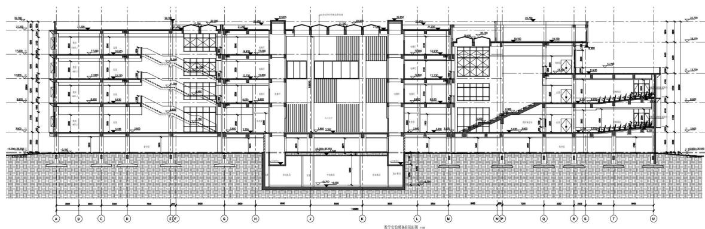
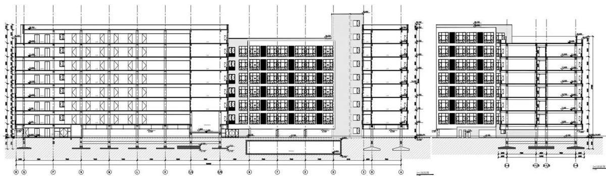
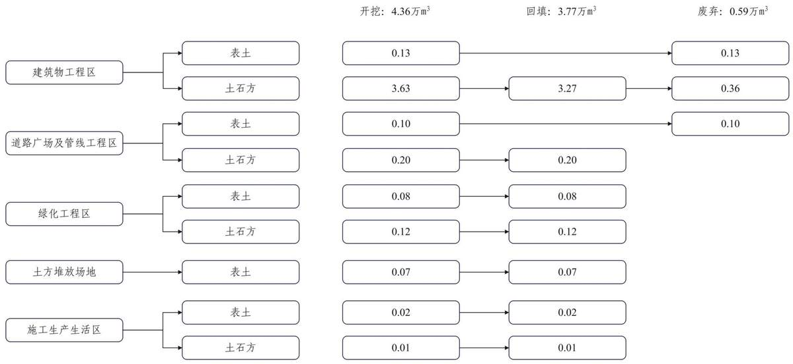
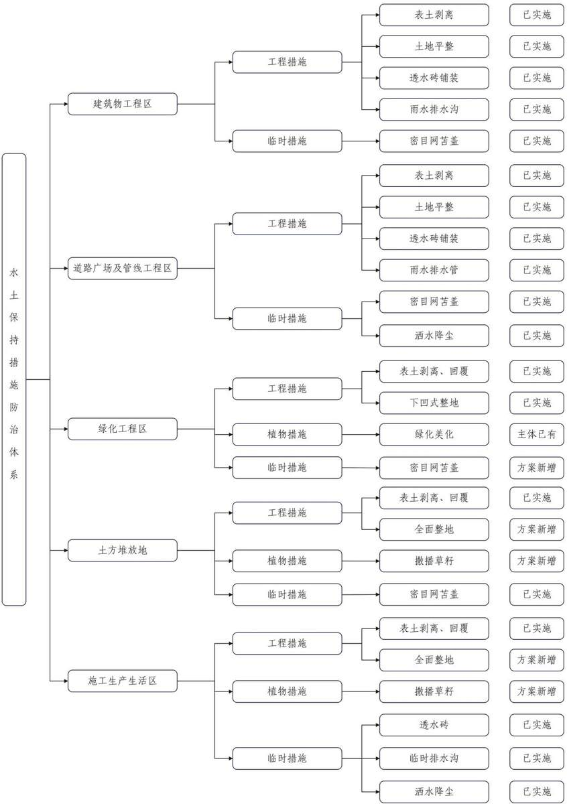

> **Zone C（应用范例层）使用边界**——仅可用于**写作风格、章节展开方式、表达逻辑、表格设计**的参考。
> **不得**用于合规判断；**不得**引入其项目数据（名称／地点／数字／单位名）；
> **不得**因其"曾经通过审批"而推定其做法在当前标准下仍然合规。
> 与 Zone A 冲突时**一律以 Zone A 为准**；Zone A 未明确规定时输出
> 「**Zone A 未明确规定，以下为参考写法，需人工判断**」。
>
> **坐标系警告**：本范例为**老八章结构**（GB 50433—2018 附录B），与 2026 版 10 章模板**同号不同义**
> （老 `1.5`＝防治目标，新 `1.5`＝水土流失预测结果；老 4→新 6 …偏移 +2；新版第 4/5 章老结构无独立章）。
> 因此 **`chapter_mapping: pending`——不得按章节号挂载**，检索一律走 `topic_tags`。
>
> **待加工**：`topic_tags`（主题标签）、`approval_basis_list`（编制依据逐字清单）、
> `structure_summary`（只提取结构：章节展开顺序／段落功能／表格栏目结构／句式模板／论证链步骤）。

1 综合说明....  
1.1 项目简况.  
1.2 编制依据..  
1.3 设计水平年.. .. 9  
1.4水土流失防治责任范围.. ...9  
1.5水土流失防治目标.... ... 10  
1.6项目水土保持评价结论... ....11  
1.7水土流失预测结果... ... 15  
1.8水土保持措施布设成果. ....16  
1.9水土保持监测方案.... .... 16  
1.10水土保持投资及效益分析成果.. ... 18  
1.11 结论.. ... 18  
2 项目概况... .... 21  
2.1项目组成及工程布置. ....21  
2.2 施工组织. ... 34  
2.3 工程占地.. .. 43  
2.4 土石方平衡.. .. 44  
2.5拆迁（移民）安置与专项设施改（迁）建...... ..... 51  
2.6 施工进度. ... 51  
2.7 自然概况.. .. 53  
3 项目水土保持评价..... ...... 56  
3.1主体工程选址（线）水土保持评价. ... 56  
3.2建设方案与布局水土保持评价.. ....59  
3.3主体工程设计中水土保持措施界定... .. 67  
4 水土流失分析与预测........ .....71  
4.1水土流失现状. ... 71  
4.2水土流失影响因素分析.. ...71  
4.3土壤流失量测算... .... 72  
4.4水土流失危害分析.. .... 81  
4.5 指导性意见.. .... 81  
5 水土保持措施..... ..... 82  
5.1 防治区划分.. .... 82  
5.2措施总体布局.. .... 82  
5.3 分区措施布设... .... 86  
5.4 施工要求... ... 93  
6 水土保持监测...... ...... 100  
6.1 范围和时段.. ... 100  
6.2 内容和方法... .... 100  
6.3 点位布设... ... 103  
6.4实施条件和成果.. .... 104  
7 水土保持投资概算及效益分析...... ...... 107  
7.1 投资概算... ... 107  
7.2 效益分析... ... 114  
8 水土保持管理... ... 118  
8.1 组织管理.. ... 118  
8.2 后续设计... ... 120  
8.3 水土保持监测...... ...120  
8.4水土保持监理.. ..121  
8.5水土保持施工. ...121  
8.6水土保持设施验收... .... 122

## 附表：

附表1 工程单价汇总表

附表2 主要材料、苗木、草、种子预算价格汇总表

附表3 工程单价表

附件：

附件1 委托书

附件 2 《关于中国劳动关系学院涿州校区新建教学实验楼和学生公寓项目建议书的批复》（中管基发〔2016〕291号）

附件 3 《关于中国劳动关系学院涿州校区新建教学实验楼和学生公寓项目可行性研究报告的批复》（中管基发〔2019〕156号）

附件 4 《关于中国劳动关系学院涿州校区新建教学实验楼和学生公寓项目初步设计方案和投资概算的批复》（中管基发〔2023〕291号

附件5 《建设工程规划许可证》（建字第 130681202400013号）

附件 6 《水利部海河水利委员会准予水行政许可决定书》（海许可决〔202223 号）

附件7 《责令（限期）改正通知书》

附件8 《拟列入水土保持“重点关注名单”告知书》

附件 9 《中国劳动关系学院关于涿州校区新建教学实验楼和学生公寓项目土方管理的承诺书》

## 附图：

附图1 项目区地理位置图；

附图2 项目区地貌图；

附图3 项目区土壤侵蚀强度分布图；

附图4 项目区水系图；

附图5 项目总体布置图；

附图6 教学实验楼总平面图；

附图7 学生公寓总平面图；

附图8 水土流失防治责任范围及分区图（含监测点）；

附图9 水土流失防治措施总体布局图；

附图10教学实验楼绿化措施布设图；

附图11学生公寓绿化措施布设图；

附图12透水砖铺装、雨水排水沟布设图；

附图13教学实验楼管线综合图；

附图14学生公寓管线综合图。

## 1 综合说明

## 1.1项目简况

## 1.1.1 项目基本情况

## （1）项目建设的必要性

中国劳动关系学院现有北京海淀和河北涿州两个校区，设有 14 个学院和 1个公共教学部，25 个普通本科专业，其中国家级一流本科专业建设点 7 个，北京 2 市一流本科专业建设点 6 个，教育部特色专业 2 个。目前在校生共计 6714人，其中研究生539人，本科生5952人，劳模本科生199 人，普通专科生7 人。涿州校区承担本科一、二年级教育，北京校区承担本科三、四年级、研究生、劳模本科教育及工会干部培训等。

中国劳动关系学院涿州校区原属东方石油物理勘探有限公司，2005 年无偿划转学院，现有建筑多为20世纪七八十年代建设，存在“功能陈旧、设施老化、安全隐患”等核心问题，各项教学设施功能失效，不符合教学用房规范且整体老化。实验室、实习场所多为原物探研究院辅助用房改造，设施简陋，无法满足实验教学需求。涿州校区现有宿舍面积远低于《普通高等学校建筑规划面积指标》标准，目前生活服务设施薄弱，公寓存在面积不足、配套差等问题，且原建筑未考虑现代学生住宿需求，生活配套功能不全，无法支撑大规模学生生活需求。为解决相关问题，中国劳动关系学院于涿州校区新建教学实验楼及学生公寓。

中国劳动关系学院扎根中华全国总工会行业背景，形成“劳动+”“工会+”特色专业群，充分发挥“工”字特色、“劳”字优势，确定了“建设劳动和工会领域国内一流、国际知名高校”的办学目标。学校深度对接国家重大战略、工会行业需求，正深入实施“现代大学化”与“深度行业化”并重发展战略，努力建成我国高素质应用型、复合型、创新型人才培养的重要基地、工会干部培训的最高学府、劳动和工会领域研究的高端智库。涿州校区作为本科基础教育的核心基地，必须补充完善基础设施才能实现规划目标，若涿州校区基础设施不足，将直接制约学院整体办学规模与质量提升。本项目的建设对完善中国劳动关系学院教学设施具有重要意义。

## （2）项目位置

项目位于中国劳动关系学院涿州校区院内，具体地处河北省涿州市东城坊镇

涿涞路 99 号，新建教学实验楼位置位于涿州校区西北侧，即行政办公楼西侧、图书馆及报告厅东侧范围；新建学生公寓位置位于涿州校区东南侧，4号公寓及25 号楼西侧、生活服务楼东侧。

## （3）建设性质

本项目建设性质为新建建设类项目。

## （4）工程等级与规模

项目总建筑面积46953m2，总建设用地面积19104m2，包含新建教学实验楼和学生公寓两个单体建筑，教学实验楼建筑面积24203m2，其中地上建筑面积为23450m2，地下建筑面积为 753m2，学生公寓建筑面积 22750m2，其中地上建筑面积为22420m2，地下建筑面积为330m2，工程等级为二级，工程规模为大型。

## （5）建设内容及项目组成

本项目为涿州校区新建教学实验楼及学生公寓，总建设用地面积19104m2，总建筑面积46953m2，其中新建教学实验楼位于涿州校区西北侧，建设用地面积13641m2，建筑面积 24203m2，地上建筑面积约 23450m2，地下建筑面积约 753m2，地上 5 层，地下 1 层，建筑高度 22.85m，主要功能为教室、实验室；学生公寓位于涿州校区东南侧，建设用地面积 5463m2，建筑面积 22750m2，地上建筑面积约 22420m2，地下建筑面积约330m2，地上8层，地下1层，建筑高度30.25m，主要功能为学生住宿。同时，项目配套建设管线工程及绿化工程等。

## （6）施工组织

本项目施工单位为中国建筑第八工程局有限公司，于2024 年6 月入场进行施工准备，2024年 6 月底正式开工，2025 年 12 月底停工，计划 2026年4 月复工，2026 年6月完工。项目施工场地主要由2处施工生产区，1处总包办公区及1处施工生活区组成，其中教学实验楼施工生产区布设于教学实验楼南侧，位于项目红线内部；学生公寓施工生产区布设于公寓楼南侧，位于项目红线外，占用校园已有道路及硬化地面，2 处施工生产区共占地 0.09hm2；总包办公区布设于教学实验楼东侧，行政办公区西侧的绿地内，占地 0.12hm2，施工生活区位于新建学生公寓东南侧，占地面积0.14hm2。

施工道路依托涿州校区内已有道路，校园北部即为涿涞路，交通方便，相关施工用水、用电，均接引自校区内已建设施。

## （7）工程投资及资金来源

本项目概算总投资 21735 万元，其中土建投资为 19016.69 万元，建设资金中10867 万元，由国家发展改革委安排中央预算内投资解决，其余部分投资通过建设单位自筹解决。

## （8）建设工期

本项目已于 2024 年 6 月入场进行施工准备，2024 年6 月底正式开工，2025年12 月底停工，计划2026 年4 月复工，2026 年6 月底完工。总工期22个月。

## （9）现场调查情况

接受委托后，我单位立即组织编制组，对项目进行了现场调查，根据现场调查情况，截至 2025 年12 月16 日，项目主体工程中建筑物工程区、道路广场及相关给排水管线工程区等均已实施，地面硬化及透水砖铺装已完成，相关绿化工程尚未实施，项目扰动范围2.65hm2，已实施的水土保持措施如下：

## （1）建筑物工程区

施工前，施工单位对建筑物工程区进行表土剥离 0.13万m3，剥离的表土运至土方堆放区堆存。施工过程中，施工场地裸露地面采用密目网苫盖 8900m2；施工后，进行土地平整0.69hm2，由于建筑物楼体采用首层架空方式，故架空层地面采用透水砖铺装6853m2，并沿建筑物边缘铺设预制盖板雨水排水沟714m，接入项目雨水排水系统。

## （2）道路广场及管线工程区

施工前，施工单位对道路广场及管线工程区进行表土剥离，剥离的表土运至土方堆放区堆存。施工过程中，施工场地裸露地面采用密目网苫盖 6600m2，定时洒水降尘300台时；施工后，对道路、广场进行土地平整 0.44hm2，地面采用透水砖铺装 4370m2，并埋设雨水排水管网 1049m，接入涿州校区已有雨水排水系统，最终排入校园东侧市政管网。

## （3）绿化工程区

施工前，施工单位对绿化工程区进行表土剥离 0.08 万m3，剥离的表土运至土方堆放区堆存。施工过程中，施工场地裸露地面采用密目网苫盖4000m2。

## （4）土方堆放场区

施工前，施工单位对土方堆放场区进行表土剥离 0.07万m3，剥离的表土于场内单独堆存。土方转运过程中，施工场地裸露地面采用密目网苫盖2500m2。

## （5）施工生产生活区

施工办公区占用校园绿地，其他生产区及生活区占用道路硬化地面及校园未利用地，开工前，施工单位对占用的绿地进行表土剥离 0.02万 m3，剥离的表土运至土方堆放区堆存。项目建设过程中，办公区实施临时排水沟 83m 以及临时地面铺设透水砖180m2，施工过程中洒水降尘80m3。

## （10）占地面积

本项目总占地面积为2.65hm2，其中永久占地 1.91hm2，临时占地0.74hm2，全部为涿州校区内占地，占地类型为教育用地。按照项目组成，建筑物工程区占地 0.89hm2，道路广场及管线工程区占地 0.66hm2，绿化工程区占地 0.4hm2，施工生产生活区占地0.35hm2，土方堆放区0.35hm2。

## （11）土石方量

本项目挖填方总量为8.12万m3，其中挖方量4.36万m3，填方量3.77万m3，无借方，余方0.59万m3运往校区东北角洼地内，后期对洼地回填并场平、绿化。

## （12）拆迁数量及安置方式

本项目不涉及拆迁安置工作。

## （13）专项设施改（迁）建

本项目不涉及专项设施改（迁）建。

## （14）取土场及弃土场

本项目不涉及取土场及弃土场。

## 1.1.2 项目前期工作进展情况

## 1.1.2.1 前期工作情况

本项目属于中国劳动学院涿州校区规划改造的一期工程，该项目于2016年11月 4 日，经中直管理局以《关于中国劳动关系学院涿州校区新建教学实验楼和学生公寓项目建议书的批复》（中管基发〔2016〕291号文）予以批复。

2017年11月9日，本项目取得《涿州市人民政府关于中国劳动关系学院涿州校区地块控制性详细规划的批复》（涿政发〔2017〕145号）。

2018 年 5 月，中国国际工程咨询有限公司编制完成《中国劳动关系学院涿州校区新建教学实验楼和学生公寓项目可行性研究报告》。

2022 年 5 月 4 日，取得水利部海河水利委员会准予水行政许可决定书（海许可决〔2022〕23号）对本项目的洪水影响评价报告书进行批复。

2022年11 月，北京市建筑设计研究院有限公司完成项目总平面图等设计图

纸。

2023年10 月8日，中直管理局下发《关于中国劳动关系学院涿州校区新建教学实验楼和学生公寓项目初步设计方案和投资概算的批复》（中管基发〔2023291号文）。

2024年4月17日，项目取得涿州市自然资源和规划局下发的《建设工程规划许可证》（建字第 130681202400013 号）

## 1.1.2.2 项目进展情况

根据现场调查，项目于2024年6月进行施工准备，2024 年6月底正式开工，2024 年10 月30 日，主体建筑物达到±0.00设计标高，2024 年12 月30日，主体结构封顶。目前，项目主体工程中建筑物工程区、道路广场及给排水管线工程区等均已实施完毕，地面透水砖已铺设完毕，2025 年 12 月底停工，计划 2026年4月复工，2026年6月完成绿化工作，工期为22 个月。

## 1.1.2.3水土保持方案编制过程

2025年10 月23 日，中国劳动关系学院委托北京东州金潞科技有限公司（以下简称编制单位）开展《中国劳动关系学院涿州校区新建教学实验楼和学生公寓项目水土保持方案报告书》的编制工作。

接受任务后，编制单位立即组建了方案编制组，对主体工程设计资料进行了熟悉、了解，对工程建设区及涿州校区周边区域进行了调查，收集并整理了涿州地区气象、水文资料，调查了项目地块原有土地利用情况、水土流失现状以及校内已完成水土保持设施运行效果。

按照《生产建设项目水土保持技术标准》的要求，对项目各防治分区已实施的水土流失防治措施进行了调查、分析评价水土保持功能，同时针对尚未完工的区域，进行了水土保持措施设计。于2025年12月，完成了《中国劳动关系学院涿州校区新建教学实验楼和学生公寓项目水土保持方案报告书》。

## 1.1.2.4水行政主管部门监督检查意见及整改落实情况

水土保持监督检查意见：2025 年 8 月，涿州市水利局对中国劳动关系学院涿州校区新建教学实验楼和学生公寓项目进行检查，通过查勘项目现场，查阅有关资料，发现本项目存在水土保持方案未经批准而开工建设的情况，项目涉嫌违反了《中华人民共和国水土保持法》第二十六条的规定，并于 2025年9月2 日，下发了《责令（限期）改正通知书》，改正通知书提出建设单位应于2025年12月2日前，取得中国劳动关系学院涿州校区新建教学实验楼和学生公寓项目水土保持方案的行政许可文件。

2025 年 11 月 27 日，水利部海河水利委员会对现场进行了监督检查：在中国劳动关系学院涿州校区新建教学实验楼和学生公寓项目建设过程中存在“未批先建”水土保持违法行为。依据《水利部办公厅关于实施生产建设项目水土保持信用监管“两单”制度的通知》（办水保〔2020〕157号）、《水利部办公厅关于进一步加强部批项目水土保持监管工作的通知》（办水保〔2024〕57 号）等规定，生产建设单位存在“未批先建”情形的，应当列入水土保持“重点关注名单”。11月28 日，发布《拟列入水土保持“重点关注名单”告知书》。

2025 年 12 月 11 日，水利部海河水利委员会发布公告将中国劳动关系学院列入水土保持“重点关注名单，并通过全国水利建设市场监管平台向社会公开，公开期限为1年。

整改意见落实情况：收到《责令（限期）改正通知书》后，中国劳动关系学院立即组织整改，立即开展水土保持方案编制单位的招投标工作，并于2025年10 月23 日完成水土保持方案编制的合同签署工作，要求编制单位按涿州市水利局要求开展水土保持方案的编制工作。11 月 7 日，完成了《中国劳动关系学院涿州校区新建教学实验楼和学生公寓项目水土保持方案报告书》初稿。12月15日，再次对项目施工情况以及水土保持措施完成情况进行调查，最终完成《中国劳动关系学院涿州校区新建教学实验楼和学生公寓项目水土保持方案报告书》。

## 1.1.3 自然简况

项目区位于平原区，属于暖温带半湿润大陆性季风气候。多年平均气温11.6℃，极端最高气温41.7℃，极端最低气温-22.2℃，全年无霜期220天，最大冻土深度 80cm。多年平均风速 1.5m/s，主导风向为南风，大风日数平均2.7 天。多年平均降水量567mm，集中于夏季的6\~9 月，占全年降水的70%；年蒸发量1735mm。

项目区地貌类型为平原，场地地形平坦，不属于崩塌、滑坡危险区和泥石流易发区、低洼易涝区等。土壤类型为褐土。项目区自然植被类型属于暖温带落叶阔叶林，属华北植物区系，植被类型多样，主要有以栎属、椴属、白蜡树属、杨属等落叶乔木树种占优势的落叶阔叶林和以油松、侧柏占优势的温性针叶林，涿州校区现状林草覆盖率约35%。

根据《土壤侵蚀分类分级标准》（SL190-2007），本项目所在区属于水力侵蚀类型区中的北方土石山区，容许土壤流失量为 $2 0 0 \mathrm { t } / \ \left( \mathrm { k m } ^ { 2 } { \cdot } \mathbf { a } \ \right)$ 。项目区主要为微度水力侵蚀，根据遥感历史影像以及涿州校区内项目周边情况，土壤侵蚀模数背景值为 $1 5 0 \mathrm { t / \Omega } \left( \mathrm { k m } ^ { 2 } { \cdot } \mathrm { a } \right)$ 。根据《水利部办公厅关于做好国家级水土流失重点预防区和重点治理区落地上图成果应用的通知》的通知（办水保〔2025〕170号），本项目所在区域不属于国家级水土流失重点预防区和重点治理区；项目区不涉及河北省省级水土流失重点预防区和重点治理区。

根据《河北省人民政府关于河北省水土保持规划（2016—2030年）的批复》（冀政字〔2017〕35 号），本项目所在的涿州市为“冀中平原北部人居环境维护与防风固沙区”。项目区不涉及饮用水水源保护区、水功能一级区的保护区和保留区、自然保护区、世界文化和自然遗产地、风景名胜区、地质公园、森林公园、重要湿地，本项目所在地不涉及生态红线范围，无生态敏感区。

## 1.2编制依据

## 1.2.1 法律法规

（1）《中华人民共和国水土保持法》（全国人民代表大会常务委员会，1991年6月29日通过，2010年12月25日第十一届全国人民代表大会常务委员会第十八次会议修订，2011年3月1 日起实施）；

（2）《河北省实施《中华人民共和国水土保持法》办法》（河北省第十二届人民代表大会常务委员会第八次会议于2014年5月30日修订通过，现予公布，自2014年9月1日起施行，根据2018年5月 31 日河北省第十三届人民代表大会常务委员会第三次会议《关于修改部分法规的决定》修正）。

## 1.2.2 部委规章和规范性文件

（1）《生产建设项目水土保持方案管理办法》（2023年1 月17 日水利部令第 53 号发布，2023年3 月1日起施行）；

（2）《水利部关于进一步深化“放管服”改革，全面加强水土保持监管的意见》（水保〔2019〕160号）；

（3）《水利部办公厅关于印发生产建设项目水土保持监督管理办法的通知》（办水保〔2019〕172号）；

（4）《水利部办公厅关于进一步加强生产建设项目水土保持监测工作的通

知》（办水保〔2020〕161 号）；

（5）《水利部办公厅关于印发生产建设项目水土保持问题分类和责任追究标准的通知》（办水保函〔2020〕564号）；

（6）《水利部办公厅关于印发生产建设项目水土保持方案审查要点的通知》（办水保〔2023〕177号）；

（7）《水利部办公厅关于做好国家级水土流失重点预防区和重点治理区落地上图成果应用的通知》（办水保〔2025〕170号）；

（8）《水利部关于加强事中事后监管规范生产建设项目水土保持设施自主验收的通知》（水保〔2017〕365号）；

（9）《水利部办公厅关于印发生产建设项目水土保持设施自主验收规程（试行）的通知》（办水保〔2018〕133号）；

（10）《水利部办公厅关于调整水利工程计价依据增值税计算标准的通知》（办财务函〔2019〕448号）；

（11）《河北省生产建设项目水土保持方案管理办法》；

（12）《财政部关于水土保持补偿费等四项非税收入划转税务部门征收的通知》（财税〔2020〕58号）；

（13）《水利部办公厅关于印发生产建设项目水土保持技术文件编写和印制格式规定（试行）的通知》（办水保〔2018〕135号）。

## 1.2.3 技术标准

（1）《生产建设项目水土保持技术标准》（GB50433-2018）；

（2）《生产建设项目水土流失防治标准》（GB/T50434-2018）；

（3）《生产建设项目土壤流失量测算导则》（SL773-2018）；

（4）《土壤侵蚀分类分级标准》（SL190-2007）；

（5）《水土保持工程调查与勘测标准》（GB/T51297-2018）；

（6）《生产建设项目水土保持监测与评价标准》（GB/T51240-2018）；

（7）《水利水电工程制图标准水土保持图》（SL73.6—2015）；

（8）《土地利用现状分类》（GB/T21010-2017）；

（9）《水土保持工程设计规范》（GB51018-2014）；

（10）《水利工程设计概（估）算编制规定（水土保持）》（水总〔2024323 号）；

## 1.2.4 技术文件与相关资料

（1）《中国劳动关系学院涿州校区新建教学实验楼和学生公寓项目可研报告》（中国国际工程咨询有限公司，2018年5 月）；

（2）《岩土工程勘察报告》（中兵勘察设计研究院有限公司，2019年9月）；

（3）《中国劳动关系学院涿州校区新建教学实验楼和学生公寓项目设计图纸》（北京建筑设计研究院有限公司，2021年11 月）；

（4）《岩土工程勘察补充报告》（中兵勘察设计研究院，2024年 6月）；

（5）与主体工程有关的其他设计资料。

## 1.3设计水平年

本项目属于建设类项目，根据主体工程施工进度安排，本项目已于2024年6 月入场进行施工准备，2024 年 6 月底正式开工，2025 年12月底停工，计划2026年4月复工，2026年6月完工，总工期22个月。

按照《生产建设项目水土保持技术标准》（GB50433-2018）的有关要求，主体工程在上半年完工的设计水平年一般为完工后当年，下半年完工的设计水平年一般为完工后一年，综合确定本方案设计水平年为完工当年，即确定设计水平年为 2026年。届时，各项水土流失防治措施全部建成。

## 1.4水土流失防治责任范围

根据《生产建设项目水土保持技术标准》（GB50433-2018）的要求，水土流失防治责任范围应包括项目永久征地、临时占地。根据项目实际情况，本项目水土流失防治责任范围面积为 2.65hm2，其中项目永久占地 1.91hm2，施工生产生活区、土方堆放场区、管道工程区等临时占地 0.74hm2，相关临时占地均位于校区范围内。水土流失防治责任范围见表1.4-1。

表 1.4-1 项目建设期水土流失防治责任范围表 （单位：hm2）
<table><tr><td rowspan=2 colspan=1>行政分区</td><td rowspan=2 colspan=1>防治分区</td><td rowspan=1 colspan=3>占地面积</td></tr><tr><td rowspan=1 colspan=1>永久占地</td><td rowspan=1 colspan=1>临时占地</td><td rowspan=1 colspan=1>小计</td></tr><tr><td rowspan=5 colspan=1>河北省保定市涿州市</td><td rowspan=1 colspan=1>建筑物工程区</td><td rowspan=1 colspan=1>0.89</td><td rowspan=1 colspan=1></td><td rowspan=1 colspan=1>0.89</td></tr><tr><td rowspan=1 colspan=1>道路广场及管线工程区</td><td rowspan=1 colspan=1>0.62</td><td rowspan=1 colspan=1>0.04</td><td rowspan=1 colspan=1>0.66</td></tr><tr><td rowspan=1 colspan=1>绿化工程区</td><td rowspan=1 colspan=1>0.40</td><td rowspan=1 colspan=1></td><td rowspan=1 colspan=1>0.40</td></tr><tr><td rowspan=1 colspan=1>土方堆放场区</td><td rowspan=1 colspan=1></td><td rowspan=1 colspan=1>0.35</td><td rowspan=1 colspan=1>0.35</td></tr><tr><td rowspan=1 colspan=1>施工生产生活区</td><td rowspan=1 colspan=1></td><td rowspan=1 colspan=1>0.35</td><td rowspan=1 colspan=1>0.35</td></tr><tr><td rowspan=1 colspan=2>合计</td><td rowspan=1 colspan=1>1.91</td><td rowspan=1 colspan=1>0.74</td><td rowspan=1 colspan=1>2.65</td></tr></table>

注：临时占地均位于学校范围内。

## 1.5水土流失防治目标

## 1.5.1 执行标准等级

根据《水利部办公厅关于做好国家级水土流失重点预防区和重点治理区落地上图成果应用的通知》，项目区不属于国家级水土流失重点预防区和重点治理区。根据《河北省水利厅关于发布省级水土流失重点预防区和重点治理区的公告》（2018年2月），项目区不属于河北省省级水土流失重点预防区和重点治理区。

由于本项目属于高校教育设施建设，且位于涿州市近郊，根据《生产建设项目水土流失防治标准》（GB/T50434-2018），确定本项目的水土流失防治标准执行等级为北方土石山区水土流失防治一级标准。

## 1.5.2 防治目标

根据北方土石山区水土流失防治一级标准设定的防治目标值，结合本工程的工程特点，防治目标值按以下原则调整取值：

（1）土壤流失控制比：在微度侵蚀为主的区域不应小于1.0，本方案调整至1.0；

（2）渣土防护率：本项目位于城区，渣土防护率增加 1%；

（3）林草覆盖率：本项目属于高校教育设施建设，同时位于涿州市城区附近，林草覆盖率增加1%。

（4）表土保护率：本项目建设已接近尾声，结合现场表土调查，项目区表土开工前已进行剥离，运至土方堆放场（位于校区东北角洼地），表土保护率为95%。

综上，本项目水土流失治理度95%、土壤流失控制比1.0、渣土防护率98%、表土保护率95%、林草植被恢复率97%、林草覆盖率26%。

表 1.5-1 水土流失防治目标值分析表
<table><tr><td rowspan=2 colspan=1>防治指标</td><td rowspan=1 colspan=2>一级标准</td><td rowspan=2 colspan=1>按土壤侵蚀强度修正</td><td rowspan=2 colspan=1>按地域修正</td><td rowspan=2 colspan=1>按规划条件</td><td rowspan=1 colspan=2>修正后防治目标值</td></tr><tr><td rowspan=1 colspan=1>施工期</td><td rowspan=1 colspan=1>设计水平年</td><td rowspan=1 colspan=1>施工期</td><td rowspan=1 colspan=1>设计水平年</td></tr><tr><td rowspan=1 colspan=1>水土流失治理度（%）</td><td rowspan=1 colspan=1>一</td><td rowspan=1 colspan=1>95%</td><td rowspan=1 colspan=1></td><td rowspan=1 colspan=1></td><td rowspan=1 colspan=1></td><td rowspan=1 colspan=1>一</td><td rowspan=1 colspan=1>95%</td></tr><tr><td rowspan=1 colspan=1>土壤流失控制比</td><td rowspan=1 colspan=1></td><td rowspan=1 colspan=1>0.90</td><td rowspan=1 colspan=1>+0.10</td><td rowspan=1 colspan=1></td><td rowspan=1 colspan=1></td><td rowspan=1 colspan=1></td><td rowspan=1 colspan=1>1.0</td></tr><tr><td rowspan=1 colspan=1>渣土防护率（%）</td><td rowspan=1 colspan=1>95%</td><td rowspan=1 colspan=1>97%</td><td rowspan=1 colspan=1></td><td rowspan=1 colspan=1>+1%</td><td rowspan=1 colspan=1></td><td rowspan=1 colspan=1>95%</td><td rowspan=1 colspan=1>98%</td></tr><tr><td rowspan=1 colspan=1>表土保护率（%）</td><td rowspan=1 colspan=1>95%</td><td rowspan=1 colspan=1>95%</td><td rowspan=1 colspan=1></td><td rowspan=1 colspan=1></td><td rowspan=1 colspan=1></td><td rowspan=1 colspan=1>95%</td><td rowspan=1 colspan=1>95%</td></tr><tr><td rowspan=1 colspan=1>林草植被恢复率（%）</td><td rowspan=1 colspan=1>一</td><td rowspan=1 colspan=1>97%</td><td rowspan=1 colspan=1></td><td rowspan=1 colspan=1></td><td rowspan=1 colspan=1></td><td rowspan=1 colspan=1>二</td><td rowspan=1 colspan=1>97%</td></tr><tr><td rowspan=1 colspan=1>林草覆盖率（%）</td><td rowspan=1 colspan=1></td><td rowspan=1 colspan=1>25%</td><td rowspan=1 colspan=1></td><td rowspan=1 colspan=1>+1%</td><td rowspan=1 colspan=1></td><td rowspan=1 colspan=1></td><td rowspan=1 colspan=1>26%</td></tr></table>

## 1.6项目水土保持评价结论

## 1.6.1 主体工程选址（线）评价

根据《中华人民共和国水土保持法》（2011 年 3 月 1 日起实施）、《生产建设项目水土保持技术规范》（GB50433-2018）的规定要求，对主体工程水土保持制约性因素一一对照进行了分析与评价，分析评价可知：

（1）本项目属于高校教育设施建设项目，不属于限制类和淘汰类产业的生产建设项目；

（2）本项目区不属于水土流失严重、生态脆弱的地区；

（3）本项目建设内容无在崩塌、滑坡危险区和泥石流易发区内进行取土、挖沙、取石等行为；

（4）项目建设全部为学校原有土地，占地类型为教育用地，不占用基本农田以及水浇地、水田等生产力较高的土地；

（5）项目建设内容中不包含不符合流域综合规划的水利工程；

（6）本工程选线不涉及水土保持监测网络中水土保持监测站点、重点试验区和水土保持长期定位观测站。项目区为平原，不存在危岩、崩塌、落石等现象，不涉及崩塌、滑坡危险区和泥石流易发区；

（7）项目建设不占用河流两岸、湖泊和水库周边的植物保护带；

（8）项目区不属于国家级水土流失重点预防区和重点治理区，不属于河北省省级水土流失重点预防区和重点治理区。

（9）本项目位于大清河系小清河分洪区，为减轻对小清河分洪区滞洪、行洪的影响，同时解决自身的防洪问题，教学实验楼和学生公寓底层均采取了架空形式。

本项目已编制了洪水影响评价报告，并取得水利部海河水利委员会《准予水行政许可决定书》（海许可决〔2022〕23 号），洪水影响评价报告明确“项目建设不影响小清河分洪区蓄滞洪功能，洪水对项目的威胁可通过工程措施有效抵御”。

本项目由于靠近涿州市城区，且属于高校教育设施建设项目，在执行北方土石山区防治指标一级标准的基础上，将土壤流失控制比提高0.10，渣土防护率提高 1%，结合项目规划条件，林草覆盖率提高 1%，并将施工临建全部布设于学校占地范围内，无校园外临时占地，能有效控制可能造成的水土流失，能够达到水土保持要求。

项目不涉及饮用水水源保护区、水功能一级区的保护区和保留区、自然保护区、世界文化和自然遗产地、风景名胜区、地质公园、森林公园、重要湿地、生态保护红线、河湖管理范围等敏感区。

总体分析认为，本项目从水土保持角度考虑，工程选址是可行的。

## 1.6.2 建设方案与布局评价

## 1.6.2.1 建设方案评价

本项目目前主体建筑已完成，各项建筑物布局紧凑，充分利用了项目占地，其中教学实验楼建筑物密度为 43.71%，学生公寓建筑密度为 53.3%，项目结合涿州校区功能需求，合理划分教学、休憩等区域，两栋主要建筑物间距约600m，建设方案与学校远期规划相契合。

项目充分考虑校内已有道路以及市政设施情况，合理确定各类市政管线接口位置，各类管线基本均位于项目红线内，相关管线路径走向合理及埋深恰当，尽量控制红线外占地，减少管线土石方挖填总量，尽量减少项目建设对校园其他已有教育设施的影响。

项目充分考虑建筑物选址对小清河分洪区的影响，地下建筑均为消防水池、泵房等附属设施，外部洪水对本项目影响较小，设计单位合理确定项目设计高程，并将建筑物底部采取架空形式，地面硬化全部采取透水砖铺设，建设方式以及防御措施已取得海河水利委员会批准，项目在防洪排涝方面不存在限制性因素。

从水土保持的角度分析，工程建设方案与布局合理。

## 1.6.2.2 工程占地评价

本项目新建教学实验楼以及公寓楼等，均属于教育设施用地，且位于涿州校区内部，为校园永久占地范围内，不新增其他校外占地。

建设过程中各项临时设施，包括施工生产生活区、土方堆放区，均布设于校区范围内，教学实验楼施工生产区于项目红线内布设，施工生活区紧邻公寓布设，节约施工占地，相关临时占地均利用已有的道路硬化地面或者校园内的未利用地，占用水土保持效益较高的绿地 0.12hm2，为总临时占地面积 $0 . 7 4 \mathrm { h m } ^ { 2 }$ 的 16%。

建设期间，建筑物基坑土方绝大多数于红线内倒运，项目表土以及少量开挖土方运往校区东北角洼地内，后期对洼地回填并场平、绿化不对项目周边产生影

响。

项目区周边有成熟市政管网，给排水管线工程接口位置选择合理，大部分管线位于项目红线范围内，不新增占地，现场开挖土方就近堆放，项目合理安排施工顺序不在项目占地范围外设堆土区，施工过程中严格控制施工扰动范围，工程占地符合节约用地和减少扰动的要求。

## 1.6.2.3 土石方平衡评价

项目为新建项目，结合历史遥感影像和现场表土调查情况，项目区原有绿化主要为少量乔木和草地，可剥离表土面积为 $2 . 0 8 \mathrm { h m } ^ { 2 }$ ，表土厚度为10～20cm，项目开工前，施工单位对表土进行了剥离，共计剥离表土 $0 . 4 0 \mathrm { ~ \mathscr ~ { ~ H ~ } ~ m ~ } ^ { 3 }$ ，并运至校区东北角洼地内暂时存放，用于项目区后期绿化。项目施工结束后对绿化工程区、施工办公生产场地、土方堆放场区进行植被恢复，可利用表土0.17万m3，剩余0.23万m3表土存放于土方堆放场区（校区东北角洼地内），后期对洼地回填并场平、绿化。

项目开工前，场地已进行整平，项目场地标高变化较小，由于本项目位于大清河系小清河分洪区，为减轻对小清河分洪区滞洪、行洪的影响，同时解决自身的防洪问题，教学实验楼和学生公寓底层均设计为架空形式，同时地下部分仅设置一层，为消防水池、泵房等附属设施，项目总地下建筑面积仅为 1083m2，合理设置地下部分层高，尽量减少地下空间，增加基坑土方回填总量，同时建筑物架空层地面标高较原地貌提高0.3m，从土石方平衡角度，尽最大可能减少余土，绝大部分基坑开挖土方均用于场地回填，约0.36万m3基坑余方运至涿州校区东北角洼地内，后期对洼地回填并场平、绿化。

本项目挖填方总量为 8.12 万 m3，其中挖方量 4.36 万 m3（含剥离表土 0.40万 m3），填方量 3.77 万 m3（含表土回覆 0.17 万 m3），无借方，余方 0.59 万m3（含表土 0.23 万 m3，余土 0.36 万 m3），运往涿州校区东北角洼地内，后期对洼地回填并场平、绿化。

项目充分考虑防洪需要，合理确定建筑物设计标高，土石方挖填遵循最优化原则，最大限度减少弃土量；施工单位优化施工顺序，强化土石方调运统筹，项目多余表土及余土均在校园内土坑集中堆存，用于后期校园环境治理绿化，遵循节点适宜、时序可行、运距合理的土石方调运原则。

## 1.6.2.4取土场及弃渣场设置分析与评价

本项目不存在取土场，不新设弃渣场。

本项目于校园东北角洼地内，设置一处土方堆放场区，该地块原为一处矩形土坑，长85m，宽42m，深 2～3m，可容纳土方约0.85万m3，土方堆放场区距离教学实验楼 600m，距离学生公寓 60m，目前项目土方工程基本完毕，现存土方未超过原地面，不会对周边教学设施产生威胁，现场周边存留部分建筑垃圾，后期应进行清理。

## 1.6.2.5施工方法与工艺的评价

由于项目施工场地较小，施工单位优化土方作业施工方案，教学实验楼由东至西分两阶建设，土方进行场地内二次转运，学生公寓由北向南分阶段建设，基坑土方采取两次倒运，最大限度减少基坑以及土方暴露时间。同时基坑开挖土方在项目红线范围内二次倒运，减少了土石方临时占地，施工单位土石方施工方案符合水土保持要求。

在建筑物基础施工，管线施工工艺上，施工单位采取机械与人工结合的方式，充分考虑土方开挖、回填、运输、平整等施工工艺；在施工期裸露地表采取临时苫盖、洒水等措施，减少大雨、大风天气大规模土石方开挖、回填等工作，施工单位土石方施工工艺有利于水土保持。

施工单位从多方面优化施工方案，施工临水、临电均利用涿州校区已有设施，接口位置毗邻项目红线，教学实验楼施工临电采用架空方式，学生公寓临时用电采取地面盖板铺设，不进行土方开挖。施工临水接口位于红线内，不另行占地。

2024年6月，项目进入施工准备，施工单位对项目周围采用彩钢板进行围挡，严格控制施工区域，开工前，对项目区表土进行剥离，并转运至土方堆放场区暂存，施工过程中对扰动范围内裸露地表进行了密目网苫盖措施。施工单位考虑了项目区绿化景观与周围环境相结合的设计，尽量保留场地内已有绿化设施。

施工时间上，项目基础施工无法避免在汛期进行土方作业，项目主要土方开挖回填工作于2024年7月至10月进行，土石方施工跨越2024年汛期，经调查，2024 年6月-10月，项目区降雨量为609.5mm，施工单位提前做好天气预报工作，土方开挖、回填等土石方作业尽量避开雨天，经调查，施工过程中未发生重大水土流失事件。

综上，本工程的施工方法与工艺不仅确保主体工程顺利实施，合理兼顾水土保持的要求，符合《生产建设项目水土保持技术标准》（GB50433-2018）的要求。

## 1.6.2.6主体工程设计中具有水土保持功能工程的评价

2019年10 月，建设单位委托北京市建筑设计研究院股份有限公司（下称主体设计单位）编制完成了本项目初步设计报告，2023年10 月8日，中直管理局下发《关于中国劳动关系学院涿州校区新建教学实验楼和学生公寓项目初步设计方案和投资概算的批复》（中管基发〔2023〕291号文）。

本项目初步设计报告及相关图纸中，主体设计单位将地面透水砖、盖板雨水排水沟、地下雨水管网，园林绿化、下凹式整地等水土保持措施，纳入施工图纸中，明确了各项措施实施位置及工程量，相关措施等级以及设计标准，架空层及人行道路均采用透水砖地面，加强雨水下渗，绿化工程布设位置合理，树种美观，绿化面积满足规划要求，雨水排水沟以及地下雨水管网，可实现项目区有组织排水，防止雨水冲刷造成水土流失，主体中已设计的各项措施，符合水土保持要求。

本项目于 2024 年6月底开工，施工单位按照相关要求，施工前，对项目区进行表土剥离，剥离的表土运至土方堆放区堆存。施工过程中，施工场地裸露地面采用密目网苫盖；施工后，进行土地平整，施工办公区设置临时排水沟，防止施工期间雨水冲刷造成水土流失；项目区场地内设计洒水降尘，减少扬尘。施工单位已实施的各项临时措施，有效地控制了施工过程中的水土流失，符合水土保持要求。

目前，建筑物主体即将完工，绿化工程计划于 2026年 4 月开工，期间裸露地表应采取密目网苫盖措施，同时，主体设计未考虑土方堆放场区暂存表土调运后的整平工作以及绿化工作。项目完工后施工生产生活区拆除后应对场地进行土地平整及绿化工作，本报告将予以补充。

## 1.7水土流失测算及预测结果

根据现场调查情况，原地貌情况以及施工过程中影像调查，结合工程施工时段，根据《生产建设项目土壤流失量测算导则》（SL773-2018），对项目建设过程中的水土流失情况进行测算，经计算，项目原地貌水土流失量约为 9.66t，项目建设对地表土壤扰动后造成的水土流失总量是82.70t，其中，施工期内土壤流失总量70.60t，自然恢复期的水土流失量2.44t，项目新增土壤流失量为73.04t。

根据水土流失测算结果，项目已结束施工期（2024年6 月—2025年12月）是产生水土流失的主要时段，特别是基坑开挖、回填土方作业及管线埋设等施工活动期间水土流失最为严重。根据各水土流失防治分区水土流失测算结果，项目新增土壤流失量主要集中在建筑物工程区。

目前，尚未进行绿化工程施工，对2026年1月-2026 年6月，进行水土流失预测，项目新增土壤流失量主要集中在绿化工程区。

根据历史影像调查，施工单位按照施工图文件以及施工组织设计，实施了大量水土保持工程措施、临时措施，各项措施有效、及时发挥水土保持功能，施工过程中未发生大的水土流失事件，未产生水土流失危害。

## 1.8水土保持措施布设成果

按照工程总体布局、建设时序、施工扰动特点以及产生的水土流失影响，本项目水土流失防治分区由建筑物工程区、道路广场及管线工程区、绿化工程区、土方堆放场区、施工生产生活区共5个水土流失防治区构成。结合主体工程中具有水土保持功能的措施分析与评价，以及各个防治分区的水土流失特点，确定不同的防治区采用不同的防治措施和布局。各防治区水土保持措施布设如下：

## （1）建筑物工程区

施工前，对该区域进行表土剥离，剥离的表土运至土方堆放区堆存。施工过程中，施工场地裸露地面采用密目网苫盖；施工后，进行土地平整，由于楼体采用架空方式，地面采用透水砖铺装，并铺设预制盖板雨水排水管，接入雨水排水系统。

工程措施：表土剥离 0.13 万 m3、土地平整 6853m2、透水砖铺装 6853m2、雨水排水沟714m。

临时措施：密目网苫盖0.89hm2。

## （2）道路广场及管线工程区

施工前，对该区域进行表土剥离，剥离的表土运至土方堆放区堆存。施工过程中，施工场地裸露地面采用密目网苫盖，定时洒水降尘；施工后，进行土地平整，地面采用透水砖铺装，并埋设雨水排水管网，接入涿州校区已有雨水排水系统。

工程措施：表土剥离0.1万m3、土地平整 4370m2、透水砖铺装4370m2、雨

水排水管 1049m。

临时措施：密目网苫盖0.66hm2、洒水降尘300台时。

## （3）绿化工程区

施工前，对该区域进行表土剥离，剥离的表土运至土方堆放区堆存。施工过程中，施工场地裸露地面采用密目网苫盖；施工后，进行下凹式整地，回覆表土，实施植被建设。

工程措施：表土剥离、回覆0.08万m3，下凹式整地0.4hm2。

植物措施：绿化美化0.4hm2。

临时措施：密目网苫盖0.4hm2。

## （4）土方堆放场区

施工前，对该区域进行表土剥离，剥离的表土单独堆存。施工过程中，施工场地裸露地面采用密目网苫盖；施工后回覆表土，撒播草籽。

工程措施：表土剥离、回覆0.07万m3，土地平整0.35hm2。

植物措施：撒播草籽0.35hm2。

临时措施：密目网苫盖0.25hm2。

## （5）施工生产生活区

施工前，对该区域进行表土剥离，剥离的表土运至土方堆放区堆存。施工过程中，实施临时排水沟以及地面铺设透水砖，洒水降尘；施工后拆除透水砖进行土地平整、回覆表土并撒播草籽。

工程措施：表土剥离、回覆0.02万m3，土地平整0.35hm2。

植物措施：撒播草籽0.12hm2。

临时措施：临时排水沟83m、透水砖180m2。洒水降尘80m3。

## 1.9水土保持监测方案

本项目监测范围为水土流失防治责任范围2.65hm2，本项目为建设类项目，监测时段从施工准备期开始至设计水平年结束。具体如下：

（1）监测内容：水土流失影响因素、水土流失状况、水土流失危害和水土保持措施等。

（2）监测时段：2024 年6月开始至设计水平年2026 年6月结束。

（3）监测方法：采用调查监测、巡查监测、定点监测相结合的方法。

（4）监测点位：由于目前建筑物区以及道路管线区，地面硬化已完成，根据不同工程水土流失及施工阶段布设监测点3 个，分别位于绿化工程区、土方堆放区、施工生产生活区。

（5）监测频次：调查前期建设扰动情况，摸清项目建设区背景情况，水土流失影响因子，土石方挖填情况，施工过程中已产生的水土流失情况及已实施的水土保持措施情况。

对于进场后至设计水平年，监测单位应对正在实施的水土保持措施建设、扰动地表面积等至少每月调查记录1次；施工进度、水土保持植物措施生长情况至少每季度调查记录1次；水土流失灾害事件发生后1 周内完成监测；遇暴雨（日降雨量≥50mm或1 小时降雨量≥25mm）加测1 次。

（6）监测重点分区：绿化工程区。

## 1.10水土保持投资及效益分析成果

## 1.10.1 水土保持投资

本项目水土保持工程总投资 486.66 万元，其中工程措施费 189.33万元，植物措施费 180.3 万元，监测措施费5万元，临时措施费73.58万元，独立费用24.28万元，基本预备费14.17万元。

## 1.10.2 效益分析

通过全面实施本方案中各项水土保持措施后，防治责任范围内可能造成的水土流失基本得到控制，可治理水土流失面积2.65hm2，建设林草植被面积0.87hm2，预测可减少水土流失量约58.43t。至方案设计水平年，各项防治指标均能达到水土保持方案确定的目标值。与此同时，完善的措施体系对于控制和减轻因项目建设产生的水土流失具有较好的效果，植物措施实施后对区域生态环境有一定的恢复和改善，且能防止水土流失破坏生态环境，具有较好的社会效益及生态效益。

## 1.11 结论

经对项目建设区实地调查踏勘、水土流失预测、水土保持分析与评价及水土流失防治方案设计，从水土保持角度分析，工程选址、布局和施工组织设计可行；本方案实施后，水土流失防治目标达到了方案预期目标值，新增水土流失将得到有效控制，扰动区域内植被得以恢复，从整体来看，水土流失治理效果显著。项目建设区不属于水土流失重点预防区和重点治理区，不存在水土保持限制性因素，工程选址无法避让小清河分洪区，应严格落实洪水影响评价方案的各项要求，同时，加强管理，减少地表扰动和破坏、加强治理。从水土保持角度对工程设计、施工和建设管理提出以下要求。

（1）工程设计：按照《生产建设项目水土保持方案管理办法》（水利部令第53 号）文件要求，如水土保持方案经批准后涉及需补充或修改水土保持方案情形的，应重新编制项目水土保持方案，报水利部进行审批。

（2）施工：本项目水土流失治理由建设单位负责，施工单位实施的方式，建设单位将水土保持措施落到实处，项目施工单位应切实履行施工合同，将水土保持措施保质保量完成。

（3）建设管理：建设单位将组织施工、监理等参建各方严把质量关，严格控制施工进度，及时实施好水土保持方案设计的各项水土流失防治措施。本项目竣工验收时，应当验收水土保持设施，组织第三方机构编制水土保持设施验收报告，水土保持设施未经验收，项目不得投产使用。

表1.11-1 水土保持方案特性表
<table><tr><td rowspan=1 colspan=2>项目名称</td><td rowspan=1 colspan=2>中国劳动关系学院涿州校区新建教学实验楼和学生公寓项目</td><td rowspan=1 colspan=4>流域管理机构</td><td rowspan=1 colspan=1>海河水利委员会</td></tr><tr><td rowspan=1 colspan=2>涉及省区</td><td rowspan=1 colspan=1>河北省</td><td rowspan=1 colspan=1>涉及地市或个数</td><td rowspan=1 colspan=2>保定市</td><td rowspan=1 colspan=2>涉及县或个数</td><td rowspan=1 colspan=1>涿州市</td></tr><tr><td rowspan=1 colspan=2>项目规模</td><td rowspan=1 colspan=1>大型，总建筑面积 46953m²</td><td rowspan=1 colspan=1>总投资（万元）</td><td rowspan=1 colspan=2>21735</td><td rowspan=1 colspan=2>土建投资（万元）</td><td rowspan=1 colspan=1>19016.69</td></tr><tr><td rowspan=1 colspan=2>动工时间</td><td rowspan=1 colspan=1>2024年6月</td><td rowspan=1 colspan=1>完工时间</td><td rowspan=1 colspan=2>2026年6月</td><td rowspan=1 colspan=2>设计水平年</td><td rowspan=1 colspan=1>2026年</td></tr><tr><td rowspan=1 colspan=2>工程占地（hm²）</td><td rowspan=1 colspan=1>2.65</td><td rowspan=1 colspan=1>永久占地（hm²）</td><td rowspan=1 colspan=2>1.91</td><td rowspan=1 colspan=2>临时占地(hm²)</td><td rowspan=1 colspan=1>0.74</td></tr><tr><td rowspan=2 colspan=3>土石方量（万m³）</td><td rowspan=1 colspan=1>挖方</td><td rowspan=1 colspan=2>填方</td><td rowspan=1 colspan=2>借方</td><td rowspan=1 colspan=1>余（弃）方</td></tr><tr><td rowspan=1 colspan=1>4.36</td><td rowspan=1 colspan=2>3.77</td><td rowspan=1 colspan=2>1</td><td rowspan=1 colspan=1>0.59</td></tr><tr><td rowspan=1 colspan=3>重点防治区名称</td><td rowspan=1 colspan=1></td><td rowspan=1 colspan=4>无</td><td rowspan=1 colspan=1></td></tr><tr><td rowspan=1 colspan=3>地貌类型</td><td rowspan=1 colspan=1>平原</td><td rowspan=1 colspan=4>水土保持区划</td><td rowspan=1 colspan=1>北方土石山区</td></tr><tr><td rowspan=1 colspan=3>土壤侵蚀类型</td><td rowspan=1 colspan=1>水力侵蚀</td><td rowspan=1 colspan=4>土壤侵蚀强度</td><td rowspan=1 colspan=1>微度</td></tr><tr><td rowspan=1 colspan=3>防治责任范围（hm²）</td><td rowspan=1 colspan=1>2.65</td><td rowspan=1 colspan=4>容许土壤流失量（t/km²·a）</td><td rowspan=1 colspan=1>200</td></tr><tr><td rowspan=1 colspan=3>水土流失预测总量（t）</td><td rowspan=1 colspan=1>82.70</td><td rowspan=1 colspan=4>新增土壤流失量（t）</td><td rowspan=1 colspan=1>73.04</td></tr><tr><td rowspan=1 colspan=3>水土流失防治标准执行等级</td><td rowspan=1 colspan=1></td><td rowspan=1 colspan=4>北方土石山区一级标准</td><td rowspan=1 colspan=1></td></tr><tr><td rowspan=3 colspan=1>防治指标</td><td rowspan=1 colspan=2>水土流失治理度（%）</td><td rowspan=1 colspan=1>95</td><td rowspan=1 colspan=4>土壤流失控制比</td><td rowspan=1 colspan=1>1.0</td></tr><tr><td rowspan=1 colspan=2>渣土防护率（%）</td><td rowspan=1 colspan=1>98</td><td rowspan=1 colspan=4>表土保护率（%）</td><td rowspan=1 colspan=1>95</td></tr><tr><td rowspan=1 colspan=2>林草植被恢复率（%）</td><td rowspan=1 colspan=1>97</td><td rowspan=1 colspan=4>林草覆盖率（%）</td><td rowspan=1 colspan=1>26</td></tr><tr><td rowspan=6 colspan=1>防治措道施及工程量</td><td rowspan=1 colspan=2>防治分区</td><td rowspan=1 colspan=2>工程措施</td><td rowspan=1 colspan=2>植物措施</td><td rowspan=1 colspan=2>临时措施</td></tr><tr><td rowspan=1 colspan=2>建筑物工程区</td><td rowspan=1 colspan=2>表土剥离 0.13万m³、土地平整6853m²、透水砖铺装6853m²、雨水排水沟 714m</td><td rowspan=1 colspan=2></td><td rowspan=1 colspan=2>密目网苫盖 0.89hm²。</td></tr><tr><td rowspan=1 colspan=2>路广场及管线工程区</td><td rowspan=1 colspan=2>表土剥离0.1万m³、土地平整4370m²、透水砖铺装4370m²、雨水排水管1049m</td><td rowspan=1 colspan=2></td><td rowspan=1 colspan=2>密目网苫盖0.66hm²、洒水降尘300 台时</td></tr><tr><td rowspan=1 colspan=2>绿化工程区</td><td rowspan=1 colspan=2>表土剥离、回覆0.08万m³，下凹式整地0.4hm²</td><td rowspan=1 colspan=2>绿化美化 0.4hm²</td><td rowspan=1 colspan=2>密目网覆盖0.4hm²</td></tr><tr><td rowspan=1 colspan=2>土方堆放场区</td><td rowspan=1 colspan=2>表土剥离、回覆0.07万m³，土地平整0.35hm²</td><td rowspan=1 colspan=2>撒播草籽 0.35hm²</td><td rowspan=1 colspan=2>密目网苫盖0.25hm²</td></tr><tr><td rowspan=1 colspan=2>施工生产生活区</td><td rowspan=1 colspan=2>表土剥离、回覆0.02m³土地平整0.35hm²</td><td rowspan=1 colspan=2>撒播草籽 0.12hm²</td><td rowspan=1 colspan=2>临时排水沟83m、透水砖180m²，洒水降尘80台时</td></tr><tr><td rowspan=1 colspan=3>投资（万元）</td><td rowspan=1 colspan=2>189.33</td><td rowspan=1 colspan=2>180.3</td><td rowspan=1 colspan=2>73.58</td></tr><tr><td rowspan=1 colspan=2>水土保持总投资（万元）</td><td rowspan=1 colspan=2>486.66</td><td rowspan=1 colspan=4>独立费（万元）</td><td rowspan=1 colspan=1>24.28</td></tr><tr><td rowspan=1 colspan=2>监理费（万元）</td><td rowspan=1 colspan=1></td><td rowspan=1 colspan=1>监测费（万元）</td><td rowspan=1 colspan=2>5</td><td rowspan=1 colspan=2>补偿费（万元）</td><td rowspan=1 colspan=1></td></tr><tr><td rowspan=1 colspan=2>方案编制单位</td><td rowspan=1 colspan=2>北京东州金潞科技有限公司</td><td rowspan=1 colspan=2>建设单位</td><td rowspan=1 colspan=3>中国劳动关系学院</td></tr><tr><td rowspan=1 colspan=2>法定代表人</td><td rowspan=1 colspan=2>周玉喜</td><td rowspan=1 colspan=2>法定代表人</td><td rowspan=1 colspan=3>傅德印</td></tr><tr><td rowspan=1 colspan=2>地址</td><td rowspan=1 colspan=2>北京市西城区广安门内大街甲306号水利综合楼</td><td rowspan=1 colspan=2>地址</td><td rowspan=1 colspan=3>北京市海淀区增光路45号</td></tr><tr><td rowspan=1 colspan=2>邮编</td><td rowspan=1 colspan=2>100053</td><td rowspan=1 colspan=2>邮编</td><td rowspan=1 colspan=3>100048</td></tr><tr><td rowspan=1 colspan=2>联系人及电话</td><td rowspan=1 colspan=2>赵娜娜/18811569306</td><td rowspan=1 colspan=2>联系人及电话</td><td rowspan=1 colspan=3>朱岩 88561221</td></tr><tr><td rowspan=1 colspan=2>传真</td><td rowspan=1 colspan=2>010-83494983</td><td rowspan=1 colspan=2>传真</td><td rowspan=1 colspan=3>88561221</td></tr><tr><td rowspan=1 colspan=2>电子邮箱</td><td rowspan=1 colspan=2>2460388758@qq.com</td><td rowspan=1 colspan=2>电子邮箱</td><td rowspan=1 colspan=3>jjb666@163.com</td></tr></table>

小市政工程，计划 2026 年 4 月复工，2026 年 6 月完工绿化工程，工期为 22个月。

工程投资：本项目概算总投资21735万元，其中土建投资为19016.69万元，建设资金中10867 万元，由国家发展改革委安排中央预算内投资解决，其余部分投资通过建设单位自筹解决。

本项目组成及主要技术指标如下：

表2.1-1 项目总体经济技术指标表
<table><tr><td rowspan=1 colspan=12>一、项目基本情况</td></tr><tr><td rowspan=1 colspan=1>项目名称</td><td rowspan=1 colspan=11>中国劳动关系学院涿州校区新建教学实验楼和学生公寓项目</td></tr><tr><td rowspan=1 colspan=1>项目性质</td><td rowspan=1 colspan=11>新建项目</td></tr><tr><td rowspan=1 colspan=1>建设地点</td><td rowspan=1 colspan=11>河北省保定市涿州市东城坊镇涿涞路99号</td></tr><tr><td rowspan=1 colspan=1>建设单位</td><td rowspan=1 colspan=11>中国劳动关系学院</td></tr><tr><td rowspan=1 colspan=1>建设规模</td><td rowspan=1 colspan=11>总建筑面积46953m²，教学实验楼24203m²，学生公寓22750m²</td></tr><tr><td rowspan=1 colspan=1>容积率</td><td rowspan=1 colspan=11>1.77（教学实验楼）；4.1（学生公寓）</td></tr><tr><td rowspan=1 colspan=1>绿地率</td><td rowspan=1 colspan=11>20%</td></tr><tr><td rowspan=1 colspan=1>项目总投资</td><td rowspan=1 colspan=11>项目概算总投资21735万元，其中土建投资为19016.69万元</td></tr><tr><td rowspan=1 colspan=1>项目建设期</td><td rowspan=1 colspan=11>工程已于2024年6月开工，2025年12月底停工，2026年4月复工，2026年6月完工，工期为22个月</td></tr><tr><td rowspan=1 colspan=1>建设内容</td><td rowspan=1 colspan=11>教学实验楼、学生公寓，同时建设绿地、室外管线等配套设施。</td></tr><tr><td rowspan=1 colspan=12>二、项目组成及占地情况</td></tr><tr><td rowspan=2 colspan=1>项目组成</td><td rowspan=1 colspan=7>占地面积（hm²）</td><td rowspan=2 colspan=2>占地类型</td><td rowspan=2 colspan=2>备注</td></tr><tr><td rowspan=1 colspan=2>永久占地</td><td rowspan=1 colspan=2>临时占地</td><td rowspan=1 colspan=3>合计</td></tr><tr><td rowspan=1 colspan=1>建筑物工程区</td><td rowspan=1 colspan=2>0.89</td><td rowspan=1 colspan=2></td><td rowspan=1 colspan=3>0.89</td><td rowspan=1 colspan=2>教育用地</td><td rowspan=1 colspan=2></td></tr><tr><td rowspan=1 colspan=1>道路广场及管线工程区</td><td rowspan=1 colspan=2>0.62</td><td rowspan=1 colspan=2>0.04</td><td rowspan=1 colspan=3>0.66</td><td rowspan=1 colspan=2>教育用地</td><td rowspan=1 colspan=2></td></tr><tr><td rowspan=1 colspan=1>绿化工程区</td><td rowspan=1 colspan=2>0.40</td><td rowspan=1 colspan=2></td><td rowspan=1 colspan=3>0.40</td><td rowspan=1 colspan=2>教育用地</td><td rowspan=1 colspan=2></td></tr><tr><td rowspan=1 colspan=1>土方堆放场区</td><td rowspan=1 colspan=2></td><td rowspan=1 colspan=2>0.35</td><td rowspan=1 colspan=3>0.35</td><td rowspan=1 colspan=2>教育用地</td><td rowspan=1 colspan=2></td></tr><tr><td rowspan=1 colspan=1>施工生产生活区</td><td rowspan=1 colspan=2></td><td rowspan=1 colspan=2>0.35</td><td rowspan=1 colspan=3>0.35</td><td rowspan=1 colspan=2>教育用地</td><td rowspan=1 colspan=2></td></tr><tr><td rowspan=1 colspan=1>合计</td><td rowspan=1 colspan=2>1.91</td><td rowspan=1 colspan=2>0.74</td><td rowspan=1 colspan=3>2.65</td><td rowspan=1 colspan=2></td><td rowspan=1 colspan=2></td></tr><tr><td rowspan=1 colspan=12>三、工程土石方平衡情况</td></tr><tr><td rowspan=1 colspan=1>项目组成</td><td rowspan=1 colspan=1>挖方(万m³)</td><td rowspan=1 colspan=2>填方（万m³)</td><td rowspan=1 colspan=2>调出(万m³)</td><td rowspan=1 colspan=1>调入（万m³)</td><td rowspan=1 colspan=2>借方（万m³)</td><td rowspan=1 colspan=2>余方（万m³）</td><td rowspan=1 colspan=1>备注</td></tr><tr><td rowspan=1 colspan=1>建筑物工程区</td><td rowspan=1 colspan=1>3.77</td><td rowspan=1 colspan=2>3.27</td><td rowspan=1 colspan=2></td><td rowspan=1 colspan=1></td><td rowspan=1 colspan=2></td><td rowspan=1 colspan=2>0.49</td><td rowspan=6 colspan=1>余方运至校区东北角洼地，后期对洼地回填并场平、绿化</td></tr><tr><td rowspan=1 colspan=1>道路广场及管线工程区</td><td rowspan=1 colspan=1>0.30</td><td rowspan=1 colspan=2>0.19</td><td rowspan=1 colspan=2></td><td rowspan=1 colspan=1></td><td rowspan=1 colspan=2></td><td rowspan=1 colspan=2>0.1</td></tr><tr><td rowspan=1 colspan=1>绿化工程区</td><td rowspan=1 colspan=1>0.20</td><td rowspan=1 colspan=2>0.20</td><td rowspan=1 colspan=2></td><td rowspan=1 colspan=1></td><td rowspan=1 colspan=2></td><td rowspan=1 colspan=2></td></tr><tr><td rowspan=1 colspan=1>土方堆放场区</td><td rowspan=1 colspan=1>0.07</td><td rowspan=1 colspan=2>0.07</td><td rowspan=1 colspan=2></td><td rowspan=1 colspan=1></td><td rowspan=1 colspan=2></td><td rowspan=1 colspan=2></td></tr><tr><td rowspan=1 colspan=1>施工生产生活区</td><td rowspan=1 colspan=1>0.03</td><td rowspan=1 colspan=2>0.03</td><td rowspan=1 colspan=2></td><td rowspan=1 colspan=1></td><td rowspan=1 colspan=2></td><td rowspan=1 colspan=2></td></tr><tr><td rowspan=1 colspan=1>合计</td><td rowspan=1 colspan=1>4.36</td><td rowspan=1 colspan=2>3.77</td><td rowspan=1 colspan=2></td><td rowspan=1 colspan=1></td><td rowspan=1 colspan=2></td><td rowspan=1 colspan=2>0.59</td></tr></table>

## 2.1.2 工程依托关系

## 1、既有校区平面布置情况

校区前身属中国石油集团东方地球物理勘探有限责任公司（原石油物探研究院），地块内已建有办公区、家属区、子弟小学、医院等基础建筑，形成了初步的场地轮廓与基础设施框架，功能以科研勘探为主。

2003 年中国劳动关系学院转制为本科院校后，需扩大办学空间以承载本科教育；在中石油与中华全国总工会支持下，经国资委批准，2005 年 7 月 1 日原石油物探研究院地块以国有资产无偿划转形式移交中国劳动关系学院，新增校区用地约30hm2，建筑面积近17万m2。涿州校区整体布局紧凑且贴合20世纪七、八十年代建校初期的使用需求，主要包括教学与附属功能区、生活服务功能区、运动休闲设施，整体校园以主入口-行政主楼-操场为中心，西侧为教学与附属功能区，东侧为生活服务功能区，其中：

教学与附属功能区集中于校区西侧，包含主行政楼、网络中心、活动中心、图书馆、报告厅等教学附属设施。

生活服务功能区位于校区东南侧，包含食堂、商店、派出所、教师、学生住宿区域等生活服务设施，方便日常就餐与生活需求。

运动休闲设施位于校区南部区域，设椭圆形塑胶操场，配备标准400米跑道、足球场操场周边布设4 个室外篮球场、2个羽毛球场。

其他基础保障区域分散于校园各处，包括警务室、医务室、泵房等附属设施，多依附主要建筑周边布置，占地面积小且布局灵活，满足校园基础运营需求。

校园主干道由校园北侧涿涞路入口向南部延伸，连接西北侧教学区与东南侧生活区，路面宽 3-4m，为混凝土硬化路面；次干道与支路围绕核心建筑布设，多为 2m宽人行步道，无专门机动车道与非机动车道划分。

表 2.1-1 劳动关系学院涿州校区现状建筑规模情况统计表
<table><tr><td colspan="1" rowspan="1">序号</td><td colspan="1" rowspan="1">学校现状及名称</td><td colspan="1" rowspan="1">规模(m²)</td><td colspan="1" rowspan="1">备注</td></tr><tr><td colspan="1" rowspan="1">一</td><td colspan="1" rowspan="1">教学及附属用房</td><td colspan="1" rowspan="1">20200</td><td colspan="1" rowspan="1"></td></tr><tr><td colspan="1" rowspan="1">1</td><td colspan="1" rowspan="1">教学实验楼、图书馆、网络中心</td><td colspan="1" rowspan="1">11851</td><td colspan="1" rowspan="1"></td></tr><tr><td colspan="1" rowspan="1">1.1</td><td colspan="1" rowspan="1">1号教学实验楼</td><td colspan="1" rowspan="1">6086</td><td colspan="1" rowspan="1"></td></tr><tr><td colspan="1" rowspan="1">1.2</td><td colspan="1" rowspan="1">图书馆</td><td colspan="1" rowspan="1">4596</td><td colspan="1" rowspan="1"></td></tr><tr><td colspan="1" rowspan="1">1.3</td><td colspan="1" rowspan="1">网络中心</td><td colspan="1" rowspan="1">1169</td><td colspan="1" rowspan="1"></td></tr><tr><td colspan="1" rowspan="1">2</td><td colspan="1" rowspan="1">BGP 研究院</td><td colspan="1" rowspan="1">737</td><td colspan="1" rowspan="1"></td></tr><tr><td colspan="1" rowspan="1">3</td><td colspan="1" rowspan="1">办公楼</td><td colspan="1" rowspan="1">7963</td><td colspan="1" rowspan="1"></td></tr><tr><td colspan="1" rowspan="1">4</td><td colspan="1" rowspan="1">总务小楼</td><td colspan="1" rowspan="1">1379</td><td colspan="1" rowspan="1"></td></tr><tr><td colspan="1" rowspan="1">5</td><td colspan="1" rowspan="1">礼堂</td><td colspan="1" rowspan="1">1780</td><td colspan="1" rowspan="1"></td></tr><tr><td colspan="1" rowspan="1">6</td><td colspan="1" rowspan="1">报告厅</td><td colspan="1" rowspan="1">610</td><td colspan="1" rowspan="1"></td></tr><tr><td colspan="1" rowspan="1">四</td><td colspan="1" rowspan="1">风雨操场</td><td colspan="1" rowspan="1">3706</td><td colspan="1" rowspan="1"></td></tr><tr><td colspan="1" rowspan="1">1</td><td colspan="1" rowspan="1">体育馆</td><td colspan="1" rowspan="1">3265</td><td colspan="1" rowspan="1"></td></tr><tr><td colspan="1" rowspan="1">2</td><td colspan="1" rowspan="1">看台</td><td colspan="1" rowspan="1">441</td><td colspan="1" rowspan="1"></td></tr><tr><td colspan="1" rowspan="1">五</td><td colspan="1" rowspan="1">学生公寓</td><td colspan="1" rowspan="1">30452</td><td colspan="1" rowspan="1"></td></tr><tr><td colspan="1" rowspan="1">1</td><td colspan="1" rowspan="1">一公寓</td><td colspan="1" rowspan="1">2593</td><td colspan="1" rowspan="1"></td></tr><tr><td colspan="1" rowspan="1">2</td><td colspan="1" rowspan="1">二公寓</td><td colspan="1" rowspan="1">8044</td><td colspan="1" rowspan="1"></td></tr><tr><td colspan="1" rowspan="1">3</td><td colspan="1" rowspan="1">三公寓</td><td colspan="1" rowspan="1">3962</td><td colspan="1" rowspan="1"></td></tr><tr><td colspan="1" rowspan="1">4</td><td colspan="1" rowspan="1">四公寓</td><td colspan="1" rowspan="1">3504</td><td colspan="1" rowspan="1"></td></tr><tr><td colspan="1" rowspan="1">5</td><td colspan="1" rowspan="1">五公寓</td><td colspan="1" rowspan="1">1418</td><td colspan="1" rowspan="1"></td></tr><tr><td colspan="1" rowspan="1">6</td><td colspan="1" rowspan="1">六公寓</td><td colspan="1" rowspan="1">1781</td><td colspan="1" rowspan="1"></td></tr><tr><td colspan="1" rowspan="1">7</td><td colspan="1" rowspan="1">七公寓</td><td colspan="1" rowspan="1">1781</td><td colspan="1" rowspan="1"></td></tr><tr><td colspan="1" rowspan="1">8</td><td colspan="1" rowspan="1">八公寓</td><td colspan="1" rowspan="1">1770</td><td colspan="1" rowspan="1"></td></tr><tr><td colspan="1" rowspan="1">9</td><td colspan="1" rowspan="1">九公寓</td><td colspan="1" rowspan="1">1458</td><td colspan="1" rowspan="1"></td></tr><tr><td colspan="1" rowspan="1">10</td><td colspan="1" rowspan="1">10号公寓</td><td colspan="1" rowspan="1">1381</td><td colspan="1" rowspan="1"></td></tr><tr><td colspan="1" rowspan="1">11</td><td colspan="1" rowspan="1">11号公寓</td><td colspan="1" rowspan="1">1381</td><td colspan="1" rowspan="1"></td></tr><tr><td colspan="1" rowspan="1">12</td><td colspan="1" rowspan="1">12号公寓</td><td colspan="1" rowspan="1">1381</td><td colspan="1" rowspan="1"></td></tr><tr><td colspan="1" rowspan="1">六</td><td colspan="1" rowspan="1">生活服务楼</td><td colspan="1" rowspan="1">7761</td><td colspan="1" rowspan="1"></td></tr><tr><td colspan="1" rowspan="1">七</td><td colspan="1" rowspan="1">教工食堂</td><td colspan="1" rowspan="1">2055</td><td colspan="1" rowspan="1"></td></tr><tr><td colspan="1" rowspan="1">1</td><td colspan="1" rowspan="1">教工食堂</td><td colspan="1" rowspan="1">2055</td><td colspan="1" rowspan="1"></td></tr><tr><td colspan="1" rowspan="1">八</td><td colspan="1" rowspan="1">生活福利及其他附属用房</td><td colspan="1" rowspan="1">15067</td><td colspan="1" rowspan="1"></td></tr><tr><td colspan="1" rowspan="1">1</td><td colspan="1" rowspan="1">警务工作室</td><td colspan="1" rowspan="1">129</td><td colspan="1" rowspan="1"></td></tr><tr><td colspan="1" rowspan="1">2</td><td colspan="1" rowspan="1">锅炉房</td><td colspan="1" rowspan="1">3044</td><td colspan="1" rowspan="1"></td></tr><tr><td colspan="1" rowspan="1">3</td><td colspan="1" rowspan="1">原有锅炉</td><td colspan="1" rowspan="1">943</td><td colspan="1" rowspan="1"></td></tr><tr><td colspan="1" rowspan="1">4</td><td colspan="1" rowspan="1">电站</td><td colspan="1" rowspan="1">605</td><td colspan="1" rowspan="1"></td></tr><tr><td colspan="1" rowspan="1">5</td><td colspan="1" rowspan="1">电站小楼</td><td colspan="1" rowspan="1">540</td><td colspan="1" rowspan="1"></td></tr><tr><td colspan="1" rowspan="1">6</td><td colspan="1" rowspan="1">二公寓后超市</td><td colspan="1" rowspan="1">743</td><td colspan="1" rowspan="1"></td></tr><tr><td colspan="1" rowspan="1">7</td><td colspan="1" rowspan="1">大门西门房</td><td colspan="1" rowspan="1">105</td><td colspan="1" rowspan="1"></td></tr><tr><td colspan="1" rowspan="1">8</td><td colspan="1" rowspan="1">大门东门房</td><td colspan="1" rowspan="1">140</td><td colspan="1" rowspan="1"></td></tr><tr><td colspan="1" rowspan="1">9</td><td colspan="1" rowspan="1">小区大门保卫</td><td colspan="1" rowspan="1">24</td><td colspan="1" rowspan="1"></td></tr><tr><td colspan="1" rowspan="1">10</td><td colspan="1" rowspan="1">门卫值班室</td><td colspan="1" rowspan="1">60</td><td colspan="1" rowspan="1"></td></tr><tr><td colspan="1" rowspan="1">11</td><td colspan="1" rowspan="1">接待中心</td><td colspan="1" rowspan="1">4129</td><td colspan="1" rowspan="1"></td></tr><tr><td colspan="1" rowspan="1">12</td><td colspan="1" rowspan="1">花房</td><td colspan="1" rowspan="1">343</td><td colspan="1" rowspan="1"></td></tr><tr><td colspan="1" rowspan="1">13</td><td colspan="1" rowspan="1">生活服务楼</td><td colspan="1" rowspan="1">450</td><td colspan="1" rowspan="1"></td></tr><tr><td colspan="1" rowspan="1">14</td><td colspan="1" rowspan="1">新卫生所</td><td colspan="1" rowspan="1">1315</td><td colspan="1" rowspan="1"></td></tr><tr><td colspan="1" rowspan="1">15</td><td colspan="1" rowspan="1">二教门卫</td><td colspan="1" rowspan="1">20</td><td colspan="1" rowspan="1"></td></tr></table>

2、既有校区已有市政设施情况

## 1）雨水管网

校区内建设已有雨水排水管网以及蓄水池，可收集校区内雨水，集中外排至涿州校区东侧市政道路。雨水管网已基本覆盖校区用地范围，全面收集建筑的屋面雨水及场地雨水，实现雨水的全收集，现状管网雨水防洪标准为5 年一遇。

## 2.1.3.2道路广场及管线工程

道路广场及管线工程区总占地面积0.66hm2，主要包括：人行道、活动场地及管线工程等。本项目不设机动车道，教学实验楼及学生公寓周边均有已建道路，并在场地外形成环路，教学实验楼红线范围内占用已建道路半幅路面，占地面积约0.13hm2，后期对路面进行重新铺装，不涉及新建道路。公寓楼周边仅修建人行道路，人行流线沿人行道通道通行。

## 1）道路广场工程

该项目道路工程主要为人行道路及活动广场等，人行道路及广场占地面积0.49hm2，其中广场铺装面积为 0.05hm2，采用大理石铺装，活动广场呈“矩形”，布置于教学实验楼东侧，主出入口东接校园现有道路，西连教学实验楼主入口。教学实验楼、学生公寓周边人行道路共计0.44hm2，采用透水砖铺装。

教学实验楼人行道布置于教学楼周边，呈环形布置，路面宽 2m，人行道路总长约1592m，教学实验楼通过人行道路，衔接教学实验楼的4 个出入口，并串联周边道路，实现人流方便交通，人行道路面积为0.32hm2。

学生公寓周边布置透水砖人行道路，衔接项目周边食堂、生活服务设施，满足学生日常起居需求，公寓楼周边设置人行道路长约593m，占地面积为0.12hm2。

## 3）管线工程

本项目室外管网采用埋地敷设方式，主要布置在道路或建筑物外的绿地内。本项目管网包括给水管、中水管、污水管、雨水管、电力电缆等，管槽开挖土方堆放于管槽一侧。

## ①给水管线

项目给水水源为市政自来水，教学实验楼红线范围内原有DN200 给水管网，从教学楼西南角处由校区管网引入一条 DN150 给水管为教学实验楼供水，公寓楼由南侧及东侧分别引入两根 DN150 给水管。经总水表和倒流防止器后在项目区内室外形成给水环状管网。给水管道管材为钢塑复合给水管（管沟敷设），接口方式为螺纹连接法，给水管网总长88.7m，均位于红线内，平均埋深1.3m。

## ②中水管线

项目中水水源为校园中水处理站处理后的中水，项目红线内已有现状中水管网，教学实验楼由西侧管网接出两根 DN100 管线引入管进入楼内，公寓楼由西南角以及东侧管网接入，中水管道管材为钢塑复合中水管（管沟敷设），接口方

式为螺纹连接法，中水管线全长304.8m，其中红线外20m，红线内线路284.8m，平均埋深 1.2m。

## ③雨水管道

屋面采用重力流外排雨水系统。雨水排至校区内管网，进入校区调蓄池内。排水系统设计重现期为 5a，屋面采用溢流口溢流设施，排水系统和溢流设施总设计重现期为50a。雨水管道管材采用HDPE 双壁波纹管，接口方式为柔性橡胶圈接口，管径为DN200\~500mm，长1049.22m，全部位于红线内，管线平均埋深1.3m。由于本项目占地范围较小，且地下已布置泵房、化粪池、消防水池等设施，故未单独布设雨水调蓄池，项目区经雨水管网收集后排入涿州校区已有管网，集中排入已建调蓄设施，集中外入校园东侧市政路管网。

## ④污水管线

项目室外布置 DN150\~300mm 污水管线，管线平均埋深 1.43m，长约 672.4m，全部位于红线内，污水管线为HDPE 管，项目建成运行后，生活污水经隔油池、化粪池处理达标后，接入校园现状污水管线，集中排入污水处理站。

## ⑤消防管道

室外消火栓系统水源为校区自备井，其水量水压均满足室外消火栓系统需求，消防水源由校区内环状给水管网供给，管材为热浸锌镀锌钢管，管径为DN150mm，长 98.2m，其中红线外 10m，管线平均埋深 1.3m。

## ⑥供热管线

本项目校区原有燃煤锅炉房一座，内设3台燃煤锅炉。校区内敷设直埋式热力管网，管径 DN400。其热力管网供应充足，能够满足本工程用热量的需要。本次项目从原有管道引接一根DN150mm 管道长264.2m，管线平均埋深1.3m。

## ⑦其他管线

项目供电管线从校园西南侧变电站接入，本期需建设变电所至教学楼、公寓线路，管径为DN150mm，管线平均埋深为0.8m，管道长 409m，其中红线外350m。项目弱电管网140m，全部位于红线内。

## 2.1.3.3 绿化工程区

本期项目受到红线占地限制，项目区室外绿化面积为 0.4hm2，为下凹式绿地，下凹深度10～15cm。绿化主要围绕建筑物、道路布设，以景观与自然相协调原则，植被以乔灌草结合的方式选取，种植具有一定观赏性的树种和花卉，主要绿化

树种有国槐、油松、西府海棠、碧桃、大叶黄杨、玉簪等。

## 2.1.4 竖向布置

## （1）项目区原状竖向情况

本项目位于中国劳动关系学院涿州校区内，教学实验楼原状为绿地以及园林道路，场地标高变化较小，西高东低，原状地面标高为 34.73～35.54m，相对高差 0.81m，平均地面标高 35.10m。

公寓楼原状为绿地以及部分建筑拆除后地面，场地标高变化较小，西北高东南低，原状地面标高为34.36～34.63m，相对高差0.27m，平均地面标高34.50m。

## （2）项目区设计竖向布置

项目竖向设计根据满足场地排水要求及与外部道路标高等相协调的原则进行设计，项目区采用平坡式地面连接形式，建筑物标高及道路标高依照项目区周围道路标高和雨水管埋深，按土方平衡的原则进行设计。

本工程中教学实验楼的±0.00 绝对标高为 35.55m，架空层透水砖地面标高为 35.40m，较原地貌抬高 0.3m，地面坡度为 1%，外部路面标高为 35.20m～34.80m。教学实验楼地下一层，最大地下深度为6.5m。

新建教学实验楼，为承担本区域的缓洪滞洪任务，以及永定河超标准洪水的分洪任务，设置底层架空2.45m，满足自身防洪的需求；首层到四层均为单间式教室、实验室与辅助用房，提升教学环境品质；公共楼梯间、公共卫生间均设置在两端，中间划分为标准教室，首层层高5.1m，标准层层高4.2m。

  
图 2.1-5 教学实验楼剖面图

学生公寓±0.00绝对标高为 34.95m，架空层透水砖地面标高为 34.80m，较原地貌抬高 0.3m，地面坡度为 1%，外部路面标高为 34.60m～34.20m。学生公寓地下一层，最大深度为4.7m。

新建学生公寓为承担小清河分洪区蓄滞洪范围的缓洪滞洪任务，以及永定河超标准洪水的分洪任务，设置底层架空2.25m，满足自身防洪的需求，首层到八层均为学生公寓及辅助用房，层高均为3.6m。

  
图 2.1-6 学生公寓剖面图

教学实验楼、学生公寓竖向设计一览表见表2.1-5。

表 2.1-5 建筑物竖向设计一览表
<table><tr><td rowspan=2 colspan=1>序号</td><td rowspan=2 colspan=1>单体名称</td><td rowspan=2 colspan=1>最大地上层数</td><td rowspan=2 colspan=1>最大地下层数</td><td rowspan=1 colspan=2>规划建筑高度（m）</td><td rowspan=2 colspan=1>建筑物设计地坪标高（±0）（m)</td><td rowspan=2 colspan=1>地面原始标高(m)</td></tr><tr><td rowspan=1 colspan=1>地上最大高度</td><td rowspan=1 colspan=1>地下最大高度</td></tr><tr><td rowspan=1 colspan=1>1</td><td rowspan=1 colspan=1>教学实验楼</td><td rowspan=1 colspan=1>5</td><td rowspan=1 colspan=1>-1</td><td rowspan=1 colspan=1>22.85</td><td rowspan=1 colspan=1>6.5</td><td rowspan=1 colspan=1>35.55</td><td rowspan=1 colspan=1>35.10</td></tr><tr><td rowspan=1 colspan=1>2</td><td rowspan=1 colspan=1>学生公寓</td><td rowspan=1 colspan=1>8</td><td rowspan=1 colspan=1>-1</td><td rowspan=1 colspan=1>30.25</td><td rowspan=1 colspan=1>4.7</td><td rowspan=1 colspan=1>34.95</td><td rowspan=1 colspan=1>34.50</td></tr></table>

## 2.2施工组织

## 2.2.1 施工场地

为保护珍贵的土地资源，减少工程建设的破坏，结合该工程的总平面布置及施工时序设计，本项目设置施工场地包括施工生产区、施工办公生活区、土方堆放区。项目土方堆放区位于校区东北角洼地内，后期对洼地回填并场平。

## （1）施工生产区

本项目共设置两处施工生产区，其中新建教学实验楼南侧布设一处临建作为分包办公用房，东侧为库房、木工加工场地、机电加工场地、钢筋加工场地等，本处施工场地位于项目红线内，不新增施工用地。为保证教学实验楼施工进度，同时为保证施工车辆通行，占用教学实验楼东侧道路，作为施工材料和设备等堆放用地以及施工通行道路，占用道路面积为0.10hm2。

由于两栋建筑距离较远，施工生产区须分开布设，同时由于学生公寓地块较狭窄，施工生产区沿学生公寓周边布设，主要施工生产区包括机电加工场地、库房等布设于学生公寓南侧，东侧占用部分已有道路作为临时交通道路，占用已有道路面积 0.06hm2，均位于学生公寓红线外。

## （2）施工办公生活区

电。公寓楼施工区域的临电电源引自校区东南角已有一台箱式变压器，学生公寓施工供电采用地面平铺，上方加盖板方式，不扰动地表。

施工期间采用临时施工箱式变电站由总包单位进行统一管理，施工现场配电系统设置配电柜或总配电箱、分配电箱、开关箱实行三级配电，三级保护原则。能够满足项目施工供电要求。

表 2.2-1 施工期供水、供电情况表
<table><tr><td rowspan=1 colspan=1>序号</td><td rowspan=1 colspan=1>施工期供水、供电情况</td><td rowspan=1 colspan=1>教学实验楼</td><td rowspan=1 colspan=1>学生公寓楼</td><td rowspan=1 colspan=1>备注</td></tr><tr><td rowspan=1 colspan=1>1</td><td rowspan=1 colspan=1>临时供电</td><td rowspan=1 colspan=1>引自校区发展中心，采用架空方式</td><td rowspan=1 colspan=1>接自校园东南角已有变压器，地埋方式</td><td rowspan=1 colspan=1>教学楼供电采用架空方式，学生公寓施工用电采用地面平铺，上方加盖板方式，不扰动地表，经施工生活区接入施工场地，不重复计算面积。</td></tr><tr><td rowspan=1 colspan=1>2</td><td rowspan=1 colspan=1>临时供水</td><td rowspan=1 colspan=1>临时用水接引自涿州校区已有管网，接口位于教学楼东侧管网。</td><td rowspan=1 colspan=1>临时用水接引自涿州校区已有管网，接口位于公寓楼南侧管网。</td><td rowspan=1 colspan=1>已有管线均经过项目红线，均位于红线内</td></tr></table>

## 2.2.4 取土场布置

本项目不设置取土场。

## 2.2.5 弃土场布置

本项目不设置弃土场。项目施工过程中产生余方0.59 万m3，运往土方堆放区，位于校区东北角洼地内，后期对洼地回填并场平、绿化。目前土方工程基本完毕，堆存土方未超过原地面，不会对周边教学设施产生威胁，现场周边存留部分建筑垃圾，后期应进行清理。

## 2.2.6 施工方法与工艺

本项目为新建项目，根据项目区地形条件，主体工程施工期，涉及基坑开挖，土方回填，道路广场及管线铺设，绿化景观等；建设后期施工生产生活区临建拆除，进行平整后按照主体设计进行施工。

## 2.2.6.1 建构筑物工程

## （1）场地整理

场地平整以机械施工为主，人工施工为辅。

## （2）建筑物工程的施工工艺

建筑物基础施工工艺流程：现场清理→放线定位→机械挖土至相应标高→人工铲除边坡松土→边坡支护→人工清坑、验坑→混凝土垫层浇筑、养护→抄平、

本项目根据基坑开挖深度、场地及施工条件，基坑支护形式分别采用挂钢筋网片放坡锚喷支护、土钉墙支护形式、悬臂护坡桩支护和桩锚支护。

## （5）土方回填

基坑（槽）底清理→检验土质或砂石质量→分层铺土、耙平→分层碾压夯实→检验密实度→修整找平→验收。

回填前应将基坑（槽）底或地坪上的垃圾等杂物清理干净；基槽回填必须清理到基础底面标高，将回落的松散土、砂浆、石子等杂物清理干净。基底清理时，发现泉涌或地下水的地方应采用相应的排水措施。回填土应分层铺摊，每层铺土厚度应根据土质、密实度要求和机具性能确定。一般蛙式打夯机每层铺土厚度为200～250mm；人工打夯不大于150mm。每层铺摊后，随之耙平。回填土每层至少夯打三遍。打夯应一夯压半夯，夯夯连接，纵横交叉，压实系数不小于0.94。铺填砂石的每层厚度应根据经试验确定的摊铺厚度进行施工。可按 200mm～300mm，分层厚度可用样桩控制。施工应按先深后浅的顺序进行，深浅两基坑（槽）相连时，应先填夯深基坑，填至浅基坑相同的标高时，再与浅基础一起填夯。如必须分段填夯时，交接处应呈阶梯形，且不得漏夯。上下层错缝距离不小于1.0m。回填房心及管沟时，为防止管道中心线位移或损坏管道，应用人工先在管子两侧填土夯实；并应由管道两侧同时进行，直至管顶 0.5m 以上时，在不损坏管道的情况下，方可采用蛙式打夯机夯实。在抹带接口处，防腐绝缘层或电缆周围，应回填细粒料。

## 2）肥槽回填施工工艺

基槽清理→检验土质→聚苯乙烯泡沫塑料板防水保护层→分层布料、摊平→分层碾压夯实→检验密实度→修整找平→验收。

填土前将基槽内的杂物清理干净，排除积水。填方土料应符合设计要求，保证填方的强度和稳定性。铺贴防水保护层，每次铺设高度为 1m，铺贴完成后应注意成品保护。施工前，根据地下室整个外墙立面的设计尺寸进行挤塑聚苯板排版，以达到节约材料、施工速度的目的。粘贴挤塑聚苯板时，板缝应挤紧，相邻板应齐平，施工时控制板间缝隙不得大于 2mm，板间高差不得大于 1.5mm。根据每层土虚铺厚度及铺土面积计算用量，均匀摊平。下料时采用溜槽下料。下料完成后进入基槽摊平，每层虚铺厚度为200～250mm。基槽四周应同时进行回填。分段填筑时交接处应做成1:2的阶梯形，且分层交接处应错开。上下层错缝不小于1m。将夯实层留成阶梯状，阶梯的宽度应大于高度的2倍，上下错缝间距1m。摊平后应立即进行夯实。肥槽回填采用蛙式夯打机夯实。局部较窄无法用蛙式夯打机夯实处采用汽油打夯机夯实。打夯机顺着基槽方向打夯，后夯压前夯，夯夯相连，一夯压半夯。每层夯实遍数为 3～4 遍。如夯实后达不到密实度要求，则继续夯实，直到符合密实度要求为止。回填土最上一层完成后，应拉线或用靠尺检查标高和平整度，超高处应用铁锹铲平；低洼处应及时补打灰土。

## 3）地下室顶板回填施工工艺

清理→检验土质→分层布料、摊平→分层碾压密实→检验密实度→修整找平→验收。

填土前将基槽内的杂物清理干净。顶板部分按设计要求摊铺回填土，每层虚铺厚度为 200～250mm。地下室顶板摊平后的回填土第一层采用人工平整，机械夯实，第二层土方回填可采用小型压路机（非振动型）分层碾压密实，碾压填方时，压路机初压行驶速度不超过4km/h，碾压时，轮迹相互搭接，防止漏压或漏夯。长宽比较大时，填土应分段进行，每层接缝处做成斜坡段，碾迹重叠 0.5～1m 左右，上下层错缝距离不小于 1m，平碾压实遍数 6～8 次。局部压路机碾压不到位的地方采用打夯机，打夯机沿挡土墙按由西向东的顺序打夯，后夯压前半夯，夯夯相连，且夯位应压在前遍夯位的缝隙上。打夯机每层夯实遍数为 3～4遍。填土全部完成后，进行表面拉线找平，超高的地方依线铲平，低处应补土夯实。地下室顶板回填土应连续进行，尽快完成；施工注意雨情，雨前应及时夯实已填土层或将表面压光，做成1:0.02 的坡度，以利于排水。最后一层回填土压（夯）完成后，表面应拉线找平，检查回填土表面的标高和平整度。

## （6）基坑降水

根据本项目补勘报告，在勘探深度范围内观测到一层地下水。地下水类型为潜水，稳定水位埋深为 3.90～5.00m，水位标高为 29.99～30.69m。

场地历年（1959年以来）最高地下水水位标高接近自然地面，近3～5年最高地下水水位标高接近自然地面。

本工程地下室范围需进行基坑降水，地下水采取坑内疏干井+坑外降水井方案进行降排水，以保证土方开挖顺利进行。基坑外侧布置降水井共47口，井深15m，井径Φ600mm，井口应设圆形木板井盖，防止杂物落入井口，井盖留缺口便于抽水管、电缆线穿出；降水井管采用外径Φ400mm 的无砂滤管，每节管长

950mm，壁厚 50mm，各井管的孔隙率 25%～30%。

基坑内侧布置疏干井共 10 口，井深10m，井径Φ600mm，其他参数与降水井相同。

## 2.2.6.2 管线工程

主体建筑物施工后期，管线工程采用直埋敷设法施工，沟槽开挖采用明挖法，具体施工先用挖掘机开挖，底部留20cm 左右一层，人工清底，沟槽断面采用梯形，沟底宽度根据管径、土质、施工方法等确定；沟槽底部在管道两侧各预留15cm 的宽度，以保证工作面及回土夯实机具的行进。管线开挖分段施工，土方堆放于沟槽口上缘外侧0.5m外，堆土高度不超过1.5m，堆放时间最长不超过15天。施工后按设计要求对管顶及两侧覆土采用人工夯实的方法回填、压实。

## 2.2.6.3 道路工程

## （1）透水铺装路面

本项目架空层以及广场、人行道路等采用透水铺装，主要施工工艺有垫层铺设、基层铺设、找平层铺设及面层铺设。

1）底基层的铺设：素土夯实，并找平压实，压实系数达93%以上。

2）基层的铺设：铺设 200mm 厚级配砂石，并找平压实，压实系数达 93%以上。

3）找平层的铺设：找平层用粗砂，30mm 厚，粗砂要求具有一定的级配，即粒径0.3～5mm的级配砂找平。

4）面层铺设：面层为透水砖在铺设时，应根据设计图案铺设透水砖，铺设时应轻轻平放，用橡胶锤锤打稳定，但不得损伤砖的边角，质量要求符合联锁型路面砖路面施工及验收规程CJJ79-98规定。

## 2.2.6.5 绿化工程

绿地采用人工整理绿化用地后栽植乔木、灌木及草坪。

## （1）乔木、灌木

## 1）苗木栽植前的准备

选苗标准：植株茁壮，无病虫害，根系发达而完整，枝条丰满，无机械损伤，高度合适，主侧枝分枝均匀。

苗木的运输和假植：苗木在装车时，应按车辆行驶方向，将土球向前，树冠向后码放整齐。当日不能种植时，应喷水保持土球湿润。种植前应进行苗木根系

及树冠进行修剪，保持地上地下平衡。

## 2）苗木种植

苗木置入种植穴前，应先检查种植穴大小及深度。种植时，根系必须舒展，填土应分层踏实，种植深度应与原种植线一致。种植带土球树木时，不易腐烂的包装物必须拆除。

## 3）苗木种植后浇水

苗木种植后应及时浇灌定植水，干旱季节应注意定时浇水。

## 4）养护管理

安排养护工作人员，全年进行养护管理，其内容有：浇水排水、施肥、中耕除草、整形与修剪、病虫害防治、防寒等。

## （2）草坪

翻土、细平：在灌木种植、管线敷设完成后，将种植草坪区域表面30cm 内的土壤全部翻耕一次，并将土壤敲碎，然后用细齿耙耙平，将石块、杂质清理干净，控制土壤颗粒在1cm 内。

铺设草坪：铺设草坪的顺序应由内向外围方向开始铺；铺种时，相邻的两块草坪间保留不超过 1cm 的裂缝，注意预留的裂缝应错缝预留，边角处可将草坪撕开铺贴；铺到灌木边缘时，草坪的边缘线应同灌木的边界线平行，并保留10cm左右的裂缝；靠近园路边缘时，应选用整块的草坪与原路相平行整齐铺贴，确保草坪铺贴的效果整齐、美观。

## 2.3工程占地

主体工程对工程永久占地予以充分设计和考虑，永久占地符合工程实际建设需要，包含建筑物用地、道路广场用地以及绿化工程。项目平面建筑布置紧凑，符合项目规划以及涿州校区远期规划。

但由于项目地块红线范围较小，项目仍需部分临时用地，包括施工生产生活用地，以及红线外市政管线接口临时占地，以及土方堆放场区。

项目总用地面积为2.65hm2，其中永久占地1.91hm2，临时占地0.74hm2，根据《土地利用现状分类》（GB/T21010-2017）一级类别和水土保持要求分类统计，本项目占地类型均为教育用地。项目各分区占地面积、占地性质和占地类型见表 2.3-1。

表 2.3-1 项目占地性质、地类及面积表
<table><tr><td rowspan=2 colspan=1>序号</td><td rowspan=2 colspan=1>分区</td><td rowspan=1 colspan=1>地类 $\left( \mathrm { h m } ^ { 2 } \right)$ </td><td rowspan=1 colspan=2>占地性质 $\left( \mathrm { h m } ^ { 2 } \right)$ </td><td rowspan=1 colspan=1>合计</td></tr><tr><td rowspan=1 colspan=1>教育用地</td><td rowspan=1 colspan=1>永久占地</td><td rowspan=1 colspan=1>临时占地</td><td rowspan=1 colspan=1>(hm²)</td></tr><tr><td rowspan=1 colspan=1>1</td><td rowspan=1 colspan=1>建筑物工程区</td><td rowspan=1 colspan=1>0.89</td><td rowspan=1 colspan=1>0.89</td><td rowspan=1 colspan=1></td><td rowspan=1 colspan=1>0.89</td></tr><tr><td rowspan=1 colspan=1>2</td><td rowspan=1 colspan=1>道路广场及管线工程区</td><td rowspan=1 colspan=1>0.66</td><td rowspan=1 colspan=1>0.62</td><td rowspan=1 colspan=1>0.04</td><td rowspan=1 colspan=1>0.66</td></tr><tr><td rowspan=1 colspan=1>3</td><td rowspan=1 colspan=1>绿化工程区</td><td rowspan=1 colspan=1>0.40</td><td rowspan=1 colspan=1>0.40</td><td rowspan=1 colspan=1></td><td rowspan=1 colspan=1>0.40</td></tr><tr><td rowspan=1 colspan=1>4</td><td rowspan=1 colspan=1>土方堆放场区</td><td rowspan=1 colspan=1>0.35</td><td rowspan=1 colspan=1></td><td rowspan=1 colspan=1>0.35</td><td rowspan=1 colspan=1>0.35</td></tr><tr><td rowspan=1 colspan=1>5</td><td rowspan=1 colspan=1>施工生产生活区</td><td rowspan=1 colspan=1>0.35</td><td rowspan=1 colspan=1></td><td rowspan=1 colspan=1>0.35</td><td rowspan=1 colspan=1>0.35</td></tr><tr><td rowspan=1 colspan=2>合计</td><td rowspan=1 colspan=1>2.65</td><td rowspan=1 colspan=1>1.91</td><td rowspan=1 colspan=1>0.74</td><td rowspan=1 colspan=1>2.65</td></tr></table>

注：施工临建布置在永久占地范围内占地面积不重复计算。

项目位于中国劳动关系学院涿州校区内部，地类为教育用地，根据遥感影像调查，项目区原土地利用为草地 2.05hm2，建筑物拆除硬化地面 0.24hm2，道路用地 0.22hm2，空闲地 0.14hm2。各类占地类型见表 2.3-2。

表 2.3-2 项目土地利用及面积表
<table><tr><td rowspan=2 colspan=1>分区</td><td rowspan=1 colspan=5>占地类型 $\mathrm { h m } ^ { 2 }$ </td></tr><tr><td rowspan=1 colspan=1>草地</td><td rowspan=1 colspan=1>硬化地面</td><td rowspan=1 colspan=1>道路</td><td rowspan=1 colspan=1>空闲地</td><td rowspan=1 colspan=1>合计</td></tr><tr><td rowspan=1 colspan=1>建筑物工程区</td><td rowspan=1 colspan=1>0.67</td><td rowspan=1 colspan=1>0.22</td><td rowspan=1 colspan=1></td><td rowspan=1 colspan=1></td><td rowspan=1 colspan=1>0.89</td></tr><tr><td rowspan=1 colspan=1>道路广场及管线工程区</td><td rowspan=1 colspan=1>0.51</td><td rowspan=1 colspan=1>0.02</td><td rowspan=1 colspan=1>0.13</td><td rowspan=1 colspan=1></td><td rowspan=1 colspan=1>0.66</td></tr><tr><td rowspan=1 colspan=1>绿化工程区</td><td rowspan=1 colspan=1>0.40</td><td rowspan=1 colspan=1></td><td rowspan=1 colspan=1></td><td rowspan=1 colspan=1></td><td rowspan=1 colspan=1>0.40</td></tr><tr><td rowspan=1 colspan=1>土方堆放场区</td><td rowspan=1 colspan=1>0.35</td><td rowspan=1 colspan=1></td><td rowspan=1 colspan=1></td><td rowspan=1 colspan=1></td><td rowspan=1 colspan=1>0.35</td></tr><tr><td rowspan=1 colspan=1>施工生产生活区</td><td rowspan=1 colspan=1>0.12</td><td rowspan=1 colspan=1></td><td rowspan=1 colspan=1>0.09</td><td rowspan=1 colspan=1>0.14</td><td rowspan=1 colspan=1>0.35</td></tr><tr><td rowspan=1 colspan=1>合计</td><td rowspan=1 colspan=1>2.05</td><td rowspan=1 colspan=1>0.24</td><td rowspan=1 colspan=1>0.22</td><td rowspan=1 colspan=1>0.14</td><td rowspan=1 colspan=1>2.65</td></tr></table>

## 2.4土石方平衡

本工程土石方平衡的原则：（1）施工过程中土石方原则上尽量考虑挖方、填方、调入调出利用、外借及综合利用最终平衡。（2）教学实验楼、学生公寓确定建筑物标高时，充分考虑原地貌标高、自身防洪需要以及不影响小清河分洪区的核心蓄滞洪功能。（3）工程施工临时设施区土石方按挖填平衡考虑。（4）基坑多余土方，运往校区东北角洼地内，后期对洼地回填并场平、绿化。

经分析计算，本项目土石方挖填总量为8.12 万 $\mathrm { m } ^ { 3 }$ ，其中挖方量4.36万 $\mathrm { m } ^ { 3 }$ 无借方，填方量 3.77 万 $\mathrm { m } ^ { 3 }$ ，余方 0.59 万 $\mathrm { m } ^ { 3 }$ 运往土方堆放区，位于校区东北角洼地内，后期对洼地回填并场平、绿化。

## 2.4.1 表土平衡

根据项目开工前遥感影像，项目教学公寓楼原下垫面类型为绿化用地以及少量建筑拆除后的空闲地。

1）挖方：本项目建构筑物挖方为建筑物基础挖方，基坑开挖分两阶段大开挖方式施工。

教学实验楼位于涿州校区内，教学实验楼原状为绿地以及园林道路，场地标高变化较小，原状地面标高为34.73～35.54m，平均地面标高 35.10m。考虑现状标高情况，基坑开挖平均深度为 2.6m，地下建筑物最大挖深 6.5m，基坑轮廓8646m2，基坑周长442m，基坑坡比为1:0.7。教学实验楼地下室及基坑开挖土方共计 2.69 万 m3。

学生公寓原状为绿地以及部分建筑拆除后地面，场地标高变化较小，西北高东南低，原状地面标高为34.36～34.63m，平均地面标高34.50m。建筑物基坑开挖平均深度为 2.9m～3.1m，学生公寓地下一层，最大深度为 4.7m。基坑轮廓2914m2，基坑周长295m，基坑坡比为1:0.5。学生公寓地下室及基坑开挖土方共计 1.07 万 m3。

经计算，教学实验楼及学生公寓建筑物工程区开挖总量3.63万m3。

2）填方：该工程区回填土方主要为基坑和肥槽回填。

本工程中教学实验楼的±0.00 绝对标高为 35.55m，架空层透水砖地面标高为 35.40m，较原地貌抬高 0.3m，地面坡度为 1%，外部路面标高为 35.20m～34.80m。需回填土方 2.27 万 m3。

学生公寓±0.00绝对标高为 34.95m，架空层透水砖地面标高为 34.80m，较原地貌抬高 0.3m，地面坡度为 1%，外部路面标高为 34.60m～34.20m。需回填土方 1.00 万 m3。

经计算，教学实验楼及学生公寓建筑物工程区回填总量3.27万m3。

3）余方：建筑物工程区余方0.36万m3，运往土方堆放场区（校区东北角洼地内），后期对洼地回填并场平、绿化。

（2）道路广场及管线工程区

该工程区挖方主要为管线开挖和场地平整。管沟铺设采用开挖明沟铺设的方法，管线开挖总量约0.13 万m3，管槽开挖土方临时堆存于管槽两侧，管线施工结束后进行回填，管沟填方约 0.12 万 m3，管沟 0.01 万 m3采取就地平整于场地内，故道路广场及管线土方挖填平衡，无弃土。管沟开挖回填土方详见表2.4-2。

道路广场场地平整开挖、回填土石方0.07 万m3。

表 2.4-2 管沟开挖及回填土方量表
<table><tr><td rowspan=1 colspan=1>序号</td><td rowspan=1 colspan=1>管网工程</td><td rowspan=1 colspan=1>教学实验楼长度(m)</td><td rowspan=1 colspan=1>学生公寓长度(m)</td><td rowspan=1 colspan=1>管径（mm）</td><td rowspan=1 colspan=1>平均埋深（m）</td><td rowspan=1 colspan=1>沟槽断面 $( \mathbf { m } ^ { 2 ^ { \prime } }$ </td><td rowspan=1 colspan=1>挖方 $( \mathbf { m } ^ { 3 ^ { \dag } }$ </td><td rowspan=1 colspan=1>填方 $( \mathbf { m } ^ { 3 ^ { \dag } }$ </td></tr><tr><td rowspan=1 colspan=1>1</td><td rowspan=1 colspan=1>给水工程</td><td rowspan=1 colspan=1>61</td><td rowspan=1 colspan=1>28</td><td rowspan=1 colspan=1>DN150</td><td rowspan=1 colspan=1>1.3</td><td rowspan=1 colspan=1>0.6</td><td rowspan=1 colspan=1>36.48</td><td rowspan=1 colspan=1>34.00</td></tr><tr><td rowspan=1 colspan=1>2</td><td rowspan=1 colspan=1>中水工程</td><td rowspan=1 colspan=1>75</td><td rowspan=1 colspan=1>230</td><td rowspan=1 colspan=1>DN25~150</td><td rowspan=1 colspan=1>1.2</td><td rowspan=1 colspan=1>0.54</td><td rowspan=1 colspan=1>40.50</td><td rowspan=1 colspan=1>38.78</td></tr><tr><td rowspan=1 colspan=1>3</td><td rowspan=1 colspan=1>雨水工程</td><td rowspan=1 colspan=1>647</td><td rowspan=1 colspan=1>402</td><td rowspan=1 colspan=1>DN200~500</td><td rowspan=1 colspan=1>1.32</td><td rowspan=1 colspan=1>1.01</td><td rowspan=1 colspan=1>653.69</td><td rowspan=1 colspan=1>594.25</td></tr><tr><td rowspan=1 colspan=1>4</td><td rowspan=1 colspan=1>污水工程</td><td rowspan=1 colspan=1>405</td><td rowspan=1 colspan=1>268</td><td rowspan=1 colspan=1>DN150~300</td><td rowspan=1 colspan=1>1.43</td><td rowspan=1 colspan=1>0.9</td><td rowspan=1 colspan=1>364.23</td><td rowspan=1 colspan=1>327.06</td></tr><tr><td rowspan=1 colspan=1>5</td><td rowspan=1 colspan=1>消防管道</td><td rowspan=1 colspan=1>9</td><td rowspan=1 colspan=1>89</td><td rowspan=1 colspan=1>DN100~300</td><td rowspan=1 colspan=1>1.3</td><td rowspan=1 colspan=1>0.6</td><td rowspan=1 colspan=1>5.40</td><td rowspan=1 colspan=1>5.03</td></tr><tr><td rowspan=1 colspan=1>6</td><td rowspan=1 colspan=1>供热管道</td><td rowspan=1 colspan=1>181</td><td rowspan=1 colspan=1>83</td><td rowspan=1 colspan=1>DN150</td><td rowspan=1 colspan=1>1.3</td><td rowspan=1 colspan=1>0.6</td><td rowspan=1 colspan=1>108.60</td><td rowspan=1 colspan=1>108.30</td></tr><tr><td rowspan=1 colspan=1>7</td><td rowspan=1 colspan=1>强电管道</td><td rowspan=1 colspan=1>300</td><td rowspan=1 colspan=1>109</td><td rowspan=1 colspan=1>DN150</td><td rowspan=1 colspan=1>0.8</td><td rowspan=1 colspan=1>0.4</td><td rowspan=1 colspan=1>120.00</td><td rowspan=1 colspan=1>116.94</td></tr><tr><td rowspan=1 colspan=1>8</td><td rowspan=1 colspan=1>弱电管道</td><td rowspan=1 colspan=1>33</td><td rowspan=1 colspan=1>106</td><td rowspan=1 colspan=1>24孔</td><td rowspan=1 colspan=1>0.8</td><td rowspan=1 colspan=1>0.4</td><td rowspan=1 colspan=1>13.36</td><td rowspan=1 colspan=1>13.02</td></tr><tr><td rowspan=1 colspan=2>合计</td><td rowspan=1 colspan=1>1678</td><td rowspan=1 colspan=1>1209</td><td rowspan=1 colspan=1></td><td rowspan=1 colspan=1></td><td rowspan=1 colspan=1></td><td rowspan=1 colspan=1>1342.26</td><td rowspan=1 colspan=1>1237.38</td></tr></table>

## （3）绿化工程区

绿化工程区土石方工程主要为项目主体施工完毕后对绿化场地进行平整，平整厚度为 0.3m，故开挖及回填工程量为0.12 万m3。

## （4）土方堆放区

土方堆放区仅涉及表土剥离，其他区域土方调运至土方堆放区，不涉及其他土方工程。

## （3）施工生产生活区

本区以搭建临建设施为主，为减少扰动面积和土石方量，合理划分生产生活区域，对于可以不扰动的区域尽量不进行扰动，采用临时钢结构基础，便于后期拆卸恢复，施工完毕后对场地进行平整，平整厚度为 0.2m，故开挖及回填工程量为 0.01 万 $\mathrm { m } ^ { 3 }$

综上，项目挖填方总量8.12 万m3，其中挖方量4.36万m3，填方量3.77 万$\mathrm { m } ^ { 3 }$ ，无借方，余土共计 0.59万 $\mathrm { m } ^ { 3 }$ 运往土方堆放场区，校区东北角洼地内，后期对洼地回填并场平、绿化。本项目土石方平衡情况详见表2.4-3及图2.4-2。

表 2.4-3 工程建设期土石方平衡表  
单位：万 m3
<table><tr><td rowspan=2 colspan=1>序号</td><td rowspan=2 colspan=1>防治分区</td><td rowspan=1 colspan=3>挖方</td><td rowspan=1 colspan=3>填方</td><td rowspan=1 colspan=3>调出</td><td rowspan=1 colspan=3>调入</td><td rowspan=1 colspan=2>借方</td><td rowspan=1 colspan=3>余方</td></tr><tr><td rowspan=1 colspan=1>表土</td><td rowspan=1 colspan=1>土方</td><td rowspan=1 colspan=1>小计</td><td rowspan=1 colspan=1>表土</td><td rowspan=1 colspan=1>土方</td><td rowspan=1 colspan=1>小计</td><td rowspan=1 colspan=1>表土</td><td rowspan=1 colspan=1>土方</td><td rowspan=1 colspan=1>小计</td><td rowspan=1 colspan=1>表土</td><td rowspan=1 colspan=1>土方</td><td rowspan=1 colspan=1>小计</td><td rowspan=1 colspan=1>借方</td><td rowspan=1 colspan=1>来源</td><td rowspan=1 colspan=1>表土</td><td rowspan=1 colspan=1>土方</td><td rowspan=1 colspan=1>去向</td></tr><tr><td rowspan=1 colspan=1>1</td><td rowspan=1 colspan=1>建筑物工程区</td><td rowspan=1 colspan=1>0.13</td><td rowspan=1 colspan=1>3.63</td><td rowspan=1 colspan=1>3.77</td><td rowspan=1 colspan=1></td><td rowspan=1 colspan=1>3.27</td><td rowspan=1 colspan=1>3.27</td><td rowspan=1 colspan=1></td><td rowspan=1 colspan=1></td><td rowspan=1 colspan=1></td><td rowspan=1 colspan=1></td><td rowspan=1 colspan=1></td><td rowspan=1 colspan=1></td><td rowspan=1 colspan=1></td><td rowspan=1 colspan=1></td><td rowspan=1 colspan=1>0.13</td><td rowspan=1 colspan=1>0.36</td><td rowspan=1 colspan=1>土方堆放场区综合利用</td></tr><tr><td rowspan=1 colspan=1>2</td><td rowspan=1 colspan=1>道路广场及管线工程区</td><td rowspan=1 colspan=1>0.10</td><td rowspan=1 colspan=1>0.20</td><td rowspan=1 colspan=1>0.30</td><td rowspan=1 colspan=1></td><td rowspan=1 colspan=1>0.20</td><td rowspan=1 colspan=1>0.20</td><td rowspan=1 colspan=1></td><td rowspan=1 colspan=1></td><td rowspan=1 colspan=1></td><td rowspan=1 colspan=1></td><td rowspan=1 colspan=1></td><td rowspan=1 colspan=1></td><td rowspan=1 colspan=1></td><td rowspan=1 colspan=1></td><td rowspan=1 colspan=1>0.1</td><td rowspan=1 colspan=1></td><td rowspan=1 colspan=1>表土运至土方堆放场区综合利用</td></tr><tr><td rowspan=1 colspan=1>3</td><td rowspan=1 colspan=1>绿化工程区</td><td rowspan=1 colspan=1>0.08</td><td rowspan=1 colspan=1>0.12</td><td rowspan=1 colspan=1>0.20</td><td rowspan=1 colspan=1>0.08</td><td rowspan=1 colspan=1>0.12</td><td rowspan=1 colspan=1>0.20</td><td rowspan=1 colspan=1></td><td rowspan=1 colspan=1></td><td rowspan=1 colspan=1></td><td rowspan=1 colspan=1></td><td rowspan=1 colspan=1></td><td rowspan=1 colspan=1></td><td rowspan=1 colspan=1></td><td rowspan=1 colspan=1></td><td rowspan=1 colspan=1></td><td rowspan=1 colspan=1></td><td rowspan=1 colspan=1></td></tr><tr><td rowspan=1 colspan=1>4</td><td rowspan=1 colspan=1>土方堆放区</td><td rowspan=1 colspan=1>0.07</td><td rowspan=1 colspan=1></td><td rowspan=1 colspan=1>0.07</td><td rowspan=1 colspan=1>0.07</td><td rowspan=1 colspan=1></td><td rowspan=1 colspan=1>0.07</td><td rowspan=1 colspan=1></td><td rowspan=1 colspan=1></td><td rowspan=1 colspan=1></td><td rowspan=1 colspan=1></td><td rowspan=1 colspan=1></td><td rowspan=1 colspan=1></td><td rowspan=1 colspan=1></td><td rowspan=1 colspan=1></td><td rowspan=1 colspan=1></td><td rowspan=1 colspan=1></td><td rowspan=1 colspan=1></td></tr><tr><td rowspan=1 colspan=1>5</td><td rowspan=1 colspan=1>施工生产生活区</td><td rowspan=1 colspan=1>0.02</td><td rowspan=1 colspan=1>0.01</td><td rowspan=1 colspan=1>0.03</td><td rowspan=1 colspan=1>0.02</td><td rowspan=1 colspan=1>0.01</td><td rowspan=1 colspan=1>0.03</td><td rowspan=1 colspan=1></td><td rowspan=1 colspan=1></td><td rowspan=1 colspan=1></td><td rowspan=1 colspan=1></td><td rowspan=1 colspan=1></td><td rowspan=1 colspan=1></td><td rowspan=1 colspan=1></td><td rowspan=1 colspan=1></td><td rowspan=1 colspan=1></td><td rowspan=1 colspan=1></td><td rowspan=1 colspan=1></td></tr><tr><td rowspan=1 colspan=2>合计</td><td rowspan=1 colspan=1>0.40</td><td rowspan=1 colspan=1>3.96</td><td rowspan=1 colspan=1>4.36</td><td rowspan=1 colspan=1>0.17</td><td rowspan=1 colspan=1>3.59</td><td rowspan=1 colspan=1>3.77</td><td rowspan=1 colspan=1></td><td rowspan=1 colspan=1></td><td rowspan=1 colspan=1></td><td rowspan=1 colspan=1></td><td rowspan=1 colspan=1></td><td rowspan=1 colspan=1></td><td rowspan=1 colspan=1></td><td rowspan=1 colspan=1></td><td rowspan=1 colspan=1>0.23</td><td rowspan=1 colspan=1>0.36</td><td rowspan=1 colspan=1></td></tr></table>

  
图2.4-2 土石方流向图  
单位：万 m3

## 2.5拆迁（移民）安置与专项设施改（迁）建

## 2.5.1拆迁（移民）安置

本项目不涉及拆迁（移民）安置。

## 2.5.2专项设施改（迁）建

本项目不涉及专项设施改（迁）建。

## 2.6施工进度

根据现场调查，2024年6月项目开始进行施工准备，工程于2024 年6月底，正式开工，2024年 10月 30 日，建筑物出±0地面标高，2024 年 12月 30日主体结构封顶，目前，项目主体工程中建筑物工程区、道路广场及给排水管线工程区等均已实施完毕，地面透水砖已铺设完毕，已于2025年12月底停工，计划2026 年4月复工，2026年6月底完成绿化工作，工期为22个月。

## 2.7自然概况

## 2.7.1 地形地貌

## 1、地质结构

场地地貌位置属于北拒马河冲洪积扇的中下部，场地工程地质分区为山前平原区，地形较平坦。

根据岩土工程勘察报告，勘察深度范围内所分布的土层，按沉积年代、成因类型可分为其中①层为人工填土层，②层为新近沉积土层，③\~⑥层为第四纪沉积土层。现自上而下分述如下：

## （1）人工填土层：

杂填土：杂色，稍湿，松散～稍密，以砖块、混凝土块、灰渣、碎石等组成，含少量粉土。本层厚度为 0.50～3.50m，层底标高为 30.86～34.67m。

粉土素填土：黄褐～褐黄色，稍湿～湿，稍密，局部成分为粉细砂。含少量砖、灰渣。本层厚度为0.30～1.30m。

细砂素填土：黄褐～褐黄色，稍湿～湿，稍密。含少量砖、灰渣。本层厚度为1.00m。

## （2）新近沉积土层

细中砂：褐黄～黄褐色，湿，稍密～中密，主要成分为石英、长石。分布在东地块学生公寓区。本层厚度为3.80～6.40m，层底标高为26.62～30.35m。

粉细砂：褐黄～黄褐色，湿，稍密～中密，局部松散，主要成分为石英、长石。分布在西地块教学楼区。本层厚度为3.30～5.90m，层底标高为26.62～28.07m。

## （3）第四纪沉积土层

卵石：杂色，湿，稍密～中密。一般粒径为20～50mm，最大粒径大于120mm，主要成分以岩浆岩和沉积岩为主，磨圆度较好，充填30%～45%的细中砂。夹圆砾、细砂薄层或透镜体。本层厚度为4.20～6.30m，层底标高为20.85～23.77m。

圆砾：杂色，湿，稍密～中密。一般粒径为 5～20mm，最大粒径大于 80mm，主要成分以岩浆岩和沉积岩为主，磨圆度较好，充填30%～40%的细中砂。夹细砂、薄层或透镜体。本层厚度为0.40～1.20m。

卵石：杂色，湿～饱和，中密～密实。一般粒径为 20～60mm，最大粒径大于120m，主要成分以岩浆岩和沉积岩为主，圆度较好，充填 30%～45%的细中砂。夹圆砾、细砂薄层或透镜体。本层厚度为5.00～7.50m，层底标高为14.85～18.25m。

卵石：杂色，饱和，密实。一般粒径为 20～60mm，最大粒径大于 120mm，成分以岩浆岩和沉积岩为主，圆度较好，充填 30%～45%的细中砂。夹圆砾、细砂薄层或透镜体。本层厚度为 3.80～6.20m，层底标高为 10.55～11.21m。

## （2）地震

根据《建筑抗震设计规范》（GB50011-2010）（2016年版）及《中国地震动参数区划图》（GB18306-2015），拟建场地抗震设防烈度为 7度，设计基本地震加速度值为0.15g，地震动加速度反应谱特征周期为0.40s。

## （3）地下水情况

勘察期间，本场地揭露 1 层地下，地下水类型为潜水，主要受大气降水垂直渗入、场地周边生活用水排泄及下渗、地下水系侧向径流补给，并以蒸发、径流方式排泄，稳定水位埋深为 3.90～5.00m，水位标高为 29.99～30.69m。场地历年（1959年以来）最高地下水水位标高接近自然地面近3～5 年最高地下水水位标高接近自然地面。

## 2.7.3 气象

项目区位于平原区，属于暖温带半湿润大陆性季风气候。多年平均气温11.6℃，极端最高气温41.7℃，极端最低气温-22.2℃，全年无霜期220天，最大冻土深度80cm。多年平均风速 1.5m/s，主导风向为南风，大风日数平均 2.7 天。多年平均降水量567mm，集中于夏季的 6\~9 月，占全年降水的 70%；年蒸发量1735mm。

## 2.7.4 水文

劳动学院涿州校区所在的拒马河流域即大清河系北支白沟河水系，以拒马河为主源，发源于河北省涞源县涞源盆地的涞源泉，西起太行山，北与永定河支流桑干河及永定河干流相邻，南邻大清河南支的唐河、漕河和瀑河，东至白沟河左堤，山区面积 7266km2，平原面积 2888km2，分别占流域总面积的 72％和28％。涿州校区所在的小清河分洪区，汇入或流经的河流有北拒马河、大石河、小清河，另外还有胡良河、刺猬河、哑叭河等支流。小清河分洪区的下游出流河道为白沟河。

北拒马河：紧邻校区北侧，全长 54km，是流域主要洪水来源，现状防洪标准不足5年一遇，京广铁路以西河段弯曲、漫滩行洪，历史上多次漫溢形成洪涝。

小清河：承担永定河超标准洪水分洪任务，涿州境内长9.23km，河宽50～120m，最大流量500m³/s，左堤按20年一遇、右堤按50 年一遇标准治理。

白沟河：分洪区下游出流河道，设计行洪流量 3200m³/s，是区域洪水排泄的关

## 3 项目水土保持评价

## 3.1主体工程选址（线）水土保持评价

根据《中华人民共和国水土保持法》（2011 年 3 月 1 日起实施）、《生产建设项目水土保持技术标准》（GB50433-2018）、《生产建设项目水土保持方案技术审查要点》（水保监〔2020〕63 号文）等相关规范性文件中关于水土保持限制和约束性规定，进行主体工程选址（线）分析与评价。

工程在选址选线等方面满足规范的约束性规定，主体工程不存在水土保持制约性因素，但由于项目属于高校教育设施建设项目，位于高校内部，且距离涿州城区较近，同时项目位于小清河分洪区，为减轻对小清河分洪区滞洪、行洪的影响，提出了相应要求，具体如下：

1、项目建设位置属于项目区不属于国家级水土流失重点预防区和治理区及河北省省级水土流失重点预防区和治理区，本项目由于靠近涿州市城区，且属于高校教育设施建设项目，应提高防治标准和工程防护等级，优化施工工艺，提高植物措施标准。本方案通过在执行北方土石山区防治指标一级标准的基础上，将土壤流失控制比提高0.20，渣土防护率提高 1%，结合项目规划条件，由于受到可绿化面积限制，林草覆盖率提高1%；绿化工程采取园林式绿化标准设计，提高了植物措施标准。

本项目余土运往土方堆放场区进行消纳，未布设取、弃土场，可减少倒运和新增临时占地。施工组织设计中土方采取分区开挖，及时回填、平整，封闭运输，优化了施工工艺，减少基坑暴露时间和范围，符合水土保持要求。

2、工程建设不涉及现状河流及水系，工程封闭施工且不会对周边河流水系产生影响。本项目位于大清河系小清河分洪区，为减轻对小清河分洪区滞洪、行洪的影响，同时解决自身的防洪问题，教学实验楼和学生公寓底层均设计为架空形式。项目建设不影响小清河分洪区蓄滞洪功能，洪水对项目的威胁可通过工程措施有效抵御。

3、工程建设区不占用全国水土保持监测网络中的水土保持监测站点、重点试验区，不占用国家确定的水土保持长期定位观测站。

4、工程建设不涉及泥石流易发区、崩塌滑坡危险区。

5、本项目未处于重要江河、湖泊以及跨省（自治区、直辖市）的其他江河、

湖泊的水功能一级区的保护区和保留区，以及对水功能二级区的饮用水源区。

结合本项目实际，依据《中华人民共和国水土保持法》规定的有关限制性条款，对项目水土保持制约性因素进行分析评价，其符合性评价结果见表3.1-1。

表 3.1-1 《中华人民共和国水土保持法》制约性因素分析评价表
<table><tr><td rowspan=1 colspan=1>序号</td><td rowspan=1 colspan=1>水土保持法相关条款</td><td rowspan=1 colspan=1>符合性分析</td><td rowspan=1 colspan=1>分析结果</td></tr><tr><td rowspan=1 colspan=1>1</td><td rowspan=1 colspan=1>第17条：禁止在崩塌、滑坡危险区和泥石流易发区从事取土、挖砂、采石等可能造成的水土流失的活动。崩塌、滑坡危险区和泥石流易发区的范围，由县级以上地方人民政府划定并公告。</td><td rowspan=1 colspan=1>不涉及县级以上地方人民政府划定并公告的崩塌、滑坡危险区和泥石流易发区。</td><td rowspan=1 colspan=1>符合要求</td></tr><tr><td rowspan=1 colspan=1>2</td><td rowspan=1 colspan=1>第18条：水土流失严重、生态脆弱的地区，应当限制或者禁止可能造成水土流失的生产建设活动，严格保护植物、沙壳、结皮、地衣等。</td><td rowspan=1 colspan=1>本项目不属于水土流失严重地区和生态脆弱地区。</td><td rowspan=1 colspan=1>符合要求</td></tr><tr><td rowspan=1 colspan=1>3</td><td rowspan=1 colspan=1>第24条：生产建设项目选址、选线应当避让水土流失重点预防区和重点治理区；无法避让的，应当提高防治标准，优化施工工艺，减少地表扰动和植被损坏范围，有效控制可能造成的水土流失。</td><td rowspan=1 colspan=1>项目建设位置属于不属于国家级水土流失重点预防区和治理区及河北省省级水土流失重点预防区和治理区，本方案执行北方土石山区一级标准，结合项目规划条件提高土壤流失控制比到1.0，渣土防护率提高1%，林草覆盖率提高1%。</td><td rowspan=1 colspan=1>符合要求</td></tr><tr><td rowspan=1 colspan=1>4</td><td rowspan=1 colspan=1>第28条：依法应当编制水土保持方案的生产建设项目，其生产建设活动中排弃的砂、石、土、矸石、尾矿、废渣等应当综合利用；不能综合利用，确需废弃的，应当堆放在水土保持方案确定的专门存放地，并采取措施保证不产生新的危害。</td><td rowspan=1 colspan=1>本项目余方0.59万m³运往校区东北角洼地内，后期对洼地回填并场平、绿化。</td><td rowspan=1 colspan=1>符合要求</td></tr><tr><td rowspan=1 colspan=1>5</td><td rowspan=1 colspan=1>第32条，在山区、丘陵区、风沙区以及水土保持规划确定的容易发生水土流失的其他区域开办生产建设项目或者从事其他生产建设活动，损坏水土保持设施、地貌植被，不能恢复原有水土保持功能的，应当缴纳水土保持补偿费，专项用于水土流失预防和治理。</td><td rowspan=1 colspan=1>本项目属于高校教育设施建设项目，可申请免缴补偿费，方案批复后将依法办理水土保持补偿费相关手续。</td><td rowspan=1 colspan=1>符合要求</td></tr><tr><td rowspan=1 colspan=1>6</td><td rowspan=1 colspan=1>第38条，对生产建设活动所占用，土地的地表土应当进行分层剥离、保存和利用，做到土石方挖填平衡，减少地表扰动范围。</td><td rowspan=1 colspan=1>项目开工前已进行表土剥离</td><td rowspan=1 colspan=1>符合规范</td></tr></table>

结合本项目实际，依据《生产建设项目水土保持技术标准》（GB50433-2018），对工程水土保持制约性因素进行对比分析，其符合性评价结果见表3.1-2。

表 3.1-2 《生产建设项目水土保持技术标准》制约性因素分析评价表
<table><tr><td rowspan=1 colspan=1>序号</td><td rowspan=1 colspan=1>约束性条件</td><td rowspan=1 colspan=1>符合性分析</td><td rowspan=1 colspan=1>分析结果</td></tr><tr><td rowspan=1 colspan=1>1</td><td rowspan=1 colspan=1>3.2.1 节第 1 条主体工程选址(线)应避让水土流失重点预防区和重点治理区</td><td rowspan=1 colspan=1>项目建设位置不属于国家级水土流失重点预防区和治理区及河北省省级水土流失重点预防区和治理区</td><td rowspan=1 colspan=1>符合规范</td></tr><tr><td rowspan=1 colspan=1>2</td><td rowspan=1 colspan=1>3.2.1 节第 2 条主体工程选址（线）应避让河流两岸、湖泊和水库周边的植物保护带</td><td rowspan=1 colspan=1>不涉及</td><td rowspan=1 colspan=1>符合规范</td></tr><tr><td rowspan=1 colspan=1>3</td><td rowspan=1 colspan=1>3.2.1 节第 3 条主体工程选址(线)应避让全国水土保持监测网络中的水土保持监测站点，重点试验区及国家确定的水土保持长期定位观测站</td><td rowspan=1 colspan=1>不涉及</td><td rowspan=1 colspan=1>符合规范</td></tr></table>

结合本项目实际，依据《生产建设项目水土保持方案技术审查要点》（水保监〔2020〕63 号）对工程水土保持制约性因素进行对比分析，其符合性评价结果见表 3.1-3。

表 3.1-3 《生产建设项目水土保持方案技术审查要点》制约性因素分析评价表
<table><tr><td rowspan=1 colspan=1>序号</td><td rowspan=1 colspan=1>内容</td><td rowspan=1 colspan=1>符合性分析</td><td rowspan=1 colspan=1>分析结果</td></tr><tr><td rowspan=1 colspan=1>1</td><td rowspan=1 colspan=1>是否避让了水土流失重点预防区和重点治理区。</td><td rowspan=1 colspan=1>项目建设位置不属于国家级水土流失重点预防区和治理区及河北省省级水土流失重点预防区和治理区</td><td rowspan=1 colspan=1>符合规范</td></tr><tr><td rowspan=1 colspan=1>2</td><td rowspan=1 colspan=1>是否避让河流两岸、湖泊和水库周边的植物保护带。</td><td rowspan=1 colspan=1>不涉及</td><td rowspan=1 colspan=1>符合规范</td></tr><tr><td rowspan=1 colspan=1>3</td><td rowspan=1 colspan=1>是否避让了全国水土保持监测网络中的水土保持监测站点、重点试验区及国家确定的水土保持长期定位观测站。</td><td rowspan=1 colspan=1>不涉及</td><td rowspan=1 colspan=1>符合规范</td></tr></table>

结合本项目实际，依据《生产建设项目水土保持方案管理办法》（水利部令第 53 号，2023年 1 月 17 日发布）对工程水土保持制约性因素进行对比分析，其符合性评价结果见表3.1-4。

表 3.1-4 《生产建设项目水土保持方案管理办法》制约性因素分析评价表
<table><tr><td rowspan=1 colspan=1>序号</td><td rowspan=1 colspan=1>不予行政许可的情形</td><td rowspan=1 colspan=1>符合性分析</td><td rowspan=1 colspan=1>分析结果</td></tr><tr><td rowspan=1 colspan=1>1</td><td rowspan=1 colspan=1>弃土弃渣未开展综合利用调查或者综合利用方案不可行，取土场、弃渣场位置不明确、选址不合理的。</td><td rowspan=1 colspan=1>本项目余方0.59万m³运往土方堆放场区，位于校园东北角洼地内，不设取土场、弃渣场。</td><td rowspan=1 colspan=1>符合规定</td></tr><tr><td rowspan=1 colspan=1>2</td><td rowspan=1 colspan=1>生产建设项目选址选线涉及水土流失重点预防区、重点治理区，但未按照水土保持标准、规范等要求优化建设方案、提高水土保持措施等级</td><td rowspan=1 colspan=1>不涉及</td><td rowspan=1 colspan=1>符合规范</td></tr></table>

综上，从水土保持角度分析，项目建设通过执行严格的水土流失防治标准，同时加强工程管理，能较好地防治水土流失，工程选址满足相关要求。

## 3.2建设方案与布局水土保持评价

## 3.2.1 建设方案评价

本项目目前主体建筑已完成，各项建筑物布局紧凑，充分利用项目占地，其中教学实验楼建筑物密度为 43.71%，学生公寓建筑密度为 53.3%，项目结合涿州校区功能需求，合理划分教学、休憩等区域，两栋主要建筑物间距约 600m，建设方案与学校远期规划相契合。

项目各个建筑物布局紧凑，严格控制项目占地，不会对周边造成影响，且充分考虑涿州校区已建市政管网情况，合理确定市政接口位置，各类给排水管线基本均位于项目红线内，仅电力管网以及学生公寓消防水管、教学楼中水管网接口位于红线外，各项管线路径及埋深合理，尽量控制红线外占地，减少对校园其他已有设施影响。

项目充分考虑建筑物选址对小清河分洪区的影响，合理确定项目区设计高程，并将底部采取架空形式，地面硬化全部采取透水砖铺设，使项目在防洪排涝方面不存在限制性因素。植物措施采用园林绿化标准，注重景观效果，配套建设透水砖铺装及集雨式绿地用于集蓄利用雨水。

本项目从多方面优化建设方案，在建设方案和布局上符合水土保持要求。

## 3.2.2 工程占地评价

项目总用地面积为 2.65hm2，全部为校内占地，其中永久占地 1.91hm2，临时用地0.74hm2。项目占地类型为教育用地，本项目新建教学实验楼以及公寓楼等，均属于教育设施用地，其他临时占地均位于涿州校区内部，为涿州校区永久占地范围内，不新增其他校外临时占地。

受到地块面积限制，施工生产区须分开布设，施工单位根据项目施工安排，尽量布设于项目红线范围内。建设过程中其他临时设施，包括施工办公区、施工生活区、土方堆放区也都布设于校区范围内，其余施工办公区紧邻教学实验楼布设，施工生活区紧邻公寓布设，节约施工占地。

建设期间，建筑物基坑土方绝大多数于红线内倒运，项目表土以及少量开挖土方回填至土方堆放场区，校区东北角洼地内，后期对洼地回填并场平、绿化，不对校园周边设施产生影响。

项目区周边有成熟校内市政管网，给排水管线工程接口位置选择合理，大部分管线位于项目红线范围内，不新增占地，现场开挖土方就近堆放，项目合理安排施工顺序，施工过程中严格控制施工扰动范围，工程占地符合节约用地和减少扰动的要求。

## 1、从占地面积及占地性质角度分析

项目总用地面积为2.65hm2，其中永久占地1.91hm2，临时用地0.74hm2，全部为校内占地。

设计单位在全面了解建设用地内的建筑情况，在掌握与新建教学实验楼、新建学生公寓相邻建筑和保留建筑的情况下，遵循原有校园布置，将两栋建筑融入规划设计当中，两栋新建建筑符合校园远期规划。2024年4月17日，项目取得涿州市自然资源和规划局下发的《建设工程规划许可证》（建字第130681202400013 号）

由于两栋单体建筑相距约600m，因此施工生产区须分别布设，施工单位已将施工生产区尽量布设于红线范围内，控制临时占地面积，施工生产生活区总占地面积为 0.35hm2，项目占地面积符合施工要求，满足水土保持要求。

土方堆放场区为临时用地，位于涿州校区东北角洼地内，占地0.35hm2，后期对洼地回填并场平、绿化。土方回填前为2～3m深坑，可完全存放基坑多余土方，且未超出地面，对周边设施不会产生影响。

## 2、从占地类型角度分析

项目原占地类型为教育用地，本项目为教学实验楼以及学生公寓等教育设施建设，占地符合土地利用规划要求。

土方堆放场区占用校园原有深坑，属于未利用地，项目基坑余土回填后，回覆表土，撒播草籽，后期对洼地回填并场平、绿化符合占地要求。

施工生产生活区总面积为0.35hm2，多利用校园道路硬化地面或空闲地，占用面积0.23hm2，总包办公区占用绿地0.12hm2，项目占用水土保持功能较强的绿地，占总临时占地比例约16%。

## （3）从可恢复性角度分析

项目永久占地区域按照主体设计进行开发利用。

项目施工临建布设于涿州校区范围内，不新增校外其他用地，主要临时占用包括土方堆放场区、施工生产生活区，施工生产生活区其中主要占用绿地、道路、空闲地，施工结束后，施工生产生活区可完全恢复为路面和绿化以及空闲地，符合水土保持相关要求。

土方堆放场区，原地貌植被较好，项目基坑余土回填后，无法恢复原始状态，土方工程结束后，回覆表土，撒播草籽，后期对洼地回填并场平、绿化，符合水土保持要求。

## （4）从满足项目施工要求角度分析

建设过程中各项临时设施，包括施工办公区、施工生活区、土方堆放区也都布设于校区范围内，施工办公生产区紧邻教学实验楼布设，施工生活区紧邻公寓布设，节约施工占地。

建设期间，建筑物基坑土方绝大多数于红线内倒运，项目表土以及少量开挖土方回填至土方堆放场区，位于校区东北角洼地内，后期对洼地回填并场平、绿化不对项目周边产生影响。项目施工时地块周边采用彩钢板进行临时围挡，将整个施工区控制在封闭的环境中，防止施工期间对周边环境及安全产生影响。

项目占地在满足项目总平面布置、施工等各方面的要求后尽量利用项目区内自有土地，施工期间通过加强管理，优化施工工艺，严格控制施工扰动范围，布设完善的临时防护措施，控制水土流失；工程完工后大部分地表被建筑及道路覆盖，不再新增水土流失，及时采取工程、植物措施进行恢复，将工程建设对生态环境造成的不利影响降至最低，工程占地符合相关水土保持要求。

## 3.2.3 土石方平衡评价

## （1）主体工程土石方分析评价

项目挖填方总量为8.12万m3，其中挖方量4.36万m3，填方量3.77万m3，

无借方，余方0.59万m3运往土方堆放场区进行消纳。

项目开工前，场地已进行整平，项目场地标高变化较小，由于本项目位于大清河系小清河分洪区，为减轻对小清河分洪区滞洪、行洪的影响，同时解决自身的防洪问题，教学实验楼和学生公寓底层均设计为架空形式，同时地下部分均设置一层，为消防水池、化粪池等附属生活设施，地下建筑面积仅为 1083m2，同时建筑物架空层地面标高较原地貌提高 0.3m，最大可能减少余土，大部分基坑开挖土方均用于场地回填，少量开挖土方约0.36万m3运至校园东北角洼地，后期用于场地平整、绿化。

本项目主体工程设计综合考虑各分项工程的施工时序、土石方挖填量等因素。本项目做到内部土石方充分利用，结合施工时序优先利用挖方进行回填，管线挖方就近堆放于管沟一侧，做好苫盖，用于管线填方，减少了土石方的倒运，土方调运基本可行。

综上所述，项目土石方利用符合水土保持要求。

## （2）表土分析评价

项目为新建项目，结合历史遥感影像和现场表土调查情况，项目区原有绿化主要为少量乔木和草地，可剥离表土面积为2.08hm2，表土厚度为10～20cm，项目开工前，施工单位对表土进行了剥离，共计剥离表土0.40 万 m3，并运至校园东北角土方堆放场区洼地内，后期对洼地回填并场平、绿化。项目施工结束后对绿化工程区、施工办公生产场地、土方堆放场区进行植被恢复，可回填利用表土0.17 万 m3，剩余 0.23 万 m3 表土存放于土方堆放场区，表土作为珍贵资源应单独存放，可用于校园后期其他地块绿化使用。

## （3）减量化分析评价

目前土石方工程已基本结束，对主体工程及施工过程进行分析，本项目充分考虑防洪需要，合理选择建筑物设计标高以及基础挖深，不设置大量地下设施，合理设置基坑坡比，合理设置地下管线走向，减少总体长度，相关管线设施埋深符合相关要求，尽可能减少土石方开挖量，各类设施施工完毕后，土方尽量回填，减少基坑余土。

## （4）资源化分析评价

项目施工前，共剥离表土0.40万m3，施工结束后对绿化工程区、施工办公生产场地、土方堆放场区进行植被恢复，可回填利用表土0.17万m3，剩余0.23万m3表土存放于土方堆放场区（校区东北角洼地内），后期对洼地回填并场平、绿化。该废弃大坑占地面积约为0.35hm2，土方堆放场区位于校园东北角，学生公寓北侧，地块为矩形深坑，长 85m，宽 42m，深 2～3m，可容纳约土方 0.85万m3，土方堆放场区距离教学实验楼600m，距离学生公寓60m，目前土方工程基本完毕，堆存土方未超过原地面，不会对周边教学设施产生威胁，现场周边存留部分建筑垃圾，后期应进行清理。提高土地利用率，本项目余土可得到有效利用，符合资源化要求。

## 3.2.4 取土（石、砂）场设置评价

本项目不涉及取土场。

## 3.2.5 弃土（石、渣、灰、矸石、尾矿）场设置评价

本项目不涉及弃土场。

本项目余方0.59 万m3，包含0.23万m3表土，以及余土0.36万m3，本项目表土（0.23万m3）以及余土（0.36万m3）均运往土方堆放场区，用于土坑恢复及土地平整综合利用，目前已土方工程基本完毕，土方堆放场区内堆存土方未超过原地面，不会对周边教学设施产生威胁。根据涿州校区建设规划，后期建设的相关建构筑物基础余土将继续回填该洼地，本项目余土不外运，洼地回填完毕后对该场地进行绿化。

表 3.2-1 土方堆放情况表
<table><tr><td rowspan=1 colspan=1>序号</td><td rowspan=1 colspan=1>项目</td><td rowspan=1 colspan=1>单位</td><td rowspan=1 colspan=1>情况</td></tr><tr><td rowspan=1 colspan=1>1</td><td rowspan=1 colspan=1>堆放位置</td><td rowspan=1 colspan=1>1</td><td rowspan=1 colspan=1>土方堆放于校园东北角洼地西侧边缘</td></tr><tr><td rowspan=1 colspan=1>2</td><td rowspan=1 colspan=1>堆存时间</td><td rowspan=1 colspan=1>/</td><td rowspan=1 colspan=1>2025年11月-2026年11月</td></tr><tr><td rowspan=1 colspan=1>3</td><td rowspan=1 colspan=1>堆存面积</td><td rowspan=1 colspan=1>hm²</td><td rowspan=1 colspan=1>0.25</td></tr><tr><td rowspan=1 colspan=1>4</td><td rowspan=1 colspan=1>堆高</td><td rowspan=1 colspan=1>m</td><td rowspan=1 colspan=1>2.5~3</td></tr><tr><td rowspan=1 colspan=1>5</td><td rowspan=1 colspan=1>堆存量</td><td rowspan=1 colspan=1>万m³</td><td rowspan=1 colspan=1>0.59（其中表土0.23万m³，余土0.36万m³）</td></tr></table>

## 3.2.6 施工方法与工艺评价

从施工方法方面分析，基础施工开挖及回填采用机械作业，人工清理。土方开挖及回填均是造成水土流失加剧的原因，施工过程中应采取积极的临时防护措施，施工结束后进行植被恢复。本项目采用机械作业，分两阶段采取土方开挖，及时回填，大大减少了基坑裸露的时间和扰动时间。

施工过程中采取合理措施，可以减少水土流失的发生。施工设施利用校园已有供水、供电系统，道路等，不新建施工进场道路。场地内占用部分已有道路作为施工道路，周边道路已有排水措施，减少临时管线的开挖及施工扰动，从而减少水土流失，符合水土保持的要求。

从施工工艺方面分析，道路工程的挖、装、运采用多种机械配合施工，土方工程主要是采用自卸汽车装土及运输，采用推土机初平，平地机精平，压路机碾压。管线敷设采用地下直埋敷设方式，施工时自上而下分段分层进行开挖。采用挖沟机开沟，人工进行修坡、拍实、平整等，并采取临时防护措施；开挖沟槽的另一侧作为施工道路及人工作业区，管道安装完毕，进行土方回填。管线挖方及时做好防护，即挖即填避免长时间堆放。场内施工要注意洒水降尘，减少施工产生的扬尘，非建（构）筑物覆盖区域应及时进行绿化恢复，减少地表裸露时间。绿化施工选择植被要遵从“适地适树”的原则，选择乡土树种或经多年种植已在当地适生的品种，并结合校园景观园林特点。

综上分析，本项目在建设过程中将会造成大面积的地表扰动，产生新增水土流失。但是本工程施工时序及施工工艺较为合理，有利于水土保持工作的顺利开展，在加强管理，采取相应水保措施的前提下，可以最大限度地控制水土流失。

## 3.2.7 主体工程设计中具有水土保持功能工程的评价

基于主体工程施工、安全、环保等方面考虑，在主体设计以及施工单位已采取了一些具有一定水土保持功能的工程，包括雨水排水管、下凹式整地、透水砖铺装、绿化美化、密目网苫盖和洒水降尘等工程，上述各项工程在满足主体设计需要的同时，具有一定的水土保持功能。

## 3.2.7.1已实施具有水土保持功能的工程评价

## （1）建筑物工程区

施工前，对该区域进行表土剥离，剥离的表土运至土方堆放区堆存。施工过程中，施工场地裸露地面采用密目网苫盖；施工后，进行土地平整，由于楼体采用架空方式，地面采用透水砖铺装，并铺设预制盖板雨水排水管，接入雨水排水系统。

工程措施：表土剥离 0.13 万 $\mathrm { m } ^ { 3 }$ 、土地平整 $6 8 5 3 \mathrm { m } ^ { 2 }$ 、透水砖铺装 $6 8 5 3 \mathrm { m } ^ { 2 }$ 雨水排水沟714m。

临时措施：密目网苫盖0.89hm2。

## （2）道路广场及管线工程区

施工前，对该区域进行表土剥离，剥离的表土运至土方堆放区堆存。施工过程中，施工场地裸露地面采用密目网苫盖，定时洒水降尘；施工后，进行土地平整，地面采用透水砖铺装，并埋设雨水排水管网，接入校园已有雨水排水系统。

工程措施：表土剥离0.1万m3、土地平整 4370m2、透水砖铺装4370m2、雨水排水管 1049m。

临时措施：密目网苫盖0.66hm2、洒水降尘300台时。

## （3）绿化工程区

施工前，对该区域进行表土剥离，剥离的表土运至土方堆放区堆存。施工过程中，施工场地裸露地面采用密目网苫盖；施工后，进行下凹式整地，回覆表土，实施植被建设。

工程措施：表土剥离、回覆0.08万m3。

临时措施：密目网苫盖0.4hm2。

## （4）土方堆放场区

施工前，对该区域进行表土剥离，剥离的表土单独堆存。施工过程中，施工场地裸露地面采用密目网苫盖；施工后回覆表土，撒播草籽。

工程措施：表土剥离、回覆0.07万m3。

临时措施：密目网苫盖0.25hm2。

## （5）施工生产生活区

施工前，对该区域进行表土剥离，剥离的表土运至土方堆放区堆存。施工过程中，实施临时排水沟以及地面铺设透水砖及洒水降尘；施工后拆除透水砖进行土地平整、回覆表土并撒播草籽。

工程措施：表土剥离、回覆0.02万m3，土地平整0.35hm2。

植物措施：撒播草籽0.12hm2。

临时措施：临时排水沟83m、透水砖180m2，洒水降尘80台时。

## 3.2.7.2主体工程设计中具有水土保持功能工程评价

本项目初步设计报告及相关图纸中，主体设计单位将地面透水砖、盖板雨水排水沟、地下雨水管网，园林化绿化、下凹式整地等水土保持措施，纳入施工图纸中，明确了各项措施实施位置及工程量，相关措施等级以及设计标准，架空层及人行道路均采用透水砖地面，加强雨水下渗，绿化工程布设位置合理，树种美观，绿化面积满足规划要求，雨水排水沟以及地下雨水管网，可实现项目区有组织排水，防止雨水冲刷造成水土流失，主体中已设计的各项措施，符合水土保持要求。

本项目于 2024 年6月开工，施工单位按照相关要求，施工前，对项目区进行表土剥离，剥离的表土运至土方堆放区堆存。施工过程中，施工场地裸露地面采用密目网苫盖；施工后，进行土地平整，施工办公区设置临时排水沟，防止施工期间雨水冲刷造成水土流失；项目区场地内设计洒水降尘，减少扬尘。施工单位已实施的各项临时措施，有效地控制了施工过程中的水土流失，符合水土保持要求。

主体设计充分考虑了水土保持因素，施工单位实施了洒水降尘、密目网苫盖等防护工程；主体设计中，设置雨水排水管有组织地排除项目区雨水，采取透水砖铺装替代传统硬质铺装，绿化采取园林景观绿化标准，排水工程、防洪标准按照城市防洪标准，主体设计标准均高于《水土保持工程设计规范》（GB51018-2014）中相对应的标准等级。这些主体设计不仅提高施工效率，美化项目区环境，还可以控制项目区水土流失，基本符合水土保持要求。

目前，建筑物主体即将完工，绿化工程计划于 2026 年 4 月开工，期间裸露地表应采取密目网苫盖措施，同时，主体及施工单位未考虑土方堆放场区暂存表土调运后的整平工作以及绿化工作。项目完工后施工生产生活区拆除后应对场地进行土地平整及绿化工作，本报告将予以补充。

本方案补充绿化工程区土地平整、生土熟化；土方堆放场区土地平整；施工生产生活区土袋拦挡、密目网苫盖。

表 3.2-2 需补充完善的水土保持措施类型
<table><tr><td rowspan=1 colspan=1>防治分区</td><td rowspan=1 colspan=1>主体已有</td><td rowspan=1 colspan=1>方案新增</td></tr><tr><td rowspan=1 colspan=1>建筑物工程区</td><td rowspan=1 colspan=1>表土剥离、土地平整、透水砖铺装、雨水排水管、密目网苫盖</td><td rowspan=1 colspan=1></td></tr><tr><td rowspan=1 colspan=1>道路广场及管线工程区</td><td rowspan=1 colspan=1>表土剥离、土地平整、透水砖铺装、雨水排水管、洒水降尘、密目网苫盖</td><td rowspan=1 colspan=1></td></tr><tr><td rowspan=1 colspan=1>绿化工程区</td><td rowspan=1 colspan=1>表土剥离、绿化美化、下凹式整地</td><td rowspan=1 colspan=1>密目网苫盖</td></tr><tr><td rowspan=1 colspan=1>土方堆放场区</td><td rowspan=1 colspan=1>表土剥离、密目网苫盖</td><td rowspan=1 colspan=1>场地平整、撒播草籽</td></tr><tr><td rowspan=1 colspan=1>施工生产生活区</td><td rowspan=1 colspan=1>临时排水沟、透水砖、密目网苫盖、洒水降尘</td><td rowspan=1 colspan=1>场地平整、植被恢复</td></tr></table>

## 3.3主体工程设计中水土保持措施界定

## 3.3.1 水土保持工程界定原则

按照《生产建设项目水土保持技术标准》（GB50433-2018），水土保持方案中水土保持工程的界定应符合下列原则：

（1）主导功能原则：以防治水土流失为目标的工程为水土保持工程；以主体设计功能为主，同时具有水土保持功能的工程，不作为水土保持工程。

（2）责任区分原则：对建设项目临时征、占地范围内的各项防护工程均作为水土保持工程。

（3）试验排除原则：难以区分以主体设计功能为主或以水土保持功能为主的工程，主体设计功能仍旧可以发挥作用，但会产生较大的水土流失，此类工程应作为水土保持工程。

## 3.3.2 不界定为水土保持工程的措施

根据以上原则，主体设计具有水土保持功能，不界定为水土保持工程的措施有：

## （1）彩钢板围护

施工前在项目区周边采用彩钢板进行围护，彩钢板围护能够有效防治扰动面人为扩大和施工建设对周边的影响，减缓项目区新增水土流失对项目区以外的地区的影响。彩钢板围护属主体工程中的一部分，主要是为方便建设单位和施工单位在施工期间管理及安全运行而设置的，因此，不应界定为水土保持措施。

## （2）地面硬化

主体设计对项目区内建筑物和景观绿化以外的裸露地表进行硬化覆盖，使地面没有裸露，不再产生土壤侵蚀。硬化路面除发挥其主要交通功能外，还具有一定的水土保持功能；硬化的路面能有效地防止降雨直接击溅土壤造成水土流失，同时也是防渗固土一项有效措施。道路及地面硬化主要为主体功能服务，不界定为水土保持措施。

## （3）洗车池

主体工程施工前，在项目区出入口设置1座洗车池，用于车辆冲洗，该措施主要功能为减少车辆进出项目区时将项目区土方带入市政道路，不界定为水土保持措施。

## （4）基坑支护

地下开挖工程中，主体设计的基坑支护措施对基坑安全稳定起到至关重要的作用，具有一定的水土保持功能，但基坑支护和降水措施以服务主体安全为主，保证了基坑开挖工程的顺利实施，不界定为水土保持措施。

## 3.3.3 界定为水土保持工程的措施

## （1）建筑物工程区

施工前，对该区域进行表土剥离，剥离的表土运至土方堆放区堆存。施工过程中，施工场地裸露地面采用密目网苫盖；施工后，进行土地平整，由于楼体采用架空方式，地面采用透水砖铺装，并铺设预制盖板雨水排水管，接入雨水排水系统。

工程措施：表土剥离 0.13 万 m3、土地平整 6853m2、透水砖铺装 6853m2、雨水排水沟714m。

临时措施：密目网苫盖0.89hm2。

## （2）道路广场及管线工程区

施工前，对该区域进行表土剥离，剥离的表土运至土方堆放区堆存。施工过程中，施工场地裸露地面采用密目网苫盖，定时洒水降尘；施工后，进行土地平整，地面采用透水砖铺装，并埋设雨水排水管网，接入校园已有雨水排水系统。

工程措施：表土剥离0.1万m3、土地平整 4370m2、透水砖铺装4370m2、雨水排水管 1049m。

临时措施：密目网苫盖0.66hm2、洒水降尘300台时。

## （3）绿化工程区

施工前，对该区域进行表土剥离，剥离的表土运至土方堆放区堆存。施工过程中，施工场地裸露地面采用密目网苫盖；施工后，进行下凹式整地，回覆表土，实施植被建设。

工程措施：表土剥离0.08万m3。

临时措施：密目网苫盖0.4hm2。

## （10）土方堆放场区

施工前，对该区域进行表土剥离，剥离的表土单独堆存。施工过程中，施工场地裸露地面采用密目网苫盖；施工后回覆表土，撒播草籽。

工程措施：表土剥离0.07万m3。

临时措施：密目网苫盖0.25hm2。

## （11）施工生产生活区

施工前，对该区域进行表土剥离，剥离的表土运至土方堆放区堆存。施工过程中，实施临时排水沟以及地面铺设透水砖，洒水降尘；施工后拆除透水砖进行土地平整、回覆表土并撒播草籽。

工程措施：表土剥离、回覆0.12hm2，土地平整0.35hm2。

植物措施：撒播草籽0.12hm2。

临时措施：临时排水沟83m、透水砖180m2，洒水降尘80m3。

根据各分区水土保持分析及评价结论，结合水土保持工程界定原则可知，雨水排水管、下凹式整地、透水铺装、绿化美化、临时排水沟、洒水降尘等措施，界定为水土保持措施。

综上，主体设计中界定为水土保持措施的工程量及投资概算见表3.3-1。

表 3.3-1 主体设计中界定为水土保持措施的工程量及投资
<table><tr><td rowspan=1 colspan=1>防治分区</td><td rowspan=1 colspan=1>措施类型</td><td rowspan=1 colspan=1>措施名称</td><td rowspan=1 colspan=1>单位</td><td rowspan=1 colspan=1>工程量</td><td rowspan=1 colspan=1>单价元</td><td rowspan=1 colspan=1>投资万元</td></tr><tr><td rowspan=5 colspan=1>建筑物工程区</td><td rowspan=4 colspan=1>工程措施</td><td rowspan=1 colspan=1>表土剥离</td><td rowspan=1 colspan=1> $\mathcal { F } \mathrm { ~ m } ^ { 3 }$ </td><td rowspan=1 colspan=1>0.13</td><td rowspan=1 colspan=1>750000</td><td rowspan=1 colspan=1>9.75</td></tr><tr><td rowspan=1 colspan=1>土地平整</td><td rowspan=1 colspan=1> $\mathrm { m } ^ { 2 }$ </td><td rowspan=1 colspan=1>6853</td><td rowspan=1 colspan=1>0.82</td><td rowspan=1 colspan=1>0.56</td></tr><tr><td rowspan=1 colspan=1>透水砖</td><td rowspan=1 colspan=1> $\mathrm { m } ^ { 2 }$ </td><td rowspan=1 colspan=1>6853</td><td rowspan=1 colspan=1>125.49</td><td rowspan=1 colspan=1>86.00</td></tr><tr><td rowspan=1 colspan=1>雨水排水沟</td><td rowspan=1 colspan=1> $\mathbf { m }$ </td><td rowspan=1 colspan=1>714</td><td rowspan=1 colspan=1>96.77</td><td rowspan=1 colspan=1>6.91</td></tr><tr><td rowspan=1 colspan=1>临时措施</td><td rowspan=1 colspan=1>苫盖</td><td rowspan=1 colspan=1> $\mathrm { h m } ^ { 2 }$ </td><td rowspan=1 colspan=1>0.89</td><td rowspan=1 colspan=1>250000</td><td rowspan=1 colspan=1>22.25</td></tr><tr><td rowspan=6 colspan=1>道路广场及管线工程区</td><td rowspan=4 colspan=1>工程措施</td><td rowspan=1 colspan=1>表土剥离</td><td rowspan=1 colspan=1> $\mathcal { F } \mathrm { ~ m } ^ { 3 }$ </td><td rowspan=1 colspan=1>0.1</td><td rowspan=1 colspan=1>750000</td><td rowspan=1 colspan=1>7.50</td></tr><tr><td rowspan=1 colspan=1>土地平整</td><td rowspan=1 colspan=1> $\mathrm { m } ^ { 2 }$ </td><td rowspan=1 colspan=1>4370</td><td rowspan=1 colspan=1>0.82</td><td rowspan=1 colspan=1>0.36</td></tr><tr><td rowspan=1 colspan=1>透水砖</td><td rowspan=1 colspan=1> $\mathrm { m } ^ { 2 }$ </td><td rowspan=1 colspan=1>4370</td><td rowspan=1 colspan=1>125.49</td><td rowspan=1 colspan=1>54.84</td></tr><tr><td rowspan=1 colspan=1>雨水管道</td><td rowspan=1 colspan=1>m</td><td rowspan=1 colspan=1>1049</td><td rowspan=1 colspan=1>92.9</td><td rowspan=1 colspan=1>9.75</td></tr><tr><td rowspan=2 colspan=1>临时措施</td><td rowspan=1 colspan=1>苫盖</td><td rowspan=1 colspan=1> $\mathrm { h m } ^ { 2 }$ </td><td rowspan=1 colspan=1>0.66</td><td rowspan=1 colspan=1>250000</td><td rowspan=1 colspan=1>16.50</td></tr><tr><td rowspan=1 colspan=1>洒水降尘</td><td rowspan=1 colspan=1>台时</td><td rowspan=1 colspan=1>300</td><td rowspan=1 colspan=1>6.84</td><td rowspan=1 colspan=1>0.21</td></tr><tr><td rowspan=3 colspan=1>绿化工程区</td><td rowspan=2 colspan=1>工程措施</td><td rowspan=1 colspan=1>表土剥离</td><td rowspan=1 colspan=1> $\mathcal { F } \mathrm { ~ m } ^ { 3 }$ </td><td rowspan=1 colspan=1>0.08</td><td rowspan=1 colspan=1>750000</td><td rowspan=1 colspan=1>6.00</td></tr><tr><td rowspan=1 colspan=1>下凹式整地</td><td rowspan=1 colspan=1> $\mathrm { h m } ^ { 2 }$ </td><td rowspan=1 colspan=1>0.4</td><td rowspan=1 colspan=1>8200</td><td rowspan=1 colspan=1>0.33</td></tr><tr><td rowspan=1 colspan=1>植物措施</td><td rowspan=1 colspan=1>绿化</td><td rowspan=1 colspan=1> $\mathrm { h m } ^ { 2 }$ </td><td rowspan=1 colspan=1>0.4</td><td rowspan=1 colspan=1>4500000</td><td rowspan=1 colspan=1>180.00</td></tr><tr><td rowspan=3 colspan=1>表土堆放场地</td><td rowspan=2 colspan=1>工程措施</td><td rowspan=1 colspan=1>表土剥离</td><td rowspan=1 colspan=1> $\mathcal { F } \mathrm { ~ m } ^ { 3 }$ </td><td rowspan=1 colspan=1>0.07</td><td rowspan=1 colspan=1>750000</td><td rowspan=1 colspan=1>5.25</td></tr><tr><td rowspan=1 colspan=1>土地整治</td><td rowspan=1 colspan=1> $\mathrm { h m } ^ { 2 }$ </td><td rowspan=1 colspan=1>0.35</td><td rowspan=1 colspan=1>8200</td><td rowspan=1 colspan=1>0.29</td></tr><tr><td rowspan=1 colspan=1>临时措施</td><td rowspan=1 colspan=1>苫盖</td><td rowspan=1 colspan=1> $\mathrm { h m } ^ { 2 }$ </td><td rowspan=1 colspan=1>0.25</td><td rowspan=1 colspan=1>250000</td><td rowspan=1 colspan=1>6.25</td></tr><tr><td rowspan=4 colspan=1>施工生产生活区</td><td rowspan=1 colspan=1>工程措施</td><td rowspan=1 colspan=1>表土剥离</td><td rowspan=1 colspan=1> $\mathcal { F } \mathrm { ~ m } ^ { 3 }$ </td><td rowspan=1 colspan=1>0.12</td><td rowspan=1 colspan=1>750000</td><td rowspan=1 colspan=1>9.00</td></tr><tr><td rowspan=3 colspan=1>临时措施</td><td rowspan=1 colspan=1>透水砖</td><td rowspan=1 colspan=1> $\mathrm { m } ^ { 2 }$ </td><td rowspan=1 colspan=1>180</td><td rowspan=1 colspan=1>125.49</td><td rowspan=1 colspan=1>2.26</td></tr><tr><td rowspan=1 colspan=1>临时排水沟</td><td rowspan=1 colspan=1> $\mathbf { m }$ </td><td rowspan=1 colspan=1>83</td><td rowspan=1 colspan=1>96.77</td><td rowspan=1 colspan=1>0.80</td></tr><tr><td rowspan=1 colspan=1>洒水降尘</td><td rowspan=1 colspan=1>台时</td><td rowspan=1 colspan=1>80</td><td rowspan=1 colspan=1>6.84</td><td rowspan=1 colspan=1>0.05</td></tr><tr><td rowspan=1 colspan=1>合计</td><td rowspan=1 colspan=1></td><td rowspan=1 colspan=1></td><td rowspan=1 colspan=1></td><td rowspan=1 colspan=1></td><td rowspan=1 colspan=1></td><td rowspan=1 colspan=1>434.86</td></tr></table>

## 4 水土流失分析与预测

## 4.1水土流失现状

根据《土壤侵蚀分类分级标准》（SL190-2007）和《北方土石山区水土流失综合治理技术标准》（SL665-2014），项目所在地的水土流失类型以水力侵蚀为主，属于北方土石山区，土壤容许流失量为 $2 0 0 \mathrm { t } / \ ( \mathrm { k m } ^ { 2 } \cdot \mathrm { a } )$ ）。

根据土壤侵蚀强度分布图，项目区土壤侵蚀类型主要为水力侵蚀，属微度侵蚀。通过对工程区土地利用现状、植被类型现状、地形坡度以及植被覆盖率的调查，项目区占地类型为教育用地，工程区平均土壤侵蚀模数为 $1 5 0 \mathrm { t / \Omega ( \mathrm { k m } ^ { 2 } { \cdot } a \Omega ) }$

## 4.2水土流失影响因素分析

## 4.2.1 工程建设对水土流失的影响因素分析

经过现场查勘，工程建设过程中可能造成水土流失的环节，主要表现在以下几个方面：

1、项目基坑、管线开挖和填筑等施工活动，扰动地表、改变地表土壤结构和损坏林草植被等水保设施，使原地表的水土保持功能降低或丧失，土壤侵蚀强度较建设前明显增加。

2、施工临时设施施工期间频遭机械碾压扰动，使地表裸露，土壤侵蚀强度较建设前增加。

3、工程临时堆放的回填土石方在堆放过程中受降雨和地面径流冲刷，易产生水土流失。

4、自然恢复期，工程施工的土石方开挖、填筑已经基本结束，扰动地表、损坏林草植被的施工活动基本停止。由于工程建设造成人为水土流失的因素多已消失，路面硬化、部分扰动区域被永久建筑物覆盖，水土流失程度较工程施工期大为降低，但由于距施工活动结束时间较短，恢复的植被水土保持功能未完全发挥，即工程建设导致新增水土流失情况依然存在，水土流失强度仍将高于工程建设前的状况。

工程建设中大规模的土石方开挖和地表扰动，会破坏项目区内土壤、植被及地形条件，造成新的水土流失。自然恢复期随着植物措施的防护，人为活动对地表的扰动很小，项目建设区内水土流失量将大大减少，水土流失因素将以自然因素为主。

## 4.2.2 扰动地表面积

根据主体工程设计报告及现场调研，调查本工程在施工准备期、施工期开挖扰动地表和损坏林草植被的情况，在此基础上对项目区各土地类型面积进行量算和统计。

本项目扰动地表面积 2.65hm2，其中建筑物工程区 0.89hm2、道路广场及管线工程区 0.66hm2、绿化工程区 0.4hm2，土方堆放场区 0.35hm2，施工生产生活区 0.35hm2。

表 4.2-1 扰动地表面积统计表  
单位：hm2
<table><tr><td rowspan=2 colspan=1>序号</td><td rowspan=2 colspan=1>分区</td><td rowspan=1 colspan=1>占地类型（hm²）</td><td rowspan=1 colspan=2>占地性质（hm²）</td><td rowspan=2 colspan=1>合计(hm²)</td></tr><tr><td rowspan=1 colspan=1>教育用地</td><td rowspan=1 colspan=1>永久占地</td><td rowspan=1 colspan=1>临时占地</td></tr><tr><td rowspan=1 colspan=1>1</td><td rowspan=1 colspan=1>建筑物工程区</td><td rowspan=1 colspan=1>0.89</td><td rowspan=1 colspan=1>0.89</td><td rowspan=1 colspan=1></td><td rowspan=1 colspan=1>0.89</td></tr><tr><td rowspan=1 colspan=1>2</td><td rowspan=1 colspan=1>道路广场及管线工程区</td><td rowspan=1 colspan=1>0.66</td><td rowspan=1 colspan=1>0.62</td><td rowspan=1 colspan=1>0.04</td><td rowspan=1 colspan=1>0.66</td></tr><tr><td rowspan=1 colspan=1>3</td><td rowspan=1 colspan=1>绿化工程区</td><td rowspan=1 colspan=1>0.4</td><td rowspan=1 colspan=1>0.4</td><td rowspan=1 colspan=1></td><td rowspan=1 colspan=1>0.4</td></tr><tr><td rowspan=1 colspan=1>4</td><td rowspan=1 colspan=1>土方堆放场区</td><td rowspan=1 colspan=1>0.35</td><td rowspan=1 colspan=1></td><td rowspan=1 colspan=1>0.35</td><td rowspan=1 colspan=1>0.35</td></tr><tr><td rowspan=1 colspan=1>5</td><td rowspan=1 colspan=1>施工生产生活区</td><td rowspan=1 colspan=1>0.35</td><td rowspan=1 colspan=1></td><td rowspan=1 colspan=1>0.35</td><td rowspan=1 colspan=1>0.35</td></tr><tr><td rowspan=1 colspan=2>合计</td><td rowspan=1 colspan=1>2.65</td><td rowspan=1 colspan=1>1.91</td><td rowspan=1 colspan=1>0.74</td><td rowspan=1 colspan=1>2.65</td></tr></table>

## 4.2.3 损毁植被面积

根据原始影像以及施工过程影像调查，本项目建设损毁植被2.05hm2，其中建筑物工程区0.67hm2，道路广场及管线工程区0.51hm2，绿化工程区0.40hm2，土方堆放场区0.35hm2，施工生产生活区0.12hm2。

## 4.2.4 废弃土（石、渣）量

本项目余方0.59 万m3运往土方堆放场区，位于校区东北角洼地内，后期对洼地回填并场平、绿化。

## 4.3 土壤流失量测算

## 4.3.1 测算单元

本项目测算范围为项目的水土流失防治责任范围，结合水土流失因素分析及工程区各功能区域不同的施工特点，划分为5个水土流失测算单元，分别为建构筑物区、道路广场及管线工程区、绿化工程区、土方堆放场区、施工生产生活区。

测算单元划分情况及水土流失测算范围面积详见表4.3-1。

表 4.3-1 测算单元划分及测算面积一览表
<table><tr><td rowspan=1 colspan=2>测算单元</td><td rowspan=1 colspan=1>施工期测算面积 $\left( \mathbf { \hat { h } m } ^ { 2 } \right)$ </td><td rowspan=1 colspan=1>自然恢复期预测面积 $\left( \mathbf { \hat { h } m ^ { 2 } } \right)$ </td></tr><tr><td rowspan=1 colspan=1>1</td><td rowspan=1 colspan=1>建筑物工程区</td><td rowspan=1 colspan=1>0.89</td><td rowspan=1 colspan=1></td></tr><tr><td rowspan=1 colspan=1>2</td><td rowspan=1 colspan=1>道路广场及管线工程区</td><td rowspan=1 colspan=1>0.66</td><td rowspan=1 colspan=1></td></tr><tr><td rowspan=1 colspan=1>3</td><td rowspan=1 colspan=1>绿化工程区</td><td rowspan=1 colspan=1>0.4</td><td rowspan=1 colspan=1>0.40</td></tr><tr><td rowspan=1 colspan=1>4</td><td rowspan=1 colspan=1>土方堆放场区</td><td rowspan=1 colspan=1>0.35</td><td rowspan=1 colspan=1>0.35</td></tr><tr><td rowspan=1 colspan=1>5</td><td rowspan=1 colspan=1>施工生产生活区</td><td rowspan=1 colspan=1>0.35</td><td rowspan=1 colspan=1>0.12</td></tr><tr><td rowspan=1 colspan=2>合计</td><td rowspan=1 colspan=1>2.65</td><td rowspan=1 colspan=1>0.87</td></tr></table>

## 4.3.2 测算时段

本项目为新建建设类项目，根据本工程特点，结合建设过程中可能产生水土流失的要素与环节分析，各测算单元的测算时段根据主体工程进度安排，本项目分施工期（含施工准备期）和自然恢复期2个时段测算，其中施工期测算时段按最不利条件确定测算时段，由于项目区属水蚀区，汛期集中在6-9月份（4个月），是水土流失最不利的时段，因此超过汛期长度按全年计算，未超过汛期长度的按占汛期长度的比例计算。

项目各区域、测算单元施工时段不同，分别对其测算时段进行划分，并依据主体工程施工组织及施工进度，确定各测算单元的测算时段。

施工准备期主要进行工程占地范围内的场地平整，扰动了原地貌，有可能造成一定的水土流失，但总体水土流失程度较轻。施工期进行建构筑物工程、道路工程、管线工程、绿化工程等施工，大部分土建工程如土方挖填等环节集中在此时段，扰动原地貌和损坏水土保持设施面积较大，可能造成的水土流失面积较大，是工程建设中造成水土流失的重点时段。

工程于2024年6月施工准备，于2024年6月底正式开工，截至2025年12月16 日，项目主体工程中建筑物工程区、道路广场及给排水管线工程区等均已实施完毕，地面透水砖铺设完毕，2025年12月底停工，计划 2026年4月复工，2026 年 6 月 30日完成绿化工作，工期为 22 个月。本项目已接近完工，施工期土壤流失量测算分为调查已造成土壤流失量时段（调查时段）和测算还将造成的土壤流失量时段（预测时段），其中调查时段和预测时段统计详见表4.3-2。

工程完工后，工程施工的土方开挖、填筑已完成，扰动地表等施工活动基本停止，由于工程建设造成人为水土流失的因素多已消失，多数扰动区域被永久建筑物覆盖或被硬化、绿化，水土流失程度较施工建设期大为降低，但由于此期扰动区域施工活动结束时间较短，被损坏的植被尚未恢复或未完全恢复，水土流失

强度仍将高于工程建设前的状况，即工程建设导致新增水土流失情况依然存在。  
项目区属于半湿润区，植被自然恢复期约需2 年。

表 4.3-2 水土流失调查时段和预测时段划分
<table><tr><td rowspan=2 colspan=1>序号</td><td rowspan=2 colspan=1>水土流失单元</td><td rowspan=2 colspan=1>建设工期</td><td rowspan=2 colspan=1>施工时间(月)</td><td rowspan=1 colspan=2>施工期</td><td rowspan=2 colspan=1>自然恢复期预测时段(a)</td></tr><tr><td rowspan=1 colspan=1>调查时段（a）</td><td rowspan=1 colspan=1>预测时段(a)</td></tr><tr><td rowspan=1 colspan=1>1</td><td rowspan=1 colspan=1>建筑物工程区</td><td rowspan=1 colspan=1></td><td rowspan=1 colspan=1></td><td rowspan=1 colspan=1></td><td rowspan=1 colspan=1></td><td rowspan=1 colspan=1></td></tr><tr><td rowspan=1 colspan=1>(1)</td><td rowspan=1 colspan=1>土方及基础施工阶段</td><td rowspan=1 colspan=1>2024.6-2024.10</td><td rowspan=1 colspan=1>4</td><td rowspan=1 colspan=1>按1年计</td><td rowspan=1 colspan=1></td><td rowspan=1 colspan=1></td></tr><tr><td rowspan=1 colspan=1>(2)</td><td rowspan=1 colspan=1>结构和外装修阶段</td><td rowspan=1 colspan=1>2024.9-2025.11</td><td rowspan=1 colspan=1>15</td><td rowspan=1 colspan=1>按1.25年计</td><td rowspan=1 colspan=1></td><td rowspan=1 colspan=1></td></tr><tr><td rowspan=1 colspan=1>2</td><td rowspan=1 colspan=1>道路广场及管线工程区</td><td rowspan=1 colspan=1>2024.6-2025.12</td><td rowspan=1 colspan=1>19</td><td rowspan=1 colspan=1>按1.5年计</td><td rowspan=1 colspan=1></td><td rowspan=1 colspan=1></td></tr><tr><td rowspan=1 colspan=1>3</td><td rowspan=1 colspan=1>绿化工程区</td><td rowspan=1 colspan=1>2025.6-2026.6</td><td rowspan=1 colspan=1>25</td><td rowspan=1 colspan=1>按1.5年计</td><td rowspan=1 colspan=1>按0.5年计</td><td rowspan=1 colspan=1>按2年计</td></tr><tr><td rowspan=1 colspan=1>4</td><td rowspan=1 colspan=1>土方堆放场区</td><td rowspan=1 colspan=1></td><td rowspan=1 colspan=1></td><td rowspan=1 colspan=1></td><td rowspan=1 colspan=1></td><td rowspan=1 colspan=1>按2年计</td></tr><tr><td rowspan=1 colspan=1>(1)</td><td rowspan=1 colspan=1>土方及基础施工阶段</td><td rowspan=1 colspan=1>2024.7-2024.10</td><td rowspan=1 colspan=1>4</td><td rowspan=1 colspan=1>按1年计</td><td rowspan=1 colspan=1></td><td rowspan=1 colspan=1></td></tr><tr><td rowspan=1 colspan=1>(2)</td><td rowspan=1 colspan=1>绿化阶段</td><td rowspan=1 colspan=1>2026.4-2026.4</td><td rowspan=1 colspan=1>1</td><td rowspan=1 colspan=1></td><td rowspan=1 colspan=1>按0.1年计</td><td rowspan=1 colspan=1></td></tr><tr><td rowspan=1 colspan=1>5</td><td rowspan=1 colspan=1>施工生产生活区</td><td rowspan=1 colspan=1></td><td rowspan=1 colspan=1></td><td rowspan=1 colspan=1></td><td rowspan=1 colspan=1></td><td rowspan=1 colspan=1>按2年计</td></tr><tr><td rowspan=1 colspan=1>(1)</td><td rowspan=1 colspan=1>施工准备阶段</td><td rowspan=1 colspan=1>2024.6-2024.6</td><td rowspan=1 colspan=1>1</td><td rowspan=1 colspan=1>按0.1年计算</td><td rowspan=1 colspan=1></td><td rowspan=1 colspan=1></td></tr><tr><td rowspan=1 colspan=1>(2)</td><td rowspan=1 colspan=1>拆除阶段</td><td rowspan=1 colspan=1>2026.4-2026.6</td><td rowspan=1 colspan=1>2</td><td rowspan=1 colspan=1></td><td rowspan=1 colspan=1>按0.25年计</td><td rowspan=1 colspan=1></td></tr></table>

## 4.3.3 土壤侵蚀模数

## 4.3.3.1土壤侵蚀背景值的确定

本工程侵蚀模数的取值是根据土壤侵蚀遥感普查成果及《生产建设项目水土流失防治标准》（GB/T50434-2018）要求，并结合项目区地形地貌、土地类型、降雨情况、土壤母质、植被覆盖等进行综合分析，结合工程建设的特点，项目处于北方土石山区，水土流失以微度水力侵蚀为主，根据土壤侵蚀分类分级标准（SL190-2007），土壤容许流失量为200t/（km2•a）。依据以往水土流失监测结果等资料，结合现场调查，确定项目区内土壤侵蚀模数背景值为150t/（km2•a）。

## 4.3.3.2施工期土壤侵蚀模数预测

根据工程施工特点和项目区实际，主体工程施工阶段土壤流失量预测的各扰动单元土壤侵蚀模数采用数学模型进行水土流失量预测。根据《生产建设项目土壤流失量测算导则》（SL773-2018）中土壤流失类型划分表，本工程土壤流失类型主要分为地表翻扰型一般扰动地表、上方无来水工程开挖面两类，生产建设项目土壤流失类型划分详见表4.3-3。

表 4.3-3 生产建设项目土壤流失类型划分表
<table><tr><td rowspan=1 colspan=1>一级分类</td><td rowspan=1 colspan=1>二级分类</td><td rowspan=1 colspan=1>三级分类</td><td rowspan=1 colspan=1>说明</td><td rowspan=1 colspan=1>备注</td></tr><tr><td rowspan=4 colspan=1>水力作用下的土壤流失</td><td rowspan=2 colspan=1>一般扰动地表</td><td rowspan=1 colspan=1>地表翻扰型一般扰动地表</td><td rowspan=1 colspan=1>人为活动导致地表土壤翻动，原有植被覆盖明显减少或裸适露，维持原有整体地形的扰动施地表</td><td rowspan=1 colspan=1>用于本项目绿化工程区、工生产生活区</td></tr><tr><td rowspan=1 colspan=1>植被破坏型一般扰动地表</td><td rowspan=1 colspan=1>人为活动导致原有林草植被遭受破坏，地表植被覆盖减少或适裸露，未扰动地表土壤，维持方原有整体地形的扰动地表</td><td rowspan=1 colspan=1>用于本项目自然恢复期土堆放场区</td></tr><tr><td rowspan=1 colspan=1>工程开挖面</td><td rowspan=1 colspan=1>上方无来水工程开挖面</td><td rowspan=1 colspan=1>工程开挖面上缘已达到或翻过分水岭或在工程开挖面顶部有截水沟等坡面径流拦截措施，不受上方来水冲刷侵蚀的开挖面</td><td rowspan=1 colspan=1>适用于本项目建筑物工程区土方施工期</td></tr><tr><td rowspan=1 colspan=1>工程堆积体</td><td rowspan=1 colspan=1>上方无来水在工程堆积体来</td><td rowspan=1 colspan=1>平地或坡面堆积，不受上方适水冲刷侵蚀的开挖面</td><td rowspan=1 colspan=1>用于本项目基坑土方堆放区</td></tr></table>

1）地表翻扰型一般扰动地表土壤流失量按以下公式计算：

$$
\begin{array} { c } { M _ { y d } { = } 1 0 0 R K _ { y d } L _ { y } S _ { y } B E T A } \\ { K _ { y d } { = } N K } \end{array}
$$

式中： $M _ { y d }$ ——地表翻扰型一般扰动计算单元土壤流失量， $\mathrm { t } / ( \mathrm { k } \mathrm { m } ^ { 2 } { \cdot } { \bf a } )$

R——降雨侵蚀力因子， $\mathbf { M J \cdot m m } / ( \mathbf { h m } ^ { 2 } { \cdot } \mathbf { h } )$ ；

$K _ { y d }$ ——地表翻扰后土壤可蚀性因子， $\mathbf { t \cdot h m } ^ { 2 } \mathbf { \cdot h } / \textrm { ( h m } ^ { 2 } \mathbf { \cdot M J \cdot m m ) }$ ；

N——地表翻扰后土壤可蚀性因子增大系数，无量纲，取2.13；

K——土壤可蚀性因子， $\mathrm { t \cdot h m ^ { 2 } \cdot h } / ( \mathrm { h m ^ { 2 } \cdot M J \cdot m m } )$ ；

$L _ { y }$ ——坡长因子，无量纲；

$S _ { y }$ —坡度因子，无量纲；

B—植被覆盖因子，无量纲；

E—工程措施因子，无量纲；

T—耕作措施因子，无量纲。

2）上方无来水工程开挖面土壤流失量计算公式如下：

$$
M _ { k w } { = } 1 0 0 R G _ { k w } L _ { k w } S _ { k w } A
$$

式中： $M _ { k w }$ ——上方无来水工程开挖面计算单元土壤流失量， $\mathbf { t } / ( \mathrm { k m } ^ { 2 } { \cdot } { } \mathbf { a } )$ $G _ { k w }$ ——上方无来水工程开挖面土质因子， $\mathbf { t \cdot h m } ^ { 2 } \mathbf { \cdot h } / \textrm { ( h m } ^ { 2 } \mathbf { \cdot M J \cdot m m ) }$

$L _ { k w }$ ——上方无来水工程开挖面坡长因子，无量纲；

$S _ { k w }$ ——上方无来水工程开挖面坡度因子，无量纲。

a）上方无来水工程开挖面土质因子按下列公式计算：

$$
G _ { k w } = 0 . 0 0 4 e ^ { \frac { 4 . 2 8 S I L ( 1 - C L A ) } { \rho } }
$$

式中：ρ——土体密度， $\mathrm { g } / \mathrm { c m } ^ { 3 }$ ，取 $1 . 5 8 \sim 1 . 8 0 \mathrm { g / c m } ^ { 3 } ;$

SIL——粉粒（0.002～0.05mm）含量，取小数；

CAL——黏粒（<0.002mm）含量，取小数。

b）上方无来水工程开挖面坡长因子按下式计算：

$$
L _ { \mathrm { k w } } { = } ( \lambda / 5 ) ^ { - 0 . 5 7 }
$$

c）上方无来水工程开挖面坡度因子按下式计算：

$$
S _ { k w } { = } 0 . 8 0 { \sin } \Theta { + } 0 . 3 8
$$

3）植被破坏型一般扰动地表土壤流失量计算公式如下：

$$
M _ { y w } { = } 1 0 0 R K L _ { y } S _ { y } B E T A
$$

式中： $M _ { y w }$ ——植被破坏型一般扰动地表计算单元土壤流失量， $\mathrm { t } / ( \mathrm { k m } ^ { 2 } { \cdot } { \bf a } )$

4）上方无来水工程堆积体土壤流失量计算公式如下：

$$
M _ { d w } { = } 1 0 0 X R G _ { d w } L _ { d w } S A _ { d w }
$$

式中： $M _ { y w }$ ——植被破坏型一般扰动地表计算单元土壤流失量， $\mathrm { t } / ( \mathrm { k m } ^ { 2 } { \cdot } { \bf a } )$

（1）经计算，本工程涉及的土壤流失类型的施工期土壤侵蚀模数详见表4.3-4。调查时段

表 4.3-4 工程涉及的土壤流失类型土壤侵蚀模数表
<table><tr><td rowspan=1 colspan=1>序号</td><td rowspan=1 colspan=1>计算公式</td><td rowspan=1 colspan=1>R</td><td rowspan=1 colspan=1>K</td><td rowspan=1 colspan=1>X</td><td rowspan=1 colspan=1>G</td><td rowspan=1 colspan=1>L</td><td rowspan=1 colspan=1>S</td><td rowspan=1 colspan=1>B</td><td rowspan=1 colspan=1>E</td><td rowspan=1 colspan=1>T</td><td rowspan=1 colspan=1>M</td></tr><tr><td rowspan=1 colspan=1>1</td><td rowspan=1 colspan=1>上方无来水工程开挖面</td><td rowspan=1 colspan=1>2113.9</td><td rowspan=1 colspan=1>--</td><td rowspan=1 colspan=1></td><td rowspan=1 colspan=1>0.0099</td><td rowspan=1 colspan=1>1.338</td><td rowspan=1 colspan=1>0.78</td><td rowspan=1 colspan=1>--</td><td rowspan=1 colspan=1>-</td><td rowspan=1 colspan=1>--</td><td rowspan=1 colspan=1>2184</td></tr><tr><td rowspan=1 colspan=1>2</td><td rowspan=1 colspan=1>地表翻扰型一般扰动</td><td rowspan=1 colspan=1>2113.9</td><td rowspan=1 colspan=1>0.0182</td><td rowspan=1 colspan=1></td><td rowspan=1 colspan=1>--</td><td rowspan=1 colspan=1>1.9</td><td rowspan=1 colspan=1>0.29</td><td rowspan=1 colspan=1>0.516</td><td rowspan=1 colspan=1>1</td><td rowspan=1 colspan=1>1</td><td rowspan=1 colspan=1>1094</td></tr><tr><td rowspan=1 colspan=1>3</td><td rowspan=1 colspan=1>上方无来水工程堆积体</td><td rowspan=1 colspan=1>2113.9</td><td rowspan=1 colspan=1>--</td><td rowspan=1 colspan=1>1</td><td rowspan=1 colspan=1>0.03</td><td rowspan=1 colspan=1>0.52</td><td rowspan=1 colspan=1>1</td><td rowspan=1 colspan=1>--</td><td rowspan=1 colspan=1>--</td><td rowspan=1 colspan=1>--</td><td rowspan=1 colspan=1>3298</td></tr><tr><td rowspan=1 colspan=1>4</td><td rowspan=1 colspan=1>植被破坏型一般扰动地表</td><td rowspan=1 colspan=1>2113.9</td><td rowspan=1 colspan=1>0.0182</td><td rowspan=1 colspan=1></td><td rowspan=1 colspan=1>--</td><td rowspan=1 colspan=1>0.82</td><td rowspan=1 colspan=1>0.25</td><td rowspan=1 colspan=1>0.516</td><td rowspan=1 colspan=1>1</td><td rowspan=1 colspan=1>1</td><td rowspan=1 colspan=1>406</td></tr></table>

## 4.3.3.3自然恢复期土壤侵蚀模数预测

在自然恢复期，建构筑物、道路硬化完毕，无水土流失发生，因此，自然恢复期仅项目建设区内绿化区域存在水土流失。根据工程施工特点和项目区实际施工情况，土壤流失量测算的各扰动单元土壤侵蚀模数采用数学模型进行水土流失量预测，根据《生产建设项目土壤流失量测算导则》（SL773-2018）中土壤流失类型划分表，本工程自然恢复期土壤流失类型为植被破坏型一般扰动地表。

经计算，确定第一年为 $3 4 6 \mathrm { t } / \ \left( \mathrm { k m } ^ { 2 } \bullet _ { \mathrm { a } } \right)$ ，第二年为 $1 6 6 \mathrm { t / \Omega ( k m ^ { 2 } { \bullet } a ) }$

表 4.3-5 自然恢复期侵蚀模数计算情况
<table><tr><td rowspan=1 colspan=1>计算公式</td><td rowspan=1 colspan=1>符号</td><td rowspan=1 colspan=1>第一年</td><td rowspan=1 colspan=1>第二年</td></tr><tr><td rowspan=8 colspan=1>植被破坏型一般扰动地表</td><td rowspan=1 colspan=1>R</td><td rowspan=1 colspan=1>2113.9</td><td rowspan=1 colspan=1>2113.9</td></tr><tr><td rowspan=1 colspan=1>K</td><td rowspan=1 colspan=1>0.0182</td><td rowspan=1 colspan=1>0.0182</td></tr><tr><td rowspan=1 colspan=1>L</td><td rowspan=1 colspan=1>1.62</td><td rowspan=1 colspan=1>1.62</td></tr><tr><td rowspan=1 colspan=1>S</td><td rowspan=1 colspan=1>0.76</td><td rowspan=1 colspan=1>0.76</td></tr><tr><td rowspan=1 colspan=1>B</td><td rowspan=1 colspan=1>0.073</td><td rowspan=1 colspan=1>0.035</td></tr><tr><td rowspan=1 colspan=1>E</td><td rowspan=1 colspan=1>1</td><td rowspan=1 colspan=1>1</td></tr><tr><td rowspan=1 colspan=1>T</td><td rowspan=1 colspan=1>1</td><td rowspan=1 colspan=1>1</td></tr><tr><td rowspan=1 colspan=1>M</td><td rowspan=1 colspan=1>346</td><td rowspan=1 colspan=1>166</td></tr></table>

本项目施工期及自然恢复期土壤侵蚀模数见表4.3-6。

$$
\big ( \mathbf { t } / \mathbf { k } \mathbf { m } ^ { 2 } \bullet \mathbf { a } \big )
$$

表 4.3-6 本项目施工期及自然恢复期土壤侵蚀模数
<table><tr><td rowspan=2 colspan=2>预测区域</td><td rowspan=1 colspan=1>施工期取值参考</td><td rowspan=1 colspan=2>施工期侵蚀模数</td><td rowspan=1 colspan=2>自然恢复期侵蚀模数</td></tr><tr><td rowspan=1 colspan=1>土壤流失类型</td><td rowspan=1 colspan=1>调查时段</td><td rowspan=1 colspan=1>预测时段</td><td rowspan=1 colspan=1>第一年</td><td rowspan=1 colspan=1>第二年</td></tr><tr><td rowspan=2 colspan=1>建筑物工程区</td><td rowspan=1 colspan=1>土方及基础施工阶段</td><td rowspan=1 colspan=1>上方无来水工程堆积体</td><td rowspan=1 colspan=1>3298</td><td rowspan=1 colspan=1></td><td rowspan=2 colspan=1></td><td rowspan=2 colspan=1></td></tr><tr><td rowspan=1 colspan=1>结构和外装修阶段</td><td rowspan=1 colspan=1>地表翻扰型一般扰动地表</td><td rowspan=1 colspan=1>1094</td><td rowspan=1 colspan=1></td></tr><tr><td rowspan=1 colspan=1>道路广场及管线工程区</td><td rowspan=1 colspan=1>工程施工</td><td rowspan=1 colspan=1>上方无来水工程开挖面</td><td rowspan=1 colspan=1>2184</td><td rowspan=1 colspan=1></td><td rowspan=1 colspan=1></td><td rowspan=1 colspan=1></td></tr><tr><td rowspan=1 colspan=1>绿化工程区</td><td rowspan=1 colspan=1>绿化施工阶段</td><td rowspan=1 colspan=1>地表翻扰型一般扰动地表</td><td rowspan=1 colspan=1>1094</td><td rowspan=1 colspan=1>1094</td><td rowspan=1 colspan=1>346</td><td rowspan=1 colspan=1>166</td></tr><tr><td rowspan=1 colspan=1>土方堆放场区</td><td rowspan=1 colspan=1>土方堆放场区施工阶段</td><td rowspan=1 colspan=1>植被破坏型一般扰动地表</td><td rowspan=1 colspan=1>1094</td><td rowspan=1 colspan=1>406</td><td rowspan=1 colspan=1>346</td><td rowspan=1 colspan=1>166</td></tr><tr><td rowspan=2 colspan=1>施工生产生活区</td><td rowspan=1 colspan=1>施工准备期</td><td rowspan=1 colspan=1>地表翻扰型一般扰动地表</td><td rowspan=1 colspan=1>1094</td><td rowspan=1 colspan=1></td><td rowspan=1 colspan=1></td><td rowspan=1 colspan=1></td></tr><tr><td rowspan=1 colspan=1>拆除恢复</td><td rowspan=1 colspan=1>地表翻扰型一般扰动地表</td><td rowspan=1 colspan=1></td><td rowspan=1 colspan=1>1094</td><td rowspan=1 colspan=1>346</td><td rowspan=1 colspan=1>166</td></tr></table>

## 4.3.4 水土流失测算的内容及方法

## 4.3.4.1 测算内容

根据《生产建设项目水土保持技术标准》（GB50433-2018）的要求，结合主体工程的具体情况，对项目进行水土流失预测。本方案水土流失预测的内容如下。

（1）扰动原地貌、损坏土地和植被面积的预测；

（2）损坏水土保持设施数量的预测；

（3）弃土、弃渣量的预测；

（4）可能造成的水土流失面积及数量预测；

（5）可能造成水土流失危害的分析。

## 4.3.4.2 测算方法

根据工程各施工分区开挖后形成的地形、地面组成物质等实际情况，结合工程资料，分析确定其扰动后土壤侵蚀模数，并采用以下公式进行水土流失量测算：

$$
W = \sum ^ { 2 } \sum ^ { \mathrm { n } } F _ { j i } M _ { j i } T _ { j i }
$$

式中：W—扰动地表土壤流失量， $\mathrm { \Omega } ^ { i = 1 } ( \mathrm { \Omega } _ { \mathrm { t } } )$

j—测算时段，1，2，指施工期（含施工准备期）和自然恢复期两个时段；

i—测算单元，1，2，3，……，n－1，n；

$\mathrm { F } _ { j i ^ { - } }$ —第j 测算时段、第i 测算单元的面积 $\left( \mathrm { k m } ^ { 2 } \right)$ ；

$\mathbf { M } _ { j i }$ —第j测算时段、第i 测算单元的土壤侵蚀模数 $\left( { \bf { \ t } } / { \bf { k } } { \bf { m } } ^ { 2 } \cdot { \bf { a } } \right)$ ；

$\mathrm { T } _ { j i ^ { - } }$ —第j 测算时段、第i测算单元的测算时段长（a）。

## 4.3.4.3 测算结果

## （1）工程建设期土壤流失量的测算

经测算，项目区施工期土壤流失总量为 77.06t，其中新增土壤流失总量为70.60t，背景流失量为 6.46t。施工期水土流失量的测算结果详见表 4.3-7。

表 4.3-7 施工期（含施工准备期）土壤流失量测算表
<table><tr><td rowspan=2 colspan=2>测算单元</td><td rowspan=2 colspan=1>侵蚀面积(hm2)</td><td rowspan=2 colspan=1>土壤侵蚀背景值t/(km²·a)</td><td rowspan=2 colspan=1>测算时段(a)</td><td rowspan=2 colspan=1>测算土壤侵蚀模数t/(km²·a)</td><td rowspan=2 colspan=1>背景流失量(t)</td><td rowspan=1 colspan=3>土壤流失量（t）</td><td rowspan=2 colspan=1>新增流失量(t)</td></tr><tr><td rowspan=1 colspan=1>已发生2024.6-2025.12</td><td rowspan=1 colspan=1>预测2026.1-2026.6</td><td rowspan=1 colspan=1>合计</td></tr><tr><td rowspan=1 colspan=1>1</td><td rowspan=1 colspan=1>建构筑物区</td><td rowspan=1 colspan=1></td><td rowspan=1 colspan=1></td><td rowspan=1 colspan=1></td><td rowspan=1 colspan=1></td><td rowspan=1 colspan=1>3.01</td><td rowspan=1 colspan=1>41.52</td><td rowspan=1 colspan=1></td><td rowspan=1 colspan=1>41.52</td><td rowspan=1 colspan=1>38.51</td></tr><tr><td rowspan=1 colspan=1>1)</td><td rowspan=1 colspan=1>土方及基础施工阶段</td><td rowspan=1 colspan=1>0.89</td><td rowspan=1 colspan=1>150</td><td rowspan=1 colspan=1>1</td><td rowspan=1 colspan=1>3298</td><td rowspan=1 colspan=1>1.34</td><td rowspan=1 colspan=1>29.35</td><td rowspan=1 colspan=1></td><td rowspan=1 colspan=1>29.35</td><td rowspan=1 colspan=1>28.01</td></tr><tr><td rowspan=1 colspan=1>2)</td><td rowspan=1 colspan=1>结构和外装修阶段</td><td rowspan=1 colspan=1>0.89</td><td rowspan=1 colspan=1>150</td><td rowspan=1 colspan=1>1.25</td><td rowspan=1 colspan=1>1094</td><td rowspan=1 colspan=1>1.67</td><td rowspan=1 colspan=1>12.17</td><td rowspan=1 colspan=1></td><td rowspan=1 colspan=1>12.17</td><td rowspan=1 colspan=1>10.50</td></tr><tr><td rowspan=1 colspan=1>2</td><td rowspan=1 colspan=1>道路广场及管线工程区</td><td rowspan=1 colspan=1>0.66</td><td rowspan=1 colspan=1>150</td><td rowspan=1 colspan=1>1.5</td><td rowspan=1 colspan=1>2184</td><td rowspan=1 colspan=1>1.49</td><td rowspan=1 colspan=1>21.62</td><td rowspan=1 colspan=1></td><td rowspan=1 colspan=1>21.62</td><td rowspan=1 colspan=1>20.13</td></tr><tr><td rowspan=1 colspan=1>3</td><td rowspan=1 colspan=1>绿化工程区</td><td rowspan=1 colspan=1></td><td rowspan=1 colspan=1></td><td rowspan=1 colspan=1></td><td rowspan=1 colspan=1></td><td rowspan=1 colspan=1>1.20</td><td rowspan=1 colspan=1>6.56</td><td rowspan=1 colspan=1>2.19</td><td rowspan=1 colspan=1>8.75</td><td rowspan=1 colspan=1>7.55</td></tr><tr><td rowspan=1 colspan=1>1)</td><td rowspan=1 colspan=1>土建、结构和外装修阶段</td><td rowspan=1 colspan=1>0.4</td><td rowspan=1 colspan=1>150</td><td rowspan=1 colspan=1>1.5</td><td rowspan=1 colspan=1>1094</td><td rowspan=1 colspan=1>0.90</td><td rowspan=1 colspan=1>6.56</td><td rowspan=1 colspan=1></td><td rowspan=1 colspan=1>6.56</td><td rowspan=1 colspan=1>5.66</td></tr><tr><td rowspan=1 colspan=1>2)</td><td rowspan=1 colspan=1>绿化施工阶段</td><td rowspan=1 colspan=1>0.4</td><td rowspan=1 colspan=1>150</td><td rowspan=1 colspan=1>0.5</td><td rowspan=1 colspan=1>1094</td><td rowspan=1 colspan=1>0.30</td><td rowspan=1 colspan=1></td><td rowspan=1 colspan=1>2.19</td><td rowspan=1 colspan=1>2.19</td><td rowspan=1 colspan=1>1.89</td></tr><tr><td rowspan=1 colspan=1>4</td><td rowspan=1 colspan=1>土方堆放场区</td><td rowspan=1 colspan=1></td><td rowspan=1 colspan=1></td><td rowspan=1 colspan=1></td><td rowspan=1 colspan=1></td><td rowspan=1 colspan=1>0.58</td><td rowspan=1 colspan=1>3.83</td><td rowspan=1 colspan=1>0.14</td><td rowspan=1 colspan=1>3.97</td><td rowspan=1 colspan=1>3.39</td></tr><tr><td rowspan=1 colspan=1>1)</td><td rowspan=1 colspan=1>土方及基础施工阶段</td><td rowspan=1 colspan=1>0.35</td><td rowspan=1 colspan=1>150</td><td rowspan=1 colspan=1>1</td><td rowspan=1 colspan=1>1094</td><td rowspan=1 colspan=1>0.53</td><td rowspan=1 colspan=1>3.83</td><td rowspan=1 colspan=1></td><td rowspan=1 colspan=1>3.83</td><td rowspan=1 colspan=1>3.30</td></tr><tr><td rowspan=1 colspan=1>2)</td><td rowspan=1 colspan=1>绿化阶段</td><td rowspan=1 colspan=1>0.35</td><td rowspan=1 colspan=1>150</td><td rowspan=1 colspan=1>0.1</td><td rowspan=1 colspan=1>406</td><td rowspan=1 colspan=1>0.05</td><td rowspan=1 colspan=1></td><td rowspan=1 colspan=1>0.14</td><td rowspan=1 colspan=1>0.14</td><td rowspan=1 colspan=1>0.09</td></tr><tr><td rowspan=1 colspan=1>5</td><td rowspan=1 colspan=1>施工生产生活区</td><td rowspan=1 colspan=1>0.35</td><td rowspan=1 colspan=1>150</td><td rowspan=1 colspan=1>0.5</td><td rowspan=1 colspan=1></td><td rowspan=1 colspan=1>0.18</td><td rowspan=1 colspan=1>0.38</td><td rowspan=1 colspan=1>0.96</td><td rowspan=1 colspan=1>1.20</td><td rowspan=1 colspan=1>1.02</td></tr><tr><td rowspan=1 colspan=1>1)</td><td rowspan=1 colspan=1>施工准备阶段</td><td rowspan=1 colspan=1>0.35</td><td rowspan=1 colspan=1>150</td><td rowspan=1 colspan=1>0.1</td><td rowspan=1 colspan=1>1094</td><td rowspan=1 colspan=1>0.05</td><td rowspan=1 colspan=1>0.38</td><td rowspan=1 colspan=1></td><td rowspan=1 colspan=1>0.38</td><td rowspan=1 colspan=1>0.33</td></tr><tr><td rowspan=1 colspan=1>2)</td><td rowspan=1 colspan=1>拆除阶段</td><td rowspan=1 colspan=1>0.35</td><td rowspan=1 colspan=1>150</td><td rowspan=1 colspan=1>0.25</td><td rowspan=1 colspan=1>1094</td><td rowspan=1 colspan=1>0.13</td><td rowspan=1 colspan=1></td><td rowspan=1 colspan=1>0.96</td><td rowspan=1 colspan=1>0.82</td><td rowspan=1 colspan=1>0.69</td></tr><tr><td rowspan=1 colspan=1></td><td rowspan=1 colspan=1></td><td rowspan=1 colspan=1></td><td rowspan=1 colspan=1></td><td rowspan=1 colspan=1></td><td rowspan=1 colspan=1></td><td rowspan=1 colspan=1></td><td rowspan=1 colspan=1></td><td rowspan=1 colspan=1></td><td rowspan=1 colspan=1></td><td rowspan=1 colspan=1></td></tr><tr><td rowspan=1 colspan=2>合计</td><td rowspan=1 colspan=1>2.65</td><td rowspan=1 colspan=1></td><td rowspan=1 colspan=1></td><td rowspan=1 colspan=1></td><td rowspan=1 colspan=1>6.46</td><td rowspan=1 colspan=1>73.91</td><td rowspan=1 colspan=1>3.29</td><td rowspan=1 colspan=1>77.06</td><td rowspan=1 colspan=1>70.60</td></tr></table>

## （2）自然恢复期土壤流失量的预测

项目区自然恢复期土壤流失总量为5.64t，其中新增土壤流失总量为 2.44t，背景流失量3.2t。预测结果详见表4.3-8。

表 4.3-8 项目区自然恢复期土壤流失量预测表
<table><tr><td rowspan=2 colspan=2>预测单元</td><td rowspan=2 colspan=1>侵蚀面科 $( \mathbf { h } \mathbf { m } ^ { 2 } )$ 1</td><td rowspan=1 colspan=6>土壤侵蚀</td></tr><tr><td rowspan=1 colspan=1>土壤侵蚀背景值 $\mathbf { { t } } / ( \mathbf { { k } } { \mathbf { m } } ^ { 2 \cdot } { \mathbf { a } } )$ </td><td rowspan=1 colspan=1>扰动后土壤侵蚀模数t/ $\left( \mathbf { k } \mathbf { m } ^ { 2 } { \cdot } \mathbf { a } \right)$ </td><td rowspan=1 colspan=1>侵蚀时间(a)</td><td rowspan=1 colspan=1>背景流失量(t)</td><td rowspan=1 colspan=1>预测流失量(t)</td><td rowspan=1 colspan=1>新增流失量(t)</td></tr><tr><td rowspan=1 colspan=1>1</td><td rowspan=1 colspan=1>绿化工程区</td><td rowspan=1 colspan=1></td><td rowspan=1 colspan=1></td><td rowspan=1 colspan=1></td><td rowspan=1 colspan=1>2</td><td rowspan=1 colspan=1>1.2</td><td rowspan=1 colspan=1>2.04</td><td rowspan=1 colspan=1>0.84</td></tr><tr><td rowspan=1 colspan=1>1)</td><td rowspan=1 colspan=1>自然恢复期第一年</td><td rowspan=1 colspan=1>0.4</td><td rowspan=1 colspan=1>150</td><td rowspan=1 colspan=1>346</td><td rowspan=1 colspan=1>1</td><td rowspan=1 colspan=1>0.6</td><td rowspan=1 colspan=1>1.38</td><td rowspan=1 colspan=1>0.78</td></tr><tr><td rowspan=1 colspan=1>2)</td><td rowspan=1 colspan=1>自然恢复期第二年</td><td rowspan=1 colspan=1>0.4</td><td rowspan=1 colspan=1>150</td><td rowspan=1 colspan=1>166</td><td rowspan=1 colspan=1>1</td><td rowspan=1 colspan=1>0.6</td><td rowspan=1 colspan=1>0.66</td><td rowspan=1 colspan=1>0.06</td></tr><tr><td rowspan=1 colspan=1>2</td><td rowspan=1 colspan=1>土方堆放场区</td><td rowspan=1 colspan=1></td><td rowspan=1 colspan=1></td><td rowspan=1 colspan=1></td><td rowspan=1 colspan=1>2</td><td rowspan=1 colspan=1>1.0</td><td rowspan=1 colspan=1>1.8</td><td rowspan=1 colspan=1>0.8</td></tr><tr><td rowspan=1 colspan=1>1)</td><td rowspan=1 colspan=1>自然恢复期第一年</td><td rowspan=1 colspan=1>0.35</td><td rowspan=1 colspan=1>150</td><td rowspan=1 colspan=1>346</td><td rowspan=1 colspan=1>1</td><td rowspan=1 colspan=1>0.5</td><td rowspan=1 colspan=1>1.2</td><td rowspan=1 colspan=1>0.7</td></tr><tr><td rowspan=1 colspan=1>2)</td><td rowspan=1 colspan=1>自然恢复期第二年</td><td rowspan=1 colspan=1>0.35</td><td rowspan=1 colspan=1>150</td><td rowspan=1 colspan=1>166</td><td rowspan=1 colspan=1>1</td><td rowspan=1 colspan=1>0.5</td><td rowspan=1 colspan=1>0.58</td><td rowspan=1 colspan=1>0.1</td></tr><tr><td rowspan=1 colspan=1>3</td><td rowspan=1 colspan=1>施工生产生活区</td><td rowspan=1 colspan=1></td><td rowspan=1 colspan=1></td><td rowspan=1 colspan=1></td><td rowspan=1 colspan=1>2</td><td rowspan=1 colspan=1>1.0</td><td rowspan=1 colspan=1>1.8</td><td rowspan=1 colspan=1>0.8</td></tr><tr><td rowspan=1 colspan=1>1)</td><td rowspan=1 colspan=1>自然恢复期第一年</td><td rowspan=1 colspan=1>0.35</td><td rowspan=1 colspan=1>150</td><td rowspan=1 colspan=1>346</td><td rowspan=1 colspan=1>1</td><td rowspan=1 colspan=1>0.5</td><td rowspan=1 colspan=1>1.2</td><td rowspan=1 colspan=1>0.7</td></tr><tr><td rowspan=1 colspan=1>2)</td><td rowspan=1 colspan=1>自然恢复期第二年</td><td rowspan=1 colspan=1>0.35</td><td rowspan=1 colspan=1>150</td><td rowspan=1 colspan=1>166</td><td rowspan=1 colspan=1>1</td><td rowspan=1 colspan=1>0.5</td><td rowspan=1 colspan=1>0.58</td><td rowspan=1 colspan=1>0.1</td></tr><tr><td rowspan=1 colspan=2>合计</td><td rowspan=1 colspan=1></td><td rowspan=1 colspan=1></td><td rowspan=1 colspan=1></td><td rowspan=1 colspan=1></td><td rowspan=1 colspan=1>3.2</td><td rowspan=1 colspan=1>5.64</td><td rowspan=1 colspan=1>2.44</td></tr></table>

## （3）土壤流失总量测算

工程建设可能造成水土流失总量82.70t，新增水土流失总量73.04t。水土流失量测算结果见表4.3-9。

表 4.3-9 水土流失量测算汇总表
<table><tr><td rowspan=2 colspan=1>测算单元</td><td rowspan=1 colspan=3>原地貌流失量（t）</td><td rowspan=1 colspan=3>水土流失总量（t）</td><td rowspan=1 colspan=3>新增水土流失量（t）</td></tr><tr><td rowspan=1 colspan=1>施工期</td><td rowspan=1 colspan=1>自然恢复期</td><td rowspan=1 colspan=1>小计</td><td rowspan=1 colspan=1>施工期</td><td rowspan=1 colspan=1>自然恢复期</td><td rowspan=1 colspan=1>小计</td><td rowspan=1 colspan=1>施工期</td><td rowspan=1 colspan=1>自然恢复期</td><td rowspan=1 colspan=1>合计</td></tr><tr><td rowspan=1 colspan=1>建筑物工程区</td><td rowspan=1 colspan=1>3.01</td><td rowspan=1 colspan=1></td><td rowspan=1 colspan=1>3.01</td><td rowspan=1 colspan=1>41.52</td><td rowspan=1 colspan=1></td><td rowspan=1 colspan=1>41.52</td><td rowspan=1 colspan=1>38.51</td><td rowspan=1 colspan=1></td><td rowspan=1 colspan=1>38.51</td></tr><tr><td rowspan=1 colspan=1>道路广场及管线工程区</td><td rowspan=1 colspan=1>1.49</td><td rowspan=1 colspan=1></td><td rowspan=1 colspan=1>1.49</td><td rowspan=1 colspan=1>21.62</td><td rowspan=1 colspan=1></td><td rowspan=1 colspan=1>21.62</td><td rowspan=1 colspan=1>20.13</td><td rowspan=1 colspan=1></td><td rowspan=1 colspan=1>20.13</td></tr><tr><td rowspan=1 colspan=1>绿化工程区</td><td rowspan=1 colspan=1>1.20</td><td rowspan=1 colspan=1>1.20</td><td rowspan=1 colspan=1>2.40</td><td rowspan=1 colspan=1>8.75</td><td rowspan=1 colspan=1>2.04</td><td rowspan=1 colspan=1>10.79</td><td rowspan=1 colspan=1>7.55</td><td rowspan=1 colspan=1>0.84</td><td rowspan=1 colspan=1>8.39</td></tr><tr><td rowspan=1 colspan=1>土方堆放场区</td><td rowspan=1 colspan=1>0.58</td><td rowspan=1 colspan=1>1.00</td><td rowspan=1 colspan=1>1.58</td><td rowspan=1 colspan=1>3.97</td><td rowspan=1 colspan=1>1.80</td><td rowspan=1 colspan=1>5.77</td><td rowspan=1 colspan=1>3.39</td><td rowspan=1 colspan=1>0.80</td><td rowspan=1 colspan=1>4.19</td></tr><tr><td rowspan=1 colspan=1>施工生产生活区</td><td rowspan=1 colspan=1>0.18</td><td rowspan=1 colspan=1>1.00</td><td rowspan=1 colspan=1>1.18</td><td rowspan=1 colspan=1>1.20</td><td rowspan=1 colspan=1>1.80</td><td rowspan=1 colspan=1>3.00</td><td rowspan=1 colspan=1>1.02</td><td rowspan=1 colspan=1>0.80</td><td rowspan=1 colspan=1>1.82</td></tr><tr><td rowspan=1 colspan=1>小计</td><td rowspan=1 colspan=1>6.46</td><td rowspan=1 colspan=1>3.20</td><td rowspan=1 colspan=1>9.66</td><td rowspan=1 colspan=1>77.06</td><td rowspan=1 colspan=1>5.64</td><td rowspan=1 colspan=1>82.70</td><td rowspan=1 colspan=1>70.60</td><td rowspan=1 colspan=1>2.44</td><td rowspan=1 colspan=1>73.04</td></tr></table>

综上，项目建设产生土壤流失总量为 82.70t，其中，背景土壤流失总量为9.66t，新增土壤流失总量为73.04t。其中：施工期土壤流失量为 77.06t，新增土壤流失量为70.60t；自然恢复期土壤流失量为5.64，新增土壤流失量为2.44t。建设期的土方施工阶段是工程建设中造成水土流失的重点时段。建筑物工程区是造成水土壤流失重点区域。绿化阶段，绿化工程区是土壤流失重点区域。

## 4.4 水土流失危害分析

生产建设项目对原地表的破坏，如不采取防治措施，容易产生严重的水土流失，影响主体工程的安全。根据历史影像调查，施工单位按照施工图文件以及施工组织设计，实施了大量水土保持工程措施、临时措施，各项措施有效、及时发挥水土保持功能，施工过程中未发生大的水土流失事件，未产生水土流失危害。

## 4.5 指导性意见

## （1）防治重点时段与部位

通过上述计算和分析，施工期为本项目水土流失重点防护时段；建筑物工程区新增的水土流失量较大，是水土流失防治的重点区域，施工单位采取了透水砖铺装、临时苫盖等防护措施，有效减少了项目建设造成的水土流失。绿化阶段重点防治区域为绿化施工区。

## （2）防治措施意见

项目区土壤侵蚀类型为水力侵蚀，下垫面物质组成和降雨强度是造成水土流失的自然因素，水土保持防护措施布置以改善区域水土流失自然条件为原则，尽可能地减小地面坡度，增加临时措施布设。目前，主体建筑工程区及道路管线工程区基本完工，各项水土保持措施持续有效发挥作用，水土流失得到有效控制，在绿化阶段，主要水土保持工作，集中对绿化工程区采取下凹式整地，密目网苫盖，采取绿化美化措施，施工结束后，对土方堆放区、施工生产生活区及时开展土地整治、植被恢复。

## （3）对施工进度安排的意见

由于面临冬季，2025年无法实施完成绿化工程，建议施工单位于2026年春季，及时开展绿化工程，2025年12月—2026年3月，其间应做好裸露地表苫盖工作。

## （4）对水土保持监测的指导性意见

目前，绿化工程区后续新增的水土流失量，是新增水土流失的主要来源，水土保持监测应重点监测该区域，并兼顾土方堆放区、施工生产生活区。

## 5 水土保持措施

## 5.1防治区划分

## 5.1.1 分区原则

应根据实地调查（勘测）结果，在确定的防治责任范围内，依据工程布局、施工扰动特点、建设时序、地貌特征、自然属性、水土流失影响等进行分区。分区的原则应符合下列规定：

（1）各区之间具有显著差异性；

（2）同一区域内造成水土流失的主导因子和防治措施相近或相似；

（3）根据项目的繁易程度和项目区自然情况，防治区可划分为一级或多级；

（4）一级区应具有控制性、整体性、全局性，线型工程应按土壤侵蚀类型、地形地貌、气候类型等因素划分一级区、二级区及其以下分区应结合工程布局、项目组成、占地性质和扰动特点进行逐级分区；

（5）各级分区应层次分明，具有关联性和系统性。

## 5.1.2 水土流失防治分区

在全面勘察和分析的基础上，依据上述原则将本工程的水土流失防治分区按照其工程特性分为5个分区：建筑物工程区、道路广场及管线工程区、绿化工程区、土方堆放场区和施工生产生活区。水土流失防治分区详见下表。

表 5.1-1 水土流失防治责任范围及分区表
<table><tr><td rowspan=2 colspan=1>序号</td><td rowspan=2 colspan=1>防治分区</td><td rowspan=1 colspan=3>防治责任范围（hm²）</td></tr><tr><td rowspan=1 colspan=1>永久占地</td><td rowspan=1 colspan=1>临时占地</td><td rowspan=1 colspan=1>合计</td></tr><tr><td rowspan=1 colspan=1>1</td><td rowspan=1 colspan=1>建筑物工程区</td><td rowspan=1 colspan=1>0.89</td><td rowspan=1 colspan=1></td><td rowspan=1 colspan=1>0.89</td></tr><tr><td rowspan=1 colspan=1>2</td><td rowspan=1 colspan=1>道路广场及管线工程区</td><td rowspan=1 colspan=1>0.62</td><td rowspan=1 colspan=1>0.04</td><td rowspan=1 colspan=1>0.66</td></tr><tr><td rowspan=1 colspan=1>3</td><td rowspan=1 colspan=1>绿化工程区</td><td rowspan=1 colspan=1>0.40</td><td rowspan=1 colspan=1></td><td rowspan=1 colspan=1>0.40</td></tr><tr><td rowspan=1 colspan=1>4</td><td rowspan=1 colspan=1>土方堆放场区</td><td rowspan=1 colspan=1></td><td rowspan=1 colspan=1>0.35</td><td rowspan=1 colspan=1>0.35</td></tr><tr><td rowspan=1 colspan=1>5</td><td rowspan=1 colspan=1>施工生产生活区</td><td rowspan=1 colspan=1></td><td rowspan=1 colspan=1>0.35</td><td rowspan=1 colspan=1>0.35</td></tr><tr><td rowspan=1 colspan=2>总计</td><td rowspan=1 colspan=1>1.91</td><td rowspan=1 colspan=1>0.74</td><td rowspan=1 colspan=1>2.65</td></tr></table>

## 5.2措施总体布局

## 5.2.1 防治措施布设原则

为维护本工程建设及运行的安全，保护项目建设区生态环境，本工程水土保持设计中必须坚持“预防为主，保护优先、全面规划、综合治理、因地制宜、突出重点、科学管理、注重效益”的水土保持方针，遵循生态规律和经济规律，结合主体工程的特点合理进行。据此，在水土保持措施设计中应遵守以下原则：

（1）采取分区治理，工程措施与植物措施相结合，永久措施与临时措施相结合的原则。建设过程中，应根据各分区的地形地貌、水土流失特点及施工布置，分别采取适当的防治措施。

（2）注重防治措施的时效性的原则。注意各种防护措施在时间安排上的合理性，使各种措施充分发挥其效能，应事先做好开挖扰动区的防护措施及基础挖方临时堆置区的防护工作，以有效防止施工过程中水土流失。

（3）坚持不重不漏，系统全面的原则。目前工程已基本实施完毕，调查已实施的水土保持措施作为本工程水土保持措施的重要组成部分，同时补充完善各分区新增的水土保持措施设计，形成完整的水土流失防治措施体系。

（4）植物措施设计与校园的景观协调、乔灌草合理配置原则。植被选择尽量选择美观、抗逆性强的乡土树种。

（5）经济、有效、实用的原则。对于重点水土流失区的防护措施应进行多方案比选，确定投入产出比最佳方案，节省工程投资，保证水保效果，同时具有可操作性。

## 5.2.2 防治措施体系

本方案在对主体工程目前已实施及设计中具有水土保持功能措施分析评价的基础上，提出本方案防治水土流失需要补充、完善和细化的防治措施和内容，结合主体界定的水土保持工程，形成综合防治措施体系。防治措施注重各区域的关联性、系统性和科学性，将水土保持工程措施、植物措施和临时措施有机结合，有效控制防治责任范围内的水土流失，使本工程周边生态环境得到明显改善。

结合主体工程中具有水土保持功能的措施分析与评价，以及各个防治分区的水土流失特点，根据本项目的水土流失测算结果、划定的水土流失防治分区和防治内容以及对已实施水土保持措施、主体工程已有水土保持措施的分析和评价，确定不同的防治区采用不同的防治措施和布局。

## （1）建筑物工程区

施工前，施工单位已对该区域进行表土剥离，剥离的表土运至土方堆放区堆存。施工过程中，施工场地裸露地面已采用密目网苫盖；施工后，采取了土地平整，地面已采用透水砖铺装，并铺设预制盖板雨水排水管，接入雨水排水系统。

工程措施：表土剥离、土地平整、透水砖铺装、雨水排水沟。

临时措施：密目网苫盖。

## （2）道路广场及管线工程区

施工前，施工单位已对该区域进行表土剥离，剥离的表土运至土方堆放区堆存。施工过程中，施工场地裸露地面采用了密目网苫盖，并定时洒水降尘；施工后，已进行土地平整，地面采用透水砖铺装，并埋设雨水排水管网，接入校园已有雨水排水系统。

工程措施：表土剥离、土地平整、透水砖铺装、雨水排水管。

临时措施：密目网苫盖、洒水降尘。

## （3）绿化工程区

施工前，已对该区域进行表土剥离，剥离的表土运至土方堆放区堆存。施工过程中，施工场地裸露地面采用密目网苫盖；施工后，将进行下凹式整地，回覆表土，后续实施植被建设。

工程措施：表土剥离、回覆，下凹式整地。

植物措施：绿化美化。

临时措施：密目网苫盖。

## （4）土方堆放场区

施工前，施工单位已对该区域进行表土剥离，剥离的表土单独堆存。施工过程中，施工场地裸露地面已采用密目网苫盖；绿化工程区表土回运后，进行土地平整，撒播草籽。

工程措施：表土剥离、回覆，土地平整。

植物措施：撒播草籽。

临时措施：密目网苫盖。

## （5）施工生产生活区

施工前，施工单位对该区域进行表土剥离，剥离的表土运至土方堆放区堆存。施工过程中，实施了临时排水沟，地面铺设透水砖及洒水降尘；项目施工结束后土地平整、回覆表土并撒播草籽。

工程措施：表土剥离、回覆，土地平整。

植物措施：撒播草籽。

临时措施：临时排水沟、透水砖、洒水降尘。

本项目各防治分区水土流失防治措施体系框图见图5.2-1。

  
图 5.2-1水土流失防治措施体系框图

## 5.3分区措施布设

## 5.3.1 防治措施设计等级与标准

防洪标准：根据主体设计资料，校区所在区域防洪标准为50年一遇。

本项目水土保持工程措施主要为截排水、土地整治措施。

①截排水：屋面采用重力流外排雨水系统。雨水排至校区内管网，进入校区调蓄池内。根据《水土保持工程设计规范》（GB51018-2014），雨水系统工程等级为 1 级，主体设计排水系统设计重现期为 5a，设计标准符合满足《建筑与小区雨水利用工程技术规范》（GB50400-2006）及《水土保持工程设计规范》（GB51018-2014）对项目的排水要求。

## ②土地整治工程

a.土地平整、表土回覆：根据《水土保持工程设计规范》（GB51018-2014），对占用耕地、林地且开挖扰动深度超过20cm 的区域，施工前进行表土剥离，考虑项目区表土厚度及施工条件等因素，表土剥离的厚度按 20cm，施工结束后需要后期恢复绿化的，进行土地平整后回覆表土，表土回覆厚度按0.2m的标准。

## b.穴状整地

根据《水土保持工程设计规范》（GB51018-2014），绿化区栽植乔灌木，对苗木栽植处进行穴状整地，以满足植被恢复的要求，穴状整地规格为穴径×坑深：50cm×50cm。

## （2）植物措施等级及设计标准

## 1）植被恢复与建设工程级别

本工程不涉及国家级和省级水土流失重点预防区和重点治理区，景观绿化设计标准与主体工程一致，植物措施等级为1级，采用园林绿化工程标准。考虑项目属于县级及以上城市项目。

## 2）苗木及栽植密度

绿化树种规格：乔木一般采用胸径不小于3～5cm、苗高在 1.2m 以上的树苗，乔木一般一穴一株；灌木一般采用苗高不小于 0.6m 的树苗，灌木一般一穴一株或两株。

新增撒草绿化恢复：草籽采用多草种混播，播种比例为 1:1，撒播密度标准为 $2 0 \mathrm { g } / \mathrm { m } ^ { 2 }$ 0

## 5.3.2 分区措施布置及典型设计

## 5.3.2.1 建筑物工程区

## 1、工程措施

## 1）表土剥离（已实施）

根据现场调查，施工区域占用的绿地、林地表层土具备表土剥离条件，施工前对该区域进行表土剥离，剥离厚度 20cm，剥离面积约 0.67hm2，剥离量共计0.13万m3。剥离的表土运至土方堆放区堆存。

## 2）场地平整（已实施）

新建教学实验楼、学生公寓的底层设置架空层，需进行场地平整，平整后地面铺设透水砖，平整面积为6853m2。

## 3）透水砖铺装（已实施）

透水砖集中铺设于新建教学实验楼、学生公寓的底层架空层下方，覆盖两座建筑架空区域的全部地面，同时衔接架空层出入口与周边人行道路，总铺装面积6853m2，选用混凝土透水砖，颜色以浅灰色为主，与建筑立面及校园景观协调统一。产品符合《透水砖路面技术要求》（CJJ/T188-2012），透水系数≥1.0×10⁻³m/s。

## 4）雨水排水沟（已实施）

根据《建筑与小区雨水利用工程技术规范》GB50400-2006 要求，室外雨水排水系统设计重现期为 5年，暴雨强度按涿州地区 50年一遇标准校核，确保短时强降雨时管网不溢流；屋面雨水通过地面雨水沟收集后集中，排入地下雨水管道，集中排入涿州校区周边市政雨水管网，避免校区内涝。排水沟为预制排水沟，断面呈U型，顶宽20cm，深30cm，排水沟表面覆盖金属盖板，排水沟总长714m。

根据降雨强度公式：

$$
q = { \frac { 1 6 7 A _ { 1 } ( 1 + C \log P ) } { ( t + b ) ^ { n } } }
$$

式中：

Q-设计暴雨强度，单位为 L/(s.100m2)

P-设计重现期（年），本项目取5年

t-降雨历时（min），本项目取 20min

根据涿州地区相关降雨参数计算，涿州校区 5 年一遇降雨强度为3.78L/(s.100m2)，即 2.268mm/min。不同重现期降雨强度见表 5.3-1。

表5.3-1 涿州地区降雨强度表
<table><tr><td rowspan=1 colspan=1>重现期</td><td rowspan=1 colspan=4>降雨参数</td><td rowspan=2 colspan=1>降雨强度 $\underline { { \mathrm { L } } } / ( \mathrm { s } . 1 0 0 \mathrm { m } ^ { 2 } )$ </td></tr><tr><td rowspan=1 colspan=1>P(a)</td><td rowspan=1 colspan=1>A</td><td rowspan=1 colspan=1>c</td><td rowspan=1 colspan=1>b</td><td rowspan=1 colspan=1>n</td></tr><tr><td rowspan=1 colspan=1>2</td><td rowspan=1 colspan=1>2495.5</td><td rowspan=1 colspan=1>0.686</td><td rowspan=1 colspan=1>13.88</td><td rowspan=1 colspan=1>0.776</td><td rowspan=1 colspan=1>3.08</td></tr><tr><td rowspan=1 colspan=1>3</td><td rowspan=1 colspan=1>2495.5</td><td rowspan=1 colspan=1>0.686</td><td rowspan=1 colspan=1>13.88</td><td rowspan=1 colspan=1>0.776</td><td rowspan=1 colspan=1>3.39</td></tr><tr><td rowspan=1 colspan=1>5</td><td rowspan=1 colspan=1>2495.5</td><td rowspan=1 colspan=1>0.686</td><td rowspan=1 colspan=1>13.88</td><td rowspan=1 colspan=1>0.776</td><td rowspan=1 colspan=1>3.78</td></tr></table>

计算雨水设计流量雨

雨水流量公式为： $Q _ { \ast \ v { \mathrm { \ / s } } } = \boldsymbol { q } \times \boldsymbol { F } \times \boldsymbol { \psi }$ ，其中：

Q-2.268mm/min

F-根据教学楼雨水收集分区，以最大分区面积进行校核，为 $1 8 0 0 \mathrm { m } ^ { 2 }$

Ψ-屋面径流系数 0.8，

经计算雨水设计流量Q为 0.06m3/s。

校核 U型槽过流能力，根据曼宁公式： $Q _ { \scriptscriptstyle  {  } } = A \cdot \nu = A \cdot { \frac { 1 } { n } } \cdot R ^ { \frac { 2 } { 3 } } \cdot i ^ { \frac { 1 } { 2 } }$ ，其中：

## N-粗糙系数，0.01

i-坡度，0.005

R-水利半径，经计算，U型槽水利半径为0.078m。

经计算，本项目 $Q _ { \mathrm { { s s } } } = 0 . 0 7 \ : \mathrm { m } ^ { 3 } / \mathrm { s }$ ，过流能力满足排水需求。

## 2、临时措施

## 1）密目网苫盖（已实施）

经现场调查，项目施工准备阶段，以及土方建构筑物施工过程中，施工单位为防止扬尘及水土流失，在裸露地表进行了密目网苫盖，已实施密目网苫盖面积为 0.89 万 m2。

## 5.3.2.2道路广场及管线工程区

## 1、工程措施

1）表土剥离（已实施）

根据现场调查，施工区域占用的绿地、草地表层土具备表土剥离条件，施工前对该区域进行表土剥离，剥离厚度 20cm，剥离面积约 0.51hm2，剥离量共计0.1 万 $\mathrm { m } ^ { 3 }$ 。剥离的表土运至土方堆放区堆存。

## 2）场地平整（已实施）

人行道、场外广场铺设透水砖，相关场地需进行场地平整，平整后地面方可 铺设透水砖，平整面积为4370m2。

## 3）透水砖铺装（已实施）

本项目透水砖铺装主要包括项目区内人行道、室外活动场地等区域，总铺装面积 4370m2。

## 4）雨水排水管（已实施）

建筑物屋面雨水采用外排水方式，经屋面雨水斗收集后，经管道系统排至建筑周边下凹绿地，通过绿地内溢流雨水口排至项目区雨水管网，主体设计沿地块内道路一侧布设雨水排水管网系统，新建 DN200\~500 雨水管线共 1049m，屋面及室外雨水收集后排至涿州校区已有市政雨水管线。

根据雨水排水沟相同方式验算雨水排水管过流能力（公式略），以学生公寓楼地块为例进行验算，道路广场地面为透水砖铺设，径流系数取 0.3，雨水管道采用HDPE双壁波纹管，管径为DN200，粗糙系数取0.011，管道铺设坡度为0.01，公寓道路广场汇流面积为2549m2，雨水设计流量为0.03m3/s。

经计算， $Q _ { \Xi } = 0 . 0 5 \mathrm { m } ^ { 3 } / \mathrm { s }$ ，过流能力满足排水需求。

## 2、临时措施

## 1）密目网苫盖（已实施）

为减少土壤侵蚀，施工期间裸露地表和管道开挖土方采用密目网进行苫盖。经现场调查，项目施工准备阶段，施工单位对现场裸露地表进行了苫盖，已实施苫盖面积 0.66hm2。

## 2）洒水降尘（已实施）

施工期间扰动面易受风力侵蚀而扬尘，施工期间采用洒水车对道路管线开挖施工等实施洒水措施，以减轻扬尘。施工期间采用洒水车对场区进行洒水降尘，每日 2台时。本项目工程建设期内洒水天数约 150天，需洒水降尘300台时。

## 5.3.2.3 绿化工程区

## 1、工程措施

## 1）表土剥离、回覆（表土剥离已实施，回覆待实施）

根据现场调查，施工区域占用的绿地、林地表层土具备表土剥离条件，施工前对该区域进行表土剥离，剥离厚度 20cm，剥离面积约0.4hm2，剥离量共计0.08

万m3。剥离的表土运至土方堆放区堆存。

## 2）下凹式整地（主体已有，待实施）

主体设计将项目区的部分绿地进行下凹式整地，用以下渗绿地周边硬化面雨水，为了提高绿化成活率，设计绿化前在绿化区土地翻松平整，并回覆表土，下凹式整地面积0.40hm2。对下凹式绿地做如下要求与建议：

①下凹式绿地标高低于周边硬化面约 15cm，将周边道路及硬化面雨水导入集雨式绿地下渗。

②下凹式绿地内溢流口进水面标高应高于周边绿地且低于周边硬化面，溢流口接入项目区雨水管网，既要保证雨水充分下渗，同时应保障项目区排水安全。

## 2、植物措施（主体已有，待实施）

根据《生产建设项目水土保持技术标准》（GB50433-2018）和《水土保持工程设计规范》（GB51018-2014），植被恢复与建设工程等级和设计标准按照主体工程所处的自然及人文环境、气候条件、立地条件、绿化要求等综合确定。植物措施设计按最高级别1级，采用园林绿化工程标准进行设计。

项目新建绿地0.4hm2，设计上采用混合式的设计形式，将规则式绿化手法与混合式绿化手法相结合，同时注重植物搭配，要求空间上达到立体效果。

表 5.3-1 绿化工程区水土保持措施工程量表
<table><tr><td rowspan=2 colspan=1>序号</td><td rowspan=2 colspan=1>名称</td><td rowspan=1 colspan=2>规格</td><td rowspan=2 colspan=1>数量</td><td rowspan=2 colspan=1>单位</td><td rowspan=2 colspan=1>备注</td></tr><tr><td rowspan=1 colspan=1>高度(cm)</td><td rowspan=1 colspan=1>冠幅(cm)</td></tr><tr><td rowspan=1 colspan=1>1</td><td rowspan=1 colspan=1>西府海棠</td><td rowspan=1 colspan=1>280-320</td><td rowspan=1 colspan=1>300-350</td><td rowspan=1 colspan=1>57</td><td rowspan=1 colspan=1>株</td><td rowspan=1 colspan=1>全冠假植苗，树形优美</td></tr><tr><td rowspan=1 colspan=1>2</td><td rowspan=1 colspan=1>黄玉兰</td><td rowspan=1 colspan=1>300-350</td><td rowspan=1 colspan=1>350-400</td><td rowspan=1 colspan=1>4</td><td rowspan=1 colspan=1>株</td><td rowspan=1 colspan=1>全冠假植苗，树形优美</td></tr><tr><td rowspan=1 colspan=1>3</td><td rowspan=1 colspan=1>樱花</td><td rowspan=1 colspan=1>180-220</td><td rowspan=1 colspan=1>150-200</td><td rowspan=1 colspan=1>2</td><td rowspan=1 colspan=1>株</td><td rowspan=1 colspan=1>全冠假植苗，树形优美</td></tr><tr><td rowspan=1 colspan=1>4</td><td rowspan=1 colspan=1>红枫</td><td rowspan=1 colspan=1>280-320</td><td rowspan=1 colspan=1>300-350</td><td rowspan=1 colspan=1>1</td><td rowspan=1 colspan=1>株</td><td rowspan=1 colspan=1>全冠假植苗，树形优美</td></tr><tr><td rowspan=1 colspan=1>5</td><td rowspan=1 colspan=1>金银木</td><td rowspan=1 colspan=1>120-150</td><td rowspan=1 colspan=1>120-150</td><td rowspan=1 colspan=1>12</td><td rowspan=1 colspan=1>株</td><td rowspan=1 colspan=1>全冠假植苗，树形优美，丛生</td></tr><tr><td rowspan=1 colspan=1>6</td><td rowspan=1 colspan=1>大叶黄杨球</td><td rowspan=1 colspan=1>120</td><td rowspan=1 colspan=1>120</td><td rowspan=1 colspan=1>50</td><td rowspan=1 colspan=1>株</td><td rowspan=1 colspan=1>株型圆整，枝叶饱满，亮脚不高于30</td></tr><tr><td rowspan=1 colspan=1>7</td><td rowspan=1 colspan=1>金叶女贞球</td><td rowspan=1 colspan=1>120</td><td rowspan=1 colspan=1>120</td><td rowspan=1 colspan=1>12</td><td rowspan=1 colspan=1>株</td><td rowspan=1 colspan=1>株型圆整，枝叶饱满，亮脚不高于30</td></tr><tr><td rowspan=1 colspan=1>8</td><td rowspan=1 colspan=1>紫叶小檗球</td><td rowspan=1 colspan=1>120</td><td rowspan=1 colspan=1>120</td><td rowspan=1 colspan=1>5</td><td rowspan=1 colspan=1>株</td><td rowspan=1 colspan=1>株型圆整，枝叶饱满，亮脚不高于30</td></tr><tr><td rowspan=1 colspan=1>9</td><td rowspan=1 colspan=1>大叶黄杨篱</td><td rowspan=1 colspan=1>40-50</td><td rowspan=1 colspan=1>30-35</td><td rowspan=1 colspan=1>71.1</td><td rowspan=1 colspan=1>m²</td><td rowspan=1 colspan=1>密植，不露土，36株/m²，枝叶繁茂</td></tr><tr><td rowspan=1 colspan=1>10</td><td rowspan=1 colspan=1>地被花卉</td><td rowspan=1 colspan=1>35-40</td><td rowspan=1 colspan=1>30-35</td><td rowspan=1 colspan=1>224.1</td><td rowspan=1 colspan=1>m²</td><td rowspan=1 colspan=1>36株/m²，枝叶繁茂</td></tr><tr><td rowspan=1 colspan=1>11</td><td rowspan=1 colspan=1>草坪</td><td rowspan=1 colspan=1></td><td rowspan=1 colspan=1></td><td rowspan=1 colspan=1>3146</td><td rowspan=1 colspan=1>m²</td><td rowspan=1 colspan=1>满种</td></tr></table>

## 3、临时措施

## 1）密目网苫盖（方案新增）

经现场调查以及施工安排，计划 2026年春季开展绿化工程施工，为防治裸

露地面水土流失，2025 年 12 月-2026 年 3 月，对裸露地面进行了密目网苫盖，苫盖面积 0.4hm2。

## 5.3.2.4 土方堆放场区

## 1、工程措施

## 1）表土剥离（已实施）

根据现场调查，施工区域占用的草地，表层土具备表土剥离条件，施工前对该区域进行表土剥离，剥离厚度 20cm，剥离面积约 0.35hm2，剥离量共计 0.07万 m3。

## 2）土地平整

项目区所剥离表土，均存放于土方堆放区，项目建设后期，需重新将表土回运至绿化工程区以及施工生产生活区，项目区现存部分垃圾，应对垃圾进行清运，并对土方堆放区，进行土地平整，平整范围为 0.35hm2。

## 2、植物措施

## 1）撒播草籽（方案设计，待实施）

项目建设后期，需重新将表土回运至绿化工程区以及施工生产生活区，项目区现存部分垃圾，应对垃圾进行清运，并对土方堆放区，进行土地平整，平整后撒播草籽，撒播面积为0.35hm2。撒草为混播形式，草籽选用黑麦草和高羊茅，播种比例 1:1，播种密度 20g/m2，需草籽7kg。

## 3、临时措施

## 1）密目网苫盖（已实施）

经现场调查，土方堆放场区施工期间，为防治裸露地面水土流失，施工单位对裸露地面进行了密目网苫盖，苫盖面积0.25hm2。

## 5.3.2.5 施工生产生活区

## 1）表土剥离（已实施）

根据现场调查，教学实验楼东侧施工办公区占用的草地，表层土具备表土剥离条件，施工前对该区域进行表土剥离，剥离厚度20cm，剥离面积约0.12hm2，剥离量共计0.02万m3。

## 2）土地平整

项目建设后期，应对施工生产生活区进行土地平整，平整范围为0.35hm2。

## 2、植物措施

## 1）植被恢复（方案设计，待实施）

项目建设后期，需重新将表土回运至施工办公区，撒播草籽，撒草为混播形式，草籽选用黑麦草和高羊茅，播种比例1:1，播种密度 $2 0 \mathrm { g } / \mathrm { m } ^ { 2 }$ ，需草籽 2.4kg。面积为 0.12hm2。

## 3、临时措施

## 1）临时排水管（已实施）

施工期间为避免降雨对项目区的影响，施工单位在施工办公区设置临时排水管，管径为DN200，排水管总长83m。

## 2）透水砖（已实施）

施工办公楼前，设置临时透水砖地面硬化，硬化面积为 $1 8 0 \mathrm m ^ { 2 } .$ 。施工结束后进行拆除。

## 3）洒水降尘（已实施）

本项目施工生产生活区工程洒水降尘80台时。

## 5.3.5 水土保持措施工程量

本工程各防治分区工程措施、植物措施、临时措施数量汇总如下表：

表 5.3-2 水土保持措施工程量汇总表
<table><tr><td rowspan=1 colspan=1>防治分区</td><td rowspan=1 colspan=1>措施类型</td><td rowspan=1 colspan=1>措施名称</td><td rowspan=1 colspan=1> $\yen 12$ </td><td rowspan=1 colspan=1>工程量</td></tr><tr><td rowspan=5 colspan=1>建筑物工程区</td><td rowspan=4 colspan=1>工程措施</td><td rowspan=1 colspan=1>表土剥离</td><td rowspan=1 colspan=1> $\mathcal { F } \mathrm { ~ m } ^ { 3 }$ </td><td rowspan=1 colspan=1>0.13</td></tr><tr><td rowspan=1 colspan=1>土地平整</td><td rowspan=1 colspan=1> $\mathrm { m } ^ { 2 }$ </td><td rowspan=1 colspan=1>6853</td></tr><tr><td rowspan=1 colspan=1>透水砖</td><td rowspan=1 colspan=1> $\mathrm { m } ^ { 2 }$ </td><td rowspan=1 colspan=1>6853</td></tr><tr><td rowspan=1 colspan=1>雨水排水沟</td><td rowspan=1 colspan=1> $\mathbf { m }$ </td><td rowspan=1 colspan=1>714</td></tr><tr><td rowspan=1 colspan=1>临时措施</td><td rowspan=1 colspan=1>苫盖</td><td rowspan=1 colspan=1> $\mathrm { h m } ^ { 2 }$ </td><td rowspan=1 colspan=1>0.89</td></tr><tr><td rowspan=6 colspan=1>道路广场及管线工程区</td><td rowspan=4 colspan=1>工程措施</td><td rowspan=1 colspan=1>表土剥离</td><td rowspan=1 colspan=1> $\mathcal { F } \mathrm { ~ m } ^ { 3 }$ </td><td rowspan=1 colspan=1>0.1</td></tr><tr><td rowspan=1 colspan=1>土地平整</td><td rowspan=1 colspan=1> $\mathrm { m } ^ { 2 }$ </td><td rowspan=1 colspan=1>4370</td></tr><tr><td rowspan=1 colspan=1>透水砖</td><td rowspan=1 colspan=1> $\mathrm { m } ^ { 2 }$ </td><td rowspan=1 colspan=1>4370</td></tr><tr><td rowspan=1 colspan=1>雨水管道</td><td rowspan=1 colspan=1> $\mathbf { m }$ </td><td rowspan=1 colspan=1>1049</td></tr><tr><td rowspan=2 colspan=1>临时措施</td><td rowspan=1 colspan=1>苫盖</td><td rowspan=1 colspan=1> $\mathrm { h m } ^ { 2 }$ </td><td rowspan=1 colspan=1>0.66</td></tr><tr><td rowspan=1 colspan=1>洒水降尘</td><td rowspan=1 colspan=1>台时</td><td rowspan=1 colspan=1>300</td></tr><tr><td rowspan=4 colspan=1>绿化工程区</td><td rowspan=2 colspan=1>工程措施</td><td rowspan=1 colspan=1>表土剥离</td><td rowspan=1 colspan=1> $\mathcal { F } \mathrm { ~ m } ^ { 3 }$ </td><td rowspan=1 colspan=1>0.08</td></tr><tr><td rowspan=1 colspan=1>下凹式整地</td><td rowspan=1 colspan=1> $\mathrm { h m } ^ { 2 }$ </td><td rowspan=1 colspan=1>0.4</td></tr><tr><td rowspan=1 colspan=1>植物措施</td><td rowspan=1 colspan=1>绿化</td><td rowspan=1 colspan=1> $\mathrm { h m } ^ { 2 }$ </td><td rowspan=1 colspan=1>0.4</td></tr><tr><td rowspan=1 colspan=1>临时措施</td><td rowspan=1 colspan=1>苫盖</td><td rowspan=1 colspan=1> $\mathrm { h m } ^ { 2 }$ </td><td rowspan=1 colspan=1>0.4</td></tr><tr><td rowspan=4 colspan=1>土方堆放场区</td><td rowspan=2 colspan=1>工程措施</td><td rowspan=1 colspan=1>表土剥离</td><td rowspan=1 colspan=1> $\mathcal { F } \mathrm { ~ m } ^ { 3 }$ </td><td rowspan=1 colspan=1>0.07</td></tr><tr><td rowspan=1 colspan=1>土地整治</td><td rowspan=1 colspan=1> $\mathrm { h m } ^ { 2 }$ </td><td rowspan=1 colspan=1>0.35</td></tr><tr><td rowspan=1 colspan=1>植物措施</td><td rowspan=1 colspan=1>撒播草籽</td><td rowspan=1 colspan=1> $\mathrm { h m } ^ { 2 }$ </td><td rowspan=1 colspan=1>0.35</td></tr><tr><td rowspan=1 colspan=1>临时措施</td><td rowspan=1 colspan=1>苫盖</td><td rowspan=1 colspan=1> $\mathrm { h m } ^ { 2 }$ </td><td rowspan=1 colspan=1>0.25</td></tr><tr><td rowspan=6 colspan=1>施工生产生活区</td><td rowspan=2 colspan=1>工程措施</td><td rowspan=1 colspan=1>表土剥离</td><td rowspan=1 colspan=1> $\mathcal { F } \mathrm { ~ m } ^ { 3 }$ </td><td rowspan=1 colspan=1>0.02</td></tr><tr><td rowspan=1 colspan=1>土地平整</td><td rowspan=1 colspan=1> $\mathrm { h m } ^ { 2 }$ </td><td rowspan=1 colspan=1>0.35</td></tr><tr><td rowspan=1 colspan=1>植物措施</td><td rowspan=1 colspan=1>撒播草籽</td><td rowspan=1 colspan=1> $\mathrm { h m } ^ { 2 }$ </td><td rowspan=1 colspan=1>0.12</td></tr><tr><td rowspan=3 colspan=1>临时措施</td><td rowspan=1 colspan=1>透水砖</td><td rowspan=1 colspan=1> $\mathrm { m } ^ { 2 }$ </td><td rowspan=1 colspan=1>180</td></tr><tr><td rowspan=1 colspan=1>临时排水沟</td><td rowspan=1 colspan=1> $\mathbf { m }$ </td><td rowspan=1 colspan=1>83</td></tr><tr><td rowspan=1 colspan=1>洒水降尘</td><td rowspan=1 colspan=1>台时</td><td rowspan=1 colspan=1>80</td></tr></table>

## 5.4施工要求

## 5.4.1 原则

（1）与主体工程相结合、协调，在不影响主体工程施工的前提下，尽可能利用主体工程创造的水、电、交通等施工条件，减少施工辅助设施工程量。

（2）水土保持措施实施进度与主体工程建设进度相适应，及时防治新增水土流失。

（3）施工进度安排坚持“保护优先、先挡后弃、及时跟进”的原则，施工临建工程使用完毕后，及时进行后续恢复，植物措施在整地的基础上在春、汛期尽快实施。

## 5.4.2 施工条件

水土保持措施与主体工程同一区域施工，主体工程所在区域道路状况良好，满足水土保持工程交通要求，不需要新建施工便道。水土保持措施施工用水和用电量相对较小，施工用水、用电可采取从校园已建管网和电网接入，能满足水土保持工程施工和生活用水的需求。水土保持措施选用的树种和草种，可由当地园林苗圃基地供应，采用购买方式获取，其现有苗木基本满足植物措施需要。

## 5.4.3 施工方法

本方案防治措施主要有工程措施、植物措施和临时防护措施，不同的措施其施工组织形式不同，应区别对待。施工时应根据各防治区域具体的工程措施合理安排各施工工序，减少或避免各工序间的相互干扰，与主体工程施工一并进行。

## 5.4.3.1 工程措施

## （1）下凹式整地

项目室外实土绿地采用下凹式绿地，下凹式绿地具有集雨蓄渗，减少地面径流，下凹深度为 15cm，绿地高程低于周边地面高程，雨水口设在绿地内，雨水口低于周边地面高程并高于绿地高程。

## （2）土地平整

施工生活区和土方堆放区施工结束后需要进行土地整治，对临时占地上多余的硬化层或土方进行拆除平整，采用59kw推土机推平，部分需倒运的采用1m3装载机挖装 8t 自卸车运输，局部推土机无法进入的边角可采用人工推平，相对高差控制在30cm，采用机械与人工结合的方法进行。

## （4）透水砖铺装

根据主体设计，人行道、自行车道等非机动车道采用透水砖铺装，主要施工工艺有垫层铺设、基层铺设、找平层铺设及面层铺设。底基层铺设无级配砾石，并找平压实，压实系数达95%以上。基层铺设级配稳定砂石，并找平压实，压实系数达93%以上。找平层铺设粗砂找平。面层为透水砖，铺设时应轻轻平放，用橡胶锤锤打稳定，但不得损伤砖的边角，质量要求符合《透水砖路面施工与验收规程》（DB11/T686-2009）规定。

## （5）雨水排水管

路基填筑时同步进行管线埋设施工，先开挖沟槽，管道埋深平均2m左右，开挖时采用机械挖槽人工配合清底，管道采用汽车运输，沟槽开挖后用吊车将管

道整体吊放在管沟内，下管后进行管线的安装工作，安装完成后及时进行土方回填并使用蛙式夯实机夯实。

根据设计要求，对基础进行平整、夯实后，将 06MS201-8-06 或 06MS201-8-09型号雨水口安装在指定位置，安装完成后进行回填并夯实，确保雨水口周围密实。

## 5.4.3.2 植物措施

## ①施工准备

现场踏勘，了解施工部位或现场环境条件，包括土壤、水源、运输和天然肥源等，熟悉各施工场地施工状况，按部就班进入施工作业面。

对工程中使用的各类苗木，应进行实地考察，了解苗木数量、质量和运输条件，做好挖掘、包装和运输的最佳方案。

落实苗木种植过程中所需的土基、绑扎材料以及劳动力、设备和材料的工作。种植前，对土壤肥力、pH值等指标进行监测，以指导土壤改良，确保植物生长。

## ②整地

整地前进行杂物清理，捡除石块、石砾和建筑垃圾，并进行粗平，填平坑洼，然后将制备熟土进行覆土回填以改善立地条件、增强土地肥力，对熟土回覆区域需进行土壤翻松、碎土，再进行细平。整平后，按设计要求人工用石灰标出单棵树的位置和片状。

分布的不同树草的区域分界线，对带土球的乔灌木，采用挖穴方式种植，根据树种的类型、根系的大小，确定挖穴的尺寸及间距，穴状采用圆形，乔木穴径一般为胸径的 10 倍，穴深一般大于土球高度 10～15cm 左右，灌木穴径一般在0.3～0.4m，穴深 25cm 左右。

## ③种苗选择

乔木选用胸径 8cm、原生冠幅 1.5m 以上生长健壮的带土球乔木；灌木选用苗高 0.8m、冠径1.2m 以上冠型圆满密实的苗木；草皮要求生长状态良好，无病虫害。

表 5.4-1 植物措施规格表
<table><tr><td rowspan=2 colspan=1>序号</td><td rowspan=2 colspan=1>名称</td><td rowspan=1 colspan=2>规格</td><td rowspan=2 colspan=1>备注</td></tr><tr><td rowspan=1 colspan=1>高度（cm)</td><td rowspan=1 colspan=1>冠幅（cm）</td></tr><tr><td rowspan=1 colspan=1>1</td><td rowspan=1 colspan=1>西府海棠</td><td rowspan=1 colspan=1>280-320</td><td rowspan=1 colspan=1>300-350</td><td rowspan=1 colspan=1>全冠假植苗，树形优美</td></tr><tr><td rowspan=1 colspan=1>2</td><td rowspan=1 colspan=1>黄玉兰</td><td rowspan=1 colspan=1>300-350</td><td rowspan=1 colspan=1>350-400</td><td rowspan=1 colspan=1>全冠假植苗，树形优美</td></tr><tr><td rowspan=1 colspan=1>3</td><td rowspan=1 colspan=1>樱花</td><td rowspan=1 colspan=1>180-220</td><td rowspan=1 colspan=1>150-200</td><td rowspan=1 colspan=1>全冠假植苗，树形优美</td></tr><tr><td rowspan=1 colspan=1>4</td><td rowspan=1 colspan=1>红枫</td><td rowspan=1 colspan=1>280-320</td><td rowspan=1 colspan=1>300-350</td><td rowspan=1 colspan=1>全冠假植苗，树形优美</td></tr><tr><td rowspan=1 colspan=1>5</td><td rowspan=1 colspan=1>金银木</td><td rowspan=1 colspan=1>120-150</td><td rowspan=1 colspan=1>120-150</td><td rowspan=1 colspan=1>全冠假植苗，树形优美，丛生</td></tr><tr><td rowspan=1 colspan=1>6</td><td rowspan=1 colspan=1>大叶黄杨球</td><td rowspan=1 colspan=1>120</td><td rowspan=1 colspan=1>120</td><td rowspan=1 colspan=1>株型圆整，枝叶饱满，亮脚不高于30</td></tr><tr><td rowspan=1 colspan=1>7</td><td rowspan=1 colspan=1>金叶女贞球</td><td rowspan=1 colspan=1>120</td><td rowspan=1 colspan=1>120</td><td rowspan=1 colspan=1>株型圆整，枝叶饱满，亮脚不高于30</td></tr><tr><td rowspan=1 colspan=1>8</td><td rowspan=1 colspan=1>紫叶小檗球</td><td rowspan=1 colspan=1>120</td><td rowspan=1 colspan=1>120</td><td rowspan=1 colspan=1>株型圆整，枝叶饱满，亮脚不高于30</td></tr><tr><td rowspan=1 colspan=1>9</td><td rowspan=1 colspan=1>大叶黄杨篱</td><td rowspan=1 colspan=1>40-50</td><td rowspan=1 colspan=1>30-35</td><td rowspan=1 colspan=1>密植，不露土，36株/m²，枝叶繁茂</td></tr><tr><td rowspan=1 colspan=1>10</td><td rowspan=1 colspan=1>地被花卉</td><td rowspan=1 colspan=1>35-40</td><td rowspan=1 colspan=1>30-35</td><td rowspan=1 colspan=1>36株/m²，枝叶繁茂</td></tr><tr><td rowspan=1 colspan=1>11</td><td rowspan=1 colspan=1>草坪</td><td rowspan=1 colspan=1></td><td rowspan=1 colspan=1></td><td rowspan=1 colspan=1>满种</td></tr></table>

## ④栽植方法

乔木、灌木采用穴植方法，在栽植时应注意其栽植的技术要点，即“三填、两踩、一提苗”，栽植深度一般以超过原根系 5～10cm 为准。种植工序为：放线定位—挖坑—树坑消毒—回填熟土—栽植—回填—浇水—踩实；苗木定植时苗干要竖直，根系要舒展，深浅要适当；填土一半后需提苗踩实，最后覆上熟化后土壤。

草本采用人工撒播或铺植草皮的方法，撒播方法即将草籽按设计的撒播密度均匀撒在整好的地上，然后用耙等方法覆土埋压，覆土厚度一般为1.0～2.0cm，撒播后喷水湿润种植区。草皮运输过程中，遇晴天应直接向草皮洒水，避免根系脱水，草皮采用满坡铺设，边铺设边压实，确保草皮附着土壤，铺设完毕后浇水、踏实。

## ⑤种植季节

造林季节尽量选在春季或秋季以提高成活率，草籽撒播一般在汛期或墒情较好时进行，不能避免时应考虑高温遮阳。

## ⑥抚育管理

抚育采用人工进行，抚育内容包括：松土、培土、浇水、施肥、补植树苗及必要的修枝和病虫害防治等，抚育时间一般在杂草丛生、枝叶生长旺盛的6月份进行，8月下旬至9月上旬进行第二次抚育。抚育管理分2 年进行，第一年抚育2次，第二年抚育1次。第一年定植后应及时浇水，保证苗木成活及正常生长，对缺苗、稀疏或成活率没有达到要求的地方，应在第二年春季及时进行补植或补播，成活率低于40%的需重新栽植，以后根据其生长情况应及时浇水、松土、除草、追肥、修枝、防治病虫害等。植物措施建植后，应落实好林地的管理和抚育责任。

## 5.4.3.3 临时措施

## （1）临时排水沟

场地清理后，测量放出排水沟边线，人工开挖，从下游开始，以便降雨时水能排走。人工修整至设计尺寸，沟底要平整，保证无浮土。排水沟的线形平顺，尽可能采用直线形，转弯处宜做成弧形。

## （2）临时苫盖

施工期临时裸露面需要用密目网苫盖，防止汛期雨水冲刷及扬尘。密目网覆盖应避开大风，平铺、搭接后，周边用砖头或块石压实，避免吹飞。密目网可反复使用，用后应回收或处理。

## 5.4.4 施工质量要求

水土保持工程实施后，各项治理措施必须符合规定的质量要求，并经规定的质量测定方法确定后，才能作为治理成果进行数量统计。

根据《水土保持综合治理—验收规范》（GB/T15773-2008）及《开发建设项目水土保持设施验收管理办法》（水利部2002 年第16号令）等的相关规定：各项水土保持措施的基本要求是总体布局合理，各项措施符合规划要求，规格、尺寸、质量及使用材料、施工方法符合施工和设计标准。

水土保持植物措施应遵循各草种生长所需的立地条件，密度达到设计要求，采用经济价值高、保土能力强的优良草种，成活率达到 85％为合格，90％以上为优良；保存率达到80％为合格，90％以上为优良。

## 5.4.5 施工管理

项目区降水集中在6\~9 月份。施工单位已安全度过两个汛期，施工方案中有完备的汛期施工管理，目前，已完成施工场地区内排水系统的建设，保证径流有效排导。加强洒水降尘、做好临时苫盖工作；

## 5.4.6 施工进度安排

## （1）施工进度安排原则

根据主体工程各项措施施工进度安排及施工自然条件、水土流失防治时效性等因素，为保证水土保持各项措施能够有效落实，制定以下相应的实施进度安排

原则：

1）与主体工程“三同时”的原则。水土保持措施实施时间与主体工程各项措施实施进度相结合。

2）适时绿化的原则。植物措施结合涿州地区树（草）种的生物习性、季节性等因素，可比工程措施滞后，但必须在第一绿化期实施。本项目计划绿化工程于2026年春季完成。

## （2）施工进度计划

水土保持各项措施实施进度应建立在主体工程施工进度的基础上，同时结合防治分区水土流失特点，合理安排。根据调查情况，表土剥离在主体工程施工前实施完毕，临时苫盖等措施结合各项工程的实施进度安排同步实施，水土保持植物措施相对靠后，由于项目主体封顶已进入2025年冬季，计划于2026年春季实施绿化工程。

## 6 水土保持监测

根据《生产建设项目水土保持监测与评价标准》（GB/T51240-2018）及《水利部办公厅关于进一步加强生产建设项目水土保持监测工作的通知》办水保〔2020〕161 号文及《生产建设项目水土保持方案管理办法》（水利部令第 53号）的要求，对编制水土保持方案报告书的生产建设项目（即征占地面积在 5公顷以上或者挖填土石方总量在 5万 m3以上的生产建设项目），生产建设单位应当自行或者委托具备相应技术条件的机构开展水土保持监测工作。

2025 年 10 月 23 日，建设单位委托北京东州金潞科技有限公司开展本项目水土保持监测工作。我单位已组建监测项目部，项目部全面负责本项目水土保持监测工作。

本项目征占地面积2.65hm2，土石方挖填总量为8.12万m3，根据相关文件，应当按照水土保持有关技术标准和水土保持方案的要求，开展水土保持监测工作，设立专项监测点，选择合理的监测内容，对因项目建设引起的水土流失面积、分布状况、流失动态变化和水土保持措施的效果进行动态监测。

## 6.1范围和时段

## 6.1.1 监测范围

水土保持监测的范围为水土流失防治责任范围，本项目水土保持监测范围为：建筑物工程区、道路广场及管线工程区、绿化工程区、土方堆放场区和施工生产生活区。水土保持监测范围为 2.65hm2，其中永久占地 1.91hm2，临时占地0.74hm2。

## 6.1.2 监测时段

目前本项目水土保持监测工作委托滞后，但根据《生产建设项目水土保持技术标准》（GB50433-2018）和《生产建设项目水土保持监测与评价标准》（GB/T51240-2018），本项目为建设类项目，监测时段从施工准备期开始至设计水平年结束。即本项目监测时段自 2024 年 6 月开始至设计水平年 2026 年 6月。

## 6.2内容和方法

## 6.2.1 监测内容

由于监测工作委托滞后，根据《生产建设项目水土保持监测与评价标准》（GB/T51240-2018）的要求，结合项目的实际情况，监测内容包括已实施阶段的水土流失状况、水土流失危害和水土保持措施等部分（主要内容包括主体工程建设进度、工程建设扰动土地面积、水土流失灾害隐患、水土流失及造成的危害、水土保持工程建设情况、水土流失防治效果，以及水土保持工程设计、水土保持管理等方面）。

## 1）施工准备期

通过调查和收集资料的方法，对地形地貌、地面组成物质、植被、降雨、水文气象、土地利用现状、水土流失状况等因子基本情况进行监测，重点是土壤侵蚀背景值调查。

## 2）工程建设期

## ①扰动土地面积监测

监测内容包括：扰动范围、面积、土地利用类型及其变化情况等。

## ②土石方情况监测

对基坑开挖回填土方的数量、借方来源、余方去向和防治效果等进行监测，主要采用调查方法，对工程建设中扰动土地面积，挖方、填方数量及占地面积等情况进行监测。

## ③水土流失状况动态监测

对水土流失类型、分布、面积以及流失量进行监测。采用调查和布设定位监测点的方法，对建筑物工程区、道路广场及管线工程区、绿化工程区、土方堆放场区和施工生产生活区等各监测分区土壤侵蚀的形式、面积、分布、土壤流失量和水土流失强度变化情况进行动态监测。由于建筑物工程区、道路广场及管线工程区基本完工，定位监测点主要布设于绿化工程区、土方堆放场区和施工生产生活区。

## ④水土流失危害监测

水土流失危害事件监测采用调查监测方法，对建筑物工程区、道路广场及管线工程区、绿化工程区、土方堆放场区和施工生产生活区等各监测分区施工过程中对周边地区生态环境的影响、造成的水土流失危害等情况进行动态监测。包括施工过程中土石方乱弃、乱堆等现象。

## ⑤水土保持措施监测

水土保持措施监测需要对工程措施、植物措施和临时措施进行调查监测。监

测内容包括措施类型、开（完）工日期、位置、规格、工程量、防治效果、运行状况等。对植被生长发育状况及覆盖率状况进行监测，主要包括树高、胸径、地径、郁闭度及密闭度等，同时还包括植被成活率、密度等生长情况。

## ⑥重大水土流失事件监测

在大暴雨、沙尘暴等自然灾害后进行全面监测，方法以调查法为主。事发一周后上报水行政主管部门。

## 3）试运行期

采用调查、实地测量、样方调查等方法，对各监测分区水土流失防治措施的数量和质量、工程措施稳定性、林草成活率、生长情况、覆盖度等进行监测，为水土流失防治效果6项指标（水土流失治理度、土壤流失控制比、渣土防护率、表土保护率、林草植被恢复率、林草覆盖率）的测算提供依据。

## 6.2.2 监测方法

根据水土保持监测资料，本项目采用的监测方法按照《生产建设项目水土保持监测与评价标准》（GB/T51240-2018）的要求：

## （1）调查监测法

①实地调查法：对与项目区背景值有关的指标，通过查阅主体工程设计资料以及施工过程资料，收集气象、水文、土壤、土地利用等资料，结合实地调查分析给各指标赋值；对水土流失危害监测。

②实地量测法：对防治责任范围、扰动地表面积、损坏水土保持设施面积采 用手持GPS、卷尺、测绳，沿占地红线和扰动边界跟踪作业确定。

③样方调查法：对植被状况的监测采用样方法或标准行法，样方投影面积为：人工种草 1m×1m，每一样方重复 3 次，查看人工种草生长情况、成活率、覆盖度；乔木、灌木采用标准行法，调查生长情况及成活率等。

④巡查和观察法：对水土保持设施实施情况采用不定期巡查和观察法监测，并结合施工和监理资料，最终确定实施数量。

⑤防护措施效果及稳定性监测：采取实地定点测量法和实地调查相结合的方法，按《生产建设项目水土流失防治标准》（GB/T50434-2018）规定进行测算。

## （2）巡查监测法

采用定期或不定期现场巡查的方式，对施工期间难以进行定位监测的突发性水土流失危害、水土保持工程设施完好程度、水土保持临时防护措施的实施情况、

工程施工对防治责任范围的影响采取拍照、录像、测量、巡查记录等进行监测。  
尤其大雨、暴雨期间及时到场巡查监测。

## （3）定点监测法

主要针对水土流失量和程度的变化、拦渣保土量等指标进行定位、定点观测。根据监测内容布置监测点，定时观测和采样相结合获取数据。

## （4）遥感监测

遥感监测主要包括项目区扰动地面面积、水土保持措施落实情况等。通过卫星遥感影像，动态监测项目建设范围、临时堆土区等重点部位土壤流失量，土壤侵蚀分析根据降雨侵蚀力、土壤可蚀性、坡长、坡度、植被覆盖、水土保持工程措施、耕作措施等因子叠加进行判断。

## 6.2.3 监测频次

监测单位应全面调查 2024 年 6 月—2025 年 12 月期间工程建设情况，调查已发生的扰动土地情况，土壤流失面积，估测水土流失量，调查水土保持措施，评价已实施的水土保持措施效果。

2026年1 月—2026年6 月，扰动土地情况监测频次不少于每月监测 1次，土壤流失面积每月监测1次，水土流失量每月监测1 次，正在实施的水土保持措施建设情况每月监测1 次，水土保持工程措施拦挡效果每月监测1次，主体工程建设进程、水土流失影响因子、水土保持植物措施生长情况不少于每季度监测1次，遇暴雨（日降雨量≥50mm 或 1 小时降雨量≥25mm）等重大水土流失危害事件一周内完成监测。

## 6.3点位布设

根据本项目特点、水土流失特征、水土流失防治分区及水土保持防治措施总体布局，结合本工程施工阶段，由于目前建筑物区及道路广场管线区已完成地面硬化，无法设置固定监测点，本方案拟于绿化工程区、土方堆放场区、施工生产生活区，布设 3个监测点位进行监测。水土流失的定点定位观测布点及监测频次见表 6.3-1。

表6.3-1 监测点位布设一览
<table><tr><td rowspan=1 colspan=1>监测分区</td><td rowspan=1 colspan=1>监测内容</td><td rowspan=1 colspan=1>监测方法</td><td rowspan=1 colspan=1>监测时期及频次</td><td rowspan=1 colspan=1>监测点位（编号）</td></tr><tr><td rowspan=1 colspan=1>绿化工程区</td><td rowspan=1 colspan=1>扰动地表情况、水土流失量观测</td><td rowspan=1 colspan=1>实地量测</td><td rowspan=1 colspan=1>每月1次，若遇暴雨（50mm/d）加测</td><td rowspan=1 colspan=1>1#监测点</td></tr><tr><td rowspan=1 colspan=1>土方堆放场扰区</td><td rowspan=1 colspan=1>动地表情况、水土流失量观测</td><td rowspan=1 colspan=1>实地量测</td><td rowspan=1 colspan=1>每月1次，若遇暴雨（50mm/d）加测</td><td rowspan=1 colspan=1>2#监测点</td></tr><tr><td rowspan=1 colspan=1>施工生产生扰活区</td><td rowspan=1 colspan=1>动地表情况、水土流失量观测</td><td rowspan=1 colspan=1>实地量测</td><td rowspan=1 colspan=1>每月1次，若遇暴雨（50mm/d）加测</td><td rowspan=1 colspan=1>3#监测点</td></tr></table>

## 6.4实施条件和成果

## 6.4.1 实施条件

根据《水利部办公厅关于进一步加强生产建设项目水土保持监测工作的通知》（办水保〔2020〕161号）的要求，生产建设单位应当自行或者委托具备相应技术条件的机构开展水土保持监测工作。

监测所需人员主要指建设期间开展水土保持监测工作所需要的监测技术负责人、监测工程师等人员。2025 年 10 月 23 日，建设单位委托北京东州金潞科技有限公司开展本项目水土保持监测工作。监测单位已组建监测项目部，全面负责本项目水土保持监测工作，配备总监测工程师1名，监测工程师2名，共计3人。

## 6.4.2 监测成果

监测成果包括监测实施方案、记录表、水土保持监测意见、监测季度报告、监测年度报告、监测汇报材料、监测总结报告及相关图件和影像资料等。

（1）监测实施方案：建设单位应在项目水土保持方案批复后 1个月内，向有关水行政主管部门报送《水土保持监测实施方案》。监测实施方案应按规范编写，具有较强可操作性；监测单位首次入场时现状情况评价和影像资料应纳入监测实施方案。

（2）监测季度报告和监测年度报告：建设单位应在施工期每季度的第一个月内向有关水行政主管部门报送上季度的水土保持监测季度报告，监测季度报告中包含重要位置现场的影像资料。建设单位应于每年2 月1日前向相关水行政主管部门报送上年度监测报告。

（3）监测总结报告：应内容全面、语言简明、数据真实、重点突出、结论客观。监测总结报告包括项目及水土保持工作概况、重点部位水土流失动态监测结果、水土流失防治措施监测结果、土壤流失量分析、水土流失防治效果监测结

果和结论等章节。

在监测季报和总结报告中应明确“绿黄红”三色评价结论。水土保持监测三色评价是指监测单位依据扰动土地情况、水土流失状况、防治成效及水土流失危害等监测结果，对生产建设项目水土流失防治情况进行评价。

（4）监测记录按照监测实施方案和相关规定记录数据，监测记录真实、完整。

（5）监测图件。

（6）影像资料包括照片集和影音资料。照片为全过程监测工作照片合集，也包括监测项目部、监测点照片，照片应注明拍摄时间。

（7）水土保持监测三色评价

根据《水利部办公厅关于进一步加强生产建设项目水土保持监测工作的通知》（办水保〔2020〕161 号）规定，实行生产建设项目水土保持监测三色评价。

生产建设项目水土保持监测三色评价是指监测单位依据扰动土地情况、水土流失状况、防治成效及水土流失危害等监测结果，对生产建设项目水土流失防治情况进行评价，在监测季报和总结报告中明确“绿黄红”三色评价结论。三色评价结论是生产建设单位落实参建单位责任、控制施工过程水土流失的重要依据，也是各流域管理机构和地方各级水行政主管部门实施监管的重要依据。三色评价以水土保持方案确定的防治目标为基础，以监测获取的实际数据为依据，针对不同的监测内容，采取定量评价和定性分析相结合的方式进行量化打分。三色评价采用评分法，满分为 100 分；得分 80 分及以上的为“绿”色，60 分及以上不足 80分的为“黄”色，不足 60 分的为“红”色。监测季报三色评价得分为本季度实际得分，监测总结报告三色评价得分为全部监测季报得分的平均值。三色评价监测成果应用生产建设单位要根据水土保持监测成果和三色评价结论，不断优化水土保持设计，加强施工组织管理，对监测发现的问题建立台账，及时组织有关参建单位采取整改措施，有效控制新增水土流失。对监测总结报告三色评价结论为“红”色的，务必整改措施到位并发挥效益后，方可通过水土保持设施验收。

通过实施监测，根据工程建设的实际情况，分析确定建设项目水土流失防治责任范围、施工弃土堆放、拦渣情况、工程建设扰动土地情况，统计和计算水土保持治理面积、林草植被覆盖面积、可实施植物措施面积，结合土壤流失量的定位监测结果分析计算，评价水土流失情况和水土保持治理效果，最后计算出水土保持方案的水土流失治理度、土壤流失控制比、渣土防护率、表土保护率、林草植被恢复率、林草覆盖率6项防治目标的达标值，并据此进行水土保持措施实施效果的综合评价。

## 7 水土保持投资概算及效益分析

## 7.1投资概算

## 7.1.1 编制原则及依据

## 7.1.1.1 编制原则

（1）投资概算编制的项目划分、费用构成、表格形式等依据水土保持工程概（估）算编制规定进行编写。

（2）价格水平年、人工单价、主要材料价格、施工机械台时费与主体工程一致，价格水平年为2024年第一季度。

（3）概算定额、取费项目及费率与主体工程一致，主体工程定额中没有的工程项目，采用《水利工程设计概（估）算编制规定和概算定额（水土保持工程）》（水总〔2024〕323号）定额、取费项目及费率。

（4）当地建筑材料、树、草种单价按当地市场信息价计列。

（5）水土保持工程设施的施工方法按实际施工组织设计。

## 7.1.1.2 编制依据

（1）《水利工程设计概（估）算编制规定和概算定额（水土保持工程）》（水总〔2024〕323号）；

（2）水利部办公厅关于印发《水利工程营业税改征增值税计价依据调整办法》的通知（办水总〔2016〕132号）；

（3）《水利部办公厅关于调整水利工程计价依据增值税计算标准的说明》（办财务函〔2019〕448号）；

（4）《水土保持补偿费征收使用管理办法》（财综〔2014〕8号）；

（5）《关于调整水土保持补偿费收费标准的通知》（河北省物价局、财政厅、水利厅，冀价行费〔2017〕173号）；

（6）《河北省建设工程造价信息》（2024年3 月）；

（7）主体工程投资概算资料。

## 7.1.2 编制说明与概算成果

## 7.1.2.1 编制说明

## （一）费用构成

水土保持投资主要由工程措施、植物措施、监测设施、临时措施、独立费用、

基本预备费、水土保持补偿费等7 部分组成。独立费用包括水土保持工程的建设管理费、监理费、科研勘测设计费以及水土保持设施验收费。

## （二）基础单价

## （1）人工预算单价

水土保持措施人工预算单价与主体工程相一致，为 270 元/工日（33.75 元/工时）。

## （2）材料预算单价

主要材料预算单价与主体工程相一致，缺项材料及部分苗木价格采用现行市场价格。

## （3）水电价格

按照主体工程，其中施工用电0.90 元/（kW·h），施工用水6.84元/m3。

## （4）施工机械台时费

施工机械使用费与主体工程相一致。

## （三）工程单价

水土保持措施单价按照水利部《水利工程设计概（估）算编制规定（水土保持工程）》（水总〔204〕323 号）、水利部办公厅关于印发《水利工程营业税改增值税计价依据调整办法》的通知（办水总〔2016〕132 号）、《水利部办公厅调整水利工程计价依据增值税计算标准的通知》（办财务函〔2019〕448 号）进行编制，一般由直接费、间接费、利润和税金组成。

## （1）直接费

包括基本直接费和其他直接费。其中：基本直接费=人工费+材料费+机械使用费；其他直接费=基本直接费×其他直接费费率。其他直接费包括：临时设施费及其他费用，其他直接费费率见表7.1-1。

7.1-1其他直接费费率表
<table><tr><td rowspan=1 colspan=1>序号</td><td rowspan=1 colspan=1>工程类别</td><td rowspan=1 colspan=1>计算基础</td><td rowspan=1 colspan=1>其他直接费费率（%）</td></tr><tr><td rowspan=1 colspan=1>1</td><td rowspan=1 colspan=1>工程措施(除土地整治工程)</td><td rowspan=1 colspan=1>基本直接费</td><td rowspan=1 colspan=1>2.5</td></tr><tr><td rowspan=1 colspan=1>2</td><td rowspan=1 colspan=1>工程措施（土地整治工程）</td><td rowspan=1 colspan=1>基本直接费</td><td rowspan=1 colspan=1>1.5</td></tr><tr><td rowspan=1 colspan=1>3</td><td rowspan=1 colspan=1>植物措施</td><td rowspan=1 colspan=1>基本直接费</td><td rowspan=1 colspan=1>1.5</td></tr></table>

## （2）间接费

间接费=直接工程费×间接费费率。

7.1-2间接直接费费率表
<table><tr><td rowspan=1 colspan=1>序号</td><td rowspan=1 colspan=1>工程类别</td><td rowspan=1 colspan=1>计算基础</td><td rowspan=1 colspan=1>间接费费率（%）</td></tr><tr><td rowspan=1 colspan=1>1</td><td rowspan=1 colspan=1>土方工程</td><td rowspan=1 colspan=1>直接费</td><td rowspan=1 colspan=1>5</td></tr><tr><td rowspan=1 colspan=1>2</td><td rowspan=1 colspan=1>混凝土工程</td><td rowspan=1 colspan=1>直接费</td><td rowspan=1 colspan=1>7</td></tr><tr><td rowspan=1 colspan=1>3</td><td rowspan=1 colspan=1>植物措施</td><td rowspan=1 colspan=1>直接费</td><td rowspan=1 colspan=1>6</td></tr><tr><td rowspan=1 colspan=1>4</td><td rowspan=1 colspan=1>其他工程</td><td rowspan=1 colspan=1>直接费</td><td rowspan=1 colspan=1>7</td></tr></table>

## （3）利润

按直接费和间接费之和的7%计算。

## （4）税金

按直接费、间接费、利润、材料补差之和的9%计。

## （四）工程措施投资

工程措施的投资按设计工程量乘以工程单价进行编制。

## （五）植物措施投资

植物措施的投资按设计工程量乘以工程单价进行编制。

## （六）监测措施投资

项目土建工作基本结束，地面基本全部硬化，无法布设水土保持监测措施，本项目仅涉及建设期观测费用，按实际价格计取，5 万元。

（七）施工临时工程投资

（1）临时防护工程：按设计工程量乘以工程单价进行编制。

（2）其他临时工程：按第一部分至第三部分投资合计的1%计列。

（3）施工安全生产专项：按第一至四部分建安工作量（不含设备购置费）之和的2.5%计算。

## （八）独立费用

包括建设管理费、水土保持监理费、科研勘测设计费、水土保持方案编制费。

建设管理费：包括项目经常费和技术咨询费（水土保持验收费）两部分，其中项目经常费按第一至第四部分投资的1%计算；水土保持验收费按市场价格计算，本项目水土保持验收费按 10 万元计列；技术咨询费根据工作内容，按一至四部分投资合计的0.4%计算。

工程建设监理费：根据项目占地面积及土石方规模，无需委托专业水土保持监理，工程实际由主体监理开展水土保持监理相关工作。

科研勘测设计费：包含工程勘察设计费以及水土保持方案编制费，其中科研勘测设计费在建设过程中未发生该费用，本次不计列该费用，水土保持方案编制

费：按合同价格计列。

（九）预备费

基本预备费按第一至第五部分之和的3%计算。不计价差预备费。

## （十）水土保持补偿费

根据《关于调整水土保持补偿费收费标准的通知》（河北省物价局、财政厅、水利厅，冀价行费〔2017〕173号）规定，对一般性生产建设项目，按照征占用土地面积 1.4 元/m2 一次性计征。本项目工程总用地 26500m2，共需缴纳 37100元水土保持补偿费。“建设学校、幼儿园、医院、养老服务设施、孤儿院、福利院等公益性工程项目的”，可免缴水土保持补偿费。本项目属于学校建设项目，水土保持补偿费可按规定申请免征。

## 7.1.2 水土保持投资概算成果

本项目建设期水土保持工程总投资 486.66万元，其中工程措施费 189.33万元，植物措施费 180.3 万元，监测措施费 5 万元，临时措施费 73.58万元，独立费用 24.28万元，基本预备费14.17 万元。

表 7.1-3 水土保持方案投资概算总表  
单位：万元
<table><tr><td colspan="1" rowspan="1">序号</td><td colspan="1" rowspan="1">工程或费用名称</td><td colspan="1" rowspan="1">建筑安装工程费</td><td colspan="1" rowspan="1">设备购置费独</td><td colspan="1" rowspan="1">立费用</td><td colspan="1" rowspan="1">合计</td></tr><tr><td colspan="1" rowspan="1"></td><td colspan="1" rowspan="1">第一部分 工程措施</td><td colspan="1" rowspan="1">189.33</td><td colspan="1" rowspan="1"></td><td colspan="1" rowspan="1"></td><td colspan="1" rowspan="1">189.33</td></tr><tr><td colspan="1" rowspan="1">二</td><td colspan="1" rowspan="1">建筑物工程区</td><td colspan="1" rowspan="1">103.22</td><td colspan="1" rowspan="1"></td><td colspan="1" rowspan="1"></td><td colspan="1" rowspan="1">103.22</td></tr><tr><td colspan="1" rowspan="1">1</td><td colspan="1" rowspan="1">表土剥离</td><td colspan="1" rowspan="1">9.75</td><td colspan="1" rowspan="1"></td><td colspan="1" rowspan="1"></td><td colspan="1" rowspan="1">9.75</td></tr><tr><td colspan="1" rowspan="1">2</td><td colspan="1" rowspan="1">土地平整</td><td colspan="1" rowspan="1">0.56</td><td colspan="1" rowspan="1"></td><td colspan="1" rowspan="1"></td><td colspan="1" rowspan="1">0.56</td></tr><tr><td colspan="1" rowspan="1">3</td><td colspan="1" rowspan="1">透水砖</td><td colspan="1" rowspan="1">86</td><td colspan="1" rowspan="1"></td><td colspan="1" rowspan="1"></td><td colspan="1" rowspan="1">86</td></tr><tr><td colspan="1" rowspan="1">4</td><td colspan="1" rowspan="1">雨水排水沟</td><td colspan="1" rowspan="1">6.91</td><td colspan="1" rowspan="1"></td><td colspan="1" rowspan="1"></td><td colspan="1" rowspan="1">6.91</td></tr><tr><td colspan="1" rowspan="1">二</td><td colspan="1" rowspan="1">道路广场及管线工程区</td><td colspan="1" rowspan="1">72.45</td><td colspan="1" rowspan="1"></td><td colspan="1" rowspan="1"></td><td colspan="1" rowspan="1">72.45</td></tr><tr><td colspan="1" rowspan="1">1</td><td colspan="1" rowspan="1">表土剥离</td><td colspan="1" rowspan="1">7.5</td><td colspan="1" rowspan="1"></td><td colspan="1" rowspan="1"></td><td colspan="1" rowspan="1">7.5</td></tr><tr><td colspan="1" rowspan="1">2</td><td colspan="1" rowspan="1">土地平整</td><td colspan="1" rowspan="1">0.36</td><td colspan="1" rowspan="1"></td><td colspan="1" rowspan="1"></td><td colspan="1" rowspan="1">0.36</td></tr><tr><td colspan="1" rowspan="1">3</td><td colspan="1" rowspan="1">透水砖</td><td colspan="1" rowspan="1">54.84</td><td colspan="1" rowspan="1"></td><td colspan="1" rowspan="1"></td><td colspan="1" rowspan="1">54.84</td></tr><tr><td colspan="1" rowspan="1">4</td><td colspan="1" rowspan="1">雨水管道</td><td colspan="1" rowspan="1">9.75</td><td colspan="1" rowspan="1"></td><td colspan="1" rowspan="1"></td><td colspan="1" rowspan="1">9.75</td></tr><tr><td colspan="1" rowspan="1">三</td><td colspan="1" rowspan="1">绿化工程区</td><td colspan="1" rowspan="1">6.33</td><td colspan="1" rowspan="1"></td><td colspan="1" rowspan="1"></td><td colspan="1" rowspan="1">6.33</td></tr><tr><td colspan="1" rowspan="1">1</td><td colspan="1" rowspan="1">表土剥离</td><td colspan="1" rowspan="1">6</td><td colspan="1" rowspan="1"></td><td colspan="1" rowspan="1"></td><td colspan="1" rowspan="1">6</td></tr><tr><td colspan="1" rowspan="1">2</td><td colspan="1" rowspan="1">下凹式整地</td><td colspan="1" rowspan="1">0.33</td><td colspan="1" rowspan="1"></td><td colspan="1" rowspan="1"></td><td colspan="1" rowspan="1">0.33</td></tr><tr><td colspan="1" rowspan="1">四</td><td colspan="1" rowspan="1">表土堆放场地</td><td colspan="1" rowspan="1">5.54</td><td colspan="1" rowspan="1"></td><td colspan="1" rowspan="1"></td><td colspan="1" rowspan="1">5.54</td></tr><tr><td colspan="1" rowspan="1">1</td><td colspan="1" rowspan="1">表土剥离</td><td colspan="1" rowspan="1">5.25</td><td colspan="1" rowspan="1"></td><td colspan="1" rowspan="1"></td><td colspan="1" rowspan="1">5.25</td></tr><tr><td colspan="1" rowspan="1">2</td><td colspan="1" rowspan="1">土地整治</td><td colspan="1" rowspan="1">0.29</td><td colspan="1" rowspan="1"></td><td colspan="1" rowspan="1"></td><td colspan="1" rowspan="1">0.29</td></tr><tr><td colspan="1" rowspan="1">五</td><td colspan="1" rowspan="1">施工生产生活区</td><td colspan="1" rowspan="1">9.29</td><td colspan="1" rowspan="1"></td><td colspan="1" rowspan="1"></td><td colspan="1" rowspan="1">9.29</td></tr><tr><td colspan="1" rowspan="1">序号</td><td colspan="1" rowspan="1">工程或费用名称</td><td colspan="1" rowspan="1">建筑安装工程费</td><td colspan="1" rowspan="1">设备购置费</td><td colspan="1" rowspan="1">独立费用</td><td colspan="1" rowspan="1">合计</td></tr><tr><td colspan="1" rowspan="1">1</td><td colspan="1" rowspan="1">表土剥离</td><td colspan="1" rowspan="1">9</td><td colspan="1" rowspan="1"></td><td colspan="1" rowspan="1"></td><td colspan="1" rowspan="1">9</td></tr><tr><td colspan="1" rowspan="1">2</td><td colspan="1" rowspan="1">土地平整</td><td colspan="1" rowspan="1">0.29</td><td colspan="1" rowspan="1"></td><td colspan="1" rowspan="1"></td><td colspan="1" rowspan="1">0.29</td></tr><tr><td colspan="1" rowspan="1"></td><td colspan="1" rowspan="1">第二部分 植物措施</td><td colspan="1" rowspan="1">180.3</td><td colspan="1" rowspan="1"></td><td colspan="1" rowspan="1"></td><td colspan="1" rowspan="1">180.3</td></tr><tr><td colspan="1" rowspan="1">一</td><td colspan="1" rowspan="1">绿化工程区</td><td colspan="1" rowspan="1">180</td><td colspan="1" rowspan="1"></td><td colspan="1" rowspan="1"></td><td colspan="1" rowspan="1">180</td></tr><tr><td colspan="1" rowspan="1">1</td><td colspan="1" rowspan="1">绿化</td><td colspan="1" rowspan="1">180</td><td colspan="1" rowspan="1"></td><td colspan="1" rowspan="1"></td><td colspan="1" rowspan="1">180</td></tr><tr><td colspan="1" rowspan="1">二</td><td colspan="1" rowspan="1">土方堆放场区</td><td colspan="1" rowspan="1">0.22</td><td colspan="1" rowspan="1"></td><td colspan="1" rowspan="1"></td><td colspan="1" rowspan="1">0.22</td></tr><tr><td colspan="1" rowspan="1">1</td><td colspan="1" rowspan="1">撒播草籽</td><td colspan="1" rowspan="1">0.22</td><td colspan="1" rowspan="1"></td><td colspan="1" rowspan="1"></td><td colspan="1" rowspan="1">0.22</td></tr><tr><td colspan="1" rowspan="1">三</td><td colspan="1" rowspan="1">施工生产生活区</td><td colspan="1" rowspan="1">0.08</td><td colspan="1" rowspan="1"></td><td colspan="1" rowspan="1"></td><td colspan="1" rowspan="1">0.08</td></tr><tr><td colspan="1" rowspan="1">1</td><td colspan="1" rowspan="1">撒播草籽</td><td colspan="1" rowspan="1">0.08</td><td colspan="1" rowspan="1"></td><td colspan="1" rowspan="1"></td><td colspan="1" rowspan="1">0.08</td></tr><tr><td colspan="1" rowspan="1"></td><td colspan="1" rowspan="1">第三部分 监测措施</td><td colspan="1" rowspan="1">5</td><td colspan="1" rowspan="1"></td><td colspan="1" rowspan="1"></td><td colspan="1" rowspan="1">5</td></tr><tr><td colspan="1" rowspan="1">1</td><td colspan="1" rowspan="1">建设期观测费</td><td colspan="1" rowspan="1">5</td><td colspan="1" rowspan="1"></td><td colspan="1" rowspan="1"></td><td colspan="1" rowspan="1">5</td></tr><tr><td colspan="1" rowspan="1"></td><td colspan="1" rowspan="1">第四部分 临时措施</td><td colspan="1" rowspan="1">73.58</td><td colspan="1" rowspan="1"></td><td colspan="1" rowspan="1"></td><td colspan="1" rowspan="1">73.58</td></tr><tr><td colspan="1" rowspan="1">一</td><td colspan="1" rowspan="1">建筑物工程区</td><td colspan="1" rowspan="1">22.25</td><td colspan="1" rowspan="1"></td><td colspan="1" rowspan="1"></td><td colspan="1" rowspan="1">22.25</td></tr><tr><td colspan="1" rowspan="1">1</td><td colspan="1" rowspan="1">密目网苫盖</td><td colspan="1" rowspan="1">22.25</td><td colspan="1" rowspan="1"></td><td colspan="1" rowspan="1"></td><td colspan="1" rowspan="1">22.25</td></tr><tr><td colspan="1" rowspan="1">二</td><td colspan="1" rowspan="1">道路广场及管线工程区</td><td colspan="1" rowspan="1">16.76</td><td colspan="1" rowspan="1"></td><td colspan="1" rowspan="1"></td><td colspan="1" rowspan="1">16.76</td></tr><tr><td colspan="1" rowspan="1">1</td><td colspan="1" rowspan="1">密目网苫盖</td><td colspan="1" rowspan="1">16.5</td><td colspan="1" rowspan="1"></td><td colspan="1" rowspan="1"></td><td colspan="1" rowspan="1">16.5</td></tr><tr><td colspan="1" rowspan="1">2</td><td colspan="1" rowspan="1">洒水降尘</td><td colspan="1" rowspan="1">0.21</td><td colspan="1" rowspan="1"></td><td colspan="1" rowspan="1"></td><td colspan="1" rowspan="1">0.21</td></tr><tr><td colspan="1" rowspan="1">三</td><td colspan="1" rowspan="1">绿化工程区</td><td colspan="1" rowspan="1">10</td><td colspan="1" rowspan="1"></td><td colspan="1" rowspan="1"></td><td colspan="1" rowspan="1">10</td></tr><tr><td colspan="1" rowspan="1">1</td><td colspan="1" rowspan="1">密目网苫盖</td><td colspan="1" rowspan="1">10</td><td colspan="1" rowspan="1"></td><td colspan="1" rowspan="1"></td><td colspan="1" rowspan="1">10</td></tr><tr><td colspan="1" rowspan="1">四</td><td colspan="1" rowspan="1">土方堆放场区</td><td colspan="1" rowspan="1">6.25</td><td colspan="1" rowspan="1"></td><td colspan="1" rowspan="1"></td><td colspan="1" rowspan="1">6.25</td></tr><tr><td colspan="1" rowspan="1">1</td><td colspan="1" rowspan="1">密目网苫盖</td><td colspan="1" rowspan="1">6.25</td><td colspan="1" rowspan="1"></td><td colspan="1" rowspan="1"></td><td colspan="1" rowspan="1">6.25</td></tr><tr><td colspan="1" rowspan="1">五</td><td colspan="1" rowspan="1">施工生产生活区</td><td colspan="1" rowspan="1">3.06</td><td colspan="1" rowspan="1"></td><td colspan="1" rowspan="1"></td><td colspan="1" rowspan="1">3.06</td></tr><tr><td colspan="1" rowspan="1">1</td><td colspan="1" rowspan="1">临时透水砖</td><td colspan="1" rowspan="1">2.26</td><td colspan="1" rowspan="1"></td><td colspan="1" rowspan="1"></td><td colspan="1" rowspan="1">2.26</td></tr><tr><td colspan="1" rowspan="1">2</td><td colspan="1" rowspan="1">临时排水管</td><td colspan="1" rowspan="1">0.8</td><td colspan="1" rowspan="1"></td><td colspan="1" rowspan="1"></td><td colspan="1" rowspan="1">0.8</td></tr><tr><td colspan="1" rowspan="1">3</td><td colspan="1" rowspan="1">洒水降尘</td><td colspan="1" rowspan="1">0.05</td><td colspan="1" rowspan="1"></td><td colspan="1" rowspan="1"></td><td colspan="1" rowspan="1">0.05</td></tr><tr><td colspan="1" rowspan="1">六</td><td colspan="1" rowspan="1">其他临时费用</td><td colspan="1" rowspan="1">4.33</td><td colspan="1" rowspan="1"></td><td colspan="1" rowspan="1"></td><td colspan="1" rowspan="1">4.33</td></tr><tr><td colspan="1" rowspan="1">七</td><td colspan="1" rowspan="1">施工安全生产专项</td><td colspan="1" rowspan="1">10.93</td><td colspan="1" rowspan="1"></td><td colspan="1" rowspan="1"></td><td colspan="1" rowspan="1">10.93</td></tr><tr><td colspan="1" rowspan="1"></td><td colspan="1" rowspan="1">第五部分 独立费用</td><td colspan="1" rowspan="1"></td><td colspan="1" rowspan="1"></td><td colspan="1" rowspan="1">24.28</td><td colspan="1" rowspan="1">24.28</td></tr><tr><td colspan="1" rowspan="1">一</td><td colspan="1" rowspan="1">建设管理费</td><td colspan="1" rowspan="1"></td><td colspan="1" rowspan="1"></td><td colspan="1" rowspan="1">14.48</td><td colspan="1" rowspan="1">14.48</td></tr><tr><td colspan="1" rowspan="1">(一)</td><td colspan="1" rowspan="1">项目经常费</td><td colspan="1" rowspan="1"></td><td colspan="1" rowspan="1"></td><td colspan="1" rowspan="1">4.48</td><td colspan="1" rowspan="1">4.48</td></tr><tr><td colspan="1" rowspan="1">(二)</td><td colspan="1" rowspan="1">水土保持竣工验收费</td><td colspan="1" rowspan="1"></td><td colspan="1" rowspan="1"></td><td colspan="1" rowspan="1">10</td><td colspan="1" rowspan="1">10</td></tr><tr><td colspan="1" rowspan="1">二</td><td colspan="1" rowspan="1">工程建设监理费</td><td colspan="1" rowspan="1"></td><td colspan="1" rowspan="1"></td><td colspan="1" rowspan="1">-</td><td colspan="1" rowspan="1">-</td></tr><tr><td colspan="1" rowspan="1">三</td><td colspan="1" rowspan="1">科研勘测设计费</td><td colspan="1" rowspan="1"></td><td colspan="1" rowspan="1"></td><td colspan="1" rowspan="1">9.8</td><td colspan="1" rowspan="1">9.8</td></tr><tr><td colspan="1" rowspan="1">(一)</td><td colspan="1" rowspan="1">工程勘测设计费</td><td colspan="1" rowspan="1"></td><td colspan="1" rowspan="1"></td><td colspan="1" rowspan="1">-</td><td colspan="1" rowspan="1">-</td></tr><tr><td colspan="1" rowspan="1">(二)</td><td colspan="1" rowspan="1">水土保持方案编制费</td><td colspan="1" rowspan="1"></td><td colspan="1" rowspan="1"></td><td colspan="1" rowspan="1">9.8</td><td colspan="1" rowspan="1">9.8</td></tr><tr><td colspan="1" rowspan="1">I</td><td colspan="1" rowspan="1">一至五部分合计</td><td colspan="1" rowspan="1">448.21</td><td colspan="1" rowspan="1"></td><td colspan="1" rowspan="1">24.28</td><td colspan="1" rowspan="1">472.49</td></tr><tr><td colspan="1" rowspan="1">ⅡI</td><td colspan="1" rowspan="1">基本预备费</td><td colspan="1" rowspan="1"></td><td colspan="1" rowspan="1"></td><td colspan="1" rowspan="1"></td><td colspan="1" rowspan="1">14.17</td></tr><tr><td colspan="1" rowspan="1">Ⅲ</td><td colspan="1" rowspan="1">水土保持补偿费</td><td colspan="1" rowspan="1"></td><td colspan="1" rowspan="1"></td><td colspan="1" rowspan="1"></td><td colspan="1" rowspan="1">1</td></tr><tr><td colspan="1" rowspan="1"></td><td colspan="1" rowspan="1">水土保持总投资（I+Ⅱ+Ⅲ）</td><td colspan="1" rowspan="1"></td><td colspan="1" rowspan="1"></td><td colspan="1" rowspan="1"></td><td colspan="1" rowspan="1">486.66</td></tr></table>

表 7.1-4 工程措施投资概算表
<table><tr><td rowspan=1 colspan=1>序号</td><td rowspan=1 colspan=1>工程或费用名称</td><td rowspan=1 colspan=1>单位</td><td rowspan=1 colspan=1>数量</td><td rowspan=1 colspan=1>单价（元）</td><td rowspan=1 colspan=1>合计（万元）</td></tr><tr><td rowspan=1 colspan=2>第一部分工程措施</td><td rowspan=1 colspan=1></td><td rowspan=1 colspan=1></td><td rowspan=1 colspan=1></td><td rowspan=1 colspan=1>189.33</td></tr><tr><td rowspan=1 colspan=1>一</td><td rowspan=1 colspan=1>建筑物工程区</td><td rowspan=1 colspan=1></td><td rowspan=1 colspan=1></td><td rowspan=1 colspan=1></td><td rowspan=1 colspan=1>103.22</td></tr><tr><td rowspan=1 colspan=1>1</td><td rowspan=1 colspan=1>表土剥离</td><td rowspan=1 colspan=1> $\mathcal { F } \mathrm { ~ m } ^ { 3 }$ </td><td rowspan=1 colspan=1>0.13</td><td rowspan=1 colspan=1>750000</td><td rowspan=1 colspan=1>9.75</td></tr><tr><td rowspan=1 colspan=1>2</td><td rowspan=1 colspan=1>土地平整</td><td rowspan=1 colspan=1> $\mathrm { m } ^ { 2 }$ </td><td rowspan=1 colspan=1>6853</td><td rowspan=1 colspan=1>0.82</td><td rowspan=1 colspan=1>0.56</td></tr><tr><td rowspan=1 colspan=1>3</td><td rowspan=1 colspan=1>透水砖</td><td rowspan=1 colspan=1> $\mathrm { m } ^ { 2 }$ </td><td rowspan=1 colspan=1>6853</td><td rowspan=1 colspan=1>125.49</td><td rowspan=1 colspan=1>86</td></tr><tr><td rowspan=1 colspan=1>4</td><td rowspan=1 colspan=1>雨水排水沟</td><td rowspan=1 colspan=1> $\mathbf { m }$ </td><td rowspan=1 colspan=1>714</td><td rowspan=1 colspan=1>96.77</td><td rowspan=1 colspan=1>6.91</td></tr><tr><td rowspan=1 colspan=1>二</td><td rowspan=1 colspan=1>道路广场及管线工程区</td><td rowspan=1 colspan=1></td><td rowspan=1 colspan=1></td><td rowspan=1 colspan=1></td><td rowspan=1 colspan=1>72.45</td></tr><tr><td rowspan=1 colspan=1>1</td><td rowspan=1 colspan=1>表土剥离</td><td rowspan=1 colspan=1> $\mathcal { F } \mathrm { ~ m } ^ { 3 }$ </td><td rowspan=1 colspan=1>0.1</td><td rowspan=1 colspan=1>750000</td><td rowspan=1 colspan=1>7.5</td></tr><tr><td rowspan=1 colspan=1>2</td><td rowspan=1 colspan=1>土地平整</td><td rowspan=1 colspan=1> $\mathrm { m } ^ { 2 }$ </td><td rowspan=1 colspan=1>4370</td><td rowspan=1 colspan=1>0.82</td><td rowspan=1 colspan=1>0.36</td></tr><tr><td rowspan=1 colspan=1>3</td><td rowspan=1 colspan=1>透水砖</td><td rowspan=1 colspan=1> $\mathrm { m } ^ { 2 }$ </td><td rowspan=1 colspan=1>4370</td><td rowspan=1 colspan=1>125.49</td><td rowspan=1 colspan=1>54.84</td></tr><tr><td rowspan=1 colspan=1>4</td><td rowspan=1 colspan=1>雨水管道</td><td rowspan=1 colspan=1>m</td><td rowspan=1 colspan=1>1049</td><td rowspan=1 colspan=1>92.9</td><td rowspan=1 colspan=1>9.75</td></tr><tr><td rowspan=1 colspan=1>三</td><td rowspan=1 colspan=1>绿化工程区</td><td rowspan=1 colspan=1></td><td rowspan=1 colspan=1></td><td rowspan=1 colspan=1></td><td rowspan=1 colspan=1>6.33</td></tr><tr><td rowspan=1 colspan=1>1</td><td rowspan=1 colspan=1>表土剥离</td><td rowspan=1 colspan=1> $\mathcal { F } \mathrm { ~ m } ^ { 3 }$ </td><td rowspan=1 colspan=1>0.08</td><td rowspan=1 colspan=1>750000</td><td rowspan=1 colspan=1>6</td></tr><tr><td rowspan=1 colspan=1>2</td><td rowspan=1 colspan=1>下凹式整地</td><td rowspan=1 colspan=1> $\mathrm { h m } ^ { 2 }$ </td><td rowspan=1 colspan=1>0.4</td><td rowspan=1 colspan=1>8200</td><td rowspan=1 colspan=1>0.33</td></tr><tr><td rowspan=1 colspan=1>四</td><td rowspan=1 colspan=1>表土堆放场地</td><td rowspan=1 colspan=1></td><td rowspan=1 colspan=1></td><td rowspan=1 colspan=1></td><td rowspan=1 colspan=1>5.54</td></tr><tr><td rowspan=1 colspan=1>1</td><td rowspan=1 colspan=1>表土剥离</td><td rowspan=1 colspan=1> $\mathcal { F } \mathrm { ~ m } ^ { 3 }$ </td><td rowspan=1 colspan=1>0.07</td><td rowspan=1 colspan=1>750000</td><td rowspan=1 colspan=1>5.25</td></tr><tr><td rowspan=1 colspan=1>2</td><td rowspan=1 colspan=1>土地整治</td><td rowspan=1 colspan=1> $\mathrm { h m } ^ { 2 }$ </td><td rowspan=1 colspan=1>0.35</td><td rowspan=1 colspan=1>8200</td><td rowspan=1 colspan=1>0.29</td></tr><tr><td rowspan=1 colspan=1>五</td><td rowspan=1 colspan=1>施工生产生活区</td><td rowspan=1 colspan=1></td><td rowspan=1 colspan=1></td><td rowspan=1 colspan=1></td><td rowspan=1 colspan=1>9.29</td></tr><tr><td rowspan=1 colspan=1>1</td><td rowspan=1 colspan=1>表土剥离</td><td rowspan=1 colspan=1> $\mathcal { F } \mathrm { ~ m } ^ { 3 }$ </td><td rowspan=1 colspan=1>0.02</td><td rowspan=1 colspan=1>750000</td><td rowspan=1 colspan=1>9</td></tr><tr><td rowspan=1 colspan=1>2</td><td rowspan=1 colspan=1>土地平整</td><td rowspan=1 colspan=1> $\mathrm { h m } ^ { 2 }$ </td><td rowspan=1 colspan=1>0.35</td><td rowspan=1 colspan=1>8200</td><td rowspan=1 colspan=1>0.29</td></tr></table>

表 7.1-5 植物措施投资概算表
<table><tr><td rowspan=1 colspan=1>序号</td><td rowspan=1 colspan=1>工程或费用名称</td><td rowspan=1 colspan=1>单位</td><td rowspan=1 colspan=1>数量</td><td rowspan=1 colspan=1>单价（元）</td><td rowspan=1 colspan=1>合计（万元）</td></tr><tr><td rowspan=1 colspan=1></td><td rowspan=1 colspan=1>第二部分植物措施</td><td rowspan=1 colspan=1></td><td rowspan=1 colspan=1></td><td rowspan=1 colspan=1></td><td rowspan=1 colspan=1>180.3</td></tr><tr><td rowspan=1 colspan=1>一</td><td rowspan=1 colspan=1>绿化工程区</td><td rowspan=1 colspan=1></td><td rowspan=1 colspan=1></td><td rowspan=1 colspan=1></td><td rowspan=1 colspan=1>180</td></tr><tr><td rowspan=1 colspan=1>1</td><td rowspan=1 colspan=1>绿化</td><td rowspan=1 colspan=1> $\mathrm { h m } ^ { 2 }$ </td><td rowspan=1 colspan=1>0.4</td><td rowspan=1 colspan=1>4500000</td><td rowspan=1 colspan=1>180</td></tr><tr><td rowspan=1 colspan=1>二</td><td rowspan=1 colspan=1>土方堆放场区</td><td rowspan=1 colspan=1></td><td rowspan=1 colspan=1></td><td rowspan=1 colspan=1></td><td rowspan=1 colspan=1>0.22</td></tr><tr><td rowspan=1 colspan=1>1</td><td rowspan=1 colspan=1>撒播草籽</td><td rowspan=1 colspan=1> $\mathrm { h m } ^ { 2 }$ </td><td rowspan=1 colspan=1>0.35</td><td rowspan=1 colspan=1>6359.32</td><td rowspan=1 colspan=1>0.22</td></tr><tr><td rowspan=1 colspan=1>三</td><td rowspan=1 colspan=1>施工生产生活区</td><td rowspan=1 colspan=1></td><td rowspan=1 colspan=1></td><td rowspan=1 colspan=1></td><td rowspan=1 colspan=1>0.08</td></tr><tr><td rowspan=1 colspan=1>1</td><td rowspan=1 colspan=1>撒播草籽</td><td rowspan=1 colspan=1> $\mathrm { h m } ^ { 2 }$ </td><td rowspan=1 colspan=1>0.12</td><td rowspan=1 colspan=1>6359.32</td><td rowspan=1 colspan=1>0.08</td></tr></table>

表 7.1-7 施工临时工程投资概算表
<table><tr><td rowspan=1 colspan=1>序号</td><td rowspan=1 colspan=1>工程或费用名称</td><td rowspan=1 colspan=1>单位</td><td rowspan=1 colspan=1>数量</td><td rowspan=1 colspan=1>单价（元）</td><td rowspan=1 colspan=1>合计（万元）</td></tr><tr><td rowspan=1 colspan=1></td><td rowspan=1 colspan=1>第四部分临时措施</td><td rowspan=1 colspan=1></td><td rowspan=1 colspan=1></td><td rowspan=1 colspan=1></td><td rowspan=1 colspan=1>73.58</td></tr><tr><td rowspan=1 colspan=1>二</td><td rowspan=1 colspan=1>建筑物工程区</td><td rowspan=1 colspan=1></td><td rowspan=1 colspan=1></td><td rowspan=1 colspan=1></td><td rowspan=1 colspan=1>22.25</td></tr><tr><td rowspan=1 colspan=1>1</td><td rowspan=1 colspan=1>密目网苫盖</td><td rowspan=1 colspan=1> $\mathrm { h m } ^ { 2 }$ </td><td rowspan=1 colspan=1>0.89</td><td rowspan=1 colspan=1>250000</td><td rowspan=1 colspan=1>22.25</td></tr><tr><td rowspan=1 colspan=1>二</td><td rowspan=1 colspan=1>道路广场及管线工程区</td><td rowspan=1 colspan=1></td><td rowspan=1 colspan=1></td><td rowspan=1 colspan=1></td><td rowspan=1 colspan=1>16.76</td></tr><tr><td rowspan=1 colspan=1>1</td><td rowspan=1 colspan=1>密目网苫盖</td><td rowspan=1 colspan=1>hm²</td><td rowspan=1 colspan=1>0.66</td><td rowspan=1 colspan=1>250000</td><td rowspan=1 colspan=1>16.5</td></tr><tr><td rowspan=1 colspan=1>2</td><td rowspan=1 colspan=1>洒水降尘</td><td rowspan=1 colspan=1>台时</td><td rowspan=1 colspan=1>300</td><td rowspan=1 colspan=1>6.84</td><td rowspan=1 colspan=1>0.21</td></tr><tr><td rowspan=1 colspan=1>三</td><td rowspan=1 colspan=1>绿化工程区</td><td rowspan=1 colspan=1></td><td rowspan=1 colspan=1></td><td rowspan=1 colspan=1></td><td rowspan=1 colspan=1>10</td></tr><tr><td rowspan=1 colspan=1>1</td><td rowspan=1 colspan=1>密目网苫盖</td><td rowspan=1 colspan=1>hm²</td><td rowspan=1 colspan=1>0.4</td><td rowspan=1 colspan=1>250000</td><td rowspan=1 colspan=1>10</td></tr><tr><td rowspan=1 colspan=1>四</td><td rowspan=1 colspan=1>土方堆放场区</td><td rowspan=1 colspan=1></td><td rowspan=1 colspan=1></td><td rowspan=1 colspan=1></td><td rowspan=1 colspan=1>6.25</td></tr><tr><td rowspan=1 colspan=1>1</td><td rowspan=1 colspan=1>密目网苫盖</td><td rowspan=1 colspan=1>hm2</td><td rowspan=1 colspan=1>0.25</td><td rowspan=1 colspan=1>250000</td><td rowspan=1 colspan=1>6.25</td></tr><tr><td rowspan=1 colspan=1>五</td><td rowspan=1 colspan=1>施工生产生活区</td><td rowspan=1 colspan=1></td><td rowspan=1 colspan=1></td><td rowspan=1 colspan=1></td><td rowspan=1 colspan=1>3.06</td></tr><tr><td rowspan=1 colspan=1>1</td><td rowspan=1 colspan=1>透水砖</td><td rowspan=1 colspan=1>m2</td><td rowspan=1 colspan=1>180</td><td rowspan=1 colspan=1>125.49</td><td rowspan=1 colspan=1>2.26</td></tr><tr><td rowspan=1 colspan=1>2</td><td rowspan=1 colspan=1>临时排水沟</td><td rowspan=1 colspan=1>m</td><td rowspan=1 colspan=1>83</td><td rowspan=1 colspan=1>96.77</td><td rowspan=1 colspan=1>0.8</td></tr><tr><td rowspan=1 colspan=1>3</td><td rowspan=1 colspan=1>洒水降尘</td><td rowspan=1 colspan=1>台时</td><td rowspan=1 colspan=1>80</td><td rowspan=1 colspan=1>6.84</td><td rowspan=1 colspan=1>0.05</td></tr><tr><td rowspan=1 colspan=1>六</td><td rowspan=1 colspan=1>其他临时工程</td><td rowspan=1 colspan=1></td><td rowspan=1 colspan=1></td><td rowspan=1 colspan=1></td><td rowspan=1 colspan=1>4.33</td></tr><tr><td rowspan=1 colspan=1>七</td><td rowspan=1 colspan=1>施工安全生产专项</td><td rowspan=1 colspan=1></td><td rowspan=1 colspan=1></td><td rowspan=1 colspan=1></td><td rowspan=1 colspan=1>10.93</td></tr></table>

表 7.1-8 独立费用概算表

<table><tr><td rowspan=1 colspan=1>序号</td><td rowspan=1 colspan=1>工程或费用名称</td><td rowspan=1 colspan=1>单位</td><td rowspan=1 colspan=1>数量</td><td rowspan=1 colspan=1>单价（万元）</td><td rowspan=1 colspan=1>合计（万元）</td></tr><tr><td rowspan=1 colspan=1></td><td rowspan=1 colspan=1>第四部分 独立费用</td><td rowspan=1 colspan=1></td><td rowspan=1 colspan=1></td><td rowspan=1 colspan=1></td><td rowspan=1 colspan=1>24.28</td></tr><tr><td rowspan=1 colspan=1>一</td><td rowspan=1 colspan=1>建设管理费</td><td rowspan=1 colspan=1></td><td rowspan=1 colspan=1></td><td rowspan=1 colspan=1></td><td rowspan=1 colspan=1>14.48</td></tr><tr><td rowspan=1 colspan=1>(一)</td><td rowspan=1 colspan=1>建设管理费</td><td rowspan=1 colspan=1>%</td><td rowspan=1 colspan=1>1</td><td rowspan=1 colspan=1>2043.62</td><td rowspan=1 colspan=1>14.48</td></tr><tr><td rowspan=1 colspan=1>(二)</td><td rowspan=1 colspan=1>水土保持竣工验收费</td><td rowspan=1 colspan=3>按市场价格计算</td><td rowspan=1 colspan=1>10</td></tr><tr><td rowspan=1 colspan=1>二</td><td rowspan=1 colspan=1>工程建设监理费</td><td rowspan=1 colspan=3>无</td><td rowspan=1 colspan=1>1</td></tr><tr><td rowspan=1 colspan=1>三</td><td rowspan=1 colspan=1>科研勘测设计费</td><td rowspan=1 colspan=3></td><td rowspan=1 colspan=1>-</td></tr><tr><td rowspan=1 colspan=1>(一)</td><td rowspan=1 colspan=1>工程勘测设计费</td><td rowspan=1 colspan=3>按市场价格计算</td><td rowspan=1 colspan=1>-</td></tr><tr><td rowspan=1 colspan=1>(二)</td><td rowspan=1 colspan=1>水土保持方案编制费</td><td rowspan=1 colspan=3>按合同价格计列</td><td rowspan=1 colspan=1>9.8</td></tr></table>

表 7.1-9 水土保持补偿费计算表

<table><tr><td rowspan=1 colspan=1>序号</td><td rowspan=1 colspan=1>工程或费用名称</td><td rowspan=1 colspan=1>单位</td><td rowspan=1 colspan=1>数量</td><td rowspan=1 colspan=1>单价（元）</td><td rowspan=1 colspan=1>合计（元）</td><td rowspan=1 colspan=1>备注</td></tr><tr><td rowspan=1 colspan=1></td><td rowspan=1 colspan=1>水土保持补偿费</td><td rowspan=1 colspan=1></td><td rowspan=1 colspan=1></td><td rowspan=1 colspan=1></td><td rowspan=1 colspan=1></td><td rowspan=1 colspan=1></td></tr><tr><td rowspan=1 colspan=1>1</td><td rowspan=1 colspan=1>工程占地</td><td rowspan=1 colspan=1>m²</td><td rowspan=1 colspan=1>26500</td><td rowspan=1 colspan=1>1.4</td><td rowspan=1 colspan=1>37100</td><td rowspan=1 colspan=1>可申请免缴水土保持补偿费</td></tr></table>

表 7.1-10 分年度投资表  
单位：万元
<table><tr><td rowspan=1 colspan=1>序号</td><td rowspan=1 colspan=1>工程或费用名称</td><td rowspan=1 colspan=1>2024</td><td rowspan=1 colspan=1>2025</td><td rowspan=1 colspan=1>2026</td><td rowspan=1 colspan=1>合计</td></tr><tr><td rowspan=1 colspan=1></td><td rowspan=1 colspan=1>第一部分 工程措施</td><td rowspan=1 colspan=1>30</td><td rowspan=1 colspan=1>158.42</td><td rowspan=1 colspan=1>0.91</td><td rowspan=1 colspan=1>189.33</td></tr><tr><td rowspan=1 colspan=1>一</td><td rowspan=1 colspan=1>建筑物工程区</td><td rowspan=1 colspan=1>9.75</td><td rowspan=1 colspan=1>93.47</td><td rowspan=1 colspan=1>0</td><td rowspan=1 colspan=1>103.22</td></tr><tr><td rowspan=1 colspan=1>1</td><td rowspan=1 colspan=1>表土剥离</td><td rowspan=1 colspan=1>9.75</td><td rowspan=1 colspan=1></td><td rowspan=1 colspan=1></td><td rowspan=1 colspan=1>9.75</td></tr><tr><td rowspan=1 colspan=1>2</td><td rowspan=1 colspan=1>土地平整</td><td rowspan=1 colspan=1></td><td rowspan=1 colspan=1>0.56</td><td rowspan=1 colspan=1></td><td rowspan=1 colspan=1>0.56</td></tr><tr><td rowspan=1 colspan=1>3</td><td rowspan=1 colspan=1>透水砖</td><td rowspan=1 colspan=1></td><td rowspan=1 colspan=1>86</td><td rowspan=1 colspan=1></td><td rowspan=1 colspan=1>86</td></tr><tr><td rowspan=1 colspan=1>4</td><td rowspan=1 colspan=1>雨水排水沟</td><td rowspan=1 colspan=1></td><td rowspan=1 colspan=1>6.91</td><td rowspan=1 colspan=1></td><td rowspan=1 colspan=1>6.91</td></tr><tr><td rowspan=1 colspan=1>二</td><td rowspan=1 colspan=1>道路广场及管线工程区</td><td rowspan=1 colspan=1>7.5</td><td rowspan=1 colspan=1>64.95</td><td rowspan=1 colspan=1>0</td><td rowspan=1 colspan=1>72.45</td></tr><tr><td rowspan=1 colspan=1>1</td><td rowspan=1 colspan=1>表土剥离</td><td rowspan=1 colspan=1>7.5</td><td rowspan=1 colspan=1></td><td rowspan=1 colspan=1></td><td rowspan=1 colspan=1>7.5</td></tr><tr><td rowspan=1 colspan=1>2</td><td rowspan=1 colspan=1>土地平整</td><td rowspan=1 colspan=1></td><td rowspan=1 colspan=1>0.36</td><td rowspan=1 colspan=1></td><td rowspan=1 colspan=1>0.36</td></tr><tr><td rowspan=1 colspan=1>3</td><td rowspan=1 colspan=1>透水砖</td><td rowspan=1 colspan=1></td><td rowspan=1 colspan=1>54.84</td><td rowspan=1 colspan=1></td><td rowspan=1 colspan=1>54.84</td></tr><tr><td rowspan=1 colspan=1>4</td><td rowspan=1 colspan=1>雨水管道</td><td rowspan=1 colspan=1></td><td rowspan=1 colspan=1>9.75</td><td rowspan=1 colspan=1></td><td rowspan=1 colspan=1>9.75</td></tr><tr><td rowspan=1 colspan=1>三</td><td rowspan=1 colspan=1>绿化工程区</td><td rowspan=1 colspan=1>6</td><td rowspan=1 colspan=1>0</td><td rowspan=1 colspan=1>0.33</td><td rowspan=1 colspan=1>6.33</td></tr><tr><td rowspan=1 colspan=1>1</td><td rowspan=1 colspan=1>表土剥离</td><td rowspan=1 colspan=1>6</td><td rowspan=1 colspan=1></td><td rowspan=1 colspan=1></td><td rowspan=1 colspan=1>6</td></tr><tr><td rowspan=1 colspan=1>2</td><td rowspan=1 colspan=1>下凹式整地</td><td rowspan=1 colspan=1></td><td rowspan=1 colspan=1></td><td rowspan=1 colspan=1>0.33</td><td rowspan=1 colspan=1>0.33</td></tr><tr><td rowspan=1 colspan=1>四</td><td rowspan=1 colspan=1>表土堆放场地</td><td rowspan=1 colspan=1>5.25</td><td rowspan=1 colspan=1>0</td><td rowspan=1 colspan=1>0.29</td><td rowspan=1 colspan=1>5.54</td></tr><tr><td rowspan=1 colspan=1>1</td><td rowspan=1 colspan=1>表土剥离</td><td rowspan=1 colspan=1>5.25</td><td rowspan=1 colspan=1></td><td rowspan=1 colspan=1></td><td rowspan=1 colspan=1>5.25</td></tr><tr><td rowspan=1 colspan=1>2</td><td rowspan=1 colspan=1>土地整治</td><td rowspan=1 colspan=1></td><td rowspan=1 colspan=1></td><td rowspan=1 colspan=1>0.29</td><td rowspan=1 colspan=1>0.29</td></tr><tr><td rowspan=1 colspan=1>五</td><td rowspan=1 colspan=1>施工生产生活区</td><td rowspan=1 colspan=1>1.5</td><td rowspan=1 colspan=1>0</td><td rowspan=1 colspan=1>0.29</td><td rowspan=1 colspan=1>1.79</td></tr><tr><td rowspan=1 colspan=1>1</td><td rowspan=1 colspan=1>表土剥离</td><td rowspan=1 colspan=1>1.5</td><td rowspan=1 colspan=1></td><td rowspan=1 colspan=1></td><td rowspan=1 colspan=1>1.5</td></tr><tr><td rowspan=1 colspan=1>2</td><td rowspan=1 colspan=1>土地平整</td><td rowspan=1 colspan=1></td><td rowspan=1 colspan=1></td><td rowspan=1 colspan=1>0.29</td><td rowspan=1 colspan=1>0.29</td></tr><tr><td rowspan=1 colspan=1></td><td rowspan=1 colspan=1>第二部分 植物措施</td><td rowspan=1 colspan=1></td><td rowspan=1 colspan=1></td><td rowspan=1 colspan=1>180.3</td><td rowspan=1 colspan=1>180.3</td></tr><tr><td rowspan=1 colspan=1>一</td><td rowspan=1 colspan=1>绿化工程区</td><td rowspan=1 colspan=1></td><td rowspan=1 colspan=1></td><td rowspan=1 colspan=1>180</td><td rowspan=1 colspan=1>180</td></tr><tr><td rowspan=1 colspan=1>1</td><td rowspan=1 colspan=1>绿化</td><td rowspan=1 colspan=1></td><td rowspan=1 colspan=1></td><td rowspan=1 colspan=1>180</td><td rowspan=1 colspan=1>180</td></tr><tr><td rowspan=1 colspan=1>二</td><td rowspan=1 colspan=1>土方堆放场区</td><td rowspan=1 colspan=1></td><td rowspan=1 colspan=1></td><td rowspan=1 colspan=1>0.22</td><td rowspan=1 colspan=1>0.22</td></tr><tr><td rowspan=1 colspan=1>1</td><td rowspan=1 colspan=1>撒播草籽</td><td rowspan=1 colspan=1></td><td rowspan=1 colspan=1></td><td rowspan=1 colspan=1>0.22</td><td rowspan=1 colspan=1>0.22</td></tr><tr><td rowspan=1 colspan=1>三</td><td rowspan=1 colspan=1>施工生产生活区</td><td rowspan=1 colspan=1></td><td rowspan=1 colspan=1></td><td rowspan=1 colspan=1>0.08</td><td rowspan=1 colspan=1>0.08</td></tr><tr><td rowspan=1 colspan=1>1</td><td rowspan=1 colspan=1>撒播草籽</td><td rowspan=1 colspan=1></td><td rowspan=1 colspan=1></td><td rowspan=1 colspan=1>0.08</td><td rowspan=1 colspan=1>0.08</td></tr><tr><td rowspan=1 colspan=1></td><td rowspan=1 colspan=1>第三部分 监测措施</td><td rowspan=1 colspan=1></td><td rowspan=1 colspan=1></td><td rowspan=1 colspan=1>5</td><td rowspan=1 colspan=1>5</td></tr><tr><td rowspan=1 colspan=1>1</td><td rowspan=1 colspan=1>建设期观测费</td><td rowspan=1 colspan=1></td><td rowspan=1 colspan=1></td><td rowspan=1 colspan=1>5</td><td rowspan=1 colspan=1>5</td></tr><tr><td rowspan=1 colspan=1></td><td rowspan=1 colspan=1>第四部分 临时措施</td><td rowspan=1 colspan=1>30.85</td><td rowspan=1 colspan=1>25.83</td><td rowspan=1 colspan=1>16.91</td><td rowspan=1 colspan=1>73.59</td></tr><tr><td rowspan=1 colspan=1>一</td><td rowspan=1 colspan=1>建筑物工程区</td><td rowspan=1 colspan=1>11.13</td><td rowspan=1 colspan=1>11.13</td><td rowspan=1 colspan=1></td><td rowspan=1 colspan=1>22.26</td></tr><tr><td rowspan=1 colspan=1>1</td><td rowspan=1 colspan=1>密目网苫盖</td><td rowspan=1 colspan=1>11.13</td><td rowspan=1 colspan=1>11.13</td><td rowspan=1 colspan=1></td><td rowspan=1 colspan=1>22.26</td></tr><tr><td rowspan=1 colspan=1>二</td><td rowspan=1 colspan=1>道路广场及管线工程区</td><td rowspan=1 colspan=1>8.34</td><td rowspan=1 colspan=1>8.42</td><td rowspan=1 colspan=1></td><td rowspan=1 colspan=1>16.76</td></tr><tr><td rowspan=1 colspan=1>1</td><td rowspan=1 colspan=1>密目网苫盖</td><td rowspan=1 colspan=1>8.25</td><td rowspan=1 colspan=1>8.25</td><td rowspan=1 colspan=1></td><td rowspan=1 colspan=1>16.5</td></tr><tr><td rowspan=1 colspan=1>2</td><td rowspan=1 colspan=1>洒水降尘</td><td rowspan=1 colspan=1>0.09</td><td rowspan=1 colspan=1>0.17</td><td rowspan=1 colspan=1></td><td rowspan=1 colspan=1>0.26</td></tr><tr><td rowspan=1 colspan=1>三</td><td rowspan=1 colspan=1>绿化工程区</td><td rowspan=1 colspan=1></td><td rowspan=1 colspan=1></td><td rowspan=1 colspan=1>10</td><td rowspan=1 colspan=1>10</td></tr><tr><td rowspan=1 colspan=1>1</td><td rowspan=1 colspan=1>密目网苫盖</td><td rowspan=1 colspan=1></td><td rowspan=1 colspan=1></td><td rowspan=1 colspan=1>10</td><td rowspan=1 colspan=1>10</td></tr><tr><td rowspan=1 colspan=1>四</td><td rowspan=1 colspan=1>土方堆放场区</td><td rowspan=1 colspan=1>6.25</td><td rowspan=1 colspan=1></td><td rowspan=1 colspan=1></td><td rowspan=1 colspan=1>6.25</td></tr><tr><td rowspan=1 colspan=1>1</td><td rowspan=1 colspan=1>密目网苫盖</td><td rowspan=1 colspan=1>6.25</td><td rowspan=1 colspan=1></td><td rowspan=1 colspan=1></td><td rowspan=1 colspan=1>6.25</td></tr><tr><td rowspan=1 colspan=1>五</td><td rowspan=1 colspan=1>施工生产生活区</td><td rowspan=1 colspan=1>3.06</td><td rowspan=1 colspan=1></td><td rowspan=1 colspan=1></td><td rowspan=1 colspan=1>3.06</td></tr><tr><td rowspan=1 colspan=1>1</td><td rowspan=1 colspan=1>临时透水砖</td><td rowspan=1 colspan=1>2.26</td><td rowspan=1 colspan=1></td><td rowspan=1 colspan=1></td><td rowspan=1 colspan=1>2.26</td></tr><tr><td rowspan=1 colspan=1>2</td><td rowspan=1 colspan=1>临时排水管</td><td rowspan=1 colspan=1>0.8</td><td rowspan=1 colspan=1></td><td rowspan=1 colspan=1></td><td rowspan=1 colspan=1>0.8</td></tr><tr><td rowspan=1 colspan=1>3</td><td rowspan=1 colspan=1>洒水降尘</td><td rowspan=1 colspan=1>0.02</td><td rowspan=1 colspan=1>0.02</td><td rowspan=1 colspan=1>0.01</td><td rowspan=1 colspan=1>0.05</td></tr><tr><td rowspan=1 colspan=1>六</td><td rowspan=1 colspan=1>其他临时费用</td><td rowspan=1 colspan=1>0.59</td><td rowspan=1 colspan=1>1.78</td><td rowspan=1 colspan=1>1.96</td><td rowspan=1 colspan=1>4.33</td></tr><tr><td rowspan=1 colspan=1>七</td><td rowspan=1 colspan=1>施工安全生产专项</td><td rowspan=1 colspan=1>1.48</td><td rowspan=1 colspan=1>4.50</td><td rowspan=1 colspan=1>4.95</td><td rowspan=1 colspan=1>10.93</td></tr></table>

北京东州金潞科技有限公司

<table><tr><td rowspan=1 colspan=1></td><td rowspan=1 colspan=1>第五部分 独立费用</td><td rowspan=1 colspan=1>0.61</td><td rowspan=1 colspan=1>1.84</td><td rowspan=1 colspan=1>21.83</td><td rowspan=1 colspan=1>24.28</td></tr><tr><td rowspan=1 colspan=1>一</td><td rowspan=1 colspan=1>建设管理费</td><td rowspan=1 colspan=1>0.61</td><td rowspan=1 colspan=1>1.84</td><td rowspan=1 colspan=1>12.03</td><td rowspan=1 colspan=1>14.48</td></tr><tr><td rowspan=1 colspan=1>(一)</td><td rowspan=1 colspan=1>项目经常费</td><td rowspan=1 colspan=1>0.61</td><td rowspan=1 colspan=1>1.84</td><td rowspan=1 colspan=1>2.03</td><td rowspan=1 colspan=1>4.48</td></tr><tr><td rowspan=1 colspan=1>(二)</td><td rowspan=1 colspan=1>水土保持竣工验收费</td><td rowspan=1 colspan=1></td><td rowspan=1 colspan=1></td><td rowspan=1 colspan=1>10.00</td><td rowspan=1 colspan=1>10</td></tr><tr><td rowspan=1 colspan=1>二</td><td rowspan=1 colspan=1>工程建设监理费</td><td rowspan=1 colspan=1></td><td rowspan=1 colspan=1></td><td rowspan=1 colspan=1>-</td><td rowspan=1 colspan=1>0</td></tr><tr><td rowspan=1 colspan=1>三</td><td rowspan=1 colspan=1>科研勘测设计费</td><td rowspan=1 colspan=1></td><td rowspan=1 colspan=1></td><td rowspan=1 colspan=1>9.8</td><td rowspan=1 colspan=1>9.8</td></tr><tr><td rowspan=1 colspan=1>(一)</td><td rowspan=1 colspan=1>工程勘测设计费</td><td rowspan=1 colspan=1></td><td rowspan=1 colspan=1></td><td rowspan=1 colspan=1>一</td><td rowspan=1 colspan=1>0</td></tr><tr><td rowspan=1 colspan=1>(二)</td><td rowspan=1 colspan=1>水土保持方案编制费</td><td rowspan=1 colspan=1></td><td rowspan=1 colspan=1></td><td rowspan=1 colspan=1>9.8</td><td rowspan=1 colspan=1>9.8</td></tr><tr><td rowspan=1 colspan=1>I</td><td rowspan=1 colspan=1>一至五部分合计</td><td rowspan=1 colspan=1>61.46</td><td rowspan=1 colspan=1>186.08</td><td rowspan=1 colspan=1>224.95</td><td rowspan=1 colspan=1>472.49</td></tr><tr><td rowspan=1 colspan=1>II</td><td rowspan=1 colspan=1>基本预备费</td><td rowspan=1 colspan=1>1.84</td><td rowspan=1 colspan=1>5.58</td><td rowspan=1 colspan=1>6.75</td><td rowspan=1 colspan=1>14.17</td></tr><tr><td rowspan=1 colspan=1>Ⅲ</td><td rowspan=1 colspan=1>水土保持补偿费</td><td rowspan=1 colspan=1></td><td rowspan=1 colspan=1></td><td rowspan=1 colspan=1></td><td rowspan=1 colspan=1>/</td></tr><tr><td rowspan=1 colspan=2>水土保持总投资（I+Ⅱ+Ⅲ）</td><td rowspan=1 colspan=1>63.3</td><td rowspan=1 colspan=1>191.66</td><td rowspan=1 colspan=1>231.7</td><td rowspan=1 colspan=1>486.66</td></tr></table>

## 7.2效益分析

## 7.2.1 水土保持基础效益

效益分析主要指生态效益分析，包括水土保持方案实施后，水土流失影响的控制程度，水土资源保护、恢复和合理利用情况、生态环境保护、恢复和改善情况。

根据《生产建设项目水土保持技术标准》和《生产建设项目水土流失防治标准》，对照方案确定的水土流失防治目标进行防治效果测算，定量计算并分析采取治理措施后预期达到的各项目标值：

## （1）水土流失治理度

根据《生产建设项目水土流失防治标准》（GB/T50434-2018），水土流失治理度=项目水土流失防治责任范围内水土流失治理达标面积/建设区水土流失总面积。其中，水土流失面积包括因生产建设活动导致或诱发的水土流失面积，以及防治责任范围内尚未达到容许土壤流失量的未扰动地表面积。水土流失治理达标面积是指对水土流失区域采取水土保持措施，使土壤流失量达到容许土壤流失量或以下的面积，以及建立良好排水体系，并不对周边产生冲刷的地面硬化面积和永久建筑物占用地面积。

本方案对工程建设所涉及扰动部位均采取相应的防治措施，至设计水平年水土流失治理度能达到防治目标95%的要求。

## （2）土壤流失控制比

根据《生产建设项目水土流失防治标准》（GB/T50434-2018），土壤流失控制比=项目防治责任范围内容许土壤流失量/治理后每公里年平均土壤流失量。

项目区容许土壤侵蚀模数为200t/km2•a，根据施工期和设计水平年各防治分区内布设的水土流失防治措施为参考依据，确定相应的土壤侵蚀模数，并以面积加权计算项目区设计水平年内的平均土壤侵蚀模数，至设计水平年土壤流失控制比能达到防治目标1.0的要求。

## （3）渣土防护率

渣土防护率=项目水土流失防治责任范围内采取措施实际挡护的永久弃渣、临时堆土数量/永久弃渣和临时堆土总量。本项目施工过程中存在土方均转运至土方堆放场区，回填土坑，未超出原地貌，故在此基础上，至设计水平年渣土防护率能达到防治目标98%的要求。

## （4）表土保护率

表土保护率=项目水土流失防治责任范围内保护的表土数量/可剥离表土总量。根据表土资源调查及现状分析，本项目存在可剥离表土，全部采用就地保护方式进行保护，最大限度保护了表土资源。至设计水平年表土保护率能达到防治目标的要求。

## （5）林草植被恢复率

根据《生产建设项目水土流失防治标准》（GB/T50434-2018），林草植被恢复率=项目水土流失防治责任范围内林草类植被面积/可恢复林草植被面积。至设计水平年林草植被恢复率能达到防治目标97%的要求。

## （6）林草覆盖率

根据《生产建设项目水土流失防治标准》（GB/T50434-2018），林草覆盖率=项目水土流失防治责任范围内林草类植被面积/项目建设区面积。至设计水平年林草覆盖率能达到防治目标26%的要求。

本项目水土流失面积 2.65hm2，水土保持方案实施后，综合治理面积2.65hm2，减少水土流失量 58.43t。至设计水平年，各项水土保持效益指标均达到或超过了本方案预期的治理目标，项目区内的生态环境将得到明显改善，取得良好的蓄水保土效益、生态环境效益和社会经济效益。

## 7.2.2 生态效益分析

水土保持措施实施后，较好地补偿了设施建设对环境所造成的不良影响，促进了工程与自然环境的协调，为项目运行创造了良好的环境和舒适的视觉空间。使项目区的生态环境得到明显地恢复和改善。具体表现为：

1）通过各项水保措施的综合治理，项目区治理度明显提高，林草措施面积增大，林草覆盖率也相应提高，项目区的土壤侵蚀模数大幅度下降。

2）由于项目区林草覆盖率的提高，使工程区的生态环境得到改善，生态安全有了保障，从而为实现人与自然的和谐发展奠定了基础。

## 7.2.3 社会效益

本方案设计的水土保持措施实施后，因工程建设带来的水土流失将得到有效控制，并改善施工场地的水土流失现状。同时对确保项目建设安全运行起到重要的作用，具有显著的社会性。

## 8 水土保持管理

为了确保水土保持方案如期实施、落实，真正达到与主体工程“同时设计、同时施工、同时竣工验收”的要求，建设单位在组织领导、技术力量和资金上予以保证，同时，设计单位、施工单位、监理单位、监测单位应通力协作，保证水土保持方案的顺利实施。

## 8.1组织管理

## 8.1.1 组织领导和工作职责

## （1）组织机构

依据《生产建设项目水土保持方案管理办法》（2023 年 1 月 17 日水利部令第 53号发布）第四条，生产建设单位是生产建设项目水土流失防治的责任主体，应当加强全过程水土保持管理，优化施工工艺和时序，提高水土资源利用效率，减少地表扰动和植被损坏，及时采取水土保持措施，有效控制可能造成的水土流失。

为确保工程水土保持工程设计的顺利实施，有效控制项目建设和生产过程中新增的水土流失，并且保证项目及周边地区环境的良性发展，建设单位应组织专人，统一负责本项目水土保持方案的监督、实施，并制定相应的实施、检查、验收的管理办法和制度，做到组织健全、人员固定，明确施工单位负责的水土保持责任范围，落实水土保持工程的实施，使各年度的水土保持工作设计落到实处，确保水土保持工作的系统性、完整性和规范性。

## （2）工作职责

1）认真贯彻、执行水土保持工作方针，确保水土保持工程安全，充分发挥水土保持工程效益。

2）建立水土保持目标责任制，把水土保持列为工程进度、质量考核的内容之一，按季度向水行政主管部门报告水土流失治理情况，并制定水土保持措施详细实施计划。

3）工程施工期间，负责与设计、施工、监理单位保持联系，协调好水土保持工程与主体工程的关系，确保水土保持工程的正常开展和顺利进行，并按时竣工，最大限度减少人为造成的水土流失和对生态环境的破坏。

4）深入工程现场进行检查和观测，掌握工程施工和运行期间的水土流失状况及防治措施落实情况，为有关部门决策提供基础资料。

5）建立、健全各项档案，积累、分析整编资料，为水土保持工程验收提供相关资料。

## 8.1.2 管理措施

## （1）水土保持管理目标

1）严格依照有关水土保持相关法律法规的规定开展水土保持工作，保证水土保持措施按照水土保持方案及其批复、水土保持各个阶段设计的要求实施。

2）工程建设过程中，使水土流失得到有效防治，各项水土保持设施正常、有效运行。

3）工程设计水平年水土流失治理度、土壤流失控制比、渣土防护率、表土保护率、林草植被恢复率和林草覆盖率6项指标应达到方案设计要求。

## （2）水土保持管理体系

工程水土保持管理分外部监管和内部管理两部分

1）工程实施过程中，外部接受各级水行政主管部门的监督、检查。水土保持方案经批准后，建设单位应主动与各级水行政主管部门取得联系，自觉接受水行政主管部门的监督检查，自觉向水行政主管部门报告建设信息和水土保持工作情况。对于水行政主管部门在监督检查中反映的问题或整改要求，应认真落实。工程完工后，及时组织进行水土保持设施自主验收，要加强巡查监测，做好对已建水土保持设施的维护和植物措施的养护工作。

2）内部管理由建设单位执行国家和地方有关水土保持的法律法规、政策，落实水土保持措施。建设单位在建设期间对施工单位建设施工活动负责，保证水土保持措施组织实施后，达到生产建设项目水土保持相关要求。建设期相关管理组织体系由建设单位、施工单位、设计单位和监理单位共同组成，其中由建设单位负责，设计单位、监理单位、施工等单位配合，通过各自成立的相应机构对工程建设的环境保护和水土保持负责。工程建成后，由建设单位负责，对各项水土保持设施进行管理和维护，保证其有效地发挥水土保持功能

## （3）水土保持管理措施

在日常管理工作中，建设单位主要采取以下管理措施

1）切实加强领导，真正做到责任、措施和投入“三到位”，认真组织水土保持相关内容和要求的实施和管理，定期检查，接受社会监督。

2）加强水土保持的宣传、教育工作，开展水土保持相关培训，提高施工承包商和各级管理人员的水土保持意识

3）将水土保持方案内容纳入主体工程招标文件中，要求施工单位在投标文件中，

对水土保持措施的落实作出承诺。

4）制定水土保持措施实施进度，加强计划管理，以确保各项水土保持措施与主体工程同步实施，同时完成，同时验收。

## 8.2后续设计

## 8.2.1 方案后续设计

根据《水利部关于进一步深化“放管服”改革全面加强水土保持监管的意见》（水保〔2019〕160 号）规定，无设计的水土保持措施，不得通过水土保持设施验收。目前，在主体初步设计及施工图设计中已将透水砖、绿化、雨水管道等措施纳入初步设计，并将该部分水土保持投资列入工程概算。2023 年10月8日，中直管理局下发《关于中国劳动关系学院涿州校区新建教学实验楼和学生公寓项目初步设计方案和投资概算的批复》（中管基发〔2023〕291号文），对本项目初步设计方案进行了批复。

按照《生产建设项目水土保持方案管理办法》（2023 年 1 月 17 日水利部令第 53号发布，自 2023 年 3月 1 日起施行）要求，如设计或施工过程中水土保持措施发生重大变更的，生产建设单位应当补充或者修改水土保持方案，报中华人民共和国水利部审批。

## 8.2.2 方案实施要求

本项目水土保持工作不仅包括各项水土保持措施的落实和实施，也包括水土保持措施建成运行后的设施维护，采取相应的技术保证措施。

（1）绿化工程施工时，应注意加强植物措施的后期抚育工作，抓好幼林抚育和管护，确保各种植物的成活率，尽早发挥植物措施的水土保持效益。

（2）定期或不定期地对已验收的水土保持工程进行检查，随时掌握其运行状态，保证工程完好。

## 8.3水土保持监测

根据《水利部关于进一步深化“放管服”改革全面加强水土保持监管的意见（水保〔2019〕160 号）》，编制水土保持方案报告书的项目，应当依法开展水土保持监测工作；水土保持监测单位根据监测情况，在监测季报和总结报告等监测成果中提出“绿黄红”三色评价结论；水行政主管部门要将监测评价结论为“红”色的项目，纳入重点监管对象。

2025年10月13日建设单位委托北京东州金潞科技有限公司开展本项目水土保持监

测工作。监测单位已组建监测项目部，负责开展水土保持监测工作。

根据《水利部办公厅关于印发〈生产建设项目水土保持监测规程（试行）〉的通知》（办水保〔2015〕139 号）开展工作，同时，监测单位将监测成果定期向业主报告，并对监测成果进行综合分析，验证水土保持措施的合理性，科学性，建设单位将及时向水行政主管部门报送监测实施方案、季报、年报和监测总结报告。水土保持设施验收前编制水土保持监测总结报告，作为水土保持设施竣工验收的依据。

工程建设期间，将于每季度及每年度的第一个月报送上季度的水土保持监测季度报告或上年度水土保持监测年度报告，报送同时提供照片、影像资料，因降雨、大风或人为原因发生严重水土流失及危害事件的，将于事件发生后1 周内报告有关情况。水土保持监测任务完成后，应编制《生产建设项目水土保持监测总结报告》，配合建设单位组织开展水土保持设施验收工作。

## 8.4水土保持监理

生产建设项目的水土保持监理，应当按照水利工程建设监理的规定和水土保持监理规范执行，明确落实水土保持监理的要求。

根据《水利部关于进一步深化“放管服”改革全面加强水土保持监管的意见》水保〔2019〕160 号文的要求，凡主体工程开展监理工作的项目，应当按照水土保持监理标准和规范开展水土保持施工监理。其中，征占地面积在 20 公顷以上或者挖填土石方总量在 20万m3以上的项目，应当配备具有水土保持专业监理资格的工程师；征占地面积在200 公顷以上或者挖填土石方总量在 200 万m3以上的项目，应当由具有水土保持工程施工监理专业资质的单位承担监理任务。本项目可由主体监理单位开展水土保持监理工作。

## 8.5水土保持施工

主体工程施工水土保持要求：

（1）施工单位在项目征占地范围内施工，严格控制和管理车辆机械的运行及占压范围，不得随意行驶，任意碾压，不得随意扩大对地表的扰动范围。

（2）施工单位按照水土保持方案设计在红线外临时用地区做好水土保持临时防护措施，减少因施工占压而造成的水土流失。

（3）施工期间施工单位严格控制施工临时占地，禁止超出防治责任范围施工。

（4）土方堆放场区目前存在部分建筑垃圾，应及时清理，土方外运综合利用要严

格按照属地管理要求，外运至指定的综合利用场所，严禁乱堆乱弃。

（5）施工单位配合地方水行政主管部门对水土保持措施实施情况进行监督和管理，组织学习、宣传《中华人民共和国水土保持法》（2011年3月1 日起实施）等工作，加强工程建设者的水土保持意识。

## 水土保持措施施工管理要求：

（1）水土保持工程涉及分包的，分包合同中将明确分包单位防治水土流失的范围、措施、工期。

（2）施工单位在施工过程中严格控制扰动的范围、落实设计的水土保持措施，避免造成水土流失范围扩大。

（3）施工单位对临时排水设施进行经常性检查维护，保证其防洪效果和通畅。

（4）已建成的水土保持工程，应有明确的管理和维护要求，确保实施的水土保持措施发挥最大效益。

## 8.6水土保持设施验收

按照《生产建设项目水土保持方案管理办法》（水利部令第 53 号）文件要求，生产建设项目投产使用前，建设单位应当按照水利部规定的标准和要求，开展水土保持设施自主验收，验收按规定执行并报水利部备案。水利部应当出具备案回执。其中，编制水土保持方案报告书的，生产建设单位组织第三方机构编制水土保持设施验收报告。承担生产建设项目水土保持方案技术评审、水土保持监测、水土保持监理工作的单位不得作为该生产建设项目水土保持设施验收报告编制的第三方机构。

水土保持设施未经验收或者验收不合格的，生产建设项目不得投产使用。存在下列情形之一的，水土保持设施验收结论应当为不合格：

（一）未依法依规履行水土保持方案编报审批程序或者开展水土保持监测、监理的；

（二）弃土弃渣未堆放在经批准的水土保持方案确定的专门存放地的；

（三）水土保持措施体系、等级和标准或者水土流失防治指标未按照水土保持方案批复要求落实的；

（四）存在水土流失风险隐患的；

（五）水土保持设施验收材料明显不实、内容存在重大缺项、遗漏的；

（六）存在法律法规和技术标准规定不得通过水土保持设施验收的其他情形的。

本项目在生产建设项目投产使用前将开展水土保持设施验收工作，生产建设单位是生产建设项目水土保持设施验收的责任主体，一般按照编制验收报告、组织竣工验收、公开验收情况、报备验收材料的程序开展，未向水利部报备水土保持设施验收报告的生产建设项目不得投产使用。

## （1）验收程序及相关要求

1）依法编制水土保持方案的生产建设项目，生产建设单位将组织第三方机构编制水土保持设施验收报告，按照《水利部办公厅关于印发生产建设项目水土保持设施自主验收规程（试行）的通知》（办水保〔2018〕133号）以及《水利部关于加强事中事后监管规范生产建设项目水土保持设施自主验收的通知》（水保〔2017〕365号）要求编制，水土保持设施验收报告编制时将依据批复的水土保持方案报告书、设计文件的内容和工程量，明确是否具备验收条件。

2）水土保持设施验收报告编制完成后，生产建设单位将按照水土保持法律法规、标准规范、水土保持方案及其审批决定、水土保持后续设计等，组织水土保持设施验收工作，形成水土保持设施验收鉴定书，明确水土保持设施验收合格结论。

3）生产建设单位将在水土保持设施验收合格后，按要求执行。

4）生产建设单位将在水土保持设施验收通过后，在生产建设项目投产使用前，向水利部报备水土保持设施验收材料。水土保持设施自主验收报备应当提交水土保持设施验收鉴定书、水土保持设施验收报告和水土保持监测总结报告。

## （2）验收后水土保持管理要求

水土保持设施验收后由项目运营管理单位负责后期的管理及维护，为落实有关水土保持的管理职责，维持水土保持设施的正常运行。运营管理单位将成立专门的管理养护机构，并设专人（专职或兼职）负责水土保持工作，建立明确的管理制度，自觉接受地方各级水行政主管部门的监督、检查，对水土保持措施实施的质量、数量进行跟踪调查，对水土保持设施进行管护，确保水土保持设施的正常使用和运行，以最大限度地发挥水土保持工程的效益。具体管理措施如下：

1）由专人负责水土保持工作的档案管理工作。对各种资料、文本，包括水土保持方案及批复、初步设计及审批文件，专项设计、施工资料、监理资料、监测资料等其他基础资料，进行整理、存档，妥善保管。

2）由专人负责对各项水土保持设施进行定期、不定期巡查，巡查内容包括排水沉沙设施的完好程度和运行情况、各防治分区植物措施成活及生长状况，并做好巡查记录，记录与水土保持工作有关的事项，发现特殊情况及时上报处理。

定期对水土保持设施运行情况进行总结，以便吸取经验和教训，并将总结资料作为档案文件予以保存。

3）及时维护，如发现工程设施遭到破坏，及时进行维护、加固和改造，以确保工程安全，防治水土流失。对于未成活的苗木及植被覆盖率低的场地，及时进行补植，加强抚育管理。