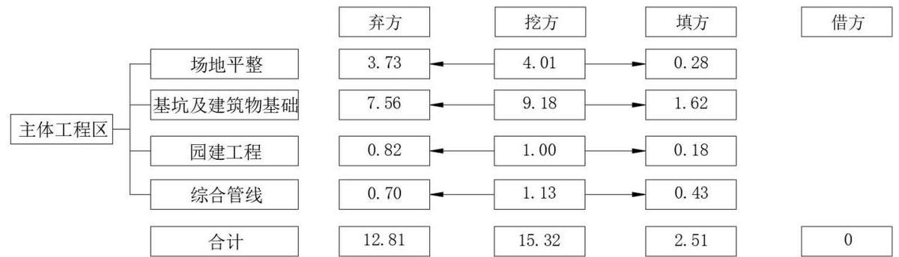
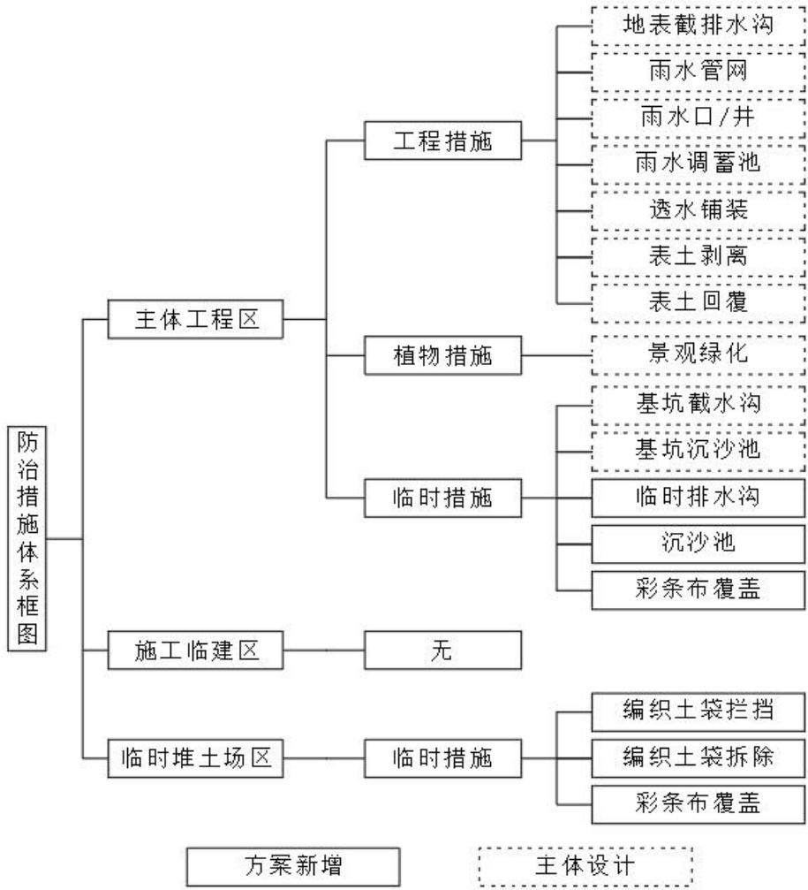

> **Zone C（应用范例层）使用边界**——仅可用于**写作风格、章节展开方式、表达逻辑、表格设计**的参考。
> **不得**用于合规判断；**不得**引入其项目数据（名称／地点／数字／单位名）；
> **不得**因其"曾经通过审批"而推定其做法在当前标准下仍然合规。
> 与 Zone A 冲突时**一律以 Zone A 为准**；Zone A 未明确规定时输出
> 「**Zone A 未明确规定，以下为参考写法，需人工判断**」。
>
> **坐标系警告**：本范例为**老八章结构**（GB 50433—2018 附录B），与 2026 版 10 章模板**同号不同义**
> （老 `1.5`＝防治目标，新 `1.5`＝水土流失预测结果；老 4→新 6 …偏移 +2；新版第 4/5 章老结构无独立章）。
> 因此 **`chapter_mapping: pending`——不得按章节号挂载**，检索一律走 `topic_tags`。
>
> **待加工**：`topic_tags`（主题标签）、`approval_basis_list`（编制依据逐字清单）、
> `structure_summary`（只提取结构：章节展开顺序／段落功能／表格栏目结构／句式模板／论证链步骤）。

1 综合说明 ......  
1.1 项目简况..  
1.2 编制依据...  
1.3 设计水平年.. ..8  
1.4 水土流失防治责任范围. .. 8  
1.5 水土流失防治目标... . 8  
1.6 项目水土保持评价结论.. ... 10  
1.7 水土流失预测结果.... ... 11  
1.8 水土保持措施布设成果.. ... 11  
1.9 水土保持监测方案..... .... 13  
1.10 水土保持投资及效益分析成果... .... 14  
1.11 结论 .... ....14  
2 项目概况 ....... .... 17  
2.1 项目组成及工程布置.. ... 17  
2.2 施工组织.. ....30  
2.3 工程占地... ....36  
2.4 土石方平衡.... ....37  
2.5 拆迁（移民）安置与专项设施改（迁）建...... ... 41  
2.6 施工进度... ...41  
2.7 自然概况.... ....42  
3 项目水土保持评价..... .... 48  
3.1 主体工程选址水土保持评价.. ... 48  
3.2 建设方案与布局水土保持评价. ... 49  
3.3 主体工程设计中水土保持措施界定.... ... 61  
4 水土流失分析与预测...... .... 63  
4.1 水土流失现状... ....63  
4.2 水土流失影响因素分析... ... 63  
4.3 土壤流失量预测.. . 65  
4.4 水土流失危害分析... .. 72  
4.5 指导性意见.. ...72  
5 水土保持措施 ....... ... 74  
5.1 防治区划分. .. 74  
5.2 措施总体布局. ...74  
5.3 分区措施布设. ...77  
5.4 施工要求.... ...89  
6 水土保持监测.... ... 93  
6.1 范围和时段. ...93  
6.2 内容和方法.. ... 93  
6.3 点位布设... ..97  
6.4 实施条件和成果.. .. 98  
7 水土保持投资估算及效益分析... ..102  
7.1 投资估算.. ...102  
7.2 效益分析.. ...112  
8 水土保持管理..... ... 118  
8.1 组织管理. ...118  
8.2 后续设计.... ..120  
8.3 水土保持监测. . 121  
8.4 水土保持监理.. 122  
8.5 水土保持施工 122  
8.6 水土保持设施验收.. . 122

## 1 综合说明

## 1.1 项目简况

## 1.1.1 项目建设必要性

中山大学是教育部、国家国防科技工业局和广东省共建的综合性全国重点大学，位列国家“双一流”、“985工程”、“211 工程”，入选国家“珠峰计划”、“111计划”、“2011计划”、新工科研究与实践项目、国家创新人才培养示范基地、国家国际科技合作基地等。广州作为粤港澳大湾区的国家中心城市，中山大学在培养高层次人才、服务地区发展方面扮演着关键角色，作为龙头学府之一，肩负着向国家输送优秀人才的重任。

本项目的建设符合国家规划和政策导向，不仅有利于解决中山大学当前宿舍资源紧张的问题，还能为学生提供更好的生活和学习环境，推动学校教育教学质量的提升。项目的实施将进一步提升中山大学的整体形象和影响力，推动学校在区域内外的知名度和竞争力，同时有助于培养更多具有创新精神和国际视野的优秀人才，为国家和地区的长远发展注入源源不断的活力和动力。

综上，本项目建设是必要的。

## 1.1.2 项目概况

中山大学广州校区东校园研究生公寓项目位于广东省广州市番禺区小谷围街道中山大学东校园内，项目由现状大学城贝岗村大街分隔的南北两个地块组成，建设区域东北侧为现状谷风路、中山大学第一\~四食堂等，西北侧为中山大学格致园，西南侧为大学城中大西路，东南侧为中山大学慎思园。项目中心点坐标为东经113°23'22"，北纬 23°03'33"。项目建设单位为中山大学，建设管理单位为广州市重点公共建设项目管理中心。

工程规划总用地面积为29881.00m2，总建筑面积为92504.00m2，其中地上建筑面积为 77000.00m2，地下建筑面积为 15504.00m2，计容建筑面积为 72474.00m2，容积率为2.42，建筑密度为27.44%，绿地率为15.27%，机动车位335个，非机动车停车位1000个。工程主要建设内容包含建构筑物工程、道路广场硬化工程，景观绿化工程及附属工程等。建构筑物工程包含 1#\~4#宿舍（1#、2#为博士楼，3#、4#为硕士楼）及垃圾房 1 栋，配套建设 1 层地下室，建筑物基底面积为 8195.00m2；道路及广场硬化面积为17120.23m2；景观绿化面积为4565.77m2；配套建设给排水管网等附属工程。

施工期间拟利用学校自有建设用地设置施工临建区 2 处，总用地面积约为0.69hm2，其中1处施工临建区拟将两地块之间的现状大学城贝岗村大街与规划用地红线一同围蔽，作为施工期间的材料堆放场地、钢筋加工场地、停车场等使用，围蔽施工临建区面积约为 0.43hm2，另一处施工临建区位于本项目北侧约 1.0km 处，为校内其他建设项目遗留下来的活动板房及硬化场地，施工期间作为施工项目部及施工人员宿舍使用，临时用地面积约为 0.26hm2。拟利用学校用地范围内 1 处需要提升改造的运动场作为临时堆土场使用，临时堆土场面积约为 0.95hm2，最大临时堆土量为 1.74万m3（自然方），换算松方约为2.09万m3。项目周边大学城中大西路、大学城贝岗村大街、谷风路、大学城中环东路、大学城内环东路、大学城中心北大街等现状道路可直接进入项目施工现场，不增设临时道路。

工程总占地 4.64hm2，其中永久占地面积为 2.99hm2，临时占地面积为 1.65hm2，占地类型为草地、公共管理与公共服务设施用地、交通运输用地及其他土地等。工程土石方挖、填总量为17.83 万m3（自然方，不含表土，下同），其中挖方总量为15.32万m3，填方总量为 2.51万m3，工程回填土方全部利用自身挖方，无借方，余方总量为12.81万m3，余方随挖随运，全部运至广州市海盛建筑废弃物固定式循环利用项目综合利用，工程不设置弃渣场。

工程计划 2026 年 6 月开工，2028 年 5 月完工，总工期 24 个月。估算总投资为57952.00 万元，土建投资约50556.58万元，资金通过申请中央投资和自筹解决。

本工程不涉及拆迁（移民）安置与专项设施改（迁）建。

## 1.1.3 项目前期工作进展情况

## a）前期工作开展情况

2004 年7月20 日，广州市城市规划局出具了学校的《建设用地规划许可证》（穗规地证 编号〔2004〕206号、穗规地证 编号〔2004〕210 号、穗规地证 编号〔2004194 号）。

2012 年6 月21日，建设单位取得项目建设用地批准书（穗国土建用字〔2012151 号）。

2012 年 6 月 21 日，建设单位取得中华人民共和国国有土地使用证（编号：G37-000009、G37-000010、G37-000011）。

2017 年12月12日，广州市国土资源和规划委员会以《关于同意修建性详细规划调整方案的批复》（穗国土规划批〔2017〕227 号）批复了中山大学（东校区）规划条件。

2024 年6月，广州高新工程顾问有限公司编制完成了《中山大学广州校区东校园研究生公寓项目可行性研究报告（修编稿）》。

2025 年7 月23日，中华人民共和国教育部以《教育部关于中山大学广州校区东校园研究生公寓项目可行性研究报告的批复》（教发函〔2025〕364 号）批复了项目可行性研究报告。（详见附件2）

2026 年1月5 日，建材广州工程勘测院有限公司编制完成了《中山大学广州校区东校园研究生公寓项目地下管线探测技术总结报告》。

2026 年1 月22日，浙江大学建筑设计研究院有限公司编制完成了《中山大学广州校区东校园研究生公寓勘察报告（详细勘察阶段）》。

2026 年2月，浙江大学建筑设计研究院有限公司编制完成了《中山大学广州校区东校园研究生公寓勘察设计初步设计》。

2026 年2月，广州市广绿园林绿化有限公司编制完成了《中山大学广州校区东校园研究生公寓城市树木保护专章》。

2026 年2 月10日，浙江大学建筑设计研究院有限公司编制完成《中山大学广州

校区东校园研究生公寓项目概算书》。

## b）水土保持方案报告书编报情况

2026年1月，项目建设管理单位广州市重点公共建设项目管理中心通过广东省网上中介服务超市选定中水珠江规划勘测设计有限公司（以下简称“我公司”）作为服务机构，编制本工程水土保持方案。

接受委托后，我公司组织技术人员进行了现场踏勘，收集了项目区自然概况、主体工程设计等有关资料，并按国家和广东省有关规定和要求，于 2026 年 4 月编制完成《中山大学广州校区东校园研究生公寓水土保持方案报告书》。

## 1.1.4 自然简况

项目建设区域属珠江三角洲冲积平原地貌，项目西北侧地块原地貌标高在11.68m\~20.29m 之间，整体高差约 8.61m，东南侧地块原地貌标高在 12.59m\~19.83m之间，整体高差约 7.24m。广州市属亚热带季风气候，多年平均气温22.7℃，多年平均降雨量 1737.0mm，年平均日照 1726.2h，年平均蒸发量 1664mm，年平均风速 1.8m/s，最大风速 22.0m/s；项目区土壤类型为赤红壤，项目建设区土壤类型主要为杂填土；地带性植被为南亚热带季风常绿阔叶林；项目建设用地范围内无自然水系，用地红线周边大学城中大西路、大学城贝岗村大街、谷风路等现状校内道路下分布有给排水等市政管网，本项目后续建成运行给水水源、雨污水排水出口均与现状市政给排水管网连接。

项目区属南方红壤区，二级区属华南沿海丘陵台地区，三级区属华南沿海丘陵台地人居环境维护区，土壤侵蚀以微度水力侵蚀为主，容许土壤流失量为500t/（km2·a）。根据《水利部办公厅关于做好国家级水土流失重点预防区和重点治理区落地上图成果应用的通知》（办水保〔2025〕170 号）、《广东省水利厅关于划分省级水土流失重点预防区和重点治理区的公告》（广东省水利厅，2015年10月13日）及《广州市水土保持规划修编（2024\~2035 年）》（广州市水务局，2025年2月），项目所在地不属于国家、广东省、广州市水土流失重点预防区和重点治理区。项目建设区不涉及饮用水水源保护区、水功能一级区的保护区和保留区、自然保护区、世界文化和自然遗产地、风景名胜区、地质公园、森林公园、重要湿地、生态保护红线以及河湖管理范围等水土保持敏感区。

## 1.2 编制依据

## 1.2.1 法律法规

（1）《中华人民共和国水土保持法》（全国人大，1991 年 6月29日通过，2010年 12 月 25 日修订，2011 年 3 月 1 日起实施）；

（2）《广东省水土保持条例》（2016年 9月29日广东省第十二届人民代表大会常务委员会第二十八次会议通过，2017年1月 1日起施行）。

## 1.2.2 部委规章

《生产建设项目水土保持方案管理办法》（2023年1月17日水利部令第53号发布，2023年3月1日实施）。

## 1.2.3 规范性文件

（1）《广东省水利厅关于划分省级水土流失重点预防区和重点治理区的公告》（2015 年 10 月 13 日）；

（2）《关于加强事中事后监管规范生产建设项目水土保持设施自主验收的通知》（水保〔2017〕365号）；

（3）《水利部办公厅关于印发生产建设项目水土保持技术文件编写和印制格式规定（试行）的通知》（办水保〔2018〕135号）；

（4）《水利部办公厅关于印发〈生产建设项目水土保持设施自主验收规程（试行）〉的通知》（水保〔2018〕133号）；

（5）《水利部关于进一步深化“放管服”改革全面加强水土保持监管的意见》（水保〔2019〕160 号）；

（6）《关于印发广东省水利厅水利监督管理办法（试行）的通知》（粤水办监督〔2020〕5号）；

（7）《水利部办公厅关于进一步加强生产建设项目水土保持监测工作的通知》（办水保〔2020〕161 号）；

（8）《广东省发展改革委 广东省财政厅 广东省水利厅关于规范水土保持补偿费征收标准的通知》（粤发改价格〔2021〕231号）；

（9）《水利部水土保持司关于进一步加强生产建设项目水土保持方案质量管理的通知》（水保监督函〔2022〕21号）；

（10）《水利部办公厅关于生产建设项目水土保持方案管理工作有关衔接事项的通知》（办水保函〔2023〕109号）；

（11）《水利部办公厅关于印发生产建设项目水土保持方案审查要点的通知》（办水保〔2023〕177 号）；

（12）《广东省水利厅关于进一步加强生产建设项目水土保持监测工作的通知》（粤水水保函〔2023〕1943号）；

（13）《广东省水利厅关于进一步加强生产建设项目水土保持方案质量管理的通知》（粤水水保函〔2024〕1526 号）；

（14）《广东省水利厅办公室关于印发<广东省水利厅生产建设项目水土保持方案审批工作制度>的通知》（粤水办水保〔2025〕28 号）；

（15）《水利部办公厅关于做好国家级水土流失重点预防区和重点治理区落地上图成果应用的通知》（办水保〔2025〕170号）；

（16）《广东省水利厅 广东省发展改革委 广东省财政厅关于规范水土保持补偿费征收工作的通知》（粤水规范字〔2026〕1号）；

（17）《水利部办公厅关于印发生产建设项目水土保持方案编制模板的通知》（办水保函〔2026〕232号）。

## 1.2.4 技术标准

（1）《生产建设项目水土保持技术标准》（GB 50433-2018）；

（2）《生产建设项目水土流失防治标准》（GB/T 50434-2018）；

（3）《水土保持工程设计规范》（GB 51018-2014）；

（4）《造林技术规程》（GB/T 15776-2023）；

（5）《生态公益林建设 导则》（GB/T 18337.1-2001）；

（6）《生态公益林建设 技术规程》（GB/T 18337.3-2001）；

（7）《生产建设项目水土保持监测与评价标准》（GB/T 51240-2018）；

（8）《水土保持工程调查与勘测标准》（GB/T 51297-2018）；

（9）《水利水电工程制图 第6部分：水土保持图》（SL 73.6-2026）；

（10）《土壤侵蚀分类分级标准》（SL 190-2007）；

（11）《生产建设项目土壤流失量测算导则》（SL 773-2018）；

（12）《水土保持监测技术规范》（SL/T 277-2024）；

（13）《室外给水设计标准》(GB 50013-2018)；

（14）《室外排水设计标准》(GB 50014-2021)；

（15）《园林绿化工程项目规范》（GB-55014-2021）；

（16）《水土保持监理规范》（SL/T 523-2024）；

（17）《表土剥离及其再利用技术要求》（GB/T 45107-2024）；

（18）《水土保持工程质量验收与评价规范》（SL/T 336-2025）；

（19）《生产建设项目水土保持设施验收技术规程》（GB/T 22490-2025）。

## 1.2.5 技术资料

（1）《中山大学广州校区东校园研究生公寓项目可行性研究报告（修编稿）》（广州高新工程顾问有限公司，2024年6月）。

（2）《中山大学广州校区东校园研究生公寓勘察设计初步设计》（浙江大学建筑设计研究院有限公司，2026 年2月）。

（3）《中山大学广州校区东校园研究生公寓项目概算书》（浙江大学建筑设计研究院有限公司，2026年2月10日）。

（4）《中山大学广州校区东校园研究生公寓勘察报告（详细勘察阶段）》（浙江大学建筑设计研究院有限公司，2026年1月22日）。

（5）《中山大学广州校区东校园研究生公寓城市树木保护专章》（广州市广绿园林绿化有限公司，2026年2 月）。

（6）《2025年度广东省水土流失动态监测项目成果报告》（广东省水利厅，2026年3月）。

（7）《全国水土保持规划（2015-2030 年）》。

（8）《广东省水土保持规划（2016-2030 年）》（广东省水利厅，2017年1 月）。

（9）《广州市水土保持规划修编（2024\~20235 年）》（广州市水务局，2025年2月）。

（10）建设单位提供的关于地形、工程设计、施工等资料。

## 1.3 设计水平年

工程计划2026 年6月开工，2028年5 月完工，总工期24个月。设计水平年为工程完工后的当年，即2028年。

## 1.4 水土流失防治责任范围

根据《生产建设项目水土保持技术标准》（GB50433-2018），生产建设项目水土流失防治责任范围应包括项目永久征地、临时占地（含租赁土地）以及其他使用与管辖区域。

本工程占地总面积为 4.64hm2，确定本工程的水土流失防治责任范围即为占地面积 4.64hm2。

## 1.5 水土流失防治目标

## 1.5.1 执行标准等级

根据《水利部办公厅关于做好国家级水土流失重点预防区和重点治理区落地上图成果应用的通知》（办水保〔2025〕170号）项目所在地广州市番禺区不属于国家级水土流失重点预防区和重点治理区，项目所在地也不涉及广东省、广州市水土流失重点预防区和重点治理区、不涉及饮用水水源保护区、水功能一级区的保护区和保留区、自然保护区、世界文化和自然遗产地、风景名胜区、地质公园、森林公园、重要湿地、生态保护红线以及河湖管理范围等水土保持敏感区。项目建设区域广州市番禺区属于县级以上城市区域，根据《生产建设项目水土流失防治标准》（GB/T 50434-2018），工程水土流失防治执行南方红壤区建设类项目一级标准。

## 1.5.2 防治目标

## a）基本目标

1）项目建设范围内的新增水土流失应得到有效控制，原有水土流失得到治理。

2）水土保持设施安全有效。

3）水土资源、林草植被应得到最大程度的保护与恢复。

b）六项指标目标值

## 1）规范值

南方红壤区一级标准施工期目标值：渣土防护率95%，表土保护率92%；设计水平年目标值：水土流失治理度98%，土壤流失控制比0.90，渣土防护率97%，表土保护率 92%，林草植被恢复率98%，林草覆盖率25%。

## 2）修正值

（1）土壤流失控制比：本工程位于南方红壤区，工程原地貌土壤侵蚀强度为微度，对防治标准中土壤流失控制比调整为1.0。

（2）渣土防护率：项目位于城市区，渣土防护率提高 2%，为99%。

（3）林草覆盖率：本项目实际绿化面积（投影）为 4565.77m2，水土流失防治责任范围面积为4.64hm2，实际林草覆盖率为9.91%。由于项目临时用地利用现状道路、硬化地表及操场等进行布置，施工结束后，施工临建区用地区域恢复现状道路及非机动车停车场，临时堆土场移交中山大学进行操场硬化地表升级改造，后续可恢复绿化区域面积有限，本方案根据项目实际林草覆盖率调整林草覆盖率指标，即为9.91%。

修正后，施工期采用的防治指标目标值为：渣土防护率 97%，表土保护率92%；设计水平年采用的防治指标目标值为：水土流失治理度 98%，土壤流失控制比 1.0，渣土防护率99%，表土保护率92%，林草植被恢复率98%，林草覆盖率9.91%。

表 1.5-1 防治目标值表
<table><tr><td rowspan=2 colspan=1>南方红壤区一级标准</td><td rowspan=1 colspan=2>标准规定</td><td rowspan=1 colspan=2>采用标准</td></tr><tr><td rowspan=1 colspan=1>施工期</td><td rowspan=1 colspan=1>设计水平年</td><td rowspan=1 colspan=1>施工期</td><td rowspan=1 colspan=1>设计水平年</td></tr><tr><td rowspan=1 colspan=1>水土流失治理度（%）</td><td rowspan=1 colspan=1>-</td><td rowspan=1 colspan=1>98</td><td rowspan=1 colspan=1>-</td><td rowspan=1 colspan=1>98</td></tr><tr><td rowspan=1 colspan=1>土壤流失控制比</td><td rowspan=1 colspan=1>-</td><td rowspan=1 colspan=1>0.90</td><td rowspan=1 colspan=1>-</td><td rowspan=1 colspan=1>1.0</td></tr><tr><td rowspan=1 colspan=1>渣土防护率（%）</td><td rowspan=1 colspan=1>95</td><td rowspan=1 colspan=1>97</td><td rowspan=1 colspan=1>97</td><td rowspan=1 colspan=1>99</td></tr><tr><td rowspan=1 colspan=1>表土保护率（%）</td><td rowspan=1 colspan=1>92</td><td rowspan=1 colspan=1>92</td><td rowspan=1 colspan=1>92</td><td rowspan=1 colspan=1>92</td></tr><tr><td rowspan=1 colspan=1>林草植被恢复率（%）</td><td rowspan=1 colspan=1>-</td><td rowspan=1 colspan=1>98</td><td rowspan=1 colspan=1>二</td><td rowspan=1 colspan=1>98</td></tr><tr><td rowspan=1 colspan=1>林草覆盖率（%）</td><td rowspan=1 colspan=1>-</td><td rowspan=1 colspan=1>25</td><td rowspan=1 colspan=1>-</td><td rowspan=1 colspan=1>9.91</td></tr></table>

## 1.6 项目水土保持评价结论

## 1.6.1 主体工程选址评价

通过现场查勘及查阅项目所在地土壤、植被、水土保持规划等有关资料，选址区域避开了全国水土保持监测网络中的水土保持监测站点，重点试验区，没有占用国家确定的水土保持长期定位观测站，建设区域及周边不存在泥石流等潜在危害。本工程满足《中华人民共和国水土保持法》、《生产建设项目水土保持技术标准》（GB50433-2018）及《广东省水土保持条例》中关于对主体工程选址的约束性要求。通过加强施工管理和落实水土保持措施，水土流失可以得到有效控制，工程建设不存在绝对禁止和严格限制的水土保持制约性因素。

## 1.6.2 建设方案与布局评价

（1）工程按园林标准对建设用地内的非硬化空地绿化美化，构筑了逐层渐进、与周边整体协调的多维度景观效果，配备了雨水利用设施；场地竖向布置结合现状地形，通过放坡、设置挡墙、架空层等在满足工程建设需要的同时最大程度上减少工程场地平整挖填土石方数量，工程建设方案符合水土保持要求。

（2）工程占地符合当地土地利用规划；永久占地在学校批复的规划用地范围内，用地指标由学校统筹，临建设施在充分利用其他项目遗留生活区的基础上，全部利用学校自有建设用地进行布置，用地满足施工需要、无漏项，符合节约用地和减少扰动的要求；工程占地符合水土保持要求。

（3）工程挖填方量无漏项和不足，符合最优化原则；基坑回填土方设置临时堆土区进行周转，满足土方调配利用需要。余方全部运至广州市海盛建筑废弃物固定式循环利用项目消纳，避免土石方乱堆弃。

（4）场地平整与基坑挖填相结合，施工顺序安排合理，避免了重复开挖和多次倒运；场地分片施工、机械挖填，减少了裸露时间和范围；施工采用场地四周实体围蔽、裸露地表临时苫盖、场地四周喷淋降尘、施工出入口车辆清洗、渣土车封闭运输等，施工方法和工艺基本符合水土保持要求。

（5）主体工程设计中有雨水管网、透水铺装、景观绿化、基坑截水沟、施工围蔽、洗车池等具有水土保持功能的措施，基本满足水土流失防治需要；本方案在此基础上，结合工程实际情况，补充施工期临时防护等措施，形成完整的水土流失防治体系。

## 1.7 水土流失预测结果

（1）工程占地总面积为 $4 . 6 4 \mathrm { h m } ^ { 2 }$ ，扰动地表面积为 $4 . 6 4 \mathrm { h m } ^ { 2 }$ ，损毁植被面积 $1 . 2 2 \mathrm { h m } ^ { 2 }$ 项目属于建设学校的公益性工程项目，免征水土保持补偿费。

（2）工程余方总量为 $1 2 . 8 1 \ \overline { { \mathcal { H } } } \ \mathrm { m } ^ { 3 }$ ，余方全部运至广州市海盛建筑废弃物固定式循环利用项目综合利用，不设置弃渣场。

（3）通过预测，本工程可能造成土壤流失量1509t，其中新增土壤流失量1500t，重点部位为主体工程区及临时堆土场区。

（4）经对项目及周边地形地貌分析，结合水土流失特点，预测本工程可能造成的水土流失危害主要表现在：泥水漫流影响周边市政道路、堵塞市政雨水管网、影响校内景观、影响工程自身安全等的影响。

## 1.8 水土保持措施布设成果

## 1.8.1 防治区划分

根据防治分区划分依据和原则，结合工程特点，将工程划分为主体工程区、施工临建区及临时堆土场区等3个水土流失防治区。

## 1.8.2 分区措施布设

## a）主体工程区

施工初期在项目用地红线周边现状尚未布设施工围蔽及排水沟的区域设置施工围蔽及临时排水沟，排水沟出口设置沉沙池；场地平整时剥离用地范围内的表土并集中堆放到临时堆土场内，采取临时拦挡及苫盖等措施进行防护；基坑施工期间在基坑顶部开挖坑顶截水沟；雨天及时对施工扰动产生的裸露地表、挖方边坡、基坑、综合管线管沟、未回填的管沟挖方等采取临时覆盖措施进行防护；施工后期实施地下雨水管网、雨水口/井、雨水调蓄池等措施，铺设地表透水铺装，景观绿化实施前采取表土回覆措施为绿化创造条件。

## b）施工临建区

工程建设期间拟设置的2处施工临建区分别利用现状大学城贝岗村大街及校内其他项目遗留的活动板房及硬化场地进行布置，用地区域现状均为硬化地表且无水土流失。施工结束后，利用贝岗村大街设置的施工临建区拆除活动板房后对道路破损区域进行修复，利用现状活动板房及硬化场地设置的施工临建区施工结束后按照学校规划保留现状硬化地表，后续作为校内非机动车停车场使用。

综上，施工临建区使用区域均保持硬化地表，本方案不新增水土保持相关措施，但建议建设单位加强施工期管理，控制施工扰动范围，减少对周边环境的影响。

## c）临时堆土场区

工程建设期间利用学校用地范围内1处需要提升改造的运动场作为临时堆土场使用，本方案补充土方堆放前场地周边的临时拦挡措施，土方堆放后及时采取彩条布覆盖措施防止降雨的冲刷。临时堆土场使用期间，将封闭运动场。临时堆土回填完成后，清理场地，交还给中山大学进行操场硬化地表升级改造。

## 1.8.3 主要工程量

## a）主体工程区

工程措施：表土剥离 0.12 万 m3，表土回覆0.12 万 $\mathrm { m } ^ { 3 }$ ，地表截排水沟 378m，雨水管网 1487.9m，雨水口/井 199 座，雨水调蓄池 2 座，透水铺装 6530.56m2。

植物措施：景观绿化5590.3m2。

临时措施：基坑截水沟921m，基坑沉沙池 2座，临时排水沟607m，沉沙池2座，彩条布覆盖1.05 万m2。

## b）施工临建区

施工临建区使用区域均保持硬化地表，本方案不新增水土保持相关措施，但建议建设单位加强施工期管理，控制施工扰动范围，减少对周边环境的影响。

## c）临时堆土场区

临时措施：编织土袋拦挡/拆除455m，彩条布覆盖1.06万m2。

## 1.9 水土保持监测方案

建设单位应自行或委托具有相应技术条件的机构开展水土保持监测工作。

水土保持监测范围为水土流失防治责任范围，本工程水土流失防治责任范围为4.64hm2，确定本工程水土保持监测范围为4.64hm2。监测分区与水土流失防治分区一致，划分为主体工程区、施工临建区、临时堆土场区等3个监测区。重点监测区域为主体工程区及临时堆土场区。水土保持监测应从施工准备期开始至设计水平年结束，工程计划2026年 6月开工，2028年5月完工，总工期24 个月。设计水平年为工程完工后的当年，即2028年。因此，本项目监测时段为2026 年6月开始至2028年12月。主要监测内容包含扰动土地情况、水土流失情况及水土保持措施情况，重点监测实际采取水土保持工程、植物和临时措施的位置、数量，以及实施水土保持措施前后的防治效果对比情况等。

采用实地调查法、定位监测法及遥感监测相结合的方法。在结合调查监测、巡查监测等方法及现场实际设置的监测点对工程进行全面监测的基础上，本工程后续监测期间共布设4个水土保持监测点，分别位于主体工程区西北侧地块排水出口、东南侧地块排水出口、施工临建区生活区用地区域及临时堆土场区临时堆土边坡。

水土保持措施实施情况及防治效果、水土流失量等每月至少调查记录1 次，扰动地表面积、水土流失面积、植物措施生长情况等每季度调查记录1次，水土流失灾害事件在发生后1周内完成监测。遥感监测在施工前1次、施工期每年不少于1次，并

根据监测内容进行加密观测。

监测成果相关文件应包括水土保持监测报告、监测表格及相关的监测图件，生产建设项目水土保持监测应在监测季报和总结报告中明确“绿黄红”三色评价结论。建设单位应在监测单位进场1 个月内向水行政主管部门报送监测实施方案，每季度第一个月底前向水行政主管部门报送上一季度水土保持监测季度报告，监测工作完成后3个月内报送水土保持监测总结报告。监测成果应定期报送至水利部珠江水利委员会、广东省水利厅、广州市水务局及番禺区水务局。

## 1.10 水土保持投资及效益分析成果

工程水土保持估算总投资 708.46 万元，其中：工程措施费 304.76 万元，植物措施费124.34 万元，监测措施费59.34万元，施工临时工程费76.51万元，独立费用79.10万元（建设管理费 14.13 万元，工程建设监理费 16.44 万元，科研勘测设计费 48.53万元），基本预备费64.41万元，免征水土保持补偿费。

本方案实施后，可治理水土流失面积4.64hm2，减少土壤流失量1500t，林草植被建设面积 0.46hm2。至设计水平年末，各项水土流失防治指标均可达到方案确定的防治目标值。

## 1.11 结论

## 1.11.1 结论

（1）经过分析，本项目主体工程选址、主体工程设计建设方案、工程占地、土石方平衡、施工组织等符合水土保持技术规范的相关规定，满足水土保持要求，无水土保持制约性因素，项目可行。通过本水土保持方案的实施，建设区水土流失得到一定控制，生态环境得到一定程度恢复，满足水土保持要求，无水土保持制约性因素。

（2）主体工程考虑了部分水土保持措施，不足部分经本方案完善后，水土保持措施体系合理、全面，实施水土保持措施后可达到控制水土流失的目的。

（3）虽然本项目的建设会在短时间内造成水土流失的加剧，但通过加强施工组织管理、优化施工方法、工艺及实施主体设计的水土流失防治措施，项目建设所产生的影响得到了有效控制，并能为环境所接受。同时，随着林草植被的逐年生长，对项目区生态环境也将带来有益的影响。

## 1.11.2 建议

根据工程建设区水土流失现状分析，为避免工程建设对项目区及周边水土流失的不利影响，并落实本方案设计中的水土流失防治措施，提出以下建议：

（1）建设管理：专人负责水土保持工作，及时组织开展水土保持监测、监理、验收等专项工作，水土保持设施验收不合格，主体工程不得投产使用。后续应加强临时堆土场防护，做好土石方数量与去向台账动态管理。

（2）工程设计：将本方案提出的水土保持措施纳入后续设计中，及时开展初步设计和施工图设计；后续设计和实施过程中，达到《生产建设项目水土保持方案管理办法》（水利部令第 53 号）中规定的变更条件时，应编制水土保持变更方案，报水利部审批。

（3）施工：按照“绿色施工”“文明施工”“先防护后施工”“先拦后弃”“避开连续阴雨天”等水土保持原则，合理制定施工组织方案，尽量减少土石方量；及时实施各项水土保持措施，确保发挥效益。

水土保持方案特性表
<table><tr><td rowspan=1 colspan=2>项目名称</td><td rowspan=1 colspan=7>中山大学广州校区东校园研究生公寓</td><td rowspan=1 colspan=9>流域管理机构</td><td rowspan=1 colspan=2>珠江水利委员会</td></tr><tr><td rowspan=1 colspan=2>涉及省（市、区</td><td rowspan=1 colspan=5>广东省</td><td rowspan=1 colspan=6>涉及地市或个数</td><td rowspan=1 colspan=3>广州市</td><td rowspan=1 colspan=3>涉及县或个数</td><td rowspan=1 colspan=1>番禺区</td></tr><tr><td rowspan=1 colspan=2>项目规模</td><td rowspan=1 colspan=6>规划总用地面积为29881.00m²，总建筑面积为92504.00m²，容积率为 2.42，建筑密度为 27.44%</td><td rowspan=1 colspan=4>总投资(万元)</td><td rowspan=1 colspan=3>57952.00</td><td></td><td rowspan=1 colspan=2>土建投资(万元)</td><td rowspan=1 colspan=2>50556.58</td></tr><tr><td rowspan=1 colspan=2>动工时间</td><td rowspan=1 colspan=5>2026年6月</td><td rowspan=1 colspan=3>完工时间</td><td rowspan=1 colspan=5>2028年5月</td><td></td><td rowspan=1 colspan=2>设计水平年</td><td rowspan=1 colspan=2>2028年</td></tr><tr><td rowspan=1 colspan=2>工程占地（hm²）</td><td rowspan=1 colspan=3>4.64</td><td rowspan=1 colspan=5>永久占地（hm²）</td><td rowspan=1 colspan=8>2.99     临时占地(hm²)</td><td rowspan=1 colspan=2>1.65</td></tr><tr><td rowspan=2 colspan=7>土石方量（万m³）</td><td rowspan=1 colspan=3>挖方</td><td rowspan=1 colspan=5>填方</td><td></td><td rowspan=1 colspan=2>借方</td><td rowspan=1 colspan=2>余（弃）方</td></tr><tr><td rowspan=1 colspan=3>15.32</td><td rowspan=1 colspan=5>2.51</td><td></td><td rowspan=1 colspan=2>0</td><td rowspan=1 colspan=2>12.81</td></tr><tr><td rowspan=1 colspan=4>重点防治区名称</td><td rowspan=1 colspan=16>不涉及重点治理区及预防区</td></tr><tr><td rowspan=1 colspan=4>地貌类型</td><td rowspan=1 colspan=6>珠江三角洲冲积平原</td><td rowspan=1 colspan=9>水土保持区划</td><td rowspan=1 colspan=1>南方红壤区</td></tr><tr><td rowspan=1 colspan=4>土壤侵蚀类型</td><td rowspan=1 colspan=6>水力侵蚀</td><td rowspan=1 colspan=9>土壤侵蚀强度</td><td rowspan=1 colspan=1>微度</td></tr><tr><td rowspan=1 colspan=4>防治责任范围面积（hm²）</td><td rowspan=1 colspan=6>4.64</td><td rowspan=1 colspan=9>容许土壤流失量（t/km²·a）</td><td rowspan=1 colspan=1>500</td></tr><tr><td rowspan=1 colspan=4>土壤流失预测总量（t）</td><td rowspan=1 colspan=6>1509</td><td rowspan=1 colspan=9>新增土壤流失量（t）</td><td rowspan=1 colspan=1>1500</td></tr><tr><td rowspan=1 colspan=4>水土流失防治标准执行等级</td><td rowspan=1 colspan=6></td><td rowspan=1 colspan=10>南方红壤区一级标准</td></tr><tr><td rowspan=3 colspan=1>防治目标</td><td rowspan=1 colspan=3>水土流失治理度（%）</td><td rowspan=1 colspan=6>98</td><td rowspan=1 colspan=9>土壤流失控制比</td><td rowspan=1 colspan=1>1.0</td></tr><tr><td rowspan=1 colspan=3>渣土防护率（%）</td><td rowspan=1 colspan=6>99</td><td rowspan=1 colspan=9>表土保护率（%）</td><td rowspan=1 colspan=1>92</td></tr><tr><td rowspan=1 colspan=3>林草植被恢复率（%）</td><td rowspan=1 colspan=6>98</td><td rowspan=1 colspan=9>林草覆盖率（%）</td><td rowspan=1 colspan=1>9.91</td></tr><tr><td rowspan=5 colspan=1>防治措施及工程量</td><td rowspan=1 colspan=2>防治分区</td><td rowspan=1 colspan=7>工程措施</td><td rowspan=1 colspan=5>植物措施</td><td></td><td rowspan=1 colspan=4>临时措施</td></tr><tr><td rowspan=1 colspan=2>主体工程区</td><td rowspan=1 colspan=7>主体已有：表土剥离0.12万m³，表土回覆0.12万m³，地表截排水沟378m，雨水管网1487.9m，雨水口/井199座，雨水调蓄池2座，透水铺装 6530.56m²。</td><td rowspan=1 colspan=5>主体已有：景观绿基化 5590.3m²。</td><td></td><td rowspan=1 colspan=4>主体已有：基坑截水沟921m，坑沉沙池2座。方案新增：临时排水沟607m，沉沙池2座，彩条布覆盖1.05万m²。</td></tr><tr><td rowspan=1 colspan=2>施工临建区</td><td rowspan=1 colspan=7>/</td><td rowspan=1 colspan=5>1</td><td></td><td rowspan=1 colspan=4>1</td></tr><tr><td rowspan=1 colspan=2>临时堆土场区</td><td rowspan=1 colspan=7>/</td><td rowspan=1 colspan=5>/</td><td></td><td rowspan=1 colspan=4>方案新增：编织土袋拦挡/拆除455m，彩条布覆盖1.06万m2。</td></tr><tr><td rowspan=1 colspan=2>投资（万元）</td><td rowspan=1 colspan=7>304.76</td><td rowspan=1 colspan=5>124.34</td><td></td><td rowspan=1 colspan=4>76.51</td></tr><tr><td rowspan=1 colspan=3>水土保持总投资（万元）</td><td rowspan=1 colspan=8>708.46</td><td rowspan=1 colspan=6>独立费用（万元）</td><td rowspan=1 colspan=3>79.10</td></tr><tr><td rowspan=1 colspan=3>工程建设监理费（万元）</td><td rowspan=1 colspan=3>16.44</td><td rowspan=1 colspan=5>监测费（万元）</td><td rowspan=1 colspan=3>59.34</td><td rowspan=1 colspan=4>补偿费（元）</td><td rowspan=1 colspan=2>0</td></tr><tr><td rowspan=1 colspan=2>方案编制单位</td><td rowspan=1 colspan=9>中水珠江规划勘测设计有限公司</td><td rowspan=1 colspan=4>建设单位</td><td rowspan=1 colspan=5>中山大学</td></tr><tr><td rowspan=1 colspan=2>法定代表人</td><td rowspan=1 colspan=9>陈光存</td><td rowspan=1 colspan=4>法定代表人</td><td rowspan=1 colspan=5>高松</td></tr><tr><td rowspan=1 colspan=2>地址</td><td rowspan=1 colspan=9>广州市天河区天寿路沾益直街19号</td><td rowspan=1 colspan=4>地址</td><td rowspan=1 colspan=5>广州市新港西路135号中山大学 415栋230 室</td></tr><tr><td rowspan=1 colspan=2>邮编</td><td rowspan=1 colspan=9>510610</td><td rowspan=1 colspan=4>邮编</td><td rowspan=1 colspan=5>511400</td></tr><tr><td rowspan=1 colspan=2>联系人及电话</td><td rowspan=1 colspan=9>孙业欣、18924111126</td><td rowspan=1 colspan=4>联系人及电话</td><td rowspan=1 colspan=5>廖样、1591431086</td></tr><tr><td rowspan=1 colspan=2>传真</td><td rowspan=1 colspan=9>020-87117441</td><td rowspan=1 colspan=4>传真</td><td rowspan=1 colspan=5>1</td></tr><tr><td rowspan=1 colspan=2>电子信箱</td><td rowspan=1 colspan=9>754947539@qq.com</td><td rowspan=1 colspan=4>电子信箱</td><td rowspan=1 colspan=5>liaoy258@mail.sysu.edu.cn</td></tr></table>

## 2 项目概况

## 2.1 项目组成及工程布置

## 2.1.1 项目基本情况

项目名称：中山大学广州校区东校园研究生公寓

建设单位：中山大学

建设管理单位：广州市重点公共建设项目管理中心

建设性质：新建建设类项目

建设地点：位于广东省广州市番禺区小谷围街道中山大学东校园内，项目由现状大学城贝岗村大街分隔的南北两个地块组成，建设区域东北侧为现状谷风路、中山大学第一\~四食堂等，西北侧为中山大学格致园，西南侧为大学城中大西路，东南侧为中山大学慎思园。项目中心点坐标为东经113°23'22"，北纬23°03'33"

建设规模：中山大学广州校区东校园研究生公寓工程规划总用地面积为29881.00m2，总建筑面积为 92504.00m2，其中地上建筑面积为 77000.00m2，地下建筑面积为 15504.00m2，计容建筑面积为 72474.00m2，容积率为 2.42，建筑密度为 27.44%，绿地率为15.27%，机动车位335个，非机动车停车位1000 个

建设内容：工程主要建设内容包含建构筑物工程、道路广场硬化工程，景观绿化工程及附属工程等。建构筑物工程包含 1#\~4#宿舍（1#、2#为博士楼，3#、4#为硕士楼）及垃圾房 1栋，配套建设 1 层地下室，建筑物基底面积为 8195.00m2；道路及广场硬化面积为 17120.23m2；景观绿化面积为 4565.77m2；配套建设给排水管网等附属工程

工程投资：估算总投资为 57952.00 万元，土建投资约 50556.58 万元，资金通过申请中央投资和自筹解决

建设工期：工程计划2026 年6月开工，2028年5月完工，总工期24 个月

表 2.1-1 工程特性表
<table><tr><td rowspan=1 colspan=5>一、基本情况</td></tr><tr><td rowspan=1 colspan=1>1</td><td rowspan=1 colspan=1>项目名称</td><td rowspan=1 colspan=3>中山大学广州校区东校园研究生公寓</td></tr><tr><td rowspan=1 colspan=1>2</td><td rowspan=1 colspan=1>建设单位</td><td rowspan=1 colspan=3>中山大学</td></tr><tr><td rowspan=1 colspan=1>3</td><td rowspan=1 colspan=1>建设管理单位</td><td rowspan=1 colspan=3>广州市重点公共建设项目管理中心</td></tr><tr><td rowspan=1 colspan=1>4</td><td rowspan=1 colspan=1>建设地点</td><td rowspan=1 colspan=3>广州市番禺区小谷围街道</td></tr><tr><td rowspan=1 colspan=1>5</td><td rowspan=1 colspan=1>工程性质</td><td rowspan=1 colspan=3>建设类项目，新建工程</td></tr><tr><td rowspan=1 colspan=1>6</td><td rowspan=1 colspan=1>建设内容</td><td rowspan=1 colspan=3>包含建构筑物工程，建筑周边道路、广场、景观绿化及附属工程等</td></tr><tr><td rowspan=10 colspan=1>7</td><td rowspan=10 colspan=1>建设规模</td><td rowspan=1 colspan=1>项目</td><td rowspan=1 colspan=1>单位</td><td rowspan=1 colspan=1>指标</td></tr><tr><td rowspan=1 colspan=1>规划用地面积</td><td rowspan=1 colspan=1>m²</td><td rowspan=1 colspan=1>29881.00</td></tr><tr><td rowspan=1 colspan=1>总建筑面积</td><td rowspan=1 colspan=1> $\mathrm { m } ^ { 2 }$ </td><td rowspan=1 colspan=1>92504.00</td></tr><tr><td rowspan=1 colspan=1>地上建筑面积</td><td rowspan=1 colspan=1> $\mathrm { m } ^ { 2 }$ </td><td rowspan=1 colspan=1>77000.00</td></tr><tr><td rowspan=1 colspan=1>地下建筑面积</td><td rowspan=1 colspan=1> $\mathrm { m } ^ { 2 }$ </td><td rowspan=1 colspan=1>15504.00</td></tr><tr><td rowspan=1 colspan=1>计容积率建筑面积</td><td rowspan=1 colspan=1> $\mathrm { m } ^ { 2 }$ </td><td rowspan=1 colspan=1>72474.00</td></tr><tr><td rowspan=1 colspan=1>容积率</td><td rowspan=1 colspan=1></td><td rowspan=1 colspan=1>2.42</td></tr><tr><td rowspan=1 colspan=1>建筑密度</td><td rowspan=1 colspan=1>%</td><td rowspan=1 colspan=1>27.44</td></tr><tr><td rowspan=1 colspan=1>机动车停车位</td><td rowspan=1 colspan=1>个</td><td rowspan=1 colspan=1>335</td></tr><tr><td rowspan=1 colspan=1>非机动车停车位</td><td rowspan=1 colspan=1>个</td><td rowspan=1 colspan=1>1000</td></tr><tr><td rowspan=1 colspan=1>8</td><td rowspan=1 colspan=1>总投资</td><td rowspan=1 colspan=3>估算总投资为 57952.00 万元，其中土建投资约50556.58 万元</td></tr><tr><td rowspan=1 colspan=1>9</td><td rowspan=1 colspan=1>建设工期</td><td rowspan=1 colspan=3>2026年6月开工，2028年5月完工，总工期24个月</td></tr></table>

续表 2.1-1 工程特性表
<table><tr><td rowspan=1 colspan=7>二、施工组织</td></tr><tr><td rowspan=1 colspan=1>施工临建区</td><td rowspan=1 colspan=6>拟设置施工临建区2处，总用地面积约为0.69hm²。其中1处施工临建区拟将两地块之间的现状大学城贝岗村大街与规划用地红线一同围蔽，作为施工期间的材料堆放场地、钢筋加工场地、停车场等使用，另一处施工临建区位于本项目北侧约1.0km处，为校内其他建设项目遗留下来的活动板房及硬化场地，施工期间作为施工项目部及施工人员宿舍使用</td></tr><tr><td rowspan=1 colspan=1>临时堆土场</td><td rowspan=1 colspan=6>拟利用学校用地范围内1处需要提升改造的运动场作为临时堆土场使用，临时堆土场面积约为0.95hm²，表土及一般土方分开堆放，其中西南角表土堆放区域面积为0.09hm²，一般土方堆放区域面积为0.86hm²。最大临时堆土量为2.09万m³（松方），最大堆高不超过2.5m，坡比为1：2，一般土方堆存时间从2026年11月~2027年7月，表土堆存时间从2026年7月~2028年3月</td></tr><tr><td rowspan=1 colspan=1>余方处置</td><td rowspan=1 colspan=6>全部运至广州市海盛建筑废弃物固定式循环利用项目利用，不设置弃渣场</td></tr><tr><td rowspan=1 colspan=1>施工交通</td><td rowspan=1 colspan=6>项目建设用地区域周边的现状道路有大学城中大西路、大学城贝岗村大街、谷风路、大学城中环东路、大学城内环东路、大学城中心北大街等，通过现状道路可直接进入施工场地，交通较便利</td></tr><tr><td rowspan=1 colspan=1>施工用水</td><td rowspan=1 colspan=6>从项目东北侧谷风路上接引</td></tr><tr><td rowspan=1 colspan=1>施工用电</td><td rowspan=1 colspan=6>采取永临结合的方式，从校内既有供电系统接引</td></tr><tr><td rowspan=1 colspan=1>施工通讯</td><td rowspan=1 colspan=6>采用移动通信</td></tr><tr><td rowspan=1 colspan=7>三、项目组成及占地情况</td></tr><tr><td rowspan=1 colspan=2>项目</td><td rowspan=1 colspan=2>单位</td><td rowspan=1 colspan=1>永久占地</td><td rowspan=1 colspan=1>临时占地</td><td rowspan=1 colspan=1>合计</td></tr><tr><td rowspan=1 colspan=2>主体工程区</td><td rowspan=1 colspan=2>hm²</td><td rowspan=1 colspan=1>2.99</td><td rowspan=1 colspan=1>0.01</td><td rowspan=1 colspan=1>3.00</td></tr><tr><td rowspan=1 colspan=2>施工临建区</td><td rowspan=1 colspan=2>hm²</td><td rowspan=1 colspan=1></td><td rowspan=1 colspan=1>0.69</td><td rowspan=1 colspan=1>0.69</td></tr><tr><td rowspan=1 colspan=2>临时堆土场区</td><td rowspan=1 colspan=2>hm²</td><td rowspan=1 colspan=1></td><td rowspan=1 colspan=1>0.95</td><td rowspan=1 colspan=1>0.95</td></tr><tr><td rowspan=1 colspan=2>合计</td><td rowspan=1 colspan=2>hm²</td><td rowspan=1 colspan=1>2.99</td><td rowspan=1 colspan=1>1.65</td><td rowspan=1 colspan=1>4.64</td></tr><tr><td rowspan=1 colspan=7>四、工程土石方量</td></tr><tr><td rowspan=1 colspan=1>总挖方（万m³）</td><td rowspan=1 colspan=1>15.32</td><td></td><td rowspan=1 colspan=4>场地平整、基坑开挖、建筑物基础开挖、综合管线管沟开挖等</td></tr><tr><td rowspan=1 colspan=1>总填方（万m³）</td><td rowspan=1 colspan=1>2.51</td><td></td><td rowspan=1 colspan=4>场地平整、基坑回填、建筑物基础回填、综合管线管沟回填等</td></tr><tr><td rowspan=1 colspan=1>总借方（万m³）</td><td rowspan=1 colspan=1>0</td><td></td><td rowspan=1 colspan=4></td></tr><tr><td rowspan=1 colspan=1>总弃方（万m³）</td><td rowspan=1 colspan=1>12.81</td><td></td><td rowspan=1 colspan=4>剩余工程挖方等</td></tr><tr><td rowspan=1 colspan=7>五、拆迁安置</td></tr><tr><td rowspan=1 colspan=7>工程不涉及拆迁（移民）安置与专项设施改（迁）建</td></tr></table>

## 2.1.2 依托工程相关情况

## 2.1.2.1 拆除东校园格致堂、诚正堂、治平堂、修齐堂等 4栋临时建筑

本工程规划用地红线内原地貌建有中山大学东校园格致堂、诚正堂、治平堂、修齐堂等 4 栋临时建筑，4 栋建筑均属于中山大学自有资产。2025 年 4 月 16 日，中共中山大学委员会办公室及中山大学校长办公室以《中共中山大学委员会常务委员会（扩大）会议决定事项通知》（党办通〔2025〕139号）审议通过拆除东校园格致堂、诚正堂、治平堂、修齐堂等4栋临时建筑。中山大学委托广州产权交易所有限公司通过公开市场公开竞价方式交易，2025年11月与杭州景磊建设工程有限公司签订《资产交易合同》：处置中山大学广州校区东校园格致堂、诚正堂、治平堂、修齐堂四栋建筑物拆除后建筑残余物残余价值（含拆除工程）。

截至 2026 年 2 月，规划用地红线内 4 栋临时建筑已全部拆除并清运完成，拆除区域采取了绿网覆盖措施进行苫盖。拆除工程未单独立项，也未编报水土保持方案。

## 2.1.3 项目组成及布置

本工程主要由建构筑物工程、道路广场硬化工程，景观绿化工程及附属工程等组成。

表2.1-2 项目组成一览表
<table><tr><td rowspan=1 colspan=1>项目</td><td rowspan=1 colspan=1>项目组成</td></tr><tr><td rowspan=1 colspan=1>建构筑物工程</td><td rowspan=1 colspan=1>建构筑物工程包含1#~4#宿舍及垃圾房1栋，配套建设1层地下室，建筑物基底面积为8195.00m²，总建筑面积为92504.00m²，容积率为2.42，建筑密度为 27.44%</td></tr><tr><td rowspan=1 colspan=1>道路广场硬化工程</td><td rowspan=1 colspan=1>建筑物及场地周边设置环形消防道路及硬化铺装地表，道路广场硬化总面积为17120.23m²</td></tr><tr><td rowspan=1 colspan=1>景观绿化工程</td><td rowspan=1 colspan=1>景观绿化（含边坡绿化1024.53m²、下凹式绿地2342.90m²）措施面积为5590.30m²，投影面积为4565.77m²</td></tr><tr><td rowspan=1 colspan=1>附属工程</td><td rowspan=1 colspan=1>工程规划新建生活给水管网总长度为225.8m，新建绿化喷淋给水管网总长度约为1440.7m，新建消防给水管网总长度约为609.4m，新建污、废水管网总长度为1357.3m，新建雨水管网总长度为1487.9m，新建埋地电缆总长度为1564.3m</td></tr></table>

## 2.1.3.1 总平面布置

建设用地位于广东省广州市番禺区小谷围街道中山大学东校园内，项目由现状大学城贝岗村大街分隔的南北两个地块组成，建设区域东北侧为现状谷风路、中山大学第一\~四食堂等，西北侧为中山大学格致园，西南侧为大学城中大西路，东南侧为中山大学慎思园。两块用地均为较规则的矩形，其中西北侧地块面积为10268.85m2，南北长约168m，东西宽约60m；东南侧地块面积为 19612.15m2，南北长约170m，东西宽约 115m。

工程充分考虑节约用地及与周边环境的协调，打造“一环、一轴、二街、多院”的总平面布置，“一环”即用地红线周边的生态林荫环，“一轴”即东西走向的礼仪景观轴，“二街”即沿现状大学城贝岗村大街两侧分布的活力学生街，“多院”即建筑周边穿插设置的休闲庭院。其中西北侧地块呈南北走向布置 1#及 2#博士宿舍，垃圾房位于地块西北角，东南侧地块呈南北走向布置 3#及 4#研究生宿舍。项目沿东侧及南侧现有道路设置人行主出入口，宿舍区对校内范围不设围墙，有多个人行次出入口；沿整个宿舍区外圈设置环形车道，在西侧道路设置三个仅供消防车进入的应急消防出入口，从庭院进入以满足消防要求，日常无车辆驶入。交通组织遵循人车分流设置原则，车辆从宿舍区外部环形车道进出，不设机动车道驶入宿舍区内部，非机动车借用西侧车道就近进入宿舍首层的非机动车位。

## a）建构筑物工程

建构筑物工程包含 1#\~4#宿舍（1#、2#为博士楼，3#、4#为硕士楼）及垃圾房 1栋，配套建设1 层地下室，建筑物基底面积为 $8 1 9 5 . 0 0 \mathrm { m } ^ { 2 }$ ，总建筑面积为 $9 2 5 0 4 . 0 0 \mathrm { m } ^ { 2 }$ 其中地上建筑面积为 $7 7 0 0 0 . 0 0 \mathrm { m } ^ { 2 }$ ，地下建筑面积为 $1 5 5 0 4 . 0 0 \mathrm { m } ^ { 2 }$ ，计容建筑面积为$7 2 4 7 4 . 0 0 \mathrm { m } ^ { 2 }$ ，容积率为2.42，建筑密度为27.44%。建筑基础采用钻孔灌注桩基础及旋挖灌注桩基础等，钢筋混凝土框架-剪力墙结构。

表2.1-3 建构筑基本情况一览表
<table><tr><td rowspan=1 colspan=1>建筑名称</td><td rowspan=1 colspan=1>建筑面积（m²）</td><td rowspan=1 colspan=1>层数（地上/地下）</td><td rowspan=1 colspan=1>建筑高度（m）</td><td rowspan=1 colspan=1>结构形式</td><td rowspan=1 colspan=1>主要功能</td></tr><tr><td rowspan=1 colspan=1>1#宿舍(博士楼)</td><td rowspan=1 colspan=1>6986</td><td rowspan=1 colspan=1>6/1</td><td rowspan=1 colspan=1>24.15</td><td rowspan=1 colspan=1>钢筋混凝土框架剪力墙结构</td><td rowspan=1 colspan=1>1层为配套用房、架空、配套用房及电房；2层为师生活动，3~6层为学生宿舍</td></tr><tr><td rowspan=1 colspan=1>2#宿舍(博士楼)</td><td rowspan=1 colspan=1>10394</td><td rowspan=1 colspan=1>8/1</td><td rowspan=1 colspan=1>31.35</td><td rowspan=1 colspan=1>钢筋混凝土框架剪力墙结构</td><td rowspan=1 colspan=1>1层为为架空、配套用房及电房；2层为师生活动，3~6层为学生宿舍</td></tr><tr><td rowspan=1 colspan=1>3#宿舍(硕士楼)</td><td rowspan=1 colspan=1>28920</td><td rowspan=1 colspan=1>12/1</td><td rowspan=1 colspan=1>41.95</td><td rowspan=1 colspan=1>钢筋混凝土框架剪力墙结构</td><td rowspan=1 colspan=1>1层和部分2层为门头、架空、师生活动用房及电房；2~12层为学生宿舍</td></tr><tr><td rowspan=1 colspan=1>4#宿舍(硕士楼)</td><td rowspan=1 colspan=1>30680</td><td rowspan=1 colspan=1>12/1</td><td rowspan=1 colspan=1>41.95</td><td rowspan=1 colspan=1>钢筋混凝土框架剪力墙结构</td><td rowspan=1 colspan=1>1层和部分2层为门头、架空、配套用房及电房；2~12层为学生宿舍</td></tr><tr><td rowspan=1 colspan=1>垃圾房</td><td rowspan=1 colspan=1>20</td><td rowspan=1 colspan=1>1</td><td rowspan=1 colspan=1>3.15</td><td rowspan=1 colspan=1>钢筋混凝土结构</td><td rowspan=1 colspan=1></td></tr></table>

## b）道路广场硬化工程

建构筑物及场地周边设置环形消防道路及硬化铺装地表，新建环形消防车道总长度约为1056m，道路宽度不小于4.0m，车道转弯半径不小于12.0m，路面采用透水混凝土及透水沥青砼。高层所在的场地长边设置消防登高场地，消防登高场地累积长度与建筑等长，宽10m，共设置消防登高场地5处。其他硬化铺装主要采用石英砖、花岗岩、高粘度改性排水沥青砼及彩色强固透水砼等。

道路广场硬化总面积为17120.23m2，其中透水铺装硬化面积为 6530.56m2。

## c）景观绿化工程

本项目景观绿化着重拓展多元复合的学生活动空间，满足日常学习、休闲、通行、停车等需求，营造出富有归属感的校园空间，实现景观观赏性与功能性的高度融合。景观绿化立体层次丰富，主要以常绿乔木、灌木和草坪相结合，主要选用广东乡土植物，从高到低分为大乔木、小乔木、灌木、地被植物等层次。栽植的乔灌木主要有：凤凰木、小叶榄仁、细叶榕、火焰木、红花木棉、红花鸡蛋花树、桂花、紫花风铃木、蒲葵、琴叶珊瑚等；地被植物主要有：大叶油草、络石、肾蕨、九里香等。景观绿化（含边坡绿化 $1 0 2 4 . 5 3 \mathrm { m } ^ { 2 }$ 、下凹式绿地 $2 3 4 2 . 9 0 \mathrm { m } ^ { 2 }$ ）措施面积为 $5 5 9 0 . 3 0 \mathrm { m } ^ { 2 }$ ，投影面积为4565.77m2。

表 2.1-4 景观绿化栽植乔木一览表
<table><tr><td rowspan=1 colspan=1>序号</td><td rowspan=1 colspan=1>名称</td><td rowspan=1 colspan=1>胸（地）径（cm）</td><td rowspan=1 colspan=1>高度（cm）</td><td rowspan=1 colspan=1>冠幅（cm）</td><td rowspan=1 colspan=1>单位</td><td rowspan=1 colspan=1>数量</td></tr><tr><td rowspan=1 colspan=1>1</td><td rowspan=1 colspan=1>特选凤凰木A</td><td rowspan=1 colspan=1>32-35</td><td rowspan=1 colspan=1>9.5-10</td><td rowspan=1 colspan=1>6-6.5</td><td rowspan=1 colspan=1>株</td><td rowspan=1 colspan=1>1</td></tr><tr><td rowspan=1 colspan=1>2</td><td rowspan=1 colspan=1>小叶榄仁</td><td rowspan=1 colspan=1>16-18</td><td rowspan=1 colspan=1>8-8.5</td><td rowspan=1 colspan=1>3.5-4</td><td rowspan=1 colspan=1>株</td><td rowspan=1 colspan=1>14</td></tr><tr><td rowspan=1 colspan=1>3</td><td rowspan=1 colspan=1>特选细叶榕A</td><td rowspan=1 colspan=1>32-35</td><td rowspan=1 colspan=1>8-8.5</td><td rowspan=1 colspan=1>5-5.5</td><td rowspan=1 colspan=1>株</td><td rowspan=1 colspan=1>11</td></tr><tr><td rowspan=1 colspan=1>4</td><td rowspan=1 colspan=1>火焰木B</td><td rowspan=1 colspan=1>16-18</td><td rowspan=1 colspan=1>8-8.5</td><td rowspan=1 colspan=1>3.5-4</td><td rowspan=1 colspan=1>株</td><td rowspan=1 colspan=1>4</td></tr><tr><td rowspan=1 colspan=1>5</td><td rowspan=1 colspan=1>特选红花木棉A</td><td rowspan=1 colspan=1>32-35</td><td rowspan=1 colspan=1>9.5-10</td><td rowspan=1 colspan=1>5.5-6</td><td rowspan=1 colspan=1>株</td><td rowspan=1 colspan=1>1</td></tr><tr><td rowspan=1 colspan=1>6</td><td rowspan=1 colspan=1>特选红花鸡蛋花树A</td><td rowspan=1 colspan=1>D16-18</td><td rowspan=1 colspan=1>3-3.5</td><td rowspan=1 colspan=1>3.5-4</td><td rowspan=1 colspan=1>株</td><td rowspan=1 colspan=1>2</td></tr><tr><td rowspan=1 colspan=1>7</td><td rowspan=1 colspan=1>桂花C</td><td rowspan=1 colspan=1></td><td rowspan=1 colspan=1>4.5-5</td><td rowspan=1 colspan=1>4-4.5</td><td rowspan=1 colspan=1>株</td><td rowspan=1 colspan=1>1</td></tr><tr><td rowspan=1 colspan=1>8</td><td rowspan=1 colspan=1>桂花D</td><td rowspan=1 colspan=1></td><td rowspan=1 colspan=1>3.5-4</td><td rowspan=1 colspan=1>3.5-4</td><td rowspan=1 colspan=1>株</td><td rowspan=1 colspan=1>1</td></tr><tr><td rowspan=1 colspan=1>9</td><td rowspan=1 colspan=1>桂花E</td><td rowspan=1 colspan=1></td><td rowspan=1 colspan=1>2.5-3</td><td rowspan=1 colspan=1>2.5-3</td><td rowspan=1 colspan=1>株</td><td rowspan=1 colspan=1>1</td></tr><tr><td rowspan=1 colspan=1>10</td><td rowspan=1 colspan=1>丛生玉蕊B</td><td rowspan=1 colspan=1>总 D25-30</td><td rowspan=1 colspan=1>4-5</td><td rowspan=1 colspan=1>4-4.5</td><td rowspan=1 colspan=1>株</td><td rowspan=1 colspan=1>8</td></tr><tr><td rowspan=1 colspan=1>11</td><td rowspan=1 colspan=1>紫花风铃木</td><td rowspan=1 colspan=1>18-20</td><td rowspan=1 colspan=1>8-8.5</td><td rowspan=1 colspan=1>4-4.5</td><td rowspan=1 colspan=1>株</td><td rowspan=1 colspan=1>4</td></tr><tr><td rowspan=1 colspan=1>12</td><td rowspan=1 colspan=1>丛生小叶紫薇A</td><td rowspan=1 colspan=1></td><td rowspan=1 colspan=1>4.5-5</td><td rowspan=1 colspan=1>3.5-4</td><td rowspan=1 colspan=1>株</td><td rowspan=1 colspan=1>10</td></tr><tr><td rowspan=1 colspan=1>13</td><td rowspan=1 colspan=1>广州樱A</td><td rowspan=1 colspan=1>d9-10</td><td rowspan=1 colspan=1>3-3.5</td><td rowspan=1 colspan=1>3-3.5</td><td rowspan=1 colspan=1>株</td><td rowspan=1 colspan=1>5</td></tr><tr><td rowspan=1 colspan=1></td><td rowspan=1 colspan=1>合计</td><td rowspan=1 colspan=1></td><td rowspan=1 colspan=1></td><td rowspan=1 colspan=1></td><td rowspan=1 colspan=1></td><td rowspan=1 colspan=1>63</td></tr></table>

表2.1-5 景观绿化栽植灌木一览表
<table><tr><td rowspan=1 colspan=1>序号</td><td rowspan=1 colspan=1>名称</td><td rowspan=1 colspan=1>高度（cm）</td><td rowspan=1 colspan=1>冠幅（cm）</td><td rowspan=1 colspan=1>单位</td><td rowspan=1 colspan=1>数量</td></tr><tr><td rowspan=1 colspan=1>1</td><td rowspan=1 colspan=1>蒲葵A</td><td rowspan=1 colspan=1>1.8-2</td><td rowspan=1 colspan=1>1.8-2</td><td rowspan=1 colspan=1>株</td><td rowspan=1 colspan=1>20</td></tr><tr><td rowspan=1 colspan=1>2</td><td rowspan=1 colspan=1>琴叶珊瑚A</td><td rowspan=1 colspan=1>2-2.2</td><td rowspan=1 colspan=1>1.8-2</td><td rowspan=1 colspan=1>株</td><td rowspan=1 colspan=1>11</td></tr><tr><td rowspan=1 colspan=1>3</td><td rowspan=1 colspan=1>金山棕</td><td rowspan=1 colspan=1>1.2</td><td rowspan=1 colspan=1>1-1.2</td><td rowspan=1 colspan=1>株</td><td rowspan=1 colspan=1>3</td></tr><tr><td rowspan=1 colspan=1></td><td rowspan=1 colspan=1>合计</td><td rowspan=1 colspan=1></td><td rowspan=1 colspan=1></td><td rowspan=1 colspan=1></td><td rowspan=1 colspan=1>34</td></tr></table>

表 2.1-6 景观绿化栽植灌木及地被面积一览表
<table><tr><td rowspan=2 colspan=1>序号</td><td rowspan=2 colspan=1>名称</td><td rowspan=1 colspan=2>规格</td><td rowspan=2 colspan=1>单位</td><td rowspan=2 colspan=1>数量</td></tr><tr><td rowspan=1 colspan=1>高度（cm）</td><td rowspan=1 colspan=1>冠幅（cm）</td></tr><tr><td rowspan=1 colspan=1>1</td><td rowspan=1 colspan=1>火山榕绿篱柱A</td><td rowspan=1 colspan=1>150</td><td rowspan=1 colspan=1>35-40</td><td rowspan=1 colspan=1>m</td><td rowspan=1 colspan=1>24.4</td></tr><tr><td rowspan=1 colspan=1>2</td><td rowspan=1 colspan=1>火山榕绿篱柱B</td><td rowspan=1 colspan=1>120</td><td rowspan=1 colspan=1>35-40</td><td rowspan=1 colspan=1> $\mathbf { m }$ </td><td rowspan=1 colspan=1>21.7</td></tr><tr><td rowspan=1 colspan=1>3</td><td rowspan=1 colspan=1>鹤望兰</td><td rowspan=1 colspan=1>60-80</td><td rowspan=1 colspan=1>45-50</td><td rowspan=1 colspan=1> $\mathrm { m } ^ { 2 }$ </td><td rowspan=1 colspan=1>37.4</td></tr><tr><td rowspan=1 colspan=1>4</td><td rowspan=1 colspan=1>黄丽乌蕉</td><td rowspan=1 colspan=1>55-60</td><td rowspan=1 colspan=1>40-45</td><td rowspan=1 colspan=1> $\mathrm { m } ^ { 2 }$ </td><td rowspan=1 colspan=1>39.9</td></tr><tr><td rowspan=1 colspan=1>5</td><td rowspan=1 colspan=1>红鸟蕉</td><td rowspan=1 colspan=1>55-60</td><td rowspan=1 colspan=1>40-45</td><td rowspan=1 colspan=1> $\mathrm { m } ^ { 2 }$ </td><td rowspan=1 colspan=1>38.3</td></tr><tr><td rowspan=1 colspan=1>6</td><td rowspan=1 colspan=1>金心也门铁</td><td rowspan=1 colspan=1>40-45</td><td rowspan=1 colspan=1>30-35</td><td rowspan=1 colspan=1> $\mathrm { m } ^ { 2 }$ </td><td rowspan=1 colspan=1>37.4</td></tr><tr><td rowspan=1 colspan=1>7</td><td rowspan=1 colspan=1>青叶也门铁</td><td rowspan=1 colspan=1>40-45</td><td rowspan=1 colspan=1>30-35</td><td rowspan=1 colspan=1> $\mathrm { m } ^ { 2 }$ </td><td rowspan=1 colspan=1>102.9</td></tr><tr><td rowspan=1 colspan=1>8</td><td rowspan=1 colspan=1>红花闭鞘姜</td><td rowspan=1 colspan=1>40-45</td><td rowspan=1 colspan=1>35-40</td><td rowspan=1 colspan=1> $\mathrm { m } ^ { 2 }$ </td><td rowspan=1 colspan=1>101.4</td></tr><tr><td rowspan=1 colspan=1>9</td><td rowspan=1 colspan=1>一叶兰</td><td rowspan=1 colspan=1>40-45</td><td rowspan=1 colspan=1>35-40</td><td rowspan=1 colspan=1> $\mathrm { m } ^ { 2 }$ </td><td rowspan=1 colspan=1>109.4</td></tr><tr><td rowspan=1 colspan=1>10</td><td rowspan=1 colspan=1>花叶万年青</td><td rowspan=1 colspan=1>35</td><td rowspan=1 colspan=1>30</td><td rowspan=1 colspan=1> $\mathrm { m } ^ { 2 }$ </td><td rowspan=1 colspan=1>8.8</td></tr><tr><td rowspan=1 colspan=1>11</td><td rowspan=1 colspan=1>金脉爵床</td><td rowspan=1 colspan=1>35</td><td rowspan=1 colspan=1>30</td><td rowspan=1 colspan=1> $\mathrm { m } ^ { 2 }$ </td><td rowspan=1 colspan=1>76.2</td></tr><tr><td rowspan=1 colspan=1>12</td><td rowspan=1 colspan=1>彩霞变叶木</td><td rowspan=1 colspan=1>35</td><td rowspan=1 colspan=1>30</td><td rowspan=1 colspan=1> $\mathrm { m } ^ { 2 }$ </td><td rowspan=1 colspan=1>52</td></tr><tr><td rowspan=1 colspan=1>13</td><td rowspan=1 colspan=1>小叶龙船花</td><td rowspan=1 colspan=1>35</td><td rowspan=1 colspan=1>30</td><td rowspan=1 colspan=1> $\mathrm { m } ^ { 2 }$ </td><td rowspan=1 colspan=1>232.7</td></tr><tr><td rowspan=1 colspan=1>14</td><td rowspan=1 colspan=1>茉莉花</td><td rowspan=1 colspan=1>35</td><td rowspan=1 colspan=1>30</td><td rowspan=1 colspan=1> $\mathrm { m } ^ { 2 }$ </td><td rowspan=1 colspan=1>94.1</td></tr><tr><td rowspan=1 colspan=1>15</td><td rowspan=1 colspan=1>蜘蛛兰</td><td rowspan=1 colspan=1>30-35</td><td rowspan=1 colspan=1>25-30</td><td rowspan=1 colspan=1> $\mathrm { m } ^ { 2 }$ </td><td rowspan=1 colspan=1>72.2</td></tr><tr><td rowspan=1 colspan=1>16</td><td rowspan=1 colspan=1>翠芦莉</td><td rowspan=1 colspan=1>30</td><td rowspan=1 colspan=1>15</td><td rowspan=1 colspan=1> $\mathrm { m } ^ { 2 }$ </td><td rowspan=1 colspan=1>3.4</td></tr><tr><td rowspan=1 colspan=1>17</td><td rowspan=1 colspan=1>迷迭香</td><td rowspan=1 colspan=1>25-30</td><td rowspan=1 colspan=1>25-30</td><td rowspan=1 colspan=1> $\mathrm { m } ^ { 2 }$ </td><td rowspan=1 colspan=1>3.5</td></tr><tr><td rowspan=1 colspan=1>18</td><td rowspan=1 colspan=1>蓝雪花</td><td rowspan=1 colspan=1>25-30</td><td rowspan=1 colspan=1>25-30</td><td rowspan=1 colspan=1> $\mathrm { m } ^ { 2 }$ </td><td rowspan=1 colspan=1>114.9</td></tr><tr><td rowspan=1 colspan=1>19</td><td rowspan=1 colspan=1>九里香</td><td rowspan=1 colspan=1>25</td><td rowspan=1 colspan=1>20</td><td rowspan=1 colspan=1> $\mathrm { m } ^ { 2 }$ </td><td rowspan=1 colspan=1>156.3</td></tr><tr><td rowspan=1 colspan=1>20</td><td rowspan=1 colspan=1>细叶萼距花</td><td rowspan=1 colspan=1>25</td><td rowspan=1 colspan=1>20</td><td rowspan=1 colspan=1> $\mathrm { m } ^ { 2 }$ </td><td rowspan=1 colspan=1>18.6</td></tr><tr><td rowspan=1 colspan=1>21</td><td rowspan=1 colspan=1>小叶栀子</td><td rowspan=1 colspan=1>25</td><td rowspan=1 colspan=1>20</td><td rowspan=1 colspan=1> $\mathrm { m } ^ { 2 }$ </td><td rowspan=1 colspan=1>170.3</td></tr><tr><td rowspan=1 colspan=1>22</td><td rowspan=1 colspan=1>毛杜鹃</td><td rowspan=1 colspan=1>25</td><td rowspan=1 colspan=1>20</td><td rowspan=1 colspan=1> $\mathrm { m } ^ { 2 }$ </td><td rowspan=1 colspan=1>252.8</td></tr><tr><td rowspan=1 colspan=1>23</td><td rowspan=1 colspan=1>花叶冷水花</td><td rowspan=1 colspan=1>20</td><td rowspan=1 colspan=1>15</td><td rowspan=1 colspan=1>m²</td><td rowspan=1 colspan=1>86.3</td></tr><tr><td rowspan=1 colspan=1>24</td><td rowspan=1 colspan=1>肾蕨</td><td rowspan=1 colspan=1>20</td><td rowspan=1 colspan=1>13</td><td rowspan=1 colspan=1> $\mathrm { m } ^ { 2 }$ </td><td rowspan=1 colspan=1>29.3</td></tr><tr><td rowspan=1 colspan=1>25</td><td rowspan=1 colspan=1>络石</td><td rowspan=1 colspan=1>15</td><td rowspan=1 colspan=1>15</td><td rowspan=1 colspan=1> $\mathrm { m } ^ { 2 }$ </td><td rowspan=1 colspan=1>193.2</td></tr><tr><td rowspan=1 colspan=1>26</td><td rowspan=1 colspan=1>大叶油草</td><td rowspan=1 colspan=1></td><td rowspan=1 colspan=1></td><td rowspan=1 colspan=1> $\mathrm { m } ^ { 2 }$ </td><td rowspan=1 colspan=1>3559</td></tr><tr><td rowspan=1 colspan=1></td><td rowspan=1 colspan=1>合计</td><td rowspan=1 colspan=1></td><td rowspan=1 colspan=1></td><td rowspan=1 colspan=1></td><td rowspan=1 colspan=1>5590.3</td></tr></table>

## 2.1.3.2 竖向布置

## 1）原地貌标高

根据原地貌地形图及岩土工程勘察报告，项目西北侧地块原地貌标高在11.68m\~20.29m 之间，整体高差约 8.61m，地块内全部为堆放的人工杂填土，现状为人工草地，地块整体上南高北低，东高西低，用地红线内西侧及北侧现状分布有长约197m 的填方边坡，填方边坡高度在3.55m\~6.51m之间。

东南侧地块原地貌标高在12.59m\~19.83m 之间，整体高差约 7.24m，地块内原有四栋建筑中山大学通过“拆除后建筑残余物残余价值（含拆除工程）”公开竞价后施工拆除，现状场地较平整，整体上南高北低。用地红线内西南侧现状分布有长约 140m的挖方边坡，挖方边坡高度在 0.5m\~1.68m 之间；用地红线内东侧及北侧现状分布有长约246m 的填方边坡，填方边坡高度在2.50m 左右。

## 2）设计标高

主体工程规划设计中充分考虑场地现状地形，为顺应场地高差，减少对场地的破坏，场地结合不同位置进行不同的标高设计，通过设置挡墙、绿地及景观地台化解高差。

西北侧地块设计室外地坪标高在 11.80m\~20.30m 之间，高差 8.50m，建筑平台区域标高为12.65m 及17.15m，地块整体上南高北低，设计室内地坪标高为12.80m，室内外高差为 0.15m，基底地面坡度不小于 0.3%且不大于 8%，便于有组织排水。新建一层地下室设计底板标高为7.40m，地下室层高为3.45m\~5.25m之间。

东南侧地块设计室外地坪标高在 12.70m\~20.89m 之间，高差 8.19m，建筑平台区域标高为 17.45m，地块整体上西南高，东北低，设计室内地坪标高为 17.60m，室内外高差为 0.15m，基底地面坡度不小于 0.3%且不大于 8%，便于有组织排水。新建一层地下室设计底板标高为 12.20m\~12.80m 之间，地下室层高为 3.05m\~5.10m 之间。

## 3）基坑支护

## （1）基坑开挖概况

西北侧地块设置1层地下室，地下室层高在3.45m\~5.25m 之间，基坑开挖施工区域原地貌标高在 12.80m\~20.30m 之间，建筑正负零标高为 12.80m，地下室底板绝对标高为 7.40m，底板及垫层厚度为 0.9m，基坑开挖深度在 6.50m\~14.00m 之间。考虑地下室侧壁的施工空间，基坑边线为地下室边线外扩 1.5m。基坑周长约 407m，面积约 6616m2，长约 145m，宽约 51m。

东南侧地块设置1 层地下室，地下室层高在3.05m\~5.10m 之间，基坑开挖施工区域原地貌标高在 12.70m\~20.00m 之间，建筑正负零标高为 17.60m，地下室底板绝对标高在 12.20m\~12.80m 之间，底板及垫层厚度为 0.9m，基坑开挖深度在 1.60m\~8.90m之间。考虑地下室侧壁的施工空间，基坑边线为地下室边线外扩 1.5m。基坑周长约514m，面积约 14790m2，长约 155m，宽约 88m。

## （2）基坑支护方式

本工程基坑采用混凝土灌注桩排桩墙挡土、桩背后采用大直径单轴搅拌桩形成止水帷幕、坑内设置一道可回收锚索和一道钢筋混凝土水平内支撑的围护结构，坑中坑采用自然放坡。

## （3）基坑降（排）水

基坑顶部四周设置截水沟，拦截基坑外侧地表水，土方开挖时，在拟先期施工部位挖敞口集水井，集水明排。随着基坑开挖深度的增加，基坑内明排集水井随之加深，保证基坑内水位始终低于开挖面。基坑开挖至基坑底以后，在基坑底周边设置排水沟，通过集水井排出坑内积水。若基坑监测过程中，因降水导致地面沉降等异常情况产生，应立即停止降水并进行回灌。

基坑排水系统主要为：坑底集水井及排水沟，坑顶截水沟及沉沙池。坑底排水沟采用 1.0cm 厚水泥砂浆抹面砖砌结构，尺寸为：300mm×300mm×300mm（顶宽×底宽×高）；坑底集水井采用 1.0cm 厚水泥砂浆抹面砖砌结构，尺寸分别为：800mm×800mm×1000mm 及 600mm×600mm×1000mm（长×宽×深）；坑顶截水沟采用1.0cm 厚水泥砂浆抹面砖砌结构，尺寸为：300mm×300mm×400mm（顶宽×底宽×高）；坑顶沉沙池 C20 素混凝土垫层砖砌矩形结构，尺寸为 2800mm×1500mm×1500mm（长×宽×深）。坑顶截水沟收集坑顶雨水并用于接收坑底抽水，坑顶截水沟以明沟形式排放。基坑降（排）水共设置基坑顶部截水沟 921m，基坑沉沙池 2 座，基坑底部排水沟829m，坑底集水井24座。

## 4）边坡分布

## （1）项目内部边坡

根据主体工程竖向布置，西北侧地块内部边坡分布在西南侧与大学城中大西路衔接区域，其他区域绿地采用台阶式或设置挡墙进行场地内高差衔接，挖方边坡分布长度约为 50.0m，高度在 2.43m\~5.08m 之间，坡比为 1：0.8\~1：1.6，边坡主要采取景观绿化+植草的方式进行防护，并协调整个项目的绿化布置。

东南侧地块内部边坡分布在西北侧与大学城贝岗大街衔接处及西南侧与大学城中大西路衔接区域，挖方边坡分布长度约为 170.0m，高度在 0.47m\~3.44m 之间，坡比为1：2.2\~1：3.8，边坡主要采取景观绿化+植草的方式进行防护，并协调整个项目的绿化布置。

挖方边坡防护植草面约积为 1024.53m2，采用铺植大油叶草的方式进行防护，大油叶草采用草卷，规格尺寸为100cm×30cm/卷。项目内边坡分布情况详见下表。

表 2.1-7 项目内边坡分布一览表
<table><tr><td rowspan=1 colspan=1>序号</td><td rowspan=1 colspan=2>项目</td><td rowspan=1 colspan=1>分布长度（m）</td><td rowspan=1 colspan=1>高差（m）</td><td rowspan=1 colspan=1>坡比</td><td rowspan=1 colspan=1>防护方案</td></tr><tr><td rowspan=1 colspan=1>1</td><td rowspan=1 colspan=1>西北侧地块</td><td rowspan=1 colspan=1>西南侧</td><td rowspan=1 colspan=1>50.0</td><td rowspan=1 colspan=1>2.43~5.08</td><td rowspan=1 colspan=1>1：0.8~1：1.6</td><td rowspan=1 colspan=1>放坡绿化</td></tr><tr><td rowspan=1 colspan=1>2</td><td rowspan=1 colspan=1>东南侧地块</td><td rowspan=1 colspan=1>西北侧与东南侧</td><td rowspan=1 colspan=1>170.0</td><td rowspan=1 colspan=1>0.47~3.44</td><td rowspan=1 colspan=1>1:2.2~1: 3.8</td><td rowspan=1 colspan=1>放坡绿化</td></tr></table>

## （2）项目四周衔接情况

根据项目竖向设计及项目内边坡分布情况，工程在满足建设需要的同时，充分考虑与周边现状道路的衔接、土石方挖填数量最优等因素，通过图2.1-11\~2.1-16的展示，项目建成后用地红线边界设计标高与周边现状道路等标高高差在 0\~0.5m 之间，通过设置的绿地、围墙、挡墙及排水沟等可以直接过渡衔接。

## 2.1.3.3 附属工程

## a）给水管网

## 1）生活给水管网

本项目在中山大学番禺校园内建设，给水水源来自市政给水管网，本项目两个地块均拟从东北侧谷风路上现状DN300市政给水管网接引一条DN200给水管进入项目区内，并在地块内形成闭环，市政给水管网供至本地块给水压力不小于0.35MPa。

工程规划新建生活给水管网总长度为225.8m，管径在DN150\~DN300之间，采用球墨铸铁管，明挖直埋的方式敷设。

表2.1-8 给水管网工程量一览表
<table><tr><td rowspan=1 colspan=1>序号</td><td rowspan=1 colspan=3>项目</td><td rowspan=1 colspan=1>管径/型号</td><td rowspan=1 colspan=1>单位</td><td rowspan=1 colspan=1>数量</td></tr><tr><td rowspan=1 colspan=1>1</td><td rowspan=2 colspan=3></td><td rowspan=1 colspan=1>DN150</td><td rowspan=1 colspan=1>m</td><td rowspan=1 colspan=1>194.4</td></tr><tr><td rowspan=1 colspan=1>2</td><td rowspan=1 colspan=1>球墨铸铁管</td><td rowspan=1 colspan=1>DN300</td><td rowspan=1 colspan=1>m</td><td rowspan=1 colspan=1>31.4</td></tr><tr><td rowspan=1 colspan=1>3</td><td rowspan=1 colspan=3></td><td rowspan=1 colspan=1>合计</td><td rowspan=1 colspan=1>m</td><td rowspan=1 colspan=1>225.8</td></tr><tr><td rowspan=1 colspan=1>4</td><td rowspan=1 colspan=3>砌筑井</td><td rowspan=1 colspan=1>标准水表井</td><td rowspan=1 colspan=1>座</td><td rowspan=1 colspan=1>1</td></tr></table>

2）杂用水给水管网（绿化喷淋、消防、地面冲洗用水等）

工程杂用水给水管网从东北侧谷风路上现状 DN200 市政杂用水主管接引，杂用水主管长度约为 20.0m，管径为DN150，明挖直埋的方式敷设。其他绿化、消防、地面冲洗用水等杂用水管网从杂用水主管上接引，根据项目规划需要在场地内敷设。

工程新建消防给水管网总长度约为 609.4m，管径在DN100\~DN300 之间，采用钢丝网骨架塑料（聚乙烯）复合管及 SC无缝管，明挖直埋的方式敷设。

工程新建绿化喷淋给水管网总长度约为 1440.7m，管径在 De32\~De90 之间，PE给水管，明挖直埋的方式敷设。

表 2.1-9 消防给水管网工程量一览表
<table><tr><td rowspan=1 colspan=1>序号</td><td rowspan=1 colspan=1>项目</td><td rowspan=1 colspan=1>管径/型号</td><td rowspan=1 colspan=1>单位</td><td rowspan=1 colspan=1>数量</td></tr><tr><td rowspan=1 colspan=1>1</td><td rowspan=1 colspan=1>SC 无缝管</td><td rowspan=1 colspan=1>DN100</td><td rowspan=1 colspan=1>m</td><td rowspan=1 colspan=1>130.6</td></tr><tr><td rowspan=1 colspan=1>2</td><td rowspan=4 colspan=1>钢丝网骨架塑料（聚乙烯）复合管</td><td rowspan=1 colspan=1>DN150</td><td rowspan=1 colspan=1>m</td><td rowspan=1 colspan=1>311.9</td></tr><tr><td rowspan=1 colspan=1>3</td><td rowspan=1 colspan=1>DN200</td><td rowspan=1 colspan=1>m</td><td rowspan=1 colspan=1>130.6</td></tr><tr><td rowspan=1 colspan=1>4</td><td rowspan=1 colspan=1>DN300</td><td rowspan=1 colspan=1>m</td><td rowspan=1 colspan=1>36.3</td></tr><tr><td rowspan=1 colspan=1>5</td><td rowspan=1 colspan=1>合计</td><td rowspan=1 colspan=1></td><td rowspan=1 colspan=1>609.4</td></tr><tr><td rowspan=1 colspan=1>6</td><td rowspan=1 colspan=1>室外消火栓闸阀井</td><td rowspan=1 colspan=1></td><td rowspan=1 colspan=1>座</td><td rowspan=1 colspan=1>4</td></tr><tr><td rowspan=1 colspan=1>7</td><td rowspan=1 colspan=1>室外消火栓</td><td rowspan=1 colspan=1></td><td rowspan=1 colspan=1>套</td><td rowspan=1 colspan=1>8</td></tr></table>

表 2.1-10 绿化喷淋给水管网工程量一览表
<table><tr><td rowspan=1 colspan=1>序号</td><td rowspan=1 colspan=7>项目</td><td rowspan=1 colspan=1>管径/型号</td><td rowspan=1 colspan=1>单位</td><td rowspan=1 colspan=1>数量</td></tr><tr><td rowspan=1 colspan=1>1</td><td rowspan=2 colspan=7></td><td rowspan=1 colspan=1>de32</td><td rowspan=1 colspan=1>m</td><td rowspan=1 colspan=1>106.3</td></tr><tr><td rowspan=1 colspan=1>2</td><td rowspan=1 colspan=1>de40</td><td rowspan=1 colspan=1>m</td><td rowspan=1 colspan=1>584.1</td></tr><tr><td rowspan=1 colspan=1>3</td><td rowspan=2 colspan=7>PE给水管</td><td rowspan=1 colspan=1>de63</td><td rowspan=1 colspan=1>m</td><td rowspan=1 colspan=1>466.7</td></tr><tr><td rowspan=1 colspan=1>4</td><td rowspan=1 colspan=3></td><td rowspan=1 colspan=1>de80</td><td rowspan=1 colspan=1>m</td><td rowspan=1 colspan=1>269.8</td></tr><tr><td rowspan=2 colspan=1>5</td><td rowspan=2 colspan=2></td><td rowspan=1 colspan=1></td><td rowspan=2 colspan=2></td><td rowspan=1 colspan=1></td><td rowspan=2 colspan=1></td><td rowspan=2 colspan=1>de90</td><td rowspan=2 colspan=1>m</td><td rowspan=2 colspan=1>13.8</td></tr><tr><td rowspan=1 colspan=3></td><td rowspan=1 colspan=2></td></tr><tr><td rowspan=1 colspan=1>6</td><td rowspan=1 colspan=7></td><td rowspan=1 colspan=1>合计</td><td rowspan=1 colspan=1></td><td rowspan=1 colspan=1>1440.7</td></tr></table>

## b）室外排水管网

工程排水采用分流制，即室外雨、污水分流。

## 1）污、废水管网

项目东北侧谷风路上现状预留有 1 路\~2 路污水接入口，检查井底绝对标高约在9.30m\~10.04m 之间，埋深及管径可接纳本工程污水接入。项目最高日污水量762.85m3/d，最大小时污水量 95.36m3/h。工程新建污、废水管网总长度为 1357.3m（规划红线外 18.9m），管道均采用Ⅱ级钢筋混凝土排水管，管径为 DN300，配套建设污水检查井共105座，化粪池2 座。

表2.1-11 污、废水管网工程量一览表
<table><tr><td rowspan=1 colspan=1>序号</td><td rowspan=1 colspan=1>项目</td><td rowspan=1 colspan=1>管径/型号</td><td rowspan=1 colspan=1>单位</td><td rowspan=1 colspan=1>数量</td></tr><tr><td rowspan=1 colspan=1>1</td><td rowspan=1 colspan=1>ⅡI级钢筋混凝土管</td><td rowspan=1 colspan=1>DN300</td><td rowspan=1 colspan=1>m</td><td rowspan=1 colspan=1>1357.3</td></tr><tr><td rowspan=1 colspan=1>2</td><td rowspan=1 colspan=1>混凝土污水检查井</td><td rowspan=1 colspan=1>Φ1000</td><td rowspan=1 colspan=1>座</td><td rowspan=1 colspan=1>105</td></tr><tr><td rowspan=1 colspan=1>3</td><td rowspan=2 colspan=1>化粪池</td><td rowspan=1 colspan=1>25m³</td><td rowspan=1 colspan=1>座</td><td rowspan=1 colspan=1>1</td></tr><tr><td rowspan=1 colspan=1>4</td><td rowspan=1 colspan=1>100m³</td><td rowspan=1 colspan=1>座</td><td rowspan=1 colspan=1>1</td></tr></table>

## 2）雨水管网

本工程东北侧谷风路上分别有DN500及DN600校区雨水管接入口，检查井底绝对标高在8.55m\~11.738m 之间，埋深及管径可接纳本工程雨水接入。工程雨水管网布置结合工程竖向设计规划设置2个雨水出口分别位于西北侧地块的西北角、东南侧地块的东北侧及东北角，通过雨水调蓄池收集的雨水最终排水现状谷风路雨水管网内。

工程新建雨水管网总长度为 1487.9m（其中红线外长度为 12.2m），管径在DN300\~DN600之间，管道采用Ⅱ级钢筋混凝土排水管。配套建设雨水井104座，雨水口 85 座。为了满足海绵城市建设要求，在西北侧地块西侧及东南侧地块东侧雨水管排水出口接入市政管网前，分别设置 1 座重型 PP模块雨水调蓄池（采购安装），雨水调蓄池容积为 360m3及 225m3。

表 2.1-12 雨水管网工程量一览表
<table><tr><td rowspan=1 colspan=1>序号</td><td rowspan=1 colspan=1>项目</td><td rowspan=1 colspan=1>管径/型号</td><td rowspan=1 colspan=1>单位</td><td rowspan=1 colspan=1>数量</td></tr><tr><td rowspan=1 colspan=1>1</td><td rowspan=2 colspan=1></td><td rowspan=1 colspan=1>DN300</td><td rowspan=1 colspan=1>m</td><td rowspan=1 colspan=1>930.9</td></tr><tr><td rowspan=1 colspan=1>2</td><td rowspan=1 colspan=1>DN400</td><td rowspan=1 colspan=1>m</td><td rowspan=1 colspan=1>251.9</td></tr><tr><td rowspan=1 colspan=1>3</td><td rowspan=1 colspan=1>ⅡI级钢筋混凝土管</td><td rowspan=1 colspan=1>DN500</td><td rowspan=1 colspan=1>m</td><td rowspan=1 colspan=1>238.6</td></tr><tr><td rowspan=1 colspan=1>4</td><td rowspan=2 colspan=1></td><td rowspan=1 colspan=1>DN600</td><td rowspan=1 colspan=1>m</td><td rowspan=1 colspan=1>66.5</td></tr><tr><td rowspan=1 colspan=1>5</td><td rowspan=1 colspan=1>合计</td><td rowspan=1 colspan=1></td><td rowspan=1 colspan=1>1487.9</td></tr><tr><td rowspan=1 colspan=1>6</td><td rowspan=1 colspan=1>混凝土雨水检查井</td><td rowspan=1 colspan=1>Φ1000</td><td rowspan=1 colspan=1>座</td><td rowspan=1 colspan=1>104</td></tr><tr><td rowspan=1 colspan=1>7</td><td rowspan=1 colspan=1>圆形溢流雨水口</td><td rowspan=1 colspan=1>DN150</td><td rowspan=1 colspan=1>座</td><td rowspan=1 colspan=1>65</td></tr><tr><td rowspan=1 colspan=1>8</td><td rowspan=1 colspan=1>砖砌平篦式单篦雨水口</td><td rowspan=1 colspan=1></td><td rowspan=1 colspan=1>座</td><td rowspan=1 colspan=1>30</td></tr><tr><td rowspan=1 colspan=1>9</td><td rowspan=1 colspan=1>重型 PP 模块雨水调蓄池</td><td rowspan=1 colspan=1>24m×5m×3m</td><td rowspan=1 colspan=1>座</td><td rowspan=1 colspan=1>1</td></tr><tr><td rowspan=1 colspan=1>10</td><td rowspan=1 colspan=1>(360m³及225m³）</td><td rowspan=1 colspan=1>15m×5m×3m</td><td rowspan=1 colspan=1>座</td><td rowspan=1 colspan=1>1</td></tr></table>

## （3）地表截排水沟

为了满足建筑地表排水需求，各建筑、道路、挡墙、绿地周边设置地表截排水沟，根据主体工程设计，截排水沟类型包含：缝隙式排水沟（宽×深：250mm×400mm）、400 宽铸铁盖板截水沟（宽×深：400mm×400mm）、不锈钢格栅盖板截水沟（宽×深：200mm×400mm）、砾石覆面排水沟（宽×深：250mm×300mm）、挡墙砾石覆面排水沟（宽×深：250mm×420mm）等，工程地表截排水沟总长度约为 378m。场地内排水沟收集的地表汇水通过雨水口等进入地下雨水管网。

## c）电气工程

工程主供电源采用 10kV市电电源供电，拟从校区内生活区活动中心引入，由市电网引入的高压电缆按供电部门要求选型，室外段穿管利用现状电缆沟埋地敷设，室内段沿电缆井、沟敷设。

本项目规划用地红线内采用埋地电缆管的方式敷设，埋地电缆总长度为1564.3m，采用 HDPE 双壁波纹管，管径在 DN50\~DN100 之间。

## 2.2 施工组织

## 2.2.1 施工条件

## a）材料供应

砂、石料：工程所需石料在当地就近购买解决，砂石料应在购买合同中明确水土流失防治责任。

沥青、木材、钢材、水泥：四大材料全都来源于市场。本项目建设所需建筑材料数量较大，按市场价在市场上统一购买。

## b）施工用水、用电、通信

施工生产用水：施工用水从项目东北侧谷风路上接引，以此供作施工期施工及生活用水。

施工供电：采取永临结合的方式，从校内既有供电系统接引。

施工通讯：采用移动通信。

## c）项目内外交通

项目建设用地区域周边的现状道路有大学城中大西路、大学城贝岗村大街、谷风路、大学城中环东路、大学城内环东路、大学城中心北大街等，通过现状道路可直接进入施工场地，交通较便利。

## 2.2.2 施工布置

## a）施工临建区

工程建设地点位于中山大学东校园内，施工期间拟设置施工临建区2处，总用地面积约为 0.69hm2。其中 1 处施工临建区拟将两地块之间的现状大学城贝岗村大街与规划用地红线一同围蔽，作为施工期间的材料堆放场地、钢筋加工场地、停车场等使用，围蔽施工临建区面积约为 0.43hm2，施工结束后拆除活动板房，对大学城贝岗村大街进行修复。另一处施工临建区位于本项目北侧约1.0km处，为校内其他建设项目遗留下来的活动板房及硬化场地，施工期间作为施工项目部及施工人员宿舍使用，临时用地面积约为 0.26hm2，施工结束后，拆除活动板房按照学校规划保留现状硬化地

表，后续作为校内非机动车停车场使用。

工程拟设置的2处施工临建区均利用中山大学自有校园建设用地布置，其中贝岗村大街围蔽区域属于中山大学中华人民共和国建设用地规划许可证（穗规地证〔2004210 号）、建设用地批准书（穗国土建用字［2004］第 482号）、中华人民共和国国有土地使用证（土地证号：G37-000010）范围内（详见附件6）；拟设置生活区位于中山大学中华人民共和国建设用地规划许可证（穗规地证〔2004〕206 号）、建设用地批准书（穗国土建用字［2012］第 151号）、中华人民共和国国有土地使用证（土地证号：G37-000011）范围内（详见附件6）。

## b）临时堆土场区

工程建设期间临时堆存的土方为施工前剥离的表土、基坑侧壁、建筑物基础及基坑顶板覆土需要回填的土方，根据项目施工组织，临时堆存土方最大数量为 1.74 万m3（自然方），其中表土0.12万m3，一般土方 $1 . 6 2 \mathrm { ~ } \mathcal { F } \mathrm { ~ m } ^ { 3 }$ ，工程其他不需要回填的开挖土方全部随挖随运至广州市海盛建筑废弃物固定式循环利用项目综合利用，不在项目施工场地内临时堆放。

工程建设期间拟利用中山大学校内自有1处需要提升改造的运动场作为临时堆土场使用，操场现状用地面积为 2.27hm2，建设期间综合考虑堆高、对周边环境影响、施工条件等因素拟利用临时堆土场面积约为 0.95hm2，表土及一般土方分开堆放，其中西南角表土堆放区域面积为0.09hm2，一般土方堆放区域面积为0.86hm2。最大临时堆土量为1.74万m3（自然方），换算松方约为2.09万m3，临时堆土场使用期间运动场全封闭暂停使用，临时堆土边界距周边道路均在35m以上且有围墙相隔，临时堆土运距约为1.28km。临时堆土最大高度不超过 2.5m，堆土坡比按照1：2考虑，一般土方堆存时间从 2026 年 11 月\~2027 年 7 月，表土堆存时间从 2026 年 7 月\~2028 年 3 月。参照《水土保持工程设计规范》（GB 51018-2014）中弃渣场级别确定标准，工程设置的临时堆土场级别为5 级。临时堆土场使用前在场地周边设置编织土袋临时拦挡措施，土方堆放后及时采取不透水彩条布临时覆盖措施进行防护，防止降雨冲刷临时堆土产生泥水，降雨通过彩条布隔绝后清水通过操场周边现状雨水口收集后，进入市政

管网内。

临时堆土场用地区域属于中山大学中华人民共和国建设用地规划许可证（穗规地证〔2004〕206号）、建设用地批准书（穗国土建用字［2012］第 151号）、中华人民共和国国有土地使用证（土地证号：G37-000011）范围内（详见附件6）。

表 2.2-1 临时堆土场设置一览表
<table><tr><td rowspan=1 colspan=1>名称</td><td rowspan=1 colspan=1>位置</td><td rowspan=1 colspan=1>堆土类型</td><td rowspan=1 colspan=1>面积(hm2)</td><td rowspan=1 colspan=1>临时堆土量 $( \mathcal { F } \mathbf { m } ^ { 3 } )$ </td><td rowspan=1 colspan=1>堆高(m)</td><td rowspan=1 colspan=1>坡比</td><td rowspan=1 colspan=1>级别</td><td rowspan=1 colspan=1>堆存时间</td></tr><tr><td rowspan=2 colspan=1>临时堆土场</td><td rowspan=2 colspan=1>东校区运动场</td><td rowspan=1 colspan=1>一般土方</td><td rowspan=1 colspan=1>0.86</td><td rowspan=1 colspan=1>1.94</td><td rowspan=2 colspan=1>≤2.5</td><td rowspan=2 colspan=1>1:2</td><td rowspan=2 colspan=1>5</td><td rowspan=1 colspan=1>2026.11~2027.07</td></tr><tr><td rowspan=1 colspan=1>表土</td><td rowspan=1 colspan=1>0.09</td><td rowspan=1 colspan=1>0.15</td><td rowspan=1 colspan=1>2026.07~2028.03</td></tr><tr><td rowspan=1 colspan=1>合计</td><td rowspan=1 colspan=1></td><td rowspan=1 colspan=1></td><td rowspan=1 colspan=1>0.95</td><td rowspan=1 colspan=1>2.09</td><td rowspan=1 colspan=1></td><td rowspan=1 colspan=1></td><td rowspan=1 colspan=1></td><td rowspan=1 colspan=1></td></tr></table>

注：表中临时堆土量已换算为松方，换算系数按 1.20 考虑。

## 2.2.3 施工方法及工艺

根据工程特点和施工条件，工程采用机械化施工为主，适当配合人力的施工方案，以确保工程质量，加快施工进度，降低工程造价。

## a）场地平整

## 1）场地土方开挖

场地整平前清理场地植被、垃圾和废弃构筑物等，按场地设计标高，按制定好的土方调配方案进行土方调运，分层填低洼场地，把多余的挖方调运至需要填高地段。

## 2）平整压实

采用不小于 12t 的机械压实，机械压实不到之处和小面积回填土采取人工夯实方法。为保证填土压实的均匀性及密实度，避免碾轮下陷，提高碾压效率，在碾压机械碾压之前，宜先用轻型推土机推平，低速预压4遍\~5 遍，使平面平实。碾压机械压实填方时，应控制行驶速度，一般平碾和振动碾不超过 2km/h，并要控制压实遍数，用平碾压路机进行填方压实，应采用“薄填、慢驶、多次”的方法，填土厚度不应超过25cm\~30cm，每层压实遍数6 遍\~8 遍，碾压方向应从两边逐渐压向中间，碾轮每次重叠宽度约 15cm\~25cm，避免漏压。运行中碾轮边距填方边缘应大于 50cm，以防发生溜坡倒角。边角、边坡边缘压实不到之处，应铺以人力夯实或小型夯实机具配合夯实。

压实密实度应达到85%。平碾碾压一层完后，应用人工或推土机将表面拉毛，土层表面太干时，应洒水湿润后继续回填，以保证上、下层结合良好。

## b）建构筑物基础施工

## 1）桩基础施工工艺

桩基础施工工艺如下图所示：

2）桩基础承台施工

桩基础承台施工工艺如下图所示：

## c）基坑支护开挖施工

1）挂网喷砼护坡

（1）喷射混凝土面层采用C20喷射混凝土，厚度为80mm，分二层施工：喷射第一层混凝土厚度为40mm\~50mm，然后绑扎钢筋网片、喷射混凝土第二层混凝土至设计厚度。

（2）水泥采用P.O.42.5水泥,雨季施工应内掺3-5%S 减水剂。

（3）应进行喷射混凝土面层的现场试块强度试验，每500m2喷射混凝土面积的试 验数量不应少于一组，每组试块不应少于3 个。

（4）应对喷射的混凝土面层厚度进行检测，检查数量每500m2不少于1组，每组不少于3个点。全部检测点的面层厚度平均值不应小于厚度设计值，最小厚度不应小于厚度设计值的 80%。

（5）喷射砼开裂后，外部水流易通过裂缝流入坡体中，降低坡体稳定性，施工过程中因严格把控喷射砼面层质量，现场应注意巡查，发现裂缝后应及时灌注混凝土封堵。

## 2）基坑土方开挖回填要求

（1）基坑开挖施工时，应遵循分区、分块、分层、对称、限时的原则，不应大面积同时开挖到基坑底。距离支护结构边线 2倍基坑深度范围内上方每天开挖深度不超2m。

（2）基坑周围地表应做排水沟，避免水流入基坑内。

（3）开挖应自上而下进行，布置锚索（或土钉）时，应每层锚索（或土钉）为一个或两个开挖层，每层开挖深度应在该层锚索（或土钉）下 0.3m 范围内，开挖分段长度依据土层现场定，严禁超挖。开挖后应及时支护。

（4）土方开挖至设计标高后，应及时浇捣垫层，做到坑底满封闭，并及时进行地下结构施工。

（5）地下结构施工过程中，应及时回填地下室墙外土方，回填土应分层夯实。

（6）地下室结构施工完成至+0.00 后，应及时进行基坑土方回填，回填材料采用流态固化土，所有基坑回填步骤应在主体结构强度达到设计强度 70%时方可开始，回填土要分层压实分层厚度不大于30cm，密实度要大于90%。严禁用垃圾土回填。

## d）道路工程施工

道路路基采用机械化施工，路基填筑进行碾压压实后，由路中心向两侧分层填筑，分层压实，每层厚度不大于 30cm。应避免在雨季进行路基施工，如因工期等原因必须在雨季进行时，须事先做好临时排水沟。路基修筑所需土方利用工程开挖土方，土料经掺石灰等工程处理后填筑路基，路基填筑过程中按照预定标高进行管线埋设。路面施工采用拌和设备集中拌和，平地机铺筑和压路机碾压的方式。

## e）综合管线

本工程规划管线主要分为给水、雨水、污水等专业的管线，施工期间同步建设，避免重复开挖、敷设，减少地表扰动，加快施工进度。管沟开挖采用挖掘机开挖，过路时埋深为1.0m 并加钢套管进行保护，在非机动车道下，管道覆土深度不小于0.8m，各种工程管线之间的水平、垂直净距应符合规范中的规定。管线开挖的土方先堆于管沟一侧。管沟开挖一般采用分段施工，上一段建设结束才开展下一段的施工，减少一次性开挖量。

## f）景观绿化施工

## 1）乔木栽植

（1）掘苗：对胸径3cm\~10cm 的乔木以等距地面1.3m 处的干径处胸径的8\~10 倍为直径画圆断侧根，再在侧根以下 40cm\~50cm 处切断主根，打碎土丘，将植株顺风

向倾斜于假植地，保持土壤湿润。运输时将根部放在车槽前，干稍向后斜向安置。

（2）挖穴：依胸径大小，栽植穴直径为 40cm\~100cm，土质树洞肥沃的小些，石砾土、杂土大些，比跟盘的直径大20cm，深度不小于50cm，穴壁垂直呈圆筒状，不挖成锅底形，以免生根后根因伸长力不足而弯曲，遇雨倒伏。

（3）定植：穴中先填 15cm\~20cm 厚的松土，然后将苗木直立放于穴中，使基部略下沉5cm\~10cm，以求稳固，在四周均匀填土，随填随夯实，填至距地面8cm\~10cm时做堰，堰高不低于20cm，并设临时支架防风。

（4）浇水：定植后及时浇头遍水，至满堰，第三日再浇二遍水，第七日浇三遍水，水下渗后封堰。天气过于干燥时，过10\~15 天开堰浇水，然后再封口。

（5）修建：掘苗后进行。有主导枝的树种，只将侧枝短截至15cm\~30cm，而不动主导枝；无主导枝的树种，为保留树形只稍作修建，促生分枝；垂枝树种，留外向芽短截，四周保持长短基本一致，树冠整齐。

## 2）灌木栽植

（1）掘苗：掘苗土丘直径不小于 30cm\~40cm，栽植穴直径不小于 40cm\~60cm，深 50cm。

（2）挖穴：穴径依株高、冠幅、根盘比土球直径大 5cm\~20cm。

（3）其他与乔木相同。

3）小灌木及地被栽植

（1）掘苗：依丛株大小，挖土丘直径 25cm\~40cm，深 25cm\~30cm。

（2）修剪：一般均在成活后整形。

（3）整地叠畦：片植或团栽，翻地深40cm 施基肥。

## 4）草坪栽植

（1）清理垃圾：对种植区内表面 20cm 厚的所有杂草垃圾，包括建筑垃圾及小石子、杂物、杂草等进行一次性清理。

（2）填土、填泥：清理现场后应注意充分利用原有优质土壤，避免破坏有用的土壤团粒结构，防止土壤养分流失。在缺少表土或厚度不足的表土层上种植植物时，应铺经监理工程师批准的土壤，土方调拨应遵循“先内部调整、后外部调拨”原则，使土壤厚度达到植物生长所必须的最低土层厚。

（3）场地平整：按图纸的设计和现场监理要求。一般而言，在现有场地翻挖15cm深表土，清除有碍植物生长的石块，塑料废品等杂物，并将土块细碎化，将表面整理成符合要求的平面或优美曲面，而填土部分则按要求平整及造坡。

（4）施工：将基肥按要求施于已松表土上，再对松土中的泥块敲碎并与基肥混匀，按设计坡度整理成符合栽植草类的地面。一般要求地表面凹凸保持在6cm 以内，排水坡在0.5%以上。草类铺种1小时内，现场施工员应监督对已铺种草类灌一次中量的定根水，铺种草皮除此之外，还应铺植后立即实施打压，使之与所在表土完全接触。根据以往施工经验及时对草皮生长特性的了解，本工程草类铺种采用有缝铺种法，各块草皮之间留有1-2cm 宽度的缝进行铺种。

（5）植后清理：对施工现场进行全面清理，在施工运作中所形成垃圾及时掩埋或外运，自始自终保持绿地及附近地面清洁。

（6）草坪的保养：保持草坪整齐美观，四季常绿，覆盖率达到 98%以上，杂草率低于3%，做好排水设施，无坑尘积水，不裸露出地面。

## 2.3 工程占地

工程总占地 4.64hm2，其中永久占地面积为 2.99hm2，临时占地面积为 1.65hm2，占地类型为草地、公共管理与公共服务设施用地、交通运输用地及其他土地等。

## a）永久占地

永久占地为面积为 2.99hm2，为主体工程区规划用地红线内总用地面积。

## b）临时占地

工程临时占地面积为1.65hm2，临时用地主要由三部分组成，各组成部分如下：

## 1）主体工程区

主体工程规划用地红线外新建雨水管网长度约为 12.2m，新建污水管网长度约为18.9m，管道施工作业宽度在2.0m\~2.5m之间，红线外综合管线施工临时用地面积为0.01hm2。

## 2）施工临建区

工程建设地点位于中山大学东校园内，施工期间拟设置施工临建区 2处，总用地面积约为 0.69hm2。其中1 处施工临建区拟将两地块之间的现状大学城贝岗村大街与规划用地红线一同围蔽，作为施工期间的材料堆放场地、钢筋加工场地、停车场等使用，围蔽施工临建区面积约为 0.43hm2；另一处施工临建区位于本项目北侧约 1.0km处，为校内其他建设项目遗留下来的活动板房及硬化场地，施工期间作为施工项目部及施工人员宿舍使用，临时用地面积约为0.26hm2。

## 3）临时堆土场区

工程建设期间拟利用学校用地范围内1处需要提升改造的运动场作为临时堆土场使用，临时堆土场面积约为0.95hm2。

工程占地情况见表2.3-1。

表 2.3-1 工程占地表
<table><tr><td rowspan=2 colspan=1>项目</td><td rowspan=1 colspan=5>占地类型（hm²）</td><td rowspan=1 colspan=2>占地性质（hm²）</td></tr><tr><td rowspan=1 colspan=1>草地</td><td rowspan=1 colspan=1>交通运输用地</td><td rowspan=1 colspan=1>公共管理与公共服务设施用地</td><td rowspan=1 colspan=1>其他土地</td><td rowspan=1 colspan=1>合计</td><td rowspan=1 colspan=1>永久</td><td rowspan=1 colspan=1>临时</td></tr><tr><td rowspan=1 colspan=1>主体工程区</td><td rowspan=1 colspan=1>1.22</td><td rowspan=1 colspan=1>0.01</td><td rowspan=1 colspan=1></td><td rowspan=1 colspan=1>1.77</td><td rowspan=1 colspan=1>3.00</td><td rowspan=1 colspan=1>2.99</td><td rowspan=1 colspan=1>0.01</td></tr><tr><td rowspan=1 colspan=1>施工临建区</td><td rowspan=1 colspan=1></td><td rowspan=1 colspan=1>0.43</td><td rowspan=1 colspan=1>0.26</td><td rowspan=1 colspan=1></td><td rowspan=1 colspan=1>0.69</td><td rowspan=1 colspan=1></td><td rowspan=1 colspan=1>0.69</td></tr><tr><td rowspan=1 colspan=1>临时堆土场区</td><td rowspan=1 colspan=1></td><td rowspan=1 colspan=1></td><td rowspan=1 colspan=1>0.95</td><td rowspan=1 colspan=1></td><td rowspan=1 colspan=1>0.95</td><td rowspan=1 colspan=1></td><td rowspan=1 colspan=1>0.95</td></tr><tr><td rowspan=1 colspan=1>合计</td><td rowspan=1 colspan=1>1.22</td><td rowspan=1 colspan=1>0.44</td><td rowspan=1 colspan=1>1.21</td><td rowspan=1 colspan=1>1.77</td><td rowspan=1 colspan=1>4.64</td><td rowspan=1 colspan=1>2.99</td><td rowspan=1 colspan=1>1.65</td></tr></table>

## 2.4 土石方平衡

## 2.4.1 表土平衡

## a）表土分布和剥离量

项目用地范围内的表土主要分布在现状草地生长区域，可剥离表土面积约为1.22hm2，根据《中山大学广州校区东校园研究生公寓勘察（详细勘察阶段）》（浙江大学建筑设计研究院有限公司，2026 年 1月 22 日）并结合现场开挖采样调查，可剥离表土区域的表土层平均厚度约为 0.10m，统计可剥离表土总量约为0.12万m3。

表2.4-1 表土分布及剥离数量一览表
<table><tr><td rowspan=3 colspan=1>项目</td><td rowspan=1 colspan=3>草地</td><td rowspan=1 colspan=2>合计剥离量</td></tr><tr><td rowspan=1 colspan=1>面积</td><td rowspan=1 colspan=1>厚度</td><td rowspan=1 colspan=1>剥离量</td><td rowspan=1 colspan=1>面积</td><td rowspan=1 colspan=1>剥离量</td></tr><tr><td rowspan=1 colspan=1> $\left( \mathbf { h } \mathbf { m } ^ { 2 } \right)$ </td><td rowspan=1 colspan=1>(m)</td><td rowspan=1 colspan=1> $( \mathcal { F } \mathbf { m } ^ { 3 } )$ </td><td rowspan=1 colspan=1> $\left( \mathbf { h } \mathbf { m } ^ { 2 } \right)$ </td><td rowspan=1 colspan=1> $( \mathcal { F } \mathbf { m } ^ { 3 } )$ </td></tr><tr><td rowspan=1 colspan=1>主体工程区</td><td rowspan=1 colspan=1>1.22</td><td rowspan=1 colspan=1>0.1</td><td rowspan=1 colspan=1>0.12</td><td rowspan=1 colspan=1>1.22</td><td rowspan=1 colspan=1>0.12</td></tr><tr><td rowspan=1 colspan=1>合计</td><td rowspan=1 colspan=1>1.22</td><td rowspan=1 colspan=1></td><td rowspan=1 colspan=1>0.12</td><td rowspan=1 colspan=1>1.22</td><td rowspan=1 colspan=1>0.12</td></tr></table>

## b）表土保护利用

工程可剥离表土面积为 1.22hm2，全部为草地，实际施工期间对用地范围内草地区域采取表土剥离措施，表土剥离面积为 $1 . 2 2 \mathrm { h m } ^ { 2 }$ ，平均剥离厚度为 0.10m，剥离表土总量为 $0 . 1 2 \mathrm { ~ } \overline { { \mathcal { A } } } \mathrm { ~ m } ^ { 3 }$ 。剥离的表土全部集中堆放在临时堆土场内，并采取临时拦挡及苫盖等措施进行防护，施工结束后，表土全部运回用于自身景观绿化覆土使用。

表土保护利用方案见表2.4-2，表土平衡见表2.4-3。

表2.4-2 表土分布及剥离数量一览表
<table><tr><td rowspan=2 colspan=1>防治分区</td><td rowspan=1 colspan=4>表土剥离</td><td rowspan=2 colspan=1>表土堆存</td><td rowspan=1 colspan=1>表土利用（万m³）</td></tr><tr><td rowspan=1 colspan=1>可剥离表土面积（hm²）</td><td rowspan=1 colspan=1>表土层厚度（m）</td><td rowspan=1 colspan=1>实际剥离面积 $\left( \mathbf { h } \mathbf { m } ^ { 2 } \right)$ </td><td rowspan=1 colspan=1>表土量(万m³)</td><td rowspan=1 colspan=1>绿化覆土</td></tr><tr><td rowspan=1 colspan=1>主体工程区</td><td rowspan=1 colspan=1>1.22</td><td rowspan=1 colspan=1>0.10</td><td rowspan=1 colspan=1>1.22</td><td rowspan=1 colspan=1>0.12</td><td rowspan=1 colspan=1>临时堆土场集中堆放</td><td rowspan=1 colspan=1>0.12</td></tr><tr><td rowspan=1 colspan=1>合计</td><td rowspan=1 colspan=1>1.22</td><td rowspan=1 colspan=1></td><td rowspan=1 colspan=1>1.22</td><td rowspan=1 colspan=1>0.12</td><td rowspan=1 colspan=1></td><td rowspan=1 colspan=1>0.12</td></tr></table>

表2.4-3 表土平衡表  
单位：万 m3
<table><tr><td rowspan=1 colspan=1>项目</td><td rowspan=1 colspan=1>挖方</td><td rowspan=1 colspan=1>填方</td><td rowspan=1 colspan=1>调入</td><td rowspan=1 colspan=1>调出</td><td rowspan=1 colspan=1>借方</td><td rowspan=1 colspan=1>弃方</td></tr><tr><td rowspan=1 colspan=1>主体工程区</td><td rowspan=1 colspan=1>0.12</td><td rowspan=1 colspan=1>0.12</td><td rowspan=1 colspan=1>0</td><td rowspan=1 colspan=1>0</td><td rowspan=1 colspan=1>0</td><td rowspan=1 colspan=1>0</td></tr><tr><td rowspan=1 colspan=1>合计</td><td rowspan=1 colspan=1>0.12</td><td rowspan=1 colspan=1>0.12</td><td rowspan=1 colspan=1>0</td><td rowspan=1 colspan=1>0</td><td rowspan=1 colspan=1>0</td><td rowspan=1 colspan=1>0</td></tr></table>

## 2.4.2 土石方平衡

## 2.4.2.1 工程土石方量

工程土石方挖、填总量为17.83万 $\mathrm { m } ^ { 3 }$ （自然方，不含表土，下同），其中挖方总量为15.32万m3，填方总量为2.51万m3，工程回填土方全部利用自身挖方，无借方，余方总量为12.81万m3，余方随挖随运，全部运至广州市海盛建筑废弃物固定式循环利用项目综合利用，工程不设置弃渣场。

## a）场地平整

主体工程设计采用网格法对建设区的场地平整土石方量进行计算机测量，根据设计概算计价工程量，项目场地平整挖方总量约为 4.01 万 $\mathrm { m } ^ { 3 }$ ，填方总量约为 0.28 万$\mathrm { m } ^ { 3 }$ ，场地平整填方全部利用自身挖方，剩余 $3 . 7 3 \ \overline { { \mathcal { H } } } \ \mathrm { m } ^ { 3 }$ 的场地平整挖方全部外运至广州市海盛建筑废弃物固定式循环利用项目综合利用。

## b）基坑及建构筑物基础施工

根据设计概算计价工程量，项目基坑、建筑基础、桩基础承台等挖方总量约为9.18万 $\mathrm { m } ^ { 3 }$ ，填方总量约为 $1 . 6 2 \mathrm { ~ } \mathcal { F } \mathrm { ~ m } ^ { 3 }$ ，基坑、建筑基础、基坑顶板等回填土方全部利用自身挖方，剩余7.56 万 $\mathrm { m } ^ { 3 }$ 的剩余挖方全部外运至广州市海盛建筑废弃物固定式循环利用项目综合利用。

## c）园建工程

园建工程包含地表铺装、景墙、挡墙、树池等，园建工程结构层及基础挖方总量约为 1.00 万 $\mathrm { m } ^ { 3 }$ ，园建设施基础填方总量约为 $0 . 1 8 \mathrm { ~ } \mathcal { F } \mathrm { ~ m ~ } ^ { 3 }$ ，填方全部利用自身挖方，剩余 0.82 万 $\mathrm { m } ^ { 3 }$ 的挖方全部外运至广州市海盛建筑废弃物固定式循环利用项目综合利用。

## d）综合管线

项目综合管线包含给、排水管网及电力电缆等，根据设计概算计价工程量，规划用地红线内综合管线挖方总量为 $1 . 1 3 \ \overline { { \mathcal { H } } } \ \mathrm { m } ^ { 3 }$ ，填方总量为 $0 . 4 3 \mathrm { ~ } \mathcal { F } \mathrm { ~ m ~ } ^ { 3 }$ ，剩余 $0 . 7 0 \mathrm { ~ } \mathcal { F } \mathrm { ~ m ~ } ^ { 3 }$ 的挖方全部外运至广州市海盛建筑废弃物固定式循环利用项目综合利用。

土石方平衡见表 2.4-4 和图 2.4-4。

表2.4-4 土石方平衡表  
单位：万 m3
<table><tr><td rowspan=2 colspan=1>项目</td><td rowspan=1 colspan=4>挖方</td><td rowspan=2 colspan=1>填方</td><td rowspan=2 colspan=1>调入</td><td rowspan=2 colspan=1>调出</td><td rowspan=2 colspan=1>借方</td><td rowspan=1 colspan=2>弃方</td></tr><tr><td rowspan=1 colspan=1>钻屑/泥浆</td><td rowspan=1 colspan=1>建筑垃圾</td><td rowspan=1 colspan=1>一般土石方</td><td rowspan=1 colspan=1>合计</td><td rowspan=1 colspan=1>数量</td><td rowspan=1 colspan=1>去向</td></tr><tr><td rowspan=1 colspan=1>场地平整</td><td rowspan=1 colspan=1></td><td rowspan=1 colspan=1>0.04</td><td rowspan=1 colspan=1>3.97</td><td rowspan=1 colspan=1>4.01</td><td rowspan=1 colspan=1>0.28</td><td rowspan=1 colspan=1></td><td rowspan=1 colspan=1></td><td rowspan=1 colspan=1></td><td rowspan=1 colspan=1>3.73</td><td rowspan=4 colspan=1>广州市海盛建筑废弃物固定式循环利用项目综合利用</td></tr><tr><td rowspan=1 colspan=1>基坑及建构筑物基础施工</td><td rowspan=1 colspan=1>1.37</td><td rowspan=1 colspan=1>0.19</td><td rowspan=1 colspan=1>7.62</td><td rowspan=1 colspan=1>9.18</td><td rowspan=1 colspan=1>1.62</td><td rowspan=1 colspan=1></td><td rowspan=1 colspan=1></td><td rowspan=1 colspan=1></td><td rowspan=1 colspan=1>7.56</td></tr><tr><td rowspan=1 colspan=1>园建工程</td><td rowspan=1 colspan=1></td><td rowspan=1 colspan=1></td><td rowspan=1 colspan=1>1.00</td><td rowspan=1 colspan=1>1.00</td><td rowspan=1 colspan=1>0.18</td><td rowspan=1 colspan=1></td><td rowspan=1 colspan=1></td><td rowspan=1 colspan=1></td><td rowspan=1 colspan=1>0.82</td></tr><tr><td rowspan=1 colspan=1>综合管线</td><td rowspan=1 colspan=1></td><td rowspan=1 colspan=1></td><td rowspan=1 colspan=1>1.13</td><td rowspan=1 colspan=1>1.13</td><td rowspan=1 colspan=1>0.43</td><td rowspan=1 colspan=1></td><td rowspan=1 colspan=1></td><td rowspan=1 colspan=1></td><td rowspan=1 colspan=1>0.70</td></tr><tr><td rowspan=1 colspan=1>合计</td><td rowspan=1 colspan=1>1.37</td><td rowspan=1 colspan=1>0.23</td><td rowspan=1 colspan=1>13.72</td><td rowspan=1 colspan=1>15.32</td><td rowspan=1 colspan=1>2.51</td><td rowspan=1 colspan=1>0</td><td rowspan=1 colspan=1>0</td><td rowspan=1 colspan=1>0</td><td rowspan=1 colspan=1>12.81</td><td rowspan=1 colspan=1></td></tr></table>

  
图2.4-4 工程土石方流向框图（单位：万 m3）

## 2.4.2.2 弃方处置

本项目施工产生余方12.81万m3，根据对项目周边消纳场及循环利用项目的市场调查，部分消纳场及循环利用项目存在运距长、消纳能力不足等问题，经综合比选，广州市海盛建筑废弃物固定式循环利用项目是符合本项目建筑废弃物消纳条件的循环利用项目，运距符合工程投资要求，经综合考虑，余方全部运至广州市海盛建筑废弃物固定式循环利用项目综合利用。

根据《广州市建筑废弃物管理条例》第九条、第十条，建设单位应依法办理《广州市建筑废弃物处置证》；第十七条，持有建筑废弃物处置证的单位和个人应当在建筑废弃物处置证有效期届满十日前，向原发证部门申请顺延。广州市海盛建筑废弃物固定式循环利用项目位于广州市黄埔区广江路66 号，距离本项目约18.32km，消纳处置量为 $2 0 0 . 0 \mathrm { ~ } \mathcal { F } \mathrm { ~ m } ^ { 3 }$ ，具有广州市黄埔区城市管理和综合执法局颁发的广州市建筑废弃物处置证（消纳）（编号：（黄埔）消字〔2026〕1 号），可满足本项目施工期间建筑废弃物消纳的要求。广州市海盛建筑废弃物固定式循环利用项目正在为多个项目提供土方来源，每日建筑垃圾吞吐量较大，具有中转场地，本项目无需另设弃渣中转场地，且在渣土利用方和渣土排放方工期一致时，不经中转场地，直接调配利用。

根据《广州市水务局关于印发生产建设项目水土保持方案审批办事指南的通知》（穗水水利〔2019〕31 号），该消纳场所在区域不属于需要编报审批水土保持方案区域，消纳场建设时未编报水土保持方案。

## 2.5 拆迁（移民）安置与专项设施改（迁）建

本工程不涉及拆迁（移民）安置与专项设施改（迁）建。

## 2.6 施工进度

工程计划2026年 6月开工，2028年5月完工，总工期24个月。施工进度安排详见图 2.6-1。

图2.6-1 主体工程施工进度图（单位：月）
<table><tr><td rowspan=2 colspan=1>项目</td><td rowspan=1 colspan=7>2026年</td><td rowspan=1 colspan=12>2027年</td><td rowspan=1 colspan=5>2028年</td></tr><tr><td rowspan=1 colspan=1>6</td><td rowspan=1 colspan=1>7</td><td rowspan=1 colspan=1>8</td><td rowspan=1 colspan=1>9</td><td rowspan=1 colspan=1>10</td><td rowspan=1 colspan=1>11</td><td rowspan=1 colspan=1>12</td><td rowspan=1 colspan=1>1</td><td rowspan=1 colspan=1>2</td><td rowspan=1 colspan=1>3</td><td rowspan=1 colspan=1>4</td><td rowspan=1 colspan=1>5</td><td rowspan=1 colspan=1>6</td><td rowspan=1 colspan=1>7</td><td rowspan=1 colspan=1>8</td><td rowspan=1 colspan=1>9</td><td rowspan=1 colspan=1>10</td><td rowspan=1 colspan=1>11</td><td rowspan=1 colspan=1>12</td><td rowspan=1 colspan=1>1</td><td rowspan=1 colspan=1>2</td><td rowspan=1 colspan=1>3</td><td rowspan=1 colspan=1>4</td><td rowspan=1 colspan=1>5</td></tr><tr><td rowspan=1 colspan=1>施工准备</td><td rowspan=1 colspan=1></td><td rowspan=1 colspan=1></td><td rowspan=1 colspan=1></td><td rowspan=1 colspan=1></td><td rowspan=1 colspan=1></td><td rowspan=1 colspan=1></td><td rowspan=1 colspan=1></td><td rowspan=1 colspan=1></td><td rowspan=1 colspan=1></td><td rowspan=1 colspan=1></td><td rowspan=1 colspan=1></td><td rowspan=1 colspan=1></td><td rowspan=1 colspan=1></td><td rowspan=1 colspan=1></td><td rowspan=1 colspan=1></td><td rowspan=1 colspan=1></td><td rowspan=1 colspan=1></td><td rowspan=1 colspan=1></td><td rowspan=1 colspan=1></td><td rowspan=1 colspan=1></td><td rowspan=1 colspan=1></td><td rowspan=1 colspan=1></td><td rowspan=1 colspan=1></td><td rowspan=1 colspan=1></td></tr><tr><td rowspan=1 colspan=1>场地平整</td><td rowspan=1 colspan=1></td><td rowspan=1 colspan=1></td><td rowspan=1 colspan=1></td><td rowspan=1 colspan=1></td><td rowspan=1 colspan=1></td><td rowspan=1 colspan=1></td><td rowspan=1 colspan=1></td><td rowspan=1 colspan=1></td><td rowspan=1 colspan=1></td><td rowspan=1 colspan=1></td><td rowspan=1 colspan=1></td><td rowspan=1 colspan=1></td><td rowspan=1 colspan=1></td><td rowspan=1 colspan=1></td><td rowspan=1 colspan=1></td><td rowspan=1 colspan=1></td><td rowspan=1 colspan=1></td><td rowspan=1 colspan=1></td><td rowspan=1 colspan=1></td><td rowspan=1 colspan=1></td><td rowspan=1 colspan=1></td><td rowspan=1 colspan=1></td><td rowspan=1 colspan=1></td><td rowspan=1 colspan=1></td></tr><tr><td rowspan=1 colspan=1>基坑施工</td><td rowspan=1 colspan=1></td><td rowspan=1 colspan=1></td><td rowspan=1 colspan=1></td><td rowspan=1 colspan=1></td><td rowspan=1 colspan=1></td><td rowspan=1 colspan=1></td><td rowspan=1 colspan=1></td><td rowspan=1 colspan=1></td><td rowspan=1 colspan=1></td><td rowspan=1 colspan=1></td><td rowspan=1 colspan=1></td><td rowspan=1 colspan=1></td><td rowspan=1 colspan=1></td><td rowspan=1 colspan=1></td><td rowspan=1 colspan=1></td><td rowspan=1 colspan=1></td><td rowspan=1 colspan=1></td><td rowspan=1 colspan=1></td><td rowspan=1 colspan=1></td><td rowspan=1 colspan=1></td><td rowspan=1 colspan=1></td><td rowspan=1 colspan=1></td><td rowspan=1 colspan=1></td><td rowspan=1 colspan=1></td></tr><tr><td rowspan=1 colspan=1>建构筑物工程</td><td rowspan=1 colspan=1></td><td rowspan=1 colspan=1></td><td rowspan=1 colspan=1></td><td rowspan=1 colspan=1></td><td rowspan=1 colspan=1></td><td rowspan=1 colspan=1></td><td rowspan=1 colspan=1></td><td rowspan=1 colspan=1></td><td rowspan=1 colspan=1></td><td rowspan=1 colspan=1></td><td rowspan=1 colspan=1></td><td rowspan=1 colspan=1></td><td rowspan=1 colspan=1></td><td rowspan=1 colspan=1></td><td rowspan=1 colspan=1></td><td rowspan=1 colspan=1></td><td rowspan=1 colspan=1></td><td rowspan=1 colspan=1></td><td rowspan=1 colspan=1></td><td rowspan=1 colspan=1></td><td rowspan=1 colspan=1></td><td rowspan=1 colspan=1></td><td rowspan=1 colspan=1></td><td rowspan=1 colspan=1></td></tr><tr><td rowspan=1 colspan=1>硬化工程</td><td rowspan=1 colspan=1></td><td rowspan=1 colspan=1></td><td rowspan=1 colspan=1></td><td rowspan=1 colspan=1></td><td rowspan=1 colspan=1></td><td rowspan=1 colspan=1></td><td rowspan=1 colspan=1></td><td rowspan=1 colspan=1></td><td rowspan=1 colspan=1></td><td rowspan=1 colspan=1></td><td rowspan=1 colspan=1></td><td rowspan=1 colspan=1></td><td rowspan=1 colspan=1></td><td rowspan=1 colspan=1></td><td rowspan=1 colspan=1></td><td rowspan=1 colspan=1></td><td rowspan=1 colspan=1></td><td rowspan=1 colspan=1></td><td rowspan=1 colspan=1></td><td rowspan=1 colspan=1></td><td rowspan=1 colspan=1></td><td rowspan=1 colspan=1></td><td rowspan=1 colspan=1></td><td rowspan=1 colspan=1></td></tr><tr><td rowspan=1 colspan=1>综合管线</td><td rowspan=1 colspan=1></td><td rowspan=1 colspan=1></td><td rowspan=1 colspan=1></td><td rowspan=1 colspan=1></td><td rowspan=1 colspan=1></td><td rowspan=1 colspan=1></td><td rowspan=1 colspan=1></td><td rowspan=1 colspan=1></td><td rowspan=1 colspan=1></td><td rowspan=1 colspan=1></td><td rowspan=1 colspan=1></td><td rowspan=1 colspan=1></td><td rowspan=1 colspan=1></td><td rowspan=1 colspan=1></td><td rowspan=1 colspan=1></td><td rowspan=1 colspan=1></td><td rowspan=1 colspan=1></td><td rowspan=1 colspan=1></td><td rowspan=1 colspan=1></td><td rowspan=1 colspan=1></td><td rowspan=1 colspan=1></td><td rowspan=1 colspan=1></td><td rowspan=1 colspan=1></td><td rowspan=1 colspan=1></td></tr><tr><td rowspan=1 colspan=1>景观绿化</td><td rowspan=1 colspan=1></td><td rowspan=1 colspan=1></td><td rowspan=1 colspan=1></td><td rowspan=1 colspan=1></td><td rowspan=1 colspan=1></td><td rowspan=1 colspan=1></td><td rowspan=1 colspan=1></td><td rowspan=1 colspan=1></td><td rowspan=1 colspan=1></td><td rowspan=1 colspan=1></td><td rowspan=1 colspan=1></td><td rowspan=1 colspan=1></td><td rowspan=1 colspan=1></td><td rowspan=1 colspan=1></td><td rowspan=1 colspan=1></td><td rowspan=1 colspan=1></td><td rowspan=1 colspan=1></td><td rowspan=1 colspan=1></td><td rowspan=1 colspan=1></td><td rowspan=1 colspan=1></td><td rowspan=1 colspan=1></td><td rowspan=1 colspan=1></td><td rowspan=1 colspan=1></td><td rowspan=1 colspan=1></td></tr></table>

## 2.7 自然概况

## 2.7.1 地形地貌

项目区属珠江三角洲冲积平原地貌，河网纵横，水塘星罗棋布，零星分布有残丘。

项目建设区域属珠江三角洲冲积平原地貌，从地形地貌分析，项目西北侧地块原地貌标高在11.68m\~20.29m 之间，整体高差约8.61m，地块内全部为堆放的人工杂填土，现状为人工草地，地块整体上南高北低，东高西低，用地红线内西侧及北侧现状分布有长约197m 的填方边坡，填方边坡高度在 3.55m\~6.51m之间。

东南侧地块原地貌标高在12.59m\~19.83m 之间，整体高差约 7.24m，地块内原有四栋建筑中山大学通过“拆除后建筑残余物残余价值（含拆除工程）”公开竞价后施工拆除，现状场地较平整，整体上南高北低。用地红线内西南侧现状分布有长约 140m的挖方边坡，挖方边坡高度在 0.5m\~1.68m 之间；用地红线内东侧及北侧现状分布有长约246m 的填方边坡，填方边坡高度在2.50m 左右。

## 2.7.2 地质

## a）工程地质

拟建区域周边主要有北东向新会-市桥断裂组（F139 番禺），北西向白坭-沙湾断裂带（F244 沙湾），以上断裂带距离本场地小于5.0km，本区域地震强度为低微性，具较弱活动性，拟建场区总体上处于地质构造相对稳定的区段。

## b）地层岩性

根据工程地勘资料，场地地层共划分为4 个地层单元，主要有第四系人工填土层$\left( Q 4 ^ { \mathrm { m l } } \right)$ ）、第四系冲洪积层 $\mathrm { ( { Q 4 } ^ { a l + p l } }$ ）、残积层（Qel）及志留系花岗岩（s）。现将钻孔揭露的岩土层按其成因及工程特性由上而下综合描述如下：

## 1）第四系人工填土层 $\left( { \bf Q } _ { 4 } ^ { \mathrm { m l } } \right)$

<1-1>素填土：黄褐色，红褐色，稍湿，松散，为残积土回填，局部含有碎石，均匀性差，高压缩性，具轻微湿陷性。回填时间约为10a，堆填方式为人工堆填。层顶标高 13.04m\~20.72m（裸露地表），层厚 0.50m\~8.60m，平均厚度 3.71m。

<1-2>杂填土：黄褐色，稍湿，松散，主要成分为黏性土，局部夹有建筑垃圾，均匀性差，高压缩性，具轻微湿陷性。回填时间约为10a，堆填方式为人工堆填。层顶标高 11.88m\~19.74m（裸露地表），层厚 0.60m\~9.00m，平均厚度 5.30m。

## 2）第四系冲洪积层（Q4al+pl）

<2-1>粉质黏土：黄褐色、灰黄色，稍湿，可塑，主要由黏粒、粉粒组成，局部含大量砂粒，韧性中等，干强度中等，黏性较好，手搓成条，岩芯刀切面光滑。层顶标高 4.66m\~17.12m，层顶埋深 1.00m\~10.30m，层厚 0.50m\~10.20m，平均厚度 4.50m。

<2-2>淤泥质土：灰黑色，饱和，流塑，含腐殖质，具有腐臭味，刀切面光滑，韧性高，干强度高。层顶标高 6.16m\~15.33m，层顶埋深 3.20m\~9.00m，层厚0.90m\~5.50m，平均厚度 2.78m。

<2-3>中砂：黄褐色，饱和，中密，矿物成分主要是长石、石英，局部夹粉砂，颗粒呈混圆形，级配一般，分选性差。层顶标高1.79m\~11.92m，层顶埋深4.90m\~13.30m，层厚 1.50m\~5.30m，平均厚度 3.19m。

## 3）残积层（Qel）

<3>砂质粘性土：黄褐色，硬塑，稍湿，组织结构全部破坏，已风化成土状，岩芯呈硬土状，为花岗岩原岩残积物，干强度中等，韧性中等，遇水易软化、崩解。层顶标高 0.64m\~17.35m，层顶埋深 1.50m\~15.00m，层厚 1.00m\~15.80m，平均厚度 6.86m。

## 4）志留系花岗岩（s）

<4-1>全风化花岗岩：红褐色，岩芯呈坚硬土柱状，原岩结构已完全破坏，但尚可辨认，岩芯呈硬土状，手捻易碎，遇水易软化、崩解。层顶标高-4.73m\~19.52m，层顶埋深 0.90m\~21.00m，层厚 1.70m\~12.00m，平均厚度 5.38m。

<4-2-1>强风化花岗岩（土状）：红褐色，原岩结构大部分破坏，尚可辨认，岩芯呈半岩半土状，部分钻孔局部含中风化岩块，风化不均匀，手捻易碎，遇水易软化、崩解。层顶标高-16.73m\~19.53m，层顶埋深 0.50m\~33.00m，层厚 1.00m\~26.10m，平均厚度 9.98m。

<4-2-2>强风化花岗岩（块状）：褐黄色，原岩结构大部分破坏，尚可辨认，风化裂隙很发育，岩芯呈碎块状、块状，风化不均匀，夹中风化岩块。岩石坚硬程度属极软岩～软岩，岩体完整程度为极破碎，岩体基本质量等级为V级。层顶标高-30.27m\~10.53m，层顶埋深 9.50m\~44.90m，层厚 0.60m\~15.00m，平均厚度 5.29m。

<4-3-1>中风化花岗岩（破碎）：灰色，中粗粒结构，块状构造，主要矿物成分为长石、石英、云母等，裂隙发育，岩体破碎，裂隙面具轻微铁染，岩芯呈碎块状、块状，锤击声较脆。岩石坚硬程度属较软岩～较硬岩，岩体完整程度为破碎～较破碎，岩体基本质量等级为Ⅳ级。层顶标高-36.35m\~0.02m，层顶埋深 18.10m\~50.00m，层厚0.70m\~5.70m，平均厚度 1.62m。

<4-3-2>中风化花岗岩：灰色，中粗粒结构，块状构造，主要矿物成分为长石、石英、云母等，裂隙一般发育，裂隙面具轻微铁染，岩芯呈扁柱状-短柱状，节长3cm\~15cm，RQD=50%，锤击声脆不易断，局部岩芯呈微风化状态。岩石坚硬程度属较硬岩，局部较软岩或坚硬岩，岩体完整程度为较完整，岩体基本质量等级为Ⅲ级。层顶标高-39.35m\~-1.31m，层顶埋深 16.60m\~53m，层厚 1.60m\~8.30m，平均厚度 6.27m。

## c）水文地质

## 1）地表水

本场地无地表水分布，降雨时低洼地段成为汇水地段。

## 2）地下水

场区地下水水位按含水介质划分为第四系孔隙水及基岩裂隙水。根据工程地勘资料，地下水的初见水位埋深3.50m\~9.70m（标高4.84m\~14.48m），混合地下水的稳定水位埋深为 3.80m\~10.00m（标高 4.54m\~14.23m），年地下水位变化幅度一般为1.0m\~5.0m。

## d）地震

项目建设区域地震基本烈度为 7度，设计基本地震加速度值为 $0 . 1 0 \mathrm { g }$ 。设计地震分组为第一组，特征周期值为0.35s。

## 2.7.3 气象

项目区属亚热带季风气候。

根据广州国家气象站1951 年至2022年资料统计，多年平均气温 $2 2 . 7 ^ { \circ } \mathrm { C }$ ，极端最高气温 39.1℃（2004 年 7 月 1 日），极端最低气温 $0 \%$ （1957 年 2 月 11 日和 1999年 12 月 23 日）；多年平均降雨量 1737.0mm，10min 最大降雨量 38.4mm（1994 年 4月29日），日最大降雨量284.9mm（1955年6月6 日）；年平均相对湿度77%，最小相对湿度 3%（1959 年 1 月 16 日）；年平均日照 1726.2h，年平均蒸发量 1664mm；年平均风速1.8m/s，最大风速22.0m/s（1964年9月5 日，风向为NE），夏季以东南风为主，冬季以北风为主，受台风影响。

根据《广东省水文图集》，经查图计算，项目区5年一遇1h降雨量73.8mm，20年一遇 1h 降雨量 180.7mm。

表2.7-1 项目所在地区气象特征表
<table><tr><td rowspan=1 colspan=1>项目</td><td rowspan=1 colspan=1>内容</td><td rowspan=1 colspan=1>单位</td><td rowspan=1 colspan=1>数值</td><td rowspan=1 colspan=1>备注</td></tr><tr><td rowspan=3 colspan=1>气温</td><td rowspan=1 colspan=1>最高气温</td><td rowspan=1 colspan=1> $^ \circ \mathrm { C }$ </td><td rowspan=1 colspan=1>39.1</td><td rowspan=1 colspan=1>2004年7月1日</td></tr><tr><td rowspan=1 colspan=1>最低气温</td><td rowspan=1 colspan=1> $^ \circ \mathrm { C }$ </td><td rowspan=1 colspan=1>0</td><td rowspan=1 colspan=1>1957年2月11日1999年12月23日</td></tr><tr><td rowspan=1 colspan=1>多年平均气温</td><td rowspan=1 colspan=1> $^ \circ \mathrm { C }$ </td><td rowspan=1 colspan=1>22.7</td><td rowspan=1 colspan=1></td></tr><tr><td rowspan=1 colspan=1>降雨</td><td rowspan=1 colspan=1>多年平均降雨量</td><td rowspan=1 colspan=1>mm</td><td rowspan=1 colspan=1>1737</td><td rowspan=1 colspan=1></td></tr><tr><td rowspan=2 colspan=1>风</td><td rowspan=1 colspan=1>最大风速</td><td rowspan=1 colspan=1> $\mathrm { m } / \mathrm { s }$ </td><td rowspan=1 colspan=1>22</td><td rowspan=1 colspan=1>风向为 NE</td></tr><tr><td rowspan=1 colspan=1>平均风速</td><td rowspan=1 colspan=1> $\mathrm { m } / \mathrm { s }$ </td><td rowspan=1 colspan=1>1.8</td><td rowspan=1 colspan=1></td></tr><tr><td rowspan=1 colspan=2>年平均蒸发量</td><td rowspan=1 colspan=1>mm</td><td rowspan=1 colspan=1>1664</td><td rowspan=1 colspan=1></td></tr><tr><td rowspan=1 colspan=2>日照时数</td><td rowspan=1 colspan=1>h</td><td rowspan=1 colspan=1>1726.2</td><td rowspan=1 colspan=1></td></tr><tr><td rowspan=1 colspan=2>≥10℃积温</td><td rowspan=1 colspan=1> $^ \circ \mathrm { C }$ </td><td rowspan=1 colspan=1>8000</td><td rowspan=1 colspan=1></td></tr><tr><td rowspan=1 colspan=2>无霜期</td><td rowspan=1 colspan=1>d</td><td rowspan=1 colspan=1>365</td><td rowspan=1 colspan=1></td></tr></table>

## 2.7.4 水文

广州市境内河流众多，东北部多以丘陵山区河流为主，南部主要为珠江下游三角洲网河区。境内主要河流有珠江广州水道、东江北干流、流溪河、白坭河以及虎门、蕉门、洪奇沥三大入海口门等。全市共有河流（涌）1368条（河宽 5m以上），总长约 5597.36km，其中集水面积在 $1 0 0 \mathrm { k m } ^ { 2 }$ 以上的有22 条；全市水域面积达7.44 万hm2，现状水面率为10.05%。据黄埔潮汐站资料，珠江平均高潮水位0.72m，平均低潮水位为-0.88m，涨潮最大潮差 2.56m，落潮最大潮差 3.00m。

项目建设用地范围内无自然水系，用地红线周边大学城中大西路、大学城贝岗村大街、谷风路等现状校内道路下分布有给排水等市政管网，本项目后续建成运行给水水源、雨污水排水出口均与现状市政给排水管网连接。

## 2.7.5 土壤

项目区地带性土壤为赤红壤，发育有水稻土等；除残丘有原生土壤外，其他区域均为人工填土。

项目用地范围内的表土主要分布在现状草地生长区域，可剥离表土面积约为1.22hm2，根据《中山大学广州校区东校园研究生公寓勘察（详细勘察阶段）》（浙江大学建筑设计研究院有限公司，2026年1月 22日）并结合现场开挖采样调查，可剥离表土区域的表土层平均厚度约为0.10m，统计可剥离表土总量约为0.12万m3。

## 2.7.6 植被

番禺区的地带性植被为南亚热带季风常绿阔叶林，但由于长期人类活动影响，天然林极少，现存森林多为次生林和人工林。目前全区森林覆盖率达 7.55%，林地面积约0.25万hm2，生态公益林面积约0.1773万hm2。城市建成区绿地率41.8%，绿化覆盖率 48.1%，人均公园绿地面积达 $1 7 . 5 3 \mathrm { m } ^ { 2 }$ ，拥有各类公园 338 个，是宜居宜业的绿色城区。

根据《中山大学广州校区东校园研究生公寓城市树木保护专章》：项目建设区内现状植被主要有细叶榕、芒果、盆架子、美丽异木棉、海南红豆、火焰树、夜香树、朴树、香樟等。

## 2.7.7 水土保持敏感区

经查询《水利部办公厅关于做好国家级水土流失重点预防区和重点治理区落地上图成果应用的通知》（办水保〔2025〕170号），项目所在地广州市番禺区不属于国家级水土流失重点预防区和重点治理区，项目所在地也不涉及广东省、广州市水土流失重点预防区和重点治理区、不涉及饮用水水源保护区、水功能一级区的保护区和保留区、自然保护区、世界文化和自然遗产地、风景名胜区、地质公园、森林公园、重要湿地、生态保护红线以及河湖管理范围等水土保持敏感区。

## 3 项目水土保持评价

## 3.1 主体工程选址水土保持评价

对照《中华人民共和国水土保持法》、《生产建设项目水土保持技术标准》（GB50433-2018）及《广东省水土保持条例》中有关规定和要求，结合本工程实际情况，对主体工程选址的水土保持制约性因素进行逐条比对分析，详见表3.1-1\~3.1-3。

表 3.1-1 水土保持法相关条款的分析与评价
<table><tr><td rowspan=1 colspan=1>序号</td><td rowspan=1 colspan=1>水保法的规定</td><td rowspan=1 colspan=1>本项目情况</td><td rowspan=1 colspan=1>符合性</td></tr><tr><td rowspan=1 colspan=1>1</td><td rowspan=1 colspan=1>禁止在崩塌、滑坡危险区和泥石流易发区从事取土、挖砂、采石等可能造成水土流失的活动。</td><td rowspan=1 colspan=1>根据项目所在地县级以上地方人民政府的公告，工程所在区域不属于崩塌滑坡危险区和泥石流易发区内</td><td rowspan=1 colspan=1>符合</td></tr><tr><td rowspan=1 colspan=1>2</td><td rowspan=1 colspan=1>水土流失严重、生态脆弱的地区，应当限制或者禁止可能造成水土流失的生产建设活动，严格保项护植物、沙壳、结皮、地衣等。</td><td rowspan=1 colspan=1>目不属于生态脆弱地区</td><td rowspan=1 colspan=1>符合</td></tr><tr><td rowspan=1 colspan=1>3</td><td rowspan=1 colspan=1>生产建设项目选址、选线应当避让水土流失重点预防区和重点治理区；无法避让的，应当提高防治标准，优化施工工艺，减少地表扰动和植被损坏范围，有效控制可能造成的水土流失。</td><td rowspan=1 colspan=1>项目所在地广州市番禺区小谷围街道不属于国家、广东省、广州市水土流失重点预防区和重点治理区</td><td rowspan=1 colspan=1>符合</td></tr></table>

表3.1-2 与《生产建设项目水土保持技术标准》选址制约性因素的分析与评价
<table><tr><td rowspan=1 colspan=1>项目</td><td rowspan=1 colspan=1>约束性规定</td><td rowspan=1 colspan=1>本工程情况</td><td rowspan=1 colspan=1>符合性</td></tr><tr><td rowspan=3 colspan=1>工程选址(线)</td><td rowspan=1 colspan=1>应避让水土流失重点预防区和重点治理区。</td><td rowspan=1 colspan=1>项目所在地广州市番禺区小谷围街道不属于国家、广东省、广州市水土流失重点预防区和重点治理区</td><td rowspan=1 colspan=1>符合</td></tr><tr><td rowspan=1 colspan=1>应避让河流两岸、湖泊和水库周边的植物保护带。</td><td rowspan=1 colspan=1>工程建设不占用上述区域</td><td rowspan=1 colspan=1>符合</td></tr><tr><td rowspan=1 colspan=1>应避让全国水土保持监测网络中的水土保持监测站点、重点试验区及国家确定的水土保持长期定位观测站。</td><td rowspan=1 colspan=1>未涉及该类设施</td><td rowspan=1 colspan=1>符合</td></tr></table>

表 3.1-3 与《广东省水土保持条例》选址制约性因素的分析与评价
<table><tr><td rowspan=1 colspan=1>序号</td><td rowspan=1 colspan=1>条例规定</td><td rowspan=1 colspan=1>本项目情况</td><td rowspan=1 colspan=1>符合性</td></tr><tr><td rowspan=1 colspan=1>1</td><td rowspan=1 colspan=1>地方各级人民政府应当加强对取土、挖砂、采石等活动的管理，预防和减轻水土流失。禁止在崩塌、滑坡危险区和泥石流易发区从事取土、挖砂、采石等可能造成水土流失的活动。</td><td rowspan=1 colspan=1>根据项目所在地县级以上地方人民政府的公告，工程所在区域不属于崩塌滑坡危险区和泥石流易发区内</td><td rowspan=1 colspan=1>符合</td></tr><tr><td rowspan=1 colspan=1>2</td><td rowspan=1 colspan=1>水土流失严重、生态脆弱的地区，应当限制或者禁止可能造成水土流失的生产建设活动，严格保护植项物、沙壳、结皮、地衣等。</td><td rowspan=1 colspan=1>目不属于生态脆弱地区</td><td rowspan=1 colspan=1>符合</td></tr><tr><td rowspan=1 colspan=1>3</td><td rowspan=1 colspan=1>生产建设项目选址、选线应当避让水土流失重点预防区和重点治理区；无法避让的，应当提高防治标准，优化施工工艺，减少地表扰动和植被损坏范围，有效控制可能造成的水土流失。</td><td rowspan=1 colspan=1>项目所在地广州市番禺区小谷围街道不属于国家、广东省、广州市水土流失重点预防区和重点治理区</td><td rowspan=1 colspan=1>符合</td></tr></table>

由表3.1-1\~3.1-3可知，通过现场查勘及查阅项目所在地土壤、植被、水土保持规划等有关资料，选址区域避开了全国水土保持监测网络中的水土保持监测站点，重点试验区，没有占用国家确定的水土保持长期定位观测站，建设区域及周边不存在泥石流等潜在危害，项目所在地广州市番禺区小谷围街道不属于国家、广东省、广州市水土流失重点预防区和重点治理区。

本工程满足《中华人民共和国水土保持法》、《生产建设项目水土保持技术标准》（GB50433-2018）及《广东省水土保持条例》中关于对主体工程选址的约束性要求。通过加强施工管理和落实水土保持措施，水土流失可以得到有效控制，工程选址不存在绝对禁止和严格限制的水土保持制约性因素。

## 3.2 建设方案与布局水土保持评价

## 3.2.1 建设方案评价

## a）平面布置

工程充分考虑节约用地及与周边环境的协调，打造“一环、一轴、二街、多院”的总平面布置，“一环”即用地红线周边的生态林荫环，“一轴”即东西走向的礼仪景观轴，“二街”即沿现状大学城贝岗村大街两侧分布的活力学生街，“多院”即建筑周边穿插设置的休闲庭院。其中西北侧地块呈南北走向布置 1#及 2#博士宿舍，垃圾房位于地块西北角，东南侧地块呈南北走向布置 3#及 4#研究生宿舍。项目沿东侧及南侧现有道路设置人行主出入口，宿舍区对校内范围不设围墙，有多个人行次出入口；沿整个宿舍区外圈设置环形车道，在西侧道路设置三个仅供消防车进入的应急消防出入口，从庭院进入以满足消防要求，日常无车辆驶入。交通组织遵循人车分流设置原则，车辆从宿舍区外部环形车道进出，不设机动车道驶入宿舍区内部，非机动车借用西侧车道就近进入宿舍首层的非机动车位。

场地采用组织排水，雨水经下沉式绿地、渗透式道路广场等调蓄后，多余雨水由雨水口收集，暗管汇集至雨水调蓄池，超量雨水最终排入周边道路的市政雨水管网；雨水调蓄池接入项目杂用水管网，可作为绿化喷淋、消防、地面冲洗等补充用水，雨水资源综合利用后可有效控制径流、削减洪峰、降低径流中悬浮物含量。

## b）竖向布局

主体工程规划设计中充分考虑场地现状地形，为顺应场地高差，减少对场地的破坏，场地结合不同位置进行不同的标高设计，通过设置挡墙、绿地及景观地台化解高差。工程竖向布置满足片区防洪排涝、控规、组织排水需要；场地内高差通过挡墙或缓坡植草相结合的方式进行衔接，在满足工程衔接的同时增加了绿化面积，竖向设计符合水土保持要求。

表 3.2-1 建设方案与布局分析评价表
<table><tr><td rowspan=1 colspan=1>序号</td><td rowspan=1 colspan=1>约束性规定</td><td rowspan=1 colspan=1>本工程情况</td><td rowspan=1 colspan=1>评价结果</td></tr><tr><td rowspan=1 colspan=1>一</td><td rowspan=1 colspan=1>《生产建设项目水土保持技术标准》</td><td rowspan=1 colspan=1></td><td rowspan=1 colspan=1></td></tr><tr><td rowspan=1 colspan=1>1</td><td rowspan=1 colspan=1>3.2.2 建设方案应符合符合以下规定</td><td rowspan=1 colspan=1></td><td rowspan=1 colspan=1></td></tr><tr><td rowspan=1 colspan=1>1)</td><td rowspan=1 colspan=1>城镇区的建设项目应提高植被建设标准，注重景观效果，配套建设灌溉、排水和雨水利用设施</td><td rowspan=1 colspan=1>1）场地按园林标准绿化美化，构筑了逐层渐进、与周边整体协调的多维度景观效果；配套建设的杂用水管网满足绿化区域日常浇水养护的需要2）场地布置有完善的雨水收集、集蓄、利用、排放等设施（雨水管网、调蓄池）</td><td rowspan=1 colspan=1>符合</td></tr><tr><td rowspan=1 colspan=1>2</td><td rowspan=1 colspan=1>3.3.10城市区域项目应符合下列规定</td><td rowspan=1 colspan=1></td><td rowspan=1 colspan=1></td></tr><tr><td rowspan=1 colspan=1>1)</td><td rowspan=1 colspan=1>应采用下凹式绿地和透水材料铺装地面等措施，增加降水入渗</td><td rowspan=1 colspan=1>按“海绵城市”要求设置了下沉式绿地和道路广场渗透铺装</td><td rowspan=1 colspan=1>符合</td></tr><tr><td rowspan=1 colspan=1>2)</td><td rowspan=1 colspan=1>应综合利用地表径流，设置蓄水池等雨洪利用和调蓄设施</td><td rowspan=1 colspan=1>按“海绵城市”要求设置了雨水调蓄池，收集的雨水用于绿化喷淋、消防、地面冲洗等补充用水</td><td rowspan=1 colspan=1>符合</td></tr><tr><td rowspan=1 colspan=1>3)</td><td rowspan=1 colspan=1>临时堆土（料）应采取拦挡、苫盖、排水、沉沙等措施，运输渣、土的车辆车厢应苫盖，车轮应冲洗，防止产生扬尘和泥沙进入市政管网</td><td rowspan=1 colspan=1>1）临时堆土区采取拦挡、苫盖等措施；2）场地四周设置喷淋抑尘装置，车辆出入口设置洗车池和冲洗设施，并安排专人清洁地面；3）运渣车辆按市政要求车厢全封闭</td><td rowspan=1 colspan=1>符合</td></tr><tr><td rowspan=1 colspan=1>4）</td><td rowspan=1 colspan=1>取土（石、砂）、弃土（石、渣）处置，宜与其他建设项目统筹考虑</td><td rowspan=1 colspan=1>工程回填土方全部利用自身挖方，剩余挖方运至广州市海盛建筑废弃物固定式循环利用项目综合利用</td><td rowspan=1 colspan=1>符合</td></tr><tr><td rowspan=1 colspan=1>3</td><td rowspan=1 colspan=1>是否涉及饮用水水源保护区、自然保护区、世界文化和自然遗产地、风景名胜区、地质公园、森林公园以及重要湿地等敏感区</td><td rowspan=1 colspan=1>均不涉及</td><td rowspan=1 colspan=1>符合</td></tr></table>

## 3.2.2 工程占地评价

## a）工程占地符合节约用地和减少扰动要求评价

2017年12月 12日，广州市国土资源和规划委员会以《关于同意修建性详细规划调整方案的批复》（穗国土规划批〔2017〕227号）及《关于申请中山大学（东校区）

规划条件的复函》（穗规函〔2016〕3828号）批复中山大学（东校区）规划用地及条件（含本项目），项目建设用地全部为中山大学自有建设用地，工程用地符合当地土地利用规划。

工程永久占地面积为 2.99hm2，全部位于规划用地红线范围内。工程建设地点位于中山大学东校园内，施工期间拟设置施工临建区 2 处，总用地面积约为 0.69hm2。其中1处施工临建区拟将两地块之间的现状大学城贝岗村大街与规划用地红线一同围蔽，作为施工期间的材料堆放场地、钢筋加工场地、停车场等使用，围蔽施工临建区面积约为 0.43hm2；另一处施工临建区位于本项目北侧约 1.0km 处，为校内其他建设项目遗留下来的活动板房及硬化场地，施工期间作为施工项目部及施工人员宿舍使用，临时用地面积约为 0.26hm2。项目建设用地区域周边的现状道路有大学城中大西路、大学城贝岗村大街、谷风路、大学城中环东路、大学城内环东路、大学城中心北大街等，通过现状道路可直接进入施工场地，交通较便利，不需要新增临时占地设置施工临建区。工程建设期间需要回填利用的土方全部临时堆存在学校用地范围内1处需要提升改造的运动场内，临时堆土回填完成后对运动场进行修缮提升。工程建设最大程度上利用校内既有设置及用地进行建设，减少临时用地面积，工程占地符合节约用地和减少扰动的要求。

## b）临时占地满足施工要求评价

本项目规划用地红线外临时用地主要包含三部分，第一部分为规划用地红线外与现状市政雨水及污水口相连的管网开挖施工扰动区域，红线外雨污水管网施工临时用地面积约为 $0 . 0 1 \mathrm { h m } ^ { 2 }$ ；第二部分为施工期间设置的红线外施工临建区，工程建设期间充分考虑施工期施工项目部、员工宿舍、材料堆放场地、停车场、钢筋加工棚等布置，利用校内道路及其他项目遗留活动板房及硬化地表作为本项目施工临建区使用，临时用地面积约为 $0 . 6 9 \mathrm { h m } ^ { 2 }$ ；第三部分为用于堆存回填土方的临时堆土场，工程建设期间充分利用自身挖方，可以回填利用的基坑侧壁及顶板覆土临时堆放在校内1处需要提升改造的运动场内，临时堆土回填完成后对运动场进行修缮提升，临时堆土场用地面积约为 $0 . 9 5 \mathrm { h m } ^ { 2 }$ 。工程红线外临时占地总面积约为 $1 . 6 5 \mathrm { h m } ^ { 2 }$ ，临时用地充分考虑施工需要，施工布置及占地面积均满足施工需要。

综上，项目永久占地符合国土空间规划和用途管制要求，符合节约用地和减少扰动的要求，临时占地满足施工要求。

## 3.2.3 土石方平衡评价

## a）表土保护利用

工程可剥离表土面积为 1.22hm2，全部为草地，实际施工期间对用地范围内草地区域采取表土剥离措施，表土剥离面积为 1.22hm2，平均剥离厚度为 0.10m，剥离表土总量为 0.12 万 m3。剥离的表土全部集中堆放在临时堆土场内，并采取临时拦挡及苫盖等措施进行防护，施工结束后，表土全部运回用于自身景观绿化覆土使用。工程采取了表土剥离及集中堆存保护措施，保护表土资源，符合水土保持要求。

## b）工程土石方挖填

主体工程设计采用网格法、计算机测算了场地平整（含基坑挖填、园建设施结构层开挖、综合管线管沟挖填等）的数量，按松实系数换算后得到挖填方量。经复核，土石方量基本合理，无漏项。

工程填方全部利用自身挖方，场地平整和基坑支护相结合，避免了重复挖填，工程挖填方数量符合最优化原则。

## c）土石方调运

受施工先后顺序制约，先进行场地平整（含基坑、基础工程），主体结构完成后再敷设管线，最后进行绿化施工，工程布设了1处临时堆土场用于堆放基坑等回填土方，施工前期场地平整及基坑开挖无法利用的土方全部随挖随运至余方综合利用地点处理，场地平整需要回填平整的区域直接平整，地下结构施工完毕后基坑尽快回填，后续场地内综合管线管沟挖方等全部临时堆放在施工作业区域的一侧，施工完毕后及时回填。工程回填土方全部利用自身挖方，减少弃方的数量及土方倒运次数，项目土方调运在满足施工要求的同时，符合水土保持要求。

## d）临时堆土场

工程建设期间拟利用中山大学校内自有1处需要提升改造的运动场作为临时堆土场使用，操场现状用地面积为 2.27hm2，建设期间综合考虑堆高、对周边环境影响、施工条件等因素拟利用临时堆土场面积约为 0.95hm2，表土及一般土方分开堆放，其中西南角表土堆放区域面积为0.09hm2，一般土方堆放区域面积为0.86hm2。最大临时堆土量为 $1 . 7 4 \mathrm { ~ \mathscr ~ { ~ H ~ } ~ m ~ } ^ { 3 }$ （自然方），换算松方约为 $2 . 0 9 \mathrm { ~ \mathscr ~ { ~ H ~ } ~ m ~ } ^ { 3 }$ ，临时堆土场使用期间运动场全封闭暂停使用，临时堆土边界距周边道路均在35m以上且有围墙相隔，临时堆土运距约为1.28km。临时堆土最大高度不超过 2.5m，堆土坡比按照1：2考虑，一般土方堆存时间从 2026 年 11 月\~2027 年 7 月，表土堆存时间从 2026 年 7 月\~2028 年 3 月。参照《水土保持工程设计规范》（GB 51018-2014）中弃渣场级别确定标准，工程设置的临时堆土场级别为5 级。临时堆土场使用前在场地周边设置编织土袋临时拦挡措施，土方堆放后及时采取不透水彩条布临时覆盖措施进行防护，防止降雨冲刷临时堆土产生泥水，降雨通过彩条布隔绝后清水通过操场周边现状雨水口收集后，进入市政管网内。临时堆土场的布置可以满足水土保持相关要求。

## e）弃渣减量化分析评价

本项目在初步设计阶段本着保护水土资源，减少土壤流失，通过控制场平标高，提高自身挖方利用率等角度，尽可能减少了土石方外运数量。本项目挖方主要包含场地平整、基坑开挖、建筑物基础开挖、综合管线管沟开挖等。结合本工程建设内容，采取的弃渣减量化内容如下：

## 1）竖向设计优化

项目建设区域位于中山大学东校园内，属于建成校园内的新建项目，项目周边的建筑、道路、硬化地表及景观绿地等标高均已固定，主体设计中竖向设计综合考虑与周边建成区域的衔接，通过设置永久挡土墙、景观台地、建筑架空层等方式化解高差。经优化后，西北侧地块设计室外地坪标高在11.80m\~20.30m 之间，东南侧地块设计室外地坪标高在12.70m\~20.89m 之间，跨度较大的竖向设置减少场地平整挖方总量约为$0 . 3 8 \mathrm { ~ \mathcal ~ { ~ H ~ } ~ m ~ } ^ { 3 }$ ，相应减少工程弃方数量 0.38万 $\mathrm { m } ^ { 3 }$

## 2）提高自身挖方利用率

初步设计阶段主体工程设计单位初步考虑利用自身挖方回填的土石方数量约为0.89 万 $\mathrm { m } ^ { 3 }$ ，主要包含场地平整填方 0.28 万 $\mathrm { m } ^ { 3 }$ ，园建工程填方 0.18 万 $\mathrm { m } ^ { 3 }$ ，综合管线管沟填方 0.43 万 $\mathrm { m } ^ { 3 }$ ，其他约 1.62 万 $\mathrm { m } ^ { 3 }$ 的基坑侧壁回填、基坑顶板回填土方通过外

借获得，自身挖方利用率仅为5.8%。

本方案根据水土保持相关要求并结合校园整体规划，积极与中山大学基建处及主体设计单位对接后提出了水土保持咨询意见，在自身挖方满足基坑侧壁及顶板回填要求的情况下，利用东校区内现状需要提升改造的运动场作为临时堆土场使用，临时堆土场的设置使工程自身利用的挖方数量由 0.89 万 m3 增加到 2.51 万 $\mathrm { m } ^ { 3 }$ ，利用量增加1.62 万 m3，挖方利用率由 5.8%提高到 16.4%，利用率提高 10.6%。

## f）余方资源化利用分析评价

为充分利用渣土资源，减少建筑渣土对生态环境造成破坏，广州市颁布了地方性法规《广州市建筑废弃物管理条例》，规范本市行政区域内建筑废弃物的排放、收集、运输、消纳、综合利用等活动，建筑废弃物处置遵循减量化、资源化、无害化的原则。广东省住房和城乡建设厅等八部门关于印发《广东省建筑垃圾转移联单管理办法的通知》（粤建规范〔2024〕3 号），规定建筑垃圾转移实施联单管理制度，转移联单内容包括排放单位、排放地址、建筑垃圾类别及数量、运输单位、运输工具、驾驶员、行驶路线、运输时间、消纳单位、消纳方式和排放、运输、消纳核准等信息，自运输车辆离开排放单位时开始运转，到达预定消纳单位时结束，依法查处建筑垃圾偷排乱倒行为。为满足渣土淤泥调配利用，广州市在不同区域设置了多个消纳场及循环利用项目，颁发《广州市建筑废弃物处置证》，并及时在广州市城市管理和综合执法局官网公布广州市建筑废弃物处置消纳场和回填工程信息。

本项目施工产生余方12.81万m3，根据对项目周边消纳场及循环利用项目的市场调查，部分消纳场及循环利用项目存在运距长、消纳能力不足等问题，经综合比选，广州市海盛建筑废弃物固定式循环利用项目是符合本项目建筑废弃物消纳条件的循环利用项目，运距符合工程投资要求，经综合考虑，余方全部运至广州市海盛建筑废弃物固定式循环利用项目综合利用。

根据《广州市建筑废弃物管理条例》第九条、第十条，建设单位应依法办理《广州市建筑废弃物处置证》；第十七条，持有建筑废弃物处置证的单位和个人应当在建筑废弃物处置证有效期届满十日前，向原发证部门申请顺延。

广州市海盛建筑废弃物固定式循环利用项目位于广州市黄埔区广江路 66 号，距离本项目约18.32km，消纳处置量为 200.0万m3，具有广州市黄埔区城市管理和综合执法局颁发的广州市建筑废弃物处置证（消纳）（编号：（黄埔）消字〔2026〕1 号），可满足本项目施工期间建筑废弃物消纳的要求。广州市海盛建筑废弃物固定式循环利用项目正在为多个项目提供土方来源，每日建筑垃圾吞吐量较大，具有中转场地，本项目无需另设弃渣中转场地，且在渣土利用方和渣土排放方工期一致时，不经中转场地，直接调配利用。从水土保持角度分析，广州市海盛建筑废弃物固定式循环利用项目消纳场地容量、时段、运距等均可满足本项目需要，本项目余方去向明确，符合水土保持要求。

由以上分析可以看出，本工程土石方挖填利用合理，利于保持水土，符合水土保持对生产建设项目的建设要求。

## 3.2.4 施工方法与工艺评价

## a）施工组织评价

## 1）施工交通布置

项目建设用地区域周边的现状道路有大学城中大西路、大学城贝岗村大街、谷风路、大学城中环东路、大学城内环东路、大学城中心北大街等，通过现状道路可直接进入施工场地，交通较便利。施工尽量利用了原有道路，减少了新建道路占地、减少了扰动面积及可能造成的水土流失，符合水土保持要求。

## 2）施工布置

工程建设地点位于中山大学东校园内，施工期间拟设置施工临建区2处，其中1处施工临建区拟将两地块之间的现状大学城贝岗村大街与规划用地红线一同围蔽，作为施工期间的材料堆放场地、钢筋加工场地、停车场等使用，另一处施工临建区位于本项目北侧约1.0km 处，为校内其他建设项目遗留下来的活动板房及硬化场地，施工期间作为施工项目部及施工人员宿舍使用。工程不需要回填的挖方随挖随运至综合利用项目处进行处置，不在场地内临时堆放，其他需要临时堆存的回填土利用学校用地范围内1处需要提升改造的运动场作为临时堆土场使用。施工布置在满足工程建设需要的同时最大程度上减少了施工临时占地面积及施工扰动范围，符合水土保持要求。

## 3）施工进度安排评价

当地全年降水量集中在 4 月～9月，工期经历雨季，工程建设期间建设单位、监理单位及施工单位应加强施工组织管理，土石方施工避开连续阴雨天，并加强施工场地的临时防护，做到“先防护后施工”，减少水土流失。

4）施工顺序：主体设计工程措施、绿化措施尽量提前实施。

5）施工期排水：方案补充施工期间的临时排水及沉沙等措施，施工期排水须经沉沙池沉淀泥沙后再外排。

## b）施工工艺评价

本工程采用机械化和人工结合施工，便于加快工程进度，同时可减轻水土流失影响，土方开挖采用挖掘机作业或者人工开挖，自卸汽车拉运的施工方式，减少地表裸露时间和裸露面积，符合水土保持的要求。

从水土保持角度分析，工程施工方法（工艺）基本合理，详见表3.2-1。

表 3.2-1 工程施工的分析与评价
<table><tr><td rowspan=2 colspan=1>项目</td><td rowspan=2 colspan=1>约束性规定</td><td rowspan=1 colspan=2>符合性分析</td><td rowspan=1 colspan=1>分析</td></tr><tr><td rowspan=1 colspan=1>主体工程</td><td rowspan=1 colspan=1>本方案</td><td rowspan=1 colspan=1>结果</td></tr><tr><td rowspan=7 colspan=1>工程施工弃</td><td rowspan=1 colspan=1>应控制施工场地占地，避开植被相对良好工的区域和基本农田区。</td><td rowspan=1 colspan=1>程施工场地内未占用上述区域</td><td rowspan=1 colspan=1></td><td rowspan=1 colspan=1>符合</td></tr><tr><td rowspan=1 colspan=1>应合理安排施工，防止重复开挖和多次倒运，减少裸露时间和范围。</td><td rowspan=1 colspan=1>机械和人工相结合，减少裸露面积和时间，无重复开挖和多次倒运</td><td rowspan=1 colspan=1></td><td rowspan=1 colspan=1>符合</td></tr><tr><td rowspan=1 colspan=1>在河岸陡坡开挖土石方，以及开挖边坡下方有沟渠、公路、铁路、居民点和其他重要基础设施时，宜设计渣石渡槽、溜渣洞等专门设施，将开挖的土石导出。</td><td rowspan=1 colspan=1>不涉及</td><td rowspan=1 colspan=1></td><td rowspan=1 colspan=1></td></tr><tr><td rowspan=1 colspan=1>土、弃石、弃渣应分类堆放。</td><td rowspan=1 colspan=1>全部运至广州市海盛建筑废弃物固定式循环利用项目综合利用，工程不设置弃渣场</td><td rowspan=1 colspan=1></td><td rowspan=1 colspan=1>符合</td></tr><tr><td rowspan=1 colspan=1>外借土石方应优先考虑利用其他工程废弃的土（石、渣），外购土（石、料）应不选择合规的料场。</td><td rowspan=1 colspan=1>涉及</td><td rowspan=1 colspan=1></td><td rowspan=1 colspan=1></td></tr><tr><td rowspan=1 colspan=1>大型料场宜分台阶开采，控制开挖深度。爆破开挖应控制装药量和爆破范围。</td><td rowspan=1 colspan=1>不涉及</td><td rowspan=1 colspan=1></td><td rowspan=1 colspan=1></td></tr><tr><td rowspan=1 colspan=1>工程标段划分应考虑合理调配土石方，减少取土（石）方、弃土（石、渣）方和临不时占地数量。</td><td rowspan=1 colspan=1>涉及</td><td rowspan=1 colspan=1></td><td rowspan=1 colspan=1></td></tr></table>

## 3.2.5 主体工程设计中具有水土保持功能工程评价

## 3.2.5.1 主体工程区

## a）主体设计中具有水土保持功能工程

根据主体工程设计资料，具有水土保持功能的措施有表土剥离、表土回覆、雨水管网、雨水井及雨水口、挡土墙、雨水调蓄池、透水铺装、地表截排水沟、景观绿化、基坑截排水沟、基坑沉沙池、施工围蔽、洗车池等。

## 1）工程措施

## （1）表土剥离及回覆

施工期间对用地范围内草地区域采取表土剥离措施，表土剥离面积为 1.22hm2，平均剥离厚度为 0.10m，剥离表土总量为 0.12 万 m3。施工结束后，表土全部运回用于自身景观绿化覆土使用，表土回覆总量为 0.12 万m3。表土剥离措施保护了表土资源，表土回覆措施为景观绿化创造了良好的条件，界定为水土保持措施。

## （2）雨水管网、雨水口/井及雨水调蓄池

工程雨水管网布置结合工程竖向设计规划设置2个雨水出口分别位于项目西北侧地块西侧及东南侧地块东侧雨水管排水出口处，通过雨水调蓄池收集的雨水最终排水现状谷风路雨水管网内。雨水管网设计采用广州市番禺区单一暴雨强度公式按照 3a一遇 10min 短历时暴雨进行计算，工程新建雨水管网总长度为 1487.9m，管径在DN300\~DN600 之间，管道采用Ⅱ级钢筋混凝土排水管。配套建设雨水口/井199 座。为了满足海绵城市建设要求，雨水管网排水出口接入市政管网前，设置 1 座重型 PP模块雨水调蓄池，工程新建雨水调蓄池2座，雨水调蓄池容积为360m3及225m3，室外绿化浇灌及车库冲洗用水全部利用经雨水调蓄池收集处理后的雨水。界定为水土保持措施。

## （3）地表截排水沟

为了满足建筑地表排水需求，各建筑、道路、挡墙、绿地周边设置地表截排水沟，根据主体工程设计，截排水沟类型包含：缝隙式排水沟（宽×深：250mm×400mm）、400 宽铸铁盖板截水沟（宽×深：400mm×400mm）、不锈钢格栅盖板截水沟（宽×

深：200mm×400mm）、砾石覆面排水沟（宽×深：250mm×300mm）、挡墙砾石覆面排水沟（宽×深：250mm×420mm）等，工程地表截排水沟总长度约为 378m。场地内排水沟收集的地表汇水通过雨水口等进入地下雨水管网，界定为水土保持措施。

## （4）透水硬化铺装

按照“海绵城市”要求，项目对慢行车道、非机动车道、人行道等区域采取透水硬化铺装，透水硬化铺装面积为 6530.56m2，透水硬化铺装有效防止地面受雨水冲刷产生水土流失，并保留雨水下渗功能，水土流失防治效果明显，界定为水土保持措施。

## （5）其他地表硬化

场地内其他硬化地表主要为行车道等水泥砼路面，其他地表硬化面积为10589.67m2，主要为主体工程服务，不界定为水土保持措施。

## （6）挡土墙

项目建设场地内及四周高差较大区域通过设置一部分挡墙进行衔接，挡墙采用直立重力式挡土墙，设置挡土墙长度为325.9m，挡土墙主要为主体工程服务，不界定为水土保持措施。

## 2）植物措施

## （1）景观绿化

本项目景观绿化立体层次丰富，主要以常绿乔木、灌木和草坪相结合，主要选用广东乡土植物，从高到低分为大乔木、小乔木、灌木、地被植物等层次。栽植的乔灌木主要有：凤凰木、小叶榄仁、细叶榕、火焰木、红花木棉、红花鸡蛋花树、桂花、紫花风铃木、蒲葵、琴叶珊瑚等；地被植物主要有：大叶油草、络石、肾蕨、九里香等。景观绿化（含边坡绿化 1024.53m2、下凹式绿地 2342.90m2）措施面积为 5590.30m2，投影面积为4565.77m2。景观绿化中挖方边坡防护植草面约积为 1024.53m2，采用铺植大油叶草的方式进行防护，大油叶草采用草卷，规格尺寸为 100cm×30cm/卷。景观绿化措施不仅可以美化环境，而且可以有效防止裸露地表被降雨的直接冲刷，界定为水土保持措施。

## 3）临时措施

## （1）基坑截排水沟及集水井

基坑排水系统主要为：坑底集水井及排水沟，坑定截水沟及沉沙池。坑底排水沟采用 1.0cm 厚水泥砂浆抹面砖砌结构，尺寸为：300mm×300mm×300mm（顶宽×底宽×高）；坑底集水井采用 1.0cm 厚水泥砂浆抹面砖砌结构，尺寸分别为：800mm×800mm×1000mm 及 600mm×600mm×1000mm（长×宽×深）；坑顶截水沟采用1.0cm 厚水泥砂浆抹面砖砌结构，尺寸为：300mm×300mm×400mm（顶宽×底宽×高）；坑顶沉沙池 C20 素混凝土垫层砖砌矩形结构，尺寸为 2800mm×1500mm×1500mm（长×宽×深）。坑顶截水沟收集坑顶雨水并用于接收坑底抽水，坑顶截水沟以明沟形式排放。基坑降（排）水共设置基坑顶部截水沟 921m，基坑沉沙池 2座，基坑底部排水沟829m，坑底集水井24座。

基坑坑底排水沟及集水井主要为便于基坑施工，减少坑内汇水对施工的影响，坑底的排水沟及集水井措施不界定为水土保持措施。坑顶截水沟及沉沙池可以有效拦截基坑外侧地表水，有序引导排放地表水并降低排放施工用水内的含沙量，界定为水土保持措施。

## （2）施工围蔽

按照文明施工要求，场地四周采用轻质、环保材料实体围蔽，高度不小于 3.0m，底部为实体，外侧挂绿植并配备灌溉设施；根据施工布置方案，施工围蔽沿场地周边布置，总长约750m。不界定为水土保持措施。

## （3）洗车池

按照文明施工要求，施工出入口设洗车池，渣土车清洁后出场，洗车泥水沉淀达标后外排；根据施工布置方案，设洗车池1处，平台时，专人冲洗。不界定为水土保持措施。

## b）水土保持评价

主体设计中考虑了建成使用地表截排水沟、雨水管网、雨水口/井、雨水调蓄池等措施，以及施工期间的基坑顶部截水沟措施，运行期水土保持措施可以满足水土保持相关要求，但施工期间的水土保持措施体系不完善，本方案根据主体已有水土保持措施补充主体土建施工期间对施工扰动产生的裸露地表、挖方边坡、基坑、综合管线管沟等区域雨天采取临时覆盖措施进行防护；项目用地边界周边现状无排水沟区域设置

环形排水沟并在排水沟出口设置沉沙池。

## 3.2.5.2 施工临建区

## a）主体设计中具有水土保持功能工程

主体工程设计中未考虑施工临建区的水土保持相关措施。

## b）水土保持评价

工程建设期间拟设置的2处施工临建区分别利用现状大学城贝岗村大街及校内其他项目遗留的活动板房及硬化场地进行布置，用地区域现状均为硬化地表且无水土流失。施工结束后，利用贝岗村大街设置的施工临建区拆除活动板房后对道路破损区域进行修复，利用现状活动板房及硬化场地设置的施工临建区施工结束后按照学校规划保留现状硬化地表，后续作为校内非机动车停车场使用。

综上，施工临建区使用区域均保持硬化地表，本方案不新增水土保持相关措施，但建议建设单位加强施工期管理，控制施工扰动范围，减少对周边环境的影响。

## 3.2.5.3 临时堆土场区

## a）主体设计中具有水土保持功能工程

主体工程设计中未考虑临时堆土场区的水土保持相关措施。

## b）水土保持评价

工程建设期间利用学校用地范围内1处需要提升改造的运动场作为临时堆土场使用，本方案补充土方堆放前场地周边的临时拦挡措施，土方堆放后及时采取彩条布覆盖措施防止降雨的冲刷。临时堆土场使用期间，将封闭运动场。临时堆土回填完成后，清理场地，交还给中山大学进行操场硬化地表升级改造。

表 3.2-2 主体设计中具有水土保持功能分析评价
<table><tr><td rowspan=1 colspan=1>防治分区</td><td rowspan=1 colspan=1>措施类型</td><td rowspan=1 colspan=1>主体已有</td><td rowspan=1 colspan=1>存在问题及不足</td><td rowspan=1 colspan=1>方案新增（补充）</td></tr><tr><td rowspan=3 colspan=1>主体工程区</td><td rowspan=1 colspan=1>工程措施</td><td rowspan=1 colspan=1>表土剥离、表土回覆、地表截排水沟、雨水管网、雨水口/井、雨水调蓄池、透水铺装</td><td rowspan=1 colspan=1>满足水土保持要求</td><td rowspan=1 colspan=1>不新增其他措施</td></tr><tr><td rowspan=1 colspan=1>植物措施</td><td rowspan=1 colspan=1>景观绿化（含边坡植草、下凹式绿地）</td><td rowspan=1 colspan=1>满足水土保持要求</td><td rowspan=1 colspan=1>不新增其他措施</td></tr><tr><td rowspan=1 colspan=1>临时措施</td><td rowspan=1 colspan=1>基坑截水沟、基坑沉沙池</td><td rowspan=1 colspan=1>临时防护措施体系不完善</td><td rowspan=1 colspan=1>方案补充场地周边的临时排水及排水出口的沉沙措施，施工期间裸露地表及边坡的临时苫盖等措施</td></tr><tr><td rowspan=1 colspan=1>施工临建区</td><td rowspan=1 colspan=4>施工临建区使用区域均保持硬化地表，本方案不新增水土保持相关措施，但建议建设单位加强施工期管理，控制施工扰动范围，减少对周边环境的影响</td></tr><tr><td rowspan=1 colspan=1>临时堆土场区</td><td rowspan=1 colspan=1>临时措施</td><td rowspan=1 colspan=1>/</td><td rowspan=1 colspan=1>缺少临时堆土堆放期间的防护措施</td><td rowspan=1 colspan=1>补充土方堆放前场地周边的临时拦挡措施，土方堆放后及时采取彩条布覆盖措施防止降雨的冲刷</td></tr></table>

## 3.3 主体工程设计中水土保持措施界定

通过对主体设计中具有水土保持功能工程的分析和评价，按照《生产建设项目水土保持技术标准》（GB50433-2018）中界定原则，纳入水土保持工程的措施为表土剥离、表土回覆、雨水管网、雨水口/井、景观绿化、基坑截水沟等措施。

主体工程设计中施工围蔽、基坑底排水沟及集水井、洗车池、其他地表硬化（不含透水铺装）等措施虽然具有一定的水土保持作用，但主要为主体工程服务，不界定为水土保持措施。详见3.3-1。

表 3.3-1 主体已有水土保持措施工程量及投资表
<table><tr><td rowspan=1 colspan=1>序号</td><td rowspan=1 colspan=1>项目</td><td rowspan=1 colspan=1>单位</td><td rowspan=1 colspan=1>工程量</td><td rowspan=1 colspan=1>综合单价（元）</td><td rowspan=1 colspan=1>投资（万元）</td></tr><tr><td rowspan=1 colspan=1>二</td><td rowspan=1 colspan=1>工程措施</td><td rowspan=1 colspan=1></td><td rowspan=1 colspan=1></td><td rowspan=1 colspan=1></td><td rowspan=1 colspan=1>304.76</td></tr><tr><td rowspan=1 colspan=1>1</td><td rowspan=1 colspan=1>主体工程区</td><td rowspan=1 colspan=1></td><td rowspan=1 colspan=1></td><td rowspan=1 colspan=1></td><td rowspan=1 colspan=1>304.76</td></tr><tr><td rowspan=1 colspan=1>1.1</td><td rowspan=1 colspan=1>表土剥离</td><td rowspan=1 colspan=1> $\mathcal { F } \mathrm { ~ m } ^ { 3 }$ </td><td rowspan=1 colspan=1>0.12</td><td rowspan=1 colspan=1>51400</td><td rowspan=1 colspan=1>0.62</td></tr><tr><td rowspan=1 colspan=1>1.2</td><td rowspan=1 colspan=1>表土回覆</td><td rowspan=1 colspan=1> $\mathcal { F } \mathrm { ~ m } ^ { 3 }$ </td><td rowspan=1 colspan=1>0.12</td><td rowspan=1 colspan=1>519000</td><td rowspan=1 colspan=1>6.23</td></tr><tr><td rowspan=1 colspan=1>1.3</td><td rowspan=1 colspan=1>地表截排水沟</td><td rowspan=1 colspan=1>m</td><td rowspan=1 colspan=1>378</td><td rowspan=1 colspan=1>315.17</td><td rowspan=1 colspan=1>11.91</td></tr><tr><td rowspan=1 colspan=1>1.4</td><td rowspan=1 colspan=1>雨水管网</td><td rowspan=1 colspan=1>m</td><td rowspan=1 colspan=1>1487.9</td><td rowspan=1 colspan=1>102.49</td><td rowspan=1 colspan=1>15.25</td></tr><tr><td rowspan=1 colspan=1>1.5</td><td rowspan=1 colspan=1>雨水口/井</td><td rowspan=1 colspan=1>座</td><td rowspan=1 colspan=1>199</td><td rowspan=1 colspan=1>1748.24</td><td rowspan=1 colspan=1>34.79</td></tr><tr><td rowspan=1 colspan=1>1.6</td><td rowspan=1 colspan=1>雨水调蓄池</td><td rowspan=1 colspan=1>座</td><td rowspan=1 colspan=1>2</td><td rowspan=1 colspan=1>310000</td><td rowspan=1 colspan=1>62.00</td></tr><tr><td rowspan=1 colspan=1>1.7</td><td rowspan=1 colspan=1>透水铺装</td><td rowspan=1 colspan=1> $\mathrm { m } ^ { 2 }$ </td><td rowspan=1 colspan=1>6530.56</td><td rowspan=1 colspan=1>266.38</td><td rowspan=1 colspan=1>173.96</td></tr><tr><td rowspan=1 colspan=1>二</td><td rowspan=1 colspan=1>植物措施</td><td rowspan=1 colspan=1></td><td rowspan=1 colspan=1></td><td rowspan=1 colspan=1></td><td rowspan=1 colspan=1>124.34</td></tr><tr><td rowspan=1 colspan=1>1</td><td rowspan=1 colspan=1>主体工程区</td><td rowspan=1 colspan=1></td><td rowspan=1 colspan=1></td><td rowspan=1 colspan=1></td><td rowspan=1 colspan=1>124.34</td></tr><tr><td rowspan=1 colspan=1>1.1</td><td rowspan=1 colspan=1>景观绿化</td><td rowspan=1 colspan=1> $\mathrm { m } ^ { 2 }$ </td><td rowspan=1 colspan=1>5590.3</td><td rowspan=1 colspan=1>222.42</td><td rowspan=1 colspan=1>124.34</td></tr><tr><td rowspan=1 colspan=1>三</td><td rowspan=1 colspan=1>临时措施</td><td rowspan=1 colspan=1></td><td rowspan=1 colspan=1></td><td rowspan=1 colspan=1></td><td rowspan=1 colspan=1>16.06</td></tr><tr><td rowspan=1 colspan=1>1</td><td rowspan=1 colspan=1>主体工程区</td><td rowspan=1 colspan=1></td><td rowspan=1 colspan=1></td><td rowspan=1 colspan=1></td><td rowspan=1 colspan=1>16.06</td></tr><tr><td rowspan=1 colspan=1>1.1</td><td rowspan=1 colspan=1>基坑截水沟</td><td rowspan=1 colspan=1>m</td><td rowspan=1 colspan=1>921</td><td rowspan=1 colspan=1>153.93</td><td rowspan=1 colspan=1>14.18</td></tr><tr><td rowspan=1 colspan=1>1.2</td><td rowspan=1 colspan=1>基坑沉沙池</td><td rowspan=1 colspan=1>座</td><td rowspan=1 colspan=1>2</td><td rowspan=1 colspan=1>9378.18</td><td rowspan=1 colspan=1>1.88</td></tr><tr><td rowspan=1 colspan=1></td><td rowspan=1 colspan=1>合计</td><td rowspan=1 colspan=1></td><td rowspan=1 colspan=1></td><td rowspan=1 colspan=1></td><td rowspan=1 colspan=1>445.16</td></tr></table>

## 4 水土流失分析与预测

## 4.1 水土流失现状

## 4.1.1 区域水土流失现状

项目区属南方红壤区，土壤侵蚀类型以微度水力侵蚀为主，容许土壤流失量为$5 0 0 \mathrm { t } / \ \left( \mathrm { k m } ^ { 2 } { \cdot } \mathbf { a } \right)$

根据“广东省2025 年动态监测数据”，广州市番禺区总面积为 $5 3 0 . 0 0 \mathrm { k m } ^ { 2 }$ ，水土流失面积为 $1 0 . 4 2 \mathrm { k m } ^ { 2 }$ ，占土地总面积的 1.97%。其中：轻度侵蚀 $9 . 1 0 \mathrm { k m } ^ { 2 }$ ，占水土流失总面积的87.33%；中度侵蚀 $1 . 1 6 \mathrm { k m } ^ { 2 }$ ，占水土流失总面积的11.13%；强烈侵蚀 $0 . 1 5 \mathrm { k m } ^ { 2 }$ 占水土流失总面积的1.44%；极强烈侵蚀 $0 . 0 1 \mathrm { k m } ^ { 2 }$ ，占水土流失总面积的0.10%；无剧烈侵蚀区域。

详见表 4.1-1。

表 4.1-1 广州市番禺区水力侵蚀强度及分级面积统计表  
单位：km2
<table><tr><td rowspan=1 colspan=2>所涉及地区</td><td rowspan=1 colspan=1>土地总面积</td><td rowspan=1 colspan=1>水土流失总面积</td><td rowspan=1 colspan=1>轻度侵蚀</td><td rowspan=1 colspan=1>中度侵蚀</td><td rowspan=1 colspan=1>强烈侵蚀</td><td rowspan=1 colspan=1>极强烈侵蚀</td><td rowspan=1 colspan=1>剧烈侵蚀</td></tr><tr><td rowspan=1 colspan=1>广州市</td><td rowspan=1 colspan=1>番禺区</td><td rowspan=1 colspan=1>530.00</td><td rowspan=1 colspan=1>10.42</td><td rowspan=1 colspan=1>9.10</td><td rowspan=1 colspan=1>1.16</td><td rowspan=1 colspan=1>0.15</td><td rowspan=1 colspan=1>0.01</td><td rowspan=1 colspan=1>0</td></tr></table>

## 4.1.2 项目区水土流失现状

经调查，项目建设区现状为建成的校区，地表基本全部硬化，水土流失轻微，土壤侵蚀背景值取 $1 0 0 \mathrm { t / \Omega } \left( \mathrm { k m } ^ { 2 } { \cdot } \mathbf { a } \right)$

## 4.2 水土流失影响因素分析

## 4.2.1 水土流失影响因素

土壤侵蚀和气候及降雨因子、土壤可蚀性因子、地形因子、植被因子、管理措施因子等相关，均为正相关；其中气候及降雨因子和降雨量、降雨强度、降雨历时、前期降雨等相关，土壤可蚀性和土壤中水稳定团聚体数量、有机质含量、表面粗糙度等

相关，地形因子和坡度、坡长等相关，植被因子和自然植被覆盖度、冠层结构、枯枝落叶层厚度等相关，管理措施因子主要为人为建设活动及各项水土保持措施实施情况。

工程建设虽然扰动土地，改变下垫面形态，但反馈到气候层面，对大气降水影响甚微；就本工程而言，原地貌植被被破坏，可能改变的因子有土壤可蚀性因子、地形因子和管理措施因子。

## a）土壤可蚀性因子

场地受机械开挖，形成表层松散土壤，降低了表层土抗冲的能力，增大降雨形成地面径流的可能性；同时表土损失殆尽，母质裸露，土壤有机质含量、水稳定团聚体数量等急剧下降（相对于原地貌）。

工程建设使土壤的可蚀性值增大。

## b）地形因子

地形因子包括坡度和坡长两方面，土壤侵蚀量随坡长的增长而增加。工程建设过程中土方开挖，一般使地面坡度增加，土壤流失量随之增加。同时改变原有的径流路径，原坡面雨水集中汇集在开挖边坡上，新形成的平台雨水汇集在裸露边坡上，增加了土壤侵蚀量。

工程建设使地形因子值增加。

## c）管理因子

管理因子包括各项水土保持措施，施工组织、工艺和管理等。

工程建设过程中不可避免的使土壤可蚀性、地形、植被等因子值增加，如果管理措施落实不到位，人为活动将各项土壤侵蚀因子相互叠加，在降雨情况下极易发生强度甚至剧烈的土壤流失，影响周边环境；如果管理措施落实到位，尤其是落实临时防护措施，虽然局部坡面可能发生一定强度的水土流失，但流失的泥沙淤积在拦挡范围内，减少对项目区外的影响。

## 4.2.2 扰动地表面积、损毁植被面积及缴纳水土保持补偿费面积

## a）扰动地表面积

工程占地总面积为4.64hm2，扰动地表面积为 4.64hm2。

## b）损毁植被面积

工程建设损毁植被面积为1.22hm2，全部为草地。

## c）缴纳水土保持补偿费面积

本工程为学校，根据《水土保持补偿费征收使用管理办法》（财综〔2014〕8 号）第十一条第一款规定的建设学校、幼儿园、医院、养老服务设施、孤儿院、福利院等公益性工程项目，免征水土保持补偿费。本项目免征水土保持补偿费。

表4.2-1 扰动地表面积、损毁植被面积及需缴纳水土保持补偿费一览表 单位：hm2
<table><tr><td rowspan=1 colspan=1>序号</td><td rowspan=1 colspan=1>项目组成</td><td rowspan=1 colspan=1>占地面积</td><td rowspan=1 colspan=1>扰动地表面积</td><td rowspan=1 colspan=1>损毁植被面积</td><td rowspan=1 colspan=1>需缴纳水土保持补偿费面积</td></tr><tr><td rowspan=1 colspan=1>1</td><td rowspan=1 colspan=1>主体工程区</td><td rowspan=1 colspan=1>3.00</td><td rowspan=1 colspan=1>3.00</td><td rowspan=1 colspan=1>1.22</td><td rowspan=1 colspan=1></td></tr><tr><td rowspan=1 colspan=1>2</td><td rowspan=1 colspan=1>施工临建区</td><td rowspan=1 colspan=1>0.69</td><td rowspan=1 colspan=1>0.69</td><td rowspan=1 colspan=1></td><td rowspan=1 colspan=1></td></tr><tr><td rowspan=1 colspan=1>3</td><td rowspan=1 colspan=1>临时堆土场区</td><td rowspan=1 colspan=1>0.95</td><td rowspan=1 colspan=1>0.95</td><td rowspan=1 colspan=1></td><td rowspan=1 colspan=1></td></tr><tr><td rowspan=1 colspan=1></td><td rowspan=1 colspan=1>合计</td><td rowspan=1 colspan=1>4.64</td><td rowspan=1 colspan=1>4.64</td><td rowspan=1 colspan=1>1.22</td><td rowspan=1 colspan=1>0</td></tr></table>

## 4.2.3 弃方量

工程余方总量为12.81万m3，余方全部运至广州市海盛建筑废弃物固定式循环利用项目综合利用，不设置弃渣场。

## 4.3 土壤流失量预测

## 4.3.1 预测单元

本工程预测单元划分为主体工程区、施工临建区及临时堆土场区，共3个预测单元。

## 4.3.2 预测时段

项目区以水力侵蚀为主，预测时段以工期跨越雨季的比例确定，超过雨季长度的按1.0a考虑，不超过的按占雨季长度的比例计算。

施工期：从个预测单元施工扰动开始，至施工结束为止，结合雨季分部，按最不利的条件确定。

## a）主体工程区

主体工程区内建设内容施工从2026 年6月\~2028年 5月完工，总工期 24个月，预测时段按最不利因素考虑，预测时段为2.0a。

## b）施工临建区

本项目施工临建区用地区域均为硬化地表，施工期间基本无水土流失，本方案不对施工临建区进行施工期预测。

## c）临时堆土场区

临时堆土场从 2026 年 7 月使用至 2028 年 3 月，使用时长约 21 个月，预测按最不利因素考虑，预测时段为2.0a。

自然恢复期：通过调查周边类似项目，工程建设施工结束后，不采取任何水土保持措施，松散裸露面逐渐稳定，植被自然恢复，地表抗蚀抗冲性逐渐增强，土壤侵蚀逐渐减弱。需经 2年的时间才能接近于背景值，因此确定自然恢复期预测时段为2.0a。

表4.3-1 预测范围及时段表
<table><tr><td rowspan=2 colspan=1>序号</td><td rowspan=2 colspan=1>预测单元</td><td rowspan=2 colspan=1>施工工期</td><td rowspan=1 colspan=2>施工期</td><td rowspan=1 colspan=2>自然恢复期</td></tr><tr><td rowspan=1 colspan=1>面积 $\left( \mathbf { h } \mathbf { m } ^ { 2 } \right)$ </td><td rowspan=1 colspan=1>预测时段(a)</td><td rowspan=1 colspan=1>面积 $\left( \mathbf { h } \mathbf { m } ^ { 2 } \right)$ </td><td rowspan=1 colspan=1>预测时段(a)</td></tr><tr><td rowspan=1 colspan=1>1</td><td rowspan=1 colspan=1>主体工程区</td><td rowspan=1 colspan=1>2026.6~2028.5</td><td rowspan=1 colspan=1>3.00</td><td rowspan=1 colspan=1>2</td><td rowspan=1 colspan=1>0.46</td><td rowspan=1 colspan=1>2</td></tr><tr><td rowspan=1 colspan=1>2</td><td rowspan=1 colspan=1>施工临建区</td><td rowspan=1 colspan=1>2026.6~2028.5</td><td rowspan=1 colspan=1>/</td><td rowspan=1 colspan=1>1</td><td rowspan=1 colspan=1>/</td><td rowspan=1 colspan=1>1</td></tr><tr><td rowspan=1 colspan=1>3</td><td rowspan=1 colspan=1>临时堆土场区</td><td rowspan=1 colspan=1>2026.7~2028.3</td><td rowspan=1 colspan=1>0.95</td><td rowspan=1 colspan=1>1</td><td rowspan=1 colspan=1>/</td><td rowspan=1 colspan=1>1</td></tr><tr><td rowspan=1 colspan=1></td><td rowspan=1 colspan=1>合计</td><td rowspan=1 colspan=1></td><td rowspan=1 colspan=1>3.95</td><td rowspan=1 colspan=1></td><td rowspan=1 colspan=1>0.46</td><td rowspan=1 colspan=1></td></tr></table>

注：本项目使用的施工临建区均为硬化地表，施工结束后恢复成道路及非机动车停车场，本方案不对施工临建区开展施工期及自然恢复期的水土流失预测。

## 4.3.3 土壤侵蚀模数

## a）土壤侵蚀背景值

经调查，项目建设区现状为建成的校区，地表基本全部硬化或被建构筑物压占，水土流失轻微，土壤侵蚀背景值取 $1 0 0 \mathrm { t / \Omega } \left( \mathrm { k m } ^ { 2 } { \cdot } \mathbf { a } \right)$

## b）扰动后土壤侵蚀模数

根据《生产建设项目土壤流失量测算导则》（SL773-2018）测算扰动后土壤流失量。生产建设项目主体工程建设内容、建设规模、建设期、项目区地形、气象、植被等基础资料确定的扰动地表范围，按扰动方式相同、扰动强度相同、土壤类型和质地相近、气象条件相近、空间上相连续的原则，本项目扰动单元划分为主体工程区、施工临建区及临时堆土场区等3个预测单元。扰动后土壤侵蚀模数计算中临时堆土场区选用上方无来水工程堆积体土壤流失量测算公式计算，其他预测单元选择地表翻扰型一般扰动地表土壤流失量测算公式计算。

1）地表翻扰型一般扰动地表土壤流失量测算公式为：

$$
\mathbf { M } _ { \mathrm { { y d } } } { = } \mathbf { R } { \times } \mathbf { K } _ { \mathrm { { y d } } } { \times } \mathbf { L } _ { \mathrm { { y } } } { \times } \mathbf { S } _ { \mathrm { { y } } } { \times } \mathbf { B } { \times } \mathbf { E } { \times } \mathbf { T } { \times } \mathbf { A }
$$

$$
\mathrm { K _ { \mathrm { y d } } } \mathrm { = N } \mathrm { \times K }
$$

式中：

$\mathrm { M _ { y d } }$ —地表翻扰型一般扰动地表计算单元土壤流失量，t；

R—降雨侵蚀力因子， $\mathbf { M J \cdot m m } / \ \left( \mathbf { \lambda } \mathbf { h m } ^ { 2 } { \cdot } \mathbf { h } \ \right)$ ；

$\mathrm { K _ { y d } } .$ —地表翻扰后土壤可蚀性因子， $\mathbf { t \cdot h m } ^ { 2 } \mathbf { \cdot h } / \textrm { ( h m } ^ { 2 } \mathbf { \cdot M J \cdot m m ) }$ ;

N—地表翻扰后土壤可蚀性因子增大系数，无量纲；根据工程建设实际情况N值取2.13；

$\mathrm { L _ { y } }$ —坡长因子，无量纲；

$\mathrm { S _ { y } }$ —坡度因子，无量纲；

B—植被覆盖因子，无量纲；

E—工程措施因子，无量纲；

T—耕作措施因子，无量纲；

A—计算单元的水平投影面积， $\mathrm { h m } ^ { 2 }$

2）坡长因子计算公式：

$$
\begin{array} { r } { \mathrm { L } _ { \mathrm { y } } = \mathrm { ~ ( } \lambda / 2 0 \mathrm { ~ ) ~ } ^ { \mathrm { ~ m ~ } } } \\ { \lambda { = } \lambda _ { \mathrm { x } } \mathrm { c o s } \Theta } \end{array}
$$

式中：

λ—计算单元水平投影坡长度，m，对一般扰动地表，水平投影 ${ \le } 1 0 0 \mathrm { m }$ 时按实际值计算，水平投影坡长＞100m 按100m计算；

θ—计算单元坡度，（°），取值范围 $0 ^ { \circ } { \sim } 9 0 ^ { \circ }$ ；

m—坡长指数，其中 $\theta { \leq } 1 ^ { \circ }$ 时，m 值取0.2， $1 < \theta { \le } 3 ^ { \circ }$ 时，m 值取0.3； $3 < \theta { \le } 5 ^ { \circ }$

时，m 值取 0.4； $\theta > 5 ^ { \circ }$ 时，m 值取0.5；

$\lambda _ { \mathrm { { X } } ^ { - } }$ —计算单元斜坡长度，m。

3）坡度因子计算公式：

$$
\mathrm { S _ { y } } { = } { - } ~ 1 . 5 { + } 1 7 / [ 1 { + } \mathrm { e } ^ { ( 2 . 3 { - } 6 . 1 \mathrm { s i n } \theta ) } ~ ]
$$

坡度 $\theta { \le } 3 5 ^ { \circ }$ 时按实际值计算，超过 $3 5 ^ { \circ }$ 时按 $3 5 ^ { \circ }$ 计算。坡度为0 时， $\mathrm { S _ { y } }$ 取0。

e—自然对数的底，可取2.72。

4）耕作措施因子值计算公式：

$$
\mathrm { T } { = } \mathrm { T } _ { 1 } { \times } \mathrm { T } _ { 2 }
$$

式中：

$\mathrm { T } _ { 1 } .$ —整地及种植方式因子，无量纲；

$\mathrm { T } _ { 2 ^ { - } }$ —轮作制度因子，无量纲。

5）上方无来水工程堆积体土壤流失量测算公式为：

$$
\mathbf { M } _ { \mathrm { d w } } { = } \mathbf { \boldsymbol { X } } { \times } \mathbf { \boldsymbol { R } } { \times } \mathbf { \boldsymbol { G } } _ { \mathrm { d w } } { \times } \mathbf { \boldsymbol { L } } _ { \mathrm { d w } } { \times } \mathbf { \boldsymbol { S } } _ { \mathrm { d w } } { \times } \mathbf { \boldsymbol { A } }
$$

式中：

$\boldsymbol { \mathrm { M } } _ { \mathrm { d w } }$ —上方无来水公衡堆积体计算单元土壤流失量，t；

X—工程堆积体形态因子，无量纲；

R—降雨侵蚀力因子， $\mathbf { M J \cdot m m } / \ ( \mathbf { \ h m ^ { 2 } \cdot h } )$ ；

$\mathrm { G } _ { \mathrm { d w } }$ —上方无来水工程堆积体土石质因子， $\mathbf { t \cdot h m } ^ { 2 } \mathbf { \cdot h } / \textrm { ( h m } ^ { 2 } \mathbf { \cdot M J \cdot m m ) }$

$\mathrm { L } _ { \mathrm { d w } }$ —上方无来水工程堆积体坡长因子，无量纲；

$\mathbf { S } _ { \mathrm { d w } }$ —上方无来水工程堆积体坡度因子，无量纲；

A—计算单元的水平投影面积， $\mathrm { h m } ^ { 2 }$

①工程堆积体土石质因子 $\mathrm { G } _ { \mathrm { d w } }$ 计算公式为：

$$
\mathrm { { G } _ { \mathrm { { d w } } } = \mathbf { a } _ { 1 } \times \mathbf { e } ^ { \mathrm { { b } } 1 \delta } }
$$

式中：

δ—计算单元侵蚀面土体砾石颔联，重量百分数，取小数（如0.1、0.2、......）；

${ \bf a } _ { 1 }$ 、b1—上方无来水工程堆积体土石质因子系数。

②坡度因子 $\mathbf { S } _ { \mathrm { d w } }$ 计算公式为：

$$
\mathrm { S } _ { \mathrm { d w } } = \mathrm { ~ ( ~ } 6 / 2 5 \mathrm { ~ ) ~ } \mathrm { d } _ { 1 }
$$

式中：

d1—上方无来水工程堆积体坡度因子系数。

③坡长因子 $\mathrm { L } _ { \mathrm { d w } }$ 计算公式为：

$$
\mathrm { L } _ { \mathrm { d w } } \mathrm { = } \ ( \lambda / 5 \ ) \ ^ { \mathrm { ~ f 1 ~ } }
$$

式中：

f1—上方无来水工程堆积体坡长因子系数。

表4.3-2 扰动后坡长及坡度因子计算表
<table><tr><td rowspan=1 colspan=2>扰动单元</td><td rowspan=1 colspan=1> $\gimel _ { \mathbf { x } }$ </td><td rowspan=1 colspan=1>0</td><td rowspan=1 colspan=1> $\scriptstyle \lambda = \lambda _ { \mathrm { x } } \mathbf { c } \mathbf { 0 } \mathbf { s } \mathbf { 0 }$ </td><td rowspan=1 colspan=1>m</td><td rowspan=1 colspan=1> ${ \bf L } _ { \bf y } { = } \left( \lambda / 2 { \bf 0 } \right) { \bf \delta m }$ </td><td rowspan=1 colspan=1> $\mathbf { S _ { y } }$ </td></tr><tr><td rowspan=1 colspan=1>施工期</td><td rowspan=1 colspan=1>主体工程区</td><td rowspan=1 colspan=1>100</td><td rowspan=1 colspan=1>4.6</td><td rowspan=1 colspan=1>100</td><td rowspan=1 colspan=1>0.4</td><td rowspan=1 colspan=1>1.9037</td><td rowspan=1 colspan=1>0.8869</td></tr><tr><td rowspan=1 colspan=1>自然恢复期</td><td rowspan=1 colspan=1>主体工程区</td><td rowspan=1 colspan=1>6</td><td rowspan=1 colspan=1>51</td><td rowspan=1 colspan=1>4</td><td rowspan=1 colspan=1>0.5</td><td rowspan=1 colspan=1>0.4472</td><td rowspan=1 colspan=1>14.1397</td></tr></table>

表4.3-3 扰动后土壤侵蚀模数计算表（一）
<table><tr><td rowspan=1 colspan=2>扰动单元</td><td rowspan=1 colspan=1>R</td><td rowspan=1 colspan=1>K</td><td rowspan=1 colspan=1> $\bf { K } _ { \bf { y d } }$ </td><td rowspan=1 colspan=1> $\mathbf { L _ { y } }$ </td><td rowspan=1 colspan=1> $\mathbf { S _ { y } }$ </td><td rowspan=1 colspan=1>B</td><td rowspan=1 colspan=1>E</td><td rowspan=1 colspan=1>T</td><td rowspan=1 colspan=1>A</td><td rowspan=1 colspan=1> $\mathbf { M _ { y d } }$ </td><td rowspan=1 colspan=1>土壤侵蚀模数</td></tr><tr><td rowspan=1 colspan=1>施工期</td><td rowspan=1 colspan=1>主体工程区</td><td rowspan=1 colspan=1>10411.2</td><td rowspan=1 colspan=1>0.0029</td><td rowspan=1 colspan=1>0.0062</td><td rowspan=1 colspan=1>1.9037</td><td rowspan=1 colspan=1>0.8869</td><td rowspan=1 colspan=1>0.516</td><td rowspan=1 colspan=1>1</td><td rowspan=1 colspan=1>1</td><td rowspan=1 colspan=1>3.00</td><td rowspan=1 colspan=1>168.71</td><td rowspan=1 colspan=1>5624</td></tr><tr><td rowspan=1 colspan=1>自然恢复期</td><td rowspan=1 colspan=1>主体工程区</td><td rowspan=1 colspan=1>10411.2</td><td rowspan=1 colspan=1>0.0029</td><td rowspan=1 colspan=1>0.0062</td><td rowspan=1 colspan=1>0.4472</td><td rowspan=1 colspan=1>14.1397</td><td rowspan=1 colspan=1>0.020</td><td rowspan=1 colspan=1>1</td><td rowspan=1 colspan=1>1</td><td rowspan=1 colspan=1>0.46</td><td rowspan=1 colspan=1>3.76</td><td rowspan=1 colspan=1>817</td></tr></table>

表4.3-4 扰动后土壤侵蚀模数计算表（二）
<table><tr><td rowspan=1 colspan=1>序号</td><td rowspan=1 colspan=1>预测单元</td><td rowspan=1 colspan=1>X</td><td rowspan=1 colspan=1>R</td><td rowspan=1 colspan=1> $\mathbf { G } _ { \mathbf { d w } }$ </td><td rowspan=1 colspan=1> $\mathbf { L } _ { \mathbf { d w } }$ </td><td rowspan=1 colspan=1> $\mathbf { S _ { d w } }$ </td><td rowspan=1 colspan=1>A</td><td rowspan=1 colspan=1> $\mathbf { M } _ { \mathbf { d w } }$ </td><td rowspan=1 colspan=1>土壤侵蚀模数</td></tr><tr><td rowspan=1 colspan=1>1</td><td rowspan=1 colspan=1>临时堆土场</td><td rowspan=1 colspan=1>0.92</td><td rowspan=1 colspan=1>12509.188</td><td rowspan=1 colspan=1>0.046</td><td rowspan=1 colspan=1>1.073</td><td rowspan=1 colspan=1>1.0788</td><td rowspan=1 colspan=1>0.95</td><td rowspan=1 colspan=1>582</td><td rowspan=1 colspan=1>61263</td></tr></table>

表4.3-5 工程堆积体土石质因子计算表
<table><tr><td rowspan=1 colspan=1>扰动单元</td><td rowspan=1 colspan=1> $\mathbf { G _ { d w } }$ </td><td rowspan=1 colspan=1> $\mathbf { a 1 }$ </td><td rowspan=1 colspan=1> $\mathbf { b 1 }$ </td><td rowspan=1 colspan=1>8</td><td rowspan=1 colspan=1>e</td></tr><tr><td rowspan=1 colspan=1>临时堆土场区</td><td rowspan=1 colspan=1>0.046</td><td rowspan=1 colspan=1>0.046</td><td rowspan=1 colspan=1>-3.379</td><td rowspan=1 colspan=1>0</td><td rowspan=1 colspan=1>2.72</td></tr></table>

表4.3-6 坡度因子计算表
<table><tr><td rowspan=1 colspan=1>扰动单元</td><td rowspan=1 colspan=1> $\mathbf { L } _ { \mathbf { d w } }$ </td><td rowspan=1 colspan=1> $\gimel$ </td><td rowspan=1 colspan=1>f1</td></tr><tr><td rowspan=1 colspan=1>临时堆土场区</td><td rowspan=1 colspan=1>1.073</td><td rowspan=1 colspan=1>5.59</td><td rowspan=1 colspan=1>0.632</td></tr></table>

表4.3-7 坡长因子计算表
<table><tr><td rowspan=1 colspan=1>扰动单元</td><td rowspan=1 colspan=1> $\mathbf { S _ { d w } }$ </td><td rowspan=1 colspan=1>0</td><td rowspan=1 colspan=1>d1</td></tr><tr><td rowspan=1 colspan=1>临时堆土场区</td><td rowspan=1 colspan=1>1.0788</td><td rowspan=1 colspan=1>26.57</td><td rowspan=1 colspan=1>1.245</td></tr></table>

表4.3-8 扰动后土壤侵蚀模数表
<table><tr><td rowspan=1 colspan=1>预测单元</td><td rowspan=1 colspan=1>施工期</td><td rowspan=1 colspan=1>自然恢复期</td></tr><tr><td rowspan=1 colspan=1>主体工程区</td><td rowspan=1 colspan=1>5624</td><td rowspan=1 colspan=1>817</td></tr><tr><td rowspan=1 colspan=1>施工临建区</td><td rowspan=1 colspan=1>1</td><td rowspan=1 colspan=1>/</td></tr><tr><td rowspan=1 colspan=1>临时堆土场区</td><td rowspan=1 colspan=1>61263</td><td rowspan=1 colspan=1>/</td></tr></table>

## 4.3.4 预测结果

## a）预测方法

水土流失预测是在工程建设扰动地表且不采取水土保持措施的最不利情况下，可能造成的土壤流失量及其危害。土壤流失量包括水土流失总量和新增土壤流失量。新增土壤流失量是指项目施工建设可能造成的土壤流失总量较对应区域、相同时间内原生地貌条件下所增加的土壤流失量，采用侵蚀模数法，计算公式如下：

$$
W { = } \sum _ { j { = 1 } } ^ { 2 } \sum _ { i { = 1 } } ^ { n } F _ { j i } M _ { j i } T _ { j i }
$$

式中： $W$ ：土壤流失量，t；

$j \colon$ 预测时段，j=1，2，即指施工期（含施工准备期）和自然恢复期两个时段；

$i$ ：预测单元，i=1，2，3…，n-1，n；

$F _ { j i } \mathbf { : }$ ：第j 预测时段、第i 预测单元的面积 $\left( \mathrm { k m } ^ { 2 } \right)$

$M _ { j i } { \mathrm { : } }$ 第j 预测时段、第i 预测单元的土壤侵蚀模数， $\left[ \mathbf { t } / \mathbf { \tau } \right] \mathbf { k m } ^ { 2 } { \cdot } \mathbf { a } \ )$ ]；

$T _ { j i } \mathbf { : }$ 第j 预测时段、第i 预测单元的预测时段长，a。

## b）土壤流失量预测结果

通过预测，本工程可能造成土壤流失量1509t，其中新增土壤流失量1500t，详见表 4.3-9\~表 4.3-10。

表 4.3-9 施工期土壤流失量预测表
<table><tr><td rowspan=1 colspan=1>预测单元</td><td rowspan=1 colspan=1>土壤侵蚀背景值 $\left( { \bf { t } } / { \bf { k m } } ^ { 2 } . { \bf { a } } \right)$ </td><td rowspan=1 colspan=1>扰动后土壤侵蚀模数 $\left( { \bf { t } } / { \bf { k m } ^ { 2 } . a } \right)$ </td><td rowspan=1 colspan=1>侵蚀面积(hm²)</td><td rowspan=1 colspan=1>侵蚀时间（a）</td><td rowspan=1 colspan=1>背景流失量(t)</td><td rowspan=1 colspan=1>预测流失量（t）</td><td rowspan=1 colspan=1>新增流失量（t）</td></tr><tr><td rowspan=1 colspan=1>主体工程区</td><td rowspan=1 colspan=1>100</td><td rowspan=1 colspan=1>5624</td><td rowspan=1 colspan=1>3.00</td><td rowspan=1 colspan=1>2</td><td rowspan=1 colspan=1>6</td><td rowspan=1 colspan=1>337</td><td rowspan=1 colspan=1>331</td></tr><tr><td rowspan=1 colspan=1>临时堆土场区</td><td rowspan=1 colspan=1>100</td><td rowspan=1 colspan=1>61263</td><td rowspan=1 colspan=1>0.95</td><td rowspan=1 colspan=1>2</td><td rowspan=1 colspan=1>2</td><td rowspan=1 colspan=1>1164</td><td rowspan=1 colspan=1>1162</td></tr><tr><td rowspan=1 colspan=1>合计</td><td rowspan=1 colspan=1></td><td rowspan=1 colspan=1></td><td rowspan=1 colspan=1>3.95</td><td rowspan=1 colspan=1></td><td rowspan=1 colspan=1>8</td><td rowspan=1 colspan=1>1501</td><td rowspan=1 colspan=1>1493</td></tr></table>

表 4.3-10 自然恢复期土壤流失量预测表
<table><tr><td rowspan=1 colspan=1>预测单元</td><td rowspan=1 colspan=1>土壤侵蚀背景值 $\left( { \bf { t } } / { \bf { k m } } ^ { 2 } . { \bf { a } } \right)$ </td><td rowspan=1 colspan=1>自然恢复期侵蚀模数 $\left( { \bf { t } } / { \bf { k m } } ^ { 2 } . { \bf { a } } \right)$ </td><td rowspan=1 colspan=1>侵蚀面积(hm²)</td><td rowspan=1 colspan=1>侵蚀时间（a）</td><td rowspan=1 colspan=1>背景流失量(t)</td><td rowspan=1 colspan=1>预测流失量(t)</td><td rowspan=1 colspan=1>新增流失量(t)</td></tr><tr><td rowspan=1 colspan=1>主体工程区</td><td rowspan=1 colspan=1>100</td><td rowspan=1 colspan=1>817</td><td rowspan=1 colspan=1>0.46</td><td rowspan=1 colspan=1>2</td><td rowspan=1 colspan=1>1</td><td rowspan=1 colspan=1>8</td><td rowspan=1 colspan=1>7</td></tr><tr><td rowspan=1 colspan=1>合计</td><td rowspan=1 colspan=1></td><td rowspan=1 colspan=1></td><td rowspan=1 colspan=1>0.46</td><td rowspan=1 colspan=1></td><td rowspan=1 colspan=1>1</td><td rowspan=1 colspan=1>8</td><td rowspan=1 colspan=1>7</td></tr></table>

## 4.4 水土流失危害分析

根据土壤流失预测结果，结合工程布局，如果不采取有效防护措施，水土流失可能对工程安全与生态环境等造成不利影响，具体表现为：

## a）对周边道路及其雨水管网的影响

项目建设用地区域周边的现状道路有大学城中大西路、大学城贝岗村大街、谷风路、大学城中环东路、大学城内环东路、大学城中心北大街等，对外交通依托现状道路，场地雨水最终排入周边道路的雨水管网。

如果水土流失防护措施不到位，渣土车携带的泥土将直接散落在道路上，场内黄泥水将直接漫溢到道路上，直接影响行车安全和正常通行；泥沙可能淤塞道路雨水口、雨水管，造成排水不畅，严重时堵塞管网，造成“水浸街”。

## b）对校内景观的影响

工程位于中山大学校园内，地势较高，周边植被覆盖度高、景观效果好；如果防护措施不到位，施工期大量的裸露地表将直接影响校内景观。

## c）项目周边学生宿舍等的影响

项目用地红线周边分布有较多的学生宿舍及食堂等建筑，如果防护措施不到位，施工期产生的水土流失容易对学生正常生活、出行产生较大影响。

## d）对工程自身的影响

施工过程中，降雨及施工废水可能造成场地泥泞，影响施工，严重时浸泡基础、磨损构件，影响工程质量。

## 4.5 指导性意见

（1）水土流失时段集中在施工期，施工过程中的临时防护措施是控制水土流失的关键。实行临时措施与永久措施相结合、植物措施与工程措施相结合，在施工期采取切实可行的拦挡、排水措施，有效控制工程建设引发的水土流失，减轻区域水土流失，并建立完善的水土流失防治体系。

（2）水土保持工程必须与主体工程“同时设计、同时施工、同时投产使用”，做到先拦后弃、先防护后施工、及时恢复，及时有效地防治水土流失。

（3）水土保持监测的重点区域为主体工程区及临时堆土场区，重点时段为施工期。

## 5 水土保持措施

## 5.1 防治区划分

## a）分区依据

主要依据工程布局、施工扰动特点、建设时序、地貌特征、自然属性、水土流失影响等进行分区。

b）分区原则

1)各区之间具有显著差异性；

2)区内侵蚀营力和抗蚀性等造成水土流失的主导因子相近或相似；

3)区内建设时序同一性；

4)区内利用方向具有一致性；

5)区内主导防治措施选择具有同一性。

c）防治分区结果

根据防治分区划分依据和原则，结合工程特点，将工程划分为主体工程区、施工临建区及临时堆土场区等3个水土流失防治区。详见表5.1-1。

表 5.1-1 水土流失防治分区表
<table><tr><td rowspan=1 colspan=1>序号</td><td rowspan=1 colspan=1>防治分区</td><td rowspan=1 colspan=1>面积(hm²)</td><td rowspan=1 colspan=1>范围</td></tr><tr><td rowspan=1 colspan=1>1</td><td rowspan=1 colspan=1>主体工程区</td><td rowspan=1 colspan=1>3.00</td><td rowspan=1 colspan=1>规划用地红线内建设区及外接市政管网施工区域</td></tr><tr><td rowspan=1 colspan=1>2</td><td rowspan=1 colspan=1>施工临建区</td><td rowspan=1 colspan=1>0.69</td><td rowspan=1 colspan=1>拟利用现状大学城贝岗村大街、校内现状活动板房及硬化场地布置的2处施工临建区</td></tr><tr><td rowspan=1 colspan=1>3</td><td rowspan=1 colspan=1>临时堆土场区</td><td rowspan=1 colspan=1>0.95</td><td rowspan=1 colspan=1>施工期间利用学校用地范围内1处需要提升改造的运动场进行临时堆土区域</td></tr><tr><td rowspan=1 colspan=1></td><td rowspan=1 colspan=1>合计</td><td rowspan=1 colspan=1>4.64</td><td rowspan=1 colspan=1></td></tr></table>

## 5.2 措施总体布局

## a）布设原则

1）结合工程实际和项目建设区水土流失现状，因地制宜、因害设防、防治结合、全面布局、科学配置；

2）保护生态环境，设置临时防护措施，减少施工过程中人为扰动及废渣，保护利用表土资源；

3）注重吸收当地水土保持的成功经验，借鉴国内外先进技术；

4）树立人与自然和谐相处的理念，尊重自然规律，注重与周边景观相协调；

5）工程措施、植物措施、临时措施合理配置、兼顾统筹，形成综合防护体系；

6）工程措施应尽量选用当地材料，做到技术上可靠、经济上合理；

7）植物措施尽量选用适合当地的品种，并考虑绿化美化效果；

8）防治措施布设与主体工程密切配合，相互协调，形成整体。

## b）总体布局

根据工程建设的水土流失特点、危害程度和防治目标，统筹布局水土保持措施，形成完整的水土流失防治体系，各区水土保持措施布置如下：

## 1）主体工程区

施工初期在项目用地红线周边现状尚未布设施工围蔽及排水沟的区域设置施工围蔽及临时排水沟，排水沟出口设置沉沙池；场地平整时剥离用地范围内的表土并集中堆放到临时堆土场内，采取临时拦挡及苫盖等措施进行防护；基坑施工期间在基坑顶部开挖坑顶截水沟；雨天及时对施工扰动产生的裸露地表、挖方边坡、基坑、综合管线管沟、未回填的管沟挖方等采取临时覆盖措施进行防护；施工后期实施地下雨水管网、雨水口/井、雨水调蓄池等措施，铺设地表透水铺装，景观绿化实施前采取表土回覆措施为绿化创造条件。

## 2）施工临建区

工程建设期间拟设置的2处施工临建区分别利用现状大学城贝岗村大街及校内其他项目遗留的活动板房及硬化场地进行布置，用地区域现状均为硬化地表且无水土流失。施工结束后，利用贝岗村大街设置的施工临建区拆除活动板房后对道路破损区域进行修复，利用现状活动板房及硬化场地设置的施工临建区施工结束后按照学校规划保留现状硬化地表，后续作为校内非机动车停车场使用。

综上，施工临建区使用区域均保持硬化地表，本方案不新增水土保持相关措施，但建议建设单位加强施工期管理，控制施工扰动范围，减少对周边环境的影响。

## 3）临时堆土场区

工程建设期间利用学校用地范围内1处需要提升改造的运动场作为临时堆土场使用，本方案补充土方堆放前场地周边的临时拦挡措施，土方堆放后及时采取彩条布覆盖措施防止降雨的冲刷。临时堆土场使用期间，将封闭运动场。临时堆土回填完成后，清理场地，交还给中山大学进行操场硬化地表升级改造。

水土流失防治措施体系详见表5.2-1 和图5.2-1。

  
图5.2-1 水土保持措施体系框图

表5.2-1 水土保持措施体系表
<table><tr><td rowspan=1 colspan=1>防治分区</td><td rowspan=1 colspan=2>防治措施</td><td rowspan=1 colspan=1>布设位置</td><td rowspan=1 colspan=1>布设时间</td></tr><tr><td rowspan=13 colspan=1>主体工程区</td><td rowspan=7 colspan=1>工程措施</td><td rowspan=1 colspan=1>地表截排水沟*</td><td rowspan=1 colspan=1>规划建筑、挡墙、绿地等周边</td><td rowspan=1 colspan=1>施工后期</td></tr><tr><td rowspan=1 colspan=1>雨水管网*</td><td rowspan=1 colspan=1>场地硬化及绿地下</td><td rowspan=1 colspan=1>施工后期</td></tr><tr><td rowspan=1 colspan=1>雨水口/井*</td><td rowspan=1 colspan=1>结合下沉式绿地布置</td><td rowspan=1 colspan=1>施工后期</td></tr><tr><td rowspan=1 colspan=1>雨水调蓄池*</td><td rowspan=1 colspan=1>项目西北侧地块西侧及东南侧地块东侧雨水管排水出口处</td><td rowspan=1 colspan=1>施工后期</td></tr><tr><td rowspan=1 colspan=1>透水铺装*</td><td rowspan=1 colspan=1>慢行车道、非机动车到、人行道等</td><td rowspan=1 colspan=1>施工后期</td></tr><tr><td rowspan=1 colspan=1>表土剥离</td><td rowspan=1 colspan=1>占用现状草地区域</td><td rowspan=1 colspan=1>施工扰动前</td></tr><tr><td rowspan=1 colspan=1>表土回覆</td><td rowspan=1 colspan=1>景观绿化区域</td><td rowspan=1 colspan=1>景观绿化实施前</td></tr><tr><td rowspan=1 colspan=1>植物措施</td><td rowspan=1 colspan=1>景观绿化*</td><td rowspan=1 colspan=1>景观绿化区域</td><td rowspan=1 colspan=1>施工后期</td></tr><tr><td rowspan=5 colspan=1>临时措施</td><td rowspan=1 colspan=1>基坑截水沟*</td><td rowspan=1 colspan=1>基坑顶部周边</td><td rowspan=1 colspan=1>基坑开挖前</td></tr><tr><td rowspan=1 colspan=1>基坑沉沙池*</td><td rowspan=1 colspan=1>基坑截水沟排水出口</td><td rowspan=1 colspan=1>与基坑截水沟同步实施</td></tr><tr><td rowspan=1 colspan=1>临时排水沟</td><td rowspan=1 colspan=1>项目施工围蔽内侧</td><td rowspan=1 colspan=1>进场施工实施</td></tr><tr><td rowspan=1 colspan=1>沉沙池</td><td rowspan=1 colspan=1>排水沟出口</td><td rowspan=1 colspan=1>与排水沟同步实施</td></tr><tr><td rowspan=1 colspan=1>彩条布覆盖</td><td rowspan=1 colspan=1>裸露地表、挖方边坡、临时堆土表面等区域</td><td rowspan=1 colspan=1>雨天及时实施</td></tr><tr><td rowspan=1 colspan=2>施工临建区</td><td rowspan=1 colspan=1>1</td><td rowspan=1 colspan=1>1</td><td rowspan=1 colspan=1>1</td></tr><tr><td rowspan=3 colspan=1>临时堆土场区</td><td rowspan=3 colspan=1>临时措施</td><td rowspan=1 colspan=1>编织土袋拦挡</td><td rowspan=1 colspan=1>临时堆土场周边</td><td rowspan=1 colspan=1>临时堆土堆放前</td></tr><tr><td rowspan=1 colspan=1>编织土袋拆除</td><td rowspan=1 colspan=1>临时堆土场周边</td><td rowspan=1 colspan=1>临时堆土回填完成后</td></tr><tr><td rowspan=1 colspan=1>彩条布覆盖</td><td rowspan=1 colspan=1>临时堆土表面</td><td rowspan=1 colspan=1>堆土后及时实施</td></tr></table>

注：“\*”代表主体设计水土保持措施。

## 5.3 分区措施布设

## 5.3.1 设计依据及标准

a）工程措施

1）设计依据

（1）《生产建设项目水土保持技术标准》（GB50433-2018）；

（2）《防洪标准》（GB 50201-2014）；

（3）《水土保持工程设计规范》（GB 51018-2014）；

（4）《室外排水设计标准》（GB 50014-2021）；

（5）《海绵城市建设项目设计、施工和运行维护技术规程》（DB4401/T 253-2024）。

2）设计标准

（1）地表截排水沟

根据《中山大学广州校区东校园研究生公寓勘察设计初步设计》：场地排水设计

重现期为 3 年，室外雨水采用有组织排水，地块内雨水经汇合收集后就近排入市政道路雨水管。设计降雨历时：t=10min。

## ①流量计算

地表永久截排水沟按照《水土保持工程设计规范》（GB51018-2014）中永久截（排）水沟设计排水流量公式计算，计算公式如下：

$$
\scriptstyle \mathrm { Q _ { m } = 1 6 . 6 7 \phi q F }
$$

式中：q—设计重现期和降雨历时内的平均降雨强度（mm/min）；

ф—径流系数。

降雨强度按下式计算：

$$
q { = } C _ { p } C _ { t } q _ { 5 , I 0 }
$$

式中： $q { s , t 0 } { - 5 }$ 年重现期和10min降雨历时的标准降雨强度（mm/min）；

$C _ { p ^ { - } }$ —重现期转换系数，为设计重限期降雨强度 $q _ { p }$ 同标准重现期降雨强度 $q _ { 5 }$ 的比值 $\left( { q _ { p } / q _ { 5 } } \right)$

Ct—降雨历时转换系数，为降雨历时t 的降雨强度 $q _ { t }$ 同10min 降雨历时的降雨强度 $q _ { I 0 }$ 的比值 $\left( { { q } _ { t } } / { { q } _ { I O } } \right)$

②过水能力计算

地表永久截排水沟按明渠均匀流公式复核，公式如下：

$$
Q { = } C { \times } A { \times } \sqrt { R { \times } i }
$$

式中：A：过水断面面积， $\mathbf { m } ^ { 2 } ;$

i ：坡降，无量纲，取0.3%；

R ：水力半径，m， $R = \frac { \bigl ( b + m \times h \bigr ) \times h } { 2 \times h \times \sqrt { 1 + m ^ { 2 } } + b } ;$

C ：谢才系数， $m ^ { \big / 2 } / s , C = \frac { 1 } { n } { \times } R ^ { \big \textmu }$

n：沟道糙率，无量纲；砼排水沟，取0.015；

h：渠道正常水深，m；

b：底宽，m；

m：边坡系数，无量纲。

## ③参数取值

根据《水土保持工程设计规范》（GB 51018-2014）附录A，查图得项目区5 年一遇 10min 降雨强度为 2.7mm/min，重现期转换系数 $\big ( C _ { p } \big )$ 为 0.86，降雨强度转换系数（Ct）取1.00，综合径流系数（ф）取0.59。

## （2）室外雨水管网

## ①流量计算

参照《室外排水设计标准》（GB 50014-2021）等标准及规范，室外雨水管网流量按下式计算：

$$
Q _ { s } = q F \psi
$$

式中：Qs—雨水设计流量（L/s）；

Ψ—综合径流系数；

q—设计暴雨强度 $\left( \mathrm { L } / \mathrm { s } { \cdot } \mathrm { h m } ^ { 2 } \right)$ ；

F—汇水面积 $\left( \mathrm { h m } ^ { 2 } \right)$

暴雨强度按广州市番禺区暴雨强度公式计算：

$$
q = { \frac { 3 7 1 6 . 7 7 1 { \bigl ( } 1 + 0 . 7 5 0 1 \mathrm { g } P { \bigr ) } } { { \bigl ( } t + 1 8 . 3 9 0 { \bigr ) } ^ { 0 . 7 7 6 } } }
$$

式中： $q { - } 3$ 年重现期和10min降雨历时的设计暴雨强度 $\left( \mathrm { L } / \mathrm { s } { \cdot } \mathrm { h m } ^ { 2 } \right)$

t—降雨历时（min）；

P—设计重现期（年）。

②过水能力计算

永久排水设施过流能力按下式复核计算：

$$
Q = A \nu
$$

式中：Q—设计流量 $\mathrm { ( ~ m ^ { 3 } / s ~ ) }$

A—水流有效断面面积 $\left( \mathbf { m } ^ { 2 } \right)$ ；

v—流速（m/s）。

$$
\nu = \frac { 1 } { n } R ^ { \frac { 2 } { 3 } } I ^ { \frac { 1 } { 2 } }
$$

式中：v—流速（m/s）；

R—水力半径（m）；

I—水力坡降；

n—粗糙系数，混凝土管取0.013。

## （3）其他工程措施

透水铺装及雨水调蓄池等措施按照《海绵城市建设项目设计、施工和运行维护技术规程》（DB4401/T 253-2024）、《广州市海绵城市建设专项规划（2021\~2035 年）》（公众版）及《广州市海绵城市规划设计导则》（试行）中相关规定执行。表土剥离及表土回覆等措施按照《生产建设项目水土保持技术标准》（GB 50433-2018）及《水土保持工程设计规范》（GB 51018-2014）中相关规定执行。

## b）植物措施

## 1）设计原则

（1）保持水土、改善景观的原则。在保持水土的同时，选择色彩丰富、形态优美的树草种，并通过乔草配置，构成多层次混交、相对稳定的人工群落，改善景观。

（2）为主体工程服务的原则。拟选树草种的枝叶形态、理化特性等满足主体工程功能。

（3）因地制宜、适地适树适草的原则。结合立地条件，选择易成活、病虫害少、群落稳定、管理粗放、蓄水保土能力强、耐贫瘠、耐践踏的树草种。

（4）经济合理的原则。结合不同绿化部位，采取不同的绿化标准，对人为活动频繁的区域以景观绿化为主，对偏远区域以保持水土为主。

（5）推广应用当地具有良好水土保持作用的树草种。

## 2）设计依据

（1）《生态公益林建设 导则》（GB/T 18337.1-2001）；

（2）《生态公益林建设 规划设计通则》（GB/T 18337.2-2001）；

（3）《生态公益林建设 技术规程》（GB/T 18337.3-2001）；

（4）《造林技术规程》（GB/T 15776-2023）；

（5）《城市绿地设计规范》（GB 50420-2016）。

## 3）设计标准

根据《水土保持工程设计规范》（GB 51018-2014），植被恢复与建设工程级别根据本工程主要建筑物级别及绿化工程所处位置综合确定。其中：

1级指能满足景观、游憩、水土保持和生态保护等多种功能要求，执行工程所在地区的园林绿化工程标准。

2级指能满足生态防护和环境保护要求，按生态公益林绿化标准执行；有景观、游憩等功能要求的，结合工程所在地区的园林绿化标准，在生态公益林标准基础上适度提高。

3级指能满足水土保持和生态保护的要求，按生态公益林绿化标准执行。

工程永久绿化采用1 级标准。

表 5.3-1 植物措施设计标准一览表
<table><tr><td rowspan=1 colspan=1>序号</td><td rowspan=1 colspan=1>防治分区</td><td rowspan=1 colspan=1>位置</td><td rowspan=1 colspan=1>防治措施</td><td rowspan=1 colspan=1>采用等级</td></tr><tr><td rowspan=1 colspan=1>1</td><td rowspan=1 colspan=1>主体工程区</td><td rowspan=1 colspan=1>永久景观绿化区域</td><td rowspan=1 colspan=1>景观绿化</td><td rowspan=1 colspan=1>1级</td></tr></table>

## 4）主导因素分析

项目区属亚热带季风气候，水热资源丰富且同期，周边物种丰富，自然植被生长良好，无明显限制性因素。

## 5）植被类型选择

（1）栽植的乔灌木主要有：栽植的乔灌木主要有：凤凰木、小叶榄仁、火焰木、红花木棉、桂花、紫花风铃木、广州樱、蒲葵、金山棕等。

（2）地被植物主要有：红鸟蕉、金心也门铁、一叶兰、彩霞变叶木、茉莉花、翠芦莉、蓝雪花、小叶栀子、肾蕨、大叶油草等。

## 6）灌溉方式

工程杂用水给水管网从东北侧谷风路上现状DN200 市政杂用水主管接引，其他绿化、消防、地面冲洗用水等杂用水管网从杂用水主管上接引，根据项目规划需要在场地内敷设。工程新建绿化喷淋给水管网总长度约为1440.7m，管径在 De32\~De90之间，管材为PE 给水管。

## c）临时措施

1）临时拦挡

项目设置临时堆土场 1 处，占地面积为 0.95hm2，最大堆土量为 2.09万 m3，临时堆土高度不超过 2.5m，堆放坡比按照 1：2，参考《水土保持工程设计规范》（GB51018-2014），本工程临时堆土场级别为5级，拦挡工程级别为5 级。

## 2）临时排水

## （1）设计标准

考虑项目区降雨量大、多短历时暴雨等实际情况，取 3 年一遇10min 短历时设计暴雨。

## （2）计算公式

参照《水土保持工程设计规范》（GB 51018-2014）中永久截（排）水沟设计排水流量公式计算。

## 3）沉沙池

根据施工经验，结合场地空间、沉沙效果、泥沙含量等综合确定，采用串联布置，深度不超过 1.5m。

## 4）临时苫盖

参考同类工程经验，按照简单有效、经济合理、便于管护等原则确定。

## 5.3.2 主体工程区

主体工程区的水保持措施有表土剥离、表土回覆、雨水管网、雨水口/井、地表截排水沟、场地平整、全面整地、景观绿化、基坑截水沟及沉沙池等。

## a）工程措施

## 1）表土剥离及回覆（主体设计）

施工期间对用地范围内草地区域采取表土剥离措施，表土剥离面积为1.22hm2，平均剥离厚度为0.10m，剥离表土总量为0.12万m3。施工结束后，表土全部运回用于自身景观绿化覆土使用，表土回覆总量为0.12万m3。

## 2）雨水管网、雨水口/井及雨水调蓄池（主体设计）

## （1）工程量

工程雨水管网布置结合工程竖向设计规划设置 2 个雨水出口分别位于项目西北侧地块西侧及东南侧地块东侧雨水管排水出口处，通过雨水调蓄池收集的雨水最终排水现状谷风路雨水管网内。雨水管网设计采用广州市番禺区单一暴雨强度公式按照3a一遇 10min 短历时暴雨进行计算，工程新建雨水管网总长度为 1487.9m，管径在DN300\~DN600之间，管道采用Ⅱ级钢筋混凝土排水管。配套建设雨水口/井199 座。为了满足海绵城市建设要求，雨水管网排水出口接入市政管网前，设置1座重型PP模块雨水调蓄池，工程新建雨水调蓄池 2 座，雨水调蓄池容积为 $3 6 0 \mathrm { m } ^ { 3 }$ 及 $2 2 5 \mathrm { m } ^ { 3 }$ ，室外绿化浇灌及车库冲洗用水全部利用经雨水调蓄池收集处理后的雨水。

## （2）尺寸复核

## ①流量计算

按广州市番禺区暴雨强度计算公式得出设计暴雨强度 $\scriptstyle \mathbf { q } = 3 7 6 \ \left( \mathbf { L } / \mathbf { s } \cdot \mathbf { h m } ^ { 2 } \right)$ ，根据项目区地质情况、立地条件及主体设计海绵城市设计专篇，综合径流系数Ψ为0.59。

表5.3-2 设计流量取值计算表
<table><tr><td rowspan=1 colspan=1>项目</td><td rowspan=1 colspan=1>管径（mm）</td><td rowspan=1 colspan=1> $Q _ { s } \ ( \mathbf { m } ^ { 3 } / \mathbf { s } )$ </td><td rowspan=1 colspan=1> $\underline { { \boldsymbol { Q } } } _ { s } \ ( \mathbf { L } / \mathbf { s } )$ </td><td rowspan=1 colspan=1> $\pmb { \psi }$ </td><td rowspan=1 colspan=1>q $\left( \mathbf { L } / \mathbf { s } { \cdot } \mathbf { h } \mathbf { m } ^ { 2 } \right)$ </td><td rowspan=1 colspan=1> $F \left( \mathbf { h } \mathbf { m } ^ { 2 } \right)$ </td></tr><tr><td rowspan=4 colspan=1>西北侧地块</td><td rowspan=1 colspan=1>DN300</td><td rowspan=1 colspan=1>0.051</td><td rowspan=1 colspan=1>51</td><td rowspan=1 colspan=1>0.59</td><td rowspan=1 colspan=1>376</td><td rowspan=1 colspan=1>0.23</td></tr><tr><td rowspan=1 colspan=1>DN400</td><td rowspan=1 colspan=1>0.111</td><td rowspan=1 colspan=1>111</td><td rowspan=1 colspan=1>0.59</td><td rowspan=1 colspan=1>376</td><td rowspan=1 colspan=1>0.50</td></tr><tr><td rowspan=1 colspan=1>DN500</td><td rowspan=1 colspan=1>0.169</td><td rowspan=1 colspan=1>169</td><td rowspan=1 colspan=1>0.59</td><td rowspan=1 colspan=1>376</td><td rowspan=1 colspan=1>0.76</td></tr><tr><td rowspan=1 colspan=1>DN600</td><td rowspan=1 colspan=1>0.229</td><td rowspan=1 colspan=1>229</td><td rowspan=1 colspan=1>0.59</td><td rowspan=1 colspan=1>376</td><td rowspan=1 colspan=1>1.03</td></tr><tr><td rowspan=4 colspan=1>东南侧地块</td><td rowspan=1 colspan=1>DN300</td><td rowspan=1 colspan=1>0.051</td><td rowspan=1 colspan=1>51</td><td rowspan=1 colspan=1>0.59</td><td rowspan=1 colspan=1>376</td><td rowspan=1 colspan=1>0.23</td></tr><tr><td rowspan=1 colspan=1>DN400</td><td rowspan=1 colspan=1>0.111</td><td rowspan=1 colspan=1>111</td><td rowspan=1 colspan=1>0.59</td><td rowspan=1 colspan=1>376</td><td rowspan=1 colspan=1>0.50</td></tr><tr><td rowspan=1 colspan=1>DN500</td><td rowspan=1 colspan=1>0.206</td><td rowspan=1 colspan=1>206</td><td rowspan=1 colspan=1>0.59</td><td rowspan=1 colspan=1>376</td><td rowspan=1 colspan=1>0.93</td></tr><tr><td rowspan=1 colspan=1>DN600</td><td rowspan=1 colspan=1>0.331</td><td rowspan=1 colspan=1>331</td><td rowspan=1 colspan=1>0.59</td><td rowspan=1 colspan=1>376</td><td rowspan=1 colspan=1>1.49</td></tr></table>

## ②过水能力计算

表 5.3-3 雨水管网过流能力复核计算表
<table><tr><td rowspan=2 colspan=1>名称</td><td rowspan=2 colspan=1>断面</td><td rowspan=1 colspan=7>过流能力</td><td rowspan=2 colspan=1>设计流量 $\bf ( \ m ^ { 3 } / s )$ </td><td rowspan=2 colspan=1>复核结果</td></tr><tr><td rowspan=1 colspan=1>管径(mm)</td><td rowspan=1 colspan=1>R(m)</td><td rowspan=1 colspan=1>I</td><td rowspan=1 colspan=1>n</td><td rowspan=1 colspan=1> $\nu \ ( \mathbf { m } / \mathbf { s } )$ </td><td rowspan=1 colspan=1> $A \left( \mathbf { m } ^ { 2 } \right)$ </td><td rowspan=1 colspan=1> $Q _ { s } ( \mathbf { m } ^ { 3 } / \mathbf { s } )$ </td></tr><tr><td rowspan=4 colspan=1>西北侧地块</td><td rowspan=1 colspan=1>圆形</td><td rowspan=1 colspan=1>DN300</td><td rowspan=1 colspan=1>0.075</td><td rowspan=1 colspan=1>0.003</td><td rowspan=1 colspan=1>0.013</td><td rowspan=1 colspan=1>0.75</td><td rowspan=1 colspan=1>0.07</td><td rowspan=1 colspan=1>0.069</td><td rowspan=1 colspan=1>0.067</td><td rowspan=1 colspan=1>满足</td></tr><tr><td rowspan=1 colspan=1>圆形</td><td rowspan=1 colspan=1>DN400</td><td rowspan=1 colspan=1>0.100</td><td rowspan=1 colspan=1>0.003</td><td rowspan=1 colspan=1>0.013</td><td rowspan=1 colspan=1>0.91</td><td rowspan=1 colspan=1>0.13</td><td rowspan=1 colspan=1>0.148</td><td rowspan=1 colspan=1>0.129</td><td rowspan=1 colspan=1>满足</td></tr><tr><td rowspan=1 colspan=1>圆形</td><td rowspan=1 colspan=1>DN500</td><td rowspan=1 colspan=1>0.125</td><td rowspan=1 colspan=1>0.003</td><td rowspan=1 colspan=1>0.013</td><td rowspan=1 colspan=1>1.05</td><td rowspan=1 colspan=1>0.20</td><td rowspan=1 colspan=1>0.269</td><td rowspan=1 colspan=1>0.169</td><td rowspan=1 colspan=1>满足</td></tr><tr><td rowspan=1 colspan=1>圆形</td><td rowspan=1 colspan=1>DN600</td><td rowspan=1 colspan=1>0.150</td><td rowspan=1 colspan=1>0.003</td><td rowspan=1 colspan=1>0.013</td><td rowspan=1 colspan=1>1.19</td><td rowspan=1 colspan=1>0.28</td><td rowspan=1 colspan=1>0.437</td><td rowspan=1 colspan=1>0.229</td><td rowspan=1 colspan=1>满足</td></tr><tr><td rowspan=4 colspan=1>东南侧地块</td><td rowspan=1 colspan=1>圆形</td><td rowspan=1 colspan=1>DN300</td><td rowspan=1 colspan=1>0.075</td><td rowspan=1 colspan=1>0.003</td><td rowspan=1 colspan=1>0.013</td><td rowspan=1 colspan=1>0.75</td><td rowspan=1 colspan=1>0.07</td><td rowspan=1 colspan=1>0.069</td><td rowspan=1 colspan=1>0.067</td><td rowspan=1 colspan=1>满足</td></tr><tr><td rowspan=1 colspan=1>圆形</td><td rowspan=1 colspan=1>DN400</td><td rowspan=1 colspan=1>0.100</td><td rowspan=1 colspan=1>0.003</td><td rowspan=1 colspan=1>0.013</td><td rowspan=1 colspan=1>0.91</td><td rowspan=1 colspan=1>0.13</td><td rowspan=1 colspan=1>0.148</td><td rowspan=1 colspan=1>0.129</td><td rowspan=1 colspan=1>满足</td></tr><tr><td rowspan=1 colspan=1>圆形</td><td rowspan=1 colspan=1>DN500</td><td rowspan=1 colspan=1>0.125</td><td rowspan=1 colspan=1>0.003</td><td rowspan=1 colspan=1>0.013</td><td rowspan=1 colspan=1>1.05</td><td rowspan=1 colspan=1>0.20</td><td rowspan=1 colspan=1>0.269</td><td rowspan=1 colspan=1>0.233</td><td rowspan=1 colspan=1>满足</td></tr><tr><td rowspan=1 colspan=1>圆形</td><td rowspan=1 colspan=1>DN600</td><td rowspan=1 colspan=1>0.150</td><td rowspan=1 colspan=1>0.003</td><td rowspan=1 colspan=1>0.013</td><td rowspan=1 colspan=1>1.19</td><td rowspan=1 colspan=1>0.28</td><td rowspan=1 colspan=1>0.437</td><td rowspan=1 colspan=1>0.435</td><td rowspan=1 colspan=1>满足</td></tr></table>

## 3）地表截排水沟（主体设计）

## （1）工程量

为了满足建筑地表排水需求，各建筑、道路、挡墙、绿地周边设置地表截排水沟，根据主体工程设计，截排水沟类型包含：缝隙式排水沟（宽×深：250mm×400mm）、400 宽铸铁盖板截水沟（宽×深：400mm×400mm）、不锈钢格栅盖板截水沟（宽×深：200mm×400mm）、砾石覆面排水沟（宽×深：250mm×300mm）、挡墙砾石覆面排水沟（宽×深：250mm×420mm）等，工程地表截排水沟总长度约为378m。

## （2）尺寸复核

①流量计算

表 5.3-4 永久截排水沟降雨强度取值计算表
<table><tr><td rowspan=1 colspan=1>项目</td><td rowspan=1 colspan=1> $\mathbf { Q _ { m } }$ (m³/s)</td><td rowspan=1 colspan=1> $\Phi$ </td><td rowspan=1 colspan=1>F $\left( \mathbf { \ k m } ^ { 2 } \right)$ </td><td rowspan=1 colspan=1>q(mm/min)</td><td rowspan=1 colspan=1> $\mathbf { C p }$ </td><td rowspan=1 colspan=1>Ct</td><td rowspan=1 colspan=1>q5,10(mm/min)</td></tr><tr><td rowspan=1 colspan=1>缝隙式排水沟</td><td rowspan=1 colspan=1>0.03</td><td rowspan=1 colspan=1>0.60</td><td rowspan=1 colspan=1>0.0011</td><td rowspan=1 colspan=1>2.322</td><td rowspan=1 colspan=1>0.86</td><td rowspan=1 colspan=1>1.00</td><td rowspan=1 colspan=1>2.7</td></tr><tr><td rowspan=1 colspan=1>铸铁盖板截水沟</td><td rowspan=1 colspan=1>0.03</td><td rowspan=1 colspan=1>0.60</td><td rowspan=1 colspan=1>0.0011</td><td rowspan=1 colspan=1>2.322</td><td rowspan=1 colspan=1>0.86</td><td rowspan=1 colspan=1>1.00</td><td rowspan=1 colspan=1>2.7</td></tr><tr><td rowspan=1 colspan=1>不锈钢格栅盖板截水沟</td><td rowspan=1 colspan=1>0.03</td><td rowspan=1 colspan=1>0.60</td><td rowspan=1 colspan=1>0.0011</td><td rowspan=1 colspan=1>2.322</td><td rowspan=1 colspan=1>0.86</td><td rowspan=1 colspan=1>1.00</td><td rowspan=1 colspan=1>2.7</td></tr><tr><td rowspan=1 colspan=1>砾石覆面排水沟</td><td rowspan=1 colspan=1>0.03</td><td rowspan=1 colspan=1>0.60</td><td rowspan=1 colspan=1>0.0011</td><td rowspan=1 colspan=1>2.322</td><td rowspan=1 colspan=1>0.86</td><td rowspan=1 colspan=1>1.00</td><td rowspan=1 colspan=1>2.7</td></tr><tr><td rowspan=1 colspan=1>挡墙砾石覆面排水沟</td><td rowspan=1 colspan=1>0.03</td><td rowspan=1 colspan=1>0.60</td><td rowspan=1 colspan=1>0.0013</td><td rowspan=1 colspan=1>2.322</td><td rowspan=1 colspan=1>0.86</td><td rowspan=1 colspan=1>1.00</td><td rowspan=1 colspan=1>2.7</td></tr></table>

注：项目永久截排水沟均位于地块南侧及东侧，主要用于汇集挖方边坡及挡墙汇水，各地表截排水沟均相连，汇水面积均按最大汇水面积考虑。

②过水能力计算

表 5.3-5 永久截排水沟过流能力复核计算表
<table><tr><td rowspan=2 colspan=1>名称</td><td rowspan=2 colspan=1>断面</td><td rowspan=1 colspan=6>渠道过流能力</td><td rowspan=2 colspan=1>洪峰流量(m³/s)</td><td rowspan=2 colspan=1>复核结果</td></tr><tr><td rowspan=1 colspan=1>底宽(b-m)</td><td rowspan=1 colspan=1>水深(h-m)</td><td rowspan=1 colspan=1>边坡系数(m)</td><td rowspan=1 colspan=1>糙率(n)</td><td rowspan=1 colspan=1>坡降(i)</td><td rowspan=1 colspan=1>过流能力(m³/s)</td></tr><tr><td rowspan=1 colspan=1>缝隙式排水沟</td><td rowspan=1 colspan=1>矩形</td><td rowspan=1 colspan=1>0.25</td><td rowspan=1 colspan=1>0.40</td><td rowspan=1 colspan=1>/</td><td rowspan=1 colspan=1>0.015</td><td rowspan=1 colspan=1>0.003</td><td rowspan=1 colspan=1>0.08</td><td rowspan=1 colspan=1>0.03</td><td rowspan=1 colspan=1>满足</td></tr><tr><td rowspan=1 colspan=1>铸铁盖板截水沟</td><td rowspan=1 colspan=1>矩形</td><td rowspan=1 colspan=1>0.40</td><td rowspan=1 colspan=1>0.40</td><td rowspan=1 colspan=1>/</td><td rowspan=1 colspan=1>0.015</td><td rowspan=1 colspan=1>0.003</td><td rowspan=1 colspan=1>0.15</td><td rowspan=1 colspan=1>0.03</td><td rowspan=1 colspan=1>满足</td></tr><tr><td rowspan=1 colspan=1>不锈钢格栅盖板截水沟</td><td rowspan=1 colspan=1>矩形</td><td rowspan=1 colspan=1>0.20</td><td rowspan=1 colspan=1>0.40</td><td rowspan=1 colspan=1>1</td><td rowspan=1 colspan=1>0.015</td><td rowspan=1 colspan=1>0.003</td><td rowspan=1 colspan=1>0.05</td><td rowspan=1 colspan=1>0.03</td><td rowspan=1 colspan=1>满足</td></tr><tr><td rowspan=1 colspan=1>砾石覆面排水沟</td><td rowspan=1 colspan=1>矩形</td><td rowspan=1 colspan=1>0.25</td><td rowspan=1 colspan=1>0.30</td><td rowspan=1 colspan=1>1</td><td rowspan=1 colspan=1>0.015</td><td rowspan=1 colspan=1>0.003</td><td rowspan=1 colspan=1>0.05</td><td rowspan=1 colspan=1>0.03</td><td rowspan=1 colspan=1>满足</td></tr><tr><td rowspan=1 colspan=1>挡墙砾石覆面排水沟</td><td rowspan=1 colspan=1>矩形</td><td rowspan=1 colspan=1>0.25</td><td rowspan=1 colspan=1>0.42</td><td rowspan=1 colspan=1>1</td><td rowspan=1 colspan=1>0.015</td><td rowspan=1 colspan=1>0.003</td><td rowspan=1 colspan=1>0.08</td><td rowspan=1 colspan=1>0.03</td><td rowspan=1 colspan=1>满足</td></tr></table>

## 4）透水硬化铺装（主体设计）

按照“海绵城市”要求，项目对慢行车道、非机动车道、人行道等区域采取透水硬化铺装，透水硬化铺装面积为6530.56m2。

## b）植物措施

## 1）景观绿化（主体设计）

本项目景观绿化立体层次丰富，主要以常绿乔木、灌木和草坪相结合，主要选用广东乡土植物，从高到低分为大乔木、小乔木、灌木、地被植物等层次。栽植的乔灌木主要有：凤凰木、小叶榄仁、细叶榕、火焰木、红花木棉、红花鸡蛋花树、桂花、紫花风铃木、蒲葵、琴叶珊瑚等；地被植物主要有：大叶油草、络石、肾蕨、九里香等。景观绿化（含边坡绿化 1024.53m2、下凹式绿地 2342.90m2）措施面积为 5590.30m2，投影面积为 4565.77m2。

景观绿化中挖方边坡防护植草面约积为1024.53m2，采用铺植大油叶草的方式进行防护，大油叶草采用草卷，规格尺寸为100cm×30cm/卷。

## c）临时措施

1）基坑截水沟（主体设计）

## （1）工程量

基坑顶部四周设置截水沟，拦截基坑外侧地表水，基坑顶部截水沟921m，坑顶截水沟采用 1.0cm 厚水泥砂浆抹面砖砌结构，尺寸为：300mm×300mm×400mm（顶宽×底宽×高）。

## （2）尺寸复核

①流量计算

表5.3-6 基坑截水沟降雨强度取值计算表
<table><tr><td rowspan=1 colspan=1>项目</td><td rowspan=1 colspan=1> $\mathbf { Q _ { m } }$  $\bf ( \ m ^ { 3 } / s )$ </td><td rowspan=1 colspan=1> $\Phi$ </td><td rowspan=1 colspan=1>F $\left( \mathbf { k m } ^ { 2 } \right)$ </td><td rowspan=1 colspan=1>q $( \mathbf { m m } / \mathbf { m i n } )$ </td><td rowspan=1 colspan=1> $\mathbf { C p }$ </td><td rowspan=1 colspan=1>Ct</td><td rowspan=1 colspan=1>q5,10 $( \mathbf { m m } / \mathbf { m i n } )$ </td></tr><tr><td rowspan=1 colspan=1>西北侧地块</td><td rowspan=1 colspan=1>0.09</td><td rowspan=1 colspan=1>0.60</td><td rowspan=1 colspan=1>0.0037</td><td rowspan=1 colspan=1>2.322</td><td rowspan=1 colspan=1>0.86</td><td rowspan=1 colspan=1>1.00</td><td rowspan=1 colspan=1>2.7</td></tr><tr><td rowspan=1 colspan=1>东南侧地块</td><td rowspan=1 colspan=1>0.11</td><td rowspan=1 colspan=1>0.60</td><td rowspan=1 colspan=1>0.0048</td><td rowspan=1 colspan=1>2.322</td><td rowspan=1 colspan=1>0.86</td><td rowspan=1 colspan=1>1.00</td><td rowspan=1 colspan=1>2.7</td></tr></table>

②过水能力计算

表5.3-7 基坑截水沟过流能力复核计算表
<table><tr><td rowspan=2 colspan=1>名称</td><td rowspan=2 colspan=1>断面</td><td rowspan=1 colspan=6>渠道过流能力</td><td rowspan=2 colspan=1>洪峰流量 $\bf ( \ m ^ { 3 } / s )$ </td><td rowspan=2 colspan=1>复核结果</td></tr><tr><td rowspan=1 colspan=1>底宽(b-m)</td><td rowspan=1 colspan=1>水深(h-m)</td><td rowspan=1 colspan=1>边坡系数（m）</td><td rowspan=1 colspan=1>糙率(n)</td><td rowspan=1 colspan=1>坡降(i)</td><td rowspan=1 colspan=1>过流能力 $( m ^ { 3 } / { \bf s } )$ </td></tr><tr><td rowspan=1 colspan=1>西北侧地块</td><td rowspan=1 colspan=1>矩形</td><td rowspan=1 colspan=1>0.3</td><td rowspan=1 colspan=1>0.3</td><td rowspan=1 colspan=1>1</td><td rowspan=1 colspan=1>0.015</td><td rowspan=1 colspan=1>0.01</td><td rowspan=1 colspan=1>0.13</td><td rowspan=1 colspan=1>0.09</td><td rowspan=1 colspan=1>满足</td></tr><tr><td rowspan=1 colspan=1>东南侧地块</td><td rowspan=1 colspan=1>矩形</td><td rowspan=1 colspan=1>0.3</td><td rowspan=1 colspan=1>0.3</td><td rowspan=1 colspan=1>1</td><td rowspan=1 colspan=1>0.015</td><td rowspan=1 colspan=1>0.01</td><td rowspan=1 colspan=1>0.13</td><td rowspan=1 colspan=1>0.11</td><td rowspan=1 colspan=1>满足</td></tr></table>

2）基坑沉沙池（主体设计）

基坑截水沟排水出口配套设置基坑沉沙池，降低外排施工用水中的含泥量，工程设置基坑沉沙池 2 座，沉沙池采用 C20 素混凝土垫层砖砌矩形结构，尺寸为2800mm×1500mm×1500mm（长×宽×深）。

## 2）临时排水沟（方案新增）

## （1）工程量

工程建设期间，在施工用地边界等区域设置临时排水沟措施，排水沟收集的场地汇水经过沉淀后向东北侧排入谷风路市政管网内，工程新建临时排水沟长度约为607m，砖砌排水沟为矩形断面，底宽0.6m，深0.6m，表面采取M7.5水泥砂浆抹面，抹面厚度为 2cm，施工结束后回填排水沟。

## （2）尺寸复核

①流量计算

表 5.3-8 临时排水沟降雨强度取值计算表
<table><tr><td rowspan=1 colspan=1>项目</td><td rowspan=1 colspan=1> $\mathbf { Q _ { m } }$ (m³/s)</td><td rowspan=1 colspan=1>φ</td><td rowspan=1 colspan=1>F $\left( \mathbf { k m } ^ { 2 } \right)$ </td><td rowspan=1 colspan=1>q(mm/min)</td><td rowspan=1 colspan=1> $\mathbf { C p }$ </td><td rowspan=1 colspan=1>Ct</td><td rowspan=1 colspan=1>q5,10(mm/min)</td></tr><tr><td rowspan=1 colspan=1>临时排水沟</td><td rowspan=1 colspan=1>0.30</td><td rowspan=1 colspan=1>0.60</td><td rowspan=1 colspan=1>0.0131</td><td rowspan=1 colspan=1>2.322</td><td rowspan=1 colspan=1>0.86</td><td rowspan=1 colspan=1>1.00</td><td rowspan=1 colspan=1>2.7</td></tr></table>

②过水能力计算

表 5.3-9 临时排水沟过流能力复核计算表
<table><tr><td rowspan=2 colspan=1>名称</td><td rowspan=2 colspan=1>断面</td><td rowspan=1 colspan=6>渠道过流能力</td><td rowspan=2 colspan=1>洪峰流量 $\bf ( \ m ^ { 3 } / s )$ </td><td rowspan=2 colspan=1>复核结果</td></tr><tr><td rowspan=1 colspan=1>底宽(b-m)</td><td rowspan=1 colspan=1>水深(h-m)</td><td rowspan=1 colspan=1>边坡系数（m）</td><td rowspan=1 colspan=1>糙率(n)</td><td rowspan=1 colspan=1>坡降(i)</td><td rowspan=1 colspan=1>过流能力(m³/s)</td></tr><tr><td rowspan=1 colspan=1>临时排水沟</td><td rowspan=1 colspan=1>矩形</td><td rowspan=1 colspan=1>0.6</td><td rowspan=1 colspan=1>0.5</td><td rowspan=1 colspan=1>1</td><td rowspan=1 colspan=1>0.015</td><td rowspan=1 colspan=1>0.003</td><td rowspan=1 colspan=1>0.36</td><td rowspan=1 colspan=1>0.30</td><td rowspan=1 colspan=1>满足</td></tr></table>

## 3）沉沙池（方案新增）

排水沟出口设置沉沙池，以降低径流中泥沙含量，经过沉淀后的施工用水再排入周边的市政管网内；根据工程及排水布局，共设置沉沙池2座。

考虑排水流速、沉沙效果、施工难易以及清淤需要等，根据施工经验，沉沙池采用矩形断面，沉沙池长 4.0m，宽1.5m，深1.5m，池壁和池底采用砌砖，厚度24cm。表面采取M7.5 水泥泥砂浆抹面，抹面厚度为2cm，进出口错位布置。施工结束后，填平沉沙池，恢复原地貌。

## 4）彩条布覆盖（方案新增）

施工期间对裸露的地表、挖方边坡、综合管线施工临时堆放的管沟挖方等区域采取彩条布覆盖措施进行防护，防止降雨对裸露地表及临时堆土的冲刷，彩条布覆盖面积为 $1 . 0 5 \ \overline { { \mathcal { H } } } \ \mathrm { m } ^ { 2 }$ 。彩条布重复使用，人工搭接，搭接厚度≮30cm，块石压脚。

表 5.3-10 主体工程区水土保持措施工程量汇总表
<table><tr><td rowspan=1 colspan=3>项目</td><td rowspan=1 colspan=1>单位</td><td rowspan=1 colspan=1>数量</td><td rowspan=1 colspan=1>规格/标准</td></tr><tr><td rowspan=7 colspan=1>工程措施</td><td rowspan=1 colspan=2>地表截排水沟*</td><td rowspan=1 colspan=1>m</td><td rowspan=1 colspan=1>378</td><td rowspan=1 colspan=1>缝隙式排水沟（宽×深：250mm×400mm）、400宽铸铁盖板截水沟（宽×深：400mm×400mm）、不锈钢格栅盖板截水沟（宽×深：200mm×400mm）、砾石覆面排水沟（宽×深：250mm×300mm）、挡墙砾石覆面排水沟（宽×深：250mm×420mm）等</td></tr><tr><td rowspan=1 colspan=2>雨水管网*</td><td rowspan=1 colspan=1>m</td><td rowspan=1 colspan=1>1487.9</td><td rowspan=1 colspan=1>管径在DN300~DN600之间，管道采用Ⅱ级钢筋混凝土排水管</td></tr><tr><td rowspan=1 colspan=2>雨水口/井*</td><td rowspan=1 colspan=1>座</td><td rowspan=1 colspan=1>199</td><td rowspan=1 colspan=1>钢筋混凝土结构</td></tr><tr><td rowspan=1 colspan=2>雨水调蓄池*</td><td rowspan=1 colspan=1>座</td><td rowspan=1 colspan=1>2</td><td rowspan=1 colspan=1>PP模块雨水调蓄池，容积为360m³及 $2 2 5 \mathrm { m } ^ { 3 }$ </td></tr><tr><td rowspan=1 colspan=2>透水铺装*</td><td rowspan=1 colspan=1> $\mathrm { m } ^ { 2 }$ </td><td rowspan=1 colspan=1>6530.56</td><td rowspan=1 colspan=1>透水混凝土铺装等</td></tr><tr><td rowspan=1 colspan=2>表土剥离*</td><td rowspan=1 colspan=1> $\mathcal { F } \mathrm { ~ m } ^ { 3 }$ </td><td rowspan=1 colspan=1>0.12</td><td rowspan=1 colspan=1>草地区域，平均厚度约为0.1m</td></tr><tr><td rowspan=1 colspan=2>表土回覆*</td><td rowspan=1 colspan=1>万m³</td><td rowspan=1 colspan=1>0.12</td><td rowspan=1 colspan=1>景观绿地区域，平均厚度约为0.2m</td></tr><tr><td rowspan=1 colspan=1>植物措施</td><td rowspan=1 colspan=2>景观绿化*</td><td rowspan=1 colspan=1> $\mathrm { m } ^ { 2 }$ </td><td rowspan=1 colspan=1>5590.3</td><td rowspan=1 colspan=1>栽植的乔灌木主要有：凤凰木、小叶榄仁、细叶榕、火焰木、红花木棉、红花鸡蛋花树、桂花、紫花风铃木、蒲葵、琴叶珊瑚等；地被植物主要有：大叶油草、络石、肾蕨、九里香等</td></tr><tr><td rowspan=11 colspan=1>临时措施</td><td rowspan=1 colspan=2>基坑截水沟*</td><td rowspan=1 colspan=1>m</td><td rowspan=1 colspan=1>921</td><td rowspan=1 colspan=1>1.0cm厚水泥砂浆抹面砖砌结构，尺寸为：300mm×300mm×400mm（顶宽×底宽×高）</td></tr><tr><td rowspan=1 colspan=2>基坑沉沙池*</td><td rowspan=1 colspan=1>座</td><td rowspan=1 colspan=1>2</td><td rowspan=1 colspan=1>C20素混凝土垫层砖砌矩形结构，尺寸为2800mm×1500mm×1500mm（长×宽×深）</td></tr><tr><td rowspan=4 colspan=1>临时排水沟</td><td rowspan=1 colspan=1>长度</td><td rowspan=1 colspan=1>m</td><td rowspan=1 colspan=1>607</td><td rowspan=4 colspan=1>砖砌排水沟为矩形断面，底宽0.6m，深0.6m，表面采取 M7.5 水泥砂浆抹面，抹面厚度为2cm</td></tr><tr><td rowspan=1 colspan=1>挖方</td><td rowspan=1 colspan=1> $\mathrm { m } ^ { 3 }$ </td><td rowspan=1 colspan=1>551</td></tr><tr><td rowspan=1 colspan=1>砌砖</td><td rowspan=1 colspan=1> $\mathrm { m } ^ { 3 }$ </td><td rowspan=1 colspan=1>306</td></tr><tr><td rowspan=1 colspan=1>砂浆抹面</td><td rowspan=1 colspan=1> $\mathrm { m } ^ { 2 }$ </td><td rowspan=1 colspan=1>1384</td></tr><tr><td rowspan=4 colspan=1>沉沙池</td><td rowspan=1 colspan=1>数量</td><td rowspan=1 colspan=1> $\nvDash \varXi$ </td><td rowspan=1 colspan=1>2</td><td rowspan=4 colspan=1>矩形断面，沉沙池长4.0m，宽1.5m，深1.5m，池壁和池底采用砌砖，厚度24cm，表面采取M7.5 水泥泥砂浆抹面，抹面厚度为 2cm</td></tr><tr><td rowspan=1 colspan=1>挖方</td><td rowspan=1 colspan=1> $\mathrm { m } ^ { 3 }$ </td><td rowspan=1 colspan=1>32</td></tr><tr><td rowspan=1 colspan=1>砌砖</td><td rowspan=1 colspan=1> $\mathrm { m } ^ { 3 }$ </td><td rowspan=1 colspan=1>14</td></tr><tr><td rowspan=1 colspan=1>砂浆抹面</td><td rowspan=1 colspan=1> $\mathrm { m } ^ { 2 }$ </td><td rowspan=1 colspan=1>54</td></tr><tr><td rowspan=1 colspan=2>彩条布覆盖</td><td rowspan=1 colspan=1> $\overline { { \mathcal { H } } } \mathrm { ~ m } ^ { 2 }$ </td><td rowspan=1 colspan=1>1.05</td><td rowspan=1 colspan=1>人工搭接，搭接厚度30cm，块石压脚</td></tr></table>

注：“\*”代表主体设计水土保持措施。

## 5.3.3 施工临建区

工程建设期间拟设置的 2 处施工临建区分别利用现状大学城贝岗村大街及校内其他项目遗留的活动板房及硬化场地进行布置，用地区域现状均为硬化地表且无水土流

失。施工结束后，利用贝岗村大街设置的施工临建区拆除活动板房后对道路破损区域进行修复，利用现状活动板房及硬化场地设置的施工临建区施工结束后按照学校规划保留现状硬化地表，后续作为校内非机动车停车场使用。

综上，施工临建区使用区域均保持硬化地表，本方案不新增水土保持相关措施，但建议建设单位加强施工期管理，控制施工扰动范围，减少对周边环境的影响。

## 5.3.4 临时堆土场区

临时堆土场区的水土保持措施有编织土袋拦挡、编织土袋拦挡拆除及彩条布覆盖等。施工结束后对临时堆土区域进行清理，交由中山大学开展操场硬化地表的升级改造。

## a）临时措施

1）编织土袋拦挡/拆除（方案新增）

临时堆土场周边采取编织土袋挡措施进行防护，施工结束后，清理场地，拆除编织土袋拦挡。根据工程布置，编织土袋拦挡长度为 455m，填筑/拆除土方量为 91m3。编织土袋拦挡采用梯形断面，底宽 0.5m，高 0.5m，顶宽 0.3m，袋装土来自工程施工前剥离的表土，施工结束后拆除，表土全部作为项目绿化覆土回填使用。

## 2）彩条布覆盖（方案新增）

施工期间对临时堆土表面采取彩条布覆盖措施进行防护，防止降雨对临时堆土的冲刷，彩条布覆盖面积为1.06万 $\mathrm { m } ^ { 2 }$ 。彩条布重复使用，人工搭接，搭接厚度≮30cm，块石压脚。

表 5.3-11 临时堆土场区水土保持措施工程量汇总表
<table><tr><td rowspan=1 colspan=3>项目</td><td rowspan=1 colspan=1>单位</td><td rowspan=1 colspan=1>数量</td><td rowspan=1 colspan=1>规格/标准</td></tr><tr><td rowspan=4 colspan=1>临时措施</td><td rowspan=1 colspan=2>彩条布覆盖</td><td rowspan=1 colspan=1> $\overline { { \mathcal { H } } } \mathrm { ~ m } ^ { 2 }$ </td><td rowspan=1 colspan=1>1.06</td><td rowspan=1 colspan=1>人工搭接，搭接厚度★30cm，块石压脚</td></tr><tr><td rowspan=3 colspan=1>编织土袋拦挡/拆除</td><td rowspan=1 colspan=1>长度</td><td rowspan=1 colspan=1>m</td><td rowspan=1 colspan=1>455</td><td rowspan=3 colspan=1>梯形断面，底宽0.5m，高0.5m，顶宽0.3m</td></tr><tr><td rowspan=1 colspan=1>填筑</td><td rowspan=1 colspan=1> $\mathrm { m } ^ { 3 }$ </td><td rowspan=1 colspan=1>91</td></tr><tr><td rowspan=1 colspan=1>拆除</td><td rowspan=1 colspan=1> $\mathrm { m } ^ { 3 }$ </td><td rowspan=1 colspan=1>91</td></tr></table>

## 5.3.5 防治措施工程量汇总

工程措施：表土剥离0.12 万 $\mathrm { m } ^ { 3 }$ ，表土回覆0.12万 $\mathrm { m } ^ { 3 }$ ，地表截排水沟378m，雨水

管网 1487.9m，雨水口/井 199 座，雨水调蓄池 2 座，透水铺装 6530.56m2。

植物措施：景观绿化 5590.3m2。

临时措施：基坑截水沟921m，基坑沉沙池 2座，临时排水沟607m，沉沙池2 座，彩条布覆盖2.11万 $\mathrm { m } ^ { 2 }$ ，编织土袋拦挡/拆除455m。

表 5.3-12 水土保持措施工程量汇总表
<table><tr><td rowspan=1 colspan=3>项目</td><td rowspan=1 colspan=1>单位</td><td rowspan=1 colspan=1>主体工程区</td><td rowspan=1 colspan=1>临时堆土场区</td><td rowspan=1 colspan=1>合计</td></tr><tr><td rowspan=7 colspan=1>工程措施</td><td rowspan=1 colspan=2>地表截排水沟*</td><td rowspan=1 colspan=1>m</td><td rowspan=1 colspan=1>378</td><td rowspan=1 colspan=1></td><td rowspan=1 colspan=1>378</td></tr><tr><td rowspan=1 colspan=2>雨水管网*</td><td rowspan=1 colspan=1>m</td><td rowspan=1 colspan=1>1487.9</td><td rowspan=1 colspan=1></td><td rowspan=1 colspan=1>1487.9</td></tr><tr><td rowspan=1 colspan=2>雨水口/井*</td><td rowspan=1 colspan=1>座</td><td rowspan=1 colspan=1>199</td><td rowspan=1 colspan=1></td><td rowspan=1 colspan=1>199</td></tr><tr><td rowspan=1 colspan=2>雨水调蓄池*</td><td rowspan=1 colspan=1>座</td><td rowspan=1 colspan=1>2</td><td rowspan=1 colspan=1></td><td rowspan=1 colspan=1>2</td></tr><tr><td rowspan=1 colspan=2>透水铺装*</td><td rowspan=1 colspan=1> $\mathrm { m } ^ { 2 }$ </td><td rowspan=1 colspan=1>6530.56</td><td rowspan=1 colspan=1></td><td rowspan=1 colspan=1>6530.56</td></tr><tr><td rowspan=1 colspan=2>表土剥离*</td><td rowspan=1 colspan=1> $\mathcal { F } \mathrm { ~ m } ^ { 3 }$ </td><td rowspan=1 colspan=1>0.12</td><td rowspan=1 colspan=1></td><td rowspan=1 colspan=1>0.12</td></tr><tr><td rowspan=1 colspan=2>表土回覆*</td><td rowspan=1 colspan=1> $\mathcal { F } \mathrm { ~ m } ^ { 3 }$ </td><td rowspan=1 colspan=1>0.12</td><td rowspan=1 colspan=1></td><td rowspan=1 colspan=1>0.12</td></tr><tr><td rowspan=1 colspan=1>植物措施</td><td rowspan=1 colspan=2>景观绿化*</td><td rowspan=1 colspan=1> $\mathrm { m } ^ { 2 }$ </td><td rowspan=1 colspan=1>5590.3</td><td rowspan=1 colspan=1></td><td rowspan=1 colspan=1>5590.3</td></tr><tr><td rowspan=14 colspan=1>临时措施</td><td rowspan=1 colspan=2>基坑截水沟*</td><td rowspan=1 colspan=1>m</td><td rowspan=1 colspan=1>921</td><td rowspan=1 colspan=1></td><td rowspan=1 colspan=1>921</td></tr><tr><td rowspan=1 colspan=2>基坑沉沙池*</td><td rowspan=1 colspan=1>座</td><td rowspan=1 colspan=1>2</td><td rowspan=1 colspan=1></td><td rowspan=1 colspan=1>2</td></tr><tr><td rowspan=4 colspan=1>临时排水沟</td><td rowspan=1 colspan=1>长度</td><td rowspan=1 colspan=1>m</td><td rowspan=1 colspan=1>607</td><td rowspan=1 colspan=1></td><td rowspan=1 colspan=1>607</td></tr><tr><td rowspan=1 colspan=1>挖方</td><td rowspan=1 colspan=1> $\mathrm { m } ^ { 3 }$ </td><td rowspan=1 colspan=1>551</td><td rowspan=1 colspan=1></td><td rowspan=1 colspan=1>551</td></tr><tr><td rowspan=1 colspan=1>砌砖</td><td rowspan=1 colspan=1> $\mathrm { m } ^ { 3 }$ </td><td rowspan=1 colspan=1>306</td><td rowspan=1 colspan=1></td><td rowspan=1 colspan=1>306</td></tr><tr><td rowspan=1 colspan=1>砂浆抹面</td><td rowspan=1 colspan=1> $\mathrm { m } ^ { 2 }$ </td><td rowspan=1 colspan=1>1384</td><td rowspan=1 colspan=1></td><td rowspan=1 colspan=1>1384</td></tr><tr><td rowspan=4 colspan=1>沉沙池</td><td rowspan=1 colspan=1>数量</td><td rowspan=1 colspan=1> $\nvDash \varXi$ </td><td rowspan=1 colspan=1>2</td><td rowspan=1 colspan=1></td><td rowspan=1 colspan=1>2</td></tr><tr><td rowspan=1 colspan=1>挖方</td><td rowspan=1 colspan=1> $\mathrm { m } ^ { 3 }$ </td><td rowspan=1 colspan=1>32</td><td rowspan=1 colspan=1></td><td rowspan=1 colspan=1>32</td></tr><tr><td rowspan=1 colspan=1>砌砖</td><td rowspan=1 colspan=1> $\mathrm { m } ^ { 3 }$ </td><td rowspan=1 colspan=1>14</td><td rowspan=1 colspan=1></td><td rowspan=1 colspan=1>14</td></tr><tr><td rowspan=1 colspan=1>砂浆抹面</td><td rowspan=1 colspan=1> $\mathrm { m } ^ { 2 }$ </td><td rowspan=1 colspan=1>54</td><td rowspan=1 colspan=1></td><td rowspan=1 colspan=1>54</td></tr><tr><td rowspan=1 colspan=2>彩条布覆盖</td><td rowspan=1 colspan=1> $\mathcal { F } \mathrm { ~ m } ^ { 2 }$ </td><td rowspan=1 colspan=1>1.05</td><td rowspan=1 colspan=1>1.06</td><td rowspan=1 colspan=1>2.11</td></tr><tr><td rowspan=3 colspan=1>编织土袋拦挡/拆除</td><td rowspan=1 colspan=1>长度</td><td rowspan=1 colspan=1> $\mathbf { m }$ </td><td rowspan=1 colspan=1></td><td rowspan=1 colspan=1>455</td><td rowspan=1 colspan=1>455</td></tr><tr><td rowspan=1 colspan=1>填筑</td><td rowspan=1 colspan=1> $\mathrm { m } ^ { 3 }$ </td><td rowspan=1 colspan=1></td><td rowspan=1 colspan=1>91</td><td rowspan=1 colspan=1>91</td></tr><tr><td rowspan=1 colspan=1>拆除</td><td rowspan=1 colspan=1> $\mathrm { m } ^ { 3 }$ </td><td rowspan=1 colspan=1></td><td rowspan=1 colspan=1>91</td><td rowspan=1 colspan=1>91</td></tr></table>

注：“\*”代表主体设计水土保持措施。

## 5.4 施工要求

## 5.4.1 施工组织设计原则

（1）与主体工程相互配合、协调，在不影响主体工程施工的前提下，尽可能利用主体工程的水、电、交通等施工条件，减少施工辅助设施工程量；

（2）按照“三同时”原则，水土保持实施进度要与主体工程建设进度相适应，及时防治新增水土流失；

（3）施工进度坚持“保护优先、先拦后弃、科学合理”的原则；

（4）主体工程已有水土保持措施的实施，按照主体工程施工组织进行。

## 5.4.2 施工组织

## a）交通情况和工地运输

与主体工程的对外交通、工地运输相结合。

## b）施工场地布置

利用主体工程的施工场地。

## c）材料来源

材料随主体工程一并采购，均由汽车运输至施工点附近。

## 5.4.3 施工方法

## a）工程措施

表土剥离：人工用铁锹、锄头等清除施工场地表层土及杂草。

表土回填：人工装、胶轮架子车运输。

地表截排水沟：人工挖沟槽、铺设垫层、设置模板、浇筑混凝土等。

雨水管网：小型挖掘机分段开槽，机械吊装敷管，机械配合人工回填压实。

雨水调蓄池：测量放线、土方开挖，铺设复合土工布，模块组合与安装，包裹复合土工布安装进、出水管和溢流管路，回填。

透水铺装：机械摊铺、找平。

## b）植物措施

景观绿化：场地填土平整并土壤改良后，人工挖树坑、栽植，乔灌木带土球种植，大苗木汽车辅助吊运，定植后覆土、浇水、苫盖等养护。

铺植草皮护坡：清理边坡、搬运草皮、铺草皮、拍实、钉木橛子、浇水、清理。

## c）临时措施

基坑截水沟：人工挖沟槽、砌砖，砂浆人工抹面。

临时苫盖：彩条布重复使用，人工搭接，搭接厚度≮30cm，块石压脚。

临时排水沟：人工挖沟槽、刷坡，坐浆法砌砖，砂浆人工抹面。

沉沙池：1:1 放坡明挖，人工开槽及刷坡，坐浆法砌砖，砌筑成型后原状土回填。

编织土袋拦挡：人工装土、品字形码砌。

## 5.4.4 施工要求

## a）水土保持工程

水土保持措施应符合《水土保持工程质量验收与评价规范》（SL/T 336-2025）等相关规定的质量要求，并经质量验收后才能交付使用。

## b）主体工程

为防治水土流失，主体工程施工时应做好以下预防措施：

（1）定期洒水降尘。连续干燥、大风天气时，对施工场地、裸露地表洒水降尘。

（2）土石方施工。避免连续阴雨天或大雨天施工，并加强施工组织管理，做到随挖随运，随运随填随压。

（3）土石方运输。运输过程中按规定苫盖、密闭，避免沿途抛洒滴漏。

（4）度汛。制定度汛方案，储备度汛物资。

## 5.4.5 施工进度安排

主体已有的措施由主体工程统一安排，新增水土保持措施根据“三同时”要求布设，水土保持措施施工进度安排见图5.4-1。

图5.4-1 水土保持措施施工进度横道图  
单位：月
<table><tr><td rowspan=2 colspan=1>序号</td><td rowspan=2 colspan=1>项目</td><td rowspan=1 colspan=7>2026年</td><td rowspan=1 colspan=12>2027年</td><td rowspan=1 colspan=5>2028年</td></tr><tr><td rowspan=1 colspan=1>6</td><td rowspan=1 colspan=1>7</td><td rowspan=1 colspan=1>8</td><td rowspan=1 colspan=1>9</td><td rowspan=1 colspan=1>10</td><td rowspan=1 colspan=1>11</td><td rowspan=1 colspan=1>12</td><td rowspan=1 colspan=1></td><td rowspan=1 colspan=1>2</td><td rowspan=1 colspan=1>3</td><td rowspan=1 colspan=1>4</td><td rowspan=1 colspan=1>5</td><td rowspan=1 colspan=1>6</td><td rowspan=1 colspan=1></td><td rowspan=1 colspan=1>8</td><td rowspan=1 colspan=1>9</td><td rowspan=1 colspan=1>10</td><td rowspan=1 colspan=1>11</td><td rowspan=1 colspan=1>12</td><td rowspan=1 colspan=1></td><td rowspan=1 colspan=1>2</td><td rowspan=1 colspan=1>3</td><td rowspan=1 colspan=1>4</td><td rowspan=1 colspan=1>5</td></tr><tr><td rowspan=1 colspan=1>1</td><td rowspan=1 colspan=1>主体工程区</td><td rowspan=1 colspan=1></td><td rowspan=1 colspan=1></td><td rowspan=1 colspan=1></td><td rowspan=1 colspan=1></td><td rowspan=1 colspan=1></td><td rowspan=1 colspan=1></td><td rowspan=1 colspan=1></td><td rowspan=1 colspan=1></td><td rowspan=1 colspan=1></td><td rowspan=1 colspan=1></td><td rowspan=1 colspan=1></td><td rowspan=1 colspan=1></td><td rowspan=1 colspan=1></td><td rowspan=1 colspan=1></td><td rowspan=1 colspan=1></td><td rowspan=1 colspan=1></td><td rowspan=1 colspan=1></td><td rowspan=1 colspan=1></td><td rowspan=1 colspan=1></td><td rowspan=1 colspan=1></td><td rowspan=1 colspan=1></td><td rowspan=1 colspan=1></td><td rowspan=1 colspan=1></td><td rowspan=1 colspan=1></td></tr><tr><td rowspan=1 colspan=1>1.1</td><td rowspan=1 colspan=1>表土剥离</td><td rowspan=1 colspan=1></td><td rowspan=1 colspan=1></td><td rowspan=1 colspan=1></td><td rowspan=1 colspan=1></td><td rowspan=1 colspan=1></td><td rowspan=1 colspan=1></td><td rowspan=1 colspan=1></td><td rowspan=1 colspan=1></td><td rowspan=1 colspan=1></td><td rowspan=1 colspan=1></td><td rowspan=1 colspan=1></td><td rowspan=1 colspan=1></td><td rowspan=1 colspan=1></td><td rowspan=1 colspan=1></td><td rowspan=1 colspan=1></td><td rowspan=1 colspan=1></td><td rowspan=1 colspan=1></td><td rowspan=1 colspan=1></td><td rowspan=1 colspan=1></td><td rowspan=1 colspan=1></td><td rowspan=1 colspan=1></td><td rowspan=1 colspan=1></td><td rowspan=1 colspan=1></td><td rowspan=1 colspan=1></td></tr><tr><td rowspan=1 colspan=1>1.2</td><td rowspan=1 colspan=1>地表截排水沟</td><td rowspan=1 colspan=1></td><td rowspan=1 colspan=1></td><td rowspan=1 colspan=1></td><td rowspan=1 colspan=1></td><td rowspan=1 colspan=1></td><td rowspan=1 colspan=1></td><td rowspan=1 colspan=1></td><td rowspan=1 colspan=1></td><td rowspan=1 colspan=1></td><td rowspan=1 colspan=1></td><td rowspan=1 colspan=1></td><td rowspan=1 colspan=1></td><td rowspan=1 colspan=1></td><td rowspan=1 colspan=1></td><td rowspan=1 colspan=1></td><td rowspan=1 colspan=1></td><td rowspan=1 colspan=1></td><td rowspan=1 colspan=1></td><td rowspan=1 colspan=1></td><td rowspan=1 colspan=1></td><td rowspan=1 colspan=1></td><td rowspan=1 colspan=1></td><td rowspan=1 colspan=1></td><td rowspan=1 colspan=1></td></tr><tr><td rowspan=1 colspan=1>1.3</td><td rowspan=1 colspan=1>雨水管网</td><td rowspan=1 colspan=1></td><td rowspan=1 colspan=1></td><td rowspan=1 colspan=1></td><td rowspan=1 colspan=1></td><td rowspan=1 colspan=1></td><td rowspan=1 colspan=1></td><td rowspan=1 colspan=1></td><td rowspan=1 colspan=1></td><td rowspan=1 colspan=1></td><td rowspan=1 colspan=1></td><td rowspan=1 colspan=1></td><td rowspan=1 colspan=1></td><td rowspan=1 colspan=1></td><td rowspan=1 colspan=1></td><td rowspan=1 colspan=1></td><td rowspan=1 colspan=1></td><td rowspan=1 colspan=1></td><td rowspan=1 colspan=1></td><td rowspan=1 colspan=1></td><td rowspan=1 colspan=1></td><td rowspan=1 colspan=1></td><td rowspan=1 colspan=1></td><td rowspan=1 colspan=1></td><td rowspan=1 colspan=1></td></tr><tr><td rowspan=1 colspan=1>1.4</td><td rowspan=1 colspan=1>雨水口/井</td><td rowspan=1 colspan=1></td><td rowspan=1 colspan=1></td><td rowspan=1 colspan=1></td><td rowspan=1 colspan=1></td><td rowspan=1 colspan=1></td><td rowspan=1 colspan=1></td><td rowspan=1 colspan=1></td><td rowspan=1 colspan=1></td><td rowspan=1 colspan=1></td><td rowspan=1 colspan=1></td><td rowspan=1 colspan=1></td><td rowspan=1 colspan=1></td><td rowspan=1 colspan=1></td><td rowspan=1 colspan=1></td><td rowspan=1 colspan=1></td><td rowspan=1 colspan=1></td><td rowspan=1 colspan=1></td><td rowspan=1 colspan=1></td><td rowspan=1 colspan=1></td><td rowspan=1 colspan=1></td><td rowspan=1 colspan=1></td><td rowspan=1 colspan=1></td><td rowspan=1 colspan=1></td><td rowspan=1 colspan=1></td></tr><tr><td rowspan=1 colspan=1>1.5</td><td rowspan=1 colspan=1>雨水调蓄池</td><td rowspan=1 colspan=1></td><td rowspan=1 colspan=1></td><td rowspan=1 colspan=1></td><td rowspan=1 colspan=1></td><td rowspan=1 colspan=1></td><td rowspan=1 colspan=1></td><td rowspan=1 colspan=1></td><td rowspan=1 colspan=1></td><td rowspan=1 colspan=1></td><td rowspan=1 colspan=1></td><td rowspan=1 colspan=1></td><td rowspan=1 colspan=1></td><td rowspan=1 colspan=1></td><td rowspan=1 colspan=1></td><td rowspan=1 colspan=1></td><td rowspan=1 colspan=1></td><td rowspan=1 colspan=1></td><td rowspan=1 colspan=1></td><td rowspan=1 colspan=1></td><td rowspan=1 colspan=1></td><td rowspan=1 colspan=1></td><td rowspan=1 colspan=1></td><td rowspan=1 colspan=1></td><td rowspan=1 colspan=1></td></tr><tr><td rowspan=1 colspan=1>1.6</td><td rowspan=1 colspan=1>透水铺装</td><td rowspan=1 colspan=1></td><td rowspan=1 colspan=1></td><td rowspan=1 colspan=1></td><td rowspan=1 colspan=1></td><td rowspan=1 colspan=1></td><td rowspan=1 colspan=1></td><td rowspan=1 colspan=1></td><td rowspan=1 colspan=1></td><td rowspan=1 colspan=1></td><td rowspan=1 colspan=1></td><td rowspan=1 colspan=1></td><td rowspan=1 colspan=1></td><td rowspan=1 colspan=1></td><td rowspan=1 colspan=1></td><td rowspan=1 colspan=1></td><td rowspan=1 colspan=1></td><td rowspan=1 colspan=1></td><td rowspan=1 colspan=1></td><td rowspan=1 colspan=1></td><td rowspan=1 colspan=1></td><td rowspan=1 colspan=1></td><td rowspan=1 colspan=1></td><td rowspan=1 colspan=1></td><td rowspan=1 colspan=1></td></tr><tr><td rowspan=1 colspan=1>1.7</td><td rowspan=1 colspan=1>表土回覆</td><td rowspan=1 colspan=1></td><td rowspan=1 colspan=1></td><td rowspan=1 colspan=1></td><td rowspan=1 colspan=1></td><td rowspan=1 colspan=1></td><td rowspan=1 colspan=1></td><td rowspan=1 colspan=1></td><td rowspan=1 colspan=1></td><td rowspan=1 colspan=1></td><td rowspan=1 colspan=1></td><td rowspan=1 colspan=1></td><td rowspan=1 colspan=1></td><td rowspan=1 colspan=1></td><td rowspan=1 colspan=1></td><td rowspan=1 colspan=1></td><td rowspan=1 colspan=1></td><td rowspan=1 colspan=1></td><td rowspan=1 colspan=1></td><td rowspan=1 colspan=1></td><td rowspan=1 colspan=1></td><td rowspan=1 colspan=1></td><td rowspan=1 colspan=1></td><td rowspan=1 colspan=1></td><td rowspan=1 colspan=1></td></tr><tr><td rowspan=1 colspan=1>1.8</td><td rowspan=1 colspan=1>景观绿化</td><td rowspan=1 colspan=1></td><td rowspan=1 colspan=1></td><td rowspan=1 colspan=1></td><td rowspan=1 colspan=1></td><td rowspan=1 colspan=1></td><td rowspan=1 colspan=1></td><td rowspan=1 colspan=1></td><td rowspan=1 colspan=1></td><td rowspan=1 colspan=1></td><td rowspan=1 colspan=1></td><td rowspan=1 colspan=1></td><td rowspan=1 colspan=1></td><td rowspan=1 colspan=1></td><td rowspan=1 colspan=1></td><td rowspan=1 colspan=1></td><td rowspan=1 colspan=1></td><td rowspan=1 colspan=1></td><td rowspan=1 colspan=1></td><td rowspan=1 colspan=1></td><td rowspan=1 colspan=1></td><td rowspan=1 colspan=1></td><td rowspan=1 colspan=1></td><td rowspan=1 colspan=1></td><td rowspan=1 colspan=1></td></tr><tr><td rowspan=1 colspan=1>1.9</td><td rowspan=1 colspan=1>全面整地</td><td rowspan=1 colspan=1></td><td rowspan=1 colspan=1></td><td rowspan=1 colspan=1></td><td rowspan=1 colspan=1></td><td rowspan=1 colspan=1></td><td rowspan=1 colspan=1></td><td rowspan=1 colspan=1></td><td rowspan=1 colspan=1></td><td rowspan=1 colspan=1></td><td rowspan=1 colspan=1></td><td rowspan=1 colspan=1></td><td rowspan=1 colspan=1></td><td rowspan=1 colspan=1></td><td rowspan=1 colspan=1></td><td rowspan=1 colspan=1></td><td rowspan=1 colspan=1></td><td rowspan=1 colspan=1></td><td rowspan=1 colspan=1></td><td rowspan=1 colspan=1></td><td rowspan=1 colspan=1></td><td rowspan=1 colspan=1></td><td rowspan=1 colspan=1></td><td rowspan=1 colspan=1></td><td rowspan=1 colspan=1></td></tr><tr><td rowspan=1 colspan=1>1.10</td><td rowspan=1 colspan=1>基坑截水沟</td><td rowspan=1 colspan=1></td><td rowspan=1 colspan=1></td><td rowspan=1 colspan=1></td><td rowspan=1 colspan=1></td><td rowspan=1 colspan=1></td><td rowspan=1 colspan=1></td><td rowspan=1 colspan=1></td><td rowspan=1 colspan=1></td><td rowspan=1 colspan=1></td><td rowspan=1 colspan=1></td><td rowspan=1 colspan=1></td><td rowspan=1 colspan=1></td><td rowspan=1 colspan=1></td><td rowspan=1 colspan=1></td><td rowspan=1 colspan=1></td><td rowspan=1 colspan=1></td><td rowspan=1 colspan=1></td><td rowspan=1 colspan=1></td><td rowspan=1 colspan=1></td><td rowspan=1 colspan=1></td><td rowspan=1 colspan=1></td><td rowspan=1 colspan=1></td><td rowspan=1 colspan=1></td><td rowspan=1 colspan=1></td></tr><tr><td rowspan=1 colspan=1>1.11</td><td rowspan=1 colspan=1>基坑沉沙池</td><td rowspan=1 colspan=1></td><td rowspan=1 colspan=1></td><td rowspan=1 colspan=1></td><td rowspan=1 colspan=1></td><td rowspan=1 colspan=1></td><td rowspan=1 colspan=1></td><td rowspan=1 colspan=1></td><td rowspan=1 colspan=1></td><td rowspan=1 colspan=1></td><td rowspan=1 colspan=1></td><td rowspan=1 colspan=1></td><td rowspan=1 colspan=1></td><td rowspan=1 colspan=1></td><td rowspan=1 colspan=1></td><td rowspan=1 colspan=1></td><td rowspan=1 colspan=1></td><td rowspan=1 colspan=1></td><td rowspan=1 colspan=1></td><td rowspan=1 colspan=1></td><td rowspan=1 colspan=1></td><td rowspan=1 colspan=1></td><td rowspan=1 colspan=1></td><td rowspan=1 colspan=1></td><td rowspan=1 colspan=1></td></tr><tr><td rowspan=1 colspan=1>1.12</td><td rowspan=1 colspan=1>临时排水沟</td><td rowspan=1 colspan=1></td><td rowspan=1 colspan=1></td><td rowspan=1 colspan=1></td><td rowspan=1 colspan=1></td><td rowspan=1 colspan=1></td><td rowspan=1 colspan=1></td><td rowspan=1 colspan=1></td><td rowspan=1 colspan=1></td><td rowspan=1 colspan=1></td><td rowspan=1 colspan=1></td><td rowspan=1 colspan=1></td><td rowspan=1 colspan=1></td><td rowspan=1 colspan=1></td><td rowspan=1 colspan=1></td><td rowspan=1 colspan=1></td><td rowspan=1 colspan=1></td><td rowspan=1 colspan=1></td><td rowspan=1 colspan=1></td><td rowspan=1 colspan=1></td><td rowspan=1 colspan=1></td><td rowspan=1 colspan=1></td><td rowspan=1 colspan=1></td><td rowspan=1 colspan=1></td><td rowspan=1 colspan=1></td></tr><tr><td rowspan=1 colspan=1>1.13</td><td rowspan=1 colspan=1>沉沙池</td><td rowspan=1 colspan=1></td><td rowspan=1 colspan=1></td><td rowspan=1 colspan=1></td><td rowspan=1 colspan=1></td><td rowspan=1 colspan=1></td><td rowspan=1 colspan=1></td><td rowspan=1 colspan=1></td><td rowspan=1 colspan=1></td><td rowspan=1 colspan=1></td><td rowspan=1 colspan=1></td><td rowspan=1 colspan=1></td><td rowspan=1 colspan=1></td><td rowspan=1 colspan=1></td><td rowspan=1 colspan=1></td><td rowspan=1 colspan=1></td><td rowspan=1 colspan=1></td><td rowspan=1 colspan=1></td><td rowspan=1 colspan=1></td><td rowspan=1 colspan=1></td><td rowspan=1 colspan=1></td><td rowspan=1 colspan=1></td><td rowspan=1 colspan=1></td><td rowspan=1 colspan=1></td><td rowspan=1 colspan=1></td></tr><tr><td rowspan=1 colspan=1>1.14</td><td rowspan=1 colspan=1>彩条布覆盖</td><td rowspan=1 colspan=1></td><td rowspan=1 colspan=1></td><td rowspan=1 colspan=1></td><td rowspan=1 colspan=1></td><td rowspan=1 colspan=1></td><td rowspan=1 colspan=1></td><td rowspan=1 colspan=1></td><td rowspan=1 colspan=1></td><td rowspan=1 colspan=1></td><td rowspan=1 colspan=1></td><td rowspan=1 colspan=1></td><td rowspan=1 colspan=1></td><td rowspan=1 colspan=1></td><td rowspan=1 colspan=1></td><td rowspan=1 colspan=1></td><td rowspan=1 colspan=1></td><td rowspan=1 colspan=1></td><td rowspan=1 colspan=1></td><td rowspan=1 colspan=1></td><td rowspan=1 colspan=1></td><td rowspan=1 colspan=1></td><td rowspan=1 colspan=1></td><td rowspan=1 colspan=1></td><td rowspan=1 colspan=1></td></tr><tr><td rowspan=1 colspan=1>2</td><td rowspan=1 colspan=1>临时堆土场区</td><td rowspan=1 colspan=1></td><td rowspan=1 colspan=1></td><td rowspan=1 colspan=1></td><td rowspan=1 colspan=1></td><td rowspan=1 colspan=1></td><td rowspan=1 colspan=1></td><td rowspan=1 colspan=1></td><td rowspan=1 colspan=1></td><td rowspan=1 colspan=1></td><td rowspan=1 colspan=1></td><td rowspan=1 colspan=1></td><td rowspan=1 colspan=1></td><td rowspan=1 colspan=1></td><td rowspan=1 colspan=1></td><td rowspan=1 colspan=1></td><td rowspan=1 colspan=1></td><td rowspan=1 colspan=1></td><td rowspan=1 colspan=1></td><td rowspan=1 colspan=1></td><td rowspan=1 colspan=1></td><td rowspan=1 colspan=1></td><td rowspan=1 colspan=1></td><td rowspan=1 colspan=1></td><td rowspan=1 colspan=1></td></tr><tr><td rowspan=1 colspan=1>2.1</td><td rowspan=1 colspan=1>彩条布覆盖</td><td rowspan=1 colspan=1></td><td rowspan=1 colspan=1></td><td rowspan=1 colspan=1></td><td rowspan=1 colspan=1></td><td rowspan=1 colspan=1></td><td rowspan=1 colspan=1></td><td rowspan=1 colspan=1></td><td rowspan=1 colspan=1></td><td rowspan=1 colspan=1></td><td rowspan=1 colspan=1></td><td rowspan=1 colspan=1></td><td rowspan=1 colspan=1></td><td rowspan=1 colspan=1></td><td rowspan=1 colspan=1></td><td rowspan=1 colspan=1></td><td rowspan=1 colspan=1></td><td rowspan=1 colspan=1></td><td rowspan=1 colspan=1></td><td rowspan=1 colspan=1></td><td rowspan=1 colspan=1></td><td rowspan=1 colspan=1></td><td rowspan=1 colspan=1></td><td rowspan=1 colspan=1></td><td rowspan=1 colspan=1></td></tr><tr><td rowspan=1 colspan=1>2.2</td><td rowspan=1 colspan=1>编织土袋拦挡</td><td rowspan=1 colspan=1></td><td rowspan=1 colspan=1></td><td rowspan=1 colspan=1></td><td rowspan=1 colspan=1></td><td rowspan=1 colspan=1></td><td rowspan=1 colspan=1></td><td rowspan=1 colspan=1></td><td rowspan=1 colspan=1></td><td rowspan=1 colspan=1></td><td rowspan=1 colspan=1></td><td rowspan=1 colspan=1></td><td rowspan=1 colspan=1></td><td rowspan=1 colspan=1></td><td rowspan=1 colspan=1></td><td rowspan=1 colspan=1></td><td rowspan=1 colspan=1></td><td rowspan=1 colspan=1></td><td rowspan=1 colspan=1></td><td rowspan=1 colspan=1></td><td rowspan=1 colspan=1></td><td rowspan=1 colspan=1></td><td rowspan=1 colspan=1></td><td rowspan=1 colspan=1></td><td rowspan=1 colspan=1></td></tr><tr><td rowspan=1 colspan=1>2.3</td><td rowspan=1 colspan=1>编织土袋拆除</td><td rowspan=1 colspan=1></td><td rowspan=1 colspan=1></td><td rowspan=1 colspan=1></td><td rowspan=1 colspan=1></td><td rowspan=1 colspan=1></td><td rowspan=1 colspan=1></td><td rowspan=1 colspan=1></td><td rowspan=1 colspan=1></td><td rowspan=1 colspan=1></td><td rowspan=1 colspan=1></td><td rowspan=1 colspan=1></td><td rowspan=1 colspan=1></td><td rowspan=1 colspan=1></td><td rowspan=1 colspan=1></td><td rowspan=1 colspan=1></td><td rowspan=1 colspan=1></td><td rowspan=1 colspan=1></td><td rowspan=1 colspan=1></td><td rowspan=1 colspan=1></td><td rowspan=1 colspan=1></td><td rowspan=1 colspan=1></td><td rowspan=1 colspan=1></td><td rowspan=1 colspan=1></td><td rowspan=1 colspan=1></td></tr><tr><td rowspan=1 colspan=6>主体工程</td><td rowspan=1 colspan=1></td><td rowspan=1 colspan=5>主体已有</td><td rowspan=1 colspan=1></td><td rowspan=1 colspan=5>方案新增</td><td rowspan=1 colspan=1></td><td rowspan=1 colspan=7></td></tr></table>

## 6 水土保持监测

## 6.1 范围和时段

## a）监测范围

水土保持监测范围为水土流失防治责任范围，本工程水土流失防治责任范围为4.64hm2，确定本工程水土保持监测范围为 4.64hm2。

## b）监测分区

监测分区与水土流失防治分区一致，划分为主体工程区、施工临建区及临时堆土场区等3个监测区。重点监测区域为主体工程区及临时堆土场区。

## c）监测时段

根据《生产建设项目水土保持技术标准》（GB50433-2018）和《生产建设项目水土保持监测与评价标准》（GB/T51240-2018）的规定和要求结合工程实际情况，为保证监测的实时、快速、准确性，本项目水土保持监测时段从施工准备期至设计水平年结束。

工程计划2026年 6月开工，2028年5月完工，总工期24个月。设计水平年为工程完工后的当年，即 2028 年。因此，本项目监测时段为 2026 年 6 月开始至 2028 年12 月。

## 6.2 内容和方法

## 6.2.1 监测内容

根据《生产建设项目水土保持监测与评价标准》（GB/T 51240-2018）、《水利部办公厅关于进一步加强生产建设项目水土保持监测工作的通知》（办水保〔2020〕161 号）及《水土保持监测技术规范》（SL/T 277-2024）等文件及标准的要求，结合工程实际情况，主要监测内容如下：

## a）扰动土地情况

施工前进行本底调查，收集项目区地形地貌、地面组成物质、水文气象、土壤植被、土地利用现状、水土流失状况等基本信息。施工过程中按分区调查统计扰动类型、范围、面积及其动态变化情况，并按《土地利用现状分类》中一级地类统计土地利用类型及其变化情况等。

应重点监测实际发生的永久和临时占地、扰动地表植被面积变化情况等。

## b）水土流失情况

结合水土流失类型和监测分区，调查项目区水土流失因子（降雨）变化情况，统计不同水土流失类型的土壤流失面积和流失量，核查水土流失危害等。

水土流失情况应重点监测实际造成的水土流失面积、分布、土壤流失量及变化情况等。水土流失危害方面应重点监测水土流失对主体工程、周边重要设施等造成的影响及危害等。

## c）水土保持措施情况

结合分区，调查统计不同类型措施的落实情况（布设位置、数量、规格、质量、开完工时间等），工程措施的防治效果及运行状况，林草措施的生长情况、林草覆盖率以及水土保持工程的设计、管理等相关内容。

应重点监测实际采取水土保持工程、植物和临时措施的位置、数量，以及实施水土保持措施前后的防治效果对比情况等。

## d）水土流失危害

包括水土流失对主体工程造成危害的方式、数量和程度，水土流失掩埋冲毁道路的数量、程度，造成土地沙化、边坡崩塌等灾害，直接进入河湖管理范围的弃渣等；重点为水土流失对主体工程、周边重要设施等造成的影响及危害等。

## e）临时堆土场监测

重点监测临时堆土场数量、面积及采取的临时防护措施。

在临时堆土过程中，应通过定期调查，结合监理及施工记录，确定堆放位置和面积，并拍摄照片或录像等影像资料，监测水土保持措施的类型、数量及运行情况。

临时堆土场使用完毕后，应调查土料去向以及场地恢复情况。

## 6.2.2 监测方法

采用实地调查法、定位监测法及遥感监测相结合的方法，其中：

## a）实地调查法

对主要水土流失因子、水土保持防治效益和责任范围等基本状况采用实地调查监测获得数据。主要采用实地勘测、抽样调查和典型调查等方法，结合本项目水土保持方案、相关设计文件对监测区域的土壤、植被、土地利用、工程扰动、防护工程建设等各方面情况，进行全面调查和相应量测，获取主要的水土流失因子变化和水土保持措施防治效益的数据。同时查阅设计文件，进行实地调查，获取施工过程中有关土石方挖填量及弃土弃渣量，以评估本项目施工引起的水土流失及影响。

## 1）项目区水土流失因子的监测

水土流失影响因子包括地质、地貌、气候、土壤、植被、水文和土地利用等资料。故采用实地勘测对地形、地貌、水系的变化进行监测，采用设计资料分析，结合实地调查对土地扰动面积、程度和林草覆盖率进行监测。

## 2）建设过程中的挖填方量及临时堆土量监测

建设过程中的挖填方量及临时堆土量监测采用详查法。通过查阅工程设计文件、工程施工资料、实地测量和调查，监测建设过程中的挖填方量及临时堆土量。

## 3）水土保持设施监测

水土保持设施监测采用抽样调查的方法。对施工过程中破坏的水土保持设施数量进行调查和核实，并对新建水土保持设施的质量和运行情况采用随机抽样调查的方式进行监测。

## 4）项目区林草覆盖度监测

林地和灌木盖度的监测采用线段法。用测绳或皮尺在选定样方林地（灌木）下方水平拉过，垂直观察林地（灌木）在测绳上的投影长度，并用卷尺测量。林地（灌木）总投影长度与测绳或样方总长度之比即林地（灌木）盖度。用此法在样方不同位置取三条线段求取平均值，即为样方林地（灌木）盖度。

草地盖度的监测采用针刺法。根据绿地布置情况选取样方，在所选样方内，测绳每20cm 处用细针（半径2mm）做标记，顺次在小样方内的上、下、左、右间隔20cm的点上。从草的上方垂直插下，针与草相接触计算有，不接触则为无。针与草相接触点数占总点数的比值即为草地盖度。用此法在样方内不同位置取三个小样方求取平均值，即为样方草地的盖度。

## b）定位监测法

原地貌土壤流失量和水土流失动态监测采用地面定位监测，项目区水土流失动态监测采取沉积物调查法。工程建设区扰动地表等施工活动引起的水土流失量，以及变化情况，可通过沉积物调查法进行监测。

利用项目区的沉淀池进行观测工程建设期的土壤侵蚀量，汛期前在沉淀池未蓄满水时测一次总的泥沙含量，汛期在每次降雨后取样测含沙量的变化，定性描述施工活动对水土流失的影响；然后清理沉淀池及排水沟里的土石物质，晾干称重，汛期末计算总的流失量。

## c）遥感监测（无人机监测）

## 1）卫星遥感监测

卫星遥感监测是通过遥感信息结合其他地理信息，通过专业处理系统，监测工程扰动面积状况、土壤侵蚀的类型、强度及空间分布状况，以及水土流失防治措施与效果情况，适用于区域水土流失状况监测。遥感监测主要技术内容包括：前期准备、遥感影像纠正处理、外业调查、遥感解译、空间分析、成果复核、数据统计分析等。

## 2）无人机遥感监测

无人机遥感监测是以项目区平面布置图及区域地形图为基础，利用小微型无人机对监测区范围内进行航拍，获取现场高清影像资料；后期通过专业无人机影像处理软件对航测数据进行解译处理，可以精确计算监测区实际扰动土地面积、堆渣方量、水土保持措施位置及面积、潜在水土流失量等重要信息。

## 6.2.3 监测频次

工程调查监测应根据监测内容和工程进度确定监测频次。定位监测应根据监测内容和方法采用连续观测和定期观测，排水含沙量监测应在雨季降雨时连续进行。

## 1）水土流失影响因素监测

降雨和风力等气象资料、地形地貌状况整个监测期应监测1 次。地表组成物质施工准备期前和自然恢复期各监测1次。植被状况施工准备期前测定1次。地表扰动情况和水土流失防治责任范围每月监测1次。其他时段应每季度监测不少于1 次。

## 2）水土流失状况监测

水土流失类型及形式每年不应少于1次。水土流失面积监测每季度不应少于1次；土壤侵蚀强度施工准备期前和监测期末各1 次，施工期每年不应少于1次。

## 3）水土流失危害监测

水土流失危害事件发生后1周内应完成监测工作。

## 4）水土保持措施监测

工程措施重点区域应每月监测 1次，整体状况应每季度1次。植物措施监测应每季度凋查1 次。应在栽植6个月后调查成活率，且每年调查1次保存率及生长状况。郁闭度和盖度应每年在植被生长最茂盛的季节监测1次。临时措施应每季度统计1次。水土保持措施对主体工程安全建设和运行发挥的作用每年汛期前后及大风、暴雨后进行调查。

## 6.3 点位布设

## 6.3.1 监测点布设原则

监测点按临时点设置，在重点影响区布设固定监测点，在一般扰动区抽样布设机动监测点，全面掌握建设项目影响区域内水土流失变化的动态，监测点位按以下原则进行布设：

（1）科学配置：以巡查、定点定位观测为主，抽样对比调查为辅；

（2）合理布局：监测点的布设应科学、合理、规范，具有代表性和整体控制性。监测点应布设在主体工程建设过程中可能会造成严重水土流失和对周围环境构成严重威胁的位置、地段；

（3）因地制宜：根据不同监测对象、监测时段和监测内容，采用相应的技术手

段；

（4）重点突出：重点监测水土流失重点区以及环境敏感点。

## 6.3.2 监测点布设

在结合调查监测、巡查监测等方法及现场实际设置的监测点对工程进行全面监测的基础上，本工程后续监测期间共布设4个水土保持监测点。

表6.3-1 水土保持监测点布设一览表
<table><tr><td rowspan=1 colspan=1>监测分区</td><td rowspan=1 colspan=1>监测点位置</td><td rowspan=1 colspan=1>监测点编号</td><td rowspan=1 colspan=1>监测方法</td></tr><tr><td rowspan=2 colspan=1>主体工程区</td><td rowspan=1 colspan=1>西北侧地块排水出口</td><td rowspan=1 colspan=1>1#</td><td rowspan=1 colspan=1>地面观测、实地测量、无人机监测</td></tr><tr><td rowspan=1 colspan=1>东南侧地块排水出口</td><td rowspan=1 colspan=1>2#</td><td rowspan=1 colspan=1>地面观测、实地测量、无人机监测</td></tr><tr><td rowspan=1 colspan=1>施工临建区</td><td rowspan=1 colspan=1>生活区用地区域</td><td rowspan=1 colspan=1>3#</td><td rowspan=1 colspan=1>地面观测、实地测量、无人机监测</td></tr><tr><td rowspan=1 colspan=1>临时堆土场区</td><td rowspan=1 colspan=1>临时堆土边坡区域</td><td rowspan=1 colspan=1>4#</td><td rowspan=1 colspan=1>地面观测、实地测量、无人机监测</td></tr></table>

## 6.4 实施条件和成果

## 6.4.1 监测机构

根据《水利部办公厅关于进一步加强生产建设项目水土保持监测工作的通知》（办水保〔2020〕161 号），建设单位应自行或委托具备相应技术条件的机构开展水土保持监测工作。监测单位应成立项目监测领导小组，分现场监测组、数据处理组和质量监督组，严格管理，各负其责。

## 6.4.2 监测设施设备

监测设备：主要有民用无人机、数码相机等。

监测耗材：主要有皮尺、钢卷尺等。

表 6.4-1 监测设备表
<table><tr><td rowspan=1 colspan=1>序号</td><td rowspan=1 colspan=1>项目名称</td><td rowspan=1 colspan=1>单位</td><td rowspan=1 colspan=1>数量</td><td rowspan=1 colspan=1>单价（元）</td><td rowspan=1 colspan=1>折旧</td><td rowspan=1 colspan=1>合计（元）</td></tr><tr><td rowspan=1 colspan=1>(一)</td><td rowspan=1 colspan=1>消耗性材料</td><td rowspan=1 colspan=1></td><td rowspan=1 colspan=1></td><td rowspan=1 colspan=1></td><td rowspan=1 colspan=1></td><td rowspan=1 colspan=1>1330</td></tr><tr><td rowspan=1 colspan=1>1</td><td rowspan=1 colspan=1>50m 皮尺</td><td rowspan=1 colspan=1>个</td><td rowspan=1 colspan=1>2</td><td rowspan=1 colspan=1>80</td><td rowspan=1 colspan=1></td><td rowspan=1 colspan=1>160</td></tr><tr><td rowspan=1 colspan=1>2</td><td rowspan=1 colspan=1>卷尺</td><td rowspan=1 colspan=1>个</td><td rowspan=1 colspan=1>3</td><td rowspan=1 colspan=1>40</td><td rowspan=1 colspan=1></td><td rowspan=1 colspan=1>120</td></tr><tr><td rowspan=1 colspan=1>3</td><td rowspan=1 colspan=1>采样工具</td><td rowspan=1 colspan=1>套</td><td rowspan=1 colspan=1>5</td><td rowspan=1 colspan=1>150</td><td rowspan=1 colspan=1></td><td rowspan=1 colspan=1>750</td></tr><tr><td rowspan=1 colspan=1>4</td><td rowspan=1 colspan=1>标志牌</td><td rowspan=1 colspan=1>块</td><td rowspan=1 colspan=1>3</td><td rowspan=1 colspan=1>100</td><td rowspan=1 colspan=1></td><td rowspan=1 colspan=1>300</td></tr><tr><td rowspan=1 colspan=1>(二)</td><td rowspan=1 colspan=1>监测设施设备</td><td rowspan=1 colspan=1></td><td rowspan=1 colspan=1></td><td rowspan=1 colspan=1></td><td rowspan=1 colspan=1></td><td rowspan=1 colspan=1>35500</td></tr><tr><td rowspan=1 colspan=1>1</td><td rowspan=1 colspan=1>电子天平</td><td rowspan=1 colspan=1>台</td><td rowspan=1 colspan=1>2</td><td rowspan=1 colspan=1>1000</td><td rowspan=1 colspan=1>70%</td><td rowspan=1 colspan=1>1400</td></tr><tr><td rowspan=1 colspan=1>2</td><td rowspan=1 colspan=1>台秤</td><td rowspan=1 colspan=1>台</td><td rowspan=1 colspan=1>2</td><td rowspan=1 colspan=1>500</td><td rowspan=1 colspan=1>70%</td><td rowspan=1 colspan=1>700</td></tr><tr><td rowspan=1 colspan=1>3</td><td rowspan=1 colspan=1>烘箱</td><td rowspan=1 colspan=1>台</td><td rowspan=1 colspan=1>1</td><td rowspan=1 colspan=1>2000</td><td rowspan=1 colspan=1>70%</td><td rowspan=1 colspan=1>1400</td></tr><tr><td rowspan=1 colspan=1>4</td><td rowspan=1 colspan=1>手持 GPS</td><td rowspan=1 colspan=1>个</td><td rowspan=1 colspan=1>1</td><td rowspan=1 colspan=1>8000</td><td rowspan=1 colspan=1>70%</td><td rowspan=1 colspan=1>5600</td></tr><tr><td rowspan=1 colspan=1>5</td><td rowspan=1 colspan=1>数码相机</td><td rowspan=1 colspan=1>台</td><td rowspan=1 colspan=1>1</td><td rowspan=1 colspan=1>5000</td><td rowspan=1 colspan=1>80%</td><td rowspan=1 colspan=1>4000</td></tr><tr><td rowspan=1 colspan=1>6</td><td rowspan=1 colspan=1>无人机</td><td rowspan=1 colspan=1>台</td><td rowspan=1 colspan=1>2</td><td rowspan=1 colspan=1>14000</td><td rowspan=1 colspan=1>80%</td><td rowspan=1 colspan=1>22400</td></tr><tr><td rowspan=1 colspan=1></td><td rowspan=1 colspan=1>合计</td><td rowspan=1 colspan=1></td><td rowspan=1 colspan=1></td><td rowspan=1 colspan=1></td><td rowspan=1 colspan=1></td><td rowspan=1 colspan=1>36830</td></tr></table>

## 6.4.3 监测人员配备

结合本工程土石方量较大等特点，拟配备4名经验丰富的水土保持监测人员，其中：总监测工程师1 名、监测工程师1名、监测员2 名。

（1）总监测工程师：为项目部负责人，全面负责项目监测工作的组织、协调、实施和监测成果质量。

（2）监测工程师：负责监测数据的采集、整理、汇总、校核，编制监测实施方案、监测季度报告、监测年度报告、监测总结报告等。

（3）监测员：完成监测数据的采集和整理，并负责监测原始记录、文档、图件、成果的管理。

## 6.4.4 监测成果

## a）水土保持监测三色评价

生产建设项目水土保持监测三色评价是指监测单位依据扰动土地情况、水土流失状况、防治成效及水土流失危害等监测结果，对生产建设项目水土流失情况进行评价，在监测季报和总结报告中，应明确“绿黄红”三色评价结论。三色评价结论是生产建设单位落实参建单位责任、控制施工过程中水土流失的重要依据，也是各流域管理机构和地方各级水行政主管部门实施监管的重要依据。

三色评价以水土保持方案确定的防治目标为基础，以监测获取的实际数据为依据，针对不同的监测内容，采取定量评价和定性分析相结合方式进行量化打分。三色评价采用评分法，满分为100分；得分80分以上的为“绿”色，60 分以上不足80分的为“黄”色，不足60分的为“红”色。监测季报三色评价得分为本季度实际得分，监测总结报告三色评价得分为全部监测季报得分的平均值。

## b）监测成果内容

监测成果包括《实施方案》《季度报告表》《总结报告》《水土流失危害事件报告》以及记录表、监测意见、汇报材料、影像资料等。

## 1）监测实施方案

建设单位应在监测单位进场1个月内向水行政主管部门报送监测实施方案。实施方案主要内容应包括：①建设项目及项目区概况；②水土保持监测布局；③监测内容和方法；④预期成果及形式；⑤监测工作组织及质量保证等。

## 2）水土保持监测季报

建设单位应在每季度第一个月底前向水行政主管部门报送上一季度水土保持监测季度报告。监测季报主要内容包括：①各防治分区重点部位水土流失动态监测结果；②水土保持工程进度；③存在问题与建议；④现场照片。

3）监测表格：主要是监测过程中填写完成的表格。

4）水土保持监测意见：监测单位每次现场监测后，应向建设单位及时提出水土保持监测意见。监测意见分为意见和监测照片两个部分。

## 5）水土保持监测年度报告

监测年度报告宜与第四季度报告结合上报。年度报告主要内容包括：①建设项目及水土保持工作概况；②重点部位水土流失动态监测结果；③水土流失防治措施监测结果；④土壤流失情况动态监测；⑤存在问题与建议；⑥下一年工作计划等。

## 6）水土保持监测总结报告

监测工作完成后3个月内报送水土保持监测总结报告。监测总结报告主要内容包括：①建设项目及水土保持工作概况；②监测内容与方法；③重点部位水土流失动态

监测；④水土流失防治措施监测结果；⑤土壤流失情况监测；⑥水土流失防治效果监测结果；⑦结论；⑧附图附件附表。

7）监测图件：主要包括工程地理位置图、水土流失防治责任范围图、监测分区及监测点布设图等。

8）影像资料：包括照片集和影音资料。照片集应包含监测项目部和监测点照片。同一监测点每次监测应拍摄同一位置、角度照片不少于3张，并且照片应标注拍摄时间。

9）附件：包括监测技术服务合同和水土保持方案批复函等。

## 6.4.5 监测制度

## a）设备检验制度

监测设备、设施使用前，应根据相关规范要求进行试验、率定，保证监测数据的准确性；在监测过程中，每个监测年度初应对监测设施、设备进行检查、试验。

## b）档案管理制度

监测单位应当对承担的监测项目建立专项档案，并有专人负责管理，对监测数据做好整编、分析和归档工作，保存影像资料。

## c）定期报告制度

监测成果应定期报送至水利部珠江水利委员会、广东省水利厅、广州市水务局及番禺区水务局。

## 7 水土保持投资估算及效益分析

## 7.1 投资估算

## 7.1.1 编制原则及依据

## a）编制原则

1）水土保持投资估算的编制依据、价格水平年、基础单价、主要工程单价及相关费率、主要材料价格单价、施工机械台时费等与主体工程相一致。主体工程估算中未明确的，采用水利部《水利工程设计概（估）算编制管理规定（水土保持工程）》、《水土保持工程概算定额》和当地现行价格。

2）人工单价、施工水电单价与主体工程一致。

3）植物工程材料单价依据当地价格水平确定。

4）工程投资概算价格水平年为2026年第1季度。

## b）编制依据

1）《水土保持工程概算定额》《水利工程设计概（估）算编制管理规定（水土保持工程）》（水利部，水总〔2024〕323号）；

2）《水土保持补偿费征收使用管理办法》（财政部 国家发展改革委 水利部 中国人民银行，财综〔2014〕8号）；

3）《广东省发展改革委 广东省财政厅 广东省水利厅关于规范水土保持补偿费征收标准的通知》（粤发改价格〔2021〕231号）；

4）《广东省水利厅 广东省发展改革委 广东省财政厅关于规范水土保持补偿费征收工作的通知》（粤水规范字〔2026〕1号）；

5）《中山大学广州校区东校园研究生公寓项目概算书》（浙江大学建筑设计研究院有限公司，2026 年2月10日）。

## 7.1.2 编制说明及估算成果

## 7.1.2.1 基础单价

a）人工单价

与主体工程一致，为109.15 元/工日，即 13.64 元/工时。

b）材料价格

与主体工程一致，不足的采用当地材料信息价或市场调查价；主要材料基价详见下表。

表 7.1-1 主要材料基价一览表
<table><tr><td rowspan=1 colspan=1>序号</td><td rowspan=1 colspan=1>材料名称</td><td rowspan=1 colspan=1>单位</td><td rowspan=1 colspan=1>材料基价（元）</td></tr><tr><td rowspan=1 colspan=1>1</td><td rowspan=1 colspan=1>砂石料</td><td rowspan=1 colspan=1> $\mathrm { m } ^ { 3 }$ </td><td rowspan=1 colspan=1>70</td></tr><tr><td rowspan=1 colspan=1>2</td><td rowspan=1 colspan=1>块石</td><td rowspan=1 colspan=1> $\mathrm { m } ^ { 3 }$ </td><td rowspan=1 colspan=1>70</td></tr><tr><td rowspan=1 colspan=1>3</td><td rowspan=1 colspan=1>料石</td><td rowspan=1 colspan=1> $\mathrm { m } ^ { 3 }$ </td><td rowspan=1 colspan=1>70</td></tr><tr><td rowspan=1 colspan=1>4</td><td rowspan=1 colspan=1>水泥</td><td rowspan=1 colspan=1>t</td><td rowspan=1 colspan=1>260</td></tr><tr><td rowspan=1 colspan=1>5</td><td rowspan=1 colspan=1>钢筋</td><td rowspan=1 colspan=1>t</td><td rowspan=1 colspan=1>2580</td></tr><tr><td rowspan=1 colspan=1>6</td><td rowspan=1 colspan=1>柴油</td><td rowspan=1 colspan=1>t</td><td rowspan=1 colspan=1>3020</td></tr><tr><td rowspan=1 colspan=1>7</td><td rowspan=1 colspan=1>乔木</td><td rowspan=1 colspan=1>株</td><td rowspan=1 colspan=1>15</td></tr><tr><td rowspan=1 colspan=1>8</td><td rowspan=1 colspan=1>灌木</td><td rowspan=1 colspan=1>株</td><td rowspan=1 colspan=1>5</td></tr><tr><td rowspan=1 colspan=1>9</td><td rowspan=1 colspan=1>草皮</td><td rowspan=1 colspan=1> $\mathrm { m } ^ { 2 }$ </td><td rowspan=1 colspan=1>10</td></tr><tr><td rowspan=1 colspan=1>10</td><td rowspan=1 colspan=1>种子</td><td rowspan=1 colspan=1> $\mathrm { k g }$ </td><td rowspan=1 colspan=1>60</td></tr><tr><td rowspan=1 colspan=1>11</td><td rowspan=1 colspan=1>水生植物</td><td rowspan=1 colspan=1>株（丛、m²）</td><td rowspan=1 colspan=1>2</td></tr><tr><td rowspan=1 colspan=1>12</td><td rowspan=1 colspan=1>植被混凝土绿化基材</td><td rowspan=1 colspan=1> $\mathrm { m } ^ { 3 }$ </td><td rowspan=1 colspan=1>400</td></tr></table>

c）施工水、电价格

施工用水：与主体工程一致，2.72元/m3。

施工用电：与主体工程一致，0.77元/kW.h。

## d）施工机械使用费

与主体工程一致，不足的按《水利工程施工机械台时费定额》计算。

## e）混凝土材料单价

与主体工程一致，不足的按《水土保持工程概算定额》的“附录 附表7-6 水泥砂浆材料配合比”计算。

## 7.1.2.2 工程单价

主体工程已有的措施直接采用其单价，不足的按《水土保持工程概算定额》《水利工程设计概（估）算编制管理规定（水土保持工程）》（水利部，水总〔2024〕323号）等计算。

工程单价由直接费、间接费、利润、材料补差和税金组成。相关费率取值如下：

## a）直接费

包括基本直接费和其他直接费。

## 1）基本直接费

人工费=定额劳动量（工时）×人工预算单价（元/工时）

材料费=定额材料用量×材料预算单价

机械使用费=定额机械使用量（台时）×施工机械台时费（元/台时）

## 2）其他直接费

其他直接费=基本直接费×其他直接费费率

表 7.1-2 其他直接费费率一览表
<table><tr><td rowspan=3 colspan=1>序号</td><td rowspan=3 colspan=1>其他直接费</td><td rowspan=3 colspan=1>取费基础</td><td rowspan=1 colspan=4>费率（%）</td></tr><tr><td rowspan=1 colspan=2>工程措施</td><td rowspan=2 colspan=1>植物措施</td><td rowspan=2 colspan=1>临时措施</td></tr><tr><td rowspan=1 colspan=1>除固沙及土地整治工程</td><td rowspan=1 colspan=1>固沙及土地整治工程</td></tr><tr><td rowspan=1 colspan=1>1</td><td rowspan=1 colspan=1>冬雨季施工增加费</td><td rowspan=1 colspan=1>基本直接费</td><td rowspan=1 colspan=1>0.5</td><td rowspan=1 colspan=1>0.5</td><td rowspan=1 colspan=1>0.5</td><td rowspan=1 colspan=1>0.5</td></tr><tr><td rowspan=1 colspan=1>2</td><td rowspan=1 colspan=1>夜间施工增加费</td><td rowspan=1 colspan=1>基本直接费</td><td rowspan=1 colspan=1>0.3</td><td rowspan=1 colspan=1>1</td><td rowspan=1 colspan=1>1</td><td rowspan=1 colspan=1>0.3</td></tr><tr><td rowspan=1 colspan=1>3</td><td rowspan=1 colspan=1>临时设施费</td><td rowspan=1 colspan=1>基本直接费</td><td rowspan=1 colspan=1>2.0</td><td rowspan=1 colspan=1>1.0</td><td rowspan=1 colspan=1>1.0</td><td rowspan=1 colspan=1>2.0</td></tr><tr><td rowspan=1 colspan=1>4</td><td rowspan=1 colspan=1>其他</td><td rowspan=1 colspan=1>基本直接费</td><td rowspan=1 colspan=1>0.5</td><td rowspan=1 colspan=1>0.5</td><td rowspan=1 colspan=1>0.5</td><td rowspan=1 colspan=1>0.5</td></tr><tr><td rowspan=1 colspan=1></td><td rowspan=1 colspan=1>合计</td><td rowspan=1 colspan=1></td><td rowspan=1 colspan=1>3.3</td><td rowspan=1 colspan=1>2</td><td rowspan=1 colspan=1>2</td><td rowspan=1 colspan=1>3.3</td></tr></table>

## b）间接费

以直接费为基数。其中土方工费率为5%，石方工程费率为8%，混凝土工程费率为7%，钢筋制安工程费率为5%，基础处理工程费率为10%，其他工程费率为7%，植物措施费率为6%。

表 7.1-3 间接费费率一览表
<table><tr><td rowspan=1 colspan=1>序号</td><td rowspan=1 colspan=1>工程类别</td><td rowspan=1 colspan=1>计算基础</td><td rowspan=1 colspan=1>费率（%）</td></tr><tr><td rowspan=1 colspan=1>二</td><td rowspan=1 colspan=1>工程措施、监测措施</td><td rowspan=1 colspan=1>直接费</td><td rowspan=1 colspan=1></td></tr><tr><td rowspan=1 colspan=1>1</td><td rowspan=1 colspan=1>土方工程</td><td rowspan=1 colspan=1>直接费</td><td rowspan=1 colspan=1>5</td></tr><tr><td rowspan=1 colspan=1>2</td><td rowspan=1 colspan=1>石方工程</td><td rowspan=1 colspan=1>直接费</td><td rowspan=1 colspan=1>8</td></tr><tr><td rowspan=1 colspan=1>3</td><td rowspan=1 colspan=1>混凝土工程</td><td rowspan=1 colspan=1>直接费</td><td rowspan=1 colspan=1>7</td></tr><tr><td rowspan=1 colspan=1>4</td><td rowspan=1 colspan=1>钢筋制安工程</td><td rowspan=1 colspan=1>直接费</td><td rowspan=1 colspan=1>5</td></tr><tr><td rowspan=1 colspan=1>5</td><td rowspan=1 colspan=1>基础处理工程</td><td rowspan=1 colspan=1>直接费</td><td rowspan=1 colspan=1>10</td></tr><tr><td rowspan=1 colspan=1>6</td><td rowspan=1 colspan=1>其他工程</td><td rowspan=1 colspan=1>直接费</td><td rowspan=1 colspan=1>7</td></tr><tr><td rowspan=1 colspan=1>二</td><td rowspan=1 colspan=1>植物措施</td><td rowspan=1 colspan=1>直接费</td><td rowspan=1 colspan=1>6</td></tr></table>

## c）利润

以直接费、间接费之和为基数，费率为7%。

## d）材料补差

材料预算价格超过基价的，超出部分计补差，按消耗量乘以补差单列。

## e）税金

以直程费、间接费、利润和材料补差之和为基础，费率为9%。

## f）扩大

按直接费、间接费、利润、税金、材料补差之和的10%计算。

## 7.1.2.3 估算投资组成

水土保持总投资包括工程措施费、植物措施费、监测措施费、施工临时工程费、独立费用、预备费和水土保持补偿费。

## a）工程措施费

按设计工程量或设备清单乘以工程（设备）单价进行编制。

## b）植物措施费

按设计工程量乘以工程单价进行编制。

c）监测措施费

1）水土保持监测

（1）土建设施及设备按设计工程量或设备清单乘以工程（设备）单价进行编制。本工程土建设施及设备费为36830.0元，详见表6.4-1。

（2）安装费按设备费的百分率计算。本方案取5%。

## 2）建设期观测费

包括系统运行材料费、维护检修费和常规观测费，按主体工程土建投资合计为基数，按《水利工程设计概（估）算编制管理规定（水土保持工程）》“表1.4-4 建设期观测费标准”计算，主体工程土建投资为50556.58万元，内插计算结果为55.48万元。

## d）施工临时工程费

1）临时防护工程：按设计工程量乘以单价编制。

2）其他临时工程：按一至三部分投资合计的2%计列。

3）施工安全生产专项：按一至四部分建安工作量（不含设备购置费）之和的2.5%计算。

## e）独立费用

包括建设管理费、工程建设监理费、科研勘测设计费，其中：

## 1）建设管理费

（1）项目经常费：按一至四部分投资合计的0.6%\~2.5%计算，本方案取平均值为 1.55%。

（2）技术咨询费根据工作内容，按一至四部分投资合计的0.4%\~1.5%计算，本方案取平均值为0.95%。

2）工程建设监理费：参照国家发展改革委、建设部以发改价格〔2007〕670号印发的《建设工程监理与相关服务收费管理规定》计算。

## 3）科研勘测设计费

（1）工程科学研究试验费：本方案不计列。

（2）工程勘测设计费：按“计价格〔2002〕10号”及实际计列。

## f）预备费

1）基本预备费：可行性研究阶段投资估算基本预备费费率取10%。

2）价差预备费：根据《水利工程设计概（估）算编制管理规定（水土保持工程）》，生产建设项目水土保持工程不单独计列价差预备费。

g）水土保持补偿费

本工程为学校，根据《水土保持补偿费征收使用管理办法》（财综〔2014〕8 号）第十一条第（一）款规定的：建设学校、幼儿园、医院、养老服务设施、孤儿院、福利院等公益性工程项目，免征水土保持补偿费。本项目可免征水土保持补偿费。

## 7.1.2.4 估算成果

经计算，本工程水土保持估算总投资708.46万元，其中：工程措施费304.76万元，植物措施费 124.34 万元，监测措施费59.34 万元，施工临时工程费76.51万元，独立费用79.10万元（建设管理费14.13万元，工程建设监理费16.44万元，科研勘测设计费48.53万元），基本预备费64.41万元，免征水土保持补偿费。

表 7.1-4 总估算表  
单位：万元
<table><tr><td rowspan=1 colspan=1>序号</td><td rowspan=1 colspan=1>工程或费用名称</td><td rowspan=1 colspan=1>建筑安装工程费</td><td rowspan=1 colspan=1>设备购置费</td><td rowspan=1 colspan=1>独立费用</td><td rowspan=1 colspan=1>合计</td></tr><tr><td rowspan=1 colspan=1></td><td rowspan=1 colspan=1>第一部分 工程措施</td><td rowspan=1 colspan=1>304.76</td><td rowspan=1 colspan=1></td><td rowspan=1 colspan=1></td><td rowspan=1 colspan=1>304.76</td></tr><tr><td rowspan=1 colspan=1>一</td><td rowspan=1 colspan=1>主体工程区</td><td rowspan=1 colspan=1>304.76</td><td rowspan=1 colspan=1></td><td rowspan=1 colspan=1></td><td rowspan=1 colspan=1>304.76</td></tr><tr><td rowspan=1 colspan=1>(一)</td><td rowspan=1 colspan=1>表土保护工程</td><td rowspan=1 colspan=1>6.85</td><td rowspan=1 colspan=1></td><td rowspan=1 colspan=1></td><td rowspan=1 colspan=1>6.85</td></tr><tr><td rowspan=1 colspan=1>(二)</td><td rowspan=1 colspan=1>防洪排导工程</td><td rowspan=1 colspan=1>61.95</td><td rowspan=1 colspan=1></td><td rowspan=1 colspan=1></td><td rowspan=1 colspan=1>61.95</td></tr><tr><td rowspan=1 colspan=1>(三)</td><td rowspan=1 colspan=1>降水蓄渗工程</td><td rowspan=1 colspan=1>235.96</td><td rowspan=1 colspan=1></td><td rowspan=1 colspan=1></td><td rowspan=1 colspan=1>235.96</td></tr><tr><td rowspan=1 colspan=1></td><td rowspan=1 colspan=1>第二部分植物措施</td><td rowspan=1 colspan=1>124.34</td><td rowspan=1 colspan=1></td><td rowspan=1 colspan=1></td><td rowspan=1 colspan=1>124.34</td></tr><tr><td rowspan=1 colspan=1>二</td><td rowspan=1 colspan=1>主体工程区</td><td rowspan=1 colspan=1>124.34</td><td rowspan=1 colspan=1></td><td rowspan=1 colspan=1></td><td rowspan=1 colspan=1>124.34</td></tr><tr><td rowspan=1 colspan=1>(一)</td><td rowspan=1 colspan=1>绿化工程</td><td rowspan=1 colspan=1>124.34</td><td rowspan=1 colspan=1></td><td rowspan=1 colspan=1></td><td rowspan=1 colspan=1>124.34</td></tr><tr><td rowspan=1 colspan=1></td><td rowspan=1 colspan=1>第三部分 监测措施</td><td rowspan=1 colspan=1>55.66</td><td rowspan=1 colspan=1>3.68</td><td rowspan=1 colspan=1></td><td rowspan=1 colspan=1>59.34</td></tr><tr><td rowspan=1 colspan=1>一</td><td rowspan=1 colspan=1>水土保持监测</td><td rowspan=1 colspan=1>0.18</td><td rowspan=1 colspan=1>3.68</td><td rowspan=1 colspan=1></td><td rowspan=1 colspan=1>3.86</td></tr><tr><td rowspan=1 colspan=1>(一)</td><td rowspan=1 colspan=1>土建设施及设备费</td><td rowspan=1 colspan=1></td><td rowspan=1 colspan=1>3.68</td><td rowspan=1 colspan=1></td><td rowspan=1 colspan=1>3.68</td></tr><tr><td rowspan=1 colspan=1>(二)</td><td rowspan=1 colspan=1>设备安装费</td><td rowspan=1 colspan=1>0.18</td><td rowspan=1 colspan=1></td><td rowspan=1 colspan=1></td><td rowspan=1 colspan=1>0.18</td></tr><tr><td rowspan=1 colspan=1>二</td><td rowspan=1 colspan=1>建设期观测费</td><td rowspan=1 colspan=1>55.48</td><td rowspan=1 colspan=1></td><td rowspan=1 colspan=1></td><td rowspan=1 colspan=1>55.48</td></tr><tr><td rowspan=1 colspan=1></td><td rowspan=1 colspan=1>第四部分 施工临时工程</td><td rowspan=1 colspan=1>76.51</td><td rowspan=1 colspan=1></td><td rowspan=1 colspan=1></td><td rowspan=1 colspan=1>76.51</td></tr><tr><td rowspan=1 colspan=1>一</td><td rowspan=1 colspan=1>临时防护工程</td><td rowspan=1 colspan=1>53.05</td><td rowspan=1 colspan=1></td><td rowspan=1 colspan=1></td><td rowspan=1 colspan=1>53.05</td></tr><tr><td rowspan=1 colspan=1>(一)</td><td rowspan=1 colspan=1>主体工程区</td><td rowspan=1 colspan=1>45.31</td><td rowspan=1 colspan=1></td><td rowspan=1 colspan=1></td><td rowspan=1 colspan=1>45.31</td></tr><tr><td rowspan=1 colspan=1>(二)</td><td rowspan=1 colspan=1>临时堆土场区</td><td rowspan=1 colspan=1>7.74</td><td rowspan=1 colspan=1></td><td rowspan=1 colspan=1></td><td rowspan=1 colspan=1>7.74</td></tr><tr><td rowspan=1 colspan=1>二</td><td rowspan=1 colspan=1>其他临时工程</td><td rowspan=1 colspan=1>9.77</td><td rowspan=1 colspan=1></td><td rowspan=1 colspan=1></td><td rowspan=1 colspan=1>9.77</td></tr><tr><td rowspan=1 colspan=1>三</td><td rowspan=1 colspan=1>施工安全生产专项</td><td rowspan=1 colspan=1>13.69</td><td rowspan=1 colspan=1></td><td rowspan=1 colspan=1></td><td rowspan=1 colspan=1>13.69</td></tr><tr><td rowspan=1 colspan=1></td><td rowspan=1 colspan=1>第五部分 独立费用</td><td rowspan=1 colspan=1></td><td rowspan=1 colspan=1></td><td rowspan=1 colspan=1>79.10</td><td rowspan=1 colspan=1>79.10</td></tr><tr><td rowspan=1 colspan=1>一</td><td rowspan=1 colspan=1>建设管理费</td><td rowspan=1 colspan=1></td><td rowspan=1 colspan=1></td><td rowspan=1 colspan=1>14.13</td><td rowspan=1 colspan=1>14.13</td></tr><tr><td rowspan=1 colspan=1>二</td><td rowspan=1 colspan=1>工程建设监理费</td><td rowspan=1 colspan=1></td><td rowspan=1 colspan=1></td><td rowspan=1 colspan=1>16.44</td><td rowspan=1 colspan=1>16.44</td></tr><tr><td rowspan=1 colspan=1>三</td><td rowspan=1 colspan=1>科研勘测设计费</td><td rowspan=1 colspan=1></td><td rowspan=1 colspan=1></td><td rowspan=1 colspan=1>48.53</td><td rowspan=1 colspan=1>48.53</td></tr><tr><td rowspan=1 colspan=1>I</td><td rowspan=1 colspan=1>一至五部分合计</td><td rowspan=1 colspan=1></td><td rowspan=1 colspan=1></td><td rowspan=1 colspan=1></td><td rowspan=1 colspan=1>644.05</td></tr><tr><td rowspan=1 colspan=1>ⅡI</td><td rowspan=1 colspan=1>预备费</td><td rowspan=1 colspan=1></td><td rowspan=1 colspan=1></td><td rowspan=1 colspan=1></td><td rowspan=1 colspan=1>64.41</td></tr><tr><td rowspan=1 colspan=1>IⅢI</td><td rowspan=1 colspan=1>水土保持补偿费</td><td rowspan=1 colspan=1></td><td rowspan=1 colspan=1></td><td rowspan=1 colspan=1></td><td rowspan=1 colspan=1>免征</td></tr><tr><td rowspan=1 colspan=1></td><td rowspan=1 colspan=1>水土保持总投资</td><td rowspan=1 colspan=1></td><td rowspan=1 colspan=1></td><td rowspan=1 colspan=1></td><td rowspan=1 colspan=1>708.46</td></tr></table>

表7.1-5 分部估算表
<table><tr><td rowspan=1 colspan=1>序号</td><td rowspan=1 colspan=1>工程或费用名称</td><td rowspan=1 colspan=1>单位</td><td rowspan=1 colspan=1>数量</td><td rowspan=1 colspan=1>单价（元）</td><td rowspan=1 colspan=1>合计（万元）</td></tr><tr><td rowspan=1 colspan=1></td><td rowspan=1 colspan=1>第一部分 工程措施</td><td rowspan=1 colspan=1></td><td rowspan=1 colspan=1></td><td rowspan=1 colspan=1></td><td rowspan=1 colspan=1>304.76</td></tr><tr><td rowspan=1 colspan=1>一</td><td rowspan=1 colspan=1>主体工程区</td><td rowspan=1 colspan=1></td><td rowspan=1 colspan=1></td><td rowspan=1 colspan=1></td><td rowspan=1 colspan=1>304.76</td></tr><tr><td rowspan=1 colspan=1>(一)</td><td rowspan=1 colspan=1>表土保护工程</td><td rowspan=1 colspan=1></td><td rowspan=1 colspan=1></td><td rowspan=1 colspan=1></td><td rowspan=1 colspan=1>6.85</td></tr><tr><td rowspan=1 colspan=1>1</td><td rowspan=1 colspan=1>表土剥离</td><td rowspan=1 colspan=1> $\mathcal { F } \mathrm { ~ m } ^ { 3 }$ </td><td rowspan=1 colspan=1>0.12</td><td rowspan=1 colspan=1>51400</td><td rowspan=1 colspan=1>0.62</td></tr><tr><td rowspan=1 colspan=1>2</td><td rowspan=1 colspan=1>表土回覆</td><td rowspan=1 colspan=1> $\mathcal { F } \mathrm { ~ m } ^ { 3 }$ </td><td rowspan=1 colspan=1>0.12</td><td rowspan=1 colspan=1>519000</td><td rowspan=1 colspan=1>6.23</td></tr><tr><td rowspan=1 colspan=1>(二)</td><td rowspan=1 colspan=1>防洪排导工程</td><td rowspan=1 colspan=1></td><td rowspan=1 colspan=1></td><td rowspan=1 colspan=1></td><td rowspan=1 colspan=1>61.95</td></tr><tr><td rowspan=1 colspan=1>1</td><td rowspan=1 colspan=1>地表截排水沟</td><td rowspan=1 colspan=1>m</td><td rowspan=1 colspan=1>378</td><td rowspan=1 colspan=1>315.17</td><td rowspan=1 colspan=1>11.91</td></tr><tr><td rowspan=1 colspan=1>2</td><td rowspan=1 colspan=1>雨水管网</td><td rowspan=1 colspan=1>m</td><td rowspan=1 colspan=1>1487.9</td><td rowspan=1 colspan=1>102.49</td><td rowspan=1 colspan=1>15.25</td></tr><tr><td rowspan=1 colspan=1>3</td><td rowspan=1 colspan=1>雨水口/井</td><td rowspan=1 colspan=1>座</td><td rowspan=1 colspan=1>199</td><td rowspan=1 colspan=1>1748.24</td><td rowspan=1 colspan=1>34.79</td></tr><tr><td rowspan=1 colspan=1>(三)</td><td rowspan=1 colspan=1>降水蓄渗工程</td><td rowspan=1 colspan=1></td><td rowspan=1 colspan=1></td><td rowspan=1 colspan=1></td><td rowspan=1 colspan=1>235.96</td></tr><tr><td rowspan=1 colspan=1>1</td><td rowspan=1 colspan=1>雨水调蓄池</td><td rowspan=1 colspan=1>座</td><td rowspan=1 colspan=1>2</td><td rowspan=1 colspan=1>310000</td><td rowspan=1 colspan=1>62.00</td></tr><tr><td rowspan=1 colspan=1>2</td><td rowspan=1 colspan=1>透水铺装</td><td rowspan=1 colspan=1> $\mathrm { m } ^ { 2 }$ </td><td rowspan=1 colspan=1>6530.56</td><td rowspan=1 colspan=1>266.38</td><td rowspan=1 colspan=1>173.96</td></tr><tr><td rowspan=1 colspan=1></td><td rowspan=1 colspan=1>第二部分植物措施</td><td rowspan=1 colspan=1></td><td rowspan=1 colspan=1></td><td rowspan=1 colspan=1></td><td rowspan=1 colspan=1>124.34</td></tr><tr><td rowspan=1 colspan=1>一</td><td rowspan=1 colspan=1>主体工程区</td><td rowspan=1 colspan=1></td><td rowspan=1 colspan=1></td><td rowspan=1 colspan=1></td><td rowspan=1 colspan=1>124.34</td></tr><tr><td rowspan=1 colspan=1>(一)</td><td rowspan=1 colspan=1>绿化工程</td><td rowspan=1 colspan=1></td><td rowspan=1 colspan=1></td><td rowspan=1 colspan=1></td><td rowspan=1 colspan=1>124.34</td></tr><tr><td rowspan=1 colspan=1>1</td><td rowspan=1 colspan=1>景观绿化</td><td rowspan=1 colspan=1> $\mathrm { m } ^ { 2 }$ </td><td rowspan=1 colspan=1>5590.3</td><td rowspan=1 colspan=1>222.42</td><td rowspan=1 colspan=1>124.34</td></tr><tr><td rowspan=1 colspan=1></td><td rowspan=1 colspan=1>第三部分 监测措施</td><td rowspan=1 colspan=1></td><td rowspan=1 colspan=1></td><td rowspan=1 colspan=1></td><td rowspan=1 colspan=1>59.34</td></tr><tr><td rowspan=1 colspan=1>一</td><td rowspan=1 colspan=1>水土保持监测</td><td rowspan=1 colspan=1></td><td rowspan=1 colspan=1></td><td rowspan=1 colspan=1></td><td rowspan=1 colspan=1>59.34</td></tr><tr><td rowspan=1 colspan=1>1</td><td rowspan=1 colspan=1>土建设施及设备费</td><td rowspan=1 colspan=1>项</td><td rowspan=1 colspan=1>1</td><td rowspan=1 colspan=1>36830</td><td rowspan=1 colspan=1>3.68</td></tr><tr><td rowspan=1 colspan=1>2</td><td rowspan=1 colspan=1>设备安装费</td><td rowspan=1 colspan=1>%</td><td rowspan=1 colspan=1>5</td><td rowspan=1 colspan=1>36830</td><td rowspan=1 colspan=1>0.18</td></tr><tr><td rowspan=1 colspan=1>3</td><td rowspan=1 colspan=1>建设期观测费</td><td rowspan=1 colspan=1></td><td rowspan=1 colspan=1></td><td rowspan=1 colspan=1></td><td rowspan=1 colspan=1>55.48</td></tr><tr><td rowspan=1 colspan=1></td><td rowspan=1 colspan=1>第四部分 施工临时工程</td><td rowspan=1 colspan=1></td><td rowspan=1 colspan=1></td><td rowspan=1 colspan=1></td><td rowspan=1 colspan=1>76.51</td></tr><tr><td rowspan=1 colspan=1>一</td><td rowspan=1 colspan=1>临时防护工程</td><td rowspan=1 colspan=1></td><td rowspan=1 colspan=1></td><td rowspan=1 colspan=1></td><td rowspan=1 colspan=1>53.05</td></tr><tr><td rowspan=1 colspan=1>(一)</td><td rowspan=1 colspan=1>主体工程区</td><td rowspan=1 colspan=1></td><td rowspan=1 colspan=1></td><td rowspan=1 colspan=1></td><td rowspan=1 colspan=1>45.31</td></tr><tr><td rowspan=1 colspan=1>1</td><td rowspan=1 colspan=1>基坑截水沟</td><td rowspan=1 colspan=1>m</td><td rowspan=1 colspan=1>921</td><td rowspan=1 colspan=1>153.93</td><td rowspan=1 colspan=1>14.18</td></tr><tr><td rowspan=1 colspan=1>2</td><td rowspan=1 colspan=1>基坑沉沙池</td><td rowspan=1 colspan=1>座</td><td rowspan=1 colspan=1>2</td><td rowspan=1 colspan=1>9378.18</td><td rowspan=1 colspan=1>1.88</td></tr><tr><td rowspan=1 colspan=1>3</td><td rowspan=1 colspan=1>临时排水沟</td><td rowspan=1 colspan=1></td><td rowspan=1 colspan=1></td><td rowspan=1 colspan=1></td><td rowspan=1 colspan=1>23.17</td></tr><tr><td rowspan=1 colspan=1></td><td rowspan=1 colspan=1>挖方</td><td rowspan=1 colspan=1> $\mathrm { m } ^ { 3 }$ </td><td rowspan=1 colspan=1>551</td><td rowspan=1 colspan=1>36.07</td><td rowspan=1 colspan=1>1.99</td></tr><tr><td rowspan=1 colspan=1></td><td rowspan=1 colspan=1>砌砖</td><td rowspan=1 colspan=1> $\mathrm { m } ^ { 3 }$ </td><td rowspan=1 colspan=1>306</td><td rowspan=1 colspan=1>574.22</td><td rowspan=1 colspan=1>17.57</td></tr><tr><td rowspan=1 colspan=1></td><td rowspan=1 colspan=1>砂浆抹面</td><td rowspan=1 colspan=1> $\mathrm { m } ^ { 2 }$ </td><td rowspan=1 colspan=1>1384</td><td rowspan=1 colspan=1>26.08</td><td rowspan=1 colspan=1>3.61</td></tr><tr><td rowspan=1 colspan=1>4</td><td rowspan=1 colspan=1>沉沙池</td><td rowspan=1 colspan=1></td><td rowspan=1 colspan=1></td><td rowspan=1 colspan=1></td><td rowspan=1 colspan=1>0.99</td></tr><tr><td rowspan=1 colspan=1></td><td rowspan=1 colspan=1>挖方</td><td rowspan=1 colspan=1> $\mathrm { m } ^ { 3 }$ </td><td rowspan=1 colspan=1>32</td><td rowspan=1 colspan=1>16.03</td><td rowspan=1 colspan=1>0.05</td></tr><tr><td rowspan=1 colspan=1></td><td rowspan=1 colspan=1>砌砖</td><td rowspan=1 colspan=1> $\mathrm { m } ^ { 3 }$ </td><td rowspan=1 colspan=1>14</td><td rowspan=1 colspan=1>574.22</td><td rowspan=1 colspan=1>0.80</td></tr><tr><td rowspan=1 colspan=1></td><td rowspan=1 colspan=1>砂浆抹面</td><td rowspan=1 colspan=1> $\mathrm { m } ^ { 2 }$ </td><td rowspan=1 colspan=1>54</td><td rowspan=1 colspan=1>26.08</td><td rowspan=1 colspan=1>0.14</td></tr><tr><td rowspan=1 colspan=1>5</td><td rowspan=1 colspan=1>彩条布覆盖</td><td rowspan=1 colspan=1> $\overline { { \mathcal { H } } } \mathrm { ~ m } ^ { 2 }$ </td><td rowspan=1 colspan=1>1.05</td><td rowspan=1 colspan=1>48475</td><td rowspan=1 colspan=1>5.09</td></tr><tr><td rowspan=1 colspan=1>(二）</td><td rowspan=1 colspan=1>临时堆土场区</td><td rowspan=1 colspan=1></td><td rowspan=1 colspan=1></td><td rowspan=1 colspan=1></td><td rowspan=1 colspan=1>7.74</td></tr><tr><td rowspan=1 colspan=1>1</td><td rowspan=1 colspan=1>编织土袋拦挡/拆除</td><td rowspan=1 colspan=1></td><td rowspan=1 colspan=1></td><td rowspan=1 colspan=1></td><td rowspan=1 colspan=1>2.60</td></tr></table>

7.水土保持投资估算及效益分析
<table><tr><td rowspan=1 colspan=1>序号</td><td rowspan=1 colspan=1>工程或费用名称</td><td rowspan=1 colspan=1>单位</td><td rowspan=1 colspan=1>数量</td><td rowspan=1 colspan=1>单价（元）</td><td rowspan=1 colspan=1>合计（万元）</td></tr><tr><td rowspan=1 colspan=1></td><td rowspan=1 colspan=1>编织土袋拦挡</td><td rowspan=1 colspan=1> $\mathrm { m } ^ { 3 }$ </td><td rowspan=1 colspan=1>91</td><td rowspan=1 colspan=1>253.11</td><td rowspan=1 colspan=1>2.30</td></tr><tr><td rowspan=1 colspan=1></td><td rowspan=1 colspan=1>编织土袋拆除</td><td rowspan=1 colspan=1> $\mathrm { m } ^ { 3 }$ </td><td rowspan=1 colspan=1>91</td><td rowspan=1 colspan=1>33.47</td><td rowspan=1 colspan=1>0.30</td></tr><tr><td rowspan=1 colspan=1>2</td><td rowspan=1 colspan=1>彩条布覆盖</td><td rowspan=1 colspan=1> $\mathcal { F } \mathrm { ~ m } ^ { 2 }$ </td><td rowspan=1 colspan=1>1.06</td><td rowspan=1 colspan=1>48475</td><td rowspan=1 colspan=1>5.14</td></tr><tr><td rowspan=1 colspan=1>二</td><td rowspan=1 colspan=1>其他临时工程</td><td rowspan=1 colspan=1>%</td><td rowspan=1 colspan=1>2</td><td rowspan=1 colspan=1></td><td rowspan=1 colspan=1>9.77</td></tr><tr><td rowspan=1 colspan=1>三</td><td rowspan=1 colspan=1>施工安全生产专项</td><td rowspan=1 colspan=1>%</td><td rowspan=1 colspan=1>2.5</td><td rowspan=1 colspan=1></td><td rowspan=1 colspan=1>13.69</td></tr><tr><td rowspan=1 colspan=1></td><td rowspan=1 colspan=1>第五部分独立费用</td><td rowspan=1 colspan=1></td><td rowspan=1 colspan=1></td><td rowspan=1 colspan=1></td><td rowspan=1 colspan=1>79.10</td></tr><tr><td rowspan=1 colspan=1>二</td><td rowspan=1 colspan=1>建设管理费</td><td rowspan=1 colspan=1></td><td rowspan=1 colspan=1></td><td rowspan=1 colspan=1></td><td rowspan=1 colspan=1>14.13</td></tr><tr><td rowspan=1 colspan=1>1</td><td rowspan=1 colspan=1>项目经常费</td><td rowspan=1 colspan=1></td><td rowspan=1 colspan=1></td><td rowspan=1 colspan=1></td><td rowspan=1 colspan=1>8.76</td></tr><tr><td rowspan=1 colspan=1>2</td><td rowspan=1 colspan=1>技术咨询费</td><td rowspan=1 colspan=1></td><td rowspan=1 colspan=1></td><td rowspan=1 colspan=1></td><td rowspan=1 colspan=1>5.37</td></tr><tr><td rowspan=1 colspan=1>二</td><td rowspan=1 colspan=1>工程建设监理费</td><td rowspan=1 colspan=1></td><td rowspan=1 colspan=1></td><td rowspan=1 colspan=1></td><td rowspan=1 colspan=1>16.44</td></tr><tr><td rowspan=1 colspan=1>三</td><td rowspan=1 colspan=1>科研勘测设计费</td><td rowspan=1 colspan=1></td><td rowspan=1 colspan=1></td><td rowspan=1 colspan=1></td><td rowspan=1 colspan=1>48.53</td></tr><tr><td rowspan=1 colspan=1>1</td><td rowspan=1 colspan=1>工程科学研究试验费</td><td rowspan=1 colspan=1></td><td rowspan=1 colspan=1></td><td rowspan=1 colspan=1></td><td rowspan=1 colspan=1>0</td></tr><tr><td rowspan=1 colspan=1>2</td><td rowspan=1 colspan=1>工程勘测设计费</td><td rowspan=1 colspan=1></td><td rowspan=1 colspan=1></td><td rowspan=1 colspan=1></td><td rowspan=1 colspan=1>48.53</td></tr><tr><td rowspan=1 colspan=1></td><td rowspan=1 colspan=1>第六部分 预备费</td><td rowspan=1 colspan=1></td><td rowspan=1 colspan=1></td><td rowspan=1 colspan=1></td><td rowspan=1 colspan=1>64.41</td></tr><tr><td rowspan=1 colspan=1>1</td><td rowspan=1 colspan=1>基本预备费</td><td rowspan=1 colspan=1>%</td><td rowspan=1 colspan=1>10</td><td rowspan=1 colspan=1></td><td rowspan=1 colspan=1>64.41</td></tr><tr><td rowspan=1 colspan=1></td><td rowspan=1 colspan=1>第七部分 水土保持补偿费</td><td rowspan=1 colspan=1></td><td rowspan=1 colspan=1></td><td rowspan=1 colspan=1></td><td rowspan=1 colspan=1>免征</td></tr><tr><td rowspan=1 colspan=1></td><td rowspan=1 colspan=1>水土保持补偿费</td><td rowspan=1 colspan=1></td><td rowspan=1 colspan=1></td><td rowspan=1 colspan=1></td><td rowspan=1 colspan=1>免征</td></tr><tr><td rowspan=1 colspan=1></td><td rowspan=1 colspan=1>总投资</td><td rowspan=1 colspan=1></td><td rowspan=1 colspan=1></td><td rowspan=1 colspan=1></td><td rowspan=1 colspan=1>708.46</td></tr></table>

表7.1-6 分年度投资表  
单位：万元
<table><tr><td rowspan=2 colspan=1>工程或费用名称</td><td rowspan=2 colspan=1>合计</td><td rowspan=1 colspan=3>建设工期（年）</td></tr><tr><td rowspan=1 colspan=1>2026</td><td rowspan=1 colspan=1>2027</td><td rowspan=1 colspan=1>2028</td></tr><tr><td rowspan=1 colspan=1>一、工程措施</td><td rowspan=1 colspan=1>304.76</td><td rowspan=1 colspan=1></td><td rowspan=1 colspan=1>105.75</td><td rowspan=1 colspan=1>199.01</td></tr><tr><td rowspan=1 colspan=1>主体工程区</td><td rowspan=1 colspan=1>304.76</td><td rowspan=1 colspan=1></td><td rowspan=1 colspan=1>105.75</td><td rowspan=1 colspan=1>199.01</td></tr><tr><td rowspan=1 colspan=1>表土保护工程</td><td rowspan=1 colspan=1>6.85</td><td rowspan=1 colspan=1></td><td rowspan=1 colspan=1></td><td rowspan=1 colspan=1>6.85</td></tr><tr><td rowspan=1 colspan=1>防洪排导工程</td><td rowspan=1 colspan=1>61.95</td><td rowspan=1 colspan=1></td><td rowspan=1 colspan=1>27.10</td><td rowspan=1 colspan=1>34.85</td></tr><tr><td rowspan=1 colspan=1>降水蓄渗工程</td><td rowspan=1 colspan=1>235.96</td><td rowspan=1 colspan=1></td><td rowspan=1 colspan=1>78.65</td><td rowspan=1 colspan=1>157.31</td></tr><tr><td rowspan=1 colspan=1>二、植物措施</td><td rowspan=1 colspan=1>124.34</td><td rowspan=1 colspan=1></td><td rowspan=1 colspan=1></td><td rowspan=1 colspan=1>124.34</td></tr><tr><td rowspan=1 colspan=1>主体工程区</td><td rowspan=1 colspan=1>124.34</td><td rowspan=1 colspan=1></td><td rowspan=1 colspan=1></td><td rowspan=1 colspan=1>124.34</td></tr><tr><td rowspan=1 colspan=1>绿化工程</td><td rowspan=1 colspan=1>124.34</td><td rowspan=1 colspan=1></td><td rowspan=1 colspan=1></td><td rowspan=1 colspan=1>124.34</td></tr><tr><td rowspan=1 colspan=1>三、监测措施</td><td rowspan=1 colspan=1>59.34</td><td rowspan=1 colspan=1>11.46</td><td rowspan=1 colspan=1>23.68</td><td rowspan=1 colspan=1>24.20</td></tr><tr><td rowspan=1 colspan=1>（一）水土保持监测</td><td rowspan=1 colspan=1>3.86</td><td rowspan=1 colspan=1>0.89</td><td rowspan=1 colspan=1>1.49</td><td rowspan=1 colspan=1>1.48</td></tr><tr><td rowspan=1 colspan=1>（二）建设期观测费</td><td rowspan=1 colspan=1>55.48</td><td rowspan=1 colspan=1>10.57</td><td rowspan=1 colspan=1>22.19</td><td rowspan=1 colspan=1>22.72</td></tr><tr><td rowspan=1 colspan=1>四、施工临时工程</td><td rowspan=1 colspan=1>76.51</td><td rowspan=1 colspan=1>47.07</td><td rowspan=1 colspan=1>18.53</td><td rowspan=1 colspan=1>10.91</td></tr><tr><td rowspan=1 colspan=1>（一）临时防护工程</td><td rowspan=1 colspan=1>53.05</td><td rowspan=1 colspan=1>42.38</td><td rowspan=1 colspan=1>9.14</td><td rowspan=1 colspan=1>1.53</td></tr><tr><td rowspan=1 colspan=1>主体工程区</td><td rowspan=1 colspan=1>45.31</td><td rowspan=1 colspan=1>39.87</td><td rowspan=1 colspan=1>3.91</td><td rowspan=1 colspan=1>1.53</td></tr><tr><td rowspan=1 colspan=1>临时堆土场区</td><td rowspan=1 colspan=1>7.74</td><td rowspan=1 colspan=1>2.51</td><td rowspan=1 colspan=1>5.23</td><td rowspan=1 colspan=1></td></tr><tr><td rowspan=1 colspan=1>（二）其他临时工程</td><td rowspan=1 colspan=1>9.77</td><td rowspan=1 colspan=1>1.95</td><td rowspan=1 colspan=1>3.91</td><td rowspan=1 colspan=1>3.91</td></tr><tr><td rowspan=1 colspan=1>（三）施工安全生产专项</td><td rowspan=1 colspan=1>13.69</td><td rowspan=1 colspan=1>2.74</td><td rowspan=1 colspan=1>5.48</td><td rowspan=1 colspan=1>5.47</td></tr><tr><td rowspan=1 colspan=1>五、独立费用</td><td rowspan=1 colspan=1>79.10</td><td rowspan=1 colspan=1>52.64</td><td rowspan=1 colspan=1>15.19</td><td rowspan=1 colspan=1>11.27</td></tr><tr><td rowspan=1 colspan=1>（一）建设管理费</td><td rowspan=1 colspan=1>14.13</td><td rowspan=1 colspan=1>2.54</td><td rowspan=1 colspan=1>5.80</td><td rowspan=1 colspan=1>5.79</td></tr><tr><td rowspan=1 colspan=1>（二）工程建设监理费</td><td rowspan=1 colspan=1>16.44</td><td rowspan=1 colspan=1>1.57</td><td rowspan=1 colspan=1>9.39</td><td rowspan=1 colspan=1>5.48</td></tr><tr><td rowspan=1 colspan=1>（三）科研勘测设计费</td><td rowspan=1 colspan=1>48.53</td><td rowspan=1 colspan=1>48.53</td><td rowspan=1 colspan=1></td><td rowspan=1 colspan=1></td></tr><tr><td rowspan=1 colspan=1>一至五部分合计</td><td rowspan=1 colspan=1>644.05</td><td rowspan=1 colspan=1>111.17</td><td rowspan=1 colspan=1>163.15</td><td rowspan=1 colspan=1>369.73</td></tr><tr><td rowspan=1 colspan=1>预备费</td><td rowspan=1 colspan=1>64.41</td><td rowspan=1 colspan=1>12.88</td><td rowspan=1 colspan=1>25.77</td><td rowspan=1 colspan=1>25.76</td></tr><tr><td rowspan=1 colspan=1>水土保持补偿费</td><td rowspan=1 colspan=1>免征</td><td rowspan=1 colspan=1></td><td rowspan=1 colspan=1></td><td rowspan=1 colspan=1></td></tr><tr><td rowspan=1 colspan=1>水土保持总投资</td><td rowspan=1 colspan=1>708.46</td><td rowspan=1 colspan=1>124.05</td><td rowspan=1 colspan=1>188.92</td><td rowspan=1 colspan=1>395.49</td></tr></table>

表 7.1-7 独立费用计算表
<table><tr><td rowspan=1 colspan=1>序号</td><td rowspan=1 colspan=1>项目</td><td rowspan=1 colspan=1>取费依据</td><td rowspan=1 colspan=1>金额（万元）</td></tr><tr><td rowspan=1 colspan=1>二</td><td rowspan=1 colspan=1>建设管理费</td><td rowspan=1 colspan=1></td><td rowspan=1 colspan=1>14.13</td></tr><tr><td rowspan=1 colspan=1>1</td><td rowspan=1 colspan=1>项目经常费</td><td rowspan=1 colspan=1>按一至四部分投资合计的1.55%计取(0.6%~2.5%区间平均值）</td><td rowspan=1 colspan=1>8.76</td></tr><tr><td rowspan=1 colspan=1>2</td><td rowspan=1 colspan=1>技术咨询费</td><td rowspan=1 colspan=1>按一至四部分投资合计的0.95%计取(0.4%~1.5%区间平均值）</td><td rowspan=1 colspan=1>5.37</td></tr><tr><td rowspan=1 colspan=1>二</td><td rowspan=1 colspan=1>工程建设监理费</td><td rowspan=1 colspan=1>按“发改价格〔2007〕670号”计算</td><td rowspan=1 colspan=1>16.44</td></tr><tr><td rowspan=1 colspan=1>三</td><td rowspan=1 colspan=1>科研勘测设计费</td><td rowspan=1 colspan=1></td><td rowspan=1 colspan=1>48.53</td></tr><tr><td rowspan=1 colspan=1>1</td><td rowspan=1 colspan=1>工程科学研究试验费</td><td rowspan=1 colspan=1>不计列</td><td rowspan=1 colspan=1>0</td></tr><tr><td rowspan=1 colspan=1>2</td><td rowspan=1 colspan=1>工程勘测设计费</td><td rowspan=1 colspan=1>按“计价格〔2002〕10号”及实际计列</td><td rowspan=1 colspan=1>48.53</td></tr><tr><td rowspan=1 colspan=1></td><td rowspan=1 colspan=1>合计</td><td rowspan=1 colspan=1></td><td rowspan=1 colspan=1>79.10</td></tr></table>

表7.1-8 施工机械台时费汇总表

单位：元/台班
<table><tr><td rowspan=2 colspan=1>序号</td><td rowspan=2 colspan=1>名称及规格</td><td rowspan=2 colspan=1>定额编号</td><td rowspan=2 colspan=1>台时费</td><td rowspan=1 colspan=5>其            中</td></tr><tr><td rowspan=1 colspan=1>折旧费</td><td rowspan=1 colspan=1>修理及替换设备费</td><td rowspan=1 colspan=1>安拆费</td><td rowspan=1 colspan=1>人工费</td><td rowspan=1 colspan=1>动力燃料费</td></tr><tr><td rowspan=1 colspan=1>1</td><td rowspan=1 colspan=1>胶轮车</td><td rowspan=1 colspan=1>03076</td><td rowspan=1 colspan=1>0.64</td><td rowspan=1 colspan=1>0.19</td><td rowspan=1 colspan=1>0.45</td><td rowspan=1 colspan=1></td><td rowspan=1 colspan=1></td><td rowspan=1 colspan=1></td></tr><tr><td rowspan=1 colspan=1>2</td><td rowspan=1 colspan=1>74kW推土机</td><td rowspan=1 colspan=1>01054</td><td rowspan=1 colspan=1>93.20</td><td rowspan=1 colspan=1>16.81</td><td rowspan=1 colspan=1>20.92</td><td rowspan=1 colspan=1>0.86</td><td rowspan=1 colspan=1>28.64</td><td rowspan=1 colspan=1>25.97</td></tr><tr><td rowspan=1 colspan=1>3</td><td rowspan=1 colspan=1>37kW拖拉机</td><td rowspan=1 colspan=1>07072</td><td rowspan=1 colspan=1>35.83</td><td rowspan=1 colspan=1>3.19</td><td rowspan=1 colspan=1>2.78</td><td rowspan=1 colspan=1>0.20</td><td rowspan=1 colspan=1>16.37</td><td rowspan=1 colspan=1>13.29</td></tr><tr><td rowspan=1 colspan=1>4</td><td rowspan=1 colspan=1>0.4m³搅拌机</td><td rowspan=1 colspan=1>02002</td><td rowspan=1 colspan=1>28.34</td><td rowspan=1 colspan=1>2.65</td><td rowspan=1 colspan=1>4.46</td><td rowspan=1 colspan=1>0.97</td><td rowspan=1 colspan=1>13.64</td><td rowspan=1 colspan=1>6.62</td></tr></table>

表 7.1-9 工程材料预算价格表
<table><tr><td rowspan=1 colspan=1>序号</td><td rowspan=1 colspan=1>名称及规格</td><td rowspan=1 colspan=1>单位</td><td rowspan=1 colspan=1>预算价格</td><td rowspan=1 colspan=1>备注</td></tr><tr><td rowspan=1 colspan=1>1</td><td rowspan=1 colspan=1>柴油</td><td rowspan=1 colspan=1>t</td><td rowspan=1 colspan=1>9805.6</td><td rowspan=1 colspan=1>主体价格</td></tr><tr><td rowspan=1 colspan=1>2</td><td rowspan=1 colspan=1>标准砖 240×115×53</td><td rowspan=1 colspan=1>千块</td><td rowspan=1 colspan=1>393.78</td><td rowspan=1 colspan=1>信息价</td></tr><tr><td rowspan=1 colspan=1>3</td><td rowspan=1 colspan=1>编织袋</td><td rowspan=1 colspan=1>个</td><td rowspan=1 colspan=1>0.6</td><td rowspan=1 colspan=1>信息价</td></tr><tr><td rowspan=1 colspan=1>4</td><td rowspan=1 colspan=1>彩条布</td><td rowspan=1 colspan=1> $\mathrm { m } ^ { 2 }$ </td><td rowspan=1 colspan=1>1.8</td><td rowspan=1 colspan=1>信息价</td></tr><tr><td rowspan=1 colspan=1>5</td><td rowspan=1 colspan=1>农家土杂肥</td><td rowspan=1 colspan=1> $\mathrm { m } ^ { 3 }$ </td><td rowspan=1 colspan=1>335</td><td rowspan=1 colspan=1>信息价</td></tr><tr><td rowspan=1 colspan=1>6</td><td rowspan=1 colspan=1>水泥</td><td rowspan=1 colspan=1>t</td><td rowspan=1 colspan=1>307.2</td><td rowspan=1 colspan=1>主体价格</td></tr><tr><td rowspan=1 colspan=1>7</td><td rowspan=1 colspan=1>砂</td><td rowspan=1 colspan=1> $\mathrm { m } ^ { 3 }$ </td><td rowspan=1 colspan=1>190.24</td><td rowspan=1 colspan=1>主体价格</td></tr><tr><td rowspan=1 colspan=1>8</td><td rowspan=1 colspan=1>水</td><td rowspan=1 colspan=1> $\mathrm { m } ^ { 3 }$ </td><td rowspan=1 colspan=1>2.72</td><td rowspan=1 colspan=1>主体价格</td></tr><tr><td rowspan=1 colspan=1>9</td><td rowspan=1 colspan=1>电</td><td rowspan=1 colspan=1>kw·h</td><td rowspan=1 colspan=1>0.77</td><td rowspan=1 colspan=1>主体价格</td></tr></table>

表 7.1-10 主体已有水土保持措施单价汇总表
<table><tr><td rowspan=1 colspan=1>序号</td><td rowspan=1 colspan=1>项目</td><td rowspan=1 colspan=1>单位</td><td rowspan=1 colspan=1>单价（元）</td><td rowspan=1 colspan=1>备注</td></tr><tr><td rowspan=1 colspan=1>1</td><td rowspan=1 colspan=1>地表截排水沟</td><td rowspan=1 colspan=1>m</td><td rowspan=1 colspan=1>315.17</td><td rowspan=1 colspan=1>主体综合单价</td></tr><tr><td rowspan=1 colspan=1>2</td><td rowspan=1 colspan=1>雨水管网</td><td rowspan=1 colspan=1>m</td><td rowspan=1 colspan=1>102.49</td><td rowspan=1 colspan=1>主体综合单价</td></tr><tr><td rowspan=1 colspan=1>3</td><td rowspan=1 colspan=1>雨水口/井</td><td rowspan=1 colspan=1>座</td><td rowspan=1 colspan=1>1748.24</td><td rowspan=1 colspan=1>主体综合单价</td></tr><tr><td rowspan=1 colspan=1>4</td><td rowspan=1 colspan=1>雨水调蓄池</td><td rowspan=1 colspan=1>座</td><td rowspan=1 colspan=1>310000</td><td rowspan=1 colspan=1>主体综合单价</td></tr><tr><td rowspan=1 colspan=1>5</td><td rowspan=1 colspan=1>透水铺装</td><td rowspan=1 colspan=1> $\mathrm { m } ^ { 2 }$ </td><td rowspan=1 colspan=1>266.38</td><td rowspan=1 colspan=1>主体综合单价</td></tr><tr><td rowspan=1 colspan=1>6</td><td rowspan=1 colspan=1>景观绿化</td><td rowspan=1 colspan=1> $\mathrm { m } ^ { 2 }$ </td><td rowspan=1 colspan=1>222.42</td><td rowspan=1 colspan=1>主体综合单价</td></tr><tr><td rowspan=1 colspan=1>7</td><td rowspan=1 colspan=1>基坑截水沟</td><td rowspan=1 colspan=1>m</td><td rowspan=1 colspan=1>153.93</td><td rowspan=1 colspan=1>主体综合单价</td></tr><tr><td rowspan=1 colspan=1>8</td><td rowspan=1 colspan=1>基坑沉沙池</td><td rowspan=1 colspan=1>座</td><td rowspan=1 colspan=1>9378.18</td><td rowspan=1 colspan=1>主体综合单价</td></tr><tr><td rowspan=1 colspan=1>9</td><td rowspan=1 colspan=1>表土剥离</td><td rowspan=1 colspan=1> $\mathcal { F } \mathrm { ~ m } ^ { 3 }$ </td><td rowspan=1 colspan=1>51400</td><td rowspan=1 colspan=1>主体综合单价</td></tr><tr><td rowspan=1 colspan=1>10</td><td rowspan=1 colspan=1>表土回覆</td><td rowspan=1 colspan=1> $\mathcal { F } \mathrm { ~ m } ^ { 3 }$ </td><td rowspan=1 colspan=1>519000</td><td rowspan=1 colspan=1>主体综合单价</td></tr></table>

表 7.1-11 砂浆单价计算表
<table><tr><td rowspan=3 colspan=1>砂浆强度等级</td><td rowspan=3 colspan=1>水泥标号</td><td rowspan=3 colspan=1>砂子粒度</td><td rowspan=1 colspan=3> $1 \mathbf { m } ^ { 3 }$ 砂浆材料用量</td><td rowspan=3 colspan=1>预算单价(元)</td></tr><tr><td rowspan=1 colspan=1>水泥</td><td rowspan=1 colspan=1> $\textcircled { + } b$ </td><td rowspan=1 colspan=1>水</td></tr><tr><td rowspan=1 colspan=1> $\mathbf { k g }$ </td><td rowspan=1 colspan=1> $\mathbf { m } ^ { 3 }$ </td><td rowspan=1 colspan=1> $\mathbf { m } ^ { 3 }$ </td></tr><tr><td rowspan=1 colspan=1>M7.5</td><td rowspan=1 colspan=1>32.5</td><td rowspan=1 colspan=1>细</td><td rowspan=1 colspan=1>294</td><td rowspan=1 colspan=1>1.12</td><td rowspan=1 colspan=1>0.28</td><td rowspan=1 colspan=1></td></tr><tr><td rowspan=1 colspan=3>单价（元）</td><td rowspan=1 colspan=1>0.26</td><td rowspan=1 colspan=1>70</td><td rowspan=1 colspan=1>2.72</td><td rowspan=1 colspan=1></td></tr><tr><td rowspan=1 colspan=3>合价（元）</td><td rowspan=1 colspan=1>76.44</td><td rowspan=1 colspan=1>78.4</td><td rowspan=1 colspan=1>0.76</td><td rowspan=1 colspan=1>155.60</td></tr></table>

表 7.1-12 新增措施单价汇总表
<table><tr><td rowspan=2 colspan=1>编号</td><td rowspan=2 colspan=1>工程名称</td><td rowspan=2 colspan=1>单位</td><td rowspan=2 colspan=1>单价</td><td rowspan=1 colspan=9>其中</td></tr><tr><td rowspan=1 colspan=1>人工费</td><td rowspan=1 colspan=1>材料费</td><td rowspan=1 colspan=1>机械使用费</td><td rowspan=1 colspan=1>其他直接费</td><td rowspan=1 colspan=1>间接费</td><td rowspan=1 colspan=1>利润</td><td rowspan=1 colspan=1>材料补差</td><td rowspan=1 colspan=1>税金</td><td rowspan=1 colspan=1>扩大（10%）</td></tr><tr><td rowspan=1 colspan=1>1</td><td rowspan=1 colspan=1>截排水沟开挖</td><td rowspan=1 colspan=1>100m³自然方</td><td rowspan=1 colspan=1>3606.97</td><td rowspan=1 colspan=1>2516.58</td><td rowspan=1 colspan=1>75.50</td><td rowspan=1 colspan=1></td><td rowspan=1 colspan=1>85.54</td><td rowspan=1 colspan=1>133.88</td><td rowspan=1 colspan=1>196.81</td><td rowspan=1 colspan=1></td><td rowspan=1 colspan=1>270.75</td><td rowspan=1 colspan=1>327.91</td></tr><tr><td rowspan=1 colspan=1>2</td><td rowspan=1 colspan=1>人工挖柱坑</td><td rowspan=1 colspan=1>100m³自然方</td><td rowspan=1 colspan=1>1603.03</td><td rowspan=1 colspan=1>1129.39</td><td rowspan=1 colspan=1>22.59</td><td rowspan=1 colspan=1></td><td rowspan=1 colspan=1>38.02</td><td rowspan=1 colspan=1>59.50</td><td rowspan=1 colspan=1>87.47</td><td rowspan=1 colspan=1></td><td rowspan=1 colspan=1>120.33</td><td rowspan=1 colspan=1>145.73</td></tr><tr><td rowspan=1 colspan=1>3</td><td rowspan=1 colspan=1>砌砖</td><td rowspan=1 colspan=1>100m³砌体方</td><td rowspan=1 colspan=1>57421.71</td><td rowspan=1 colspan=1>12128.69</td><td rowspan=1 colspan=1>25042.44</td><td rowspan=1 colspan=1>165.30</td><td rowspan=1 colspan=1>1232.10</td><td rowspan=1 colspan=1>2699.80</td><td rowspan=1 colspan=1>2888.78</td><td rowspan=1 colspan=1>3734.22</td><td rowspan=1 colspan=1>4310.22</td><td rowspan=1 colspan=1>5220.16</td></tr><tr><td rowspan=1 colspan=1>4</td><td rowspan=1 colspan=1>砂浆抹面</td><td rowspan=1 colspan=1>100m²</td><td rowspan=1 colspan=1>2608.07</td><td rowspan=1 colspan=1>1147.12</td><td rowspan=1 colspan=1>386.51</td><td rowspan=1 colspan=1>14.69</td><td rowspan=1 colspan=1>51.09</td><td rowspan=1 colspan=1>111.96</td><td rowspan=1 colspan=1>119.80</td><td rowspan=1 colspan=1>344.03</td><td rowspan=1 colspan=1>195.77</td><td rowspan=1 colspan=1>237.1</td></tr><tr><td rowspan=1 colspan=1>5</td><td rowspan=1 colspan=1>彩条布覆盖</td><td rowspan=1 colspan=1>100m²</td><td rowspan=1 colspan=1>484.75</td><td rowspan=1 colspan=1>136.40</td><td rowspan=1 colspan=1>205.43</td><td rowspan=1 colspan=1></td><td rowspan=1 colspan=1>11.29</td><td rowspan=1 colspan=1>24.72</td><td rowspan=1 colspan=1>26.45</td><td rowspan=1 colspan=1></td><td rowspan=1 colspan=1>36.39</td><td rowspan=1 colspan=1>44.07</td></tr><tr><td rowspan=1 colspan=1>6</td><td rowspan=1 colspan=1>编织土袋拦挡</td><td rowspan=1 colspan=1>100m³堰体方</td><td rowspan=1 colspan=1>25311.21</td><td rowspan=1 colspan=1>15849.68</td><td rowspan=1 colspan=1>1999.80</td><td rowspan=1 colspan=1></td><td rowspan=1 colspan=1>589.04</td><td rowspan=1 colspan=1>1290.70</td><td rowspan=1 colspan=1>1381.05</td><td rowspan=1 colspan=1></td><td rowspan=1 colspan=1>1899.92</td><td rowspan=1 colspan=1>2301.02</td></tr><tr><td rowspan=1 colspan=1>7</td><td rowspan=1 colspan=1>编织土袋拆除</td><td rowspan=1 colspan=1>100m³堰体方</td><td rowspan=1 colspan=1>3346.95</td><td rowspan=1 colspan=1>2291.52</td><td rowspan=1 colspan=1>68.75</td><td rowspan=1 colspan=1></td><td rowspan=1 colspan=1>77.89</td><td rowspan=1 colspan=1>170.67</td><td rowspan=1 colspan=1>182.62</td><td rowspan=1 colspan=1></td><td rowspan=1 colspan=1>251.23</td><td rowspan=1 colspan=1>304.27</td></tr></table>

## 7.2 效益分析

## 7.2.1 水土流失防治目标值达标分析

水土流失的防治效果预测，主要是指对照方案采取的水土流失防治措施，预测可能达到的防治效果，具体量化指标为：水土流失治理度、土壤流失控制比、渣土防护率、表土保护率、林草植被恢复率和林草覆盖率。

## a）水土流失治理度

指项目水土流失防治责任范围内水土流失治理达标面积占水土流失总面积的百分比。

本工程造成水土流失面积 $4 . 6 4 \mathrm { h m } ^ { 2 }$ ，至设计水平年末，项目建设区内水土流失治理达标面积4.64hm2，水土流失治理度100%。

## b）土壤流失控制比

指项目水土流失防治责任范围内容许土壤流失量与治理后每平方公里年平均土壤流失量之比，项目区容许土壤流失量为 $5 0 0 \mathrm { t } / \ \left( \mathrm { k m } ^ { 2 } { \cdot } \mathbf { a } \right)$

主体工程设计和本方案新增的各项水土保持措施实施后，水土保持效益将逐步发挥，施工结束后项目区水土流失强度会逐渐降低，项目建设区内水土流失强度可降到$5 0 0 \mathrm { t } / \ \left( \mathrm { k m } ^ { 2 } { \cdot } \mathbf { a } \right)$ 以内，土壤流失控制比可达到1.0。

## c）渣土防护率

指项目水土流失防治责任范围内采取措施实际防护的永久弃渣、临时堆土数量占永久弃渣和临时堆土总量的百分比。

考虑土方运输过程中的土壤流失量，在采取了冲洗运输车辆及苫盖运输渣土的措施后，渣土防护率可达到100%。

## d）表土保护率

指项目水土流失防治责任范围内保护的表土数量占可剥离表土总量的百分比。

工程可剥离表土面积为1.22hm2，全部为草地，实际施工期间对用地范围内草地区域采取表土剥离措施，表土剥离面积为 $1 . 2 2 \mathrm { h m } ^ { 2 }$ ，平均剥离厚度为0.10m，剥离表土总

量为 0.12万m3。剥离的表土全部集中堆放在临时堆土场内，并采取临时拦挡及苫盖等措施进行防护，施工结束后，表土全部运回用于自身景观绿化覆土使用。工程表土保护率可达到 100%。

## e）林草植被恢复率

指项目水土流失防治责任范围内林草类植被面积占可恢复林草植被面积的百分比。

本工程可恢复林草植被面积0.46hm2，至设计水平年末，项目建设区内恢复林草类植被面积0.46hm2，林草植被恢复率100%。

## f）林草覆盖率

指项目水土流失防治责任范围内林草类植被面积占总面积百分比（水工程的水域面积可在防治责任范围面积中扣除；恢复耕地面积在计算林草覆盖率时可在防治责任范围面积中扣除）。

林草类植被面积是指生产建设项目的防治责任范围内所有人工和天然的林地、草地面积。其中森林的郁闭度应达到 0.2 以上（不含0.2）；灌木林和草地的覆盖度应达到0.4以上（不含0.4）。零星植树可根据不同树种的造林密度折合为面积。

本项目实际绿化面积（投影）为4565.77m2，水土流失防治责任范围面积为4.64hm2，实际林草覆盖率为 9.91%。由于项目临时用地利用现状道路、硬化地表及操场等进行布置，施工结束后，施工临建区用地区域恢复现状道路及非机动车停车场，临时堆土场移交中山大学进行操场硬化地表升级改造，后续可恢复绿化区域面积有限。

综上所述，本方案实施后，可治理水土流失面积 4.64hm2，林草植被建设面积0.46hm2，减少水土流失量1500t。至设计水平年末，水土流失治理度100%，土壤流失控制比1.0，渣土防护率可达到100%，表土保护率可达到100%，林草植被恢复率100%，林草覆盖率 9.91%，均可达到方案设确定的防治目标值。

## 7.2.2 生态效益分析

## a）新增土壤流失量得到有效控制

通过水土保持方案的实施，可以控制项目范围内水土流失的发生及减少对周边的

影响，对当地经济的可持续发展有积极意义。

## b）对土地资源用环境承载力的影响

建设过程中会破坏地表植被，加剧水土流失，可能导致区域生态环境的恶化。建设单位应及时落实水土保持措施，通过恢复植被等措施，可降低不利影响。

## c）对项目区水土保持功能的影响

施工破坏的水土保持措施主要是草地植被，通过栽植当地适生植被，并配套适当的抚育措施，可以植物生长提供良好的条件，植被恢复后，对项目区整体的水土保持功能无实质性影响。

## 8 水土保持管理

## 8.1 组织管理

根据《生产建设项目水土保持方案管理办法》（水利部令第 53 号），建设单位是生产建设项目水土流失防治的责任主体，应当加强全过程水土保持管理，优化施工工艺和时序，提高水土资源利用效率，减少地表扰动和植被损坏，及时采取水土保持措施，有效控制可能造成的水土流失。

本方案水土保持工程由建设单位组织落实，建设单位应将水土保持设施作为主体工程一个重要组成部分，落实水土保持工程后续设计、施工、验收、管理维护等工作。

## 8.1.1 管理机构与人员

（1）为保证水土保持方案、措施的顺利实施，建设单位须积极配合各级水行政主管部门，建立强有力的组织领导体系，并接受水行政主管部门的监督检查。

（2）根据国家有关法律法规，水土保持方案报水行政主管部门批准后，由建设单位负责组织实施。因此在工程筹建期，建设单位即须成立专职或兼职水土保持管理机构（办公室），负责水土保持方案的委托编制、报批和方案实施工作。

（3）水土保持管理机构（办公室）可根据工程的具体实践，推行建管结合、建管并重的建设单位和管理单位二合一的体制，并积极配合水行政部门开展施工事后监管。

## 8.1.2 管理制度

a）工作职责

（1）认真贯彻、执行“预防为主、保护优先、因地制宜、安全可靠、技术可行、经济合理的原则”的水土保持工作方针。

（2）建立水土保持目标责任制，把水土保持列为工程进度、质量考核的内容之一，按年度向水行政主管部门报告水土流失治理情况。制定水土保持方案详细实施计划。

（3）工程施工期间，负责与设计、施工、监理单位保持联系，协调好水保方案与主体工程的关系，确保水保工程的正常施工，并按时竣工，最大限度减少人为造成的水土流失和生态环境的破坏。

（4）经常深入工程现场进行检查和观测，掌握工程施工和设计水平年间的水土流失状况及其防治措施落实状况，为有关部门决策提供基础资料。

（5）建立、健全各项档案，积累、分析整编资料，做好水土保持施工记录和其他资料的管理、存档，以备监督检查和验收时查阅。

（6）为系统落实水土保持措施，项目法人应将水土保持内容纳入项目的招投标管理中。招标阶段，设计、设备材料、监理、施工等相关发包标书中应具有水土保持内容，明确水土流失防治责任，水土保持工程招标文件或独立成标，或结合主体工程的分标方案包含入主体工程的招标文件中，将施工过程中防治水土流失的责任落实到施工单位。合同段划分要考虑合理调配土石方，减少弃土（石）方数量和临时占地数量。对投标单位的要求，宜从水土保持相关资质、业绩、人员、设备及资金等方面出发，公开竞争，择优录取。

（7）配合水行政主管部门的监督检查，接受社会和群众监督，与水利部珠江水利委员会及地方水行政主管部门保持密切联系。

（8）水土保持工程验收后，应由建设单位负责对项目建设区的水土保持设施后续管护与维修，运行管护维修费用从生产成本中列支。

b）操作程序

（1）严格执行生产建设项目水土保持方案申报和审批制度。

（2）水土保持措施的设计、施工、监理应与相应主体工程一起进行工程招标。

（3）施工阶段加强管理。

（4）施工完毕后，按设计要求进行验收。

## 8.1.3 相关规定

根据《水利部办公厅关于印发生产建设项目水土保持问题分类和责任追究标准的通知》（办水保函〔2020〕564号）的规定，建设单位在组织管理环节如出现不配合水行政主管部门的监督检查；未按要求完成水行政主管部门提出的整改要求；发生严重水土流失危害事件，未及时有效处置；技术成果弄虚作假，隐瞒问题，编造或者篡改数据；水土保持档案资料不完整、不规范等情形的，将受到责令整改、约谈、通报批评及纳入重点监管名单等的追责。

根据《水利部办公厅关于实施生产建设项目水土保持信用监管“两单”制度的通知》（办水保〔2020〕157 号），对于生产建设单位“未批先建”“未批先弃”“未验先投”的，作出不实承诺或者未履行承诺的，未按规定组织开展水土保持设计、监测、监理工作的，水土保持工程、植物、临时措施落实不足50%的，不满足验收标准和条件而通过自主验收的，将列入水土保持“重点关注名单”。

对于在“重点关注名单”公开期内再次发生应当列入“重点关注名单”情形的、作出不实承诺被撤销准予许可决定的、在水土保持方案编制、设计、施工、监测﹑监理、验收等工作及相关技术成果中弄虚作假，谋取不正当利益的、被实施水土保持行政强制的、拒不执行水土保持行政处罚决定的、以及其他法律法规规定的情形的，将列入水土保持“黑名单”。

对列入“两单”的市场主体在公开期限内从事水利建设活动的，按照《水利建设市场主体信用信息管理办法》确定的监管措施实施信用惩戒。

## 8.2 后续设计

按照《中华人民共和国水土保持法》有关条款“建设项目中的水土保持设施，必须和主体工程同时设计、同时施工、同时投产使用”的规定。

（1）本方案经相关部门批复后，建设单位应委托设计单位完成水土保持工程招标设计和施工图设计。

（2）水土保持方案批复后，为指导后续水土保持工作，有序地落实工程建设过程中水土流失防治工作，在水土保持方案报告书及其批复文件的基础上，制定水土保持工程分期实施规划，统筹后续各项水土保持工作的安排。

（3）在施工图阶段应复核水土保持方案报告书的结论性意见、水土流失防治责任范围、水土流失防治分区、水土保持措施总体布局及工程设计标准。按照初步设计深

度，对各防治分区的水土保持工程措施、植物措施和临时措施进行设计；根据主体工程施工组织设计进度安排水土保持施工进度；提出水土保持监测、管理方案及水土保持投资。

（4）在施工图设计阶段，应根据施工详图供图计划，提供各防治区的施工详图并进行技术交底，并按照水土保持施工要求提供施工现场服务。按照工程进度和供图计划，完成水土保持专业施工详图设计。

（5）水土保持方案经批复后，项目地点、规模发生重大变化的，应当补充或者修改水土保持方案并报原审批机关批准。水土保持方案实施过程中，水土保持措施需要做出重大变更的，应当经原审批机关批准。

（6）水土保持方案确定的各项水土流失防治措施均应在工程后续设计阶段予以落实，编制单册或专章。水土保持后续设计是水土保持方案的延续，是水土保持工程落到实处的保证。

## 8.3 水土保持监测

根据《生产建设项目水土保持监测与评价标准》（GB/T51240-2018）及《水利部办公厅关于进一步加强生产建设项目水土保持监测工作的通知》（水保〔2020〕161号）的要求，结合工程实际情况建设单位应当自行或者委托相应技术条件的机构开展水土保持监测工作。实行水土保持监测“绿黄红”三色评价，水土保持监测单位根据监测情况，在监测季报和总结报告等监测成果中提出“绿黄红”三色评价结论。监测结果应当公开，生产建设单位应当在工程建设期间将水土保持监测季报在其官方网站公示，同时在业主项目部和施工项目部公示。水行政主管部门对监测评价结论为“红”色的项目，纳入重点监管对象。水土保持监测总结报告是水土保持工程验收的依据之一。

监测单位应将监测成果定期向水行政主管部门报告，并对监测成果进行综合分析，验证水土保持措施的合理性、科学性，水土保持设施自主验收时提交水土保持监测报告。

## 8.4 水土保持监理

根据《水利部关于进一步深化“放管服”改革全面加强水土保持监管的意见》（水保〔2019〕160 号）：凡主体工程开展监理工作的项目，应当按照水土保持监理标准和规范开展水土保持工程施工监理。其中，征占地面积在 20 公顷以上或者挖填土石方总量在 20 万立方米以上的项目，应当配备具有水土保持专业监理资格的工程师；征占地面积在200 公顷以上或者挖填土石方总量在200万立方米以上的项目，应当由具有水土保持工程施工监理专业资质的单位承担监理任务。

水土保持工程施工中应加强水土保持监理，建立施工过程中临时措施影像等档案资料，为水土保持设施竣工验收提供依据。在水土保持施工中，本工程挖填土石方总量在20万m3以下，征占地面积在 $2 0 \mathrm { h m } ^ { 2 }$ 以下，水土保持工程施工监理可与主体工程合并监理。

监理过程中将水土保持监理内容写入监理合同，按照合同控制工程建设的投资、工期和质量，并协调有关各方的关系，对主体设计的水土保持措施实施阶段的招标工作、勘测设计和施工进行全程监理。

## 8.5 水土保持施工

## a）招投标

本工程的水土保持工程与主体工程施工一并招投标，在招标文件中明确水土保持措施的施工要求、费用计量支付等内容，并以合同条款形式明确承包商应承担防治水土流失的责任、义务和惩罚措施。

外购的砂石料，在购买合同中明确料场及运输过程中的水土流失防治责任。

b）施工

施工单位按照设计文件要求落实水土保持措施，并做好以下几点：

（1）成立水土保持领导小组，加强培训和宣传教育，组织落实水土保持工作；

（2）施工组织中应充分考虑“先防护后施工”、“避开连续阴雨天施工”等水土保持原则，采取合理的施工方法、时序，从源头上预防水土流失；

（3）严格按照施工图施工，按时、按量、按区域布设水土保持措施，严禁随意

扩大扰动面积、更换扰动区域；

（4）控制和管理车辆机械的运行范围，防止扩大对地表的扰动，对运输土石方的车辆进行清洗、苫盖，避免抛洒滴漏；

（5）对已建成的水土保持措施，经常性的检查维修，保障其正常发挥效益；

（6）制定防汛预案，储备防汛物资，暴雨前对裸露坡面及时苫盖；

施工中发现实际情况与设计不符时，及时联系相关单位，按设计变更落实防治措施，确保水土保持工作顺利开展。

## 8.6 水土保持设施验收

## a）检查

工程建设过程中，建设单位应经常检查水土保持情况及对周边的影响，督促各参建单位落实水土保持措施，及时处理存在的问题。

## b）水土保持设施验收

在工程建设过程中，建设单位应及时组织监理、设计、施工等单位对水土保持单元工程、分部工程、单位工程进行质量评定及自查初验。

主体工程土建完工后、竣工验收前，建设单位应参照《水利部关于加强事中事后监管规范生产建设项目水土保持设施自主验收的通知》（水保〔2017〕365号）及《生产建设项目水土保持方案管理办法》（2023年1月17日水利部令第53号发布）等规定和要求，生产建设单位应当按照水利部规定的标准和要求，开展水土保持设施自主验收，验收结果向社会公开并报审批水土保持方案的水行政主管部门备案。水行政主管部门应当出具备案回执。

其中，编制水土保持方案报告书的，生产建设单位组织第三方机构编制水土保持设施验收报告。承担生产建设项目水土保持方案技术评审、水土保持监测、水土保持监理工作的单位不得作为该生产建设项目水土保持设施验收报告编制的第三方机构。

第二十三条水土保持设施未经验收或者验收不合格的，生产建设项目不得投产使用。

存在下列情形之一的，水土保持设施验收结论应当为不合格：

（1）未依法依规履行水土保持方案编报审批程序或者开展水土保持监测、监理的；

（2）弃土弃渣未堆放在经批准的水土保持方案确定的专门存放地的；

（3）水土保持措施体系、等级和标准或者水土流失防治指标未按照水土保持方案批复要求落实的；

（4）存在水土流失风险隐患的；

（5）水土保持设施验收材料明显不实、内容存在重大缺项、遗漏的；

（6）存在法律法规和技术标准规定不得通过水土保持设施验收的其他情形的。

第二十四条生产建设项目水土保持设施验收合格后，生产建设单位或者运行管理单位应当依法防治生产运行过程中发生的水土流失，加强对水土保持设施的管理维护，确保水土保持设施长期发挥效益。

依法编制水土保持方案报告书的生产建设项目投产使用前，生产建设单位应当根据水土保持方案及其审批决定等，组织第三方机构编制水土保持设施验收报告。水土保持设施验收报告编制完成后，生产建设单位应当按照水土保持法律法规、标准规范、水土保持方案及其审批决定、水土保持后续设计等，组织水土保持设施验收工作，形成水土保持设施验收鉴定书，明确水土保持设施验收合格的结论。水土保持设施验收合格后，生产建设项目方可通过竣工验收和投产使用。生产建设单位应当在水土保持设施验收合格后，通过其官方网站或者其他便于公众知悉的方式向社会公开水土保持设施验收鉴定书、水土保持设施验收报告和水土保持监测总结报告。对于公众反映的主要问题和意见，生产建设单位应当及时给予处理或者回应。生产建设单位应在向社会公开水土保持设施验收材料后、生产建设项目投产使用前，向水土保持方案审批机关报备水土保持设施验收材料。