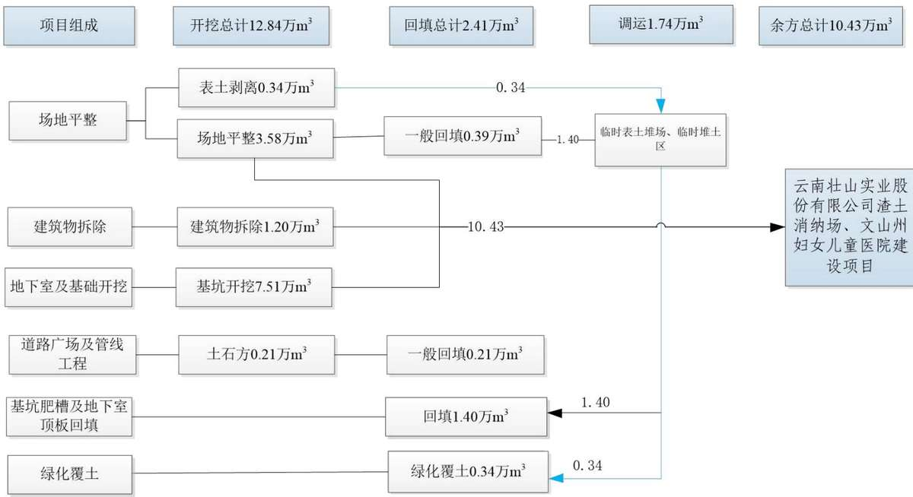
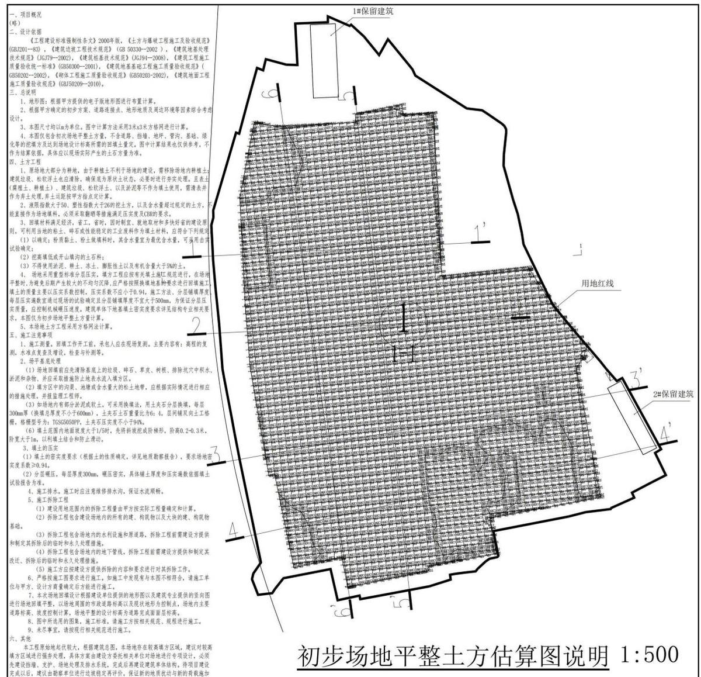
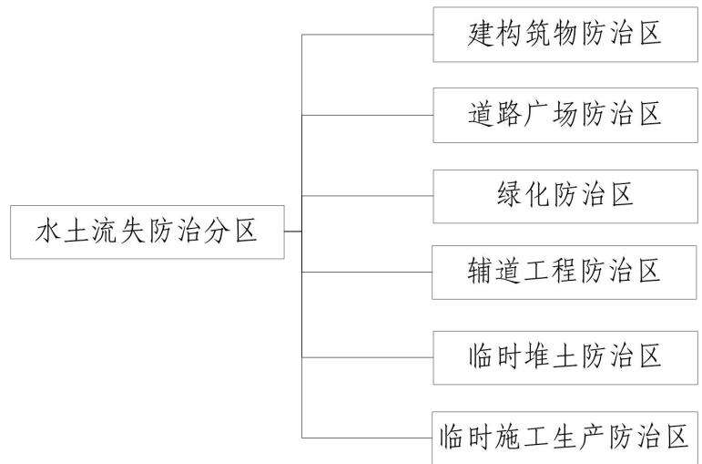
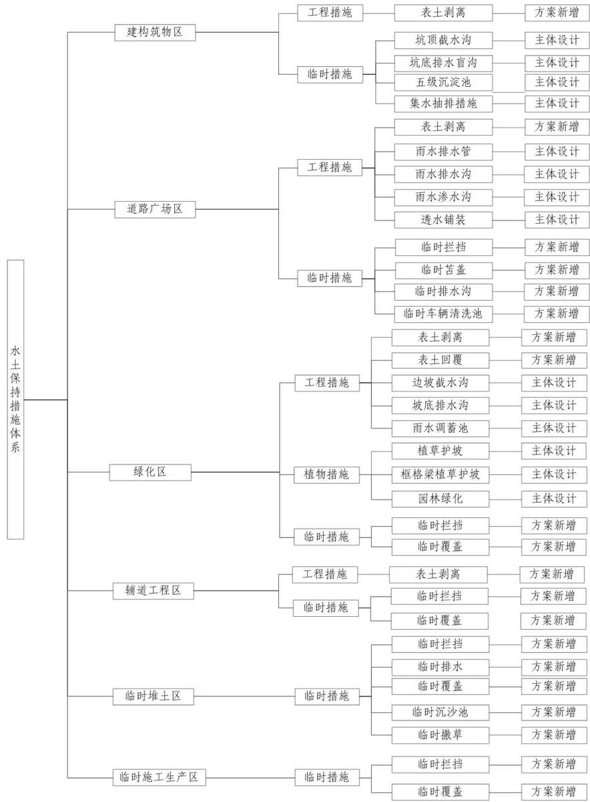

> **Zone C（应用范例层）使用边界**——仅可用于**写作风格、章节展开方式、表达逻辑、表格设计**的参考。
> **不得**用于合规判断；**不得**引入其项目数据（名称／地点／数字／单位名）；
> **不得**因其"曾经通过审批"而推定其做法在当前标准下仍然合规。
> 与 Zone A 冲突时**一律以 Zone A 为准**；Zone A 未明确规定时输出
> 「**Zone A 未明确规定，以下为参考写法，需人工判断**」。
>
> **坐标系警告**：本范例为**老八章结构**（GB 50433—2018 附录B），与 2026 版 10 章模板**同号不同义**
> （老 `1.5`＝防治目标，新 `1.5`＝水土流失预测结果；老 4→新 6 …偏移 +2；新版第 4/5 章老结构无独立章）。
> 因此 **`chapter_mapping: pending`——不得按章节号挂载**，检索一律走 `topic_tags`。
>
> **待加工**：`topic_tags`（主题标签）、`approval_basis_list`（编制依据逐字清单）、
> `structure_summary`（只提取结构：章节展开顺序／段落功能／表格栏目结构／句式模板／论证链步骤）。

# 水土保持方案报告书

建设单位： 文山边境管理支队

编制单位： 云南今禹生态工程咨询有限公司

2025 年 8 月

## 目 录

1 综合说明 ....  
1.1 项目简况..  
1.2 编制依据.. . 8  
1.3 设计水平年. ... 11  
1.4 水土流失防治责任范围. ... 11  
1.5 水土流失防治目标... ... 11  
1.6 项目水土保持评价... ... 13  
1.7 水土流失预测结果... .... 17  
1.8 水土保持措施布设成果. ... 17  
1.9 水土保持监测方案... ... 19  
1.10 水土保持投资及效益分析成果... ... 19  
1.11 结论. .. 20  
2 项目概况.. ....23  
2.1 项目组成及工程布置. .. 23  
2.2 施工组织. ... 51  
2.3 工程占地... ... 55  
2.4 土石方及平衡分析.... ... 56  
2.5 拆迁(移民)安置与专项设施改(迁)建... ... 70  
2.6 工程投资及施工进度安排... ... 71  
2.7 自然概况.. .... 71  
3 项目水土保持评价 ......... ...... 75  
3.1 主体工程选址水土保持评价.. ..... 75  
3.2 建设方案与布局水土保持评价.. .... 78  
3.3 主体工程设计水土保持措施界定.. .... 96  
3.4 评价结论... ... 99  
4 水土流失分析与预测..... ..... 100  
4.1 水土流失现状.. .. 100  
4.2 水土流失影响因素分析... ... 101  
4.3 目前已产生水土流失调查.. ... 103  
4.4 土壤流失量预测.... ... 103  
4.5 水土流失危害分析. .. 115  
4.6 指导性意见.. ... 116  
5 水土保持措施..... .... 117  
5.1 防治区划分.. ... 117  
5.2 措施总体布局.. .. 118  
5.3 分区措施布设.. .. 122  
5.4 施工要求.. .. 136  
6 水土保持监测.... ..... 142  
6.1 监测范围和时段.. ... 142  
6.2 监测内容和方法.. .. 142  
6.3 监测点位布设.. ... 146  
6.4 实施条件和成果.. ... 146  
7 水土保持投资及效益分析... ... 150  
7.1 水土保持投资.. ... 150  
7.2 效益分析... .. 161  
8 水土保持管理... .... 163  
8.1 组织管理.. .. 163  
8.2 后续设计.. .. 164  
8.3 水土保持监测.. ... 165  
8.4 水土保持监理.. .. 166  
8.5 水土保持施工 . 166  
8.6 水土保持设施验收.. . 168  
附表 ..... .....170  
水土保持估算单价分析表.. ... 170  
附件 .... ...176  
附件1：委托书. . 177  
附件2：关于云南出入境边防检查总站文山片区戍边公寓建设项目可  
行性研究报告的批复（国移民后〔2023〕1833 号，2023 年11月20  
日） ..178  
附件3：关于云南边检总站文山支队机关老营区危房拆除事宜的批复  
（国移民后〔2024〕133 号，2024 年 1 月 18 日）. ... 180  
附件4：不动产权证（文山市不动产权第0018024 号）. ............ 183  
附件5：建设工程规划许可证（建字第文山市202500079号）.......184  
附件6：文山市自然资源局关于申请文山片区戍边公寓房建设项目规  
划设计条件的复函（文市自然资函〔2023〕207号，2023年4月23  
日） 185  
附件7：文山市自然资源局关于文山边境管理支队戍边公寓项目规划  
建设辅道的复函（文市自然资函〔2024〕505 号，2024年8 月6日）1  
附件8：三区三线查询意见... .189  
附件9：文山边境管理支队机关老营区房屋拆除工程余方利用协议190  
附件9-1：拆迁施工承揽合同书. ..192  
附件9-2：接收证明. .196  
附件9-3：文山州水务局关于准子文山州妇女儿童医院建设项目水土  
保持方案报告书的行政许可决定书（文水保许〔2018］6 号）.......197  
附件10：云南出入境边防检查总站文山片区成边公寓建设项目弃土消  
纳协议. ...203  
附件10-1：情况说明. ..207  
附件10-2：文山州水务局关于准子云南壮山实业股份有限公司4500t/d  
新型干法水泥熟料生产线技改工程水土保持方案初步设计报告书的行  
政许可决定书（文水保许〔2017〕15号）.. ....208  
附件10-3：建筑垃圾和工程渣土消纳场所许可证（证书编号：2025001）  
..211  
附件11：关于进一步加强戍边公寓项目建设前期工作的通知.........212  
附件12：云南出入境边防检查总站文山片区成边公寓建设项目初步设  
计概算评审报告（评审字〔2025〕249 号，2025 年 6 月 15 日）.... 214  
附件13-1：文山市水务局责令停止违法行为通知书（文山水停字〔2025  
001 号，2025 年 7 月 16 日）. ..218  
附件13-2：文山市水务局责令改正通知书（文市水政字〔2025〕001  
号，2025 年 7 月 16 日）. .. 219  
附件13-3：文山边境管理支队关于云南出入境边防检查总站文山片区  
戍边公寓建设项目水土保持监督检查整改回复的函（文边管函〔2025  
42 号，2025 年 8 月 11 日） .220  
附件14：砂石料（混凝土）供应意向协议.... ..222  
附件14-1：文山云建水泥制品有限责任公司营业执照.. ...... 223

## 附图

附图1：项目区地理位置图  
附图2：项目区水系图  
附图3：项目区土壤侵蚀强度分布图  
附图4：项目区表土分布图  
附图5：项目水土流失防治责任范围图  
附图6：项目总平面布置图  
附图7：项目竖向布置图  
附图8-1：分区防治措施总体布局图（含监测点位）——施工期  
附图8-2：分区防治措施总体布局图（含监测点位）——试运行期  
附图9-1：主体设计水土保持措施典型设计图（1）

附图9-2：主体设计水土保持措施典型设计图（2）

附图10-1：方案新增水土保持措施典型设计图（1）

附图10-2：方案新增水土保持措施典型设计图（2）

## 1 综合说明

## 1.1项目简况

## 1.1.1项目基本情况

## 1、项目建设背景及必要性

戍边公寓住房建设是国家移民管理局以全面提升边疆地区民警住房保障水平为出发点和落脚点，立足改善边境生活住宿环境，改善民警民生的一项重大战略工程。戍边公寓住房项目的建设，将极大提升戍边民警住房保障水平，改善戍边民警及家属住宿条件。

文山片区戍边公寓项目建设实施将有效保障戍边民警安心、安身、安业，鼓励引导民警家人前往边疆生活，增强戍边民警长期守边护边的信心和决心，是“暖心惠警”工程的具体体现。根据国家发改委与国家移民管理局工作安排，拟建云南出入境边防检查总站文山片区戍边公寓建设项目。

文山片区戍边公寓项目建设地点位于云南省文山州文山市环城东路62号，占用原有文山边防支队机关老营区围墙内用地。2017年，原文山边防支队机关从该营区搬迁至文山市华龙南路 16 号，老营区内除状态良好的1 栋公寓房和1栋业务技术用房正常使用外，其他16 栋老旧房屋经检测界定为危房均处于封闭停用状态。

2024年 1 月 18 日，国家移民管理局下发《关于云南边检总站文山支队机关老营区危房拆除事宜的批复》（国移民后〔2024〕133 号）同意拆除 16 栋老旧危房，2024年 10 月，文山边境管理支队根据文件精神委托施工单位对机关老营区危房进行了拆除，本项目利用原营区拆除后提供的建设用地进行建设。

## 2、建设单位变更情况说明

根据《国家移民管理局关于云南出入境边防检查总站文山片区戍边公寓建设项目可行性研究报告的批复》（国移民后〔2023〕1833 号，2023 年11月20日），批复对象为云南出入境边防检查总站。按照云南出入境边防检查总站《关于进一步加强戍边公寓建设项目前期工作的通知》（云总检传发〔2022〕66号），戍边公寓前期工作由各出入境边防检查站和边境管理支队负责，云南出入境边防检查总站下辖16个出入境边防检查站和8个边境管理支队，文山边境管理支队为其下辖8 个边境管理支队之一，因此本项目由文山边境管理支队负责建设与管理。

## 3、项目基本情况

项目区位于云南省文山壮族苗族自治州文山市东山彝族乡环城东路62号，中心地理坐标：东经 104°15'25.8247"，北纬 23°22'25.3875"。项目区东、北、南侧紧邻东山公园（文山红旗林场），西侧为环城东路。对外交通道路主要依托环城东路其为双向四车道（路宽20m，沥青路面），市政配套设施齐全，本项目交通十分便利。

## 建设性质：新建建设类

本项目建设内容：维修改造2栋现有建筑，新建14 栋公寓楼、小区大门、道路广场、景观绿化等附属工程、辅道工程。项目用地面积 $3 0 5 1 4 . 2 8 \mathrm { m } ^ { 2 }$ ，总建筑面积$3 6 8 9 3 . 6 0 \mathrm { m } ^ { 2 }$ ，其中地上建筑面积 $2 8 3 4 1 . 5 8 \mathrm { m } ^ { 2 }$ （保留建筑面积 $2 2 9 5 . 5 5 \mathrm { m } ^ { 2 }$ ，新建建筑面积26042.03m2），地下总建筑面积为 $8 5 5 2 . 0 6 \mathrm { m } ^ { 2 } ;$ ；容积率 1.01，建筑密度 22.28%，绿地率35.0%，车位340个，其中地上停车位 97 个，地下停车位243个。

## 4、项目建设依托情况

项目用地利用原营区围墙内拆除部分建筑后提供的建设用地进行建设，2024年11月，原营区老旧危房地上建筑物部分被拆除，拆除后建筑垃圾统一运至文山州妇女儿童医院建设项目，经破碎后用作场地填料综合利用，保留原有场地周边围墙及截水设施、场地内的挡墙、排水设施、硬化路面、硬化场地及拆除后的房屋地面等。

项目场外交通主要依托项目区周边已建成环城东路，项目交通条件较好，场内施工便道永临结合占用道路广场区，无需新建施工便道。施工期给水施工期给水由项目西侧环城东路市政给水管线直接接引，接口位于项目区西南角。场地外围排水系统利用原有围墙及围墙外侧截排水系统，能够有效将外侧汇水排至项目西侧的环城东路雨污水管网。场地内施工期雨水施工期雨水、基坑积水主体考虑在项目基坑底部设置排水盲沟、集水井，基坑顶部设置截水沟，并在排水出口设置五级沉淀池，沉淀后回用，余量排至项目区西南角环城东路的市政管网和污水管网检查井。项目区竖向布置部分可利用原有挡墙，局部高差较大处根据现场实际情况新建挡墙。本项目用电由南侧市政负责在场地南侧引入一路10kV市政电源。

## 5、工程占地

项目占地总面积为 $3 . 0 5 \mathrm { h m } ^ { 2 }$ ，其中永久占地为 $2 . 9 1 \mathrm { h m } ^ { 2 }$ ，临时占地为 $0 . 1 4 \mathrm { h m } ^ { 2 } .$ 按项目组成其中建构筑物区占地面积 $0 . 6 5 \mathrm { h m } ^ { 2 }$ ，道路广场区占地面积 $1 . 2 4 \mathrm { h m } ^ { 2 }$ ，绿化区占地面积 $1 . 0 2 \mathrm { h m } ^ { 2 }$ ，辅道工程区占地面积0.14hm2。

## 6、土石方平衡

本项目建设挖填方总量为 15.25万 $\mathrm { m } ^ { 3 }$ ，其中开挖土石方12.84万 $\mathrm { m } ^ { 3 }$ （包含表土剥离 0.34 万 $\mathrm { m } ^ { 3 }$ ，建筑物拆除 1.20 万 $\mathrm { m } ^ { 3 }$ ，场地平整开挖 3.58 万 $\mathrm { m } ^ { 3 }$ ，地下室及基础开挖 7.51 万 $\mathrm { m } ^ { 3 }$ ，各类管线开挖 0.21万 $\mathrm { m } ^ { 3 }$ ）；土石方回填 2.41 万 $\mathrm { m } ^ { 3 }$ （包含表土回覆 0.34 万 $\mathrm { m } ^ { 3 }$ ，场平回填0.46 万 $\mathbf { m } ^ { 3 } .$ ，基坑肥槽及地下室顶板回填1.40 万 $\mathrm { m } ^ { 3 }$ ，基础、管、沟槽回填 $0 . 2 1 \ \overline { { \mathcal { H } } } \ \mathbf { m } ^ { 3 } \ \mathrm { ) }$ ；内部调运土石方1.74万 $\mathrm { m } ^ { 3 }$ ；无借方；余方10.43万 $\mathrm { m } ^ { 3 }$ ，其中前期危房拆除建筑垃圾 1.20 万 $\mathrm { m } ^ { 3 }$ 已全部运至文山州妇女儿童医院建设项目进行场地回填综合利用，后续产生9.23万 $\mathrm { m } ^ { 3 }$ 全部运往云南壮山实业股份有限公司（壮山水泥厂内）堆存用于水泥生产综合利用。

## 7、施工组织

施工材料：本项目结构混凝土均采用商品砼，工程建设所需要的钢材、石块、石板及其它建筑材料，可直接在文山市购买。砂石料及商品混凝土等由文山云建水泥制品有限责任公司提供，材料开采生产期间的水土流失防治责任属于料文山云建水泥制品有限责任公司。本项目未涉及工程土、砂、石料等取料场选址问题，方案不设置弃渣场。

施工生产区：本项目设置施工生产区2处，分别布置在西侧小区大门和南侧基坑外围区域，占用道路广场区，占地面积 0.05hm2，占地已计入道路广场区中不再重复计列；施工结束后拆除硬化，恢复道路广场区建设。

施工生活区：经与建设单位核实，本项目利用保留东南侧2#保留建筑作为施工生活区，不新增占地。2#保留建筑为原支队业务楼，可以作为施工生活区用于施工临时办公、生活等。

表土堆存规划：表土剥离后集中堆存于项目区东南侧2#保留建筑前空地临时表土堆场，并做好临时防护措施，前期剥离堆存的表土后期全部用于绿化覆土使用。

土石方临时转存：根据施工组织设计及施工时序安排，前期进行施工基坑支护开挖土石方，后续基坑肥槽及地下室顶板回填需要土石方回填，后期基坑顶板回填土无法做到即挖即填。于项目红线范围内西北侧和南侧布设2处临时堆土区，用于临时堆放后期基坑肥槽回填及地下室顶板回填土。

施工交通：项目区西侧紧邻环城东路，对外交通道路主要依托环城东路，本项目周边已经形成完善的交通路网，交通便利。

## 8、拆迁（移民）安置与专项设施改（迁）建

项目区红线范围内建设单位已根据《关于云南边检总站文山支队机关老营区危房拆除事宜的批复》（国移民后〔2024〕133 号），委托云南东辰建设有限公司对包括公寓、食堂等16栋危房进行拆除，拆除总建筑面积12030.79m2，2024年10月拆除产生的建筑垃圾1.2万m3已全部运至文山州妇女儿童医院建设项目回填综合利用；另外危房拆除前无人员居住，本项目不涉及移民安置问题。

## 9、工程投资、工期

项目静态总投资 14840 万元，其中土建投资 11298.53 万元。项目已于 2024 年10 月开工，2024 年 11 月停工；计划于 2025 年 10 月主体工程开工，2027 年 5 月完工，总工期32 个月。本项目由文山边境管理支队负责建设与管理。

## 1.1.2项目前期工作进展情况

## 1.1.2.1主体工程设计情况

（1）主体工程设计情况

可研：建设单位已委托广州博厦建筑设计研究院有限公司于 2023 年 7 月编制完成《云南出入境边防检查总站文山片区戍边公寓建设项目可行性研究报告》，2023年11月20日，取得了《国家移民管理局关于云南出入境边防检查总站文山片区戍边公寓建设项目可行性研究报告的批复》，文号：国移民后〔2023〕1833号。

地勘：建设单位已委托云南工程勘察设计院集团有限公司于2024 年12 月编制完成《云南出入境边防检查总站文山片区戍边公寓建设项目场地岩土工程详细勘察报告（详勘阶段）》。

初设：建设单位已委托云南工程勘察设计院集团有限公司于 2025 年 4 月编制完成《中华人民共和国云南出入境边防检查总站文山片区戍边公寓建设项目初步设计》，2025 年 6 月 15 日，取得了国家发展和改革委员会国家投资项目评审中心文件《云南出入境边防检查总站文山片区戍边公寓建设项目初步设计概算评审报告》，文号：评审字〔2025〕249号。

基坑支护设计：建设单位已委托云南工程勘察设计院集团有限公司于 2024 年12月编制完成《云南出入境边防检查总站文山片区戍边公寓建设项目基坑支护设计方案》。

边坡支护设计：建设单位已委托云南工程勘察设计院集团有限公司于 2024 年12月编制完成《云南出入境边防检查总站文山片区戍边公寓建设项目高边坡支护工程设计方案》。

（2）可研、初设两阶段优化调整情况

在满足工程设计要求情况下，初步设计阶段加强了地质勘测，根据项目区地形、地貌、地质条件等情况，综合考虑工程投资、用地、安全、施工难度以及余方利用等因素进行优化。

经对比《可研报告》和《初步设计》，本项目用地面积、建设内容基本一致，在初步设计阶段，优化了项目的平面及竖向布置设计，尽可能的利用项目区原始地形，原设计开挖两层地下室调整为整体一层，局部二层地下室，同时提高地下室地基设计标高，减少了项目区的土石方开挖；有效减少了工程废弃土石方。

表 1-1 可研、初设两阶段优化调整情况对比表
<table><tr><td colspan="1" rowspan="1">序号</td><td colspan="1" rowspan="1">设计阶段</td><td colspan="1" rowspan="1">可行性研究</td><td colspan="1" rowspan="1">初步设计</td><td colspan="1" rowspan="1">变化情况</td><td colspan="1" rowspan="1">说明</td></tr><tr><td colspan="1" rowspan="1">1</td><td colspan="1" rowspan="1">建设内容</td><td colspan="1" rowspan="1">新建公寓楼、地下车库及配套附属设施。新建戍边公寓房320户，总建筑面积40527.62m²，大门及门卫室205.5m²，地下车库13687.32m²，保留两栋建筑物。</td><td colspan="1" rowspan="1">新建公寓楼、地下车库及配套附属设施。新建14栋公寓楼（5F），共320套公寓房（90m²和70m²两个户型），保留两栋建筑物</td><td colspan="1" rowspan="1">/</td><td colspan="1" rowspan="1">基本一致</td></tr><tr><td colspan="1" rowspan="1">2</td><td colspan="1" rowspan="1">主体用地面积</td><td colspan="1" rowspan="1">43.61亩，2.91hm²</td><td colspan="1" rowspan="1">43.61亩，2.91hm²</td><td colspan="1" rowspan="1">无变化</td><td colspan="1" rowspan="1">一致</td></tr><tr><td colspan="1" rowspan="1">3</td><td colspan="1" rowspan="1">建筑面积（m²）</td><td colspan="1" rowspan="1">40527.62</td><td colspan="1" rowspan="1">37098.69</td><td colspan="1" rowspan="1">-3428.93</td><td colspan="1" rowspan="1">基本一致，局部优化</td></tr><tr><td colspan="1" rowspan="1"></td><td colspan="1" rowspan="1">地上建筑面积</td><td colspan="1" rowspan="1">26840.3</td><td colspan="1" rowspan="1">26042.03</td><td colspan="1" rowspan="1">-798.27</td><td colspan="1" rowspan="1">公共服务用房建筑面积减少</td></tr><tr><td colspan="1" rowspan="1"></td><td colspan="1" rowspan="1">地下建筑面积</td><td colspan="1" rowspan="1">13687.32</td><td colspan="1" rowspan="1">8552.06</td><td colspan="1" rowspan="1">-5135.26</td><td colspan="1" rowspan="1">可研开挖两层地下室调整为初设整体一层，局部二</td></tr><tr><td colspan="1" rowspan="1"></td><td colspan="1" rowspan="1"></td><td colspan="1" rowspan="1"></td><td colspan="1" rowspan="1"></td><td colspan="1" rowspan="1"></td><td colspan="1" rowspan="1">层地下室</td></tr><tr><td colspan="1" rowspan="1">4</td><td colspan="1" rowspan="1">地面设计标高</td><td colspan="1" rowspan="1">1264.30m~1294.583m</td><td colspan="1" rowspan="1">1266.554m~1297.05m</td><td colspan="1" rowspan="1">2.254</td><td colspan="1" rowspan="1">设计标高提高2.254m</td></tr><tr><td colspan="1" rowspan="1">5</td><td colspan="1" rowspan="1">总投资（万元）</td><td colspan="1" rowspan="1">16634.02</td><td colspan="1" rowspan="1">14840</td><td colspan="1" rowspan="1">-1794.02</td><td colspan="1" rowspan="1"></td></tr></table>

## （3）本方案编制依据

本方案依据初步设计进行编制。采用的经济技术指标、占地、土石方等数据来源于初步设计。

## 1.1.2.2项目进展情况

## （1）主体工程实施进展情况

本项目已于2024 年10月开工建设，项目区内包括公寓、食堂等16栋危房已于2024年10月拆除完成，东侧林地植被已于 2024年11月进行清理。目前处于停工状态。

## （2）施工扰动情况

项目区规划红线范围内除 2栋保留建筑外均已扰动，扰动面积为2.85hm2，扰动区域现状为建筑物拆除迹地及植被清理后的裸土地。项目区规划红线外的西侧辅道工程区未扰动，辅导工程区占地面积为0.14hm2，现状为绿地。现状水土流失强度为轻度侵蚀。

## （3）已发生土石方情况

本项目已发生土石方情况如下：未进行表土剥离；建筑拆除产生1.20 万m3，已产生回填土石方量为 0 万m3，产生的余方为 1.20 万m3，余方已由施工单位云南东辰建设有限公司全部运至文山州妇女儿童医院建设项目进行场地回填。

## （4）水土保持措施实施情况

项目区西侧沿规划用地红线四周设置了彩钢板围挡，采取全封闭围挡施工，严格将施工扰动范围控制在用地红线范围内，项目区未实施水土保持措施。在拆除工程完成后，未进行后续建设。

## （5）水土流失现状

项目区内现状除两栋保留建筑外，其余区域为建筑物拆除迹地，项目区水热条件良好，植被清理区域植被已自然生长，水土流失强度总体为轻度侵蚀。项目区西侧的辅道工程区域为环城东路的绿化用地，现状为绿地，水土流失强度为微度侵蚀。

整个项目区的水土流失侵蚀强度为轻度侵蚀。

## （6）水土保持工作开展情况

2025年5月，建设单位委托云南今禹生态工程咨询有限公司为本项目水土保持方案编制和水土保持监测单位，还未委托监理单位。水土保持监测单位前期对现场进行了调查监测，目前正在编制监测实施方案。水土保持监理工作滞后。

## 1.1.2.3水土保持方案编制情况

2025年5月，文山边境管理支队根据《中华人民共和国水土保持法》及有关法律法规规定，委托云南今禹生态工程咨询有限公司开展本项目的水土保持方案报告书编制工作。接到工作任务后，编制单位随即成立了项目组，方案编制人员通过外业查勘、收集、分析有关资料，针对该项目建设特点和可能造成的水土流失情况，于2025年6月编制完成《云南出入境边防检查总站文山片区戍边公寓建设项目水土保持方案报告书》。

## 1.1.2.4水行政主管部门执法检查落实情况

2025年 7 月 16 日，文山市水务局对建设单位下发了关于本项目责令停止违法行为通知书和责令改正通知书（文市水改字〔2025〕001 号）（附件 13-1、13-2）要求建设单位停止违法行为，在2025 年9月15日前完成本项目的水土保持方案报批工作。据《文山边境管理支队关于云南出入境边防检查总站文山片区成边公寓建设项目水土保持监督检查整改回复的函》（文边管函〔2025〕42号）（附件13-3）及现场调查，本项目已停工并封闭施工现场，并于2025 年5月委托云南今禹生态工程咨询有限公司编制本项目水土保持方案报告书。

## 1.1.3自然简况

项目区位于云南省文山壮族苗族自治州文山市，项目区地貌类型为山地丘陵，项目区气候类型属南亚热带高原季风气候，项目区多年平均气温 $1 7 . 9 \mathrm { { ^ { o } C } }$ ，多年月平均气温均高于 $1 0 . 6 \mathrm { { ^ { \circ } C } }$ ，其中5\~9 月份平均气温高于 $2 1 ^ { \circ } \mathrm { C } .$ ，极端最高气温达37.7C，极端最低气温 $\mathbf { - 3 . 0 \% }$ ，多年平均日照时 2028h。多年平均降水量 992.70mm，多年平均水面蒸发量1128.0mm，年平均风速2.8m/s，最大风速20m/s，最多风向为西向，全年无霜期309d。项目区土壤类型主要为红壤，项目区植被类型主要为亚热带常绿阔叶林。

根据《全国水土保持规划（2015-2030 年）》及《土壤侵蚀分类分级标准》（SL190-2007），项目区属于国家水土保持区划中一级分区西南岩溶区，二级分区滇黔桂山地丘陵区，三级分区滇黔桂峰丛洼地蓄水保土区，侵蚀类型为水力侵蚀，侵蚀强度为轻度，容许土壤流失量为 500t/（km2•a）。项目区所在地文山市东山彝族乡属于滇黔桂岩溶石漠化国家级水土流失重点治理区。项目区不涉及饮用水水源保护区、水功能一级区的保护区和保留区、自然保护区、世界文化和自然遗产地、风景名胜区、地质公园、森林公园、重要湿地等。工程建设区不涉及全国水土保持监测网络中的水土保持监测站点、重点试验区，未占用国家确定的水土保持长期定位观测站，未占用生态保护红线。

## 1.2编制依据

## 1.2.1法律法规

（1）《中华人民共和国水土保持法》（1991 年6月29日颁布，2010年12月25日修订通过，2011年3 月1日施行）；

（2）《云南省水土保持条例》（2014年7月27日颁布，2014年10月1 日施行，2018年11月29日修正）；

## 1.2.2部委规章及规范性文件

（1）《生产建设项目水土保持方案管理办法》（2023 年1月17日水利部令第53号发布）；

（2）《水利部关于加强事中事后监管规范生产建设项目水土保持设施自主验收的通知》（水保〔2017〕365 号）；

（3）《水利部办公厅关于印发生产建设项目水土保持设施自主验收规程（试行）的通知》（办水保〔2018〕133号）；

（4）《水利部办公厅关于印发生产建设项目水土保持技术文件编制和印制格式规定（试行）的通知》（办水保〔2018〕135号）；

（5）《水利部办公厅关于进一步加强生产建设项目水土保持监测工作的通知》（办水保〔2020〕161号）；

（6）《水利部办公厅关于印发生产建设项目水土保持问题分类和责任追究标准

的通知》（办水保函〔2020〕564号）；

（7）《水利部办公厅关于实施生产建设项目水土保持信用监管“两单”制度的通知》（办水保〔2020〕157 号）；

（8）《水利部办公厅关于印发生产建设项目水土保持方案审查要点的通知》（办水保〔2023〕177 号）；

（9）《水利部办公厅关于进一步加强部批项目水土保持监管工作的通知》（办水保〔2024〕57号）；

（10）《水利部办公厅关于印发<全国水土保持规划国家级水土流失重点预防区和重点治理区复核划分成果>的通知》（办水保〔2013〕188 号）；

（11）《云南省水利厅关于划分省级水土流失重点预防区和重点治理区的公告》（云南省水利厅公告第 49 号）（2017年8月30日）；

（12）《文山州水务局关于划分州级水土流失重点预防区和重点治理区的公告》（文山州公告第1 号）（2019 年5 月29 日）。

## 1.2.3规范与标准

（1）《生产建设项目水土保持技术标准》（GB50433-2018）；

（2）《生产建设项目水土流失防治标准》（GB/T50434-2018）；

（3）《生产建设项目水土保持监测与评价标准》（GB/T51240-2018）；

（4）《水土保持工程调查与勘测标准》（GB/T51297-2018）；

（5）《土壤侵蚀分类分级标准》（SL190-2007）；

（6）《土地利用现状分类》（GB/T21010-2017）；

（7）《防洪标准》（GB50201-2014）；

（8）《云南省主要造林树种苗木》（DB53/062-2006）；

（9）《云南省林木种子质量分级》（DB53/248-2008）；

（10）《水土保持工程设计规范》（GB51018-2014）；

（11）《水利水电工程制图标准水土保持图》（SL73.6-2015）；

（12）《水土保持监测技术规范》（SL/T277—2024）；

（13）《水土保持监理规范》（SL/T523-2024）；

（14）《表土剥离及其再利用技术要求》（GB/T45107-2024）；

（15）《全国水土保持规划（2015-2030 年）》；

（16）其它有关的设计规范及技术标准。

## 1.2.4其他文件

## 一、相关主体设计资料

（1）《云南出入境边防检查总站文山片区戍边公寓建设项目可行性研究报告》（广州博厦建筑设计研究院有限公司，2023年 1月）；

（2）《云南出入境边防检查总站文山片区戍边公寓建设项目场地岩土工程详细勘察报告（详勘阶段）》（云南工程勘察设计院集团有限公司，2024 年12 月）；

（3）《云南出入境边防检查总站文山片区戍边公寓建设项目基坑支护工程》（云南工程勘察设计院集团有限公司，2024年12月）；

（4）《云南出入境边防检查总站文山片区戍边公寓建设项目高边坡支护工程设计方案》（云南工程勘察设计院集团有限公司，2024年12月）；

（5）《中华人民共和国云南出入境边防检查总站文山片区成边公寓建设项目初步设计》（云南工程勘察设计院集团有限公司，2025年4 月）。

## 二、相关批复文件

（1）建设项目规划设计条件（文山市自然资源局，文市自然资函〔2023〕207号，2023 年 4 月 23 日）；

（2）《国家移民管理局关于云南出入境边防检查总站文山片区戍边公寓建设项目可行性研究报告的批复》（国移民后〔2023〕1833号，2023年11月20日）；

（3）《关于云南边检总站文山支队机关老营区危房拆除事宜的批复》（国移民后〔2024〕133 号，2024 年 1 月 18 日）；

（4）不动产权证（文山市不动产权第0018024号）；

（5）建设工程规划许可证（文山市 202500079 建字第号，项目代码：2409-532601-04-01-743252，2025 年 4 月 16 日）；

（6）《云南出入境边防检查总站文山片区戍边公寓建设项目初步设计投资概算评审报告》（国家发展和改革委员会国家投资项目评审中心，2025 年6月15日）。

## 三、其他

（1）《2023年云南省水土保持公报》（云南省水利厅，2024 年9月）；

（2）云南省文山壮族苗族自治州文山市社会经济、土地利用、森林资源、水土保持总体规划等资料；

（3）其他与本项目相关的主体设计资料。

## 1.3设计水平年

本项目属于改建建设类项目，工程已于2024年10月开工，预计2027年5 月完工，施工工期为 32个月。根据《生产建设项目水土保持技术标准》（GB50433-2018），确定本水土保持方案的设计水平年为主体工程完工后的当年，即2027 年。

## 1.4水土流失防治责任范围

根据《生产建设项目水土保持技术标准》（GB50433-2018）规定及工程建设的特点，项目水土流失防治责任范围包括永久征地、临时占地以及其他使用与管辖区域。

结合项目建设的特点及项目规划总平面布置及施工布置范围统计，本项目水土流失防治责任范围面积为 $3 . 0 5 \mathrm { h m } ^ { 2 }$ ，全部位于云南省文山壮族苗族自治州文山市境内，防治责任主体为文山边境管理支队。

表 1-2 项目水土流失防治责任范围表 （单位hm2）
<table><tr><td rowspan=2 colspan=1>序号</td><td rowspan=2 colspan=1>项目组成</td><td rowspan=2 colspan=1>水土流失防治责任范围</td><td rowspan=1 colspan=2>占地性质</td></tr><tr><td rowspan=1 colspan=1>永久占地</td><td rowspan=1 colspan=1>临时占地</td></tr><tr><td rowspan=1 colspan=1>1</td><td rowspan=1 colspan=1>建构筑物区</td><td rowspan=1 colspan=1>0.65</td><td rowspan=1 colspan=1>0.65</td><td rowspan=1 colspan=1></td></tr><tr><td rowspan=1 colspan=1>2</td><td rowspan=1 colspan=1>道路广场区</td><td rowspan=1 colspan=1>1.24</td><td rowspan=1 colspan=1>1.24</td><td rowspan=1 colspan=1></td></tr><tr><td rowspan=1 colspan=1>3</td><td rowspan=1 colspan=1>绿化区</td><td rowspan=1 colspan=1>1.02</td><td rowspan=1 colspan=1>1.02</td><td rowspan=1 colspan=1></td></tr><tr><td rowspan=1 colspan=1>4</td><td rowspan=1 colspan=1>辅道工程区</td><td rowspan=1 colspan=1>0.14</td><td rowspan=1 colspan=1></td><td rowspan=1 colspan=1>0.14</td></tr><tr><td rowspan=1 colspan=1>5</td><td rowspan=1 colspan=1>合计</td><td rowspan=1 colspan=1>3.05</td><td rowspan=1 colspan=1>2.91</td><td rowspan=1 colspan=1>0.14</td></tr></table>

注：1、本项目设置施工生产区 2处，在项目红线内布置，布设于西侧小区大门和南侧基坑外围区域，占用道路广场区，因此占地面积不重复计列；施工结束后拆除硬化，恢复道路广场建设；2、本项目利用保留东南侧 2#保留建筑作为施工生活区，不新增占地。2#保留建筑为原支队业务楼，可以作为施工生活区用于施工临时办公、生活等。

3、配套设施（给排水系统、供电系统、通讯系统等）占地计入红线内各个分区相应占地中，面积不再重复计列。

## 1.5水土流失防治目标

## 1.5.1执行等级标准

本项目位于西南岩溶区，根据水利部办公厅印发《全国水土保持规划国家级水土流失重点预防区和重点治理区复核划分成果》的通知（办水保〔2013〕188号），《云南省水利厅关于划分省级水土流失重点预防区和重点治理区的公告》（云南省水利厅公告第49号）（2017年8月30日）和《文山州水务局关于划分州级水土流失重点预防区和重点治理区的公告》（文山州公告第1 号）（2019年5月29日），项目区所在地文山市东山彝族乡属于滇黔桂岩溶石漠化国家级水土流失重点治理区，依据《生产建设项目水土流失防治标准》（GB/T50434-2018）相关规定，项目无法避让国家级水土流失重点治理区，同时项目位于文山市城区，属于县级及以上城市区域，确定本项目防治标准执行等级为西南岩溶区一级标准。

## 1.5.2防治目标

## 1、定性目标

根据《生产建设项目水土保持技术标准》（GB50433-2018），本项目水土流失防治应达到下列目标：

（1）项目建设范围内的新增水土流失得到有效控制，原有水土流失得到治理。

（2）水土保持设施安全有效。

（3）水土资源、林草植被得到最大限度的保护与恢复。

（4）水土流失治理度、土壤流失控制比、渣土防护率、表土保护率、林草植被恢复率、林草覆盖率六项指标应符合现行国家标准《生产建设项目水土流失防治标准》（GB/T 50434-2018）的规定。

## 2、定量目标

根据《生产建设项目水土流失防治标准》（GB/T50434-2018），结合工程建设范围内地形地貌、地理、水土流失特点，确定本项目水土流失防治指标需修正项有：

（1）项目区所在地现状土壤侵蚀强度为轻度，根据“土壤流失控制比在轻度侵蚀为主的区域不应小于 1”的要求，确定土壤流失控制比调整为1.0。

（2）无法避让国家级水土流失重点治理区，林草覆盖率指标提高2%。

（3）项目位于县级及以上城市区域，渣土防护率提高2%。

综上所述，本项目水土流失防治目标值执行西南岩溶区一级标准。工程水土流失防治目标修正之后为：水土流失治理度 97%，土壤流失控制比 1.0，渣土防护率94%，表土保护率95%，林草植被恢复率96%，林草覆盖率23%。

表 1-3 水土流失防治目标
<table><tr><td rowspan=2 colspan=1>防治指标</td><td rowspan=1 colspan=2>西南岩溶区一级标准</td><td rowspan=2 colspan=1>修正系数</td><td rowspan=1 colspan=2>采用标准</td></tr><tr><td rowspan=1 colspan=1>施工期设</td><td rowspan=1 colspan=1>计水平年</td><td rowspan=1 colspan=1>施工期</td><td rowspan=1 colspan=1>设计水平年</td></tr><tr><td rowspan=1 colspan=1>水土流失治理度(%)</td><td rowspan=1 colspan=1>1</td><td rowspan=1 colspan=1>97</td><td rowspan=1 colspan=1>-</td><td rowspan=1 colspan=1>-</td><td rowspan=1 colspan=1>97</td></tr><tr><td rowspan=1 colspan=1>土壤流失控制比</td><td rowspan=1 colspan=1>1</td><td rowspan=1 colspan=1>0.85</td><td rowspan=1 colspan=1>轻度侵蚀，提高防治标准+0.15</td><td rowspan=1 colspan=1>-</td><td rowspan=1 colspan=1>1.0</td></tr><tr><td rowspan=1 colspan=1>渣土防护率（%）</td><td rowspan=1 colspan=1>90</td><td rowspan=1 colspan=1>92</td><td rowspan=1 colspan=1>项目位于县级以上城市区，提高防治标准+2</td><td rowspan=1 colspan=1>92</td><td rowspan=1 colspan=1>94</td></tr><tr><td rowspan=1 colspan=1>表土保护率（%）</td><td rowspan=1 colspan=1>95</td><td rowspan=1 colspan=1>95</td><td rowspan=1 colspan=1></td><td rowspan=1 colspan=1>95</td><td rowspan=1 colspan=1>95</td></tr><tr><td rowspan=1 colspan=1>林草植被恢复率（%）</td><td rowspan=1 colspan=1>-</td><td rowspan=1 colspan=1>96</td><td rowspan=1 colspan=1></td><td rowspan=1 colspan=1>-</td><td rowspan=1 colspan=1>96</td></tr><tr><td rowspan=1 colspan=1>林草覆盖率（%）</td><td rowspan=1 colspan=1>一</td><td rowspan=1 colspan=1>21</td><td rowspan=1 colspan=1>无法避让国家级水土流失重点治理区，且位于城市区，提高防治标准+2</td><td rowspan=1 colspan=1></td><td rowspan=1 colspan=1>23</td></tr></table>

## 1.6项目水土保持评价

## 1.6.1主体工程选址评价

本项目选址不涉及河流两岸、湖泊和水库周边的植物保护带；不涉及全国水土保持监测网络中的水土保持监测站点、重点试验区及国家确定的水土保持长期定位观测站；工程建设不涉及饮水安全、防洪安全、水资源安全的区域；不属于重要江河、湖泊水功能一级区的保护区和保留区内可能严重影响水质的建设项目，以及对水功能二级区的饮用水水质有影响的生产建设项目。

项目在原址上新建，选址无法避让滇黔桂岩溶石漠化国家级水土流失重点治理区，本方案执行西南岩溶区一级防治标准，对林草覆盖率提高2个百分点，截排水、拦挡工程的工程级别和防洪标准提高一级，加强预防保护，优化施工工艺，尽量减少地表扰动和植被损坏范围，有效控制可能造成的水土流失，同时采取科学可行的水土流失防治措施，可满足水土保持要求。

工程建设基本符合《中华人民共和国水土保持法》《云南省水土保持条例》和《生产建设项目水土保持技术标准》（GB50433-2018）等法律、法规和规范要求，工程选址合理可行。

## 1.6.2建设方案评价

## 1、建设方案与布局

工程选址唯一，为减小对地表的扰动，减少水土流失，主体工程贯彻节约用地原则，在设计中充分考虑地形条件和场地空间，利用原有场地，在满足工程布置的同时，优化建设方案，分台布设，尽量消化场地高差，减少工程占地和土石方量；另外项目位于滇黔桂岩溶石漠化国家级水土流失重点治理区，项目区执行西南岩溶区一级防治标准，截排水工程、拦挡工程等工程级别和防洪标准均提高一级，林草覆盖率提高2%，出入车辆经洗车平台后进出项目区，减少对周边环境的影响。

本项目工程设计布局紧凑，主体设计考虑了海绵城市要求，设置下凹式绿地、透水铺装、雨水渗水沟并设置雨水调蓄池及节水灌溉设施；主体设计考虑了绿色建筑设计要求，本工程绿色建筑目标为：达到《绿色建筑评价标准》GB/T50378-2019的基本级标准要求。工程布局与建设方案符合绿色设计的要求。

其次，根据主体施工组织总布置设计，施工场地及材料堆存场地等均布置在项目区占地内，通过工程建设时序的安排，基坑肥槽及顶板需要回填的土石方进行临时转存，方案补充设计项目区临时堆土区的设计，可满足工程施工要求，符合水土保持要求。

综上，本项目在建设方案和布局上符合水土保持要求。

## 2、工程占地

本项目征占地面积为 3.05hm2，其中永久占地 2.91hm2，临时占地 0.14hm2，占地类型为机关团体用地和公园与绿地。经本方案工程占地面积全面分析认为，工程占地包括了主体工程永久占地和临时区域，不存在缺项或者漏项，且所列占地面积能够满足施工要求。

本项目临时用地为辅道工程区，占地面积 0.14hm2，由于规划 40m 道路近期无扩建计划，本项目在现有环城东路与本项目间建设辅道，与现有环城东路道路衔接，后续规划 40m 道路建设时进行整合使用。已于 2024 年 8 月 6 日取得《文山市自然资源局关于文山边境管理支队戍边边公寓项目规划建设辅道的复函》（文市自然资函〔2024〕505号）同意辅道建设。

工程施工期间地下基础开挖对地表扰动较大，对工程周边可能产生的影响范围广，因此，工程施工中应严格施工管理，防止对施工范围以外的区域进行扰动。项目建设过程中损坏部分具有水土保持功能的用地，但主体规划一定的景观绿化面积，可改善项目区建设对生态环境的影响。主体工程将临时施工场地布置在项目用地红线内，尽可能减少水土流失。

工程施工生产生活区布设在工程建设红线范围内，减少了项目临时占地，满足水土保持要求。项目占地类型为机关团体用地和公园与绿地，未占用高产农田或水浇地，未占用基本农田，项目用地基本符合水土保持要求。

综上所述，工程占地符合相关规范和文件的要求。

## 3、土石方平衡

经方案优化完善后，项目土石方数量完整，包含了项目建设过程中各土建部分的数量，工程土方主要来源为建设工程的建筑物拆除、场地平整工程、地下室及基础开挖、地下室顶板回填、道路广场管线工程开挖及回填及绿化工程，不存在缺项和漏项。

工程挖方来源于建筑物拆除、场地平整工程、管线工程、地下车库开挖土石方，填方用于地下室顶板覆土、场平回填、管线工程回填、绿化覆土，土方挖填合理。

土石方调配合理性：本项目做到场内土石方充分调运，表土、后期基坑肥槽及地下室顶板回填土运至临时堆土区临时堆存，减少运距和水土流失环节。从施工时序看，施工前剥离的表土堆存于表土堆场，表土堆存时间2026年1月\~2027年2月，堆存时间约1.17年；前期基坑开挖土石方在临时堆土区堆存，堆存时间2025年11月\~2026年5月，堆存周期约7个月。临时堆存期间，采取临时排水、排水出口设置临时沉沙措施，并采用密目网苫盖防护；时序可行，有利于自身土石方资源化利用。本项目土石方总体调配节点、时序可行，符合水土保持要求。

土石方资源化及减量化控制：经对比《可研报告》和《初步设计》，在初步设计阶段，优化了项目的竖向布置设计，有效减少了余方。①调整地下室开挖面积及深度，原设计开挖两层地下室调整为局部两层，地下室建筑面积减少 5135.26m2，减少了项目区的土石方 2.05 万 m3；②提高场地地面设计标高，《可研报告》场地设 计 标 高 在 1264.30\~1294.583m ， 《 初 步 设 计 》 地 面 场 地 设 计 标 高 在1266.554\~1297.05m，经对比，初步设计阶段，设计标高提高了 2.25m，减少土石方的开挖量 2.60 万 m3。③利用原有设施，项目南北两侧优先沿用原有挡墙及围墙，大幅降低新建挡墙带来的土石方工程量，减少土石方开挖量 0.50 万 m3；④现阶段设计已无土石方优化空间，限于上位规划条件影响，项目区考虑分台利用原始地形高差消化土石方，现阶段竖向设计无优化空间，场地也无法再提高设计标高，项目

区现阶段设计土石方已是最优方案。

余方综合利用调查分析：本项目建设共产生余方10.43万 $\mathrm { m } ^ { 3 }$ ，其中前期危房拆除建筑垃圾1.2万 $\mathrm { m } ^ { 3 }$ 已全部运至文山州妇女儿童医院建设项目进行场地回填，后续产生 9.23 万 $\mathrm { m } ^ { 3 }$ 全部运往云南壮山实业股份有限公司（壮山水泥厂内）堆存用于水泥生产综合利用。

根据调查项目之间土石方工期可有效衔接，工期衔接合理、需土量满足要求，本项目余方处置是合理可行的。

## 4、施工方法与工艺评价

主体施工前，先对项目区表土剥离保护并集中堆存保护，后期回覆利用，项目区表土资源得到保护及再利用。主体基坑开挖采用机械开挖、人工配合修理相结合的方式。机械施工加快了施工进度、减少了扰动时间；主体基坑采取的支护方案，减少放坡的同时减少扰动范围、减少土石方挖填量。基坑前期开挖土方随挖随外运，后期开挖预留回填用土，土方及时外运避免在现场堆放，从而避免水土流失产生。以上施工工艺及方法有利于水土保持，符合水土保持要求。

## 5、主体工程设计中具有水土保持功能措施评价

从整个项目建设区来看，主体工程施工前在周边采用彩钢板进行临时防护；施工过程中对项目区基坑积水布置有截排水、抽排系统，排水出口设置沉淀措施，场地布设雨水渗沟、雨水管网，边坡布设坡顶截水沟和坡底排水沟；施工结束后，场地设置有透水铺装，植草护坡、框格梁植草护坡、景观绿化。这些措施在起到主体功能作用的同时，也起到了防治水土流失的作用，具有较好的水土保持效果，但上述主体工程设计措施未能完全满足水土保持要求，因此基于完善水土保持措施体系、有效防治水土流失的目的，方案将增加施工前期的表土保护措施和施工期间的临时防护措施。

综上所述，本项目的建设无水土保持制约性因素；项目建设不涉及取土场、取料场、弃渣场的选址问题，工程管理计划符合水土保持要求。通过补充项目区施工前期的表土保护措施和施工过程中的临时拦挡、排水、苫盖措施及防治要求，工程建设可行。

## 1.7水土流失预测结果

工程建设过程中扰动地表总面积为2.99hm2，损毁植被面积1.18hm2；通过预测，工程建设可能产生的土壤流失总量 210.64t，其中新增土壤流失量为 137.14t。水土流失的防治重点区域为道路广场区和临时堆土区，施工期为水土流失重点监测时段。工程建设过程中土石方的开挖填筑，地表扰动，将不可避免改变原有地貌，导致土地生产力降低，影响周边生态环境。应做好工程建设过程中的施工管理，及时落实各项水土保持措施，减轻工程区水土流失，减轻对生态环境产生的不利影响。

## 1.8水土保持措施布设成果

## 1.8.1水土保持措施总体布局

## 1、建构筑物区

施工前，对可剥离表土区域实施表土剥离；施工过程中，对项目区基坑积水布置截排水、抽排系统，排水出口设置沉淀措施，排至西南侧环城东路雨水管网。

## 2、道路广场区

施工前，对可剥离表土区域实施表土剥离，对施工出入口布设车辆清洗系统；施工过程中，完善场地临时排水措施及管线开挖回填过程中堆土临时拦挡、临时苫盖措施，对项目区场地布设雨水管网、雨水渗水沟；施工后期，施工生产区清理进行硬化。

## 3、绿化区

施工前，对可剥离表土区域实施表土剥离，施工过程中，实施截水沟、坡底排水沟、雨水调蓄池；开挖过程中堆土临时拦挡措施，施工后期，进行表土回覆、植草护坡、框格梁植草护坡、园林绿化以及临时覆盖措施。

## 4、辅道工程区

施工前，对可剥离表土区域实施表土剥离，施工过程中，完善堆料及开挖回填过程中堆土临时拦挡、临时苫盖措施。

## 5、临时堆土区

施工过程中，临时堆土堆存于项目西北侧和南侧，进行临时排水、临时拦挡、临时苫盖，排水出口设置临时沉沙措施；表土堆存于项目区东南侧 2#保留建筑前空

地，进行临时拦挡、临时苫盖、临时撒草。施工后期，清理恢复为道路广场区。

## 6、临时施工生产区

施工过程中，施工生产区布设在西侧小区大门和南侧基坑外围区域，进行临时拦挡、临时苫盖，施工后期，清理恢复为道路广场区。

## 1.8.2防治措施工程量

## 1、建构筑物区

工程措施：施工前，方案新增对可剥离表土区域实施表土剥离 0.04 万m3，剥离面积0.12hm2，剥离的表土集中堆存至项目区东南侧2#保留建筑前空地区域；

临时措施：施工过程中，主体设计针对项目区基坑积水布置坑顶截水沟533m，坑底排水盲沟集水抽排措施955m，排水出口设置五级沉淀池1座。

## 2、道路广场区

工程措施：施工前，方案新增对可剥离表土区域实施表土剥离 0.09 万m3，施工过程中，主体设计对项目区场地布设雨水管网 1600m，外墙雨水排水沟 600m，雨水渗水沟200m；施工后期，场地铺设透水铺装1365.63m2。

临时措施：施工前，方案新增对施工出入口布设车辆清洗系统1套；施工过程中，布设场地临时排水沟2400m，堆料及管线开挖回填过程中堆土临时拦挡120m、密目网临时苫盖2000m2。

## 3、绿化区

工程措施：施工前，方案新增对可剥离表土区域实施表土剥离 0.17 万m3，施工中，主体设计针对边坡顶部设置坡顶截水沟 180m，坡底排水沟191m，100m3雨水调蓄池 1座，后期方案新增绿化区域进行表土回覆0.34万m3。

植物措施：施工后期，主体设计植草护坡3936.07m2，框格梁植草护坡350m2，园林绿化 5888.94m2。

临时措施：施工中，方案新增边坡开挖过程中临时拦挡 161.47m，施工后期，方案新增绿化施工后采取密目网临时苫盖10189m2。

## 4、辅道工程区

工程措施：施工前，方案新增对可剥离表土区域实施表土剥离0.04万m3。

临时措施：施工过程中，方案新增堆料及开挖回填过程中堆土临时拦挡120m、

密目网临时苫盖1500m2。

## 5、临时堆土区

临时措施：施工过程中，实施临时排水510m、临时苫盖6100m2、临时拦挡510m，排水出口设置临时沉沙池2座，临时撒草0.12hm2，早熟禾草籽 10.56kg。

## 6、临时施工生产区

临时措施：施工过程中，实施临时拦挡80m，临时苫盖500m2。

## 1.9水土保持监测方案

根据《生产建设项目水土保持监测与评价标准》（GB/T51240－2018），本项目水土保持监测范围与水土流失防治责任范围一致，至设计水平年项目的水土流失防治责任范围面积 3.05hm2。监测内容包括：水土流失影响因素、水土流失状况、水土流失危害和水土保持措施等。监测方法采用资料分析、实地调查监测、无人机遥感监测、地面观测、巡查监测相结合的方式进行水土保持监测。

根据项目特点及施工总体布局，结合各分区特点布置监测点进行监测，项目建设期共布置8个监测点，其中建构筑物区2 个（依托基坑截水沟、沉淀池布设）、道路广场区1个、绿化区2个、临时堆土区2个和临时表土堆场区1个，试运行期的监测点为建设期布设于绿化区的2个监测点。

施工期监测时段为 2025 年 9 月-2027 年 5 月，1.75 年。试运行期监测时段 0.5年（2027 年 6 月\~2027 年 12 月）。

水土流失重点监测区域为道路广场区和临时堆土区。

## 1.10水土保持投资及效益分析成果

本工程水土保持总投资407.58万元，其中列入主体工程投资283.09万元，本方案新增投资 124.49 万元。其中工程措施费 100.30 万元，植物措施费 160.74 万元，监测措施费30.65万元，施工临时工程费73.82 万元，独立费用34.10万元（其中建设管理费 16.57 万元、工程建设监理费 3.93 万元、科研勘测设计费 13.60 万元），基本预备费5.83万元，水土保持补偿费2.14 万元（21355.60 元）。

方案实施后，可减少水土流失量186.19t，设计水平年各项防治指标均可达到方案设计目标值。各项水土保持措施实施并发挥效益后，可有效防治因项目建设造成的新增水土流失，提高土壤蓄水保土能力，最大程度补偿项目建设对当地生态环境的不利影响。

## 1.11结论

本项目工程选址、建设方案、总体布局、水土流失防治等方面符合水土保持法律法规、技术标准的规定，在实施本方案确定的水土保持综合防治措施后，能有效防治工程建设期间可能造成的水土流失，改善项目区生态环境。从水土保持角度对工程设计、施工和建设管理提出以下要求。

（1）工程设计：后续施工图设计应将方案新增的水土保持措施纳入主体工程设计，按照《生产建设项目水土保持方案管理办法》（水利部令第 53 号，2023 年 1月17 日）文件要求，如设计或施工过程中水土保持措施发生重大变更的，应重新编制项目水土保持方案，报水利部进行审批。

（2）施工：本项目水土流失治理由建设单位负责，施工单位实施的方式，建设单位在施工招标时拟将本方案新增的水土保持措施纳入施工招标合同中，将水土保持措施落到实处，项目施工单位应切实履行施工合同，将水土保持措施保质保量完成。

（3）建设管理：建设单位将组织施工、监理等参建各方严把质量关，严格控制施工进度，及时实施好水土保持方案设计的各项水土流失防治措施。本项目竣工验收时，应当验收水土保持设施，组织第三方机构编制水土保持设施验收报告并报备，水土保持设施未经验收或者验收不合格的，项目不得投产使用。

水土保持方案特性表
<table><tr><td rowspan=1 colspan=2>项目名称</td><td rowspan=1 colspan=5>云南出入境边防检查总站文山片区戍边公寓建设项目</td><td rowspan=1 colspan=2>流域管理机构</td><td rowspan=1 colspan=1>珠江水利委员会</td></tr><tr><td rowspan=1 colspan=2>涉及省区</td><td rowspan=1 colspan=1>云南省</td><td rowspan=1 colspan=2>涉及市或个数</td><td rowspan=1 colspan=2>文山州</td><td rowspan=1 colspan=2>涉及县或个数</td><td rowspan=1 colspan=1>文山市</td></tr><tr><td rowspan=1 colspan=2>项目规模</td><td rowspan=1 colspan=1>维修改造原有2栋楼，新建14栋公寓，规划用地面积29070.64m²，总建筑面积 36893.64m²</td><td rowspan=1 colspan=2>总投资（万元）</td><td rowspan=1 colspan=2>14840</td><td rowspan=1 colspan=2>土建投资（万元）</td><td rowspan=1 colspan=1>11298.53</td></tr><tr><td rowspan=1 colspan=2>动工时间</td><td rowspan=1 colspan=1>2024年10月</td><td rowspan=1 colspan=2>完工时间</td><td rowspan=1 colspan=2>2027年5月</td><td rowspan=1 colspan=2>设计水平年</td><td rowspan=1 colspan=1>2027年</td></tr><tr><td rowspan=1 colspan=2>工程占地（hm²）</td><td rowspan=1 colspan=1>3.05</td><td rowspan=1 colspan=2>永久占地（hm²）</td><td rowspan=1 colspan=2>2.91</td><td rowspan=1 colspan=2>临时占地（hm²）</td><td rowspan=1 colspan=1>0.14</td></tr><tr><td rowspan=2 colspan=3>土石方量（万m³）</td><td rowspan=1 colspan=2>挖方</td><td rowspan=1 colspan=2>填方</td><td rowspan=1 colspan=2>借方</td><td rowspan=1 colspan=1>余（弃）方</td></tr><tr><td rowspan=1 colspan=2>12.84</td><td rowspan=1 colspan=2>2.41</td><td rowspan=1 colspan=2>1</td><td rowspan=1 colspan=1>10.43</td></tr><tr><td rowspan=1 colspan=3>重点防治区名称</td><td rowspan=1 colspan=7>滇黔桂岩溶石漠化国家级水土流失重点治理区</td></tr><tr><td rowspan=1 colspan=3>地貌类型</td><td rowspan=1 colspan=2>山地丘陵</td><td rowspan=1 colspan=4>水土保持区划</td><td rowspan=1 colspan=1>西南岩溶区</td></tr><tr><td rowspan=1 colspan=3>土壤侵蚀类型</td><td rowspan=1 colspan=2>水力侵蚀</td><td rowspan=1 colspan=4>土壤侵蚀强度[t/（km².a）]</td><td rowspan=1 colspan=1>轻度</td></tr><tr><td rowspan=1 colspan=3>防治责任范围面积（hm²）</td><td rowspan=1 colspan=2>3.05</td><td rowspan=1 colspan=4>容许土壤侵蚀模数[t/（km².a）1</td><td rowspan=1 colspan=1>500</td></tr><tr><td rowspan=1 colspan=3>预测土壤流失总量（t）</td><td rowspan=1 colspan=2>210.64</td><td rowspan=1 colspan=4>新增土壤流失量（t）</td><td rowspan=1 colspan=1>137.14</td></tr><tr><td rowspan=1 colspan=3>水土流失防治标准执行等级</td><td rowspan=1 colspan=7>西南岩溶区一级标准</td></tr><tr><td rowspan=3 colspan=1>防治指标</td><td rowspan=1 colspan=2>水土流失治理度（%）</td><td rowspan=1 colspan=2>97</td><td rowspan=1 colspan=4>土壤流失控制比</td><td rowspan=1 colspan=1>1.0</td></tr><tr><td rowspan=1 colspan=2>渣土防护率（%）</td><td rowspan=1 colspan=2>94</td><td rowspan=1 colspan=4>表土保护率（%）</td><td rowspan=1 colspan=1>95</td></tr><tr><td rowspan=1 colspan=2>林草植被恢复率（%）</td><td rowspan=1 colspan=2>96</td><td rowspan=1 colspan=4>林草覆盖率（%）</td><td rowspan=1 colspan=1>23</td></tr><tr><td rowspan=7 colspan=1>防治措施及工程量</td><td rowspan=1 colspan=1>防治分区</td><td rowspan=1 colspan=2>工程措施</td><td rowspan=1 colspan=2>植物措施</td><td rowspan=1 colspan=4>临时措施</td></tr><tr><td rowspan=1 colspan=1>建构筑物区</td><td rowspan=1 colspan=2>表土剥离 0.04万m³</td><td rowspan=1 colspan=2></td><td rowspan=1 colspan=4>坑顶截水沟533m，坑底排水盲沟集水抽排措施 955m，五级沉淀池1座</td></tr><tr><td rowspan=1 colspan=1>道路广场区</td><td rowspan=1 colspan=2>表土剥离0.09万m3，雨水管网1600m，外墙雨水排水沟600m，雨水渗水沟200m，透水铺装1365.63m²</td><td rowspan=1 colspan=2>/</td><td rowspan=1 colspan=4>车辆清洗系统1套，场地临时排水沟2400m，临时拦挡120m，密目网临时苫盖2000m²</td></tr><tr><td rowspan=1 colspan=1>绿化区</td><td rowspan=1 colspan=2>表土剥离0.17万m³，坡顶截水沟植180m，坡底排水沟191m，表土格回覆0.34万m³</td><td rowspan=1 colspan=2>草护坡3936.07m²，框梁植草护坡350m²，园临林绿化 5888.94m²</td><td rowspan=1 colspan=4>时拦挡161.47m，密目网临时苫盖10189m²</td></tr><tr><td rowspan=1 colspan=1>辅道工程区</td><td rowspan=1 colspan=2>表土剥离 0.04万m³</td><td rowspan=1 colspan=2>/</td><td rowspan=1 colspan=4>临时拦挡120m、密目网临时苫盖1500m²</td></tr><tr><td rowspan=1 colspan=1>临时堆土区</td><td rowspan=1 colspan=2>/</td><td rowspan=1 colspan=2>/</td><td rowspan=1 colspan=4>临时排水沟510m，临时苫盖6100m²，临时拦挡510m，排水出口临时沉沙池2座，临时撒草 0.12hm²</td></tr><tr><td rowspan=1 colspan=1>临时施工生产区</td><td rowspan=1 colspan=2></td><td rowspan=1 colspan=2></td><td rowspan=1 colspan=4>临时拦挡80m，临时苫盖 500m²</td></tr><tr><td rowspan=1 colspan=2>投资（万元）</td><td rowspan=1 colspan=2>100.30</td><td rowspan=1 colspan=2>160.74</td><td rowspan=1 colspan=4>73.82</td></tr><tr><td rowspan=1 colspan=2>水土保持总投资（万元）</td><td rowspan=1 colspan=3>407.58</td><td rowspan=1 colspan=3>独立费用（万元）</td><td rowspan=1 colspan=2>34.10</td></tr><tr><td rowspan=1 colspan=2>监理费（万元）</td><td rowspan=1 colspan=1>3.93</td><td rowspan=1 colspan=2>监测费（万元）</td><td rowspan=1 colspan=3>30.65</td><td rowspan=1 colspan=2>补偿费（万元）2.14（21355.60元）</td></tr><tr><td rowspan=1 colspan=2>方案编制单位</td><td rowspan=1 colspan=3>云南今禹生态工程咨询有限公司</td><td rowspan=1 colspan=3>建设单位</td><td rowspan=1 colspan=2>文山边境管理支队</td></tr><tr><td rowspan=1 colspan=2>法定代表人</td><td rowspan=1 colspan=3>周祥</td><td rowspan=1 colspan=3>法定代表人</td><td rowspan=1 colspan=2>王安银</td></tr><tr><td rowspan=1 colspan=2>地址</td><td rowspan=1 colspan=3>云南省昆明市盘龙区龙华路与昙华路交汇处万派中心A座11楼</td><td rowspan=1 colspan=3>地址</td><td rowspan=1 colspan=2>云南省文山市华龙南路16号</td></tr><tr><td rowspan=1 colspan=2>邮编</td><td rowspan=1 colspan=3>650224</td><td rowspan=1 colspan=3>邮编</td><td rowspan=1 colspan=2>663000</td></tr><tr><td rowspan=1 colspan=2>联系人及电话</td><td rowspan=1 colspan=3>汪斌/13987668878</td><td rowspan=1 colspan=3>联系人及电话</td><td rowspan=1 colspan=2>王润芝/15758899576</td></tr><tr><td rowspan=1 colspan=2>传真</td><td rowspan=1 colspan=3>0871-63862995</td><td rowspan=1 colspan=3>传真</td><td rowspan=1 colspan=2>/</td></tr><tr><td rowspan=1 colspan=2>电子信箱</td><td rowspan=1 colspan=3>/</td><td rowspan=1 colspan=3>电子信箱</td><td rowspan=1 colspan=2>1</td></tr></table>

## 2 项目概况

## 2.1项目组成及工程布置

## 2.1.1项目基本情况

1、项目名称：云南出入境边防检查总站文山片区戍边公寓建设项目；

2、建设单位：文山边境管理支队；

3、建设地点：云南省文山壮族苗族自治州文山市东山彝族乡环城东路62号；

4、建设性质：改建，建设类；

5、建设规模：总建筑面积 36893.64m2，其中地上建筑面积 28341.58m2，地下总建筑面积为 8552.06m2；容积率 1.01，建筑密度 22.28%，绿地率 35.0%，车位 340个，其中地上停车位97 个，地下停车位243 个，规划用地面积29070.64m2；

6、建设内容：项目维修改造2栋现有建筑，新建14 栋公寓、小区大门等配套设施。共规划住宅（公寓）340套（其中保留20套、新建320套）；配套建设道路广场、景观绿化等室外附属工程；

7、所属流域：红河流域；

8、建设工期：项目已于 2024 年 10 月开工，2024 年 11 月停工；计划于 2025年10 月主体工程开工，2027 年5月完工，总工期32个月；

9、工程投资：概算总投资 14840 万元，其中土建投资 11298.53 万元，资金来源为中央预算内资金。

## 2.1.2工程建设内容及规模

表 2-1 项目技术经济指标表
<table><tr><td colspan="3" rowspan="1">项目</td><td colspan="1" rowspan="1">数值</td><td colspan="1" rowspan="1">单位</td><td colspan="1" rowspan="1">备注</td></tr><tr><td colspan="3" rowspan="1">规划用地面积</td><td colspan="1" rowspan="1">29070.64</td><td colspan="1" rowspan="1"> $\mathrm { m } ^ { 2 }$ </td><td colspan="1" rowspan="1"></td></tr><tr><td colspan="3" rowspan="1">总建筑面积</td><td colspan="1" rowspan="1">36893.64</td><td colspan="1" rowspan="1"> $\mathrm { m } ^ { 2 }$ </td><td colspan="1" rowspan="1"></td></tr><tr><td colspan="3" rowspan="1">地上建筑面积</td><td colspan="1" rowspan="1">28341.58</td><td colspan="1" rowspan="1"> $\mathrm { m } ^ { 2 }$ </td><td colspan="1" rowspan="1"></td></tr><tr><td colspan="1" rowspan="5">其中</td><td colspan="2" rowspan="1">新建建筑</td><td colspan="1" rowspan="1">26042.03</td><td colspan="1" rowspan="1"> $\mathrm { m } ^ { 2 }$ </td><td colspan="1" rowspan="1"></td></tr><tr><td colspan="1" rowspan="3">其中</td><td colspan="1" rowspan="1">新建公寓</td><td colspan="1" rowspan="1">25535.82</td><td colspan="1" rowspan="1"> $\mathrm { m } ^ { 2 }$ </td><td colspan="1" rowspan="1">320套</td></tr><tr><td colspan="1" rowspan="1">小区大门</td><td colspan="1" rowspan="1">489.97</td><td colspan="1" rowspan="1"> $\mathrm { m } ^ { 2 }$ </td><td colspan="1" rowspan="1"></td></tr><tr><td colspan="1" rowspan="1">景观电梯</td><td colspan="1" rowspan="1">16.24</td><td colspan="1" rowspan="1"> $\mathrm { m } ^ { 2 }$ </td><td colspan="1" rowspan="1"></td></tr><tr><td colspan="2" rowspan="1">保留建筑</td><td colspan="1" rowspan="1">2299.55</td><td colspan="1" rowspan="1"> $\mathrm { m } ^ { 2 }$ </td><td colspan="1" rowspan="1"></td></tr><tr><td colspan="1" rowspan="2"></td><td colspan="1" rowspan="2">其中</td><td colspan="1" rowspan="1">1#保留建筑</td><td colspan="1" rowspan="1">1636.2</td><td colspan="1" rowspan="1"> $\mathrm { m } ^ { 2 }$ </td><td colspan="1" rowspan="1">保留公寓 20 套</td></tr><tr><td colspan="1" rowspan="1">2#保留建筑</td><td colspan="1" rowspan="1">663.35</td><td colspan="1" rowspan="1"> $\mathrm { m } ^ { 2 }$ </td><td colspan="1" rowspan="1">公共服务设施用房</td></tr><tr><td colspan="3" rowspan="1">地下建筑面积</td><td colspan="1" rowspan="1">8552.06</td><td colspan="1" rowspan="1"> $\mathrm { m } ^ { 2 }$ </td><td colspan="1" rowspan="1"></td></tr><tr><td colspan="1" rowspan="2">其中</td><td colspan="2" rowspan="1">计容部分</td><td colspan="1" rowspan="1">1152.19</td><td colspan="1" rowspan="1"> $\mathrm { m } ^ { 2 }$ </td><td colspan="1" rowspan="1">5#、6#、7#地下区域</td></tr><tr><td colspan="2" rowspan="1">不计容部分</td><td colspan="1" rowspan="1">7399.87</td><td colspan="1" rowspan="1"> $\mathrm { m } ^ { 2 }$ </td><td colspan="1" rowspan="1"></td></tr><tr><td colspan="3" rowspan="1">计容建筑面积</td><td colspan="1" rowspan="1">29493.77</td><td colspan="1" rowspan="1"> $\mathrm { m } ^ { 2 }$ </td><td colspan="1" rowspan="1"></td></tr><tr><td colspan="3" rowspan="1">容积率</td><td colspan="1" rowspan="1">1.01</td><td colspan="1" rowspan="1"></td><td colspan="1" rowspan="1">规划条件≤1.2，满足要求</td></tr><tr><td colspan="3" rowspan="1">绿地面积</td><td colspan="1" rowspan="1">10175.01</td><td colspan="1" rowspan="1"> $\mathrm { m } ^ { 2 }$ </td><td colspan="1" rowspan="1"></td></tr><tr><td colspan="3" rowspan="1">绿地率</td><td colspan="1" rowspan="1">35.00%</td><td colspan="1" rowspan="1">%</td><td colspan="1" rowspan="1">规划条件≥35%，满足要求</td></tr><tr><td colspan="3" rowspan="1">建筑基底面积</td><td colspan="1" rowspan="1">6477.81</td><td colspan="1" rowspan="1"> $\mathrm { m } ^ { 2 }$ </td><td colspan="1" rowspan="1"></td></tr><tr><td colspan="3" rowspan="1">建筑密度</td><td colspan="1" rowspan="1">22.28%</td><td colspan="1" rowspan="1">%</td><td colspan="1" rowspan="1">规划条件≤40%，满足要求</td></tr><tr><td colspan="3" rowspan="1">户数</td><td colspan="1" rowspan="1">340</td><td colspan="1" rowspan="1">户</td><td colspan="1" rowspan="1"></td></tr><tr><td colspan="3" rowspan="1">机动车停车位</td><td colspan="1" rowspan="1">340</td><td colspan="1" rowspan="1">个</td><td colspan="1" rowspan="1">≥1个/100m²，需284个，满足要求</td></tr><tr><td colspan="1" rowspan="2">其中</td><td colspan="2" rowspan="1">地上停车位</td><td colspan="1" rowspan="1">97</td><td colspan="1" rowspan="1">个</td><td colspan="1" rowspan="1"></td></tr><tr><td colspan="2" rowspan="1">地下停车位</td><td colspan="1" rowspan="1">243</td><td colspan="1" rowspan="1">个</td><td colspan="1" rowspan="1">其中充电桩车位38个，&gt;10%，满足要求</td></tr><tr><td colspan="3" rowspan="1">非机动车位</td><td colspan="1" rowspan="1">170</td><td colspan="1" rowspan="1">个</td><td colspan="1" rowspan="1">≥0.6个/100m²，需170个，满足要求</td></tr><tr><td colspan="1" rowspan="2">其中</td><td colspan="2" rowspan="1">地上非机动停车位</td><td colspan="1" rowspan="1">25</td><td colspan="1" rowspan="1">个</td><td colspan="1" rowspan="1"></td></tr><tr><td colspan="2" rowspan="1">地下非机动停车位</td><td colspan="1" rowspan="1">145</td><td colspan="1" rowspan="1">个</td><td colspan="1" rowspan="1"></td></tr><tr><td colspan="3" rowspan="1">建筑规划高度（最高）</td><td colspan="1" rowspan="1">17.9</td><td colspan="1" rowspan="1">米</td><td colspan="1" rowspan="1">规划条件≤18m,满足要求</td></tr><tr><td colspan="3" rowspan="1">项目总投资</td><td colspan="1" rowspan="1">14840</td><td colspan="1" rowspan="1">万元</td><td colspan="1" rowspan="1">申请国家发改委安排中央预算内资金</td></tr><tr><td colspan="3" rowspan="1">土建投资</td><td colspan="1" rowspan="1">11298.53</td><td colspan="1" rowspan="1">万元</td><td colspan="1" rowspan="1"></td></tr><tr><td colspan="3" rowspan="1">建设工期</td><td colspan="1" rowspan="1">32</td><td colspan="1" rowspan="1">月</td><td colspan="1" rowspan="1">2024年10月—2027年5月</td></tr></table>

## 2.1.3工程地理位置及交通条件

项目区位于云南省文山壮族苗族自治州文山市东山彝族乡环城东路62号，中心地理坐标：东经 $1 0 4 ^ { \circ } 1 5 ^ { \prime } 2 5 . 8 2 4 7 "$ ，北纬 $2 3 ^ { \circ } 2 2 ^ { \prime } 2 5 . 3 8 7 5 "$ 。项目区东、北、南侧紧邻东山公园（文山红旗林场），西侧为环城东路。对外交通道路主要依托环城东路，其为双向四车道（路宽20m，沥青路面），市政配套设施齐全，本项目交通十分便利。

①给水：施工期给水由项目西侧环城东路市政给水管线直接接引，接口位于项目区西南角；

②场地外围排水：根据现场调查，场地外围排水系统利用原有围墙及围墙外侧截排水系统，能够有效将外侧汇水排至项目西侧的环城东路市政管网和污水管网。

③场内排水设施：根据资料及现场调查，项目区内原有排水多为顺地势布设排水沟，排入西侧环城东路雨水管网，无法再次利用，本项目新建管网工程。

④施工期排水：主要为降雨产生的基坑排水及场内排水，项目总体地势东高西低，因此施工期间排水总体由东向西排放，施工期雨水、基坑积水主体考虑在项目基坑底部设置排水盲沟、集水井，基坑顶部设置截水沟，并在排水出口设置五级沉淀池，沉淀后回用，余量排至项目区西南角环城东路的市政管网和污水管网检查井。

（4）拦挡工程：根据设计资料及现场调查，项目区竖向布置部分可利用原有挡墙，局部高差较大处根据现场实际情况新建挡墙。

（5）供电：本项目用电由南侧市政负责在场地南侧引入一路10kV 市政电源，设置一座变配电室（2台 1000kVA变压器），设置 1 座柴油发电机房（300 KW 柴油发电机组）作为备用电源。

（6）通讯：通讯线路由周边已有的通讯系统接入，不涉及占地情况，可以满足项目区的通讯要求。

<table><tr><td>辅道工程区</td><td>在项目区西侧环城东路与本项目征地范围之间规划建设 辅道210m，宽4~6m。</td><td>0.14</td></tr><tr><td>合计</td><td></td><td>3.05</td></tr></table>

## 2.1.5.1建构筑物区

建构筑物区由维修改造 2 栋现有建筑、新建 14 栋公寓和小区大门构成。总建筑面积 36893.60m2，其中地上建筑面积 $2 8 3 4 1 . 5 8 \mathrm { m } ^ { 2 }$ （保留建筑面积 $2 2 9 5 . 5 5 \mathrm { m } ^ { 2 }$ ，新建建筑面积 26042.03m2），地下总建筑面积为 $8 5 5 2 . 0 6 \mathrm { m } ^ { 2 }$ ；容积率 1.01，建筑密度22.28%，建筑基底面积共 6477.81m2。

## 1、地上建筑物：

保留建筑：共维修改造 2栋现有建筑，其中1#保留建筑为原有公寓，建筑面积1636.20m2，5层，保留20套公寓房；2#保留建筑为原支队业务楼，建筑面积 $6 6 3 . 3 5 \mathrm { m } ^ { 2 }$ 3 层。两栋保留建筑内部平面布局、消防疏散楼梯不变，建筑面积、层数、高度、体量均保持不变，修缮后外立面风格与新建公寓一致，并与周边环境风貌相协调。1#保留建筑改造内容为外墙面、外窗、屋顶、公共楼梯、套内装饰装修工程；2#保留建筑改造内容为外墙面、屋顶翻新工程，保留建筑基底面积为550.79m2。

新建建筑：主要新建14栋公寓楼，建筑面积 $2 5 5 3 5 . 8 2 \mathrm { m } ^ { 2 }$ ，1#楼-14#楼 5F/1D，共新建 320 套公寓房（ $9 0 \mathrm { m } ^ { 2 }$ 和 $7 0 \mathrm { m } ^ { 2 }$ 两个户型）。小区大门建筑面积 489.97m2，2层，在 6#公寓东北侧新建景观电梯，建筑面积 $1 6 . 2 4 \mathrm { m } ^ { 2 }$ ，地上建筑面积共计$2 6 . 4 2 . 0 3 \mathrm { m } ^ { 2 }$ 。建筑防火类别：多层公共建筑，建筑耐火等级：二级，建筑设计使用年限：50年，地震基本烈度：7度，主要结构选型：框架结构；屋面防水等级：一级，外墙防水等级：一级。新建建筑基底面积为5927.02m2。

## 2、地下建筑物：

本项目地下室建筑物包括建筑下负一层、负二层和设备间地下室。地下总建筑面积为 8552.06m2。

负一层地下室上开口面积为 3905.80m2，下开口面积为 $3 3 1 0 \mathrm { m } ^ { 2 }$ ，基底标高为1268.10m～1274.40m，基坑开挖前高程为 1270m～1284m，开挖深度 1.90m～9.60m。

设备间上开口面积为 $3 8 7 . 1 9 \mathrm { m } ^ { 2 }$ ，下开口面积为 $3 0 9 . 7 5 \mathrm { m } ^ { 2 }$ ，地下室基底标高为1279.60m，基坑开挖前高程为 1287.01m～1290.05m 左右，开挖深度 7.41m～10.45m。

负二层地下室上开口面积为 $6 1 4 0 . 8 6 \mathrm { m } ^ { 2 }$ ，下开口面积为4985.82m2，基底标高为

1264.40m～1268.70m，基坑开挖前高程为 1269.7m～1280.00m，开挖深度 5.3m～   
11.30m。

地下室平时主要功能为机动车车库、设备用房、人防工程（设备用房包括：配电间、暖通机房等）。战时转换为防空地下室（战时为核5级常5 级甲类防空专业队队员掩蔽部(防化等级乙级)），其中人防面积为1808.12m2。结构形式是钢筋混凝土框架结构。

表2-3 建筑主要特征表
<table><tr><td rowspan=1 colspan=1>建筑名称</td><td rowspan=1 colspan=1>基底面积(m²)</td><td rowspan=1 colspan=1>建筑面积(m²)</td><td rowspan=1 colspan=1>层数</td><td rowspan=1 colspan=1>规划高度(m)</td><td rowspan=1 colspan=1>结构形式</td><td rowspan=1 colspan=1>基础形式</td></tr><tr><td rowspan=1 colspan=1>1#公寓（5F）</td><td rowspan=1 colspan=1>302.65</td><td rowspan=1 colspan=1>1393.48</td><td rowspan=1 colspan=1>5</td><td rowspan=1 colspan=1>17.7</td><td rowspan=1 colspan=1>剪力墙结构</td><td rowspan=1 colspan=1>独立基础</td></tr><tr><td rowspan=1 colspan=1>2#公寓（5F）</td><td rowspan=1 colspan=1>302.65</td><td rowspan=1 colspan=1>1393.48</td><td rowspan=1 colspan=1>5</td><td rowspan=1 colspan=1>17.7</td><td rowspan=1 colspan=1>剪力墙结构</td><td rowspan=1 colspan=1>独立基础</td></tr><tr><td rowspan=1 colspan=1>3#公寓（5F）</td><td rowspan=1 colspan=1>302.65</td><td rowspan=1 colspan=1>1393.48</td><td rowspan=1 colspan=1>5</td><td rowspan=1 colspan=1>17.7</td><td rowspan=1 colspan=1>剪力墙结构</td><td rowspan=1 colspan=1>独立基础</td></tr><tr><td rowspan=1 colspan=1>4#公寓（5F）</td><td rowspan=1 colspan=1>453.47</td><td rowspan=1 colspan=1>2087.43</td><td rowspan=1 colspan=1>5</td><td rowspan=1 colspan=1>17.9</td><td rowspan=1 colspan=1>剪力墙结构</td><td rowspan=1 colspan=1>独立基础</td></tr><tr><td rowspan=1 colspan=1>5#公寓（5F）</td><td rowspan=1 colspan=1>453.47</td><td rowspan=1 colspan=1>2087.43</td><td rowspan=1 colspan=1>5</td><td rowspan=1 colspan=1>17.9</td><td rowspan=1 colspan=1>剪力墙结构</td><td rowspan=1 colspan=1>独立基础</td></tr><tr><td rowspan=1 colspan=1>6#公寓（5F）</td><td rowspan=1 colspan=1>390.88</td><td rowspan=1 colspan=1>1799.88</td><td rowspan=1 colspan=1>5</td><td rowspan=1 colspan=1>17.8</td><td rowspan=1 colspan=1>剪力墙结构</td><td rowspan=1 colspan=1>独立基础</td></tr><tr><td rowspan=1 colspan=1>7#公寓（5F）</td><td rowspan=1 colspan=1>390.88</td><td rowspan=1 colspan=1>1799.88</td><td rowspan=1 colspan=1>5</td><td rowspan=1 colspan=1>17.3</td><td rowspan=1 colspan=1>剪力墙结构</td><td rowspan=1 colspan=1>独立基础</td></tr><tr><td rowspan=1 colspan=1>8#公寓（5F）</td><td rowspan=1 colspan=1>302.65</td><td rowspan=1 colspan=1>1393.48</td><td rowspan=1 colspan=1>5</td><td rowspan=1 colspan=1>17.3</td><td rowspan=1 colspan=1>剪力墙结构</td><td rowspan=1 colspan=1>独立基础</td></tr><tr><td rowspan=1 colspan=1>9#公寓（5F）</td><td rowspan=1 colspan=1>302.65</td><td rowspan=1 colspan=1>1393.48</td><td rowspan=1 colspan=1>5</td><td rowspan=1 colspan=1>17.3</td><td rowspan=1 colspan=1>剪力墙结构</td><td rowspan=1 colspan=1>独立基础</td></tr><tr><td rowspan=1 colspan=1>10#公寓（5F）</td><td rowspan=1 colspan=1>390.88</td><td rowspan=1 colspan=1>1799.88</td><td rowspan=1 colspan=1>5</td><td rowspan=1 colspan=1>17.3</td><td rowspan=1 colspan=1>剪力墙结构</td><td rowspan=1 colspan=1>独立基础</td></tr><tr><td rowspan=1 colspan=1>11#公寓（5F）</td><td rowspan=1 colspan=1>390.88</td><td rowspan=1 colspan=1>1799.88</td><td rowspan=1 colspan=1>5</td><td rowspan=1 colspan=1>17.7</td><td rowspan=1 colspan=1>剪力墙结构</td><td rowspan=1 colspan=1>独立基础</td></tr><tr><td rowspan=1 colspan=1>12#公寓（5F）</td><td rowspan=1 colspan=1>390.88</td><td rowspan=1 colspan=1>1799.88</td><td rowspan=1 colspan=1>5</td><td rowspan=1 colspan=1>17.7</td><td rowspan=1 colspan=1>剪力墙结构</td><td rowspan=1 colspan=1>独立基础</td></tr><tr><td rowspan=1 colspan=1>13#公寓（5F）</td><td rowspan=1 colspan=1>585.79</td><td rowspan=1 colspan=1>2697.08</td><td rowspan=1 colspan=1>5</td><td rowspan=1 colspan=1>17.9</td><td rowspan=1 colspan=1>剪力墙结构</td><td rowspan=1 colspan=1>独立基础</td></tr><tr><td rowspan=1 colspan=1>14#公寓（5F）</td><td rowspan=1 colspan=1>585.79</td><td rowspan=1 colspan=1>2697.08</td><td rowspan=1 colspan=1>5</td><td rowspan=1 colspan=1>17.9</td><td rowspan=1 colspan=1>剪力墙结构</td><td rowspan=1 colspan=1>独立基础</td></tr><tr><td rowspan=1 colspan=1>小区大门（2F）</td><td rowspan=1 colspan=1>364.61</td><td rowspan=1 colspan=1>489.97</td><td rowspan=1 colspan=1>2</td><td rowspan=1 colspan=1>11.4</td><td rowspan=1 colspan=1>框架结构</td><td rowspan=1 colspan=1>独立基础</td></tr><tr><td rowspan=1 colspan=1>景观电梯（1F）</td><td rowspan=1 colspan=1>16.24</td><td rowspan=1 colspan=1>16.24</td><td rowspan=1 colspan=1>1</td><td rowspan=1 colspan=1>1</td><td rowspan=1 colspan=1>1</td><td rowspan=1 colspan=1>/</td></tr><tr><td rowspan=1 colspan=1>1#保留建筑（5F）</td><td rowspan=1 colspan=1>327.24</td><td rowspan=1 colspan=1>1636.20</td><td rowspan=1 colspan=1>5</td><td rowspan=1 colspan=1>17.9</td><td rowspan=1 colspan=1>/</td><td rowspan=1 colspan=1>1</td></tr><tr><td rowspan=1 colspan=1>2#保留建筑（3F）</td><td rowspan=1 colspan=1>223.55</td><td rowspan=1 colspan=1>663.35</td><td rowspan=1 colspan=1>3</td><td rowspan=1 colspan=1>17.9</td><td rowspan=1 colspan=1>1</td><td rowspan=1 colspan=1>1</td></tr><tr><td rowspan=1 colspan=1>地下室</td><td rowspan=1 colspan=1></td><td rowspan=1 colspan=1>8552.06</td><td rowspan=1 colspan=1></td><td rowspan=1 colspan=1></td><td rowspan=1 colspan=1>剪力墙结构</td><td rowspan=1 colspan=1></td></tr></table>

## 2.1.5.2道路广场区

道路及广场区包括内部道路、停车场和室外休闲运动广场地三部分，占地面积为 12417.82m2。

## （1）内部道路

本项目在用地区内设置内部道路总长1517m，道路宽度为 6.0m，依地形S 型爬坡而上，道路设计时速为10km/h，转弯半径为12m，为沥青路面，道路横坡1.5%，道路最小纵坡为0.30%，最大纵坡为 10%，道路标准轴载100KN，路面设计使用年

限15 年，并在道路端头设置回车场3 处，综上，道路总面积9665.02m2。

## （2）停车场

本地块设置地面机动车停车位 97 个，非机动车停车位 25 个，停车位为生态植草砖铺装，总面积1363.75m²。将此部分雨水就地入渗，减少流域内地表径流。按砖厚度50mm，孔隙率10％，渗透系数大于 $1 \times 1 0 ^ { - 4 } \mathrm { m / s }$ 。透水找平层采用厚度为30mm的干性水泥砂浆，其有效孔隙为10％，不小于面层，渗透系数大于面层。透水基层采用厚度为 150mm 的 C20 无砂打孔混凝土基础，透水垫层采用厚度为 80mm 的天然级配砂石，有效孔隙率均为 20%，渗透系数大于面层。

## （3）室外休闲运动广场

工程在项目区西北部、中部、南部布置室外休闲运动广场，面积为1387.17m2。包括儿童活动场地、人行步道、露天文化广场、健身场地等，均采用青石板进行铺装。

## 2.1.5.3绿化区

绿化区包括建筑物周边的景观绿化及边坡绿化两部分，总绿化面积为10175.01m2，其中边坡绿化区 4286.07m2，景观绿化区 5888.94m2，具体布置情况如下：

## 1、边坡绿化区

边坡绿化区面积为 4286.07m2，主要包括两个部分。一部分为靠西侧1#-4#楼与城市主干道之间，为了尽量减少城市主干道对 1#-4#楼的噪声、粉尘和有害气体污染。将此处采用放坡的形式，边坡高3.72-7.70m，为开挖边坡，北侧采用仰斜式C25毛石挡墙进行支护，挡墙高 1.5m，挡墙顶以上部分按坡比 1:2\~1:3 进行植草护坡；南侧通过1:2\~1:3放坡与辅道工程衔接，最终形成一条最宽11m，最窄4m，总长155m的植物隔离带。

另一部分为东北部区域，即 9#、10#公寓楼东侧，根据《云南出入境边防检查总站文山片区戍边公寓建设项目高边坡支护工程设计方案》，场地与东侧顶部景观绿化区采用边坡支护进行过渡，主要包括：

①AB段、DE 段，边坡高度5.0\~9.0m，为挖方边坡，采用仰斜式重力挡墙（C25毛石砼挡墙）支护，挡墙高度 1.5m，挡墙顶以上部分按1:1放坡进行植草护坡。

②BC 段，边坡高度 5.5\~7.0m，为挖方边坡，沿用φ800 旋挖灌注桩（L=12000@1500）进行支护，挡墙高度 1.5m，挡墙顶以上部分按 1:1 放坡进行植草护坡。

③EF 段，边坡高度 10.5\~6.5m，为挖方边坡，采用仰斜式重力挡墙支护（C25毛石砼挡墙），挡墙高度5.0m，挡墙顶以上部分按1:05放坡框格梁+锚杆进行框格梁种草护坡。

在挡墙顶后侧1.0\~1.5m位置处沿边坡长度方向设置截水沟，有效拦截地表水，以防止地表水直接渗入坡体或沿坡面渗流。截水沟尺寸400mm×500mm，采用C20混凝土浇筑，同时在挡土墙上设置泄水孔，泄水孔采用预埋，材料为Φ100PVC管，纵横向间距1.5m，边坡底部设置排水沟，排水沟尺寸为400mm×500mm，采用C20混凝土浇筑。

## 2、景观绿化区

## （1）种植设计原则

本项目主体设计单位对园林绿化工程进行了初步规划，主体设计单位充分考虑到当地的气候、土质等自然环境，因地制宜，乔灌草自然结合。以“火树银花”为主题，选址常绿树种为主，并结合观花、观叶、观型、闻香等苗木综合配置，气氛浓厚的景观环境。优先选用本地优良乡土树种，同时适当引进适于本地生长且具有较高观赏价值和较强的抗逆性的景观苗木。充分考虑植物的观赏特性，综合运用观花植物、观叶植物、闻香植物，创造出四季有景、移步移景的景观效果、主要步道形成林荫道路系统，主千交通形成绿色屏障，乔木、灌木、地被植物相结合，形成多层次的立体种植形式，落叶树种、常绿树种、观花树种、观叶树种、芳香植物的综合运用，营造丰富的意境及居住环境。

## （2）树种选择

根据因地制宜、乡土树种为主等原则，设计选用植物。乔木主要选择：香樟、广玉兰、乐昌含笑、清香木、火焰木、红花木莲、垂叶榕、金桂、四季桂、凤凰木、楝树、蓝花楹、滇合欢、紫玉兰、白玉兰、黄花风铃木等；灌木及地被主要选择：大叶黄杨球、红花继木球、红叶石楠球、云南含笑球、金森女贞球、龟甲冬青球、尖叶木犀榄、苏铁、棕竹、变叶木、朱槿、黄冠菊、假连翘、翠芦莉、大叶黄杨、金森女贞、混播草坪、炮仗花和常春藤等植物。景观绿化区面积5888.94m2。

表 2-4项目区植被品种及规格详表
<table><tr><td colspan="1" rowspan="2">序号</td><td colspan="1" rowspan="2">植物名称</td><td colspan="3" rowspan="1">规格</td><td colspan="1" rowspan="2">单位</td><td colspan="1" rowspan="2">数量</td><td colspan="1" rowspan="2">备注</td></tr><tr><td colspan="1" rowspan="1">胸径（cm）</td><td colspan="1" rowspan="1">高度（m）</td><td colspan="1" rowspan="1">冠幅（m）</td></tr><tr><td colspan="2" rowspan="1">常绿乔木</td><td colspan="1" rowspan="1"></td><td colspan="1" rowspan="1"></td><td colspan="1" rowspan="1"></td><td colspan="1" rowspan="1"></td><td colspan="1" rowspan="1"></td><td colspan="1" rowspan="1"></td></tr><tr><td colspan="1" rowspan="1">1</td><td colspan="1" rowspan="1">香樟</td><td colspan="1" rowspan="1">14-16</td><td colspan="1" rowspan="1">4.5-5</td><td colspan="1" rowspan="1">4.5-5</td><td colspan="1" rowspan="1">株</td><td colspan="1" rowspan="1">11</td><td colspan="1" rowspan="1">冠幅饱满，长势良好，无病虫害；全冠移栽</td></tr><tr><td colspan="1" rowspan="1">2</td><td colspan="1" rowspan="1">广玉兰</td><td colspan="1" rowspan="1">6--8</td><td colspan="1" rowspan="1">2.5-3</td><td colspan="1" rowspan="1">2.5-3</td><td colspan="1" rowspan="1">株</td><td colspan="1" rowspan="1">27</td><td colspan="1" rowspan="1">冠幅饱满，长势良好，无病虫害；全冠移栽</td></tr><tr><td colspan="1" rowspan="1">3</td><td colspan="1" rowspan="1">乐昌含笑</td><td colspan="1" rowspan="1">6--8</td><td colspan="1" rowspan="1">3.5-4</td><td colspan="1" rowspan="1">3.5-4</td><td colspan="1" rowspan="1">株</td><td colspan="1" rowspan="1">55</td><td colspan="1" rowspan="1">冠幅饱满，长势良好，无病虫害；全冠移栽</td></tr><tr><td colspan="1" rowspan="1">4</td><td colspan="1" rowspan="1">火焰木</td><td colspan="1" rowspan="1">8--10</td><td colspan="1" rowspan="1">3.5-4</td><td colspan="1" rowspan="1">3.0-4</td><td colspan="1" rowspan="1">株</td><td colspan="1" rowspan="1">16</td><td colspan="1" rowspan="1">冠幅饱满，长势良好，无病虫害；全冠移栽</td></tr><tr><td colspan="1" rowspan="1">5</td><td colspan="1" rowspan="1">红花木莲</td><td colspan="1" rowspan="1">8--10</td><td colspan="1" rowspan="1">3-3.5</td><td colspan="1" rowspan="1">2.5-3</td><td colspan="1" rowspan="1">株</td><td colspan="1" rowspan="1">35</td><td colspan="1" rowspan="1">冠幅饱满，长势良好，无病虫害；全冠移栽</td></tr><tr><td colspan="1" rowspan="1">6</td><td colspan="1" rowspan="1">垂叶榕A</td><td colspan="1" rowspan="1">25-28</td><td colspan="1" rowspan="1">7-7.5</td><td colspan="1" rowspan="1">7.5-8</td><td colspan="1" rowspan="1">株</td><td colspan="1" rowspan="1">1</td><td colspan="1" rowspan="1">重点景观树，冠幅饱满，长势良好，无病虫害；全冠移栽</td></tr><tr><td colspan="1" rowspan="1">7</td><td colspan="1" rowspan="1">垂叶榕B</td><td colspan="1" rowspan="1">14-15</td><td colspan="1" rowspan="1">5-5.5</td><td colspan="1" rowspan="1">4-4.5</td><td colspan="1" rowspan="1">株</td><td colspan="1" rowspan="1">4</td><td colspan="1" rowspan="1">冠幅饱满，长势良好，无病虫害；全冠移栽</td></tr><tr><td colspan="1" rowspan="1">8</td><td colspan="1" rowspan="1">四季桂</td><td colspan="1" rowspan="1">D:8-10</td><td colspan="1" rowspan="1">2-2.5</td><td colspan="1" rowspan="1">2.5-3</td><td colspan="1" rowspan="1">株</td><td colspan="1" rowspan="1">73</td><td colspan="1" rowspan="1">冠幅饱满，长势良好，无病虫害；全冠移栽</td></tr><tr><td colspan="1" rowspan="1">落叶</td><td colspan="1" rowspan="1">乔木</td><td colspan="1" rowspan="1"></td><td colspan="1" rowspan="1"></td><td colspan="1" rowspan="1"></td><td colspan="1" rowspan="1"></td><td colspan="1" rowspan="1"></td><td colspan="1" rowspan="1">冠幅饱满，长势良好，无病虫害；全冠移栽</td></tr><tr><td colspan="1" rowspan="1">1</td><td colspan="1" rowspan="1">凤凰木A</td><td colspan="1" rowspan="1">18-20</td><td colspan="1" rowspan="1">6-6.5</td><td colspan="1" rowspan="1">4.5-5.5</td><td colspan="1" rowspan="1">株</td><td colspan="1" rowspan="1">10</td><td colspan="1" rowspan="1">冠幅饱满，长势良好，无病虫害；全冠移栽</td></tr><tr><td colspan="1" rowspan="1">2</td><td colspan="1" rowspan="1">凤凰木B</td><td colspan="1" rowspan="1">12--14</td><td colspan="1" rowspan="1">4-4.5</td><td colspan="1" rowspan="1">3.5-4</td><td colspan="1" rowspan="1">株</td><td colspan="1" rowspan="1">5</td><td colspan="1" rowspan="1">冠幅饱满，长势良好，无病虫害；全冠移栽</td></tr><tr><td colspan="1" rowspan="1">3</td><td colspan="1" rowspan="1">蓝花楹A</td><td colspan="1" rowspan="1">14-16</td><td colspan="1" rowspan="1">4-4.5</td><td colspan="1" rowspan="1">4.0-5</td><td colspan="1" rowspan="1">株</td><td colspan="1" rowspan="1">15</td><td colspan="1" rowspan="1">冠幅饱满，长势良好，无病虫害；全冠移栽</td></tr><tr><td colspan="1" rowspan="1">4</td><td colspan="1" rowspan="1">蓝花楹B</td><td colspan="1" rowspan="1">8--10</td><td colspan="1" rowspan="1">3-3.5</td><td colspan="1" rowspan="1">2.5-3.5</td><td colspan="1" rowspan="1">株</td><td colspan="1" rowspan="1">15</td><td colspan="1" rowspan="1"></td></tr><tr><td colspan="1" rowspan="1">5</td><td colspan="1" rowspan="1">滇合欢</td><td colspan="1" rowspan="1">14-16</td><td colspan="1" rowspan="1">4-4.5</td><td colspan="1" rowspan="1">3.5-4</td><td colspan="1" rowspan="1">株</td><td colspan="1" rowspan="1">38</td><td colspan="1" rowspan="1">冠幅饱满，长势良好，无病虫害；全冠移栽</td></tr><tr><td colspan="1" rowspan="1">6</td><td colspan="1" rowspan="1">紫玉兰</td><td colspan="1" rowspan="1">6--8</td><td colspan="1" rowspan="1">2.5-3</td><td colspan="1" rowspan="1">1.5-2</td><td colspan="1" rowspan="1">株</td><td colspan="1" rowspan="1">38</td><td colspan="1" rowspan="1">冠幅饱满，长势良好，无病虫害；全冠移栽</td></tr><tr><td colspan="1" rowspan="1">7</td><td colspan="1" rowspan="1">白玉兰</td><td colspan="1" rowspan="1">6--8</td><td colspan="1" rowspan="1">2.5-3</td><td colspan="1" rowspan="1">1.5-2</td><td colspan="1" rowspan="1">株</td><td colspan="1" rowspan="1">9</td><td colspan="1" rowspan="1">冠幅饱满，长势良好，无病虫害；全冠移栽</td></tr><tr><td colspan="1" rowspan="1">8</td><td colspan="1" rowspan="1">黄花风铃木</td><td colspan="1" rowspan="1">8--10</td><td colspan="1" rowspan="1">4-4.5</td><td colspan="1" rowspan="1">3.5-4.5</td><td colspan="1" rowspan="1">株</td><td colspan="1" rowspan="1">14</td><td colspan="1" rowspan="1">冠幅饱满，长势良好，无病虫害；全冠移栽</td></tr><tr><td colspan="2" rowspan="1">灌木球</td><td colspan="1" rowspan="1"></td><td colspan="1" rowspan="1"></td><td colspan="1" rowspan="1"></td><td colspan="1" rowspan="1"></td><td colspan="1" rowspan="1"></td><td colspan="1" rowspan="1"></td></tr><tr><td colspan="1" rowspan="1">1</td><td colspan="1" rowspan="1">大叶黄杨球</td><td colspan="1" rowspan="1"></td><td colspan="1" rowspan="1">1-1.2</td><td colspan="1" rowspan="1">1-1.2</td><td colspan="1" rowspan="1">株</td><td colspan="1" rowspan="1">15</td><td colspan="1" rowspan="1">修剪偏球状，株形紧凑，冠幅饱满，不空脚，精球</td></tr><tr><td colspan="1" rowspan="1">2</td><td colspan="1" rowspan="1">红花继木球</td><td colspan="1" rowspan="1"></td><td colspan="1" rowspan="1">1-1.2</td><td colspan="1" rowspan="1">1-1.2</td><td colspan="1" rowspan="1">株</td><td colspan="1" rowspan="1">21</td><td colspan="1" rowspan="1">修剪偏球状，株形紧凑，冠幅饱满，不空脚，精球</td></tr><tr><td colspan="1" rowspan="1">3</td><td colspan="1" rowspan="1">红叶石楠球</td><td colspan="1" rowspan="1"></td><td colspan="1" rowspan="1">1.5-1.7</td><td colspan="1" rowspan="1">1.4-1.6</td><td colspan="1" rowspan="1">株</td><td colspan="1" rowspan="1">17</td><td colspan="1" rowspan="1">修剪偏球状，株形紧凑，冠幅饱满，不空脚，精球</td></tr><tr><td colspan="1" rowspan="1">4</td><td colspan="1" rowspan="1">云南含笑球</td><td colspan="1" rowspan="1"></td><td colspan="1" rowspan="1">1.0-1.2</td><td colspan="1" rowspan="1">1.0-1.2</td><td colspan="1" rowspan="1">株</td><td colspan="1" rowspan="1">13</td><td colspan="1" rowspan="1">修剪偏球状，株形紧凑，冠幅饱满，不空脚，精球</td></tr><tr><td colspan="1" rowspan="1">5</td><td colspan="1" rowspan="1">金森女贞球</td><td colspan="1" rowspan="1"></td><td colspan="1" rowspan="1">0.8-1.0</td><td colspan="1" rowspan="1">1.0-1.2</td><td colspan="1" rowspan="1">株</td><td colspan="1" rowspan="1">23</td><td colspan="1" rowspan="1">修剪偏球状，株形紧凑，冠幅饱满，不空脚，精球</td></tr><tr><td colspan="1" rowspan="1">6</td><td colspan="1" rowspan="1">龟甲冬青球</td><td colspan="1" rowspan="1"></td><td colspan="1" rowspan="1">0.8-1.0</td><td colspan="1" rowspan="1">1.0-1.2</td><td colspan="1" rowspan="1">株</td><td colspan="1" rowspan="1">20</td><td colspan="1" rowspan="1">修剪偏球状，株形紧凑，冠幅饱满，不空脚，精球</td></tr><tr><td colspan="1" rowspan="1">7</td><td colspan="1" rowspan="1">尖叶木犀榄</td><td colspan="1" rowspan="1">-</td><td colspan="1" rowspan="1">0.8-1.0</td><td colspan="1" rowspan="1">1.0-1.2</td><td colspan="1" rowspan="1">株</td><td colspan="1" rowspan="1">13</td><td colspan="1" rowspan="1">修剪偏球状，株形紧凑，冠幅饱满，不空脚，精球</td></tr><tr><td colspan="1" rowspan="1">8</td><td colspan="1" rowspan="1">朱槿</td><td colspan="1" rowspan="1"></td><td colspan="1" rowspan="1">1.0-1.5</td><td colspan="1" rowspan="1">0.8-1.0</td><td colspan="1" rowspan="1">株</td><td colspan="1" rowspan="1">35</td><td colspan="1" rowspan="1">修剪偏球状，株形紧凑，冠幅饱满，不空脚，精球</td></tr><tr><td colspan="2" rowspan="1">灌木及地被</td><td colspan="1" rowspan="1"></td><td colspan="1" rowspan="1"></td><td colspan="1" rowspan="1"></td><td colspan="1" rowspan="1"></td><td colspan="1" rowspan="1"></td><td colspan="1" rowspan="1"></td></tr><tr><td colspan="1" rowspan="1">1</td><td colspan="1" rowspan="1">黄冠菊</td><td colspan="1" rowspan="1"></td><td colspan="1" rowspan="1">0.4-0.5</td><td colspan="1" rowspan="1">0.2-0.3</td><td colspan="1" rowspan="1">m²</td><td colspan="1" rowspan="1">858.58</td><td colspan="1" rowspan="1">多分枝，枝叶饱满，不露土</td></tr><tr><td colspan="1" rowspan="1">2</td><td colspan="1" rowspan="1">假连翘</td><td colspan="1" rowspan="1"></td><td colspan="1" rowspan="1">0.4-0.5</td><td colspan="1" rowspan="1">0.2-0.3</td><td colspan="1" rowspan="1">m²</td><td colspan="1" rowspan="1">1036.3</td><td colspan="1" rowspan="1">多分枝，枝叶饱满，不露土</td></tr><tr><td colspan="1" rowspan="1">3</td><td colspan="1" rowspan="1">翠芦莉</td><td colspan="1" rowspan="1"></td><td colspan="1" rowspan="1">0.3-0.4</td><td colspan="1" rowspan="1">0.2-0.3</td><td colspan="1" rowspan="1">m²</td><td colspan="1" rowspan="1">469.88</td><td colspan="1" rowspan="1">多分枝，枝叶饱满，不露土</td></tr><tr><td colspan="1" rowspan="1">4</td><td colspan="1" rowspan="1">红花继木</td><td colspan="1" rowspan="1">-</td><td colspan="1" rowspan="1">0.3-0.4</td><td colspan="1" rowspan="1">0.2-0.3</td><td colspan="1" rowspan="1">m²</td><td colspan="1" rowspan="1">715.4</td><td colspan="1" rowspan="1">多分枝，枝叶饱满，不露土</td></tr><tr><td colspan="1" rowspan="1">5</td><td colspan="1" rowspan="1">大叶黄杨</td><td colspan="1" rowspan="1">1</td><td colspan="1" rowspan="1">0.4-0.5</td><td colspan="1" rowspan="1">0.2-0.3</td><td colspan="1" rowspan="1">m²</td><td colspan="1" rowspan="1">436.01</td><td colspan="1" rowspan="1">多分枝，枝叶饱满，不露土</td></tr><tr><td colspan="1" rowspan="1">6</td><td colspan="1" rowspan="1">金森女贞</td><td colspan="1" rowspan="1">-</td><td colspan="1" rowspan="1">0.4-0.5</td><td colspan="1" rowspan="1">0.3-0.4</td><td colspan="1" rowspan="1">m²</td><td colspan="1" rowspan="1">838.26</td><td colspan="1" rowspan="1">多分枝，枝叶饱满，不露土</td></tr><tr><td colspan="1" rowspan="1">7</td><td colspan="1" rowspan="1">金脉鸢尾</td><td colspan="1" rowspan="1">-</td><td colspan="1" rowspan="1">0.3-0.4</td><td colspan="1" rowspan="1">0.2-0.3</td><td colspan="1" rowspan="1">m²</td><td colspan="1" rowspan="1">129.16</td><td colspan="1" rowspan="1">多分枝，枝叶饱满，不露土</td></tr><tr><td colspan="1" rowspan="1">8</td><td colspan="1" rowspan="1">蔓花生</td><td colspan="1" rowspan="1">-</td><td colspan="1" rowspan="1">0.3-0.4</td><td colspan="1" rowspan="1">0.2-0.3</td><td colspan="1" rowspan="1">m²</td><td colspan="1" rowspan="1">1459.05</td><td colspan="1" rowspan="1">多分枝，枝叶饱满，不露土</td></tr><tr><td colspan="1" rowspan="1">9</td><td colspan="1" rowspan="1">混播草坪</td><td colspan="1" rowspan="1"></td><td colspan="1" rowspan="1">0.3-0.4</td><td colspan="1" rowspan="1">0.2-0.3</td><td colspan="1" rowspan="1">m²</td><td colspan="1" rowspan="1">5774.8</td><td colspan="1" rowspan="1">满铺（草地早熟禾、紫羊茅、多年生黑麦草混播比例：6:3:1）</td></tr><tr><td colspan="2" rowspan="1">爬藤植被</td><td colspan="1" rowspan="1"></td><td colspan="1" rowspan="1"></td><td colspan="1" rowspan="1"></td><td colspan="1" rowspan="1"></td><td colspan="1" rowspan="1"></td><td colspan="1" rowspan="1"></td></tr><tr><td colspan="1" rowspan="1">1</td><td colspan="1" rowspan="1">炮仗花</td><td colspan="1" rowspan="1">-</td><td colspan="1" rowspan="1">L1-1.2</td><td colspan="1" rowspan="1">-</td><td colspan="1" rowspan="1">m</td><td colspan="1" rowspan="1">137.86</td><td colspan="1" rowspan="1">5 株/延长米</td></tr><tr><td colspan="1" rowspan="1">2</td><td colspan="1" rowspan="1">常春藤</td><td colspan="1" rowspan="1"></td><td colspan="1" rowspan="1">L0.8-1</td><td colspan="1" rowspan="1">-</td><td colspan="1" rowspan="1">m²</td><td colspan="1" rowspan="1">329.99</td><td colspan="1" rowspan="1">满铺</td></tr></table>

## 2.1.5.4配套设施

配套设施建设工程主要包括给水系统、排水系统、供电系统和通讯系统，配套设施建设占地计入道路广场相应占地中，面积不再重复计列。

## （一）给水系统

## （1）生活给水水源

根据主体设计，本工程最大日生活用水量 263m³/d（不含绿化浇洒用水），最大时用水量 27.64m³/h，从西侧环城东路市政给水管网接驳，管径 DN150，水压0.15MPa。本项目住宅部分全部为加压供水，市政供水供至项目内生活水箱，由生活水泵房变频泵组二次加压后供水。项目区内给水管道敷设在道路一侧，管径DN50\~DN150，铺设 920m 成环状布置。

## （2）热水供应系统

本工程热水供应住宅均采用分户式太阳能热水器和空气源热泵热水器辅助加热供给，供给方式为上行下给。太阳能集热器设于屋顶。用户阳台位置内预留空气源热泵辅助加热设备插座，由用户自理太阳能集中热水系统均采用机械循环方式，热水供水温度为60℃，回水温度为 $5 0 \mathrm { { } ^ { \circ } C }$

## （3）中水系统

本项目绿化浇灌用水、道路广场浇洒用水及车库地面冲洗用水由市政中水供给，中水用水量为20m3/d。浇灌方式采用微灌、滴灌等高效节水的自动浇灌方式。设计按照绿化浇洒所需水量收集至雨水调蓄池进行回用，多余的雨水进入市政雨水管网。项目区中水给水管道敷设道路一侧，紧邻项目区给水管线，绿化带人工浇灌接口每30～40m设置一个。主管道管径采用DN50，取水栓支管管径DN25，共铺设800m，布设取水栓18个。

## （4）消防系统

根据现行国家消防规范，本工程各单体均需设置室外消火栓系统、灭火器，其中地下室、高层住宅需设置室内消火栓系统；地下室需设置自动喷水灭火系统；地下室变配电房需设置气体灭火系统。消防用水以自来水为给水水源，7#楼地下室设置一座储水量为 324m3 埋地消防水池。室外消火栓用水量为 20L/s，火灾延续时间为2h，消防埋地管道采用PE管（钢丝网骨架塑料复合管），管径DN125，共铺设

700m。

## （二）排水系统

本项目的排水对象主要为生活污水、屋面及室外场地的雨水。设计上采用雨、污分流的排水体制。

## （1）污水排水系统

本工程污、废水经隔油池、化粪池预处理后，排至项目区中水处理站处理后回用，多余部分于场地西南侧排入环城路的市政污水管网，再统一送至市政污水处理厂处理。根据主体设计，项目污水出户管道采用双壁波纹管，管径150，布设700n，室外污水管道采用钢带增强型螺旋波纹管，沿道路一侧敷设，管径DN200\~DN300，铺设 1050m。本项目最高日污水排水量为 237m3/d（排放系数设计取 0.90），设置钢筋混凝土化粪池2座，型号 G13-100SQF，水力停留时间12h，清掏期180天。

## （2）雨水排水系统

本工程收集屋面以及道路路面的雨水，经室外雨水管网收集后，排至雨水调蓄池回用。

东侧边坡通过坡顶截水沟拦截地表雨水后顺接入道路雨水管网；坡底盖板排水沟顺接排入道路雨水管网；地下车库的坡道处设雨水沟截留，排至雨水集水坑，用潜水泵将集水坑之水加压排至室外雨水管网，每个集水坑潜水泵设二台，一用一备，交替运行。根据主体资料，室外场地通过设置下凹绿地、透水铺装等海绵设施，尽量实现就地入渗利用，削减雨水洪峰径流量。按中水需水量在项目西南侧地势较低的绿化区内设置一体化雨水处理回用设备及 100m3 地下雨水调蓄池（约 5 天用水量），处理后的雨水储存在清水池中，用于室外绿化浇灌及道路冲洗。超出的雨水最终通过西南角排水出口溢流管排至环城东路市政雨水管网。雨水管采用HDPE 双壁缠绕排水管，管径为 DN150\~DN400，共埋设雨水管1600m。

## （三）供电系统

本项目由项目区南侧市政引入一路 10kV 市政电源，设置一座变配电室（2 台1000kVA变压器），设置 1 座柴油发电机房（300 KW 柴油发电机组）作为备用电源。本项目以总车位的 10%配备充电车位，充电车位 38 个，剩余 90%车位预留变压器安装条件，充电桩变压器容量为1×500kVA。室外管线采用电缆穿钢管直埋地敷设方式，沿道路敷设，埋深 0.8m，电缆排管的纵向排水坡度为 0.5%，沿电缆排管坡度流到手孔井内集水坑后，就近排入地下排水系统。所有电力电缆井排水管就近接入地下排水系统。

## （四）照明系统

本项目内的消防控制室、柴油发电机房、配电间、消防水泵房、防烟及排烟机房设备用照明；项目内的疏散楼梯间、防烟楼梯间前室、消防电梯间及其前室、合用前室、公共建筑的疏散走道，并在其场所的各安全出口处和疏散走道分别设置安全出口标志和疏散走道标志，采用灯光标志灯。本项目照明光源以高效节能荧光灯、节能灯为主，尽量在满足照明指标前提下，减少单位能耗。

## （五）通讯系统

通讯线路由周边已有的通讯系统接入，不涉及占地情况，可以满足通讯要求。

## 2.1.5.5辅道工程区

项目区西侧环城东路为市政快速路，本项目与环城东路高差较大且建成后出入口无法直接连接至环城东路，为满足项目建成后出入口设置及安全需求，需建设辅道。结合项目主体设计资料，在项目区西侧环城东路与本项目征地范围之间规划同步建设辅道长210m，宽度为4-6m，占地面积为1437.36m2，道路最小纵坡为0.30%，最大纵坡为10%；路面采用沥青路面，辅道建设纵断面与西侧原有道路纵断面一致，以降低路基填、挖高度。道路标准轴载100KN，路面设计使用年限15年。

根据《文山市自然资源局关于文山边境管理支队戍边边公寓项目规划建设辅道的复函》（文市自然资函〔2024〕505号，2024 年8月6 日），由于规划40m 道路近期无扩建计划，同意本项目在现有环城东路与本项目间建设辅道，辅道与现有环城东路道路衔接，辅道排水直接散排至环城东路，后续规划40m 道路建设时进行整合使用。

## 2.1.6 项目布置

## 2.1.6.1 平面布置

项目区为不规则多边形，南北长 241m，东西宽169m。本项目总体规划结构按一心、两轴、三组团来进行布置。

高差为33m，呈台地式，故整体竖向布置方式为台阶式。

## （2）项目场地内竖向设计

根据主体设计，项目规划布局方案因地制宜，科学合理利用地形地貌，沿地势布局建筑。场地内部竖向设计以西侧环城东路、1#保留建筑、2#保留建筑为基准，整个场地竖向设计以东高西低，项目总体由东至西遵循因地制宜、减少土石方量、充分体现坡地建筑特色的设计原则，竖向布置以结合地形，建筑布局顺应等高线布局，场地设计标高在 1266.55m\~1297.05m。其中南侧从东至西共分为 6 台，每台道路 的 设 计 标 高 从 南 到 北 依 次 为 1287.947m\~1294.60m 、 1290.25m\~1289.60m 、1287.02m\~1284.51m 、 1280.00m\~1282.258m 、 1279.00m\~1277.10m 和1273.30m\~1270.30m。第一台东侧为 2#保留建筑和挡墙，第一台～第二台之间通过边坡和道路挡墙衔接；第二台～第三台之间通过14#公寓和道路挡墙衔接，第三台～第四台之间通过5#公寓和道路挡墙衔接；第四台～第五台之间通过12#公寓和地下室边墙衔接；第五台～第六台之间通过5#公寓错台衔接。北侧从东至西共分为3台，每台道路的设计标高从南到北依次为 1285.30m\~1285m、1287.947m\~1279.05m 和1275.80m\~1273.30m，第一台东侧为保留原始地形的植被，第一台和第二台之间通过10#公寓和高度为 475m 的C25 毛石挡墙衔接；第二台和第三台之间通过7#公寓错台衔接。在整个场地设计中，坡度约为 3.5%-7.2%。是理想的建设用地。便于组织室外排水，项目区排水经项目区于项目区西南侧排入项目区西侧环城东路管网。建筑物之间的高差结合环境景观的营造，结合地形，疏理出合理的景观缓坡作为过渡空间，同时也有助于营造立体的环境空间景观。针对项目建设区地形情况，以减少开挖及回填土石方量为前提，对项目区进行分级顺坡处理，分级及建筑物周边用原有挡墙或新建挡墙进行防护。

## （3）项目竖向设计与周边衔接

项目区东、北、南侧紧邻东山公园（文山红旗林场），西侧为环城东路，周边衔接如下：

①项目区场地设计标高 1265.55m～1297.05m，西侧新建辅道，设计标高1265.96m～1267.53m，边坡高 3.72-7.70m，为开挖边坡，北侧采用仰斜式 C25 毛石挡墙进行支护，挡墙高 1.5m，挡墙顶以上部分按坡比 1:2\~1:3 进行植草护坡；南侧

通过 1:2\~1:3 放坡与辅道工程衔接，最终形成一条最宽 11m，最窄 4m，总长 155m的植物隔离带。西侧环城东路路段设计标高为1264.25m～1266.80m，项目区与环城东路高差介于+0.73m～+1.71m 之间，通过辅道与环城道路衔接。

②项目区东南侧沿用2#保留建筑原有标高，因而东侧以原有围墙进行衔接。

③项目区北侧场地沿用1#保留建筑原有标高，以原有围墙进行衔接。

④项目区南侧场地设计标高 1271m～1294.60m，南侧项目区外围林场标高1272.50m～1295.80m，项目区与外围高差介于 1.2m～1.5m 之间，主体设计新建挡墙以及围墙进行衔接。

## （4）地下室竖向布置

本项目地下室包括建筑下负一层、负二层和设备间地下室。地下建筑面积总面积为 8552.06m2。

根据《项目基坑支护设计方案》，负一层地下室上开口面积为 3905.80m2，下开口面积为 3310m2，基底标高为 1268.10m～1274.40m，基坑开挖前高程为 1270m～1284m，开挖深度 1.90m～9.60m。

负二层地下室上开口面积为6140.86m2，下开口面积为4985.82m2，基底标高为1264.40m～1268.70m，基坑开挖前高程为 1269.7m～1280.00m，开挖深度 5.3m～11.30m。

设备间上开口面积为 387.19m2，下开口面积为 309.75m2，地下室基底标高为1279.60m，基坑开挖前高程为 1287.01m～1290.05m 左右，开挖深度 7.41m～10.45m。

根据《基坑支护设计方案》，本工程基坑支护形式为：支护桩+预应力锚索+钢筋网 6@150×150 喷射 C20 砼厚 80mm 进行支护。具体详见 2.2.3.3 章节。

## 2.2施工组织

## 2.2.1施工条件

## 2.2.1.1交通运输

本项目对外交通主要依托项目区西侧已建成环城东路，项目交通条件较好。环城东路道路宽约20m，沥青路面，已有完善的雨污管网。利用项目区西南角施工出入口进入本项目区内。

## 2.2.1.2施工主要材料来源

本项目结构混凝土均采用商品砼，其施工机械采用砼输送泵；避免了大量砂石料及砼搅拌场的施工占地。工程建设所需要的钢材、石块、石板及其它建筑材料，可直接在文山市购买。根据意向协议（附件14），砂石料及商品混凝土等由文山云建水泥制品有限责任公司提供，材料开采生产期间的水土流失防治责任属于料文山云建水泥制品有限责任公司。

## 2.2.1.3施工供水、供电及通讯

施工期给水由项目西侧环城东路市政给水管线直接接引，接口位于项目区西南角；施工用电与供电部门协商后由南侧电网接入；施工通讯采用无线通讯，如手机、对讲机等即可满足通讯要求。

## 2.2.1.4施工期排水

生活污水排至自建化粪池，定期清掏。施工期雨水、基坑积水主体考虑采取截水明排的措施控制地下水，在项目基坑底部设置排水盲沟、集水井，基坑顶部设置截水沟，并在排水出口设置五级沉淀池，沉淀后回用，余量排至项目区西南角环城东路的市政管网和污水管网检查井。

## 2.2.1.5施工临时场地布置

## （1）土石方临时堆存

根据施工组织设计及施工时序安排，前期进行施工基坑支护开挖土石方，后续进行基坑肥槽及地下室顶板回填需要回填土石方，后期基坑顶板回填土无法做到即挖即填。本方案于项目红线范围内西北侧和南侧布设2 处临时堆土区，用于临时堆放后期基坑肥槽及地下室顶板回填土。

## （2）施工生产区

施工期间需要布设施工场地，根据本项目的特点，本项目设置施工生产区2处，分别布置在西侧小区大门和南侧基坑外围区域，占用道路广场区，占地面积 $0 . 0 5 \mathrm { h m } ^ { 2 }$ 占地已计入各分区中不再重复计列；施工结束后拆除硬化，恢复道路广场区建设。

## （3）施工生活区

经与建设单位核实，本项目利用东南侧保留2#保留建筑作为施工生活区，不新增占地。2#保留建筑为原支队业务楼，可以作为施工生活区用于施工临时办公、生活等。

## （4）表土堆存场

表土剥离后集中堆存于项目区东南侧2#保留建筑前空地区域临时表土堆场，并做好临时防护措施，前期剥离堆存的表土后期全部用于绿化覆土使用。

## 2.2.2施工时序

表土收集→场地平整→施工止水帷幕、开挖至设计桩顶标高施工支护桩→做好场地四周的防护围栏→土方开挖坚持分层、分段、分区、对称进行开挖；同时开挖应根据施工标高综合考虑分层高度，依次支护依次开挖，严禁超挖；顺序开挖及施工支护结构直至地下室开挖底标高→进行桩基施工→按先深后浅的顺序施工地下室主体结构→回填基坑→进行地上主体结构施工→绿化及场地道路施工。

## 2.2.3施工工艺

本项目施工涉及表土收集、场地平整、地下室开挖回填、基坑支护、边坡支护、建筑物基础施工、道路工程施工、绿化等多个施工内容，施工工艺具体如下：

## 2.2.3.1表土剥离及回覆

表土剥离前，清除土层中较大的树根、石块及建筑垃圾等地表异物，表土剥离按分区及单元进行剥离，尽量将土壤类型、质地相同的表土分开剥离和堆存，表土剥离采用小吨位的反铲挖掘机和翻斗车等机械施工，地面起伏较大，土层相对较薄的区域采用人工剥离施工，项目区表土剥离厚度为30cm。

表土集中堆存于项目区东南侧2#保留建筑前空地区域，并采取临时拦挡、苫盖和撒草进行临时防护。

工程完工后，将表土均匀摊铺于平整后的地块表层，按照项目地表设计标高进行回覆，注意控制回覆厚度，回覆完成后进行耙松处理。

## 2.2.3.2场地平整

按照设计施工要求，对地表清杂平整，使场地达到施工条件。施工方法主要为人、机（推土机、挖掘机等）结合。

## 2.2.3.3基坑支护及开挖回填

## （1）基坑设计安全等级及安全系数选取

根据《基坑支护设计方案》，本基坑开挖深度超过 5m，项目基坑安全等级为三级，侧壁重要性系数 0.9，基坑支护工程设计使用年限为1 年。

## （2）基坑支护设计方案

基坑开挖支护高度 0.40\~12.90m，支护长度共868.61m，本基坑采用“桩锚、悬臂桩、放坡”进行支护。放坡坡比为 1:0.5，具体为采用长螺旋钻孔灌注桩+冠梁+1排预应力锚索+钢筋网6@150×150 喷射C20 砼厚80mm进行基坑支护。

## （3）主要施工时序及施工要点

①本项目基坑施工顺序建议为：先按设计清平至各剖面坑顶高程，再进行1#和2#地下室外围从北至南进行东侧及南侧剖面方向开挖和支护施工。最后进行外围西侧剖面及两个地下室中间剖面开挖和支护施工。最后再进设备间地下室施工，同时做好场地周边的截排水措施；

②进行本项目基坑支护长螺旋灌注桩、冠梁施工，锚索设在冠梁区域的进行锚索施工及张拉锁定。

③按要求进行分层、分段基坑开挖，开挖至预应力锚索位置时及时进行预应力锚索及腰梁施工，腰梁强度达到要求，预应力锚索张拉完毕后方可进行下一阶段土方开挖。

④开挖至距基坑底 0.3m时，为避免机械开挖对基底土层的扰动，应采用人工进行清理。开挖到位后及时施工砼垫层施工，随挖随浇，即垫层必须在见底后24小时内浇筑完成。

⑤土方开挖应分段分片进行，沿基坑边长，每开挖10延米的土方，立即进行相应范围的挂钢筋、钢筋网、喷砼护坡施工，防止长时间曝晒或淋雨。

⑥坡道区域待出土坡道功能结束后，采用挖机转至基坑外侧后及时运走。

⑦本基坑在地下结构施工完毕后，应及时按设计要求完成基坑肥槽回填。

## （三）基坑降排水方案

场地基坑开挖侧壁以杂填土、黏土、粉质黏土为主，基坑截排水方案采用坑顶截水沟(300×300mm)、坑底集水井、排水盲沟(300×300mm)相结合的截排水措施；同时在支护桩中间及放坡坡面上设计φ48×3.0mm钢管泄水孔，保证土体内的水体能及时排出。基坑具体措施如下：

①坑内集水井和排水沟：土方开挖过程中，视基坑内地下水下降情况，当基坑内还有部分明水时可在基坑内适当位置布置集水坑进行临时降排水，待开挖至基底时，沿坑底四周设 26 口集水井，基坑边铺设 300×300mm 排水盲沟，并集水井连通，使基坑内排水通畅。

②坑顶截水沟：在基坑顶外侧沿基坑边施工300×300mm 坑顶截水沟，沟身采用砖砌，内侧砂浆抹面避免漏水，地表水通过截水沟将水汇集排走，以免地表水浸入土体对基坑护壁造成影响。

③泄水孔：在基坑坑壁设置φ48×3.0mm钢管泄水孔，间排距2.0m×2.0m（排桩部分的泄水孔水平间距按3.0m），保证坑壁内的地下水能及时排出，保护坑壁安全。泄水孔施工时先用钻机成孔，再将加工好的泄水管放入，成孔孔径不应小于60mm。

## 2.2.3.4道路广场施工工艺

施工内容主要为道路路面及广场铺砌施工。施工过程中采用机械施工和人工施工。道路修建时对原地面清除表层软土，然后平整压实，可形成砂石路路基，再铺设路表层碎石，可满足施工期材料运输的要求，施工结束后铺设水泥路面。水泥路路基施工以机械施工为主，适当配合人工施工，在路基压实中注意控制路基填土最佳含水量，确保路基压实度符合规范要求。路基施工结合项目区内供水供电工程及排水工程施工，路面工程施工以采用大型机械专业化施工为主，以少量人工操作小型机械施工为辅。水泥路面底基层、基层、面层，均采用购买成品、机械摊铺法进行施工。

## 2.2.3.5管道工程施工工艺

项目区内各种管线统一规划，综合布设，主要结合路网规划进行。本工程规划管线主要分为给水、雨水、污水、电力、通信等专业的管线，尽量同步建设，避免重复开挖、敷设，减少地表扰动，加快施工进度。管沟开挖采用挖掘机开挖，各种工程管线之间的水平、垂直净距应符合《城市工程管线综合规划规范》（GB50289-98）中的规定。管线开挖的土方先堆于管沟一侧，管道敷设结束后，多余土方在项目场地内就地平整回填。管沟开挖一般采用分段施工，上一段建设结束才开展下一段的施工，减少一次性开挖量。管线施工易产生水土流失的环节为管槽开挖、临时堆土、管槽覆土等，施工中尤其在雨季极易产生水土流失，因此工期尽量安排在非雨季，最大程度避免水土流失的发生。

## 2.2.3.6绿化工程施工

待主体工程中建构筑物施工进入后期，对绿化景观区域进行绿化建设，绿化建设可以分为：覆土、种植、养护等，绿化的各个区域根据种植的植被和规划的景观覆土厚度不同，如：草坪覆土厚度在 15～20cm，灌木 30～40cm，乔木 60～80cm等，为提高成活率，造林之前用 $0 . 5 \mathrm { m } ^ { 3 }$ 挖掘机挖装，59kw 推土机进行覆土平整，临时堆存于划定的各表土堆场的绿化覆土，采用5t自卸汽车运输土料。覆土应控制厚度，主体工程覆土考虑15～80cm，覆土时应适当压实，增加与边坡粘合力，避免覆土滑移；表土回填及整地过程中应地面与周边地形相协调，应避免出现中间低四周高，以避免雨天造成洼地积水；临时占地利用完毕后应先铲除地表泥结石层，然后回填表土进行全面整地，全面整地后地面高度应与周边相一致，以利于植被恢复。

绿化工程施工基本为人力施工。植物种植完成后，按植物生长特点做好管护工作。

## 2.3工程占地

根据主体工程设计资料及相关用地文件，结合项目区土地利用现状统计及现场调查结果进行量图计算分析，项目占地总面积为 $3 . 0 5 \mathrm { h m } ^ { 2 }$ ，其中永久占地为 $2 . 9 1 \mathrm { h m } ^ { 2 }$ 临时占地为 $0 . 1 4 \mathrm { h m } ^ { 2 }$ 。建构筑物区占地面积 $0 . 6 5 \mathrm { h m } ^ { 2 }$ ，道路广场区占地面积 $1 . 2 4 \mathrm { h m } ^ { 2 }$ 绿化区占地面积 $1 . 0 2 \mathrm { h m } ^ { 2 }$ ，辅道工程区占地面积 $0 . 1 4 \mathrm { h m } ^ { 2 }$ 。根据现场踏查，结合土地利用现状分类标准（GB/T21010-2017），工程用地规划类型为机关团体用地和公园与绿地，现状占地类型为机关团体用地（原有建筑）、公园与绿地、裸土地和空闲地（建筑物拆除迹地）。

表 2-5 工程占地统计表 （单位 $\mathbf { h m } ^ { 2 } \mathbf { \Psi } ,$
<table><tr><td rowspan=2 colspan=1>项目组成</td><td rowspan=1 colspan=2>规划用地类型及面积 $\left( \mathrm { h m } ^ { 2 } \right)$ </td><td rowspan=2 colspan=1>合计</td><td rowspan=2 colspan=1>占地性质</td></tr><tr><td rowspan=1 colspan=1>机关团体用地</td><td rowspan=1 colspan=1>公园与绿地</td></tr><tr><td rowspan=1 colspan=1>建构筑物区</td><td rowspan=1 colspan=1>0.65</td><td rowspan=1 colspan=1></td><td rowspan=1 colspan=1>0.65</td><td rowspan=3 colspan=1>永久占地</td></tr><tr><td rowspan=1 colspan=1>道路广场区</td><td rowspan=1 colspan=1>1.24</td><td rowspan=1 colspan=1></td><td rowspan=1 colspan=1>1.24</td></tr><tr><td rowspan=1 colspan=1>绿化区</td><td rowspan=1 colspan=1>1.02</td><td rowspan=1 colspan=1></td><td rowspan=1 colspan=1>1.02</td></tr><tr><td rowspan=1 colspan=1>辅道工程区</td><td rowspan=1 colspan=1></td><td rowspan=1 colspan=1>0.14</td><td rowspan=1 colspan=1>0.14</td><td rowspan=1 colspan=1>临时占地</td></tr><tr><td rowspan=1 colspan=1>合计</td><td rowspan=1 colspan=1>2.91</td><td rowspan=1 colspan=1>0.14</td><td rowspan=1 colspan=1>3.05</td><td rowspan=1 colspan=1></td></tr></table>

注：1、施工场地布设在项目红线内，因此占地面积不重复计算；  
2、配套设施（给排水系统、供电系统、通讯系统等）占地计入红线内各个分区相应占地中，面积不再重复计列。

表 2-6 工程现状占地情况统计表 （单位 hm2）
<table><tr><td rowspan=2 colspan=1>项目组成</td><td rowspan=1 colspan=4>现状占地类型及面积 $\left( \mathrm { h m } ^ { 2 } \right)$ </td><td rowspan=2 colspan=1>合计</td><td rowspan=2 colspan=1>占地性质</td></tr><tr><td rowspan=1 colspan=1>机关团体用地(原有建筑)</td><td rowspan=1 colspan=1>公园与绿地</td><td rowspan=1 colspan=1>裸土地</td><td rowspan=1 colspan=1>空闲地(建筑物拆除迹地)</td></tr><tr><td rowspan=1 colspan=1>建构筑物区</td><td rowspan=1 colspan=1>0.06</td><td rowspan=1 colspan=1></td><td rowspan=1 colspan=1>0.12</td><td rowspan=1 colspan=1>0.47</td><td rowspan=1 colspan=1>0.65</td><td rowspan=3 colspan=1>永久占地</td></tr><tr><td rowspan=1 colspan=1>道路广场区</td><td rowspan=1 colspan=1></td><td rowspan=1 colspan=1>0.05</td><td rowspan=1 colspan=1>0.23</td><td rowspan=1 colspan=1>0.96</td><td rowspan=1 colspan=1>1.24</td></tr><tr><td rowspan=1 colspan=1>绿化区</td><td rowspan=1 colspan=1></td><td rowspan=1 colspan=1></td><td rowspan=1 colspan=1>0.57</td><td rowspan=1 colspan=1>0.45</td><td rowspan=1 colspan=1>1.02</td></tr><tr><td rowspan=1 colspan=1>辅道工程区</td><td rowspan=1 colspan=1></td><td rowspan=1 colspan=1>0.14</td><td rowspan=1 colspan=1></td><td rowspan=1 colspan=1></td><td rowspan=1 colspan=1>0.14</td><td rowspan=1 colspan=1>临时占地</td></tr><tr><td rowspan=1 colspan=1>合计</td><td rowspan=1 colspan=1>0.06</td><td rowspan=1 colspan=1>0.19</td><td rowspan=1 colspan=1>0.92</td><td rowspan=1 colspan=1>1.88</td><td rowspan=1 colspan=1>3.05</td><td rowspan=1 colspan=1></td></tr></table>

## 2.4土石方及平衡分析

## 2.4.1表土平衡分析

## 2.4.1.1表土资源调查

根据查阅工程《岩土工程勘察报告》钻孔等相关资料，并结合实地调查，对工程现场表土及可利用土壤资源现状分布进行调查，遵循施工扰动区“应剥尽剥”的原则，工程区表层土工程量能满足后期覆土需要。

为充分了解项目区实际表土资源状况，我单位对工程征占地范围内表层土资源及可利用土壤资源现状进行调查。点位布设结合采样现场的实际情况，充分考虑项目区周边环境、交通条件以及安全性等，同时最大限度节约采样成本、人力物力资源，兼顾经济、安全与操作可行性原则，按现状地类，设置实测调查点和利用地勘钻孔揭露的地层资料，共布设调查点 10个，利用地勘钻孔揭露地层6个，实测调查4 个。其中公园与绿地 4个调查点（2个实测调查，2 个地勘钻孔）；裸土地--指的是原来的林地植被砍伐后的迹地（2个实测调查，4个地勘钻孔）。

表2-7 项目区表土调查点位一览表
<table><tr><td rowspan=1 colspan=1>序号</td><td rowspan=1 colspan=2>项目</td><td rowspan=1 colspan=1>1#表土调查点</td><td rowspan=1 colspan=1>2#表土调查点</td><td rowspan=1 colspan=1>3#表土调查点</td><td rowspan=1 colspan=1>4#表土调查点</td><td rowspan=1 colspan=1>5#表土调查点</td><td rowspan=1 colspan=1>6#表土调查点</td><td rowspan=1 colspan=1>7#表土调查点</td><td rowspan=1 colspan=1>8#表土调查点</td><td rowspan=1 colspan=1>9#表土调查点</td><td rowspan=1 colspan=1>10#表土调查点</td></tr><tr><td rowspan=4 colspan=1>1</td><td rowspan=3 colspan=1>土源位置及定位</td><td rowspan=1 colspan=1>项目位置</td><td rowspan=1 colspan=1>场地南侧中间</td><td rowspan=1 colspan=1>场地北侧</td><td rowspan=1 colspan=1>场地东侧</td><td rowspan=1 colspan=1>场地东南侧</td><td rowspan=1 colspan=1>场地西南侧</td><td rowspan=1 colspan=1>场地西北侧</td><td rowspan=1 colspan=1>场地中部</td><td rowspan=1 colspan=1>场地东北侧</td><td rowspan=1 colspan=1>场地东北侧</td><td rowspan=1 colspan=1>场地北侧</td></tr><tr><td rowspan=2 colspan=1>地理坐标</td><td rowspan=2 colspan=1>E104°15&#x27;25.8247&quot;,N23°22&#x27;25.3875&quot;</td><td rowspan=1 colspan=1>E104°15&#x27;24.7621&quot;,</td><td rowspan=1 colspan=1>E104°15&#x27;27.3707&quot;,</td><td rowspan=1 colspan=1>E104°15&#x27;27.8440,</td><td rowspan=1 colspan=1>E104°15&#x27;24.5811,</td><td rowspan=1 colspan=1>E104°15&#x27;24.2114,</td><td rowspan=1 colspan=1>E104°15&#x27;26.1437,</td><td rowspan=2 colspan=1>E104°15&#x27;27.0229&quot;,N23°22&#x27;27.8345&quot;</td><td rowspan=2 colspan=1>E104°15&#x27;25.8056&quot;N23°22&#x27;28.6852&quot;</td><td rowspan=2 colspan=1>E104°15&#x27;25.1196&quot;,N23°22&#x27;29.8021&quot;</td></tr><tr><td rowspan=1 colspan=1>N23°22&#x27;27.7454&quot;</td><td rowspan=1 colspan=1>N23°22&#x27;26.7796&quot;</td><td rowspan=1 colspan=1>N23°22&#x27;25.0865&quot;</td><td rowspan=1 colspan=1>N23°22&#x27;24.2437&quot;</td><td rowspan=1 colspan=1>N23°22&#x27;28.4811&quot;</td><td rowspan=1 colspan=1>N23°22&#x27;27.4354&quot;</td></tr><tr><td rowspan=1 colspan=1></td><td rowspan=1 colspan=1>海拔高程（m）</td><td rowspan=1 colspan=1>1277.05</td><td rowspan=1 colspan=1>1296</td><td rowspan=1 colspan=1>1288</td><td rowspan=1 colspan=1>1288.68</td><td rowspan=1 colspan=1>1275.25</td><td rowspan=1 colspan=1>1298</td><td rowspan=1 colspan=1>1287.50</td><td rowspan=1 colspan=1>1297.00</td><td rowspan=1 colspan=1>1289.55</td><td rowspan=1 colspan=1>1283.5</td></tr><tr><td rowspan=1 colspan=1>2</td><td rowspan=1 colspan=2>地面平整度</td><td rowspan=1 colspan=1>缓坡地</td><td rowspan=1 colspan=1>缓坡地</td><td rowspan=1 colspan=1>缓坡地</td><td rowspan=1 colspan=1>缓坡地</td><td rowspan=1 colspan=1>缓坡地</td><td rowspan=1 colspan=1>缓坡地</td><td rowspan=1 colspan=1>缓坡地</td><td rowspan=1 colspan=1>缓坡地</td><td rowspan=1 colspan=1>缓坡地</td><td rowspan=1 colspan=1>缓坡地</td></tr><tr><td rowspan=1 colspan=1>3</td><td rowspan=1 colspan=2>土地地类</td><td rowspan=1 colspan=1>公园与绿地</td><td rowspan=1 colspan=1>公园与绿地</td><td rowspan=1 colspan=1>裸土地</td><td rowspan=1 colspan=1>裸土地</td><td rowspan=1 colspan=1>公园与绿地</td><td rowspan=1 colspan=1>公园与绿地</td><td rowspan=1 colspan=1>裸土地</td><td rowspan=1 colspan=1>裸土地</td><td rowspan=1 colspan=1>裸土地</td><td rowspan=1 colspan=1>裸土地</td></tr><tr><td rowspan=1 colspan=1>4</td><td rowspan=1 colspan=1></td><td rowspan=1 colspan=1>地形坡度</td><td rowspan=1 colspan=1>5-10°</td><td rowspan=1 colspan=1>5-10°</td><td rowspan=1 colspan=1>5-15°</td><td rowspan=1 colspan=1>5-15°</td><td rowspan=1 colspan=1>5-10°</td><td rowspan=1 colspan=1>5-10°</td><td rowspan=1 colspan=1>5-15°</td><td rowspan=1 colspan=1>5-10°</td><td rowspan=1 colspan=1>5-10°</td><td rowspan=1 colspan=1>5-15°</td></tr><tr><td rowspan=2 colspan=1>5</td><td rowspan=1 colspan=1></td><td rowspan=1 colspan=1>植物长势</td><td rowspan=1 colspan=1>较好</td><td rowspan=1 colspan=1>较好</td><td rowspan=1 colspan=1>无</td><td rowspan=1 colspan=1>无</td><td rowspan=1 colspan=1>一般</td><td rowspan=1 colspan=1>一般</td><td rowspan=1 colspan=1>无</td><td rowspan=1 colspan=1>无</td><td rowspan=1 colspan=1>无</td><td rowspan=1 colspan=1>无</td></tr><tr><td rowspan=1 colspan=1>地表概况</td><td rowspan=1 colspan=1>地表水</td><td rowspan=1 colspan=1>无</td><td rowspan=1 colspan=1>无</td><td rowspan=1 colspan=1>无</td><td rowspan=1 colspan=1>无</td><td rowspan=1 colspan=1>无</td><td rowspan=1 colspan=1>无</td><td rowspan=1 colspan=1>无</td><td rowspan=1 colspan=1>无</td><td rowspan=1 colspan=1>无</td><td rowspan=1 colspan=1>无</td></tr><tr><td rowspan=1 colspan=1>6</td><td rowspan=1 colspan=2>地下水是否出露</td><td rowspan=1 colspan=1>无</td><td rowspan=1 colspan=1>无</td><td rowspan=1 colspan=1>无</td><td rowspan=1 colspan=1>无</td><td rowspan=1 colspan=1>无</td><td rowspan=1 colspan=1>无</td><td rowspan=1 colspan=1>无</td><td rowspan=1 colspan=1>无</td><td rowspan=1 colspan=1>无</td><td rowspan=1 colspan=1>无</td></tr><tr><td rowspan=1 colspan=1>7</td><td rowspan=1 colspan=2>可视杂物</td><td rowspan=1 colspan=1>根系</td><td rowspan=1 colspan=1>根系</td><td rowspan=1 colspan=1>石块</td><td rowspan=1 colspan=1>石块</td><td rowspan=1 colspan=1>无</td><td rowspan=1 colspan=1>无</td><td rowspan=1 colspan=1>无</td><td rowspan=1 colspan=1>根系</td><td rowspan=1 colspan=1>根系</td><td rowspan=1 colspan=1>石块</td></tr><tr><td rowspan=1 colspan=1>8</td><td rowspan=1 colspan=2>其它</td><td rowspan=1 colspan=1>无</td><td rowspan=1 colspan=1>无</td><td rowspan=1 colspan=1>无</td><td rowspan=1 colspan=1>无</td><td rowspan=1 colspan=1>无</td><td rowspan=1 colspan=1>无</td><td rowspan=1 colspan=1>无</td><td rowspan=1 colspan=1>无</td><td rowspan=1 colspan=1>无</td><td rowspan=1 colspan=1>无</td></tr></table>

分析，表土土壤 PH 为 5.5\~6.5，有机质含量为 22\~35g/kg，整体属于Ⅱ类表土。其中1#表土实测调查点\~3#表土实测调查点区域表土分布厚度在 25\~35cm，宜进行表土剥离。4#表土调查点土层下多为岩体风化层碎屑，表土分布厚度＜5cm，不具备剥离条件，本方案规划不对此区域进行表土剥离。经统计，本项目可剥离表土分布面积为1.13hm2，可剥离面积约1.13hm²，表土厚度分布约为25\~35cm，平均剥离表土厚度30cm，项目采取全部剥离进行保护，可剥离表土资源量为0.34万 $\mathrm { m } ^ { 3 }$

## 3、表土资源量计算

本项目表土资源量计算公式如下：

$$
\mathbf { M } = \sum _ { \mathrm { i } = 1 } ^ { \mathrm { n } } \mathbf { S } _ { \mathrm { i } } \mathbf { D } _ { \mathrm { j } } { \times } ( 1 - L )
$$

（公式2-1）

式中：M-表土赋存量；S-项目分区面积；D-表土厚度；L-砾石含量（%）。表土剥离遵循以下原则：

1）先剥离土质良好、肥力高的区域，后剥离贫瘠、肥力较低的区域；

2）先剥离土层厚的区域，后剥离土层薄的区域；

3）先剥离易操作的区域，后剥离难度较大的区域。

表土资源可剥离情况详见表2-9。

表2-9 项目区表土资源调查统计表
<table><tr><td rowspan=2 colspan=1>项目组成</td><td rowspan=1 colspan=3>表土可能分布面积</td><td rowspan=1 colspan=3>调查后实际分布面积</td><td rowspan=1 colspan=3>规划剥离面积</td><td rowspan=2 colspan=1>理论可剥离表土量(万m³)</td><td rowspan=2 colspan=1>实际剥离表土量(万m³)</td></tr><tr><td rowspan=1 colspan=1>合计（hm²）</td><td rowspan=1 colspan=1>公园与绿地</td><td rowspan=1 colspan=1>裸土地</td><td rowspan=1 colspan=1>合计（hm²）</td><td rowspan=1 colspan=1>公园与绿地</td><td rowspan=1 colspan=1>裸土地</td><td rowspan=1 colspan=1>合计（hm²）</td><td rowspan=1 colspan=1>公园与绿地</td><td rowspan=1 colspan=1>裸土地</td></tr><tr><td rowspan=1 colspan=1>建构筑物区</td><td rowspan=1 colspan=1>0.12</td><td rowspan=1 colspan=1></td><td rowspan=1 colspan=1>0.12</td><td rowspan=1 colspan=1>0.12</td><td rowspan=1 colspan=1>0</td><td rowspan=1 colspan=1>0.12</td><td rowspan=1 colspan=1>0.12</td><td rowspan=1 colspan=1>0</td><td rowspan=1 colspan=1>0.12</td><td rowspan=1 colspan=1>0.04</td><td rowspan=1 colspan=1>0.04</td></tr><tr><td rowspan=1 colspan=1>道路广场区</td><td rowspan=1 colspan=1>0.35</td><td rowspan=1 colspan=1>0.05</td><td rowspan=1 colspan=1>0.3</td><td rowspan=1 colspan=1>0.3</td><td rowspan=1 colspan=1>0.05</td><td rowspan=1 colspan=1>0.25</td><td rowspan=1 colspan=1>0.3</td><td rowspan=1 colspan=1>0.05</td><td rowspan=1 colspan=1>0.25</td><td rowspan=1 colspan=1>0.11</td><td rowspan=1 colspan=1>0.09</td></tr><tr><td rowspan=1 colspan=1>绿化区</td><td rowspan=1 colspan=1>0.57</td><td rowspan=1 colspan=1>0</td><td rowspan=1 colspan=1>0.57</td><td rowspan=1 colspan=1>0.57</td><td rowspan=1 colspan=1>0</td><td rowspan=1 colspan=1>0.57</td><td rowspan=1 colspan=1>0.57</td><td rowspan=1 colspan=1>0</td><td rowspan=1 colspan=1>0.57</td><td rowspan=1 colspan=1>0.17</td><td rowspan=1 colspan=1>0.17</td></tr><tr><td rowspan=1 colspan=1>辅道工程区</td><td rowspan=1 colspan=1>0.14</td><td rowspan=1 colspan=1>0.14</td><td rowspan=1 colspan=1></td><td rowspan=1 colspan=1>0.14</td><td rowspan=1 colspan=1>0.14</td><td rowspan=1 colspan=1>0</td><td rowspan=1 colspan=1>0.14</td><td rowspan=1 colspan=1>0.14</td><td rowspan=1 colspan=1>0</td><td rowspan=1 colspan=1>0.04</td><td rowspan=1 colspan=1>0.04</td></tr><tr><td rowspan=1 colspan=1>合计</td><td rowspan=1 colspan=1>1.18</td><td rowspan=1 colspan=1>0.19</td><td rowspan=1 colspan=1>0.99</td><td rowspan=1 colspan=1>1.13</td><td rowspan=1 colspan=1>0.19</td><td rowspan=1 colspan=1>0.94</td><td rowspan=1 colspan=1>1.13</td><td rowspan=1 colspan=1>0.19</td><td rowspan=1 colspan=1>0.94</td><td rowspan=1 colspan=1>0.36</td><td rowspan=1 colspan=1>0.34</td></tr></table>

## 2.4.1.2表土利用分析

经分析，施工结束后，本项目前期剥离表土全部用于项目绿化区绿化覆土。根据主体设计，绿化覆土厚度15\~80cm，经综合分析，项目表土利用量（自然方）为0.34 万 $\mathrm { m } ^ { 3 }$

## 2.4.1.3表土平衡分析

经分析，本项目可剥离表土总量为 0.34 万 $\mathrm { m } ^ { 3 }$ ，项目绿化区覆土表土需求量为0.34 万 $\mathrm { m } ^ { 3 }$ ，工程建设剥离的表土可满足后期绿化需求。表土平衡见下表。

表 2-10 表土平衡及流向（单位：万 m3）
<table><tr><td rowspan=2 colspan=1>序号</td><td rowspan=2 colspan=1>分区</td><td rowspan=2 colspan=1>可剥离表土面积 $\left( \mathrm { h m } ^ { 2 } \right)$ </td><td rowspan=2 colspan=1>表土剥离覆量(万m³)</td><td rowspan=2 colspan=1>土面积绿 $\left( \mathrm { h m } ^ { 2 } \right)$ </td><td rowspan=2 colspan=1>化覆土量 $( \mathcal { F } \mathrm { ~ m } ^ { 3 } )$ </td><td rowspan=1 colspan=2>调入</td><td rowspan=1 colspan=2>调出</td></tr><tr><td rowspan=1 colspan=1>数量</td><td rowspan=1 colspan=1>来源</td><td rowspan=1 colspan=1>数量</td><td rowspan=1 colspan=1>去向</td></tr><tr><td rowspan=1 colspan=1>1</td><td rowspan=1 colspan=1>建构筑物区</td><td rowspan=1 colspan=1>0.12</td><td rowspan=1 colspan=1>0.04</td><td rowspan=1 colspan=1></td><td rowspan=1 colspan=1></td><td rowspan=1 colspan=1></td><td rowspan=1 colspan=1></td><td rowspan=1 colspan=1>0.04</td><td rowspan=1 colspan=1>绿化区</td></tr><tr><td rowspan=1 colspan=1>2</td><td rowspan=1 colspan=1>道路广场区</td><td rowspan=1 colspan=1>0.30</td><td rowspan=1 colspan=1>0.09</td><td rowspan=1 colspan=1></td><td rowspan=1 colspan=1></td><td rowspan=1 colspan=1></td><td rowspan=1 colspan=1></td><td rowspan=1 colspan=1>0.09</td><td rowspan=1 colspan=1>绿化区</td></tr><tr><td rowspan=1 colspan=1>3</td><td rowspan=1 colspan=1>绿化区</td><td rowspan=1 colspan=1>0.57</td><td rowspan=1 colspan=1>0.17</td><td rowspan=1 colspan=1>1.02</td><td rowspan=1 colspan=1>0.34</td><td rowspan=1 colspan=1>0.17道</td><td rowspan=1 colspan=1>建构筑物区、路广场区、辅道工程区</td><td rowspan=1 colspan=1></td><td rowspan=1 colspan=1></td></tr><tr><td rowspan=1 colspan=1>4</td><td rowspan=1 colspan=1>辅道工程区</td><td rowspan=1 colspan=1>0.14</td><td rowspan=1 colspan=1>0.04</td><td rowspan=1 colspan=1></td><td rowspan=1 colspan=1></td><td rowspan=1 colspan=1></td><td rowspan=1 colspan=1></td><td rowspan=1 colspan=1>0.04</td><td rowspan=1 colspan=1>绿化区</td></tr><tr><td rowspan=1 colspan=2>合计</td><td rowspan=1 colspan=1>1.13</td><td rowspan=1 colspan=1>0.34</td><td rowspan=1 colspan=1>1.02</td><td rowspan=1 colspan=1>0.34</td><td rowspan=1 colspan=1>0.17</td><td rowspan=1 colspan=1></td><td rowspan=1 colspan=1>0.17</td><td rowspan=1 colspan=1></td></tr></table>

## 2.4.1.4表土堆存规划

表土堆存方量较小，表土从剥离至利用需堆放一段时间，本着保护的原则，同时为方便调运使用，本方案设计在项目区东南侧2#保留建筑前空地区域规划表土临时堆场，规划占地面积 0.12hm2，该区域主要为消防回车场和道路，可安排在后期进行施工，因此可以用来堆放表土，表土堆存时间2026年1月\~2027年2月，堆存时间约1.17年，设计采用临时“撒草覆盖+密目网苫盖”防护。

表土临时堆场设计最大堆高5.0m，堆放坡比1:1.5，规划可堆放表土0.46万m3，实际堆放表土量为0.34 万m3（松方 $0 . 4 3 \ \mathcal { F } \mathrm { ~ m } ^ { 3 } \ \mathrm { ~ ) ~ }$ ），表土临时堆场特性详见表2-11。

表 2-11 表土临时堆场特性表
<table><tr><td rowspan=2 colspan=1>名称</td><td rowspan=2 colspan=1>位置</td><td rowspan=1 colspan=1>占地面积</td><td rowspan=1 colspan=1>容量</td><td rowspan=1 colspan=2>实际堆土量 $\big ( \mathrm { \mathcal { H } } \mathrm { \mathtt { m } } ^ { 3 } \big )$ </td><td rowspan=2 colspan=1>最大堆高（m）</td><td rowspan=2 colspan=1>堆放坡比</td><td rowspan=1 colspan=1>堆放周期</td></tr><tr><td rowspan=1 colspan=1> $\mathrm { h m } ^ { 2 }$ </td><td rowspan=1 colspan=1> $\mathcal { F } \mathrm { ~ m } ^ { 3 }$ </td><td rowspan=1 colspan=1>自然方</td><td rowspan=1 colspan=1>松方</td><td rowspan=1 colspan=1>a</td></tr><tr><td rowspan=1 colspan=1>临时表土堆场</td><td rowspan=1 colspan=1>道路广场区</td><td rowspan=1 colspan=1>0.12</td><td rowspan=1 colspan=1>0.46</td><td rowspan=1 colspan=1>0.34</td><td rowspan=1 colspan=1>0.43</td><td rowspan=1 colspan=1>5</td><td rowspan=1 colspan=1>1:1.5</td><td rowspan=1 colspan=1>1.17</td></tr></table>

## 2.4.2主体工程土石方优化补充

根据主体工程（初步设计）设计资料，主体工程计列土石方挖、填工程量包括

场地平整、表土剥离、西侧绿化放坡开挖、道路广场及管线地沟，本方案经分析主体工程施工工艺、施工时序等可能产生土石方的环节，根据水土保持要求对主体工程土石方进行优化补充如下：

## 1、前期建筑拆除

主体工程土方工程平衡表中未计列前期建筑物拆除量，根据施工台账，建设单位施工准备期对项目区原有公寓、食堂等 16 栋危房进行拆除，拆除总建筑面积12030.79m2，拆除的建筑主体为砖混结构，产生的金属及木材等已全部进行回收，共产生砖石、混凝土等建筑余方约为 1.20 万 $\mathrm { m } ^ { 3 }$ ，已全部由施工单位运至文山州妇女儿童医院建设项目进行场地回填。因此，本方案补充“建筑拆除”项。

## 2、基坑肥槽及地下室顶板回填

主体工程土方工程平衡表中未计列基坑肥槽及地下室顶板回填土石方量，根据初步设计竖向及剖面图以及基坑支护方案，地下室顶板浇筑后，除地下室上部有建筑物以外区域，地下室顶板至室外场地标高区间需回填土，根据设计标高与周边高程进行分析，顶板覆土面积为0.61hm2，基坑顶板室外场地回填土高度1.19m\~2.00m，地下室顶板回填量 $1 . 0 0 \mathrm { ~ \mathscr ~ { ~ H ~ } ~ m ~ } ^ { 3 }$ ；基坑肥槽回填面积为 1828.28m2，回填高度为1.9\~11.30m，基坑肥槽回填量 0.40 万 $\mathrm { m } ^ { 3 }$ 。因此，本方案补充“基坑肥槽及地下室顶板回填”项。

## 2.4.3土石方平衡分析

根据《初步设计》，本项目土石方工程根据设计标高，采用3×3m 方格网计算。

## （1）场地平整

场地原始地形高程 1266.84m\~1299.21m，场地平整标高 1266.55m\~1297.05m，主体设计采用3×3m方格网计算场地平整土石方。经统计，场地平整阶段表土剥离0.34 万 $\mathrm { m } ^ { 3 }$ ，开挖一般土石方3.58万 $\mathrm { m } ^ { 3 }$ ，回填 0.46 万 $\mathbf { m } ^ { 3 } \mathbf { ; }$ ；调出土石方1.74万 $\mathrm { m } ^ { 3 } ( $ （包含表土剥离0.34万 $\mathrm { m } ^ { 3 }$ ，一般土石方1.40 万 $\mathrm { m } ^ { 3 }$ ）用于后期基坑肥槽及地下室顶板回填以及绿化覆土；余方 $1 . 7 2 \ \overline { { \mathcal { H } } } \ \mathrm { m } ^ { 3 }$ 运往云南壮山实业股份有限公司（壮山水泥厂内）堆存用于水泥生产综合利用。

## （2）建筑拆除

建设单位施工准备期对项目区原有公寓、食堂等16栋危房进行拆除，拆除总建筑面积 12030.79m2，拆除的建筑主体为砖混结构，产生的金属及木材等已全部进行回收，共产生砖石、混凝土等建筑余方约为1.20万m3，已全部由施工单位运至文山州妇女儿童医院建设项目进行场地回填。主体未计列此项，本方案补充“建筑拆除”项。

## （3）地下室及基础开挖

本项目基础开挖包括地下室开挖和挡墙开挖，其中地下室开挖包括负一层、负二层和设备间地下室开挖。

负一层地下室上开口面积为 3905.80m2，下开口面积为 3310m2，基底标高为1268.10m～1274.40m，基坑开挖前高程为 1270m～1284m，开挖深度 1.90m～9.60m。

负二层地下室上开口面积为 6140.86m2，下开口面积为4985.82m2，基底标高为1264.40m～1268.70m，基坑开挖前高程为 1269.7m～1280.00m，开挖深度 5.3m～11.30m。

设备间上开口面积为 387.19m2，下开口面积为 309.75m2，地下室基底标高为1279.60m，基坑开挖前高程为 1287.01m～1290.05m 左右，开挖深度 7.41m～10.45m。

经核算，基坑开挖共产生土石方 7.00 万 m3。另外根据主体设计提供的土石方网格图，西侧挡墙开挖产生土石方0.51万m3，合计基坑及基础开挖共产生余方7.51万m3，全部运往云南壮山实业股份有限公司（壮山水泥厂内）堆存用于水泥生产综合利用。

表 2-12 地下室特性及基坑建设土石方计算表
<table><tr><td rowspan=1 colspan=1>分区</td><td rowspan=1 colspan=1>上口开挖面积 $( \mathbf { m } ^ { 2 } )$ </td><td rowspan=1 colspan=1>下口开挖面积 $( \mathbf { m } ^ { 2 } )$ </td><td rowspan=1 colspan=1>基坑开挖前高程（m）</td><td rowspan=1 colspan=1>地下室底板标高（m）</td><td rowspan=1 colspan=1>挖/填（m）</td><td rowspan=1 colspan=1>挖/填量(万m³)</td></tr><tr><td rowspan=1 colspan=1>负一层</td><td rowspan=1 colspan=1>3905.80</td><td rowspan=1 colspan=1>3310</td><td rowspan=1 colspan=1>1270~1284</td><td rowspan=1 colspan=1>1268.10~1274.40</td><td rowspan=1 colspan=1>-5.75</td><td rowspan=1 colspan=1>2.07</td></tr><tr><td rowspan=1 colspan=1>负二层</td><td rowspan=1 colspan=1>6140.86</td><td rowspan=1 colspan=1>4985.82</td><td rowspan=1 colspan=1>1269.7~1280.00</td><td rowspan=1 colspan=1>1264.40~1268.70</td><td rowspan=1 colspan=1>-8.33</td><td rowspan=1 colspan=1>4.62</td></tr><tr><td rowspan=1 colspan=1>设备间</td><td rowspan=1 colspan=1>387.19</td><td rowspan=1 colspan=1>309.75</td><td rowspan=1 colspan=1>1287.01~1290.05</td><td rowspan=1 colspan=1>1279.6</td><td rowspan=1 colspan=1>-8.93</td><td rowspan=1 colspan=1>0.31</td></tr><tr><td rowspan=1 colspan=1>合计</td><td rowspan=1 colspan=1>10433.85</td><td rowspan=1 colspan=1>8605.57</td><td rowspan=1 colspan=1></td><td rowspan=1 colspan=1></td><td rowspan=1 colspan=1></td><td rowspan=1 colspan=1>7.00</td></tr></table>

## （4）基坑肥槽及地下室顶板回填

地下室顶板浇筑后，除地下室上部有建筑物以外区域，地下室顶板至室外场地标高区间需回填土，根据设计标高与周边高程进行分析，顶板覆土面积为 $0 . 6 1 \mathrm { h m } ^ { 2 }$ 基坑顶板室外场地回填土高度 1.19\~2.00m，基坑肥槽及地下室顶板回填量 1.00 万m3。基坑肥槽回填面积为 1828.28m2，回填高度为 1.9\~11.30m，基坑肥槽回填量 0.40$\mathcal { F } \mathrm { ~ m } ^ { 3 }$ 。主体未计列此项，本方案补充“基坑肥槽及地下室顶板回填”项。

## （5）道路广场及管线工程

道路广场及管线土石方开挖回填预计时段为2026年10月至2027 年1月，开挖土方堆放在管槽一侧，随铺随填，开挖土方全部就地回填。经统计，道路广场及管线工程开挖一般土石方 $0 . 2 1 \mathrm { ~ \mathscr ~ { ~ H ~ } ~ m ~ } ^ { 3 }$ ，回填土石方 $0 . 2 1 \mathrm { ~ \mathscr ~ { ~ H ~ } ~ m ~ } ^ { 3 }$ ，不产生余方。

## （6）绿化覆土

经统计，绿化区绿化覆土量 0.34 万 $\mathrm { m } ^ { 3 }$ ，绿化覆土来源于前期场地平整剥离表土。

## 2.4.4土石方汇总

综上所述，本项目建设挖填方总量为15.25万 $\mathrm { m } ^ { 3 }$ ，其中开挖土石方12.84万 $\mathrm { m } ^ { 3 }$ （包含表土剥离 0.34 万 $\mathrm { m } ^ { 3 }$ ，建筑物拆除 1.20 万 $\mathrm { m } ^ { 3 }$ ，场地平整开挖 3.58 万 $\mathrm { m } ^ { 3 }$ ，地下室及基础开挖7.51 万 $\mathrm { m } ^ { 3 }$ ，各类管线开挖 $0 . 2 1 \ \overline { { \mathcal { H } } } \ \mathbf { m } ^ { 3 } \ \mathrm { ) }$ ；土石方回填2.41万 $\mathrm { m } ^ { 3 }$ （包含表土回覆 0.34 万 $\mathrm { m } ^ { 3 }$ ，场平回填 $0 . 4 6 \mathrm { ~ \mathcal ~ { ~ H ~ } ~ m ~ } ^ { 3 }$ ，基坑肥槽及地下室顶板回填 1.40 万$\mathrm { m } ^ { 3 }$ ，基础、管、沟槽回填 $0 . 2 1 \ \mathcal { F } \mathrm { ~ m } ^ { 3 } \ )$ ；内部调运土石方1.74 万 $\mathbf { m } ^ { 3 } ;$ ；无借方；余方10.43 万 $\mathrm { m } ^ { 3 }$ ，其中前期危房拆除建筑垃圾 $1 . 2 0 \mathrm { ~ \mathscr ~ { ~ H ~ } ~ m ~ } ^ { 3 }$ 已全部运至文山州妇女儿童医院建设项目进行场地回填综合利用，后续产生 $9 . 2 3 \ \overline { { \mathcal { H } } } \ \mathrm { m } ^ { 3 }$ 全部运往云南壮山实业股份有限公司（壮山水泥厂内）堆存用于水泥生产综合利用。

土石方平衡分析详见表2-13，土石方平衡流向详见图2-7。

表 2-13 土石方平衡分析汇总表（单位：万 m3）
<table><tr><td rowspan=2 colspan=1>序号</td><td rowspan=2 colspan=1>项目施工阶段</td><td rowspan=1 colspan=4>开挖</td><td rowspan=1 colspan=3>回填</td><td rowspan=1 colspan=2>调入</td><td rowspan=1 colspan=2>调出</td><td rowspan=1 colspan=2>外借</td><td rowspan=1 colspan=2>弃方</td></tr><tr><td rowspan=1 colspan=1>表土剥离</td><td rowspan=1 colspan=1>土石方</td><td rowspan=1 colspan=1>建筑物拆除</td><td rowspan=1 colspan=1>小计</td><td rowspan=1 colspan=1>绿化覆土</td><td rowspan=1 colspan=1>一般回填</td><td rowspan=1 colspan=1>小计</td><td rowspan=1 colspan=1>数量</td><td rowspan=1 colspan=1>来源</td><td rowspan=1 colspan=1>数量</td><td rowspan=1 colspan=1>去向</td><td rowspan=1 colspan=1>数量来</td><td rowspan=1 colspan=1>源</td><td rowspan=1 colspan=1>数量</td><td rowspan=1 colspan=1>去向</td></tr><tr><td rowspan=1 colspan=1>1</td><td rowspan=1 colspan=1>场地平整</td><td rowspan=1 colspan=1>0.34</td><td rowspan=1 colspan=1>3.58</td><td rowspan=1 colspan=1></td><td rowspan=1 colspan=1>3.92</td><td rowspan=1 colspan=1></td><td rowspan=1 colspan=1>0.46</td><td rowspan=1 colspan=1>0.46</td><td rowspan=1 colspan=1></td><td rowspan=1 colspan=1></td><td rowspan=1 colspan=1>1.74</td><td rowspan=1 colspan=1>基坑肥槽及地下室顶板回填、绿化覆土</td><td rowspan=1 colspan=1></td><td rowspan=1 colspan=1></td><td rowspan=1 colspan=1>1.72</td><td rowspan=1 colspan=1>云南壮山实业股份有限公司（壮山水泥厂）、</td></tr><tr><td rowspan=1 colspan=1>2</td><td rowspan=1 colspan=1>建筑物拆除</td><td rowspan=1 colspan=1></td><td rowspan=1 colspan=1></td><td rowspan=1 colspan=1>1.20</td><td rowspan=1 colspan=1>1.20</td><td rowspan=1 colspan=1></td><td rowspan=1 colspan=1></td><td rowspan=1 colspan=1></td><td rowspan=1 colspan=1></td><td rowspan=1 colspan=1></td><td rowspan=1 colspan=1></td><td rowspan=1 colspan=1></td><td rowspan=1 colspan=1></td><td rowspan=1 colspan=1></td><td rowspan=1 colspan=1>1.2</td><td rowspan=1 colspan=1>文山州妇女</td></tr><tr><td rowspan=1 colspan=1>3</td><td rowspan=1 colspan=1>地下室及基础开挖</td><td rowspan=1 colspan=1></td><td rowspan=1 colspan=1>7.51</td><td rowspan=1 colspan=1></td><td rowspan=1 colspan=1>7.51</td><td rowspan=1 colspan=1></td><td rowspan=1 colspan=1></td><td rowspan=1 colspan=1></td><td rowspan=1 colspan=1></td><td rowspan=1 colspan=1></td><td rowspan=1 colspan=1></td><td rowspan=1 colspan=1></td><td rowspan=1 colspan=1></td><td rowspan=1 colspan=1></td><td rowspan=1 colspan=1>7.51</td><td rowspan=1 colspan=1>儿童医院建设项目</td></tr><tr><td rowspan=1 colspan=1>4</td><td rowspan=1 colspan=1>基坑肥槽及地下室顶板回填</td><td rowspan=1 colspan=1></td><td rowspan=1 colspan=1></td><td rowspan=1 colspan=1></td><td rowspan=1 colspan=1></td><td rowspan=1 colspan=1></td><td rowspan=1 colspan=1>1.40</td><td rowspan=1 colspan=1>1.40</td><td rowspan=1 colspan=1>1.40</td><td rowspan=1 colspan=1>场地平整</td><td rowspan=1 colspan=1></td><td rowspan=1 colspan=1></td><td rowspan=1 colspan=1></td><td rowspan=1 colspan=1></td><td rowspan=1 colspan=1></td><td rowspan=1 colspan=1></td></tr><tr><td rowspan=1 colspan=1>5</td><td rowspan=1 colspan=1>道路广场及管线工程</td><td rowspan=1 colspan=1></td><td rowspan=1 colspan=1>0.21</td><td rowspan=1 colspan=1></td><td rowspan=1 colspan=1>0.21</td><td rowspan=1 colspan=1></td><td rowspan=1 colspan=1>0.21</td><td rowspan=1 colspan=1>0.21</td><td rowspan=1 colspan=1></td><td rowspan=1 colspan=1></td><td rowspan=1 colspan=1></td><td rowspan=1 colspan=1></td><td rowspan=1 colspan=1></td><td rowspan=1 colspan=1></td><td rowspan=1 colspan=1></td><td rowspan=1 colspan=1></td></tr><tr><td rowspan=1 colspan=1>6</td><td rowspan=1 colspan=1>绿化覆土</td><td rowspan=1 colspan=1></td><td rowspan=1 colspan=1></td><td rowspan=1 colspan=1></td><td rowspan=1 colspan=1>0</td><td rowspan=1 colspan=1>0.34</td><td rowspan=1 colspan=1></td><td rowspan=1 colspan=1>0.34</td><td rowspan=1 colspan=1>0.34</td><td rowspan=1 colspan=1>场地平整剥离表土</td><td rowspan=1 colspan=1></td><td rowspan=1 colspan=1></td><td rowspan=1 colspan=1></td><td rowspan=1 colspan=1></td><td rowspan=1 colspan=1></td><td rowspan=1 colspan=1></td></tr><tr><td rowspan=1 colspan=1></td><td rowspan=1 colspan=1>合计</td><td rowspan=1 colspan=1>0.34</td><td rowspan=1 colspan=1>11.30</td><td rowspan=1 colspan=1>1.20</td><td rowspan=1 colspan=1>12.84</td><td rowspan=1 colspan=1>0.34</td><td rowspan=1 colspan=1>2.07</td><td rowspan=1 colspan=1>2.41</td><td rowspan=1 colspan=1>1.74</td><td rowspan=1 colspan=1></td><td rowspan=1 colspan=1>1.74</td><td rowspan=1 colspan=1></td><td rowspan=1 colspan=1></td><td rowspan=1 colspan=1></td><td rowspan=1 colspan=1>10.43</td><td rowspan=1 colspan=1></td></tr></table>

注：1、土石方均折算为自然方进行平衡；2、各行均可按“开挖+调入+借方=回填+利用+调出+废弃”进行校核。

  
图2-7土石方平衡流向框图

  
图2-8 3×3m方格网土石方工程计算图

## 2.4.5临时堆土区规划

根据施工组织设计及施工时序安排，前期进行基坑开挖土石方，后续基坑肥槽及地下室顶板回填需要土石方回填，开挖过程中基坑顶板回填土无法做到即挖即填。回填土石方临时堆存于规划临时堆土场，本方案规划在项目区西北侧和南侧布置 2处临时堆土区进行堆存，位于红线范围内，占地共0.49hm2，最大堆土高度为5.0m，临时堆土容量为1.72 万m3，实际堆土量1.68万 m3（松方），容量满足设计要求，堆存时间 2025年 11月\~2026 年 5 月，堆存周期约 7 个月。临时堆存期间，四周进行编织袋拦挡，实施临时排水、排水出口设置临时沉沙措施，并采用密目网苫盖防护。临时堆土区特征详见下表 2-14。

表 2-14 临时堆土区特性表
<table><tr><td rowspan=2 colspan=1>名称</td><td rowspan=2 colspan=1>位置</td><td rowspan=2 colspan=1>占地面积(hm²)</td><td rowspan=1 colspan=1>容量</td><td rowspan=1 colspan=2>实际堆土量（万m³）</td><td rowspan=2 colspan=1>最大堆高(m)</td><td rowspan=2 colspan=1>堆放坡比</td><td rowspan=2 colspan=1>来源</td><td rowspan=2 colspan=1>堆存时间</td></tr><tr><td rowspan=1 colspan=1>(万m³)</td><td rowspan=1 colspan=1>自然方</td><td rowspan=1 colspan=1>松方</td></tr><tr><td rowspan=1 colspan=1>1#临时堆土区</td><td rowspan=1 colspan=1>项目区西北侧儿童活动场地</td><td rowspan=1 colspan=1>0.21</td><td rowspan=1 colspan=1>0.74</td><td rowspan=1 colspan=1>0.55</td><td rowspan=1 colspan=1>0.66</td><td rowspan=2 colspan=1>5</td><td rowspan=2 colspan=1>1:1.5</td><td rowspan=2 colspan=1>场地平整</td><td rowspan=2 colspan=1>2025年11月~2026年5月</td></tr><tr><td rowspan=1 colspan=1>2#临时堆土区</td><td rowspan=1 colspan=1>南侧道路广场区</td><td rowspan=1 colspan=1>0.28</td><td rowspan=1 colspan=1>0.98</td><td rowspan=1 colspan=1>0.85</td><td rowspan=1 colspan=1>1.02</td></tr></table>

备注：平均松方系数取1.2。

## 2.4.6主体土石方减量化、资源化方案

在满足工程设计要求情况下，初步设计阶段加强了地质、地形勘测，根据项目区地形、地貌、地质条件等情况，设计阶段过程中，综合考虑工程投资、用地、安全、施工难度以及余方利用等，通过调整地下室开挖面积及深度（可研为全部两层调整为部分为两层），利用原有设施，有效减少了工程余方 5.50 万 m3，符合弃渣减量化的设计要求。详细分析详见章节3.2.3.4。

本工程余方运往文山州妇女儿童医院建设项目回填利用和云南壮山实业股份有限公司（壮山水泥厂内）堆存用于水泥生产综合利用。详细分析详见章节3.2.3.5。

## 2.5拆迁(移民)安置与专项设施改(迁)建

根据现场调查，项目区红线范围内建设单位已根据《关于云南边检总站文山支队机关老营区危房拆除事宜的批复》（国移民后〔2024〕133 号），委托云南东辰建设有限公司于2024 年10月对包括公寓、食堂等16栋危房进行拆除，拆除总建筑面积12030.79m2，拆除产生的建筑垃圾已全部运至文山州妇女儿童医院建设项目进行场地回填；另外危房拆除前无人员居住，本项目不涉及移民安置问题。

## 2.6工程投资及施工进度安排

## 2.6.1工程投资

根据工程《初步设计》概算资料，本项目工程总投资14840 万元，其中土建投资 11298.53 万元。

## 2.6.2施工进度计划

根据主体工程施工组织设计，项目已于2024 年10 月开工，2024年11月停工；计划于 2025 年10 月主体工程开工，2027 年 5 月完工，总工期 32 个月。工程施工进度安排见下表。

表2-15 主体工程施工进度计划表
<table><tr><td rowspan=2 colspan=1>防治分区</td><td rowspan=2 colspan=1>措施内容</td><td rowspan=1 colspan=1>2024</td><td rowspan=1 colspan=3>2025</td><td rowspan=1 colspan=6>2026</td><td rowspan=1 colspan=3>2027</td></tr><tr><td rowspan=1 colspan=1>10-12</td><td rowspan=1 colspan=1>1-9</td><td rowspan=1 colspan=1>10</td><td rowspan=1 colspan=1>11-12</td><td rowspan=1 colspan=1>1-2</td><td rowspan=1 colspan=1>3-4</td><td rowspan=1 colspan=1>5-6</td><td rowspan=1 colspan=1>7-8</td><td rowspan=1 colspan=1>9-10</td><td rowspan=1 colspan=1>11-12</td><td rowspan=1 colspan=1>1-2</td><td rowspan=1 colspan=1>3-4</td><td rowspan=1 colspan=1>5</td></tr><tr><td rowspan=15 colspan=1>主体工程</td><td rowspan=2 colspan=1>施工准备期</td><td rowspan=1 colspan=1></td><td rowspan=2 colspan=1></td><td rowspan=2 colspan=1></td><td rowspan=2 colspan=1></td><td rowspan=2 colspan=1></td><td rowspan=2 colspan=1></td><td rowspan=2 colspan=1></td><td rowspan=2 colspan=1></td><td rowspan=2 colspan=1></td><td rowspan=2 colspan=1></td><td rowspan=2 colspan=1></td><td rowspan=2 colspan=1></td><td rowspan=2 colspan=1></td></tr><tr><td rowspan=1 colspan=1></td></tr><tr><td rowspan=1 colspan=1>建筑拆除</td><td rowspan=1 colspan=1></td><td rowspan=1 colspan=1></td><td rowspan=1 colspan=1></td><td rowspan=1 colspan=1></td><td rowspan=1 colspan=1></td><td rowspan=1 colspan=1></td><td rowspan=1 colspan=1></td><td rowspan=1 colspan=1></td><td rowspan=1 colspan=1></td><td rowspan=1 colspan=1></td><td rowspan=1 colspan=1></td><td rowspan=1 colspan=1></td><td rowspan=1 colspan=1></td></tr><tr><td rowspan=1 colspan=1>场地平整</td><td rowspan=1 colspan=1></td><td rowspan=1 colspan=1></td><td rowspan=1 colspan=1></td><td rowspan=1 colspan=1></td><td rowspan=1 colspan=1></td><td rowspan=1 colspan=1></td><td rowspan=1 colspan=1></td><td rowspan=1 colspan=1></td><td rowspan=1 colspan=1></td><td rowspan=1 colspan=1></td><td rowspan=1 colspan=1></td><td rowspan=1 colspan=1></td><td rowspan=1 colspan=1></td></tr><tr><td rowspan=2 colspan=1>地下室施工</td><td rowspan=2 colspan=1></td><td rowspan=2 colspan=1></td><td rowspan=2 colspan=1></td><td rowspan=2 colspan=1></td><td rowspan=1 colspan=1></td><td rowspan=1 colspan=1></td><td rowspan=1 colspan=1></td><td rowspan=2 colspan=1></td><td rowspan=2 colspan=1></td><td rowspan=2 colspan=1></td><td rowspan=2 colspan=1></td><td rowspan=2 colspan=1></td><td rowspan=2 colspan=1></td></tr><tr><td rowspan=1 colspan=1></td><td rowspan=1 colspan=1></td><td rowspan=1 colspan=1></td></tr><tr><td rowspan=1 colspan=1>建构筑物施工</td><td rowspan=1 colspan=1></td><td rowspan=1 colspan=1></td><td rowspan=1 colspan=1></td><td rowspan=1 colspan=1></td><td rowspan=1 colspan=1></td><td rowspan=1 colspan=1></td><td rowspan=1 colspan=1></td><td rowspan=1 colspan=1></td><td rowspan=1 colspan=1></td><td rowspan=1 colspan=1></td><td rowspan=1 colspan=1></td><td rowspan=1 colspan=1></td><td rowspan=1 colspan=1></td></tr><tr><td rowspan=2 colspan=1>雨污管网施工</td><td rowspan=2 colspan=1></td><td rowspan=2 colspan=1></td><td rowspan=2 colspan=1></td><td rowspan=2 colspan=1></td><td rowspan=2 colspan=1></td><td rowspan=2 colspan=1></td><td rowspan=2 colspan=1></td><td rowspan=2 colspan=1></td><td rowspan=2 colspan=1></td><td rowspan=1 colspan=1></td><td rowspan=1 colspan=1></td><td rowspan=2 colspan=1></td><td rowspan=2 colspan=1></td></tr><tr><td rowspan=1 colspan=1></td><td rowspan=1 colspan=1></td></tr><tr><td rowspan=1 colspan=1>道路广场施工</td><td rowspan=1 colspan=1></td><td rowspan=1 colspan=1></td><td rowspan=1 colspan=1></td><td rowspan=1 colspan=1></td><td rowspan=1 colspan=1></td><td rowspan=1 colspan=1></td><td rowspan=1 colspan=1></td><td rowspan=1 colspan=1></td><td rowspan=1 colspan=1></td><td rowspan=1 colspan=1></td><td rowspan=1 colspan=1></td><td rowspan=1 colspan=1></td><td rowspan=1 colspan=1></td></tr><tr><td rowspan=2 colspan=1>景观绿化施工</td><td rowspan=2 colspan=1></td><td rowspan=2 colspan=1></td><td rowspan=2 colspan=1></td><td rowspan=2 colspan=1></td><td rowspan=2 colspan=1></td><td rowspan=2 colspan=1></td><td rowspan=2 colspan=1></td><td rowspan=2 colspan=1></td><td rowspan=2 colspan=1></td><td rowspan=2 colspan=1></td><td rowspan=1 colspan=1></td><td rowspan=1 colspan=1></td><td rowspan=2 colspan=1>-</td></tr><tr><td rowspan=1 colspan=1></td><td rowspan=1 colspan=1></td></tr><tr><td rowspan=2 colspan=1>设备安装及调试</td><td rowspan=2 colspan=1></td><td rowspan=2 colspan=1></td><td rowspan=2 colspan=1></td><td rowspan=2 colspan=1></td><td rowspan=2 colspan=1></td><td rowspan=2 colspan=1></td><td rowspan=2 colspan=1></td><td rowspan=2 colspan=1></td><td rowspan=2 colspan=1></td><td rowspan=2 colspan=1></td><td rowspan=2 colspan=1></td><td rowspan=2 colspan=1></td><td rowspan=1 colspan=1></td></tr><tr><td rowspan=1 colspan=1></td></tr><tr><td rowspan=1 colspan=1>项目验收</td><td rowspan=1 colspan=1></td><td rowspan=1 colspan=1></td><td rowspan=1 colspan=1></td><td rowspan=1 colspan=1></td><td rowspan=1 colspan=1></td><td rowspan=1 colspan=1></td><td rowspan=1 colspan=1></td><td rowspan=1 colspan=1></td><td rowspan=1 colspan=1></td><td rowspan=1 colspan=1></td><td rowspan=1 colspan=1></td><td rowspan=1 colspan=1></td><td rowspan=1 colspan=1></td></tr></table>

## 2.7自然概况

## 2.7.1地质

场地周围10公里以内无全新世活动断裂及发震断裂通过，场地内的地层地基土层浅部主要有第四系人工填土层 $\left( { { \bf { Q } } _ { 4 } } ^ { m l } \right)$ 杂填土，第四系残积层 $\left( \mathrm { { Q } } _ { 4 } \mathrm { { ^ { e l } } } \right)$ 红黏土、粉质黏土；中部为上第三系花枝格组（Nh）泥灰岩；下部为泥盆系芭蕉箐组（D1b）石灰岩，各地层特征自上而下依次为：杂填土 $( \mathbf { Q } 4 ^ { m l } )$ 、红黏土 $\left( \mathrm { Q } _ { 4 } \mathrm { ^ { e l } } \right)$ ）、粉质黏 $\pm ( \mathrm { O } 4 ^ { \mathrm { e l } } )$ 全风化泥灰岩 $\left( \mathrm { { N } _ { h } } \right)$ 、强风化泥灰岩 $\left( \mathrm { { N } _ { h } } \right)$ 、强风化灰岩 $\left( \mathrm { D } _ { 1 } ^ { \phantom { } } { } ^ { \mathsf { b } } \right)$ 、中风化灰岩 $\left( \mathrm { D } _ { 1 } ^ { \phantom { \dagger } } ^ { \phantom { \dagger } } \right)$

场地内和临近周边地段未发现地表水。场地水文地质条件复杂程度为较简单。地下水类型主要为灰岩中的基岩裂隙水，富水性中等。水位变幅约0.5m。场地内无滑坡、崩塌、泥石流等不良地质作用及地质灾害，场地整体稳定，建设过程中对基坑开挖和边坡区域进行相应的支护措施。

基础挖深与地下水位的关系：经复核项目场地岩土工程详细勘察报告，全场区在钻孔深度范围内均观测到地下水位，混合水位埋深 0.00～21.50m，标高介于1264.59～1274.09m，高差9.50m。地下水类型主要为灰岩中的基岩裂隙水，富水性中等，水位变幅约0.5m。地下水主要接受降雨补给，受控于自然地形，向西侧盘龙河低洼处径流及地表土壤蒸发等形式排泄。场地开挖最深处为地下车库基坑开挖，开挖方案设计底面高程为 1264.25—1272.30m，项目整体为山地、自然排水条件，建筑、结构设计已考虑地下车库的抗浮、防水满足规范要求。

## 2.7.2地形地貌

项目区所在地文山市内地形地貌为山地丘陵，地形复杂，喀斯特岩溶地貌突出，总体地势西北高、东南低，山峦连绵起伏，阿谷、沟壑纵横交错。西部有薄竹山、连云山、化余山、老君山，坡度一般在 25°以上。地面海拔约 1250 米，山峰海拔约1500 余米，薄竹山海拔 2991.2 米，为滇东南第一高峰，该峰临空虎踞、雄峙西南。西南部那么果河和法果河交汇处最低海拔618米，与最高峰相差达2373.2 米。

场地原始地貌单元属丘陵缓坡地带，项目区属构造侵蚀、剥蚀中山地貌，整体地势东高西低，项目区内部高差相对较大，其中最高点位于东侧山顶，标高约为1299.21m，最低点位于场地西南侧道路，标高约为1266.84m，相对高差约33m。

## 2.7.3气象

云南省文山壮族苗族自治州文山市地处低纬度地区，属南亚热带高原季风气候类型。气候具有冬春干凉、夏秋湿润；冬无严寒、夏无酷暑等牲征。多年平均气温17.9℃，多年月平均气温均高于10.6℃，其中5\~9 月份平均气温高于21℃，极端最高气温达 37.7℃，极端最低气温-3.0℃。降水的年内分配不均匀，一般5\~10 月份为雨季，此间降水量占年降水量的82.8%，旱季11\~4 月份降水量占年降水量的17.2%。降水量的年际变化不很大，Cv 值一般 0.16 左右。多年平均降雨量 992.7mm，多年平均蒸发量 1128.0mm，蒸发的年内分配不均匀，一般最大出现在 3\~5 月，最小出现在11\~12月。区域多年平均相对湿度在78%左右，年内各月平均相对湿度相差不大，一般在69%\~85%之间。年平均日照时数 2028 小时，年均积温6829.3℃。无霜期平均为 309天，初霜出现于12 月初，终霜出现于1 月底，雪天平均约10年一遇。流域内多北风、西风，多年平均风速 2.8m/s，3\~5 月风速较大，一般 18m/s 左右。大风日数占全年大风日数的56.7%，最大风速20m/s，风向为W。

根据《云南省水文手册》推算，项目区20 年一遇最大1、6、24小时的暴雨量分别为 61.7mm、102.2mm、129.4mm。

## 2.7.4水文

云南省文山壮族苗族自治州文山市处于滇东南低纬季风区，水量充沛。境内森林涵养水常流不断，地下水出露点较多，水能资源丰富，溪流纵横，水系发达，湖泊库塘星罗棋布。市境河流主要属红河流域、泸江水系，水能开发的主要河流是盘龙河与那么果河。全市水能蕴藏量为19.15万千瓦，目前已开发或正在开发的达5.8万千瓦。

全市由1条主干河、15条小河、72条溪流形成北部、西部、中部和东南部河谷、丘陵水网区，径流总面积为3042平方公里，径流量15.138亿m3。总体水能理论蕴藏量为19.15万千瓦，现已开发7.76万千瓦，占可开发量的39.55%。湖、塘、库、坝水面 6736 亩，库容 7423.77 万 m3。

本项目区属红河流域泸江水系，项目区内无地表水分布，西侧直线距离 380m处为盘龙河。经查阅《文山市城市防洪规划》，文山市区核心区（特别是盘龙河城区段）当前的防洪设计标准为“50 年一遇”。本项目对应段盘龙河河岸高程约1224.93\~1225.58m，本项目临环城东路一侧地下车库出入口高程分别为 1265.969m、1266.75m，地下车库出入口比盘龙河河岸高出约40m，设计方案已能满足城市防洪要求。

## 2.7.5土壤

根据查阅工程《岩土工程勘察报告》钻孔等相关资料，并结合实地调查，项目区的土壤类型主要为红壤。我单位根据项目区土地利用类型、坡度、机械工作最大安全坡度因素考虑，确定了表土可剥离范围，并对各地类的表土可剥离厚度进行了现场量测，确定了可剥离表土量，经调查，项目区内可剥离表土地类为机关团体用地和公园与绿地，可剥离面积约 1.13hm²，表土厚度分布约为 25\~35cm，总计可剥离表土约 0.34万 $\mathbf { m } ^ { 3 } .$ 。具体详见“2.4.1.1表土资源调查”章节。

## 2.7.6植被

项目所在地属亚热带常绿阔叶林，该地区全年温暖湿润，生物资源丰富，原生植被为亚热带常绿阔叶林，其中用材林主要有杉木、冬瓜树等，经济林主要有杉木、冬瓜树等，生态林主要有杉木、冬瓜林和杂木等。全市森林覆盖率达到36.34%。

项目区植被类型主要为亚热带常绿阔叶林，场地东北侧为原生灌木林。

## 2.7.7其他

项目区不涉及饮用水水源保护区、水功能一级区的保护区和保留区、自然保护区、世界文化和自然遗产地、风景名胜区、地质公园、森林公园和重要湿地等。本工程建设区不涉及全国水土保持监测网络中的水土保持监测站点、重点试验区，未占用国家确定的水土保持长期定位观测站，未占用生态保护红线。

## 3项目水土保持评价

针对工程建设对水土流失的影响及工程区水土流失现状，从水土保持、生态景观角度出发，分析论证主体设计是否存在水土保持制约性因素，建设方案的各项水土保持指标是否合理。

## 3.1主体工程选址水土保持评价

本水保方案在主体工程选址水土保持制约性因素分析评价方面，主要将项目与《中华人民共和国水土保持法》《云南省水土保持条例》和《生产建设项目水土保持技术标准》（GB50433-2018）等法律、法规和规范进行分析评价。

## 3.1.1与《中华人民共和国水土保持法》相符性分析

对照《中华人民共和国水土保持法》中关于禁止生产建设项目建设的规定，结合本项目建设情况，进行分析比较，详见表3-1。

表3-1 与《中华人民共和国水土保持法》规定相符性分析表
<table><tr><td colspan="1" rowspan="1">序号</td><td colspan="1" rowspan="1">《中华人民共和国水土保持法》规定</td><td colspan="1" rowspan="1">本项目情况</td><td colspan="1" rowspan="1">符合性</td></tr><tr><td colspan="1" rowspan="1">1</td><td colspan="1" rowspan="1">第十七条：地方各级人民政府应当加强对取土、挖砂、采石等活动的管理，预防和减轻水土流失。禁本止在崩塌、滑坡危险区和泥石流易发区从事取土、挖砂、采石等可能造成水土流失的活动。</td><td colspan="1" rowspan="1">项目选址不涉及崩塌、滑坡危险区和泥石流易发区</td><td colspan="1" rowspan="1">符合</td></tr><tr><td colspan="1" rowspan="1">2</td><td colspan="1" rowspan="1">第十八条：水土流失严重、生态脆弱的地区，应当限制或者禁止可能造成水土流失的生产建设活动，严格保护植物、沙壳、结皮、地衣等。在侵蚀沟的沟坡和沟岸、河流的两岸以及湖泊和水库的周边，土地所有权人、使用权人或者有关管理单位应当营造植物保护带。禁止开垦、开发植物保护带。</td><td colspan="1" rowspan="1">云南省目前未划定水土流失严重、生态脆弱的地区，本项目不属于其他十八条所禁止的区域</td><td colspan="1" rowspan="1">符合</td></tr><tr><td colspan="1" rowspan="1">3</td><td colspan="1" rowspan="1">第二十四条：生产建设项目选址、选线应当避让水土流失重点预防区和重点治理区；无法避让的，应当提高防治标准，优化施工工艺，减少地表扰动和植被损坏范围，有效控制可能造成的水土流失。</td><td colspan="1" rowspan="1">项目区所在地云南省文山壮族苗族自治州文山市东山彝族乡属于滇黔桂岩溶石漠化国家级水土流失重点治理区，选址无法避让，同时属于县级以上城镇区的建设项目，水土流失防治执行西南岩溶区一级标准。项目建设方案、施工工艺等方面采取优化措施，对林草覆盖率提高2个百分点，截排水、拦挡工程的工程级别和防洪标准提高一级。</td><td colspan="1" rowspan="1">符合</td></tr><tr><td colspan="1" rowspan="1">4</td><td colspan="1" rowspan="1">第二十八条：依法应当编制水土保持方案的生产建设项目，其生产建设活动中排弃的砂、石、土、矸石、尾矿、废渣等应当综合利用；不能综合利用，确需废弃的，应当堆放在水土保持方案确定的专门存放地，并采取措施保证不产生新的危害。</td><td colspan="1" rowspan="1">本项目剩余土石方运至文山州妇女儿童医院建设项目进行场地回填和云南壮山实业股份有限公司（壮山水泥厂内）堆存用于水泥生产综合利用。</td><td colspan="1" rowspan="1">符合</td></tr><tr><td colspan="1" rowspan="1">5</td><td colspan="1" rowspan="1">第三十八条：对生产建设活动所占用土地的地表土应当进行分层剥离、保存和利用，做到土石方挖填平衡，减少地表扰动范围；对废弃的砂、石、土、矸石、尾矿、废渣等存放地，应当采取拦挡、坡面防护、防洪排导等措施。生产建设活动结束后，应当及时在取土场、开挖面和存放地的裸露土地上植树种草、恢复植被，对闭库的尾矿库进行复垦。</td><td colspan="1" rowspan="1">方案设计对项目区内可剥离表土区域进行剥离收集后集中堆存，堆存期间设计拦挡、苫盖措施，根据施工组织设计及时回覆。</td><td colspan="1" rowspan="1">符合</td></tr></table>

## 3.1.2与《云南省水土保持条例》第十七条相符性分析

《云南省水土保持条例》第十七条规定，生产建设项目具有下列情况之一的，水土保持方案不予批准。将本项目与条例中各条款进行逐条对照分析，具体分析结果见表3-2。

表3-2 与《云南省水土保持条例》第十七条中各条款相符性分析表
<table><tr><td rowspan=1 colspan=1>序号</td><td rowspan=1 colspan=1>云南省水土保持条例的规定</td><td rowspan=1 colspan=1>本项目情况</td><td rowspan=1 colspan=1>符合性</td></tr><tr><td rowspan=1 colspan=1>1</td><td rowspan=1 colspan=1>不符合流域综合规划的</td><td rowspan=1 colspan=1>项目符合相关规划</td><td rowspan=1 colspan=1>符合</td></tr><tr><td rowspan=1 colspan=1>2</td><td rowspan=1 colspan=1>实行分期建设，其前期工程存在水土保持方案未编报、未落实和水土保持设施未验收等违法行为，尚未改正的</td><td rowspan=1 colspan=1>本项目不分期</td><td rowspan=1 colspan=1>符合</td></tr><tr><td rowspan=1 colspan=1>3</td><td rowspan=1 colspan=1>位于重要江河、湖泊水功能一级区内的保护区、保留区可能严重影响水质的</td><td rowspan=1 colspan=1>项目不在水功能一级区</td><td rowspan=1 colspan=1>符合</td></tr><tr><td rowspan=1 colspan=1>4</td><td rowspan=1 colspan=1>对饮用水水源区水质有影响的</td><td rowspan=1 colspan=1>本项目不处于饮用水水源保护区</td><td rowspan=1 colspan=1>符合</td></tr></table>

## 3.1.3与《生产建设项目水土保持技术标准》相符性分析

对照《生产建设项目水土保持技术标准》（GB50433-2018）的相符性分析详见表 3-3。

表 3-3 与《云南省水土保持条例》第十七条中各条款相符性分析表
<table><tr><td colspan="1" rowspan="1">序号</td><td colspan="1" rowspan="1">《生产建设项目水土保持技术标准》GB50433 的规定</td><td colspan="1" rowspan="1">本工程情况</td><td colspan="1" rowspan="1">符合性</td></tr><tr><td colspan="1" rowspan="1">3.2.1</td><td colspan="1" rowspan="1">主体工程选址约束性规定</td><td colspan="1" rowspan="1"></td><td colspan="1" rowspan="1"></td></tr><tr><td colspan="1" rowspan="1">1</td><td colspan="1" rowspan="1">选址（线）应避让水土流失重点预防区和重化点治理区</td><td colspan="1" rowspan="1">项目选址无法避让滇黔桂岩溶石漠国家级水土流失重点治理区，本项目防治标准执行等级为西南岩溶区级标准。项目建设方案、施工工艺</td><td colspan="1" rowspan="1">符合</td></tr><tr><td colspan="1" rowspan="1"></td><td colspan="1" rowspan="1"></td><td colspan="1" rowspan="1">等方面采取优化措施，对林草覆盖率提高2个百分点，截排水、拦挡工程的工程级别和防洪标准提高一级。</td><td colspan="1" rowspan="1"></td></tr><tr><td colspan="1" rowspan="1">2</td><td colspan="1" rowspan="1">选址（线）应避让河流两岸、湖泊和水库周边的植物保护带</td><td colspan="1" rowspan="1">已避让</td><td colspan="1" rowspan="1">符合</td></tr><tr><td colspan="1" rowspan="1">3</td><td colspan="1" rowspan="1">选址（线）应避让全国水土保持监测网络中的水土保持监测站点、重点试验区及国家确定的水土保持长期定位观测站。</td><td colspan="1" rowspan="1">已避让</td><td colspan="1" rowspan="1">符合</td></tr><tr><td colspan="1" rowspan="1">3.2.3</td><td colspan="1" rowspan="1">严禁在崩塌和滑坡危险区、泥石流易发区内设置取土（石、砂）场</td><td colspan="1" rowspan="1">本项目不设置取土场</td><td colspan="1" rowspan="1">符合</td></tr><tr><td colspan="1" rowspan="1">3.2.5</td><td colspan="1" rowspan="1">严禁在对公共设施、基础设施、工业企业、居民点等有重大影响的区域设置弃土（石、渣、灰、矸石、尾矿）场</td><td colspan="1" rowspan="1">本项目不设置弃渣场</td><td colspan="1" rowspan="1">符合</td></tr></table>

经与《中华人民共和国水土保持法》《云南省水土保持条例》及《生产建设项目水土保持技术标准》（GB50433-2018）相关规定对比分析，拟建项目的约束性规定分析结果如下：

1、项目区所在地文山市东山彝族乡属于滇黔桂岩溶石漠化国家级水土流失重点治理区，选址无法避让，水土流失防治执行西南岩溶区一级标准。项目建设方案、施工工艺等方面采取优化措施，最大限度的减少地表扰动和植被破坏，减少工程土石方和弃渣量，同时，提高林草覆盖率，截排水、拦挡工程的工程级别和防洪标准提高一级，将项目建设对区域的影响降至最低。

2、项目区不属于泥石流易发区、崩塌滑坡危险区以及易引起严重水土流失和生态恶化地区。

3、选址避让了全国水土保持监测网络中的水土保持监测占地、重点试验区和国家确定的水土保持长期定位观测站。

4、项目区避开了河流两岸、湖泊、水库及周边的植物保护带。

5、本项目选址区不属于重要江河、湖泊水功能一级区内的保护区、保留区，项目区周边无饮用水水源点及水源保护区。

综上所述，工程建设基本符合《中华人民共和国水土保持法》《云南省水土保持条例》和《生产建设项目水土保持技术标准》（GB50433-2018）等法律、法规和规范要求，项目区选址符合文山市城市建设规划，项目所在地云南省文山壮族苗族自治州文山市东山彝族乡处于滇黔桂岩溶石漠化国家级水土流失重点治理区，存在水土保持制约性因素，通过执行西南岩溶区一级标准、完善项目建设方案、优化施工施工工艺，本方案提出水土保持要求，完善落实后工程选址符合水土保持要求。

## 3.2建设方案与布局水土保持评价

## 3.2.1建设方案评价

根据《生产建设项目水土保持技术标准》（GB50433-2018）对建设方案规定的符合性分析如下：

表 3-4 建设方案符合性分析评价表
<table><tr><td rowspan=1 colspan=1>序号</td><td rowspan=1 colspan=1>约束性规定</td><td rowspan=1 colspan=1>本项目分析情况</td><td rowspan=1 colspan=1>结论</td></tr><tr><td rowspan=1 colspan=1>1</td><td rowspan=1 colspan=1>第3.2.2条第2条：城镇区的建设项目应提高植被建设标准，注重景观效果配套建设灌溉、排水和雨水利用设施</td><td rowspan=1 colspan=1>本项目为城市区的建设项目，本项目植被建设标准为园林绿化，绿地率35.0%，注重良好的植被景观效果，根据海绵城市要求，项目区绿化设置为下凹式绿地，雨水采用透水铺装和渗水沟的方式接纳，并设置雨水调蓄池。</td><td rowspan=1 colspan=1>符合要求</td></tr><tr><td rowspan=1 colspan=1>2</td><td rowspan=1 colspan=1>对无法避让水土流失重点预防区和重点治理区的生产建设项目，建设方案应符合下列规定：①应优化方案，减少工程占地和土石方量；公路、铁路等项目填高大于8m宜采用桥梁方案；管道工程穿越宜采用隧道、定向钻、顶管等方式；山丘区工业场地宜优先采取阶梯式布置。②截排水工程、拦挡工程的工程等铺级和防洪标准应提高一级。③宜布设雨洪集蓄、沉沙设施。④提高植物措施标准，林草覆盖率应提高1个~2个百分点。</td><td rowspan=1 colspan=1>项目区所在地文山市无法避让滇黔桂岩溶石漠化国家级水土流失重点治理区，①优化了建设方案，初步设计阶段，减少了地下室开挖面积，提高场地地面设计标高，利用原有设施建设，有效减少工程废弃土石方5.15万m³；②本项目临时排水设计标准从3级提高为2级，采用5年一遇10min短历时暴雨的排水标准；③本项目设置了雨水渗水沟、透水装等雨水集蓄设施，排水出口布设沉淀池；④项目植被建设采用1级植被建设工程设计标准，按照园林绿化标准实施，林草覆盖率提高了2个百分点。综上，本项目建设方案符合《生产建设项目水土保持技术标准》(GB50433-2018）的相关规定。</td><td rowspan=1 colspan=1>符合要求</td></tr><tr><td rowspan=1 colspan=1>3</td><td rowspan=1 colspan=1>是否涉及饮用水水源保护区、自然保护区、世界文化和自然遗产地、风景名胜区、地质公园、森林公园以及重要湿地等敏感区。</td><td rowspan=1 colspan=1>本项目不涉及</td><td rowspan=1 colspan=1>符合要求</td></tr><tr><td rowspan=1 colspan=1>4</td><td rowspan=1 colspan=1>西南岩溶区的特殊规定：</td><td rowspan=1 colspan=1></td><td rowspan=1 colspan=1></td></tr><tr><td rowspan=1 colspan=1>(1)</td><td rowspan=1 colspan=1>应保存和综合利用土壤资源</td><td rowspan=1 colspan=1>方案设计对项目区内可剥离表土区域进行剥离收集后集中堆存，堆存期间设计临时拦挡、苫盖、撒草措施。</td><td rowspan=1 colspan=1>符合要求</td></tr><tr><td rowspan=1 colspan=1>(2)</td><td rowspan=1 colspan=1>应避免破坏地下暗河和溶洞等地下水系</td><td rowspan=1 colspan=1>项目区无暗河和溶洞分布，不会破坏地下水系</td><td rowspan=1 colspan=1>符合要求</td></tr></table>

工程选址唯一，为减小对地表的扰动，减少水土流失，主体工程贯彻节约用地原则，在设计中充分考虑地形条件和场地空间，利用原有场地，在满足工程布置的同时，优化建设方案，分台布设，尽量消化场地高差，减少工程占地和土石方量；另外项目位于滇黔桂岩溶石漠化国家级水土流失重点治理区，项目区执行西南岩溶区一级防治标准，截排水工程、拦挡工程等工程级别和防洪标准均提高一级，林草覆盖率提高至35%，出入车辆经洗车平台后进出项目区，减少对周边环境的影响。

主体设计考虑了海绵城市要求，设置下凹式绿地、透水铺装和雨水渗沟，并设置雨水调蓄池，雨季时收集的雨水存放于雨水调蓄池，用于绿化浇洒和道路清洗，非雨季时，消防水池储水更换、生活水箱清洗时可排至雨水管网，经雨水管道收集后存放于雨水调蓄池。主体设计考虑了绿色建筑设计要求，本工程绿色建筑目标为：达到《绿色建筑评价标准》GB/T50378-2019 的基本级标准要求。工程布局与建设方案符合绿色设计的要求。

其次，根据主体施工组织总布置设计，施工场地及材料堆存场地等均布置在项目区占地内，通过工程建设时序的安排，基坑肥槽及顶板需要回填的土石方进行临时堆存，方案补充设计项目区临时堆土区的设计，可满足工程整个施工要求，符合水土保持要求。

在建设方案方面，项目的建筑密度、容积率、绿地率等均符合规划条件的设计要点和行业标准的要求。因此从工程建设方案上看，基本符合水土保持要求。但是，在工程实施过程中，必须重视水土流失防治工作，特别是施工期临时防护工程和排水设施的完善，从而达到有效减轻水土流失程度，避免或最大限度减少对周边道路及其他重要设施造成水土流失危害的影响..

综上，本项目在建设方案和布局上符合水土保持要求。

## 3.2.2工程占地评价

本项目征占地面积为 3.05hm2，其中永久占地 2.91hm2，临时占地 0.14hm2，占地类型为机关团体用地和公园与绿地。经本方案工程占地面积全面分析认为，工程占地包括了主体工程永久占地和临时区域，不存在缺项或者漏项，且所列占地面积能够满足施工要求。

本项目临时用地为辅道工程区，占地面积 0.14hm2，由于规划 40m 道路近期无扩建计划，本项目在现有环城东路与本项目间建设辅道，与现有环城东路道路衔接，后续规划 40m 道路建设时进行整合使用。已于 2024 年 8 月 6 日取得《文山市自然资源局关于文山边境管理支队戍边边公寓项目规划建设辅道的复函》（文市自然资函〔2024〕505号）同意辅道建设。

工程施工期间地下基础开挖对地表扰动较大，对工程周边可能产生的影响范围广，因此，工程施工中应严格施工管理，防止对施工范围以外的区域进行扰动。项目建设过程中损坏部分具有水土保持功能的用地，但主体规划一定的景观绿化面积，可改善项目区建设对生态环境的影响。主体工程将临时施工场地布置在项目用地红线内，尽可能减少水土流失。

工程施工生产生活区布设在工程建设红线范围内，减少了项目临时占地，满足水土保持要求。项目占地类型为机关团体用地和公园与绿地，未占用高产农田或水浇地，未占用基本农田，项目用地基本符合水土保持要求。

综上所述，工程占地符合相关规范和文件的要求。

## 3.2.3土石方平衡评价

## 3.2.3.1土石方平衡分析评价

经方案优化完善后，工程建设期间，本项目建设挖填方总量为15.25 万 $\mathrm { m } ^ { 3 }$ ，其中开挖土石方12.84万 $\mathrm { m } ^ { 3 }$ （包含表土剥离0.34万 $\mathrm { m } ^ { 3 }$ ，建筑物拆除1.20万 $\mathrm { m } ^ { 3 }$ ，场地平整开挖 3.58 万 $\mathrm { m } ^ { 3 }$ ，地下室及基础开挖 7.51 万 $\mathrm { m } ^ { 3 }$ ，各类管线开挖 0.21 万 $\mathbf { m } ^ { 3 } )$ ）；土石方回填 2.41万 $\mathrm { m } ^ { 3 }$ （包含表土回覆 0.34 万 $\mathrm { m } ^ { 3 }$ ，场平回填 0.46 万 $\mathrm { m } ^ { 3 }$ ，基坑肥槽及地下室顶板回填 $1 . 4 0 \mathrm { ~ } \mathcal { F } \mathrm { ~ m } ^ { 3 }$ ，基础、管、沟槽回填 $0 . 2 1 \ \overline { { \mathcal { H } } } \ \mathbf { m } ^ { 3 } \ \mathrm { ) }$ ；内部调运土石方$1 . 7 4 \mathrm { ~ ‰ ~ }$ ；无借方；余方 $1 0 . 4 3 \mathrm { ~ } \overline { { { \mathcal { H } } } } \mathrm { ~ m } ^ { 3 }$ ，其中前期危房拆除建筑垃圾1.20万 $\mathrm { m } ^ { 3 }$ 已全部运至文山州妇女儿童医院建设项目进行场地回填综合利用，后续产生 9.23 万 $\mathrm { m } ^ { 3 }$ 全部运往云南壮山实业股份有限公司（壮山水泥厂内）堆存用于水泥生产综合利用。

本方案分析认为，经方案优化完善后，项目土石方数量完整，包含了项目建设过程中各土建部分的数量，工程土方主要来源为建设工程的建筑物拆除、场地平整工程、地下室及基础开挖、基坑肥槽及地下室顶板回填、道路广场管线工程开挖及回填及绿化覆土，不存在缺项和漏项。

综上，从水土保持角度分析，本项目土石方平衡合理。

## 3.2.3.2表土平衡分析

根据地勘资料及现场调查，项目区现状占地类型为机关团体用地（原有建筑）、公园与绿地、裸土地和空闲地（建筑物拆除迹地），其中公园与绿地、裸土地，表层主要以杂填土为主，具备表土剥离条件，但根据表土调查分析，部分区域可剥离的表土层厚度约25-35cm，可剥离表土面积为1.13hm2，平均剥离厚度约0.30m，剥离表土量约 0.34 万 $\mathrm { m } ^ { 3 }$ （自然方），剥离表土集中运至设置的表土堆放场并做好临时防护措施。根据场地绿化覆土需求，绿化覆土厚度约15-80cm，共计表土回覆量0.34 万 $\mathrm { m } ^ { 3 }$ 。综上，前期剥离堆存的表土后期全部用于绿化覆土使用，剥离量基本满足回填量。表土平衡分析评价详见下表。

表 3-5 建设方案符合性分析评价表
<table><tr><td rowspan=1 colspan=1>序号</td><td rowspan=1 colspan=1>评价内容</td><td rowspan=1 colspan=1>本工程概况</td><td rowspan=1 colspan=1>评价结果</td></tr><tr><td rowspan=1 colspan=1>1</td><td rowspan=1 colspan=1>涉及土石方挖填确需进行表土剥离的，应开展表土资源调查，表土资源调查成果应包含土壤类型及分布情况、项目占地范围内表层土厚度、可剥离范围及面积、利用途径等。</td><td rowspan=1 colspan=1>根据地勘资料并结合现场，对表土资源进行了调查，表层主要以杂填土为主，覆盖有杂草，表土层厚度25-35cm，可剥离面积为1.13hm²，剥离表土量约0.34万m³，后期用于绿化覆土。</td><td rowspan=1 colspan=1>符合</td></tr><tr><td rowspan=1 colspan=1>2</td><td rowspan=1 colspan=1>严格控制地表扰动和植被损坏范围，表土保护措施应全面有效，后期利用方向明确可行</td><td rowspan=1 colspan=1>主体工程区施工过程中全部进行施工围挡，严格控制了地表扰动范围。表土与回填土分类分区进行临时堆放并做指示标牌，方案新增临时堆土区四周设置临时拦挡、临时苦盖和临时撒草措施。</td><td rowspan=1 colspan=1>符合</td></tr><tr><td rowspan=1 colspan=1>3</td><td rowspan=1 colspan=1>表土资源不足的，应明确表土来源或提出土壤改良方案。</td><td rowspan=1 colspan=1>本项目表土资源满足后续绿化覆土，前期剥离表土时应筛捡可能夹杂的碎石等。</td><td rowspan=1 colspan=1>符合</td></tr></table>

## 3.2.3.3临时堆土可行性分析评价

项目区西北侧和南侧设置 2处临时堆土场，用于堆存基坑肥槽、地下室顶板回填土，占地面积共 0.49hm2，最大堆高 5m，容量 1.72 万 $\mathrm { m } ^ { 3 }$ （自然方），西北侧距离基坑最近距离为 8m，堆存期间采取临时排水、拦挡、苫盖、沉沙等防护措施，对基坑安全施工无影响，能有效减少了水土流失。后期用于基坑肥槽及地下室顶板回覆，实现对土方资源的充分合理利用；根据项目施工时序安排，先进行项目区基坑开挖，再进行其他区域建设，施工时序满足要求。临时堆土场的设置可以使开挖土石方集中保存，且减少了在运输过程中带来的水土流失。

临时堆土区位于主体工程范围内，满足施工时序要求，临时堆土场的设置符合水土保持要求。

## 3.2.3.4建筑材料堆放场分析评价

根据项目特点，本项目设置施工生产区2处，分别布置在西侧小区大门和南侧度已极限）、与现有挡墙关系、人防地下室埋深要求等技术因素，平面布置及场地竖向设计已最优化，并充分考虑水土保持相关要求。现新建公寓规划高度为17.9m，已无调整余地。

因此，本项目开发强度相对较大，在满足工程设计要求情况下，平面布置已尽可能优化，并充分考虑水土保持相关要求。

②项目原始地形高差较大，结合场地实际情况，在场地南侧较低处设置两层地下室，以满足小区的内部停车。在场地的斜坡地段，布置多层建筑，尽量平行等高线布置，以减少土石方量。

鉴于以上几点，受限于上位规划条件及可研批复影响，考虑消防车道纵坡行业要求，考虑场内道路与西南侧环城东路的衔接，且项目用地受航空限高限制等多方因素，加之受限于工程总投资、项目区考虑分台利用原始地形高差消化土石方，项目区现阶段设计土石方已是最优方案。

## 3.2.3.6余方综合利用调查分析评价

## 一、本项目余方处置规划

本项目前期产生余方已运至文山州妇女儿童医院建设项目进行场地回填，后续产生余方将全部运至云南壮山实业股份有限公司（壮山水泥厂内）堆存用于水泥生产综合利用。

## 1、文山州妇女儿童医院建设项目

（1）项目基本情况：文山州妇女儿童医院建设项目位于云南省文山州文山市城南通往职教园区大道旁，行政区划隶属于文山市开化街道办事处，项目区中心地理坐标：北纬 23°20'51"，东经 $1 0 4 ^ { \circ } 1 6 ^ { \prime } 4 6 "$ 。主要建设内容包括门诊综合楼、住院楼、医用供气用房、风雨连廊及配套设施等。2018 年 3 月26 日取得《文山州水务局关于准予文山州妇女儿童医院建设项目水土保持方案报告书的行政许可决定书》（文水保许〔2018〕6 号），该项目开挖 1.91 万 m3，回填 27.82 万 m3，外购 25.91 万$\mathrm { m } ^ { 3 }$ （其中土石方回填24.61 万m3，绿化覆土1.31 万m3）用于场地回填。项目于2023年11月开工建设，预计2027年12月完工。

（2）余方可利用分析：本项目前期危房拆主要为砖混结构建筑物，拆除后余方主要为砖块、混凝土块、砂浆和灰渣，后续场地回填时通过破碎机将大块材料破碎至粒径≤100mm，回填过程中分层回填采用机械压实，余方能够满足项目区场地回填。

（3）运距、交通：文山州妇女儿童医院建设项目距离本项目区直线距离约3.95km（运输距离约6km），交通便利；

（4）工期衔接合理：本项目前期危房拆除施工时段为2024年10月，产生余方主要用于文山州妇女儿童医院建设项目基坑肥槽回填，文山州妇女儿童医院建设项目场地回填时段从2024 年7月开始，已于2025年1 月完成，目前正在进行建构筑物施工，项目之间土石方工期已有效衔接。

综上所述，本项目前期危房拆除产生的余方运至“文山州妇女儿童医院建设项目”，用于场地回填合理可行。

月18 日取得了文山市城乡管理综合执法局下发的《建筑垃圾和工程渣土消纳场所许可证》，许可消纳土方量50万m3。

（2）余方可利用分析：根据《岩土工程勘察报告》及情况说明（附件10-1），本项目后续建设产生弃方9.23 万 $\mathrm { m } ^ { 3 }$ 主要为少量建筑垃圾、杂填土、黏土及泥灰岩，经云南壮山实业股份有限公司质检中心取样检验，余方 $\mathrm { S i O _ { 2 } + A l _ { 2 } O _ { 3 } + F e _ { 2 } O _ { 3 } + C a O }$ 质量分数大于60%，后续经水泥厂原料库破碎、除杂等预处理，可用作水泥生产原料搭配使用。

（3）运距、交通：云南壮山实业股份有限公司（壮山水泥厂）位于本项目区西南侧直线距离2.3km处，公路运输距离约8.04km。

（4）堆存可行性：云南壮山实业股份有限公司（壮山水泥厂）有20个原料堆存库，容量约 10 万 t，水泥厂生产日均消耗 1500t/d 原料，原料库容量和产能满足本项目弃方的堆存。

根据现场调查，余方运输至云南壮山实业股份有限公司将全部进入水泥生产系统的原料库，经破碎后作为水泥生产原料备用堆存，原料库容量及产能满足本项目余方堆放。项目建设余方由建设单位运至至水泥厂进行堆存，堆存期间的水土流失由消纳场运维单位云南壮山实业股份有限公司负责。双方已签订《云南出入境边防检查总站文山片区戍边公寓建设项目弃土消纳协议》（附件10）。

综上所述，本项目余方 9.23 万 m3运往云南壮山实业股份有限公司（壮山水泥厂内）堆存用于水泥生产综合利用是合理可行的。

因此，本项目周边其他在建项目目前无借土需求，距离本项目较远的乡镇在建项目也无借土需求，经咨询文山州水务局、文山市水务局、文山市自然资源局等相关政府部门，文山市周边近期无矿山生态修复治理项目，近期也无规划大型项目开发建设。

## 3.2.4取土（石、砂）场设置评价

本项目未设置取土（石、砂）场。

## 3.2.5弃土（石、渣、灰、矸石、尾矿）场设置评价

本项目前期产生余方已运至文山州妇女儿童医院建设项目进行场地回填综合利用，后续产生余方将全部运至云南壮山实业股份有限公司（壮山水泥厂内）堆存用于水泥生产综合利用，本项目不设置弃渣场。

## 3.2.6施工方法与工艺评价

## （1）施工组织设计分析评价

根据主体工程施工组织设计资料，本项目在施工前做好施工准备工作，从工程管理、技术人员、施工生产生活区及工程用水、用电和材料供应、施工机械等方面提出要求，科学的安排施工及技术人员，采购施工仪器和机械设备、材料等方面的组织，以保证项目高质量按期实施完成，可有效的减少项目的施工时间，一定程度上减少了施工期水土流失危害；同时工程施工所需砂石料、商品砼等选择合法正规的单位进行采购，符合水土保持要求。

## （2）施工方法与工艺评价

主体施工前，先对项目区表土剥离保护并集中堆存保护，后期回覆利用，项目区表土资源得到保护及再利用。主体基坑开挖采用机械开挖、人工配合修理相结合的方式。机械一次性挖到距持力层以上30\~50cm 时，采用人工清除至设计标高。机械施工加快了施工进度、减少了扰动时间；人工清除在防止基坑超挖的同时减少了挖填量。主体基坑采取支护方案，减少放坡的同时减少扰动范围、减少土石方挖填量。基坑前期开挖土方随挖随外运，后期开挖土方预留回填用土，土方及时外运避免在现场堆放，从而避免水土流失产生。以上施工工艺及方法有利于水土保持，符合水土保持要求。

## 3.2.7主体工程设计中具有水土保持功能工程的评价

## 3.2.7.1建构筑物区

## （1）坑顶截水沟、五级沉淀池

为有效排导基坑汇水，主体设计在基坑顶部周边坡顶设置截水沟，截水沟为矩形断面，断面尺寸为300×300mm，采用M7.5 水泥砂浆砌砖砌筑，1：2水泥砂浆抹面 20mm，壁厚 120mm，底板浇筑 100mm 厚 C20 素砼垫层，及时排除边坡渗水及基坑内积水。在排水出口设置五级沉淀池，污水经沉淀后排入环城东路污水管网，沉淀池尺寸为 8.26m×3.36m×2.96m，采用 M7.5 水泥砂浆砌砖砌筑，1：2 水泥砂浆（掺3%的防水粉）抹面 20mm，边墙厚240mm，隔墙180mm；底板浇筑200mm 厚C20素砼垫层，浇筑60mm 厚C30防渗砼。经统计，共布设坑顶截水沟533m，五级沉淀池2座。

水土保持评价：坑顶截水沟可以拦截周边汇水，防止周边汇水进入基坑，同时基坑底部的积水可以抽至集水井中，在减少区域内的水土流失同时，保证基坑施工期间的安全。截水工程体系完善，布设位置合理，符合水土保持要求。

## （2）坑底排水盲沟、集水及抽排措施

为避免基坑积水现象，主体工程考虑在地下室的开挖范围沿基坑内设置排水盲沟和数口集水井，用于收集基坑内积水，并在坑顶设置截水沟，将坑内地下水疏导至集水井集中抽排。排水盲沟基坑内沿坑壁周边设置，矩形断面，断面尺寸为 300×300mm，排水盲沟先用人工挖沟，再在坑内填充工程直径 $\mathrm { D } _ { \mathrm { m a x } } { = } 5 0 \mathrm { m m }$ 的级配碎石，排水盲沟按要求铺设土工布，土工布刺破强度不小于400N，顶破强度大于1.5kN，撕裂强度大于400N，单位面积质量不小于 $3 0 0 \mathrm { g } / \mathrm { m } ^ { 2 }$ ，渗透系数不小于0.1cm/s，搭接长度不小于0.5m。基坑内沿周边每隔25m左右设置一口集水井，集水井直径0.6m，井深 1m，人工挖孔成井，且应设人工挖孔桩钢筋混凝土护壁，降水深度应保证超过基底以下 0.5m，集水井井底素混凝土垫层平均厚 10cm。经统计，共布设排水盲沟 955m。

水土保持评价：基坑底排水、集水及抽排措施能够排导、沉淀、抽排基坑积水和地下渗水，避免积水浸泡软化基坑内土体而造成水土流失。排水体系完善，布设位置合理，符合水土保持要求。

## 3.2.7.2道路广场区

## （1）雨水管网工程

项目采用雨、污分流排水系统。雨水管道沿道路敷设，充分利用自然地形。雨水经雨水管网排入环城东路市政雨水管网。根据主体资料，雨水管采用HDPE 排水管，管径为 DN150\~ DN400，共埋设雨水管 1600m。

水土保持评价：雨水管网能降雨汇集，降低或消除地表径流对地表的冲刷，可以避免因径流对地表冲刷造成新的水土流失，具有水土保持功能。场地排水工程体系完善，布设位置合理，符合水土保持要求。

## （2）外墙雨水排水沟

根据主体设计，根据项目分台情况，在分台挡墙外布设外墙雨水排水沟，外墙雨水排水沟为矩形断面，断面尺寸为400×380mm，采用M7.5水泥砂浆砌砖砌筑，顶面为雨水篦子，壁厚240mm，底板浇筑100mm 厚C20 素砼垫层，防止对挡墙进行冲刷，雨水通过衔接雨水管网排入环城东路市政雨水管网。

水土保持评价：外墙雨水排水沟能降雨汇集，降低径流对挡墙基础的冲刷，具有水土保持功能。场地排水工程体系完善，布设位置合理，符合水土保持要求。

## （3）雨水渗水沟

根据主体设计，根据主体设计地形，在建筑物一侧布设雨水渗沟，收集屋面雨水（通过落水管引入），引导雨水渗入土壤，降低地表径流量和流速，经统计共布设雨水渗水沟200m。

水土保持评价：雨水渗水沟避免雨水冲刷地面，减少水土流失，具有水土保持功能。

## （4）透水铺装

根据主体设计，项目停车场采用植草砖铺装等，将此部分雨水就地入渗，减少流域内地表径流。透水砖规格为 600×300×50mm，孔隙率 10％，渗透系数大于 1×10-4m/s。透水找平层采用厚度为30mm 的干性水泥砂浆，其有效孔隙为10％，不小于面层，渗透系数大于面层。透水基层采用厚度为 150mm 的 C20 无砂打孔混凝土基础，透水垫层采用厚度为80mm 的天然级配砂石，有效孔隙率均为20%，渗透系数大于面层。室外场地拟设置透水铺装地面积1365.63m2。

水土保持评价：透水铺装增加雨水下渗，具有水土保持功能。

## 3.2.7.3绿化区

## （1）截水沟、排水沟

为有效拦截地表水，以防止地表水直接渗入坡体或沿坡面渗流，主体设计在项目区东北侧边坡顶部设置截水沟，截水沟为梯形断面，断面尺寸为 $4 0 0 \times 5 0 0 \mathrm { m m }$ 采用C20混凝土浇筑，壁厚200mm；在边坡底部布设盖板排水沟，矩形断面，排水沟尺寸为 400mm×500mm，采用C20 混凝土浇筑，盖板为100mm厚C30 混凝土预制盖板，壁厚250mm。经统计，共布设截水沟180m，坡底排水沟191m.

## 过流能力复核如下：

## A、设计标准

根据《水土保持工程设计规范》（GB51018-2014）坡面截排水工程设计标准，按5 年一遇10min短历时暴雨进行设计。

## B、洪峰流量计算

坡面洪峰流量按《水土保持工程设计规范》（GB51018-2014）：

$$
\scriptstyle \mathrm { Q = 1 6 . 6 7 \Phi \mathrm { q F } }\tag{公式3-1}
$$

式中：Q――最大洪峰流量， $\mathrm { m } ^ { 3 } / \mathrm { s }$

ψ――径流系数，根据实际地形坡度和植被情况取值，（径流系数φ参考值根据《水土保持工程设计规范》（GB51018-2014）确定）；

F――最大汇流面积， $\mathrm { k m } ^ { 2 } ;$

q――设计重现期和降雨历时内的平均降雨强度，mm/min；

$$
q = C _ { p } C _ { t } q _ { 5 , 1 0 }\tag{公式3-2}
$$

式中： $\mathrm { C _ { p } } ^ { \mathsf { \sigma } } .$ ——重现期转换系数，为设计重现期降雨强度 ${ \mathfrak { q } } _ { \mathfrak { p } }$ 同标准重现期降雨强度 $\mathbf { q } 5$ 的比值 $\left( \mathsf { q } _ { \mathsf { p } } / \mathsf { q } _ { 5 } \right)$ ，按工程所在地区，根据《水土保持工程设计规范》

（GB51018-2014）表 A.4.1-2 确定，查得本项目 $\mathrm { C _ { p } { = } 1 . 0 0 } ;$

Ct——降雨历时转换系数，为降雨历时 t 的降雨强度 ${ \mathsf { q } } _ { \mathrm { t } }$ 同 10min 降雨历时的降雨强度 ${ \bf q } _ { 1 0 }$ 的比值 $\left( \mathsf { q } _ { \mathrm { t } } / \mathsf { q } _ { 1 0 } \right)$ ，按工程所在地区的60min转换系数 $\left( \mathbf { C } _ { 6 0 } \right)$ ，根据《水土保持工程设计规范》（GB51018-2014）表 A.4.1-3 查取，C60 可由图 A.4.1-2 查取，

查得本项目 ${ \mathrm { C } } _ { \mathrm { f } } { = } 1 . 0$

q5，10——5 年重现期和 10min 降雨历时的标准降雨强度(mm/min)，根据《水土保持工程设计规范》（GB51018-2014）图A.4.1-1 确定，查得本项目 ${ \sf q } 5 , 1 0 ^ { = 1 . 8 }$

表 3- 6  
排水设施洪峰流量计算成果表
<table><tr><td rowspan=1 colspan=1>项目分区</td><td rowspan=1 colspan=1>名称</td><td rowspan=1 colspan=1>最大洪峰流量Q $\left( \mathrm { m } ^ { 3 } / \mathrm { s } \right)$ </td><td rowspan=1 colspan=1>径流系数</td><td rowspan=1 colspan=1>5度 $\mathrm { ( ~ m m / m i n ) }$ </td><td rowspan=1 colspan=1>年一遇短历时平均降雨强最大汇水面积 $\left( \mathrm { { k m } } ^ { 2 } \right)$ </td></tr><tr><td rowspan=1 colspan=1>边坡绿化区</td><td rowspan=1 colspan=1>截水沟</td><td rowspan=1 colspan=1>0.60</td><td rowspan=1 colspan=1>0.40</td><td rowspan=1 colspan=1>1.80</td><td rowspan=1 colspan=1>0.05</td></tr></table>

## C、过流能力复核

排水沟过流能力复核采用谢才公式（公式3-3）进行计算。

$$
\textcircled { 2 } = 1 1 C \sqrt { R i } ( 1 \neq \pm 3 - 3 )
$$

式中： —过水面积， $\mathrm { m } ^ { 2 }$ ；

—谢才系数，用公式 $C = \bar { R } ^ { 1 / 6 } /         $ 计算；

—水力半径，m。

表 3- 7  
排水设施过流能力计算成果表
<table><tr><td rowspan=2 colspan=1>所在位置</td><td rowspan=2 colspan=1>断面</td><td rowspan=1 colspan=1>底坡</td><td rowspan=1 colspan=1>糙率</td><td rowspan=2 colspan=1>底宽a(m)</td><td rowspan=1 colspan=1>过水深</td><td rowspan=1 colspan=1>过水断面</td><td rowspan=1 colspan=1>湿周</td><td rowspan=1 colspan=1>水力半径</td><td rowspan=1 colspan=1>谢才系数</td><td rowspan=1 colspan=1>流量 $\mathrm { ~ Q ~ } _ { \ast }$ </td></tr><tr><td rowspan=1 colspan=1>i</td><td rowspan=1 colspan=1>n</td><td rowspan=1 colspan=1>h(m)</td><td rowspan=1 colspan=1>A（m²)</td><td rowspan=1 colspan=1>x(m)</td><td rowspan=1 colspan=1>R(m)</td><td rowspan=1 colspan=1>C</td><td rowspan=1 colspan=1> $\mathrm { ( ~ m ^ { 3 } / s ~ ) }$ </td></tr><tr><td rowspan=1 colspan=1>边坡绿化区</td><td rowspan=1 colspan=1>梯形</td><td rowspan=1 colspan=1>0.02</td><td rowspan=1 colspan=1>0.015</td><td rowspan=1 colspan=1>0.4</td><td rowspan=1 colspan=1>0.3</td><td rowspan=1 colspan=1>0.260</td><td rowspan=1 colspan=1>1.07</td><td rowspan=1 colspan=1>0.24</td><td rowspan=1 colspan=1>52.66</td><td rowspan=1 colspan=1>0.675</td></tr></table>

备注：考虑安全超高0.20m。

经计算， $\mathrm { \Delta Q _ { \ i g } > Q _ { \ i } }$ 洪，故设计排水沟过流能力能满足排水要求。

水土保持评价：截水沟可以拦截周边汇水，防止地表水直接渗入坡体或沿坡面渗流，同时布设坡底排水沟能够将坡面来水衔接至项目区雨水管网中，在减少区域内的水土流失同时，保护绿化区的安全。截水工程体系完善，布设位置合理，符合水土保持要求。

## （2）挡墙

为保证边坡及其周边的安全稳定，主体设计在西侧和东侧边坡区域处布设C25毛石砼挡墙进行防护，挡墙为重力式挡墙，挡墙高1.5\~5.0m，顶宽1.0m，基础埋深1.5m，经统计共布置 C25 毛石砼挡墙长 161.47m。

水土保持评价：挡土墙的设置增强了边坡稳定性，具有一定水土保持功能，但主要是为了边坡稳定以防治主体工程安全为主，不纳入水保方案投资。

## （3）植草护坡、框格梁植草护坡

根据主体设计资料及边坡支护方案，在AB 段、BC 段和DF 段边坡处采用混播草坪和常春藤进行植草护坡；EF 段边坡处采用钢筋HRB400，混凝土为C30，尺寸为300cm×300cm 的框格梁嵌入坡面实施框格梁植草护坡。经统计，植草护坡面积为 3936.07m2，框格梁植草护坡面积为 350m2。

水土保持评价：护坡措施能有效减少了坡面冲刷或者失稳可能造成的水土流失，有利于水土保持，纳入水保方案投资。

## （4）园林景观绿化

主体设计在地面建筑物周围、下沉庭院，采用乔灌草结合绿化，地面绿地面积 5888.94m2。

水土保持评价：项目区内的园林绿化不但能达到绿化、美化项目区的目的，为人们创造一个幽雅、舒适的环境，同时树木和草地同时能够起到涵养水源、保持水土的目的。

## （5）雨水调蓄池

本项目进行了海绵设施设计，绿化浇洒用水量为 20m3/d，按 5天绿化用水量设置一体化雨水处理回用设备及雨水调蓄池。设置雨水调蓄池一座，容积 100m3。雨水调蓄池为埋地式，内设雨水处理消毒装置、雨水清水池，将处理后的雨水用于绿化灌溉及道路冲洗。雨季时收集的雨水存放于雨水调蓄池，用于绿化浇洒和道路清洗，非雨季时，消防水池储水更换、生活水箱清洗时可排至雨水管网，经雨水管道收集后存放于雨水调蓄池，当雨水调蓄池满容的情况下，同时多余的水量可直接弃流至西侧环城东路市政雨水管网。

水土保持评价：从水土保持角度来看，雨水调蓄池能统筹、综合利用各种水资源，有效集蓄降水进行综合利用，起到很好的水土保持作用。

## 3.3主体工程设计水土保持措施界定

## 3.3.1界定原则

1、以防治水土流失为主要目标的防护工程，应界定为水土保持工程。以主体工程设计功能为主、同时兼有水土保持功能的工程，不纳入水土流失防治措施体系，仅对其进行水土保持分析与评价；当不能满足水土保持要求时，可要求主体设计修改完善，也可补充防治措施（纳入水土流失防治措施体系）。

2、对建设过程中的临时征地、临时占地，因施工结束后需归还当地群众或政府，水土流失防治责任将发生转移，须通过水土保持验收予以确认，各项防护措施均应界定为水土保持工程，纳入水土流失防治措施体系。

3、对永久占地区内主体设计功能和水土保持功能难以直观区分的防护措施，可按破坏性试验的原则进行排除：假定没有这项防护措施，主体设计功能仍旧可以发挥作用，但会产生较大的水土流失，该项防护措施应界定为水土保持工程，纳入水土流失防治措施体系。

## 3.3.2水土保持措施界定

根据《生产建设项目水土保持技术标准》中的水土保持界定原则，主体工程设计水土保持措施界定情况详见下表。

表 3-8 主体设计水土保持措施界定表
<table><tr><td rowspan=1 colspan=1>项目分区</td><td rowspan=1 colspan=1>界定为水土保持工程的</td><td rowspan=1 colspan=1>不界定为水土保持工程的</td></tr><tr><td rowspan=1 colspan=1>建构筑物区</td><td rowspan=1 colspan=1>坑顶截水沟、五级沉淀池、坑底排水盲沟集水抽排措施</td><td rowspan=1 colspan=1></td></tr><tr><td rowspan=1 colspan=1>道路广场区</td><td rowspan=1 colspan=1>雨水管网、透水铺装、雨水渗沟、雨水排水沟</td><td rowspan=1 colspan=1>污水管网</td></tr><tr><td rowspan=1 colspan=1>绿化区</td><td rowspan=1 colspan=1>边坡截水沟、排水沟、植草护坡、框格梁植草护坡、园林景观绿化、雨水调蓄池</td><td rowspan=1 colspan=1>C25 毛石砼挡墙</td></tr></table>

## 3.3.3主体设计具有水土保持功能并计入水土保持投资措施

根据 3.2.8章节分析，在本项目主体工程中计入水土保持投资的措施主要为雨水渗沟、雨水管网、透水铺装、坡顶截水沟、坡底排水沟、植草护坡、框格梁植草护坡、园林绿化、坑顶截水沟、沉淀池、坑底排水盲沟等措施。详细情况见下表。

表 3-9 主体工程已列水土保持措施工程量汇总表
<table><tr><td colspan="1" rowspan="1">项目组成</td><td colspan="2" rowspan="1">措施类型</td><td colspan="1" rowspan="1">单位</td><td colspan="1" rowspan="1">数量</td><td colspan="1" rowspan="1">综合单价(元)</td><td colspan="1" rowspan="1">投资（万元）</td></tr><tr><td colspan="1" rowspan="3">建构筑物区</td><td colspan="1" rowspan="3">临时措施</td><td colspan="1" rowspan="1">坑顶截水沟</td><td colspan="1" rowspan="1">m</td><td colspan="1" rowspan="1">533</td><td colspan="1" rowspan="1">198.5</td><td colspan="1" rowspan="1">10.58</td></tr><tr><td colspan="1" rowspan="1">坑底排水盲沟、集水井及抽排措施</td><td colspan="1" rowspan="1">m</td><td colspan="1" rowspan="1">955</td><td colspan="1" rowspan="1">176</td><td colspan="1" rowspan="1">16.81</td></tr><tr><td colspan="1" rowspan="1">五级沉淀池</td><td colspan="1" rowspan="1">座</td><td colspan="1" rowspan="1">1</td><td colspan="1" rowspan="1">15000</td><td colspan="1" rowspan="1">1.50</td></tr><tr><td colspan="1" rowspan="7">道路工程区工</td><td colspan="1" rowspan="7">程措施</td><td colspan="1" rowspan="1">雨水排水管（DN150）</td><td colspan="1" rowspan="1">m</td><td colspan="1" rowspan="1">500</td><td colspan="1" rowspan="1">104.7</td><td colspan="1" rowspan="1">5.24</td></tr><tr><td colspan="1" rowspan="1">雨水排水管（DN200）</td><td colspan="1" rowspan="1">m</td><td colspan="1" rowspan="1">300</td><td colspan="1" rowspan="1">145.9</td><td colspan="1" rowspan="1">4.38</td></tr><tr><td colspan="1" rowspan="1">雨水排水管（DN300）</td><td colspan="1" rowspan="1">m</td><td colspan="1" rowspan="1">500</td><td colspan="1" rowspan="1">182</td><td colspan="1" rowspan="1">9.10</td></tr><tr><td colspan="1" rowspan="1">雨水排水管（DN400）</td><td colspan="1" rowspan="1">m</td><td colspan="1" rowspan="1">300</td><td colspan="1" rowspan="1">197.58</td><td colspan="1" rowspan="1">5.93</td></tr><tr><td colspan="1" rowspan="1">雨水渗水沟</td><td colspan="1" rowspan="1">m</td><td colspan="1" rowspan="1">200</td><td colspan="1" rowspan="1">245.58</td><td colspan="1" rowspan="1">4.91</td></tr><tr><td colspan="1" rowspan="1">雨水排水沟</td><td colspan="1" rowspan="1">m</td><td colspan="1" rowspan="1">600</td><td colspan="1" rowspan="1">157.21</td><td colspan="1" rowspan="1">9.43</td></tr><tr><td colspan="1" rowspan="1">透水铺装</td><td colspan="1" rowspan="1"> $\mathrm { m } ^ { 2 }$ </td><td colspan="1" rowspan="1">1365.63</td><td colspan="1" rowspan="1">217.58</td><td colspan="1" rowspan="1">29.71</td></tr><tr><td colspan="1" rowspan="6">绿化区</td><td colspan="1" rowspan="3">工程措施</td><td colspan="1" rowspan="1">边坡截水沟</td><td colspan="1" rowspan="1">m</td><td colspan="1" rowspan="1">180</td><td colspan="1" rowspan="1">381.18</td><td colspan="1" rowspan="1">6.86</td></tr><tr><td colspan="1" rowspan="1">排水沟</td><td colspan="1" rowspan="1">m</td><td colspan="1" rowspan="1">190.35</td><td colspan="1" rowspan="1">235.99</td><td colspan="1" rowspan="1">4.49</td></tr><tr><td colspan="1" rowspan="1">雨水调蓄池（100m3）</td><td colspan="1" rowspan="1">座</td><td colspan="1" rowspan="1">1</td><td colspan="1" rowspan="1">134108.66</td><td colspan="1" rowspan="1">13.41</td></tr><tr><td colspan="1" rowspan="3">植物措施</td><td colspan="1" rowspan="1">植草护坡</td><td colspan="1" rowspan="1"> $\mathrm { m } ^ { 2 }$ </td><td colspan="1" rowspan="1">3936.07</td><td colspan="1" rowspan="1">69.29</td><td colspan="1" rowspan="1">27.27</td></tr><tr><td colspan="1" rowspan="1">框格梁植草护坡</td><td colspan="1" rowspan="1"> $\mathrm { m } ^ { 2 }$ </td><td colspan="1" rowspan="1">350</td><td colspan="1" rowspan="1">280</td><td colspan="1" rowspan="1">9.80</td></tr><tr><td colspan="1" rowspan="1">园林绿化</td><td colspan="1" rowspan="1"> $\mathrm { m } ^ { 2 }$ </td><td colspan="1" rowspan="1">5888.94</td><td colspan="1" rowspan="1">210</td><td colspan="1" rowspan="1">123.67</td></tr><tr><td colspan="2" rowspan="1">合计</td><td colspan="1" rowspan="1"></td><td colspan="1" rowspan="1"></td><td colspan="1" rowspan="1"></td><td colspan="1" rowspan="1"></td><td colspan="1" rowspan="1">283.09</td></tr></table>

## 3.3.4水土保持措施体系补充与完善

从整个项目建设区来看，项目施工前在周边采用彩钢板进行临时防护；施工过程中对项目区基坑积水布置有截排水、抽排系统，排水出口设置沉淀措施，场地布设雨水渗沟、雨水管网，边坡布设坡顶截水沟和坡底排水沟；施工结束后，场地设置有透水铺装，植草护坡、框格梁植草护坡、景观绿化；这些措施具有较好的水土保持功能，但针对工程建设水土流失特点，使水土保持效果更加有效，方案针对主体设计水土保持措施不足之处，补充水土保持措施，形成全面有效的水土流失防治体系。

表 3-10 水土保持措施体系完善评价表
<table><tr><td colspan="1" rowspan="1">防治分区</td><td colspan="1" rowspan="1">措施类型</td><td colspan="1" rowspan="1">存在的问题与不足</td><td colspan="1" rowspan="1">方案补充设计</td></tr><tr><td colspan="1" rowspan="3">建构筑物区</td><td colspan="1" rowspan="1">工程措施</td><td colspan="1" rowspan="1">未考虑表土资源保护</td><td colspan="1" rowspan="1">表土收集及保护</td></tr><tr><td colspan="1" rowspan="1">植物措施</td><td colspan="1" rowspan="1">/</td><td colspan="1" rowspan="1">/</td></tr><tr><td colspan="1" rowspan="1">临时措施</td><td colspan="1" rowspan="1">1</td><td colspan="1" rowspan="1">1</td></tr><tr><td colspan="1" rowspan="3">道路广场区</td><td colspan="1" rowspan="1">工程措施</td><td colspan="1" rowspan="1">未考虑表土资源保护</td><td colspan="1" rowspan="1">表土收集及保护</td></tr><tr><td colspan="1" rowspan="1">植物措施</td><td colspan="1" rowspan="1">1</td><td colspan="1" rowspan="1">/</td></tr><tr><td colspan="1" rowspan="1">临时措施</td><td colspan="1" rowspan="1">未考虑施工期防护措施</td><td colspan="1" rowspan="1">施工出入口补充车辆清洗系统，施工场地内临时排水、临时拦挡、临时苫盖</td></tr><tr><td colspan="1" rowspan="3">绿化区</td><td colspan="1" rowspan="1">工程措施未</td><td colspan="1" rowspan="1">考虑表土资源保护及利用</td><td colspan="1" rowspan="1">表土收集及保护、表土回覆</td></tr><tr><td colspan="1" rowspan="1">植物措施</td><td colspan="1" rowspan="1">/</td><td colspan="1" rowspan="1">1</td></tr><tr><td colspan="1" rowspan="1">临时措施</td><td colspan="1" rowspan="1">未考虑施工期防护措施</td><td colspan="1" rowspan="1">临时苫盖、临时拦挡</td></tr><tr><td colspan="1" rowspan="2">辅道工程区</td><td colspan="1" rowspan="1">工程措施</td><td colspan="1" rowspan="1">未考虑表土资源保护</td><td colspan="1" rowspan="1">表土收集及保护</td></tr><tr><td colspan="1" rowspan="1">临时措施</td><td colspan="1" rowspan="1">未考虑施工期防护措施</td><td colspan="1" rowspan="1">临时苫盖、临时拦挡</td></tr><tr><td colspan="1" rowspan="3">临时堆土区</td><td colspan="1" rowspan="1">工程措施</td><td colspan="1" rowspan="1">/</td><td colspan="1" rowspan="1">1</td></tr><tr><td colspan="1" rowspan="1">植物措施</td><td colspan="1" rowspan="1">1</td><td colspan="1" rowspan="1">1</td></tr><tr><td colspan="1" rowspan="1">临时措施</td><td colspan="1" rowspan="1">未考虑施工期防护措施</td><td colspan="1" rowspan="1">临时撒草、编织袋装土码砌、临时苫盖、临时撒草、临时排水</td></tr><tr><td colspan="1" rowspan="2">临时施工生产区</td><td colspan="1" rowspan="1">工程措施</td><td colspan="1" rowspan="1">1</td><td colspan="1" rowspan="1">/</td></tr><tr><td colspan="1" rowspan="1">植物措施</td><td colspan="1" rowspan="1">/</td><td colspan="1" rowspan="1">/</td></tr><tr><td></td><td>临时措施</td><td>未考虑施工期防护措施</td><td>临时苫盖、临时拦挡</td></tr><tr><td></td><td></td><td></td><td></td></tr></table>

## 3.4评价结论

（l）项目区所在地云南省文山壮族苗族自治州文山市东山彝族乡属于滇黔桂岩溶石漠化国家级水土流失重点治理区，选址无法避让，水土流失防治执行西南岩溶区一级标准。项目建设方案、施工工艺等方面采取优化措施，最大限度的减少地表扰动和植被破坏，减少工程土石方和弃渣量，同时，对林草覆盖率提高2 个百分点，截排水、拦挡工程的工程级别和防洪标准提高一级，将项目建设对区域的影响降至最低；未涉及河流两岸、湖泊和水库周边的植物保护带范围内，未涉及全国水土保持监测网路中的水土保持监测站点、重点试验区及国家确定的水土保持长期定位观测站，未涉及国家及地方自然保护区、饮用水水源保护区、水功能区一级区的保护区及保留区、自然保护区、风景名胜区、重要湿地、地质灾害易发区等限制性区域，工程建设基本符合《中华人民共和国水土保持法》《云南省水土保持条例》和《生产建设项目水土保持技术标准》（GB50433-2018）等法律、法规和规范要求，项目区选址符合文山市城市建设规划，项目区无法避让滇黔桂岩溶石漠化国家级水土流失重点治理区，存在水土保持制约性因素，通过执行西南岩溶区一级标准、完善项目建设方案、优化施工施工工艺，本方案提出水土保持要求，完善落实后工程选址符合水土保持要求。

（2）项目的施工布置基本合理，施工时序符合水土保持技术规范的要求。在工程平面布局上，工程占地区属于机关团体用地和公园与绿地，主要在原址上新建，对周围的生态环境影响较小，主体工程完工后，地表除被永久建构筑物覆盖及硬化外，其他均采取景观绿化或植草护坡措施。施工生产生活区、临时堆土区全部利用项目红线内范围，不新增占地。综上，本项目建设方案符合《生产建设项目水土保持技术标准》（GB50433-2018）的相关规定，满足水土保持要求。

（3）主体工程设计考虑了较为完善的透水铺装、雨水排导系统及景观绿化等措施，措施位置基本合理，数量充足，具有良好的水土保持功能，起到了防治水土流失的作用，符合水土保持的要求。但主体工程设计中对表土剥离保护、施工临时防护等考虑不足，本方案将子以补充完善，以形成完整的水土保持措施体系，将工程建设过程中造成的水土流失降到最低。

## 4水土流失分析与预测

## 4.1水土流失现状

## 4.1.1区域水土流失现状

根据《云南省水土保持公报（2023年）》（云南省水利厅，2024年9月），项目位于云南省文山壮族苗族自治州文山市，项目所在地水土流失现状如下：

民政部公布云南省文山壮族苗族自治州文山市行政面积 3065km2，其中微度流失面积 2120.30km2，占土地总面积的 69.20%；水土流失面积 943.70km2，占土地总面积的30.80%。水土流失面积中：轻度流失面积766.04km2，占流失面积的81.17%；中度流失面积 441.52km2，占流失面积的 15%；强烈流失面积 23.97km2，占流失面积的2.54%；极强烈流失面积10.20km2，占流失面积的1.08%；剧烈流失面积 $1 . 9 7 \mathrm { k m } ^ { 2 }$ 占流失面积的0.21%。

表 4-1 土壤侵蚀强度分级面积统计表（单位：km2）
<table><tr><td rowspan=3 colspan=1>行政区划</td><td rowspan=3 colspan=1>总面积</td><td rowspan=2 colspan=2>微度流失</td><td rowspan=2 colspan=2>流失面积</td><td rowspan=1 colspan=10>强度分级</td></tr><tr><td rowspan=1 colspan=2>轻度</td><td rowspan=1 colspan=2>中度</td><td rowspan=1 colspan=2>强烈</td><td rowspan=1 colspan=2>极强烈</td><td rowspan=1 colspan=2>剧烈</td></tr><tr><td rowspan=1 colspan=1>面积</td><td rowspan=1 colspan=1>%</td><td rowspan=1 colspan=1>面积</td><td rowspan=1 colspan=1>%</td><td rowspan=1 colspan=1>面积</td><td rowspan=1 colspan=1>%</td><td rowspan=1 colspan=1>面积</td><td rowspan=1 colspan=1>%</td><td rowspan=1 colspan=1>面积</td><td rowspan=1 colspan=1>%</td><td rowspan=1 colspan=1>面积</td><td rowspan=1 colspan=1>%</td><td rowspan=1 colspan=1>面积</td><td rowspan=1 colspan=1>%</td></tr><tr><td rowspan=1 colspan=1>云南省壮族苗族自治州文山市</td><td rowspan=1 colspan=1>3065</td><td rowspan=1 colspan=1>2120.30</td><td rowspan=1 colspan=1>69.20</td><td rowspan=1 colspan=1>943.70</td><td rowspan=1 colspan=1>30.80</td><td rowspan=1 colspan=1>766.04</td><td rowspan=1 colspan=1>81.17</td><td rowspan=1 colspan=1>141.52</td><td rowspan=1 colspan=1>15.00</td><td rowspan=1 colspan=1>23.97</td><td rowspan=1 colspan=1>2.54</td><td rowspan=1 colspan=1>10.20</td><td rowspan=1 colspan=1>1.08</td><td rowspan=1 colspan=1>1.97</td><td rowspan=1 colspan=1>0.21</td></tr></table>

根据水利部办公厅印发《全国水土保持规划国家级水土流失重点预防区和重点治理区复核划分成果》的通知（办水保〔2013〕188 号），《云南省水利厅关于划分省级水土流失重点预防区和重点治理区的公告》（云南省水利厅公告第 49 号）（2017 年 8 月 30 日），项目区所在地文山市属于滇黔桂岩溶石漠化国家级水土流失重点治理区，依据《生产建设项目水土流失防治标准》（GB/T50434-2018）相关规定，水土流失防治等级执行一级标准；同时依据《全国水土保持区划（试行）》（办水保〔2012〕512号）、《土壤分类分级标准》（SL/190-2007），项目区所在地属于西南岩溶区；确定本项目防治标准执行等级为西南岩溶区一级标准，容许土壤流失量为 $5 0 0 \mathrm { t / k m } ^ { 2 }$ ·a。

## 4.1.2项目建设区水土流失现状

根据《全国水土保持规划（2015-2030 年）》及《土壤侵蚀分类分级标准》（SL190-2007），项目区属于国家水土保持区划中一级分区西南岩溶区，二级分区滇黔桂山地丘陵区，三级分区滇黔桂峰丛洼地蓄水保土区，侵蚀类型为水力侵蚀。

根据《土壤侵蚀分类分级标准》（SL190-2007）和《生产建设项目水土流失防治标准》（GB/T50434-2018）的相关规定确定，项目区以水力侵蚀为主，容许土壤流失量为 $5 0 0 \mathrm { t } / \ \left( \mathrm { k m } ^ { 2 } \cdot \mathrm { ~ a ~ } \right)$

根据现场踏勘，项目区内包括公寓、食堂等16栋危房已于2024年10月拆除完成，东侧林地植被已于 2024年11月进行清理，在拆除工程完成后，本项目未进行后续建设工作。现状占地类型为建筑拆除迹地、公园与绿地、裸土地、机关团体用地（保留建筑），项目区未实施水土保持措施。

根据调查的侵蚀模数，结合各现状占地类型的面积经加权平均计算，确定项目建设扰动区域土壤侵蚀模数背景值为 $9 7 4 . 3 1 \mathrm { t } / \mathrm { ~ ( ~ k m } ^ { 2 } { \cdot } \mathrm { a ) }$ ，项目水土流失强度整体呈轻度。

## 4.2水土流失影响因素分析

## 4.2.1水土流失成因调查与分析

## （1）水土流失成因分析

项目因工程建设引起水土流失的形式有面蚀、沟蚀、重力侵蚀等，水土流失主要是在工程建设期由于工程挖损破坏及占压地表、使其地貌、植被、土壤发生变化而引起的，属典型的人为因素引起的水土流失。

项目建设造成的水土流失工作面有项目区内地下室开挖、基础开挖、回填、场内道路及其他设施建设等。

## （2）水土流失特点分析

项目在建设过程中水土流失主要发生在项目建设区的场地平整、建筑物基础开挖回填等，由于施工期开挖扰动原地貌，占压土地，破坏原有植被，造成土体结构疏松，使其水土保持功能降低或丧失，加剧了区域内水土流失的发生和发展。本项目建设过程中产生的新增水土流失其主要特点如下：

## ①扰动区域水土流失以水力侵蚀为主

按照全国土壤侵蚀类型区划标准，项目区属以水力侵蚀为主的西南岩溶区类型

区，容许土壤流失量为 $5 0 0 \mathrm { t } / \ \left( \mathrm { k m } ^ { 2 } \cdot \mathrm { ~ a ~ } \right)$ ，项目区内的水土流失以水力侵蚀为主。

②扰动区域相对集中且呈片状分布

本工程所扰动地表面积较其它项目相对集中，扰动区域集中在项目建设区内，扰动区域面状分布。

③水土流失主要集中在施工期

项目施工期由于土石方开挖及回填形成较大面积的裸露地表，填土面土壤和堆土结构较松散，易形成水土流失；自然恢复期由于地面硬化和绿化恢复水土流失将减少。

## 4.2.2扰动地表面积分析

根据主体设计资料及项目区土地利用分析统计计算，本项目对原有2栋建筑仅进行外墙面、屋顶，装饰等维修，不进行扰动，不扰动面积为 0.06hm2，扰动地表面积2.99hm2，具体情况详见表4-2。

表4-2 扰动地表面积统计表（单位：hm2）
<table><tr><td rowspan=2 colspan=1>项目组成</td><td rowspan=1 colspan=1>扰动地表</td><td rowspan=1 colspan=3>现状占地类型及面积</td><td rowspan=2 colspan=1>合计</td><td rowspan=2 colspan=1>占地性质</td></tr><tr><td rowspan=1 colspan=1>面积小计（hm²）</td><td rowspan=1 colspan=1>公园与绿地</td><td rowspan=1 colspan=1>裸土地</td><td rowspan=1 colspan=1>空闲地（建筑物拆除迹地）</td></tr><tr><td rowspan=1 colspan=1>建构筑物区</td><td rowspan=1 colspan=1>0.59</td><td rowspan=1 colspan=1></td><td rowspan=1 colspan=1>0.12</td><td rowspan=1 colspan=1>0.47</td><td rowspan=1 colspan=1>0.59</td><td rowspan=3 colspan=1>永久占地</td></tr><tr><td rowspan=1 colspan=1>道路广场区</td><td rowspan=1 colspan=1>1.24</td><td rowspan=1 colspan=1>0.05</td><td rowspan=1 colspan=1>0.30</td><td rowspan=1 colspan=1>0.89</td><td rowspan=1 colspan=1>1.24</td></tr><tr><td rowspan=1 colspan=1>绿化区</td><td rowspan=1 colspan=1>1.02</td><td rowspan=1 colspan=1>0.00</td><td rowspan=1 colspan=1>0.57</td><td rowspan=1 colspan=1>0.45</td><td rowspan=1 colspan=1>1.02</td></tr><tr><td rowspan=1 colspan=1>辅道工程区</td><td rowspan=1 colspan=1>0.14</td><td rowspan=1 colspan=1>0.14</td><td rowspan=1 colspan=1></td><td rowspan=1 colspan=1></td><td rowspan=1 colspan=1>0.14</td><td rowspan=1 colspan=1>临时占地</td></tr><tr><td rowspan=1 colspan=1>合计</td><td rowspan=1 colspan=1>2.99</td><td rowspan=1 colspan=1>0.19</td><td rowspan=1 colspan=1>0.99</td><td rowspan=1 colspan=1>1.81</td><td rowspan=1 colspan=1>2.99</td><td rowspan=1 colspan=1></td></tr></table>

## 4.2.3损毁植被面积分析

通过查阅工程建设的技术资料，并经实地调查与勘测，本项目2024年11月对原有灌木林地进行清理后现状为裸土地，后续将对项目区公园与绿地进行扰动，本工程建设损毁植被面积共计1.18hm2，损毁植被类型为灌木林地和公园与绿地。

表4-3 损毁植被面积统计表（单位：hm2）
<table><tr><td colspan="1" rowspan="2">项目组成</td><td colspan="1" rowspan="1">损毁植被</td><td colspan="2" rowspan="1">现状占地类型及面积</td></tr><tr><td colspan="1" rowspan="1">面积小计</td><td colspan="1" rowspan="1">公园与绿地</td><td colspan="1" rowspan="1">裸土地</td></tr><tr><td colspan="1" rowspan="1">建构筑物区</td><td colspan="1" rowspan="1">0.12</td><td colspan="1" rowspan="1"></td><td colspan="1" rowspan="1">0.12</td></tr><tr><td colspan="1" rowspan="1">道路广场区</td><td colspan="1" rowspan="1">0.35</td><td colspan="1" rowspan="1">0.05</td><td colspan="1" rowspan="1">0.30</td></tr><tr><td colspan="1" rowspan="1">绿化区</td><td colspan="1" rowspan="1">0.57</td><td colspan="1" rowspan="1"></td><td colspan="1" rowspan="1">0.57</td></tr><tr><td colspan="1" rowspan="1">辅道工程区</td><td colspan="1" rowspan="1">0.14</td><td colspan="1" rowspan="1">0.14</td><td colspan="1" rowspan="1"></td></tr><tr><td>合计</td><td>1.18</td><td>0.19</td><td>0.99</td></tr><tr><td></td><td></td><td></td><td></td></tr></table>

## 4.2.4废弃土（石、渣、灰、矸石、尾矿）量

本项目建设挖填方总量为 15.25万 $\mathrm { m } ^ { 3 }$ ，其中开挖土石方12.84万 $\mathrm { m } ^ { 3 }$ （包含表土剥离 $0 . 3 4 \mathrm { ~ \mathcal ~ { ~ H ~ } ~ m ~ } ^ { 3 }$ ，建筑物拆除 $1 . 2 0 \mathrm { ~ } \mathcal { F } \mathrm { ~ m ~ } ^ { 3 }$ ，场地平整开挖 3.58 万 $\mathrm { m } ^ { 3 }$ ，地下室及基础开挖 7.51 万 $\mathrm { m } ^ { 3 }$ ，各类管线开挖 0.21万 $\mathrm { m } ^ { 3 }$ ）；土石方回填 2.41 万 $\mathrm { m } ^ { 3 }$ （包含表土回覆 0.34 万 $\mathrm { m } ^ { 3 }$ ，场平回填0.46 万 $\mathrm { m } ^ { 3 }$ ，基坑肥槽及地下室顶板回填1.40 万 $\mathrm { m } ^ { 3 }$ ，基础、管、沟槽回填 $0 . 2 1 \ \overline { { \mathcal { H } } } \ \mathbf { m } ^ { 3 } \ \mathrm { ) }$ ；内部调运土石方1.74万 $\mathbf { m } ^ { 3 } \mathbf { ; }$ ；无借方；余方10.43万 $\mathrm { m } ^ { 3 }$ ，其中前期危房拆除建筑垃圾 1.20 万 $\mathrm { m } ^ { 3 }$ 已全部运至文山州妇女儿童医院建设项目进行场地回填综合利用，后续产生9.23万 $\mathrm { m } ^ { 3 }$ 全部运往云南壮山实业股份有限公司（壮山水泥厂内）堆存用于水泥生产综合利用。

## 4.3目前已产生水土流失调查

本方案为已开工项目补报方案，项目于2024 年10 月开工，方案介入时，已开工11个月（2024年12月至今为停工状态），该时段施工已经造成水土流失，本方案根据施工资料、同类工程监测结果，已施工时段主要造成水土流失的区域为：建构筑物区、道路广场区、绿化区的建筑拆除、植被清理等。根据现场调查，结合同类工程项目，综合现场情况，产生水土流失量为16.55t。现状流失强度为轻度侵蚀。

## 4.4土壤流失量预测

## 4.4.1预测目的

根据本工程建设特点，结合当地水土流失现状，采用科学合理的水土流失预测、调查的方法，进行综合分析论证。在分析项目建设对地表、植被的扰动损坏数量和程度的基础上，对可能造成的水土流失的形式、强度、数量及危害等做出预测性分析和评价，为制定水土流失防治措施的总体布局、各单项防治措施设计提供依据。

## 4.4.2预测原则

1、本工程为建设类项目，预测时段分为施工期、自然恢复期。

2、本水土保持方案主要对扰动损坏原地表可能造成的水土流失，结合土壤侵蚀原理进行定量分析。

3、水土流失预测均是在“主体工程设计功能的基础上，同时以不采取任何水土保持措施为前提”，对可能造成的水土流失数量及其危害进行预测分析。

## 4.4.3预测方法

本方案预测采用《生产建设项目土壤流失量测算导则》（SL773-2018）对后续产生的土壤流失量进行测算，项目预测范围为整个项目建设区，根据项目施工进度和特点及扰动地表程度，结合项目区环境和水土流失现状，对可能产生的水土流失进行预测分析。

## 4.4.4预测单元

土壤流失类型划分：根据侵蚀外营力，划分为水力作用下的土壤流失1 个一级分类；依据下垫面工程扰动形态，划分为工程开挖面和工程堆积体2个二级分类；根据扰动程度、上方有无来水等因素，划分三级分类。

结合工程区的实际情况，在分析可能造成水土流失的特点及危害的基础上，进行水土流失预测单元划分。预测单元详见表4-4，土壤流失类型划分见表4-5。

表 4-4 项目区水土流失预测单元及单元面积统计表（单位： $\mathbf { h } \mathbf { m } ^ { 2 } )$
<table><tr><td rowspan=2 colspan=1>序号</td><td rowspan=2 colspan=1>项目分区</td><td rowspan=2 colspan=1>扰动土地面积 $\left( \mathrm { h m } ^ { 2 } \right)$ </td><td rowspan=1 colspan=2>可能造成水土流失面积 $\left( \mathrm { ~ h m } ^ { 2 } \right)$ </td></tr><tr><td rowspan=1 colspan=1>建设期</td><td rowspan=1 colspan=1>自然恢复期</td></tr><tr><td rowspan=1 colspan=1>1</td><td rowspan=1 colspan=1>建构筑物区</td><td rowspan=1 colspan=1>0.59</td><td rowspan=1 colspan=1>0.59</td><td rowspan=1 colspan=1></td></tr><tr><td rowspan=1 colspan=1>2</td><td rowspan=1 colspan=1>道路广场区</td><td rowspan=1 colspan=1>1.24</td><td rowspan=1 colspan=1>1.24</td><td rowspan=1 colspan=1></td></tr><tr><td rowspan=1 colspan=1>3</td><td rowspan=1 colspan=1>绿化区</td><td rowspan=1 colspan=1>1.02</td><td rowspan=1 colspan=1>1.02</td><td rowspan=1 colspan=1>1.02</td></tr><tr><td rowspan=1 colspan=1>4</td><td rowspan=1 colspan=1>辅道工程区</td><td rowspan=1 colspan=1>0.14</td><td rowspan=1 colspan=1>0.14</td><td rowspan=1 colspan=1></td></tr><tr><td rowspan=1 colspan=2>小计</td><td rowspan=1 colspan=1>2.99</td><td rowspan=1 colspan=1>2.99</td><td rowspan=1 colspan=1>1.02</td></tr></table>

表4-5 土壤流失类型划分一览表
<table><tr><td rowspan=2 colspan=1>一级分类</td><td rowspan=2 colspan=1>预测分区</td><td rowspan=2 colspan=1>二级分类</td><td rowspan=2 colspan=1>三级分类</td><td rowspan=1 colspan=2>可能造成水土流失面积  $\left( \mathbf { m } ^ { 2 } \right)$ </td></tr><tr><td rowspan=1 colspan=1>施工期</td><td rowspan=1 colspan=1>自然恢复期</td></tr><tr><td rowspan=7 colspan=1>水力作用下的土壤流失</td><td rowspan=1 colspan=1>建构筑物区</td><td rowspan=1 colspan=1>工程开挖面</td><td rowspan=1 colspan=1>上方无来水工程开挖面</td><td rowspan=1 colspan=1>0.59</td><td rowspan=1 colspan=1></td></tr><tr><td rowspan=1 colspan=1>道路广场区</td><td rowspan=1 colspan=1>工程开挖面</td><td rowspan=1 colspan=1>上方无来水工程开挖面</td><td rowspan=1 colspan=1>0.63</td><td rowspan=1 colspan=1></td></tr><tr><td rowspan=1 colspan=1>绿化区</td><td rowspan=1 colspan=1>工程开挖面</td><td rowspan=1 colspan=1>上方无来水工程开挖面</td><td rowspan=1 colspan=1>1.02</td><td rowspan=1 colspan=1>1.02</td></tr><tr><td rowspan=1 colspan=1>辅道工程区</td><td rowspan=1 colspan=1>工程开挖面</td><td rowspan=1 colspan=1>上方无来水工程开挖面</td><td rowspan=1 colspan=1>0.14</td><td rowspan=1 colspan=1></td></tr><tr><td rowspan=1 colspan=1>临时堆土区</td><td rowspan=1 colspan=1>工程堆积体</td><td rowspan=1 colspan=1>上方无来水工程堆积体</td><td rowspan=1 colspan=1>0.49</td><td rowspan=1 colspan=1></td></tr><tr><td rowspan=1 colspan=1>临时表土堆场区</td><td rowspan=1 colspan=1>工程堆积体</td><td rowspan=1 colspan=1>上方无来水工程堆积体</td><td rowspan=1 colspan=1>0.12</td><td rowspan=1 colspan=1></td></tr><tr><td rowspan=1 colspan=1>小计</td><td rowspan=1 colspan=1></td><td rowspan=1 colspan=1></td><td rowspan=1 colspan=1>2.99</td><td rowspan=1 colspan=1>1.02</td></tr></table>

## 4.4.5预测时段

根据《生产建设项目水土保持技术标准》（GB 50433-2018）规定，生产建设项目可能产生的土壤流失量应按施工期（含施工准备期、施工期）、自然恢复期两个时段进行预测。每个预测单元的预测时段按最不利情况考虑，超过雨季长度的按全年计，未超过雨季长度的按占雨（风）季长度比例计算，项目区的雨季为每年的 5月至10月。

## （1）施工期

根据项目施工计划安排，本项目施工期时段从2024 年10 月到 2027年5月，本项目施工期预测时段根据其施工期长度按照规范要求计取。

## ①施工准备期

由于项目于2024 年10月开工，为已开工项目补报方案，截止方案介入时，已开工11个月（2024年11月至今为停工状态），施工准备期已结束。因此本项目对施工准备期已产生水土流失进行调查。

## ②施工期

对将产生水土流失量进行预测。由于各分区扰动方式和扰动时间不同，各分区施工期时间也不尽相同。方案介入后预测时段为剩余工期（2025年 9月到2027 年5月）。

## （2）自然恢复期

工程施工结束后，绿化工程基本建设完工，处于自然恢复期。根据《生产建设项目水土保持技术标准》（GB50433-2018）的规定和《中国气候区划名称与代码气候带和气候大区》（GB/T17297）中附录A 中国气候带和气候大区区划示意图，项目区属湿润地区，自然恢复期取2.0a。

本项目水土流失预测时段详见下表。

表 4-6 项目水土流失预测时段一览表（单位：a）
<table><tr><td rowspan=2 colspan=1>预测分区</td><td rowspan=2 colspan=1>二级分类</td><td rowspan=2 colspan=1>三级分类</td><td rowspan=1 colspan=2>施工时间</td><td rowspan=2 colspan=1>调查施工时段（a）</td><td rowspan=1 colspan=1></td><td rowspan=1 colspan=3>预测时段（a）</td></tr><tr><td rowspan=1 colspan=1>起始时间</td><td rowspan=1 colspan=1>结束时间</td><td rowspan=1 colspan=1>预测施工时段（a）</td><td rowspan=1 colspan=1>建设期</td><td rowspan=1 colspan=1>自然恢复期</td><td rowspan=1 colspan=1>总时段</td></tr><tr><td rowspan=1 colspan=1>建构筑物区</td><td rowspan=1 colspan=1>工程开挖面</td><td rowspan=1 colspan=1>上方无来水工程开挖面</td><td rowspan=1 colspan=1>2024.10</td><td rowspan=1 colspan=1>2026.12</td><td rowspan=1 colspan=1>2024.10-2025.8</td><td rowspan=1 colspan=1>2025.9-2026.12</td><td rowspan=1 colspan=1>1.33</td><td rowspan=1 colspan=1></td><td rowspan=1 colspan=1>1.33</td></tr><tr><td rowspan=1 colspan=1>道路广场区</td><td rowspan=1 colspan=1>工程开挖面</td><td rowspan=1 colspan=1>上方无来水工程开挖面</td><td rowspan=1 colspan=1>2024.10</td><td rowspan=1 colspan=1>2027.4</td><td rowspan=1 colspan=1>2024.10-2025.8</td><td rowspan=1 colspan=1>2025.9-2027.4</td><td rowspan=1 colspan=1>1.33</td><td rowspan=1 colspan=1></td><td rowspan=1 colspan=1>1.33</td></tr><tr><td rowspan=1 colspan=1>绿化区</td><td rowspan=1 colspan=1>工程开挖面</td><td rowspan=1 colspan=1>上方无来水工程开挖面</td><td rowspan=1 colspan=1>2024.10</td><td rowspan=1 colspan=1>2027.4</td><td rowspan=1 colspan=1>2024.10-2025.8</td><td rowspan=1 colspan=1>2025.9-2027.4</td><td rowspan=1 colspan=1>1.33</td><td rowspan=1 colspan=1>2</td><td rowspan=1 colspan=1>3.33</td></tr><tr><td rowspan=1 colspan=1>辅道工程区</td><td rowspan=1 colspan=1>工程开挖面</td><td rowspan=1 colspan=1>上方无来水工程开挖面</td><td rowspan=1 colspan=1>2024.10</td><td rowspan=1 colspan=1>2027.4</td><td rowspan=1 colspan=1>2024.10-2025.8</td><td rowspan=1 colspan=1>2025.9-2027.4</td><td rowspan=1 colspan=1>1.33</td><td rowspan=1 colspan=1></td><td rowspan=1 colspan=1>1.33</td></tr><tr><td rowspan=1 colspan=1>临时堆土区</td><td rowspan=1 colspan=1>工程堆积体</td><td rowspan=1 colspan=1>上方无来水工程堆积体</td><td rowspan=1 colspan=1>2024.10</td><td rowspan=1 colspan=1>2026.10</td><td rowspan=1 colspan=1>2024.10-2025.8</td><td rowspan=1 colspan=1>2025.9-2026.10</td><td rowspan=1 colspan=1>1.33</td><td rowspan=1 colspan=1></td><td rowspan=1 colspan=1>1.33</td></tr><tr><td rowspan=1 colspan=1>临时表土堆场区</td><td rowspan=1 colspan=1>工程堆积体</td><td rowspan=1 colspan=1>上方无来水工程堆积体</td><td rowspan=1 colspan=1>2024.10</td><td rowspan=1 colspan=1>2027.2</td><td rowspan=1 colspan=1>2024.10-2025.8</td><td rowspan=1 colspan=1>2025.9-2027.2</td><td rowspan=1 colspan=1>1.33</td><td rowspan=1 colspan=1></td><td rowspan=1 colspan=1>1.33</td></tr></table>

## 4.4.6土壤侵蚀模数

## 4.4.6.1原地貌土壤侵蚀模数确定

方案根据项目现状占地类型，结合《土壤侵蚀分类分级标准》（SL190-2007），确定土壤侵蚀模数，按照原生土壤侵蚀模数取值标准，采用加权平均法计算工程各水土流失预测分区平均侵蚀强度。经计算项目区平均土壤侵蚀模数为 974.31t/$\left( \mathrm { \ k m } ^ { 2 } \cdot \mathrm { \ a \ } \right)$ ，水土流失现状为轻度侵蚀。

表4-7 原始土壤侵蚀模数取值
<table><tr><td rowspan=1 colspan=1>编号</td><td rowspan=1 colspan=1>占地类型</td><td rowspan=1 colspan=1>自然因素</td><td rowspan=1 colspan=1>现状侵蚀模数 $\left( \mathrm { { t } / { k m ^ { 2 } \cdot a } } \right)$ </td><td rowspan=1 colspan=1>侵蚀分级</td></tr><tr><td rowspan=1 colspan=1>1</td><td rowspan=1 colspan=1>机关团体用地</td><td rowspan=1 colspan=1>建筑物覆盖</td><td rowspan=1 colspan=1>200</td><td rowspan=1 colspan=1>微度侵蚀</td></tr><tr><td rowspan=1 colspan=1>2</td><td rowspan=1 colspan=1>公园与绿地</td><td rowspan=1 colspan=1>植被覆盖达 70%</td><td rowspan=1 colspan=1>450</td><td rowspan=1 colspan=1>微度侵蚀</td></tr><tr><td rowspan=1 colspan=1>3</td><td rowspan=1 colspan=1>裸土地</td><td rowspan=1 colspan=1>植被已清理，土质裸露</td><td rowspan=1 colspan=1>800</td><td rowspan=1 colspan=1>轻度侵蚀</td></tr><tr><td rowspan=1 colspan=1>4</td><td rowspan=1 colspan=1>空闲地(建筑物拆除迹地)</td><td rowspan=1 colspan=1>场地建筑已清理，项场为拆除后的建筑迹地</td><td rowspan=1 colspan=1>600</td><td rowspan=1 colspan=1>轻度侵蚀</td></tr></table>

表4-8 项目区原生土壤侵蚀模数统计表
<table><tr><td rowspan=1 colspan=1>预测分区</td><td rowspan=1 colspan=1>占地类型</td><td rowspan=1 colspan=1>面积（hm²）侵</td><td rowspan=1 colspan=1>蚀类型流</td><td rowspan=1 colspan=1>失强度</td><td rowspan=1 colspan=1>侵蚀模数 $\big ( \big [ \mathrm { t } / ( \mathrm { k m } ^ { 2 } { \cdot } \mathbf { a } ) \big ] \big )$ </td><td rowspan=1 colspan=1>加权土壤侵蚀模数 $\left( { \bf { \ t } } / { \bf { k } } { \bf { m } } ^ { 2 } { \bf { \bullet } } _ { \mathrm { a } } \right)$ </td></tr><tr><td rowspan=3 colspan=1>建构筑物区</td><td rowspan=1 colspan=1>机关团体用地(原有建筑</td><td rowspan=1 colspan=1>0.06</td><td rowspan=1 colspan=1>水蚀</td><td rowspan=1 colspan=1>微度</td><td rowspan=1 colspan=1>200</td><td rowspan=3 colspan=1>600.00</td></tr><tr><td rowspan=1 colspan=1>裸土地</td><td rowspan=1 colspan=1>0.12</td><td rowspan=1 colspan=1>水蚀</td><td rowspan=1 colspan=1>轻度</td><td rowspan=1 colspan=1>800</td></tr><tr><td rowspan=1 colspan=1>空闲地(建筑物拆除迹地</td><td rowspan=1 colspan=1>0.47</td><td rowspan=1 colspan=1>水蚀</td><td rowspan=1 colspan=1>微度</td><td rowspan=1 colspan=1>600</td></tr><tr><td rowspan=3 colspan=1>道路广场区</td><td rowspan=1 colspan=1>公园与绿地</td><td rowspan=1 colspan=1>0.05</td><td rowspan=1 colspan=1></td><td rowspan=1 colspan=1>微度</td><td rowspan=1 colspan=1>450</td><td rowspan=3 colspan=1>642.34</td></tr><tr><td rowspan=1 colspan=1>裸土地</td><td rowspan=1 colspan=1>0.3</td><td rowspan=1 colspan=1>水蚀</td><td rowspan=1 colspan=1>轻度</td><td rowspan=1 colspan=1>800</td></tr><tr><td rowspan=1 colspan=1>空闲地（建筑物拆除迹地）</td><td rowspan=1 colspan=1>0.89</td><td rowspan=1 colspan=1></td><td rowspan=1 colspan=1>微度</td><td rowspan=1 colspan=1>600</td></tr><tr><td rowspan=2 colspan=1>绿化区</td><td rowspan=1 colspan=1>裸土地</td><td rowspan=1 colspan=1>0.57</td><td rowspan=1 colspan=1>水蚀</td><td rowspan=1 colspan=1>轻度</td><td rowspan=1 colspan=1>800</td><td rowspan=2 colspan=1>1688.37</td></tr><tr><td rowspan=1 colspan=1>空闲地(建筑物拆除迹地</td><td rowspan=1 colspan=1>0.45</td><td rowspan=1 colspan=1></td><td rowspan=1 colspan=1>微度</td><td rowspan=1 colspan=1>600</td></tr><tr><td rowspan=1 colspan=1>辅道建设区</td><td rowspan=1 colspan=1>公园与绿地</td><td rowspan=1 colspan=1>0.14</td><td rowspan=1 colspan=1>水蚀</td><td rowspan=1 colspan=1>微度</td><td rowspan=1 colspan=1>450</td><td rowspan=1 colspan=1>450.00</td></tr><tr><td rowspan=1 colspan=2>合计</td><td rowspan=1 colspan=1>3.05</td><td rowspan=1 colspan=1></td><td rowspan=1 colspan=1></td><td rowspan=1 colspan=1></td><td rowspan=1 colspan=1>974.31</td></tr></table>

## 4.4.6.2扰动后土壤侵蚀模数确定

本工程扰动后的土壤侵蚀模数采用数学模型法确定。根据《生产建设项目土壤流失量测算导则》（SL773-2018），扰动后各侵蚀单元的计算如下：

## ①工程开挖面

该区域施工期土壤侵蚀模数可按照上方无来水工程开挖面土壤流失量公式计算；工程运行期可参照一般扰动区域地表翻扰型土壤侵蚀公式测算。上方无来水工

程开挖面公式如下：

$$
M _ { k w } { = } 1 0 0 R G _ { k w } L _ { k w } S _ { k w }
$$

式中：

$M _ { k w }$ ——上方无来水工程开挖面测算单元土壤侵蚀模数， $\mathbf { t } / \mathbf { \Gamma } \left( \mathrm { k m } ^ { 2 } { \cdot } \mathbf { a } \right)$

$G _ { k w }$ ——上方无来水工程开挖面土质因子，无量纲；

$L _ { k w }$ ——上方无来水工程开挖面坡长因子，无量纲；

$S _ { k w }$ ——上方无来水工程开挖面坡度因子，无量纲。

②工程堆积体

各工程区的开挖土方临时堆放及表土临时堆放区域，施工期该区域可按照工程堆积体上方无来水土壤流失量公式计算；工程运行期该部分可参照一般扰动区域地表翻扰型土壤侵蚀量测算。其中上方无来水土壤流失量公式如下：

$$
M _ { d w } { = } 1 0 0 X R _ { m } G d w L d w S d w
$$

式中：

$M d w$ ——上方无来水工程堆积体测算单元土壤侵蚀模数， $\mathbf { t } / \mathbf { \Gamma } \left( \mathrm { k m } ^ { 2 } { \cdot } \mathbf { a } \right)$

X——工程堆积体形态因子，无量纲；

$R _ { m }$ ——降雨侵蚀力因子， $\mathbf { M J \cdot m m } \ ( \ / \mathbf { h m ^ { 2 } \cdot h } \ )$ ；按照多年平均降水量公式计算 $R m$ $= 0 . 0 6 7 p _ { m ^ { 1 . 6 2 7 } }$

$G _ { d w }$ ——上方无来水工程堆积体土石质因子， $\mathrm { t \cdot h m ^ { 2 } \cdot h / ( h m ^ { 2 } \cdot M J \cdot m m ) }$

$L d u$ ——上方无来水工程堆积体坡长因子，无量纲；

$S _ { d w }$ ——上方无来水工程堆积体坡度因子，无量纲。

③一般扰动地表（地表翻扰型）

人为活动导致地表土壤翻动，原有植被覆盖明显减少或裸露，维持原有整体地形的扰动地表土壤侵蚀模数公式如下：

$$
\begin{array} { c } { { M _ { y d } { = } 1 0 0 R _ { m } K _ { y d } L _ { y } S _ { y } B E T } } \\ { { { } } } \\ { { K _ { y d } { = } N K } } \end{array}
$$

式中：

$M _ { y \mathrm { d } }$ 地表翻扰型一般扰动地表测算单元土壤侵蚀模数， $\mathbf { t } / \left( \mathrm { { k m } } ^ { 2 } { \cdot } \mathbf { a } \right)$

$R _ { m }$ ——降雨侵蚀力因子， $\mathbf { M J \cdot m m } \ ( \ / \mathbf { h m ^ { 2 } \cdot h } \ )$ ；按照多年平均降水量公式计算 $R m$

$$
\mathbf { \mu } = 0 . 0 6 7 p _ { m ^ { 1 . 6 2 7 } } ;
$$

K——土壤可蚀性因子， $\mathrm { t \cdot h m ^ { 2 } \cdot h / \left( \ h m ^ { 2 } { \cdot } M J { \cdot } m m \right) }$

$K _ { y d }$ ——地表翻扰后土壤可蚀性因子， $\mathrm { t \cdot h m ^ { 2 } \cdot h / \left( \ h m ^ { 2 } { \cdot } M J { \cdot } m m \right) }$ ；

N——地表翻扰后土壤可侵蚀因子增大系数，无量纲；本报告书N取 2.13；

$L _ { y }$ ——一般扰动地表坡长因子，无量纲；

$S _ { y }$ ——一般扰动地表坡度因子，无量纲；

B——植被覆盖因子，无量纲；

E——工程措施因子，无量纲：

T——耕作措施因子，无量纲。

④一般扰动地表（植被破坏型）

植被破坏型一般扰动地表计算单元土壤流失量公式如下：

$$
M _ { y z } { = } 1 0 0 R K L _ { y } S _ { y } B E T
$$

式中：

$\mathrm { M _ { y z } }$ ——植被破坏型一般扰动地表计算单元土壤流失量，t；

R——降雨侵蚀力因子， $\mathbf { M J } \cdot \mathbf { m m } / \textrm { ( h m ^ { 2 } \cdot h ) }$ ；

K——土壤可蚀性因子， $\mathrm {  ~ t ~ } \cdot \mathrm {  ~ h m ~ } ^ { 2 } \cdot \mathrm {  ~ h / ~ } \left( \mathrm {  ~ h m ^ { 2 } ~ } \cdot \mathrm {  ~ M J ~ } \cdot \mathrm {  ~ m m ~ } \right)$ ；

$\mathrm { L _ { y } }$ ——坡长因子，无量纲；

$\mathrm { S _ { y } }$ ——坡度因子，无量纲；

B——植被覆盖因子，无量纲；

E——工程措施因子，无量纲：

T——耕作措施因子，无量纲；

A——计算单元的水平投影面积， $\mathrm { h m } ^ { 2 }$ ，由单元的水平投影面积A取 $1 0 0 \mathrm { h m } ^ { 2 }$ o

表 4-9 建设期上方无来水工程开挖面土壤侵蚀模数计算表 单位： $\mathbf { t } / \mathbf { k } \mathbf { m } ^ { 2 } { \cdot } _ { \mathbf { a } }$
<table><tr><td rowspan=2 colspan=1>序号</td><td rowspan=2 colspan=1>项目</td><td rowspan=2 colspan=1>因子</td><td rowspan=2 colspan=1>公式</td><td rowspan=1 colspan=4>云南省文山壮族苗族自治州文山市（多年平均降水量 $9 9 2 . 7 \mathrm { m m } )$ </td></tr><tr><td rowspan=1 colspan=1>建构筑物区</td><td rowspan=1 colspan=1>辅道工程区</td><td rowspan=1 colspan=1>道路广场区</td><td rowspan=1 colspan=1>绿化区</td></tr><tr><td rowspan=1 colspan=1>1</td><td rowspan=1 colspan=1>工程开挖面</td><td rowspan=1 colspan=1>M</td><td rowspan=1 colspan=1> $\mathrm { M } _ { \mathrm { k w } } { = } \mathrm { R } G _ { \mathrm { k w L k w S k w 1 0 0 } }$ </td><td rowspan=1 colspan=1>4402.08</td><td rowspan=1 colspan=1>5640.40</td><td rowspan=1 colspan=1>5160.17</td><td rowspan=1 colspan=1>4402.08</td></tr><tr><td rowspan=1 colspan=1>1.1</td><td rowspan=1 colspan=1>降雨侵蚀力因子</td><td rowspan=1 colspan=1> $R _ { d }$ </td><td rowspan=1 colspan=1> $0 . 0 6 7 P _ { m } { } ^ { 1 . 6 2 7 }$ </td><td rowspan=1 colspan=1>5033.82</td><td rowspan=1 colspan=1>5033.82</td><td rowspan=1 colspan=1>5033.82</td><td rowspan=1 colspan=1>5033.82</td></tr><tr><td rowspan=1 colspan=1>1.2</td><td rowspan=1 colspan=1>上方工程开挖面土质因子</td><td rowspan=1 colspan=1> $\mathrm { G } _ { \mathrm { k w } }$ </td><td rowspan=1 colspan=1> $\mathrm { G _ { k w } = } 0 . 0 0 4 \mathrm { e } ^ { \mathrm { ~ } ( 4 . 2 8 S I L ^ { \mathrm { ~ ( ~ } } 1 \mathrm { - } C L A ^ { \mathrm { ~ ) ~ } } / \rho ^ { \mathrm { ~ ) ~ } } }$ </td><td rowspan=1 colspan=1>0.03</td><td rowspan=1 colspan=1>0.03</td><td rowspan=1 colspan=1>0.03</td><td rowspan=1 colspan=1>0.03</td></tr><tr><td rowspan=1 colspan=1></td><td rowspan=1 colspan=1>土体密度</td><td rowspan=1 colspan=1> $\rho$ </td><td rowspan=1 colspan=1></td><td rowspan=1 colspan=1>1.06</td><td rowspan=1 colspan=1>1.06</td><td rowspan=1 colspan=1>1.06</td><td rowspan=1 colspan=1>1.06</td></tr><tr><td rowspan=1 colspan=1></td><td rowspan=1 colspan=1>粉粒</td><td rowspan=1 colspan=1> $\mathrm { S I L }$ </td><td rowspan=1 colspan=1></td><td rowspan=1 colspan=1>0.60</td><td rowspan=1 colspan=1>0.60</td><td rowspan=1 colspan=1>0.60</td><td rowspan=1 colspan=1>0.60</td></tr><tr><td rowspan=1 colspan=1></td><td rowspan=1 colspan=1>黏粒</td><td rowspan=1 colspan=1> $\mathrm { C L A }$ </td><td rowspan=1 colspan=1></td><td rowspan=1 colspan=1>0.20</td><td rowspan=1 colspan=1>0.20</td><td rowspan=1 colspan=1>0.20</td><td rowspan=1 colspan=1>0.20</td></tr><tr><td rowspan=1 colspan=1>1.3</td><td rowspan=1 colspan=1>工程开挖面坡长因子</td><td rowspan=1 colspan=1> $\mathrm { L } _ { \mathrm { k w } }$ </td><td rowspan=1 colspan=1> $\mathrm { L } _ { \mathrm { k w } } = \mathrm { \Gamma } ( \lambda / 5 \mathrm { \Omega } ) \ ^ { - 0 . 5 7 }$ </td><td rowspan=1 colspan=1>0.53</td><td rowspan=1 colspan=1>0.83</td><td rowspan=1 colspan=1>0.67</td><td rowspan=1 colspan=1>0.53</td></tr><tr><td rowspan=1 colspan=1></td><td rowspan=1 colspan=1>坡长</td><td rowspan=1 colspan=1> $\lambda$ </td><td rowspan=1 colspan=1></td><td rowspan=1 colspan=1>15.00</td><td rowspan=1 colspan=1>7.00</td><td rowspan=1 colspan=1>10.00</td><td rowspan=1 colspan=1>15.00</td></tr><tr><td rowspan=1 colspan=1>1.4</td><td rowspan=1 colspan=1>工程开挖面坡度因子</td><td rowspan=1 colspan=1> $\mathbf { S } _ { \mathbf { k w } }$ </td><td rowspan=1 colspan=1>0.80sinθ+0.38</td><td rowspan=1 colspan=1>0.55</td><td rowspan=1 colspan=1>0.45</td><td rowspan=1 colspan=1>0.51</td><td rowspan=1 colspan=1>0.55</td></tr><tr><td rowspan=1 colspan=1></td><td rowspan=1 colspan=1>坡度</td><td rowspan=1 colspan=1>θ</td><td rowspan=1 colspan=1></td><td rowspan=1 colspan=1>12</td><td rowspan=1 colspan=1>5</td><td rowspan=1 colspan=1>9</td><td rowspan=1 colspan=1>12</td></tr></table>

表4-10 建设期上方无来水工程开挖面土壤侵蚀模数计算表 单位： $\mathbf { t } / \mathbf { k } \mathbf { m } ^ { 2 } { \cdot } _ { \mathbf { a } }$
<table><tr><td rowspan=2 colspan=1>序号</td><td rowspan=2 colspan=1>项目</td><td rowspan=2 colspan=1>因子</td><td rowspan=2 colspan=1>公式</td><td rowspan=1 colspan=2>云南省文山壮族苗族自治州文山市（多年平均降水量992.7mm）</td></tr><tr><td rowspan=1 colspan=1>临时堆土区</td><td rowspan=1 colspan=1>临时表土堆场区</td></tr><tr><td rowspan=1 colspan=1>1</td><td rowspan=1 colspan=1>工程堆积体</td><td rowspan=1 colspan=1>M</td><td rowspan=1 colspan=1> $M _ { d w } { = } I O O X R G _ { d w } L _ { d w } S _ { d w }$ </td><td rowspan=1 colspan=1>6185.56</td><td rowspan=1 colspan=1>5436.53</td></tr><tr><td rowspan=1 colspan=1>1.1</td><td rowspan=1 colspan=1>工程堆积体形态因子</td><td rowspan=1 colspan=1>X</td><td rowspan=1 colspan=1></td><td rowspan=1 colspan=1>1</td><td rowspan=1 colspan=1>1</td></tr><tr><td rowspan=1 colspan=1>1.2</td><td rowspan=1 colspan=1>降雨侵蚀力因子</td><td rowspan=1 colspan=1> $R _ { d }$ </td><td rowspan=1 colspan=1> $0 . 0 6 7 P _ { d } { } ^ { 1 . 6 2 7 }$ </td><td rowspan=1 colspan=1>5033.82</td><td rowspan=1 colspan=1>5033.82</td></tr><tr><td rowspan=1 colspan=1>1.3</td><td rowspan=1 colspan=1>工程堆积体土石质因子</td><td rowspan=1 colspan=1> $\mathrm { G } _ { \mathrm { d w } }$ </td><td rowspan=1 colspan=1> $\scriptstyle \mathbf { G } _ { \mathrm { d w } } = \mathbf { a } _ { 1 } \mathbf { e } ^ { \mathrm { { b } } 1 \delta }$ </td><td rowspan=1 colspan=1>0.02</td><td rowspan=1 colspan=1>0.02</td></tr><tr><td rowspan=1 colspan=1></td><td rowspan=1 colspan=1>侵蚀面土体砾石含量</td><td rowspan=1 colspan=1> $\delta$ </td><td rowspan=1 colspan=1></td><td rowspan=1 colspan=1>0.1</td><td rowspan=1 colspan=1>0.1</td></tr><tr><td rowspan=1 colspan=1></td><td rowspan=1 colspan=1>堆积体土质因子系数</td><td rowspan=1 colspan=1>a1</td><td rowspan=1 colspan=1></td><td rowspan=1 colspan=1>0.023</td><td rowspan=1 colspan=1>0.023</td></tr><tr><td rowspan=1 colspan=1></td><td rowspan=1 colspan=1>堆积体石质因子系数</td><td rowspan=1 colspan=1>b1</td><td rowspan=1 colspan=1></td><td rowspan=1 colspan=1>-2.297</td><td rowspan=1 colspan=1>-2.297</td></tr><tr><td rowspan=1 colspan=1>1.4</td><td rowspan=1 colspan=1>坡长因子</td><td rowspan=1 colspan=1> $\mathrm { L } _ { \mathrm { d w } }$ </td><td rowspan=1 colspan=1> ${ \mathrm { L } } _ { \mathrm { d w } } = { \bigl ( } \lambda / 5 { \bigr ) } f I$ </td><td rowspan=1 colspan=1>1.92</td><td rowspan=1 colspan=1>2.25</td></tr><tr><td rowspan=1 colspan=1></td><td rowspan=1 colspan=1>坡长</td><td rowspan=1 colspan=1> $\gimel$ </td><td rowspan=1 colspan=1></td><td rowspan=1 colspan=1>15</td><td rowspan=1 colspan=1>18</td></tr><tr><td rowspan=1 colspan=1></td><td rowspan=1 colspan=1>坡长因子系数</td><td rowspan=1 colspan=1> $f _ { I }$ </td><td rowspan=1 colspan=1></td><td rowspan=1 colspan=1>0.596</td><td rowspan=1 colspan=1>0.632</td></tr><tr><td rowspan=1 colspan=1>1.5</td><td rowspan=1 colspan=1>坡度因子</td><td rowspan=1 colspan=1> $\mathbf { S } _ { \mathrm { d w } }$ </td><td rowspan=1 colspan=1> $\mathrm { S } _ { \mathrm { d w } } = \mathrm { ~ ( ~ } 6 / 2 5 \mathrm { ~ ) ~ } ^ { d I }$ </td><td rowspan=1 colspan=1>0.32</td><td rowspan=1 colspan=1>0.24</td></tr><tr><td rowspan=1 colspan=1></td><td rowspan=1 colspan=1>坡度因子系数</td><td rowspan=1 colspan=1> $d _ { I }$ </td><td rowspan=1 colspan=1></td><td rowspan=1 colspan=1>1.259</td><td rowspan=1 colspan=1>1.259</td></tr><tr><td rowspan=1 colspan=1></td><td rowspan=1 colspan=1>坡度</td><td rowspan=1 colspan=1>θ</td><td rowspan=1 colspan=1></td><td rowspan=1 colspan=1>10</td><td rowspan=1 colspan=1>8</td></tr></table>

表4-11 自然恢复期一般扰动地表（植被破坏型）土壤侵蚀模数计算表（第一年）单位： $\mathbf { t } / \mathbf { k } \mathbf { m } ^ { 2 } \cdot \mathbf { a }$
<table><tr><td rowspan=2 colspan=1>序号</td><td rowspan=2 colspan=1>项目</td><td rowspan=2 colspan=1>因子</td><td rowspan=2 colspan=1>公式</td><td rowspan=1 colspan=1>云南省文山壮族苗族自治州文山市（多年平均降水量992.7mm）</td></tr><tr><td rowspan=1 colspan=1>绿化区</td></tr><tr><td rowspan=1 colspan=1>1</td><td rowspan=1 colspan=1>植被破坏型</td><td rowspan=1 colspan=1>M</td><td rowspan=1 colspan=1> $M _ { y z } { = } 1 0 0 R K L _ { y } S _ { y } B E T$ </td><td rowspan=1 colspan=1>851.76</td></tr><tr><td rowspan=1 colspan=1>1.1</td><td rowspan=1 colspan=1>降雨侵蚀力因子</td><td rowspan=1 colspan=1> $R _ { d }$ </td><td rowspan=1 colspan=1> $0 . 0 6 7 P _ { d } { } ^ { 1 . 6 2 7 }$ </td><td rowspan=1 colspan=1>5033.82</td></tr><tr><td rowspan=1 colspan=1>1.2</td><td rowspan=1 colspan=1>土壤可蚀因子</td><td rowspan=1 colspan=1>K</td><td rowspan=1 colspan=1>附录C</td><td rowspan=1 colspan=1>0.0054</td></tr><tr><td rowspan=1 colspan=1>1.3</td><td rowspan=1 colspan=1>坡长因子</td><td rowspan=1 colspan=1> $L _ { \mathrm { y } }$ </td><td rowspan=1 colspan=1> $L _ { \mathrm { y } = (  { \lambda } / 2 0 ) \mathrm { ~ m ~ } }$ </td><td rowspan=1 colspan=1>0.76</td></tr><tr><td rowspan=1 colspan=1></td><td rowspan=1 colspan=1>水平投影坡长度</td><td rowspan=1 colspan=1> $\gimel$ </td><td rowspan=1 colspan=1> $\lambda { = } \lambda _ { \mathrm { x } } { \cos } \theta$ </td><td rowspan=1 colspan=1>11.59</td></tr><tr><td rowspan=1 colspan=1></td><td rowspan=1 colspan=1>单元斜坡长度</td><td rowspan=1 colspan=1> $\lambda _ { \mathrm { x } }$ </td><td rowspan=1 colspan=1></td><td rowspan=1 colspan=1>12</td></tr><tr><td rowspan=1 colspan=1></td><td rowspan=1 colspan=1>坡长指数</td><td rowspan=1 colspan=1> $\mathbf { m }$ </td><td rowspan=1 colspan=1></td><td rowspan=1 colspan=1>0.5</td></tr><tr><td rowspan=1 colspan=1>1.4</td><td rowspan=1 colspan=1>坡度因子</td><td rowspan=1 colspan=1> $\mathrm { S _ { y } }$ </td><td rowspan=1 colspan=1> $\mathrm { S _ { y } } { = } { - } 1 . 5 { + } 1 7 / [ 1 { + } \mathrm { e } ^ { ( 2 . 3 { - } 6 . 1 \sin \theta ^ { \prime } J }$ </td><td rowspan=1 colspan=1>5.89</td></tr><tr><td rowspan=1 colspan=1></td><td rowspan=1 colspan=1>坡度</td><td rowspan=1 colspan=1>0</td><td rowspan=1 colspan=1></td><td rowspan=1 colspan=1>15</td></tr><tr><td rowspan=1 colspan=1>1.5</td><td rowspan=1 colspan=1>植被覆盖因子</td><td rowspan=1 colspan=1>B</td><td rowspan=1 colspan=1></td><td rowspan=1 colspan=1>0.07</td></tr><tr><td rowspan=1 colspan=1>1.6</td><td rowspan=1 colspan=1>工程措施因子</td><td rowspan=1 colspan=1>E</td><td rowspan=1 colspan=1></td><td rowspan=1 colspan=1>1</td></tr><tr><td rowspan=1 colspan=1>1.7</td><td rowspan=1 colspan=1>耕作措施因子</td><td rowspan=1 colspan=1>T</td><td rowspan=1 colspan=1></td><td rowspan=1 colspan=1>1</td></tr></table>

表4-12 自然恢复期一般扰动地表（植被破坏型）土壤侵蚀模数计算表（第二年）单位： $\mathbf { t } / \mathbf { k } \mathbf { m } ^ { 2 } \cdot \mathbf { a }$
<table><tr><td rowspan=2 colspan=1>序号</td><td rowspan=2 colspan=1>项目</td><td rowspan=2 colspan=1>因子</td><td rowspan=2 colspan=1>公式</td><td rowspan=1 colspan=1>云南省文山壮族苗族自治州文山市(多年平均降水量 992.7mm）</td></tr><tr><td rowspan=1 colspan=1>绿化区</td></tr><tr><td rowspan=1 colspan=1>1</td><td rowspan=1 colspan=1>植被破坏型</td><td rowspan=1 colspan=1>M</td><td rowspan=1 colspan=1> $M _ { y z } { = } 1 0 0 R K L _ { y } S _ { y } B E T$ </td><td rowspan=1 colspan=1>486.35</td></tr><tr><td rowspan=1 colspan=1>1.1</td><td rowspan=1 colspan=1>降雨侵蚀力因子</td><td rowspan=1 colspan=1> $R _ { d }$ </td><td rowspan=1 colspan=1> $0 . 0 6 7 P _ { d } { } ^ { 1 . 6 2 7 }$ </td><td rowspan=1 colspan=1>5033.82</td></tr><tr><td rowspan=1 colspan=1>1.2</td><td rowspan=1 colspan=1>土壤可蚀因子</td><td rowspan=1 colspan=1> $K$ </td><td rowspan=1 colspan=1>附录C</td><td rowspan=1 colspan=1>0.0054</td></tr><tr><td rowspan=1 colspan=1>1.3</td><td rowspan=1 colspan=1>坡长因子</td><td rowspan=1 colspan=1> $L _ { \mathrm { y } }$ </td><td rowspan=1 colspan=1> $L _ { \mathrm { y } = (  { \lambda } / 2 0 ) \mathrm { ~ m ~ } }$ </td><td rowspan=1 colspan=1>1.05</td></tr><tr><td rowspan=1 colspan=1></td><td rowspan=1 colspan=1>水平投影坡长度</td><td rowspan=1 colspan=1> $\lambda$ </td><td rowspan=1 colspan=1> $\lambda { = } \lambda _ { \mathrm { x } } { \cos } \theta$ </td><td rowspan=1 colspan=1>21.87</td></tr><tr><td rowspan=1 colspan=1></td><td rowspan=1 colspan=1>单元斜坡长度</td><td rowspan=1 colspan=1> $\lambda _ { \mathrm { x } }$ </td><td rowspan=1 colspan=1></td><td rowspan=1 colspan=1>23</td></tr><tr><td rowspan=1 colspan=1></td><td rowspan=1 colspan=1>坡长指数</td><td rowspan=1 colspan=1> $\mathbf { m }$ </td><td rowspan=1 colspan=1></td><td rowspan=1 colspan=1>0.5</td></tr><tr><td rowspan=1 colspan=1>1.4</td><td rowspan=1 colspan=1>坡度因子</td><td rowspan=1 colspan=1> $\mathrm { S _ { y } }$ </td><td rowspan=1 colspan=1> $\mathrm { S } _ { \mathrm { y } } { = } { - } 1 . 5 { + } 1 7 / [ 1 { + } \mathrm { e } ^ { ( 2 . 3 { - } 6 . 1 \sin \theta ^ { \prime } J }$ </td><td rowspan=1 colspan=1>5.68</td></tr><tr><td rowspan=1 colspan=1></td><td rowspan=1 colspan=1>坡度</td><td rowspan=1 colspan=1>θ</td><td rowspan=1 colspan=1></td><td rowspan=1 colspan=1>18</td></tr><tr><td rowspan=1 colspan=1>1.5</td><td rowspan=1 colspan=1>植被覆盖因子</td><td rowspan=1 colspan=1>B</td><td rowspan=1 colspan=1></td><td rowspan=1 colspan=1>0.03</td></tr><tr><td rowspan=1 colspan=1>1.6</td><td rowspan=1 colspan=1>工程措施因子</td><td rowspan=1 colspan=1>E</td><td rowspan=1 colspan=1></td><td rowspan=1 colspan=1>1</td></tr><tr><td rowspan=1 colspan=1>1.7</td><td rowspan=1 colspan=1>耕作措施因子</td><td rowspan=1 colspan=1>T</td><td rowspan=1 colspan=1></td><td rowspan=1 colspan=1>1</td></tr></table>

## 4.4.7预测结果

## 4.4.7.1预测方法

通过对在建项目实地调查或观测，经必要修正后，得到不同预测单元和时段的土壤侵蚀模数，采用下列公式计算土壤流失量：

（1）扰动地表土壤流失量预测：

$$
W { = } \sum _ { i = 1 } ^ { n } \sum _ { k = 1 } ^ { 3 } F _ { i } { \times } M _ { i k } { \times } T _ { i k }\tag{4-1}
$$

$$
\Delta W { = } \sum _ { i = 1 } ^ { n } \sum _ { k = 1 } ^ { 3 } F _ { i } { \times } \Delta M _ { i k } { \times } T _ { i k }\tag{4-2}
$$

$$
\Delta M _ { i k } = \frac { ( M _ { i k } - M _ { i 0 } ) + \left| M _ { i k } - M _ { i 0 } \right| } { 2 }\tag{4-3}
$$

式中： W —扰动地表土壤流失量，t；

$\Delta W$ —扰动地表新增土壤流失量，t；

i —预测单元（1，2，3，……n）；

k —预测时段，1，2，3，指施工准备期、施工期和自然恢复期；

$F _ { _ i }$ —第i 个预测单元的面积，km²；

$M _ { i k }$ —扰动后不同预测单元不同时段的土壤侵蚀模数， $\mathbf { t } / \mathbf { \Gamma } \left( \mathrm { k m } ^ { 2 } { \cdot } \mathbf { a } \right)$

$\Delta { M _ { i \bar { j } } }$ —不同单元各时段新增土壤侵蚀模数， $\mathbf { t } / \mathbf { \Gamma } \left( \mathrm { k m } ^ { 2 } { \cdot } \mathbf { a } \right)$ ；

$M _ { i 0 }$ —扰动前不同预测单元土壤侵蚀模数， $\mathbf { t } / \mathbf { \Gamma } \left( \mathrm { k m } ^ { 2 } { \cdot } \mathbf { a } \right)$ ；

$T _ { i k }$ —预测时段（扰动时段），a。

## 4.4.7.2原生水土流失量预测

本方案通过确定侵蚀模数，以现状为基础进行预测。通过预测，预测时段内原生水土流失量为73.50t，详见下表。

## 4.4.7.3预测时段（未施工时段）水土流失量计算

经计算，在整个预测期内，工程建设过程中背景土壤流失量 73.50t，预测水土流失总量 210.64t，新增土壤流失量 137.14t。其中水土流失较为严重部位为道路广场区。计算成果详见表 4-13。

表4-13 项目建设土壤流失预测总表
<table><tr><td rowspan=4 colspan=1>预测分区</td><td rowspan=4 colspan=1>二级分类</td><td rowspan=4 colspan=1>三级分类</td><td rowspan=1 colspan=4>建设期</td><td rowspan=1 colspan=5>自然恢复期</td><td rowspan=3 colspan=1>背景流失量</td></tr><tr><td rowspan=3 colspan=1>预测面积（m²）</td><td rowspan=3 colspan=1>预测时段（a）</td><td rowspan=1 colspan=1>土壤侵蚀模数</td><td rowspan=1 colspan=1>土壤流失量</td><td rowspan=1 colspan=1>预测面</td><td rowspan=2 colspan=1>预测时段(a)</td><td rowspan=1 colspan=1>土壤侵蚀模数]</td><td rowspan=1 colspan=1>土壤侵蚀模数</td><td rowspan=3 colspan=1>土壤流失量（t）</td></tr><tr><td rowspan=1 colspan=1> $\left[ \mathbf { t } / \left( \mathbf { \ k m ^ { 2 } { \bullet a } } \right) \ \right]$ </td><td rowspan=1 colspan=1>(t)</td><td rowspan=1 colspan=1>积(m²)</td><td rowspan=1 colspan=1>[t/(km²•a )][</td><td rowspan=1 colspan=1>t/(km²•a )]</td></tr><tr><td rowspan=1 colspan=1></td><td rowspan=1 colspan=1></td><td rowspan=1 colspan=1></td><td rowspan=1 colspan=1></td><td rowspan=1 colspan=1>第一年</td><td rowspan=1 colspan=1>第二年</td><td rowspan=1 colspan=1>(t)</td></tr><tr><td rowspan=1 colspan=1>建构筑物区</td><td rowspan=1 colspan=1>工程开挖面</td><td rowspan=1 colspan=1>上方无来水工程开挖面</td><td rowspan=1 colspan=1>0.59</td><td rowspan=1 colspan=1>1.33</td><td rowspan=1 colspan=1>4402.08</td><td rowspan=1 colspan=1>34.54</td><td rowspan=1 colspan=1></td><td rowspan=1 colspan=1></td><td rowspan=1 colspan=1></td><td rowspan=1 colspan=1></td><td rowspan=1 colspan=1></td><td rowspan=1 colspan=1>4.71</td></tr><tr><td rowspan=1 colspan=1>道路广场区</td><td rowspan=1 colspan=1>工程开挖面</td><td rowspan=1 colspan=1>上方无来水工程开挖面</td><td rowspan=1 colspan=1>0.63</td><td rowspan=1 colspan=1>1.33</td><td rowspan=1 colspan=1>5160.17</td><td rowspan=1 colspan=1>43.24</td><td rowspan=1 colspan=1></td><td rowspan=1 colspan=1></td><td rowspan=1 colspan=1></td><td rowspan=1 colspan=1></td><td rowspan=1 colspan=1></td><td rowspan=1 colspan=1>5.38</td></tr><tr><td rowspan=1 colspan=1>绿化区</td><td rowspan=1 colspan=1>工程开挖面</td><td rowspan=1 colspan=1>上方无来水工程开挖面</td><td rowspan=1 colspan=1>1.02</td><td rowspan=1 colspan=1>1.33</td><td rowspan=1 colspan=1>4402.08</td><td rowspan=1 colspan=1>59.72</td><td rowspan=1 colspan=1>1.02</td><td rowspan=1 colspan=1>2</td><td rowspan=1 colspan=1>851.76</td><td rowspan=1 colspan=1>486.35</td><td rowspan=1 colspan=1>13.65</td><td rowspan=1 colspan=1>57.35</td></tr><tr><td rowspan=1 colspan=1>辅道工程区</td><td rowspan=1 colspan=1>工程开挖面</td><td rowspan=1 colspan=1>上方无来水工程开挖面</td><td rowspan=1 colspan=1>0.14</td><td rowspan=1 colspan=1>1.33</td><td rowspan=1 colspan=1>5640.4</td><td rowspan=1 colspan=1>10.50</td><td rowspan=1 colspan=1></td><td rowspan=1 colspan=1></td><td rowspan=1 colspan=1></td><td rowspan=1 colspan=1></td><td rowspan=1 colspan=1></td><td rowspan=1 colspan=1>0.84</td></tr><tr><td rowspan=1 colspan=1>临时堆土区</td><td rowspan=1 colspan=1>工程堆积体</td><td rowspan=1 colspan=1>上方无来水工程堆积体</td><td rowspan=1 colspan=1>0.49</td><td rowspan=1 colspan=1>1.33</td><td rowspan=1 colspan=1>6185.56</td><td rowspan=1 colspan=1>40.31</td><td rowspan=1 colspan=1></td><td rowspan=1 colspan=1></td><td rowspan=1 colspan=1></td><td rowspan=1 colspan=1></td><td rowspan=1 colspan=1></td><td rowspan=1 colspan=1>4.19</td></tr><tr><td rowspan=1 colspan=1>临时表土堆场区</td><td rowspan=1 colspan=1>工程堆积体</td><td rowspan=1 colspan=1>上方无来水工程堆积体</td><td rowspan=1 colspan=1>0.12</td><td rowspan=1 colspan=1>1.33</td><td rowspan=1 colspan=1>5436.53</td><td rowspan=1 colspan=1>8.68</td><td rowspan=1 colspan=1></td><td rowspan=1 colspan=1></td><td rowspan=1 colspan=1></td><td rowspan=1 colspan=1></td><td rowspan=1 colspan=1></td><td rowspan=1 colspan=1>1.03</td></tr></table>

## 4.4.7.4预测结果分析

根据上述预测成果可知，本项目原生土壤流失量为73.50t，预测土壤流失总量210.64t，经计算，确定本项目可能造成的新增土壤流失量为137.14t。本项目水土流失主要集中在道路广场区和临时堆土区，占比为 27.61%和 26.34%，主要表现为施工期产生的新增水土流失，若不能及时治理，将对周边环境造成影响，因此道路广场区和临时堆土区为本项目的水土流失重点防治区域，也是水土流失重点监测区域。

各区新增土壤流失量汇总详见表4-14。

表 4-14 新增土壤流失量统计表
<table><tr><td rowspan=3 colspan=1>预测分区</td><td rowspan=1 colspan=4>水土流失量（t）</td><td rowspan=3 colspan=1>新增水土流失量（t)</td><td rowspan=3 colspan=1>比例（%）</td></tr><tr><td rowspan=2 colspan=1>原生水土流失量</td><td rowspan=1 colspan=3>项目建设水土流失量</td></tr><tr><td rowspan=1 colspan=1>小计</td><td rowspan=1 colspan=1>施工期</td><td rowspan=1 colspan=1>自然恢复期</td></tr><tr><td rowspan=1 colspan=1>建构筑物区</td><td rowspan=1 colspan=1>4.71</td><td rowspan=1 colspan=1>34.54</td><td rowspan=1 colspan=1>34.54</td><td rowspan=1 colspan=1></td><td rowspan=1 colspan=1>29.83</td><td rowspan=1 colspan=1>21.75</td></tr><tr><td rowspan=1 colspan=1>道路广场区</td><td rowspan=1 colspan=1>5.38</td><td rowspan=1 colspan=1>43.24</td><td rowspan=1 colspan=1>43.24</td><td rowspan=1 colspan=1></td><td rowspan=1 colspan=1>37.86</td><td rowspan=1 colspan=1>27.61</td></tr><tr><td rowspan=1 colspan=1>绿化区</td><td rowspan=1 colspan=1>57.35</td><td rowspan=1 colspan=1>73.37</td><td rowspan=1 colspan=1>59.72</td><td rowspan=1 colspan=1>13.65</td><td rowspan=1 colspan=1>16.02</td><td rowspan=1 colspan=1>11.68</td></tr><tr><td rowspan=1 colspan=1>辅道工程区</td><td rowspan=1 colspan=1>0.84</td><td rowspan=1 colspan=1>10.5</td><td rowspan=1 colspan=1>10.5</td><td rowspan=1 colspan=1></td><td rowspan=1 colspan=1>9.66</td><td rowspan=1 colspan=1>7.04</td></tr><tr><td rowspan=1 colspan=1>临时堆土区</td><td rowspan=1 colspan=1>4.19</td><td rowspan=1 colspan=1>40.31</td><td rowspan=1 colspan=1>40.31</td><td rowspan=1 colspan=1></td><td rowspan=1 colspan=1>36.12</td><td rowspan=1 colspan=1>26.34</td></tr><tr><td rowspan=1 colspan=1>临时表土堆场区</td><td rowspan=1 colspan=1>1.03</td><td rowspan=1 colspan=1>8.68</td><td rowspan=1 colspan=1>8.68</td><td rowspan=1 colspan=1></td><td rowspan=1 colspan=1>7.65</td><td rowspan=1 colspan=1>5.58</td></tr><tr><td rowspan=1 colspan=1>合计</td><td rowspan=1 colspan=1>73.5</td><td rowspan=1 colspan=1>210.64</td><td rowspan=1 colspan=1>196.99</td><td rowspan=1 colspan=1>13.65</td><td rowspan=1 colspan=1>137.14</td><td rowspan=1 colspan=1>100.00</td></tr></table>

## 4.5水土流失危害分析

本项目在建设过程中，工程建设区及影响范围内的地表将遭受不同程度的扰动、破坏，局部地貌将发生较大的改变，同时产生部分临时堆土，如不采取任何防治措施，容易造成严重的水土流失，加剧区内的水土流失，对周边地区构成危害，也将对该区域的水土资源及生态环境带来不利影响，其可能产生的危害有以下几个方面：

## （1）对本项目的施工建设和运行的影响

项目地下室开挖、建筑物基础开挖、填筑等施工过程严重影响了这些单元土层的稳定性，为水土流失的加剧创造了条件。工程建设导致的水土流失与工程本身的安全息息相关。工程建设扰动地表，造成水土流失将严重影响施工进度，以及工程的安全运行，也对今后的运营安全会造成一定影响。

## （2）对周边市政管网影响

根据施工排水规划，施工过程中临时汇水经汇集后外排至周边市政管网内，项目施工过程中地表松散，地表汇水将携带有大量松散泥沙，若不加强对地表径流进

行沉淀处理，将有大量泥沙被带入市政管网，造成管网堵塞，影响城市管网行洪。

## （3）对周边环境的影响

本项目的建设从文山市城市建设的发展看，具有必要性。但若在建设过程中产生的水土流失得不到有效防治，必将使建设区现有水土流失加剧，不仅给建设区周边居民和企业生产生活带来不利影响，也直接影响整个地区的开发与发展。项目建设中基础开挖的土方运输、混凝土等其他材料的运输可能增加对周边道路的污染。

## 4.6指导性意见

（1）水土流失特点分析：项目建设过程中，在不采取任何防治措施的情况下，项目防治责任范围内可能产生的水土流失因不同施工区域的施工方式不同而强度各异。从侵蚀强度看，项目区道路广场区和临时堆土区可能造成的土壤流失量较大，也是水土流失监测的重点区域。

（2）防治措施布置：上述水土流失预测结果，是在防护措施未完善的情况下可能造成的水土流失结果。项目建设区域土壤侵蚀类型以水力侵蚀为主，降雨强度是水土流失的主要自然因素，水土保持防护措施的布置应本着减少项目区水土流失。

## （3）防治措施的指导性意见

根据以上分析结果和项目区水土流失类型进行综合分析。工程区土壤侵蚀类型以水力侵蚀为主，本工程在主体设计中考虑了排水、绿化等具有水土保持功能的设施，本方案在充分分析主体设计具有水土保持功能措施分析的基础上，补充完善工程的水土保持措施设计。

## 5水土保持措施

## 5.1防治区划分

## 5.1.1分区原则

本方案按照《生产建设项目水土保持技术标准》（GB 50433-2018）的规定，结合现场调查结果，依据主体工程布局、施工扰动特点、建设时序、地貌特征、自然属性、水土流失影响等因素，进行水土流失防治分区。防治分区划分依次遵循以下原则：

（1）各区之间应具有显著差异性；

（2）同一区内造成水土流失的主导因子和防治措施应相近或相似；

（3）根据项目的繁简程度和项目区自然情况，防治区可划分为一级或多级；

（4）各区应具有控制性、整体性、全局性，点型工程应按土壤侵蚀类型、地形地貌、气候类型等因素划分一级区，二级区及其以下分区应结合工程布局、项目组成、占地性质和扰动特点进行逐级分区；

（5）各级分区应层次分明，具有关联性和系统性。

## 5.1.2防治区划分结果

根据确定的分区原则，本项目土壤侵蚀类型、地形地貌和气候类型等因素唯一，故将整个水土流失防治责任范围依据工程性质及工程类别进行划分。该项目划分为 6个一级防治区，分别为建构筑物防治区、道路广场防治区、绿化防治区、辅道工程防治区、临时堆土防治区和临时施工生产防治区。防治分区见图5-1。

  
图 5-1 水土流失防治分区框图

## 5.2措施总体布局

## 5.2.1指导思想

根据《中华人民共和国水土保持法》以及《生产建设项目水土保持技术标准》和有关技术规范要求，结合本工程特点及所在区域的自然条件，提出本方案的指导思想为：尽快完善水土保持工程设计；以预防和保护为主，开发建设与防治并重，边建设边防治，以防治保障开发建设；采取必要的工程措施、植物措施以及临时防护措施；因地制宜，因害设防，合理布局，以防治新增人为水土流失，保障安全施工，恢复和改善区域生态环境为目标。

结合项目建设特点及所在区域的自然环境状况，提出本方案的指导思想如下：

1、从水土保持、生态环境保护角度出发，在论证主体工程设计合理性的基础上，提出优化方案。

2、全面贯彻国家和地方有关法律、法规，以及服务于项目区建设为基本出发点，解决好工程建设与环境保护之间的关系，防止项目区建设新增水土流失并保障主体工程安全运行，促进项目建设与自然环境的和谐发展。

3、针对该工程建设可能造成的土壤流失量和重点流失区域，结合工程区水土流失现状，遵循防治结合、因害设防、因地制宜的原则和坚持全局观点，采用水土保持措施与主体工程建设及其它环保措施相结合的方法，使水土保持措施与工程安全及环境保护紧密协调、互为裨益。

## 5.2.2布设原则

项目区水土保持建设以防治新增水土流失为目标，促进项目建设与周边环境的协调发展。在遵守水土保持法律法规、水土保持技术标准以及环境保护总体要求原则的同时，针对项目特点确定措施的布设原则如下：

1、结合工程实际和项目区水土流失现状，因地制宜，因害设防、防治结合、全面布局、科学配置；

2、项目建设过程中应注重生态环境的保护，设置临时性防护措施，减少施工过程中造成的人为扰动及产生的废弃土石方；

3、注重吸收当地水土保持的成功经验，借鉴国内外先进技术；

4、树立人与自然和谐相处的理念，尊重自然规律，注重与周边景观相协调；

5、工程措施、植物措施、临时措施合理配置、统筹兼顾，形成综合的防护体系；

6、工程措施要尽量选用当地材料，做到技术上可靠、经济上合理；

7、植物措施要尽量选用适合当地的品种，并考虑绿化美化效果；

8、防治措施布设要与主体工程密切配合，相互协调，形成整体。

## 5.2.3水土流失防治措施体系及总体布局

水土流失防治措施布局贯彻“预防为主、因地制宜、综合防治”的原则，通过不同措施的配置形成以工程促植物，以植物保工程，临时预防与永久防治并重的综合防治体系。水土流失防治措施由工程措施、植物措施和临时措施组成。并把主体工程中具有水土保持功能的设施纳入水土流失防治体系中，建立完整有效的水土保持防护体系。主体设计有排水管网、透水铺装、景观绿化、基坑坑顶截水沟、沉淀、坑底排水盲沟、边坡截水沟、排水沟、框格梁植草护坡等一系列具有水保功能的措施，这些措施一定程度上保障了工程施工和运营安全，并有效的防治了水土流失，根据实地踏勘，结合项目建设情况分析，方案针对项目的施工情况，还存在问题水土保持方案中进一步补充和完善：

## 1、建构筑物区

施工前，对可剥离表土区域实施表土剥离；施工过程中，对项目区基坑积水布置截排水、抽排系统，排水出口设置沉淀措施，排至西南侧环城东路雨水管网。

## 2、道路广场区

施工前，对可剥离表土区域实施表土剥离，对施工出入口布设车辆清洗系统；施工过程中，完善场地临时排水措施及管线开挖回填过程中堆土临时拦挡、临时苫盖措施，对项目区场地布设雨水管网、雨水渗水沟；施工后期，施工生产区清理进行硬化。

## 3、绿化区

施工前，对可剥离表土区域实施表土剥离，施工过程中，实施截水沟、坡底排水沟、雨水调蓄池；开挖过程中堆土临时拦挡措施，施工后期，进行表土回覆、植草护坡、框格梁植草护坡、园林绿化以及临时覆盖措施。

## 4、辅道工程区

施工前，对可剥离表土区域实施表土剥离，施工过程中，完善堆料及开挖回填过程中堆土临时拦挡、临时苫盖措施。

## 5、临时堆土区

施工过程中，临时堆土堆存于项目西北侧和南侧，进行临时排水、临时拦挡、临时苫盖，排水出口设置临时沉沙措施；表土堆存于项目区东南侧 2#保留建筑前空地，进行临时拦挡、临时苫盖、临时撒草。施工后期，清理恢复为道路广场区。

## 6、临时施工生产区

施工过程中，施工生产区布设在西侧小区大门和南侧基坑外围区域，进行临时拦挡、临时苫盖，施工后期，清理恢复为道路广场区。

表 5-1 水土保持措施体系表
<table><tr><td colspan="1" rowspan="1">防治分区</td><td colspan="1" rowspan="1">措施类型</td><td colspan="1" rowspan="1">措施布设</td><td colspan="1" rowspan="1">备注</td></tr><tr><td colspan="1" rowspan="3">建构筑物区</td><td colspan="1" rowspan="1">工程措施</td><td colspan="1" rowspan="1">表土剥离★</td><td colspan="1" rowspan="1">方案新增</td></tr><tr><td colspan="1" rowspan="1">植物措施</td><td colspan="1" rowspan="1">/</td><td colspan="1" rowspan="1">1</td></tr><tr><td colspan="1" rowspan="1">临时措施</td><td colspan="1" rowspan="1">坑顶截水沟☆、五级沉淀池☆、坑底排水盲沟☆、集水抽排措施☆</td><td colspan="1" rowspan="1">主体设计</td></tr><tr><td colspan="1" rowspan="4">道路广场区</td><td colspan="1" rowspan="2">工程措施</td><td colspan="1" rowspan="1">雨水渗水沟☆、雨水排水沟☆、雨水排水管☆、透水铺装☆</td><td colspan="1" rowspan="1">主体设计</td></tr><tr><td colspan="1" rowspan="1">表土剥离★</td><td colspan="1" rowspan="1">方案新增</td></tr><tr><td colspan="1" rowspan="1">植物措施</td><td colspan="1" rowspan="1">/</td><td colspan="1" rowspan="1">1</td></tr><tr><td colspan="1" rowspan="1">临时措施车</td><td colspan="1" rowspan="1">辆清洗系统★、临时排水沟★、临时拦挡★、临时苫盖★</td><td colspan="1" rowspan="1">方案新增</td></tr><tr><td colspan="1" rowspan="2">绿化区</td><td colspan="1" rowspan="2">工程措施</td><td colspan="1" rowspan="1">边坡截水沟☆、边坡排水沟☆、雨水调蓄池☆</td><td colspan="1" rowspan="1">主体设计</td></tr><tr><td colspan="1" rowspan="1">表土剥离★、表土回覆★</td><td colspan="1" rowspan="1">方案新增</td></tr><tr><td colspan="1" rowspan="2"></td><td colspan="1" rowspan="1">植物措施</td><td colspan="1" rowspan="1">植草护坡☆、框格梁植草护坡☆、园林绿化☆</td><td colspan="1" rowspan="1">方案新增</td></tr><tr><td colspan="1" rowspan="1">临时措施</td><td colspan="1" rowspan="1">临时苫盖★、临时拦挡★</td><td colspan="1" rowspan="1">方案新增</td></tr><tr><td colspan="1" rowspan="2">辅道工程区</td><td colspan="1" rowspan="1">工程措施</td><td colspan="1" rowspan="1">表土剥离★</td><td colspan="1" rowspan="1">方案新增</td></tr><tr><td colspan="1" rowspan="1">临时措施</td><td colspan="1" rowspan="1">临时拦挡★、临时苫盖★</td><td colspan="1" rowspan="1">方案新增</td></tr><tr><td colspan="1" rowspan="1">临时堆土区</td><td colspan="1" rowspan="1">临时措施</td><td colspan="1" rowspan="1">临时拦挡★、临时苫盖★、临时排水沟★、临时沉沙池★、临时撒草★</td><td colspan="1" rowspan="1">方案新增</td></tr><tr><td colspan="1" rowspan="1">临时施工生产区</td><td colspan="1" rowspan="1">临时措施</td><td colspan="1" rowspan="1">临时拦挡★、临时苫盖★、</td><td colspan="1" rowspan="1">方案新增</td></tr><tr><td colspan="4" rowspan="1">注：☆主体设计措施                                    ★方案新增措施</td></tr></table>

  
图 5-2 水土保持措施体系框图

## 5.3分区措施布设

## 5.3.1设计原则

## 5.3.1.1工程措施设计

水土保持工程措施布设应遵循“环保、稳定、经济、实用”的原则，结合本工程区的地形地貌等条件，本方案设计原则如下：

1、全面规划，合理布局，以防为主，防治结合。

2、对于主体工程具有水土保持功能的工程，在方案编制中不重新设计。对其中达不到水土保持方案设计深度和要求的工程，应在原设计基础上加深细化；

3、截排水系统的设计应满足设计洪水的要求。

4、与当地土地利用相结合，因地制宜、综合利用，减少拦挡、排水工程的工程量，做到工程安全可靠、经济合理，工程量省，具有可操作性。

## 5.3.1.2植物措施设计

## 1、植物措施设计原则

## （1）适地适树原则

适地适树、适地适草、因地制宜地选择水土保持优良树种和草种，尤其是树种的生态学和生物学特性与造林的立地条件相适应，以提高栽植成活率，获得稳定的林分环境、改善立地质量为目标，恢复林草植被，控制水土流失。

## （2）乡土树种优先原则

由于乡土树种生产、管理水平较低，生产苗木容易，苗木来源丰富，成本较低，利用后还可以形成地方特色。

## （3）造林技术适应性原则

根据当地自然环境条件和项目情况，参考当地水土保持造林经验，以立地条件为依据，选用可行的、先进的造林技术进行设计。初植密度的确定应以造林目的、树种特性、立地条件等为依据，按照《水土保持综合治理技术规范》和《造林技术规程》确定造林树种及初植密度。

## （4）统筹兼顾原则

植物措施和工程措施相结合，兼顾防护和绿化美化的要求，同时考虑生态效益

和经济效益，充分发挥各种立地条件的土地生产力，以获得最大的水土保持效益，提高工程项目并取得生态环境改善。

## 5.3.2工程级别及设计标准

防护措施主要包含工程措施、植物措施及临时措施三种类型。设计标准介绍如下：

## 1、设计依据

防护工程主要依据但不限于以下规程规范，并参照类似工程经验，结合工程实际情况进行设计。采用的主要技术规范如下：

（1）《生产建设项目水土保持技术标准》（GB50433-2018）；

（2）《水土保持工程设计规范》（GB51018-2014）；

（3）《防洪标准》（GB50201-2014）；

（4）《海绵城市设计规程（J13469-2016）》。

## 2、工程等级及标准

## （1）工程措施

根据《生产建设项目水土保持技术标准》（GB50433-2018）规定，项目区无法避让滇黔桂岩溶石漠化国家级水土流失重点治理区，拦挡工程、截排水工程的工程等级和防洪等级提高一级。

本项目截排水工程由 3年一遇10min 短历时设计暴雨提升至 5 年一遇 10min 短历时设计暴雨。

防洪等级根据《防洪标准》（GB50201-2014）和《文山壮族苗族自治州国土空间规划管理技术规定》（2022）第六十五条的规定，本项目防洪等级由30年一遇提升至50年一遇。

拦挡工程根据《建筑边坡工程技术规范》（GB50330-2013）第 3.2.1 条、3.3.3条的规定，挡墙等级由二级提高至一级。

工程措施的布置主要是根据各防治分区的实际情况，在优先考虑水土保持效益的前提下，兼顾整个工程的布局与施工，把各部分有机结合起来，并综合考虑空间、时间因素，满足相关规范要求，把投资用到实处，争取用最小的投入，换来最大效益。工程措施按主体工程设计防护措施标准实施。

## （2）植物措施

景观绿化工程：根据项目区气候、土壤条件以及《城市绿地设计规范》(GB50420-2007)，参照《水土保持工程设计规范》（GB51018-2014）林草工程相关标准，景观绿化工程执行园林绿化工程标准，按照 1 级植被工程建设。

## （3）临时措施

工程施工过程的临时防治措施主要是为加强施工期管护、尽量减小因施工造成的水土流失。合理调配土方，安排施工时序，防止挖方过多堆积。在建筑用土、石、沙等堆放场地应设明显标志集中管理。主要采取以下临时措施：

①施工应避开大风和暴雨天气，临时堆料必须在周围进行拦挡。

②施工场地应作好排水工作，场地要及时平整、碾压。

③工程施工要严格按照方案设计程序挖土、堆放、填土，坚决杜绝随意弃土石和不按程序施工。

④工程施工要尽量减少临时占地。

⑤截、排水措施设计标准参照《水土保持工程设计规范》（GB51018－2014），本工程排水工程按5年一遇短历时暴雨设计。

⑥临时沉沙池设计参照根据《水利水电工程沉沙池设计规范》（SL/T269—2019）。

方案考虑的水土保持临时措施主要有临时排水沟、临时拦挡、临时覆盖、临时沉沙池、车辆清洗池、临时撒草绿化等措施。

## 5.3.3建构筑物区

## 一、工程措施

## （1）表土剥离

为保护珍贵的表土资源，施工前，方案新增对项目现场现状可剥离表土区域进行表土剥离，剥离厚度0.30m，可剥离面积0.12hm2，表土剥离量0.04万m3，剥离的表土集中堆存至项目区东南侧2#保留建筑前空地区域，后续用于绿化覆土，措施实施时间：2025 年 11 月\~12 月。

## 二、临时措施

## （1）坑顶截水沟、五级沉淀池

为有效排导基坑汇水，主体设计在基坑顶部周边坡顶设置截水沟，截水沟为矩形断面，断面尺寸为300×300mm，采用M7.5 水泥砂浆砌砖砌筑，1：2水泥砂浆抹面 20mm，壁厚 120mm，底板浇筑 100mm 厚 C20 素砼垫层，及时排除边坡渗水及基坑内积水。在排水出口设置五级沉淀池，污水经沉淀后排入环城东路污水管网，沉淀池尺寸为 8.26m×3.36m×2.96m，采用 M7.5 水泥砂浆砌砖砌筑，1：2 水泥砂浆（掺3%的防水粉）抹面 20mm，边墙厚240mm，隔墙180mm；底板浇筑200mm 厚C20素砼垫层，浇筑60mm 厚C30防渗砼。经统计，共布设坑顶截水沟533m，五级沉淀池1座。措施实施时间：2025年11月\~2026年12月。

## （2）坑底排水盲沟、集水及抽排措施

施工过程中，为避免基坑积水现象，主体工程考虑在地下室的开挖范围沿基坑内设置排水盲沟和数口集水井，用于收集基坑内积水，并在坑顶设置截水沟，将坑内地下水疏导至集水井集中抽排。排水盲沟基坑内沿坑壁周边设置，矩形断面，断面尺寸为300×300mm，排水盲沟先用人工挖沟，再在坑内填充工程直径 $\mathrm { D } _ { \mathrm { m a x } } { = } 5 0 \mathrm { m m }$ 的级配碎石，排水盲沟按要求铺设土工布，土工布刺破强度不小于400N，顶破强度大于1.5kN，撕裂强度大于400N，单位面积质量不小于300g/m2，渗透系数不小于0.1cm/s，搭接长度不小于 0.5m。基坑内沿周边每隔 25m 左右设置一口集水井，集水井直径 0.6m，井深 1m，人工挖孔成井，且应设人工挖孔桩钢筋混凝土护壁，降水深度应保证超过基底以下0.5m，集水井井底素混凝土垫层平均厚10cm。经统计，共布设排水盲沟955m。措施实施时间：2025年12月\~2026年2月。

## 5.3.4道路广场区

## 一、工程措施

## （1）表土剥离

为保护珍贵的表土资源，施工前，方案新增对项目现场现状可剥离表土区域进行表土剥离，剥离厚度0.30m，可剥离面积0.30hm2，表土剥离量0.09万m3，剥离的表土集中堆存至项目区东南侧2#保留建筑前空地区域，后续用于绿化覆土，措施实施时间：2025 年 11 月\~12 月。

## （2）雨水管网

项目采用雨、污分流排水系统。雨水管道沿道路敷设，充分利用自然地形。雨水经雨水管网排入环城东路市政雨水管网。根据主体资料，雨水管采用HDPE 排水管，管径为 DN150\~ DN400，共埋设雨水管 1600m。措施实施时间：2026 年8 月\~12月。

## （3）外墙雨水排水沟

根据主体设计，根据项目分台情况，在分台挡墙外布设外墙雨水排水沟600m，外墙雨水排水沟截水沟为矩形断面，断面尺寸为 $4 0 0 \times 3 8 0 \mathrm { m m }$ ，采用M7.5 水泥砂浆砌砖砌筑，顶面为雨水篦子，壁厚240mm，底板浇筑100mm 厚C20 素砼垫层，防止对挡墙进行冲刷，雨水通过衔接雨水管网排入环城东路市政雨水管网。措施实施时间：2026 年 10 月\~12 月。

## （4）雨水渗水沟

根据主体设计，根据主体设计地形，在建筑物一侧布设雨水渗沟，收集屋面雨水（通过落水管引入），引导雨水渗入土壤，降低地表径流量和流速，经统计共布设雨水渗水沟200m。措施实施时间：2025年10月\~12月。

## （5）透水铺装

根据主体设计，项目人行道路、非机动车道、广场道采用透水铺装地面，停车场采用植草砖铺装等，将此部分雨水就地入渗，减少流域内地表径流。透水砖规格为 600×300×50mm，孔隙率 10％，渗透系数大于 $1 \times 1 0 ^ { - 4 } \mathrm { m / s }$ 。透水找平层采用厚度为30mm的干性水泥砂浆，其有效孔隙为10％，不小于面层，渗透系数大于面层。透水基层采用厚度为 150mm 的 C20 无砂打孔混凝土基础，透水垫层采用厚度为80mm 的天然级配砂石，有效孔隙率均为 20%，渗透系数大于面层。室外场地拟设置透水铺装地面积 $1 3 6 5 . 6 3 \mathrm { m } ^ { 2 }$ 。措施实施时间：2026年12月\~2027年2月。

## 二、临时措施

## （1）车辆清洗系统

施工前，在施工出入口布设车辆清洗系统，结合主体设计五级沉淀池布设。车辆清洗系统包括车辆过水池、车辆冲洗平台及车辆清洗设备（即“三池一设备”），车辆过水池长 8m，宽 4.1m，顺长方向弧形设置，即中间最深处 50cm，圆弧夹角45°，C20 砼浇筑，周边浇筑厚20cm，底部浇筑厚30cm。循环水沉淀池为五级沉淀池，结合主体设计五级沉淀池布设；配备水泵1套，冷水高压冲洗设备1套。单位工程量为：土方开挖 $4 3 \mathrm { m } ^ { 3 }$ ，C20 混凝土浇筑 23m3。经统计，本项目共布设车辆清洗系统1套。措施实施时间：2025年10月\~11月。

## （2）临时排水沟

施工过程中，完善场地临时排水措施，临时排水沟布置尽量利用排水管网位置，“永临结合”的方式修建临时排水沟，内部铺设土工膜，梯形断面，底宽30cm、深30cm，坡比为1:0.5，排水沟边坡需拍实。单位工程量为：土石方开挖 $0 . 1 3 5 \mathrm { m } ^ { 3 }$ ，铺设土工膜 $1 . 3 8 \mathrm { m } ^ { 2 }$ 。经统计，共布设临时排水沟 2400m；工程量为：土石方开挖$3 2 4 . 0 0 \mathrm { m } ^ { 3 }$ ，铺设土工膜 $3 3 1 2 . 0 0 \mathrm { m } ^ { 2 }$ 。措施实施时间：2026年4月\~5月。

## 过流能力复核如下：

## A、设计标准

根据《水土保持工程设计规范》（GB51018-2014）坡面截排水工程设计标准，按5 年一遇10min短历时暴雨进行设计。

## B、洪峰流量计算

坡面洪峰流量按《水土保持工程设计规范》（GB51018-2014）：

$$
\scriptstyle \mathrm { Q = 1 6 . 6 7 \Phi \mathrm { q F } }\tag{公式5-1}
$$

式中：Q――最大洪峰流量， $\mathrm { m } ^ { 3 } / \mathrm { s } ;$

ψ――径流系数，根据实际地形坡度和植被情况取值，（径流系数φ参考值根据《水土保持工程设计规范》（GB51018-2014）确定）；

F――最大汇流面积， $\mathrm { k m } ^ { 2 } ;$

q――设计重现期和降雨历时内的平均降雨强度，mm/min；

$$
q = C _ { p } C _ { t } q _ { 5 , 1 0 }\tag{公式5-2}
$$

式中： $\mathrm { C _ { p } }$ ——重现期转换系数，为设计重现期降雨强度 ${ \mathfrak { q } } _ { \mathfrak { p } }$ 同标准重现期降雨强度 $\mathbf { q } _ { 5 }$ 的比值 $\left( \mathsf { q } _ { \mathsf { p } } / \mathsf { q } _ { 5 } \right)$ ，按工程所在地区，根据《水土保持工程设计规范》（GB51018-2014）表 A.4.1-2 确定，查得本项目 ${ \mathrm { C } } _ { \mathrm { p } } { = } 1 . 0 0 ;$

Ct——降雨历时转换系数，为降雨历时 t 的降雨强度 ${ \bf q } _ { \mathrm { t } }$ 同 10min 降雨历时的降雨强度 ${ \bf q } _ { 1 0 }$ 的比值 $\left( \mathsf { q } _ { \mathrm { t } } / \mathsf { q } _ { \mathrm { 1 0 } } \right)$ ，按工程所在地区的60min转换系数 $\left( \mathbf { C } _ { 6 0 } \right)$ ，根据《水土保持工程设计规范》（GB51018-2014）表 A.4.1-3 查取，C60 可由图 A.4.1-2 查取，查得本项目 ${ \mathrm { C } } _ { \mathrm { f } } { = } 1 . 0 $

q5，10——5 年重现期和 10min 降雨历时的标准降雨强度(mm/min)，根据《水土保持工程设计规范》（GB51018-2014）图A.4.1-1 确定，查得本项目 ${ \sf q } 5 , 1 0 ^ { = 1 . 8 }$

表 5- 2  
排水设施洪峰流量计算成果表
<table><tr><td rowspan=1 colspan=1>项目分区</td><td rowspan=1 colspan=1>名称</td><td rowspan=1 colspan=1>最大洪峰流量Q $\mathrm { ( ~ m ^ { 3 } / s ~ ) }$ </td><td rowspan=1 colspan=1>径流系数</td><td rowspan=1 colspan=1>5度（mm/min）</td><td rowspan=1 colspan=1>年一遇短历时平均降雨强最大汇水面积 $\left( \mathrm { k m } ^ { 2 } \right)$ </td></tr><tr><td rowspan=1 colspan=1>道路广场区</td><td rowspan=1 colspan=1>临时排水沟</td><td rowspan=1 colspan=1>0.12</td><td rowspan=1 colspan=1>0.40</td><td rowspan=1 colspan=1>1.80</td><td rowspan=1 colspan=1>0.01</td></tr></table>

## C、过流能力复核

排水沟过流能力复核采用谢才公式（公式5-3）进行计算。

$$
\textcircled { 2 } = 1 1 C \sqrt { R i } ( 1 \neq \pm 5 - 3 )
$$

式中： —过水面积， $\mathrm { m } ^ { 2 } ;$

—谢才系数，用公式 $C = \bar { R } ^ { 1 / 6 } /         $ 计算；

—水力半径，m。

表 5- 3  
排水设施过流能力计算成果表
<table><tr><td rowspan=2 colspan=1>所在位置</td><td rowspan=2 colspan=1>断面</td><td rowspan=1 colspan=1>底坡</td><td rowspan=1 colspan=1>糙率</td><td rowspan=2 colspan=1>底宽a(m)</td><td rowspan=1 colspan=1>过水深</td><td rowspan=1 colspan=1>过水断面</td><td rowspan=1 colspan=1>湿周</td><td rowspan=1 colspan=1>水力半径</td><td rowspan=1 colspan=1>谢才系数</td><td rowspan=1 colspan=1>流量 $\mathrm { ~ Q ~ } _ { \ast }$ </td></tr><tr><td rowspan=1 colspan=1>i</td><td rowspan=1 colspan=1>n</td><td rowspan=1 colspan=1>h(m)</td><td rowspan=1 colspan=1> $\textbf { A } ( \mathbf { m } ^ { 2 } )$ </td><td rowspan=1 colspan=1>x(m)</td><td rowspan=1 colspan=1>R(m)</td><td rowspan=1 colspan=1>C</td><td rowspan=1 colspan=1> $\mathrm { ( ~ m ^ { 3 } / s ~ ) }$ </td></tr><tr><td rowspan=1 colspan=1>道路广场区</td><td rowspan=1 colspan=1>梯形</td><td rowspan=1 colspan=1>0.02</td><td rowspan=1 colspan=1>0.0225</td><td rowspan=1 colspan=1>0.3</td><td rowspan=1 colspan=1>0.1</td><td rowspan=1 colspan=1>0.09</td><td rowspan=1 colspan=1>0.52</td><td rowspan=1 colspan=1>0.17</td><td rowspan=1 colspan=1>33.14</td><td rowspan=1 colspan=1>0.175</td></tr></table>

备注：考虑安全超高0.20m。

经计算， $\mathrm { \Delta } Q _ { i \mathrm { \scriptsize \ast } } { > } \mathrm { \Delta } Q$ 洪，故设计排水沟过流能力能满足排水要求。

## （3）临时拦挡

施工过程中，对管线开挖回填过程中堆土实施临时拦挡措施，临时拦挡采用编织袋装土，设计编织袋挡墙高1m，底宽1.2m，顶宽0.5m，边坡比1:0.35。经统计，共需编织袋装土拦挡120m，工程量102.00m3。措施实施时间：2026 年5月\~8月。

## （4）临时苫盖

施工过程中，完善管线开挖回填过程中堆土临时苫盖措施，采用密目网进行临时苫盖，密目网可重复利用，经统计，共需密目网 2000m2。措施实施时间：2026年5月\~10月。

## 5.3.5绿化区

## 一、工程措施

## （1）表土剥离

为保护珍贵的表土资源，施工前，方案新增对项目现场现状可剥离表土区域进行表土剥离，剥离厚度0.30m，可剥离面积 0.57hm2，表土剥离量 0.17 万 m3，剥

离的表土集中堆存至项目区东南侧2#保留建筑前空地区域，后续用于绿化覆土，措施实施时间：2025年11月\~12月。

## （2）截水沟、排水沟

为有效拦截地表水，以防止地表水直接渗入坡体或沿坡面渗流，主体设计在边坡顶部设置截水沟，截水沟为梯形断面，断面尺寸为 400×500mm，采用C20 混凝土浇筑，壁厚200mm；在边坡底部布设盖板排水沟，截水沟矩形断面，排水沟尺寸为 400mm×500mm，采用 C20 混凝土浇筑，盖板为 100mm厚 C30 混凝土预制盖板，壁厚250mm。经统计，共布设截水沟180m，坡底排水沟191m。措施实施时间：2026年 10 月\~12 月。

## （3）雨水调蓄池

本项目进行了海绵设施设计，绿化浇洒用水量为20m3/d，按5 天绿化用水量设置一体化雨水处理回用设备及雨水调蓄池。设置雨水调蓄池一座，容积 100m3。雨水调蓄池为埋地式，内设雨水处理消毒装置、雨水清水池，将处理后的雨水用于绿化灌溉及道路冲洗。措施实施时间：2026年10月\~12月。

## 二、植物措施

## （1）植草护坡、框格梁植草护坡

根据主体设计资料及边坡支护方案，在AB 段、BC 段和DF 段边坡处采用混播草坪和常春藤进行植草护坡；EF 段边坡处采用钢筋HRB400，混凝土为C30，尺寸为300cm×300cm 的框格梁嵌入坡面实施框格梁植草护坡。经统计，植草护坡面积为 3936.07m2，框格梁植草护坡面积为 350m2。措施实施时间：2026 年 11 月\~2027年4 月。

## （2）园林绿化

主体设计园林景观绿化面积 5888.94m2，树种以常绿树种为主，并结合观花、观叶、观型、闻香等树种综合配置，优先选用本地优良乡土树种，同时适当引进适于本地生长且具有较高观赏价值和较强的抗逆性的景观苗木，综合运用观花植物、观叶植物、闻香植物，乔木、灌木、地被植物相结合，形成多层次的立体种植形式，营造丰富的自然景观。措施实施时间：2027年2月\~2027年4月。

## 三、临时措施

## （1）临时苫盖

项目在施工后期，覆土完成后植被种植不能及时对地表覆盖，遇暴雨天气时，易产生水土流失，因此本方案新增绿化施工后采取密目网临时苫盖措施，方案新增临时苫盖 10189m2。措施实施时间：2027年4月。

## （2）临时拦挡

方案新增施工过程中，边坡开挖过程中的临时拦挡措施，临时拦挡采用编织袋装土，设计编织袋挡墙高 1m，底宽1.2m，顶宽0.5m，边坡比 1:0.35。经统计，共需编织袋装土拦挡161.47m，工程量137.25m3。措施实施时间：2026 年5月\~10月。

## 5.3.6辅道工程区

## 一、工程措施

## （1）表土剥离

为保护珍贵的表土资源，施工前，方案新增对项目现场现状可剥离表土区域进行表土剥离，剥离厚度0.30m，剥离面积0.14hm2，表土剥离量0.04万m3，剥离的表土集中堆存至项目区东南侧2#保留建筑前空地区域，后续用于绿化覆土，措施实施时间：2025 年 11 月\~12 月。

## 二、临时措施

## （1）临时拦挡

施工过程中，完善场地堆料及开挖回填过程中堆土临时拦挡措施，临时拦挡采用编织袋装土，设计编织袋挡墙高1m，底宽 1.2m，顶宽 0.5m，边坡比 1:0.35。经统计，共需编织袋装土拦挡120m，工程量102.00m3。措施实施时间：2026年7月\~10月。

## （2）临时苫盖

施工过程中，完善场地堆料及开挖回填过程中堆土临时苫盖措施，采用密目网进行临时苫盖，密目网可重复利用，经统计，共需密目网1500m2。措施实施时间：2026 年 7月\~10 月。

## 5.3.7临时堆土区

## 一、临时措施

## （1）临时排水沟

施工过程中，临时堆土堆存于北侧及南侧并进行临时排水、临时苫盖，排水出口设置临时沉沙措施。临时排水沟梯形断面，底宽30cm、深30cm，坡比为1:0.5，内部铺设土工膜，排水沟边坡需拍实。单位工程量为：土石方开挖 0.135m3，铺设土工膜1.38m2。经统计，共布设临时排水沟510m；工程量为：土石方开挖68.85m3，铺设土工膜 $7 0 3 . 8 0 \mathrm { m } ^ { 2 }$ 。措施实施时间：2025年10月\~12月。

排水沟来水流量计算采用公式5-1计算，过流能力复核采用公式5-3 进行复核。计算成果详见下表。

表 5- 4  
排水设施洪峰流量计算成果表
<table><tr><td rowspan=1 colspan=1>项目分区</td><td rowspan=1 colspan=1>名称</td><td rowspan=1 colspan=1>最大洪峰流量Q $\mathrm { ( ~ m ^ { 3 } / s ~ ) }$ </td><td rowspan=1 colspan=1>径流系数</td><td rowspan=1 colspan=1>5度（mm/min）</td><td rowspan=1 colspan=1>年一遇短历时平均降雨强最大汇水面积（km²）</td></tr><tr><td rowspan=1 colspan=1>临时堆土区</td><td rowspan=1 colspan=1>临时排水沟</td><td rowspan=1 colspan=1>0.10</td><td rowspan=1 colspan=1>0.40</td><td rowspan=1 colspan=1>1.80</td><td rowspan=1 colspan=1>0.0080</td></tr></table>

表 5- 5  
排水设施过流能力计算成果表
<table><tr><td rowspan=2 colspan=1>所在位置</td><td rowspan=2 colspan=1>断面</td><td rowspan=1 colspan=1>底坡</td><td rowspan=1 colspan=1>糙率</td><td rowspan=1 colspan=1>底宽</td><td rowspan=1 colspan=1>过水深</td><td rowspan=1 colspan=1>过水断面</td><td rowspan=1 colspan=1>湿周</td><td rowspan=1 colspan=1>水力半径</td><td rowspan=1 colspan=1>谢才系数</td><td rowspan=1 colspan=1>流量 $Q _ { i \frac { \pi } { x } }$ </td></tr><tr><td rowspan=1 colspan=1>i</td><td rowspan=1 colspan=1>n</td><td rowspan=1 colspan=1>a(m)</td><td rowspan=1 colspan=1>h(m)</td><td rowspan=1 colspan=1>A（m2)</td><td rowspan=1 colspan=1>x(m)</td><td rowspan=1 colspan=1>R(m)</td><td rowspan=1 colspan=1>C</td><td rowspan=1 colspan=1>(m³/s)</td></tr><tr><td rowspan=1 colspan=1>临时堆土区</td><td rowspan=1 colspan=1>梯形</td><td rowspan=1 colspan=1>0.01</td><td rowspan=1 colspan=1>0.0225</td><td rowspan=1 colspan=1>0.3</td><td rowspan=1 colspan=1>0.1</td><td rowspan=1 colspan=1>0.09</td><td rowspan=1 colspan=1>0.52</td><td rowspan=1 colspan=1>0.17</td><td rowspan=1 colspan=1>33.14</td><td rowspan=1 colspan=1>0.124</td></tr></table>

备注：考虑安全超高0.20m。

经计算， $\mathrm { \Delta } Q _ { i \mathrm { \scriptsize \ast } } { > } \mathrm { \Delta } Q$ 洪，故设计排水沟过流能力能满足排水要求。

## （2）临时沉沙池

方案设计在排水沟末端设置临时沉沙池 2 座，沉沙池净断面尺寸为$2 . 0 \mathrm { m } { \times } 1 . 0 \mathrm { m } { \times } 1 . 5 \mathrm { m }$ ，采用 M7.5 砖砌体砌筑，墙身厚 12cm，M7.5 水泥砂浆抹面。工程量为：土方开挖 $8 . 4 6 \mathrm { m } ^ { 3 }$ ，土方回填 $2 . 3 0 \mathrm { m } ^ { 3 }$ ，M7.5 砖砌筑 $4 . 2 0 \mathrm { m } ^ { 3 }$ ，M7.5砂浆抹面$8 . 9 6 \mathrm { m } ^ { 2 }$ 。措施实施时间：2025年10月。

## （3）临时拦挡

施工过程中，为防止雨水对临时堆土区和临时表土堆场的冲刷，新增堆土临时拦挡措施，临时拦挡采用编织袋装土，设计编织袋挡墙高1m，底宽1.2m，顶宽0.5m，边坡比1:0.35。经统计，共需编织袋装土拦挡 510m，工程量 $4 3 3 . 5 0 \mathrm { m } ^ { 3 }$ 。措施实施时间：2025 年10 月\~12 月。

## （4）临时苫盖

施工过程中，方案设计在临时堆土区和临时表土堆场上方采用密目网进行临时苫盖，密目网可重复利用，经统计，共需密目网 6100m2。措施实施时间：2025 年10月\~12 月。

## （5）临时撒草

由于施工期较长，堆存时间大于 1.0a，因此方案设计堆土面采用“撒播草籽+密目网苫盖”的方式进行防护。设计草籽选用早熟禾，选择无病虫害一级纯净良种，树草种须提供苗木检疫合格证明及苗木出圃合格证。草籽种籽进行撒播，撒播草籽时注意平整、均匀撒播，撒播密度为 80kg/hm2。经统计，撒播草籽面积 0.12hm2，需早熟禾草籽 10.56kg。措施实施时间：2025 年12 月\~2026 年 1 月。

## 5.3.8临时施工生产区

## 一、临时措施

## （1）临时拦挡

施工过程中，完善施工生产区堆料临时拦挡措施，临时拦挡采用编织袋装土，设计编织袋挡墙高 1m，底宽 1.2m，顶宽 0.5m，边坡比 1:0.35。经统计，共需编织袋装土拦挡80m，工程量68.00m3。措施实施时间：2026年1 月\~2027 年1月。

## （2）临时覆盖

施工过程中，完善场地堆料临时苫盖措施，采用密目网进行临时苫盖，密目网可重复利用，经统计，共需密目网500m2。措施实施时间：2026年1 月\~2027 年 1月。

## 5.3.9防治措施工程量汇总

## 1、建构筑物区

工程措施：施工前，方案新增对可剥离表土区域实施表土剥离 0.04 万m3，剥离面积0.12hm2，剥离的表土集中堆存至项目区东南侧2#保留建筑前空地区域；

临时措施：施工过程中，主体设计针对项目区基坑积水布置坑顶截水沟533m，坑底排水盲沟集水抽排措施955m，排水出口设置五级沉淀池1座。

## 2、道路广场区

工程措施：施工前，方案新增对可剥离表土区域实施表土剥离 0.09 万m3，施工过程中，主体设计对项目区场地布设雨水管网 1600m，外墙雨水排水沟 600m，雨水渗水沟200m；施工后期，场地铺设透水铺装1365.63m2。

临时措施：施工前，方案新增对施工出入口布设车辆清洗系统1套；施工过程中，布设场地临时排水沟2400m，堆料及管线开挖回填过程中堆土临时拦挡120m、密目网临时苫盖2000m2。

## 3、绿化区

工程措施：施工前，方案新增对可剥离表土区域实施表土剥离 0.17 万m3，施工中，主体设计针对边坡顶部设置坡顶截水沟 180m，坡底排水沟191m，100m3雨水调蓄池 1座，后期方案新增绿化区域进行表土回覆0.34万m3。

植物措施：施工后期，主体设计植草护坡3936.07m2，框格梁植草护坡 $3 5 0 \mathrm { m } ^ { 2 }$ 园林绿化 5888.94m2。

临时措施：施工中，方案新增边坡开挖过程中临时拦挡 161.47m，施工后期，方案新增绿化施工后采取密目网临时苫盖10189m2。

## 4、辅道工程区

工程措施：施工前，方案新增对可剥离表土区域实施表土剥离0.04万m3。

临时措施：施工过程中，方案新增堆料及开挖回填过程中堆土临时拦挡120m、密目网临时苫盖1500m2。

## 5、临时堆土区

临时措施：施工过程中，实施临时排水510m、临时苫盖 $6 1 0 0 \mathrm { m } ^ { 2 } .$ 、临时拦挡 510m，排水出口设置临时沉沙池2座，临时撒草0.12hm2，早熟禾草籽 10.56kg。

## 6、临时施工生产区

临时措施：施工过程中，实施临时拦挡80m，临时苫盖500m2。

表 5-6 主体设计具有水土保持功能并计入水土保持投资措施
<table><tr><td colspan="1" rowspan="1">项目组成</td><td colspan="2" rowspan="1">措施类型</td><td colspan="1" rowspan="1">单位</td><td colspan="1" rowspan="1">数量</td><td colspan="1" rowspan="1">综合单价(元)</td><td colspan="1" rowspan="1">投资(万元）</td></tr><tr><td colspan="1" rowspan="3">建构筑物区临</td><td colspan="1" rowspan="3">时措施坑</td><td colspan="1" rowspan="1">坑顶截水沟</td><td colspan="1" rowspan="1">m</td><td colspan="1" rowspan="1">533</td><td colspan="1" rowspan="1">198.5</td><td colspan="1" rowspan="1">10.58</td></tr><tr><td colspan="1" rowspan="1">底排水盲沟、集水井及抽排措施</td><td colspan="1" rowspan="1">m</td><td colspan="1" rowspan="1">955</td><td colspan="1" rowspan="1">176</td><td colspan="1" rowspan="1">16.81</td></tr><tr><td colspan="1" rowspan="1">五级沉淀池</td><td colspan="1" rowspan="1">座</td><td colspan="1" rowspan="1">1</td><td colspan="1" rowspan="1">15000</td><td colspan="1" rowspan="1">1.50</td></tr><tr><td colspan="1" rowspan="1">道路工程区工</td><td colspan="1" rowspan="1">程措施</td><td colspan="1" rowspan="1">雨水排水管（DN150）</td><td colspan="1" rowspan="1">m</td><td colspan="1" rowspan="1">500</td><td colspan="1" rowspan="1">104.7</td><td colspan="1" rowspan="1">5.24</td></tr><tr><td colspan="1" rowspan="6"></td><td colspan="1" rowspan="6"></td><td colspan="1" rowspan="1">雨水排水管（DN200）</td><td colspan="1" rowspan="1">m</td><td colspan="1" rowspan="1">300</td><td colspan="1" rowspan="1">145.9</td><td colspan="1" rowspan="1">4.38</td></tr><tr><td colspan="1" rowspan="1">雨水排水管（DN300）</td><td colspan="1" rowspan="1">m</td><td colspan="1" rowspan="1">500</td><td colspan="1" rowspan="1">182</td><td colspan="1" rowspan="1">9.10</td></tr><tr><td colspan="1" rowspan="1">雨水排水管（DN400）</td><td colspan="1" rowspan="1">m</td><td colspan="1" rowspan="1">300</td><td colspan="1" rowspan="1">197.58</td><td colspan="1" rowspan="1">5.93</td></tr><tr><td colspan="1" rowspan="1">雨水渗水沟</td><td colspan="1" rowspan="1">m</td><td colspan="1" rowspan="1">200</td><td colspan="1" rowspan="1">245.58</td><td colspan="1" rowspan="1">4.91</td></tr><tr><td colspan="1" rowspan="1">雨水排水沟</td><td colspan="1" rowspan="1">m</td><td colspan="1" rowspan="1">600</td><td colspan="1" rowspan="1">157.21</td><td colspan="1" rowspan="1">9.43</td></tr><tr><td colspan="1" rowspan="1">透水铺装</td><td colspan="1" rowspan="1"> $\mathrm { m } ^ { 2 }$ </td><td colspan="1" rowspan="1">1365.63</td><td colspan="1" rowspan="1">217.58</td><td colspan="1" rowspan="1">29.71</td></tr><tr><td colspan="1" rowspan="6">绿化区</td><td colspan="1" rowspan="3">工程措施</td><td colspan="1" rowspan="1">边坡截水沟</td><td colspan="1" rowspan="1">m</td><td colspan="1" rowspan="1">180</td><td colspan="1" rowspan="1">381.18</td><td colspan="1" rowspan="1">6.86</td></tr><tr><td colspan="1" rowspan="1">排水沟</td><td colspan="1" rowspan="1">m</td><td colspan="1" rowspan="1">190.35</td><td colspan="1" rowspan="1">235.99</td><td colspan="1" rowspan="1">4.49</td></tr><tr><td colspan="1" rowspan="1">雨水调蓄池（100m3）</td><td colspan="1" rowspan="1">座</td><td colspan="1" rowspan="1">1</td><td colspan="1" rowspan="1">134108.66</td><td colspan="1" rowspan="1">13.41</td></tr><tr><td colspan="1" rowspan="3">植物措施</td><td colspan="1" rowspan="1">植草护坡</td><td colspan="1" rowspan="1"> $\mathrm { m } ^ { 2 }$ </td><td colspan="1" rowspan="1">3936.07</td><td colspan="1" rowspan="1">69.29</td><td colspan="1" rowspan="1">27.27</td></tr><tr><td colspan="1" rowspan="1">框格梁植草护坡</td><td colspan="1" rowspan="1"> $\mathrm { m } ^ { 2 }$ </td><td colspan="1" rowspan="1">350</td><td colspan="1" rowspan="1">280</td><td colspan="1" rowspan="1">9.80</td></tr><tr><td colspan="1" rowspan="1">园林绿化</td><td colspan="1" rowspan="1"> $\mathrm { m } ^ { 2 }$ </td><td colspan="1" rowspan="1">5888.94</td><td colspan="1" rowspan="1">210</td><td colspan="1" rowspan="1">123.67</td></tr><tr><td colspan="2" rowspan="1">合计</td><td colspan="1" rowspan="1"></td><td colspan="1" rowspan="1"></td><td colspan="1" rowspan="1"></td><td colspan="1" rowspan="1"></td><td colspan="1" rowspan="1">283.09</td></tr></table>

表 5- 7

新增水土保持工程措施工程量统计表

<table><tr><td rowspan=1 colspan=1>防治分区</td><td rowspan=1 colspan=1>措施</td><td rowspan=1 colspan=1>单位</td><td rowspan=1 colspan=1>数量</td></tr><tr><td rowspan=1 colspan=1>建构筑物区</td><td rowspan=1 colspan=1>表土剥离</td><td rowspan=1 colspan=1> $\mathcal { F } \mathrm { ~ m } ^ { 3 }$ </td><td rowspan=1 colspan=1>0.04</td></tr><tr><td rowspan=1 colspan=1>道路广场区</td><td rowspan=1 colspan=1>表土剥离</td><td rowspan=1 colspan=1> $\mathcal { F } \mathrm { ~ m } ^ { 3 }$ </td><td rowspan=1 colspan=1>0.09</td></tr><tr><td rowspan=1 colspan=1>绿化区</td><td rowspan=1 colspan=1>表土剥离</td><td rowspan=1 colspan=1> $\mathcal { F } \mathrm { ~ m } ^ { 3 }$ </td><td rowspan=1 colspan=1>0.17</td></tr><tr><td rowspan=1 colspan=1>辅道工程区</td><td rowspan=1 colspan=1>表土剥离</td><td rowspan=1 colspan=1>万m³</td><td rowspan=1 colspan=1>0.04</td></tr><tr><td rowspan=1 colspan=1>绿化区</td><td rowspan=1 colspan=1>覆表土</td><td rowspan=1 colspan=1> $\mathcal { F } \mathrm { ~ m } ^ { 3 }$ </td><td rowspan=1 colspan=1>0.34</td></tr></table>

表 5- 8  
新增水土保持临时措施工程量统计表
<table><tr><td rowspan=2 colspan=1>防治分区</td><td rowspan=2 colspan=1>措施类型</td><td rowspan=2 colspan=1>措施名称</td><td rowspan=2 colspan=1>单位</td><td rowspan=2 colspan=1>数量</td><td rowspan=1 colspan=10>工程量</td></tr><tr><td rowspan=1 colspan=1>土方开挖(m³)</td><td rowspan=1 colspan=1>土方回填M(m³)</td><td rowspan=1 colspan=1>7.5 砖砌M(m³)</td><td rowspan=1 colspan=1>7.5 砂浆抹面（m²）</td><td rowspan=1 colspan=1>C20 砼(m³）</td><td rowspan=1 colspan=1>编织袋填筑/拆除(m³)</td><td rowspan=1 colspan=1>密目网苫盖(m²)</td><td rowspan=1 colspan=1>草籽（kg)</td><td rowspan=1 colspan=1>土工膜(m²)</td><td rowspan=1 colspan=1>冲洗设备(套)</td></tr><tr><td rowspan=4 colspan=1>道路广场区</td><td rowspan=4 colspan=1>临时措施</td><td rowspan=1 colspan=1>临时排水沟</td><td rowspan=1 colspan=1>m</td><td rowspan=1 colspan=1>2400.00</td><td rowspan=1 colspan=1>324.00</td><td rowspan=1 colspan=1></td><td rowspan=1 colspan=1></td><td rowspan=1 colspan=1></td><td rowspan=1 colspan=1></td><td rowspan=1 colspan=1></td><td rowspan=1 colspan=1></td><td rowspan=1 colspan=1></td><td rowspan=1 colspan=1>3312</td><td rowspan=1 colspan=1></td></tr><tr><td rowspan=1 colspan=1>车辆清洗系统</td><td rowspan=1 colspan=1>座</td><td rowspan=1 colspan=1>1.00</td><td rowspan=1 colspan=1>43.00</td><td rowspan=1 colspan=1></td><td rowspan=1 colspan=1></td><td rowspan=1 colspan=1></td><td rowspan=1 colspan=1>23.00</td><td rowspan=1 colspan=1></td><td rowspan=1 colspan=1></td><td rowspan=1 colspan=1></td><td rowspan=1 colspan=1></td><td rowspan=1 colspan=1>2</td></tr><tr><td rowspan=1 colspan=1>临时拦挡</td><td rowspan=1 colspan=1>m</td><td rowspan=1 colspan=1>120</td><td rowspan=1 colspan=1></td><td rowspan=1 colspan=1></td><td rowspan=1 colspan=1></td><td rowspan=1 colspan=1></td><td rowspan=1 colspan=1></td><td rowspan=1 colspan=1>102</td><td rowspan=1 colspan=1></td><td rowspan=1 colspan=1></td><td rowspan=1 colspan=1></td><td rowspan=1 colspan=1></td></tr><tr><td rowspan=1 colspan=1>临时苫盖</td><td rowspan=1 colspan=1>m²</td><td rowspan=1 colspan=1>2000</td><td rowspan=1 colspan=1></td><td rowspan=1 colspan=1></td><td rowspan=1 colspan=1></td><td rowspan=1 colspan=1></td><td rowspan=1 colspan=1></td><td rowspan=1 colspan=1></td><td rowspan=1 colspan=1>2000.00</td><td rowspan=1 colspan=1></td><td rowspan=1 colspan=1></td><td rowspan=1 colspan=1></td></tr><tr><td rowspan=2 colspan=1>绿化区</td><td rowspan=2 colspan=1>临时措施</td><td rowspan=1 colspan=1>临时拦挡</td><td rowspan=1 colspan=1>m</td><td rowspan=1 colspan=1>161.47</td><td rowspan=1 colspan=1></td><td rowspan=1 colspan=1></td><td rowspan=1 colspan=1></td><td rowspan=1 colspan=1></td><td rowspan=1 colspan=1></td><td rowspan=1 colspan=1>137.25</td><td rowspan=1 colspan=1></td><td rowspan=1 colspan=1></td><td rowspan=1 colspan=1></td><td rowspan=1 colspan=1></td></tr><tr><td rowspan=1 colspan=1>临时苫盖</td><td rowspan=1 colspan=1>m2</td><td rowspan=1 colspan=1>10189</td><td rowspan=1 colspan=1></td><td rowspan=1 colspan=1></td><td rowspan=1 colspan=1></td><td rowspan=1 colspan=1></td><td rowspan=1 colspan=1></td><td rowspan=1 colspan=1></td><td rowspan=1 colspan=1>10189.00</td><td rowspan=1 colspan=1></td><td rowspan=1 colspan=1></td><td rowspan=1 colspan=1></td></tr><tr><td rowspan=2 colspan=1>辅道建设区</td><td rowspan=2 colspan=1>临时措施</td><td rowspan=1 colspan=1>临时拦挡</td><td rowspan=1 colspan=1>m</td><td rowspan=1 colspan=1>120.00</td><td rowspan=1 colspan=1></td><td rowspan=1 colspan=1></td><td rowspan=1 colspan=1></td><td rowspan=1 colspan=1></td><td rowspan=1 colspan=1></td><td rowspan=1 colspan=1>102.00</td><td rowspan=1 colspan=1></td><td rowspan=1 colspan=1></td><td rowspan=1 colspan=1></td><td rowspan=1 colspan=1></td></tr><tr><td rowspan=1 colspan=1>临时苫盖</td><td rowspan=1 colspan=1>m²</td><td rowspan=1 colspan=1>1500.00</td><td rowspan=1 colspan=1></td><td rowspan=1 colspan=1></td><td rowspan=1 colspan=1></td><td rowspan=1 colspan=1></td><td rowspan=1 colspan=1></td><td rowspan=1 colspan=1></td><td rowspan=1 colspan=1>1500.00</td><td rowspan=1 colspan=1></td><td rowspan=1 colspan=1></td><td rowspan=1 colspan=1></td></tr><tr><td rowspan=5 colspan=1>临时堆土场</td><td rowspan=5 colspan=1>临时措施</td><td rowspan=1 colspan=1>临时排水沟</td><td rowspan=1 colspan=1>m</td><td rowspan=1 colspan=1>510.00</td><td rowspan=1 colspan=1>68.85</td><td rowspan=1 colspan=1></td><td rowspan=1 colspan=1></td><td rowspan=1 colspan=1></td><td rowspan=1 colspan=1></td><td rowspan=1 colspan=1></td><td rowspan=1 colspan=1></td><td rowspan=1 colspan=1></td><td rowspan=1 colspan=1>703.80</td><td rowspan=1 colspan=1></td></tr><tr><td rowspan=1 colspan=1>临时沉砂池</td><td rowspan=1 colspan=1>座</td><td rowspan=1 colspan=1>2.00</td><td rowspan=1 colspan=1>8.46</td><td rowspan=1 colspan=1>2.30</td><td rowspan=1 colspan=1>4.20</td><td rowspan=1 colspan=1>8.96</td><td rowspan=1 colspan=1>2.16</td><td rowspan=1 colspan=1></td><td rowspan=1 colspan=1></td><td rowspan=1 colspan=1></td><td rowspan=1 colspan=1></td><td rowspan=1 colspan=1></td></tr><tr><td rowspan=1 colspan=1>临时拦挡</td><td rowspan=1 colspan=1>m</td><td rowspan=1 colspan=1>510.00</td><td rowspan=1 colspan=1></td><td rowspan=1 colspan=1></td><td rowspan=1 colspan=1></td><td rowspan=1 colspan=1></td><td rowspan=1 colspan=1></td><td rowspan=1 colspan=1>433.50</td><td rowspan=1 colspan=1></td><td rowspan=1 colspan=1></td><td rowspan=1 colspan=1></td><td rowspan=1 colspan=1></td></tr><tr><td rowspan=1 colspan=1>临时苫盖</td><td rowspan=1 colspan=1> $\mathrm { m } ^ { 2 }$ </td><td rowspan=1 colspan=1>6100.00</td><td rowspan=1 colspan=1></td><td rowspan=1 colspan=1></td><td rowspan=1 colspan=1></td><td rowspan=1 colspan=1></td><td rowspan=1 colspan=1></td><td rowspan=1 colspan=1></td><td rowspan=1 colspan=1>6100.00</td><td rowspan=1 colspan=1></td><td rowspan=1 colspan=1></td><td rowspan=1 colspan=1></td></tr><tr><td rowspan=1 colspan=1>临时撒草</td><td rowspan=1 colspan=1> $\mathrm { m } ^ { 2 }$ </td><td rowspan=1 colspan=1>1200.00</td><td rowspan=1 colspan=1></td><td rowspan=1 colspan=1></td><td rowspan=1 colspan=1></td><td rowspan=1 colspan=1></td><td rowspan=1 colspan=1></td><td rowspan=1 colspan=1></td><td rowspan=1 colspan=1></td><td rowspan=1 colspan=1>10.56</td><td rowspan=1 colspan=1></td><td rowspan=1 colspan=1></td></tr><tr><td rowspan=2 colspan=1>临时施工生产区</td><td rowspan=2 colspan=1>临时措施</td><td rowspan=1 colspan=1>临时拦挡</td><td rowspan=1 colspan=1>m</td><td rowspan=1 colspan=1>80.00</td><td rowspan=1 colspan=1></td><td rowspan=1 colspan=1></td><td rowspan=1 colspan=1></td><td rowspan=1 colspan=1></td><td rowspan=1 colspan=1></td><td rowspan=1 colspan=1>68.00</td><td rowspan=1 colspan=1></td><td rowspan=1 colspan=1></td><td rowspan=1 colspan=1></td><td rowspan=1 colspan=1></td></tr><tr><td rowspan=1 colspan=1>临时苫盖</td><td rowspan=1 colspan=1>m2</td><td rowspan=1 colspan=1>500.00</td><td rowspan=1 colspan=1></td><td rowspan=1 colspan=1></td><td rowspan=1 colspan=1></td><td rowspan=1 colspan=1></td><td rowspan=1 colspan=1></td><td rowspan=1 colspan=1></td><td rowspan=1 colspan=1>500.00</td><td rowspan=1 colspan=1></td><td rowspan=1 colspan=1></td><td rowspan=1 colspan=1></td></tr><tr><td rowspan=1 colspan=4>合计</td><td rowspan=1 colspan=1></td><td rowspan=1 colspan=1>444.31</td><td rowspan=1 colspan=1>2.30</td><td rowspan=1 colspan=1>4.20</td><td rowspan=1 colspan=1>8.96</td><td rowspan=1 colspan=1>25.16</td><td rowspan=1 colspan=1>842.75</td><td rowspan=1 colspan=1>20289.00</td><td rowspan=1 colspan=1>10.56</td><td rowspan=1 colspan=1>4015.80</td><td rowspan=1 colspan=1>2.00</td></tr></table>

## 5.4施工要求

## 5.4.1施工条件

## （1）施工交通

本项目建设区场内外交通便利。水土保持措施所需的外来建设材料，包括水泥、商品砼等物资供应与主体工程施工相同。项目建设中外部道路主要为项目西侧环城东路，可以满足工程建设交通需要，交通较为便利。

## （2）施工场地

水土保持工程规模相对较小，主体工程布设的施工场地，可以满足本工程水土保持工程施工需要。

## （3）施工用水、用电

水土保持工程施工用水、用电利用主体工程施工用电条件。

## （4）主要材料供应

水土保持措施施工所需的水、电、路等尽可能利用主体工程已有的施工条件。

## 5.4.2施工组织形式

新增的水土保持工程主要为临时防护工程，临时措施根据需要及时实施。工程在施工过程中，应该尽快把水土保持工程纳入到施工总平面布置中，并考虑到交通条件、材料供应、施工力量等进行综合规划。

## 5.4.3施工方法

方案对主要的水土保持措施施工提出施工要求，主要施工方法如下：

## （一）工程措施

## （1）表土剥离

表土剥离采用 74.0kW推土机按设计剥离厚度，铲除剥离区域的表层土，装袋并采用 10t自卸汽车运输至临时堆放点。

## （2）表土回覆

施工后期用于绿化区植被恢复覆土，覆土厚度为0.15m\~0.55m 左右，采用以推土机、装载机等施工机械为主、人工为辅的施工形式，表土回覆完成后在未及时进行苗木栽植的情况下应及时进行苫盖。

## （二）植物措施

## （1）撒播草籽

为了保证苗木成活率，要选用一级标准的草种。草种应选择一级种、新鲜饱满、发芽率90%以上的优质草籽。

整地宜结合绿化时间，在栽植苗木或撒播草籽前完成，整地同时清除土地中的各种杂物，施有机肥，提高土壤肥力。

草籽在撒播前应先在水中浸泡24h 左右，以利种子充分吸收水分，提高种子的发芽率。草地养护夏季应3～4天浇一次水，冬季在霜冻前浇一次透水。

## （三）临时措施

## （1）临时工程措施

临时工程措施主要为临时拦挡措施和临时排水措施。临时拦挡措施主要为装土编织袋临时防护，用编织土袋堆筑成挡墙形式，临时挡墙在施工或堆土前修筑完成。基础开挖采用 $0 . 5 \mathrm { m } ^ { 3 } \sim 1 \mathrm { m } ^ { 3 }$ 挖掘机或人工进行开挖，部分坚硬基岩可用手风钻钻爆。

临时排水工程措施主要为在施工过程中场地内开挖土质排水沟，排水沟基础采用人工开挖，开挖的土石方就近堆放并平整，临时排水措施应在场地投入使用前修筑完成。

## （2）临时植物措施

临时植物措施主要为撒播草籽，在堆土完成后应及时撒播草籽，采用人工撒播，并采取必要的苫盖。

## 5.4.4水土保持管理要求

根据水土流失预测结果分析，本项目水土流失主要发生在施工期，除采取工程措施、植物措施和临时措施防治外，还应从工程管理等方面提高要求，因为水土流失是人为造成的，管理得当、到位，也可以控制水土流失。本方案就从工程建设管理方面提出以下要求和建议：

（1）加强水土保持工程施工管理，严格按照本方案工程设计及施工进度计划进行施工，施工时应随时跟气象部门联系，事先了解降雨的时间和特点，在雨季前将工程施工中填铺的松土压实，减少地表裸露时间，并做好防护措施，尽量避免在雨季进行各种土石方工程。

（2）合理选择施工工序，开挖的土石方应及时投入使用，尽量缩短土石方的堆放时间，避免产生新增的水土流失。

（3）水土保持工程中的弃方归入主体工程土石方进行统一处理，工程用水需经沉沙池沉降后方能排放，以防止泥沙造成对周边区域的危害。

（4）对于水土保持工程的基础回填，要做到及时分层压实，临时堆放的土石方、砂石尽量避免过高，应缩短堆放周期。对建设阶段剥离出来的表土要单独存放，用于后期绿化覆土。

（5）建设单位在水土保持工程建设过程中应派专人对各项排水、拦挡措施及其防护效果进行定期检查，对出现问题的措施应及时整改和补救。

（6）场地平整应安排在旱季施工，主要基础开挖应避开降水天气，从而减小水土流失的可能性。

（7）加强工程施工管理，倡导文明施工。开挖土石方必须临时堆放时，须堆于指定地点，严禁随处乱堆乱放。

（8）每完成一道工序的施工，立即对施工场地进行清理，注意地表水疏导和畅通，完善排水设施，减少水土流失。

（9）在施工期间，工程建设单位应有专职的环境保护和水土保持管理机构，明确水土保持职责，落实施工过程水土保持责任。

（10）施工期间，应及时清理沉沙池内的淤积物，保证沉沙池的正常运行。

## 5.4.5施工质量要求

为确保水土保持措施按时保质完成，建议建设单位聘请专职水土保持监理工程师对各项措施进行监理。每项措施施工前，承包商应依据相关设计提出施工技术报告或要求，经监理工程师审批后方可施工。并在施工过程中接受业主和监理工程师的管理。

水土保持工程实施后，各项治理措施必须符合规定的质量要求，并经规定的质量测定方法确定后，才能作为治理成果进行数量统计。

根据水土保持自主验收的相关文件及相关规定，水土保持各项治理措施的基本要求是总体布局合理，各项措施位置符合规划要求，规格、尺寸、质量使用材料、施工方法符合施工和设计标准，经暴雨考验后基本完好，满足验收。

## 5.4.6资金条件

建设期水土保持措施资金来源于主体工程建设投资中，并要列入工程建设投资的总体安排和年度计划中。采取招标方式确定施工单位，也有助于保证质量、进度和资金得到全面落实。

## 5.4.7水土保持措施进度安排及要求

根据水土保持设施与主体工程建设“三同时”的原则，合理安排措施实施进度，水土保持工程的实施与相应主体工程实施同步进行，既保证重点又考虑点面结合；优先考虑生态效益特别是保水保土效益；年度投资平衡和工程量平衡要综合考虑，合理安排措施实施进度。水土保持工程的实施与相应主体工程实施同步进行，并同时验收。

项目建设期为2024 年10月～2027年5月，水土保持措施施工进度随主体工程进度，水土保持工程实施进度安排详见下表。

表5-9 水土保持措施施工进度计划表
<table><tr><td colspan="1" rowspan="2">防治分区</td><td colspan="1" rowspan="2">措施内容</td><td colspan="1" rowspan="1">2024</td><td colspan="3" rowspan="1">2025年</td><td colspan="7" rowspan="1">2026年</td><td colspan="4" rowspan="1">2027年</td></tr><tr><td colspan="1" rowspan="1">10-12</td><td colspan="1" rowspan="1">1-9</td><td colspan="1" rowspan="1">10</td><td colspan="1" rowspan="1">11-12</td><td colspan="1" rowspan="1">1-2</td><td colspan="1" rowspan="1">3-4</td><td colspan="1" rowspan="1">5-6</td><td colspan="2" rowspan="1">7-89</td><td colspan="1" rowspan="1">-10</td><td colspan="1" rowspan="1">11-12</td><td colspan="1" rowspan="1">1-2</td><td colspan="1" rowspan="1">3-4</td><td colspan="2" rowspan="1">5</td></tr><tr><td colspan="1" rowspan="11">主体工程</td><td colspan="1" rowspan="1">施工准备期</td><td colspan="1" rowspan="1"></td><td colspan="1" rowspan="1"></td><td colspan="1" rowspan="1"></td><td colspan="1" rowspan="1"></td><td colspan="1" rowspan="1"></td><td colspan="1" rowspan="1"></td><td colspan="1" rowspan="1"></td><td colspan="2" rowspan="1"></td><td colspan="1" rowspan="1"></td><td colspan="1" rowspan="1"></td><td colspan="1" rowspan="1"></td><td colspan="1" rowspan="1"></td><td colspan="2" rowspan="1"></td></tr><tr><td colspan="1" rowspan="1">建筑拆除、场地清理</td><td colspan="1" rowspan="1"></td><td colspan="1" rowspan="1"></td><td colspan="1" rowspan="1"></td><td colspan="1" rowspan="1"></td><td colspan="1" rowspan="1"></td><td colspan="1" rowspan="1"></td><td colspan="1" rowspan="1"></td><td colspan="2" rowspan="1"></td><td colspan="1" rowspan="1"></td><td colspan="1" rowspan="1"></td><td colspan="1" rowspan="1"></td><td colspan="1" rowspan="1"></td><td colspan="2" rowspan="1"></td></tr><tr><td colspan="1" rowspan="1">场地平整</td><td colspan="1" rowspan="1"></td><td colspan="1" rowspan="1"></td><td colspan="1" rowspan="1">_</td><td colspan="1" rowspan="1"></td><td colspan="1" rowspan="1"></td><td colspan="1" rowspan="1"></td><td colspan="1" rowspan="1"></td><td colspan="2" rowspan="1"></td><td colspan="1" rowspan="1"></td><td colspan="1" rowspan="1"></td><td colspan="1" rowspan="1"></td><td colspan="1" rowspan="1"></td><td colspan="2" rowspan="1"></td></tr><tr><td colspan="1" rowspan="2">地下室施工</td><td colspan="1" rowspan="2"></td><td colspan="1" rowspan="2"></td><td colspan="1" rowspan="2"></td><td colspan="1" rowspan="2"></td><td colspan="1" rowspan="1"></td><td colspan="1" rowspan="1"></td><td colspan="1" rowspan="1"></td><td colspan="2" rowspan="1"></td><td colspan="1" rowspan="2"></td><td colspan="1" rowspan="2"></td><td colspan="1" rowspan="2"></td><td colspan="1" rowspan="2"></td><td colspan="2" rowspan="2"></td></tr><tr><td colspan="1" rowspan="1"></td><td colspan="1" rowspan="1"></td><td colspan="1" rowspan="1"></td><td colspan="3" rowspan="1"></td></tr><tr><td colspan="1" rowspan="1">建构筑物施工</td><td colspan="1" rowspan="1"></td><td colspan="1" rowspan="1"></td><td colspan="1" rowspan="1"></td><td colspan="1" rowspan="1"></td><td colspan="1" rowspan="1"></td><td colspan="1" rowspan="1"></td><td colspan="1" rowspan="1"></td><td colspan="1" rowspan="1"></td><td></td><td colspan="1" rowspan="1"></td><td colspan="1" rowspan="1"></td><td colspan="1" rowspan="1"></td><td colspan="1" rowspan="1"></td><td colspan="2" rowspan="1"></td></tr><tr><td colspan="1" rowspan="1">雨污管网施工</td><td colspan="1" rowspan="1"></td><td colspan="1" rowspan="1"></td><td colspan="1" rowspan="1"></td><td colspan="1" rowspan="1"></td><td colspan="1" rowspan="1"></td><td colspan="1" rowspan="1"></td><td colspan="1" rowspan="1"></td><td colspan="2" rowspan="1"></td><td colspan="1" rowspan="1"></td><td colspan="1" rowspan="1">_</td><td colspan="1" rowspan="1"></td><td colspan="1" rowspan="1"></td><td colspan="2" rowspan="1"></td></tr><tr><td colspan="1" rowspan="1">道路广场施工</td><td colspan="1" rowspan="1"></td><td colspan="1" rowspan="1"></td><td colspan="1" rowspan="1"></td><td colspan="1" rowspan="1"></td><td colspan="1" rowspan="1"></td><td colspan="1" rowspan="1"></td><td colspan="1" rowspan="1"></td><td colspan="2" rowspan="1"></td><td colspan="1" rowspan="1"></td><td colspan="1" rowspan="1"></td><td colspan="1" rowspan="1"></td><td colspan="1" rowspan="1"></td><td colspan="2" rowspan="1"></td></tr><tr><td colspan="1" rowspan="1">景观绿化施工</td><td colspan="1" rowspan="1"></td><td colspan="1" rowspan="1"></td><td colspan="1" rowspan="1"></td><td colspan="1" rowspan="1"></td><td colspan="1" rowspan="1"></td><td colspan="1" rowspan="1"></td><td colspan="1" rowspan="1"></td><td colspan="2" rowspan="1"></td><td colspan="1" rowspan="1"></td><td colspan="1" rowspan="1"></td><td colspan="1" rowspan="1">_</td><td colspan="1" rowspan="1"></td><td colspan="2" rowspan="1"></td></tr><tr><td colspan="1" rowspan="1">设备安装及调试</td><td colspan="1" rowspan="1"></td><td colspan="1" rowspan="1"></td><td colspan="1" rowspan="1"></td><td colspan="1" rowspan="1"></td><td colspan="1" rowspan="1"></td><td colspan="1" rowspan="1"></td><td colspan="1" rowspan="1"></td><td colspan="2" rowspan="1"></td><td colspan="1" rowspan="1"></td><td colspan="1" rowspan="1"></td><td colspan="1" rowspan="1"></td><td colspan="1" rowspan="1"></td><td colspan="2" rowspan="1"></td></tr><tr><td colspan="1" rowspan="1">项目验收</td><td colspan="1" rowspan="1"></td><td colspan="1" rowspan="1"></td><td colspan="1" rowspan="1"></td><td colspan="1" rowspan="1"></td><td colspan="1" rowspan="1"></td><td colspan="1" rowspan="1"></td><td colspan="1" rowspan="1"></td><td colspan="2" rowspan="1"></td><td colspan="1" rowspan="1"></td><td colspan="1" rowspan="1"></td><td colspan="1" rowspan="1"></td><td colspan="1" rowspan="1"></td><td colspan="2" rowspan="1"></td></tr><tr><td colspan="1" rowspan="3">建构筑物</td><td colspan="1" rowspan="1">表土剥离★</td><td colspan="1" rowspan="1"></td><td colspan="1" rowspan="1"></td><td colspan="1" rowspan="1"></td><td colspan="1" rowspan="1"></td><td colspan="1" rowspan="1"></td><td colspan="1" rowspan="1"></td><td colspan="1" rowspan="1"></td><td colspan="2" rowspan="1"></td><td colspan="1" rowspan="1"></td><td colspan="1" rowspan="1"></td><td colspan="1" rowspan="1"></td><td colspan="1" rowspan="1"></td><td colspan="2" rowspan="1"></td></tr><tr><td colspan="1" rowspan="1">坑顶截水沟☆、沉淀池☆</td><td colspan="1" rowspan="1"></td><td colspan="1" rowspan="1"></td><td colspan="1" rowspan="1"></td><td colspan="1" rowspan="1">- – –</td><td colspan="1" rowspan="1"></td><td colspan="1" rowspan="1"></td><td colspan="1" rowspan="1"></td><td colspan="2" rowspan="1"></td><td colspan="1" rowspan="1"></td><td colspan="1" rowspan="1"></td><td colspan="1" rowspan="1"></td><td colspan="1" rowspan="1"></td><td colspan="2" rowspan="1"></td></tr><tr><td colspan="1" rowspan="1">坑底排水盲沟☆、集水抽排措施☆</td><td colspan="1" rowspan="1"></td><td colspan="1" rowspan="1"></td><td colspan="1" rowspan="1"></td><td colspan="1" rowspan="1">- - -</td><td colspan="1" rowspan="1"></td><td colspan="1" rowspan="1"></td><td colspan="1" rowspan="1"></td><td colspan="2" rowspan="1"></td><td colspan="1" rowspan="1"></td><td colspan="1" rowspan="1"></td><td colspan="1" rowspan="1"></td><td colspan="1" rowspan="1"></td><td colspan="2" rowspan="1"></td></tr><tr><td colspan="1" rowspan="10">道路广场区</td><td colspan="1" rowspan="1">表土剥离★</td><td colspan="1" rowspan="1"></td><td colspan="1" rowspan="1"></td><td colspan="1" rowspan="1"></td><td colspan="1" rowspan="1"></td><td colspan="1" rowspan="1"></td><td colspan="1" rowspan="1"></td><td colspan="1" rowspan="1"></td><td colspan="2" rowspan="1"></td><td colspan="1" rowspan="1"></td><td colspan="1" rowspan="1"></td><td colspan="1" rowspan="1"></td><td colspan="1" rowspan="1"></td><td colspan="2" rowspan="1"></td></tr><tr><td colspan="1" rowspan="2">雨水排水管网☆</td><td colspan="1" rowspan="2"></td><td colspan="1" rowspan="2"></td><td colspan="1" rowspan="2"></td><td colspan="1" rowspan="2"></td><td colspan="1" rowspan="2"></td><td colspan="1" rowspan="2"></td><td colspan="1" rowspan="2"></td><td colspan="2" rowspan="2"></td><td colspan="1" rowspan="2"></td><td colspan="1" rowspan="1"></td><td colspan="1" rowspan="2"></td><td colspan="1" rowspan="2"></td><td colspan="2" rowspan="2"></td></tr><tr><td colspan="2" rowspan="1"></td></tr><tr><td colspan="1" rowspan="1">雨水排水沟☆</td><td colspan="1" rowspan="1"></td><td colspan="1" rowspan="1"></td><td colspan="1" rowspan="1"></td><td colspan="1" rowspan="1"></td><td colspan="1" rowspan="1"></td><td colspan="1" rowspan="1"></td><td colspan="1" rowspan="1"></td><td colspan="2" rowspan="1"></td><td colspan="1" rowspan="1"></td><td colspan="1" rowspan="1"></td><td colspan="1" rowspan="1"></td><td colspan="1" rowspan="1"></td><td colspan="2" rowspan="1"></td></tr><tr><td colspan="1" rowspan="2">雨水渗水沟☆</td><td colspan="1" rowspan="2"></td><td colspan="1" rowspan="2"></td><td colspan="1" rowspan="2"></td><td colspan="1" rowspan="2"></td><td colspan="1" rowspan="2"></td><td colspan="1" rowspan="2"></td><td colspan="1" rowspan="2"></td><td colspan="2" rowspan="2"></td><td colspan="1" rowspan="2"></td><td colspan="1" rowspan="1"></td><td colspan="1" rowspan="2"></td><td colspan="1" rowspan="2"></td><td colspan="2" rowspan="2"></td></tr><tr><td colspan="2" rowspan="1"></td></tr><tr><td colspan="1" rowspan="1">透水铺装☆</td><td colspan="1" rowspan="1"></td><td colspan="1" rowspan="1"></td><td colspan="1" rowspan="1"></td><td colspan="1" rowspan="1"></td><td colspan="1" rowspan="1"></td><td colspan="1" rowspan="1"></td><td colspan="1" rowspan="1"></td><td colspan="2" rowspan="1"></td><td colspan="1" rowspan="1"></td><td colspan="1" rowspan="1"></td><td colspan="1" rowspan="1"></td><td colspan="1" rowspan="1"></td><td colspan="2" rowspan="1"></td></tr><tr><td colspan="1" rowspan="1">临时苫盖★</td><td colspan="1" rowspan="1"></td><td colspan="1" rowspan="1"></td><td colspan="1" rowspan="1"></td><td colspan="1" rowspan="1"></td><td colspan="1" rowspan="1"></td><td colspan="1" rowspan="1"></td><td colspan="1" rowspan="1"></td><td colspan="2" rowspan="1"></td><td colspan="1" rowspan="1">– –</td><td colspan="1" rowspan="1">- –</td><td colspan="1" rowspan="1"></td><td colspan="1" rowspan="1"></td><td colspan="2" rowspan="1"></td></tr><tr><td colspan="1" rowspan="1">车辆清洗系统★</td><td colspan="1" rowspan="1"></td><td colspan="1" rowspan="1">一</td><td colspan="1" rowspan="1">− - - 七</td><td colspan="1" rowspan="1">- - 十</td><td colspan="1" rowspan="1">- - 十</td><td colspan="1" rowspan="1">- 七</td><td colspan="1" rowspan="1">- E</td><td colspan="2" rowspan="1">一</td><td colspan="1" rowspan="1">- - -</td><td colspan="1" rowspan="1">- -一</td><td colspan="1" rowspan="1">F - -</td><td colspan="1" rowspan="1">– –</td><td colspan="2" rowspan="1"></td></tr><tr><td colspan="1" rowspan="1">临时排水沟★</td><td colspan="1" rowspan="1"></td><td colspan="1" rowspan="1"></td><td colspan="1" rowspan="1"></td><td colspan="1" rowspan="1"></td><td colspan="1" rowspan="1"></td><td colspan="1" rowspan="1"></td><td colspan="1" rowspan="1"></td><td colspan="2" rowspan="1"></td><td colspan="1" rowspan="1">- - -</td><td colspan="1" rowspan="1">- - -</td><td colspan="1" rowspan="1"></td><td colspan="1" rowspan="1"></td><td colspan="2" rowspan="1"></td></tr><tr><td colspan="1" rowspan="1"></td><td colspan="2" rowspan="1">临时拦挡★</td><td colspan="1" rowspan="1"></td><td colspan="1" rowspan="1"></td><td colspan="1" rowspan="1"></td><td colspan="1" rowspan="1"></td><td colspan="1" rowspan="1"></td><td colspan="2" rowspan="1"></td><td colspan="1" rowspan="1"></td><td colspan="1" rowspan="1"></td><td colspan="1" rowspan="1">- - -</td><td colspan="1" rowspan="1">---</td><td colspan="1" rowspan="1"></td><td colspan="1" rowspan="1"></td><td colspan="1" rowspan="1"></td></tr><tr><td colspan="1" rowspan="9">绿化区</td><td colspan="2" rowspan="2">边坡截水沟☆、边坡排水沟☆</td><td colspan="1" rowspan="2"></td><td colspan="1" rowspan="2"></td><td colspan="1" rowspan="2"></td><td colspan="1" rowspan="2"></td><td colspan="1" rowspan="2"></td><td colspan="2" rowspan="2"></td><td colspan="1" rowspan="2"></td><td colspan="1" rowspan="2"></td><td colspan="1" rowspan="1"></td><td colspan="1" rowspan="1"></td><td colspan="1" rowspan="2"></td><td colspan="1" rowspan="2"></td><td colspan="1" rowspan="2"></td></tr><tr><td colspan="1" rowspan="1"></td><td colspan="1" rowspan="1"></td></tr><tr><td colspan="2" rowspan="2">雨水调蓄池☆</td><td colspan="1" rowspan="2"></td><td colspan="1" rowspan="2"></td><td colspan="1" rowspan="2"></td><td colspan="1" rowspan="2"></td><td colspan="1" rowspan="2"></td><td colspan="2" rowspan="2"></td><td colspan="1" rowspan="2"></td><td colspan="1" rowspan="2"></td><td colspan="1" rowspan="2"></td><td colspan="1" rowspan="1"></td><td colspan="1" rowspan="2"></td><td colspan="1" rowspan="2"></td><td colspan="1" rowspan="2"></td></tr><tr><td colspan="1" rowspan="1"></td></tr><tr><td colspan="2" rowspan="1">表土剥离★</td><td colspan="1" rowspan="1"></td><td colspan="1" rowspan="1"></td><td colspan="1" rowspan="1"></td><td colspan="1" rowspan="1"></td><td colspan="1" rowspan="1"></td><td colspan="2" rowspan="1"></td><td colspan="1" rowspan="1"></td><td colspan="1" rowspan="1"></td><td colspan="1" rowspan="1"></td><td colspan="1" rowspan="1"></td><td colspan="1" rowspan="1"></td><td colspan="1" rowspan="1"></td><td colspan="1" rowspan="1"></td></tr><tr><td colspan="2" rowspan="1">表土回覆★</td><td colspan="1" rowspan="1"></td><td colspan="1" rowspan="1"></td><td colspan="1" rowspan="1"></td><td colspan="1" rowspan="1"></td><td colspan="1" rowspan="1"></td><td colspan="2" rowspan="1"></td><td colspan="1" rowspan="1"></td><td colspan="1" rowspan="1"></td><td colspan="1" rowspan="1"></td><td colspan="1" rowspan="1"></td><td colspan="1" rowspan="1">_</td><td colspan="1" rowspan="1"></td><td colspan="1" rowspan="1"></td></tr><tr><td colspan="2" rowspan="1">植草护坡☆、框格梁植草护坡☆、园林绿化☆</td><td colspan="1" rowspan="1"></td><td colspan="1" rowspan="1"></td><td colspan="1" rowspan="1"></td><td colspan="1" rowspan="1"></td><td colspan="1" rowspan="1"></td><td colspan="2" rowspan="1"></td><td colspan="1" rowspan="1"></td><td colspan="1" rowspan="1"></td><td colspan="1" rowspan="1"></td><td colspan="1" rowspan="1"></td><td colspan="1" rowspan="1"></td><td colspan="1" rowspan="1">..</td><td colspan="1" rowspan="1"></td></tr><tr><td colspan="2" rowspan="1">临时苫盖★</td><td colspan="1" rowspan="1"></td><td colspan="1" rowspan="1"></td><td colspan="1" rowspan="1"></td><td colspan="1" rowspan="1"></td><td colspan="1" rowspan="1"></td><td colspan="2" rowspan="1"></td><td colspan="1" rowspan="1"></td><td colspan="1" rowspan="1"></td><td colspan="1" rowspan="1"></td><td colspan="1" rowspan="1"></td><td colspan="1" rowspan="1">……</td><td colspan="1" rowspan="1">……</td><td colspan="1" rowspan="1">…</td></tr><tr><td colspan="2" rowspan="1">临时拦挡★</td><td colspan="1" rowspan="1"></td><td colspan="1" rowspan="1"></td><td colspan="1" rowspan="1"></td><td colspan="1" rowspan="1"></td><td colspan="1" rowspan="1"></td><td colspan="2" rowspan="1"></td><td colspan="1" rowspan="1"></td><td colspan="1" rowspan="1"></td><td colspan="1" rowspan="1"></td><td colspan="1" rowspan="1"></td><td colspan="1" rowspan="1">- - </td><td colspan="1" rowspan="1">■</td><td colspan="1" rowspan="1"></td></tr><tr><td colspan="1" rowspan="3">辅道工程区</td><td colspan="2" rowspan="1">表土剥离★</td><td colspan="1" rowspan="1"></td><td colspan="1" rowspan="1"></td><td colspan="1" rowspan="1">_</td><td colspan="1" rowspan="1"></td><td colspan="1" rowspan="1"></td><td colspan="2" rowspan="1"></td><td colspan="1" rowspan="1"></td><td colspan="1" rowspan="1"></td><td colspan="1" rowspan="1"></td><td colspan="1" rowspan="1"></td><td colspan="1" rowspan="1"></td><td colspan="1" rowspan="1"></td><td colspan="1" rowspan="1"></td></tr><tr><td colspan="2" rowspan="1">临时拦挡★</td><td colspan="1" rowspan="1"></td><td colspan="1" rowspan="1"></td><td colspan="1" rowspan="1"></td><td colspan="1" rowspan="1"></td><td colspan="1" rowspan="1"></td><td colspan="2" rowspan="1"></td><td colspan="1" rowspan="1"></td><td colspan="1" rowspan="1"></td><td colspan="1" rowspan="1">- - +</td><td colspan="1" rowspan="1">- - -</td><td colspan="1" rowspan="1"></td><td colspan="1" rowspan="1"></td><td colspan="1" rowspan="1"></td></tr><tr><td colspan="2" rowspan="1">临时苫盖★</td><td colspan="1" rowspan="1"></td><td colspan="1" rowspan="1"></td><td colspan="1" rowspan="1"></td><td colspan="1" rowspan="1"></td><td colspan="1" rowspan="1"></td><td colspan="2" rowspan="1"></td><td colspan="1" rowspan="1"></td><td colspan="1" rowspan="1"></td><td colspan="1" rowspan="1">- - +</td><td colspan="1" rowspan="1">- - -</td><td colspan="1" rowspan="1"></td><td colspan="1" rowspan="1"></td><td colspan="1" rowspan="1"></td></tr><tr><td colspan="1" rowspan="5">临时堆土区</td><td colspan="2" rowspan="1">临时拦挡★</td><td colspan="1" rowspan="1"></td><td colspan="1" rowspan="1"></td><td colspan="1" rowspan="1"></td><td colspan="1" rowspan="1">- - - −</td><td colspan="1" rowspan="1">-</td><td colspan="2" rowspan="1"></td><td colspan="1" rowspan="1"></td><td colspan="1" rowspan="1"></td><td colspan="1" rowspan="1"></td><td colspan="1" rowspan="1"></td><td colspan="1" rowspan="1"></td><td colspan="1" rowspan="1"></td><td colspan="1" rowspan="1"></td></tr><tr><td colspan="2" rowspan="1">临时苫盖★</td><td colspan="1" rowspan="1"></td><td colspan="1" rowspan="1"></td><td colspan="1" rowspan="1"></td><td colspan="1" rowspan="1">---</td><td colspan="1" rowspan="1">1 -</td><td colspan="2" rowspan="1"></td><td colspan="1" rowspan="1"></td><td colspan="1" rowspan="1"></td><td colspan="1" rowspan="1"></td><td colspan="1" rowspan="1"></td><td colspan="1" rowspan="1"></td><td colspan="1" rowspan="1"></td><td colspan="1" rowspan="1"></td></tr><tr><td colspan="2" rowspan="1">临时沉沙池★</td><td colspan="1" rowspan="1"></td><td colspan="1" rowspan="1"></td><td colspan="1" rowspan="1"></td><td colspan="1" rowspan="1">- - -</td><td colspan="1" rowspan="1">- -</td><td colspan="2" rowspan="1"></td><td colspan="1" rowspan="1"></td><td colspan="1" rowspan="1"></td><td colspan="1" rowspan="1"></td><td colspan="1" rowspan="1"></td><td colspan="1" rowspan="1"></td><td colspan="1" rowspan="1"></td><td colspan="1" rowspan="1"></td></tr><tr><td colspan="2" rowspan="1">临时排水沟★</td><td colspan="1" rowspan="1"></td><td colspan="1" rowspan="1"></td><td colspan="1" rowspan="1"></td><td colspan="1" rowspan="1">- - -</td><td colspan="1" rowspan="1">- -</td><td colspan="2" rowspan="1"></td><td colspan="1" rowspan="1"></td><td colspan="1" rowspan="1"></td><td colspan="1" rowspan="1"></td><td colspan="1" rowspan="1"></td><td colspan="1" rowspan="1"></td><td colspan="1" rowspan="1"></td><td colspan="1" rowspan="1"></td></tr><tr><td colspan="2" rowspan="1">撒草植被恢复★</td><td colspan="1" rowspan="1"></td><td colspan="1" rowspan="1"></td><td colspan="1" rowspan="1"></td><td colspan="1" rowspan="1">- - - </td><td colspan="1" rowspan="1">t -</td><td colspan="2" rowspan="1"></td><td colspan="1" rowspan="1"></td><td colspan="1" rowspan="1"></td><td colspan="1" rowspan="1"></td><td colspan="1" rowspan="1"></td><td colspan="1" rowspan="1"></td><td colspan="1" rowspan="1"></td><td colspan="1" rowspan="1"></td></tr><tr><td colspan="1" rowspan="4">临时施工生产区</td><td colspan="2" rowspan="2">临时苫盖★</td><td colspan="1" rowspan="2"></td><td colspan="1" rowspan="2"></td><td colspan="1" rowspan="2"></td><td colspan="1" rowspan="2"></td><td colspan="1" rowspan="1"></td><td colspan="2" rowspan="1"></td><td colspan="1" rowspan="1"></td><td colspan="1" rowspan="1"></td><td colspan="1" rowspan="1"></td><td colspan="1" rowspan="1"></td><td colspan="1" rowspan="1"></td><td colspan="1" rowspan="2"></td><td colspan="1" rowspan="2"></td></tr><tr><td colspan="1" rowspan="1">_</td><td colspan="2" rowspan="1"></td><td colspan="1" rowspan="1">二 十</td><td colspan="1" rowspan="1">二十</td><td colspan="1" rowspan="1">二二</td><td colspan="1" rowspan="1">–   </td><td colspan="1" rowspan="1"></td></tr><tr><td colspan="2" rowspan="2">临时拦挡★</td><td colspan="1" rowspan="2"></td><td colspan="1" rowspan="2"></td><td colspan="1" rowspan="2"></td><td colspan="1" rowspan="2"></td><td colspan="1" rowspan="1"></td><td colspan="2" rowspan="1"></td><td colspan="1" rowspan="1"></td><td colspan="1" rowspan="1"></td><td colspan="1" rowspan="1"></td><td colspan="1" rowspan="1"></td><td colspan="1" rowspan="1"></td><td colspan="1" rowspan="2"></td><td colspan="1" rowspan="2"></td></tr><tr><td colspan="1" rowspan="1">---</td><td colspan="2" rowspan="1">E -</td><td colspan="1" rowspan="1">- -</td><td colspan="1" rowspan="1">- -</td><td colspan="1" rowspan="1">- 十</td><td colspan="1" rowspan="1">- - -</td><td colspan="1" rowspan="1"></td></tr><tr><td colspan="1" rowspan="1"></td><td colspan="1" rowspan="1"></td><td colspan="1" rowspan="1">工程措施</td><td colspan="3" rowspan="1"></td><td colspan="1" rowspan="1">植物</td><td colspan="2" rowspan="1">措施</td><td colspan="8" rowspan="1">1+■  临时措施</td></tr></table>

## 6水土保持监测

## 6.1监测范围和时段

## 6.1.1监测范围

本项目的水土保持监测范围即水土流失防治责任范围，总面积为 3.05hm2，包括建构筑物区、道路广场区、绿化区、辅道工程区、临时堆土区和临时表土堆场区。水土流失重点监测区域为道路广场区和临时堆土区。

## 6.1.2监测时段

本项目属建设类项目，工程已于2024年 10月开工建设，预计于2027年5 月完工，设计水平年为 2027 年 12 月。根据《生产建设项目水土保持技术标准》（GB50433-2018）“监测时段应从施工准备期开始，至设计水平年结束”的规定，本项目监测时段自施工期（包括施工准备期）开始至设计水平年结束。

施工准备期（2024 年 10 月\~2025 年 9 月，完成建筑拆除、植被清理）、施工期（2025 年 10 月\~2027 年 5 月，基坑开挖，工程建设）。由于项目已开工建设，施工期监测时段为 2025 年 9 月-2027 年 5 月，1.75 年。

试运行期监测时段 2027 年 6 月-2027 年 12 月，0.5 年。

## 6.2监测内容和方法

## 6.2.1监测内容

根据《生产建设项目水土保持监测与评价标准》（GB/T51240-2018）、《水利部办公厅关于进一步加强生产建设项目水土保持监测工作的通知》（办水保〔2020161号），结合本项目的水土流失与防治特点，本项目监测内容主要包括：背景值监测、已发生水土流失量监测、水土流失影响因素、扰动土地监测、水土流失状况、水土流失防治成效及水土流失危害等。

## 6.2.1.1背景值监测、已发生水土流失量监测

主要对项目防治责任范围内的水土流失现状等本底值进行全面了解，以便对水土保持工程实施后水土流失及防治效果进行分析评价。

项目为已开工补报水保方案项目，监测开展滞后，针对项目背景值需要采取卫

星影像分析、施工及监理资料收集分析、现场询问调查等方式进行分析调查。

## 6.2.1.2水土流失影响因素监测

水土流失影响因素监测内容：气象水文、地形地貌、地表组成物质、植被等自然因素；项目建设对原地表、水土保持设施、植被的占压和损毁情况；项目征占地和水土流失防治责任范围变化情况。

## 6.2.1.3扰动土地监测

（1）实际发生的临时占地；扰动地表植被面积等；

（2）项目征占地和水土流失防治责任范围变化情况。

## 6.2.1.4水土流失状况监测

重点监测实际造成的水土流失面积、分布、土壤流失量及变化情况等。主要包括：

（1）水土流失的类型、形式、面积、分布及强度；

（2）各监测分区及其重点对象的土壤流失量。

## 6.2.1.5水土防治成效监测

重点监测采取水土保持工程、植物和临时措施的位置、数量，以及实施水土保持措施前后的防治效果对比情况等。主要包括：

（1）植物措施的种类、面积、分布、生长状况、成活率、保存率和林草覆盖率；

（2）工程措施的类型、数量、分布和完好程度；

（3）临时措施的类型、数量和分布；

（4）主体工程和各项水土保持措施的实施进展情况；

（5）水土保持措施对主体工程安全建设和运行发挥的作用；

（6）水土保持措施对周边生态环境发挥的作用。

## 6.2.1.6水土流失危害监测

应重点监测水土流失对主体工程，周边重要设施等造成的影响及危害等。主要包括：

（1）水土流失对主体工程造成危害的方式、数量和程度；

（2）水土流失掩埋冲毁道路、居民点等的数量、程度；

（3）生产建设项目造成的崩塌、滑坡、泥石流等灾害；

## 6.2.1.7重大水土流失事件监测

对项目水土流失防治责任范围内的重大水土流失事件进行实时监测，并及时向相关管理机构汇报。

通过以上监测，对项目建设区域水土流失防治指标达标情况进行定量、定性分析，分析说明所有造成流失的区域是否都实施了防治措施，各项水土保持措施实施后防治区域内的水土流失是否得到有效控制。

## 6.2.2监测方法

根据《生产建设项目水土保持监测与评价标准》（GB/T51240-2018），《水利部 办公厅关于进一步加强生产建设项目水土保持监测工作的通知》（办水保〔2020〕161 号）的要求，本项目采用资料分析、实地调查监测、无人机遥感监测、地面观测、巡查监测相结合的方式进行监测。

## （1）资料分析

资料分析法主要用于项目所经区域地形地貌、地面物质组成、植被、土壤、降雨及水土流失现状等内容。

降水量、降雨强度、气温（采用专用温度计）、湿度（采用干湿球法）等，以收集工程区内或临近区域已知气象站的气象观测资料数据为主。径流量、泥沙量等，可收集邻近区域观测资料数据，也可以利用沉沙池、标准取样器，取出浑水水样，经过滤烘干后，求得水量和泥量。

## （2）实地调查量测

调查法是监测中最常用的方法，适用于各项监测内容。

扰动土地情况监测：点型扰动全面量测；本项目为点型工程，故采用全面测量的方式进行扰动土地情况监测。

土方调配监测：对工程挖方、填方数量，表土剥离、表土回填等防治措施落实情况等采用实地量测、调查结合设计资料分析的方法进行；

水土流失情况监测：对土壤流失面积、水土流失危害等采用调查方法。

水土保持措施监测：对防治措施的数量和质量、林草成活率、生长情况及覆盖度、防护工程的稳定性、完好程度和运行情况及各项措施的拦渣保土效果等进行调查监测。

①植被状况监测：在水保方案实施前和实施期末各观测一次。主要监测指标

包括植物种类、植被类型、林草生长量、林草植被覆盖度。

②防护措施效果及稳定性监测：采取巡视和观察法，并结合定点测量法进行测算。扰动土地面积及治理情况、减少土壤流失量、水土流失面积治理情况、渣土防护率、林草措施的覆盖度等效益通过调查监测法进行。

## （3）无人机遥感监测

无人机遥感监测以无人机为空中平台，遥感传感器获取信息，用计算机对图像信息进行处理，并按照一定精度要求制作成图像。通过无人机遥感可以快速获取工程建设过程中各分区、各时段的全部图像信息。包括工程建设情况，土地扰动情况、措施布设情况等。

## （4）地面观测

地面观测方法主要根据监测部位实际情况选择沉沙池法。

沉沙池法：利用排水沟末端设置的沉沙池进行土壤流失量观测。施工期布设了临时沉沙池，可以用于观测土壤流失量，测算土壤侵蚀模数。

## （5）巡查监测

对生产建设的各个环节进行巡视，从而全面把握进程，及时发现建设过程中的问题，需要巡视者对施工方法和施工时序十分清楚。

## 6.2.3监测频次

## （1）水土流失自然影响因素

地形地貌状况：整个监测期监测1次；地表物质：施工准备期和设计水平年各监测1次；植被状况：施工准备期前测定1 次；气象因子：每月1 次。

## （2）扰动土地

地表扰动情况：本工程为点型项目，全线巡查每季度不少于1 次、典型地段每月1 次。

## （3）水土流失状况

水土流失状况至少每月监测1次，发生强降水等情况后及时加测。

## （4）水土流失防治成效

至少每季度监测1次，其中临时措施至少每月监测1次。

## （5）水土流失危害

结合上述监测内容与水土流失状况一并开展，灾害发生后1 周内完成监测。

实地量测监测频次应不少于每季度 1 次。无人机及遥感监测应在施工前开展 1次，施工期每年不少于 1次。

## 6.3监测点位布设

结合项目建设和项目区水土流失特点，对本项目不同部位的土壤流失量及影响水土流失的主要因子进行监测，对水土保持措施实施效果进行监测，为建设单位了解项目执行情况、研究对策、实行宏观指导提供依据。监测点布设原则：

（1）典型性原则，结合新增水土流失预测结果，选择典型场所进行监测。

（2）可操作性原则，结合项目及影响特点，力求经济、适用、可操作。

（3）植被恢复期间，重点监测各个绿化工程植被恢复情况。

根据项目特点及施工总体布局，结合各分区特点布置监测点进行监测，项目建设期共布置8个监测点，其中建构筑物区2 个（依托基坑截水沟、沉淀池布设）、道路广场区1个、绿化区2个、临时堆土区2个和临时表土堆场区1个，试运行期的监测点为建设期布设于绿化区的 2 个监测点，具体布置见表 6-1。水土流失重点监测区域为道路广场区和临时堆土区。

表 6-1 水土保持监测点布置表
<table><tr><td rowspan=1 colspan=1>分区监测点位</td><td rowspan=1 colspan=1>重点监测部位</td><td rowspan=1 colspan=1>布设位置</td><td rowspan=1 colspan=1>监测时段</td></tr><tr><td rowspan=1 colspan=1>建构筑物区（2个）</td><td rowspan=1 colspan=1>基坑截排水</td><td rowspan=1 colspan=1>五级沉淀池</td><td rowspan=1 colspan=1>建设期</td></tr><tr><td rowspan=1 colspan=1>道路广场区（1个）</td><td rowspan=1 colspan=1>管网工程开挖回填、铺装工程</td><td rowspan=1 colspan=1>道路广场区</td><td rowspan=1 colspan=1>建设期</td></tr><tr><td rowspan=1 colspan=1>绿化区（2个）</td><td rowspan=1 colspan=1>绿化区域</td><td rowspan=1 colspan=1>东侧边坡、中部绿化区域</td><td rowspan=1 colspan=1>建设期及试运行期</td></tr><tr><td rowspan=1 colspan=1>临时堆土区（2个）</td><td rowspan=1 colspan=1>排水出口</td><td rowspan=1 colspan=1>沉沙池</td><td rowspan=1 colspan=1>建设期</td></tr><tr><td rowspan=1 colspan=1>临时表土堆场区（1个）</td><td rowspan=1 colspan=1>表土堆存区域</td><td rowspan=1 colspan=1>表土堆场</td><td rowspan=1 colspan=1>建设期</td></tr></table>

## 6.4实施条件和成果

## 6.4.1实施条件

## 6.4.1.1监测人员

（1）监测人员需具备同类工程水土保持监测经验和业绩；

（2）监测人员需3 人成组，根据该项目建设情况，本项目监测人员需1组；

（3）专业配备：测量人员1名、调查人员1 名。

## 6.4.1.2监测设施

准确获取各项地面定位观测及调查数据，水土保持监测必须采用现代技术与传统手段相结合的方法，借助一定的先进仪器设备，使监测方法更科学，监测结论更合理。如利用全球定位系统（GPS）进行动态监测，利用无人机建立动态监测数据库等。水土保持监测设施及仪器设备详见下表6-2。

表 6-2 水土保持监测设备及仪器表
<table><tr><td rowspan=1 colspan=1>序号</td><td rowspan=1 colspan=1>设施、设备、仪器、材料名称</td><td rowspan=1 colspan=1>单位</td><td rowspan=1 colspan=1>数量</td></tr><tr><td rowspan=1 colspan=1>一</td><td rowspan=1 colspan=1>监测设备</td><td rowspan=1 colspan=1>台</td><td rowspan=1 colspan=1>1</td></tr><tr><td rowspan=1 colspan=1>1</td><td rowspan=1 colspan=1>计算机</td><td rowspan=1 colspan=1>台</td><td rowspan=1 colspan=1>1</td></tr><tr><td rowspan=1 colspan=1>2</td><td rowspan=1 colspan=1>打印机</td><td rowspan=1 colspan=1>台</td><td rowspan=1 colspan=1>1</td></tr><tr><td rowspan=1 colspan=1>3</td><td rowspan=1 colspan=1>GPS 定位仪</td><td rowspan=1 colspan=1>台</td><td rowspan=1 colspan=1>1</td></tr><tr><td rowspan=1 colspan=1>4</td><td rowspan=1 colspan=1>数码摄像机</td><td rowspan=1 colspan=1>台</td><td rowspan=1 colspan=1>1</td></tr><tr><td rowspan=1 colspan=1>5</td><td rowspan=1 colspan=1>数码照相机</td><td rowspan=1 colspan=1>台</td><td rowspan=1 colspan=1>1</td></tr><tr><td rowspan=1 colspan=1>6</td><td rowspan=1 colspan=1>无人机</td><td rowspan=1 colspan=1>台</td><td rowspan=1 colspan=1>1</td></tr><tr><td rowspan=1 colspan=1>二</td><td rowspan=1 colspan=1>消耗性材料费</td><td rowspan=1 colspan=1></td><td rowspan=1 colspan=1></td></tr><tr><td rowspan=1 colspan=1>1</td><td rowspan=1 colspan=1>记录夹</td><td rowspan=1 colspan=1>套</td><td rowspan=1 colspan=1>4</td></tr><tr><td rowspan=1 colspan=1>2</td><td rowspan=1 colspan=1>50m 皮巻尺</td><td rowspan=1 colspan=1>个</td><td rowspan=1 colspan=1>2</td></tr><tr><td rowspan=1 colspan=1>3</td><td rowspan=1 colspan=1>5m 钢卷尺</td><td rowspan=1 colspan=1>个</td><td rowspan=1 colspan=1>2</td></tr><tr><td rowspan=1 colspan=1>4</td><td rowspan=1 colspan=1>办公耗材</td><td rowspan=1 colspan=1>元</td><td rowspan=1 colspan=1>8000</td></tr><tr><td rowspan=1 colspan=1>5</td><td rowspan=1 colspan=1>遥感卫片</td><td rowspan=1 colspan=1>景</td><td rowspan=1 colspan=1>18</td></tr></table>

## 6.4.1.3监测工作的实施

监测单位应建立项目执行组织，制定完善的管理制度，明确主持和参加人员及其专业组成和分工，责任到人；制定的监测工作计划，本根据计划及时开展监测工作；监测工作中要做到科学、严谨，制定监测质量保证体系，保证监测成果的可靠性；监测过程中，如发现问题，及时向施工单位提出整改意见，并督促其进行整改；因工程建设原因，导致监测时段发生变化时，监测单位应及时调整监测工作。

## 6.4.2监测资料整理分析与成果要求

在每次水土保持监测时，必须做好原始记录（包括观测或调查时间、人员、地点、基本数据及存在的问题等），并有观测或调查人员、记录人员及校核、审查签字，做到手续完备，保证数据的真实可靠；每年年末进行一次资料整理及归档，编制年度水土保持监测报告，并报送当地水行政主管部门备案。

## （一）提交成果

水土保持监测工作结束后，应及时对原始数据进行整理分析，提出以下成果：

（1）监测实施方案：水土保持方案批复后，需及时编制监测实施方案用于指导整个监测过程。

（2）记录表：包括原始监测数据记录表和突发性水土流失危害事件调查记录表等。工程建设过程中，根据监测分区、监测点和设施布设情况，按照监测频次，监测水土流失情况，采集影像资料，填写记录表。发现水土流失危害事件，应现场通知建设单位，并开展监测，填写水土流失危害监测记录表。应按监测实施方案和相关规定记录数据，数据真实、完整。

（3）监测意见书：监测单位每次现场监测后，应向建设单位及时提出水土保持监测意见。水土保持监测意见书共两部分，第一部分为意见，第二部分为监测照片。监测照片应能够反映现场情况及存在问题等，标注拍摄时间。照片说明应包括监测位置、分区、现场情况、建议等。

（4）监测季报：每个季度完成监测工作后，及时统计数据，编制监测季度报告，每季度第一个月底前向水行政主管部门报送上一季度水土保持监测季度报告。

（5）监测总结报告：监测工作结束 3个月内，将监测资料、数据汇总，编制完成水土保持监测报告，作为水土保持专项验收依据。

（6）严重水土流失事件专项报告：在工程建设过程中若发生严重水土流失情况，应及时进行现场踏勘，编制严重水土流失事件专项监测报告，对事件进行总结，分析水土流失产生的原因，造成的水土流失情况及水土流失危害。

（7）数据记录册：在监测数据较多时，单独成册作为报告的附件。

（8）附件及图像：可作为其它报告的附件提交。

（9）图片影像资料：监测结束后，需对整个监测过程的图片影像资料进行整理，以图片集的形式提交。

## 6.4.3生产建设项目水土保持监测三色评价

根据《水利部办公厅关于进一步加强生产建设项目水土保持监测工作的通知》（办水保〔2020〕161号）文件要求，实行生产建设项目水土保持监测三色评价。

三色评价以水土保持方案确定的防治目标为基础，以监测获取的实际数据为依据，针对不同的监测内容，采取定量评价和定性分析相结合方式进行量化打分。下一阶段，水土保持监测单位应根据生产建设项目水土保持监测三色评价赋分方法（试行），结合本项目水土保持监测情况，对每季度监测情况进行生产建设项目水土保持监测三色评价。

## 7水土保持投资及效益分析

## 7.1水土保持投资

## 7.1.1编制原则及依据

## 7.1.1.1编制原则

（1）为了和主体工程概（估）算编制保持一致，工程水土流失防治投资概算编制采用主体工程概算的编制依据、原则和方法，不足部分按水利部水总〔2024〕323号文发布的《水利工程设计概（估）算编制规定》（水土保持工程）进行补充；

（2）主要材料价格按照主体工程的材料概算价格计入；

（3）水土保持工程设施的施工方法按常规施工组织考虑；

（4）对于主体工程中已有的工程措施及绿化措施等费用，在水土保持总概算中予以说明；

（5）根据工程情况计列施工期临时水土保持措施费；

（6）本方案价格水平年与主体工程投资概算水平年一致，为2025年4 月。

（7）主体工程区海拔在 1266.84\~1299.21m 之间，平均海拔在 2000m 以下，因此，本项目人工和机械定额不做调整。

## 7.1.1.2编制依据

水土保持投资估算的编制依据除各种相关的概、预算定额、编制规定及编制方法外，同时也根据各种相关的工程设计资料进行；在无相关定额时，主要依据为主体工程的概预算单价、市场调研结果和相似工程单价等。本方案所采用的主要依据有：

1、《水利工程设计概（估）算编制规定》（水土保持工程）（水利部水总〔2024323号文）；

2、《水土保持工程概算定额》（水利部水总〔2024〕323号文）；

3、《水利工程施工机械台时费定额》（水利部水总〔2024〕323 号文）；

4、《云南省物价局云南省财政厅、云南省水利厅关于水土保持补偿费收费标准的通知》（云价收费〔2017〕113号，2017年9 月20 日）；

5、《云南省建筑工程计价标准》（DBJ 53/T-61-2020）；

6、现行材料价格。

## 7.1.2编制说明与估算成果

## 7.1.2.1编制说明

## 一、项目划分

根据《生产建设项目水土保持技术标准》和《水利工程设计概（估）算编制规定》（水土保持工程），水土保持工程专项投资划分为工程措施费、植物措施费、监测措施费、施工临时工程费、独立费用以及预备费、水土保持补偿费组成。各项工程单价和费用组成计算方法为：

工程措施和植物措施单价由直接费、间接费、利润、材料补差、税金5 部分组成；

监测措施费由水土保持监测和弃渣场稳定监测组成。

施工临时工程包括临时防护工程、其他临时工程和施工安全生产专项；

独立费用由建设管理费、工程建设监理费、科研勘测设计费组成；

预备费为基本预备费。

## 二、工程单价及费用标准

## 1、人工预算单价

人工预算单价采用主体工程初步设计人工单价 106.80 元/工日，即 13.35 元/工时计。

## 2、主要材料估算单价

主要材料预算价格参考主体工程概算价格，不足部分通过查询《云南省工程建设材料设备价格信息》和工程所在地2025年 4月材料市场单价确定。主要材料预算价格材料原价、包装费、运输保险费、运杂费、采购及保管费和包装品回收等分别以不含相应增值税的价格计算。详见表7-1。

表 7-1 主要材料价格一览表
<table><tr><td colspan="1" rowspan="1">编号</td><td colspan="1" rowspan="1">名称及规格</td><td colspan="1" rowspan="1">单位</td><td colspan="1" rowspan="1">估算价格</td><td colspan="1" rowspan="1">备注</td></tr><tr><td colspan="1" rowspan="1">1</td><td colspan="1" rowspan="1">柴油 0#</td><td colspan="1" rowspan="1"> $\mathrm { k g }$ </td><td colspan="1" rowspan="1">8.50</td><td colspan="1" rowspan="1">主体价格</td></tr><tr><td colspan="1" rowspan="1">2</td><td colspan="1" rowspan="1">标准砖240×115×53</td><td colspan="1" rowspan="1">千块</td><td colspan="1" rowspan="1">3902</td><td colspan="1" rowspan="1">主体价格</td></tr><tr><td colspan="1" rowspan="1">3</td><td colspan="1" rowspan="1">中砂</td><td colspan="1" rowspan="1"> $\mathrm { m } ^ { 3 }$ </td><td colspan="1" rowspan="1">90</td><td colspan="1" rowspan="1">主体价格</td></tr><tr><td colspan="1" rowspan="1">4</td><td colspan="1" rowspan="1">碎石</td><td colspan="1" rowspan="1"> $\mathrm { m } ^ { 3 }$ </td><td colspan="1" rowspan="1">100</td><td colspan="1" rowspan="1">主体价格</td></tr><tr><td colspan="1" rowspan="1">5</td><td colspan="1" rowspan="1">普通硅酸盐水泥 P.O 42.5</td><td colspan="1" rowspan="1">t</td><td colspan="1" rowspan="1">385.00</td><td colspan="1" rowspan="1">主体价格</td></tr></table>

## 3、次要材料预算价格

按云南省水利基本建设工程次要材料预算价格表（2014版）直接选用，不足部分按当地现行市场询价计算。

表 7-2 次要材料及苗木、种子价格一览表
<table><tr><td rowspan=1 colspan=1>编号</td><td rowspan=1 colspan=1>名称及规格</td><td rowspan=1 colspan=1>单位</td><td rowspan=1 colspan=1>估算价格</td><td rowspan=1 colspan=1>备注</td></tr><tr><td rowspan=1 colspan=1>1</td><td rowspan=1 colspan=1>土工膜 $\mathrm { ~ ( ~ } 3 5 0 { \bf g } / { \bf m } ^ { 2 } \mathrm { ~ ) ~ }$ </td><td rowspan=1 colspan=1> $\mathrm { m } ^ { 2 }$ </td><td rowspan=1 colspan=1>4.5</td><td rowspan=1 colspan=1>市场询价</td></tr><tr><td rowspan=1 colspan=1>2</td><td rowspan=1 colspan=1>编织袋（50*80mm，重 $5 0 \mathrm { g } \mathrm { ) }$ </td><td rowspan=1 colspan=1>个</td><td rowspan=1 colspan=1>1.20</td><td rowspan=1 colspan=1>市场询价</td></tr><tr><td rowspan=1 colspan=1>3</td><td rowspan=1 colspan=1>密目网</td><td rowspan=1 colspan=1> $\mathrm { m } ^ { 2 }$ </td><td rowspan=1 colspan=1>2.50</td><td rowspan=1 colspan=1>市场询价</td></tr><tr><td rowspan=1 colspan=1>4</td><td rowspan=1 colspan=1>早熟禾草籽（无病虫害一级纯净良种，发芽率大于90%）</td><td rowspan=1 colspan=1>kg</td><td rowspan=1 colspan=1>100</td><td rowspan=1 colspan=1>市场询价</td></tr></table>

## 4、施工用风、水、电价

施工用水、电价采用主体工程的价格，具体为电价0.6元/kw.h、水价5.25元/m3。施工用风价格根据编制规定按 0.18 元 $/ \mathrm { m } ^ { 3 }$ 计算。

## 5、施工机械台时费

按照水利部水总〔2024〕323号文《水利工程施工机械台时费定额》进行计算，详见表7-3。

表 7-3 施工机械台时费汇总表（单位：元/台）
<table><tr><td rowspan=2 colspan=1>定额编号</td><td rowspan=2 colspan=1>名称及规格</td><td rowspan=2 colspan=1>台时费</td><td rowspan=1 colspan=5>其中</td></tr><tr><td rowspan=1 colspan=1>折旧费</td><td rowspan=1 colspan=1>修理及替换设备费</td><td rowspan=1 colspan=1>安拆费</td><td rowspan=1 colspan=1>人工费</td><td rowspan=1 colspan=1>动力燃料费</td></tr><tr><td rowspan=1 colspan=1>01001</td><td rowspan=1 colspan=1>0.5 单斗挖掘机</td><td rowspan=1 colspan=1>102.86</td><td rowspan=1 colspan=1>21.28</td><td rowspan=1 colspan=1>20.55</td><td rowspan=1 colspan=1></td><td rowspan=1 colspan=1>32.04</td><td rowspan=1 colspan=1>28.99</td></tr><tr><td rowspan=1 colspan=1>01053</td><td rowspan=1 colspan=1>推土机 59KW</td><td rowspan=1 colspan=1>108.69</td><td rowspan=1 colspan=1>9.17</td><td rowspan=1 colspan=1>12.36</td><td rowspan=1 colspan=1>0.47</td><td rowspan=1 colspan=1>28.04</td><td rowspan=1 colspan=1>58.65</td></tr><tr><td rowspan=1 colspan=1>03019</td><td rowspan=1 colspan=1>自卸汽车 20t</td><td rowspan=1 colspan=1>112.76</td><td rowspan=1 colspan=1>33.98</td><td rowspan=1 colspan=1>22.9</td><td rowspan=1 colspan=1></td><td rowspan=1 colspan=1>16.02</td><td rowspan=1 colspan=1>39.86</td></tr></table>

## 6、主体设计水土保持措施综合单价

主体工程中已有的相关单价统计见表7-4，7-5。

表 7-4 主体设计已计列单价表
<table><tr><td rowspan=1 colspan=1>序号</td><td rowspan=1 colspan=1>工程名称</td><td rowspan=1 colspan=1>单位</td><td rowspan=1 colspan=1>单价（元）</td><td rowspan=1 colspan=1>备注</td></tr><tr><td rowspan=1 colspan=1>1</td><td rowspan=1 colspan=1>C20 混凝土</td><td rowspan=1 colspan=1> $\mathrm { m } ^ { 3 }$ </td><td rowspan=1 colspan=1>414.20</td><td rowspan=1 colspan=1>主体单价</td></tr><tr><td rowspan=1 colspan=1>2</td><td rowspan=1 colspan=1>M7.5 砖砌体</td><td rowspan=1 colspan=1> $\mathrm { m } ^ { 3 }$ </td><td rowspan=1 colspan=1>478.37</td><td rowspan=1 colspan=1>主体单价</td></tr><tr><td rowspan=1 colspan=1>3</td><td rowspan=1 colspan=1>M7.5 砂浆抹面</td><td rowspan=1 colspan=1> $\mathrm { m } ^ { 2 }$ </td><td rowspan=1 colspan=1>14.57</td><td rowspan=1 colspan=1>主体单价</td></tr><tr><td rowspan=1 colspan=1>4</td><td rowspan=1 colspan=1>土方开挖</td><td rowspan=1 colspan=1> $\mathrm { m } ^ { 3 }$ </td><td rowspan=1 colspan=1>3.21</td><td rowspan=1 colspan=1>主体单价</td></tr><tr><td rowspan=1 colspan=1>5</td><td rowspan=1 colspan=1>土方回填</td><td rowspan=1 colspan=1> $\mathrm { m } ^ { 3 }$ </td><td rowspan=1 colspan=1>20.57</td><td rowspan=1 colspan=1>主体单价</td></tr></table>

表 7-5 主体设计水土保持措施综合单价表
<table><tr><td rowspan=1 colspan=1>序号</td><td rowspan=1 colspan=1>措施名称</td><td rowspan=1 colspan=1>单位</td><td rowspan=1 colspan=1>综合单价（元）</td><td rowspan=1 colspan=1>备注</td></tr><tr><td rowspan=1 colspan=1>1</td><td rowspan=1 colspan=1>坑顶截水沟</td><td rowspan=1 colspan=1>m</td><td rowspan=1 colspan=1>198.50</td><td rowspan=1 colspan=1>主体综合单价</td></tr><tr><td rowspan=1 colspan=1>2</td><td rowspan=1 colspan=1>坑底排水盲沟、集水井及抽排措施</td><td rowspan=1 colspan=1>m</td><td rowspan=1 colspan=1>176.0</td><td rowspan=1 colspan=1>主体综合单价</td></tr><tr><td rowspan=1 colspan=1>3</td><td rowspan=1 colspan=1>五级沉淀池</td><td rowspan=1 colspan=1>座</td><td rowspan=1 colspan=1>15000</td><td rowspan=1 colspan=1>主体综合单价</td></tr><tr><td rowspan=1 colspan=1>4</td><td rowspan=1 colspan=1>雨水排水管（DN200）</td><td rowspan=1 colspan=1>m</td><td rowspan=1 colspan=1>145.9</td><td rowspan=1 colspan=1>主体综合单价</td></tr><tr><td rowspan=1 colspan=1>5</td><td rowspan=1 colspan=1>雨水排水管（DN150）</td><td rowspan=1 colspan=1>m</td><td rowspan=1 colspan=1>104.70</td><td rowspan=1 colspan=1>主体综合单价</td></tr><tr><td rowspan=1 colspan=1>6</td><td rowspan=1 colspan=1>雨水排水管（DN200）</td><td rowspan=1 colspan=1>m</td><td rowspan=1 colspan=1>145.90</td><td rowspan=1 colspan=1>主体综合单价</td></tr><tr><td rowspan=1 colspan=1>7</td><td rowspan=1 colspan=1>雨水排水管（DN300）</td><td rowspan=1 colspan=1>m</td><td rowspan=1 colspan=1>182.00</td><td rowspan=1 colspan=1>主体综合单价</td></tr><tr><td rowspan=1 colspan=1>8</td><td rowspan=1 colspan=1>雨水排水管（DN400）</td><td rowspan=1 colspan=1>m</td><td rowspan=1 colspan=1>197.58</td><td rowspan=1 colspan=1>主体综合单价</td></tr><tr><td rowspan=1 colspan=1>9</td><td rowspan=1 colspan=1>雨水渗水沟</td><td rowspan=1 colspan=1>m</td><td rowspan=1 colspan=1>245.58</td><td rowspan=1 colspan=1>主体综合单价</td></tr><tr><td rowspan=1 colspan=1>10</td><td rowspan=1 colspan=1>雨水排水沟</td><td rowspan=1 colspan=1>m</td><td rowspan=1 colspan=1>157.21</td><td rowspan=1 colspan=1>主体综合单价</td></tr><tr><td rowspan=1 colspan=1>11</td><td rowspan=1 colspan=1>透水铺装</td><td rowspan=1 colspan=1> $\mathrm { m } ^ { 2 }$ </td><td rowspan=1 colspan=1>217.58</td><td rowspan=1 colspan=1>主体综合单价</td></tr><tr><td rowspan=1 colspan=1>12</td><td rowspan=1 colspan=1>边坡截水沟</td><td rowspan=1 colspan=1>m</td><td rowspan=1 colspan=1>381.18</td><td rowspan=1 colspan=1>主体综合单价</td></tr><tr><td rowspan=1 colspan=1>13</td><td rowspan=1 colspan=1>排水沟</td><td rowspan=1 colspan=1>m</td><td rowspan=1 colspan=1>235.99</td><td rowspan=1 colspan=1>主体综合单价</td></tr><tr><td rowspan=1 colspan=1>14</td><td rowspan=1 colspan=1>植草护坡</td><td rowspan=1 colspan=1> $\mathrm { m } ^ { 2 }$ </td><td rowspan=1 colspan=1>69.29</td><td rowspan=1 colspan=1>主体综合单价</td></tr><tr><td rowspan=1 colspan=1>15</td><td rowspan=1 colspan=1>框格梁植草护坡</td><td rowspan=1 colspan=1> $\mathrm { m } ^ { 2 }$ </td><td rowspan=1 colspan=1>280.00</td><td rowspan=1 colspan=1>主体综合单价</td></tr><tr><td rowspan=1 colspan=1>16</td><td rowspan=1 colspan=1>雨水调蓄池（100m³）</td><td rowspan=1 colspan=1>座</td><td rowspan=1 colspan=1>134108.66</td><td rowspan=1 colspan=1>主体综合单价</td></tr><tr><td rowspan=1 colspan=1>17</td><td rowspan=1 colspan=1>园林绿化</td><td rowspan=1 colspan=1> $\mathrm { m } ^ { 2 }$ </td><td rowspan=1 colspan=1>210.00</td><td rowspan=1 colspan=1>主体综合单价</td></tr></table>

## 三、工程单价及费用标准

## 1、工程措施投资

工程措施估算按设计工程量乘以工程单价进行编制。

## 2、植物措施投资

植物措施费由苗木、草、种子等材料费及种植费组成。植物措施材料费由苗木、草、种子的预算价格乘以数量进行编制；种植费按种植工程量乘以种植工作单价计算。

## 3、监测措施投资

监测措施投资包括水土保持监测和弃渣场稳定监测。

①水土保持监测包括项目建设期间为观测水土流失的发生、发展、危害及水土保持效益而开展的监测土建设施修筑、设备仪器购置及安装，以及建设期的水土流失观测工作。本项目利用沉沙池等现有设施开展水土保持监测，不计列土建设施、设备等费用。

②弃渣场稳定监测指对弃渣场布设监测设施设备，并开展建设期间弃渣场变形、滑移和渗流等情况的观测工作。本项目无弃渣场，无需开展。

本项目土建投资11298.53万元，通过“建设期观测费标准”取值内插法计列，建设期观测费取30.65万元。本项目不涉及弃渣场稳定监测。

## 4、施工临时措施投资

施工临时工程包括临时防护工程、其他临时工程和施工安全生产专项。临时防护措施投资按设计工程量乘以工程单价编制；其他临时工程投资按一至三部分投资之和的 2%计算；施工安全生产专项按一至四部分建安工作量（不含设备购置费）之和的2.5%计算。

## 5、独立费用

独立费用主要包括建设管理费、工程建设监理费、科研勘测设计费。

①建设管理费指建设单位从工程项目筹建到竣工期间进行水土保持建设管理工作所发生的各项费用。包括项目经常费、水土保持设施验收费和技术咨询费。项目经常费按一至四部分投资的1.5%计算。水土保持设施验收费参照同类项目市场价取15万元。技术咨询费按一至四部分投资的0.4%计算。

②工程建设监理费：主体工程监理代为水保监理，参考《建设工程监理及相关服务收费管理规定》（发改价格〔2007〕670 号文），本工程水土保持新增措施投资额 82.43万元，按照内插法计算得基价为 5.14万元，本工程水土保持建设监理费为：5.14（基价）×0.85（复杂程度）×0.90（专业调整系数）=3.93万元。

③科研勘测设计费：按水土保持方案编制费实际合同计列，取13.60 万元。

## 6、基本预备费

生产建设项目水土保持工程仅计列基本预备费。基本预备费按一至五部分投资合计的3%\~5%计算。投资规模大的工程取中值或小值，反之取大值，本项目取值为5%。

## 7、水土保持补偿费

根据“云南省物价局云南省财政厅云南省水利厅《关于水土保持补偿费收费标准的通知》（云价收费〔2017〕113 号）”，本项目水土保持补偿费按照征占用土地面积计征，水土保持补偿费按0.7元/m2计（不足1 平米的按1平米计）。

项目占地面积 30508.00m2，补偿费计征面积 30508m2，按 0.7 元/m2计，则计列水土保持补偿为21355.60元，估算表中计为2.14 万元。

## 7.1.2.2工程单价及收费标准

## 1、工程单价

按常规施工方法及有关定额进行计算，工程单价由直接费、间接费、利润、材料补差、税金5 部分组成，其中直接费分为基本直接费和其他直接费。

## 2、取费标准

（1）工程单价依据主体工程取费标准；

（2）措施费率按《水利工程设计概（估）算编制规定》（水土保持工程）（水利部水总〔2024〕323号文）的规定进行计算，具体标准为：

其它直接费：工程措施、监测措施按基本直接费的3.0%计，植物措施按基本直接费的2.0%计；

间接费：土石方工程按直接费的5%计，混凝土按直接费的7%计，基础处理工程按直接费的10%计，其他工程按直接费的 7%计，植物措施按直接费的6%计；

利润：按直接费和间接费的7.0%计；

税金：按直接费、间接费、利润、材料补差之和的9%计算；

表 7-6 基本费率表
<table><tr><td rowspan=1 colspan=1>项目</td><td rowspan=1 colspan=1>措施</td><td rowspan=1 colspan=1>计算基础</td><td rowspan=1 colspan=1>费率（%）</td></tr><tr><td rowspan=2 colspan=1>其他直接费费率</td><td rowspan=1 colspan=1>工程措施</td><td rowspan=1 colspan=1>基本直接费</td><td rowspan=1 colspan=1>3</td></tr><tr><td rowspan=1 colspan=1>林草措施</td><td rowspan=1 colspan=1>基本直接费</td><td rowspan=1 colspan=1>2</td></tr><tr><td rowspan=4 colspan=1>间接费费率</td><td rowspan=1 colspan=1>土方工程</td><td rowspan=1 colspan=1>直接费</td><td rowspan=1 colspan=1>5</td></tr><tr><td rowspan=1 colspan=1>混凝土工程</td><td rowspan=1 colspan=1>直接费</td><td rowspan=1 colspan=1>7</td></tr><tr><td rowspan=1 colspan=1>其他工程</td><td rowspan=1 colspan=1>直接费</td><td rowspan=1 colspan=1>7</td></tr><tr><td rowspan=1 colspan=1>植物措施</td><td rowspan=1 colspan=1>直接费</td><td rowspan=1 colspan=1>6</td></tr><tr><td rowspan=2 colspan=1>利润费率</td><td rowspan=1 colspan=1>工程措施</td><td rowspan=1 colspan=1>直接费+间接费</td><td rowspan=1 colspan=1>7</td></tr><tr><td rowspan=1 colspan=1>林草措施</td><td rowspan=1 colspan=1>直接费+间接费</td><td rowspan=1 colspan=1>7</td></tr><tr><td rowspan=2 colspan=1>税金</td><td rowspan=1 colspan=1>工程措施</td><td rowspan=1 colspan=1>直接费+间接费+利润+材料补差</td><td rowspan=1 colspan=1>9</td></tr><tr><td rowspan=1 colspan=1>林草措施</td><td rowspan=1 colspan=1>直接费+间接费+利润+材料补差</td><td rowspan=1 colspan=1>9</td></tr></table>

## 7.1.2.3估算成果

本工程水土保持总投资407.58万元，其中列入主体工程投资283.09万元，本方案新增投资 124.49 万元。其中工程措施费 100.30 万元，植物措施费 160.74 万元，监测措施费30.65万元，施工临时工程费73.82 万元，独立费用34.10万元（其中建设管理费 16.57 万元、工程建设监理费 3.93 万元、科研勘测设计费 13.60 万元），基本预备费5.83万元，水土保持补偿费2.14万元（21355.60元）。水土保持投资估算详见下列表格。

表 7-7 总估算表 单位：万元
<table><tr><td colspan="1" rowspan="2">序号</td><td colspan="1" rowspan="2">工程或费用名称</td><td colspan="2" rowspan="1">建筑安装工程费</td><td colspan="1" rowspan="1">设备</td><td colspan="1" rowspan="1">独立</td><td colspan="1" rowspan="2">合计</td></tr><tr><td colspan="1" rowspan="1">主体投资</td><td colspan="1" rowspan="1">新增投资</td><td colspan="1" rowspan="1">购置费</td><td colspan="1" rowspan="1">费用</td></tr><tr><td colspan="1" rowspan="1"></td><td colspan="1" rowspan="1">第一部分 工程措施</td><td colspan="1" rowspan="1">93.46</td><td colspan="1" rowspan="1">6.84</td><td colspan="1" rowspan="1"></td><td colspan="1" rowspan="1"></td><td colspan="1" rowspan="1">100.30</td></tr><tr><td colspan="1" rowspan="1">一</td><td colspan="1" rowspan="1">建构筑物区</td><td colspan="1" rowspan="1">0</td><td colspan="1" rowspan="1">0.67</td><td colspan="1" rowspan="1"></td><td colspan="1" rowspan="1"></td><td colspan="1" rowspan="1">0.67</td></tr><tr><td colspan="1" rowspan="1">(一)</td><td colspan="1" rowspan="1">表土保护工程</td><td colspan="1" rowspan="1"></td><td colspan="1" rowspan="1">0.67</td><td colspan="1" rowspan="1"></td><td colspan="1" rowspan="1"></td><td colspan="1" rowspan="1">0.67</td></tr><tr><td colspan="1" rowspan="1">二</td><td colspan="1" rowspan="1">道路广场区</td><td colspan="1" rowspan="1">68.7</td><td colspan="1" rowspan="1">1.50</td><td colspan="1" rowspan="1"></td><td colspan="1" rowspan="1"></td><td colspan="1" rowspan="1">70.2</td></tr><tr><td colspan="1" rowspan="1">(一)</td><td colspan="1" rowspan="1">表土保护工程</td><td colspan="1" rowspan="1"></td><td colspan="1" rowspan="1">1.50</td><td colspan="1" rowspan="1"></td><td colspan="1" rowspan="1"></td><td colspan="1" rowspan="1">1.50</td></tr><tr><td colspan="1" rowspan="1">(二)</td><td colspan="1" rowspan="1">防洪排导工程</td><td colspan="1" rowspan="1">68.7</td><td colspan="1" rowspan="1"></td><td colspan="1" rowspan="1"></td><td colspan="1" rowspan="1"></td><td colspan="1" rowspan="1">68.7</td></tr><tr><td colspan="1" rowspan="1">三</td><td colspan="1" rowspan="1">绿化区</td><td colspan="1" rowspan="1">24.76</td><td colspan="1" rowspan="1">4.00</td><td colspan="1" rowspan="1"></td><td colspan="1" rowspan="1"></td><td colspan="1" rowspan="1">28.76</td></tr><tr><td colspan="1" rowspan="1">(一)</td><td colspan="1" rowspan="1">表土保护工程</td><td colspan="1" rowspan="1"></td><td colspan="1" rowspan="1">4.00</td><td colspan="1" rowspan="1"></td><td colspan="1" rowspan="1"></td><td colspan="1" rowspan="1">4.00</td></tr><tr><td colspan="1" rowspan="1">(二)</td><td colspan="1" rowspan="1">防洪排导工程</td><td colspan="1" rowspan="1">11.35</td><td colspan="1" rowspan="1"></td><td colspan="1" rowspan="1"></td><td colspan="1" rowspan="1"></td><td colspan="1" rowspan="1">11.35</td></tr><tr><td colspan="1" rowspan="1">(三)</td><td colspan="1" rowspan="1">降水蓄渗工程</td><td colspan="1" rowspan="1">13.41</td><td colspan="1" rowspan="1"></td><td colspan="1" rowspan="1"></td><td colspan="1" rowspan="1"></td><td colspan="1" rowspan="1">13.41</td></tr><tr><td colspan="1" rowspan="1">四</td><td colspan="1" rowspan="1">辅道工程区</td><td colspan="1" rowspan="1"></td><td colspan="1" rowspan="1">0.67</td><td colspan="1" rowspan="1"></td><td colspan="1" rowspan="1"></td><td colspan="1" rowspan="1">0.67</td></tr><tr><td colspan="1" rowspan="1">(一)</td><td colspan="1" rowspan="1">表土保护工程</td><td colspan="1" rowspan="1"></td><td colspan="1" rowspan="1">0.67</td><td colspan="1" rowspan="1"></td><td colspan="1" rowspan="1"></td><td colspan="1" rowspan="1">0.67</td></tr><tr><td colspan="1" rowspan="1"></td><td colspan="1" rowspan="1">第二部分 植物措施</td><td colspan="1" rowspan="1">160.74</td><td colspan="1" rowspan="1">0</td><td colspan="1" rowspan="1"></td><td colspan="1" rowspan="1"></td><td colspan="1" rowspan="1">160.74</td></tr><tr><td colspan="1" rowspan="1"></td><td colspan="1" rowspan="1">绿化区</td><td colspan="1" rowspan="1">160.74</td><td colspan="1" rowspan="1">0</td><td colspan="1" rowspan="1"></td><td colspan="1" rowspan="1"></td><td colspan="1" rowspan="1">160.74</td></tr><tr><td colspan="1" rowspan="1">(一)</td><td colspan="1" rowspan="1">边坡防护工程</td><td colspan="1" rowspan="1">37.07</td><td colspan="1" rowspan="1"></td><td colspan="1" rowspan="1"></td><td colspan="1" rowspan="1"></td><td colspan="1" rowspan="1">37.07</td></tr><tr><td colspan="1" rowspan="1">(二)</td><td colspan="1" rowspan="1">绿化工程</td><td colspan="1" rowspan="1">123.67</td><td colspan="1" rowspan="1"></td><td colspan="1" rowspan="1"></td><td colspan="1" rowspan="1"></td><td colspan="1" rowspan="1">123.67</td></tr><tr><td colspan="1" rowspan="1"></td><td colspan="1" rowspan="1">第三部分 监测措施</td><td colspan="1" rowspan="1"></td><td colspan="1" rowspan="1">30.65</td><td colspan="1" rowspan="1"></td><td colspan="1" rowspan="1"></td><td colspan="1" rowspan="1">30.65</td></tr><tr><td colspan="1" rowspan="1">一</td><td colspan="1" rowspan="1">水土保持监测</td><td colspan="1" rowspan="1"></td><td colspan="1" rowspan="1">0</td><td colspan="1" rowspan="1"></td><td colspan="1" rowspan="1"></td><td colspan="1" rowspan="1">0</td></tr><tr><td colspan="1" rowspan="1">二</td><td colspan="1" rowspan="1">建设期观测费</td><td colspan="1" rowspan="1"></td><td colspan="1" rowspan="1">30.65</td><td colspan="1" rowspan="1"></td><td colspan="1" rowspan="1"></td><td colspan="1" rowspan="1">30.65</td></tr><tr><td colspan="1" rowspan="1"></td><td colspan="1" rowspan="1">第四部分 施工临时工程</td><td colspan="1" rowspan="1">28.89</td><td colspan="1" rowspan="1">44.93</td><td colspan="1" rowspan="1"></td><td colspan="1" rowspan="1"></td><td colspan="1" rowspan="1">73.82</td></tr><tr><td colspan="1" rowspan="1">一</td><td colspan="1" rowspan="1">临时防护工程</td><td colspan="1" rowspan="1">28.89</td><td colspan="1" rowspan="1">42.19</td><td colspan="1" rowspan="1"></td><td colspan="1" rowspan="1"></td><td colspan="1" rowspan="1">71.08</td></tr><tr><td colspan="1" rowspan="1">(一)</td><td colspan="1" rowspan="1">建构筑物区</td><td colspan="1" rowspan="1">28.89</td><td colspan="1" rowspan="1"></td><td colspan="1" rowspan="1"></td><td colspan="1" rowspan="1"></td><td colspan="1" rowspan="1">28.89</td></tr><tr><td colspan="1" rowspan="1">(二)</td><td colspan="1" rowspan="1">道路广场区</td><td colspan="1" rowspan="1"></td><td colspan="1" rowspan="1">8.62</td><td colspan="1" rowspan="1"></td><td colspan="1" rowspan="1"></td><td colspan="1" rowspan="1">8.62</td></tr><tr><td colspan="1" rowspan="1">(三)</td><td colspan="1" rowspan="1">绿化区</td><td colspan="1" rowspan="1"></td><td colspan="1" rowspan="1">10.15</td><td colspan="1" rowspan="1"></td><td colspan="1" rowspan="1"></td><td colspan="1" rowspan="1">10.15</td></tr><tr><td colspan="1" rowspan="1">（四）</td><td colspan="1" rowspan="1">辅道工程区</td><td colspan="1" rowspan="1"></td><td colspan="1" rowspan="1">3.75</td><td colspan="1" rowspan="1"></td><td colspan="1" rowspan="1"></td><td colspan="1" rowspan="1">3.75</td></tr><tr><td colspan="1" rowspan="1">(五)</td><td colspan="1" rowspan="1">临时堆土区</td><td colspan="1" rowspan="1"></td><td colspan="1" rowspan="1">16.74</td><td colspan="1" rowspan="1"></td><td colspan="1" rowspan="1"></td><td colspan="1" rowspan="1">16.74</td></tr><tr><td colspan="1" rowspan="1">(六)</td><td colspan="1" rowspan="1">临时施工生产区</td><td colspan="1" rowspan="1"></td><td colspan="1" rowspan="1">2.93</td><td colspan="1" rowspan="1"></td><td colspan="1" rowspan="1"></td><td colspan="1" rowspan="1">2.93</td></tr><tr><td colspan="1" rowspan="1">二</td><td colspan="1" rowspan="1">其他临时工程</td><td colspan="1" rowspan="1"></td><td colspan="1" rowspan="1">0.75</td><td colspan="1" rowspan="1"></td><td colspan="1" rowspan="1"></td><td colspan="1" rowspan="1">0.75</td></tr><tr><td colspan="1" rowspan="1">三</td><td colspan="1" rowspan="1">施工安全生产专项</td><td colspan="1" rowspan="1"></td><td colspan="1" rowspan="1">1.99</td><td colspan="1" rowspan="1"></td><td colspan="1" rowspan="1"></td><td colspan="1" rowspan="1">1.99</td></tr><tr><td colspan="1" rowspan="1"></td><td colspan="1" rowspan="1">第五部分独立费用</td><td colspan="1" rowspan="1"></td><td colspan="1" rowspan="1"></td><td colspan="1" rowspan="1"></td><td colspan="1" rowspan="1">34.10</td><td colspan="1" rowspan="1">34.10</td></tr><tr><td colspan="1" rowspan="1">一</td><td colspan="1" rowspan="1">建设管理费</td><td colspan="1" rowspan="1"></td><td colspan="1" rowspan="1"></td><td colspan="1" rowspan="1"></td><td colspan="1" rowspan="1">16.57</td><td colspan="1" rowspan="1">16.57</td></tr><tr><td colspan="1" rowspan="1">二</td><td colspan="1" rowspan="1">工程建设监理费</td><td colspan="1" rowspan="1"></td><td colspan="1" rowspan="1"></td><td colspan="1" rowspan="1"></td><td colspan="1" rowspan="1">3.93</td><td colspan="1" rowspan="1">3.93</td></tr><tr><td colspan="1" rowspan="1">三</td><td colspan="1" rowspan="1">科研勘测设计费</td><td colspan="1" rowspan="1"></td><td colspan="1" rowspan="1"></td><td colspan="1" rowspan="1"></td><td colspan="1" rowspan="1">13.6</td><td colspan="1" rowspan="1">13.6</td></tr><tr><td colspan="1" rowspan="1">I</td><td colspan="1" rowspan="1">一至五部分合计</td><td colspan="1" rowspan="1">283.09</td><td colspan="1" rowspan="1">82.42</td><td colspan="1" rowspan="1">0</td><td colspan="1" rowspan="1">34.1</td><td colspan="1" rowspan="1">399.61</td></tr><tr><td colspan="1" rowspan="1">II</td><td colspan="1" rowspan="1">预备费</td><td colspan="1" rowspan="1"></td><td colspan="1" rowspan="1"></td><td colspan="1" rowspan="1"></td><td colspan="1" rowspan="1">5.83</td><td colspan="1" rowspan="1">5.83</td></tr><tr><td colspan="1" rowspan="1">III</td><td colspan="1" rowspan="1">水土保持补偿费</td><td colspan="1" rowspan="1"></td><td colspan="1" rowspan="1"></td><td colspan="1" rowspan="1"></td><td colspan="1" rowspan="1">2.14</td><td colspan="1" rowspan="1">2.14</td></tr><tr><td colspan="1" rowspan="1"></td><td colspan="1" rowspan="1">水土保持总投资（I+II+III）</td><td colspan="1" rowspan="1">283.09</td><td colspan="1" rowspan="1">82.42</td><td colspan="1" rowspan="1">0</td><td colspan="1" rowspan="1">42.07</td><td colspan="1" rowspan="1">407.58</td></tr></table>

表 7-8 主体工程设计纳入水土保持投资汇总表（单位：万元）
<table><tr><td rowspan=1 colspan=1>项目组成</td><td rowspan=1 colspan=2>措施类型</td><td rowspan=1 colspan=1>单位</td><td rowspan=1 colspan=1>数量</td><td rowspan=1 colspan=1>综合单价(元)</td><td rowspan=1 colspan=1>投资(万元)</td></tr><tr><td rowspan=3 colspan=1>建构筑物区</td><td rowspan=3 colspan=1>临时措施</td><td rowspan=1 colspan=1>坑顶截水沟</td><td rowspan=1 colspan=1>m</td><td rowspan=1 colspan=1>533</td><td rowspan=1 colspan=1>198.5</td><td rowspan=1 colspan=1>10.58</td></tr><tr><td rowspan=1 colspan=1>坑底排水盲沟、集水井及抽排措施</td><td rowspan=1 colspan=1>m</td><td rowspan=1 colspan=1>955</td><td rowspan=1 colspan=1>176</td><td rowspan=1 colspan=1>16.81</td></tr><tr><td rowspan=1 colspan=1>五级沉淀池</td><td rowspan=1 colspan=1>座</td><td rowspan=1 colspan=1>1</td><td rowspan=1 colspan=1>15000</td><td rowspan=1 colspan=1>1.50</td></tr><tr><td rowspan=7 colspan=1>道路工程区工</td><td rowspan=7 colspan=1>程措施</td><td rowspan=1 colspan=1>雨水排水管（DN150）</td><td rowspan=1 colspan=1>m</td><td rowspan=1 colspan=1>500</td><td rowspan=1 colspan=1>104.7</td><td rowspan=1 colspan=1>5.24</td></tr><tr><td rowspan=1 colspan=1>雨水排水管（DN200）</td><td rowspan=1 colspan=1>m</td><td rowspan=1 colspan=1>300</td><td rowspan=1 colspan=1>145.9</td><td rowspan=1 colspan=1>4.38</td></tr><tr><td rowspan=1 colspan=1>雨水排水管（DN300）</td><td rowspan=1 colspan=1>m</td><td rowspan=1 colspan=1>500</td><td rowspan=1 colspan=1>182</td><td rowspan=1 colspan=1>9.10</td></tr><tr><td rowspan=1 colspan=1>雨水排水管（DN400）</td><td rowspan=1 colspan=1>m</td><td rowspan=1 colspan=1>300</td><td rowspan=1 colspan=1>197.58</td><td rowspan=1 colspan=1>5.93</td></tr><tr><td rowspan=1 colspan=1>雨水渗水沟</td><td rowspan=1 colspan=1>m</td><td rowspan=1 colspan=1>200</td><td rowspan=1 colspan=1>245.58</td><td rowspan=1 colspan=1>4.91</td></tr><tr><td rowspan=1 colspan=1>雨水排水沟</td><td rowspan=1 colspan=1>m</td><td rowspan=1 colspan=1>600</td><td rowspan=1 colspan=1>157.21</td><td rowspan=1 colspan=1>9.43</td></tr><tr><td rowspan=1 colspan=1>透水铺装</td><td rowspan=1 colspan=1> $\mathrm { m } ^ { 2 }$ </td><td rowspan=1 colspan=1>1365.63</td><td rowspan=1 colspan=1>217.58</td><td rowspan=1 colspan=1>29.71</td></tr><tr><td rowspan=6 colspan=1>绿化区</td><td rowspan=3 colspan=1>工程措施</td><td rowspan=1 colspan=1>边坡截水沟</td><td rowspan=1 colspan=1>m</td><td rowspan=1 colspan=1>180</td><td rowspan=1 colspan=1>381.18</td><td rowspan=1 colspan=1>6.86</td></tr><tr><td rowspan=1 colspan=1>排水沟</td><td rowspan=1 colspan=1>m</td><td rowspan=1 colspan=1>190.35</td><td rowspan=1 colspan=1>235.99</td><td rowspan=1 colspan=1>4.49</td></tr><tr><td rowspan=1 colspan=1>雨水调蓄池（100m³)</td><td rowspan=1 colspan=1>座</td><td rowspan=1 colspan=1>1</td><td rowspan=1 colspan=1>134108.66</td><td rowspan=1 colspan=1>13.41</td></tr><tr><td rowspan=3 colspan=1>植物措施</td><td rowspan=1 colspan=1>植草护坡</td><td rowspan=1 colspan=1> $\mathrm { m } ^ { 2 }$ </td><td rowspan=1 colspan=1>3936.07</td><td rowspan=1 colspan=1>69.29</td><td rowspan=1 colspan=1>27.27</td></tr><tr><td rowspan=1 colspan=1>框格梁植草护坡</td><td rowspan=1 colspan=1> $\mathrm { m } ^ { 2 }$ </td><td rowspan=1 colspan=1>350</td><td rowspan=1 colspan=1>280</td><td rowspan=1 colspan=1>9.80</td></tr><tr><td rowspan=1 colspan=1>园林绿化</td><td rowspan=1 colspan=1> $\mathrm { m } ^ { 2 }$ </td><td rowspan=1 colspan=1>5888.94</td><td rowspan=1 colspan=1>210</td><td rowspan=1 colspan=1>123.67</td></tr><tr><td rowspan=1 colspan=2>合计</td><td rowspan=1 colspan=1></td><td rowspan=1 colspan=1></td><td rowspan=1 colspan=1></td><td rowspan=1 colspan=1></td><td rowspan=1 colspan=1>283.09</td></tr></table>

表 7-9  
分部估算表  
单位：万元

<table><tr><td colspan="1" rowspan="1">序号</td><td colspan="1" rowspan="1">工程或费用名称</td><td colspan="1" rowspan="1">单位</td><td colspan="1" rowspan="1">数量</td><td colspan="1" rowspan="1">单价（元）合</td><td colspan="1" rowspan="1">计(万元）</td></tr><tr><td colspan="1" rowspan="1"></td><td colspan="1" rowspan="1">第一部分 工程措施</td><td colspan="1" rowspan="1"></td><td colspan="1" rowspan="1"></td><td colspan="1" rowspan="1"></td><td colspan="1" rowspan="1">6.84</td></tr><tr><td colspan="1" rowspan="1">一</td><td colspan="1" rowspan="1">建构筑物区</td><td colspan="1" rowspan="1"></td><td colspan="1" rowspan="1"></td><td colspan="1" rowspan="1"></td><td colspan="1" rowspan="1">0.67</td></tr><tr><td colspan="1" rowspan="1">(一)</td><td colspan="1" rowspan="1">表土保护工程</td><td colspan="1" rowspan="1"></td><td colspan="1" rowspan="1"></td><td colspan="1" rowspan="1"></td><td colspan="1" rowspan="1">0.67</td></tr><tr><td colspan="1" rowspan="1"></td><td colspan="1" rowspan="1">表土剥离</td><td colspan="1" rowspan="1">万m³</td><td colspan="1" rowspan="1">0.04</td><td colspan="1" rowspan="1">166600</td><td colspan="1" rowspan="1">0.67</td></tr><tr><td colspan="1" rowspan="1">二</td><td colspan="1" rowspan="1">道路广场区</td><td colspan="1" rowspan="1"></td><td colspan="1" rowspan="1"></td><td colspan="1" rowspan="1"></td><td colspan="1" rowspan="1">1.50</td></tr><tr><td colspan="1" rowspan="1">(一)</td><td colspan="1" rowspan="1">表土保护工程</td><td colspan="1" rowspan="1"></td><td colspan="1" rowspan="1"></td><td colspan="1" rowspan="1"></td><td colspan="1" rowspan="1">1.50</td></tr><tr><td colspan="1" rowspan="1"></td><td colspan="1" rowspan="1">表土剥离</td><td colspan="1" rowspan="1">万m³</td><td colspan="1" rowspan="1">0.09</td><td colspan="1" rowspan="1">166600</td><td colspan="1" rowspan="1">1.50</td></tr><tr><td colspan="1" rowspan="1">三</td><td colspan="1" rowspan="1">绿化区</td><td colspan="1" rowspan="1"></td><td colspan="1" rowspan="1"></td><td colspan="1" rowspan="1"></td><td colspan="1" rowspan="1">4.00</td></tr><tr><td colspan="1" rowspan="1">(一)</td><td colspan="1" rowspan="1">表土保护工程</td><td colspan="1" rowspan="1"></td><td colspan="1" rowspan="1"></td><td colspan="1" rowspan="1"></td><td colspan="1" rowspan="1">4.00</td></tr><tr><td colspan="1" rowspan="1"></td><td colspan="1" rowspan="1">表土剥离</td><td colspan="1" rowspan="1">万m³</td><td colspan="1" rowspan="1">0.17</td><td colspan="1" rowspan="1">166600</td><td colspan="1" rowspan="1">2.83</td></tr><tr><td colspan="1" rowspan="1"></td><td colspan="1" rowspan="1">表土回覆</td><td colspan="1" rowspan="1">万m³</td><td colspan="1" rowspan="1">0.34</td><td colspan="1" rowspan="1">34500</td><td colspan="1" rowspan="1">1.17</td></tr><tr><td colspan="1" rowspan="1">四</td><td colspan="1" rowspan="1">辅道工程区</td><td colspan="1" rowspan="1"></td><td colspan="1" rowspan="1"></td><td colspan="1" rowspan="1"></td><td colspan="1" rowspan="1">0.67</td></tr><tr><td colspan="1" rowspan="1">(一)</td><td colspan="1" rowspan="1">表土保护工程</td><td colspan="1" rowspan="1"></td><td colspan="1" rowspan="1"></td><td colspan="1" rowspan="1"></td><td colspan="1" rowspan="1">0.67</td></tr><tr><td colspan="1" rowspan="1"></td><td colspan="1" rowspan="1">表土剥离</td><td colspan="1" rowspan="1">万m³</td><td colspan="1" rowspan="1">0.04</td><td colspan="1" rowspan="1">166600</td><td colspan="1" rowspan="1">0.67</td></tr><tr><td colspan="1" rowspan="1"></td><td colspan="1" rowspan="1">第二部分 植物措施</td><td colspan="1" rowspan="1"></td><td colspan="1" rowspan="1"></td><td colspan="1" rowspan="1"></td><td colspan="1" rowspan="1">0</td></tr><tr><td colspan="1" rowspan="1"></td><td colspan="1" rowspan="1">第三部分 监测措施</td><td colspan="1" rowspan="1"></td><td colspan="1" rowspan="1"></td><td colspan="1" rowspan="1"></td><td colspan="1" rowspan="1">30.65</td></tr><tr><td colspan="1" rowspan="1">一</td><td colspan="1" rowspan="1">土建设施</td><td colspan="1" rowspan="1"></td><td colspan="1" rowspan="1"></td><td colspan="1" rowspan="1"></td><td colspan="1" rowspan="1">0</td></tr><tr><td colspan="1" rowspan="1">二</td><td colspan="1" rowspan="1">弃渣场稳定监测</td><td colspan="1" rowspan="1"></td><td colspan="1" rowspan="1"></td><td colspan="1" rowspan="1"></td><td colspan="1" rowspan="1">0</td></tr><tr><td colspan="1" rowspan="1">三</td><td colspan="1" rowspan="1">建设期观测费</td><td colspan="1" rowspan="1"></td><td colspan="1" rowspan="1"></td><td colspan="1" rowspan="1"></td><td colspan="1" rowspan="1">30.65</td></tr><tr><td colspan="1" rowspan="1"></td><td colspan="1" rowspan="1">第四部分 施工临时工程</td><td colspan="1" rowspan="1"></td><td colspan="1" rowspan="1"></td><td colspan="1" rowspan="1"></td><td colspan="1" rowspan="1">44.93</td></tr><tr><td colspan="1" rowspan="1">一</td><td colspan="1" rowspan="1">临时防护工程</td><td colspan="1" rowspan="1"></td><td colspan="1" rowspan="1"></td><td colspan="1" rowspan="1"></td><td colspan="1" rowspan="1">42.19</td></tr><tr><td colspan="1" rowspan="1">(一)</td><td colspan="1" rowspan="1">道路广场区</td><td colspan="1" rowspan="1"></td><td colspan="1" rowspan="1"></td><td colspan="1" rowspan="1"></td><td colspan="1" rowspan="1">8.62</td></tr><tr><td colspan="1" rowspan="1">1.1</td><td colspan="1" rowspan="1">临时覆盖</td><td colspan="1" rowspan="1"></td><td colspan="1" rowspan="1"></td><td colspan="1" rowspan="1"></td><td colspan="1" rowspan="1">1.25</td></tr><tr><td colspan="1" rowspan="1"></td><td colspan="1" rowspan="1">密目网</td><td colspan="1" rowspan="1"> $\mathrm { m } ^ { 2 }$ </td><td colspan="1" rowspan="1">2000</td><td colspan="1" rowspan="1">6.25</td><td colspan="1" rowspan="1">1.25</td></tr><tr><td colspan="1" rowspan="1">1.2</td><td colspan="1" rowspan="1">临时排水沟</td><td colspan="1" rowspan="1"></td><td colspan="1" rowspan="1"></td><td colspan="1" rowspan="1"></td><td colspan="1" rowspan="1">3.1</td></tr><tr><td colspan="1" rowspan="1"></td><td colspan="1" rowspan="1">土方开挖</td><td colspan="1" rowspan="1"> $\mathrm { m } ^ { 3 }$ </td><td colspan="1" rowspan="1">324</td><td colspan="1" rowspan="1">3.21</td><td colspan="1" rowspan="1">0.10</td></tr><tr><td colspan="1" rowspan="1"></td><td colspan="1" rowspan="1">土工膜</td><td colspan="1" rowspan="1"> $\mathrm { m } ^ { 2 }$ </td><td colspan="1" rowspan="1">3312</td><td colspan="1" rowspan="1">9.06</td><td colspan="1" rowspan="1">3.00</td></tr><tr><td colspan="1" rowspan="1">1.3</td><td colspan="1" rowspan="1">临时挡护</td><td colspan="1" rowspan="1"></td><td colspan="1" rowspan="1"></td><td colspan="1" rowspan="1"></td><td colspan="1" rowspan="1">2.81</td></tr><tr><td colspan="1" rowspan="1"></td><td colspan="1" rowspan="1">编织袋填筑</td><td colspan="1" rowspan="1"> $\mathrm { m } ^ { 3 }$ </td><td colspan="1" rowspan="1">102</td><td colspan="1" rowspan="1">246.04</td><td colspan="1" rowspan="1">2.51</td></tr><tr><td colspan="1" rowspan="1"></td><td colspan="1" rowspan="1">编织袋拆除</td><td colspan="1" rowspan="1"> $\mathrm { m } ^ { 3 }$ </td><td colspan="1" rowspan="1">102</td><td colspan="1" rowspan="1">29.14</td><td colspan="1" rowspan="1">0.30</td></tr><tr><td colspan="1" rowspan="1">1.4</td><td colspan="1" rowspan="1">车辆清洗系统</td><td colspan="1" rowspan="1"></td><td colspan="1" rowspan="1"></td><td colspan="1" rowspan="1"></td><td colspan="1" rowspan="1">1.46</td></tr><tr><td colspan="1" rowspan="1"></td><td colspan="1" rowspan="1">土方开挖</td><td colspan="1" rowspan="1"> $\mathrm { m } ^ { 3 }$ </td><td colspan="1" rowspan="1">43</td><td colspan="1" rowspan="1">3.21</td><td colspan="1" rowspan="1">0.01</td></tr><tr><td colspan="1" rowspan="1"></td><td colspan="1" rowspan="1">C20 混凝土</td><td colspan="1" rowspan="1"> $\mathrm { m } ^ { 3 }$ </td><td colspan="1" rowspan="1">23</td><td colspan="1" rowspan="1">414.2</td><td colspan="1" rowspan="1">0.95</td></tr><tr><td colspan="1" rowspan="1"></td><td colspan="1" rowspan="1">冲洗设备（套）</td><td colspan="1" rowspan="1"> $\frac { \frac { 1 } { x } } { \frac { 1 } { x } }$ </td><td colspan="1" rowspan="1">1</td><td colspan="1" rowspan="1">5000</td><td colspan="1" rowspan="1">0.50</td></tr><tr><td colspan="1" rowspan="1">(二)</td><td colspan="1" rowspan="1">绿化区</td><td colspan="1" rowspan="1"></td><td colspan="1" rowspan="1"></td><td colspan="1" rowspan="1"></td><td colspan="1" rowspan="1">10.15</td></tr><tr><td colspan="1" rowspan="1">1.1</td><td colspan="1" rowspan="1">临时覆盖</td><td colspan="1" rowspan="1"></td><td colspan="1" rowspan="1"></td><td colspan="1" rowspan="1"></td><td colspan="1" rowspan="1">6.37</td></tr><tr><td colspan="1" rowspan="1"></td><td colspan="1" rowspan="1">密目网</td><td colspan="1" rowspan="1"> $\mathrm { m } ^ { 2 }$ </td><td colspan="1" rowspan="1">10189</td><td colspan="1" rowspan="1">6.25</td><td colspan="1" rowspan="1">6.37</td></tr><tr><td colspan="1" rowspan="1">1.2</td><td colspan="1" rowspan="1">临时挡护</td><td colspan="1" rowspan="1"></td><td colspan="1" rowspan="1"></td><td colspan="1" rowspan="1"></td><td colspan="1" rowspan="1">3.78</td></tr><tr><td colspan="1" rowspan="1"></td><td colspan="1" rowspan="1">编织袋填筑</td><td colspan="1" rowspan="1"> $\mathrm { m } ^ { 3 }$ </td><td colspan="1" rowspan="1">137.25</td><td colspan="1" rowspan="1">246.04</td><td colspan="1" rowspan="1">3.38</td></tr><tr><td colspan="1" rowspan="1"></td><td colspan="1" rowspan="1">编织袋拆除</td><td colspan="1" rowspan="1"> $\mathrm { m } ^ { 3 }$ </td><td colspan="1" rowspan="1">137.25</td><td colspan="1" rowspan="1">29.14</td><td colspan="1" rowspan="1">0.40</td></tr><tr><td colspan="1" rowspan="1">(三)</td><td colspan="1" rowspan="1">辅道工程区</td><td colspan="1" rowspan="1"></td><td colspan="1" rowspan="1"></td><td colspan="1" rowspan="1"></td><td colspan="1" rowspan="1">3.75</td></tr><tr><td colspan="1" rowspan="1">1.1</td><td colspan="1" rowspan="1">临时覆盖</td><td colspan="1" rowspan="1"></td><td colspan="1" rowspan="1"></td><td colspan="1" rowspan="1"></td><td colspan="1" rowspan="1">0.94</td></tr><tr><td colspan="1" rowspan="1"></td><td colspan="1" rowspan="1">密目网</td><td colspan="1" rowspan="1"> $\mathrm { m } ^ { 2 }$ </td><td colspan="1" rowspan="1">1500</td><td colspan="1" rowspan="1">6.25</td><td colspan="1" rowspan="1">0.94</td></tr><tr><td colspan="1" rowspan="1">1.2</td><td colspan="1" rowspan="1">临时挡护</td><td colspan="1" rowspan="1"></td><td colspan="1" rowspan="1"></td><td colspan="1" rowspan="1"></td><td colspan="1" rowspan="1">2.81</td></tr><tr><td colspan="1" rowspan="1"></td><td colspan="1" rowspan="1">编织袋填筑</td><td colspan="1" rowspan="1"> $\mathrm { m } ^ { 3 }$ </td><td colspan="1" rowspan="1">102</td><td colspan="1" rowspan="1">246.04</td><td colspan="1" rowspan="1">2.51</td></tr><tr><td colspan="1" rowspan="1"></td><td colspan="1" rowspan="1">编织袋拆除</td><td colspan="1" rowspan="1"> $\mathrm { m } ^ { 3 }$ </td><td colspan="1" rowspan="1">102</td><td colspan="1" rowspan="1">29.14</td><td colspan="1" rowspan="1">0.30</td></tr><tr><td colspan="1" rowspan="1">（四）</td><td colspan="1" rowspan="1">临时堆土区</td><td colspan="1" rowspan="1"></td><td colspan="1" rowspan="1"></td><td colspan="1" rowspan="1"></td><td colspan="1" rowspan="1">16.74</td></tr><tr><td colspan="1" rowspan="1">1</td><td colspan="1" rowspan="1">临时覆盖</td><td colspan="1" rowspan="1"></td><td colspan="1" rowspan="1"></td><td colspan="1" rowspan="1"></td><td colspan="1" rowspan="1">3.81</td></tr><tr><td colspan="1" rowspan="1"></td><td colspan="1" rowspan="1">密目网</td><td colspan="1" rowspan="1"> $\mathrm { m } ^ { 2 }$ </td><td colspan="1" rowspan="1">6100</td><td colspan="1" rowspan="1">6.25</td><td colspan="1" rowspan="1">3.81</td></tr><tr><td colspan="1" rowspan="1">2</td><td colspan="1" rowspan="1">临时排水沟</td><td colspan="1" rowspan="1"></td><td colspan="1" rowspan="1"></td><td colspan="1" rowspan="1"></td><td colspan="1" rowspan="1">0.66</td></tr><tr><td colspan="1" rowspan="1"></td><td colspan="1" rowspan="1">土方开挖</td><td colspan="1" rowspan="1"> $\mathrm { m } ^ { 3 }$ </td><td colspan="1" rowspan="1">68.85</td><td colspan="1" rowspan="1">3.21</td><td colspan="1" rowspan="1">0.02</td></tr><tr><td colspan="1" rowspan="1"></td><td colspan="1" rowspan="1">土工膜</td><td colspan="1" rowspan="1"> $\mathrm { m } ^ { 2 }$ </td><td colspan="1" rowspan="1">703.8</td><td colspan="1" rowspan="1">9.06</td><td colspan="1" rowspan="1">0.64</td></tr><tr><td colspan="1" rowspan="1">3</td><td colspan="1" rowspan="1">临时挡护</td><td colspan="1" rowspan="1"></td><td colspan="1" rowspan="1"></td><td colspan="1" rowspan="1"></td><td colspan="1" rowspan="1">11.93</td></tr><tr><td colspan="1" rowspan="1">序号</td><td colspan="1" rowspan="1">工程或费用名称</td><td colspan="1" rowspan="1">单位</td><td colspan="1" rowspan="1">数量</td><td colspan="1" rowspan="1">单价（元）</td><td colspan="1" rowspan="1">合计(万元</td></tr><tr><td colspan="1" rowspan="1"></td><td colspan="1" rowspan="1">编织袋填筑</td><td colspan="1" rowspan="1"> $\mathrm { m } ^ { 3 }$ </td><td colspan="1" rowspan="1">433.5</td><td colspan="1" rowspan="1">246.04</td><td colspan="1" rowspan="1">10.67</td></tr><tr><td colspan="1" rowspan="1"></td><td colspan="1" rowspan="1">编织袋拆除</td><td colspan="1" rowspan="1"> $\mathrm { m } ^ { 3 }$ </td><td colspan="1" rowspan="1">433.5</td><td colspan="1" rowspan="1">29.14</td><td colspan="1" rowspan="1">1.26</td></tr><tr><td colspan="1" rowspan="1">4</td><td colspan="1" rowspan="1">沉沙池</td><td colspan="1" rowspan="1"></td><td colspan="1" rowspan="1"></td><td colspan="1" rowspan="1"></td><td colspan="1" rowspan="1">0.218</td></tr><tr><td colspan="1" rowspan="1"></td><td colspan="1" rowspan="1">土方开挖</td><td colspan="1" rowspan="1"> $\mathrm { m } ^ { 3 }$ </td><td colspan="1" rowspan="1">8.46</td><td colspan="1" rowspan="1">3.21</td><td colspan="1" rowspan="1">0.003</td></tr><tr><td colspan="1" rowspan="1"></td><td colspan="1" rowspan="1">土方回填</td><td colspan="1" rowspan="1"> $\mathrm { m } ^ { 3 }$ </td><td colspan="1" rowspan="1">2.3</td><td colspan="1" rowspan="1">20.57</td><td colspan="1" rowspan="1">0.005</td></tr><tr><td colspan="1" rowspan="1"></td><td colspan="1" rowspan="1">M7.5 砖砌</td><td colspan="1" rowspan="1"> $\mathrm { m } ^ { 3 }$ </td><td colspan="1" rowspan="1">4.2</td><td colspan="1" rowspan="1">478.37</td><td colspan="1" rowspan="1">0.20</td></tr><tr><td colspan="1" rowspan="1"></td><td colspan="1" rowspan="1">M7.5 砂浆抹面</td><td colspan="1" rowspan="1"> $\mathrm { m } ^ { 2 }$ </td><td colspan="1" rowspan="1">8.96</td><td colspan="1" rowspan="1">14.57</td><td colspan="1" rowspan="1">0.01</td></tr><tr><td colspan="1" rowspan="1">5</td><td colspan="1" rowspan="1">临时撒草</td><td colspan="1" rowspan="1"></td><td colspan="1" rowspan="1"></td><td colspan="1" rowspan="1"></td><td colspan="1" rowspan="1">0.12</td></tr><tr><td colspan="1" rowspan="1"></td><td colspan="1" rowspan="1">撒播种草</td><td colspan="1" rowspan="1"> $\mathrm { h m } ^ { 2 }$ </td><td colspan="1" rowspan="1">0.12</td><td colspan="1" rowspan="1">450.46</td><td colspan="1" rowspan="1">0.005</td></tr><tr><td colspan="1" rowspan="1"></td><td colspan="1" rowspan="1">苗木种籽</td><td colspan="1" rowspan="1"> $\mathrm { k g }$ </td><td colspan="1" rowspan="1">10.56</td><td colspan="1" rowspan="1">100</td><td colspan="1" rowspan="1">0.11</td></tr><tr><td colspan="1" rowspan="1">(五)</td><td colspan="1" rowspan="1">临时施工生产区</td><td colspan="1" rowspan="1"></td><td colspan="1" rowspan="1"></td><td colspan="1" rowspan="1"></td><td colspan="1" rowspan="1">2.93</td></tr><tr><td colspan="1" rowspan="1">1</td><td colspan="1" rowspan="1">临时覆盖</td><td colspan="1" rowspan="1"></td><td colspan="1" rowspan="1"></td><td colspan="1" rowspan="1"></td><td colspan="1" rowspan="1">1.06</td></tr><tr><td colspan="1" rowspan="1"></td><td colspan="1" rowspan="1">密目网</td><td colspan="1" rowspan="1"> $\mathrm { m } ^ { 2 }$ </td><td colspan="1" rowspan="1">500</td><td colspan="1" rowspan="1">6.25</td><td colspan="1" rowspan="1">0.31</td></tr><tr><td colspan="1" rowspan="1">2</td><td colspan="1" rowspan="1">临时挡护</td><td colspan="1" rowspan="1"></td><td colspan="1" rowspan="1"></td><td colspan="1" rowspan="1"></td><td colspan="1" rowspan="1">1.87</td></tr><tr><td colspan="1" rowspan="1"></td><td colspan="1" rowspan="1">编织袋填筑</td><td colspan="1" rowspan="1"> $\mathrm { m } ^ { 3 }$ </td><td colspan="1" rowspan="1">68</td><td colspan="1" rowspan="1">246.04</td><td colspan="1" rowspan="1">1.67</td></tr><tr><td colspan="1" rowspan="1"></td><td colspan="1" rowspan="1">编织袋拆除</td><td colspan="1" rowspan="1"> $\mathrm { m } ^ { 3 }$ </td><td colspan="1" rowspan="1">68</td><td colspan="1" rowspan="1">29.14</td><td colspan="1" rowspan="1">0.20</td></tr><tr><td colspan="1" rowspan="1">二</td><td colspan="1" rowspan="1">其他临时工程</td><td colspan="1" rowspan="1"> $\%$ </td><td colspan="1" rowspan="1">2</td><td colspan="1" rowspan="1">374900</td><td colspan="1" rowspan="1">0.75</td></tr><tr><td colspan="1" rowspan="1">三</td><td colspan="1" rowspan="1">施工安全生产专项</td><td colspan="1" rowspan="1"> $\%$ </td><td colspan="1" rowspan="1">2.5</td><td colspan="1" rowspan="1">796800</td><td colspan="1" rowspan="1">1.99</td></tr><tr><td colspan="1" rowspan="1"></td><td colspan="1" rowspan="1">第五部分独立费用</td><td colspan="1" rowspan="1"></td><td colspan="1" rowspan="1"></td><td colspan="1" rowspan="1"></td><td colspan="1" rowspan="1">34.10</td></tr><tr><td colspan="1" rowspan="1">一</td><td colspan="1" rowspan="1">建设管理费</td><td colspan="1" rowspan="1"></td><td colspan="1" rowspan="1"></td><td colspan="1" rowspan="1"></td><td colspan="1" rowspan="1">16.57</td></tr><tr><td colspan="1" rowspan="1">1</td><td colspan="1" rowspan="1">项目经常费</td><td colspan="1" rowspan="1"> $\%$ </td><td colspan="1" rowspan="1">1.5</td><td colspan="1" rowspan="1">824200.00</td><td colspan="1" rowspan="1">1.24</td></tr><tr><td colspan="1" rowspan="1">2</td><td colspan="1" rowspan="1">水土保持设施验收费</td><td colspan="1" rowspan="1">项</td><td colspan="1" rowspan="1">1</td><td colspan="1" rowspan="1">150000</td><td colspan="1" rowspan="1">15</td></tr><tr><td colspan="1" rowspan="1">3</td><td colspan="1" rowspan="1">技术咨询费</td><td colspan="1" rowspan="1"> $\%$ </td><td colspan="1" rowspan="1">0.4</td><td colspan="1" rowspan="1">824200</td><td colspan="1" rowspan="1">0.33</td></tr><tr><td colspan="1" rowspan="1">二</td><td colspan="1" rowspan="1">工程建设监理费</td><td colspan="1" rowspan="1"></td><td colspan="1" rowspan="1"></td><td colspan="1" rowspan="1"></td><td colspan="1" rowspan="1">3.93</td></tr><tr><td colspan="1" rowspan="1">三</td><td colspan="1" rowspan="1">科研勘测设计费</td><td colspan="1" rowspan="1"></td><td colspan="1" rowspan="1"></td><td colspan="1" rowspan="1"></td><td colspan="1" rowspan="1">13.6</td></tr><tr><td colspan="1" rowspan="1">1</td><td colspan="1" rowspan="1">工程科学研究试验费</td><td colspan="1" rowspan="1"> $\%$ </td><td colspan="2" rowspan="1">不考虑本费用</td><td colspan="1" rowspan="1"></td></tr><tr><td colspan="1" rowspan="1">2</td><td colspan="1" rowspan="1">工程勘测设计费</td><td colspan="1" rowspan="1"></td><td colspan="1" rowspan="1"></td><td colspan="1" rowspan="1"></td><td colspan="1" rowspan="1">13.6</td></tr><tr><td colspan="1" rowspan="1"></td><td colspan="1" rowspan="1">水土保持方案编制费</td><td colspan="1" rowspan="1">项</td><td colspan="1" rowspan="1">1</td><td colspan="1" rowspan="1">136000</td><td colspan="1" rowspan="1">13.6</td></tr><tr><td colspan="1" rowspan="1">I</td><td colspan="1" rowspan="1">一至五部分合计</td><td colspan="1" rowspan="1"></td><td colspan="1" rowspan="1"></td><td colspan="1" rowspan="1"></td><td colspan="1" rowspan="1">116.52</td></tr><tr><td colspan="1" rowspan="1">ⅡI</td><td colspan="1" rowspan="1">预备费</td><td colspan="1" rowspan="1">%</td><td colspan="1" rowspan="1">5</td><td colspan="1" rowspan="1">1165200</td><td colspan="1" rowspan="1">5.83</td></tr><tr><td colspan="1" rowspan="1">III</td><td colspan="1" rowspan="1">水土保持补偿费</td><td colspan="1" rowspan="1"></td><td colspan="1" rowspan="1"></td><td colspan="1" rowspan="1"></td><td colspan="1" rowspan="1">2.14</td></tr><tr><td colspan="1" rowspan="1"></td><td colspan="1" rowspan="1">计征面积</td><td colspan="1" rowspan="1"> $\mathbf { m } ^ { 2 }$ </td><td colspan="1" rowspan="1">30508</td><td colspan="1" rowspan="1">0.7</td><td colspan="1" rowspan="1">2.14</td></tr><tr><td colspan="1" rowspan="2"></td><td colspan="1" rowspan="1">水土保持总投资</td><td colspan="1" rowspan="2"></td><td colspan="1" rowspan="2"></td><td colspan="1" rowspan="2"></td><td colspan="1" rowspan="2">124.49</td></tr><tr><td colspan="1" rowspan="1">(I+II+III)</td></tr></table>

表 7-10 水土保持补偿费计算表
<table><tr><td rowspan=2 colspan=1>行政区划</td><td rowspan=2 colspan=1>征占地面积 $( \mathbf { m } ^ { 2 } )$ </td><td rowspan=2 colspan=1>补偿费计征面积 $( \mathbf { m } ^ { 2 } )$ </td><td rowspan=2 colspan=1>收费标准 $( \bar { \pi } / \mathbf { m } ^ { 2 } )$ </td><td rowspan=1 colspan=2>水土保持补偿费</td></tr><tr><td rowspan=1 colspan=1>(元)</td><td rowspan=1 colspan=1>(万元)</td></tr><tr><td rowspan=1 colspan=1>云南省文山壮族苗族自治州文山市</td><td rowspan=1 colspan=1>30508.00</td><td rowspan=1 colspan=1>30508</td><td rowspan=1 colspan=1>0.7</td><td rowspan=1 colspan=1>21355.60</td><td rowspan=1 colspan=1>2.14</td></tr></table>

表 7-11 水土保持分年度投资估算表（单位：万元）
<table><tr><td rowspan=2 colspan=1>序号</td><td rowspan=2 colspan=1>工程或费用名称</td><td rowspan=2 colspan=1>合计</td><td rowspan=1 colspan=3>建设工期</td></tr><tr><td rowspan=1 colspan=1>2025年</td><td rowspan=1 colspan=1>2026年</td><td rowspan=1 colspan=1>2027年</td></tr><tr><td rowspan=1 colspan=1></td><td rowspan=1 colspan=1>第一部分 工程措施</td><td rowspan=1 colspan=1>100.3</td><td rowspan=1 colspan=1>6.84</td><td rowspan=1 colspan=1>65.98</td><td rowspan=1 colspan=1>27.48</td></tr><tr><td rowspan=1 colspan=1>一</td><td rowspan=1 colspan=1>建构筑物区</td><td rowspan=1 colspan=1>0.67</td><td rowspan=1 colspan=1>0.67</td><td rowspan=1 colspan=1></td><td rowspan=1 colspan=1></td></tr><tr><td rowspan=1 colspan=1>(一)</td><td rowspan=1 colspan=1>表土保护工程</td><td rowspan=1 colspan=1>0.67</td><td rowspan=1 colspan=1>0.67</td><td rowspan=1 colspan=1></td><td rowspan=1 colspan=1></td></tr><tr><td rowspan=1 colspan=1>二</td><td rowspan=1 colspan=1>道路广场区</td><td rowspan=1 colspan=1>70.2</td><td rowspan=1 colspan=1>1.50</td><td rowspan=1 colspan=1>41.22</td><td rowspan=1 colspan=1>27.48</td></tr><tr><td rowspan=1 colspan=1>(一)</td><td rowspan=1 colspan=1>表土保护工程</td><td rowspan=1 colspan=1>1.5</td><td rowspan=1 colspan=1>1.50</td><td rowspan=1 colspan=1></td><td rowspan=1 colspan=1></td></tr><tr><td rowspan=1 colspan=1>(二)</td><td rowspan=1 colspan=1>防洪排导工程</td><td rowspan=1 colspan=1>68.7</td><td rowspan=1 colspan=1></td><td rowspan=1 colspan=1>41.22</td><td rowspan=1 colspan=1>27.48</td></tr><tr><td rowspan=1 colspan=1>三</td><td rowspan=1 colspan=1>绿化区</td><td rowspan=1 colspan=1>28.76</td><td rowspan=1 colspan=1>4.00</td><td rowspan=1 colspan=1>24.76</td><td rowspan=1 colspan=1>0.00</td></tr><tr><td rowspan=1 colspan=1>(一)</td><td rowspan=1 colspan=1>表土保护工程</td><td rowspan=1 colspan=1>4</td><td rowspan=1 colspan=1>4.00</td><td rowspan=1 colspan=1></td><td rowspan=1 colspan=1></td></tr><tr><td rowspan=1 colspan=1>(二）</td><td rowspan=1 colspan=1>防洪排导工程</td><td rowspan=1 colspan=1>11.35</td><td rowspan=1 colspan=1></td><td rowspan=1 colspan=1>11.35</td><td rowspan=1 colspan=1></td></tr><tr><td rowspan=1 colspan=1>(三)</td><td rowspan=1 colspan=1>降水蓄渗工程</td><td rowspan=1 colspan=1>13.41</td><td rowspan=1 colspan=1></td><td rowspan=1 colspan=1>13.41</td><td rowspan=1 colspan=1></td></tr><tr><td rowspan=1 colspan=1>四</td><td rowspan=1 colspan=1>辅道工程区</td><td rowspan=1 colspan=1>0.67</td><td rowspan=1 colspan=1>0.67</td><td rowspan=1 colspan=1></td><td rowspan=1 colspan=1></td></tr><tr><td rowspan=1 colspan=1>(一)</td><td rowspan=1 colspan=1>表土保护工程</td><td rowspan=1 colspan=1>0.67</td><td rowspan=1 colspan=1>0.67</td><td rowspan=1 colspan=1></td><td rowspan=1 colspan=1></td></tr><tr><td rowspan=1 colspan=1></td><td rowspan=1 colspan=1>第二部分植物措施</td><td rowspan=1 colspan=1>160.74</td><td rowspan=1 colspan=1></td><td rowspan=1 colspan=1>72.70</td><td rowspan=1 colspan=1>88.04</td></tr><tr><td rowspan=1 colspan=1>一</td><td rowspan=1 colspan=1>绿化区</td><td rowspan=1 colspan=1>160.74</td><td rowspan=1 colspan=1></td><td rowspan=1 colspan=1>72.70</td><td rowspan=1 colspan=1>88.04</td></tr><tr><td rowspan=1 colspan=1>(一)</td><td rowspan=1 colspan=1>边坡防护工程</td><td rowspan=1 colspan=1>37.07</td><td rowspan=1 colspan=1></td><td rowspan=1 colspan=1>17.05</td><td rowspan=1 colspan=1>20.02</td></tr><tr><td rowspan=1 colspan=1>(二)</td><td rowspan=1 colspan=1>绿化工程</td><td rowspan=1 colspan=1>123.67</td><td rowspan=1 colspan=1></td><td rowspan=1 colspan=1>55.65</td><td rowspan=1 colspan=1>68.02</td></tr><tr><td rowspan=1 colspan=1></td><td rowspan=1 colspan=1>第三部分 监测措施</td><td rowspan=1 colspan=1>30.65</td><td rowspan=1 colspan=1>8.86</td><td rowspan=1 colspan=1>15.25</td><td rowspan=1 colspan=1>6.54</td></tr><tr><td rowspan=1 colspan=1>一</td><td rowspan=1 colspan=1>水土保持监测</td><td rowspan=1 colspan=1>0</td><td rowspan=1 colspan=1></td><td rowspan=1 colspan=1></td><td rowspan=1 colspan=1></td></tr><tr><td rowspan=1 colspan=1>二</td><td rowspan=1 colspan=1>建设期观测费</td><td rowspan=1 colspan=1>30.65</td><td rowspan=1 colspan=1>8.86</td><td rowspan=1 colspan=1>15.25</td><td rowspan=1 colspan=1>6.54</td></tr><tr><td rowspan=1 colspan=1></td><td rowspan=1 colspan=1>第四部分 施工临时工程</td><td rowspan=1 colspan=1>73.82</td><td rowspan=1 colspan=1>52.17</td><td rowspan=1 colspan=1>18.83</td><td rowspan=1 colspan=1>2.82</td></tr><tr><td rowspan=1 colspan=1>一</td><td rowspan=1 colspan=1>临时防护工程</td><td rowspan=1 colspan=1>71.08</td><td rowspan=1 colspan=1>51.4</td><td rowspan=1 colspan=1>17.6</td><td rowspan=1 colspan=1>2.08</td></tr><tr><td rowspan=1 colspan=1>(一)</td><td rowspan=1 colspan=1>建构筑物区</td><td rowspan=1 colspan=1>28.89</td><td rowspan=1 colspan=1>28.89</td><td rowspan=1 colspan=1></td><td rowspan=1 colspan=1></td></tr><tr><td rowspan=1 colspan=1>(二）</td><td rowspan=1 colspan=1>道路广场区</td><td rowspan=1 colspan=1>8.62</td><td rowspan=1 colspan=1>2.84</td><td rowspan=1 colspan=1>5.78</td><td rowspan=1 colspan=1></td></tr><tr><td rowspan=1 colspan=1>(三)</td><td rowspan=1 colspan=1>绿化区</td><td rowspan=1 colspan=1>10.15</td><td rowspan=1 colspan=1></td><td rowspan=1 colspan=1>8.63</td><td rowspan=1 colspan=1>1.52</td></tr><tr><td rowspan=1 colspan=1>（四）</td><td rowspan=1 colspan=1>辅道工程区</td><td rowspan=1 colspan=1>3.75</td><td rowspan=1 colspan=1></td><td rowspan=1 colspan=1>3.19</td><td rowspan=1 colspan=1>0.56</td></tr><tr><td rowspan=1 colspan=1>(五)</td><td rowspan=1 colspan=1>临时堆土区</td><td rowspan=1 colspan=1>16.74</td><td rowspan=1 colspan=1>16.74</td><td rowspan=1 colspan=1></td><td rowspan=1 colspan=1></td></tr><tr><td rowspan=1 colspan=1>(六)</td><td rowspan=1 colspan=1>临时施工生产区</td><td rowspan=1 colspan=1>2.93</td><td rowspan=1 colspan=1>2.93</td><td rowspan=1 colspan=1></td><td rowspan=1 colspan=1></td></tr><tr><td rowspan=1 colspan=1>二</td><td rowspan=1 colspan=1>其他临时工程</td><td rowspan=1 colspan=1>0.75</td><td rowspan=1 colspan=1>0.19</td><td rowspan=1 colspan=1>0.33</td><td rowspan=1 colspan=1>0.23</td></tr><tr><td rowspan=1 colspan=1>三</td><td rowspan=1 colspan=1>施工安全生产专项</td><td rowspan=1 colspan=1>1.99</td><td rowspan=1 colspan=1>0.58</td><td rowspan=1 colspan=1>0.90</td><td rowspan=1 colspan=1>0.51</td></tr><tr><td rowspan=1 colspan=1></td><td rowspan=1 colspan=1>第五部分独立费用</td><td rowspan=1 colspan=1>34.1</td><td rowspan=1 colspan=1>18.77</td><td rowspan=1 colspan=1></td><td rowspan=1 colspan=1>15.33</td></tr><tr><td rowspan=1 colspan=1>一</td><td rowspan=1 colspan=1>建设管理费</td><td rowspan=1 colspan=1>16.57</td><td rowspan=1 colspan=1>1.24</td><td rowspan=1 colspan=1></td><td rowspan=1 colspan=1>15.33</td></tr><tr><td rowspan=1 colspan=1>二</td><td rowspan=1 colspan=1>工程建设监理费</td><td rowspan=1 colspan=1>3.93</td><td rowspan=1 colspan=1>3.93</td><td rowspan=1 colspan=1></td><td rowspan=1 colspan=1></td></tr><tr><td rowspan=1 colspan=1>三</td><td rowspan=1 colspan=1>科研勘测设计费</td><td rowspan=1 colspan=1>13.6</td><td rowspan=1 colspan=1>13.60</td><td rowspan=1 colspan=1></td><td rowspan=1 colspan=1></td></tr><tr><td rowspan=1 colspan=1>I</td><td rowspan=1 colspan=1>一至五部分合计</td><td rowspan=1 colspan=1>399.61</td><td rowspan=1 colspan=1>86.64</td><td rowspan=1 colspan=1>172.76</td><td rowspan=1 colspan=1>140.21</td></tr><tr><td rowspan=1 colspan=1>ⅡI</td><td rowspan=1 colspan=1>预备费</td><td rowspan=1 colspan=1>5.83</td><td rowspan=1 colspan=1>1.46</td><td rowspan=1 colspan=1>3.03</td><td rowspan=1 colspan=1>1.34</td></tr><tr><td rowspan=1 colspan=1>III</td><td rowspan=1 colspan=1>水土保持补偿费</td><td rowspan=1 colspan=1>2.14</td><td rowspan=1 colspan=1>2.14</td><td rowspan=1 colspan=1></td><td rowspan=1 colspan=1></td></tr><tr><td rowspan=1 colspan=1></td><td rowspan=1 colspan=1>水土保持总投资（I+II+III）</td><td rowspan=1 colspan=1>407.58</td><td rowspan=1 colspan=1>90.24</td><td rowspan=1 colspan=1>175.79</td><td rowspan=1 colspan=1>141.55</td></tr></table>

## 7.2效益分析

水土保持效益分析以社会效益、生态效益为主，因此生产建设项目水土保持效益主要评价各种水土保持措施对控制人为因素引起的水土流失产生的保水保土、改善生态环境等方面的作用和效益。本方案效益评价的主要内容包括：减蚀效益、防治目标值实现情况等。

## 7.2.1水土保持基础效益

## （1）硬化及工程措施效益

主体工程完工后建筑硬化面积 $1 . 9 7 \mathrm { h m } ^ { 2 }$ ，该部分措施实施后基本无土壤侵蚀，经计算，硬化措施和工程措施实施后减蚀量88.28t。

## （2）植物措施效益

工程共实施林草措施面积为 $1 . 0 2 \mathrm { h m } ^ { 2 }$ ，林草措施发挥效益后，减蚀率达 80%，通过计算，林草措施总减蚀量 58.70t。

## （3）临时措施效益

方案设计施工期间采取临时苫盖、排水沟、沉沙池等临时防护措施，在施工期间发挥减少土壤侵蚀的重要作用，减蚀率达80%，临时措施实施后减蚀量39.19t。

综上，方案预测水土流失量210.64t，水土保持方案实施后，可减少水土流失量186.19t。

## 7.2.2防治目标完成情况

## （1）水土流失治理度

至设计水平年末，各项水土保持措施实施完成并初步发挥效益后，可减少因项目建设造成的水土流失，水土流失治理度可达到方案设计97%的防治目标值。

## （2）土壤流失控制比

项目防治责任范围内的施工扰动面、开挖面通过治理后，平均土壤流失量均小于等于西南岩溶区容许土壤流失量，土壤流失控制比可达到1.0的防治目标值。

## （3）渣土防护率

工程建设过程中产生的临时堆土采取了拦挡、苫盖等防护措施，渣土防护率可达到100%的防治目标值。

## （4）表土保护率

方案针对项目区有表土资源分布区域采取了剥离保护措施，并进行集中堆存防护，表土保护率可以达到方案设计100%的防治目标值。

## （5）林草植被恢复率

至设计水平年末，防治责任范围内可恢复林草植被的区域基本进行了林草植被恢复，林草植被恢复率可达到方案设计96%的防治目标值。

## （6）林草植被覆盖率

至设计水平年末，项目区内除建构筑物、道路及硬化场地覆盖区域外均实施了植物措施，林草植被覆盖率可达到方案设计23%的防治目标值。

水土保持方案实施后，项目建设区内形成的综合防护体系起到了防治水土流失，保护生态环境的作用，将有效恢复和重塑因工程建设而破坏的植被和原生地貌。改善工程建设区及周边地区的生产和生活环境。设计水平年六项指标均达到了预期的防治目标，方案实施后效果显著。可减少水土流失量186.19t，水土流失将得到有效控制，项目区水土保持生态将更趋稳定。

## 8水土保持管理

## 8.1组织管理

根据《生产建设项目水土保持方案管理办法》（2023 年1 月 17 日水利部令第53号发布），生产建设项目开工建设前要完成水土保持方案编报并取得批准手续。生产建设单位未编制水土保持方案或者水土保持方案未经批准的，生产建设项目不得开工建设。本项目已开工建设，开工前未编报水土保持方案，已形成了未批先建行为。文山市水务局下达《责令改正通知书》，要求及时补报水土保持方案，建设单位已按照《责令改正通知书》的要求编报了水土保持方案。建设单位后续工作中将正视水土保持工作的重要性，若其他项目实施将在施工前编报水土保持方案。

在施工过程中，建设单位将水土保持工作任务和内容纳入施工合同，落实施工单位水土保持责任，在建设过程中同步实施水土保持方案提出的水土保持措施，保证水土保持措施的质量、实施进度和资金投入。同时，为保证本方案顺利实施、工程水土流失得到有效控制、项目区及周边生态环境良性发展，建设将建立健全水土保持领导协调组织、机构，成立专门的水土保持管理队伍或机构、部门，落实方案实施的技术力量和资金来源，严格资金管理，加强项目管理，实行全方位监督。

## 8.1.1组织领导措施

（1）根据《中华人民共和国水土保持法》中“谁造成水土流失，谁负责治理”的原则，水土保持方案经报水行政主管部门批准后，由建设单位负责组织实施。

（2）建立水土保持工作专人负责制，为保证水土保持方案的顺利实施，在工程建设过程中，加强方案实施的组织领导。指定专人负责水土保持方案的实施工作。

（3）认真贯彻、执行“预防为主、保护优先、全面规划、综合治理、因地制宜、突出重点、科学管理、注重效益”的水土保持方针，确保水土保持工程安全，充分发挥水土保持工程效益，减少和避免工程建设可能造成的水土流失及其危害的发生。

（4）建立水土保持工程目标责任制，并制定详细的水土保持方案实施、检查和验收的具体方法和要求，防范建设中不规范的行为及与水土保持方案相抵触的现象发生；同时，将水土保持工程列为质量考核的内容之一，并按年度向水行政主管部门报告水土流失治理情况。

（5）工程施工期间，建设单位负责与设计、施工、监理单位之间保持联系，协调好水土保持工程与主体工程的关系，确保水土保持工程的正常开展和顺利进行，并按时竣工。

（6）对水土保持工程现场进行定期或不定期的检查和观测，掌握工程建设期和自然恢复期的水土流失及其防治措施落实状况，为相关部门决策提供基础资料。

（7）建立、健全各项档案管理措施，不断积累、分析、整编水土保持资料，为水土保持工程竣工验收提供相关资料依据。

## 8.1.2管理制度

（1）生产建设项目水土保持是生态建设的重要内容，建设单位要把水土保持工作列入重要议事日程，真正做到责任、措施和投入“三到位”，认真组织方案的实施和管理，定期进行检查，并自觉接受社会和主管部门监督。

（2）加强水土保持的宣传、教育工作，提高施工人员和各级管理人员的水土保持意识。

（3）制定详细的水土保持方案实施进度计划，并加强管理，以确保各项水土保持措施与主体工程同时设计，同时施工，同时投产使用。

（4）制定突发事件应对处理方案对重大险情或事故及时补救措施。

## 8.2后续设计

一、为了切实做好工程的水土保持工作，主体工程在施工图设计阶段应同步开展水土保持施工图设计，确保本方案提出的各项水土流失防治措施特别是新增防治措施落实到项目建设中，切实发挥方案设计的水土保持各项措施的防护效用，并要求主体工程设计单位核定该工程水土保持投资，纳入主体工程总投资中。

二、按照《生产建设项目水土保持方案管理办法》（水利部令第53号）文件要求，水土保持方案经批准后，生产建设项目地点、规模发生重大变化，有下列情形之一，生产建设单位应当补充或者修改水土保持方案，报水行政主管部门审批。

（一）工程扰动新涉及水土流失重点预防区或者重点治理区的；

（二）水土流失防治责任范围或者开挖填筑土石方总量增加30%以上的；

（三）线型工程山区、丘陵区部分线路横向位移超过300米的长度累计达到该

部分线路长度30%以上的；

（四）表土剥离量或者植物措施总面积减少30%以上的；

（五）水土保持重要单位工程措施发生变化，可能导致水土保持功能显著降低或者丧失的。

在水土保持方案确定的弃渣场以外新设弃渣场的，或者因弃渣量增加导致弃渣场等级提高的，生产建设单位应当开展弃渣减量化、资源化论证，并在弃渣前编制水土保持方案补充报告，报原审批部门审批。

水土保持方案自批准之日起满3年，生产建设项目方开工建设的，其水土保持方案应当报原审批部门重新审核。

## 8.3水土保持监测

根据《水利部关于进一步深化“放管服”改革全面加强水土保持监管的意见》（水保〔2019〕160 号），编制水土保持方案报告书的项目，应当依法开展水土保持监测工作。

建设单位委托有关机构开展，完成本项目的水土保持监测工作。监测单位按照本项目批复的水土保持方案中规定的监测要求编制水土保持监测计划，开展监测工作，监测成果定期向建设单位及相应的水行政主管部门报告，并在水土保持设施竣工验收时提交监测总结报告。监测内容包括：水土保持防治责任范围，工程建设扰动面积，水土流失面积、分布状况和流失程度，水土流失危害及发展趋势，以及水土保持工作开展情况与效益等。

水土保持监测实行“绿黄红”三色评价，水土保持监测单位根据监测情况，在监测季报和总结报告等监测成果中提出“绿黄红”三色评价结论。生产建设单位应当在工程建设期间将水土保持监测季报在其官方网站公开，同时在业主项目部和施工项目部公开。水行政主管部门对监测评价结论为“红”色的项目，纳入重点监管对象。

监测单位的主要职责如下：

（1）分时段制定监测计划，开展水土保持监测，监测成果定期向水行政主管部门报告。

（2）分析整理监测数据，监测检查水土保持设施运行情况，确定水土保持措施

后，水土流失控制效果是否满足生产建设项目水土流失防治要求。

（3）竣工验收时提交监测专项报告，作为工程水土保持设施验收的依据。

## 8.4水土保持监理

根据《水利部关于进一步深化“放管服”改革全面加强水土保持监管的意见》（水保〔2019〕160号），开展本工程水土保持监理工作。其中，征占地面积在20公顷以上或者挖填土石方量在 20万立方米以上的项目，应当配备具有水土保持专业监理资格的工程师；征占地面积在200公顷以上或者挖填土石方总量在200 万立方米以上的项目，应当由具有水土保持工程施工监理专业资质的单位承担监理任务。

本项目征占地面积为3.05 公顷，挖填土石方总量为15.25万m3，可由主体监理单位开展本项目的水土保持监理工作。

水土保持监理工程师要按照《水土保持监理规范》（SL/T523-2024）和《水土保持工程质量评定规程》（SL336-2006）等规范和标准开展监理工作，做好水土保持工程项目划分和质量评定，编制分部工程验收签证和单位工程验收鉴定书，形成完整的监理资料且要成果可靠。

## 8.5水土保持施工

## 8.5.1施工管理

水土保持工程可单独进行招投标，也可分别落实到主体工程各主体标内。招标文件明确承包商的水土流失防治范围、水土保持要求、工程量、设计参数和费用计量支付办法等内容。具体水土保持要求如下：

1、水土保持工程施工过程中，建设单位须对施工单位提出具体的水土保持施工要求，并要求施工单位对其施工责任范围内的水土流失负责。施工单位在施工过程中，对其责任范围内的水土流失负责。施工单位必须具有懂水土保持专业业务的技术人员，熟悉各项水土保持措施技术要求；并加强水土保持技术培训，强化施工人员的水土保持意识，提高施工人员的水土保持工程施工技术水平。对实施水土保持方案确有困难的施工队伍，应聘请水土保持技术人员进行技术指导或委托水土保持部门实施。

2、施工期间，施工单位应严格按照工程设计图纸和施工技术要求施工，并满足

施工进度的要求。

3、施工过程中，应采取各种有效措施防止在其占用的土地上发生不必要的水土流失，防止其对占用地范围外土地的侵占及植被资源的损坏，严格控制和管理车辆机械的运行范围，防止扩大对地表的扰动。设立保护地表和植被的警示牌，施工过程中应注重保护地表和植被。注意施工及生活用火的安全，防止火灾烧毁地表植被。

4、施工期间，应对防洪设施进行经常性检查维护，保证其防洪效果和通畅，防止工程施工开挖料和其他土石方在沟渠淤积。

5、植物措施实施时应注意整个施工过程的质量，及时测定每道工序，不合要求的及时整改，同时，还需加强乔、灌、草栽植后的抚育管理工作，做好养护，确保其成活率和保存率，以求尽快发挥植物措施的保土保水功能。

6、水土保持方案经批准后，主动与各级水行政主管部门取得联系，自觉接受地方水行政主管部门的监督检查。在水土保持施工过程中，如需进行设计变更，施工单位须及时与建设单位、设计单位和监理单位协商，按相关程序要求实施变更或补充设计，并经批准后方可实施。

7、要求施工单位制定详细的水土保持方案实施进度计划，加强水土保持工程的计划管理，以确保各项水土保持设施与主体工程同时设计、同时施工和同时竣工验收投产使用的“三同时”制度的落实。加强对工程建设的监督管理，成立专业的技术监督队伍，预防人为活动造成新的水土流失，并及时对开发建设活动造成的水土流失进行治理。确保水土保持工程质量。

8、要求施工单位加强水土保持绿色施工管理，综合运用各种新型节能环保材料及技术，以保障工程质量和施工进度为前提，从基础材料的选取、施工工艺的控制等方面来降低建设的环境污染和生态破坏。

## 8.5.2监督管理

在方案的实施过程中，业主要主动与当地水行政主管部门取得联系，在生产建设过程中自觉接受地方水行政主管部门的指导、检查和监督。建设单位对水行政主管部门在监督检查中发现的问题应及时处理。工程措施施工时，应对施工质量实施检查，对不符合设计要求或质量要求的工程，责令其重建，直到满足要求为止。抓好幼林抚育和管护，确保各种植物措施的成活率，发挥植物措施的水土保持效益。

## 8.6水土保持设施验收

## 一、检查

为保证本工程水土保持方案中提出的各项水土保持措施得到落实，建设单位应经常开展水土保持工作的检查，同时接受地方水务局等水行政主管部门的监督检查，并做好施工期间及自然恢复期的各项水土流失防治措施的检查工作，确保各项防治措施及时实施到位。

## 二、验收

生产建设项目投产使用前，生产建设单位应当按照水利部规定的标准和要求，开展水土保持设施自主验收，验收结果向社会公开并报审批水土保持方案的水行政主管部门备案。

本项目水土保持验收按照《生产建设项目水土保持方案管理办法》（水利部令第53 号）、《水利部关于加强事中事后监管规范生产建设项目水土保持设施自主验收的通知》（水保〔2017〕365 号）和《云南省水利厅转发水利部关于加强事中事后监管规范生产建设项目水土保持设施自主验收》（云水保〔2017〕97号）相关要求由建设单位组织方案编制、施工、监理、监测、验收报告单位完成水保设施验收。编制水土保持方案报告书的，生产建设单位组织第三方机构编制水土保持设施验收报告。承担生产建设项目水土保持方案技术评审、水土保持监测、水土保持监理工作的单位不得作为该生产建设项目水土保持设施验收报告编制的第三方机构。

建设单位和验收报告编制单位要严格执行水土保持标准、规范、规程确定的验收标准和条件，对存在下列情形之一的，不得通过水土保持设施验收：

（一）未依法依规履行水土保持方案编报审批程序或者开展水土保持监测、监理的；

（二）弃土弃渣未堆放在经批准的水土保持方案确定的专门存放地的；

（三）水土保持措施体系、等级和标准或者水土流失防治指标未按照水土保持方案批复要求落实的；

（四）存在水土流失风险隐患的；

（五）水土保持设施验收材料明显不实、内容存在重大缺项、遗漏的；

（六）存在法律法规和技术标准规定不得通过水土保持设施验收的其他情形的。

除按照国家规定需要保密的情形外，生产建设单位应当在水土保持设施验收合格后，通过其官方网站或者其他便于群众知悉的方式向社会公开水土保持设施验收鉴定书、水土保持设施验收报告、水土保持监理总结报告和水土保持监测总结报告。对于公众反映的主要问题和意见，生产建设单位应及时给予处理或者回应。

项目水土保持设施验收完成后，向原方案批复机构报备，并出具报备证明。

## 三、验收后水土保持管理要求

水土保持设施验收后由项目运营管理单位负责后期的管理及维护，为落实有关水土保持的管理职责，维持水土保持设施的正常运行。运营管理单位成立专门的管理养护机构，并设专人（专职或兼职）负责水土保持工作，建立明确的管理制度，自觉接受地方各级水行政主管部门的监督、检查，对水土保持措施实施的质量、数量进行跟踪调查，对水土保持设施进行管护，确保水土保持设施的正常使用和运行，以最大限度地发挥水土保持工程的效益。具体管理措施如下：

1）由专人负责水土保持工作的档案管理工作。对各种资料、文本，包括水土保持方案及批复、初步设计及审批文件，专项设计、施工资料、监理资料、监测资料等其它基础资料，进行整理、存档，妥善保管。

2）由专人负责对各项水土保持设施进行定期、不定期巡查，巡查内容包括排水沉沙设施的完好程度和运行情况、各防治分区植物措施成活及生长状况，并做好巡查记录，记录与水土保持工作有关的事项，发现特殊情况及时上报处理。定期对水土保持设施运行情况进行总结，以便吸取经验和教训，并将总结资料作为档案文件子以保存。

3）及时维护，如发现工程设施遭到破坏，及时进行维护、加固和改造，以确保工程安全，防治水土流失。对于未成活的苗木及植被覆盖率低的场地，及时进行补植，加强抚育管理。

## 附表

## 水土保持估算单价分析表

附表1  
单价汇总表
<table><tr><td rowspan=2 colspan=1>编号</td><td rowspan=2 colspan=1>定额编号</td><td rowspan=2 colspan=1>工程名称</td><td rowspan=2 colspan=1>单位</td><td rowspan=2 colspan=1>单价</td><td rowspan=1 colspan=8>其中</td></tr><tr><td rowspan=1 colspan=1>人工费</td><td rowspan=1 colspan=1>材料费</td><td rowspan=1 colspan=1>机械使用费</td><td rowspan=1 colspan=1>其他直接费</td><td rowspan=1 colspan=1>间接费</td><td rowspan=1 colspan=1>利润</td><td rowspan=1 colspan=1>材料补差</td><td rowspan=1 colspan=1>税金</td></tr><tr><td rowspan=1 colspan=1>1</td><td rowspan=1 colspan=1>01002</td><td rowspan=1 colspan=1>表土剥离</td><td rowspan=1 colspan=1>m³</td><td rowspan=1 colspan=1>16.66</td><td rowspan=1 colspan=1>13.02</td><td rowspan=1 colspan=1>0.19</td><td rowspan=1 colspan=1></td><td rowspan=1 colspan=1>0.40</td><td rowspan=1 colspan=1>0.68</td><td rowspan=1 colspan=1>1.00</td><td rowspan=1 colspan=1></td><td rowspan=1 colspan=1>1.38</td></tr><tr><td rowspan=1 colspan=1>2</td><td rowspan=1 colspan=1>01166</td><td rowspan=1 colspan=1>覆土</td><td rowspan=1 colspan=1>m³</td><td rowspan=1 colspan=1>3.45</td><td rowspan=1 colspan=1>0.67</td><td rowspan=1 colspan=1>0.51</td><td rowspan=1 colspan=1>1.55</td><td rowspan=1 colspan=1>0.08</td><td rowspan=1 colspan=1>0.14</td><td rowspan=1 colspan=1>0.21</td><td rowspan=1 colspan=1>0.08</td><td rowspan=1 colspan=1>0.29</td></tr><tr><td rowspan=1 colspan=1>3</td><td rowspan=1 colspan=1>03003</td><td rowspan=1 colspan=1>密目网覆盖</td><td rowspan=1 colspan=1>m2</td><td rowspan=1 colspan=1>6.25</td><td rowspan=1 colspan=1>2.14</td><td rowspan=1 colspan=1>2.73</td><td rowspan=1 colspan=1></td><td rowspan=1 colspan=1>0.15</td><td rowspan=1 colspan=1>0.35</td><td rowspan=1 colspan=1>0.38</td><td rowspan=1 colspan=1></td><td rowspan=1 colspan=1>0.52</td></tr><tr><td rowspan=1 colspan=1>4</td><td rowspan=1 colspan=1>03003</td><td rowspan=1 colspan=1>铺土工布</td><td rowspan=1 colspan=1>m²</td><td rowspan=1 colspan=1>9.06</td><td rowspan=1 colspan=1>2.14</td><td rowspan=1 colspan=1>4.91</td><td rowspan=1 colspan=1></td><td rowspan=1 colspan=1>0.21</td><td rowspan=1 colspan=1>0.51</td><td rowspan=1 colspan=1>0.54</td><td rowspan=1 colspan=1></td><td rowspan=1 colspan=1>0.75</td></tr><tr><td rowspan=1 colspan=1>5</td><td rowspan=1 colspan=1>03057</td><td rowspan=1 colspan=1>编制袋土填筑</td><td rowspan=1 colspan=1>m³</td><td rowspan=1 colspan=1>246.04</td><td rowspan=1 colspan=1>155.13</td><td rowspan=1 colspan=1>39.93</td><td rowspan=1 colspan=1></td><td rowspan=1 colspan=1>5.85</td><td rowspan=1 colspan=1>10.05</td><td rowspan=1 colspan=1>14.77</td><td rowspan=1 colspan=1></td><td rowspan=1 colspan=1>20.31</td></tr><tr><td rowspan=1 colspan=1>6</td><td rowspan=1 colspan=1>03056</td><td rowspan=1 colspan=1>编制袋拆除</td><td rowspan=1 colspan=1>m³</td><td rowspan=1 colspan=1>29.14</td><td rowspan=1 colspan=1>22.43</td><td rowspan=1 colspan=1>0.67</td><td rowspan=1 colspan=1></td><td rowspan=1 colspan=1>0.69</td><td rowspan=1 colspan=1>1.19</td><td rowspan=1 colspan=1>1.75</td><td rowspan=1 colspan=1></td><td rowspan=1 colspan=1>2.41</td></tr><tr><td rowspan=1 colspan=1>7</td><td rowspan=1 colspan=1>08080</td><td rowspan=1 colspan=1>撒播种草（不覆土）</td><td rowspan=1 colspan=1>hm²</td><td rowspan=1 colspan=1>450.46</td><td rowspan=1 colspan=1>185.57</td><td rowspan=1 colspan=1>144.00</td><td rowspan=1 colspan=1></td><td rowspan=1 colspan=1>6.59</td><td rowspan=1 colspan=1>20.17</td><td rowspan=1 colspan=1>24.94</td><td rowspan=1 colspan=1>32.00</td><td rowspan=1 colspan=1>37.19</td></tr></table>

附表 1-1  
单价分析表（剥离表土）
<table><tr><td rowspan=1 colspan=1>序号</td><td rowspan=1 colspan=1>1</td><td rowspan=1 colspan=2>定额编号</td><td rowspan=1 colspan=2>01002</td></tr><tr><td rowspan=1 colspan=1>工程名称</td><td rowspan=1 colspan=1>人工清理表层土</td><td rowspan=1 colspan=2>计算单位</td><td rowspan=1 colspan=2>100m³自然方</td></tr><tr><td rowspan=1 colspan=1>施工说明</td><td rowspan=1 colspan=5>挂线、使用镐锹开挖（Ⅲ类土）</td></tr><tr><td rowspan=1 colspan=1>序号</td><td rowspan=1 colspan=1>名称及规格</td><td rowspan=1 colspan=1>单位</td><td rowspan=1 colspan=1>定额数量</td><td rowspan=1 colspan=1>单价（元）</td><td rowspan=1 colspan=1>合计（元）</td></tr><tr><td rowspan=1 colspan=1>一</td><td rowspan=1 colspan=1>直接工程费</td><td rowspan=1 colspan=1></td><td rowspan=1 colspan=1></td><td rowspan=1 colspan=1></td><td rowspan=1 colspan=1>1360.43</td></tr><tr><td rowspan=1 colspan=1>(一)</td><td rowspan=1 colspan=1>直接费</td><td rowspan=1 colspan=1></td><td rowspan=1 colspan=1></td><td rowspan=1 colspan=1></td><td rowspan=1 colspan=1>1320.81</td></tr><tr><td rowspan=1 colspan=1>1</td><td rowspan=1 colspan=1>人工费</td><td rowspan=1 colspan=1></td><td rowspan=1 colspan=1></td><td rowspan=1 colspan=1></td><td rowspan=1 colspan=1>1301.63</td></tr><tr><td rowspan=1 colspan=1></td><td rowspan=1 colspan=1>人工</td><td rowspan=1 colspan=1>工时</td><td rowspan=1 colspan=1>97.5</td><td rowspan=1 colspan=1>13.35</td><td rowspan=1 colspan=1>1301.63</td></tr><tr><td rowspan=1 colspan=1>2</td><td rowspan=1 colspan=1>材料费</td><td rowspan=1 colspan=1></td><td rowspan=1 colspan=1></td><td rowspan=1 colspan=1></td><td rowspan=1 colspan=1>19.18</td></tr><tr><td rowspan=1 colspan=1></td><td rowspan=1 colspan=1>零星材料费</td><td rowspan=1 colspan=1>%</td><td rowspan=1 colspan=1>10</td><td rowspan=1 colspan=1>191.76</td><td rowspan=1 colspan=1>19.18</td></tr><tr><td rowspan=1 colspan=1>(二)</td><td rowspan=1 colspan=1>其他直接费</td><td rowspan=1 colspan=1>%</td><td rowspan=1 colspan=1>3</td><td rowspan=1 colspan=1>1320.81</td><td rowspan=1 colspan=1>39.62</td></tr><tr><td rowspan=1 colspan=1>二</td><td rowspan=1 colspan=1>间接费</td><td rowspan=1 colspan=1>%</td><td rowspan=1 colspan=1>5</td><td rowspan=1 colspan=1>1360.43</td><td rowspan=1 colspan=1>68.02</td></tr><tr><td rowspan=1 colspan=1>三</td><td rowspan=1 colspan=1>利润</td><td rowspan=1 colspan=1>%</td><td rowspan=1 colspan=1>7</td><td rowspan=1 colspan=1>1428.45</td><td rowspan=1 colspan=1>99.99</td></tr><tr><td rowspan=1 colspan=1>四</td><td rowspan=1 colspan=1>材料补差</td><td rowspan=1 colspan=1></td><td rowspan=1 colspan=1></td><td rowspan=1 colspan=1></td><td rowspan=1 colspan=1>/</td></tr><tr><td rowspan=1 colspan=1>五</td><td rowspan=1 colspan=1>税金</td><td rowspan=1 colspan=1>%</td><td rowspan=1 colspan=1>9</td><td rowspan=1 colspan=1>1528.44</td><td rowspan=1 colspan=1>137.56</td></tr><tr><td rowspan=1 colspan=3>概算单价</td><td rowspan=1 colspan=1></td><td rowspan=1 colspan=1></td><td rowspan=1 colspan=1>1666.00</td></tr></table>

附表 1-2 单价分析表（表土回覆）
<table><tr><td rowspan=1 colspan=1>序号</td><td rowspan=1 colspan=2>2</td><td rowspan=1 colspan=2>定额编号</td><td rowspan=1 colspan=2>01166</td></tr><tr><td rowspan=1 colspan=1>工程名称</td><td rowspan=1 colspan=2>覆土</td><td rowspan=1 colspan=2>定额单位</td><td rowspan=1 colspan=2>100m³自然方</td></tr><tr><td rowspan=1 colspan=1>施工说明</td><td rowspan=1 colspan=6>就近取土、覆土</td></tr><tr><td rowspan=1 colspan=1>序号</td><td rowspan=1 colspan=2>名称及规格</td><td rowspan=1 colspan=1>单位</td><td rowspan=1 colspan=1>定额数量</td><td rowspan=1 colspan=1>单价（元）</td><td rowspan=1 colspan=1>合计（元）</td></tr><tr><td rowspan=1 colspan=1>一</td><td rowspan=1 colspan=2>直接工程费</td><td rowspan=1 colspan=1></td><td rowspan=1 colspan=1></td><td rowspan=1 colspan=1></td><td rowspan=1 colspan=1>281.34</td></tr><tr><td rowspan=1 colspan=1>(一)</td><td rowspan=1 colspan=2>直接费</td><td rowspan=1 colspan=1></td><td rowspan=1 colspan=1></td><td rowspan=1 colspan=1></td><td rowspan=1 colspan=1>273.15</td></tr><tr><td rowspan=1 colspan=1>-1</td><td rowspan=1 colspan=2>人工费</td><td rowspan=1 colspan=1></td><td rowspan=1 colspan=1></td><td rowspan=1 colspan=1></td><td rowspan=1 colspan=1>66.75</td></tr><tr><td rowspan=1 colspan=1></td><td rowspan=1 colspan=2>人工</td><td rowspan=1 colspan=1>工时</td><td rowspan=1 colspan=1>5.00</td><td rowspan=1 colspan=1>13.35</td><td rowspan=1 colspan=1>66.75</td></tr><tr><td rowspan=1 colspan=1>-2</td><td rowspan=1 colspan=2>材料费</td><td rowspan=1 colspan=1></td><td rowspan=1 colspan=1></td><td rowspan=1 colspan=1></td><td rowspan=1 colspan=1>51.08</td></tr><tr><td rowspan=1 colspan=1></td><td rowspan=1 colspan=2>零星材料费</td><td rowspan=1 colspan=1>%</td><td rowspan=1 colspan=1>23</td><td rowspan=1 colspan=1>222.07</td><td rowspan=1 colspan=1>51.08</td></tr><tr><td rowspan=1 colspan=1>-3</td><td rowspan=1 colspan=2>机械使用费</td><td rowspan=1 colspan=1>元</td><td rowspan=1 colspan=1></td><td rowspan=1 colspan=1></td><td rowspan=1 colspan=1>155.32</td></tr><tr><td rowspan=1 colspan=1></td><td rowspan=1 colspan=2>0.5m³挖掘机</td><td rowspan=1 colspan=1>台时</td><td rowspan=1 colspan=1>1.51</td><td rowspan=1 colspan=1>102.86</td><td rowspan=1 colspan=1>155.32</td></tr><tr><td rowspan=1 colspan=1>(二)</td><td rowspan=1 colspan=2>其他直接费</td><td rowspan=1 colspan=1>%</td><td rowspan=1 colspan=1>3</td><td rowspan=1 colspan=1>273.15</td><td rowspan=1 colspan=1>8.19</td></tr><tr><td rowspan=1 colspan=1>二</td><td rowspan=1 colspan=2>间接费</td><td rowspan=1 colspan=1>%</td><td rowspan=1 colspan=1>5</td><td rowspan=1 colspan=1>281.34</td><td rowspan=1 colspan=1>14.07</td></tr><tr><td rowspan=1 colspan=1>三</td><td rowspan=1 colspan=2>利润</td><td rowspan=1 colspan=1>%</td><td rowspan=1 colspan=1>7</td><td rowspan=1 colspan=1>295.41</td><td rowspan=1 colspan=1>20.68</td></tr><tr><td rowspan=1 colspan=1>四</td><td rowspan=1 colspan=2>材料补差</td><td rowspan=1 colspan=1></td><td rowspan=1 colspan=1></td><td rowspan=1 colspan=1></td><td rowspan=1 colspan=1>0.79</td></tr><tr><td rowspan=1 colspan=1></td><td rowspan=1 colspan=1>机械</td><td rowspan=1 colspan=1>柴油</td><td rowspan=1 colspan=1>kg</td><td rowspan=1 colspan=1>14.50</td><td rowspan=1 colspan=1>5.48</td><td rowspan=1 colspan=1>0.79</td></tr><tr><td rowspan=1 colspan=1>五</td><td rowspan=1 colspan=2>税金</td><td rowspan=1 colspan=1>%</td><td rowspan=1 colspan=1>9</td><td rowspan=1 colspan=1>316.88</td><td rowspan=1 colspan=1>28.52</td></tr><tr><td rowspan=1 colspan=4>概算单价</td><td rowspan=1 colspan=1></td><td rowspan=1 colspan=1></td><td rowspan=1 colspan=1>345.40</td></tr></table>

附表 1-3  
单价分析表（密目网苫盖）
<table><tr><td rowspan=1 colspan=1>序号</td><td rowspan=1 colspan=1>3</td><td rowspan=1 colspan=1>定额编号</td><td rowspan=1 colspan=3>03003</td></tr><tr><td rowspan=1 colspan=1>工程名称</td><td rowspan=1 colspan=1>密目网覆盖</td><td rowspan=1 colspan=1>定额单位</td><td rowspan=1 colspan=3>100m²</td></tr><tr><td rowspan=1 colspan=1>施工说明</td><td rowspan=1 colspan=5>场内运输、铺设、搭接</td></tr><tr><td rowspan=1 colspan=1>序号</td><td rowspan=1 colspan=1>名称及规格</td><td rowspan=1 colspan=1>单位</td><td rowspan=1 colspan=1>定额数量</td><td rowspan=1 colspan=1>单价（元）</td><td rowspan=1 colspan=1>合价（元）</td></tr><tr><td rowspan=1 colspan=1>一</td><td rowspan=1 colspan=1>直接工程费</td><td rowspan=1 colspan=1></td><td rowspan=1 colspan=1></td><td rowspan=1 colspan=1></td><td rowspan=1 colspan=1>501.04</td></tr><tr><td rowspan=1 colspan=1>(一)</td><td rowspan=1 colspan=1>直接费</td><td rowspan=1 colspan=1></td><td rowspan=1 colspan=1></td><td rowspan=1 colspan=1></td><td rowspan=1 colspan=1>486.45</td></tr><tr><td rowspan=1 colspan=1>-1</td><td rowspan=1 colspan=1>人工费</td><td rowspan=1 colspan=1></td><td rowspan=1 colspan=1></td><td rowspan=1 colspan=1></td><td rowspan=1 colspan=1>213.60</td></tr><tr><td rowspan=1 colspan=1></td><td rowspan=1 colspan=1>人工</td><td rowspan=1 colspan=1>工时</td><td rowspan=1 colspan=1>16</td><td rowspan=1 colspan=1>13.35</td><td rowspan=1 colspan=1>213.60</td></tr><tr><td rowspan=1 colspan=1>-2</td><td rowspan=1 colspan=1>材料费</td><td rowspan=1 colspan=1></td><td rowspan=1 colspan=1></td><td rowspan=1 colspan=1></td><td rowspan=1 colspan=1>272.85</td></tr><tr><td rowspan=1 colspan=1></td><td rowspan=1 colspan=1>密目网</td><td rowspan=1 colspan=1>m2</td><td rowspan=1 colspan=1>107</td><td rowspan=1 colspan=1>2.50</td><td rowspan=1 colspan=1>267.50</td></tr><tr><td rowspan=1 colspan=1></td><td rowspan=1 colspan=1>其他材料费</td><td rowspan=1 colspan=1>%</td><td rowspan=1 colspan=1>2</td><td rowspan=1 colspan=1>267.50</td><td rowspan=1 colspan=1>5.35</td></tr><tr><td rowspan=1 colspan=1>(二)</td><td rowspan=1 colspan=1>其他直接费</td><td rowspan=1 colspan=1>%</td><td rowspan=1 colspan=1>3</td><td rowspan=1 colspan=1>486.45</td><td rowspan=1 colspan=1>14.59</td></tr><tr><td rowspan=1 colspan=1>二</td><td rowspan=1 colspan=1>间接费</td><td rowspan=1 colspan=1>%</td><td rowspan=1 colspan=1>7</td><td rowspan=1 colspan=1>501.04</td><td rowspan=1 colspan=1>35.07</td></tr><tr><td rowspan=1 colspan=1>三</td><td rowspan=1 colspan=1>利润</td><td rowspan=1 colspan=1>%</td><td rowspan=1 colspan=1>7</td><td rowspan=1 colspan=1>536.11</td><td rowspan=1 colspan=1>37.53</td></tr><tr><td rowspan=1 colspan=1>四</td><td rowspan=1 colspan=1>材料补差</td><td rowspan=1 colspan=1></td><td rowspan=1 colspan=1></td><td rowspan=1 colspan=1></td><td rowspan=1 colspan=1>1</td></tr><tr><td rowspan=1 colspan=1>五</td><td rowspan=1 colspan=1>税金</td><td rowspan=1 colspan=1>%</td><td rowspan=1 colspan=1>9</td><td rowspan=1 colspan=1>573.64</td><td rowspan=1 colspan=1>51.63</td></tr><tr><td rowspan=1 colspan=3>概算单价</td><td rowspan=1 colspan=1></td><td rowspan=1 colspan=1></td><td rowspan=1 colspan=1>625.27</td></tr></table>

附表 1-4 单价分析表（铺土工膜）
<table><tr><td rowspan=1 colspan=1>单价编号</td><td rowspan=1 colspan=1>4</td><td rowspan=1 colspan=1>定额编号</td><td rowspan=1 colspan=3>03003</td></tr><tr><td rowspan=1 colspan=1>工程名称</td><td rowspan=1 colspan=1>铺土工布</td><td rowspan=1 colspan=1>定额单位</td><td rowspan=1 colspan=3>100m²</td></tr><tr><td rowspan=1 colspan=1>施工说明</td><td rowspan=1 colspan=5>场内运输、铺设、搭接</td></tr><tr><td rowspan=1 colspan=1>序号</td><td rowspan=1 colspan=1>名称及规格</td><td rowspan=1 colspan=1>单位</td><td rowspan=1 colspan=1>定额数量</td><td rowspan=1 colspan=1>单价（元）</td><td rowspan=1 colspan=1>合价（元）</td></tr><tr><td rowspan=1 colspan=1>一</td><td rowspan=1 colspan=1>直接工程费</td><td rowspan=1 colspan=1></td><td rowspan=1 colspan=1></td><td rowspan=1 colspan=1></td><td rowspan=1 colspan=1>725.87</td></tr><tr><td rowspan=1 colspan=1>(一)</td><td rowspan=1 colspan=1>直接费</td><td rowspan=1 colspan=1></td><td rowspan=1 colspan=1></td><td rowspan=1 colspan=1></td><td rowspan=1 colspan=1>704.73</td></tr><tr><td rowspan=1 colspan=1>1</td><td rowspan=1 colspan=1>人工费</td><td rowspan=1 colspan=1></td><td rowspan=1 colspan=1></td><td rowspan=1 colspan=1></td><td rowspan=1 colspan=1>213.60</td></tr><tr><td rowspan=1 colspan=1></td><td rowspan=1 colspan=1>人工</td><td rowspan=1 colspan=1>工时</td><td rowspan=1 colspan=1>16</td><td rowspan=1 colspan=1>13.35</td><td rowspan=1 colspan=1>213.60</td></tr><tr><td rowspan=1 colspan=1>2</td><td rowspan=1 colspan=1>材料费</td><td rowspan=1 colspan=1></td><td rowspan=1 colspan=1></td><td rowspan=1 colspan=1></td><td rowspan=1 colspan=1>491.13</td></tr><tr><td rowspan=1 colspan=1></td><td rowspan=1 colspan=1>土工布</td><td rowspan=1 colspan=1>m²</td><td rowspan=1 colspan=1>107</td><td rowspan=1 colspan=1>4.50</td><td rowspan=1 colspan=1>481.50</td></tr><tr><td rowspan=1 colspan=1></td><td rowspan=1 colspan=1>其他材料费</td><td rowspan=1 colspan=1>%</td><td rowspan=1 colspan=1>2</td><td rowspan=1 colspan=1>481.50</td><td rowspan=1 colspan=1>9.63</td></tr><tr><td rowspan=1 colspan=1>(二)</td><td rowspan=1 colspan=1>其他直接费</td><td rowspan=1 colspan=1>%</td><td rowspan=1 colspan=1>3</td><td rowspan=1 colspan=1>704.73</td><td rowspan=1 colspan=1>21.14</td></tr><tr><td rowspan=1 colspan=1>二</td><td rowspan=1 colspan=1>间接费</td><td rowspan=1 colspan=1>%</td><td rowspan=1 colspan=1>7</td><td rowspan=1 colspan=1>725.87</td><td rowspan=1 colspan=1>50.81</td></tr><tr><td rowspan=1 colspan=1>三</td><td rowspan=1 colspan=1>利润</td><td rowspan=1 colspan=1>%</td><td rowspan=1 colspan=1>7</td><td rowspan=1 colspan=1>776.68</td><td rowspan=1 colspan=1>54.37</td></tr><tr><td rowspan=1 colspan=1>四</td><td rowspan=1 colspan=1>材料补差</td><td rowspan=1 colspan=1></td><td rowspan=1 colspan=1></td><td rowspan=1 colspan=1></td><td rowspan=1 colspan=1>1</td></tr><tr><td rowspan=1 colspan=1>五</td><td rowspan=1 colspan=1>税金</td><td rowspan=1 colspan=1>%</td><td rowspan=1 colspan=1>9</td><td rowspan=1 colspan=1>831.05</td><td rowspan=1 colspan=1>74.79</td></tr><tr><td rowspan=1 colspan=3>概算单价</td><td rowspan=1 colspan=1></td><td rowspan=1 colspan=1></td><td rowspan=1 colspan=1>905.84</td></tr></table>

附表 1-5 单价分析表（编织袋填土）
<table><tr><td rowspan=1 colspan=1>序号</td><td rowspan=1 colspan=1>5</td><td rowspan=1 colspan=1>定额编号</td><td rowspan=1 colspan=3>03056</td></tr><tr><td rowspan=1 colspan=1>工程名称</td><td rowspan=1 colspan=1>编制袋土填筑</td><td rowspan=1 colspan=1>定额单位</td><td rowspan=1 colspan=3>100m³堰体方</td></tr><tr><td rowspan=1 colspan=1>施工说明</td><td rowspan=1 colspan=1></td><td rowspan=1 colspan=4>填筑：装土（石）、封包、填筑</td></tr><tr><td rowspan=1 colspan=1>序号</td><td rowspan=1 colspan=1>名称及规格</td><td rowspan=1 colspan=1>单位</td><td rowspan=1 colspan=1>定额数量</td><td rowspan=1 colspan=1>单价（元）</td><td rowspan=1 colspan=1>合价（元）</td></tr><tr><td rowspan=1 colspan=1>一</td><td rowspan=1 colspan=1>直接工程费</td><td rowspan=1 colspan=1></td><td rowspan=1 colspan=1></td><td rowspan=1 colspan=1></td><td rowspan=1 colspan=1>20090.87</td></tr><tr><td rowspan=1 colspan=1>(一)</td><td rowspan=1 colspan=1>直接费</td><td rowspan=1 colspan=1></td><td rowspan=1 colspan=1></td><td rowspan=1 colspan=1></td><td rowspan=1 colspan=1>19505.7</td></tr><tr><td rowspan=1 colspan=1>1</td><td rowspan=1 colspan=1>人工费</td><td rowspan=1 colspan=1></td><td rowspan=1 colspan=1></td><td rowspan=1 colspan=1></td><td rowspan=1 colspan=1>15512.7</td></tr><tr><td rowspan=1 colspan=1></td><td rowspan=1 colspan=1>人工</td><td rowspan=1 colspan=1>工时</td><td rowspan=1 colspan=1>1162</td><td rowspan=1 colspan=1>13.35</td><td rowspan=1 colspan=1>15512.7</td></tr><tr><td rowspan=1 colspan=1>2</td><td rowspan=1 colspan=1>材料费</td><td rowspan=1 colspan=1></td><td rowspan=1 colspan=1></td><td rowspan=1 colspan=1></td><td rowspan=1 colspan=1>3993</td></tr><tr><td rowspan=1 colspan=1></td><td rowspan=1 colspan=1>编织袋</td><td rowspan=1 colspan=1>个</td><td rowspan=1 colspan=1>3300</td><td rowspan=1 colspan=1>1.2</td><td rowspan=1 colspan=1>3960</td></tr><tr><td rowspan=1 colspan=1></td><td rowspan=1 colspan=1>其他材料费</td><td rowspan=1 colspan=1>%</td><td rowspan=1 colspan=1>1</td><td rowspan=1 colspan=1>3300</td><td rowspan=1 colspan=1>33</td></tr><tr><td rowspan=1 colspan=1>(二)</td><td rowspan=1 colspan=1>其他直接费</td><td rowspan=1 colspan=1>%</td><td rowspan=1 colspan=1>3</td><td rowspan=1 colspan=1>19505.7</td><td rowspan=1 colspan=1>585.17</td></tr><tr><td rowspan=1 colspan=1>二</td><td rowspan=1 colspan=1>间接费</td><td rowspan=1 colspan=1>%</td><td rowspan=1 colspan=1>5</td><td rowspan=1 colspan=1>20090.87</td><td rowspan=1 colspan=1>1004.54</td></tr><tr><td rowspan=1 colspan=1>三</td><td rowspan=1 colspan=1>利润</td><td rowspan=1 colspan=1>%</td><td rowspan=1 colspan=1>7</td><td rowspan=1 colspan=1>21095.41</td><td rowspan=1 colspan=1>1476.68</td></tr><tr><td rowspan=1 colspan=1>四</td><td rowspan=1 colspan=1>材料补差</td><td rowspan=1 colspan=1></td><td rowspan=1 colspan=1></td><td rowspan=1 colspan=1></td><td rowspan=1 colspan=1>/</td></tr><tr><td rowspan=1 colspan=1>五</td><td rowspan=1 colspan=1>税金</td><td rowspan=1 colspan=1>%</td><td rowspan=1 colspan=1>9</td><td rowspan=1 colspan=1>22572.09</td><td rowspan=1 colspan=1>2031.49</td></tr><tr><td rowspan=1 colspan=3>概算单价</td><td rowspan=1 colspan=1></td><td rowspan=1 colspan=1></td><td rowspan=1 colspan=1>24603.58</td></tr></table>

附表 1-6 单价分析表（编织袋拆除）
<table><tr><td rowspan=1 colspan=1>序号</td><td rowspan=1 colspan=1>4</td><td rowspan=1 colspan=1>定额编号</td><td rowspan=1 colspan=3>03057</td></tr><tr><td rowspan=1 colspan=1>工程名称</td><td rowspan=1 colspan=1>编制袋拆除</td><td rowspan=1 colspan=1>定额单位</td><td rowspan=1 colspan=3>100m³堰体方</td></tr><tr><td rowspan=1 colspan=1>施工说明</td><td rowspan=1 colspan=5>拆除、清理</td></tr><tr><td rowspan=1 colspan=1>序号</td><td rowspan=1 colspan=1>名称及规格</td><td rowspan=1 colspan=1>单位</td><td rowspan=1 colspan=1>定额数量</td><td rowspan=1 colspan=1>单价（元）</td><td rowspan=1 colspan=1>合价（元）</td></tr><tr><td rowspan=1 colspan=1>二</td><td rowspan=1 colspan=1>直接工程费</td><td rowspan=1 colspan=1></td><td rowspan=1 colspan=1></td><td rowspan=1 colspan=1></td><td rowspan=1 colspan=1>2379.38</td></tr><tr><td rowspan=1 colspan=1>(一)</td><td rowspan=1 colspan=1>直接费</td><td rowspan=1 colspan=1></td><td rowspan=1 colspan=1></td><td rowspan=1 colspan=1></td><td rowspan=1 colspan=1>2310.08</td></tr><tr><td rowspan=1 colspan=1>-1</td><td rowspan=1 colspan=1>人工费</td><td rowspan=1 colspan=1></td><td rowspan=1 colspan=1></td><td rowspan=1 colspan=1></td><td rowspan=1 colspan=1>2242.80</td></tr><tr><td rowspan=1 colspan=1></td><td rowspan=1 colspan=1>人工</td><td rowspan=1 colspan=1>工时</td><td rowspan=1 colspan=1>168</td><td rowspan=1 colspan=1>13.35</td><td rowspan=1 colspan=1>2242.80</td></tr><tr><td rowspan=1 colspan=1>-2</td><td rowspan=1 colspan=1>材料费</td><td rowspan=1 colspan=1></td><td rowspan=1 colspan=1></td><td rowspan=1 colspan=1></td><td rowspan=1 colspan=1>67.28</td></tr><tr><td rowspan=1 colspan=1></td><td rowspan=1 colspan=1>零星材料费</td><td rowspan=1 colspan=1>%</td><td rowspan=1 colspan=1>3</td><td rowspan=1 colspan=1>2242.8</td><td rowspan=1 colspan=1>67.28</td></tr><tr><td rowspan=1 colspan=1>(二)</td><td rowspan=1 colspan=1>其他直接费</td><td rowspan=1 colspan=1>%</td><td rowspan=1 colspan=1>3</td><td rowspan=1 colspan=1>2310.08</td><td rowspan=1 colspan=1>69.30</td></tr><tr><td rowspan=1 colspan=1>二</td><td rowspan=1 colspan=1>间接费</td><td rowspan=1 colspan=1>%</td><td rowspan=1 colspan=1>5</td><td rowspan=1 colspan=1>2379.38</td><td rowspan=1 colspan=1>118.97</td></tr><tr><td rowspan=1 colspan=1>三</td><td rowspan=1 colspan=1>利润</td><td rowspan=1 colspan=1>%</td><td rowspan=1 colspan=1>7</td><td rowspan=1 colspan=1>2498.35</td><td rowspan=1 colspan=1>174.88</td></tr><tr><td rowspan=1 colspan=1>四</td><td rowspan=1 colspan=1>材料补差</td><td rowspan=1 colspan=1></td><td rowspan=1 colspan=1></td><td rowspan=1 colspan=1></td><td rowspan=1 colspan=1>/</td></tr><tr><td rowspan=1 colspan=1>五</td><td rowspan=1 colspan=1>税金</td><td rowspan=1 colspan=1>%</td><td rowspan=1 colspan=1>9</td><td rowspan=1 colspan=1>2673.23</td><td rowspan=1 colspan=1>240.59</td></tr><tr><td rowspan=1 colspan=3>概算单价</td><td rowspan=1 colspan=1></td><td rowspan=1 colspan=1></td><td rowspan=1 colspan=1>2913.82</td></tr></table>

附表 1-7 单价分析表（撒播种草）
<table><tr><td rowspan=1 colspan=1>序号</td><td rowspan=1 colspan=1>8</td><td rowspan=1 colspan=2>定额编号</td><td rowspan=1 colspan=2>08080</td></tr><tr><td rowspan=1 colspan=1></td><td rowspan=1 colspan=1>撒播种草（不覆土）</td><td rowspan=1 colspan=2>计算单位</td><td rowspan=1 colspan=2> $\mathrm { h m } ^ { 2 }$ </td></tr><tr><td rowspan=1 colspan=6>种子处理、不覆土、人工撒播草籽</td></tr><tr><td rowspan=1 colspan=1>序号</td><td rowspan=1 colspan=1>名称及规格</td><td rowspan=1 colspan=1>单位</td><td rowspan=1 colspan=1>定额数量</td><td rowspan=1 colspan=1>单价（元）</td><td rowspan=1 colspan=1>合计（元）</td></tr><tr><td rowspan=1 colspan=1>一</td><td rowspan=1 colspan=1>直接工程费</td><td rowspan=1 colspan=1></td><td rowspan=1 colspan=1></td><td rowspan=1 colspan=1></td><td rowspan=1 colspan=1>336.16</td></tr><tr><td rowspan=1 colspan=1>(一)</td><td rowspan=1 colspan=1>直接费</td><td rowspan=1 colspan=1></td><td rowspan=1 colspan=1></td><td rowspan=1 colspan=1></td><td rowspan=1 colspan=1>329.57</td></tr><tr><td rowspan=1 colspan=1>(1)</td><td rowspan=1 colspan=1>人工费</td><td rowspan=1 colspan=1></td><td rowspan=1 colspan=1></td><td rowspan=1 colspan=1></td><td rowspan=1 colspan=1>185.57</td></tr><tr><td rowspan=1 colspan=1></td><td rowspan=1 colspan=1>人工</td><td rowspan=1 colspan=1>工时</td><td rowspan=1 colspan=1>13.9</td><td rowspan=1 colspan=1>13.35</td><td rowspan=1 colspan=1>185.57</td></tr><tr><td rowspan=1 colspan=1>(2)</td><td rowspan=1 colspan=1>材料费</td><td rowspan=1 colspan=1></td><td rowspan=1 colspan=1></td><td rowspan=1 colspan=1></td><td rowspan=1 colspan=1>144.00</td></tr><tr><td rowspan=1 colspan=1></td><td rowspan=1 colspan=1>草籽</td><td rowspan=1 colspan=1>kg</td><td rowspan=1 colspan=1>80</td><td rowspan=1 colspan=1>60</td><td rowspan=1 colspan=1></td></tr><tr><td rowspan=1 colspan=1></td><td rowspan=1 colspan=1>其他材料费</td><td rowspan=1 colspan=1>%</td><td rowspan=1 colspan=1>3</td><td rowspan=1 colspan=1>4800.00</td><td rowspan=1 colspan=1>144.00</td></tr><tr><td rowspan=1 colspan=1>(二)</td><td rowspan=1 colspan=1>其他直接费</td><td rowspan=1 colspan=1>%</td><td rowspan=1 colspan=1>2</td><td rowspan=1 colspan=1>329.57</td><td rowspan=1 colspan=1>6.59</td></tr><tr><td rowspan=1 colspan=1>二</td><td rowspan=1 colspan=1>间接费</td><td rowspan=1 colspan=1>%</td><td rowspan=1 colspan=1>6</td><td rowspan=1 colspan=1>336.16</td><td rowspan=1 colspan=1>20.17</td></tr><tr><td rowspan=1 colspan=1>三</td><td rowspan=1 colspan=1>利润</td><td rowspan=1 colspan=1>%</td><td rowspan=1 colspan=1>7</td><td rowspan=1 colspan=1>356.33</td><td rowspan=1 colspan=1>24.94</td></tr><tr><td rowspan=1 colspan=1>四</td><td rowspan=1 colspan=1>材料补差</td><td rowspan=1 colspan=1></td><td rowspan=1 colspan=1></td><td rowspan=1 colspan=1></td><td rowspan=1 colspan=1>32.00</td></tr><tr><td rowspan=1 colspan=1></td><td rowspan=1 colspan=1>草籽</td><td rowspan=1 colspan=1></td><td rowspan=1 colspan=1>80</td><td rowspan=1 colspan=1>40.00</td><td rowspan=1 colspan=1>32.00</td></tr><tr><td rowspan=1 colspan=1>五</td><td rowspan=1 colspan=1>税金</td><td rowspan=1 colspan=1>%</td><td rowspan=1 colspan=1>9</td><td rowspan=1 colspan=1>413.27</td><td rowspan=1 colspan=1>37.19</td></tr><tr><td rowspan=1 colspan=2>概算单价</td><td rowspan=1 colspan=1></td><td rowspan=1 colspan=1></td><td rowspan=1 colspan=1></td><td rowspan=1 colspan=1>450.46</td></tr></table>