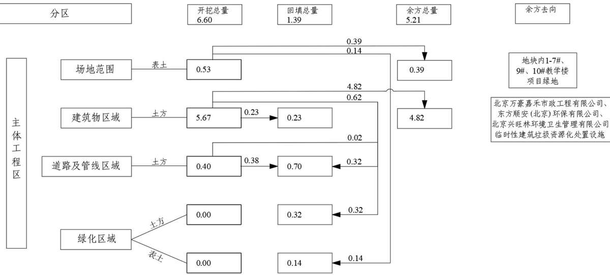
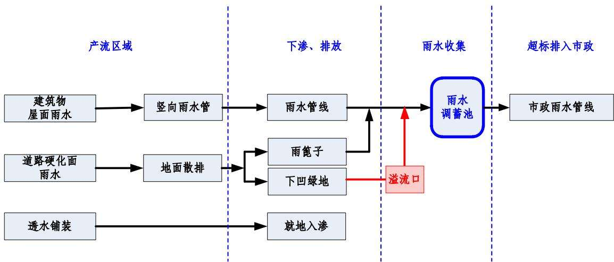
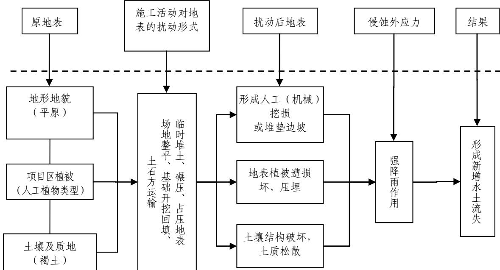
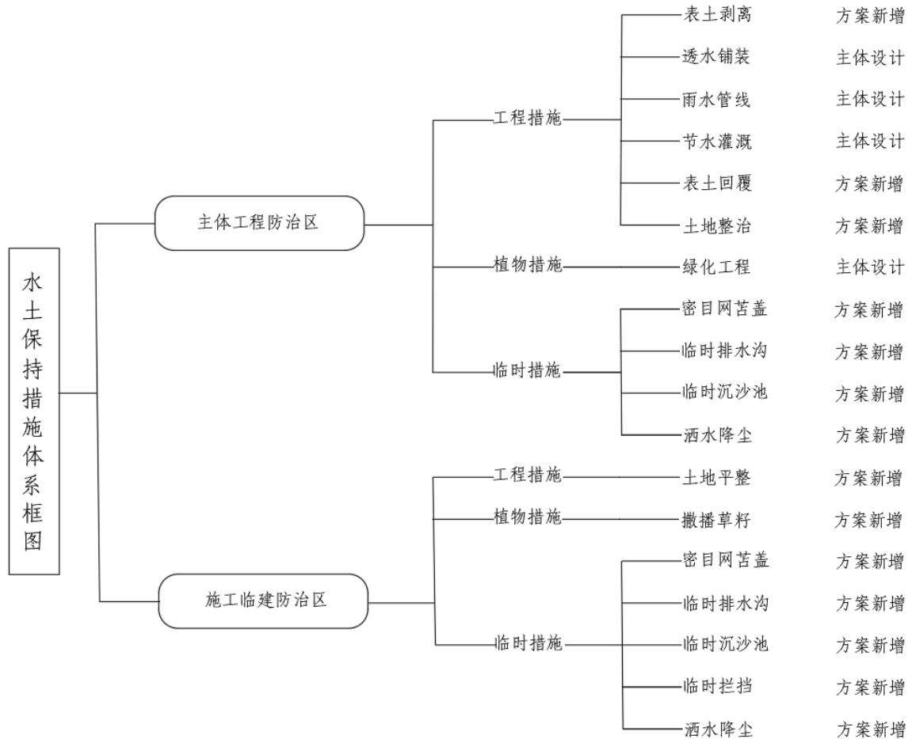

> **Zone C（应用范例层）使用边界**——仅可用于**写作风格、章节展开方式、表达逻辑、表格设计**的参考。
> **不得**用于合规判断；**不得**引入其项目数据（名称／地点／数字／单位名）；
> **不得**因其"曾经通过审批"而推定其做法在当前标准下仍然合规。
> 与 Zone A 冲突时**一律以 Zone A 为准**；Zone A 未明确规定时输出
> 「**Zone A 未明确规定，以下为参考写法，需人工判断**」。
>
> **坐标系警告**：本范例为**老八章结构**（GB 50433—2018 附录B），与 2026 版 10 章模板**同号不同义**
> （老 `1.5`＝防治目标，新 `1.5`＝水土流失预测结果；老 4→新 6 …偏移 +2；新版第 4/5 章老结构无独立章）。
> 因此 **`chapter_mapping: pending`——不得按章节号挂载**，检索一律走 `topic_tags`。
>
> **待加工**：`topic_tags`（主题标签）、`approval_basis_list`（编制依据逐字清单）、
> `structure_summary`（只提取结构：章节展开顺序／段落功能／表格栏目结构／句式模板／论证链步骤）。

1 综合说明 ...  
1.1 项目简况...  
1.2 编制依据..  
1.3 设计水平年..  
1.4 水土流失防治责任范围...  
1.5 水土流失防治目标...  
1.6 项目水土保持评价结论..  
1.7 水土流失预测结果... ....12  
1.8 水土保持措施布设成果. ....12  
1.9 水土保持监测方案... ....15  
1.10 水土保持投资及效益分析成果.. ....16  
1.11 结论.. ....16  
2 项目概况 ... .....19  
2.1 项目组成及工程布置.. ....19  
2.2 施工组织.. ....25  
2.3 工程占地... ....30  
2.4 土石方平衡... ....30  
2.5 拆迁（移民）安置与专项设施改（迁）建.. .....37  
2.6 施工进度.. ...37  
2.7 自然概况.. ...39  
3 项目水土保持评价... ....43  
3.1 主体工程选址（线）水土保持评价.. .....43  
3.2 建设方案与布局水土保持评价... .....46  
3.3 主体工程水土保持措施界定与评价.. .....55  
4 水土流失分析与预测.... ......56  
4.1 水土流失现状.. ...56  
4.2 水土流失影响因素分析.... .....56  
4.3 土壤流失量预测.. ...58  
4.4 水土流失危害分析.. ...68  
4.5 指导性意见.. .....69  
5 水土保持措施... .....71  
5.1 防治区划分.. ....71  
5.2 措施总体布局.. ....72  
5.3 分区措施布设... .....75  
5.4 施工要求... ...84  
6 水土保持监测 .. .....88  
6.1 范围和时段... ....88  
6.2 内容和方法.. ....88  
6.3 点位布设... ...92  
6.4 实施条件及成果. ...92  
7 水土保持投资估算及效益分析.... ....95  
7.1 投资估算. ...95  
7.2 效益分析.. ...105  
8 水土保持管理... ...106  
8.1 组织管理... ....106  
8.2 后续设计. ...107  
8.3 水土保持监测.. ...107  
8.4 水土保持监理.. ....108  
8.5 水土保持施工.. ....110  
8.6 水土保持设施验收... ...111

## 1 综合说明

## 1.1 项目简况

## 1.1.1 项目基本情况

## 1.1.1.1 工程建设必要性

北京大学医学部是国家“211 工程”首批建设的高等学校之一，集教学、科研、医疗为一体，学科覆盖医学门类中的基础医学、临床医学、口腔医学、药学、公共卫生和预防医学、护理学、医学技术等门类的部分学科。北京大学医学部作为国内医学教育的领头羊，在本科生教育、研究生教育、学科建设上充分展示了其引领作用。对加快医学科技创新发展、培养医学高层次人才具有责无旁贷的历史使命。

为改善基本办学条件、支撑“双一流”建设目标，北京大学选址怀柔科学城东区建设怀密医学中心。为落实城市总体规划，贯彻市委、市政府会议精神，加强科技创新中心建设，2022年8月北京市规划和自然资源委员会会同密云区政府、怀柔科学城管委会研究了北京大学怀密医学中心项目选址、规划条件、设计方案等有关工作，规划总用地面积约 $4 7 . 4 7 \mathrm { h m } ^ { 2 }$ ，其中建设用地面积约 $3 3 . 5 6 \mathrm { h m } ^ { 2 }$ 。怀密医学中心立足怀柔科学城的国际科技创新中心定位，整体布局北京大学医学部的主体功能，重点围绕创建世界一流医学教育、前沿交叉学科研究和创新转化中心的目标，一体化建设教书育人、科学研究、临床研究相关平台及机构。

北京大学怀密医学中心 1-8#综合教学楼项目（以下简称“本项目”）位于北京市密云区怀柔科学城东区 MY00-0502-0004 地块内中心区域，为怀密医学中心启动区的重要组成，该项目的建设与实施，是补充怀密医学中心教学配套设施的必要条件，是推动学校各项工作逐步开展的基础。本项目的建设可保障人才培养的可持续发展，进一步培养新时代高质量优秀人才。

## 1.1.1.2 项目情况

项目名称：北京大学怀密医学中心 1-8#综合教学楼项目

建设性质：新建项目

地理位置：本项目位于北京市密云区西田各庄镇怀柔科学城东区MY00-0502-0004地块，具体四至为北至规划云西支八街，西至西统路，东至规划云西支七路，南至规划云西八街。本项目位于地块中心位置。

建设规模及等级：本项目建设用地范围 $1 . 7 4 \mathrm { h m } ^ { 2 }$ ，建设内容为1-8#综合教学楼主体建筑工程和教学楼周边配套室外工程。总建筑面积 $7 2 7 9 9 . 5 0 \mathrm { m } ^ { 2 }$ ，其中地上建筑面积 $5 9 6 2 9 . 3 6 \mathrm { m } ^ { 2 }$ ，地下建筑面积 $1 3 1 7 0 . 1 4 \mathrm { m } ^ { 2 }$

本项目属于中型工程，工程等级为一级。

拆迁（移民）及专项设施改（迁）建方式：不涉及拆迁（移民）及专项设施迁建。

工期：项目计划于 2026年2 月开工，2027 年12月完工，总工期 23个月。

投资：本项目总投资 70741.21万元，其中土建投资 44454.06万元，所需建设资金由中央预算内投资和自筹解决。

工程占地：本项目总用地 $3 . 2 4 \mathrm { h m } ^ { 2 }$ ，其中永久占地 $1 . 7 4 \mathrm { h m } ^ { 2 }$ ，临时占地 $1 . 5 0 \mathrm { h m } ^ { 2 }$ 占地类型为教育用地和裸土地。按建设内容对占地进行划分，永久占地 $1 . 7 4 \mathrm { h m } ^ { 2 }$ 为主体工程区，建设内容包括建筑物工程区 $1 . 2 1 \mathrm { h m } ^ { 2 }$ 、道路及管线工程区 $0 . 2 8 \mathrm { h m } ^ { 2 }$ 绿化工程区 $0 . 2 5 \mathrm { h m } ^ { 2 } ; \quad$ ；临时占地 $1 . 5 0 \mathrm { h m } ^ { 2 }$ 为施工临建区，包含施工生活区 $0 . 5 0 \mathrm { h m } ^ { 2 }$ 临时堆土场 1.00hm2。

土石方量：项目土石方挖填总量7.99万 $\mathrm { m } ^ { 3 }$ ，其中挖方总量6.60 万 $\mathrm { m } ^ { 3 }$ （自然土方 6.07 万 $\mathrm { m } ^ { 3 } .$ 、表土 $0 . 5 3 \ \overline { { \mathcal { H } } } \ \mathrm { m } ^ { 3 } \ )$ ，填方总量 1.39万 $\mathrm { m } ^ { 3 }$ （自然土方 1.25万 $\mathrm { m } ^ { 3 }$ 、表土 0.14 万 $\mathrm { m } ^ { 3 }$ ），无借方，余方总量5.21万 $\mathrm { m } ^ { 3 }$ （自然土方 $4 . 8 2 \mathrm { ~ \mathscr ~ { ~ H ~ } ~ m ~ } ^ { 3 }$ 、表土 0.39万 $\mathrm { m } ^ { 3 } \mathrm { ~ , ~ }$ ），其中余方 4.82万 $\mathrm { m } ^ { 3 }$ 按已取得的《北京市建筑垃圾利用方案备案》（附件4）运往北京万豪嘉禾市政工程有限公司、东方顺安(北京)环保有限公司、北京兴旺林环境卫生管理有限公司三处临时性建筑垃圾资源化处置设施进行综合利用，表土余方0.39 万 $\mathrm { m } ^ { 3 }$ 分别用于地块内北京大学怀密医学中心 1-9#科研楼项目（以下简称“1-9#科研楼项目”）和北京大学怀密医学中心启动区科教产创新融合组团项目（以下简称“1-7#、10#教学楼项目”）综合利用，其中创新融合组团项目（1-7#、10#教学楼）于2024年11月取得《教育部关于北京大学怀密医学中心启动区科教产创新融合组团项目可行性研究报告的批复》（教发函（2024）383号），计划于 2026 年 2 月开工，2027 年 12 月完工，表土剥离量 0.05 万 $\mathrm { m } ^ { 3 }$ ，表土回覆0.38 万 $\mathrm { m } ^ { 3 }$ ，所需表土 $0 . 3 3 \mathrm { ~ \mathscr ~ { ~ H ~ m ~ } ~ } ^ { 3 }$ 由本项目调入；1-9#科研楼项目2025年5月取得《教育部关于北京大学怀密医学中心 1-9#科研楼项目可行性研究报告的批复》（教发函（2025）241号），计划于2026年2月开工，2027 年12月完工，表土剥离量0.22 万 $\mathrm { m } ^ { 3 }$ ，表土回覆 $0 . 2 8 \mathrm { ~ \mathcal ~ { ~ H ~ } ~ m ~ } ^ { 3 }$ ，所需表土 0.06 万 $\mathrm { m } ^ { 3 }$ 由本项目调入。

表土资源：本项目可剥离范围 $1 . 5 2 \mathrm { h m } ^ { 2 }$ 。剥离厚度 30-40cm，剥离量 0.53 万$\mathrm { m } ^ { 3 }$ ，剥离的表土全部运往 1#临时堆土场进行集中堆放，临时堆土场面积 $0 . 5 0 \mathrm { h m } ^ { 2 }$ 堆放高度2.0m，堆存期 2026年2月至2027 年7月，堆存周期18个月。结合施工进度，其堆放时间超过 1年，需对其表土资源进行撒播草籽、临时苫盖、临时排水及沉沙措施，有效保护表土资源。剥离的表土中 0.14万 $\mathrm { m } ^ { 3 }$ 表土用于本项目绿化覆土，剩余0.39万 $\mathrm { m } ^ { 3 }$ 表土用于地块内其他项目绿化区域绿化覆土，其中0.33万 $\mathrm { m } ^ { 3 }$ 运往创新融合组团项目（1-7#、10#教学楼）绿化区域，0.06万 $\mathrm { m } ^ { 3 }$ 运往 1-9#科研楼项目绿化区域。创新融合组团项目（1-7#、10#教学楼）和1-9#科研楼项目与本项目相邻，建设单位均为北京大学，属于同期实施项目，表土回覆时间预计为2027年7月，可与本项目表土调运及回覆时间顺利衔接。

施工布置：项目区北侧有现状市政路西统路，可通过北侧现状施工道路与本项目区相连，方便施工期车辆通行，本项目不涉及新建施工道路；施工用水可就近从附近市政供水管网接引；施工用电由附近已有电网引入作为施工临时用电；工程区附近电讯信号稳定，可接入附近互联网。

施工布置包含施工生活区和临时堆土场地，位于项目红线范围外东北侧临时租赁用地，总占地面积 1.50hm2，占地类型为裸土地。

施工生活区1处，布设在项目东北侧临时租赁用地内，用地面积 $0 . 5 0 \mathrm { h m } ^ { 2 }$ 主要为现场管理人员办公区及工人临时居住场地。

临时堆土场2处，布设在项目东北侧临时租赁用地内，用地面积 $1 . 0 0 \mathrm { h m } ^ { 2 }$ 单处临时堆土场面积 0.50hm2，堆高2.0m，坡比 1：2。1#临时堆土场堆存本项目剥离表土 0.53 万 $\mathrm { m } ^ { 3 }$ ，堆高 2.0m，用于地块内建设项目表土回覆，堆存期2026年2月至2027年7 月，堆存周期18个月；2#槽土堆土场堆存本项目基坑土 0.32万 $\mathrm { m } ^ { 3 }$ ，堆高2.0m，用于项目基坑回填和地下室顶板覆土，堆存期2026 年2月至2026年7月，堆存周期 6个月。

## 1.1.2 前期工作进展

2021年8月，取得《关于研究北京大学怀密医学中心规划建设有关工作的会议纪要》（北京市人民政府会议纪要第338 号）。

2021年12月，取得《教育部关于北京大学征地建设怀密医学中心的批复》（教发函[2021]164 号）。

2025年5月，取得《教育部关于北京大学怀密医学中心 1—8#综合教学楼项目可行性研究报告的批复》（教发函[2025]230 号），明确本项目建筑面积、建设内容及投资金额。

2025 年 11 月，取得《北京大学怀密医学中心项目 MY00-0502-0004 地块“多规合一”协同平台会商意见的函》（2025规自（密）综审字 0015号）。

根据《中华人民共和国水土保持法》等有关法律法规的要求，建设单位于 2025年9月委托北京市首都规划设计工程咨询开发有限公司承担了本项目的水土保持方案编制工作。编制单位成立项目组进行实地踏勘，收集了项目区自然概况、社会经济情况、水土流失和水土保持情况、主体设计等方面的资料，并就技术问题、工程建设进展情况等与项目建设单位、主体设计单位、当地水行政主管部门及有关专家进行了咨询。在此基础上，结合设计文件等资料，按照《生产建设项目水土保持方案管理办法》（水利部令第 53 号）、《生产建设项目水土保持技术标准》（GB 50433-2018）的规定和《生产建设项目水土流失防治标准》（GB/T50434-2018）的规定编制完成本项目水土保持方案报告书。

## 1.1.3 自然简况

本项目位于北京市密云区，地势相对平坦。项目所在区域属暖温带大陆性季风气候，四季分明。多年平均气温为 $1 1 . 4 \mathrm { { ^ { \circ } C } }$ ，多年平均降水量为625mm，多年平均蒸发量1374.4mm，年平均日照时数为 2685.3h，多年平均风速2.5m/s。土壤类型以褐土为主。密云区处于暖温带落叶阔叶林带，属华北植物区系，本项目区植被主要为人工植被。

根据北京市土壤侵蚀强度分布图，本项目土壤侵蚀类型区为北方土石山区，土壤侵蚀强度为微度水力侵蚀为主，容许土壤流失量为 $2 0 0 \mathrm { t } / \ \left( \mathrm { k m } ^ { 2 } \bullet _ { \mathrm { a } } \right)$

本项目不属于崩塌、滑坡危险区和泥石流易发区、低洼易涝区。项目所在区域不涉及饮用水水源保护区、水功能一级区的保护区和保留区、自然保护区、世界文化和自然遗产地、风景名胜区、地质公园、森林公园、重要湿地、生态保护红线、河湖管理范围等敏感区。

## 1.2 编制依据

## 1.2.1 法律法规

（1）《中华人民共和国水土保持法》（全国人大常委会，1991 年6月29日通过，2010年12 月25日修订，2011年 3月1日施行）；

（2）《北京市水土保持条例》（2025年 5月31日进行修订）。

## 1.2.2 规范性文件

（1）《生产建设项目水土保持方案管理办法》（水利部令第 53 号）；

（2）《水利部关于进一步深化“放管服”改革全面加强水土保持监管的意见》（水保[2019]160 号）；

（3）《水利部办公厅关于进一步加强生产建设项目水土保持监测工作的通知》（办水保[2020]161 号）；

（4）《水利部办公厅关于做好生产建设项目水土保持承诺制管理的通知》（办水保[2020]160 号）；

（5）《水利部办公厅关于做好国家级水土流失重点预防区和重点治理区落地上图成果应用的通知》（水利部，办水保[2025]170号）；

（6）《全国水土保持规划（2015-2030 年）》（国函[2015]160 号）；

（7）《水利部办公厅关于印发生产建设项目水土保持方案审查要点的通知》（办水保[2023]177 号）；

（8）《北京市水土保持规划》（2017 年 5 月）；

（9）《北京市发展和改革委员会北京市财政局北京市水务局关于降低本市水土保持补偿费收费标准的通知》（京发改[2021]1271号）；

（10）《北京市生产建设项目水土保持方案管理规定（试行）》（京水务保[2023]17 号）；

（11）水利部关于发布《水利工程设计概（估）算编制规定》及水利工程系列定额的通知》（水总[2024]323 号）。

## 1.2.3 技术标准

（1）《生产建设项目水土保持技术标准》（GB50433-2018）；

（2）《生产建设项目水土流失防治标准》（GB/T50434-2018）；

（3）《生产建设项目水土保持监测与评价标准》（GB/T 51240-2018）；

（4）《土地利用现状分类》（GB/T21010-2017）；

（5）《水土保持工程设计规范》（GB51018-2014）；

（6）《生产建设项目土壤流失量测算导则》（SL773-2018）；

（7）《水利水电工程制图标准水土保持图》（SL73.6-2015）；

（8）《土壤侵蚀分类分级标准》（SL190-2007）；

（9）《水土保持监理规范》（SL/T 523-2024）；

（10）《水土保持工程质量验收与评价规范》（SL/T336-2025）。

## 1.2.4 技术资料

（1）《北京大学怀密医学中心 1-8#综合教学楼项目可行性研究报告》（中国国际工程咨询有限公司 2025年5月）；

（2）建设单位提供的其他设计基础性资料；

（3）现场调查资料。

## 1.3 设计水平年

根据《生产建设项目水土保持技术标准》（GB50433-2018），本项目属于建设类项目，根据主体工程施工进度安排，施工建设期为 2026年2月至2027年12月，本项目水土保持方案设计水平年为 2028 年。

## 1.4 水土流失防治责任范围

根据《生产建设项目水土保持技术标准》（GB50433-2018）相关要求，生产建设项目水土流失防治责任范围包括项目永久征地、临时占地。本项目永久占地 $1 . 7 4 \mathrm { h m } ^ { 2 }$ ，临时占地 $1 . 5 0 \mathrm { h m } ^ { 2 }$ ，水土流失防治责任范围为 $3 . 2 4 \mathrm { h m } ^ { 2 }$

## 1.5 水土流失防治目标

## 1.5.1 执行标准等级

本项目位于北京市密云区西田各庄镇，属于怀柔科学城范围，根据《《水利部办公厅关于做好国家级水土流失重点预防区和重点治理区落地上图成果应用的通知》（办水保[2025]170号），对本项目所在位置在国家级水土流失重点预防区和重点治理区查询系统中查询，本项目位置不属于国家级水土流失重点预防区和重点治理区；根据《北京市水土保持保持规划》（2017年5月），项目所在区域属于北京市水土流失重点预防区，结合《生产建设项目水土流失防治标准》(GB/T50434-2018)，本项目执行水土流失防治标准等级为北方土石山区一级标准，并适当提高防治目标。

## 1.5.2 防治目标

依据《生产建设项目水土流失防治标准》(GB/T50434-2018)，本项目执行水土流失防治标准等级为北方土石山区一级标准。

结合项目建设特点以及项目区多年平均降雨量，现状土壤侵蚀强度、地形地貌和位置等，对防治目标值修正如下：

（1）根据《生产建设项目水土流失防治标准》（GB/T50434-2018）的规定，本项目所在区域属于北京市水土流失重点预防区，执行一级标准。

（2）现状侵蚀程度影响：项目区现状土壤侵蚀程度以微度侵蚀为主，土壤流失控制比相应提高至 1.00或以上，本报告确定提高至 1.10。

（3）项目区位置影响：项目区多年平均降水量 625mm，位于城市区的项目，渣土防护率提高1%，根据《北京大学怀密医学中心项目MY00-0502-0004地块“多规合一”协同平台会商意见的函》（2025规自（密）综审字 0015号）要求，

MY00-0502-0004 地块绿地率应大于 20%，主体设计 MY00-0502-0004 地块整体绿地率为20.02%，由于本项目为单体建筑，绿地面积较少，结合项目建设特点，本项目林草覆盖率调整至 14%。

表 1.1-1 生产建设项目水土流失防治目标
<table><tr><td rowspan=2 colspan=1>防治指标</td><td rowspan=1 colspan=2>一级标准</td><td rowspan=1 colspan=1>按两区、</td><td rowspan=2 colspan=1>按建设内容修修正</td><td rowspan=1 colspan=2>正后防治目标目标</td></tr><tr><td rowspan=1 colspan=1>施工期设</td><td rowspan=1 colspan=1>计水平年</td><td rowspan=1 colspan=1>地域修正</td><td rowspan=1 colspan=1>施工期设</td><td rowspan=1 colspan=1>计水平年</td></tr><tr><td rowspan=1 colspan=1>水土流失治理度（%）</td><td rowspan=1 colspan=1></td><td rowspan=1 colspan=1>95</td><td rowspan=1 colspan=1></td><td rowspan=1 colspan=1></td><td rowspan=1 colspan=1></td><td rowspan=1 colspan=1>95</td></tr><tr><td rowspan=1 colspan=1>土壤流失控制比</td><td rowspan=1 colspan=1></td><td rowspan=1 colspan=1>0.90</td><td rowspan=1 colspan=1>+0.20</td><td rowspan=1 colspan=1></td><td rowspan=1 colspan=1></td><td rowspan=1 colspan=1>1.10</td></tr><tr><td rowspan=1 colspan=1>渣土防护率（%）</td><td rowspan=1 colspan=1>95</td><td rowspan=1 colspan=1>97</td><td rowspan=1 colspan=1>+1.0</td><td rowspan=1 colspan=1></td><td rowspan=1 colspan=1>95</td><td rowspan=1 colspan=1>98</td></tr><tr><td rowspan=1 colspan=1>表土保护率（%）</td><td rowspan=1 colspan=1>95</td><td rowspan=1 colspan=1>95</td><td rowspan=1 colspan=1></td><td rowspan=1 colspan=1></td><td rowspan=1 colspan=1>95</td><td rowspan=1 colspan=1>95</td></tr><tr><td rowspan=1 colspan=1>林草植被恢复率（%）</td><td rowspan=1 colspan=1></td><td rowspan=1 colspan=1>97</td><td rowspan=1 colspan=1></td><td rowspan=1 colspan=1></td><td rowspan=1 colspan=1></td><td rowspan=1 colspan=1>97</td></tr><tr><td rowspan=1 colspan=1>林草覆盖率（%）</td><td rowspan=1 colspan=1></td><td rowspan=1 colspan=1>25</td><td rowspan=1 colspan=1></td><td rowspan=1 colspan=1>-11</td><td rowspan=1 colspan=1></td><td rowspan=1 colspan=1>14</td></tr></table>

## 1.6 项目水土保持评价结论

## 1.6.1 主体工程选址（线）评价

根据《中华人民共和国水土保持法》、《生产建设项目水土保持技术标准》（GB50433-2018）和规范性文件的相关规定，逐条进行分析可知：

（1）工程建设未在崩塌、滑坡危险区和泥石流易发区从事取土、挖砂、采石等可能造成水土流失的活动；未在水土流失严重、生态脆弱的地区，应当限制或者禁止可能造成水土流失的生产建设活动，严格保护植物、沙壳、结皮、地衣等；未在二十五度以上陡坡地开垦种植农作物；未在毁林、毁草开垦和采集发菜；未在在水土流失重点预防区和重点治理区铲草皮、挖树兜或者滥挖虫草、甘草、麻黄等。

（2）工程选址未在崩塌和滑坡危险区、泥石流易发区内设置取土（石、砂）场；未在对公共设施、基础设施、工业企业、居民点等有重大影晌的区域设置弃土（石、渣、灰、砰石 尾矿）场。

（3）本项目位于北京市密云区西田各庄镇，属于怀柔科学城范围，项目所在区域属于北京市水土流失重点预防区，根据《生产建设项目水土流失防治标准》(GB/T50434-2018)，本项目执行水土流失防治标准等级为北方土石山区一级标准，将土壤流失控制比提高 0.20，渣土防护率提高 1%。

（4）项目区处于海河流域潮白河水系，周边主要河流为沙河，本项目距离沙河上口外边线约 4km，在其河道管理范围及保护范围以外，未占用河道管理范围及河道保护范围。故本项目建设范围内不涉及河流两岸、湖泊和水库周边的植物保护带。

（5）施工期经历雨季，考虑到施工期雨水排除，在项目区内布设临时排水沟，末端接入沉沙池，排入项目区西侧西统路现状市政雨水管网，工程施工期采取沉沙措施，并且周边不涉及河渠，不会发生河渠淤积现象；本项目不涉及取土（石、砂）场。

（6）结合《生产建设项目水土保持技术标准》（GB50433-2018）的要求，应保存和利用耕作层土壤；根据本项目岩土工程勘察报告及现场查勘，本项目区内可剥离范围 $1 . 5 2 \mathrm { h m } ^ { 2 }$ ，剥离厚度30-40cm，剥离量 $0 . 5 3 \mathrm { ~ \mathscr ~ { ~ H ~ } ~ m ~ } ^ { 3 }$ 。对其进行临时拦挡及临时苫盖措施，同时在堆体坡面处设置临时排水沟，防止雨水对堆体下方的土壤造成水力侵蚀。项目剥离的表土用于本项目绿化覆 $\pm \ : 0 . 1 4 \ : \mathcal { H } \ : \mathrm { m } ^ { 3 }$ ，剩余 0.39万 $\mathrm { m } ^ { 3 }$ 表土分别用于地块内创新融合组团项目（1-7#、10#教学楼）绿化区域绿化覆土 0.33 万 $\mathrm { m } ^ { 3 }$ ，1-9#科研楼项目绿化区域绿化覆土 $0 . 0 6 \mathrm { ~ \mathscr ~ { ~ H ~ } ~ m ~ } ^ { 3 }$ ，能够满足本项目表土资源的需求。

（7）项目区内场平后平均标高约为 55.77m，项目建成后室外道路设计标高绝对高程为56.73m-56.75m 之间，高于地块西侧西统路 0.90m，高于北侧规划云西支八路0.44m，高于南侧规划云西八路0.53m，高于东侧规划云西支七路0.41m，1-8#综合教学楼设计标高（±0.000）绝对高程为 56.90m，地下二层绝对高程为48.50m，绿化设计标高在 56.71m-56.75m 之间，方案补充设计微地形景观消纳余方，微地形设计高程为 57.03m-57.50m 之间，高于室外场地标高 0.3m-0.8m 之间，通过竖向设计优化，从而将开挖土方优先用于项目区回填，减少项目区余方外运的产生。

总体分析认为，本项目从水土保持角度考虑，工程选址是可行的。

## 1.6.2 建设方案与布局评价

根据《生产建设项目水土保持技术标准》（GB 50433-2018）相关规定从水土保持角度对建设方案、工程占地、土石方平衡、取土（石、砂）场设置、弃土场设置、施工方法与工艺、具有水土保持功能的工程进行评价。

## 一、建设方案评价

## 1、平面分析：

本项目从规划的角度分析，项目整体区域定位主要是完善区域科研资源配备，符合国家及地方规划政策的相关要求。主体设计通过优化施工工艺，利用支护的方式减少基坑占地面积和土方挖填量。雨洪利用通过绿地和透水铺装增加雨水入渗，超过入渗能力的雨水通过雨水管线汇入雨水调蓄池内收集利用，使排水设施方案更具有系统性和成效性。

## 2、竖向分析：

主体设计以市政道路作为高程控制点，保障怀密医学中心道路与其市政道路有序衔接，道路坡度在0.17%\~0.85%之间。项目区内场平后平均标高约为55.77m，项目建成后室外道路设计标高绝对高程为 56.73m-56.75m 之间，高于地块西侧西统路0.90m，高于北侧规划云西支八路 0.44m，高于南侧规划云西八路 0.53m，高于东侧规划云西支七路 0.41m，有效与周边市政道路顺接。

1-8#综合教学楼设计标高（±0.000）绝对高程为 56.90m，室内外设计高差为0.15m，地下二层绝对高程为 48.50m，绿化设计标高在 56.71m-56.75m 之间，方案补充设计微地形景观消纳余方，微地形设计高程为 57.03m-57.50m 之间，高于室外场地标高0.3m-0.8m。主体竖向设计合理，方案予以认可。

## 二、工程占地评价

本项目总用地面积 $3 . 2 4 \mathrm { h m } ^ { 2 }$ ，其中永久占地 $1 . 7 4 \mathrm { h m } ^ { 2 }$ ，临时占地 $1 . 5 0 \mathrm { h m } ^ { 2 } .$ 。占地类型为教育用地和裸土地。从占地性质角度分析，由于本项目主要建设内容为单体建筑，考虑到建筑基坑较大、用地紧张及施工期施工材料的安全距离等因素，不可避免新增临时占地，新增临时占地按项目属地要求，全部控制在北京市怀柔科学城东区范围内，在保障施工安全的情况下，适当增加临时占地，施工结束后及时的对其进行恢复措施，符合水土保持相关要求。从占地类型角度分析，根据《多规合一会商意见》（2025规自（密）综审字 0015号）明确用地为 A31高等院校用地，临时占地为裸土地，占地类型符合区域规划的要求。

## 三、土石方平衡评价

土石方挖填总量 7.99万 $\mathrm { m } ^ { 3 }$ ，其中挖方总量 6.60万 $\mathrm { m } ^ { 3 }$ （自然土方 6.07万 $\mathrm { m } ^ { 3 }$ 、表土 0.53 万 $\mathbf { m } ^ { 3 } )$ ），填方总量 1.39万 $\mathrm { m } ^ { 3 }$ （自然土方 1.25万 $\mathrm { m } ^ { 3 } ,$ 、表土 0.14 万 $\mathbf { m } ^ { 3 } )$ 无借方，余方总量5.21万 $\mathrm { m } ^ { 3 }$ （自然土方 4.82万 $\mathrm { m } ^ { 3 }$ 、表土 0.39 万 $\mathrm { m } ^ { 3 } \mathrm { ~ , ~ }$ ）。表土 0.39万 $\mathrm { m } ^ { 3 }$ 余方用于地块内其他项目绿化区域覆土，其中 0.33万 $\mathrm { m } ^ { 3 }$ 运往创新融合组团项目（1-7#、10#教学楼）绿化区域，0.06万 $\mathrm { m } ^ { 3 }$ 运往1-9#科研楼项目绿化区域，余方 4.82 万 $\mathrm { m } ^ { 3 }$ 按已取得的《北京市建筑垃圾利用方案备案》运往北京万豪嘉禾市政工程有限公司、东方顺安(北京)环保有限公司、北京兴旺林环境卫生管理有限公司三处临时性建筑垃圾资源化处置设施进行综合利用。

工程建设最大土方工程为建筑基础施工，主体设计优化施工工艺，增加基坑开挖坡度，减少建筑基础施工作业面范围，将施工期土方挖填总量从 8.41万 $\mathrm { m } ^ { 3 }$ 减少至 7.99 万 $\mathrm { m } ^ { 3 }$ ，挖方量减少了 0.42万 $\mathrm { m } ^ { 3 }$ ，实现土方减量化，降低施工期水土流失。考虑到土石方挖填平衡，方案补充将部分绿地采用微地形的形式，将其设计标高调整为高于周边硬化面 0.3m-0.8m 之间，可消纳管线工程土方余方0.02万 $\mathrm { m } ^ { 3 }$ ，符合水土保持相关要求，项目回填土方全部为自身开挖土方，不需要外借土方。

综上，主体工程的土石方挖填时序合理，工程土石方平衡合理。

## 四、表土资源评价

根据现场调查，本项目区内可剥离范围 $1 . 5 2 \mathrm { h m } ^ { 2 }$ 。剥离厚度30-40cm，剥离量 0.53 万 $\mathrm { m } ^ { 3 }$ ，剥离的表土全部运往 1#临时堆土场进行集中堆放，临时堆土场面积 $0 . 5 0 \mathrm { h m } ^ { 2 }$ ，堆放高度2.0m，结合施工进度，明确其堆放时间超过 1 年，需对其表土资源进行撒播草籽、临时苫盖、临时排水及沉沙措施，有效保护表土资源，后续将其表土全部运往本项目和地块内其他教学楼建设项目绿化区域绿化覆土，本项目绿化覆 $\pm 0 . 1 4 \mathcal { \ F } \mathrm { ~ m } ^ { 3 }$ ，剩余表 $\pm \ : 0 . 3 9 \mathrm { ~ } \overline { { { \mathrm { \mathcal { H } } } } } \mathrm { ~ m } ^ { 3 }$ 用于地块内其他项目绿化区域绿化覆土，其中0.33 万 $\mathrm { m } ^ { 3 }$ 运往创新融合组团项目（1-7#、10#教学楼）绿化区域，0.06 万 $\mathrm { m } ^ { 3 }$ 运往1-9#科研楼项目绿化区域，表土资源有效保护及利用。

## 五、取、弃土场设置评价

本项目不涉及取土（石、料）场地，未在崩塌和滑坡危险区、泥石流易发区内设置取土（石、砂）场。

本项目未在对公共设施、基础设施、工业企业、居民点等有重大影响的区域设置弃土（石、渣）场。

## 六、施工方法与工艺评价

本项目采用机械作业，及时回填，大大减少了地表裸露的时间和扰动时间。同时场地内施工采取排水、沉沙措施，减少基坑开挖及临时堆土场的水土流失。在基础开挖与支护工艺、土方回填工艺、管线施工工艺、道路施工工艺、绿化施工工艺等方面均符合要求，因此本项目主体工程设计科学合理，工期安排紧凑，可降低因人为扰动诱发的水土流失危害，符合水土保持的要求。

本项目主体设计的透水铺装、绿化工程等具有水土保持功能，报告将其界定为水土保持措施，并补充新增表土剥离及回覆、管线开挖临时堆土密目网苫盖、临时排水沟及沉沙池、土地平整等措施，通过完善雨水径流、景观和土石方综合利用，使之形成一个综合、高效的水土流失防治措施体系。

## 1.7 水土流失预测结果

本项目扰动地表面积为 $3 . 2 4 \mathrm { h m } ^ { 2 }$ ，项目原地貌水土流失量约为 11.03t，项目在预测期内产生的水土流失总量为 161.00t，其中施工期可能造成的水土流失总量157.50t，自然恢复期可能造成的水土流失总量 3.50t。新增水土流失量为 149.97t。根据水土流失预测结果，项目施工期是主要水土流失重点时段，本项目水土流失量最大区域为施工临建防治区。

## 1.8 水土保持措施布设成果

本项目地形地貌均为平原，按照项目组成划分为 2个防治分区，包含主体工程防治区和施工临建防治区。

## 1.8.1 主体工程防治区

## 一、工程措施

1、表土剥离：根据土质情况，对项目表土资源丰富区域进行表土剥离，剥离厚度为30-40cm。剥离面积 $1 . 5 2 \mathrm { h m } ^ { 2 }$ ，表土剥离 $0 . 5 3 \mathrm { ~ \mathscr ~ { ~ H ~ } ~ m ~ } ^ { 3 }$ 。剥离的表土运往1#表土临时堆土场进行集中堆放，实施时间为 2026年2月。

2、透水铺装：项目人行道采用透水砖铺装，主体设计透水砖规格为20cm×10cm×6cm，铺装面积为 $0 . 2 1 \mathrm { h m } ^ { 2 }$ 。实施时间为 2027年4月。

3、雨水管网：雨水管线接入周边市政雨水管网，主体设计雨水管线 554m。实施时间为2027年 4月。

4、节水灌溉：主体设计绿化区域采用节水灌溉，节水灌溉面积 $0 . 2 5 \mathrm { h m } ^ { 2 }$ ，实施时间为2027 年 7 月。

5、表土回覆：项目绿化工程面积 $0 . 2 5 \mathrm { h m } ^ { 2 }$ ，表土回覆厚度40-60cm，平均厚度56cm，本项目需表土回覆 0.14万 $\mathrm { m } ^ { 3 }$ ，表土来源为本项目剥离的表土，实施时间为 2027 年 7 月。

6、土地整治：表土回覆后对绿化用地进行土地整治，土地整治面积 $0 . 2 5 \mathrm { h m } ^ { 2 }$ 实施时间为2027年 7月。

## 二、植物措施

1、绿化工程：本项目绿化区域采用乔灌木栽植的形式，绿化面积为 $0 . 2 5 \mathrm { h m } ^ { 2 }$ 种植乔灌草乡土树种。实施时间为 2027年 8月。

## 三、临时措施

1、密目网苫盖：施工期间需对裸露地表和管槽开挖临时堆放的土方采用密目网覆盖，需密目网苫盖量 $1 2 2 0 0 \mathrm { m } ^ { 2 }$ 。实施时间为 2026年2月。

2、临时排水沟：基坑外围布设临时排水沟，排水明沟采用矩形断面，水泥砂浆抹面，深度为 0.4m，底宽为 0.4m，排水沟长约 456m。实施时间为 2026年2 月。

3、临时沉沙池：在临时排水沟排入市政雨水管线前设置沉沙池，采用矩形断面，池长2.0m，池宽 1.5m，池深1.5m，设置沉沙池 1座。实施时间为 2026年2 月。

5、洒水降尘：对主体工程施工区域采取洒水降尘措施，每日1 次，工程建设期需洒水260台时。实施时间为2026年 2月。

## 1.8.2 施工临建防治区

## 一、工程措施

1、土地平整：施工结束后，对施工临建区进行土地平整，土地平整面积$1 . 5 0 \mathrm { h m } ^ { 2 }$ 。实施时间为 2027年12月。

## 二、植物措施

1、撒播草籽：1#表土临时堆土场堆放时间超过 1年，对表土堆土场进行撒播草籽 $0 . 7 8 \mathrm { h m } ^ { 2 }$ ，实施时段为 2026年4月。

## 三、临时措施

1、密目网苫盖：施工期对施工临建区的临时堆土场进行密目网苫盖，土地平整后对裸露地表进行临时覆盖，共需密目网苫盖约 $1 6 8 0 0 \mathrm { m } ^ { 2 } .$ 。实施时间为 2026年 2 月。

2、临时拦挡：施工临建区共布设临时堆土场 2处，临时占地 $1 . 0 0 \mathrm { h m } ^ { 2 }$ ，堆高2.0m，堆土场周边设置袋装土进行拦挡，袋装土拦挡高 60cm，底宽 80cm，长度400m，草袋土方 $1 9 2 \mathrm m ^ { 3 }$ 。实施时间为2026 年2月。

3、临时排水沟：对施工临建区的临时堆土场和施工生活区布设临时排水沟，末端与新建临时沉沙池相连通，统筹利用临时措施。排水明沟采用矩形断面，水泥砂浆抹面，深度为 0.4m，底宽为 0.4m，排水沟长 639m。实施时间为 2026年2 月。

4、临时沉沙池：在临时排水沟排入市政管道前设置 1座沉沙池对泥沙进行沉淀，临时沉沙池采用矩形断面，池长 2.0m，池宽1.5m，池深1.5m。实施时段为 2026 年 2 月。

5、洒水降尘：对施工临建设施场地应采取洒水降尘措施，每日 1次，工程建设期需洒水220台时。实施时间为 2026年 2月。

## 1.9 水土保持监测方案

本项目水土保持监测工作与主体工程同步开展。根据《生产建设项目水土保持技术标准》（GB50433-2018）、《生产建设项目水土保持监测与评价标准》（GB/T51240-2018）和《水利部办公厅关于进一步加强生产建设项目水土保持监测工作的通知》（办水保[2020]161号），本项目为建设类项目，监测时段从施工准备期开始至设计水平年结束。

（1）监测内容：水土流失影响因素、水土流失状况、水土流失危害和水土保持措施等。

（2）监测时段：2026年2月开始至2027 年12月结束。

（3）监测方法：采用调查监测、实地量测、样方调查、遥感法、沉沙池法相结合的方法。

（4）监测点位：选取不同工程水土流失及施工特点设定监测点 3个。主体工程防治区1个、施工临建防治区2个。

（5）监测频次：本项目水土保持监测应在整个建设期开展全程不间断监测。扰动土地情况应至少每月监测 1次。水土流失状况至少每月监测 1次，遇强降雨（日降雨量≥50mm 或1小时降雨量≥25mm）等重大水土流失危害事件应及时加测，于一周内完成监测。其中土壤流失量结合拦挡、排水等措施，设置必要的控制站，进行定量观测。水土流失防治成效应至少每季度监测 1次，植物措施实施进度及数量不少于每月监测记录 1次，成活率、保存率及生长状况在栽植 6个月后调查成活率，且每年调查 1次保存率及生长状况；工程措施实施进度及数量每季度1次；临时措施实施情况每月 1次。水土流失危害应综合上述监测内容一并开展，在监测季报和总结报告中应明确“绿黄红”三色评价结论。水土保持监测三色评价是指监测单位依据扰动土地情况、水土流失状况、防治成效及水土流失危害等监测结果，对生产建设项目水土流失防治情况进行评价。

（6）监测重点区域为施工临建防治区。

## 1.10 水土保持投资及效益分析成果

## 1.10.1 水土保持投资

本项目水土保持估算总投资 322.82万元，其中工程措施投资 66.09 万元，植物措施投资21.25万元，监测措施投资 53.37 万元，临时措施投资103.41 万元，独立费用63.33万元，基本预备费 15.37万元。

## 1.10.2 水土保持效益分析

本项目水土流失面积 3.24hm2，综合治理水土流失面积 3.24hm2。在严格执行和落实本方案设计的水土保持措施后，项目区水土流失可以得到控制，通过水土保持综合治理，六项防治目标均可达标。水土保持方案实施后，治理水土流失面积 $3 . 2 4 \mathrm { h m } ^ { 2 }$ ，可减少土壤流失量 124.41t。

## 1.11 结论

经过对项目区实地调查踏勘、水土流失预测、水土保持分析与评价及水土流失防治方案设计，从水土保持角度分析，工程选址、布局和施工组织设计可行；但是，项目建设区属北京市水土流失重点预防区，工程选址无法避让。应严格落实本方案，加强管理，减少地表扰动和破坏、加强治理和补偿措施，使项目建设造成的水土流失降低到最小；本方案通过分析论证，力求做到弃渣减量化、资源化利用。从水土保持的角度看，只要认真落实水土保持工作，项目建设不会产生大的水土流失影响，本项目的建设是可行的。

本方案实施后，水土流失六项防治指标均达到了预期目标值，新增水土流失将得到有效控制，扰动区域内植被得以恢复，从整体来看，水土流失治理效果显著。

从水土保持的角度加强对施工单位的管理，强化施工单位预防为主的水土保持意识，严格按照工程建设及管理的相关规定，监控人员、机械、车辆等的活动范围，严禁随意扩大施工占地、乱堆乱弃等行为，加强土方运输过程中的临时防护措施，以免对周边市政运行造成不良影响。将水土保持措施纳入主体工程招标文件，一起招标。落实方案设计的水土保持措施，做好水土保持专项设计，加强施工组织管理，落实水土保持“三同时”制度。项目竣工验收或投产使用前，建设单位将根据水土保持方案及其审批决定等，按照《水利部关于加强事中事后监管规范生产建设项目水土保持设施自主验收的通知》（水保[2017]365 号）要求，开展水土保持设施自主验收工作，水土保持设施验收合格后方可投入使用。

水土保持方案特性表
<table><tr><td rowspan=1 colspan=1>项目名称</td><td rowspan=1 colspan=7>北京大学怀密医学中心1-8#综合教学楼项目</td><td rowspan=1 colspan=4>流域管理机构</td><td rowspan=1 colspan=1>海河水利委员会</td></tr><tr><td rowspan=1 colspan=1>涉及省（市、区）</td><td rowspan=1 colspan=3>北京市</td><td rowspan=1 colspan=4>涉及地市或个数</td><td rowspan=1 colspan=1>密云区</td><td rowspan=1 colspan=3>涉及县或个数</td><td rowspan=1 colspan=1>西田各庄镇</td></tr><tr><td rowspan=1 colspan=1>项目规模</td><td rowspan=1 colspan=3>总建筑面积72799.50m2</td><td rowspan=1 colspan=4>总投资（万元）</td><td rowspan=1 colspan=1>70741.21</td><td rowspan=1 colspan=3>土建投资（万元）</td><td rowspan=1 colspan=1>44454.06</td></tr><tr><td rowspan=1 colspan=1>动工时间</td><td rowspan=1 colspan=3>2026年2月</td><td rowspan=1 colspan=4>完工时间</td><td rowspan=1 colspan=1>2027年12月</td><td rowspan=1 colspan=3>设计水平年</td><td rowspan=1 colspan=1>2028年</td></tr><tr><td rowspan=1 colspan=1>工程占地（hm²）</td><td rowspan=1 colspan=3>3.24</td><td rowspan=1 colspan=4>永久占地（hm²）</td><td rowspan=1 colspan=1>1.74</td><td rowspan=1 colspan=3>临时占地（hm²）</td><td rowspan=1 colspan=1>1.50</td></tr><tr><td rowspan=2 colspan=1>土石方量(万m³)</td><td rowspan=1 colspan=3>挖方</td><td rowspan=1 colspan=4>填方</td><td rowspan=1 colspan=1>借方</td><td rowspan=1 colspan=4>余（弃）方</td></tr><tr><td rowspan=1 colspan=3>6.60</td><td rowspan=1 colspan=4>1.39</td><td rowspan=1 colspan=1>0</td><td rowspan=1 colspan=4>5.21</td></tr><tr><td rowspan=1 colspan=1>重点防治区名称</td><td rowspan=1 colspan=12>北京市水土流失重点预防区</td></tr><tr><td rowspan=1 colspan=3>地貌类型</td><td rowspan=1 colspan=2>平原区</td><td rowspan=1 colspan=6>水土保持区划</td><td rowspan=1 colspan=2>北方土石山区</td></tr><tr><td rowspan=1 colspan=3>土壤侵蚀类型</td><td rowspan=1 colspan=2>水力侵蚀为主</td><td rowspan=1 colspan=6>土壤侵蚀强度</td><td rowspan=1 colspan=2>微度</td></tr><tr><td rowspan=1 colspan=3>防治责任范围面积（hm²）</td><td rowspan=1 colspan=2>3.24</td><td rowspan=1 colspan=6>容许土壤流失量[t/（km²•a）]</td><td rowspan=1 colspan=2>200</td></tr><tr><td rowspan=1 colspan=3>土壤流失预测总量(t)</td><td rowspan=1 colspan=2>161.00</td><td rowspan=1 colspan=6>新增土壤流失量(t)</td><td rowspan=1 colspan=2>149.97</td></tr><tr><td rowspan=1 colspan=1>水土流失防治标准执行等级</td><td rowspan=1 colspan=12>北方土石山区一级标准</td></tr><tr><td rowspan=3 colspan=1>防治指标</td><td rowspan=1 colspan=5>水土流失治理度（%）</td><td rowspan=1 colspan=2>95</td><td rowspan=1 colspan=3>土壤流失控制比</td><td rowspan=1 colspan=2>1.10</td></tr><tr><td rowspan=1 colspan=5>渣土防护率（%）</td><td rowspan=1 colspan=2>98</td><td rowspan=1 colspan=3>表土保护率（%）</td><td rowspan=1 colspan=2>95</td></tr><tr><td rowspan=1 colspan=5>林草植被恢复率（%）</td><td rowspan=1 colspan=2>97</td><td rowspan=1 colspan=3>林草覆盖率（%）</td><td rowspan=1 colspan=2>14</td></tr><tr><td rowspan=3 colspan=1>防治措施及工程量</td><td rowspan=1 colspan=2>防治分区</td><td rowspan=1 colspan=5>工程措施</td><td rowspan=1 colspan=1>植物措施</td><td rowspan=1 colspan=4>临时措施</td></tr><tr><td rowspan=1 colspan=2>主体工程防治区</td><td rowspan=1 colspan=5>表土剥离0.53万m³，透水铺装 0.21hm²，雨水管网 554m;节水灌溉0.25hm²，表土回覆0.14万m³，土地整治 0.25hm²。</td><td rowspan=1 colspan=1>绿化工程0.25hm²。</td><td rowspan=1 colspan=4>密目网苫盖12200m²，临时排水沟456m，临时沉沙池1座，洒水降尘260台时。</td></tr><tr><td rowspan=1 colspan=2>施工临建防治区</td><td rowspan=1 colspan=5>土地平整1.50hm²。</td><td rowspan=1 colspan=1>撒播草籽0.78hm2。</td><td rowspan=1 colspan=4>密目网苫盖16800m²，临时拦挡400m，临时排水沟639m，临时沉沙池1座，洒水降尘220台时。</td></tr><tr><td rowspan=1 colspan=3>投资（万元）</td><td rowspan=1 colspan=5>66.09</td><td rowspan=1 colspan=1>21.25</td><td rowspan=1 colspan=4>103.41</td></tr><tr><td rowspan=1 colspan=3>水土保持总投资（万元）</td><td rowspan=1 colspan=5>322.82</td><td rowspan=1 colspan=3>独立费用（万元）</td><td rowspan=1 colspan=2>63.33</td></tr><tr><td rowspan=1 colspan=1>监理费（万元）</td><td rowspan=1 colspan=2>12.00</td><td rowspan=1 colspan=5>监测措施费（万元）</td><td rowspan=1 colspan=3>53.37</td><td rowspan=1 colspan=1>补偿费（万元）</td><td rowspan=1 colspan=1></td></tr><tr><td rowspan=1 colspan=2>方案编制单位</td><td rowspan=1 colspan=5>北京市首都规划设计工程咨询开发有限公司</td><td rowspan=1 colspan=3>建设单位</td><td rowspan=1 colspan=3>北京大学</td></tr><tr><td rowspan=1 colspan=2>法定代表人</td><td rowspan=1 colspan=5>槐宝强</td><td rowspan=1 colspan=3>法定代表人及电话</td><td rowspan=1 colspan=3>龚旗煌</td></tr><tr><td rowspan=1 colspan=2>地址</td><td rowspan=1 colspan=5>北京市西城区复兴门南大街2号及甲1幢6层601室</td><td rowspan=1 colspan=3>地址</td><td rowspan=1 colspan=3>北京市海淀区颐和园路5号</td></tr><tr><td rowspan=1 colspan=2>邮编</td><td rowspan=1 colspan=5>100031</td><td rowspan=1 colspan=3>邮编</td><td rowspan=1 colspan=3>100871</td></tr><tr><td rowspan=1 colspan=2>联系人及电话</td><td rowspan=1 colspan=5>李富雪18612353508</td><td rowspan=1 colspan=3>联系人及电话</td><td rowspan=1 colspan=3>陈果 18801026085</td></tr><tr><td rowspan=1 colspan=2>传真</td><td rowspan=1 colspan=5>010-88076821</td><td rowspan=1 colspan=3>传真</td><td rowspan=1 colspan=3>010-82801303</td></tr><tr><td rowspan=1 colspan=2>电子信箱</td><td rowspan=1 colspan=5>317424997@qq.com</td><td rowspan=1 colspan=3>电子邮箱</td><td rowspan=1 colspan=3>277451535@qq.com</td></tr></table>

## 2 项目概况

## 2.1 项目组成及工程布置

## 2.1.1 项目基本情况

项目名称：北京大学怀密医学中心 1-8#综合教学楼项目

建设单位：北京大学

建设性质：新建

地理位置：项目位于北京市密云区西田各庄镇，具体位于怀柔科学城东区MY00-0502-0004地块，四至为北至规划云西支八街，西至西统路，东至规划云西支七路，南至规划云西八街。本项目位于地块中心位置。

建设规模：本项目建设用地范围 1.74hm2，建设内容为1-8#综合教学楼主体建筑工程和教学楼周边配套室外工程。总建筑面积 $7 2 7 9 9 . 5 0 \mathrm { m } ^ { 2 }$ ，其中地上建筑面积 59629.36m2，地下建筑面积 $1 3 1 7 0 . 1 4 \mathrm { m } ^ { 2 }$ 。本项目经济技术指标表见表 2.1-1。

表 2.1-1 本项目经济技术指标表
<table><tr><td rowspan=1 colspan=1>序号</td><td rowspan=1 colspan=2>项目</td><td rowspan=1 colspan=1>单位</td><td rowspan=1 colspan=1>数量</td><td rowspan=1 colspan=1>备注</td></tr><tr><td rowspan=1 colspan=1>1</td><td rowspan=1 colspan=2>建设用地面积</td><td rowspan=1 colspan=1> $\mathrm { m } ^ { 2 }$ </td><td rowspan=1 colspan=1>17372.63</td><td rowspan=1 colspan=1></td></tr><tr><td rowspan=1 colspan=1>2</td><td rowspan=1 colspan=2>总建筑面积</td><td rowspan=1 colspan=1> $\mathrm { m } ^ { 2 }$ </td><td rowspan=1 colspan=1>72799.50</td><td rowspan=1 colspan=1></td></tr><tr><td rowspan=1 colspan=1>3</td><td rowspan=2 colspan=1>其中</td><td rowspan=1 colspan=1>地上建筑面积</td><td rowspan=1 colspan=1> $\mathrm { m } ^ { 2 }$ </td><td rowspan=1 colspan=1>59629.36</td><td rowspan=1 colspan=1></td></tr><tr><td rowspan=1 colspan=1>4</td><td rowspan=1 colspan=1>地下建筑面积</td><td rowspan=1 colspan=1> $\mathrm { m } ^ { 2 }$ </td><td rowspan=1 colspan=1>13170.14</td><td rowspan=1 colspan=1></td></tr><tr><td rowspan=1 colspan=1>5</td><td rowspan=1 colspan=2>建筑高度</td><td rowspan=1 colspan=1> $\mathbf { m }$ </td><td rowspan=1 colspan=1>45</td><td rowspan=1 colspan=1></td></tr><tr><td rowspan=1 colspan=1>6</td><td rowspan=1 colspan=2>人行道路面积</td><td rowspan=1 colspan=1> $\mathrm { m } ^ { 2 }$ </td><td rowspan=1 colspan=1>2806.62</td><td rowspan=1 colspan=1></td></tr><tr><td rowspan=1 colspan=1>7</td><td rowspan=1 colspan=2>绿化面积</td><td rowspan=1 colspan=1> $\mathrm { m } ^ { 2 }$ </td><td rowspan=1 colspan=1>2476.02</td><td rowspan=1 colspan=1></td></tr></table>

工程投资：本项目总投资 70741.21 万元，其中土建投资 44454.06 万元，所需建设资金由中央预算内投资和自筹解决。

建设周期：项目计划于2026年2月开工，2027年12月完工，总工期 23个月。

## 2.1.2 项目组成及平面布置

本项目建设内容为 1-8#综合教学楼主体建筑工程和教学楼周边配套室外工程，方案按建设内容分类为建筑物工程区、道路及管线工程区及绿化工程区，具体组成及布置如下。

## 一、建筑物工程区

项目建设1-8#教学楼 1栋，占地面积 $1 . 2 1 \mathrm { h m } ^ { 2 }$ ，总建筑面积 $7 2 7 9 9 . 5 0 \mathrm { m } ^ { 2 }$ ，其中地上建筑面积 $5 9 6 2 9 . 3 6 \mathrm { m } ^ { 2 }$ ，地下建筑面积 $1 3 1 7 0 . 1 4 \mathrm { m } ^ { 2 }$ ，主体结构为混凝土框架-抗震墙结合屈曲约束支撑结构。1-8#教学楼地上建筑高度 45m，首层层高5.4m，2 层层高 4.8m，3 至 8 层层高 4.5m，设备区层高 7.5m；地下 1 层层高 4.5m，地下2 层层高 3.9m。

1-8#综合教学楼主要为日常基础教学提供相关支持。地上功能为公共教室、研讨室、实验实习实训用房、教师用房、图书阅览、设备用房等。地下功能为地下车库、设备用房等。

1-8#综合教学楼位于地块中央，与四周的教学实验楼以人行道路和绿化隔开，四周设计了不同的绿地和景观，丰富庭院空间。建筑将形体整合内圈圆形，外圈方形，与建筑功能相互统一，建筑中部设主要交通空间、共享公共服务空间、以及一个服务整个地块的中心报告厅。环绕中心公共空间设计了公共的教室，研讨室，自习区等教学空间。

## 二、道路及管线工程区

## 1、道路工程

项目沿1-8#教学楼四周布设道路铺装，道路工程用地面积为 $0 . 2 8 \mathrm { h m } ^ { 2 }$ ，其中建筑四个出入口设置人造板材铺装为 $0 . 0 7 \mathrm { h m } ^ { 2 }$ ，剩余人行步道采用透水砖铺装$0 . 2 1 \mathrm { h m } ^ { 2 }$

## 2、管线工程

本项目管线工程由给水、污水、雨水等各类管线工程组成，管线工程最终接入市政管线。

## （1）给水管网

项目沿1-8#教学楼四周新建给水管线长约 521m，管径为DN150 球墨给水铸铁管。

## （2）再生水管网

项目沿1-8#教学楼四周新建再生水管线约 469m，管径DN100，主要用于室内冲厕、道路及绿化浇洒用水。

## （3）污水管网

项目沿1-8#教学楼四周新建污水管网约 493m，管径DN300。用于排放生活污水。

## （4）雨水管网

项目沿1-8#教学楼四周新建雨水管线，管道长约 554m，管径DN500 至DN600。建筑屋面、室外道路、硬化面雨水通过雨水管网收集，经地块内新建调蓄池调蓄后排入市政雨水管网，新建调蓄池位于地块北侧和西南角，位于本项目建设范围之外，由 1-6#教学楼和1-7#、10#号教学楼项目负责建设。

## （5）消防管线

项目以1-8#教学楼中心点，新建消防给水管网长约 126m 连接周边教学楼，消防管线为管径DN200 球墨给水铸铁管。

## （6）电力管线

项目由双重电源供电，从西侧市政道路引入两路 10kV市政电源引至 1-8#综合教学楼地下一层的变配电室高压配电柜，长度为 68m。

## （7）通信管线

项目在1-8#教学楼北侧区域新建通信管线，管线总长度约为 84m。

## （8）供热管线

项目在1-8#教学楼北侧区域新建供热管线，管径为 DN100，管线总长度约为90m，材质为HDPE 外护管、硬质聚氨酯泡沫塑料预制直埋保温管。

表 2.1-2 项目小市政管线指标一览表
<table><tr><td colspan="1" rowspan="1">专业管线</td><td colspan="1" rowspan="1">管材材质</td><td colspan="1" rowspan="1">管材规格（mm）</td><td colspan="1" rowspan="1">长度（m）</td></tr><tr><td colspan="1" rowspan="1">供水</td><td colspan="1" rowspan="1">球墨给水铸铁管</td><td colspan="1" rowspan="1">DN150</td><td colspan="1" rowspan="1">521</td></tr><tr><td colspan="1" rowspan="1">再生水</td><td colspan="1" rowspan="1">钢丝网骨架聚乙烯管</td><td colspan="1" rowspan="1">DN100</td><td colspan="1" rowspan="1">469</td></tr><tr><td colspan="1" rowspan="1">污水</td><td colspan="1" rowspan="1">HDPE 双壁波纹管</td><td colspan="1" rowspan="1">DN300</td><td colspan="1" rowspan="1">493</td></tr><tr><td colspan="1" rowspan="1">雨水</td><td colspan="1" rowspan="1">HDPE 缠绕增强管</td><td colspan="1" rowspan="1">DN500-DN800</td><td colspan="1" rowspan="1">554</td></tr><tr><td colspan="1" rowspan="1">消防</td><td colspan="1" rowspan="1">球墨给水铸铁管</td><td colspan="1" rowspan="1">DN200</td><td colspan="1" rowspan="1">126</td></tr><tr><td colspan="1" rowspan="1">电力</td><td colspan="1" rowspan="1">0.4kV 电缆</td><td colspan="1" rowspan="1">YJV22-3*240+1*120</td><td colspan="1" rowspan="1">68</td></tr><tr><td colspan="1" rowspan="1">通信</td><td colspan="1" rowspan="1">通信排管</td><td colspan="1" rowspan="1">Φ110</td><td colspan="1" rowspan="1">84</td></tr><tr><td colspan="1" rowspan="1">供热</td><td colspan="1" rowspan="1">HDPE外护管、硬质聚氨酯泡沫塑料预制直埋保温管</td><td colspan="1" rowspan="1">DN100</td><td colspan="1" rowspan="1">90</td></tr></table>

## 三、绿化工程区

本项目景观绿化面积 $2 4 7 6 . 0 2 \mathrm { m } ^ { 2 }$ ，其中实土绿地 $2 1 3 9 . 3 8 \mathrm { m } ^ { 2 }$ ，覆土绿地$3 3 6 . 6 4 \mathrm { m } ^ { 2 }$ ，室外绿地以乔、灌、草相结合，构建乔灌草复层生态景观，打造通透林下空间与静谧绿地节点，强化绿化的生态涵养与疗愈功能，塑造契合医学特质的雅致校园环境。

## 2.1.3 项目周边概况

## 一、整体布局情况

根据本项目用地预审与选址意见书及附图，北京大学怀密医学中心项目规划总用地面积约 $4 7 . 4 7 \mathrm { h m } ^ { 2 }$ ，目前开发建设范围为北京大学怀密医学中心启动区，启动区用地规模 $1 1 . 0 9 \mathrm { h m } ^ { 2 }$ ，其中建设用地面积 $8 . 2 6 \mathrm { h m } ^ { 2 }$ ，代征城市公共用地 $2 . 8 3 \mathrm { h m } ^ { 2 }$ （代征道路用地 $2 . 2 1 \mathrm { h m } ^ { 2 }$ 、代征绿地 $0 . 6 2 \mathrm { h m } ^ { 2 }$ ）。代征城市公共用地实施由北京市密云区城市管理委员会负责实施建设，建设单位代征不代建，

北京大学怀密医学中心启动区共包含 MY00-0502-0002地块（宿舍食堂区）和 MY00-0502-0004 地块（实验区），本项目位于北京市密云区怀柔科学城东区MY00-0502-0004 地块中心区域，

本项目位于 MY00-0502-0004 地块，该地块新建 1-6#、7#、8#、9#、10#教学楼，本次上报为1-8#综合教学楼项目，结合周边道路走向，四向对称布置建筑。最终形成，场地四角为 4栋L形院系楼，中间为方形综合教学楼的布局，1-8#综合教学楼位于地块中央，与四周的教学实验楼以人行道路和绿化隔开。

交通布局考虑人车分流。东南西北四个方向都设置主要人行出入口，人行流线集中于建筑内院，4个地下车库出入口设置于东西两侧。

## 二、地块现状情况

MY00-0502-0004 地块共分为 4个立项项目建设，1-6#教学楼、创新融合组团项目（1-7#、10#教学楼）、1-8#教学楼、1-9#科研楼分别单独立项，其中1-6#教学楼已于2025年 3月取得水土保持方案报告表承诺书，该项目现已开工，截止到2025年12月，主体工程正在建筑外部装修阶段，室外工程尚未开展；创新融合组团项目（1-7#、10#教学楼）和1-9#科研楼项目属于水土保持方案报告表的形式，与本项目同步办理水土保持相关审批手续，计划与本项目同时开工。

结合现场调查，1-6#教学楼建设范围主要为施工临时硬化地面，其他待建项目用地范围土地较为平整，无建构筑物，地表采用密目网苫盖。

## 三、地块周边市政情况

## 1、市政道路

MY00-0502-0004 地块周边道路主要有 4条，西侧为现状西统路，道路等级为主干路，红线宽度为 50米；北侧为云西支八街，现况为怀密医学中心建设的施工临时道路，启动区项目完工后由市政按规划建设，红线宽度30m；东侧和南侧分别为云西支七路和规划云西八街，红线宽度 30m，建设单位为北京市密云区城市管理委员会。

## 2、给水

MY00-0502-0004 地块东侧云西支七路和南侧云西八街规划给水、中水管道，可供项目就近接入。给水水源引自密云新城供水管网，再生水水源引自科学城东区再生水厂。

## 3、排水

MY00-0502-0004 地块东侧云西支七路、南侧云西八街和北侧云西支八街规划雨水、污水管道，排水采取雨污分流，雨水分别从南北两个方向接入雨水管网，雨水最终排入沙河。污水由东侧云西支七路接入市政管网，污水最终排入科学城东区再生水厂处理。

## 4、热力

MY00-0502-0004 地块北侧云西支八街规划热力管线，地块内 1-8#综合教学楼地下一层设置换热站 1座，地块内热力管线由北侧 MY00-0502-0002 地块接入市政热力管线。

## 5、燃气

MY00-0502-0004 地块西侧西统路、北侧云西支八街均有现状次高压调压站怀柔科学城以东密云门站及其配套管网工程正在建设中，项目完工后可向怀柔科学城东区供气，MY00-0502-0004 地块燃气引自北侧 MY00-0502-0002 地块地埋地式燃气调压站。

## 6、电力

科学城东区内现状有 2座110千伏变电站（统军庄站、水泉站），本项目可自水泉110千伏变电站和规划大辛庄 110千伏变电站接入，供电由北侧云西支八街规划电力管井接入。

## 7、通信

MY00-0502-0004 地块西侧西统路有现状电信管道、有线电视管道，东侧云西支七路和北侧云西支八街和均有规划通信管道，MY00-0502-0004 地块通信引自北侧 MY00-0502-0002 地块地下主机房。

## 2.1.4 竖向布置

## 一、现状竖向情况

项目区地势较为平坦，整体呈北部略高、南部略低，原地形高程在55.67m-56.82m 之间，西侧现况西统路高程 55.54m-55.96m，北侧现况西统路高程 56.30m。

## 二、竖向设计

项目区内场平后平均标高约为 55.77m，项目建成后室外道路设计标高绝对高程为56.73m-56.75m 之间，高于地块西侧西统路 0.90m，高于北侧规划云西支八路 0.44m，高于南侧规划云西八路 0.53m，高于东侧规划云西支七路 0.41m，1-8#综合教学楼设计标高（±0.000）绝对高程为56.90m，地下二层绝对高程为 48.50m，绿化设计标高在56.71m-56.75m 之间，方案补充设计微地形景观消纳余方，微地形设计高程为 57.03m-57.50m 之间，高于室外场地标高 0.3m-0.8m 之间。

## 2.2 施工组织

## 2.2.1 施工布置

## 一、施工生产区

由于本项目位于地块中心，施工期建设用地占地主要为基坑开挖占地和环形施工临时道路，项目施工生产、材料堆放利用地块内 1-7#、9#、10#教学楼项目施工生产区，本项目不单独设置施工生产区。

## 二、施工生活区

施工生活区主要为现场管理人员办公区及工人临时居住场地，由于项目地块用地紧凑，为保障施工安全，建设单位临时租借地块东北侧地块，该地块土地使用权单位为怀柔科学城管委会。本项目施工生活区新增临时占地面积 0.50hm2。

## 三、临时堆土场

项目布设临时堆土场 2处，主要用于临时堆放表土和基坑回填槽土，余方以“即挖即运”为目标，按已取得的《北京市建筑垃圾利用方案备案》运往北京万豪嘉禾市政工程有限公司、东方顺安(北京)环保有限公司、北京兴旺林环境卫生管理有限公司三处临时性建筑垃圾资源化处置设施进行综合利用。

考虑本项目与地块内的创新融合组团项目（1-7#、10#教学楼）和 1-9#科研楼项目同期实施，且建设主体均为北京大学，考虑堆土集中布设、集中防护，本次临时堆土场统筹布设，即创新融合组团项目（1-7#、10#教学楼）和1-9#科研楼项目与本项目共用临时堆土场，全部水土流失防治工程措施纳入本项目统筹考虑。具体利用情况如下：

## （1）1#临时堆土场（表土）

1#临时堆土场位于项目区东北侧临时租赁用地内，占地类型为裸土地，主要用于堆放剥离表土资源，1#临时堆土场面积 0.50hm2，堆放高控制在 2.0m，坡比1：2，最大堆存量 0.89 万 m3，堆存期2026 年 2 月至 2027 年 7 月，堆存周期 18个月，该堆土场主要堆放本项目、创新融合组团项目（1-7#、10#教学楼）及1-9#科研楼项目剥离的表土，剥离表土总量为 0.80 万m3，其中本项目剥离表土总量为 0.53 万 $\mathrm { m } ^ { 3 }$ ，其他项目剥离表土总量为 0.27 万 $\mathrm { m } ^ { 3 }$ ，堆土场能够满足整体堆放需求。本项目施工期采用临时排水、沉沙、拦挡、苫盖和撒播草籽防护，表土后期全部用于绿化覆土。

## （2）2#临时堆土场（槽土）

2#临时堆土场位于项目区东北侧临时租赁用地内，占地类型为裸土地，主要用于堆放基坑回填槽土，2#临时堆土场面积 0.50hm2，堆放高控制在 2.0m，坡比1：2，最大堆存量 0.89万m3，堆存期2026年2月至2026年7月，该堆土场主要堆放本项目、创新融合组团项目（1-7#、10#教学楼）及1-9#科研楼项目基坑回填槽土，用于基坑肥槽回填和地下室顶板覆土。基坑回填槽土留存总量为0.71万m3，包含本项目 0.32万m3，其他项目0.39 万m3，堆土场能够满足整体堆放需求。本项目施工期采用临时排水、沉沙、拦挡、苫盖等措施。

表 2.1-3 临时堆土场布置情况一览表
<table><tr><td rowspan=1 colspan=1>名称</td><td rowspan=1 colspan=1>1#临时堆土场（表土）</td><td rowspan=1 colspan=1>2#临时堆土场（槽土）</td></tr><tr><td rowspan=1 colspan=1>占地面积（hm²）</td><td rowspan=1 colspan=1>0.50</td><td rowspan=1 colspan=1>0.50</td></tr><tr><td rowspan=1 colspan=1>最大堆土容量（万m³）</td><td rowspan=1 colspan=1>0.89</td><td rowspan=1 colspan=1>0.89</td></tr><tr><td rowspan=1 colspan=1>本项目堆土量（万m³）</td><td rowspan=1 colspan=1>0.80</td><td rowspan=1 colspan=1>0.71</td></tr><tr><td rowspan=1 colspan=1>堆高（m）</td><td rowspan=1 colspan=1>2.0</td><td rowspan=1 colspan=1>2.0</td></tr><tr><td rowspan=1 colspan=1>坡比</td><td rowspan=1 colspan=1>1:2</td><td rowspan=1 colspan=1>1:2</td></tr><tr><td rowspan=1 colspan=1>堆存时间</td><td rowspan=1 colspan=1>2026年2月至2027年7月</td><td rowspan=1 colspan=1>2026年2月至2026年7月</td></tr></table>

## 四、施工道路

项目北侧XMY00-0502-0002 地块建设过程中已新建施工临时道路，外部与北侧市政道路西统路相连，周边施工临时道路和现状市政道路宽度和路基结构满足各型号施工车辆通行，周边道路可满足本项目施工。不涉及施工道路。

## 五、施工用水、用电

施工用水用电均接自北侧和西侧现况西统路，MY00-0502-0002 地块以及MY00-0502-0004地块 1-6#教学楼均已开工建设，施工用水用电可利用 1-6#教学楼输水管线和变电箱，水电有保障。

## 六、通讯

项目区附近电讯信号稳定，通讯可配备手机、电话，并可接入附近互联网。

## 2.2.2 施工方法与工艺

## 一、建筑物工程

根据岩土工程勘察报告和地块内 1-6#教学楼实际施工情况，本项目用地范围内稳定水位埋深为 20.0m-20.5m，稳定水位标高 36.63m-36.41m，本项目最大挖深9.5m，基底标高 48.50m，建筑物基础施工不涉及施工降水。

## 1、基坑开挖

施工前制定好场地平整、基坑开挖施工方案，绘制施工总平面布置图和基坑土方开挖图，确定开挖路线，基底标高、边坡坡度、排水沟位置等，在施工区域内做好临时性排水设施，使场地不积水。

土方开挖采用挖土机与人工开挖相结合的方式进行土方开挖。土方开挖工艺流程为：试挖→分层开挖→临时护栏搭设→基底人工清土→边坡防护→测量复核→基坑降排水系统运行→土方外运。本项目基坑分层均匀开挖，每层开挖深度不超过3.0m，随开挖随施工垫层至支护桩位置。基坑机械开挖至设计标高以上300mm 后，再由人工开挖至设计标高。在开挖基础土方时为防止超挖，测量人员采用水准仪跟踪检查。

## 2、基坑支护

基坑常规护坡桩采用旋挖钻机成孔后水下灌注混凝土成桩的施工工艺，工艺流程：施工场地准备→测量放线、埋设护筒→钻孔→护壁泥浆的制备及循环使用→排渣→清孔→成孔质量检查→钢筋笼加工运输及吊放→确保钻孔灌注桩施工质量技术措施。

## 3、基坑排水

基坑顶排水：先在基坑顶四周设临时排水沟或截水沟，临时排水沟与项目区道路两侧临时排水沟接顺，最终排出。

基坑底排水：基坑底四周设置排水沟、集水井。基坑底地下水由排水沟流入集水井，然后用高扬程潜水泵排走。

## 4、基坑回填

基坑土方回填采用人工配合蛙式打夯机、立式打夯机进行分层夯实。流程为：基槽底清理→素土→分层铺土、夯实→检验土的密实度→修整找平。

## 二、管线工程

## 1、沟槽开挖

同线路沟槽优先选择同槽开挖施工，避免多次开挖回填重复扰动，具体施工时先用挖掘机开挖，底部留 20cm 左右一层，人工清底以避免超挖。管沟断面形式采用梯形，沟底宽度根据管径、土质、施工方法等确定。沟槽底部在管道两侧各预留一定的宽度以保证工作面及回土夯实机的行进，为保证边坡稳定，槽深小于3m 时，边坡为 1:0.33。管沟开挖分段施工，土方堆放于沟槽口上缘外侧 1m外，并留出适合运输材料的工作面，堆土高度不超过 2.0m。

## 2、砂石基础施工

砂砾垫层基础应按设计要求在槽底铺设设计规定厚度的砂砾垫层，并用机具压实，其压实度应达振动台试验法干密度的 85%-90%。

## 3、管道铺设

管线应符合现行国家有关质量标准规定。下管前，应检查管体外观及管体承口、插口尺寸，承口、插口工作面的平整度。下管时应使管节承口迎向水流方向。对口时要将管子稍调离槽底，使插口胶圈准确地对入承口锥面内；利用边线调整管身位置，使管身中线符合设计要求。

## 4、土方回填

安装接口完成后，应立即将管道腋下部位填实，并及时将管道两侧、沟槽两侧回填土同时回填，高差不超过 30cm，管顶以上 50cm 范围内的夯实、宜用木夯轻夯，管顶填土达 1.5m 以上时，方可使用碾压机械。

## 三、道路工程

本项目道路工程全部为人行道，路面采用透水砖和仿石板材铺装两种，主要施工工艺有垫层铺设、基层铺设、找平层铺设及面层铺设。

## 1、透水砖铺装

底基层的铺设：铺设 100mm 厚的级配砾石，并找平压实，压实系数达 95%以上；基层的铺设：铺设 150mm 厚级配砂石，并找平压实，压实系数达 93%以上；找平层的铺设：找平层用中砂，30mm 厚，中砂要求具有一定的级配，即粒径0.3-5mm 的级配砂找平；面层铺设：面层为透水砖，在铺设时，应根据设计图案铺设透水砖，铺设时应轻轻平放，用橡胶锤锤打稳定，但不得损伤砖的边角，质量要求符合联锁型路面砖路面施工及验收规程 CJJ79-98规定。

## 2、人造板材铺装

底基层的铺设：铺设 150mm 厚级配砾石（先验级配），分层（50mm/层）找平压实，压实系数≥96%，表面平整度偏差≤10mm/2m。基层的铺设：铺设 200mm厚水泥稳定碎石（水泥掺量 3%-5%，碎石粒径 5-31.5mm），摊铺机摊铺后压实（静压2遍+振压3-4 遍+静压收光），压实系数≥97%，7天无侧限抗压强度≥3.0MPa，基层表面拉毛。找平层的铺设：40mm 厚干硬性水泥砂浆（水泥:砂=1:3）找平，基层洒水湿润后摊铺压实，表面平整度偏差≤5mm/2m，施工后覆盖养护24小时。面层铺设：选合格人造板材找平层刷水泥浆结合层后按设计图案铺设，橡皮锤轻击找平，板缝 2-5mm（临时填缝），质量符合 GB50209-2010 要求。

## 四、绿化工程

1、放线定点：规则式种植要求整齐美观。建筑周边分散式自然种植，树木才用网格定位。

2、栽植修建：树木均要求全冠移植，可以对树冠在不影响树形美观的前提下进行修建，以提高成活率和培养树形，同时减少自然伤害，栽植时，对已劈裂严重磨损和生长不正常的偏根及过长根进行修剪，保证规则种植的树木生长后大小整齐。

3、培苗：对规格种植的苗木，栽植钱按大小分级，使相邻近的苗木保持裁后大小一致，相邻同种苗木的高度要求相差不超过 300mm，干径差不超过100mm，对常绿树，应把树形最好的一面朝向主要观赏面，树皮薄干外露的孤植树，最好保持原来的阴阳面，以免引起日灼。

4、栽种：行列式栽植应保持整齐，如有弯杆之苗，应弯向行内，左右相差不超过树干的一半，对大规模苗木为防灌水后土塌树歪，应立支柱，支柱以能支撑数的三分之一处即可，后打支柱时，注意不要打在根上和损坏土球，绿篱灌木栽植，要求保证无退脚，退脚处补栽。

## 2.3 工程占地

本项目扰动范围为 $3 . 2 4 \mathrm { h m } ^ { 2 }$ ，其中永久占地 $1 . 7 4 \mathrm { h m } ^ { 2 }$ ，根据《多规合一会商意见》（2025 规自（密）综审字 0015 号）明确用地为 A31高等院校用地；临时占地 $1 . 5 0 \mathrm { h m } ^ { 2 }$ ，占地类型为裸土地，详见表2.3-1。

表 2.3-1 占地类型、性质统计表  
单位：hm2
<table><tr><td rowspan=2 colspan=2>分区</td><td rowspan=2 colspan=1>占地类型</td><td rowspan=1 colspan=2>占地性质</td><td rowspan=2 colspan=1>合计</td></tr><tr><td rowspan=1 colspan=1>永久</td><td rowspan=1 colspan=1>临时</td></tr><tr><td rowspan=3 colspan=1>主体工程区</td><td rowspan=1 colspan=1>建筑物工程区</td><td rowspan=3 colspan=1>教育用地</td><td rowspan=1 colspan=1>1.21</td><td rowspan=1 colspan=1>1</td><td rowspan=3 colspan=1>1.74</td></tr><tr><td rowspan=1 colspan=1>道路及管线工程区</td><td rowspan=1 colspan=1>0.28</td><td rowspan=1 colspan=1>1</td></tr><tr><td rowspan=1 colspan=1>绿化工程区</td><td rowspan=1 colspan=1>0.25</td><td rowspan=1 colspan=1>1</td></tr><tr><td rowspan=2 colspan=1>施工临建区</td><td rowspan=1 colspan=1>施工生活区</td><td rowspan=2 colspan=1>裸土地</td><td rowspan=1 colspan=1>1</td><td rowspan=1 colspan=1>0.50</td><td rowspan=2 colspan=1>1.50</td></tr><tr><td rowspan=1 colspan=1>临时堆土场</td><td rowspan=1 colspan=1>1</td><td rowspan=1 colspan=1>1.00</td></tr><tr><td rowspan=1 colspan=2>合计</td><td rowspan=1 colspan=1></td><td rowspan=1 colspan=1>1.74</td><td rowspan=1 colspan=1>1.50</td><td rowspan=1 colspan=1>3.24</td></tr></table>

## 2.4 土石方平衡

## 2.4.1 表土剥离

## 2.4.1.1 MY00-0502-0004 地块表土资源情况

依据《表土剥离及其再利用技术要求》（GB/T 45107-2024）（2024.12.31 发布，2025.7.1实施），表土剥离和再利用应依据各地国土空间规划，结合城乡建设、农田建设、生态建设等要求开展，遵循“应剥尽剥、能用尽用、即剥即用、随剥随运、少储少运”的原则。

## 1、表土调查

对项目所在区域进行表土资源进行实地勘察，根据项目区内地类分布情况，划分土壤检测区域。项目共划分 17个检测区域，在每个检测区域布设 4-5个检测点。

土壤采集样品委托北京中科英曼环境检测有限公司进行土壤检测，根据土壤检测报告，项目区土壤不存在遭受持久性有机污染物污染的可能。待剥离区土壤质地为砂土、砂质壤土及壤质砂土，待剥离区各区域土壤有机质含量大于 6g/kg的共计 7 个区域，分别位于 S6、S7、S8、S11、S12、S13 和 S15。

表 2.4-1 土壤有机质含量检测结果
<table><tr><td rowspan=1 colspan=1>区域编号</td><td rowspan=1 colspan=1>S01</td><td rowspan=1 colspan=1>S02</td><td rowspan=1 colspan=1>S03</td><td rowspan=1 colspan=1>S04</td><td rowspan=1 colspan=1>S05</td><td rowspan=1 colspan=1>S05P</td><td rowspan=1 colspan=1>S06</td><td rowspan=1 colspan=1>S07</td><td rowspan=1 colspan=1>S08</td></tr><tr><td rowspan=1 colspan=1>有机质含量 g/kg</td><td rowspan=1 colspan=1>0.27</td><td rowspan=1 colspan=1>4.23</td><td rowspan=1 colspan=1>0.74</td><td rowspan=1 colspan=1>4.55</td><td rowspan=1 colspan=1>2.91</td><td rowspan=1 colspan=1>2.61</td><td rowspan=1 colspan=1>11.20</td><td rowspan=1 colspan=1>27.70</td><td rowspan=1 colspan=1>15.50</td></tr><tr><td rowspan=1 colspan=1>S09</td><td rowspan=1 colspan=1>S10</td><td rowspan=1 colspan=1>S11</td><td rowspan=1 colspan=1>S12</td><td rowspan=1 colspan=1>S13</td><td rowspan=1 colspan=1>S14</td><td rowspan=1 colspan=1>S15</td><td rowspan=1 colspan=1>S16</td><td rowspan=1 colspan=1>S17</td><td rowspan=1 colspan=1>S17P</td></tr><tr><td rowspan=1 colspan=1>0.25</td><td rowspan=1 colspan=1>4.12</td><td rowspan=1 colspan=1>6.88</td><td rowspan=1 colspan=1>6.32</td><td rowspan=1 colspan=1>7.40</td><td rowspan=1 colspan=1>5.72</td><td rowspan=1 colspan=1>7.82</td><td rowspan=1 colspan=1>5.45</td><td rowspan=1 colspan=1>5.33</td><td rowspan=1 colspan=1>5.58</td></tr></table>

结合项目土壤剥离质量、土壤质地、剥离的经济性等因素，对土壤有机质含量大于 10g/kg 的 S6、S7、S8 土壤剥离 40cm，对土壤有机质含量 6-10g/kg 的 S6、S7、S8土壤剥离30cm，总剥离面积2.35hm2剥离表土量共0.80万m3，剥离剥离区域及明细见表 2.4-2 表土剥离统计表。

表 2.4-2 表土剥离统计表
<table><tr><td rowspan=1 colspan=1>剥离区域</td><td rowspan=1 colspan=1>剥离面积（hm²）</td><td rowspan=1 colspan=1>剥离厚度（cm)表</td><td rowspan=1 colspan=1>土剥离量（万m³）涉</td><td rowspan=1 colspan=1>及检测分区</td></tr><tr><td rowspan=1 colspan=1>创新融合组团项目（1-7#、10#教学楼</td><td rowspan=1 colspan=1>0.12</td><td rowspan=1 colspan=1>40</td><td rowspan=1 colspan=1>0.05</td><td rowspan=1 colspan=1>S6</td></tr><tr><td rowspan=1 colspan=1>1-8#教学楼</td><td rowspan=1 colspan=1>1.52</td><td rowspan=1 colspan=1>30-40</td><td rowspan=1 colspan=1>0.53</td><td rowspan=1 colspan=1>S6、S7、S8、S11、S12、S13</td></tr><tr><td rowspan=1 colspan=1>1-9#科研楼</td><td rowspan=1 colspan=1>0.71</td><td rowspan=1 colspan=1>30-40</td><td rowspan=1 colspan=1>0.22</td><td rowspan=1 colspan=1>S6、S13、S15</td></tr><tr><td rowspan=1 colspan=1>合计</td><td rowspan=1 colspan=1>2.35</td><td rowspan=1 colspan=1></td><td rowspan=1 colspan=1>0.80</td><td rowspan=1 colspan=1></td></tr></table>

## 2、表土剥离工艺

项目区土地较为平整，优先选择机械剥离，考虑到表土堆土场与本项目位置关系和表土剥离施工时段，方案建议采用推土机挂松土器结合自行式铲运机剥离表土。

剥离前应清理、移除剥离区中影响施工的地被植物根系以及石子、砖渣、灰渣等杂物，收集的表土尽量不含杂物、硬黏土块或直径大于 3cm 的砾石；不应采用焚烧等破坏表土和环境的方式进行清表。

## 3、表土运输及储存

剥离的表土就近，表土运输遵循线路最短、成本最低的原则，在本项目相邻地块布设临时表土堆放区，表土堆放期间做好拦挡、排水等水土保持措施；剥离的表土后期用于项目区绿化回填。剥离的表土不能做到“即剥即用”时，应进行剥

离表土的储存，储存时间不超过 3年。本项目表土单独堆存于 1#表土堆土区，堆存期2026年2月至 2027年7月，堆存周期 18个月。

## 4、表土养护

表土资源堆置项目区 1#临时堆土场，占地面积 $0 . 5 0 \mathrm { h m } ^ { 2 }$ ，高度2.0m，边坡1：2，表土堆放期间，堆放时间超过 1年，对其进行撒播草籽及临时苫盖措施，在堆体坡面处设置临时排水沟和临时拦挡，防止雨水对堆体下方的土壤造成水力侵蚀。

## 5、表土再利用

创新融合组团项目（1-7#、10#教学楼），1-8#教学楼项目和1-9#号教学楼项目，总绿化面积 $1 . 4 3 \mathrm { h m } ^ { 2 }$ ，绿化区域总表土回覆量为 $0 . 8 0 \mathrm { ~ } \overline { { \mathcal { A } } } \mathrm { ~ m } ^ { 3 }$ ，表土回覆厚度40-60cm 之间，地块内各项目表土回覆明细见表 2.4-3。

表 2.4-3 表土剥离及利用统计表
<table><tr><td rowspan=1 colspan=1>剥离区域</td><td rowspan=1 colspan=1>表土剥离量 $( \mathcal { F } \mathbf { m } ^ { 3 } )$ </td><td rowspan=1 colspan=1>回覆面积 $\left( \mathbf { \hat { h } m } ^ { 2 } \right)$ </td><td rowspan=1 colspan=1>回覆厚度 $\mathbf { \mu } ( \mathbf { m } )$ </td><td rowspan=1 colspan=1>表土回覆量 $( \mathcal { F } \mathbf { m } ^ { 3 } )$ </td><td rowspan=1 colspan=1>表土调入量 $( \mathcal { F } \mathbf { m } ^ { 3 } )$ </td><td rowspan=1 colspan=1>调入分区</td></tr><tr><td rowspan=1 colspan=1>创新融合组团项目（1-7#、10#教学楼）</td><td rowspan=1 colspan=1>0.05</td><td rowspan=1 colspan=1>0.68</td><td rowspan=1 colspan=1>0.56</td><td rowspan=1 colspan=1>0.38</td><td rowspan=1 colspan=1>0.33</td><td rowspan=1 colspan=1>1-8#教学楼</td></tr><tr><td rowspan=1 colspan=1>1-8#教学楼</td><td rowspan=1 colspan=1>0.53</td><td rowspan=1 colspan=1>0.25</td><td rowspan=1 colspan=1>0.56</td><td rowspan=1 colspan=1>0.14</td><td rowspan=1 colspan=1>1</td><td rowspan=1 colspan=1></td></tr><tr><td rowspan=1 colspan=1>1-9#科研楼</td><td rowspan=1 colspan=1>0.22</td><td rowspan=1 colspan=1>0.50</td><td rowspan=1 colspan=1>0.56</td><td rowspan=1 colspan=1>0.28</td><td rowspan=1 colspan=1>0.06</td><td rowspan=1 colspan=1>1-8#教学楼</td></tr><tr><td rowspan=1 colspan=1>合计</td><td rowspan=1 colspan=1>0.80</td><td rowspan=1 colspan=1>1.43</td><td rowspan=1 colspan=1></td><td rowspan=1 colspan=1>0.80</td><td rowspan=1 colspan=1>0.39</td><td rowspan=1 colspan=1></td></tr></table>

表土再利用时段为 1-7#、8#、9#、10#教学楼项目进行绿地整治前，表土回覆时间为2027 年 7 月。

## 6、表土防治责任

表土剥离防治责任主体单位为北京大学。

## 2.4.1.2 本项目表土资源剥离及利用情况

根据地块表土剥离及利用方案，本项目表土剥离范围 $1 . 5 2 \mathrm { h m } ^ { 2 }$ ，剥离表土量$0 . 5 3 \mathrm { ~ \mathscr ~ { ~ H ~ } ~ m ~ } ^ { 3 }$ ，回覆表土量 $0 . 1 4 \mathrm { ~ } \overline { { \mathcal { H } } } \mathrm { ~ m } ^ { 3 }$ ，剩余 0.39 万 $\mathrm { m } ^ { 3 }$ 表土用于地块内其他项目绿化区域绿化覆土，其中 0.33万 $\mathrm { m } ^ { 3 }$ 运往创新融合组团项目（1-7#、10#教学楼）绿化区域， $0 . 0 6 \mathrm { ~ \mathscr ~ { ~ H ~ } ~ m ~ } ^ { 3 }$ 运往1-9#科研楼项目绿化区域。

## 2.4.2 土石方平衡

项目土石方主要来源于建筑物工程开挖、基坑回填、小市政工程开挖及回填，土石方挖填总量7.99 万 $\mathrm { m } ^ { 3 }$ ，其中挖方总量 6.60万 $\mathrm { m } ^ { 3 }$ （自然土方6.07 万 $\mathrm { m } ^ { 3 }$ 、表$\pm 0 . 5 3 \ \overline { { \mathcal { H } } } \ \mathbf { m } ^ { 3 } )$ ），填方总量 $1 . 3 9 \mathrm { ~ \mathscr ~ { ~ H ~ } ~ m ~ } ^ { 3 }$ （自然土方 1.25万 $\mathrm { m } ^ { 3 }$ 、表土 $0 . 1 4 \mathrm { ~ \mathcal ~ { ~ H ~ } ~ m ~ } ^ { 3 } \mathrm { ~ ) ~ }$ 余方总量5.21 万 $\mathrm { m } ^ { 3 }$ （自然土方4.82万 $\mathrm { m } ^ { 3 }$ 、表土 $0 . 3 9 \mathrm { ~ \mathscr ~ { ~ H ~ } ~ m ~ } ^ { 3 } \mathrm { ~ , ~ }$ ），无借方，项目土石方明细如下：

## 一、表土剥离及回覆

本项目表土剥离范围 $1 . 5 2 \mathrm { h m } ^ { 3 }$ ，剥离表土量 $0 . 5 3 \mathrm { ~ \mathscr ~ { ~ H ~ } ~ m ~ } ^ { 3 }$ ，回覆表土量 0.14万$\mathrm { m } ^ { 3 } .$ ，剩余 0.39 万 $\mathrm { m } ^ { 3 }$ 表土用于地块内其他项目绿化区域绿化覆土，其中 0.33万$\mathrm { m } ^ { 3 }$ 运往创新融合组团项目（1-7#、10#教学楼）绿化区域，0.06万 $\mathrm { m } ^ { 3 }$ 运往 1-9#科研楼项目绿化区域，表土地块内平衡，不外运。

创新融合组团项目（1-7#、10#教学楼）和1-9#科研楼项目与本项目相邻，根据《教育部关于北京大学怀密医学中心启动区科教产创新融合组团项目可行性研究报告的批复》（教发函（教发函（2024）383号）和《教育部关于北京大学怀密医学中心1-9#科研楼项目可行性研究报告的批复》（教发函（2025）241号），创新融合组团项目（1-7#、10#教学楼）和1-9#科研楼项目均为北京大学同期实施项目，根据建设单位出具的表土调配说明（附件 5），两个项目表土回覆时间均为2027年7月，可与本项目表土调运及回覆时间顺利衔接。

## 二、建筑工程开挖及回填

项目区内表土剥离后平均标高约为 55.42m，较原地貌高程减少 0.35m，项目新建建筑物设计标高（±0.000）绝对高程为56.90m，地下二层绝对高程为 48.50m，地下室挖方深度7.35m。

1-8#教学楼地下室成“回”字型设计，中心区域为半地下讲堂，基底面积$0 . 5 4 \mathrm { h m } ^ { 2 }$ ，局部下沉 1.2m，平均挖深0.15m，挖方 0.08万 $\mathrm { m } ^ { 3 }$ ，其他区域为地下二层，基底面积 $0 . 7 6 \mathrm { h m } ^ { 2 }$ ，基坑周边1.5m 施工作业面，挖深 7.35m，挖方 5.59万$\mathrm { m } ^ { 3 }$ ，1-8#教学楼总挖方 6.11 万 $\mathrm { m } ^ { 3 }$ ，基坑肥槽回填土方 0.23万 $\mathrm { m } ^ { 3 }$ ，地下室顶板回填面积 $0 . 0 6 \mathrm { h m } ^ { 2 }$ （覆土绿化 $0 . 0 3 \mathrm { h m } ^ { 2 }$ ，覆土道路 $0 . 0 3 \mathrm { h m } ^ { 2 } )$ ），回填厚度 1.5m，地下室顶板回填土方 0.09万 $\mathrm { m } ^ { 3 }$

项目余方 $4 . 8 2 \mathrm { ~ \mathscr ~ { ~ H ~ } ~ m ~ } ^ { 3 }$ ，按已取得的《北京市建筑垃圾利用方案备案》（附件 4）运往北京万豪嘉禾市政工程有限公司、东方顺安(北京)环保有限公司、北京兴旺林环境卫生管理有限公司三处临时性建筑垃圾资源化处置设施进行综合利用。

## 三、道路及管线工程区开挖及回填

## 1、小市政管线工程开挖及回填

本项目小市政管线工程围绕 1-8#教学楼布设，管线路由基本一致，管线施工同槽开挖，以管线长度最长的雨水管线 554m 计，管槽底宽2m，顶宽 3.5m，最大挖深2.6m，管槽总挖方量 0.40 万 $\mathrm { m } ^ { 3 }$ ，管槽回填土方 0.38万 $\mathrm { m } ^ { 3 }$ ，管线工程余方0.02万m 用于绿化工程区微地形景观建设。

2、道路及管线工程区整体回填至设计高程，回填厚度 1.0m，回填面积$0 . 2 8 \mathrm { h m } ^ { 2 }$ ，回填土方 0.28万 $\mathrm { m } ^ { 3 }$ ，土方来源为基坑开挖土方直接回填，不在临时堆土场堆存。

3、地下室顶板道路区域槽土回填 0.04 万 $\mathrm { m } ^ { 3 }$ ，回填面积 $0 . 0 3 \mathrm { h m } ^ { 2 }$ ，回填厚度1.5m。

## 四、绿化工程挖开及回填

绿化工程区挖方为表土剥离 0.04万 $\mathrm { m } ^ { 3 }$ 。绿化工程区填方包含表土回覆和槽土回填，其中表土回覆 0.14万 $\mathrm { m } ^ { 3 }$ ，利用表土工程区剥离表土 $0 . 0 4 \mathrm { ~ \mathscr ~ { ~ H ~ } ~ m ~ } ^ { 3 }$ ，其余部分由建筑物工程区调入表土 $0 . 0 9 \mathrm { ~ \mathscr ~ { ~ H ~ } ~ m ~ } ^ { 3 }$ ；槽土回填 $0 . 0 7 \mathrm { ~ \mathscr ~ { ~ H ~ } ~ m ~ } ^ { 3 }$ ，分别为地下室顶板绿化区域槽土回填 0.05万 $\mathrm { m } ^ { 3 }$ ，回填面积 $0 . 0 3 \mathrm { h m } ^ { 2 }$ ，回填厚度1.5m；绿化工程区回填至设计高程，回填厚度 1.0m，回填面积 $0 . 2 5 \mathrm { h m } ^ { 2 }$ ，回填土方 $0 . 2 5 \mathrm { ~ \mathscr ~ { ~ H ~ } ~ m ~ } ^ { 3 }$ 土方来源为基坑开挖土方直接回填，不在临时堆土场堆存；以及微地形景观消纳管线工程余方 $0 . 0 2 \mathrm { ~ \mathscr ~ { ~ H ~ } ~ m ~ } ^ { 3 }$

表 2.4-4 土石方平衡表  
单位：万 m3
<table><tr><td rowspan=3 colspan=1>分区</td><td rowspan=3 colspan=1>分类</td><td rowspan=3 colspan=1>类型挖</td><td rowspan=3 colspan=1>方填</td><td rowspan=3 colspan=1>方</td><td rowspan=1 colspan=4>直接调运</td><td rowspan=2 colspan=2>借方</td><td rowspan=2 colspan=2>弃方</td></tr><tr><td rowspan=1 colspan=2>调入</td><td rowspan=1 colspan=2>调出</td></tr><tr><td rowspan=1 colspan=1>数量</td><td rowspan=1 colspan=1>来源</td><td rowspan=1 colspan=1>数量</td><td rowspan=1 colspan=1>去向</td><td rowspan=1 colspan=1>数量来</td><td rowspan=1 colspan=1>源数</td><td rowspan=1 colspan=1>量</td><td rowspan=1 colspan=1>去向</td></tr><tr><td rowspan=5 colspan=1>主体工程区</td><td rowspan=1 colspan=1>场地范围</td><td rowspan=1 colspan=1>表土</td><td rowspan=1 colspan=1>0.53</td><td rowspan=1 colspan=1></td><td rowspan=1 colspan=1></td><td rowspan=1 colspan=1></td><td rowspan=1 colspan=1>0.14</td><td rowspan=1 colspan=1>绿化工程区</td><td rowspan=1 colspan=1></td><td rowspan=1 colspan=1></td><td rowspan=1 colspan=1>0.39地</td><td rowspan=1 colspan=1>块内1-7#、9#、10#教学楼项目绿地</td></tr><tr><td rowspan=1 colspan=1>建筑物区域</td><td rowspan=1 colspan=1>土方</td><td rowspan=1 colspan=1>5.670</td><td rowspan=1 colspan=1>.23</td><td rowspan=1 colspan=1></td><td rowspan=1 colspan=1></td><td rowspan=1 colspan=1>0.62</td><td rowspan=1 colspan=1>地下室顶板覆土项目区整体填高</td><td rowspan=1 colspan=1></td><td rowspan=1 colspan=1></td><td rowspan=1 colspan=1>4.82</td><td rowspan=1 colspan=1>北京万豪嘉禾市政工程有限公司、东方顺安(北京)环保有限公司、北京兴旺林环境卫生管理有限公司临时性建筑垃圾资源化处置设施</td></tr><tr><td rowspan=1 colspan=1>道路及管线区域</td><td rowspan=1 colspan=1>土方0</td><td rowspan=1 colspan=1>.40|0</td><td rowspan=1 colspan=1>.70|0</td><td rowspan=1 colspan=1>.32</td><td rowspan=1 colspan=1>建筑物基坑挖方</td><td rowspan=1 colspan=1>0.02</td><td rowspan=1 colspan=1>绿化微地形景观</td><td rowspan=1 colspan=1></td><td rowspan=1 colspan=1></td><td rowspan=1 colspan=1></td><td rowspan=1 colspan=1></td></tr><tr><td rowspan=2 colspan=1>绿化区域</td><td rowspan=1 colspan=1>表</td><td rowspan=1 colspan=1></td><td rowspan=1 colspan=1>0.140</td><td rowspan=1 colspan=1>.14</td><td rowspan=1 colspan=1>场地内剥离表土资源</td><td rowspan=1 colspan=1></td><td rowspan=1 colspan=1></td><td rowspan=1 colspan=1></td><td rowspan=1 colspan=1></td><td rowspan=1 colspan=1></td><td rowspan=1 colspan=1></td></tr><tr><td rowspan=1 colspan=1>土方</td><td rowspan=1 colspan=1></td><td rowspan=1 colspan=1>0.320</td><td rowspan=1 colspan=1>.32</td><td rowspan=1 colspan=1>建筑物基坑挖方管线工程余方</td><td rowspan=1 colspan=1></td><td rowspan=1 colspan=1></td><td rowspan=1 colspan=1></td><td rowspan=1 colspan=1></td><td rowspan=1 colspan=1></td><td rowspan=1 colspan=1></td></tr><tr><td rowspan=1 colspan=2>合计</td><td rowspan=1 colspan=1></td><td rowspan=1 colspan=1>6.601</td><td rowspan=1 colspan=1>.390</td><td rowspan=1 colspan=1>.78</td><td rowspan=1 colspan=1></td><td rowspan=1 colspan=1>0.78</td><td rowspan=1 colspan=1></td><td rowspan=1 colspan=1></td><td rowspan=1 colspan=1></td><td rowspan=1 colspan=1>5.21</td><td rowspan=1 colspan=1></td></tr></table>

  
图 2.4-3 项目土石方平衡流向框图 单位：万m3

## 2.5 拆迁（移民）安置与专项设施改（迁）建

本项目不涉及移民安置与专项设施改迁建。

## 2.6 施工进度

项目计划于2026 年2月开工，2027年 12月完工，总工期23个月。

项目总的施工工序为施工准备→建筑土方及基础工程→结构工程→外装修工程（设备安装）→道路及绿化工程→试运行及土建验收。

项目实施进度如下表所示。

表 2.6-1 项目施工进度计划
<table><tr><td rowspan=2 colspan=1>任务名称</td><td rowspan=1 colspan=5>2026年</td><td rowspan=1 colspan=4>2027年</td><td rowspan=1 colspan=1>2028年</td></tr><tr><td rowspan=1 colspan=1>2月</td><td rowspan=1 colspan=1>3月</td><td rowspan=1 colspan=1>第2季度</td><td rowspan=1 colspan=1>第3季度</td><td rowspan=1 colspan=1>第4季度</td><td rowspan=1 colspan=1>第1季度</td><td rowspan=1 colspan=1>第2季度</td><td rowspan=1 colspan=1>第3季度</td><td rowspan=1 colspan=1>第4季度</td><td rowspan=1 colspan=1>第1季度</td></tr><tr><td rowspan=1 colspan=1>施工准备</td><td rowspan=1 colspan=1></td><td rowspan=1 colspan=1></td><td rowspan=1 colspan=1></td><td rowspan=1 colspan=1></td><td rowspan=1 colspan=1></td><td rowspan=1 colspan=1></td><td rowspan=1 colspan=1></td><td rowspan=1 colspan=1></td><td rowspan=1 colspan=1></td><td rowspan=1 colspan=1></td></tr><tr><td rowspan=1 colspan=1>建筑基础</td><td rowspan=1 colspan=1></td><td rowspan=1 colspan=1></td><td rowspan=1 colspan=1></td><td rowspan=1 colspan=1></td><td rowspan=1 colspan=1></td><td rowspan=1 colspan=1></td><td rowspan=1 colspan=1></td><td rowspan=1 colspan=1></td><td rowspan=1 colspan=1></td><td rowspan=1 colspan=1></td></tr><tr><td rowspan=1 colspan=1>结构及装饰工程</td><td rowspan=1 colspan=1></td><td rowspan=1 colspan=1></td><td rowspan=1 colspan=1></td><td rowspan=1 colspan=1></td><td rowspan=1 colspan=1></td><td rowspan=1 colspan=1></td><td rowspan=1 colspan=1></td><td rowspan=1 colspan=1></td><td rowspan=1 colspan=1></td><td rowspan=1 colspan=1></td></tr><tr><td rowspan=1 colspan=1>管线工程</td><td rowspan=1 colspan=1></td><td rowspan=1 colspan=1></td><td rowspan=1 colspan=1></td><td rowspan=1 colspan=1></td><td rowspan=1 colspan=1></td><td rowspan=1 colspan=1></td><td rowspan=1 colspan=1></td><td rowspan=1 colspan=1></td><td rowspan=1 colspan=1></td><td rowspan=1 colspan=1></td></tr><tr><td rowspan=1 colspan=1>道路工程</td><td rowspan=1 colspan=1></td><td rowspan=1 colspan=1></td><td rowspan=1 colspan=1></td><td rowspan=1 colspan=1></td><td rowspan=1 colspan=1></td><td rowspan=1 colspan=1></td><td rowspan=1 colspan=1></td><td rowspan=1 colspan=1></td><td rowspan=1 colspan=1></td><td rowspan=1 colspan=1></td></tr><tr><td rowspan=1 colspan=1>绿化工程</td><td rowspan=1 colspan=1></td><td rowspan=1 colspan=1></td><td rowspan=1 colspan=1></td><td rowspan=1 colspan=1></td><td rowspan=1 colspan=1></td><td rowspan=1 colspan=1></td><td rowspan=1 colspan=1></td><td rowspan=1 colspan=1></td><td rowspan=1 colspan=1></td><td rowspan=1 colspan=1></td></tr><tr><td rowspan=1 colspan=1>试运行及土建验收</td><td rowspan=1 colspan=1></td><td rowspan=1 colspan=1></td><td rowspan=1 colspan=1></td><td rowspan=1 colspan=1></td><td rowspan=1 colspan=1></td><td rowspan=1 colspan=1></td><td rowspan=1 colspan=1></td><td rowspan=1 colspan=1></td><td rowspan=1 colspan=1></td><td rowspan=1 colspan=1></td></tr></table>

## 2.7 自然概况

## 2.7.1 地形地貌

密云区内山脉属燕山山脉，东部与西北部属中低山区。中部为断陷燕落盆地，现为密云水库。水库四周及东南部为低山和丘陵，山麓线平直、山地与平原分界线明显，没有过渡地带。西南部为山前冲积倾斜平原，地势自北向西南倾斜，东西两侧高。全县总地势形成一个三面群山环绕、中部低缓、西南开口的簸箕形。各地貌间阶梯显著，相对高差大，土地切割深，土层薄，坡地多，平地少，部分区域水土流失严重。

拟建场区属平原区，场地基本平坦，整体呈北部略高、南部略低，原地形高程在 55.67m-56.82m 之间。

## 2.7.2 气象

项目区属于暖温带大陆性季风气候，春季干旱多风、少雨，夏季炎热多雨，秋季天高气爽、冷暖适宜，冬季干燥寒冷、少雪。降水具有年际间变化大、年内分配不均等特点。

根据密云区国民经济和社会发展统计公报、密云区防汛工作总结、水资源公报及密云县志等报告公开数据，1995至2024 年间，项目区年平均气温 11.4℃，年极端最高气温 41.2℃，年极端最低气温-26.7℃。无霜期160天。最大冻土深度 100cm。多年平均降水量 625mm，最大降水量为 1032.8mm（1998 年），最小降水量为345mm（2019年），降雨多集中在汛期 6～9月份，占年总降雨量的81%左右，多年平均蒸发量 1374.4mm。20 年一遇最大 24 小时降雨量 168mm，20年一遇最大1小时降雨量为 82mm。春秋季节境内风、霜频繁，风向以西北风和北风为主（春季以北风为主，冬季以西北风为主），年平均风速 2.5m/s。

表 2.7-1 项目区气象数据
<table><tr><td colspan="1" rowspan="1">项目</td><td colspan="1" rowspan="1">单位</td><td colspan="1" rowspan="1">数值</td><td colspan="1" rowspan="1">备注</td></tr><tr><td colspan="1" rowspan="1">多年平均气温</td><td colspan="1" rowspan="1">(℃)</td><td colspan="1" rowspan="1">11.4</td><td colspan="1" rowspan="1"></td></tr><tr><td colspan="1" rowspan="1">年极端最高气温</td><td colspan="1" rowspan="1">(°C)</td><td colspan="1" rowspan="1">41.2</td><td colspan="1" rowspan="1"></td></tr><tr><td colspan="1" rowspan="1">年极端最低气温</td><td colspan="1" rowspan="1">(°C)</td><td colspan="1" rowspan="1">-26.7</td><td colspan="1" rowspan="1"></td></tr><tr><td colspan="1" rowspan="1">多年平均降水量</td><td colspan="1" rowspan="1">(mm)</td><td colspan="1" rowspan="1">625</td><td colspan="1" rowspan="1"></td></tr><tr><td colspan="1" rowspan="1">多年平均蒸发量</td><td colspan="1" rowspan="1">(mm)</td><td colspan="1" rowspan="1">1374.4</td><td colspan="1" rowspan="1"></td></tr><tr><td colspan="1" rowspan="1">24h 最大降雨量</td><td colspan="1" rowspan="1">(mm)</td><td colspan="1" rowspan="1">168</td><td colspan="1" rowspan="1">20年一遇</td></tr><tr><td colspan="1" rowspan="1">1h 最大降雨量</td><td colspan="1" rowspan="1">(mm)</td><td colspan="1" rowspan="1">82</td><td colspan="1" rowspan="1">20年一遇</td></tr><tr><td colspan="1" rowspan="1">24h 最大降雨量</td><td colspan="1" rowspan="1">(mm)</td><td colspan="1" rowspan="1">48</td><td colspan="1" rowspan="1">1年重现期</td></tr><tr><td colspan="1" rowspan="1">年日照时数</td><td colspan="1" rowspan="1">(h)</td><td colspan="1" rowspan="1">2685.3</td><td colspan="1" rowspan="1"></td></tr><tr><td colspan="1" rowspan="1">无霜期</td><td colspan="1" rowspan="1">(天)</td><td colspan="1" rowspan="1">160</td><td colspan="1" rowspan="1"></td></tr><tr><td colspan="1" rowspan="1">最大冻土深度</td><td colspan="1" rowspan="1">(cm)</td><td colspan="1" rowspan="1">100</td><td colspan="1" rowspan="1"></td></tr><tr><td colspan="1" rowspan="1">≥10℃积温</td><td colspan="1" rowspan="1">(°C)</td><td colspan="1" rowspan="1">4150</td><td colspan="1" rowspan="1"></td></tr><tr><td colspan="1" rowspan="1">平均风速</td><td colspan="1" rowspan="1">(m/s)</td><td colspan="1" rowspan="1">2.5</td><td colspan="1" rowspan="1"></td></tr><tr><td colspan="1" rowspan="1">主风向</td><td colspan="1" rowspan="1"></td><td colspan="1" rowspan="1">西北风和北风</td><td colspan="1" rowspan="1"></td></tr></table>

## 2.7.3 水文

项目区处于海河流域潮白河水系，周边主要河流有沙河，本项目距离沙河上口外边线约4km。

沙河源于怀柔区枣树林村的各山沟，经椴树岭、峪道河注入大水峪水库。下游至邓各庄一段，右岸有河防口支流；左岸有密云区境内的牛盆峪、小水峪、白道峪诸流汇入。沙河主流于东流水庄东分为 3股。东股南下于张自口村西北、中股二道河子于南房村西、西股罗家沟于王化村东铁路桥北侧各自注入雁栖河。流域面积 $2 8 7 . 0 4 \mathrm { k m } ^ { 2 }$ 。沙河现状河道上口宽 40\~85m，河深约5\~15m。

根据项目岩土工程详细勘察报告内容，勘察期间拟建场地 30.0m，于钻孔中实测一层地下水。该层地下水为潜水，稳定水位埋深为 20.0～20.5m；稳定水位标高36.63～36.41m，该层水主要赋存于⑤卵石层中。根据岩土勘察报告及1-6#教学楼项目施工经验，本项目建筑物开挖深度范围内不存在地下水。故本项目不涉及施工降水。

## 2.7.4 地质

根据岩土工程详细勘察报告，明确本项目属于洪积平原地貌，将建场区 30.0m勘察深度范围内的土层划分为人工堆积层、新近沉积层和第四纪一般沉积层，人工堆积层主要为①填土层由①砂质粉土素填土、① 粉砂素填土层和① 杂填土组成。该层总厚度 0.30m～1.20m，层底标高 55.72m～56.49m。填土填筑年代已超过 10 年。

## 2.7.5 植被、土壤

## 1、植被

密云区境内海拔 800m 以上的中山区，阴坡植被以次生落叶阔叶林为主，树种有桦、栎、山杨、椴、槭等，林下生长有榛、胡枝子等灌木，草本有羊胡子草。海拔1000m 以上，桦树增多。阳坡以落叶灌丛为主，其间散生松、柏、槲等。海拔800m 以下的低山阳坡主要是荆条、山杏、酸枣、菅草、白草等灌草丛。土层厚的地方散生有榛、榆等乔木。阴坡以绣线菊、蚂蚱腿子等中生落叶灌木组成的杂灌丛为主，部分地区有以栎树为主的阔叶林，还有油松人工林等。丘陵区以管草丛为主。

项目区位于西田各庄镇，西田各庄镇植物种类中主要有毛白杨、圆柏、国槐、垂柳、小叶黄杨等。

## 2、土壤

密云区土壤类型共 3大类，包括棕壤、褐土和潮土。

（1）棕壤：主要分布在县境西北部和东北部占全县总面积的 3.6%，母质为各类岩石的风化物。

（2）褐土：为全县的主要土壤类型面积约 277.83万亩，占全县总面积的83.2%。

（3）潮土：占全县总面积的 14.2%。

项目区土壤类型主要为褐土。

## 2.7.6 水土保持现状

## 2.7.6.1 密云区水土保持情况

长期以来，密云区以水源保护为中心，坚持“预防为主，全面规划，综合防治，因地制宜，加强管理，注重效益”的水土保持方针，深入推进小流域综合治理工程，取得了显著成效。据统计，截至 2024 年底，密云水库上游全流域水土流失面积较2020年减少 16.98%，2024年全区水土保持率达到 86.21%，土壤侵蚀模数持续下降。截至 2023年，已累计治理小流域 92条（全区共划分为 123条小流域），74.8%的小流域得到有效治理，累计实施生态清洁小流域建设工程治理总面积超400km²，修建各类水土保持工程超 6000座（处），在水库周边地区持续营造生态防护林、生态经济林，生态屏障功能不断强化。全区森林面积稳步提升，森林覆盖率从“十三五”末的68.46%提升至 2025年的70.02%，持续保持全市前列，大大改善了水库周边的生态环境，每年减少入库泥沙 100万吨以上。经过长期保护和治理，密云水库及上游主要河流水质持续保持在国家地表Ⅱ类水质标准，水生态健康水平逐年上升。

## 2.7.6.2 水土保持敏感区情况

本项目位于北京市密云区西田各庄镇，属于怀柔科学城东区范围内，根据《北京市水土保持保持规划》（2017年5月），项目所在区域属于北京市水土流失重点预防区。

根据《北京市市级饮用水水源保护区范围》，本项目不涉及饮用水水源保护区、水功能一级区的保护区和保留区；同时项目所在位置，不属于自然保护区、世界文化和自然遗产地、风景名胜区、地质公园、森林公园以及重要湿地等区域。

根据《北京市人民政府关于发布北京市生态保护红线的通知》（京政发[2018]18号）的内容，本项目未在生态保护红线范围，故不涉及北京市生态保护红线。

综上所述，本项目所在区域不涉及饮用水水源保护区、水功能一级区的保护区和保留区、自然保护区、世界文化和自然遗产地、风景名胜区、地质公园、森林公园、重要湿地、生态保护红线、河湖管理范围等敏感区。

## 3 项目水土保持评价

## 3.1 主体工程选址（线）水土保持评价

根据《中华人民共和国水土保持法》及《生产建设项目水土保持技术标准》（GB50433-2018）等相关法律及规范的要求，具体分析如下：

## 一、《中华人民共和国水土保持法》禁止性条款分析

第十七条 地方各级人民政府应当加强对取土、挖砂、采石等活动的管理，预防和减轻水土流失。禁止在崩塌、滑坡危险区和泥石流易发区从事取土、挖砂、采石等可能造成水土流失的活动。

第十八条 水土流失严重、生态脆弱的地区，应当限制或者禁止可能造成水土流失的生产建设活动，严格保护植物、沙壳、结皮、地衣等。在侵蚀沟的沟坡和沟岸、河流的两岸以及湖泊和水库的周边，土地所有权人、使用权人或者有关管理单位应当营造植物保护带。禁止开垦、开发植物保护带。

第二十条 禁止在二十五度以上陡坡地开垦种植农作物。在二十五度以上陡坡地种植经济林的，应当科学选择树种，合理确定规模，采取水土保持措施，防止造成水土流失。省、自治区、直辖市根据本行政区域的实际情况，可以规定小于二十五度的禁止开垦坡度。

第二十一条 禁止毁林、毁草开垦和采集发菜。禁止在水土流失重点预防区和重点治理区铲草皮、挖树兜或者滥挖虫草、甘草、麻黄等。

本项目建设内容未涉及《中华人民共和国水土保持法》的禁止条款，项目建设不存在限制性因素，项目选址可行。

## 二、《生产建设项目水土保持技术标准》（GB50433-2018）制约性因素分析

3.2.3 严禁在崩塌和滑坡危险区、泥石流易发区内设置取土(石、砂)场。

3.2.5 严禁在对公共设施、基础设施、工业企业、居民点等有重大影晌的区域设置弃土(石、渣、灰、砰石 尾矿)场。

本项目建设内容未涉及《生产建设项目水土保持技术标准》的禁止条款，项目建设不存在限制性因素，项目选址可行。

## 3.2.1 水土流失重点预防区和重点治理区

## 3.2.1.1 水土流失重点预防区和重点治理区

本项目位于北京市密云区西田各庄镇，属于怀柔科学城范围，根据《《水利部办公厅关于做好国家级水土流失重点预防区和重点治理区落地上图成果应用的通知》（办水保[2025]170号），对本项目所在位置在国家级水土流失重点预防区和重点治理区查询系统中查询，根据查询结果，本项目位置不属于国家级水土流失重点预防区和重点治理区；根据《北京市水土保持保持规划》（2017年5月），项目所在区域属于北京市水土流失重点预防区，依据《生产建设项目水土流失防治标准》(GB/T50434-2018)，本项目执行水土流失防治标准等级为北方土石山区一级标准。

项目位于北京市水土流失重点预防区，主体设计与方案编制单位采取以下措施减小项目水土流失危害：

## 1、优化方案，减少工程占地和土石方量

项目施工用水用电均接自北侧和西侧现状西统路，MY00-0502-0002 地块以及MY00-0502-0004 地块 1-6#教学楼均已开工建设，施工用水用电已接入地块范围内，为减少资源浪费，可利用1-6#教学楼输水管线和变电箱，施工用水用地有保障。考虑到地块内包含同期施工的项目，本项目施工过程中统筹考虑，将临时生活区和临时堆土场布置在一起，便于后续管理实施，控制扰动范围，保障项目正常施工。

本项目建设涉及地下室开挖，主体设计调整施工工艺及局部竖向设计，增加基坑开挖坡度，并对基坑进行支护，从而降低建筑基础施工坡面范围，将施工期土方挖填总量从8.41 万m3 减少至7.99万m3，挖方量减少了0.42万 m3，实现土方开挖的减量化。项目室外管线工程建设产生余方 0.02万m3，用于项目内微地形，微地形高于室外场地标高 0.3m-0.8m 之间，同时工程建设剥离的表土全部用于项目区或其他项目进行表土回覆，实现土方资源化利用。

## 2、截排水工程等级提高一级

方案新增临时排水工程依据《水土保持工程设计规范》（GB51018-2014）工程等级提高1级，由 1年一遇提高至3年一遇短历时设计暴雨。

项目所在区域为密云区西田各庄镇，属于怀柔科学城东区，该区域防洪标准为50年一遇。

3、提高渣土防护率指标及复核植物措施指标。

位于城市区的项目，渣土防护率提高 1%，根据《北京大学怀密医学中心项目MY00-0502-0004 地块“多规合一”协同平台会商意见的函》（2025 规自（密）综审字 0015 号）要求，MY00-0502-0004 地块绿地率应大于 20%，主体设计MY00-0502-0004地块整体绿地率为 20.02%，由于本项目为单体建筑，绿地面积较少，结合项目建设特点，本项目林草覆盖率调整至 14%。

## 3.2.1.2 河流两岸、湖泊和水库周边的植物保护带

本项目周边主要河道为沙河，本项目距离沙河上口外边线约4km，位于河道管理范围及保护范围以外，未占用河道管理范围及河道保护范围。故本项目建设范围内不涉及河流两岸、湖泊和水库周边的植物保护带。

3.2.1.2 未占用全国水土保持监测网络中水土保持监测站点、重点试验区及国家确定的水土保持长期定位观测站；

3.3.9 不同水土流失类型区平原区项目分析；

a.结合《生产建设项目水土保持技术标准》（GB50433-2018）的要求，应保存和利用耕作层土壤；根据本项目岩土工程勘察报告及现场查勘，本项目区内可剥离范围1.52hm2，剥离厚度 30-40cm，剥离量 0.53万m3。对其进行临时拦挡及临时苫盖措施，同时在堆体坡面处设置临时排水沟，防止雨水对堆体下方的土壤造成水力侵蚀。项目剥离的表土用于本项目绿化覆土 0.14万m3，剩余 0.39万m3 表土分别用于地块内创新融合组团项目（1-7#、10#教学楼）绿化区域绿化覆土0.33 万m3，1-9#科研楼项目绿化区域绿化覆土 0.06万m3，能够满足本项目表土资源的需求。

b. 项目施工期经历雨季，考虑到施工期雨水排除，在项目区内布设临时排水沟，末端接入沉沙池，排入周边低洼地区进行下渗，工程施工期采取沉沙措施，并且周边不涉及河渠，不会发生河渠淤积现象；

c.本项目不涉及取土（石、砂）场；

d. 项目区内场平后平均标高约为 55.77m，项目建成后室外道路设计标高绝对高程为56.73-56.75m 之间，高于地块西侧西统路 0.90m，高于北侧规划云西支八路0.44m，高于南侧规划云西八路0.53m，高于东侧规划云西支七路 0.41m，1-8#综合教学楼设计标高（±0.000）绝对高程为 56.90m，地下二层绝对高程为

48.50m，绿化设计标高在 56.71m-56.75m 之间，方案补充设计微地形景观消纳余方，微地形设计高程为 57.03m-57.50m 之间，高于室外场地标高 0.3m-0.8m 之间，通过竖向设计优化，从而将开挖土方优先用于项目区回填，减少项目区余方外运的产生。

综上所述，本项目选址不存在水土保持制约性因素，项目可行。

## 3.2 建设方案与布局水土保持评价

## 3.2.1 建设方案评价

## 3.2.1.1 建设方案内容评价

一、本项目从规划的角度分析，项目整体区域定位主要是完善区域科研资源配备，符合国家及地方规划政策的相关要求。

二、项目区内主要涉及内容包含建筑、道路及绿地，各单元布局紧凑，整体布局合理。

三、项目区竖向空间上，地块设计高程均高于周边道路道路设计高程，有效排除项目区雨水。

四、主体设计考虑项目区人行道优先采用透水铺装，有效增加雨水下渗。

五、通过加强施工管理、各施工单位临时设施共用，土方集中堆放和倒运，有效减少扰动面积和土方调运总量。

综上所述，项目建设整体布局规整，从水土保持角度分析，工程方案与布局合理。

## 3.2.1.2 主体竖向设计评价

## 1、项目区竖向设计评价

项目区内场平后平均标高约为 55.77m，项目建成后室外道路设计标高绝对高程为56.73m-56.75m 之间，高于地块西侧西统路 0.90m，高于北侧规划云西支八路0.44m，高于南侧规划云西八路0.53m，高于东侧规划云西支七路 0.41m，1-8#综合教学楼设计标高（±0.000）绝对高程为56.90m，地下二层绝对高程为 48.50m，绿化设计标高在56.71m-56.75m 之间，方案补充设计微地形景观消纳余方，微地形设计高程为57.03m-57.50m 之间，高于室外场地标高 0.3m-0.8m 之间，主体竖向设计合理，方案予以认可。

## 2、MY00-0502-0004 地块竖向设计评价

MY00-0502-0004 地块竖向以周边市政规划道路竖向高程为控制点，以中心区域1-8#教学楼为高程制高点向外放坡连接至市政道路，道路坡度在0.19%\~1.30%之间，主要道路交叉口高程为 56.40m-56.53m 之间，高于市政道路0.1m-0.2m 之间，有效与周边市政道路顺接，主体设计标高与周边规划道路及用地不存在高坡高地区域，有效降低水土流失，主体竖向设计合理，方案予以认可。

## 3.2.2 工程占地评价

## 一、占地性质评价

本项目总用地面积 3.24hm2，其中永久占地 1.74hm2，临时占地 1.50hm2。占地类型为教育用地和裸土地。从占地性质角度分析，由于本项目主要建设内容为单体建筑，考虑建筑基坑较大、用地紧张及施工期施工材料的安全距离等因素，不可避免新增临时占地，新增临时占地按项目属地要求，全部控制在北京市怀柔科学城东区范围内，在保障施工安全的情况下，适当增加临时占地，施工结束后及时的对其进行回覆措施，符合水土保持相关要求。

## 二、占地类型评价

本项目永久占地部分占地类型为教育用地，根据《多规合一会商意见》（2025规自（密）综审字 0015号），明确本项目规划建设用地的用地性质为高等教育用地，项目临时占地部分占地类型为裸土地，土地使用权为怀柔科学城管委会，项目占地类型符合区域区域规划的要求。

## 三、占地合理性分析与评价

项目已取得立项文件、建设项目用地预审与选址意见书（用字第110228202300002 号 2023 规自（密）预选字 0001 号）、《多规合一会商意见》（2025 规自（密）综审字 0015号），明确怀密医学中心和本地块建设范围，从国家政策及地方规划要求，本项目占地范围合理。

## 3.2.3 土石方平衡评价

## 3.2.3.1 表土剥离评价

根据对项目地块土壤取样并委托第三方进行土壤检测，根据检测结果对比分析，本项目区内可剥离范围 $1 . 5 2 \mathrm { h m } ^ { 2 }$ 。剥离厚度 30-40cm，剥离量 0.53 万 $\mathrm { m } ^ { 3 }$ ，剥离的表土全部运往 1#临时堆土场进行集中堆放，临时堆土场面积 $0 . 5 0 \mathrm { h m } ^ { 2 }$ ，堆放高度2.0m，堆存期 2026年2月至2027年7 月，堆存周期18个月。结合施工进度，明确其堆放时间超过 1年，需对表土资源进行撒播草籽、临时苫盖、临时排水及沉沙措施，有效保护表土资源，表土再利用时段为 1-7#、8#、9#、10#教学楼项目进行绿地整治前，回覆表土 $0 . 4 6 \mathrm { ~ \mathcal ~ { ~ H ~ } ~ m ~ } ^ { 3 }$ ，其中本项目1-8#教学楼项目回覆表土 0.14 万 $\mathrm { m } ^ { 3 }$ ，创新融合组团项目（1-7#、10#教学楼）回覆表土 0.33万 $\mathrm { m } ^ { 3 }$ ，1-9#科研楼项目回覆表土 0.06万 $\mathrm { m } ^ { 3 }$ ，计划表土回覆时间均为 2027年 7月。

创新融合组团项目（1-7#、10#教学楼）和1-9#科研楼项目与本项目相邻，根据《教育部关于北京大学怀密医学中心启动区科教产创新融合组团项目可行性研究报告的批复》（教发函（教发函（2024）383号）和《教育部关于北京大学怀密医学中心1-9#科研楼项目可行性研究报告的批复》（教发函（2025）241号），创新融合组团项目（1-7#、10#教学楼）和 1-9#科研楼项目均为北京大学同期实施项目，根据建设单位出具的表土调配说明（附件 5），两个项目表土回覆时间均为2027 年7月，可与本项目表土调运及回覆时间顺利衔接，地块内表土资源平衡，表土资源有效保护及利用合理，符合水土保持相关要求。

## 3.2.3.2 土石方平衡评价

项目土石方挖填总量 7.99万 $\mathrm { m } ^ { 3 }$ ，其中挖方总量 6.60万 $\mathrm { m } ^ { 3 }$ ，填方总量 1.39万 $\mathrm { m } ^ { 3 }$ ，余方 5.21 万 $\mathrm { m } ^ { 3 }$ ，其中表土余方0.39 万 $\mathrm { m } ^ { 3 }$ 表土分别用于地块内创新融合组团项目（1-7#、10#教学楼）绿化区域绿化覆土 $0 . 3 3 \mathrm { ~ \mathscr ~ { ~ H ~ m ~ } ~ } ^ { 3 }$ ，1-9#科研楼项目绿化区域绿化覆土 $0 . 0 6 \mathrm { ~ \mathscr ~ { ~ H ~ } ~ m ~ } ^ { 3 }$ ，余方 $4 . 8 2 \mathrm { ~ \mathscr ~ { ~ H ~ } ~ m ~ } ^ { 3 }$ 按已取得的《北京市建筑垃圾利用方案备案》运往北京万豪嘉禾市政工程有限公司、东方顺安(北京)环保有限公司、北京兴旺林环境卫生管理有限公司三处临时性建筑垃圾资源化处置设施进行综合利用。

工艺方面：工程建设最大土方工程为建筑基础施工，主体设计优化施工工艺，增加基坑开挖坡度，减少筑基础施工作业面范围，将施工期土方挖填总量从 8.41万 $\mathrm { m } ^ { 3 }$ 减少至7.99万 m3，挖方量减少了 $0 . 4 2 \mathrm { ~ \mathcal ~ { ~ H ~ } ~ m ~ } ^ { 3 }$ ，实现土方减量化，降低施工期水土流失。

竖向设计方面：考虑到土石方挖填平衡，方案补充将部分绿地采用微地形的形式，其设计标高调整为高于周边硬化面 0.3m-0.8m 之间，消纳余方 0.02万 $\mathrm { m } ^ { 3 }$ ，符合水土保持相关要求。

土石方调配方面：施工期优先进行怀密医学中心内部土石方平衡，内部多余土方运往其他地块进行场地回填，本项目及项目所在地块内土方集中堆放和统一调配，从而减少扰动范围。

余方处理方面：项目余方4.82 万 $\mathrm { m } ^ { 3 }$ ，按已取得的《北京市建筑垃圾利用方案备案》（附件4）运往北京万豪嘉禾市政工程有限公司、东方顺安(北京)环保有限公司、北京兴旺林环境卫生管理有限公司三处临时性建筑垃圾资源化处置设施进行综合利用，三处临时性建筑垃圾资源化处置设施全部位于密云区，根据北京市建筑垃圾管理与服务平台公开数据，三处临时性建筑垃圾资源化处置设施总剩余容量超200万吨，可接纳本项目土方余方 4.82万 $\mathrm { m } ^ { 3 }$ ，土石方平衡合理。

借方处理方面：项目回填土方全部为自身开挖土方，不需要外借土方。

综上，主体工程的土石方挖填时序合理，工程土石方平衡合理。

## 3.2.3.3 减量化及资源化分析评价

## （1）减量化控制：

主体设计优化施工工艺，增加基坑开挖坡度，减少筑基础施工作业面范围，将施工期土方挖填总量从 8.41万 $\mathrm { m } ^ { 3 }$ 减少至 7.99 万 $\mathrm { m } ^ { 3 }$ ，挖方量减少了 0.42万$\mathrm { m } ^ { 3 }$ ，实现土方减量化，符合水土保持的相关要求。

## （2）资源化利用：

充分调查表土资源的分布情况，本项目剥离的表土 0.53万 $\mathrm { m } ^ { 3 }$ 用于项目绿化覆土及创新融合组团项目（1-7#、10#教学楼）、1-9#科研楼项目绿化覆土，剥离的表土合理化资源化利用；同时项目区绿地通过设计标高调整，高于周边硬化面0.3m-0.8m 之间，综合利用余方 0.02万m3，实现土方资源化利用，符合水土保持相关要求。

## 3.2.4 取土（石、砂）场设置评价

本项目不涉及取土（石、料）场地，未在崩塌和滑坡危险区、泥石流易发区内设置取土（石、砂）场。

## 3.2.5 弃土（石、渣、灰、矸石、尾矿）场设置评价

工程开挖土方优先用于项目区回填，不单独设置弃渣场。

本项目未在对公共设施、基础设施、工业企业、居民点等有重大影响的区域设置弃土（石、渣）场。

## 3.2.6 施工方法与工艺评价

## 一、施工条件

## 二、施工布置

本项目所在区域交通较为便利，项目建设所需材料、设备、机械等的运输要求，满足项目建设需求；工程建设所需各类建筑材料及工程物资可由市场采购；施工用水用电可从就近接引，同时自备发电机等用以满足施工的需求。项目施工条件满足项目施工需求。

由于本项目、创新融合组团项目（1-7#、10#教学楼）、1-9#科研楼项目三个项目同步施工，施工布设考虑满足施工安全的前提下，尽量控制扰动范围，本项目临建设施主要统筹考虑，采用共用临建设施的原则。其中施工生活区用地面积 $0 . 5 0 \mathrm { h m } ^ { 2 }$ ，主要为现场管理人员办公区及工人临时居住场地，施工生活区进行集中布设，避免项目之间分开布设新增临时占地；临时堆土场2处，单处临时堆土场占地面积 $0 . 5 0 \mathrm { h m } ^ { 2 }$ ，总占地面积 $1 . 0 0 \mathrm { h m } ^ { 2 }$ ，堆土高度2.0m，边坡 1：2，单处临时堆土场最大堆土能力为 0.89万 $\mathrm { m } ^ { 3 }$ ，主要堆放表土和建筑基础回填土方，表土剥离量0.80万 $\mathrm { m } ^ { 3 }$ （包含本项目0.53万 $\mathrm { m } ^ { 3 }$ ，其他项目 $0 . 2 7 \mathrm { ~ \mathscr ~ { ~ H ~ } ~ m ~ } ^ { 3 }$ ），槽土堆土量 0.71 万 $\mathrm { m } ^ { 3 }$ （包含本项目 0.32万 $\mathrm { m } ^ { 3 }$ ，其他项目 $0 . 3 9 \mathrm { ~ \mathcal ~ { ~ H ~ } ~ m ~ } ^ { 3 } .$ ），堆土量全部在堆土场堆土能力范围内，临时堆土场措施布设和投资全部纳入本项目水土保持方案中，从水土保持的角度分析，主体工程施工布置较为合理。

## 三、施工时序

施工工序为建筑物→道路→绿化。

建筑物：建筑基础开挖范围控制范围，建筑物回填土方利用临时堆存土方。

道路：管线施工内部采用分段施工，随挖随填，减少土方堆放的时间，降低水土流失。

绿化：室外道路施工结束后，及时进行绿化施工，合理进行施工时序衔接，降低扰动时间较长造成的水土流失。

综上，主体施工时序合理，符合水土保持相关要求，方案予以认可。

## 四、施工工艺

基础开挖与支护工艺：主体设计优化结构选型，在满足使用要求的基础上，保证结构刚度均匀、受力合理、承载安全、整体稳定、方便施工、节约投资。并积极采用和推广使用成熟的新结构、新技术、新材料、新工艺，满足建筑节能要求，加快项目建设速度。综合考虑抗震、抗浮、防火、防腐、防水、工程地质、施工技术以及材料供应等因素，做到了切实可行。竖向设计利用原地貌自然地势以挖作填，既减少施工开挖回填量，也减少对地面的扰动，从而减少施工中的水土流失。符合水土保持要求。

土方回填与地形塑造：依据施工时序、现场场地条件及季节条件，本项目土方回填以即挖即运为主，减少了项目区内的临时堆土，填方来自挖方，管线工程余方用于微地形景观建设，防止土方二次外运，从而减少施工期的水土流失，符合水土保持要求。

管线施工工艺：管线敷设时开挖的土料暂时堆放于管线开挖区一侧，作为回填土方，并在施工结束后对施工区场地平整，施工工艺符合水土保持要求。

道路施工工艺：道路施工采用机械和人工相结合的方法。主体设计根据本项目特点，在满足机动车辆使用的条件下，最大限度的铺设透水铺装，有利于道路雨水的入渗，符合水土保持要求。

绿化施工工艺：主体工程拟定了初步的绿化设计方案，种植的树木花草外购，定植后灌水支护，提高植物成活率，尽快发挥保持水土、涵养水源效益，符合水土保持要求。

## 五、施工防护

主体设计临时防护措施并不是十分系统，方案对此进行补充完善。具体情况如下：

1、临时堆土场：方案建议对其施工临时堆土场进行密目网苫盖、拦挡措施，经历雨季需布设临时排水及沉沙措施，表土堆土撒播草籽，施工结束后进行土地整平并用密目网苫盖，以减少因施工过程中和临建拆除后产生的水土流失。

2、临时排水沟：本项目施工期经历雨季，为保障项目区排水安全，方案建议在施工场地及临时堆土场设置临时排水沟，其末端接入沉沙池，接入市政雨水管线，有效排除施工期雨水。

3、洒水降尘：施工中临时堆土、裸露地表以及土方运输等易造成道路遗撒及施工扬尘，大量细颗粒的粉尘进入空气，主体设计洒水降尘措施，有效降低对周边环境的影响。

综上所述，主体工程施工布置合理，方案通过补充完善施工过程中的临时防护措施，进一步减少施工过程中的水土流失，使项目施工组织及施工工艺符合水土保持要求。

## 3.2.7 主体工程中具有水土保持功能工程的评价

本项目水土保持措施应符合海绵城市与雨水调控、景观绿化与土石方综合利用、雨洪利用与节水措施相协调、临时防护与永久设施形成综合防护体系的原则。根据这一原则对各水土保持临时和永久工程措施进行分析与评价。

## 一、主体设计排水方案

主体设计雨水由小市政雨水管网收集后排入地块内雨水管网，经地块内新建1400m3 雨水调蓄池后排入周边大市政雨水管道（见下图3.2-1），大市政雨水管道最终排入沙河。主体设计雨水排除方案合理可行。

本项目雨水主要有建筑屋面雨水及室外道路硬化面雨水。建筑物屋面雨水通过竖向雨水管排至室外雨水管网，最终排入市政雨水管道。道路雨水通过地面坡度散排至绿地中进行下渗，人行道采用透水铺装，增加了雨水下渗。项目区雨水主要以排放和下渗为主。

## 方案针对主体排水方案进行优化

## 1、屋面雨水

屋面雨水经雨水管排入项目区雨水管网，经雨水调蓄池调蓄后，最终排入市政雨水管网。

## 2、道路硬化面

道路硬化面雨水通过道路坡度经雨箅子进行收集，最终排入项目区雨水管网，经雨水调蓄池调蓄后，最终排入市政雨水管网。方案建议主体设计后续合理确定雨篦子的位置，在确保地面排水能够满足防洪的要求前提下，适当考虑路缘石设置有横向排水口，路面雨水直接排入周边绿地内下渗，绿地内设有溢流口，超出部分排入项目雨水管网，经雨水调蓄池调蓄后，最终排入市政雨水管网。

方案建议完善方案如下形式：

  
图 3.2-2 雨洪利用系统流向图

## 二、雨洪利用评价

## 1、项目区雨水径流

按照《海绵城市雨水控制与利用工程设计规范》（DB11/685-2021）的要求，雨水设计径流总量按下式计算：

$$
W = 1 0 \psi _ { _ { c } } h _ { _ { y } } F
$$

式中：

―雨水设计径流总量 $\left( \mathbf { m } ^ { 3 } \right)$ ；

$\psi _ { c }$ ―雨量径流系数；

$h _ { y }$ ―设计降雨厚度（mm）；

$F$ ―汇水面积 $\left( \mathrm { h m } ^ { 2 } \right)$ 0

本项目雨水调蓄设施主要收集区内径流雨水，本项目新建建筑物硬质屋面雨量径流系数取0.90，室外车型道路及硬化铺装雨量径流系数取0.90，透水铺装雨量径流系数取0.35。绿地雨量径流系数取 0.15。设计降雨厚度取北京市 1年一遇24 小时降雨厚度 36.8mm。

表 3.2-1 MY00-0502-0004 地块硬化面径流量分析表
<table><tr><td rowspan=1 colspan=2>集流区域</td><td rowspan=1 colspan=1>径流系数 $\Psi \mathbf { c }$ </td><td rowspan=1 colspan=1>设计降雨厚度 $\mathbf { h } _ { \mathbf { y } \mathrm { ~ } ( \mathbf { m } \mathbf { m } ) }$ </td><td rowspan=1 colspan=1>汇水面积F $\left( \mathbf { \hat { h } m } ^ { 2 } \right)$ </td><td rowspan=1 colspan=1>径流总量W $( \mathbf { m } ^ { 3 } )$ </td></tr><tr><td rowspan=1 colspan=1>建筑物</td><td rowspan=1 colspan=1>硬质屋面</td><td rowspan=1 colspan=1>0.9</td><td rowspan=1 colspan=1>36.8</td><td rowspan=1 colspan=1>2.29</td><td rowspan=1 colspan=1>758</td></tr><tr><td rowspan=3 colspan=1>道路及铺装</td><td rowspan=1 colspan=1>车行道及硬化面</td><td rowspan=1 colspan=1>0.9</td><td rowspan=1 colspan=1>36.8</td><td rowspan=1 colspan=1>1.09</td><td rowspan=1 colspan=1>361</td></tr><tr><td rowspan=1 colspan=1>透水铺装</td><td rowspan=1 colspan=1>0.35</td><td rowspan=1 colspan=1>36.8</td><td rowspan=1 colspan=1>0.39</td><td rowspan=1 colspan=1>50</td></tr><tr><td rowspan=1 colspan=1>小计</td><td rowspan=1 colspan=1></td><td rowspan=1 colspan=1></td><td rowspan=1 colspan=1>1.48</td><td rowspan=1 colspan=1></td></tr><tr><td rowspan=1 colspan=2>绿地</td><td rowspan=1 colspan=1>0.15</td><td rowspan=1 colspan=1>36.8</td><td rowspan=1 colspan=1>1.74</td><td rowspan=1 colspan=1>96</td></tr><tr><td rowspan=1 colspan=2>合计</td><td rowspan=1 colspan=1></td><td rowspan=1 colspan=1></td><td rowspan=1 colspan=1>5.51</td><td rowspan=1 colspan=1>1265</td></tr></table>

MY00-0502-0004 地块包含 1-6#教学楼项目、创新融合组团项目（1-7#、10#教学楼）、1-9#科研楼项目及本项目，地块整体雨水径流总量 $1 2 6 5 \mathrm { m } ^ { 3 }$ ，主体设计在地块内设计雨水调蓄池 2座，总调蓄容积 $1 4 0 0 \mathrm m ^ { 3 }$ ，可满足规范雨水径流控制率达到85%的指标，雨水径流控制率满足相关要求。

## 三、临时防护与永久措施分析与评价

临时防护措施：主体设计对临时防护措施考虑不足，方案将结合工程施工情况，补充表土剥离及回覆措施，建筑物基础开挖外围临时排水及临时沉沙措施，道路及管线施工期管槽一侧临时堆土苫盖措施，绿化工程施工前裸露面密目网苫盖措施，同时方案考虑到施工临建设施措施体系尚不完善，方案补充施工期临时排水及沉沙措施，施工期雨水通过临时排水沟及沉沙池后排入项目周边雨水管道。对其临时堆土场进行临时拦挡及苫盖措施，施工结束后对临时占地进行土地整平和密目网苫盖措施。从而形成完善的临时防护措施体系。

永久防护措施：主体设计的透水铺装、节水灌溉、绿化工程等具有水土保持功能，将其界定为水土保持措施，形成永久防护措施体系。

根据主体工程具有水土保持功能工程的分析评价，结合主体工程施工工序与施工季节，对不满足水土保持要求的部分补充和完善后，使之形成一个综合、高效的水土流失防治措施体系。

表 3.2-2 需补充完善的措施类型
<table><tr><td colspan="1" rowspan="1">防治分区</td><td colspan="1" rowspan="1">主体已有</td><td colspan="1" rowspan="1">本方案新增</td></tr><tr><td colspan="1" rowspan="1">主体工程工程防治区</td><td colspan="1" rowspan="1">透水铺装、雨水管线表节水灌溉、绿化工程</td><td colspan="1" rowspan="1">土剥离、表土回覆、土地整治、密目网苫盖、临时排水沟、临时沉沙池、洒水降尘</td></tr><tr><td>施工临建防治区</td><td></td><td>土地平整、撒播草籽、密目网苫盖、临时拦挡、 临时排水沟、临时沉沙池、洒水降尘</td></tr></table>

## 3.3 主体工程水土保持措施界定与评价

经分析，根据各分区布置的水土保持措施，明确主体设计的雨水调蓄池、透水铺装、雨水管线和节水灌溉等措施，具有良好的水土保持功能，界定为水土保持工程。主体工程纳入本方案具有水土保持功能措施具体情况如下：

## 一、工程措施：

## 1、透水铺装

项目区内大部分人行道路采用透水砖铺装，以利于地表径流的下渗，设计合理，根据《透水路面和透水路面板》（GB/T25993-2010），透水砖规格为20cm×10cm×6cm（长×宽×厚），铺装路面结构自上而下分别为：6cm 透水砖、30cm 级配碎石、15cm 级配砂石、10cm 底基层，透水铺装面积为0.21hm2

## 2、节水灌溉

主体设计项目绿地浇灌采用节水灌溉，灌溉面积 $0 . 2 5 \mathrm { h m } ^ { 2 }$ ，以提高节水效率。

## 3、雨水管线

项目小市政雨水管线接入地块周边市政雨水管网，项目区雨水管线有效排水雨水，保障项目排水安全，主体设计雨水管线 554m。方案将其界定为水土保持措施。

## 二、植物措施

## 1、绿化工程

绿化工程总用地面积 0.25hm2，主体工程提出混合式的设计形式，将规则式绿化手法与混合式绿化手法相结合。方案予以认可。

表 3.3-1 主体工程中具有水土保持功能且纳入水土保持投资的工程
<table><tr><td rowspan=1 colspan=1>防治分区</td><td rowspan=1 colspan=1>措施类型</td><td rowspan=1 colspan=1>防治措施</td><td rowspan=1 colspan=1>单位</td><td rowspan=1 colspan=1>工程量</td><td rowspan=1 colspan=1>单价（万元）投</td><td rowspan=1 colspan=1>资（万元）</td></tr><tr><td rowspan=4 colspan=1>主体工程防治区</td><td rowspan=3 colspan=1>工程措施</td><td rowspan=1 colspan=1>透水砖铺装</td><td rowspan=1 colspan=1> $\mathrm { m } ^ { 2 }$ </td><td rowspan=1 colspan=1>2105</td><td rowspan=1 colspan=1>0.023</td><td rowspan=1 colspan=1>48.99</td></tr><tr><td rowspan=1 colspan=1>雨水管线</td><td rowspan=1 colspan=1>m</td><td rowspan=1 colspan=1>554</td><td rowspan=1 colspan=1>0.013</td><td rowspan=1 colspan=1>7.28</td></tr><tr><td rowspan=1 colspan=1>节水灌溉</td><td rowspan=1 colspan=1> $\mathrm { h m } ^ { 2 }$ </td><td rowspan=1 colspan=1>0.25</td><td rowspan=1 colspan=1>0.465</td><td rowspan=1 colspan=1>0.16</td></tr><tr><td rowspan=1 colspan=1>植物措施</td><td rowspan=1 colspan=1>绿化工程</td><td rowspan=1 colspan=1> $\mathrm { h m } ^ { 2 }$ </td><td rowspan=1 colspan=1>0.25</td><td rowspan=1 colspan=1>85.84</td><td rowspan=1 colspan=1>21.25</td></tr><tr><td rowspan=1 colspan=1>合计</td><td rowspan=1 colspan=1></td><td rowspan=1 colspan=1></td><td rowspan=1 colspan=1></td><td rowspan=1 colspan=1></td><td rowspan=1 colspan=1></td><td rowspan=1 colspan=1>77.68</td></tr></table>

## 4 水土流失分析与预测

## 4.1 水土流失现状

根据《北京市水土保持公报》（2024年）显示，2024年密云区水土流失面积为 $3 0 7 . 2 9 \mathrm { k m } ^ { 2 }$ ，全部为水力侵蚀，占土地面积的 13.79%。轻度、中度、强烈侵蚀面积分别为 $3 0 3 . 9 4 \mathrm { k m } ^ { 2 } , 2 . 7 3 \mathrm { k m } ^ { 2 } , 0 . 6 2 \mathrm { k m } ^ { 2 }$ ，分别占水土流失面积的 98.91%、0.89%、0.20%。本项目所在区域属于微度水力侵蚀。

依据《北京市水土保持规划》（2017年 5月），项目区处于北京市水土流失重点预防区，容许土壤流失量为 $2 0 0 \mathrm { t } / \ \left( \mathrm { k m } ^ { 2 } \bullet _ { \mathrm { a } } \right)$ 。根据北京市土壤侵蚀强度分布图，确定项目区土壤侵蚀背景值为 $2 0 0 \mathrm { t } / \ \left( \mathrm { k m } ^ { 2 } \bullet _ { \mathrm { a } } \right)$

## 4.2 水土流失影响因素分析

本项目水土流失是由于工程施工中挖损破坏以及占压地表，使施工区地形地貌、地表植被、土壤结构发生巨大的变化而引起的，属于人为因素的加速侵蚀，具有流失面积集中、流失形式多样等特点，并主要集中在工程施工期间。在自然恢复期，项目区各项措施均付诸实施，植物措施也逐渐发挥效益，水土流失将逐步得到控制。以下从自然条件和工程施工特点两个维度对水土流失的核心影响因素进行系统性分析。

## 4.2.1 自然因素

## 一、风力

项目区属暖温带半湿润季风气候区，春季干旱多风，平均风速 2.5m/s，这样的气候条件下，施工过程中如不加以防护会产生剧烈的扬尘，影响周边生态环境。

## 二、降雨

降雨是产生水蚀最主要的外营力，雨水由坡面汇流，成为产流、产沙的重要部位和来源。除了雨滴击溅对地表破坏外，超渗降雨在地表汇集产生地表径流，随地表径流冲刷疏松土壤也会产生水土流失。

多平均降水量为 625mm，从降水量的年内分配看，全年降水量集中在汛期6～9月，约占全年降水量的 80%以上。短历时、大强度的降雨容易使工程施工期裸露地表及临时堆土产生极强的水力侵蚀。

## 三、土壤

土壤既是抗蚀因子又是侵蚀因子。当其他侵蚀外营力如风力、降雨等情况一定时，土壤的抗蚀能力主要取决于土壤的质地和结构，土壤颗粒质量越小、地表松动性越大、有机质含量越低，抗侵蚀的能力越小，反之则越大。

项目区内土壤粘粒含量低、胶结力弱，易于产生土壤侵蚀，再加上项目建设过程中的基础开挖、管线开挖、施工碾压等施工活动，破坏土壤结构，使土壤抗蚀能力进一步降低。

## 四、植被

植被具有固定土体、防风抗蚀作用，良好的植被可使土壤侵蚀在一定程度上得到有效控制。

项目区植被基本为人工植物类型，工程施工过程中不可避免的将对原地表植被占压和破坏，使其失去原有保水保土功能，造成地表暴露出来，当受到雨滴打击、水流冲刷或风力吹袭时，加速了土壤的侵蚀。

## 4.2.2 工程建设特点

## 4.2.2.1 工程建设人为因素

项目区的水土流失是由于工程施工中挖损破坏以及占压地表，使施工区地形地貌、地表植被、土壤发生巨大的变化而引起的，属于人为因素的加速侵蚀，具有流失面积集中、流失形式多样等特点，并主要集中在工程施工期间，伴随临建设施搭建、基槽土石方开挖、临时堆土及倒运等一些列施工活动，都将破坏原有地貌、毁坏植被，降低植被覆盖率，增加大量裸露地表，在降雨及大风天气，将会造成大量水土流失。在自然恢复期，项目区各项措施均付诸实施，植物措施也逐渐发挥效益，水土流失将逐步得到控制。

  
图 4.2-1 工程建设产生的水土流失过程框图

## 4.2.2.2 扰动地表情况

根据对项目区进行实地考察，结合设计内容挖扰动地表及占压土地的程度，参考设计单位提供的下垫面数据情况，本项目扰动地表面积 3.24hm2。

## 4.2.2.3 损坏水土保持设施面积

本项目损坏水土保持设施面积 1.52hm2。

## 4.3 土壤流失量预测

## 4.3.1 预测单元

根据《生产建设项目水土保持技术标准》（GB50433-2018），水土流失预测单元确定应按地形地貌、扰动方式、扰动后地表的物质组成、气象特征等相近的原则划分。根据本项目的总体布局及项目特点，结合现场踏勘与实地调绘，水土流失预测单元为2个防治分区，包括主体工程防治区和施工临建防治区，自然恢复期主体工程区屋面、道路及铺装无水土流失，仅对绿化区域进行土壤流失量预测，临时生活防治区和临时堆土场防治区在完工后进行土地平整和密目网苫盖，交还与土地使用权单位开发建设，不对其自然恢复期预测分析，因此自然恢复期预测单元为绿化工程区，本项目施工期水土流失预测面积 3.24hm2，自然恢复期水土流失预测面积 0.25hm2。

表 4.3-1 水土流失预测单位面积一览表  
单位：hm2
<table><tr><td rowspan=1 colspan=1>预测单元</td><td rowspan=1 colspan=1>预测时段</td><td rowspan=1 colspan=1>土壤扰动类型</td><td rowspan=1 colspan=1>分布位置</td><td rowspan=1 colspan=1>侵蚀面积</td></tr><tr><td rowspan=2 colspan=1>主体工程防治区</td><td rowspan=4 colspan=1>施工期</td><td rowspan=1 colspan=1>上游无来水开挖面</td><td rowspan=1 colspan=1>建筑物基坑</td><td rowspan=1 colspan=1>1.21</td></tr><tr><td rowspan=1 colspan=1>地表翻扰型一般地表</td><td rowspan=1 colspan=1>室外道路硬化、绿化</td><td rowspan=1 colspan=1>0.53</td></tr><tr><td rowspan=2 colspan=1>施工临建防治区</td><td rowspan=1 colspan=1>地表翻扰型一般地表</td><td rowspan=1 colspan=1>施工生活区</td><td rowspan=1 colspan=1>0.50</td></tr><tr><td rowspan=1 colspan=1>上方无来水工程堆积体</td><td rowspan=1 colspan=1>临时堆土场</td><td rowspan=1 colspan=1>1.00</td></tr><tr><td rowspan=1 colspan=2>合计</td><td rowspan=1 colspan=1></td><td rowspan=1 colspan=1></td><td rowspan=1 colspan=1>3.24</td></tr><tr><td rowspan=1 colspan=1>主体工程防治区</td><td rowspan=1 colspan=1>自然恢复期</td><td rowspan=1 colspan=1>植被破坏型一般扰动地表</td><td rowspan=1 colspan=1>绿化工程区域</td><td rowspan=1 colspan=1>0.25</td></tr></table>

## 4.3.2 预测时段

本项目工程属建设类项目，根据建设特点和上述水土流失影响因素的分析，水土流失预测时段分为施工期（含施工准备期）和自然恢复期两个时段。

项目计划于2026 年2月开工，2027年 12月完工，总工期23个月。

施工时段超过雨季长度的按全年计算，未超过雨季长度的按占雨季长度的比例计算。因此根据项目工期对各预测单元的预测时段均以最不利的时段进行预测。

施工期（含施工准备期）主要进行工程占地范围内的场地平整，扰动了原地貌，进行建筑物工程、道路工程、管线工程、绿化工程等施工，大部分土建工程如土方挖填、临时堆土等环节集中在此时段，扰动原地貌和损坏水土保持设施面积较大，可能造成的水土流失面积较大，是工程建设中造成水土流失的重点时段。

项目完建后的自然恢复期，工程施工的土方开挖、填筑已完成，扰动地表等施工活动基本停止，由于工程建设造成人为水土流失的因素多已消失，多数扰动区域被永久建筑物覆盖或被硬化、绿化，水土流失程度较施工建设期大为降低，但由于自然恢复期扰动区施工活动结束时间较短，被损坏的植被尚未恢复或未完全恢复，水土流失强度仍将高于工程建设前的状况，即工程建设导致新增水土流失情况依然存在。根据工程的特点确定水土流失预测时段，本项目位于半湿润地区，植被自然恢复期需 3年。

由于本项目属水蚀区，雨季集中在 6-9 月份（4个月）。依据本工程的施工进度安排及雨季的时段分布，确定水土流失预测时间。各预测项目区水土流失预测时段详见下表。

表 4.3-2 水土流失预测时段划分
<table><tr><td rowspan=3 colspan=2>项目组成</td><td rowspan=1 colspan=2>预测时段（a）</td></tr><tr><td rowspan=1 colspan=1>工程建设期</td><td rowspan=1 colspan=1>自然恢复期</td></tr><tr><td rowspan=1 colspan=1>2026年2月-2027年12月</td><td rowspan=1 colspan=1>2028年1月-2030年12月</td></tr><tr><td rowspan=2 colspan=1>主体工程防治区室</td><td rowspan=1 colspan=1>建筑物基槽</td><td rowspan=1 colspan=1>按最不利情况考虑，按1.0年计</td><td rowspan=1 colspan=1></td></tr><tr><td rowspan=1 colspan=1>外道路硬化、绿化工程</td><td rowspan=1 colspan=1>按最不利情况考虑，按2.0年计</td><td rowspan=1 colspan=1>按3年计</td></tr><tr><td rowspan=2 colspan=1>施工临建防治区</td><td rowspan=1 colspan=1>施工生活区</td><td rowspan=1 colspan=1>按最不利情况考虑，按1.0年计</td><td rowspan=1 colspan=1></td></tr><tr><td rowspan=1 colspan=1>临时堆土场</td><td rowspan=1 colspan=1>按最不利情况考虑，按2.0年计</td><td rowspan=1 colspan=1></td></tr></table>

## 4.3.3 土壤侵蚀模数

## 一、预测方法

根据《生产建设项目水土保持技术标准》规定，本方案水土流失预测内容及方法如下：

## 1、弃土量的预测

通过项目设计资料及现场勘察，了解其开挖量、回填量与弃土（渣）量的关系，推算出各时段、各区的弃土量。

## 2、水土流失总量的预测

通过现场调查与查勘，结合本项目有关资料，根据《生产建设项目水土保持技术标准》的规定，对工程建设造成的水土流失总量及新增量，结合附近类似工程调查（采取以人工降雨法为主）进行水土流失预测。

$$
W = \sum _ { j = 1 } ^ { 2 } \sum _ { i = 1 } ^ { n } F _ { j i } M _ { j i } T _ { j i }
$$

式中：

W—土壤流失量（t）；

j—预测时段，j=1，2，即指施工期（含施工准备期）和自然恢复期两个时段；  
i—预测单元，i=1，2，3，···，n-1，n；

$\mathrm { F j i }$ —第 j 预测时段、第 i 预测单元的面积 $\left( \mathrm { k m } ^ { 2 } \right)$ ）；

$\mathrm { M _ { j i } }$ —第j 预测时段、第 i 预测单元的土壤侵蚀模数 $\left[ \mathbf { t } / \mathbf { \tau } \right] \mathbf { k m } ^ { 2 } { \cdot } \mathbf { a } \ )$ ]；

$\mathrm { T j }$ —第j 预测时段、第 i 预测单元的预测时段长（a）。

当预测单元土壤侵蚀强度恢复到原地貌土壤侵蚀模数以下时，不再计算土壤流失量。

## 二、原地貌土壤侵蚀模数

预测单元原地貌土壤侵蚀模数，应根据土壤侵蚀模数等资料，结合实地调查综合分析确定。本工程侵蚀模数的取值是根据土壤侵蚀遥感普查成果公报、《生产建设项目水土保持技术标准》（GB50433-2018）和北京市水务局印发《北京市水土保持规划》（京水务郊[2017]56号）要求，并结合项目区地形地貌、土地类型、降雨情况、土壤母质、植被覆盖等进行综合分析，结合工程建设的特点，项目处于北方土石山区，水土流失以微度水力侵蚀为主，根据《土壤侵蚀分类分级标准》（SL190-2007）。依据北京市水务局 2024年发布的《北京市水土保持公报》及以往水土流失监测结果等资料，结合现场调查，综合确定土壤侵蚀模数约为 $2 0 0 \mathrm { t / k m } ^ { 2 } { \cdot } \mathbf { a }$ o

## 三、扰动后土壤侵蚀模数

扰动后土壤侵蚀模数的确定可采用数学模型、实验观测及类比工程等方法确定。根据《生产建设项目土壤流失量测算导则》（SL773-2018）中土壤流失类型划分表，本工程土壤流失类型主要分为地表翻扰型一般扰动地表、上方无来水工程开挖面，生产建设项目土壤流失类型划分详见下表。

表 4.3-3 生产建设项目土壤流失类型划分表
<table><tr><td rowspan=1 colspan=1>土壤流失类型</td><td rowspan=1 colspan=1>说明</td></tr><tr><td rowspan=1 colspan=1>地表翻扰型一般扰动地表</td><td rowspan=1 colspan=1>人为活动导致地表土壤翻动，原有植被覆盖明显减少或裸露，维持原有整体地形的扰动地表</td></tr><tr><td rowspan=1 colspan=1>植被破坏型一般扰动地表</td><td rowspan=1 colspan=1>人为活动导致原有林草植被遭受破坏，地表植被覆盖减少或裸露，未扰动地表土壤，维持原有整体地形的扰动地表</td></tr><tr><td rowspan=1 colspan=1>上方无来水工程开挖面</td><td rowspan=1 colspan=1>工程开挖面上缘已达到或越过分水岭，或在工程开挖面顶部有截排水沟等坡面径流拦截措施，不受上方来水冲刷侵蚀的开挖面</td></tr><tr><td rowspan=1 colspan=1>上方无来水工程堆积体</td><td rowspan=1 colspan=1>在平地或坡面堆积，不受上方来水冲刷侵蚀的堆积体</td></tr></table>

1、地表翻扰型一般扰动地表土壤流失量按以下公式计算：

$$
M _ { y d } = R K _ { y _ { d } } L _ { y } S _ { y } B E T A
$$

$$
K _ { \mathrm { y d } } = N K
$$

式中：

Myd——地表翻扰型一般扰动地表计算单元土壤流失量，t；

Kyd——地表翻扰后土壤可蚀性因子， $\mathrm { \Delta t { \bullet h m } ^ { 2 } { \bullet h } / ( h m ^ { 2 } { \bullet M J { \bullet \ m m } } ) }$

N——地表翻扰后土壤可蚀性因子增大系数，无量纲。N可取2.13；

R——降雨侵蚀力因子， $\mathbf { M J \cdot m m } / ( \mathbf { h m } ^ { 2 } \mathbf { \cdot m } )$

K——土壤可蚀性因子， $\mathrm { t \cdot h m ^ { 2 } \cdot h / ( h m ^ { 2 } \cdot M J \cdot m m ) } .$

Ly——坡长因子，无量纲；

Sy——坡度因子，无量纲；

B——植被覆盖因子，无量纲；

E——工程措施因子，无量纲；

T——耕作措施因子，无量纲；

A——计算单元的水平投影面积， $\mathrm { h m } ^ { 2 } .$

表 4.3-4 地表翻扰型一般扰动地表土壤侵蚀模数计算表  
单位： $\mathbf { t } / ( \mathbf { k } \mathbf { m } ^ { 2 } { \cdot } \mathbf { a } )$
<table><tr><td rowspan=1 colspan=1>序号</td><td rowspan=1 colspan=1>项目</td><td rowspan=1 colspan=1>参数</td><td rowspan=1 colspan=1>计算公式</td><td rowspan=1 colspan=1>各分区</td></tr><tr><td rowspan=1 colspan=1>1</td><td rowspan=1 colspan=1>地表翻扰型</td><td rowspan=1 colspan=1> $\mathrm { M _ { y d } }$ </td><td rowspan=1 colspan=1> $\mathrm { M _ { \mathrm { y d } } { = } 1 0 0 ^ { \ast } R K _ { \mathrm { y d } } L _ { \mathrm { y } } S _ { \mathrm { y } } B E T }$ </td><td rowspan=1 colspan=1>2213</td></tr><tr><td rowspan=1 colspan=1>1.1</td><td rowspan=1 colspan=1>降雨侵蚀力因子</td><td rowspan=1 colspan=1> $\mathrm { R }$ </td><td rowspan=1 colspan=1> $\mathrm { R } { = } \mathrm { R } _ { \mathrm { d } }$ </td><td rowspan=1 colspan=1>2342.2</td></tr><tr><td rowspan=1 colspan=1></td><td rowspan=1 colspan=1>多年平均降雨侵蚀因子</td><td rowspan=1 colspan=1> $\mathrm { R _ { d } }$ </td><td rowspan=1 colspan=1> $\mathrm { R _ { d } } { = } 0 . 0 6 7 P _ { \mathrm { d } } { } ^ { 1 . 6 2 7 }$ </td><td rowspan=1 colspan=1>2342.2</td></tr><tr><td rowspan=1 colspan=1></td><td rowspan=1 colspan=1>多年平均降雨量</td><td rowspan=1 colspan=1> $\boldsymbol { P } _ { \mathrm { d } }$ </td><td rowspan=1 colspan=1></td><td rowspan=1 colspan=1>625</td></tr><tr><td rowspan=1 colspan=1>1.2</td><td rowspan=1 colspan=1>地表翻扰后土壤可蚀性因子</td><td rowspan=1 colspan=1> $\mathrm { K _ { y d } }$ </td><td rowspan=1 colspan=1> $\mathrm { K _ { y d } = N K }$ </td><td rowspan=1 colspan=1>0.04</td></tr><tr><td rowspan=1 colspan=1></td><td rowspan=1 colspan=1>可蚀性因子增大系数</td><td rowspan=1 colspan=1> $_ \mathrm { N }$ </td><td rowspan=1 colspan=1>无实测资料取2.13</td><td rowspan=1 colspan=1>2.13</td></tr><tr><td rowspan=1 colspan=1></td><td rowspan=1 colspan=1>土壤可蚀性因子</td><td rowspan=1 colspan=1> $\mathrm { K }$ </td><td rowspan=1 colspan=1></td><td rowspan=1 colspan=1>0.02</td></tr><tr><td rowspan=1 colspan=1>1.3</td><td rowspan=1 colspan=1>一般扰动地表坡长因子</td><td rowspan=1 colspan=1> $\mathrm { L _ { y } }$ </td><td rowspan=1 colspan=1> $\mathrm { L } _ { \mathrm { y } } { = } \ ( \ \lambda / 2 0 \ ) ^ { \mathrm { ~ m ~ } }$ </td><td rowspan=1 colspan=1>1.52</td></tr><tr><td rowspan=1 colspan=1></td><td rowspan=1 colspan=1>坡长（m）</td><td rowspan=1 colspan=1> $\lambda$ </td><td rowspan=1 colspan=1> $\scriptstyle \lambda = \lambda \chi \cos \theta$ </td><td rowspan=1 colspan=1>80</td></tr><tr><td rowspan=1 colspan=1></td><td rowspan=1 colspan=1>水平投影长度</td><td rowspan=1 colspan=1> $\lambda \chi$ </td><td rowspan=1 colspan=1></td><td rowspan=1 colspan=1>80</td></tr><tr><td rowspan=1 colspan=1></td><td rowspan=1 colspan=1>坡度（°）</td><td rowspan=1 colspan=1>0</td><td rowspan=1 colspan=1></td><td rowspan=1 colspan=1>1.4</td></tr><tr><td rowspan=1 colspan=1></td><td rowspan=1 colspan=1>坡长指数</td><td rowspan=1 colspan=1>m</td><td rowspan=1 colspan=1></td><td rowspan=1 colspan=1>0.3</td></tr><tr><td rowspan=1 colspan=1>1.4</td><td rowspan=1 colspan=1>一般扰动地表坡度因子</td><td rowspan=1 colspan=1> $\mathrm { S _ { y } }$ </td><td rowspan=1 colspan=1> $\operatorname S _ { y } = - 1 . 5 + 1 7 / [ 1 + { \mathrm e } ^ { ( 2 . 3 - 6 . 1 \sin { \theta } ) } ]$ </td><td rowspan=1 colspan=1>0.27</td></tr><tr><td rowspan=1 colspan=1></td><td rowspan=1 colspan=1>自然对数的底</td><td rowspan=1 colspan=1>e</td><td rowspan=1 colspan=1></td><td rowspan=1 colspan=1>2.72</td></tr><tr><td rowspan=1 colspan=1>1.5</td><td rowspan=1 colspan=1>植被覆盖因子</td><td rowspan=1 colspan=1>B</td><td rowspan=1 colspan=1></td><td rowspan=1 colspan=1>0.242</td></tr><tr><td rowspan=1 colspan=1>1.6</td><td rowspan=1 colspan=1>工作措施因子</td><td rowspan=1 colspan=1>E</td><td rowspan=1 colspan=1></td><td rowspan=1 colspan=1>1</td></tr><tr><td rowspan=1 colspan=1>1.7</td><td rowspan=1 colspan=1>耕作措施因子</td><td rowspan=1 colspan=1>T</td><td rowspan=1 colspan=1></td><td rowspan=1 colspan=1>1</td></tr></table>

2、上方无来水工程开挖面土壤流失量按以下公式计算：

$$
M _ { \mathrm { k w } } = R G _ { \mathrm { k w } } L _ { \mathrm { k w } } S _ { \mathrm { k w } } A
$$

式中：

$\mathrm { M } _ { \mathrm { k w } }$ ——上方无来水工程开挖面计算单元土壤流失量，t；

$\mathrm { G } _ { \mathrm { k w } }$ ——上方无来水工程开挖面土质因子， $\mathrm { \Delta t { \bullet h m } ^ { 2 } { \bullet h } / ( h m ^ { 2 } { \bullet M J { \bullet \ m m } } ) }$

$\mathrm { L } _ { \mathrm { k w } }$ ——上方无来水工程开挖面坡长因子，无量纲；

$\mathrm { S } _ { \mathrm { k w } }$ ——上方无来水工程开挖面坡度因子，无量纲；

（1）上方无来水工程开挖面土质因子按下列公式计算：

$$
G _ { \mathrm { k w } } = 0 . 0 0 4 \mathrm { e } ^ { \frac { 4 . 2 8 \mathrm { S I L } \left( 1 - \mathrm { C L A } \right) } { \rho } }
$$

式中：

ρ——土体密度， $\mathrm { g } / \mathrm { c m } ^ { 3 }$ ，取 $1 . 8 8 \mathrm { g } / \mathrm { c m } ^ { 3 }$

SIL——粉粒（0.002-0.05mm）含量，取小数，根据土壤条件选取，取 0.25；  
CAL——黏粒(<0.002mm)含量，取小数，根据土壤条件选取，取 0.10。

（2）上方无来水工程开挖面坡长因子按下式计算：

$$
L _ { \mathrm { k w } } = ( \lambda / 5 ) ^ { - 0 . 5 7 }
$$

（3）上方无来水工程开挖面坡度因子按下式计算：

$$
S _ { \mathrm { k w } } = 0 . 8 0 { \sin } { \theta } + 0 . 3 8
$$

表 4.3-5 上方无来水工程开挖面土壤侵蚀模数计算表  
单位： $\mathbf { t } / ( \mathbf { k } \mathbf { m } ^ { 2 } { \cdot } \mathbf { a } )$
<table><tr><td rowspan=1 colspan=1>序号</td><td rowspan=1 colspan=1>项目</td><td rowspan=1 colspan=1>参数</td><td rowspan=1 colspan=1>计算公式</td><td rowspan=1 colspan=1>建筑物、道路及管线工程区</td></tr><tr><td rowspan=1 colspan=1>1</td><td rowspan=1 colspan=1>上方无来水工程开挖面</td><td rowspan=1 colspan=1> $\mathrm { M } _ { \mathrm { k w } }$ </td><td rowspan=1 colspan=1> $\mathrm { M } _ { \mathrm { k w } } { = } 1 0 0 ^ { \ast } \mathrm { R G } _ { \mathrm { k w } } \mathrm { L } _ { \mathrm { k w } } \mathrm { S } _ { \mathrm { k w } }$ </td><td rowspan=1 colspan=1>3362</td></tr><tr><td rowspan=1 colspan=1>1.1</td><td rowspan=1 colspan=1>降雨侵蚀力因子</td><td rowspan=1 colspan=1> $\mathrm { R }$ </td><td rowspan=1 colspan=1></td><td rowspan=1 colspan=1>2342.2</td></tr><tr><td rowspan=1 colspan=1>1.2</td><td rowspan=1 colspan=1>上方无来水工程开挖面土地因子</td><td rowspan=1 colspan=1> $\mathrm { G } _ { \mathrm { k w } }$ </td><td rowspan=1 colspan=1> $\mathrm { G _ { k w } { = } 0 . 0 0 4 e ^ { \hbar ( 4 . 2 8 5 I L - C L A ) / \rho } }$ </td><td rowspan=1 colspan=1>0.09</td></tr><tr><td rowspan=1 colspan=1></td><td rowspan=1 colspan=1>土体密度</td><td rowspan=1 colspan=1> $\rho$ </td><td rowspan=1 colspan=1></td><td rowspan=1 colspan=1>1.8</td></tr><tr><td rowspan=1 colspan=1></td><td rowspan=1 colspan=1>自然对数的底</td><td rowspan=1 colspan=1> $\mathbf { e }$ </td><td rowspan=1 colspan=1></td><td rowspan=1 colspan=1>2.72</td></tr><tr><td rowspan=1 colspan=1></td><td rowspan=1 colspan=1>粉粒含量</td><td rowspan=1 colspan=1> $\mathrm { S I L }$ </td><td rowspan=1 colspan=1></td><td rowspan=1 colspan=1>0.78</td></tr><tr><td rowspan=1 colspan=1></td><td rowspan=1 colspan=1>黏粒</td><td rowspan=1 colspan=1> $\mathrm { C L A }$ </td><td rowspan=1 colspan=1></td><td rowspan=1 colspan=1>0.22</td></tr><tr><td rowspan=1 colspan=1>1.3</td><td rowspan=1 colspan=1>上方无来水工程开挖面坡长因子</td><td rowspan=1 colspan=1> $\operatorname { L } _ { \mathrm { k w } }$ </td><td rowspan=1 colspan=1> $\mathrm { L _ { k w } } \mathrm { = } \ ( \lambda / 5 \ ) \ ^ { - 0 . 5 7 }$ </td><td rowspan=1 colspan=1>0.18</td></tr><tr><td rowspan=1 colspan=1>1.4</td><td rowspan=1 colspan=1>上方无来水工程开挖面坡度因子</td><td rowspan=1 colspan=1> $\mathrm { S _ { k w } }$ </td><td rowspan=1 colspan=1> $\mathrm { S } _ { \mathrm { k w } } { = } 0 . 8 0 { \sin } { \theta } { + } 0 . 3 8$ </td><td rowspan=1 colspan=1>0.40</td></tr></table>

3、上方无来水工程堆积体土壤流失量按以下公式计算：

$$
M _ { \mathrm { d w } } = X R G _ { \mathrm { d w } } L _ { \mathrm { d w } } S _ { \mathrm { d w } } A
$$

式中：

$\mathrm { M } _ { \mathrm { d w } }$ ——上方无来水工程开挖面计算单元土壤流失量，t；

X——工程堆积体形态因子，无量纲，取 1.00；

R——降雨侵蚀力因子， $\mathrm { M J } { \cdot } \mathrm { m m } / ( \mathrm { h m } ^ { 2 } { \cdot } \mathrm { h } )$

$\mathrm { G } _ { \mathrm { d w } }$ ——上方无来水工程，因子， $\mathrm { \Delta t { \bullet h m } ^ { 2 } { \bullet h } / ( h m ^ { 2 } { \bullet M J { \bullet \ m m } } ) }$

$\mathrm { L } \mathrm { d w }$ ——上方无来水工程开挖面坡长因子，无量纲；

$\mathrm { S } _ { \mathrm { d w } }$ ——上方无来水工程开挖面坡度因子，无量纲。

（1）工程堆积体土石质因子按下列公式计算：

$$
G _ { \mathrm { d w } } = \mathbf { a } _ { 1 } \mathbf { e } ^ { \mathsf { b } _ { 1 } \delta }
$$

式中：

δ——计算单元侵蚀面土体砾石含量，重量百分数，取小数；

a 、b ——上方无来水工程堆积体土石质因子系数，根据不同土质类型选取。

（2）坡度因子按下列公式

$$
S _ { \mathrm { d w } } = ( \theta / 2 5 ) ^ { \mathrm { d } _ { \mathrm { l } } }
$$

式中：

d1——上方无来水工程堆积体坡度因子系数，按土质类型选取；

（3）坡长因子按下列公式计算：

$$
L _ { \mathrm { d w } } = ( \lambda / 5 ) ^ { \mathrm { f _ { l } } }
$$

式中：

f 上方无来水工程堆积体坡长因子系数，按土质类型取值。

表 4.3-6 上方无来水工程堆积体土壤流失量计算表  
单位： $\mathbf { t } / ( \mathbf { k } \mathbf { m } ^ { 2 } { \cdot } \mathbf { a } )$
<table><tr><td colspan="1" rowspan="1">序号</td><td colspan="1" rowspan="1">项目</td><td colspan="1" rowspan="1">参数</td><td colspan="1" rowspan="1">计算公式</td><td colspan="1" rowspan="1">临时堆土场防治区</td></tr><tr><td colspan="1" rowspan="1">1</td><td colspan="1" rowspan="1">上方无来水工程堆积体</td><td colspan="1" rowspan="1"> $\mathrm { M } _ { \mathrm { d w } }$ </td><td colspan="1" rowspan="1"> $\mathrm { M } _ { \mathrm { d w w } } { = } 1 0 0 ^ { \ast } \mathrm { X R G } _ { \mathrm { d w } } \mathrm { L } _ { \mathrm { d w } } \mathrm { S } _ { \mathrm { d w } }$ </td><td colspan="1" rowspan="1">4116</td></tr><tr><td colspan="1" rowspan="1">1.1</td><td colspan="1" rowspan="1">工程堆积体形态因子</td><td colspan="1" rowspan="1">X</td><td colspan="1" rowspan="1"></td><td colspan="1" rowspan="1">0.92</td></tr><tr><td colspan="1" rowspan="1">1.2</td><td colspan="1" rowspan="1">降雨侵蚀力因子</td><td colspan="1" rowspan="1">R</td><td colspan="1" rowspan="1"></td><td colspan="1" rowspan="1">2342.2</td></tr><tr><td colspan="1" rowspan="1">1.3</td><td colspan="1" rowspan="1">上方无来水工程堆积体土石质因子</td><td colspan="1" rowspan="1"> $\mathrm { G } _ { \mathrm { d w } }$ </td><td colspan="1" rowspan="1"> $\mathbf { G } _ { \mathrm { d w } } { = } \mathbf { a } _ { 1 } \mathbf { e } ^ { \mathrm { i } 8 }$ </td><td colspan="1" rowspan="1">0.0328</td></tr><tr><td colspan="1" rowspan="1"></td><td colspan="1" rowspan="1">计算单元侵蚀面土体砾石含量，重量百分数</td><td colspan="1" rowspan="1">δ</td><td colspan="1" rowspan="1"></td><td colspan="1" rowspan="1">0.1</td></tr><tr><td colspan="1" rowspan="2"></td><td colspan="1" rowspan="2">上方无来水工程堆积体土石质因子系数</td><td colspan="1" rowspan="1"> ${ \tt d } 1$ </td><td colspan="1" rowspan="1"></td><td colspan="1" rowspan="1">0.046</td></tr><tr><td colspan="1" rowspan="1"> $\boldsymbol { \mathbf { b } } _ { 1 }$ </td><td colspan="1" rowspan="1"></td><td colspan="1" rowspan="1">-3.379</td></tr><tr><td colspan="1" rowspan="1">1.4</td><td colspan="1" rowspan="1">上方无来水工程堆积体坡长因子</td><td colspan="1" rowspan="1"> $\mathrm { L } _ { \mathrm { d w } }$ </td><td colspan="1" rowspan="1"> $\mathrm { L } _ { \mathrm { d w } } { = } \left( \lambda / 5 \right) f _ { 1 }$ </td><td colspan="1" rowspan="1">9.49</td></tr><tr><td colspan="1" rowspan="1"></td><td colspan="1" rowspan="1">坡长因子系数</td><td colspan="1" rowspan="1"> $f _ { 1 }$ </td><td colspan="1" rowspan="1"></td><td colspan="1" rowspan="1">0.751</td></tr><tr><td colspan="1" rowspan="1"></td><td colspan="1" rowspan="1">坡长（m）</td><td colspan="1" rowspan="1"> $\lambda$ </td><td colspan="1" rowspan="1"></td><td colspan="1" rowspan="1">100</td></tr><tr><td colspan="1" rowspan="1">1.5</td><td colspan="1" rowspan="1">上方无来水工程堆积体坡度因子</td><td colspan="1" rowspan="1"> $\mathrm { S _ { d w } }$ </td><td colspan="1" rowspan="1"> $\mathrm { S } _ { \mathrm { d w } } = \mathrm { ~ ( ~ } \theta / 2 5 \mathrm { ~ ) ~ } ^ { \mathrm { d 1 } }$ </td><td colspan="1" rowspan="1">0.03</td></tr><tr><td colspan="1" rowspan="1"></td><td colspan="1" rowspan="1">坡度（°）</td><td colspan="1" rowspan="1">θ</td><td colspan="1" rowspan="1"></td><td colspan="1" rowspan="1">1.5</td></tr><tr><td colspan="1" rowspan="1"></td><td colspan="1" rowspan="1">坡度因子系数</td><td colspan="1" rowspan="1"> ${ \mathrm { d } } _ { 1 }$ </td><td colspan="1" rowspan="1"></td><td colspan="1" rowspan="1">1.245</td></tr></table>

4、植被破坏型一般扰动地表（自然恢复期）

$$
M _ { y z } = R K L _ { y } S _ { y } B E T A
$$

式中：

M——植被破坏性一般扰动地表计算单元土壤流失量，t；

R——降雨侵蚀力因子， $\mathrm { M J } { \cdot } \mathrm { m m } / ( \mathrm { h m } ^ { 2 } { \cdot } \mathrm { h } )$ ；

K——土壤可蚀性因子， $\mathrm { \Delta t { \bullet h m } ^ { 2 } { \bullet h } / ( h m ^ { 2 } { \bullet M J { \bullet \ m m } } ) }$

L——坡长因子，无量纲；

S——坡度因子，无量纲；

B——植被覆盖因子，无量纲；

E——工程措施因子，无量纲；

T——耕作措施因子，无量纲；

A——计算单元的水平投影面积， $\mathrm { h m } ^ { 2 }$

（1）降雨侵蚀力因子，采用多年平均降雨资料按下式计算多年平均降雨侵蚀力因子。

$$
R _ { d } = 0 . 0 6 7 p _ { d } ^ { ~ 1 . 6 2 7 }
$$

式中：

$\mathrm { R } _ { d }$ ——多年平均降雨侵蚀力因子， $\mathbf { M J } \mathbf { \bullet } _ { \mathbf { m m } } / ( \mathbf { h m } ^ { 2 } \mathbf { \bullet } \mathbf { h } )$ ；

$\mathsf { p } d$ ——多年平均降雨量，mm。根据自然概况气象资料，取625.0mm。

（2）土壤可蚀性因子，查附表选取各县K值；

（3）坡长因子按下式计算：

$$
L _ { y } = ( \lambda / 2 0 ) ^ { \mathrm { m } }
$$

$$
\lambda = \lambda _ { \mathrm { { x } } } \cos \theta
$$

式中：

λ——计算单元水平投影坡长度，m，对一般扰动地表，水平投影坡长≤100m时按实际值计算，水平投影坡长 ${ \ge } 1 0 0 \mathrm { m }$ 按 100m 计算；

θ——计算单元坡度，(°)，取值范围为 $0 ^ { \circ } { - } 9 0 ^ { \circ }$

m——坡长指数，其中 $\theta { \leq } 1 ^ { \circ }$ 时，m=0.2；1。≤θ≤3°时，m=0.3；3°<θ≤5°时， $\mathrm { \ m = 0 . }$ 4；$\theta > 5 ^ { \circ }$ 时，m=0.5；

λx——计算单元斜坡长度，m。

（4）坡度因子按以下公式计算：

$$
S _ { \mathrm { y } } = - 1 . 5 + 1 7 / \biggl [ 1 + \mathrm { e } ^ { ( 2 . 3 - 6 . 1 \mathrm { s i n } \theta ) } \biggr ]
$$

式中：

e——自然对数的底，可取 2.72。

（5）植被覆盖因子，一般扰动地表计算单元为农地时，植被覆盖因子值取1。

（6）工程措施因子，没有水土保持工程措施时，水土保持工程措施因子应取1。

（7）耕作措施因子，一般扰动地表为非农地时，取值为1，为农地时公式如下：

$$
\mathrm { T } { = } \mathrm { T } _ { 1 } \mathrm { T } _ { 2 }
$$

式中：

$\mathrm { T } _ { 1 } .$ ——整地及种植方式因子，无量纲；

$\mathrm { T } _ { 2 ^ { - } }$ ——轮作制度因子。

表 4.3-7 植被破坏型一般扰动地表土壤侵蚀模数计算表  
单位： $\mathbf { t } / ( \mathbf { k } \mathbf { m } ^ { 2 } { \cdot } \mathbf { a } )$
<table><tr><td rowspan=1 colspan=1>序号</td><td rowspan=1 colspan=1>项目</td><td rowspan=1 colspan=1>参数</td><td rowspan=1 colspan=1>计算公式</td><td rowspan=1 colspan=1>第一年</td><td rowspan=1 colspan=1>第二年</td><td rowspan=1 colspan=1>第三年</td></tr><tr><td rowspan=1 colspan=1>1</td><td rowspan=1 colspan=1>植被破坏型</td><td rowspan=1 colspan=1> $\mathrm { M _ { y d } }$ </td><td rowspan=1 colspan=1> $\mathrm { M _ { y z } = 1 0 0 ^ { \ast } R ^ { \ast } K ^ { \ast } L _ { y } { ^ \ast } S _ { y } { ^ \ast } B { ^ \ast } E ^ { \ast } T }$ </td><td rowspan=1 colspan=1>1057</td><td rowspan=1 colspan=1>200</td><td rowspan=1 colspan=1>156</td></tr><tr><td rowspan=1 colspan=1>1.1</td><td rowspan=1 colspan=1>降雨侵蚀力因子</td><td rowspan=1 colspan=1> $\mathrm { R }$ </td><td rowspan=1 colspan=1></td><td rowspan=1 colspan=1>2342.2</td><td rowspan=1 colspan=1>2342.2</td><td rowspan=1 colspan=1>2342.2</td></tr><tr><td rowspan=1 colspan=1>1.2</td><td rowspan=1 colspan=1>土壤可蚀性因子</td><td rowspan=1 colspan=1> $\mathrm { K }$ </td><td rowspan=1 colspan=1>参考导则中附录C</td><td rowspan=1 colspan=1>0.02</td><td rowspan=1 colspan=1>0.02</td><td rowspan=1 colspan=1>0.02</td></tr><tr><td rowspan=1 colspan=1>1.3</td><td rowspan=1 colspan=1>坡长因子</td><td rowspan=1 colspan=1> $\mathrm { L y }$ </td><td rowspan=1 colspan=1></td><td rowspan=1 colspan=1>1.62</td><td rowspan=1 colspan=1>1.62</td><td rowspan=1 colspan=1>1.62</td></tr><tr><td rowspan=1 colspan=1>1.4</td><td rowspan=1 colspan=1>坡度因子</td><td rowspan=1 colspan=1> $\mathrm { S y }$ </td><td rowspan=1 colspan=1></td><td rowspan=1 colspan=1>0.29</td><td rowspan=1 colspan=1>0.29</td><td rowspan=1 colspan=1>0.29</td></tr><tr><td rowspan=1 colspan=1>1.5</td><td rowspan=1 colspan=1>植被覆盖因子</td><td rowspan=1 colspan=1>B</td><td rowspan=1 colspan=1></td><td rowspan=1 colspan=1>0.18</td><td rowspan=1 colspan=1>0.12</td><td rowspan=1 colspan=1>0.08</td></tr><tr><td rowspan=1 colspan=1>1.6</td><td rowspan=1 colspan=1>工程措施因子</td><td rowspan=1 colspan=1>E</td><td rowspan=1 colspan=1></td><td rowspan=1 colspan=1>1</td><td rowspan=1 colspan=1>1</td><td rowspan=1 colspan=1>1</td></tr><tr><td rowspan=1 colspan=1>1.7</td><td rowspan=1 colspan=1>耕作措施因子</td><td rowspan=1 colspan=1>T</td><td rowspan=1 colspan=1></td><td rowspan=1 colspan=1>1</td><td rowspan=1 colspan=1>1</td><td rowspan=1 colspan=1>1</td></tr></table>

5、计算单元因子结果

根据《生产建设项目土壤流失量测算导则》（SL773-2018）中的计算方法进行测算。根据扰动区域地形地貌、扰动方式、坡长、坡度等划分计算单元对其工程施工期最不利情况下土壤侵蚀模数见下表。

表 4.3-8 扰动后各区施工期土壤侵蚀模数值

单位： $\mathbf { t } / \left( \mathbf { k } \mathbf { m } ^ { 2 } \mathbf { \bullet } _ { \mathbf { a } } \right)$

<table><tr><td rowspan=2 colspan=2>预测分区</td><td rowspan=2 colspan=1>施工期</td><td rowspan=1 colspan=3>自然恢复期</td></tr><tr><td rowspan=1 colspan=1>第一年</td><td rowspan=1 colspan=1>第二年</td><td rowspan=1 colspan=1>第三年</td></tr><tr><td rowspan=2 colspan=1>主体工程防治区</td><td rowspan=1 colspan=1>上方无来水工程开挖面</td><td rowspan=1 colspan=1>3362</td><td rowspan=1 colspan=1>-</td><td rowspan=1 colspan=1>-</td><td rowspan=1 colspan=1>-</td></tr><tr><td rowspan=1 colspan=1>地表翻扰型一般扰动地表</td><td rowspan=1 colspan=1>2213</td><td rowspan=1 colspan=1>1057</td><td rowspan=1 colspan=1>200</td><td rowspan=1 colspan=1>156</td></tr><tr><td rowspan=2 colspan=1>施工临建防治区</td><td rowspan=1 colspan=1>地表翻扰型一般扰动地表</td><td rowspan=1 colspan=1>2213</td><td rowspan=1 colspan=1>-</td><td rowspan=1 colspan=1>-</td><td rowspan=1 colspan=1>-</td></tr><tr><td rowspan=1 colspan=1>上方无来水工程堆积体</td><td rowspan=1 colspan=1>4116</td><td rowspan=1 colspan=1>-</td><td rowspan=1 colspan=1>-</td><td rowspan=1 colspan=1>-</td></tr></table>

## 4.3.4 预测结果

本工程在预测期内产生的水土流失总量为 161.00t，其中施工期可能造成的水土流失总量157.50t，自然恢复期可能造成的水土流失总量 3.50t。新增水土流失量为149.97t，其中施工期新增水土流失量 147.96t，自然恢复期新增水土流失量2.01t。水土流失量预测结果见下表。

表 4.3-9 施工期土壤流失量的预测结果
<table><tr><td rowspan=2 colspan=2>预测单元</td><td rowspan=2 colspan=1>侵蚀面积(hm²)</td><td rowspan=1 colspan=6>土壤侵蚀</td></tr><tr><td rowspan=1 colspan=1>土壤侵蚀背景值t/ $\left( \mathbf { k } \mathbf { m } ^ { 2 } { \cdot } \mathbf { a } \right)$ </td><td rowspan=1 colspan=1>侵蚀时间(a)</td><td rowspan=1 colspan=1>扰动后土壤侵蚀模数 t/ $\left( \mathbf { k } \mathbf { m } ^ { 2 } { \cdot } \mathbf { a } \right)$ </td><td rowspan=1 colspan=1>背景流失量(t)</td><td rowspan=1 colspan=1>土壤流失量（t)</td><td rowspan=1 colspan=1>新增流失量（t)</td></tr><tr><td rowspan=2 colspan=1>主体工程防治区</td><td rowspan=1 colspan=1>工程开挖面</td><td rowspan=1 colspan=1>1.21</td><td rowspan=1 colspan=1>200</td><td rowspan=1 colspan=1>1</td><td rowspan=1 colspan=1>3362</td><td rowspan=1 colspan=1>2.42</td><td rowspan=1 colspan=1>40.65</td><td rowspan=1 colspan=1>38.23</td></tr><tr><td rowspan=1 colspan=1>一般扰动地表</td><td rowspan=1 colspan=1>0.53</td><td rowspan=1 colspan=1>200</td><td rowspan=1 colspan=1>2</td><td rowspan=1 colspan=1>2113</td><td rowspan=1 colspan=1>2.12</td><td rowspan=1 colspan=1>23.46</td><td rowspan=1 colspan=1>21.34</td></tr><tr><td rowspan=2 colspan=1>施工临建防治区</td><td rowspan=1 colspan=1>工程堆积体</td><td rowspan=1 colspan=1>1.00</td><td rowspan=1 colspan=1>200</td><td rowspan=1 colspan=1>2</td><td rowspan=1 colspan=1>4116</td><td rowspan=1 colspan=1>4.00</td><td rowspan=1 colspan=1>82.32</td><td rowspan=1 colspan=1>78.32</td></tr><tr><td rowspan=1 colspan=1>一般扰动地表</td><td rowspan=1 colspan=1>0.50</td><td rowspan=1 colspan=1>200</td><td rowspan=1 colspan=1>1</td><td rowspan=1 colspan=1>2113</td><td rowspan=1 colspan=1>1.00</td><td rowspan=1 colspan=1>11.07</td><td rowspan=1 colspan=1>10.07</td></tr><tr><td rowspan=1 colspan=1>合计</td><td rowspan=1 colspan=1></td><td rowspan=1 colspan=1>3.24</td><td rowspan=1 colspan=1></td><td rowspan=1 colspan=1></td><td rowspan=1 colspan=1></td><td rowspan=1 colspan=1>9.541</td><td rowspan=1 colspan=1>57.501</td><td rowspan=1 colspan=1>47.96</td></tr></table>

表 4.3-10 自然恢复期土壤流失量的预测结果
<table><tr><td rowspan=2 colspan=1>预测单元</td><td rowspan=2 colspan=1>侵蚀面积(hm²)</td><td rowspan=2 colspan=1>侵蚀时间 $\bf ( \lambda _ { a } )$ </td><td rowspan=2 colspan=1>土壤侵蚀模数背景值 $( \mathbf { t } / \mathbf { k } \mathbf { m } ^ { 2 } \cdot \mathbf { a } )$ </td><td rowspan=1 colspan=3>土壤侵蚀模数 $( \mathbf { t } / \mathbf { k } \mathbf { m } ^ { 2 } \cdot \mathbf { a } )$ </td><td rowspan=2 colspan=1>背景流失量(t)</td><td rowspan=2 colspan=1>土壤流新失量(t)</td><td rowspan=2 colspan=1>增流失量(t)</td></tr><tr><td rowspan=1 colspan=1>第一年</td><td rowspan=1 colspan=1>第二年</td><td rowspan=1 colspan=1>第三年</td></tr><tr><td rowspan=1 colspan=1>主体工程防治区</td><td rowspan=1 colspan=1>0.25</td><td rowspan=1 colspan=1>3</td><td rowspan=1 colspan=1>200</td><td rowspan=1 colspan=1>1057</td><td rowspan=1 colspan=1>200</td><td rowspan=1 colspan=1>156</td><td rowspan=1 colspan=1>1.49</td><td rowspan=1 colspan=1>3.50</td><td rowspan=1 colspan=1>2.01</td></tr><tr><td rowspan=1 colspan=1>合计</td><td rowspan=1 colspan=1>0.25</td><td rowspan=1 colspan=1></td><td rowspan=1 colspan=1></td><td rowspan=1 colspan=1></td><td rowspan=1 colspan=1></td><td rowspan=1 colspan=1></td><td rowspan=1 colspan=1>1.49</td><td rowspan=1 colspan=1>3.50</td><td rowspan=1 colspan=1>2.01</td></tr></table>

表 4.3-11 土壤流失量的预测结果
<table><tr><td rowspan=2 colspan=1>预测单元</td><td rowspan=1 colspan=3>施工期</td><td rowspan=1 colspan=3>自然恢复期</td><td rowspan=1 colspan=3>合计</td></tr><tr><td rowspan=1 colspan=1>背景流失量(t)</td><td rowspan=1 colspan=1>土壤流失总量(t)</td><td rowspan=1 colspan=1>新增流失量(t)</td><td rowspan=1 colspan=1>背景流失量(t)</td><td rowspan=1 colspan=1>土壤流新失总量(t)</td><td rowspan=1 colspan=1>增流背失量(t)</td><td rowspan=1 colspan=1>景流失量(t)</td><td rowspan=1 colspan=1>土壤流新失总量(t)</td><td rowspan=1 colspan=1>增流失量(t)</td></tr><tr><td rowspan=1 colspan=1>主体工程防治区</td><td rowspan=1 colspan=1>4.54</td><td rowspan=1 colspan=1>64.11</td><td rowspan=1 colspan=1>59.57</td><td rowspan=1 colspan=1>1.49</td><td rowspan=1 colspan=1>3.50</td><td rowspan=1 colspan=1>2.01</td><td rowspan=1 colspan=1>6.03</td><td rowspan=1 colspan=1>67.61</td><td rowspan=1 colspan=1>61.58</td></tr><tr><td rowspan=1 colspan=1>施工临建防治区</td><td rowspan=1 colspan=1>5.00</td><td rowspan=1 colspan=1>93.39</td><td rowspan=1 colspan=1>88.39</td><td rowspan=1 colspan=1></td><td rowspan=1 colspan=1></td><td rowspan=1 colspan=1></td><td rowspan=1 colspan=1>5.00</td><td rowspan=1 colspan=1>93.39</td><td rowspan=1 colspan=1>88.39</td></tr><tr><td rowspan=1 colspan=1>合计</td><td rowspan=1 colspan=1>9.54</td><td rowspan=1 colspan=1>157.50</td><td rowspan=1 colspan=1>147.96</td><td rowspan=1 colspan=1>1.49</td><td rowspan=1 colspan=1>3.50</td><td rowspan=1 colspan=1>2.01</td><td rowspan=1 colspan=1>11.03</td><td rowspan=1 colspan=1>161.00</td><td rowspan=1 colspan=1>149.97</td></tr></table>

从上述新增水土流失的预测结果看，随着工程施工期开始，建筑物工程区及道路及管线工程区开挖产生大量松散土方的临时堆积，绿化工程对其地表进行大面积扰动，临时堆土堆积及施工设施扰动范围增加，在降雨时极易被雨水侵蚀，加之人为活动造成水土流失，施工期是主要水土流失重点时段。

在项目完工后，硬化面透水性铺装及景观绿地的建设，虽能得到较好控制水土流失，但绿化工程区由于存在植被恢复期，在此期间也仍存在一定的水土流失。

结合施工期水土流失预测量及自然恢复期水土流失预测结果。本项目水土流失量最大区域为施工临建防治区。

## 4.4 水土流失危害分析

本工程扰动原地貌、损坏地表面积，即工程扰动地表面积 $3 . 2 4 \mathrm { h m } ^ { 2 }$ ，损坏水土保持设施面积1.52hm2。

本项目新增土壤流失量在施工期和自然恢复期均有一定的分布。水土流失产生的影响及其危害在项目建设范围内均存在，根据本工程设计资料及现场调查情况，其主要影响和危害表现为以下几方面：

## 一、项目建设可能导致土地生产力降低

本项目建设将扰动原状地表，不同程度地改变原有地貌形态及土壤结构。本项目属于点型生产建设项目，建筑物、道路及管线工程等建设中形成的扰动面是造成水土流失的主要因素。扰动面的位置、形式不同，流失程度有较大差异，所造成的危害也有所不同。经过水力作用将形成土壤流失，压埋地表植被，破坏土壤母质，威胁工程安全。工程完工后建筑物及道路硬化区域不再新增水土流失，裸露地表尽快进行绿化恢复。

## 二、扰动范围增加，加速土壤侵蚀

工程施工期扰动范围较大，不同工程区的建设难免要破坏原有稳定的土壤结构。易造成土壤侵蚀的作用将会降低，因而加速土壤侵蚀。

## 三、对生态环境的影响

项目建设使土壤格局发生了变化，原有其他土地转变成了道路、建筑等硬化和地被施工扰动，地表结皮遭到破坏，使自然体系生产能力受到一定程度的影响，自然体系的生产能力降低，地表的破坏产生的水土流失将影响周边的生态环境，加大周边土地的沙化和扬尘。

## 4.5 指导性意见

根据水土流失预测结果，提出水土流失防治和监测的重点区域。

## 一、水土流失重点时段

从水土流失类型分析，水土流失为水力侵蚀。从流失的时段分析，施工期占水土流失量总量的 98%，自然恢复期占水土流失总量的 2%，因此本项目水土流失重点时段为施工期。

## 二、水土流失重点区域

根据各水土流失防治分区水土流失预测结果可以看出，水土流失量最大区域为施工临建防治区。

## 三、对防治措施的指导性意见

根据以上分析结果和项目区水土流失类型进行综合分析。项目区侵蚀类型为水力侵蚀。具体结合建设工程的布局、施工工艺，本着“因地制宜，因害设防”的原则，合理设置针对性的工程、植物或临时防治措施，针对主体工程防治区，主要为施工单位控制施工进度，在 2026年雨季前完成基底硬化，减少因基坑裸露和降雨造成的水土流失，针对施工临建防治区，施工期要注重临时排水及沉沙池措施，临时堆土拦挡及密目网苫盖措施、施工结束后土地平整及苫盖措施，从而减少施工过程中产生的水土流失量。

## 四、对施工时序的指导性意见

建设期水土流失为水力侵蚀，水土流失主要发生在雨季，集中在 6-9月份，因此在主体施工安排时，道路、地表设施的施工应尽量避开雨季。本项目施工不可避免的经历雨季，方案建议雨季减少土方施工，对施工时序进行优化，实施的

临时排水系统加强检查。使水土保持工程与主体工程在施工时相互配套，特别做好临时防护工程，减少施工中的水土流失。

## 五、对水土保持监测的指导性意见

根据预测结果，工程建设期的新增水土流失较为突出，其中临时堆土场防治区建设期新增水土流失尤为突出，其次其他区建设期新增水土流失也较大，这也应该是本项目水土保持监测的重点所在。主要监测内容包括：临时堆土边坡的土体变化情况、水土流失量和植被因素及其他水土流失因子的变化等。

综上所述，工程建设对当地水土流失的影响为建设期的施工活动改变、损坏或压埋原有地貌甚至形成裸露面，降低了原有植被的固土、防风、抗蚀能力，加剧水土流失。从水土流失预测的结果可以看出，本项目的水土流失主要发生在工程建设期间，建筑物基础开挖、管线敷设和临土堆放是主体工程建设中对地面扰动范围较大的区域，可能造成的水土流失量也较大，因此施工结束后应根据不同的防治单元，因地制宜地布设适当的水土保持措施。

## 5 水土保持措施

根据《生产建设项目水土保持技术标准》（GB50433-2018）相关要求，生产建设项目水土流失防治责任范围包括项目永久征地、临时占地。本项目永久占地$1 . 7 4 \mathrm { h m } ^ { 2 }$ ，临时占地 $1 . 5 0 \mathrm { h m } ^ { 2 }$ ，故本项目防治责任范围为 3.24hm2。

## 5.1 防治区划分

## 5.1.1 分区依据

依据主体工程布局、施工扰动特点、建设时序、水土流失影响等进行分区。

## 5.1.2 分区原则

一、各分区之间具有显著的差异性。

二、各分区内造成水土流失的主导因子相近。

三、各分区应具有控制性、整体性、全局性。

四、各级分区层次分明，具有关联性和系统性。

## 5.1.3 分区方法

主要采取实地调查勘测、资料收集与数据分析相结合的方法进行分区。

## 5.1.4 防治分区划分

本项目地形地貌均为平原，按照项目组成划分为 2个防治分区，分别为主体工程防治区和施工临建防治区。项目的水土流失防治分区详见下表。

表 5.1-1 项目水土流失防治分区表
<table><tr><td rowspan=2 colspan=1>序号</td><td rowspan=2 colspan=1>防治分区</td><td rowspan=1 colspan=2>占地性质 $\left( \mathbf { h } \mathbf { m } ^ { 2 } \right)$ </td><td rowspan=2 colspan=1>建设内容</td></tr><tr><td rowspan=1 colspan=1>永久</td><td rowspan=1 colspan=1>临时</td></tr><tr><td rowspan=1 colspan=1>1</td><td rowspan=1 colspan=1>主体工程防治区</td><td rowspan=1 colspan=1>1.74</td><td rowspan=1 colspan=1>/</td><td rowspan=1 colspan=1>建筑物工程、道路及管线工程、绿化工程</td></tr><tr><td rowspan=1 colspan=1>2</td><td rowspan=1 colspan=1>施工临建防治区</td><td rowspan=1 colspan=1>1</td><td rowspan=1 colspan=1>1.50</td><td rowspan=1 colspan=1>管理人员办公区、工人临时居住、临时堆土场</td></tr><tr><td rowspan=1 colspan=2>防治责任范围</td><td rowspan=1 colspan=2>3.24</td><td rowspan=1 colspan=1></td></tr></table>

## 5.1.1 各分区概述

本工程的水土流失防治分区按照其工程特性分为 2个分区划分，分别进行水土保持措施评价和防治措施布设。

## 一、主体工程防治区

根据工程施工特点，该区人为水土流失主要发生于建设期，主要是建筑物基础开挖、管槽开挖、道路及铺装、乔灌草栽植等施工活动的进行对原有地表和土壤形成破坏，同时该区域施工期经历雨季，从而引发新的水土流失。该区水土流失防治的主要任务是做好表土剥离及回覆、裸露地表苫盖、洒水降尘、临时排水和沉沙措施。

## 二、施工临建防治区

施工临建防治区主要包括现场管理人员办公区及工人临时居住场地和临时堆土场，该区施工期对其进行扰动，对地表土壤结构的破坏和临时堆存土方，均易发生水土流失。主要防治任务是施工期的临时排水、密目网苫盖、堆土临时拦挡、洒水降尘和表土撒播草籽措施，施工临建防治区为临时占地，使用完毕后土地平整并密目网苫盖，交还土地使用权单位用于项目开发建设。

## 5.2 措施总体布局

## 5.2.1 防治措施布设原则

一、预防为主，针对项目主体工程特征和新增水土流失特点，因地制宜、合理布局，预防生产建设过程中可能产生的水土流失，治理防治责任范围内发生的水土流失。

二、结合工程的建设特点及同类工程的水土保持经验，因害设防，突出重点，各种防治措施紧密结合，综合防治。

三、与主体设计中已有措施密切配合，相互协调，形成整体，避免重复设计，降低防治费用。在方案编制中应根据主体工程的设计原则，提出切实可行的水土流失防治对策和具体措施。

四、生态优先原则，注重采取植物措施，与周边生态环境相协调，以生态效益、社会效益为主，把防治水土流失、改善生态环境作为水土保持防治工作的重点。

## 5.2.2 水土流失措施体系布局

在不同类型的防治措施布局中，综合植物措施和工程措施，强调施工管理措施，按照“三同时”的原则，力求使本项目建设造成的水土流失得以集中和全面的治理。充分发挥工程措施和植物措施相结合的互补性，发挥工程措施控制性和速效性特点，体现植物措施的长效性和景观效果，达到“主体工程建设顺利进行、建成后安全运营、周边生态环境得到有效保护和带动地方经济持续发展”的目的。

## 一、主体工程防治区

该区水土保持措施有：表土剥离、透水铺装、雨水管线、节水灌溉、表土回覆、土地整治、绿化工程、密目网苫盖、临时排水沟、临时沉沙池、洒水降尘；

## 二、施工临建防治区

该区水土保持措施有：土地整平、撒播草籽、临时排水沟、临时沉沙池、临时拦挡、密目网苫盖、洒水降尘。

表 5.2-1 各分区水土保持措施布局表
<table><tr><td colspan="1" rowspan="1">措施类型</td><td colspan="1" rowspan="1">措施内容</td><td colspan="1" rowspan="1">措施位置</td><td colspan="1" rowspan="1">说明</td></tr><tr><td colspan="1" rowspan="7">工程措施</td><td colspan="1" rowspan="1">表土剥离</td><td colspan="1" rowspan="1">主体工程区</td><td colspan="1" rowspan="1">表土剥离区域根据土壤调查结果分部在项目内，详见图 2.4-1</td></tr><tr><td colspan="1" rowspan="1">透水铺装</td><td colspan="1" rowspan="1">主体工程区道路区域</td><td colspan="1" rowspan="1">透水铺装位于室外人行步道</td></tr><tr><td colspan="1" rowspan="1">雨水管线</td><td colspan="1" rowspan="1">主体工程区道路地下</td><td colspan="1" rowspan="1">雨水管线沿新建道路布设雨水排水主管道，在道路两侧布设雨水排水支管和排水口</td></tr><tr><td colspan="1" rowspan="1">节水灌溉</td><td colspan="1" rowspan="1">主体工程区道路及绿地下</td><td colspan="1" rowspan="1">节水灌溉管线布置于项目道路、绿地地下</td></tr><tr><td colspan="1" rowspan="1">表土回覆</td><td colspan="1" rowspan="1">主体工程区绿化区域</td><td colspan="1" rowspan="1">表土回覆于项目区绿地范围内</td></tr><tr><td colspan="1" rowspan="1">土地整治</td><td colspan="1" rowspan="1">主体工程区绿化区域</td><td colspan="1" rowspan="1">项目区全部绿地进行土地整治</td></tr><tr><td colspan="1" rowspan="1">土地平整</td><td colspan="1" rowspan="1">施工临建区</td><td colspan="1" rowspan="1">项目完工后对施工临建区进行土地整平并苫盖后，交还土地使用权单位</td></tr><tr><td colspan="1" rowspan="2">植物措施</td><td colspan="1" rowspan="1">绿化工程</td><td colspan="1" rowspan="1">主体工程区绿化区域</td><td colspan="1" rowspan="1">乔灌草混栽</td></tr><tr><td colspan="1" rowspan="1">撒播草籽</td><td colspan="1" rowspan="1">施工临建区1#临时堆土场</td><td colspan="1" rowspan="1">1#临时堆土场堆存表土，堆存期超过1年，对其进行撒播草籽防护</td></tr><tr><td colspan="1" rowspan="5">临时措施</td><td colspan="1" rowspan="1">临时排水沟</td><td colspan="1" rowspan="1">主体工程区和施工临建区</td><td colspan="1" rowspan="1">临时排水沟布置于环建筑物基坑外围、环绕临时堆土场及施工生活区周边</td></tr><tr><td colspan="1" rowspan="1">临时沉沙池</td><td colspan="1" rowspan="1">主体工程区和施工临建区</td><td colspan="1" rowspan="1">临时沉沙池布置于主体工程区和施工临建区临时排水沟末端</td></tr><tr><td colspan="1" rowspan="1">临时拦挡</td><td colspan="1" rowspan="1">施工临建区临时堆土场</td><td colspan="1" rowspan="1">临时拦挡环绕布置于2个临时堆土场</td></tr><tr><td colspan="1" rowspan="1">密目网苫盖</td><td colspan="1" rowspan="1">主体工程区和施工临建区</td><td colspan="1" rowspan="1">密目网苫盖主要布置于临时堆土表面、管线施工临时堆土表面及项目区其他分区裸露地表区域</td></tr><tr><td colspan="1" rowspan="1">洒水降尘</td><td colspan="1" rowspan="1">主体工程区和施工临建区</td><td colspan="1" rowspan="1">洒水降尘措施主要用于施工期整个项目区</td></tr></table>

水土保持措施体系框图见下图 5.2-1水土保持措施体系框图。

  
图 5.2-1 水土保持措施体系框图

## 5.3 分区措施布设

## 5.3.1 工程等级及设计标准

本项目水土保持设计中临时工程和绿化工程采用《水土保持工程设计规范》（GB51018-2014）的标准设计，永久雨水管网主体设计采用《室外排水设计标准》（GB 50014-2021），具体如下：

永久雨水管网：主体工程雨水管网设计重现期为 5年。

临时排水设施：临时排水设施由 1年一遇提高至 3年一遇10min 历时设计。

林草植被工程：主体工程植物措施级别为Ⅰ级，同时结合园林绿化工程标准。

按园林标准绿化美化，与周边整体协调的多维度景观效果。绿地结构设计必须同场地内的功能需求相一致，因地制宜地采用乔灌草相结合的复层绿化。绿化种植应选择适应当地气候和土壤条件的乡土树种，不选择易产生飞絮，有异味、有毒、有刺等对人体安全不利的植物。

表 5.3-1 推荐树种表
<table><tr><td colspan="1" rowspan="1">序号</td><td colspan="1" rowspan="1">种名</td><td colspan="1" rowspan="1">生物学特性</td><td colspan="1" rowspan="1">光照</td><td colspan="1" rowspan="1">水分</td><td colspan="1" rowspan="1">温度</td><td colspan="1" rowspan="1">土壤</td><td colspan="1" rowspan="1">风</td><td colspan="1" rowspan="1">作用</td></tr><tr><td colspan="1" rowspan="1">1</td><td colspan="1" rowspan="1">油松常</td><td colspan="1" rowspan="1">绿乔木</td><td colspan="1" rowspan="1">喜光</td><td colspan="1" rowspan="1">耐贫瘠</td><td colspan="1" rowspan="1">耐寒</td><td colspan="1" rowspan="1">喜土层深厚、排水良好。</td><td colspan="1" rowspan="1">抗风力较强</td><td colspan="1" rowspan="1">群植、丛植或孤植美化</td></tr><tr><td colspan="1" rowspan="1">2</td><td colspan="1" rowspan="1">白皮松常</td><td colspan="1" rowspan="1">绿乔木</td><td colspan="1" rowspan="1">喜光，耐半耐阴</td><td colspan="1" rowspan="1">旱，忌积水</td><td colspan="1" rowspan="1">耐寒</td><td colspan="1" rowspan="1">喜深厚肥沃。</td><td colspan="1" rowspan="1">抗风力中等</td><td colspan="1" rowspan="1">群植、丛植或孤植美化</td></tr><tr><td colspan="1" rowspan="1">3</td><td colspan="1" rowspan="1">银杏落</td><td colspan="1" rowspan="1">叶乔木</td><td colspan="1" rowspan="1">喜光</td><td colspan="1" rowspan="1">抗旱能力抗较强</td><td colspan="1" rowspan="1">寒性较弱</td><td colspan="1" rowspan="1">砂壤土。</td><td colspan="1" rowspan="1">抗风力差</td><td colspan="1" rowspan="1">孤植美化</td></tr><tr><td colspan="1" rowspan="1">4</td><td colspan="1" rowspan="1">白玉兰落</td><td colspan="1" rowspan="1">叶乔木</td><td colspan="1" rowspan="1">喜阳光</td><td colspan="1" rowspan="1">耐旱</td><td colspan="1" rowspan="1">耐寒</td><td colspan="1" rowspan="1">要求土壤肥沃、不积水。</td><td colspan="1" rowspan="1">抗风力强</td><td colspan="1" rowspan="1">丛植或孤植美化</td></tr><tr><td colspan="1" rowspan="1">5</td><td colspan="1" rowspan="1">北京栾落</td><td colspan="1" rowspan="1">叶乔木</td><td colspan="1" rowspan="1">喜光、稍耐耐半荫</td><td colspan="1" rowspan="1">干旱和瘠薄</td><td colspan="1" rowspan="1">耐寒</td><td colspan="1" rowspan="1">喜生于石灰质土壤。抗</td><td colspan="1" rowspan="1">风力强</td><td colspan="1" rowspan="1">行道树或孤植美化</td></tr><tr><td colspan="1" rowspan="1">6</td><td colspan="1" rowspan="1">元宝枫落</td><td colspan="1" rowspan="1">叶乔木</td><td colspan="1" rowspan="1">耐阴，喜温抗凉湿润气候</td><td colspan="1" rowspan="1">旱能力耐较强</td><td colspan="1" rowspan="1">寒性强</td><td colspan="1" rowspan="1">以湿润、肥沃、土层深厚的土中生长最抗好。</td><td colspan="1" rowspan="1">风力差</td><td colspan="1" rowspan="1">孤植或丛植美化</td></tr><tr><td colspan="1" rowspan="1">7</td><td colspan="1" rowspan="1">白蜡落</td><td colspan="1" rowspan="1">叶乔木</td><td colspan="1" rowspan="1">喜光</td><td colspan="1" rowspan="1">耐旱</td><td colspan="1" rowspan="1">耐寒</td><td colspan="1" rowspan="1">对土壤要求不严。抗</td><td colspan="1" rowspan="1">风力强</td><td colspan="1" rowspan="1">孤植美化</td></tr><tr><td colspan="1" rowspan="1">8</td><td colspan="1" rowspan="1">国槐落</td><td colspan="1" rowspan="1">叶乔木</td><td colspan="1" rowspan="1">喜光、稍耐阴</td><td colspan="1" rowspan="1">抗旱</td><td colspan="1" rowspan="1">耐寒</td><td colspan="1" rowspan="1">湿润、肥沃、深厚、排水良好的沙质土壤。</td><td colspan="1" rowspan="1">抗风力强</td><td colspan="1" rowspan="1">行道树或孤植美化</td></tr><tr><td colspan="1" rowspan="1">9</td><td colspan="1" rowspan="1">水杉落</td><td colspan="1" rowspan="1">叶乔木喜</td><td colspan="1" rowspan="1">光、不耐</td><td colspan="1" rowspan="1">喜湿润，不耐干</td><td colspan="1" rowspan="1">耐寒性</td><td colspan="1" rowspan="1">喜土层深厚、肥沃、排水良好微碱性土</td><td colspan="1" rowspan="1">抗风力较风</td><td colspan="1" rowspan="1">景林点缀</td></tr><tr><td colspan="1" rowspan="1"></td><td colspan="1" rowspan="1"></td><td colspan="1" rowspan="1"></td><td colspan="1" rowspan="1">阴</td><td colspan="1" rowspan="1">旱，忌积水</td><td colspan="1" rowspan="1">较强</td><td colspan="1" rowspan="1">壤。</td><td colspan="1" rowspan="1">弱</td><td colspan="1" rowspan="1"></td></tr><tr><td colspan="1" rowspan="1">10七</td><td colspan="1" rowspan="1">叶树落</td><td colspan="1" rowspan="1">叶乔木</td><td colspan="1" rowspan="1">喜光、稍耐阴</td><td colspan="1" rowspan="1">喜湿润，不耐干旱，忌积水</td><td colspan="1" rowspan="1">耐寒性喜中等</td><td colspan="1" rowspan="1">深厚肥沃、排水良抗好的疏松土壤。</td><td colspan="1" rowspan="1">风力中等</td><td colspan="1" rowspan="1">孤植美化</td></tr><tr><td colspan="1" rowspan="1">11</td><td colspan="1" rowspan="1">法桐</td><td colspan="1" rowspan="1">落叶乔木</td><td colspan="1" rowspan="1">喜光、不耐阴</td><td colspan="1" rowspan="1">喜湿润，较耐旱，忌积水</td><td colspan="1" rowspan="1">耐寒性较强</td><td colspan="1" rowspan="1">耐贫瘠，喜疏松肥沃、排水良好的土壤。</td><td colspan="1" rowspan="1">抗风力较强</td><td colspan="1" rowspan="1">孤植美化</td></tr><tr><td colspan="1" rowspan="1">12</td><td colspan="1" rowspan="1">杜仲落</td><td colspan="1" rowspan="1">叶乔木</td><td colspan="1" rowspan="1">喜光、不耐阴</td><td colspan="1" rowspan="1">喜湿润，不耐干旱，忌积耐水</td><td colspan="1" rowspan="1">喜温暖气候，寒性中等</td><td colspan="1" rowspan="1">喜土层深厚、疏松肥沃、排水良好的微酸性至中性土壤。</td><td colspan="1" rowspan="1">抗风力中等</td><td colspan="1" rowspan="1">孤植美化</td></tr><tr><td colspan="1" rowspan="1">13</td><td colspan="1" rowspan="1">大叶黄杨球</td><td colspan="1" rowspan="1">常绿灌木(球类造型）</td><td colspan="1" rowspan="1">喜光，耐半阴</td><td colspan="1" rowspan="1">喜湿润，不耐干旱，忌积耐水</td><td colspan="1" rowspan="1">喜温暖气候，寒性沃较强</td><td colspan="1" rowspan="1">耐贫瘠，喜疏松肥抗风力较、排水良好的土壤</td><td colspan="1" rowspan="1">强</td><td colspan="1" rowspan="1">孤植或丛植。</td></tr><tr><td colspan="1" rowspan="1">14</td><td colspan="1" rowspan="1">桧柏球</td><td colspan="1" rowspan="1">常绿灌木（球类造型）</td><td colspan="1" rowspan="1">喜光，耐半耐阴</td><td colspan="1" rowspan="1">旱，忌耐积水</td><td colspan="1" rowspan="1">寒性强</td><td colspan="1" rowspan="1">耐贫瘠、耐盐碱，喜疏松排水良好的土壤。</td><td colspan="1" rowspan="1">抗风力较强</td><td colspan="1" rowspan="1">孤植或丛植。</td></tr><tr><td colspan="1" rowspan="1">15珍</td><td colspan="1" rowspan="1">珠梅落</td><td colspan="1" rowspan="1">叶灌木</td><td colspan="1" rowspan="1">喜光，耐阴</td><td colspan="1" rowspan="1">喜湿润，不耐干旱，忌积水</td><td colspan="1" rowspan="1">耐寒性强</td><td colspan="1" rowspan="1">耐贫瘠，喜疏松肥沃、排水良好的土壤。</td><td colspan="1" rowspan="1">抗风力中等</td><td colspan="1" rowspan="1">群植或配植美化</td></tr><tr><td colspan="1" rowspan="1">16金</td><td colspan="1" rowspan="1">银木落</td><td colspan="1" rowspan="1">叶灌木</td><td colspan="1" rowspan="1">喜光，耐半阴</td><td colspan="1" rowspan="1">喜湿润，较耐旱，忌积水</td><td colspan="1" rowspan="1">耐寒性强</td><td colspan="1" rowspan="1">对土壤要求不严，耐贫瘠，喜疏松肥沃、排水良好的土壤。</td><td colspan="1" rowspan="1">抗风力中等</td><td colspan="1" rowspan="1">群植或配植美化</td></tr><tr><td colspan="1" rowspan="1">17紫</td><td colspan="1" rowspan="1">叶李落</td><td colspan="1" rowspan="1">叶灌木</td><td colspan="1" rowspan="1">喜光</td><td colspan="1" rowspan="1">不耐干旱、较耐水湿</td><td colspan="1" rowspan="1">耐寒</td><td colspan="1" rowspan="1">黏质中性、酸性土壤中生长良好，不耐抗碱。</td><td colspan="1" rowspan="1">风力差</td><td colspan="1" rowspan="1">群植或配植美化</td></tr><tr><td colspan="1" rowspan="1">18丁</td><td colspan="1" rowspan="1">香落</td><td colspan="1" rowspan="1">叶灌木</td><td colspan="1" rowspan="1">喜光、亦较耐阴</td><td colspan="1" rowspan="1">耐干旱</td><td colspan="1" rowspan="1">耐寒</td><td colspan="1" rowspan="1">对土壤要求不严。</td><td colspan="1" rowspan="1">抗风力强</td><td colspan="1" rowspan="1">群植或配植美化</td></tr><tr><td colspan="1" rowspan="1">19榆</td><td colspan="1" rowspan="1">叶梅落</td><td colspan="1" rowspan="1">叶灌木</td><td colspan="1" rowspan="1">性喜光</td><td colspan="1" rowspan="1">耐旱、不耐水涝</td><td colspan="1" rowspan="1">耐寒</td><td colspan="1" rowspan="1">对土壤要求不严。</td><td colspan="1" rowspan="1">抗风力强</td><td colspan="1" rowspan="1">孤植或丛植。</td></tr><tr><td colspan="1" rowspan="1">20连</td><td colspan="1" rowspan="1">翘落</td><td colspan="1" rowspan="1">叶灌木喜</td><td colspan="1" rowspan="1">光、耐阴</td><td colspan="1" rowspan="1">耐干旱、怕涝</td><td colspan="1" rowspan="1">耐寒</td><td colspan="1" rowspan="1">对土壤要求不严。</td><td colspan="1" rowspan="1">抗风力强</td><td colspan="1" rowspan="1">群植美化</td></tr><tr><td colspan="1" rowspan="1">21</td><td colspan="1" rowspan="1">木槿</td><td colspan="1" rowspan="1">落叶小乔喜木</td><td colspan="1" rowspan="1">阳光也能耐半阴</td><td colspan="1" rowspan="1">较耐瘠薄、忌干旱</td><td colspan="1" rowspan="1">耐寒</td><td colspan="1" rowspan="1">对土壤要求不严。抗</td><td colspan="1" rowspan="1">风力强</td><td colspan="1" rowspan="1">孤植美化</td></tr><tr><td colspan="1" rowspan="1">22</td><td colspan="1" rowspan="1">早熟禾</td><td colspan="1" rowspan="1">年生禾草</td><td colspan="1" rowspan="1">喜光、耐阴性也强</td><td colspan="1" rowspan="1">耐旱性较强</td><td colspan="1" rowspan="1">耐寒</td><td colspan="1" rowspan="1">对土壤要求不严，耐瘠薄，但不耐水湿。</td><td colspan="1" rowspan="1">自播能力强</td><td colspan="1" rowspan="1">草坪</td></tr><tr><td colspan="1" rowspan="1">23</td><td colspan="1" rowspan="1">野牛草</td><td colspan="1" rowspan="1">多年生草本</td><td colspan="1" rowspan="1">喜光，耐半耐阴</td><td colspan="1" rowspan="1">旱性极强，耐涝</td><td colspan="1" rowspan="1">耐寒，耐热</td><td colspan="1" rowspan="1">对土壤要求不严，耐贫瘠，耐盐碱。</td><td colspan="1" rowspan="1">自播能力强</td><td colspan="1" rowspan="1">草坪</td></tr><tr><td colspan="1" rowspan="1"></td><td colspan="1" rowspan="1"></td><td colspan="1" rowspan="1"></td><td colspan="1" rowspan="1"></td><td colspan="1" rowspan="1">性差</td><td colspan="1" rowspan="1"></td><td colspan="1" rowspan="1"></td><td colspan="1" rowspan="1"></td><td colspan="1" rowspan="1"></td></tr><tr><td colspan="1" rowspan="1">24</td><td colspan="1" rowspan="1">白三叶</td><td colspan="1" rowspan="1">多年生草本</td><td colspan="1" rowspan="1">喜光，耐半阴</td><td colspan="1" rowspan="1">喜湿润，不耐干旱，忌积水</td><td colspan="1" rowspan="1">耐寒性较强</td><td colspan="1" rowspan="1">对土壤要求不严，耐贫瘠，喜微酸性至中性土壤。</td><td colspan="1" rowspan="1">自播能力强</td><td colspan="1" rowspan="1">草坪</td></tr><tr><td colspan="1" rowspan="1">25</td><td colspan="1" rowspan="1">二月兰</td><td colspan="1" rowspan="1">多年生草本</td><td colspan="1" rowspan="1">耐湿性</td><td colspan="1" rowspan="1">半阴</td><td colspan="1" rowspan="1">耐寒中等</td><td colspan="1" rowspan="1">对土壤要求不严。</td><td colspan="1" rowspan="1">自播能力强</td><td colspan="1" rowspan="1">草坪</td></tr><tr><td colspan="1" rowspan="1">26</td><td colspan="1" rowspan="1">结缕草</td><td colspan="1" rowspan="1">多年生草本植物</td><td colspan="1" rowspan="1">喜温暖气候、喜阳光，耐荫</td><td colspan="1" rowspan="1">抗干旱、耐瘠薄</td><td colspan="1" rowspan="1">耐高温、耐寒</td><td colspan="1" rowspan="1">对土壤要求不严。</td><td colspan="1" rowspan="1">自播能力强</td><td colspan="1" rowspan="1">草坪</td></tr></table>

## 5.3.2 分区措施布设

## 5.3.2.1 主体工程防治区

## 一、工程措施

## 1、表土剥离

根据土质情况，对项目表土资源丰富区域进行表土剥离，剥离厚度为30-40cm。主体工程防治区剥离面积 1.52hm2，表土剥离0.53万m3。剥离的表土运往1#表土临时堆土场进行集中堆放，实施时间为 2026年2月。

## 2、透水铺装

项目人行道采用透水砖铺装，以利于地表径流的下渗，透水砖规格为20cm×10cm×6cm（长×宽×厚），铺装路面结构自上而下分别为：6cm 透水砖、30cm 级配碎石、15cm 级配砂石、10cm 底基层，铺装面积为 0.21hm2。实施时间为 2027 年 4 月。

## 3、雨水管网

主体设计雨水管线有效排除雨水，保障项目排水安全，雨水管线 554m。实施时间为2027年4 月。

## 4、节水灌溉

根据主体设计，绿地灌溉采用手动喷灌节水灌溉形式。灌溉用水由项目区中水管网引出。利用 DN40PE 塑料软管连接中水预留口和可移动喷洒器。喷洒器使用 GARDENA Comfort 系列圆形洒水器 Mambo，可对较小及较大的区域轻

松进行浇灌。喷洒采用分片浇灌，灌溉饱和后人工移动喷灌器。根据项目地形，需DN40PE塑料软管 202m，可移动喷洒器 3套。实施时间为2027 年7月。

## 5、表土回覆

项目绿化工程面积 $0 . 2 5 \mathrm { h m } ^ { 2 }$ ，表土回覆厚度 40-60cm，平均厚度 56cm，本项目需表土回覆 0.14 万 $\mathrm { m } ^ { 3 }$ ，表土来源为本项目剥离的表土，实施时间为 2027 年 7月。

## 6、土地整治

表土回覆后需对绿化用地进行土地整治，土地整治面积 $0 . 2 5 \mathrm { h m } ^ { 2 }$ ，实施时间为 2027 年 7 月。

## 二、植物措施

## 1、绿化工程

绿化工程结合周边的特点，考虑生态环境、景观需求等因素的相互影响。采取景观布置与周边环境相协调，体现出自然环境的美，绿化面积共计 0.25hm2。实施时间为2027年 8月。

设计原则：

采用“自然、生态”的植物搭配形式：以自然、生态植物组景作为布局形式，强调景观视线引导作用、集散人流空间，为游人提供一个生态、休闲的娱乐场景。

采用“简约、大气”的植物搭配形式：结合场景的需要，植物采用简约、大器的布局形式，营造宜人空间景观，为人们提供一个舒适的游憩空间。

主体植物栽植：

绿地主要以乔木栽植为主，植物中下层灌木、地被为辅，在休闲节点处点植大的造形树，丰富植物景观林缘线和林管冠线，模拟自然植物群落，推荐树种如下：

乔木：油松、银杏、白玉兰、北京栾、元宝枫、国槐等；

灌木：紫叶李、丁香、榆叶梅、连翘等；

草坪：早熟禾、二月兰、结缕草。

表 5.3-2 苗木表
<table><tr><td rowspan=2 colspan=1>序号</td><td rowspan=2 colspan=1>植物名称</td><td rowspan=1 colspan=2>规格参数（cm）</td><td rowspan=2 colspan=1>数量(株)</td><td rowspan=2 colspan=1>备注</td></tr><tr><td rowspan=1 colspan=1>胸径</td><td rowspan=1 colspan=1>高度</td></tr><tr><td rowspan=1 colspan=6>一、常绿乔木</td></tr><tr><td rowspan=1 colspan=1>1</td><td rowspan=1 colspan=1>油松</td><td rowspan=1 colspan=1></td><td rowspan=1 colspan=1>400</td><td rowspan=1 colspan=1>2</td><td rowspan=1 colspan=1>全冠，造型优美</td></tr><tr><td rowspan=1 colspan=1>2</td><td rowspan=1 colspan=1>白皮松</td><td rowspan=1 colspan=1></td><td rowspan=1 colspan=1>400</td><td rowspan=1 colspan=1>2</td><td rowspan=1 colspan=1>全冠，造型优美</td></tr><tr><td rowspan=1 colspan=6>二、落叶乔木</td></tr><tr><td rowspan=1 colspan=1>2</td><td rowspan=1 colspan=1>银杏</td><td rowspan=1 colspan=1>10-12</td><td rowspan=1 colspan=1></td><td rowspan=1 colspan=1>8</td><td rowspan=1 colspan=1>实生苗、全冠、树形优美</td></tr><tr><td rowspan=1 colspan=1>3</td><td rowspan=1 colspan=1>白玉兰</td><td rowspan=1 colspan=1>10-12</td><td rowspan=1 colspan=1></td><td rowspan=1 colspan=1>6</td><td rowspan=1 colspan=1>实生苗、全冠、树形优美</td></tr><tr><td rowspan=1 colspan=1>4</td><td rowspan=1 colspan=1>北京栾</td><td rowspan=1 colspan=1>10-12</td><td rowspan=1 colspan=1></td><td rowspan=1 colspan=1>6</td><td rowspan=1 colspan=1>实生苗、全冠、树形优美</td></tr><tr><td rowspan=1 colspan=1>5</td><td rowspan=1 colspan=1>元宝枫</td><td rowspan=1 colspan=1>10-12</td><td rowspan=1 colspan=1></td><td rowspan=1 colspan=1>5</td><td rowspan=1 colspan=1>实生苗、全冠、树形优美</td></tr><tr><td rowspan=1 colspan=1>6</td><td rowspan=1 colspan=1>白蜡</td><td rowspan=1 colspan=1>10-12</td><td rowspan=1 colspan=1></td><td rowspan=1 colspan=1>6</td><td rowspan=1 colspan=1>实生苗、全冠、树形优美</td></tr><tr><td rowspan=1 colspan=1>7</td><td rowspan=1 colspan=1>水杉</td><td rowspan=1 colspan=1>8-10</td><td rowspan=1 colspan=1></td><td rowspan=1 colspan=1>8</td><td rowspan=1 colspan=1>实生苗、全冠、树形优美</td></tr><tr><td rowspan=1 colspan=1>8</td><td rowspan=1 colspan=1>国槐</td><td rowspan=1 colspan=1>8-10</td><td rowspan=1 colspan=1></td><td rowspan=1 colspan=1>10</td><td rowspan=1 colspan=1>实生苗、全冠、树形优美</td></tr><tr><td rowspan=1 colspan=1>9</td><td rowspan=1 colspan=1>七叶树</td><td rowspan=1 colspan=1>8-10</td><td rowspan=1 colspan=1></td><td rowspan=1 colspan=1>2</td><td rowspan=1 colspan=1>实生苗、全冠、树形优美</td></tr><tr><td rowspan=1 colspan=1>10</td><td rowspan=1 colspan=1>法桐</td><td rowspan=1 colspan=1>8-10</td><td rowspan=1 colspan=1></td><td rowspan=1 colspan=1>4</td><td rowspan=1 colspan=1>实生苗、全冠、树形优美</td></tr><tr><td rowspan=1 colspan=1>11</td><td rowspan=1 colspan=1>杜仲</td><td rowspan=1 colspan=1>8-10</td><td rowspan=1 colspan=1></td><td rowspan=1 colspan=1>4</td><td rowspan=1 colspan=1>实生苗、全冠、树形优美</td></tr><tr><td rowspan=1 colspan=6>三、常绿灌木</td></tr><tr><td rowspan=1 colspan=1>12</td><td rowspan=1 colspan=1>桧柏球</td><td rowspan=1 colspan=1></td><td rowspan=1 colspan=1>150-180</td><td rowspan=1 colspan=1>4</td><td rowspan=1 colspan=1>实生苗、冠幅饱满、树形优美</td></tr><tr><td rowspan=1 colspan=6>四、落叶灌木</td></tr><tr><td rowspan=1 colspan=1>13</td><td rowspan=1 colspan=1>大叶黄杨球</td><td rowspan=1 colspan=1></td><td rowspan=1 colspan=1>150-180</td><td rowspan=1 colspan=1>6</td><td rowspan=1 colspan=1>实生苗、冠幅饱满、树形优美</td></tr><tr><td rowspan=1 colspan=1>14</td><td rowspan=1 colspan=1>珍珠梅</td><td rowspan=1 colspan=1></td><td rowspan=1 colspan=1>150-180</td><td rowspan=1 colspan=1>4</td><td rowspan=1 colspan=1>三分枝以上、树形优美</td></tr><tr><td rowspan=1 colspan=1>15</td><td rowspan=1 colspan=1>金银木</td><td rowspan=1 colspan=1></td><td rowspan=1 colspan=1>180-200</td><td rowspan=1 colspan=1>8</td><td rowspan=1 colspan=1>三分枝以上、树形优美</td></tr><tr><td rowspan=1 colspan=1>16</td><td rowspan=1 colspan=1>紫叶李</td><td rowspan=1 colspan=1>6-8</td><td rowspan=1 colspan=1>200-250</td><td rowspan=1 colspan=1>8</td><td rowspan=1 colspan=1>三分枝以上、树形优美</td></tr><tr><td rowspan=1 colspan=1>17</td><td rowspan=1 colspan=1>丁香</td><td rowspan=1 colspan=1></td><td rowspan=1 colspan=1>180-200</td><td rowspan=1 colspan=1>8</td><td rowspan=1 colspan=1>丛生、树形舒展、优美</td></tr><tr><td rowspan=1 colspan=1>18</td><td rowspan=1 colspan=1>木槿</td><td rowspan=1 colspan=1></td><td rowspan=1 colspan=1>120-150</td><td rowspan=1 colspan=1>10</td><td rowspan=1 colspan=1>丛生、树形舒展、优美</td></tr><tr><td rowspan=1 colspan=1>19</td><td rowspan=1 colspan=1>榆叶梅</td><td rowspan=1 colspan=1>4-5</td><td rowspan=1 colspan=1>150-180</td><td rowspan=1 colspan=1>14</td><td rowspan=1 colspan=1>树形舒展、优美</td></tr><tr><td rowspan=1 colspan=1>20</td><td rowspan=1 colspan=1>连翘</td><td rowspan=1 colspan=1></td><td rowspan=1 colspan=1>150-180</td><td rowspan=1 colspan=1>11</td><td rowspan=1 colspan=1>丛生、树形舒展、优美</td></tr><tr><td rowspan=1 colspan=6>五、地被</td></tr><tr><td rowspan=1 colspan=1>21</td><td rowspan=1 colspan=1>早熟禾</td><td rowspan=1 colspan=1></td><td rowspan=1 colspan=1> $\mathrm { m } ^ { 2 }$ </td><td rowspan=1 colspan=1>1200</td><td rowspan=1 colspan=1>播种</td></tr><tr><td rowspan=1 colspan=1>22</td><td rowspan=1 colspan=1>野牛草</td><td rowspan=1 colspan=1></td><td rowspan=1 colspan=1> $\mathrm { m } ^ { 2 }$ </td><td rowspan=1 colspan=1>150</td><td rowspan=1 colspan=1>播种</td></tr><tr><td rowspan=1 colspan=1>23</td><td rowspan=1 colspan=1>白三叶</td><td rowspan=1 colspan=1></td><td rowspan=1 colspan=1> $\mathrm { m } ^ { 2 }$ </td><td rowspan=1 colspan=1>150</td><td rowspan=1 colspan=1>播种</td></tr><tr><td rowspan=1 colspan=1>24</td><td rowspan=1 colspan=1>二月兰</td><td rowspan=1 colspan=1></td><td rowspan=1 colspan=1> $\mathrm { m } ^ { 2 }$ </td><td rowspan=1 colspan=1>150</td><td rowspan=1 colspan=1>播种</td></tr><tr><td rowspan=1 colspan=1>25</td><td rowspan=1 colspan=1>结缕草</td><td rowspan=1 colspan=1></td><td rowspan=1 colspan=1> $\mathrm { m } ^ { 2 }$ </td><td rowspan=1 colspan=1>150</td><td rowspan=1 colspan=1>播种</td></tr></table>

## 三、临时措施

## 1、密目网苫盖

基坑施工期间需对裸露地表和管槽临时堆土进行密目网覆盖，密目网采用高密度聚酯材料，密度不低于 1000目 $/ 1 0 0 \mathrm { c m } ^ { 2 }$ ，未破损密目网可重复使用。主体工程区覆盖面积为 $1 2 2 0 0 \mathrm { m } ^ { 2 }$ 。该措施计划实施阶段为 2026年2月。

## 2、临时排水沟

项目施工经历雨季，结合基坑施工范围，对其场区外围布设临时排水沟，防止周边雨水进入基坑范围内，临时排水沟断面设计采用 3年一遇洪水标准，依照《水土保持工程设计规范》（GB 51018-2014）中11.4.9小节关于临时排水沟的要求，结合《城镇雨水系统规划设计暴雨径流计算标准》（DB11/T 969-2016）中第II区暴雨强度公式及室外排水设计规范的要求试算。经试算，排水明沟采用矩形断面，水泥砂浆抹面，深度为 0.4m，底宽为 0.4m，纵向坡度为 0.005，排水沟长约456m。实施时间为 2026年2月。

## a）设计暴雨强度

$$
\mathbf { q } { = } 1 6 0 2 { \times } ( 1 { + } 1 . 0 3 7 1 \mathbf { g } \mathbf { P } ) / ( \mathbf { t } { + } 1 1 . 5 9 3 ) ^ { 0 . 6 8 1 }
$$

式中：

q：设计暴雨强度 $\left[ \mathrm { L } / \mathrm { \Lambda } \right( \mathrm { s } { \cdot } \mathrm { h m } ^ { 2 } \mathrm { \Lambda } )$ ]；

t：降雨历时（min），取 10；

p：暴雨重现期（年），取 3；

经计算，q 为 295.51（L/（s·hm2））。

b）雨水流量公式

$$
\scriptstyle \mathbf { Q } = \psi \mathbf { q } \mathbf { F }
$$

式中：

Q：汇水流量(L/s)；

Ψ：径流系数，施工过程中为土质平面，取 0.30；

q：设计暴雨强度 $\left( \mathrm { L } / \mathrm { s } \cdot \mathrm { h m } ^ { 2 } \right) .$ )，根据 a)计算取 295.51；

F：雨水汇水面积(hm2)，集水面积为基坑面积 1.30；

经计算，Q 为 115(L/s)。

c）排水沟断面验算

采用曼宁公式计算排水沟排水流速：

$$
\scriptstyle \mathbf { V = k / n R _ { h } } ^ { 2 / 3 } \mathbf { S } ^ { 1 / 2 }
$$

式中：

V：排水流速(m/s)；

k：转换常数，国际单位制中值为 1；

n：糙率，砂浆抹面糙率取值一般在 0.011\~0.013，本项目取0.013；

R ：水力半径（m），流体截面积与湿周长的比值，本项目临时排水沟长、宽均为0.4m，安全超高 0.1m，实际流体截面积为 $0 . 1 2 \mathrm { m } ^ { 2 }$ ，湿周长为 1.0m，计算值为 0.12；

S：排水沟底坡坡度，取 0.5%。

经计算，V 为 1.32(m/s)；

$$
\mathbf { Q }    _ { \# } { = } \mathbf { V } \mathbf { A }
$$

式中：

$\mathbf { Q } _ { \mathit { i } _ { \mathfrak { X } } ^ { } } { : }$ 设计排水流量 $( \mathrm { m } ^ { 3 } / \mathrm { s } )$

V：排水流速(m/s)，根据曼宁公式计算结果为 1.32；

A：过水面积 ${ \bigl ( } \mathbf { m } ^ { 2 } { \bigr ) }$ ，根据排水沟尺寸和安全超高计算为0.12；

经计算， $\mathbf { Q } _ { \mathrm { ~ i ~ z ~ } }$ 为 $0 . 1 5 9 ( \mathrm { m } ^ { 3 } / \mathrm { s } )$

表 5.3-3 临时排水沟断面尺寸试算表
<table><tr><td rowspan=1 colspan=1>措施</td><td rowspan=1 colspan=1>径流系数</td><td rowspan=1 colspan=1>洪峰流量 $\bf ( \ m ^ { 3 } / s )$ </td><td rowspan=1 colspan=1>底宽(m)</td><td rowspan=1 colspan=1>满流水深（m）</td><td rowspan=1 colspan=1>安全超高(m)</td><td rowspan=1 colspan=1>糙率系数</td><td rowspan=1 colspan=1>设计流量 $\left( \mathbf { m } ^ { 3 } / \mathbf { s } \right)$ </td><td rowspan=1 colspan=1>流速 $\bf ( \ m / s )$ </td><td rowspan=1 colspan=1>流量差 $\left( \mathbf { m } ^ { 3 } / \mathbf { s } \right)$ </td></tr><tr><td rowspan=1 colspan=1>临时排水沟</td><td rowspan=1 colspan=1>0.30</td><td rowspan=1 colspan=1>0.115</td><td rowspan=1 colspan=1>0.40</td><td rowspan=1 colspan=1>0.30</td><td rowspan=1 colspan=1>0.10</td><td rowspan=1 colspan=1>0.013</td><td rowspan=1 colspan=1>0.159</td><td rowspan=1 colspan=1>1.32</td><td rowspan=1 colspan=1>0.044</td></tr></table>

经验算临时排水沟设计过水流量为 $0 . 1 5 9 \mathrm { m } ^ { 3 } / \mathrm { s }$ ，大于基坑洪峰流量 $0 . 1 1 5 \mathrm { m } ^ { 3 } / \mathrm { s }$ 满足临时排水过水要求。项目布设基坑临时排水沟 456m。

表 5.3-4 临时排水沟设计表
<table><tr><td rowspan=1 colspan=1>措施</td><td rowspan=1 colspan=1>宽（m）深</td><td rowspan=1 colspan=1>（m）沟</td><td rowspan=1 colspan=1>长（m）总</td><td rowspan=1 colspan=1>挖方  $( \mathbf { m } ^ { 3 } )$ </td><td rowspan=1 colspan=1>流槽砖砌筑 $( \mathbf { m } ^ { 3 } )$ </td><td rowspan=1 colspan=1>水泥砂浆抹面 $( \mathbf { m } ^ { 2 } )$ </td></tr><tr><td rowspan=1 colspan=1>临时排水沟</td><td rowspan=1 colspan=1>0.40</td><td rowspan=1 colspan=1>0.40</td><td rowspan=1 colspan=1>456</td><td rowspan=1 colspan=1>140</td><td rowspan=1 colspan=1>78.80</td><td rowspan=1 colspan=1>656.64</td></tr></table>

## 3、临时沉沙池

在临时排水沟排入市政雨水管线前设置沉沙池对泥沙进行沉淀，临时沉沙池采用矩形断面，池长 2.0m，池宽1.5m，池深 1.5m，设置沉沙池1座。实施时间为 2026 年 2 月。

## 5、洒水降尘

主体工程整个施工过程中，对主体工程施工区域采取洒水降尘措施，每日1次，工程建设期需洒水 260台时。实施时间为 2026年2月。

表 5.3-5 主体工程防治区水土保持措施工程量统计表
<table><tr><td rowspan=1 colspan=1>序号</td><td rowspan=1 colspan=1>防治措施</td><td rowspan=1 colspan=1>单位</td><td rowspan=1 colspan=1>数量</td></tr><tr><td rowspan=1 colspan=1>二</td><td rowspan=1 colspan=1>工程措施</td><td rowspan=1 colspan=1></td><td rowspan=1 colspan=1></td></tr><tr><td rowspan=1 colspan=1>1</td><td rowspan=1 colspan=1>表土剥离</td><td rowspan=1 colspan=1> $\mathcal { F } \mathrm { ~ m } ^ { 3 }$ </td><td rowspan=1 colspan=1>0.53</td></tr><tr><td rowspan=1 colspan=1>2</td><td rowspan=1 colspan=1>透水铺装</td><td rowspan=1 colspan=1> $\mathrm { h m } ^ { 2 }$ </td><td rowspan=1 colspan=1>0.21</td></tr><tr><td rowspan=1 colspan=1>3</td><td rowspan=1 colspan=1>雨水管线</td><td rowspan=1 colspan=1> $\mathbf { m }$ </td><td rowspan=1 colspan=1>554</td></tr><tr><td rowspan=1 colspan=1>4</td><td rowspan=1 colspan=1>节水灌溉</td><td rowspan=1 colspan=1> $\mathrm { h m } ^ { 2 }$ </td><td rowspan=1 colspan=1>0.25</td></tr><tr><td rowspan=1 colspan=1>5</td><td rowspan=1 colspan=1>表土回覆</td><td rowspan=1 colspan=1> $\mathcal { F } \mathrm { ~ m } ^ { 3 }$ </td><td rowspan=1 colspan=1>0.14</td></tr><tr><td rowspan=1 colspan=1>6</td><td rowspan=1 colspan=1>土地整治</td><td rowspan=1 colspan=1> $\mathrm { h m } ^ { 2 }$ </td><td rowspan=1 colspan=1>0.25</td></tr><tr><td rowspan=1 colspan=1>二</td><td rowspan=1 colspan=1>植物措施</td><td rowspan=1 colspan=1></td><td rowspan=1 colspan=1></td></tr><tr><td rowspan=1 colspan=1>1</td><td rowspan=1 colspan=1>绿化工程</td><td rowspan=1 colspan=1> $\mathrm { h m } ^ { 2 }$ </td><td rowspan=1 colspan=1>0.25</td></tr><tr><td rowspan=1 colspan=1>三</td><td rowspan=1 colspan=1>临时措施</td><td rowspan=1 colspan=1></td><td rowspan=1 colspan=1></td></tr><tr><td rowspan=1 colspan=1>1</td><td rowspan=1 colspan=1>密目网苫盖</td><td rowspan=1 colspan=1> $\mathrm { m } ^ { 2 }$ </td><td rowspan=1 colspan=1>12200</td></tr><tr><td rowspan=1 colspan=1>2</td><td rowspan=1 colspan=1>临时排水沟</td><td rowspan=1 colspan=1>m</td><td rowspan=1 colspan=1>456</td></tr><tr><td rowspan=1 colspan=1>3</td><td rowspan=1 colspan=1>临时沉沙池</td><td rowspan=1 colspan=1>座</td><td rowspan=1 colspan=1>1</td></tr><tr><td rowspan=1 colspan=1>4</td><td rowspan=1 colspan=1>洒水降尘</td><td rowspan=1 colspan=1>台时</td><td rowspan=1 colspan=1>260</td></tr></table>

## 5.3.2.2 施工临建防治区

## 一、工程措施

## 1、土地平整

施工结束后，拆除临时建构筑物进行土地平整，土地平整采用 75kw 推土机推平，土地平整面积 1.50hm2，平整后交还土地使用权单位进行开发建设。

## 二、植物措施

## 1、撒播草籽

1#表土临时堆土场堆放时间超过 1年，对其堆土场进行撒播草籽，表土堆土撒播草籽0.78hm2，实施时段为 2026年4月。

## 三、临时措施

## 1、密目网苫盖

施工期施工生活区建设前和拆除后需对裸露地表进行临时覆盖，临时堆土场需密目网苫盖，共需密目网苫盖约 16800m²，密目网规格为 1000 目/100cm2。

## 2、临时排水沟

项目施工经历雨季，对施工场地和临时堆土场布设临时排水沟，新建临时沉沙池相连通，统筹利用临时措施。临时排水沟断面设计采用 3年一遇洪水标准，依照《水土保持工程设计规范》（GB 51018-2014）中11.4.9小节关于临时排水沟的要求，结合《城镇雨水系统规划设计暴雨径流计算标准》（DB11/T 969-2016）中第II区暴雨强度公式及室外排水设计规范的要求试算。经试算，排水明沟采用矩形断面，水泥砂浆抹面，深度为 0.4m，底宽为 0.4m，纵向坡度为 0.005，排水沟长约639m。实施时间为 2026年2月。

表 5.3-6 临时排水沟设计表
<table><tr><td rowspan=1 colspan=1>措施</td><td rowspan=1 colspan=1>宽（m）深</td><td rowspan=1 colspan=1>（m）沟</td><td rowspan=1 colspan=1>长（m）总</td><td rowspan=1 colspan=1>挖方  $( \mathbf { m } ^ { 3 } )$ </td><td rowspan=1 colspan=1>流槽砖砌筑 $( \mathbf { m } ^ { 3 } )$ </td><td rowspan=1 colspan=1>水泥砂浆抹面 $( \mathbf { m } ^ { 2 } )$ </td></tr><tr><td rowspan=1 colspan=1>临时排水沟</td><td rowspan=1 colspan=1>0.40</td><td rowspan=1 colspan=1>0.40</td><td rowspan=1 colspan=1>639</td><td rowspan=1 colspan=1>225</td><td rowspan=1 colspan=1>116.64</td><td rowspan=1 colspan=1>972.00</td></tr></table>

## 3、临时沉沙池

在临时排水沟排入市政管道前设置沉沙池对泥沙进行沉淀，临时沉沙池采用矩形断面，池长2.0m，池宽1.5m，池深1.5m，设置沉沙池1座。实施时段为 2026年2 月。

## 4、临时拦挡

工程建设涉及临时堆土场 2处，用地 $1 . 0 0 \mathrm { h m } ^ { 2 }$ ，堆高2.0m，堆土场周边设置袋装土进行拦挡，袋装土拦挡高 60cm，底宽 80cm，长度400m，草袋土方 $1 9 2 \mathrm m ^ { 3 }$ 实施时间为2026年 2月。

## 5、洒水降尘

在施工临建防治区使用过程中，对施工临建设施场地应采取洒水降尘措施，每日1次，工程建设期需洒水 220台时。实施时间为 2026年2月。

表 5.3-7 施工临建防治区水土保持措施工程量统计表
<table><tr><td colspan="1" rowspan="1">序号</td><td colspan="1" rowspan="1">防治措施</td><td colspan="1" rowspan="1">单位</td><td colspan="1" rowspan="1">数量</td></tr><tr><td colspan="1" rowspan="1">二</td><td colspan="1" rowspan="1">工程措施</td><td colspan="1" rowspan="1"></td><td colspan="1" rowspan="1"></td></tr><tr><td colspan="1" rowspan="1">1</td><td colspan="1" rowspan="1">土地平整</td><td colspan="1" rowspan="1"> $\mathrm { h m } ^ { 2 }$ </td><td colspan="1" rowspan="1">1.50</td></tr><tr><td colspan="1" rowspan="1">二</td><td colspan="1" rowspan="1">临时措施</td><td colspan="1" rowspan="1"></td><td colspan="1" rowspan="1"></td></tr><tr><td colspan="1" rowspan="1">1</td><td colspan="1" rowspan="1">密目网苫盖</td><td colspan="1" rowspan="1"> $\mathrm { m } ^ { 2 }$ </td><td colspan="1" rowspan="1">16800</td></tr><tr><td colspan="1" rowspan="1">2</td><td colspan="1" rowspan="1">临时排水沟</td><td colspan="1" rowspan="1">m</td><td colspan="1" rowspan="1">639</td></tr><tr><td colspan="1" rowspan="1">3</td><td colspan="1" rowspan="1">临时沉沙池</td><td colspan="1" rowspan="1">座</td><td colspan="1" rowspan="1">1</td></tr><tr><td colspan="1" rowspan="1">4</td><td colspan="1" rowspan="1">临时拦挡</td><td colspan="1" rowspan="1">m</td><td colspan="1" rowspan="1">400</td></tr><tr><td colspan="1" rowspan="1">5</td><td colspan="1" rowspan="1">洒水降尘</td><td colspan="1" rowspan="1">台时</td><td colspan="1" rowspan="1">220</td></tr></table>

## 5.3.3 水土保持措施汇总

表 5.3-8 水土保持措施汇总表
<table><tr><td rowspan=1 colspan=1>序号</td><td rowspan=1 colspan=1>水土保持措施</td><td rowspan=1 colspan=1>单位</td><td rowspan=1 colspan=1>主体工程防治区</td><td rowspan=1 colspan=1>施工临建防治区</td><td rowspan=1 colspan=1>合计</td></tr><tr><td rowspan=1 colspan=1>一</td><td rowspan=1 colspan=1>工程措施</td><td rowspan=1 colspan=1></td><td rowspan=1 colspan=1></td><td rowspan=1 colspan=1></td><td rowspan=1 colspan=1></td></tr><tr><td rowspan=1 colspan=1>1</td><td rowspan=1 colspan=1>表土剥离</td><td rowspan=1 colspan=1> $\mathcal { F } \mathrm { ~ m } ^ { 3 }$ </td><td rowspan=1 colspan=1>0.53</td><td rowspan=1 colspan=1></td><td rowspan=1 colspan=1>0.53</td></tr><tr><td rowspan=1 colspan=1>2</td><td rowspan=1 colspan=1>透水铺装</td><td rowspan=1 colspan=1> $\mathrm { h m } ^ { 2 }$ </td><td rowspan=1 colspan=1>0.21</td><td rowspan=1 colspan=1></td><td rowspan=1 colspan=1>0.21</td></tr><tr><td rowspan=1 colspan=1>3</td><td rowspan=1 colspan=1>节水灌溉</td><td rowspan=1 colspan=1> $\mathrm { h m } ^ { 2 }$ </td><td rowspan=1 colspan=1>0.25</td><td rowspan=1 colspan=1></td><td rowspan=1 colspan=1>0.25</td></tr><tr><td rowspan=1 colspan=1>4</td><td rowspan=1 colspan=1>雨水管线</td><td rowspan=1 colspan=1>m</td><td rowspan=1 colspan=1>554</td><td rowspan=1 colspan=1></td><td rowspan=1 colspan=1>554</td></tr><tr><td rowspan=1 colspan=1>5</td><td rowspan=1 colspan=1>表土回覆</td><td rowspan=1 colspan=1> $\overline { { \mathcal { H } } } \mathrm { ~ m } ^ { 3 }$ </td><td rowspan=1 colspan=1>0.14</td><td rowspan=1 colspan=1></td><td rowspan=1 colspan=1>0.14</td></tr><tr><td rowspan=1 colspan=1>6</td><td rowspan=1 colspan=1>土地整治</td><td rowspan=1 colspan=1> $\mathrm { h m } ^ { 2 }$ </td><td rowspan=1 colspan=1>0.25</td><td rowspan=1 colspan=1></td><td rowspan=1 colspan=1>0.25</td></tr><tr><td rowspan=1 colspan=1>7</td><td rowspan=1 colspan=1>土地平整</td><td rowspan=1 colspan=1> $\mathrm { h m } ^ { 2 }$ </td><td rowspan=1 colspan=1></td><td rowspan=1 colspan=1>1.50</td><td rowspan=1 colspan=1>1.50</td></tr><tr><td rowspan=1 colspan=1>二</td><td rowspan=1 colspan=1>植物措施</td><td rowspan=1 colspan=1></td><td rowspan=1 colspan=1></td><td rowspan=1 colspan=1></td><td rowspan=1 colspan=1></td></tr><tr><td rowspan=1 colspan=1>1</td><td rowspan=1 colspan=1>绿化工程</td><td rowspan=1 colspan=1> $\mathrm { h m } ^ { 2 }$ </td><td rowspan=1 colspan=1>0.25</td><td rowspan=1 colspan=1></td><td rowspan=1 colspan=1>0.25</td></tr><tr><td rowspan=1 colspan=1>2</td><td rowspan=1 colspan=1>撒播草籽</td><td rowspan=1 colspan=1> $\mathrm { h m } ^ { 2 }$ </td><td rowspan=1 colspan=1></td><td rowspan=1 colspan=1>0.78</td><td rowspan=1 colspan=1>0.78</td></tr><tr><td rowspan=1 colspan=1>三</td><td rowspan=1 colspan=1>临时措施</td><td rowspan=1 colspan=1></td><td rowspan=1 colspan=1></td><td rowspan=1 colspan=1></td><td rowspan=1 colspan=1></td></tr><tr><td rowspan=1 colspan=1>1</td><td rowspan=1 colspan=1>密目网苫盖</td><td rowspan=1 colspan=1> $\mathrm { m } ^ { 2 }$ </td><td rowspan=1 colspan=1>12200</td><td rowspan=1 colspan=1>16800</td><td rowspan=1 colspan=1>29000</td></tr><tr><td rowspan=1 colspan=1>2</td><td rowspan=1 colspan=1>临时排水沟</td><td rowspan=1 colspan=1>m</td><td rowspan=1 colspan=1>456</td><td rowspan=1 colspan=1>639</td><td rowspan=1 colspan=1>1095</td></tr><tr><td rowspan=1 colspan=1>3</td><td rowspan=1 colspan=1>临时沉沙池</td><td rowspan=1 colspan=1>座</td><td rowspan=1 colspan=1>1</td><td rowspan=1 colspan=1>1</td><td rowspan=1 colspan=1>2</td></tr><tr><td rowspan=1 colspan=1>4</td><td rowspan=1 colspan=1>临时拦挡</td><td rowspan=1 colspan=1>m</td><td rowspan=1 colspan=1></td><td rowspan=1 colspan=1>400</td><td rowspan=1 colspan=1>400</td></tr><tr><td rowspan=1 colspan=1>5</td><td rowspan=1 colspan=1>洒水降尘</td><td rowspan=1 colspan=1>台时</td><td rowspan=1 colspan=1>260</td><td rowspan=1 colspan=1>220</td><td rowspan=1 colspan=1>480</td></tr></table>

## 5.4 施工要求

## 5.4.1 施工组织设计

## 一、施工组织设计原则：

1、与主体工程相配合、协调，在不影响主体工程施工的前提下，尽可能利用主体工程创造的水、电、交通等施工条件，减少施工辅助设施工程量。

2、按照“三同时”的原则，水土保持措施实施进度与主体工程建设进度相适应，及时防治新增水土流失。

3、施工进度安排坚持“保护优先、先挡后弃、及时跟进”的原则，临时堆土要先进行拦挡，然后再堆存。

## 二、施工条件

水土保持措施是与主体工程同一区域施工，项目区周边市政道路状况良好，满足水土保持工程交通要求。水土保持措施施工用水和用电量相对较小，施工用水可采取周边市政管网供水；施工用电可由主体工程供电系统统一供应，能满足水土保持工程施工和生活用水的需求。水土保持措施选用的树种和草种，可由当地园林苗圃基地供应，其现有苗木基本满足植物措施需要。

## 三、施工组织方法

本方案防治措施主要有工程措施、植物措施和临时防护措施，不同措施施工组织形式不同，应区别对待。

施工时应根据各防治区域具体的工程措施合理安排施工工序，减少或避免各工序间得项目干扰，与主体工程一并进行。

临时排水沟：施工前进行沟底定线，沟槽采用机械结合人工开挖，并对侧壁、沟底拍实，确保稳定、平实、流槽砖砌筑需平整，排水沟沟底坡度需符合设计要求。

临时沉沙池：施工前定位、定线，采用机械结合人工开挖，并对边坡、坡底拍实，确保边坡稳定、平实。砌筑沉沙池、抹面，防止渗漏。

对临时堆放的砂石料、裸露地表应及时采取覆盖等临时防护措施。干燥、起风天气还应对施工道路及时洒水以减少扬尘。

土地整治应注意将埋在土壤内的杂物等清除，整地时可同时施入基肥，施基肥应混入10cm 土层中，整地施肥时注意土地整平，耕松表土，用滚轴压平，使其紧实，坑洼处填平。

植物措施设计以因地制宜、造价合理（便于施工养护）和美观大方为原则。植物措施应在主体工程各单项工程完工后选择雨季或雨季来临之前及早进行，防恶劣天气造成的不必要的损失，保证存活率。

## 四、施工质量要求

水土保持工程实施后，各项治理措施必须符合规定的质量要求，并经规定的质量测定方法确定后，才能作为治理成果进行数量统计。水土保持各项治理措施的基本要求是总体布局合理，各项措施位置符合规划要求，规格、尺寸、质量使用材料、施工方法符合施工和设计标准经暴雨考验后基本完好。

水土保持种草的位置应符合各类草种所需要的立地条件，种草密度达到设计要求。采用经济价值高、保土保水能力强、抗污染性能好的优良草种，当年出苗率与成活率在80%以上，3年后保存率在70%以上。

## 5.4.2 措施进度安排

一、遵循“三同时”制度，按照主体工程施工组织、建设工期、工艺流程，坚持积极稳妥、留有余地、尽快发挥效益的原则，以水土保持分区措施布设、施工的季节性、施工的时序、措施保障、工程质量和施工安全，合理安排，保证水土保持工程施工的组织性、计划性、有序性，以及资金、材料和机械设备等资源的有效配置，确保工程按期完成。

二、与主体工程相协调、相一致，根据工程量组织劳动，使其相互协调，避免浪费。

三、先工程措施再植物措施，工程措施一般应安排在非主汛期，大的土方工程尽可能避开汛期。植物措施应以春、秋季为主。施工建设中，应按“先拦后弃”的原则，先期安排水土保持措施的实施。方案实施进度安排表下表。

表 5.4-1 方案实施进度安排表
<table><tr><td rowspan=2 colspan=1>水土流失防治分区</td><td rowspan=2 colspan=2>防治措施</td><td rowspan=1 colspan=4>2026年</td><td rowspan=1 colspan=4>2027年</td></tr><tr><td rowspan=1 colspan=1>2-3月</td><td rowspan=1 colspan=1>2季度</td><td rowspan=1 colspan=1>3季度</td><td rowspan=1 colspan=1>4季度</td><td rowspan=1 colspan=1>1季度</td><td rowspan=1 colspan=1>2季度</td><td rowspan=1 colspan=1>3季度</td><td rowspan=1 colspan=1>4季度</td></tr><tr><td rowspan=13 colspan=1>主体工程防治区</td><td rowspan=2 colspan=2>主体工程进度</td><td rowspan=1 colspan=1></td><td rowspan=1 colspan=1></td><td rowspan=1 colspan=1></td><td rowspan=1 colspan=1></td><td rowspan=1 colspan=1></td><td rowspan=1 colspan=1></td><td rowspan=1 colspan=1></td><td rowspan=1 colspan=1></td></tr><tr><td rowspan=1 colspan=1></td><td rowspan=1 colspan=1></td><td rowspan=1 colspan=1></td><td rowspan=1 colspan=1></td><td rowspan=1 colspan=1></td><td rowspan=1 colspan=1></td><td rowspan=1 colspan=1></td><td rowspan=1 colspan=1></td></tr><tr><td rowspan=6 colspan=1>工程措施</td><td rowspan=1 colspan=1>表土剥离</td><td rowspan=1 colspan=1></td><td rowspan=1 colspan=1></td><td rowspan=1 colspan=1></td><td rowspan=1 colspan=1></td><td rowspan=1 colspan=1></td><td rowspan=1 colspan=1></td><td rowspan=1 colspan=1></td><td rowspan=1 colspan=1></td></tr><tr><td rowspan=1 colspan=1>透水铺装</td><td rowspan=1 colspan=1></td><td rowspan=1 colspan=1></td><td rowspan=1 colspan=1></td><td rowspan=1 colspan=1></td><td rowspan=1 colspan=1></td><td rowspan=1 colspan=1></td><td rowspan=1 colspan=1></td><td rowspan=1 colspan=1></td></tr><tr><td rowspan=1 colspan=1>雨水管网</td><td rowspan=1 colspan=1></td><td rowspan=1 colspan=1></td><td rowspan=1 colspan=1></td><td rowspan=1 colspan=1></td><td rowspan=1 colspan=1></td><td rowspan=1 colspan=1></td><td rowspan=1 colspan=1></td><td rowspan=1 colspan=1></td></tr><tr><td rowspan=1 colspan=1>节水灌溉</td><td rowspan=1 colspan=1></td><td rowspan=1 colspan=1></td><td rowspan=1 colspan=1></td><td rowspan=1 colspan=1></td><td rowspan=1 colspan=1></td><td rowspan=1 colspan=1></td><td rowspan=1 colspan=1></td><td rowspan=1 colspan=1></td></tr><tr><td rowspan=1 colspan=1>表土回覆</td><td rowspan=1 colspan=1></td><td rowspan=1 colspan=1></td><td rowspan=1 colspan=1></td><td rowspan=1 colspan=1></td><td rowspan=1 colspan=1></td><td rowspan=1 colspan=1>三</td><td rowspan=1 colspan=1></td><td rowspan=1 colspan=1></td></tr><tr><td rowspan=1 colspan=1>土地整治</td><td rowspan=1 colspan=1></td><td rowspan=1 colspan=1></td><td rowspan=1 colspan=1></td><td rowspan=1 colspan=1></td><td rowspan=1 colspan=1></td><td rowspan=1 colspan=1></td><td rowspan=1 colspan=1></td><td rowspan=1 colspan=1></td></tr><tr><td rowspan=1 colspan=1>植物措施</td><td rowspan=1 colspan=1>绿化工程</td><td rowspan=1 colspan=1></td><td rowspan=1 colspan=1></td><td rowspan=1 colspan=1></td><td rowspan=1 colspan=1></td><td rowspan=1 colspan=1></td><td rowspan=1 colspan=1></td><td rowspan=1 colspan=1>_</td><td rowspan=1 colspan=1></td></tr><tr><td rowspan=4 colspan=1>临时措施</td><td rowspan=1 colspan=1>密目网苫盖</td><td rowspan=1 colspan=1></td><td rowspan=1 colspan=1></td><td rowspan=1 colspan=1>…</td><td rowspan=1 colspan=1>…</td><td rowspan=1 colspan=1></td><td rowspan=1 colspan=1>…</td><td rowspan=1 colspan=1>…</td><td rowspan=1 colspan=1>…</td></tr><tr><td rowspan=1 colspan=1>临时排水沟</td><td rowspan=1 colspan=1>…</td><td rowspan=1 colspan=1></td><td rowspan=1 colspan=1>…</td><td rowspan=1 colspan=1>…</td><td rowspan=1 colspan=1>…</td><td rowspan=1 colspan=1></td><td rowspan=1 colspan=1></td><td rowspan=1 colspan=1></td></tr><tr><td rowspan=1 colspan=1>临时沉沙池</td><td rowspan=1 colspan=1></td><td rowspan=1 colspan=1>…</td><td rowspan=1 colspan=1>…</td><td rowspan=1 colspan=1>…</td><td rowspan=1 colspan=1>……</td><td rowspan=1 colspan=1></td><td rowspan=1 colspan=1></td><td rowspan=1 colspan=1></td></tr><tr><td rowspan=1 colspan=1>洒水降尘</td><td rowspan=1 colspan=1></td><td rowspan=1 colspan=1>…</td><td rowspan=1 colspan=1>……</td><td rowspan=1 colspan=1>…</td><td rowspan=1 colspan=1>…</td><td rowspan=1 colspan=1></td><td rowspan=1 colspan=1>  </td><td rowspan=1 colspan=1>…</td></tr><tr><td rowspan=7 colspan=1>施工临建防治区</td><td rowspan=1 colspan=1>工程措施</td><td rowspan=1 colspan=1>土地平整</td><td rowspan=1 colspan=1></td><td rowspan=1 colspan=1></td><td rowspan=1 colspan=1></td><td rowspan=1 colspan=1></td><td rowspan=1 colspan=1></td><td rowspan=1 colspan=1></td><td rowspan=1 colspan=1></td><td rowspan=1 colspan=1></td></tr><tr><td rowspan=1 colspan=1>植物措施</td><td rowspan=1 colspan=1>撒播草籽</td><td rowspan=1 colspan=1></td><td rowspan=1 colspan=1>_</td><td rowspan=1 colspan=1></td><td rowspan=1 colspan=1></td><td rowspan=1 colspan=1></td><td rowspan=1 colspan=1></td><td rowspan=1 colspan=1></td><td rowspan=1 colspan=1></td></tr><tr><td rowspan=5 colspan=1>临时措施</td><td rowspan=1 colspan=1>密目网苫盖</td><td rowspan=1 colspan=1>…</td><td rowspan=1 colspan=1></td><td rowspan=1 colspan=1></td><td rowspan=1 colspan=1>…</td><td rowspan=1 colspan=1>…</td><td rowspan=1 colspan=1>…</td><td rowspan=1 colspan=1>…</td><td rowspan=1 colspan=1></td></tr><tr><td rowspan=1 colspan=1>临时沉沙池</td><td rowspan=1 colspan=1></td><td rowspan=1 colspan=1>…</td><td rowspan=1 colspan=1>…</td><td rowspan=1 colspan=1>…</td><td rowspan=1 colspan=1>…</td><td rowspan=1 colspan=1>…</td><td rowspan=1 colspan=1>…</td><td rowspan=1 colspan=1></td></tr><tr><td rowspan=1 colspan=1>临时排水沟</td><td rowspan=1 colspan=1></td><td rowspan=1 colspan=1></td><td rowspan=1 colspan=1></td><td rowspan=1 colspan=1></td><td rowspan=1 colspan=1></td><td rowspan=1 colspan=1></td><td rowspan=1 colspan=1></td><td rowspan=1 colspan=1></td></tr><tr><td rowspan=1 colspan=1>临时拦挡</td><td rowspan=1 colspan=1></td><td rowspan=1 colspan=1></td><td rowspan=1 colspan=1>…</td><td rowspan=1 colspan=1>…</td><td rowspan=1 colspan=1>…</td><td rowspan=1 colspan=1>…</td><td rowspan=1 colspan=1></td><td rowspan=1 colspan=1></td></tr><tr><td rowspan=1 colspan=1>洒水降尘</td><td rowspan=1 colspan=1></td><td rowspan=1 colspan=1>…</td><td rowspan=1 colspan=1>…</td><td rowspan=1 colspan=1>…</td><td rowspan=1 colspan=1></td><td rowspan=1 colspan=1></td><td rowspan=1 colspan=1>…</td><td rowspan=1 colspan=1>…</td></tr><tr><td rowspan=1 colspan=11>主体工程                     工程措施                       植物措施                      临时措施…</td></tr></table>

## 6 水土保持监测

根据《生产建设项目水土保持监测与评价标准》（GB/T51240-2018）及《水利部办公厅关于进一步加强生产建设项目水土保持监测工作的通知》办水保[2020]161号文及《生产建设项目水土保持方案管理办法》（水利部令第 53号）的要求，北京大学需委托水土保持监测单位。监测单位应当按照水土保持有关技术标准和水土保持方案的要求，设立专项监测点，选择合理的监测内容，对因项目建设引起的水土流失面积、分布状况、流失动态变化和水土保持措施的效果进行动态监测。

## 6.1 范围和时段

## 6.1.1 监测范围

根据《生产建设项目水土保持监测规程》（2015年6月），水土保持监测范围确定为该项目的水土流失防治责任范围。本工程水土保持监测范围为 $3 . 2 4 \mathrm { h m } ^ { 2 }$ 监测重点区域为施工临建防治区。

## 6.1.2 监测时段

根据《生产建设项目水土保持技术标准》（GB 50433-2018）和《生产建设项目水土保持监测与评价标准》（GB/T51240-2018），本项目为建设类项目，水土保持监测时段从施工准备期开始至设计水平年结束，即自 2026 年2月开始至2027 年12月结束。本项目水土保持监测工作与主体工程同步开展。

## 6.2 内容和方法

## 6.2.1 监测内容

按照《生产建设项目水土保持监测与评价标准》（GB/T 51240-2018）的要求，结合本项目的建设特点，监测内容主要包括水土流失影响因素、水土流失状况、水土流失危害和水土保持措施等。

## 一、施工准备期

通过调查和收集资料的方法，对地形地貌、地面组成物质、植被、降雨、水文气象、土地利用现状、水土流失状况等因子基本情况进行监测，重点是土壤侵蚀背景值调查。

## 二、工程建设期

## 1、扰动土地情况

监测内容包括：扰动范围、面积、土地利用类型及其变化情况等。扰动类型为点型扰动和线型扰动。本项目属于点型扰动。

## 2、开挖、回填土石方监测

对开挖回填土方的数量、借方来源、余方去向和防治效果等进行监测。主要采用定位监测、调查和巡查等方法，对工程建设中扰动土地面积，挖方、填方数量及占地面积等情况进行监测。

## 3、水土流失状况动态监测

对水土流失类型、分布、面积以及流失量进行监测。采用调查和布设定位监测点的方法，对主体工程区及施工临建设施区等各监测分区土壤侵蚀的形式、面积、分布、土壤流失量和水土流失强度变化情况进行动态监测。

## 4、水土流失危害监测

水土流失危害事件监测采用调查监测方法，对主体工程区及施工临建设施区等各监测分区施工过程中对周边地区生态环境的影响、造成的水土流失危害等情况进行动态监测。包括施工过程中土石方乱弃、乱堆等现象。

## 5、水土保持措施实施情况

对工程措施、植物措施和临时措施的类型、数量、位置、进度、防治效果及运行情况进行监测。采用调查、实地量测的监测方法，根据水土保持方案及实际施工情况，对各监测分区水土保持措施数量、位置、进度等实施情况进行动态监测，水土保持措施包括工程措施（土地整治、透水砖铺装等）和植物措施（植树、种草等）和临时措施。

## 6、重大水土流失事件监测

在大暴雨、沙尘暴等自然灾害后进行全面监测，方法以调查法为主。事发一周后上报水行政主管部门。

## 7、其他情况监测

采用调查、巡测和收集资料的方法，对主体工程建设进度、扰动土地面积、植被占压面积、水土保持方案落实情况，水土保持工程建设情况，以及水土保持工程设计、水土保持管理等方面的情况进行监测。

## 三、试运行期

采用调查、实地测量、样方调查等方法，对各监测分区水土流失防治措施的数量和质量、工程措施稳定性、林草成活率、生长情况、覆盖度等进行监测，为水土流失防治效果 6项指标（水土流失治理度、土壤流失控制比、渣土防护率、表土保护率、林草植被恢复率、林草覆盖率）的测算提供依据。

## 6.2.1 监测方法

根据水土保持监测资料，本项目采用的监测方法按照《生产建设项目水土保持监测与评价标准》（GB/T 51240-2018）的要求：

## 一、调查监测法

1、实地调查法：对与项目区背景值有关的指标，通过查阅主体工程设计资料，收集气象、水文、土壤、土地利用等资料，结合实地调查分析给各指标赋值；对水土流失危害监测，涉及指标主要通过对项目区重点地段进行典型调查和对周边居民进行访谈调查，获取监测数据。

对于土壤水蚀，对正在实施的及实施完成的工程进行水蚀调查，采用水蚀样方，估算本工程建设过程中的水蚀模数。

2、实地量测法：对防治责任范围、扰动地表面积、损坏水土保持设施面积采用手持 GPS、卷尺、测绳，沿占地红线和扰动边界跟踪作业确定。

3、样方调查法：对植被状况的监测采用样方法或标准行法，样方投影面积为：人工种草1m×1m，每一样方重复3次，查看人工种草生长情况、成活率、覆盖度；乔木、灌木采用标准行法，调查生长情况及成活率等。

4、巡查和观察法：对水土保持设施实施情况采用不定期巡查和观察法监测，并结合施工和监理资料，最终确定实施数量。

5、防护措施效果及稳定性监测：采取实地定点测量法和实地调查相结合的方法，按《生产建设项目水土流失防治标准》（GB/T 50434-2018）规定进行测算。

## 二、巡查监测法

采用定期或不定期现场巡查的方式，对施工期间难以进行定位监测的突发性水土流失危害、水土保持工程设施完好程度、水土保持临时防护措施的实施情况、工程施工对直接影响区的影响采取拍照、录像、测量、巡查记录等进行监测。尤其大雨、暴雨期间及时到场巡查监测。

## 三、定点监测法

主要针对水土流失量和程度的变化、拦渣保土量等指标进行定位、定点观测。根据监测内容布置监测点，定时观测和采样相结合获取数据。

## 四、沉沙池法

利用在项目区临时排水沟末端设置的沉沙池进行水土流失量观测。项目区布设2座临时沉沙池，大雨后通过测量沉沙池内的雨水含沙量，可计算项目区的外排水含沙量。进而测算各分区的水土流失量，土壤侵蚀模数。

## 五、遥感法

遥感监测主要技术内容包括：前期准备、遥感影像纠正处理、外业调查、成果评价与成果管理等。前期准备需根据本项目监测区地形图、土地利用类型、地貌、土壤、植被、水文、气象、水土流失防治等资料，结合基础地理信息数据，选择对应的比例尺进行收集。水土流失动态遥感监测土地利用解译选择 2m 或者优于2m 空间分辨率的遥感影像。根据谱段范围不同，应用区域不同，本项目中遥感影像谱段中可见光中绿波段用于植被类型；红波段用于项目用地、道路、土壤、地貌与植被的区分；近红外遥感影像用于植被类型、植被覆盖度；热红外用于土壤湿度与地表温度信息的提取；微波遥感用于土壤湿度等信息提取。同时遥感监测的影像应经过辐射校正、几何纠正和必要的增强、合作、融合、镶嵌等预处理，从而对影像资料进行纠正处理。对解译标识、信息提取结果、解译中的疑难点及补充的解译标志验证进行野外验证工作，修改补充解译标识，根据新建立的解译标志进行校核、修改解译结果。

在遥感解译、野外验证工作完成后，进行资料的整理和综合分析，并按对应的工作阶段形成文字报告。中间资料和成果资料应分类整理、并及时归档。原始数据、中间成果和最终成果均应有元数据。遥感影像与解译成果采用地理信息系统技术进行分层管理，满足水土保持信息化管理的需求。

## 6.3 点位布设

## 一、监测频次

根据《水利部办公厅关于进一步加强生产建设项目水土保持监测工作的通知》（办水保（2020）161号）的相关要求，结合项目特点确定监测频次。

1、扰动土地情况应至少每月监测 1次；

2、土壤流失面积每月 1次，水土流失量每月 1次；

3、正在实施的水土保持措施建设情况每月监测 1次；

4、水土保持工程措施拦挡效果每一个月监测记录 1次；

5、主体工程建设进程、水土流失影响因子、水土保持植物措施生长情况不少于每季度监测记录 1次；

6、遇暴雨（日降雨量≥50mm 或1小时降雨量≥25mm）等重大水土流失危害事件一周内完成监测。

## 二、点位布设

根据《生产建设项目水土保持监测与评价标准》（GB/T 51240 -2018），结合本工程生产建设项目的特点，本方案拟布设 3个监测点位进行监测，具体情况如下表。

表 6.3-1 水土保持监测内容方法及频次情况
<table><tr><td rowspan=1 colspan=1>监测分区</td><td rowspan=1 colspan=1>监测内容</td><td rowspan=1 colspan=1>监测方法</td><td rowspan=1 colspan=1>监测时间及频次</td><td rowspan=1 colspan=1>监测点(个数)</td></tr><tr><td rowspan=1 colspan=1>主体工程防治区</td><td rowspan=1 colspan=1>土石方量、扰动地表情况、水土流失量观测、林木生产发育状况</td><td rowspan=1 colspan=1>调查监测、实地量测、样方调查</td><td rowspan=1 colspan=1>每月1次，遇暴雨加测；每年春季返青、秋季浇冻水之前各1次</td><td rowspan=1 colspan=1>1</td></tr><tr><td rowspan=1 colspan=1>施工临建防治区</td><td rowspan=1 colspan=1>扰动地表情况、水土流失量观测、临时防护工程、外排水含沙情况</td><td rowspan=1 colspan=1>实地量测、遥感法、沉沙池法</td><td rowspan=1 colspan=1>每月1次，遇暴雨加测</td><td rowspan=1 colspan=1>2</td></tr><tr><td rowspan=1 colspan=1>合计</td><td rowspan=1 colspan=1></td><td rowspan=1 colspan=1></td><td rowspan=1 colspan=1></td><td rowspan=1 colspan=1>3</td></tr></table>

## 6.4 实施条件及成果

## 6.4.1 实施条件

根据《水利部办公厅关于进一步加强生产建设项目水土保持监测工作的通知》（办水保[2020]161 号）的要求，监测单位须具备以下条件：

## 一、监测人员

监测所需人员主要指建设期间开展水土保持监测工作所需要的监测技术负责人、监测工程师等人员，本工程水土保持监测要求配备总监测工程师 1名，监测工程师2名，共计 3人。

## 二、监测设施、设备

为准确获取各项地面观测及调查数据，水土保持监测必须采用现代技术与传统手段相结合的方法，借助一定的先进仪器设备，使监测方法更科学，监测结论更合理。如利用全球定位系统（GPS）对临时堆土区形态变化作动态监测并应用于遥感监测中，用红外线（激光）测距仪对防治责任范围、扰动土地面积、水土流失面积、扰动土地整治面积等进行现场测量；用便携式植被覆盖度测量仪测量植被恢复面积，用水样、土样分析仪器分析典型区域含沙量以及土方养分等。

## 6.4.2 监测成果

## 一、监测成果及报送

按照《生产建设项目水土保持监测与评价标准》(GB/T51240-2018)《水利部办公厅关于进一步加强生产建设项目水土保持监测工作的通知》（办水保（2020）161 号）等 相关规定，监测成果要求如下：

1、建设单位应在主体工程开工 1个月内向有关水行政主管部门报送水土保持监测实施方案；

2、工程建设期间，应于每季度的第一个月内报送上季度的《生产建设项目水土保持监测季度报告》；

3、应每年1月底前报送上一年度监测总结报告；

4、因降雨或人为原因发生严重水土流失及危害事件的，应于事件发生后 1周内报告有关情况；

5、水土保持监测任务完成后，应在水土保持设施验收前编制《生产建设项目水土保持监测总结报告》；

6、上述报告由建设单位按要求向项目所属的水行政主管部门报送。

## 二、编制要求

1、水土保持监测实施方案

监测单位进场后先编制监测实施方案。监测实施方案主要反映项目及项目区概况、水土保持监测布局、监测内容和方法、预期成果及形式、监测工作组织等。

## 2、监测季度报告

监测季度报告，其内容以监测季度为阶段，需反映监测季度内水土保持工作情况，水土流失防治措施实施及其运行情况、防护工程稳定性、植物措施成活率、保存率及生长情况等内容，特别是因工程建设造成的水土流失和存在的问题及建议。

## 3、水土保持监测意见书

监测意见以监测意见书的形式出具，应反映项目名称、建设地点、监测单位、监测人员、监测过程中的意见和照片，监测照片需反映现场情况及存在问题等，标明监测位置、分区、现场情况及建议。

## 4、监测总结报告

水土保持监测总结报告由承担水土保持监测工作的监测单位完成。水土保持监测总结报告客观反映工程水土保持工作情况，建设过程中的水土流失状况、水土流失危害、水土流失防治措施实施及其效果等。其内容应包括综合说明、监测依据、建设项目及项目区概况、水土保持监测布局、监测内容和方法、监测结果与分析、结论与建议等。

## 三、水土保持监测三色评价

依据扰动土地情况、水土流失状况、防治成效及水土流失危害等监测结果，对生产建设项目水土流失防治情况进行评价，在监测季报和总结报告中明确“绿红黄”三色评价结论。三色评价采用评分法，满分为 100分，得分 80 分及以上为“绿”色，60分以上不足 80分的为“黄”色，不足 60分的为“红”色。

## 7 水土保持投资估算及效益分析

## 7.1 投资估算

## 7.1.1 编制原则及依据

## 一、编制原则

1、方案水土保持投资估算的编制依据、编制定额、价格水平年与基础单价、主要工程单价中的相关费率等与主体工程相一致；主体工程中没有明确规定的，采用水利部关于发布《水利工程设计概（估）算编制规定》及水利工程系列定额的通知（水总[2024]323 号）、《水土保持工程概算定额》及《水利部办公厅关于调整水利工程计价依据增值税计算标准的通知》（办财务函[2019]448 号）等相关行业、地方标准和当地现行价。

2、植物措施中需要达到园林化标准的部分，采用《北京市建设工程计价依据—概算定额》（2016 年）计算。

3、水土保持投资估算总表按工程措施、植物措施、临时工程和独立费用、预备费等部分计列。

## 二、编制依据

1、水利部关于发布《水利工程设计概（估）算编制规定》及水利工程系列定额的通知（水总[2024]323号）；

2、《水土保持补偿费征收使用管理办法》（财综[2014]8 号）；

3、《北京市发展和改革委员会北京市财政局北京市水务局关于降低本市水土保持补偿费收费标准的通知》（京发改[2021]1271 号）；

4、《水利部办公厅关于调整水利工程计价依据增值税计算标准的通知办财务函》（办财务函[2019]448号）；

5、《2016年北京市建设工程计价依据一概算定额》；

6、北京地区2025 年第2季度建筑工程造价资料、材料价格信息。

## 7.1.2 编制说明与估算成果

## 一、编制说明

投资估算由工程措施费、植物措施费、监测措施费、施工临时工程费、独立费用、预备费、水土保持补偿费 7部分组成。

## 1、基础单价

## （1）人工预算单价

水土保持措施人工预算单价与主体工程相一致，园林绿化工程为 147元/工日(18.38 元/工时)，建筑工程为 147 元/工日(18.38 元/工时)。

## （2）材料单价

主要材料预算单价与主体工程相一致，材料单价采用 2025年第 2季度《北京工程造价信息》的材料价格，缺项材料及部分苗木价格采用现行市场价格。

## （3）水电价格

根据《北京市发展和改革委员会 北京市财政局关于调整北京市非居民用水价格的通知》（京发改[2016]612号），工程用水水费按 9.0元/m3计。

根据主体工程投资内容，电价按 0.98元/kw▪h。

## （4）施工机械使用费

施工机械使用费与主体工程一致，或不足部分参照《水土保持概算定额》附录一“施工机械台时费”定额计算。

## 2、建筑安装工程单价

工程单价包括建筑工程单价和安装工程单价，建筑工程单价由直接费、间接费、利润、材料补差、税金和建筑工程单价六部分组成；安装工程单价包括直接费、间接费、利润和税金四部分组成。

（1）计划利润：按直接费与间接费之和的 7%计算。

（2）税金：按直接费、间接费、利润、材料补差之和的 9%计算。

## 3、工程措施

工程措施的投资按设计工程量或设备清单乘以工程（设备）单价进行编制。

## 4、植物措施

按设计工程量乘以工程单价进行编制。

## 5、监测措施

（1）水土保持监测：土建设施及设备按设计工程量或设备清单乘以工程（设备）单价进行编制。

（2）建设期观测费：按主体工程土建投资合计为基数，建设期观测费标准按《水利工程设计概算（水土保持工程）》参考取值。

## 6、施工临时工程

（1）临时防护工程：指施工期为防治水土流失采取的临时防护措施，按设计工程量乘以单价编制；

（2）其他临时工程：按一至三部分投资之和的 1.0%-2.0%计列，本项目取2%；

（3）施工安全生产专项：按一至四部分建安工程量（不含设备购置费）之和的2.5%计算。

## 7、独立费用

独立费用包括管理费、水土保持监理费、科研勘测设计费（水土保持方案编制费）。

（1）建设管理费：按第一至第四部分投资之和（除主体已列投资）的0.6%-2.5%计算，本项目按 2%计。其中水土保持设施验收费：参考类似项目，以实际工程量调整，本项目水土保持设施验收费为 20.00万元。

（2）水土保持监理费：根据同类项目主体监理代水保监理增项施工经验，水土保持监理费为 12.00万元。

（3）科研勘测设计费（水土保持方案编制费）：根据水土保持方案委托合同，水土保持方案编制费 28.00万元。

## 8、预备费

基本预备费按一至五部分投资之和的 3%-5%计算，投资规模大的工程取中值或小值，反之取大值，本项目按 5%计取。

## 9、水土保持补偿费

根据《北京市发展和改革委员会 北京市财政局 北京市水务局关于降低本市水土保持补偿费收费标准的通知》（京发改[2021]1271号）的相关规定，对一般性生产建设项目的，按照征占用地土地面积每平方米 0.3元一次性计征，不足 1平方米的按1平方米计。北京大学怀密医学中心项目总用地 $3 2 4 0 0 \mathrm { m } ^ { 2 }$ ，经计算水土保持补偿费 0.972 万元（9720.00 元）。

根据《北京市财政局北京市发展和改革委员会北京市水务局关于印发<北京市水土保持补偿费征收管理办法>的通知》（京财农[2016]506号），“建设学校、幼儿园、医院、养老服务设施、孤儿院、福利院等公益性工程项目可免缴水土保持补偿费”。本项目符合上述免缴情形，建设单位可申请免缴水土保持补偿费。

## 二、估算成果

本项目水土保持估算总投资 322.82万元，其中工程措施投资 66.09 万元，植物措施投资21.25万元，监测措施投资 53.37 万元，临时措施投资103.41 万元，独立费用63.33万元，基本预备费 15.37万元。

表 7.1-1 水土保持措施投资估算总表  
金额单位：万元
<table><tr><td colspan="1" rowspan="1">序号</td><td colspan="1" rowspan="1">工程或费用名称</td><td colspan="1" rowspan="1">建筑安装工程费</td><td colspan="1" rowspan="1">设备购置费</td><td colspan="1" rowspan="1">独立费用</td><td colspan="1" rowspan="1">合计</td></tr><tr><td colspan="2" rowspan="1">第一部分 工程措施</td><td colspan="1" rowspan="1">66.09</td><td colspan="1" rowspan="1"></td><td colspan="1" rowspan="1"></td><td colspan="1" rowspan="1">66.09</td></tr><tr><td colspan="1" rowspan="1">一</td><td colspan="1" rowspan="1">主体工程防治区</td><td colspan="1" rowspan="1">65.12</td><td colspan="1" rowspan="1"></td><td colspan="1" rowspan="1"></td><td colspan="1" rowspan="1">65.12</td></tr><tr><td colspan="1" rowspan="1">二</td><td colspan="1" rowspan="1">施工临建防治区</td><td colspan="1" rowspan="1">0.97</td><td colspan="1" rowspan="1"></td><td colspan="1" rowspan="1"></td><td colspan="1" rowspan="1">0.97</td></tr><tr><td colspan="2" rowspan="1">第二部分 植物措施</td><td colspan="1" rowspan="1">21.25</td><td colspan="1" rowspan="1"></td><td colspan="1" rowspan="1"></td><td colspan="1" rowspan="1">21.25</td></tr><tr><td colspan="1" rowspan="1">二</td><td colspan="1" rowspan="1">主体工程防治区</td><td colspan="1" rowspan="1">20.87</td><td colspan="1" rowspan="1"></td><td colspan="1" rowspan="1"></td><td colspan="1" rowspan="1">20.87</td></tr><tr><td colspan="1" rowspan="1">二</td><td colspan="1" rowspan="1">施工临建防治区</td><td colspan="1" rowspan="1">0.38</td><td colspan="1" rowspan="1"></td><td colspan="1" rowspan="1"></td><td colspan="1" rowspan="1">0.38</td></tr><tr><td colspan="2" rowspan="1">第三部分 监测措施</td><td colspan="1" rowspan="1">50.85</td><td colspan="1" rowspan="1">2.52</td><td colspan="1" rowspan="1"></td><td colspan="1" rowspan="1">53.37</td></tr><tr><td colspan="1" rowspan="1">一</td><td colspan="1" rowspan="1">水土保持监测</td><td colspan="1" rowspan="1">0.85</td><td colspan="1" rowspan="1">2.52</td><td colspan="1" rowspan="1"></td><td colspan="1" rowspan="1">3.37</td></tr><tr><td colspan="1" rowspan="1">二</td><td colspan="1" rowspan="1">建设期观测费</td><td colspan="1" rowspan="1">50.00</td><td colspan="1" rowspan="1"></td><td colspan="1" rowspan="1"></td><td colspan="1" rowspan="1">50.00</td></tr><tr><td colspan="2" rowspan="1">第四部分 临时措施</td><td colspan="1" rowspan="1">103.41</td><td colspan="1" rowspan="1"></td><td colspan="1" rowspan="1"></td><td colspan="1" rowspan="1">103.41</td></tr><tr><td colspan="1" rowspan="1">二</td><td colspan="1" rowspan="1">主体工程防治区</td><td colspan="1" rowspan="1">40.75</td><td colspan="1" rowspan="1"></td><td colspan="1" rowspan="1"></td><td colspan="1" rowspan="1">40.75</td></tr><tr><td colspan="1" rowspan="1">二</td><td colspan="1" rowspan="1">施工临建防治区</td><td colspan="1" rowspan="1">54.41</td><td colspan="1" rowspan="1"></td><td colspan="1" rowspan="1"></td><td colspan="1" rowspan="1">54.41</td></tr><tr><td colspan="1" rowspan="1">三</td><td colspan="1" rowspan="1">其他临时工程</td><td colspan="1" rowspan="1">3.67</td><td colspan="1" rowspan="1"></td><td colspan="1" rowspan="1"></td><td colspan="1" rowspan="1">3.67</td></tr><tr><td colspan="1" rowspan="1">四</td><td colspan="1" rowspan="1">施工安全生产专项</td><td colspan="1" rowspan="1">4.58</td><td colspan="1" rowspan="1"></td><td colspan="1" rowspan="1"></td><td colspan="1" rowspan="1">4.58</td></tr><tr><td colspan="2" rowspan="1">一至四部分合计</td><td colspan="1" rowspan="1">241.60</td><td colspan="1" rowspan="1">2.52</td><td colspan="1" rowspan="1"></td><td colspan="1" rowspan="1">244.12</td></tr><tr><td colspan="2" rowspan="1">第五部分 独立费用</td><td colspan="1" rowspan="1"></td><td colspan="1" rowspan="1"></td><td colspan="1" rowspan="1">63.33</td><td colspan="1" rowspan="1">63.33</td></tr><tr><td colspan="1" rowspan="1">二</td><td colspan="1" rowspan="1">建设管理费</td><td colspan="1" rowspan="1"></td><td colspan="1" rowspan="1"></td><td colspan="1" rowspan="1">23.33</td><td colspan="1" rowspan="1">23.33</td></tr><tr><td colspan="1" rowspan="1">二</td><td colspan="1" rowspan="1">水土保持监理费</td><td colspan="1" rowspan="1"></td><td colspan="1" rowspan="1"></td><td colspan="1" rowspan="1">12.00</td><td colspan="1" rowspan="1">12.00</td></tr><tr><td colspan="1" rowspan="1">三</td><td colspan="1" rowspan="1">科研勘测设计费(水土保持方案编制费)</td><td colspan="1" rowspan="1"></td><td colspan="1" rowspan="1"></td><td colspan="1" rowspan="1">28.00</td><td colspan="1" rowspan="1">28.00</td></tr><tr><td colspan="2" rowspan="1">一至五部分合计</td><td colspan="1" rowspan="1"></td><td colspan="1" rowspan="1"></td><td colspan="1" rowspan="1"></td><td colspan="1" rowspan="1">307.45</td></tr><tr><td colspan="2" rowspan="1">基本预备费</td><td colspan="1" rowspan="1"></td><td colspan="1" rowspan="1"></td><td colspan="1" rowspan="1"></td><td colspan="1" rowspan="1">15.37</td></tr><tr><td colspan="2" rowspan="1">水土保持补偿费</td><td colspan="1" rowspan="1"></td><td colspan="1" rowspan="1"></td><td colspan="1" rowspan="1"></td><td colspan="1" rowspan="1">0.00</td></tr><tr><td colspan="2" rowspan="1">总投资</td><td colspan="1" rowspan="1"></td><td colspan="1" rowspan="1"></td><td colspan="1" rowspan="1"></td><td colspan="1" rowspan="1">322.82</td></tr></table>

表 7.1-2 分区措施投资估算表

金额单位：元
<table><tr><td colspan="1" rowspan="1">序号</td><td colspan="1" rowspan="1">工程或费用名称</td><td colspan="1" rowspan="1">单位</td><td colspan="1" rowspan="1">数量</td><td colspan="1" rowspan="1">单价</td><td colspan="1" rowspan="1">合计</td></tr><tr><td colspan="2" rowspan="1">第一部分 工程措施</td><td colspan="1" rowspan="1"></td><td colspan="1" rowspan="1"></td><td colspan="1" rowspan="1"></td><td colspan="1" rowspan="1">660806.25</td></tr><tr><td colspan="1" rowspan="1">一</td><td colspan="1" rowspan="1">主体工程防治区</td><td colspan="1" rowspan="1"></td><td colspan="1" rowspan="1"></td><td colspan="1" rowspan="1"></td><td colspan="1" rowspan="1">651121.42</td></tr><tr><td colspan="1" rowspan="1">1</td><td colspan="1" rowspan="1">土地整治工程</td><td colspan="1" rowspan="1"></td><td colspan="1" rowspan="1"></td><td colspan="1" rowspan="1"></td><td colspan="1" rowspan="1">86854.56</td></tr><tr><td colspan="1" rowspan="1">(1)</td><td colspan="1" rowspan="1">表土剥离</td><td colspan="1" rowspan="1"> $\overline { { \mathcal { H } } } \mathrm { ~ m } ^ { 3 }$ </td><td colspan="1" rowspan="1">0.53</td><td colspan="1" rowspan="1">79218.42</td><td colspan="1" rowspan="1">41636.98</td></tr><tr><td colspan="1" rowspan="1">(2)</td><td colspan="1" rowspan="1">表土回覆</td><td colspan="1" rowspan="1"> $\mathcal { F } \mathrm { ~ m } ^ { 3 }$ </td><td colspan="1" rowspan="1">0.14</td><td colspan="1" rowspan="1">71002.16</td><td colspan="1" rowspan="1">9940.28</td></tr><tr><td colspan="1" rowspan="1">(3)</td><td colspan="1" rowspan="1">土地整治</td><td colspan="1" rowspan="1"> $\mathrm { h m } ^ { 2 }$ </td><td colspan="1" rowspan="1">0.25</td><td colspan="1" rowspan="1">142500</td><td colspan="1" rowspan="1">35277.30</td></tr><tr><td colspan="1" rowspan="1">2</td><td colspan="1" rowspan="1">降水蓄渗工程</td><td colspan="1" rowspan="1"></td><td colspan="1" rowspan="1"></td><td colspan="1" rowspan="1"></td><td colspan="1" rowspan="1">489875.60</td></tr><tr><td colspan="1" rowspan="1">(1)</td><td colspan="1" rowspan="1">透水砖铺装</td><td colspan="1" rowspan="1"></td><td colspan="1" rowspan="1"></td><td colspan="1" rowspan="1"></td><td colspan="1" rowspan="1">489875.6</td></tr><tr><td colspan="1" rowspan="1"></td><td colspan="1" rowspan="1">透水砖</td><td colspan="1" rowspan="1"> $\mathrm { h m } ^ { 2 }$ </td><td colspan="1" rowspan="1">0.21</td><td colspan="1" rowspan="1">1431400</td><td colspan="1" rowspan="1">301309.70</td></tr><tr><td colspan="1" rowspan="1"></td><td colspan="1" rowspan="1">透水砖垫层</td><td colspan="1" rowspan="1"> $\mathrm { h m } ^ { 2 }$ </td><td colspan="1" rowspan="1">0.21</td><td colspan="1" rowspan="1">895800</td><td colspan="1" rowspan="1">188565.90</td></tr><tr><td colspan="1" rowspan="1">3</td><td colspan="1" rowspan="1">防洪排导工程</td><td colspan="1" rowspan="1"></td><td colspan="1" rowspan="1"></td><td colspan="1" rowspan="1"></td><td colspan="1" rowspan="1">72817.76</td></tr><tr><td colspan="1" rowspan="1">(1)</td><td colspan="1" rowspan="1">雨水管线</td><td colspan="1" rowspan="1">m</td><td colspan="1" rowspan="1">554</td><td colspan="1" rowspan="1">131.44</td><td colspan="1" rowspan="1">72817.76</td></tr><tr><td colspan="1" rowspan="1">4</td><td colspan="1" rowspan="1">小型蓄排引水工程</td><td colspan="1" rowspan="1"></td><td colspan="1" rowspan="1"></td><td colspan="1" rowspan="1"></td><td colspan="1" rowspan="1">1573.50</td></tr><tr><td colspan="1" rowspan="1">(1)</td><td colspan="1" rowspan="1">节水灌溉</td><td colspan="1" rowspan="1"> $\mathrm { h m } ^ { 2 }$ </td><td colspan="1" rowspan="1">0.25</td><td colspan="1" rowspan="1"></td><td colspan="1" rowspan="1">1573.50</td></tr><tr><td colspan="1" rowspan="1"></td><td colspan="1" rowspan="1">DN40PE 塑料软管</td><td colspan="1" rowspan="1">m</td><td colspan="1" rowspan="1">303</td><td colspan="1" rowspan="1">4</td><td colspan="1" rowspan="1">1212.00</td></tr><tr><td colspan="1" rowspan="1"></td><td colspan="1" rowspan="1">可移动喷洒器</td><td colspan="1" rowspan="1">套</td><td colspan="1" rowspan="1">3</td><td colspan="1" rowspan="1">120.5</td><td colspan="1" rowspan="1">361.50</td></tr><tr><td colspan="1" rowspan="1">二</td><td colspan="1" rowspan="1">施工临建防治区</td><td colspan="1" rowspan="1"></td><td colspan="1" rowspan="1"></td><td colspan="1" rowspan="1"></td><td colspan="1" rowspan="1">9684.83</td></tr><tr><td colspan="1" rowspan="1">1</td><td colspan="1" rowspan="1">土地整治工程</td><td colspan="1" rowspan="1"></td><td colspan="1" rowspan="1"></td><td colspan="1" rowspan="1"></td><td colspan="1" rowspan="1">9684.83</td></tr><tr><td colspan="1" rowspan="1">(1)</td><td colspan="1" rowspan="1">土地平整</td><td colspan="1" rowspan="1">hm²</td><td colspan="1" rowspan="1">1.50</td><td colspan="1" rowspan="1">6456.55</td><td colspan="1" rowspan="1">9684.83</td></tr><tr><td colspan="2" rowspan="1">第二部分 植物措施</td><td colspan="1" rowspan="1"></td><td colspan="1" rowspan="1"></td><td colspan="1" rowspan="1"></td><td colspan="1" rowspan="1">212532.77</td></tr><tr><td colspan="1" rowspan="1">一</td><td colspan="1" rowspan="1">主体工程防治区</td><td colspan="1" rowspan="1"></td><td colspan="1" rowspan="1"></td><td colspan="1" rowspan="1"></td><td colspan="1" rowspan="1">208745.79</td></tr><tr><td colspan="1" rowspan="1">1</td><td colspan="1" rowspan="1">绿化工程</td><td colspan="1" rowspan="1"></td><td colspan="1" rowspan="1"></td><td colspan="1" rowspan="1"></td><td colspan="1" rowspan="1">208745.79</td></tr><tr><td colspan="1" rowspan="1"></td><td colspan="1" rowspan="1">栽植费</td><td colspan="1" rowspan="1"></td><td colspan="1" rowspan="1"></td><td colspan="1" rowspan="1"></td><td colspan="1" rowspan="1">53471.79</td></tr><tr><td colspan="1" rowspan="1"></td><td colspan="1" rowspan="1">乔木 胸径10cm</td><td colspan="1" rowspan="1">株</td><td colspan="1" rowspan="1">63</td><td colspan="1" rowspan="1">121.01</td><td colspan="1" rowspan="1">7623.63</td></tr><tr><td colspan="1" rowspan="1"></td><td colspan="1" rowspan="1">苗木 高4m</td><td colspan="1" rowspan="1">株</td><td colspan="1" rowspan="1">4</td><td colspan="1" rowspan="1">339.32</td><td colspan="1" rowspan="1">1357.28</td></tr><tr><td colspan="1" rowspan="1"></td><td colspan="1" rowspan="1">灌木高1.5m</td><td colspan="1" rowspan="1">株</td><td colspan="1" rowspan="1">44</td><td colspan="1" rowspan="1">33.01</td><td colspan="1" rowspan="1">1452.44</td></tr><tr><td colspan="1" rowspan="1"></td><td colspan="1" rowspan="1">灌木高1.8m</td><td colspan="1" rowspan="1">株</td><td colspan="1" rowspan="1">12</td><td colspan="1" rowspan="1">39.91</td><td colspan="1" rowspan="1">478.92</td></tr><tr><td colspan="1" rowspan="1"></td><td colspan="1" rowspan="1">灌木高 2.0m</td><td colspan="1" rowspan="1">株</td><td colspan="1" rowspan="1">16</td><td colspan="1" rowspan="1">49.97</td><td colspan="1" rowspan="1">799.52</td></tr><tr><td colspan="1" rowspan="1"></td><td colspan="1" rowspan="1">撒播种草</td><td colspan="1" rowspan="1">m²</td><td colspan="1" rowspan="1">1800</td><td colspan="1" rowspan="1">23.20</td><td colspan="1" rowspan="1">41760</td></tr><tr><td colspan="1" rowspan="1"></td><td colspan="1" rowspan="1">苗木费</td><td colspan="1" rowspan="1"></td><td colspan="1" rowspan="1"></td><td colspan="1" rowspan="1"></td><td colspan="1" rowspan="1">155274</td></tr><tr><td colspan="1" rowspan="1"></td><td colspan="1" rowspan="1">乔木</td><td colspan="1" rowspan="1"></td><td colspan="1" rowspan="1"></td><td colspan="1" rowspan="1"></td><td colspan="1" rowspan="1">121006</td></tr><tr><td colspan="1" rowspan="1"></td><td colspan="1" rowspan="1">油松 h=4.0m</td><td colspan="1" rowspan="1">株</td><td colspan="1" rowspan="1">2</td><td colspan="1" rowspan="1">2950</td><td colspan="1" rowspan="1">5900</td></tr><tr><td colspan="1" rowspan="1"></td><td colspan="1" rowspan="1">白皮松 h=4.0m</td><td colspan="1" rowspan="1">株</td><td colspan="1" rowspan="1">2</td><td colspan="1" rowspan="1">4400</td><td colspan="1" rowspan="1">8800</td></tr><tr><td colspan="1" rowspan="1"></td><td colspan="1" rowspan="1">银杏φ=10cm</td><td colspan="1" rowspan="1">株</td><td colspan="1" rowspan="1">8</td><td colspan="1" rowspan="1">1792</td><td colspan="1" rowspan="1">14336</td></tr><tr><td colspan="1" rowspan="1"></td><td colspan="1" rowspan="1">白玉兰φ=10cm</td><td colspan="1" rowspan="1">株</td><td colspan="1" rowspan="1">6</td><td colspan="1" rowspan="1">2800</td><td colspan="1" rowspan="1">16800</td></tr><tr><td colspan="1" rowspan="1"></td><td colspan="1" rowspan="1">北京栾φ=10cm</td><td colspan="1" rowspan="1">株</td><td colspan="1" rowspan="1">6</td><td colspan="1" rowspan="1">2255</td><td colspan="1" rowspan="1">13530</td></tr><tr><td colspan="1" rowspan="1"></td><td colspan="1" rowspan="1">元宝枫φ=10cm</td><td colspan="1" rowspan="1">株</td><td colspan="1" rowspan="1">5</td><td colspan="1" rowspan="1">2300</td><td colspan="1" rowspan="1">11500</td></tr><tr><td colspan="1" rowspan="1"></td><td colspan="1" rowspan="1">白蜡φ=10cm</td><td colspan="1" rowspan="1">株</td><td colspan="1" rowspan="1">6</td><td colspan="1" rowspan="1">1670</td><td colspan="1" rowspan="1">10020</td></tr><tr><td colspan="1" rowspan="1"></td><td colspan="1" rowspan="1">水杉φ=10cm</td><td colspan="1" rowspan="1">株</td><td colspan="1" rowspan="1">8</td><td colspan="1" rowspan="1">1450</td><td colspan="1" rowspan="1">11600</td></tr><tr><td colspan="1" rowspan="1"></td><td colspan="1" rowspan="1">国槐φ=10cm</td><td colspan="1" rowspan="1">株</td><td colspan="1" rowspan="1">10</td><td colspan="1" rowspan="1">1200</td><td colspan="1" rowspan="1">12000</td></tr><tr><td colspan="1" rowspan="1"></td><td colspan="1" rowspan="1">七叶树φ=10cm</td><td colspan="1" rowspan="1">株</td><td colspan="1" rowspan="1">10</td><td colspan="1" rowspan="1">2280</td><td colspan="1" rowspan="1">9120</td></tr><tr><td colspan="1" rowspan="1"></td><td colspan="1" rowspan="1">法桐φ=10cm</td><td colspan="1" rowspan="1">株</td><td colspan="1" rowspan="1">10</td><td colspan="1" rowspan="1">1100</td><td colspan="1" rowspan="1">4400</td></tr><tr><td colspan="1" rowspan="1"></td><td colspan="1" rowspan="1">杜仲φ=10cm</td><td colspan="1" rowspan="1">株</td><td colspan="1" rowspan="1">10</td><td colspan="1" rowspan="1">750</td><td colspan="1" rowspan="1">3000</td></tr><tr><td colspan="1" rowspan="1"></td><td colspan="1" rowspan="1">灌木</td><td colspan="1" rowspan="1">株</td><td colspan="1" rowspan="1"></td><td colspan="1" rowspan="1"></td><td colspan="1" rowspan="1">14468</td></tr><tr><td colspan="1" rowspan="1"></td><td colspan="1" rowspan="1">桧柏球 H=1.5m</td><td colspan="1" rowspan="1">株</td><td colspan="1" rowspan="1">4</td><td colspan="1" rowspan="1">510</td><td colspan="1" rowspan="1">2040</td></tr><tr><td colspan="1" rowspan="1"></td><td colspan="1" rowspan="1">大叶黄杨球 H=1.5m</td><td colspan="1" rowspan="1">株</td><td colspan="1" rowspan="1">6</td><td colspan="1" rowspan="1">535</td><td colspan="1" rowspan="1">3210</td></tr><tr><td colspan="1" rowspan="1"></td><td colspan="1" rowspan="1">紫叶李H=2m</td><td colspan="1" rowspan="1">株</td><td colspan="1" rowspan="1">8</td><td colspan="1" rowspan="1">482</td><td colspan="1" rowspan="1">3856</td></tr><tr><td colspan="1" rowspan="1"></td><td colspan="1" rowspan="1">珍珠梅 H=1.8m</td><td colspan="1" rowspan="1">株</td><td colspan="1" rowspan="1">4</td><td colspan="1" rowspan="1">55</td><td colspan="1" rowspan="1">220</td></tr><tr><td colspan="1" rowspan="1"></td><td colspan="1" rowspan="1">金银木 H=2m</td><td colspan="1" rowspan="1">株</td><td colspan="1" rowspan="1">8</td><td colspan="1" rowspan="1">240</td><td colspan="1" rowspan="1">1920</td></tr><tr><td colspan="1" rowspan="1"></td><td colspan="1" rowspan="1">丁香H=1.8m</td><td colspan="1" rowspan="1">株</td><td colspan="1" rowspan="1">8</td><td colspan="1" rowspan="1">126</td><td colspan="1" rowspan="1">1008</td></tr><tr><td colspan="1" rowspan="1"></td><td colspan="1" rowspan="1">木槿 H=1.5m</td><td colspan="1" rowspan="1">株</td><td colspan="1" rowspan="1">10</td><td colspan="1" rowspan="1">61</td><td colspan="1" rowspan="1">610</td></tr><tr><td colspan="1" rowspan="1"></td><td colspan="1" rowspan="1">榆叶梅 H=1.5m</td><td colspan="1" rowspan="1">株</td><td colspan="1" rowspan="1">14</td><td colspan="1" rowspan="1">71</td><td colspan="1" rowspan="1">994</td></tr><tr><td colspan="1" rowspan="1"></td><td colspan="1" rowspan="1">连翘 H=1.5m</td><td colspan="1" rowspan="1">株</td><td colspan="1" rowspan="1">10</td><td colspan="1" rowspan="1">61</td><td colspan="1" rowspan="1">610</td></tr><tr><td colspan="1" rowspan="1"></td><td colspan="1" rowspan="1">草坪</td><td colspan="1" rowspan="1"></td><td colspan="1" rowspan="1"></td><td colspan="1" rowspan="1"></td><td colspan="1" rowspan="1">19800</td></tr><tr><td colspan="1" rowspan="1"></td><td colspan="1" rowspan="1">早熟禾</td><td colspan="1" rowspan="1">m²</td><td colspan="1" rowspan="1">1200</td><td colspan="1" rowspan="1">15</td><td colspan="1" rowspan="1">18000</td></tr><tr><td colspan="1" rowspan="1"></td><td colspan="1" rowspan="1">野牛草</td><td colspan="1" rowspan="1"> $\mathrm { m } ^ { 2 }$ </td><td colspan="1" rowspan="1">150</td><td colspan="1" rowspan="1">5</td><td colspan="1" rowspan="1">750</td></tr><tr><td colspan="1" rowspan="1"></td><td colspan="1" rowspan="1">白三叶</td><td colspan="1" rowspan="1"> $\mathrm { m } ^ { 2 }$ </td><td colspan="1" rowspan="1">150</td><td colspan="1" rowspan="1">1</td><td colspan="1" rowspan="1">150</td></tr><tr><td colspan="1" rowspan="1"></td><td colspan="1" rowspan="1">二月兰</td><td colspan="1" rowspan="1"> $\mathrm { m } ^ { 2 }$ </td><td colspan="1" rowspan="1">150</td><td colspan="1" rowspan="1">1</td><td colspan="1" rowspan="1">150</td></tr><tr><td colspan="1" rowspan="1"></td><td colspan="1" rowspan="1">结缕草</td><td colspan="1" rowspan="1"> $\mathrm { m } ^ { 2 }$ </td><td colspan="1" rowspan="1">150</td><td colspan="1" rowspan="1">5</td><td colspan="1" rowspan="1">750</td></tr><tr><td colspan="1" rowspan="1">二</td><td colspan="1" rowspan="1">施工临建防治区</td><td colspan="1" rowspan="1"></td><td colspan="1" rowspan="1"></td><td colspan="1" rowspan="1"></td><td colspan="1" rowspan="1">3786.98</td></tr><tr><td colspan="1" rowspan="1">1</td><td colspan="1" rowspan="1">撒播草籽</td><td colspan="1" rowspan="1"> $\mathrm { h m } ^ { 2 }$ </td><td colspan="1" rowspan="1">0.78</td><td colspan="1" rowspan="1">4855.1</td><td colspan="1" rowspan="1">3786.98</td></tr><tr><td colspan="1" rowspan="1"></td><td colspan="1" rowspan="1">第三部分 监测措施</td><td colspan="1" rowspan="1"></td><td colspan="1" rowspan="1"></td><td colspan="1" rowspan="1"></td><td colspan="1" rowspan="1">533772</td></tr><tr><td colspan="1" rowspan="1">一</td><td colspan="1" rowspan="1">土建设施</td><td colspan="1" rowspan="1"></td><td colspan="1" rowspan="1"></td><td colspan="1" rowspan="1"></td><td colspan="1" rowspan="1">8539</td></tr><tr><td colspan="1" rowspan="1"></td><td colspan="1" rowspan="1">观测场地</td><td colspan="1" rowspan="1"></td><td colspan="1" rowspan="1"></td><td colspan="1" rowspan="1"></td><td colspan="1" rowspan="1">2543</td></tr><tr><td colspan="1" rowspan="1"></td><td colspan="1" rowspan="1">平整场地</td><td colspan="1" rowspan="1">m²</td><td colspan="1" rowspan="1">130</td><td colspan="1" rowspan="1">14.25</td><td colspan="1" rowspan="1">1853</td></tr><tr><td colspan="1" rowspan="1"></td><td colspan="1" rowspan="1">围栏</td><td colspan="1" rowspan="1">m</td><td colspan="1" rowspan="1">46</td><td colspan="1" rowspan="1">15</td><td colspan="1" rowspan="1">690</td></tr><tr><td colspan="1" rowspan="1"></td><td colspan="1" rowspan="1">观测设施</td><td colspan="1" rowspan="1">m³</td><td colspan="1" rowspan="1">65</td><td colspan="1" rowspan="1">71.01</td><td colspan="1" rowspan="1">4616</td></tr><tr><td colspan="1" rowspan="1"></td><td colspan="1" rowspan="1">附属设施</td><td colspan="1" rowspan="1">m²</td><td colspan="1" rowspan="1">6</td><td colspan="1" rowspan="1">230</td><td colspan="1" rowspan="1">1380</td></tr><tr><td colspan="1" rowspan="1">二</td><td colspan="1" rowspan="1">设备及安装</td><td colspan="1" rowspan="1"></td><td colspan="1" rowspan="1"></td><td colspan="1" rowspan="1"></td><td colspan="1" rowspan="1">25233</td></tr><tr><td colspan="1" rowspan="1"></td><td colspan="1" rowspan="1">监测设备费</td><td colspan="1" rowspan="1">套</td><td colspan="1" rowspan="1">1</td><td colspan="1" rowspan="1">25170</td><td colspan="1" rowspan="1">25170</td></tr><tr><td colspan="1" rowspan="1"></td><td colspan="1" rowspan="1">安装费</td><td colspan="1" rowspan="1"></td><td colspan="1" rowspan="1">5%</td><td colspan="1" rowspan="1">1258.5</td><td colspan="1" rowspan="1">63</td></tr><tr><td colspan="1" rowspan="1">三</td><td colspan="1" rowspan="1">建设期观测费</td><td colspan="1" rowspan="1"></td><td colspan="1" rowspan="1"></td><td colspan="1" rowspan="1"></td><td colspan="1" rowspan="1">500000</td></tr><tr><td colspan="2" rowspan="1">第四部分 施工临时措施</td><td colspan="1" rowspan="1"></td><td colspan="1" rowspan="1"></td><td colspan="1" rowspan="1"></td><td colspan="1" rowspan="1">951586.16</td></tr><tr><td colspan="1" rowspan="1">一</td><td colspan="1" rowspan="1">主体工程防治区</td><td colspan="1" rowspan="1"></td><td colspan="1" rowspan="1"></td><td colspan="1" rowspan="1"></td><td colspan="1" rowspan="1">407525.84</td></tr><tr><td colspan="1" rowspan="1">1</td><td colspan="1" rowspan="1">密目网苫盖</td><td colspan="1" rowspan="1"> $\mathrm { m } ^ { 2 }$ </td><td colspan="1" rowspan="1">12200</td><td colspan="1" rowspan="1">15.90</td><td colspan="1" rowspan="1">194014.38</td></tr><tr><td colspan="1" rowspan="1">2</td><td colspan="1" rowspan="1">临时排水沟</td><td colspan="1" rowspan="1">m</td><td colspan="1" rowspan="1">456</td><td colspan="1" rowspan="1"></td><td colspan="1" rowspan="1">136915.28</td></tr><tr><td colspan="1" rowspan="1"></td><td colspan="1" rowspan="1">排水沟挖土</td><td colspan="1" rowspan="1"> $\mathrm { m } ^ { 3 }$ </td><td colspan="1" rowspan="1">151.76</td><td colspan="1" rowspan="1">12.95</td><td colspan="1" rowspan="1">1965.25</td></tr><tr><td colspan="1" rowspan="1"></td><td colspan="1" rowspan="1">流槽砖砌筑</td><td colspan="1" rowspan="1"> $\mathrm { m } ^ { 3 }$ </td><td colspan="1" rowspan="1">78.80</td><td colspan="1" rowspan="1">1472.55</td><td colspan="1" rowspan="1">116032.23</td></tr><tr><td colspan="1" rowspan="1"></td><td colspan="1" rowspan="1">砂浆抹面</td><td colspan="1" rowspan="1"> $\mathrm { m } ^ { 2 }$ </td><td colspan="1" rowspan="1">656.64</td><td colspan="1" rowspan="1">28.81</td><td colspan="1" rowspan="1">18917.80</td></tr><tr><td colspan="1" rowspan="1">3</td><td colspan="1" rowspan="1">临时沉沙池</td><td colspan="1" rowspan="1">座</td><td colspan="1" rowspan="1">1</td><td colspan="1" rowspan="1">6653.58</td><td colspan="1" rowspan="1">6653.58</td></tr><tr><td colspan="1" rowspan="1">4</td><td colspan="1" rowspan="1">洒水降尘</td><td colspan="1" rowspan="1">台时</td><td colspan="1" rowspan="1">260</td><td colspan="1" rowspan="1">269.01</td><td colspan="1" rowspan="1">69942.60</td></tr><tr><td colspan="1" rowspan="1">二</td><td colspan="1" rowspan="1">施工临建防治区</td><td colspan="1" rowspan="1"></td><td colspan="1" rowspan="1"></td><td colspan="1" rowspan="1"></td><td colspan="1" rowspan="1">544060.32</td></tr><tr><td colspan="1" rowspan="1">1</td><td colspan="1" rowspan="1">密目网苫盖</td><td colspan="1" rowspan="1"> $\mathrm { m } ^ { 2 }$ </td><td colspan="1" rowspan="1">16800</td><td colspan="1" rowspan="1">15.90</td><td colspan="1" rowspan="1">267167.34</td></tr><tr><td colspan="1" rowspan="1">2</td><td colspan="1" rowspan="1">临时排水沟</td><td colspan="1" rowspan="1">m</td><td colspan="1" rowspan="1">639</td><td colspan="1" rowspan="1"></td><td colspan="1" rowspan="1">202670.64</td></tr><tr><td colspan="1" rowspan="1"></td><td colspan="1" rowspan="1">排水沟挖土</td><td colspan="1" rowspan="1"> $\mathrm { m } ^ { 3 }$ </td><td colspan="1" rowspan="1">224.64</td><td colspan="1" rowspan="1">12.95</td><td colspan="1" rowspan="1">2909.09</td></tr><tr><td colspan="1" rowspan="1"></td><td colspan="1" rowspan="1">流槽砖砌筑</td><td colspan="1" rowspan="1"> $\mathrm { m } ^ { 3 }$ </td><td colspan="1" rowspan="1">116.64</td><td colspan="1" rowspan="1">1472.55</td><td colspan="1" rowspan="1">171758.23</td></tr><tr><td colspan="1" rowspan="1"></td><td colspan="1" rowspan="1">砂浆抹面</td><td colspan="1" rowspan="1"> $\mathrm { m } ^ { 2 }$ </td><td colspan="1" rowspan="1">972.00</td><td colspan="1" rowspan="1">28.81</td><td colspan="1" rowspan="1">28003.32</td></tr><tr><td colspan="1" rowspan="1">3</td><td colspan="1" rowspan="1">临时沉沙池</td><td colspan="1" rowspan="1">座</td><td colspan="1" rowspan="1">1</td><td colspan="1" rowspan="1">6653.58</td><td colspan="1" rowspan="1">6653.58</td></tr><tr><td colspan="1" rowspan="1">4</td><td colspan="1" rowspan="1">临时拦挡</td><td colspan="1" rowspan="1">m</td><td colspan="1" rowspan="1">400</td><td colspan="1" rowspan="1"></td><td colspan="1" rowspan="1">8386.56</td></tr><tr><td colspan="1" rowspan="1"></td><td colspan="1" rowspan="1">袋装土填筑</td><td colspan="1" rowspan="1"> $\mathrm { m } ^ { 3 }$ </td><td colspan="1" rowspan="1">192</td><td colspan="1" rowspan="1">3.80</td><td colspan="1" rowspan="1">729.60</td></tr><tr><td colspan="1" rowspan="1"></td><td colspan="1" rowspan="1">袋装土拆除</td><td colspan="1" rowspan="1"> $\mathrm { m } ^ { 3 }$ </td><td colspan="1" rowspan="1">192</td><td colspan="1" rowspan="1">39.88</td><td colspan="1" rowspan="1">7656.96</td></tr><tr><td colspan="1" rowspan="1">5</td><td colspan="1" rowspan="1">洒水降尘</td><td colspan="1" rowspan="1">台时</td><td colspan="1" rowspan="1">220</td><td colspan="1" rowspan="1">269.01</td><td colspan="1" rowspan="1">59182.20</td></tr><tr><td colspan="1" rowspan="1">六</td><td colspan="1" rowspan="1">其他临时工程</td><td colspan="1" rowspan="1"></td><td colspan="1" rowspan="1"></td><td colspan="1" rowspan="1"></td><td colspan="1" rowspan="1">36669.28</td></tr><tr><td colspan="1" rowspan="1">七</td><td colspan="1" rowspan="1">施工安全生产专项</td><td colspan="1" rowspan="1"></td><td colspan="1" rowspan="1"></td><td colspan="1" rowspan="1"></td><td colspan="1" rowspan="1">45836.61</td></tr></table>

表 7.1-3 独立费用估算表

金额单位：元
<table><tr><td rowspan=1 colspan=1>序号</td><td rowspan=1 colspan=1>费用名称</td><td rowspan=1 colspan=1>工程措施费</td><td rowspan=1 colspan=1>植物措施费</td><td rowspan=1 colspan=1>监测措施费</td><td rowspan=1 colspan=1>临时措施费</td><td rowspan=1 colspan=1>费率（%）</td><td rowspan=1 colspan=1>合计</td></tr><tr><td rowspan=1 colspan=1></td><td rowspan=1 colspan=1>独立费用</td><td rowspan=1 colspan=1></td><td rowspan=1 colspan=1></td><td rowspan=1 colspan=1></td><td rowspan=1 colspan=1></td><td rowspan=1 colspan=1></td><td rowspan=1 colspan=1></td></tr><tr><td rowspan=1 colspan=1>一</td><td rowspan=1 colspan=1>建设管理费</td><td rowspan=1 colspan=1></td><td rowspan=1 colspan=1></td><td rowspan=1 colspan=1></td><td rowspan=1 colspan=1></td><td rowspan=1 colspan=1></td><td rowspan=1 colspan=1>233288</td></tr><tr><td rowspan=1 colspan=1>1</td><td rowspan=1 colspan=1>水土保持建设管理费</td><td rowspan=1 colspan=1>660806.252</td><td rowspan=1 colspan=1>12532.77</td><td rowspan=1 colspan=1>533772</td><td rowspan=1 colspan=1>1034092.04</td><td rowspan=1 colspan=1>2.00%</td><td rowspan=1 colspan=1>233288</td></tr><tr><td rowspan=1 colspan=1>2</td><td rowspan=1 colspan=1>水土保持设施验收费</td><td rowspan=1 colspan=1></td><td rowspan=1 colspan=1></td><td rowspan=1 colspan=1></td><td rowspan=1 colspan=1></td><td rowspan=1 colspan=1></td><td rowspan=1 colspan=1>200000</td></tr><tr><td rowspan=1 colspan=1>二</td><td rowspan=1 colspan=1>水土保持监理费</td><td rowspan=1 colspan=1></td><td rowspan=1 colspan=1></td><td rowspan=1 colspan=1></td><td rowspan=1 colspan=1></td><td rowspan=1 colspan=1></td><td rowspan=1 colspan=1>150000</td></tr><tr><td rowspan=1 colspan=1>三</td><td rowspan=1 colspan=1>科研勘测设计费(水土保持方案编制费)</td><td rowspan=1 colspan=1></td><td rowspan=1 colspan=1></td><td rowspan=1 colspan=1></td><td rowspan=1 colspan=1></td><td rowspan=1 colspan=1></td><td rowspan=1 colspan=1>280000</td></tr><tr><td rowspan=1 colspan=1>总计</td><td rowspan=1 colspan=1></td><td rowspan=1 colspan=1></td><td rowspan=1 colspan=1></td><td rowspan=1 colspan=1></td><td rowspan=1 colspan=1></td><td rowspan=1 colspan=1></td><td rowspan=1 colspan=1>633288</td></tr></table>

表 7.1-4 预备费估算表

金额单位：元

<table><tr><td rowspan=1 colspan=1>费用名称</td><td rowspan=1 colspan=1>工程措施费</td><td rowspan=1 colspan=1>植物措施费</td><td rowspan=1 colspan=1>监测措施费</td><td rowspan=1 colspan=1>临时措施费</td><td rowspan=1 colspan=1>独立费用</td><td rowspan=1 colspan=1>费率</td><td rowspan=1 colspan=1>合计(元)</td></tr><tr><td rowspan=1 colspan=1>基本预备费</td><td rowspan=1 colspan=1>660806.25</td><td rowspan=1 colspan=1>212532.77</td><td rowspan=1 colspan=1>533772</td><td rowspan=1 colspan=1>1034092.04</td><td rowspan=1 colspan=1>633288</td><td rowspan=1 colspan=1>5.00%</td><td rowspan=1 colspan=1>153700</td></tr><tr><td rowspan=1 colspan=1>总       计</td><td rowspan=1 colspan=1></td><td rowspan=1 colspan=1></td><td rowspan=1 colspan=1></td><td rowspan=1 colspan=1></td><td rowspan=1 colspan=1></td><td rowspan=1 colspan=1></td><td rowspan=1 colspan=1>153700</td></tr></table>

表 7.1-5 水土保持补偿费计算表
<table><tr><td rowspan=1 colspan=1>行政区</td><td rowspan=1 colspan=1>征占用地面积 $( \mathbf { m } ^ { 2 } )$ </td><td rowspan=1 colspan=1>收费单价 $( \bar { \pi } / \mathbf { m } ^ { 2 } )$ </td><td rowspan=1 colspan=1>水土保持补偿费（元）</td><td rowspan=1 colspan=1>备注</td></tr><tr><td rowspan=1 colspan=1>北京市/密云区</td><td rowspan=1 colspan=1>32400</td><td rowspan=1 colspan=1>0.30</td><td rowspan=1 colspan=1>9720.00</td><td rowspan=1 colspan=1>可申请免缴</td></tr></table>

表 7.1-6 分年度投资估算表  
金额单位：万元

<table><tr><td rowspan=2 colspan=1>序号</td><td rowspan=2 colspan=1>工程或费用名称</td><td rowspan=2 colspan=1>合计</td><td rowspan=1 colspan=2>建设工期（年）</td></tr><tr><td rowspan=1 colspan=1>2026年</td><td rowspan=1 colspan=1>2027年</td></tr><tr><td rowspan=1 colspan=2>第一部分 工程措施</td><td rowspan=1 colspan=1>66.09</td><td rowspan=1 colspan=1>4.16</td><td rowspan=1 colspan=1>61.93</td></tr><tr><td rowspan=1 colspan=1>一</td><td rowspan=1 colspan=1>主体工程防治区</td><td rowspan=1 colspan=1>65.12</td><td rowspan=1 colspan=1>4.16</td><td rowspan=1 colspan=1>60.96</td></tr><tr><td rowspan=1 colspan=1>二</td><td rowspan=1 colspan=1>施工临建防治区</td><td rowspan=1 colspan=1>0.97</td><td rowspan=1 colspan=1>0.00</td><td rowspan=1 colspan=1>0.97</td></tr><tr><td rowspan=1 colspan=2>第二部分 植物措施</td><td rowspan=1 colspan=1>21.25</td><td rowspan=1 colspan=1>0.38</td><td rowspan=1 colspan=1>20.87</td></tr><tr><td rowspan=1 colspan=1>二</td><td rowspan=1 colspan=1>主体工程防治区</td><td rowspan=1 colspan=1>20.87</td><td rowspan=1 colspan=1>0.00</td><td rowspan=1 colspan=1>20.87</td></tr><tr><td rowspan=1 colspan=1>二</td><td rowspan=1 colspan=1>施工临建防治区</td><td rowspan=1 colspan=1>0.38</td><td rowspan=1 colspan=1>0.38</td><td rowspan=1 colspan=1>0.00</td></tr><tr><td rowspan=1 colspan=2>第三部分 监测措施</td><td rowspan=1 colspan=1>53.37</td><td rowspan=1 colspan=1>40.87</td><td rowspan=1 colspan=1>12.50</td></tr><tr><td rowspan=1 colspan=1>二</td><td rowspan=1 colspan=1>水土保持监测</td><td rowspan=1 colspan=1>3.37</td><td rowspan=1 colspan=1>3.37</td><td rowspan=1 colspan=1>0.00</td></tr><tr><td rowspan=1 colspan=1>二</td><td rowspan=1 colspan=1>建设期观测费</td><td rowspan=1 colspan=1>50.00</td><td rowspan=1 colspan=1>37.50</td><td rowspan=1 colspan=1>12.50</td></tr><tr><td rowspan=1 colspan=2>第四部分 临时措施</td><td rowspan=1 colspan=1>103.41</td><td rowspan=1 colspan=1>58.43</td><td rowspan=1 colspan=1>44.98</td></tr><tr><td rowspan=1 colspan=1>一</td><td rowspan=1 colspan=1>主体工程防治区</td><td rowspan=1 colspan=1>40.75</td><td rowspan=1 colspan=1>23.02</td><td rowspan=1 colspan=1>17.73</td></tr><tr><td rowspan=1 colspan=1>二</td><td rowspan=1 colspan=1>施工临建防治区</td><td rowspan=1 colspan=1>54.41</td><td rowspan=1 colspan=1>30.74</td><td rowspan=1 colspan=1>23.67</td></tr><tr><td rowspan=1 colspan=1>三</td><td rowspan=1 colspan=1>其他临时工程</td><td rowspan=1 colspan=1>3.67</td><td rowspan=1 colspan=1>2.07</td><td rowspan=1 colspan=1>1.60</td></tr><tr><td rowspan=1 colspan=1>四</td><td rowspan=1 colspan=1>施工安全生产专项</td><td rowspan=1 colspan=1>4.58</td><td rowspan=1 colspan=1>2.59</td><td rowspan=1 colspan=1>1.99</td></tr><tr><td rowspan=1 colspan=2>一至四部分合计</td><td rowspan=1 colspan=1>244.12</td><td rowspan=1 colspan=1>103.84</td><td rowspan=1 colspan=1>140.28</td></tr><tr><td rowspan=1 colspan=2>第五部分 独立费用</td><td rowspan=1 colspan=1>63.33</td><td rowspan=1 colspan=1>35.88</td><td rowspan=1 colspan=1>27.45</td></tr><tr><td rowspan=1 colspan=1>二</td><td rowspan=1 colspan=1>建设管理费</td><td rowspan=1 colspan=1>23.33</td><td rowspan=1 colspan=1>1.88</td><td rowspan=1 colspan=1>21.45</td></tr><tr><td rowspan=1 colspan=1>二</td><td rowspan=1 colspan=1>水土保持监理费</td><td rowspan=1 colspan=1>12.00</td><td rowspan=1 colspan=1>6.00</td><td rowspan=1 colspan=1>6.00</td></tr><tr><td rowspan=1 colspan=1>三</td><td rowspan=1 colspan=1>科研勘测设计费（水土保持方案编制费）</td><td rowspan=1 colspan=1>28.00</td><td rowspan=1 colspan=1>28.00</td><td rowspan=1 colspan=1>0.00</td></tr><tr><td rowspan=1 colspan=2>一至五部分合计</td><td rowspan=1 colspan=1>307.45</td><td rowspan=1 colspan=1>139.72</td><td rowspan=1 colspan=1>167.73</td></tr><tr><td rowspan=1 colspan=2>基本预备费</td><td rowspan=1 colspan=1>15.37</td><td rowspan=1 colspan=1>8.61</td><td rowspan=1 colspan=1>6.76</td></tr><tr><td rowspan=1 colspan=2>水土保持补偿费</td><td rowspan=1 colspan=1>0.00</td><td rowspan=1 colspan=1>0.00</td><td rowspan=1 colspan=1>0.00</td></tr><tr><td rowspan=1 colspan=2>方案总投资</td><td rowspan=1 colspan=1>322.82</td><td rowspan=1 colspan=1>148.33</td><td rowspan=1 colspan=1>174.49</td></tr></table>

表 7.1-7 工程单价汇总表  
金额单位：元
<table><tr><td rowspan=2 colspan=1>序号</td><td rowspan=2 colspan=1>定额编号</td><td rowspan=2 colspan=1>工程名称</td><td rowspan=2 colspan=1>单位</td><td rowspan=2 colspan=1>单价</td><td rowspan=1 colspan=8>其中</td></tr><tr><td rowspan=1 colspan=1>人工费</td><td rowspan=1 colspan=1>材料费</td><td rowspan=1 colspan=1>机械使用费</td><td rowspan=1 colspan=1>其他直接费</td><td rowspan=1 colspan=1>间接费</td><td rowspan=1 colspan=1>利润</td><td rowspan=1 colspan=1>材料补差</td><td rowspan=1 colspan=1>税金</td></tr><tr><td rowspan=1 colspan=1>1</td><td rowspan=1 colspan=1>市政道路（3-42）</td><td rowspan=1 colspan=1>透水砖</td><td rowspan=1 colspan=1>m²</td><td rowspan=1 colspan=1>143.14</td><td rowspan=1 colspan=1>42.96</td><td rowspan=1 colspan=1>63.31</td><td rowspan=1 colspan=1>1.20</td><td rowspan=1 colspan=1>15.26</td><td rowspan=1 colspan=1></td><td rowspan=1 colspan=1>8.59</td><td rowspan=1 colspan=1></td><td rowspan=1 colspan=1>11.82</td></tr><tr><td rowspan=1 colspan=1>2</td><td rowspan=1 colspan=1>市政道路（2-8）</td><td rowspan=1 colspan=1>透水砖垫层</td><td rowspan=1 colspan=1>m2</td><td rowspan=1 colspan=1>89.58</td><td rowspan=1 colspan=1>7.74</td><td rowspan=1 colspan=1>53.03</td><td rowspan=1 colspan=1>6.48</td><td rowspan=1 colspan=1>9.55</td><td rowspan=1 colspan=1></td><td rowspan=1 colspan=1>5.38</td><td rowspan=1 colspan=1></td><td rowspan=1 colspan=1>7.40</td></tr><tr><td rowspan=1 colspan=1>3</td><td rowspan=1 colspan=1>园林（2-5）</td><td rowspan=1 colspan=1>裸根乔木  胸径10cm（原土原还）</td><td rowspan=1 colspan=1>株</td><td rowspan=1 colspan=1>121</td><td rowspan=1 colspan=1>67.77</td><td rowspan=1 colspan=1>9.86</td><td rowspan=1 colspan=1>0.37</td><td rowspan=1 colspan=1>25.75</td><td rowspan=1 colspan=1></td><td rowspan=1 colspan=1>7.26</td><td rowspan=1 colspan=1></td><td rowspan=1 colspan=1>9.99</td></tr><tr><td rowspan=1 colspan=1>4</td><td rowspan=1 colspan=1>水保 03005</td><td rowspan=1 colspan=1>密目网苫盖</td><td rowspan=1 colspan=1>100m2</td><td rowspan=1 colspan=1>1590.29</td><td rowspan=1 colspan=1>183.75</td><td rowspan=1 colspan=1>1084.24</td><td rowspan=1 colspan=1></td><td rowspan=1 colspan=1>6.34</td><td rowspan=1 colspan=1>89.20</td><td rowspan=1 colspan=1>95.45</td><td rowspan=1 colspan=1></td><td rowspan=1 colspan=1>131.31</td></tr><tr><td rowspan=1 colspan=1>5</td><td rowspan=1 colspan=1>园林（1-1）</td><td rowspan=1 colspan=1>土地整治</td><td rowspan=1 colspan=1>m²</td><td rowspan=1 colspan=1>14.24</td><td rowspan=1 colspan=1>7.79</td><td rowspan=1 colspan=1></td><td rowspan=1 colspan=1>1.46</td><td rowspan=1 colspan=1>2.96</td><td rowspan=1 colspan=1></td><td rowspan=1 colspan=1>0.85</td><td rowspan=1 colspan=1></td><td rowspan=1 colspan=1>1.18</td></tr><tr><td rowspan=1 colspan=1>6</td><td rowspan=1 colspan=1>定额编号10103</td><td rowspan=1 colspan=1>洒水降尘</td><td rowspan=1 colspan=1>台时</td><td rowspan=1 colspan=1>269.02</td><td rowspan=1 colspan=1>23.89</td><td rowspan=1 colspan=1>145.55</td><td rowspan=1 colspan=1>37.80</td><td rowspan=1 colspan=1>23.42</td><td rowspan=1 colspan=1></td><td rowspan=1 colspan=1>16.15</td><td rowspan=1 colspan=1></td><td rowspan=1 colspan=1>22.21</td></tr><tr><td rowspan=1 colspan=1>7</td><td rowspan=1 colspan=1>园林（2-17）</td><td rowspan=1 colspan=1>裸根灌木高1.8m（原土原还）</td><td rowspan=1 colspan=1>株</td><td rowspan=1 colspan=1>39.9</td><td rowspan=1 colspan=1>17.53</td><td rowspan=1 colspan=1>9.92</td><td rowspan=1 colspan=1>0.10</td><td rowspan=1 colspan=1>6.66</td><td rowspan=1 colspan=1></td><td rowspan=1 colspan=1>2.40</td><td rowspan=1 colspan=1></td><td rowspan=1 colspan=1>3.29</td></tr><tr><td rowspan=1 colspan=1>8</td><td rowspan=1 colspan=1>园林（2-19）</td><td rowspan=1 colspan=1>裸根灌木高2.0m（原土原还）</td><td rowspan=1 colspan=1>株</td><td rowspan=1 colspan=1>49.99</td><td rowspan=1 colspan=1>22.70</td><td rowspan=1 colspan=1>11.41</td><td rowspan=1 colspan=1>0.12</td><td rowspan=1 colspan=1>8.63</td><td rowspan=1 colspan=1></td><td rowspan=1 colspan=1>3.00</td><td rowspan=1 colspan=1></td><td rowspan=1 colspan=1>4.13</td></tr><tr><td rowspan=1 colspan=1>9</td><td rowspan=1 colspan=1>园林（2-49）</td><td rowspan=1 colspan=1>土球苗木 高4m （原土原还）</td><td rowspan=1 colspan=1>株</td><td rowspan=1 colspan=1>339.33</td><td rowspan=1 colspan=1>178.13</td><td rowspan=1 colspan=1>17.40</td><td rowspan=1 colspan=1>27.72</td><td rowspan=1 colspan=1>67.69</td><td rowspan=1 colspan=1></td><td rowspan=1 colspan=1>20.37</td><td rowspan=1 colspan=1></td><td rowspan=1 colspan=1>28.02</td></tr><tr><td rowspan=1 colspan=1>10</td><td rowspan=1 colspan=1>参照水保 03053</td><td rowspan=1 colspan=1>袋装土填筑</td><td rowspan=1 colspan=1>100m³自然方</td><td rowspan=1 colspan=1>37976.782</td><td rowspan=1 colspan=1>1351.75</td><td rowspan=1 colspan=1>8928.40</td><td rowspan=1 colspan=1></td><td rowspan=1 colspan=1>151.40</td><td rowspan=1 colspan=1>2130.212</td><td rowspan=1 colspan=1>279.32</td><td rowspan=1 colspan=1></td><td rowspan=1 colspan=1>3135.70</td></tr><tr><td rowspan=1 colspan=1>11</td><td rowspan=1 colspan=1>参照水保 03054</td><td rowspan=1 colspan=1>袋装土拆除</td><td rowspan=1 colspan=1>100m³自然方</td><td rowspan=1 colspan=1>4853.04</td><td rowspan=1 colspan=1>3087.00</td><td rowspan=1 colspan=1>957.84</td><td rowspan=1 colspan=1></td><td rowspan=1 colspan=1>15.90</td><td rowspan=1 colspan=1>223.69</td><td rowspan=1 colspan=1>239.34</td><td rowspan=1 colspan=1></td><td rowspan=1 colspan=1>329.27</td></tr><tr><td rowspan=1 colspan=1>12</td><td rowspan=1 colspan=1>园林（2-15）</td><td rowspan=1 colspan=1>裸根灌木高1.5m（原土原还）</td><td rowspan=1 colspan=1>株</td><td rowspan=1 colspan=1>33.01</td><td rowspan=1 colspan=1>13.26</td><td rowspan=1 colspan=1>9.92</td><td rowspan=1 colspan=1>0.08</td><td rowspan=1 colspan=1>5.04</td><td rowspan=1 colspan=1></td><td rowspan=1 colspan=1>1.98</td><td rowspan=1 colspan=1></td><td rowspan=1 colspan=1>2.73</td></tr><tr><td rowspan=1 colspan=1>13</td><td rowspan=1 colspan=1>水保 08085</td><td rowspan=1 colspan=1>撒播草籽</td><td rowspan=1 colspan=1>1hm²</td><td rowspan=1 colspan=1>4743.51</td><td rowspan=1 colspan=1>1019.81</td><td rowspan=1 colspan=1>2700</td><td rowspan=1 colspan=1></td><td rowspan=1 colspan=1>95.79</td><td rowspan=1 colspan=1>235.63</td><td rowspan=1 colspan=1>291.40</td><td rowspan=1 colspan=1></td><td rowspan=1 colspan=1>400.88</td></tr><tr><td rowspan=1 colspan=1>14</td><td rowspan=1 colspan=1>水保11078</td><td rowspan=1 colspan=1>沉沙池</td><td rowspan=1 colspan=1>座</td><td rowspan=1 colspan=1>6653.6</td><td rowspan=1 colspan=1>1530.64</td><td rowspan=1 colspan=1>3774.49</td><td rowspan=1 colspan=1></td><td rowspan=1 colspan=1>26.53</td><td rowspan=1 colspan=1>373.22</td><td rowspan=1 colspan=1>399.34</td><td rowspan=1 colspan=1></td><td rowspan=1 colspan=1>549.38</td></tr><tr><td rowspan=1 colspan=1>15</td><td rowspan=1 colspan=1>15水保03006、03007</td><td rowspan=1 colspan=1>砌流槽砖</td><td rowspan=1 colspan=1>100m³砌体方</td><td rowspan=1 colspan=1>147254.792</td><td rowspan=1 colspan=1>6963.48|8</td><td rowspan=1 colspan=1>6353.95</td><td rowspan=1 colspan=1>360.99</td><td rowspan=1 colspan=1>4319.788</td><td rowspan=1 colspan=1>259.87|8</td><td rowspan=1 colspan=1>838.07</td><td rowspan=1 colspan=1></td><td rowspan=1 colspan=1>12158.65</td></tr><tr><td rowspan=1 colspan=1>16</td><td rowspan=1 colspan=1>水保 03091</td><td rowspan=1 colspan=1>砂浆抹面 2cm</td><td rowspan=1 colspan=1>100m²</td><td rowspan=1 colspan=1>2881.12</td><td rowspan=1 colspan=1>1545.34</td><td rowspan=1 colspan=1>663.25</td><td rowspan=1 colspan=1>15.56</td><td rowspan=1 colspan=1>84.52</td><td rowspan=1 colspan=1>161.62</td><td rowspan=1 colspan=1>172.93</td><td rowspan=1 colspan=1></td><td rowspan=1 colspan=1>237.90</td></tr><tr><td rowspan=1 colspan=1>17</td><td rowspan=1 colspan=1>水保 01167</td><td rowspan=1 colspan=1>推土机平整场地Ⅱ类土</td><td rowspan=1 colspan=1>100m²</td><td rowspan=1 colspan=1>64.53</td><td rowspan=1 colspan=1>12.84</td><td rowspan=1 colspan=1>7.27</td><td rowspan=1 colspan=1>29.91</td><td rowspan=1 colspan=1>1.25</td><td rowspan=1 colspan=1>2.56</td><td rowspan=1 colspan=1>3.77</td><td rowspan=1 colspan=1>1.60</td><td rowspan=1 colspan=1>5.33</td></tr><tr><td rowspan=1 colspan=1>18</td><td rowspan=1 colspan=1>水保 01218</td><td rowspan=1 colspan=1>10m³自行式铲运机机 III类土 250m</td><td rowspan=1 colspan=1>100m³自然方</td><td rowspan=1 colspan=1>792.18</td><td rowspan=1 colspan=1>147.00</td><td rowspan=1 colspan=1>17.96</td><td rowspan=1 colspan=1>459.29</td><td rowspan=1 colspan=1>15.61</td><td rowspan=1 colspan=1>31.99</td><td rowspan=1 colspan=1>47.03</td><td rowspan=1 colspan=1>7.89</td><td rowspan=1 colspan=1>65.41</td></tr><tr><td rowspan=1 colspan=1>19</td><td rowspan=1 colspan=1>水保 01418</td><td rowspan=1 colspan=1>1.5m³装载机自卸汽车运Ⅱ类土0.5km1</td><td rowspan=1 colspan=1>00m³自然方</td><td rowspan=1 colspan=1>710.03</td><td rowspan=1 colspan=1>141.49</td><td rowspan=1 colspan=1>7.22</td><td rowspan=1 colspan=1>398.92</td><td rowspan=1 colspan=1>13.69</td><td rowspan=1 colspan=1>28.07</td><td rowspan=1 colspan=1>41.26</td><td rowspan=1 colspan=1>20.75</td><td rowspan=1 colspan=1>58.63</td></tr></table>

表 7.1-8 施工机械台时费汇总表  
金额单位：元
<table><tr><td rowspan=2 colspan=1>序号</td><td rowspan=2 colspan=1>名称</td><td rowspan=2 colspan=1>台时费</td><td rowspan=1 colspan=5>其中</td></tr><tr><td rowspan=1 colspan=1>折旧费修</td><td rowspan=1 colspan=1>理及替换设备费安</td><td rowspan=1 colspan=1>装拆卸费人</td><td rowspan=1 colspan=1>工费动</td><td rowspan=1 colspan=1>力燃料费</td></tr><tr><td rowspan=1 colspan=1>1</td><td rowspan=1 colspan=1>胶轮车</td><td rowspan=1 colspan=1>0.68</td><td rowspan=1 colspan=1>0.19</td><td rowspan=1 colspan=1>0.48</td><td rowspan=1 colspan=1></td><td rowspan=1 colspan=1></td><td rowspan=1 colspan=1></td></tr><tr><td rowspan=1 colspan=1>2</td><td rowspan=1 colspan=1>0.4m³混凝土搅拌机</td><td rowspan=1 colspan=1>30.41</td><td rowspan=1 colspan=1>1.13</td><td rowspan=1 colspan=1>2.03</td><td rowspan=1 colspan=1>0.44</td><td rowspan=1 colspan=1>18.38</td><td rowspan=1 colspan=1>8.43</td></tr><tr><td rowspan=1 colspan=1>3</td><td rowspan=1 colspan=1>洒水车</td><td rowspan=1 colspan=1>132.63</td><td rowspan=1 colspan=1>16.01</td><td rowspan=1 colspan=1>22.09</td><td rowspan=1 colspan=1>145.54</td><td rowspan=1 colspan=1>22.05</td><td rowspan=1 colspan=1>71.67</td></tr><tr><td rowspan=1 colspan=1>4</td><td rowspan=1 colspan=1>59KW推土机</td><td rowspan=1 colspan=1>81.43</td><td rowspan=1 colspan=1>9.17</td><td rowspan=1 colspan=1>12.36</td><td rowspan=1 colspan=1>0.47</td><td rowspan=1 colspan=1>38.59</td><td rowspan=1 colspan=1>20.84</td></tr><tr><td rowspan=1 colspan=1>5</td><td rowspan=1 colspan=1>74KW推土机</td><td rowspan=1 colspan=1>103.15</td><td rowspan=1 colspan=1>16.81</td><td rowspan=1 colspan=1>20.92</td><td rowspan=1 colspan=1>0.86</td><td rowspan=1 colspan=1>38.59</td><td rowspan=1 colspan=1>25.97</td></tr><tr><td rowspan=1 colspan=1>6</td><td rowspan=1 colspan=1>装载机1.5m³</td><td rowspan=1 colspan=1>71.43</td><td rowspan=1 colspan=1>11.64</td><td rowspan=1 colspan=1>7.84</td><td rowspan=1 colspan=1></td><td rowspan=1 colspan=1>22.05</td><td rowspan=1 colspan=1>29.90</td></tr><tr><td rowspan=1 colspan=1>7</td><td rowspan=1 colspan=1>0.5m³挖掘机</td><td rowspan=1 colspan=1>114.92</td><td rowspan=1 colspan=1>21.28</td><td rowspan=1 colspan=1>20.55</td><td rowspan=1 colspan=1></td><td rowspan=1 colspan=1>44.10</td><td rowspan=1 colspan=1>28.99</td></tr><tr><td rowspan=1 colspan=1>8</td><td rowspan=1 colspan=1>10m³铲运机</td><td rowspan=1 colspan=1>217.96</td><td rowspan=1 colspan=1>33.29</td><td rowspan=1 colspan=1>36.24</td><td rowspan=1 colspan=1></td><td rowspan=1 colspan=1>38.57</td><td rowspan=1 colspan=1>109.84</td></tr><tr><td rowspan=1 colspan=1>9</td><td rowspan=1 colspan=1>3.5t自卸汽车(汽油</td><td rowspan=1 colspan=1>84.51</td><td rowspan=1 colspan=1>6.6</td><td rowspan=1 colspan=1>3.42</td><td rowspan=1 colspan=1></td><td rowspan=1 colspan=1>22.05</td><td rowspan=1 colspan=1>52.44</td></tr><tr><td rowspan=1 colspan=1>10</td><td rowspan=1 colspan=1>8t自卸汽车（柴油）</td><td rowspan=1 colspan=1>74.48</td><td rowspan=1 colspan=1>17.99</td><td rowspan=1 colspan=1>11.19</td><td rowspan=1 colspan=1></td><td rowspan=1 colspan=1>22.05</td><td rowspan=1 colspan=1>23.25</td></tr><tr><td rowspan=1 colspan=1>10</td><td rowspan=1 colspan=1>5kw 便携式挖坑机</td><td rowspan=1 colspan=1>44.85</td><td rowspan=1 colspan=1>0.71</td><td rowspan=1 colspan=1>0.55</td><td rowspan=1 colspan=1>0.03</td><td rowspan=1 colspan=1>42.26</td><td rowspan=1 colspan=1>11.35</td></tr></table>

表 7.1-9 主要材料汇总表  
金额单位：元

<table><tr><td colspan="1" rowspan="1">序号</td><td colspan="1" rowspan="1">名称及规格</td><td colspan="1" rowspan="1">单位</td><td colspan="1" rowspan="1">预算价格（元）</td></tr><tr><td colspan="1" rowspan="1">1</td><td colspan="1" rowspan="1">工程措施人工单价</td><td colspan="1" rowspan="1">工时</td><td colspan="1" rowspan="1">18.38</td></tr><tr><td colspan="1" rowspan="1">2</td><td colspan="1" rowspan="1">植物措施人工单价</td><td colspan="1" rowspan="1">工时</td><td colspan="1" rowspan="1">18.38</td></tr><tr><td colspan="1" rowspan="1">3</td><td colspan="1" rowspan="1">机械工人工单价</td><td colspan="1" rowspan="1">工时</td><td colspan="1" rowspan="1">18.38</td></tr><tr><td colspan="1" rowspan="1">4</td><td colspan="1" rowspan="1">水</td><td colspan="1" rowspan="1">m³</td><td colspan="1" rowspan="1">9.00</td></tr><tr><td colspan="1" rowspan="1">5</td><td colspan="1" rowspan="1">电</td><td colspan="1" rowspan="1">千瓦时</td><td colspan="1" rowspan="1">0.98</td></tr><tr><td colspan="1" rowspan="1">6</td><td colspan="1" rowspan="1">流槽砖</td><td colspan="1" rowspan="1">块</td><td colspan="1" rowspan="1">0.71</td></tr><tr><td colspan="1" rowspan="1">7</td><td colspan="1" rowspan="1">砂子</td><td colspan="1" rowspan="1">m³</td><td colspan="1" rowspan="1">62.43</td></tr><tr><td colspan="1" rowspan="1">8</td><td colspan="1" rowspan="1">透水砖</td><td colspan="1" rowspan="1">m2</td><td colspan="1" rowspan="1">55</td></tr><tr><td colspan="1" rowspan="1">9</td><td colspan="1" rowspan="1">1:2 水泥砂浆</td><td colspan="1" rowspan="1">m³</td><td colspan="1" rowspan="1">249.8</td></tr><tr><td colspan="1" rowspan="1">10</td><td colspan="1" rowspan="1">密目网</td><td colspan="1" rowspan="1">m2</td><td colspan="1" rowspan="1">9.5</td></tr><tr><td colspan="1" rowspan="1">11</td><td colspan="1" rowspan="1">水泥</td><td colspan="1" rowspan="1">t</td><td colspan="1" rowspan="1">445</td></tr><tr><td colspan="1" rowspan="1">12</td><td colspan="1" rowspan="1">草袋</td><td colspan="1" rowspan="1">个</td><td colspan="1" rowspan="1">2.5</td></tr><tr><td colspan="1" rowspan="1">13</td><td colspan="1" rowspan="1">围栏</td><td colspan="1" rowspan="1">m</td><td colspan="1" rowspan="1">15</td></tr><tr><td colspan="1" rowspan="1">14</td><td colspan="1" rowspan="1">铁锹</td><td colspan="1" rowspan="1">支</td><td colspan="1" rowspan="1">15</td></tr><tr><td colspan="1" rowspan="1">15</td><td colspan="1" rowspan="1">DN40PE 塑料软管</td><td colspan="1" rowspan="1">m</td><td colspan="1" rowspan="1">4.0</td></tr><tr><td colspan="1" rowspan="1">16</td><td colspan="1" rowspan="1">可移动喷洒器</td><td colspan="1" rowspan="1">套</td><td colspan="1" rowspan="1">120.5</td></tr><tr><td colspan="1" rowspan="1">17</td><td colspan="1" rowspan="1">油松 H=4m</td><td colspan="1" rowspan="1">株</td><td colspan="1" rowspan="1">2950</td></tr><tr><td colspan="1" rowspan="1">18</td><td colspan="1" rowspan="1">白皮松 H=4m</td><td colspan="1" rowspan="1">株</td><td colspan="1" rowspan="1">4400</td></tr><tr><td colspan="1" rowspan="1">19</td><td colspan="1" rowspan="1">银杏φ=10cm</td><td colspan="1" rowspan="1">株</td><td colspan="1" rowspan="1">1792</td></tr><tr><td colspan="1" rowspan="1">20</td><td colspan="1" rowspan="1">白玉兰φ=10cm</td><td colspan="1" rowspan="1">株</td><td colspan="1" rowspan="1">2800</td></tr><tr><td colspan="1" rowspan="1">21</td><td colspan="1" rowspan="1">北京栾φ=10cm</td><td colspan="1" rowspan="1">株</td><td colspan="1" rowspan="1">2255</td></tr><tr><td colspan="1" rowspan="1">22</td><td colspan="1" rowspan="1">元宝枫φ=10cm</td><td colspan="1" rowspan="1">株</td><td colspan="1" rowspan="1">2300</td></tr><tr><td colspan="1" rowspan="1">23</td><td colspan="1" rowspan="1">白蜡φ=10cm</td><td colspan="1" rowspan="1">株</td><td colspan="1" rowspan="1">1670</td></tr><tr><td colspan="1" rowspan="1">24</td><td colspan="1" rowspan="1">国槐φ=10cm</td><td colspan="1" rowspan="1">株</td><td colspan="1" rowspan="1">1200</td></tr><tr><td colspan="1" rowspan="1">25</td><td colspan="1" rowspan="1">水杉φ=10cm</td><td colspan="1" rowspan="1">株</td><td colspan="1" rowspan="1">1450</td></tr><tr><td colspan="1" rowspan="1">26</td><td colspan="1" rowspan="1">七叶树φ=10cm</td><td colspan="1" rowspan="1">株</td><td colspan="1" rowspan="1">2280</td></tr><tr><td colspan="1" rowspan="1">27</td><td colspan="1" rowspan="1">法桐φ=10cm</td><td colspan="1" rowspan="1">株</td><td colspan="1" rowspan="1">1100</td></tr><tr><td colspan="1" rowspan="1">28</td><td colspan="1" rowspan="1">杜仲φ=10cm</td><td colspan="1" rowspan="1">株</td><td colspan="1" rowspan="1">750</td></tr><tr><td colspan="1" rowspan="1">29</td><td colspan="1" rowspan="1">大叶黄杨球 H=1.5m</td><td colspan="1" rowspan="1">株</td><td colspan="1" rowspan="1">535</td></tr><tr><td colspan="1" rowspan="1">30</td><td colspan="1" rowspan="1">珍珠梅 H=1.8m</td><td colspan="1" rowspan="1">株</td><td colspan="1" rowspan="1">55</td></tr><tr><td colspan="1" rowspan="1">31</td><td colspan="1" rowspan="1">桧柏球 H=1.8m</td><td colspan="1" rowspan="1">株</td><td colspan="1" rowspan="1">510</td></tr><tr><td colspan="1" rowspan="1">32</td><td colspan="1" rowspan="1">金银木 H=1.8m</td><td colspan="1" rowspan="1">株</td><td colspan="1" rowspan="1">240</td></tr><tr><td colspan="1" rowspan="1">33</td><td colspan="1" rowspan="1">紫叶李 H=2m</td><td colspan="1" rowspan="1">株</td><td colspan="1" rowspan="1">482</td></tr><tr><td colspan="1" rowspan="1">34</td><td colspan="1" rowspan="1">丁香H=1.8m</td><td colspan="1" rowspan="1">株</td><td colspan="1" rowspan="1">125.5</td></tr><tr><td colspan="1" rowspan="1">35</td><td colspan="1" rowspan="1">榆叶梅 H=1.5m</td><td colspan="1" rowspan="1">株</td><td colspan="1" rowspan="1">71.4</td></tr><tr><td colspan="1" rowspan="1">36</td><td colspan="1" rowspan="1">连翘 H=1.5m</td><td colspan="1" rowspan="1">株</td><td colspan="1" rowspan="1">40</td></tr><tr><td colspan="1" rowspan="1">37</td><td colspan="1" rowspan="1">木槿H=1.5m</td><td colspan="1" rowspan="1">株</td><td colspan="1" rowspan="1">61.2</td></tr><tr><td colspan="1" rowspan="1">38</td><td colspan="1" rowspan="1">早熟禾</td><td colspan="1" rowspan="1">kg</td><td colspan="1" rowspan="1">15</td></tr><tr><td colspan="1" rowspan="1">39</td><td colspan="1" rowspan="1">野牛草</td><td colspan="1" rowspan="1">m²</td><td colspan="1" rowspan="1">5.10</td></tr><tr><td colspan="1" rowspan="1">40</td><td colspan="1" rowspan="1">白三叶</td><td colspan="1" rowspan="1">m²</td><td colspan="1" rowspan="1">1.02</td></tr><tr><td colspan="1" rowspan="1">41</td><td colspan="1" rowspan="1">二月兰</td><td colspan="1" rowspan="1">m²</td><td colspan="1" rowspan="1">1.02</td></tr><tr><td colspan="1" rowspan="1">42</td><td colspan="1" rowspan="1">结缕草</td><td colspan="1" rowspan="1">m²</td><td colspan="1" rowspan="1">4.59</td></tr></table>

## 7.2 效益分析

水土保持工程实施后，将有效控制该工程建设造成的新的水土流失，恢复和重建因工程建设而破坏的植被和水土保持设施，造就良好的生态环境。因此，水土保持方案着重分析方案实施后在控制人为水土流失方面所产生的保水、保土、改善生态环境、保障主体工程安全运行的作用和效益。

本项目水土流失面积 3.24hm2，综合治理水土流失面积 3.24hm2。通过本方案的实施，使项目建设区的水土流失得到有效治理，损坏的水土保持设施得到恢复和改善，原有的土壤侵蚀也得到一定程度的控制。到方案设计水平年，项目区 6项防治指标值均达到方案确定的目标值，可减少土壤流失量 124.41t。实现了预期的防治效果。水土流失将得到有效控制，植物种类得以改善，项目区水土保持生态将更趋稳定。

## 8 水土保持管理

## 8.1 组织管理

本项目组织管理单位为北京大学，为确保工程水土保持方案设计的顺利实施，北京大学组织专人，统一负责本项目水土保持方案的监督、实施，并制定相应的实施、检查、验收的管理办法和制度，做到有人员、组织健全、人员固定，明确施工单位负责的水土保持责任范围，落实水土保持工程的实施，使各年度的水土保持工作设计落到实处，确保水土保持工作的系统性、完整性和规范性。具体工作职责如下：

一、认真贯彻、执行“预防为主，保护优先，全面规划，综合治理，因地制宜，突出重点，科学管理，注重效益”的水土保持工作方针；

二、建立水土保持目标责任制，把水土保持列为工程进度、质量考核的内容之一，按年度向水行政主管部门报告水土流失防治情况，制定水土保持方案详细实施计划；

三、工程施工期间，与设计、施工、监理单位保持畅通联系，协调好水土保持方案与主体工程的关系，确保水土保持设施的正常建设，并按时竣工，最大限度减少人为造成的水土流失和生态环境的破坏；

四、经常深入工程现场进行检查，掌握工程施工和运行期间的水土流失状况及防治措施落实状况；

五、水土保持工程建成后，为保证工程安全和正常运行，充分发挥工程效益，建设单位对永久征地范围内的水土保持设施进行维护和管理。具体管理措施如下：

1、在维护管理中，贯彻执行水土保持法律法规和有关标准；

2、建设项目运行期间，建设单位应制定水土保持管理的规章制度，并监督执行情况；

3、必要时，还应对管理人员实施水土保持专业技术培训，提高人员素质和管理水平；

4、定期总结并向水行政主管部门汇报水土保持工程维护管理的工作情况。

## 8.2 后续设计

## 一、后续设计

按照《中华人民共和国水土保持法》第二十七条，依法应当编制水土保持方案的生产建设项目中的水土保持设施，应当与主体工程同时设计、同时施工、同时投产使用；生产建设项目竣工验收，应当验收水土保持设施；水土保持设施未经验收或者验收不合格的，生产建设项目不得投产使用。本水土保持方案经水行政主管部门批复后，建设单位将本方案制定的防治措施内容和投资纳入主体工程后续设计文件中，按程序与主体工程设计一并报经有关部门审核，作为水土保持措施实施的依据。

## 二、重大变更

当生产建设项目水土保持方案经水行政主管部门批准后，发生工程扰动新涉及水土流失重点预防区或者重点治理区；水土流失防治责任范围或开挖填筑土石方总量增加30%以上；水土保持重要单位工程措施发生变化，可能导致水土保持功能显著降低或者丧失的。建设单位北京大学，应当补充或者修改水土保持方案，并报原审批部门审批。

## 8.3 水土保持监测

根据水土保持法规政策规定，建设单位北京大学已经委托北京市市政工程设计研究总院有限公司作为本项目监测单位。根据《水利部办公厅关于进一步加强生产建设项目水土保持监测工作的通知》（办水保[2020]161号）的内容，明确本项目监测具体要求如下：

## 一、水土保持监测成果要求

1、工程建设期间，应于每季度的第一个月内报送上季度的《生产建设项目水土保持监测季度报告表》，同时提供重点监测位置的照片等影像资料；因降雨、大风或人为原因发生水土流失及危害事件的，应于时间发生后 1周内报告有关情况。每年1月底前报送上一年度监测总结报告；在水土保持设施验收前应编制监测总结报告。上述报告应向项目所属的海河流域管理机构报送，同时抄送北京市水务局及北京市密云区水务局，并及时提交建设单位。监测单位发现可能发生水土流失危害情况的，应随时向建设单位报告监测意见。

2、项目完工后，应编制项目水土保持监测技术报告，以及有关附图、附表、照片和影像资料等。监测技术报告应包括监测实施细则的主要内容，同时增加监测结果与分析、监测结论和建议等。

3、通过对监测成果的分析，明确水土流失防治指标达标情况。

4、水土保持监测技术报告应满足水土保持工程专项验收的要求。

## 二、水土保持监测三色评价

依据扰动土地情况、水土流失状况、防治成效及水土流失危害等监测结果，对生产建设项目水土流失防治情况进行评价，在监测季报和总结报告中明确“绿红黄”三色评价结论。三色评价采用评分法，满分为 100分，得分 80 分及以上为“绿”色，60分以上不足 80分的为“黄”色，不足 60分的为“红”色。

## 8.4 水土保持监理

根据《水利部关于进一步深化“放管服”改革，全面加强水土保持监管的意见》（水保[2019]160号）的要求，凡主体工程开展监理工作的项目，应当按照水土保持监理标准和规划开展水土保持工程施工监理。其中征占地面积在 $2 0 \mathrm { h m } ^ { 2 }$ 以上或挖填土石方总量在 $2 0 \mathrm { ~ \mathscr { H } ~ m } ^ { 3 }$ 以上的项目，应当配备具有水土保持专业监理资格的工程师；征占地面积在 $2 0 0 \mathrm { h m } ^ { 2 }$ 以上或者挖填土石方总量在 200万 m3 以上的项目，应当委托具有水土保持工程施工监理专业资质的单位承担水土保持监理工作。

本项目建设单位宜委托主体监理单位承担水土保持监理工作。根据《水土保持监理规范》（SL/T523-2024）的要求完成水保专项监理工作，水土保持监理工作主要内容如下：

一、水土保持过程监理工作方法应主要包括巡视检查、现场记录、发布文件、协调解决等方式，对水土保持工作进行定期或不定期的跟踪监督检查，完整记录巡视过程中水土保持措施落实情况，对措施落实过程中存在的问题，提出整改的意见和要求，并保存好原始影像资料。及时发布文件，可采用通知、指示、批复、签认等文件形式对水土保持相关工作进行监督管理。对参建各方之间的关系以及工程施工过程中出现的问题和争议进行调解。

二、落实监理工作制度，明确水土保持监理的工作任务和目标，确定工作制度和实施细则，协助建设单位建立健全生产建设项目水土保持管理制度和体系。

三、水土保持监理应对水土保持措施的工程外观质量及水土流失防治效果、实施进度、投资落实、过程记录等情况进行巡视检查。重点内容包含水土保持措施体系、布局及实施情况与批复水土保持方案、后续设计文件的符合性，以及关键工序或重点部位施工情况；对涉及水土保持部分工程、单位工程外观质量及水土流失防治效果进行跟踪检查，并应关注施工扰动场地整治、损毁植被恢复情况。水土保持“三同时”制度执行情况，检查水土保持措施实施进度与主体工程施工进度计划的协调性，以及容易造成水土流失的关键工程、关键部位、关键施工工序相应水土保持措施实施进度，重点关注表土剥离保存利用情况和开挖边坡水土流失防治措施的落实情况。

四、水土保持监理机构在巡视检查后，应根据巡视检查情况填写水土保持现场巡视检查记录表，记录巡视检查时间、检查对象、检查内容、检查结果。

五、对巡视检查发现的问题应及时提出处理和整改意见，并跟踪整改进度和效果，实施闭环管理，水土保持监理机构与监理工作相关单位的工作联络，除日常的沟通协调方式外，还可采取水土保持工作联系单的形式进行。

六、水土保持监理机构应参与水土保持方案变更和设计变更的管理。

七、水土保持监理机构应对独立的水土保持分部工程相应工程价款支付签署意见，经建设单位授权也可对涉及水土保持的相关其他工程价款支付签署意见，意见主要针对工程建设范围及周边是否存在因工程施工产生的水土流失问题、是否采取措施及满足水土保持要求进行签署。

八、水土保持监理机构应按项目划分对水土保持工程和植物措施的实施进度进行统计。

九、水土保持监理机构应按分区对临时防护措施实施进度进行统计，确需计量支付的临时防护措施，经建设单位授权后对临时防护措施进行计量和签署支付意见。

十、应对监理日常工作开展情况进行记录，并形成监理日志。根据监理合同约定时间及份数向建设单位提交监理月报，并根据现场监理工作实际需要向建设单位提交监理专题报告。

十一、水土保持监理机构应制定包括文档资料、图片及录像资料的收集、整编、归档、保管、查阅、移交和保密等信息管理制度，设置信息管理人员并制定相应岗位职责。

十二、水土保持过程监理成果应包括下列主要内容：水土保持监理报告，包括监理月报、监理工作报告；水土保持监理专题报告、工作联系单、请示、会议纪要、监理通知等文件；各类统计报表、巡查记录和监理日志；影像资料。

## 8.5 水土保持施工

北京大学拟将水土保持工程纳入项目的招投标管理中，并在设计、施工、监理、验收等各个环节逐一落实，合同文件中应有明确的水土保持条款。

在工程发包标书中应有专门章节的水土保持要求，将水土保持工程列入招标文件正式条款中。在招标文件中，建设单位应明确施工单位的施工责任，明确其防治水土流失的责任范围。

## 一、主体工程施工水土保持要求：

1、施工单位在项目征占地范围内施工，严格控制和管理车辆机械的运行及占压范围，不得随意行使，任意碾压。施工单位不得随意占地现象，不得随意扩大对地表的扰动范围。

2、施工期间施工单位严格控制施工临时占地，禁止超出防治责任范围施工。

3、施工期间土方消纳和土方借方要严格按照属地管理要求，建筑垃圾消纳以及工程槽土外运至消纳证上指定的消纳地点，严禁乱堆乱弃。

4、施工单位配合地方水行政主管部门对水土保持措施实施情况进行监督和管理，组织学习、宣传《中华人民共和国水土保持法》（2011年3 月1日起实施）等工作，加强工程建设者的水土保持意识。

## 二、水土保持措施施工管理要求：

1、水土保持工程涉及分包的，分包合同中将明确分包单位防治水土流失的范围、措施、工期。

2、施工单位在施工过程中严格控制扰动的范围、落实设计的水土保持措施，避免造成新增水土流失范围。

3、施工单位对临时排水设施进行经常性检查维护，保证其防洪效果和通畅。

4、已建成的水土保持工程明确的管理维护要求，确保实施的水土保持措施发挥最大效益。

## 8.6 水土保持设施验收

## 8.6.1 水土保持设施验收程序及相关要求

按照《生产建设项目水土保持方案管理办法》（水利部令第 53 号）文件要求，生产建设项目投产使用前，建设单位应当开展水土保持设施自主验收，验收结果向社会公开并报审批水土保持方案的水行政主管部门备案。水行政主管部门应当出具备案回执。其中，编制水土保持方案报告书的，生产建设单位组织第三方机构编制水土保持设施验收报告。承担生产建设项目水土保持方案技术评审、水土保持监测、水土保持监理工作的单位不得作为该生产建设项目水土保持设施验收报告编制的第三方机构。

水土保持设施未经验收或者验收不合格的，生产建设项目不得投产使用。存在下列情形之一的，水土保持设施验收结论应当为不合格：

一、未依法依规履行水土保持方案编报审批程序或者开展水土保持监测、监理的；

二、弃土弃渣未堆放在经批准的水土保持方案确定的专门存放地的；

三、水土保持措施体系、等级和标准或者水土流失防治指标未按照水土保持方案批复要求落实的；

四、存在水土流失风险隐患的；

五、水土保持设施验收材料明显不实、内容存在重大缺项、遗漏的；

六、存在法律法规和技术标准规定不得通过水土保持设施验收的其他情形的。

本项目在生产建设项目投产使用前将开展水土保持设施验收工作，生产建设单位是生产建设项目水土保持设施验收的责任主体，一般按照编制验收报告、组织竣工验收、公开验收情况、报备验收材料的程序开展，未向水行政主管部门报备水土保持设施验收报告的生产建设项目不得投产使用。

## 一、验收程序及相关要求

1、依法编制水土保持方案的生产建设项目，生产建设单位将组织第三方机构编制水土保持设施验收报告，按照《水利部办公厅关于印发生产建设项目水土保持设施自主验收规程（试行）的通知》（办水保[2018]133号）以及《水利部关于加强事中事后监管规范生产建设项目水土保持设施自主验收的通知》（水保[2017]365号）要求编制，水土保持设施验收报告编制时将依据批复的水土保持方案报告书、设计文件的内容和工程量，明确是否具备验收条件。

2、水土保持设施验收报告编制完成后，生产建设单位将按照水土保持法律、法规、标准规范、水土保持方案及其审批决定、水土保持后续设计等，组织水土保持设施验收工作，形成水土保持设施验收鉴定书，明确水土保持设施验收合格结论。

3、生产建设单位将在水土保持设施验收合格后，及时在其官方网站或者其他公众知悉的网站公示水土保持设施验收材料，对于公众反映的主要问题和意见，生产建设单位将及时给予处理或者回应，公示期不得少于 20个工作日。

4、生产建设单位将在水土保持设施验收通过后，生产建设项目投产使用前，向水行政主管部门报备水土保持设施验收材料。水土保持设施自主验收报备应当提交水土保持设施验收鉴定书、水土保持设施验收报告和水土保持监测总结报告。

## 二、验收后水土保持管理要求

水土保持设施验收后由项目运营管理单位负责后期的管理及维护，为落实有关水土保持的管理职责，维持水土保持设施的正常运行。运营管理单位将成立专门的管理养护机构，并设专人（专职或兼职）负责水土保持工作，建立明确的管理制度，自觉接受地方各级水行政主管部门的监督、检查，对水土保持措施实施的质量、数量进行跟踪调查，对水土保持设施进行管护，确保水土保持设施的正常使用和运行，以最大限度地发挥水土保持工程的效益。具体管理措施如下：

1、由专人负责水土保持工作的档案管理工作。对各种资料、文本，包括水土保持方案及批复、初步设计及审批文件，专项设计、施工资料、监理资料、监测资料等其他基础资料，进行整理、存档，妥善保管。

2、由专人负责对各项水土保持设施进行定期、不定期巡查，巡查内容包括排水沉沙设施的完好程度和运行情况、各防治分区植物措施成活及生长状况，并做好巡查记录，记录与水土保持工作有关的事项，发现特殊情况及时上报处理。定期对水土保持设施运行情况进行总结，以便吸取经验和教训，并将总结资料作为档案文件子以保存。

3、及时维护，如发现工程设施遭到破坏，及时进行维护、加固和改造，以确保工程安全，防治水土流失。对于未成活的苗木及植被覆盖率低的场地，及时进行补植，加强抚育管理。

## 8.6.2 监督检查

水土保持监督检查包括自查、互查、建设单位检查、建设单位的上级单位检查、各级水行政主管部门和流域管理机构的监督检查等。监督检查的内容包括水土保持方案报批及变更等手续的履行情况；水土保持初步设计、施工图设计落实情况；水土流失防治措施落实情况及防治效果，监测与监理开展情况；水土保持设施自查初验及验收准备情况；水土保持补偿费缴纳情况；生产建设项目水土保持管理情况，发现问题及时处理。

水土保持法第四十七条规定，水行政主管部门或者其他依照本法规定行使监督管理权的部门，不依法作出行政许可决定或者办理批准文件的，发现违法行为或者接到违法行为的举报不予查处的，或者其他未依照本法规定履行职责的行为的，对直接负责的主管人员和其他直接责任人员依法给予处分。