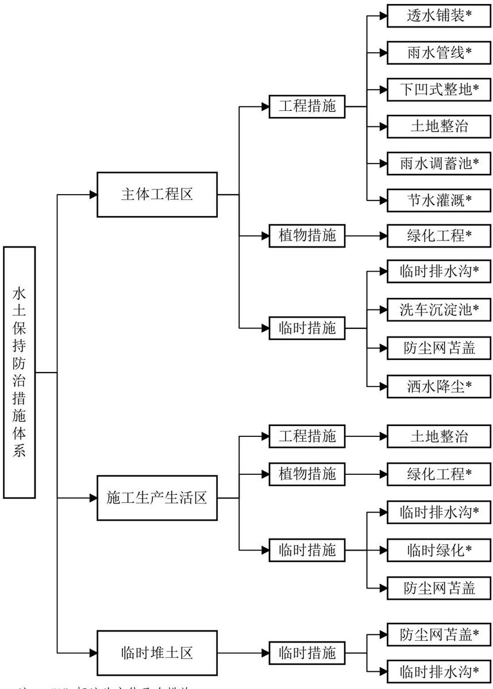

> **Zone C（应用范例层）使用边界**——仅可用于**写作风格、章节展开方式、表达逻辑、表格设计**的参考。
> **不得**用于合规判断；**不得**引入其项目数据（名称／地点／数字／单位名）；
> **不得**因其"曾经通过审批"而推定其做法在当前标准下仍然合规。
> 与 Zone A 冲突时**一律以 Zone A 为准**；Zone A 未明确规定时输出
> 「**Zone A 未明确规定，以下为参考写法，需人工判断**」。
>
> **坐标系警告**：本范例为**老八章结构**（GB 50433—2018 附录B），与 2026 版 10 章模板**同号不同义**
> （老 `1.5`＝防治目标，新 `1.5`＝水土流失预测结果；老 4→新 6 …偏移 +2；新版第 4/5 章老结构无独立章）。
> 因此 **`chapter_mapping: pending`——不得按章节号挂载**，检索一律走 `topic_tags`。
>
> **待加工**：`topic_tags`（主题标签）、`approval_basis_list`（编制依据逐字清单）、
> `structure_summary`（只提取结构：章节展开顺序／段落功能／表格栏目结构／句式模板／论证链步骤）。

1 综合说明....  
1.1 项目简况..  
1.2 编制依据....  
1.3 设计水平年....  
1.4 水土流失防治责任范围..  
1.5 水土流失防治目标......  
1.6 项目水土保持评价结论.... ..10  
1.7 水土流失调查与预测结果... ..12  
1.8 水土保持措施布设成果.... ... 12  
1.9 水土保持监测方案.... ... 15  
1.10 水土保持投资及效益分析成果.... .... 15  
1.11 结论.... ... 16  
2 项目概况.... ... 19  
2.1 项目组成及工程布置... .... 19  
2.2 施工组织.. ... 26  
2.3 工程占地... ... 32  
2.4 土石方平衡... ..32  
2.5 拆迁（移民）安置与专项设施改（迁）建........ ..... 36  
2.6 施工进度.... ..... 36  
2.7 自然概况..... .... 39  
3 项目水土保持评价... ... 42  
3.1 主体工程选址水土保持评价... ... 42  
3.2 工程建设方案与布局的分析与评价...... ..... 44  
3.3 主体设计的水土保持措施界定..... .... 58  
3.4 施工降水分析与评价.... ..... 59  
4 水土流失分析与预测.... .... 60  
4.1 水土流失现状.... ... 60  
4.2 水土流失影响因素分析... .... 60  
4.3 土壤流失量调查... ..61  
4.4 土壤侵蚀量预测. ..62  
4.5 水土流失危害分析... .... 72  
4.6 指导性意见... .... 72  
5 水土保持措施.... .... 74  
5.1 防治区划分... ..... 74  
5.2 措施总体布局... .... 74  
5.3 分区措施布设.... ..... 78  
5.4 施工要求.... .... 82  
5.5 已实施水土保持措施... .... 88  
6 水土保持监测... .... 89  
6.1 监测范围和时段... ... 89  
6.2 内容和方法... ... 89  
6.3 监测点位布设... ... 95  
6.4 实施条件和成果.. ... 96  
7 水土保持投资估算与效益分析.... .... 99  
7.1 投资估算... ... 99  
7.2 效益分析.... .... 110  
8 水土保持管理..... .... 112  
8.1 组织管理. ...112  
8.2 后续设计..... .... 113  
8.3 水土保持监测.. .... 114  
8.4 水土保持监理. ...115  
8.5 水土保持施工. ...116  
8.6 水土保持设施验收.. ...116

## 附表

投资估算附表

## 附件

附件1技术服务合同；

附件2北京大学授权委托书；

附件3《教育部关于北京大学昌平校区现代农学院与先进技术综合科研大楼工程项目可行性研究报告的批复》（教发函〔2024〕19号）；

附件4 北京大学昌平校区现代农学院与先进技术综合科研大楼工程建设工程规划许可证；

附件5北京市建筑垃圾利用方案备案；

附件6土方施工承包合同；

附件7北京市建筑垃圾收集运输、处置服务合同，土方接收证明；

附件8 临时用地租地协议；

附件9余方接纳项目水影响评价报告批复；

附件10关于履行水土保持方案编报审批程序的函；

附件11海委关于报送水土保持“重点关注名单”的函；

附件12临时堆土场用地移交确认书；

## 附图

附图1项目区地理位置图  
附图2项目区水系图  
附图3项目区土壤侵蚀强度分布图  
附图4项目区水土流失防治区区划图  
附图5项目区总平面图  
附图6管线综合图  
附图7项目区施工临建布设图  
附图8水土流失防治责任范围及防治分区图  
附图9水土保持防治措施总体布局图（含监测点位）  
附图10临时排水沟及沉沙池设计图  
附图11透水铺装典型设计图  
附图12雨水调蓄池典型设计图  
附图13绿化典型设计图  
附图14临时堆土场防护措施典型设计图

## 1 综合说明

## 1.1 项目简况

## 1.1.1 项目基本情况

## （1）项目建设必要性

北京大学现代农学院为新成立的学院，现代农学院的实验室、办公室分布零散，一些空间并不适合用于科研以及行政办公等，且位置分散，不方便共享学院的大型仪器设备，也不利于与相关专业的交叉融合和其他实验室开展有效的沟通和交流，极大影响了这些实验室的科研工作。面对国家层面的需求和学校的担当与责任带来的机遇和挑战，尽快建成适应国家需要、具有北大特色的现代农学院是当务之急。

先进技术研究院，存在科研场所不集中、缺少大设施设备场地、小批量生产线用地等问题，十分不利于学校充分发挥学科齐全的优势，不利于组建跨院系重大工程团队。综上所述，用房紧缺的问题已严重影响了两个学院未来的规划和发展，成为制约两个学院发展的瓶颈。

因此，北京大学昌平校区现代农学院与先进技术综合科研大楼工程的建设是十分必要的。

## （2）项目位置

项目位于昌平区十三陵镇西山口村北京大学昌平校区内。项目具体地理中心位置为：东经 116°11′27.7″，北纬 40°14′49.8″。项目北侧和西侧为校园内现状道路，东侧为万西路，南侧为南涧路。

## （3）建设性质、规模

本项目为新建建设类项目。总建筑面积约 86900m2，其中，地上五层，建筑面积约 $5 0 0 0 0 \mathrm { m } ^ { 2 }$ ，地下二层，建筑面积约 $3 6 9 0 0 \mathrm { m } ^ { 2 }$ 。建筑密度33%，容积率1.47，绿地率 44%（全校平衡）。

依据工程规模划分标准，属于中型工程，工程等级为一级。

## （4）项目组成

主要由建构筑物工程、室外道路工程、管线工程、绿化工程组成。其中建构筑物工程主要建设现代农学院与先进技术综合科研大楼 2栋，为高校科研建筑，主要功能为实验室、科研办公、会议及辅助用房。均为地上 5层，地下 2层设计，总建筑高度均为 23.95m，配建地下车库；道路工程位于建构筑物四周，分为消防通道、机动车道和人行道、非机动车停车位等，其中人行道及部分机动车道路采用透水铺装；管线工程包括给水、中水、雨水、污水、热力、电力、通讯等管线；绿化工程主要为室外景观绿化，面积 0.75hm2，其中下凹式绿地面积 0.39hm2。

## （5）施工组织

施工生产区：项目施工生产区布设于校园内东南侧，全部位于红线范围内，总占地0.28 hm2。目前地面均已做硬化处理。

施工生活区：主要布设于校园内东侧，新增临时面积 0.54hm2，场地均已硬化处理，主要用于工人日常生活及办公。主体工程区内布设一栋临时办公楼，占地面积0.01hm2，不新增占地。

临时堆土区：临时堆土区位于海研路南侧，面积 1.73 hm2，为租用土地（已办理临时用地手续，见附件6），占地类型为空闲地。临时堆土区距项目现场约600m，主要用于项目回填土方的临时堆放，土方堆存时间为2025年6月至2026年 4 月。临时堆土区设计堆存量为 6.92 万 m3，实际堆存土方 6.02 万 m3，堆高3～4m。截至 2026 年 5 月已全部用于本项目回填利用，堆存期间顶部采用防尘网苫盖措施，坡脚布设有临时排水措施。

施工用水：施工用水从校园内现有管线接入。

施工用电：施工期间采用临时施工箱式变电站由总包单位进行统一管理，施工现场配电系统设置配电柜或总配电箱、分配电箱、开关箱实行三级配电，三级保护原则。

## （6）拆迁（移民）安置、专项设施改（迁）建

本项目不涉及拆迁（移民）安置。

本项目专项设施改（迁）建主要涉及树木移植。项目建设前红线内有树木150棵、施工生活区内有树木 130棵（其中杨树 220棵，柳树60 棵），项目开工建设前已全部移栽至校园西部、南部现有绿地内。

## （7）项目工期及投资

项目已于2025年3月开工，计划于2027年11月完工，总工期 33个月。

项目总投资104833万元，其中土建投资 96040万元。本项目总投资部分申请中央预算内投资，部分由学校自筹。

## （8）项目占地

本项目总用地 5.66hm2，其中永久占地 $3 . 3 9 \mathrm { h m } ^ { 2 }$ ，临时占地 $2 . 2 7 \mathrm { h m } ^ { 2 } .$ 。永久占地均为校园内用地，占地类型为教育用地，临时占地中 $0 . 5 4 \mathrm { h m } ^ { 2 }$ 为校园内占地，占地类型为教育用地， $1 . 7 3 \ : \mathrm { h m } ^ { 2 }$ 为临时租用土地，占地类型为空闲地。

## （9）土石方量

项目土石方挖填总量约 22.06万m3；其中挖方总量约 15.48万m3，填方总量约6.58万m3，无借方，余方总量约 $8 . 9 0 \mathrm { ~ \mathscr ~ { ~ H ~ } ~ m ~ } ^ { 3 }$ ，运往北京市安立路（科荟路－北六环）快速化改造工程、南口农村三分场地块二土地平整项目及北京市昌平区南口镇前桃洼村地块平整工程进行综合利用。

## 1.1.2 项目前期工作进展情况

## （1）工程设计及前期手续

2022 年 11 月 18 日，本项目取得了教育部关于北京大学昌平校区现代农学院与先进技术科研大楼项目建议书的批复（教发函〔2022〕40号）。

2024年 1月 16日，本项目取得了教育部关于北京大学昌平校区现代农学院与先进技术科研大楼工程项目可行性研究报告的批复（教发函〔2024〕19号）。

2024年 9月 26日，本项目取得了北京市规划和自然资源委员会昌平分局多规合一协同平台会商意见（2024规自（昌）综审字 0054号）。

2024 年 1 月，北京京岩工程有限公司编制完成北京大学昌平校区现代农学院与先进技术综合科研大楼项目岩土工程勘察报告。

2024年 9月 29日，项目取得由北京市规划和自然资源委员会昌平分局出具的《建设工程规划许可证》（建字第 110114202400139号）。

项目建设单位为北京大学基建工程部，设计单位为清华大学建筑设计研究院有限公司，勘察单位为北京京岩工程有限公司，施工单位为中建一局集团建设发展有限公司，监理单位为北京华厦工程项目管理有限责任公司。

## （2）水土保持方案进展情况

建设单位于2024年5月委托北京林丰源生态环境规划设计院有限公司承担了本项目的水土保持方案编制工作。接受委托后，我单位按照《生产建设项目水土保持技术标准》(GB50433-2018)和《生产建设项目水土流失防治标准》(GB/T50434-2018)的规定，于2024年9月完成本项目水土保持方案报告书。由于项目内余土外运去向以及回填土来源尚不明确。建设单位补充施工余土外运手续及相关协议后，我单位根据施工进度及现场情况，于 2026年5月修改完成本项目水土保持方案报告书。

## （3）水土保持监理、监测开展情况

项目已委托北京华厦工程项目管理有限责任公司开展水土保持监理工作。

2025年11月，建设单位委托北京清大绿源科技有限公司开展本项目水土保持监测工作。截至 2026 年 5月，已编制完成水土保持监测实施方案、监测季报（2025年第一季度、第二季度、第三季度、第四季度，2026年第一季度）。

## （4）项目施工进度

2025年3月项目开工，施工总承包单位为中建一局集团建设发展有限公司。

2025年3月\~4月开始进行场地平整、施工临建设施搭建等施工准备工作。2025年4月-2026年 4月进行基坑开挖施工、地下结构施工、主体工程结构施工。

截至2026年5月，本项目已完成项目区围挡搭设，施工临建搭设，施工道路硬化，主体工程基础施工，目前正在进行建筑主体结构及装修工程施工，预计2026年12月底完成。

截至2026年5月，主体已完成的水土保持措施工程量：

## ①主体工程防治区

防尘网苫盖0.85hm2，临时排水沟160m，洗车沉淀池1座，洒水降尘 360台时。

②施工生产生活区

临时排水沟 290m，临时绿化 0.02hm2。

③临时堆土区

防尘网苫盖 3.53hm2，临时排水沟 300m。

## （5）水行政主管部门监督检查意见

2025 年 10 月 22 日，北京市昌平区水土保持工作站对本项目进行了水土保持监督检查，并开具《关于履行水土保持方案编报审批程序的函》（昌水保函〔2025〕65 号，见附件 10）。建设单位接函后，立即开展整改工作，协调施工单位补充项目余土综合利用相关手续文件；并同步开展水土保持监测、验收单位的招标工作。

2026 年 1 月 30 日，水利部海河水利委员会开具《海委关于报送水土保持“重点关注名单”的函》（海便函〔2026〕55 号，见附件 11），建设单位接函后，立即组织对在建项目开展全面自查自纠，并同步启动相关整改工作，由北京大学基建工程部专职负责水土保持工作的组织与落实，重点开展了以下整改。

1、优化土方综合利用方案：补充土方综合利用途径、方向等相关手续；

2、完善水土保持方案：组织水土保持方案编制单位根据施工现场进度情况完善水土保持方案并及时报送水利部审批；

3、落实现场防治措施：要求施工单位按照水土保持方案要求落实水土保持措施，对现场临时堆土新增了苫盖、排水措施、施工现场增加洒水降尘频次，并向现场负责人明确水土流失防控责任，杜绝水土流失事件发生。

4、水土保持监测：及时开展水土保持监测工作，完成水土保持监测季报 5期，对施工过程中的水土流失状况进行跟踪监测与评价。

## 1.1.3 自然简况

本项目位于昌平城区以北西山口村，属平原地貌，工程建设区总体地形平坦，地面高程为96.42\~98.50m 。气候类型属暖温带半湿润大陆性季风气候。

多年平均气温 $1 1 . 8 ^ { \circ } \mathrm { C }$ $\geqslant 1 0 \mathrm { { \bar { C } } }$ 积温约 $4 2 1 5 ^ { \circ } \mathrm { C } .$ ，年平均风速为2.4m/s，年平均降水量574mm，多年平均蒸发量1245mm。项目区土壤类型属地带性褐土。植被属于暖温带落叶、阔叶林类型，一般林地均为灌木林或杂木混交林，森林覆盖率在30%左右。

项目区在全国土壤侵蚀类型分区中属于北方土石山区，土壤侵蚀以微度水力侵蚀为主，容许土壤流失量为 $2 0 0 \mathrm { t } / ( \mathrm { k m } ^ { 2 } { \cdot } \mathrm { a } )$ 。根据《水利部办公厅关于做好国家级水土流失重点预防区和重点治理区落地上图成果应用的通知》（办水保〔2025〕170号），项目区不涉及国家级两区，根据《北京市水土保持规划》（201

7年5月），项目区属于北京市水土流失重点治理区。项目区不涉及饮用水水源保护区、水功能一级区的保护区和保留区、自然保护区、世界文化和自然遗产地、风景名胜区、地质公园、森林公园、重要湿地，本项目所在地不涉及河道管理范围、不涉及生态红线范围，无生态敏感区。

## 1.2 编制依据

## 1.2.1 法律法规

（1）《中华人民共和国水土保持法》（1991年6月29日第七届全国人民代表大会常务委员会第二十次会议通过，2010年12月25日第十一届全国人民代表大会常务委员会第十八次会议修订，2011年3月1日起实施）；

（2）《北京市水土保持条例》（2015年 5月29日通过，2019年 7月26日第一次修正，2025年5月30日第二次修正）。

## 1.2.2 规范性文件

（1）《水利部关于进一步深化“放管服”改革全面加强水土保持监管的意见》（水保〔2019〕160号，2019年 5月 31日发布）；

（2）《水利部办公厅关于进一步加强生产建设项目水土保持监测工作的通知》（办水保〔2020〕161 号，2020 年 7 月 28 日发布）；

（3）《水利部办公厅关于实施生产建设项目水土保持信用监督“两单”制度的通知》（办水保〔2020〕157号）；

（4）《生产建设项目水土保持方案管理办法》（水利部令第 53号，2023年1月17日发布）；

（5）《水利部办公厅关于印发生产建设项目水土保持方案审查要点的通知》（办水保〔2023〕177号，2023年7月 4日发布）；

（6）《水利部水保监测中心关于印发生产建设项目水土保持方案技术审查要点的通知》（水保监〔2020〕63号；

（7）《水利部关于加强水土保持监测工作的通知》（水保〔2017〕36号，2017 年 1 月 23 日发布）；

（8）《水利部办公厅关于印发生产建设项目水土保持监督管理办法的通知》（办水保〔2019〕172号，2019年7月 30日发布）；

（9）《财政部关于水土保持补偿费等四项非税收入划转税务部门征收的水土保持补偿费收费标准的通知》（京发改〔2021〕1271 号）；

（10）《水利部办公厅关于印发<生产建设项目水土保持设施自主验收规程（试行）〉的通知》（办水保〔2018〕133号）；

（11）《水利部水土保持司关于进一步加强生产建设项目水土保持方案质量管理的通知》（水保监督函〔2022〕21号）；

（12）《水利部关于加强水土保持空间管控的意见》（水保〔2024〕4号，2024 年 1 月 5 日）；

（13）《水利部办公厅关于做好国家级水土流失重点预防区和重点治理区落地上图成果应用的通知》（办水保〔2025〕170号，2025年9月19日）。

## 1.2.3 技术规范和标准

（1）《生产建设项目水土保持技术标准》（GB 50433-2018）；

（2）《生产建设项目水土流失防治标准》（GB/T 50434-2018）；

（3）《生产建设项目土壤流失量测算导则》（SL773-2018）；

（4）《土壤侵蚀分类分级标准》（SL190-2007）；

（5）《水土保持工程调查与勘测标准》（GB/T 51297-2018）；

（6）《生产建设项目水土保持监测与评价标准》（GB/T 51240-2018）；

（7）《水利水电工程制图标准-水土保持图》（SL73.6-2015）；

（8）《土地利用现状分类》（GB/T 21010-2017）；

（9）《水土保持工程设计规范》（GB 51018-2014）；

（10）《水土保持监测技术规范》（SL/T277-2024）；

（11）《水土保持监理规范》（SL/T523-2024）；

（12）《表土剥离及其再利用技术要求》（GB/T45107-2024）。

## 1.2.4 技术文件与相关资料

（1）《北京大学昌平校区现代农学院与先进技术综合科研大楼工程》项目建议书；

（2）北京大学昌平校区现代农学院与先进技术综合科研大楼项目建筑设计方案（清华大学建筑设计研究院有限公司，2024年1月）；

（3）北京大学昌平校区现代农学院与先进技术综合科研大楼项目岩土工程勘察报告（北京京岩工程有限公司，2024年 1月）；

（4）北京大学昌平校区现代农学院与先进技术综合科研大楼项目施工设计图（清华大学建筑设计研究院有限公司，2024年11月）；

（5）北京大学昌平校区现代农学院与先进技术综合科研大楼工程深基坑支护与土方开挖专项施工方案（北京现代金宇岩土工程有限公司，2025 年 3 月）；

（6）现场调查和建设单位提供的其他相关资料。

## 1.3 设计水平年

本工程已于2025年3月开工，预计 2027年11月建成，总工期 33个月。根据《生产建设项目水土保持技术标准》（GB50433-2018）有关规定，水土保持方案设计水平年应为主体工程完工水土保持措施实施及发挥效益的当年或后一年，根据本工程工期安排结合项目所在地实际情况，本方案设计水平年确定为工程完工后一年，即为 2028年。

## 1.4 水土流失防治责任范围

根据《生产建设项目水土保持技术标准》（GB50433-2018）规定及工程建设的特点，项目水土流失防治责任范围包括永久征地、临时占地以及其他使用与管辖区域。

本工程水土流失防治责任范围 5.66hm2，其中永久占地3.39 hm2，临时占地$2 . 2 7 \mathrm { h m } ^ { 2 }$

表 1.4-1 工程防治责任范围表
<table><tr><td rowspan=2 colspan=1>防治分区</td><td rowspan=1 colspan=2>占地性质</td><td rowspan=2 colspan=1>占地面积（hm²）</td></tr><tr><td rowspan=1 colspan=1>永久占地</td><td rowspan=1 colspan=1>临时占地</td></tr><tr><td rowspan=1 colspan=1>主体工程区</td><td rowspan=1 colspan=1>3.39</td><td rowspan=1 colspan=1></td><td rowspan=1 colspan=1>3.39</td></tr><tr><td rowspan=1 colspan=1>施工生产生活区</td><td rowspan=1 colspan=1></td><td rowspan=1 colspan=1>0.54（0.29)</td><td rowspan=1 colspan=1>0.54 （0.29)</td></tr><tr><td rowspan=1 colspan=1>临时堆土区</td><td rowspan=1 colspan=1></td><td rowspan=1 colspan=1>1.73</td><td rowspan=1 colspan=1>1.73</td></tr><tr><td rowspan=1 colspan=1>合计</td><td rowspan=1 colspan=1>3.39</td><td rowspan=1 colspan=1>2.27</td><td rowspan=1 colspan=1>5.66</td></tr></table>

注：（）部分占地位于项目建设区永久占地范围内，面积不重复计算

## 1.5 水土流失防治目标

## 1.5.1 执行标准等级

本项目位于北京市昌平区十三陵镇。根据2025年9月19日，《水利部办公厅关于做好国家级水土流失重点预防区和重点治理区落地上图成果应用的通知》（办水保〔2025〕170号），经查询全国水土保持信息管理系统，项目不涉及燕山国家级水土流失重点预防区。根据《北京市水土保持规划》（2017年5月），项目区属于北京市水土流失重点治理区。

根据《生产建设项目水土流失防治标准》（GB50434-2018），确定本项目的水土流失防治标准执行等级为北方土石山区水土流失防治一级标准。

## 1.5.2 防治目标

根据《生产建设项目水土流失防治标准》（GB/T 50434-2018）的规定和适用条件，本工程位于北方土石山区，根据一级标准设定的防治目标值，结合本工程的工程特点，水土流失影响因子（年降雨量、土壤侵蚀强度和地形地貌）等因素调整相关目标值，综合确定各防治分区应达到的水土流失防治目标。

水土流失治理度、林草植被恢复率：以干旱程度为基准进行调整，本工程多年降雨量为574mm，不属于标准所列的极干旱以及干旱地区，无需修正；

土壤流失控制比：本项目土壤侵蚀强度为微度，标准绝对值提高 0.1，调整后土壤流失控制比为 1.0；

渣土防护率：项目位于城市区，主体工程选址无法避让北京市水土流失重点治理区，且项目位于大学校园内，具有一定的生态敏感性，标准绝对值提高2%，调整后渣土防护率为 99%。

林草覆盖率：项目位于城市区，主体工程选址无法避让北京市水土流失重点治理区，且项目地块属于北京大学昌平校区内。标准绝对值提高 2%，调整后林草覆盖率为27%。

表 1.5-1 本工程水土流失防治标准等级表
<table><tr><td rowspan=2 colspan=1>防治指标</td><td rowspan=1 colspan=2>一级标准</td><td rowspan=2 colspan=1>按干旱程度调整</td><td rowspan=2 colspan=1>按土壤侵蚀强度修正</td><td rowspan=2 colspan=1>按位置修正</td><td rowspan=1 colspan=2>目标值</td></tr><tr><td rowspan=1 colspan=1>施工期</td><td rowspan=1 colspan=1>设计水平年</td><td rowspan=1 colspan=1>施工期</td><td rowspan=1 colspan=1>设计水平年</td></tr><tr><td rowspan=1 colspan=1>水土流失治理度（%）</td><td rowspan=1 colspan=1></td><td rowspan=1 colspan=1>95</td><td rowspan=1 colspan=1></td><td rowspan=1 colspan=1></td><td rowspan=1 colspan=1></td><td rowspan=1 colspan=1>一</td><td rowspan=1 colspan=1>95</td></tr><tr><td rowspan=1 colspan=1>土壤流失控制比</td><td rowspan=1 colspan=1>一</td><td rowspan=1 colspan=1>0.9</td><td rowspan=1 colspan=1></td><td rowspan=1 colspan=1>+0.1</td><td rowspan=1 colspan=1></td><td rowspan=1 colspan=1>1.0</td><td rowspan=1 colspan=1>1.0</td></tr><tr><td rowspan=1 colspan=1>渣土防护率（%）</td><td rowspan=1 colspan=1>97</td><td rowspan=1 colspan=1>97</td><td rowspan=1 colspan=1></td><td rowspan=1 colspan=1></td><td rowspan=1 colspan=1>+2</td><td rowspan=1 colspan=1>99</td><td rowspan=1 colspan=1>99</td></tr><tr><td rowspan=1 colspan=1>表土保护率（%）</td><td rowspan=1 colspan=1>/</td><td rowspan=1 colspan=1>1</td><td rowspan=1 colspan=1></td><td rowspan=1 colspan=1></td><td rowspan=1 colspan=1></td><td rowspan=1 colspan=1>1</td><td rowspan=1 colspan=1>1</td></tr><tr><td rowspan=1 colspan=1>林草植被恢复率（%）</td><td rowspan=1 colspan=1>一</td><td rowspan=1 colspan=1>97</td><td rowspan=1 colspan=1></td><td rowspan=1 colspan=1></td><td rowspan=1 colspan=1></td><td rowspan=1 colspan=1>一</td><td rowspan=1 colspan=1>97</td></tr><tr><td rowspan=1 colspan=1>林草覆盖率（%）</td><td rowspan=1 colspan=1></td><td rowspan=1 colspan=1>25</td><td rowspan=1 colspan=1></td><td rowspan=1 colspan=1></td><td rowspan=1 colspan=1>+2</td><td rowspan=1 colspan=1></td><td rowspan=1 colspan=1>27</td></tr></table>

## 1.6 项目水土保持评价结论

## 1.6.1 主体工程选址（线）评价

通过与《中华人民共和国水土保持法》（2011 年 3 月 1 日起实施）、《北京市水土保持条例》（2025 年）、《生产建设项目水土保持技术标准》（GB50433-2018）等有关规定进行符合性分析得知，项目区不属于泥石流易发区、崩塌滑坡危险区以及易引起严重水土流失和生态恶化的区域。主体工程选址（线）未涉及崩塌和滑坡危险区、易引起严重水土流失和生态恶化地区，不涉及河流两岸、湖泊和水库周边的植物保护带，不占用全国水土保持监测网络中的水土保持监测站点、重点试验区及国家确定的水土保持长期定位观测站、不涉及河道管理范围。项目区不属于《北京市国土空间总体规划（2021 年-2035年）》中禁止开发区域，符合相关规划要求。项目符合《北京市水土保持条例》要求，项目区不属于生态建设与禁建区，符合相关规定。

工程建设无法避让北京市水土流失重点治理区。本项目在执行北方土石山区防治指标一级防治标准的基础上，将土壤流失控制比提高 0.1，渣土防护率提高 2%，林草覆盖率提高 2%，并提高了排水工程等级，布设了雨水排除及沉沙设施，提出了水土保持防护措施和施工管理建议，能有效减少地表扰动和植被损坏范围，控制工程建设可能造成的水土流失，达到水土保持要求。

从水土保持的角度分析，主体工程选址较为合理。

## 1.6.2 建设方案与布局评价

根据工程建设方案及施工实际布置情况，施工期间施工场地采用彩钢板围挡进行隔离保护，减少了扰动范围。

施工生产区利用项目永久占地范围内空地，减少了新增临时占地。施工生活区布置于校园内东侧现状空闲地内，施工后期进行绿化植被恢复。临时堆土布设于校园外南侧海研路一侧空闲地内，土方堆存期间采用了密目网临时苫盖，减少了地表及堆土裸露面积，施工后期进行土地整治苫盖保护。施工布置满足施工需求，临时占地布设位置合理可行。

项目区建设前为北京大学昌平校区内的空闲地，表层土质较差，存在大量碎石碎渣，无可剥离表土。项目区内土方协调调运统一管理，设置临时堆土场1处，作为项目土方暂存场地，堆放项目回填土，待建筑地下结构施工完成后，用于肥槽回填和场地平整回填，避免土方重复倒运造成新增水土流失。符合水土保持要求。

根据工程建设方案，地块地下建筑面积较大且采用大开挖的方式，基坑开挖采取机械开挖和人工清理相结合，基坑采用了上部简易放坡+下部桩锚支护的形式，控制了开挖面积，减少了挖方量，避免了大挖大填，尽量减少施工扰动占地和对校区内现状教学环境的影响和破坏。

工程在建设方案与布局上，符合水土保持要求。本项目主体设计中具有水土保持功能的工程主要有：透水铺装、下凹式整地、雨水调蓄池、绿化工程等，位置布设合理，结构形式符合要求，主体设计中具有水土保持功能的工程可有效地促进雨水入渗、固结土壤、降低雨水冲刷、减少地表径流，从而达到减少水土流失的目的，符合水土保持要求。

综上所述，本工程设计充分考虑了水土保持要求，在认真落实各项水土保持防护措施、加强施工期管理的基础上，不存在影响工程建设的水土保持制约因素，工程建设可行。

## 1.7 水土流失调查与预测结果

根据工程建设特点，结合项目区自然条件，确定工程建设水土流失类型为水力侵蚀，水土流失重点时段为施工期，重点部位为主体工程区、临时堆土区。

项目调查与预测时段内土壤侵蚀总量 160.95t，新增土壤侵蚀量为 133.38t。其中：施工期水土流失总量为 106.48t，其中新增水土流失总量为 90.13t；自然恢复期水土流失总量为 8.50t，其中新增水土流失总量为 1.53t。产生水土流失最大的时段为项目施工期，在基坑开挖、回填、堆土、硬化道路土方作业等施工活动期间水土流失最为严重。主体工程区及临时堆土区是本项目水土流失重点防治区域。从建设时段分析，建设期的土方施工阶段是工程建设中造成水土流失的重点时段。

## 1.8 水土保持措施布设成果

根据水土流失防治责任范围内各分区地貌类型、主体工程布局、施工工艺及水土流失特点等，本方案将其划分为：主体工程区、施工生产生活区、临时堆土区3个水土流失防治分区。

项目从开工至 2026年5月，已经实施的水土保持措施有临时排水沟、洗车沉淀池、防尘网苫盖、洒水降尘等。待实施的水土保持措施有透水铺装、全面整地、下凹式整地、雨水调蓄池、绿化工程等。

项目区整体水土保持措施主要有：

## 1.8.1 主体工程区

## （1）工程措施

下凹式整地：主体设计对部分绿地进行下凹式整地，面积 $0 . 3 9 \ \mathrm { h m } ^ { 2 }$ 。实施时段为 2027 年 5 月-10 月。

土地整治：绿化工程施工前进行土地整治，面积0.36hm2。实施时段为2027年 5 月-10 月。

雨水调蓄池：主体设计在项目区西南侧布设1座雨水调蓄池，容积为980m3，实施时段为2026年 9月-10月。

雨水管线：主体设计沿道路敷设雨水管线 1269m。实施时段为 2027年 4月-10 月。

透水铺装：主体设计对人行步道及部分道路等采用透水砖铺装，铺装面积共计 0.73 hm2。 实施时段为 2027 年 5 月-10 月。

## （2）植物措施

绿化工程：主体设计项目区内绿化面积 0.75 hm2。实施时段为 2027年5月-10 月。

## （3）临时措施

防尘网苫盖：施工期间已对主体工程区裸露地表采取了防尘网苫盖，苫盖面积 0.85hm2，实施时段为 2025 年 3 月-7 月。绿化工程施工期间对裸露堆土表面进行防尘网苫盖，苫盖面积 0.75hm2，实施时段为 2027年 5月-10月。施工期间在管线开挖临时堆土及裸露地表采用防尘网苫盖，防止水土流失，苫盖面积0.64 hm2，实施时段为 2027 年 5 月-10 月。

临时排水沟：施工前，对主体工程基坑场区外围布设临时排水沟，排水明沟采用矩形断面，水泥砂浆抹面，布设临时排水沟 160m，排水沟汇集雨水后汇入校园内雨水管网。实施时段为 2025年3月。

洗车沉淀池：主体工程区施工出入口处布设实施 1 座洗车沉淀池，沉淀池兼具收集和沉沙作用，沉淀池采用三级沉淀，砖砌结构。实施时段为 2025 年 3月。

洒水降尘：施工期间进行洒水降尘，减少扬尘及水土流失，共实施 720 台时，已实施360台时。实施时段为2025年 6月-2027年10月。

## 1.8.2 施工生产生活区

## （1）工程措施

土地整治：施工后期生活区拆除后，对原区域土地进行翻松及整地，整地面积 0.54hm2。实施时段为 2027 年 9 月-10 月。

## （2）植物措施

绿化工程：施工后期生活区拆除后，对原区域土地整地后，铺设草皮进行绿化恢复，绿化面积 0.54 hm2。实施时段为 2027年9月-10月。

## （3）临时措施

临时排水沟：施工前，施工生活区周边布设临时排水沟 290m，施工生活区排水沟汇集雨水后汇入校园内雨水管网。实施时段为 2025年3月。

临时绿化：施工生活区内布设临时绿化0.02hm2。实施时段为2025年4月。

防尘网苫盖：施工后期生活区拆除后，绿化恢复期间对裸露地面进行防尘网苫盖，苫盖面积 0.54hm2。实施时段为2027年9月-10月。

## 1.8.3 临时堆土区

## （1）临时措施

防尘网苫盖：土方临时堆存期间对裸露区域实施防尘网苫盖，苫盖面积1.80hm2，实施时段为2025年6月-2026年4月。施工后期对原区域土地清理后，对临时堆土场进行苫盖保护，苫盖面积 1.73 hm2，实施时段为2026年4月-2026年5月。

临时排水沟：土方临时堆存期间，对临时堆土四周布设临时排水沟 300m，实施时段为 2026 年 3 月-2026 年 4 月。

## 1.9 水土保持监测方案

监测内容主要包括水土流失影响因素、扰动土地情况、水土流失状况、水土流失防治成效及水土流失危害。

监测时段从施工准备期开始至设计水平年结束，即2025年3月至2028年。6～9 月为本项目水土保持监测的重点时段。如果主体工程延误，水土保持监测时段顺延。

监测方法采取定点监测、实地调查、查阅资料、遥感监测相结合的方法。

根据项目区的实际情况，在主体工程区、施工生产生活区、临时堆土区各布设 1 个定位监测点，作为调查监测点，用于监测施工期的水土流失，其他部分采用调查巡查的方法。

## 1.10 水土保持投资及效益分析成果

项目水土保持总投资 1202.40万元，其中工程措施投资 650.37万元，植物措施投资286.79万元，监测措施投资35.24万元，施工临时工程投资 88.97万元，独立费用82.15万元，基本预备费57.18万元。

方案实施后，设计水平年各项防治目标均可达到目标值。方案各项水土保持措施建成并发挥效益后，可有效防治项目建设新增水土流失，提高土壤蓄水保土能力。

## 1.11 结论

本项目工程选址、建设方案、总体布局、水土流失防治等方面符合水土保持法律法规、技术标准的规定，在实施本方案确定的水土保持综合防治措施后，能有效防治工程建设期间可能造成的水土流失，改善项目区生态环境，从水土保持角度对工程设计、施工和建设管理提出以下要求。

（1）工程设计：按照《水利部生产建设项目水土保持方案变更管理规定（试行）》（办水保〔2016〕365 号）文件要求，如设计或施工过程中水土保持措施发生重大变更的，应重新编制项目水土保持方案，报水利部进行审批。

（2）施工：本项目水土流失治理实施由建设单位负责，项目在基坑开挖、基础施工、道路、管线施工工艺上，采取机械与人工结合的方式，充分考虑了土方开挖、回填、运输、平整等施工工艺，并考虑了基坑支护等相关工艺，在保障主体工程顺利施工的同时，基本能够满足水土保持功能的要求。从贯彻水土保持法和有关法律法规的角度出发，主体工程设计的具有水土保持功能的工程尚不能完全满足工程建设期间水土流失防治要求，需进一步完善水土流失防治措施体系。建设单位应将水土保持措施落到实处，项目施工单位应切实落实后续水土保持设施施工，将水土保持措施保质保量完成。

（3）建设管理：建设单位将组织施工、监理等参建各方严把质量关，严格控制施工进度，及时实施好水土保持方案设计的各项水土流失防治措施。本项目竣工验收时，应当验收水土保持设施，组织第三方机构编制水土保持设施验收报告，水土保持设施未经验收，项目不得投产使用。

表 1.11-1水土保持方案特性表
<table><tr><td colspan="1" rowspan="1">项目名称</td><td colspan="5" rowspan="1">北京大学昌平校区现代农学院与先进技术综合科研大楼工程</td><td colspan="3" rowspan="1">流域管理机构</td><td colspan="3" rowspan="1">海河水利委员会</td></tr><tr><td colspan="1" rowspan="1">涉及省(区、市)</td><td colspan="2" rowspan="1">北京市</td><td colspan="3" rowspan="1">涉及地市或个数</td><td colspan="2" rowspan="1">昌平区</td><td colspan="3" rowspan="1">涉及县或个数</td><td colspan="1" rowspan="1">1</td></tr><tr><td colspan="1" rowspan="1">项目规模</td><td colspan="2" rowspan="1">总建筑面积 86900m²</td><td colspan="3" rowspan="1">总投资（万元）</td><td colspan="2" rowspan="1">104833</td><td colspan="3" rowspan="1">土建投资（万元）</td><td colspan="1" rowspan="1">96040</td></tr><tr><td colspan="1" rowspan="1">动工时间</td><td colspan="2" rowspan="1">2025年3月</td><td colspan="3" rowspan="1">完工时间</td><td colspan="2" rowspan="1">2027年11月</td><td colspan="3" rowspan="1">设计水平年</td><td colspan="1" rowspan="1">2028年</td></tr><tr><td colspan="1" rowspan="1">工程占地(hm²)</td><td colspan="2" rowspan="1">5.66</td><td colspan="3" rowspan="1">永久占地（hm²）</td><td colspan="2" rowspan="1">3.39</td><td colspan="3" rowspan="1">临时占地(hm2)</td><td colspan="1" rowspan="1">2.27</td></tr><tr><td colspan="3" rowspan="2">土石方量（万m³）</td><td colspan="3" rowspan="1">挖方</td><td colspan="2" rowspan="1">填方</td><td colspan="1" rowspan="1">借方</td><td colspan="3" rowspan="1">余（弃）方</td></tr><tr><td colspan="3" rowspan="1">15.48</td><td colspan="2" rowspan="1">6.58</td><td colspan="1" rowspan="1">/</td><td colspan="3" rowspan="1">8.90</td></tr><tr><td colspan="3" rowspan="1">重点防治区名称</td><td colspan="9" rowspan="1">北京市水土流失重点治理区</td></tr><tr><td colspan="3" rowspan="1">地貌类型</td><td colspan="3" rowspan="1">平原地貌</td><td colspan="3" rowspan="1">水土保持区划</td><td colspan="3" rowspan="1">北方土石山区</td></tr><tr><td colspan="3" rowspan="1">土壤侵蚀类型</td><td colspan="3" rowspan="1">水力侵蚀</td><td colspan="3" rowspan="1">土壤侵蚀强度</td><td colspan="3" rowspan="1">微度</td></tr><tr><td colspan="3" rowspan="1">防治责任范围面积（hm²）</td><td colspan="3" rowspan="1">5.66</td><td colspan="3" rowspan="1">容许土壤流失量t/(km²· a)</td><td colspan="3" rowspan="1">200</td></tr><tr><td colspan="3" rowspan="1">土壤流失预测总量（t）</td><td colspan="3" rowspan="1">160.95</td><td colspan="3" rowspan="1">新增土壤流失量(t)</td><td colspan="3" rowspan="1">133.38</td></tr><tr><td colspan="3" rowspan="1">水土流失防治标准执行等级</td><td colspan="3" rowspan="1">北方土</td><td colspan="3" rowspan="1">石山区一级防治标准</td><td colspan="3" rowspan="1"></td></tr><tr><td colspan="1" rowspan="3">防治指标</td><td colspan="2" rowspan="1">水土流失治理度（%）</td><td colspan="3" rowspan="1">95</td><td colspan="3" rowspan="1">土壤流失控制比</td><td colspan="3" rowspan="1">1.0</td></tr><tr><td colspan="2" rowspan="1">渣土防护率（%）</td><td colspan="3" rowspan="1">99</td><td colspan="3" rowspan="1">表土保护率（%）</td><td colspan="3" rowspan="1">1</td></tr><tr><td colspan="2" rowspan="1">林草植被恢复率（%）</td><td colspan="3" rowspan="1">97</td><td colspan="3" rowspan="1">林草覆盖率（%）</td><td colspan="3" rowspan="1">27</td></tr><tr><td colspan="1" rowspan="4">防治措施及工程量</td><td colspan="1" rowspan="1">防治分区</td><td colspan="4" rowspan="1">工程措施</td><td colspan="3" rowspan="1">植物措施</td><td colspan="3" rowspan="1">临时措施</td></tr><tr><td colspan="1" rowspan="1">主体工程区</td><td colspan="4" rowspan="1">雨水管线1269m，透水铺装0.73 hm²、雨水调蓄池1座、下凹式整地 0.39 hm²、土地整治 0.36 hm²</td><td colspan="3" rowspan="1">绿化工程 0.75 hm²</td><td colspan="3" rowspan="1">临时排水沟160m，洗车沉淀池1座，防尘网苫盖 2.24hm²，洒水降尘 720 台时</td></tr><tr><td colspan="1" rowspan="1">施工生产生活区</td><td colspan="4" rowspan="1">土地整治 0.54 hm²</td><td colspan="3" rowspan="1">铺设草皮 0.54hm²</td><td colspan="3" rowspan="1">临时绿化 0.02hm²，临时排水沟290m，防尘网苫盖0.54hm²</td></tr><tr><td colspan="1" rowspan="1">临时堆土区</td><td colspan="4" rowspan="1"></td><td colspan="3" rowspan="1"></td><td colspan="3" rowspan="1">防尘网苫盖3.53hm²、临时排水沟 300m</td></tr><tr><td colspan="2" rowspan="1">投资（万元）</td><td colspan="4" rowspan="1">650.37</td><td colspan="3" rowspan="1">286.79</td><td colspan="3" rowspan="1">88.97</td></tr><tr><td colspan="2" rowspan="1">水土保持总投资（万元）</td><td colspan="3" rowspan="1">1202.40</td><td colspan="3" rowspan="1">独立费用（万元）</td><td colspan="4" rowspan="1">82.15</td></tr><tr><td colspan="2" rowspan="1">监理费（万元）</td><td colspan="2" rowspan="1">15</td><td colspan="2" rowspan="1">监测费（万元）</td><td colspan="1" rowspan="1">28</td><td colspan="3" rowspan="1">补偿费（元）</td><td colspan="2" rowspan="1">16980</td></tr><tr><td colspan="2" rowspan="1">分省措施费（万元）</td><td colspan="4" rowspan="1">1</td><td colspan="2" rowspan="1">分省补偿费(万元)</td><td colspan="4" rowspan="1">1</td></tr><tr><td colspan="2" rowspan="1">方案编制单位</td><td colspan="4" rowspan="1">北京林丰源生态环境规划设计院有限公司</td><td colspan="2" rowspan="1">建设单位</td><td colspan="4" rowspan="1">北京大学基建工程部</td></tr><tr><td colspan="2" rowspan="1">法定代表人</td><td colspan="4" rowspan="1">赵云杰</td><td colspan="2" rowspan="1">法定代表人</td><td colspan="4" rowspan="1">龚旗煌</td></tr><tr><td colspan="2" rowspan="1">地址</td><td colspan="4" rowspan="1">北京市海淀区学清路10号院1号楼6层101</td><td colspan="2" rowspan="1">地址</td><td colspan="4" rowspan="1">北京市海淀区颐和园路5号</td></tr><tr><td colspan="2" rowspan="1">邮编</td><td colspan="4" rowspan="1">100091</td><td colspan="2" rowspan="1">邮编</td><td colspan="4" rowspan="1">100871</td></tr><tr><td colspan="2" rowspan="1">联系人及电话</td><td colspan="4" rowspan="1">联系人/【已脱敏】</td><td colspan="2" rowspan="1">联系人及电话</td><td colspan="4" rowspan="1">联系人/【已脱敏】</td></tr><tr><td colspan="2" rowspan="1">传真</td><td colspan="4" rowspan="1">010-82837021</td><td colspan="2" rowspan="1">传真</td><td colspan="4" rowspan="1">1</td></tr><tr><td colspan="2" rowspan="1">电子信箱</td><td colspan="4" rowspan="1">【已脱敏手机号】@163.com</td><td colspan="2" rowspan="1">电子信箱</td><td colspan="4" rowspan="1">wjx@pku.edu.cn</td></tr></table>

## 2 项目概况

## 2.1 项目组成及工程布置

## 2.1.1 项目基本情况

项目名称：北京大学昌平校区现代农学院与先进技术综合科研大楼工程。

建设单位：北京大学基建工程部。

建设性质：新建建设类工程。

项目类别：社会事业类项目。

工程规模：项目总占地 $5 . 6 6 \mathrm { h m } ^ { 2 }$ ，其中永久占地 $3 . 3 9 \mathrm { h m } ^ { 2 }$ ，临时占地 $2 . 2 7 \mathrm { h m } ^ { 2 }$ 总建筑面积 86900m2，其中地上建筑面积为 $5 0 0 0 0 \ \mathrm { m } ^ { 2 } .$ ，地下建筑面积为 36900m2，建设内容为师生办公科研用房等。建筑高度为 23.95m，地上 5 层，地下 2层。

地理位置：项目位于北京市昌平区十三陵镇西山口村北京大学昌平校区内，项目北侧和西侧为校园内现状道路，东侧为万西路，南侧为南涧路。

工程投资：项目总投资 104833 万元，其中土建投资 96040 万元。

建设工期：工程已于 2025年3月开工，计划于 2027年11月完工。工期 33个月。

项目组成及主要技术指标见下表 2.1-1。

表 2.1-1 项目组成及主要技术指标表
<table><tr><td rowspan=1 colspan=5>一、项目基本情况</td></tr><tr><td rowspan=1 colspan=1>1</td><td rowspan=1 colspan=1>项目名称</td><td rowspan=1 colspan=3>北京大学昌平校区现代农学院与先进技术综合科研大楼工程</td></tr><tr><td rowspan=1 colspan=1>2</td><td rowspan=1 colspan=1>建设地点</td><td rowspan=1 colspan=3>北京市昌平区十三陵镇</td></tr><tr><td rowspan=1 colspan=1>3</td><td rowspan=1 colspan=1>工程等级</td><td rowspan=1 colspan=1>1</td><td rowspan=1 colspan=1>工程性质</td><td rowspan=1 colspan=1>新建工程</td></tr><tr><td rowspan=1 colspan=1>4</td><td rowspan=1 colspan=1>建设单位</td><td rowspan=1 colspan=3>北京大学基建工程部</td></tr><tr><td rowspan=1 colspan=1>5</td><td rowspan=1 colspan=1>建设规模</td><td rowspan=1 colspan=3>项目建设内容包括现代农学院大楼及先进技术综合科研大楼两栋单体建筑及周边道路、管线、绿化工程，总建筑面积为86900m²，其中地上建筑面积为50000m²，地下建筑面积为36900m²。</td></tr><tr><td rowspan=1 colspan=1>6</td><td rowspan=1 colspan=1>投资</td><td rowspan=1 colspan=3>104833万元，其中土建投资96040万元</td></tr><tr><td rowspan=1 colspan=1>7</td><td rowspan=1 colspan=1>建设期</td><td rowspan=1 colspan=3>33个月（2025年3月至2027年11月）</td></tr></table>

<table><tr><td rowspan=1 colspan=7>二、项目组成及占地</td><td rowspan=2 colspan=5>三、主要技术指标</td></tr><tr><td rowspan=2 colspan=2>项目组成</td><td rowspan=1 colspan=5>占地面积（hm²）</td></tr><tr><td rowspan=1 colspan=1>合计</td><td rowspan=1 colspan=2>永久占地</td><td rowspan=1 colspan=2>临时占地</td><td rowspan=1 colspan=3>项目名称</td><td rowspan=1 colspan=1>单位</td><td rowspan=1 colspan=1>数量</td></tr><tr><td rowspan=1 colspan=2>主体工程区</td><td rowspan=1 colspan=1>3.39</td><td rowspan=1 colspan=2>3.39</td><td rowspan=1 colspan=2>/</td><td rowspan=1 colspan=3>地上建筑面积</td><td rowspan=1 colspan=1>m²</td><td rowspan=1 colspan=1>50000</td></tr><tr><td rowspan=1 colspan=2>施工生产生活区</td><td rowspan=1 colspan=1>0.54(0.29)</td><td rowspan=1 colspan=2>(0.29)</td><td rowspan=1 colspan=2>0.54</td><td rowspan=1 colspan=3>地下建筑面积</td><td rowspan=1 colspan=1>m²</td><td rowspan=1 colspan=1>36900</td></tr><tr><td rowspan=1 colspan=2>临时堆土区</td><td rowspan=1 colspan=1>1.73</td><td rowspan=1 colspan=2>1</td><td rowspan=1 colspan=2>1.73</td><td rowspan=1 colspan=3>建筑高度</td><td rowspan=1 colspan=1>m</td><td rowspan=1 colspan=1>23.95</td></tr><tr><td rowspan=1 colspan=2>合计</td><td rowspan=1 colspan=1>5.66</td><td rowspan=1 colspan=2>3.39</td><td rowspan=1 colspan=2>2.27</td><td rowspan=1 colspan=3>建筑层数</td><td rowspan=1 colspan=1>层</td><td rowspan=1 colspan=1>5F/2D</td></tr><tr><td rowspan=1 colspan=12>四、项目土石方挖填工程量（万m³）</td></tr><tr><td rowspan=1 colspan=2>项目组成</td><td rowspan=1 colspan=2>挖方</td><td rowspan=1 colspan=2>填方</td><td rowspan=1 colspan=2>调入</td><td rowspan=1 colspan=1>调出</td><td rowspan=1 colspan=2>借方</td><td rowspan=1 colspan=1>余方</td></tr><tr><td rowspan=3 colspan=1>主体工程区</td><td rowspan=1 colspan=1>建构筑物工程</td><td rowspan=1 colspan=2>14.92</td><td rowspan=1 colspan=2>4.43</td><td rowspan=1 colspan=2></td><td rowspan=1 colspan=1>1.59</td><td rowspan=1 colspan=2></td><td rowspan=1 colspan=1>8.90</td></tr><tr><td rowspan=1 colspan=1>道路及管线工程</td><td rowspan=1 colspan=2>0.37</td><td rowspan=1 colspan=2>0.99</td><td rowspan=1 colspan=2>0.62</td><td rowspan=1 colspan=1></td><td rowspan=1 colspan=2></td><td rowspan=1 colspan=1></td></tr><tr><td rowspan=1 colspan=1>绿化工程</td><td rowspan=1 colspan=2>0.19</td><td rowspan=1 colspan=2>1.16</td><td rowspan=1 colspan=2>0.97</td><td rowspan=1 colspan=1></td><td rowspan=1 colspan=2></td><td rowspan=1 colspan=1></td></tr><tr><td rowspan=1 colspan=2>合计</td><td rowspan=1 colspan=2>15.48</td><td rowspan=1 colspan=2>6.58</td><td rowspan=1 colspan=2>1.59</td><td rowspan=1 colspan=1>1.59</td><td rowspan=1 colspan=2>0</td><td rowspan=1 colspan=1>8.90</td></tr></table>

## 2.1.2 项目依托关系

本项目位于北京大学昌平校区范围内。北京大学昌平校区现有土地面积34.63hm2，于 2001 年取得用地批复，国土证号为：京昌国用（2001 划）字第10-11-1289 号。校区内已有比较完善的基础设施条件，现有道路、供水、排水、供热、供电等基础设施能够满足交通、消防及人流疏散的要求。

本项目位于北京大学昌平校区内东南侧，红线内占地面积 3.39hm2，项目开工前土地现状主要为平整的裸露土地，西侧有部分乔木，已于施工前全部移栽至校区内现状绿地。地块北侧为学校内部道路，东侧有村内现状道路万西路，南侧紧邻南涧路，西侧为学校内部道路，建成后与校园内原有建筑融为一体。本项目于校园内建设，不涉及征地等问题。

$8 7 0 8 . 1 3 \ \mathrm { m } ^ { 2 }$ ，包括 1 个一等人员掩蔽所（含移动电站），2 个二等人员掩蔽所和1个人防物资库。

表 2.1-2 项目整体经济技术指标表
<table><tr><td rowspan=1 colspan=1>序号</td><td rowspan=1 colspan=2>项目</td><td rowspan=1 colspan=1>数值</td><td rowspan=1 colspan=1>单位</td><td rowspan=1 colspan=1>备注</td></tr><tr><td rowspan=1 colspan=1>1</td><td rowspan=1 colspan=2>用地面积</td><td rowspan=1 colspan=1>3.39</td><td rowspan=1 colspan=1>万平方米</td><td rowspan=1 colspan=1></td></tr><tr><td rowspan=1 colspan=1>2</td><td rowspan=1 colspan=2>总建筑面积</td><td rowspan=1 colspan=1>86900</td><td rowspan=1 colspan=1>平方米</td><td rowspan=1 colspan=1></td></tr><tr><td rowspan=2 colspan=1>3</td><td rowspan=2 colspan=1>其中</td><td rowspan=1 colspan=1>地上</td><td rowspan=1 colspan=1>50000</td><td rowspan=1 colspan=1>平方米</td><td rowspan=1 colspan=1></td></tr><tr><td rowspan=1 colspan=1>地下</td><td rowspan=1 colspan=1>36900</td><td rowspan=1 colspan=1>平方米</td><td rowspan=1 colspan=1></td></tr><tr><td rowspan=1 colspan=1>4</td><td rowspan=1 colspan=2>建筑密度</td><td rowspan=1 colspan=1>33%</td><td rowspan=1 colspan=1></td><td rowspan=1 colspan=1></td></tr><tr><td rowspan=1 colspan=1>5</td><td rowspan=1 colspan=2>绿地率</td><td rowspan=1 colspan=1>1</td><td rowspan=1 colspan=1></td><td rowspan=1 colspan=1>全校平衡达到 44%</td></tr><tr><td rowspan=1 colspan=1>6</td><td rowspan=1 colspan=2>容积率</td><td rowspan=1 colspan=1>1.47</td><td rowspan=1 colspan=1></td><td rowspan=1 colspan=1></td></tr><tr><td rowspan=1 colspan=1>7</td><td rowspan=1 colspan=2>建筑高度</td><td rowspan=1 colspan=1>23.95</td><td rowspan=1 colspan=1>米</td><td rowspan=1 colspan=1></td></tr><tr><td rowspan=1 colspan=1>8</td><td rowspan=1 colspan=2>建筑层数</td><td rowspan=1 colspan=1>5F/-2F</td><td rowspan=1 colspan=1></td><td rowspan=1 colspan=1></td></tr><tr><td rowspan=1 colspan=1>9</td><td rowspan=1 colspan=2>机动车停车位</td><td rowspan=1 colspan=1>139</td><td rowspan=1 colspan=1>辆</td><td rowspan=1 colspan=1></td></tr><tr><td rowspan=1 colspan=1>10</td><td rowspan=1 colspan=2>非机动车停车位</td><td rowspan=1 colspan=1>166</td><td rowspan=1 colspan=1>辆</td><td rowspan=1 colspan=1></td></tr></table>

表 2.1-3 建筑明细表
<table><tr><td rowspan=1 colspan=1>项目</td><td rowspan=1 colspan=1>总建筑面积(m2)</td><td rowspan=1 colspan=1>地上建筑面积(m²)</td><td rowspan=1 colspan=1>地下建筑面积(m2)</td><td rowspan=1 colspan=1>建筑高度(m)</td><td rowspan=1 colspan=1>层数(m)</td></tr><tr><td rowspan=1 colspan=1>现代农学院</td><td rowspan=1 colspan=1>36703</td><td rowspan=1 colspan=1>25000</td><td rowspan=1 colspan=1>11703</td><td rowspan=1 colspan=1>23.95</td><td rowspan=1 colspan=1>5F/2D</td></tr><tr><td rowspan=1 colspan=1>先进技术研究院</td><td rowspan=1 colspan=1>50197</td><td rowspan=1 colspan=1>25000</td><td rowspan=1 colspan=1>25197</td><td rowspan=1 colspan=1>23.95</td><td rowspan=1 colspan=1>5F/2D</td></tr><tr><td rowspan=1 colspan=1>总计</td><td rowspan=1 colspan=1>86900</td><td rowspan=1 colspan=1>50000</td><td rowspan=1 colspan=1>36900</td><td rowspan=1 colspan=1>/</td><td rowspan=1 colspan=1>7</td></tr></table>

## 2.道路及管线工程

本项目道路位于建构筑物四周，占地面积 1.07hm2，分为消防通道、机动车道和人行道、非机动车停车位等，其中室外人行道及部分机动车道道路采取透水铺装，面积0.73 hm2。其余采用混凝土硬质铺装。

随路铺设给水、中水、雨水、污水、热力、通信管线等各项市政管线。

## （1）给水

项目用水从北侧校园供水管网接入地块，管径 DN200，管材采用内衬塑热镀锌钢管。管道总长 205m，平均埋深约 0.8m。

## （2）中水

本项目中水从北侧校园中水管网接入地块，管径 DN150，中水管网，管材采用PVC-U管，管道总长 1556m，平均埋深约 0.7m。

## （3）雨水

本项目雨水管线沿建筑物周边环状布设，接入地块西南侧雨水调蓄池后最终排入南侧雨水管线。管径 DN200\~800，管材为 PE管，管道总长1269m，埋

深0.8m～1.2m。雨水调蓄池，有效容积为 980m3，尺寸为长45m，宽 8m，高3m。

## （4）污水

项目内污水主要为生活污水，污水管线沿建筑物周边环状布设，经化粪池处理后排入南侧校内污水管网，管径 DN300，管材采用 PVC-U管，管道总长1556m，平均埋深约 1.0m。

## （5）热力

本项目内布设 DN300一次热力管线，长 72m，管材采用无缝钢管，管道敷设在道路下，埋深 0.7m，连接至校园已有热力管线。

## （6）通信

本项目沿建筑物周边布设通信光缆管线，管径 DN25，管材为 PE 管，管道总长 384m，埋深 1.2m。水泥包封，敷设在道路下，连接至校园内已有通信管线。

表 2.1-3 建设用地内管线工程情况表
<table><tr><td rowspan=1 colspan=1>序号</td><td rowspan=1 colspan=1>管线</td><td rowspan=1 colspan=1>管径（mm）</td><td rowspan=1 colspan=1>管长（m）</td><td rowspan=1 colspan=1>平均埋深（m）</td></tr><tr><td rowspan=1 colspan=1>1</td><td rowspan=1 colspan=1>污水</td><td rowspan=1 colspan=1>DN300</td><td rowspan=1 colspan=1>1556</td><td rowspan=1 colspan=1>1.0</td></tr><tr><td rowspan=1 colspan=1>2</td><td rowspan=1 colspan=1>给水</td><td rowspan=1 colspan=1>DN200</td><td rowspan=1 colspan=1>205</td><td rowspan=1 colspan=1>0.8</td></tr><tr><td rowspan=1 colspan=1>3</td><td rowspan=1 colspan=1>中水</td><td rowspan=1 colspan=1>DN150</td><td rowspan=1 colspan=1>148</td><td rowspan=1 colspan=1>0.7</td></tr><tr><td rowspan=3 colspan=1>4</td><td rowspan=3 colspan=1>雨水</td><td rowspan=1 colspan=1>DN200</td><td rowspan=1 colspan=1>477</td><td rowspan=1 colspan=1>0.8</td></tr><tr><td rowspan=1 colspan=1>DN600</td><td rowspan=1 colspan=1>207</td><td rowspan=1 colspan=1>1.2</td></tr><tr><td rowspan=1 colspan=1>DN800</td><td rowspan=1 colspan=1>585</td><td rowspan=1 colspan=1>1.2</td></tr><tr><td rowspan=1 colspan=1>5</td><td rowspan=1 colspan=1>热力外线</td><td rowspan=1 colspan=1>DN300</td><td rowspan=1 colspan=1>72</td><td rowspan=1 colspan=1>0.7</td></tr><tr><td rowspan=1 colspan=1>6</td><td rowspan=1 colspan=1>通信</td><td rowspan=1 colspan=1>DN25</td><td rowspan=1 colspan=1>384</td><td rowspan=1 colspan=1>1.2</td></tr></table>

## 3. 绿化工程

主体工程区总绿地面积为 0.75hm2，其中实土绿地面积 0.44hm2、覆土绿地面积 0.31 hm2，绿化区域植被以草地为主，绿化以景观与自然相协调原则，植被以乔灌草结合的方式选取。部分绿地采用下凹式设计，面积为 0.39hm2。

## 2.1.4 总平面布置

项目用地形状基本呈矩形，建成后与校园建筑融为一体，东西向最大约160m，南北向最大约 218m，项目主要建设两栋科研及行政办公楼，红线内北侧新建 1 栋现代农学院大楼、红线内南侧新建 1 栋先进技术综合科研大楼，主要用于科研及行政办公，大楼中间均布置一处下沉庭院。地上建筑主要建设有

## 2.2 施工组织

## 2.2.1 施工场地布置

本项目已于 2025 年 3月开工，截至 2026 年 5 月，项目已经完成了基坑的基础开挖施工、地下结构施工，目前正在进行主体结构施工。

项目施工现场主要包括施工生产区、生活区、临时堆土区，总占地 2.35hm2，其中新增临时占地 2.27hm2。占地类型为教育用地、空闲地。

## （1）施工生产区

根据现场施工布置情况，项目采取封闭式施工管理，项目设置施工生产区4处，主要包括钢筋加工棚及堆场、机电加工棚及堆场、木工加工棚及堆场，一处临时库房用于堆放施工材料，均位于红线范围内。总占地 0.28 hm2。地面均已做硬化处理。

## （2）施工生活区

施工生活区主要位于校园内东侧，施工场地西北方向 150m 处，面积 0.54hm2，主要布置有：六座临时宿舍、一座临时卫生间、两座临时食堂、三座临时办公楼，生活区内场地均已硬化处理，主要用于工人日常生活及办公。项目主体建设区内布设一座现场临时办公楼，面积 0.01hm2；施工生活区总占地面积 0.55hm2。

## （3）临时堆土区

项目临时堆土区为租用土地，周边有围墙拦挡，位于海研路南侧，面积$1 . 7 3 \ \mathrm { h m } ^ { 2 } .$ ，距项目现场约 600m，原占地类型为空闲地，主要用于地块回填土方的堆放，土方堆存时间为 2025年 6月至 2026年 4月，堆存土方量 6.02万 m3，最大堆高 3.5m，坡比 1:2，土方堆存期间实施防尘网苫盖及临时排水拦挡等措施，截至 2026年 4 月，堆存土方已全部回填至项目区内，主要用于项目区内肥槽土方回填。

表 2.2-1 施工生产生活区布置一览表
<table><tr><td colspan="1" rowspan="1">区域</td><td colspan="1" rowspan="1">序号</td><td colspan="1" rowspan="1">组成</td><td colspan="1" rowspan="1">布设位置</td><td colspan="1" rowspan="1">面积 $\left( \mathbf { \hat { h } m } ^ { 2 } \right)$ </td></tr><tr><td colspan="1" rowspan="2">施工生产区</td><td colspan="1" rowspan="1">1</td><td colspan="1" rowspan="1">钢筋加工棚及堆场1处</td><td colspan="1" rowspan="1">位于建设用地基坑西侧，永久用地范围内</td><td colspan="1" rowspan="1">0.18</td></tr><tr><td colspan="1" rowspan="1">2</td><td colspan="1" rowspan="1">机电加工棚及堆场1处</td><td colspan="1" rowspan="1">位于建设用地基坑北侧，永久用地范围内</td><td colspan="1" rowspan="1">0.03</td></tr><tr><td colspan="1" rowspan="2"></td><td colspan="1" rowspan="1">3</td><td colspan="1" rowspan="1">木工加工棚及堆场1处</td><td colspan="1" rowspan="1">位于建设用地基坑北侧，永久用地范围内</td><td colspan="1" rowspan="1">0.02</td></tr><tr><td colspan="1" rowspan="1">4</td><td colspan="1" rowspan="1">临时库房1处</td><td colspan="1" rowspan="1">位于建设用地基坑西侧，永久用地范围内</td><td colspan="1" rowspan="1">0.05</td></tr><tr><td colspan="1" rowspan="2">施工生活区</td><td colspan="1" rowspan="1">5</td><td colspan="1" rowspan="1">人员办公区及生活区、工人生活区、六栋临时宿舍、一座临时卫生间、两座临时食堂、三座临时办公楼</td><td colspan="1" rowspan="1">位于建设用地西北侧校园内临时占地</td><td colspan="1" rowspan="1">0.54</td></tr><tr><td colspan="1" rowspan="1">6</td><td colspan="1" rowspan="1">现场临时办公楼</td><td colspan="1" rowspan="1">位于建设用地西侧，永久用地范围内</td><td colspan="1" rowspan="1">0.01</td></tr><tr><td colspan="1" rowspan="1">临时堆土区</td><td colspan="1" rowspan="1">7</td><td colspan="1" rowspan="1">土方临时堆放场地</td><td colspan="1" rowspan="1">位于校园外海研路南侧，为临时租用占地</td><td colspan="1" rowspan="1">1.73</td></tr><tr><td colspan="2" rowspan="1">合计</td><td colspan="1" rowspan="1"></td><td colspan="1" rowspan="1"></td><td colspan="1" rowspan="1">2.56</td></tr><tr><td colspan="5" rowspan="1">注：布设在建设用地红线内的施工生活生产区面积统计为主体工程区，征占地面积中不重复统计</td></tr></table>

## 2.2.2 施工道路

项目周边有万西路、南涧路等多条道路，交通便利，校内地块周边道路已建设完成，项目区外未修建施工临时道路。

项目区内部出入口处设置4m宽混凝土道路与校内现状道路相连通；基坑西侧设置 4m宽混凝土道路；基坑北侧设置 6m宽混凝土道路；基坑周边形成环形道路与施工出入口连接，现场临时混凝土道路为 200 厚 C20 混凝土收光地面，临时道路占地面积约 0.35hm2，布置在主体工程区内，未新增占地。

## 2.2.3 施工用水、用电

项目周边学校内部现有管线配套设施成熟，施工用水、用电由地块西侧校园内现状市政管线接入，可以满足项目施工用水、用电需求。市政供水管线在项目红线外预留接口，本项目无新增供水设施。

施工期间现场采用临时施工箱式变电站由总包单位进行统一管理，施工现场配电系统设置配电柜或总配电箱、分配电箱、开关箱实行三级配电，三级保护原则，配电设施均布置在红线范围内，未发生临时占地。

## 2.2.4 取土场布置

本项目未设置取土场。

## 2.2.5 弃土场布置

本项目未设置弃土场，余方主要为工程槽土，余方主要运往北京市安立路（科荟路-北六环）快速化改造工程、南口农村三分场地块二土地平整项目及北京市昌平区南口镇前桃洼村地块平整工程综合利用（见附件 5）。

## 2.2.6 施工方法与工艺

本项目为新建项目，根据项目区地形条件，主体工程施工期间，涉及基坑开挖，土方回填，道路铺设，绿化景观施工等。

## （1）场地平整

施工前，对地表清杂平整。施工方法主要为人、机（推土机、挖掘机等）结合，完成后在施工地块四周布设施工钢板围挡。

## （2）基坑开挖与支护施工

## ① 基坑开挖

土方开挖由北向南进行开挖。马道设置在基坑中部，设置方式为内马道。现浇混凝土护壁法施工。即分段开挖、分段浇筑混凝土护壁。桩孔采用分段开挖，每段高度根据土壁直立的能力进行确定，一般0.5～1.0m为一施工段，开挖井孔直径为设计桩径加混凝土护壁厚度。施工工艺流程如下：现场清理→放线定位→机械挖至相应标高→人工铲除边坡→人工清槽→验槽，开挖的基槽土中，多余的土方利用自卸汽车外运。

基础混凝土施工：混凝土采用外购商品混凝土，利用混凝土搅拌车运输，泵车及覆带吊料罐进行浇灌，实现混凝土施工流水作业。

基础的施工步骤主要包括：清理基坑→混凝土垫层→钢筋绑扎→相关专业施工→清理→支模板→清理→混凝土搅拌→混凝土浇筑→混凝土振捣→混凝土找平→混凝土养护→模板拆除。

## ②基坑支护

项目场地施工基坑开挖深度及土方范围较大，考虑基坑深度及支护影响深度范围地层（人工填土、砂土及粉土易发生坍塌）分布的特征，基坑支护结构采用上部简易放坡+下部桩锚支护方式进行护坡，护坡桩桩长12.0m、13.50m、15m、17.8m，桩径 800mm@1600mm，设置 2 道锚索。

在土方开挖至标高 94.50m 后，开始进行护坡桩施工。本阶段主要涉及钢筋加工场地及混凝土罐车的行走。现场设置一处钢筋加工场。长螺旋钻机自北向南进行。地泵设置于场地环形道路上，随钻机移动。在护坡桩施工完成后，拆除钢筋加工场。开始进行锚杆、喷锚及土方施工。锚杆及喷锚配备工作后台，用于安装水泥罐、制备水泥浆及喷射混凝土，同时后台搭设防尘棚。此类后台设置2 座，分别位于场地的西南角及西北角。土方开挖施工设置马道，采用内马道形式，马道高宽比为 1:6，侧面采用 1:1 放坡处理，设置于基坑西侧中部。

③土方回填：基坑土方回填采用人工配合蛙式打夯机、立式打夯机进行分层夯实。施工工艺流程如下：基槽底清理—素土—分层铺土、夯实—检验土的密实度—修整找平。

## （3）管线工程

项目地块内给水、雨水、污水等管线均采用直埋敷设法施工敷设，管沟采用机械与人工相结合的开挖方式，具体施工时先用挖掘机开挖，底部留 20cm左右一层，人工清底，管沟断面形式采用梯形，沟底宽度根据管径、土质、施工方法等确定。沟槽底部在管网两侧各预留一定的宽度以保证工作面及回土夯实机的行进，边坡比为 1:0.3。管沟开挖分段施工，土方堆放于沟槽口上缘外侧0.5m外，堆土高度不超过 2.0m。

管线铺设完后进行土方回填、压实。主要管线布置在道路与建构筑物之间，尽量减少与道路交叉。尽量采用同沟布设方式，布设顺序由管线性质、埋设深度决定。

## （4）道路工程

道路分为机动车道、消防车道与人行道，机动车道采用硬化路面，人行道及部分机动车道道路采用透水铺装路面。主要施工工艺有垫层铺设、基层铺设、找平层铺设及面层铺设。

底基层的铺设：铺设 100mm 厚的级配砾石，并找平压实，压实系数达 95%以上。基层的铺设：铺设 150mm厚级配砂石，并找平压实，压实系数达 93%以上。找平层的铺设：找平层用中砂，30mm 厚，中砂要求具有一定的级配，即粒径0.3～5mm的级配砂找平。

面层铺设：面层为透水砖，在铺设时，应根据设计图案铺设透水砖，铺设时应轻轻平放，用橡胶锤锤打稳定，但不得损伤砖的边角，质量要求符合《联锁型路面砖路面施工及验收规程》（CJJ79-98）规定。

## （5）绿化工程

## 1）苗木栽植前的准备

①选苗标准：植株茁壮，无病虫害，根系发达而完整，枝条丰满，无机械损伤，高度合适，主侧枝分枝均匀，能够形成优美的树冠。

②苗木起挖：根据季节原因，大部分苗木要考虑栽植的季节性，须带土球起挖。

③种植穴：种植穴定点放线应符合设计图纸要求，位置准确，标志明显，同时应标明树种名称（或代号）规格。

④苗木的运输和假植：苗木在装车时，应按车辆行驶方向，将土球向前，树冠向后码放整齐。当日不能种植时，应喷水保持土球湿润。种植前应进行苗木根系及树冠的修剪，保持地上地下平衡。

## 2）树木种植

树木置入种植穴前，应先检查种植穴大小及深度。种植时，根系必须舒展，填土应分层踏实，种植深度应与原种植线一致。种植带土球树木时，不易腐烂的包装物必须拆除。

## 3）树木种植后浇水

树木种植后应在略大于种植穴直径的周围，筑成高 10.00～15.00cm的灌水土堰，土堰应筑实不得漏水。

## 4）树木种植后的支撑、固定

种植胸径5.00cm以上的乔木，应设支柱固定。支柱应牢固，绑扎树干处应夹垫物，绑扎后的树干应保持直立。

## 5）养护管理

安排养护工作人员，全年进行养护管理，其内容有：浇水排水、施肥、中耕除草、整形与修剪、病虫害防治、防寒等。

## 2.2.7 施工降水

根据《北京大学昌平校区现代农学院与先进技术综合科研大楼项目岩土工程勘察报告》（北京京岩工程有限公司，2024年1月），拟建场区地下水埋深北京林丰源生态环境规划设计院有限公司 30

较深，场区自然地面以下 28m深度范围内未量测到地下水，近 3\~5 年拟建场地及附近区域最高地下水位埋深大于地面下 20.00m，本工程最大挖深 10.35m，根据施工现场调查，本项目不涉及施工降水。

## 2.4.2 土石方平衡与调配

## 2.4.2.1 已完成土石方

本项目于2025年3月开工，截至 2026年5月，项目已经完成了基坑的基础开挖施工，目前正在进行主体结构的施工。项目区已完成土方量通过项目现场实际情况调查及查阅相关施工单位土方合同资料，进行统计。

## （1）建构筑物工程

挖方：项目地下轮廓线范围采取整体大开挖的方式，地下工程基坑开挖深度约 7.33～9.28m，基坑上部采用简易放坡，坡比 1:0.5，下部采用桩锚支护护坡，基坑开挖面积约 $2 . 0 2 \mathrm { h m } ^ { 2 }$ ，已实施挖方量（槽土）14.92万 $\mathrm { m } ^ { 3 } .$

开挖土方中8.90万 $\mathrm { m } ^ { 3 }$ 土方已运至安立路（科荟路－北六环）快速化改造工程、南口农村三分场地块二土地平整项目及北京市昌平区南口镇前桃洼村地块平整工程进行综合利用，6.02万 $\mathrm { m } ^ { 3 }$ 土方转运至临时堆土场堆存，并已于2026年1月-4月回填至项目区。

填方：主要为车库顶板回填及基坑肥槽回填，回填土方来源于项目区临时堆土区，已于2026年1月-4月回填至项目区内，回填土方约 4.43万 m3。

## （2）道路及管线工程

道路：项目实土道路及硬化工程面积约 $0 . 4 0 \mathrm { h m } ^ { 2 }$ ，设计标高为 98.60～98.80m，道路现状平均高程约 97.3m，道路需垫高约 1.3m，道路工程填方 0.62万 $\mathrm { m } ^ { 3 }$ ，回填土方利用临时堆土区堆存土方，已于2026年1月-4月回填至项目区内。

## （3）绿化工程

绿化覆土：项目区覆土绿化面积 $0 . 3 1 \ \mathrm { h m } ^ { 2 }$ ，覆土深度 1.5～3m，回填土方0.64 万 $\mathrm { m } ^ { 3 } .$ 。实土绿化工程面积约 $0 . 4 4 \mathrm { h m } ^ { 2 }$ ，低于设计高程约 0.8m，需对绿化区域进行回填，回填土方约 0.46万 $\mathrm { m } ^ { 3 }$ 。绿化区域回填土利用临时堆土区堆存土方，后期改良后进行绿化施工，回填土方利用临时堆土区堆存土方，已于 2026 年 1月-4月回填至项目区内。

## 2.4.2.2 项目待施工土石方情况

截至2026年5月，项目待施工土方量：挖方 0.56万 $\mathrm { m } ^ { 3 }$ ，填方 0.56 万 $\mathrm { m } ^ { 3 }$ 。

## （1）主体工程区

室外管线：雨水、污水、排水管线明挖异沟布置，热力管线同沟布置，管线开挖总长度3571m，开挖底宽 $0 . 7 \mathrm { m } \sim 1 . 4 \mathrm { m }$ ，挖深 $0 . 5 \mathrm { m } \sim 1 . 2 \mathrm { m }$ ，开挖断面为梯形，坡比 0.3，挖方量 $0 . 3 7 \mathrm { ~ \mathscr ~ { ~ H ~ } ~ m ~ } ^ { 3 }$ ，土方临时堆存在开挖管沟一侧，随挖随填，临时堆土底宽为 $1 \mathrm { m } \sim 2 . 1 \mathrm { m }$ ，堆高为 0.54m～1.28m。开挖槽土全部用于肥槽及地面平整回填利用，无余方。

雨水调蓄池、化粪池：项目区西侧绿地内布设有雨水调蓄池、化粪池各一座，其中雨水调蓄池占地 $3 6 0 \mathrm { m } ^ { 2 }$ ，挖深4.5m，挖方 $0 . 1 6 \mathcal { F } \mathrm { ~ m ~ } ^ { 3 }$ ，化粪池占地 $5 6 \mathrm { m } ^ { 2 }$ 挖深4.4m，挖方 $0 . 0 3 \mathrm { ~ \mathscr ~ { ~ H ~ } ~ m ~ } ^ { 3 }$ ，共挖方0.19万 $\mathrm { m } ^ { 3 }$ 。雨水调蓄池顶板覆土1.6m，回填 $0 . 0 6 \mathcal { F } \mathrm { ~ m } ^ { 3 }$ ，化粪池顶板覆土1.07m，回填0.01万 $\mathrm { m } ^ { 3 }$ ，共回填土方 $0 . 0 7 \mathcal { F } \mathrm { ~ m } ^ { 3 }$ 土方随挖随填，余方 $0 . 1 2 \mathrm { ~ } \overline { { \mathcal { H } } } \mathrm { ~ m } ^ { 3 }$ 用于绿化区后期绿化土地平整。

## 2.4.2.3 项目土石方挖填总量

项目土石方挖填总量为 $2 2 . 0 6 \mathrm { ~ \mathscr { F } ~ m } ^ { 3 }$ ，其中挖方总量为 15.48万 $\mathbf { m } ^ { 3 } ;$ ，填方总量 6.58 万 $\mathrm { m } ^ { 3 }$ ，无借方，余方 $8 . 9 0 \mathrm { ~ \mathscr ~ { ~ H ~ } ~ m ~ } ^ { 3 }$ 。余方运往北京市安立路（科荟路-北六环）快速化改造工程、南口农村三分场地块二土地平整项目及北京市昌平区南口镇前桃洼村地块平整工程进行综合利用。

本项目土石方平衡表见表 2.4-1。土石方流向框图见图 2.4-3。

表 2.4-1 土石方平衡总表 单位： $\mathcal { F } \mathbf { m } ^ { 3 }$
<table><tr><td rowspan=2 colspan=1>分类</td><td rowspan=2 colspan=1>序号</td><td rowspan=2 colspan=2>分区</td><td rowspan=2 colspan=1>挖方</td><td rowspan=2 colspan=1>填方</td><td rowspan=1 colspan=2>调入</td><td rowspan=1 colspan=2>调出</td><td rowspan=1 colspan=1>借方</td><td rowspan=1 colspan=1>余方</td></tr><tr><td rowspan=1 colspan=1>数量</td><td rowspan=1 colspan=1>来源</td><td rowspan=1 colspan=1>数量</td><td rowspan=1 colspan=1>去向</td><td rowspan=1 colspan=1></td><td rowspan=1 colspan=1></td></tr><tr><td rowspan=3 colspan=1>自然土方</td><td rowspan=1 colspan=1>①</td><td rowspan=1 colspan=1>主</td><td rowspan=1 colspan=1>建构筑物工程</td><td rowspan=1 colspan=1>14.92</td><td rowspan=1 colspan=1>4.43</td><td rowspan=1 colspan=1></td><td rowspan=1 colspan=1></td><td rowspan=1 colspan=1>1.59</td><td rowspan=1 colspan=1>②③</td><td rowspan=1 colspan=1></td><td rowspan=1 colspan=1>8.90</td></tr><tr><td rowspan=1 colspan=1>②</td><td rowspan=2 colspan=1>主体工程区</td><td rowspan=1 colspan=1>道路及管线工程</td><td rowspan=1 colspan=1>0.37</td><td rowspan=1 colspan=1>0.99</td><td rowspan=1 colspan=1>0.62</td><td rowspan=1 colspan=1>①</td><td rowspan=1 colspan=1></td><td rowspan=1 colspan=1></td><td rowspan=1 colspan=1></td><td rowspan=1 colspan=1>0</td></tr><tr><td rowspan=1 colspan=1>③</td><td rowspan=1 colspan=1>绿化工程</td><td rowspan=1 colspan=1>0.19</td><td rowspan=1 colspan=1>1.16</td><td rowspan=1 colspan=1>0.97</td><td rowspan=1 colspan=1>①</td><td rowspan=1 colspan=1></td><td rowspan=1 colspan=1></td><td rowspan=1 colspan=1></td><td rowspan=1 colspan=1>0</td></tr><tr><td rowspan=1 colspan=4>总计</td><td rowspan=1 colspan=1>15.48</td><td rowspan=1 colspan=1>6.58</td><td rowspan=1 colspan=1>1.59</td><td rowspan=1 colspan=1></td><td rowspan=1 colspan=1>1.59</td><td rowspan=1 colspan=1></td><td rowspan=1 colspan=1>0</td><td rowspan=1 colspan=1>8.90</td></tr></table>

表 2.4-2 项目已完成土石方平衡表 单位： $\mathcal { F } \mathbf { m } ^ { 3 }$
<table><tr><td rowspan=2 colspan=1>分类</td><td rowspan=2 colspan=1>序号</td><td rowspan=2 colspan=3>分区</td><td rowspan=2 colspan=1>挖方</td><td rowspan=2 colspan=1>填方</td><td rowspan=1 colspan=2>调入</td><td rowspan=1 colspan=2>调出</td><td rowspan=1 colspan=1>借方</td><td rowspan=1 colspan=1>余方</td></tr><tr><td rowspan=1 colspan=1>数量</td><td rowspan=1 colspan=1>来源</td><td rowspan=1 colspan=1>数量</td><td rowspan=1 colspan=1>去向</td><td rowspan=1 colspan=1></td><td rowspan=1 colspan=1></td></tr><tr><td rowspan=4 colspan=1>自然土方</td><td rowspan=1 colspan=1>①</td><td rowspan=2 colspan=2>主体工程区</td><td rowspan=1 colspan=1>建构筑物工程</td><td rowspan=1 colspan=1>14.92</td><td rowspan=1 colspan=1>4.43</td><td rowspan=1 colspan=1></td><td rowspan=1 colspan=1></td><td rowspan=1 colspan=1>1.59</td><td rowspan=1 colspan=1>②③</td><td rowspan=1 colspan=1></td><td rowspan=1 colspan=1>8.90</td></tr><tr><td rowspan=2 colspan=1>②</td><td rowspan=1 colspan=1></td><td rowspan=2 colspan=1></td><td rowspan=2 colspan=1>道路及管线工程</td><td rowspan=2 colspan=1></td><td rowspan=2 colspan=1>0.62</td><td rowspan=2 colspan=1>0.62</td><td rowspan=2 colspan=1>①</td><td rowspan=2 colspan=1></td><td rowspan=2 colspan=1></td><td rowspan=2 colspan=1></td><td rowspan=2 colspan=1>0</td></tr><tr><td rowspan=1 colspan=2>积</td></tr><tr><td rowspan=1 colspan=1>③</td><td rowspan=1 colspan=2>在区</td><td rowspan=1 colspan=1>绿化工程</td><td rowspan=1 colspan=1></td><td rowspan=1 colspan=1>0.97</td><td rowspan=1 colspan=1>0.97</td><td rowspan=1 colspan=1>①</td><td rowspan=1 colspan=1></td><td rowspan=1 colspan=1></td><td rowspan=1 colspan=1></td><td rowspan=1 colspan=1>0</td></tr><tr><td rowspan=1 colspan=5>总计</td><td rowspan=1 colspan=1>14.92</td><td rowspan=1 colspan=1>6.02</td><td rowspan=1 colspan=1>1.59</td><td rowspan=1 colspan=1></td><td rowspan=1 colspan=1>1.59</td><td rowspan=1 colspan=1></td><td rowspan=1 colspan=1>0</td><td rowspan=1 colspan=1>8.90</td></tr></table>

35 北京林丰源生态环境规划设计院有限公司

构施工→装修及设备安装。本工程施工进度详见表2.6-1。

截至2026年5月，本项目已完成项目区围挡搭建，施工临建搭设，施工道路硬化及建构筑物基础施工，目前正在进行建筑主体结构施工、预计2026年12月完成主体结构施工。

表 2.6-1 工程施工进度表
<table><tr><td rowspan=2 colspan=1>序号</td><td rowspan=2 colspan=1>工作内容</td><td rowspan=1 colspan=4>2025年</td><td rowspan=1 colspan=4>2026年</td><td rowspan=1 colspan=4>2027年</td></tr><tr><td rowspan=1 colspan=1>3月</td><td rowspan=1 colspan=1>2季度</td><td rowspan=1 colspan=1>3季度</td><td rowspan=1 colspan=1>4季度</td><td rowspan=1 colspan=1>1季度</td><td rowspan=1 colspan=1>2季度</td><td rowspan=1 colspan=1>3季度</td><td rowspan=1 colspan=1>4季度</td><td rowspan=1 colspan=1>1季度</td><td rowspan=1 colspan=1>2季度</td><td rowspan=1 colspan=1>3季度</td><td rowspan=1 colspan=1>4季度</td></tr><tr><td rowspan=1 colspan=1>1</td><td rowspan=1 colspan=1>施工准备</td><td rowspan=1 colspan=1>_</td><td rowspan=1 colspan=1></td><td rowspan=1 colspan=1></td><td rowspan=1 colspan=1></td><td rowspan=1 colspan=1></td><td rowspan=1 colspan=1></td><td rowspan=1 colspan=1></td><td rowspan=1 colspan=1></td><td rowspan=1 colspan=1></td><td rowspan=1 colspan=1></td><td rowspan=1 colspan=1></td><td rowspan=1 colspan=1></td></tr><tr><td rowspan=1 colspan=1>2</td><td rowspan=1 colspan=1>主体工程土建施工</td><td rowspan=1 colspan=1></td><td rowspan=1 colspan=1>_</td><td rowspan=1 colspan=1></td><td rowspan=1 colspan=1></td><td rowspan=1 colspan=1></td><td rowspan=1 colspan=1></td><td rowspan=1 colspan=1></td><td rowspan=1 colspan=1></td><td rowspan=1 colspan=1></td><td rowspan=1 colspan=1></td><td rowspan=1 colspan=1></td><td rowspan=1 colspan=1></td></tr><tr><td rowspan=1 colspan=1>3</td><td rowspan=1 colspan=1>地下结构施工</td><td rowspan=1 colspan=1></td><td rowspan=1 colspan=1></td><td rowspan=1 colspan=1>_</td><td rowspan=1 colspan=1></td><td rowspan=1 colspan=1></td><td rowspan=1 colspan=1></td><td rowspan=1 colspan=1></td><td rowspan=1 colspan=1></td><td rowspan=1 colspan=1></td><td rowspan=1 colspan=1></td><td rowspan=1 colspan=1></td><td rowspan=1 colspan=1></td></tr><tr><td rowspan=3 colspan=1>4</td><td rowspan=3 colspan=1>地上结构施工</td><td rowspan=3 colspan=1></td><td rowspan=3 colspan=1></td><td rowspan=3 colspan=1></td><td></td><td></td><td></td><td></td><td></td><td></td><td></td><td></td><td></td></tr><tr><td rowspan=2 colspan=1></td><td></td><td></td><td></td><td></td><td></td><td></td><td></td><td></td></tr><tr><td rowspan=1 colspan=1></td><td rowspan=1 colspan=1></td><td rowspan=1 colspan=1></td><td rowspan=1 colspan=1></td><td rowspan=1 colspan=1></td><td rowspan=1 colspan=1></td><td rowspan=1 colspan=1></td><td rowspan=1 colspan=1></td></tr><tr><td rowspan=2 colspan=1>5</td><td rowspan=2 colspan=1>装修及相关设备安装</td><td rowspan=2 colspan=1></td><td rowspan=2 colspan=1></td><td rowspan=2 colspan=1></td><td rowspan=2 colspan=1></td><td rowspan=2 colspan=1></td><td rowspan=2 colspan=1></td><td rowspan=1 colspan=1></td><td rowspan=1 colspan=1></td><td rowspan=1 colspan=1></td><td rowspan=1 colspan=1></td><td rowspan=1 colspan=1></td><td rowspan=2 colspan=1></td></tr><tr><td rowspan=1 colspan=1></td><td rowspan=1 colspan=1></td><td rowspan=1 colspan=1></td><td rowspan=1 colspan=1></td><td rowspan=1 colspan=1></td></tr><tr><td rowspan=2 colspan=1>6</td><td rowspan=2 colspan=1>道路及管线工程施工</td><td rowspan=2 colspan=1></td><td rowspan=2 colspan=1></td><td rowspan=2 colspan=1></td><td rowspan=2 colspan=1></td><td rowspan=2 colspan=1></td><td rowspan=2 colspan=1></td><td rowspan=2 colspan=1></td><td rowspan=2 colspan=1></td><td rowspan=2 colspan=1></td><td rowspan=2 colspan=1></td><td rowspan=1 colspan=1></td><td rowspan=2 colspan=1></td></tr><tr><td rowspan=1 colspan=1></td></tr><tr><td rowspan=3 colspan=1>7</td><td rowspan=3 colspan=1>绿化工程施工</td><td rowspan=3 colspan=1></td><td rowspan=3 colspan=1></td><td rowspan=3 colspan=1></td><td rowspan=3 colspan=1></td><td rowspan=3 colspan=1></td><td rowspan=3 colspan=1></td><td rowspan=3 colspan=1></td><td rowspan=3 colspan=1></td><td rowspan=3 colspan=1></td><td rowspan=3 colspan=1>_</td><td rowspan=1 colspan=1></td><td></td></tr><tr><td rowspan=2 colspan=1></td><td></td></tr><tr><td rowspan=1 colspan=1>-</td></tr><tr><td rowspan=1 colspan=1>8</td><td rowspan=1 colspan=1>完工</td><td rowspan=1 colspan=1></td><td rowspan=1 colspan=1></td><td rowspan=1 colspan=1></td><td rowspan=1 colspan=1></td><td rowspan=1 colspan=1></td><td rowspan=1 colspan=1></td><td rowspan=1 colspan=1></td><td rowspan=1 colspan=1></td><td rowspan=1 colspan=1></td><td rowspan=1 colspan=1></td><td rowspan=1 colspan=1></td><td rowspan=1 colspan=1>一</td></tr></table>

## 2.7 自然概况

## 2.7.1 地形地貌

项目位于昌平区，昌平区区域内地势由西北向东南逐渐形成一个缓坡倾斜地带。西部、北部为山区、半山区，以南口及居庸关为界，西部山区统称西山，属太行山脉；北部山区称军都山，属燕山山脉。北部山区岩性主要是花岗岩、白云质灰岩和片麻岩，土质为岩石风化形成的薄层褐土；南部平原为第四级冲积物上形成的厚层潮土，适宜种植各种农作物。

本项目位于昌平区中部，项目区属于平原区，总体地形平坦，现状地面高程为96.42\~98.50m，项目红线范围内西侧部分地势较高，现状高程为98.05～98.50m。

## 2.7.2 地质

本工程场地位于中朝准地台（Ⅰ）之燕山台褶带 $\left( \operatorname { I I I } _ { 1 } \right)$ 之密（云）怀（来）中隆断（ $\left( \mathrm { I I I } _ { 2 } \right)$ ）之昌（平）怀（柔）中穹断（ $\mathrm { ( ~ I V } _ { 5 } \mathrm { ) }$ 。建设用地附近的活动断裂为南口山前断裂及南口－孙河断裂，南口山前断裂从拟建场地西北侧约 4.0km处通过，该段断裂属于早中更新世断裂，可不考虑活动断裂对本工程的影响；

南口－孙河断裂西北端起自昌平区南口镇, 向东南方向经七间房、百泉庄、东三旗、孙河至通县，总体走向 $3 1 0 ^ { \circ }$ ，长约 80 km。该断裂第四纪以来的垂直差异活动在地层分布、地貌差异、水系布局及第四纪厚度等方面都有表现，并具有明显的分段特征，大致在沙河水库大坝附近与小汤山-东北旺断裂、在孙河附近与顺义-良乡断裂交汇、在宋庄西与南苑-通县断裂交汇而划分为四段。中段、东段最晚活动时代为晚更新世，延伸段为早中更新世，西段为全新世活动断裂，南口－孙河断裂西段从拟建场地西南侧约 2.9km 处通过。拟建场地的抗震设防烈度为 8 度，可满足现有地质情况。且拟建场地无埋藏的河道、沟浜、墓穴、防空洞等对工程具有不利影响的地下埋藏物。

## 2.7.3 气象

本项目位于北京市昌平区，属于暖温带大陆性季风气候带，气候特点是四季分明，春季干旱多风，夏季炎热多雨，秋季晴朗清爽，冬季寒冷干燥。本区多年平均气温 $1 1 . 8 ^ { \circ } \mathrm { C }$ ，1 月份最冷，平均气温 $- 4 . 8 ^ { \circ } \mathrm { C } ;$ 7 月份最热，平均气温$2 5 . 8 ^ { \circ } \mathrm { C } _ { \circ } \quad \geqslant 1 0 ^ { \circ } \mathrm { C }$ 积温约 $4 2 1 5 \mathrm { ^ \circ C }$ 、多年平均蒸发量 1245mm，年平均降水量

574mm，本区降雨主要集中在 6～9 月份，占全年降雨量的 70%～80%。本区为季风区，冬季以西北风和北风为主，夏季多偏南风，春秋两季为南北风转换季节，年平均风速为2.4m/s，最大超过20m/s。本区土壤冻结自11月下旬至次年2月下旬，冻结深度 0.8～1.0m。全年无霜期平均 210 天左右，初霜平均在 10 月下旬，终霜平均在 4月上旬。年平均日照时数为 2732小时。

## 2.7.4 水文

项目区属海河流域北运河水系，项目位于昌平区十三陵镇，本项目不涉及河道管理范围，项目区内主要河流为西北侧的幸福河。

幸福河流向自北向南，流入北沙河，汇入沙河水库。昌平区在 2017 年对四家庄河、一排干、幸福河、孟祖河、十一排干和东小口沟 6 条河道进行河道治理，清除河道垃圾，拓宽河道，累计铺设截污管线 10.8公里，河道清淤 44.7万立方米、疏通管线 8.15 公里、垃圾清理 1.37 万立方米、铺设盖板沟 3.7 公里、污水提升泵站 2 座。目前治理成果显著，河道环境明显改善。项目区位于河道西南侧，河道距离项目区约 500m，河道防洪标准为 10年一遇。

项目区水系图见附图 2。

## 2.7.5 土壤

根据地勘报告，工程最大勘测深度（33.00m）范围内的地层划分为人工堆积层（第1大层）、人工堆积层以下为第四纪沉积物（第2\~6大层）。

人工堆积层：钻孔揭露表层为人工堆积之一般厚度0.30～1.30m的黏质粉土素填土、卵石素填土层①1层。

人工堆积层以下为第四纪沉积物（第 2\~6大层）：

标高94.71～96.91m 以下为卵石②层，黏质粉土、砂质粉土② 层及粉质黏土②2层。标高86.65～91.28m 以下为黏质粉土、砂质粉土③层，卵石③1层及粉质黏土③ 层。标高 80.61～84.44m 以下为卵石④层及粉质黏土、黏质粉土④层。标高74.56～78.81m以下为粉质黏土、重粉质黏土⑤层，卵石⑤1层及黏质粉土、砂质粉土⑤2层。标高68.59m 以下为黏质粉土、砂质粉土⑥层。

项目区土壤类型以褐土为主。

## 2.7.6 植被情况

昌平区属于暖温带落叶阔叶林带，现有植被以人工绿化植被为主。经调查，项目区植被主要有国槐、柳树、杨树、大叶黄杨等。区域林草覆盖率 30%。项目区原地貌植被主要有乔木、灌木及野生杂草。

## 2.7.7 水土保持敏感区

根据2025年9月19日，《水利部办公厅关于做好国家级水土流失重点预防区和重点治理区落地上图成果应用的通知》（办水保〔2025〕170号），经查询全国水土保持信息管理系统，项目不涉及燕山国家级水土流失重点预防区。涉及北京市水土流失重点治理区。除此以外项目区不涉及生态红线、饮用水水源保护区、水功能一级区的保护区和保留区、自然保护区、世界文化和自然遗产地、风景名胜区、地质公园、森林公园、重要湿地等水土保持敏感区，不涉及河道管理范围。

## 3 项目水土保持评价

## 3.1 主体工程选址水土保持评价

本项目为新建工程，位于北京市昌平区十三陵镇。根据《中华人民共和国水土保持法》和《生产建设项目水土保持技术标准》（GB50433-2018）的规定和要求，对工程选址进行了分析与评价并提出相应要求，具体详见表 3.1-1。

表 3.1-1与《中华人民共和国水土保持法》《生产建设项目水土保持技术标准》（GB50433-2018）水土保持制约性因素分析
<table><tr><td colspan="1" rowspan="1">序号</td><td colspan="1" rowspan="1">依据</td><td colspan="1" rowspan="1">水土保持要求</td><td colspan="1" rowspan="1">本项目情况</td><td colspan="1" rowspan="1">相符性分析</td></tr><tr><td colspan="1" rowspan="1">1</td><td colspan="1" rowspan="1"></td><td colspan="1" rowspan="1">第十七条禁止在崩塌、滑坡危险区和泥石流等易发区从事取土、挖砂、采石等可能造成水土流失的活动。</td><td colspan="1" rowspan="1">不涉及</td><td colspan="1" rowspan="1">符合规定</td></tr><tr><td colspan="1" rowspan="1">2</td><td colspan="1" rowspan="1"></td><td colspan="1" rowspan="1">第十八条水土流失严重、生态脆弱的地区，应当限制或者禁止可能造成水土流失的生产建设活动，严格保护植物、沙壳、结皮、地衣等。</td><td colspan="1" rowspan="1">不涉及</td><td colspan="1" rowspan="1">符合规定</td></tr><tr><td colspan="1" rowspan="1">3</td><td colspan="1" rowspan="1">《中华民人共和国水土</td><td colspan="1" rowspan="1">第二十四条生产建设项目选址、选线应当避让水土流失重点预防区和重点治理区；无法避让的，应当提高防治标准，优化施工工艺，减少地表扰动和植被损坏范围，有效控制可能造成的水土流失。</td><td colspan="1" rowspan="1">项目区位于北京市级水土流失重点治理区，本方案防治目标采用北方土石山区一级防治标准，并通过提高防治目标（渣土防护率提高2%、林草覆盖率提高2%）、优化施工工艺及加强工程管理的方式，减小地表扰动和植被损坏范围</td><td colspan="1" rowspan="1">方案优化后基本符合规定</td></tr><tr><td colspan="1" rowspan="1">4</td><td colspan="1" rowspan="1">保持法》</td><td colspan="1" rowspan="1">第二十八条依法应当编制水土保持方案的生产建设项目，其生产建设活动中排弃的砂、石、土、矸石、尾矿、废渣等应当综合利用；不能综合利用，确需废弃的，应当堆放在水土保持方案确定的专门存放地，并采取措施保证不产生新的危害。</td><td colspan="1" rowspan="1">本项目开挖土方优先用于项目区回填，余方8.90万m³，主要为基坑开挖槽土，外运至同期相关生产建设项目回填利用，施工单位在土方运输期间加强了临时苫盖等防护措施，未产生新的水土流失危害，并保证加强施工期间的临时防护措施，避免产生新的危害</td><td colspan="1" rowspan="1">方案优化后基本符合规定</td></tr><tr><td colspan="1" rowspan="1">5</td><td colspan="1" rowspan="1"></td><td colspan="1" rowspan="1">第三十八条对生产建设活动所占用土地的地表土应当进行分层剥离、保存和利用，做到土石方挖填平衡，减少地表扰动范围。</td><td colspan="1" rowspan="1">项目不涉及表土剥离措施</td><td colspan="1" rowspan="1">符合规定</td></tr><tr><td colspan="1" rowspan="1">1</td><td colspan="1" rowspan="1">《生产建设项目水土保</td><td colspan="1" rowspan="1">选址（线）应避让水土流失重点预防区和重点治理区。</td><td colspan="1" rowspan="1">项目区位于北京市级水土流失重点治理区，本方案防治目标采用北方土石山区一级防治标准，并通过提高防治目标（渣土防护率提高2%、林草</td><td colspan="1" rowspan="1">方案优化后基本符合规定</td></tr><tr><td colspan="1" rowspan="1"></td><td colspan="1" rowspan="1">持技术标准》</td><td colspan="1" rowspan="1"></td><td colspan="1" rowspan="1">覆盖率提高2%）、优化施工工艺及加强工程管理的方式，减小地表扰动和植被损坏范围</td><td colspan="1" rowspan="1"></td></tr><tr><td colspan="1" rowspan="1">2</td><td colspan="1" rowspan="1"></td><td colspan="1" rowspan="1">选址（线）应避让河流两岸、湖泊和水库周边的植物保护带。</td><td colspan="1" rowspan="1">项目不涉及河流两岸、湖泊和水库周边的植物保护带，施工期间做了铁皮网拦挡措施，密闭施工，不对周边环境产生影响，且项目区内具有临时排水沉沙设施，连入校园市政管网，不对河道产生影响</td><td colspan="1" rowspan="1">方案优化后基本符合规定</td></tr><tr><td colspan="1" rowspan="1">3</td><td colspan="1" rowspan="1"></td><td colspan="1" rowspan="1">选址（线）应避让全国水土保持监测网络中的水土保持监测站点、重点试验区以及国家确定的水土保持长期定位观测。</td><td colspan="1" rowspan="1">不涉及</td><td colspan="1" rowspan="1">符合规定</td></tr><tr><td colspan="1" rowspan="1">4</td><td colspan="1" rowspan="1"></td><td colspan="1" rowspan="1">对无法避让水土流失重点预防区和重点治理区的生产建设项目，建设方案应符合下列规定：1)应优化方案，减少工程占地和土石方量；公路、铁路等项目填高大于8m宜采用桥梁方案；管道工程穿越宜采用隧道、定向钻、顶管等方式；山丘区工业场地宜优先采取阶梯式布置。2)截排水工程、拦挡工程的工程等级和防洪标准应提高一级。3)宜布设雨洪集蓄、沉沙设施。4)提高植物措施标准，林草覆盖率应提高1个~2个百分点。</td><td colspan="1" rowspan="1">项目所在地属于北京市级水土流失重点治理区，且无法避让，工程主体设计已对竖向布设进行优化，基坑采用桩锚和土钉墙支护，减少了基坑放坡开挖产生的土方，项目设置临时堆土场，填方利用自身挖方，减少余方产生；项目主体已设计雨水管网，方案新增防尘网苫盖、装土编织袋拦挡等临时措施进行拦挡；项目主体已设计下凹式绿地、透水铺装、雨水调蓄池；本方案林草覆盖率的防治目标值已提高2个百分点</td><td colspan="1" rowspan="1">方案优化后基本符合规定</td></tr></table>

本项目主体工程选址不涉及崩塌、滑坡、泥石流等危险区；不涉及水土流失严重、生态脆弱地区；不涉及国家水土保持监测网络中的水土保持监测站点和重点试验区；不属于国家重要江河、湖泊的水功能一级区和饮用水源区；不涉及河道管理范围。

项目建设区属于北京市水土流失重点治理区，工程选址无法避让。针对主体工程选址涉及的水土保持限制因素又无法避让的，提出相应要求，分别如下：

（1）优化主体工程建设方案，提高相关防治标准

1）本工程水土流失防治标准等级执行北方土石山区一级标准；

2）提高土壤流失控制比，在一级标准的基础上提高 0.1；

3）提高渣土防护率，在一级标准的基础上提高 2%；

4）提高林草覆盖率，在一级标准的基础上提高 2%；

（2）优化施工组织，减小地表扰动和植被损坏范围

1）基坑边坡已考虑支护，避免了放坡过大，增加土方开挖量及基坑裸露面，施工期间已对地表裸露面采取了防尘网苫盖措施。

2）考虑基坑大开挖、土方回用以及施工安全，工程新增临时用地，项目建设区、施工生产生活区均已设置围挡，建议建设单位加强施工扰动范围的管护及后期植被恢复措施。

3）加强施工管理，增强临时防护措施和植被恢复措施，主要包括：加强临时排水沟、沉沙池的定期维护，加强临时堆土区及裸露地表苫盖措施的完整性，方案补充临时堆土区临时撒草绿化措施，补充临时占地区域施工后期绿化恢复措施。

4）增强临时防护措施和植被恢复措施，主要包括：加强场区临时排水沉沙及雨水排水暗管定期维护；加强临时堆土区苫盖措施完整性；方案补充临时堆土底部拦挡、拦挡外侧临时排水沟及末端沉沙池措施。

采取上述措施后基本符合《中华人民共和国水土保持法》和《生产建设项目水土保持技术标准》（GB 50433-2018）中相关要求，从水土保持角度分析，主体工程选址基本符合水土保持要求。

## 3.2 工程建设方案与布局的分析与评价

## 3.2.1 建设方案评价

本项目执行北方土石山区一级防治标准。并在一级标准的基础上，渣土防护率提高了 2%，林草植被覆盖率提高了 2%；施工现场设置了临时排水措施，经复核已按标准实施，且排水设施末端已设置沉沙措施。

工程建设方案，施工机具设备直接运至项目区内，建筑材料均外购，施工生产区布设于用地红线内，施工生活区就近布设于校园内，最大限度地缩减了临时占地；施工期间基坑采用了土钉墙+桩锚支护，减少了基坑土方开挖量，由于场内无土方堆存空间，开挖土方部分运至临时堆土场，用于后期场内回填，其余运至北京市安立路（科荟路-北六环）快速化改造工程、南口农村三分场地块二土地平整项目及北京市昌平区南口镇前桃洼村地块平整工程进行综合利用（见附件5），土方运输过程中采用封闭式运土车，并做好苫盖，避免撒漏。施工期间场内道路已硬化处理，裸露地表采用密目网临时苫盖，并实施了临时排水沟、洗车沉淀池等措施。 项目在建设方案和布局上符合水土保持要求。

主体工程规划了景观绿化，注重景观效果，采用园林式设计，此外本方案补充细化了植物种选择，通过选用本土生长情况良好、景观效果佳、经济合理的灌草种类，合理安排植物种的配套组合，既能达到园林绿化标准，又能满足水土保持的要求。主体工程考虑了绿化区下凹式整地、雨水管道、雨水调蓄池、透水铺装等降水蓄渗设施，尽量减少地表硬化面积，提高雨水下渗能力，降低地表径流，符合水土保持要求。

从水土保持角度分析，主体工程在建设方案与布局方面符合水土保持要求。

## 3.2.2 工程占地分析与评价

项目占地面积 5.66hm2，其中永久占地 $3 . 3 9 \mathrm { h m } ^ { 2 }$ ，临时占地 $2 . 2 7 \mathrm { h m } ^ { 2 }$ 。项目占地情况见下表。

表 3.2-1 工程占地类型及面积统计表 单位：hm2
<table><tr><td rowspan=2 colspan=1>项目组成</td><td rowspan=1 colspan=2>占地类型</td><td rowspan=1 colspan=2>占地性质</td><td rowspan=2 colspan=1>合计</td></tr><tr><td rowspan=1 colspan=1>教育用地</td><td rowspan=1 colspan=1>空闲地</td><td rowspan=1 colspan=1>永久</td><td rowspan=1 colspan=1>临时</td></tr><tr><td rowspan=1 colspan=1>主体工程区</td><td rowspan=1 colspan=1>3.39</td><td rowspan=1 colspan=1></td><td rowspan=1 colspan=1>3.39</td><td rowspan=1 colspan=1>/</td><td rowspan=1 colspan=1>3.39</td></tr><tr><td rowspan=1 colspan=1>施工生活生产区</td><td rowspan=1 colspan=1>0.54 （0.29)</td><td rowspan=1 colspan=1></td><td rowspan=1 colspan=1>(0.29)</td><td rowspan=1 colspan=1>0.54</td><td rowspan=1 colspan=1>0.54（0.29)</td></tr><tr><td rowspan=1 colspan=1>临时堆土区</td><td rowspan=1 colspan=1></td><td rowspan=1 colspan=1>1.73</td><td rowspan=1 colspan=1></td><td rowspan=1 colspan=1>1.73</td><td rowspan=1 colspan=1>1.73</td></tr><tr><td rowspan=1 colspan=1>总计</td><td rowspan=1 colspan=1>3.93</td><td rowspan=1 colspan=1>1.73</td><td rowspan=1 colspan=1>3.39</td><td rowspan=1 colspan=1>2.27</td><td rowspan=1 colspan=1>5.66</td></tr></table>

注：（）部分占地位于项目建设区永久占地范围内，面积不重复计算

占地类型：本项目主体工程位于北京大学昌平校区内，占地类型为教育用地（国土证号：京昌国用（2001 划）字第 10-11-1289 号），主要建设 2 栋科研楼，配套建设道路、管线、绿化等基础设施，项目占地类型符合区域总体规划。

占地性质：项目建设用地占地 3.39hm2，已取得立项批复文件（见附件 3），满足法律法规的要求。

红线外临时占地面积 2.27hm2，主要为施工生活区、临时堆土区。为方便施工，生产区布设于红线范围内，未新增临时占地；施工生活区就近布设于校园内，地面已采用硬化处理；由于主体施工进度安排紧凑且地下建筑面积较大，基坑采用大开挖的方式，红线内施工场地有限，为保证施工安全、项目区土方的资源化及余方减量化，已在海研路南侧布设 1处临时堆土区，面积 1.73hm2，距项目现场约 600m。临时堆土区为租用土地（见附件 8），主要用于堆放回填槽土，土方堆存时间为 2025年 6月至 2026年 4月，共堆放土方量 6.02万 m3，平均堆高 3.5m ，目前已采用防尘网苫盖措施。临时堆土区设计堆土量 6.92 万$\mathrm { m } ^ { 3 }$ ，项目区槽土回填量6.02万 $\mathrm { m } ^ { 3 }$ 。临时堆土区能够满足项目回填土方堆存的要求。工程余方已运至安立路（科荟路-北六环）快速化改造工程、南口农村三分场地块二土地平整项目及北京市昌平区南口镇前桃洼村地块平整工程综合回填利用（见附件5）。建设项目无需再增加槽土临时堆土区占地，满足水土保持相关要求。考虑工程建设敏感点、环境化、生态化以及堆土时间较长的特点，方案补充坡脚编织袋土袋拦挡，拦挡外侧设置临时排水沟及沉沙池措施，土方回填后，清理场地并进行苫盖保护后移交至原土地权属方管理。

综上，工程占地面积及占地类型合理，满足水土保持要求。

## 3.2.3 土石方平衡分析与评价

## （1）表土剥离与保护利用分析评价

根据项目现场表土资源调查，项目区施工前已场平，多为裸露地表及土石杂填土，无表土剥离条件。项目绿化区种植土采用项目开挖土方改良处理后再利用，满足土方资源化和减量化要求。

## （2）土石方平衡分析评价

项目土石方挖填总量为 $2 2 . 0 6 \mathrm { ~ \mathscr { F } ~ m ^ { 3 } ~ }$ ，其中挖方总量为 15.48 万 $\mathrm { m } ^ { 3 }$ ，填方总量 6.58 万 $\mathrm { m } ^ { 3 }$ ，无借方，余方 $8 . 9 0 \mathrm { ~ \mathscr ~ { ~ H ~ } ~ m ~ } ^ { 3 } .$ 。余方运往北京市安立路（科荟路-北六环）快速化改造工程、南口农村三分场地块二土地平整项目及北京市昌平区南口镇前桃洼村地块平整工程进行综合利用。

本项目主要挖方为地下基础开挖土方，基坑开挖深度为底板埋深，无超挖现象，基坑开挖边坡比较小，减少了土方开挖量，工程挖方符合水土保持要求。工程填方根据土方回填施工工艺，基坑肥槽逐层、分时段回填，分层压实，确保与周边高程顺接，不存在高陡边坡，按照设计标高回填，工程填方符合水土保持要求。

## （3）土方调运合理性分析

项目开挖多余土方部分堆放于临时堆土区，用于后期基础回填及道路、绿化回填，多余土方运至安立路（科荟路-北六环）快速化改造工程、南口农村三分场地块二土地平整项目及北京市昌平区南口镇前桃洼村地块平整工程综合回填利用。工程填方全部采用本项目开挖土方，可满足填方需求。管线工程采取就地回填方案，可减少土方倒运次数、缩短运距，项目区内土方相互调配调用，无需借方。土方调运方案在满足施工要求的同时，符合水土保持要求。

## （4）土方减量化、资源化分析

减量化：项目所在区域现状地势平整，主体设计综合分析场地自然条件，运输及土石方工程挖填量平衡等因素，竖向设计采用平坡式布置。受场地周边现状道路标高控制，场地出入口为保证与现状道路顺接，高程无法抬高以减少土方挖方量。基坑边坡采用桩锚支护的形式，控制了放坡，缩小了开挖面积，控制了基坑土方的开挖量，基坑开挖深度为底板埋深，无超挖现象，符合减量化的要求。

资源化：根据现场调查及施工单位提供资料，项目基坑开挖槽土，优先堆存至临时堆土区并做好临时防护，堆存土方共 6.02万 $\mathrm { m } ^ { 3 }$ ，均用于后期项目回填，减少了土方的外弃，在满足项目土方回填的基础上，多余土方 8.90万 m3，已全部运至安立路（科荟路-北六环）快速化改造工程、南口农村三分场地块二土地平整项目、北京市昌平区南口镇前桃洼村地块平整工程等三个项目。建设单位已办理建筑垃圾利用方案备案（见附件5），满足项目余方中槽土的回用，满足土石方资源化的要求。

表 3.2-2 项目土方外运综合利用情况表
<table><tr><td rowspan=1 colspan=1>序号</td><td rowspan=1 colspan=1>项目地点</td><td rowspan=1 colspan=1>项目名称</td><td rowspan=1 colspan=1>土方利用形式</td><td rowspan=1 colspan=1>利用量(万吨)</td><td rowspan=1 colspan=1>土方外运时间</td><td rowspan=1 colspan=1>运距(km)</td></tr><tr><td rowspan=1 colspan=1>1</td><td rowspan=1 colspan=1>北京市昌平区北六环</td><td rowspan=1 colspan=1>安立路（科荟路-北六环）快速化改造工程</td><td rowspan=1 colspan=1>开槽黄土</td><td rowspan=1 colspan=1>4</td><td rowspan=1 colspan=1>2025.3.06~2025.5.30</td><td rowspan=1 colspan=1>26.8</td></tr><tr><td rowspan=1 colspan=1>2</td><td rowspan=1 colspan=1>北京市昌平区南口镇</td><td rowspan=1 colspan=1>南口农村三分场地块二土地平整项目</td><td rowspan=1 colspan=1>开槽黄土</td><td rowspan=1 colspan=1>2</td><td rowspan=1 colspan=1>2025.3.06~2025.7.10</td><td rowspan=1 colspan=1>6.7</td></tr><tr><td rowspan=1 colspan=1>3</td><td rowspan=1 colspan=1>北京市昌平区南口镇前桃洼村</td><td rowspan=1 colspan=1>北京市昌平区南口镇前桃洼村地块平整工程</td><td rowspan=1 colspan=1>开槽黄土</td><td rowspan=1 colspan=1>7</td><td rowspan=1 colspan=1>2025.3.06~2025.5.30</td><td rowspan=1 colspan=1>11.5</td></tr></table>

安立路（科荟路-北六环）快速化改造工程位于北京市昌平区及朝阳区，起点双营路，北至六环路与本项目直线距离约20km，运距约26.8km。项目建设单位为北京市首都公路发展集团有限公司，2022年12月取得水影响评价报告批复，批复文号京水评审〔2022〕209 号（附件 9）。设计挖方总量 246.95 万 $\mathrm { m } ^ { 3 }$ ，填方总量 $2 9 4 . 3 0 \mathrm { ~ \mathscr { H } ~ m ~ } ^ { 3 }$ ，借方 67.23 万 $\mathrm { m } ^ { 3 }$ （全部为外购）。项目已于 2022年 12月开工，计划2026年 12月完工。

本项目土石方在开挖与回填过程中注重施工区域与施工时序的衔接，减少了余方量，挖、填土方施工时序合理，减少临时占地面积，减少水土流失量和对周边生态环境的影响，符合水土保持要求。

综上所述，本项目土石方通过项目区回用、项目间综合利用的基础上，实现土方的综合利用，经方案完善后，项目土石方计列无漏项，土石方平衡合理，施工期按方案要求落实临时措施及管理措施后，可基本符合水土保持要求。

## 3.2.4 临时堆土场分析与评价

临时堆土场实际堆土量 6.02万m3，最大堆高 3.5m。占地面积为 1.73hm2。主要用于堆放基坑开挖槽土。堆土时间为 2025年6月-2026年4月，堆土场四周有围墙拦挡，土方堆存期间已经采取了压实、拦挡、苫盖、临时排水等防护措施，堆放期间边坡处于稳定状态，未对周边建筑环境造成影响、未发生水土流失。截至2026年 5月，临时堆土场内土方已全部回填至项目区内，回填完成后，施工单位对场地进行了全面清理、平整，并对裸露地表采用密目网进行苫盖防护。经建设、施工及土地权属人三方现场验收确认，场地状况符合移交标准。目前，施工单位已办理完成移交手续（见附件 12），将场地移交至原土地权属方。移交后，该场地后续由原土地权属方统一管理，继续用于其他生产建设项目建设用地使用。

南侧为京新高速路，东侧为旧西路、西侧为昌平区幸福河，东北侧为停车场，不涉及自然保护区、森林公园、湿地公园、风景名胜区、地质公园、永久基本农田、生态保护红线和水源保护区等水土保持敏感区。堆土场下游无居民点、工矿企业、其他工程施工场地等。土方临时堆存期间堆土场已采取压实、拦挡、铺垫、苫盖、临时排水等防护措施，边坡处于稳定状态，未对周边建筑环境造成影响、未发生水土流失。

堆土场周边主要建筑物如下表所示：

表 3.2-3 临时堆土场与周边建筑距离统计表
<table><tr><td rowspan=1 colspan=2>项目</td><td rowspan=1 colspan=1>位置</td><td rowspan=1 colspan=1>最小距离(m)</td><td rowspan=1 colspan=1>标高</td></tr><tr><td rowspan=4 colspan=1>临时堆土区</td><td rowspan=1 colspan=1>幸福河</td><td rowspan=1 colspan=1>西侧</td><td rowspan=1 colspan=1>80</td><td rowspan=1 colspan=1>97.5-99.8</td></tr><tr><td rowspan=1 colspan=1>京新高速</td><td rowspan=1 colspan=1>南侧</td><td rowspan=1 colspan=1>21</td><td rowspan=1 colspan=1>110.5</td></tr><tr><td rowspan=1 colspan=1>旧西路</td><td rowspan=1 colspan=1>东侧</td><td rowspan=1 colspan=1>108</td><td rowspan=1 colspan=1>100.6</td></tr><tr><td rowspan=1 colspan=1>停车场</td><td rowspan=1 colspan=1>东北侧</td><td rowspan=1 colspan=1>225</td><td rowspan=1 colspan=1>101.7</td></tr></table>

## 3.2.5 取土（石、渣）场设置评价

本项目未设置取土（石、砂）场。

## 3.2.6 弃土（石、渣）场设置评价

本项目未设置弃渣场。

## 3.2.7 施工工艺（方法）分析与评价

施工条件方面，本项目所处区域交通较为便利，项目施工利用现况道路，可以满足本项目建设所需材料、设备、机械等的运输要求；施工用水、用电条件成熟，均能满足施工要求。

（1）主体工程施工组织评价

施工布置方面，本项目将施工生产区布设于项目红线内，用于材料加工及设备堆放，减少了施工材料的转运，有利于压缩工期；施工生活区设置在项目区西侧，占用校园内空闲地。临时堆土区就近布设，减少土方的运输，堆置期间四周采用围墙围挡，对堆土进行临时苫盖措施。既满足了施工活动的要求，又尽可能地减少了施工过程中的水土流失面积。项目建设四周进行临时围挡，减少了对施工区域以外的影响；施工生产区、生活区及施工场地内均已硬化处理，基坑裸露区域已采取了密目网苫盖措施，进一步减少了施工过程中的水土流失。施工布置在满足施工要求的基础上，符合水土保持的要求。

在施工时序方面，项目于 2025年3月开工，计划 2027年11月建设完成，其中土方开挖2025年3月至2025年7月，基坑土方回填工期为 2026年1月至2026年4月，减少了土方堆存时间。建筑基础先行施工，土方工程后期开展建筑结构工程，建筑室内外装饰装修阶段开展绿化工程、室外管网工程及地面铺装。主体工程时序紧凑合理。工程跨越汛期，施工单位已尽量缩短土方工期和地表裸露时间，主要土方工程避开汛期且避开雨天施工，基坑施工过程中开挖土方随挖随运；道路与管线工程区施工过程中开挖土方堆放在管槽旁，分段开挖，及时回填，保证水土流失尽量减轻到最低程度，施工现场应加强天气预报工作，防止暴雨突然袭击，提前做好临时排水沉沙及防护措施。

施工工艺方面，基坑开挖采用机械化大开挖，反铲挖掘机挖土，自卸汽车运土，在推土机配合下进行联合作业。回填时采用分层分时段回填，确保与周边地坪同步抬升，避免高陡边坡的产生。回填采用机械和人工相结合的方法，土方由挖掘机装土，自卸汽车运土，推土机铺土、摊平，用振动碾压机碾压，边缘压实不到之处，辅以人工和电动冲击夯实。自卸汽车运土期间采取密闭棚顶，减少运输期间土方遗撒，土方回填后及时进行苫盖。管线敷设采用地下直埋敷设方式，分段分层进行开挖，采用挖沟机开沟，人工进行修坡、拍实、平整等，管道安装完毕，进行土方回填，管线挖方及时做好防护，即挖即填避免长时间堆放；路面压实工程同样采取机械化施工，横断面全宽、纵向分层全幅一次填筑，填料采用挖掘机配合自卸汽车、推土机和平地机进行摊铺、分层填筑，采用振动压路机进行碾压；绿化施工应注意，选择植被要遵从“适地适树”的原则，选择乡土树种或经多年种植已在当地适生的品种并满足绿化要求。从水土保持角度分析，主体工程施工工艺符合水土保持的要求。

方案根据工程施工时序并结合项目建设特点，补充了施工期间裸露堆土边坡防尘网苫盖、土袋拦挡、临时排水、沉沙等防护措施；施工后期加快地面铺装、植物建设等措施。建议建设单位加强施工管理、定期排查拦挡设施稳定性、定期疏通排水沉沙设施等，加强后期植物养护等，保证施工进度、施工安全及植被覆盖率。

综上所述，主体工程考虑了合理的施工时序，施工安排合理；主体工程施工组织合理，施工方法及工艺合理，方案通过补充完善施工过程中的相关防护措施，进一步减少施工过程中的水土流失，项目施工组织符合水土保持要求。

## 3.2.8 主体工程设计中具有水土保持功能工程的评价

根据主体设计内容和施工现场调查，为保障施工安全和满足环境保护要求，部分主体设计防护措施以及现场已实施的防护措施发挥着一定的水土保持功能。根据水土保持有关法律法规和技术标准，对具有水土保持功能的工程进行分析评价，结合主体工程施工工序与施工时段，进一步完善项目水土保持防治措施体系。

## 一、主体设计中具有水土保持功能的措施

主体设计中具有水土保持功能的措施包括透水铺装、下凹式整地、雨水调蓄池、雨水管线、节水灌溉、绿化工程、防尘网苫盖、临时排水沟、洗车沉淀池、洒水降尘等。

## 1、主体工程区

## （1）基坑支护

北京林丰源生态环境规划设计院有限公司 52

主体设计基坑开挖边坡采用上部简易放坡+下部桩锚支护形式，基坑支护有利于减少开挖面、土石方量及边坡裸露，但是以主体施工安全为主，基坑支护不界定为水土保持措施。

## （2）雨水管线

主体工程设计雨水通过雨水管道收集后接入雨水调蓄池，最终接入校园内雨水管网，项目区雨水管线采用波形聚乙烯缠绕管，管径DN200\~DN800，管线长度共计 1269m，雨水管线能够减少地表径流。利于水土保持，满足水土保持要求。

## （3）透水铺装

主体设计中室外人行道广场及部分机动车道道路采用透水砖铺装的方式，增加了雨水的下渗面积，减少了地表径流。利于水土保持，满足水土保持要求，方案不再补充设计。

## （4）下凹式整地

主体设计对建筑周边的实土绿地采用下凹式绿地设计，下凹式绿地可以集雨蓄渗，减少地面径流，下凹深度为 10cm，下凹整地 0.39hm2，下凹绿地以水土保持功能为主，方案界定为水土保持措施。

## （5）雨水调蓄池

主体设计地块内布设雨水调蓄池 1座，容积为 $9 8 0 \mathrm m ^ { 3 }$ ，用于收集项目区雨水汇水并回用，以水土保持功能为主，方案界定为水土保持措施。

## （6）节水灌溉

根据主体设计资料，设计了绿化区节水灌溉，但未细化工程量及投资，方案在主体中水管道的设计基础上细化节水灌溉措施。节水灌溉采用喷灌方式，按照绿化区斑块分布，设置主管道和支管，选取雨水调蓄池蓄积雨水作为灌溉水源，雨水不足时取用中水灌溉，以水土保持功能为主，方案界定为水土保持措施。

## （7）绿化工程

主体设计项目景观绿化面积 0.75hm2，主体提出绿化区域植被以草地为主，绿化以景观与自然相协调原则，植被以乔灌草结合的方式选取。绿化工程能够恢复植被，减少水土流失，具有水土保持功能，界定为水土保持措施。方案细化绿化植物种选择。

此外，方案补充绿化施工前防尘网苫盖、土地整治措施。

## 2、施工生产生活区

主体设计施工后期临建拆除后，对扰动区域进行土地整地后，铺设草皮进行绿化恢复，绿化面积 0.54 hm2，具有水土保持功能，界定为水土保持措施。

## 二、已实施水土保持措施评价

截至2026年5月，现场已实施的水土保持措施包括防尘网苫盖、临时绿化、临时排水沟、洗车沉淀池、洒水降尘等。目前项目区已布设的水土保持措施均已发挥作用，可有效减少项目区内水土流失，措施布设合理可行。具体分述如下：

## （1）防尘网苫盖

项目基坑开挖裸露地表进行了防尘网覆盖，防尘网采用高密度聚酯材料，苫盖面积为0.85hm2。满足水土保持要求。

## （2）临时排水沟、临时沉沙池

根据施工现场，主体建筑周边及生活区周边布设有临时排水沟，临时排水沟为砖砌砂浆抹面盖板沟，沟内断面尺寸底宽 0.4m，深 0.3m。沉沙池 1座，矩形砖砌水泥砂浆抹面，长 6m，宽 2m，深 1.5m。临时堆土场为土质矩形排水沟，沟内断面尺寸底宽 0.4m，深 0.4m。临时排水沟均采用 5年一遇 10min降雨设计，对临时排水沟过水能力进行校核，结果：校核流量（Q 校）为 0.15m3/s，大于设计洪峰流量 $( \textrm { Q } _ { \mathrm { i x } } ) \ 0 . 1 4 \mathrm { m } ^ { 3 } / \mathrm { s }$ ，满足临时排水要求。计算如下：

计算公式参考《水土保持工程设计规范》（GB51018-2014），洪峰流量计算公式如下：

$$
\begin{array} { c } { { Q _ { m } = 1 6 . 6 7 \phi q F } } \\ { { \ } } \\ { { q = C _ { p } C _ { t } q _ { 5 , 1 0 } } } \end{array}
$$

式中：Qm：设计洪峰流量， $\mathrm { m } ^ { 3 } / \mathrm { s }$

�：径流系数

q：设计降雨强度，mm/min。

F：汇水面积， $\tan ^ { 2 } { : }$

Cp：重现期转换系数；

Ct：降雨历时转换系数；

q5,10：5 年一遇 10min 降雨强度，mm/min。

渠道按明渠均匀流公式计算过流能力，公式如下：

$$
Q = C A { \sqrt { R } } i
$$

式中：A：过水断面面积， $\mathrm { m } ^ { 2 } ;$

i：坡降，无量纲；按实际取值；

R：水力半径，m， $\begin{array} { r } { R = \frac { ( b + m * h ) * h } { 2 * h * \sqrt { 1 + m ^ { 2 } } + b } ; } \end{array}$

C：谢才系数， $\textstyle \mathbf { m } ^ { 1 / 2 } / \mathbf { s } , C = \frac { 1 } { n } * R ^ { 1 / 6 }$

n：沟道糙率，无量纲；

h：渠道正常水深，m；

b：底宽，m；

m：边坡系数，无量纲。

排水沟布设在场地四周，施工期径流中含沙量较高，还需考虑高含沙工况，计算公式如下：

$$
Q _ { s } = Q _ { B } ( 1 + \phi )
$$

$$
\phi = ( \gamma _ { c } - 1 ) ( \gamma _ { h } - \gamma _ { c } )
$$

式中： $\mathrm { Q s } \mathrm { : }$ 高含沙洪水洪峰流量， $\mathrm { m } ^ { 3 } / \mathrm { s } ;$

$\mathrm { Q } _ { \mathrm { B } } { \mathrm { : } }$ 最大清水洪峰流量， $\mathrm { m } ^ { 3 } / \mathrm { s } ;$

$\gamma _ { c } .$ 高含沙洪水容重， $\mathrm { t } / \mathrm { m } ^ { 3 }$ ；

$\gamma _ { h }$ ：高含沙洪水中固体物质容重， $\mathrm { t } / \mathrm { m } ^ { 3 }$

参数取值

根据《水土保持工程设计规范》（GB51018-2014）附录A，查图得项目区5年一遇10min降雨强度为 2.1mm/min，重现期转换系数为 1.0，降雨强度转换系数取1.0，径流系数取 0.9。

根据《灌溉与排水工程设计标准》（GB50288-2018）附录B，水泥砂浆抹面的糙率取0.015。

根据地形图及排水分区，量算得汇水面积；高含沙洪水容重取 $1 . 3 \mathrm { t } / \mathrm { m } ^ { 3 }$ ，固体物质容重取2.6；渠道坡降按地形高差取 0.005。

表 3.2-4现状临时排水沟过水能力校核计算表
<table><tr><td rowspan=2 colspan=1>位置</td><td rowspan=2 colspan=1>集雨面积(km²)</td><td rowspan=2 colspan=1>径流系数</td><td rowspan=2 colspan=1>洪峰流量Q设(m³/s)</td><td rowspan=1 colspan=2>断面尺寸 $\mathbf { \mu } ( \mathbf { m } )$ </td><td rowspan=2 colspan=1>比降(%)</td><td rowspan=2 colspan=1>糙率</td><td rowspan=2 colspan=1>断面型式</td><td rowspan=2 colspan=1>过水能力（Q $\bigstar \bigstar \bigstar$ (m³/s)</td><td rowspan=2 colspan=1>结果分析</td></tr><tr><td rowspan=1 colspan=1>底宽</td><td rowspan=1 colspan=1>沟深</td></tr><tr><td rowspan=1 colspan=1>主体工程区</td><td rowspan=1 colspan=1>0.015</td><td rowspan=1 colspan=1>0.9</td><td rowspan=1 colspan=1>0.14</td><td rowspan=1 colspan=1>0.3</td><td rowspan=1 colspan=1>0.4</td><td rowspan=1 colspan=1>6</td><td rowspan=1 colspan=1>0.024</td><td rowspan=1 colspan=1>矩形</td><td rowspan=1 colspan=1>0.15</td><td rowspan=1 colspan=1>Q校&gt;Q设</td></tr><tr><td rowspan=1 colspan=1>施工生活区</td><td rowspan=1 colspan=1>0.005</td><td rowspan=1 colspan=1>0.9</td><td rowspan=1 colspan=1>0.05</td><td rowspan=1 colspan=1>0.3</td><td rowspan=1 colspan=1>0.4</td><td rowspan=1 colspan=1>6</td><td rowspan=1 colspan=1>0.024</td><td rowspan=1 colspan=1>矩形</td><td rowspan=1 colspan=1>0.15</td><td rowspan=1 colspan=1>Q校&gt;Q设</td></tr><tr><td rowspan=1 colspan=1>临时堆土区</td><td rowspan=1 colspan=1>0.0173</td><td rowspan=1 colspan=1>0.9</td><td rowspan=1 colspan=1>0.156</td><td rowspan=1 colspan=1>0.4</td><td rowspan=1 colspan=1>0.4</td><td rowspan=1 colspan=1>6</td><td rowspan=1 colspan=1>0.03</td><td rowspan=1 colspan=1>矩形</td><td rowspan=1 colspan=1>0.16</td><td rowspan=1 colspan=1>Q校&gt;Q设</td></tr></table>

## （3）洗车沉淀池

施工区设置一处出口，出口处布设了1座洗车沉淀池，尺寸为长8m，宽4m，深 2m，能够减少出入工地的车辆携带的泥土和尘土对道路和环境的污染，利于水土保持，满足水土保持要求。

## （4）临时绿化

项目区生活办公区部分区域种植有月季、小叶黄杨，播撒草籽作为临时绿化，共计面积0.02 hm2，种植植物能够蓄水保土，发挥水土保持的作用。

## （5）洒水降尘

主体工程区已实施洒水降尘 360 台时，建设期内计划洒水降尘 720 台时。主体设计使用洒水车定期对场地内进行洒水降尘，能够减少扬尘，有利于水土保持，满足水土保持要求。

方案补充施工生活区施工绿化恢复前土地整治措施。

## 3、临时堆土区

## （1）防尘网苫盖

主体工程设计对临时堆土裸露区域采取防尘网苫盖措施，苫盖面积 1.80hm2，能够减少水土流失，利于水土保持，满足水土保持要求。

方案补充施工期装土编织袋拦挡、临时排水沟、临时沉沙池措施，施工后期土地整治及防尘网苫盖措施。

表 3.2-5 主体设计中具有水土保持功能的措施及方案补充措施汇总表
<table><tr><td rowspan=1 colspan=1>施工区域</td><td rowspan=1 colspan=1>主体设计待实施的水土保持措施</td><td rowspan=1 colspan=1>现场已实施的水土保持措施</td><td rowspan=1 colspan=1>方案新增</td></tr><tr><td rowspan=1 colspan=1>主体工程区</td><td rowspan=1 colspan=1>透水铺装、雨水管线、绿化工程、下凹式整地、雨水调蓄池、节水灌溉</td><td rowspan=1 colspan=1>防尘网苫盖、临时排水沟、洗车沉淀池、洒水降尘</td><td rowspan=1 colspan=1>防尘网苫盖、土地整治、细化绿化工程</td></tr><tr><td rowspan=1 colspan=1>施工生产生活区</td><td rowspan=1 colspan=1>绿化恢复工程</td><td rowspan=1 colspan=1>临时绿化、临时排水沟</td><td rowspan=1 colspan=1>土地整治</td></tr><tr><td rowspan=1 colspan=1>临时堆土区</td><td rowspan=1 colspan=1></td><td rowspan=1 colspan=1>防尘网苫盖、临时排水沟</td><td rowspan=1 colspan=1>/</td></tr></table>

## 3.3 主体设计的水土保持措施界定

## 3.3.1 主体设计水土保持工程界定原则

依据《生产建设项目水土保持技术标准》（GB50433-2018）水土保持工程界定符合下列规定：

①主导功能原则，应将主体工程设计中以水土保持功能为主的工程界定为水土保持措施；

②难以区分是否以水土保护功能为主的工程，按破坏性试验的原则进行界定，即假定没有这些工程，主体设计功能仍然可以发挥作用，但会产生较大的水土流失，此类工程应界定为水土保持措施。

## 3.3.2 主体设计水土保持工程界定结果

（1）界定结果

1）主体工程具有水土保持功能但不纳入水土保持投资的措施。

①基坑支护

基坑支护有防止边坡坍塌水保功能，但主要为主体工程施工安全设计，不界定为水土保持工程。

②施工围挡

项目建设区四周已设置一圈钢板围挡，临时堆土区四周采用砖砌围墙围挡，不仅可以保证施工安全，也可以防止土石方施工过程中有渣土散逸、撒落在项目区外，造成水土流失。因此，围挡的建设可以有效地减少项目建设对周边地区的影响，但施工围挡主要功能是保护项目区施工安全，因此不界定为水土保持措施，不计入水土保持投资。

③地面硬化

工程施工期间对场区内设置有硬化，地表硬化阻隔了雨水对地表的冲刷。硬化地表在发挥本身功能的同时，还可以杜绝覆盖范围内的水土流失，兼有水土保持功能，但道路路面硬化的主要功能是服务于项目区内施工方便，因此不界定为水土保持措施，不计入水土保持投资。

## 2）主体设计具有水土保持功能并纳入水土保持投资的措施

根据 3.2.7 章节分析，并参照《生产建设项目水土保持技术标准》（GB50433-2018）中关于“水土保持工程界定”，将待实施的透水铺装、雨水管线、雨水调蓄池、下凹式整地、节水灌溉、绿化工程及已实施的防尘网苫盖、临时绿化、临时排水沟、临时沉沙池、洒水降尘等措施能够有效提高雨水收集能力、地表径流入渗，减少水土流失，具有良好的水土保持功能，界定为水土保持措施。

主体设计中纳入本方案中具有水土保持功能措施的工程量详见下表。

表 3.3-1 主体工程设计中界定为水土保持措施工程的工程量及投资
<table><tr><td rowspan=1 colspan=1>措施类型</td><td rowspan=1 colspan=1>措施名称</td><td rowspan=1 colspan=1>单位</td><td rowspan=1 colspan=1>工程量</td><td rowspan=1 colspan=1>工程投资（万元）</td><td rowspan=1 colspan=1>备注</td></tr><tr><td rowspan=4 colspan=1>工程措施</td><td rowspan=1 colspan=1>透水铺装</td><td rowspan=1 colspan=1> $\mathrm { h m } ^ { 2 }$ </td><td rowspan=1 colspan=1>0.73</td><td rowspan=1 colspan=1>547.5</td><td rowspan=1 colspan=1>未实施</td></tr><tr><td rowspan=1 colspan=1>雨水管线</td><td rowspan=1 colspan=1>m</td><td rowspan=1 colspan=1>1269</td><td rowspan=1 colspan=1>45.68</td><td rowspan=1 colspan=1>未实施</td></tr><tr><td rowspan=1 colspan=1>雨水调蓄池</td><td rowspan=1 colspan=1>座</td><td rowspan=1 colspan=1>1</td><td rowspan=1 colspan=1>29.26</td><td rowspan=1 colspan=1>未实施</td></tr><tr><td rowspan=1 colspan=1>下凹式整地</td><td rowspan=1 colspan=1> $\mathrm { h m } ^ { 2 }$ </td><td rowspan=1 colspan=1>0.39</td><td rowspan=1 colspan=1>11.36</td><td rowspan=1 colspan=1>未实施</td></tr><tr><td rowspan=1 colspan=1>植物措施</td><td rowspan=1 colspan=1>绿化工程</td><td rowspan=1 colspan=1> $\mathrm { h m } ^ { 2 }$ </td><td rowspan=1 colspan=1>1.29</td><td rowspan=1 colspan=1>286.79</td><td rowspan=1 colspan=1>未实施</td></tr><tr><td rowspan=5 colspan=1>临时措施</td><td rowspan=1 colspan=1>临时排水沟</td><td rowspan=1 colspan=1>m</td><td rowspan=1 colspan=1>450</td><td rowspan=1 colspan=1>3.6</td><td rowspan=1 colspan=1>已实施</td></tr><tr><td rowspan=1 colspan=1>洗车沉淀池</td><td rowspan=1 colspan=1>座</td><td rowspan=1 colspan=1>1</td><td rowspan=1 colspan=1>2.5</td><td rowspan=1 colspan=1>已实施</td></tr><tr><td rowspan=1 colspan=1>临时绿化</td><td rowspan=1 colspan=1>hm2</td><td rowspan=1 colspan=1>0.02</td><td rowspan=1 colspan=1>0.11</td><td rowspan=1 colspan=1>已实施</td></tr><tr><td rowspan=1 colspan=1>洒水降尘</td><td rowspan=1 colspan=1>台时</td><td rowspan=1 colspan=1>720</td><td rowspan=1 colspan=1>10.29</td><td rowspan=1 colspan=1>已实施</td></tr><tr><td rowspan=1 colspan=1>防尘网苫盖</td><td rowspan=1 colspan=1>hm²</td><td rowspan=1 colspan=1>3.53</td><td rowspan=1 colspan=1>11.58</td><td rowspan=1 colspan=1>已实施</td></tr><tr><td rowspan=1 colspan=4>合计</td><td rowspan=1 colspan=1>948.67</td><td rowspan=1 colspan=1></td></tr></table>

## 3.4 施工降水分析与评价

根据《北京大学昌平校区现代农学院与先进技术综合科研大楼项目岩土工程勘察报告》（北京京岩工程有限公司，2024年1月），拟建场区地下水埋深较深，场区自然地面以下 28m深度范围内未量测到地下水，近 3\~5 年拟建场地及附近区域最高地下水位埋深大于地面下 20.00m，本工程最大挖深 10.35m，根据目前本工程建筑的设计埋深条件及本次勘察结果，项目不涉及施工降水问题。

根据施工单位提供资料，项目未进行施工降水。

## 4 水土流失分析与预测

## 4.1 水土流失现状

根据北京市划定的水土流失重点防治区。项目区位于北京市水土流失重点治理区。根据北京市土壤侵蚀强度分布图，项目区水土流失以微度水力侵蚀为主。根据实地调查，项目区建设前为空闲地，土壤流失背景值为 $1 8 0 \mathrm { t / \Omega } \left( \mathrm { k m } ^ { 2 } { \bullet \mathbf { a } } \right)$ 根据《土壤侵蚀分类分级标准》，土壤容许流失量为 $2 0 0 \mathrm { t } / \ \left( \mathrm { k m } ^ { 2 } \bullet _ { \mathrm { a } } \right)$

项目区土壤侵蚀强度分布图见附图 3。

## 4.2 水土流失影响因素分析

工程建设过程中，生产引起的水土流失主要发生在工程建设期的土方施工阶段，包括建筑物基础施工，道路管线开挖施工。建设期间由于施工开挖填筑、植被破坏等施工活动破坏了项目区原有地表形态，扰动了地表结构，致使土体抗蚀能力降低；影响项目区水土流失的主要因素有：

侵蚀营力：项目区土壤侵蚀主要外营力为水力。

抗侵蚀力：抗侵蚀力主要包括地形地貌，地面物质组成及结构，植被类型、结构和覆盖度，在无人为干扰情况下，其抗侵蚀力基本保持不变。在项目建设过程中，由于地表物质、地形地貌、地表植被等遭受人为破坏和干扰，与原地貌及其组成物质相比，土壤结构松散，地表植被大面积减少或完全消失，抗侵蚀力减弱，加剧了土壤侵蚀。

## 4.2.1 扰动地表面积

按照《生产建设项目水土保持技术标准》（GB50433-2018）要求，水土流失防治责任范围包括项目永久征地、临时占地（含租赁用地）以及其他使用与管辖区域。项目水土流失防治责任范围为 5.66hm2。

## 4.2.2 损毁植被面积

项目占地类型为教育用地及空闲地，项目区损毁植被面积为 0。

## 4.2.3 废弃土（渣）量

项目工程建设余方量 8.90万 $\mathrm { m } ^ { 3 }$ ，已运往安立路（科荟路-北六环）快速化改造工程、南口农村三分场地块二土地平整项目及北京市昌平区南口镇前桃洼村地块平整工程综合利用。

## 4.3 土壤流失量调查

项目已于2025年3月开工，截至2026年4月，项目水土流失量根据实际情况以及监测单位资料进行计算,水土流失调查时段为 2025年3月至 2026年4月。2026年5月至项目结束这一时段施工期间的水土流失量采用数学模型方法进行预测。

## 4.3.1 水土流失防治责任范围

根据遥感影像资料、现场实测以及施工总平面布置，调查时段内扰动地表面积为 $5 . 6 6 \mathrm { h m } ^ { 2 }$ ，其中永久占地 $3 . 3 9 \ \mathrm { h m } ^ { 2 }$ ，临时占地 $2 . 2 7 \mathrm { h m } ^ { 2 }$ 。因此本项目 2025年3月至2026年5月水土流失防治责任范围的面积为 5.66hm2。

## 4.3.2 水土流失调查方法及内容

已开工时段的水土流失量调查内容主要包括：扰动地表面积、挖填土石方量、水土流失量、水土流失危害等方面，调查内容和方法见表4.3-1。

表4.3-1 水土流失调查内容及方法
<table><tr><td rowspan=1 colspan=1>编号</td><td rowspan=1 colspan=1>调查项目</td><td rowspan=1 colspan=1>调查内容</td><td rowspan=1 colspan=1>调查方法</td></tr><tr><td rowspan=1 colspan=1>1</td><td rowspan=1 colspan=1>扰动地表面积</td><td rowspan=1 colspan=1>项目建设引起的扰动地表面积和数量</td><td rowspan=1 colspan=1>通过工程的设计及施工资料，确定项目建设扰动地表的面积和数量</td></tr><tr><td rowspan=1 colspan=1>2</td><td rowspan=1 colspan=1>弃土（石、渣）量</td><td rowspan=1 colspan=1>工程施工期间产生的挖填土石方量</td><td rowspan=1 colspan=1>通过工程的设计及施工资料对土石方量进行复核，根据进度安排，进行土石方平衡及流向分析</td></tr><tr><td rowspan=1 colspan=1>3</td><td rowspan=1 colspan=1>水土流失量</td><td rowspan=1 colspan=1>由于工程建设和生产扰动而产生的水土流失量</td><td rowspan=1 colspan=1>查阅施工期间气候因子，分析施工过程中的影像资料</td></tr><tr><td rowspan=1 colspan=1>4</td><td rowspan=1 colspan=1>水土流失危害</td><td rowspan=1 colspan=1>水土流失对主体工程、土地利用、行洪、生态的潜在危害和影响</td><td rowspan=1 colspan=1>在水土流失调查的基础上，根据可能造成的水土流失的形式、数量、位置及周围自然生态环境特点进行分析</td></tr></table>

## 4.3.3 水土流失调查分析结果

已开工时段的水土流失量调查内容主要包括：扰动地表面积、挖填土石方量、土壤流失量、水土流失危害等方面：

（1）根据影像资料、现场实测以及施工总平面布置，调查时段内扰动地表面积为 $5 . 6 6 \mathrm { h m } ^ { 2 }$ ，其中永久占地 $3 . 3 9 \mathrm { h m } ^ { 2 }$ ，临时占地 $2 . 2 7 \mathrm { h m } ^ { 2 } .$

## （2）土壤流失量

根据现场调查及水土保持监测单位监测季报成果，本项目2025年3月\~2026年5月期间土壤流失量为 45.97t。

<table><tr><td rowspan=1 colspan=1>监测季度</td><td rowspan=1 colspan=1>监测土壤流失量(t)</td></tr><tr><td rowspan=1 colspan=1>2025年1季度</td><td rowspan=1 colspan=1>0.04</td></tr><tr><td rowspan=1 colspan=1>2025年2季度</td><td rowspan=1 colspan=1>30.69</td></tr><tr><td rowspan=1 colspan=1>2025年3季度</td><td rowspan=1 colspan=1>7.07</td></tr><tr><td rowspan=1 colspan=1>2025年4季度</td><td rowspan=1 colspan=1>8.16</td></tr><tr><td rowspan=1 colspan=1>2026年1季度</td><td rowspan=1 colspan=1>0.01</td></tr><tr><td rowspan=1 colspan=1>合计</td><td rowspan=1 colspan=1>45.97</td></tr></table>

## （3）水土流失危害

根据现场调查及水土保持监测季度报告成果资料，项目自开工以来未发生过水土流失危害事件。

## 4.4 土壤侵蚀量预测

## 4.4.1 预测单元

## （1）预测范围

本工程水土流失预测范围为目前项目水土流失防治责任范围，预测范围为项目区主体工程区、施工生产生活区、临时堆土区，面积共5.66hm2。

## （2）预测单元

本工程建设生产引起的水土流失主要发生在工程建设期的地下基础开挖施工阶段。建设期间由于基础开挖填筑、植被破坏等施工活动破坏了项目区原有地表形态，扰动了地表结构，致使土体抗蚀能力降低；工程建设完成后，虽然不再对地表进行扰动，但植被尚未完全恢复，发挥水土保持作用尚需一定时间。

各防治分区内工程建设扰动地表的时段、扰动形式总体相同、扰动强度和特点大体一致，因此水土流失预测单元划分为：主体工程区、施工生产生活区、临时堆土区。

北京林丰源生态环境规划设计院有限公司 62

表 4.4-1 项目水土流失预测单元划分表
<table><tr><td rowspan=2 colspan=1>序号</td><td rowspan=2 colspan=2>预测单元</td><td rowspan=1 colspan=2>面积（hm²）</td></tr><tr><td rowspan=1 colspan=1>施工期</td><td rowspan=1 colspan=1>自然恢复期</td></tr><tr><td rowspan=3 colspan=1>1</td><td rowspan=3 colspan=1>主体工程区</td><td rowspan=1 colspan=1>建构筑物工程</td><td rowspan=1 colspan=1>1.57</td><td rowspan=1 colspan=1></td></tr><tr><td rowspan=1 colspan=1>道路及管线工程</td><td rowspan=1 colspan=1>1.07</td><td rowspan=1 colspan=1></td></tr><tr><td rowspan=1 colspan=1>绿化工程</td><td rowspan=1 colspan=1>0.75</td><td rowspan=1 colspan=1>0.75</td></tr><tr><td rowspan=1 colspan=1>2</td><td rowspan=1 colspan=2>施工生产生活区</td><td rowspan=1 colspan=1>0.54 (0.29)</td><td rowspan=1 colspan=1>0.54</td></tr><tr><td rowspan=1 colspan=1>3</td><td rowspan=1 colspan=2>临时堆土区</td><td rowspan=1 colspan=1>1.73</td><td rowspan=1 colspan=1></td></tr><tr><td rowspan=1 colspan=3>合计</td><td rowspan=1 colspan=1>5.66</td><td rowspan=1 colspan=1>1.29</td></tr></table>

注：（）部分占地位于项目建设区永久占地范围内，面积不重复计算

## 4.4.2 预测时段

工程属于建设类项目，根据建设特点和上述水土流失影响因素的分析，水土流失预测时段分为施工期（施工准备期）和自然恢复期两个时段。

项目已于2025年3月开工，，截至2026年4月，项目水土流失量根据实际情况以及监测单位资料进行计算；2026年 5月至项目结束这一时段施工期间的水土流失量采用数学模型方法进行预测。项目计划于 2027年11月完工，项目工期为33个月。项目区属于水蚀区，雨季集中在 6月\~9月（4个月），是水土流失最不利的时段，超过雨季长度的按全年计算，未超过雨季长度的按占雨季长度的比例计算。

工程完工后的自然恢复期，工程施工的土方开挖、填筑已完成，扰动地表等施工活动基本停止，由于工程建设造成人为水土流失的因素多已消失，多数扰动区域被硬化、绿化，水土流失程度较施工建设期大为降低，但由于此期扰动区施工活动结束时间较短，被损坏的植被尚未恢复或未完全恢复，水土流失强度仍将高于工程建设前的状况，即工程建设导致新增水土流失情况依然存在。本报告根据工程特点确定水土流失预测时段，植被自然恢复期约需 3年。

各预测项目区水土流失预测时段详见下表。

表 4.4-2 水土流失预测时段划分
<table><tr><td colspan="2" rowspan="2">水土流失单元</td><td colspan="1" rowspan="1">施工扰动时段</td><td colspan="1" rowspan="1">施工时间</td><td colspan="2" rowspan="1">预测时段(a)</td></tr><tr><td colspan="1" rowspan="1">（2026年5月-2027年11月）</td><td colspan="1" rowspan="1">(月）</td><td colspan="1" rowspan="1">施工期</td><td colspan="1" rowspan="1">自然恢复期</td></tr><tr><td colspan="1" rowspan="3">主体工程区</td><td colspan="1" rowspan="1">建构筑物工程</td><td colspan="1" rowspan="1">2026年5月-2027年5月</td><td colspan="1" rowspan="1">12</td><td colspan="1" rowspan="1">1</td><td colspan="1" rowspan="1"></td></tr><tr><td colspan="1" rowspan="1">道路及管线工程</td><td colspan="1" rowspan="1">2027年5月-2027年10月</td><td colspan="1" rowspan="1">6</td><td colspan="1" rowspan="1">0.5</td><td colspan="1" rowspan="1"></td></tr><tr><td colspan="1" rowspan="1">绿化工程</td><td colspan="1" rowspan="1">2027年5月-2027年10月</td><td colspan="1" rowspan="1">6</td><td colspan="1" rowspan="1">0.5</td><td colspan="1" rowspan="1">3</td></tr><tr><td colspan="1" rowspan="1">施工生产生活区</td><td colspan="1" rowspan="1">2027年9月~2027年10月</td><td colspan="1" rowspan="1">2</td><td colspan="1" rowspan="1">0.25</td><td colspan="1" rowspan="1">3</td></tr><tr><td colspan="1" rowspan="1">临时堆土区</td><td colspan="1" rowspan="1">2026年5月-2027年11月</td><td colspan="1" rowspan="1">18</td><td colspan="1" rowspan="1">1.5</td><td colspan="1" rowspan="1"></td></tr></table>

## 4.4.3 土壤侵蚀模数

本项目土壤侵蚀模数分为原地貌土壤侵蚀模数、施工期土壤侵蚀模数、自然恢复期土壤侵蚀模数，各阶段侵蚀模数确定情况如下：

## 4.4.3.1 原地貌土壤侵蚀模数

项目处于北方土石山区，水土流失以微度水力侵蚀为主，根据土壤侵蚀分类分级标准（SL190-2007），土壤容许流失量为 $2 0 0 \mathrm { t } / \ \left( \mathrm { k m } ^ { 2 } \bullet _ { \mathrm { a } } \right)$

项目区降雨主要集中在夏季，降雨会造成一定程度的水土流失，结合项目区地形地貌、土地类型、降雨资料、土壤可蚀性、地面坡度坡长、植被覆盖等进行综合分析，项目区内侵蚀类型主要为水蚀，结合现场调查，综合确定比较接近现场实际的土壤侵蚀模数背景值为 $1 8 0 \mathrm { t / \Omega ( k m ^ { 2 } { \bullet a } ) }$ ）。

## 4.4.3.2 建设期各阶段侵蚀模数的确定

根据工程施工特点和项目区实际施工情况，施工期土壤流失量预测的各扰动单元土壤侵蚀模数采用数学模型进行水土流失量预测。根据《生产建设项目土壤流失量测算导则》(SL773-2018)中土壤流失类型划分表，本工程土壤流失类型主要分为地表翻扰型一般扰动地表、上方无来水工程开挖面，生产建设项目土壤流失类型划分详见下表 4.4-3。

表 4.4-3 生产建设项目土壤流失类型划分表
<table><tr><td rowspan=1 colspan=2>分区</td><td rowspan=1 colspan=1>一级分类</td><td rowspan=1 colspan=1>二级分类</td><td rowspan=1 colspan=1>三级分类</td></tr><tr><td rowspan=2 colspan=1>主体工程区</td><td rowspan=1 colspan=1>道路及管线工程，绿化工程</td><td rowspan=4 colspan=1>水力作用下的土壤流失量</td><td rowspan=1 colspan=1>一般扰动地表</td><td rowspan=1 colspan=1>地表翻扰型一般扰动地表</td></tr><tr><td rowspan=1 colspan=1>建构筑物工程</td><td rowspan=1 colspan=1>工程开挖面</td><td rowspan=1 colspan=1>上方无来水工程开挖面</td></tr><tr><td rowspan=1 colspan=2>施工生产生活区</td><td rowspan=1 colspan=1>一般扰动地表</td><td rowspan=1 colspan=1>地表翻扰型一般扰动地表</td></tr><tr><td rowspan=1 colspan=2>临时堆土区</td><td rowspan=1 colspan=1>一般扰动地表</td><td rowspan=1 colspan=1>地表翻扰型一般扰动地表</td></tr></table>

（1）上方无来水工程开挖面土壤侵蚀模数按以下公式计算：

$$
\mathrm { M _ { k w } { = } R G _ { k w } L _ { k w } S _ { k w } A }
$$

式中：

$\mathrm { M } _ { \mathrm { k w } }$ ——上方无来水工程开挖面计算单元土壤流失量，t；

R——降雨侵蚀力因子，标准计算方法是降雨动能 E与最大 30min雨强I30 的乘积 $\left( \mathrm { { \bf ~ M J / } \left( \ k m ^ { - 2 } { \cdot } B \right) \mathrm {  ~ \Omega ~ } \left( \ m m / h \right) \mathrm {  ~ \Omega ~ } } \right)$ ），具体应用可以用降雨过程资料直接计算，或根据等值线图内插，或利用简易公式根据当地平均降雨量计算；

$\mathrm { G } _ { \mathrm { k w } }$ ——上方无来水工程开挖面土质因子， $\left( \mathrm {  ~ t \cdot h m ^ { 2 } \cdot h / \partial \left( \ h m ^ { 2 } \cdot M J \cdot m m \right) } \right)$

$\mathrm { L } _ { \mathrm { k w } } .$ ——上方无来水工程开挖面坡长因子，无量纲；

$\mathrm { S } _ { \mathrm { k w } }$ ——上方无来水工程开挖面坡度因子，无量纲；

A——计算单元的水平投影面积， $\mathrm { h m } ^ { 2 }$ ，取 $1 0 0 \mathrm { h m } ^ { 2 }$

上方无来水工程开挖面土质因子按下列公式计算：

$$
G _ { k w } = 0 . 0 0 4 e ^ { \frac { 4 . 2 8 S I L ( 1 - C L A ) } { \rho } }
$$

式中：

ρ——土体密度， $\mathrm { g } / \mathrm { c m } ^ { 3 }$ ，取 $1 . 8 \mathrm { g } / \mathrm { c m } ^ { 3 }$

SIL——粉粒（0.02\~0.05mm）含量，取小数；

CAL——黏粒 $( \mathbf { \nabla } < 0 . 0 0 2 \mathrm { m m } )$ 含量，取小数。

上方无来水工程开挖面坡长因子按下式计算：

$$
L _ { k w } = ( \lambda / 5 ) ^ { - 0 . 5 7 }
$$

上方无来水工程开挖面坡度因子按下式计算：

$$
S _ { k w } = 0 . 8 s i n \theta + 0 . 3 8
$$

（2）地表翻扰型一般扰动地表土壤侵蚀模数按以下公式计算：

$$
\begin{array} { c } { { \mathrm { M } _ { \mathrm { y d } } { = } \mathrm { R K } _ { \mathrm { y d } } \mathrm { L } _ { \mathrm { y } } \mathrm { S } _ { \mathrm { y } } \mathrm { B } \mathrm { E T A } } } \\ { { \mathrm { K } _ { \mathrm { y d } } { = } \mathrm { N K } } } \end{array}
$$

式中：

$\mathrm { M _ { y d } }$ ——地表翻扰型一般扰动地表计算单元土壤流失量，t；

$\mathrm { K _ { y d } }$ ——地表翻扰后土壤可蚀性因子，为单位降雨侵蚀力造成的单位面积上的土壤流失量， $\left( \mathrm { { t } { \cdot } h { \cdot } M J { - } l { \cdot } m m { - } l \ } \right)$

N——土壤可蚀性因子增大系数，无量纲。

R——降雨侵蚀力因子，标准计算方法是降雨动能 E与最大 30min雨强I30 的乘积 $\left( \mathbf { \nabla } \mathbf { M } \mathbf { J } / \mathbf { \nabla } \left( \mathbf { \ k m } ^ { 2 } { \cdot } \mathbf { B } \right) \right.$ （mm/h）），具体应用可以用降雨过程资料直接计算，或根据等值线图内插，或利用简易公式根据当地平均降雨量计算；降雨侵蚀力因子采用多年平均降雨侵蚀力因子，计算公式如下：

$$
R _ { d } = 0 . 0 6 7 P _ { d } ^ { 1 . 6 2 7 }
$$

式中：

$\mathrm { R _ { d } }$ ——多年平均降雨侵蚀因子， $\mathrm { M J } { \bullet \mathrm { m m } } / ( \mathrm { h m } ^ { 2 } { \bullet \mathrm { h } } )$ ；

$\mathrm { P d }$ ——多年平均降雨量，mm，选取距离项目最近的昌平区气象站数据，施工期取近 3年平均降雨量 731.6mm。

$\mathrm { L _ { y } }$ ——坡长因子，无量纲，按公式计算，其中坡长最大取值为 300m；坡长因子计算公式如下：

$$
L _ { y } = ( \lambda / 2 0 ) ^ { m }
$$

$$
\lambda = \lambda _ { x } c o s \theta
$$

式中：

λ——计算单元水平投影坡长度，m，对一般扰动地表，水平投影坡长≤100m 时；

按实际值计算，水平投影坡长＞100m 按100m 计算；

θ——计算单元坡度，（°），取值范围 $0 ^ { \circ } \ \sim 9 0 ^ { \circ }$

m ——坡长指数，其中 $\theta \leqslant 1 ^ { \circ }$ 时，m=0.2； $1 ^ { \circ } < \theta { \leq } 3 ^ { \circ }$ 时，m=0.3； $3 ^ { \circ } <$ $\theta { \leq } 5 ^ { \circ }$ 时，m=0.4； $\theta > 5 ^ { \circ }$ 时，m=0.5；

λx——计算单元斜坡长度，m；

$\mathrm { S _ { y } }$ ——坡度，无量纲。

坡度因子按以下公式计算；

$$
S _ { y } = - 1 . 5 + 1 7 / \big [ \big [ 1 + e ^ { ( 2 . 3 - 6 . 1 s i n \theta ) } \big ] \big ]
$$

式中：e——自然对数的底，可取 2.72；

B——生物措施因子，无量纲；

E——工程措施因子，无量纲；

T——耕作措施因子，无量纲；

A——计算单元的水平投影面积， $\mathrm { h m } ^ { 2 }$ ，取 $1 0 0 \mathrm { h m } ^ { 2 }$

表 4.4-4 施工期地表翻扰型一般扰动地表土壤侵蚀模数计算表
<table><tr><td colspan="1" rowspan="2">序号</td><td colspan="1" rowspan="2">项目</td><td colspan="1" rowspan="2">因子</td><td colspan="2" rowspan="1">主体工程区</td><td colspan="1" rowspan="2">施工生产生活区</td><td colspan="1" rowspan="2">临时堆土区</td></tr><tr><td colspan="1" rowspan="1">道路及管线工程</td><td colspan="1" rowspan="1">绿化工程</td></tr><tr><td colspan="1" rowspan="1">1</td><td colspan="1" rowspan="1">土壤侵蚀模数</td><td colspan="1" rowspan="1"></td><td colspan="1" rowspan="1">1510</td><td colspan="1" rowspan="1">1171</td><td colspan="1" rowspan="1">1072</td><td colspan="1" rowspan="1">1215</td></tr><tr><td colspan="1" rowspan="1">2</td><td colspan="1" rowspan="1">地表翻扰型</td><td colspan="1" rowspan="1"> $\mathrm { M _ { y d } }$ </td><td colspan="1" rowspan="1">1510</td><td colspan="1" rowspan="1">1171</td><td colspan="1" rowspan="1">1072</td><td colspan="1" rowspan="1">1215</td></tr><tr><td colspan="1" rowspan="1">3</td><td colspan="1" rowspan="1">多年平均降雨量</td><td colspan="1" rowspan="1"> $\mathrm { P d }$ </td><td colspan="1" rowspan="1">731.6</td><td colspan="1" rowspan="1">731.6</td><td colspan="1" rowspan="1">731.6</td><td colspan="1" rowspan="1">731.6</td></tr><tr><td colspan="1" rowspan="1">4</td><td colspan="1" rowspan="1">可侵蚀因子增大系数</td><td colspan="1" rowspan="1">N</td><td colspan="1" rowspan="1">2.13</td><td colspan="1" rowspan="1">2.13</td><td colspan="1" rowspan="1">2.13</td><td colspan="1" rowspan="1">2.13</td></tr><tr><td colspan="1" rowspan="1">5</td><td colspan="1" rowspan="1">土壤可蚀性因子</td><td colspan="1" rowspan="1">K</td><td colspan="1" rowspan="1">0.0175</td><td colspan="1" rowspan="1">0.0175</td><td colspan="1" rowspan="1">0.0175</td><td colspan="1" rowspan="1">0.0175</td></tr><tr><td colspan="1" rowspan="1">6</td><td colspan="1" rowspan="1">斜坡长度</td><td colspan="1" rowspan="1">λx</td><td colspan="1" rowspan="1">100</td><td colspan="1" rowspan="1">100</td><td colspan="1" rowspan="1">100</td><td colspan="1" rowspan="1">100</td></tr><tr><td colspan="1" rowspan="1">7</td><td colspan="1" rowspan="1">坡度</td><td colspan="1" rowspan="1">θ(°)</td><td colspan="1" rowspan="1">5</td><td colspan="1" rowspan="1">4</td><td colspan="1" rowspan="1">4</td><td colspan="1" rowspan="1">3</td></tr><tr><td colspan="1" rowspan="1">8</td><td colspan="1" rowspan="1">坡长指数</td><td colspan="1" rowspan="1">m</td><td colspan="1" rowspan="1">0.4</td><td colspan="1" rowspan="1">0.4</td><td colspan="1" rowspan="1">0.4</td><td colspan="1" rowspan="1">0.4</td></tr></table>

表 4.4-5上方无来水工程开挖面土壤侵蚀模数计算表
<table><tr><td rowspan=2 colspan=1>序号</td><td rowspan=2 colspan=1>项目</td><td rowspan=2 colspan=1>因子</td><td rowspan=1 colspan=1>主体工程区</td></tr><tr><td rowspan=1 colspan=1>建构筑物工程</td></tr><tr><td rowspan=1 colspan=1>1</td><td rowspan=1 colspan=1>侵蚀模数</td><td rowspan=1 colspan=1></td><td rowspan=1 colspan=1>3346</td></tr><tr><td rowspan=1 colspan=1>2</td><td rowspan=1 colspan=1>工程开挖</td><td rowspan=1 colspan=1> $\mathrm { M } _ { \mathrm { k w } }$ </td><td rowspan=1 colspan=1>3346</td></tr><tr><td rowspan=1 colspan=1>3</td><td rowspan=1 colspan=1>多年平均降雨量</td><td rowspan=1 colspan=1>Pd</td><td rowspan=1 colspan=1>731.6</td></tr><tr><td rowspan=1 colspan=1>4</td><td rowspan=1 colspan=1>土体密度</td><td rowspan=1 colspan=1>ρ</td><td rowspan=1 colspan=1>1.5</td></tr><tr><td rowspan=1 colspan=1>5</td><td rowspan=1 colspan=1>粉粒含量</td><td rowspan=1 colspan=1> $\mathrm { S I L }$ </td><td rowspan=1 colspan=1>0.5</td></tr><tr><td rowspan=1 colspan=1>6</td><td rowspan=1 colspan=1>黏粒含量</td><td rowspan=1 colspan=1> $\mathrm { C L A }$ </td><td rowspan=1 colspan=1>0.1</td></tr><tr><td rowspan=1 colspan=1>7</td><td rowspan=1 colspan=1>坡长</td><td rowspan=1 colspan=1> $\gimel$ </td><td rowspan=1 colspan=1>5</td></tr><tr><td rowspan=1 colspan=1>8</td><td rowspan=1 colspan=1>坡度</td><td rowspan=1 colspan=1>θ(°)</td><td rowspan=1 colspan=1>30</td></tr></table>

## 4.4.3.3 自然恢复期侵蚀模数

根据工程施工特点和项目区实际施工情况，土壤流失量预测的各扰动单元土壤侵蚀模数采用数学模型进行水土流失量预测。根据《生产建设项目土壤流失量测算导则》(SL 773-2018)中土壤流失类型划分表，本工程自然恢复期土壤流失类型主要植被破坏型一般扰动地表。

## （1） 植被破坏型一般扰动地表土壤流失量测算

植被破坏型一般扰动地表计算单位元土壤流失量计算公式：

$$
M _ { y z } = R K L _ { Y } S _ { y } B E T A
$$

式中：

$M _ { y z }$ ——植被破坏型一般扰动地表计算单元土壤流失量，t；

R——，降雨侵蚀力因子，标准计算方法是降雨动能 E与最大 30min雨强 I30 的乘积 $\left( \mathrm { \bf ~ M J / \Gamma } \left( \mathrm { \bf ~ k m ^ { 2 } { \cdot } B _ { \ell } } \right) \right. \left. \left( \mathrm { \bf ~ m m / h _ { \ell } } \right) \right.$ ），具体应用可以用降雨过程资料直接计算，或根据等值线图内插，或利用简易公式根据当地平均降雨量计算；

降雨侵蚀力因子采用多年平均降雨侵蚀力因子，计算公式如下：

$$
R _ { d } = 0 . 0 6 7 P _ { d } ^ { 1 . 6 2 7 }
$$

式中：

$\mathrm { R _ { d } }$ ——多年平均降雨侵蚀因子， $\mathrm { M J } { \bullet \mathrm { m m } } / ( \mathrm { h m } ^ { 2 } { \bullet \mathrm { h } } )$ ；

$\mathrm { P d }$ ——多年平均降雨量，mm，选取距离项目最近的昌平区气象站数据，自然恢复期取昌平区气象站多年平均降雨量 574mm。

$\mathrm { L _ { y } }$ ——坡长因子，无量纲，按公式计算，其中坡长最大取值为 300m；坡长因子计算公式如下：

$$
L _ { y } = ( \lambda / 2 0 ) ^ { m }
$$

$$
\lambda = \lambda _ { x } c o s \theta
$$

式中：

λ——计算单元水平投影坡长度，m，对一般扰动地表，水平投影坡长$\leqslant 1 0 0 \mathrm { m }$ 时；

按实际值计算，水平投影坡长＞100m 按100m 计算；

θ——计算单元坡度，（°），取值范围 $0 ^ { \circ } \ \sim 9 0 ^ { \circ }$

m ——坡长指数，其中 $\theta \leqslant 1 ^ { \circ }$ 时，m=0.2； $1 ^ { \circ } < \theta { \leq } 3 ^ { \circ }$ 时，m=0.3； $3 ^ { \circ } <$ $\theta { \leq } 5 ^ { \circ }$ 时，m=0.4； $\theta > 5 ^ { \circ }$ 时，m=0.5；

λx——计算单元斜坡长度，m；

$\mathrm { S _ { y } }$ ——坡度，无量纲。

坡度因子按以下公式计算；

$$
S _ { y } = - 1 . 5 + 1 7 / \big [ \big [ 1 + e ^ { ( 2 . 3 - 6 . 1 s i n \theta ) } \big ] \big ]
$$

式中：e——自然对数的底，可取 2.72；

B——生物措施因子，无量纲；

E——工程措施因子，无量纲；

T——耕作措施因子，无量纲；

A——计算单元的水平投影面积， $\mathrm { h m } ^ { 2 }$ ，取 $1 0 0 \mathrm { h m } ^ { 2 }$

表 4.4-6自然恢复期土壤侵蚀模数计算表
<table><tr><td colspan="1" rowspan="2">序号</td><td colspan="1" rowspan="2">项目</td><td colspan="1" rowspan="2">因子</td><td colspan="3" rowspan="1">绿化工程、施工生产生活区</td></tr><tr><td colspan="1" rowspan="1">第一年</td><td colspan="1" rowspan="1">第二年</td><td colspan="1" rowspan="1">第三年</td></tr><tr><td colspan="1" rowspan="1">1</td><td colspan="1" rowspan="1">土壤侵蚀模数</td><td colspan="1" rowspan="1">M</td><td colspan="1" rowspan="1">390</td><td colspan="1" rowspan="1">182</td><td colspan="1" rowspan="1">87</td></tr><tr><td colspan="1" rowspan="1">2</td><td colspan="1" rowspan="1">多年平均降雨量</td><td colspan="1" rowspan="1"> $\mathrm { P d }$ </td><td colspan="1" rowspan="1">574</td><td colspan="1" rowspan="1">574</td><td colspan="1" rowspan="1">574</td></tr><tr><td colspan="1" rowspan="1">3</td><td colspan="1" rowspan="1">土壤可蚀性因子</td><td colspan="1" rowspan="1">K</td><td colspan="1" rowspan="1">0.0175</td><td colspan="1" rowspan="1">0.0175</td><td colspan="1" rowspan="1">0.0175</td></tr><tr><td colspan="1" rowspan="1">4</td><td colspan="1" rowspan="1">计算斜坡长度（m）</td><td colspan="1" rowspan="1">λx</td><td colspan="1" rowspan="1">100</td><td colspan="1" rowspan="1">100</td><td colspan="1" rowspan="1">100</td></tr><tr><td colspan="1" rowspan="1">5</td><td colspan="1" rowspan="1">坡长指数</td><td colspan="1" rowspan="1">m</td><td colspan="1" rowspan="1">0.4</td><td colspan="1" rowspan="1">0.4</td><td colspan="1" rowspan="1">0.4</td></tr><tr><td colspan="1" rowspan="1">6</td><td colspan="1" rowspan="1">坡度（°）</td><td colspan="1" rowspan="1">θ</td><td colspan="1" rowspan="1">5</td><td colspan="1" rowspan="1">5</td><td colspan="1" rowspan="1">5</td></tr><tr><td colspan="1" rowspan="1">7</td><td colspan="1" rowspan="1">植被覆盖因子</td><td colspan="1" rowspan="1">B</td><td colspan="1" rowspan="1">0.058</td><td colspan="1" rowspan="1">0.027</td><td colspan="1" rowspan="1">0.013</td></tr><tr><td colspan="1" rowspan="1">8</td><td colspan="1" rowspan="1">工程措施因子</td><td colspan="1" rowspan="1">E</td><td colspan="1" rowspan="1">1</td><td colspan="1" rowspan="1">1</td><td colspan="1" rowspan="1">1</td></tr><tr><td colspan="1" rowspan="1">9</td><td colspan="1" rowspan="1">耕作措施因子</td><td colspan="1" rowspan="1">T</td><td colspan="1" rowspan="1">1</td><td colspan="1" rowspan="1">1</td><td colspan="1" rowspan="1">1</td></tr></table>

表 4.4-7 本项目各分区土壤侵蚀模数汇总 单位 $\mathbf { \left( \hbar t / k m ^ { 2 } \circ a \right) }$ ）
<table><tr><td rowspan=2 colspan=3>预测分区</td><td rowspan=2 colspan=1>施工期侵蚀模数</td><td rowspan=1 colspan=3>自然恢复期侵蚀模数</td></tr><tr><td rowspan=1 colspan=1>第一年</td><td rowspan=1 colspan=1>第二年</td><td rowspan=1 colspan=1>第三年</td></tr><tr><td rowspan=3 colspan=1>主体工程区</td><td rowspan=1 colspan=1>建构筑物工程</td><td rowspan=1 colspan=1>上方无来水工程开挖面</td><td rowspan=1 colspan=1>3346</td><td rowspan=1 colspan=1></td><td rowspan=1 colspan=1></td><td rowspan=1 colspan=1></td></tr><tr><td rowspan=1 colspan=1>道路及管线工程</td><td rowspan=1 colspan=1>地表翻扰型一般扰动地表</td><td rowspan=1 colspan=1>1510</td><td rowspan=1 colspan=1></td><td rowspan=1 colspan=1></td><td rowspan=1 colspan=1></td></tr><tr><td rowspan=1 colspan=1>绿化工程</td><td rowspan=1 colspan=1>地表翻扰型一般扰动地表</td><td rowspan=1 colspan=1>1171</td><td rowspan=1 colspan=1>390</td><td rowspan=1 colspan=1>182</td><td rowspan=1 colspan=1>87</td></tr><tr><td rowspan=1 colspan=2>施工生产生活区</td><td rowspan=1 colspan=1>地表翻扰型一般扰动地表</td><td rowspan=1 colspan=1>1072</td><td rowspan=1 colspan=1>390</td><td rowspan=1 colspan=1>182</td><td rowspan=1 colspan=1>87</td></tr><tr><td rowspan=1 colspan=2>临时堆土区</td><td rowspan=1 colspan=1>地表翻扰型一般扰动地表</td><td rowspan=1 colspan=1>1215</td><td rowspan=1 colspan=1></td><td rowspan=1 colspan=1></td><td rowspan=1 colspan=1></td></tr></table>

## 4.4.4 预测结果

## 4.4.4.1 预测方法

土壤流失量预测按照下列公式计算。针对本项目不同施工单元、不同施工工艺下产生水土流失的特点，对于可能造成的土壤流失量的预测，根据不同的土壤流失区域计算：

$$
W { = } \sum _ { \mathrm { j } = 1 } ^ { 2 } { \sum _ { i = 1 } ^ { n } } F _ { \mathrm { j i } } M _ { \mathrm { j i } } T _ { \mathrm { j i } }
$$

式中：

W——扰动地表土壤流失量，t；

j——预测时段，1，2，即指施工期（含施工准备期）和自然恢复期；

i——预测单元，1，2，3，……，n-1，n；

$F _ { \mathrm { j i } }$ ——第j个预测时段、第i预测单元的面积， $\mathrm { k m } ^ { 2 }$

$M _ { \mathrm { j i } }$ ——第j个预测时段、第i预测单元的土壤侵蚀模数， $\mathbf { t } / \mathbf { \Gamma } ( \mathrm { k m } ^ { 2 } { \cdot } \mathbf { a } )$

$T _ { \mathrm { j i } }$ ——第 j 个预测时段、第 i 预测单元的预测时段长，a。

①预测单元面积 $F _ { \mathrm { i } }$ 的确定

预测单元面积 $F _ { \mathrm { i } }$ 即为各工程单元水土流失面积。工程施工期各工程单元水土流失面积合计为 $5 . 6 6 \mathrm { h m } ^ { 2 }$ ，自然恢复期各工程单元水土流失面积合计为$1 . 2 9 \mathrm { h m } ^ { 2 }$

②预测时间 $\mathrm { T _ { i k } }$ 的确定

预测时间 $\mathrm { T _ { i k } }$ 即为各工程单元水土流失预测时段，分施工期、自然恢复期两大时段。

## ③ $) \mathbf { M } _ { \mathrm { i } }$ 的确定表示

$\mathbf { M } _ { \mathrm { i k } }$ 表示不同预测单元扰动后的土壤侵蚀模数；

$\mathbf { M } _ { \mathrm { i 0 } }$ 表示原生土壤侵蚀量。

## 4.4.4.2 预测结果

## （1）施工期预测水土流失量

本项目区2026年5月到2027年11月工程建设期水土流失量的预测结果：施工期预测时段可能产生的土壤流失量 97.98t，其中原地貌水土流失量 9.38t，新增水土流失总量 88.60t。施工期水土流失量的预测结果详见下表。

表 4.4-8项目区施工期水土流失量预测表
<table><tr><td rowspan=1 colspan=2>预测分区及预测单元</td><td rowspan=1 colspan=1>水土流失面积(hm²）</td><td rowspan=1 colspan=1>土壤侵蚀背景值 $( \mathbf { \delta t } / \mathbf { k } \mathbf { m } ^ { 2 } \mathbf { a }$ ）</td><td rowspan=1 colspan=1>扰动后土壤侵蚀模数 $( { \bf \ t } / { \bf k } { \bf m } ^ { 2 } \bullet _ { \bf a }$ ）</td><td rowspan=1 colspan=1>预测年限(a)</td><td rowspan=1 colspan=1>原地貌水土流失量(t)</td><td rowspan=1 colspan=1>水土流失总量(t)</td><td rowspan=1 colspan=1>新增水土流失量(t)</td></tr><tr><td rowspan=3 colspan=1>主体工程区</td><td rowspan=1 colspan=1>建筑物工程</td><td rowspan=1 colspan=1>1.57</td><td rowspan=1 colspan=1>180</td><td rowspan=1 colspan=1>3346</td><td rowspan=1 colspan=1>1</td><td rowspan=1 colspan=1>2.83</td><td rowspan=1 colspan=1>52.53</td><td rowspan=1 colspan=1>49.70</td></tr><tr><td rowspan=1 colspan=1>道路及管线工程</td><td rowspan=1 colspan=1>1.07</td><td rowspan=1 colspan=1>180</td><td rowspan=1 colspan=1>1510</td><td rowspan=1 colspan=1>0.5</td><td rowspan=1 colspan=1>0.96</td><td rowspan=1 colspan=1>8.08</td><td rowspan=1 colspan=1>7.12</td></tr><tr><td rowspan=1 colspan=1>绿化工程</td><td rowspan=1 colspan=1>0.75</td><td rowspan=1 colspan=1>180</td><td rowspan=1 colspan=1>1171</td><td rowspan=1 colspan=1>0.5</td><td rowspan=1 colspan=1>0.68</td><td rowspan=1 colspan=1>4.39</td><td rowspan=1 colspan=1>3.71</td></tr><tr><td rowspan=1 colspan=2>施工生产生活区</td><td rowspan=1 colspan=1>0.54</td><td rowspan=1 colspan=1>180</td><td rowspan=1 colspan=1>1072</td><td rowspan=1 colspan=1>0.25</td><td rowspan=1 colspan=1>0.24</td><td rowspan=1 colspan=1>1.45</td><td rowspan=1 colspan=1>1.21</td></tr><tr><td rowspan=1 colspan=2>临时堆土区</td><td rowspan=1 colspan=1>1.73</td><td rowspan=1 colspan=1>180</td><td rowspan=1 colspan=1>1215</td><td rowspan=1 colspan=1>1.5</td><td rowspan=1 colspan=1>4.67</td><td rowspan=1 colspan=1>31.53</td><td rowspan=1 colspan=1>26.86</td></tr><tr><td rowspan=1 colspan=2>合计</td><td rowspan=1 colspan=1>5.66</td><td rowspan=1 colspan=1></td><td rowspan=1 colspan=1></td><td rowspan=1 colspan=1></td><td rowspan=1 colspan=1>9.38</td><td rowspan=1 colspan=1>97.98</td><td rowspan=1 colspan=1>88.60</td></tr></table>

## （2）自然恢复期水土流失量

本项目自然恢复期可能产生的土壤流失量为 8.50t，新增水土流失量 1.53t，工程水土流失预测结果见下表。

表 4.4-9项目区自然恢复期水土流失量预测表
<table><tr><td rowspan=2 colspan=2>预测分区及预测单元</td><td rowspan=2 colspan=1>水土流失面积(hm²）</td><td rowspan=2 colspan=1>土壤侵蚀背景值 $( { \bf { t } } / { \bf { k } } { \bf { m } } ^ { 2 } \bullet$ a)</td><td rowspan=1 colspan=3>扰动后土壤侵蚀模数 $\mathbf { \left( \hbar t / k m ^ { 2 } \mathbf { \cdot } a \right) }$ </td><td rowspan=2 colspan=1>原地貌水土流失量(t)</td><td rowspan=2 colspan=1>水土流失总量(t)</td><td rowspan=2 colspan=1>新增水土流失量(t)</td></tr><tr><td rowspan=1 colspan=1>第一年</td><td rowspan=1 colspan=1>第二年</td><td rowspan=1 colspan=1>第三年</td></tr><tr><td rowspan=1 colspan=1>主体工程区</td><td rowspan=1 colspan=1>绿化工程</td><td rowspan=1 colspan=1>0.75</td><td rowspan=1 colspan=1>180</td><td rowspan=1 colspan=1>390</td><td rowspan=1 colspan=1>182</td><td rowspan=1 colspan=1>87</td><td rowspan=1 colspan=1>4.05</td><td rowspan=1 colspan=1>4.94</td><td rowspan=1 colspan=1>0.89</td></tr><tr><td rowspan=1 colspan=2>施工生产生活区</td><td rowspan=1 colspan=1>0.54</td><td rowspan=1 colspan=1>180</td><td rowspan=1 colspan=1>390</td><td rowspan=1 colspan=1>182</td><td rowspan=1 colspan=1>87</td><td rowspan=1 colspan=1>2.92</td><td rowspan=1 colspan=1>3.56</td><td rowspan=1 colspan=1>0.64</td></tr><tr><td rowspan=1 colspan=2>合计</td><td rowspan=1 colspan=1>1.29</td><td rowspan=1 colspan=1></td><td rowspan=1 colspan=1></td><td rowspan=1 colspan=1></td><td rowspan=1 colspan=1></td><td rowspan=1 colspan=1>6.97</td><td rowspan=1 colspan=1>8.50</td><td rowspan=1 colspan=1>1.53</td></tr></table>

（3）预测期水土流失预测量汇总

本项目预测期原地貌土壤流失量 21.16t，扰动后水土流失总量106.48t，新增水土流失总量为 90.13t。工程水土流失预测结果见下表。

表 4.4-10项目预测期水土流失量汇总表
<table><tr><td rowspan=2 colspan=2>分区</td><td rowspan=1 colspan=3>施工期</td><td rowspan=1 colspan=3>自然恢复期</td><td rowspan=1 colspan=3>合计</td></tr><tr><td rowspan=1 colspan=1>原地貌水土流失量(t)</td><td rowspan=1 colspan=1>水土流失总量(t)</td><td rowspan=1 colspan=1>新增水土流失量(t)</td><td rowspan=1 colspan=1>原地貌水土流失量(t)</td><td rowspan=1 colspan=1>水土流失总量(t)</td><td rowspan=1 colspan=1>新增水土流失量(t)</td><td rowspan=1 colspan=1>原地貌水土流失量(t)</td><td rowspan=1 colspan=1>水土流失总量(t)</td><td rowspan=1 colspan=1>新增水土流失量(t)</td></tr><tr><td rowspan=3 colspan=1>主体工程区</td><td rowspan=1 colspan=1>建筑物工程</td><td rowspan=1 colspan=1>2.83</td><td rowspan=1 colspan=1>52.53</td><td rowspan=1 colspan=1>49.70</td><td rowspan=1 colspan=1></td><td rowspan=1 colspan=1></td><td rowspan=1 colspan=1></td><td rowspan=1 colspan=1>2.83</td><td rowspan=1 colspan=1>52.53</td><td rowspan=1 colspan=1>49.70</td></tr><tr><td rowspan=1 colspan=1>道路及管线工程</td><td rowspan=1 colspan=1>1.0</td><td rowspan=1 colspan=1>8.08</td><td rowspan=1 colspan=1>7.12</td><td rowspan=1 colspan=1></td><td rowspan=1 colspan=1></td><td rowspan=1 colspan=1></td><td rowspan=1 colspan=1>0.96</td><td rowspan=1 colspan=1>8.08</td><td rowspan=1 colspan=1>7.12</td></tr><tr><td rowspan=1 colspan=1>绿化工程</td><td rowspan=1 colspan=1>0.68</td><td rowspan=1 colspan=1>4.39</td><td rowspan=1 colspan=1>3.71</td><td rowspan=1 colspan=1>4.05</td><td rowspan=1 colspan=1>4.94</td><td rowspan=1 colspan=1>0.89</td><td rowspan=1 colspan=1>4.73</td><td rowspan=1 colspan=1>9.33</td><td rowspan=1 colspan=1>4.6</td></tr><tr><td rowspan=1 colspan=2>施工生产生活区</td><td rowspan=1 colspan=1>0.24</td><td rowspan=1 colspan=1>1.45</td><td rowspan=1 colspan=1>1.21</td><td rowspan=1 colspan=1>2.92</td><td rowspan=1 colspan=1>3.56</td><td rowspan=1 colspan=1>0.64</td><td rowspan=1 colspan=1>3.16</td><td rowspan=1 colspan=1>5.01</td><td rowspan=1 colspan=1>1.85</td></tr><tr><td rowspan=1 colspan=2>临时堆土区</td><td rowspan=1 colspan=1>4.67</td><td rowspan=1 colspan=1>31.53</td><td rowspan=1 colspan=1>26.86</td><td rowspan=1 colspan=1></td><td rowspan=1 colspan=1></td><td rowspan=1 colspan=1></td><td rowspan=1 colspan=1>4.67</td><td rowspan=1 colspan=1>31.53</td><td rowspan=1 colspan=1>26.86</td></tr><tr><td rowspan=1 colspan=2>合计</td><td rowspan=1 colspan=1>9.38</td><td rowspan=1 colspan=1>97.98</td><td rowspan=1 colspan=1>88.60</td><td rowspan=1 colspan=1>6.97</td><td rowspan=1 colspan=1>8.50</td><td rowspan=1 colspan=1>1.53</td><td rowspan=1 colspan=1>16.35</td><td rowspan=1 colspan=1>106.48</td><td rowspan=1 colspan=1>90.13</td></tr></table>

（4）调查与预测期水土流失预测量汇总

本项目调查与预测期原地貌土壤流失量 27.57t，水土流失总量 160.95 t，新增水土流失量 133.38 t。

表 4.4-11调查与预测期水土流失量汇总表
<table><tr><td rowspan=2 colspan=1>项目区</td><td rowspan=1 colspan=3>原地貌水土流失量（t）</td><td rowspan=1 colspan=3>水土流失总量（t）</td><td rowspan=1 colspan=3>新增水土流失量（t）</td></tr><tr><td rowspan=1 colspan=1>施工期</td><td rowspan=1 colspan=1>自然恢复期</td><td rowspan=1 colspan=1>小计</td><td rowspan=1 colspan=1>施工期</td><td rowspan=1 colspan=1>自然恢复期</td><td rowspan=1 colspan=1>小计</td><td rowspan=1 colspan=1>施工期</td><td rowspan=1 colspan=1>自然恢复期</td><td rowspan=1 colspan=1>小计</td></tr><tr><td rowspan=1 colspan=1>调查</td><td rowspan=1 colspan=1>4.25</td><td rowspan=1 colspan=1></td><td rowspan=1 colspan=1>4.25</td><td rowspan=1 colspan=1>45.97</td><td rowspan=1 colspan=1></td><td rowspan=1 colspan=1>45.97</td><td rowspan=1 colspan=1>41.72</td><td rowspan=1 colspan=1></td><td rowspan=1 colspan=1>41.72</td></tr><tr><td rowspan=1 colspan=1>预测</td><td rowspan=1 colspan=1>16.35</td><td rowspan=1 colspan=1>6.97</td><td rowspan=1 colspan=1>23.32</td><td rowspan=1 colspan=1>106.48</td><td rowspan=1 colspan=1>8.50</td><td rowspan=1 colspan=1>114.98</td><td rowspan=1 colspan=1>90.13</td><td rowspan=1 colspan=1>1.53</td><td rowspan=1 colspan=1>91.66</td></tr><tr><td rowspan=1 colspan=1>总计</td><td rowspan=1 colspan=1>20.60</td><td rowspan=1 colspan=1>6.97</td><td rowspan=1 colspan=1>27.57</td><td rowspan=1 colspan=1>152.45</td><td rowspan=1 colspan=1>8.50</td><td rowspan=1 colspan=1>160.95</td><td rowspan=1 colspan=1>131.85</td><td rowspan=1 colspan=1>1.53</td><td rowspan=1 colspan=1>133.38</td></tr></table>

## 4.5 水土流失危害分析

工程新增水土流失量在项目建设期和自然恢复期均有一定的分布。水土流失产生的影响及其危害在项目建设范围内均存在，其主要影响和危害表现为以下几方面：

（1）对工程本身的影响：项目进行基坑开挖时若不做好临时拦挡苫盖措施，裸露的堆土容易产生水土流失，且遇大风可能会产生扬尘，遇降雨可能造成强烈的水土流失。

（2）对环境的影响：施工开挖的扰动、施工材料运输、砂石料堆放、临时作业场地的镇压等，破坏土壤结构，改变土质，降低土地生产力，毁坏水土保持设施，降低土壤的抗侵蚀能力。

受气候、地形地貌、土壤条件限制，项目区生态环境较为脆弱，一旦破坏，进行恢复、重建周期长，投入极大。项目建设破坏了原地表植被，在一定程度上会降低项目建设区的植被覆盖度，削弱绿色屏障对该地区生态环境的保护功能。

（3）对排水河道的影响：项目建设施工过程中，若临时堆土不及时采取有效防护措施，开挖扰动区域不及时进行措施处理，径流冲刷泥沙进入排水系统，造成排水堵塞，水流淤积，影响行洪，以及可能会增加沟道输沙量，增大河流输沙模数，排入河道影响下游河流水质。

## 4.6 指导性意见

## （1）分区重点防治

根据预测结果，主体工程区是产生新增水土流失量较大的区域，在水土保持措施布设时，应以这个区域为重点。在具体措施布设时，要针对不同工程的施工与生产区域、时段，不同的施工工艺、施工特点与施工季节，因地制宜，因害设防，制定行之有效的防治方案。对于其他水土流失相对不突出的区域，也应制定针对性的防治方案，设置相应的防治措施，减少施工过程中的水土流失量。

根据项目区的气候和地形特点，土壤侵蚀类型以水力侵蚀为主，水土保持措施要结合施工特点和工程性质合理布设，最终体现工程措施和植物措施的有机结合，点、线、面治理的有机结合，形成综合防治体系，根据立地条件、周围地形、植被状况进行相应工程措施和植物措施。

## （2）对施工进度安排的指导性意见

根据水土流失预测结果，施工期是新增水土流失较严重的时期，在工程建设过程中施工进度应安排紧凑，缩短强流失时段。如主体工程施工前的平整场地应提早进行，项目产生的临时堆土区应马上采取临时防护措施，不得滞后；建构筑物建设、基础开挖应尽量避开雨季，难以避开时加强此时段的覆盖、遮挡等临时防护措施；在主体工程施工期间，在其它非施工地段，考虑先期进行植物的种植和抚育。植物措施结合主体工程施工进度的安排，分期、分批地实施。因此，本期工程在建设中应采取相应的拦挡措施，并在主体工程防护措施基础上，进一步完善植物和雨季临时防护措施，使其形成一个完整、有效的水土流失防治体系。

## （3）对水土保持监测的指导性意见

由于工程施工区域的不同，水土流失程度和特点各不相同，水土保持监测也必须针对不同水土流失区域进行，各区域监测内容应全面，监测点位布置适当，要具有代表性，能充分反映各施工区的水土流失特征。

根据以上预测结果，工程施工过程造成的水土流失量最大，自然恢复期水土流失量相对较小。因此，根据工程建设特点、工程布局、可能造成的水土流失形式，该工程水土保持监测的重点时期为施工期，监测重点区域为主体工程区、临时堆土区。

## 5 水土保持措施

## 5.1 防治区划分

## 5.1.1 分区方法与原则

本方案根据《生产建设项目水土保持技术标准》（GB50433\~2018）以及结合项目建设区的气候特点、地形地貌类型、新增水土流失的特点和项目主体工程布局及建设时序等情况，对本工程的水土流失防治分区进行划分。主要采取实地调查勘测、资料收集与分析相结合的综合方法。同时，按照以下原则进行项目水土流失防治分区：

1、各分区之间具有显著差异性；

2、相同分区内造成水土流失的主要因子相近或相似；

3、点型工程应按土壤侵蚀类型、地形地貌、气候类型等因素划分为一级区，二级区及其以下分区应结合工程布局、项目组成、占地性质和扰动特点进行逐级分区。

4、各级分区应层次分明，具有关联性和系统性。

## 5.1.2 水土流失防治分区

根据水土流失防治分区的原则，将本项目划分为主体工程区、施工生产生活区和临时堆土区3个防治区。

## 5.2 措施总体布局

## 5.2.1 水土流失防治措施布设原则

突出“生态优先，绿色发展”的理念，结合工程实际和项目区特点，因地制宜提出水土保持总体布局，明确综合防治措施体系，工程措施、植物措施及临时措施有机结合。

（1）防治措施注重各区的关联性、系统性和科学性，将水土保持工程措施、植物措施和临时措施有机结合，有效控制防治责任范围内的水土流失，使本工程周边生态环境得到明显改善；

（2）针对项目主体工程特征和新增水土流失特点，因地制宜、合理布局，治理防治责任范围内发生的水土流失；

（3）工程措施、植物措施、临时措施合理配置、统筹兼顾，形成综合的防护体系；

（4）结合工程的建设特点及同类工程的水土保持经验，因害设防，突出重点，各种防治措施紧密结合，综合防治。

## 5.2.2 防治措施总体布局

本方案是以主体工程设计方案为主要布设依据，在对主体工程设计中具有水土保持功能措施分析评价的基础上，提出本方案防治水土流失需要补充、完善和细化的防治措施和内容，结合主体界定的水土保持工程，形成综合防治措施体系。

## （1）主体工程区

施工前期布设临时排水沟、洗车沉淀池，期间对裸露地表、管槽开挖临时堆土进行防尘网苫盖、并进行了洒水降尘措施，雨水管线沿道路敷设、施工期间绿地内修建雨水调蓄池用于集蓄利用项目区雨水，绿地下方铺设节水灌溉系统，部分道路采用透水铺装。施工后期对绿化区进行土地整治，部分绿地采用下凹式整地，而后栽植乔灌花卉铺设草坪等。

## （2）施工生产生活区

施工期间已对施工生产生活区进行了临时排水沟、临时绿化措施，施工后期拆除临建进行土地整治并铺草皮绿化。

## （3）临时堆土区

施工过程中临时堆土已进行了防尘网苫盖、临时排水沟临时防护措施。并在施工后期土方回填后对施工扰动区域进行清理场地、苫盖保护后移交至原土地权属方。

水土流失防治措施布局图见附图 9。水土流失防治措施体系见图 5-1。

  
注：“\*”标注为主体已有措施

图5-1水土保持防治措施体系图

## 5.2.3 措施级别及设计标准

## （1）土地整治

参照《水土保持工程设计规范》（GB51018-2014），根据原占地类型、占地性质、立地条件及环境绿化等需要，进行场地平整；参照《园林 绿化工程施

工质量验收规范》（DG/TJ08-701-2008），场地绿化区种植土回覆厚度约 50cm，场地绿化区施肥、翻松、平整、晾干、耕翻土壤改良后，采用小型推土机后耙平达到铺设草坪及种植乔灌木要求。

## （2）绿化工程

## 1、工程级别

参照《水土保持工程设计规范》(GB51018-2014)，结合气候类型与降水条件，主体工程区植被恢复与建设工程级别为 1级，可参考园林绿化标准，选择优良园林绿化树草种。其他工程植被恢复与建设工程级别为 2级。

## ①苗木及整地规格

绿化树种规格：乔木一般采用胸径 7～9cm、苗高在1.2m以上的树苗，乔木一般一穴一株；灌木一般采用苗高不小于 1.0m的树苗，灌木一般一穴一株或两株。整地规格乔灌木一般采取穴状整地，植草采取全面整地。

撒播草籽：草籽尽量采用多草种混播，根据项目区沿线各地水热条件和现场收资实际情况，撒播密度标准为 200kg/hm2。

## ②立地条件类型及树草种选择

植物措施布设需要根据项目区立地条件类型、降水量、雨季时段、气候类型进行树种选择。项目区立地条件的划分主要是以项目区所在原地貌土壤类型作为主导因子，根据不同的土壤特性进行分类。根据适地适树，因地制宜的原则，编制人员通过现场调查、咨询当地水土保持部门并结合工程所在区域气候带，对乡土树种和草种的生长情况、生态学和生物学特性进行了分析和比选，选择并确定了适宜于本工程区立地条件的树种和草种。

根据项目区立地条件分析，本着“适地适草”的原则，项目区主要适生的树草种有：国槐、元宝枫、丝棉木、西府海棠、榆叶梅、迎春、大花萱草、牡丹、芍药、丰花月季等。

（3）节水灌溉设施：按照主体设计内容，并参考《节水灌溉工程技术标准》（GB/T50363-2018）的相关要求进行设计。

## （4）临时措施

## 1、临时排水沟、洗车沉淀池

项目区内已布设临时排水沟。排水工程按 3年一遇10min的降雨强度进行校核。

采用试算法复核排水设施断面尺寸，校核流量 $( \mathbf { \nabla } Q _ { \ddot { \kappa } } \mathbf { \nabla } )$ 为 $0 . 1 5 \mathrm { m } ^ { 3 } / \mathrm { s }$ ，大于设计洪峰流量 $( \mathrm { ~ Q ~ } _ { \ast } ) \mathrm { ~ } 0 . 1 4 \mathrm { m } ^ { 3 } / \mathrm { s }$ ，满足施工期间临时排水需求。

沉沙池的设计施工应符合国家行业标准《灌溉与排水工程设计标准》（GB50288-2018）及《水土保持工程设计规范》（GB51018-2014）相关要求。

## 5.3 分区措施布设

本方案水土保持设计是基于已有的水土保持措施的基础上，对水土保持措施的补充和完善。

## 5.3.1 主体工程区

## 1、工程措施

## （1）土地整治（方案新增未实施）

绿化工程施工前，为了提高绿化成活率，设计绿化前对绿化区土地进行翻松及全面整地，进行土地清理、翻松、晾晒、土壤改良处理。土地整治采取人工与机械相结合的方式进行，增加土壤的肥沃性，以达到适宜植物生长的条件。整地面积 0.75 hm2。

## （2）雨水调蓄池（主体已有未实施）

主体设计在项目区西南侧布设 1座雨水调蓄池，容积为 $9 8 0 \mathrm m ^ { 3 }$ 。雨水调蓄池采用PP模块组合水池，模块中间设有大立柱、加强筋；单片模块卡扣连接拼装，模块层、列间采用承插圆柱型连接卡连接，水池施工工序如下：测量放线→基坑开挖→地基处理→底板浇筑→底部防水膜铺设→进出水井定位→模块拼装→四周及顶部防水膜铺设搭接→配水管连接→回用管、排泥管铺设→土方回填→电缆线铺设→机电设备安装→系统调试运行。

## （3）下凹式整地（主体已有未实施）

本工程设计下凹式绿地面积为 0.39hm2，下凹深度10cm，地表径流经过下凹式绿地自然入渗，绿地内设置雨水溢流口，雨水溢流口进水面标高高于绿地5cm、低于周边硬化面 5cm，硬化路面设置平道牙可使道路雨水直接进入绿地，既可保障路面排水安全，同时可使雨水最大限度地渗透吸收，雨水过多时，多余雨水流入下凹式绿地雨水溢流口，通过雨水管进入雨水调蓄池进行收集利用。

## （4）节水灌溉（主体已有未实施）

本项目绿地浇灌形式采用半固定管道式喷灌系统进行灌溉。该系统由喷头、管网、首部和水源组成。灌溉面积0.75 hm2，基本覆盖绿化区域。

## （5）透水铺装（主体已有未实施）

为增加雨水下渗和减少地表径流量，项目区室外人行道广场及部分机动车道道路采用透水砖铺装，透水砖宜采用抗压、抗折的生态砂基复合透水砖，规格可选择 $2 0 0 \mathrm { m m } \times 1 0 0 \mathrm { m m } \times 8 0 \mathrm { m m }$ 。本项目设计布设透水铺装面积为 0.73hm2。

## （6）雨水管线（主体已有未实施）

为减少地表径流量，项目区室外布设了较为完善的雨水管线，屋面及室外场地雨水经过室外雨水管线，汇集进入雨水调蓄池，进行收集回用，项目设计布设雨水管线管径 DN200- DN800，共 1269m。

## 2、植物措施（主体已有未实施）

本项目主体设计绿化工程 0.75hm2，结合水土保持要求，在考虑周边已建成项目绿化苗木栽植种类的基础上，选取适宜本项目的植物品种，细化丰富栽植乔灌木、花卉地被的品种及数量。绿化草坪以铺设草皮为主，间种乔灌木搭配，设计栽植乔木主要有：国槐、丝棉木、元宝枫等，设计栽植灌木主要有：西府海棠、榆叶梅、迎春等绿化工程，设计栽植的花卉有：大花萱草、牡丹、芍药、丰花月季等。绿化栽植草木工程量见下表。

表 5.3-1 绿化苗木种植表
<table><tr><td rowspan=1 colspan=1>序号</td><td rowspan=1 colspan=1>绿化工程</td><td rowspan=1 colspan=1>单位</td><td rowspan=1 colspan=1>数量</td><td rowspan=1 colspan=1>规格</td></tr><tr><td rowspan=1 colspan=1>1</td><td rowspan=1 colspan=1>绿化工程</td><td rowspan=1 colspan=1> $\mathrm { h m } ^ { 2 }$ </td><td rowspan=1 colspan=1>0.75</td><td rowspan=1 colspan=1></td></tr><tr><td rowspan=1 colspan=1>2</td><td rowspan=1 colspan=1>国槐</td><td rowspan=1 colspan=1>株</td><td rowspan=1 colspan=1>142</td><td rowspan=1 colspan=1>胸径 8-8.9cm</td></tr><tr><td rowspan=1 colspan=1>3</td><td rowspan=1 colspan=1>元宝枫</td><td rowspan=1 colspan=1>株</td><td rowspan=1 colspan=1>26</td><td rowspan=1 colspan=1>胸径 7-7.9cm</td></tr><tr><td rowspan=1 colspan=1>4</td><td rowspan=1 colspan=1>丝棉木</td><td rowspan=1 colspan=1>株</td><td rowspan=1 colspan=1>35</td><td rowspan=1 colspan=1>胸径 7-7.9cm</td></tr><tr><td rowspan=1 colspan=1>5</td><td rowspan=1 colspan=1>西府海棠</td><td rowspan=1 colspan=1>株</td><td rowspan=1 colspan=1>100</td><td rowspan=1 colspan=1>地径 5-6cm</td></tr><tr><td rowspan=1 colspan=1>6</td><td rowspan=1 colspan=1>榆叶梅</td><td rowspan=1 colspan=1>株</td><td rowspan=1 colspan=1>100</td><td rowspan=1 colspan=1>高1.8-2m</td></tr><tr><td rowspan=1 colspan=1>7</td><td rowspan=1 colspan=1>迎春</td><td rowspan=1 colspan=1>株</td><td rowspan=1 colspan=1>120</td><td rowspan=1 colspan=1>五年生</td></tr><tr><td rowspan=1 colspan=1>9</td><td rowspan=1 colspan=1>大花萱草</td><td rowspan=1 colspan=1>m2</td><td rowspan=1 colspan=1>600</td><td rowspan=1 colspan=1>树高 0.4~0.6m，100芽/m²</td></tr><tr><td rowspan=1 colspan=1>10</td><td rowspan=1 colspan=1>牡丹</td><td rowspan=1 colspan=1>株</td><td rowspan=1 colspan=1>300</td><td rowspan=1 colspan=1>五年生</td></tr><tr><td rowspan=1 colspan=1>11</td><td rowspan=1 colspan=1>芍药</td><td rowspan=1 colspan=1> $\mathrm { m } ^ { 2 }$ </td><td rowspan=1 colspan=1>400</td><td rowspan=1 colspan=1>五年生，25株/m²</td></tr><tr><td rowspan=1 colspan=1>12</td><td rowspan=1 colspan=1>丰花月季</td><td rowspan=1 colspan=1> $\mathrm { m } ^ { 2 }$ </td><td rowspan=1 colspan=1>600</td><td rowspan=1 colspan=1>树高 0.4~0.6m，25 株/m²</td></tr><tr><td rowspan=1 colspan=1>13</td><td rowspan=1 colspan=1>铺草皮</td><td rowspan=1 colspan=1>hm²</td><td rowspan=1 colspan=1>0.55</td><td rowspan=1 colspan=1>1.草皮种类:冷季型草 2.铺种方式:草卷3.养护期：一年</td></tr></table>

3、临时措施

## （1）裸露地表防尘网覆盖（主体已有已实施）

施工过程中对开挖裸露地表区域实施防尘网苫盖，防尘网采用高密度聚酯材料，密度不低于 1000目/100cm2，可重复使用。共计面积2.24hm2。

（2）临时排水沟（主体已有已实施）

项目区临时排水沟布设在主体工程区周边，排水沟汇集雨水后连接至校园内雨水管网。排水沟采用矩形断面，底宽 0.4m，深 0.3m，砖砌并砂浆抹面盖板。

（2）洗车沉淀池（主体已有已实施）

施工出入口布置洗车沉淀池一座，洗车沉淀池与施工出入口排水沟相连，沉淀池为三级沉淀池，长 6m，宽 2m，深1.5m，矩形水泥砂浆抹面。

## （5）洒水降尘（主体已有部分已实施）

施工期间土方施工扰动较大，为减少扬尘及水土流失，在施工期间进行洒水降尘。施工期间主要在 6\~9月份进行洒水降尘，每天洒水 2台时，洒水时间总计360天，共计洒水降尘 720台时，目前已实施 360台时。

## 5.3.2 施工生产生活区

## 1、工程措施

## （1）土地整治（方案新增未实施）

施工后期施工生活区拆除后，对原区域土地进行翻松及整地，整地面积0.54 hm2。

## 2、植物措施

## （1）草皮铺设（主体已有未实施）

施工后期施工生活区拆除后，对原区域土地整地后，铺设草皮进行绿化恢复，绿化面积 0.54 hm2。

## 3、临时措施

（1）临时排水沟（主体已有已实施）

项目区临时排水沟布设在施工生活区周边，排水沟汇集雨水后汇入校园内雨水管网。施工生活区排水沟连入校园内雨水管网，排水沟采用矩形断面，底宽0.4m，深0.3m，砖砌并砂浆抹面盖板。

（2）临时绿化（主体已有已实施）

项目区生活办公区内，部分区域种植月季、小叶黄杨，播撒草籽作为临时绿化，共计面积0.02 hm2，种植植物能够蓄水保土，发挥水土保持的作用。

## （3）防尘网苫盖（方案新增未实施）

土地整治期间对裸露区域实施防尘网苫盖，防尘网采用高密度聚酯材料，密度为 1000 目 $/ 1 0 0 \mathrm { c m } ^ { 2 }$ ，可重复使用。共计面积 $0 . 5 4 \mathrm { h m } ^ { 2 }$

## 5.3.3 临时堆土区

## 1、临时措施

## （1）防尘网苫盖（主体已有已实施）

土方临时堆存期间对裸露区域实施防尘网苫盖，防尘网采用高密度聚酯材料，密度为1000目 $/ 1 0 0 \mathrm { c m } ^ { 2 }$ ，可重复使用。土方回填完成后进行苫盖移交，共计面积 $3 . 5 3 \mathrm { h m } ^ { 2 }$

## （2）临时排水沟（主体已有已实施）

土方临时堆存期间临时堆土四周布设临时排水沟，排水沟长 300m，为土质矩形沟；宽 0.4m，深 0.4m。

## 5.3.4 防治措施工程量汇总

措施工程量汇总见下表。

表 5.3-2 水土保持措施工程量
<table><tr><td colspan="1" rowspan="1">序号</td><td colspan="1" rowspan="1">措施名称</td><td colspan="1" rowspan="1">单位</td><td colspan="1" rowspan="1">主体工程区</td><td colspan="1" rowspan="1">施工生产生活区</td><td colspan="1" rowspan="1">临时堆土区</td><td colspan="1" rowspan="1">合计</td><td colspan="1" rowspan="1">已实施情况</td><td colspan="1" rowspan="1">待实施</td></tr><tr><td colspan="1" rowspan="1">一</td><td colspan="1" rowspan="1">工程措施</td><td colspan="1" rowspan="1"></td><td colspan="1" rowspan="1"></td><td colspan="1" rowspan="1"></td><td colspan="1" rowspan="1"></td><td colspan="1" rowspan="1"></td><td colspan="1" rowspan="1"></td><td colspan="1" rowspan="1"></td></tr><tr><td colspan="1" rowspan="1">1</td><td colspan="1" rowspan="1">透水铺装</td><td colspan="1" rowspan="1"> $\mathrm { h m } ^ { 2 }$ </td><td colspan="1" rowspan="1">0.73</td><td colspan="1" rowspan="1"></td><td colspan="1" rowspan="1"></td><td colspan="1" rowspan="1">0.73</td><td colspan="1" rowspan="1"></td><td colspan="1" rowspan="1">0.73</td></tr><tr><td colspan="1" rowspan="1">2</td><td colspan="1" rowspan="1">雨水管线</td><td colspan="1" rowspan="1">m</td><td colspan="1" rowspan="1">1269</td><td colspan="1" rowspan="1"></td><td colspan="1" rowspan="1"></td><td colspan="1" rowspan="1">1269</td><td colspan="1" rowspan="1"></td><td colspan="1" rowspan="1">1269</td></tr><tr><td colspan="1" rowspan="1">3</td><td colspan="1" rowspan="1">下凹式整地</td><td colspan="1" rowspan="1"> $\mathrm { h m } ^ { 2 }$ </td><td colspan="1" rowspan="1">0.39</td><td colspan="1" rowspan="1"></td><td colspan="1" rowspan="1"></td><td colspan="1" rowspan="1">0.39</td><td colspan="1" rowspan="1"></td><td colspan="1" rowspan="1">0.39</td></tr><tr><td colspan="1" rowspan="1">4</td><td colspan="1" rowspan="1">土地整治</td><td colspan="1" rowspan="1"> $\mathrm { h m } ^ { 2 }$ </td><td colspan="1" rowspan="1">0.36</td><td colspan="1" rowspan="1">0.54</td><td colspan="1" rowspan="1"></td><td colspan="1" rowspan="1">0.90</td><td colspan="1" rowspan="1"></td><td colspan="1" rowspan="1">0.90</td></tr><tr><td colspan="1" rowspan="1">5</td><td colspan="1" rowspan="1">雨水调蓄池</td><td colspan="1" rowspan="1"> $| \vec { \underline { { x } } } | \cdot | \mathbf { m } ^ { 3 }$ </td><td colspan="1" rowspan="1">1/980</td><td colspan="1" rowspan="1"></td><td colspan="1" rowspan="1"></td><td colspan="1" rowspan="1">1/980</td><td colspan="1" rowspan="1"></td><td colspan="1" rowspan="1">1/980</td></tr><tr><td colspan="1" rowspan="1">6</td><td colspan="1" rowspan="1">节水灌溉</td><td colspan="1" rowspan="1"> $\mathrm { h m } ^ { 2 }$ </td><td colspan="1" rowspan="1">0.75</td><td colspan="1" rowspan="1"></td><td colspan="1" rowspan="1"></td><td colspan="1" rowspan="1">0.75</td><td colspan="1" rowspan="1"></td><td colspan="1" rowspan="1">0.75</td></tr><tr><td colspan="1" rowspan="1">二</td><td colspan="1" rowspan="1">植物措施</td><td colspan="1" rowspan="1"> $\mathbf { h } \mathbf { m } ^ { 2 }$ </td><td colspan="1" rowspan="1">0.75</td><td colspan="1" rowspan="1"></td><td colspan="1" rowspan="1"></td><td colspan="1" rowspan="1">0.75</td><td colspan="1" rowspan="1"></td><td colspan="1" rowspan="1">0.75</td></tr><tr><td colspan="1" rowspan="1">1</td><td colspan="1" rowspan="1">栽植乔木</td><td colspan="1" rowspan="1">株</td><td colspan="1" rowspan="1">203</td><td colspan="1" rowspan="1"></td><td colspan="1" rowspan="1"></td><td colspan="1" rowspan="1">203</td><td colspan="1" rowspan="1"></td><td colspan="1" rowspan="1">203</td></tr><tr><td colspan="1" rowspan="1">(1）</td><td colspan="1" rowspan="1">国槐（胸径8-8.9cm)</td><td colspan="1" rowspan="1">株</td><td colspan="1" rowspan="1">142</td><td colspan="1" rowspan="1"></td><td colspan="1" rowspan="1"></td><td colspan="1" rowspan="1">142</td><td colspan="1" rowspan="1"></td><td colspan="1" rowspan="1">142</td></tr><tr><td colspan="1" rowspan="1">(2）</td><td colspan="1" rowspan="1">元宝枫（胸径7-7.9cm)</td><td colspan="1" rowspan="1">株</td><td colspan="1" rowspan="1">26</td><td colspan="1" rowspan="1"></td><td colspan="1" rowspan="1"></td><td colspan="1" rowspan="1">26</td><td colspan="1" rowspan="1"></td><td colspan="1" rowspan="1">26</td></tr><tr><td colspan="1" rowspan="1">(3）</td><td colspan="1" rowspan="1">丝棉木（胸径7-7.9cm)</td><td colspan="1" rowspan="1">株</td><td colspan="1" rowspan="1">35</td><td colspan="1" rowspan="1"></td><td colspan="1" rowspan="1"></td><td colspan="1" rowspan="1">35</td><td colspan="1" rowspan="1"></td><td colspan="1" rowspan="1">35</td></tr><tr><td colspan="1" rowspan="1">2</td><td colspan="1" rowspan="1">栽植灌木</td><td colspan="1" rowspan="1">株</td><td colspan="1" rowspan="1">1820</td><td colspan="1" rowspan="1"></td><td colspan="1" rowspan="1"></td><td colspan="1" rowspan="1">1820</td><td colspan="1" rowspan="1"></td><td colspan="1" rowspan="1">1820</td></tr><tr><td colspan="1" rowspan="1">(1）</td><td colspan="1" rowspan="1">西府海棠（地径 5-6cm）</td><td colspan="1" rowspan="1">株</td><td colspan="1" rowspan="1">100</td><td colspan="1" rowspan="1"></td><td colspan="1" rowspan="1"></td><td colspan="1" rowspan="1">100</td><td colspan="1" rowspan="1"></td><td colspan="1" rowspan="1">100</td></tr><tr><td colspan="1" rowspan="1">(2）</td><td colspan="1" rowspan="1">榆叶梅（高1.8-2m)</td><td colspan="1" rowspan="1">株</td><td colspan="1" rowspan="1">100</td><td colspan="1" rowspan="1"></td><td colspan="1" rowspan="1"></td><td colspan="1" rowspan="1">100</td><td colspan="1" rowspan="1"></td><td colspan="1" rowspan="1">100</td></tr><tr><td colspan="1" rowspan="1">(3）</td><td colspan="1" rowspan="1">迎春（五年生）</td><td colspan="1" rowspan="1">株</td><td colspan="1" rowspan="1">120</td><td colspan="1" rowspan="1"></td><td colspan="1" rowspan="1"></td><td colspan="1" rowspan="1">120</td><td colspan="1" rowspan="1"></td><td colspan="1" rowspan="1">120</td></tr><tr><td colspan="1" rowspan="1">(4)</td><td colspan="1" rowspan="1">大花萱草（树高 0.4-0.6m）</td><td colspan="1" rowspan="1">株</td><td colspan="1" rowspan="1">600</td><td colspan="1" rowspan="1"></td><td colspan="1" rowspan="1"></td><td colspan="1" rowspan="1">600</td><td colspan="1" rowspan="1"></td><td colspan="1" rowspan="1">600</td></tr><tr><td colspan="1" rowspan="1">(5）</td><td colspan="1" rowspan="1">牡丹（树高0.4-0.6m)</td><td colspan="1" rowspan="1">株</td><td colspan="1" rowspan="1">300</td><td colspan="1" rowspan="1"></td><td colspan="1" rowspan="1"></td><td colspan="1" rowspan="1">300</td><td colspan="1" rowspan="1"></td><td colspan="1" rowspan="1">300</td></tr><tr><td colspan="1" rowspan="1">(6)</td><td colspan="1" rowspan="1">丰花月季（树高 0.4-0.6m）</td><td colspan="1" rowspan="1">株</td><td colspan="1" rowspan="1">600</td><td colspan="1" rowspan="1"></td><td colspan="1" rowspan="1"></td><td colspan="1" rowspan="1">600</td><td colspan="1" rowspan="1"></td><td colspan="1" rowspan="1">600</td></tr><tr><td colspan="1" rowspan="1">3</td><td colspan="1" rowspan="1">地被</td><td colspan="1" rowspan="1">株</td><td colspan="1" rowspan="1">300</td><td colspan="1" rowspan="1"></td><td colspan="1" rowspan="1"></td><td colspan="1" rowspan="1">300</td><td colspan="1" rowspan="1"></td><td colspan="1" rowspan="1">300</td></tr><tr><td colspan="1" rowspan="1">(1）</td><td colspan="1" rowspan="1">芍药（25株/m2)</td><td colspan="1" rowspan="1">株</td><td colspan="1" rowspan="1">300</td><td colspan="1" rowspan="1"></td><td colspan="1" rowspan="1"></td><td colspan="1" rowspan="1">300</td><td colspan="1" rowspan="1"></td><td colspan="1" rowspan="1">300</td></tr><tr><td colspan="1" rowspan="1">4</td><td colspan="1" rowspan="1">冷季型草坪（铺草皮）</td><td colspan="1" rowspan="1">hm²</td><td colspan="1" rowspan="1">0.55</td><td colspan="1" rowspan="1">0.54</td><td colspan="1" rowspan="1"></td><td colspan="1" rowspan="1">1.09</td><td colspan="1" rowspan="1"></td><td colspan="1" rowspan="1">1.09</td></tr><tr><td colspan="1" rowspan="1">三</td><td colspan="1" rowspan="1">临时措施</td><td colspan="1" rowspan="1"></td><td colspan="1" rowspan="1"></td><td colspan="1" rowspan="1"></td><td colspan="1" rowspan="1"></td><td colspan="1" rowspan="1"></td><td colspan="1" rowspan="1"></td><td colspan="1" rowspan="1"></td></tr><tr><td colspan="1" rowspan="1">1</td><td colspan="1" rowspan="1">临时排水沟</td><td colspan="1" rowspan="1">m</td><td colspan="1" rowspan="1">160</td><td colspan="1" rowspan="1">290</td><td colspan="1" rowspan="1">300</td><td colspan="1" rowspan="1">750</td><td colspan="1" rowspan="1">750</td><td colspan="1" rowspan="1"></td></tr><tr><td colspan="1" rowspan="1">2</td><td colspan="1" rowspan="1">洗车沉淀池</td><td colspan="1" rowspan="1">座</td><td colspan="1" rowspan="1">1</td><td colspan="1" rowspan="1"></td><td colspan="1" rowspan="1"></td><td colspan="1" rowspan="1">1</td><td colspan="1" rowspan="1">1</td><td colspan="1" rowspan="1"></td></tr><tr><td colspan="1" rowspan="1">3</td><td colspan="1" rowspan="1">临时绿化</td><td colspan="1" rowspan="1">hm²</td><td colspan="1" rowspan="1"></td><td colspan="1" rowspan="1">0.02</td><td colspan="1" rowspan="1"></td><td colspan="1" rowspan="1">0.02</td><td colspan="1" rowspan="1">0.02</td><td colspan="1" rowspan="1"></td></tr><tr><td colspan="1" rowspan="1">4</td><td colspan="1" rowspan="1">防尘网苫盖</td><td colspan="1" rowspan="1">hm2</td><td colspan="1" rowspan="1">2.24</td><td colspan="1" rowspan="1">0.54</td><td colspan="1" rowspan="1">3.53</td><td colspan="1" rowspan="1">6.31</td><td colspan="1" rowspan="1">4.38</td><td colspan="1" rowspan="1">1.93</td></tr><tr><td colspan="1" rowspan="1">5</td><td colspan="1" rowspan="1">洒水降尘</td><td colspan="1" rowspan="1">台时</td><td colspan="1" rowspan="1"></td><td colspan="1" rowspan="1"></td><td colspan="1" rowspan="1">720</td><td colspan="1" rowspan="1">720</td><td colspan="1" rowspan="1">360</td><td colspan="1" rowspan="1">360</td></tr></table>

## 5.4 施工要求

## 5.4.1 施工方法及组织

## （1）施工组织

施工组织方面，水土保持工程交通与主体工程交通保持一致，利用主体工程的交通条件，主要利用现有的周边道路。水土保持工程措施建设所需材料来源与主体工程保持一致。植物措施苗木从当地购买。施工用水用电从项目区周边接入。

## （2）施工方法

方案中水土保持工程防治措施主要有工程措施、植物措施和临时措施，施工项目通常为土石方开挖、土地整治、防尘网苫盖以及植被绿化等。

## 1、工程措施

## ①透水铺装

项目区室外人行道广场及部分机动车道道路采用透水砖铺装，路面结构为：60mm 生态透水砖+60mm 中砂垫层+200mm 厚级配碎石基层+30mm 厚级配中砂。施工工艺流程为：清扫基层→基层铺设→压实→缓冲层铺设→找平层铺设→压

实→道路雨水口施工→面层铺设→初期养护。透水铺装施工方法采用人工铺设、找平。

## ②雨水调蓄池

雨水蓄水池开挖时基坑四周应预留工作面，边坡按 1：1 放坡，施工顺序为：测量放线→池槽开挖→地基处理→底板浇筑→下部防水包裹物铺设→进出水井定位→反冲水管安装→模块拼接→上部防水包裹铺设→配水管连接→排空管、反冲水管铺设→电缆线铺设→土方回填→机电设备安装→系统调试运行。

## ③下凹式整地

下凹式绿地采取人工整地的方法，绿地下凹应低于周边广场铺装或道路，下凹深度为 10cm，本工程设计下凹绿地低于周边道路 10cm；周边雨水宜分散进入绿地下凹，当集中进入时应在入口设置缓冲设施；绿地下凹植物应选用耐旱耐淹的品种。

## ④土地整治

对绿化区域覆土进行土壤改良及土地整治，包括土地清理、增施有机肥、土地平整等。绿化区域覆土为临时堆土回填土，土壤肥性较差，为保证植被苗木成活率，对绿化区域整体进行全面整地并改良土壤，包括土地清理、增施有机肥、土地平整等。增施有机肥可使土壤变得疏松，增加土壤有机质含量，提高土壤保水、保肥能力，有机肥料可购买经过腐熟后羊粪、鸡粪等禽畜粪便肥料，另外增施改良土壤级钙镁磷肥料，土壤经改良晾晒后回用于绿化覆土。

整地采取人工与机械相结合的方式进行，清理施工场地地面上杂物后，拖拉机牵引铧犁耕翻地，人工配合整平、找平、碾压，处理机械平整不到之处。

## ⑤节水灌溉设施

微喷灌施工工艺：沟槽开挖→管道连接铺设→管道试水→回填土→调试。沟槽开挖主要采取人工开挖管沟以达到所需标准；使用专用水压泵进行注水水压试验，以确保管道无漏水现象；人工进行管沟土方回填；根据现场实际情况进行调试，以满足设计要求；仓房周边绿化采用软管就近接引快速取水阀进行灌溉。

## 2、植物措施

## ①施工准备

现场踏勘，了解施工部位或现场环境条件，包括土壤、水源、运输和天然肥源等，熟悉各施工场地施工状况，按部就班进入施工作业面。

对工程中使用的各类苗木，应进行实地考察，了解苗木数量、质量和运输条件，做好挖掘、包装和运输的最佳方案。

落实苗木种植过程中所需的土基、绑扎材料以及劳动力、设备和材料的工作。种植前，对土壤肥力、pH 值等指标进行监测，以指导土壤改良，确保植物生长。

## ②整地

分布的不同树草的区域分界线，对带土球的乔灌木，采用挖穴方式种植，根据树种的类型、根系的大小，确定挖穴的尺寸及间距，穴状采用圆形，乔木穴径一般为胸径的10倍，穴深一般大于土球高度10\~15cm 左右，灌木穴径一般在 0.3\~0.4m，穴深 25cm 左右。

## ③种苗选择

乔木选用胸径 7-9cm、原生冠幅 1.5m 以上生长健壮的带土球乔木；灌木选用苗高0.8m、冠径0.6m 以上冠型圆满密实的苗木；草皮要求生长状态良好，无病虫害。

## ④栽植方法

乔木、灌木采用穴植方法，在栽植时应注意其栽植的技术要点，即“三填、两踩、一提苗”，栽植深度一般以超过原根系 5-10cm 为准。种植工序为：放线定位—挖坑—树坑消毒—回填种植土—栽植—回填—浇水—踩实；苗木定植时苗干要竖直，根系要舒展，深浅要适当；填土一半后需提苗踩实，最后覆上种植土。草本采用铺植草皮的方法，草皮运输过程中，遇晴天应直接向草皮洒水，避免根系脱水，草皮采用满膛或满坡铺设，边铺设边压实，确保草皮附着土壤，铺设完毕后浇水、踏实。

## ⑤种植季节

造林季节尽量选在春季或秋季以提高成活率，草籽撒播一般在雨季或墒情较好时进行，不能避免时应考虑高温遮阳。

## ⑥抚育管理

抚育采用人工进行，抚育内容包括：松土、培土、浇水、施肥、补植树苗及必要的修枝和病虫害防治等，抚育时间一般在杂草丛生、枝叶生长旺盛的 6月份进行，8 月下旬至 9 月上旬进行第二次抚育。抚育管理分 2 年进行，第一年抚育 2 次，第二年抚育 1 次。第一年定植后应及时浇水，保证苗木成活及正常生长，对缺苗、稀疏或成活率没有达到要求的地方，应在第二年春季及时进行补植或补播，成活率低于 40%的需重新栽植，以后根据其生长情况应及时浇水、松土、除草、追肥、修枝、防治病虫害等。植物措施建植后，应落实好林地的管理和抚育责任。

## 3、临时措施

## ①防尘网苫盖

施工期间裸露区域，已及时进行苫盖。苫盖时，将防尘网铺平，贴住裸露面，周边或者接缝处用重物进行镇压，防止被风吹开或吹跑，降低防护功能；防护结束之后，收集防护网，集中处理，不能随意丢弃。

## ② 临时排水沟

主体工程区、施工生活区及临时堆土区均布置有临时排水沟。主体工程区、施工生活区排水沟长度共计 450m，为砖砌砂浆抹面盖板沟，沟内断面尺寸底宽0.4m，深 0.3m；临时堆土区排水沟长度共计 300m，为土质矩形：宽 0.4m，深0.4m。首先进行测量放样。开挖采用人工开挖的方法进行施工，施工时严格按照标高、轴线控制桩进行检查，其标高、断面几何尺寸、坡度应符合设计要求，并在接近沟渠底标高时采用人工进行修整，以免超挖。沟渠开挖前应采用控制水平板复核管沟的中心线、边线及坡度，确认符合设计要求后方开挖。开挖严格按照标高控制桩进行检查，确保标高、坡度符合设计要求。开挖到沟底时，在沟底布设临时桩控制标高，防止因多挖而破坏自然土层。开挖后进行人工原土夯实，夯实厚度为 5cm，以保证沟渠不渗漏和边坡稳定。

## 5.4.2 施工质量要求

水土保持工程实施后，各项治理措施必须符合规定的质量要求，并经规定的质量测定方法确定后，才能作为治理成果进行数量统计。

根据《生产建设项目水土保持技术标准》（GB50433-2018）、《水土保持工程质量评定规程》（SL336-2006）、《开发建设项目水土保持设施验收技术规程》（GB/T22490-2008）等和其他相关行业的相关规定：水土保持各项治理措施的基本要求是总体布局合理，各项措施位置符合规划要求，规格、尺寸、质量和使用材料、施工方法符合施工和设计标准，经过大风、降雨考验后基本完好。临时排水沟能有效地控制施工期地表径流，排水去处要妥善处理。在经过设计频率的暴雨考验后，排水沟的完好率在 90%以上。

水土保持植树的位置应符合各类品种所需要的立地条件，种植密度达到设计要求。当成活率达到 85％为合格，90％以上为优良；保存率达到 80％为合格，90％以上为优良。

## 5.4.3 施工进度安排

## 1．实施进度安排原则

本次根据主体工程的施工组织安排和进度，确定本方案水土保持工程及措施实施进度原则如下：

（1）应与主体工程施工进度相协调，明确与主体单项工程施工相对应的进度安排；

（2）临时措施应与主体工程施工同步实施；

（3）施工裸露场地应及时采取防护措施，减少裸露时间；

（4）弃土（石、渣）场应按“先拦后弃”原则安排拦挡措施；

（5）植物措施应根据生物学特性和气候条件合理安排。

## 2．水土保持措施实施进度安排

项目已于2025年3月开工，计划2027年11月建成，总工期为33个月。工程建设所造成的水土流失主要集中在工程建设期，所以对建设期间的临时措施，应该积极组织实施。当主体工程完成后，相应的水土保持措施也应及时完成。水土保持工程施工进度横道图见表5.4-1。

## 表 5.4-1水土保持工程施工进度表

<table><tr><td rowspan=2 colspan=1>分区</td><td rowspan=2 colspan=1>水保措施</td><td rowspan=1 colspan=3>2025年</td><td rowspan=1 colspan=4>2026年</td><td rowspan=1 colspan=4>2027年</td></tr><tr><td rowspan=1 colspan=1>2季度</td><td rowspan=1 colspan=1>3季度</td><td rowspan=1 colspan=1>4季度</td><td rowspan=1 colspan=1>1季度</td><td rowspan=1 colspan=1>2季度</td><td rowspan=1 colspan=1>3季度</td><td rowspan=1 colspan=1>4季度</td><td rowspan=1 colspan=1>1季度</td><td rowspan=1 colspan=1>2季度</td><td rowspan=1 colspan=1>3季度</td><td rowspan=1 colspan=1>4季度</td></tr><tr><td rowspan=22 colspan=1>主体工程区</td><td rowspan=3 colspan=1>主体工程</td><td rowspan=1 colspan=1></td><td rowspan=1 colspan=1></td><td rowspan=1 colspan=1></td><td rowspan=1 colspan=1></td><td rowspan=1 colspan=1></td><td rowspan=1 colspan=1></td><td rowspan=1 colspan=1></td><td rowspan=1 colspan=1></td><td rowspan=1 colspan=1></td><td rowspan=1 colspan=1></td><td></td></tr><tr><td rowspan=2 colspan=1></td><td rowspan=2 colspan=1></td><td rowspan=2 colspan=1></td><td rowspan=2 colspan=1></td><td rowspan=2 colspan=1></td><td rowspan=2 colspan=1></td><td rowspan=2 colspan=1></td><td rowspan=2 colspan=1></td><td rowspan=2 colspan=1></td><td rowspan=2 colspan=1></td><td></td></tr><tr><td rowspan=1 colspan=1></td></tr><tr><td rowspan=3 colspan=1>防尘网苫盖</td><td rowspan=1 colspan=1></td><td rowspan=1 colspan=1></td><td rowspan=1 colspan=1></td><td rowspan=1 colspan=1></td><td rowspan=1 colspan=1></td><td rowspan=1 colspan=1></td><td rowspan=1 colspan=1></td><td rowspan=1 colspan=1></td><td rowspan=1 colspan=1></td><td rowspan=1 colspan=1></td><td></td></tr><tr><td rowspan=2 colspan=1></td><td rowspan=2 colspan=1></td><td rowspan=2 colspan=1></td><td rowspan=2 colspan=1></td><td rowspan=2 colspan=1></td><td rowspan=2 colspan=1></td><td rowspan=2 colspan=1></td><td rowspan=2 colspan=1></td><td rowspan=2 colspan=1></td><td rowspan=2 colspan=1></td><td></td></tr><tr><td rowspan=1 colspan=1></td></tr><tr><td rowspan=1 colspan=1>透水铺装</td><td rowspan=1 colspan=1></td><td rowspan=1 colspan=1></td><td rowspan=1 colspan=1></td><td rowspan=1 colspan=1></td><td rowspan=1 colspan=1></td><td rowspan=1 colspan=1></td><td rowspan=1 colspan=1></td><td rowspan=1 colspan=1></td><td rowspan=1 colspan=1>_</td><td rowspan=1 colspan=1></td><td rowspan=1 colspan=1></td></tr><tr><td rowspan=1 colspan=1>雨水管线</td><td rowspan=1 colspan=1></td><td rowspan=1 colspan=1></td><td rowspan=1 colspan=1></td><td rowspan=1 colspan=1></td><td rowspan=1 colspan=1></td><td rowspan=1 colspan=1></td><td rowspan=1 colspan=1></td><td rowspan=1 colspan=1></td><td rowspan=1 colspan=1>_</td><td rowspan=1 colspan=1></td><td rowspan=1 colspan=1></td></tr><tr><td rowspan=1 colspan=1>临时排水沟、洗车沉淀池</td><td rowspan=1 colspan=1></td><td rowspan=1 colspan=1></td><td rowspan=1 colspan=1></td><td rowspan=1 colspan=1></td><td rowspan=1 colspan=1></td><td rowspan=1 colspan=1></td><td rowspan=1 colspan=1></td><td rowspan=1 colspan=1></td><td rowspan=1 colspan=1></td><td rowspan=1 colspan=1></td><td rowspan=1 colspan=1></td></tr><tr><td rowspan=3 colspan=1>土地整治、下凹式整地</td><td rowspan=3 colspan=1></td><td rowspan=3 colspan=1></td><td rowspan=3 colspan=1></td><td rowspan=3 colspan=1></td><td rowspan=3 colspan=1></td><td rowspan=3 colspan=1></td><td rowspan=3 colspan=1></td><td rowspan=3 colspan=1></td><td rowspan=3 colspan=1>_</td><td></td><td></td></tr><tr><td rowspan=2 colspan=1></td><td></td></tr><tr><td rowspan=1 colspan=1></td></tr><tr><td rowspan=3 colspan=1>绿化工程</td><td rowspan=3 colspan=1></td><td rowspan=3 colspan=1></td><td rowspan=3 colspan=1></td><td rowspan=3 colspan=1></td><td rowspan=3 colspan=1></td><td rowspan=3 colspan=1></td><td rowspan=3 colspan=1></td><td rowspan=3 colspan=1></td><td></td><td></td><td></td></tr><tr><td rowspan=2 colspan=1></td><td rowspan=2 colspan=1></td><td></td></tr><tr><td rowspan=1 colspan=1></td></tr><tr><td rowspan=1 colspan=1>雨水调蓄池、节水灌溉</td><td rowspan=1 colspan=1></td><td rowspan=1 colspan=1></td><td rowspan=1 colspan=1></td><td rowspan=1 colspan=1></td><td rowspan=1 colspan=1></td><td rowspan=1 colspan=1></td><td rowspan=1 colspan=1></td><td rowspan=1 colspan=1></td><td rowspan=1 colspan=1></td><td rowspan=1 colspan=1></td><td rowspan=1 colspan=1></td></tr><tr><td rowspan=3 colspan=1>防尘网苫盖</td><td rowspan=3 colspan=1></td><td rowspan=3 colspan=1></td><td rowspan=3 colspan=1></td><td rowspan=3 colspan=1></td><td rowspan=3 colspan=1></td><td rowspan=3 colspan=1></td><td rowspan=3 colspan=1></td><td rowspan=3 colspan=1></td><td rowspan=1 colspan=1></td><td rowspan=1 colspan=1></td><td></td></tr><tr><td rowspan=2 colspan=1></td><td rowspan=2 colspan=1></td><td></td></tr><tr><td rowspan=1 colspan=1></td></tr><tr><td rowspan=3 colspan=1>洒水降尘</td><td rowspan=3 colspan=1>_</td><td rowspan=1 colspan=1></td><td rowspan=1 colspan=1></td><td rowspan=1 colspan=1></td><td rowspan=1 colspan=1></td><td rowspan=1 colspan=1></td><td rowspan=1 colspan=1></td><td rowspan=1 colspan=1></td><td rowspan=1 colspan=1></td><td rowspan=1 colspan=1></td><td></td></tr><tr><td rowspan=2 colspan=1></td><td rowspan=2 colspan=1></td><td rowspan=2 colspan=1></td><td rowspan=2 colspan=1></td><td rowspan=2 colspan=1></td><td rowspan=2 colspan=1></td><td rowspan=2 colspan=1></td><td rowspan=2 colspan=1></td><td rowspan=2 colspan=1></td><td></td></tr><tr><td rowspan=1 colspan=1></td></tr><tr><td rowspan=3 colspan=1>施工生产生活区</td><td rowspan=1 colspan=1>临时排水沟、临时绿化</td><td rowspan=1 colspan=1></td><td rowspan=1 colspan=1></td><td rowspan=1 colspan=1></td><td rowspan=1 colspan=1></td><td rowspan=1 colspan=1></td><td rowspan=1 colspan=1></td><td rowspan=1 colspan=1></td><td rowspan=1 colspan=1></td><td rowspan=1 colspan=1></td><td rowspan=1 colspan=1></td><td rowspan=1 colspan=1></td></tr><tr><td rowspan=1 colspan=1>土地整治</td><td rowspan=1 colspan=1></td><td rowspan=1 colspan=1></td><td rowspan=1 colspan=1></td><td rowspan=1 colspan=1></td><td rowspan=1 colspan=1></td><td rowspan=1 colspan=1></td><td rowspan=1 colspan=1></td><td rowspan=1 colspan=1></td><td rowspan=1 colspan=1></td><td rowspan=1 colspan=1>_</td><td rowspan=1 colspan=1></td></tr><tr><td rowspan=1 colspan=1>绿化恢复工程</td><td rowspan=1 colspan=1></td><td rowspan=1 colspan=1></td><td rowspan=1 colspan=1></td><td rowspan=1 colspan=1></td><td rowspan=1 colspan=1></td><td rowspan=1 colspan=1></td><td rowspan=1 colspan=1></td><td rowspan=1 colspan=1></td><td rowspan=1 colspan=1></td><td rowspan=1 colspan=1>_</td><td rowspan=1 colspan=1></td></tr><tr><td rowspan=4 colspan=1>临时堆土区</td><td rowspan=3 colspan=1>防尘网苫盖</td><td rowspan=3 colspan=1></td><td></td><td></td><td></td><td></td><td></td><td></td><td></td><td></td><td></td><td></td></tr><tr><td rowspan=2 colspan=1></td><td rowspan=2 colspan=1></td><td rowspan=2 colspan=1></td><td rowspan=2 colspan=1></td><td></td><td></td><td></td><td></td><td></td><td></td></tr><tr><td rowspan=1 colspan=1></td><td rowspan=1 colspan=1></td><td rowspan=1 colspan=1></td><td rowspan=1 colspan=1></td><td rowspan=1 colspan=1></td><td rowspan=1 colspan=1></td></tr><tr><td rowspan=1 colspan=1>临时排水沟</td><td rowspan=1 colspan=1></td><td rowspan=1 colspan=1></td><td rowspan=1 colspan=1></td><td rowspan=1 colspan=1></td><td rowspan=1 colspan=1></td><td rowspan=1 colspan=1></td><td rowspan=1 colspan=1></td><td rowspan=1 colspan=1></td><td rowspan=1 colspan=1></td><td rowspan=1 colspan=1></td><td rowspan=1 colspan=1></td></tr></table>

## 5.5 已实施水土保持措施

项目已实施的水土保持措施有临时排水沟、洗车沉淀池、临时绿化、洒水降尘和防尘网苫盖等。已实施水土保持措施量见表 5.5-1。

表 5.5-1 已实施水土保持措施
<table><tr><td rowspan=1 colspan=1>序号</td><td rowspan=1 colspan=1>工程或费用名称</td><td rowspan=1 colspan=1>单位</td><td rowspan=1 colspan=1>数量</td></tr><tr><td rowspan=1 colspan=1>1</td><td rowspan=1 colspan=1>临时排水沟</td><td rowspan=1 colspan=1>m</td><td rowspan=1 colspan=1>750</td></tr><tr><td rowspan=1 colspan=1>2</td><td rowspan=1 colspan=1>洗车沉淀池</td><td rowspan=1 colspan=1>座</td><td rowspan=1 colspan=1>1</td></tr><tr><td rowspan=1 colspan=1>3</td><td rowspan=1 colspan=1>临时绿化</td><td rowspan=1 colspan=1> $\mathrm { h m } ^ { 2 }$ </td><td rowspan=1 colspan=1>0.02</td></tr><tr><td rowspan=1 colspan=1>4</td><td rowspan=1 colspan=1>洒水降尘</td><td rowspan=1 colspan=1> $\bigstar \sharp \sharp \bigstar$ </td><td rowspan=1 colspan=1>360</td></tr><tr><td rowspan=1 colspan=1>5</td><td rowspan=1 colspan=1>防尘网苫盖</td><td rowspan=1 colspan=1> $\overline { { \mathcal { H } } } \mathrm { ~ m } ^ { 2 }$ </td><td rowspan=1 colspan=1>4.38</td></tr></table>

## 6 水土保持监测

根据《生产建设项目水土保持监测与评价标准》（GB/T51240-2108）以及《水利部办公厅关于进一步加强生产建设项目水土保持监测工作的通知》（办水保〔2020〕161号），对编制水土保持方案报告书的生产建设项目（《生产建设项目水土保持方案管理办法》2023 年水利部第 53 号令“征占地面积 5 公顷以上或者挖填土石方总量 5万立方米以上的生产建设项目，应当编制水土保持方案报告书”），生产建设单位应当自行或者委托具备相应技术条件的机构开展水土保持监测工作。

本项目土石方挖填总量大于 5万立方米，建设单位应按照水土保持有关技术标准和水土保持方案的要求，开展水土保持监测工作，设立专项监测点，选择合理的监测内容，对因项目建设引起的水土流失面积、分布状况、流失动态变化和水土保持措施的效果进行动态监测并编制相关报告。

建设单位已于 2025年11月委托北京清大绿源科技有限公司进行本项目的水土保持监测工作。

## 6.1 监测范围和时段

## 6.1.1 监测范围

根据《生产建设项目水土保持技术标准》(GB 50433-2018)规定，水土保持监测范围为水土流失防治责任范围。水土流失防治责任范围应包括项目永久征地、临时征地（含租赁土地），监测范围为本项目防治责任范围，本工程防治责任范围总面积为 5.66hm2。监测重点区域为主体工程区、临时堆土区。

## 6.1.2 监测时段

水土保持监测时段应从施工准备期开始，至设计水平年结束。分为建设期和试运行期。重点监测施工期的水土流失状况。报告确定本项目建设期监测时段为2025年3月至设计水平年2028年结束。

## 6.2 内容和方法

## 6.2.1 监测内容

按照《水利部办公厅关于印发<生产建设项目水土保持监测规程（试行）的通知>》（办水保〔2015〕139 号）、《生产建设项目水土保持监测与评价标

准》（GB/T51240-2018）和《水利部办公厅关于进一步加强生产建设项目水土保持监测工作的通知》（办水保〔2020〕161 号）的要求，结合本工程的建设特点，监测内容主要包括水土流失自然影响因素、项目施工全过程各阶段扰动土地情况、水土流失状况、水土流失防治成效、水土流失危害等。

## （1）水土流失影响因素

水土流失影响因素主要包括气象水文、地形地貌、地表组成物质、植被等自然影响因素及人为活动因子。

自然因子监测主要包括：施工扰动前进行本底监测，收集项目区地形地貌、地面组成物质、气象水文、土壤植被、土地利用现状等基本信息。气象因子监测包括降雨、气温、风速风向等（可参照当地气象资料），水文因子包括水位、流量、泥沙量及水系等的变化情况。

人为活动因子监测主要包括：项目建设过程中，对原地表、水土保持设施及植被的占压和损毁情况（地表组成物质及土地利用类型可按 GB/T51297—2018 附录B统计）、弃土（石、渣）变化情况及堆放方式等。

## （2）扰动土地情况监测

主要包括项目建设对原地表、植被的占压和损毁情况，项目征占地和水土流失防治责任范围变化情况，项目弃渣场占地面积、弃渣量、堆置方式及变化情况。重点监测实际发生的永久和临时占地、扰动地表植被面积、永久和临时弃渣量及变化情况等。

建设项目的防治责任范围包括项目建设区，项目建设区分为永久征占地和临时占地，永久征占地面积在项目建设前已经确定，临时占地的面积则随着工程进展有一定变化，防治责任范围变化情况监测主要是通过监测征地红线内永久、临时占地的面积，确定工程建设过程中水土流失防治责任范围面积。扰动土地情况监测包括扰动土地面积，占地土地利用类型，占压和损毁原地表、植被以及损坏水土保持设施数量等。同时监测工程土石方挖填数量、临时堆土和弃渣数量及其处理方式，包括临时堆土及弃渣场的占地面积、弃渣量、堆放方式及其变化情况；以及工程项目区林草植被覆盖度、地表径流变化情况等。通过监测及时了解和掌握水土保持方案实施和工程区水土流失动态变化情况。

## （3）水土流失状况监测

重点监测实际造成的水土流失面积、分布、土壤流失量及变化情况等，包括：

①水土流失类型、形式、面积、分布与强度；

②各监测分区及其重点对象、重点部位的土壤流失量。土壤流失量是指输出项目建设区的土、石、沙数量。

③分析弃土（石、渣）潜在土壤流失量和水土流失危害。

弃土（石、渣）潜在土壤流失量是指项目建设区内未实施防护措施，或未按方案实施且未履行变更手续的弃土（石、渣）数量。水土流失危害是指项目建设引起的基础设施和民用设施的损毁，水库淤积、河道阻塞、滑坡、泥石流等危害，包括工程建设过程中产生的水土流失及其对下游河道的影响；弃渣场下游河道泥沙变化及其危害；工程建设区植被及生态环境变化；工程建设对环境的影响等。

## （4）水土流失防治成效监测

重点监测采取水土保持工程、植物和临时措施的位置、数量，以及实施水土保持措施前后的防治效果对比情况等，包括：

①植物措施的种类、面积、分布、生长状况、成活率、保存率和林草覆盖率；

②工程措施的类型、数量、分布和完好程度。

③临时措施的类型、数量和分布；

④主体工程和各项水土保持措施的实施进展情况；

⑤水土保持措施对主体工程安全建设和运行发挥的作用；

⑥水土保持措施对周边生态环境发挥的作用。

## （5）水土流失危害监测

水土流失危害事件监测采用调查监测方法，重点监测水土流失对主体工程、周边重要设施等造成的影响及危害等对主体工程区、施工临建区和临时堆土区等各监测分区施工过程中对周边地区生态环境的影响、造成的水土流失危害等情况进行动态监测。包括施工过程中土石方乱弃、乱堆等现象。

## （6）水土保持工程设计情况监测

监测水土保持设计变更和优化情况，临时堆土场的数量、位置、防护措施发生变化后的设计变更和备案情况。

91 北京林丰源生态环境规划设计院有限公司

## 6.2.2 监测方法

根据《生产建设项目水土保持监测与评价标准》（GB/T 51240-2018），生产建设项目水土保持监测应有相对固定的观测设施，监测采取定位观测和实地调查相结合的方法。

## （1）水土流失影响因素监测方法

## ①气象因子

降雨量、降雨强度、气温、风速参照当地气象资料，以收集资料为主。

③ 地形、地貌、植被的扰动面积、扰动强度的变化

采用实地勘测、线路调查、地形测量等方法，对地形、地貌、植被的扰动变化进行监测。

## ④ 建设项目占地面积、扰动地表面积

采用查阅设计及施工文件资料，结合实地情况调查、地形测量分析，进行对比核实，计算项目挖方、填方数量及面积，对管线临时堆土堆放面积情况进行跟踪监测。

## ⑤ 施工土方量及弃渣量

采用查阅设计、施工文件资料，结合实地情况调查、地形测量分析，进行对比核实，计算项目挖方、填方数量及面积，对临时堆土面积情况进行跟踪监测。

## （2）水土流失状况监测方法

水土流失类型及形式在综合分析相关资料的基础上，实地调查确定。

本项目水土流失面积监测采用普查法，每季度不少于1 次。

土壤侵蚀强度根据现行行业标准《土壤侵蚀分类分级标准》SL 190 按照分区分别确定，施工准备期前和监测期末各1 次，施工期每年不少于1 次。

重点区域和重点对象不同时段的土壤流失量应通过监测点观测获得。在综合分析的基础上，项目建设过程中产生的土壤流失量按下述方法计算。

①监测点的土壤流失量应通过监测数据计算得到。

②监测分区的土壤流失量可在分析本监测分区内各监测点空间分布的基础上。通过监测点土壤流失量拟合得到；可采用简单平均数加和法、面积加权加和法，分别按下列规定执行：

a. 简单平均数加和法可采用下式计算：

北京林丰源生态环境规划设计院有限公司 92

$$
S _ { j } = { \frac { A _ { J } } { n } } \sum _ { i = 1 } ^ { n } S _ { i }
$$

式中： $\mathrm { S _ { j } }$ ——第 j 个监测分区的土壤流失量（t）；

$\mathrm { A j }$ ——第j 个监测分区的面积 $\left( \mathrm { k m } ^ { 2 } \right)$ ；

n——第 j 个监测分区内监测点数量（个）；

$\mathrm { S _ { j } }$ ——由第i 个监测点观测数据计算的单位面积土壤流失量 $\left( { \sf t } / { \bf k m } ^ { 2 } \right)$

j——监测项目划分的监测分区数量（个），j=1，2，3，···，m；

i——某监测分区内土壤流失量监测点数量（个），i=1，2，3，···，n。

b. 面积加权加和法：

$$
S _ { j } = \sum _ { i = 1 } ^ { n } ( A _ { I } S _ { I } )
$$

式中：n——第 j 个监测分区的监测点数量（个）；

$\mathbf { A } _ { \mathrm { i } }$ ——第i 个监测点的控制面积 $\left( \mathrm { k m } ^ { 2 } \right)$ ），监测分区内所有监测点的控制面积总和为第j 个监测分区的面积 $\left( \mathrm { k m } ^ { 2 } \right)$

c. 监测范围内的土壤流失量可由各监测分区的土壤流失量加和得到：

$$
S _ { j } = \sum _ { j = 1 } ^ { m } S _ { I }
$$

式中： $\mathbf { S } _ { \mathrm { T } }$ ——监测范围的总土壤流失量（t）；

m——监测分区数量（个）。

具体计算公式参考《生产建设项目水土保持监测与评价标准》（GB/T51240-2018）中具体方法内容。结合《生产建设项目土壤流失量测算导则》（SL773-2018）的测算方法进行各测算单位土壤流失量的测算。

## （3）水土流失危害监测

水土流失危害面积监测主要采用实测法、填图法进行监测；水土流失危害的其他指标和危害程度采用实地调查、量测和询问等方法进行监测。

（4）水土保持措施监测方法

水土保持措施实施情况的监测方法主要采取调查法、巡查法、实地勘测等。

水土保持临时措施的布设情况，在查阅施工、监理资料的基础上，现场调查并拍摄照片或录像等影像资料，确定各阶段临时措施布设的位置，措施量及规格等信息，评价其是否符合水土保持相关要求及其发挥的效果作用。

植物措施类型及面积应在综合分析相关技术资料的基础上，实地调查确定，每季度不少于1 次。植物措施主要调查其林草的成活率、保存率、生长发育情况（林木的树高、胸径、冠幅），宜采用抽样调查的方法确定；林草覆盖率应在统计林草地面积的基础上分析计算获得。

工程措施落实情况主要在查阅工程设计、监理、施工等资料的基础上，结合实地勘测与全面巡查确定。措施建设前复核其设计内容是否满足水土保持方案报告的要求，建设过程中及时跟进建设情况，对建设完成后永久措施的实施数量及规格尺寸可通过测量工具进行测量，结合相关设计、竣工资料详细分析评价各项水土保持措施的实施情况。对于工程措施，主要调查其稳定性、完好程度、质量、数量、分布和运行状况。

## 6.2.3 监测频次

根据项目工程特点，在施工前应对项目区进行一次全面调查，摸清工程建设前项目区域内影响水土流失因子的基本情况和水土流失背景状况。监测期内对应不同的监测内容具体监测频次如下：

## （1）水土流失自然影响因素

地形地貌状况：整个监测期监测1次；地表物质：施工准备期和设计水平年各监测1次；植被状况：施工准备期前测定1次；气象因子：每月1次。

（2）扰动土地情况

地表扰动情况：典型地段每月1次。

（3）水土流失状况

水土流失状况每月监测1 次，发生强降水等情况后及时加测。

（4）水土流失危害

结合上述监测内容与水土流失状况一并开展，灾害事件发生后1周内完成监测。

## （5）水土保持防治成效

植物措施类型及面积每季度调查记录1次；成活率、保存率及生长状况每年调查1次；郁闭度与盖度每年在植被生长最茂盛的季节监测1次；工程措施重点北京林丰源生态环境规划设计院有限公司 94

区域每月监测1次，整体状况每季度监测1次；措施实施情况每季度统计1次；临时措施至少每月监测1次，水土保持措施对主体工程安全建设和运行发挥的作用、水土保持措施对周边水土保持生态环境发挥的作用每年汛期前后及暴雨后进行调查。

本项目于2025 年3 月开工，监测单位于2025 年11月入场开展水土保持监测工作，已采取的水土保持监测方法包括实地调查监测法、资料分析法。

## 6.3 监测点位布设

根据《生产建设项目水土保持监测与评价标准》（GB/T 51240-2018）中监测点布设和选址要求。在实地踏勘基础上，针对项目区工程特点、施工规划布置、水土流失特点和水土保持措施布局特征，并考虑观测与管理的方便性。根据项目区的实际情况，本项目共设置3个监测点，分别位于建筑物周边、生产生活区及临时堆土区周围，各布设1个定位监测点，作为调查监测点，用于监测施工期的水土流失，其他部分采用调查巡查的方法。

监测点位布置图见附图 9。

表 6.3-1 水土保持监测点位布设
<table><tr><td rowspan=1 colspan=1>监测区域</td><td rowspan=1 colspan=1>布设位置</td><td rowspan=1 colspan=1>监测内容</td><td rowspan=1 colspan=1>监测方法</td><td rowspan=1 colspan=1>监测时期和频次</td></tr><tr><td rowspan=1 colspan=1>主体工程区</td><td rowspan=1 colspan=1>建筑物周边1#</td><td rowspan=1 colspan=1>主体工程建设进度，扰动土地占地范围变化情况，土壤侵蚀量，水保措施实施情况</td><td rowspan=1 colspan=1>沉沙池法、实地调查</td><td rowspan=3 colspan=1>（1）主体工程建设进度建设期内全程进行监测，雨季每月监测1次，遇因降雨地面产流和起风扬尘等情况加测；（2）正在实施的水土保持措施建设情况每10天监测记录1次；（3）扰动地表面积、水土保持工程措施拦挡效果每1个月监测记录1次；（4）水土流失影响因子、水土保持植物措施生长情况在苗木栽植成活、植被覆盖地面后每个月监测记录2次；（5）水土流失灾害事件发生后1 周内完成监测并上报。</td></tr><tr><td rowspan=1 colspan=1>施工生产生活区</td><td rowspan=1 colspan=1>施工生活区处2#</td><td rowspan=1 colspan=1>扰动期间的土壤侵蚀量、面积及土地恢复等情况</td><td rowspan=1 colspan=1>实地调查</td></tr><tr><td rowspan=1 colspan=1>临时堆土区</td><td rowspan=1 colspan=1>临时堆土周边3#</td><td rowspan=1 colspan=1>扰动期间的土壤侵蚀量、面积等情况</td><td rowspan=1 colspan=1>实地调查</td></tr></table>

## 6.4 实施条件和成果

## 6.4.1 监测条件

## 1、监测人员

根据本方案的监测内容及监测点位布设情况，现场水土保持监测配备人员共3名。其中总监测工程师 1人，监测工程师 1人，监测员1人。

## 2、监测设施

利用水土保持措施中的临时排水沟、沉沙池等，无专门监测设施。

## 6.4.2 监测制度

1、根据《水土保持监测技术规范》（S L/T277-2024），监测单位严格执行水土保持方案制定的监测设计及实施计划进行监测。

2、为使监测结果准确可靠，能够真正为工程建设和控制区域水土流失服务，监测单位每次监测前对监测仪器进行校验，合格后方可投入使用。

3、对监测结果及时统计分析，认真对比，做出简要评价，及时报送建设单位和水土保持行政主管部门，以便对工程建设和运行进行监督。

4、水土保持监测过程中注重积累并整理水土保持资料，特别是临时防护措施的影像资料和质量评定的原始资料。监测单位在水土保持设施自主验收时应提交水土保持监测总结报告。

## 6.4.3 监测成果

水土保持监测成果主要包括监测实施方案、记录表、水土保持监测意见、监测季度报告、监测年度报告、监测汇报材料、监测总结报告及相关图件、影像资料等。生产建设项目水土保持监测成果应按照档案管理相关规定建立档案，不定期向水土保持方案审批机关和当地水行政主管部门报告生产建设项目监测实施方案、季报、年报等监测成果资料。

## （1）监测实施方案

建设单位应在主体工程开工前 1个月向有关水行政主管部门报送《生产建设项目水土保持监测实施方案》。待水土保持方案取得批复后，进行报送，监测实施方案内容应包含建设项目及项目区概况、水土保持监测布局、监测内容与方法、预期成果及形式、监测工作组织与质量保证等 5个部分。

## （2）监测季度报告（含三色评价）

工程建设期间，应于每季度的第一个月内报送上季度的《生产建设项目水土保持监测季度报告》，同时需包含大型或重要位置的取土（石、料）弃土（石、渣）场的影像资料。季度报告应包含主体工程进度、扰动土地面积、植被占压面积、取土石场数量、弃土（渣）场数量、取土（石）量、弃土（渣）量、水土保持措施实施进度、水土流失影响因子、水土流失量、水土流失危害、存在问题及建议等方面内容。因降雨、大风或人为原因发生严重水土流失及危害事件的，应于事件发生后 1周内报告有关情况。

## （3）监测年度报告（含三色评价）

监测年报应于每年 1月底报送上一年度监测报告，监测年报宜与第四季度报告结合上报。年度报告应包含建设项目及水土保持工作概况、重点部位水土流失动态监测结果、水土流失防治措施监测结果、水土流失情况动态监测、存在问题及建议、下一年工作计划等方面内容。

## （4）监测总结报告

水土保持监测任务完成后，应于 3个月内报送《生产建设项目水土保持监测总结报告》，总结报告应包含建设项目及水土保持工作概况、监测内容与方法、重点部位水土流失动态监测、水土流失防治措施监测结果、土壤流失情况监测、水土流失防治效果监测结果、结论等方面内容。

## （5）监测记录

按监测实施方案和相关规定记录数据，监测记录真实完整。

## （6）影像资料及图件

影像资料包括照片集合影音资料。照片集包含监测项目部和监测点照片。同一监测点每次监测应拍摄同一位置、角度照片不少于三张。照片应标注拍摄时间。图件资料包括工程地理位置图、水土流失防治责任范围图、工程建设前工程区水土流失现状图、水土保持措施布局图、工程竣工后工程区水土流失现状图等，作为监测成果报告的附图。

## （7）水土保持监测三色评价

根据《水利部办公厅关于进一步加强生产建设项目水土保持监测工作的通知》（办水保〔2020〕161 号）规定，实行生产建设项目水土保持监测三色评价。

生产建设项目水土保持监测三色评价是指监测单位依据扰动土地情况、水土流失状况、防治成效及水土流失危害等监测结果，对生产建设项目水土流失防治情况进行评价，在监测季报和总结报告中明确“绿黄红”三色评价结论。三色评价结论是生产建设单位落实参建单位责任、控制施工过程水土流失的重要依据，也是各流域管理机构和地方各级水行政主管部门实施监管的重要依据。三色评价以水土保持方案确定的防治目标为基础，以监测获取的实际数据为依据，针对不同的监测内容，采取定量评价和定性分析相结合的方式进行量化打分。三色评价采用评分法，满分为 100分；得分 80分及以上的为“绿”色，60分及以上不足80分的为“黄”色，不足60分的为“红”色。监测季报三色评价得分为本季度实际得分，监测总结报告三色评价得分为全部监测季报得分的平均值。

三色评价监测成果应用生产建设单位要根据水土保持监测成果和三色评价结论，不断优化水土保持设计，加强施工组织管理，对监测发现的问题建立台账，及时组织有关参建单位采取整改措施，有效控制新增水土流失。对监测总结报告三色评价结论为“红”色的，务必整改措施到位并发挥效益后，方可通过水土保持设施自主验收。

## 6.4.4 水土保持监测工作实施情况

建设单位于2025年11月委托北京清大绿源科技有限公司开展本项目水土保持监测工作。监测单位接受委托后，立即成立了北京大学昌平校区现代农学院与先进技术综合科研大楼工程建设项目的水土保持监测项目工作组，明确主持和参加人员及其专业组成和分工。

监测组于2025年11月到场进行水土保持监测，对项目区扰动面积、土石方开挖情况、现场水土保持措施实施情况进行了调查和记录，截至2025年5月，编制单位已经编制完成《北京大学昌平校区现代农学院与先进技术综合科研大楼工程水土保持监测实施方案》《北京大学昌平校区现代农学院与先进技术综合科研大楼工程水土保持监测季度报告》（2025年第一季度、第二季度、第三季度、第四季度，2026年第一季度）。

## 7 水土保持投资估算与效益分析

## 7.1 投资估算

## 7.1.1 编制原则及依据

## 7.1.1.1 编制原则

（1）投资估算编制的项目划分、费用构成、表格形式等应依据水土保持工程概(估)算编制规定编写；

（2）水土保持投资估算中主体已有措施价格水平年、人工单价、主体材料价格、施工机械台时费、估算定额、取费项目及费率与主体工程一致；水保方案新增水土保持措施按《水利部关于发布<水利工程设计概（估）算编制规定>及水利工程系列定额的通知》（水总〔2024〕323号文）规定计列，采用水土保持的定额、取费项目及费率；

（3）工程投资估算价格水平年为 2026年第一季度。

## 7.1.1.2 编制依据

（1）《水土保持工程概（估）算编制规定》（水利部水总〔2024〕323号）；

（2）《水土保持工程概算定额》（水利部水总〔2024〕323号）；

（3）《关于调整建设工程造价中税金标准的通知（京造定〔2012〕2号）》；

（4）《北京市建设工程计价依据-概算消耗量标准》（京建发〔2025〕533 号）；

（5）《水土保持补偿费征收使用管理办法》（财综〔2014〕8 号）；

（6）《北京市发展和改革委员会北京市财政局北京市水务局关于降低本市水土保持补偿费收费标准的通知》（京发改〔2021〕1271 号）；

（7）《北京建设工程造价信息》（2026年4月）；

（8）主体工程投资概算资料。

## 7.1.2 编制说明

## 1、费用构成

根据水利部《水利工程设计概（估）算编制规定》（水土保持工程）的要求，本方案水土保持投资由工程措施费、植物措施费、监测措施费、施工临时工程费、独立费用、预备费、水土保持补偿费构成。

## 2、基础单价

## （1）人工预算单价

人工预算单价根据水利部《水利工程设计概（估）算编制规定 水土保持工程》（水总〔2024〕323号）人工预算单价标准计取一般地区 6.38元/工时。主体已有措施根据主体工程人工单价，单价为 125元/工日。

## （2）材料单价

主要材料预算价格由当地市场材料原价、运杂费、运输保险费和采购及保管费组成；材料单价采用 2026年4月《北京建设工程造价信息》的材料价格，为不含增值税价格，包含材料原价、运输保险费、运杂费、采购及保管费等组成。缺项材料及部分苗木价格采用现行市场参考价格，运输保险费按工程所在地标准计算；采购及报关费按材料运到工地仓库不含增值税价格的 2.3%计算。

当计算的材料除税价格超过规定的限制价格（材料基价），应按基价计入工程单价参加取费，超过部分以材料补差形式计算。

## （3）水电价格：

根据2026年4月《北京建设工程造价信息》，工程用水水费按 9.00元/t计，电价按 0.84 元/kW.h。

## （4）施工机械台时费

机械台班费根据水利部颁布的《水利工程机械台时费定额》（水总〔2024〕323号）计算。

## 3、工程单价

水土保持工程、植物及临时工程措施根据水总〔2024〕323号《水土保持工程概（估）算编制规定》，工程措施及植物措施单价由直接费（包括直接费、其他直接费）、间接费、利润、材料补差、税金组成；包括主要直接费、间接费、利润、材料补差、税金五项。费率取值见下表。

表 7.1-1水土保持措施费率表
<table><tr><td rowspan=2 colspan=1>序号</td><td rowspan=2 colspan=1>取费名称</td><td rowspan=2 colspan=1>单位</td><td rowspan=1 colspan=2>取费</td><td rowspan=1 colspan=1>取费基础</td></tr><tr><td rowspan=1 colspan=1>工程措施、监测措施</td><td rowspan=1 colspan=1>固沙及土地整治、植物措施</td><td rowspan=1 colspan=1></td></tr><tr><td rowspan=1 colspan=1>一</td><td rowspan=1 colspan=1>其他直接费</td><td rowspan=1 colspan=1></td><td rowspan=1 colspan=1>3.6</td><td rowspan=1 colspan=1>2.6</td><td rowspan=1 colspan=1>基本直接费*费率</td></tr><tr><td rowspan=1 colspan=1>1</td><td rowspan=1 colspan=1>冬雨季施工增加费</td><td rowspan=1 colspan=1>%</td><td rowspan=1 colspan=1>0.8</td><td rowspan=1 colspan=1>0.8</td><td rowspan=1 colspan=1></td></tr><tr><td rowspan=1 colspan=1>2</td><td rowspan=1 colspan=1>夜间施工增加费</td><td rowspan=1 colspan=1>%</td><td rowspan=1 colspan=1>0.3</td><td rowspan=1 colspan=1>0.3</td><td rowspan=1 colspan=1></td></tr><tr><td rowspan=1 colspan=1>3</td><td rowspan=1 colspan=1>临时设施费</td><td rowspan=1 colspan=1>%</td><td rowspan=1 colspan=1>2</td><td rowspan=1 colspan=1>1</td><td rowspan=1 colspan=1></td></tr><tr><td rowspan=1 colspan=1>4</td><td rowspan=1 colspan=1>其他</td><td rowspan=1 colspan=1>%</td><td rowspan=1 colspan=1>0.5</td><td rowspan=1 colspan=1>0.5</td><td rowspan=1 colspan=1></td></tr><tr><td rowspan=1 colspan=1>二</td><td rowspan=1 colspan=1>间接费</td><td rowspan=1 colspan=1></td><td rowspan=1 colspan=1>11</td><td rowspan=1 colspan=1></td><td rowspan=1 colspan=1>直接费*费率</td></tr><tr><td rowspan=1 colspan=1>1</td><td rowspan=1 colspan=1>土方工程</td><td rowspan=1 colspan=1></td><td rowspan=1 colspan=2>5</td><td rowspan=1 colspan=1></td></tr><tr><td rowspan=1 colspan=1>2</td><td rowspan=1 colspan=1>石方工程</td><td rowspan=1 colspan=1>%</td><td rowspan=1 colspan=2>8</td><td rowspan=1 colspan=1></td></tr><tr><td rowspan=1 colspan=1>3</td><td rowspan=1 colspan=1>混凝土工程</td><td rowspan=1 colspan=1>%</td><td rowspan=1 colspan=2>7</td><td rowspan=1 colspan=1></td></tr><tr><td rowspan=1 colspan=1>4</td><td rowspan=1 colspan=1>钢筋制安工程</td><td rowspan=1 colspan=1>%</td><td rowspan=1 colspan=2>5</td><td rowspan=1 colspan=1></td></tr><tr><td rowspan=1 colspan=1>5</td><td rowspan=1 colspan=1>基础处理工程</td><td rowspan=1 colspan=1>%</td><td rowspan=1 colspan=2>10</td><td rowspan=1 colspan=1></td></tr><tr><td rowspan=1 colspan=1>6</td><td rowspan=1 colspan=1>其他工程</td><td rowspan=1 colspan=1>%</td><td rowspan=1 colspan=2>7</td><td rowspan=1 colspan=1></td></tr><tr><td rowspan=1 colspan=1>7</td><td rowspan=1 colspan=1>植物措施</td><td rowspan=1 colspan=1>%</td><td rowspan=1 colspan=2>6</td><td rowspan=1 colspan=1></td></tr><tr><td rowspan=1 colspan=1>三</td><td rowspan=1 colspan=1>利润</td><td rowspan=1 colspan=1>%</td><td rowspan=1 colspan=2>7</td><td rowspan=1 colspan=1>（直接费+间接费）*费率%</td></tr><tr><td rowspan=1 colspan=1>四</td><td rowspan=1 colspan=1>材料补差</td><td rowspan=1 colspan=1></td><td rowspan=1 colspan=2></td><td rowspan=1 colspan=1>(材料预算价-材料基价）*材料消耗量</td></tr><tr><td rowspan=1 colspan=1>五</td><td rowspan=1 colspan=1>税金</td><td rowspan=1 colspan=1>%</td><td rowspan=1 colspan=2>9</td><td rowspan=1 colspan=1>(一直接费+二间接费+三利润+四材料补差）*9%</td></tr><tr><td rowspan=1 colspan=1>六</td><td rowspan=1 colspan=1>扩大系数</td><td rowspan=1 colspan=1>%</td><td rowspan=1 colspan=2>10</td><td rowspan=1 colspan=1></td></tr></table>

4、费用构成  
（1）工程措施费，按设计工程量乘以工程单价进行编制。  
（2）植物措施费，按设计工程量乘以工程单价进行编制。

（3）监测措施费，①水土保持监测：土建设施及设备按设计工程量和设备清单乘以单价计列；②本工程不涉及弃渣场，因此不计列弃渣场稳定监测费；③建设期观测费根据监测范围、监测内容、监测方法及监测时段的工作量进行计算。

（4）施工临时工程费，由临时防护工程费、其他临时工程费和施工安全生产专项组成，临时防护工程：按设计方案的工程量乘以单价编制；其他临时工程：按一至二部分投资之和的 2%计算，施工安全生产专项为施工期为保证工程安全作业环境及安全施工采取的相关措施，按一至四部分建安工作量（不含设备购置费）之和的 2.5%计算。

（5）独立费用：独立费用包括建设管理费、工程建设监理费、科研勘测设计费三部分。

建设管理费：包括项目经常费（含水土保持竣工验收费）和技术咨询费，项目经常费按一至四部分之和的2.0%计算，其中水土保持竣工验收费按行业标准进行计算。技术咨询费按一至四部分之和的 1.5%计算。

工程建设监理费：按《建设工程监理与相关服务收费管理规定》（国家发展改革委建设部发改价格〔2007〕670号）计列。

科研勘测设计费：本工程不涉及工程科学研究试验费，因此不计列此项费用，工程勘测设计费已包含在主体工程设计费中，因此不计列此项费用，水土保持方案编制费根据实际合同费用计列。

（6）预备费：基本预备费按一至五部分投资合计的5%计列。

（7）水土保持补偿费

根据《北京市水土保持条例》规定，2016年1月1日起，生产建设项目需要缴纳水土保持补偿费；根据《北京市发展和改革委员会北京市财政局北京市水务局关于降低本市水土保持补偿费收费标准的通知》（京发改〔2021〕1271号），对一般性生产建设项目，按照征占用土地面积每平方米 0.3元一次性计征（不足1平方米的按 1平方米计）本项目总用地面积56600m2，需缴纳水土保持补偿费16980元。

根据《北京市财政局 北京市发展和改革委员会 北京市水务局关于印发〈北京市水土保持补偿费征收管理办法〉的通知》（京财农〔2016〕506号）中第十一条的规定: “建设学校、幼儿园、医院、养老服务设施、孤儿院、福利院等公益性工程项目的”，可免缴水土保持补偿费。本项目属于学校建设类项目，按照规定可免缴水土保持补偿费，需由建设单位办理相关免缴手续。

## 7.1.3 估算成果

项目水土保持总投资 1202.40万元，其中工程措施投资 650.37万元，植物措施投资286.79万元，监测措施投资35.24万元，施工临时工程投资 88.97万元，独立费用82.15万元，基本预备费57.18万元。

表 7.1-2 水土保持投资估算总表
<table><tr><td colspan="1" rowspan="1">序号</td><td colspan="1" rowspan="1">工程或费用名称</td><td colspan="1" rowspan="1">建筑安装工程费</td><td colspan="1" rowspan="1">设备购置费</td><td colspan="1" rowspan="1">独立费用</td><td colspan="1" rowspan="1">合计(万元）</td></tr><tr><td colspan="1" rowspan="1"></td><td colspan="1" rowspan="1">第一部分工程措施</td><td colspan="1" rowspan="1">650.37</td><td colspan="1" rowspan="1"></td><td colspan="1" rowspan="1"></td><td colspan="1" rowspan="1">650.37</td></tr><tr><td colspan="1" rowspan="1">一</td><td colspan="1" rowspan="1">主体工程区</td><td colspan="1" rowspan="1">644.43</td><td colspan="1" rowspan="1"></td><td colspan="1" rowspan="1"></td><td colspan="1" rowspan="1">644.43</td></tr><tr><td colspan="1" rowspan="1">1</td><td colspan="1" rowspan="1">降水蓄渗工程</td><td colspan="1" rowspan="1">629.11</td><td colspan="1" rowspan="1"></td><td colspan="1" rowspan="1"></td><td colspan="1" rowspan="1">629.11</td></tr><tr><td colspan="1" rowspan="1">2</td><td colspan="1" rowspan="1">土地整治工程</td><td colspan="1" rowspan="1">15.32</td><td colspan="1" rowspan="1"></td><td colspan="1" rowspan="1"></td><td colspan="1" rowspan="1">15.32</td></tr><tr><td colspan="1" rowspan="1">二</td><td colspan="1" rowspan="1">施工生产生活区</td><td colspan="1" rowspan="1">5.94</td><td colspan="1" rowspan="1"></td><td colspan="1" rowspan="1"></td><td colspan="1" rowspan="1">5.94</td></tr><tr><td colspan="1" rowspan="1">1</td><td colspan="1" rowspan="1">土地整治工程</td><td colspan="1" rowspan="1">5.94</td><td colspan="1" rowspan="1"></td><td colspan="1" rowspan="1"></td><td colspan="1" rowspan="1">5.94</td></tr><tr><td colspan="1" rowspan="1"></td><td colspan="1" rowspan="1">第二部分植物措施</td><td colspan="1" rowspan="1">286.79</td><td colspan="1" rowspan="1"></td><td colspan="1" rowspan="1"></td><td colspan="1" rowspan="1">286.79</td></tr><tr><td colspan="1" rowspan="1">一</td><td colspan="1" rowspan="1">主体工程区</td><td colspan="1" rowspan="1">269.06</td><td colspan="1" rowspan="1"></td><td colspan="1" rowspan="1"></td><td colspan="1" rowspan="1">269.06</td></tr><tr><td colspan="1" rowspan="1">1</td><td colspan="1" rowspan="1">绿化工程</td><td colspan="1" rowspan="1">61.59</td><td colspan="1" rowspan="1"></td><td colspan="1" rowspan="1"></td><td colspan="1" rowspan="1">61.59</td></tr><tr><td colspan="1" rowspan="1">2</td><td colspan="1" rowspan="1">抚育工程</td><td colspan="1" rowspan="1">207.47</td><td colspan="1" rowspan="1"></td><td colspan="1" rowspan="1"></td><td colspan="1" rowspan="1">207.47</td></tr><tr><td colspan="1" rowspan="1">二</td><td colspan="1" rowspan="1">施工生产生活区</td><td colspan="1" rowspan="1">17.73</td><td colspan="1" rowspan="1"></td><td colspan="1" rowspan="1"></td><td colspan="1" rowspan="1">17.73</td></tr><tr><td colspan="1" rowspan="1">1</td><td colspan="1" rowspan="1">植被恢复与建设工程</td><td colspan="1" rowspan="1">17.73</td><td colspan="1" rowspan="1"></td><td colspan="1" rowspan="1"></td><td colspan="1" rowspan="1">17.73</td></tr><tr><td colspan="1" rowspan="1"></td><td colspan="1" rowspan="1">第三部分监测措施</td><td colspan="1" rowspan="1">35.24</td><td colspan="1" rowspan="1">7.24</td><td colspan="1" rowspan="1"></td><td colspan="1" rowspan="1">35.24</td></tr><tr><td colspan="1" rowspan="1">一</td><td colspan="1" rowspan="1">水土保持监测</td><td colspan="1" rowspan="1"></td><td colspan="1" rowspan="1">7.24</td><td colspan="1" rowspan="1"></td><td colspan="1" rowspan="1">7.24</td></tr><tr><td colspan="1" rowspan="1">1</td><td colspan="1" rowspan="1">土建设施</td><td colspan="1" rowspan="1">0.00</td><td colspan="1" rowspan="1"></td><td colspan="1" rowspan="1"></td><td colspan="1" rowspan="1">0.00</td></tr><tr><td colspan="1" rowspan="1">2</td><td colspan="1" rowspan="1">设备及安装</td><td colspan="1" rowspan="1"></td><td colspan="1" rowspan="1">7.24</td><td colspan="1" rowspan="1"></td><td colspan="1" rowspan="1">7.24</td></tr><tr><td colspan="1" rowspan="1">二</td><td colspan="1" rowspan="1">建设期观测费</td><td colspan="1" rowspan="1">28.00</td><td colspan="1" rowspan="1"></td><td colspan="1" rowspan="1"></td><td colspan="1" rowspan="1">28.00</td></tr><tr><td colspan="1" rowspan="1"></td><td colspan="1" rowspan="1">第四部分施工临时工程</td><td colspan="1" rowspan="1">88.97</td><td colspan="1" rowspan="1"></td><td colspan="1" rowspan="1"></td><td colspan="1" rowspan="1">88.97</td></tr><tr><td colspan="1" rowspan="1">一</td><td colspan="1" rowspan="1">主体工程区</td><td colspan="1" rowspan="1">22.15</td><td colspan="1" rowspan="1"></td><td colspan="1" rowspan="1"></td><td colspan="1" rowspan="1">22.15</td></tr><tr><td colspan="1" rowspan="1">1</td><td colspan="1" rowspan="1">苫盖防护</td><td colspan="1" rowspan="1">12.22</td><td colspan="1" rowspan="1"></td><td colspan="1" rowspan="1"></td><td colspan="1" rowspan="1">12.22</td></tr><tr><td colspan="1" rowspan="1">2</td><td colspan="1" rowspan="1">临时拦挡工程</td><td colspan="1" rowspan="1">9.93</td><td colspan="1" rowspan="1"></td><td colspan="1" rowspan="1"></td><td colspan="1" rowspan="1">9.93</td></tr><tr><td colspan="1" rowspan="1">二</td><td colspan="1" rowspan="1">施工生产生活区</td><td colspan="1" rowspan="1">5.37</td><td colspan="1" rowspan="1"></td><td colspan="1" rowspan="1"></td><td colspan="1" rowspan="1">5.37</td></tr><tr><td colspan="1" rowspan="1">1</td><td colspan="1" rowspan="1">苫盖防护</td><td colspan="1" rowspan="1">2.94</td><td colspan="1" rowspan="1"></td><td colspan="1" rowspan="1"></td><td colspan="1" rowspan="1">2.94</td></tr><tr><td colspan="1" rowspan="1">2</td><td colspan="1" rowspan="1">临时拦挡工程</td><td colspan="1" rowspan="1">2.43</td><td colspan="1" rowspan="1"></td><td colspan="1" rowspan="1"></td><td colspan="1" rowspan="1">2.43</td></tr><tr><td colspan="1" rowspan="1">三</td><td colspan="1" rowspan="1">临时堆土区</td><td colspan="1" rowspan="1">19.28</td><td colspan="1" rowspan="1"></td><td colspan="1" rowspan="1"></td><td colspan="1" rowspan="1">19.28</td></tr><tr><td colspan="1" rowspan="1">1</td><td colspan="1" rowspan="1">苫盖防护</td><td colspan="1" rowspan="1">19.25</td><td colspan="1" rowspan="1"></td><td colspan="1" rowspan="1"></td><td colspan="1" rowspan="1">19.25</td></tr><tr><td colspan="1" rowspan="1">2</td><td colspan="1" rowspan="1">临时拦挡工程</td><td colspan="1" rowspan="1">0.03</td><td colspan="1" rowspan="1"></td><td colspan="1" rowspan="1"></td><td colspan="1" rowspan="1">0.03</td></tr><tr><td colspan="1" rowspan="1">二</td><td colspan="1" rowspan="1">其他临时措施</td><td colspan="1" rowspan="1">18.74</td><td colspan="1" rowspan="1"></td><td colspan="1" rowspan="1"></td><td colspan="1" rowspan="1">18.74</td></tr><tr><td colspan="1" rowspan="1">三</td><td colspan="1" rowspan="1">施工安全生产专项</td><td colspan="1" rowspan="1">23.43</td><td colspan="1" rowspan="1"></td><td colspan="1" rowspan="1"></td><td colspan="1" rowspan="1">23.43</td></tr><tr><td colspan="1" rowspan="1"></td><td colspan="1" rowspan="1">第五部分独立费用</td><td colspan="1" rowspan="1"></td><td colspan="1" rowspan="1"></td><td colspan="1" rowspan="1">82.15</td><td colspan="1" rowspan="1">82.15</td></tr><tr><td colspan="1" rowspan="1">1</td><td colspan="1" rowspan="1">建设管理费</td><td colspan="1" rowspan="1"></td><td colspan="1" rowspan="1"></td><td colspan="1" rowspan="1">37.15</td><td colspan="1" rowspan="1">37.15</td></tr><tr><td colspan="1" rowspan="1">2</td><td colspan="1" rowspan="1">工程建设监理费</td><td colspan="1" rowspan="1"></td><td colspan="1" rowspan="1"></td><td colspan="1" rowspan="1">15</td><td colspan="1" rowspan="1">15</td></tr><tr><td colspan="1" rowspan="1">3</td><td colspan="1" rowspan="1">科研勘测设计费</td><td colspan="1" rowspan="1"></td><td colspan="1" rowspan="1"></td><td colspan="1" rowspan="1">30</td><td colspan="1" rowspan="1">30</td></tr><tr><td colspan="1" rowspan="1">I</td><td colspan="1" rowspan="1">第一至五部分之和</td><td colspan="1" rowspan="1">1061.37</td><td colspan="1" rowspan="1">7.24</td><td colspan="1" rowspan="1">82.15</td><td colspan="1" rowspan="1">1143.52</td></tr><tr><td colspan="1" rowspan="1">ⅡI</td><td colspan="1" rowspan="1">预备费</td><td colspan="1" rowspan="1"></td><td colspan="1" rowspan="1"></td><td colspan="1" rowspan="1"></td><td colspan="1" rowspan="1">57.18</td></tr><tr><td colspan="1" rowspan="1">ⅢII</td><td colspan="1" rowspan="1">水土保持补偿费</td><td colspan="1" rowspan="1"></td><td colspan="1" rowspan="1"></td><td colspan="1" rowspan="1"></td><td colspan="1" rowspan="1">1.698</td></tr><tr><td colspan="1" rowspan="1"></td><td colspan="1" rowspan="1">水土保持总投资（I+II+III)</td><td colspan="1" rowspan="1"></td><td colspan="1" rowspan="1"></td><td colspan="1" rowspan="1"></td><td colspan="1" rowspan="1">1202.40</td></tr></table>

表 7.1-3 水土保持分部工程估算表
<table><tr><td colspan="1" rowspan="1">序号</td><td colspan="1" rowspan="1">工程或费用名称</td><td colspan="1" rowspan="1">单位</td><td colspan="1" rowspan="1">数量</td><td colspan="1" rowspan="1">单价（元）</td><td colspan="1" rowspan="1">合计（万元）</td></tr><tr><td colspan="1" rowspan="1"></td><td colspan="1" rowspan="1">第一部分工程措施费</td><td colspan="1" rowspan="1"></td><td colspan="1" rowspan="1"></td><td colspan="1" rowspan="1"></td><td colspan="1" rowspan="1">650.37</td></tr><tr><td colspan="1" rowspan="1"></td><td colspan="1" rowspan="1">主体工程区</td><td colspan="1" rowspan="1"></td><td colspan="1" rowspan="1"></td><td colspan="1" rowspan="1"></td><td colspan="1" rowspan="1">644.43</td></tr><tr><td colspan="1" rowspan="1"></td><td colspan="1" rowspan="1">降水蓄渗工程</td><td colspan="1" rowspan="1"></td><td colspan="1" rowspan="1"></td><td colspan="1" rowspan="1"></td><td colspan="1" rowspan="1">629.11</td></tr><tr><td colspan="1" rowspan="1">1</td><td colspan="1" rowspan="1">透水铺装</td><td colspan="1" rowspan="1"> $\mathrm { h m } ^ { 2 }$ </td><td colspan="1" rowspan="1">0.73</td><td colspan="1" rowspan="1">7500000</td><td colspan="1" rowspan="1">547.5</td></tr><tr><td colspan="1" rowspan="1">2</td><td colspan="1" rowspan="1">雨水管线</td><td colspan="1" rowspan="1">m</td><td colspan="1" rowspan="1">1269</td><td colspan="1" rowspan="1">380</td><td colspan="1" rowspan="1">48.22</td></tr><tr><td colspan="1" rowspan="1">3</td><td colspan="1" rowspan="1">雨水调蓄池</td><td colspan="1" rowspan="1"> $| \underline { { \vec { \mathbb { A } } } } | \underline { { \operatorname { m } } } ^ { 3 }$ </td><td colspan="1" rowspan="1">1/980</td><td colspan="1" rowspan="1">292572.15</td><td colspan="1" rowspan="1">29.26</td></tr><tr><td colspan="1" rowspan="1">4</td><td colspan="1" rowspan="1">节水灌溉</td><td colspan="1" rowspan="1"> $\mathrm { h m } ^ { 2 }$ </td><td colspan="1" rowspan="1">0.75</td><td colspan="1" rowspan="1">55000</td><td colspan="1" rowspan="1">4.13</td></tr><tr><td colspan="1" rowspan="1"></td><td colspan="1" rowspan="1">土地整治工程</td><td colspan="1" rowspan="1"></td><td colspan="1" rowspan="1"></td><td colspan="1" rowspan="1"></td><td colspan="1" rowspan="1">15.32</td></tr><tr><td colspan="1" rowspan="1">1</td><td colspan="1" rowspan="1">下凹式整地</td><td colspan="1" rowspan="1"> $\mathrm { h m } ^ { 2 }$ </td><td colspan="1" rowspan="1">0.39</td><td colspan="1" rowspan="1">291200</td><td colspan="1" rowspan="1">11.36</td></tr><tr><td colspan="1" rowspan="1">2</td><td colspan="1" rowspan="1">土地整治</td><td colspan="1" rowspan="1"> $\mathrm { h m } ^ { 2 }$ </td><td colspan="1" rowspan="1">0.36</td><td colspan="1" rowspan="1">109949.02</td><td colspan="1" rowspan="1">3.96</td></tr><tr><td colspan="1" rowspan="1">二</td><td colspan="1" rowspan="1">施工生产生活区</td><td colspan="1" rowspan="1"></td><td colspan="1" rowspan="1"></td><td colspan="1" rowspan="1"></td><td colspan="1" rowspan="1">5.94</td></tr><tr><td colspan="1" rowspan="1"></td><td colspan="1" rowspan="1">土地整治工程</td><td colspan="1" rowspan="1"></td><td colspan="1" rowspan="1"></td><td colspan="1" rowspan="1"></td><td colspan="1" rowspan="1">5.94</td></tr><tr><td colspan="1" rowspan="1">1</td><td colspan="1" rowspan="1">土地整治</td><td colspan="1" rowspan="1"> $\mathrm { h m } ^ { 2 }$ </td><td colspan="1" rowspan="1">0.54</td><td colspan="1" rowspan="1">109949.02</td><td colspan="1" rowspan="1">5.94</td></tr><tr><td colspan="1" rowspan="1"></td><td colspan="1" rowspan="1">第二部分植物措施费</td><td colspan="1" rowspan="1"> $\mathbf { h } \mathbf { m } ^ { 2 }$ </td><td colspan="1" rowspan="1">1.29</td><td colspan="1" rowspan="1"></td><td colspan="1" rowspan="1">286.79</td></tr><tr><td colspan="1" rowspan="1"></td><td colspan="1" rowspan="1">主体工程区</td><td colspan="1" rowspan="1"></td><td colspan="1" rowspan="1"></td><td colspan="1" rowspan="1"></td><td colspan="1" rowspan="1">269.06</td></tr><tr><td colspan="1" rowspan="1"></td><td colspan="1" rowspan="1">绿化工程</td><td colspan="1" rowspan="1"></td><td colspan="1" rowspan="1"></td><td colspan="1" rowspan="1"></td><td colspan="1" rowspan="1">61.59</td></tr><tr><td colspan="1" rowspan="1">1</td><td colspan="1" rowspan="1">植树（乔木）</td><td colspan="1" rowspan="1">株</td><td colspan="1" rowspan="1">203</td><td colspan="1" rowspan="1"></td><td colspan="1" rowspan="1">19.96</td></tr><tr><td colspan="1" rowspan="1">2</td><td colspan="1" rowspan="1">国槐（胸径 8-8.9cm）</td><td colspan="1" rowspan="1">株</td><td colspan="1" rowspan="1">142</td><td colspan="1" rowspan="1">947.25</td><td colspan="1" rowspan="1">13.45</td></tr><tr><td colspan="1" rowspan="1">3</td><td colspan="1" rowspan="1">元宝枫（胸径7-7.9cm）</td><td colspan="1" rowspan="1">株</td><td colspan="1" rowspan="1">26</td><td colspan="1" rowspan="1">1571.58</td><td colspan="1" rowspan="1">4.09</td></tr><tr><td colspan="1" rowspan="1">4</td><td colspan="1" rowspan="1">丝棉木（胸径7-7.9cm）</td><td colspan="1" rowspan="1">株</td><td colspan="1" rowspan="1">35</td><td colspan="1" rowspan="1">691.28</td><td colspan="1" rowspan="1">2.42</td></tr><tr><td colspan="1" rowspan="1">5</td><td colspan="1" rowspan="1">植树（灌木）</td><td colspan="1" rowspan="1">株</td><td colspan="1" rowspan="1">1820</td><td colspan="1" rowspan="1"></td><td colspan="1" rowspan="1">17.68</td></tr><tr><td colspan="1" rowspan="1">6</td><td colspan="1" rowspan="1">西府海棠（地径5-6cm）</td><td colspan="1" rowspan="1">株</td><td colspan="1" rowspan="1">100</td><td colspan="1" rowspan="1">568.26</td><td colspan="1" rowspan="1">5.68</td></tr><tr><td colspan="1" rowspan="1">7</td><td colspan="1" rowspan="1">榆叶梅（高1.8-2m）</td><td colspan="1" rowspan="1">株</td><td colspan="1" rowspan="1">100</td><td colspan="1" rowspan="1">159.2</td><td colspan="1" rowspan="1">1.59</td></tr><tr><td colspan="1" rowspan="1">8</td><td colspan="1" rowspan="1">迎春（五年生）</td><td colspan="1" rowspan="1">株</td><td colspan="1" rowspan="1">120</td><td colspan="1" rowspan="1">28.6</td><td colspan="1" rowspan="1">0.34</td></tr><tr><td colspan="1" rowspan="1">9</td><td colspan="1" rowspan="1">大花萱草（树高0.4-0.6m）</td><td colspan="1" rowspan="1">株</td><td colspan="1" rowspan="1">600</td><td colspan="1" rowspan="1">106.26</td><td colspan="1" rowspan="1">6.38</td></tr><tr><td colspan="1" rowspan="1">10</td><td colspan="1" rowspan="1">牡丹（树高0.4-0.6m）</td><td colspan="1" rowspan="1">株</td><td colspan="1" rowspan="1">300</td><td colspan="1" rowspan="1">83.78</td><td colspan="1" rowspan="1">2.51</td></tr><tr><td colspan="1" rowspan="1">11</td><td colspan="1" rowspan="1">丰花月季（树高0.4-0.6m）</td><td colspan="1" rowspan="1">株</td><td colspan="1" rowspan="1">600</td><td colspan="1" rowspan="1">19.67</td><td colspan="1" rowspan="1">1.18</td></tr><tr><td colspan="1" rowspan="1">12</td><td colspan="1" rowspan="1">花卉</td><td colspan="1" rowspan="1">株</td><td colspan="1" rowspan="1">300</td><td colspan="1" rowspan="1"></td><td colspan="1" rowspan="1">5.9</td></tr><tr><td colspan="1" rowspan="1">13</td><td colspan="1" rowspan="1">芍药（25株/m²）</td><td colspan="1" rowspan="1"> $\mathrm { m } ^ { 2 }$ </td><td colspan="1" rowspan="1">300</td><td colspan="1" rowspan="1">196.69</td><td colspan="1" rowspan="1">5.9</td></tr><tr><td colspan="1" rowspan="1">14</td><td colspan="1" rowspan="1">草皮铺种</td><td colspan="1" rowspan="1"> $\mathrm { h m } ^ { 2 }$ </td><td colspan="1" rowspan="1">0.55</td><td colspan="1" rowspan="1">328269</td><td colspan="1" rowspan="1">18.05</td></tr><tr><td colspan="1" rowspan="1"></td><td colspan="1" rowspan="1">抚育工程</td><td colspan="1" rowspan="1"></td><td colspan="1" rowspan="1"></td><td colspan="1" rowspan="1"></td><td colspan="1" rowspan="1">207.47</td></tr><tr><td colspan="1" rowspan="1">1</td><td colspan="1" rowspan="1">绿地除草</td><td colspan="1" rowspan="1"> $\mathrm { h m } ^ { 2 }$ </td><td colspan="1" rowspan="1">0.55</td><td colspan="1" rowspan="1">4748.94</td><td colspan="1" rowspan="1">0.26</td></tr><tr><td colspan="1" rowspan="1">2</td><td colspan="1" rowspan="1">苗木管护</td><td colspan="1" rowspan="1"></td><td colspan="1" rowspan="1"></td><td colspan="1" rowspan="1"></td><td colspan="1" rowspan="1">207.21</td></tr><tr><td colspan="1" rowspan="1"></td><td colspan="1" rowspan="1">乔木</td><td colspan="1" rowspan="1">株</td><td colspan="1" rowspan="1">203</td><td colspan="1" rowspan="1">3138.82</td><td colspan="1" rowspan="1">63.72</td></tr><tr><td colspan="1" rowspan="1"></td><td colspan="1" rowspan="1">灌木</td><td colspan="1" rowspan="1">株</td><td colspan="1" rowspan="1">1820</td><td colspan="1" rowspan="1">788.39</td><td colspan="1" rowspan="1">143.49</td></tr><tr><td colspan="1" rowspan="1">二</td><td colspan="1" rowspan="1">施工生产生活区</td><td colspan="1" rowspan="1"></td><td colspan="1" rowspan="1"></td><td colspan="1" rowspan="1"></td><td colspan="1" rowspan="1">17.73</td></tr><tr><td colspan="1" rowspan="1"></td><td colspan="1" rowspan="1">植被恢复与建设工程</td><td colspan="1" rowspan="1"></td><td colspan="1" rowspan="1"></td><td colspan="1" rowspan="1"></td><td colspan="1" rowspan="1">17.73</td></tr><tr><td colspan="1" rowspan="1">1</td><td colspan="1" rowspan="1">草皮铺种</td><td colspan="1" rowspan="1"> $\mathrm { h m } ^ { 2 }$ </td><td colspan="1" rowspan="1">0.54</td><td colspan="1" rowspan="1">328269</td><td colspan="1" rowspan="1">17.73</td></tr><tr><td colspan="1" rowspan="1"></td><td colspan="1" rowspan="1">第三部分监测措施费</td><td colspan="1" rowspan="1"></td><td colspan="1" rowspan="1"></td><td colspan="1" rowspan="1"></td><td colspan="1" rowspan="1">35.24</td></tr><tr><td colspan="1" rowspan="1"></td><td colspan="1" rowspan="1">水土保持监测</td><td colspan="1" rowspan="1"></td><td colspan="1" rowspan="1"></td><td colspan="1" rowspan="1"></td><td colspan="1" rowspan="1">7.24</td></tr><tr><td colspan="1" rowspan="1">(一)</td><td colspan="1" rowspan="1">土建设施</td><td colspan="1" rowspan="1"></td><td colspan="1" rowspan="1"></td><td colspan="1" rowspan="1"></td><td colspan="1" rowspan="1">0.00</td></tr><tr><td colspan="1" rowspan="1">(二)</td><td colspan="1" rowspan="1">设备及安装</td><td colspan="1" rowspan="1"></td><td colspan="1" rowspan="1"></td><td colspan="1" rowspan="1"></td><td colspan="1" rowspan="1">7.24</td></tr><tr><td colspan="1" rowspan="1">1</td><td colspan="1" rowspan="1">监测设备、仪表</td><td colspan="1" rowspan="1"></td><td colspan="1" rowspan="1"></td><td colspan="1" rowspan="1"></td><td colspan="1" rowspan="1">7.24</td></tr><tr><td colspan="1" rowspan="1">①</td><td colspan="1" rowspan="1">仪器设备</td><td colspan="1" rowspan="1"></td><td colspan="1" rowspan="1"></td><td colspan="1" rowspan="1"></td><td colspan="1" rowspan="1">6.02</td></tr><tr><td colspan="1" rowspan="1"></td><td colspan="1" rowspan="1">植被盖度测定仪</td><td colspan="1" rowspan="1">台</td><td colspan="1" rowspan="1">1</td><td colspan="1" rowspan="1">5900</td><td colspan="1" rowspan="1">0.43</td></tr><tr><td colspan="1" rowspan="1"></td><td colspan="1" rowspan="1">土壤水分快速测定仪</td><td colspan="1" rowspan="1">台</td><td colspan="1" rowspan="1">1</td><td colspan="1" rowspan="1">41000</td><td colspan="1" rowspan="1">2.96</td></tr><tr><td colspan="1" rowspan="1"></td><td colspan="1" rowspan="1">红外测距仪</td><td colspan="1" rowspan="1">台</td><td colspan="1" rowspan="1">1</td><td colspan="1" rowspan="1">1800</td><td colspan="1" rowspan="1">0.13</td></tr><tr><td colspan="1" rowspan="1"></td><td colspan="1" rowspan="1">笔记本电脑</td><td colspan="1" rowspan="1">台</td><td colspan="1" rowspan="1">1</td><td colspan="1" rowspan="1">6000</td><td colspan="1" rowspan="1">0.43</td></tr><tr><td colspan="1" rowspan="1"></td><td colspan="1" rowspan="1">坡度仪</td><td colspan="1" rowspan="1">台</td><td colspan="1" rowspan="1">1</td><td colspan="1" rowspan="1">500</td><td colspan="1" rowspan="1">0.04</td></tr><tr><td colspan="1" rowspan="1"></td><td colspan="1" rowspan="1">自计雨量计</td><td colspan="1" rowspan="1">个</td><td colspan="1" rowspan="1">1</td><td colspan="1" rowspan="1">1500</td><td colspan="1" rowspan="1">0.11</td></tr><tr><td colspan="1" rowspan="1"></td><td colspan="1" rowspan="1">手持风速风向仪</td><td colspan="1" rowspan="1">台</td><td colspan="1" rowspan="1">1</td><td colspan="1" rowspan="1">3000</td><td colspan="1" rowspan="1">0.22</td></tr><tr><td colspan="1" rowspan="1"></td><td colspan="1" rowspan="1">手持式 GPS</td><td colspan="1" rowspan="1">台</td><td colspan="1" rowspan="1">1</td><td colspan="1" rowspan="1">3000</td><td colspan="1" rowspan="1">0.22</td></tr><tr><td colspan="1" rowspan="1"></td><td colspan="1" rowspan="1">电子天平</td><td colspan="1" rowspan="1">台</td><td colspan="1" rowspan="1">1</td><td colspan="1" rowspan="1">4600</td><td colspan="1" rowspan="1">0.33</td></tr><tr><td colspan="1" rowspan="1"></td><td colspan="1" rowspan="1">烘箱</td><td colspan="1" rowspan="1">台</td><td colspan="1" rowspan="1">1</td><td colspan="1" rowspan="1">6000</td><td colspan="1" rowspan="1">0.43</td></tr><tr><td colspan="1" rowspan="1"></td><td colspan="1" rowspan="1">蒸发皿</td><td colspan="1" rowspan="1">个</td><td colspan="1" rowspan="1">1</td><td colspan="1" rowspan="1">65</td><td colspan="1" rowspan="1">0.00</td></tr><tr><td colspan="1" rowspan="1"></td><td colspan="1" rowspan="1">1/1000 电子天平</td><td colspan="1" rowspan="1">台</td><td colspan="1" rowspan="1">1</td><td colspan="1" rowspan="1">10000</td><td colspan="1" rowspan="1">0.72</td></tr><tr><td colspan="1" rowspan="1">②</td><td colspan="1" rowspan="1">耗材</td><td colspan="1" rowspan="1"></td><td colspan="1" rowspan="1"></td><td colspan="1" rowspan="1"></td><td colspan="1" rowspan="1">1.22</td></tr><tr><td colspan="1" rowspan="1"></td><td colspan="1" rowspan="1">遥感影像卫片</td><td colspan="1" rowspan="1">期</td><td colspan="1" rowspan="1">2</td><td colspan="1" rowspan="1">4500</td><td colspan="1" rowspan="1">0.90</td></tr><tr><td colspan="1" rowspan="1"></td><td colspan="1" rowspan="1">5m卷尺</td><td colspan="1" rowspan="1">个</td><td colspan="1" rowspan="1">2</td><td colspan="1" rowspan="1">10</td><td colspan="1" rowspan="1">0.00</td></tr><tr><td colspan="1" rowspan="1"></td><td colspan="1" rowspan="1">50m皮尺</td><td colspan="1" rowspan="1">个</td><td colspan="1" rowspan="1">2</td><td colspan="1" rowspan="1">20</td><td colspan="1" rowspan="1">0.00</td></tr><tr><td colspan="1" rowspan="1"></td><td colspan="1" rowspan="1">自记雨量记录纸</td><td colspan="1" rowspan="1">张</td><td colspan="1" rowspan="1">100</td><td colspan="1" rowspan="1">1</td><td colspan="1" rowspan="1">0.01</td></tr><tr><td colspan="1" rowspan="1"></td><td colspan="1" rowspan="1">标志绳</td><td colspan="1" rowspan="1">m</td><td colspan="1" rowspan="1">50</td><td colspan="1" rowspan="1">3</td><td colspan="1" rowspan="1">0.02</td></tr><tr><td colspan="1" rowspan="1"></td><td colspan="1" rowspan="1">标志牌</td><td colspan="1" rowspan="1">个</td><td colspan="1" rowspan="1">6</td><td colspan="1" rowspan="1">30</td><td colspan="1" rowspan="1">0.02</td></tr><tr><td colspan="1" rowspan="1"></td><td colspan="1" rowspan="1">测钎</td><td colspan="1" rowspan="1">个</td><td colspan="1" rowspan="1">25</td><td colspan="1" rowspan="1">90</td><td colspan="1" rowspan="1">0.23</td></tr><tr><td colspan="1" rowspan="1"></td><td colspan="1" rowspan="1">环刀</td><td colspan="1" rowspan="1">个</td><td colspan="1" rowspan="1">2</td><td colspan="1" rowspan="1">65</td><td colspan="1" rowspan="1">0.01</td></tr><tr><td colspan="1" rowspan="1"></td><td colspan="1" rowspan="1">铝盒</td><td colspan="1" rowspan="1">个</td><td colspan="1" rowspan="1">25</td><td colspan="1" rowspan="1">11</td><td colspan="1" rowspan="1">0.03</td></tr><tr><td colspan="1" rowspan="1">二</td><td colspan="1" rowspan="1">建设期观测费</td><td colspan="1" rowspan="1"></td><td colspan="1" rowspan="1"></td><td colspan="1" rowspan="1"></td><td colspan="1" rowspan="1">28.00</td></tr><tr><td colspan="1" rowspan="1"></td><td colspan="1" rowspan="1">第四部分施工临时工程</td><td colspan="1" rowspan="1"></td><td colspan="1" rowspan="1"></td><td colspan="1" rowspan="1"></td><td colspan="1" rowspan="1">88.97</td></tr><tr><td colspan="1" rowspan="1"></td><td colspan="1" rowspan="1">临时防护工程</td><td colspan="1" rowspan="1"></td><td colspan="1" rowspan="1"></td><td colspan="1" rowspan="1"></td><td colspan="1" rowspan="1">46.80</td></tr><tr><td colspan="1" rowspan="1">(一)</td><td colspan="1" rowspan="1">主体工程区</td><td colspan="1" rowspan="1"></td><td colspan="1" rowspan="1"></td><td colspan="1" rowspan="1"></td><td colspan="1" rowspan="1">22.15</td></tr><tr><td colspan="1" rowspan="1"></td><td colspan="1" rowspan="1">苫盖防护</td><td colspan="1" rowspan="1"></td><td colspan="1" rowspan="1"></td><td colspan="1" rowspan="1"></td><td colspan="1" rowspan="1">12.22</td></tr><tr><td colspan="1" rowspan="1">1</td><td colspan="1" rowspan="1">防尘网苫盖</td><td colspan="1" rowspan="1"> $\mathrm { h m } ^ { 2 }$ </td><td colspan="1" rowspan="1">2.24</td><td colspan="1" rowspan="1">54533</td><td colspan="1" rowspan="1">12.22</td></tr><tr><td colspan="1" rowspan="1"></td><td colspan="1" rowspan="1">临时拦挡工程</td><td colspan="1" rowspan="1"></td><td colspan="1" rowspan="1"></td><td colspan="1" rowspan="1"></td><td colspan="1" rowspan="1">9.93</td></tr><tr><td colspan="1" rowspan="1">1</td><td colspan="1" rowspan="1">临时排水沟</td><td colspan="1" rowspan="1">m</td><td colspan="1" rowspan="1">160</td><td colspan="1" rowspan="1">80</td><td colspan="1" rowspan="1">1.28</td></tr><tr><td colspan="1" rowspan="1">2</td><td colspan="1" rowspan="1">洗车沉淀池</td><td colspan="1" rowspan="1">座</td><td colspan="1" rowspan="1">1</td><td colspan="1" rowspan="1">25000</td><td colspan="1" rowspan="1">2.5</td></tr><tr><td colspan="1" rowspan="1">3</td><td colspan="1" rowspan="1">洒水降尘</td><td colspan="1" rowspan="1">台时</td><td colspan="1" rowspan="1">720</td><td colspan="1" rowspan="1">85.45</td><td colspan="1" rowspan="1">6.15</td></tr><tr><td colspan="1" rowspan="1">(二)</td><td colspan="1" rowspan="1">施工生产生活区</td><td colspan="1" rowspan="1"></td><td colspan="1" rowspan="1"></td><td colspan="1" rowspan="1"></td><td colspan="1" rowspan="1">5.37</td></tr><tr><td colspan="1" rowspan="1"></td><td colspan="1" rowspan="1">苫盖防护</td><td colspan="1" rowspan="1"></td><td colspan="1" rowspan="1"></td><td colspan="1" rowspan="1"></td><td colspan="1" rowspan="1">2.94</td></tr><tr><td colspan="1" rowspan="1">1</td><td colspan="1" rowspan="1">防尘网苫盖</td><td colspan="1" rowspan="1">hm²</td><td colspan="1" rowspan="1">0.54</td><td colspan="1" rowspan="1">54533</td><td colspan="1" rowspan="1">2.94</td></tr><tr><td colspan="1" rowspan="1"></td><td colspan="1" rowspan="1">临时拦挡工程</td><td colspan="1" rowspan="1"></td><td colspan="1" rowspan="1"></td><td colspan="1" rowspan="1"></td><td colspan="1" rowspan="1">2.43</td></tr><tr><td colspan="1" rowspan="1">1</td><td colspan="1" rowspan="1">临时排水沟</td><td colspan="1" rowspan="1">m</td><td colspan="1" rowspan="1">290</td><td colspan="1" rowspan="1">80</td><td colspan="1" rowspan="1">2.32</td></tr><tr><td colspan="1" rowspan="1">2</td><td colspan="1" rowspan="1">临时绿化</td><td colspan="1" rowspan="1"> $\mathrm { h m } ^ { 2 }$ </td><td colspan="1" rowspan="1">0.02</td><td colspan="1" rowspan="1">55000</td><td colspan="1" rowspan="1">0.11</td></tr><tr><td colspan="1" rowspan="1">(三)</td><td colspan="1" rowspan="1">临时堆土区</td><td colspan="1" rowspan="1"></td><td colspan="1" rowspan="1"></td><td colspan="1" rowspan="1"></td><td colspan="1" rowspan="1">19.28</td></tr><tr><td colspan="1" rowspan="1"></td><td colspan="1" rowspan="1">苫盖防护</td><td colspan="1" rowspan="1"></td><td colspan="1" rowspan="1"></td><td colspan="1" rowspan="1"></td><td colspan="1" rowspan="1">19.25</td></tr><tr><td colspan="1" rowspan="1">1</td><td colspan="1" rowspan="1">防尘网苫盖</td><td colspan="1" rowspan="1"> $\mathrm { h m } ^ { 2 }$ </td><td colspan="1" rowspan="1">3.53</td><td colspan="1" rowspan="1">54533</td><td colspan="1" rowspan="1">19.25</td></tr><tr><td colspan="1" rowspan="1"></td><td colspan="1" rowspan="1">临时拦挡工程</td><td colspan="1" rowspan="1"></td><td colspan="1" rowspan="1"></td><td colspan="1" rowspan="1"></td><td colspan="1" rowspan="1">0.03</td></tr><tr><td colspan="1" rowspan="1">1</td><td colspan="1" rowspan="1">临时排水沟</td><td colspan="1" rowspan="1">m</td><td colspan="1" rowspan="1">300</td><td colspan="1" rowspan="1">1.1</td><td colspan="1" rowspan="1">0.03</td></tr><tr><td colspan="1" rowspan="1">二</td><td colspan="1" rowspan="1">其他临时措施</td><td colspan="1" rowspan="1">%</td><td colspan="1" rowspan="1">2</td><td colspan="1" rowspan="1">9371600.00</td><td colspan="1" rowspan="1">18.74</td></tr><tr><td colspan="1" rowspan="1">三</td><td colspan="1" rowspan="1">施工安全生产专项</td><td colspan="1" rowspan="1">%</td><td colspan="1" rowspan="1">2.5</td><td colspan="1" rowspan="1">9371665.54</td><td colspan="1" rowspan="1">23.43</td></tr></table>

表 7.1-4 分年度投资估算表
<table><tr><td rowspan=2 colspan=1>序号</td><td rowspan=2 colspan=1>工程名称</td><td rowspan=2 colspan=1>合计(万元）</td><td rowspan=1 colspan=3>建设期</td></tr><tr><td rowspan=1 colspan=1>2025</td><td rowspan=1 colspan=1>2026</td><td rowspan=1 colspan=1>2027</td></tr><tr><td rowspan=1 colspan=1></td><td rowspan=1 colspan=1>第一部分工程措施</td><td rowspan=1 colspan=1>650.37</td><td rowspan=1 colspan=1></td><td rowspan=1 colspan=1></td><td rowspan=1 colspan=1>650.37</td></tr><tr><td rowspan=1 colspan=1>一</td><td rowspan=1 colspan=1>主体工程区</td><td rowspan=1 colspan=1>644.43</td><td rowspan=1 colspan=1></td><td rowspan=1 colspan=1></td><td rowspan=1 colspan=1>644.43</td></tr><tr><td rowspan=1 colspan=1>1</td><td rowspan=1 colspan=1>降水蓄渗工程</td><td rowspan=1 colspan=1>629.11</td><td rowspan=1 colspan=1></td><td rowspan=1 colspan=1></td><td rowspan=1 colspan=1>629.11</td></tr><tr><td rowspan=1 colspan=1>2</td><td rowspan=1 colspan=1>土地整治工程</td><td rowspan=1 colspan=1>15.32</td><td rowspan=1 colspan=1></td><td rowspan=1 colspan=1></td><td rowspan=1 colspan=1>15.32</td></tr><tr><td rowspan=1 colspan=1>二</td><td rowspan=1 colspan=1>施工生产生活区</td><td rowspan=1 colspan=1>5.94</td><td rowspan=1 colspan=1></td><td rowspan=1 colspan=1></td><td rowspan=1 colspan=1>5.94</td></tr><tr><td rowspan=1 colspan=1>1</td><td rowspan=1 colspan=1>土地整治工程</td><td rowspan=1 colspan=1>5.94</td><td rowspan=1 colspan=1></td><td rowspan=1 colspan=1></td><td rowspan=1 colspan=1>5.94</td></tr><tr><td rowspan=1 colspan=1></td><td rowspan=1 colspan=1>第二部分植物措施</td><td rowspan=1 colspan=1>286.79</td><td rowspan=1 colspan=1></td><td rowspan=1 colspan=1></td><td rowspan=1 colspan=1>286.79</td></tr><tr><td rowspan=1 colspan=1>一</td><td rowspan=1 colspan=1>主体工程区</td><td rowspan=1 colspan=1>269.06</td><td rowspan=1 colspan=1></td><td rowspan=1 colspan=1></td><td rowspan=1 colspan=1>269.06</td></tr><tr><td rowspan=1 colspan=1>1</td><td rowspan=1 colspan=1>绿化工程</td><td rowspan=1 colspan=1>61.59</td><td rowspan=1 colspan=1></td><td rowspan=1 colspan=1></td><td rowspan=1 colspan=1>61.59</td></tr><tr><td rowspan=1 colspan=1>2</td><td rowspan=1 colspan=1>抚育工程</td><td rowspan=1 colspan=1>207.47</td><td rowspan=1 colspan=1></td><td rowspan=1 colspan=1></td><td rowspan=1 colspan=1>207.47</td></tr><tr><td rowspan=1 colspan=1>二</td><td rowspan=1 colspan=1>施工生产生活区</td><td rowspan=1 colspan=1>17.73</td><td rowspan=1 colspan=1></td><td rowspan=1 colspan=1></td><td rowspan=1 colspan=1>17.73</td></tr><tr><td rowspan=1 colspan=1>1</td><td rowspan=1 colspan=1>植被恢复与建设工程</td><td rowspan=1 colspan=1>17.73</td><td rowspan=1 colspan=1></td><td rowspan=1 colspan=1></td><td rowspan=1 colspan=1>17.73</td></tr><tr><td rowspan=1 colspan=1></td><td rowspan=1 colspan=1>第三部分监测措施</td><td rowspan=1 colspan=1>35.24</td><td rowspan=1 colspan=1>10.57</td><td rowspan=1 colspan=1>14.10</td><td rowspan=1 colspan=1>10.57</td></tr><tr><td rowspan=1 colspan=1>一</td><td rowspan=1 colspan=1>水土保持监测</td><td rowspan=1 colspan=1>7.24</td><td rowspan=1 colspan=1>2.17</td><td rowspan=1 colspan=1>2.90</td><td rowspan=1 colspan=1>2.17</td></tr><tr><td rowspan=1 colspan=1>1</td><td rowspan=1 colspan=1>土建设施</td><td rowspan=1 colspan=1>0.00</td><td rowspan=1 colspan=1>0</td><td rowspan=1 colspan=1>0</td><td rowspan=1 colspan=1>0</td></tr><tr><td rowspan=1 colspan=1>2</td><td rowspan=1 colspan=1>设备及安装</td><td rowspan=1 colspan=1>7.24</td><td rowspan=1 colspan=1>7.24</td><td rowspan=1 colspan=1>0.00</td><td rowspan=1 colspan=1>0.00</td></tr><tr><td rowspan=1 colspan=1>二</td><td rowspan=1 colspan=1>建设期观测费</td><td rowspan=1 colspan=1>28.00</td><td rowspan=1 colspan=1>8.4</td><td rowspan=1 colspan=1>11.2</td><td rowspan=1 colspan=1>8.40</td></tr><tr><td rowspan=1 colspan=1></td><td rowspan=1 colspan=1>第四部分施工临时工程</td><td rowspan=1 colspan=1>88.97</td><td rowspan=1 colspan=1>17.48</td><td rowspan=1 colspan=1>6.65</td><td rowspan=1 colspan=1>64.85</td></tr><tr><td rowspan=1 colspan=1>一</td><td rowspan=1 colspan=1>主体工程区</td><td rowspan=1 colspan=1>22.15</td><td rowspan=1 colspan=1>4.43</td><td rowspan=1 colspan=1>6.65</td><td rowspan=1 colspan=1>11.08</td></tr><tr><td rowspan=1 colspan=1>1</td><td rowspan=1 colspan=1>苫盖防护</td><td rowspan=1 colspan=1>12.22</td><td rowspan=1 colspan=1>2.44</td><td rowspan=1 colspan=1>3.67</td><td rowspan=1 colspan=1>6.11</td></tr><tr><td rowspan=1 colspan=1>2</td><td rowspan=1 colspan=1>临时拦挡工程</td><td rowspan=1 colspan=1>9.93</td><td rowspan=1 colspan=1>1.99</td><td rowspan=1 colspan=1>2.98</td><td rowspan=1 colspan=1>4.97</td></tr><tr><td rowspan=1 colspan=1>二</td><td rowspan=1 colspan=1>施工生产生活区</td><td rowspan=1 colspan=1>5.37</td><td rowspan=1 colspan=1>2.43</td><td rowspan=1 colspan=1>0.00</td><td rowspan=1 colspan=1>2.94</td></tr><tr><td rowspan=1 colspan=1>1</td><td rowspan=1 colspan=1>苫盖防护</td><td rowspan=1 colspan=1>2.94</td><td rowspan=1 colspan=1></td><td rowspan=1 colspan=1></td><td rowspan=1 colspan=1>2.94</td></tr><tr><td rowspan=1 colspan=1>2</td><td rowspan=1 colspan=1>临时拦挡工程</td><td rowspan=1 colspan=1>2.43</td><td rowspan=1 colspan=1>2.43</td><td rowspan=1 colspan=1>0</td><td rowspan=1 colspan=1>0</td></tr><tr><td rowspan=1 colspan=1>三</td><td rowspan=1 colspan=1>临时堆土区</td><td rowspan=1 colspan=1>19.28</td><td rowspan=1 colspan=1>10.62</td><td rowspan=1 colspan=1>0</td><td rowspan=1 colspan=1>8.66</td></tr><tr><td rowspan=1 colspan=1>1</td><td rowspan=1 colspan=1>苫盖防护</td><td rowspan=1 colspan=1>19.25</td><td rowspan=1 colspan=1>10.59</td><td rowspan=1 colspan=1>0</td><td rowspan=1 colspan=1>8.66</td></tr><tr><td rowspan=1 colspan=1>2</td><td rowspan=1 colspan=1>临时拦挡工程</td><td rowspan=1 colspan=1>0.03</td><td rowspan=1 colspan=1>0.03</td><td rowspan=1 colspan=1></td><td rowspan=1 colspan=1></td></tr><tr><td rowspan=1 colspan=1>二</td><td rowspan=1 colspan=1>其他临时措施</td><td rowspan=1 colspan=1>18.74</td><td rowspan=1 colspan=1>0</td><td rowspan=1 colspan=1>0</td><td rowspan=1 colspan=1>18.74</td></tr><tr><td rowspan=1 colspan=1>三</td><td rowspan=1 colspan=1>施工安全生产专项</td><td rowspan=1 colspan=1>23.43</td><td rowspan=1 colspan=1>0</td><td rowspan=1 colspan=1>0</td><td rowspan=1 colspan=1>23.43</td></tr><tr><td rowspan=1 colspan=1></td><td rowspan=1 colspan=1>第五部分独立费用</td><td rowspan=1 colspan=1>82.15</td><td rowspan=1 colspan=1>34.50</td><td rowspan=1 colspan=1>6.00</td><td rowspan=1 colspan=1>41.65</td></tr><tr><td rowspan=1 colspan=1>1</td><td rowspan=1 colspan=1>建设管理费</td><td rowspan=1 colspan=1>37.15</td><td rowspan=1 colspan=1></td><td rowspan=1 colspan=1></td><td rowspan=1 colspan=1>37.15</td></tr><tr><td rowspan=1 colspan=1>2</td><td rowspan=1 colspan=1>工程建设监理费</td><td rowspan=1 colspan=1>15.00</td><td rowspan=1 colspan=1>4.5</td><td rowspan=1 colspan=1>6</td><td rowspan=1 colspan=1>4.50</td></tr><tr><td rowspan=1 colspan=1>3</td><td rowspan=1 colspan=1>科研勘测设计费</td><td rowspan=1 colspan=1>30.00</td><td rowspan=1 colspan=1>30.00</td><td rowspan=1 colspan=1></td><td rowspan=1 colspan=1></td></tr><tr><td rowspan=1 colspan=1>I</td><td rowspan=1 colspan=1>第一至五部分之和</td><td rowspan=1 colspan=1>1143.52</td><td rowspan=1 colspan=1>62.55</td><td rowspan=1 colspan=1>26.74</td><td rowspan=1 colspan=1>1054.23</td></tr><tr><td rowspan=1 colspan=1>ⅡI</td><td rowspan=1 colspan=1>预备费</td><td rowspan=1 colspan=1>57.18</td><td rowspan=1 colspan=1>17.15</td><td rowspan=1 colspan=1>17.154</td><td rowspan=1 colspan=1>22.87</td></tr><tr><td rowspan=1 colspan=1>ⅢI</td><td rowspan=1 colspan=1>水土保持补偿费</td><td rowspan=1 colspan=1>1.698</td><td rowspan=1 colspan=1>1.698</td><td rowspan=1 colspan=1></td><td rowspan=1 colspan=1></td></tr><tr><td rowspan=1 colspan=1></td><td rowspan=1 colspan=1>水土保持总投资（I+I+ⅢII）</td><td rowspan=1 colspan=1>1202.40</td><td rowspan=1 colspan=1>81.40</td><td rowspan=1 colspan=1>43.90</td><td rowspan=1 colspan=1>1077.10</td></tr></table>

表 7.1-5 独立费用估算表
<table><tr><td rowspan=1 colspan=1>序号</td><td rowspan=1 colspan=1>工程或费用名称</td><td rowspan=1 colspan=1>单位</td><td rowspan=1 colspan=1>数量</td><td rowspan=1 colspan=1>单价（万元）</td><td rowspan=1 colspan=1>合计（万元）</td></tr><tr><td rowspan=1 colspan=1></td><td rowspan=1 colspan=1>第五部分独立费用</td><td rowspan=1 colspan=1></td><td rowspan=1 colspan=1></td><td rowspan=1 colspan=1></td><td rowspan=1 colspan=1>82.15</td></tr><tr><td rowspan=1 colspan=1>一</td><td rowspan=1 colspan=1>建设管理费</td><td rowspan=1 colspan=1></td><td rowspan=1 colspan=1></td><td rowspan=1 colspan=1></td><td rowspan=1 colspan=1>37.15</td></tr><tr><td rowspan=1 colspan=1>1</td><td rowspan=1 colspan=1>项目经常费</td><td rowspan=1 colspan=1>%</td><td rowspan=1 colspan=1>2</td><td rowspan=1 colspan=1>1083.69</td><td rowspan=1 colspan=1>21.23</td></tr><tr><td rowspan=1 colspan=1></td><td rowspan=1 colspan=1>水土保持设施验收费</td><td rowspan=1 colspan=1></td><td rowspan=1 colspan=1></td><td rowspan=1 colspan=1></td><td rowspan=1 colspan=1>15</td></tr><tr><td rowspan=1 colspan=1>2</td><td rowspan=1 colspan=1>技术咨询费</td><td rowspan=1 colspan=1>%</td><td rowspan=1 colspan=1>1.5</td><td rowspan=1 colspan=1>1083.69</td><td rowspan=1 colspan=1>15.92</td></tr><tr><td rowspan=1 colspan=1>二</td><td rowspan=1 colspan=1>工程建设监理费</td><td rowspan=1 colspan=3>依据市场价，以实际工作量调整</td><td rowspan=1 colspan=1>15</td></tr><tr><td rowspan=1 colspan=1>三</td><td rowspan=1 colspan=1>科研勘测设计费</td><td rowspan=1 colspan=3></td><td rowspan=1 colspan=1>30</td></tr><tr><td rowspan=1 colspan=1>1</td><td rowspan=1 colspan=1>工程勘测设计费</td><td rowspan=1 colspan=3>以实际工作量确定</td><td rowspan=1 colspan=1>30</td></tr></table>

表 7.1-6 水土保持补偿费计算表
<table><tr><td rowspan=1 colspan=1>序号</td><td rowspan=1 colspan=1>工程或费用名称</td><td rowspan=1 colspan=1>单位</td><td rowspan=1 colspan=1>数量</td><td rowspan=1 colspan=1>征收计算标准 $( \bar { \pi } / \mathbf { m } ^ { 2 } )$ </td><td rowspan=1 colspan=1>合计（元）</td></tr><tr><td rowspan=1 colspan=1>1</td><td rowspan=1 colspan=1>水土保持补偿费</td><td rowspan=1 colspan=1> $\mathrm { m } ^ { 2 }$ </td><td rowspan=1 colspan=1>56600</td><td rowspan=1 colspan=1>0.3</td><td rowspan=1 colspan=1>16980</td></tr></table>

表 7.1-7 主体工程水土保持单价汇总表
<table><tr><td rowspan=1 colspan=1>序号</td><td rowspan=1 colspan=1>工程名称</td><td rowspan=1 colspan=1> $\yen 12$ </td><td rowspan=1 colspan=1>单价 $( \bar { \pi } )$ </td></tr><tr><td rowspan=1 colspan=1>1</td><td rowspan=1 colspan=1>透水铺装</td><td rowspan=1 colspan=1> $\mathrm { h m } ^ { 2 }$ </td><td rowspan=1 colspan=1>7500000</td></tr><tr><td rowspan=1 colspan=1>2</td><td rowspan=1 colspan=1>雨水管线</td><td rowspan=1 colspan=1> $\mathbf { m }$ </td><td rowspan=1 colspan=1>380</td></tr><tr><td rowspan=1 colspan=1>3</td><td rowspan=1 colspan=1>下凹式整地</td><td rowspan=1 colspan=1> $\mathrm { h m } ^ { 2 }$ </td><td rowspan=1 colspan=1>291200</td></tr><tr><td rowspan=1 colspan=1>4</td><td rowspan=1 colspan=1>雨水调蓄池</td><td rowspan=1 colspan=1> $\mathrm { h m } ^ { 2 }$ </td><td rowspan=1 colspan=1>292572.15</td></tr><tr><td rowspan=1 colspan=1>5</td><td rowspan=1 colspan=1>临时排水沟</td><td rowspan=1 colspan=1>m</td><td rowspan=1 colspan=1>80</td></tr><tr><td rowspan=1 colspan=1>6</td><td rowspan=1 colspan=1>洗车沉淀池</td><td rowspan=1 colspan=1>座</td><td rowspan=1 colspan=1>25000</td></tr><tr><td rowspan=1 colspan=1>7</td><td rowspan=1 colspan=1>临时绿化</td><td rowspan=1 colspan=1> $\mathrm { h m } ^ { 2 }$ </td><td rowspan=1 colspan=1>55000</td></tr></table>

表 7.1-8 方案设计的水土保持单价汇总表
<table><tr><td colspan="1" rowspan="2">序号</td><td colspan="1" rowspan="2">定额名称</td><td colspan="1" rowspan="2">定额编号</td><td colspan="1" rowspan="2">单位</td><td colspan="1" rowspan="2">单价</td><td colspan="8" rowspan="1">其中</td></tr><tr><td colspan="1" rowspan="1">人工费</td><td colspan="1" rowspan="1">材料费</td><td colspan="1" rowspan="1">机械费</td><td colspan="1" rowspan="1">其他直接费</td><td colspan="1" rowspan="1">间接费</td><td colspan="1" rowspan="1">利润</td><td colspan="1" rowspan="1">税金</td><td colspan="1" rowspan="1">扩大</td></tr><tr><td colspan="1" rowspan="1">1</td><td colspan="1" rowspan="1">全面整地</td><td colspan="1" rowspan="1">08064</td><td colspan="1" rowspan="1">1hm²</td><td colspan="1" rowspan="1">109949.02</td><td colspan="1" rowspan="1">121.22</td><td colspan="1" rowspan="1">78792.08</td><td colspan="1" rowspan="1">756.6</td><td colspan="1" rowspan="1">1594.98</td><td colspan="1" rowspan="1">4063.24</td><td colspan="1" rowspan="1">5972.97</td><td colspan="1" rowspan="1">8253.05</td><td colspan="1" rowspan="1">9995.37</td></tr><tr><td colspan="1" rowspan="1">2</td><td colspan="1" rowspan="1">栽植带土球乔木（国槐）</td><td colspan="1" rowspan="1">08151</td><td colspan="1" rowspan="1">100株</td><td colspan="1" rowspan="1">94725.07</td><td colspan="1" rowspan="1">2231.96</td><td colspan="1" rowspan="1">1648.73</td><td colspan="1" rowspan="1">9.93</td><td colspan="1" rowspan="1">89.48</td><td colspan="1" rowspan="1">234.6</td><td colspan="1" rowspan="1">295.03</td><td colspan="1" rowspan="1">7110.31</td><td colspan="1" rowspan="1">8611.37</td></tr><tr><td colspan="1" rowspan="1">3</td><td colspan="1" rowspan="1">栽植带土球乔木（元宝枫）</td><td colspan="1" rowspan="1">08151</td><td colspan="1" rowspan="1">100株</td><td colspan="1" rowspan="1">157158.2</td><td colspan="1" rowspan="1">2231.96</td><td colspan="1" rowspan="1">1648.73</td><td colspan="1" rowspan="1">9.93</td><td colspan="1" rowspan="1">89.48</td><td colspan="1" rowspan="1">234.6</td><td colspan="1" rowspan="1">295.03</td><td colspan="1" rowspan="1">11796.7</td><td colspan="1" rowspan="1">14287.11</td></tr><tr><td colspan="1" rowspan="1">4</td><td colspan="1" rowspan="1">栽植带土球乔木（丝棉木）</td><td colspan="1" rowspan="1">08151</td><td colspan="1" rowspan="1">100株</td><td colspan="1" rowspan="1">69128.09</td><td colspan="1" rowspan="1">2231.96</td><td colspan="1" rowspan="1">1648.73</td><td colspan="1" rowspan="1">9.93</td><td colspan="1" rowspan="1">89.48</td><td colspan="1" rowspan="1">234.6</td><td colspan="1" rowspan="1">295.03</td><td colspan="1" rowspan="1">5188.93</td><td colspan="1" rowspan="1">6284.37</td></tr><tr><td colspan="1" rowspan="1">5</td><td colspan="1" rowspan="1">栽植带土球灌木（西府海棠）</td><td colspan="1" rowspan="1">08131</td><td colspan="1" rowspan="1">100株</td><td colspan="1" rowspan="1">56826.26</td><td colspan="1" rowspan="1">354.8</td><td colspan="1" rowspan="1">542.23</td><td colspan="1" rowspan="1">0</td><td colspan="1" rowspan="1">20.64</td><td colspan="1" rowspan="1">55.06</td><td colspan="1" rowspan="1">68.09</td><td colspan="1" rowspan="1">4265.52</td><td colspan="1" rowspan="1">5166.02</td></tr><tr><td colspan="1" rowspan="1">6</td><td colspan="1" rowspan="1">栽植带土球灌木（榆叶梅）</td><td colspan="1" rowspan="1">08131</td><td colspan="1" rowspan="1">100株</td><td colspan="1" rowspan="1">15920.04</td><td colspan="1" rowspan="1">354.8</td><td colspan="1" rowspan="1">10.63</td><td colspan="1" rowspan="1">0</td><td colspan="1" rowspan="1">20.64</td><td colspan="1" rowspan="1">55.06</td><td colspan="1" rowspan="1">68.09</td><td colspan="1" rowspan="1">1195</td><td colspan="1" rowspan="1">1447.28</td></tr><tr><td colspan="1" rowspan="1">7</td><td colspan="1" rowspan="1">栽植带土球灌木（迎春）</td><td colspan="1" rowspan="1">08131</td><td colspan="1" rowspan="1">100株</td><td colspan="1" rowspan="1">2859.84</td><td colspan="1" rowspan="1">354.8</td><td colspan="1" rowspan="1">542.23</td><td colspan="1" rowspan="1">0</td><td colspan="1" rowspan="1">20.64</td><td colspan="1" rowspan="1">55.06</td><td colspan="1" rowspan="1">68.09</td><td colspan="1" rowspan="1">214.67</td><td colspan="1" rowspan="1">259.99</td></tr><tr><td colspan="1" rowspan="1">8</td><td colspan="1" rowspan="1">栽植带土球灌木（大花萱草）</td><td colspan="1" rowspan="1">08131</td><td colspan="1" rowspan="1">100株</td><td colspan="1" rowspan="1">10625.76</td><td colspan="1" rowspan="1">354.8</td><td colspan="1" rowspan="1">542.23</td><td colspan="1" rowspan="1">0</td><td colspan="1" rowspan="1">20.64</td><td colspan="1" rowspan="1">55.06</td><td colspan="1" rowspan="1">68.09</td><td colspan="1" rowspan="1">797.6</td><td colspan="1" rowspan="1">965.98</td></tr><tr><td colspan="1" rowspan="1">9</td><td colspan="1" rowspan="1">栽植带土球灌木（牡丹）</td><td colspan="1" rowspan="1">08131</td><td colspan="1" rowspan="1">100株</td><td colspan="1" rowspan="1">8377.92</td><td colspan="1" rowspan="1">354.8</td><td colspan="1" rowspan="1">542.23</td><td colspan="1" rowspan="1">0</td><td colspan="1" rowspan="1">20.64</td><td colspan="1" rowspan="1">55.06</td><td colspan="1" rowspan="1">68.09</td><td colspan="1" rowspan="1">628.87</td><td colspan="1" rowspan="1">761.63</td></tr><tr><td colspan="1" rowspan="1">10</td><td colspan="1" rowspan="1">栽植带土球灌木（丰花月季）</td><td colspan="1" rowspan="1">08131</td><td colspan="1" rowspan="1">100株</td><td colspan="1" rowspan="1">1967.05</td><td colspan="1" rowspan="1">354.8</td><td colspan="1" rowspan="1">542.23</td><td colspan="1" rowspan="1">0</td><td colspan="1" rowspan="1">20.64</td><td colspan="1" rowspan="1">55.06</td><td colspan="1" rowspan="1">68.09</td><td colspan="1" rowspan="1">147.65</td><td colspan="1" rowspan="1">178.82</td></tr><tr><td colspan="1" rowspan="1">11</td><td colspan="1" rowspan="1">栽植花卉</td><td colspan="1" rowspan="1">08177</td><td colspan="1" rowspan="1">100m²</td><td colspan="1" rowspan="1">19669.14</td><td colspan="1" rowspan="1">1040.96</td><td colspan="1" rowspan="1">12545.13</td><td colspan="1" rowspan="1">0</td><td colspan="1" rowspan="1">489.1</td><td colspan="1" rowspan="1">1548.27</td><td colspan="1" rowspan="1">781.17</td><td colspan="1" rowspan="1">1476.42</td><td colspan="1" rowspan="1">1788.1</td></tr><tr><td colspan="1" rowspan="1">12</td><td colspan="1" rowspan="1">草皮铺种（铺草皮）</td><td colspan="1" rowspan="1">08083</td><td colspan="1" rowspan="1">100m²</td><td colspan="1" rowspan="1">3282.69</td><td colspan="1" rowspan="1">1187.88</td><td colspan="1" rowspan="1">1183.35</td><td colspan="1" rowspan="1">0</td><td colspan="1" rowspan="1">42.68</td><td colspan="1" rowspan="1">144.83</td><td colspan="1" rowspan="1">179.11</td><td colspan="1" rowspan="1">246.41</td><td colspan="1" rowspan="1">298.43</td></tr><tr><td colspan="1" rowspan="1">13</td><td colspan="1" rowspan="1">草皮铺种（播撒草籽）</td><td colspan="1" rowspan="1">08085</td><td colspan="1" rowspan="1">100m2</td><td colspan="1" rowspan="1">718.86</td><td colspan="1" rowspan="1">353.24</td><td colspan="1" rowspan="1">108.68</td><td colspan="1" rowspan="1">0</td><td colspan="1" rowspan="1">8.32</td><td colspan="1" rowspan="1">28.21</td><td colspan="1" rowspan="1">34.89</td><td colspan="1" rowspan="1">53.96</td><td colspan="1" rowspan="1">65.35</td></tr><tr><td colspan="1" rowspan="1">14</td><td colspan="1" rowspan="1">绿地除草</td><td colspan="1" rowspan="1">08241</td><td colspan="1" rowspan="1">1hm²</td><td colspan="1" rowspan="1">4748.94</td><td colspan="1" rowspan="1">3251.04</td><td colspan="1" rowspan="1">162.55</td><td colspan="1" rowspan="1">0</td><td colspan="1" rowspan="1">78.52</td><td colspan="1" rowspan="1">209.53</td><td colspan="1" rowspan="1">259.11</td><td colspan="1" rowspan="1">356.47</td><td colspan="1" rowspan="1">431.72</td></tr><tr><td colspan="1" rowspan="1">15</td><td colspan="1" rowspan="1">苗木管护（乔木）</td><td colspan="1" rowspan="1">08242</td><td colspan="1" rowspan="1">100株</td><td colspan="1" rowspan="1">3138.82</td><td colspan="1" rowspan="1">250.08</td><td colspan="1" rowspan="1">63.79</td><td colspan="1" rowspan="1">1790.04</td><td colspan="1" rowspan="1">48.39</td><td colspan="1" rowspan="1">129.14</td><td colspan="1" rowspan="1">159.7</td><td colspan="1" rowspan="1">235.61</td><td colspan="1" rowspan="1">285.35</td></tr><tr><td colspan="1" rowspan="1">16</td><td colspan="1" rowspan="1">苗木管护（灌木）</td><td colspan="1" rowspan="1">08243</td><td colspan="1" rowspan="1">100株</td><td colspan="1" rowspan="1">788.39</td><td colspan="1" rowspan="1">78.15</td><td colspan="1" rowspan="1">30.96</td><td colspan="1" rowspan="1">457.6</td><td colspan="1" rowspan="1">13.03</td><td colspan="1" rowspan="1">34.78</td><td colspan="1" rowspan="1">43.02</td><td colspan="1" rowspan="1">59.18</td><td colspan="1" rowspan="1">71.67</td></tr><tr><td colspan="1" rowspan="1">17</td><td colspan="1" rowspan="1">人工挖排水沟</td><td colspan="1" rowspan="1">01004</td><td colspan="1" rowspan="1">100m³</td><td colspan="1" rowspan="1">916.17</td><td colspan="1" rowspan="1">637.36</td><td colspan="1" rowspan="1">19.12</td><td colspan="1" rowspan="1">0</td><td colspan="1" rowspan="1">23.63</td><td colspan="1" rowspan="1">34.01</td><td colspan="1" rowspan="1">49.99</td><td colspan="1" rowspan="1">68.77</td><td colspan="1" rowspan="1">83.29</td></tr></table>

表 7.1-9 方案设计施工机械台时费汇总表
<table><tr><td rowspan=3 colspan=1>序号</td><td rowspan=3 colspan=1>名称及规格</td><td rowspan=3 colspan=1>定额编号</td><td rowspan=3 colspan=1>台时费</td><td rowspan=1 colspan=12>其中</td><td rowspan=3 colspan=1>调整系数</td></tr><tr><td rowspan=2 colspan=1>折旧费</td><td rowspan=2 colspan=1>修理及替换设备费</td><td rowspan=2 colspan=1>安装拆卸费</td><td rowspan=1 colspan=3>人工费</td><td rowspan=1 colspan=3>动力燃料费</td><td rowspan=1 colspan=3>电费</td></tr><tr><td rowspan=1 colspan=1>工时</td><td rowspan=1 colspan=1>人工单价</td><td rowspan=1 colspan=1>计算值</td><td rowspan=1 colspan=1>kg</td><td rowspan=1 colspan=1>柴油单价</td><td rowspan=1 colspan=1>计算值</td><td rowspan=1 colspan=1>电量</td><td rowspan=1 colspan=1>电费</td><td rowspan=1 colspan=1>计算值</td></tr><tr><td rowspan=1 colspan=1>1</td><td rowspan=1 colspan=1>推土机 59w</td><td rowspan=1 colspan=1>01053</td><td rowspan=1 colspan=1>75.66</td><td rowspan=1 colspan=1>9.17</td><td rowspan=1 colspan=1>12.36</td><td rowspan=1 colspan=1>0.47</td><td rowspan=1 colspan=1>2.1</td><td rowspan=1 colspan=1>15.63</td><td rowspan=1 colspan=1>32.82</td><td rowspan=1 colspan=1>6.9</td><td rowspan=1 colspan=1>3.02</td><td rowspan=1 colspan=1>20.84</td><td rowspan=1 colspan=1></td><td rowspan=1 colspan=1></td><td rowspan=1 colspan=1></td><td rowspan=1 colspan=1>1</td></tr><tr><td rowspan=1 colspan=1>2</td><td rowspan=1 colspan=1>汽车起重机 8t</td><td rowspan=1 colspan=1>04094</td><td rowspan=1 colspan=1>82.73</td><td rowspan=1 colspan=1>16.04</td><td rowspan=1 colspan=1>11.66</td><td rowspan=1 colspan=1></td><td rowspan=1 colspan=1>2.4</td><td rowspan=1 colspan=1>15.63</td><td rowspan=1 colspan=1>37.51</td><td rowspan=1 colspan=1>5.8</td><td rowspan=1 colspan=1>3.02</td><td rowspan=1 colspan=1>17.52</td><td rowspan=1 colspan=1></td><td rowspan=1 colspan=1></td><td rowspan=1 colspan=1></td><td rowspan=1 colspan=1>1</td></tr><tr><td rowspan=1 colspan=1>3</td><td rowspan=1 colspan=1>洒水车8t</td><td rowspan=1 colspan=1>03057</td><td rowspan=1 colspan=1>85.45</td><td rowspan=1 colspan=1>16.01</td><td rowspan=1 colspan=1>22.9</td><td rowspan=1 colspan=1></td><td rowspan=1 colspan=1>1.2</td><td rowspan=1 colspan=1>15.63</td><td rowspan=1 colspan=1>18.76</td><td rowspan=1 colspan=1>9.2</td><td rowspan=1 colspan=1>3.02</td><td rowspan=1 colspan=1>27.78</td><td rowspan=1 colspan=1></td><td rowspan=1 colspan=1></td><td rowspan=1 colspan=1></td><td rowspan=1 colspan=1>1</td></tr><tr><td rowspan=1 colspan=1>4</td><td rowspan=1 colspan=1>喷药车3m3</td><td rowspan=1 colspan=1>11030</td><td rowspan=1 colspan=1>106.55</td><td rowspan=1 colspan=1>15.04</td><td rowspan=1 colspan=1>7.47</td><td rowspan=1 colspan=1>0.68</td><td rowspan=1 colspan=1>2.3</td><td rowspan=1 colspan=1>15.63</td><td rowspan=1 colspan=1>35.95</td><td rowspan=1 colspan=1>15.7</td><td rowspan=1 colspan=1>3.02</td><td rowspan=1 colspan=1>47.41</td><td rowspan=1 colspan=1></td><td rowspan=1 colspan=1></td><td rowspan=1 colspan=1></td><td rowspan=1 colspan=1>1</td></tr></table>

表 7.1-10 已实施措施投资估算表
<table><tr><td rowspan=1 colspan=1>序号</td><td rowspan=1 colspan=1>工程或费用名称</td><td rowspan=1 colspan=1>单位</td><td rowspan=1 colspan=1>数量</td><td rowspan=1 colspan=1>单价（元）</td><td rowspan=1 colspan=1>合计（万元）</td></tr><tr><td rowspan=1 colspan=1></td><td rowspan=1 colspan=1>临时措施</td><td rowspan=1 colspan=1></td><td rowspan=1 colspan=1></td><td rowspan=1 colspan=1></td><td rowspan=1 colspan=1>40.79</td></tr><tr><td rowspan=1 colspan=1>一</td><td rowspan=1 colspan=1>主体工程区</td><td rowspan=1 colspan=1></td><td rowspan=1 colspan=1></td><td rowspan=1 colspan=1></td><td rowspan=1 colspan=1>19.08</td></tr><tr><td rowspan=1 colspan=1>1</td><td rowspan=1 colspan=1>防尘网苫盖</td><td rowspan=1 colspan=1> $\mathrm { h m } ^ { 2 }$ </td><td rowspan=1 colspan=1>2.24</td><td rowspan=1 colspan=1>54533</td><td rowspan=1 colspan=1>12.22</td></tr><tr><td rowspan=1 colspan=1>2</td><td rowspan=1 colspan=1>洒水降尘</td><td rowspan=1 colspan=1>台时</td><td rowspan=1 colspan=1>360</td><td rowspan=1 colspan=1>85.45</td><td rowspan=1 colspan=1>3.08</td></tr><tr><td rowspan=1 colspan=1>3</td><td rowspan=1 colspan=1>临时排水沟</td><td rowspan=1 colspan=1>m</td><td rowspan=1 colspan=1>160</td><td rowspan=1 colspan=1>80</td><td rowspan=1 colspan=1>1.28</td></tr><tr><td rowspan=1 colspan=1>4</td><td rowspan=1 colspan=1>洗车沉淀池</td><td rowspan=1 colspan=1>座</td><td rowspan=1 colspan=1>1</td><td rowspan=1 colspan=1>25000</td><td rowspan=1 colspan=1>2.5</td></tr><tr><td rowspan=1 colspan=1>二</td><td rowspan=1 colspan=1>施工生产生活区</td><td rowspan=1 colspan=1></td><td rowspan=1 colspan=1></td><td rowspan=1 colspan=1></td><td rowspan=1 colspan=1>2.43</td></tr><tr><td rowspan=1 colspan=1>1</td><td rowspan=1 colspan=1>临时排水沟</td><td rowspan=1 colspan=1>m</td><td rowspan=1 colspan=1>290</td><td rowspan=1 colspan=1>80</td><td rowspan=1 colspan=1>2.32</td></tr><tr><td rowspan=1 colspan=1>2</td><td rowspan=1 colspan=1>临时绿化</td><td rowspan=1 colspan=1> $\mathrm { h m } ^ { 2 }$ </td><td rowspan=1 colspan=1>0.02</td><td rowspan=1 colspan=1>55000</td><td rowspan=1 colspan=1>0.11</td></tr><tr><td rowspan=1 colspan=1>三</td><td rowspan=1 colspan=1>临时堆土区</td><td rowspan=1 colspan=1></td><td rowspan=1 colspan=1></td><td rowspan=1 colspan=1></td><td rowspan=1 colspan=1>19.28</td></tr><tr><td rowspan=1 colspan=1>1</td><td rowspan=1 colspan=1>防尘网苫盖</td><td rowspan=1 colspan=1> $\mathrm { h m } ^ { 2 }$ </td><td rowspan=1 colspan=1>3.53</td><td rowspan=1 colspan=1>54533</td><td rowspan=1 colspan=1>19.25</td></tr><tr><td rowspan=1 colspan=1>2</td><td rowspan=1 colspan=1>临时排水沟</td><td rowspan=1 colspan=1>m</td><td rowspan=1 colspan=1>300</td><td rowspan=1 colspan=1>1.1</td><td rowspan=1 colspan=1>0.03</td></tr></table>

## 7.2 效益分析

本方案实施后各项水土保持措施起到了保持水土、保护生态环境的作用。经过综合分析，本方案根据项目在建设过程中可能出现的水土流失现象采取相应的治理措施后，可减少水土流失量 93.03t。设计水平年六项防治指标均达到了预期的治理目标，方案实施后效果显著。

## （1）水土流失治理度

本项目施工结束后，除路面、建构筑物硬化外，其余部分根据用地用途及土壤性状均属于可绿化用地，通过对可绿化用地的绿化，使项目区的周边生态环境得到改善。水土流失治理度可达指标值。

## （2）土壤流失控制比

到设计水平年，本项目按方案设计的水土保持措施落实后，项目区土壤侵蚀模数可达到 $8 7 \mathrm { t } / ( \mathrm { k m } ^ { 2 } \cdot \mathrm {  ~ a ~ } )$ ，土壤侵蚀模数容许值 $2 0 0 \mathrm { t } / ( \mathrm { k m } ^ { 2 } \cdot \mathrm { a } )$ 。因此，方案实施后到各项措施发挥效益时，项目区土壤流失控制比可达到目标值。

## （3）渣土防护率

工程建设过程中临时堆土均采取临时拦挡、苫盖等防护措施，渣土防护率可达目标值。

## （4）表土保护率

表土保护率指项目水土流失防治责任范围内保护的表土数量占可剥离表土总量的百分比。本项目区内无可剥离表土，不涉及此项指标。

## （5）林草植被恢复率

设计水平年末，项目区内可恢复林草植被区域基本恢复林草植被，林草植被恢复率可达目标值。

## （6）林草覆盖率

项目可绿化区域均考虑绿化，临时堆土区租用到期后移交至原土地权属方管理，不计入本项目林草覆盖率计算面积，林草覆盖率可达目标值。

## 8 水土保持管理

为贯彻落实《中华人民共和国水土保持法》、《中华人民共和国水土保持法实施条例》，建设单位将依法依规做好人为水土流失防治和验收报备工作，确保水土保持方案报告中各项要求落到实处。在项目实施过程中，建设单位将切实做好水土保持工程的设计、施工，监理、验收报备工作，制定水土保持管理规章制度，配合开展水土保持监测、主动开展水土保持监理工作，并向水利部做好水土保持工程的竣工验收备案工作。

## 8.1 组织管理

## 1、管理机构

根据《中华人民共和国水土保持法》，水土保持方案报请水行政主管部门批准后，由建设单位负责组织实施。保证水土保持方案的顺利实施，建立强有力的管理机构。

本方案水土保持工程由建设单位组织落实，建设单位应将水土保持设施作为主体工程一个重要组成部分，落实水土保持工程后续设计、施工、验收、管理维护等工作。

（1）设立水土保持管理机构与落实人员：

做好水土保持管理工作，建设单位已成立由北京大学基建工程部负责的专门水土保持管理机构，配置专职人员 1名，负责本项目的水土保持管理工作，组织和实施本水土保持方案提出的各项防治措施，保证水土保持设施与主体工程同时设计、同时施工、同时投入使用。

## （2）制定管理制度：

建设单位已根据全面质量管理要求，建立岗位责任制，落实管理要求，明确管理职责。管理机构的管理职责如下：

①认真执行水土保持法规和标准；

②制定实施水土保持方案的计划；

③负责组织解决本工程水土保持监测中发现的问题；

④负责本方案水土保持工程的招投标工作。

⑤检查施工中水土保持措施落实情况。

（3）建立水土保持档案：

本项目水土保持实施管理机构应自觉接受水行政主管部门的监督检查，同各级水行政主管部门保持密切联系，按国家档案法的有关规定建立水土保持工作档案，做好水土保持施工记录和其他资料（如临时措施的影像资料、照片等）的管理、存档，以备监督检查和验收时查阅。

## （4）各阶段水土保持工作任务

①认真贯彻、执行“预防为主、保护优先、全面规划、综合治理、因地制宜、突出重点、科学管理、注重效益”的水土保持工作方针；

②工程施工期间，与设计、施工、监理单位保持畅通联系，协调好水土保持方案与主体工程的关系，确保水土保持设施的正常建设，并按时竣工，最大限度减少人为造成的水土流失和生态环境的破坏；

③经常深入工程现场进行检查，掌握工程施工和运行期间的水土流失状况及防治措施落实情况；

④注意积累并整理水土保持资料，特别是质量评定的原始资料和临时防护措施的影像资料，为工程水土保持设施专项验收提供基础技术资料；

⑤水土保持工程建成后，由建设单位对永久征地范围内的水土保持设施进行维护和管理。

## 2、管理职责

（1）认真执行水土保持法规和标准；

（2）制定并组织实施水土保持方案计划；

（3）建立水土保持工程档案；

（4）项目开始时及每年的年初向审批机关及当地的水行政主管部门报备建设信息及水土保持工作情况。

（5）领导和组织本工程的水土保持监测；

（6）负责本方案水土保持工程的招投标工作；

（7）检查本工程水土保持措施落实情况，注重积累并整理水土保持资料，特别是质量评定的原始资料和临时防护措施的影像资料；

## 8.2 后续设计

水土保持方案经水行政主管部门批复后，建设单位将本方案制定的防治措施内容和投资纳入主体工程后续设计文件中，全面落实方案确定的各项防治措施和投资。施工图设计要将批复方案的措施体系纳入，并进行水土流失防治单项工程的施工图设计，核算并完善水土保持工程量和投资预算。

根据《生产建设项目水土保持方案管理办法》（水利部令第 53号）规定，生产建设项目的地点、规模发生重大变化的，或者水土保持方案实施过程中水土保持措施发生重大变更，应补充或者修改水土保持方案，报原审批机关批准；在水土保持方案确定的弃渣场以外新设弃渣场的，或者因弃渣量增加导致弃渣场等级提高的，生产建设单位应当开展弃渣减量化、资源化论证，并在弃渣前编制水土保持方案补充报告，报原审批部门审批。

根据《水利部关于进一步深化“放管服”改革全面加强水土保持监管的意见》（水保〔2019〕160号）中要求，生产建设单位应当依据批准的水土保持方案与主体设计同步开展水土保持初步设计和施工图设计，按程序与主体工程设计一并报经有关部门审核，作为水土保持措施实施的依据。对重要防护对象应开展点对点勘察与设计。无设计的水土保持措施，不得通过水土保持设施自主验收。

## 8.3 水土保持监测

根据《生产建设项目水土保持方案管理办法》（水利部令第 53 号）要求，方案批复后，生产建设单位应当组织对生产建设活动造成的水土流失进行监测，及时定量掌握水土流失及防治状况，科学评价防治成效，按照有关规定向水行政主管部门报送监测情况。

建设单位已委托北京清大绿源科技有限公司作为本项目水土保持监测单位开展水土保持监测工作。

监测单位已成立监测工作组，明确监测工作责任人，编制监测实施方案，按照规范要求及拟建工程的施工特点开展了监测工作，包括扰动土地情况、水土流失状况、水土流失防治成效、水土流失危害等。目前正在编制水土保持监测实施方案、水土保持监测季报。

水土保持监测单位根据监测情况，在监测季报和总结报告等监测成果中体现“绿黄红”三色评价结论。监测成果应当公开，生产建设单位在工程建设期间将水土保持监测季报在其官方网站公开，同时在业主项目部和施工项目部公开。

同时建立施工过程中水土保持监测的影像、遥感、照片等档案资料；要求监测单位按时向建设单位提交监测季报、监测年报和监测意见，在每季度第一个月向相关水行政部门报送上一季度的监测季报。发生水土流失危害事件的，及时通知建设单位和水行政主管部门，并展开监测，填写记录表，7日内编制水土流失危害监测报告并提交建设单位和水行政主管部门。水土保持监测任务完成后，整理、分析监测季度报告和监测年度报告，分析评价土壤流失情况和水土流失防治效果，编制监测总结报告。

## 8.4 水土保持监理

## （1）监理单位及要求

根据《水利部关于〈进一步深化“放管服”改革全面加强水土保持监管的意见》（水保〔2019〕160号）等要求，凡主体工程开展监理工作的项目，应当按照水土保持监理标准和规范开展水土保持工程施工监理。其中，征占地面积在 $2 0 \mathrm { h m } ^ { 2 }$ 以上或者挖填土石方总量在 $2 0 \mathrm { ~ \mathscr { F } ~ m ^ { 3 } }$ 以上的项目，应当配备具有水土保持专业监理资格的工程师；征占地面积在 $2 0 0 \mathrm { h m } ^ { 2 }$ 以上或者挖填土石方总量在 $2 0 0 \mathrm { ~ \mathscr ~ { ~ H ~ } ~ m ~ } ^ { 3 }$ 以上的项目，应当由具有水土保持工程施工监理专业资质的单位承担监理任务。本项目挖填土石方量大于 $2 0 \mathrm { ~ \mathscr { H } ~ m } ^ { 3 }$ 小于 $2 0 0 \mathrm { ~ \mathscr { H } ~ m ~ } ^ { 3 }$ ，本项目已委托主体监理北京华厦工程项目管理有限责任公司进行水土保持监理，并已配备水土保持专业监理资格的工程师开展项目水土保持监理工作，监理单位已于 2025年3月驻场随主体工程施工开展监理工作，将水土保持监理工作纳入主体工程监理体系，统筹规划、协同推进，确保工程建设与水土保持措施同步落实。

要求监理单位按照《水土保持监理规范》（SL/T523-2024）中相关要求对水土保持措施的落实情况进行监理，确保水土保持各项措施的数量和质量，对水土保持设施的单元工程，分部工程、单位工程提出质量评定意见，质量评定将作为水土保持设施验收的重要依据，监理单位将自觉接受水行政主管部门的监督检查。

水土保持监理单位应组织或参与水土保持工程项目的划分，参与涉及水土保持分部工程、单位工程的验收和水土保持设施的验收工作，对水土保持设

施的单元工程，分部工程、单位工程提出质量评定意见，水土保持设施验收期间，应协助建设单位做好与编制水土保持设施验收报告的第三方机构的对接和沟通工作，以及与验收相关的其他事宜。

## 8.5 水土保持施工

根据《生产建设项目水土保持方案管理办法》（水利部令第 53 号）规定，生产建设单位应落实施工单位水土保持责任，在建设过程中同步实施水土保持方案提出的水土保持措施，保证水土保持措施的质量、实施进度和资金投入。

根据《水利部关于进一步深化“放管服”改革全面加强水土保持监管的意见》（水保〔2019〕160 号）要求，施工单位要严格按照水土保持方案和设计要求施工，开展弃渣转运点、施工生活场地等临时工程设计，规范施工行为，优化施工工艺，与主体工程同步实施各项水土流失防治措施。施工过程中应严格控制施工扰动范围，禁止随意占压破坏地表植被，生产建设单位将加强对施工单位的管理，明确施工单位的水土保持责任。

（1）本工程产生的水土流失主要在工程施工过程中，施工单位应合理安排施工组织计划，施工单位在编制实施性施工计划时，应把水土保持工程实施计划作为重点，纳入其编制内容中，并与主体工程同时付诸实施；施工中尽量缩短土石方临时堆置时间，避开雨季施工并采取临时防护措施等，以尽可能减少工程建设引起的水土流失。

（2）控制工程施工过程中的水土流失，水土保持措施必须与主体工程同步实施，部分水土保持设施应先于主体工程施工前完成，才能起到水土保持的作用，否则就会形成先流失后治理的局面，不利于水土保持。

## 8.6 水土保持设施验收

在主体工程投入运行前，建设单位将按照《水利部关于加强事中事后监管规范生产建设项目水土保持设施自主验收的通知》（水保〔2017〕365 号）及《生产建设项目水土保持方案管理办法》（水利部令第 53 号）等要求，及时组织第三方机构编制水土保持设施验收报告，开展水土保持设施自主验收工作。通过官方网站或其他便于公众知悉的方式向社会公开水土保持设施验收鉴定书、水土保持设施验收报告和水土保持监测总结报告，并及时向水利部报备水土保持设施验收材料等。水土保持设施验收包括以下几个方面：

（1）现场检查与落实整改在方案实施过程中，建设单位要对照批准的《水土保持方案》检查水土流失防治措施的实施和对周边的影响情况，对不符合方案设计的工程，及时予以整改，出现对周边造成直接影响的情况将及时处理，确保水土流失防治效果。同时，自觉接受各级水行政主管部门的监督管理，按照水行政主管部门提出的整改意见及时整改，并将整改情况上报水行政主管部门。

## （2）水土保持设施验收

①组织第三方机构编制水土保持设施验收报告。依法编制水土保持方案报告书的生产建设项目投产使用前，生产建设单位根据水土保持方案及其审批决定等，组织第三方机构编制水土保持设施验收报告，并明确验收成果的结论。

②自主验收。水土保持设施验收报告编制完成后，生产建设单位按照水土保持法律法规、标准规范、水土保持方案及其审批决定、水土保持后续设计等，组织水土保持设施验收工作，形成水土保持设施验收鉴定书，明确水土保持设施验收合格结论。水土保持设施验收合格后，生产建设项目方可通过竣工验收和投产使用。

③公示验收情况。建设单位组织水土保持设施自主验收合格后，通过其官方网站或者其他便于公众知悉的方式向社会公开验收情况，包括水土保持设施验收鉴定书、水土保持设施验收报告和水土保持监测总结报告，网上公开至少二十个工作日。对于公众反映的主要问题和意见，建设单位将及时给予处理或回应。

④报备验收材料。建设单位在向社会公开水土保持设施验收材料后、生产建设项目投产使用前，向水利部报备水土保持设施验收材料。

报备材料包括建设单位的报备函，水土保持设施验收鉴定书、水土保持设施验收报告、水土保持监测总结报告。

对核查中发现的弄虚作假，不符合水土保持设施验收标准和条件而通过验收的，视同为水土保持设施验收不合格，水行政主管部门以书面形式告知生产建设单位，并责令其依法依规履行水土流失防治责任，达到验收标准和条件后重新组织水土保持设施验收。

水土保持设施验收合格后，建设项目方可通过竣工验收和投产使用。对水土保持设施未经验收或验收不合格，生产建设项目投产使用的，要按照水土保持法第五十四条的规定进行处罚。

生产建设单位开展水土保持设施验收，将严格执行水土保持标准规范，对存在下列情形之一的，水土保持设施验收结论应当为不合格：未依法依规履行水土保持方案及重大变更的编报审批程序的、未依法依规开展水土保持监测的、未依法依规开展水土保持监理的、废弃土石渣未堆放在经批准的水土保持方案确定的专门存放地的、水土保持措施体系、等级和标准未按经批准的水土保持方案要求落实的、重要防护对象无安全稳定结论或者结论为不稳定的、水土保持分部工程和单位工程未经验收或者验收不合格的、水土保持设施验收报告、监测总结报告和监理总结报告等材料弄虚作假或者存在重大技术问题的、未依法依规缴纳水土保持补偿费的。