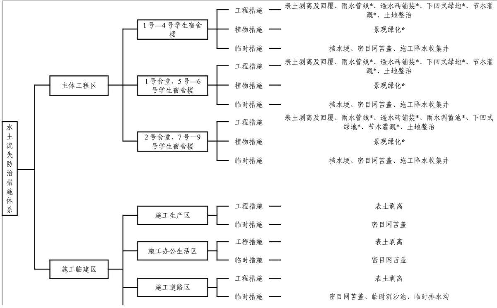

> **Zone C（应用范例层）使用边界**——仅可用于**写作风格、章节展开方式、表达逻辑、表格设计**的参考。
> **不得**用于合规判断；**不得**引入其项目数据（名称／地点／数字／单位名）；
> **不得**因其"曾经通过审批"而推定其做法在当前标准下仍然合规。
> 与 Zone A 冲突时**一律以 Zone A 为准**；Zone A 未明确规定时输出
> 「**Zone A 未明确规定，以下为参考写法，需人工判断**」。
>
> **坐标系警告**：本范例为**老八章结构**（GB 50433—2018 附录B），与 2026 版 10 章模板**同号不同义**
> （老 `1.5`＝防治目标，新 `1.5`＝水土流失预测结果；老 4→新 6 …偏移 +2；新版第 4/5 章老结构无独立章）。
> 因此 **`chapter_mapping: pending`——不得按章节号挂载**，检索一律走 `topic_tags`。
>
> **待加工**：`topic_tags`（主题标签）、`approval_basis_list`（编制依据逐字清单）、
> `structure_summary`（只提取结构：章节展开顺序／段落功能／表格栏目结构／句式模板／论证链步骤）。

1 综合说明....  
1.1 项目简况.. -1-  
1.2 编制依据.. . - 5 -  
1.3 设计水平年. .-7-  
1.4水土流失防治责任范围. ..-7-  
1.5 水土流失防治标准.... ..- 8 -  
1.6项目水土保持评价结论 ..-9 -  
1.7 水土流失预测结果.. ..- 11 -  
1.8水土保持措施布设成果.. ...- 11 -  
1.9水土保持监测方案.... ..- 14 -  
1.10水土保持投资及效益分析成果..... ...- 14-  
1.11 结论.. . - 15 -  
2 项目概况.. ...- 18 -  
2.1项目组成及工程布置. ..- 18 -  
2.2施工组织... ...- 29 -  
2.3 工程占地... .. - 38 -  
2.4土石方平衡. ..- 38 -  
2.5拆迁（移民）安置与专项设施改（迁）建.. . - 49 -  
2.6施工进度.. . - 49 -  
2.7 自然概况.. ...- 50 -  
3 项目水土保持评价.… ...- 54 -  
3.1主体工程选址（线）水土保持评价.. . - 54 -  
3.2建设方案与布局水土保持评价.. ..-55 -  
3.3主体工程设计中水土保持措施界定. .. - 65 -  
4 水土流失分析与预测.... ...- 68 -  
4.1 水土流失现状.. .- 68 -  
4.2水土流失影响因素分析... .- 68 -  
4.3 土壤流失量预测.. ..- 69 -  
4.4水土流失危害分析... ..- 82 -  
4.5 指导性意见... ..- 82 -  
5 水土保持措施.... ...- 84 -  
5.1 防治区划分 ..- 84 -  
5.2 措施总体布局 ...- 85 -  
5.3分区措施布设.. ..- 90 -  
5.4施工要求... .. - 106 -  
6 水土保持监测.. ..- 115 -  
6.1 范围和时段 .- 115 -  
6.2 内容和方法.. ..- 115 -  
6.3 点位布设.. ..- 119 -  
6.4 实施条件和成果.. ..- 120 -  
7水土保持投资估算及效益分析.. ...- 12 -3-  
7.1 投资估算... ... - 123 -  
7.2效益分析.. .. - 135 -  
8 水土保持管理... ... - 138 -  
8.1 组织管理... ... - 138 -  
8.2后续设计.... ..- -139 -  
8.3 水土保持监测.. ....- 140 -  
8.4水土保持监理.. .. - 140 -  
8.5 水土保持施工.... ...- 141 -  
8.6水土保持设施验收... ..- 142 -  
附表.... ... 144

## 1 综合说明

## 1.1项目简况

## 1.1.1 项目基本情况

## 1.1.1.1 项目必要性

北京师范大学紧密围绕教育强国建设，科学规划和建设昌平校园F区，依托新的发展空间建设一批实力雄厚的世界一流理工和新兴交叉学科，凝聚高水平创新团队，培养卓越教师和拔尖创新人才，突破关键核心技术，推进产学研深度融合，必将在实现2035年建成教育强国宏伟目标、推进中国式现代化征程中发挥不可替代作用。

北京师范大学昌平校园F区建设与昌平区发展全局紧密相连。通过加快推进科技成果转化和大学科技园建设，集全校之力哺育创新型科研平台；深度参与昌平区基础教育建设；大力推进昌平校园F区建设，助力昌平区高质量发展。规划和建设昌平校园F区将在未来一定时期内彻底解决学校空间短板问题，突破高质量发展瓶颈；有利于学校两校区五校园功能定位调整优化；有利于统筹教育教学资源，促进学科在资源有限的条件下改善教学科研条件，适度扩大办学规模，实现内涵式发展；有利于汇聚一批具有世界影响的学术大师和顶尖人才，办学国际化水平大幅提升，成为建成教育强国、提升国家教育全球竞争力的支撑力量；特色优势学科实力进一步加强，一批学科接近世界一流学科前列水平，学校综合实力显著增强，稳步迈进世界一流大学行列。

## 1.1.1.2 项目基本情况

## 项目背景：

北京师范大学昌平校园F区项目总用地面积507189.321m²，其中建设用地面积为332280.063m²，公园绿地面积为54458.596m²，城市道路用地面积为120450.662m²（以上面积以“建设工程规划用地测量成果报告书”中的面积为准）。地上总建筑规模约为35.05万m²，容积率为1.05（校园整体核算），绿地率30%（校园整体核算），建筑控高 30m。

昌平校园F区按建设内容划分为10个子项目进行单独编制可行性研究报告并单独立项。

昌平校园F区按照建设时序划分为三个批次：

第一批次建设工期为2026年4月\~2028年12月，包含为3个子项目，目前已取得可研批复；第二批次建设工期为2026年8月\~2029年4月，包含3个子项目，未取得可研批复；第三批次建设工期为2026年11月\~2029年6月，包含4个子项目，未取得可研批复。

本次建设内容为第一批次，为本方案编制范围。

项目位置：北京师范大学昌平校园F区项目位于北京市昌平区沙河高教园区0303街区CP01-0303-0016\~0027地块，西至南丰路道路中线，南至北京农机试验站，北至高教园北三街道路中线，东至回昌路东侧道路红线。

1号—4号学生宿舍楼建设位于CP01-0303-0017地块，东至北沙河东三路，西至南丰路，北至高教园北三街，中心坐标：116°16'53.1098"，40°10'04.9503"。

1号食堂、5号—6号学生宿舍楼位于CP01-0303-0019地块和CP01-0303-0021地块，西至北沙河东三路，北至高教园北三街，中心坐标：116°17'07.9956"，40°10'05.3786"。

2号食堂、7号—9号学生宿舍楼位于CP01-0303-0025和CP01-0303-0026地块，西至北沙河东三路，东至北沙河东四路，南至北京农机试验站，中心坐标：116°17'10.7010", 40° 09'54.6661"。

建设性质：新建项目。

工程等级与规模：本项目总建筑面积186523m²，地上建筑面积149708m²，地下建筑面积36815m²。其中1号学生宿舍楼-4号学生宿舍楼建筑面积64101m²，1号食堂、5号学生宿舍楼、6号学生宿舍楼建筑面积57701m²，2号食堂、7号学生宿舍楼-9号学生宿舍楼建筑面积64721m²。工程等级为一级，工程规模为大型。

建设内容及项目组成：本项目建设内容包含1号—9号学生宿舍楼，1号—2号食堂等11栋建筑单体，配套建设室外道路、管线、绿化等。

项目主要由建筑物工程、室外道路管线工程、景观绿化工程等组成。

项目总投资：本项目总投资159960.23万元，其中土建投资137087.18万元，建设所需资金拟采用申请国拨资金和学校多渠道筹措的方式解决。其中1号一4号学生宿舍楼项目总投资53161.42万元，土建投资45485.61万元；1号食堂、5号一6号学生宿舍楼项目总投资50537.43万元，土建投资43316.5万元；2号食堂、7号—9号学生宿舍楼项目总投资56261.38万元，土建投资48285.07万元。

建设工期：本项目计划于2026年4月开工，预计2028年12月完工，总建设工期33个月。

施工组织：施工生产区共计布设3处，占地1.05hm²，均位于红线外；施工办公生活区共计布设1处，占地1.35hm²，位于红线外；新建施工道路长度1915m，占地面积1.14hm²，其中属于红线内占地面积0.31hm²，红线外占地面积0.83hm²2；布置临时堆土区2处，占地面积5.31hm²，位于红线外。

占地面积：本项目总占地面积为18.94hm²，其中永久占地10.40hm²，临时占地8.54hm²。项目规划用地性质为A31高等院校用地，现状占地类型为耕地-水浇地。

1号—4号学生宿舍楼占地2.98hm²，1号食堂、5号—6号学生宿舍楼占地3.60hm²，2号食堂、7号—9号学生宿舍楼占地3.82hm²。

施工生产区占地面积为1.05hm²，全部为临时占地。

施工办公生活区占地面积为1.35hm²，全部为临时占地。

施工道路区占地面积为1.14hm²，其中永久占地内0.31hm²，临时占地0.83hm²。

临时堆土区占地面积为5.31hm²，全部为临时占地。

土石方：本项目土石方挖填总量为59.89万m³，挖方39.17万m³（含表土4.96万m³），填方20.72万m³（含表土1.90万m³），余方18.45万m³（含表土3.06万m³，槽土15.39万m³），余方拟运至昌平区百善郊野公园（一期）建设工程综合利用。

1号—4号学生宿舍楼土石方挖填总量为16.32万m³，挖方10.58万m³（含表土1.16万m³），填方5.74万m³（含表土0.49万m³），余方4.84万m³（含表土0.67万m³）。

1号食堂、5号一6号学生宿舍楼土石方挖填总量为22.51万m³，挖方14.82万m³（含表土1.41万m³），填方7.69万m³（含表土0.79万m³），余方7.13万m³（含表土0.62万m³）。

2号食堂、7号—9号学生宿舍楼土石方挖填总量为19.81万m³，挖方12.52万m³（含表土1.14万m³），填方7.29万m³（含表土0.62万m³），余方5.23万m³（含表土0.52万m³）。

施工临建区土石方挖填总量为1.25万m³，挖方1.25万m³（表土），无填方，余方1.25万m³（表土）。

取土场：本项目填方全部来源于挖方，无借方，不新设取土（石、砂）场。

弃土场：本项目余方拟全部运往昌平区百善郊野公园（一期）建设工程综合利用，

不新设弃土（石、渣）场。

拆迁数量及安置：本项目不涉及拆迁安置问题。

## 1.1.2 项目前期工作进展情况

## 1.1.2.1 工程前期文件编制情况

2005年10月10日，中华人民共和国教育部对北京师范大学立项建设昌平新校区进行了批复，文号：教发函〔2005〕256号；

2025年5月29日，取得北京市规划和自然资源委员会昌平分局《关于北京师范大学昌平校园F区（沙河高教园CP01-0303-0016\~0027地块）项目“多规合一”协同平台初审意见的函》，文号：京规自（昌）初审函[2025]0042号；

2025年6月13日，取得建设项目用地预审与选址意见书，文号：2025规自（昌）预选字0005号；

2025年7月23日，取得中华人民共和国教育部关于《北京师范大学昌平校园F区1号学生宿舍楼一4号学生宿舍楼建设项目可行性研究报告的批复》，文号：教发函〔2025〕373号;

2025年9月16日，取得中华人民共和国教育部关于《北京师范大学昌平校园F区1号食堂、5号学生宿舍楼、6号学生宿舍楼项目可行性研究报告的批复》，文号：教发函〔2025〕392号；

2025年9月16日，取得中华人民共和国教育部关于《北京师范大学昌平校园F区2号食堂、7号学生宿舍楼一9号学生宿舍楼项目可行性研究报告的批复》，文号：教发函〔2025〕391号；

项目目前处于初步设计阶段，暂未取得初步设计批复，本方案编制依据的设计文件为可行性研究报告。

## 1.1.2.2 水土保持方案编制情况

2025年10月，北京师范大学根据《中华人民共和国水土保持法》及有关法律法规规定，委托北京闪通达技术有限公司编制北京师范大学昌平校园F区项目水土保持方案。1号—4号学生宿舍楼项目，1号食堂、5号—6号学生宿舍楼项目，2号食堂、7号一9号学生宿舍楼项目分别编制可行性研究报告并由中华人民共和国教育部单独批复，因1号—4号学生宿舍楼项目，1号食堂、5号—6号学生宿舍楼项目，2号食堂、7号一9号学生宿舍楼三个项目均位于北京师范大学昌平校园F区内，建设时序同步，因此将三个项目合并编制一个水土保持方案。编制单位通过外业查勘、收集、分析有关资料，针对该项目建设特点和可能造成的水土流失情况，于2026年1月编制完成了《北京师范大学昌平校园F区1号—9号学生宿舍楼、1号—2号食堂项目水土保持方案报告书》。

## 1.1.3 自然简况

项目位于昌平区沙河镇，项目区气候类型属于暖温带大陆性季风气候，冬季盛行西北风，夏季盛行东南风，年均风速2.4m/s，最大风速33m/s，年均日照2732小时，年均气温11.8℃，极端最高气温40.6℃，极端最低气温-27.4℃，≥10℃年积温约 $4 2 0 0 \mathrm { { ‰} }$ 全年无霜期210天，多年平均降水量574mm，集中于夏季的6\~9月，约占全年的83%，多年平均水面蒸发量1245.40mm，最大冻土深度85cm。项目区所属流域为海河流域，所属水系为北运河水系，土壤类型为潮土，建设用地范围内现状为耕地。

项目区为全国水土保持区划中的北方土石山区，土壤侵蚀类型为水力侵蚀，侵蚀强度为微度，容许土壤流失量为 $2 0 0 \mathrm { t } / \ \left( \mathrm { k m } ^ { 2 } { \cdot } \mathbf { a } \ \right)$ ，原地貌平均土壤侵蚀模数为150t/$\left( \mathrm { { k m } ^ { 2 } { \cdot } a } \right)$ ；根据《水利部办公厅关于做好国家级水土流失重点预防区和重点治理区落地上图成果应用的通知》（办水保〔2025〕170号），项目区不涉及国家级两区，根据《北京市水土保持规划》（2017年5月），项目区属于北京市水土流失重点预防区。根据《北京市生产建设项目水土保持方案管理规定（试行）》（京水务保〔2023〕17号），项目区属于北京市水土流失一般风险区B区。项目区不涉及其它易引起严重水土流失和造成水土流失灾害的区域，不涉及饮用水水源保护区、水功能一级区的保护区和保留区、自然保护区、世界文化和自然遗产地、风景名胜区、地质公园、森林公园、重要湿地、生态保护红线、河湖管理范围等敏感区。

## 1.2 编制依据

## 1.2.1 法律法规

（1）《中华人民共和国水土保持法》(2010年12月25日第十一届全国人民代表大会常务委员会第十八次会议修订，自2011年3月1日施行);

（2）《北京市水土保持条例》（北京市人民代表大会常务委员会公告第12号，2015年5月29日通过，2016年1月1日施行，2019年7月26日第一次修正，2025年5月30日第二次修正）。

## 1.2.2 规章和规范性文件

（1）《水利部关于进一步深化“放管服”改革，全面加强水土保持监管的意见》（水保〔2019〕160号）；

(2）《水利部办公厅关于进一步加强生产建设项目水土保持监测工作的通知》（办水保〔2020〕161号）；

(3）《水利部办公厅关于实施生产建设项目水土保持信用监管“两单”制度的通知》（办水保〔2020〕157号）；

（4）《水利部办公厅关于印发生产建设项目水土保持技术文件编写和印制格式规定（试行）的通知》（水利部水保〔2018〕135号）；

（5）《水利部办公厅关于印发生产建设项目水土保持方案审查要点的通知》（办水保〔2023〕177号）；

(6）《水利部关于加强事中事后监管规范生产建设项目水土保持设施自主验收的通知》（水保〔2017〕365号）；

（7）《生产建设项目水土保持方案管理办法》（水利部令第53号发布，2023年1月17日）；

（8）北京市财政局北京市发展和改革委员会北京市水务局关于印发《北京市水土保持补偿费征收管理办法》的通知，京财农〔2016〕506号；

（9）北京市发展和改革委员会北京市财政局北京市水务局《关于降低本市水土保持补偿费收费标准的通知》，京发改〔2021〕1271号；

(10）《水利部办公厅关于做好国家级水土流失重点预防区和重点治理区落地上图成果应用的通知》（办水保〔2025〕170号）。

## 1.2.3 技术规范及标准

（1）《生产建设项目水土保持技术标准》（GB50433-2018）；

（2）《生产建设项目水土流失防治标准》（GB/T50434-2018）；

（3）《水土保持工程设计规范》（GB51018-2014）；

（4）《土地利用现状分类》（GB/T21010-2017）；

（5）《室外排水设计规范》（GB50014-2006（2016年版））；

（6）《水土保持工程概（估）算编制规定》（水利部水总〔2023〕67号）；

（7）《生产建设项目土壤流失量测算导则》（SL773-2018）；

（8）《土壤侵蚀分类分级标准》（SL190-2007）；

（9）《水利水电工程制图标准-水土保持图》（SL73.6-2015）；

（10）《水土保持监理规范》（SL/T523-2024）；

（11）《水土保持监测技术规范》（SL/T277-2024）；

（12）《表土剥离及其再利用技术要求》（GB/T45107-2024）。

## 1.2.4 技术文件及资料

(1）《北京师范大学昌平校园F区1号学生宿舍楼—4号学生宿舍楼建设项目可行性研究报告》，北京东方畅想建筑设计有限公司，2025年4月；

（2）《北京师范大学昌平校园F区1号食堂、5号学生宿舍楼、6号学生宿舍楼项目可行性研究报告》，北京东方畅想建筑设计有限公司，2025年9月；

(3）《北京师范大学昌平校园F区2号食堂、7号学生宿舍楼一9号学生宿舍楼项目可行性研究报告》，北京东方畅想建筑设计有限公司，2025年9月；

（4）《北师大昌平校区新建工程岩土工程勘察报告书》（可行性研究勘察），中机三勘岩土工程有限公司，2024年7月；

(5）《北京师范大学昌平校园F区1号学生宿舍楼—4号学生宿舍楼岩土工程勘察报告》（详勘阶段），中机三勘岩土工程有限公司，2025年9月；

（6）《北京市水土保持公报》（2024年）；

（7）现场调查所得的其他有关资料。

## 1.3设计水平年

根据《生产建设项目水土保持技术标准》（GB50433-2018），工程属建设类项目，方案设计水平年为工程完工后的当年或后一年，本项目预计完工时间为2028年12月，设计水平年为主体工程完工后一年，即2029年。

## 1.4水土流失防治责任范围

根据《生产建设项目水土保持技术标准》（GB50433-2018）规定及工程建设的特点，项目水土流失防治责任范围包括永久征地、临时占地以及其他使用与管辖区域。

参考主体设计资料及建设单位提供的临时设施布置方案，确定本项目水土流失防治责任范围面积为18.94hm²，其中永久占地10.40hm²，临时占地8.54hm²。

表1.4-1 项目水土流失防治责任范围表
<table><tr><td rowspan=2 colspan=2>防治分区</td><td rowspan=1 colspan=2>防治责任范围（hm²）</td></tr><tr><td rowspan=1 colspan=1>永久占地</td><td rowspan=1 colspan=1>临时占地</td></tr><tr><td rowspan=4 colspan=1>主体工程区</td><td rowspan=1 colspan=1>1号—4号学生宿舍楼</td><td rowspan=1 colspan=1>2.98</td><td rowspan=1 colspan=1></td></tr><tr><td rowspan=1 colspan=1>1号食堂、5号—6号学生宿舍楼</td><td rowspan=1 colspan=1>3.60</td><td rowspan=1 colspan=1></td></tr><tr><td rowspan=1 colspan=1>2号食堂、7号—9号学生宿舍楼</td><td rowspan=1 colspan=1>3.82</td><td rowspan=1 colspan=1></td></tr><tr><td rowspan=1 colspan=1>小计</td><td rowspan=1 colspan=1>10.40</td><td rowspan=1 colspan=1></td></tr><tr><td rowspan=5 colspan=1>施工临建区</td><td rowspan=1 colspan=1>施工生产区</td><td rowspan=1 colspan=1></td><td rowspan=1 colspan=1>1.05</td></tr><tr><td rowspan=1 colspan=1>施工办公生活区</td><td rowspan=1 colspan=1></td><td rowspan=1 colspan=1>1.35</td></tr><tr><td rowspan=1 colspan=1>施工道路区</td><td rowspan=1 colspan=1>(0.31)</td><td rowspan=1 colspan=1>0.83</td></tr><tr><td rowspan=1 colspan=1>临时堆土区</td><td rowspan=1 colspan=1></td><td rowspan=1 colspan=1>5.31</td></tr><tr><td rowspan=1 colspan=1>小计</td><td rowspan=1 colspan=1></td><td rowspan=1 colspan=1>8.54</td></tr><tr><td rowspan=1 colspan=2>合计</td><td rowspan=1 colspan=1>10.40</td><td rowspan=1 colspan=1>8.54</td></tr></table>

## 1.5水土流失防治标准

## 1.5.1 执行标准等级

本项目位于北方土石山区。根据《水利部办公厅关于做好国家级水土流失重点预防区和重点治理区落地上图成果应用的通知》（办水保〔2025〕170号）、《北京市水土保持规划》（2017年5月），项目区涉及北京市水土流失重点预防区，根据《生产建设项目水土流失防治标准》（GB/T50434-2018），应执行北方土石山区一级防治标准，并按相关规定提高部分防治目标值。

## 1.5.2 防治目标

根据《生产建设项目水土流失防治标准》（GB/T50434-2018）的相关规定，本项目应达到以下基本目标：

（1）项目建设范围内的新增水土流失应得到有效控制，原有水土流失得到治理；

（2）水土保持设施应安全有效；

（3）水土资源、林草植被应得到最大限度的保护与恢复；

（4）北方土石山区一级标准设计水平年防治指标值：水土流失治理度95%，土壤流失控制比0.9，渣土防护率97%，表土保护率95%，林草植被恢复率97%，林草覆盖率25%。项目区位于城市区，将渣土防护率提高1%、林草覆盖率提高1%；项目区以微度水力侵蚀为主，土壤流失控制比应不小于1.0，本项目土壤流失控制比提高0.2。

本项目调整后水土流失防治目标详见表1.5-1。

表1.5-1 项目水土流失防治目标值
<table><tr><td rowspan=2 colspan=1>防治标准</td><td rowspan=2 colspan=1>防治指标</td><td rowspan=1 colspan=2>北方土石山区一级标准</td><td rowspan=2 colspan=1>参数调整</td><td rowspan=1 colspan=2>调整后的防治目标值</td></tr><tr><td rowspan=1 colspan=1>施工期</td><td rowspan=1 colspan=1>设计水平年</td><td rowspan=1 colspan=1>施工期</td><td rowspan=1 colspan=1>设计水平年</td></tr><tr><td rowspan=6 colspan=1>北方土石山区一级</td><td rowspan=1 colspan=1>水土流失治理度（%）</td><td rowspan=1 colspan=1></td><td rowspan=1 colspan=1>95</td><td rowspan=1 colspan=1>1</td><td rowspan=1 colspan=1></td><td rowspan=1 colspan=1>95</td></tr><tr><td rowspan=1 colspan=1>土壤流失控制比</td><td rowspan=1 colspan=1></td><td rowspan=1 colspan=1>0.9</td><td rowspan=1 colspan=1>微度侵蚀，提高防治标准+0.2</td><td rowspan=1 colspan=1></td><td rowspan=1 colspan=1>1.1</td></tr><tr><td rowspan=1 colspan=1>渣土防护率（%）</td><td rowspan=1 colspan=1>95</td><td rowspan=1 colspan=1>97</td><td rowspan=1 colspan=1>项目区位于城市区，提高防治标准+1</td><td rowspan=1 colspan=1>96</td><td rowspan=1 colspan=1>98</td></tr><tr><td rowspan=1 colspan=1>表土保护率（%）</td><td rowspan=1 colspan=1>95</td><td rowspan=1 colspan=1>95</td><td rowspan=1 colspan=1>/</td><td rowspan=1 colspan=1>95</td><td rowspan=1 colspan=1>95</td></tr><tr><td rowspan=1 colspan=1>林草植被恢复率（%）</td><td rowspan=1 colspan=1></td><td rowspan=1 colspan=1>97</td><td rowspan=1 colspan=1>1</td><td rowspan=1 colspan=1></td><td rowspan=1 colspan=1>97</td></tr><tr><td rowspan=1 colspan=1>林草覆盖率（%）</td><td rowspan=1 colspan=1></td><td rowspan=1 colspan=1>25</td><td rowspan=1 colspan=1>项目区位于城市区，提高防治标准+1</td><td rowspan=1 colspan=1></td><td rowspan=1 colspan=1>26</td></tr></table>

## 1.6项目水土保持评价结论

## 1.6.1主体工程选址（线）评价

根据《中华人民共和国水土保持法》（2011年3月1日起实施）、《北京市水土保持条例》（2025年）、《生产建设项目水土保持技术规范》（GB50433-2018)等规定要求，对主体工程水土保持制约性因素一一对照进行了分析与评价，分析评价可知：

（1）本项目不属于限制类和淘汰类产业的开发建设项目；

(2）本项目区不属于水土流失严重、生态脆弱的地区；

（3）本项目建设内容无在崩塌滑坡危险区和泥石流易发区内进行取土、挖沙、取石等行为；

（4）项目建设不占用基本农田，但占用水浇地，存在一定制约性因素；

（5）项目建设内容中不包含不符合流域综合规划的水利工程；

（6）本工程选线不涉及水土保持监测网络中水土保持监测站点、重点试验区和水土保持长期定位观测站。路线经过区域均为平原区，不存在危岩、崩塌、落石等现象，不涉及崩塌、滑坡危险区和泥石流易发区；

（7）项目建设不占用河流两岸、湖泊和水库周边的植物保护带；

（8）项目建设位置属于北京市水土流失重点预防区，存在一定制约性因素。

本方案通过在执行北方土石山区防治指标一级标准的基础上，将土壤流失控制比提高0.2，渣土防护率提高1%，林草覆盖率提高1%，后续设计提高林草措施等级至1级，执行北京市园林绿化标准，雨水管提高标准后为5年一遇，并最大限度的控制临时用地，布设雨水排除及沉沙设施，提出水土保持防护措施及施工管理建议，能有效控制可能造成的水土流失，能够达到水土保持要求。

总体分析认为，本项目从水土保持角度考虑，工程选址是可行的。

## 1.6.2 建设方案与布局评价

（1）项目位于北京市昌平区，属于城镇区项目。根据工程建设方案，工程主体设计采用海绵城市设计理念，注重景观效果，植被建设标准采取园林景观标准建设，配套建设有灌溉、排水、雨水利用等设施。本项目建设方案符合水土保持要求。

（2）本工程施工道路永临结合，部分施工道路布置在本项目道路范围内，节约占地0.31hm²；施工办公生活区、临时堆土区为满足施工需要不可避免占用本项目红线外用地，但均布置在昌平校园F区用地范围内。施工临时道路沿校区规划永久道路布设，用于连接各建设地块、办公生活区、临时堆土区。现状占地类型为耕地-水浇地，未占用基本农田，占地类型符合水土保持要求。临时占地满足施工要求，工程占地符合水土保持节约用地和减少扰动的要求。

（3）本项目主要挖方为地下室建设、建筑物基础的基坑开挖土方，基坑开挖深度为地下室底板或建筑物基础埋深，无超挖，基坑开挖边坡1:1并做好喷混防护，减少土方开挖量，工程挖方符合水土保持要求。工程填方根据土方回填施工工艺，基坑肥槽逐层、分时段回填，分层压实，确保与周边高程顺接，不存在高陡边坡，按照设计标高回填，工程填方符合水土保持要求。

本项目余方为表土3.06万m³，槽土15.39万m³，拟全部运至昌平区百善郊野公园（一期）建设工程回填利用，该工程需借方 $3 0 \mathcal { F } \mathrm { m } ^ { 3 }$ ，绿化面积为 $1 5 7 . 9 4 \mathrm { h m } ^ { 2 }$ ，需要大量表土，本项目余方可全部消耗。

施工过程中将剥离的1.90万m³表土单独存放，堆存期间做好临时苫盖、拦挡、排水、沉沙、撒播草籽等相关保护措施，后期用于绿化覆土使用。表土剥离、保护、利用方案符合水土保持要求。

（4）根据施工总体布置方案，项目建设布置施工生产区、施工办公生活区、施工道路区、临时堆土区等，制定施工方案、施工工期和施工时序，安排施工进度等，保证本项目施工的顺利实施。项目建设四周进行临时围挡，围挡高2m，减少了对施工区域以外的影响。施工进度安排比较紧凑合理，在满足工程施工需要的同时，建设过程中统筹安排，确保各项工程有序进行，尽量缩短土方施工工期和地表的裸露时间，减少施工过程中的水土流失，符合水土保持的要求。

在施工时序方面，工程施工中基础土建施工等对地表扰动较大的工程，在施工活动中，尽量避开主汛期，保证水土流失尽量减轻到最低程度。本工程施工过程中开挖土方回填至地块基坑范围外其他区域，用于高程抬升，减少临时堆土量。各区域的施工时序相互衔接，减少了水土流失时段及临时堆土占地，减少了主体施工过程中产生的水土流失，主体工程施工时序安排总体较为合理。

（5）本项目主体设计已有雨水管线、透水砖铺装、雨水调蓄池、节水灌溉、景观绿化等具有水土保持功能的工程，主体工程设计的措施可有效的促进雨水排除、降低雨水冲刷，从而达到减少水土流失的目的，各项措施的设计标准满足GB51018规范的要求。

## 1.7水土流失预测结果

工程建设过程中扰动地表总面积为18.94hm²；通过预测，未实施水土保持措施情况下，工程建设产生的水土流失总量735.59t，其中新增水土流失量为675.20t。土壤流失的防治重点区域为建筑物工程区、临时堆土区，施工期为水土流失重点监测时段，尤其土方施工时段为监测重点时段。工程建设过程中土石方的开挖填筑，地表扰动，将不可避免改变原有地貌，导致土地生产力降低，影响周边生态环境。应做好工程建设过程中的施工管理，及时落实各项水土保持措施，减轻工程区水土流失，减轻对周边河流水系及生态环境产生的不利影响。

## 1.8水土保持措施布设成果

## 1.8.1 水土流失防治分区

依据工程总体布局及扰动特点，该项目划分为2个一级防治区，包括主体工程区、施工临建区。主体工程区包含3个二级防治区：1号—4号学生宿舍楼，1号食堂、5号—6号学生宿舍楼，2号食堂、7号—9号学生宿舍楼；施工临建区包含4个二级防治区：施工生产区、施工办公生活区、施工道路区、临时堆土区。

## 1.8.2 措施总体布局

本方案中针对各水土流失防治分区，分别对主体工程设计中已提出的措施进行了分析和论证，并在此基础上依据各分区防治特点补充完善水土保持措施布设。各防治分区水土保持措施布局及其工程量如下：

## （一）主体工程区

## (1)1号—4号学生宿舍楼

## 1）工程措施

施工前期进行表土剥离，主体结构施工完成后进行室外雨水管线施工，道路施工阶段人行道、非机动停车位铺设透水砖铺装，绿化种植前进行节水灌溉、下凹式整地、土地整治、表土回覆。

水土保持工程量：表土剥离1.16万m³，雨水管线824m，透水砖铺装 $0 . 1 0 \mathrm { h m } ^ { 2 }$ 节水灌溉0.97hm²，下凹式整地0.49hm²，土地整治 0.48hm²，表土回覆 0.49万m³。

## 2）植物措施

绿化工程区进行表土回覆后，进行绿化种植。

水土保持工程量：景观绿化0.97hm²。

## 3）临时措施

基坑土方开挖后，沿基坑四周布设挡水埂，在基坑西北角布设施工降水收集井，施工期间裸露地表进行临时苫盖；主体工程施工完成、进行室外道路、绿化施工时，施工期间裸露地表进行临时苫盖。

水土保持工程量：挡水埂1200m，施工降水收集井1座，密目网苫盖3.49万m²。

## (2)1号食堂、5号—6号学生宿舍楼

## 1）工程措施

施工前期进行表土剥离，主体结构施工完成后进行室外雨水管线施工，道路施工阶段人行道、非机动停车位铺设透水砖铺装，绿化种植前进行节水灌溉、下凹式整地、土地整治、表土回覆。

水土保持工程量：表土剥离1.41万m³，雨水管线925m，透水砖铺装 $0 . 1 5 \mathrm { h m } ^ { 2 }$ 节水灌溉 $1 . 5 9 \mathrm { h m } ^ { 2 } .$ ，下凹式整地0.80hm²，土地整治 $0 . 7 9 \mathrm { h m } ^ { 2 }$ ，表土回覆0.79万 $\mathbf { m } ^ { 3 } .$

## 2）植物措施

绿化工程区进行表土回覆后，进行绿化种植。

水土保持工程量：景观绿化1.59hm²。

## 3）临时措施

基坑土方开挖后，沿基坑四周布设挡水埂，在基坑西北角布设施工降水收集井，施工期间裸露地表进行临时苫盖；主体工程施工完成、进行室外道路、绿化施工时，

施工期间裸露地表进行临时苫盖。

水土保持工程量：挡水埂1180m，施工降水收集井3座，密目网苫盖4.14万m²。

## (3)2号食堂、7号—9号学生宿舍楼

## 1）工程措施

施工前期进行表土剥离，主体结构施工完成后进行室外雨水管线施工，道路施工阶段人行道、非机动停车位铺设透水砖铺装，绿化种植前进行节水灌溉、下凹式整地、土地整治、表土回覆。

水土保持工程量：表土剥离1.14万m³，雨水管线904m，透水砖铺装0.10hm²，雨水调蓄池2座1000m³，节水灌溉1.24hm²，下凹式整地0.62hm²，土地整治0.62hm²，表土回覆 0.62万 m³。

## 2）植物措施

绿化工程区进行表土回覆后，进行绿化种植。

水土保持工程量：景观绿化1.24hm²。

## 3）临时措施

基坑土方开挖后，沿基坑四周布设挡水埂，在基坑西北角布设施工降水收集井，施工期间裸露地表进行临时苫盖；主体工程施工完成、进行室外道路、绿化施工时，施工期间裸露地表进行临时苫盖。

水土保持工程量：挡水埂1560m，施工降水收集井3座，密目网苫盖4.83万m²。

## （二）施工临建区

## （1）施工生产区

## 1）工程措施

施工前期对占用耕地区域进行表土剥离。

水土保持工程量：表土剥离0.42万m³。

## 2）临时措施

施工过程中对施工生产区临时堆料、裸露区域进行密目网苫盖。

水土保持工程量：密目网苫盖1.16万m²。

## (2)施工办公生活区

## 1）工程措施

施工前期对占用耕地区域进行表土剥离。

水土保持工程量：表土剥离0.50万m³。

## 2）临时措施

施工过程中对裸露区域进行密目网苫盖。

水土保持工程量：密目网苫盖1.48万m²。

## (3) 施工道路区

## 1）工程措施

施工前期对占用耕地区域进行表土剥离。

水土保持工程量：表土剥离0.33万m³。

## 2）临时措施

施工过程中对裸露区域进行密目网苫盖，沿施工道路一侧布设临时排水沟，排水沟末端连接沉沙池。

水土保持工程量：密目网苫盖1.25万m²，临时沉沙池3座，临时排水沟2030m。

## (4）临时堆土区

## 1）临时措施

临时堆土堆放前对占压区域采用无纺布覆盖，堆土四周做好编织袋装土拦挡措施，做好拦挡措施后开始堆放土方，汛期来临前沿堆土四周布设临时排水沟，排水沟末端接入临时沉沙池，堆土期间堆土表面进行临时苫盖，剥离的表土表面进行撒播草籽。

水土保持工程量：密目网苫盖7.06万m²，无纺布覆盖5.84万m²，装土编织袋拦挡1370m，临时排水沟1370m，临时沉沙池2座、临时撒播草籽1.13hm²。

## 1.9水土保持监测方案

本项目监测范围为水土流失防治责任范围18.94hm²；监测内容包括水土流失影响因素、水土流失状况、水土流失危害和水土保持措施；监测方法主要采用实地调查监测、遥感监测、地面观测、巡查监测相结合的方法，监测期间共计设置22个监测点，重点监测区域为建筑物工程区、临时堆土区。监测时段从施工准备期开始至方案设计水平年结束，即2026年4月至2029年12月。

## 1.10 水土保持投资及效益分析成果

本项目水土保持总投资为1128.61万元，其中工程措施225.87万元，植物措施456.00万元，监测措施28.00万元，施工临时工程279.16万元，独立费用106.70万元（其中水土保持监理费40.00万元），预备费为32.87万元。

通过全面实施本方案各项水土保持措施，治理水土流失面积18.94hm²，减少水土流失量为588.47t，设计水平年6项防治目标均可达到目标值。方案各项水土保持措施实施并发挥效益后，防治责任范围内可能造成的水土流失基本得到有效控制，植物种类得以改善，项目区水土保持生态将更趋稳定。

## 1.11 结论

本项目工程选址、建设方案、总体布局、水土流失防治等方面符合水土保持法律法规、技术标准的规定，在实施本方案确定的水土保持综合防治措施后，能有效防治工程建设期间可能造成的水土流失，改善项目区生态环境。从水土保持角度对工程设计、施工和建设管理提出以下要求。

（1）工程设计：后续水土保持初步设计、施工图设计应将方案新增的水土保持措施纳入主体工程设计，按照《生产建设项目水土保持方案管理办法》（水利部令第53号，2023年1月17日）文件要求，如设计或施工过程中水土保持措施发生重大变更的，应重新编制项目水土保持方案，报水利部进行审批。

（2）施工：本项目水土流失治理由建设单位负责，施工单位实施的方式，建设单位在施工招标时拟将本方案新增的水土保持措施纳入施工招标合同中，将水土保持措施落到实处，项目施工单位应切实履行施工合同，将水土保持措施保质保量完成。

（3）建设管理：建设单位将组织施工、监理等参建各方严把质量关，严格控制施工进度，及时实施好水土保持方案设计的各项水土流失防治措施。本项目竣工验收时，应当验收水土保持设施，组织第三方机构编制水土保持设施验收报告，水土保持设施未经验收，项目不得投产使用。

表1.11-1 水土保持方案特性表
<table><tr><td colspan="2" rowspan="1">项目名称</td><td colspan="5" rowspan="1">北京师范大学昌平校园F区1号—9号学生宿舍楼、1号2号食堂项目</td><td colspan="2" rowspan="1">流域管理机构</td><td colspan="1" rowspan="1">海河水利委员会</td></tr><tr><td colspan="2" rowspan="1">涉及省(市、区)</td><td colspan="2" rowspan="1">北京市</td><td colspan="1" rowspan="1">涉及地市</td><td colspan="2" rowspan="1">昌平区</td><td colspan="2" rowspan="1">涉及县</td><td colspan="1" rowspan="1">沙河镇</td></tr><tr><td colspan="2" rowspan="1">项目规模</td><td colspan="2" rowspan="1">大型，总建筑面积186523m²</td><td colspan="1" rowspan="1">总投资(万元)</td><td colspan="2" rowspan="1">159960.23</td><td colspan="2" rowspan="1">土建投资(万元)</td><td colspan="1" rowspan="1">137087.18</td></tr><tr><td colspan="2" rowspan="1">动工时间</td><td colspan="2" rowspan="1">2026.4</td><td colspan="1" rowspan="1">完工时间</td><td colspan="2" rowspan="1">2028.12</td><td colspan="2" rowspan="1">设计水平年</td><td colspan="1" rowspan="1">2029</td></tr><tr><td colspan="2" rowspan="1">工程占地(hm²)</td><td colspan="2" rowspan="1">18.94</td><td colspan="1" rowspan="1">永久占地(hm²)</td><td colspan="2" rowspan="1">10.40</td><td colspan="2" rowspan="1">临时占地(hm²)</td><td colspan="1" rowspan="1">8.54</td></tr><tr><td colspan="4" rowspan="2">土石方量(万m³)</td><td colspan="1" rowspan="1">挖方</td><td colspan="2" rowspan="1">填方</td><td colspan="2" rowspan="1">借方</td><td colspan="1" rowspan="1">余（弃）方</td></tr><tr><td colspan="1" rowspan="1">39.17</td><td colspan="2" rowspan="1">20.72</td><td colspan="2" rowspan="1">1</td><td colspan="1" rowspan="1">18.45</td></tr><tr><td colspan="4" rowspan="1">重点防治区名称</td><td colspan="6" rowspan="1">北京市水土流失重点预防区</td></tr><tr><td colspan="4" rowspan="1">地貌类型</td><td colspan="1" rowspan="1">平原</td><td colspan="4" rowspan="1">水土保持区划</td><td colspan="1" rowspan="1">北方土石山区</td></tr><tr><td colspan="4" rowspan="1">土壤侵蚀类型</td><td colspan="1" rowspan="1">水力侵蚀</td><td colspan="4" rowspan="1">土壤侵蚀强度</td><td colspan="1" rowspan="1">微度</td></tr><tr><td colspan="4" rowspan="1">防治责任范围面积(hm²)</td><td colspan="1" rowspan="1">18.94</td><td colspan="4" rowspan="1">容许土壤流失量t/(km²·a)</td><td colspan="1" rowspan="1">200</td></tr><tr><td colspan="4" rowspan="1">土壤流失预测总量(t)</td><td colspan="1" rowspan="1">735.59</td><td colspan="4" rowspan="1">新增土壤流失量(t)</td><td colspan="1" rowspan="1">675.20</td></tr><tr><td colspan="4" rowspan="1">水土流失防治标准执行等级</td><td colspan="6" rowspan="1">北方土石山区一级标准</td></tr><tr><td colspan="1" rowspan="3">防治指标</td><td colspan="3" rowspan="1">水土流失治理度(%)</td><td colspan="1" rowspan="1">95</td><td colspan="4" rowspan="1">土壤流失控制比</td><td colspan="1" rowspan="1">1.1</td></tr><tr><td colspan="3" rowspan="1">渣土防护率(%)</td><td colspan="1" rowspan="1">98</td><td colspan="4" rowspan="1">表土保护率(%)</td><td colspan="1" rowspan="1">95</td></tr><tr><td colspan="3" rowspan="1">林草植被恢复率(%)</td><td colspan="1" rowspan="1">97</td><td colspan="4" rowspan="1">林草覆盖率(%)</td><td colspan="1" rowspan="1">26</td></tr><tr><td colspan="1" rowspan="4">防治措施及工程量</td><td colspan="3" rowspan="1">防治分区</td><td colspan="2" rowspan="1">工程措施</td><td colspan="2" rowspan="1">植物措施</td><td colspan="2" rowspan="1">临时措施</td></tr><tr><td colspan="2" rowspan="3">主体工程区</td><td colspan="1" rowspan="1">1号—4号学生宿舍楼</td><td colspan="2" rowspan="1">表土剥离1.16万m³表土回覆0.49万m³雨水管线824m透水砖铺装0.10hm²土地整治0.48hm²下凹式绿地0.49hm²节水灌溉0.97hm²</td><td colspan="2" rowspan="1">乔灌草景观绿化0.97hm²</td><td colspan="2" rowspan="1">挡水埂1200m施工降水收集井1座密目网苫盖3.49万m²</td></tr><tr><td colspan="1" rowspan="1">1号食堂、5号-6号学生宿舍楼</td><td colspan="2" rowspan="1">表土剥离1.41万m³表土回覆0.79万m³雨水管线925m透水砖铺装0.15hm²土地整治0.79hm²下凹式绿地0.80hm²节水灌溉1.59hm²</td><td colspan="2" rowspan="1">乔灌草景观绿化1.59hm²</td><td colspan="2" rowspan="1">挡水埂1180m施工降水收集井3座密目网苫盖4.14万m²</td></tr><tr><td colspan="1" rowspan="1">2号食堂、7号-9号学生宿舍楼</td><td colspan="2" rowspan="1">表土剥离1.14万m³表土回覆0.62万m³雨水管线904m透水砖铺装0.10hm²雨水调蓄池2座1000m³土地整治0.62hm²</td><td colspan="2" rowspan="1">乔灌草景观绿化1.24hm²</td><td colspan="2" rowspan="1">挡水埂1560m施工降水收集井3座密目网苫盖4.83万m²</td></tr><tr><td colspan="1" rowspan="5"></td><td colspan="2" rowspan="1"></td><td colspan="1" rowspan="1"></td><td colspan="2" rowspan="1">下凹式绿地0.62hm²节水灌溉1.24hm²</td><td colspan="2" rowspan="1"></td><td colspan="2" rowspan="1"></td></tr><tr><td colspan="2" rowspan="4">施工临建区</td><td colspan="1" rowspan="1">施工生产区</td><td colspan="2" rowspan="1">表土剥离0.42万m³</td><td colspan="2" rowspan="1">1</td><td colspan="2" rowspan="1">密目网苫盖1.16万m²</td></tr><tr><td colspan="1" rowspan="1">施工办公生活区</td><td colspan="2" rowspan="1">表土剥离0.50万m³</td><td colspan="2" rowspan="1">1</td><td colspan="2" rowspan="1">密目网苫盖1.48万m²</td></tr><tr><td colspan="1" rowspan="1">施工道路区</td><td colspan="2" rowspan="1">表土剥离0.33万m³</td><td colspan="2" rowspan="1">1</td><td colspan="2" rowspan="1">密目网苫盖1.25万m²临时排水沟2030m临时沉沙池3座</td></tr><tr><td colspan="1" rowspan="1">临时堆土区</td><td colspan="2" rowspan="1">/</td><td colspan="2" rowspan="1">/</td><td colspan="2" rowspan="1">密目网苫盖7.06万m²无纺布覆盖5.84万m²临时排水沟1370m装土编织袋拦挡1370m临时沉沙池2座临时撒播草籽1.13hm²</td></tr><tr><td colspan="4" rowspan="1">投资(万元)</td><td colspan="2" rowspan="1">225.87</td><td colspan="2" rowspan="1">456.00</td><td colspan="2" rowspan="1">279.16</td></tr><tr><td colspan="2" rowspan="1">水土保持总投资(万元)</td><td colspan="3" rowspan="1">1128.61</td><td colspan="2" rowspan="1">独立费用(万元)</td><td colspan="3" rowspan="1">106.70</td></tr><tr><td colspan="2" rowspan="1">监理费(万元)</td><td colspan="2" rowspan="1">40.00</td><td colspan="1" rowspan="1">监测费(万元)</td><td colspan="2" rowspan="1">28.00</td><td colspan="1" rowspan="1">补偿费(万元)</td><td colspan="2" rowspan="1">1</td></tr><tr><td colspan="2" rowspan="1">方案编制单位</td><td colspan="3" rowspan="1">北京闪通达技术有限公司</td><td colspan="2" rowspan="1">建设单位</td><td colspan="3" rowspan="1">北京师范大学</td></tr><tr><td colspan="2" rowspan="1">法定代表人</td><td colspan="3" rowspan="1">林坜</td><td colspan="2" rowspan="1">法定代表人</td><td colspan="3" rowspan="1">于吉红</td></tr><tr><td colspan="2" rowspan="1">地址</td><td colspan="3" rowspan="1">北京市丰台区新村街道万年花城万芳园一区</td><td colspan="2" rowspan="1">地址</td><td colspan="3" rowspan="1">北京市海淀区新街口外大街19号</td></tr><tr><td colspan="2" rowspan="1">邮编</td><td colspan="3" rowspan="1">100071</td><td colspan="2" rowspan="1">邮编</td><td colspan="3" rowspan="1">100000</td></tr><tr><td colspan="2" rowspan="1">联系人及电话</td><td colspan="3" rowspan="1">魏忠15010456545</td><td colspan="2" rowspan="1">联系人及电话</td><td colspan="3" rowspan="1">吴迪13910675360</td></tr><tr><td colspan="2" rowspan="1">传真</td><td colspan="3" rowspan="1">1</td><td colspan="2" rowspan="1">传真</td><td colspan="3" rowspan="1">1</td></tr><tr><td colspan="2" rowspan="1">电子信箱</td><td colspan="3" rowspan="1">shantongda@126.com</td><td colspan="2" rowspan="1">电子信箱</td><td colspan="3" rowspan="1">diddy@bnu.edu.cn</td></tr></table>

## 2 项目概况

## 2.1项目组成及工程布置

项目分为1号—4号学生宿舍楼项目，1号食堂、5号—6号学生宿舍楼项目，2号食堂、7号一9号学生宿舍楼项目三部分，均由建筑物工程、室外道路管线工程、景观绿化工程等组成。

1号一4号学生宿舍楼项目包含1个地块，建设内容包含1号\~4号宿舍楼，以及道路管线、绿化等配套工程。

1号食堂、5号—6号学生宿舍楼项目包含2个地块，建设内容包括5号\~6号宿舍楼，1号食堂，以及道路管线、绿化等配套工程。

2号食堂、7号—9号学生宿舍楼项目包含2个地块，建设内容包括7号\~9号宿舍楼，2号食堂，以及道路管线、绿化等配套工程。

表2.1-1 工程特性表
<table><tr><td rowspan=1 colspan=9>一、基本情况</td></tr><tr><td rowspan=1 colspan=1>1</td><td rowspan=1 colspan=1>项目名称</td><td rowspan=1 colspan=3>北京师范大学昌平校园F区1号—9号学生宿舍楼、1号—2号食堂项目</td><td rowspan=1 colspan=2>所在流域</td><td rowspan=1 colspan=2>海河流域</td></tr><tr><td rowspan=1 colspan=1>2</td><td rowspan=1 colspan=1>建设地点</td><td rowspan=1 colspan=7>北京市昌平区沙河镇</td></tr><tr><td rowspan=1 colspan=1>3</td><td rowspan=1 colspan=1>建设单位</td><td rowspan=1 colspan=3>北京师范大学</td><td rowspan=1 colspan=2>工程性质</td><td rowspan=1 colspan=2>新建</td></tr><tr><td rowspan=1 colspan=1>4</td><td rowspan=1 colspan=1>总投资</td><td rowspan=1 colspan=3>159960.23万元</td><td rowspan=1 colspan=2>土建投资</td><td rowspan=1 colspan=2>137087.18万元</td></tr><tr><td rowspan=1 colspan=1>5</td><td rowspan=1 colspan=1>工程等级</td><td rowspan=1 colspan=3>一级</td><td rowspan=1 colspan=2>工程规模</td><td rowspan=1 colspan=2>大型</td></tr><tr><td rowspan=1 colspan=1>6</td><td rowspan=1 colspan=1>建设期</td><td rowspan=1 colspan=7>33个月(2026年4月至2028年12月)</td></tr><tr><td rowspan=3 colspan=1>7</td><td rowspan=3 colspan=1>建设规模</td><td rowspan=1 colspan=3>总建筑面积</td><td rowspan=1 colspan=4>186523m²</td></tr><tr><td rowspan=1 colspan=3>地上建筑面积</td><td rowspan=1 colspan=4>149708m²</td></tr><tr><td rowspan=1 colspan=3>地下建筑面积</td><td rowspan=1 colspan=4>36815m²</td></tr><tr><td rowspan=1 colspan=5>二、项目组成</td><td rowspan=1 colspan=4>三、主要技术指标</td></tr><tr><td rowspan=2 colspan=2>项目组成</td><td rowspan=1 colspan=3>占地面积(hm²)</td><td rowspan=2 colspan=1>项目组成</td><td rowspan=1 colspan=3>建筑面积(m²)</td></tr><tr><td rowspan=1 colspan=1>合计</td><td rowspan=1 colspan=1>永久占地</td><td rowspan=1 colspan=1>临时占地</td><td rowspan=1 colspan=2>地上</td><td rowspan=1 colspan=1>地下</td></tr><tr><td rowspan=1 colspan=2>1号—4号学生宿舍楼</td><td rowspan=1 colspan=1>2.98</td><td rowspan=1 colspan=1>2.98</td><td rowspan=1 colspan=1></td><td rowspan=1 colspan=1>1号—4号学生宿舍楼</td><td rowspan=1 colspan=2>54101</td><td rowspan=1 colspan=1>10000</td></tr><tr><td rowspan=1 colspan=2>1号食堂、5号—6号学生宿舍楼</td><td rowspan=1 colspan=1>3.60</td><td rowspan=1 colspan=1>3.60</td><td rowspan=1 colspan=1></td><td rowspan=1 colspan=1>1号食堂、5号一6号学生宿舍楼</td><td rowspan=1 colspan=2>44651</td><td rowspan=1 colspan=1>13050</td></tr></table>

<table><tr><td rowspan=1 colspan=2>2号食堂、7号—9号学生宿舍楼</td><td rowspan=1 colspan=2>3.82</td><td></td><td rowspan=1 colspan=2>3.82</td><td rowspan=1 colspan=2></td><td rowspan=1 colspan=2>2号食堂、7号-9号学生宿舍楼</td><td rowspan=1 colspan=2>50956</td><td rowspan=1 colspan=1>13765</td></tr><tr><td rowspan=1 colspan=2>施工临建区</td><td rowspan=1 colspan=2>8.54</td><td></td><td rowspan=1 colspan=2>(0.31)</td><td rowspan=1 colspan=2>8.54</td><td rowspan=1 colspan=2></td><td rowspan=1 colspan=2></td><td rowspan=1 colspan=1></td></tr><tr><td rowspan=1 colspan=2>合计</td><td rowspan=1 colspan=2>18.94</td><td></td><td rowspan=1 colspan=2>10.40</td><td rowspan=1 colspan=2>8.54</td><td rowspan=1 colspan=2>合计</td><td rowspan=1 colspan=2>149708</td><td rowspan=1 colspan=1>36815</td></tr><tr><td rowspan=1 colspan=14>四、项目土石方挖填工程量(万m³)</td></tr><tr><td rowspan=2 colspan=1>项目组成</td><td rowspan=2 colspan=2>开挖</td><td rowspan=2 colspan=1>回填</td><td rowspan=1 colspan=3>调入</td><td rowspan=1 colspan=2>调出</td><td rowspan=1 colspan=3>借方</td><td rowspan=1 colspan=2>余方</td></tr><tr><td rowspan=1 colspan=2>量数源</td><td rowspan=1 colspan=1>来</td><td rowspan=1 colspan=1>量数</td><td rowspan=1 colspan=1>向去</td><td rowspan=1 colspan=1>数量</td><td rowspan=1 colspan=2>来源</td><td rowspan=1 colspan=1>数量</td><td rowspan=1 colspan=1>去向</td></tr><tr><td rowspan=1 colspan=1>1号—4号学生宿舍楼</td><td rowspan=1 colspan=2>10.58</td><td rowspan=1 colspan=1>5.74</td><td rowspan=1 colspan=2></td><td rowspan=1 colspan=1></td><td rowspan=1 colspan=1></td><td rowspan=1 colspan=1></td><td rowspan=1 colspan=1></td><td rowspan=1 colspan=2></td><td rowspan=1 colspan=1>4.84</td><td rowspan=4 colspan=1>昌平区百善郊野公园（一期）建设工程</td></tr><tr><td rowspan=1 colspan=1>1号食堂、5号—6号学生宿舍楼</td><td rowspan=1 colspan=2>14.82</td><td rowspan=1 colspan=1>7.69</td><td rowspan=1 colspan=2></td><td rowspan=1 colspan=1></td><td rowspan=1 colspan=1></td><td rowspan=1 colspan=1></td><td rowspan=1 colspan=1></td><td rowspan=1 colspan=2></td><td rowspan=1 colspan=1>7.13</td></tr><tr><td rowspan=1 colspan=1>2号食堂、7号—9号学生宿舍楼</td><td rowspan=1 colspan=2>12.52</td><td rowspan=1 colspan=1>7.29</td><td rowspan=1 colspan=2></td><td rowspan=1 colspan=1></td><td rowspan=1 colspan=1></td><td rowspan=1 colspan=1></td><td rowspan=1 colspan=1></td><td rowspan=1 colspan=2></td><td rowspan=1 colspan=1>5.23</td></tr><tr><td rowspan=1 colspan=1>施工临建区</td><td rowspan=1 colspan=2>1.25</td><td rowspan=1 colspan=1></td><td rowspan=1 colspan=2></td><td rowspan=1 colspan=1></td><td rowspan=1 colspan=1></td><td rowspan=1 colspan=1></td><td rowspan=1 colspan=1></td><td rowspan=1 colspan=2></td><td rowspan=1 colspan=1>1.25</td></tr><tr><td rowspan=1 colspan=1>合计</td><td rowspan=1 colspan=2>39.17</td><td rowspan=1 colspan=1>20.72</td><td rowspan=1 colspan=2></td><td rowspan=1 colspan=1></td><td rowspan=1 colspan=1></td><td rowspan=1 colspan=1></td><td rowspan=1 colspan=1></td><td rowspan=1 colspan=2></td><td rowspan=1 colspan=1>18.45</td><td rowspan=1 colspan=1></td></tr></table>

## 2.1.1 工程依托关系

## （1）昌平校园F区整体情况

北京师范大学昌平校园F区项目总用地面积507189.321m²，其中建设用地面积为332280.063m²，公园绿地面积为54458.596m²，城市道路用地面积为120450.662m²。地上总建筑规模约为35.05万m²，容积率为1.05（校园整体核算），绿地率30%（校园整体核算），建筑控高30m。

## （2）昌平校园F区划分情况

## 1）子项目划分

昌平校园F区按建设内容划分为10个子项目进行单独编制可行性研究报告并单独立项。

表2.1-2 昌平校园F区子项目划分情况表
<table><tr><td colspan="1" rowspan="1">子项目编号</td><td colspan="1" rowspan="1">子项目建设内容</td></tr><tr><td colspan="1" rowspan="1">1</td><td colspan="1" rowspan="1">1号—4号学生宿舍楼</td></tr><tr><td colspan="1" rowspan="1">2</td><td colspan="1" rowspan="1">1号、9号教学科研楼</td></tr><tr><td colspan="1" rowspan="1">3</td><td colspan="1" rowspan="1">图书文博中心</td></tr><tr><td colspan="1" rowspan="1">4</td><td colspan="1" rowspan="1">1号食堂、5号—6号学生宿舍楼</td></tr><tr><td colspan="1" rowspan="1">5</td><td colspan="1" rowspan="1">2号食堂、7号—9号学生宿舍楼</td></tr><tr><td colspan="1" rowspan="1">6</td><td colspan="1" rowspan="1">公共教研楼及操场看台</td></tr><tr><td colspan="1" rowspan="1">7</td><td colspan="1" rowspan="1">2号—3号教学科研楼</td></tr><tr><td colspan="1" rowspan="1">8</td><td colspan="1" rowspan="1">5号—6号教学科研楼</td></tr><tr><td>9</td><td>4号、7号、8号教学科研楼、动物实验中心、工程实验楼、应用实验楼</td></tr><tr><td>10</td><td>安保值班室、校园服务站、能源站、校医院、垃圾站</td></tr></table>

## 2）昌平校园F区建设时序

昌平校园F区按照建设时序划分为三个批次：

第一批次建设工期为2026年4月\~2028年12月，包含为3个子项目，分别为：子项目1、子项目4、子项目5，目前已取得可研批复；

第二批次建设工期为2026年8月\~2029年4月，包含3个子项目，分别为：子项目2、子项目3、子项目6，未取得可研批复；

第三批次建设工期为2026年11月\~2029年6月，包含4个子项目，分别为：子项目7、子项目8、子项目9、子项目10，未取得可研批复；

三个批次存在工期上的重叠，项目西侧南丰路代征绿地和代征道路已建成，项目北侧高教园北三街代征道路已建成，项目东侧回昌路正在进行场地平整，其他代征道路和代征绿地计划在三个批次整体完工后建设。

本次建设内容为第一批次，为本方案编制范围。

## 2.1.2 平面布置

## 2.1.2.1 1号—4号学生宿舍楼

表2.1-3 1号—4号学生宿舍楼主要技术指标表
<table><tr><td rowspan=1 colspan=1>序号</td><td rowspan=1 colspan=2>名称</td><td rowspan=1 colspan=1>数量</td><td rowspan=1 colspan=1>单位</td><td rowspan=1 colspan=1>备注</td></tr><tr><td rowspan=1 colspan=1>1</td><td rowspan=1 colspan=2>用地面积</td><td rowspan=1 colspan=1>29752.22</td><td rowspan=1 colspan=1> $\mathrm { m } ^ { 2 }$ </td><td rowspan=1 colspan=1></td></tr><tr><td rowspan=3 colspan=1>2</td><td rowspan=1 colspan=2>总建筑面积面积</td><td rowspan=1 colspan=1>64101</td><td rowspan=1 colspan=1> $\mathrm { m } ^ { 2 }$ </td><td rowspan=1 colspan=1></td></tr><tr><td rowspan=2 colspan=1>其中</td><td rowspan=1 colspan=1>地上建筑面积</td><td rowspan=1 colspan=1>54101</td><td rowspan=1 colspan=1> $\mathrm { m } ^ { 2 }$ </td><td rowspan=1 colspan=1></td></tr><tr><td rowspan=1 colspan=1>地下建筑面积</td><td rowspan=1 colspan=1>10000</td><td rowspan=1 colspan=1> $\overline { { { \bf m } ^ { 2 } } }$ </td><td rowspan=1 colspan=1></td></tr><tr><td rowspan=1 colspan=1>3</td><td rowspan=1 colspan=2>建筑高度</td><td rowspan=1 colspan=1>29.00</td><td rowspan=1 colspan=1>m</td><td rowspan=1 colspan=1>最大高度（含屋顶构筑物及附属设施）</td></tr><tr><td rowspan=1 colspan=1>4</td><td rowspan=1 colspan=2>建筑层数</td><td rowspan=1 colspan=1>8/-1</td><td rowspan=1 colspan=1>层</td><td rowspan=1 colspan=1>最大层数</td></tr><tr><td rowspan=1 colspan=1>5</td><td rowspan=1 colspan=2>绿地率</td><td rowspan=1 colspan=1>30</td><td rowspan=1 colspan=1>%</td><td rowspan=1 colspan=1>总体平衡</td></tr><tr><td rowspan=1 colspan=1>6</td><td rowspan=1 colspan=2>非机动车位</td><td rowspan=1 colspan=1>142</td><td rowspan=1 colspan=1>辆</td><td rowspan=1 colspan=1></td></tr></table>

## （1）建筑物工程

建设4栋宿舍楼，1号宿舍楼位于地块西侧、2号宿舍楼位于地块北侧、3号宿舍楼位于地块南侧、4号宿舍楼位于地块东侧，4栋宿舍楼采用围合式的布置形式，建筑物工程占地面积 1.08hm²。

表2.1-4 1号—4号学生宿舍楼项目建筑物明细统计表
<table><tr><td rowspan=1 colspan=1>序号</td><td rowspan=1 colspan=1>名称</td><td rowspan=1 colspan=1>地上层数</td><td rowspan=1 colspan=1>地下层数</td><td rowspan=1 colspan=1>建筑面积 $( \mathbf { m } ^ { 2 } )$ </td><td rowspan=1 colspan=1>地上建筑面积 ${ \bf \Xi } ( { \bf \Lambda } _ { \mathbf { m } ^ { 2 } } )$ </td><td rowspan=1 colspan=1>地下建筑面积 ${ \bf \Xi } ( { \bf \Lambda } _ { \mathbf { m } ^ { 2 } } )$ </td><td rowspan=1 colspan=1>高度（地上/地下）（m）</td></tr><tr><td rowspan=1 colspan=1>1</td><td rowspan=1 colspan=1>1号宿舍楼</td><td rowspan=1 colspan=1>1~8</td><td rowspan=1 colspan=1>1</td><td rowspan=1 colspan=1>24945</td><td rowspan=1 colspan=1>20745</td><td rowspan=1 colspan=1>4200</td><td rowspan=1 colspan=1>29.00/-5.10</td></tr><tr><td rowspan=1 colspan=1>2</td><td rowspan=1 colspan=1>2号宿舍楼</td><td rowspan=1 colspan=1>7</td><td rowspan=1 colspan=1>1</td><td rowspan=1 colspan=1>11195</td><td rowspan=1 colspan=1>10095</td><td rowspan=1 colspan=1>1100</td><td rowspan=1 colspan=1>27.60/-5.95</td></tr><tr><td rowspan=1 colspan=1>3</td><td rowspan=1 colspan=1>3号宿舍楼</td><td rowspan=1 colspan=1>5</td><td rowspan=1 colspan=1>1</td><td rowspan=1 colspan=1>8246</td><td rowspan=1 colspan=1>6896</td><td rowspan=1 colspan=1>1350</td><td rowspan=1 colspan=1>20.40/-5.10</td></tr><tr><td rowspan=1 colspan=1>4</td><td rowspan=1 colspan=1>4号宿舍楼</td><td rowspan=1 colspan=1>1~8</td><td rowspan=1 colspan=1>1</td><td rowspan=1 colspan=1>19715</td><td rowspan=1 colspan=1>16365</td><td rowspan=1 colspan=1>3350</td><td rowspan=1 colspan=1>29.00/-5.10</td></tr></table>

## （2）室外道路管线工程

室外道路管线占地面积0.93hm²，主要包括地块内的消防车道，消防登高操作场地、消防回车场，人行步道、非机动车位等。

## 1）道路工程

## ①消防车道、消防回车场

场地内结合人行铺装形成不小于4m宽的消防环路，采用沥青路面，可覆盖各建筑长边，并在1号学生宿舍楼和4号学生宿舍楼建筑主入口处设有消防车回车场，通过东侧和西侧人行出入口兼消防出入口与市政道路连接。消防车道宽度不小于4m，转弯半径不小于12m。消防车道纵坡为0.3%\~2%，横坡均为1.5%。

## ②消防登高操作场地

沿建筑长边布置消防车登高操作场地，距离建筑5m，宽度为10m，长度与建筑长边等长；建筑与消防车登高操作场地对应的范围内有直通楼梯间的入口，且该范围内雨篷进深均不超过4m。

## ③人行步道、非机动停车位

校区内设人行道，行人自场地出入口进入后可沿人行道安全快速地到达建筑各出入口。人行道宽度为2.8m及2.5m，采用透水砖路面，尺寸 $2 0 0 \mathrm { m m } \times 1 0 0 \mathrm { m m } \times 6 0 \mathrm { m m } .$

在1号学生宿舍楼西侧、2号学生宿舍楼北侧、4号学生宿舍楼东侧布置有非机动车停车位，采用透水砖路面，尺寸 $2 0 0 \mathrm { m m } \times 1 0 0 \mathrm { m m } \times 6 0 \mathrm { m m }$ ，满足学生们停车使用需求，共布置142辆。合计透水砖路面0.10hm²。

## 2）管线工程

地块内均布置有给水管线、中水管线、雨水管线、污水管线、消防管线、热水管、电力管线等，布置在道路和绿地下方，埋设深度1.0-3.5m不等。

给水：本项目拟从西侧南丰路引入一根DN250给水管进入用地红线，经总水表和倒流防止器后在红线内形成室外给水环状管网，环管管径DN250，直管管径DN150，长度837m，埋深1.2\~1.6m，采用衬塑热镀锌钢管，市政供水压力为0.24MPa。

中水：拟从西侧南丰路引入一根DN200中水管经总水表后进入用地红线，环管管径DN200，直管管径DN150，长度861m，埋深1.2\~1.7m，采用衬塑热镀锌钢管，市政供水压力按0.10MPa考虑。用于学生宿舍的卫生间冲厕及道路浇洒、绿化等。

污水：各地块雨污分流、污废合流，室外建设DN300\~DN400污水管网，直埋铺设，长度685m，埋深2.5-3.5m，采用聚乙烯（PE）双壁波纹管，承插式密封圈连接，收集建筑生活污水，经化粪池处理后，排至东侧北沙河东三路DN300市政污水管线。

雨水：室外设计DN300\~DN600雨水管网，直埋铺设，长度824m，埋深2.0-3.0m，采用聚乙烯（PE）双壁波纹管，承插式密封圈连接，收集建筑雨水、场地雨水，分两路（一路DN600、另一路DN400）排至南侧子项目3用地内雨水调蓄池后接入市政雨水管网。

消防：在地块南侧新建DN150\~DN200消防管线，接入东侧北沙河东三路市政管线，直埋铺设，长度354m，埋深2.0m，管材采用内外壁热镀锌钢管。

热水：由动力站引入一次热水供回水热源。经换热站后二次热水高低区供回水管道地块内敷设，直埋铺设，长度624m，埋深1.5m，采用薄壁不锈钢管。

电力：在2号宿舍楼地下一层设置一处变电所，为1号、2号、3号、4号宿舍楼提供电源。自本校园 1 号食堂楼高压配电室引入2 路 WDZ-YJY-10KV-3\*120 电缆至1号—4号学生宿舍楼项目变电所。管线直埋铺设，长度416m，埋深1.0m。

## （3）景观绿化工程

绿化面积0.97hm²，在围合式的场地中间形成集中绿地，同时，在建筑周边及场地内道路两侧设置带状和点状绿地。场地周边低洼处设有下凹式绿地0.49hm²，下凹深度10cm。

绿化景观树种为白皮松、白玉兰、丛生元宝枫、银杏、西府海棠、樱花、紫叶李、白丁香、丛生紫薇、大叶黄杨、金银木、连翘、冷季型草坪。

## 2.1.2.2 1号食堂、5号—6号学生宿舍楼

表2.1-5 1号食堂、5号—6号学生宿舍楼主要技术指标表
<table><tr><td rowspan=1 colspan=1>序号</td><td rowspan=1 colspan=2>名称</td><td rowspan=1 colspan=1>数量</td><td rowspan=1 colspan=1>单位</td><td rowspan=1 colspan=1>备注</td></tr><tr><td rowspan=1 colspan=1>1</td><td rowspan=1 colspan=2>用地面积</td><td rowspan=1 colspan=1>35994</td><td rowspan=1 colspan=1> $\mathrm { m } ^ { 2 }$ </td><td rowspan=1 colspan=1></td></tr><tr><td rowspan=3 colspan=1>2</td><td rowspan=1 colspan=2>总建筑面积</td><td rowspan=1 colspan=1>57701</td><td rowspan=1 colspan=1> $\mathrm { m } ^ { 2 }$ </td><td rowspan=1 colspan=1></td></tr><tr><td rowspan=2 colspan=1>其中</td><td rowspan=1 colspan=1>地上建筑面积</td><td rowspan=1 colspan=1>44651</td><td rowspan=1 colspan=1> $\mathrm { m } ^ { 2 }$ </td><td rowspan=1 colspan=1></td></tr><tr><td rowspan=1 colspan=1>地下建筑面积</td><td rowspan=1 colspan=1>13050</td><td rowspan=1 colspan=1> $\mathrm { m } ^ { 2 }$ </td><td rowspan=1 colspan=1></td></tr><tr><td rowspan=1 colspan=1>3</td><td rowspan=1 colspan=2>建筑高度</td><td rowspan=1 colspan=1>20.85</td><td rowspan=1 colspan=1>m</td><td rowspan=1 colspan=1>最大高度（含屋顶构筑物及附属设施）</td></tr><tr><td rowspan=1 colspan=1>4</td><td rowspan=1 colspan=2>建筑层数</td><td rowspan=1 colspan=1>5/-2</td><td rowspan=1 colspan=1>层</td><td rowspan=1 colspan=1>最大层数</td></tr><tr><td rowspan=1 colspan=1>5</td><td rowspan=1 colspan=2>绿地率</td><td rowspan=1 colspan=1>30</td><td rowspan=1 colspan=1>%</td><td rowspan=1 colspan=1>总体平衡</td></tr><tr><td rowspan=1 colspan=1>6</td><td rowspan=1 colspan=2>非机动车位</td><td rowspan=1 colspan=1>412</td><td rowspan=1 colspan=1>辆</td><td rowspan=1 colspan=1></td></tr></table>

## （1）建筑物工程

共建设2栋宿舍楼、1栋食堂，1号食堂位于西侧地块西侧、5号宿舍楼位于西侧地块东侧、6号宿舍楼位于东侧地块中间，建筑物工程占地面积1.24hm²。

表2.1-6 1号食堂、5号—6号学生宿舍楼项目建筑物明细统计表
<table><tr><td rowspan=1 colspan=1>序号</td><td rowspan=1 colspan=1>名称</td><td rowspan=1 colspan=1>地上层数</td><td rowspan=1 colspan=1>地下层数</td><td rowspan=1 colspan=1>建筑面积 $( \mathbf { m } ^ { 2 } )$ </td><td rowspan=1 colspan=1>地上建筑面积（m²）</td><td rowspan=1 colspan=1>地下建筑面积(m2)</td><td rowspan=1 colspan=1>高度（地上/地下）（m）</td></tr><tr><td rowspan=1 colspan=1>1</td><td rowspan=1 colspan=1>1号食堂</td><td rowspan=1 colspan=1>2~4</td><td rowspan=1 colspan=1>2</td><td rowspan=1 colspan=1>11920</td><td rowspan=1 colspan=1>6120</td><td rowspan=1 colspan=1>5800</td><td rowspan=1 colspan=1>20.85/-9.45</td></tr><tr><td rowspan=1 colspan=1>2</td><td rowspan=1 colspan=1>5号宿舍楼</td><td rowspan=1 colspan=1>1~5</td><td rowspan=1 colspan=1>1</td><td rowspan=1 colspan=1>26711</td><td rowspan=1 colspan=1>22711</td><td rowspan=1 colspan=1>4000</td><td rowspan=1 colspan=1>20.55/-4.65</td></tr><tr><td rowspan=1 colspan=1>3</td><td rowspan=1 colspan=1>6号宿舍楼</td><td rowspan=1 colspan=1>1~5</td><td rowspan=1 colspan=1>1</td><td rowspan=1 colspan=1>19070</td><td rowspan=1 colspan=1>15820</td><td rowspan=1 colspan=1>3250</td><td rowspan=1 colspan=1>19.20/-5.80</td></tr></table>

## （2）室外道路管线工程

室外道路管线占地面积0.77hm²，主要包括地块内的消防车道、人行步道、非机动车位等。

## 1）道路工程

## ①消防车道

场地内结合人行铺装形成不小于4m宽的消防环路，采用沥青路面，可覆盖各建筑长边，通过东侧和西侧人行出入口兼消防出入口与市政道路连接。消防车道宽度不小于4m，转弯半径不小于12m。消防车道纵坡为0.3%\~0.9%，横坡均为1.5%。

## ②人行步道、非机动停车位

小区内设人行道，行人自场地出入口进入后可沿人行道安全快速地到达建筑各出入口。人行道宽度为2.8m及2.5m，采用透水砖路面，尺寸 $2 0 0 \mathrm { m m } \times 1 0 0 \mathrm { m m } \times 6 0 \mathrm { m m } .$

在1号食堂西南侧、消防车道北侧布置有非机动车停车位，采用透水砖路面，尺寸 $2 0 0 \mathrm { m m } \times 1 0 0 \mathrm { m m } \times 6 0 \mathrm { m m }$ ，满足学生们停车使用需求，共布置138辆。合计透水砖路面 0.15hm²。

## 2）管线工程

各地块内均布置有给水管线、中水管线、雨水管线、污水管线、消防管线、热水管、电力管线等，布置在道路和绿地下方，埋设深度1.0-3.5m不等。

给水：本项目拟从北侧高教园北三街引入一根DN250给水管进入用地红线，经总水表和倒流防止器后在红线内形成室外给水环状管网，环管管径DN250，直管管径DN150，长度938m，埋深1.2\~1.6m，采用衬塑热镀锌钢管，市政供水压力为0.24MPa。

中水：拟从北侧高教园北三街引入一根DN200中水管经总水表后进入用地红线，环管管径DN200，直管管径DN150，长度960m，埋深1.2\~1.6m，采用衬塑热镀锌钢管，市政供水压力按0.10MPa考虑。用于学生宿舍的卫生间冲厕及道路浇洒、绿化等。

污水：各地块雨污分流、污废合流，室外建设DN300\~DN400污水管网，直埋铺设，长度784m，埋深2.5-3.5m，采用聚乙烯（PE）双壁波纹管，承插式密封圈连接，收集建筑生活污水，经化粪池处理后，排至西侧北沙河东三路DN300市政污水管线。

雨水：室外设计DN300\~DN700雨水管网，直埋铺设，长度925m，埋深2.0-3.0m，采用聚乙烯（PE）双壁波纹管，承插式密封圈连接，收集建筑雨水、场地雨水，西侧地块由DN700雨水管排至西侧规划北沙河东三路DN800雨水管网，东侧地块由DN500雨水管接至南侧子项目9用地内雨水调蓄池后接入市政雨水管网。

消防：在地块南侧新建DN150\~DN200消防管线，接入西侧北沙河东三路市政管线，直埋铺设，长度453m，埋深2.0m，管材采用内外壁热镀锌钢管。

热水：由动力站引入一次热水供回水热源。经换热站后二次热水高低区供回水管道地块内敷设，直埋铺设，长度956m，埋深1.5m，采用薄壁不锈钢管。

电力：由场地北侧高教园北三街引入市政高压电力电缆，接至1号食堂首层10KV分界室，再由1号食堂地下一层高压配电室引出，经北沙河东三路到本项目地块内，直埋铺设，长度516m，埋深 1.0m，采用 2根 WDZ-YJY-10KV-3\*120穿热镀锌钢管。

## （3）景观绿化工程

绿化面积1.59hm²，在围合式的场地中间形成集中绿地，同时，在建筑周边及场地内道路两侧设置带状和点状绿地；场地周边低洼处设有下凹式绿地0.80hm²，下凹深度10cm。

在5号宿舍楼西南方向设置下沉庭院，下沉深度4.8m，下沉庭院占地0.20hm²，其中绿化占地 0.17hm²。

绿化景观树种为白皮松、白玉兰、丛生元宝枫、银杏、西府海棠、樱花、紫叶李、

白丁香、丛生紫薇、大叶黄杨、金银木、连翘、冷季型草坪。

## 2.1.2.3 2号食堂、7号—9号学生宿舍楼

表2.1-7 2号食堂、7号—9号学生宿舍楼主要技术指标表
<table><tr><td rowspan=1 colspan=1>序号</td><td rowspan=1 colspan=2>名称</td><td rowspan=1 colspan=1>数量</td><td rowspan=1 colspan=1>单位</td><td rowspan=1 colspan=1>备注</td></tr><tr><td rowspan=1 colspan=1>1</td><td rowspan=1 colspan=2>用地面积</td><td rowspan=1 colspan=1>38226</td><td rowspan=1 colspan=1> $\mathrm { m } ^ { 2 }$ </td><td rowspan=1 colspan=1></td></tr><tr><td rowspan=3 colspan=1>2</td><td rowspan=1 colspan=2>总建筑面积</td><td rowspan=1 colspan=1>64721</td><td rowspan=1 colspan=1> $\mathrm { m } ^ { 2 }$ </td><td rowspan=1 colspan=1></td></tr><tr><td rowspan=2 colspan=1>其中</td><td rowspan=1 colspan=1>地上建筑面积</td><td rowspan=1 colspan=1>50956</td><td rowspan=1 colspan=1> $\mathrm { m } ^ { 2 }$ </td><td rowspan=1 colspan=1></td></tr><tr><td rowspan=1 colspan=1>地下建筑面积</td><td rowspan=1 colspan=1>13765</td><td rowspan=1 colspan=1> $\mathrm { m } ^ { 2 }$ </td><td rowspan=1 colspan=1></td></tr><tr><td rowspan=1 colspan=1>3</td><td rowspan=1 colspan=2>建筑高度</td><td rowspan=1 colspan=1>23.90</td><td rowspan=1 colspan=1>m</td><td rowspan=1 colspan=1>最大高度（含屋顶构筑物及附属设施）</td></tr><tr><td rowspan=1 colspan=1>4</td><td rowspan=1 colspan=2>建筑层数</td><td rowspan=1 colspan=1>6/-1</td><td rowspan=1 colspan=1>层</td><td rowspan=1 colspan=1>最大层数</td></tr><tr><td rowspan=1 colspan=1>5</td><td rowspan=1 colspan=2>绿地率</td><td rowspan=1 colspan=1>30</td><td rowspan=1 colspan=1>%</td><td rowspan=1 colspan=1>总体平衡</td></tr><tr><td rowspan=1 colspan=1>6</td><td rowspan=1 colspan=2>非机动车位</td><td rowspan=1 colspan=1>393</td><td rowspan=1 colspan=1>辆</td><td rowspan=1 colspan=1></td></tr></table>

## （1）建筑物工程

共建设3栋宿舍楼、1栋食堂，7号宿舍楼位于西侧地块西侧、8号宿舍楼位于西侧地块中间侧、2号食堂位于西侧地块东侧、9号宿舍楼位于东侧地块中间，宿舍楼采用围合式的布置形式，建筑物工程占地面积1.16hm²。

表2.1-8 2号食堂、7号—9号学生宿舍楼建筑物明细统计表
<table><tr><td rowspan=1 colspan=1>序号</td><td rowspan=1 colspan=1>名称</td><td rowspan=1 colspan=1>地上层数</td><td rowspan=1 colspan=1>地下层数</td><td rowspan=1 colspan=1>建筑面积 $( \mathbf { m } ^ { 2 } )$ </td><td rowspan=1 colspan=1>地上建筑面积（m²）</td><td rowspan=1 colspan=1>地下建筑面积(m²)</td><td rowspan=1 colspan=1>高度（地上/地下）（m）</td></tr><tr><td rowspan=1 colspan=1>1</td><td rowspan=1 colspan=1>7号宿舍楼</td><td rowspan=1 colspan=1>1~6</td><td rowspan=1 colspan=1>1</td><td rowspan=1 colspan=1>22665</td><td rowspan=1 colspan=1>19160</td><td rowspan=1 colspan=1>3505</td><td rowspan=1 colspan=1>23.90/-4.80</td></tr><tr><td rowspan=1 colspan=1>2</td><td rowspan=1 colspan=1>8号宿舍楼</td><td rowspan=1 colspan=1>1~6</td><td rowspan=1 colspan=1>1</td><td rowspan=1 colspan=1>21294</td><td rowspan=1 colspan=1>17244</td><td rowspan=1 colspan=1>4050</td><td rowspan=1 colspan=1>23.90/-4.80</td></tr><tr><td rowspan=1 colspan=1>3</td><td rowspan=1 colspan=1>9号宿舍楼</td><td rowspan=1 colspan=1>4</td><td rowspan=1 colspan=1>1</td><td rowspan=1 colspan=1>13572</td><td rowspan=1 colspan=1>10272</td><td rowspan=1 colspan=1>3300</td><td rowspan=1 colspan=1>16.80/-5.80</td></tr><tr><td rowspan=1 colspan=1>4</td><td rowspan=1 colspan=1>2号食堂</td><td rowspan=1 colspan=1>2~3</td><td rowspan=1 colspan=1>1</td><td rowspan=1 colspan=1>7190</td><td rowspan=1 colspan=1>4280</td><td rowspan=1 colspan=1>2910</td><td rowspan=1 colspan=1>18.75/-4.65</td></tr></table>

## （2）室外道路管线工程

室外道路管线占地面积1.42hm²，主要包括地块内的消防车道、下沉广场、人行步道、非机动车位等。

## 1）道路工程

## ①消防车道

场地内结合人行铺装形成不小于4m宽的消防环路，采用沥青路面，可覆盖各建筑长边，通过东侧和西侧人行出入口兼消防出入口与市政道路连接。消防车道宽度不小于4m，转弯半径不小于12m。消防车道纵坡为0.3%\~1.09%，横坡均为1.5%。

## ②下沉广场

在2号食堂西北方向设置下沉广场，下沉深度5.4m，下沉广场占地0.13hm²。

## ③人行步道、非机动停车位

小区内设人行道，行人自场地出入口进入后可沿人行道安全快速地到达建筑各出

入口。人行道宽度为2.8m及2.5m，采用透水砖路面，尺寸200mm×100mm×60mm。

在7号—9号学生宿舍楼南侧、2号食堂东侧布置有非机动车停车位，采用透水砖路面，尺寸200mm×100mm×60mm，满足学生们停车使用需求，共布置142辆。合计透水砖路面 0.10hm²。

## 2）管线工程

各地块内均布置有给水管线、中水管线、雨水管线、污水管线、消防管线、热水管、电力管线等，布置在道路和绿地下方，埋设深度1.0-3.5m不等。

给水：本项目拟从北沙河东四路引入一根DN250给水管进入用地红线，经总水表和倒流防止器后在红线内形成室外给水环状管网，环管管径DN250，直管管径DN150，长度927m，埋深1.2\~1.6m，采用衬塑热镀锌钢管，市政供水压力为0.24MPa。

中水：拟从北沙河东四路引入一根DN200中水管经总水表后进入用地红线，环管管径DN200，直管管径 DN150，直管管径 DN150，长度 951m，埋深1.2\~1.7m，采用衬塑热镀锌钢管，市政供水压力按0.10MPa考虑。用于学生宿舍的卫生间冲厕及道路浇洒、绿化等。

污水：各地块雨污分流、污废合流，室外建设DN300\~DN400污水管网，直埋铺设，长度775m，埋深2.5-3.5m，采用聚乙烯（PE）双壁波纹管，承插式密封圈连接，收集建筑生活污水，经化粪池处理后，排至北沙河东四路DN300市政污水管线。

雨水：室外设计DN300\~DN700雨水管网，直埋铺设，长度904m，埋深2.0-3.0m，采用聚乙烯（PE）双壁波纹管，承插式密封圈连接，收集建筑雨水、场地雨水，经雨水调蓄池调蓄后，西侧地块由DN700雨水管、东侧地块由DN600雨水管分别排至南侧规划街坊三路DN800市政雨水管网。主体工程设计2座PP模块雨水调蓄池（合计容积1000m3），分别布设在7号宿舍楼南侧、9号宿舍楼南侧，1#雨水调蓄池容积750m³，尺寸30m×10m×2.8m，2#雨水调蓄池容积250m³，尺寸10m×10m×2.8m，埋深4.8m。

消防：在地块南侧新建DN150\~DN200消防管线，接入北沙河东四路市政管线，直埋铺设，长度444m，埋深2.0m，管材采用内外壁热镀锌钢管。

热水：由动力站引入一次热水供回水热源。经换热站后二次热水高低区供回水管道地块内敷设，直埋铺设，长度946m，埋深1.5m，采用薄壁不锈钢管。

电力：由场地北侧高教园北三街引入市政高压电力电缆，接至1号食堂首层10KV分界室，再由1号食堂地下一层高压配电室引出，经北沙河东三路到本项目地块内，直埋铺设，长度525m，埋深 1.0m，采用 2根 WDZ-YJY-10KV-3\*120穿热镀锌钢管。

## （3）景观绿化工程

绿化面积1.24hm²，在围合式的场地中间形成集中绿地，同时，在建筑周边及场地内道路两侧设置带状和点状绿地。场地周边低洼处设有下凹式绿地0.62hm²，下凹深度10cm。

绿化景观树种为白皮松、白玉兰、丛生元宝枫、银杏、西府海棠、樱花、紫叶李、白丁香、丛生紫薇、大叶黄杨、金银木、连翘、冷季型草坪。

## 2.1.3 竖向布置

北京师范大学昌平校园F区西侧、北侧市政道路已建成，东侧市政路已开工、正在进行场地平整，西侧南丰路道路高程46.30m\~46.85m，高于校区现状约0.5m；北侧高教园北三街道路高程45.57m\~46.73m，高于校区现状约0.3\~0.6m。

## 2.1.3.1 1号—4号学生宿舍楼

## （1）原地貌情况

用地范围内原地貌高程在45.03m\~46.35m之间，平均高程45.50m。

## （2） 设计高程

建筑物设计±0高程为46.50m，室外场地设计高程45.80m\~46.20m，普通绿地设计高程45.80m\~46.20m，下凹绿地设计高程45.70m\~46.10m。1号、2号宿舍楼地下一层相对标高-6.35m，3号、4号宿舍楼地下一层相对标高-5.10m，设计基底高程39.48m、40.73m，基底埋深5.77m、7.02m，宿舍楼无地下室部分基础埋深2.0m。

基础形式：采取CFG桩复合地基，其中1号、4号宿舍楼及2号、3号宿舍楼局部有地下室范围采用筏板基础，2号、3号宿舍楼无地下室范围采用独立基础。

## 2.1.3.2 1号食堂、5号—6号学生宿舍楼

## （一）1号食堂、5号学生宿舍楼地块

## （1）原地貌情况

1号食堂、5号学生宿舍楼地块范围内原地貌高程在44.42m\~45.21m之间，平均高程 44.90m。

## (2)竖向设计

建筑物设计±0高程为46.00m，室外场地设计高程45.00m\~45.55m，普通绿地设计高程45.00m\~45.55m，下凹绿地设计高程44.90m\~45.45m，下沉广场设计高程40.60m。1号食堂地下一层相对标高-5.1m、地下二层相对标高-9.9m，5号宿舍楼地下一层相对标高-5.1m，设计基底高程35.60m、40.40m，基底埋深5.60m\~10.40m，5号宿舍楼无地下室部分基础埋深2.0m。

## （二）6号学生宿舍楼地块

## （1）原地貌情况

6号学生宿舍楼地块范围内原地貌高程在44.32m\~44.65m之间，平均高程44.50m。

## (2) 竖向设计

建筑物设计±0高程为45.50m，室外场地设计高程45.00m\~45.20m，普通绿地设计高程45.00m\~45.20m，下凹绿地设计高程44.90m\~45.10m。6号宿舍楼地下一层相对标高-5.1m、-6.1m，设计基底高程38.90m、39.90m，基底埋深5.60m、6.60m，6号宿舍楼无地下室部分基础埋深2.0m。

基础形式：采取CFG桩复合地基，其中有地下室范围采用筏板基础，无地下室范围采用独立基础。

## 2.1.3.3 2号食堂、7号—9号学生宿舍楼

## （一）2号食堂、7号—8号学生宿舍楼地块

## （1）原地貌情况

2号食堂、7号一8号学生宿舍楼地块范围内原地貌高程在43.70m\~44.66m之间，平均高程 44.05m。

## (2） 竖向设计

建筑物设计±0高程为45.20m、45.50m，室外场地设计高程44.60m\~45.20m，普通绿地设计高程44.60m\~45.20m，下凹绿地设计高程44.50m\~45.10m，下沉广场设计高程39.60m。2号食堂地下一层相对标高-5.1m，7号宿舍楼、8号宿舍楼地下一层相对标高-5.1m，设计基底高程39.90m，基底埋深5.60m，7号宿舍楼、8号宿舍无地下室部分基础埋深 2.0m。

## （二）9号学生宿舍楼地块

## （1）原地貌情况

9号学生宿舍楼地块范围内原地貌高程在43.87m\~44.25m之间，平均高程44.05m。

## (2) 竖向设计

建筑物设计±0高程为45.00m，室外场地设计高程44.50m\~44.70m，普通绿地设计高程44.50m\~44.70m，下凹绿地设计高程44.40m\~44.60m。9号宿舍楼地下一层相对标高-5.1m、-6.1m，设计基底高程39.40m、38.40m，基底埋深5.60m、6.6m。

基础形式：采取CFG桩复合地基，其中有地下室范围采用筏板基础，无地下室范围采用独立基础。

## 2.1.4 基础配套设施

## （1）供配电

本项目由现状松兰堡110千伏变电站和规划高教园110千伏变电站供电，满足项目双电源供电。校区西侧的南丰路、北侧的高教园北三街均有现状电力管道，且已为校区预留接口，市政电力条件满足项目用电需求。

## (2）给水及再生水

项目西侧的南丰路、北侧的高教园北三街均有现状给水、再生水管道，且已预留学校接口，本项目给水及再生水接入条件成熟，市政条件可满足校区用水需求。

## （3）排水

雨水：学校地块西侧的南丰路、北侧的高教园北三街均有现状市政雨水管网，东侧的回昌路正在建设中、道路下方有规划市政雨水管网，学校内部雨水排至西侧、北侧及东侧市政雨水管网。市政条件满足本校区雨水排放需求。

污水：学校地块西侧的南丰路、北侧的高教园北三街均有现状市政污水管网，东侧的回昌路正在建设中、道路下方有规划市政污水管网，且已预留学校接口，学校内部污水排至西侧、北侧及东侧市政污水管网，满足校区污水排放需求。

## （4）通讯

校区西侧的南丰路、北侧的高教园北三街均有现状通信排管，且已为校区预留接口，且项目区处于运营商4G、5G信号覆盖区域，无线通讯良好，满足项目通信需求。

## （5） 对外交通

校区西侧的南丰路、北侧的高教园北三街均为现状路，东侧回昌路正在施工中，对外交通便利。

## 2.2施工组织

临时设施布置以就近、方便施工、满足施工进度要求等为原则，优先利用项目红线范围内用地，以减少临时占地。本项目建设工期紧张，各地块平行施工，施工强度大，为满足施工需要，施工需要的施工生产区、办公生活区、临时堆土区、施工道路区面积较大。本项目施工组织设计已经建设单位根据施工工期、施工强度核算后得出，具体如下：

## 2.2.1 施工生产区

为满足施工要求，可就近占用大地块内的规划道路作为施工生产区，主体结构施工期间进行混凝土临时硬化，用于施工材料堆放、钢筋加工等。施工结束后拆除临时硬化，产生的建筑垃圾外运消纳。共布设3处施工生产区：

（1）1号—4号学生宿舍楼布置情况

施工生产区布设1处，位于东侧规划北三河东三路（北京师范大学昌平校园F区代征道路），长约94m、宽约62m\~65m，占地5964m²，施工生产区在代征道路施工前拆除。

## （2）1号食堂、5号—6号学生宿舍楼布置情况

施工生产区布设1处，位于东、西两地块中间规划北沙河东四路（北京师范大学昌平校园F区代征道路），长约94m、宽约25m，占地 $2 3 4 2 \mathrm { m } ^ { 2 }$ ，施工生产区在代征道路施工前拆除。

（3）2号食堂、7号—9号学生宿舍楼布置情况

施工生产区布设1处，位于东、西两地块中间规划北沙河东四路（北京师范大学昌平校园F区代征道路），长88m、宽25m，占地 $2 2 1 3 \mathrm { m } ^ { 2 }$ ，施工生产区在代征道路施工前拆除。

## （4）总体布置情况

施工生产区共计布设3处，占地10519m²，均位于北京师范大学昌平校园F区内部代征道路，代征道路施工时序在所有建设用地竣工后开工，故施工生产区在代征道路施工前拆除。布置情况见下表。

表2.2-1 项目施工生产区布置一览表
<table><tr><td colspan="1" rowspan="1">编号</td><td colspan="1" rowspan="1">占地面积(m2)</td><td colspan="1" rowspan="1">位置</td><td colspan="1" rowspan="1">红线内/红线外</td><td colspan="1" rowspan="1">用途</td><td colspan="1" rowspan="1">备注</td></tr><tr><td colspan="1" rowspan="1">1#施工生产区</td><td colspan="1" rowspan="1">5964</td><td colspan="1" rowspan="1">地块东侧规划北三河东三路</td><td colspan="1" rowspan="3">北京师范大学昌平校园F区红线内</td><td colspan="1" rowspan="1">材料堆放、钢筋加工</td><td colspan="1" rowspan="1">1号—4号学生宿舍楼</td></tr><tr><td colspan="1" rowspan="1">2#施工生产区</td><td colspan="1" rowspan="1">2342</td><td colspan="1" rowspan="1">两地块中间规划北沙河东四路</td><td colspan="1" rowspan="1">材料堆放、钢筋加工</td><td colspan="1" rowspan="1">1号食堂、5号—6号学生宿舍楼</td></tr><tr><td colspan="1" rowspan="1">3#施工生产区</td><td colspan="1" rowspan="1">2213</td><td colspan="1" rowspan="1">两地块中间规划北</td><td colspan="1" rowspan="1">材料堆放、</td><td colspan="1" rowspan="1">2号食堂、7号—9</td></tr><tr><td colspan="1" rowspan="1"></td><td colspan="1" rowspan="1"></td><td colspan="1" rowspan="1">沙河东四路</td><td colspan="1" rowspan="1"></td><td colspan="1" rowspan="1">钢筋加工</td><td colspan="1" rowspan="1">号学生宿舍楼</td></tr><tr><td colspan="1" rowspan="1"></td><td colspan="1" rowspan="1">10519</td><td colspan="1" rowspan="1"></td><td colspan="1" rowspan="1"></td><td colspan="1" rowspan="1"></td><td colspan="1" rowspan="1"></td></tr></table>

## 2.2.2 施工办公生活区

为满足施工人员办公生活需要，根据建设单位用地安排，拟布置施工办公生活区，施工期间进行混凝土临时硬化，用于施工人员办公、生活等。使用结束后拆除临时硬化，产生的建筑垃圾外运消纳。

施工办公生活区共计布设1处，位于校区东北角，第三批次规划篮球场和集中绿地内，占地13515m²，本项目计划于2028年12月竣工，第三批次建设时序为2026年11月\~2029年6月，规划篮球场和集中绿地计划于2029年1月施工，施工办公生活区可在其施工前进行拆除。

## 2.2.3 施工道路区

校区外部周边市政道路已建成，交通便利，本项目施工时序为首先进行建筑物工程施工、然后进行市政道路施工，因此建筑物施工时需要建设施工临时道路，校区内部新增施工临时道路用于连通各建设地块、施工生产区、办公生活区、临时堆土区，满足施工交通需求，施工道路平均宽度6m。

本次在校区规划内部道路处新建临时道路1915m，永临结合，施工期间进行混凝土临时硬化，平均宽度6m，占地面积11387m²，位于本项目红线内3075m²，红线外临时占地8312m²。2029年7月，三个批次建设施工完成后将施工道路硬化拆除，进行校区永久道路的实施。

## 2.2.4 临时堆土区

根据项目建设施工时序与土方量估算，本项目需要布置2处临时堆土区。

## （1）1#堆土区堆放表土

1#堆土区：根据施工进度安排，2026年4月第一批次项目开工，施工单位进场首先进行第一批次施工范围内的表土剥离，剥离表土量4.96万m³，1.90万m³用于施工后期绿化覆土、剩余部分3.06万m³运至昌平区百善郊野公园（一期）建设工程绿化覆土；1.90万m³表土临时堆放在1#临时堆土区，位于校区西南角规划足球场和集中绿地，属于本项目红线外临时占地，但属于北京师范大学昌平校园F区第三批次范围，占地面积8539m²。表土堆放期间做好苫盖、拦挡、排水、沉沙、撒播草籽等防护措施，表土堆存时段为2026年4月至2028年6月。第三批次建设时序为2026年11月\~2029年6月，规划足球场和集中绿地计划于2028年7月施工，本项目1#临时堆土区使用结束后，随即进行第三批次的足球场及绿化工程建设，不再设计恢复措施。

## （2）2#堆土区堆放槽土

2#堆土区：基坑开挖的土方一部分用于场地抬高，一部分用于基坑肥槽回填，剩余土方运至昌平区百善郊野公园（一期）建设工程综合利用；基坑肥槽回填土方11.86万m³堆放在2#堆土区，位于校区西南角，属于本项目红线外临时占地，但属于北京师范大学昌平校园F区第三批次范围，占地面积44582m²。土方堆放期间做好苫盖、拦挡、排水、沉沙等防护措施，堆存时段为2026年4月至12月。本项目2#临时堆土区使用结束后，随即移交第三批次建设，不再设计恢复措施。

## （3）项目总体布置情况

本项目共计布设临时堆土区2处，占地面积5.31hm²，为红线外用地，占用校区第三批次用地。其中1#为表土堆放区，2#为槽土堆放区，各自使用结束后移交第三批次建设。

表2.2-2 项目临时堆土区布置一览表
<table><tr><td rowspan=1 colspan=1>名称</td><td rowspan=1 colspan=1>位置</td><td rowspan=1 colspan=1>面积(hm²)</td><td rowspan=1 colspan=1>堆土量(万m³)</td><td rowspan=1 colspan=1>最大堆高（m)</td><td rowspan=1 colspan=1>坡比</td><td rowspan=1 colspan=1>级别</td><td rowspan=1 colspan=1>堆存时间（a）</td><td rowspan=1 colspan=1>措施</td></tr><tr><td rowspan=1 colspan=1>1#堆土区</td><td rowspan=1 colspan=1>校区西南角第三批次规划足</td><td rowspan=1 colspan=1>0.85</td><td rowspan=1 colspan=1>1.90</td><td rowspan=1 colspan=1>3</td><td rowspan=1 colspan=1>1:2</td><td rowspan=1 colspan=1>5</td><td rowspan=1 colspan=1>2.25</td><td rowspan=1 colspan=1>苫盖、拦挡、排水、沉沙、撒播草籽</td></tr><tr><td rowspan=1 colspan=1>2#堆土区</td><td rowspan=1 colspan=1>球场和集中绿地</td><td rowspan=1 colspan=1>4.46</td><td rowspan=1 colspan=1>10.80</td><td rowspan=1 colspan=1>3</td><td rowspan=1 colspan=1>1:2</td><td rowspan=1 colspan=1>5</td><td rowspan=1 colspan=1>0.75</td><td rowspan=1 colspan=1>苫盖、拦挡、排水、沉沙</td></tr><tr><td rowspan=1 colspan=1>合计</td><td rowspan=1 colspan=1></td><td rowspan=1 colspan=1>5.31</td><td rowspan=1 colspan=1>12.70</td><td rowspan=1 colspan=1></td><td rowspan=1 colspan=1></td><td rowspan=1 colspan=1></td><td rowspan=1 colspan=1></td><td rowspan=1 colspan=1></td></tr></table>

临时堆土区堆置参数安全、边坡稳定，配套排水及防护措施完善，具备良好的稳定性与施工安全性，对周边环境无安全威胁，水土流失风险可控。

## 2.2.5 施工条件

（1）交通条件：校区西侧南丰路、北侧高教园北三街均已建成通车，对外交通便利，项目施工期间已配建校区内临时道路，临时道路与外部道路连通。因此，项目区交通较为便利，可满足项目施工要求。

（2）施工材料：建设用到的主建材为砂、石灰、钢材、木材、水泥、沥青等均可就近购买，项目区建筑材料来源充足，能够满足施工要求。

## （3）施工用水

给水：校区西侧南丰路、北侧高教园北三街均建设有市政给水管线，并预留接口，施工期可直接接引，沿施工道路布设临时给水管线至各个地块，使用市政给水作为施工用水水源。

污水：生活污水排至自建化粪池，定期清掏。

雨水：地块内建设临时排水沟，末端接沉沙池，沉淀后的雨水优先利用，多余雨水排入地块西侧或北侧市政雨水管网。

（4）施工用电：校区西侧南丰路、北侧高教园北三街均建设有市政电力管线，从电力井接出后在项目区布设临时变电箱，作为施工用电。本项目建设地块周边配套供电设施齐全，可满足项目需求。

（5）施工降水：根据《北京师范大学昌平校园F区1号学生宿舍楼一4号学生宿舍楼岩土工程勘察报告岩土工程勘察报告》（详勘阶段），第一层地下水类型为潜水，稳定水位埋深为3.20\~3.40m，稳定水位标高为41.89\~42.73m。第二层地下水类型为承压水，稳定水位埋深为4.0\~5.4m，稳定水位标高为40.19\~41.59m，承压水水头高度3.8\~6.9m；本项目建筑物基坑最大挖深8.9m，涉及施工降水。

施工降水采用止水帷幕法，基坑降水可用于项目区回灌及施工使用，降水回灌项目区地基可以防止降水区域不均匀沉降，降水用于施工，既节约了资源又减小了施工成本。

公式 Q=1.366K(2H-s)s/(1og（R/ro)

Q： 基坑总涌水量(m³/d)

K: 渗透系数(m/d)

H: 潜水含水层厚度(m)

s: 基坑中心水位降深(m)

R： 影响半径(m)，通常 R=10s√K

ro: 基坑等效半径(m)

对于矩形基坑，可将其等效为圆形基坑进行计算。

r₀=√(A/π)

A: 基坑面积(m²)

ro: 等效半径(m)

根据公式计算涌水量约 $2 0 9 \mathrm { m } ^ { 3 } / \mathrm { d }$ ，设计施工降水收集井7座，单井容积 $4 0 \mathrm m ^ { 3 }$ ，用于储存施工降水。抽取的地下水应结合工程施工进行综合利用，抽取的地下水可用于

回灌地基、洗车、施工机械冲洗等。

## 2.2.6 施工工艺

本项目为新建项目，根据项目区地形条件，主体工程施工期，涉及基坑开挖、坑塘处理、土方回填、边坡防护、地基基础处理、道路及管线铺设，绿化景观、综合管廊等。

## (1）基坑开挖施工工艺

## 1）土方开挖与修坡

按照设计的每层开挖深度和坡度分层分段开挖，且地下室为基坑整体开挖，边坡比根据开挖深度选用1:1，开挖工作面应在每道土钉孔口标高下0.5m处，不得超挖。开挖过程中，挖掘机不得碰撞护壁面板和土钉头。应根据土质的不同情况，边坡预留0.1\~0.3m厚的土体，由修坡人员用铲修至喷射砼的底面处，确保边坡的立面角和坡面的平整度。若坡面不稳定，应先采取固定坡面的措施。当遇有上层滞水影响时，要在坡面上每隔1m插放一个泄水孔，疏导滞水对坡面的破坏作用。

## 2）定位放线

孔位水平和竖向误差均不宜大于100mm，在每完成三层护坡后，应对边坡坡度和净槽宽度进行控制性测量，以保证坡脚不侵占结构，并留有一定的工作空间。

## 3）挂钢筋网

采用钢板网片，钢板网厚度不小2mm，每层钢板网片与下层网片预留不小于150mm的最小搭接长度。土钉采用一根14钢筋钉入土体中，土钉和钢板网绑扎连接。

## 4）喷射混凝土

采用干喷法喷射C20细石混凝土，挂网锚喷射5cm厚，为保证喷射砼厚度达到规定值，在坡壁上垂直打入短钢筋作为控制筋。砼的初凝时间和终凝时间分别控制在5min和10min左右。碎石的最大粒径不超过12mm，喷射混凝土机的工作压力为0.3\~0.4MPa。当采用两次喷射时，第一次喷射厚度以不完全覆盖钢板网为宜，以便第二次施喷时有部分钢板网与第二层喷射混凝土层连接。

每层喷射混凝土应从下至上螺旋进行，这样可防止喷射混凝土自重悬吊于上层土钉，增加上一层土钉荷载，尤其是当上层土钉注浆和喷射混凝土尚未达到一定强度时，更要尽量避免。

## 5）养护

喷射砼采用洒水养护，冬季时采用岩棉和塑料布覆盖养护。

## (2）基坑边坡支护施工工艺

①桩锚支护结构设计

1）护坡桩：桩径φ800mm，桩间距1.3/1.5m，设计桩长24.0m，嵌固深度10.09\~9.59m，桩身砼强度等级为C30，桩身钢筋笼长23.75m。

2）冠梁：桩顶设置冠梁，冠梁尺寸：宽度900mm、高700mm，砼强度等级为C30。

3）锚杆：设置三道预应力锚索，一桩一锚，杆体采用直径为15.2mm的1860级钢绞线，锚孔孔径为φ150/180mm，倾角13\~15度，注浆材料为P.042.5水泥，水灰比0.5，浆体强度M20，采用二次注浆工艺。

## ②土钉墙支护结构

采用土钉墙支护结构，基坑支护深度4.0m，放坡比例1：0.5，共布置3排钢筋土钉（杆体采用4RB40曼18），土钉成孔直径100mm，土钉竖向、水平间距为1.5m。喷射混凝土面层厚100mm，砼强度等级C20，中部配中8@200钢筋网。

## (3）基础处理-CFG桩施工工艺

1）土方开挖/回填：采用机械挖土至槽底标高上500mm处，整平基坑底面。CFG桩施工前需将基础垫层底标高以下填土层全部挖除，换填3:7灰土或级配砂石至桩顶标高后覆盖500mm保护土层，再进行CFG桩施工。

## 2）定位放线：

由专职测量人员采用GPS按CFG桩平面图准确无误地将CFG桩桩位放样到现场。现场桩位放样采用插木制短棍加白灰点作为CFG桩桩位标识。桩位容许偏差：边桩≤70mm，中间桩≤150mm。

## 3）桩基顺序施工：

①试桩完成后，确定桩基施工的顺序。

②钻机就位，按试桩参数调整钻机的垂直度，钻杆上做好深度标记，钻孔达到设计深度时，钻机必须空运转二～三转，以清除桩底的虚土。

③孔内压灌混凝土。采用商品混凝土浇灌时，坍落度控制在180\~220mm；混凝土通过输送泵、长螺旋钻孔机管内的运输，到达已经钻好的孔内，形成混凝土桩。

④提钻并压灌混凝土至孔顶。开始压灌混凝土后，开始拨管。拨管速度与混凝土泵输送量成正比，如遇淤泥或淤泥质土，拔管速率还可放慢。拨管过程中不允许反插，如上料不足，须在拨管过程中空中投料，以保证成桩后桩顶标高达到设计要求，成桩后桩顶标高应考虑另加保护桩（50cm）。

⑤成桩过程中，抽样做混合料试块，每台机械每台班应做一组（3块）试块，标准养护28d，测定其抗压强度；

⑥清槽、剔凿桩头。复合地基的基坑可采用人工或机械、人工联合清土。机械、人工联合清土时，预留人工清土厚度应为200mm，以避免机械清土造成桩的断裂、桩间土的扰动。待桩体混凝土强度达到75%以上（一般3-7天），就可以清桩间土和剔凿桩头。

## (4）土方回填施工工艺

由于本项目原始地坪低于设计场地高程，项目整体需进行地坪抬升，本项目基坑肥槽及车库顶板的土方回填采用分层分时段回填，共计分为3步。

第一步进行场地平整，基坑开挖土方预留出肥槽和顶板需要回填的土方后，多余土方回填至基坑范围外区域，分层回填。第二步车库顶板回填至与基坑外场地高程，采用机械夯填，第三步顶板与基坑外场地回填至项目设计场地标高，采用机械夯填，分层回填，避免高陡边坡的产生。

## (5）管线工程施工工艺

管线敷设同主体建筑物基础一起开挖，主体建筑物施工后期，采用分层回填的方式回填至各管线设计管顶高程以上50cm，再反开挖，采用直埋敷设法施工。沟槽开挖采用明挖法，具体施工先用挖掘机开挖，底部留20cm左右一层，人工清底，沟槽断面采用梯形，沟底宽度根据管径、土质、施工方法等确定；沟槽底部在管道两侧各预留30cm的宽度，以保证工作面及回土夯实机具的行进，挖深小于1m的沟槽不再放坡，大于1m小于2m的，按照1:0.2坡度放坡，大于2m的，按照1:1放坡。管线开挖分段施工，土方堆放于沟槽口上缘外侧0.5m外，堆土高度不超过1.5m。施工后按设计要求对管顶及两侧覆土采用人工夯实的方法回填、压实。

## （6）道路工程施工工艺

道路工程施工主要包括场地清理（含清基）、路基开挖和填筑、基础压实和路面铺装等环节。

## ①路基开挖和填筑

道路路基土石方填筑采用水平分层填筑法施工，按照横断面全宽逐层向上填筑，

如原地面不平，则由最低处分层填筑，每层经过压实符合规定要求后，再填筑下一层。尤其是位于地库顶板的道路回填时，务必将土方压实，在通常的情况下，路基填筑料必须压实到规定密度且必须稳定，在路基面以下0\~80cm的压实度要求达到90%。

## ②路面工程

车行路面采用混凝土面层，路面结构为：20cm沥青混凝土面层+3cm乳化沥青透层油+15cm的水泥稳定碎石基层+15cm三渣碎石垫层。施工工艺流程为：清扫基层→洒透层→撒主层矿料→碾压→撒封层料→碾压→初期养护。

人行道路面采用生态透水砖铺装，路面结构为：8cm生态透水砖+6cm中砂垫层+20cm厚开级配水泥稳定碎石+3cm厚级配中砂。施工工艺流程为：清扫基层→基层铺设→压实→缓冲层铺设→找平层铺设→压实→道路雨水口施工→面层铺设→初期养护。

## （7）景观绿化施工工艺

景观绿化进行微地形及下凹式设计，施工严格按设计标准和景观要求，土方回填并垫高至设计标高，回填表土厚度不低于30cm，乔木种植土层厚度不低于50cm，破碎表土整理成符合要求的平面或曲面，按图纸设计要求进行整坡工作。选苗时，苗木规格与设计规格误差不得超过5%，按设计规格选择苗木。乔木及灌木土球用草绳、蒲包包装，并适当修剪枝叶，防止水分过度蒸发而影响成活率。

## （8）雨季施工施工工艺

大规模土方开挖及回填应避免在雨季施工，如不能避免的应关注天气变化，不冒雨施工。雨季注意加强地面施工时的养护，避免烈日暴晒造成强度不足，加强现场排水设施检查及清淤。项目部应组成防洪领导小组，检查各机械设备，电箱等是否有防雨棚，道路、排水设施是否通畅；检查各机电设备并做好记录。对各库房、配电房，塔吊基础的防水情况进行检查；各起吊设备，外脚手架应安装避雷装置，防止雷击，大风后及时检查其稳定性、安全性。

## （9）施工降水施工工艺

施工降水方案采取止水帷幕降水方法。

场地预处理：清除地下障碍物，平整场地并测量放线。

钻机就位：调整钻杆垂直度（偏差≤1%），钻孔至设计深度。

高压喷射：注浆管下至孔底后，边旋转边提升，确保浆液与土体充分混合。

桩体搭接：相邻桩搭接宽度≥200mm，形成整体防渗墙。

在帷幕内侧设置管井或轻型井点，抽排基坑范围内的残留水和上层滞水，将水位降至坑底以下0.5-1m。

## 2.3工程占地

（1）1号—4号学生宿舍楼

1号一4号学生宿舍楼占地面积为2.98hm²，全部为永久占地。

（2）1号食堂、5号—6号学生宿舍楼

1号食堂、5号—6号学生宿舍楼占地面积为 $3 . 6 0 \mathrm { h m } ^ { 2 }$ ，全部为永久占地。

（3）2号食堂、7号—9号学生宿舍楼

2号食堂、7号一9号学生宿舍楼占地面积为3.82hm²，全部为永久占地。

## （4） 施工临建区

施工临建区占地面积为8.85hm²，其中永久占地内0.31hm²，临时占地8.54hm²。

（5）本项目总体情况

本项目总占地面积为18.94hm²，其中永久占地10.40hm²，临时占地8.54hm²。项目规划用地性质为A31高等院校用地，现状占地类型为耕地-水浇地。

表2.3-1 本项目占地面积及占地类型统计表单位：hm²
<table><tr><td rowspan=2 colspan=2>工程分区</td><td rowspan=2 colspan=1>占地面积</td><td rowspan=2 colspan=1>占地类型</td><td rowspan=1 colspan=2>占地性质</td></tr><tr><td rowspan=1 colspan=1>永久</td><td rowspan=1 colspan=1>临时</td></tr><tr><td rowspan=4 colspan=1>主体工程区</td><td rowspan=1 colspan=1>1号—4号学生宿舍楼</td><td rowspan=1 colspan=1>2.98</td><td rowspan=1 colspan=1>耕地-水浇地</td><td rowspan=1 colspan=1>2.98</td><td rowspan=1 colspan=1></td></tr><tr><td rowspan=1 colspan=1>1号食堂、5号—6号学生宿舍楼</td><td rowspan=1 colspan=1>3.60</td><td rowspan=1 colspan=1>耕地-水浇地</td><td rowspan=1 colspan=1>3.60</td><td rowspan=1 colspan=1></td></tr><tr><td rowspan=1 colspan=1>2号食堂、7号—9号学生宿舍楼</td><td rowspan=1 colspan=1>3.82</td><td rowspan=1 colspan=1>耕地-水浇地</td><td rowspan=1 colspan=1>3.82</td><td rowspan=1 colspan=1></td></tr><tr><td rowspan=1 colspan=1>小计</td><td rowspan=1 colspan=1>10.40</td><td rowspan=1 colspan=1></td><td rowspan=1 colspan=1>10.40</td><td rowspan=1 colspan=1></td></tr><tr><td rowspan=5 colspan=1>施工临建区</td><td rowspan=1 colspan=1>施工生产区</td><td rowspan=1 colspan=1>1.05</td><td rowspan=1 colspan=1>耕地-水浇地</td><td rowspan=1 colspan=1></td><td rowspan=1 colspan=1>1.05</td></tr><tr><td rowspan=1 colspan=1>施工办公生活区</td><td rowspan=1 colspan=1>1.35</td><td rowspan=1 colspan=1>耕地-水浇地</td><td rowspan=1 colspan=1></td><td rowspan=1 colspan=1>1.35</td></tr><tr><td rowspan=1 colspan=1>施工道路区</td><td rowspan=1 colspan=1>0.83(0.31)</td><td rowspan=1 colspan=1>耕地-水浇地</td><td rowspan=1 colspan=1>(0.31)</td><td rowspan=1 colspan=1>0.83</td></tr><tr><td rowspan=1 colspan=1>临时堆土区</td><td rowspan=1 colspan=1>5.31</td><td rowspan=1 colspan=1>耕地-水浇地</td><td rowspan=1 colspan=1></td><td rowspan=1 colspan=1>5.31</td></tr><tr><td rowspan=1 colspan=1>小计</td><td rowspan=1 colspan=1>8.54(0.31)</td><td rowspan=1 colspan=1></td><td rowspan=1 colspan=1>(0.31)</td><td rowspan=1 colspan=1>8.54</td></tr><tr><td rowspan=1 colspan=2>合计</td><td rowspan=1 colspan=1>18.94</td><td rowspan=1 colspan=1></td><td rowspan=1 colspan=1>10.40</td><td rowspan=1 colspan=1>8.54</td></tr></table>

注：括号内为红线内占地，面积不重复统计。

## 2.4土石方平衡

本项目土石方挖填总量为59.89万m³，挖方39.17万m³（含表土4.96万m³），填方

20.72万m³（含表土1.90万m³），余方18.45万m³（含表土3.06万m³，槽土15.39万m³），余方拟运至昌平区百善郊野公园（一期）建设工程综合利用。以上数据全部为实方。

## 2.4.1 表土平衡

本项目现状占地类型为耕地-水浇地，经现场调查，项目范围内存在表土，平均可剥离表土厚度40cm（详见章节2.7.5），1号—4号学生宿舍楼，1号食堂、5号—6号学生宿舍楼，2号食堂、7号一9号学生宿舍楼及施工临建区施工扰动区域可剥离表土面积12.43hm²，剥离表土4.96万m³，将剥离的表土运至1#临时堆土区单独堆放，堆存期间做好临时苫盖、拦挡、排水、沉沙、撒播草籽等防护措施。本项目绿化面积3.80hm²，回覆表土厚度50cm，可利用表土1.90万m³，剩余3.06万m³表土拟运至昌平区百善郊野公园（一期）建设工程绿化覆土。

根据《生产建设项目水土保持技术标准》（GB50433-2018）“临时占地范围内扰动深度小于20cm的表土可不剥离，宜采取铺垫等保护措施”，本项目对临时堆土区占压范围5.31hm²内的表土采用无纺布覆盖。

表土平衡表见表2.4-1。

表2.4-1 表土平衡汇总表 单位：万m³
<table><tr><td rowspan=2 colspan=1>项目分区</td><td rowspan=2 colspan=1>开挖</td><td rowspan=2 colspan=1>回填</td><td rowspan=1 colspan=2>借方</td><td rowspan=1 colspan=2>余方</td></tr><tr><td rowspan=1 colspan=1>数量</td><td rowspan=1 colspan=1>来源</td><td rowspan=1 colspan=1>数量</td><td rowspan=1 colspan=1>去向</td></tr><tr><td rowspan=1 colspan=1>1号—4号学生宿舍楼</td><td rowspan=1 colspan=1>1.16</td><td rowspan=1 colspan=1>0.49</td><td rowspan=1 colspan=1></td><td rowspan=1 colspan=1></td><td rowspan=1 colspan=1>0.67</td><td rowspan=4 colspan=1>昌平区百善郊野公园（一期）建设工程</td></tr><tr><td rowspan=1 colspan=1>1号食堂、5号—6号学生宿舍楼</td><td rowspan=1 colspan=1>1.41</td><td rowspan=1 colspan=1>0.79</td><td rowspan=1 colspan=1></td><td rowspan=1 colspan=1></td><td rowspan=1 colspan=1>0.62</td></tr><tr><td rowspan=1 colspan=1>2号食堂、7号—9号学生宿舍楼</td><td rowspan=1 colspan=1>1.14</td><td rowspan=1 colspan=1>0.62</td><td rowspan=1 colspan=1></td><td rowspan=1 colspan=1></td><td rowspan=1 colspan=1>0.52</td></tr><tr><td rowspan=1 colspan=1>施工临建区</td><td rowspan=1 colspan=1>1.25</td><td rowspan=1 colspan=1></td><td rowspan=1 colspan=1></td><td rowspan=1 colspan=1></td><td rowspan=1 colspan=1>1.25</td></tr><tr><td rowspan=1 colspan=1>合计</td><td rowspan=1 colspan=1>4.96</td><td rowspan=1 colspan=1>1.90</td><td rowspan=1 colspan=1></td><td rowspan=1 colspan=1></td><td rowspan=1 colspan=1>3.06</td><td rowspan=1 colspan=1></td></tr></table>

## 2.4.2 土石方平衡

## 2.4.2.1 1号—4号学生宿舍楼

## （1）建筑物工程

共计4栋建筑物，1号宿舍楼、2号宿舍楼（有地下室部分）一同开挖，4号宿舍楼、3号宿舍楼（有地下室部分）一同开挖，基坑放坡比1：1，2号宿舍楼、3号宿舍楼（无地下室部分）单独开挖，地块原地貌平均高程为45.50m，建筑物±0.00标高46.50m。经计算，建筑物工程挖方8.20万m³，填方3.09万 $\mathrm { m } ^ { 3 }$ ，全部为实方，计算过程见下表。

表2.4-2 建筑物工程区基坑土方计算表
<table><tr><td rowspan=1 colspan=1>序号</td><td rowspan=1 colspan=1>拟建建筑物</td><td rowspan=1 colspan=1>地上/地下层数</td><td rowspan=1 colspan=1>基础占地面积(m2)</td><td rowspan=1 colspan=1>地下室轮廓面积(m²)</td><td rowspan=1 colspan=1>±0.00标高(m)</td><td rowspan=1 colspan=1>坑顶面积(m2)</td><td rowspan=1 colspan=1>坑底面积(m²)</td><td rowspan=1 colspan=1>表土剥离后坑顶标高(m)</td><td rowspan=1 colspan=1>坑底标高(m)</td><td rowspan=1 colspan=1>挖深(m）</td><td rowspan=1 colspan=1>基坑开挖(m³）</td><td rowspan=1 colspan=1>肥槽回填(m³)</td><td rowspan=1 colspan=1>室外顶板高程(m)</td><td rowspan=1 colspan=1>地下顶板回填至表土剥离后坑顶标高(m)</td><td rowspan=1 colspan=1>地下顶板填方(m³）</td></tr><tr><td rowspan=1 colspan=1>1</td><td rowspan=1 colspan=1>1号宿舍楼</td><td rowspan=1 colspan=1>1F~8F/-1F</td><td rowspan=1 colspan=1>3704.48</td><td rowspan=2 colspan=1>5301.56</td><td rowspan=2 colspan=1>46.50</td><td rowspan=2 colspan=1>10077.74</td><td rowspan=2 colspan=1>6561.09</td><td rowspan=2 colspan=1>45.10</td><td rowspan=2 colspan=1>39.48</td><td rowspan=2 colspan=1>5.62</td><td rowspan=2 colspan=1>46755.11</td><td rowspan=2 colspan=1>16960.35</td><td rowspan=2 colspan=1>45.00</td><td rowspan=2 colspan=1>0.10</td><td rowspan=2 colspan=1>120.92</td></tr><tr><td rowspan=2 colspan=1>2</td><td rowspan=2 colspan=1>2号宿舍楼</td><td rowspan=1 colspan=1>7F/-1F</td><td rowspan=1 colspan=1>387.90</td></tr><tr><td rowspan=1 colspan=1>7F</td><td rowspan=1 colspan=1>1089.49</td><td rowspan=1 colspan=1></td><td rowspan=1 colspan=1>46.50</td><td rowspan=1 colspan=1></td><td rowspan=1 colspan=1></td><td rowspan=1 colspan=1></td><td rowspan=1 colspan=1></td><td rowspan=1 colspan=1>2</td><td rowspan=1 colspan=1>2178.98</td><td rowspan=1 colspan=1>1416.34</td><td rowspan=1 colspan=1></td><td rowspan=1 colspan=1></td><td rowspan=1 colspan=1></td></tr><tr><td rowspan=2 colspan=1>3</td><td rowspan=2 colspan=1>3号宿舍楼</td><td rowspan=1 colspan=1>5F</td><td rowspan=1 colspan=1>265.60</td><td rowspan=1 colspan=1></td><td rowspan=1 colspan=1>46.50</td><td rowspan=1 colspan=1></td><td rowspan=1 colspan=1></td><td rowspan=1 colspan=1></td><td rowspan=1 colspan=1></td><td rowspan=1 colspan=1>2</td><td rowspan=1 colspan=1>531.20</td><td rowspan=1 colspan=1>345.28</td><td rowspan=1 colspan=1></td><td rowspan=1 colspan=1></td><td rowspan=1 colspan=1></td></tr><tr><td rowspan=1 colspan=1>5F/-1F</td><td rowspan=1 colspan=1>1151.82</td><td rowspan=2 colspan=1>4702.36</td><td rowspan=2 colspan=1>46.50</td><td rowspan=2 colspan=1>8769.32</td><td rowspan=2 colspan=1>6137.24</td><td rowspan=2 colspan=1>45.10</td><td rowspan=2 colspan=1>40.73</td><td rowspan=2 colspan=1>4.37</td><td rowspan=2 colspan=1>32570.83</td><td rowspan=2 colspan=1>12021.52</td><td rowspan=2 colspan=1>45.00</td><td rowspan=2 colspan=1>0.10</td><td rowspan=2 colspan=1>74.58</td></tr><tr><td rowspan=1 colspan=1>4</td><td rowspan=1 colspan=1>4号宿舍楼</td><td rowspan=1 colspan=1>1F~8F/-1F</td><td rowspan=1 colspan=1>2804.74</td></tr><tr><td rowspan=1 colspan=1></td><td rowspan=1 colspan=1>合计</td><td rowspan=1 colspan=1></td><td rowspan=1 colspan=1></td><td rowspan=1 colspan=1></td><td rowspan=1 colspan=1></td><td rowspan=1 colspan=1></td><td rowspan=1 colspan=1></td><td rowspan=1 colspan=1></td><td rowspan=1 colspan=1></td><td rowspan=1 colspan=1></td><td rowspan=1 colspan=1>82036.13</td><td rowspan=1 colspan=1>30743.48</td><td rowspan=1 colspan=1></td><td rowspan=1 colspan=1></td><td rowspan=1 colspan=1>195.50</td></tr></table>

## （2）室外道路管线工程

## 1）道路工程

室外道路管线占地面积0.93hm²，室外场地较建筑物±0低30cm，室外场地高程45.80m-46.20m，平均场地高程约46.05m，室外道路结构层按30cm计算，需回填至45.75m，原地貌平均高程约45.50m，刨除表土剥离厚度40cm后高程45.10m，因此室外场地需要回填厚度约0.65m，需要回填土方数量为0.60万m³，全部为实方。

## 2）管线工程

道路下方铺设各类管线，有给水管线、再生水管线、雨水管线、污水管线、消防管线、热水管线、电力管线、灌溉管线等，全部采取地埋方式。经计算管线开挖土方1.18万m³、回填土方1.15万m³，全部为实方。

表2.4-3 道路管线工程土方计算表
<table><tr><td rowspan=1 colspan=1>序号</td><td rowspan=1 colspan=1>管线类型</td><td rowspan=1 colspan=1>长度(m)</td><td rowspan=1 colspan=1>管径(mm)</td><td rowspan=1 colspan=1>底宽(m)</td><td rowspan=1 colspan=1>管沟放坡</td><td rowspan=1 colspan=1>平均埋深(m)</td><td rowspan=1 colspan=1>挖方 $( \mathbf { m } ^ { 3 } )$ </td><td rowspan=1 colspan=1>填方 $( \mathbf { m } ^ { 3 } )$ </td></tr><tr><td rowspan=1 colspan=1>1</td><td rowspan=1 colspan=1>给水</td><td rowspan=1 colspan=1>837</td><td rowspan=1 colspan=1>250</td><td rowspan=1 colspan=1>0.85</td><td rowspan=1 colspan=1>无</td><td rowspan=1 colspan=1>1.4</td><td rowspan=1 colspan=1>996.34</td><td rowspan=1 colspan=1>955.26</td></tr><tr><td rowspan=1 colspan=1>2</td><td rowspan=1 colspan=1>再生水</td><td rowspan=1 colspan=1>861</td><td rowspan=1 colspan=1>200</td><td rowspan=1 colspan=1>0.8</td><td rowspan=1 colspan=1>无</td><td rowspan=1 colspan=1>1.5</td><td rowspan=1 colspan=1>1032.94</td><td rowspan=1 colspan=1>1005.91</td></tr><tr><td rowspan=1 colspan=1>3</td><td rowspan=1 colspan=1>雨水</td><td rowspan=1 colspan=1>824</td><td rowspan=1 colspan=1>300-600</td><td rowspan=1 colspan=1>1</td><td rowspan=1 colspan=1>1：0.33</td><td rowspan=1 colspan=1>2.5</td><td rowspan=1 colspan=1>3761.33</td><td rowspan=1 colspan=1>3657.78</td></tr><tr><td rowspan=1 colspan=1>4</td><td rowspan=1 colspan=1>污水</td><td rowspan=1 colspan=1>685</td><td rowspan=1 colspan=1>300-400</td><td rowspan=1 colspan=1>0.9</td><td rowspan=1 colspan=1>1：0.33</td><td rowspan=1 colspan=1>3.0</td><td rowspan=1 colspan=1>3885.08</td><td rowspan=1 colspan=1>3819.25</td></tr><tr><td rowspan=1 colspan=1>5</td><td rowspan=1 colspan=1>消防</td><td rowspan=1 colspan=1>354</td><td rowspan=1 colspan=1>250</td><td rowspan=1 colspan=1>0.85</td><td rowspan=1 colspan=1>无</td><td rowspan=1 colspan=1>2.0</td><td rowspan=1 colspan=1>601.09</td><td rowspan=1 colspan=1>583.74</td></tr><tr><td rowspan=1 colspan=1>6</td><td rowspan=1 colspan=1>热水</td><td rowspan=1 colspan=1>624</td><td rowspan=1 colspan=1>200-300</td><td rowspan=1 colspan=1>0.7</td><td rowspan=1 colspan=1>无</td><td rowspan=1 colspan=1>1.5</td><td rowspan=1 colspan=1>749.32</td><td rowspan=1 colspan=1>744.41</td></tr><tr><td rowspan=1 colspan=1>7</td><td rowspan=1 colspan=1>电力</td><td rowspan=1 colspan=1>416</td><td rowspan=1 colspan=1>110</td><td rowspan=1 colspan=1>0.7</td><td rowspan=1 colspan=1>无</td><td rowspan=1 colspan=1>1.2</td><td rowspan=1 colspan=1>349.10</td><td rowspan=1 colspan=1>345.84</td></tr><tr><td rowspan=1 colspan=1>8</td><td rowspan=1 colspan=1>灌溉</td><td rowspan=1 colspan=1>1111</td><td rowspan=1 colspan=1>50</td><td rowspan=1 colspan=1>0.5</td><td rowspan=1 colspan=1>无</td><td rowspan=1 colspan=1>0.8</td><td rowspan=1 colspan=1>444.50</td><td rowspan=1 colspan=1>442.32</td></tr><tr><td rowspan=1 colspan=1></td><td rowspan=1 colspan=1>合计</td><td rowspan=1 colspan=1></td><td rowspan=1 colspan=1></td><td rowspan=1 colspan=1></td><td rowspan=1 colspan=1></td><td rowspan=1 colspan=1></td><td rowspan=1 colspan=1>11819.69</td><td rowspan=1 colspan=1>11554.51</td></tr></table>

## 3）地下设施

新建2座化粪池，布设在1号宿舍楼西南侧、2号宿舍楼东南侧，每座有效容积$1 0 0 \mathrm m ^ { 3 }$ ，地下埋深1.5m，采取直槽开挖，经计算，需要开挖土方0.04万 $\mathrm { m } ^ { 3 }$ ，需要回填土方0.02万m³，全部为实方。

合计室外道路管线挖方1.22万 $\mathrm { m } ^ { 3 }$ ，填方1.77万 $\mathrm { m } ^ { 3 }$ o

## （3）绿化工程

绿地占地面积0.97hm²，其中下凹绿地 $0 . 4 9 \mathrm { h m } ^ { 2 }$ ，普通绿地高程 45.80m-46.20m，下凹绿地高程45.70m-46.10m，平均场地高程约46.00m，原地貌平均高程约45.50m，刨除表土剥离厚度40cm后高程45.10m，室外表土回填50cm，需回填至45.50m，因此室外场地需要回填厚度约0.40m，需要回填土方数量为0.39万m³，全部为实方。

## (4）土方汇总

经统计计算，1号—4号学生宿舍楼土石方挖填总量为16.32万 $\mathrm { m } ^ { 3 }$ ，挖方10.58万$\mathrm { m } ^ { 3 }$ （含表土1.16万m³），填方5.74万m³（含表土0.49万m³），余方4.84万 $\mathrm { m } ^ { 3 }$ (含表土0.67万 $\mathbf { m } ^ { 3 } )$ 。以上数据全部为实方。

表2.4-4 土石方平衡表 单位：万m³
<table><tr><td rowspan=2 colspan=1>项目分区</td><td rowspan=2 colspan=1>开挖</td><td rowspan=2 colspan=1>回填</td><td rowspan=1 colspan=2>调入</td><td rowspan=1 colspan=2>调出</td><td rowspan=1 colspan=2>借方</td><td rowspan=1 colspan=2>余方</td></tr><tr><td rowspan=1 colspan=1>数量</td><td rowspan=1 colspan=1>来源</td><td rowspan=1 colspan=1>数量</td><td rowspan=1 colspan=1>去向</td><td rowspan=1 colspan=1>数量</td><td rowspan=1 colspan=1>来源</td><td rowspan=1 colspan=1>数量</td><td rowspan=1 colspan=1>去向</td></tr><tr><td rowspan=1 colspan=1>表土剥离及回覆</td><td rowspan=1 colspan=1>1.16</td><td rowspan=1 colspan=1>0.49</td><td rowspan=1 colspan=1></td><td rowspan=1 colspan=1></td><td rowspan=1 colspan=1></td><td rowspan=1 colspan=1></td><td rowspan=1 colspan=1></td><td rowspan=1 colspan=1></td><td rowspan=1 colspan=1>0.67</td><td rowspan=4 colspan=1>昌平区百善郊野公园（一期）建设工程</td></tr><tr><td rowspan=1 colspan=1>建筑物工程区</td><td rowspan=1 colspan=1>8.20</td><td rowspan=1 colspan=1>3.09</td><td rowspan=1 colspan=1></td><td rowspan=1 colspan=1></td><td rowspan=1 colspan=1>0.94</td><td rowspan=1 colspan=1>室外道路管线工程区、绿化工程区</td><td rowspan=1 colspan=1></td><td rowspan=1 colspan=1></td><td rowspan=1 colspan=1>4.17</td></tr><tr><td rowspan=1 colspan=1>室外道路管线工程区</td><td rowspan=1 colspan=1>1.22</td><td rowspan=1 colspan=1>1.77</td><td rowspan=1 colspan=1>0.55</td><td rowspan=1 colspan=1>建筑物工程区</td><td rowspan=1 colspan=1></td><td rowspan=1 colspan=1></td><td rowspan=1 colspan=1></td><td rowspan=1 colspan=1></td><td rowspan=1 colspan=1></td></tr><tr><td rowspan=1 colspan=1>绿化工程区</td><td rowspan=1 colspan=1></td><td rowspan=1 colspan=1>0.39</td><td rowspan=1 colspan=1>0.39</td><td rowspan=1 colspan=1>建筑物工程区</td><td rowspan=1 colspan=1></td><td rowspan=1 colspan=1></td><td rowspan=1 colspan=1></td><td rowspan=1 colspan=1></td><td rowspan=1 colspan=1></td></tr><tr><td rowspan=1 colspan=1>合计</td><td rowspan=1 colspan=1>10.58</td><td rowspan=1 colspan=1>5.74</td><td rowspan=1 colspan=1>0.94</td><td rowspan=1 colspan=1></td><td rowspan=1 colspan=1>0.94</td><td rowspan=1 colspan=1></td><td rowspan=1 colspan=1>0</td><td rowspan=1 colspan=1></td><td rowspan=1 colspan=1>4.84</td><td rowspan=1 colspan=1></td></tr></table>

## 2.4.2.2 1号食堂、5号—6号学生宿舍楼

## （1）建筑物工程

共计3栋建筑物，1号食堂、5号宿舍楼（有地下室部分）一同开挖，6号宿舍楼（有地下室部分）单独开挖，基坑放坡比1：1。5号宿舍楼、6号宿舍楼（无地下室部分）单独开挖，1号食堂、5号学生宿舍楼地块原地貌平均高程为44.90m，6号学生宿舍楼地块原地貌平均高程为44.50m，建筑物±0.00标高45.50m\~46.00m。经计算，建筑物工程挖方11.12万m³，填方4.34万m³，全部为实方，计算过程见下表。

表2.4-5 建筑物工程区基坑土方计算表
<table><tr><td rowspan=1 colspan=1>序号</td><td rowspan=1 colspan=1>拟建建筑物</td><td rowspan=1 colspan=1>地上/地下层数</td><td rowspan=1 colspan=1>基础占地面积(m2)</td><td rowspan=1 colspan=1>地下室轮廓面积(m2)</td><td rowspan=1 colspan=1>±0.00标高(m)</td><td rowspan=1 colspan=1>坑顶面积(m2)</td><td rowspan=1 colspan=1>坑底面积(m2)</td><td rowspan=1 colspan=1>表土剥离后坑顶标高(m)</td><td rowspan=1 colspan=1>坑底标高(m)</td><td rowspan=1 colspan=1>挖深(m)</td><td rowspan=1 colspan=1>基坑开挖(m³)</td><td rowspan=1 colspan=1>肥槽回填(m³)</td><td rowspan=1 colspan=1>室外顶板高程(m)</td><td rowspan=1 colspan=1>地下顶板回填至表土剥离后坑顶标高(m)</td><td rowspan=1 colspan=1>地下顶板填方(m³)</td></tr><tr><td rowspan=2 colspan=1>1</td><td rowspan=2 colspan=1>1号食堂</td><td rowspan=1 colspan=1>1F~4F/-2F</td><td rowspan=2 colspan=1>2071.85</td><td rowspan=2 colspan=1>8047.30</td><td rowspan=3 colspan=1>46.00</td><td rowspan=3 colspan=1>15297.12</td><td rowspan=3 colspan=1>9959.16</td><td rowspan=3 colspan=1>44.50</td><td rowspan=3 colspan=1>35.6~40.4</td><td rowspan=3 colspan=1>4.1~8.9</td><td rowspan=3 colspan=1>82082.89</td><td rowspan=3 colspan=1>29775.44</td><td rowspan=3 colspan=1>44.8</td><td rowspan=3 colspan=1>室外顶板高程高于表土剥离后坑顶标高</td><td rowspan=3 colspan=1>/</td></tr><tr><td rowspan=1 colspan=1>1F~4F/-1F</td></tr><tr><td rowspan=2 colspan=1>2</td><td rowspan=2 colspan=1>5号宿舍楼</td><td rowspan=1 colspan=1>1F~5F/-1F</td><td rowspan=1 colspan=1>3508.85</td><td rowspan=1 colspan=1></td></tr><tr><td rowspan=1 colspan=1>1F~5F</td><td rowspan=1 colspan=1>1665.34</td><td rowspan=1 colspan=1></td><td rowspan=1 colspan=1>46.00</td><td rowspan=1 colspan=1></td><td rowspan=1 colspan=1></td><td rowspan=1 colspan=1></td><td rowspan=1 colspan=1></td><td rowspan=1 colspan=1>2</td><td rowspan=1 colspan=1>3330.68</td><td rowspan=1 colspan=1>2164.94</td><td rowspan=1 colspan=1>1</td><td rowspan=1 colspan=1></td><td rowspan=1 colspan=1></td></tr><tr><td rowspan=2 colspan=1>3</td><td rowspan=2 colspan=1>6号宿舍楼</td><td rowspan=1 colspan=1>1F~5F/-1F</td><td rowspan=1 colspan=1>2593.97</td><td rowspan=1 colspan=1>3249.29</td><td rowspan=1 colspan=1>45.50</td><td rowspan=1 colspan=1>6176.58</td><td rowspan=1 colspan=1>4021.25</td><td rowspan=1 colspan=1>44.10</td><td rowspan=1 colspan=1>38.9~39.9</td><td rowspan=1 colspan=1>4.2~5.2</td><td rowspan=1 colspan=1>23964.89</td><td rowspan=1 colspan=1>10317.87</td><td rowspan=1 colspan=1>44.3</td><td rowspan=1 colspan=1>室外顶板高程高于坑顶标高</td><td rowspan=1 colspan=1></td></tr><tr><td rowspan=1 colspan=1>1F~5F</td><td rowspan=1 colspan=1>905.85</td><td rowspan=1 colspan=1></td><td rowspan=1 colspan=1></td><td rowspan=1 colspan=1></td><td rowspan=1 colspan=1></td><td rowspan=1 colspan=1></td><td rowspan=1 colspan=1></td><td rowspan=1 colspan=1>2</td><td rowspan=1 colspan=1>1811.70</td><td rowspan=1 colspan=1>1177.61</td><td rowspan=1 colspan=1>1</td><td rowspan=1 colspan=1></td><td rowspan=1 colspan=1></td></tr><tr><td rowspan=1 colspan=1></td><td rowspan=1 colspan=1>合计</td><td rowspan=1 colspan=1></td><td rowspan=1 colspan=1></td><td rowspan=1 colspan=1></td><td rowspan=1 colspan=1></td><td rowspan=1 colspan=1></td><td rowspan=1 colspan=1></td><td rowspan=1 colspan=1></td><td rowspan=1 colspan=1></td><td rowspan=1 colspan=1></td><td rowspan=1 colspan=1>111190.16</td><td rowspan=1 colspan=1>43435.86</td><td rowspan=1 colspan=1></td><td rowspan=1 colspan=1></td><td rowspan=1 colspan=1></td></tr></table>

## （2）室外道路管线工程

## 1）道路工程

室外道路管线占地面积0.77hm²，室外场地高程45.00m-45.55m，平均场地高程约45.30m，室外道路结构层按30cm计算，需回填至45.00m，原地貌平均高程约44.70m，刨除表土剥离厚度40cm后高程44.30m，因此室外场地需要回填厚度约0.70m，需要回填土方数量为0.54万m³，全部为实方。

## 2）管线工程

道路下方铺设各类管线，有给水管线、再生水管线、雨水管线、污水管线、消防管线、通信管线、电力管线、灌溉管线等，全部采取地埋方式。经计算管线开挖土方1.38万m³、回填土方1.35万m³，全部为实方。

表2.4-6 道路管线工程土方计算表
<table><tr><td rowspan=1 colspan=1>序号</td><td rowspan=1 colspan=1>管线类型</td><td rowspan=1 colspan=1>长度(m)</td><td rowspan=1 colspan=1>管径(mm)</td><td rowspan=1 colspan=1>底宽(m)</td><td rowspan=1 colspan=1>管沟放坡</td><td rowspan=1 colspan=1>平均埋深(m)</td><td rowspan=1 colspan=1>挖方(m³)</td><td rowspan=1 colspan=1>填方(m³)</td></tr><tr><td rowspan=1 colspan=1>1</td><td rowspan=1 colspan=1>给水</td><td rowspan=1 colspan=1>938</td><td rowspan=1 colspan=1>250</td><td rowspan=1 colspan=1>0.85</td><td rowspan=1 colspan=1>无</td><td rowspan=1 colspan=1>1.4</td><td rowspan=1 colspan=1>1115.34</td><td rowspan=1 colspan=1>1069.36</td></tr><tr><td rowspan=1 colspan=1>2</td><td rowspan=1 colspan=1>再生水</td><td rowspan=1 colspan=1>960</td><td rowspan=1 colspan=1>200</td><td rowspan=1 colspan=1>0.8</td><td rowspan=1 colspan=1>无</td><td rowspan=1 colspan=1>1.5</td><td rowspan=1 colspan=1>1152.94</td><td rowspan=1 colspan=1>1122.77</td></tr><tr><td rowspan=1 colspan=1>3</td><td rowspan=1 colspan=1>雨水</td><td rowspan=1 colspan=1>925</td><td rowspan=1 colspan=1>300-700</td><td rowspan=1 colspan=1>1</td><td rowspan=1 colspan=1>1：0.33</td><td rowspan=1 colspan=1>2.5</td><td rowspan=1 colspan=1>4217.58</td><td rowspan=1 colspan=1>4101.47</td></tr><tr><td rowspan=1 colspan=1>4</td><td rowspan=1 colspan=1>污水</td><td rowspan=1 colspan=1>784</td><td rowspan=1 colspan=1>300-400</td><td rowspan=1 colspan=1>0.9</td><td rowspan=1 colspan=1>1：0.33</td><td rowspan=1 colspan=1>3.0</td><td rowspan=1 colspan=1>4452.08</td><td rowspan=1 colspan=1>4376.64</td></tr><tr><td rowspan=1 colspan=1>5</td><td rowspan=1 colspan=1>消防</td><td rowspan=1 colspan=1>453</td><td rowspan=1 colspan=1>250</td><td rowspan=1 colspan=1>0.85</td><td rowspan=1 colspan=1>无</td><td rowspan=1 colspan=1>2.0</td><td rowspan=1 colspan=1>771.09</td><td rowspan=1 colspan=1>748.83</td></tr><tr><td rowspan=1 colspan=1>6</td><td rowspan=1 colspan=1>热水</td><td rowspan=1 colspan=1>956</td><td rowspan=1 colspan=1>24*100</td><td rowspan=1 colspan=1>0.8</td><td rowspan=1 colspan=1>无</td><td rowspan=1 colspan=1>1.5</td><td rowspan=1 colspan=1>1147.20</td><td rowspan=1 colspan=1>1139.70</td></tr><tr><td rowspan=1 colspan=1>7</td><td rowspan=1 colspan=1>电力</td><td rowspan=1 colspan=1>516</td><td rowspan=1 colspan=1>110</td><td rowspan=1 colspan=1>0.7</td><td rowspan=1 colspan=1>无</td><td rowspan=1 colspan=1>1.2</td><td rowspan=1 colspan=1>433.10</td><td rowspan=1 colspan=1>429.06</td></tr><tr><td rowspan=1 colspan=1>8</td><td rowspan=1 colspan=1>灌溉</td><td rowspan=1 colspan=1>1311</td><td rowspan=1 colspan=1>50</td><td rowspan=1 colspan=1>0.5</td><td rowspan=1 colspan=1>无</td><td rowspan=1 colspan=1>0.8</td><td rowspan=1 colspan=1>524.50</td><td rowspan=1 colspan=1>521.93</td></tr><tr><td rowspan=1 colspan=1></td><td rowspan=1 colspan=1>合计</td><td rowspan=1 colspan=1></td><td rowspan=1 colspan=1></td><td rowspan=1 colspan=1></td><td rowspan=1 colspan=1></td><td rowspan=1 colspan=1></td><td rowspan=1 colspan=1>13813.83</td><td rowspan=1 colspan=1>13509.75</td></tr></table>

## 3）地下设施

新建3座化粪池，布设在1号食堂西南侧、1号食堂西北侧、5号宿舍东南侧，每座有效容积100m³，地下埋深1.5m，采取直槽开挖，经计算，需要开挖土方0.07万m³，需要回填土方0.03万m³，全部为实方。

合计室外道路管线挖方1.45万m³，填方1.92万m³。

## （3）绿化工程

绿地占地面积1.59hm²，刨去下沉庭院绿化0.17hm²，剩余1.42hm²为地上绿化（包含下凹绿地0.80hm²，普通绿地0.59hm²），普通绿地高程45.00m\~45.55m，下凹绿地高程44.90m-45.45m，平均场地高程约 45.25m，原地貌平均高程约44.70m，刨除表土剥离厚度40cm后高程44.30m，室外表土回填50cm，需回填至44.75m，因此室外场地需要回填厚度约0.45m，需要回填土方数量为0.64万 $\mathrm { m } ^ { 3 }$ ，全部为实方。

下沉庭院占地面积0.20hm²，其中绿化 $0 . 1 7 \mathrm { h m } ^ { 2 }$ ，楼梯台阶占地 $0 . 0 3 \mathrm { h m } ^ { 2 }$ ，设计高程40.60m，原地貌平均高程约44.70m，刨除表土剥离厚度40cm后高程44.30m，室外表土回填50cm，需开挖至40.10m，还需开挖深度4.20m，需开挖土方0.84万 $\mathrm { m } ^ { 3 }$ ，全部为实方。

## (4）土方汇总

经统计计算，1号食堂、5号一6号学生宿舍楼土石方挖填总量为22.51万 $\mathrm { m } ^ { 3 }$ ，挖方14.82万 $\mathrm { m } ^ { 3 }$ （含表土1.41万m³），填方7.69万m³（含表土0.79万m³），余方7.13万 $\mathrm { m } ^ { 3 }$ （含表土0.62万m³）。以上数据全部为实方。

表2.4-7 土石方平衡表 单位：万m³
<table><tr><td rowspan=2 colspan=1>项目分区</td><td rowspan=2 colspan=1>开挖</td><td rowspan=2 colspan=1>回填</td><td rowspan=1 colspan=2>调入</td><td rowspan=1 colspan=2>调出</td><td rowspan=1 colspan=2>借方</td><td rowspan=1 colspan=2>余方</td></tr><tr><td rowspan=1 colspan=1>数量</td><td rowspan=1 colspan=1>来源</td><td rowspan=1 colspan=1>数量</td><td rowspan=1 colspan=1>去向</td><td rowspan=1 colspan=1>数量</td><td rowspan=1 colspan=1>来源</td><td rowspan=1 colspan=1>数量</td><td rowspan=1 colspan=1>去向</td></tr><tr><td rowspan=1 colspan=1>表土剥离及回覆</td><td rowspan=1 colspan=1>1.41</td><td rowspan=1 colspan=1>0.79</td><td rowspan=1 colspan=1></td><td rowspan=1 colspan=1></td><td rowspan=1 colspan=1></td><td rowspan=1 colspan=1></td><td rowspan=1 colspan=1></td><td rowspan=1 colspan=1></td><td rowspan=1 colspan=1>0.62</td><td rowspan=4 colspan=1>昌平区百善郊野公园（一期）建设工程</td></tr><tr><td rowspan=1 colspan=1>建筑物工程区</td><td rowspan=1 colspan=1>11.12</td><td rowspan=1 colspan=1>4.34</td><td rowspan=1 colspan=1></td><td rowspan=1 colspan=1></td><td rowspan=1 colspan=1>0.47</td><td rowspan=1 colspan=1>室外道路管线工程区</td><td rowspan=1 colspan=1></td><td rowspan=1 colspan=1></td><td rowspan=1 colspan=1>6.31</td></tr><tr><td rowspan=1 colspan=1>室外道路管线工程区</td><td rowspan=1 colspan=1>1.45</td><td rowspan=1 colspan=1>1.92</td><td rowspan=1 colspan=1>0.47</td><td rowspan=1 colspan=1>建筑物工程区</td><td rowspan=1 colspan=1></td><td rowspan=1 colspan=1></td><td rowspan=1 colspan=1></td><td rowspan=1 colspan=1></td><td rowspan=1 colspan=1></td></tr><tr><td rowspan=1 colspan=1>绿化工程区</td><td rowspan=1 colspan=1>0.84</td><td rowspan=1 colspan=1>0.64</td><td rowspan=1 colspan=1></td><td rowspan=1 colspan=1></td><td rowspan=1 colspan=1></td><td rowspan=1 colspan=1></td><td rowspan=1 colspan=1></td><td rowspan=1 colspan=1></td><td rowspan=1 colspan=1>0.20</td></tr><tr><td rowspan=1 colspan=1>合计</td><td rowspan=1 colspan=1>14.82</td><td rowspan=1 colspan=1>7.69</td><td rowspan=1 colspan=1>0.47</td><td rowspan=1 colspan=1></td><td rowspan=1 colspan=1>0.47</td><td rowspan=1 colspan=1></td><td rowspan=1 colspan=1>0</td><td rowspan=1 colspan=1></td><td rowspan=1 colspan=1>7.13</td><td rowspan=1 colspan=1></td></tr></table>

## 2.4.2.3 2号食堂、7号—9号学生宿舍楼

## （1）建筑物工程

共计4栋建筑物，7号宿舍楼分三部分开挖，第一部分（有地下室部分）单独开挖，第二与部分2号食堂、8号宿舍楼（有地下室部分）一同开挖，9号宿舍楼单独开挖，基坑放坡比1：1。7号宿舍楼第三部分（无地下室部分）单独开挖，2号食堂、7号一8号学生宿舍楼地块原地貌平均高程为44.05m，9号学生宿舍楼地块原地貌平均高程为44.05m，建筑物±0.00标高45.00m、45.20m、45.50m。经计算，建筑物工程挖方9.15万m³，填方3.37万m³，全部为实方，计算过程见下表。

表2.4-8 建筑物工程区基坑土方计算表
<table><tr><td rowspan=1 colspan=1>序号</td><td rowspan=1 colspan=1>拟建建筑物</td><td rowspan=1 colspan=1>地上/地下层数</td><td rowspan=1 colspan=1>基础占地面积(m2)</td><td rowspan=1 colspan=1>地下室轮廓面积(m2)</td><td rowspan=1 colspan=1>±0.00标高(m)</td><td rowspan=1 colspan=1>坑顶面积(m2)</td><td rowspan=1 colspan=1>坑底面积(m2)</td><td rowspan=1 colspan=1>表土剥离后坑顶标高(m)</td><td rowspan=1 colspan=1>坑底标高(m)</td><td rowspan=1 colspan=1>挖深()m</td><td rowspan=1 colspan=1>基坑开挖(m³）</td><td rowspan=1 colspan=1>肥槽回填(m³)</td><td rowspan=1 colspan=1>室外顶板高程(m)</td><td rowspan=1 colspan=1>地下顶板回填至表土剥离后坑顶标高(m)</td><td rowspan=1 colspan=1>地下顶板填方(m³)</td></tr><tr><td rowspan=3 colspan=1>1</td><td rowspan=3 colspan=1>7号宿舍楼</td><td rowspan=1 colspan=1>1F~6F/-1F</td><td rowspan=1 colspan=1>2437.67</td><td rowspan=1 colspan=1>2777.62</td><td rowspan=1 colspan=1>45.50</td><td rowspan=1 colspan=1>5279.98</td><td rowspan=1 colspan=1>3437.52</td><td rowspan=1 colspan=1>43.65</td><td rowspan=1 colspan=1>39.9</td><td rowspan=1 colspan=1>3.75</td><td rowspan=1 colspan=1>16345.31</td><td rowspan=1 colspan=1>5929.24</td><td rowspan=1 colspan=1>44.3</td><td rowspan=1 colspan=1>室外顶板高程高于表土剥离后坑顶标高</td><td rowspan=1 colspan=1>/</td></tr><tr><td rowspan=1 colspan=1>1F~6F</td><td rowspan=1 colspan=1>942.34</td><td rowspan=1 colspan=1></td><td rowspan=1 colspan=1>45.50</td><td rowspan=1 colspan=1></td><td rowspan=1 colspan=1></td><td rowspan=1 colspan=1></td><td rowspan=1 colspan=1></td><td rowspan=1 colspan=1>2</td><td rowspan=1 colspan=1>1884.68</td><td rowspan=1 colspan=1>1225.04</td><td rowspan=1 colspan=1></td><td rowspan=1 colspan=1></td><td rowspan=1 colspan=1></td></tr><tr><td rowspan=1 colspan=1>6F/-1F</td><td rowspan=1 colspan=1>155.34</td><td rowspan=2 colspan=1>7930.11</td><td rowspan=1 colspan=1>45.50</td><td rowspan=3 colspan=1>15074.35</td><td rowspan=3 colspan=1>9814.12</td><td rowspan=3 colspan=1>43.65</td><td rowspan=3 colspan=1>39.6~39.9</td><td rowspan=3 colspan=1>3.75~4.05</td><td rowspan=3 colspan=1>48532.53</td><td rowspan=3 colspan=1>17605.10</td><td rowspan=2 colspan=1>44.344.3</td><td rowspan=4 colspan=1>室外顶板高程高于表土剥离后坑顶标高</td><td rowspan=3 colspan=1></td></tr><tr><td rowspan=1 colspan=1>2</td><td rowspan=1 colspan=1>8号宿舍楼</td><td rowspan=1 colspan=1>1F~6F/-1F</td><td rowspan=1 colspan=1>3227.81</td><td rowspan=1 colspan=1>45.50</td></tr><tr><td rowspan=1 colspan=1>3</td><td rowspan=1 colspan=1>2号食堂</td><td rowspan=1 colspan=1>2F~3F/-1F</td><td rowspan=1 colspan=1>1931.97</td><td rowspan=1 colspan=1></td><td rowspan=1 colspan=1>45.20</td><td rowspan=1 colspan=1>44.4</td></tr><tr><td rowspan=1 colspan=1>4</td><td rowspan=1 colspan=1>9号宿舍楼</td><td rowspan=1 colspan=1>4F/-1F</td><td rowspan=1 colspan=1>2674.36</td><td rowspan=1 colspan=1>3319.50</td><td rowspan=1 colspan=1>45.00</td><td rowspan=1 colspan=1>6310.04</td><td rowspan=1 colspan=1>4108.14</td><td rowspan=1 colspan=1>43.65</td><td rowspan=1 colspan=1>38.4~39.4</td><td rowspan=1 colspan=1>4.25~5.25</td><td rowspan=1 colspan=1>24743.17</td><td rowspan=1 colspan=1>8975.55</td><td rowspan=1 colspan=1>43.8</td><td rowspan=1 colspan=1></td></tr><tr><td rowspan=1 colspan=1></td><td rowspan=1 colspan=1>合计</td><td rowspan=1 colspan=1></td><td rowspan=1 colspan=1></td><td rowspan=1 colspan=1></td><td rowspan=1 colspan=1></td><td rowspan=1 colspan=1></td><td rowspan=1 colspan=1></td><td rowspan=1 colspan=1></td><td rowspan=1 colspan=1></td><td rowspan=1 colspan=1></td><td rowspan=1 colspan=1>91505.69</td><td rowspan=1 colspan=1>33734.93</td><td rowspan=1 colspan=1></td><td rowspan=1 colspan=1></td><td rowspan=1 colspan=1></td></tr></table>

## （2）室外道路管线工程

## 1）道路工程

室外道路管线占地面积1.29hm²，室外场地高程44.60m-45.20m、44.50m-44.70m，平均场地高程约44.80m，室外道路结构层按30cm计算，需回填至44.50m，原地貌平均高程约44.05m，刨除表土剥离厚度40cm后高程43.65m，因此室外场地需要回填厚度约0.85m，需要回填土方数量为1.10万m³，全部为实方。

## 2）下沉广场

下沉广场占地面积0.13hm²，设计高程39.60m，室外道路结构层按30cm计算，需开挖至39.30m，原地貌平均高程约44.05m，刨除表土剥离厚度40cm后高程43.65m，还需开挖深度4.35m，需开挖土方0.57万 $\mathrm { m } ^ { 3 }$ ，全部为实方。

## 3）管线工程

道路下方铺设各类管线，有给水管线、再生水管线、雨水管线、污水管线、消防管线、通信管线、电力管线、灌溉管线等，全部采取地埋方式。经计算管线开挖土方1.36万m³、回填土方1.33万 $\mathrm { m } ^ { 3 }$ ，全部为实方。

表2.4-9 道路管线工程土方计算表
<table><tr><td rowspan=1 colspan=1>序号</td><td rowspan=1 colspan=1>管线类型</td><td rowspan=1 colspan=1>长度(m)</td><td rowspan=1 colspan=1>管径(mm)</td><td rowspan=1 colspan=1>底宽(m)</td><td rowspan=1 colspan=1>管沟放坡</td><td rowspan=1 colspan=1>平均埋深(m)</td><td rowspan=1 colspan=1>挖方 $( \mathbf { m } ^ { 3 } )$ </td><td rowspan=1 colspan=1>填方 $( \mathbf { m } ^ { 3 } )$ </td></tr><tr><td rowspan=1 colspan=1>1</td><td rowspan=1 colspan=1>给水</td><td rowspan=1 colspan=1>927</td><td rowspan=1 colspan=1>250</td><td rowspan=1 colspan=1>0.85</td><td rowspan=1 colspan=1>无</td><td rowspan=1 colspan=1>1.4</td><td rowspan=1 colspan=1>1103.44</td><td rowspan=1 colspan=1>1057.95</td></tr><tr><td rowspan=1 colspan=1>2</td><td rowspan=1 colspan=1>再生水</td><td rowspan=1 colspan=1>951</td><td rowspan=1 colspan=1>200</td><td rowspan=1 colspan=1>0.8</td><td rowspan=1 colspan=1>无</td><td rowspan=1 colspan=1>1.5</td><td rowspan=1 colspan=1>1140.94</td><td rowspan=1 colspan=1>1111.08</td></tr><tr><td rowspan=1 colspan=1>3</td><td rowspan=1 colspan=1>雨水</td><td rowspan=1 colspan=1>904</td><td rowspan=1 colspan=1>300-700</td><td rowspan=1 colspan=1>1</td><td rowspan=1 colspan=1>1：0.33</td><td rowspan=1 colspan=1>2.5</td><td rowspan=1 colspan=1>4126.33</td><td rowspan=1 colspan=1>4012.73</td></tr><tr><td rowspan=1 colspan=1>4</td><td rowspan=1 colspan=1>污水</td><td rowspan=1 colspan=1>775</td><td rowspan=1 colspan=1>300-400</td><td rowspan=1 colspan=1>0.9</td><td rowspan=1 colspan=1>1：0.33</td><td rowspan=1 colspan=1>3.0</td><td rowspan=1 colspan=1>4395.38</td><td rowspan=1 colspan=1>4320.90</td></tr><tr><td rowspan=1 colspan=1>5</td><td rowspan=1 colspan=1>消防</td><td rowspan=1 colspan=1>444</td><td rowspan=1 colspan=1>250</td><td rowspan=1 colspan=1>0.85</td><td rowspan=1 colspan=1>无</td><td rowspan=1 colspan=1>2.0</td><td rowspan=1 colspan=1>754.09</td><td rowspan=1 colspan=1>732.32</td></tr><tr><td rowspan=1 colspan=1>6</td><td rowspan=1 colspan=1>通信</td><td rowspan=1 colspan=1>946</td><td rowspan=1 colspan=1>24*100</td><td rowspan=1 colspan=1>0.7</td><td rowspan=1 colspan=1>无</td><td rowspan=1 colspan=1>1.5</td><td rowspan=1 colspan=1>1135.20</td><td rowspan=1 colspan=1>1127.77</td></tr><tr><td rowspan=1 colspan=1>7</td><td rowspan=1 colspan=1>电力</td><td rowspan=1 colspan=1>525</td><td rowspan=1 colspan=1>110</td><td rowspan=1 colspan=1>0.7</td><td rowspan=1 colspan=1>无</td><td rowspan=1 colspan=1>1.2</td><td rowspan=1 colspan=1>441.50</td><td rowspan=1 colspan=1>437.38</td></tr><tr><td rowspan=1 colspan=1>8</td><td rowspan=1 colspan=1>灌溉</td><td rowspan=1 colspan=1>1211</td><td rowspan=1 colspan=1>50</td><td rowspan=1 colspan=1>0.5</td><td rowspan=1 colspan=1>无</td><td rowspan=1 colspan=1>0.8</td><td rowspan=1 colspan=1>484.50</td><td rowspan=1 colspan=1>482.13</td></tr><tr><td rowspan=1 colspan=1></td><td rowspan=1 colspan=1>合计</td><td rowspan=1 colspan=1></td><td rowspan=1 colspan=1></td><td rowspan=1 colspan=1></td><td rowspan=1 colspan=1></td><td rowspan=1 colspan=1></td><td rowspan=1 colspan=1>13581.38</td><td rowspan=1 colspan=1>13282.26</td></tr></table>

## 4）地下设施

新建化粪池6座，布设在7号宿舍楼北侧、7号宿舍楼南侧、8号宿舍楼北侧、8号宿舍楼南侧、2号食堂南侧、9号宿舍楼南侧，每座有效容积 $1 0 0 \mathrm m ^ { 3 }$ ，尺寸14.6m×4.4m×2m，地下埋深1.5m，采取直槽开挖；新建雨水调蓄池2座，布设在7号宿舍楼南侧、9号宿舍楼南侧，1#雨水调蓄池容积 $7 5 0 \mathrm { m } ^ { 3 }$ ，尺寸30m×10m×2.8m，2#雨水调蓄池容积 $2 5 0 \mathrm { m } ^ { 3 }$ ，尺寸 $1 0 \mathrm { m } { \times } 1 0 \mathrm { m } { \times } 2 . 8 \mathrm { m }$ ，地下埋深2.0m，采取直槽开挖；经计算，需要开挖土方0.30万 $\mathrm { m } ^ { 3 }$ ，需要回填土方0.13万 $\mathrm { m } ^ { 3 }$ ，全部为实方。

合计室外道路管线挖方2.23万m³，填方2.56万m³。

## （3）绿化工程

绿地占地面积 $1 . 2 4 \mathrm { h m } ^ { 2 }$ ，其中下凹绿地 $0 . 6 2 \mathrm { h m } ^ { 2 }$ ，普通绿地高程 44.50m\~45.20m，下凹绿地高程44.40m-45.10m，平均场地高程约 44.75m，原地貌平均高程约 44.05m，刨除表土剥离厚度40cm后高程43.65m，室外表土回填50cm，需回填至44.25m，因此室外场地需要回填厚度约0.60m，需要回填土方数量为0.74万m³，全部为实方。

## (4）土方汇总

经统计计算，2号食堂、7号一9号学生宿舍楼土石方挖填总量为19.81万 $\mathrm { m } ^ { 3 }$ ，挖方12.52万 $\mathrm { m } ^ { 3 }$ （含表土1.14万m³），填方7.29万 $\mathrm { m } ^ { 3 }$ (含表 $\pm 0 . 6 2 \mathcal { F } \mathfrak { m } ^ { 3 } )$ ，余方5.23万 $\mathrm { m } ^ { 3 }$ (含表土 $0 . 5 2 \ \overline { { \mathcal { H } } } \ \mathrm { m } ^ { 3 } \ \mathrm { ) }$ 。以上数据全部为实方。

表2.4-10 土石方平衡表 单位：万m³
<table><tr><td rowspan=2 colspan=1>项目分区</td><td rowspan=2 colspan=1>开挖</td><td rowspan=2 colspan=1>回填</td><td rowspan=1 colspan=2>调入</td><td rowspan=1 colspan=2>调出</td><td rowspan=1 colspan=2>借方</td><td rowspan=1 colspan=2>余方</td></tr><tr><td rowspan=1 colspan=1>数量</td><td rowspan=1 colspan=1>来源</td><td rowspan=1 colspan=1>数量</td><td rowspan=1 colspan=1>去向</td><td rowspan=1 colspan=1>数量</td><td rowspan=1 colspan=1>来源</td><td rowspan=1 colspan=1>数量</td><td rowspan=1 colspan=1>去向</td></tr><tr><td rowspan=1 colspan=1>表土剥离及回覆</td><td rowspan=1 colspan=1>1.14</td><td rowspan=1 colspan=1>0.62</td><td rowspan=1 colspan=1></td><td rowspan=1 colspan=1></td><td rowspan=1 colspan=1></td><td rowspan=1 colspan=1></td><td rowspan=1 colspan=1></td><td rowspan=1 colspan=1></td><td rowspan=1 colspan=1>0.52</td><td rowspan=4 colspan=1>昌平区百善郊野公园（一期）建设工程</td></tr><tr><td rowspan=1 colspan=1>建筑物工程区</td><td rowspan=1 colspan=1>9.15</td><td rowspan=1 colspan=1>3.37</td><td rowspan=1 colspan=1></td><td rowspan=1 colspan=1></td><td rowspan=1 colspan=1>1.07</td><td rowspan=1 colspan=1>室外道路管线工程区、绿化工程区</td><td rowspan=1 colspan=1></td><td rowspan=1 colspan=1></td><td rowspan=1 colspan=1>4.71</td></tr><tr><td rowspan=1 colspan=1>室外道路管线工程区</td><td rowspan=1 colspan=1>2.23</td><td rowspan=1 colspan=1>2.56</td><td rowspan=1 colspan=1>0.33</td><td rowspan=1 colspan=1>建筑物工程区</td><td rowspan=1 colspan=1></td><td rowspan=1 colspan=1></td><td rowspan=1 colspan=1></td><td rowspan=1 colspan=1></td><td rowspan=1 colspan=1></td></tr><tr><td rowspan=1 colspan=1>绿化工程区</td><td rowspan=1 colspan=1></td><td rowspan=1 colspan=1>0.74</td><td rowspan=1 colspan=1>0.74</td><td rowspan=1 colspan=1>建筑物工程区</td><td rowspan=1 colspan=1></td><td rowspan=1 colspan=1></td><td rowspan=1 colspan=1></td><td rowspan=1 colspan=1></td><td rowspan=1 colspan=1></td></tr><tr><td rowspan=1 colspan=1>合计</td><td rowspan=1 colspan=1>12.52</td><td rowspan=1 colspan=1>7.29</td><td rowspan=1 colspan=1>1.07</td><td rowspan=1 colspan=1></td><td rowspan=1 colspan=1>1.07</td><td rowspan=1 colspan=1></td><td rowspan=1 colspan=1></td><td rowspan=1 colspan=1></td><td rowspan=1 colspan=1>5.23</td><td rowspan=1 colspan=1></td></tr></table>

## 2.4.3 本项目土石方平衡汇总

本项目土石方挖填总量为 $5 9 . 8 9 \mathrm { ~ \textmu ~ } \mathrm { ~ m } ^ { 3 }$ ，挖方39.17万m³（含表土 $4 . 9 6 \mathcal { F } \mathrm { ~ m } ^ { 3 } )$ ，填方 20.72万 $\mathrm { m } ^ { 3 }$ (含表土 $1 . 9 0 \mathrm { ~ \mathscr { F } ~ m ^ { 3 } ~ } )$ ，余方18.45 万 $\mathrm { m } ^ { 3 }$ （含表土3.06万m³，槽土15.39$\mathcal { F } \mathrm { ~ m } ^ { 3 } \mathrm { ~ ) ~ }$ ，余方拟运至昌平区百善郊野公园（一期）建设工程综合利用。以上数据全部为实方。

本项目土石方平衡汇总见表2.4-11。

表2.4-11 土石方平衡汇总表 单位：万m³
<table><tr><td rowspan=2 colspan=1>项目分区</td><td rowspan=2 colspan=1>开挖</td><td rowspan=2 colspan=1>回填</td><td rowspan=1 colspan=2>调入</td><td rowspan=1 colspan=2>调出</td><td rowspan=1 colspan=2>借方</td><td rowspan=1 colspan=2>余方</td></tr><tr><td rowspan=1 colspan=1>数量</td><td rowspan=1 colspan=1>来源</td><td rowspan=1 colspan=1>数量去</td><td rowspan=1 colspan=1>向</td><td rowspan=1 colspan=1>数量</td><td rowspan=1 colspan=1>来源</td><td rowspan=1 colspan=1>数量</td><td rowspan=1 colspan=1>去向</td></tr><tr><td rowspan=1 colspan=1>1号—4号学生</td><td rowspan=1 colspan=1>10.58</td><td rowspan=1 colspan=1>5.74</td><td rowspan=1 colspan=1></td><td rowspan=1 colspan=1></td><td rowspan=1 colspan=1></td><td rowspan=1 colspan=1></td><td rowspan=1 colspan=1></td><td rowspan=1 colspan=1></td><td rowspan=1 colspan=1>4.84</td><td rowspan=1 colspan=1>昌平区百善</td></tr></table>

说明：表中数据均为自然方；各行均按“挖方+调入+借方=填方+调出+余方”进行校核。  
以上数据全部为实方。

<table><tr><td rowspan=1 colspan=1>宿舍楼</td><td rowspan=1 colspan=1></td><td rowspan=1 colspan=1></td><td rowspan=1 colspan=1></td><td rowspan=1 colspan=1></td><td rowspan=1 colspan=1></td><td rowspan=1 colspan=1></td><td rowspan=1 colspan=1></td><td rowspan=1 colspan=1></td><td rowspan=1 colspan=1></td><td rowspan=4 colspan=1>郊野公园（一期）建设工程</td></tr><tr><td rowspan=1 colspan=1>1号食堂、5号—6号学生宿舍楼</td><td rowspan=1 colspan=1>14.82</td><td rowspan=1 colspan=1>7.69</td><td rowspan=1 colspan=1></td><td rowspan=1 colspan=1></td><td rowspan=1 colspan=1></td><td rowspan=1 colspan=1></td><td rowspan=1 colspan=1></td><td rowspan=1 colspan=1></td><td rowspan=1 colspan=1>7.13</td></tr><tr><td rowspan=1 colspan=1>2号食堂、7号—9号学生宿舍楼</td><td rowspan=1 colspan=1>12.52</td><td rowspan=1 colspan=1>7.29</td><td rowspan=1 colspan=1></td><td rowspan=1 colspan=1></td><td rowspan=1 colspan=1></td><td rowspan=1 colspan=1></td><td rowspan=1 colspan=1></td><td rowspan=1 colspan=1></td><td rowspan=1 colspan=1>5.23</td></tr><tr><td rowspan=1 colspan=1>施工临建区</td><td rowspan=1 colspan=1>1.25</td><td rowspan=1 colspan=1></td><td rowspan=1 colspan=1></td><td rowspan=1 colspan=1></td><td rowspan=1 colspan=1></td><td rowspan=1 colspan=1></td><td rowspan=1 colspan=1></td><td rowspan=1 colspan=1></td><td rowspan=1 colspan=1>1.25</td></tr><tr><td rowspan=1 colspan=1>合计</td><td rowspan=1 colspan=1>39.17</td><td rowspan=1 colspan=1>20.72</td><td rowspan=1 colspan=1></td><td rowspan=1 colspan=1></td><td rowspan=1 colspan=1></td><td rowspan=1 colspan=1></td><td rowspan=1 colspan=1></td><td rowspan=1 colspan=1></td><td rowspan=1 colspan=1>18.45</td><td rowspan=1 colspan=1></td></tr></table>

## 2.4.4 余方综合利用方案

本项目共产生余方18.45万m³（其中表土3.06万m³，槽土15.39万m³），拟全部运送至昌平区百善郊野公园（一期）建设工程进行综合利用，该项目已在北京市城市管理委员会官方网站-消纳处置场所信息-回填利用点备案。

昌平区百善郊野公园（一期）建设工程已于2024年8月12日取得《北京市昌平区水务局行政许可决定书》，批复文号为“昌水行许字〔2024〕628号”。该工程建设主体为北京市昌平区园林绿化局，位于昌平区百善镇，北至百沙路及顺沙路，西临流研所路，南临沙河机场，东至百吕路，本项目与该工程距离2.0\~3.5km，运距合理。该工程总占地面积172.69hm²，占地类型为林地、住宅用地，工程土石方挖填总量为131.72万m³，其中挖方50.86万m³，填方80.86万m³，借方30万m³，无弃方。经调查了解，该工程现在未开工，计划2026年3月开工，2027年5月完工。

## 2.5拆迁（移民）安置与专项设施改（迁）建

项目用地拆迁等问题由政府统一解决，本项目用地不涉及拆迁安置及专项设施改建问题。

## 2.6施工进度

本项目计划于2026年4月开工建设，计划2028年12月完工，建设工期33个月。

表2.6-1 项目施工进度安排表
<table><tr><td colspan="2" rowspan="2">项目施工内容</td><td colspan="4" rowspan="1">2026</td><td colspan="4" rowspan="1">2027</td><td colspan="4" rowspan="1">2028</td></tr><tr><td colspan="1" rowspan="1">1-3</td><td colspan="1" rowspan="1">4-6</td><td colspan="1" rowspan="1">7-9</td><td colspan="1" rowspan="1">10-12</td><td colspan="1" rowspan="1">1-3</td><td colspan="1" rowspan="1">4-6</td><td colspan="1" rowspan="1">7-9</td><td colspan="1" rowspan="1">10-12</td><td colspan="1" rowspan="1">1-3</td><td colspan="1" rowspan="1">4-6</td><td colspan="1" rowspan="1">7-9</td><td colspan="1" rowspan="1">10-12</td></tr><tr><td colspan="1" rowspan="4">本项目</td><td colspan="1" rowspan="1">施工准备</td><td colspan="1" rowspan="1"></td><td colspan="1" rowspan="1">一</td><td colspan="1" rowspan="1"></td><td colspan="1" rowspan="1"></td><td colspan="1" rowspan="1"></td><td colspan="1" rowspan="1"></td><td colspan="1" rowspan="1"></td><td colspan="1" rowspan="1"></td><td colspan="1" rowspan="1"></td><td colspan="1" rowspan="1"></td><td colspan="1" rowspan="1"></td><td colspan="1" rowspan="1"></td></tr><tr><td colspan="1" rowspan="1">建筑物基坑开挖</td><td colspan="1" rowspan="1"></td><td colspan="1" rowspan="1"></td><td colspan="1" rowspan="1"></td><td colspan="1" rowspan="1"></td><td colspan="1" rowspan="1"></td><td colspan="1" rowspan="1"></td><td colspan="1" rowspan="1"></td><td colspan="1" rowspan="1"></td><td colspan="1" rowspan="1"></td><td colspan="1" rowspan="1"></td><td colspan="1" rowspan="1"></td><td colspan="1" rowspan="1"></td></tr><tr><td colspan="1" rowspan="2">主体结构</td><td colspan="1" rowspan="2"></td><td colspan="1" rowspan="2"></td><td colspan="1" rowspan="2"></td><td colspan="1" rowspan="1"></td><td colspan="1" rowspan="1"></td><td colspan="1" rowspan="1"></td><td colspan="1" rowspan="1"></td><td colspan="1" rowspan="2"></td><td colspan="1" rowspan="2"></td><td colspan="1" rowspan="2"></td><td colspan="1" rowspan="2"></td><td colspan="1" rowspan="2"></td></tr><tr><td colspan="1" rowspan="1"></td><td colspan="1" rowspan="1"></td><td colspan="1" rowspan="1"></td><td colspan="1" rowspan="1"></td></tr><tr><td colspan="1" rowspan="6"></td><td colspan="1" rowspan="2">装饰装修</td><td colspan="1" rowspan="2"></td><td colspan="1" rowspan="2"></td><td colspan="1" rowspan="2"></td><td colspan="1" rowspan="2"></td><td colspan="1" rowspan="2"></td><td colspan="1" rowspan="2"></td><td colspan="1" rowspan="2"></td><td colspan="1" rowspan="1"></td><td colspan="1" rowspan="1"></td><td colspan="1" rowspan="1"></td><td colspan="1" rowspan="2"></td><td colspan="1" rowspan="2"></td></tr><tr><td colspan="1" rowspan="1"></td><td colspan="1" rowspan="1"></td><td colspan="1" rowspan="1"></td></tr><tr><td colspan="1" rowspan="2">道路管线</td><td colspan="1" rowspan="2"></td><td colspan="1" rowspan="2"></td><td colspan="1" rowspan="2"></td><td colspan="1" rowspan="2"></td><td colspan="1" rowspan="2"></td><td colspan="1" rowspan="2"></td><td colspan="1" rowspan="2"></td><td colspan="1" rowspan="2"></td><td colspan="1" rowspan="2"></td><td colspan="1" rowspan="2"></td><td colspan="1" rowspan="1"></td><td colspan="1" rowspan="1"></td></tr><tr><td colspan="1" rowspan="1"></td><td colspan="1" rowspan="1"></td></tr><tr><td colspan="1" rowspan="2">景观绿化</td><td colspan="1" rowspan="2"></td><td colspan="1" rowspan="2"></td><td colspan="1" rowspan="2"></td><td colspan="1" rowspan="2"></td><td colspan="1" rowspan="2"></td><td colspan="1" rowspan="2"></td><td colspan="1" rowspan="2"></td><td colspan="1" rowspan="2"></td><td colspan="1" rowspan="2"></td><td colspan="1" rowspan="2"></td><td colspan="1" rowspan="1"></td><td colspan="1" rowspan="2"></td></tr><tr><td colspan="1" rowspan="1"></td></tr></table>

## 2.7 自然概况

## 2.7.1 地形地貌

昌平地处温榆河冲积平原和军都山的结合地带，地跨山地和平原，地貌形态对比鲜明。主要由西部山地、北部山地和南部平原三大地貌单元构成。西部山地统称西山，属太行山山脉。北部山地统称军都山，属燕山山脉。平原系由温榆河水系形成的一系列冲积、洪积扇联合堆积而成。山峰海拔一般800\~1000m，最高山峰高楼峰位于流村镇，海拔约1439m。平原高程30\~100m，最低点位于北七家镇鲁疃村，海拔约30m。

本项目位于昌平区平原区域内，地处昌平区沙河镇的沙河高教园区内，该高教园区位于沙河卫星城的东北部，京藏高速和地铁昌平线直达北京市区，拟建场地地形基本平坦，地形起伏不大，场区现状为耕地。原地貌高程在43.70\~46.35m之间。

## 2.7.2 地质

## （1）工程地质

北京市市区处于华北台地北缘，市区西、北及东北三面环山，东、东南为广阔的华北平原，第四纪以来受新构造运动的影响，山区部分不断抬升，平原不断下降，并接受巨厚的河流相沉积物。自西北部的山前地带向东南部平原区河流相沉积物逐渐增厚，地貌单元由冲洪积扇过渡为冲积平原，地层岩性由以卵石类土、砂类土为主渐变为以粉土、黏性土为主的交互地层。本场区位于温榆河河洪冲积扇的中部，地貌单元属于冲洪积平原。地层岩性表现为黏性土、细砂呈韵律状沉积，本场区第四系覆盖层厚度约250m。

## （2）地震

根据中华人民共和国国家地震局1990年颁布的《中国地震烈度区划图》，本场区建筑抗震设防烈度为8度，且场区不存在地震时可能发生的滑坡、崩塌、地陷、地裂、泥石流的部位，故场地不属于对建筑抗震危险地段；场区不处在条状突出的山嘴，高耸孤立的山丘，非岩质的陡坡、河岸及边坡的边缘，也不存在平面分布上成因、岩性、状态明显不均匀的土层（如故河道、疏松的断层破碎带、暗埋的塘浜沟谷和半填半挖地基）等；因此可判定本场地为对建筑抗震一般地段。

## （3）不良地质

经查阅有关资料并对场地周边地质条件进行调查，结合本次现场勘察，拟建场地属于冲积平原地貌，地形较为平坦，场地无崩塌、滑坡、滑移、塌陷、泥石流、采空区、地裂缝等不良地质分布，也未见暗滨、古河道及其他不利埋藏物分布。

本拟建场地主要位于沙河一八仙庄地面沉降区中心西北侧，1955\~2022年累计沉降达900\~1000mm，2022年\~2025年地面沉降速率约为0\~10mm。地面沉降是区域整体发育的，根据已有工程经验，区域地面沉降对此类工程影响较小。

## （4）地下水

根据《北京师范大学昌平校园F区项目岩土工程勘察报告》，在勘察30m深度范围内观测到4层地下水：

第一层地下水类型为潜水，初见水位埋深为3.60\~4.2m，初见水位标高为41.39\~42.23m；稳定水位埋深为3.20\~3.40m，稳定水位标高为41.89\~42.73m；主要赋存于（2）层细砂、（2-1）黏质粉土、（2-3）中粗砂、（2-4）圆砾中。主要由侧向径流、大气降水补给，以侧向径流、蒸发为主要排泄方式。

第二层地下水类型为承压水，初见水位埋深为9.0\~12.0m，初见水位标高为33.29\~36.93m；稳定水位埋深为4.0\~5.4m，稳定水位标高为40.19\~41.59m，承压水水头高度3.8\~6.9m；主要赋存于（3-2）层黏质粉土层中。补给来源以大气降水入渗和地下径流为主，以径流及人工开采为主要排泄方式。

第三层地下水类型为承压水，初见水位埋深为17.5\~20.6m，初见水位标高为24.99\~28.43m；稳定水位埋深为9.4\~11.80m，稳定水位标高为34.13\~36.45m，承压水水头高度5.7\~9.20m；主要赋存于第（4-1）黏质粉土、（4-2）细砂和（4-3）粗砂层中。补给来源以层间越流和地下径流为主，以径流及人工开采为主要排泄方式。

第四层地下水类型为承压水，初见水位埋深为25.10\~25.60m，初见水位标高为20.19\~20.83m；稳定水位埋深为10.5\~12.3m，稳定水位标高为33.29\~35.43m，承压水水头高度13.1\~14.6m；主要赋存于第（5）层中粗砂、（5-2）黏质粉土、（5-3）细砂层中。补给来源以层间越流和地下径流为主，以径流及人工开采为主要排泄方式。

场区潜水天然动态类型属渗入-径流型，主要接受大气降水入渗、地下水侧向径流等方式补给，以地下水侧向径流及人工开采为主要排泄方式，其水位年动态变化规律一般为：自每年6月份以来地下水位开始逐渐上涨，11月份～次年3月份水位较高，此后地下水位逐渐降低，其水位年变化幅度一般为2\~3m。

场区承压水天然动态类型属渗入\~径流型，主要接受地下水侧向径流及越流方式补给，以地下水侧向径流、越流及人工开采为主要排泄方式，其水位年变化幅度一般为2m\~3m左右。

## 2.7.3 气象

昌平区属暖温带大陆性季风气候。气候特点是四季分明，春旱多风，夏热多雨，秋高气爽，冬寒干燥。年平均风速为2.4m/s，年平均气温 $1 1 . 8 ^ { \circ } \mathrm { C }$ ，1月份最冷，平均气温－4.8℃；7月份最热，平均气温 $2 5 . 8 ^ { \circ } \mathrm { C } ,$ 历史上极端最高气温 $4 0 . 6 ^ { \circ } \mathrm { C }$ （1961年6月10日），极端最低气温-27.4℃（1966年2月22日）。最高气温常年在 $3 5 . 0 \mathrm { { } ^ { \circ } C }$ 以上，出现在雨季到来之前的6月中旬至7月上旬，出现日数平均每年9天。最低气温常年在-14℃～-20℃之间，一般出现在12月下旬至1月下旬。全年无霜期平均210天左右，初霜平均在10月下旬，终霜平均在4月上旬。年平均日照时数为2732小时。年平均降水量574mm，雨量占降水总量的97%，7\~8月汛期降水量占全年的63%。多年平均蒸发量1245.4mm，最大冻土层厚度85cm。

## 2.7.4 水文

北京河流均属海河流域，有永定河、北运河、大清河、潮白河、蓟运河五大水系。其中大清河、永定河水系主要分布于北京西部、南部地区，北运河主要分布于中部、东部地区，潮白河、蓟运河水系主要分布于北部、东部地区。

拟建场地位于北运河水系，场地东侧距离东沙河约2.5km，场地南侧距离北沙河约3.0km。

东沙河源于延庆区西二道河乡山区。由德胜口沟、锥石口沟和老君堂沟汇入十三陵水库，以下流经沙屯，于沙河镇会合北沙河入沙河水库，属温榆河支流。东沙河位于昌平区中部。全长约15km，河道宽400\~500m，总流域面积287.2km²。

北沙河位于昌平县沙河镇北。由虎峪沟、关沟、狡猊沟、兴隆沟、白洋城沟、柏峪沟、高崖口沟汇合而成。主河道全长60km，总流域面积为623km²。河流走向为自西北向东南，穿京包铁路桥，于十三陵水库下游入东沙河，属温榆河支流。

## 2.7.5 土壤

昌平区受地质、气候、地形诸因素影响，土壤具多样性，山地区域以褐土为主，少量间杂棕壤及卵石滩；平原地区以潮土为主，少量间杂水稻土及褐土。

本项目位于昌平区沙河镇内，土壤类型为潮土。根据地勘报告，该场地内填土层普遍分布，主要为（1）黏质粉土素填土，本场地填土厚度一般0.3\~1.4m左右。拟建场

区范围内填土系主要为耕植土，长期进行人工种植活动。通过现场实地踏勘，项目占地区域表土厚度分布不均，表层土厚35\~45cm不等。经统计项目占地区域可剥离表土面积12.43hm²，剥离表土4.96万m³。

## 2.7.6 植被

昌平区典型植被类型为温带落叶阔叶林，区内野生植物有90科，450种。其中，木材植物有51种，药材植物有300种，油脂及淀粉植物有12种，食用植物有12种，橡胶、树脂、挥发油、植物胶植物有15种，纤维、蜜源植物有15种，牧草植物有45种。

本项目占地类型主要为耕地-水浇地，现状为农作物覆盖。

## 2.7.7 水土保持敏感区调查

项目区属于北方土石山区，土壤侵蚀以微度水力侵蚀为主，容许土壤流失量200t/（km²·a）；根据《水利部办公厅关于做好国家级水土流失重点预防区和重点治理区落地上图成果应用的通知》（办水保〔2025〕170号），项目区不涉及国家级两区。根据《北京市水土保持规划》（2017年5月），项目区属于北京市水土流失重点预防区。项目区不涉及其它易引起严重水土流失和造成水土流失灾害的区域，不涉及饮用水水源保护区、水功能一级区的保护区和保留区、自然保护区、世界文化和自然遗产地、风景名胜区、地质公园、森林公园、重要湿地、生态保护红线、河湖管理范围等敏感区。

根据《北京市生产建设项目水土保持方案管理规定（试行）》（京水务保〔2023〕17号），项目区属于北京市水土流失一般风险区B区。

## 3 项目水土保持评价

## 3.1主体工程选址（线）水土保持评价

根据《中华人民共和国水土保持法》、《生产建设项目水土保持技术标准》（GB50433-2018）及相关规范性文件，对工程水土保持制约性因素逐条分析和评价，工程在选址选线等方面基本满足规范的约束性规定，具体见表3.1-1、3.1-2、3.1-3。

表3.1-1 主体工程水土保持制约性因素分析
<table><tr><td rowspan=1 colspan=1>《中华人民共和国水土保持法》约束性条件</td><td rowspan=1 colspan=1>相符性分析</td><td rowspan=1 colspan=1>分析结果</td></tr><tr><td rowspan=1 colspan=1>第十七条禁止在崩塌、滑坡危险区和泥石流易发区从事取土、挖砂、采石等可能造成水土流失的活动。</td><td rowspan=1 colspan=1>不涉及</td><td rowspan=1 colspan=1>符合</td></tr><tr><td rowspan=1 colspan=1>第十八条，水土流失严重、生态脆弱的地区，应当限制或者禁止可能造成水土流失的生产建设活动。</td><td rowspan=1 colspan=1>不涉及</td><td rowspan=1 colspan=1>符合</td></tr><tr><td rowspan=1 colspan=1>第二十条，禁止在二十五度以上陡坡地开垦种植农作物。</td><td rowspan=1 colspan=1>不涉及</td><td rowspan=1 colspan=1>符合</td></tr><tr><td rowspan=1 colspan=1>第二十一条，禁止毁林、毁草开垦和采集发菜。</td><td rowspan=1 colspan=1>不涉及</td><td rowspan=1 colspan=1>符合</td></tr><tr><td rowspan=1 colspan=1>第二十四条，生产建设项目选址、选线应当避让水土流失重点预防区和重点治理区；无法避让的，应当提高防治标准，优化施工工艺，减少地表扰动和植被损坏范围，有效控制可能造成的水土流失。</td><td rowspan=1 colspan=1>本项目属于北京市水土流失重点预防区。选址唯一、无法避让，本方案执行北方土石山区一级防治标准，并提高防治目标值（土壤流失控制比提高0.2，渣土防护率提高1%，林草覆盖率提高1%），后续设计提高林草措施等级至1级，执行北京市园林绿化标准，雨水管提高标准后为5年一遇；同时优化施工工艺，基坑边坡采取喷混+挂钢筋网防护，减少地表扰动和土石方开挖。</td><td rowspan=1 colspan=1>符合</td></tr><tr><td rowspan=1 colspan=1>第二十八条依法应当编制水土保持方案的生产建设项目，其生产建设活动中排弃的砂、石、土、矸石、尾矿、废渣等应当综合利用；不能综合利用，确需废弃的，应当堆放在水土保持方案确定的专门存放地，并采取措施保证不产生新的危害。</td><td rowspan=1 colspan=1>余方进行综合利用，无外弃</td><td rowspan=1 colspan=1>符合</td></tr><tr><td rowspan=1 colspan=1>第三十八条对生产建设活动所占用土地的地表土应当进行分层剥离、保存和利用做到土石方挖填平衡，减少地表扰动范围</td><td rowspan=1 colspan=1>表土单独剥离并单独堆放，设计有苫盖、拦挡、排水、沉沙、撒播草籽等措施</td><td rowspan=1 colspan=1>符合</td></tr></table>

表3.1-2 水土保持制约性因素分析
<table><tr><td rowspan=1 colspan=1>GB50433-2018的约束性条件</td><td rowspan=1 colspan=1>相符性分析</td><td rowspan=1 colspan=1>分析结果</td></tr><tr><td rowspan=1 colspan=1>避让水土流失重点预防区和重点治理区</td><td rowspan=1 colspan=1>本项目选址无法避让北京市水土流失重点预防区。本方案执行北方土石山区一级防治标准，并提高防治目标值（土壤流失控制比提高0.2，渣土防护率提高1%，林草覆盖率提高1%），后续设计提高林草措施等级至1级，执行北京市园林绿化标准，雨水管提高标准后为5年一遇；同时优化施工工艺，基坑边坡采取喷混+挂钢筋网防护，减少地表扰动和土石方开挖。</td><td rowspan=1 colspan=1></td></tr><tr><td rowspan=1 colspan=1>避让河流两岸、湖泊和水库周边的植物保护带</td><td rowspan=1 colspan=1>不涉及</td><td rowspan=1 colspan=1>符合</td></tr><tr><td rowspan=1 colspan=1>避让全国水土保持监测网络中的水土保持监测站点、重点试验区及国家确定的水土保持长期定为观测站</td><td rowspan=1 colspan=1>不涉及</td><td rowspan=1 colspan=1>符合</td></tr></table>

## 3.2建设方案与布局水土保持评价

## 3.2.1 建设方案评价

根据《生产建设项目水土保持技术标准》(GB50433-2018)，本项目建设方案的约束性规定分析见表3.2-1。

表3.2-1 建设方案评价表
<table><tr><td rowspan=1 colspan=1>制约性条件</td><td rowspan=1 colspan=1>分析评价</td><td rowspan=1 colspan=1>分析结果</td></tr><tr><td rowspan=1 colspan=1>城镇区的建设项目应提高植被建设标准注重景观效果配套建设灌溉、排水和雨水利用设施</td><td rowspan=1 colspan=1>植被建设采用园林绿化建设标准，配套建设有节水灌溉措施，建设水系工程进行雨水利用和排除</td><td rowspan=1 colspan=1>符合</td></tr><tr><td rowspan=1 colspan=1>项目区所在区域是否涉及饮用水水源保护区、水功能一级区的保护区和保留区、自然保护区、世界文化和自然遗产地、风景名胜区、地质公园、森林公园、重要湿地等水土保持敏感区域</td><td rowspan=1 colspan=1>不涉及</td><td rowspan=1 colspan=1>符合</td></tr></table>

## （1）平面布局

建筑物设计采用围合式的布置形式，构建“一站式”学生社区，满足学生住宿、学习、交流等需求，并植入创意研讨、生活服务、运动健身、社团活动等多种功能，营造更多学习交流空间和生活服务场所。合理划分校园内的快递驿站区域，提高快递服务效率和质量。

同时进行道路、给排水以及景观绿化工程等配套设施建设。道路环绕在场地四周，行车组织明了，人流车流分离，并与周边道路衔接，满足交通消防需要；绿地集中连片布设，按园林标准孤植、丛植乔灌木并满铺草皮，形成不同层次、不同效果的绿化景观体系，配备灌溉设施。

工程主体设计采用海绵城市设计理念，注重景观效果，植被建设标准采取园林景观标准建设，配套建设有灌溉、排水、雨水利用等设施；场地采用组织排水，雨水经下凹式绿地等调蓄后，多余雨水由雨水口收集，暗管汇集至雨水调蓄池，超量雨水最终排入周边道路的市政雨水管网，调蓄池的雨水用于场地内的绿化灌溉；雨水资源综合利用后可有效控制径流、削减洪峰、降低径流中悬浮物含量。

## （2） 竖向设计

竖向设计采用平坡式的布置方式。根据周边市政道路的标高，考虑到场地的总体走势，地块建筑±0西高东低，北高南低，场地整体高于东侧和南侧市政道路，有利于场地雨水排放，降低重力流管线埋深。下凹式绿地比周边道路低10cm，坡向绿地中的雨水以渗透为主，多余雨水通过绿地中的雨水口收集排入雨水系统。场地整体上抬0.5\~1m，地下室挖方土可做场地回填，减少项目弃土量。从水土保持角度分析，工程建设方案合理，利于控制水土流失。

## （3）水土保持制约性因素分析与评价

按照《生产建设项目水土保持技术标准》（GB50433-2018）的规定，从工程建设方案方面对主体工程进行水土保持制约性因素分析评价。

该项目选址无法避让北京市水土流失重点预防区，建设存在水土保持制约性因素，本方案执行一级防治标准，并在一级标准的基础上提高各防治目标值。施工过程通过优化施工工艺，执行水土保持方案的防护措施，减少地表扰动和植被损坏范围，有效的控制可能造成的水土流失，尽量减少水土流失。

本项目位于北京市昌平区沙河镇，项目区不属于水源地保护区、地表水水功能区、北京市蓄滞洪区、洪涝灾害易发区、崩塌、滑坡及泥石流易发区。项目未占用河流两岸、湖泊和水库周边的植物保护带；不占用全国水土保持监测网络中的水土流失监测站点、重点试验区及国家确定的水土保持长期定位观测站。

项目区竖向布置采用平坡式，充分利用原有地势，最大程度减少土石方的开挖；项目区排水顺畅，充分利用设计标高，使雨水可以有效的排出项目区。

从水土保持的角度分析，项目平面布置与竖向布置较为合理。

## 3.2.2 工程占地评价

北京师范大学昌平校园F区项目总用地面积50.72hm²，已取得“多规合一”协同平

台初审意见的函，本方案仅为昌平校园F区的一部分，本项目总占地面积为18.94hm²，其中永久占地10.40hm²，临时占地8.54hm²。项目占地类型为耕地-水浇地。

## （1）占地面积和占地性质评价

本工程施工道路永临结合，部分施工道路布置在本项目道路范围内，节约占地0.31hm²；施工办公生活区、临时堆土区为满足施工需要不可避免占用本项目红线外用地，但均布置在昌平校园F区用地范围内。施工临时道路沿校区规划永久道路布设，用于连接各建设地块、办公生活区、临时堆土区，临时道路长度1915m，宽6m，长度和宽度满足施工要求。本项目施工临时占地面积较大，原因为①本项目建设工期紧张，3个子项目平行施工，施工强度大②本项目办公生活区、施工道路可供第二批次、第三批次施工同时使用③基坑回填土方较大，为满足堆土需要，临时堆土区面积较大。本项目施工组织设计已经建设单位根据施工工期、施工强度核算后得出，在满足施工要求的前提下已尽可能节约占地。

经分析评价，在不影响施工的前提下，充分利用红线内用地，减少了工程临时占地，工程占地不存在缺项漏项，占地面积、占地性质符合水土保持要求。

## （2）占地类型评价

本项目现状占地类型为耕地-水浇地，未占用基本农田，规划用地性质为A31高等院校用地，建设内容为学生宿舍楼和食堂，占地类型符合规划和水土保持要求。

综上所述，工程确定的永久和临时占地布局总体上较为合理，对施工办公生活区、施工生产区、施工道路区、临时堆土区等占地考虑较周全，无漏项，在满足工程布置的同时，严格控制施工场地的面积，尽量减少占地，工程占地符合节约用地减少扰动的要求。综上所述，本工程占地基本不存在水土保持制约性因素，符合水土保持要求。

## 3.2.3 土石方平衡评价

本项目土石方挖填总量为59.89万m³，挖方39.17万m³（含表土4.96万m³），填方20.72万m³（含表土1.90万m³），余方18.45万m³（含表土3.06万m³，槽土15.39万m³），余方拟运至昌平区百善郊野公园（一期）建设工程综合利用。以上数据全部为实方。

## （1）挖填数量最优化评价

本项目主要挖方计算根据地下室轮廓范围，开挖按照1:1放坡，挖深为现状地面高程与设计地下建筑物结构底高程高差，从而计算出挖方量；填方计算根据现状场地高程与设计场地高程的高差，得出回填方数量，且方案考虑了基坑肥槽回填、道路下方的管线开挖回填，考虑全面，无漏项，无超挖、超填等，项目挖填方数量计算合理。

## （2）土石方调运合理性评价

本项目将基坑肥槽需回填的土方及后期绿化需回覆的表土临时堆放在校区西南角第三批次足球场和集中绿地范围内，表土堆存时段为2026年4月至2028年6月，槽土堆存时段为2026年4月至12月；根据施工时序，第三批次开工时间为2026年11月，足球场和集中绿地施工时间为2028年7月，可在其施工前将槽土回填至本项目基坑肥槽、将表土回覆到本项目绿化区域，临时堆土场占地不影响所在项目施工，土石方调运合理。

## （3）表土剥离与利用评价

根据现场调查资料，项目区存在35\~45cm厚表层土，可剥离面积12.43hm²，剥离表土4.96万m³，施工准备阶段清除地表农作物后开始进行表土剥离，其中1.90万m³表土用于项目后期绿化回覆，此部分表土单独存放，堆存期间做好临时拦挡、临时苫盖、临时排水、临时沉沙等相关保护措施，表土堆存时段为2026年4月至2028年6月。剩余3.06万m³表土用于昌平区百善郊野公园（一期）建设工程绿化回覆。表土剥离、保护、利用方案符合水土保持要求。

## （4）余方综合利用评价

本项目余方18.45万m³，其中表土3.06万m³，槽土15.39万m³。

因项目占地区域存在表土资源较多，本项目绿化面积有限，不可避免的剩余3.06万m³表土，表土作为国家重要资源，应当用于绿化工程、土地复耕等，本项目剩余表土拟用于昌平区百善郊野公园（一期）建设工程绿化回覆，该工程绿化面积为157.94hm²，需要大量表土，本项目剩余表土可全部进行资源化利用。本项目产生槽土15.39万m³，拟用于昌平区百善郊野公园（一期）建设工程综合利用，该项目需借方30万m³，本项目槽土可全部进行资源化利用。该工程工期为2026年3月\~2027年5月，2026年5月开始陆续进行土方回填，本项目计划2026年4月施工进场进行表土剥离，5月进行基坑开挖，剥离的表土及基坑开挖的槽土可直接运至该工程进行综合利用，余方随挖随运，不在现场堆放，无需设置临时中转场地。2026年1月，北京师范大学已与该工程土方施工单位北京海通昌恒建筑工程有限公司签订土方综合利用意向协议与表土利用框架协议。

## （5）弃渣减量化、资源化评价

建筑物基坑边坡喷混+挂钢筋网防护，该措施可减少土方开挖量15%，减少土方开挖约5.9万m³；主体设计优化竖向高程，建筑物±0、室外道路、绿化设计高程均高于现状高程，减小开挖深度，减小挖方量。建筑物基坑开挖土方就近用于周边场内回填，直接原位利用，利用土方约2.48万m³，减少外弃渣土2.48万 $\mathrm { ~ m } ^ { 3 }$ 8

本项目余方 $1 8 . 4 5 \mathcal { F } \mathrm { m } ^ { 3 }$ ，其中表土 $3 . 0 6 \mathcal { F } \mathrm { m } ^ { 3 }$ ，拟用于昌平区百善郊野公园（一期）建设工程绿化回覆，根据该工程批复的水土保持方案，其占地类型为林地、住宅用地，可剥离表土1.98万m³，而规划绿化面积为 $1 5 7 . 9 4 \mathrm { h m } ^ { 2 }$ ，需要大量表土，本项目剩余表土可全部进行资源化利用。槽 $\pm 1 5 . 3 9 \mathcal { F } \mathrm { m } ^ { 3 }$ ，拟用于昌平区百善郊野公园（一期）建设工程综合利用，该项目需借方 $3 0 \mathcal { F } \mathrm { m } ^ { 3 }$ ，本项目槽土可全部进行资源化利用。

综上，项目满足弃渣减量化、资源化要求。

## 3.2.4 取土场设置评价

本项目回填土方全部来源于开挖的土方，不涉及取土场。

## 3.2.5弃土（石、渣）场设置评价

本项目余方全部进行综合利用，本项目不再单独设置弃土（渣）场。

## 3.2.6 施工方法与工艺评价

## （1）主体工程施工组织评价

根据施工总体布置方案，项目建设布置施工生产、办公生活区、临时道路区等，制定施工方案、施工工期和施工时序，安排施工进度等，保证本项目施工的顺利实施。根据施工临时布置方案，本项目将部分施工生产、施工道路区统一设置在红线内无地下室区域，进行合理的安排布设，既满足了施工活动的要求，又减少了施工过程中的水土流失面积。项目建设四周进行临时围挡，围挡高2m，减少了对施工区域以外的影响。施工进度安排比较紧凑合理，在满足工程施工需要的同时，建设过程中统筹安排，确保各项工程有序进行，土方施工不可避免经过雨季，尽量缩短土方施工工期和地表的裸露时间，且方案已补充施工期间排水措施，减少施工过程中的水土流失，符合水土保持的要求。

在施工时序方面，工程施工中基础土建施工等对地表扰动较大的工程，在施工活动中，尽量避开大雨和大风时段，本项目基坑开挖无法避免雨季，方案已补充挡水埂等措施，保证水土流失尽量减轻到最低程度。本工程施工过程中开挖土方回填至地块基坑范围外其他区域，用于高程抬升，减少临时堆土量。各区域的施工时序相互衔接，减少了水土流失时段及临时堆土占地，减少了主体施工过程中产生的水土流失，主体工程施工时序安排总体较为合理。

## （2）工程施工工艺评价

主体工程施工时场地平整以机械为主，人工配合机械对零星场地进行平整。项目区建筑基础开挖采用机械化大开挖，反铲挖掘机挖土，自卸汽车运土，推土机配合下进行联合作业，空地完全满足施工场地需求。回填时采用分层分时段回填，确保与周边地坪同步抬升，避免高陡边坡的产生，回填采用机械和人工相结合的方法，土方由挖掘机装土，自卸汽车运土，推土机铺土、摊平，用振动碾压机碾压，边缘压实不到之处，辅以人工和电动冲击夯实。自卸汽车运土期间采取密闭棚顶，减少运输期间土方遗撒，土方回填后及时进行苫盖，临时防护措施实施到位。从水土保持角度分析，主体工程施工工艺符合水土保持的要求。

## 3.2.7 主体工程设计中具有水土保持功能工程的评价

## 3.2.7.1主体设计中具有水土保持功能的措施

本项目主体设计已有雨水管线、透水砖铺装、雨水调蓄池、节水灌溉、景观绿化等具有水土保持功能的工程，具体如下：

## (1)1号—4号学生宿舍楼

## 1）工程措施

①雨水排水管线：主体设计在各个地块内建设雨水管线，按照5年一遇标准设计，新建雨水管线长度824m，雨水管线采用DN300-DN600的 HDPE双壁波纹管、聚乙烯缠绕结构壁管，雨水口为砖砌，上方盖雨水篦子，作为初期沉淀使用。

本项目位于昌平区沙河镇，根据《海绵城市雨水控制与利用工程设计规范》（DB11/685-2021）本项目属于北京市暴雨Ⅱ区，第Ⅱ区设计暴雨强度公式为：

$$
\mathrm { q } { = } \frac { 1 6 0 2 \ \left( \ 1 { + } 1 . 0 3 7 \log \mathrm { ~ P ~ } \right) } { \left( \ t { + } 1 1 . 5 9 3 \ \right) }\tag{式 3.1}
$$

式中：

q—设计暴雨强度 $\left[ \mathrm { L } / \mathrm { \Lambda } \right( \mathrm { s } { \cdot } \mathrm { h m } ^ { 2 } \mathrm { \Lambda } )$ ];

P—设计重现期，取5年；

t—降雨历时，取 10min;

经过计算，项目区5年一遇10min降雨历时内的平均降雨强度 $\scriptstyle { \mathsf { q } } = 3 4 1 \mathrm { L } / \mathrm { \Delta } ( \mathsf { s } \cdot \mathrm { h m } ^ { 2 } )$ 设计流量应按（式3.2）计算。

$$
\scriptstyle { \mathrm { Q } } _ { \mathrm { m } } = { \Psi } _ { \mathrm { Z C } } { \mathrm { q F } }\tag{式 3.2}
$$

式中：

$\mathrm { Q } _ { \mathrm { m } } .$ —洪峰流量（L/s）；

$\Psi _ { \mathrm { Z C } }$ —综合径流系数，取0.55;

q—设计暴雨强度 $\left[ \mathrm { L } / \mathrm { \Lambda } \right( \mathrm { s } { \cdot } \mathrm { h m } ^ { 2 } \mathrm { \Lambda } )$ ];

F—汇水面积 $\left( \mathrm { ~ h m } ^ { 2 } \right)$ ，1号—3号学生宿舍楼汇水面积为 $2 . 2 3 \mathrm { h m } ^ { 2 }$ ，4号学生宿舍楼汇水面积为 0.75hm2;

根据（式3.2）计算得1号—3号学生宿舍楼雨水管最大洪峰流量 $\mathrm { Q } _ { \mathrm { m } }$ 值为$0 . 4 1 9 \mathrm { m } ^ { 3 } / \mathrm { s } , 1$ 号一3号学生宿舍楼雨水管最大洪峰流量 $\mathrm { Q } _ { \mathrm { m } }$ 值为 $0 . 1 4 0 \mathrm { m } ^ { 3 } / \mathrm { s }$

根据上式中的设计频率暴雨坡面最大径流量，雨水管流量公式计算确定：

$$
\scriptstyle { \mathrm { \mathrm { ~ Q ~ } } _ { i j } = \mathrm { A V } }\tag{式 3-3}
$$

$$
V = \textstyle \frac { 1 } { n } R ^ { 2 / 3 } I ^ { 1 / 2 }\tag{式 3-4}
$$

式中：

$\mathbf { Q } _ { \mathit { i } \mathit { k } } .$ —设计流量（m³/s）；

A—水流有效断面面积 $\left( \mathbf { m } ^ { 2 } \right)$

V—流速（m/s）；

R—水力半径（m）；

I—水力坡降；

n—粗糙系数；

表3.2-2 雨水管过流能力校核
<table><tr><td rowspan=1 colspan=1>汇水分区</td><td rowspan=1 colspan=1> $\mathrm { Q } _ { \mathrm { m } }$  $\left( \mathrm { m } ^ { 3 } / \mathrm { s } \right)$ </td><td rowspan=1 colspan=1> $Q _ { ☉ }$  $\left( \mathrm { m } ^ { 3 } / \mathrm { s } \right)$ </td><td rowspan=1 colspan=1>F $\left( \mathrm { h m } ^ { 2 } \right)$ </td><td rowspan=1 colspan=1> $\Psi _ { \mathrm { Z C } }$ </td><td rowspan=1 colspan=1>i $( \% )$ </td><td rowspan=1 colspan=1>A $\left( \mathrm { m } ^ { 2 } \right)$ </td><td rowspan=1 colspan=1>R(m)</td><td rowspan=1 colspan=1>n</td><td rowspan=1 colspan=1>末端雨水管直径（m）</td></tr><tr><td rowspan=1 colspan=1>1号—3号学生宿舍楼</td><td rowspan=1 colspan=1>0.419</td><td rowspan=1 colspan=1>0.437</td><td rowspan=1 colspan=1>2.23</td><td rowspan=1 colspan=1>0.55</td><td rowspan=1 colspan=1>0.3</td><td rowspan=1 colspan=1>0.28</td><td rowspan=1 colspan=1>0.15</td><td rowspan=1 colspan=1>0.01</td><td rowspan=1 colspan=1>0.6</td></tr><tr><td rowspan=1 colspan=1>4号学生宿舍楼</td><td rowspan=1 colspan=1>0.140</td><td rowspan=1 colspan=1>0.148</td><td rowspan=1 colspan=1>0.75</td><td rowspan=1 colspan=1>0.55</td><td rowspan=1 colspan=1>0.3</td><td rowspan=1 colspan=1>0.13</td><td rowspan=1 colspan=1>0.10</td><td rowspan=1 colspan=1>0.01</td><td rowspan=1 colspan=1>0.4</td></tr></table>

经过计算，雨水管设计流量 $\mathbf { Q } _ { \mathrm { ~ i } \mathfrak { L } }$ 大于最大洪峰流量 $\mathrm { Q } _ { \mathrm { m } }$ ，符合水土保持要求。

②透水砖铺装：主体设计在室外人行道、非机动停车位铺设透水砖，面积共$0 . 1 0 \mathrm { h m } ^ { 2 }$ 。透水型路面可以涵养地下水源，减少地表径流，降低城市水污染。通过透水路面铺装，提高雨水入渗率，实现水资源的可持续利用，符合水土保持工作要求和治理思路。

③下凹式绿地：主体设计下凹式绿地工程，为了有效利用地表径流，使绿地高程低于道路路面10cm，用于集蓄项目区雨水，下凹式绿地 $0 . 4 9 \mathrm { h m } ^ { 2 }$

④节水灌溉：主体设计在校区绿化范围内布设节水灌溉措施，水源为再生水，灌溉管线布置在绿地下方，采用节水旋转喷头进行浇水，节水灌溉面积 $0 . 9 7 \mathrm { h m } ^ { 2 }$ ，节水灌溉措施可有效节约水资源，减少对绿地内土壤的冲刷，为植物措施配套设施，具有水土保持功能。

## 2）植物措施

①景观绿化：主体工程设计中对景观绿化进行了设计，项目区内绿化布置面积较大，能满足项目区生态要求及良好的生态环境。绿化美化起到固土作用，有效地控制因降水对地面松散土壤冲刷，减少水土流失，绿化面积0.97hm²。

## (2)1号食堂、5号—6号学生宿舍楼

## 1）工程措施

①雨水排水管线：主体设计在各个地块内建设雨水管线，按照5年一遇标准设计，新建雨水管线长度925m，雨水管线采用DN300-DN700的HDPE双壁波纹管、聚乙烯缠绕结构壁管，雨水口为砖砌，上方盖雨水篦子，作为初期沉淀使用。

最大洪峰流量和设计洪峰流量按照（式3-1）～（式3-4）计算；

1号食堂、5号学生宿舍楼汇水面积为 $2 . 5 5 \mathrm { h m } ^ { 2 }$ ，6号学生宿舍楼汇水面积为$1 . 0 5 \mathrm { h m } ^ { 2 }$ ；根据（式3.2）计算得1号食堂、5号学生宿舍雨水管最大洪峰流量 $\mathrm { Q } _ { \mathrm { m } }$ 值为0.478m³/s，6号学生宿舍楼雨水管最大洪峰流量 $\mathrm { Q } _ { \mathrm { m } }$ 值为0.197m³/s。

表3.2-3 雨水管过流能力校核
<table><tr><td rowspan=1 colspan=1>汇水分区</td><td rowspan=1 colspan=1> $\mathrm { Q } _ { \mathrm { m } }$  $( \mathrm { m } ^ { 3 } / \mathrm { s }$ )</td><td rowspan=1 colspan=1> $Q _ { ☉ }$  $\mathrm { ( ~ m ^ { 3 } / s ~ ) }$ </td><td rowspan=1 colspan=1> $\mathrm { F }$  $\left( \mathrm { h m } ^ { 2 } \right)$ </td><td rowspan=1 colspan=1> $\Psi _ { \mathrm { Z C } }$ </td><td rowspan=1 colspan=1>i $( \% )$ </td><td rowspan=1 colspan=1> $\overset { \mathrm { ~ A ~ } } { ( } \mathrm { m } ^ { 2 } )$ </td><td rowspan=1 colspan=1>R $\mathrm { ~ ( ~ m ~ ) ~ }$ </td><td rowspan=1 colspan=1>n</td><td rowspan=1 colspan=1>末端雨水管直径(m)</td></tr><tr><td rowspan=1 colspan=1>1号食堂、5号学生宿舍楼</td><td rowspan=1 colspan=1>0.478</td><td rowspan=1 colspan=1>0.659</td><td rowspan=1 colspan=1>2.55</td><td rowspan=1 colspan=1>0.55</td><td rowspan=1 colspan=1>0.3</td><td rowspan=1 colspan=1>0.38</td><td rowspan=1 colspan=1>0.18</td><td rowspan=1 colspan=1>0.01</td><td rowspan=1 colspan=1>0.7</td></tr><tr><td rowspan=1 colspan=1>6号学生宿舍楼</td><td rowspan=1 colspan=1>0.197</td><td rowspan=1 colspan=1>0.269</td><td rowspan=1 colspan=1>1.05</td><td rowspan=1 colspan=1>0.55</td><td rowspan=1 colspan=1>0.3</td><td rowspan=1 colspan=1>0.20</td><td rowspan=1 colspan=1>0.13</td><td rowspan=1 colspan=1>0.01</td><td rowspan=1 colspan=1>0.5</td></tr></table>

经过计算，雨水管设计流量 $\mathbf { Q } _ { \mathit { \Pi } \mathit { \hat { \Pi } } ^ { \mathrm { s } } }$ 大于最大洪峰流量 $\mathrm { Q } _ { \mathrm { m } } ,$ 符合水土保持要求。

②透水砖铺装：主体设计在室外人行道、非机动停车位铺设透水砖，面积共$0 . 1 5 \mathrm { h m } ^ { 2 }$ 。透水型路面可以涵养地下水源，减少地表径流，降低城市水污染。通过透水路面铺装，提高雨水入渗率，实现水资源的可持续利用，符合水土保持工作要求和治理思路。

③下凹式绿地：主体设计下凹式绿地工程，为了有效利用地表径流，使绿地高程低于道路路面10cm，用于集蓄项目区雨水，下凹式绿地0.80hm²。

④节水灌溉：主体设计在校区绿化范围内布设节水灌溉措施，水源为再生水，灌溉管线布置在绿地下方，采用节水旋转喷头进行浇水，节水灌溉面积 $1 . 5 9 \mathrm { h m } ^ { 2 }$ ，节水灌溉措施可有效节约水资源，减少对绿地内土壤的冲刷，为植物措施配套设施，具有水土保持功能。

## 2）植物措施

①景观绿化：主体工程设计中对景观绿化进行了设计，项目区内绿化布置面积较大，能满足项目区生态要求及良好的生态环境。绿化美化起到固土作用，有效地控制因降水对地面松散土壤冲刷，减少水土流失，绿化面积1.59hm²。

## (3)2号食堂、7号—9号学生宿舍楼

## 1）工程措施

①雨水排水管线：主体设计在各个地块内建设雨水管线，按照5年一遇标准设计，新建雨水管线长度904m，雨水管线采用DN300-DN700的HDPE双壁波纹管、聚乙烯缠绕结构壁管，雨水口为砖砌，上方盖雨水篦子，作为初期沉淀使用。

最大洪峰流量和设计洪峰流量按照（式3-1）～（式3-4）计算；

2号食堂、7号—8号学生宿舍楼汇水面积为2.55hm²，9号学生宿舍楼汇水面积为$1 . 0 5 \mathrm { h m } ^ { 2 }$ ；根据（式3.2）计算得1号食堂、5号学生宿舍雨水管最大洪峰流量 $\mathrm { Q } _ { \mathrm { m } }$ 值为0.536m³/s，6号学生宿舍楼雨水管最大洪峰流量 $\mathrm { Q } _ { \mathrm { m } }$ 值为0.181m³/s。

表3.2-4 雨水管过流能力校核
<table><tr><td rowspan=1 colspan=1>汇水分区</td><td rowspan=1 colspan=1> $\mathrm { Q } _ { \mathrm { m } }$  $\mathrm { ( ~ m ^ { 3 } / s ~ ) }$ </td><td rowspan=1 colspan=1> $Q _ { ☉ }$  $\mathrm { ( ~ m ^ { 3 } / s ~ ) }$ </td><td rowspan=1 colspan=1> $\mathrm { F }$  $\left( \mathrm { h m } ^ { 2 } \right)$ </td><td rowspan=1 colspan=1> $\Psi _ { \mathrm { Z C } }$ </td><td rowspan=1 colspan=1>i $( \% )$ </td><td rowspan=1 colspan=1> $\overset { \mathrm { ~ A ~ } } { ( } \mathrm { m } ^ { 2 } \mathrm { ) }$ </td><td rowspan=1 colspan=1>R $\mathrm { ~ ( ~ m ~ ) ~ }$ </td><td rowspan=1 colspan=1>n</td><td rowspan=1 colspan=1>末端雨水管直径(m)</td></tr><tr><td rowspan=1 colspan=1>2号食堂、7号—8号学生宿舍楼</td><td rowspan=1 colspan=1>0.536</td><td rowspan=1 colspan=1>0.659</td><td rowspan=1 colspan=1>2.85</td><td rowspan=1 colspan=1>0.55</td><td rowspan=1 colspan=1>0.3</td><td rowspan=1 colspan=1>0.38</td><td rowspan=1 colspan=1>0.18</td><td rowspan=1 colspan=1>0.01</td><td rowspan=1 colspan=1>0.7</td></tr><tr><td rowspan=1 colspan=1>9号学生宿舍楼</td><td rowspan=1 colspan=1>0.181</td><td rowspan=1 colspan=1>0.437</td><td rowspan=1 colspan=1>0.97</td><td rowspan=1 colspan=1>0.55</td><td rowspan=1 colspan=1>0.3</td><td rowspan=1 colspan=1>0.28</td><td rowspan=1 colspan=1>0.15</td><td rowspan=1 colspan=1>0.01</td><td rowspan=1 colspan=1>0.6</td></tr></table>

经过计算，雨水管设计流量 $\mathbf { Q } _ { \mathit { \Pi } \mathit { \tilde { \Pi } } }$ 大于最大洪峰流量 $\mathrm { Q } _ { \mathrm { m } } ,$ 符合水土保持要求。

②透水砖铺装：主体设计在室外人行道、非机动停车位铺设透水砖，面积共$0 . 1 0 \mathrm { h m } ^ { 2 }$ 。透水型路面可以涵养地下水源，减少地表径流，降低城市水污染。通过透水路面铺装，提高雨水入渗率，实现水资源的可持续利用，符合水土保持工作要求和治理思路。

③雨水调蓄池：主体设计新建雨水调蓄池2座，用于调蓄校区内雨水，布设在7 号宿舍楼南侧、9号宿舍楼南侧，1#雨水调蓄池容积 $7 5 0 \mathrm { m } ^ { 3 }$ ，2#雨水调蓄池容积 $2 5 0 \mathrm m ^ { 3 }$

④下凹式绿地：主体设计下凹式绿地工程，为了有效利用地表径流，使绿地高程低于道路路面10cm，用于集蓄项目区雨水，下凹式绿地0.62hm²。

⑤节水灌溉：主体设计在校区绿化范围内布设节水灌溉措施，水源为再生水，灌溉管线布置在绿地下方，采用节水旋转喷头进行浇水，节水灌溉面积1.24hm²，节水灌溉措施可有效节约水资源，减少对绿地内土壤的冲刷，为植物措施配套设施，具有水土保持功能。

## 2）植物措施

①景观绿化：主体工程设计中对景观绿化进行了设计，项目区内绿化布置面积较大，能满足项目区生态要求及良好的生态环境。绿化美化起到固土作用，有效地控制因降水对地面松散土壤冲刷，减少水土流失，绿化面积1.24hm²。

## 3.2.7.2 评价

主体设计中，布设了较为完善的雨水管线、透水砖铺装、雨水调蓄池、下凹式绿地、节水灌溉、景观绿化，工程位置布设合理，结构形式符合要求，主体工程设计的措施可有效的增加雨水下渗、收集雨水、促进雨水排除、降低雨水冲刷，从而达到减少水土流失的目的，各项措施的设计标准满足GB51018规范的要求。

主体设计并未考虑施工期间临时防护措施以及施工前的表土剥离措施、施工后期的表土回覆、土地整治措施，方案予以补充并完善，具体如下：

表3.2-5 主体设计水土保持防护措施的分析与评价表
<table><tr><td colspan="2" rowspan="1">防治分区</td><td colspan="1" rowspan="1">措施分类</td><td colspan="1" rowspan="1">界定为水保措施</td><td colspan="1" rowspan="1">不界定为水保措施</td><td colspan="1" rowspan="1">需补充完善的措施</td></tr><tr><td colspan="1" rowspan="9">主体工程区</td><td colspan="1" rowspan="3">1号—4号学生宿舍楼</td><td colspan="1" rowspan="1">工程措施</td><td colspan="1" rowspan="1">雨水管线、透水砖铺装、下凹式绿地、节水灌溉</td><td colspan="1" rowspan="1"></td><td colspan="1" rowspan="1">表土剥离、表土回覆、土地整治</td></tr><tr><td colspan="1" rowspan="1">植物措施</td><td colspan="1" rowspan="1">景观绿化</td><td colspan="1" rowspan="1"></td><td colspan="1" rowspan="1"></td></tr><tr><td colspan="1" rowspan="1">临时措施</td><td colspan="1" rowspan="1"></td><td colspan="1" rowspan="1">施工围挡</td><td colspan="1" rowspan="1">防尘网苫盖、挡水埂、施工降水收集井</td></tr><tr><td colspan="1" rowspan="3">1号食堂、5号-6号学生宿舍楼</td><td colspan="1" rowspan="1">工程措施</td><td colspan="1" rowspan="1">雨水管线、透水砖铺装、下凹式绿地、节水灌溉</td><td colspan="1" rowspan="1"></td><td colspan="1" rowspan="1">表土剥离、表土回覆、土地整治</td></tr><tr><td colspan="1" rowspan="1">植物措施</td><td colspan="1" rowspan="1">景观绿化</td><td colspan="1" rowspan="1"></td><td colspan="1" rowspan="1"></td></tr><tr><td colspan="1" rowspan="1">临时措施</td><td colspan="1" rowspan="1"></td><td colspan="1" rowspan="1">施工围挡</td><td colspan="1" rowspan="1">防尘网苫盖、挡水埂、施工降水收集井</td></tr><tr><td colspan="1" rowspan="3">2号食堂、7号—9号学生宿舍楼</td><td colspan="1" rowspan="1">工程措施</td><td colspan="1" rowspan="1">雨水管线、透水砖铺装、雨水调蓄池、下凹式绿地、节水灌溉</td><td colspan="1" rowspan="1"></td><td colspan="1" rowspan="1">表土剥离、表土回覆、土地整治</td></tr><tr><td colspan="1" rowspan="1">植物措施</td><td colspan="1" rowspan="1">景观绿化</td><td colspan="1" rowspan="1"></td><td colspan="1" rowspan="1"></td></tr><tr><td colspan="1" rowspan="1">临时措施</td><td colspan="1" rowspan="1"></td><td colspan="1" rowspan="1">施工围挡</td><td colspan="1" rowspan="1">防尘网苫盖、挡水埂、施工降水收集井</td></tr><tr><td colspan="1" rowspan="4">施工临建区</td><td colspan="1" rowspan="2">施工生产区</td><td colspan="1" rowspan="1">工程措施</td><td colspan="1" rowspan="1"></td><td colspan="1" rowspan="1"></td><td colspan="1" rowspan="1">表土剥离</td></tr><tr><td colspan="1" rowspan="1">临时措施</td><td colspan="1" rowspan="1"></td><td colspan="1" rowspan="1"></td><td colspan="1" rowspan="1">密目网苫盖</td></tr><tr><td colspan="1" rowspan="2">施工办公生活区</td><td colspan="1" rowspan="1">工程措施</td><td colspan="1" rowspan="1"></td><td colspan="1" rowspan="1"></td><td colspan="1" rowspan="1">表土剥离</td></tr><tr><td colspan="1" rowspan="1">临时措施</td><td colspan="1" rowspan="1"></td><td colspan="1" rowspan="1"></td><td colspan="1" rowspan="1">密目网苫盖</td></tr><tr><td colspan="1" rowspan="3"></td><td colspan="1" rowspan="2">施工道路区</td><td colspan="1" rowspan="1">工程措施</td><td colspan="1" rowspan="1"></td><td colspan="1" rowspan="1"></td><td colspan="1" rowspan="1">表土剥离</td></tr><tr><td colspan="1" rowspan="1">临时措施</td><td colspan="1" rowspan="1"></td><td colspan="1" rowspan="1"></td><td colspan="1" rowspan="1">密目网苫盖、沉沙池、临时排水沟</td></tr><tr><td colspan="1" rowspan="1">临时堆土区</td><td colspan="1" rowspan="1">临时措施</td><td colspan="1" rowspan="1"></td><td colspan="1" rowspan="1"></td><td colspan="1" rowspan="1">密目网苫盖、无纺布覆盖、土袋拦挡、临时排水沟、沉沙池、临时撒播草籽</td></tr></table>

## 3.3主体工程设计中水土保持措施界定

根据《生产建设项目水土保持技术标准》（GB50433-2018）中相关规定，纳入水土流失防治措施体系水土保持工程的界定原则为：

1）应将主体工程设计中以水土保持功能为主的工程界定为水土保持措施；

2）难以区分是否以水土保持功能为主的工程，可按破坏性试验的原则进行界定，即假定没有这些工程，主体设计功能仍然可以发挥作用，但会产生较大的水土流失，此类工程应界定为水土保持措施。

根据《生产建设项目水土保持技术标准》（GB50433-2018）中附录D关于水土保持措施界定，校区地块内雨水管线、透水砖铺装、雨水调蓄池、下凹式绿地、节水灌溉等界定为水土保持措施。校区内的景观绿化属于植被建设，应界定为水土保持措施，主体设计的水土保持措施具体见下表。

表3.3-1 主体设计中纳入本方案的水土保持工程数量及投资汇总表
<table><tr><td colspan="1" rowspan="1">序号</td><td colspan="1" rowspan="1">主体工程已列入水土保持投资的项目</td><td colspan="1" rowspan="1">单位</td><td colspan="1" rowspan="1">数量</td><td colspan="1" rowspan="1">布设位置</td><td colspan="1" rowspan="1">合计（万元）</td></tr><tr><td colspan="2" rowspan="1">主体已列投资</td><td colspan="1" rowspan="1"></td><td colspan="1" rowspan="1"></td><td colspan="1" rowspan="1"></td><td colspan="1" rowspan="1">666.44</td></tr><tr><td colspan="2" rowspan="1">第一部分 工程措施</td><td colspan="1" rowspan="1"></td><td colspan="1" rowspan="1"></td><td colspan="1" rowspan="1"></td><td colspan="1" rowspan="1">210.44</td></tr><tr><td colspan="1" rowspan="1">一</td><td colspan="1" rowspan="1">1号—4号学生宿舍楼</td><td colspan="1" rowspan="1"></td><td colspan="1" rowspan="1"></td><td colspan="1" rowspan="1"></td><td colspan="1" rowspan="1">44.13</td></tr><tr><td colspan="1" rowspan="1">(一)</td><td colspan="1" rowspan="1">室外道路管线工程区</td><td colspan="1" rowspan="1"></td><td colspan="1" rowspan="1"></td><td colspan="1" rowspan="1"></td><td colspan="1" rowspan="1">37.03</td></tr><tr><td colspan="1" rowspan="1">1</td><td colspan="1" rowspan="1">防洪排导工程</td><td colspan="1" rowspan="1"></td><td colspan="1" rowspan="1"></td><td colspan="1" rowspan="1"></td><td colspan="1" rowspan="1">24.73</td></tr><tr><td colspan="1" rowspan="1">(1)</td><td colspan="1" rowspan="1">雨水管线</td><td colspan="1" rowspan="1">m</td><td colspan="1" rowspan="1">824</td><td colspan="1" rowspan="1">地块内道路下方</td><td colspan="1" rowspan="1">24.73</td></tr><tr><td colspan="1" rowspan="1">2</td><td colspan="1" rowspan="1">降水蓄渗工程</td><td colspan="1" rowspan="1"></td><td colspan="1" rowspan="1"></td><td colspan="1" rowspan="1"></td><td colspan="1" rowspan="1">12.29</td></tr><tr><td colspan="1" rowspan="1">(1)</td><td colspan="1" rowspan="1">透水砖铺装</td><td colspan="1" rowspan="1"> $\mathrm { h m } ^ { 2 }$ </td><td colspan="1" rowspan="1">0.10</td><td colspan="1" rowspan="1">人行步道、停车位</td><td colspan="1" rowspan="1">12.29</td></tr><tr><td colspan="1" rowspan="1">(二)</td><td colspan="1" rowspan="1">绿化工程区</td><td colspan="1" rowspan="1"></td><td colspan="1" rowspan="1"></td><td colspan="1" rowspan="1"></td><td colspan="1" rowspan="1">7.11</td></tr><tr><td colspan="1" rowspan="1">1</td><td colspan="1" rowspan="1">节水灌溉工程</td><td colspan="1" rowspan="1"></td><td colspan="1" rowspan="1"></td><td colspan="1" rowspan="1"></td><td colspan="1" rowspan="1">5.80</td></tr><tr><td colspan="1" rowspan="1">(1)</td><td colspan="1" rowspan="1">节水灌溉</td><td colspan="1" rowspan="1"> $\mathrm { h m } ^ { 2 }$ </td><td colspan="1" rowspan="1">0.97</td><td colspan="1" rowspan="1">绿化区域</td><td colspan="1" rowspan="1">5.80</td></tr><tr><td colspan="1" rowspan="1">2</td><td colspan="1" rowspan="1">土地整治工程</td><td colspan="1" rowspan="1"></td><td colspan="1" rowspan="1"></td><td colspan="1" rowspan="1"></td><td colspan="1" rowspan="1">1.31</td></tr><tr><td colspan="1" rowspan="1">(1)</td><td colspan="1" rowspan="1">下凹式绿地</td><td colspan="1" rowspan="1"> $\mathrm { h m } ^ { 2 }$ </td><td colspan="1" rowspan="1">0.49</td><td colspan="1" rowspan="1">绿化区域</td><td colspan="1" rowspan="1">1.31</td></tr><tr><td colspan="1" rowspan="1">二</td><td colspan="1" rowspan="1">1号食堂、5号—6号学生宿舍楼</td><td colspan="1" rowspan="1"></td><td colspan="1" rowspan="1"></td><td colspan="1" rowspan="1"></td><td colspan="1" rowspan="1">57.82</td></tr><tr><td colspan="1" rowspan="1">(一)</td><td colspan="1" rowspan="1">室外道路管线工程区</td><td colspan="1" rowspan="1"></td><td colspan="1" rowspan="1"></td><td colspan="1" rowspan="1"></td><td colspan="1" rowspan="1">46.17</td></tr><tr><td colspan="1" rowspan="1">1</td><td colspan="1" rowspan="1">防洪排导工程</td><td colspan="1" rowspan="1"></td><td colspan="1" rowspan="1"></td><td colspan="1" rowspan="1"></td><td colspan="1" rowspan="1">27.73</td></tr><tr><td colspan="1" rowspan="1">(1)</td><td colspan="1" rowspan="1">雨水管线</td><td colspan="1" rowspan="1">m</td><td colspan="1" rowspan="1">925</td><td colspan="1" rowspan="1">地块内道路下方</td><td colspan="1" rowspan="1">27.73</td></tr><tr><td colspan="1" rowspan="1">2</td><td colspan="1" rowspan="1">降水蓄渗工程</td><td colspan="1" rowspan="1"></td><td colspan="1" rowspan="1"></td><td colspan="1" rowspan="1"></td><td colspan="1" rowspan="1">18.44</td></tr><tr><td colspan="1" rowspan="1">(1)</td><td colspan="1" rowspan="1">透水砖铺装</td><td colspan="1" rowspan="1"> $\mathrm { h m } ^ { 2 }$ </td><td colspan="1" rowspan="1">0.15</td><td colspan="1" rowspan="1">人行步道、停车位</td><td colspan="1" rowspan="1">18.44</td></tr><tr><td colspan="1" rowspan="1">(二)</td><td colspan="1" rowspan="1">绿化工程区</td><td colspan="1" rowspan="1"></td><td colspan="1" rowspan="1"></td><td colspan="1" rowspan="1"></td><td colspan="1" rowspan="1">11.64</td></tr><tr><td colspan="1" rowspan="1">1</td><td colspan="1" rowspan="1">节水灌溉工程</td><td colspan="1" rowspan="1"></td><td colspan="1" rowspan="1"></td><td colspan="1" rowspan="1"></td><td colspan="1" rowspan="1">9.51</td></tr><tr><td colspan="1" rowspan="1">(1)</td><td colspan="1" rowspan="1">节水灌溉</td><td colspan="1" rowspan="1"> $\mathrm { h m } ^ { 2 }$ </td><td colspan="1" rowspan="1">1.59</td><td colspan="1" rowspan="1">绿化区域</td><td colspan="1" rowspan="1">9.51</td></tr><tr><td colspan="1" rowspan="1">2</td><td colspan="1" rowspan="1">土地整治工程</td><td colspan="1" rowspan="1"></td><td colspan="1" rowspan="1"></td><td colspan="1" rowspan="1"></td><td colspan="1" rowspan="1">2.13</td></tr><tr><td colspan="1" rowspan="1">(1)</td><td colspan="1" rowspan="1">下凹式绿地</td><td colspan="1" rowspan="1"> $\mathrm { h m } ^ { 2 }$ </td><td colspan="1" rowspan="1">0.80</td><td colspan="1" rowspan="1">绿化区域</td><td colspan="1" rowspan="1">2.13</td></tr><tr><td colspan="1" rowspan="1">三</td><td colspan="1" rowspan="1">2号食堂、7号—9号学生宿舍楼</td><td colspan="1" rowspan="1"></td><td colspan="1" rowspan="1"></td><td colspan="1" rowspan="1"></td><td colspan="1" rowspan="1">108.50</td></tr><tr><td colspan="1" rowspan="1">(一)</td><td colspan="1" rowspan="1">室外道路管线工程区</td><td colspan="1" rowspan="1"></td><td colspan="1" rowspan="1"></td><td colspan="1" rowspan="1"></td><td colspan="1" rowspan="1">99.43</td></tr><tr><td colspan="1" rowspan="1">1</td><td colspan="1" rowspan="1">防洪排导工程</td><td colspan="1" rowspan="1"></td><td colspan="1" rowspan="1"></td><td colspan="1" rowspan="1"></td><td colspan="1" rowspan="1">27.13</td></tr><tr><td colspan="1" rowspan="1">(1)</td><td colspan="1" rowspan="1">雨水管线</td><td colspan="1" rowspan="1">m</td><td colspan="1" rowspan="1">904</td><td colspan="1" rowspan="1">地块内道路下方</td><td colspan="1" rowspan="1">27.13</td></tr><tr><td colspan="1" rowspan="1">2</td><td colspan="1" rowspan="1">降水蓄渗工程</td><td colspan="1" rowspan="1"></td><td colspan="1" rowspan="1"></td><td colspan="1" rowspan="1"></td><td colspan="1" rowspan="1">72.29</td></tr><tr><td colspan="1" rowspan="1">(1)</td><td colspan="1" rowspan="1">透水砖铺装</td><td colspan="1" rowspan="1"> $\mathrm { h m } ^ { 2 }$ </td><td colspan="1" rowspan="1">0.10</td><td colspan="1" rowspan="1">人行步道、停车位</td><td colspan="1" rowspan="1">12.29</td></tr><tr><td colspan="1" rowspan="1">(2)</td><td colspan="1" rowspan="1">雨水调蓄池</td><td colspan="1" rowspan="1"> $| \vec { \underline { { y } } } | / \mathrm { m } ^ { 3 }$ </td><td colspan="1" rowspan="1">2/1000</td><td colspan="1" rowspan="1">7号宿舍楼南侧、9号宿舍楼南侧</td><td colspan="1" rowspan="1">60.00</td></tr><tr><td colspan="1" rowspan="1">(二)</td><td colspan="1" rowspan="1">绿化工程区</td><td colspan="1" rowspan="1"></td><td colspan="1" rowspan="1"></td><td colspan="1" rowspan="1"></td><td colspan="1" rowspan="1">9.07</td></tr><tr><td colspan="1" rowspan="1">1</td><td colspan="1" rowspan="1">节水灌溉工程</td><td colspan="1" rowspan="1"></td><td colspan="1" rowspan="1"></td><td colspan="1" rowspan="1"></td><td colspan="1" rowspan="1">7.42</td></tr><tr><td colspan="1" rowspan="1">(1)</td><td colspan="1" rowspan="1">节水灌溉</td><td colspan="1" rowspan="1"> $\mathrm { h m } ^ { 2 }$ </td><td colspan="1" rowspan="1">1.24</td><td colspan="1" rowspan="1">绿化区域</td><td colspan="1" rowspan="1">7.42</td></tr><tr><td colspan="1" rowspan="1">2</td><td colspan="1" rowspan="1">土地整治工程</td><td colspan="1" rowspan="1"></td><td colspan="1" rowspan="1"></td><td colspan="1" rowspan="1"></td><td colspan="1" rowspan="1">1.65</td></tr><tr><td colspan="1" rowspan="1">(1)</td><td colspan="1" rowspan="1">下凹式绿地</td><td colspan="1" rowspan="1">hm²</td><td colspan="1" rowspan="1">0.62</td><td colspan="1" rowspan="1">绿化区域</td><td colspan="1" rowspan="1">1.65</td></tr><tr><td colspan="2" rowspan="1">第二部分 植物措施</td><td colspan="1" rowspan="1"></td><td colspan="1" rowspan="1"></td><td colspan="1" rowspan="1"></td><td colspan="1" rowspan="1">456.00</td></tr><tr><td colspan="1" rowspan="1">一</td><td colspan="1" rowspan="1">1号—4号学生宿舍楼</td><td colspan="1" rowspan="1"></td><td colspan="1" rowspan="1"></td><td colspan="1" rowspan="1"></td><td colspan="1" rowspan="1">116.40</td></tr><tr><td colspan="1" rowspan="1">(一)</td><td colspan="1" rowspan="1">绿化工程区</td><td colspan="1" rowspan="1"></td><td colspan="1" rowspan="1"></td><td colspan="1" rowspan="1"></td><td colspan="1" rowspan="1">116.40</td></tr><tr><td colspan="1" rowspan="1">1</td><td colspan="1" rowspan="1">植被建设工程</td><td colspan="1" rowspan="1"></td><td colspan="1" rowspan="1"></td><td colspan="1" rowspan="1"></td><td colspan="1" rowspan="1">116.40</td></tr><tr><td colspan="1" rowspan="1">(1)</td><td colspan="1" rowspan="1">乔灌草景观绿化</td><td colspan="1" rowspan="1">hm²</td><td colspan="1" rowspan="1">0.97</td><td colspan="1" rowspan="1">绿化区域</td><td colspan="1" rowspan="1">116.40</td></tr><tr><td colspan="1" rowspan="1">二</td><td colspan="1" rowspan="1">1号食堂、5号—6号学生宿舍楼</td><td colspan="1" rowspan="1"></td><td colspan="1" rowspan="1"></td><td colspan="1" rowspan="1"></td><td colspan="1" rowspan="1">190.80</td></tr><tr><td colspan="1" rowspan="1">(一)</td><td colspan="1" rowspan="1">绿化工程区</td><td colspan="1" rowspan="1"></td><td colspan="1" rowspan="1"></td><td colspan="1" rowspan="1"></td><td colspan="1" rowspan="1">190.80</td></tr><tr><td colspan="1" rowspan="1">1</td><td colspan="1" rowspan="1">植被建设工程</td><td colspan="1" rowspan="1"></td><td colspan="1" rowspan="1"></td><td colspan="1" rowspan="1"></td><td colspan="1" rowspan="1">190.80</td></tr><tr><td colspan="1" rowspan="1">(1)</td><td colspan="1" rowspan="1">乔灌草景观绿化</td><td colspan="1" rowspan="1">hm²</td><td colspan="1" rowspan="1">1.59</td><td colspan="1" rowspan="1">绿化区域</td><td colspan="1" rowspan="1">190.80</td></tr><tr><td colspan="1" rowspan="1">三</td><td colspan="1" rowspan="1">2号食堂、7号—9号学生宿舍楼</td><td colspan="1" rowspan="1"></td><td colspan="1" rowspan="1"></td><td colspan="1" rowspan="1"></td><td colspan="1" rowspan="1">148.80</td></tr><tr><td colspan="1" rowspan="1">(一)</td><td colspan="1" rowspan="1">绿化工程区</td><td colspan="1" rowspan="1"></td><td colspan="1" rowspan="1"></td><td colspan="1" rowspan="1"></td><td colspan="1" rowspan="1">148.80</td></tr><tr><td colspan="1" rowspan="1">1</td><td colspan="1" rowspan="1">植被建设工程</td><td colspan="1" rowspan="1"></td><td colspan="1" rowspan="1"></td><td colspan="1" rowspan="1"></td><td colspan="1" rowspan="1">148.80</td></tr><tr><td colspan="1" rowspan="1">(1)</td><td colspan="1" rowspan="1">乔灌草景观绿化</td><td colspan="1" rowspan="1">hm²</td><td colspan="1" rowspan="1">1.24</td><td colspan="1" rowspan="1">绿化区域</td><td colspan="1" rowspan="1">148.80</td></tr></table>

## 4 水土流失分析与预测

## 4.1 水土流失现状

项目区属于国家水土保持区划中一级分区北方土石山区，二级分区燕山及辽西山地丘陵区，三级分区燕山山地丘陵水源涵养生态维护区，地貌属冲洪积平原，水土流失类型主要为水力侵蚀。

根据北京市土壤侵蚀强度分布图，项目区土壤侵蚀类型主要为水力侵蚀，属微度侵蚀。根据实地调查，项目区目前为耕地，背景土壤侵蚀模数为 $1 5 0 \mathrm { t / \Omega } \left( \mathrm { k m } ^ { 2 } \bullet \mathrm { a } \right)$ 。根据《土壤侵蚀分类分级标准》，项目区土壤容许流失量为 $2 0 0 \mathrm { t } / \ \left( \mathrm { k m } ^ { 2 } { \cdot } \mathbf { a } \right)$

## 4.2水土流失影响因素分析

## 4.2.1 水土流失影响因素

项目区的水土流失是由于工程施工中挖损破坏以及占压地表，使施工区地形地貌、地表植被、土壤发生巨大的变化而引起的，属于人为因素的加速侵蚀，具有流失面积集中、流失形式多样等特点，并主要集中在工程施工期间。项目区各项措施均付诸实施，水土流失将逐步得到控制。

## （1）施工因素

因基础开挖、场地平整，将严重破坏原地表，造成下垫面松散，大量的地表裸露，在降雨及大风天气，将会造成大量的水土流失。工程的挖方区域，由于基坑坡面较陡，开挖后如未能及时防护，在重力、降雨的作用下，易发生水力侵蚀、重力侵蚀，甚至引起坍塌。

项目在施工期间的新增水土流失地点较为集中，一方面水土流失影响集中而严重，另一方面，也有利于对其进行集中的综合治理。

## (2) 气象因素

本项目建设期跨越了3个雨季，如果不采取水土保持措施，强降雨天气雨水会冲刷走大量的松散裸露土方，产生严重的水土流失。

## 4.2.2 扰动地表情况

在水土保持方案编制过程中，对项目建设过程中扰动地表面积进行准确的统计和预测，是后期水土保持方案设计和实施阶段规划防治措施、投资等的主要依据。

结合现场调查，对拟建工程各预测分区占地面积中扰动地表进行分析统计，本项目征占地范围将进行全部扰动，扰动地表面积共计18.94hm²。

表4.2-1 扰动地表情况 单位：hm²
<table><tr><td rowspan=1 colspan=2>扰动地表分区</td><td rowspan=1 colspan=1>扰动地表面积</td></tr><tr><td rowspan=4 colspan=1>主体工程区</td><td rowspan=1 colspan=1>1号—4号学生宿舍楼</td><td rowspan=1 colspan=1>2.98</td></tr><tr><td rowspan=1 colspan=1>1号食堂、5号—6号学生宿舍楼</td><td rowspan=1 colspan=1>3.60</td></tr><tr><td rowspan=1 colspan=1>2号食堂、7号—9号学生宿舍楼</td><td rowspan=1 colspan=1>3.82</td></tr><tr><td rowspan=1 colspan=1>小计</td><td rowspan=1 colspan=1>10.40</td></tr><tr><td rowspan=5 colspan=1>施工临建区</td><td rowspan=1 colspan=1>施工生产区</td><td rowspan=1 colspan=1>1.05</td></tr><tr><td rowspan=1 colspan=1>施工办公生活区</td><td rowspan=1 colspan=1>1.35</td></tr><tr><td rowspan=1 colspan=1>施工道路区</td><td rowspan=1 colspan=1>0.83（0.31)</td></tr><tr><td rowspan=1 colspan=1>临时堆土区</td><td rowspan=1 colspan=1>5.31</td></tr><tr><td rowspan=1 colspan=1>小计</td><td rowspan=1 colspan=1>8.54（0.31）</td></tr><tr><td rowspan=1 colspan=2>总计</td><td rowspan=1 colspan=1>18.94</td></tr></table>

## 4.2.3 损毁植被面积

工程建设中，对征、占地范围内的植被面积造成一定程度的损坏，本项目扰动地表现状为耕地，无损坏植被面积。

## 4.2.4废弃（土、石、渣）量

工程施工期间，本项目土方产生余方18.45万m³，余方去向为昌平区百善郊野公园（一期）建设工程。余方全部进行综合利用，不得随意外弃。

## 4.3土壤流失量预测

## 4.3.1 预测单元

根据主体工程推荐方案水土保持分析评价，工程施工特点，各工程的分布和水土流失防治分区确定预测范围。为了使水土流失预测结果指导水保措施的布置，本工程水土流失预测范围和单元的选择结合防治分区进行确定。预测单元按照两级分区进行，包括主体工程区——1号—4号学生宿舍楼，1号食堂、5号—6号学生宿舍楼，2号食堂、7号一9号学生宿舍楼，施工临建区一一施工生产区、施工办公生活区、施工道路区、临时堆土区等。具体如下：

表4.3-1 预测单元面积一览表单位：hm²
<table><tr><td rowspan=1 colspan=3>预测单元</td><td rowspan=1 colspan=1>施工期</td><td rowspan=1 colspan=1>自然恢复期</td></tr><tr><td rowspan=10 colspan=1>主体工程区</td><td rowspan=3 colspan=1>1号—4号学生宿舍楼</td><td rowspan=1 colspan=1>建筑物工程区</td><td rowspan=1 colspan=1>1.08</td><td rowspan=1 colspan=1></td></tr><tr><td rowspan=1 colspan=1>室外道路管线工程区</td><td rowspan=1 colspan=1>0.93</td><td rowspan=1 colspan=1></td></tr><tr><td rowspan=1 colspan=1>景观绿化工程区</td><td rowspan=1 colspan=1>0.97</td><td rowspan=1 colspan=1>0.97</td></tr><tr><td rowspan=3 colspan=1>1号食堂、5号—6号学生宿舍楼</td><td rowspan=1 colspan=1>建筑物工程区</td><td rowspan=1 colspan=1>1.24</td><td rowspan=1 colspan=1></td></tr><tr><td rowspan=1 colspan=1>室外道路管线工程区</td><td rowspan=1 colspan=1>0.77</td><td rowspan=1 colspan=1></td></tr><tr><td rowspan=1 colspan=1>景观绿化工程区</td><td rowspan=1 colspan=1>1.59</td><td rowspan=1 colspan=1>1.59</td></tr><tr><td rowspan=3 colspan=1>2号食堂、7号—9号学生宿舍楼</td><td rowspan=1 colspan=1>建筑物工程区</td><td rowspan=1 colspan=1>1.16</td><td rowspan=1 colspan=1></td></tr><tr><td rowspan=1 colspan=1>室外道路管线工程区</td><td rowspan=1 colspan=1>1.42</td><td rowspan=1 colspan=1></td></tr><tr><td rowspan=1 colspan=1>景观绿化工程区</td><td rowspan=1 colspan=1>1.24</td><td rowspan=1 colspan=1>1.24</td></tr><tr><td rowspan=1 colspan=1>合计</td><td rowspan=1 colspan=1>1</td><td rowspan=1 colspan=1>10.40</td><td rowspan=1 colspan=1>3.80</td></tr><tr><td rowspan=6 colspan=1>施工临建区</td><td rowspan=1 colspan=1>施工生产区</td><td rowspan=1 colspan=1>1</td><td rowspan=1 colspan=1>1.05</td><td rowspan=1 colspan=1></td></tr><tr><td rowspan=1 colspan=1>施工办公生活区</td><td rowspan=1 colspan=1>1</td><td rowspan=1 colspan=1>1.35</td><td rowspan=1 colspan=1></td></tr><tr><td rowspan=1 colspan=1>施工道路区</td><td rowspan=1 colspan=1>1</td><td rowspan=1 colspan=1>0.83 （0.31)</td><td rowspan=1 colspan=1></td></tr><tr><td rowspan=2 colspan=1>临时堆土区</td><td rowspan=1 colspan=1>1#堆土区</td><td rowspan=1 colspan=1>0.85</td><td rowspan=1 colspan=1></td></tr><tr><td rowspan=1 colspan=1>2#堆土区</td><td rowspan=1 colspan=1>4.46</td><td rowspan=1 colspan=1></td></tr><tr><td rowspan=1 colspan=1>合计</td><td rowspan=1 colspan=1>/</td><td rowspan=1 colspan=1>8.54（0.31）</td><td rowspan=1 colspan=1></td></tr><tr><td rowspan=1 colspan=3>总计</td><td rowspan=1 colspan=1>18.94</td><td rowspan=1 colspan=1>3.80</td></tr></table>

## 4.3.2 预测时段

依据《生产建设项目水土保持技术标准》（GB50433-2018），水土流失预测时段分为施工期（包括施工准备期）和自然恢复期。各预测单元施工期和自然恢复期应根据施工进度分别确定；施工期为实际扰动地表时间；自然恢复期为施工扰动结束后，不采取水土保持措施的情况下，土壤侵蚀强度自然恢复到扰动前土壤侵蚀强度所需要的时间，本项目取3年。项目区境内雨季集中在每年的6\~9月，连续施工时段达到12个月的按一年计，不足12个月但是涉及雨季的按占雨季比例计算，施工时段不涉及雨季（或占雨季较短的）的可按占全年比例计算。

## （1）施工期（含施工准备期）

本项目计划于2026年4月开工建设，计划2028年12月完工，施工期跨越3个汛期，预测时段根据项目施工时序确定，考虑施工准备期较短，将施工准备期和施工期合并为施工期。

## （2）自然恢复期

项目区年降水量574mm，处于半湿润地区（降水量400mm\~800mm），因此按照

《生产建设项目水土保持技术标准》（GB50433-2018）相关规定，确定本项目自然恢复期为3年。

## （3）各单元预测时段

各预测单元施工期不同，因此预测时段不同，各预测单元、各时段预测时间详见表4.3-2。

表4.3-2 水土流失预测时段表
<table><tr><td rowspan=1 colspan=3>预测单元</td><td rowspan=1 colspan=2>施工期</td><td rowspan=1 colspan=2>自然恢复期</td></tr><tr><td rowspan=9 colspan=1>主体工程区</td><td rowspan=3 colspan=1>1号—4号学生宿舍楼</td><td rowspan=1 colspan=1>建筑物工程区</td><td rowspan=1 colspan=1>2026.4-2028.6</td><td rowspan=1 colspan=1>2.25</td><td rowspan=1 colspan=1>1</td><td rowspan=1 colspan=1>1</td></tr><tr><td rowspan=1 colspan=1>室外道路管线工程区</td><td rowspan=1 colspan=1>2028.7-2028.12</td><td rowspan=1 colspan=1>0.75</td><td rowspan=1 colspan=1>1</td><td rowspan=1 colspan=1>1</td></tr><tr><td rowspan=1 colspan=1>景观绿化工程区</td><td rowspan=1 colspan=1>2028.7-2028.9</td><td rowspan=1 colspan=1>0.75</td><td rowspan=1 colspan=1>2029.1-2031.12</td><td rowspan=1 colspan=1>3.0</td></tr><tr><td rowspan=3 colspan=1>1号食堂、5号—6号学生宿舍楼</td><td rowspan=1 colspan=1>建筑物工程区</td><td rowspan=1 colspan=1>2026.4-2028.6</td><td rowspan=1 colspan=1>2.25</td><td rowspan=1 colspan=1>1</td><td rowspan=1 colspan=1>1</td></tr><tr><td rowspan=1 colspan=1>室外道路管线工程区</td><td rowspan=1 colspan=1>2028.7-2028.12</td><td rowspan=1 colspan=1>0.75</td><td rowspan=1 colspan=1>/</td><td rowspan=1 colspan=1>1</td></tr><tr><td rowspan=1 colspan=1>景观绿化工程区</td><td rowspan=1 colspan=1>2028.7-2028.9</td><td rowspan=1 colspan=1>0.75</td><td rowspan=1 colspan=1>2029.1-2031.12</td><td rowspan=1 colspan=1>3.0</td></tr><tr><td rowspan=3 colspan=1>2号食堂、7号—9号学生宿舍楼</td><td rowspan=1 colspan=1>建筑物工程区</td><td rowspan=1 colspan=1>2026.4-2028.6</td><td rowspan=1 colspan=1>2.25</td><td rowspan=1 colspan=1>/</td><td rowspan=1 colspan=1>1</td></tr><tr><td rowspan=1 colspan=1>室外道路管线工程区</td><td rowspan=1 colspan=1>2028.7-2028.12</td><td rowspan=1 colspan=1>0.75</td><td rowspan=1 colspan=1>1</td><td rowspan=1 colspan=1>1</td></tr><tr><td rowspan=1 colspan=1>景观绿化工程区</td><td rowspan=1 colspan=1>2028.7-2028.9</td><td rowspan=1 colspan=1>0.75</td><td rowspan=1 colspan=1>2029.1-2031.12</td><td rowspan=1 colspan=1>3.0</td></tr><tr><td rowspan=5 colspan=1>施工临建区</td><td rowspan=1 colspan=1>施工生产区</td><td rowspan=1 colspan=1>/</td><td rowspan=1 colspan=1>2026.4-2028.9</td><td rowspan=1 colspan=1>2.5</td><td rowspan=1 colspan=1></td><td rowspan=1 colspan=1></td></tr><tr><td rowspan=1 colspan=1>施工办公生活区</td><td rowspan=1 colspan=1>/</td><td rowspan=1 colspan=1>2026.4-2028.12</td><td rowspan=1 colspan=1>2.75</td><td rowspan=1 colspan=1></td><td rowspan=1 colspan=1></td></tr><tr><td rowspan=1 colspan=1>施工道路区</td><td rowspan=1 colspan=1>/</td><td rowspan=1 colspan=1>2026.4-2028.12</td><td rowspan=1 colspan=1>2.75</td><td rowspan=1 colspan=1></td><td rowspan=1 colspan=1></td></tr><tr><td rowspan=2 colspan=1>临时堆土区</td><td rowspan=1 colspan=1>1#堆土区</td><td rowspan=1 colspan=1>2026.4-2028.6</td><td rowspan=1 colspan=1>2.25</td><td rowspan=1 colspan=1></td><td rowspan=1 colspan=1></td></tr><tr><td rowspan=1 colspan=1>2#堆土区</td><td rowspan=1 colspan=1>2026.4-2026.12</td><td rowspan=1 colspan=1>1.00</td><td rowspan=1 colspan=1></td><td rowspan=1 colspan=1></td></tr></table>

## 4.3.3 土壤侵蚀模数

本项目土壤侵蚀模数分为原地貌土壤侵蚀模数、施工期土壤侵蚀模数，各阶段侵蚀模数确定情况如下：

## 4.3.3.1 原地貌侵蚀模数

项目区地处华北平原，地势平缓，土层深厚，植被生长较好，降雨主要集中于夏季，雨季可能会造成一定程度的水土流失。项目区冬春季节有大风出现，但由于历时短，范围小，因而总的风蚀量不大，可以忽略。因此，本方案进行土壤流失预测时以水蚀预测为主。

本方案中，项目所在地水土流失强度属微度水力侵蚀，根据现场调查，综合确定的比较接近现场实际的侵蚀模数背景值为150t/(km²·a)。

## 4.3.3.2 施工期侵蚀模数

根据工程施工特点和项目区实际施工情况，施工期土壤流失量预测的各扰动单元土壤侵蚀模数采用数学模型进行水土流失量预测。根据《生产建设项目土壤流失量测算导则》(SL773-2018)中土壤流失类型划分表，本工程土壤流失类型主要分为地表翻扰型一般扰动地表、植被破坏型一般扰动地表、上方无来水工程开挖面、上方无来水工程堆积体，生产建设项目土壤流失类型划分详见下表。

表4.3-3 生产建设项目土壤流失类型划分表
<table><tr><td rowspan=1 colspan=1>一级分类</td><td rowspan=1 colspan=1>二级分类</td><td rowspan=1 colspan=1>三级分类</td><td rowspan=1 colspan=1>说明</td><td rowspan=1 colspan=1>备注</td></tr><tr><td rowspan=4 colspan=1>水力作用下的土壤流失</td><td rowspan=2 colspan=1>一般扰动地表</td><td rowspan=1 colspan=1>地表翻扰型一般扰动地表</td><td rowspan=1 colspan=1>人为活动导致地表土壤翻动，原有植被覆盖明显減少或裸露，维持原有整体地形的扰动地表</td><td rowspan=1 colspan=1>适用于本项目室外道路管线工程区、景观绿化工程区、施工生产区、施工办公生活区、施工道路区</td></tr><tr><td rowspan=1 colspan=1>植被破坏型一般扰动地表</td><td rowspan=1 colspan=1>人为活动导致原有林草植被遭受破坏，导致植被覆盖减少或裸露，未扰动地表土壤，维持原有整体地形的扰动地表。</td><td rowspan=1 colspan=1>适用自然恢复期预测</td></tr><tr><td rowspan=1 colspan=1>工程开挖面</td><td rowspan=1 colspan=1>上方无来水工程开挖面</td><td rowspan=1 colspan=1>工程开挖面上缘已达到或翻过分水岭，或在工程开挖面顶部有结束购等坡面径流拦截措施，不受上方来水冲刷侵蚀的开挖面</td><td rowspan=1 colspan=1>适用于本项目建筑物工程区</td></tr><tr><td rowspan=1 colspan=1>工程堆积体</td><td rowspan=1 colspan=1>上方无来水工程堆积体</td><td rowspan=1 colspan=1>在平地或坡面堆积，不受上方来水冲刷的堆积体</td><td rowspan=1 colspan=1>适用于本项目临时堆土区</td></tr></table>

根据《生产建设项目土壤流失量测算导则》(SL773-2018)，土壤侵蚀模数计算公式如下：

（1）地表翻扰型一般扰动地表土壤侵蚀模数按以下公式计算：

$$
\mathrm { M _ { y d } = R K _ { y d } L _ { y } S _ { y } B E T A }\tag{式 4-1}
$$

$$
{ \mathrm { K } } _ { \mathrm { y d } } = { \mathrm { N K } }\tag{式 4-2}
$$

式中：

$\mathrm { M _ { y d } } .$ 地表翻扰型一般扰动地表计算单元土壤流失量，t;

R——降雨侵蚀力因子， $\mathbf { M J \cdot m m } / \ \left( \mathbf { \hat { h } m } ^ { 2 } { \cdot } \mathbf { \hat { h } } \right)$ ，查表取值；

$\mathrm { K _ { y d } }$ 地表翻扰后土壤可蚀性因子， $\mathbf { t \cdot h m } ^ { 2 } \mathbf { \cdot h } / \textrm { ( h m } ^ { 2 } \mathbf { \cdot M J \cdot m m ) }$ in

N地表翻扰后土壤可蚀性因子增大系数，无量纲，取2.13;

K——土壤可蚀性因子， $\mathbf { t \cdot h m } ^ { 2 } \mathbf { \cdot h } / \textrm { ( h m } ^ { 2 } \mathbf { \cdot M J \cdot m m ) }$ ，查表取值；

$\mathrm { L _ { y } }$ ——坡长因子，无量纲，计算公式见式4-3;

$\mathrm { S _ { y } }$ ——坡度因子，无量纲，计算公式见式4-5;

B—植被覆盖因子，无量纲，查表取值；

E工程措施因子，无量纲，查表取值；

T——耕作措施因子，无量纲，查表取值；

A计算单元的水平投影面积， $\mathrm { h m } ^ { 2 }$ ，取 $1 0 0 \mathrm { h m } ^ { 2 }$

①坡长因子计算公式如下：

$$
\mathrm { L y } = \textnormal { ( } \lambda / 2 0 \textnormal { ) } ^ { \mathrm { ~ m ~ } }\tag{式 4-3}
$$

$$
\lambda = \lambda _ { \chi } \cos { \theta }\tag{式 4-4}
$$

式中：

λ计算单元水平投影长度，m；对一般扰动地表，水平投影坡长≤100m时按实际值计算，水平投影坡长 $> 1 0 0 \mathrm { m }$ 时按 100m 计算；

——计算单元坡度，（°），取值范围 $0 { \sim } 9 0 ^ { \circ }$

m——坡长指数，其中 $\leq 1 ^ { \circ }$ 时，m取 0.2; $1 ^ { \circ } < \ \leq 3 ^ { \circ }$ 时，m取 0.3; $3 ^ { \circ } < ~ \leq 5 ^ { \circ }$ 时，m取 0.4； 大于 $5 ^ { \circ }$ 时，m取 0.5;

$\lambda _ { \check { \chi } }$ ——计算单元斜坡长度，m。

②坡度因子计算公式如下：

$$
\mathrm { S _ { y } } = - \ 1 . 5 + 1 7 / [ 1 + \mathrm { e } ^ { ( 2 . 3 - 6 . 1 \sin \theta ) } ]\tag{式 4-5}
$$

式中：

e—自然对数的底，可取2.72。

——坡度 ${ \leq } 3 5 ^ { \circ }$ 时，按实际值计算，超过 $3 5 ^ { \circ }$ 时按 $3 5 ^ { \circ }$ 计算。坡度为 $0 ^ { \circ }$ 时， $\mathrm { S _ { y } }$ 取0。

(2）上方无来水工程开挖面土壤侵蚀模数按以下公式计算：

$$
\mathrm { M } _ { \mathrm { k w } } = \mathrm { R G } _ { \mathrm { k w } } \mathrm { L } _ { \mathrm { k w } } \mathrm { S } _ { \mathrm { k w } } \mathrm { A }\tag{式 4-6}
$$

式中：

$\mathrm { M } _ { \mathrm { k w } } .$ 上方无来水工程开挖面计算单元土壤流失量，t;

R——降雨侵蚀力因子， $\mathbf { M J \cdot m m } / \ \left( \mathbf { \hat { h } m } ^ { 2 } { \cdot } \mathbf { \hat { h } } \right)$ ，查表取值；

$\mathrm { G } _ { \mathrm { k w } }$ 上方无来水工程开挖面土质因子， $\mathbf { t \cdot h m } ^ { 2 } \mathbf { \cdot h } / \textrm { ( h m } ^ { 2 } \mathbf { \cdot M J \cdot m m ) }$

$\mathrm { L } _ { \mathrm { k w } }$ -上方无来水工程开挖面坡长因子，无量纲；

$\mathrm { S } _ { \mathrm { k w } }$ 上方无来水工程开挖面坡度因子，无量纲；

A——计算单元的水平投影面积， $\mathrm { h m } ^ { 2 }$ ，取 $1 0 0 \mathrm { h m } ^ { 2 }$

①上方无来水工程开挖面土质因子计算公式如下：

$$
\mathrm { G _ { k w } = 0 . 0 0 4 e ^ { ( 1 . 2 8 5 I L \ ( 1 - C L A ) \ \left/ { \ p } \right. } }\tag{式 4-7}
$$

式中：

$\rho -$ ——土体密度， $\mathrm { g / ~ } ( \mathrm { m } ^ { 3 } )$

SIL——粉粒（0.002\~0.05mm）含量，取小数；

CLA——黏粒（<0.002mm）含量，取小数。

①上方无来水工程开挖面坡长因子计算公式如下：

$$
\mathrm { L _ { k w } } = \textit { ( } \lambda / 5 \mathrm { ) } ^ { - 0 . 5 7 }\tag{式 4-8}
$$

②上方无来水工程开挖面坡度因子计算公式如下：

$$
\mathrm { S _ { k w } } = 0 . 8 0 \sin { \theta } + 0 . 3 8\tag{式 4-9}
$$

（3）上方无来水工程堆积体土壤侵蚀模数按以下公式计算：

$$
\mathrm { M } _ { \mathrm { d w } } = \mathrm { X R G } _ { \mathrm { d w } } \mathrm { L } _ { \mathrm { d w } } \mathrm { S } _ { \mathrm { d w } } \mathrm { A }\tag{式 4-10}
$$

式中：

$\mathrm { M } _ { \mathrm { d w } }$ 上方无来水工程堆积体计算单元土壤流失量，t;

X工程堆积体形态因子，无量纲;

R——降雨侵蚀力因子， $\mathbf { M J \cdot m m } / ( \mathbf { h m } ^ { 2 } { \cdot } \mathbf { h } )$ う

$\mathrm { G } _ { \mathrm { d w } }$ 上方无来水工程堆积体土质因子， $\mathrm { t \cdot h m ^ { 2 } \cdot h } / ( \mathrm { h m ^ { 2 } \cdot M J \cdot m m } ) ;$

$\mathrm { L } _ { \mathrm { d w } }$ 上方无来水工程堆积体坡长因子，无量纲；

$\mathbf { S } _ { \mathrm { d w } }$ 上方无来水工程堆积体坡度因子，无量纲；

A—计算单元的水平投影面积， $\mathrm { h m } ^ { 2 }$ ，取 $1 0 0 \mathrm { h m } ^ { 2 } .$

①工程堆积体土石质因子Gdw计算公式如下：

$$
\mathrm { G } _ { \mathrm { d w } } = \mathbf { a } _ { 1 } \mathrm { e } ^ { ( \mathsf { b } _ { 1 } \delta ) }\tag{式4-11}
$$

式中：

δ—计算单元侵蚀面积土体砾石含量，重量百分数，取小数（如0.1、0.2...）；

${ \bf a } _ { 1 }$ $\mathsf { b } _ { 1 }$ 上方无来水工程堆积体土石质因子系数，查表取值;

②坡度因子计算公式如下：

$$
\mathrm { S } _ { \mathrm { d w } } = ( \Theta / 2 5 ) ^ { \mathrm { d } _ { 1 } }\tag{式 4-12}
$$

式中：

${ \bf d } _ { 1 }$ 上方无来水工程堆积体坡度因子系数，查表取值；

③坡长因子计算公式如下：

$$
\begin{array} { r l } { \mathrm { L } _ { \mathrm { d w } } = } & { { } \left( \lambda / 5 \right) ^ { \mathrm { ~ f ~ } _ { 1 } } } \end{array}\tag{式4-13}
$$

式中：

$\mathrm { f } _ { 1 } .$ 上方无来水工程堆积体坡长因子系数，查表取值；

经计算，本工程涉及的土壤流失类型的施工期土壤侵蚀模数详见下表。

表4.3-4 工程涉及的土壤流失类型土壤侵蚀模数表
<table><tr><td rowspan=2 colspan=1>项目</td><td rowspan=2 colspan=1>符号</td><td rowspan=1 colspan=1>上方无来水工程开挖面</td><td rowspan=1 colspan=1>上方无来水工程堆积体</td><td rowspan=1 colspan=5>地表翻扰型一般扰动地表</td></tr><tr><td rowspan=1 colspan=1>建筑物工程区</td><td rowspan=1 colspan=1>临时堆土区</td><td rowspan=1 colspan=1>室外道路管线工程区</td><td rowspan=1 colspan=1>景观绿化工程区</td><td rowspan=1 colspan=1>施工生产区</td><td rowspan=1 colspan=1>施工办公生活区</td><td rowspan=1 colspan=1>施工道路区</td></tr><tr><td rowspan=1 colspan=1>侵蚀模数</td><td rowspan=1 colspan=1>M</td><td rowspan=1 colspan=1>2884</td><td rowspan=1 colspan=1>5042</td><td rowspan=1 colspan=1>2097</td><td rowspan=1 colspan=1>1492</td><td rowspan=1 colspan=1>777</td><td rowspan=1 colspan=1>716</td><td rowspan=1 colspan=1>661</td></tr><tr><td rowspan=1 colspan=1>工程堆积体形态因子</td><td rowspan=1 colspan=1>X</td><td rowspan=1 colspan=1>1</td><td rowspan=1 colspan=1>1</td><td rowspan=1 colspan=1>1</td><td rowspan=1 colspan=1>1</td><td rowspan=1 colspan=1>1</td><td rowspan=1 colspan=1>1</td><td rowspan=1 colspan=1>1</td></tr><tr><td rowspan=1 colspan=1>降雨侵蚀力因子</td><td rowspan=1 colspan=1>R</td><td rowspan=1 colspan=1>2319.8</td><td rowspan=1 colspan=1>2319.8</td><td rowspan=1 colspan=1>2319.8</td><td rowspan=1 colspan=1>2319.8</td><td rowspan=1 colspan=1>2319.8</td><td rowspan=1 colspan=1>2319.8</td><td rowspan=1 colspan=1>2319.8</td></tr><tr><td rowspan=1 colspan=1>土壤可蚀性因子</td><td rowspan=1 colspan=1>K</td><td rowspan=1 colspan=1>1</td><td rowspan=1 colspan=1>1</td><td rowspan=1 colspan=1>0.0373</td><td rowspan=1 colspan=1>0.0373</td><td rowspan=1 colspan=1>0.0373</td><td rowspan=1 colspan=1>0.0000</td><td rowspan=1 colspan=1>0.0373</td></tr><tr><td rowspan=1 colspan=1>增大系数</td><td rowspan=1 colspan=1>N</td><td rowspan=1 colspan=1>1</td><td rowspan=1 colspan=1>/</td><td rowspan=1 colspan=1>2.13</td><td rowspan=1 colspan=1>2.13</td><td rowspan=1 colspan=1>2.13</td><td rowspan=1 colspan=1>2.13</td><td rowspan=1 colspan=1>2.13</td></tr><tr><td rowspan=1 colspan=1>土质因子</td><td rowspan=1 colspan=1>G</td><td rowspan=1 colspan=1>0.0125</td><td rowspan=1 colspan=1>0.0257</td><td rowspan=1 colspan=1>1</td><td rowspan=1 colspan=1>/</td><td rowspan=1 colspan=1>/</td><td rowspan=1 colspan=1>/</td><td rowspan=1 colspan=1>1</td></tr><tr><td rowspan=1 colspan=1>坡长因子</td><td rowspan=1 colspan=1>L</td><td rowspan=1 colspan=1>1.000</td><td rowspan=1 colspan=1>0.846</td><td rowspan=1 colspan=1>1.620</td><td rowspan=1 colspan=1>1.621</td><td rowspan=1 colspan=1>1.380</td><td rowspan=1 colspan=1>1.273</td><td rowspan=1 colspan=1>1.175</td></tr><tr><td rowspan=1 colspan=1>水平投影坡长</td><td rowspan=1 colspan=1>λ</td><td rowspan=1 colspan=1>5</td><td rowspan=1 colspan=1>4</td><td rowspan=1 colspan=1>100</td><td rowspan=1 colspan=1>100</td><td rowspan=1 colspan=1>100</td><td rowspan=1 colspan=1>100</td><td rowspan=1 colspan=1>100</td></tr><tr><td rowspan=1 colspan=1>坡度</td><td rowspan=1 colspan=1></td><td rowspan=1 colspan=1>50</td><td rowspan=1 colspan=1>25</td><td rowspan=1 colspan=1>1.5</td><td rowspan=1 colspan=1>1</td><td rowspan=1 colspan=1>0.5</td><td rowspan=1 colspan=1>0.5</td><td rowspan=1 colspan=1>0.5</td></tr><tr><td rowspan=1 colspan=1>坡度因子</td><td rowspan=1 colspan=1>S</td><td rowspan=1 colspan=1>0.99</td><td rowspan=1 colspan=1>1.212</td><td rowspan=1 colspan=1>0.289</td><td rowspan=1 colspan=1>0.206</td><td rowspan=1 colspan=1>0.126</td><td rowspan=1 colspan=1>0.126</td><td rowspan=1 colspan=1>0.126</td></tr><tr><td rowspan=1 colspan=1>植被覆盖因子</td><td rowspan=1 colspan=1>B</td><td rowspan=1 colspan=1>1</td><td rowspan=1 colspan=1>1</td><td rowspan=1 colspan=1>0.518</td><td rowspan=1 colspan=1>0.518</td><td rowspan=1 colspan=1>0.518</td><td rowspan=1 colspan=1>0.518</td><td rowspan=1 colspan=1>0.518</td></tr><tr><td rowspan=1 colspan=1>工程因子</td><td rowspan=1 colspan=1>E</td><td rowspan=1 colspan=1>1</td><td rowspan=1 colspan=1>1</td><td rowspan=1 colspan=1>1</td><td rowspan=1 colspan=1>1</td><td rowspan=1 colspan=1>1</td><td rowspan=1 colspan=1>1</td><td rowspan=1 colspan=1>1</td></tr><tr><td rowspan=1 colspan=1>耕作因子</td><td rowspan=1 colspan=1>T</td><td rowspan=1 colspan=1>1</td><td rowspan=1 colspan=1>1</td><td rowspan=1 colspan=1>1</td><td rowspan=1 colspan=1>1</td><td rowspan=1 colspan=1>1</td><td rowspan=1 colspan=1>1</td><td rowspan=1 colspan=1>1</td></tr><tr><td rowspan=1 colspan=1>水平投影面积</td><td rowspan=1 colspan=1>A</td><td rowspan=1 colspan=1>100</td><td rowspan=1 colspan=1>100</td><td rowspan=1 colspan=1>100</td><td rowspan=1 colspan=1>100</td><td rowspan=1 colspan=1>100</td><td rowspan=1 colspan=1>100</td><td rowspan=1 colspan=1>100</td></tr></table>

## 4.3.3.3 自然恢复期侵蚀模数

根据工程施工特点和项目区实际施工情况，土壤流失量预测的各扰动单元土壤侵蚀模数采用数学模型进行水土流失量预测。根据《生产建设项目土壤流失量测算导则》(SL773-2018)中土壤流失类型划分表，本工程自然恢复期土壤流失类型主要植被破坏型一般扰动地表。

（1）植被破坏型一般扰动地表土壤流失量测算

植被破坏型一般扰动地表计算单位元土壤流失量计算公式：

$$
M _ { y z } = \mathrm { R K } L _ { y } S _ { y } B E T A\tag{式 4-14}
$$

式中：

$M _ { y z }$ ——植被破坏型一般扰动地表计算单元土壤流失量，t;

R——降雨侵蚀力因子， $\mathbf { M J } \mathbf { \bullet } \mathbf { m m } / \mathbf { \beta } ( \mathbf { \ h m } ^ { 2 } \mathbf { \bullet } \mathbf { h } \mathbf { \alpha } )$ ，通过查表得，取值2319.8;

K—土壤可蚀性因子， $\mathrm { \bf t \bullet h m ^ { 2 } \bullet h / \Gamma ( \ h m ^ { 2 } \bullet M J \bullet m m ) }$ ，通过查表得，取值0.0175;

$L _ { y }$ ——坡长因子，无量纲;

$S _ { y }$ ——坡度因子，无量纲;

B—植被覆盖因子，无量纲，查表取值；

E工程措施因子，无量纲，查表取值；

T——耕作措施因子，无量纲，为农地，查表取值；

A——计算单元的水平投影面积， $\mathrm { h m } ^ { 2 }$ ，取 $1 0 0 \mathrm { h m } ^ { 2 }$

坡长因子计算公式如下：

$$
L _ { y } = ( \lambda / 2 0 ) ^ { \mathrm { m } }\tag{式 4-15}
$$

$$
\lambda = \lambda _ { x } \mathrm { c o s } \theta\tag{式 4-16}
$$

式中：

λ—计算单元水平投影长度，m；对一般扰动地表，水平投影坡长≤100m时按实际值计算，水平投影坡长>100m时按100m计算；

θ——计算单元坡度，（°），取值范围 $0 { \sim } 9 0 ^ { \circ }$

m——坡长指数，其中 $\theta { \leq } 1 ^ { \circ }$ 时，m取 0.2; $1 ^ { \circ } < \theta { \leq } 3 ^ { \circ }$ 时，m取 0.3; $3 ^ { \circ } < \theta { \leq } 5 ^ { \circ }$ 时，m取 0.4；θ大于 5°时，m取 0.5;

$\lambda _ { x }$ ——计算单元斜坡长度，m。

坡度因子计算公式如下：

$$
\begin{array} { r } { S _ { y } = - 1 . 5 + 1 7 / [ 1 + e ^ { ( 2 . 3 - 6 . 1 \mathrm { s i n } \theta ) } ] } \end{array}\tag{式 4-17}
$$

式中：

e—自然对数的底，可取2.72。

θ坡度 $\theta { \le } 3 5 ^ { \circ }$ 时，按实际值计算，超过 $3 5 ^ { \circ }$ 时按 $3 5 ^ { \circ }$ 计算。坡度为 $0 ^ { \circ }$ 时， $S _ { y }$ 取0。自然恢复期植物措施尚未完全发挥作用，因此仍存在一定的水土流失。但由于此

时工程已基本无扰动，侵蚀模数较施工期降低。

表4.3-5自然恢复期侵蚀模数（植被破坏型）计算情况
<table><tr><td rowspan=2 colspan=1>序号</td><td rowspan=2 colspan=1>项目</td><td rowspan=2 colspan=1>符号</td><td rowspan=2 colspan=1>单位</td><td rowspan=1 colspan=3>数量</td></tr><tr><td rowspan=1 colspan=1>第一年</td><td rowspan=1 colspan=1>第二年</td><td rowspan=1 colspan=1>第三年</td></tr><tr><td rowspan=1 colspan=1>1</td><td rowspan=1 colspan=1>土壤侵蚀模数</td><td rowspan=1 colspan=1> $\mathrm { M _ { y d } }$ </td><td rowspan=1 colspan=1> $\mathbf { t } / \mathbf { \Gamma } \left( \mathbf { k m } ^ { 2 } { \cdot } \mathbf { a } \right)$ </td><td rowspan=1 colspan=1>384</td><td rowspan=1 colspan=1>233</td><td rowspan=1 colspan=1>152</td></tr><tr><td rowspan=1 colspan=1>1.1</td><td rowspan=1 colspan=1>降雨侵蚀力因子</td><td rowspan=1 colspan=1>R</td><td rowspan=1 colspan=1> $\mathbf { M J \cdot m m } / \mathbf { \lambda } ( \mathbf { h m } ^ { 2 } { \cdot } \mathbf { h } )$ </td><td rowspan=1 colspan=1>2319.8</td><td rowspan=1 colspan=1>2319.8</td><td rowspan=1 colspan=1>2319.8</td></tr><tr><td rowspan=1 colspan=1>1.2</td><td rowspan=1 colspan=1>土壤可蚀性因子</td><td rowspan=1 colspan=1>K</td><td rowspan=1 colspan=1> $\mathrm { t } { \cdot } \mathrm { h m } ^ { 2 . } { \cdot } \mathrm { h } /$  $\left( \mathrm { { h m ^ { 2 } { \cdot } M J { \cdot } m m } } \right)$ </td><td rowspan=1 colspan=1>0.0373</td><td rowspan=1 colspan=1>0.0373</td><td rowspan=1 colspan=1>0.0373</td></tr><tr><td rowspan=1 colspan=1>1.3</td><td rowspan=1 colspan=1>坡长因子</td><td rowspan=1 colspan=1> $\mathrm { L _ { y } }$ </td><td rowspan=1 colspan=1></td><td rowspan=1 colspan=1>1.3787</td><td rowspan=1 colspan=1>1.3787</td><td rowspan=1 colspan=1>1.3787</td></tr><tr><td rowspan=1 colspan=1></td><td rowspan=1 colspan=1>计算单元斜坡长度</td><td rowspan=1 colspan=1> $\lambda _ { \chi }$ </td><td rowspan=1 colspan=1>m</td><td rowspan=1 colspan=1>100</td><td rowspan=1 colspan=1>100</td><td rowspan=1 colspan=1>100</td></tr><tr><td rowspan=1 colspan=1></td><td rowspan=1 colspan=1>水平投影长度</td><td rowspan=1 colspan=1>λ</td><td rowspan=1 colspan=1>m</td><td rowspan=1 colspan=1>99.6199</td><td rowspan=1 colspan=1>99.6199</td><td rowspan=1 colspan=1>99.6199</td></tr><tr><td rowspan=1 colspan=1></td><td rowspan=1 colspan=1>坡长指数</td><td rowspan=1 colspan=1>m</td><td rowspan=1 colspan=1></td><td rowspan=1 colspan=1>0.2</td><td rowspan=1 colspan=1>0.2</td><td rowspan=1 colspan=1>0.2</td></tr><tr><td rowspan=1 colspan=1>1.4</td><td rowspan=1 colspan=1>坡度因子</td><td rowspan=1 colspan=1> $\mathrm { S _ { y } }$ </td><td rowspan=1 colspan=1></td><td rowspan=1 colspan=1>0.9771</td><td rowspan=1 colspan=1>0.9771</td><td rowspan=1 colspan=1>0.9771</td></tr><tr><td rowspan=1 colspan=1></td><td rowspan=1 colspan=1>计算单元坡度</td><td rowspan=1 colspan=1>0</td><td rowspan=1 colspan=1>度</td><td rowspan=1 colspan=1>5</td><td rowspan=1 colspan=1>5</td><td rowspan=1 colspan=1>5</td></tr><tr><td rowspan=1 colspan=1>1.5</td><td rowspan=1 colspan=1>植被覆盖因子</td><td rowspan=1 colspan=1>B</td><td rowspan=1 colspan=1></td><td rowspan=1 colspan=1>0.033</td><td rowspan=1 colspan=1>0.02</td><td rowspan=1 colspan=1>0.013</td></tr><tr><td rowspan=1 colspan=1>1.6</td><td rowspan=1 colspan=1>工程措施因子</td><td rowspan=1 colspan=1>E</td><td rowspan=1 colspan=1></td><td rowspan=1 colspan=1>1</td><td rowspan=1 colspan=1>1</td><td rowspan=1 colspan=1>1</td></tr><tr><td rowspan=1 colspan=1>1.7</td><td rowspan=1 colspan=1>耕作措施因子</td><td rowspan=1 colspan=1>T</td><td rowspan=1 colspan=1></td><td rowspan=1 colspan=1>1</td><td rowspan=1 colspan=1>1</td><td rowspan=1 colspan=1>1</td></tr><tr><td rowspan=1 colspan=1>1.8</td><td rowspan=1 colspan=1>计算单元的水平投影面积</td><td rowspan=1 colspan=1>A</td><td rowspan=1 colspan=1>hm²</td><td rowspan=1 colspan=1>100</td><td rowspan=1 colspan=1>100</td><td rowspan=1 colspan=1>100</td></tr></table>

## 4.3.3.4各预测单元土壤侵蚀模数的确定

工程扰动后各单元土壤侵蚀模数详见下表。

表4.3-6 工程各预测单元土壤侵蚀模数表
<table><tr><td colspan="2" rowspan="3">预测单元</td><td colspan="5" rowspan="1">土壤侵蚀模数  $\left( { \bf { t } } / { \bf { k } } { \bf { m } } ^ { 2 } { \bf { \cdot } } { \bf { a } } \right)$ </td></tr><tr><td colspan="1" rowspan="2">背景值</td><td colspan="1" rowspan="2">施工期</td><td colspan="3" rowspan="1">自然恢复期</td></tr><tr><td colspan="1" rowspan="1">第一年</td><td colspan="1" rowspan="1">第二年</td><td colspan="1" rowspan="1">第三年</td></tr><tr><td colspan="1" rowspan="3">1号—4号学生宿舍楼</td><td colspan="1" rowspan="1">建筑物工程区</td><td colspan="1" rowspan="1">150</td><td colspan="1" rowspan="1">2884</td><td colspan="1" rowspan="1">/</td><td colspan="1" rowspan="1">/</td><td colspan="1" rowspan="1">/</td></tr><tr><td colspan="1" rowspan="1">室外道路管线工程区</td><td colspan="1" rowspan="1">150</td><td colspan="1" rowspan="1">2097</td><td colspan="1" rowspan="1">1</td><td colspan="1" rowspan="1">/</td><td colspan="1" rowspan="1">1</td></tr><tr><td colspan="1" rowspan="1">景观绿化工程区</td><td colspan="1" rowspan="1">150</td><td colspan="1" rowspan="1">1492</td><td colspan="1" rowspan="1">384</td><td colspan="1" rowspan="1">233</td><td colspan="1" rowspan="1">152</td></tr><tr><td colspan="1" rowspan="3">1号食堂、5号—6号学生宿舍楼</td><td colspan="1" rowspan="1">建筑物工程区</td><td colspan="1" rowspan="1">150</td><td colspan="1" rowspan="1">2884</td><td colspan="1" rowspan="1">/</td><td colspan="1" rowspan="1">/</td><td colspan="1" rowspan="1">1</td></tr><tr><td colspan="1" rowspan="1">室外道路管线工程区</td><td colspan="1" rowspan="1">150</td><td colspan="1" rowspan="1">2097</td><td colspan="1" rowspan="1">/</td><td colspan="1" rowspan="1">/</td><td colspan="1" rowspan="1">1</td></tr><tr><td colspan="1" rowspan="1">景观绿化工程区</td><td colspan="1" rowspan="1">150</td><td colspan="1" rowspan="1">1492</td><td colspan="1" rowspan="1">384</td><td colspan="1" rowspan="1">233</td><td colspan="1" rowspan="1">152</td></tr><tr><td colspan="1" rowspan="3">2号食堂、7号—9号学生宿舍楼</td><td colspan="1" rowspan="1">建筑物工程区</td><td colspan="1" rowspan="1">150</td><td colspan="1" rowspan="1">2884</td><td colspan="1" rowspan="1"></td><td colspan="1" rowspan="1"></td><td colspan="1" rowspan="1"></td></tr><tr><td colspan="1" rowspan="1">室外道路管线工程区</td><td colspan="1" rowspan="1">150</td><td colspan="1" rowspan="1">2097</td><td colspan="1" rowspan="1"></td><td colspan="1" rowspan="1"></td><td colspan="1" rowspan="1"></td></tr><tr><td colspan="1" rowspan="1">景观绿化工程区</td><td colspan="1" rowspan="1">150</td><td colspan="1" rowspan="1">1492</td><td colspan="1" rowspan="1">384</td><td colspan="1" rowspan="1">233</td><td colspan="1" rowspan="1">152</td></tr><tr><td colspan="1" rowspan="3">施工临建区</td><td colspan="1" rowspan="1">施工生产区</td><td colspan="1" rowspan="1">150</td><td colspan="1" rowspan="1">777</td><td colspan="1" rowspan="1"></td><td colspan="1" rowspan="1"></td><td colspan="1" rowspan="1"></td></tr><tr><td colspan="1" rowspan="1">施工办公生活区</td><td colspan="1" rowspan="1">150</td><td colspan="1" rowspan="1">716</td><td colspan="1" rowspan="1"></td><td colspan="1" rowspan="1"></td><td colspan="1" rowspan="1"></td></tr><tr><td colspan="1" rowspan="1">施工道路区</td><td colspan="1" rowspan="1">150</td><td colspan="1" rowspan="1">661</td><td colspan="1" rowspan="1"></td><td colspan="1" rowspan="1"></td><td colspan="1" rowspan="1"></td></tr><tr><td colspan="2" rowspan="3">预测单元</td><td colspan="5" rowspan="1">土壤侵蚀模数  $\left( \mathbf { \ t / k m ^ { 2 } { \cdot } a } \right)$ </td></tr><tr><td colspan="1" rowspan="2">背景值</td><td colspan="1" rowspan="2">施工期</td><td colspan="3" rowspan="1">自然恢复期</td></tr><tr><td colspan="1" rowspan="1">第一年</td><td colspan="1" rowspan="1">第二年</td><td colspan="1" rowspan="1">第三年</td></tr><tr><td colspan="1" rowspan="1"></td><td colspan="1" rowspan="1">临时堆土区</td><td colspan="1" rowspan="1">150</td><td colspan="1" rowspan="1">5042</td><td colspan="1" rowspan="1"></td><td colspan="1" rowspan="1"></td><td colspan="1" rowspan="1"></td></tr></table>

## 4.3.4 预测结果

## 4.3.4.1 预测方法

针对本项目不同施工单元、不同施工工艺下产生水土流失和弃土弃渣的特点，对于可能造成的土壤流失量的预测，根据不同的土壤流失区域，按下式计算。

扰动地表造成的土壤流失量计算公式如下：

$$
W { = } { \sum } _ { j { = 1 } } ^ { 2 } { \sum } _ { i { = 1 } } ^ { n } F _ { j i } M _ { j i } T _ { j i }\tag{式4-18}
$$

式中：

W——扰动地表水土流失量（t）；

j——预测时段，j=1，2，指施工期（含施工准备期）；

i——预测单元（1，2，3，…，n-1，n）；

$F _ { j i }$ —第j预测时段、第i预测单元的面积 $\left( \mathrm { k m } ^ { 2 } \right)$

$M$ ji —第j预测时段、第i预测单元的土壤侵蚀模数 $\left[ { \bf t } / ( \mathrm { k m } ^ { 2 \bullet } { \bf a } ) \right]$

$T _ { j i }$ $\angles { \mathcal { H } } ^ { j }$ 预测时段、第 $i$ 预测单元的预测时段长（a）；

## 4.3.4.2 预测结果

## （1）施工期预测土壤流失量

经计算，施工期预测时段可能产生的土壤流失量为706.41t，新增水土流失量663.11t。水土流失量预测结果见下表。

表4.3-7 施工期水土流失量预测结果
<table><tr><td colspan="3" rowspan="1">预测单元</td><td colspan="1" rowspan="1">面积(hm²)</td><td colspan="1" rowspan="1">侵蚀时段(a)</td><td colspan="1" rowspan="1">扰动后侵蚀模数(t/km²·a)</td><td colspan="1" rowspan="1">原地貌侵蚀模数(t/km²·a)</td><td colspan="1" rowspan="1">扰动后侵蚀量(t)</td><td colspan="1" rowspan="1">原地貌侵蚀量(t)</td><td colspan="1" rowspan="1">新增侵蚀量(t)</td></tr><tr><td colspan="1" rowspan="13">主体工程区</td><td colspan="1" rowspan="4">1号—4号学生宿舍楼</td><td colspan="1" rowspan="1">建筑物工程区</td><td colspan="1" rowspan="1">1.08</td><td colspan="1" rowspan="1">2.25</td><td colspan="1" rowspan="1">2884</td><td colspan="1" rowspan="1">150</td><td colspan="1" rowspan="1">70.08</td><td colspan="1" rowspan="1">3.65</td><td colspan="1" rowspan="1">66.44</td></tr><tr><td colspan="1" rowspan="1">室外道路管线工程区</td><td colspan="1" rowspan="1">0.93</td><td colspan="1" rowspan="1">0.75</td><td colspan="1" rowspan="1">2097</td><td colspan="1" rowspan="1">150</td><td colspan="1" rowspan="1">14.63</td><td colspan="1" rowspan="1">1.05</td><td colspan="1" rowspan="1">13.58</td></tr><tr><td colspan="1" rowspan="1">景观绿化工程区</td><td colspan="1" rowspan="1">0.97</td><td colspan="1" rowspan="1">0.75</td><td colspan="1" rowspan="1">1492</td><td colspan="1" rowspan="1">150</td><td colspan="1" rowspan="1">10.85</td><td colspan="1" rowspan="1">1.09</td><td colspan="1" rowspan="1">9.76</td></tr><tr><td colspan="1" rowspan="1">小计</td><td colspan="1" rowspan="1">2.98</td><td colspan="1" rowspan="1"></td><td colspan="1" rowspan="1"></td><td colspan="1" rowspan="1"></td><td colspan="1" rowspan="1">95.56</td><td colspan="1" rowspan="1">5.78</td><td colspan="1" rowspan="1">89.78</td></tr><tr><td colspan="1" rowspan="4">1号食堂、5号-6号学生宿舍楼</td><td colspan="1" rowspan="1">建筑物工程区</td><td colspan="1" rowspan="1">1.24</td><td colspan="1" rowspan="1">2.25</td><td colspan="1" rowspan="1">2884</td><td colspan="1" rowspan="1">150</td><td colspan="1" rowspan="1">80.46</td><td colspan="1" rowspan="1">4.19</td><td colspan="1" rowspan="1">76.28</td></tr><tr><td colspan="1" rowspan="1">室外道路管线工程区</td><td colspan="1" rowspan="1">0.77</td><td colspan="1" rowspan="1">0.75</td><td colspan="1" rowspan="1">2097</td><td colspan="1" rowspan="1">150</td><td colspan="1" rowspan="1">12.11</td><td colspan="1" rowspan="1">0.87</td><td colspan="1" rowspan="1">11.24</td></tr><tr><td colspan="1" rowspan="1">景观绿化工程区</td><td colspan="1" rowspan="1">1.59</td><td colspan="1" rowspan="1">0.75</td><td colspan="1" rowspan="1">1492</td><td colspan="1" rowspan="1">150</td><td colspan="1" rowspan="1">17.79</td><td colspan="1" rowspan="1">1.79</td><td colspan="1" rowspan="1">16.00</td></tr><tr><td colspan="1" rowspan="1">小计</td><td colspan="1" rowspan="1">3.60</td><td colspan="1" rowspan="1"></td><td colspan="1" rowspan="1"></td><td colspan="1" rowspan="1"></td><td colspan="1" rowspan="1">110.37</td><td colspan="1" rowspan="1">6.84</td><td colspan="1" rowspan="1">103.53</td></tr><tr><td colspan="1" rowspan="4">2号食堂、7号-9号学生宿舍楼</td><td colspan="1" rowspan="1">建筑物工程区</td><td colspan="1" rowspan="1">1.16</td><td colspan="1" rowspan="1">2.25</td><td colspan="1" rowspan="1">2884</td><td colspan="1" rowspan="1">150</td><td colspan="1" rowspan="1">75.27</td><td colspan="1" rowspan="1">3.92</td><td colspan="1" rowspan="1">71.36</td></tr><tr><td colspan="1" rowspan="1">室外道路管线工程区</td><td colspan="1" rowspan="1">1.42</td><td colspan="1" rowspan="1">0.75</td><td colspan="1" rowspan="1">2097</td><td colspan="1" rowspan="1">150</td><td colspan="1" rowspan="1">22.33</td><td colspan="1" rowspan="1">1.60</td><td colspan="1" rowspan="1">20.74</td></tr><tr><td colspan="1" rowspan="1">景观绿化工程区</td><td colspan="1" rowspan="1">1.24</td><td colspan="1" rowspan="1">0.75</td><td colspan="1" rowspan="1">1492</td><td colspan="1" rowspan="1">150</td><td colspan="1" rowspan="1">13.88</td><td colspan="1" rowspan="1">1.40</td><td colspan="1" rowspan="1">12.48</td></tr><tr><td colspan="1" rowspan="1">小计</td><td colspan="1" rowspan="1">3.82</td><td colspan="1" rowspan="1"></td><td colspan="1" rowspan="1"></td><td colspan="1" rowspan="1"></td><td colspan="1" rowspan="1">111.48</td><td colspan="1" rowspan="1">6.91</td><td colspan="1" rowspan="1">104.57</td></tr><tr><td colspan="1" rowspan="1">合计</td><td colspan="1" rowspan="1"></td><td colspan="1" rowspan="1">10.40</td><td colspan="1" rowspan="1"></td><td colspan="1" rowspan="1"></td><td colspan="1" rowspan="1"></td><td colspan="1" rowspan="1">317.41</td><td colspan="1" rowspan="1">19.53</td><td colspan="1" rowspan="1">297.88</td></tr><tr><td colspan="1" rowspan="3">施工临建区</td><td colspan="1" rowspan="1">施工生产区</td><td colspan="1" rowspan="1">1</td><td colspan="1" rowspan="1">0.60</td><td colspan="1" rowspan="1">2.5</td><td colspan="1" rowspan="1">777</td><td colspan="1" rowspan="1">150</td><td colspan="1" rowspan="1">20.40</td><td colspan="1" rowspan="1">3.94</td><td colspan="1" rowspan="1">16.46</td></tr><tr><td colspan="1" rowspan="1">施工办公生活区</td><td colspan="1" rowspan="1">1</td><td colspan="1" rowspan="1">1.35</td><td colspan="1" rowspan="1">2.75</td><td colspan="1" rowspan="1">716</td><td colspan="1" rowspan="1">150</td><td colspan="1" rowspan="1">26.58</td><td colspan="1" rowspan="1">5.57</td><td colspan="1" rowspan="1">21.01</td></tr><tr><td colspan="1" rowspan="1">施工道路区</td><td colspan="1" rowspan="1">1</td><td colspan="1" rowspan="1">0.83(0.31)</td><td colspan="1" rowspan="1">2.75</td><td colspan="1" rowspan="1">661</td><td colspan="1" rowspan="1">150</td><td colspan="1" rowspan="1">20.72</td><td colspan="1" rowspan="1">4.70</td><td colspan="1" rowspan="1">16.02</td></tr><tr><td colspan="3" rowspan="1">预测单元</td><td colspan="1" rowspan="1">面积(hm²)</td><td colspan="1" rowspan="1">侵蚀时段(a)</td><td colspan="1" rowspan="1">扰动后侵蚀模数 $\bf \hat { \chi } ( t / \delta k m ^ { 2 } \cdot a )$ </td><td colspan="1" rowspan="1">原地貌侵蚀模 $\# / ( { \bf t } / { \bf k m ^ { 2 } \cdot a } )$ </td><td colspan="1" rowspan="1">扰动后侵蚀量(t)</td><td colspan="1" rowspan="1">原地貌侵蚀量(t)</td><td colspan="1" rowspan="1">新增侵蚀量(t)</td></tr><tr><td colspan="1" rowspan="3"></td><td colspan="1" rowspan="2">临时堆土区</td><td colspan="1" rowspan="1">1#堆土区</td><td colspan="1" rowspan="1">0.85</td><td colspan="1" rowspan="1">2.25</td><td colspan="1" rowspan="1">5042</td><td colspan="1" rowspan="1">150</td><td colspan="1" rowspan="1">96.43</td><td colspan="1" rowspan="1">2.87</td><td colspan="1" rowspan="1">93.56</td></tr><tr><td colspan="1" rowspan="1">2#堆土区</td><td colspan="1" rowspan="1">4.46</td><td colspan="1" rowspan="1">1.00</td><td colspan="1" rowspan="1">5042</td><td colspan="1" rowspan="1">150</td><td colspan="1" rowspan="1">224.87</td><td colspan="1" rowspan="1">6.69</td><td colspan="1" rowspan="1">218.18</td></tr><tr><td colspan="2" rowspan="1">合计</td><td colspan="1" rowspan="1">8.54</td><td colspan="1" rowspan="1"></td><td colspan="1" rowspan="1"></td><td colspan="1" rowspan="1"></td><td colspan="1" rowspan="1">389.00</td><td colspan="1" rowspan="1">23.77</td><td colspan="1" rowspan="1">365.23</td></tr><tr><td colspan="3" rowspan="1">总计</td><td colspan="1" rowspan="1">18.94</td><td colspan="1" rowspan="1"></td><td colspan="1" rowspan="1"></td><td colspan="1" rowspan="1"></td><td colspan="1" rowspan="1">706.41</td><td colspan="1" rowspan="1">43.30</td><td colspan="1" rowspan="1">663.11</td></tr></table>

## （2）自然恢复期土壤流失量预测

自然恢复期可能产生的土壤流失量为29.18t，新增水土流失量12.08t。水土流失量预测结果见下表。

表4.3-8 自然恢复期水土流失量预测结果
<table><tr><td rowspan=2 colspan=2>预测单元</td><td rowspan=2 colspan=1>面积(hm2)</td><td rowspan=1 colspan=3>扰动后侵蚀模数(t/km²·a)</td><td rowspan=2 colspan=1>原地貌侵蚀模数 $\underline { { ( \mathbf { t } / \mathbf { k } \mathbf { m } ^ { 2 } \cdot \mathbf { a } ) } }$ </td><td rowspan=2 colspan=1>扰动后侵蚀量(t)</td><td rowspan=2 colspan=1>原地貌侵蚀量(t)</td><td rowspan=2 colspan=1>新增侵蚀量(t)</td></tr><tr><td rowspan=1 colspan=1>第一年</td><td rowspan=1 colspan=1>第二年</td><td rowspan=1 colspan=1>第三年</td></tr><tr><td rowspan=3 colspan=1>主体工程区</td><td rowspan=1 colspan=1>1号—4号学生宿舍楼</td><td rowspan=1 colspan=1>0.93</td><td rowspan=1 colspan=1>384</td><td rowspan=1 colspan=1>232</td><td rowspan=1 colspan=1>152</td><td rowspan=1 colspan=1>150</td><td rowspan=1 colspan=1>7.45</td><td rowspan=1 colspan=1>4.37</td><td rowspan=1 colspan=1>3.08</td></tr><tr><td rowspan=1 colspan=1>1号食堂、5号—6号学生宿舍楼</td><td rowspan=1 colspan=1>0.77</td><td rowspan=1 colspan=1>384</td><td rowspan=1 colspan=1>232</td><td rowspan=1 colspan=1>152</td><td rowspan=1 colspan=1>150</td><td rowspan=1 colspan=1>12.21</td><td rowspan=1 colspan=1>7.16</td><td rowspan=1 colspan=1>5.06</td></tr><tr><td rowspan=1 colspan=1>2号食堂、7号—9号学生宿舍楼</td><td rowspan=1 colspan=1>1.42</td><td rowspan=1 colspan=1>384</td><td rowspan=1 colspan=1>232</td><td rowspan=1 colspan=1>152</td><td rowspan=1 colspan=1>150</td><td rowspan=1 colspan=1>9.52</td><td rowspan=1 colspan=1>5.58</td><td rowspan=1 colspan=1>3.94</td></tr><tr><td rowspan=1 colspan=2>合计</td><td rowspan=1 colspan=1>3.80</td><td rowspan=1 colspan=1></td><td rowspan=1 colspan=1></td><td rowspan=1 colspan=1></td><td rowspan=1 colspan=1></td><td rowspan=1 colspan=1>29.18</td><td rowspan=1 colspan=1>17.10</td><td rowspan=1 colspan=1>12.08</td></tr></table>

## （3）水土流失预测汇总

经预测，可能产生的土壤流失量为735.59t，其中施工期土壤流失量为706.41t，自然恢复期土壤流失量为29.18t；新增水土流失量675.20t，原地貌侵蚀量为60.40t。水土流失量预测汇总结果如下：

表4.3-9 水土流失量预测汇总表
<table><tr><td rowspan=1 colspan=2>预测单元</td><td rowspan=1 colspan=1>施工期侵蚀量(t)</td><td rowspan=1 colspan=1>自然恢复期侵蚀量(t)</td><td rowspan=1 colspan=1>侵蚀总量(t)</td><td rowspan=1 colspan=1>原地貌侵蚀量(t)</td><td rowspan=1 colspan=1>新增侵蚀量(t)</td></tr><tr><td rowspan=4 colspan=1>主体工程区</td><td rowspan=1 colspan=1>1号—4号学生宿舍楼</td><td rowspan=1 colspan=1>95.56</td><td rowspan=1 colspan=1>7.45</td><td rowspan=1 colspan=1>103.01</td><td rowspan=1 colspan=1>10.15</td><td rowspan=1 colspan=1>92.86</td></tr><tr><td rowspan=1 colspan=1>1号食堂、5号—6号学生宿舍楼</td><td rowspan=1 colspan=1>110.37</td><td rowspan=1 colspan=1>12.21</td><td rowspan=1 colspan=1>122.58</td><td rowspan=1 colspan=1>14.00</td><td rowspan=1 colspan=1>108.58</td></tr><tr><td rowspan=1 colspan=1>2号食堂、7号—9号学生宿舍楼</td><td rowspan=1 colspan=1>111.48</td><td rowspan=1 colspan=1>9.52</td><td rowspan=1 colspan=1>121.00</td><td rowspan=1 colspan=1>12.49</td><td rowspan=1 colspan=1>108.52</td></tr><tr><td rowspan=1 colspan=1>小计</td><td rowspan=1 colspan=1>317.41</td><td rowspan=1 colspan=1>29.18</td><td rowspan=1 colspan=1>346.59</td><td rowspan=1 colspan=1>36.63</td><td rowspan=1 colspan=1>309.96</td></tr><tr><td rowspan=5 colspan=1>施工临建区</td><td rowspan=1 colspan=1>施工生产区</td><td rowspan=1 colspan=1>20.40</td><td rowspan=1 colspan=1></td><td rowspan=1 colspan=1>20.40</td><td rowspan=1 colspan=1>3.94</td><td rowspan=1 colspan=1>16.46</td></tr><tr><td rowspan=1 colspan=1>施工办公生活区</td><td rowspan=1 colspan=1>26.58</td><td rowspan=1 colspan=1></td><td rowspan=1 colspan=1>26.58</td><td rowspan=1 colspan=1>5.57</td><td rowspan=1 colspan=1>21.01</td></tr><tr><td rowspan=1 colspan=1>施工道路区</td><td rowspan=1 colspan=1>20.72</td><td rowspan=1 colspan=1></td><td rowspan=1 colspan=1>20.72</td><td rowspan=1 colspan=1>4.70</td><td rowspan=1 colspan=1>16.02</td></tr><tr><td rowspan=1 colspan=1>临时堆土区</td><td rowspan=1 colspan=1>321.30</td><td rowspan=1 colspan=1></td><td rowspan=1 colspan=1>321.30</td><td rowspan=1 colspan=1>9.56</td><td rowspan=1 colspan=1>311.74</td></tr><tr><td rowspan=1 colspan=1>小计</td><td rowspan=1 colspan=1>389.00</td><td rowspan=1 colspan=1></td><td rowspan=1 colspan=1>389.00</td><td rowspan=1 colspan=1>23.77</td><td rowspan=1 colspan=1>365.23</td></tr><tr><td rowspan=1 colspan=2>合计</td><td rowspan=1 colspan=1>706.41</td><td rowspan=1 colspan=1>29.18</td><td rowspan=1 colspan=1>735.59</td><td rowspan=1 colspan=1>60.40</td><td rowspan=1 colspan=1>675.20</td></tr></table>

据表4.3-9计算，本工程原地貌土壤侵蚀量60.40t，扰动后土壤侵蚀总量735.59t，新增预测土壤侵蚀总量为675.20t。新增侵蚀量约为原地貌侵蚀量的11.2倍，说明施工

建设活动势必造成水土流失，因此需加强施工过程中水土流失的防护工作，更说明了水土保持防护措施的必要性。

由上述分析可得，水土流失主要集中在施工期，从水土流失单元来看，水土流失重点防治区域为建筑物工程区、临时堆土区。

## 4.4水土流失危害分析

生产建设项目对原地貌的破坏，如不采取防治措施，容易产生严重的水土流失，影响主体工程的安全。项目建设过程中的临时苫盖等措施若实施不及时到位，可能会对周边生态环境产生危害。本方案以主体工程设计资料为基础，结合实地勘测结果，对项目建设可能造成的水土流失危害主要从以下内容进行分析。

## （1）影响周边环境

在项目建设过程中，由于土石方挖填而引起的水土流失如若不加以治理，大风干旱季节，在风力作用下，飞扬的尘土和砂粒会增加局部大气范围内悬浮颗粒物，产生土壤流失。

## （2）增加市政行洪压力

施工过程中，项目区地表裸露，遇大雨或暴雨天气，地表迅速产流，进入已修建的临时排涝系统，大大增加起步区行洪压力，严重的会使排水渠堵塞。

## （3）对下游河道影响

工程建设过程中，若防护措施不到位，则可能诱发水土流失，使施工期土壤侵蚀模数增加，水土流失量增大，可能会使下游排洪渠泥沙淤积较多。

## 4.5指导性意见

## （1）水土流失重点时段

从水土流失类型分析，水土流失为水力侵蚀。本项目水土流失重点时段为施工期。

## （2）水土流失重点区域

根据各水土流失防治分区水土流失预测结果可以看出，项目新增土壤流失量主要集中在建筑物工程区、临时堆土区。

## （3）对防治措施的指导性意见

根据以上分析结果和项目区水土流失类型进行综合分析。项目区侵蚀类型为水力侵蚀。具体结合建设工程的布局、施工工艺，本着“因地制宜，因害设防”的原则，合理设置针对性的工程、植物或临时防治措施，减少施工过程中产生的水土流失量。

本项目四周实施彩钢板拦挡减少对周边的影响，项目出入口布设洗车沉淀池，对进出施工车辆进行冲洗，防止泥土带出项目区，临时堆土四周做好拦挡排水措施。

## （4）对施工时序的指导性意见

建设期水土流失为水力侵蚀，水土流失主要发生在雨季，集中在6\~9月份，本项目土方开挖不可避免经过雨季，方案已补充设计相关临时排水、沉沙措施，实施的临时排水系统应加强检查，临时堆土堆土前首先进行拦挡措施的布置。使水土保持工程与主体工程在施工时相互配套，特别做好临时防护工程，减少施工中的水土流失。

## （5）对水土保持监测的指导性意见

根据预测结果，建设期监测的重点区域是建筑物工程区、临时堆土区，主要监测内容包括土石方挖填情况、土石方堆放情况、施工区域的水土流失量的变化情况和临时措施落实情况。

工程建设期新增土壤流失量较大，其中建筑物工程区、临时堆土区是本项目水土流失防治的重点区域，重点流失时段为土方挖填、堆放期间。

## 5 水土保持措施

## 5.1 防治区划分

## 5.1.1 分区原则

本方案按照《生产建设项目水土保持技术标准》（GB50433-2018）的规定，结合现场调查结果，依据主体工程布局、施工扰动特点、建设时序、地貌特征、自然属性、水土流失影响等因素，进行水土流失防治分区。防治分区划分依次遵循以下原则：

（1）各区之间应具有显著差异性；

（2）同一区内造成水土流失的主导因子和防治措施应相近或相似；

（3）根据项目的繁简程度和项目区自然情况，防治区可划分为一级或多级；

（4）区应具有控制性、整体性、全局性，点型工程应按土壤侵蚀类型、地形地貌、气候类型等因素划分一级区，二级区及其以下分区应结合工程布局、项目组成、占地性质和扰动特点进行逐级分区；

（5）各级分区应层次分明，具有关联性和系统性。

## 5.1.2 水土流失防治分区

根据确定的分区原则，本项目土壤侵蚀类型、地形地貌和气候类型等因素唯一，故将整个水土流失防治责任范围依据工程性质及工程类别进行划分。该项目划分为2个一级防治区，包括主体工程区、施工临建区。主体工程区包含3个二级防治区：1号—4号学生宿舍楼，1号食堂、5号—6号学生宿舍楼，2号食堂、7号—9号学生宿舍楼；施工临建区包含4个二级防治区：施工生产区、施工办公生活区、施工道路区、临时堆土区。

本项目防治责任范围总面积为 $1 8 . 9 4 \mathrm { h m } ^ { 2 }$ 。各分区水土流失防治责任范围见表5.1-1。

表5.1-1 水土流失防治责任及防治分区表
<table><tr><td rowspan=2 colspan=2>防治分区</td><td rowspan=1 colspan=2>防治责任范围（hm²）</td></tr><tr><td rowspan=1 colspan=1>永久占地</td><td rowspan=1 colspan=1>临时占地</td></tr><tr><td rowspan=4 colspan=1>主体工程区</td><td rowspan=1 colspan=1>1号—4号学生宿舍楼</td><td rowspan=1 colspan=1>2.98</td><td rowspan=1 colspan=1></td></tr><tr><td rowspan=1 colspan=1>1号食堂、5号—6号学生宿舍楼</td><td rowspan=1 colspan=1>3.60</td><td rowspan=1 colspan=1></td></tr><tr><td rowspan=1 colspan=1>2号食堂、7号—9号学生宿舍楼</td><td rowspan=1 colspan=1>3.82</td><td rowspan=1 colspan=1></td></tr><tr><td rowspan=1 colspan=1>小计</td><td rowspan=1 colspan=1>10.40</td><td rowspan=1 colspan=1></td></tr><tr><td rowspan=5 colspan=1>施工临建区</td><td rowspan=1 colspan=1>施工生产区</td><td rowspan=1 colspan=1></td><td rowspan=1 colspan=1>1.05</td></tr><tr><td rowspan=1 colspan=1>施工办公生活区</td><td rowspan=1 colspan=1></td><td rowspan=1 colspan=1>1.35</td></tr><tr><td rowspan=1 colspan=1>施工道路区</td><td rowspan=1 colspan=1>(0.31)</td><td rowspan=1 colspan=1>0.83</td></tr><tr><td rowspan=1 colspan=1>临时堆土区</td><td rowspan=1 colspan=1></td><td rowspan=1 colspan=1>5.31</td></tr><tr><td rowspan=1 colspan=1>小计</td><td rowspan=1 colspan=1></td><td rowspan=1 colspan=1>8.54</td></tr><tr><td rowspan=1 colspan=2>合计</td><td rowspan=1 colspan=1>10.40</td><td rowspan=1 colspan=1>8.54</td></tr></table>

注：括号内为红线内占地，防治责任范围不重复统计。

## 5.2措施总体布局

## 5.2.1 水土保持措施布局原则

根据工程施工总布置、施工特点和工程完工后的土地利用意向，采取水土流失防治措施，结合主体工程设计中具有水土保持功能的工程与工程实施进度安排，按照永久措施与临时措施相结合、工程措施和植物措施相结合，布设水土流失防治措施。水土流失防治措施布设具体原则有：

（1）结合工程实际和项目区水土流失现状，因地制宜，因害设防、防治结合、全面布局、科学配置；

（2）项目建设过程中应注重生态环境的保护，设置临时性防护措施，减少施工过程中造成的人为扰动及产生的废弃土；

（3）注重吸收当地水土保持的成功经验，借鉴国内外先进技术；

（4）树立人与自然和谐相处的理念，尊重自然规律，注重与周边景观相协调；

（5）工程措施、植物措施、临时措施合理配置、统筹兼顾，形成综合的防护体系；

（6）工程措施要尽量选用当地材料，做到技术上可靠、经济上合理；

（7）植物措施要尽量选用适合当地的品种，并考虑绿化美化效果；

（8）防治措施布设要与主体工程密切配合，相互协调，形成整体。

## 5.2.2 水土保持工程等级与设计标准

根据《生产建设项目水土保持技术标准》（GB50433-2018）、《水土保持工程设计规范》（GB51018-2014）、《室外排水设计标准》（GB50014-2021）、《海绵城市

雨水控制与利用工程设计规范》（DB11/685-2021）、《园林绿化工程施工及验收规范》（CJJ/T82-2012）、《城市绿地设计规范》（GB50420-2007）（2016年版）以及主体设计资料，对该项目水土保持工程措施进行设计。详见表5.2-1。

表5.2-1 水土保持措施设计依据及标准
<table><tr><td rowspan=1 colspan=1>措施名称</td><td rowspan=1 colspan=1>设计依据</td><td rowspan=1 colspan=1>工程等级与设计标准</td></tr><tr><td rowspan=1 colspan=1>表土剥离</td><td rowspan=1 colspan=1>《水土保持工程设计规范》(GB51018-2014)</td><td rowspan=1 colspan=1>项目位于北方土石山区，占地类型中涉及耕地，经现场调查，表土剥离厚度取 0.35~0.45m</td></tr><tr><td rowspan=1 colspan=1>雨水排水工程</td><td rowspan=1 colspan=1>《室外排水设计标准》（GB50014-2021）《海绵城市雨水控制与利用工程设计规范》(DB11/685-2021)</td><td rowspan=1 colspan=1>原设计重现期为3年一遇，提高标准后为5年一遇</td></tr><tr><td rowspan=1 colspan=1>透水砖铺装</td><td rowspan=1 colspan=1>《透水砖路面技术规程》（CJJ/T188-2012）、《建筑与小区雨水控制及利用工程技术规范》(GB50400-2016)</td><td rowspan=1 colspan=1>渗透系数大于1×10-4m³/s，2年一遇24h最大降雨量</td></tr><tr><td rowspan=1 colspan=1>下凹式绿地</td><td rowspan=1 colspan=1>《海绵城市集雨型绿地工程设计规范》(DB11/T1436—2022)</td><td rowspan=1 colspan=1>有效蓄水深度50mm，土壤渗透系数大于10-6m/s，渗透面距地下水最高水位高差大于1.0m</td></tr><tr><td rowspan=1 colspan=1>土地整治</td><td rowspan=1 colspan=1>《水土保持工程设计规范》(GB51018-2014)</td><td rowspan=1 colspan=1>土地整治面积小于30hm²，参考引水拉沙造地工程级别，土地整治工程等级为3级</td></tr><tr><td rowspan=1 colspan=1>临时排水沟</td><td rowspan=1 colspan=1>《生产建设项目水土保持技术标准》(GB50433-2018)、《水土保持工程设计规范》（GB51018-2014)</td><td rowspan=1 colspan=1>原标准为1年一遇10min，提高标准后为5年一遇10min</td></tr><tr><td rowspan=1 colspan=1>临时拦挡</td><td rowspan=1 colspan=1>《水土保持工程设计规范》(GB51018-2014)</td><td rowspan=1 colspan=1>参照弃渣场拦挡工程，堆土数量小于50万m³，临时堆土场级别为5级，防洪标准为3年一遇</td></tr><tr><td rowspan=1 colspan=1>景观绿化</td><td rowspan=1 colspan=1>《园林绿化工程施工及验收规范》（CJJ/T82-2012)《水土保持工程设计规范》（GB51018-2014)</td><td rowspan=1 colspan=1>主体设计林草工程按照生态公益林标准执行，工程级别为2级，本项目提高林草措施等级至1级标准，执行北京市园林绿化标准</td></tr></table>

## 5.2.3 水土流失防治措施体系及总体布局

本项目主体设计中水土保持工程有雨水管线、透水砖铺装、雨水调蓄池、下凹绿地、节水灌溉、景观绿化等，方案根据同类项目防治经验，新增挡水埂、施工降水收集井、临时沉沙池、临时排水沟、密目网苫盖、无纺布覆盖、编织袋装土拦挡、临时撒播草籽、土地整治、表土剥离、表土回覆等措施，完善水土流失防治措施体系。

针对工程建设新增水土流失特点，拟定本项目水土流失防治措施体系，本方案水

土保持措施体系图见图 5.2-1，总体布局表5.2-2。

表5.2-2 水土保持措施体系表
<table><tr><td rowspan=1 colspan=2>防治分区</td><td rowspan=1 colspan=1>措施类型</td><td rowspan=1 colspan=1>水土保持措施布局</td></tr><tr><td rowspan=9 colspan=1>主体工程区</td><td rowspan=3 colspan=1>1号—4号学生宿舍楼</td><td rowspan=1 colspan=1>工程措施</td><td rowspan=1 colspan=1>表土剥离及回覆、雨水管线*、透水砖铺装*、下凹式绿地*、节水灌溉*、土地整治</td></tr><tr><td rowspan=1 colspan=1>植物措施</td><td rowspan=1 colspan=1>景观绿化*</td></tr><tr><td rowspan=1 colspan=1>临时措施</td><td rowspan=1 colspan=1>挡水埂、密目网苫盖、施工降水收集井</td></tr><tr><td rowspan=3 colspan=1>1号食堂、5号—6号学生宿舍楼</td><td rowspan=1 colspan=1>工程措施</td><td rowspan=1 colspan=1>表土剥离及回覆、雨水管线*、透水砖铺装*、下凹式绿地*、节水灌溉*、土地整治</td></tr><tr><td rowspan=1 colspan=1>植物措施</td><td rowspan=1 colspan=1>景观绿化*</td></tr><tr><td rowspan=1 colspan=1>临时措施</td><td rowspan=1 colspan=1>挡水埂、密目网苫盖、施工降水收集井</td></tr><tr><td rowspan=3 colspan=1>2号食堂、7号—9号学生宿舍楼</td><td rowspan=1 colspan=1>工程措施</td><td rowspan=1 colspan=1>表土剥离及回覆、雨水管线*、透水砖铺装*、雨水调蓄池*、下凹式绿地*、节水灌溉*、土地整治</td></tr><tr><td rowspan=1 colspan=1>植物措施</td><td rowspan=1 colspan=1>景观绿化*</td></tr><tr><td rowspan=1 colspan=1>临时措施</td><td rowspan=1 colspan=1>挡水埂、密目网苫盖、施工降水收集井</td></tr><tr><td rowspan=7 colspan=1>施工临建区</td><td rowspan=2 colspan=1>施工生产区</td><td rowspan=1 colspan=1>工程措施</td><td rowspan=1 colspan=1>表土剥离</td></tr><tr><td rowspan=1 colspan=1>临时措施</td><td rowspan=1 colspan=1>密目网苫盖</td></tr><tr><td rowspan=2 colspan=1>施工办公生活区</td><td rowspan=1 colspan=1>工程措施</td><td rowspan=1 colspan=1>表土剥离</td></tr><tr><td rowspan=1 colspan=1>临时措施</td><td rowspan=1 colspan=1>密目网苫盖</td></tr><tr><td rowspan=2 colspan=1>施工道路区</td><td rowspan=1 colspan=1>工程措施</td><td rowspan=1 colspan=1>表土剥离</td></tr><tr><td rowspan=1 colspan=1>临时措施</td><td rowspan=1 colspan=1>密目网苫盖、临时沉沙池、临时排水沟</td></tr><tr><td rowspan=1 colspan=1>临时堆土区</td><td rowspan=1 colspan=1>临时措施</td><td rowspan=1 colspan=1>密目网苫盖、无纺布覆盖、临时沉沙池、临时排水沟、编织袋装土拦挡、临时撒播草籽</td></tr></table>

注：“\*”为主体设计措施

  
图5.2-1 水土保持措施体系图

## 5.3分区措施布设

本方案布设的水土保持措施要兼顾主体工程建设和水土保持两方面的需要，本项目水土保持措施主要防护施工期水土流失，各防治分区均设计了水土保持措施，形成完善的措施体系，以便于有效防治工程建设造成的水土流失。

## 5.3.1 分区防治措施布设及典型设计

## 5.3.1.1 主体工程区

## (1)1号—4号学生宿舍楼

1）工程措施

①表土剥离（方案新增）

方案补充施工前对占用耕地区域进行表土剥离，扣除现状土路后可剥离面积2.91hm²，平均剥离厚度40cm，剥离表土1.16万m³，堆放至1#堆土场。（实施时段：2026年4月）

②表土回覆（方案新增）

景观绿化植被种植前，需回覆表土，施工后期方案新增在绿化区域回覆表土、绿化形式为乔灌草结合，平均回覆厚度50cm，回覆面积0.97hm²，回覆量0.49万m³。（实施时段：2028年6月\~7月）

③雨水管线（主体设计）

主体设计道路下方铺设雨水管线，末端连接雨水调蓄池，雨水管线总长度约为824m。（实施时段：2028年4月\~5月）

④透水砖铺装（主体设计）

道路施工阶段，室外人行道、非机动停车位采取透水砖铺装，主体设计拟采取200mm×100mm×60mm的透水砖，透水砖面积0.10hm²。（实施时段：2028年7月\~8月）

⑤节水灌溉（主体设计）

主体设计室外绿地用水采用中水，室外绿地内设计了1套节水灌溉装置，采用微喷节水灌溉方式浇灌，并设置水表单独计量水量，节水灌溉面积0.97hm²。（实施时段：2028年4月\~5月）

⑥下凹式绿地（主体设计）

根据《海绵城市雨水控制与利用工程设计规范》（DB11/685-2021）的要求，凡涉及绿地率指标要求的项目，绿地中至少应有50%设为下凹式绿地或生物滞留设施等滞蓄雨水的设施。因此绿化工程施工前需进行下凹式绿地整地；本工程设计下凹式绿地面积为0.49hm²，其标高低于周围硬化地面10cm，地表径流经过下凹式绿地自然入渗，绿地内设置雨水溢流口，雨水溢流口进水面标高高于绿地5cm、低于周边硬化面5cm，硬化路面设置平道牙可使道路雨水直接进入绿地，既可保障路面排水安全，同时可使雨水最大限度的渗透吸收，雨水过多时，多余雨水流入下凹式绿地雨水溢流口，通过雨水管进入雨水调蓄池进行收集利用。（实施时段：2028年5月\~6月）

## ⑦土地整治（方案新增）

土地整治：方案设计绿化苗木栽植实施前对绿化区进行土地整治，挑出土壤中不利于植物生长的碎石、建筑垃圾等杂物，就地挖、填、找平，绿化工程区刨除下凹式绿地0.49hm²，剩余土地整治面积0.48hm²。（实施时段：2028年5月\~6月）

## 2）植物措施

①景观绿化（主体设计）

主体工程设计中对景观绿化进行了设计，项目区内绿化布置面积较大，能满足项目区生态要求及良好的生态环境。绿化美化起到固土作用，有效地控制因降水对地面松散土壤冲刷，减少水土流失，绿化面积0.97hm²。（实施时段：2028年7月\~9月）

绿化景观树种为白皮松、白玉兰、丛生元宝枫、银杏、西府海棠、樱花、紫叶李、白丁香、丛生紫薇、大叶黄杨、金银木、连翘、冷季型草坪。

## 3）临时措施

## ①密目网苫盖（方案新增）

基坑施工期间需对基坑内的裸露地表进行防尘网覆盖，减少扬尘，共需防尘网1.40万m²，规格2000目/100cm2。（实施时段：2026年4月\~9月）

管道敷设、路基建设，不可避免的出现临时堆土及临时堆放的砂石料，因此为防止临时堆料产生风蚀危害，本方案设计对其采取防尘网覆盖措施，防尘网选用密目防尘网，苫盖面积1.02万m²，规格2000目/100cm²。（实施时段：2028年7月\~11月）

绿化施工前对裸露土壤进行防尘网苫盖，需采取防尘网约1.07万m²，防尘网规格为2000目/100cm²。（实施时段：2028年7月\~9月）

## ②挡水埂（方案新增）

基坑开挖前边坡上缘外设置挡水埂，挡水埂设计为底部30cm挡墙+上部1.2m护栏，在满足基坑安全施工的情况下，有效的阻挡了客水进入基坑，基坑周边挡水埂长

1208m，砖砌并砂浆抹面。（实施时段：2026年4月）

③施工降水收集井（方案新增）

基坑开挖期间产生了施工降水，方案补充设计在项目基坑西北角布设1座施工降水收集井，单井容积40m³。施工降水主要用于降尘、混凝土养护、工地车辆的洗刷以及周边指定绿地、景观及环境卫生浇洒用水。降尘用水直接将抽排的地下水输送至降尘管道，工地车辆冲洗用水直接将施工降水输送至洗车沉淀池中，施工降水收集井主要用于存储每日多余的施工降水，并定期用于混凝土养护及周边指定绿地、景观及环境卫生浇洒用水，施工降水收集井的足够容纳每日产生的施工降水，满足水土保持的要求。（实施时段：2026年4月）

## (2)1号食堂、5号—6号学生宿舍楼

1）工程措施

①表土剥离（方案新增）

方案补充施工前对占用耕地区域进行表土剥离，扣除现状土路后可剥离面积3.54hm²，平均剥离厚度40cm，剥离表土1.41万m³，堆放至1#堆土场。（实施时段：2026年4月）

②表土回覆（方案新增）

景观绿化植被种植前，需回覆表土，施工后期方案新增在绿化区域回覆表土、绿化形式为乔灌草结合，平均回覆厚度50cm，回覆面积1.59hm²，回覆量0.79万m³。（实施时段：2028年6月\~7月）

③雨水管线（主体设计）

主体设计道路下方铺设雨水管线，末端连接雨水调蓄池，雨水管线总长度约为925m。（实施时段：2028年4月\~5月）

④透水砖铺装（主体设计）

道路施工阶段，室外人行道、非机动停车位采取透水砖铺装，主体设计拟采取200mm×100mm×60mm的透水砖，透水砖面积0.15hm²。（实施时段：2028年7月\~8月）

⑤节水灌溉（主体设计）

主体设计室外绿地用水采用中水，室外绿地内设计了1套节水灌溉装置，采用微喷节水灌溉方式浇灌，并设置水表单独计量水量，节水灌溉面积1.59hm²。（实施时段：2028年4月\~5月）

## ⑥下凹式绿地（主体设计）

根据《海绵城市雨水控制与利用工程设计规范》（DB11/685-2021）的要求，凡涉及绿地率指标要求的项目，绿地中至少应有50%设为下凹式绿地或生物滞留设施等滞蓄雨水的设施。因此绿化工程施工前需进行下凹式绿地整地；本工程设计下凹式绿地面积为0.80hm²，其标高低于周围硬化地面10cm，地表径流经过下凹式绿地自然入渗，绿地内设置雨水溢流口，雨水溢流口进水面标高高于绿地5cm、低于周边硬化面5cm，硬化路面设置平道牙可使道路雨水直接进入绿地，既可保障路面排水安全，同时可使雨水最大限度的渗透吸收，雨水过多时，多余雨水流入下凹式绿地雨水溢流口，通过雨水管进入雨水调蓄池进行收集利用。（实施时段：2028年5月\~6月）

## ⑦土地整治（方案新增）

土地整治：方案设计绿化苗木栽植实施前对绿化区进行土地整治，挑出土壤中不利于植物生长的碎石、建筑垃圾等杂物，就地挖、填、找平，绿化工程区刨除下凹式绿地0.80hm²，剩余土地整治面积0.79hm²。（实施时段：2028年5月\~6月）

## 2）植物措施

## ①景观绿化（主体设计）

主体工程设计中对景观绿化进行了设计，项目区内绿化布置面积较大，能满足项目区生态要求及良好的生态环境。绿化美化起到固土作用，有效地控制因降水对地面松散土壤冲刷，减少水土流失，绿化面积1.59hm²。（实施时段：2028年7月\~9月）

绿化景观树种为白皮松、白玉兰、丛生元宝枫、银杏、西府海棠、樱花、紫叶李、白丁香、丛生紫薇、大叶黄杨、金银木、连翘、冷季型草坪。

## 3）临时措施

## ①密目网苫盖（方案新增）

基坑施工期间需对基坑内的裸露地表进行防尘网覆盖，减少扬尘，共需防尘网1.54万m²，规格2000目/100cm2。（实施时段：2026年4月\~9月）

管道敷设、路基建设，不可避免的出现临时堆土及临时堆放的砂石料，因此为防止临时堆料产生风蚀危害，本方案设计对其采取防尘网覆盖措施，防尘网选用密目防尘网，苫盖面积0.85万m²，规格2000目/100cm²。（实施时段：2028年7月\~11月）

绿化施工前对裸露土壤进行防尘网苫盖，需采取防尘网约1.75万m²，防尘网规格为2000目/100cm²。（实施时段：2028年7月\~9月）

## ②挡水埂（方案新增）

基坑开挖前边坡上缘外设置挡水埂，挡水梗设计为底部30cm混凝土挡墙+上部1.2m护栏，在满足基坑安全施工的情况下，有效的阻挡了客水进入基坑，基坑周边挡水埂长1180m，砖砌并砂浆抹面。（实施时段：2026年4月）

## ③施工降水收集井（方案新增）

基坑开挖期间产生了施工降水，方案补充设计在基坑西北角布设3座施工降水收集井，单井容积40m³。施工降水主要用于降尘、混凝土养护、工地车辆的洗刷以及周边指定绿地、景观及环境卫生浇洒用水。降尘用水直接将抽排的地下水输送至降尘管道，工地车辆冲洗用水直接将施工降水输送至洗车沉淀池中，施工降水收集井主要用于存储每日多余的施工降水，并定期用于混凝土养护及周边指定绿地、景观及环境卫生浇洒用水，施工降水收集井的足够容纳每日产生的施工降水，满足水土保持的要求。（实施时段：2026年4月）

## (3)2号食堂、7号—9号学生宿舍楼

## 1）工程措施

①表土剥离（方案新增）

方案补充施工前对占用耕地区域进行表土剥离，扣除现状土路及现状硬化后可剥离面积2.84hm²，平均剥离厚度40cm，剥离表土1.14万m³，堆放至1#堆土场。（实施时段：2026年4月）

## ②表土回覆（方案新增）

景观绿化植被种植前，需回覆表土，施工后期方案新增在绿化区域回覆表土、绿化形式为乔灌草结合，平均回覆厚度50cm，回覆面积1.24hm²，回覆量0.62万m³。（实施时段：2028年6月\~7月）

## ③雨水管线（主体设计）

主体设计道路下方铺设雨水管线，末端连接雨水调蓄池，雨水管线总长度约为904m。（实施时段：2028年4月\~5月）

## ④透水砖铺装（主体设计）

道路施工阶段，室外人行道、非机动停车位采取透水砖铺装，主体设计拟采取200mm×100mm×60mm的透水砖，透水砖面积0.10hm²。（实施时段：2028年7月\~8月）

## ⑤雨水调蓄池（主体设计）

主体设计新建雨水调蓄池2座，布设在7号宿舍楼南侧、9号宿舍楼南侧，1#雨水

调蓄池容积750m³，尺寸30m×10m×2.8m，2#雨水调蓄池容积250m³，尺寸10m×10m×2.8m。（实施时段：2028年4月\~5月）

## ⑥节水灌溉（主体设计）

主体设计室外绿地用水采用中水，室外绿地内设计了1套节水灌溉装置，采用微喷节水灌溉方式浇灌，并设置水表单独计量水量，节水灌溉面积1.24hm²。（实施时段：2028年4月\~5月）

## ⑦下凹式绿地（主体设计）

根据《海绵城市雨水控制与利用工程设计规范》（DB11/685-2021）的要求，凡涉及绿地率指标要求的项目，绿地中至少应有50%设为下凹式绿地或生物滞留设施等滞蓄雨水的设施。因此绿化工程施工前需进行下凹式绿地整地；本工程设计下凹式绿地面积为0.62hm²，其标高低于周围硬化地面10cm，地表径流经过下凹式绿地自然入渗，绿地内设置雨水溢流口，雨水溢流口进水面标高高于绿地5cm、低于周边硬化面5cm，硬化路面设置平道牙可使道路雨水直接进入绿地，既可保障路面排水安全，同时可使雨水最大限度的渗透吸收，雨水过多时，多余雨水流入下凹式绿地雨水溢流口，通过雨水管进入雨水调蓄池进行收集利用。（实施时段：2028年5月\~6月）

## ⑧土地整治（方案新增）

土地整治：方案设计绿化苗木栽植实施前对绿化区进行土地整治，挑出土壤中不利于植物生长的碎石、建筑垃圾等杂物，就地挖、填、找平，绿化工程区刨除下凹式绿地0.62hm²，剩余土地整治面积0.62hm²。（实施时段：2028年5月\~6月）

## 2）植物措施

## ①景观绿化（主体设计）

主体工程设计中对景观绿化进行了设计，项目区内绿化布置面积较大，能满足项目区生态要求及良好的生态环境。绿化美化起到固土作用，有效地控制因降水对地面松散土壤冲刷，减少水土流失，绿化面积1.24hm²。（实施时段：2028年7月\~9月）

绿化景观树种为白皮松、白玉兰、丛生元宝枫、银杏、西府海棠、樱花、紫叶李、白丁香、丛生紫薇、大叶黄杨、金银木、连翘、冷季型草坪。

## 3）临时措施

## ①密目网苫盖（方案新增）

基坑施工期间需对基坑内的裸露地表进行防尘网覆盖，减少扬尘，共需防尘网1.91万m²，规格2000目/100cm²。（实施时段：2026年4月\~9月）

管道敷设、路基建设，不可避免的出现临时堆土及临时堆放的砂石料，因此为防止临时堆料产生风蚀危害，本方案设计对其采取防尘网覆盖措施，防尘网选用密目防尘网，苫盖面积1.56万m²，规格2000目/100cm²。（实施时段：2028年7月\~11月）

绿化施工前对裸露土壤进行防尘网苫盖，需采取防尘网约1.36万m²，防尘网规格为2000目/100cm²。（实施时段：2028年7月\~9月）

## ②挡水埂（方案新增）

基坑开挖前边坡上缘外设置挡水埂，挡水埂设计为底部30cm混凝土挡墙+上部1.2m护栏，在满足基坑安全施工的情况下，有效的阻挡了客水进入基坑，基坑周边挡水埂长1560m，砖砌并砂浆抹面。（实施时段：2026年4月）

## ③施工降水收集井（方案新增）

基坑开挖期间产生了施工降水，方案补充设计在项目基坑西北角布设3座施工降水收集井，单井容积40m³。施工降水主要用于降尘、混凝土养护、工地车辆的洗刷以及周边指定绿地、景观及环境卫生浇洒用水。降尘用水直接将抽排的地下水输送至降尘管道，工地车辆冲洗用水直接将施工降水输送至洗车沉淀池中，施工降水收集井主要用于存储每日多余的施工降水，并定期用于混凝土养护及周边指定绿地、景观及环境卫生浇洒用水，施工降水收集井的足够容纳每日产生的施工降水，满足水土保持的要求。（实施时段：2026年4月）

## 5.3.1.2 施工临建区

本项目施工临建区占用昌平校园F区代征道路及第三批次工程用地，使用结束后立即移交代征道路及第三批次工程建设，不再采取恢复措施。

## (1） 施工生产区

1）工程措施

①表土剥离（方案新增）

方案补充施工前对其占用耕地区域进行表土剥离，可剥离面积1.05hm²，平均剥离厚度40cm，剥离表土0.42万m³，堆放至1#堆土场。（实施时段：2026年4月）

## 2）临时措施

①防尘网苫盖（方案新增）

施工过程中对临时堆料、裸露区域进行防尘网苫盖，共需防尘网1.16万m²，规格2000目/100cm²。（实施时段：2026年4月\~2028年12月）

## (2)施工办公生活区

## 1）工程措施

①表土剥离（方案新增）

方案补充施工前对其占用耕地区域进行表土剥离，可剥离面积 $1 . 2 5 \mathrm { h m } ^ { 2 }$ ，平均剥离厚度40cm，剥离表土0.50万m³，堆放至1#堆土场。（实施时段：2026年4月）

## 2）临时措施

## ①防尘网苫盖（方案新增）

施工过程中对裸露区域进行防尘网苫盖，共需防尘网1.48万m²，规格2000目/100cm²。（实施时段：2026年4月\~2028年12月）

## (3) 施工道路区

## 1）工程措施

## ①表土剥离（方案新增）

方案补充施工前对其占用耕地区域进行表土剥离，可剥离面积0.83hm²，平均剥离厚度40cm，剥离表土0.33万m³，堆放至1#堆土场。（实施时段：2026年4月）

## 2）临时措施

## ①防尘网苫盖（方案新增）

施工过程中对裸露区域进行防尘网苫盖，共需防尘网1.25万m²，规格2000目/100cm²。（实施时段：2026年4月\~2028年12月）

②临时排水沟（方案新增）

为了疏导施工期间的积水，施工期间沿施工道路布设临时排水沟，将项目区内积水顺利疏导进入市政排水管网。排水沟采取人工开挖方式，并进行喷浆保护，便于恢复，施工完毕后及时填平，排水沟水流需经沉沙池缓冲沉淀，排水沟出口与市政管网排水系统相接。临时排水沟为矩形断面，沟深0.3\~0.5m，宽0.3\~0.5m，采用灰砂砖砌筑形式，沟道比降取1%。临时排水沟接入市政管网的尺寸为沟深0.5m，宽0.5m。

共需布设排水沟总长约2030m，经计算，需开挖土方324.8m³，砖砌 $3 6 5 . 4 \mathrm { m } ^ { 3 }$ 。（实施时段：2026年4月）

本方案对临时排水沟进行过水能力复核：

1）排水沟排水标准按5年一遇10min最大洪峰流量计算，设计流量采用下列公式：

$$
\scriptstyle \mathrm { Q _ { m } = 1 6 . 6 7 \varphi q F }
$$

其中： $\mathrm { Q } _ { \mathrm { m } }$ ——洪峰流量（m³/s）；

φ —径流系数；

q——设计重现期和降雨历时内的平均降雨强度（mm/min）；

F——集雨面积（km²）。

$$
\scriptstyle { \mathsf { q } } = { \mathsf { C } } _ { \mathrm { p } } { \mathbf { C } } _ { \mathrm { t } } { \mathbf { q } } _ { 5 , 1 0 }
$$

其中： $\mathbf { q } 5 , 1 0 ^ { - }$ —5年重现期和10min降雨历时的标准降雨强度（mm/min）；

$\mathrm { C _ { p } }$ ——重现期转换系数;

$\mathrm { C _ { t } }$ ——降雨历时转换系数；

经计算该地区，5年一遇10min暴雨强度q为2.1mm/min，1号—4号学生宿舍楼刨除基坑后与施工道路汇水面积F为 $1 . 3 3 \mathrm { h m } ^ { 2 }$ ，1号食堂、5号—6号学生宿舍楼西地块刨除基坑后与施工道路汇水面积F为 $1 . 1 9 \mathrm { h m } ^ { 2 }$ ，1号食堂、5号—6号学生宿舍楼东地块刨除基坑后与施工道路汇水面积F为 $0 . 5 0 \mathrm { h m } ^ { 2 }$ ，2号食堂、7号—9号学生宿舍楼西地块刨除基坑后与施工道路汇水面积F为 $0 . 9 8 \mathrm { h m } ^ { 2 }$ ，2号食堂、7号—9号学生宿舍楼东地块刨除基坑后与施工道路汇水面积F为 $0 . 4 0 \mathrm { h m } ^ { 2 }$ ，1#施工生产区与施工道路汇水面积F为 $0 . 6 4 \mathrm { h m } ^ { 2 }$ ，2#施工生产区与施工道路汇水面积F为 $0 . 2 5 \mathrm { h m } ^ { 2 }$ ，3#施工生产区与施工道路汇水面积F为0.24hm²，施工办公生活区与施工道路汇水面积F为 $1 . 4 0 \mathrm { h m } ^ { 2 }$ ，施工道路单独汇水面积F为0.06hm²。施工期间基坑外地面采取密目网苫盖防护，径流系数取0.45；施工生产区、施工道路区、办公生活区建成后均为临时硬化，径流系数取0.9。

## 2）排水沟断面验算

排水沟最大排水流量Q采用明渠均匀流公式计算：

$$
Q _ { \overset { . } { \iota } \overset { . } { \iota } } = A C \sqrt { R i }
$$

式中：

$\mathbf { Q } _ { \mathrm { ~ i } \mathfrak { L } }$ ——最大排水流量 $\mathrm { ( ~ m ^ { 3 } / s ~ ) }$

A——过水断面面积， $\mathrm { m } ^ { 2 }$ , A=bh;

C——谢才系数， $C { = } \frac { 1 } { n } R ^ { \frac { 1 } { 6 } }$

h——排水沟深，m;

b——排水沟宽，m;

R——水力半径，m，R=A/(b+2h);

i——沟道比降，1.0%;

n——沟道糙率，n=0.015。

表5.3-1 临时排水沟过流能力校核
<table><tr><td rowspan=1 colspan=1>位置</td><td rowspan=1 colspan=1> $\begin{array} { c } { \mathrm { Q _ { m } } } \\ { ( \mathrm { m ^ { 3 } / s } ) } \end{array}$ </td><td rowspan=1 colspan=1> $\begin{array} { c } { { \mathrm { Q _ { \it * \mathrm { g } } } } } \\ { { ( \mathrm { m ^ { 3 } / s } ) } } \end{array}$ </td><td rowspan=1 colspan=1>b(m)</td><td rowspan=1 colspan=1>h(m)</td><td rowspan=1 colspan=1>i(%)</td><td rowspan=1 colspan=1>A ${ \bigl ( } \mathbf { m } ^ { 2 } { \bigr ) }$ </td><td rowspan=1 colspan=1>R(m)</td><td rowspan=1 colspan=1>n</td></tr><tr><td rowspan=1 colspan=1>1号—4号学生宿舍楼与施工道路中间</td><td rowspan=1 colspan=1>0.25</td><td rowspan=1 colspan=1>0.28</td><td rowspan=1 colspan=1>0.4</td><td rowspan=1 colspan=1>0.4</td><td rowspan=1 colspan=1>1.0</td><td rowspan=1 colspan=1>0.16</td><td rowspan=1 colspan=1>0.133</td><td rowspan=1 colspan=1>0.015</td></tr><tr><td rowspan=1 colspan=1>1号食堂、5号—6号学生宿舍楼西地块与施工道路中间</td><td rowspan=1 colspan=1>0.21</td><td rowspan=1 colspan=1>0.28</td><td rowspan=1 colspan=1>0.4</td><td rowspan=1 colspan=1>0.4</td><td rowspan=1 colspan=1>1.0</td><td rowspan=1 colspan=1>0.16</td><td rowspan=1 colspan=1>0.133</td><td rowspan=1 colspan=1>0.015</td></tr><tr><td rowspan=1 colspan=1>1号食堂、5号—6号学生宿舍楼东地块与施工道路中间</td><td rowspan=1 colspan=1>0.09</td><td rowspan=1 colspan=1>0.13</td><td rowspan=1 colspan=1>0.3</td><td rowspan=1 colspan=1>0.3</td><td rowspan=1 colspan=1>1.0</td><td rowspan=1 colspan=1>0.09</td><td rowspan=1 colspan=1>0.10</td><td rowspan=1 colspan=1>0.015</td></tr><tr><td rowspan=1 colspan=1>2号食堂、7号—9号学生宿舍楼西地块与施工道路中间</td><td rowspan=1 colspan=1>0.18</td><td rowspan=1 colspan=1>0.28</td><td rowspan=1 colspan=1>0.4</td><td rowspan=1 colspan=1>0.4</td><td rowspan=1 colspan=1>1.0</td><td rowspan=1 colspan=1>0.16</td><td rowspan=1 colspan=1>0.133</td><td rowspan=1 colspan=1>0.015</td></tr><tr><td rowspan=1 colspan=1>2号食堂、7号—9号学生宿舍楼东地块与施工道路中间</td><td rowspan=1 colspan=1>0.07</td><td rowspan=1 colspan=1>0.13</td><td rowspan=1 colspan=1>0.3</td><td rowspan=1 colspan=1>0.3</td><td rowspan=1 colspan=1>1.0</td><td rowspan=1 colspan=1>0.09</td><td rowspan=1 colspan=1>0.10</td><td rowspan=1 colspan=1>0.015</td></tr><tr><td rowspan=1 colspan=1>1#施工生产区与施工道路中间</td><td rowspan=1 colspan=1>0.20</td><td rowspan=1 colspan=1>0.28</td><td rowspan=1 colspan=1>0.4</td><td rowspan=1 colspan=1>0.4</td><td rowspan=1 colspan=1>1.0</td><td rowspan=1 colspan=1>0.16</td><td rowspan=1 colspan=1>0.133</td><td rowspan=1 colspan=1>0.015</td></tr><tr><td rowspan=1 colspan=1>2#施工生产区与施工道路中间</td><td rowspan=1 colspan=1>0.08</td><td rowspan=1 colspan=1>0.13</td><td rowspan=1 colspan=1>0.3</td><td rowspan=1 colspan=1>0.3</td><td rowspan=1 colspan=1>1.0</td><td rowspan=1 colspan=1>0.09</td><td rowspan=1 colspan=1>0.10</td><td rowspan=1 colspan=1>0.015</td></tr><tr><td rowspan=1 colspan=1>3#施工生产区与施工道路中间</td><td rowspan=1 colspan=1>0.08</td><td rowspan=1 colspan=1>0.13</td><td rowspan=1 colspan=1>0.3</td><td rowspan=1 colspan=1>0.3</td><td rowspan=1 colspan=1>1.0</td><td rowspan=1 colspan=1>0.09</td><td rowspan=1 colspan=1>0.10</td><td rowspan=1 colspan=1>0.015</td></tr><tr><td rowspan=1 colspan=1>办公生活区与施工道路区中间</td><td rowspan=1 colspan=1>0.44</td><td rowspan=1 colspan=1>0.50</td><td rowspan=1 colspan=1>0.5</td><td rowspan=1 colspan=1>0.5</td><td rowspan=1 colspan=1>1.0</td><td rowspan=1 colspan=1>0.25</td><td rowspan=1 colspan=1>0.167</td><td rowspan=1 colspan=1>0.015</td></tr><tr><td rowspan=1 colspan=1>单独施工道路区</td><td rowspan=1 colspan=1>0.02</td><td rowspan=1 colspan=1>0.13</td><td rowspan=1 colspan=1>0.3</td><td rowspan=1 colspan=1>0.3</td><td rowspan=1 colspan=1>1.0</td><td rowspan=1 colspan=1>0.09</td><td rowspan=1 colspan=1>0.10</td><td rowspan=1 colspan=1>0.015</td></tr></table>

## 3）结论

经计算，临时排水沟设计过水流量为0.13\~0.50m3/s，大于最大洪峰流量0.02\~0.44m³/s，排水沟断面满足施工期排水要求。

③临时沉沙池（方案新增）

方案设计在临时排水沟末端布设临时沉沙池1座，共3座，单个沉沙池长2m，宽

1.5m，深1.2m，挖土方10.8m³，砖砌 $5 . 1 \mathrm { m } ^ { 3 }$ 。施工过程中拦截泥水，避免四周留散。（实施时段：2026年4月）

## (4)临时堆土区

## 1）临时措施

## ①密目网苫盖（方案新增）

临时堆土堆放过程中，做好对裸露土方的遮盖，密目网苫盖面积共计7.06万m²，规格为2000目/100cm²，密目网损坏后及时更换。（实施时段：2026年4月\~2028年12月）

## ②无纺布覆盖（方案新增）

临时堆土区占压第三批次项目耕地，为保护表土资源，方案补充在临时堆土前对占压区域采用无纺布覆盖。需实施无纺布覆盖面积约5.84万m²。（实施时段：2026年4月\~6月）

## ③装土编织袋拦挡（方案新增）

方案设计在1#和2#临时堆土四周设置装土编织袋拦挡，拦挡为梯形断面，顶宽0.5m，高0.5m，底宽1.0m，共需要装土编织袋拦挡1370m，编织袋装土513.75m³。（实施时段：2026年4月\~6月）

## ④排水、沉沙（方案新增）

在1#和2#堆土区周边修建排水沟、土质沉沙池，雨水最后排出项目。项目临时堆土区设置排水沟1370m，其中1#堆土区374m，2#堆土区996m，临时沉沙池2座，其中1#堆土区1座，2#堆土区1座。

1#临时堆土区临时排水沟为矩形断面，底宽0.3m，深0.3m，采用灰砂砖砌筑形式，水泥砂浆抹面，挖土方33.7m³，砖砌67.3m³，沉沙池断面尺寸为2×1.5×1.2m（长\*宽\*深），挖土方3.6m³，砖砌1.7m³。

2#临时堆土区临时排水沟为矩形断面，底宽0.5m，深0.5m，采用灰砂砖砌筑形式，水泥砂浆抹面，挖土方249m³，砖砌298.8m³，沉沙池断面尺寸为2×1.5×1.2m（长\*宽\*深），挖土方3.6m³，砖砌1.7m³。（实施时段：2026年4月）

工程量：排水沟挖土方282.7m³，砖砌366.1m³；沉沙池挖土方7.2m³，砖砌3.4m³。本方案对临时排水沟进行过水能力复核：

A排水沟排水标准按5年一遇10min最大洪峰流量计算，设计流量采用下列公式：

$$
\scriptstyle \mathrm { Q _ { m } = 1 6 . 6 7 \varphi q F }
$$

其中： $\mathrm { Q } _ { \mathrm { m } } .$ ——洪峰流量（m³/s）；

φ——径流系数；

q—设计重现期和降雨历时内的平均降雨强度（mm/min）；

F——集雨面积（km²）。

$$
\scriptstyle { \mathsf { q } } = { \mathsf { C } } _ { \mathrm { p } } { \mathbf { C } } _ { \mathrm { t } } { \mathbf { q } } _ { 5 , 1 0 }
$$

其中： $\mathbf { q } _ { 5 , 1 0 ^ { - } }$ —5年重现期和10min降雨历时的标准降雨强度（mm/min）；

$\mathrm { C _ { p } }$ ——重现期转换系数;

$\mathrm { C _ { t } }$ ——降雨历时转换系数；

经计算该地区，5年一遇10min暴雨强度q为2.1mm/min，1#堆土区汇水面积F为$0 . 8 5 \mathrm { h m } ^ { 2 }$ ，2#堆土区汇水面积F为 $4 . 4 6 \mathrm { h m } ^ { 2 }$ ，临时堆土场经密目网苫盖后径流系数取0.4，计算得到1#堆土区最大洪峰流量为 $0 . 1 2 \mathrm { m } ^ { 3 } / \mathrm { s }$ ，2#堆土区最大洪峰流量为 $0 . 6 2 \mathrm { m } ^ { 3 } / \mathrm { s }$

B排水沟断面验算

排水沟最大排水流量Q采用明渠均匀流公式计算：

$$
Q _ { \overset { . } { \ i } \overset { n } { \chi } } { = } A C \sqrt { R i }
$$

式中：

Q——最大排水流量 $\mathrm { ( ~ m ^ { 3 } / s ~ ) }$

A——过水断面面积， $\mathrm { ~ m } ^ { 2 } , ~ \mathrm { A } { = } \mathrm { b h }$

C——谢才系数， $C { = } \frac { 1 } { n } R ^ { \frac { 1 } { 6 } } ;$

h——排水沟深，m;

b——排水沟宽，m;

R——水力半径，m，R=A/(b+2h);

i——沟道比降，1.3%\~2.0%;

n——沟道糙率，n=0.015。

表5.3-2 临时排水沟过流能力校核
<table><tr><td rowspan=1 colspan=1>工程名称</td><td rowspan=1 colspan=1> $\mathrm { Q } _ { \mathrm { m } }$  $\mathrm { ( ~ m ^ { 3 } / s ~ ) }$ </td><td rowspan=1 colspan=1> $\mathrm { \Delta Q _ { \ i \vec { \times } } }$  $\mathrm { ( ~ m ^ { 3 } / s ~ ) }$ </td><td rowspan=1 colspan=1> $\mathtt { b }$  $\mathrm { ~ ( ~ m ~ ) ~ }$ </td><td rowspan=1 colspan=1> $\mathrm { h }$ (m)</td><td rowspan=1 colspan=1>i $( \% )$ </td><td rowspan=1 colspan=1> $\mathbf { A }$  ${ \bigl ( } \mathbf { m } ^ { 2 } { \bigr ) }$ </td><td rowspan=1 colspan=1>R $\mathrm { ~ ( ~ m ~ ) ~ }$ </td><td rowspan=1 colspan=1>n</td></tr><tr><td rowspan=1 colspan=1>1#堆土区排水沟</td><td rowspan=1 colspan=1>0.12</td><td rowspan=1 colspan=1>0.15</td><td rowspan=1 colspan=1>0.3</td><td rowspan=1 colspan=1>0.3</td><td rowspan=1 colspan=1>1.3</td><td rowspan=1 colspan=1>0.09</td><td rowspan=1 colspan=1>0.10</td><td rowspan=1 colspan=1>0.015</td></tr><tr><td rowspan=1 colspan=1>2#堆土区排水沟</td><td rowspan=1 colspan=1>0.62</td><td rowspan=1 colspan=1>0.71</td><td rowspan=1 colspan=1>0.5</td><td rowspan=1 colspan=1>0.5</td><td rowspan=1 colspan=1>2.0</td><td rowspan=1 colspan=1>0.25</td><td rowspan=1 colspan=1>0.167</td><td rowspan=1 colspan=1>0.015</td></tr></table>

C结论

经计算，1#堆土区临时排水沟设计过水流量为 $0 . 1 5 \mathrm { m } ^ { 3 } / \mathrm { s }$ ，大于洪峰流量 $0 . 1 2 \mathrm { m } ^ { 3 } / \mathrm { s }$

2#堆土区临时排水沟设计过水流量为0.71m³/s，大于洪峰流量0.62m³/s，排水沟断面满足施工期排水要求。

⑤临时撒播草籽（方案新增）

1#堆土场在表土堆放期间进行临时撒播草籽绿化，草籽选取结缕草，1#堆土场面积0.85hm²，撒播草籽面积共计1.13hm²。（实施时段：2026年5月\~6月）

表5.3-3 水土保持措施量统计表
<table><tr><td colspan="2" rowspan="2">防治分区</td><td colspan="1" rowspan="2">措施类型</td><td colspan="1" rowspan="2">措施名称</td><td colspan="3" rowspan="1">措施布置</td><td colspan="3" rowspan="1">工程量</td></tr><tr><td colspan="1" rowspan="1">措施位置</td><td colspan="1" rowspan="1">单位</td><td colspan="1" rowspan="1">工程量</td><td colspan="1" rowspan="1">内容</td><td colspan="1" rowspan="1">单位</td><td colspan="1" rowspan="1">工程量</td></tr><tr><td colspan="1" rowspan="20">主体工程区</td><td colspan="1" rowspan="13">1号—4号学生宿舍楼</td><td colspan="1" rowspan="7">工程措施</td><td colspan="1" rowspan="1">表土剥离</td><td colspan="1" rowspan="1">占用耕地区域</td><td colspan="1" rowspan="1">hm²</td><td colspan="1" rowspan="1">2.91</td><td colspan="1" rowspan="1">剥离量</td><td colspan="1" rowspan="1">万m³</td><td colspan="1" rowspan="1">1.16</td></tr><tr><td colspan="1" rowspan="1">表土回覆</td><td colspan="1" rowspan="1">绿化区域</td><td colspan="1" rowspan="1">hm²</td><td colspan="1" rowspan="1">0.97</td><td colspan="1" rowspan="1">回覆量</td><td colspan="1" rowspan="1">万m³</td><td colspan="1" rowspan="1">0.49</td></tr><tr><td colspan="1" rowspan="1">雨水管线</td><td colspan="1" rowspan="1">地块内道路下方</td><td colspan="1" rowspan="1">m</td><td colspan="1" rowspan="1">824</td><td colspan="1" rowspan="1">长度</td><td colspan="1" rowspan="1">m</td><td colspan="1" rowspan="1">824</td></tr><tr><td colspan="1" rowspan="1">透水砖铺装</td><td colspan="1" rowspan="1">人行道、非机动停车位</td><td colspan="1" rowspan="1">hm²</td><td colspan="1" rowspan="1">0.10</td><td colspan="1" rowspan="1">透水砖</td><td colspan="1" rowspan="1">hm²</td><td colspan="1" rowspan="1">0.10</td></tr><tr><td colspan="1" rowspan="1">下凹式绿地</td><td colspan="1" rowspan="1">绿化区域</td><td colspan="1" rowspan="1">hm²</td><td colspan="1" rowspan="1">0.49</td><td colspan="1" rowspan="1">下凹式绿地</td><td colspan="1" rowspan="1">hm²</td><td colspan="1" rowspan="1">0.49</td></tr><tr><td colspan="1" rowspan="1">土地整治</td><td colspan="1" rowspan="1">绿化非下凹区域</td><td colspan="1" rowspan="1">hm²</td><td colspan="1" rowspan="1">0.48</td><td colspan="1" rowspan="1">土地整治</td><td colspan="1" rowspan="1">hm²</td><td colspan="1" rowspan="1">0.48</td></tr><tr><td colspan="1" rowspan="1">节水灌溉</td><td colspan="1" rowspan="1">绿化区域</td><td colspan="1" rowspan="1">hm²</td><td colspan="1" rowspan="1">0.97</td><td colspan="1" rowspan="1">灌溉面积</td><td colspan="1" rowspan="1">hm²</td><td colspan="1" rowspan="1">0.97</td></tr><tr><td colspan="1" rowspan="1">植物措施</td><td colspan="1" rowspan="1">景观绿化</td><td colspan="1" rowspan="1">绿化区域</td><td colspan="1" rowspan="1">hm²</td><td colspan="1" rowspan="1">0.97</td><td colspan="1" rowspan="1">景观绿化</td><td colspan="1" rowspan="1">hm2</td><td colspan="1" rowspan="1">0.97</td></tr><tr><td colspan="1" rowspan="5">临时措施</td><td colspan="1" rowspan="3">密目网苫盖</td><td colspan="1" rowspan="1">基坑裸露区域</td><td colspan="1" rowspan="1">hm²</td><td colspan="1" rowspan="1">1.27</td><td colspan="1" rowspan="1">密目网</td><td colspan="1" rowspan="1">万m²</td><td colspan="1" rowspan="1">1.40</td></tr><tr><td colspan="1" rowspan="1">管道、路基裸露区域</td><td colspan="1" rowspan="1">hm²</td><td colspan="1" rowspan="1">0.93</td><td colspan="1" rowspan="1">密目网</td><td colspan="1" rowspan="1">万m²</td><td colspan="1" rowspan="1">1.02</td></tr><tr><td colspan="1" rowspan="1">绿化裸露区域</td><td colspan="1" rowspan="1">hm²</td><td colspan="1" rowspan="1">0.97</td><td colspan="1" rowspan="1">密目网</td><td colspan="1" rowspan="1">万m²</td><td colspan="1" rowspan="1">1.07</td></tr><tr><td colspan="1" rowspan="1">挡水埂</td><td colspan="1" rowspan="1">基坑四周</td><td colspan="1" rowspan="1">m</td><td colspan="1" rowspan="1">1200</td><td colspan="1" rowspan="1">挡水埂</td><td colspan="1" rowspan="1">m</td><td colspan="1" rowspan="1">1200</td></tr><tr><td colspan="1" rowspan="1">施工降水收集井</td><td colspan="1" rowspan="1">基坑西北角</td><td colspan="1" rowspan="1">座</td><td colspan="1" rowspan="1">1</td><td colspan="1" rowspan="1">容积</td><td colspan="1" rowspan="1">m³</td><td colspan="1" rowspan="1">40</td></tr><tr><td colspan="1" rowspan="7">1号食堂、5号—6号学生宿舍楼</td><td colspan="1" rowspan="7">工程措施</td><td colspan="1" rowspan="1">表土剥离</td><td colspan="1" rowspan="1">占用耕地区域</td><td colspan="1" rowspan="1">hm²</td><td colspan="1" rowspan="1">3.54</td><td colspan="1" rowspan="1">剥离量</td><td colspan="1" rowspan="1">万m³</td><td colspan="1" rowspan="1">1.41</td></tr><tr><td colspan="1" rowspan="1">表土回覆</td><td colspan="1" rowspan="1">绿化区域</td><td colspan="1" rowspan="1">hm²</td><td colspan="1" rowspan="1">1.59</td><td colspan="1" rowspan="1">回覆量</td><td colspan="1" rowspan="1">万m³</td><td colspan="1" rowspan="1">0.79</td></tr><tr><td colspan="1" rowspan="1">雨水管线</td><td colspan="1" rowspan="1">地块内道路下方</td><td colspan="1" rowspan="1">m</td><td colspan="1" rowspan="1">925</td><td colspan="1" rowspan="1">长度</td><td colspan="1" rowspan="1">m</td><td colspan="1" rowspan="1">925</td></tr><tr><td colspan="1" rowspan="1">透水砖铺装</td><td colspan="1" rowspan="1">人行道、非机动停车位</td><td colspan="1" rowspan="1">hm²</td><td colspan="1" rowspan="1">0.15</td><td colspan="1" rowspan="1">透水砖</td><td colspan="1" rowspan="1">hm²</td><td colspan="1" rowspan="1">0.15</td></tr><tr><td colspan="1" rowspan="1">下凹式绿地</td><td colspan="1" rowspan="1">绿化区域</td><td colspan="1" rowspan="1">hm²</td><td colspan="1" rowspan="1">0.80</td><td colspan="1" rowspan="1">下凹式绿地</td><td colspan="1" rowspan="1">hm²</td><td colspan="1" rowspan="1">0.80</td></tr><tr><td colspan="1" rowspan="1">土地整治</td><td colspan="1" rowspan="1">绿化非下凹区域</td><td colspan="1" rowspan="1">hm²</td><td colspan="1" rowspan="1">0.79</td><td colspan="1" rowspan="1">土地整治</td><td colspan="1" rowspan="1">hm²</td><td colspan="1" rowspan="1">0.79</td></tr><tr><td colspan="1" rowspan="1">节水灌溉</td><td colspan="1" rowspan="1">绿化区域</td><td colspan="1" rowspan="1">hm²</td><td colspan="1" rowspan="1">1.59</td><td colspan="1" rowspan="1">灌溉面积</td><td colspan="1" rowspan="1">hm²</td><td colspan="1" rowspan="1">1.59</td></tr><tr><td colspan="1" rowspan="20"></td><td colspan="1" rowspan="6"></td><td colspan="1" rowspan="1">植物措施</td><td colspan="1" rowspan="1">景观绿化</td><td colspan="1" rowspan="1">绿化区域</td><td colspan="1" rowspan="1">hm²</td><td colspan="1" rowspan="1">1.59</td><td colspan="1" rowspan="1">景观绿化</td><td colspan="1" rowspan="1">hm2</td><td colspan="1" rowspan="1">1.59</td></tr><tr><td colspan="1" rowspan="5">临时措施</td><td colspan="1" rowspan="3">密目网苫盖</td><td colspan="1" rowspan="1">基坑裸露区域</td><td colspan="1" rowspan="1">hm²</td><td colspan="1" rowspan="1">1.40</td><td colspan="1" rowspan="1">密目网</td><td colspan="1" rowspan="1">万m²</td><td colspan="1" rowspan="1">1.54</td></tr><tr><td colspan="1" rowspan="1">管道、路基裸露区域</td><td colspan="1" rowspan="1">hm²</td><td colspan="1" rowspan="1">0.77</td><td colspan="1" rowspan="1">密目网</td><td colspan="1" rowspan="1">万m²</td><td colspan="1" rowspan="1">0.85</td></tr><tr><td colspan="1" rowspan="1">绿化裸露区域</td><td colspan="1" rowspan="1">hm²</td><td colspan="1" rowspan="1">1.59</td><td colspan="1" rowspan="1">密目网</td><td colspan="1" rowspan="1">万m²</td><td colspan="1" rowspan="1">1.75</td></tr><tr><td colspan="1" rowspan="1">挡水埂</td><td colspan="1" rowspan="1">基坑四周</td><td colspan="1" rowspan="1">m</td><td colspan="1" rowspan="1">1180</td><td colspan="1" rowspan="1">挡水埂</td><td colspan="1" rowspan="1">m</td><td colspan="1" rowspan="1">1180</td></tr><tr><td colspan="1" rowspan="1">施工降水收集井</td><td colspan="1" rowspan="1">基坑西北角</td><td colspan="1" rowspan="1">座</td><td colspan="1" rowspan="1">3</td><td colspan="1" rowspan="1">容积</td><td colspan="1" rowspan="1">m³</td><td colspan="1" rowspan="1">120</td></tr><tr><td colspan="1" rowspan="14">2号食堂、7号—9号学生宿舍楼</td><td colspan="1" rowspan="8">工程措施</td><td colspan="1" rowspan="1">表土剥离</td><td colspan="1" rowspan="1">占用耕地区域</td><td colspan="1" rowspan="1">hm²</td><td colspan="1" rowspan="1">2.84</td><td colspan="1" rowspan="1">剥离量</td><td colspan="1" rowspan="1">万m³</td><td colspan="1" rowspan="1">1.14</td></tr><tr><td colspan="1" rowspan="1">表土回覆</td><td colspan="1" rowspan="1">绿化区域</td><td colspan="1" rowspan="1">hm²</td><td colspan="1" rowspan="1">1.24</td><td colspan="1" rowspan="1">回覆量</td><td colspan="1" rowspan="1">万m³</td><td colspan="1" rowspan="1">0.62</td></tr><tr><td colspan="1" rowspan="1">雨水管线</td><td colspan="1" rowspan="1">地块内道路下方</td><td colspan="1" rowspan="1">m</td><td colspan="1" rowspan="1">904</td><td colspan="1" rowspan="1">长度</td><td colspan="1" rowspan="1">m</td><td colspan="1" rowspan="1">904</td></tr><tr><td colspan="1" rowspan="1">透水砖铺装</td><td colspan="1" rowspan="1">人行道、非机动停车位</td><td colspan="1" rowspan="1">hm²</td><td colspan="1" rowspan="1">0.10</td><td colspan="1" rowspan="1">透水砖</td><td colspan="1" rowspan="1">hm²</td><td colspan="1" rowspan="1">0.10</td></tr><tr><td colspan="1" rowspan="1">雨水调蓄池</td><td colspan="1" rowspan="1">7号宿舍楼南侧、9号宿舍楼南侧</td><td colspan="1" rowspan="1">座</td><td colspan="1" rowspan="1">2</td><td colspan="1" rowspan="1">容积</td><td colspan="1" rowspan="1">m³</td><td colspan="1" rowspan="1">1000</td></tr><tr><td colspan="1" rowspan="1">下凹式绿地</td><td colspan="1" rowspan="1">绿化区域</td><td colspan="1" rowspan="1">hm²</td><td colspan="1" rowspan="1">0.62</td><td colspan="1" rowspan="1">下凹式绿地</td><td colspan="1" rowspan="1">hm²</td><td colspan="1" rowspan="1">0.62</td></tr><tr><td colspan="1" rowspan="1">土地整治</td><td colspan="1" rowspan="1">绿化非下凹区域</td><td colspan="1" rowspan="1">hm²</td><td colspan="1" rowspan="1">0.62</td><td colspan="1" rowspan="1">土地整治</td><td colspan="1" rowspan="1">hm²</td><td colspan="1" rowspan="1">0.62</td></tr><tr><td colspan="1" rowspan="1">节水灌溉</td><td colspan="1" rowspan="1">绿化区域</td><td colspan="1" rowspan="1">hm²</td><td colspan="1" rowspan="1">1.24</td><td colspan="1" rowspan="1">灌溉面积</td><td colspan="1" rowspan="1">hm²</td><td colspan="1" rowspan="1">1.24</td></tr><tr><td colspan="1" rowspan="1">植物措施</td><td colspan="1" rowspan="1">景观绿化</td><td colspan="1" rowspan="1">绿化区域</td><td colspan="1" rowspan="1">hm²</td><td colspan="1" rowspan="1">1.24</td><td colspan="1" rowspan="1">景观绿化</td><td colspan="1" rowspan="1">hm²</td><td colspan="1" rowspan="1">1.24</td></tr><tr><td colspan="1" rowspan="5">临时措施</td><td colspan="1" rowspan="3">密目网苫盖</td><td colspan="1" rowspan="1">基坑裸露区域</td><td colspan="1" rowspan="1">hm²</td><td colspan="1" rowspan="1">1.74</td><td colspan="1" rowspan="1">密目网</td><td colspan="1" rowspan="1">万m²</td><td colspan="1" rowspan="1">1.91</td></tr><tr><td colspan="1" rowspan="1">管道、路基裸露区域</td><td colspan="1" rowspan="1">hm²</td><td colspan="1" rowspan="1">1.42</td><td colspan="1" rowspan="1">密目网</td><td colspan="1" rowspan="1">万m²</td><td colspan="1" rowspan="1">1.56</td></tr><tr><td colspan="1" rowspan="1">绿化裸露区域</td><td colspan="1" rowspan="1">hm²</td><td colspan="1" rowspan="1">1.24</td><td colspan="1" rowspan="1">密目网</td><td colspan="1" rowspan="1">万m²</td><td colspan="1" rowspan="1">1.36</td></tr><tr><td colspan="1" rowspan="1">挡水埂</td><td colspan="1" rowspan="1">基坑四周</td><td colspan="1" rowspan="1">m</td><td colspan="1" rowspan="1">1560</td><td colspan="1" rowspan="1">挡水埂</td><td colspan="1" rowspan="1">m</td><td colspan="1" rowspan="1">1560</td></tr><tr><td colspan="1" rowspan="1">施工降水收</td><td colspan="1" rowspan="1">基坑西北角</td><td colspan="1" rowspan="1">座</td><td colspan="1" rowspan="1">3</td><td colspan="1" rowspan="1">容积</td><td colspan="1" rowspan="1">m³</td><td colspan="1" rowspan="1">120</td></tr><tr><td colspan="1" rowspan="1"></td><td colspan="1" rowspan="1"></td><td colspan="1" rowspan="1"></td><td colspan="1" rowspan="1">集井</td><td colspan="1" rowspan="1"></td><td colspan="1" rowspan="1"></td><td colspan="1" rowspan="1"></td><td colspan="1" rowspan="1"></td><td colspan="1" rowspan="1"></td><td colspan="1" rowspan="1"></td></tr><tr><td colspan="1" rowspan="18">施工临建区</td><td colspan="1" rowspan="2">施工生产区</td><td colspan="1" rowspan="1">工程措施</td><td colspan="1" rowspan="1">表土剥离</td><td colspan="1" rowspan="1">占用耕地区域</td><td colspan="1" rowspan="1">hm²</td><td colspan="1" rowspan="1">1.05</td><td colspan="1" rowspan="1">剥离量</td><td colspan="1" rowspan="1"> $\mathcal { F } \mathrm { ~ m } ^ { 3 }$ </td><td colspan="1" rowspan="1">0.42</td></tr><tr><td colspan="1" rowspan="1">临时措施</td><td colspan="1" rowspan="1">密目网苫盖</td><td colspan="1" rowspan="1">临时堆料、裸露区域</td><td colspan="1" rowspan="1">hm²</td><td colspan="1" rowspan="1">1.05</td><td colspan="1" rowspan="1">密目网</td><td colspan="1" rowspan="1"> $\overline { { \mathcal { H } } } \mathrm { ~ m } ^ { 2 }$ </td><td colspan="1" rowspan="1">1.15</td></tr><tr><td colspan="1" rowspan="2">施工办公生活区</td><td colspan="1" rowspan="1">工程措施</td><td colspan="1" rowspan="1">表土剥离</td><td colspan="1" rowspan="1">占用耕地区域</td><td colspan="1" rowspan="1">hm²</td><td colspan="1" rowspan="1">1.25</td><td colspan="1" rowspan="1">剥离量</td><td colspan="1" rowspan="1">万m³</td><td colspan="1" rowspan="1">0.50</td></tr><tr><td colspan="1" rowspan="1">临时措施</td><td colspan="1" rowspan="1">密目网苫盖</td><td colspan="1" rowspan="1">裸露区域</td><td colspan="1" rowspan="1">hm²</td><td colspan="1" rowspan="1">1.35</td><td colspan="1" rowspan="1">密目网</td><td colspan="1" rowspan="1"> $\mathcal { F } \mathrm { ~ m } ^ { 2 }$ </td><td colspan="1" rowspan="1">1.49</td></tr><tr><td colspan="1" rowspan="6">施工道路区</td><td colspan="1" rowspan="1">工程措施</td><td colspan="1" rowspan="1">表土剥离</td><td colspan="1" rowspan="1">占用耕地区域</td><td colspan="1" rowspan="1">hm²</td><td colspan="1" rowspan="1">0.83</td><td colspan="1" rowspan="1">剥离量</td><td colspan="1" rowspan="1"> $\mathcal { F } \mathrm { ~ m } ^ { 3 }$ </td><td colspan="1" rowspan="1">0.33</td></tr><tr><td colspan="1" rowspan="5">临时措施</td><td colspan="1" rowspan="1">密目网苫盖</td><td colspan="1" rowspan="1">临时堆料、裸露区域</td><td colspan="1" rowspan="1">hm²</td><td colspan="1" rowspan="1">1.14</td><td colspan="1" rowspan="1">密目网</td><td colspan="1" rowspan="1"> $\mathcal { F } \mathrm { ~ m } ^ { 2 }$ </td><td colspan="1" rowspan="1">1.25</td></tr><tr><td colspan="1" rowspan="2">临时沉沙池</td><td colspan="1" rowspan="2">排水沟末端</td><td colspan="1" rowspan="2">座</td><td colspan="1" rowspan="2">3</td><td colspan="1" rowspan="1">挖土方</td><td colspan="1" rowspan="1"> $\mathrm { m } ^ { 3 }$ </td><td colspan="1" rowspan="1">10.8</td></tr><tr><td colspan="1" rowspan="1">砌砖</td><td colspan="1" rowspan="1"> $\mathrm { m } ^ { 3 }$ </td><td colspan="1" rowspan="1">5.1</td></tr><tr><td colspan="1" rowspan="2">临时排水沟</td><td colspan="1" rowspan="2">施工道路一侧</td><td colspan="1" rowspan="2">m</td><td colspan="1" rowspan="2">2030</td><td colspan="1" rowspan="1">挖土方</td><td colspan="1" rowspan="1"> $\mathrm { m } ^ { 3 }$ </td><td colspan="1" rowspan="1">324.8</td></tr><tr><td colspan="1" rowspan="1">砌砖</td><td colspan="1" rowspan="1"> $\mathrm { m } ^ { 3 }$ </td><td colspan="1" rowspan="1">365.4</td></tr><tr><td colspan="1" rowspan="8">临时堆土区</td><td colspan="1" rowspan="8">临时措施</td><td colspan="1" rowspan="1">密目网苫盖</td><td colspan="1" rowspan="1">堆土表面</td><td colspan="1" rowspan="1"> $\mathrm { h m } ^ { 2 }$ </td><td colspan="1" rowspan="1">5.31</td><td colspan="1" rowspan="1">密目网</td><td colspan="1" rowspan="1"> $\overline { { \mathcal { H } } } \mathrm { ~ m } ^ { 2 }$ </td><td colspan="1" rowspan="1">7.06</td></tr><tr><td colspan="1" rowspan="1">无纺布覆盖</td><td colspan="1" rowspan="1">堆土占压下方</td><td colspan="1" rowspan="1"> $\mathrm { h m } ^ { 2 }$ </td><td colspan="1" rowspan="1">5.31</td><td colspan="1" rowspan="1">无纺布</td><td colspan="1" rowspan="1"> $\mathcal { F } \mathrm { ~ m } ^ { 2 }$ </td><td colspan="1" rowspan="1">5.84</td></tr><tr><td colspan="1" rowspan="1">临时编织袋装土拦挡</td><td colspan="1" rowspan="1">堆土四周</td><td colspan="1" rowspan="1">m</td><td colspan="1" rowspan="1">1370</td><td colspan="1" rowspan="1">编织袋装土</td><td colspan="1" rowspan="1"> $\mathrm { m } ^ { 3 }$ </td><td colspan="1" rowspan="1">513.75</td></tr><tr><td colspan="1" rowspan="2">临时排水沟</td><td colspan="1" rowspan="2">堆土四周</td><td colspan="1" rowspan="2">m</td><td colspan="1" rowspan="2">1370</td><td colspan="1" rowspan="1">挖土方</td><td colspan="1" rowspan="1"> $\mathrm { m } ^ { 3 }$ </td><td colspan="1" rowspan="1">282.7</td></tr><tr><td colspan="1" rowspan="1">砌砖</td><td colspan="1" rowspan="1"> $\mathrm { m } ^ { 3 }$ </td><td colspan="1" rowspan="1">366.1</td></tr><tr><td colspan="1" rowspan="2">临时沉沙池</td><td colspan="1" rowspan="2">排水沟末端</td><td colspan="1" rowspan="2">座</td><td colspan="1" rowspan="2">2</td><td colspan="1" rowspan="1">挖土方</td><td colspan="1" rowspan="1"> $\mathrm { m } ^ { 3 }$ </td><td colspan="1" rowspan="1">7.2</td></tr><tr><td colspan="1" rowspan="1">砌砖</td><td colspan="1" rowspan="1"> $\mathrm { m } ^ { 3 }$ </td><td colspan="1" rowspan="1">3.4</td></tr><tr><td colspan="1" rowspan="1">临时撒播草籽</td><td colspan="1" rowspan="1">表土堆土表面</td><td colspan="1" rowspan="1">hm²</td><td colspan="1" rowspan="1">0.85</td><td colspan="1" rowspan="1">草籽</td><td colspan="1" rowspan="1"> $\mathrm { h m } ^ { 2 }$ </td><td colspan="1" rowspan="1">1.13</td></tr></table>

## 5.3.2 水土保持措施量汇总

表5.3-4 本项目水土保持措施量汇总表
<table><tr><td rowspan=1 colspan=1>序号</td><td rowspan=1 colspan=1>措施名称</td><td rowspan=1 colspan=1>单位</td><td rowspan=1 colspan=1>主体工程区</td><td rowspan=1 colspan=1>施工临建区</td><td rowspan=1 colspan=1>合计</td></tr><tr><td rowspan=1 colspan=1>一</td><td rowspan=1 colspan=1>工程措施</td><td rowspan=1 colspan=1></td><td rowspan=1 colspan=1></td><td rowspan=1 colspan=1></td><td rowspan=1 colspan=1></td></tr><tr><td rowspan=1 colspan=1>1</td><td rowspan=1 colspan=1>表土剥离</td><td rowspan=1 colspan=1> $\mathcal { F } \mathrm { ~ m } ^ { 3 }$ </td><td rowspan=1 colspan=1>3.71</td><td rowspan=1 colspan=1>1.25</td><td rowspan=1 colspan=1>4.96</td></tr><tr><td rowspan=1 colspan=1>2</td><td rowspan=1 colspan=1>表土回覆</td><td rowspan=1 colspan=1> $\mathcal { F } \mathrm { ~ m } ^ { 3 }$ </td><td rowspan=1 colspan=1>1.90</td><td rowspan=1 colspan=1></td><td rowspan=1 colspan=1>1.90</td></tr><tr><td rowspan=1 colspan=1>3</td><td rowspan=1 colspan=1>雨水管线</td><td rowspan=1 colspan=1>m</td><td rowspan=1 colspan=1>2653</td><td rowspan=1 colspan=1></td><td rowspan=1 colspan=1>2653</td></tr><tr><td rowspan=1 colspan=1>4</td><td rowspan=1 colspan=1>透水砖铺装</td><td rowspan=1 colspan=1> $\mathrm { h m } ^ { 2 }$ </td><td rowspan=1 colspan=1>0.35</td><td rowspan=1 colspan=1></td><td rowspan=1 colspan=1>0.35</td></tr><tr><td rowspan=1 colspan=1>5</td><td rowspan=1 colspan=1>雨水调蓄池</td><td rowspan=1 colspan=1> $| \vec { \underline { { \mathcal { L } } } } / \mathbf { m } ^ { 3 }$ </td><td rowspan=1 colspan=1>2/1000</td><td rowspan=1 colspan=1></td><td rowspan=1 colspan=1>2/1000</td></tr><tr><td rowspan=1 colspan=1>6</td><td rowspan=1 colspan=1>下凹式绿地</td><td rowspan=1 colspan=1> $\mathrm { h m } ^ { 2 }$ </td><td rowspan=1 colspan=1>1.91</td><td rowspan=1 colspan=1></td><td rowspan=1 colspan=1>1.91</td></tr><tr><td rowspan=1 colspan=1>7</td><td rowspan=1 colspan=1>节水灌溉</td><td rowspan=1 colspan=1> $\mathrm { h m } ^ { 2 }$ </td><td rowspan=1 colspan=1>3.80</td><td rowspan=1 colspan=1></td><td rowspan=1 colspan=1>3.80</td></tr><tr><td rowspan=1 colspan=1>8</td><td rowspan=1 colspan=1>土地整治</td><td rowspan=1 colspan=1> $\mathrm { h m } ^ { 2 }$ </td><td rowspan=1 colspan=1>1.89</td><td rowspan=1 colspan=1></td><td rowspan=1 colspan=1>1.89</td></tr><tr><td rowspan=1 colspan=1>二</td><td rowspan=1 colspan=1>植物措施</td><td rowspan=1 colspan=1></td><td rowspan=1 colspan=1></td><td rowspan=1 colspan=1></td><td rowspan=1 colspan=1></td></tr><tr><td rowspan=1 colspan=1>1</td><td rowspan=1 colspan=1>景观绿化</td><td rowspan=1 colspan=1> $\mathrm { h m } ^ { 2 }$ </td><td rowspan=1 colspan=1>3.80</td><td rowspan=1 colspan=1></td><td rowspan=1 colspan=1>3.80</td></tr><tr><td rowspan=1 colspan=1>三</td><td rowspan=1 colspan=1>临时措施</td><td rowspan=1 colspan=1></td><td rowspan=1 colspan=1></td><td rowspan=1 colspan=1></td><td rowspan=1 colspan=1></td></tr><tr><td rowspan=1 colspan=1>1</td><td rowspan=1 colspan=1>挡水埂</td><td rowspan=1 colspan=1>m</td><td rowspan=1 colspan=1>3940</td><td rowspan=1 colspan=1></td><td rowspan=1 colspan=1>3940</td></tr><tr><td rowspan=1 colspan=1>2</td><td rowspan=1 colspan=1>密目网苫盖</td><td rowspan=1 colspan=1> $\mathcal { F } \mathrm { ~ m } ^ { 2 }$ </td><td rowspan=1 colspan=1>12.46</td><td rowspan=1 colspan=1></td><td rowspan=1 colspan=1>12.46</td></tr><tr><td rowspan=1 colspan=1>3</td><td rowspan=1 colspan=1>无纺布覆盖</td><td rowspan=1 colspan=1> $\mathcal { F } \mathrm { ~ m } ^ { 2 }$ </td><td rowspan=1 colspan=1></td><td rowspan=1 colspan=1>5.84</td><td rowspan=1 colspan=1>5.84</td></tr><tr><td rowspan=1 colspan=1>4</td><td rowspan=1 colspan=1>临时排水沟</td><td rowspan=1 colspan=1>m</td><td rowspan=1 colspan=1></td><td rowspan=1 colspan=1>3400</td><td rowspan=1 colspan=1>3400</td></tr><tr><td rowspan=1 colspan=1>5</td><td rowspan=1 colspan=1>临时沉沙池</td><td rowspan=1 colspan=1>座</td><td rowspan=1 colspan=1></td><td rowspan=1 colspan=1>5</td><td rowspan=1 colspan=1>5</td></tr><tr><td rowspan=1 colspan=1>6</td><td rowspan=1 colspan=1>装土编织袋拦挡</td><td rowspan=1 colspan=1>m</td><td rowspan=1 colspan=1></td><td rowspan=1 colspan=1>1370</td><td rowspan=1 colspan=1>1370</td></tr><tr><td rowspan=1 colspan=1>7</td><td rowspan=1 colspan=1>施工降水收集井</td><td rowspan=1 colspan=1>座</td><td rowspan=1 colspan=1>7</td><td rowspan=1 colspan=1></td><td rowspan=1 colspan=1>7</td></tr><tr><td rowspan=1 colspan=1>8</td><td rowspan=1 colspan=1>临时撒播草籽</td><td rowspan=1 colspan=1> $\mathrm { h m } ^ { 2 }$ </td><td rowspan=1 colspan=1></td><td rowspan=1 colspan=1>1.13</td><td rowspan=1 colspan=1>1.13</td></tr></table>

## 5.4施工要求

## 5.4.1 施工组织形式

本方案水土保持措施是对主体工程设计中，对可能产生水土保持措施不足的补充，水土保持措施均纳入主体工程，形成水土保持专章，实行项目法人制、招投标制及项目监理制，补充的水土流失防治工程应当纳入主体工程同步实施，将新增的水土保持工程补充进施工合同，按要求完成防治工程。

水土保持施工工期与主体工程一致，主体工程布置的施工道路、施工生产区、办公生活区、临时堆土区等，可满足水土保持工程施工。

## 5.4.2 物资采购

水土保持防护工程所需的水泥、骨料等主要材料在主体工程建设购买材料地采购，主要的树木、草种在当地各园林苗圃基地优先采购。

## 5.4.3 施工条件

水土保持措施是与主体工程同一区域施工，主体工程所在区域道路状况良好，可满足施工材料运输需要。水土保持措施施工用水和用电量相对较小，施工用水可采取市政管道供水；施工用电可由主体工程供电系统统一供应。水土保持措施选用的草种，可由当地园林苗圃基地供应，可满足植物措施需要。

## 5.4.4 施工方法

方案对主要的水土保持措施施工提出施工要求，主要施工方法如下：

## （1）工程措施

## ①表土剥离

施工前清除地表杂土后，进行表层土剥离，剥离厚度为0.40m左右，采用以推土机、装载机等施工机械为主、人工为辅的施工形式，将剥离的表土集中堆放在2#临时堆土区，做好临时拦挡及苫盖措施。

## ②表土回填

施工后期用于绿化区植被恢复覆土，覆土厚度为0.50m左右，采用以推土机、装载机等施工机械为主、人工为辅的施工形式，表土回覆完成后在未及时进行苗木栽植的情况下应及时进行苫盖。

## ③雨水管线

管线沟槽开挖采用明挖法，具体施工先用挖掘机开挖，底部留20cm左右一层，人工清底，沟槽断面采用梯形，沟底宽度根据管径、土质、施工方法等确定；沟槽底部在管道两侧各预留30cm的宽度，以保证工作面及回土夯实机具的行进，边坡比按1:0.33进行。管线开挖分段施工，土方堆放于沟槽口上缘外侧0.5m外，堆土高度不超过1.5m。施工后按设计要求对管顶及两侧覆土采用人工夯实的方法回填、压实。

## ④透水铺装

透水砖路面：根据主体设计，公共停车场、人行道、自行车道等非机动车道采用透水砖铺装，主要施工工艺有垫层铺设、基层铺设、找平层铺设及面层铺设。底基层铺设无级配砾石，并找平压实，压实系数达95%以上。基层铺设级配稳定砂石，并找平压实，压实系数93%以上。找平层铺设粗砂找平。面层为透水砖，铺设时应轻轻平放，用橡胶锤锤打稳定，但不得损伤砖的边角，质量要求符合《透水砖路面施工与验收规程》（DB11/T686-2009）规定。

## ⑤下凹式绿地

项目室外实土绿地采用下凹式绿地，下凹式绿地具有集雨蓄渗，减少地面径流，下凹深度为10cm，绿地高程低于周边地面高程，雨水口设在绿地内，雨水口低于周边地面高程并高于绿地高程。

## ⑥节水灌溉

管线沟槽开挖采用明挖法，具体施工先用挖掘机开挖，挖深0.6m，沟槽断面采用矩形，沟底宽度0.5m，土方堆放于沟槽口上缘外侧0.5m外，堆土高度不超过1m。灌溉管线铺设后及时进行土方回填，采用人工夯实的方法回填、压实。

## ⑦土地整治

本项目土地平整是指对绿化工程区苗木种植前进行清理，清除地表垃圾，进行竖向整平，主要采用74kW推土机平整土地表面，范围较窄的区域可采用人工平整。

## (2）植物措施

①乔灌草景观绿化：

施工准备：现场踏勘，了解施工部位或现场环境条件，包括土壤、水源、运输和天然肥源等，熟悉各施工场地施工状况，按部就班进入施工作业面。

对工程中使用的各类苗木，应进行实地考察，了解苗木数量、质量和运输条件，做好挖掘、包装和运输的最佳方案。

落实苗木种植过程中所需的土基、绑扎材料以及劳动力、设备和材料的工作。种植前，对土壤肥力、pH值等指标进行监测，以指导土壤改良，确保植物生长。

整地：整地前进行杂物清理，捡除石块、石砾和建筑垃圾，并进行粗平，填平坑洼，然后将剥离的表土进行覆土回填以改善立地条件、增强土地肥力，对表土堆放场区需进行土壤翻松、碎土，再进行细平。整平后，按设计要求人工用石灰标出单棵树的位置和片状。

分布的不同树草的区域分界线，对带土球的乔灌木，采用挖穴方式种植，根据树种的类型、根系的大小，确定挖穴的尺寸及间距，穴状采用圆形，乔木穴径一般为胸径的10倍，穴深一般大于土球高度10\~15cm左右，灌木（如冠幅0.5m左右带土球的红叶石楠球等）穴径一般在0.3\~0.4m，穴深25cm左右。

种苗选择：乔木选用胸径8cm、原生冠幅1.5m以上生长健壮的带土球乔木；灌木选用苗高0.8m、冠径0.6m以上冠型圆满密实的苗木；草籽要求种子的纯净度达90%以上，发芽率达85%以上，草皮要求生长状态良好，无病虫害。

栽植方法：乔木、灌木采用穴植方法，在栽植时应注意其栽植的技术要点，即“三填、两踩、一提苗”，栽植深度一般以超过原根系5\~10cm为准。种植工序为：放线定位～挖坑～树坑消毒\~回填表土～栽植～回填\~浇水\~踩实；苗木定植时苗干要竖直，根系要舒展，深浅要适当；填土一半后需提苗踩实，最后覆上表土。

草本采用人工撒播或铺植草皮的方法。撒播方法即将草籽按设计的撒播密度均匀撒在整好的地上，然后用耙或耱等方法覆土埋压，覆土厚度一般为1.0\~2.0cm，撒播后喷水湿润种植区。草皮运输过程中，遇晴天应直接向草皮洒水，避免根系脱水，草皮采用满膛或满坡铺设，边铺设边压实，确保草皮附着土壤，铺设完毕后浇水、踏实。

种植季节：造林季节尽量选在春季或秋季以提高成活率，草籽撒播一般在雨季或墒情较好时进行，不能避免时应考虑高温遮阳。

抚育管理：抚育采用人工进行，抚育内容包括：松土、培土、浇水、施肥、补植树苗及必要的修枝和病虫害防治等，抚育时间一般在杂草丛生、枝叶生长旺盛的6月份进行，8月下旬至9月上旬进行第二次抚育。抚育管理分2年进行，第一年抚育2次，第二年抚育1次。第一年定植后应及时浇水，保证苗木成活及正常生长，对缺苗、稀疏或成活率没有达到要求的地方，应在第二年春季及时进行补植或补播，成活率低于40%的需重新栽植，以后根据其生长情况应及时浇水、松土、除草、追肥、修枝、防治病虫害等。植物措施建植后，应落实好林地的管理和抚育责任。

## （3）临时措施

## ①密目网苫盖

1）工程槽土、表土、建筑垃圾应当集中分类堆放，严密覆盖，宜在施工工地内设置封闭式垃圾站，严禁高空抛洒；非施工作业面的裸露土或临时存放的土堆闲置3个月内的，宜进行覆盖、压实、洒水等压尘措施，密目网苫盖应采取人工进行覆盖。

2）对砂土、粉状或可能产生粉状物的物料等可采用防尘网进行覆盖或料斗封闭。

3）对弃土、弃料、建筑垃圾等及时用防尘网进行覆盖。

4）裸土24小时苫盖；块状物覆盖防尘网不得低于800目/100cm²，颗粒、粉状物不得低于2000 目/100cm²。

5）重点加强拆除和土方作业建筑垃圾和裸土覆盖工作。天气干燥且风力4级以上时，建议使用两层防尘网对施工范围内所有扬尘源进行全面覆盖，做到无死角，无遗漏。

6）建筑土方开挖后应当尽快回填，不能及时回填的宜采取覆盖措施。

## ②无纺布覆盖

## 1）裁剪与预铺（整幅优先，减少接缝）

按覆盖范围+搭接宽度裁剪，堆土区优先用整幅无纺布，减少接缝被堆土碾压破损；缓冲带按条带裁剪，便于后续复耕时分段揭除。

预铺方向：从一端向另一端推进（优先顺耕地垄向），预铺时平整无褶皱，无重叠误差；堆土区边缘预铺时预留折叠余量（便于堆土时调整）。

2）正式铺设与固定（堆土区边缘是重点，兼顾耕作层保护）

人工铺设（严禁大型机械碾压），确保无纺布平整、拉紧、无空鼓、紧贴地表，避免堆土后空鼓导致破损；铺设时避免拉扯，防止损伤耕作层。

搭接处理：两幅无纺布对齐，搭接处用U型钉梅花形固定；搭接宽度≥15cm；搭接处可涂可降解密封胶，增强密封性和抗拉力。

③砖砌排水沟、沉沙池

1）砖砌排水沟一般采用矩形断面，进行人工砌筑，表面砂浆抹面；

2）在经济适用条件下砌石（砖）排水沟设计流量应大于洪峰流量；

3）排水沟设计水位应低于地面（或堤顶）不小于0.20m;

4）砌石（砖）排水沟设计流速偏大时，可在排水沟底部增设砂袋埂降低流速或设置消力设施，砂袋埂高不大于0.20m。

## ④装土编织袋拦挡

1）材料宜选择自身开挖土方，施工后期拆除，编织袋装土选择人工方式；

2）断面形式和堆高在满足自身稳定的基础上，根据堆体形态及地面坡度确定。采用梯形断面，高度0.5m;

3）布置于堆土场周边，土方堆体坡度缓于1:1，拦挡高度宜控制在0.5m并高于堆土坡面线。

## ⑤挡水埂

## 1）砖砌体挡墙砌筑

组砌方式：采用“一顺一丁”或“全顺”组砌，灰缝厚度控制在8\~12mm，灰缝饱满度≥80%;

分层砌筑：按水平分层砌筑，每层砖需挂线找平，确保墙体垂直度（偏差≤5mm）、平整度（偏差≤8mm）；

顶部处理：砌筑至30cm高度后，用水平尺校正顶面平整度，顶面砖缝用砂浆填满

压实。

## 2）1:2水泥砂浆抹面

基层处理：砌筑完成后，清理墙面浮灰、杂物，浇水湿润墙面；

抹面施工：分两层抹面（底层厚5mm，面层厚5mm），底层抹完后刮平，待初凝后抹面层，用抹子收光压实，确保墙面平整、无裂缝；

养护：抹面完成后12h内浇水保湿养护，养护时间≥3天。

## ⑥施工降水收集井

## 1）定位与成孔/开挖

测量放线：按设计在基坑周边（距基坑边≥2m，避开支护结构）放出收集井中心桩，测设井顶、井底高程。

机械成孔：采用反循环钻机钻至设计深度，孔径比井管外径大200\~300mm（保证滤料填充空间），孔壁保持垂直、无坍塌；

人工开挖（小直径浅井）：用洛阳铲或人工挖至设计深度，边挖边支护（如钢套筒），防止孔壁坍塌。

清孔：成孔后用清水冲洗孔底沉渣，沉渣厚度≤100mm。

## 2）井管安装与滤料填充

井管拼接：将井管（带滤水孔的节段朝下）逐节拼接，接口处用密封胶或水泥砂浆密封，确保不漏水；井管底部安装封底钢板，防止滤料漏出。

吊装就位：用吊车将井管缓慢吊入孔内，保持井管垂直居中，井管顶部高出地面20\~30cm（防止雨水倒灌）。

滤料填充：在井管与孔壁之间填充级配砾石滤料，填充时分层（每层30\~50cm）下料，边填充边用振捣棒轻振，确保滤料密实；滤料填充至距地面1\~1.5m处停止。

封堵：滤料上方用黏土球分层回填压实（每层20cm），顶部用水泥砂浆封井，形成密封层，防止地表污水渗入。

## 3）抽水系统与回用/排放

水泵安装：在井管内安装潜水泵（泵体距井底≥50cm），连接出水管至回用系统（如养护水池）或合规排放口；安装水位控制器，实现自动抽水。

试运行：启动水泵，检查抽水效果、井管密封性、出水量，确保无堵塞、无漏水；记录初始水位、出水量等参数。

回用/排放：收集的降水可用于基坑支护养护、混凝土养护、场地洒水降尘；若需

排放，需经沉淀处理达标后，排入市政雨水管网。

## ⑦临时撒播草籽

分区作业：将施工区域划分为若干小块，按面积分配草籽量；

十字交叉撒播：先沿一个方向（如南北向）均匀撒播50%种子，再沿垂直方向（东西向）撒播剩余50%，确保无漏播、重播；

撒播技巧：低手撒播（高度<30cm），轻轻抖动手腕，使种子均匀分散，避免成团；

边缘处理：临近道路的区域，播量可增加10%，确保覆盖完整；

覆土作业：撒播后立即覆盖0.5-1cm厚细土，可用细齿耙轻耙或扫帚轻扫实现均匀覆盖，确保种子不外露。

## 5.4.5 水土保持措施进度安排

## 1、实施进度安排与时序衔接

为了充分体现“预防为主”的水土保持工作方针，做到水土保持设施与主体工程同时设计、同时施工、同时投产使用，本次根据主体工程的施工组织安排和进度，确定本方案水土保持工程及措施实施进度与时序如下：

（1）水土保持工程应与主体工程施工进度相协调，明确与主体单项工程施工相对应的进度安排；

（2）表土剥离措施应在扰动前一次性剥离；

（3）临时堆土区临时拦挡措施应在堆土前落实，临时排水、沉沙措施应在雨季前 落实并每次大雨前检查;

（4）主体工程的临时措施应与主体工程施工同步实施；

（5）施工裸露场地应及时采取防护措施，减少裸露时间；

（6）表土回覆与土地整治完成后进行植物措施实施，且植物措施应根据生物学特性和气候条件合理安排；

（7）透水砖铺装、雨水管线、下凹式绿地、雨水调蓄池、节水灌溉与主体工程同步实施。

## 2、水土保持措施施工进度安排

水土保持措施施工进度随主体工程进度，实施时段为2026年4月到2028年12月，具体安排如下。

表5.4-1 水土保持措施实施进度安排表
<table><tr><td rowspan=2 colspan=2>防治分区</td><td rowspan=2 colspan=1>措施类型</td><td rowspan=2 colspan=1>措施名称</td><td rowspan=1 colspan=2>2026年</td><td rowspan=1 colspan=2>2027年</td><td rowspan=1 colspan=1>2028年</td></tr><tr><td rowspan=1 colspan=1>1季度</td><td rowspan=1 colspan=1>2季度3季度4季度</td><td rowspan=1 colspan=1>1季度2</td><td rowspan=1 colspan=2>季度3季度4季度1季度2季度3季度4季度</td></tr><tr><td rowspan=1 colspan=2>主体工</td><td rowspan=1 colspan=1>程</td><td rowspan=1 colspan=1></td><td rowspan=1 colspan=5></td></tr><tr><td rowspan=29 colspan=1>主体工程区</td><td rowspan=11 colspan=1>1号—4号学生宿舍楼</td><td rowspan=7 colspan=1>工程措施</td><td rowspan=1 colspan=1>表土剥离</td><td rowspan=1 colspan=5></td></tr><tr><td rowspan=1 colspan=1>表土回覆</td><td rowspan=1 colspan=5></td></tr><tr><td rowspan=1 colspan=1>雨水管线</td><td rowspan=1 colspan=5></td></tr><tr><td rowspan=1 colspan=1>透水砖铺装</td><td rowspan=1 colspan=5></td></tr><tr><td rowspan=1 colspan=1>下凹式绿地</td><td rowspan=1 colspan=5></td></tr><tr><td rowspan=1 colspan=1>土地整治</td><td rowspan=1 colspan=5></td></tr><tr><td rowspan=1 colspan=1>节水灌溉</td><td rowspan=1 colspan=5></td></tr><tr><td rowspan=1 colspan=1>植物措施</td><td rowspan=1 colspan=1>景观绿化</td><td rowspan=1 colspan=5></td></tr><tr><td rowspan=3 colspan=1>临时措施</td><td rowspan=1 colspan=1>密目网苫盖</td><td rowspan=1 colspan=5></td></tr><tr><td rowspan=1 colspan=1>挡水埂</td><td rowspan=1 colspan=5></td></tr><tr><td rowspan=1 colspan=1>施工降水收集井</td><td rowspan=1 colspan=5></td></tr><tr><td rowspan=11 colspan=1>1号食堂、5号—6号学生宿舍楼</td><td rowspan=7 colspan=1>工程措施</td><td rowspan=1 colspan=1>表土剥离</td><td rowspan=1 colspan=5></td></tr><tr><td rowspan=1 colspan=1>表土回覆</td><td rowspan=1 colspan=5></td></tr><tr><td rowspan=1 colspan=1>雨水管线</td><td rowspan=1 colspan=5></td></tr><tr><td rowspan=1 colspan=1>透水砖铺装</td><td rowspan=1 colspan=5></td></tr><tr><td rowspan=1 colspan=1>下凹式绿地</td><td rowspan=1 colspan=5></td></tr><tr><td rowspan=1 colspan=1>土地整治</td><td rowspan=1 colspan=5></td></tr><tr><td rowspan=1 colspan=1>节水灌溉</td><td rowspan=1 colspan=5></td></tr><tr><td rowspan=1 colspan=1>植物措施</td><td rowspan=1 colspan=1>景观绿化</td><td rowspan=1 colspan=5></td></tr><tr><td rowspan=3 colspan=1>临时措施</td><td rowspan=1 colspan=1>密目网苫盖</td><td rowspan=1 colspan=5></td></tr><tr><td rowspan=1 colspan=1>挡水埂</td><td rowspan=1 colspan=5></td></tr><tr><td rowspan=1 colspan=1>施工降水收集井</td><td rowspan=1 colspan=5></td></tr><tr><td rowspan=7 colspan=1>2号食堂、7号—9号学生宿舍楼</td><td rowspan=7 colspan=1>工程措施</td><td rowspan=1 colspan=1>表土剥离</td><td rowspan=1 colspan=5></td></tr><tr><td rowspan=1 colspan=1>表土回覆</td><td rowspan=1 colspan=5></td></tr><tr><td rowspan=1 colspan=1>雨水管线</td><td rowspan=1 colspan=5></td></tr><tr><td rowspan=1 colspan=1>透水砖铺装</td><td rowspan=1 colspan=5></td></tr><tr><td rowspan=1 colspan=1>下凹式绿地</td><td rowspan=1 colspan=5></td></tr><tr><td rowspan=1 colspan=1>雨水调蓄池</td><td rowspan=1 colspan=5></td></tr><tr><td rowspan=1 colspan=1>土地整治</td><td rowspan=1 colspan=5></td></tr></table>

北京闪通达技术有限公司

<table><tr><td rowspan=2 colspan=2>防治分区</td><td rowspan=2 colspan=1>措施类型</td><td rowspan=2 colspan=1>措施名称</td><td rowspan=1 colspan=3>2026年</td><td rowspan=1 colspan=3>2027年</td><td rowspan=1 colspan=3>2028年</td></tr><tr><td rowspan=1 colspan=1>1季度</td><td rowspan=1 colspan=1>2季度3季度</td><td rowspan=1 colspan=1>4季度</td><td rowspan=1 colspan=1>1季度</td><td rowspan=1 colspan=1>2季度3季度</td><td rowspan=1 colspan=2>4季度1季度</td><td rowspan=1 colspan=1>2季度3季度4</td><td rowspan=1 colspan=1>季度</td></tr><tr><td rowspan=5 colspan=1></td><td rowspan=5 colspan=1></td><td rowspan=1 colspan=1></td><td rowspan=1 colspan=1>节水灌溉</td><td rowspan=1 colspan=9></td></tr><tr><td rowspan=1 colspan=1>植物措施</td><td rowspan=1 colspan=1>景观绿化</td><td rowspan=1 colspan=9></td></tr><tr><td rowspan=3 colspan=1>临时措施</td><td rowspan=1 colspan=1>密目网苫盖</td><td rowspan=1 colspan=9></td></tr><tr><td rowspan=1 colspan=1>挡水埂</td><td rowspan=1 colspan=9></td></tr><tr><td rowspan=1 colspan=1>施工降水收集井</td><td rowspan=1 colspan=9></td></tr><tr><td rowspan=14 colspan=1>施工临建区</td><td rowspan=2 colspan=1>施工生产区</td><td rowspan=1 colspan=1>工程措施</td><td rowspan=1 colspan=1>表土剥离</td><td rowspan=1 colspan=9></td></tr><tr><td rowspan=1 colspan=1>临时措施</td><td rowspan=1 colspan=1>密目网苫盖</td><td rowspan=1 colspan=9></td></tr><tr><td rowspan=2 colspan=1>施工办公生活区</td><td rowspan=1 colspan=1>工程措施</td><td rowspan=1 colspan=1>表土剥离</td><td rowspan=1 colspan=9></td></tr><tr><td rowspan=1 colspan=1>临时措施</td><td rowspan=1 colspan=1>密目网苫盖</td><td rowspan=1 colspan=9></td></tr><tr><td rowspan=4 colspan=1>施工道路区</td><td rowspan=1 colspan=1>工程措施</td><td rowspan=1 colspan=1>表土剥离</td><td rowspan=1 colspan=9></td></tr><tr><td rowspan=3 colspan=1>工程措施</td><td rowspan=1 colspan=1>密目网苫盖</td><td rowspan=1 colspan=9></td></tr><tr><td rowspan=1 colspan=1>临时沉沙池</td><td rowspan=1 colspan=9></td></tr><tr><td rowspan=1 colspan=1>临时排水沟</td><td rowspan=1 colspan=9></td></tr><tr><td rowspan=6 colspan=1>临时堆土区</td><td rowspan=6 colspan=1>临时措施</td><td rowspan=1 colspan=1>防尘网苫盖</td><td rowspan=1 colspan=9></td></tr><tr><td rowspan=1 colspan=1>无纺布覆盖</td><td rowspan=1 colspan=9></td></tr><tr><td rowspan=1 colspan=1>编织袋拦挡</td><td rowspan=1 colspan=9></td></tr><tr><td rowspan=1 colspan=1>临时排水沟</td><td rowspan=1 colspan=9></td></tr><tr><td rowspan=1 colspan=1>临时沉沙池</td><td rowspan=1 colspan=9></td></tr><tr><td rowspan=1 colspan=1>临时撒播草籽</td><td rowspan=1 colspan=9></td></tr></table>

主体工程进度：  
工程措施进度：  
植物措施进度： 临时措施进度：

## 6 水土保持监测

根据《水利部办公厅关于进一步加强生产建设项目水土保持监测工作的通知》办水保【2020】161号文的要求，对编制水土保持方案报告书的生产建设项目(即征占地面积在5公顷以上或者挖填土石方总量在5万立方米以上的生产建设项目)，生产建设单位应当自行或者委托具备相应技术条件的机构开展水土保持监测工作。建设单位已委托北京闪通达技术有限公司开展本项目水土保持监测工作。

## 6.1 范围和时段

本工程水土保持监测范围是以该工程的水土流失防治责任范围为准。根据工程建设情况，本工程水土保持监测范围面积18.94hm²。

根据《生产建设项目水土保持监测与评价标准》（GB/T51240-2018），生产建设项目水土保持监测时段从施工准备期开始至设计水平年结束。

本项目主体工程计划于2026年4月开工，计划2028年12月完工，设计水平年为2029年，本工程监测时段为施工准备期开始至设计水平年结束，即2026年4月\~2029年12月。

## 6.2 内容和方法

## 6.2.1 监测内容

依据《生产建设项目水土保持监测规程》、《水利部办公厅关于进一步加强生产建设项目水土保持监测工作的通知》（办水保〔2020〕161号）和项目建设过程中水土流失情况，确定本项目水土保持监测的内容主要包括水土流失影响因素、扰动土地情况、水土流失状况、水土保持措施、防治成效及水土流失危害等方面，监测重点区域为建筑物工程区、临时堆土区，监测重点时段为土方挖填、堆放等施工阶段。

## （1）水土流失影响因素监测

①气象水文、地形地貌、地表组成物质、植被等自然影响因素；

②项目建设对原地表、水土保持设施、植被的占压和损毁情况；

③项目征占地和水土流失防治责任范围变化情况；

④项目弃土（石、渣）场的占地面积、弃土（石、渣）量及堆放方式；

⑤项目取土（石料）的扰动面积及取料方式。

## （2）扰动土地方面监测

①永久和临时占地、扰动地表植被面积情况监测

通过实地调查对项目实际发生的永久和临时占地、扰动地表植被面积等进行监测。

②永久和临时弃渣量及变化情况监测

采用实地测量、记录的方法，监测项目建设过程中永久和临时弃渣量及变化情况。

（3）水土流失状况方面监测

①水土流失的类型、形式、面积、分布及强度；

②各监测分区及其重点对象的土壤流失量。

采用定位监测和实地调查相结合的方法，根据施工的进度，分期对项目区实际造成的水土流失面积、分布、土壤流失量及变化情况等进行统计。

（4）水土保持措施监测

①植物措施的种类、面积、分布、生长状况、成活率、保存率和林草覆盖率；

②工程措施的类型、数量、分布和完好程度；

③临时措施的类型、数量和分布；

④主体工程和各项水土保持措施的实施进展情况；

⑤水土保持措施对主体工程安全建设和运行发挥的作用

⑥水土保持措施对周边生态环境发挥的作用。

## （5）水土流失防治成效方面监测

采用调查、实地测量的方法，对实际采取水土保持工程、植物和临时措施的位置、数量，以及实施水土保持措施前后的防治效果对比情况等进行监测。

（6）水土流失危害方面监测

①水土流失对主体工程造成危害的方式、数量和程度；

②水土流失掩埋冲毁农田、道路、其他公用设施等的数量、程度。

③通过实地调查对项目水土流失对主体工程、周边重要设施等造成的影响及危害等进行监测。

## 6.2.2 监测方法与频次

## 6.2.2.1 监测方法

根据《生产建设项目水土保持监测与评价标准》（GB/T51240-2018），《水利部办公厅关于进一步加强生产建设项目水土保持监测工作的通知》（办水保〔2020〕161号）的要求，本项目采用实地调查监测、遥感监测、地面观测、巡查监测相结合的方

式进行监测。

## （1）实地调查量测

调查法是监测中最常用的方法，适用于各项监测内容。

扰动土地情况监测：点型扰动全面量测；本项目为点型工程，故采用全面测量的方式进行扰动土地情况监测。

土方调配监测：对工程挖方、填方数量，表土剥离、表土回填等防治措施落实情况等采用实地量测、调查结合设计资料分析的方法进行;

水土流失情况监测：对土壤流失面积、水土流失危害等采用调查方法。

水土保持措施监测：对防治措施的数量和质量、林草成活率、生长情况及覆盖度、防护工程的稳定性、完好程度和运行情况及各项措施的拦渣保土效果等进行调查监测。

①植被状况监测：在水保方案实施前和实施期末各观测一次。主要监测指标包括植物种类、植被类型、林草生长量、林草植被覆盖度。

②防护措施效果及稳定性监测：采取巡视和观察法，并结合定点测量法。按GB/T1577-2008《水土保持综合治理效益计算方法》规定进行测算。扰动土地面积及治理情况、减少水土流失量、水土流失面积治理情况、拦渣率、林草措施的覆盖度等效益通过调查监测法进行。

## （2）遥感监测

遥感卫星技术是通过航空或者卫星等收集环境的电磁波信息对远离的环境目标进行监测识别环境质量状况的技术。利用本项目不同时期的遥感卫片，通过解译和对比，分析项目的水土流失状况。

## （3）地面观测

地面观测方法主要根据监测部位实际情况选择沉沙池法。

沉沙池法：利用排水沟末端设置的沉沙池进行水土流失量观测。施工期布设了临时沉沙池，可以用于观测水土流失量，测算土壤侵蚀模数。

## （4）巡查监测

对生产建设的各个环节进行巡视，从而全面把握进程，及时发现建设过程中的问题，需要巡视者对施工方法和施工时序十分清楚。

## 6.2.2.2 监测频次

## （1）水土流失自然影响因素

地形地貌状况：整个监测期进行监测1次；地表组成物质：施工准备期和设计水平

年各监测1次；植被状况：施工准备期前监测1次；气象因子：每月监测1次。

## （2）扰动土地

地表扰动情况：每月监测1次，对各防治分区的地表扰动面积进行监测。

## （3）水土保持措施监测

## 1）植物措施监测

植物类型及面积监测在综合分析相关技术资料基础上采用实地调查法进行，每季度调查1次。

成活率、保存率及生长情况采用抽样调查的方法确定，在栽植6个月后调查成活率、且每年调查1次保存率及和生长状况。乔木和灌木成活率与保存率采用标准样地法。

郁闭度与盖度监测方法测定林地郁闭度和灌草地覆盖度，取其计算平均值作为植被郁闭度（或盖度）。在每年植被生长最茂盛的季节监测1次。

林草覆盖率在统计林草地面积的基础上分析计算获得。

## 2）工程措施监测

措施的数量、分布和运行状况在查阅工程设计、监理、施工等资料的基础上，结合实地勘测与全面巡查确定。工程措施及防治效果不少于每月监测记录1次。

## 3）临时措施监测

临时措施在查阅工程施工、监理等资料的基础上，实地调查，并拍摄照片或录像等影像资料。临时措施不少于每月监测记录1次。

## 4）措施实施情况监测

措施实施情况在查阅工程施工、监理等资料的基础上，结合调查询问与实地调查确定。每季度统计1次。

## 5）对主体工程安全建设和运行发挥监测

水土保持措施对主体工程安全建设和运行发挥的作用以巡查为主，每年汛期前后及大风、暴雨后进行调查。

## （4）水土流失状况

水土流失状况监测包括调查土壤侵蚀的形式、土壤侵蚀强度、土壤侵蚀面积、土壤侵蚀量，采用调查监测方法进行监测，应每月监测1次，暴雨加测。

## （5）水土流失防治成效

工程措施和植物措施防治效果每季度监测1次，临时措施防治效果每月监测1次。

## （6）水土流失危害监测

水土流失危害的面积采用实测法、填图法进行监测。水土流失危害的其他指标和危害程度采用实地调查、量测和询问等方法进行监测。水土流失危害事件发生后1周内应完成监测工作。

## 6.3 点位布设

根据《生产建设项目水土保持监测与评价标准》（GB/T51240-2018），监测点数量应满足水土流失及其防治效果监测与评价的要求，并应符合下列规定：

（1）植物措施监测点数量可根据抽样设计确定，每个有植物措施的监测分区至少布设1个监测点。

（2）工程措施监测点数量应综合分析工程特点合理确定。

(3）土壤流失量监测点数量应按项目类型确定，土壤流失量的监测点位每个防治分区至少布设2处。

根据以上监测点布设原则，主体工程区布设15个监测点位，其中1号—4号学生宿舍楼布置4个监测点位，1号食堂、5号一6号学生宿舍楼布置5个监测点位，2号食堂、7号一9号学生宿舍楼布置6个监测点位。施工临建区布置7个监测点位，其中施工生产区布设3处监测点、施工办公生活区布设1处监测点，施工道路区布设1处监测点，临时堆土区布置2个监测点位。合计，监测点位共22个。同时制定和完善调查与巡查制度，在实地勘察的基础上，针对本项目工程特点、施工布置、水土流失特点和水土保持措施的布局特征。

水土保持监测点布置见表6.3-1。

表6.3-1 水土保持监测点及监测方法一览表
<table><tr><td rowspan=1 colspan=2>防治分区</td><td rowspan=1 colspan=1>监测内容</td><td rowspan=1 colspan=1>监测方法</td><td rowspan=1 colspan=1>监测点个数</td><td rowspan=1 colspan=1>位置</td></tr><tr><td rowspan=9 colspan=1>主体工程区</td><td rowspan=3 colspan=1>1号—4号学生宿舍楼</td><td rowspan=1 colspan=1>扰动地表情况、基坑边坡防护情况、土方回填情况、临时措施布设情况、水土流失情况</td><td rowspan=1 colspan=1>调查监测、遥感监测、巡查监测、地面观测</td><td rowspan=1 colspan=1>2</td><td rowspan=1 colspan=1>基坑处</td></tr><tr><td rowspan=1 colspan=1>工程措施运行情况、水土流失情况</td><td rowspan=1 colspan=1>调查监测、巡查监测、地面观测</td><td rowspan=1 colspan=1>1</td><td rowspan=1 colspan=1>消防车道</td></tr><tr><td rowspan=1 colspan=1>植物措施施工情况及植被生长情况、水土流失情况</td><td rowspan=1 colspan=1>调查监测、巡查监测、地面观测</td><td rowspan=1 colspan=1>1</td><td rowspan=1 colspan=1>3号宿舍楼北侧</td></tr><tr><td rowspan=3 colspan=1>1号食堂、5号-6号学生宿舍楼</td><td rowspan=1 colspan=1>扰动地表情况、基坑边坡防护情况、土方回填情况、临时措施布设情况、水土流失情况</td><td rowspan=1 colspan=1>调查监测、遥感监测、巡查监测、地面观测</td><td rowspan=1 colspan=1>2</td><td rowspan=1 colspan=1>基坑处</td></tr><tr><td rowspan=1 colspan=1>工程措施运行情况、水土流失情况</td><td rowspan=1 colspan=1>调查监测、巡查监测、地面观测</td><td rowspan=1 colspan=1>1</td><td rowspan=1 colspan=1>消防车道</td></tr><tr><td rowspan=1 colspan=1>植物措施施工情况及植被生长情况、水土流失情况</td><td rowspan=1 colspan=1>调查监测、巡查监测、地面观测</td><td rowspan=1 colspan=1>2</td><td rowspan=1 colspan=1>下沉庭院、6号宿舍楼中间</td></tr><tr><td rowspan=3 colspan=1>2号食堂、7号-9号学生宿舍楼</td><td rowspan=1 colspan=1>扰动地表情况、基坑边坡防护情况、土方回填情况、临时措施布设情况、水土流失情况</td><td rowspan=1 colspan=1>调查监测、遥感监测、巡查监测、地面观测</td><td rowspan=1 colspan=1>3</td><td rowspan=1 colspan=1>基坑处</td></tr><tr><td rowspan=1 colspan=1>工程措施运行情况、水土流失情况</td><td rowspan=1 colspan=1>调查监测、巡查监测、地面观测</td><td rowspan=1 colspan=1>2</td><td rowspan=1 colspan=1>消防车道、下沉广场</td></tr><tr><td rowspan=1 colspan=1>植物措施施工情况及植被生长情况、水土流失情况</td><td rowspan=1 colspan=1>调查监测、巡查监测、地面观测</td><td rowspan=1 colspan=1>1</td><td rowspan=1 colspan=1>7号宿舍楼中间</td></tr><tr><td rowspan=4 colspan=1>施工临建区</td><td rowspan=1 colspan=1>施工生产区</td><td rowspan=1 colspan=1>临时措施防护情况、排水状况、扰动地表情况</td><td rowspan=1 colspan=1>调查监测、巡查监测</td><td rowspan=1 colspan=1>3</td><td rowspan=1 colspan=1>1#、2#、3#生产区</td></tr><tr><td rowspan=1 colspan=1>施工办公生活区</td><td rowspan=1 colspan=1>临时措施防护情况、排水状况、扰动地表情况</td><td rowspan=1 colspan=1>调查监测、巡查监测</td><td rowspan=1 colspan=1>1</td><td rowspan=1 colspan=1>办公生活</td></tr><tr><td rowspan=1 colspan=1>施工道路区</td><td rowspan=1 colspan=1>临时措施防护情况、排水状况、扰动地表情况</td><td rowspan=1 colspan=1>地面观测、巡查监测</td><td rowspan=1 colspan=1>1</td><td rowspan=1 colspan=1>施工道路</td></tr><tr><td rowspan=1 colspan=1>临时堆土区</td><td rowspan=1 colspan=1>临时措施防护情况、扰动地表情况、水土流失情况、地表恢复治理情况</td><td rowspan=1 colspan=1>调查监测、遥感监测、地面观测、巡查监测</td><td rowspan=1 colspan=1>2</td><td rowspan=1 colspan=1>1#、2#堆土区</td></tr><tr><td rowspan=1 colspan=2>合计</td><td rowspan=1 colspan=1></td><td rowspan=1 colspan=1></td><td rowspan=1 colspan=1>22</td><td rowspan=1 colspan=1></td></tr></table>

## 6.4 实施条件和成果

## 6.4.1 实施条件

## （1）监测人员

根据《水利部办公厅关于进一步加强生产建设项目水土保持监测工作的通知》（办水保（2020）161号）的要求，生产建设单位应当自行或者委托具备相应技术条件

的机构开展水土保持监测工作。

监测所需人工主要指建设期间开展水土保持监测工作所需要的监测技术负责人、监测工程师等人员，本工程水土保持监测要求配备总监测工程师1名，监测工程师4名，共计5人。

## （2）监测设施

为准确获取各项地面观测及调查数据，水土保持监测必须采用现代技术与传统手段相结合的方法，借助一定的先进仪器设备，使监测方法更科学，监测结论更合理。根据监测方法采用适当的监测设备和设施保证监测结果的科学性和可信度。本工程的监测设施主要采用水土保持方案布置的设施，监测设施的布置要求如下：

（1）监测场地应适当集中，不同监测项目宜相互结合；

（2）监测设施宜避免人为活动的干扰；

（3）应布设于交通方便，便于监测管理的地域；

（4）应根据生产建设项目可能造成的侵蚀部位布设监测设施；

（5）主要设施应与区内水文、泥沙及其动力特性相适应。

## 6.4.2 监测成果要求

（1）监测成果包括水土保持监测实施方案、监测报告、图件、数据表（册）、影像资料等。

（2）首先进行现场查勘和调查，并根据相关技术标准和水土保持方案编制《生产建设项目水土保持监测实施方案》。

（3）水土保持监测报告包括季度报告表（含监测三色评价表）、专项报告和总结报告。监测期间，按时编制《生产建设项目水土保持监测季度报告表》，并依据监测评价标准结合项目现场实际情况，进行水土保持监测“绿黄红”三色评价打分，监测季报三色评价得分为本季度实际得分，监测总结报告三色评价得分为全部监测季报得分的平均值。发生严重水土流失灾害事件时，于事件发生后一周内完成专项报告。监测工作完成后，编制《生产建设项目水土保持监测总结报告》。监测资料应按要求及时报送至水利部海河水利委员会等水行政主管部门。

（4）点型项目，图件包括项目区地理位置图、扰动地表分布图、监测分区与监测点分布图、土壤侵蚀强度图、水土保持措施分布图等。

（5）数据表（册）包括原始记录表和汇总分析表。

（6）影像资料包括监测过程中拍摄的反映水土流失动态变化及其治理措施实施情

况的照片、录像等。

（7）监测成果采用纸质和电子版形式保存，做好数据备份。

（8）工程完工后，1个月内编制完成水土保持监测总结报告，配合建设单位组织自主验收会议，完成项目鉴定书，同时配合建设单位完成水土保持验收等相关资料的准备，报送水利部进行备案。

## 7 水土保持投资估算及效益分析

## 7.1 投资估算

## 7.1.1 编制原则及依据

## 7.1.1.1 编制原则

（1）本工程水土保持方案作为工程建设的一个重要内容，费用估算的编制依据、价格水平年、主要工程单价、费用计取等与主体工程一致，不能满足要求的部分，选用水土保持行业标准；

（2）水土保持投资从基建费中列支；

（3）工程投资按2025年第四季度为价格水平年编制。

## 7.1.1.2 编制依据

（1）《水利工程设计概（估）算编制规定》（水利部水总〔2024〕323号文）；

（2）《水土保持工程概算定额》（水利部水总〔2024〕323号文）；

（3）《水利工程施工机械台时费定额》（水利部水总〔2024〕323号文）；

（4）《建设工程监理与相关服务收费管理规定》（国家发改委建设部发改价格(2007）670号);

（5）《北京市建设工程计价依据-概算定额》（京建发〔2016〕407号）；

（6）《水利工程营业税改征增值税计价依据调整办法》（办水总〔2016〕132号）；

（7）《税收政策财政部税务总局关于调整增值税税率的通知》(财税（2018）32号);

（8）《水利部办公厅关于调整水利工程计价依据增值税计算标准的通知》（办财务函（2019）448号);

（9）《关于印发<北京市水土保持补偿费征收管理办法>的通知》（京财农〔2016〕506号）；

（10）《北京市发展和改革委员会北京市财政局北京市水务局关于降低本市水土保持补偿费收费标准的通知》（京发改〔2021〕1271号）。

## 7.1.2 编制说明与估算成果

## 7.1.2.1 编制方法

## （1）费用构成

水土保持投资由工程措施、植物措施、监测措施、施工临时工程、独立费用、预

备费和水土保持补偿费等6部分组成。

1）工程措施投资=工程量×工程措施单价（主体已列措施取自主体工程造价）

2）植物措施投资=工程量×主体工程相关造价

3）监测措施投资=水土保持监测（土建设施+设备及安装）+弃渣场稳定监测（土建设施+设备及安装）+建设期观测费

4）施工临时工程投资=工程量×临时工程单价+其他临时工程费用

5）独立费用=建设管理费（项目经常费+技术咨询费）+工程建设监理费+科研勘测设计费（工程科学研究试验费+工程勘测设计费）

6）预备费=基本预备费(不计价差预备费)

7）水土保持补偿费

## (2) 基础单价

1）人工单价：采用主体工程设计价格取6.38元/工时。

2）材料价格：工程措施中的主要材料，如柴油、水泥等，参照主体并结合当地建设工程造价管理部门颁发的工业民用建安工程材料的预算价格分析计取;

植物措施如草籽等的价格包括材料当地市场价格、运杂费、采购及保管费组成；

施工用水单价：8.74元/m³，施工用电单价：0.98元/(kw·h)。

3）施工机械台时费按《水利工程施工机械台时费定额》（水总〔2024〕323号）计算。

## 4）工程措施和植物措施单价

主体工程中涉及的单价参照主体工程单价，方案新增水土保持措施单价，按照《水利工程设计概（估）算编制规定》（水土保持工程）（水总〔2024〕323号）及有关定额计算。

措施单价由直接费、间接费、利润、材料补差和税金组成；

其中：直接费=基本直接费+其他直接费

①基本直接费=人工费+材料费+机械使用费

②人工费=定额劳动量(工时)×人工预算单价(元/工时)

③材料费=定额材料用量×材料预算单价

④机械使用费=定额机械使用量(台时)×施工机械台时费

⑤间接费=规费+企业管理费

## （3）取费标准

1）其他直接费：计算基础为基本直接费，工程措施（除固沙及土地整治工程）、监测措施费率为3.6%；工程措施（固沙及土地整治工程）、植物措施费率为2.3%；其他临时工程措施费率3.3%。

2）间接费：工程措施、监测措施土方工程取直接费的5%，植物措施取直接费的6%，其他工程取直接工程费的7%。

3）企业利润：按（直接工程费+间接费）×7%计算；

4）税金：按（直接费+间接费+企业利润+材料补差之和）×9%计算。

5）扩大：扩大按（直接费+间接费+企业利润+材料补差之和+税金）×10%计算。

6）工程措施估算：工程措施估算按设计工程量乘以工程单价计算。水土保持工程措施项目划分，一、二级项目按《水利工程设计概（估）算编制规定》（水土保持工程）（水总〔2024〕323号）执行，三级项目根据工程实际情况划分。

7）植物措施估算：植物措施材料费由苗木、种子的预算价格乘以数量计算，栽（种）植费按《水土保持工程估算定额》设计单价乘以工程量计算。

8）监测措施估算：监测措施费用由水土保持监测、弃渣场稳定监测和建设期观测费组成。本工程不涉及水土保持监测（土建设施及设备）、不涉及弃渣场稳定监测，建设期观测费根据监测合同约定，取28万元。

9）施工临时工程估算：

①临时防护工程，按设计方案的工程量乘以单价编制。

②其他临时工程，按一至三部分投资之和的2%计算。

③施工安全生产专项，按一至四部分建安工作量（不含设备购置费）之和的2.5%计算。

10）独立费用：

包括建设管理费、工程建设监理费、科研勘测设计费。

①建设管理费：包括项目经常费和技术咨询费两部分

项目经常费按一全四部分投资合计的0.6%\~2.5%计算（水土保持竣工验收费可按市场调节价计列或根据实际计算），本工程除去水土保持设施验收费按一至四部分投资合计1.5%计列，水土保持设施验收费根据同类工程市场价格按12万元计列。

技术咨询费根据工作内容，按一至四部分投资合计的0.4%\~1.5%计算（弃渣场稳定安全评估费可按市场调节价计列或根据实际计算，不涉及此项费用的不计列），本项目取1.0%。

②工程建设监理费：参照国家发展改革委、建设部以发改价格[2007]670号印发的《建设工程监理与相关服务收费管理规定》计算。工程建设监理费为40万元。

③科研勘测设计费：工程科学研究试验费按一至四部分投资合计的0.2%，水土保持方案编制费按照合同约定，为28万元。

11）基本预备费：按一至五部分投资之和的3%计算。

12）水土保持补偿费：根据《北京市发展和改革委员会北京市财政局北京市水务局关于降低本市水土保持补偿费收费标准的通知》（京发改[2021]1271号），“对一般性生产建设项目，按照征占用土地面积每平方米0.3元一次性计征，不足1平方米的按1平方米计”。该项目总占地面积189439.22m²（其中永久占地103972.22m²，临时占地85467m²），计征面积为189440m²，本项目水土保持补偿费为5.68万元（56832.00元）。

根据《北京市水土保持补偿费征收管理办法》的通知（京财农〔2016〕506号）第十一条“建设学校、幼儿园、医院、养老服务设施、孤儿院、福利院等公益性工程项目的”，可免缴水土保持补偿费，本项目属于建设学校项目，故属于免缴范围，建设单位应在本报告批复后，及时前往北京市税务部门办理免缴手续，留存好相关凭证，为后期水土保持验收做依据。

## 7.1.2.2 估算结果

本项目水土保持总投资为1128.61万元，其中工程措施225.87万元，植物措施456.00万元，监测措施28.00万元，施工临时工程279.16万元，独立费用106.70万元（其中水土保持监理费40.00万元），预备费为32.87万元。

本项目水土保持工程投资估算见表7.1-1\~7.1-5。

表7.1-1 水土保持投资估算总表（单位：万元）
<table><tr><td colspan="1" rowspan="1">序号</td><td colspan="1" rowspan="1">工程或费用名称</td><td colspan="1" rowspan="1">建筑安装工程费</td><td colspan="1" rowspan="1">设备购置费</td><td colspan="1" rowspan="1">独立费用</td><td colspan="1" rowspan="1">合计（万元）</td></tr><tr><td colspan="1" rowspan="1"></td><td colspan="1" rowspan="1">第一部分工程措施</td><td colspan="1" rowspan="1">225.87</td><td colspan="1" rowspan="1"></td><td colspan="1" rowspan="1"></td><td colspan="1" rowspan="1">225.87</td></tr><tr><td colspan="1" rowspan="1">一</td><td colspan="1" rowspan="1">主体工程区</td><td colspan="1" rowspan="1">223.68</td><td colspan="1" rowspan="1"></td><td colspan="1" rowspan="1"></td><td colspan="1" rowspan="1">223.68</td></tr><tr><td colspan="1" rowspan="1">(一)</td><td colspan="1" rowspan="1">1号—4号学生宿舍楼</td><td colspan="1" rowspan="1">47.89</td><td colspan="1" rowspan="1"></td><td colspan="1" rowspan="1"></td><td colspan="1" rowspan="1">47.89</td></tr><tr><td colspan="1" rowspan="1">1</td><td colspan="1" rowspan="1">表土保护工程</td><td colspan="1" rowspan="1">3.51</td><td colspan="1" rowspan="1"></td><td colspan="1" rowspan="1"></td><td colspan="1" rowspan="1">3.51</td></tr><tr><td colspan="1" rowspan="1">2</td><td colspan="1" rowspan="1">防洪排导工程</td><td colspan="1" rowspan="1">24.72</td><td colspan="1" rowspan="1"></td><td colspan="1" rowspan="1"></td><td colspan="1" rowspan="1">24.72</td></tr><tr><td colspan="1" rowspan="1">3</td><td colspan="1" rowspan="1">降水蓄渗工程</td><td colspan="1" rowspan="1">12.29</td><td colspan="1" rowspan="1"></td><td colspan="1" rowspan="1"></td><td colspan="1" rowspan="1">12.29</td></tr><tr><td colspan="1" rowspan="1">4</td><td colspan="1" rowspan="1">节水灌溉工程</td><td colspan="1" rowspan="1">5.80</td><td colspan="1" rowspan="1"></td><td colspan="1" rowspan="1"></td><td colspan="1" rowspan="1">5.80</td></tr><tr><td colspan="1" rowspan="1">5</td><td colspan="1" rowspan="1">土地整治工程</td><td colspan="1" rowspan="1">1.57</td><td colspan="1" rowspan="1"></td><td colspan="1" rowspan="1"></td><td colspan="1" rowspan="1">1.57</td></tr><tr><td colspan="1" rowspan="1">(二)</td><td colspan="1" rowspan="1">1号食堂、5号—6号学生宿舍楼</td><td colspan="1" rowspan="1">63.11</td><td colspan="1" rowspan="1"></td><td colspan="1" rowspan="1"></td><td colspan="1" rowspan="1">63.11</td></tr><tr><td colspan="1" rowspan="1">1</td><td colspan="1" rowspan="1">表土保护工程</td><td colspan="1" rowspan="1">4.86</td><td colspan="1" rowspan="1"></td><td colspan="1" rowspan="1"></td><td colspan="1" rowspan="1">4.86</td></tr><tr><td colspan="1" rowspan="1">2</td><td colspan="1" rowspan="1">防洪排导工程</td><td colspan="1" rowspan="1">27.75</td><td colspan="1" rowspan="1"></td><td colspan="1" rowspan="1"></td><td colspan="1" rowspan="1">27.75</td></tr><tr><td colspan="1" rowspan="1">3</td><td colspan="1" rowspan="1">降水蓄渗工程</td><td colspan="1" rowspan="1">18.44</td><td colspan="1" rowspan="1"></td><td colspan="1" rowspan="1"></td><td colspan="1" rowspan="1">18.44</td></tr><tr><td colspan="1" rowspan="1">4</td><td colspan="1" rowspan="1">节水灌溉工程</td><td colspan="1" rowspan="1">9.51</td><td colspan="1" rowspan="1"></td><td colspan="1" rowspan="1"></td><td colspan="1" rowspan="1">9.51</td></tr><tr><td colspan="1" rowspan="1">5</td><td colspan="1" rowspan="1">土地整治工程</td><td colspan="1" rowspan="1">2.56</td><td colspan="1" rowspan="1"></td><td colspan="1" rowspan="1"></td><td colspan="1" rowspan="1">2.56</td></tr><tr><td colspan="1" rowspan="1">(三)</td><td colspan="1" rowspan="1">2号食堂、7号—9号学生宿舍楼</td><td colspan="1" rowspan="1">112.67</td><td colspan="1" rowspan="1"></td><td colspan="1" rowspan="1"></td><td colspan="1" rowspan="1">112.67</td></tr><tr><td colspan="1" rowspan="1">1</td><td colspan="1" rowspan="1">表土保护工程</td><td colspan="1" rowspan="1">3.85</td><td colspan="1" rowspan="1"></td><td colspan="1" rowspan="1"></td><td colspan="1" rowspan="1">3.85</td></tr><tr><td colspan="1" rowspan="1">2</td><td colspan="1" rowspan="1">防洪排导工程</td><td colspan="1" rowspan="1">27.12</td><td colspan="1" rowspan="1"></td><td colspan="1" rowspan="1"></td><td colspan="1" rowspan="1">27.12</td></tr><tr><td colspan="1" rowspan="1">3</td><td colspan="1" rowspan="1">降水蓄渗工程</td><td colspan="1" rowspan="1">72.29</td><td colspan="1" rowspan="1"></td><td colspan="1" rowspan="1"></td><td colspan="1" rowspan="1">72.29</td></tr><tr><td colspan="1" rowspan="1">4</td><td colspan="1" rowspan="1">节水灌溉工程</td><td colspan="1" rowspan="1">7.42</td><td colspan="1" rowspan="1"></td><td colspan="1" rowspan="1"></td><td colspan="1" rowspan="1">7.42</td></tr><tr><td colspan="1" rowspan="1">5</td><td colspan="1" rowspan="1">土地整治工程</td><td colspan="1" rowspan="1">1.99</td><td colspan="1" rowspan="1"></td><td colspan="1" rowspan="1"></td><td colspan="1" rowspan="1">1.99</td></tr><tr><td colspan="1" rowspan="1">二</td><td colspan="1" rowspan="1">施工临建区</td><td colspan="1" rowspan="1">2.19</td><td colspan="1" rowspan="1"></td><td colspan="1" rowspan="1"></td><td colspan="1" rowspan="1">2.19</td></tr><tr><td colspan="1" rowspan="1">(一)</td><td colspan="1" rowspan="1">施工生产区</td><td colspan="1" rowspan="1">0.73</td><td colspan="1" rowspan="1"></td><td colspan="1" rowspan="1"></td><td colspan="1" rowspan="1">0.73</td></tr><tr><td colspan="1" rowspan="1">1</td><td colspan="1" rowspan="1">表土保护工程</td><td colspan="1" rowspan="1">0.73</td><td colspan="1" rowspan="1"></td><td colspan="1" rowspan="1"></td><td colspan="1" rowspan="1">0.73</td></tr><tr><td colspan="1" rowspan="1">(二)</td><td colspan="1" rowspan="1">施工办公生活区</td><td colspan="1" rowspan="1">0.87</td><td colspan="1" rowspan="1"></td><td colspan="1" rowspan="1"></td><td colspan="1" rowspan="1">0.87</td></tr><tr><td colspan="1" rowspan="1">1</td><td colspan="1" rowspan="1">表土保护工程</td><td colspan="1" rowspan="1">0.87</td><td colspan="1" rowspan="1"></td><td colspan="1" rowspan="1"></td><td colspan="1" rowspan="1">0.87</td></tr><tr><td colspan="1" rowspan="1">(三)</td><td colspan="1" rowspan="1">施工道路区</td><td colspan="1" rowspan="1">0.58</td><td colspan="1" rowspan="1"></td><td colspan="1" rowspan="1"></td><td colspan="1" rowspan="1">0.58</td></tr><tr><td colspan="1" rowspan="1">1</td><td colspan="1" rowspan="1">表土保护工程</td><td colspan="1" rowspan="1">0.58</td><td colspan="1" rowspan="1"></td><td colspan="1" rowspan="1"></td><td colspan="1" rowspan="1">0.58</td></tr><tr><td colspan="1" rowspan="1"></td><td colspan="1" rowspan="1">第二部分植物措施</td><td colspan="1" rowspan="1">456.00</td><td colspan="1" rowspan="1"></td><td colspan="1" rowspan="1"></td><td colspan="1" rowspan="1">456.00</td></tr><tr><td colspan="1" rowspan="1">一</td><td colspan="1" rowspan="1">主体工程区</td><td colspan="1" rowspan="1">456.00</td><td colspan="1" rowspan="1"></td><td colspan="1" rowspan="1"></td><td colspan="1" rowspan="1">456.00</td></tr><tr><td colspan="1" rowspan="1">(一)</td><td colspan="1" rowspan="1">1号—4号学生宿舍楼</td><td colspan="1" rowspan="1">116.40</td><td colspan="1" rowspan="1"></td><td colspan="1" rowspan="1"></td><td colspan="1" rowspan="1">116.40</td></tr><tr><td colspan="1" rowspan="1">1</td><td colspan="1" rowspan="1">植被建设工程</td><td colspan="1" rowspan="1">116.40</td><td colspan="1" rowspan="1"></td><td colspan="1" rowspan="1"></td><td colspan="1" rowspan="1">116.40</td></tr><tr><td colspan="1" rowspan="1">(二)</td><td colspan="1" rowspan="1">1号食堂、5号—6号学生宿舍楼</td><td colspan="1" rowspan="1">190.80</td><td colspan="1" rowspan="1"></td><td colspan="1" rowspan="1"></td><td colspan="1" rowspan="1">190.80</td></tr><tr><td colspan="1" rowspan="1">1</td><td colspan="1" rowspan="1">植被建设工程</td><td colspan="1" rowspan="1">190.80</td><td colspan="1" rowspan="1"></td><td colspan="1" rowspan="1"></td><td colspan="1" rowspan="1">190.80</td></tr><tr><td colspan="1" rowspan="1">(三)</td><td colspan="1" rowspan="1">2号食堂、7号—9号学生宿舍楼</td><td colspan="1" rowspan="1">148.80</td><td colspan="1" rowspan="1"></td><td colspan="1" rowspan="1"></td><td colspan="1" rowspan="1">148.80</td></tr><tr><td colspan="1" rowspan="1">1</td><td colspan="1" rowspan="1">植被建设工程</td><td colspan="1" rowspan="1">148.80</td><td colspan="1" rowspan="1"></td><td colspan="1" rowspan="1"></td><td colspan="1" rowspan="1">148.80</td></tr><tr><td colspan="1" rowspan="1"></td><td colspan="1" rowspan="1">第三部分 监测措施</td><td colspan="1" rowspan="1">28.00</td><td colspan="1" rowspan="1"></td><td colspan="1" rowspan="1"></td><td colspan="1" rowspan="1">28.00</td></tr><tr><td colspan="1" rowspan="1"></td><td colspan="1" rowspan="1">建设期观测费</td><td colspan="1" rowspan="1">28.00</td><td colspan="1" rowspan="1"></td><td colspan="1" rowspan="1"></td><td colspan="1" rowspan="1">28.00</td></tr><tr><td colspan="1" rowspan="1"></td><td colspan="1" rowspan="1">第四部分施工临时工程</td><td colspan="1" rowspan="1">279.16</td><td colspan="1" rowspan="1"></td><td colspan="1" rowspan="1"></td><td colspan="1" rowspan="1">279.16</td></tr><tr><td colspan="1" rowspan="1">一</td><td colspan="1" rowspan="1">临时防护工程</td><td colspan="1" rowspan="1">240.84</td><td colspan="1" rowspan="1"></td><td colspan="1" rowspan="1"></td><td colspan="1" rowspan="1">240.84</td></tr><tr><td colspan="1" rowspan="1"></td><td colspan="1" rowspan="1">主体工程区</td><td colspan="1" rowspan="1">80.83</td><td colspan="1" rowspan="1"></td><td colspan="1" rowspan="1"></td><td colspan="1" rowspan="1">80.83</td></tr><tr><td colspan="1" rowspan="1">(一)</td><td colspan="1" rowspan="1">1号—4号学生宿舍楼</td><td colspan="1" rowspan="1">22.12</td><td colspan="1" rowspan="1"></td><td colspan="1" rowspan="1"></td><td colspan="1" rowspan="1">22.12</td></tr><tr><td colspan="1" rowspan="1">1</td><td colspan="1" rowspan="1">覆盖</td><td colspan="1" rowspan="1">15.60</td><td colspan="1" rowspan="1"></td><td colspan="1" rowspan="1"></td><td colspan="1" rowspan="1">15.60</td></tr><tr><td colspan="1" rowspan="1">2</td><td colspan="1" rowspan="1">拦挡</td><td colspan="1" rowspan="1">5.52</td><td colspan="1" rowspan="1"></td><td colspan="1" rowspan="1"></td><td colspan="1" rowspan="1">5.52</td></tr><tr><td colspan="1" rowspan="1">3</td><td colspan="1" rowspan="1">施工降水</td><td colspan="1" rowspan="1">1.00</td><td colspan="1" rowspan="1"></td><td colspan="1" rowspan="1"></td><td colspan="1" rowspan="1"></td></tr><tr><td colspan="1" rowspan="1">(二)</td><td colspan="1" rowspan="1">1号食堂、5号—6号学生宿舍楼</td><td colspan="1" rowspan="1">26.94</td><td colspan="1" rowspan="1"></td><td colspan="1" rowspan="1"></td><td colspan="1" rowspan="1">26.94</td></tr><tr><td colspan="1" rowspan="1">1</td><td colspan="1" rowspan="1">覆盖</td><td colspan="1" rowspan="1">18.51</td><td colspan="1" rowspan="1"></td><td colspan="1" rowspan="1"></td><td colspan="1" rowspan="1">18.51</td></tr><tr><td colspan="1" rowspan="1">2</td><td colspan="1" rowspan="1">拦挡</td><td colspan="1" rowspan="1">5.43</td><td colspan="1" rowspan="1"></td><td colspan="1" rowspan="1"></td><td colspan="1" rowspan="1">5.43</td></tr><tr><td colspan="1" rowspan="1">3</td><td colspan="1" rowspan="1">施工降水</td><td colspan="1" rowspan="1">3.00</td><td colspan="1" rowspan="1"></td><td colspan="1" rowspan="1"></td><td colspan="1" rowspan="1"></td></tr><tr><td colspan="1" rowspan="1">(三)</td><td colspan="1" rowspan="1">2号食堂、7号—9号学生宿舍楼</td><td colspan="1" rowspan="1">31.77</td><td colspan="1" rowspan="1"></td><td colspan="1" rowspan="1"></td><td colspan="1" rowspan="1">31.77</td></tr><tr><td colspan="1" rowspan="1">1</td><td colspan="1" rowspan="1">覆盖</td><td colspan="1" rowspan="1">21.59</td><td colspan="1" rowspan="1"></td><td colspan="1" rowspan="1"></td><td colspan="1" rowspan="1">21.59</td></tr><tr><td colspan="1" rowspan="1">2</td><td colspan="1" rowspan="1">拦挡</td><td colspan="1" rowspan="1">7.18</td><td colspan="1" rowspan="1"></td><td colspan="1" rowspan="1"></td><td colspan="1" rowspan="1">7.18</td></tr><tr><td colspan="1" rowspan="1">3</td><td colspan="1" rowspan="1">施工降水</td><td colspan="1" rowspan="1">3.00</td><td colspan="1" rowspan="1"></td><td colspan="1" rowspan="1"></td><td colspan="1" rowspan="1">3.00</td></tr><tr><td colspan="1" rowspan="1"></td><td colspan="1" rowspan="1">施工临建区</td><td colspan="1" rowspan="1">160.01</td><td colspan="1" rowspan="1"></td><td colspan="1" rowspan="1"></td><td colspan="1" rowspan="1">160.01</td></tr><tr><td colspan="1" rowspan="1">(一)</td><td colspan="1" rowspan="1">施工生产区</td><td colspan="1" rowspan="1">5.19</td><td colspan="1" rowspan="1"></td><td colspan="1" rowspan="1"></td><td colspan="1" rowspan="1">5.19</td></tr><tr><td colspan="1" rowspan="1">1</td><td colspan="1" rowspan="1">覆盖</td><td colspan="1" rowspan="1">5.19</td><td colspan="1" rowspan="1"></td><td colspan="1" rowspan="1"></td><td colspan="1" rowspan="1">5.19</td></tr><tr><td colspan="1" rowspan="1">(二)</td><td colspan="1" rowspan="1">施工办公生活区</td><td colspan="1" rowspan="1">6.62</td><td colspan="1" rowspan="1"></td><td colspan="1" rowspan="1"></td><td colspan="1" rowspan="1">6.62</td></tr><tr><td colspan="1" rowspan="1">1</td><td colspan="1" rowspan="1">覆盖</td><td colspan="1" rowspan="1">6.62</td><td colspan="1" rowspan="1"></td><td colspan="1" rowspan="1"></td><td colspan="1" rowspan="1">6.62</td></tr><tr><td colspan="1" rowspan="1">（三）</td><td colspan="1" rowspan="1">施工道路区</td><td colspan="1" rowspan="1">12.36</td><td colspan="1" rowspan="1"></td><td colspan="1" rowspan="1"></td><td colspan="1" rowspan="1">12.36</td></tr><tr><td colspan="1" rowspan="1">1</td><td colspan="1" rowspan="1">覆盖</td><td colspan="1" rowspan="1">5.59</td><td colspan="1" rowspan="1"></td><td colspan="1" rowspan="1"></td><td colspan="1" rowspan="1">5.59</td></tr><tr><td colspan="1" rowspan="1">2</td><td colspan="1" rowspan="1">排水</td><td colspan="1" rowspan="1">6.67</td><td colspan="1" rowspan="1"></td><td colspan="1" rowspan="1"></td><td colspan="1" rowspan="1">6.67</td></tr><tr><td colspan="1" rowspan="1">3</td><td colspan="1" rowspan="1">沉沙</td><td colspan="1" rowspan="1">0.10</td><td colspan="1" rowspan="1"></td><td colspan="1" rowspan="1"></td><td colspan="1" rowspan="1">0.10</td></tr><tr><td colspan="1" rowspan="1">（四）</td><td colspan="1" rowspan="1">临时堆土区</td><td colspan="1" rowspan="1">135.85</td><td colspan="1" rowspan="1"></td><td colspan="1" rowspan="1"></td><td colspan="1" rowspan="1">135.85</td></tr><tr><td colspan="1" rowspan="1">1</td><td colspan="1" rowspan="1">覆盖</td><td colspan="1" rowspan="1">120.33</td><td colspan="1" rowspan="1"></td><td colspan="1" rowspan="1"></td><td colspan="1" rowspan="1">120.33</td></tr><tr><td colspan="1" rowspan="1">2</td><td colspan="1" rowspan="1">拦挡</td><td colspan="1" rowspan="1">8.02</td><td colspan="1" rowspan="1"></td><td colspan="1" rowspan="1"></td><td colspan="1" rowspan="1">8.02</td></tr><tr><td colspan="1" rowspan="1">3</td><td colspan="1" rowspan="1">排水</td><td colspan="1" rowspan="1">6.64</td><td colspan="1" rowspan="1"></td><td colspan="1" rowspan="1"></td><td colspan="1" rowspan="1">6.64</td></tr><tr><td colspan="1" rowspan="1">4</td><td colspan="1" rowspan="1">沉沙</td><td colspan="1" rowspan="1">0.07</td><td colspan="1" rowspan="1"></td><td colspan="1" rowspan="1"></td><td colspan="1" rowspan="1">0.07</td></tr><tr><td colspan="1" rowspan="1">5</td><td colspan="1" rowspan="1">临时撒播草籽</td><td colspan="1" rowspan="1">0.79</td><td colspan="1" rowspan="1"></td><td colspan="1" rowspan="1"></td><td colspan="1" rowspan="1">0.79</td></tr><tr><td colspan="1" rowspan="1">二</td><td colspan="1" rowspan="1">其他临时工程</td><td colspan="1" rowspan="1">14.20</td><td colspan="1" rowspan="1"></td><td colspan="1" rowspan="1"></td><td colspan="1" rowspan="1">14.20</td></tr><tr><td colspan="1" rowspan="1">三</td><td colspan="1" rowspan="1">施工安全生产专项</td><td colspan="1" rowspan="1">24.12</td><td colspan="1" rowspan="1"></td><td colspan="1" rowspan="1"></td><td colspan="1" rowspan="1">24.12</td></tr><tr><td colspan="1" rowspan="1"></td><td colspan="1" rowspan="1">第五部分独立费用</td><td colspan="1" rowspan="1"></td><td colspan="1" rowspan="1"></td><td colspan="1" rowspan="1">106.70</td><td colspan="1" rowspan="1">106.70</td></tr><tr><td colspan="1" rowspan="1">一</td><td colspan="1" rowspan="1">建设管理费</td><td colspan="1" rowspan="1"></td><td colspan="1" rowspan="1"></td><td colspan="1" rowspan="1">36.73</td><td colspan="1" rowspan="1">36.73</td></tr><tr><td colspan="1" rowspan="1">二</td><td colspan="1" rowspan="1">工程建设监理费</td><td colspan="1" rowspan="1"></td><td colspan="1" rowspan="1"></td><td colspan="1" rowspan="1">40.00</td><td colspan="1" rowspan="1">40.00</td></tr><tr><td colspan="1" rowspan="1">三</td><td colspan="1" rowspan="1">科研勘测设计费</td><td colspan="1" rowspan="1"></td><td colspan="1" rowspan="1"></td><td colspan="1" rowspan="1">29.98</td><td colspan="1" rowspan="1">29.98</td></tr><tr><td colspan="1" rowspan="1">I</td><td colspan="1" rowspan="1">一至五部分合计</td><td colspan="1" rowspan="1"></td><td colspan="1" rowspan="1"></td><td colspan="1" rowspan="1"></td><td colspan="1" rowspan="1">1095.74</td></tr><tr><td colspan="1" rowspan="1">ⅡI</td><td colspan="1" rowspan="1">预备费</td><td colspan="1" rowspan="1"></td><td colspan="1" rowspan="1"></td><td colspan="1" rowspan="1"></td><td colspan="1" rowspan="1">32.87</td></tr><tr><td colspan="1" rowspan="1">III</td><td colspan="1" rowspan="1">水土保持补偿费</td><td colspan="1" rowspan="1"></td><td colspan="1" rowspan="1"></td><td colspan="1" rowspan="1"></td><td colspan="1" rowspan="1">0.00</td></tr><tr><td colspan="1" rowspan="1"></td><td colspan="1" rowspan="1">水土保持总投资（I+II+Ⅲ）</td><td colspan="1" rowspan="1"></td><td colspan="1" rowspan="1"></td><td colspan="1" rowspan="1"></td><td colspan="1" rowspan="1">1128.61</td></tr></table>

表7.1-2 水土保持投资分部估算表
<table><tr><td colspan="1" rowspan="1">序号</td><td colspan="1" rowspan="1">工程名称</td><td colspan="1" rowspan="1">单位</td><td colspan="1" rowspan="1">数量</td><td colspan="1" rowspan="1">单价（元）</td><td colspan="1" rowspan="1">合计（万元）</td></tr><tr><td colspan="2" rowspan="1">第一部分工程措施</td><td colspan="1" rowspan="1"></td><td colspan="1" rowspan="1"></td><td colspan="1" rowspan="1"></td><td colspan="1" rowspan="1">225.87</td></tr><tr><td colspan="1" rowspan="1">一</td><td colspan="1" rowspan="1">主体工程区</td><td colspan="1" rowspan="1"></td><td colspan="1" rowspan="1"></td><td colspan="1" rowspan="1"></td><td colspan="1" rowspan="1">223.68</td></tr><tr><td colspan="1" rowspan="1">(一)</td><td colspan="1" rowspan="1">1号—4号学生宿舍楼</td><td colspan="1" rowspan="1"></td><td colspan="1" rowspan="1"></td><td colspan="1" rowspan="1"></td><td colspan="1" rowspan="1">47.89</td></tr><tr><td colspan="1" rowspan="1">1</td><td colspan="1" rowspan="1">表土保护工程</td><td colspan="1" rowspan="1"></td><td colspan="1" rowspan="1"></td><td colspan="1" rowspan="1"></td><td colspan="1" rowspan="1">3.51</td></tr><tr><td colspan="1" rowspan="1">1)</td><td colspan="1" rowspan="1">表土剥离</td><td colspan="1" rowspan="1"> $1 0 0 \mathrm { m } ^ { 2 }$ </td><td colspan="1" rowspan="1">291</td><td colspan="1" rowspan="1">69.99</td><td colspan="1" rowspan="1">2.04</td></tr><tr><td colspan="1" rowspan="1">2)</td><td colspan="1" rowspan="1">表土回覆</td><td colspan="1" rowspan="1"> $1 0 0 \mathrm m ^ { 3 }$ </td><td colspan="1" rowspan="1">49</td><td colspan="1" rowspan="1">301.01</td><td colspan="1" rowspan="1">1.47</td></tr><tr><td colspan="1" rowspan="1">2</td><td colspan="1" rowspan="1">防洪排导工程</td><td colspan="1" rowspan="1"></td><td colspan="1" rowspan="1"></td><td colspan="1" rowspan="1"></td><td colspan="1" rowspan="1">24.72</td></tr><tr><td colspan="1" rowspan="1">1)</td><td colspan="1" rowspan="1">雨水管线</td><td colspan="1" rowspan="1">m</td><td colspan="1" rowspan="1">824</td><td colspan="1" rowspan="1">300</td><td colspan="1" rowspan="1">24.72</td></tr><tr><td colspan="1" rowspan="1">3</td><td colspan="1" rowspan="1">降水蓄渗工程</td><td colspan="1" rowspan="1"></td><td colspan="1" rowspan="1"></td><td colspan="1" rowspan="1"></td><td colspan="1" rowspan="1">12.29</td></tr><tr><td colspan="1" rowspan="1">1)</td><td colspan="1" rowspan="1">透水砖铺装</td><td colspan="1" rowspan="1"> $\mathrm { m } ^ { 2 }$ </td><td colspan="1" rowspan="1">1000</td><td colspan="1" rowspan="1">122.93</td><td colspan="1" rowspan="1">12.29</td></tr><tr><td colspan="1" rowspan="1">4</td><td colspan="1" rowspan="1">节水灌溉工程</td><td colspan="1" rowspan="1"></td><td colspan="1" rowspan="1"></td><td colspan="1" rowspan="1"></td><td colspan="1" rowspan="1">5.80</td></tr><tr><td colspan="1" rowspan="1">1)</td><td colspan="1" rowspan="1">节水灌溉</td><td colspan="1" rowspan="1"> $\mathrm { h m } ^ { 2 }$ </td><td colspan="1" rowspan="1">0.97</td><td colspan="1" rowspan="1">59800</td><td colspan="1" rowspan="1">5.80</td></tr><tr><td colspan="1" rowspan="1">5</td><td colspan="1" rowspan="1">土地整治工程</td><td colspan="1" rowspan="1"></td><td colspan="1" rowspan="1"></td><td colspan="1" rowspan="1"></td><td colspan="1" rowspan="1">1.57</td></tr><tr><td colspan="1" rowspan="1">1)</td><td colspan="1" rowspan="1">下凹式绿地</td><td colspan="1" rowspan="1"> $\mathrm { m } ^ { 2 }$ </td><td colspan="1" rowspan="1">4900</td><td colspan="1" rowspan="1"></td><td colspan="1" rowspan="1">1.31</td></tr><tr><td colspan="1" rowspan="1"></td><td colspan="1" rowspan="1">挖土</td><td colspan="1" rowspan="1"> $\mathrm { m } ^ { 3 }$ </td><td colspan="1" rowspan="1">490</td><td colspan="1" rowspan="1">26.69</td><td colspan="1" rowspan="1">1.31</td></tr><tr><td colspan="1" rowspan="1">2)</td><td colspan="1" rowspan="1">土地整治</td><td colspan="1" rowspan="1"> $1 0 0 \mathrm { m } ^ { 2 }$ </td><td colspan="1" rowspan="1">48</td><td colspan="1" rowspan="1">53.91</td><td colspan="1" rowspan="1">0.26</td></tr><tr><td colspan="1" rowspan="1">(二)</td><td colspan="1" rowspan="1">1号食堂、5号—6号学生宿舍楼</td><td colspan="1" rowspan="1"></td><td colspan="1" rowspan="1"></td><td colspan="1" rowspan="1"></td><td colspan="1" rowspan="1">63.11</td></tr><tr><td colspan="1" rowspan="1">1</td><td colspan="1" rowspan="1">表土保护工程</td><td colspan="1" rowspan="1"></td><td colspan="1" rowspan="1"></td><td colspan="1" rowspan="1"></td><td colspan="1" rowspan="1">4.86</td></tr><tr><td colspan="1" rowspan="1">1)</td><td colspan="1" rowspan="1">表土剥离</td><td colspan="1" rowspan="1"> $1 0 0 \mathrm { m } ^ { 2 }$ </td><td colspan="1" rowspan="1">354</td><td colspan="1" rowspan="1">69.99</td><td colspan="1" rowspan="1">2.48</td></tr><tr><td colspan="1" rowspan="1">2)</td><td colspan="1" rowspan="1">表土回覆</td><td colspan="1" rowspan="1"> $1 0 0 \mathrm m ^ { 3 }$ </td><td colspan="1" rowspan="1">79</td><td colspan="1" rowspan="1">301.01</td><td colspan="1" rowspan="1">2.38</td></tr><tr><td colspan="1" rowspan="1">2</td><td colspan="1" rowspan="1">防洪排导工程</td><td colspan="1" rowspan="1"></td><td colspan="1" rowspan="1"></td><td colspan="1" rowspan="1"></td><td colspan="1" rowspan="1">27.75</td></tr><tr><td colspan="1" rowspan="1">1)</td><td colspan="1" rowspan="1">雨水管线</td><td colspan="1" rowspan="1">m</td><td colspan="1" rowspan="1">925</td><td colspan="1" rowspan="1">300</td><td colspan="1" rowspan="1">27.75</td></tr><tr><td colspan="1" rowspan="1">3</td><td colspan="1" rowspan="1">降水蓄渗工程</td><td colspan="1" rowspan="1"></td><td colspan="1" rowspan="1"></td><td colspan="1" rowspan="1"></td><td colspan="1" rowspan="1">18.44</td></tr><tr><td colspan="1" rowspan="1">1)</td><td colspan="1" rowspan="1">透水砖铺装</td><td colspan="1" rowspan="1"> $\mathrm { m } ^ { 2 }$ </td><td colspan="1" rowspan="1">1500</td><td colspan="1" rowspan="1">122.93</td><td colspan="1" rowspan="1">18.44</td></tr><tr><td colspan="1" rowspan="1">4</td><td colspan="1" rowspan="1">节水灌溉工程</td><td colspan="1" rowspan="1"></td><td colspan="1" rowspan="1"></td><td colspan="1" rowspan="1"></td><td colspan="1" rowspan="1">9.51</td></tr><tr><td colspan="1" rowspan="1">1)</td><td colspan="1" rowspan="1">节水灌溉</td><td colspan="1" rowspan="1"> $\mathrm { h m } ^ { 2 }$ </td><td colspan="1" rowspan="1">1.59</td><td colspan="1" rowspan="1">59800</td><td colspan="1" rowspan="1">9.51</td></tr><tr><td colspan="1" rowspan="1">5</td><td colspan="1" rowspan="1">土地整治工程</td><td colspan="1" rowspan="1"></td><td colspan="1" rowspan="1"></td><td colspan="1" rowspan="1"></td><td colspan="1" rowspan="1">2.56</td></tr><tr><td colspan="1" rowspan="1">1)</td><td colspan="1" rowspan="1">下凹式绿地</td><td colspan="1" rowspan="1"> $\mathrm { m } ^ { 2 }$ </td><td colspan="1" rowspan="1">8000</td><td colspan="1" rowspan="1"></td><td colspan="1" rowspan="1">2.13</td></tr><tr><td colspan="1" rowspan="1"></td><td colspan="1" rowspan="1">挖土</td><td colspan="1" rowspan="1"> $\mathrm { m } ^ { 3 }$ </td><td colspan="1" rowspan="1">800</td><td colspan="1" rowspan="1">26.69</td><td colspan="1" rowspan="1">2.13</td></tr><tr><td colspan="1" rowspan="1">2)</td><td colspan="1" rowspan="1">土地整治</td><td colspan="1" rowspan="1"> $1 0 0 \mathrm { m } ^ { 2 }$ </td><td colspan="1" rowspan="1">79</td><td colspan="1" rowspan="1">53.91</td><td colspan="1" rowspan="1">0.43</td></tr><tr><td colspan="1" rowspan="1">(三)</td><td colspan="1" rowspan="1">2号食堂、7号—9号学生宿舍楼</td><td colspan="1" rowspan="1"></td><td colspan="1" rowspan="1"></td><td colspan="1" rowspan="1"></td><td colspan="1" rowspan="1">112.67</td></tr><tr><td colspan="1" rowspan="1">1</td><td colspan="1" rowspan="1">表土保护工程</td><td colspan="1" rowspan="1"></td><td colspan="1" rowspan="1"></td><td colspan="1" rowspan="1"></td><td colspan="1" rowspan="1">3.85</td></tr><tr><td colspan="1" rowspan="1">1)</td><td colspan="1" rowspan="1">表土剥离</td><td colspan="1" rowspan="1"> $1 0 0 \mathrm { m } ^ { 2 }$ </td><td colspan="1" rowspan="1">284</td><td colspan="1" rowspan="1">69.99</td><td colspan="1" rowspan="1">1.99</td></tr><tr><td colspan="1" rowspan="1">2)</td><td colspan="1" rowspan="1">表土回覆</td><td colspan="1" rowspan="1"> $1 0 0 \mathrm { m } ^ { 3 }$ </td><td colspan="1" rowspan="1">62</td><td colspan="1" rowspan="1">301.01</td><td colspan="1" rowspan="1">1.87</td></tr><tr><td colspan="1" rowspan="1">2</td><td colspan="1" rowspan="1">防洪排导工程</td><td colspan="1" rowspan="1"></td><td colspan="1" rowspan="1"></td><td colspan="1" rowspan="1"></td><td colspan="1" rowspan="1">27.12</td></tr><tr><td colspan="1" rowspan="1">1)</td><td colspan="1" rowspan="1">雨水管线</td><td colspan="1" rowspan="1">m</td><td colspan="1" rowspan="1">904</td><td colspan="1" rowspan="1">300</td><td colspan="1" rowspan="1">27.12</td></tr><tr><td colspan="1" rowspan="1">3</td><td colspan="1" rowspan="1">降水蓄渗工程</td><td colspan="1" rowspan="1"></td><td colspan="1" rowspan="1"></td><td colspan="1" rowspan="1"></td><td colspan="1" rowspan="1">72.29</td></tr><tr><td colspan="1" rowspan="1">1)</td><td colspan="1" rowspan="1">透水砖铺装</td><td colspan="1" rowspan="1"> $\mathrm { m } ^ { 2 }$ </td><td colspan="1" rowspan="1">1000</td><td colspan="1" rowspan="1">122.93</td><td colspan="1" rowspan="1">12.29</td></tr><tr><td colspan="1" rowspan="1">2)</td><td colspan="1" rowspan="1">雨水调蓄池</td><td colspan="1" rowspan="1">座</td><td colspan="1" rowspan="1">2</td><td colspan="1" rowspan="1"></td><td colspan="1" rowspan="1">60.00</td></tr><tr><td colspan="1" rowspan="1"></td><td colspan="1" rowspan="1">容积</td><td colspan="1" rowspan="1"> $\mathrm { m } ^ { 3 }$ </td><td colspan="1" rowspan="1">1000</td><td colspan="1" rowspan="1">600.00</td><td colspan="1" rowspan="1">60.00</td></tr><tr><td colspan="1" rowspan="1">4</td><td colspan="1" rowspan="1">节水灌溉工程</td><td colspan="1" rowspan="1"></td><td colspan="1" rowspan="1"></td><td colspan="1" rowspan="1"></td><td colspan="1" rowspan="1">7.42</td></tr><tr><td colspan="1" rowspan="1">1)</td><td colspan="1" rowspan="1">节水灌溉</td><td colspan="1" rowspan="1"> $\mathrm { h m } ^ { 2 }$ </td><td colspan="1" rowspan="1">1.24</td><td colspan="1" rowspan="1">59800</td><td colspan="1" rowspan="1">7.42</td></tr><tr><td colspan="1" rowspan="1">5</td><td colspan="1" rowspan="1">土地整治工程</td><td colspan="1" rowspan="1"></td><td colspan="1" rowspan="1"></td><td colspan="1" rowspan="1"></td><td colspan="1" rowspan="1">1.99</td></tr><tr><td colspan="1" rowspan="1">1)</td><td colspan="1" rowspan="1">下凹式绿地</td><td colspan="1" rowspan="1"> $\mathrm { m } ^ { 2 }$ </td><td colspan="1" rowspan="1">6200</td><td colspan="1" rowspan="1"></td><td colspan="1" rowspan="1">1.65</td></tr><tr><td colspan="1" rowspan="1"></td><td colspan="1" rowspan="1">挖土</td><td colspan="1" rowspan="1">m3</td><td colspan="1" rowspan="1">620</td><td colspan="1" rowspan="1">26.69</td><td colspan="1" rowspan="1">1.65</td></tr><tr><td colspan="1" rowspan="1">2)</td><td colspan="1" rowspan="1">土地整治</td><td colspan="1" rowspan="1">100m²</td><td colspan="1" rowspan="1">62</td><td colspan="1" rowspan="1">53.91</td><td colspan="1" rowspan="1">0.33</td></tr><tr><td colspan="1" rowspan="1">二</td><td colspan="1" rowspan="1">施工临建区</td><td colspan="1" rowspan="1"></td><td colspan="1" rowspan="1"></td><td colspan="1" rowspan="1"></td><td colspan="1" rowspan="1">2.19</td></tr><tr><td colspan="1" rowspan="1">(一)</td><td colspan="1" rowspan="1">施工生产区</td><td colspan="1" rowspan="1"></td><td colspan="1" rowspan="1"></td><td colspan="1" rowspan="1"></td><td colspan="1" rowspan="1">0.73</td></tr><tr><td colspan="1" rowspan="1">1</td><td colspan="1" rowspan="1">表土保护工程</td><td colspan="1" rowspan="1"></td><td colspan="1" rowspan="1"></td><td colspan="1" rowspan="1"></td><td colspan="1" rowspan="1">0.73</td></tr><tr><td colspan="1" rowspan="1">1)</td><td colspan="1" rowspan="1">表土剥离</td><td colspan="1" rowspan="1">100m²</td><td colspan="1" rowspan="1">105</td><td colspan="1" rowspan="1">69.99</td><td colspan="1" rowspan="1">0.73</td></tr><tr><td colspan="1" rowspan="1">(二)</td><td colspan="1" rowspan="1">施工办公生活区</td><td colspan="1" rowspan="1"></td><td colspan="1" rowspan="1"></td><td colspan="1" rowspan="1"></td><td colspan="1" rowspan="1">0.87</td></tr><tr><td colspan="1" rowspan="1">1</td><td colspan="1" rowspan="1">表土保护工程</td><td colspan="1" rowspan="1"></td><td colspan="1" rowspan="1"></td><td colspan="1" rowspan="1"></td><td colspan="1" rowspan="1">0.87</td></tr><tr><td colspan="1" rowspan="1">1)</td><td colspan="1" rowspan="1">表土剥离</td><td colspan="1" rowspan="1">100m²</td><td colspan="1" rowspan="1">125</td><td colspan="1" rowspan="1">69.99</td><td colspan="1" rowspan="1">0.87</td></tr><tr><td colspan="1" rowspan="1">(三)</td><td colspan="1" rowspan="1">施工道路区</td><td colspan="1" rowspan="1"></td><td colspan="1" rowspan="1"></td><td colspan="1" rowspan="1"></td><td colspan="1" rowspan="1">0.58</td></tr><tr><td colspan="1" rowspan="1">1</td><td colspan="1" rowspan="1">表土保护工程</td><td colspan="1" rowspan="1"></td><td colspan="1" rowspan="1"></td><td colspan="1" rowspan="1"></td><td colspan="1" rowspan="1">0.58</td></tr><tr><td colspan="1" rowspan="1">1)</td><td colspan="1" rowspan="1">表土剥离</td><td colspan="1" rowspan="1">100m²</td><td colspan="1" rowspan="1">83</td><td colspan="1" rowspan="1">69.99</td><td colspan="1" rowspan="1">0.58</td></tr><tr><td colspan="1" rowspan="1"></td><td colspan="1" rowspan="1">第二部分 植物措施</td><td colspan="1" rowspan="1"></td><td colspan="1" rowspan="1"></td><td colspan="1" rowspan="1"></td><td colspan="1" rowspan="1">456.00</td></tr><tr><td colspan="1" rowspan="1">一</td><td colspan="1" rowspan="1">主体工程区</td><td colspan="1" rowspan="1"></td><td colspan="1" rowspan="1"></td><td colspan="1" rowspan="1"></td><td colspan="1" rowspan="1">456.00</td></tr><tr><td colspan="1" rowspan="1">(一)</td><td colspan="1" rowspan="1">1号—4号学生宿舍楼</td><td colspan="1" rowspan="1"></td><td colspan="1" rowspan="1"></td><td colspan="1" rowspan="1"></td><td colspan="1" rowspan="1">116.40</td></tr><tr><td colspan="1" rowspan="1">1</td><td colspan="1" rowspan="1">植被建设工程</td><td colspan="1" rowspan="1"></td><td colspan="1" rowspan="1"></td><td colspan="1" rowspan="1"></td><td colspan="1" rowspan="1">116.40</td></tr><tr><td colspan="1" rowspan="1">1)</td><td colspan="1" rowspan="1">乔灌草景观绿化</td><td colspan="1" rowspan="1">hm²</td><td colspan="1" rowspan="1">0.97</td><td colspan="1" rowspan="1">1200000</td><td colspan="1" rowspan="1">116.40</td></tr><tr><td colspan="1" rowspan="1">(二)</td><td colspan="1" rowspan="1">1号食堂、5号—6号学生宿舍楼</td><td colspan="1" rowspan="1"></td><td colspan="1" rowspan="1"></td><td colspan="1" rowspan="1"></td><td colspan="1" rowspan="1">190.80</td></tr><tr><td colspan="1" rowspan="1">1</td><td colspan="1" rowspan="1">植被建设工程</td><td colspan="1" rowspan="1"></td><td colspan="1" rowspan="1"></td><td colspan="1" rowspan="1"></td><td colspan="1" rowspan="1">190.80</td></tr><tr><td colspan="1" rowspan="1">1)</td><td colspan="1" rowspan="1">乔灌草景观绿化</td><td colspan="1" rowspan="1">hm²</td><td colspan="1" rowspan="1">1.59</td><td colspan="1" rowspan="1">1200000</td><td colspan="1" rowspan="1">190.80</td></tr><tr><td colspan="1" rowspan="1">(三)</td><td colspan="1" rowspan="1">2号食堂、7号—9号学生宿舍楼</td><td colspan="1" rowspan="1"></td><td colspan="1" rowspan="1"></td><td colspan="1" rowspan="1"></td><td colspan="1" rowspan="1">148.80</td></tr><tr><td colspan="1" rowspan="1">1</td><td colspan="1" rowspan="1">植被建设工程</td><td colspan="1" rowspan="1"></td><td colspan="1" rowspan="1"></td><td colspan="1" rowspan="1"></td><td colspan="1" rowspan="1">148.80</td></tr><tr><td colspan="1" rowspan="1">1)</td><td colspan="1" rowspan="1">乔灌草景观绿化</td><td colspan="1" rowspan="1">hm²</td><td colspan="1" rowspan="1">1.24</td><td colspan="1" rowspan="1">1200000</td><td colspan="1" rowspan="1">148.80</td></tr><tr><td colspan="1" rowspan="1"></td><td colspan="1" rowspan="1">第三部分 监测措施</td><td colspan="1" rowspan="1"></td><td colspan="1" rowspan="1"></td><td colspan="1" rowspan="1"></td><td colspan="1" rowspan="1">28.00</td></tr><tr><td colspan="1" rowspan="1"></td><td colspan="1" rowspan="1">建设期观测费</td><td colspan="1" rowspan="1"></td><td colspan="1" rowspan="1"></td><td colspan="1" rowspan="1"></td><td colspan="1" rowspan="1">28.00</td></tr><tr><td colspan="1" rowspan="1"></td><td colspan="1" rowspan="1">第四部分 施工临时工程</td><td colspan="1" rowspan="1"></td><td colspan="1" rowspan="1"></td><td colspan="1" rowspan="1"></td><td colspan="1" rowspan="1">279.16</td></tr><tr><td colspan="1" rowspan="1">一</td><td colspan="1" rowspan="1">临时防护工程</td><td colspan="1" rowspan="1"></td><td colspan="1" rowspan="1"></td><td colspan="1" rowspan="1"></td><td colspan="1" rowspan="1">240.84</td></tr><tr><td colspan="1" rowspan="1"></td><td colspan="1" rowspan="1">主体工程区</td><td colspan="1" rowspan="1"></td><td colspan="1" rowspan="1"></td><td colspan="1" rowspan="1"></td><td colspan="1" rowspan="1">80.83</td></tr><tr><td colspan="1" rowspan="1">(一)</td><td colspan="1" rowspan="1">1号—4号学生宿舍楼</td><td colspan="1" rowspan="1"></td><td colspan="1" rowspan="1"></td><td colspan="1" rowspan="1"></td><td colspan="1" rowspan="1">22.12</td></tr><tr><td colspan="1" rowspan="1">1</td><td colspan="1" rowspan="1">覆盖</td><td colspan="1" rowspan="1"></td><td colspan="1" rowspan="1"></td><td colspan="1" rowspan="1"></td><td colspan="1" rowspan="1">15.60</td></tr><tr><td colspan="1" rowspan="1">1)</td><td colspan="1" rowspan="1">密目网苫盖</td><td colspan="1" rowspan="1">100m²</td><td colspan="1" rowspan="1">349</td><td colspan="1" rowspan="1">447.09</td><td colspan="1" rowspan="1">15.60</td></tr><tr><td colspan="1" rowspan="1">2</td><td colspan="1" rowspan="1">拦挡</td><td colspan="1" rowspan="1"></td><td colspan="1" rowspan="1"></td><td colspan="1" rowspan="1"></td><td colspan="1" rowspan="1">5.52</td></tr><tr><td colspan="1" rowspan="1">1)</td><td colspan="1" rowspan="1">挡水埂</td><td colspan="1" rowspan="1">m</td><td colspan="1" rowspan="1">1200</td><td colspan="1" rowspan="1">46</td><td colspan="1" rowspan="1">5.52</td></tr><tr><td colspan="1" rowspan="1">3</td><td colspan="1" rowspan="1">施工降水</td><td colspan="1" rowspan="1"></td><td colspan="1" rowspan="1"></td><td colspan="1" rowspan="1"></td><td colspan="1" rowspan="1">1.00</td></tr><tr><td colspan="1" rowspan="1">1)</td><td colspan="1" rowspan="1">施工降水收集井</td><td colspan="1" rowspan="1">座</td><td colspan="1" rowspan="1">1</td><td colspan="1" rowspan="1">10000</td><td colspan="1" rowspan="1">1.00</td></tr><tr><td colspan="1" rowspan="1">(二)</td><td colspan="1" rowspan="1">1号食堂、5号—6号学生宿舍楼</td><td colspan="1" rowspan="1"></td><td colspan="1" rowspan="1"></td><td colspan="1" rowspan="1"></td><td colspan="1" rowspan="1">26.94</td></tr><tr><td colspan="1" rowspan="1">1</td><td colspan="1" rowspan="1">覆盖</td><td colspan="1" rowspan="1"></td><td colspan="1" rowspan="1"></td><td colspan="1" rowspan="1"></td><td colspan="1" rowspan="1">18.51</td></tr><tr><td colspan="1" rowspan="1">1)</td><td colspan="1" rowspan="1">密目网苫盖</td><td colspan="1" rowspan="1">100m²</td><td colspan="1" rowspan="1">414</td><td colspan="1" rowspan="1">447.09</td><td colspan="1" rowspan="1">18.51</td></tr><tr><td colspan="1" rowspan="1">2</td><td colspan="1" rowspan="1">拦挡</td><td colspan="1" rowspan="1"></td><td colspan="1" rowspan="1"></td><td colspan="1" rowspan="1"></td><td colspan="1" rowspan="1">5.43</td></tr><tr><td colspan="1" rowspan="1">1)</td><td colspan="1" rowspan="1">挡水埂</td><td colspan="1" rowspan="1">m</td><td colspan="1" rowspan="1">1180</td><td colspan="1" rowspan="1">46</td><td colspan="1" rowspan="1">5.43</td></tr><tr><td colspan="1" rowspan="1">3</td><td colspan="1" rowspan="1">施工降水</td><td colspan="1" rowspan="1"></td><td colspan="1" rowspan="1"></td><td colspan="1" rowspan="1"></td><td colspan="1" rowspan="1">3.00</td></tr><tr><td colspan="1" rowspan="1">1)</td><td colspan="1" rowspan="1">施工降水收集井</td><td colspan="1" rowspan="1">座</td><td colspan="1" rowspan="1">3</td><td colspan="1" rowspan="1">10000</td><td colspan="1" rowspan="1">3.00</td></tr><tr><td colspan="1" rowspan="1">(三)</td><td colspan="1" rowspan="1">2号食堂、7号—9号学生宿舍楼</td><td colspan="1" rowspan="1"></td><td colspan="1" rowspan="1"></td><td colspan="1" rowspan="1"></td><td colspan="1" rowspan="1">31.77</td></tr><tr><td colspan="1" rowspan="1">1</td><td colspan="1" rowspan="1">覆盖</td><td colspan="1" rowspan="1"></td><td colspan="1" rowspan="1"></td><td colspan="1" rowspan="1"></td><td colspan="1" rowspan="1">21.59</td></tr><tr><td colspan="1" rowspan="1">1)</td><td colspan="1" rowspan="1">密目网苫盖</td><td colspan="1" rowspan="1">100m²</td><td colspan="1" rowspan="1">483</td><td colspan="1" rowspan="1">447.09</td><td colspan="1" rowspan="1">21.59</td></tr><tr><td colspan="1" rowspan="1">2</td><td colspan="1" rowspan="1">拦挡</td><td colspan="1" rowspan="1"></td><td colspan="1" rowspan="1"></td><td colspan="1" rowspan="1"></td><td colspan="1" rowspan="1">7.18</td></tr><tr><td colspan="1" rowspan="1">1)</td><td colspan="1" rowspan="1">挡水埂</td><td colspan="1" rowspan="1">m</td><td colspan="1" rowspan="1">1560</td><td colspan="1" rowspan="1">46</td><td colspan="1" rowspan="1">7.18</td></tr><tr><td colspan="1" rowspan="1">3</td><td colspan="1" rowspan="1">施工降水</td><td colspan="1" rowspan="1"></td><td colspan="1" rowspan="1"></td><td colspan="1" rowspan="1"></td><td colspan="1" rowspan="1">3.00</td></tr><tr><td colspan="1" rowspan="1">1)</td><td colspan="1" rowspan="1">施工降水收集井</td><td colspan="1" rowspan="1">座</td><td colspan="1" rowspan="1">3</td><td colspan="1" rowspan="1">10000</td><td colspan="1" rowspan="1">3.00</td></tr><tr><td colspan="1" rowspan="1"></td><td colspan="1" rowspan="1">施工临建区</td><td colspan="1" rowspan="1"></td><td colspan="1" rowspan="1"></td><td colspan="1" rowspan="1"></td><td colspan="1" rowspan="1">160.01</td></tr><tr><td colspan="1" rowspan="1">(一)</td><td colspan="1" rowspan="1">施工生产区</td><td colspan="1" rowspan="1"></td><td colspan="1" rowspan="1"></td><td colspan="1" rowspan="1"></td><td colspan="1" rowspan="1">5.19</td></tr><tr><td colspan="1" rowspan="1">1</td><td colspan="1" rowspan="1">覆盖</td><td colspan="1" rowspan="1"></td><td colspan="1" rowspan="1"></td><td colspan="1" rowspan="1"></td><td colspan="1" rowspan="1">5.19</td></tr><tr><td colspan="1" rowspan="1">1)</td><td colspan="1" rowspan="1">密目网苫盖</td><td colspan="1" rowspan="1">100m²</td><td colspan="1" rowspan="1">116</td><td colspan="1" rowspan="1">447.09</td><td colspan="1" rowspan="1">5.19</td></tr><tr><td colspan="1" rowspan="1">(二)</td><td colspan="1" rowspan="1">施工办公生活区</td><td colspan="1" rowspan="1"></td><td colspan="1" rowspan="1"></td><td colspan="1" rowspan="1"></td><td colspan="1" rowspan="1">6.62</td></tr><tr><td colspan="1" rowspan="1">1</td><td colspan="1" rowspan="1">覆盖</td><td colspan="1" rowspan="1"></td><td colspan="1" rowspan="1"></td><td colspan="1" rowspan="1"></td><td colspan="1" rowspan="1">6.62</td></tr><tr><td colspan="1" rowspan="1">1)</td><td colspan="1" rowspan="1">密目网苫盖</td><td colspan="1" rowspan="1">100m²</td><td colspan="1" rowspan="1">148</td><td colspan="1" rowspan="1">447.09</td><td colspan="1" rowspan="1">6.62</td></tr><tr><td colspan="1" rowspan="1">(三)</td><td colspan="1" rowspan="1">施工道路区</td><td colspan="1" rowspan="1"></td><td colspan="1" rowspan="1"></td><td colspan="1" rowspan="1"></td><td colspan="1" rowspan="1">12.36</td></tr><tr><td colspan="1" rowspan="1">1</td><td colspan="1" rowspan="1">覆盖</td><td colspan="1" rowspan="1"></td><td colspan="1" rowspan="1"></td><td colspan="1" rowspan="1"></td><td colspan="1" rowspan="1">5.59</td></tr><tr><td colspan="1" rowspan="1">1)</td><td colspan="1" rowspan="1">密目网苫盖</td><td colspan="1" rowspan="1">100m²</td><td colspan="1" rowspan="1">125</td><td colspan="1" rowspan="1">447.09</td><td colspan="1" rowspan="1">5.59</td></tr><tr><td colspan="1" rowspan="1">2</td><td colspan="1" rowspan="1">排水</td><td colspan="1" rowspan="1"></td><td colspan="1" rowspan="1"></td><td colspan="1" rowspan="1"></td><td colspan="1" rowspan="1">6.67</td></tr><tr><td colspan="1" rowspan="1">1)</td><td colspan="1" rowspan="1">临时排水沟</td><td colspan="1" rowspan="1">m</td><td colspan="1" rowspan="1">2030</td><td colspan="1" rowspan="1"></td><td colspan="1" rowspan="1">6.67</td></tr><tr><td colspan="1" rowspan="1"></td><td colspan="1" rowspan="1">人工挖土</td><td colspan="1" rowspan="1">100m³</td><td colspan="1" rowspan="1">3.25</td><td colspan="1" rowspan="1">916.17</td><td colspan="1" rowspan="1">0.30</td></tr><tr><td colspan="1" rowspan="1"></td><td colspan="1" rowspan="1">砌砖</td><td colspan="1" rowspan="1">100m²</td><td colspan="1" rowspan="1">3.65</td><td colspan="1" rowspan="1">17442.03</td><td colspan="1" rowspan="1">6.37</td></tr><tr><td colspan="1" rowspan="1">3</td><td colspan="1" rowspan="1">沉沙</td><td colspan="1" rowspan="1"></td><td colspan="1" rowspan="1"></td><td colspan="1" rowspan="1"></td><td colspan="1" rowspan="1">0.10</td></tr><tr><td colspan="1" rowspan="1">1)</td><td colspan="1" rowspan="1">临时沉沙池</td><td colspan="1" rowspan="1">座</td><td colspan="1" rowspan="1">3</td><td colspan="1" rowspan="1"></td><td colspan="1" rowspan="1">0.10</td></tr><tr><td colspan="1" rowspan="1"></td><td colspan="1" rowspan="1">人工挖土</td><td colspan="1" rowspan="1">100m³</td><td colspan="1" rowspan="1">0.108</td><td colspan="1" rowspan="1">916.17</td><td colspan="1" rowspan="1">0.01</td></tr><tr><td colspan="1" rowspan="1"></td><td colspan="1" rowspan="1">砌砖</td><td colspan="1" rowspan="1">100m³</td><td colspan="1" rowspan="1">0.051</td><td colspan="1" rowspan="1">17442.03</td><td colspan="1" rowspan="1">0.09</td></tr><tr><td colspan="1" rowspan="1">(四)</td><td colspan="1" rowspan="1">临时堆土区</td><td colspan="1" rowspan="1"></td><td colspan="1" rowspan="1"></td><td colspan="1" rowspan="1"></td><td colspan="1" rowspan="1">135.85</td></tr><tr><td colspan="1" rowspan="1">1</td><td colspan="1" rowspan="1">覆盖</td><td colspan="1" rowspan="1"></td><td colspan="1" rowspan="1"></td><td colspan="1" rowspan="1"></td><td colspan="1" rowspan="1">120.33</td></tr><tr><td colspan="1" rowspan="1">1)</td><td colspan="1" rowspan="1">密目网苫盖</td><td colspan="1" rowspan="1">100m²</td><td colspan="1" rowspan="1">706</td><td colspan="1" rowspan="1">447.09</td><td colspan="1" rowspan="1">31.56</td></tr><tr><td colspan="1" rowspan="1">2)</td><td colspan="1" rowspan="1">无纺布覆盖</td><td colspan="1" rowspan="1">100m²</td><td colspan="1" rowspan="1">584</td><td colspan="1" rowspan="1">1520.00</td><td colspan="1" rowspan="1">88.77</td></tr><tr><td colspan="1" rowspan="1">2</td><td colspan="1" rowspan="1">拦挡</td><td colspan="1" rowspan="1"></td><td colspan="1" rowspan="1"></td><td colspan="1" rowspan="1"></td><td colspan="1" rowspan="1">8.02</td></tr><tr><td colspan="1" rowspan="1">1)</td><td colspan="1" rowspan="1">土袋拦挡</td><td colspan="1" rowspan="1">m</td><td colspan="1" rowspan="1">1370</td><td colspan="1" rowspan="1"></td><td colspan="1" rowspan="1">8.02</td></tr><tr><td colspan="1" rowspan="1"></td><td colspan="1" rowspan="1">土袋填筑</td><td colspan="1" rowspan="1">100m³</td><td colspan="1" rowspan="1">5.1375</td><td colspan="1" rowspan="1">14067.30</td><td colspan="1" rowspan="1">7.23</td></tr><tr><td colspan="1" rowspan="1"></td><td colspan="1" rowspan="1">土袋拆除</td><td colspan="1" rowspan="1">100m³</td><td colspan="1" rowspan="1">5.1375</td><td colspan="1" rowspan="1">1540.70</td><td colspan="1" rowspan="1">0.79</td></tr><tr><td colspan="1" rowspan="1">3</td><td colspan="1" rowspan="1">排水</td><td colspan="1" rowspan="1"></td><td colspan="1" rowspan="1"></td><td colspan="1" rowspan="1"></td><td colspan="1" rowspan="1">6.64</td></tr><tr><td colspan="1" rowspan="1">1)</td><td colspan="1" rowspan="1">临时排水沟</td><td colspan="1" rowspan="1">m</td><td colspan="1" rowspan="1">1370</td><td colspan="1" rowspan="1"></td><td colspan="1" rowspan="1">6.64</td></tr><tr><td colspan="1" rowspan="1"></td><td colspan="1" rowspan="1">人工挖土</td><td colspan="1" rowspan="1">100m³</td><td colspan="1" rowspan="1">2.83</td><td colspan="1" rowspan="1">916.17</td><td colspan="1" rowspan="1">0.26</td></tr><tr><td colspan="1" rowspan="1"></td><td colspan="1" rowspan="1">砌砖</td><td colspan="1" rowspan="1">100m²</td><td colspan="1" rowspan="1">3.66</td><td colspan="1" rowspan="1">17442.03</td><td colspan="1" rowspan="1">6.39</td></tr><tr><td colspan="1" rowspan="1">4</td><td colspan="1" rowspan="1">沉沙</td><td colspan="1" rowspan="1"></td><td colspan="1" rowspan="1"></td><td colspan="1" rowspan="1"></td><td colspan="1" rowspan="1">0.07</td></tr><tr><td colspan="1" rowspan="1">1)</td><td colspan="1" rowspan="1">临时沉沙池</td><td colspan="1" rowspan="1">座</td><td colspan="1" rowspan="1">2</td><td colspan="1" rowspan="1">0</td><td colspan="1" rowspan="1">0.07</td></tr><tr><td colspan="1" rowspan="1"></td><td colspan="1" rowspan="1">人工挖土</td><td colspan="1" rowspan="1">100m³</td><td colspan="1" rowspan="1">0.072</td><td colspan="1" rowspan="1">916.17</td><td colspan="1" rowspan="1">0.01</td></tr><tr><td colspan="1" rowspan="1"></td><td colspan="1" rowspan="1">砌砖</td><td colspan="1" rowspan="1">100m³</td><td colspan="1" rowspan="1">0.034</td><td colspan="1" rowspan="1">17442.03</td><td colspan="1" rowspan="1">0.06</td></tr><tr><td colspan="1" rowspan="1">5</td><td colspan="1" rowspan="1">临时撒播草籽</td><td colspan="1" rowspan="1"></td><td colspan="1" rowspan="1"></td><td colspan="1" rowspan="1"></td><td colspan="1" rowspan="1">0.79</td></tr><tr><td colspan="1" rowspan="1">1)</td><td colspan="1" rowspan="1">撒播草籽</td><td colspan="1" rowspan="1">hm²</td><td colspan="1" rowspan="1">1.13</td><td colspan="1" rowspan="1">7001.38</td><td colspan="1" rowspan="1">0.79</td></tr><tr><td colspan="1" rowspan="1">二</td><td colspan="1" rowspan="1">其他临时工程</td><td colspan="1" rowspan="1">%</td><td colspan="1" rowspan="1">2</td><td colspan="1" rowspan="1">709.87</td><td colspan="1" rowspan="1">14.20</td></tr><tr><td colspan="1" rowspan="1">三</td><td colspan="1" rowspan="1">施工安全生产专项</td><td colspan="1" rowspan="1">%</td><td colspan="1" rowspan="1">2.5</td><td colspan="1" rowspan="1">964.91</td><td colspan="1" rowspan="1">24.12</td></tr></table>

表7.1-3 独立费用估算表
<table><tr><td rowspan=1 colspan=1>序号</td><td rowspan=1 colspan=1>工程及费用名称</td><td rowspan=1 colspan=1>单位</td><td rowspan=1 colspan=1>数量</td><td rowspan=1 colspan=1>单价（元）</td><td rowspan=1 colspan=1>合计（万元）</td></tr><tr><td rowspan=1 colspan=1></td><td rowspan=1 colspan=1>第五部分独立费用</td><td rowspan=1 colspan=1></td><td rowspan=1 colspan=1></td><td rowspan=1 colspan=1></td><td rowspan=1 colspan=1>106.70</td></tr><tr><td rowspan=1 colspan=1>一</td><td rowspan=1 colspan=1>建设管理费</td><td rowspan=1 colspan=1></td><td rowspan=1 colspan=1></td><td rowspan=1 colspan=1></td><td rowspan=1 colspan=1>36.73</td></tr><tr><td rowspan=1 colspan=1>(一)</td><td rowspan=1 colspan=1>项目经常费</td><td rowspan=1 colspan=1></td><td rowspan=1 colspan=1></td><td rowspan=1 colspan=1></td><td rowspan=1 colspan=1>26.84</td></tr><tr><td rowspan=1 colspan=1>1</td><td rowspan=1 colspan=1>一至四部分投资合计</td><td rowspan=1 colspan=1>%</td><td rowspan=1 colspan=1>1.5</td><td rowspan=1 colspan=1>9890334.68</td><td rowspan=1 colspan=1>14.84</td></tr><tr><td rowspan=1 colspan=1>2</td><td rowspan=1 colspan=1>水土保持设施验收费</td><td rowspan=1 colspan=3>根据同类工程市场价格</td><td rowspan=1 colspan=1>12.00</td></tr><tr><td rowspan=1 colspan=1>(二)</td><td rowspan=1 colspan=1>技术咨询费</td><td rowspan=1 colspan=1>%</td><td rowspan=1 colspan=1>1</td><td rowspan=1 colspan=1>9890334.68</td><td rowspan=1 colspan=1>9.89</td></tr><tr><td rowspan=1 colspan=1>二</td><td rowspan=1 colspan=1>工程建设监理费</td><td rowspan=1 colspan=3>参照《建设工程监理与相关服务收费管理规定》</td><td rowspan=1 colspan=1>40</td></tr><tr><td rowspan=1 colspan=1>三</td><td rowspan=1 colspan=1>科研勘测设计费</td><td rowspan=1 colspan=1></td><td rowspan=1 colspan=1></td><td rowspan=1 colspan=1></td><td rowspan=1 colspan=1>29.98</td></tr><tr><td rowspan=1 colspan=1>(一)</td><td rowspan=1 colspan=1>工程科学研究试验费</td><td rowspan=1 colspan=1>%</td><td rowspan=1 colspan=1>0.2</td><td rowspan=1 colspan=1>9890334.68</td><td rowspan=1 colspan=1>1.98</td></tr><tr><td rowspan=1 colspan=1>(二)</td><td rowspan=1 colspan=1>工程勘测设计费</td><td rowspan=1 colspan=3>按实际合同额计列</td><td rowspan=1 colspan=1>28</td></tr></table>

表7.1-4 水土保持补偿费
<table><tr><td rowspan=1 colspan=1>序号</td><td rowspan=1 colspan=1>行政区</td><td rowspan=1 colspan=1>单位</td><td rowspan=1 colspan=1>数量</td><td rowspan=1 colspan=1>单价(元)</td><td rowspan=1 colspan=1>合计(元)</td><td rowspan=1 colspan=1>合计（万元）</td><td rowspan=1 colspan=1>备注</td></tr><tr><td rowspan=1 colspan=1>1</td><td rowspan=1 colspan=1>昌平区</td><td rowspan=1 colspan=1>m2</td><td rowspan=1 colspan=1>189440</td><td rowspan=1 colspan=1>0.3</td><td rowspan=1 colspan=1>56832</td><td rowspan=1 colspan=1>5.68</td><td rowspan=1 colspan=1>免缴</td></tr></table>

表7.1-5 分年度投资表（单位：万元）
<table><tr><td colspan="1" rowspan="2">序号</td><td colspan="1" rowspan="2">工程或费用名称</td><td colspan="1" rowspan="2">合计</td><td colspan="3" rowspan="1">建设期（年）</td></tr><tr><td colspan="1" rowspan="1">1</td><td colspan="1" rowspan="1">2</td><td colspan="1" rowspan="1">3</td></tr><tr><td colspan="1" rowspan="1"></td><td colspan="1" rowspan="1">第一部分工程措施</td><td colspan="1" rowspan="1">225.87</td><td colspan="1" rowspan="1">8.69</td><td colspan="1" rowspan="1"></td><td colspan="1" rowspan="1">217.18</td></tr><tr><td colspan="1" rowspan="1">一</td><td colspan="1" rowspan="1">主体工程区</td><td colspan="1" rowspan="1">223.68</td><td colspan="1" rowspan="1">6.50</td><td colspan="1" rowspan="1"></td><td colspan="1" rowspan="1">217.18</td></tr><tr><td colspan="1" rowspan="1">(一)</td><td colspan="1" rowspan="1">1号—4号学生宿舍楼</td><td colspan="1" rowspan="1">47.89</td><td colspan="1" rowspan="1">2.04</td><td colspan="1" rowspan="1"></td><td colspan="1" rowspan="1">45.86</td></tr><tr><td colspan="1" rowspan="1">1</td><td colspan="1" rowspan="1">表土保护工程</td><td colspan="1" rowspan="1">3.51</td><td colspan="1" rowspan="1">2.04</td><td colspan="1" rowspan="1"></td><td colspan="1" rowspan="1">1.47</td></tr><tr><td colspan="1" rowspan="1">2</td><td colspan="1" rowspan="1">防洪排导工程</td><td colspan="1" rowspan="1">24.72</td><td colspan="1" rowspan="1"></td><td colspan="1" rowspan="1"></td><td colspan="1" rowspan="1">24.72</td></tr><tr><td colspan="1" rowspan="1">3</td><td colspan="1" rowspan="1">降水蓄渗工程</td><td colspan="1" rowspan="1">12.29</td><td colspan="1" rowspan="1"></td><td colspan="1" rowspan="1"></td><td colspan="1" rowspan="1">12.29</td></tr><tr><td colspan="1" rowspan="1">4</td><td colspan="1" rowspan="1">节水灌溉工程</td><td colspan="1" rowspan="1">5.80</td><td colspan="1" rowspan="1"></td><td colspan="1" rowspan="1"></td><td colspan="1" rowspan="1">5.80</td></tr><tr><td colspan="1" rowspan="1">5</td><td colspan="1" rowspan="1">土地整治工程</td><td colspan="1" rowspan="1">1.57</td><td colspan="1" rowspan="1"></td><td colspan="1" rowspan="1"></td><td colspan="1" rowspan="1">1.57</td></tr><tr><td colspan="1" rowspan="1">(二)</td><td colspan="1" rowspan="1">1号食堂、5号—6号学生宿舍楼</td><td colspan="1" rowspan="1">63.11</td><td colspan="1" rowspan="1">2.48</td><td colspan="1" rowspan="1"></td><td colspan="1" rowspan="1">60.64</td></tr><tr><td colspan="1" rowspan="1">1</td><td colspan="1" rowspan="1">表土保护工程</td><td colspan="1" rowspan="1">4.86</td><td colspan="1" rowspan="1">2.48</td><td colspan="1" rowspan="1"></td><td colspan="1" rowspan="1">2.38</td></tr><tr><td colspan="1" rowspan="1">2</td><td colspan="1" rowspan="1">防洪排导工程</td><td colspan="1" rowspan="1">27.75</td><td colspan="1" rowspan="1"></td><td colspan="1" rowspan="1"></td><td colspan="1" rowspan="1">27.75</td></tr><tr><td colspan="1" rowspan="1">3</td><td colspan="1" rowspan="1">降水蓄渗工程</td><td colspan="1" rowspan="1">18.44</td><td colspan="1" rowspan="1"></td><td colspan="1" rowspan="1"></td><td colspan="1" rowspan="1">18.44</td></tr><tr><td colspan="1" rowspan="1">4</td><td colspan="1" rowspan="1">节水灌溉工程</td><td colspan="1" rowspan="1">9.51</td><td colspan="1" rowspan="1"></td><td colspan="1" rowspan="1"></td><td colspan="1" rowspan="1">9.51</td></tr><tr><td colspan="1" rowspan="1">5</td><td colspan="1" rowspan="1">土地整治工程</td><td colspan="1" rowspan="1">2.56</td><td colspan="1" rowspan="1"></td><td colspan="1" rowspan="1"></td><td colspan="1" rowspan="1">2.56</td></tr><tr><td colspan="1" rowspan="1">(三)</td><td colspan="1" rowspan="1">2号食堂、7号—9号学生宿舍楼</td><td colspan="1" rowspan="1">112.67</td><td colspan="1" rowspan="1">1.99</td><td colspan="1" rowspan="1"></td><td colspan="1" rowspan="1">110.68</td></tr><tr><td colspan="1" rowspan="1">1</td><td colspan="1" rowspan="1">表土保护工程</td><td colspan="1" rowspan="1">3.85</td><td colspan="1" rowspan="1">1.99</td><td colspan="1" rowspan="1"></td><td colspan="1" rowspan="1">1.87</td></tr><tr><td colspan="1" rowspan="1">2</td><td colspan="1" rowspan="1">防洪排导工程</td><td colspan="1" rowspan="1">27.12</td><td colspan="1" rowspan="1"></td><td colspan="1" rowspan="1"></td><td colspan="1" rowspan="1">27.12</td></tr><tr><td colspan="1" rowspan="1">3</td><td colspan="1" rowspan="1">降水蓄渗工程</td><td colspan="1" rowspan="1">72.29</td><td colspan="1" rowspan="1"></td><td colspan="1" rowspan="1"></td><td colspan="1" rowspan="1">72.29</td></tr><tr><td colspan="1" rowspan="1">4</td><td colspan="1" rowspan="1">节水灌溉工程</td><td colspan="1" rowspan="1">7.42</td><td colspan="1" rowspan="1"></td><td colspan="1" rowspan="1"></td><td colspan="1" rowspan="1">7.42</td></tr><tr><td colspan="1" rowspan="1">5</td><td colspan="1" rowspan="1">土地整治工程</td><td colspan="1" rowspan="1">1.99</td><td colspan="1" rowspan="1"></td><td colspan="1" rowspan="1"></td><td colspan="1" rowspan="1">1.99</td></tr><tr><td colspan="1" rowspan="1">二</td><td colspan="1" rowspan="1">施工临建区</td><td colspan="1" rowspan="1">2.19</td><td colspan="1" rowspan="1">2.19</td><td colspan="1" rowspan="1"></td><td colspan="1" rowspan="1"></td></tr><tr><td colspan="1" rowspan="1">(一)</td><td colspan="1" rowspan="1">施工生产区</td><td colspan="1" rowspan="1">0.73</td><td colspan="1" rowspan="1">0.73</td><td colspan="1" rowspan="1"></td><td colspan="1" rowspan="1"></td></tr><tr><td colspan="1" rowspan="1">1</td><td colspan="1" rowspan="1">表土保护工程</td><td colspan="1" rowspan="1">0.73</td><td colspan="1" rowspan="1">0.73</td><td colspan="1" rowspan="1"></td><td colspan="1" rowspan="1"></td></tr><tr><td colspan="1" rowspan="1">(二)</td><td colspan="1" rowspan="1">施工办公生活区</td><td colspan="1" rowspan="1">0.87</td><td colspan="1" rowspan="1">0.87</td><td colspan="1" rowspan="1"></td><td colspan="1" rowspan="1"></td></tr><tr><td colspan="1" rowspan="1">1</td><td colspan="1" rowspan="1">表土保护工程</td><td colspan="1" rowspan="1">0.87</td><td colspan="1" rowspan="1">0.87</td><td colspan="1" rowspan="1"></td><td colspan="1" rowspan="1"></td></tr><tr><td colspan="1" rowspan="1">(三)</td><td colspan="1" rowspan="1">施工道路区</td><td colspan="1" rowspan="1">0.58</td><td colspan="1" rowspan="1">0.58</td><td colspan="1" rowspan="1"></td><td colspan="1" rowspan="1"></td></tr><tr><td colspan="1" rowspan="1">1</td><td colspan="1" rowspan="1">表土保护工程</td><td colspan="1" rowspan="1">0.58</td><td colspan="1" rowspan="1">0.58</td><td colspan="1" rowspan="1"></td><td colspan="1" rowspan="1"></td></tr><tr><td colspan="1" rowspan="1"></td><td colspan="1" rowspan="1">第二部分植物措施</td><td colspan="1" rowspan="1">456.00</td><td colspan="1" rowspan="1"></td><td colspan="1" rowspan="1"></td><td colspan="1" rowspan="1">456.00</td></tr><tr><td colspan="1" rowspan="1">一</td><td colspan="1" rowspan="1">主体工程区</td><td colspan="1" rowspan="1">456.00</td><td colspan="1" rowspan="1"></td><td colspan="1" rowspan="1"></td><td colspan="1" rowspan="1">456.00</td></tr><tr><td colspan="1" rowspan="1">(一)</td><td colspan="1" rowspan="1">1号—4号学生宿舍楼</td><td colspan="1" rowspan="1">116.40</td><td colspan="1" rowspan="1"></td><td colspan="1" rowspan="1"></td><td colspan="1" rowspan="1">116.40</td></tr><tr><td colspan="1" rowspan="1">1</td><td colspan="1" rowspan="1">植被建设工程</td><td colspan="1" rowspan="1">116.40</td><td colspan="1" rowspan="1"></td><td colspan="1" rowspan="1"></td><td colspan="1" rowspan="1">116.40</td></tr><tr><td colspan="1" rowspan="1">(二)</td><td colspan="1" rowspan="1">1号食堂、5号—6号学生宿舍楼</td><td colspan="1" rowspan="1">190.80</td><td colspan="1" rowspan="1"></td><td colspan="1" rowspan="1"></td><td colspan="1" rowspan="1">190.80</td></tr><tr><td colspan="1" rowspan="1">1</td><td colspan="1" rowspan="1">植被建设工程</td><td colspan="1" rowspan="1">190.80</td><td colspan="1" rowspan="1"></td><td colspan="1" rowspan="1"></td><td colspan="1" rowspan="1">190.80</td></tr><tr><td colspan="1" rowspan="1">(三)</td><td colspan="1" rowspan="1">2号食堂、7号—9号学生宿舍楼</td><td colspan="1" rowspan="1">148.80</td><td colspan="1" rowspan="1"></td><td colspan="1" rowspan="1"></td><td colspan="1" rowspan="1">148.80</td></tr><tr><td colspan="1" rowspan="1">1</td><td colspan="1" rowspan="1">植被建设工程</td><td colspan="1" rowspan="1">148.80</td><td colspan="1" rowspan="1"></td><td colspan="1" rowspan="1"></td><td colspan="1" rowspan="1">148.80</td></tr><tr><td colspan="1" rowspan="1"></td><td colspan="1" rowspan="1">第三部分 监测措施</td><td colspan="1" rowspan="1">28.00</td><td colspan="1" rowspan="1">7.64</td><td colspan="1" rowspan="1">10.18</td><td colspan="1" rowspan="1">10.18</td></tr><tr><td colspan="1" rowspan="1"></td><td colspan="1" rowspan="1">建设期观测费</td><td colspan="1" rowspan="1">28.00</td><td colspan="1" rowspan="1">7.64</td><td colspan="1" rowspan="1">10.18</td><td colspan="1" rowspan="1">10.18</td></tr><tr><td colspan="1" rowspan="1"></td><td colspan="1" rowspan="1">第四部分施工临时工程</td><td colspan="1" rowspan="1">279.16</td><td colspan="1" rowspan="1">179.58</td><td colspan="1" rowspan="1">27.28</td><td colspan="1" rowspan="1">72.31</td></tr><tr><td colspan="1" rowspan="1">一</td><td colspan="1" rowspan="1">临时防护工程</td><td colspan="1" rowspan="1">240.84</td><td colspan="1" rowspan="1">174.66</td><td colspan="1" rowspan="1">15.51</td><td colspan="1" rowspan="1">50.67</td></tr><tr><td colspan="1" rowspan="1"></td><td colspan="1" rowspan="1">主体工程区</td><td colspan="1" rowspan="1">80.83</td><td colspan="1" rowspan="1">47.41</td><td colspan="1" rowspan="1"></td><td colspan="1" rowspan="1">33.42</td></tr><tr><td colspan="1" rowspan="1">(一)</td><td colspan="1" rowspan="1">1号—4号学生宿舍楼</td><td colspan="1" rowspan="1">22.12</td><td colspan="1" rowspan="1">12.76</td><td colspan="1" rowspan="1"></td><td colspan="1" rowspan="1">9.36</td></tr><tr><td colspan="1" rowspan="1">1</td><td colspan="1" rowspan="1">覆盖</td><td colspan="1" rowspan="1">15.60</td><td colspan="1" rowspan="1">6.24</td><td colspan="1" rowspan="1"></td><td colspan="1" rowspan="1">9.36</td></tr><tr><td colspan="1" rowspan="1">2</td><td colspan="1" rowspan="1">拦挡</td><td colspan="1" rowspan="1">5.52</td><td colspan="1" rowspan="1">5.52</td><td colspan="1" rowspan="1"></td><td colspan="1" rowspan="1"></td></tr><tr><td colspan="1" rowspan="1">3</td><td colspan="1" rowspan="1">施工降水</td><td colspan="1" rowspan="1">1.00</td><td colspan="1" rowspan="1">1.00</td><td colspan="1" rowspan="1"></td><td colspan="1" rowspan="1"></td></tr><tr><td colspan="1" rowspan="1">(二)</td><td colspan="1" rowspan="1">1号食堂、5号—6号学生宿舍楼</td><td colspan="1" rowspan="1">26.94</td><td colspan="1" rowspan="1">15.83</td><td colspan="1" rowspan="1"></td><td colspan="1" rowspan="1">11.11</td></tr><tr><td colspan="1" rowspan="1">1</td><td colspan="1" rowspan="1">覆盖</td><td colspan="1" rowspan="1">18.51</td><td colspan="1" rowspan="1">7.40</td><td colspan="1" rowspan="1"></td><td colspan="1" rowspan="1">11.11</td></tr><tr><td colspan="1" rowspan="1">2</td><td colspan="1" rowspan="1">拦挡</td><td colspan="1" rowspan="1">5.43</td><td colspan="1" rowspan="1">5.43</td><td colspan="1" rowspan="1"></td><td colspan="1" rowspan="1"></td></tr><tr><td colspan="1" rowspan="1">3</td><td colspan="1" rowspan="1">施工降水</td><td colspan="1" rowspan="1">3.00</td><td colspan="1" rowspan="1">3.00</td><td colspan="1" rowspan="1"></td><td colspan="1" rowspan="1"></td></tr><tr><td colspan="1" rowspan="1">(三)</td><td colspan="1" rowspan="1">2号食堂、7号—9号学生宿舍楼</td><td colspan="1" rowspan="1">31.77</td><td colspan="1" rowspan="1">18.81</td><td colspan="1" rowspan="1"></td><td colspan="1" rowspan="1">12.96</td></tr><tr><td colspan="1" rowspan="1">1</td><td colspan="1" rowspan="1">覆盖</td><td colspan="1" rowspan="1">21.59</td><td colspan="1" rowspan="1">8.64</td><td colspan="1" rowspan="1"></td><td colspan="1" rowspan="1">12.96</td></tr><tr><td colspan="1" rowspan="1">2</td><td colspan="1" rowspan="1">拦挡</td><td colspan="1" rowspan="1">7.18</td><td colspan="1" rowspan="1">7.18</td><td colspan="1" rowspan="1"></td><td colspan="1" rowspan="1"></td></tr><tr><td colspan="1" rowspan="1">3</td><td colspan="1" rowspan="1">施工降水</td><td colspan="1" rowspan="1">3.00</td><td colspan="1" rowspan="1">3.00</td><td colspan="1" rowspan="1"></td><td colspan="1" rowspan="1"></td></tr><tr><td colspan="1" rowspan="1"></td><td colspan="1" rowspan="1">施工临建区</td><td colspan="1" rowspan="1">160.01</td><td colspan="1" rowspan="1">127.25</td><td colspan="1" rowspan="1">15.51</td><td colspan="1" rowspan="1">17.25</td></tr><tr><td colspan="1" rowspan="1">(一)</td><td colspan="1" rowspan="1">施工生产区</td><td colspan="1" rowspan="1">5.19</td><td colspan="1" rowspan="1">2.59</td><td colspan="1" rowspan="1">1.04</td><td colspan="1" rowspan="1">1.56</td></tr><tr><td colspan="1" rowspan="1">1</td><td colspan="1" rowspan="1">覆盖</td><td colspan="1" rowspan="1">5.19</td><td colspan="1" rowspan="1">2.59</td><td colspan="1" rowspan="1">1.04</td><td colspan="1" rowspan="1">1.56</td></tr><tr><td colspan="1" rowspan="1">(二)</td><td colspan="1" rowspan="1">施工办公生活区</td><td colspan="1" rowspan="1">6.62</td><td colspan="1" rowspan="1">3.31</td><td colspan="1" rowspan="1">1.32</td><td colspan="1" rowspan="1">1.99</td></tr><tr><td colspan="1" rowspan="1">1</td><td colspan="1" rowspan="1">覆盖</td><td colspan="1" rowspan="1">6.62</td><td colspan="1" rowspan="1">3.31</td><td colspan="1" rowspan="1">1.32</td><td colspan="1" rowspan="1">1.99</td></tr><tr><td colspan="1" rowspan="1">(三）</td><td colspan="1" rowspan="1">施工道路区</td><td colspan="1" rowspan="1">12.36</td><td colspan="1" rowspan="1">9.56</td><td colspan="1" rowspan="1">1.12</td><td colspan="1" rowspan="1">1.68</td></tr><tr><td colspan="1" rowspan="1">1</td><td colspan="1" rowspan="1">覆盖</td><td colspan="1" rowspan="1">5.59</td><td colspan="1" rowspan="1">2.79</td><td colspan="1" rowspan="1">1.12</td><td colspan="1" rowspan="1">1.68</td></tr><tr><td colspan="1" rowspan="1">2</td><td colspan="1" rowspan="1">排水</td><td colspan="1" rowspan="1">6.67</td><td colspan="1" rowspan="1">6.67</td><td colspan="1" rowspan="1"></td><td colspan="1" rowspan="1"></td></tr><tr><td colspan="1" rowspan="1">3</td><td colspan="1" rowspan="1">沉沙</td><td colspan="1" rowspan="1">0.10</td><td colspan="1" rowspan="1">0.10</td><td colspan="1" rowspan="1"></td><td colspan="1" rowspan="1"></td></tr><tr><td colspan="1" rowspan="1">（四）</td><td colspan="1" rowspan="1">临时堆土区</td><td colspan="1" rowspan="1">135.85</td><td colspan="1" rowspan="1">111.79</td><td colspan="1" rowspan="1">12.03</td><td colspan="1" rowspan="1">12.03</td></tr><tr><td colspan="1" rowspan="1">1</td><td colspan="1" rowspan="1">覆盖</td><td colspan="1" rowspan="1">120.33</td><td colspan="1" rowspan="1">96.27</td><td colspan="1" rowspan="1">12.03</td><td colspan="1" rowspan="1">12.03</td></tr><tr><td colspan="1" rowspan="1">2</td><td colspan="1" rowspan="1">拦挡</td><td colspan="1" rowspan="1">8.02</td><td colspan="1" rowspan="1">8.02</td><td colspan="1" rowspan="1"></td><td colspan="1" rowspan="1"></td></tr><tr><td colspan="1" rowspan="1">3</td><td colspan="1" rowspan="1">排水</td><td colspan="1" rowspan="1">6.64</td><td colspan="1" rowspan="1">6.64</td><td colspan="1" rowspan="1"></td><td colspan="1" rowspan="1"></td></tr><tr><td colspan="1" rowspan="1">4</td><td colspan="1" rowspan="1">沉沙</td><td colspan="1" rowspan="1">0.07</td><td colspan="1" rowspan="1">0.07</td><td colspan="1" rowspan="1"></td><td colspan="1" rowspan="1"></td></tr><tr><td colspan="1" rowspan="1">5</td><td colspan="1" rowspan="1">临时撒播草籽</td><td colspan="1" rowspan="1">0.79</td><td colspan="1" rowspan="1">0.79</td><td colspan="1" rowspan="1"></td><td colspan="1" rowspan="1"></td></tr><tr><td colspan="1" rowspan="1">二</td><td colspan="1" rowspan="1">其他临时工程</td><td colspan="1" rowspan="1">14.20</td><td colspan="1" rowspan="1">0.33</td><td colspan="1" rowspan="1">0.20</td><td colspan="1" rowspan="1">13.67</td></tr><tr><td colspan="1" rowspan="1">三</td><td colspan="1" rowspan="1">施工安全生产专项</td><td colspan="1" rowspan="1">24.12</td><td colspan="1" rowspan="1">4.59</td><td colspan="1" rowspan="1">11.57</td><td colspan="1" rowspan="1">7.97</td></tr><tr><td colspan="1" rowspan="1"></td><td colspan="1" rowspan="1">第五部分独立费用</td><td colspan="1" rowspan="1">106.70</td><td colspan="1" rowspan="1">36.78</td><td colspan="1" rowspan="1">23.79</td><td colspan="1" rowspan="1">46.13</td></tr><tr><td colspan="1" rowspan="1">一</td><td colspan="1" rowspan="1">建设管理费</td><td colspan="1" rowspan="1">36.73</td><td colspan="1" rowspan="1">4.90</td><td colspan="1" rowspan="1">0.94</td><td colspan="1" rowspan="1">30.89</td></tr><tr><td colspan="1" rowspan="1">二</td><td colspan="1" rowspan="1">水土保持监理费</td><td colspan="1" rowspan="1">40</td><td colspan="1" rowspan="1">1.90</td><td colspan="1" rowspan="1">22.86</td><td colspan="1" rowspan="1">15.24</td></tr><tr><td colspan="1" rowspan="1">三</td><td colspan="1" rowspan="1">科研勘测设计费</td><td colspan="1" rowspan="1">29.98</td><td colspan="1" rowspan="1">29.98</td><td colspan="1" rowspan="1"></td><td colspan="1" rowspan="1"></td></tr><tr><td colspan="1" rowspan="1">I</td><td colspan="1" rowspan="1">一至五部分合计</td><td colspan="1" rowspan="1">1095.74</td><td colspan="1" rowspan="1">232.69</td><td colspan="1" rowspan="1">61.26</td><td colspan="1" rowspan="1">801.80</td></tr><tr><td colspan="1" rowspan="1">ⅡI</td><td colspan="1" rowspan="1">预备费</td><td colspan="1" rowspan="1">32.87</td><td colspan="1" rowspan="1">6.98</td><td colspan="1" rowspan="1">1.84</td><td colspan="1" rowspan="1">24.05</td></tr><tr><td colspan="1" rowspan="1">ⅢII</td><td colspan="1" rowspan="1">水土保持补偿费</td><td colspan="1" rowspan="1">0.00</td><td colspan="1" rowspan="1">0.00</td><td colspan="1" rowspan="1"></td><td colspan="1" rowspan="1"></td></tr><tr><td colspan="1" rowspan="1"></td><td colspan="1" rowspan="1">水土保持总投资（I+ⅡI+I）</td><td colspan="1" rowspan="1">1128.61</td><td colspan="1" rowspan="1">239.67</td><td colspan="1" rowspan="1">63.09</td><td colspan="1" rowspan="1">825.85</td></tr></table>

## 7.2效益分析

## 7.2.1 防治目标完成情况

根据方案设计的水土保持工程措施、植物措施和临时防护措施的布局与数量，对照方案编制目的和所确定的水土流失防治目标，列表定量计算六项防治目标。各分区防治面积和方案目标值实现情况评估，详见表7.2-1和表7.2-2。

表7.2-1 各分区防治面积统计表 单位：hm²
<table><tr><td rowspan=1 colspan=1>防治分区</td><td rowspan=1 colspan=1>扰动面积</td><td rowspan=1 colspan=1>透水铺装面积</td><td rowspan=1 colspan=1>可绿化面积</td><td rowspan=1 colspan=1>林草面积</td><td rowspan=1 colspan=1>建筑物、道路或其他硬化面积</td></tr><tr><td rowspan=1 colspan=1>1号—4号学生宿舍楼</td><td rowspan=1 colspan=1>2.98</td><td rowspan=1 colspan=1>0.10</td><td rowspan=1 colspan=1>0.97</td><td rowspan=1 colspan=1>0.97</td><td rowspan=1 colspan=1>1.91</td></tr><tr><td rowspan=1 colspan=1>1号食堂、5号—6号学生宿舍楼</td><td rowspan=1 colspan=1>3.60</td><td rowspan=1 colspan=1>0.15</td><td rowspan=1 colspan=1>1.59</td><td rowspan=1 colspan=1>1.59</td><td rowspan=1 colspan=1>1.86</td></tr><tr><td rowspan=1 colspan=1>2号食堂、7号—9号学生宿舍楼</td><td rowspan=1 colspan=1>3.82</td><td rowspan=1 colspan=1>0.10</td><td rowspan=1 colspan=1>1.24</td><td rowspan=1 colspan=1>1.24</td><td rowspan=1 colspan=1>2.48</td></tr><tr><td rowspan=1 colspan=1>施工临建区</td><td rowspan=1 colspan=1>8.54</td><td rowspan=1 colspan=1>0.00</td><td rowspan=1 colspan=1>0.00</td><td rowspan=1 colspan=1>0.00</td><td rowspan=1 colspan=1>8.54</td></tr><tr><td rowspan=1 colspan=1>合计</td><td rowspan=1 colspan=1>18.94</td><td rowspan=1 colspan=1>0.35</td><td rowspan=1 colspan=1>3.80</td><td rowspan=1 colspan=1>3.80</td><td rowspan=1 colspan=1>14.79</td></tr></table>

## （1）水土流失治理度

方案水土保持措施防治面积18.94hm²，造成水土流失的面积为 $1 8 . 9 4 \mathrm { h m } ^ { 2 }$ ，经计算得水土流失治理度为 99.9%。

## （2）土壤流失控制比

项目区的容许土壤流失量为 $2 0 0 \mathrm { t } / \ \left( \mathrm { k m } ^ { 2 } { \cdot } \mathbf { a } \right)$ 。项目建设完工后，工程建设区大部分地表也硬化，在开挖的地表等采取了拦挡、覆盖、排水等工程，土壤侵蚀模数降为$1 5 0 \mathrm { t / \Omega } \left( \mathrm { k m } ^ { 2 } { \cdot } \mathrm { a } \right)$ ，土壤流失控制比达到1.3。

## （3）渣土防护率

项目施工过程中水土流失防治责任范围内余方量为20.66万m³，余土运输过程加强车辆出场冲洗、土方临时覆盖或采取封闭车厢运输土方，防止运输过程中土方洒落造成水土流失；临时堆土量13.76万m³，采取临时拦挡、覆盖进行防护，采取措施实际挡护的土方总量为13.76万m³，考虑到堆放过程中风蚀及水蚀的影响，项目渣土防护率为 99.9%。

## （4）表土保护率

通过对工程区表土分布情况现场调查，在占压耕地区域内均有表土分布，表土厚度达35cm\~45cm，可剥离面积 $1 2 . 4 3 \mathrm { h m } ^ { 2 }$ ，可剥离表土总量4.96万m³。项目区表土保护率预测计算值为 99.9%。

## （5）林草植被恢复率

设计水平年末，项目防治责任范围内共恢复林草类植被面积 $3 . 8 0 \mathrm { h m } ^ { 2 }$ ，防治责任范围内可恢复林草植被面积为3.80hm²，林草植被恢复率为99.9%。

## （6）林草覆盖率

设计水平年末，施工生产生活区、临时堆土区腾退移交给第三批次建设，项目水土流失防治责任范围为10.40hm²，防治责任范围内林草类植被面积为3.80hm²，项目林草植被覆盖率为 36.5%。

经过综合分析，本方案根据项目在建设过程中可能出现的水土流失现象采取相应的治理措施，依据水土保持相关的评估方法对采取的措施起到的水土流失防治效果进行评估计算。经计算，水土流失防治指标预测值均达到了方案预定的目标值。水土流失防治六项综合目标值实现情况评估表见表7.2-2。

表7.2-2 水土流失防治六项综合目标实现情况评估表
<table><tr><td rowspan=1 colspan=2>防治指标</td><td rowspan=1 colspan=1>内容</td><td rowspan=1 colspan=1>目标值</td><td rowspan=1 colspan=1>预测值</td><td rowspan=1 colspan=1>达标情况</td></tr><tr><td rowspan=1 colspan=2>水土流失治理度</td><td rowspan=1 colspan=1>水土流失治理面积/造成水土流失面积</td><td rowspan=1 colspan=1>95%</td><td rowspan=1 colspan=1>99.9%</td><td rowspan=1 colspan=1>达标</td></tr><tr><td rowspan=1 colspan=2>土壤流失控制比</td><td rowspan=1 colspan=1>容许土壤侵蚀量/治理后平均土壤侵蚀模数</td><td rowspan=1 colspan=1>1.1</td><td rowspan=1 colspan=1>1.3</td><td rowspan=1 colspan=1>达标</td></tr><tr><td rowspan=2 colspan=1>渣土防护率</td><td rowspan=1 colspan=1>施工期</td><td rowspan=2 colspan=1>实际拦挡弃土量/弃土总量</td><td rowspan=1 colspan=1>96%</td><td rowspan=1 colspan=1>99.9%</td><td rowspan=1 colspan=1>达标</td></tr><tr><td rowspan=1 colspan=1>设计水平年</td><td rowspan=1 colspan=1>98%</td><td rowspan=1 colspan=1>99.9%</td><td rowspan=1 colspan=1>达标</td></tr><tr><td rowspan=2 colspan=1>表土保护率</td><td rowspan=1 colspan=1>施工期</td><td rowspan=2 colspan=1>保护的表土数量/可剥离表土总量</td><td rowspan=1 colspan=1>95%</td><td rowspan=1 colspan=1>99.9%</td><td rowspan=1 colspan=1>达标</td></tr><tr><td rowspan=1 colspan=1>设计水平年</td><td rowspan=1 colspan=1>95%</td><td rowspan=1 colspan=1>99.9%</td><td rowspan=1 colspan=1>达标</td></tr><tr><td rowspan=1 colspan=2>林草植被恢复率</td><td rowspan=1 colspan=1>林草植物面积/可恢复林草植被面积</td><td rowspan=1 colspan=1>97%</td><td rowspan=1 colspan=1>99.9%</td><td rowspan=1 colspan=1>达标</td></tr><tr><td rowspan=1 colspan=2>林草覆盖率</td><td rowspan=1 colspan=1>林草植物总面积/防治责任范围</td><td rowspan=1 colspan=1>26%</td><td rowspan=1 colspan=1>36.5%</td><td rowspan=1 colspan=1>达标</td></tr></table>

## 7.2.2 效益分析

## （1）减蚀效益

本方案设计的水土保持措施实施后，施工期间项目区平均土壤侵蚀模数可以控制在 $8 0 0 \mathrm { t } / \ \left( \mathrm { k m } ^ { 2 } { \cdot } \mathbf { a } \ \right)$ 以内，植被恢复期绿地内土壤侵蚀模数可以控制在 $1 8 0 \mathrm { t / \Omega } \left( \mathrm { k m } ^ { 2 } { \cdot } \mathbf { a } \right)$ 以内，预测方案设计的措施实施后可减少水土流失量为588.47t。

## （2）生态效益分析

项目实施的透水砖、雨水调蓄池、下凹式绿地、节水灌溉、植物措施能够在项目区内形成良好的景观效果，有利于雨洪的排导及入渗，提高项目的水土保持能力，同时能够涵养水源，保证植物生长。

## （3）社会效益分析

通过实施本水土保持方案规划设计的工程、植物和临时措施，可有效减轻水土资源的流失和破坏，使生态恢复与经济发展达到良性循环；同时可以树立典型，对促进当地生态环境建设，改善周边环境，加快工程建设和发展地方经济具有重要的意义。

## （4）经济效益分析

水土保持措施的实施，减轻了工程建设和运行期间的水土流失危害，对项目区生态环境起到保护和恢复作用，给项目区带来间接经济效益。水土保持措施的实施，可保证工程的安全运行，有效降低项目的运营管理费用，具有一定的直接经济效益。

## 8 水土保持管理

为保证本项目水土保持方案顺利实施，工程新增水土流失得到有效控制，工程周边生态环境得到良性发展，建设单位应根据《水利部关于进一步深化“放管服”改革全面加强水土保持监管的意见》（水保〔2019〕160号）、《生产建设项目水土保持方案管理办法》（水利部令第53号）及《水利部办公厅关于印发生产建设项目水土保持监督管理办法的通知》（办水保〔2019〕172号）的相关文件精神，在水土保持工程的组织管理、后续设计、水土保持监测、水土保持监理、水土保持施工、水土保持设施验收等方面制定切实可行的方案。

## 8.1 组织管理

根据国家有关法律法规，水土保持方案报水利部批复后，生产建设单位将成立水土保持管理机构，并设专人（专职或兼职）负责水土保持工作，制定水土保持相关管理制度，协调水土保持工程与主体工程的关系，负责组织实施水土保持措施，进行水土保持相关工作管理，督促施工单位做好施工期间临时防护工程，全力保证该项工程的水土保持工作顺利进行，并主动与水行政主管部门对接，自觉接受地方各级水行政主管部门的监督检查。水土保持管理机构主要工作职责如下：

（1）认真贯彻、执行“预防为主、保护优先、全面规划、综合治理、因地制宜、突出重点、科学管理、注重效益”的水土保持工作方针。

（2）加强业主与设计单位、施工单位的协调，在施工中充分落实各项水土保持措施。

（3）建立水土保持目标责任制，按照水土保持相关规范履行好水土流失防治义务。

（4）工程施工期间，负责与设计、施工、监理单位保持联系，督促协调各参建单位按照批复的水土保持方案做好后续水土保持工作，确保水保工程的正常开展和顺利进行，并按时完工，最大限度减少人为造成的水土流失和生态环境的破坏。

（5）经常深入工程现场进行检查，掌握工程施工和运行期间的水土流失状况及其防治措施落实状况，为有关部门决策提供第一手资料；及时对技术服务单位提出的问题和建议进行研究处理。

（6）施工期间建设单位将严格控制施工占地，避免对防治责任范围外土地的扰动。

（7）建设单位将加强土方施工期间管理，按照水土保持方案要求进行余方综合利

用，并严格约束施工单位将土方运至指定位置。

（8）水土保持工程完工后，为保证工程安全和正常运行，充分发挥工程效益，制定科学的、切实可行的运行规程。

（9）加强管理机构人员的有关水土保持法律、法规和技术的培训，增强职工的责任心，提高职工的技术水平；组织相关单位做好水土保待资料管理工作。

## 8.2后续设计

根据《水土保持法》、《水利部关于进一步深化“放管服”改革全面加强水土保持监管的意见》，建设单位将依据批准的水土保持方案将新增的水土保持防治措施纳入主体工程设计中，本工程水土保持方案批复后，建设单位将要求主体设计单位进行相应阶段的水土保持施工图优化，以便使水土保持措施能够按设计要求顺利实施，并按有关规定实施验收。

根据设计资料，主体设计已将部分水土保持工程纳入设计中，后续水土保持初步设计、施工图设计将方案新增的水土保持措施纳入主体工程设计，按照《生产建设项目水土保持方案管理办法》（水利部令第53号，2023年1月17日）文件要求，如设计或施工过程中水土保持措施发生重大变更的，将重新编制项目水土保持方案，报水利部审批。水土保持方案经批准后存在下列情形之一的，生产建设单位应当补充或者修改水土保持方案，报原审批部门（水利部）审批：

（1）工程扰动新涉及水土流失重点预防区或者重点治理区的；

（2）水土流失防治责任范围或者开挖填筑土石方总量增加30%以上的；

（3）线型工程山区、丘陵区部分线路横向位移超过300米的长度累计达到该部分线路长度30%以上的；

（4）表土剥离量或者植物措施总面积减少30%以上的；

（5）水土保持重要单位工程措施发生变化，可能导致水土保持功能显著降低或者丧失的因工程扰动范围减少，相应表土剥离和植物措施数量减少的，不需要补充或者修改水土保持方案。

在水土保持方案确定的弃渣场以外新设弃渣场的，或者因弃渣量增加导致弃渣场等级提高的，生产建设单位应当开展弃渣减量化、资源化论证，并在弃渣前编制水土保持方案补充报告，报原审批部门审批。

水土保持方案自批准之日起满3年，生产建设项目方开工建设的，其水土保持方案应当报原审批部门重新审核。原审批部门应当自收到生产建设项目水土保持方案之日起10个工作日内，将审核意见书面通知生产建设单位

## 8.3 水土保持监测

根据《水利部关于进一步深化“放管服”改革全面加强水土保持监管的意见（水保〔2019〕160号）》，编制水土保持方案报告书的项目，应当依法开展水土保持监测工作；水土保持监测单位根据监测情况，在监测季报和总结报告等监测成果中提出“绿黄红”三色评价结论；生产建设单位应当在工程建设期间将水土保持监测季报在其官方网站公开，同时在业主项目部和施工项目部公开；水行政主管部门要将监测评价结论为“红”色的项目，纳入重点监管对象。

根据水利部办公厅《关于印发生产建设项目水土保持监测规程》（试行）》的通知（办水保〔2015〕139号）开展工作，同时，监测单位将监测成果定期向业主报告，并对监测成果进行综合分析，验证水土保持措施的合理性、科学性。建设单位应及时向水利部海河水利委员会、北京市水务局、昌平区水务局报送监测实施方案、季报和监测总结报告。水土保持设施验收前编制水土保持监测总报告，作为水土保持设施竣工验收的依据。

工程建设期间，将于每季度及每年度的第一个月报送上季度的水土保持监测季度报告或上年度水土保持监测年度报告，报送同时提供照片、影像资料。因降雨、大风或人为原因发生严重水土流失及危害事件的，将于事件发生后1周内报告有关情况。水土保持监测任务完成后，将于1个月内报送水土保持监测总结报告，并附监测过程中的影像资料。

## 8.4水土保持监理

根据《水利部关于进一步深化“放管服”改革全面加强水土保持监管的意见》水保〔2019〕160号文的要求，凡主体工程开展监理工作的项目，应当按照水土保持监理标准和规范开展水土保持施工监理。其中，征占地面积在20公顷以上或者挖填土石方总量在20万立方米以上的项目，应当配备具有水土保持专业监理资格的工程师；征占地面积在200公顷以上或者挖填土石方总量在200万立方米以上的项目，应当由具有水土保持工程施工监理专业资质的单位承担监理任务。本项目挖填土石方总量在20万立方米以上200万立方米以下，监理单位应当配备具有水土保持专业监理资格的工程师。

监理单位要按照《水土保持监理规范》（SL/T523-2024）和《水土保持工程质量验收与评价规范》（SL/T336-2025）等规范和标准开展监理工作，做好水土保持工程项目划分和质量评定，编制分部工程验收签证和单位工程验收鉴定书，形成完整的监理资料且要成果可靠。监理主要任务有：

（1）根据有关法律、法规及工程承包合同中的水土保持要求，对施工单位的水土保持工作采取检查、旁站和指令文件等监理方式进行监督检查，监理工程建设的各项施工活动的水土保持措施是否与工程建设同步实施，通过质量控制、进度控制和投资控制，保证水土保持设施的如期建设和功能的正常发挥，结合现场巡查，提出要求限期完成有关水土保持工作；

(2）在施工的各个阶段随时进行质量监督，及时向建设单位汇报施工中出现的问题；

（3）对水土保持季报进行审查，提出审查、修改意见；

（4）依据有关法律、法规及工程承包合同，协助处理各种水土保持纠纷；

（5）编制水土保特监理工作报告，作为生产建设项目水土保持设施验收的基础和水土保持验收报告必备的专项报告，工作报告主要对水土保持监理工作进行总结，提出存在的重大水土保持问题和解决问题的方法，以及水土保持监理工作计划安排和工作重点，定期归档监理成果；

（6）水土保持竣工验收时需提交水土保持监理总结报告、临时措施的影像资料和质量评定的原始资料；

（7）监理影像资料：主要包括反映项目建设过程中项目区水土流失状况、水保措施实施情况等的图片和录像资料。水土保持工程监理应列入工程监理任务，监理合同中应明确水土保持工程监理任务。

## 8.5水土保持施工

本项目水土流失治理由建设单位负责，施工单位实施的方式，建设单位在施工招标时将本方案新增的水土保持措施纳入施工招标合同中，将水土保持措施落到实处，项目施工单位切实履行施工合同，将水土保持措施保质保量完成。

主体工程施工水土保持要求：

（1）施工单位在项目征占地范围内施工，严格控制和管理车辆机械的运行及占压范围，不得随意行使，任意碾压。施工单位不得随意占地现象，不得随意扩大对地表的扰动范围。

（2）施工单位按照水土保持方案设计在红线外临时用地区做好水土保持临时防护

措施，减少因施工占压而造成的水土流失。

（3）施工期间施工单位严格控制施工临时占地，禁止超出防治责任范围施工。

（4）施工期间余方利用和土方借方要严格按照属地管理要求，严禁乱堆乱弃。

（5）施工单位配合地方水行政主管部门对水土保持措施实施情况进行监督和管理，组织学习、宣传《中华人民共和国水土保持法》等工作，加强工程建设者的水土保持意识。

水土保持措施施工管理要求：

（1）水土保持工程涉及分包的，分包合同中将明确分包单位防治水土流失的范围、措施、工期。

（2）施工单位在施工过程中严格控制扰动的范围、落实设计的水土保持措施，避免造成新增水土流失范围。

（3）施工单位对临时排水设施进行经常性检查维护，保证其防洪效果和通畅。

（4）已建成的水土保持工程明确的管理维护要求，确保实施的水土保持措施发挥最大效益。

## 8.6水土保持设施验收

本项目在生产建设项目投产使用前将开展水土保持设施验收工作，生产建设单位是生产建设项目水土保持设施验收的责任主体，一般按照编制验收报告、组织竣工验收、公开验收情况、报备验收材料的程序开展，未向水利部报备水土保持设施验收报告的生产建设项目不得投产使用。

## （1）验收程序及相关要求

1）依法编制水土保持方案的生产建设项目，生产建设单位将组织第三方机构编制水土保持设施验收报告，按照《水利部办公厅关于印发生产建设项目水土保持设施自主验收规程（试行）的通知》（办水保〔2018〕133号）以及《水利部关于加强事中事后监管规范生产建设项目水土保持设施自主验收的通知》（水保〔2017〕365号）要求编制，水土保持设施验收报告编制时将依据批复的水土保持方案报告书、设计文件的内容和工程量，明确是否具备验收条件。

2）水土保持设施验收报告编制完成后，生产建设单位将按照水土保持法律、法规、标准规范、水土保持方案及其审批决定、水土保持后续设计等，组织水土保持设施验收工作，形成水土保持设施验收鉴定书，明确水土保持设施验收合格结论。

3）生产建设单位将在水土保持设施验收合格后，及时在其官方网站或者其他公众知悉的网站公示水土保持设施验收材料，对于公众反映的主要问题和意见，生产建设单位将及时给予处理或者回应，公示期不得少于20个工作日。

4）生产建设单位将在水土保持设施验收通过后，生产建设项目投产使用前，向水利部报备水土保持设施验收材料。水土保持设施自主验收报备应当提交水土保持设施验收鉴定书、水土保持设施验收报告和水土保持监测总结报告。

（2）验收后水土保持管理要求

水土保持设施验收后由项目运营管理单位负责后期的管理及维护，为落实有关水土保持的管理职责，维持水土保持设施的正常运行。运营管理单位将成立专门的管理养护机构，并设专人（专职或兼职）负责水土保持工作，建立明确的管理制度，自觉接受地方各级水行政主管部门的监督、检查，对水土保持措施实施的质量、数量进行跟踪调查，对水土保持设施进行管护，确保水土保持设施的正常使用和运行，以最大限度地发挥水土保持工程的效益。具体管理措施如下：

1）由专人负责水土保持工作的档案管理工作。对各种资料、文本，包括水土保持方案及批复、初步设计及审批文件，专项设计、施工资料、监理资料、监测资料等其它基础资料，进行整理、存档，妥善保管。

2）由专人负责对各项水土保持设施进行定期、不定期巡查，巡查内容包括排水沉沙及水工保护等设施的完好程度和运行情况、各防治分区植物措施成活及生长状况，并做好巡查记录，记录与水土保持工作有关的事项。发现特殊情况及时上报处理。

定期对水土保持设施运行情况进行总结，以便吸取经验和教训，并将总结资料作为档案文件予以保存。

3）及时维护。如发现工程设施遭到破坏，及时进行维护、加固和改造，以确保工程安全，防治水土流失。对于未成活的苗木及植被覆盖率低的场地，及时进行补植，加强抚育管理。

## 附表

附表1 工程单价汇总表 单位：元
<table><tr><td rowspan=2 colspan=1>序号</td><td rowspan=2 colspan=1>定额编号</td><td rowspan=2 colspan=1>工程名称</td><td rowspan=2 colspan=1>单位</td><td rowspan=2 colspan=1>定额单价(元)</td><td rowspan=1 colspan=9>其中</td></tr><tr><td rowspan=1 colspan=1>人工费</td><td rowspan=1 colspan=1>材料费</td><td rowspan=1 colspan=1>机械使用费</td><td rowspan=1 colspan=1>其他直接费</td><td rowspan=1 colspan=1>间接费</td><td rowspan=1 colspan=1>利润</td><td rowspan=1 colspan=1>材料补差</td><td rowspan=1 colspan=1>税金</td><td rowspan=1 colspan=1>扩大</td></tr><tr><td rowspan=1 colspan=1>1</td><td rowspan=1 colspan=1>01162</td><td rowspan=1 colspan=1>表土剥离</td><td rowspan=1 colspan=1>100m²</td><td rowspan=1 colspan=1>69.99</td><td rowspan=1 colspan=1>4.47</td><td rowspan=1 colspan=1>0.76</td><td rowspan=1 colspan=1>44.93</td><td rowspan=1 colspan=1>1.81</td><td rowspan=1 colspan=1>2.60</td><td rowspan=1 colspan=1>3.82</td><td rowspan=1 colspan=1>0</td><td rowspan=1 colspan=1>5.25</td><td rowspan=1 colspan=1>6.36</td></tr><tr><td rowspan=1 colspan=1>2</td><td rowspan=1 colspan=1>01472</td><td rowspan=1 colspan=1>表土回填</td><td rowspan=1 colspan=1>100m³</td><td rowspan=1 colspan=1>301.01</td><td rowspan=1 colspan=1>31.90</td><td rowspan=1 colspan=1>7.34</td><td rowspan=1 colspan=1>176.45</td><td rowspan=1 colspan=1>7.76</td><td rowspan=1 colspan=1>11.17</td><td rowspan=1 colspan=1>16.42</td><td rowspan=1 colspan=1>0</td><td rowspan=1 colspan=1>22.59</td><td rowspan=1 colspan=1>27.36</td></tr><tr><td rowspan=1 colspan=1>3</td><td rowspan=1 colspan=1>01167</td><td rowspan=1 colspan=1>土地整治</td><td rowspan=1 colspan=1>100m²</td><td rowspan=1 colspan=1>53.91</td><td rowspan=1 colspan=1>4.47</td><td rowspan=1 colspan=1>0.76</td><td rowspan=1 colspan=1>33.41</td><td rowspan=1 colspan=1>1.39</td><td rowspan=1 colspan=1>2.00</td><td rowspan=1 colspan=1>2.94</td><td rowspan=1 colspan=1>0</td><td rowspan=1 colspan=1>4.05</td><td rowspan=1 colspan=1>4.90</td></tr><tr><td rowspan=1 colspan=1>4</td><td rowspan=1 colspan=1>01004</td><td rowspan=1 colspan=1>人工挖土</td><td rowspan=1 colspan=1>100m³</td><td rowspan=1 colspan=1>916.17</td><td rowspan=1 colspan=1>637.36</td><td rowspan=1 colspan=1>19.12</td><td rowspan=1 colspan=1>0</td><td rowspan=1 colspan=1>23.63</td><td rowspan=1 colspan=1>34.01</td><td rowspan=1 colspan=1>49.99</td><td rowspan=1 colspan=1>0</td><td rowspan=1 colspan=1>68.77</td><td rowspan=1 colspan=1>83.29</td></tr><tr><td rowspan=1 colspan=1>5</td><td rowspan=1 colspan=1>03091</td><td rowspan=1 colspan=1>砌砖</td><td rowspan=1 colspan=1>100m³</td><td rowspan=1 colspan=1>17442.03</td><td rowspan=1 colspan=1>3009.45</td><td rowspan=1 colspan=1>9476.00</td><td rowspan=1 colspan=1>48.98</td><td rowspan=1 colspan=1>413.64</td><td rowspan=1 colspan=1>647.40</td><td rowspan=1 colspan=1>951.68</td><td rowspan=1 colspan=1>0</td><td rowspan=1 colspan=1>1309.24</td><td rowspan=1 colspan=1>1585.64</td></tr><tr><td rowspan=1 colspan=1>6</td><td rowspan=1 colspan=1>03056</td><td rowspan=1 colspan=1>编制袋土填筑</td><td rowspan=1 colspan=1>100m³</td><td rowspan=1 colspan=1>14067.30</td><td rowspan=1 colspan=1>7413.56</td><td rowspan=1 colspan=1>2666.40</td><td rowspan=1 colspan=1>0</td><td rowspan=1 colspan=1>362.88</td><td rowspan=1 colspan=1>522.14</td><td rowspan=1 colspan=1>767.55</td><td rowspan=1 colspan=1>0</td><td rowspan=1 colspan=1>1055.93</td><td rowspan=1 colspan=1>1278.85</td></tr><tr><td rowspan=1 colspan=1>7</td><td rowspan=1 colspan=1>03057</td><td rowspan=1 colspan=1>编制袋土拆除</td><td rowspan=1 colspan=1>100m³</td><td rowspan=1 colspan=1>1540.70</td><td rowspan=1 colspan=1>1071.84</td><td rowspan=1 colspan=1>32.16</td><td rowspan=1 colspan=1>0</td><td rowspan=1 colspan=1>39.74</td><td rowspan=1 colspan=1>57.19</td><td rowspan=1 colspan=1>84.06</td><td rowspan=1 colspan=1>0</td><td rowspan=1 colspan=1>115.65</td><td rowspan=1 colspan=1>140.06</td></tr><tr><td rowspan=1 colspan=1>8</td><td rowspan=1 colspan=1>03003</td><td rowspan=1 colspan=1>密目网苫盖</td><td rowspan=1 colspan=1>100m²</td><td rowspan=1 colspan=1>447.09</td><td rowspan=1 colspan=1>102.08</td><td rowspan=1 colspan=1>218.28</td><td rowspan=1 colspan=1>0</td><td rowspan=1 colspan=1>11.53</td><td rowspan=1 colspan=1>16.59</td><td rowspan=1 colspan=1>24.39</td><td rowspan=1 colspan=1>0</td><td rowspan=1 colspan=1>33.56</td><td rowspan=1 colspan=1>40.64</td></tr><tr><td rowspan=1 colspan=1>9</td><td rowspan=1 colspan=1>03003</td><td rowspan=1 colspan=1>无纺布覆盖</td><td rowspan=1 colspan=1>100m²</td><td rowspan=1 colspan=1>675.55</td><td rowspan=1 colspan=1>102.08</td><td rowspan=1 colspan=1>381.99</td><td rowspan=1 colspan=1>0</td><td rowspan=1 colspan=1>17.43</td><td rowspan=1 colspan=1>25.07</td><td rowspan=1 colspan=1>36.86</td><td rowspan=1 colspan=1>0</td><td rowspan=1 colspan=1>50.71</td><td rowspan=1 colspan=1>61.41</td></tr><tr><td rowspan=1 colspan=1>10</td><td rowspan=1 colspan=1>08080</td><td rowspan=1 colspan=1>临时撒播草籽</td><td rowspan=1 colspan=1>1hm²</td><td rowspan=1 colspan=1>7001.38</td><td rowspan=1 colspan=1>88.68</td><td rowspan=1 colspan=1>4944.00</td><td rowspan=1 colspan=1>0</td><td rowspan=1 colspan=1>115.75</td><td rowspan=1 colspan=1>308.91</td><td rowspan=1 colspan=1>382.01</td><td rowspan=1 colspan=1>0</td><td rowspan=1 colspan=1>525.54</td><td rowspan=1 colspan=1>636.49</td></tr></table>

附表2 主要材料预算价格汇总表
<table><tr><td rowspan=1 colspan=1>序号</td><td rowspan=1 colspan=1>名称及规格</td><td rowspan=1 colspan=1>单位</td><td rowspan=1 colspan=1>预算价格（元）</td><td rowspan=1 colspan=1>备注</td></tr><tr><td rowspan=1 colspan=1>1</td><td rowspan=1 colspan=1>人工</td><td rowspan=1 colspan=1> $\ I _ { \mathbb { H } }$ </td><td rowspan=1 colspan=1>6.38</td><td rowspan=1 colspan=1>主体</td></tr><tr><td rowspan=1 colspan=1>2</td><td rowspan=1 colspan=1>水</td><td rowspan=1 colspan=1> $\mathbf { m } ^ { 3 }$ </td><td rowspan=1 colspan=1>8.74</td><td rowspan=1 colspan=1>主体</td></tr><tr><td rowspan=1 colspan=1>3</td><td rowspan=1 colspan=1>电</td><td rowspan=1 colspan=1> $\mathrm { k w \cdot h }$ </td><td rowspan=1 colspan=1>0.98</td><td rowspan=1 colspan=1>主体</td></tr><tr><td rowspan=1 colspan=1>4</td><td rowspan=1 colspan=1>0#柴油</td><td rowspan=1 colspan=1> $\mathrm { k g }$ </td><td rowspan=1 colspan=1>7.35</td><td rowspan=1 colspan=1>主体</td></tr><tr><td rowspan=1 colspan=1>5</td><td rowspan=1 colspan=1>M5 混合砂浆</td><td rowspan=1 colspan=1> $\mathrm { m } ^ { 3 }$ </td><td rowspan=1 colspan=1>477.8</td><td rowspan=1 colspan=1>主体</td></tr><tr><td rowspan=1 colspan=1>6</td><td rowspan=1 colspan=1>密目网</td><td rowspan=1 colspan=1> $\mathrm { m } ^ { 2 }$ </td><td rowspan=1 colspan=1>2.0</td><td rowspan=1 colspan=1>新增</td></tr><tr><td rowspan=1 colspan=1>7</td><td rowspan=1 colspan=1>无纺布</td><td rowspan=1 colspan=1> $\mathrm { m } ^ { 2 }$ </td><td rowspan=1 colspan=1>3.5</td><td rowspan=1 colspan=1>新增</td></tr><tr><td rowspan=1 colspan=1>8</td><td rowspan=1 colspan=1>透水砖</td><td rowspan=1 colspan=1> $\mathrm { m } ^ { 2 }$ </td><td rowspan=1 colspan=1>45</td><td rowspan=1 colspan=1>主体</td></tr><tr><td rowspan=1 colspan=1>9</td><td rowspan=1 colspan=1>编织袋</td><td rowspan=1 colspan=1> $\uparrow$ </td><td rowspan=1 colspan=1>0.8</td><td rowspan=1 colspan=1>新增</td></tr><tr><td rowspan=1 colspan=1>10</td><td rowspan=1 colspan=1>结缕草草籽</td><td rowspan=1 colspan=1>kg</td><td rowspan=1 colspan=1>60</td><td rowspan=1 colspan=1>新增</td></tr></table>

附表3施工机械台时费汇总表 单位：元

<table><tr><td rowspan=2 colspan=1>编号</td><td rowspan=2 colspan=1>名称及规格</td><td rowspan=2 colspan=1>台时费（元）</td><td rowspan=1 colspan=5>其中</td></tr><tr><td rowspan=1 colspan=1>折旧费</td><td rowspan=1 colspan=1>修理及替换设备费</td><td rowspan=1 colspan=1>安拆费</td><td rowspan=1 colspan=1>人工费</td><td rowspan=1 colspan=1>动力燃料费</td></tr><tr><td rowspan=1 colspan=1>01002</td><td rowspan=1 colspan=1>单斗挖掘机 $1 \mathrm m ^ { 3 }$ </td><td rowspan=1 colspan=1>168.052</td><td rowspan=1 colspan=1>28.37</td><td rowspan=1 colspan=1>30.29</td><td rowspan=1 colspan=1></td><td rowspan=1 colspan=1>15.31</td><td rowspan=1 colspan=1>94.08</td></tr><tr><td rowspan=1 colspan=1>01054</td><td rowspan=1 colspan=1>推土机 74kW</td><td rowspan=1 colspan=1>115.20</td><td rowspan=1 colspan=1>16.81</td><td rowspan=1 colspan=1>20.92</td><td rowspan=1 colspan=1>0.86</td><td rowspan=1 colspan=1>13.40</td><td rowspan=1 colspan=1>63.21</td></tr><tr><td rowspan=1 colspan=1>01072</td><td rowspan=1 colspan=1>拖拉机 37kW</td><td rowspan=1 colspan=1>46.166</td><td rowspan=1 colspan=1>3.19</td><td rowspan=1 colspan=1>2.78</td><td rowspan=1 colspan=1>0.20</td><td rowspan=1 colspan=1>7.656</td><td rowspan=1 colspan=1>32.34</td></tr><tr><td rowspan=1 colspan=1>02002</td><td rowspan=1 colspan=1>搅拌机 0.4m³</td><td rowspan=1 colspan=1>22.89</td><td rowspan=1 colspan=1>2.65</td><td rowspan=1 colspan=1>4.46</td><td rowspan=1 colspan=1>0.97</td><td rowspan=1 colspan=1>6.38</td><td rowspan=1 colspan=1>8.43</td></tr><tr><td rowspan=1 colspan=1>03076</td><td rowspan=1 colspan=1>胶轮车</td><td rowspan=1 colspan=1>0.68</td><td rowspan=1 colspan=1>0.19</td><td rowspan=1 colspan=1>0.49</td><td rowspan=1 colspan=1></td><td rowspan=1 colspan=1></td><td rowspan=1 colspan=1></td></tr></table>

附表4 工程单价表
<table><tr><td rowspan=1 colspan=1>工程名称</td><td rowspan=1 colspan=5>(1)表土剥离</td></tr><tr><td rowspan=1 colspan=1>定额编号</td><td rowspan=1 colspan=3>水保定额：01162</td><td rowspan=1 colspan=1>单位</td><td rowspan=1 colspan=1>100m²</td></tr><tr><td rowspan=1 colspan=1>工作内容</td><td rowspan=1 colspan=5>表层土剥离</td></tr><tr><td rowspan=1 colspan=1>序号</td><td rowspan=1 colspan=1>名称</td><td rowspan=1 colspan=1>单位</td><td rowspan=1 colspan=1>数量</td><td rowspan=1 colspan=1>单价（元）</td><td rowspan=1 colspan=1>合价（元）</td></tr><tr><td rowspan=1 colspan=1>一</td><td rowspan=1 colspan=1>直接费</td><td rowspan=1 colspan=1>元</td><td rowspan=1 colspan=1></td><td rowspan=1 colspan=1></td><td rowspan=1 colspan=1>51.96</td></tr><tr><td rowspan=1 colspan=1>(一)</td><td rowspan=1 colspan=1>基本直接费</td><td rowspan=1 colspan=1>元</td><td rowspan=1 colspan=1></td><td rowspan=1 colspan=1></td><td rowspan=1 colspan=1>50.15</td></tr><tr><td rowspan=1 colspan=1>1</td><td rowspan=1 colspan=1>人工费</td><td rowspan=1 colspan=1>元</td><td rowspan=1 colspan=1></td><td rowspan=1 colspan=1></td><td rowspan=1 colspan=1>4.47</td></tr><tr><td rowspan=1 colspan=1></td><td rowspan=1 colspan=1>人工</td><td rowspan=1 colspan=1>工时</td><td rowspan=1 colspan=1>0.7</td><td rowspan=1 colspan=1>6.38</td><td rowspan=1 colspan=1>4.47</td></tr><tr><td rowspan=1 colspan=1>2</td><td rowspan=1 colspan=1>材料费</td><td rowspan=1 colspan=1>元</td><td rowspan=1 colspan=1></td><td rowspan=1 colspan=1></td><td rowspan=1 colspan=1>0.76</td></tr><tr><td rowspan=1 colspan=1></td><td rowspan=1 colspan=1>零星材料费</td><td rowspan=1 colspan=1>%</td><td rowspan=1 colspan=1>17</td><td rowspan=1 colspan=1>4.47</td><td rowspan=1 colspan=1>0.76</td></tr><tr><td rowspan=1 colspan=1>3</td><td rowspan=1 colspan=1>机械使用费</td><td rowspan=1 colspan=1>元</td><td rowspan=1 colspan=1></td><td rowspan=1 colspan=1></td><td rowspan=1 colspan=1>44.93</td></tr><tr><td rowspan=1 colspan=1></td><td rowspan=1 colspan=1>推土机 74kW</td><td rowspan=1 colspan=1>台时</td><td rowspan=1 colspan=1>0.39</td><td rowspan=1 colspan=1>115.20</td><td rowspan=1 colspan=1>44.93</td></tr><tr><td rowspan=1 colspan=1>(二)</td><td rowspan=1 colspan=1>其他直接费</td><td rowspan=1 colspan=1>%</td><td rowspan=1 colspan=1>3.6</td><td rowspan=1 colspan=1>50.15</td><td rowspan=1 colspan=1>1.81</td></tr><tr><td rowspan=1 colspan=1>二</td><td rowspan=1 colspan=1>间接费</td><td rowspan=1 colspan=1>%</td><td rowspan=1 colspan=1>5</td><td rowspan=1 colspan=1>51.96</td><td rowspan=1 colspan=1>2.60</td></tr><tr><td rowspan=1 colspan=1>三</td><td rowspan=1 colspan=1>利润</td><td rowspan=1 colspan=1>%</td><td rowspan=1 colspan=1>7</td><td rowspan=1 colspan=1>54.56</td><td rowspan=1 colspan=1>3.82</td></tr><tr><td rowspan=1 colspan=1>四</td><td rowspan=1 colspan=1>材料补差</td><td rowspan=1 colspan=1>元</td><td rowspan=1 colspan=1>0</td><td rowspan=1 colspan=1>0.00</td><td rowspan=1 colspan=1>0.00</td></tr><tr><td rowspan=1 colspan=1>五</td><td rowspan=1 colspan=1>税金</td><td rowspan=1 colspan=1>%</td><td rowspan=1 colspan=1>9</td><td rowspan=1 colspan=1>58.37</td><td rowspan=1 colspan=1>5.25</td></tr><tr><td rowspan=1 colspan=1>六</td><td rowspan=1 colspan=1>扩大</td><td rowspan=1 colspan=1>%</td><td rowspan=1 colspan=1>10</td><td rowspan=1 colspan=1>63.63</td><td rowspan=1 colspan=1>6.36</td></tr><tr><td rowspan=1 colspan=2>合计</td><td rowspan=1 colspan=1></td><td rowspan=1 colspan=1></td><td rowspan=1 colspan=1></td><td rowspan=1 colspan=1>69.99</td></tr></table>

<table><tr><td colspan="1" rowspan="1">工程名称</td><td colspan="5" rowspan="1">(2)表土回覆</td></tr><tr><td colspan="1" rowspan="1">定额编号</td><td colspan="3" rowspan="1">参考水保定额：01166</td><td colspan="1" rowspan="1">单位</td><td colspan="1" rowspan="1">100m³堆方</td></tr><tr><td colspan="1" rowspan="1">工作内容</td><td colspan="5" rowspan="1">取土、覆土</td></tr><tr><td colspan="1" rowspan="1">序号</td><td colspan="1" rowspan="1">名称</td><td colspan="1" rowspan="1">单位</td><td colspan="1" rowspan="1">数量</td><td colspan="1" rowspan="1">单价（元）</td><td colspan="1" rowspan="1">合价（元）</td></tr><tr><td colspan="1" rowspan="1">一</td><td colspan="1" rowspan="1">直接费</td><td colspan="1" rowspan="1"></td><td colspan="1" rowspan="1"></td><td colspan="1" rowspan="1"></td><td colspan="1" rowspan="1">223.46</td></tr><tr><td colspan="1" rowspan="1">(一)</td><td colspan="1" rowspan="1">基本直接费</td><td colspan="1" rowspan="1"></td><td colspan="1" rowspan="1"></td><td colspan="1" rowspan="1"></td><td colspan="1" rowspan="1">215.69</td></tr><tr><td colspan="1" rowspan="1">1</td><td colspan="1" rowspan="1">人工费</td><td colspan="1" rowspan="1">元</td><td colspan="1" rowspan="1"></td><td colspan="1" rowspan="1"></td><td colspan="1" rowspan="1">31.90</td></tr><tr><td colspan="1" rowspan="1"></td><td colspan="1" rowspan="1">人工</td><td colspan="1" rowspan="1">工时</td><td colspan="1" rowspan="1">5</td><td colspan="1" rowspan="1">6.38</td><td colspan="1" rowspan="1">31.90</td></tr><tr><td colspan="1" rowspan="1">2</td><td colspan="1" rowspan="1">材料费</td><td colspan="1" rowspan="1"></td><td colspan="1" rowspan="1"></td><td colspan="1" rowspan="1"></td><td colspan="1" rowspan="1">7.34</td></tr><tr><td colspan="1" rowspan="1"></td><td colspan="1" rowspan="1">零星材料费</td><td colspan="1" rowspan="1">%</td><td colspan="1" rowspan="1">23</td><td colspan="1" rowspan="1">31.9</td><td colspan="1" rowspan="1">7.34</td></tr><tr><td colspan="1" rowspan="1">3</td><td colspan="1" rowspan="1">机械使用费</td><td colspan="1" rowspan="1"></td><td colspan="1" rowspan="1"></td><td colspan="1" rowspan="1"></td><td colspan="1" rowspan="1">176.45</td></tr><tr><td colspan="1" rowspan="1"></td><td colspan="1" rowspan="1">挖掘机1m³</td><td colspan="1" rowspan="1">台时</td><td colspan="1" rowspan="1">1.05</td><td colspan="1" rowspan="1">168.052</td><td colspan="1" rowspan="1">176.45</td></tr><tr><td colspan="1" rowspan="1">(二)</td><td colspan="1" rowspan="1">其他直接费</td><td colspan="1" rowspan="1">%</td><td colspan="1" rowspan="1">3.6</td><td colspan="1" rowspan="1">215.69</td><td colspan="1" rowspan="1">7.76</td></tr><tr><td colspan="1" rowspan="1">二</td><td colspan="1" rowspan="1">间接费</td><td colspan="1" rowspan="1">%</td><td colspan="1" rowspan="1">5</td><td colspan="1" rowspan="1">223.46</td><td colspan="1" rowspan="1">11.17</td></tr><tr><td colspan="1" rowspan="1">三</td><td colspan="1" rowspan="1">利润</td><td colspan="1" rowspan="1">%</td><td colspan="1" rowspan="1">7</td><td colspan="1" rowspan="1">234.63</td><td colspan="1" rowspan="1">16.42</td></tr><tr><td colspan="1" rowspan="1">四</td><td colspan="1" rowspan="1">材料补差</td><td colspan="1" rowspan="1">元</td><td colspan="1" rowspan="1">0</td><td colspan="1" rowspan="1">0.00</td><td colspan="1" rowspan="1">0.00</td></tr><tr><td colspan="1" rowspan="1">五</td><td colspan="1" rowspan="1">税金</td><td colspan="1" rowspan="1">%</td><td colspan="1" rowspan="1">9</td><td colspan="1" rowspan="1">251.05</td><td colspan="1" rowspan="1">22.59</td></tr><tr><td colspan="1" rowspan="1">六</td><td colspan="1" rowspan="1">扩大</td><td colspan="1" rowspan="1">%</td><td colspan="1" rowspan="1">10</td><td colspan="1" rowspan="1">273.65</td><td colspan="1" rowspan="1">27.36</td></tr><tr><td colspan="2" rowspan="1">合计</td><td colspan="1" rowspan="1"></td><td colspan="1" rowspan="1"></td><td colspan="1" rowspan="1"></td><td colspan="1" rowspan="1">301.01</td></tr><tr><td colspan="1" rowspan="1">工程名称</td><td colspan="5" rowspan="1">(3) 土地整治</td></tr><tr><td colspan="1" rowspan="1">定额编号</td><td colspan="3" rowspan="1">水保定额：01167</td><td colspan="1" rowspan="1">单位</td><td colspan="1" rowspan="1">100m²</td></tr><tr><td colspan="1" rowspan="1">工作内容</td><td colspan="5" rowspan="1">就地挖、填，找平</td></tr><tr><td colspan="1" rowspan="1">序号</td><td colspan="1" rowspan="1">名称</td><td colspan="1" rowspan="1">单位</td><td colspan="1" rowspan="1">数量</td><td colspan="1" rowspan="1">单价（元）</td><td colspan="1" rowspan="1">合价（元）</td></tr><tr><td colspan="1" rowspan="1">一</td><td colspan="1" rowspan="1">直接费</td><td colspan="1" rowspan="1"></td><td colspan="1" rowspan="1"></td><td colspan="1" rowspan="1"></td><td colspan="1" rowspan="1">40.02</td></tr><tr><td colspan="1" rowspan="1">(一)</td><td colspan="1" rowspan="1">基本直接费</td><td colspan="1" rowspan="1"></td><td colspan="1" rowspan="1"></td><td colspan="1" rowspan="1"></td><td colspan="1" rowspan="1">38.63</td></tr><tr><td colspan="1" rowspan="1">1</td><td colspan="1" rowspan="1">人工费</td><td colspan="1" rowspan="1"></td><td colspan="1" rowspan="1"></td><td colspan="1" rowspan="1"></td><td colspan="1" rowspan="1">4.47</td></tr><tr><td colspan="1" rowspan="1"></td><td colspan="1" rowspan="1">人工</td><td colspan="1" rowspan="1">工时</td><td colspan="1" rowspan="1">0.7</td><td colspan="1" rowspan="1">6.38</td><td colspan="1" rowspan="1">4.47</td></tr><tr><td colspan="1" rowspan="1">2</td><td colspan="1" rowspan="1">材料费</td><td colspan="1" rowspan="1"></td><td colspan="1" rowspan="1"></td><td colspan="1" rowspan="1"></td><td colspan="1" rowspan="1">0.76</td></tr><tr><td colspan="1" rowspan="1"></td><td colspan="1" rowspan="1">零星材料费</td><td colspan="1" rowspan="1">%</td><td colspan="1" rowspan="1">17</td><td colspan="1" rowspan="1">4.47</td><td colspan="1" rowspan="1">0.76</td></tr><tr><td colspan="1" rowspan="1">3</td><td colspan="1" rowspan="1">机械使用费</td><td colspan="1" rowspan="1"></td><td colspan="1" rowspan="1"></td><td colspan="1" rowspan="1"></td><td colspan="1" rowspan="1">33.41</td></tr><tr><td colspan="1" rowspan="1"></td><td colspan="1" rowspan="1">堆土机 74kw</td><td colspan="1" rowspan="1">台时</td><td colspan="1" rowspan="1">0.29</td><td colspan="1" rowspan="1">115.20</td><td colspan="1" rowspan="1">33.41</td></tr><tr><td colspan="1" rowspan="1">(二)</td><td colspan="1" rowspan="1">其它直接费</td><td colspan="1" rowspan="1">%</td><td colspan="1" rowspan="1">3.6</td><td colspan="1" rowspan="1">38.63</td><td colspan="1" rowspan="1">1.39</td></tr><tr><td colspan="1" rowspan="1">二</td><td colspan="1" rowspan="1">间接费</td><td colspan="1" rowspan="1">%</td><td colspan="1" rowspan="1">5</td><td colspan="1" rowspan="1">40.02</td><td colspan="1" rowspan="1">2.00</td></tr><tr><td colspan="1" rowspan="1">三</td><td colspan="1" rowspan="1">利润</td><td colspan="1" rowspan="1">%</td><td colspan="1" rowspan="1">7</td><td colspan="1" rowspan="1">42.02</td><td colspan="1" rowspan="1">2.94</td></tr><tr><td colspan="1" rowspan="1">四</td><td colspan="1" rowspan="1">材料补差</td><td colspan="1" rowspan="1">元</td><td colspan="1" rowspan="1">0</td><td colspan="1" rowspan="1">0.00</td><td colspan="1" rowspan="1">0.00</td></tr><tr><td colspan="1" rowspan="1">五</td><td colspan="1" rowspan="1">税金</td><td colspan="1" rowspan="1">%</td><td colspan="1" rowspan="1">9</td><td colspan="1" rowspan="1">44.97</td><td colspan="1" rowspan="1">4.05</td></tr><tr><td colspan="1" rowspan="1">六</td><td colspan="1" rowspan="1">扩大</td><td colspan="1" rowspan="1">%</td><td colspan="1" rowspan="1">10</td><td colspan="1" rowspan="1">49.01</td><td colspan="1" rowspan="1">4.90</td></tr><tr><td colspan="2" rowspan="1">合计</td><td colspan="1" rowspan="1"></td><td colspan="1" rowspan="1"></td><td colspan="1" rowspan="1"></td><td colspan="1" rowspan="1">49.01</td></tr><tr><td colspan="1" rowspan="1">工程名称</td><td colspan="5" rowspan="1">（4)人工挖土</td></tr><tr><td colspan="1" rowspan="1">定额编号</td><td colspan="3" rowspan="1">水保定额：01004</td><td colspan="1" rowspan="1">单位</td><td colspan="1" rowspan="1">100m³自然方</td></tr><tr><td colspan="1" rowspan="1">工作内容</td><td colspan="5" rowspan="1">挂线，使用镐锹开挖。</td></tr><tr><td colspan="1" rowspan="1">序号</td><td colspan="1" rowspan="1">名称</td><td colspan="1" rowspan="1">单位</td><td colspan="1" rowspan="1">数量</td><td colspan="1" rowspan="1">单价（元）</td><td colspan="1" rowspan="1">合价（元）</td></tr><tr><td colspan="1" rowspan="1">二</td><td colspan="1" rowspan="1">直接费</td><td colspan="1" rowspan="1"></td><td colspan="1" rowspan="1"></td><td colspan="1" rowspan="1"></td><td colspan="1" rowspan="1">680.12</td></tr><tr><td colspan="1" rowspan="1">(一)</td><td colspan="1" rowspan="1">基本直接费</td><td colspan="1" rowspan="1"></td><td colspan="1" rowspan="1"></td><td colspan="1" rowspan="1"></td><td colspan="1" rowspan="1">656.48</td></tr><tr><td colspan="1" rowspan="1">1</td><td colspan="1" rowspan="1">人工费</td><td colspan="1" rowspan="1"></td><td colspan="1" rowspan="1"></td><td colspan="1" rowspan="1"></td><td colspan="1" rowspan="1">637.36</td></tr><tr><td colspan="1" rowspan="1"></td><td colspan="1" rowspan="1">人工</td><td colspan="1" rowspan="1">工时</td><td colspan="1" rowspan="1">99.9</td><td colspan="1" rowspan="1">6.38</td><td colspan="1" rowspan="1">637.36</td></tr><tr><td colspan="1" rowspan="1">2</td><td colspan="1" rowspan="1">材料费</td><td colspan="1" rowspan="1"></td><td colspan="1" rowspan="1"></td><td colspan="1" rowspan="1"></td><td colspan="1" rowspan="1">19.12</td></tr><tr><td colspan="1" rowspan="1"></td><td colspan="1" rowspan="1">零星材料费</td><td colspan="1" rowspan="1">%</td><td colspan="1" rowspan="1">3</td><td colspan="1" rowspan="1">637.36</td><td colspan="1" rowspan="1">19.12</td></tr><tr><td colspan="1" rowspan="1">3</td><td colspan="1" rowspan="1">机械使用费</td><td colspan="1" rowspan="1"></td><td colspan="1" rowspan="1"></td><td colspan="1" rowspan="1">0</td><td colspan="1" rowspan="1">0</td></tr><tr><td colspan="1" rowspan="1">(二)</td><td colspan="1" rowspan="1">其他直接费</td><td colspan="1" rowspan="1">%</td><td colspan="1" rowspan="1">3.6</td><td colspan="1" rowspan="1">656.48</td><td colspan="1" rowspan="1">23.63</td></tr><tr><td colspan="1" rowspan="1">二</td><td colspan="1" rowspan="1">间接费</td><td colspan="1" rowspan="1">%</td><td colspan="1" rowspan="1">5</td><td colspan="1" rowspan="1">680.12</td><td colspan="1" rowspan="1">34.01</td></tr><tr><td colspan="1" rowspan="1">三</td><td colspan="1" rowspan="1">利润</td><td colspan="1" rowspan="1">%</td><td colspan="1" rowspan="1">7</td><td colspan="1" rowspan="1">714.12</td><td colspan="1" rowspan="1">49.99</td></tr><tr><td colspan="1" rowspan="1">四</td><td colspan="1" rowspan="1">材料补差</td><td colspan="1" rowspan="1">元</td><td colspan="1" rowspan="1">0</td><td colspan="1" rowspan="1">0</td><td colspan="1" rowspan="1">0</td></tr><tr><td colspan="1" rowspan="1">五</td><td colspan="1" rowspan="1">税金</td><td colspan="1" rowspan="1">%</td><td colspan="1" rowspan="1">9</td><td colspan="1" rowspan="1">764.11</td><td colspan="1" rowspan="1">68.77</td></tr><tr><td colspan="1" rowspan="1">六</td><td colspan="1" rowspan="1">扩大</td><td colspan="1" rowspan="1">%</td><td colspan="1" rowspan="1">10</td><td colspan="1" rowspan="1">832.88</td><td colspan="1" rowspan="1">83.29</td></tr><tr><td colspan="1" rowspan="1"></td><td colspan="1" rowspan="1">合计</td><td colspan="1" rowspan="1"></td><td colspan="1" rowspan="1"></td><td colspan="1" rowspan="1"></td><td colspan="1" rowspan="1">916.17</td></tr><tr><td colspan="1" rowspan="1">工程名称</td><td colspan="5" rowspan="1">（5）编织袋土填筑</td></tr><tr><td colspan="1" rowspan="1">定额编号</td><td colspan="3" rowspan="1">水保定额：03056</td><td colspan="1" rowspan="1">单位</td><td colspan="1" rowspan="1">100m³堰体方</td></tr><tr><td colspan="1" rowspan="1">工作内容</td><td colspan="5" rowspan="1">装土（石）、封包、堆筑。</td></tr><tr><td colspan="1" rowspan="1">序号</td><td colspan="1" rowspan="1">名称</td><td colspan="1" rowspan="1">单位</td><td colspan="1" rowspan="1">数量</td><td colspan="1" rowspan="1">单价（元）</td><td colspan="1" rowspan="1">合价（元）</td></tr><tr><td colspan="1" rowspan="1">一</td><td colspan="1" rowspan="1">直接费</td><td colspan="1" rowspan="1"></td><td colspan="1" rowspan="1"></td><td colspan="1" rowspan="1"></td><td colspan="1" rowspan="1">10442.84</td></tr><tr><td colspan="1" rowspan="1">(一)</td><td colspan="1" rowspan="1">基本直接费</td><td colspan="1" rowspan="1"></td><td colspan="1" rowspan="1"></td><td colspan="1" rowspan="1"></td><td colspan="1" rowspan="1">10079.96</td></tr><tr><td colspan="1" rowspan="1">1</td><td colspan="1" rowspan="1">人工费</td><td colspan="1" rowspan="1"></td><td colspan="1" rowspan="1"></td><td colspan="1" rowspan="1"></td><td colspan="1" rowspan="1">7413.56</td></tr><tr><td colspan="1" rowspan="1"></td><td colspan="1" rowspan="1">人工</td><td colspan="1" rowspan="1">工时</td><td colspan="1" rowspan="1">1162</td><td colspan="1" rowspan="1">6.38</td><td colspan="1" rowspan="1">7413.56</td></tr><tr><td colspan="1" rowspan="1">2</td><td colspan="1" rowspan="1">材料费</td><td colspan="1" rowspan="1"></td><td colspan="1" rowspan="1"></td><td colspan="1" rowspan="1"></td><td colspan="1" rowspan="1">2666.40</td></tr><tr><td colspan="1" rowspan="1"></td><td colspan="1" rowspan="1">土（就地取土）</td><td colspan="1" rowspan="1">m³</td><td colspan="1" rowspan="1">118</td><td colspan="1" rowspan="1">0</td><td colspan="1" rowspan="1">0</td></tr><tr><td colspan="1" rowspan="1"></td><td colspan="1" rowspan="1">编制袋</td><td colspan="1" rowspan="1">个</td><td colspan="1" rowspan="1">3300</td><td colspan="1" rowspan="1">0.8</td><td colspan="1" rowspan="1">2640</td></tr><tr><td colspan="1" rowspan="1"></td><td colspan="1" rowspan="1">其它材料费</td><td colspan="1" rowspan="1">%</td><td colspan="1" rowspan="1">1</td><td colspan="1" rowspan="1">2640</td><td colspan="1" rowspan="1">26.40</td></tr><tr><td colspan="1" rowspan="1">3</td><td colspan="1" rowspan="1">机械使用费</td><td colspan="1" rowspan="1"></td><td colspan="1" rowspan="1"></td><td colspan="1" rowspan="1">0</td><td colspan="1" rowspan="1">0</td></tr><tr><td colspan="1" rowspan="1">(二)</td><td colspan="1" rowspan="1">其它直接费</td><td colspan="1" rowspan="1">%</td><td colspan="1" rowspan="1">3.6</td><td colspan="1" rowspan="1">10079.96</td><td colspan="1" rowspan="1">362.88</td></tr><tr><td colspan="1" rowspan="1">二</td><td colspan="1" rowspan="1">间接费</td><td colspan="1" rowspan="1">%</td><td colspan="1" rowspan="1">5</td><td colspan="1" rowspan="1">10442.84</td><td colspan="1" rowspan="1">522.14</td></tr><tr><td colspan="1" rowspan="1">三</td><td colspan="1" rowspan="1">利润</td><td colspan="1" rowspan="1">%</td><td colspan="1" rowspan="1">7</td><td colspan="1" rowspan="1">10964.98</td><td colspan="1" rowspan="1">767.55</td></tr><tr><td colspan="1" rowspan="1">四</td><td colspan="1" rowspan="1">材料补差</td><td colspan="1" rowspan="1">元</td><td colspan="1" rowspan="1">0</td><td colspan="1" rowspan="1">0</td><td colspan="1" rowspan="1">0</td></tr><tr><td colspan="1" rowspan="1">五</td><td colspan="1" rowspan="1">税金</td><td colspan="1" rowspan="1">%</td><td colspan="1" rowspan="1">9</td><td colspan="1" rowspan="1">11732.53</td><td colspan="1" rowspan="1">1055.93</td></tr><tr><td colspan="1" rowspan="1">六</td><td colspan="1" rowspan="1">扩大</td><td colspan="1" rowspan="1">%</td><td colspan="1" rowspan="1">10</td><td colspan="1" rowspan="1">12788.46</td><td colspan="1" rowspan="1">1278.85</td></tr><tr><td colspan="2" rowspan="1">合计</td><td colspan="1" rowspan="1"></td><td colspan="1" rowspan="1"></td><td colspan="1" rowspan="1"></td><td colspan="1" rowspan="1">14067.30</td></tr></table>

<table><tr><td colspan="1" rowspan="1">工程名称</td><td colspan="5" rowspan="1">（6）编织袋土拆除</td></tr><tr><td colspan="1" rowspan="1">定额编号</td><td colspan="3" rowspan="1">水保定额：03057</td><td colspan="1" rowspan="1">单位</td><td colspan="1" rowspan="1">100m³堰体方</td></tr><tr><td colspan="1" rowspan="1">工作内容</td><td colspan="5" rowspan="1">装土、封包、堆筑。</td></tr><tr><td colspan="1" rowspan="1">序号</td><td colspan="1" rowspan="1">名称</td><td colspan="1" rowspan="1">单位</td><td colspan="1" rowspan="1">数量</td><td colspan="1" rowspan="1">单价（元）</td><td colspan="1" rowspan="1">合价（元）</td></tr><tr><td colspan="1" rowspan="1">一</td><td colspan="1" rowspan="1">直接费</td><td colspan="1" rowspan="1"></td><td colspan="1" rowspan="1"></td><td colspan="1" rowspan="1"></td><td colspan="1" rowspan="1">1143.739</td></tr><tr><td colspan="1" rowspan="1">(一)</td><td colspan="1" rowspan="1">基本直接费</td><td colspan="1" rowspan="1"></td><td colspan="1" rowspan="1"></td><td colspan="1" rowspan="1"></td><td colspan="1" rowspan="1">1103.9952</td></tr><tr><td colspan="1" rowspan="1">1</td><td colspan="1" rowspan="1">人工费</td><td colspan="1" rowspan="1"></td><td colspan="1" rowspan="1"></td><td colspan="1" rowspan="1"></td><td colspan="1" rowspan="1">1071.84</td></tr><tr><td colspan="1" rowspan="1"></td><td colspan="1" rowspan="1">人工</td><td colspan="1" rowspan="1">工时</td><td colspan="1" rowspan="1">168</td><td colspan="1" rowspan="1">6.38</td><td colspan="1" rowspan="1">1071.84</td></tr><tr><td colspan="1" rowspan="1">2</td><td colspan="1" rowspan="1">材料费</td><td colspan="1" rowspan="1"></td><td colspan="1" rowspan="1"></td><td colspan="1" rowspan="1"></td><td colspan="1" rowspan="1">32.1552</td></tr><tr><td colspan="1" rowspan="1"></td><td colspan="1" rowspan="1">零星材料费</td><td colspan="1" rowspan="1">%</td><td colspan="1" rowspan="1">3</td><td colspan="1" rowspan="1">1071.84</td><td colspan="1" rowspan="1">32.1552</td></tr><tr><td colspan="1" rowspan="1">3</td><td colspan="1" rowspan="1">机械使用费</td><td colspan="1" rowspan="1"></td><td colspan="1" rowspan="1"></td><td colspan="1" rowspan="1">0</td><td colspan="1" rowspan="1">0</td></tr><tr><td colspan="1" rowspan="1">(二)</td><td colspan="1" rowspan="1">其它直接费</td><td colspan="1" rowspan="1">%</td><td colspan="1" rowspan="1">3.6</td><td colspan="1" rowspan="1">1104.00</td><td colspan="1" rowspan="1">39.74</td></tr><tr><td colspan="1" rowspan="1">二</td><td colspan="1" rowspan="1">间接费</td><td colspan="1" rowspan="1">%</td><td colspan="1" rowspan="1">5</td><td colspan="1" rowspan="1">1143.74</td><td colspan="1" rowspan="1">57.19</td></tr><tr><td colspan="1" rowspan="1">三</td><td colspan="1" rowspan="1">利润</td><td colspan="1" rowspan="1">%</td><td colspan="1" rowspan="1">7</td><td colspan="1" rowspan="1">1200.93</td><td colspan="1" rowspan="1">84.06</td></tr><tr><td colspan="1" rowspan="1">四</td><td colspan="1" rowspan="1">材料补差</td><td colspan="1" rowspan="1">元</td><td colspan="1" rowspan="1">0</td><td colspan="1" rowspan="1">0</td><td colspan="1" rowspan="1">0</td></tr><tr><td colspan="1" rowspan="1">五</td><td colspan="1" rowspan="1">税金</td><td colspan="1" rowspan="1">%</td><td colspan="1" rowspan="1">9</td><td colspan="1" rowspan="1">1284.99</td><td colspan="1" rowspan="1">115.65</td></tr><tr><td colspan="1" rowspan="1">六</td><td colspan="1" rowspan="1">扩大</td><td colspan="1" rowspan="1">%</td><td colspan="1" rowspan="1">10</td><td colspan="1" rowspan="1">1400.64</td><td colspan="1" rowspan="1">140.06</td></tr><tr><td colspan="2" rowspan="1">合计</td><td colspan="1" rowspan="1"></td><td colspan="1" rowspan="1"></td><td colspan="1" rowspan="1"></td><td colspan="1" rowspan="1">1540.70</td></tr><tr><td colspan="1" rowspan="1">工程名称</td><td colspan="5" rowspan="1">(7)密目网苫盖</td></tr><tr><td colspan="1" rowspan="1">定额编号</td><td colspan="3" rowspan="1">参考水保定额：03003</td><td colspan="1" rowspan="1">单位</td><td colspan="1" rowspan="1">100m²</td></tr><tr><td colspan="1" rowspan="1">工作内容</td><td colspan="5" rowspan="1">场内运输、铺设、搭接</td></tr><tr><td colspan="1" rowspan="1">编号</td><td colspan="1" rowspan="1">名称</td><td colspan="1" rowspan="1">单位</td><td colspan="1" rowspan="1">数量</td><td colspan="1" rowspan="1">单价（元）</td><td colspan="1" rowspan="1">合价（元）</td></tr><tr><td colspan="1" rowspan="1">一</td><td colspan="1" rowspan="1">直接费</td><td colspan="1" rowspan="1"></td><td colspan="1" rowspan="1"></td><td colspan="1" rowspan="1"></td><td colspan="1" rowspan="1">331.89</td></tr><tr><td colspan="1" rowspan="1">(一)</td><td colspan="1" rowspan="1">基本直接费</td><td colspan="1" rowspan="1"></td><td colspan="1" rowspan="1"></td><td colspan="1" rowspan="1"></td><td colspan="1" rowspan="1">320.36</td></tr><tr><td colspan="1" rowspan="1">1</td><td colspan="1" rowspan="1">人工费</td><td colspan="1" rowspan="1"></td><td colspan="1" rowspan="1"></td><td colspan="1" rowspan="1"></td><td colspan="1" rowspan="1">102.08</td></tr><tr><td colspan="1" rowspan="1"></td><td colspan="1" rowspan="1">人工</td><td colspan="1" rowspan="1">工时</td><td colspan="1" rowspan="1">16</td><td colspan="1" rowspan="1">6.38</td><td colspan="1" rowspan="1">102.08</td></tr><tr><td colspan="1" rowspan="1">2</td><td colspan="1" rowspan="1">材料费</td><td colspan="1" rowspan="1"></td><td colspan="1" rowspan="1"></td><td colspan="1" rowspan="1"></td><td colspan="1" rowspan="1">218.28</td></tr><tr><td colspan="1" rowspan="1"></td><td colspan="1" rowspan="1">防尘网</td><td colspan="1" rowspan="1">m2</td><td colspan="1" rowspan="1">107</td><td colspan="1" rowspan="1">2</td><td colspan="1" rowspan="1">214</td></tr><tr><td colspan="1" rowspan="1"></td><td colspan="1" rowspan="1">其它材料费</td><td colspan="1" rowspan="1">%</td><td colspan="1" rowspan="1">2</td><td colspan="1" rowspan="1">214</td><td colspan="1" rowspan="1">4.28</td></tr><tr><td colspan="1" rowspan="1">3</td><td colspan="1" rowspan="1">机械使用费</td><td colspan="1" rowspan="1"></td><td colspan="1" rowspan="1"></td><td colspan="1" rowspan="1">0</td><td colspan="1" rowspan="1">0</td></tr><tr><td colspan="1" rowspan="1">(二)</td><td colspan="1" rowspan="1">其它直接费</td><td colspan="1" rowspan="1">%</td><td colspan="1" rowspan="1">3.6</td><td colspan="1" rowspan="1">320.36</td><td colspan="1" rowspan="1">11.53</td></tr><tr><td colspan="1" rowspan="1">二</td><td colspan="1" rowspan="1">间接费</td><td colspan="1" rowspan="1">%</td><td colspan="1" rowspan="1">5</td><td colspan="1" rowspan="1">331.89</td><td colspan="1" rowspan="1">16.59</td></tr><tr><td colspan="1" rowspan="1">三</td><td colspan="1" rowspan="1">利润</td><td colspan="1" rowspan="1">%</td><td colspan="1" rowspan="1">7</td><td colspan="1" rowspan="1">348.49</td><td colspan="1" rowspan="1">24.39</td></tr><tr><td colspan="1" rowspan="1">四</td><td colspan="1" rowspan="1">材料补差</td><td colspan="1" rowspan="1">元</td><td colspan="1" rowspan="1">0</td><td colspan="1" rowspan="1">0</td><td colspan="1" rowspan="1">0</td></tr><tr><td colspan="1" rowspan="1">五</td><td colspan="1" rowspan="1">税金</td><td colspan="1" rowspan="1">%</td><td colspan="1" rowspan="1">9</td><td colspan="1" rowspan="1">372.88</td><td colspan="1" rowspan="1">33.56</td></tr><tr><td colspan="1" rowspan="1">六</td><td colspan="1" rowspan="1">扩大</td><td colspan="1" rowspan="1">%</td><td colspan="1" rowspan="1">10</td><td colspan="1" rowspan="1">406.44</td><td colspan="1" rowspan="1">40.64</td></tr><tr><td colspan="2" rowspan="1">合计</td><td colspan="1" rowspan="1"></td><td colspan="1" rowspan="1"></td><td colspan="1" rowspan="1"></td><td colspan="1" rowspan="1">447.09</td></tr></table>

<table><tr><td colspan="1" rowspan="1">工程名称</td><td colspan="5" rowspan="1">(8）无纺布覆盖</td></tr><tr><td colspan="1" rowspan="1">定额编号</td><td colspan="3" rowspan="1">参考水保定额：03003</td><td colspan="1" rowspan="1">单位</td><td colspan="1" rowspan="1">100m²</td></tr><tr><td colspan="1" rowspan="1">工作内容</td><td colspan="5" rowspan="1">场内运输、铺设、搭接</td></tr><tr><td colspan="1" rowspan="1">编号</td><td colspan="1" rowspan="1">名称</td><td colspan="1" rowspan="1">单位</td><td colspan="1" rowspan="1">数量</td><td colspan="1" rowspan="1">单价（元）</td><td colspan="1" rowspan="1">合价（元）</td></tr><tr><td colspan="1" rowspan="1">一</td><td colspan="1" rowspan="1">直接费</td><td colspan="1" rowspan="1"></td><td colspan="1" rowspan="1"></td><td colspan="1" rowspan="1"></td><td colspan="1" rowspan="1">565.39</td></tr><tr><td colspan="1" rowspan="1">(一)</td><td colspan="1" rowspan="1">基本直接费</td><td colspan="1" rowspan="1"></td><td colspan="1" rowspan="1"></td><td colspan="1" rowspan="1"></td><td colspan="1" rowspan="1">545.74</td></tr><tr><td colspan="1" rowspan="1">1</td><td colspan="1" rowspan="1">人工费</td><td colspan="1" rowspan="1"></td><td colspan="1" rowspan="1"></td><td colspan="1" rowspan="1"></td><td colspan="1" rowspan="1">163.75</td></tr><tr><td colspan="1" rowspan="1"></td><td colspan="1" rowspan="1">人工</td><td colspan="1" rowspan="1">工时</td><td colspan="1" rowspan="1">16</td><td colspan="1" rowspan="1">6.38</td><td colspan="1" rowspan="1">163.75</td></tr><tr><td colspan="1" rowspan="1">2</td><td colspan="1" rowspan="1">材料费</td><td colspan="1" rowspan="1"></td><td colspan="1" rowspan="1"></td><td colspan="1" rowspan="1"></td><td colspan="1" rowspan="1">381.99</td></tr><tr><td colspan="1" rowspan="1"></td><td colspan="1" rowspan="1">无纺布</td><td colspan="1" rowspan="1">m2</td><td colspan="1" rowspan="1">107</td><td colspan="1" rowspan="1">3.5</td><td colspan="1" rowspan="1">374.5</td></tr><tr><td colspan="1" rowspan="1"></td><td colspan="1" rowspan="1">其它材料费</td><td colspan="1" rowspan="1">%</td><td colspan="1" rowspan="1">2</td><td colspan="1" rowspan="1">374.5</td><td colspan="1" rowspan="1">7.49</td></tr><tr><td colspan="1" rowspan="1">3</td><td colspan="1" rowspan="1">机械使用费</td><td colspan="1" rowspan="1"></td><td colspan="1" rowspan="1"></td><td colspan="1" rowspan="1">0</td><td colspan="1" rowspan="1">0</td></tr><tr><td colspan="1" rowspan="1">(二)</td><td colspan="1" rowspan="1">其它直接费</td><td colspan="1" rowspan="1">%</td><td colspan="1" rowspan="1">3.6</td><td colspan="1" rowspan="1">545.74</td><td colspan="1" rowspan="1">19.65</td></tr><tr><td colspan="1" rowspan="1">二</td><td colspan="1" rowspan="1">间接费</td><td colspan="1" rowspan="1">%</td><td colspan="1" rowspan="1">5</td><td colspan="1" rowspan="1">565.39</td><td colspan="1" rowspan="1">28.27</td></tr><tr><td colspan="1" rowspan="1">三</td><td colspan="1" rowspan="1">利润</td><td colspan="1" rowspan="1">%</td><td colspan="1" rowspan="1">7</td><td colspan="1" rowspan="1">593.66</td><td colspan="1" rowspan="1">41.56</td></tr><tr><td colspan="1" rowspan="1">四</td><td colspan="1" rowspan="1">材料补差</td><td colspan="1" rowspan="1">元</td><td colspan="1" rowspan="1">0</td><td colspan="1" rowspan="1">0</td><td colspan="1" rowspan="1">0</td></tr><tr><td colspan="1" rowspan="1">五</td><td colspan="1" rowspan="1">税金</td><td colspan="1" rowspan="1">%</td><td colspan="1" rowspan="1">9</td><td colspan="1" rowspan="1">635.21</td><td colspan="1" rowspan="1">57.17</td></tr><tr><td colspan="1" rowspan="1">六</td><td colspan="1" rowspan="1">扩大</td><td colspan="1" rowspan="1">%</td><td colspan="1" rowspan="1">10</td><td colspan="1" rowspan="1">692.38</td><td colspan="1" rowspan="1">69.24</td></tr><tr><td colspan="2" rowspan="1">合计</td><td colspan="1" rowspan="1"></td><td colspan="1" rowspan="1"></td><td colspan="1" rowspan="1"></td><td colspan="1" rowspan="1">761.62</td></tr><tr><td colspan="1" rowspan="1">工程名称</td><td colspan="5" rowspan="1">(9)砌砖</td></tr><tr><td colspan="1" rowspan="1">定额编号</td><td colspan="3" rowspan="1">水保定额：03010</td><td colspan="1" rowspan="1">单位</td><td colspan="1" rowspan="1">100m³</td></tr><tr><td colspan="6" rowspan="1">工作内容：拌浆、洒水、砌筑、勾缝。</td></tr><tr><td colspan="1" rowspan="1">编号</td><td colspan="1" rowspan="1">名称</td><td colspan="1" rowspan="1">单位</td><td colspan="1" rowspan="1">数量</td><td colspan="1" rowspan="1">单价(元)</td><td colspan="1" rowspan="1">合价(元)</td></tr><tr><td colspan="1" rowspan="1">一</td><td colspan="1" rowspan="1">直接费</td><td colspan="1" rowspan="1"></td><td colspan="1" rowspan="1"></td><td colspan="1" rowspan="1"></td><td colspan="1" rowspan="1">12948.06</td></tr><tr><td colspan="1" rowspan="1">(一)</td><td colspan="1" rowspan="1">基本直接费</td><td colspan="1" rowspan="1"></td><td colspan="1" rowspan="1"></td><td colspan="1" rowspan="1"></td><td colspan="1" rowspan="1">12534.42</td></tr><tr><td colspan="1" rowspan="1">1</td><td colspan="1" rowspan="1">人工费</td><td colspan="1" rowspan="1">工时</td><td colspan="1" rowspan="1">471.7</td><td colspan="1" rowspan="1">6.38</td><td colspan="1" rowspan="1">3009.45</td></tr><tr><td colspan="1" rowspan="1">2</td><td colspan="1" rowspan="1">材料费</td><td colspan="1" rowspan="1"></td><td colspan="1" rowspan="1"></td><td colspan="1" rowspan="1"></td><td colspan="1" rowspan="1">9476</td></tr><tr><td colspan="1" rowspan="1"></td><td colspan="1" rowspan="1">混凝土砖</td><td colspan="1" rowspan="1">千块</td><td colspan="1" rowspan="1">4.6</td><td colspan="1" rowspan="1">2000</td><td colspan="1" rowspan="1">9200</td></tr><tr><td colspan="1" rowspan="1"></td><td colspan="1" rowspan="1">其他材料费</td><td colspan="1" rowspan="1">%</td><td colspan="1" rowspan="1">3</td><td colspan="1" rowspan="1">9200</td><td colspan="1" rowspan="1">276</td></tr><tr><td colspan="1" rowspan="1">3</td><td colspan="1" rowspan="1">机械使用费</td><td colspan="1" rowspan="1"></td><td colspan="1" rowspan="1"></td><td colspan="1" rowspan="1"></td><td colspan="1" rowspan="1">48.98</td></tr><tr><td colspan="1" rowspan="1"></td><td colspan="1" rowspan="1">搅拌机 0.4m³</td><td colspan="1" rowspan="1">台时</td><td colspan="1" rowspan="1">1.54</td><td colspan="1" rowspan="1">22.89</td><td colspan="1" rowspan="1">35.25</td></tr><tr><td colspan="1" rowspan="1"></td><td colspan="1" rowspan="1">胶轮车</td><td colspan="1" rowspan="1">台时</td><td colspan="1" rowspan="1">20.19</td><td colspan="1" rowspan="1">0.68</td><td colspan="1" rowspan="1">13.73</td></tr><tr><td colspan="1" rowspan="1">(二)</td><td colspan="1" rowspan="1">其他直接费</td><td colspan="1" rowspan="1">%</td><td colspan="1" rowspan="1">3.3</td><td colspan="1" rowspan="1">12534.42</td><td colspan="1" rowspan="1">413.64</td></tr><tr><td colspan="1" rowspan="1">二</td><td colspan="1" rowspan="1">间接费</td><td colspan="1" rowspan="1">%</td><td colspan="1" rowspan="1">5</td><td colspan="1" rowspan="1">12948.06</td><td colspan="1" rowspan="1">647.40</td></tr><tr><td colspan="1" rowspan="1">三</td><td colspan="1" rowspan="1">企业利润</td><td colspan="1" rowspan="1">%</td><td colspan="1" rowspan="1">7</td><td colspan="1" rowspan="1">13595.46</td><td colspan="1" rowspan="1">951.68</td></tr><tr><td colspan="1" rowspan="1">四</td><td colspan="1" rowspan="1">材料补差</td><td colspan="1" rowspan="1">元</td><td colspan="1" rowspan="1">0</td><td colspan="1" rowspan="1">0</td><td colspan="1" rowspan="1">0</td></tr><tr><td colspan="1" rowspan="1">五</td><td colspan="1" rowspan="1">税金</td><td colspan="1" rowspan="1">%</td><td colspan="1" rowspan="1">9</td><td colspan="1" rowspan="1">14547.14</td><td colspan="1" rowspan="1">1309.24</td></tr><tr><td colspan="1" rowspan="1">六</td><td colspan="1" rowspan="1">扩大</td><td colspan="1" rowspan="1">%</td><td colspan="1" rowspan="1">10</td><td colspan="1" rowspan="1">15856.39</td><td colspan="1" rowspan="1">1585.64</td></tr><tr><td colspan="2" rowspan="1">合计</td><td colspan="1" rowspan="1"></td><td colspan="1" rowspan="1"></td><td colspan="1" rowspan="1"></td><td colspan="1" rowspan="1">17438.71</td></tr></table>

<table><tr><td rowspan=1 colspan=1>工程名称</td><td rowspan=1 colspan=5>（10）直播种草（撒播）</td></tr><tr><td rowspan=1 colspan=1>定额编号</td><td rowspan=1 colspan=3>水保定额：08080</td><td rowspan=1 colspan=1>单位</td><td rowspan=1 colspan=1>1hm²</td></tr><tr><td rowspan=1 colspan=1>工作内容</td><td rowspan=1 colspan=5>种子处理、人工撒播草籽，不覆土或用耙、耱、石碾子碾等方法覆土</td></tr><tr><td rowspan=1 colspan=1>序号</td><td rowspan=1 colspan=1>名称</td><td rowspan=1 colspan=1>单位</td><td rowspan=1 colspan=1>数量</td><td rowspan=1 colspan=1>单价（元）</td><td rowspan=1 colspan=1>合价（元）</td></tr><tr><td rowspan=1 colspan=1>一</td><td rowspan=1 colspan=1>直接费</td><td rowspan=1 colspan=1></td><td rowspan=1 colspan=1></td><td rowspan=1 colspan=1></td><td rowspan=1 colspan=1>5148.43</td></tr><tr><td rowspan=1 colspan=1>(一)</td><td rowspan=1 colspan=1>基本直接费</td><td rowspan=1 colspan=1></td><td rowspan=1 colspan=1></td><td rowspan=1 colspan=1></td><td rowspan=1 colspan=1>5032.68</td></tr><tr><td rowspan=1 colspan=1>1</td><td rowspan=1 colspan=1>人工费</td><td rowspan=1 colspan=1></td><td rowspan=1 colspan=1></td><td rowspan=1 colspan=1></td><td rowspan=1 colspan=1>88.68</td></tr><tr><td rowspan=1 colspan=1></td><td rowspan=1 colspan=1>人工</td><td rowspan=1 colspan=1>工时</td><td rowspan=1 colspan=1>13.9</td><td rowspan=1 colspan=1>6.38</td><td rowspan=1 colspan=1>88.68</td></tr><tr><td rowspan=1 colspan=1>2</td><td rowspan=1 colspan=1>材料费</td><td rowspan=1 colspan=1></td><td rowspan=1 colspan=1></td><td rowspan=1 colspan=1></td><td rowspan=1 colspan=1>4944</td></tr><tr><td rowspan=1 colspan=1></td><td rowspan=1 colspan=1>草籽</td><td rowspan=1 colspan=1>kg</td><td rowspan=1 colspan=1>80</td><td rowspan=1 colspan=1>60</td><td rowspan=1 colspan=1>4800</td></tr><tr><td rowspan=1 colspan=1></td><td rowspan=1 colspan=1>其他材料费</td><td rowspan=1 colspan=1>%</td><td rowspan=1 colspan=1>3</td><td rowspan=1 colspan=1>4800</td><td rowspan=1 colspan=1>144</td></tr><tr><td rowspan=1 colspan=1>3</td><td rowspan=1 colspan=1>机械使用费</td><td rowspan=1 colspan=1></td><td rowspan=1 colspan=1></td><td rowspan=1 colspan=1>0</td><td rowspan=1 colspan=1>0</td></tr><tr><td rowspan=1 colspan=1>(二)</td><td rowspan=1 colspan=1>其他直接费</td><td rowspan=1 colspan=1>%</td><td rowspan=1 colspan=1>2.3</td><td rowspan=1 colspan=1>5032.68</td><td rowspan=1 colspan=1>115.75</td></tr><tr><td rowspan=1 colspan=1>二</td><td rowspan=1 colspan=1>间接费</td><td rowspan=1 colspan=1>%</td><td rowspan=1 colspan=1>6</td><td rowspan=1 colspan=1>5148.43</td><td rowspan=1 colspan=1>308.91</td></tr><tr><td rowspan=1 colspan=1>三</td><td rowspan=1 colspan=1>利润</td><td rowspan=1 colspan=1>%</td><td rowspan=1 colspan=1>7</td><td rowspan=1 colspan=1>5457.34</td><td rowspan=1 colspan=1>382.01</td></tr><tr><td rowspan=1 colspan=1>四</td><td rowspan=1 colspan=1>材料补差</td><td rowspan=1 colspan=1>元</td><td rowspan=1 colspan=1>0</td><td rowspan=1 colspan=1>0</td><td rowspan=1 colspan=1>0</td></tr><tr><td rowspan=1 colspan=1>五</td><td rowspan=1 colspan=1>税金</td><td rowspan=1 colspan=1>%</td><td rowspan=1 colspan=1>9</td><td rowspan=1 colspan=1>5839.35</td><td rowspan=1 colspan=1>525.54</td></tr><tr><td rowspan=1 colspan=1>六</td><td rowspan=1 colspan=1>扩大</td><td rowspan=1 colspan=1>%</td><td rowspan=1 colspan=1>10</td><td rowspan=1 colspan=1>6364.90</td><td rowspan=1 colspan=1>636.49</td></tr><tr><td rowspan=1 colspan=2>合计</td><td rowspan=1 colspan=1></td><td rowspan=1 colspan=1></td><td rowspan=1 colspan=1></td><td rowspan=1 colspan=1>7001.38</td></tr></table>