> **Zone C（应用范例层）使用边界**——仅可用于**写作风格、章节展开方式、表达逻辑、表格设计**的参考。
> **不得**用于合规判断；**不得**引入其项目数据（名称／地点／数字／单位名）；
> **不得**因其"曾经通过审批"而推定其做法在当前标准下仍然合规。
> 与 Zone A 冲突时**一律以 Zone A 为准**；Zone A 未明确规定时输出
> 「**Zone A 未明确规定，以下为参考写法，需人工判断**」。
>
> **坐标系警告**：本范例为**老八章结构**（GB 50433—2018 附录B），与 2026 版 10 章模板**同号不同义**
> （老 `1.5`＝防治目标，新 `1.5`＝水土流失预测结果；老 4→新 6 …偏移 +2；新版第 4/5 章老结构无独立章）。
> 因此 **`chapter_mapping: pending`——不得按章节号挂载**，检索一律走 `topic_tags`。
>
> **待加工**：`topic_tags`（主题标签）、`approval_basis_list`（编制依据逐字清单）、
> `structure_summary`（只提取结构：章节展开顺序／段落功能／表格栏目结构／句式模板／论证链步骤）。

1 综合说明……  
1.1 项目简况..  
1.2 编制依据......  
1.3 设计水平年.. . 8  
1.4 水土流失防治责任范围. . 8  
1.5 水土流失防治目标 .... .. 8  
1.6 项目水土保持评价结论 . 9  
1.7 水土流失预测结果 ...... ... 10  
1.8 水土保持措施布设成果. ... 11  
1.9 水土保持监测方案 ..... .... 14  
1.10 水土保持投资及效益分析成果.. ... 15  
1.11 结论.... ... 15  
2 项目概况… …..20  
2.1 项目组成及工程布置.. ... 20  
2.2 施工组织.. .. 25  
2.3 工程占地.... ... 33  
2.4 土石方平衡... .. 33  
2.5 拆迁（移民）安置与专项设施改（迁）建........ .... 40  
2.6 施工进度... ... 40  
2.7 自然概况... .. 40  
3 项目水土保持评价…… …..45  
3.1 主体工程选址（线）水土保持评价.. .. 45  
3.2 建设方案与布局水土保持评价... .... 47  
3.3 主体工程设计中水土保持措施界定. ... 56  
4 水土流失分析与预测… ..59  
4.1 水土流失现状.. .. 59  
4.2 水土流失影响因素分析.. ... 59  
4.3 水土流失量预测 ... .... 60  
4.4 水土流失危害分析.. .... 70  
4.5 指导性意见.. ... 71  
5 水土保持措施…… …..73  
5.1 防治区划分... .... 73  
5.2 措施总体布局.. .. 74  
5.3 分区措施布设... .... 77  
5.4 施工要求.... ... 92  
6 水土保持监测… …..98  
6.1 范围和时段.. ... 98  
6.2 内容和方法... .... 99  
6.3 点位布设.... ... 103  
6.4 实施条件和成果.. ... 104  
7 水土保持投资估算及效益分析…… ……106  
7.1 投资估算... ... 106  
7.2 效益分析.... ... 116  
8 水土保持管理… …118  
8.1 组织管理.... ... 118  
8.2 后续设计.... ... 119  
8.3 水土保持监测.. .. 120  
8.4 水土保持监理... .. 120  
8.5 水土保持施工.. ... 121  
8.6 水土保持设施验收.. ... 122  
附 表……… …125  
附表1 工程单价汇总表.... ... 126  
附表2 主要材料价格表.. .. 127  
附表3 施工机械台时费计算表.... ... 128  
附表4 分项工程单价分析表.. ... 129  
附 件…… …134  
附件 1 委托合同..... .... 135  
附件2 项目建议书的批复... ... 138  
附件3 土方综合利用意向协议... ... 144  
附件4 建筑垃圾临时处置点备案表... ... 146  
附件5 建筑垃圾临时处置点公示信息... ... 147  
附件6 建筑垃圾临时处置点营业执照.. .... 148

## 附图：

附图1 项目地理位置图  
附图2 项目区水系图  
附图3 项目区土壤侵蚀强度分布图  
附图4 北京市水土流失防治区区划图  
附图5 北京市水土流失风险分级图  
附图6 项目总平面布置图  
附图7 水土流失防治责任范围及防治分区图  
附图8 分区防治措施总体布局图（含监测点位）  
附图9 临时堆土防护典型设计图  
附图10 管沟开挖临时堆土防护典型设计图  
附图11 临时排水沟、沉沙池典型设计图  
附图12 下凹式绿地典型设计图  
附图13 透水砖铺装典型设计图  
附图14 砖砌临时排水沟、沉沙池典型设计图

## 1综合说明

## 1.1项目简况

## 1.1.1项目基本情况

## （1）项目建设必要性

北京航空航天大学始终立足“建设中国特色世界一流大学”发展目标，紧密结合学校“双一流”建设需要，秉持顶层设计理念，统筹学科发展与资源承载力，以两校区双核发展学科布局引领办学空间资源统筹规划、基础设施建设与修缮、管理机制改革与完善等，全面推进学科、机构、空间、平台“四个布局”建设。

“十四五”期间，学校全面落实《北京航空航天大学沙河校区和学院路校区布局规划（2018-2022）》，基础设施建设基本完成。沙河校区依托未来科学城，创新要素集聚、新兴产业崛起，实现顶尖工科与一流理科相互牵引，强化航空航天特色，推动学科实力倍增。在加快推进第二批学院实体搬迁基础上，实施学科内涵建设。通过构建高质量师资队伍，推进平台重器建设，开展高水平科学研究，为高素质人才培养提供有力支撑。

根据学校两校区布局规划，沙河校区存在的承载能力不足与学科布局规划需要的矛盾、校区部分功能缺失与师生学习生活需要的矛盾是制约两校区布局调整的关键，学校以提升校区保障能力，充实基本办学资源为目标，进一步补齐沙河校区缺失功能，完善公共服务体系，推进沙河校区整体规划方案优化，目前已经完成沙河校区 1-4 号科研楼、图书馆、宿舍食堂、留学生宿舍、学生服务中心、学术会议中心等项目建设。为优化育人环境，提升办学品质，从根本上改善北航沙河校区学生的住宿条件，为学生的日常起居、社团活动、身心健康提供全方位的物质保障，亟待启动沙河校区学生12-17公寓楼建设。

综上，开展本项目建设是完善北京航空航天大学校园沙河校区建设的重要一环，是推动教育、科技、人才“三位一体”融合发展的重要举措。项目建设符合《北京城市总体规划（2016年—2035年）》、《昌平分区规划（国土空间规划）（2017 年—2035年）》及学校总体规划要求，项目的建设是必要的。

## （2）项目位置

北京航空航天大学沙河校区学生 12-17 公寓项目建设地点位于北京市昌平区沙河高教园南三街 9 号，北京航空航天大学沙河校区内北侧，沙河校区东临北沙河中路，

西临北沙河西三路，南至高教园南三街，北至高教园中街，项目地理位置示意图如下。

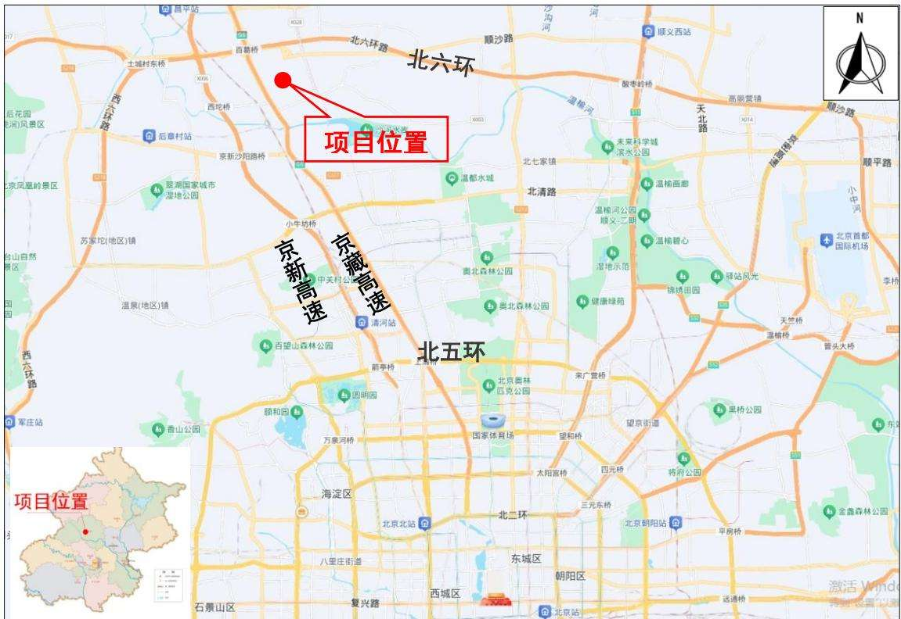  
图 1.1-1 项目地理位置图一

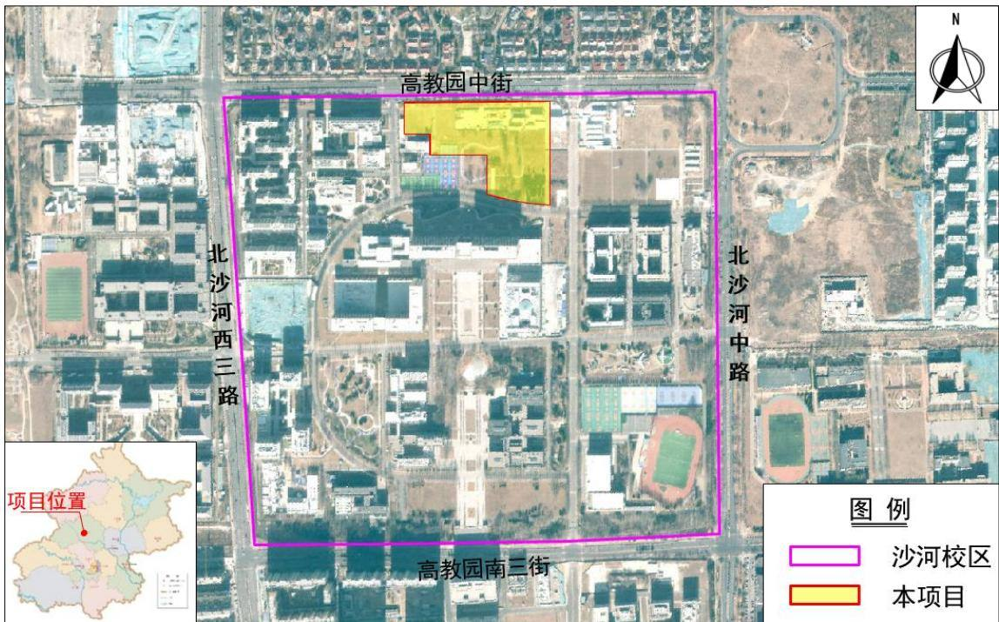  
图 1.1-2 项目地理位置图二

## （3）建设性质、规模

项目建设性质为新建，包括“北京航空航天大学沙河校区学生12和13公寓项目”、“北京航空航天大学沙河校区学生 14和15公寓项目”、“北京航空航天大学沙河校区学生16和17公寓项目”共3个子项（分别进行项目立项），总建筑面积 $1 2 3 0 9 3 . 6 \mathrm { m } ^ { 2 }$ 其中地上建筑面积 $8 4 9 3 1 . 6 \mathrm { m } ^ { 2 }$ ，地下建筑面积 $3 8 1 6 2 \mathrm { m } ^ { 2 }$ ，地上最高 10 层、地下 2 层。项目同步配备给排水、暖通、消防、电气、智能化等系统及室外配套工程等，建筑控制高度32m，容积率1.3。

## （4）项目组成

本项目主体工程组成包括主体建筑物、道路管线与硬化广场、绿化工程等。

## ①主体建筑物：

主体建筑物主要为 6 栋学生公寓、1 栋后勤及附属用房（垃圾处理站），总建筑面积 $1 2 3 0 9 3 . 6 \mathrm { m } ^ { 2 }$ ，其中地上建筑面积 $8 4 9 3 1 . 6 \mathrm { m } ^ { 2 }$ ，地下建筑面积 $3 8 1 6 2 \mathrm { m } ^ { 2 }$ 。地上全部为学生宿舍，地下一层、二层为活动室、实验实习用房（大学生创新创业中心）及变配电室、热力站等配套用房。

## ②道路管线与硬化广场：

项目区内道路按校园规划与建筑配套标准合理布设车行、人行道路及消防通道，在保持现有道路骨架前提下，优化机动车道路和车流组织，组团内部和组团之间尽量实现“步行优先”。同步敷设给排水、电力、通信、燃气等市政管线，满足学生通行、消防疏散、管线运维及校园集散使用需求，实现道路通畅、管线有序、场地实用。

学生宿舍的人员出入口均设于庭院内部，宿舍外围、庭院内部均设环路，作为消防环路和运输使用，日常状态下作为人行区域，实现“人车分流”，营造安全、舒适的组团内部空间环境。车辆出入口朝向西侧校园动力站房区域，同时靠近校园北门及校园道路，便于车辆进出。人员集散场地主要利用建筑庭院内或建筑周边的消防车道及消防车登高场地、建筑出入口等。

③绿化工程：绿化围绕大学学生公寓使用功能与校园生态需求展开，合理配置乔、灌、草及地被植物，完善校园绿地系统，兼顾景观观赏性、生态功能性与学生活动便利性，使公寓区整体环境品质与校园绿化景观风貌协调统一。

## （5）拆迁安置

本项目不涉及拆迁安置。

## （6）专项设施改（迁）建

本项目专项设施改(迁)建主要涉及占地范围内的树木清理，本次清理预计将生长状态较好、具有观赏价值的部分树木进行移植，其余枯死木，自然生长的杂树，由于

未纳入校园规划绿地或名木古树保护范围，且经专业评估后认为占地范围内现有树木移植成活率极低，已不具备移植保护的价值与可行性，且长期存在倒伏、断枝、根系不稳等安全风险隐患，本次清理预计将该批杂树进行绿化面积等额补偿处理。

树木权属单位为北京航空航天大学，水土流失防治责任由北京航空航天大学负责，具有观赏价值的部分树木移植地点为北京航空航天大学沙河校区精品园内。

## （7）项目工期及投资

本项目总投资为 96095 万元，其中土建投资 80515.84万元，资金来源为超长期特别国债和学校自筹。项目计划于 2026年12月开工，2029年10月完工，工期 35个月。

## （8）项目占地

项目总占地面积 5.13hm2，其中永久占地面积 4.00hm²，临时占地面积 1.13hm²，占地类型均为高等院校用地。根据建设单位提供资料及现场调查分析，项目占地现状主要为沙河校区待建空地，临时占地位于项目红线外，但全部位于北京航空航天大学沙河校区内。

表 1.1-1 项目占地面积统计表  
单位：hm2
<table><tr><td rowspan=2 colspan=2>防治分区</td><td rowspan=1 colspan=1>占地类型</td><td rowspan=1 colspan=2>占地性质</td><td rowspan=2 colspan=1>合计</td></tr><tr><td rowspan=1 colspan=1>高等院校用地</td><td rowspan=1 colspan=1>永久占地</td><td rowspan=1 colspan=1>临时占地</td></tr><tr><td rowspan=3 colspan=1>主体工程区</td><td rowspan=1 colspan=1>12-13 公寓项目</td><td rowspan=1 colspan=1>2.00</td><td rowspan=1 colspan=1>2.00</td><td rowspan=1 colspan=1></td><td rowspan=3 colspan=1>4.00</td></tr><tr><td rowspan=1 colspan=1>14-15 公寓项目</td><td rowspan=1 colspan=1>0.973</td><td rowspan=1 colspan=1>0.97</td><td rowspan=1 colspan=1></td></tr><tr><td rowspan=1 colspan=1>16-17 公寓项目</td><td rowspan=1 colspan=1>1.023</td><td rowspan=1 colspan=1>1.02</td><td rowspan=1 colspan=1></td></tr><tr><td rowspan=1 colspan=2>施工生产区</td><td rowspan=1 colspan=1>0.63</td><td rowspan=1 colspan=1></td><td rowspan=1 colspan=1>0.63</td><td rowspan=1 colspan=1>0.63</td></tr><tr><td rowspan=1 colspan=2>施工生活区</td><td rowspan=1 colspan=1>0.50</td><td rowspan=1 colspan=1></td><td rowspan=1 colspan=1>0.50</td><td rowspan=1 colspan=1>0.50</td></tr><tr><td rowspan=1 colspan=2>临时堆土区</td><td rowspan=1 colspan=1>(0.25)</td><td rowspan=1 colspan=1>(0.25)</td><td rowspan=1 colspan=1></td><td rowspan=1 colspan=1>(0.25)</td></tr><tr><td rowspan=1 colspan=2>合计</td><td rowspan=1 colspan=1>5.13</td><td rowspan=1 colspan=1>4.00</td><td rowspan=1 colspan=1>1.13</td><td rowspan=1 colspan=1>5.13</td></tr></table>

注：（）内占地为红线范围内，不重复计算。

## （9）土石方情况

项目土石方挖填总量为 31.86万m³，其中挖方总量 28.17万m³（表土0.63 万m³，一般土方 27.54 万 m³），填方总量 3.69 万 m³（表土 0.63 万 m³，一般土方 3.06 万 m³），借方总量 2.49 万 m³，余方总量 26.97 万 m³。借方来源意向为北京双河建环科技发展有限公司建筑垃圾临时处置点，余方拟运往北京双河建环科技发展有限公司建筑垃圾临时处置点进行综合利用。

北京双河建环科技发展有限公司位于昌平区小沙河村东600米的资源化处置场已在北京市建筑垃圾管理与服务平台进行了备案登记，本项目土方外运时间为 2027年1月\~2027 年 5 月，截止到 2026 年 3 月，该资源化处置场剩余需容量为 80.52 万 t，剩余容量可以接纳本项目余方。同时，该资源化处置场具备合法合规的土方供应资质，其生产的回填土料符合北京市相关标准及本项目肥槽回填、地下室顶板覆土的质量与技术要求，该资源化处置场距离本项目约 12km，项目周边交通便利，建设单位已与其签订土方综合利用意向协议书。

## 1.1.2项目前期工作进展情况

2026年3月18日，建设单位取得《工业和信息化部关于北京航空航天大学沙河校区学生12和13公寓项目建议书的批复》（工信部规函〔2026〕73号），批复同意项目建设，建设内容包括公寓楼及配套设施；

2026年4月1日，建设单位取得《工业和信息化部关于北京航空航天大学沙河校区学生14和15公寓项目建议书的批复》（工信部规函〔2026〕88号），批复同意项目建设，建设内容包括公寓楼及配套设施；

2026年4月6日，建设单位取得《工业和信息化部关于北京航空航天大学沙河校区学生16和17公寓项目建议书的批复》（工信部规函〔2026〕92号），批复同意项目建设，建设内容包括公寓楼及配套设施。

项目现阶段为可研阶段，根据《中华人民共和国水土保持法》等有关法律法规的要求，遵照“谁开发、谁保护，谁造成水土流失、谁负责治理”的原则，建设单位委托了北京清环科技有限公司编制《北京航空航天大学沙河校区学生 12-17 公寓项目水土保持方案报告书》。接受委托后，编制单位立即成立项目组进行实地踏勘，收集了项目区自然概况、社会经济情况、水土流失和水土保持情况、主体设计等方面的资料，并就技术问题与项目建设单位、当地水行政主管部门及有关专家进行了咨询，在此基础上，按照《生产建设项目水土保持技术标准》（GB50433-2018）、《生产建设项目水土流失防治标准》（GB/T 50434-2018）的相关规定编制完成本项目水土保持方案报告书。

## 1.1.3自然简况

项目位于昌平区，属暖温带半湿润大陆性季风气候，年平均气温 11.8℃，1 月份最冷，平均气温－4.8℃；7月份最热，平均气温25.8℃，全年无霜期平均 210 天左右，年平均日照时数为2732 小时，降雨集中于6～9 月，年平均降水量574.3mm，多年平均蒸发量 1245.4mm，年平均风速为 2.4m/s，大风日数平均 29.5 天，最大冻土层厚度85cm。

项目区土壤类型为砂质粉土，原状植被类型属于暖温带落叶阔叶林，现状主要为人工种植植被，包括法桐、槐树、柏树、桃树等。

项目区场地地形地势平坦，不属于崩塌、滑坡危险区和泥石流易发区、低洼易涝区等。项目区所涉及的昌平区在全国土壤侵蚀类型分区中属于北方土石山区，土壤侵蚀以微度水力侵蚀为主，容许土壤流失量为 $2 0 0 \mathrm { t } / ( \mathrm { k m } ^ { 2 } \mathrm { ~ \mathfrak { t } ~ }$ a)。根据《北京市水土保持规划》（京水务郊〔2017〕56号），本项目所在区域属于北京市水土流失重点预防区。

## 1.2编制依据

## 1.2.1法律法规

（1）《中华人民共和国水土保持法》（全国人大常务委员会，1991 年 6 月 29日通过，2010年12月 25日修订，2011年3月1 日起施行）；

（2）《北京市水土保持条例》（北京市人民代表大会常务委员会，2015 年 5 月29 日通过，2016 年 1 月 1 日起施行，2019 年 7 月 26 日第一次修订，2025 年 5 月 30日第二次修订）。

## 1.2.2部委规章、规范性文件

（1）《生产建设项目水土保持方案管理办法》（水利部令第 53 号，2023 年 1月17日发布）；

（2）《水利部关于进一步深化“放管服”改革全面加强水土保持监管的意见》（水保〔2019〕160号）；

（3）《水利部办公厅关于印发生产建设项目水土保持监督管理办法的通知》（办水保〔2019〕172 号）；

（4）《水利部办公厅关于进一步加强生产建设项目水土保持监测工作的通知》（办水保〔2020〕161 号）；

（5）《水利部办公厅关于印发生产建设项目水土保持技术文件编写和印制格式规定（试行）的通知》（办水保〔2018〕135号）；

（6）《水利部办公厅关于印发生产建设项目水土保持方案审查要点的通知》（办水保〔2023〕177 号）；

（7）《水利部办公厅关于印发〈生产建设项目水土保持监测规程（试行）〉的通知》（办水保〔2015〕139号）；

（8）《水利部办公厅关于做好国家级水土流失重点预防区和重点治理区落地上

图成果应用的通知》（水利部，办水保〔2025〕170号）；

（9）《水利部关于加强事中事后监管规范生产建设项目水土保持设施自主验收的通知》（水保〔2017〕365号）；

（10）《水利部办公厅关于印发生产建设项目水土保持设施自主验收规程（试行）的通知》（办水保〔2018〕133号）；

（11）《北京市水土保持规划》（京水务郊〔2017〕56号）；

（12）《北京市发展和改革委员会北京市财政局北京市水务局关于降低本市水土保持补偿费收费标准的通知》（京发改〔2021〕1271号）；

（13）《北京市生产建设项目水土保持方案管理规定（试行）》（京水务保[2023]17号）。

## 1.2.3技术标准

（1）《生产建设项目水土保持技术标准》（GB 50433-2018）；

（2）《生产建设项目水土流失防治标准》（GB/T 50434-2018）；

（3）《生产建设项目水土保持监测与评价标准》（GB/T 51240-2018）；

（4）《水土保持监测技术规范》（SL/T 277-2024）；

（5）《水土保持工程设计规范》（GB51018-2014）；

（6）《土壤侵蚀分类分级标准》（SL190-2007）；

（7）《土地利用现状分类》（GB/T 21010-2017）；

（8）《生产建设项目土壤流失量预算导则》（SL773-2018）；

（9）《水利工程概（估）算编制规定》（水总〔2024〕323号）；

（10）《水土保持工程调查与勘测标准》（GB/T 51297-2018）；

（11）《表土剥离及其再利用技术要求》（GBT 45107-2024）；

（12）《水土保持工程质量验收与评价规范》（SL/T 336-2025）；

（13）《建筑与小区雨水控制及利用工程设计规范》（GB50400-2016）；

（14）《海绵城市雨水控制与利用工程设计规范》（DB11/685-2021）；

（15）《水利水电工程制图 第6部分：水土保持图》（SL/T 73.6-2026）；

（16）其他有关的设计规范及技术标准。

## 1.2.4相关技术资料

（1）建设单位提供的设计图纸及项目立项报告；

（2）《北京航空航天大学总务部沙河校区学生公寓组团项目岩土工程勘察报告》（2026 年 2 月）；

（3）主体工程有关的其他设计资料。

## 1.3设计水平年

本项目建设总工期 35个月，计划于2026年 12月开工，2029年10月完工，根据《生产建设项目水土保持技术标准》（GB50433-2018），主体工程下半年完工的设计水平年一般为完工后一年，即设计水平年为 2030年。

## 1.4水土流失防治责任范围

根据《生产建设项目水土保持技术标准》（GB 50433-2018）的要求，水土流失防治责任范围应包括项目永久征地、临时占地（含租赁土地）以及其他使用与管辖区域，结合项目实际，项目水土流失防治责任范围面积为 5.13hm²，其中永久占地面积4.00hm²，临时占地面积 1.13hm²。

表 1.4-1 项目水土流失防治责任范围统计表 单位：hm2
<table><tr><td rowspan=2 colspan=1>防治分区</td><td rowspan=1 colspan=1>占地类型</td><td rowspan=1 colspan=2>占地性质</td><td rowspan=2 colspan=1>合计</td></tr><tr><td rowspan=1 colspan=1>高等院校用地</td><td rowspan=1 colspan=1>永久占地</td><td rowspan=1 colspan=1>临时占地</td></tr><tr><td rowspan=1 colspan=1>主体工程区</td><td rowspan=1 colspan=1>4.00</td><td rowspan=1 colspan=1>4.00</td><td rowspan=1 colspan=1></td><td rowspan=1 colspan=1>4.00</td></tr><tr><td rowspan=1 colspan=1>施工生产区</td><td rowspan=1 colspan=1>0.63</td><td rowspan=1 colspan=1></td><td rowspan=1 colspan=1>0.63</td><td rowspan=1 colspan=1>0.63</td></tr><tr><td rowspan=1 colspan=1>施工生活区</td><td rowspan=1 colspan=1>0.50</td><td rowspan=1 colspan=1></td><td rowspan=1 colspan=1>0.50</td><td rowspan=1 colspan=1>0.50</td></tr><tr><td rowspan=1 colspan=1>临时堆土区</td><td rowspan=1 colspan=1>(0.25)</td><td rowspan=1 colspan=1>(0.25)</td><td rowspan=1 colspan=1></td><td rowspan=1 colspan=1>(0.25)</td></tr><tr><td rowspan=1 colspan=1>合计</td><td rowspan=1 colspan=1>5.13</td><td rowspan=1 colspan=1>4.00</td><td rowspan=1 colspan=1>1.13</td><td rowspan=1 colspan=1>5.13</td></tr></table>

注：（）内占地为红线范围内，不重复计算。

## 1.5水土流失防治目标

## 1.5.1执行标准等级

根据《北京市水土保持规划》（京水务郊〔2017〕56号），本项目所在区域属于北京市水土流失重点预防区。根据《生产建设项目水土流失防治标准》（GB/T50434-2018）的规定，本项目执行一级标准（北方土石山区），并适当提高防治目标。

## 1.5.2防治目标

根据《生产建设项目水土流失防治标准》（GB/T50434-2018）的相关规定，本项目应达到以下基本目标：

（1）项目建设范围内的新增水土流失得到有效控制，原有水土流失得到治理。

（2）水土保持设施安全有效。

（3）水土资源、林草植被得到最大限度的保护与恢复。

（4）项目执行北方土石山区水土流失防治目标值一级标准，结合项目建设特点  
以及项目区多年平均降雨量、现状土壤侵蚀强度、地形地貌和位置等，对防治目标进  
行修正，其中项目区现状土壤侵蚀程度以微度侵蚀为主，土壤流失控制比提高至 1.0；  
项目区位于城市区，渣土防护率提高 2%，为 99%，林草覆盖率提高 2%，为 27%，林  
草覆盖率以本项目防治责任范围进行核算；表土保护率、林草植被恢复率不作调整。项目水土流失防治目标见下表。

表 1.5-1 生产建设项目水土流失防治目标
<table><tr><td rowspan=2 colspan=1>防治指标</td><td rowspan=1 colspan=2>指标值</td><td rowspan=2 colspan=1>按土壤侵蚀强度修正</td><td rowspan=2 colspan=1>按地域修正</td><td rowspan=2 colspan=1>修正后防治目标</td></tr><tr><td rowspan=1 colspan=1>施工期</td><td rowspan=1 colspan=1>设计水平年</td></tr><tr><td rowspan=1 colspan=1>水土流失治理度（%）</td><td rowspan=1 colspan=1>二</td><td rowspan=1 colspan=1>95</td><td rowspan=1 colspan=1></td><td rowspan=1 colspan=1></td><td rowspan=1 colspan=1>95</td></tr><tr><td rowspan=1 colspan=1>土壤流失控制比</td><td rowspan=1 colspan=1>一</td><td rowspan=1 colspan=1>0.9</td><td rowspan=1 colspan=1>+0.1</td><td rowspan=1 colspan=1></td><td rowspan=1 colspan=1>1.0</td></tr><tr><td rowspan=1 colspan=1>渣土防护率（%）</td><td rowspan=1 colspan=1>95</td><td rowspan=1 colspan=1>97</td><td rowspan=1 colspan=1></td><td rowspan=1 colspan=1>+2</td><td rowspan=1 colspan=1>99</td></tr><tr><td rowspan=1 colspan=1>表土保护率（%）</td><td rowspan=1 colspan=1>95</td><td rowspan=1 colspan=1>95</td><td rowspan=1 colspan=1></td><td rowspan=1 colspan=1></td><td rowspan=1 colspan=1>95</td></tr><tr><td rowspan=1 colspan=1>林草植被恢复率（%）</td><td rowspan=1 colspan=1>二</td><td rowspan=1 colspan=1>97</td><td rowspan=1 colspan=1></td><td rowspan=1 colspan=1></td><td rowspan=1 colspan=1>97</td></tr><tr><td rowspan=1 colspan=1>林草覆盖率（%）</td><td rowspan=1 colspan=1></td><td rowspan=1 colspan=1>25</td><td rowspan=1 colspan=1></td><td rowspan=1 colspan=1>+2</td><td rowspan=1 colspan=1>27</td></tr></table>

## 1.6项目水土保持评价结论

## 1.6.1主体工程选址（线）评价

根据《中华人民共和国水土保持法》（2011 年3月1日起实施）、《北京市水土保持条例》（2016 年 1 月 1 日起施行）、《生产建设项目水土保持技术标准》(GB50433-2018)的规定要求，对主体工程水土保持制约性因素一一对照进行了分析与评价，结果如下：

（1）本项目属于新建房屋建设类项目，不属于限制类和淘汰类产业的开发建设项目；

（2）本项目区不属于水土流失严重、生态脆弱的地区；

（3）本项目建设内容无在崩塌滑坡危险区和泥石流易发区内进行取土、挖沙、取石等行为；

（4）项目建设不占用基本农田以及水浇地、水田等生产力较高的土地；

（5）项目建设内容中不包含不符合流域综合规划的水利工程；

（6）本工程选线不涉及水土保持监测网络中水土保持监测站点、重点试验区和水土保持长期定位观测站。路线经过区域均为平原区，不存在危岩、崩塌、落石等现象，不涉及崩塌、滑坡危险区和泥石流易发区；

（7）项目建设不占用河流两岸、湖泊和水库周边的植物保护带；

（8）项目建设位置属于北京市水土流失重点预防区，存在一定制约性因素，本方案通过在执行北方土石山区防治指标一级标准的基础上，将土壤流失控制比提高0.10，渣土防护率提高 2%，林草覆盖率提高2%，并最大限度的控制临时用地，布设雨水调蓄利用措施，能有效控制可能造成的水土流失。

总体分析认为，本项目从水土保持角度考虑，工程选址是可行的。

## 1.6.2建设方案与布局评价

根据工程建设方案，施工机具设备直接运至项目区内，建筑材料均外购，项目区红线内西侧布置1处表土堆存场，红线外东侧分别设置1处施工生产区和1处施工生活区。项目区内土方调运统一管理，开挖表土全部用于本项目绿化回填，多余工程槽土拟运至北京双河建环科技发展有限公司建筑垃圾临时处置点进行综合利用，通过优化各功能区布局等先进施工工艺和组织，减少了工程占地和土石方量，未布设取、弃土场，可减少倒运和新增临时占地。本项目在建设方案和布局上符合水土保持要求。

本工程施工过程中加强施工组织管理，施工期裸露地表采取临时苫盖等措施，减少大雨、大风天气大规模土石方开挖、堆填等施工方法与工艺，减少了土石方开挖、回填量，有利于水土保持。主体工程施工组织、施工工艺符合水土保持的要求，减少了地表扰动范围。

本项目主体设计中具有水土保持功能的工程主要有：透水砖铺装、下凹式整地、雨水排水管线、雨水调蓄池、绿化、节水灌溉等，位置布设合理，结构形式符合要求，主体设计中具有水土保持功能的工程可有效的促进雨水入渗、固结土壤、降低雨水冲刷、减少地表径流，从而达到减少水土流失的目的，符合水土保持要求。

## 1.7水土流失预测结果

项目原地貌水土流失量约为 27.68t，项目建设对地表土壤扰动后造成的水土流失总量为273.51t，其中，施工期内土壤流失总量250.27t，自然恢复期的水土流失量 23.24t，项目新增土壤流失量为 245.83t。

根据水土流失预测结果，项目施工期是产生水土流失的主要时段，特别是基坑开挖、回填、堆土、道路土方作业及管线埋设等施工活动期间水土流失最为严重。根据各水土流失防治分区水土流失预测结果，项目新增土壤流失量主要集中在临时堆土区和主体工程区。

本工程若不采取有效的防治措施，可能造成的水土流失危害有：增加水土流失面积，易导致排水管道淤塞。项目建设过程对原地表、土壤结构造成了扰动破坏，降低了原地表水土保持功能，加剧了地表水土流失，大量泥沙进入市政管道后易导致管道淤塞，降低了市政管道的排水、防洪能力。

## 1.8水土保持措施布设成果

本方案根据主体工程布局、施工工艺及水土流失特点等将项目区划分为：主体工程区、施工生产区、施工生活区和临时堆土区4 个防治分区，各区水土保持措施布设如下。

## 1.8.1主体工程区

## （1）工程措施

①表土剥离（方案新增）：在工程施工前对主体工程区占地范围内的表土进行表土剥离，剥离表土面积 $2 . 1 4 \mathrm { h m } ^ { 2 }$ ，表土剥离量0.53 万 $\mathbf { m } ^ { 3 }$ 。实施时间 2026 年 12 月\~2027年1月。

②表土回覆（方案新增）：表土剥离后集中堆放在临时堆土区内，采取临时措施进行防护，用于后期绿化回覆，表土回覆 0.44万 m3。实施时间2029年3 月\~2029年7月。

③雨水管网（主体设计）：主体工程共布设雨水管网 453m，场地内雨水经管道系统排至建筑周边下凹绿地，通过绿地内溢流雨水口排至校园现状雨水管网，室外雨水管径为 DN300\~800mm。实施时间 2029 年 1 月\~2029 年 7 月。

④雨水调蓄池（主体设计）：主体拟布设 3 座雨水调蓄池，总容积 $4 1 3 \mathrm m ^ { 3 }$ 。实施时间 2029 年 1 月\~2029 年 5 月。

⑤透水砖铺装（主体设计）：主体设计对人行道、自行车道等非机动车道采用透水砖铺装，透水砖铺装面积7862m²。实施时间2029年4月\~2029年8月。

⑥下凹式整地（主体设计）：主体设计中对中心庭院绿地采用下凹式绿地设计，下凹式绿地面积约 0.73hm²。实施时间 2029 年 3 月\~2029 年 9 月。

⑦节水灌溉（主体设计）：主体设计对绿化灌溉采用微灌或滴灌方式，节水灌溉面积 1.46hm²。实施时间 2029 年 3 月\~2029 年 9 月。

## （2）植物措施（主体设计）

主体设计：以庭院为中心展开景观系统，绿化工程面积 1.46hm²，植被以乔、灌、

草结合的方式布设。实施时间 2029年3月\~2029 年9月。

## （3）临时措施（方案新增）

①防尘网覆盖：施工开挖会造成地表裸露，方案设计对裸露地表进行防尘网覆盖，防尘网规格为 1000 目/100cm2，防尘网可重复使用，共需防尘网约 34300m²。实施时间 2026 年 12 月\~2028 年 10 月。

②临时排水沟：为排除施工期间雨水，方案设计在道路一侧设置临时排水沟，临时排水沟长度约421m。实施时间 2026 年 12 月\~2027 年 1 月。

③洒水降尘：施工期间，对基坑土方开挖面实施洒水降尘措施，每日频次不应小于2次（每次 1台时），需洒水车 180台时。实施时间 2027年1月\~2027年 6月。

## 1.8.2施工生产区

## （1）工程措施（方案新增）

①表土剥离：在工程施工前对施工生产区占地范围内的表土进行表土剥离，剥离表土面积 0.39hm2，表土剥离量 0.10 万 m3。实施时间 2026 年 12 月\~2027 年 1 月。

②土地平整：施工结束后，拆除临时建构筑物进行土地平整，土地平整面积0.63hm2。实施时间 2029 年 9 月。

③表土回覆（方案新增）：表土剥离后集中堆放在临时堆土区内，采取临时措施进行防护，用于后期绿化回覆，表土回覆 0.19万 m3。实施时间2029年9 月。

## （2）植物措施（方案新增）

撒播草籽：施工结束土地平整后的裸露地面，均匀撒播适生草籽（如黑麦草、早熟禾），撒播草籽面积 0.63hm²。实施时间2029年 10月。

## （3）临时措施（方案新增）

①防尘网覆盖：施工过程中对场地内堆放的水泥、沙以及钢筋建材等施工原材料进行防尘网覆盖，防尘网规格为 1000 目/100cm2，防尘网可重复使用，覆盖面积约2800m2。实施时间 2026 年 12 月\~2029 年 10 月。

②临时排水沟：本方案在施工生活区场地四周布设临时排水沟 136m，有效疏导场地内雨水，排至周边雨水管线。实施时间2026 年12月\~2027年1月。

③临时沉沙池：根据施工场地布置，项目区施工生产区紧邻洗车池布设临时沉沙池 1 座。实施时间 2026 年 12 月\~2027 年 1 月。

④洒水降尘：施工生产区为避免扬尘，实施洒水降尘措施，每日频次不应小于 1

次（每次 1 台时），需洒水车 450 台时。实施时间 2026 年 12 月\~2029 年 9 月。

## 1.8.3施工生活区

## （1）工程措施（方案新增）

土地平整：施工结束后，拆除临时建构筑物进行土地平整，土地平整面积 0.50hm2。实施时间2029年9月。

## （2）临时措施（方案新增）

①临时排水沟：本方案在施工生活区场地四周布设临时排水沟 250m，有效疏导场地内雨水，排至周边雨水管线。实施时间2026 年12月\~2027年1月。

②临时沉沙池：临时排水沟末端布设 1座临时沉沙池，施工时定期对临时沉沙池进行清淤。实施时间 2026 年 12 月\~2027 年 1 月。

## 1.8.4临时堆土区

本区主要新增临时措施。

①防尘网覆盖：本方案设计在临时堆土区域布设防尘网覆盖共 $2 8 0 0 \mathrm { m } ^ { 2 }$ ，防尘网规格为 1000 目 $/ 1 0 0 \mathrm { c m } ^ { 2 }$ ，施工时可重复利用。实施时间 2027年1月\~2029 年7月。

②临时排水沟：临时堆土期间，本方案补充设置临时排水沟以拦截施工期间雨水，临时排水沟设计为土质排水沟，总长度约 220m。实施时间 2026 年 12 月\~2027 年 2月。

③临时沉沙池：堆土区沿临时排水沟布设 1 座临时沉沙池。实施时间 2026 年 12月\~2027 年 2 月。

④土袋拦挡：土方临时堆放在临时堆土区，需对其四周进行临时拦挡，方案设计通过布设土袋的方式进行拦挡，共需临时土袋拦挡 205m，编织袋内装土为就地取用。实施时间 2026 年 12 月\~2027 年 2 月。

⑤撒播草籽：对临时堆土区通过撒播草籽的方式进行临时绿化，撒播草籽面积0.25hm²。实施时间 2027 年 3 月\~2027 年 5 月。

表 1.8-1 水土保持措施信息表
<table><tr><td rowspan=1 colspan=1>防治分区</td><td rowspan=1 colspan=1>措施类型</td><td rowspan=1 colspan=1>措施名称</td><td rowspan=1 colspan=1>单位</td><td rowspan=1 colspan=1>工程量</td><td rowspan=1 colspan=1>结构形式及尺寸等</td></tr><tr><td rowspan=11 colspan=1>主体工程区</td><td rowspan=7 colspan=1>工程措施</td><td rowspan=1 colspan=1>表土剥离</td><td rowspan=1 colspan=1> $\overline { { \mathrm { h m } ^ { 2 } } }$ </td><td rowspan=1 colspan=1>2.14</td><td rowspan=1 colspan=1>剥离厚度 20cm~30cm</td></tr><tr><td rowspan=1 colspan=1>表土回覆</td><td rowspan=1 colspan=1> $\overline { { \mathcal { A } } } \mathrm { ~ m } ^ { 3 }$ </td><td rowspan=1 colspan=1>0.44</td><td rowspan=1 colspan=1>覆土厚度 30cm</td></tr><tr><td rowspan=1 colspan=1>下凹式整地</td><td rowspan=1 colspan=1> $\mathrm { h m } ^ { 2 }$ </td><td rowspan=1 colspan=1>0.73</td><td rowspan=1 colspan=1>下凹深度 10cm</td></tr><tr><td rowspan=1 colspan=1>雨水管网</td><td rowspan=1 colspan=1>m</td><td rowspan=1 colspan=1>453</td><td rowspan=1 colspan=1>管径 DN300~800mm</td></tr><tr><td rowspan=1 colspan=1>雨水调蓄池</td><td rowspan=1 colspan=1>座</td><td rowspan=1 colspan=1>3</td><td rowspan=1 colspan=1>总容积 $4 1 3 \mathrm m ^ { 3 }$ </td></tr><tr><td rowspan=1 colspan=1>透水砖铺装</td><td rowspan=1 colspan=1> $\mathrm { m } ^ { 2 }$ </td><td rowspan=1 colspan=1>7862</td><td rowspan=1 colspan=1>20cm×10cm×8cm</td></tr><tr><td rowspan=1 colspan=1>节水灌溉</td><td rowspan=1 colspan=1> $\tan ^ { 2 }$ </td><td rowspan=1 colspan=1>1.46</td><td rowspan=1 colspan=1>微喷灌</td></tr><tr><td rowspan=1 colspan=1>植物措施</td><td rowspan=1 colspan=1>植物绿化</td><td rowspan=1 colspan=1> $\tan ^ { 2 }$ </td><td rowspan=1 colspan=1>1.46</td><td rowspan=1 colspan=1>乔灌草相结合</td></tr><tr><td rowspan=3 colspan=1>临时措施</td><td rowspan=1 colspan=1>防尘网覆盖</td><td rowspan=1 colspan=1> $\mathrm { ~ m ~ } ^ { 2 }$ </td><td rowspan=1 colspan=1>34300</td><td rowspan=1 colspan=1>1000目/100cm²</td></tr><tr><td rowspan=1 colspan=1>临时排水沟</td><td rowspan=1 colspan=1>m</td><td rowspan=1 colspan=1>421</td><td rowspan=1 colspan=1>底宽40cm、深 40cm</td></tr><tr><td rowspan=1 colspan=1>洒水降尘</td><td rowspan=1 colspan=1>台时</td><td rowspan=1 colspan=1>180</td><td rowspan=1 colspan=1>5吨洒水车</td></tr><tr><td rowspan=8 colspan=1>施工生产区</td><td rowspan=3 colspan=1>工程措施</td><td rowspan=1 colspan=1>表土剥离</td><td rowspan=1 colspan=1> $\mathrm { h m } ^ { 2 }$ </td><td rowspan=1 colspan=1>0.39</td><td rowspan=1 colspan=1>剥离厚度 20cm~30cm</td></tr><tr><td rowspan=1 colspan=1>表土回覆</td><td rowspan=1 colspan=1> $\overline { { \mathcal { A } } } \mathrm { ~ m } ^ { 3 }$ </td><td rowspan=1 colspan=1>0.19</td><td rowspan=1 colspan=1>覆土厚度 30cm</td></tr><tr><td rowspan=1 colspan=1>土地平整</td><td rowspan=1 colspan=1> $\mathrm { h m } ^ { 2 }$ </td><td rowspan=1 colspan=1>0.63</td><td rowspan=1 colspan=1>74kw 推土机</td></tr><tr><td rowspan=1 colspan=1>植物措施</td><td rowspan=1 colspan=1>播撒草籽</td><td rowspan=1 colspan=1>hm²</td><td rowspan=1 colspan=1>0.63</td><td rowspan=1 colspan=1>黑麦草、早熟禾等</td></tr><tr><td rowspan=4 colspan=1>临时措施</td><td rowspan=1 colspan=1>防尘网覆盖</td><td rowspan=1 colspan=1> $\mathrm { ~ m ~ } ^ { 2 }$ </td><td rowspan=1 colspan=1>2800</td><td rowspan=1 colspan=1>1000目/100cm²</td></tr><tr><td rowspan=1 colspan=1>临时排水沟</td><td rowspan=1 colspan=1>m</td><td rowspan=1 colspan=1>136</td><td rowspan=1 colspan=1>底宽 40cm、深 40cm</td></tr><tr><td rowspan=1 colspan=1>临时沉沙池</td><td rowspan=1 colspan=1>座</td><td rowspan=1 colspan=1>1</td><td rowspan=1 colspan=1>3m×1.5m×1.0m（长×宽×深）</td></tr><tr><td rowspan=1 colspan=1>洒水降尘</td><td rowspan=1 colspan=1>台时</td><td rowspan=1 colspan=1>450</td><td rowspan=1 colspan=1>5 吨洒水车</td></tr><tr><td rowspan=3 colspan=1>施工生活区</td><td rowspan=1 colspan=1>工程措施</td><td rowspan=1 colspan=1>土地平整</td><td rowspan=1 colspan=1> $\overline { { \mathrm { h m } ^ { 2 } } }$ </td><td rowspan=1 colspan=1>0.50</td><td rowspan=1 colspan=1>74kw 推土机</td></tr><tr><td rowspan=2 colspan=1>临时措施</td><td rowspan=1 colspan=1>临时排水沟</td><td rowspan=1 colspan=1>m</td><td rowspan=1 colspan=1>250</td><td rowspan=1 colspan=1>底宽 30cm、深 30cm</td></tr><tr><td rowspan=1 colspan=1>临时沉沙池</td><td rowspan=1 colspan=1>座</td><td rowspan=1 colspan=1>1</td><td rowspan=1 colspan=1>1.5m×1.3m×1.0m（长×宽×深）</td></tr><tr><td rowspan=5 colspan=1>临时堆土区</td><td rowspan=5 colspan=1>临时措施</td><td rowspan=1 colspan=1>防尘网覆盖</td><td rowspan=1 colspan=1> $\mathrm { ~ m ~ } ^ { 2 }$ </td><td rowspan=1 colspan=1>2800</td><td rowspan=1 colspan=1>1000目/100cm²</td></tr><tr><td rowspan=1 colspan=1>临时排水沟</td><td rowspan=1 colspan=1>m</td><td rowspan=1 colspan=1>220</td><td rowspan=1 colspan=1>底宽 30cm、深 30cm</td></tr><tr><td rowspan=1 colspan=1>临时沉沙池</td><td rowspan=1 colspan=1>座</td><td rowspan=1 colspan=1>1</td><td rowspan=1 colspan=1>1.5m×1.3m×1.0m（长×宽×深）</td></tr><tr><td rowspan=1 colspan=1>土袋拦挡</td><td rowspan=1 colspan=1>m</td><td rowspan=1 colspan=1>205</td><td rowspan=1 colspan=1>底宽 75cm、高约 50cm</td></tr><tr><td rowspan=1 colspan=1>播撒草籽</td><td rowspan=1 colspan=1> $\tan ^ { 2 }$ </td><td rowspan=1 colspan=1>0.25</td><td rowspan=1 colspan=1>黑麦草、早熟禾等</td></tr></table>

## 1.9水土保持监测方案

本项目水土保持监测工作与主体工程同步开展。根据《生产建设项目水土保持技术标准》（GB50433-2018）、《生产建设项目水土保持监测与评价标准》(GB/T51240-2018)和《水利部办公厅关于进一步加强生产建设项目水土保持监测工作的通知》（办水保〔2020〕161 号），本项目为建设类项目，监测时段从施工准备期开始至设计水平年结束。

（1）监测内容：水土流失影响因素、水土流失状况、水土流失危害和水土保持

措施等。

（2）监测时段：自开工时间开始至设计水平年结束。

（3）监测方法：采用调查监测、巡查监测、定点监测和遥感监测相结合的方法。

（4）监测点位：本方案拟布设 9 个监测点位进行监测，其中主体工程区布设 6个监测点位，施工生产区、施工生活区及临时堆土区分别布设 1个监测点位。

（5）监测频次：施工准备期前进行本底监测，摸清项目建设区背景情况，即水土流失影响因子及水土流失状况等。临时堆土面积、正在实施的水土保持措施建设情况、扰动地表面积等至少每月调查记录 1次；施工进度、水土保持植物措施生长情况至少每季度调查记录1 次；水土流失灾害事件发生后 1周内完成监测；遇暴雨（日降雨量≥50mm 或1小时降雨量≥25mm）加测1次。

（6）监测重点分区：主体工程区、临时堆土区。

## 1.10水土保持投资及效益分析成果

项目水土保持工程总投资估算约703万元，其中工程措施投资约262万元，植物措施投资约 219万元，监测措施投资约46万元，施工临时工程投资约42万元，独立费用约114 万元，基本预备费约20万元。

本项目水土流失面积 5.13hm2，综合治理面积 5.13hm2。在严格执行和落实本方案设计的水土保持措施后，项目区水土流失可以得到控制，通过水土保持综合治理，水土流失治理度、土壤流失控制比、渣土防护率、表土保护率、林草植被恢复率均可实现防治目标，通过实施水土保持措施本项目可减少水土流失量 245.83t。

因此，本工程建设不会对当地的水土保持产生长期的不利影响，从水土保持角度而言项目建设可行。

## 1.11结论

经对项目建设区实地调查踏勘、水土流失预测、水土保持分析与评价及水土流失防治方案设计，从水土保持角度分析，工程选址、布局和施工组织设计可行；本方案实施后，达到了方案预期目标值，新增水土流失将得到有效控制，扰动区域内植被得以恢复，从整体来看，水土流失治理效果显著。但是，项目建设区属于北京市水土流失重点预防区，工程选址无法避让，应严格落实本方案，加强管理，减少地表扰动和破坏、加强治理。从水土保持角度对工程设计、施工和建设管理提出以下要求。

（1）工程设计：按照《生产建设项目水土保持方案管理办法》（水利部令第 53号）文件要求，如水土保持方案经批准后涉及需补充或修改水土保持方案情形的，应重新编制项目水土保持方案，报水利部进行审批。

（2）工程施工：本项目水土流失治理由建设单位负责，建设单位在施工招标时应将本方案新增的水土保持措施纳入施工招标合同中，将水土保持措施落到实处，项目施工单位应切实履行施工合同，将水土保持措施保质保量完成。

（3）建设管理：建设单位将组织施工、监理等参建各方严把质量关，严格控制施工进度，及时实施好水土保持方案设计的各项水土流失防治措施。本项目竣工验收时，应当验收水土保持设施，组织第三方机构编制水土保持设施验收报告，水土保持设施未经验收合格的，项目不得投产使用。

表 1.11-1 水土保持方案特性表
<table><tr><td colspan="1" rowspan="1">项目名称</td><td colspan="2" rowspan="1">北京航空航天大学沙河校区学生12-17公寓项目</td><td colspan="2" rowspan="1">流域管理机构</td><td colspan="1" rowspan="1">海河水利委员会</td></tr><tr><td colspan="1" rowspan="1">涉及省区</td><td colspan="1" rowspan="1">北京市</td><td colspan="1" rowspan="1">涉及地市或个数</td><td colspan="1" rowspan="1">/</td><td colspan="1" rowspan="1">涉及县或个数</td><td colspan="1" rowspan="1">昌平区</td></tr><tr><td colspan="1" rowspan="1">项目规模</td><td colspan="1" rowspan="1">总建筑面积为123093.6m²</td><td colspan="1" rowspan="1">总投资（万元）</td><td colspan="1" rowspan="1">96095</td><td colspan="1" rowspan="1">土建投资（万元）</td><td colspan="1" rowspan="1">80515.84</td></tr><tr><td colspan="1" rowspan="1">动工时间</td><td colspan="1" rowspan="1">2026年12月</td><td colspan="1" rowspan="1">完工时间</td><td colspan="1" rowspan="1">2029年10月</td><td colspan="1" rowspan="1">设计水平年</td><td colspan="1" rowspan="1">2030</td></tr><tr><td colspan="1" rowspan="1">工程占地(hm2)</td><td colspan="1" rowspan="1">5.13</td><td colspan="1" rowspan="1">永久占地 $( \mathrm { h m } ^ { 2 } )$ </td><td colspan="1" rowspan="1">4.00</td><td colspan="1" rowspan="1">临时占地（hm²</td><td colspan="1" rowspan="1">1.13</td></tr><tr><td colspan="2" rowspan="2">土石方量（万m³）</td><td colspan="1" rowspan="1">挖方</td><td colspan="1" rowspan="1">填方</td><td colspan="1" rowspan="1">借方</td><td colspan="1" rowspan="1">余（弃）方</td></tr><tr><td colspan="1" rowspan="1">28.17</td><td colspan="1" rowspan="1">3.69</td><td colspan="1" rowspan="1">2.49</td><td colspan="1" rowspan="1">26.97</td></tr><tr><td colspan="1" rowspan="1">重点防</td><td colspan="1" rowspan="1">治区名称</td><td colspan="1" rowspan="1"></td><td colspan="2" rowspan="1">北京市水土流失重点预防区</td><td colspan="1" rowspan="1"></td></tr><tr><td colspan="1" rowspan="1">地</td><td colspan="1" rowspan="1">貌类型</td><td colspan="1" rowspan="1">平原</td><td colspan="2" rowspan="1">水土保持区划</td><td colspan="1" rowspan="1">北方土石山区</td></tr><tr><td colspan="1" rowspan="1">土壤</td><td colspan="1" rowspan="1">侵蚀类型</td><td colspan="1" rowspan="1">水力侵蚀</td><td colspan="2" rowspan="1">土壤侵蚀强度</td><td colspan="1" rowspan="1">微度</td></tr><tr><td colspan="2" rowspan="1">防治责任范围（hm²）</td><td colspan="1" rowspan="1">5.13</td><td colspan="2" rowspan="1">容许土壤流失量（t/km²a）</td><td colspan="1" rowspan="1">200</td></tr><tr><td colspan="2" rowspan="1">水土流失预测总量（t）</td><td colspan="1" rowspan="1">273.51</td><td colspan="2" rowspan="1">新增土壤流失量（t）</td><td colspan="1" rowspan="1">245.83</td></tr><tr><td colspan="2" rowspan="1">水土流失防治标准执行等级</td><td colspan="1" rowspan="1"></td><td colspan="2" rowspan="1">北方土石山区一级标准</td><td colspan="1" rowspan="1"></td></tr><tr><td colspan="1" rowspan="3">防治指标</td><td colspan="1" rowspan="1">水土流失治理度(%)</td><td colspan="1" rowspan="1">95</td><td colspan="2" rowspan="1">土壤流失控制比</td><td colspan="1" rowspan="1">1.0</td></tr><tr><td colspan="1" rowspan="1">渣土防护率（%）</td><td colspan="1" rowspan="1">99</td><td colspan="2" rowspan="1">表土保护率（%）</td><td colspan="1" rowspan="1">95</td></tr><tr><td colspan="1" rowspan="1">林草植被恢复率(%)</td><td colspan="1" rowspan="1">97</td><td colspan="2" rowspan="1">林草覆盖率（%）</td><td colspan="1" rowspan="1">27</td></tr><tr><td colspan="1" rowspan="5">防治措施及工程量</td><td colspan="1" rowspan="1">防治分区</td><td colspan="1" rowspan="1">工程措施</td><td colspan="2" rowspan="1">植物措施</td><td colspan="1" rowspan="1">临时措施</td></tr><tr><td colspan="1" rowspan="1">主体工程区</td><td colspan="1" rowspan="1">表土剥离2.14hm²、表土回覆0.44万m³、雨水管网453m、雨水调蓄池3座、透水砖铺装7862m²、下凹式整地 0.73hm²，节水灌溉1.46hm²</td><td colspan="2" rowspan="1">植物绿化1.46hm²</td><td colspan="1" rowspan="1">防尘网覆盖34300m²、临时排水沟421m、洒水降尘180台时</td></tr><tr><td colspan="1" rowspan="1">施工生产区</td><td colspan="1" rowspan="1">表土剥离 0.39hm²、表土回覆0.19万m³、土地平整0.63hm²</td><td colspan="2" rowspan="1">撒播草籽 0.63hm²</td><td colspan="1" rowspan="1">防尘网覆盖2800m²、临时排水沟136m、临时沉沙池1座、洒水降尘450台时</td></tr><tr><td colspan="1" rowspan="1">施工生活区</td><td colspan="1" rowspan="1">土地平整0.50hm²</td><td colspan="2" rowspan="1">/</td><td colspan="1" rowspan="1">临时排水沟250m，临时沉沙池1座</td></tr><tr><td colspan="1" rowspan="1">临时堆土区</td><td colspan="1" rowspan="1"></td><td colspan="2" rowspan="1">7</td><td colspan="1" rowspan="1">防尘网覆盖2800m²、土袋拦挡205m、临时排水沟 220m，临时沉沙池1座，撒播草籽0.25hm²</td></tr><tr><td colspan="1" rowspan="1">投资</td><td colspan="1" rowspan="1">（万元）</td><td colspan="1" rowspan="1">262.48</td><td colspan="2" rowspan="1">218.96</td><td colspan="1" rowspan="1">41.68</td></tr><tr><td colspan="1" rowspan="1">水土保持总投资（万元）</td><td colspan="2" rowspan="1">703.15</td><td colspan="2" rowspan="1">独立费（万元）</td><td colspan="1" rowspan="1">114.06</td></tr><tr><td colspan="1" rowspan="1">监理费（万元）</td><td colspan="1" rowspan="1">32</td><td colspan="1" rowspan="1">监测费（万元）</td><td colspan="1" rowspan="1">45.50</td><td colspan="1" rowspan="1">补偿费（万元）</td><td colspan="1" rowspan="1">/</td></tr><tr><td colspan="1" rowspan="1">分省措施费(万元)</td><td colspan="2" rowspan="1">1</td><td colspan="2" rowspan="1">分省补偿费（万元）</td><td colspan="1" rowspan="1">/</td></tr><tr><td colspan="1" rowspan="1">方案编制单位</td><td colspan="2" rowspan="1">北京清环科技有限公司</td><td colspan="1" rowspan="1">建设单位</td><td colspan="2" rowspan="1">北京航空航天大学</td></tr><tr><td colspan="1" rowspan="1">法定代表人</td><td colspan="2" rowspan="1">周莉</td><td colspan="1" rowspan="1">法定代表人</td><td colspan="2" rowspan="1">王云鹏</td></tr><tr><td colspan="1" rowspan="1">地址</td><td colspan="2" rowspan="1">北京市海淀区成府路45号中关村智造大街 A座四层 403 房间</td><td colspan="1" rowspan="1">地址</td><td colspan="2" rowspan="1">北京市海淀区学院路37号</td></tr><tr><td colspan="1" rowspan="1">邮编</td><td colspan="2" rowspan="1">100083</td><td colspan="1" rowspan="1">邮编</td><td colspan="2" rowspan="1">100191</td></tr><tr><td colspan="1" rowspan="1">联系人及电话</td><td colspan="2" rowspan="1">李娇/13011253997</td><td colspan="1" rowspan="1">联系人及电话</td><td colspan="2" rowspan="1">田进冬/17316266851</td></tr><tr><td colspan="1" rowspan="1">传真</td><td colspan="2" rowspan="1">010-82570496</td><td colspan="1" rowspan="1">传真</td><td colspan="2" rowspan="1">010-61716647</td></tr><tr><td colspan="1" rowspan="1">电子邮箱</td><td colspan="2" rowspan="1">349659837@qq.com</td><td colspan="1" rowspan="1">电子邮箱</td><td colspan="2" rowspan="1">272571927@qq.com</td></tr></table>

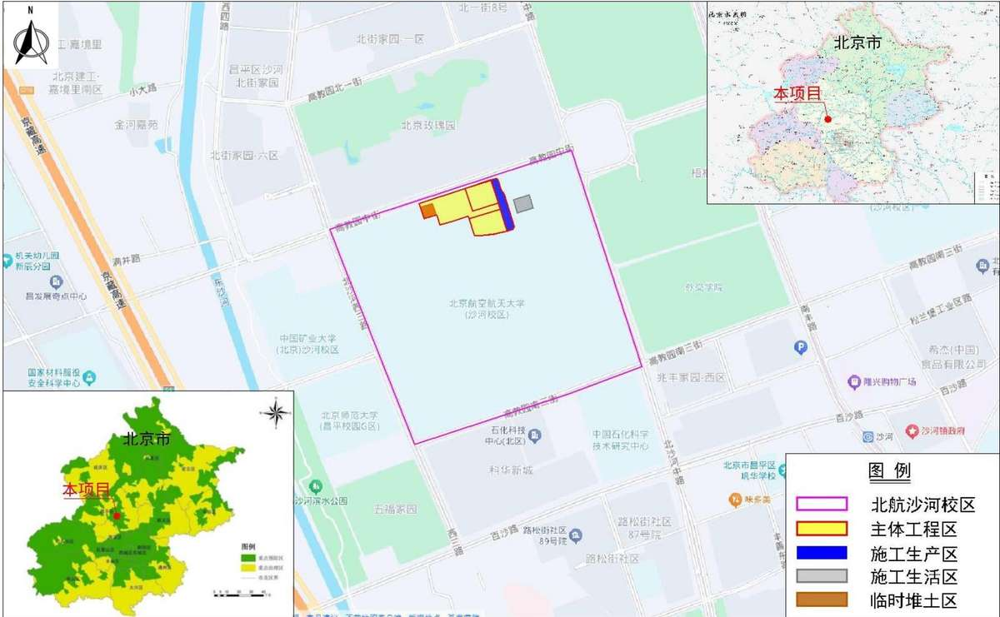  
图 1.11-1 项目位置图

## 2项目概况

## 2.1项目组成及工程布置

## 2.1.1校区基本情况

## （1）用地情况

随着北京航空航天大学的发展，学院路校区的用地及建筑面积已经不能满足学校教学、科研发展的要求，2001年，北京航空航天大学取得了国防科工委关于北京航空航天大学昌平新校区建设项目建设书的批复，沙河校区位于北京市昌平沙河高教园区，距学院路校区约26公里，校区于2007年开工建设，2010年完成了一期建设任务并全面投入使用，校区总占地面积 74.24hm²。

本次新建学生 12-17 公寓项目位于北京航空航天大学沙河校区内北侧，项目建设用地总面积 $4 . 0 0 \mathrm { h m } ^ { 2 }$ ，其中 12-13 公寓项目建设用地面积 $2 . 0 0 \mathrm { h m } ^ { 2 }$ ，14-15 公寓项目建设用地面积 $0 . 9 7 3 \mathrm { h m } ^ { 2 }$ ，16-17 公寓项目建设用地面积 $1 . 0 2 3 \mathrm { h m } ^ { 2 }$ 。项目周边有校内现状道路及校外市政道路，周边现有道路成熟，施工过程中通过沙河校区内现有道路及周边现状市政道路进出项目区，无需修建临时道路。项目与沙河校区用地关系图如下。

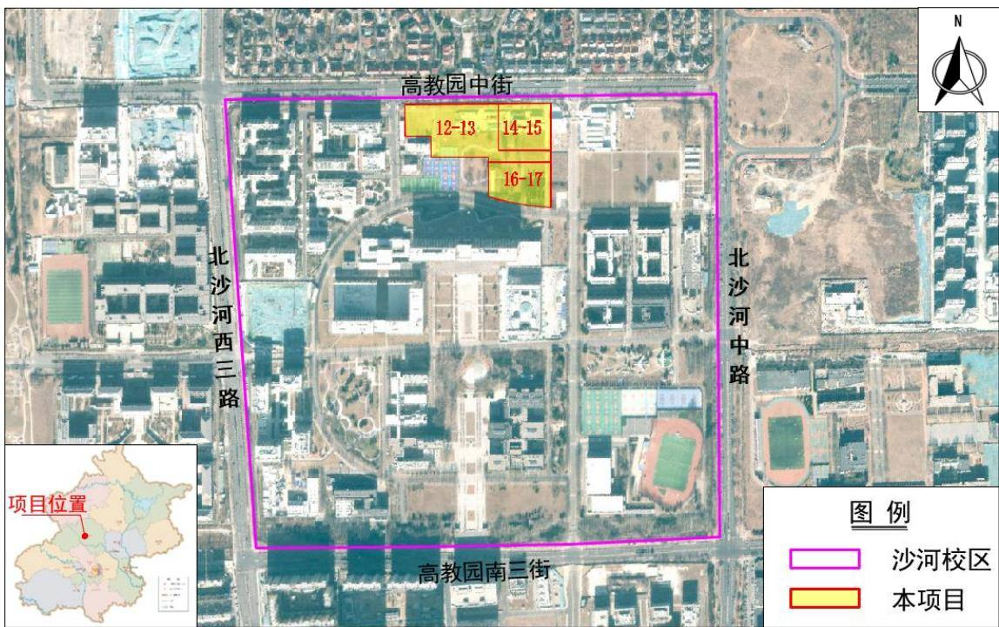  
图 2.1-1 项目与沙河校区用地关系图

## （2）涉水管线情况

沙河校区内已有比较完善的基础设施条件，现有供水、排水、供热、供电等基础设施能够满足供排水及消防的要求，项目建设完工后各类管线主要依托学校已建成管线连接至校外北沙河中路、北沙河西三路、高教园中街、高教园南三街等道路现状供排水管线。

本项目自来水分别引自宿舍北侧及东侧道路现状自来水管线，现状管线管径DN300，接入管经DN200，水压0.18MPa；项目再生水引自宿舍北侧道路现状再生水管线，现状管线管径 DN300mm，接口管经 DN150，水压 0.10MPa；项目污水经化粪池处理后向南、向东排入校园主干道下的污水管网，汇总后再排入市政污水管网；项目雨水向南、向东排入校园主干道下的雨水管网，经调蓄处理后排至市政雨水管网。

## 2.1.2项目基本情况

（1）项目名称：北京航空航天大学沙河校区学生 12-17公寓项目

（2）建设单位：北京航空航天大学

（3）建设地点：北京航空航天大学沙河校区内

（4）建设性质：新建

（5）工程投资：项目总投资 96095 万元，其中土建投资 80515.84 万元，资金来源拟申请超长期特别国债支持，结合学校自筹。

（6）施工工期：项目计划于 2026 年 12 月开工，2029 年 10 月完工，工期 35 个月。

（7）建设规模：项目总占地面积 $5 . 1 3 \mathrm { h m } ^ { 2 } .$ ，其中永久占地面积 $4 . 0 0 \mathrm { { h m } } ^ { 2 }$ ，临时占地面积 $1 . 1 3 \mathrm { h m } ^ { 2 } .$ 。主要建设内容为 6栋学生公寓（12和13公寓项目、14和 15公寓项目、16和17公寓项目）、1栋后勤及附属用房（垃圾处理站）。总建筑面积 $1 2 3 0 9 3 . 6 \mathrm { m } ^ { 2 }$ 其中地上建筑面积 $8 4 9 3 1 . 6 \mathrm { m } ^ { 2 }$ ，地下建筑面积 $3 8 1 6 2 \mathrm { m } ^ { 2 }$ ，地上最高 10 层，地下 2 层。建筑控制高度32m，容积率 1.3。

表 2.1-1 总体经济技术指标表
<table><tr><td rowspan=1 colspan=7>一、总体概况</td></tr><tr><td rowspan=1 colspan=2>项目名称</td><td rowspan=1 colspan=5>北京航空航天大学沙河校区学生12-17公寓项目</td></tr><tr><td rowspan=1 colspan=2>项目性质</td><td rowspan=1 colspan=5>新建项目</td></tr><tr><td rowspan=1 colspan=2>建设地点</td><td rowspan=1 colspan=5>北京航空航天大学沙河校区内</td></tr><tr><td rowspan=1 colspan=2>建设单位</td><td rowspan=1 colspan=5>北京航空航天大学</td></tr><tr><td rowspan=1 colspan=2>建设规模</td><td rowspan=1 colspan=5>总建筑面积123093.6m²，其中 $\begin{array} { r } { { 1 } \pm 1 \pm 1 \pm \underline { { \cdot } } \pm 3 \pm \underline { { \cdot } } \pm \underline { { \cdot } } } \\ { 3 8 1 6 2 \mathrm { m } ^ { 2 } . } \end{array}$ 面积84931.6m²，地下建筑面积</td></tr><tr><td rowspan=1 colspan=2>容积率</td><td rowspan=1 colspan=5>1.3（校园整体核算）</td></tr><tr><td rowspan=1 colspan=2>绿地率</td><td rowspan=1 colspan=5>30%（校园整体核算）</td></tr><tr><td rowspan=1 colspan=2>项目总投资</td><td rowspan=1 colspan=5>总投资96095万元，资金来源为超长期特别国债和学校自筹。</td></tr><tr><td rowspan=1 colspan=2>项目建设期</td><td rowspan=1 colspan=5>工程计划于2026年12月开工，2029年10月完工，工期35个月。</td></tr><tr><td rowspan=1 colspan=2>建设内容</td><td rowspan=1 colspan=5>主要建设内容为6栋学生公寓和1栋后勤及附属用房（垃圾处理站），同步配备给排水、暖通、消防、电气及室外配套工程等。</td></tr><tr><td rowspan=1 colspan=7>二、项目组成及占地情况</td></tr><tr><td rowspan=2 colspan=2>项目组成</td><td rowspan=1 colspan=3>占地面积 $( \mathrm { h m } ^ { 2 } )$ </td><td rowspan=2 colspan=1>占地类型</td><td rowspan=2 colspan=1>备注</td></tr><tr><td rowspan=1 colspan=1>永久占地</td><td rowspan=1 colspan=1>临时占地</td><td rowspan=1 colspan=1>合计</td></tr><tr><td rowspan=1 colspan=2>主体工程区</td><td rowspan=1 colspan=1>4.00</td><td rowspan=1 colspan=1></td><td rowspan=1 colspan=1>4.00</td><td rowspan=4 colspan=1>高等院校用地</td><td rowspan=1 colspan=1></td></tr><tr><td rowspan=1 colspan=2>施工生产区</td><td rowspan=1 colspan=1></td><td rowspan=1 colspan=1>0.63</td><td rowspan=1 colspan=1>0.63</td><td rowspan=1 colspan=1>布置于红线外东侧</td></tr><tr><td rowspan=1 colspan=2>施工生活区</td><td rowspan=1 colspan=1></td><td rowspan=1 colspan=1>0.50</td><td rowspan=1 colspan=1>0.50</td><td rowspan=1 colspan=1>布置于红线外东侧</td></tr><tr><td rowspan=1 colspan=2>临时堆土区</td><td rowspan=1 colspan=1>(0.25)</td><td rowspan=1 colspan=1></td><td rowspan=1 colspan=1>(0.25)</td><td rowspan=1 colspan=1>布置于主体工程区西侧</td></tr><tr><td rowspan=1 colspan=2>合计</td><td rowspan=1 colspan=1>4.00</td><td rowspan=1 colspan=1>1.13</td><td rowspan=1 colspan=1>5.13</td><td rowspan=1 colspan=1></td><td rowspan=1 colspan=1></td></tr><tr><td rowspan=1 colspan=7>三、项目土石方工程量</td></tr><tr><td rowspan=1 colspan=2>项目组成</td><td rowspan=1 colspan=1>单位</td><td rowspan=1 colspan=1>挖方</td><td rowspan=1 colspan=1>填方</td><td rowspan=1 colspan=1>借方</td><td rowspan=1 colspan=1>余方</td></tr><tr><td rowspan=3 colspan=1>主体工程区</td><td rowspan=1 colspan=1>主体建筑物工程区</td><td rowspan=1 colspan=1> $\overline { { \mathcal { A } } } \mathrm { ~ m } ^ { 3 }$ </td><td rowspan=1 colspan=1>26.87</td><td rowspan=1 colspan=1>2.49</td><td rowspan=1 colspan=1>2.49</td><td rowspan=1 colspan=1>26.87</td></tr><tr><td rowspan=1 colspan=1>道路管线与硬化区</td><td rowspan=1 colspan=1> $\overline { { \mathcal { A } } } \mathrm { ~ m } ^ { 3 }$ </td><td rowspan=1 colspan=1>0.67</td><td rowspan=1 colspan=1>0.57</td><td rowspan=1 colspan=1></td><td rowspan=1 colspan=1>0.10</td></tr><tr><td rowspan=1 colspan=1>绿化工程区</td><td rowspan=1 colspan=1> $\overline { { \mathcal { A } } } \mathrm { ~ m } ^ { 3 }$ </td><td rowspan=1 colspan=1>0.53</td><td rowspan=1 colspan=1>0.63</td><td rowspan=1 colspan=1></td><td rowspan=1 colspan=1></td></tr><tr><td rowspan=1 colspan=2>施工生产区</td><td rowspan=1 colspan=1> $\overline { { \mathcal { A } } } \mathrm { ~ m } ^ { 3 }$ </td><td rowspan=1 colspan=1>0.10</td><td rowspan=1 colspan=1></td><td rowspan=1 colspan=1></td><td rowspan=1 colspan=1></td></tr><tr><td rowspan=1 colspan=2>合计</td><td rowspan=1 colspan=1> $\overline { { \mathcal { A } } } \mathrm { ~ m } ^ { 3 }$ </td><td rowspan=1 colspan=1>28.17</td><td rowspan=1 colspan=1>3.69</td><td rowspan=1 colspan=1>2.49</td><td rowspan=1 colspan=1>26.97</td></tr></table>

## 2.1.3项目组成及平面布置

项目新建 6栋单体建筑及 1栋垃圾处理站，位于沙河校区北侧。项目平面布局结合校区统一规划，遵循“适用、灵活、高效、安全、经济、美观、绿色”原则，体现庄重、现代、人性化的空间特色。学生宿舍建筑单体呈“L”型，整体呈对称式、组团式布局，组团式布局形成室外共享庭院空间，庭院内设集中绿地，营造良好景观环境。

项目区内各功能区相互独立，学生宿舍的人员出入口均设于庭院内部，宿舍外围、庭院内部均设环路，作为消防环路和搬家运输使用，日常状态下作为人行区域，实现“人车分流”，营造安全、舒适的组团内部空间环境。项目用地的西侧设垃圾处理站 1座，车辆出入口朝向西侧校园动力站房区域，同时靠近校园北门及校园道路，便于车辆进出。

主体工程组成包括建构筑物工程、道路管线工程、绿化工程等，主要建设内容为学生宿舍、垃圾站、道路管线及绿化等。

表 2.1-2 项目组成表
<table><tr><td rowspan=1 colspan=2>项目分区</td><td rowspan=1 colspan=2>建设内容</td></tr><tr><td rowspan=4 colspan=1>主体工程区</td><td rowspan=2 colspan=1>建筑物工程区</td><td rowspan=1 colspan=1>地上部分</td><td rowspan=1 colspan=1>占地面积 9067m²，地上总建筑面积 84931.6m²，主要新建6栋学生公寓和1栋后勤及附属用房(垃圾处理站)。建筑层数为地上最高十层，地下二层。</td></tr><tr><td rowspan=1 colspan=1>地下部分</td><td rowspan=1 colspan=1>活动室、实验实习用房（大学生创新创业中心）及变配电室、热力站等配套用房。地下建筑面积38162m²。</td></tr><tr><td rowspan=1 colspan=1>道路管线及硬化区</td><td rowspan=1 colspan=2>包括室外车行道、人行道、各组团中部庭院休憩广场等硬化区域。</td></tr><tr><td rowspan=1 colspan=1>绿化工程区</td><td rowspan=1 colspan=2>景观绿化包括建筑物庭院内部绿化及建筑物外围绿化，绿化面积共 1.46hm²。</td></tr></table>

综上，项目平面规划布局合理、以人为本，便捷舒适，满足学生生活需要及校区规划要求。

## （1）建构筑物工程

建构筑物工程区占地面积9067m²，主要新建 6栋单体建筑学生公寓和 1栋垃圾处理站。学生公寓地上部分全部为学生宿舍单元，每个单元内统一设置学习室、公共卫生间、淋浴间、公共洗衣房等空间。地下一层、地下二层为学生活动用房，内部形成环形人员流线，结合室外楼梯、室内电梯位置形成空间节点，强化了地下空间的空间张力和丰富性。建筑最高 32m，地上最高10层，地下 2层。

垃圾处理站平面为矩形，占地面积318m²，内部为自动化垃圾分拣、拆包、分类、压缩一体化的生产线。拟设置 4个垃圾集装箱工位，满足日常使用需求。建筑西北角设有管理用房和设备间。

## （2）道路管线工程

项目区道路在保持校内现有道路骨架前提下，优化机动车道路和车流组织，学生宿舍的人员出入口均设于庭院内部，宿舍外围、庭院内部均设环路，作为消防环路和搬家运输使用，日常状态下作为人行区域，实现“人车分流”。车辆出入口朝向西侧校园动力站房区域，同时靠近校园北门及校园道路，便于车辆进出。宿舍外围的道路及庭院内部环路宽度大于 4m，均可做消防车道使用。道路采用单面坡，横坡为 1.0%，路面采用C30 混凝土，形成整体安全、便捷的路网结构。组团中部设置庭院休憩广场，营造良好景观环境。道路管线工程总占地面积为 16344m²，其中部分人行道采用透水砖铺装，透水铺装面积 7862m²。

项目管网主要包括给水管、雨水管、污水管、热力管网、电力电缆、电信管道等，室外管网采用地埋敷设方式，主要布置在道路或建筑物外围。

## ①给水管线

本项目给水主要引自宿舍北侧及东侧现状道路生活给水管道，室外新建给水管线总长 489m，管径 DN200mm，接口管径 DN200mm，平均埋深 1.3m，水压 0.25MPa。

## ②雨水管线

本项目属于东沙河流域范围，项目区内采用雨、污分流制，雨水管线重现期为 3年，项目区内布设雨水管线长约 453m，管径为DN300\~800mm，管线平均埋深 1.5m。项目区雨水经绿地、透水铺装等设施入渗后径流部分经雨水管线收集排入雨水调蓄池，然后经调蓄后弃流、溢流部分排至校区现状雨水管线，现状雨水管网管径 DN800mm，多余雨水经校内雨水管网排至周边市政道路雨水管线，最终向西排入东沙河。

## ③污水管线

项目室外布置 DN300 污水管线，管线平均埋深 2.0m，长约310m。项目污水经化粪池处理后向南、向东排入校园主干道下的现状污水管网，校区内现状污水管网管径DN500mm，接口管径DN300mm，经汇总后再排入校园周边市政污水管网，最终排至沙河再生水厂。

## ④再生水管线

项目区内布设再生水管线长约280m，管径为DN65\~150mm，接口管径DN150mm，管线平均埋深1.3m，项目区再生水由北侧高教园中街现状 DN300mm 再生水管线接入。

## ⑤消防、电力及热力管线

室外消防系统水源接自项目周边校园给水环网，接自市政两路DN150引入管，管线总长约478m，管径DN150mm，水压0.3Mpa，平均埋深1.5m；热力管线由项目北侧

高教园中街引入，管线总长约425m，管径DN200mm，平均埋深1.2m；电力管线由项目西侧接入，管线总长约269.5m，管径DN150mm，平均埋深1.2m。

## （3）绿化工程

主体设计以学生公寓使用功能与校园生态需求展开景观系统，景观绿化主要布置于建筑物庭院内部及建筑物外围，绿化工程面积 1.46hm²。绿化以景观与自然相协调原则，营造一个自然、丰富的校内居住场所。植被以乔灌草结合的方式进行布设，种植具有一定观赏性的树种，根据地下水位条件、采光条件，选择合适的植物，部分绿地采用下凹式绿地设计。

## 2.1.4竖向布置

## （1）现状标高

根据项目区现状勘测图及现场调查，工程占地范围内开工前原始地面平坦，整体地势北高南低、东高西低，现状地面高程约43.55m\~44.21m，项目周边校园道路现状高程为42.57m\~43.74m。校园北侧市政道路高教园中街现状高程约43.01m\~44.31m，校园东侧北沙河中路现状高程约42.07m\~44.24m。

## （2）设计标高

根据设计资料，主体总平面规划时，充分考虑原有地形地貌，场地内进行一定的平整，结合土方整治和土方平衡进行竖向设计，主体建筑物绝对标高（±0.00）为44.6m，建筑物高度 ，建筑物层数为地上 层、地下 层，地下 层绝对高程为 ，室外道路设计标高44.3m，场地内部竖向设计考虑场地排水的要求，按地形设置排水坡度，采用连续平坡式布置，坡降为0.20%\~1.11%。下凹式绿地高程低于周边道路高程约10cm，地下车库出入口前端设计为反坡。

项目人行及车行出入口高程均高于周边现状高程，竖向布置既满足项目功能需求，且设计标高与周边现状标高协调一致，整体衔接顺畅。

## 2.2施工组织

## 2.2.1施工管理

本项目做好施工前准备工作，从工程管理、技术人员、施工生产生活区布置、工程用水、电力和材料供应、施工机械设备、施工测量方面提出要求，科学地进行了人员、施工仪器和机械设备、材料等方面的组织，以保证项目高质量按期实施完成。精心组织安排，可有效的减少项目的施工时间，一定程度上减少了水土流失危害；购买工程施工材料时，遵守水土保持法律法规，选择有当地行政部门批准核发、具有砂石料开采资证的料场；并且在设计和施工各环节中，强调环保意识，注意水土流失防治。

## 2.2.2施工布置

根据施工布置情况，项目现场主要包括施工生产区、施工生活区和表土堆存场。

## （1）施工生产区

根据施工布置情况，项目设置1处施工生产区，主要用于钢筋加工、钢筋钢管成品堆放、砂石料堆放、水泥棚等。施工生产区位于项目用地东侧空地内，为临时占地，占地面积0.63hm²，占地类型为高等院校用地，临时占地权属单位为本项目建设单位北京航空航天大学，临时占地期间的水土流失防治责任由建设单位承担。施工结束后，对施工生产区内的临建设施进行拆除，然后进行场地平整，并撒播草籽绿化。

## （2）施工生活区

根据施工布置情况，项目集中设置1处施工生活区，主要用于施工单位办公、生活用房及临时停车场等。施工生活区位于项目用地红线外东侧空地内，为临时占地，占地面积0.50hm²，占地类型为高等院校用地，临时用地权属单位为本项目建设单位北京航空航天大学，临时占地期间的水土流失防治责任由建设单位承担。施工结束后，对施工生活区进行土地平整恢复原地貌，根据校区建设规划，后续用于校区科研楼项目建设。

## （3）表土堆存场

根据现场踏勘及工程设计，项目永久占地范围内部分区域在施工前需进行表土剥离，表土剥离后集中堆放，需设置表土堆存场。根据施工组织设计，在项目用地红线内西侧垃圾站及绿地范围布设表土堆存场1处，占地面积0.25hm2，最大堆土高度约3.0m，边坡比为1:1.5，计划累计堆存表土0.63万m3，堆存期2026年12月\~2029年2月，堆存周期为26个月。根据本项目施工时序，表土堆存场占地范围内的垃圾站及集中绿地施工时间为2029年8月\~2029年10月，可在其施工前将表土回覆到本项目绿化区域，表土堆存场占地不影响后续垃圾站及绿地施工。

表土堆存场在项目施工期采用临时排水、沉沙、拦挡、苫盖和撒播草籽防护，表土后期全部用于本项目绿化覆土。

表2.2-1 表土堆存场设置一览表
<table><tr><td rowspan=1 colspan=1>编号</td><td rowspan=1 colspan=1>位置</td><td rowspan=1 colspan=1>最大堆高(m)</td><td rowspan=1 colspan=1>边坡比</td><td rowspan=1 colspan=1>占地面积(hm ²)</td><td rowspan=1 colspan=1>堆土量(万m³)</td><td rowspan=1 colspan=1>堆土性质</td><td rowspan=1 colspan=1>堆土时间</td></tr><tr><td rowspan=1 colspan=1>1#</td><td rowspan=1 colspan=1>项目用地红线内西侧</td><td rowspan=1 colspan=1>3.0</td><td rowspan=1 colspan=1>1:1.5</td><td rowspan=1 colspan=1>0.25</td><td rowspan=1 colspan=1>0.63</td><td rowspan=1 colspan=1>表土</td><td rowspan=1 colspan=1>2026.12~2029.2</td></tr><tr><td rowspan=1 colspan=1>合计</td><td rowspan=1 colspan=1></td><td rowspan=1 colspan=1></td><td rowspan=1 colspan=1></td><td rowspan=1 colspan=1>0.25</td><td rowspan=1 colspan=1>0.63</td><td rowspan=1 colspan=1></td><td rowspan=1 colspan=1></td></tr></table>

## （4）施工道路

场外交通道路：校园外部现状市政道路有北沙河中路、北沙河西三路、高教园南三街、高教园中街、京藏高速等，对外交通便利，可满足本项目所需材料、设备、机械的运输要求，项目无需单独布置场外施工便道。

场内交通道路：项目用地范围内部修建施工便道采用永临结合的方式，围绕场地一周，尽量沿项目区道路布置，能有效的减少占地，减轻水土流失。

项目施工布置示意图如下图所示。

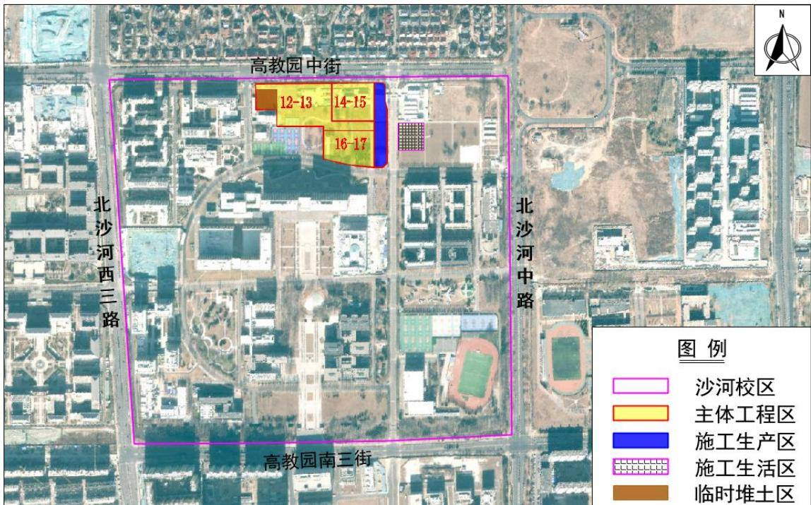  
图 2.2-1 施工布置示意图

## 2.2.3施工工艺

工程施工顺序按照先地下后地上的原则，将主体工程划分为场地平整、基础及地下室工程、主体结构工程、外墙内饰装修、室外综合管线及道路绿化、工程验收等六个阶段。具体流程如下：

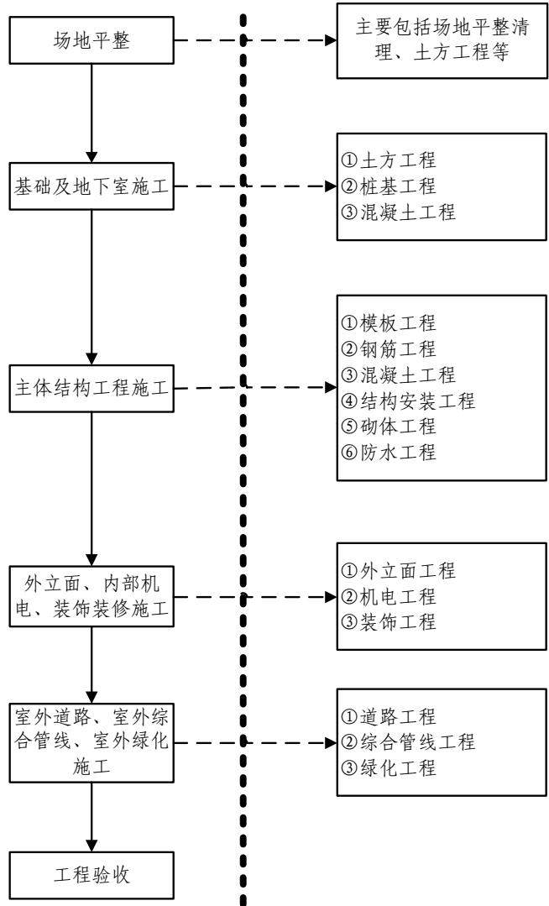  
图 2.2-2 施工期总体工艺流程示意图

## （1）土方开挖施工工艺

本项目基坑采用直立式开挖，基坑采用挡土墙 桩锚支护，基坑底部留 宽的肥槽，便于施工。开挖遵循“竖向分层，横向对称扩边，随挖随撑”的原则。采用机械进行土方开挖，每层开挖深度为 1.5m，临时边坡支护完毕继续开挖，一直循环开挖至设计高程。

## （2）土方回填施工工艺

基坑回填土时，应清除草皮、树根和垃圾等杂物，填土应严格控制含水量，填方应经过计算，尽量采用同类土填筑。基坑土方回填采用人工配合蛙式打夯机、立式打夯机进行分层夯实。施工工艺流程如下：基槽底清理→素土→分层铺土、夯实→检验土的密实度→修整找平。

## （3）地下水控制施工工艺

根据项目岩土工程勘察报告，在勘察期间（2026年1月）钻探深度40m范围内测到4层地下水，地下水类型为潜水及承压水。

表 2.2-2 地下水情况一览表
<table><tr><td rowspan=2 colspan=1>地下水类型</td><td rowspan=1 colspan=2>地下水初见水位</td><td rowspan=1 colspan=2>地下水稳定水位</td></tr><tr><td rowspan=1 colspan=1>埋深（m）</td><td rowspan=1 colspan=1>标高（m）</td><td rowspan=1 colspan=1>埋深（m）</td><td rowspan=1 colspan=1>标高（m）</td></tr><tr><td rowspan=1 colspan=1>第1层：潜水</td><td rowspan=1 colspan=1>3.60~3.90</td><td rowspan=1 colspan=1>39.20~40.35</td><td rowspan=1 colspan=1>3.10~3.50</td><td rowspan=1 colspan=1>39.60~40.85</td></tr><tr><td rowspan=1 colspan=1>第2层：潜水</td><td rowspan=1 colspan=1>6.20~7.40</td><td rowspan=1 colspan=1>36.55~36.90</td><td rowspan=1 colspan=1>4.50~5.10</td><td rowspan=1 colspan=1>38.60~35.85</td></tr><tr><td rowspan=1 colspan=1>第3层：承压水</td><td rowspan=1 colspan=1>15.90~16.50</td><td rowspan=1 colspan=1>26.60~28.05</td><td rowspan=1 colspan=1>8.10~9.00</td><td rowspan=1 colspan=1>34.10~35.85</td></tr><tr><td rowspan=1 colspan=1>第4层：承压水</td><td rowspan=1 colspan=1>24.70~24.803.50~22.80</td><td rowspan=1 colspan=1>18.40~19.15</td><td rowspan=1 colspan=1>14.10~14.60</td><td rowspan=1 colspan=1>29.00~29.35</td></tr></table>

项目施工期间涉及施工降水，根据项目基坑支护方案，施工降水采用高压旋喷桩截水帷幕，桩间旋喷桩桩径750mm，桩间搭接300mm，止水帷幕渗透系数不大于1.0$\times ~ 1 0 ^ { - 6 } \mathrm { c m / s }$ ，基坑底部布置集水井及排水管对地下水进行控制。为避免水资源浪费，建议将基坑抽排的地下水用作施工用水，包括施工生产生活区及施工道路降尘、冲洗车辆、冲厕用水等，施工降水不外排。

## （4）钢筋混凝土结构工程

钢筋混凝土结构工程由模板工程、钢筋工程和混凝土工程三部分组成。在施工中三者密切配合，进行流水施工，其施工工艺如下图所示：

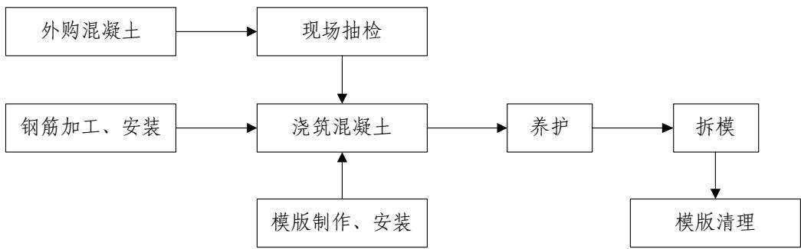  
图 2.2-3 钢筋混凝土结构工程施工工艺流程图

本工程现场不设混凝土搅拌站，全部外购商品混凝土。每天所需的混凝土向商家订货后，由各商家将工地所需的混凝土通过混凝土搅拌运输车运至现场。混凝土运至现场后，卸入移动式浇注车（低层）、固定式浇注平台（高层）等，将混凝土浇入模框，由人工钢钎、振动棒等捣实混凝土，由人工外加添加剂、喷水等防护措施提高混凝土的强度，带混凝土凝固后，拆除模板。

主要设备包括：混凝土搅拌运输车、移动式浇注车、垂直升降机、移动浇注机、固定浇注平台等。

## （6）道路工程施工工艺

道路工程施工主要包括场地清理（含清基）、路基填筑、基础压实和防护等。

## ①路基开挖和填筑

道路路基土石方填筑采用水平分层填筑法施工，按照横断面全宽逐层向上填筑，如原地面不平，则由最低处分层填筑，每层经过压实符合规定要求后，再填筑下一层。

## ②路面工程

路面施工采用 15cm 厚粗粒式二灰碎石和15cm 厚中粒式二灰碎石基层，9.5cm 混 凝土面层分上下二层，均采用拌和厂集中拌和、摊铺机摊铺法施工。

## （7）透水砖铺装施工工艺

①路基的开挖：根据设计的要求，路床开挖，清理土方，并达到设计标高；检查纵坡、横坡及边线，是否符合设计要求；修整路基，找平碾压密实，压实系数达 95%以上，并注意地下埋设的管线。

②垫层的铺设：铺设 60mm 厚的中砂。

③基层的铺设：铺设压实的级配碎石 150mm 厚，（粒径5-60mm）压实系数达93%以上。

④找平层的铺设：找平层用中砂，30mm 厚，中砂要求具有一定的级配，即粒径0.3-5mm 的级配砂找平。

⑤面层铺设：面层为透水砖，在铺设时，应根据设计图案铺设透水砖，铺设时应轻轻平放，用橡胶锤锤打稳定，但不得损伤砖的边角。

## （8）管线工程施工工艺

项目区管线采用直埋敷设法施工，采用明挖法开挖管沟，市政管线施工原则为先深后浅，自下而上，严格保护既有管线，主要工艺流程为：沟槽开挖→地基处理→基础施工→管道安装→基坑回填。根据施工安排采取平行流水作业，分段施工，避免沟槽开挖后暴露过久，引起沟槽坍塌，回填利用土方堆于管沟一侧便于拦挡防护，多余土方要及时拉走。管沟开挖应选择在无雨天实施，暴雨天应严格停止土方开挖回填作业，避免在施工过程中造成大量的水土流失和工程事故发生。

管沟开挖：开挖前现场进行清理，根据管径大小，埋设深度和土质情况，确定底宽和边坡坡度。具体施工时先用挖掘机开挖，底部留 20cm 左右一层，人工清底，管沟断面形式采用梯形，沟底宽度根据管径、土质、施工方法等确定。沟槽底部在管道两侧各预留 50cm 的宽度，以保证工作面及回土夯实机具的行进。管沟开挖土方临时堆放于沟槽口上缘外侧 1m 外，堆土高度不超过 1.5m。

## （9）绿化工程施工工艺

栽植工序：放线定位→挖树坑→树坑消毒→栽植苗木→回填耕植土→夯实→浇水。

挖坑尺寸：常绿乔木（H1.5）70cm×50cm（直径×深度）；（H2.5）100cm×80cm； （H3.5）110cm×80cm；花灌木类 50cm×40cm；裸根落叶乔小类 80cm×60cm；绿篱深 度 50cm。

## 1）乔、灌木养护技术

将树木按照规定的标准栽植，然后立即浇水，要求浇透，待水渗入完全后，再覆土踏实。抚育管理包括打药、摘芽、修枝、浇水、除草、施肥、支架、防冻处理等，要适时进行。

①修剪：一般在休眠期（即11月\~翌年3月）要重剪一次，生长期要每月修剪一次，主要修剪荫枝、下垂枝、干枯枝、侧缘线、下缘线以外枝，下缘线要控制在1.8\~2.5m。开花植物应在花芽萌动前进行。

②施肥：在2\~3月和8\~9月以有机肥为主，一般采用对角线埋施，肥穴规格30cm×30cm×40cm，有机肥一般2\~3kg/株。

③补植：对施工、交通、人为、病虫害等造成的死亡树木，应及时清走，补回原来的种类，力求规格与原来相近，并加强管理。

④防风：常有大风季节前，要对乔木合理修剪，加固护树桩或枝架，风后要立即 扶树、护树、清理断枝、落叶。同时每年应将护树绑带放松1\~2次，防止绑线嵌入树 皮内。

⑤松土、整理养护穴：新植乔木（1\~3年），每年应进行1\~2次松土、培土，3年以上乔木已扎根，可不保留植穴并回填土。

⑥浇水：新植乔灌木，要保证足够的水分。一般要在一周以内浇水三次：三年以上乔灌木，每半月或每月浇水一次即可。

⑦质量控制：长势旺盛，生长良好；无病虫害发生；无缺株，保存率高；下缘线整齐，下垂枝、干枯枝及时修剪；养护设施整齐、完整。

## 2）宿根花卉、花坛的养护技术

①松土除杂草：对于尚未郁闭的宿根花坛，生长季节（4\~10月）每月要松土一次，除杂草一次，松土深度一般在3\~5cm，过深则会伤害根系；非生长季节每月要除杂草1次，要连根拔除；防止周围草坪长入花坛，影响花坛长势和环境美观。

②修剪修边：一般每年2\~3月份重剪一次，保留30\~50cm，以促进侧枝发芽，以后每月按花坛养护标准进行修剪造型，一般中间高、两边低，中间一般不超过80cm，形成曲面，并有较好的园林效果。花期每3\~5天修剪残花一次、清理落叶一次。每年的4\~5月和8\~9月要进行修边，修边宽度20\~30cm，线条要流畅。

③施肥：2\~3月份重剪后以撒施有机肥做为基肥，0.5\~lkg/m，结合松土，把肥掩埋在土壤中，浇一次透水，以后根据生长情况用复合肥（N:P:K比例为2:6:3）进行追肥1\~2次，结合雨天洒施15\~20g/m；晴天施肥应保证浇足水，以撒施为主。

④补植、浇水：对施工、养护不当等造成的死苗要及时补植，一般应补回原来的种类，并力求规格与原来相近。补植后立即浇一次透水，24小时后补浇一次，三天后再浇一遍水。之后便进入正常管理，每周浇1\~2次即可，特别干旱期要适当补水。

⑤质量控制：花坛无缺株、残缺；长势旺盛，无病虫害发生；修剪造型要有一定的园林效果；开花植物，开花准时、艳丽，花朵覆盖率50%以上；土壤疏松、无杂草。

## 3）草坪绿化

施工程序：砌边墙→回覆种植土→过筛→平整场地→起草皮→草皮运输→草坪栽植→浇水→抚育管理。

方法(分栽法)及技术要求：覆土厚度不少于 30cm，土方过筛后拌耙搂平，将草皮分撮掐头，品字形栽植，株行距 10\~15cm，栽后立即浇水。

## 2.2.4施工材料及用水用电

施工材料：项目区肥槽回填土、顶板覆土、砂石、碎石等垫层料（用于区内地坪、道路路面建设）从当地建筑材料市场采购；其它建筑材料包括水泥、管材、钢筋等原材料当地市场供应充足，采购方便。项目不设置取土、石料场及弃渣场。

施工电源：施工期间采用临时施工箱式变电站由总包单位进行统一管理，施工现场配电系统设置配电柜或总配电箱、分配电箱、开关箱实行三级配电，三级保护原则，未新建供电工程构筑物。

施工用水：施工用水主要包括施工场地及临时道路洒水和施工人员生活用水。场地施工用水由市政给水管引入水源，并设置水表，满足本项目生产、生活及消防用水要求，未新建供水工程构筑物。

施工通讯：项目区附近电讯信号稳定，通讯可配备手机并可接入附近互联网。

## 2.3工程占地

根据工程建设内容和施工组织设计确定工程建设占地扰动范围，项目总占地面积$5 . 1 3 \mathrm { h m } ^ { 2 }$ ，其中永久占地面积 4.00hm²，临时占地面积 1.13hm²，占地类型均为高等院校用地。根据建设单位提供资料及现场调查分析，项目占地现状主要为沙河校区待建空地，临时占地位于项目红线外，但全部位于北京航空航天大学沙河校区内。工程占地面积详见表2.3-1。

表 2.3-1 项目占地面积统计表

单位： $\mathbf { h } \mathbf { m } ^ { 2 }$

<table><tr><td rowspan=2 colspan=2>防治分区</td><td rowspan=1 colspan=1>占地类型</td><td rowspan=1 colspan=2>占地性质</td><td rowspan=2 colspan=1>合计</td></tr><tr><td rowspan=1 colspan=1>高等院校用地</td><td rowspan=1 colspan=1>永久占地</td><td rowspan=1 colspan=1>临时占地</td></tr><tr><td rowspan=3 colspan=1>主体工程区</td><td rowspan=1 colspan=1>12-13 公寓项目</td><td rowspan=1 colspan=1>2.00</td><td rowspan=1 colspan=1>2.00</td><td rowspan=1 colspan=1></td><td rowspan=3 colspan=1>4.00</td></tr><tr><td rowspan=1 colspan=1>14-15 公寓项目</td><td rowspan=1 colspan=1>0.973</td><td rowspan=1 colspan=1>0.97</td><td rowspan=1 colspan=1></td></tr><tr><td rowspan=1 colspan=1>16-17 公寓项目</td><td rowspan=1 colspan=1>1.023</td><td rowspan=1 colspan=1>1.02</td><td rowspan=1 colspan=1></td></tr><tr><td rowspan=1 colspan=2>施工生产区</td><td rowspan=1 colspan=1>0.63</td><td rowspan=1 colspan=1></td><td rowspan=1 colspan=1>0.63</td><td rowspan=1 colspan=1>0.63</td></tr><tr><td rowspan=1 colspan=2>施工生活区</td><td rowspan=1 colspan=1>0.50</td><td rowspan=1 colspan=1></td><td rowspan=1 colspan=1>0.50</td><td rowspan=1 colspan=1>0.50</td></tr><tr><td rowspan=1 colspan=2>临时堆土区</td><td rowspan=1 colspan=1>(0.25)</td><td rowspan=1 colspan=1>(0.25)</td><td rowspan=1 colspan=1></td><td rowspan=1 colspan=1>(0.25)</td></tr><tr><td rowspan=1 colspan=2>合计</td><td rowspan=1 colspan=1>5.13</td><td rowspan=1 colspan=1>4.00</td><td rowspan=1 colspan=1>1.13</td><td rowspan=1 colspan=1>5.13</td></tr></table>

注：（）内占地为红线范围内，不重复计算。

## 2.4土石方平衡

## 2.4.1表土平衡

依据《表土剥离及其再利用技术要求》（GB/T 45107-2024）（2024.12.31 发布，2025.7.1 实施），表土剥离和再利用应依据各地国土空间规划，结合城乡建设、农田建设、生态建设等要求开展，遵循“应剥尽剥、能用尽用、即剥即用、随剥随运、少储少运”的原则。

## （1）表土资源调查情况

主体工程场平前，需剥离占地范围内可用作后期绿化的表土，经现场调查，项目占地范围内现状主要为待建空地、硬化人行道及施工迹地，施工迹地为“北京航空航天大学沙河校区图书馆项目”施工临时占地完毕平整后的空地。

本次对项目所在区域表土资源进行实地勘察，根据项目区内地类分布情况，划分土壤检测区域，并设置土壤取样点，根据取样结果，主体工程区及施工生产区占地范围内硬化区域及施工迹地不具备表土剥离条件，占地面积 $2 . 1 \mathrm { h m } ^ { 2 } .$ ，其余局部区域表层土质较好，占地面积 $2 . 5 3 \mathrm { h m } ^ { 2 }$ ；施工生活区临时占地范围内裸露地表表层土以人工填土为主，含有石子、砖屑等物质，表层土不满足植物生长需求，不具备剥离条件，占

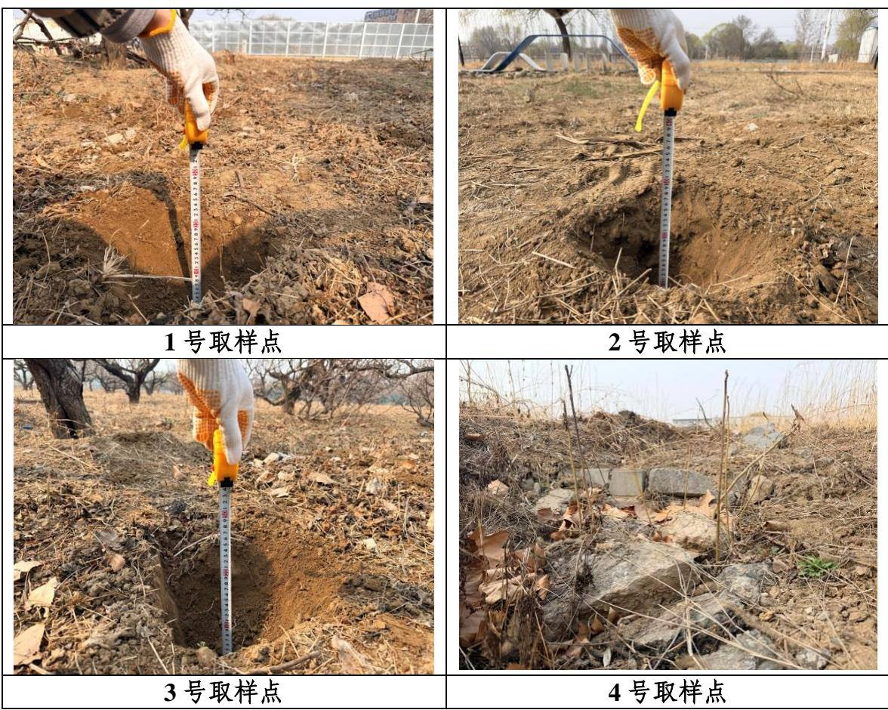  
图 2.4-1 项目区表土资源调查照片

地面积 0.50hm2。

因此，根据剥离的可行性、经济性等因素，最终确定项目防治责任范围内可剥离的表土面积为 $2 . 5 3 \mathrm { h m } ^ { 2 }$ ，在实施表土剥离工程前，需进行树木及地表清理，采用人工清除地表杂草、树枝、树根等，根据现场调查结果，项目区场地清理后表层 20cm\~30cm的土质较好，平均土壤剥离厚度25cm，共计表土剥离量约 0.63万 $\mathbf { m } ^ { 3 }$

项目区表土资源调查照片见图2.4-1，项目区表土剥离范围示意图见图 2.4-2。

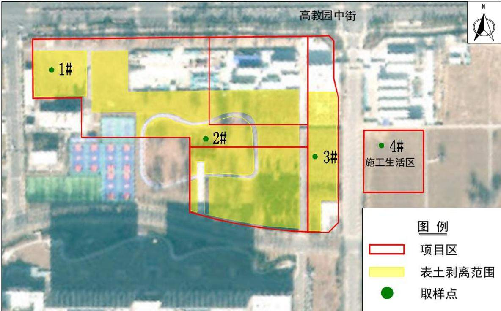  
图 2.4-2 项目区表土剥离范围示意图

## （2）表土剥离方式

根据《表土剥离及其再利用技术要求》（GBT45107-2024），当剥离区地面平整且表土可剥离厚度大于或等于 25cm 时，优先选择机械剥离。当剥离区地面起伏较大、表土层厚度小于25cm 且不适宜机械作业时，可配合采用人工剥离。

剥离前应清理、移除剥离区中影响施工的地被植物根系以及石子、砖渣、灰渣等杂物，收集的表土尽量不含杂物、硬黏土块或直径大于 3cm 的砾石；不应采用焚烧等破坏表土和环境的方式进行清表。

## （3）表土保存养护

表土剥离后堆存于表土堆存场，表土堆存场占地面积 $0 . 2 5 \mathrm { h m } ^ { 2 }$ ，表土堆放期间采取临时苫盖及撒播草籽等措施，同时在坡脚设置临时拦挡、临时排水沟及沉沙池措施，防止雨水对临时堆土造成水力侵蚀。

## （4）表土利用及防治责任

根据设计资料，项目主体工程后期绿化面积 $1 . 4 6 \mathrm { h m } ^ { 2 }$ ，表土回填厚度 0.30m，表土回覆量 $0 . 4 4 \ \overline { { \mathcal { H } } } \ \mathrm { ~ m } ^ { 3 } ;$ ；本方案设计施工生产区撒播草籽面积 $0 . 6 3 \mathrm { h m } ^ { 2 }$ ，表土回填厚度0.30m，表土回覆量 $0 . 1 9 \mathrm { ~ \mathscr ~ { ~ H ~ } ~ m ~ } ^ { 3 }$ ，因此表土回填总量共 $0 . 6 3 \mathrm { ~ \mathscr ~ { ~ H ~ } ~ m ~ } ^ { 3 }$ 。表土资源全部用于本项目绿化覆土，表土剥离防治责任主体单位为项目建设单位北京航空航天大学，表土平衡表见表2.4-1，表土流向图见图 2.4-3。

表 2.4-1 表土平衡表（单位：万 $\mathbf { m } ^ { 3 }$ ）
<table><tr><td rowspan=1 colspan=1>分区</td><td rowspan=1 colspan=1>表土剥离</td><td rowspan=1 colspan=1>表土回覆</td><td rowspan=1 colspan=1>调入</td><td rowspan=1 colspan=1>调出</td><td rowspan=1 colspan=1>借方</td><td rowspan=1 colspan=1>余方</td></tr><tr><td rowspan=1 colspan=1>主体工程区</td><td rowspan=1 colspan=1>0.53</td><td rowspan=1 colspan=1>0.44</td><td rowspan=1 colspan=1></td><td rowspan=1 colspan=1>0.09</td><td rowspan=1 colspan=1></td><td rowspan=1 colspan=1></td></tr><tr><td rowspan=1 colspan=1>施工生产区</td><td rowspan=1 colspan=1>0.10</td><td rowspan=1 colspan=1>0.19</td><td rowspan=1 colspan=1>0.09</td><td rowspan=1 colspan=1></td><td rowspan=1 colspan=1></td><td rowspan=1 colspan=1></td></tr><tr><td rowspan=1 colspan=1>合计</td><td rowspan=1 colspan=1>0.63</td><td rowspan=1 colspan=1>0.63</td><td rowspan=1 colspan=1>0.09</td><td rowspan=1 colspan=1>0.09</td><td rowspan=1 colspan=1></td><td rowspan=1 colspan=1></td></tr></table>

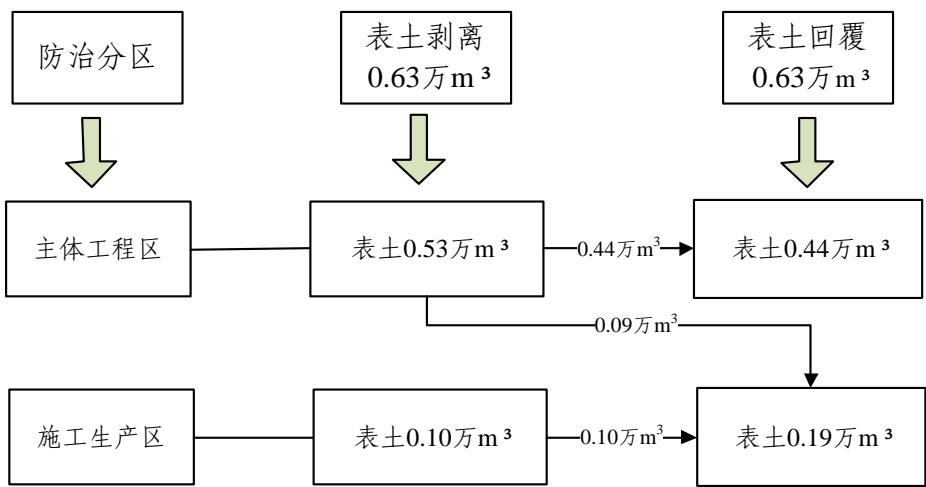  
图 2.4-3 表土流向图

## 2.4.2土石方平衡

本项目涉及的土石方主要包括基坑开挖、管线施工、绿化覆土、地下室顶板覆土等，项目土石方量计算不考虑建筑垃圾，经计算，项目土石方挖填总量为 31.86 万m³，其中挖方总量 28.17 万 m³（表土 0.63 万 m³，一般土方 27.54 万 m³），填方总量 3.69万 m³（表土 0.63 万 m³，一般土方 3.06 万 m³），借方总量 2.49 万 m³，余方总量 26.97万m³。土石方具体情况如下：

## （1）建构筑物工程

主体建筑物绝对标高（±0.00）为44.6m，根据基坑支护方案，项目采用整体大开挖，开挖面积主要以地下结构轮廓线为主，其他区域不进行深开挖，采用复合土钉墙支护体系，预留肥槽宽度 1.0m，顶板回填厚度 1.0m，基坑开挖面积 $2 5 5 5 4 \mathrm { m } ^ { 2 }$ ，开挖深度 10.5m。经计算，基坑施工开挖土方为 26.87 万 m3，肥槽回填土方 0.84 万 m3，地下室顶板回填土方1.65万 $\mathbf { m } ^ { 3 }$ ，共回填土方量2.49 万m3。

## （2）道路管线工程

道路管线工程自然开挖方主要为管槽开挖土方，管线敷设采用直埋敷设法施工，深埋管线包括雨水管线、污水管线、供热管线，浅埋管线有电力、供水管线等，表层管线主要是照明电缆管线等，所有管线同时开挖，根据管线埋深进行分层敷设。

根据设计标高和现状标高，管线埋深约为 1.3m\~2.0m，管槽底宽 0.5m\~1.0m，开挖沟槽断面为梯形，放坡坡度为 1:0.5，回填土方主要为管沟回填至设计标高，根据项目实土管线总施工长度，经过计算，项目建设地块内管线敷设开挖土方约 0.59 万 $\mathbf { m } ^ { 3 }$ 开挖土方临时堆放于管沟两侧用于管沟回填，回填土方约 0.53 万 $\mathbf { m } ^ { 3 }$ ，多余土方进行外运。

## （3）雨水调蓄池

项目拟在主体工程区布设3座雨水调蓄池，总容积 $4 1 3 \mathrm { m } ^ { 3 }$ ，雨水调蓄池覆土厚度3米，开挖土方量0.08万 $\mathbf { m } ^ { 3 }$ ，填方总量0.04万 $\mathbf { m } ^ { 3 }$ ，全部为自然土方，多余土方外运。

## （4）绿化覆土

本方案根据室外工程设计标高，在绿化前进行绿化覆土，主体工程后期绿化覆土面积 $1 . 4 6 \mathrm { h m } ^ { 2 }$ ，本方案设计施工生产区撒播草籽面积 $0 . 6 3 \mathrm { h m } ^ { 2 }$ ，绿化回填厚度均为0.30m，计算绿化覆土量共0.63 万 $\mathbf { m } ^ { 3 }$ ，绿化覆土来源为施工前期占地范围内剥离的表土。

## （5）余方去向

项目余方 26.97万 m³，全部为工程槽土，根据建设单位签订的土方综合利用意向协议，拟运往北京双河建环科技发展有限公司建筑垃圾临时处置点。根据北京市垃圾渣土管理处规定，建设单位负责在施工前办理建筑垃圾渣土消纳备案表，同时要与运输企业签订委托清运协议，与建筑垃圾资源化处置场所签订处置合同或直接利用协议。土方运输过程应加强车辆土方临时覆盖措施或采取封闭车厢运输土方，防止运输过程中土方洒落造成水土流失，影响周边市政环境。运输期间的水土流失防治责任由运输单位负责，堆放期间的水土流失防治责任由消纳场经营单位负责。

## （6）借方来源

本项目基坑肥槽回填、地下室顶板覆土共计 2.49 万 $\mathrm { m } ^ { 3 } .$ 。由于沙河校区红线内建筑密度高、功能分区明确，无多余闲置空地、荒地或未利用地可供临时堆土，且经调查校外周边无可临时堆土用地，因此综合用地条件、校园安全、人员活动等因素，基坑肥槽回填及地下室顶板覆土拟由北京双河建环科技发展有限公司外购，回填时间为2027 年 12 月-2028 年 2 月。

项目土石方平衡表见表 2.4-2，土石方流向框图详见图 2.4-4。

表 2.4-2 项目土石方平衡总表（单位： $\mathcal { F } \mathbf { m } ^ { 3 } )$
<table><tr><td rowspan=2 colspan=2>工程分类</td><td rowspan=1 colspan=3>开挖方</td><td rowspan=1 colspan=3>回填方</td><td rowspan=1 colspan=2>调入</td><td rowspan=1 colspan=2>调出</td><td rowspan=1 colspan=2>借方</td><td rowspan=1 colspan=2>余方</td></tr><tr><td rowspan=1 colspan=1>一般土方</td><td rowspan=1 colspan=1>表土</td><td rowspan=1 colspan=1>小计</td><td rowspan=1 colspan=1>一般土方</td><td rowspan=1 colspan=1>表土</td><td rowspan=1 colspan=1>小计</td><td rowspan=1 colspan=1>数量</td><td rowspan=1 colspan=1>来源</td><td rowspan=1 colspan=1>数量</td><td rowspan=1 colspan=1>去向</td><td rowspan=1 colspan=1>数量</td><td rowspan=1 colspan=1>来源</td><td rowspan=1 colspan=1>数量</td><td rowspan=1 colspan=1>去向</td></tr><tr><td rowspan=3 colspan=1>主体工程区</td><td rowspan=1 colspan=1>①表土剥离及回覆</td><td rowspan=1 colspan=1></td><td rowspan=1 colspan=1>0.53</td><td rowspan=1 colspan=1>0.53</td><td rowspan=1 colspan=1></td><td rowspan=1 colspan=1>0.44</td><td rowspan=1 colspan=1>0.44</td><td rowspan=1 colspan=1></td><td rowspan=1 colspan=1></td><td rowspan=1 colspan=1>0.09</td><td rowspan=1 colspan=1>④</td><td rowspan=1 colspan=1></td><td rowspan=1 colspan=1>北京双</td><td rowspan=1 colspan=1>0</td><td rowspan=1 colspan=1>北京双</td></tr><tr><td rowspan=1 colspan=1>②基础工程</td><td rowspan=1 colspan=1>26.87</td><td rowspan=1 colspan=1></td><td rowspan=1 colspan=1>26.87</td><td rowspan=1 colspan=1>2.49</td><td rowspan=1 colspan=1></td><td rowspan=1 colspan=1>2.49</td><td rowspan=1 colspan=1></td><td rowspan=1 colspan=1></td><td rowspan=1 colspan=1></td><td rowspan=1 colspan=1></td><td rowspan=1 colspan=1>2.49</td><td rowspan=1 colspan=1>河建环科技发</td><td rowspan=1 colspan=1>26.87</td><td rowspan=2 colspan=1>河建环科技发展有限公司建</td></tr><tr><td rowspan=1 colspan=1>③道路管线、蓄水池</td><td rowspan=1 colspan=1>0.67</td><td rowspan=1 colspan=1></td><td rowspan=1 colspan=1>0.67</td><td rowspan=1 colspan=1>0.57</td><td rowspan=1 colspan=1></td><td rowspan=1 colspan=1>0.57</td><td rowspan=1 colspan=1></td><td rowspan=1 colspan=1></td><td rowspan=1 colspan=1></td><td rowspan=1 colspan=1></td><td rowspan=1 colspan=1></td><td rowspan=1 colspan=1>展有限公司建</td><td rowspan=1 colspan=1>0.10</td></tr><tr><td rowspan=1 colspan=1>施工生产区</td><td rowspan=1 colspan=1>①表土剥离及回覆</td><td rowspan=1 colspan=1></td><td rowspan=1 colspan=1>0.10</td><td rowspan=1 colspan=1>0.10</td><td rowspan=1 colspan=1></td><td rowspan=1 colspan=1>0.19</td><td rowspan=1 colspan=1>0.19</td><td rowspan=1 colspan=1>0.09</td><td rowspan=1 colspan=1>①</td><td rowspan=1 colspan=1></td><td rowspan=1 colspan=1></td><td rowspan=1 colspan=1></td><td rowspan=1 colspan=1>筑垃圾临时处</td><td rowspan=1 colspan=1>0</td><td rowspan=2 colspan=1>筑垃圾临时处置点</td></tr><tr><td rowspan=1 colspan=2>合计</td><td rowspan=1 colspan=1>27.54</td><td rowspan=1 colspan=1>0.63</td><td rowspan=1 colspan=1>28.17</td><td rowspan=1 colspan=1>3.06</td><td rowspan=1 colspan=1>0.63</td><td rowspan=1 colspan=1>3.69</td><td rowspan=1 colspan=1>0.09</td><td rowspan=1 colspan=1></td><td rowspan=1 colspan=1>0.09</td><td rowspan=1 colspan=1></td><td rowspan=1 colspan=1>2.49</td><td rowspan=1 colspan=1>置点</td><td rowspan=1 colspan=1>26.97</td></tr></table>

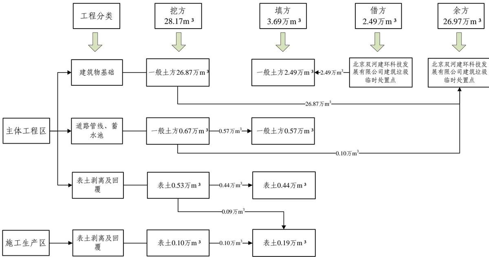  
图2.4-4 土石方流向框图

## 2.5拆迁（移民）安置与专项设施改（迁）建

## 2.5.1拆迁（移民）安置

本项目不涉及拆迁（移民）安置。

## 2.5.2专项设施改（迁）建

本项目专项设施改(迁)建主要涉及占地范围内的树木清理，根据建设单位提供的相关资料及现场调查，项目用地范围内有法桐、槐树、柏树、桃树等约177株，树木权属单位为北京航空航天大学。

本次清理预计将生长状态较好、具有观赏价值的部分树木进行移植，其余枯死木，自然生长的杂树，由于未纳入校园规划绿地或名木古树保护范围，且经专业评估后认为占地范围内现有树木移植成活率极低，已不具备移植保护的价值与可行性，且长期存在倒伏、断枝、根系不稳等安全风险隐患，本次清理预计将该批杂树进行绿化面积等额补偿处理。具有观赏价值的部分树木移植地点为北京航空航天大学沙河校区精品园内，水土流失防治责任由北京航空航天大学负责。

## 2.6施工进度

项目计划于2026年12月开工，预计2029年10月完工，总工期35个月。工程总的施工安排为：施工准备→基础施工→主体结构→安装工程→室外管线、道路施工→绿化施工。项目施工进度表见下表。

表 2.6-1 工程施工进度表
<table><tr><td rowspan=2 colspan=1>工程名称</td><td rowspan=1 colspan=1>2026</td><td rowspan=1 colspan=4>2027</td><td rowspan=1 colspan=6>2028</td><td rowspan=1 colspan=4>2029</td></tr><tr><td rowspan=1 colspan=1>四季度一</td><td rowspan=1 colspan=1>季度二</td><td rowspan=1 colspan=1>季度三</td><td rowspan=1 colspan=1>季度四</td><td rowspan=1 colspan=1>季度</td><td rowspan=1 colspan=1>季二度</td><td rowspan=1 colspan=1>季三度</td><td rowspan=1 colspan=3>季四度</td><td rowspan=1 colspan=1>季度</td><td rowspan=1 colspan=1>一季度</td><td rowspan=1 colspan=1>二季三度</td><td rowspan=1 colspan=1>季四度</td><td rowspan=1 colspan=1>季度</td></tr><tr><td rowspan=1 colspan=1>施工准备</td><td rowspan=1 colspan=1>一</td><td rowspan=1 colspan=1></td><td rowspan=1 colspan=1></td><td rowspan=1 colspan=1></td><td rowspan=1 colspan=1></td><td rowspan=1 colspan=1></td><td rowspan=1 colspan=1></td><td rowspan=1 colspan=3></td><td rowspan=1 colspan=1></td><td rowspan=1 colspan=1></td><td rowspan=1 colspan=1></td><td rowspan=1 colspan=1></td><td rowspan=1 colspan=1></td></tr><tr><td rowspan=1 colspan=1>基础施工</td><td rowspan=1 colspan=1></td><td rowspan=1 colspan=1>_</td><td rowspan=1 colspan=1></td><td rowspan=1 colspan=1></td><td rowspan=1 colspan=1></td><td rowspan=1 colspan=1></td><td rowspan=1 colspan=1></td><td rowspan=1 colspan=3></td><td rowspan=1 colspan=1></td><td rowspan=1 colspan=1></td><td rowspan=1 colspan=1></td><td rowspan=1 colspan=1></td><td rowspan=1 colspan=1></td></tr><tr><td rowspan=2 colspan=1>主体结构</td><td rowspan=2 colspan=1></td><td rowspan=2 colspan=1></td><td rowspan=2 colspan=1></td><td rowspan=1 colspan=1></td><td rowspan=1 colspan=1></td><td rowspan=1 colspan=1></td><td rowspan=1 colspan=1></td><td rowspan=1 colspan=3></td><td rowspan=2 colspan=1></td><td rowspan=2 colspan=1></td><td rowspan=2 colspan=1></td><td rowspan=2 colspan=1></td><td rowspan=2 colspan=1></td></tr><tr><td rowspan=1 colspan=1></td><td rowspan=1 colspan=1></td><td rowspan=1 colspan=1></td><td rowspan=1 colspan=1></td><td rowspan=1 colspan=3></td><td rowspan=1 colspan=1></td></tr><tr><td rowspan=2 colspan=1>安装工程</td><td rowspan=2 colspan=1></td><td rowspan=2 colspan=1></td><td rowspan=2 colspan=1></td><td rowspan=2 colspan=1></td><td rowspan=2 colspan=1></td><td rowspan=2 colspan=1></td><td rowspan=2 colspan=1></td><td rowspan=1 colspan=2></td><td rowspan=1 colspan=1></td><td rowspan=1 colspan=1></td><td rowspan=1 colspan=1></td><td rowspan=1 colspan=1></td><td rowspan=2 colspan=1></td><td rowspan=2 colspan=1></td></tr><tr><td rowspan=1 colspan=3></td><td rowspan=1 colspan=1></td><td rowspan=1 colspan=1></td><td rowspan=1 colspan=1></td></tr><tr><td rowspan=1 colspan=1>室外管线、道路施工</td><td rowspan=1 colspan=1></td><td rowspan=1 colspan=1></td><td rowspan=1 colspan=1></td><td rowspan=1 colspan=1></td><td rowspan=1 colspan=1></td><td rowspan=1 colspan=1></td><td rowspan=1 colspan=1></td><td rowspan=1 colspan=3></td><td rowspan=1 colspan=1></td><td rowspan=1 colspan=1></td><td rowspan=1 colspan=1></td><td rowspan=1 colspan=1></td><td rowspan=1 colspan=1></td></tr><tr><td rowspan=1 colspan=1>绿化施工</td><td rowspan=1 colspan=1></td><td rowspan=1 colspan=1></td><td rowspan=1 colspan=1></td><td rowspan=1 colspan=1></td><td rowspan=1 colspan=1></td><td rowspan=1 colspan=1></td><td rowspan=1 colspan=1></td><td rowspan=1 colspan=3></td><td rowspan=1 colspan=1></td><td rowspan=1 colspan=1></td><td rowspan=1 colspan=1>_</td><td rowspan=1 colspan=1></td><td rowspan=1 colspan=1></td></tr><tr><td rowspan=1 colspan=1>竣工验收</td><td rowspan=1 colspan=1></td><td rowspan=1 colspan=1></td><td rowspan=1 colspan=1></td><td rowspan=1 colspan=1></td><td rowspan=1 colspan=1></td><td rowspan=1 colspan=1></td><td rowspan=1 colspan=1></td><td rowspan=1 colspan=3></td><td rowspan=1 colspan=1></td><td rowspan=1 colspan=1></td><td rowspan=1 colspan=1></td><td rowspan=1 colspan=1></td><td rowspan=1 colspan=1></td></tr></table>

## 2.7自然概况

## 2.7.1地形、地貌

昌平区区域内地势由西北向东南逐渐形成一个缓坡倾斜地带。地处温榆河冲积平原和军都山的结合地带。山区海拔400\~800m，最高峰（高楼峰）海拔1439m。昌平区内平原552km2，占41%，山区、半山区面积800km2，占59%。山区多为林地，半山区多为果园，平原多为农地和建设用地。

本项目位于北京航空航天大学沙河校区内北侧，现状主要为待建空地，场地地形基本平坦，地貌类型为平原，不属于崩塌、滑坡危险区和泥石流易发区、低洼易涝区。

## 2.7.2地质

## （1）工程地质

北京地处燕山地震带与华北平原中部地震带的交汇处，又紧邻汾渭地震带和郯庐断裂地震带，为地震多发地区。拟建场地按构造单元划分，位于中朝准地台（ 级构造单元）、华北断坳（Ⅱ级构造单元），基底主要由中上元古界及古生界地层组成。

根据本项目岩土工程勘察报告，按沉积年代、成因类型将本工程勘察最大勘探深度（40.00m）范围内的地层，划分为人工堆积层、新近沉积层、第四纪沉积层及元古代蓟县纪沉积岩层四大类，并按地层岩性及工程特性进一步划分为 8 个大层及亚层，分述如下：

## 人工堆积层：

第①层砂质粉土\~黏质粉土素填土：黄褐色，松散，稍湿，以砂质粉土为主，土质不均匀，含石子、砖灰渣、植物根等，局部含粉质黏土、粉砂；本层夹第①1 层杂填土：杂色，稍湿，松散，分布于拟建 12-17 公寓场地北侧，以砖块、灰渣、混凝土块等建筑垃圾为主。本层层厚 0.9\~4.3m，层底标高介于 40.31\~43.22m 之间。

新近沉积层：

第②层：砂质粉土\~黏质粉土（新近沉积）：褐黄\~黄褐色，中密\~密实，湿\~很湿，含氧化铁、云母等。本层夹第②1层粉细砂（新近沉积）。

第②1 层粉细砂（新近沉积）：褐黄\~黄褐色，湿，稍密，含云母、长石、石英等，本层仅在CK1#、CK10#钻孔揭露。

本层综合层厚 0.7\~3.8m，层底标高介于 38.14\~42.02m 之间。

第③层细中砂（新近沉积）：黄灰\~灰色，饱和，稍密\~中密，含云母、有机质、长石、石英等。本层夹第③1层砂质粉土～黏质粉土（新近沉积）。

第③1 层砂质粉土～黏质粉土（新近沉积）：灰色，湿，中密，含云母、有机质等，

本层仅在CK1#钻孔揭露，本层综合层厚1.6\~4.0m，层底标高介于37.43\~39.32m之间。

第④层粉质黏土\~重粉质黏土（新近沉积）：灰色，很湿，可塑，含云母、有机质等，局部含黏土薄层。本层夹第④1 层砂质粉土\~黏质粉土（新近沉积），本层综合层厚 7.5\~9.5m，层底标高介于 29.26\~30.48m 之间。

一般第四纪沉积层：

第⑤层粉质黏土\~重粉质黏土：灰色，很湿，可塑，含云母、有机质等。本层夹第⑤1层细砂、第⑤2层砂质粉土\~黏质粉土。

第⑥层粉质黏土\~重粉质黏土：褐黄色，很湿，可塑，含云母、氧化铁等。本层夹第⑥1层黏质粉土。

第⑦层细砂：褐黄色，饱和，密实，含云母、氧化铁、长石、石英等，本层综合层厚 3.3\~7.2m，层底标高介于 12.43\~15.10m 之间。

第⑧层粉质黏土\~重粉质黏土：灰黄色，很湿，可塑，含云母、氧化铁等。

## （2）水文地质

根据项目岩土工程勘察报告，在勘察期间（2026 年 1 月）钻探深度 40.00m 范围内量测到4层地下水，第1层和第2层为潜水，第 3层和第4层为承压水，测量地下水水位情况参见表2.7-1：

第 1 层潜水：主要赋存于第②层砂质粉土\~黏质粉土（新近沉积）、第③层细中砂（新近沉积）、第③1层砂质粉土\~黏质粉土（新近沉积）中，水量较大。主要接受大气降水入渗、地下径流补给，并以蒸发、地下径流等方式排泄，其水位年变化幅度一般 1.00\~3.00m。

第2层潜水：主要赋存于第④1层砂质粉土\~黏质粉土，水量一般，局部具有承压性。主要接受地下径流补给，并以地下径流等方式排泄，其水位年变化幅度一般0.50\~1.00m。

第3层承压水：主要赋存于第⑤1层细砂、第⑤2层砂质粉土\~黏质粉土中，水量较大，承压水头高度为 7.50\~7.80m，主要接受地下径流补给，并以地下径流和越流等方式排泄，其水位年变化幅度一般 1.00\~3.00m。

第4层承压水：主要赋存于第⑦层细砂、第⑦1层砂质粉土中，水量较大，承压水头高度为10.20\~10.60m。主要接受地下径流补给，并以地下径流等方式排泄，其水位年变化幅度一般1.00\~3.00m。

表 2.7-1 地下水情况一览表
<table><tr><td rowspan=2 colspan=1>地下水类型</td><td rowspan=1 colspan=2>地下水初见水位</td><td rowspan=1 colspan=2>地下水稳定水位</td></tr><tr><td rowspan=1 colspan=1>埋深（m）</td><td rowspan=1 colspan=1>标高（m）</td><td rowspan=1 colspan=1>埋深（m）</td><td rowspan=1 colspan=1>标高（m）</td></tr><tr><td rowspan=1 colspan=1>第1层：潜水</td><td rowspan=1 colspan=1>3.60~3.90</td><td rowspan=1 colspan=1>39.20~40.35</td><td rowspan=1 colspan=1>3.10~3.50</td><td rowspan=1 colspan=1>39.60~40.85</td></tr><tr><td rowspan=1 colspan=1>第2层：潜水</td><td rowspan=1 colspan=1>6.20~7.40</td><td rowspan=1 colspan=1>36.55~36.90</td><td rowspan=1 colspan=1>4.50~5.10</td><td rowspan=1 colspan=1>38.60~35.85</td></tr><tr><td rowspan=1 colspan=1>第3层：承压水</td><td rowspan=1 colspan=1>15.90~16.50</td><td rowspan=1 colspan=1>26.60~28.05</td><td rowspan=1 colspan=1>8.10~9.00</td><td rowspan=1 colspan=1>34.10~35.85</td></tr><tr><td rowspan=1 colspan=1>第4层：承压水</td><td rowspan=1 colspan=1>24.70~24.803.50~22.80</td><td rowspan=1 colspan=1>18.40~19.15</td><td rowspan=1 colspan=1>14.10~14.60</td><td rowspan=1 colspan=1>29.00~29.35</td></tr></table>

根据项目设计埋深条件及勘察结果，拟建建筑基底位于潜水水位附近，基础施工期间需进行施工降水，为避免水资源浪费，建议综合利用基坑抽排的地下水用于施工用水，包括施工生产生活区及施工道路洒水降尘、冲洗车辆、冲厕用水等，施工降水不外排。

## 2.7.3气象

昌平区属暖温带半湿润大陆性季风气候。气候特点是四季分明，冬季寒冷干燥，盛行西北风，夏季高温多雨，盛行东南风。年平均风速为2.4m/s，大风日数平均29.5天，年平均气温11.8℃，1月份最冷，平均气温－4.8℃；7月份最热，平均气温25.8℃，大于10℃年积温约 $4 2 0 0 \mathrm { { ‰} }$ 。历史上极端最高气温 $4 0 . 6 \mathrm { { ^ \circ C } }$ （1961年6月10日），极端最低气温－27.4℃（1966年2月22日）。最高气温常年在 $3 5 . 0 \mathrm { { } ^ { \circ } C }$ 以上，出现在6月中旬至7月上旬，出现日数平均每年9天。最低气温常年在－ $1 4 ^ { \circ } \mathrm { C } \sim \textrm { - } 2 0 ^ { \circ } \mathrm { C } .$ 之间，一般出现在12月下旬至1月下旬。

年平均日照时数为2732小时。降雨集中于6～9月，年平均降水量574.3mm，多年平均蒸发量1245.4mm，最大冻土层厚度85cm。全年无霜期平均210天左右，初霜平均在10月下旬，终霜平均在4月上旬。

## 2.7.4水文

昌平区河流主要分属于北运河水系，北部山区老峪沟为永定河水系，黑山寨沟为潮白河水系。本项目区属北运河水系温榆河流域，温榆河位于北京市域中部，干流向东南流经昌平、顺义、通州和朝阳四区从源头至通州区北关全长99.6km，沙河闸以下的干流长49km，汇入北运河。项目区雨水排除下游为东沙河。

## 2.7.5土壤植被

项目区地处昌平区温榆河冲积平原，土壤以砂粘土、砂质粉土为主，河道及低洼地带局部分布盐化潮土与沼泽土，成土母质为河流冲积物，土壤质地多为粉砂壤土至

壤土，整体土质条件适宜植被生长。

项目区属暖温带落叶阔叶林植被区，现状植被以人工林、农田作物及滨水湿地植被为主。人工植被主要有国槐、白蜡、油松、垂柳、栾树等乔木，搭配丁香、金银木、紫穗槐等灌木及各类草本植物；农田以玉米、小麦、蔬菜、草莓等作物为主；河渠、水库周边分布芦苇、香蒲、菖蒲等湿生植物，区域整体植被覆盖状况良好。

## 2.7.6水土保持敏感区

本项目位于北京市昌平区沙河镇，根据《《水利部办公厅关于做好国家级水土流失重点预防区和重点治理区落地上图成果应用的通知》（办水保[2025]170号），对本项目所在位置在国家级水土流失重点预防区和重点治理区查询系统中查询，根据查询结果，本项目位置不属于国家级水土流失重点预防区和重点治理区。

根据《北京市水土保持保持规划》（2017年5月），项目所在区域属于北京市水土流失重点预防区，依据《生产建设项目水土流失防治标准》(GB/T50434-2018)，本项目执行水土流失防治标准等级为北方土石山区一级标准。

项目所在区域未涉及饮用水水源保护区、水功能一级区的保护区和保留区。项目所在地不涉及河湖管理范围和生态保护红线，不属于自然保护区、世界文化和自然遗产地、风景名胜区、地质公园、森林公园、重要湿地等水土保持敏感区。

## 3项目水土保持评价

## 3.1主体工程选址（线）水土保持评价

根据《中华人民共和国水土保持法》（2011 年3月1日起实施）、《生产建设项目水土保持技术标准》（GB50433-2018）等相关规范性文件中关于水土保持限制和约束性规定，进行主体工程选址（线）分析与评价。

工程在选址选线等方面基本满足规范的约束性规定，对主体工程存在水土保持制约性因素又无法避让的，提出了相应要求，具体如下：

（1）工程建设区域位于北京市水土流失重点预防区，由于本工程选址无法避让，应提高防治标准和工程防护等级，优化施工工艺。本方案通过在执行北方土石山区防治指标一级标准的基础上，将土壤流失控制比提高 0.1，渣土防护率提高2%，林草覆盖率提高 2%；绿化工程采取园林式绿化标准设计。本项目开挖多余工程槽土拟运往北京双河建环科技发展有限公司建筑垃圾临时处置点进行综合利用，未布设取、弃土场可减少倒运和新增临时占地。主体设计中土方采取分层开挖，及时回填、平整，封闭运输，土方施工避开雨季并优化了施工工艺，减少植被损坏范围，符合水土保持要求。

（2）工程建设不涉及现状河流及水系，工程封闭施工且不会对周边河流水系产生影响。

（3）工程建设区不占用全国水土保持监测网络中的水土保持监测站点、重点试验区，不占用国家确定的水土保持长期定位观测站。

（4）工程建设不涉及泥石流易发区、崩塌滑坡危险区。

（5）本项目未处于重要江河、湖泊以及跨省（自治区、直辖市）的其他江河、湖泊的水功能一级区的保护区和保留区，以及水功能二级区的饮用水源区。

（6）项目所在地不涉及生态保护红线。

表 3.1-1 《中华人民共和国水土保持法》相符性分析
<table><tr><td>序号</td><td>内容</td><td>本项目情况</td><td>相符性</td></tr><tr><td>1</td><td>第十七条：禁止在崩塌、滑坡危 险区和泥石流易发区从事取土、挖砂、 采石等可能造成水土流失的活动。</td><td>不涉及</td><td>符合规 定</td></tr><tr><td>2</td><td>第十八条：水土流失严重、生态 脆弱的地区，应当限制或者禁止可能 造成水土流失的生产建设活动，严格 保护植物、沙壳、结皮、地衣等。</td><td>不涉及 项目位于北京市水土流失重点预</td><td>符合规 定</td></tr><tr><td>3</td><td>第二十四条：生产建设项目选址、 选线应当避让水土流失重点预防区和 重点治理区；无法避让的，应当提高 防治标准，优化施工工艺，减少地表 扰动和植被损坏范围，有效控制可能 造成的土流失。</td><td>防区，工程选址无法避让，本项目将 土壤流失控制比提高0.1，渣土防护率 提高2%，林草覆盖率提高2%。绿化 工程采取园林式绿化标准设计，优化 施工工艺将基坑开挖调整为直立式开化后符 挖，并且减小肥槽宽度，减少土方开 挖量。项目区内除主体结构施工区域 外地表进行场地硬化，减少了地表的 扰动和植被的损坏，可以有效减少水</td><td>方案优 合规定</td></tr><tr><td>4</td><td>第二十八条：依法应当编制水土 保持方案的生产建设项目，其生产建 设活动中排弃的砂、石、土、矸石、 尾矿、废渣等应当综合利用；不能综 合利用，确需废弃的，应当堆放在水 土保持方案确定的专门存放地，并采 取措施保证不产生新的危害。</td><td>土流失。 项目土石方挖方总量 28.17 万 m3填方总量3.69万m3借方总量 2.49万m3余方总量26.97万m³余符合规 方拟运往北京双河建环科技发展有限 公司建筑垃圾临时处置点，项目设置 临时堆土区用于存放表土。</td><td>艮定</td></tr><tr><td>5</td><td>第三十八条：对生产建设活动所 衡，减少地表扰动范围。</td><td>项目开工前进行表土剥离，剥离 占用土地的地表土应当进行分层剥的表土用于后期绿化覆土。通过主体符合规 离、保存和利用，做到土石方挖填平设计及水土保持方案提出的完善措定 施，可满足规定。</td><td></td></tr></table>

表 3.1-2《生产建设项目水土保持技术标准》（GB50433-2018）相符性分析
<table><tr><td rowspan=1 colspan=1>序号</td><td rowspan=1 colspan=1>内容</td><td rowspan=1 colspan=1>本项目情况</td><td rowspan=1 colspan=1>相符性</td></tr><tr><td rowspan=1 colspan=1>1</td><td rowspan=1 colspan=1>3.2.1节第1条主体工程选址(线应避让水土流失重点预防区和重点治理区</td><td rowspan=1 colspan=1>项目位于北京市水土流失重点预防区，工程选址无法避让，本项目将土壤流失控制比提高0.10，渣土防护率提高2%，林草覆盖率提高2%，绿化工程采取园林式绿化标准设计。项目区内除主体结构施工区域外地表进行了场地硬化，减少了地表的扰动和植被的损坏，可以有效减少水土流失。</td><td rowspan=1 colspan=1>方案优化后符合规定</td></tr><tr><td rowspan=1 colspan=1>2</td><td rowspan=1 colspan=1>3.2.1 节第2条主体工程选址(线应避让河流两岸、湖泊和水库周边的植物保护带</td><td rowspan=1 colspan=1>不涉及</td><td rowspan=1 colspan=1>符合规定</td></tr><tr><td rowspan=1 colspan=1>3</td><td rowspan=1 colspan=1>3.2.1 节第 3条主体工程选址(线应避让全国水土保持监测网络中的水土保持监测站点，重点试验区及国家确定的水土保持长期定位观测站</td><td rowspan=1 colspan=1>不涉及</td><td rowspan=1 colspan=1>符合规定</td></tr></table>

表 3.1-3 《生产建设项目水土保持方案技术审查要点》相符性分析
<table><tr><td rowspan=1 colspan=1>序号</td><td rowspan=1 colspan=1>内容</td><td rowspan=1 colspan=1>本项目情况</td><td rowspan=1 colspan=1>相符性</td></tr><tr><td rowspan=1 colspan=1>1</td><td rowspan=1 colspan=1>是否避让了水土流失重点预防和重点治理区</td><td rowspan=1 colspan=1>项目位于北京市水土流失重点预防区，工程选址无法避让，本项目将土壤流失控制比提高0.10，渣土防护区率提高2%，林草覆盖率提高2%，绿化工程采取园林式绿化标准设计。项目区内除主体结构施工区域外地表进行场地硬化，减少了地表的扰动和植被的损坏，可以有效减少水土流失。</td><td rowspan=1 colspan=1>方案优化后符合规定</td></tr><tr><td rowspan=1 colspan=1>2</td><td rowspan=1 colspan=1>是否避让河流两岸、湖泊和水库周边的植物保护带</td><td rowspan=1 colspan=1>不涉及</td><td rowspan=1 colspan=1>符合规定</td></tr><tr><td rowspan=1 colspan=1>3</td><td rowspan=1 colspan=1>是否避让了全国水土保持监测网络中的水土保持监测站点、重点试验区及国家确定的水土保持长期定位观测站</td><td rowspan=1 colspan=1>不涉及</td><td rowspan=1 colspan=1>符合规定</td></tr></table>

综上所述，从水土保持角度分析，项目建设通过执行严格的水土流失防治标准，同时减少工程占地、加强工程管理，能较好的防治水土流失，工程选址基本满足相关要求。

## 3.2建设方案与布局水土保持评价

## 3.2.1建设方案评价

本项目位于北京市昌平区，属于新建项目。主体设计根据工程周边现状高程，结合现状地势，按照尽量减少挖填方、节省工程投资、符合环境保护的原则，合理进行了竖向规划和场地标高的设计，工程的选址符合相关规划。

（1）主体设计绿化面积共 $1 . 4 6 \mathrm { h m } ^ { 2 }$ ，满足规划绿地率及林草覆盖率要求。景观布局采用点面结合的方式，重点对中庭广场区域进行绿化，突出绿化特点。建设单位后期将委托专业的园林绿化设计单位对项目绿化工程进行详细设计，建议提高植被建设标准，注重景观效果。

（2）主体设计配套建设雨水、污水等排水设施，同时在项目区雨水排除下游配建雨水调蓄池3座，总容积 $4 1 3 \mathrm { m } ^ { 3 }$ ，人行道布设透水砖铺装 $7 8 6 2 \mathrm { m } ^ { 2 } ;$ ，可减少地表径流。

（3）主体设计综合分析场地现状高程，竖向布置以结合地形，满足总体布局为标准，确定项目的室内外标高，场地竖向设计标高与城市道路标高协调一致，同时充分挖掘用地潜力，多利用地下空间。总体布置综合考虑朝向、日照间距、绿地、消防扑救和管网布置，满足规划、消防、节能、环保等要求。

综上，工程建设充分利用了原有交通设施，减少了临时用地的占用及扰动，建设方案较为合理，符合水土保持要求。

## 3.2.2工程占地评价

根据工程建设内容和施工组织设计确定工程建设占地扰动范围，项目总占地面积$5 . 1 3 \mathrm { h m } ^ { 2 }$ ，其中永久占地面积 4.00hm²，临时占地面积 1.13hm²，占地类型均为高等院校用地，根据建设单位提供资料及现场调查分析，项目占地现状主要为待建空地。

从占地类型来看，本项目占地类型为高等院校用地，占地范围内用地现状主要为沙河校区待建空地，对于存在表土的区域在施工前应当剥离表土集中堆放，并采取防护措施。项目主要建设内容为学生公寓，配套建设道路、给排水、绿化等基础设施，符合国家土地总体规划，符合水土保持的要求。

从占地性质来看，项目永久占地面积 $4 . 0 0 \mathrm { { h m } } ^ { 2 }$ ，永久占地范围内施工场地较为紧张，施工生产生活区分别布置在红线外东侧空地内，为临时占地，占地面积 $1 . 1 3 \mathrm { h m } ^ { 2 }$ 临时占地减少地表扰动，对周围环境影响较小，施工后期，拆除地上临建设施，恢复原地貌。临时占地权属单位为本项目建设单位北京航空航天大学，临时占地期间的水土流失防治责任由建设单位承担。项目周边道路系统较为完善，运输条件便利，材料运输以汽车为主，地块内部修建施工便道，施工道路采用永临结合的方式，围绕场地一周，尽量沿项目区道路布置，未新增临时占地，也减少相应的水土流失，符合水土保持的要求。

综上，项目占地基本符合国家的土地利用政策与水土保持的要求，建议下一步加强管理，优化施工工艺，严格控制施工扰动范围；同时合理安排施工时序，防止重复开挖和多次转运，并且减少开挖面和堆土面的裸露时间，及时采取相应防护措施，防止水土流失。

## 3.2.3土石方平衡分析

## 3.2.3.1 土石方平衡

项目土石方挖填总量为 31.86万m³，其中挖方总量 28.17万m³（表土0.63 万m³，一般土方 27.54 万 m³），填方总量 3.69 万 m³（表土 0.63 万 m³，一般土方 3.06 万 m³），借方总量 2.49 万 m³，余方总量 26.97 万 m³。

## （1）挖填数量最优化

本项目主要挖方为地下室建设、建筑物基础的基坑开挖土方，基坑开挖深度为底板埋深，无超挖现象，基坑开挖边坡比较小，可减少土方开挖量，工程挖方符合水土保持要求。工程填方根据土方回填施工工艺，基坑肥槽逐层、分时段回填，分层压实，确保与周边高程顺接，不存在高陡边坡，按照设计标高回填，工程填方符合水土保持要求。

## （2）土石方调运

本项目土石方调运包括表土及一般槽土，其中表土临时堆放于项目区红线内西侧垃圾站及绿地范围内，表土堆存时段为 年 月 年 月，堆存周期为 个月。根据本项目施工时序，表土堆存场占地范围内的垃圾站及集中绿地施工时间为2029 年 8 月\~2029 年 10 月，可在其施工前将表土回覆到本项目绿化区域，表土堆存场占地不影响后续垃圾站及绿地施工。剥离的表土后期全部用于项目绿化覆土，不外运，表土调运合理。

基坑开挖多余槽土运往北京双河建环科技发展有限公司建筑垃圾临时处置点进行综合利用，工程填方拟由北京双河建环科技发展有限公司外购，可满足填方需求。道路管线工程采取就地回填方案，可减少土方倒运次数、缩短运距。综上，本项目土方调运方案在满足施工要求的同时，符合水土保持要求。

## （3）余方综合利用

本工程挖方主要为表土剥离、基坑、管线等开挖土方，填方主要为基坑、管线、绿化回填土，余方26.97 万 $\mathbf { m } ^ { 3 }$ ，全部为工程槽土。

项目多余槽土计划全部外运，外运时间为2027年1月\~2027年5月，经调查，本项目周边在建建设项目较少，基本无借方需求，项目西南侧有在建项目“北京航空航天大学沙河校区可靠性与系统工程科研楼、先进技术科研楼建设项目（先进技术科研楼等 4 项）”，目前该项目正在进行主体结构施工，预计土方回填时间为 2026 年 6月，不满足本项目土方施工时序；项目东侧拟建设“北京航空航天大学沙河校区交叉学科实验楼项目”，预计实施时间为 2030年，不满足本项目土方施工时序。

根据对项目周边土石方综合利用处置场所进行调查，工程多余槽土拟运往北京双河建环科技发展有限公司建筑垃圾临时处置点进行综合利用，建设单位已与该建筑垃圾临时处置点签订土方综合利用意向协议书，该建筑垃圾临时处置点已在北京市建筑垃圾管理与服务平台进行了备案登记，备案起止时间为2018年6月10日\~2026年12月 31 日，依据《北京市建筑垃圾处置管理规定》及北京市昌平区城市管理委员会要求，建筑垃圾临时处置点备案有效期届满需延续的，应在有效期届满 日前通过北京市建筑垃圾管理与服务平台向昌平区城市管理委员会提交延续报备资料，并配合主管部门开展场地现场核查，为保障项目施工周期土石方消纳全程手续合规，北京双河建环科技发展有限公司建筑垃圾临时处置点将严格在备案到期前30日启动延续申报。

截止到 2026 年 3 月，处置场剩余需容量为 80.52 万 t，剩余容量可以接纳本项目余方，处置场所位于距离本项目约 12km，项目周边交通便利，建筑垃圾临时处置点与本项目位置关系图如下图。

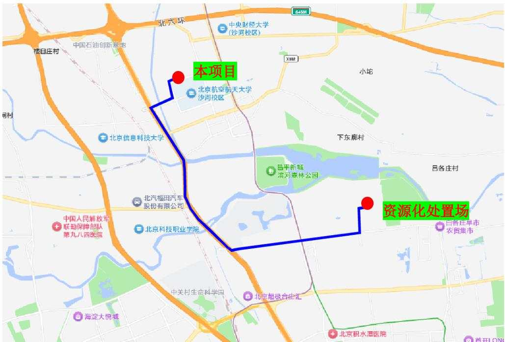  
图 3.2-1 资源化处置场与项目位置关系图

## （4）借方来源分析评价

本项目基坑肥槽回填及地下室顶板覆土总量为 2.49 万 m³，因北京航空航天大学沙河校区红线内建筑密度较高、功能分区清晰，校园内无闲置空地、荒地及未利用地可用于土方临时堆放，校外周边区域经调查亦无符合条件的临时堆土场地，不具备开挖土方现场堆存、场内周转及临时堆放的条件；同时从校园安全管控、师生正常活动及环保要求等方面综合考量，基坑开挖产生的多余土方无法在校区内及周边就地堆存用于后期回填。因此，本项目基坑肥槽回填及地下室顶板覆土所需土方 2.49 万 m³，拟从北京双河建环科技发展有限公司统一外购合格土料进行回填，计划回填时段为2027年12 月\~2028年 2月，以满足工程施工进度及质量要求。

北京双河建环科技发展有限公司具备合法合规的土方供应资质，其运营的建筑垃圾临时处置点配备了再生处理生产线，年合计再生资源化处置规模72万t，可持续对接收的工程渣土进行筛分加工，经加工处理后的土方对外进行销售，包括一般素土、再生砂石骨料、再生砌块等建筑材料，回填土料符合北京市相关标准及本项目肥槽回填、地下室顶板覆土的质量与技术要求。该处置点占地面积9.3hm³，场地内设置专用建筑材料堆存分区，可长期贮存筛分加工后的达标回填土，静态堆存库容约 $2 0 \mathrm { ~ \textbar { ~ } { ~ H ~ m ~ } ^ { 3 } }$ 可保障本项目2.49万m³回填土借方需求。该建筑垃圾临时处置点距离本项目约12km，项目周边交通便利，建设单位已与其签订土方综合利用意向协议书。

综上所述，建设单位在土方施工期间严格约束施工单位，按照相关要求进行土方调运，本项目土石方平衡方案合理，符合水土保持要求。

## 3.2.3.2土方“减量化、资源化”分析与评价

## （1）土石方资源化

项目占地现状涉及表土剥离，施工过程中应加强对表层土的资源化利用，占地范围内可剥离的表土已经全部剥离且利用。项目表土剥离量共 $0 . 6 3 \mathrm { ~ \mathcal ~ { ~ H ~ } ~ m ~ } ^ { 3 }$ ，全部用于本项目绿化覆土，降低了表土资源浪费及破坏。

本项目施工期产生多余工程槽土 26.97万 $\mathbf { m } ^ { 3 }$ ，基于项目周边无满足本项目施工时序的在建项目可消纳利用本项目多余土方，从土方资源化综合利用考虑，余方拟运至距离本项目最近的北京双河建环科技发展有限公司建筑垃圾临时处置点，该处置场所为北京市建筑垃圾管理与服务平台公示的合法的建筑垃圾临时处置点，周边市政交通便利，土方运距时序合理，满足资源化要求。

## （2）土石方减量化

本项目基坑采用“挡墙+桩锚支护”的施工工艺，直立式开挖降低了建筑基础施工坡面范围，同时，在满足施工安全、结构施工、防水施工及肥槽回填压实作业要求的前提下，尽可能减小基坑肥槽开挖宽度，肥槽宽度从 1.2m 减小至 1.0m，有效缩减了基坑外侧土方开挖范围与开挖总量，从源头减少了土方外运、处置及后期回填土需求量，将施工期土方挖填总量从35.51m3 减少至 31.86万m3，减少了3.65 万m3。

因此，项目通过优化施工工艺达到土方的减量化控制，符合水土保持的相关要求。

## 3.2.4取土（石、砂）场设置评价

本项目未设置取土（石、砂）场。

## 3.2.5弃土（石、渣、灰、矸石、尾矿）场设置评价

本项目未设置弃土（石、渣）场。

## 3.2.6施工方法与工艺评价

## （1）施工场地布置分析与评价

根据施工总体布置方案，项目建设布置表土堆存场和施工生产生活区，其中表土堆存场布置于主体工程区西侧，为永久占地；施工生产生活区分别布置在红线外东侧空地内，为临时占地，施工生产生活区及表土堆存场内设计了临时排水沉沙、临时拦挡等水土保持措施，项目建设区四周进行临时围挡，减少了对施工区域以外的影响，项目周边道路系统较为完善，运输条件便利，场地内部施工道路采用永临结合的方式修建。

从水土保持角度考虑，项目临时设施布置充分结合施工进度综合考虑，有效控制施工扰动范围，控制了临时用地面积，总体布局结构紧凑，便于施工运输，缩短运距，施工临建结束使用后拆除并土地整治。因此，项目施工总布置较为合理，基本满足水土保持要求。

## （2）施工时序分析与评价

本项目计划于 2026 年12月开工，2029年10 月竣工验收，工程先进行临建设施施工，之后进行建筑物施工和管线、道路施工，最后绿化区域施工，各工序衔接有序，有利于避免重复扰动，项目分阶段实施在时序上没有额外增加临时征占地，施工时序紧凑合理。建筑物基础开挖等大的土方工程避免了汛期施工，建议建设单位在施工过程中加强组织与管理，防止施工期间新增水土流失量的产生，尤其在土方施工期间，应与气象部门保持联系，尽量避免雨天施工，如遇大雨天气，停止施工，并采取相应水土保持措施。

## （2）施工工艺分析与评价

从施工工艺方面分析，本项目采取以机械施工为主，人工为辅的施工方法，施工过程中应避免乱挖乱填造成的水土流失。主体工程在开挖填筑土方时随挖、随运、随填、随压，可以减少施工扰动范围，同时有效防止了由于自身重力或外力作用造成的坍塌和雨水冲刷造成的水土流失对周边环境的影响。主体各项工程的施工均以减少占地和土石方为原则，施工工艺除了有利于各工序间的交叉衔接、满足工程建设进度需要外，还需满足控制水土流失的要求。

从水土保持角度看，施工期临时防护措施考虑不足，对于施工期的临时防护措施，本方案将予以补充。

## 3.2.7主体工程设计中具有水土保持功能工程的评价

本项目水土保持措施应符合海绵城市与雨水调控、景观绿化与土石方综合利用、雨洪利用与节水措施相协调、临时防护与永久设施形成综合防护体系的原则。根据这一原则对主体中具有水土保持功能的工程进行分析和评价。

## 一、主体已有的水土保持功能工程分析与评价

根据主体设计资料，主体工程中具有水土保持功能的工程措施主要包括雨水管网、雨水调蓄池、透水砖铺装、下凹式绿地、节水灌溉等；主体工程中具有水土保持功能的植物措施主要为景观绿化。

## （1）雨水管网

主体工程设计在建筑物外围道路一侧根据需要布设雨水排水系统，主体布设雨水管线长约453m，管径DN300\~800mm，雨水管道系统采用钢筋混凝土管，雨水口为砖砌，上方盖雨水篦子，作为初期沉淀使用。雨水管网可以将路面及建筑物区汇集的雨水排出，防止项目区内积水，保障项目排水系统的正常运行，具有较好的水土保持效果，符合水土保持要求。

本项目位于昌平区沙河镇，根据《海绵城市雨水控制与利用工程设计规范》（DB11/685-2021）本项目属于北京市暴雨Ⅱ区，第Ⅱ区设计暴雨强度公式为：

$$
\mathrm { q } { = } 1 6 0 2 { \times } ( 1 { + } 1 . 0 3 7 \mathrm { l g P } ) / ( \mathrm { t } { + } 1 1 . 5 9 3 ) ^ { \scriptscriptstyle 0 . 6 8 1 }
$$

式中：q——设计暴雨强度 $[ \mathrm { L } / \mathrm { ~ ( ~ s ~ } \hbar \mathrm { m } ^ { 2 } \mathrm { ) }$ ]；

t——降雨历时（min），取10min；

p——暴雨重现期（年），取5a。

经过计算，项目区5年一遇10min降雨历时内的平均降雨强度 $\mathrm { q } { = } 3 4 0 . 9 9 \mathrm { L } / ( \mathrm { ~ s ~ } \mathrm { { h m } } ^ { 2 } )$ ）。

设计流量应按下式计算：

$$
\scriptstyle { \mathrm { Q } } = { \boldsymbol { \psi } } { \boldsymbol { \ q } } { \mathrm { F } }
$$

式中：Q——设计流量(L/s)；

ψ——径流系数，取 0.55；

q——设计暴雨强度 $( \mathrm { L } / \mathrm { s } \ \mathrm { \hbar h m } ^ { 2 } )$ ，根据计算为 $3 4 0 . 9 9 \mathrm { L } / \mathrm { ~ ( ~ s ~ } \mathrm { { h m } } ^ { 2 } \mathrm { ~ ) }$ ；

F——雨水汇水面积(hm2)，集水最大面积为 $4 . 0 0 \mathrm { h m } ^ { 2 }$

经过计算，主体设计雨水管最大洪峰流量 $\mathrm { Q } { = } 0 . 7 5 \mathrm { m } ^ { 3 } / \mathrm { s }$

雨水管流量公式按下式计算确定：

$$
Q = A V
$$

$$
\begin{array} { r } { V = \frac { 1 } { n } R ^ { 2 / 3 } I ^ { 1 / 2 } } \end{array}
$$

其中：Q——设计流量 $( \mathrm { m } ^ { 3 } / \mathrm { s } )$

A——水流有效断面面积 $( \mathbf { m } ^ { 2 } )$

V——流速（m/s）；

n——糙率，取 n＝0.013；

R——水力半径（m）；

i——雨水管比降，取i=0.3%。

根据计算，主体设计雨水管网末端过水流量为 $0 . 9 3 \mathrm { m } ^ { 3 } / \mathrm { s }$ ，大于洪峰流量，符合水土保持要求。

## （2）雨水调蓄池

主体拟布设3座雨水调蓄池，总容积 $4 1 3 \mathrm m ^ { 3 }$ ，根据《海绵城市雨水控制与利用工程设计规范》（DB11/685-2021），新建建设工程应配建雨水调蓄设施，具体配建标准为：每 $1 0 0 0 \mathrm { m } ^ { 2 }$ 硬化面积配建调蓄容积不小于 $3 0 \mathrm { m } ^ { 3 }$ 的雨水调蓄设施；当总硬化面积达到 $1 0 0 0 0 \mathrm { m } ^ { 2 }$ ，每千平方米硬化面积应配建调蓄容积不小于 $5 0 \mathrm { m } ^ { 3 }$ 的雨水调蓄设施。本项目硬化面积（屋顶面积） $0 . 9 1 \mathrm { h m } ^ { 2 }$ ，配建容积 $4 1 3 \mathrm { m } ^ { 3 }$ 的雨水调蓄池可以满足规范要求。

雨水调蓄池布设于主体道路管线区，采用聚丙烯塑料单元模块组合，在水池周围包裹防渗土工布，形成地下贮水池，池内设雨水回用水泵，并配备相应的回用水管，项目屋面雨水经雨水斗收集后，沿外墙外侧雨水管排下，经场地内雨水管网收集后排入雨水调蓄池，雨水调蓄池可以有效规避城市雨水洪峰，不仅可以减轻雨水管渠系统的压力，也可以降低项目区内涝风险。储存的雨水经过净化后可用于综合利用，如浇灌绿地、冲洗道路等，可提高雨水利用率，节约水资源。

## （3）透水砖铺装

主体设计考虑将地面人行步道设计为透水砖铺装，根据《透水路面和透水路面板》（GB/T25993-2010），透水砖规格为 20cm×10cm×8cm（长×宽×厚），铺装路面结构自上而下分别为：8cm 透水砖、3cm 中砂、15cm 级配砂砾石、6cm 中砂基层，透水砖铺装面积 7862m2。

透水砖铺装路面可以涵养地下水源，减少地表径流，降低城市水污染，通过透水路面铺装，将雨水渗入地下，实现水资源的可持续利用，是保护城市生态环境的重要措施之一。

## （4）绿化工程

根据设计资料，主体工程后期绿化面积 1.46hm2，绿化采用园林景观标准设计，营造乔灌草结合的自然景象。绿化措施实施后不仅具有较好的水土保持、涵养水源和景观功能，同时还有较好的防尘、防污染效果。

## （5）下凹式绿地

根据《海绵城市雨水控制与利用工程设计规范》（DB11/685-2021），凡涉及绿地率指标要求的建设工程，绿地中至少应有 50%设为下凹式绿地或生物滞留设施等滞蓄雨水的设施。

为了满足项目雨水调蓄要求，主体设计 0.73hm2 绿地为滞留雨水的下凹式绿地，下凹深度为 10cm。下凹式绿地不仅符合水土保持相关要求和规定，同时还可有效利用积蓄雨水作为植被养护用水，减少管护费用，建议项目区道路两侧的路缘石与道路路面齐平，这样道路雨水可直接流入周边绿地内。

## （6）节水灌溉

建设单位采用节水灌溉系统对绿地进行灌溉，设计给水管采用UPVC 管直接埋设。节水灌溉能有效减少地表径流和深层渗漏，从而降低土壤侵蚀和养分流失；同时，保持适宜的土壤湿度有助于促进作物根系发育和土壤团聚体形成，进一步增强土壤的抗

蚀与保水能力。方案建议雨水管线接入雨水调蓄池，道路、绿地等集雨面收集雨水后经雨水管线汇入雨水调蓄池，池内蓄积的雨水可用于绿地节水灌溉。

## 二、临时防护措施分析与评价

主体设计对临时防护措施考虑不足，方案将结合工程施工情况，补充表土剥离及回覆措施，建筑物基础开挖外围临时排水及临时沉沙措施，道路及管线施工期管槽一侧临时堆土苫盖措施，绿化工程施工前裸露面密目网苫盖措施，同时方案考虑到施工临建设施措施体系尚不完善，方案补充施工期临时排水及沉沙措施，施工期雨水通过临时排水沟及沉沙池后排入项目周边雨水管道。对其表土堆存场进行临时拦挡及苫盖措施，施工结束后对临时占地进行土地整平和密目网苫盖措施。从而形成完善的临时防护措施体系。

根据主体工程具有水土保持功能工程的分析评价，结合主体工程施工工序与施工季节，对不满足水土保持要求的部分补充和完善后，使之形成一个综合、高效的水土流失防治措施体系。

表 3.2-1 主体设计具有水土保持功能的措施及方案补充措施汇总表
<table><tr><td rowspan=1 colspan=1>分区</td><td rowspan=1 colspan=1>主体设计的水土保持措施</td><td rowspan=1 colspan=1>方案新增水土保持措施</td></tr><tr><td rowspan=1 colspan=1>主体工程区</td><td rowspan=1 colspan=1>雨水管网、雨水调蓄池、透水砖铺装、下凹式整地、节水灌溉、植物绿化</td><td rowspan=1 colspan=1>表土剥离及回覆、防尘网覆盖、临时排水沟、洒水降尘</td></tr><tr><td rowspan=1 colspan=1>施工生产区</td><td rowspan=1 colspan=1>/</td><td rowspan=1 colspan=1>表土剥离及回覆、防尘网覆盖、临时排水沟、临时沉沙池、洒水降尘、土地平整、撒播草籽</td></tr><tr><td rowspan=1 colspan=1>施工生活区</td><td rowspan=1 colspan=1>/</td><td rowspan=1 colspan=1>防尘网覆盖、临时排水沟、临时沉沙池、土地平整</td></tr><tr><td rowspan=1 colspan=1>临时堆土区</td><td rowspan=1 colspan=1>/</td><td rowspan=1 colspan=1>防尘网覆盖、临时排水沟、临时沉沙池、土袋拦挡、撒播草籽</td></tr></table>

## 3.3主体工程设计中水土保持措施界定

## 3.3.1界定原则

## （1）主导功能原则

以防治水土流失为主要目标的工程，其设计、工程量、投资应纳入水土保持设计中；以主体工程设计为主、同时具有水土保持功能的工程，其设计、工程量、投资不纳入水土保持投资，仅对其进行水土保持分析和评价。

## （2）责任分区原则

对建设过程中的临时征地、临时占地，因施工结束后将归还当地群众或政府，基

于水土保持工作具有公益性质的特点，需要将此范围的各项防护措施作为水土保持工程，计入水土保持设计。

## （3）实验排除原则

对主体设计功能和水土保持功能结合较紧密的工程，可按破坏性试验原则进行排除，假定没有这些工程，在没有受到土壤侵蚀外营力的同时，主体工程设计功能仍旧可以发挥作用的，此类工程即可看作以防止土壤侵蚀为主要目标，应算做水土保持工程，计入水土保持设计。

## 3.3.2措施界定

参照《生产建设项目水土保持技术标准》（GB50433-2018）“附录 D 主体工程设计中水土保持措施界定”，将主体工程设计中以水土保持功能为主的工程界定为水土保持措施。

根据主体工程设计中具有水土保持功能工程的评价，结合水土保持工程界定原则可知，本项目主体工程设计中道路硬化、彩钢板拦挡、临时洗车池等，可降低水土流失量，但这些工程以保证主体工程安全为主，属主体工程正常运转不可或缺的组成部分，仅为兼有水土保持功能，不界定为水土保持措施。

主体工程设计的雨水管网、雨水调蓄池、景观绿化、下凹式绿地、节水灌溉等能够满足本阶段水土保持技术要求，可降低工程区水土流失量，具有较好的水土保持功能，本方案将其界定为水土保持措施，具体工程量如下。

## （1）工程措施

主体设计水土保持工程措施包括雨水管网、雨水调蓄池、透水砖铺装、下凹式绿地、节水灌溉，这些措施具有良好的水土保持功能，可作为水保措施纳入方案投资。

## ①雨水管网

主体设计沿项目区道路建设雨水管线 453m，主体工程雨水排水系统可以有效的收集区内汇集雨水，减少径流冲刷引起的水土流失，界定为水土保持措施并纳入水土保持投资。什么规范、如何计算，管径、过流能力复核

## ②雨水调蓄池

主体设计 3座雨水调蓄池，总容积 $4 1 3 \mathrm { m } ^ { 3 }$ ，雨水调蓄池可以有效规避城市雨水洪峰，也可以降低项目区内涝风险，界定为水土保持措施并纳入水土保持投资。

## ③透水砖铺装

主体设计透水砖铺装面积约7862m²，可固化土壤，同时具有透水性，能够在一定程度上防治水土流失，界定为水土保持措施并纳入水土保持投资。

## ④下凹式整地

主体设计对景观绿地采用下凹式绿地设计，下凹式绿地可以集雨蓄渗，减少地面径流，界定为水土保持措施并纳入水土保持投资。

## ⑤节水灌溉

主体设计室外绿地内设计了 套节水灌溉装置，采用微喷节水灌溉方式浇灌，节水灌溉以水土保持功能为主，界定为水土保持措施并纳入水土保持投资。

## （2）植物措施

主体设计水土保持植物措施主要为庭院绿化景观，植物措施面积 $1 . 4 6 \mathrm { h m } ^ { 2 }$ ，植物措施的布设在美化校园的同时具有防风固沙，固水保土的作用。绿化工程将作为水保措施纳入方案投资。

主体设计中具有水土保持功能的措施工程量及投资详见下表。

表 3.3-1 主体设计中具有水土保持功能工程的工程量及投资
<table><tr><td rowspan=1 colspan=1>防治分区</td><td rowspan=1 colspan=1>措施类型</td><td rowspan=1 colspan=1>措施名称</td><td rowspan=1 colspan=1>单位</td><td rowspan=1 colspan=1>数量</td><td rowspan=1 colspan=1>投资（万元）</td></tr><tr><td rowspan=6 colspan=1>主体工程区</td><td rowspan=5 colspan=1>工程措施</td><td rowspan=1 colspan=1>雨水管网</td><td rowspan=1 colspan=1>m</td><td rowspan=1 colspan=1>453</td><td rowspan=1 colspan=1>13.59</td></tr><tr><td rowspan=1 colspan=1>雨水调蓄池</td><td rowspan=1 colspan=1>座</td><td rowspan=1 colspan=1>3</td><td rowspan=1 colspan=1>72.00</td></tr><tr><td rowspan=1 colspan=1>透水砖铺装</td><td rowspan=1 colspan=1>m²</td><td rowspan=1 colspan=1>7862</td><td rowspan=1 colspan=1>117.93</td></tr><tr><td rowspan=1 colspan=1>下凹式绿地</td><td rowspan=1 colspan=1>hm²</td><td rowspan=1 colspan=1>0.73</td><td rowspan=1 colspan=1>0.51</td></tr><tr><td rowspan=1 colspan=1>节水灌溉</td><td rowspan=1 colspan=1>套</td><td rowspan=1 colspan=1>1</td><td rowspan=1 colspan=1>33.49</td></tr><tr><td rowspan=1 colspan=1>植物措施</td><td rowspan=1 colspan=1>植物绿化</td><td rowspan=1 colspan=1>hm²</td><td rowspan=1 colspan=1>1.46</td><td rowspan=1 colspan=1>218.40</td></tr><tr><td rowspan=1 colspan=2>合计</td><td rowspan=1 colspan=1></td><td rowspan=1 colspan=1></td><td rowspan=1 colspan=1></td><td rowspan=1 colspan=1>455.92</td></tr></table>

## 4水土流失分析与预测

通过对项目区地形地貌、土壤植被、地表物质及水土流失现状等因素进行全面调查分析，结合工程特点，确定主体工程区、临时堆土区为水土流失预测的重点区域。同时根据工程具体布局，着重对工程施工过程中可能造成的地表扰动、破坏植被及损坏水土保持设施情况，以及各施工单元的新增水土流失量及其危害进行预测和评价，并掌握工程施工建设过程中新增水土流失发生的重点时段和重点部位，为制定水土流失防治总体布局和单项防治措施设计提供依据。

## 4.1水土流失现状

根据《生产建设项目水土流失防治标准》(GB/T50434-2018)，本项目执行水土流失防治标准等级为北方土石山区一级标准，结合《土壤侵蚀分类分级标准》（SL190-2007），项目区的水土流失类型以水力侵蚀为主。因项目建设区地形较为平缓，其水土流失形式主要为层状面蚀，属微度土壤侵蚀区，土壤侵蚀模数背景值为150t/$( \mathrm { { k m } ^ { 2 } \mathrm { { a } ) } }$ ，容许土壤流失量为 $2 0 0 \mathrm { t / k m } ^ { 2 }$ ·a。项目区位于昌平区，属于北京市水土流失重点预防区。

昌平区现有水土流失面积 $9 8 . 8 4 \mathrm { k m } ^ { 2 }$ ，占全区总面积的 7.35%。全区中轻度水土流失面积为 $9 7 . 6 6 \mathrm { k m } ^ { 2 }$ ，占总流失面积的 98.81%，中度水土流失面积为 $1 . 1 5 \mathrm { k m } ^ { 2 }$ ，占总流失面积的1.16%，强烈水土流失面积为 $0 . 0 3 \mathrm { k m } ^ { 2 }$ ，占总流失面积的 0.03%。

## 4.2水土流失影响因素分析

## 4.2.1水土流失影响因素

项目区的水土流失是由于工程施工中挖损破坏以及占压地表，使施工区地形地貌、地表植被、土壤发生巨大的变化而引起的，属于人为因素的加速侵蚀，具有流失面积集中、流失形式多样等特点，并主要集中在工程施工期间。在自然恢复期，项目区各项措施均付诸实施，植物措施也逐渐发挥效益，水土流失将逐步得到控制。

项目水土流失具体因素主要包括以下环节：

## （1）施工因素

项目建设伴随着基槽土石方开挖、建立临时设施等施工活动。这些活动都将破坏原有地貌、毁坏植被，降低植被覆盖率，破坏原有生态防护体系。同时，增加大量裸露地表，在降雨及大风天气，将会造成大量水土流失。

## （2）气象因素

工程施工过程中会经历雨季，由于土壤结构遭到破坏，土质疏松，不仅会产生降雨侵蚀，遇到大风天气，还会产生强烈风蚀，此外运输车辆和施工作业遇到 2级以上风力都会产生扬尘。如果不采取水土保持措施，会产生严重的水土流失。

## 4.2.2扰动地表情况

在水土保持方案编制过程中，通过设计资料对项目拟扰动地表面积进行统计和预测，是后期水土保持方案设计和实施阶段规划防治措施，投资等的主要依据。

根据设计方案对拟建工程各预测分区占地面积中扰动地表进行分析统计，项目扰动地表面积主要共计 5.13hm2，其中表土堆存场布设于永久占地范围内，扰动地表不重复计算。

表 4.2-1 扰动地表情况
<table><tr><td rowspan=1 colspan=1>预测分区</td><td rowspan=1 colspan=1>扰动地表面积（hm²）</td></tr><tr><td rowspan=1 colspan=1>主体工程区</td><td rowspan=1 colspan=1>4.00</td></tr><tr><td rowspan=1 colspan=1>施工生产区</td><td rowspan=1 colspan=1>0.63</td></tr><tr><td rowspan=1 colspan=1>施工生活区</td><td rowspan=1 colspan=1>0.50</td></tr><tr><td rowspan=1 colspan=1>临时堆土区</td><td rowspan=1 colspan=1>(0.25)</td></tr><tr><td rowspan=1 colspan=1>合计</td><td rowspan=1 colspan=1>5.13</td></tr></table>

注：（）内占地为红线范围内，不重复计算。

## 4.2.3损毁植被面积

依据主体设计文件及施工现场情况，本工程建筑损毁植被主要包括法桐、槐树、柏树、桃树等树木和杂草，建设损毁植被面积为 2.53hm2。

## 4.2.4废弃（土、石、渣）量

工程施工期间，本项目共产生余方 26.97万 m3，均为工程槽土，余方拟运往北京双河建环科技发展有限公司建筑垃圾临时处置点。

## 4.3水土流失量预测

## 4.3.1预测单元

通过对项目建设区进行现场踏勘，收集建设项目主体工程建设内容、建设规模、建设期、项目区地形、气象、植被等基础资料，确定建设项目的扰动地表范围，按扰动方式相同、扰动强度相仿、土壤类型和质地相近、气象条件相似、空间上相连续的原则划分预测扰动单元。

按照扰动方式、坡长、坡度、地表覆盖、土壤类型和质地、气象条件等参数相对

一致的原则划分计算单元。

根据本项目施工建设的特点及自然环境等因素，将水土流失预测单元划分为主体工程区、施工生产区、施工生活区和临时堆土区等共4个预测单元，其中临时堆土区全部布设于主体工程区范围内。

表 4.3-1 项目水土流失预测范围及预测单元划分（单位：hm²）
<table><tr><td rowspan=1 colspan=1>防治分区</td><td rowspan=1 colspan=1>施工期预测面积(hm)</td><td rowspan=1 colspan=1>自然恢复期预测面积(hm 3</td><td rowspan=1 colspan=1>备注</td></tr><tr><td rowspan=1 colspan=1>主体工程区</td><td rowspan=1 colspan=1>4.00</td><td rowspan=1 colspan=1>1.46</td><td rowspan=1 colspan=1>自然恢复期考虑复绿区域</td></tr><tr><td rowspan=1 colspan=1>施工生产区</td><td rowspan=1 colspan=1>0.63</td><td rowspan=1 colspan=1>0.63</td><td rowspan=1 colspan=1></td></tr><tr><td rowspan=1 colspan=1>施工生活区</td><td rowspan=1 colspan=1>0.50</td><td rowspan=1 colspan=1></td><td rowspan=1 colspan=1></td></tr><tr><td rowspan=1 colspan=1>临时堆土区</td><td rowspan=1 colspan=1>(0.25)</td><td rowspan=1 colspan=1></td><td rowspan=1 colspan=1>布置在主体工程区内</td></tr><tr><td rowspan=1 colspan=1>合计</td><td rowspan=1 colspan=1>5.13</td><td rowspan=1 colspan=1>2.09</td><td rowspan=1 colspan=1></td></tr></table>

注：（）内占地为红线范围内，不重复计算。

## 4.3.2预测时段

依据《生产建设项目水土保持技术标准》（GB 50433-2018），水土流失预测时段分为施工期（包括施工准备期）和自然恢复期。各预测单元施工期和自然恢复期应根据施工进度分别确定。

施工期：项目工期为 2026 年 12 月\~2029 年 10 月，计划总工期 35个月。建构筑物工程区在主体结构完成肥槽回填后，基本不再发生水土流失，结合工期，建筑物工程区预测时段取 1 年，道路管线工程区、绿化工程区、施工临建区预测时段取 3 年。

自然恢复期：自然恢复期为施工扰动结束后，不采取水土保持措施的情况下，土壤侵蚀强度自然恢复到扰动前土壤侵蚀强度所需要的时间，根据项目区半湿润半干旱的气候条件及《生产建设项目水土保持技术标准》（GB 50433-2018）规定，本项目自然恢复期预测时段取 3 年。

各预测单元预测时段划分统计表如下。

表 4.3-2 工程水土流失预测时段划分
<table><tr><td rowspan=2 colspan=2>预测单元</td><td rowspan=1 colspan=2>预测时段（年）</td></tr><tr><td rowspan=1 colspan=1>施工期</td><td rowspan=1 colspan=1>自然恢复期</td></tr><tr><td rowspan=3 colspan=1>主体工程区</td><td rowspan=1 colspan=1>建构筑物工程区</td><td rowspan=1 colspan=1>1</td><td rowspan=1 colspan=1></td></tr><tr><td rowspan=1 colspan=1>道路管线工程区</td><td rowspan=1 colspan=1>3</td><td rowspan=1 colspan=1></td></tr><tr><td rowspan=1 colspan=1>绿化工程区</td><td rowspan=1 colspan=1>3</td><td rowspan=1 colspan=1>3</td></tr><tr><td rowspan=1 colspan=2>施工生产区</td><td rowspan=1 colspan=1>3</td><td rowspan=1 colspan=1>3</td></tr><tr><td rowspan=1 colspan=2>施工生活区</td><td rowspan=1 colspan=1>3</td><td rowspan=1 colspan=1></td></tr><tr><td rowspan=1 colspan=2>临时堆土区</td><td rowspan=1 colspan=1>3</td><td rowspan=1 colspan=1></td></tr></table>

## 4.3.1土壤侵蚀模数

本项目土壤侵蚀模数分为原地貌土壤侵蚀模数、施工期土壤侵蚀模数和自然恢复期土壤侵蚀模数，各阶段侵蚀模数确定情况如下：

## （1）原地貌土壤侵蚀模数

根据《土壤侵蚀分类分级标准》（SL190-2007），项目区属于北方土石山区，容许土壤流失量为 $2 0 0 \mathrm { t / k m } ^ { 2 }$ ·a，水土流失类型以微度水力侵蚀为主，根据现场调查，综合确定土壤侵蚀模数约为 $1 5 0 \mathrm { t / k m } ^ { 2 } :$ a。

## （2）扰动后土壤侵蚀模数

根据《生产建设项目土壤流失量测算导则》（SL 773-2018）规定，生产建设项目土壤流失按一般扰动地表、工程开挖面、工程堆积体 3种下垫面类型进行计算。未经夯实的工程回填面参照地表翻扰型一般扰动地表计算土壤流失量；未采取水土流失防治措施的碾压地表、填压面（填筑面）参照工程开挖面计算土壤流失量。

项目所在区域属于《土壤侵蚀分类分级标准》（SL190-2007）中划分的水力侵蚀类型区，土壤流失量预测按水力作用下的计算方法进行计算。项目扰动单元数量小于20个，所以项目总土壤流失量为各典型扰动单元土壤流失量之和。

各类下垫面的土壤流失量计算方法如下：

1）水力作用下地表翻扰型一般扰动地表土壤流失量

$$
\mathbf { M } _ { \mathrm { y d } } { = } \mathbf { R } \mathbf { K } _ { \mathrm { y d } } \mathbf { L } _ { \mathrm { y } } \mathbf { S } _ { \mathrm { y } } \mathbf { B } \mathbf { E } \mathbf { T } \mathbf { A }\tag{式 4-1}
$$

$$
\mathrm { K _ { y d } = N K }\tag{式 4-2}
$$

式中：

$\mathbf { M } _ { \mathrm { y d } }$ ——地表翻扰型一般扰动地表计算单元土壤流失量，t；

R——降雨侵蚀力因子， $\mathbf { M J } \ \mathbf { m m } / ( \mathbf { h m } ^ { 2 } \ \mathbf { m } )$ ；

K——土壤可蚀性因子， $\mathrm { t } ~ \mathrm { h m } ^ { 2 } ~ \mathrm { h } / ( \mathrm { h m } ^ { 2 } ~ \mathrm { M J ~ m m } )$ ；

$\mathrm { K _ { y d } }$ ——地表翻扰后土壤可蚀性因子， $\mathrm { t } ~ \mathrm { h m } ^ { 2 } ~ \mathrm { h } / ( \mathrm { h m } ^ { 2 } ~ \mathrm { M J ~ m m } )$ ；

N——地表翻扰后土壤可蚀性因子增大系数，无量纲，取值 2.13；

$\mathrm { L _ { y } }$ ——坡长因子，无量纲；

$\mathrm { S _ { y } }$ ——坡度因子，无量纲；

B——植被覆盖因子，无量纲；

E——工程措施因子，无量纲；

T——耕作措施因子，无量纲；

A——计算单元的水平投影面积， $\mathrm { h m } ^ { 2 }$

①降雨侵蚀力因子 R

根据导则中附录 C 选用本项目所在行政区的全年降雨侵蚀力因子 R 值为$2 3 1 9 . 8 \mathrm { M J \ m m / ( h m } ^ { 2 } \ \mathrm { m } )$ o

②土壤可蚀性因子 K

根据导则中附录 C 选用本项目所在行政区的土壤可蚀性因子 K值为0.0175。

③坡长因子 Ly

坡长因子按下列公式计算：

$$
\scriptstyle \mathrm { L y = } ( \lambda / 2 0 ) ^ { \mathrm { m } }\tag{式 4-3}
$$

$$
\lambda { = } \lambda _ { \mathrm { x } } { \cos \theta }\tag{式 4-4}
$$

式中：

λ——计算单元水平投影坡长度，m，对一般扰动地表，水平投影坡长 ${ \le } 1 0 0 \mathrm { m }$ 时按实际值计算，水平投影坡长＞100m 按100m 计算；

θ——计算单元坡度，（°），取值范围为0\~90°；

m——坡长指数，其中 $\theta { \leq } 1 ^ { \circ }$ ，m 取 0.2； $1 ^ { \circ } < \theta { \leq } 3 ^ { \circ }$ 时，m 取 0.3； $3 ^ { \circ } < \theta { \leq } 5 ^ { \circ }$ 时，m 取0.4； $\theta { \geq } 5 ^ { \circ }$ 时，m 取 0.5；

$\lambda _ { \mathrm { { x } } } .$ ——计算单元斜坡长度，m。

④坡度因子 Sy

坡度因子按下列公式计算：

$$
\operatorname S y = - 1 . 5 + 1 7 / [ 1 + \mathrm { e } ^ { ( 2 . 3 - 6 . 1 \sin \theta ) } ]\tag{式 4-5}
$$

式中：

e——自然对数的底，取 2.72。

⑤植被覆盖因子 B

一般扰动地表计算单元为草地或灌木林地时，采用照相法或目估法实地测量植被覆盖度，参考《生产建设项目土壤流失量测算导则》（SL 773-2018）中表 4直接确定或运用线性插值法确定植被覆盖因子值，灌草混合植被以灌木林地对待。

一般扰动地表计算单元为乔木林地时，采用照相法或目估法实地测量植被覆盖度，参考《生产建设项目土壤流失量测算导则》（SL 773-2018）中表5直接确定或运用线性插值法确定植被覆盖因子值，乔灌草混合植被以乔木林地对待。

以乔木质量测量郁闭度，以灌草质量测量植被覆盖度。

一般扰动地表计算单元为农地时，植被覆盖度因子值取 1。

本项目根据各典型扰动单元的特点选取相应的植被覆盖因子进行计算。

⑥工程措施因子 E

计算某一侧期一般扰动地表土壤流失量时，应计算扰动前土壤流失量，作为计算一般扰动土地新增土壤流失量的背景值。原地表有水土保持工程措施则计算扰动前土壤流失量时，应考虑工程措施因子值。具体取值参考导则表 6选取。

本项目原地表无导则中所涉及水土保持工程措施，工程措施因子取值为 1。

⑦耕作措施因子 T

计算某一测期一般扰动地表土壤流失量时，若原地表为农地，则计算扰动前土壤流失量时，考虑耕作措施因子值。

$$
\mathrm { T } { = } \mathrm { T } 1 \mathrm { T } 2\tag{式 4-6}
$$

式中：

T1——整地及种植方式因子，无量纲；

T2——轮作制度因子，无量纲。

T1和T2参考导则中表 7和表8取值；

本项目一般扰动地表原地表为非农地，耕作措施因子值取 1。

⑧水平投影面积 A

计算单元水平投影面积按如下公式：

$$
\mathbf { A } { = } 1 0 ^ { - 4 } \omega \lambda _ { \mathrm { x } } \mathrm { c o s } \Theta\tag{式 4-7}
$$

式中：

ω——计算单元宽度，m。

2）地表翻扰型一般扰动地表计算单元新增土壤流失量原有植被为乔木林地、灌木林地或草地时：

$$
\Delta \mathrm { M } _ { \mathrm { y d } } { = } ( \mathrm { N B E { - } B _ { 0 } E _ { 0 } ) \mathrm { R K L } _ { \mathrm { y } } S _ { \mathrm { y } } A }\tag{式 4-8}
$$

式中：

$\Delta \mathrm { M } _ { \mathrm { y d } }$ ——地表翻扰型一般扰动地表计算单元新增土壤流失量，t；

$\mathrm { E } _ { 0 ^ { - } }$ ——一般扰动地表计算单元扰动前的工程措施因子，无量纲。

原有植被为农作物时：

$$
\Delta \mathrm { M _ { y d } } { = } ( \mathrm { N E T { \mathrm { - } } E _ { 0 } T _ { 0 } ) \mathrm { R K L _ { y } S _ { y } A } }\tag{式 4-9}
$$

3）水力作用下植被破坏型一般扰动地表土壤流失量测算

$$
\mathbf { M } _ { \mathrm { y z } } { = } \mathrm { R K L } _ { \mathrm { y } } \mathbf { S } _ { \mathrm { y } } \mathbf { B } \mathrm { E T A }\tag{式 4-10}
$$

式中：

$\mathbf { M } _ { \mathrm { y z } }$ ——植被破坏型一般扰动地表计算单元土壤流失量，t。

4）植被破坏型一般扰动地表计算单元新增土壤流失量

$$
\Delta \mathbf { M } _ { \mathrm { y z } } { = } ( \mathbf { B } { \mathbf { - } } \mathbf { B } _ { 0 } ) \mathbf { R K L } _ { \mathrm { y } } \mathbf { S } _ { \mathrm { y } } \mathbf { A }\tag{式 4-11}
$$

式中：

$\Delta \mathrm { M } _ { \mathrm { y z } }$ ——植被破坏型一般扰动地表计算单元新增土壤流失量，t。

$\mathtt { B } _ { 0 }$ ——一般扰动地表计算单元扰动前的植被覆盖因子，无量纲；

5）上方无来水工程开挖面土壤流失量测算

$$
\mathbf { M } _ { \mathrm { k w } } { = } \mathbf { R } \mathbf { G } _ { \mathrm { k w } } \mathbf { L } _ { \mathrm { k w } } \mathbf { S } _ { \mathrm { k w } } \mathbf { A }\tag{式 4-12}
$$

式中：

$\mathbf { M } _ { \mathrm { k w } }$ ——上方无来水工程开挖面计算单元土壤流失量，t；

$\mathrm { G } _ { \mathrm { k w } }$ ——上方无来水工程开挖面土质因子， $\mathrm { t } ~ \mathrm { h m } ^ { 2 } ~ \mathrm { h } / ( \mathrm { h m } ^ { 2 } ~ \mathrm { M J ~ m m } )$

$\operatorname { L } _ { \mathrm { k w } } .$ ——上方无来水工程开挖面坡长因子，无量纲；

$\mathbf { S } _ { \mathbf { k w } } .$ ——上方无来水工程开挖面坡度因子，无量纲。

①上方无来水工程开挖面土质因子 Gkw计算：

$$
\mathrm { G k w { = } 0 . 0 0 4 e ^ { 4 . 2 8 5 I L ( 1 - C L A ) / \rho } }\tag{式 4-13}
$$

式中：

ρ——土体密度， $\mathrm { g } / \mathrm { c m } ^ { 3 }$

SIL——粉粒（0.002\~0.05mm）含量，取小数；

CIA——黏粒（＜0.002mm）含量，取小数。

②上方无来水工程开挖面坡长因子 Lkw 计算：

$$
\scriptstyle \mathrm { L k w = } ( \lambda / 5 ) ^ { - 0 . 5 7 }\tag{式 4-14}
$$

③上方无来水工程开挖面坡度因子 $\mathrm { L } _ { \mathrm { k w } }$ 计算：

$$
\mathrm { S _ { k w } } { = } 0 . 8 0 { \sin } { \theta } { + } 0 . 3 8\tag{式 4-15}
$$

6）上方无来水工程堆积体土壤流失量测算

$$
\scriptstyle \mathbf { M } _ { \mathrm { d w } } = \mathbf { X } \mathbf { R } \mathbf { G } _ { \mathrm { d w } } \mathbf { L } _ { \mathrm { d w } } \mathbf { S } _ { \mathrm { d w } } \mathbf { A }\tag{式 4-16}
$$

式中：

$\mathbf { M } _ { \mathrm { d w } }$ ——上方无来水工程堆积体计算单元土壤流失量，t；

X——工程堆积体形态因子，无量纲；

R——降雨侵蚀力因子， $\mathbf { M J } { \mathrm { ~ m m } } / ( \mathbf { h m } ^ { 2 } \mathbf { \Delta h } )$ ；

$\mathrm { G } _ { \mathrm { d w } }$ ——上方无来水工程堆积体土石质因子，t $\mathbf { \widehat { t h m } } ^ { 2 } \mathbf { \widehat { h } } / ( \mathbf { h m } ^ { 2 } \mathbf { \overrightarrow { M J } } \mathbf { \overrightarrow { m m } } )$

$\mathrm { L _ { d w } }$ ——上方无来水工程堆积体坡长因子，无量纲；

$\mathbf { S } _ { \mathrm { d w } }$ ——上方无来水工程堆积体坡度因子，无量纲。

①侵蚀面为倾斜平面的堆积体形态因子取 1；

②降雨侵蚀力因子参照一般地表降雨侵蚀力计算公式计算；

③工程堆积体土石质因子 $\mathrm { G } _ { \mathrm { d w } }$ 按下述公式计算：

$$
G _ { d w } = a _ { 1 } e ^ { b _ { 1 } \delta }\tag{式 4-17}
$$

式中：

δ——计算单元侵蚀面土体砾石含量，重量百分比，取小数（如 0.1、0.2 等）；

${ \bf a } _ { 1 }$ $\mathbf { b } _ { 1 } .$ ——上方无来水工程堆积体土石质因子系数，按《生产建设项目土壤流失量测算导则》（SL 773-2018）中表 9 选取；

④坡度因子按下述公式计算：

$$
{ \cal S } _ { d w } = { \bf \Xi } ( \theta / 2 5 { \bf \Xi } ) { \bf \Lambda } ^ { d _ { 1 } }\tag{式 4-18}
$$

式中：

${ \mathrm { d } } _ { 1 } .$ ——上方无来水工程堆积体坡度因子系数，按《生产建设项目土壤流失量测算导则》（SL 773-2018）中表 10 的规定取值。

⑤坡长因子按下述公式计算：

$$
L _ { d w } = { \bf \Xi } ( \lambda / 5 { \bf \Lambda } ) ^ { f _ { 1 } }\tag{式 4-19}
$$

式中： $\mathrm { f } _ { 1 } .$ ——上方无来水工程堆积体坡长因子系数，按《生产建设项目土壤流失量测算导则》（SL 773-2018）中表 11 的规定取值。

经计算，本工程涉及的土壤流失类型的施工期土壤侵蚀模数详见下表。

表 4.3-3 工程涉及的土壤流失类型土壤侵蚀模数表
<table><tr><td rowspan=2 colspan=1>项目</td><td rowspan=2 colspan=1>符号</td><td rowspan=1 colspan=1>上方无来水工程开挖面</td><td rowspan=1 colspan=1>上方无来水工程堆积体</td><td rowspan=1 colspan=4>地表翻扰型一般扰动地表</td></tr><tr><td rowspan=1 colspan=1>构建筑物工程区</td><td rowspan=1 colspan=1>临时堆土区</td><td rowspan=1 colspan=1>道路管线工程区</td><td rowspan=1 colspan=1>绿化工程区</td><td rowspan=1 colspan=1>施工生产区</td><td rowspan=1 colspan=1>施工生活区</td></tr><tr><td rowspan=1 colspan=1>侵蚀模数</td><td rowspan=1 colspan=1></td><td rowspan=1 colspan=1>2997</td><td rowspan=1 colspan=1>4658</td><td rowspan=1 colspan=1>2371</td><td rowspan=1 colspan=1>1824</td><td rowspan=1 colspan=1>267</td><td rowspan=1 colspan=1>696</td></tr><tr><td rowspan=1 colspan=1>流失量</td><td rowspan=1 colspan=1>M</td><td rowspan=1 colspan=1>29.97</td><td rowspan=1 colspan=1>46.58</td><td rowspan=1 colspan=1>23.71</td><td rowspan=1 colspan=1>18.24</td><td rowspan=1 colspan=1>2.67</td><td rowspan=1 colspan=1>6.96</td></tr><tr><td rowspan=1 colspan=1>工程堆积体形态因子</td><td rowspan=1 colspan=1>X</td><td rowspan=1 colspan=1>/</td><td rowspan=1 colspan=1>1</td><td rowspan=1 colspan=1>/</td><td rowspan=1 colspan=1>/</td><td rowspan=1 colspan=1>/</td><td rowspan=1 colspan=1>/</td></tr><tr><td rowspan=1 colspan=1>降雨侵蚀力因子</td><td rowspan=1 colspan=1>R</td><td rowspan=1 colspan=1>2319.8</td><td rowspan=1 colspan=1>2319.8</td><td rowspan=1 colspan=1>2319.8</td><td rowspan=1 colspan=1>2319.8</td><td rowspan=1 colspan=1>2319.8</td><td rowspan=1 colspan=1>2319.8</td></tr><tr><td rowspan=1 colspan=1>土壤可蚀性因子</td><td rowspan=1 colspan=1>K</td><td rowspan=1 colspan=1>/</td><td rowspan=1 colspan=1>/</td><td rowspan=1 colspan=1>0.0175</td><td rowspan=1 colspan=1>0.0175</td><td rowspan=1 colspan=1>0.0175</td><td rowspan=1 colspan=1>0.0175</td></tr><tr><td rowspan=1 colspan=1>增大系数</td><td rowspan=1 colspan=1>N</td><td rowspan=1 colspan=1>/</td><td rowspan=1 colspan=1>/</td><td rowspan=1 colspan=1>2.13</td><td rowspan=1 colspan=1>2.13</td><td rowspan=1 colspan=1>2.13</td><td rowspan=1 colspan=1>2.13</td></tr><tr><td rowspan=1 colspan=1>土质因子</td><td rowspan=1 colspan=1>G</td><td rowspan=1 colspan=1>0.01</td><td rowspan=1 colspan=1>0.03</td><td rowspan=1 colspan=1>1</td><td rowspan=1 colspan=1>/</td><td rowspan=1 colspan=1>/</td><td rowspan=1 colspan=1>/</td></tr><tr><td rowspan=1 colspan=1>坡长因子</td><td rowspan=1 colspan=1>L</td><td rowspan=1 colspan=1>1.69</td><td rowspan=1 colspan=1>0.72</td><td rowspan=1 colspan=1>1.62</td><td rowspan=1 colspan=1>1.62</td><td rowspan=1 colspan=1>1.38</td><td rowspan=1 colspan=1>1.38</td></tr><tr><td rowspan=1 colspan=1>水平投影坡长</td><td rowspan=1 colspan=1>λ</td><td rowspan=1 colspan=1>2</td><td rowspan=1 colspan=1>3</td><td rowspan=1 colspan=1>100</td><td rowspan=1 colspan=1>100</td><td rowspan=1 colspan=1>100</td><td rowspan=1 colspan=1>100</td></tr><tr><td rowspan=1 colspan=1>坡度</td><td rowspan=1 colspan=1>θ</td><td rowspan=1 colspan=1>70</td><td rowspan=1 colspan=1>25</td><td rowspan=1 colspan=1>2</td><td rowspan=1 colspan=1>1.5</td><td rowspan=1 colspan=1>0</td><td rowspan=1 colspan=1>0.5</td></tr><tr><td rowspan=1 colspan=1>坡度因子</td><td rowspan=1 colspan=1>S</td><td rowspan=1 colspan=1>1.13</td><td rowspan=1 colspan=1>1.0</td><td rowspan=1 colspan=1>0.38</td><td rowspan=1 colspan=1>0.29</td><td rowspan=1 colspan=1>0.05</td><td rowspan=1 colspan=1>0.13</td></tr><tr><td rowspan=1 colspan=1>植被覆盖因子</td><td rowspan=1 colspan=1>B</td><td rowspan=1 colspan=1>/</td><td rowspan=1 colspan=1>/</td><td rowspan=1 colspan=1>0.45</td><td rowspan=1 colspan=1>0.45</td><td rowspan=1 colspan=1>0.45</td><td rowspan=1 colspan=1>0.45</td></tr><tr><td rowspan=1 colspan=1>工程因子</td><td rowspan=1 colspan=1>E</td><td rowspan=1 colspan=1>1</td><td rowspan=1 colspan=1>1</td><td rowspan=1 colspan=1>1</td><td rowspan=1 colspan=1>1</td><td rowspan=1 colspan=1>1</td><td rowspan=1 colspan=1>1</td></tr><tr><td rowspan=1 colspan=1>耕作因子</td><td rowspan=1 colspan=1>T</td><td rowspan=1 colspan=1>/</td><td rowspan=1 colspan=1>/</td><td rowspan=1 colspan=1>1</td><td rowspan=1 colspan=1>1</td><td rowspan=1 colspan=1>1</td><td rowspan=1 colspan=1>1</td></tr></table>

## （3）自然恢复期侵蚀模数

根据工程施工特点和项目区实际施工情况，土壤流失量预测的各扰动单元土壤侵蚀模数采用数学模型进行水土流失量预测，根据《生产建设项目土壤流失量测算导则》（SL773-2018）中土壤流失类型划分表，本工程自然恢复期土壤流失类型为植被破坏型一般扰动地表。

表 4.3-4 自然恢复期侵蚀模数计算情况
<table><tr><td rowspan=2 colspan=1>项目</td><td rowspan=2 colspan=1>符号</td><td rowspan=1 colspan=3>植被破坏型一般扰动地表</td></tr><tr><td rowspan=1 colspan=1>第一年</td><td rowspan=1 colspan=1>第二年</td><td rowspan=1 colspan=1>第三年</td></tr><tr><td rowspan=1 colspan=1>侵蚀模数</td><td rowspan=1 colspan=1></td><td rowspan=1 colspan=1>599</td><td rowspan=1 colspan=1>348</td><td rowspan=1 colspan=1>167</td></tr><tr><td rowspan=1 colspan=1>流失量</td><td rowspan=1 colspan=1>M</td><td rowspan=1 colspan=1>599</td><td rowspan=1 colspan=1>348</td><td rowspan=1 colspan=1>167</td></tr><tr><td rowspan=1 colspan=1>降雨侵蚀力因子</td><td rowspan=1 colspan=1>R</td><td rowspan=1 colspan=1>2319.8</td><td rowspan=1 colspan=1>2319.8</td><td rowspan=1 colspan=1>2319.8</td></tr><tr><td rowspan=1 colspan=1>土壤可蚀性因子</td><td rowspan=1 colspan=1>K</td><td rowspan=1 colspan=1>0.0175</td><td rowspan=1 colspan=1>0.0175</td><td rowspan=1 colspan=1>0.0175</td></tr><tr><td rowspan=1 colspan=1>坡长因子</td><td rowspan=1 colspan=1>L</td><td rowspan=1 colspan=1>1.44</td><td rowspan=1 colspan=1>1.44</td><td rowspan=1 colspan=1>1.44</td></tr><tr><td rowspan=1 colspan=1>水平投影坡长</td><td rowspan=1 colspan=1>λ</td><td rowspan=1 colspan=1>50</td><td rowspan=1 colspan=1>50</td><td rowspan=1 colspan=1>50</td></tr><tr><td rowspan=1 colspan=1>坡度</td><td rowspan=1 colspan=1>0</td><td rowspan=1 colspan=1>4</td><td rowspan=1 colspan=1>4</td><td rowspan=1 colspan=1>4</td></tr><tr><td rowspan=1 colspan=1>坡度因子</td><td rowspan=1 colspan=1>S</td><td rowspan=1 colspan=1>0.76</td><td rowspan=1 colspan=1>0.76</td><td rowspan=1 colspan=1>0.76</td></tr><tr><td rowspan=1 colspan=1>植被覆盖因子</td><td rowspan=1 colspan=1>B</td><td rowspan=1 colspan=1>0.100</td><td rowspan=1 colspan=1>0.058</td><td rowspan=1 colspan=1>0.028</td></tr><tr><td rowspan=1 colspan=1>工程因子</td><td rowspan=1 colspan=1>E</td><td rowspan=1 colspan=1>1</td><td rowspan=1 colspan=1>1</td><td rowspan=1 colspan=1>1</td></tr><tr><td rowspan=1 colspan=1>耕作因子</td><td rowspan=1 colspan=1>T</td><td rowspan=1 colspan=1>1</td><td rowspan=1 colspan=1>1</td><td rowspan=1 colspan=1>1</td></tr></table>

## 4.3.3预测结果

## （1）预测方法

针对项目不同施工单元、不同施工工艺下产生水土流失的特点，对于可能造成的

水土流失量的预测，根据不同的水土流失区域，在对现场调查、分析的基础上，进行预测。

土壤流失量计算公式如下：

$$
\mathsf { W } = \sum _ { j = 1 } ^ { 2 } \sum _ { i = 1 } ^ { n } F _ { j i } M _ { j i } T _ { j i }
$$

式中：W——土壤流失量，t；

$\mathrm { F _ { j i } }$ ——某时段某单元的预测面积，km²；

$\mathbf { M } _ { \mathrm { j i } }$ ——某时段某单元的土壤侵蚀模数，t/km²·a；

$\mathrm { T _ { j i } }$ ——某时段某单元的预测时间，a；

i——预测单元，i=1、2、3、……、n；

j——预测时段，j=1、2、3，指施工准备期、施工期和自然恢复期。

## （2）预测结果

经计算，本项目水土流失预测总量 273.51t，其中施工期水土流失量预测 250.27t，自然恢复期水土流失量 23.24t；预测时段内项目区原地貌水土流失量 27.68t，预测时段内项目区新增水土流失总 245.83t。项目区水土流失量预测见表 4.3-5。

表 4.3-5 预测期水土流失量预测汇总表
<table><tr><td rowspan=2 colspan=1>预测时段</td><td rowspan=2 colspan=2>预测分区</td><td rowspan=1 colspan=1>预测面积</td><td rowspan=1 colspan=1>预测年限</td><td rowspan=1 colspan=1>侵蚀模数背景值</td><td rowspan=1 colspan=1>扰动后侵蚀模数</td><td rowspan=1 colspan=1>背景流失量</td><td rowspan=1 colspan=1>预测流失量</td><td rowspan=1 colspan=1>新增流失量</td></tr><tr><td rowspan=1 colspan=1>hm²</td><td rowspan=1 colspan=1>a</td><td rowspan=1 colspan=1> $\mathbf { t } / \mathbf { k } \mathbf { m } ^ { 2 } \mathbf { a }$ </td><td rowspan=1 colspan=1> $\mathbf { t } / \mathbf { k } \mathbf { m } ^ { 2 } \mathbf { a }$ </td><td rowspan=1 colspan=1>t</td><td rowspan=1 colspan=1>t</td><td rowspan=1 colspan=1>t</td></tr><tr><td rowspan=7 colspan=1>施工期</td><td rowspan=3 colspan=1>主体工程区</td><td rowspan=1 colspan=1>建构筑物工程区</td><td rowspan=1 colspan=1>0.91</td><td rowspan=1 colspan=1>1</td><td rowspan=1 colspan=1>150</td><td rowspan=1 colspan=1>2997</td><td rowspan=1 colspan=1>1.36</td><td rowspan=1 colspan=1>27.17</td><td rowspan=1 colspan=1>25.81</td></tr><tr><td rowspan=1 colspan=1>道路管线工程区</td><td rowspan=1 colspan=1>1.63</td><td rowspan=1 colspan=1>3</td><td rowspan=1 colspan=1>150</td><td rowspan=1 colspan=1>2371</td><td rowspan=1 colspan=1>7.35</td><td rowspan=1 colspan=1>116.25</td><td rowspan=1 colspan=1>108.90</td></tr><tr><td rowspan=1 colspan=1>绿化工程区</td><td rowspan=1 colspan=1>1.21</td><td rowspan=1 colspan=1>3</td><td rowspan=1 colspan=1>150</td><td rowspan=1 colspan=1>1824</td><td rowspan=1 colspan=1>5.43</td><td rowspan=1 colspan=1>65.99</td><td rowspan=1 colspan=1>60.57</td></tr><tr><td rowspan=1 colspan=2>临时堆土区</td><td rowspan=1 colspan=1>0.25</td><td rowspan=1 colspan=1>3</td><td rowspan=1 colspan=1>150</td><td rowspan=1 colspan=1>4658</td><td rowspan=1 colspan=1>1.13</td><td rowspan=1 colspan=1>34.94</td><td rowspan=1 colspan=1>33.81</td></tr><tr><td rowspan=1 colspan=2>施工生产区</td><td rowspan=1 colspan=1>0.63</td><td rowspan=1 colspan=1>3</td><td rowspan=1 colspan=1>150</td><td rowspan=1 colspan=1>267</td><td rowspan=1 colspan=1>2.84</td><td rowspan=1 colspan=1>5.05</td><td rowspan=1 colspan=1>2.21</td></tr><tr><td rowspan=1 colspan=2>施工生活区</td><td rowspan=1 colspan=1>0.50</td><td rowspan=1 colspan=1>3</td><td rowspan=1 colspan=1>150</td><td rowspan=1 colspan=1>696</td><td rowspan=1 colspan=1>0.19</td><td rowspan=1 colspan=1>0.87</td><td rowspan=1 colspan=1>0.68</td></tr><tr><td rowspan=1 colspan=2>小计</td><td rowspan=1 colspan=1>5.13</td><td rowspan=1 colspan=1></td><td rowspan=1 colspan=1></td><td rowspan=1 colspan=1></td><td rowspan=1 colspan=1>18.29</td><td rowspan=1 colspan=1>250.27</td><td rowspan=1 colspan=1>231.98</td></tr><tr><td rowspan=7 colspan=1>自然恢复期</td><td rowspan=3 colspan=1>主体工程区</td><td rowspan=3 colspan=1>绿化工程区</td><td rowspan=3 colspan=1>1.46</td><td rowspan=1 colspan=1>3</td><td rowspan=1 colspan=1>150</td><td rowspan=1 colspan=1>599</td><td rowspan=1 colspan=1>2.18</td><td rowspan=1 colspan=1>8.72</td><td rowspan=1 colspan=1>6.54</td></tr><tr><td rowspan=1 colspan=1>3</td><td rowspan=1 colspan=1>150</td><td rowspan=1 colspan=1>348</td><td rowspan=1 colspan=1>2.18</td><td rowspan=1 colspan=1>5.07</td><td rowspan=1 colspan=1>2.88</td></tr><tr><td rowspan=1 colspan=1>3</td><td rowspan=1 colspan=1>150</td><td rowspan=1 colspan=1>167</td><td rowspan=1 colspan=1>2.18</td><td rowspan=1 colspan=1>2.43</td><td rowspan=1 colspan=1>0.25</td></tr><tr><td rowspan=3 colspan=2>施工生产区</td><td rowspan=3 colspan=1>0.63</td><td rowspan=1 colspan=1>3</td><td rowspan=1 colspan=1>150</td><td rowspan=1 colspan=1>599</td><td rowspan=1 colspan=1>0.95</td><td rowspan=1 colspan=1>3.77</td><td rowspan=1 colspan=1>2.83</td></tr><tr><td rowspan=1 colspan=1>3</td><td rowspan=1 colspan=1>150</td><td rowspan=1 colspan=1>348</td><td rowspan=1 colspan=1>0.95</td><td rowspan=1 colspan=1>2.19</td><td rowspan=1 colspan=1>1.25</td></tr><tr><td rowspan=1 colspan=1>3</td><td rowspan=1 colspan=1>150</td><td rowspan=1 colspan=1>167</td><td rowspan=1 colspan=1>0.95</td><td rowspan=1 colspan=1>1.05</td><td rowspan=1 colspan=1>0.11</td></tr><tr><td rowspan=1 colspan=2>小计</td><td rowspan=1 colspan=1>2.09</td><td rowspan=1 colspan=1></td><td rowspan=1 colspan=1></td><td rowspan=1 colspan=1></td><td rowspan=1 colspan=1>9.39</td><td rowspan=1 colspan=1>23.24</td><td rowspan=1 colspan=1>13.85</td></tr><tr><td rowspan=1 colspan=3>合计</td><td rowspan=1 colspan=1>5.13</td><td rowspan=1 colspan=1></td><td rowspan=1 colspan=1></td><td rowspan=1 colspan=1></td><td rowspan=1 colspan=1>27.68</td><td rowspan=1 colspan=1>273.51</td><td rowspan=1 colspan=1>245.83</td></tr></table>

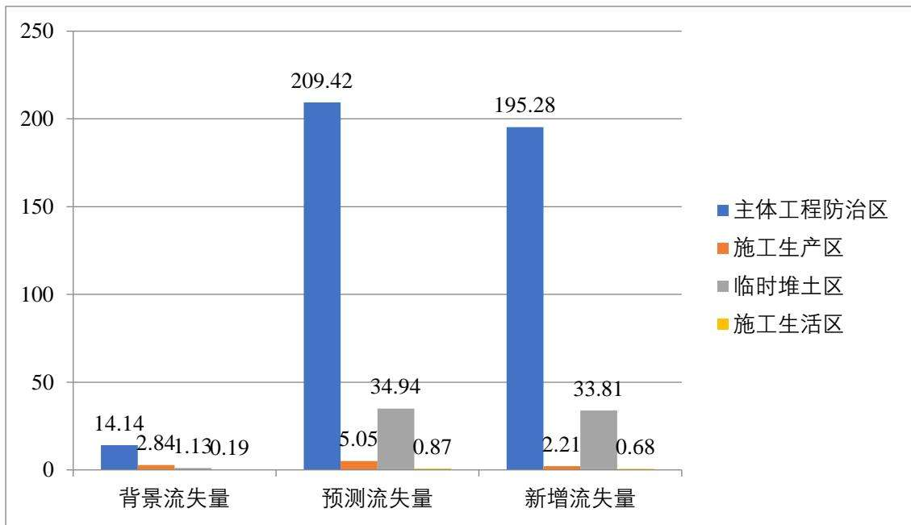  
图 4.3-1 施工期各分区水土流失柱状图

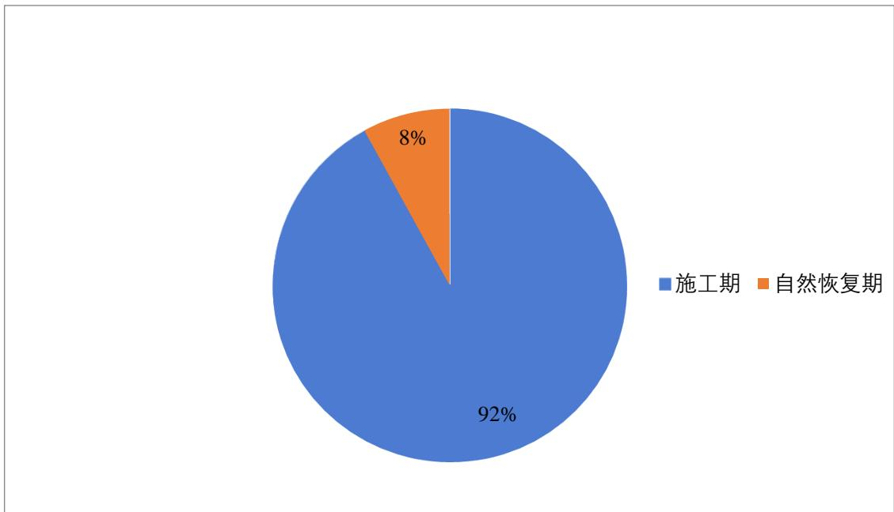  
图 4.3-2 各预测时段水土流失分布图

根据水土流失预测结果进行分析，施工期间水土流失迅速加剧，施工结束后，项目区中各项工程单元的防护措施均已完成，新地貌的水土保持功能开始发挥，水土流失量得到有效控制。在自然恢复期，水土保持工程各项防护措施都已完备，项目区的水土流失逐渐达到新的平衡状态。如果再人为地进行植被绿化和养护，部分区域水土流失量甚至会低于原有水平，生态环境得到改善。

## 4.4水土流失危害分析

生产建设项目对原地表的破坏，如不采取防治措施，容易产生严重的水土流失，影响主体工程的安全。项目建设过程中的临时苫盖等措施若实施不及时到位，可能会对周边生态环境产生危害。本方案以主体工程设计资料为基础，结合实地勘测结果，对项目建设可能造成的水土流失危害主要从以下内容进行分析。

## （1）影响周边环境

在项目建设过程中，由于土石方挖填而引起的水土流失如若不加以治理，大风干旱季节，在风力作用下，飞扬的尘土和砂粒会增加局部大气范围内悬浮颗粒物，产生土壤流失。

## （2）增加市政行洪压力

施工过程中，项目区地表裸露，遇大雨或暴雨天气，地表迅速产流，进入已修建的临时排涝系统，大大增加市政行洪压力，严重的会使管网堵塞。

## （3）对土地资源的损坏和影响

施工征用土地范围内，地表植被生长层被挖损、剥离或压埋，永久征地改变了原土地利用性质，造成土地资源的减少，降低土壤肥力和土地生产力，需要时间逐步恢复，可利用的土地资源减少，人、地、水矛盾加剧。

## （4）自然恢复期影响

对于已采取了水土保持防治措施的工程区域，在自然恢复期，植物措施尚未发挥其应有的水土保持功能，受降雨、径流影响，仍会产生一定程度的水土流失，但随着各项措施水土保持功能日渐发挥作用，水土流失影响将逐渐减弱。

## 4.5指导性意见

## （1）水土流失重点时段

从水土流失类型分析，水土流失为水力侵蚀。从流失的时段分析，施工期占土壤流失量总量的 92%，自然恢复期占水土流失总量的 8%，因此本项目水土流失重点时段为施工期。

## （2）水土流失重点区域

根据各水土流失防治分区水土流失预测结果可以看出，项目新增土壤流失量主要集中在临时堆土区和主体工程区，需重点监测临时堆土区和主体工程区。

## （3）对防治措施的指导性意见

根据以上分析结果和项目区水土流失类型进行综合分析。项目区侵蚀类型为水力侵蚀。具体结合建设工程的布局、施工工艺，本着“因地制宜，因害设防”的原则，合理设置针对性的工程、植物或临时防治措施，减少施工过程中产生的水土流失量。

因周边全部为已建成建筑，周边市政道路已建成，本项目四周实施彩钢板拦挡减少对周边的影响，项目出入口布设沉沙池，防止泥土带出项目区。

## （4）对施工时序的指导性意见

建设期水土流失为水力侵蚀，水土流失主要发生在雨季，多集中在6\~9 月份，因此在主体施工安排时，道路、地表设施的施工应尽量避开雨季。本项目施工不可避免的经历3个雨季，方案建议雨季减少土方施工，对施工时序进行优化，实施的临时排水系统加强检查，绿化覆土前首先进行拦挡措施的布置。使水土保持工程与主体工程在施工时相互配套，特别做好临时防护工程，减少施工中的水土流失。

## （5）对水土保持监测的指导性意见

根据预测结果，建设期监测的重点区域是临时堆土区和主体工程区，主要监测内

容包括土石方开挖情况、各施工区域的水土流失量的变化情况和临时措施落实情况。

## 5水土保持措施

## 5.1防治区划分

应根据实地调查（勘测）结果，在确定的防治责任范围内，依据工程布局、施工扰动特点、建设时序、地貌特征、自然属性、水土流失影响等进行分区。分区的原则应符合下列规定：

（1）各区之间具有显著差异性；

（2）同一区内造成水土流失的主导因子和防治措施相近或相似；

（3）根据项目的繁易程度和项目区自然情况，防治区可划分为一级或多级；

（4）一级区应具有控制性、整体性、全局性，线型工程应按土壤侵蚀类型、地形地貌、气候类型等因素划分一级区、二级区及其以下分区应结合工程布局、项目组成、占地性质和扰动特点进行逐级分区；

（5）各级分区应层次分明，具有关联性和系统性。

根据调查勘测、资料分析，依据上述原则将项目的水土流失防治分区分为 4个分区：主体工程区、施工生产区、施工生活区和临时堆土区。

## ①主体工程区

主体工程区主要为项目建设区域，包括建构筑物工程、道路管线工程、绿化工程等。根据工程施工特点，建构筑物工程主要是建筑物基础开挖、地下室开挖、建构筑物建设等施工活动对原有地表土壤形成破坏，形成裸露边坡，引发新的水土流失，水土流失防治的主要任务是做好基坑开挖土方临时防护工作。道路管线工程包括道路、管线等，水土流失主要发生在建设期，施工期应注意合理安排施工工序，减少该区管线敷设造成的水土流失。绿化工程为场区绿化区域，建设内容主要为植物绿化。

## ②施工生产区

施工生产区主要为生产临时建筑区域，属于临时占地，该区施工期间临时占压地表，易引发较强的水土流失，应做好施工期间临时苫盖、洒水降尘等工作，施工后期进行拆除并土地平整。

## ③施工生活区

施工生活区主要为生活临时建筑区域，属于临时占地，较易发生水土流失，应做好施工期间临时遮盖、临时排水等措施，施工后期进行拆除后土地平整。

④临时堆土区

临时堆土区主要为堆放项目区开挖土方，较易发生水土流失，应做好施工期间临时拦挡、遮盖、临时排水等措施。

表 5.1-1 水土流失防治责任范围及分区表
<table><tr><td rowspan=2 colspan=1>防治责任分区</td><td rowspan=1 colspan=3>防治责任范围(hm3</td></tr><tr><td rowspan=1 colspan=1>永久占地</td><td rowspan=1 colspan=1>临时占地</td><td rowspan=1 colspan=1>合计</td></tr><tr><td rowspan=1 colspan=1>主体工程区</td><td rowspan=1 colspan=1>4.00</td><td rowspan=1 colspan=1></td><td rowspan=1 colspan=1>4.00</td></tr><tr><td rowspan=1 colspan=1>施工生产区</td><td rowspan=1 colspan=1></td><td rowspan=1 colspan=1>0.63</td><td rowspan=1 colspan=1>0.63</td></tr><tr><td rowspan=1 colspan=1>施工生活区</td><td rowspan=1 colspan=1></td><td rowspan=1 colspan=1>0.50</td><td rowspan=1 colspan=1>0.50</td></tr><tr><td rowspan=1 colspan=1>临时堆土区</td><td rowspan=1 colspan=1>(0.25)</td><td rowspan=1 colspan=1></td><td rowspan=1 colspan=1>(0.25)</td></tr><tr><td rowspan=1 colspan=1>合计</td><td rowspan=1 colspan=1>4.00</td><td rowspan=1 colspan=1>1.13</td><td rowspan=1 colspan=1>5.13</td></tr></table>

注：（）内占地为红线范围内，不重复计算

## 5.2措施总体布局

## 5.2.1水土保持措施布局原则

根据工程施工总布置、施工特点和工程完工后的土地利用意向，采取水土流失防治措施，结合主体工程设计中具有水土保持功能的工程与工程实施进度安排，按照永久措施与临时措施相结合、工程措施和植物措施相结合，布设水土流失防治措施。水土流失防治措施布设具体原则有：

（1）结合本工程实际和项目区水土流失现状，贯彻“预防为主、保护优先、全面规划、综合治理、因地制宜、突出重点、科学管理、注重效益”的方针。

（2）减少对原地表和植被的破坏，建设过程中注重生态环境保护，设置临时性防护措施，减少施工过程中造成的人为扰动及产生的废弃土（石、渣）。在水土保持措施布设时，要将生态效益放在首位。在工程建设中注重生态保护环境，充分重视项目施工过程中造成的人为扰动区及所产生的废弃物，设计临时性水土保持措施，尽量减少新增水土流失。

（3）注重吸收当地水土保持成功经验，借鉴国内外先进技术。树立人与自然和谐相处的理念，尊重自然规律，注重与周边景观相协调。

（4）工程措施、植物措施、临时措施合理配置、统筹兼顾，形成综合防护体系。在有效防治水土流失的前提下，从经济合理的角度出发为业主负责，实现生态与经济的可持续发展。

（5）贯彻水土保持设施与主体工程同时设计、同时施工、同时投产使用的“三同时”的制度，在建设过程中主动接受当地水土保持管理部门的监督检查，避免“边施工边破坏”现象的发生。

（6）植物措施设计借鉴前期工程经济实用、适生、方便施工和美观大方。

## 5.2.2水土保持防治措施及总体布局

针对工程建设新增水土流失特点，综合分析评价主体设计和方案新增的水土保持措施的基础上，拟定本项目水土流失防治措施体系，本方案水土保持措施体系表及水土保持措施体系图如下。

表 5.2-1 水土流失防治体系表
<table><tr><td rowspan=1 colspan=1>防治分区</td><td rowspan=1 colspan=1>措施类型</td><td rowspan=1 colspan=2>防治措施</td><td rowspan=1 colspan=1>实施阶段</td><td rowspan=1 colspan=1>备注</td></tr><tr><td rowspan=11 colspan=1>主体工程区</td><td rowspan=7 colspan=1>工程措施</td><td rowspan=2 colspan=1>表土保护</td><td rowspan=1 colspan=1>表土剥离</td><td rowspan=1 colspan=1>施工前期</td><td rowspan=1 colspan=1>方案新增</td></tr><tr><td rowspan=1 colspan=1>表土回覆</td><td rowspan=1 colspan=1>施工后期</td><td rowspan=1 colspan=1>方案新增</td></tr><tr><td rowspan=1 colspan=1>排水工程</td><td rowspan=1 colspan=1>雨水管网</td><td rowspan=1 colspan=1>施工中后期</td><td rowspan=1 colspan=1>主体已列</td></tr><tr><td rowspan=1 colspan=1>土地整治工程</td><td rowspan=1 colspan=1>下凹式整地</td><td rowspan=1 colspan=1>施工后期</td><td rowspan=1 colspan=1>主体已列</td></tr><tr><td rowspan=2 colspan=1>降水蓄渗工程</td><td rowspan=1 colspan=1>透水砖铺装</td><td rowspan=1 colspan=1>施工中后期</td><td rowspan=1 colspan=1>主体已列</td></tr><tr><td rowspan=1 colspan=1>雨水调蓄池</td><td rowspan=1 colspan=1>施工中后期</td><td rowspan=1 colspan=1>主体已列</td></tr><tr><td rowspan=1 colspan=1>其他</td><td rowspan=1 colspan=1>节水灌溉</td><td rowspan=1 colspan=1>施工后期</td><td rowspan=1 colspan=1>主体已列</td></tr><tr><td rowspan=1 colspan=1>植物措施</td><td rowspan=1 colspan=1>植被建设工程</td><td rowspan=1 colspan=1>植物绿化</td><td rowspan=1 colspan=1>施工后期</td><td rowspan=1 colspan=1>主体已列</td></tr><tr><td rowspan=3 colspan=1>临时措施</td><td rowspan=3 colspan=1>临时防护工程</td><td rowspan=1 colspan=1>防尘网覆盖</td><td rowspan=1 colspan=1>施工前中期</td><td rowspan=1 colspan=1>方案新增</td></tr><tr><td rowspan=1 colspan=1>临时排水沟</td><td rowspan=1 colspan=1>施工前中期</td><td rowspan=1 colspan=1>方案新增</td></tr><tr><td rowspan=1 colspan=1>洒水降尘</td><td rowspan=1 colspan=1>施工前中期</td><td rowspan=1 colspan=1>方案新增</td></tr><tr><td rowspan=8 colspan=1>施工生产区</td><td rowspan=3 colspan=1>工程措施</td><td rowspan=2 colspan=1>表土保护</td><td rowspan=1 colspan=1>表土剥离</td><td rowspan=1 colspan=1>施工前期</td><td rowspan=1 colspan=1>方案新增</td></tr><tr><td rowspan=1 colspan=1>表土回覆</td><td rowspan=1 colspan=1>施工后期</td><td rowspan=1 colspan=1>方案新增</td></tr><tr><td rowspan=1 colspan=1>土地整治工程</td><td rowspan=1 colspan=1>土地平整</td><td rowspan=1 colspan=1>施工后期</td><td rowspan=1 colspan=1>方案新增</td></tr><tr><td rowspan=1 colspan=1>植物措施</td><td rowspan=1 colspan=1>植被建设工程</td><td rowspan=1 colspan=1>撒播草籽</td><td rowspan=1 colspan=1>施工后期</td><td rowspan=1 colspan=1>方案新增</td></tr><tr><td rowspan=4 colspan=1>临时措施</td><td rowspan=4 colspan=1>临时防护工程</td><td rowspan=1 colspan=1>防尘网覆盖</td><td rowspan=1 colspan=1>施工前中期</td><td rowspan=1 colspan=1>方案新增</td></tr><tr><td rowspan=1 colspan=1>临时排水沟</td><td rowspan=1 colspan=1>施工前中期</td><td rowspan=1 colspan=1>方案新增</td></tr><tr><td rowspan=1 colspan=1>临时沉沙池</td><td rowspan=1 colspan=1>施工前中期</td><td rowspan=1 colspan=1>方案新增</td></tr><tr><td rowspan=1 colspan=1>洒水降尘</td><td rowspan=1 colspan=1>施工前中期</td><td rowspan=1 colspan=1>方案新增</td></tr><tr><td rowspan=3 colspan=1>施工生活区</td><td rowspan=1 colspan=1>工程措施</td><td rowspan=1 colspan=1>土地整治工程</td><td rowspan=1 colspan=1>土地平整</td><td rowspan=1 colspan=1>施工后期</td><td rowspan=1 colspan=1>方案新增</td></tr><tr><td rowspan=2 colspan=1>临时措施</td><td rowspan=2 colspan=1>临时防护工程</td><td rowspan=1 colspan=1>临时排水沟</td><td rowspan=1 colspan=1>施工前中期</td><td rowspan=1 colspan=1>方案新增</td></tr><tr><td rowspan=1 colspan=1>临时沉沙池</td><td rowspan=1 colspan=1>施工前中期</td><td rowspan=1 colspan=1>方案新增</td></tr><tr><td rowspan=5 colspan=1>临时堆土区</td><td rowspan=5 colspan=1>临时措施</td><td rowspan=5 colspan=1>临时防护工程</td><td rowspan=1 colspan=1>防尘网覆盖</td><td rowspan=1 colspan=1>施工前期</td><td rowspan=1 colspan=1>方案新增</td></tr><tr><td rowspan=1 colspan=1>编织袋装土拦挡</td><td rowspan=1 colspan=1>施工前期</td><td rowspan=1 colspan=1>方案新增</td></tr><tr><td rowspan=1 colspan=1>临时排水沟</td><td rowspan=1 colspan=1>施工前中期</td><td rowspan=1 colspan=1>方案新增</td></tr><tr><td rowspan=1 colspan=1>临时沉沙池</td><td rowspan=1 colspan=1>施工前中期</td><td rowspan=1 colspan=1>方案新增</td></tr><tr><td rowspan=1 colspan=1>播撒草籽</td><td rowspan=1 colspan=1>施工前中期</td><td rowspan=1 colspan=1>方案新增</td></tr></table>

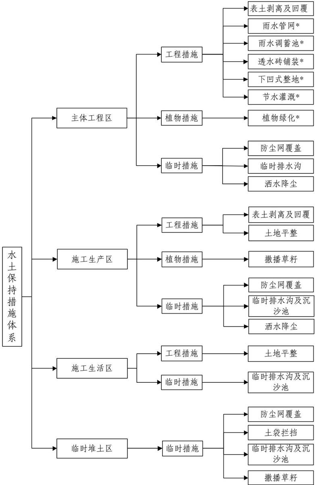  
注：其中\*为主体已有水土保持措施。

图 5.2-1 水土流失防治措施体系框图

本项目主体设计的水土保持措施包括雨水管网、雨水调蓄池、下凹式整地、透水砖铺装、节水灌溉、植物绿化等措施，符合水土保持要求；方案根据同类项目防治经验，新增防尘网覆盖、临时沉沙池、洒水降尘、临时排水沟、临时沉沙池、土袋拦挡、播撒草籽等措施，完善水土流失防治措施体系。

## 5.3分区措施布设

## 5.3.1设计标准

## 5.3.2设计标准及要求

本项目水土保持设计中临时工程和绿化工程采用《生产建设项目水土保持技术标准》（GB/50433-2018）和《水土保持工程设计规范》（GB51018-2014）的标准设计，具体如下：

## 1.工程措施

（1）排水工程：主体工程雨水管线设计标准按 3 年一遇降雨设计，经前文 3.2.7章节复核，主体雨水管网排水能力满足项目区 5 年一遇 10min 短历时设计暴雨标准。

（2）透水砖：透水路面应符合《透水砖路面技术规范》（CJJ/T188-2012）的基本规定，透水系数不小于 $1 . 0 \times 1 0 ^ { - 2 } \mathrm { c m / s }$ ，防滑性能（BNP）不小于60，耐磨系数不大于35mm；路面的设计应满足当地 2 年一遇的暴雨强度下，持续降雨 60min，表面不应产生径流的透（排）水要求，使用年限在 8\~10 年为宜；透水砖路面下的土基应具有一定的透水性能，土壤透水系数不应小于 $1 . 0 \times 1 0 ^ { - 3 } \mathrm { m m / s }$ ，且土基顶面距离地下水位宜大于 1.0m。

（3）下凹式绿地：参照《海绵城市集雨型绿地工程设计规范》（DB11/T 1436—2022），下凹式绿地应有明确的边界，有效蓄水深度宜 50～250mm，土壤渗透系数应大于 $1 0 ^ { - 6 } \mathrm { m / s }$ ，且渗透面距地下水最高水位高差应大于 1.0m。

## 2.植物措施

参照《水土保持工程设计规范》（GB51018-2014），项目建设用地内植物措施工程级别为1级，设计标准为北京市园林绿化工程标准。苗木和草种选用Ⅰ级以上苗木，乔木优先选择播种苗；灌木树种苗灌丛 50\~100cm；草种纯度≥90%（一级以上草籽），撒播密度 $6 0 \mathrm { k g / h m } ^ { 2 }$ 以上。

## 3.临时措施

根据《水土保持工程设计规范》（GB51018-2014），临时排水沟工程等级为 2 级，

排水设计标准由3年一遇提高到 5年一遇10min 短历时设计暴雨。

## 5.3.3分区措施布置及典型设计

## 5.3.2.1主体工程区

## （1）工程措施

## ①表土剥离及回覆

方案新增在工程施工前对主体工程区占地范围内的表土进行表土剥离，根据现场调查，剥离表土面积 $2 . 1 4 \mathrm { h m } ^ { 2 }$ ，剥离厚度 25cm，表土剥离量 0.53 万 $\mathbf { m } ^ { 3 }$ ，剥离后的表土集中堆放在临时堆土区内，采取临时措施进行防护，用于后期绿化回覆，绿化面积$1 . 4 6 \mathrm { h m } ^ { 2 }$ ，回覆厚度 0.30m，表土回覆量约 0.44 万 $\mathrm { m } ^ { 3 } .$ ，表土剥离及回覆可实现场内平衡。

## ②雨水管网（主体已有）

主体工程设计在建筑物周边、道路沿线按《室外排水设计规范》（GB50014-2021）要求设置雨水排水系统，建筑物屋面雨水采用外排水方式，经屋面雨水斗收集后，经管道系统排至建筑周边下凹绿地，通过绿地内溢流雨水口排至园区雨水管网，雨水管网按照 3 年一遇排水标准设计，主体设计新建 DN300\~800mm 雨水管线 453m，接入外围校内现状雨水管线，随后接入校外市政道路雨水管网，最终排入东沙河。

雨水管道系统采用轻型钢筋混凝土管，屋面雨水采用外排水系统，采用 UPVC 塑料排水管，雨水检查采用混凝土检查井。

## ③雨水调蓄池（主体已有）

主体拟布设3座雨水调蓄池，分别位于12-13公寓西侧、14-15公寓东侧、16-17公寓东侧，总容积 $: 4 1 3 \mathrm { m } ^ { 3 }$ ，雨水调蓄池位于道路管线区，能够满足项目雨水收集要求。雨水调蓄池采用聚丙烯塑料单元模块组合，在水池周围包裹防渗土工布，形成地下贮水池，池内设雨水回用水泵，并配备相应的回用水管，建议收集的雨水首先用于绿化浇灌。

## ④透水砖铺装（主体已有）

主体设计对地块内人行步道采用透水砖进行铺装，用 3cm 厚中砂找平，有利于地表水的下渗，雨量较大时，多余雨水通过硬化地面坡度漫流至周边绿地或雨水口进行下渗、汇集。拼铺施工完成后及时清扫表面砂土，以利于地表雨水下渗，主体工程区透水铺装面积 $7 8 6 2 \mathrm { m } ^ { 2 }$

透水砖铺装结构层（总厚度 32cm）

防滑透水型步道方砖 8cm

中砂找平 3cm

级配砂砾石基层 15cm

中砂垫层 6cm

## ⑤下凹式整地（主体已有）

按照《海绵城市雨水控制与利用工程设计规范》（DB11/685-2021）的要求：凡涉及绿地率指标要求的建设工程，绿地中至少应有50%作为用于滞留雨水的下凹式绿地，主体设计将项目区中庭绿地设为下凹式绿地，绿化前先进行土地整治，使之形成下凹式绿地。下凹式绿地是在绿地建设时，使绿地高程低于周围地面一定的高程，下凹深度一般5～15cm为宜，以利于周边的雨水径流的汇入。下凹式绿地透水性能良好，可减少绿化用水并改善城市环境，对雨水中的一些污染物具有较强的截留和净化作用，可以增加雨水渗透量。

本项目主体工程设计中部分绿地为下凹式绿地，面积 0.73hm2，下凹深度设计深度约 10cm。

## ⑥节水灌溉（主体已有）

主体设计对主体工程区内绿化灌溉采用微灌或滴灌方式，节水灌溉面积 1.46hm²。设计给水管采用UPVC 管直接埋设，道路、绿地等集雨面收集雨水后经雨水口汇入项目区内部雨水管线，雨水管线接入雨水调蓄池，池内蓄积的雨水可用于绿地节水灌溉。

## （2）植物措施（主体已有）

主体设计以首层庭院为中心展开景观系统，绿化工程面积 1.46hm²，建设单位后期将委托专业的园林绿化设计单位对项目绿化工程进行详细设计，建议提高植被建设标准，注重景观效果。

本方案从水土保持角度对植物配置和植物树种提出建议，根据当地自然条件、工程建设特点，主体设计选择植物种类时，既要考虑水土保持功能，又要兼顾绿化美化要求。考虑到项目建设过程中土方的开挖、回填及临时堆放，使土壤结构遭到破坏，土壤肥力趋于贫瘠，因此，在植物措施布设时，树、草种选择的原则是：

a.为提高绿化成功率，首选乡土树种草种或者在当地绿化中已推广使用的树种草种，同时具有固土护坡功能较强、根系发达、草层紧密、耐践踏、耐瘠薄适应广、扩展能力强、对土壤气候条件适应性较强、病虫危害较轻、栽后容易管理等优点。

b.遵循保护环境和美化环境相结合的原则。在条件许可的情况下，可适当引进新的优良树、草种，以满足生物多样性和美化环境的要求。

c.植物材料配置应随四季景色变化，主次分明。苗木选苗按苗木规格购苗，应选择枝干健壮，形体优美的苗木，大苗移植尽量减少截枝量，严禁出现没枝的单干树木乔木，分支部少于4个；分层种植的花灌木带、植物带边缘轮廓种植密度应大于规定密度，平面线型应流畅，边缘弧形高低层次分明，且与周围点缀植物高差不小于 30cm修建整形的观赏面；规则式种植的乔灌木，同一树种规格应统一，丛植和群植乔灌木应高低错落，孤植树应形态优美、奇特、耐看。本方案供选树（草）种形态特征、生长习性一览表如下表。

表 5.3-1 本方案供选树（草）种形态特征、生长习性一览表
<table><tr><td colspan="1" rowspan="1">树草种名称</td><td colspan="1" rowspan="1">科名</td><td colspan="1" rowspan="1">形态特征</td><td colspan="1" rowspan="1">生长习性</td><td colspan="1" rowspan="1">用途</td></tr><tr><td colspan="1" rowspan="1">国槐(Sophora japonica)</td><td colspan="1" rowspan="1">蝶形花科</td><td colspan="1" rowspan="1">落叶乔木，高15-25米，干皮暗灰色，小枝绿色，皮孔明显。羽状复叶长15-25厘米；叶轴有毛，基部膨大；小叶9-15片，卵状长圆形，长2.5-7.5厘米。</td><td colspan="1" rowspan="1">喜光、喜温、耐旱的植物，适应较冷的气候，对土壤要求不严，能在多种土壤条件下正常生长。</td><td colspan="1" rowspan="1">行道树、绿化美化</td></tr><tr><td colspan="1" rowspan="1">白蜡(Fraxinuschinensis)</td><td colspan="1" rowspan="1">木犀科</td><td colspan="1" rowspan="1">乔木，高达12米．冬芽卵圆形，黑褐色．小枝灰褐色，无毛或具黄色髯毛．有皮孔。奇数羽状复叶，对生，连叶柄长15一20厘米。</td><td colspan="1" rowspan="1">喜欢在温暖、光照充足的环境中生长。白蜡树对土壤的要求不高，酸性土壤和碱性土壤都能生长，但它最适宜在深厚、肥沃、湿润的土壤中生长。</td><td colspan="1" rowspan="1">行道树、绿化美化</td></tr><tr><td colspan="1" rowspan="1">银杏(Ginkgo biloba L.)</td><td colspan="1" rowspan="1">银杏科</td><td colspan="1" rowspan="1">落叶乔木，胸径可达4米，幼树树皮近平滑，浅灰色，大树之皮灰褐色，不规则纵裂，粗糙；有长枝与生长缓慢的距状短枝。</td><td colspan="1" rowspan="1">落叶大乔木，胸径可达4米，树皮灰色。叶扇形。雌雄异株。种子核果状。</td><td colspan="1" rowspan="1">行道树、绿化美化</td></tr><tr><td colspan="1" rowspan="1">圆柏(Sabina chinensis (L.) Ant. )</td><td colspan="1" rowspan="1">柏科</td><td colspan="1" rowspan="1">乔木，高达20米，树皮深灰色，纵裂，成条片开裂；幼树的枝条通常斜上伸展，形成尖塔形树冠，老则下部大枝平展，形成广圆形的树冠。</td><td colspan="1" rowspan="1">喜光树种，较耐荫，喜温凉、温暖气候及湿润土壤。</td><td colspan="1" rowspan="1">行道树、绿化美化</td></tr><tr><td colspan="1" rowspan="1">日本晚樱(Prunus serrulatavar.lannesiana)</td><td colspan="1" rowspan="1">蔷薇科</td><td colspan="1" rowspan="1">乔木，高3-8米，树皮灰褐色或灰黑色，有唇形皮孔。小枝灰白色或淡褐色，无毛。冬芽卵圆形，无毛。</td><td colspan="1" rowspan="1">樱花属浅根性树种，喜阳光、深厚肥沃而排水良好的土壤，有一定的耐寒能力。</td><td colspan="1" rowspan="1">园林绿化</td></tr><tr><td colspan="1" rowspan="1">七叶树(Aesculus chinensis)</td><td colspan="1" rowspan="1">七叶树科</td><td colspan="1" rowspan="1">落叶乔木，高达25米，树皮深褐色或灰褐色，小枝、圆柱形，黄褐色或灰褐色，无毛或嫩时有微柔毛，有圆形或椭圆形淡黄色的皮孔。</td><td colspan="1" rowspan="1">喜光，也耐半荫，细纹和湿润气候，不耐严寒，喜肥沃深厚土壤。</td><td colspan="1" rowspan="1">绿化美化</td></tr><tr><td colspan="1" rowspan="1">玉兰(Magnolia denudata Desr.)</td><td colspan="1" rowspan="1">木兰科</td><td colspan="1" rowspan="1">落叶乔木，枝广展形成宽阔的树冠；树皮深灰色，粗糙开裂；小枝稍粗壮，灰褐色。叶纸质，倒卵形、宽倒卵形或、倒卵状椭圆形。</td><td colspan="1" rowspan="1">性喜光，较耐寒，可露地越冬。爱干燥，忌低湿，栽植地渍水易烂根。喜肥沃、排水良好而带微酸性的砂质土壤，在弱碱性的土壤上亦可生长。</td><td colspan="1" rowspan="1">绿化美化</td></tr><tr><td colspan="1" rowspan="1">海棠(Malus micromalus Makino)</td><td colspan="1" rowspan="1">蔷薇科</td><td colspan="1" rowspan="1">小乔木，高达2.5-5米，树枝直立性强；小枝细弱圆柱形，嫩时被短柔毛，老时脱落，紫红色或暗褐色，具稀疏皮孔。</td><td colspan="1" rowspan="1">喜光，耐寒，忌水涝，忌空气过湿，较耐干旱。</td><td colspan="1" rowspan="1">绿化美化</td></tr><tr><td colspan="1" rowspan="1">紫叶李( Prunus Cerasifera Ehrhar f.atropurpurea (Jacq.) Rehd)</td><td colspan="1" rowspan="1">蔷薇科</td><td colspan="1" rowspan="1">小乔木，树冠圆形或扁圆形，小枝红褐色。叶卵形或倒卵形，边缘具重锯齿，叶紫红色。花单生或2~3朵聚生，粉红色。果实近球形，黄绿色有紫色晕。花期4~5月，果熟期6~7月。</td><td colspan="1" rowspan="1">暖温带树种，喜阳光，在荫蔽环境下叶色不鲜艳。喜温暖气候，不耐寒，较耐湿。对土壤适应性强，根系较浅，萌生力较强。</td><td colspan="1" rowspan="1">绿化美化</td></tr><tr><td colspan="1" rowspan="1">丁香树(Syringa oblata Lindl.)</td><td colspan="1" rowspan="1">木犀科</td><td colspan="1" rowspan="1">灌木，高可达5米；树皮灰褐色或灰色。小枝、花序轴、花梗、苞片、花萼、幼叶两面以及叶柄均无毛而密被腺毛。小枝较粗，疏生皮孔。</td><td colspan="1" rowspan="1">喜光，稍耐阴，开花稀少。喜温暖、湿润。对土壤的要求不严，耐瘠薄，喜肥沃、排水良好的土壤，</td><td colspan="1" rowspan="1">绿化美化</td></tr><tr><td colspan="1" rowspan="1">大叶黄杨(Euonymus japonicus)</td><td colspan="1" rowspan="1">卫矛科</td><td colspan="1" rowspan="1">常绿灌木或小乔木；树皮灰色，有规则剥裂；茎支有4棱；小枝和冬芽的外鲮有短毛。</td><td colspan="1" rowspan="1">阳性，不耐阴，抗性不强。</td><td colspan="1" rowspan="1">绿化隔离带</td></tr><tr><td colspan="1" rowspan="1">锦带(Weigela florida (Bunge) A.DC.)</td><td colspan="1" rowspan="1">忍冬科</td><td colspan="1" rowspan="1">落叶灌木，高达1-3米；幼枝稍四方形，有2列短柔毛；树皮灰色。芽顶端尖，具3-4对鳞片，常光滑。叶矩圆形、椭圆形至倒卵状椭圆形。</td><td colspan="1" rowspan="1">喜光，耐荫，耐寒；对土壤要求不严，能耐瘠薄土壤，但以深厚、湿润而腐殖质丰富的土壤生长最好，怕水涝。萌芽力强，生长迅速。</td><td colspan="1" rowspan="1">绿化美化</td></tr><tr><td colspan="1" rowspan="1">大叶黄杨(Euonymus japonicus)</td><td colspan="1" rowspan="1">卫矛科</td><td colspan="1" rowspan="1">常绿灌木或小乔木；树皮灰色，有规则剥裂；茎支有4棱；小枝和冬芽的外鲮有短毛。</td><td colspan="1" rowspan="1">阳性，不耐阴，抗性不强。</td><td colspan="1" rowspan="1">绿化隔离带</td></tr><tr><td colspan="1" rowspan="1">月季(Rosa chinensis Jacq. )</td><td colspan="1" rowspan="1">蔷薇科</td><td colspan="1" rowspan="1">直立灌木，高1-2米；小枝粗壮，圆柱形，近无毛，有短粗的钩状皮刺。小叶3-5，稀7，连叶柄长5-11厘米，小叶片宽卵形至卵状长圆形。</td><td colspan="1" rowspan="1">性喜温暖、日照充足、空气流通的环境。大多数品种最适温度白天为15-26℃，晚上为10-15℃。冬季气温低于5℃即进入休眠。</td><td colspan="1" rowspan="1">绿化</td></tr><tr><td colspan="1" rowspan="1">鸢尾( Iris tectorum Maxim. )</td><td colspan="1" rowspan="1">鸢尾科</td><td colspan="1" rowspan="1">植株基部围有老叶残留的膜质叶鞘及纤维。根状茎粗壮，二歧分枝，直径约1cm，斜伸；须根较细而短。</td><td colspan="1" rowspan="1">要求适度湿润，排水良好，富含腐殖质、略带碱性的粘性土壤。</td><td colspan="1" rowspan="1">绿化</td></tr><tr><td colspan="1" rowspan="1">高羊茅( Festuca elata Keng ex E.Alexeev)</td><td colspan="1" rowspan="1">禾本科</td><td colspan="1" rowspan="1">秆成疏丛或单生，直立，高90-120厘米，径2-2.5毫米，具3-4节，光滑，上部伸出鞘外的部分长达30厘米。</td><td colspan="1" rowspan="1">性喜寒冷潮湿、温暖的气候，在肥沃、潮湿、富含有机质、细壤土中生长良好。耐高温；喜光，耐半阴，对肥料反应敏感，抗逆性强，耐酸、耐瘠薄，抗病性强。</td><td colspan="1" rowspan="1">草坪</td></tr></table>

## （3）临时措施

主体未对该区域设计临时防护措施，本方案予以补充，主要补充防尘网覆盖、临时排水沟、沉沙池、洒水降尘等。

## ①防尘网覆盖

主体基坑开挖及后期室外管线施工过程中会造成地表裸露，大风和降雨天气容易出现水土流失，故需进行防护，方案设计对施工过程中裸露的地表进行防尘网覆盖，使用防尘网约 34300m²，防尘网规格为 1000 目/100cm2。

## ②临时排水沟

为排除施工期间雨水，方案设计在施工临时道路一侧布设临时排水沟，末端连接施工生产区沉沙池，雨水经过临时排水沟的汇集后进入临时沉沙池进行沉淀，沉淀后可用于洒水降尘。临时排水沟设计形状为矩形，结构为砖砌结构，混凝土砂浆抹面，底宽40cm、深 40cm，临时排水沟长度约 421m。

临时排水沟断面设计采用 5年一遇10min 最大洪峰流量计算，根据《城镇雨水系统规划设计暴雨径流计算标准》（DB11/T 969-2016）中第 II区暴雨强度公式及室外排水设计规范的要求试算。

## 1）设计暴雨强度

$$
\mathrm { q } { = } 1 6 0 2 { \times } ( 1 { + } 1 . 0 3 7 \mathrm { l g P } ) / ( \mathrm { t } { + } 1 1 . 5 9 3 ) ^ { \scriptscriptstyle 0 . 6 8 1 }
$$

式中：q——设计暴雨强度 $[ \mathrm { L } / \mathrm { ~ ( ~ s ~ } \hbar \mathrm { m } ^ { 2 } \mathrm { ~ ) ~ }$ ]；

t——降雨历时（min），取10min；

p——暴雨重现期（年），取5a。

## 2）雨水流量公式

$$
\scriptstyle { \mathrm { Q } } = { \boldsymbol { \psi } } { \boldsymbol { \ q } } { \mathrm { F } }
$$

式中：Q——设计流量(L/s)；

ψ——径流系数，施工过程中为土质平面，取 0.30；

q——设计暴雨强度 $( \mathrm { L } / \mathrm { s } \ \mathrm { \hbar } \mathrm { m } ^ { 2 } )$ ，根据1）计算得 $\mathrm { q } { = } 3 4 0 . 9 9 \mathrm { L } / \mathrm { ~ ( ~ s ~ } \mathrm { h m } ^ { 2 } \mathrm { ~ ) }$ ）；

F——雨水汇水面积(hm2)，集水最大面积为 $1 . 4 4 \mathrm { h m } ^ { 2 }$

## 3）排水沟断面验算

采用明渠均匀流公式计算：

$$
Q = A C { \sqrt { R i } }
$$

其中：Q——设计流量 $( \mathrm { m } ^ { 3 } / \mathrm { s } )$

A——排水沟过流断面面积 $( \mathbf { m } ^ { 2 } )$ ；

C——谢才系数，C=1/n×R1/6；

n——糙率，砂浆抹面取 n＝0.015；

R——水力半径（m），R=A/x，x（排水沟断面湿周）；

i——排水沟比降，0.5%。

表 5.3-2 临时排水沟断面尺寸试算表
<table><tr><td rowspan=1 colspan=1>措施名称径</td><td rowspan=1 colspan=1>流系数</td><td rowspan=1 colspan=1>洪峰流量 $( \mathbf { m } ^ { 3 } / \mathbf { s } )$ 一</td><td rowspan=1 colspan=1>底宽（m）</td><td rowspan=1 colspan=1>满流水深安(m)</td><td rowspan=1 colspan=1>全超高(m)</td><td rowspan=1 colspan=1>糙率系数</td><td rowspan=1 colspan=1>设计流量 $( \mathbf { m } ^ { 3 } / \mathbf { s } )$ </td><td rowspan=1 colspan=1>流速(m/s)</td><td rowspan=1 colspan=1>流量差 $( \mathbf { m } ^ { 3 } / \mathbf { s } )$ </td></tr><tr><td rowspan=1 colspan=1>临时排水沟</td><td rowspan=1 colspan=1>0.30</td><td rowspan=1 colspan=1>0.147</td><td rowspan=1 colspan=1>0.40</td><td rowspan=1 colspan=1>0.35</td><td rowspan=1 colspan=1>0.05</td><td rowspan=1 colspan=1>0.015</td><td rowspan=1 colspan=1>0.167</td><td rowspan=1 colspan=1>1.19</td><td rowspan=1 colspan=1>0.02</td></tr></table>

4）结论：经验算临时排水沟设计过水流量为 $0 . 1 6 7 \mathrm { m } ^ { 3 } / \mathrm { s }$ ，大于洪峰流量 $0 . 1 4 7 \mathrm { m } ^ { 3 } / \mathrm { s }$ 满足临时排水过水要求。

③洒水降尘：为避免基坑土方开挖现场浮土扬尘，造成环境污染，确保安全文明施工，本方案设计在基坑开挖期间对基坑内及基坑周边施工道路实施洒水降尘措施。重点对基坑开挖期多风、干燥天气进行洒水降尘，平均每日2次（2台时），基坑开挖施工期估算5个月，多风、干燥天气约90天，共180台时。

主体工程区水土保持措施量汇总表见下表。

表 5.3-3 主体工程区水土保持措施量表
<table><tr><td rowspan=2 colspan=1>防治分区</td><td rowspan=2 colspan=2>防治措施</td><td rowspan=2 colspan=1>单位</td><td rowspan=1 colspan=3>工程量</td><td rowspan=2 colspan=1>合计</td><td rowspan=2 colspan=1>备注</td></tr><tr><td rowspan=1 colspan=1>12-13 公寓</td><td rowspan=1 colspan=1>14-15 公寓</td><td rowspan=1 colspan=1>16-17 公寓</td></tr><tr><td rowspan=11 colspan=1>主体工程区</td><td rowspan=7 colspan=1>工程措施</td><td rowspan=1 colspan=1>表土剥离</td><td rowspan=1 colspan=1> $\overline { { \mathrm { h m } ^ { 2 } } }$ </td><td rowspan=1 colspan=1>0.96</td><td rowspan=1 colspan=1>0.32</td><td rowspan=1 colspan=1>0.86</td><td rowspan=1 colspan=1>2.14</td><td rowspan=1 colspan=1>方案新增</td></tr><tr><td rowspan=1 colspan=1>表土回覆</td><td rowspan=1 colspan=1>万m³</td><td rowspan=1 colspan=1>0.23</td><td rowspan=1 colspan=1>0.08</td><td rowspan=1 colspan=1>0.12</td><td rowspan=1 colspan=1>0.44</td><td rowspan=1 colspan=1>方案新增</td></tr><tr><td rowspan=1 colspan=1>下凹式整地</td><td rowspan=1 colspan=1> $\overline { { \mathrm { h m } ^ { 2 } } }$ </td><td rowspan=1 colspan=1>0.38</td><td rowspan=1 colspan=1>0.14</td><td rowspan=1 colspan=1>0.21</td><td rowspan=1 colspan=1>0.73</td><td rowspan=1 colspan=1>主体已列</td></tr><tr><td rowspan=1 colspan=1>雨水管网</td><td rowspan=1 colspan=1>m</td><td rowspan=1 colspan=1>172.1</td><td rowspan=1 colspan=1>145.0</td><td rowspan=1 colspan=1>135.9</td><td rowspan=1 colspan=1>453</td><td rowspan=1 colspan=1>主体已列</td></tr><tr><td rowspan=1 colspan=1>雨水调蓄池</td><td rowspan=1 colspan=1>座</td><td rowspan=1 colspan=1>1</td><td rowspan=1 colspan=1>1</td><td rowspan=1 colspan=1>1</td><td rowspan=1 colspan=1>3</td><td rowspan=1 colspan=1>主体已列</td></tr><tr><td rowspan=1 colspan=1>透水砖铺装</td><td rowspan=1 colspan=1>m2</td><td rowspan=1 colspan=1>3609</td><td rowspan=1 colspan=1>1775</td><td rowspan=1 colspan=1>2478</td><td rowspan=1 colspan=1>7862</td><td rowspan=1 colspan=1>主体已列</td></tr><tr><td rowspan=1 colspan=1>节水灌溉</td><td rowspan=1 colspan=1> $\overline { { \mathrm { h m } ^ { 2 } } }$ </td><td rowspan=1 colspan=1>0.77</td><td rowspan=1 colspan=1>0.28</td><td rowspan=1 colspan=1>0.41</td><td rowspan=1 colspan=1>1.46</td><td rowspan=1 colspan=1>主体已列</td></tr><tr><td rowspan=1 colspan=1>植物措施</td><td rowspan=1 colspan=1>植物绿化</td><td rowspan=1 colspan=1> $\tan ^ { 2 }$ </td><td rowspan=1 colspan=1>0.77</td><td rowspan=1 colspan=1>0.28</td><td rowspan=1 colspan=1>0.41</td><td rowspan=1 colspan=1>1.46</td><td rowspan=1 colspan=1>主体已列</td></tr><tr><td rowspan=3 colspan=1>临时措施</td><td rowspan=1 colspan=1>防尘网覆盖</td><td rowspan=1 colspan=1>m²</td><td rowspan=1 colspan=1>18500</td><td rowspan=1 colspan=1>7500</td><td rowspan=1 colspan=1>8300</td><td rowspan=1 colspan=1>34300</td><td rowspan=1 colspan=1>方案新增</td></tr><tr><td rowspan=1 colspan=1>临时排水沟</td><td rowspan=1 colspan=1>m</td><td rowspan=1 colspan=1>168.4</td><td rowspan=1 colspan=1>134.72</td><td rowspan=1 colspan=1>117.88</td><td rowspan=1 colspan=1>421</td><td rowspan=1 colspan=1>方案新增</td></tr><tr><td rowspan=1 colspan=1>洒水降尘</td><td rowspan=1 colspan=1>台时</td><td rowspan=1 colspan=1>180</td><td rowspan=1 colspan=1></td><td rowspan=1 colspan=1></td><td rowspan=1 colspan=1>180</td><td rowspan=1 colspan=1>方案新增</td></tr></table>

## 5.3.2.2施工生产区

## （1）工程措施

## ①表土剥离及回覆

方案新增在工程施工前对施工生产区占地范围内的表土进行表土剥离，根据表土资源调查及施工安排，本区剥离表土面积 $0 . 3 9 \mathrm { h m } ^ { 2 } .$ ，表土剥离量0.10万m3。表土剥离可以确保耕地的精华不流失，减少土地污染，实现土地资源的可持续利用，剥离后的表土集中堆放在临时堆土区内，采取临时措施进行防护，用于后期表土回覆，本区表土回覆面积0.63hm2，表土回覆量 0.19万m3，表土回填不足部分由主体工程区剥离的多余表土回填。

## ②土地平整

施工结束后，拆除临时建构筑物进行土地平整，土地平整采用 74kw推土机推平，土地平整面积 0.63hm2。

## （2）植物措施

撒播草籽：施工结束土地平整后的裸露地面，均匀撒播适生草籽（如黑麦草、早熟禾），撒播前先对地面进行适度整平、疏松处理，撒播后及时覆土、压实并洒水养护，保证草籽正常发芽生长。撒播草籽面积 0.63hm²，草籽选择优等种子，种子用量为 $6 0 \mathrm { k g / h m } ^ { 2 }$

## （3）临时措施

## ①防尘网覆盖

在施工场地内堆放有大量的水泥、沙以及钢筋建材等施工原材料，施工过程中，如果遇到大风、风蚀严重，预备一些密目网，大风时将水泥、沙等进行临时苫盖，本方案考虑施工生产区临时苫盖面积 $2 8 0 0 \mathrm { m } ^ { 2 }$ ，施工时可重复利用，防尘网规格为 1000目 $/ 1 0 0 \mathrm { c m } ^ { 2 }$

## ②临时排水沟

本方案在施工生产区场地四周布设临时排水沟，有效疏导场地内雨水，避免影响汛期正常施工作业，临时排水沟末端排至沙河校区现状雨水管线内，排水沟断面设计形状为矩形，结构为砖砌结构，混凝土砂浆抹面，底宽40cm、深40cm，布设长度136m。

临时排水沟断面设计采用 5年一遇10min 最大洪峰流量计算，根据《城镇雨水系统规划设计暴雨径流计算标准》（DB11/T 969-2016）中第 II区暴雨强度公式及室外排水设计规范的要求试算。

## 1）设计暴雨强度

$$
\mathrm { q } { = } 1 6 0 2 { \times } ( 1 { + } 1 . 0 3 7 \mathrm { l g P } ) / ( \mathrm { t } { + } 1 1 . 5 9 3 ) ^ { \scriptscriptstyle 0 . 6 8 1 }
$$

式中：q——设计暴雨强度 $[ \mathrm { L } / \mathrm { ~ ( ~ s ~ } \hbar \mathrm { m } ^ { 2 } \mathrm { ~ ) ~ }$ ]；

t——降雨历时（min），取10min；

p——暴雨重现期（年），取5a。

## 2）雨水流量公式

$$
\scriptstyle { \mathrm { Q } } = { \boldsymbol { \psi } } { \boldsymbol { \ q } } { \mathrm { F } }
$$

式中：Q——设计流量(L/s)；

ψ——径流系数，施工过程中为土质平面，取 0.30；

q——设计暴雨强度 $( \mathrm { L } / \mathrm { s } \ \mathrm { \hbar h m } ^ { 2 } )$ ，根据1）计算得 $\mathrm { q } { = } 3 4 0 . 9 9 \mathrm { L } / \mathrm { ~ ( ~ s ~ } \mathrm { h m } ^ { 2 } \mathrm { ~ ) ~ }$

F——雨水汇水面积 $( \mathrm { h m } ^ { 2 } )$ ，集水最大面积为 $0 . 6 3 \mathrm { h m } ^ { 2 } .$

## 3）排水沟断面验算

采用明渠均匀流公式计算：

$$
Q = A C { \sqrt { R i } }
$$

其中：Q——设计流量 $( \mathrm { m } ^ { 3 } / \mathrm { s } )$

A——排水沟过流断面面积 $( \mathbf { m } ^ { 2 } )$ ；

C——谢才系数， ${ \mathrm { C } } { = } 1 / \mathrm { n } { \times } \mathrm { R } ^ { 1 / 6 }$

n——糙率，砂浆抹面取 $\begin{array} { r } { \mathbf { \eta } _ { \mathrm { n } } = 0 . 0 1 5 ; } \end{array}$

R——水力半径（m），R=A/x，x（排水沟断面湿周）；

i——排水沟比降，0.5%。

表 5.3-2 临时排水沟断面尺寸试算表
<table><tr><td rowspan=1 colspan=1>措施名称径</td><td rowspan=1 colspan=1>流系数</td><td rowspan=1 colspan=1>洪峰流量 $( \mathbf { m } ^ { 3 } / \mathbf { s } )$ </td><td rowspan=1 colspan=1>底宽（m）</td><td rowspan=1 colspan=1>满流水深安 $\mathbf { \tau } ( \mathbf { m } )$ </td><td rowspan=1 colspan=1>全超高 $\mathbf { \tau } ( \mathbf { m } )$ </td><td rowspan=1 colspan=1>糙率系数</td><td rowspan=1 colspan=1>设计流量 $( \mathbf { m } ^ { 3 } / \mathbf { s } )$ </td><td rowspan=1 colspan=1>流速 $\bf ( m / s )$ </td><td rowspan=1 colspan=1>流量差 $( \mathbf { m } ^ { 3 } / \mathbf { s } )$ </td></tr><tr><td rowspan=1 colspan=1>临时排水沟</td><td rowspan=1 colspan=1>0.3</td><td rowspan=1 colspan=1>0.064</td><td rowspan=1 colspan=1>0.40</td><td rowspan=1 colspan=1>0.35</td><td rowspan=1 colspan=1>0.05</td><td rowspan=1 colspan=1>0.015</td><td rowspan=1 colspan=1>0.167</td><td rowspan=1 colspan=1>1.19</td><td rowspan=1 colspan=1>0.103</td></tr></table>

4）结论：经验算临时排水沟设计过水流量为 $0 . 1 6 7 \mathrm { m } ^ { 3 } / \mathrm { s }$ ，大于洪峰流量 $0 . 0 6 4 \mathrm { m } ^ { 3 } / \mathrm { s }$ 满足临时排水过水要求。

## ③临时沉沙池

根据施工场地布置，在施工生产区出入口紧邻洗车池布设 1座临时沉沙池，沉沙池结构尺寸为 $3 \mathrm { m } { \times } 1 . 5 \mathrm { m } { \times } 1 . 0 \mathrm { m }$ （长×宽×深），施工生产区雨水通过散排进入校区内现状雨水管道，临时沉沙池连接主体工程区临时排水沟，用以收集雨水、拦截泥沙，定期对临时沉沙池进行清淤，收集的水经沉淀后可用于洒水降尘和车辆冲洗等。

## ④洒水降尘

施工期间，采用洒水车对施工生产区内硬化地面及施工道路实施洒水措施，以降低扬尘。根据北京市多风季节（春季、深秋、冬季）对车辆通行的道路采用洒水车洒水，每日1次（1台时/1次）。工程建设期共计多风天气约450天，需洒水车 450台时。

表 5.3-4 施工生产区水土保持措施量表
<table><tr><td rowspan=1 colspan=1>防治分区</td><td rowspan=1 colspan=2>防治措施</td><td rowspan=1 colspan=1>单位</td><td rowspan=1 colspan=1>工程量</td><td rowspan=1 colspan=1>备注</td></tr><tr><td rowspan=8 colspan=1>施工生产区</td><td rowspan=3 colspan=1>工程措施</td><td rowspan=1 colspan=1>表土剥离</td><td rowspan=1 colspan=1> $\overline { { \mathrm { h m } ^ { 2 } } }$ </td><td rowspan=1 colspan=1>0.39</td><td rowspan=1 colspan=1>方案新增</td></tr><tr><td rowspan=1 colspan=1>表土回覆</td><td rowspan=1 colspan=1> $\overline { { \mathcal { A } } } \mathrm { ~ m } ^ { 3 }$ </td><td rowspan=1 colspan=1>0.19</td><td rowspan=1 colspan=1>方案新增</td></tr><tr><td rowspan=1 colspan=1>土地平整</td><td rowspan=1 colspan=1> $\mathrm { h m } ^ { 2 }$ </td><td rowspan=1 colspan=1>0.63</td><td rowspan=1 colspan=1>方案新增</td></tr><tr><td rowspan=1 colspan=1>植物措施</td><td rowspan=1 colspan=1>撒播草籽</td><td rowspan=1 colspan=1> $\tan ^ { 2 }$ </td><td rowspan=1 colspan=1>0.63</td><td rowspan=1 colspan=1>方案新增</td></tr><tr><td rowspan=4 colspan=1>临时措施</td><td rowspan=1 colspan=1>防尘网覆盖</td><td rowspan=1 colspan=1> $\mathrm { ~ m ~ } ^ { 2 }$ </td><td rowspan=1 colspan=1>2800</td><td rowspan=1 colspan=1>方案新增</td></tr><tr><td rowspan=1 colspan=1>临时排水沟</td><td rowspan=1 colspan=1>m</td><td rowspan=1 colspan=1>136</td><td rowspan=1 colspan=1>方案新增</td></tr><tr><td rowspan=1 colspan=1>临时沉沙池</td><td rowspan=1 colspan=1>座</td><td rowspan=1 colspan=1>1</td><td rowspan=1 colspan=1>方案新增</td></tr><tr><td rowspan=1 colspan=1>洒水降尘</td><td rowspan=1 colspan=1>台时</td><td rowspan=1 colspan=1>450</td><td rowspan=1 colspan=1>方案新增</td></tr></table>

## 5.3.2.3施工生活区

## （1）工程措施

土地平整：施工结束后，拆除临时建构筑物进行土地平整，土地平整采用 74kw推土机推平，土地平整面积 $0 . 5 0 \mathrm { h m } ^ { 2 }$ ，平整后移交北京航空航天大学，用于沙河校区后续项目规划建设。

## （2）临时措施

本区在施工期间场地内全部进行临时硬化，因此本方案主要补充临时措施为临时排水沟及沉沙池。

## ①临时排水沟

为了有效快速排出施工生活区域的雨水，本方案在施工生活区场地四周布设临时排水沟 250m，有效疏导场地内雨水，排至周边雨水管线。临时排水沟设计为暗沟，形状为矩形，结构为砖砌结构，混凝土砂浆抹面，底宽 30cm、深30cm。

临时排水沟断面设计采用 5年一遇10min 最大洪峰流量计算，根据《城镇雨水系统规划设计暴雨径流计算标准》（DB11/T 969-2016）中第 II区暴雨强度公式及室外排水设计规范的要求试算。

## 1）设计暴雨强度

$$
\mathrm { q } { = } 1 6 0 2 { \times } ( 1 { + } 1 . 0 3 7 \mathrm { l g P } ) / ( \mathrm { t } { + } 1 1 . 5 9 3 ) ^ { \scriptscriptstyle 0 . 6 8 1 }
$$

式中：q——设计暴雨强度 $[ \mathrm { L } / \mathrm { ~ ( ~ s ~ } \hbar \mathrm { m } ^ { 2 } \mathrm { ~ ) ~ }$ ]；

t——降雨历时（min），取10min；

p——暴雨重现期（年），取5a。

## 2）雨水流量公式

$$
\scriptstyle { \mathrm { Q } } = { \boldsymbol { \psi } } { \boldsymbol { \ q } } { \mathrm { F } }
$$

式中：Q——设计流量(L/s)；

ψ——径流系数，施工过程中为土质平面，取 0.30；

q——设计暴雨强度 $( \mathrm { L } / \mathrm { s } \ \mathrm { \hbar h m } ^ { 2 } )$ ，根据1）计算得 $\mathrm { q } { = } 3 4 0 . 9 9 \mathrm { L } / \mathrm { ~ ( ~ s ~ } \mathrm { h m } ^ { 2 } \mathrm { ~ ) ~ }$

F——雨水汇水面积 $( \mathrm { h m } ^ { 2 } )$ ，集水最大面积为 $0 . 5 0 \mathrm { h m } ^ { 2 } .$

## 3）排水沟断面验算

采用明渠均匀流公式计算：

$$
Q = A C { \sqrt { R i } }
$$

其中：Q——设计流量 $( \mathrm { m } ^ { 3 } / \mathrm { s } )$

A——排水沟过流断面面积 $( \mathbf { m } ^ { 2 } )$ ；

C——谢才系数， ${ \mathrm { C } } { = } 1 / \mathrm { n } { \times } \mathrm { R } ^ { 1 / 6 }$

n——糙率，砂浆抹面取 $\mathrm { n } = 0 . 0 1 5$

R——水力半径（m），R=A/x，x（排水沟断面湿周）；

i——排水沟比降，0.5%。

表 5.3-5 临时排水沟断面尺寸试算表
<table><tr><td rowspan=1 colspan=1>措施名称径</td><td rowspan=1 colspan=1>流系数</td><td rowspan=1 colspan=1>洪峰流量 $( \mathbf { m } ^ { 3 } / \mathbf { s } )$ </td><td rowspan=1 colspan=1>底宽（m）</td><td rowspan=1 colspan=1>满流水深安 $\mathbf { \tau } ( \mathbf { m } )$ </td><td rowspan=1 colspan=1>全超高 $\mathbf { \tau } ( \mathbf { m } )$ </td><td rowspan=1 colspan=1>糙率系数</td><td rowspan=1 colspan=1>设计流量 $( \mathbf { m } ^ { 3 } / \mathbf { s } )$ </td><td rowspan=1 colspan=1>流速 $\bf ( m / s )$ </td><td rowspan=1 colspan=1>流量差 $( \mathbf { m } ^ { 3 } / \mathbf { s } )$ </td></tr><tr><td rowspan=1 colspan=1>临时排水沟</td><td rowspan=1 colspan=1>0.3</td><td rowspan=1 colspan=1>0.051</td><td rowspan=1 colspan=1>0.30</td><td rowspan=1 colspan=1>0.25</td><td rowspan=1 colspan=1>0.05</td><td rowspan=1 colspan=1>0.015</td><td rowspan=1 colspan=1>0.073</td><td rowspan=1 colspan=1>0.97</td><td rowspan=1 colspan=1>0.022</td></tr></table>

4）结论：经验算临时排水沟设计过水流量为 $0 . 0 7 3 \mathrm { m } ^ { 3 } / \mathrm { s }$ ，大于洪峰流量 $0 . 0 5 1 \mathrm { m } ^ { 3 } / \mathrm { s }$ 满足临时排水过水要求。

②临时沉沙池

临时排水沟末端布设 1 座临时沉沙池，沉沙池断面规格 1.5m×1.3m×1.0m，坡比1:0.5的梯形断面，池壁和池底夯实处理，定期对临时沉沙池进行清淤。

表 5.3-6 施工生活区水土保持措施量表
<table><tr><td rowspan=1 colspan=1>防治分区</td><td rowspan=1 colspan=2>防治措施</td><td rowspan=1 colspan=1>单位</td><td rowspan=1 colspan=1>工程量</td><td rowspan=1 colspan=1>备注</td></tr><tr><td rowspan=3 colspan=1>施工生活区</td><td rowspan=1 colspan=1>工程措施</td><td rowspan=1 colspan=1>土地平整</td><td rowspan=1 colspan=1> $\overline { { { \bf { h m } } ^ { 2 } } }$ </td><td rowspan=1 colspan=1>0.50</td><td rowspan=1 colspan=1>方案新增</td></tr><tr><td rowspan=2 colspan=1>临时措施</td><td rowspan=1 colspan=1>临时排水沟</td><td rowspan=1 colspan=1>m</td><td rowspan=1 colspan=1>250</td><td rowspan=1 colspan=1>方案新增</td></tr><tr><td rowspan=1 colspan=1>临时沉沙池</td><td rowspan=1 colspan=1>座</td><td rowspan=1 colspan=1>1</td><td rowspan=1 colspan=1>方案新增</td></tr></table>

## 5.3.2.4临时堆土区

临时堆土区主要补充防尘网覆盖、临时排水沟、沉沙池、临时拦挡等临时措施。

## ①防尘网覆盖

由于土方临时堆置时间较长，因此要备足密目网，以便雨天作临时覆盖，同时防止因大风产生扬尘影响周边环境，本方案设计在临时堆土区域布设防尘网覆盖共2800m2，防尘网规格为 1000 目/100cm2，施工时可重复利用。

## ②临时排水沟

临时堆土期间，本方案补充设置临时排水沟以拦截施工期间雨水，临时排水沟修建在临时拦挡外侧，经沉沙池沉淀后进入周边雨水管线。临时排水沟设计为土质排水沟，底宽0.30m，高0.30m，坡比1:1，沟道夯实处理，临时排水沟总长度约 220m。

临时排水沟断面设计采用 5年一遇10min 最大洪峰流量计算，根据《城镇雨水系统规划设计暴雨径流计算标准》（DB11/T 969-2016）中第 II区暴雨强度公式及室外排水设计规范的要求试算。

## 1）设计暴雨强度

$$
\mathrm { q } { = } 1 6 0 2 { \times } ( 1 { + } 1 . 0 3 7 \mathrm { l g P } ) / ( \mathrm { t } { + } 1 1 . 5 9 3 ) ^ { \scriptscriptstyle 0 . 6 8 1 }
$$

式中：q——设计暴雨强度[L/ $\mathrm { ~ ( ~ s ~ h m } ^ { 2 } \mathrm { ~ ) ~ }$ ]；

t——降雨历时（min），取10min；

p——暴雨重现期（年），取5a。

## 2）雨水流量公式

$$
\scriptstyle { \mathrm { Q } } = { \boldsymbol { \psi } } { \boldsymbol { \ q } } { \mathrm { F } }
$$

式中：Q——设计流量(L/s)；

ψ——径流系数，施工过程中为土质平面，取 0.30；

q——设计暴雨强度 $( \mathrm { L } / \mathrm { s } \ \mathrm { \hbar h m } ^ { 2 } )$ ，根据1）计算得 $\mathrm { q } { = } 3 4 0 . 9 9 \mathrm { L } / \mathrm { ~ ( ~ s ~ } \mathrm { h m } ^ { 2 } \mathrm { ~ ) }$ ）；

F——雨水汇水面积 $( \mathrm { h m } ^ { 2 } )$ ，集水最大面积为 $0 . 2 5 \mathrm { h m } ^ { 2 }$

## 3）排水沟断面验算

采用明渠均匀流公式计算：

$$
Q = A C { \sqrt { R i } }
$$

其中：Q——设计流量 $( \mathrm { m } ^ { 3 } / \mathrm { s } )$

A——排水沟过流断面面积 $( \mathbf { m } ^ { 2 } )$ ；

C——谢才系数， ${ \mathrm { C } } { = } 1 / \mathrm { n } { \times } \mathrm { R } ^ { 1 / 6 } ;$

n——糙率，土质夯实，取n＝0.028；

R——水力半径（m），R=A/x，x（排水沟断面湿周）；

i——排水沟比降，0.5%。

表 5.3-7 临时排水沟断面尺寸试算表
<table><tr><td rowspan=1 colspan=1>措施名称径</td><td rowspan=1 colspan=1>流系数</td><td rowspan=1 colspan=1>洪峰流量 $( \mathbf { m } ^ { 3 } / \mathbf { s } )$ </td><td rowspan=1 colspan=1>底宽（m）</td><td rowspan=1 colspan=1>满流水深安(m)</td><td rowspan=1 colspan=1>全超高(m)</td><td rowspan=1 colspan=1>糙率系数</td><td rowspan=1 colspan=1>设计流量 $( \mathbf { m } ^ { 3 } / \mathbf { s } )$ </td><td rowspan=1 colspan=1>流速(m/s)</td><td rowspan=1 colspan=1>流量差 $( \mathbf { m } ^ { 3 } / \mathbf { s } )$ </td></tr><tr><td rowspan=1 colspan=1>临时排水沟</td><td rowspan=1 colspan=1>0.3</td><td rowspan=1 colspan=1>0.026</td><td rowspan=1 colspan=1>0.30</td><td rowspan=1 colspan=1>0.25</td><td rowspan=1 colspan=1>0.05</td><td rowspan=1 colspan=1>0.028</td><td rowspan=1 colspan=1>0.09</td><td rowspan=1 colspan=1>1.20</td><td rowspan=1 colspan=1>0.064</td></tr></table>

4）结论：经验算临时排水沟设计过水流量为 $0 . 0 9 \mathrm { m } ^ { 3 }$ s，大于洪峰流量 $0 . 0 2 6 \mathrm { m } ^ { 3 } / \mathrm { s }$ 满足临时排水过水要求。

## ③临时沉沙池

堆土区南侧临时排水沟末端布设 1 座临时沉沙池，沉沙池断面规格1.5m×1.3m×1.0m，坡比 1:0.5 的梯形断面，池壁和池底夯实处理，定期对临时沉沙池进行清淤。

## ④土袋拦挡

临时堆土区内堆放的表土较松散，根据施工组织，为了减少临时堆土区水土流失，避免影响施工区正常施工，本方案设计在表土堆存场四周设置编织袋装土临时拦挡，临时拦挡采用底宽 0.75m、顶宽 0.25m、高 0.5m、边坡比为 1:1.5 的梯形断面，共需临时土袋拦挡205m，编织袋内装土为就地取用。

## ⑤撒播草籽

临时堆土区在土方堆放完成并修整成型后，为有效控制扬尘、防止水土流失，对裸露土体表面通过全面撒播草籽的方式进行临时绿化，撒播前先对堆土表面进行适度整平、疏松处理，撒播后及时覆土、压实并洒水养护，保证草籽正常发芽生长。撒播草籽面积0.25hm²，草籽选择优等种子，种子用量为 $6 0 \mathrm { k g / h m } ^ { 2 }$

表 5.3-8 临时堆土区水土保持措施量表
<table><tr><td rowspan=1 colspan=1>防治分区</td><td rowspan=1 colspan=2>防治措施</td><td rowspan=1 colspan=1>单位</td><td rowspan=1 colspan=1>工程量</td><td rowspan=1 colspan=1>备注</td></tr><tr><td rowspan=5 colspan=1>临时堆土区</td><td rowspan=5 colspan=1>临时措施</td><td rowspan=1 colspan=1>防尘网覆盖</td><td rowspan=1 colspan=1> $\mathrm { ~ m ~ } ^ { 2 }$ </td><td rowspan=1 colspan=1>2800</td><td rowspan=1 colspan=1>方案新增</td></tr><tr><td rowspan=1 colspan=1>临时排水沟</td><td rowspan=1 colspan=1>m</td><td rowspan=1 colspan=1>220</td><td rowspan=1 colspan=1>方案新增</td></tr><tr><td rowspan=1 colspan=1>临时沉沙池</td><td rowspan=1 colspan=1>座</td><td rowspan=1 colspan=1>1</td><td rowspan=1 colspan=1>方案新增</td></tr><tr><td rowspan=1 colspan=1>土袋拦挡</td><td rowspan=1 colspan=1>m</td><td rowspan=1 colspan=1>205</td><td rowspan=1 colspan=1>方案新增</td></tr><tr><td rowspan=1 colspan=1>播撒草籽</td><td rowspan=1 colspan=1> $\tan ^ { 2 }$ </td><td rowspan=1 colspan=1>0.25</td><td rowspan=1 colspan=1>方案新增</td></tr></table>

## 5.3.2.5防治措施工程量汇总

本项目水土保持措施主要由工程措施、植物措施、临时措施三部分组成。水土保持措施工程量详见下表。

表 5.3-9 水土保持措施工程量汇总表
<table><tr><td rowspan=1 colspan=1>防治分区</td><td rowspan=1 colspan=2>防治措施</td><td rowspan=1 colspan=1>单位</td><td rowspan=1 colspan=1>合计</td><td rowspan=1 colspan=1>备注</td></tr><tr><td rowspan=11 colspan=1>主体工程区</td><td rowspan=7 colspan=1>工程措施</td><td rowspan=1 colspan=1>表土剥离</td><td rowspan=1 colspan=1> $\mathrm { h m } ^ { 2 }$ </td><td rowspan=1 colspan=1>2.14</td><td rowspan=1 colspan=1>方案新增</td></tr><tr><td rowspan=1 colspan=1>表土回覆</td><td rowspan=1 colspan=1> $\overline { { \mathcal { A } } } \mathrm { ~ m } ^ { 3 }$ </td><td rowspan=1 colspan=1>0.44</td><td rowspan=1 colspan=1>方案新增</td></tr><tr><td rowspan=1 colspan=1>下凹式整地</td><td rowspan=1 colspan=1> $\mathrm { h m } ^ { 2 }$ </td><td rowspan=1 colspan=1>0.73</td><td rowspan=1 colspan=1>主体已列</td></tr><tr><td rowspan=1 colspan=1>雨水管网</td><td rowspan=1 colspan=1>m</td><td rowspan=1 colspan=1>453</td><td rowspan=1 colspan=1>主体已列</td></tr><tr><td rowspan=1 colspan=1>雨水调蓄池</td><td rowspan=1 colspan=1>座</td><td rowspan=1 colspan=1>3</td><td rowspan=1 colspan=1>主体已列</td></tr><tr><td rowspan=1 colspan=1>透水砖铺装</td><td rowspan=1 colspan=1> $\mathrm { m } ^ { 2 }$ </td><td rowspan=1 colspan=1>7862</td><td rowspan=1 colspan=1>主体已列</td></tr><tr><td rowspan=1 colspan=1>节水灌溉</td><td rowspan=1 colspan=1> $\mathrm { h m } ^ { 2 }$ </td><td rowspan=1 colspan=1>1.46</td><td rowspan=1 colspan=1>主体已列</td></tr><tr><td rowspan=1 colspan=1>植物措施</td><td rowspan=1 colspan=1>植物绿化</td><td rowspan=1 colspan=1> $\tan ^ { 2 }$ </td><td rowspan=1 colspan=1>1.46</td><td rowspan=1 colspan=1>主体已列</td></tr><tr><td rowspan=3 colspan=1>临时措施</td><td rowspan=1 colspan=1>防尘网覆盖</td><td rowspan=1 colspan=1> $\mathrm { ~ m ~ } ^ { 2 }$ </td><td rowspan=1 colspan=1>34300</td><td rowspan=1 colspan=1>方案新增</td></tr><tr><td rowspan=1 colspan=1>临时排水沟</td><td rowspan=1 colspan=1>m</td><td rowspan=1 colspan=1>421</td><td rowspan=1 colspan=1>方案新增</td></tr><tr><td rowspan=1 colspan=1>洒水降尘</td><td rowspan=1 colspan=1> $\bigstar \sharp \sharp \bigstar$ </td><td rowspan=1 colspan=1>180</td><td rowspan=1 colspan=1>方案新增</td></tr><tr><td rowspan=8 colspan=1>施工生产区</td><td rowspan=3 colspan=1>工程措施</td><td rowspan=1 colspan=1>表土剥离</td><td rowspan=1 colspan=1> $\overline { { { \mathrm { h m } } ^ { 2 } } }$ </td><td rowspan=1 colspan=1>0.39</td><td rowspan=1 colspan=1>方案新增</td></tr><tr><td rowspan=1 colspan=1>表土回覆</td><td rowspan=1 colspan=1> $\overline { { \mathcal { A } } } \mathrm { ~ m } ^ { 3 }$ </td><td rowspan=1 colspan=1>0.19</td><td rowspan=1 colspan=1>方案新增</td></tr><tr><td rowspan=1 colspan=1>土地平整</td><td rowspan=1 colspan=1> $\mathrm { h m } ^ { 2 }$ </td><td rowspan=1 colspan=1>0.63</td><td rowspan=1 colspan=1>方案新增</td></tr><tr><td rowspan=1 colspan=1>植物措施</td><td rowspan=1 colspan=1>撒播草籽</td><td rowspan=1 colspan=1> $\tan ^ { 2 }$ </td><td rowspan=1 colspan=1>0.63</td><td rowspan=1 colspan=1>方案新增</td></tr><tr><td rowspan=4 colspan=1>临时措施</td><td rowspan=1 colspan=1>防尘网覆盖</td><td rowspan=1 colspan=1> $\mathrm { ~ m ~ } ^ { 2 }$ </td><td rowspan=1 colspan=1>2800</td><td rowspan=1 colspan=1>方案新增</td></tr><tr><td rowspan=1 colspan=1>临时排水沟</td><td rowspan=1 colspan=1>m</td><td rowspan=1 colspan=1>136</td><td rowspan=1 colspan=1>方案新增</td></tr><tr><td rowspan=1 colspan=1>临时沉沙池</td><td rowspan=1 colspan=1>座</td><td rowspan=1 colspan=1>1</td><td rowspan=1 colspan=1>方案新增</td></tr><tr><td rowspan=1 colspan=1>洒水降尘</td><td rowspan=1 colspan=1> $\bigstar \sharp \sharp \bigstar$ </td><td rowspan=1 colspan=1>450</td><td rowspan=1 colspan=1>方案新增</td></tr><tr><td rowspan=3 colspan=1>施工生活区</td><td rowspan=1 colspan=1>工程措施</td><td rowspan=1 colspan=1>土地平整</td><td rowspan=1 colspan=1> $\overline { { \mathrm { h m } ^ { 2 } } }$ </td><td rowspan=1 colspan=1>0.50</td><td rowspan=1 colspan=1>方案新增</td></tr><tr><td rowspan=2 colspan=1>临时措施</td><td rowspan=1 colspan=1>临时排水沟</td><td rowspan=1 colspan=1>m</td><td rowspan=1 colspan=1>250</td><td rowspan=1 colspan=1>方案新增</td></tr><tr><td rowspan=1 colspan=1>临时沉沙池</td><td rowspan=1 colspan=1>座</td><td rowspan=1 colspan=1>1</td><td rowspan=1 colspan=1>方案新增</td></tr><tr><td rowspan=5 colspan=1>临时堆土区</td><td rowspan=5 colspan=1>临时措施</td><td rowspan=1 colspan=1>防尘网覆盖</td><td rowspan=1 colspan=1> $\mathrm { ~ m ~ } ^ { 2 }$ </td><td rowspan=1 colspan=1>2800</td><td rowspan=1 colspan=1>方案新增</td></tr><tr><td rowspan=1 colspan=1>临时排水沟</td><td rowspan=1 colspan=1>m</td><td rowspan=1 colspan=1>220</td><td rowspan=1 colspan=1>方案新增</td></tr><tr><td rowspan=1 colspan=1>临时沉沙池</td><td rowspan=1 colspan=1>座</td><td rowspan=1 colspan=1>1</td><td rowspan=1 colspan=1>方案新增</td></tr><tr><td rowspan=1 colspan=1>土袋拦挡</td><td rowspan=1 colspan=1>m</td><td rowspan=1 colspan=1>205</td><td rowspan=1 colspan=1>方案新增</td></tr><tr><td rowspan=1 colspan=1>播撒草籽</td><td rowspan=1 colspan=1> $\tan ^ { 2 }$ </td><td rowspan=1 colspan=1>0.25</td><td rowspan=1 colspan=1>方案新增</td></tr></table>

## 5.4施工要求

## 5.4.1原则

（1）与主体工程相结合、协调，在不影响主体工程施工的前提下，尽可能利用主体工程创造的水、电、交通等施工条件，减少施工辅助设施工程量。

（2）按照“三同时”的原则，水土保持措施实施进度与主体工程建设进度相适应，及时防治新增水土流失。

（ ）施工进度安排坚持“保护优先、先挡后弃、及时跟进”的原则，临时堆土及时采取拦挡措施、措施，临建工程施工区完毕后，按原占地类型及时进行恢复，植物措施在整地的基础上在春、雨季尽快实施。

## 5.4.2施工方法及组织

## （1）施工组织

## 1）施工交通条件

水土保持工程交通与主体工程交通保持一致，利用主体工程的交通条件，主要利用现有的周边道路。

## 2）施工材料

水土保持工程措施建设所需材料来源与主体工程保持一致。植物措施苗木主要来源于当地，采用购买的方式获取。

## 3）施工用水、用电

项目区周边市政基础设施较为完善，施工期间用水用电接引方便，可满足项目需要。

## （2）施工方法

本方案防治措施主要有工程措施、植物措施和临时防护措施，不同的措施其施工组织形式不同，应区别对待。

施工时应根据各防治区域具体的工程措施合理安排各施工工序，减少或避免各工序间的相互干扰，与主体工程施工一并进行。

## 1）工程措施

## ①表土剥离

项目进行表土剥离采用机械（如推土机、铲运机）或人工剥离，优先保留肥沃表土，分层剥离，避免扰动下层生土，剥离后集中堆放并覆盖防尘网。剥离厚度均匀，

误差 $\leqslant \pm 0 . 0 5 \mathrm { m }$ ，确保土壤结构完整，同时避开雨季施工，减少水土流失，剥离土方严禁混入建筑垃圾。

## ②表土回覆

项目进行表土回覆采用机械（如装载机、推土机）或人工均匀摊铺，优先使用原剥离表土，分层回填，每层厚度≤0.15m，压实度符合设计要求（一般≥85%）。回填厚度误差≤±0.05m，保持土壤疏松，避免过度压实影响肥力。回覆前清理基底杂物，确保地面平整，与周边自然衔接。恢复后地表坡度符合原地形，利于排水，避免积水。回填土不得含建筑垃圾，必要时进行土壤改良，确保植被恢复条件。

## ③下凹式整地

项目室外实土绿地采用下凹式绿地，下凹式绿地具有集雨蓄渗，减少地面径流，下凹深度为 10cm，绿地高程低于周边地面高程，雨水口设在绿地内，雨水口低于周边地面高程并高于绿地高程。

## ④透水砖铺装

透水砖路面：根据主体设计，人行道、自行车道等非机动车道采用透水砖铺装，主要施工工艺有垫层铺设、基层铺设、找平层铺设及面层铺设。垫层铺设无级配砾石，并找平压实，压实系数达 95%以上。基层铺设级配稳定砂石，并找平压实，压实系数达93%以上。找平层铺设粗砂找平。面层为透水砖，铺设时应轻轻平放，用橡胶锤锤打稳定，但不得损伤砖的边角，质量要求符合《透水砖路面施工与验收规程》（DB11/T686-2009）规定。

## ⑤雨水排水系统

路基填筑时同步进行管线埋设施工，先开挖沟槽，管道埋深平均 1.8m 左右，开挖时采用机械挖槽人工配合清底，管道采用汽车运输，沟槽开挖后用吊车将管道整体吊放在管沟内，下管后进行管线的安装工作，安装完成后及时进行土方回填并使用蛙式夯实机夯实。

## ⑥土地平整

施工生产生活区在施工结束后需要进行土地平整，对临时占地上多余的硬化层或土方进行拆除平整，采用 74kw 推土机推平，部分需倒运的采用 $1 \mathrm { m } ^ { 3 }$ 装载机挖装 10t自卸车运输，局部推土机无法进入的边角可采用人工推平，相对高差控制在 30cm，采用机械与人工结合的方法进行。

## 2）植物措施

施工工序：选苗→整地→定点放线→栽植→抚育管理→补植。

表 5.4-1 植物措施施工工序
<table><tr><td rowspan=1 colspan=1>序号</td><td rowspan=1 colspan=1>工序</td><td rowspan=1 colspan=1>主要内容</td></tr><tr><td rowspan=1 colspan=1>1</td><td rowspan=1 colspan=1>选苗(籽)</td><td rowspan=1 colspan=1>起苗、挑选、分级、包装、运输。种籽去杂、选精、浸种、消毒、去芒、磨擦。</td></tr><tr><td rowspan=1 colspan=1>2</td><td rowspan=1 colspan=1>定点放线</td><td rowspan=1 colspan=1>按设计要求在绿化用地上标出所栽植树木的准确位置</td></tr><tr><td rowspan=1 colspan=1>3</td><td rowspan=1 colspan=1>整地</td><td rowspan=1 colspan=1>清理场地表面、植苗造林挖坑、播种整地</td></tr><tr><td rowspan=1 colspan=1>4</td><td rowspan=1 colspan=1>栽植</td><td rowspan=1 colspan=1>栽植(落坑、扶正、回土、踏实)、浇水、覆土、保墒</td></tr><tr><td rowspan=1 colspan=1>5</td><td rowspan=1 colspan=1>抚育管理</td><td rowspan=1 colspan=1>包括中耕松土、除草、浇水、施肥、修剪、培土、病虫害防治</td></tr><tr><td rowspan=1 colspan=1>6</td><td rowspan=1 colspan=1>补植</td><td rowspan=1 colspan=1>检查、评定、补植</td></tr></table>

选苗（籽）：苗木要求选用二级以上好苗、壮苗，防止弱苗、劣苗、病苗混入；苗木出土前 2\~3d 应浇水，起苗后分级、包装、运送，整个过程需注意根部保湿，防止受冻和风吹日晒。

播前种籽去杂、选精、浸种、消毒、去芒、磨擦，以利种子出苗。

整地：植苗造林整地，整地按照放线时所确定的开挖线下挖，进行穴状或带状整地；人工种草整地，播种前平整土地施基肥后，耕翻 30cm 左右深，并在翻耕后及时耙耱保墒，进行全面或带状整地。

栽植：栽植或播种时间一般雨季或春、秋季。

植苗时应避开高温天气，防止树木因大量蒸腾失水而死亡。苗木做到随起随栽，苗木运输途中注意做好包装，保持苗木体内水分。栽植时扶正树苗，舒展根系，深浅适宜；先填表土、湿土，后填生土，填土一半后提苗踩实，再填土分层踩实；及时浇灌“保苗水”，再覆土保墒。栽植深度略超过苗木根颈。

## 3）临时措施

## ①防尘网覆盖

施工期间裸露地表，应及时进行苫盖。苫盖时，将密目网、彩条布铺平，尽量贴住裸露面，周边或者接缝处用重物进行镇压，防止被风吹开或吹跑，降低防护功能；防护结束之后，收集防护网，集中处理，不能随意丢弃。

## ②临时排水沟

开始先挖出沟槽，把模板锯成需要的尺寸，装置到框架上面。安装时使用方条来固定，需要配合水泥钉使用。在装好的模型上浇注混凝土，人工修平坡面，待彻底凝固以后完成。

## ③临时沉沙池

首先先挖出沉沙池坑槽，根据沉沙池尺寸把模板锯成对应规格，装置到框架上面。安装时使用方条来固定，需要配合水泥钉使用。在装好的模型上浇注混凝土，人工修平，待彻底凝固以后完成。

## ④洒水降尘

洒水降尘时通过水的喷洒形成水雾，并与扬尘颗粒进行结合，使其沉降到地面，水雾减少了扬尘飘散，从而减少土壤流失。施工期间，项目区使用配备喷水系统的车辆进行场地的洒水作业，一般在大风天气进行洒水降尘。

## ⑤土袋拦挡

施工前对临时堆土区地表进行清理，然后测量放线确定土袋拦挡放置的位置，进行基础处理，用于固定土袋，选用部分土质较好的基坑挖方填充生态土袋并放置于事先布设的位置。

## ⑥播撒草籽

施工前对场地进行初步平整，消除明显的坑洼和陡坎，为后续施工创造工作面。对于高陡边坡，应进行削坡开级，形成缓坡或台阶，以稳定坡体。将草籽、粘合剂、保水剂、肥料、纤维覆盖物（纸浆或木纤维）及水按比例在喷播机罐内混合搅拌成均匀的浆液，用高压喷枪将浆液直接喷射到坡面上。

## 5.4.3施工质量要求

水土保持工程实施后，各项治理措施必须符合规定的质量要求，并经规定的质量测定方法确定后，才能作为治理成果进行数量统计。

根据《水土保持工程质量验收与评价规范》（SL/T 336-2025）等的相关规定：各项水土保持措施的基本要求是总体布局合理，各项措施符合规划要求，规格、尺寸、质量及使用材料、施工方法符合施工和设计标准，经考验后基本完好。

水土保持植物措施应遵循各草种生长所需的立地条件，密度达到设计要求，采用经济价值高、保土能力强的优良草种，成活率达到 85％为合格，90％以上为优良；保存率达到80％为合格，90％以上为优良。

## 5.4.4汛期应急防护措施

由于本项目施工期较长，跨过汛期，因此本方案从保护生态环境角度出发，做好应急措施方案，降低或减少发生危害的可能性。因此施工期间的一些临时性水土保持

工程更应引起重视。

（1）合理安排开挖回填施工期，土方开挖、回填平整等土石方施工期应选择在无雨天实施，暴雨天应严格停止土方开挖回填作业，避免在施工过程中造成大量的水土流失和工程事故发生。特别是回填边坡加强监测，若发生水土流失，即使采取补救措施，进行拦挡和覆盖。

（2）施工期间如遇降雨特别是暴雨时，对临时堆土区可事先准备彩条布，将上述极易造成水土流失的部位覆盖起来。

## 5.4.5水土保持措施进度安排

本方案实施期主要为建设期，项目总工期35个月，水土保持工程施工总进度原则上与主体工程同步进行，同时开工，同时完成。进度安排应符合下列规定：

（1）应遵循“三同时”制度，按照主体工程施工组织设计、建设工期、工艺流程，坚持积极稳妥、留有余地、尽快发挥效益的原则，以水土保持分区措施布设、施工的季节性、施工顺序、措施保证、工程质量和施工安全，分期实施，合理安排，保证水土保持工程施工的组织性、计划性、有序性以及资金、材料和机械设备等资源的有效配置，确保工程按期完成。

（2）应先工程措施再植物措施，工程措施应安排在非主汛期，大的土方工程宜避开雨天。植物措施应以春季、秋季为主。施工建设中，结合四季自然特点和工程建设特点及水土流失类型，在适宜的季节进行相应的措施布设。

水土保持措施施工进度安排表详见表5.4-2。

表5.4-2 水土保持措施施工进度安排表
<table><tr><td rowspan=2 colspan=1>分区</td><td rowspan=2 colspan=1>措施类型</td><td rowspan=2 colspan=1>措施名称</td><td rowspan=1 colspan=1>2026年</td><td rowspan=1 colspan=4>2027年</td><td rowspan=1 colspan=4>2028年</td><td rowspan=1 colspan=4>2029年</td></tr><tr><td rowspan=1 colspan=1>四季度</td><td rowspan=1 colspan=1>一季度</td><td rowspan=1 colspan=1>二季度</td><td rowspan=1 colspan=1>三季度</td><td rowspan=1 colspan=1>四季度</td><td rowspan=1 colspan=1>一季度二</td><td rowspan=1 colspan=1>季度三</td><td rowspan=1 colspan=1>季度四</td><td rowspan=1 colspan=1>季度一</td><td rowspan=1 colspan=1>季度二</td><td rowspan=1 colspan=1>季度</td><td rowspan=1 colspan=1>三季度</td><td rowspan=1 colspan=1>四季度</td></tr><tr><td rowspan=3 colspan=1></td><td rowspan=3 colspan=1>主体工程</td><td rowspan=3 colspan=1></td><td rowspan=3 colspan=1></td><td rowspan=1 colspan=1></td><td rowspan=1 colspan=1></td><td rowspan=1 colspan=1></td><td rowspan=1 colspan=1></td><td rowspan=1 colspan=1></td><td rowspan=1 colspan=1></td><td rowspan=1 colspan=1></td><td rowspan=1 colspan=1></td><td rowspan=1 colspan=1></td><td rowspan=1 colspan=1></td><td rowspan=1 colspan=1></td><td></td></tr><tr><td rowspan=2 colspan=1></td><td rowspan=2 colspan=1></td><td rowspan=2 colspan=1></td><td rowspan=2 colspan=1></td><td></td><td></td><td></td><td></td><td></td><td></td><td></td><td></td></tr><tr><td></td><td></td><td></td><td></td><td></td><td></td><td></td><td rowspan=1 colspan=1></td></tr><tr><td rowspan=17 colspan=1>主体工程区</td><td rowspan=9 colspan=1>工程措施</td><td rowspan=1 colspan=1>表土剥离</td><td rowspan=1 colspan=1></td><td rowspan=1 colspan=1></td><td rowspan=1 colspan=1></td><td rowspan=1 colspan=1></td><td rowspan=1 colspan=1></td><td rowspan=1 colspan=1></td><td rowspan=1 colspan=1></td><td rowspan=1 colspan=1></td><td rowspan=1 colspan=1></td><td rowspan=1 colspan=1></td><td rowspan=1 colspan=1></td><td rowspan=1 colspan=1></td><td rowspan=1 colspan=1></td></tr><tr><td rowspan=1 colspan=1>表土回覆</td><td rowspan=1 colspan=1></td><td rowspan=1 colspan=1></td><td rowspan=1 colspan=1></td><td rowspan=1 colspan=1></td><td rowspan=1 colspan=1></td><td rowspan=1 colspan=1></td><td rowspan=1 colspan=1></td><td rowspan=1 colspan=1></td><td rowspan=1 colspan=1></td><td rowspan=1 colspan=1>_</td><td rowspan=1 colspan=1>_</td><td rowspan=1 colspan=1></td><td rowspan=1 colspan=1></td></tr><tr><td rowspan=1 colspan=1>雨水管网</td><td rowspan=1 colspan=1></td><td rowspan=1 colspan=1></td><td rowspan=1 colspan=1></td><td rowspan=1 colspan=1></td><td rowspan=1 colspan=1></td><td rowspan=1 colspan=1></td><td rowspan=1 colspan=1></td><td rowspan=1 colspan=1></td><td rowspan=1 colspan=1></td><td rowspan=1 colspan=1>_</td><td rowspan=1 colspan=1></td><td rowspan=1 colspan=1></td><td rowspan=1 colspan=1></td></tr><tr><td rowspan=1 colspan=1>透水砖铺装</td><td rowspan=1 colspan=1></td><td rowspan=1 colspan=1></td><td rowspan=1 colspan=1></td><td rowspan=1 colspan=1></td><td rowspan=1 colspan=1></td><td rowspan=1 colspan=1></td><td rowspan=1 colspan=1></td><td rowspan=1 colspan=1></td><td rowspan=1 colspan=1></td><td rowspan=1 colspan=1></td><td rowspan=1 colspan=1>_</td><td rowspan=1 colspan=1>_</td><td rowspan=1 colspan=1></td></tr><tr><td rowspan=1 colspan=1>下凹式整地</td><td rowspan=1 colspan=1></td><td rowspan=1 colspan=1></td><td rowspan=1 colspan=1></td><td rowspan=1 colspan=1></td><td rowspan=1 colspan=1></td><td rowspan=1 colspan=1></td><td rowspan=1 colspan=1></td><td rowspan=1 colspan=1></td><td rowspan=1 colspan=1></td><td rowspan=1 colspan=1>_</td><td rowspan=1 colspan=1></td><td rowspan=1 colspan=1></td><td rowspan=1 colspan=1></td></tr><tr><td rowspan=1 colspan=1>雨水调蓄池</td><td rowspan=1 colspan=1></td><td rowspan=1 colspan=1></td><td rowspan=1 colspan=1></td><td rowspan=1 colspan=1></td><td rowspan=1 colspan=1></td><td rowspan=1 colspan=1></td><td rowspan=1 colspan=1></td><td rowspan=1 colspan=1></td><td rowspan=1 colspan=1></td><td rowspan=1 colspan=1></td><td rowspan=1 colspan=1></td><td rowspan=1 colspan=1></td><td rowspan=1 colspan=1></td></tr><tr><td rowspan=3 colspan=1>节水灌溉</td><td rowspan=3 colspan=1></td><td rowspan=3 colspan=1></td><td rowspan=3 colspan=1></td><td rowspan=3 colspan=1></td><td rowspan=3 colspan=1></td><td rowspan=3 colspan=1></td><td rowspan=3 colspan=1></td><td rowspan=3 colspan=1></td><td rowspan=3 colspan=1></td><td rowspan=3 colspan=1></td><td></td><td></td><td></td></tr><tr><td rowspan=2 colspan=1></td><td rowspan=2 colspan=1></td><td></td></tr><tr><td rowspan=1 colspan=1></td></tr><tr><td rowspan=3 colspan=1>植物措施</td><td rowspan=3 colspan=1>植物绿化</td><td rowspan=3 colspan=1></td><td rowspan=3 colspan=1></td><td rowspan=3 colspan=1></td><td rowspan=3 colspan=1></td><td rowspan=3 colspan=1></td><td rowspan=3 colspan=1></td><td rowspan=3 colspan=1></td><td rowspan=3 colspan=1></td><td rowspan=3 colspan=1></td><td rowspan=3 colspan=1></td><td></td><td></td><td></td></tr><tr><td rowspan=2 colspan=1></td><td rowspan=2 colspan=1></td><td></td></tr><tr><td rowspan=1 colspan=1></td></tr><tr><td rowspan=5 colspan=1>临时措施</td><td rowspan=3 colspan=1>防尘网覆盖</td><td rowspan=3 colspan=1></td><td></td><td></td><td></td><td></td><td></td><td></td><td></td><td></td><td></td><td></td><td></td><td></td></tr><tr><td rowspan=2 colspan=1></td><td rowspan=2 colspan=1></td><td rowspan=2 colspan=1></td><td rowspan=2 colspan=1></td><td rowspan=2 colspan=1></td><td rowspan=2 colspan=1></td><td rowspan=2 colspan=1></td><td rowspan=2 colspan=1></td><td rowspan=2 colspan=1></td><td rowspan=2 colspan=1></td><td rowspan=2 colspan=1></td><td></td></tr><tr><td rowspan=1 colspan=1></td></tr><tr><td rowspan=1 colspan=1>临时排水沟</td><td rowspan=1 colspan=1>_</td><td rowspan=1 colspan=1></td><td rowspan=1 colspan=1></td><td rowspan=1 colspan=1></td><td rowspan=1 colspan=1></td><td rowspan=1 colspan=1></td><td rowspan=1 colspan=1></td><td rowspan=1 colspan=1></td><td rowspan=1 colspan=1></td><td rowspan=1 colspan=1></td><td rowspan=1 colspan=1></td><td rowspan=1 colspan=1></td><td rowspan=1 colspan=1></td></tr><tr><td rowspan=1 colspan=1>洒水降尘</td><td rowspan=1 colspan=1></td><td rowspan=1 colspan=1>_</td><td rowspan=1 colspan=1>_</td><td rowspan=1 colspan=1></td><td rowspan=1 colspan=1></td><td rowspan=1 colspan=1></td><td rowspan=1 colspan=1></td><td rowspan=1 colspan=1></td><td rowspan=1 colspan=1></td><td rowspan=1 colspan=1></td><td rowspan=1 colspan=1></td><td rowspan=1 colspan=1></td><td rowspan=1 colspan=1></td></tr><tr><td rowspan=8 colspan=1>施工生产区</td><td rowspan=3 colspan=1>工程措施</td><td rowspan=1 colspan=1>表土剥离</td><td rowspan=1 colspan=1></td><td rowspan=1 colspan=1></td><td rowspan=1 colspan=1></td><td rowspan=1 colspan=1></td><td rowspan=1 colspan=1></td><td rowspan=1 colspan=1></td><td rowspan=1 colspan=1></td><td rowspan=1 colspan=1></td><td rowspan=1 colspan=1></td><td rowspan=1 colspan=1></td><td rowspan=1 colspan=1></td><td rowspan=1 colspan=1></td><td rowspan=1 colspan=1></td></tr><tr><td rowspan=1 colspan=1>表土回覆</td><td rowspan=1 colspan=1></td><td rowspan=1 colspan=1></td><td rowspan=1 colspan=1></td><td rowspan=1 colspan=1></td><td rowspan=1 colspan=1></td><td rowspan=1 colspan=1></td><td rowspan=1 colspan=1></td><td rowspan=1 colspan=1></td><td rowspan=1 colspan=1></td><td rowspan=1 colspan=1></td><td rowspan=1 colspan=1></td><td rowspan=1 colspan=1>_</td><td rowspan=1 colspan=1></td></tr><tr><td rowspan=1 colspan=1>土地平整</td><td rowspan=1 colspan=1></td><td rowspan=1 colspan=1></td><td rowspan=1 colspan=1></td><td rowspan=1 colspan=1></td><td rowspan=1 colspan=1></td><td rowspan=1 colspan=1></td><td rowspan=1 colspan=1></td><td rowspan=1 colspan=1></td><td rowspan=1 colspan=1></td><td rowspan=1 colspan=1></td><td rowspan=1 colspan=1></td><td rowspan=1 colspan=1></td><td rowspan=1 colspan=1></td></tr><tr><td rowspan=1 colspan=1>植物措施</td><td rowspan=1 colspan=1>撒播草籽</td><td rowspan=1 colspan=1></td><td rowspan=1 colspan=1></td><td rowspan=1 colspan=1></td><td rowspan=1 colspan=1></td><td rowspan=1 colspan=1></td><td rowspan=1 colspan=1></td><td rowspan=1 colspan=1></td><td rowspan=1 colspan=1></td><td rowspan=1 colspan=1></td><td rowspan=1 colspan=1></td><td rowspan=1 colspan=1></td><td rowspan=1 colspan=1></td><td rowspan=1 colspan=1></td></tr><tr><td rowspan=4 colspan=1>临时措施</td><td rowspan=1 colspan=1>防尘网覆盖</td><td rowspan=1 colspan=1>_</td><td rowspan=1 colspan=1></td><td rowspan=1 colspan=1></td><td rowspan=1 colspan=1></td><td rowspan=1 colspan=1></td><td rowspan=1 colspan=1></td><td rowspan=1 colspan=1></td><td rowspan=1 colspan=1></td><td rowspan=1 colspan=1></td><td rowspan=1 colspan=1></td><td rowspan=1 colspan=1></td><td rowspan=1 colspan=1></td><td rowspan=1 colspan=1>_</td></tr><tr><td rowspan=1 colspan=1>临时沉沙池</td><td rowspan=1 colspan=1></td><td rowspan=1 colspan=1></td><td rowspan=1 colspan=1></td><td rowspan=1 colspan=1></td><td rowspan=1 colspan=1></td><td rowspan=1 colspan=1></td><td rowspan=1 colspan=1></td><td rowspan=1 colspan=1></td><td rowspan=1 colspan=1></td><td rowspan=1 colspan=1></td><td rowspan=1 colspan=1></td><td rowspan=1 colspan=1></td><td rowspan=1 colspan=1></td></tr><tr><td rowspan=1 colspan=1>临时排水沟</td><td rowspan=1 colspan=1>_</td><td rowspan=1 colspan=1></td><td rowspan=1 colspan=1></td><td rowspan=1 colspan=1></td><td rowspan=1 colspan=1></td><td rowspan=1 colspan=1></td><td rowspan=1 colspan=1></td><td rowspan=1 colspan=1></td><td rowspan=1 colspan=1></td><td rowspan=1 colspan=1></td><td rowspan=1 colspan=1></td><td rowspan=1 colspan=1></td><td rowspan=1 colspan=1></td></tr><tr><td rowspan=1 colspan=1>洒水降尘</td><td rowspan=1 colspan=1>_</td><td rowspan=1 colspan=1></td><td rowspan=1 colspan=1></td><td rowspan=1 colspan=1></td><td rowspan=1 colspan=1></td><td rowspan=1 colspan=1></td><td rowspan=1 colspan=1></td><td rowspan=1 colspan=1></td><td rowspan=1 colspan=1></td><td rowspan=1 colspan=1></td><td rowspan=1 colspan=1></td><td rowspan=1 colspan=1></td><td rowspan=1 colspan=1></td></tr><tr><td rowspan=3 colspan=1>施工生活区</td><td rowspan=1 colspan=1>工程措施</td><td rowspan=1 colspan=1>土地平整</td><td rowspan=1 colspan=1></td><td rowspan=1 colspan=1></td><td rowspan=1 colspan=1></td><td rowspan=1 colspan=1></td><td rowspan=1 colspan=1></td><td rowspan=1 colspan=1></td><td rowspan=1 colspan=1></td><td rowspan=1 colspan=1></td><td rowspan=1 colspan=1></td><td rowspan=1 colspan=1></td><td rowspan=1 colspan=1></td><td rowspan=1 colspan=1>_</td><td rowspan=1 colspan=1></td></tr><tr><td rowspan=2 colspan=1>临时措施</td><td rowspan=1 colspan=1>临时排水沟</td><td rowspan=1 colspan=1></td><td rowspan=1 colspan=1></td><td rowspan=1 colspan=1></td><td rowspan=1 colspan=1></td><td rowspan=1 colspan=1></td><td rowspan=1 colspan=1></td><td rowspan=1 colspan=1></td><td rowspan=1 colspan=1></td><td rowspan=1 colspan=1></td><td rowspan=1 colspan=1></td><td rowspan=1 colspan=1></td><td rowspan=1 colspan=1></td><td rowspan=1 colspan=1></td></tr><tr><td rowspan=1 colspan=1>临时沉沙池</td><td rowspan=1 colspan=1></td><td rowspan=1 colspan=1>_</td><td rowspan=1 colspan=1></td><td rowspan=1 colspan=1></td><td rowspan=1 colspan=1></td><td rowspan=1 colspan=1></td><td rowspan=1 colspan=1></td><td rowspan=1 colspan=1></td><td rowspan=1 colspan=1></td><td rowspan=1 colspan=1></td><td rowspan=1 colspan=1></td><td rowspan=1 colspan=1></td><td rowspan=1 colspan=1></td></tr><tr><td rowspan=5 colspan=1>临时堆土区临</td><td rowspan=3 colspan=1>时措施</td><td rowspan=1 colspan=1>防尘网覆盖</td><td rowspan=1 colspan=1></td><td rowspan=1 colspan=1></td><td rowspan=1 colspan=1></td><td rowspan=1 colspan=1></td><td rowspan=1 colspan=1></td><td rowspan=1 colspan=1></td><td rowspan=1 colspan=1></td><td rowspan=1 colspan=1></td><td rowspan=1 colspan=1></td><td rowspan=1 colspan=1></td><td rowspan=1 colspan=1></td><td rowspan=1 colspan=1></td><td rowspan=1 colspan=1></td></tr><tr><td rowspan=1 colspan=1>临时排水沟</td><td rowspan=1 colspan=1></td><td rowspan=1 colspan=1>_</td><td rowspan=1 colspan=1></td><td rowspan=1 colspan=1></td><td rowspan=1 colspan=1></td><td rowspan=1 colspan=1></td><td rowspan=1 colspan=1></td><td rowspan=1 colspan=1></td><td rowspan=1 colspan=1></td><td rowspan=1 colspan=1></td><td rowspan=1 colspan=1></td><td rowspan=1 colspan=1></td><td rowspan=1 colspan=1></td></tr><tr><td rowspan=1 colspan=1>临时沉沙池</td><td rowspan=1 colspan=1></td><td rowspan=1 colspan=1>_</td><td rowspan=1 colspan=1></td><td rowspan=1 colspan=1></td><td rowspan=1 colspan=1></td><td rowspan=1 colspan=1></td><td rowspan=1 colspan=1></td><td rowspan=1 colspan=1></td><td rowspan=1 colspan=1></td><td rowspan=1 colspan=1></td><td rowspan=1 colspan=1></td><td rowspan=1 colspan=1></td><td rowspan=1 colspan=1></td></tr><tr><td rowspan=2 colspan=1></td><td rowspan=1 colspan=1>土袋拦挡</td><td rowspan=1 colspan=1></td><td rowspan=1 colspan=1>_</td><td rowspan=1 colspan=1></td><td rowspan=1 colspan=1></td><td rowspan=1 colspan=1></td><td rowspan=1 colspan=1></td><td rowspan=1 colspan=1></td><td rowspan=1 colspan=1></td><td rowspan=1 colspan=1></td><td rowspan=1 colspan=1></td><td rowspan=1 colspan=1></td><td rowspan=1 colspan=1></td><td rowspan=1 colspan=1></td></tr><tr><td rowspan=1 colspan=1>播撒草籽</td><td rowspan=1 colspan=1></td><td rowspan=1 colspan=1>_</td><td rowspan=1 colspan=1></td><td rowspan=1 colspan=1></td><td rowspan=1 colspan=1></td><td rowspan=1 colspan=1></td><td rowspan=1 colspan=1></td><td rowspan=1 colspan=1></td><td rowspan=1 colspan=1></td><td rowspan=1 colspan=1></td><td rowspan=1 colspan=1></td><td rowspan=1 colspan=1></td><td rowspan=1 colspan=1></td></tr></table>

主体工程：  
水土保持措施：

## 6水土保持监测

根据《生产建设项目水土保持监测与评价标准》（GB/T51240-2018）及《水利部办公厅关于进一步加强生产建设项目水土保持监测工作的通知》办水保〔2020〕161号文及《生产建设项目水土保持方案管理办法》（水利部令第 53 号）的要求，对编制水土保持方案报告书的生产建设项目（即征占地面积在 5公顷以上或者挖填土石方总量在5万立方米以上的生产建设项目），生产建设单位应当自行或者委托具备相应技术条件的机构开展水土保持监测工作。

本项目征占地面积 5.13hm2，土石方挖填总量为 31.86 万 $\mathrm { m } ^ { 3 } .$ ，根据相关文件，应当按照水土保持有关技术标准和水土保持方案的要求，开展水土保持监测工作，布设监测点位，选择合理的监测内容，对因项目建设引起的水土流失面积、分布状况、流失动态变化和水土保持措施的效果进行动态监测。

## 6.1范围和时段

## 6.1.1监测范围

根据《生产建设项目水土保持技术标准》（GB50533-2018）、《生产建设项目水土保持监测与评价标准》（GB51240-2018），生产建设项目水土保持监测范围为水土流失防治责任范围，以及项目建设过程中扰动与危害的其他区域。本项目水土保持监测范围为水土流失防治责任范围，即 $5 . 1 3 \mathrm { h m } ^ { 2 }$ ，其中永久占地 $4 . 0 0 \mathrm { h m } ^ { 2 }$ ，临时占地 $1 . 1 3 \mathrm { h m } ^ { 2 }$

监测单元划分原则上与工程水土流失防治分区一致，即划分为：主体工程区、施工生产区、施工生活区、临时堆土区等4个监测分区。

## （1）主体工程区：

①重点监测建筑物基础土方开挖、回填的动态变化情况，土方开挖过程中是否落实方案设计的临时覆盖措施，建筑物周边是否布设临时排水沟及沉沙池等；

②室外道路管线工程开工后，重点监测管线开挖回填阶段水土保持措施落实情况，透水砖铺设情况以及后期临时硬化路面拆除去向；

③绿化工程开工后，重点监测绿化植被成活率、覆盖率、植物种类等。

（2）施工生产区：重点监测施工期该区是否有临时排水措施、土壤侵蚀量等。

（3）施工生活区：重点监测施工期该区是否有临时排水措施、土壤侵蚀量等。

（4）临时堆土区：重点监测临时堆土量，临时堆土过程中采取的防护措施及水土流失情况，对周边的影响及恢复期水土保持效果。

表 6.1-1 水土保持监测范围表
<table><tr><td rowspan=1 colspan=1>序号</td><td rowspan=1 colspan=1>防治分区</td><td rowspan=1 colspan=1>防治责任范围</td><td rowspan=1 colspan=1>监测范围</td></tr><tr><td rowspan=1 colspan=1>1</td><td rowspan=1 colspan=1>主体工程区</td><td rowspan=1 colspan=1>4.00</td><td rowspan=1 colspan=1>4.00</td></tr><tr><td rowspan=1 colspan=1>2</td><td rowspan=1 colspan=1>施工生产区</td><td rowspan=1 colspan=1>0.63</td><td rowspan=1 colspan=1>0.63</td></tr><tr><td rowspan=1 colspan=1>3</td><td rowspan=1 colspan=1>施工生活区</td><td rowspan=1 colspan=1>0.50</td><td rowspan=1 colspan=1>0.50</td></tr><tr><td rowspan=1 colspan=1>4</td><td rowspan=1 colspan=1>临时堆土区</td><td rowspan=1 colspan=1>(0.25)</td><td rowspan=1 colspan=1>(0.25)</td></tr><tr><td rowspan=1 colspan=2>合计</td><td rowspan=1 colspan=1>5.13</td><td rowspan=1 colspan=1>5.13</td></tr></table>

注：（）内占地为红线范围内，不重复计算。

## 6.1.2监测时段

本项目水土保持监测工作与主体工程同步开展。根据《生产建设项目水土保持技术标准》（GB50433-2018）和《生产建设项目水土保持监测与评价标准》（GB/T51240-2018），本项目为建设类项目，监测时段从施工准备期开始至设计水平年结束。

项目区降雨大多集中在6月\~9月，降雨量大、持续时间长，每年6月\~9月为重点监测时段。

## 6.2内容和方法

## 6.2.1监测内容

根据《生产建设项目水土保持监测与评价标准》（GB/T 51240-2018）的要求，结合项目区的实际情况，监测内容包括水土流失影响因素、水土流失状况、水土流失危害和水土保持措施四部分（主要内容包括主体工程建设进度、工程建设扰动土地面积、水土流失灾害隐患、水土流失及造成的危害、水土保持工程建设情况、水土流失防治效果，以及水土保持工程设计、水土保持管理等方面）。

## 1）施工准备期

通过调查和收集资料的方法，对地形地貌、地面组成物质、植被、降雨、水文气象、土地利用现状、水土流失状况等因子基本情况进行监测，重点是土壤侵蚀背景值调查。

## 2）工程建设期

## ①扰动土地面积监测

监测内容包括：扰动范围、面积、土地利用类型及其变化情况等。扰动类型为点型扰动和线型扰动。本项目属于点型扰动。

## ②土石方情况监测

土石方情况监测内容包括开挖、回填、外弃土方量及临时堆放场的数量、位置、方量、表土剥离、防治措施落实情况等，主要采用定位监测、调查和巡查等方法，对工程建设中扰动土地面积，挖方、填方数量及占地面积等情况进行监测。

## ③水土流失状况动态监测

对水土流失类型、分布、面积以及流失量进行监测。采用调查和布设定位监测点的方法，对主体工程区、施工生产区和施工生活区等各监测分区土壤侵蚀的形式、面积、分布、土壤流失量和水土流失强度变化情况进行动态监测。

## ④水土流失危害监测

水土流失危害事件监测采用调查监测方法，对主体工程区、施工生产区、施工生活区和临时堆土区等各监测分区施工过程中对周边地区生态环境的影响、造成的水土流失危害等情况进行动态监测。包括施工过程中土石方乱弃、乱堆等现象。

## ⑤水土保持措施监测

水土保持措施监测需要对工程措施、植物措施和临时措施进行全面监测。监测内容包括措施类型、开（完）工日期、位置、规格、工程量、防治效果、运行状况等。对植被生长发育状况及覆盖率状况进行监测，主要包括树高、胸径、地径、郁闭度及密闭度等，同时还包括植被成活率、密度等生长情况。

## ⑥重大水土流失事件监测

在大暴雨、沙尘暴等自然灾害后进行全面监测，方法以调查法为主。事发一周后上报水行政主管部门。

## 3）试运行期

采用调查、实地测量、样方调查等方法，对各监测分区水土流失防治措施的数量和质量、工程措施稳定性、林草成活率、生长情况、覆盖度等进行监测，为水土流失防治效果 6 项指标（水土流失治理度、土壤流失控制比、渣土防护率、表土保护率、林草植被恢复率、林草覆盖率）的测算提供依据。

## 6.2.2监测方法

本工程属于房地产新建项目，根据项目所在地区的环境特点及《生产建设项目水土保持监测与评价标准》（GB/T51240-2018）、《水利部办公厅关于进一步加强生产建设项目水土保持监测工作的通知》（办水保〔2020〕161号）的规定，监测单位应当针对不同监测内容和重点，综合采取调查巡查、实地量测、地面观测、卫星遥感等多种方式，充分运用互联网+、大数据等高新信息技术手段，不断提高监测质量和水平，实现对生产建设项目水土流失的定量监测和过程控制。

## （1）调查监测法

①实地调查法：对与项目区背景值有关的指标，通过查阅主体工程设计资料，收集气象、水文、土壤、土地利用等资料，结合实地调查分析给各指标赋值；对水土流失危害监测，涉及指标主要通过对项目区重点地段进行典型调查和对周边居民进行访谈调查，获取监测数据。

②实地量测法：对防治责任范围、扰动地表面积、损坏水土保持设施面积采用手 持GPS、卷尺、测绳，沿占地红线和扰动边界跟踪作业确定。

③样方调查法：选择有代表性的地块作为植被调查的标准样地，主要调查样地内树高、地径、林地郁闭度、灌木（草地）盖度、生长情况及成活率等，根据标准样地内植物在地面投影面积所占比例计算林草覆盖率。标准样地的面积为投影面积，大小通常为：乔木 10m×10m、灌木 3m×3m、草地 2m×2m。

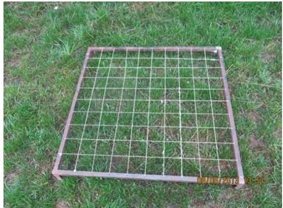

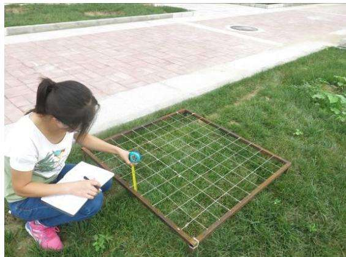  
图 6.2-1 植被样方调查法

④巡查和观察法：对水土保持设施实施情况采用不定期巡查和观察法监测，并结合施工和监理资料，最终确定实施数量。

⑤防护措施效果及稳定性监测：采取实地定点测量法和实地调查相结合的方法，按《生产建设项目水土流失防治标准》（GB/T 50434-2018）规定进行测算。

## （2）巡查监测法

采用定期或不定期现场巡查的方式，对施工期间难以进行定位监测的突发性水土流失危害、水土保持工程设施完好程度、水土保持临时防护措施的实施情况、工程施工对防治责任范围的影响采取拍照、录像、测量、巡查记录等进行监测。尤其大雨、暴雨期间及时到场巡查监测。

## （3）定点监测法

主要针对水土流失量和程度的变化、拦渣保土量等指标进行定位、定点观测。根据监测内容布置监测点，定时观测和采样相结合获取数据。

## ①沉沙池法

利用排水沟末端设置的沉沙池进行水土流失量观测。施工期布设了临时沉沙池，可以在大雨后通过测量沉沙池内的雨水含沙量，计算项目区的外排水含沙量，进而测算各分区的水土流失量，土壤侵蚀模数。

## ②测钎法

将标准钢钎按梅花形或矩形布设于监测样地，记录初始入土深度。定期（如雨季前后）测量钢钎顶面至地面的距离，通过两次测量的高差变化计算土壤侵蚀厚度，进而推算出土壤侵蚀模数。

## ③侵蚀沟法

在监测区域内，选取具有代表性的侵蚀沟，定期测量其长度、宽度、深度及形态变化。通过计算侵蚀沟的体积变化，结合土壤容重，推算出该区域的土壤流失量。

## （4）遥感监测

通过对比建设区不同时段的遥感卫片，记录施工过程中的扰动情况、施工进度、恢复情况等。

## 6.2.3监测频次

根据项目工程特点，在施工前应对项目区进行一次全面调查，摸清工程建设前项目区域内影响水土流失因子的基本情况和水土流失背景状况。监测期内对应不同的监测内容具体监测频次如下：

施工前1次，施工期间扰动土地情况应至少每月监测1次，水土流失状况应至少每月监测1次，发生强降水等情况后应及时加测。其中土壤流失量结合拦挡、排水等措施，设置必要的控制站，进行定量观测。水土流失防治成效应至少每季度监测1次，其中临时措施应至少每月监测1次。水土流失危害应结合上述监测内容一并开展。

近年来北京汛期降雨量大、瞬时降雨强度大，暴雨往往会带来强烈破坏，导致严重水土流失，因此需要加强场次暴雨监测，降雨高峰期应每日巡查，主要监测水土保持措施损毁、施工场地泥沙淤积、道路毁坏、面源污染等内容，暴雨过后应编制水土保持监测暴雨加测报告。

## 根据项目特点确定本项目监测频次见表6.2-1。

6.2-1 监测方法及监测频次情况表
<table><tr><td rowspan=1 colspan=1>监测时段</td><td rowspan=1 colspan=1>监测内容</td><td rowspan=1 colspan=1>监测方法</td><td rowspan=1 colspan=1>监测频次</td></tr><tr><td rowspan=1 colspan=1>前期准备</td><td rowspan=1 colspan=1>地形地貌、植被、气象、水文、土地利用现状、水土流失状况、土壤侵蚀模数背景值。</td><td rowspan=1 colspan=1>询问、查阅资料、实地调查法、遥感监测法</td><td rowspan=1 colspan=1>1次</td></tr><tr><td rowspan=4 colspan=1>施工期</td><td rowspan=4 colspan=1>扰动土地情况监测、堆土弃土（石、渣）监测、水土流失情况监测、水土保持措施监测。</td><td rowspan=4 colspan=1>实地调查法、定点监测法、样方调查法、遥感监测法</td><td rowspan=1 colspan=1>①扰动土地情况不少于每月1次。</td></tr><tr><td rowspan=1 colspan=1>②弃土方式、水土保持措施不少于每月监测记录1次；正在实施弃土方量情况不少于每10天监测记录1次。</td></tr><tr><td rowspan=1 colspan=1>③水土流失面积监测不少于每季度1次；临时堆土潜在的土壤流失量应不少于每月1次，暴雨加测。</td></tr><tr><td rowspan=1 colspan=1>④工程措施及防治效果不少于每月监测记录1次；植物措施生长情况不少于每季度监测记录1次；临时措施不少于每月监测记录1次。</td></tr><tr><td rowspan=1 colspan=1>自然恢复期</td><td rowspan=1 colspan=1>水土流失灾害隐患、水土流失及造成的危害、水土流失防治效果、水土保持措施落实情况、水土保持管理工作情况。</td><td rowspan=1 colspan=1>实地调查法、样方调查法</td><td rowspan=1 colspan=1>水土保持植物措施生长情况等每3个月监测一次。</td></tr></table>

## 6.3点位布设

## （1）布设原则

①监测点充分反映整个监测范围及所在监测分区的水土流失特征；

②监测点充分反映项目工程施工和工程构成特征；

③监测点应相对稳定，能够持续开展水土流失监测；

④监测点的数量应能够保证水土流失及其治理成效评价的可信度。

## （2）点位布设

通过现场勘查及查阅项目区水土保持相关资料，项目区水土流失以水力侵蚀为主，监测单位根据各区水土流失特点，选取具有代表性的、易发生水土流失场地布设监测点位，进行重点监测。本项目主体工程区布设 个监测点位，施工生产区、施工生活区及临时堆土区分别布设 1个监测点位，共计9 个监测点位。

水土流失监测点位布设表见表 6.3-1，监测点位布置图见附图。

表 6.3-1 监测点位布设表
<table><tr><td rowspan=1 colspan=1>监测分区</td><td rowspan=1 colspan=1>监测点位</td><td rowspan=1 colspan=1>施工期水土保持监测重点</td><td rowspan=1 colspan=1>自然恢复期水土保持监测重点</td><td rowspan=1 colspan=1>监测点数(个)</td></tr><tr><td rowspan=1 colspan=1>主体工程区</td><td rowspan=1 colspan=1>基坑开挖以及绿化区域</td><td rowspan=4 colspan=1>（1）防治责任范围面积、扰动地表面积及程度；（2）水土流失分布、面积及侵蚀量；（3）挖方、填方量；(4）水土保持措施实施情况。</td><td rowspan=4 colspan=1>（1）水土流失量及变化；（2）林草成活率，覆盖率及防治水土流失效果；（3）水土保持措施运行效果。</td><td rowspan=1 colspan=1>6</td></tr><tr><td rowspan=1 colspan=1>施工生产区</td><td rowspan=1 colspan=1>施工材料堆放区</td><td rowspan=1 colspan=1>1</td></tr><tr><td rowspan=1 colspan=1>施工生活区</td><td rowspan=1 colspan=1>场地周边排水沟末端</td><td rowspan=1 colspan=1>1</td></tr><tr><td rowspan=1 colspan=1>临时堆土区</td><td rowspan=1 colspan=1>临时堆土边坡</td><td rowspan=1 colspan=1>1</td></tr><tr><td rowspan=1 colspan=1>合计</td><td rowspan=1 colspan=1></td><td rowspan=1 colspan=1></td><td rowspan=1 colspan=1></td><td rowspan=1 colspan=1>9</td></tr></table>

## 6.4实施条件和成果

## 6.4.1实施条件

根据《水利部办公厅关于进一步加强生产建设项目水土保持监测工作的通知》（办水保〔2020〕161 号）的要求，生产建设单位应当自行或者委托具备相应技术条件的机构开展水土保持监测工作。

## （1）监测人员

监测所需人员主要指建设期间开展水土保持监测工作所需要的监测技术负责人、监测工程师等人员。本工程水土保持监测要求配备总监测工程师 1 名，监测工程师 2名，共计3人。

## （2）监测设施及设备

为准确获取各项地面观测及调查数据，水土保持监测必须采用现代技术与传统手段相结合的方法，借助一定的先进仪器设备，使监测方法更科学，监测结论更合理。如利用全球定位系统（GPS）对临时堆土场形态变化作动态监测并应用于遥感监测中，用红外线（激光）测距仪对防治责任范围、扰动土地面积、水土流失面积、扰动土地整治面积等进行现场测量；用便携式植被覆盖度测量仪测量植被恢复面积，用水样、土样分析仪器分析典型区域含沙量以及土方养分等。

本项目水土保持监测主要监测仪器有全站仪、手持式GPS 定位仪、便携式浊度仪、激光测距仪、烘箱、电子天平、数码相机、打印机、扫描仪、计算机、计算器。消耗性材料包括计算器、测绳、皮尺、水桶、铁铲、量筒量杯及相关处理软件等。

## 6.4.2监测成果

监测成果包括监测实施方案、记录表、水土保持监测意见、监测季度报告、监测

年度报告、监测汇报材料、监测总结报告及相关图件和影像资料等。

（1）监测实施方案：建设单位应在主体工程开工 1 个月内，向有关水行政主管部门报送项目水土保持监测实施方案。监测实施方案应按规范编写，具有较强可操作性；监测单位首次入场时现状情况评价和影像资料应纳入监测实施方案。

（2）监测季度报告和监测年度报告：建设单位应在施工期每季度的第一个月内向有关水行政主管部门报送上季度的水土保持监测季度报告，监测季度报告中包含重要位置现场的影像资料。建设单位应于每年 2月 1日前向相关水行政主管部门报送上年度监测报告。

（3）监测总结报告：应内容全面、语言简明、数据真实、重点突出、结论客观。监测总结报告包括项目及水土保持工作概况、重点部位水土流失动态监测结果、水土流失防治措施监测结果、土壤流失量分析、水土流失防治效果监测结果和结论等章节。

在监测季报和总结报告中应明确“绿黄红”三色评价结论。水土保持监测三色评价是指监测单位依据扰动土地情况、水土流失状况、防治成效及水土流失危害等监测结果，对生产建设项目水土流失防治情况进行评价。

（4）监测记录按照监测实施方案和相关规定记录数据，监测记录真实、完整。

（5）监测图件。

（6）影像资料包括照片集和影音资料。照片为全过程监测工作照片合集，也包括监测项目部、监测点照片，照片应注明拍摄时间。

监测成果应按照档案管理规定建立档案。档案内容包括水土保持监测合同、监测实施方案、监测季度报告、监测年度报告、监测总结报告、监测记录、监测图件和影像资料等。

通过实施监测，根据工程建设的实际情况，分析确定建设项目水土流失防治责任范围、施工弃土堆放、拦渣情况、工程建设扰动土地情况，统计和计算水土保持治理面积、林草植被覆盖面积、可实施植物措施面积，结合土壤流失量的定位监测结构分析计算，评价水土流失情况和水土保持治理效果，最后计算出水土保持方案的水土流失治理度、土壤流失控制比、渣土防护率、表土保护率、林草植被恢复率、林草覆盖率 项防治目标的达标值，并据此进行水土保持措施实施效果的综合评价。

## 7水土保持投资估算及效益分析

## 7.1投资估算

## 7.1.1编制原则及依据

## 7.1.1.1编制原则

（1）水土保持投资估算的编制依据、编制定额、价格水平年与基础单价、主要工程单价中的相关费率等与主体工程相一致；主体工程中没有明确规定的，采用水利部《水利工程概（估）算编制规定》（水总〔2024〕323 号）及相关行业、地方标准和当地现行价。

（2）植物措施中需要达到园林化标准的部分，采用《北京市建设工程计价依据—概算定额》（2016年）计算。

（3）水土保持投资估算总表按工程措施、植物措施、临时工程和独立费用、预备费等部分计列。

## 7.1.1.2编制依据

（1）《水利工程概（估）算编制规定》（水总〔2024〕323号）；

（2）《水土保持补偿费征收使用管理办法》（财综〔2014〕8号）；

（3）《北京市发展和改革委员会北京市财政局北京市水务局关于降低本市水土保持补偿费收费标准的通知》（京发改〔2021〕1271号）；

（4）《2016年北京市建设工程计价依据一概算定额》（2016年）；

（5）北京地区 2026年第一季度建筑工程造价资料、材料价格信息。

## 7.1.2编制说明与估算成果

## 7.1.2.1编制说明

## （1）费用构成

水土保持投资由工程措施、植物措施、监测措施、施工临时工程、独立费用、预备费和水土保持补偿费等 7部分组成。

## （2）基础单价

①人工预算单价

水土保持措施人工预算单价与主体工程相一致，为 120元/工日（15元/工时）。

②材料单价

主要材料预算单价与主体工程相一致，其余材料采用《北京工程造价信息》的材料价格，缺项材料采用现行市场价格。

## ③施工用水、电价格

根据北京市工程造价信息公布价格，施工用水按照 9.22 元/m³，施工用电按照北京市工程造价信息公布价格，为 0.98元/kw·h。

表 7.1-1 主要材料价格表
<table><tr><td rowspan=1 colspan=1>序号</td><td rowspan=1 colspan=1>名称</td><td rowspan=1 colspan=1>单位</td><td rowspan=1 colspan=1>规格</td><td rowspan=1 colspan=1>价格（元）</td></tr><tr><td rowspan=1 colspan=1>1</td><td rowspan=1 colspan=1>碎石</td><td rowspan=1 colspan=1>t</td><td rowspan=1 colspan=1>0.5~3.2</td><td rowspan=1 colspan=1>57.40</td></tr><tr><td rowspan=1 colspan=1>2</td><td rowspan=1 colspan=1>天然砂石</td><td rowspan=1 colspan=1>t</td><td rowspan=1 colspan=1>级配砂石</td><td rowspan=1 colspan=1>51.36</td></tr><tr><td rowspan=1 colspan=1>3</td><td rowspan=1 colspan=1>普通硅酸盐水泥</td><td rowspan=1 colspan=1>t</td><td rowspan=1 colspan=1>42.5 散装</td><td rowspan=1 colspan=1>372.59</td></tr><tr><td rowspan=1 colspan=1>4</td><td rowspan=1 colspan=1>砂浆</td><td rowspan=1 colspan=1>t</td><td rowspan=1 colspan=1>M7.5</td><td rowspan=1 colspan=1>320</td></tr><tr><td rowspan=1 colspan=1>5</td><td rowspan=1 colspan=1>普通混凝土</td><td rowspan=1 colspan=1>t</td><td rowspan=1 colspan=1>C10</td><td rowspan=1 colspan=1>273.40</td></tr><tr><td rowspan=1 colspan=1>6</td><td rowspan=1 colspan=1>普通混凝土</td><td rowspan=1 colspan=1>t</td><td rowspan=1 colspan=1>C30</td><td rowspan=1 colspan=1>433.01</td></tr><tr><td rowspan=1 colspan=1>7</td><td rowspan=1 colspan=1>汽油</td><td rowspan=1 colspan=1>t</td><td rowspan=1 colspan=1>92#</td><td rowspan=1 colspan=1>9110.00</td></tr><tr><td rowspan=1 colspan=1>8</td><td rowspan=1 colspan=1>柴油</td><td rowspan=1 colspan=1>t</td><td rowspan=1 colspan=1>0#</td><td rowspan=1 colspan=1>7600.00</td></tr><tr><td rowspan=1 colspan=1>9</td><td rowspan=1 colspan=1>透水砖</td><td rowspan=1 colspan=1> $\mathrm { m } ^ { 2 }$ </td><td rowspan=1 colspan=1>20cm×10cm×8cm</td><td rowspan=1 colspan=1>105</td></tr><tr><td rowspan=1 colspan=1>10</td><td rowspan=1 colspan=1>草籽</td><td rowspan=1 colspan=1> $\underline { { \mathbf { k g } } }$ </td><td rowspan=1 colspan=1>高羊茅</td><td rowspan=1 colspan=1>45</td></tr><tr><td rowspan=1 colspan=1>11</td><td rowspan=1 colspan=1>块石</td><td rowspan=1 colspan=1>t</td><td rowspan=1 colspan=1></td><td rowspan=1 colspan=1>110.77</td></tr><tr><td rowspan=1 colspan=1>12</td><td rowspan=1 colspan=1>混合料</td><td rowspan=1 colspan=1>t</td><td rowspan=1 colspan=1></td><td rowspan=1 colspan=1>71.50</td></tr><tr><td rowspan=1 colspan=1>13</td><td rowspan=1 colspan=1>人工</td><td rowspan=1 colspan=1> $\pm \sharp _ { \star } ^ { \star }$ </td><td rowspan=1 colspan=1></td><td rowspan=1 colspan=1>15.00</td></tr><tr><td rowspan=1 colspan=1>14</td><td rowspan=1 colspan=1>砂</td><td rowspan=1 colspan=1> $\overline { { { \bf m } ^ { 3 } } }$ </td><td rowspan=1 colspan=1></td><td rowspan=1 colspan=1>67.47</td></tr><tr><td rowspan=1 colspan=1>15</td><td rowspan=1 colspan=1>防尘网</td><td rowspan=1 colspan=1> $\overline { { { \bf m } ^ { 2 } } }$ </td><td rowspan=1 colspan=1></td><td rowspan=1 colspan=1>1.5</td></tr><tr><td rowspan=1 colspan=1>16</td><td rowspan=1 colspan=1>编织袋</td><td rowspan=1 colspan=1>个</td><td rowspan=1 colspan=1></td><td rowspan=1 colspan=1>0.50</td></tr><tr><td rowspan=1 colspan=1>17</td><td rowspan=1 colspan=1>水</td><td rowspan=1 colspan=1>t</td><td rowspan=1 colspan=1></td><td rowspan=1 colspan=1>9.22</td></tr><tr><td rowspan=1 colspan=1>18</td><td rowspan=1 colspan=1>电</td><td rowspan=1 colspan=1>kw/h</td><td rowspan=1 colspan=1></td><td rowspan=1 colspan=1>0.98</td></tr></table>

## ④施工机械台时费

与主体工程相一致，不足部分按照《水土保持工程概(估)算定额》进行编制。

## （3）工程单价

水土保持措施单价按照《水利工程概（估）算编制规定》（水总〔2024〕323号）、水利部办公厅关于印发《水利工程营业税改增值税计价依据调整办法》的通知（办水总〔2016〕132 号）和《北京市建设工程概算费用定额》（京建发〔2016〕407 号）进行编制，一般由直接费、间接费、利润和税金组成。

## 1）直接费

包括定额直接费、调整费用及其他工程费用。定额直接费由人工费、材料费及机械费构成，调整费用按北京市住房和城乡建设委员会关于发布 2016 年《北京市建设工程计价依据—概算定额》第一次调整系数的通知（京建发〔2019〕333 号）的规定

选取相应系数计算，其他直接费工程措施按基本直接费的 2.5%计算；植物措施按基本直接费的1.3%计算。

## 2）间接费

工程措施中土方工程按直接费的 5%计，石方工程按直接费的 8%计，混凝土工程按直接费的7%计，植物措施按直接费的 6%。具体间接费费率见下表。

表 7.1-2 间接费费率表
<table><tr><td rowspan=1 colspan=1>序号</td><td rowspan=1 colspan=1>工程类别</td><td rowspan=1 colspan=1>计算基础</td><td rowspan=1 colspan=1>间接费费率（%）</td></tr><tr><td rowspan=1 colspan=1>一</td><td rowspan=1 colspan=1>工程措施、监测措施</td><td rowspan=1 colspan=1></td><td rowspan=1 colspan=1></td></tr><tr><td rowspan=1 colspan=1>1</td><td rowspan=1 colspan=1>土方工程</td><td rowspan=1 colspan=1>直接费</td><td rowspan=1 colspan=1>5</td></tr><tr><td rowspan=1 colspan=1>2</td><td rowspan=1 colspan=1>石方工程</td><td rowspan=1 colspan=1>直接费</td><td rowspan=1 colspan=1>8</td></tr><tr><td rowspan=1 colspan=1>3</td><td rowspan=1 colspan=1>混凝土工程</td><td rowspan=1 colspan=1>直接费</td><td rowspan=1 colspan=1>7</td></tr><tr><td rowspan=1 colspan=1>4</td><td rowspan=1 colspan=1>钢筋制安工程</td><td rowspan=1 colspan=1>直接费</td><td rowspan=1 colspan=1>5</td></tr><tr><td rowspan=1 colspan=1>5</td><td rowspan=1 colspan=1>基础处理工程</td><td rowspan=1 colspan=1>直接费</td><td rowspan=1 colspan=1>10</td></tr><tr><td rowspan=1 colspan=1>6</td><td rowspan=1 colspan=1>其他工程</td><td rowspan=1 colspan=1>直接费</td><td rowspan=1 colspan=1>7</td></tr><tr><td rowspan=1 colspan=1>二</td><td rowspan=1 colspan=1>植物措施</td><td rowspan=1 colspan=1>直接费</td><td rowspan=1 colspan=1>6</td></tr></table>

## 3）利润

按直接工程费和间接费之和的 7%计。

## 4）税金

按直接费、间接费、利润之和的 9%计。

## （4）工程措施

工程措施的投资按设计工程量乘以工程单价进行编制。

## （5）植物措施

植物措施的投资按设计工程量乘以工程单价进行编制。

## （6）监测措施

①水土保持监测：土建设施及设备按设计工程量或设备清单乘以工程单价进行编制。

②弃渣场稳定监测：按照弃渣场稳定监测方案有关监测内容、设施设备进行编制，本项目未设置弃渣场，无弃渣场稳定监测费。

③建设期观测费：包括系统运行材料费、维护检修费和常规观测费等。

## （7）施工临时工程

①临时防护工程：按设计方案的工程量乘以单价编制；

②其它临时工程：按一至二部分投资之和的 1%计算；

③施工安全生产专项：按一至四部分建安工作量（不含设备购置费）之和的 2.5%计算。

## （8）独立费用

独立费用包括建设管理费、工程建设监理费和科研勘测设计费。

①建设管理费：包括项目经常费和技术咨询费，项目经常费按一至四部分投资合计的0.6%\~2.5%计算；技术咨询费根据工作内容，按一至四部分投资合计的0.4%\~1.5%计算。

②工程建设监理费：参照国家发改委、建设部《关于印发<建设工程监理与相关服务收费管理规定>的通知》（发改价格〔2007〕670号文）计算。

③勘测设计费：包括工程勘测设计费和水土保持方案编制费等，根据《国家发展改革委关于进一步放开建设项目专业服务价格的通知》（发改价格〔2015〕299号），结合本项目实际情况选取。

## （9）预备费

## ①基本预备费

主要为解决在工程施工过程中，经上级批准的设计变更和为预防意外事故而采取的措施所增加的工程项目和费用。基本预备费按一至五部分之和的 3%计算。

## ②价差预备费

根据国家发展计划委员会计投资(1999)1340号文《国家计委关于加强对基本建设大中型项目估算中“价差预备费”管理有关问题的通知》规定，生产建设项目不计价差预备费。

## （10）水土保持补偿费

根据《北京市发展和改革委员会 北京市财政局 北京市水务局关于降低本市水土保持补偿费收费标准的通知》（京发改〔2021〕1271 号）文件规定：对一般性生产建设项目，按照征占用土地面积每平方米 0.3 元一次性计征，不足 1 平方米的按 1 平方米计，项目总占地面积 51271m²，计算得水土保持补偿费 15381.3元。

根据《北京市财政局 北京市发展和改革委员会 北京市水务局关于印发<北京市水土保持补偿费征收管理办法>的通知》（京财农〔2016〕506号）第十一条规定：建设学校、幼儿园、医院、养老院服务设施、孤儿院、福利院等公益性工程项目的可免缴水土保持补偿费，本项目属于学校建设类项目，可申请免缴水土保持补偿费。

## 7.1.2.2投资估算成果

项目水土保持工程总投资703.15万元，其中工程措施投资262.48万元，植物措施投资218.96万元，监测措施投资45.50万元，施工临时工程投资41.68万元，独立费用114.06万元，基本预备费20.48万元，水土保持补偿费可申请免缴。投资估算见下表7.1-3\~表7.1-9，具体投资单价计算见附表。

表 7.1-3 水土保持措施投资估算总表
<table><tr><td rowspan=1 colspan=1>序号</td><td rowspan=1 colspan=1>工程或费用名称</td><td rowspan=1 colspan=1>建筑安装工程费</td><td rowspan=1 colspan=1>设备购置费</td><td rowspan=1 colspan=1>独立费</td><td rowspan=1 colspan=1>合计</td></tr><tr><td rowspan=1 colspan=2>第一部分 工程措施</td><td rowspan=1 colspan=1>262.48</td><td rowspan=1 colspan=1></td><td rowspan=1 colspan=1></td><td rowspan=1 colspan=1>262.48</td></tr><tr><td rowspan=1 colspan=1>1</td><td rowspan=1 colspan=1>主体工程区</td><td rowspan=1 colspan=1>256.76</td><td rowspan=1 colspan=1></td><td rowspan=1 colspan=1></td><td rowspan=1 colspan=1>256.76</td></tr><tr><td rowspan=1 colspan=1>2</td><td rowspan=1 colspan=1>施工生产区</td><td rowspan=1 colspan=1>5.37</td><td rowspan=1 colspan=1></td><td rowspan=1 colspan=1></td><td rowspan=1 colspan=1>5.37</td></tr><tr><td rowspan=1 colspan=1>3</td><td rowspan=1 colspan=1>施工生活区</td><td rowspan=1 colspan=1>0.35</td><td rowspan=1 colspan=1></td><td rowspan=1 colspan=1></td><td rowspan=1 colspan=1>0.35</td></tr><tr><td rowspan=1 colspan=2>第二部分 植物措施</td><td rowspan=1 colspan=1>218.96</td><td rowspan=1 colspan=1></td><td rowspan=1 colspan=1></td><td rowspan=1 colspan=1>218.96</td></tr><tr><td rowspan=1 colspan=1>1</td><td rowspan=1 colspan=1>主体工程区</td><td rowspan=1 colspan=1>218.84</td><td rowspan=1 colspan=1></td><td rowspan=1 colspan=1></td><td rowspan=1 colspan=1>218.84</td></tr><tr><td rowspan=1 colspan=1>2</td><td rowspan=1 colspan=1>施工生产区</td><td rowspan=1 colspan=1>0.12</td><td rowspan=1 colspan=1></td><td rowspan=1 colspan=1></td><td rowspan=1 colspan=1>0.12</td></tr><tr><td rowspan=1 colspan=1></td><td rowspan=1 colspan=1>第三部分 监测措施</td><td rowspan=1 colspan=1>43.50</td><td rowspan=1 colspan=1>2.00</td><td rowspan=1 colspan=1></td><td rowspan=1 colspan=1>45.50</td></tr><tr><td rowspan=1 colspan=1>1</td><td rowspan=1 colspan=1>监测设备</td><td rowspan=1 colspan=1></td><td rowspan=1 colspan=1>1.84</td><td rowspan=1 colspan=1></td><td rowspan=1 colspan=1>1.84</td></tr><tr><td rowspan=1 colspan=1>2</td><td rowspan=1 colspan=1>消耗性材料</td><td rowspan=1 colspan=1></td><td rowspan=1 colspan=1>0.16</td><td rowspan=1 colspan=1></td><td rowspan=1 colspan=1>0.16</td></tr><tr><td rowspan=1 colspan=1>3</td><td rowspan=1 colspan=1>建设期观测费</td><td rowspan=1 colspan=1>43.50</td><td rowspan=1 colspan=1></td><td rowspan=1 colspan=1></td><td rowspan=1 colspan=1>43.50</td></tr><tr><td rowspan=1 colspan=1></td><td rowspan=1 colspan=1>第四部分 施工临时工程</td><td rowspan=1 colspan=1>41.68</td><td rowspan=1 colspan=1></td><td rowspan=1 colspan=1></td><td rowspan=1 colspan=1>41.68</td></tr><tr><td rowspan=1 colspan=1>1</td><td rowspan=1 colspan=1>主体工程区</td><td rowspan=1 colspan=1>22.49</td><td rowspan=1 colspan=1></td><td rowspan=1 colspan=1></td><td rowspan=1 colspan=1>22.49</td></tr><tr><td rowspan=1 colspan=1>2</td><td rowspan=1 colspan=1>施工生产区</td><td rowspan=1 colspan=1>8.19</td><td rowspan=1 colspan=1></td><td rowspan=1 colspan=1></td><td rowspan=1 colspan=1>8.19</td></tr><tr><td rowspan=1 colspan=1>3</td><td rowspan=1 colspan=1>施工生活区</td><td rowspan=1 colspan=1>3.23</td><td rowspan=1 colspan=1></td><td rowspan=1 colspan=1></td><td rowspan=1 colspan=1>3.23</td></tr><tr><td rowspan=1 colspan=1>4</td><td rowspan=1 colspan=1>临时堆土区</td><td rowspan=1 colspan=1>2.96</td><td rowspan=1 colspan=1></td><td rowspan=1 colspan=1></td><td rowspan=1 colspan=1>2.96</td></tr><tr><td rowspan=1 colspan=1>5</td><td rowspan=1 colspan=1>其他临时工程费</td><td rowspan=1 colspan=1>4.81</td><td rowspan=1 colspan=1></td><td rowspan=1 colspan=1></td><td rowspan=1 colspan=1>4.81</td></tr><tr><td rowspan=1 colspan=2>一至四部分合计</td><td rowspan=1 colspan=1>568.61</td><td rowspan=1 colspan=1></td><td rowspan=1 colspan=1></td><td rowspan=1 colspan=1>568.61</td></tr><tr><td rowspan=1 colspan=2>第五部分 独立费用</td><td rowspan=1 colspan=1></td><td rowspan=1 colspan=1></td><td rowspan=1 colspan=1></td><td rowspan=1 colspan=1>114.06</td></tr><tr><td rowspan=1 colspan=1>1</td><td rowspan=1 colspan=1>项目建设管理费</td><td rowspan=1 colspan=1></td><td rowspan=1 colspan=1></td><td rowspan=1 colspan=1>17.06</td><td rowspan=1 colspan=1>17.06</td></tr><tr><td rowspan=1 colspan=1>2</td><td rowspan=1 colspan=1>工程建设监理费</td><td rowspan=1 colspan=1></td><td rowspan=1 colspan=1></td><td rowspan=1 colspan=1>32.00</td><td rowspan=1 colspan=1>32.00</td></tr><tr><td rowspan=1 colspan=1>3</td><td rowspan=1 colspan=1>勘测设计费</td><td rowspan=1 colspan=1></td><td rowspan=1 colspan=1></td><td rowspan=1 colspan=1>65.00</td><td rowspan=1 colspan=1>65.00</td></tr><tr><td rowspan=1 colspan=1>I</td><td rowspan=1 colspan=1>一至五部分合计</td><td rowspan=1 colspan=1></td><td rowspan=1 colspan=1></td><td rowspan=1 colspan=1></td><td rowspan=1 colspan=1>682.67</td></tr><tr><td rowspan=1 colspan=1>ⅡI</td><td rowspan=1 colspan=1>预备费</td><td rowspan=1 colspan=1></td><td rowspan=1 colspan=1></td><td rowspan=1 colspan=1></td><td rowspan=1 colspan=1>20.48</td></tr><tr><td rowspan=1 colspan=1>ⅢⅢ</td><td rowspan=1 colspan=1>水土保持补偿费</td><td rowspan=1 colspan=1></td><td rowspan=1 colspan=1></td><td rowspan=1 colspan=1></td><td rowspan=1 colspan=1>一</td></tr><tr><td rowspan=1 colspan=2>工程总投资（I+II+III）</td><td rowspan=1 colspan=1></td><td rowspan=1 colspan=1></td><td rowspan=1 colspan=1></td><td rowspan=1 colspan=1>703.15</td></tr></table>

表 7.1-4 分年度投资估算表

单位：万元

<table><tr><td rowspan=1 colspan=1>序号</td><td rowspan=1 colspan=1>工程或费用名称</td><td rowspan=1 colspan=1>合计</td><td rowspan=1 colspan=1>2026年</td><td rowspan=1 colspan=1>2027年</td><td rowspan=1 colspan=1>2028年</td><td rowspan=1 colspan=1>2029年</td></tr><tr><td rowspan=1 colspan=1>一</td><td rowspan=1 colspan=1>工程措施</td><td rowspan=1 colspan=1>262.48</td><td rowspan=1 colspan=1>15.65</td><td rowspan=1 colspan=1></td><td rowspan=1 colspan=1></td><td rowspan=1 colspan=1>246.83</td></tr><tr><td rowspan=1 colspan=1>1</td><td rowspan=1 colspan=1>主体工程区</td><td rowspan=1 colspan=1>256.76</td><td rowspan=1 colspan=1>13.24</td><td rowspan=1 colspan=1></td><td rowspan=1 colspan=1></td><td rowspan=1 colspan=1>243.52</td></tr><tr><td rowspan=1 colspan=1>2</td><td rowspan=1 colspan=1>施工生产区</td><td rowspan=1 colspan=1>5.37</td><td rowspan=1 colspan=1>2.42</td><td rowspan=1 colspan=1></td><td rowspan=1 colspan=1></td><td rowspan=1 colspan=1>2.95</td></tr><tr><td rowspan=1 colspan=1>3</td><td rowspan=1 colspan=1>施工生活区</td><td rowspan=1 colspan=1>0.35</td><td rowspan=1 colspan=1></td><td rowspan=1 colspan=1></td><td rowspan=1 colspan=1></td><td rowspan=1 colspan=1>0.35</td></tr><tr><td rowspan=1 colspan=1>二</td><td rowspan=1 colspan=1>植物措施</td><td rowspan=1 colspan=1>218.96</td><td rowspan=1 colspan=1></td><td rowspan=1 colspan=1></td><td rowspan=1 colspan=1></td><td rowspan=1 colspan=1>218.96</td></tr><tr><td rowspan=1 colspan=1>1</td><td rowspan=1 colspan=1>主体工程区</td><td rowspan=1 colspan=1>218.84</td><td rowspan=1 colspan=1></td><td rowspan=1 colspan=1></td><td rowspan=1 colspan=1></td><td rowspan=1 colspan=1>218.84</td></tr><tr><td rowspan=1 colspan=1>2</td><td rowspan=1 colspan=1>施工生产区</td><td rowspan=1 colspan=1>0.12</td><td rowspan=1 colspan=1></td><td rowspan=1 colspan=1></td><td rowspan=1 colspan=1></td><td rowspan=1 colspan=1>0.12</td></tr><tr><td rowspan=1 colspan=1>三</td><td rowspan=1 colspan=1>监测措施</td><td rowspan=1 colspan=1>45.50</td><td rowspan=1 colspan=1>11.37</td><td rowspan=1 colspan=1>15.17</td><td rowspan=1 colspan=1>13.33</td><td rowspan=1 colspan=1>5.63</td></tr><tr><td rowspan=1 colspan=1>1</td><td rowspan=1 colspan=1>监测设备</td><td rowspan=1 colspan=1>1.84</td><td rowspan=1 colspan=1>0.46</td><td rowspan=1 colspan=1>0.61</td><td rowspan=1 colspan=1>0.39</td><td rowspan=1 colspan=1>0.38</td></tr><tr><td rowspan=1 colspan=1>2</td><td rowspan=1 colspan=1>消耗性材料</td><td rowspan=1 colspan=1>0.16</td><td rowspan=1 colspan=1>0.04</td><td rowspan=1 colspan=1>0.05</td><td rowspan=1 colspan=1>0.05</td><td rowspan=1 colspan=1>0.02</td></tr><tr><td rowspan=1 colspan=1>3</td><td rowspan=1 colspan=1>建设期观测费</td><td rowspan=1 colspan=1>43.50</td><td rowspan=1 colspan=1>10.88</td><td rowspan=1 colspan=1>14.50</td><td rowspan=1 colspan=1>12.90</td><td rowspan=1 colspan=1>5.23</td></tr><tr><td rowspan=1 colspan=1>四</td><td rowspan=1 colspan=1>临时措施</td><td rowspan=1 colspan=1>41.68</td><td rowspan=1 colspan=1>24.26</td><td rowspan=1 colspan=1>7.19</td><td rowspan=1 colspan=1>5.02</td><td rowspan=1 colspan=1>5.21</td></tr><tr><td rowspan=1 colspan=1>1</td><td rowspan=1 colspan=1>主体工程区</td><td rowspan=1 colspan=1>22.49</td><td rowspan=1 colspan=1>13.09</td><td rowspan=1 colspan=1>4.09</td><td rowspan=1 colspan=1>2.50</td><td rowspan=1 colspan=1>2.81</td></tr><tr><td rowspan=1 colspan=1>2</td><td rowspan=1 colspan=1>施工生产区</td><td rowspan=1 colspan=1>8.19</td><td rowspan=1 colspan=1>4.77</td><td rowspan=1 colspan=1>1.37</td><td rowspan=1 colspan=1>1.03</td><td rowspan=1 colspan=1>1.02</td></tr><tr><td rowspan=1 colspan=1>3</td><td rowspan=1 colspan=1>施工生活区</td><td rowspan=1 colspan=1>3.23</td><td rowspan=1 colspan=1>1.88</td><td rowspan=1 colspan=1>0.36</td><td rowspan=1 colspan=1>0.58</td><td rowspan=1 colspan=1>0.40</td></tr><tr><td rowspan=1 colspan=1>4</td><td rowspan=1 colspan=1>临时堆土区</td><td rowspan=1 colspan=1>2.96</td><td rowspan=1 colspan=1>1.72</td><td rowspan=1 colspan=1>0.52</td><td rowspan=1 colspan=1>0.35</td><td rowspan=1 colspan=1>0.37</td></tr><tr><td rowspan=1 colspan=1>5</td><td rowspan=1 colspan=1>其他临时工程费</td><td rowspan=1 colspan=1>4.81</td><td rowspan=1 colspan=1>2.80</td><td rowspan=1 colspan=1>0.85</td><td rowspan=1 colspan=1>0.56</td><td rowspan=1 colspan=1>0.60</td></tr><tr><td rowspan=1 colspan=1>五</td><td rowspan=1 colspan=1>独立费用</td><td rowspan=1 colspan=1>114.06</td><td rowspan=1 colspan=1>69.09</td><td rowspan=1 colspan=1>16.35</td><td rowspan=1 colspan=1>16.35</td><td rowspan=1 colspan=1>12.26</td></tr><tr><td rowspan=1 colspan=1>1</td><td rowspan=1 colspan=1>项目建设管理费</td><td rowspan=1 colspan=1>17.06</td><td rowspan=1 colspan=1>1.42</td><td rowspan=1 colspan=1>5.69</td><td rowspan=1 colspan=1>5.69</td><td rowspan=1 colspan=1>4.26</td></tr><tr><td rowspan=1 colspan=1>2</td><td rowspan=1 colspan=1>工程建设监理费</td><td rowspan=1 colspan=1>32.00</td><td rowspan=1 colspan=1>2.67</td><td rowspan=1 colspan=1>10.67</td><td rowspan=1 colspan=1>10.67</td><td rowspan=1 colspan=1>8.00</td></tr><tr><td rowspan=1 colspan=1>3</td><td rowspan=1 colspan=1>勘测设计费</td><td rowspan=1 colspan=1>65.00</td><td rowspan=1 colspan=1>65.00</td><td rowspan=1 colspan=1></td><td rowspan=1 colspan=1></td><td rowspan=1 colspan=1></td></tr><tr><td rowspan=1 colspan=1>I</td><td rowspan=1 colspan=1>一至五部分合计</td><td rowspan=1 colspan=1>682.67</td><td rowspan=1 colspan=1>120.38</td><td rowspan=1 colspan=1>38.71</td><td rowspan=1 colspan=1>34.69</td><td rowspan=1 colspan=1>488.89</td></tr><tr><td rowspan=1 colspan=1>ⅡI</td><td rowspan=1 colspan=1>预备费</td><td rowspan=1 colspan=1>20.48</td><td rowspan=1 colspan=1>1.71</td><td rowspan=1 colspan=1>6.83</td><td rowspan=1 colspan=1>6.83</td><td rowspan=1 colspan=1>5.12</td></tr><tr><td rowspan=1 colspan=1>III</td><td rowspan=1 colspan=1>水土保持补偿费</td><td rowspan=1 colspan=1>一</td><td rowspan=1 colspan=1>一</td><td rowspan=1 colspan=1>一</td><td rowspan=1 colspan=1>一</td><td rowspan=1 colspan=1>一</td></tr><tr><td rowspan=1 colspan=2>工程总投资（I+II+III）</td><td rowspan=1 colspan=1>703.15</td><td rowspan=1 colspan=1>122.09</td><td rowspan=1 colspan=1>45.53</td><td rowspan=1 colspan=1>41.52</td><td rowspan=1 colspan=1>494.01</td></tr></table>

表 7.1-5 工程措施投资估算表
<table><tr><td rowspan=2 colspan=1>序号</td><td rowspan=2 colspan=1>定额编号</td><td rowspan=2 colspan=1>工程或费用名称</td><td rowspan=2 colspan=1>单位</td><td rowspan=1 colspan=4>工程量</td><td rowspan=2 colspan=1>单价(元)</td><td rowspan=1 colspan=4>投资（万元）</td></tr><tr><td rowspan=1 colspan=1>12-13 公寓</td><td rowspan=1 colspan=1>14-15公寓</td><td rowspan=1 colspan=1>16-17 公寓</td><td rowspan=1 colspan=1>小计</td><td rowspan=1 colspan=1>12-13 公寓</td><td rowspan=1 colspan=1>14-15 公寓</td><td rowspan=1 colspan=1>16-17 公寓</td><td rowspan=1 colspan=1>合计</td></tr><tr><td rowspan=1 colspan=1></td><td rowspan=1 colspan=2>第一部分 工程措施</td><td rowspan=1 colspan=1></td><td rowspan=1 colspan=1></td><td rowspan=1 colspan=1></td><td rowspan=1 colspan=1></td><td rowspan=1 colspan=1></td><td rowspan=1 colspan=1></td><td rowspan=1 colspan=1></td><td rowspan=1 colspan=1></td><td rowspan=1 colspan=1></td><td rowspan=1 colspan=1></td></tr><tr><td rowspan=1 colspan=1>一</td><td rowspan=1 colspan=1></td><td rowspan=1 colspan=1>主体工程区</td><td rowspan=1 colspan=1></td><td rowspan=1 colspan=1></td><td rowspan=1 colspan=1></td><td rowspan=1 colspan=1></td><td rowspan=1 colspan=1></td><td rowspan=1 colspan=1></td><td rowspan=1 colspan=1></td><td rowspan=1 colspan=1></td><td rowspan=1 colspan=1></td><td rowspan=1 colspan=1>256.76</td></tr><tr><td rowspan=1 colspan=1>1</td><td rowspan=1 colspan=1>01004</td><td rowspan=1 colspan=1>表土剥离</td><td rowspan=1 colspan=1> $\mathrm { ~ m ~ } ^ { 2 }$ </td><td rowspan=1 colspan=1>9630</td><td rowspan=1 colspan=1>3210</td><td rowspan=1 colspan=1>8560</td><td rowspan=1 colspan=1>21399</td><td rowspan=1 colspan=1>6.19</td><td rowspan=1 colspan=1>5.96</td><td rowspan=1 colspan=1>1.99</td><td rowspan=1 colspan=1>5.29</td><td rowspan=1 colspan=1>13.24</td></tr><tr><td rowspan=1 colspan=1>2</td><td rowspan=1 colspan=1>01098</td><td rowspan=1 colspan=1>表土回覆</td><td rowspan=1 colspan=1> $\mathrm { ~ m ~ } ^ { 3 }$ </td><td rowspan=1 colspan=1>2310.00</td><td rowspan=1 colspan=1>840.00</td><td rowspan=1 colspan=1>1220.00</td><td rowspan=1 colspan=1>4370</td><td rowspan=1 colspan=1>13.20</td><td rowspan=1 colspan=1>3.05</td><td rowspan=1 colspan=1>1.11</td><td rowspan=1 colspan=1>1.61</td><td rowspan=1 colspan=1>5.77</td></tr><tr><td rowspan=1 colspan=1>3</td><td rowspan=1 colspan=1>主体设计</td><td rowspan=1 colspan=1>下凹式整地</td><td rowspan=1 colspan=1> $\tan ^ { 2 }$ </td><td rowspan=1 colspan=1>0.38</td><td rowspan=1 colspan=1>0.14</td><td rowspan=1 colspan=1>0.21</td><td rowspan=1 colspan=1>0.73</td><td rowspan=1 colspan=1>7058.41</td><td rowspan=1 colspan=1>0.27</td><td rowspan=1 colspan=1>0.10</td><td rowspan=1 colspan=1>0.15</td><td rowspan=1 colspan=1>0.52</td></tr><tr><td rowspan=1 colspan=1>4</td><td rowspan=1 colspan=1>主体设计</td><td rowspan=1 colspan=1>雨水管网</td><td rowspan=1 colspan=1> $\mathbf { m }$ </td><td rowspan=1 colspan=1>172.14</td><td rowspan=1 colspan=1>144.96</td><td rowspan=1 colspan=1>135.90</td><td rowspan=1 colspan=1>453</td><td rowspan=1 colspan=1>300</td><td rowspan=1 colspan=1>5.16</td><td rowspan=1 colspan=1>4.35</td><td rowspan=1 colspan=1>4.08</td><td rowspan=1 colspan=1>13.59</td></tr><tr><td rowspan=1 colspan=1>5</td><td rowspan=1 colspan=1>主体设计</td><td rowspan=1 colspan=1>雨水调蓄池</td><td rowspan=1 colspan=1> $\mathrm { ~ m ~ } ^ { 3 }$ </td><td rowspan=1 colspan=1>202</td><td rowspan=1 colspan=1>132</td><td rowspan=1 colspan=1>79</td><td rowspan=1 colspan=1>413</td><td rowspan=1 colspan=1>/</td><td rowspan=1 colspan=1>30.00</td><td rowspan=1 colspan=1>22.00</td><td rowspan=1 colspan=1>20.00</td><td rowspan=1 colspan=1>72.00</td></tr><tr><td rowspan=1 colspan=1>6</td><td rowspan=1 colspan=1>主体设计</td><td rowspan=1 colspan=1>透水砖铺装</td><td rowspan=1 colspan=1> $\mathrm { ~ m ~ } ^ { 2 }$ </td><td rowspan=1 colspan=1>3609</td><td rowspan=1 colspan=1>1775</td><td rowspan=1 colspan=1>2478</td><td rowspan=1 colspan=1>7862</td><td rowspan=1 colspan=1>150</td><td rowspan=1 colspan=1>54.24</td><td rowspan=1 colspan=1>26.68</td><td rowspan=1 colspan=1>37.24</td><td rowspan=1 colspan=1>118.16</td></tr><tr><td rowspan=1 colspan=1>7</td><td rowspan=1 colspan=1>主体设计</td><td rowspan=1 colspan=1>节水灌溉</td><td rowspan=1 colspan=1> $\mathrm { ~ m ~ } ^ { 2 }$ </td><td rowspan=1 colspan=1>7694</td><td rowspan=1 colspan=1>2806</td><td rowspan=1 colspan=1>4060</td><td rowspan=1 colspan=1>14560</td><td rowspan=1 colspan=1>23</td><td rowspan=1 colspan=1>17.70</td><td rowspan=1 colspan=1>6.45</td><td rowspan=1 colspan=1>9.34</td><td rowspan=1 colspan=1>33.49</td></tr><tr><td rowspan=1 colspan=1>二</td><td rowspan=1 colspan=1></td><td rowspan=1 colspan=1>施工生产区</td><td rowspan=1 colspan=1></td><td rowspan=1 colspan=3></td><td rowspan=1 colspan=1></td><td rowspan=1 colspan=1></td><td rowspan=1 colspan=1></td><td rowspan=1 colspan=1></td><td rowspan=1 colspan=1></td><td rowspan=1 colspan=1>5.37</td></tr><tr><td rowspan=1 colspan=1>1</td><td rowspan=1 colspan=1>01004</td><td rowspan=1 colspan=1>表土剥离</td><td rowspan=1 colspan=1> $\mathrm { ~ m ~ } ^ { 2 }$ </td><td rowspan=1 colspan=3>3906.00</td><td rowspan=1 colspan=1>3906</td><td rowspan=1 colspan=1>6.19</td><td rowspan=1 colspan=1></td><td rowspan=1 colspan=1></td><td rowspan=1 colspan=1></td><td rowspan=1 colspan=1>2.42</td></tr><tr><td rowspan=1 colspan=1>2</td><td rowspan=1 colspan=1>08042</td><td rowspan=1 colspan=1>土地平整</td><td rowspan=1 colspan=1> $\tan ^ { 2 }$ </td><td rowspan=1 colspan=3>0.63</td><td rowspan=1 colspan=1>0.63</td><td rowspan=1 colspan=1>7058.41</td><td rowspan=1 colspan=1></td><td rowspan=1 colspan=1></td><td rowspan=1 colspan=1></td><td rowspan=1 colspan=1>0.44</td></tr><tr><td rowspan=1 colspan=1>3</td><td rowspan=1 colspan=1>01098</td><td rowspan=1 colspan=1>表土回覆</td><td rowspan=1 colspan=1> $\mathrm { ~ m ~ } ^ { 3 }$ </td><td rowspan=1 colspan=3>1900.00</td><td rowspan=1 colspan=1>1900.00</td><td rowspan=1 colspan=1>13.20</td><td rowspan=1 colspan=1></td><td rowspan=1 colspan=1></td><td rowspan=1 colspan=1></td><td rowspan=1 colspan=1>2.51</td></tr><tr><td rowspan=1 colspan=1>三</td><td rowspan=1 colspan=1></td><td rowspan=1 colspan=1>施工生活区</td><td rowspan=1 colspan=1></td><td rowspan=1 colspan=3></td><td rowspan=1 colspan=1></td><td rowspan=1 colspan=1></td><td rowspan=1 colspan=1></td><td rowspan=1 colspan=1></td><td rowspan=1 colspan=1></td><td rowspan=1 colspan=1>0.35</td></tr><tr><td rowspan=1 colspan=1>1</td><td rowspan=1 colspan=1>01004</td><td rowspan=1 colspan=1>土地平整</td><td rowspan=1 colspan=1> $\tan ^ { 2 }$ </td><td rowspan=1 colspan=3>0.50</td><td rowspan=1 colspan=1>0.50</td><td rowspan=1 colspan=1>7058.41</td><td rowspan=1 colspan=1></td><td rowspan=1 colspan=1></td><td rowspan=1 colspan=1></td><td rowspan=1 colspan=1>0.35</td></tr><tr><td rowspan=1 colspan=3>合计</td><td rowspan=1 colspan=1></td><td rowspan=1 colspan=3></td><td rowspan=1 colspan=1></td><td rowspan=1 colspan=1></td><td rowspan=1 colspan=1></td><td rowspan=1 colspan=1></td><td rowspan=1 colspan=1></td><td rowspan=1 colspan=1>262.48</td></tr></table>

表 7.1-6 植物措施投资估算表
<table><tr><td rowspan=2 colspan=1>序号</td><td rowspan=2 colspan=1>定额编号</td><td rowspan=2 colspan=1>工程或费用名称</td><td rowspan=2 colspan=1>单位</td><td rowspan=1 colspan=4>工程量</td><td rowspan=2 colspan=1>单价(元)</td><td rowspan=1 colspan=4>投资（万元）</td></tr><tr><td rowspan=1 colspan=1>12-13 公寓</td><td rowspan=1 colspan=1>14-15 公寓</td><td rowspan=1 colspan=1>16-17公寓</td><td rowspan=1 colspan=1>合计</td><td rowspan=1 colspan=1>12-13 公寓</td><td rowspan=1 colspan=1>14-15 公寓</td><td rowspan=1 colspan=1>16-17 公寓</td><td rowspan=1 colspan=1>合计</td></tr><tr><td rowspan=1 colspan=3>第二部分 植物措施</td><td rowspan=1 colspan=1></td><td rowspan=1 colspan=1></td><td rowspan=1 colspan=1></td><td rowspan=1 colspan=1></td><td rowspan=1 colspan=1></td><td rowspan=1 colspan=1></td><td rowspan=1 colspan=1></td><td rowspan=1 colspan=1></td><td rowspan=1 colspan=1></td><td rowspan=1 colspan=1></td></tr><tr><td rowspan=1 colspan=1>一</td><td rowspan=1 colspan=1></td><td rowspan=1 colspan=1>主体工程区</td><td rowspan=1 colspan=1></td><td rowspan=1 colspan=1></td><td rowspan=1 colspan=1></td><td rowspan=1 colspan=1></td><td rowspan=1 colspan=1></td><td rowspan=1 colspan=1></td><td rowspan=1 colspan=1>115.64</td><td rowspan=1 colspan=1>42.18</td><td rowspan=1 colspan=1>61.02</td><td rowspan=1 colspan=1>218.84</td></tr><tr><td rowspan=1 colspan=1>1</td><td rowspan=1 colspan=1>主体设计</td><td rowspan=1 colspan=1>植物绿化</td><td rowspan=1 colspan=1> $\mathrm { m } ^ { 2 }$ </td><td rowspan=1 colspan=1>7694</td><td rowspan=1 colspan=1>2806</td><td rowspan=1 colspan=1>4060</td><td rowspan=1 colspan=1>14560</td><td rowspan=1 colspan=1>150</td><td rowspan=1 colspan=1>115.41</td><td rowspan=1 colspan=1>42.09</td><td rowspan=1 colspan=1>60.90</td><td rowspan=1 colspan=1>218.40</td></tr><tr><td rowspan=1 colspan=1>2</td><td rowspan=1 colspan=1>8136</td><td rowspan=1 colspan=1>幼林抚育</td><td rowspan=1 colspan=1> $\mathrm { h m } ^ { 2 }$ </td><td rowspan=1 colspan=1>0.77</td><td rowspan=1 colspan=1>0.28</td><td rowspan=1 colspan=1>0.41</td><td rowspan=1 colspan=1>1.46</td><td rowspan=1 colspan=1>3033.38</td><td rowspan=1 colspan=1>0.23</td><td rowspan=1 colspan=1>0.09</td><td rowspan=1 colspan=1>0.12</td><td rowspan=1 colspan=1>0.44</td></tr><tr><td rowspan=1 colspan=1>二</td><td rowspan=1 colspan=1></td><td rowspan=1 colspan=1>施工生产区</td><td rowspan=1 colspan=1></td><td rowspan=1 colspan=1></td><td rowspan=1 colspan=1></td><td rowspan=1 colspan=1></td><td rowspan=1 colspan=1></td><td rowspan=1 colspan=1></td><td rowspan=1 colspan=1></td><td rowspan=1 colspan=1></td><td rowspan=1 colspan=1></td><td rowspan=1 colspan=1>0.12</td></tr><tr><td rowspan=1 colspan=1>1</td><td rowspan=1 colspan=1>主体设计</td><td rowspan=1 colspan=1>撒播草籽</td><td rowspan=1 colspan=1> $\mathrm { h m } ^ { 2 }$ </td><td rowspan=1 colspan=1></td><td rowspan=1 colspan=1></td><td rowspan=1 colspan=1></td><td rowspan=1 colspan=1>0.63</td><td rowspan=1 colspan=1>1860</td><td rowspan=1 colspan=1></td><td rowspan=1 colspan=1></td><td rowspan=1 colspan=1></td><td rowspan=1 colspan=1>0.12</td></tr><tr><td rowspan=1 colspan=2>合计</td><td rowspan=1 colspan=1></td><td rowspan=1 colspan=1></td><td rowspan=1 colspan=1></td><td rowspan=1 colspan=1></td><td rowspan=1 colspan=1></td><td rowspan=1 colspan=1></td><td rowspan=1 colspan=1></td><td rowspan=1 colspan=1>115.64</td><td rowspan=1 colspan=1>42.18</td><td rowspan=1 colspan=1>61.02</td><td rowspan=1 colspan=1>218.96</td></tr></table>

表 7.1-7 施工临时工程投资估算表
<table><tr><td rowspan=1 colspan=1>序号</td><td rowspan=1 colspan=1>定额编号</td><td rowspan=1 colspan=1>工程或费用名称</td><td rowspan=1 colspan=2>单位</td><td rowspan=1 colspan=1>工程量</td><td rowspan=1 colspan=1>单价（元）</td><td rowspan=1 colspan=1>投资（万元）</td></tr><tr><td rowspan=1 colspan=1></td><td rowspan=1 colspan=1>第三部分</td><td rowspan=1 colspan=1>临时措施</td><td rowspan=1 colspan=2></td><td rowspan=1 colspan=1></td><td rowspan=1 colspan=1></td><td rowspan=1 colspan=1></td></tr><tr><td rowspan=1 colspan=1>一</td><td rowspan=1 colspan=1></td><td rowspan=1 colspan=1>主体工程区</td><td rowspan=1 colspan=2></td><td rowspan=1 colspan=1></td><td rowspan=1 colspan=1></td><td rowspan=1 colspan=1>22.49</td></tr><tr><td rowspan=1 colspan=1>1</td><td rowspan=1 colspan=1>03005 改</td><td rowspan=1 colspan=1>防尘网覆盖</td><td rowspan=1 colspan=2> $\overline { { 1 0 0 \mathrm { m } ^ { 2 } } }$ </td><td rowspan=1 colspan=1>343</td><td rowspan=1 colspan=1>460.80</td><td rowspan=1 colspan=1>15.81</td></tr><tr><td rowspan=1 colspan=1>2</td><td rowspan=1 colspan=1></td><td rowspan=1 colspan=1>临时排水沟</td><td rowspan=1 colspan=2>m</td><td rowspan=1 colspan=1>421</td><td rowspan=1 colspan=1></td><td rowspan=1 colspan=1>4.71</td></tr><tr><td rowspan=1 colspan=1>(1)</td><td rowspan=1 colspan=1>01038</td><td rowspan=1 colspan=1>土方开挖</td><td rowspan=1 colspan=2>100m³</td><td rowspan=1 colspan=1>1.54</td><td rowspan=1 colspan=1>3043.52</td><td rowspan=1 colspan=1>0.47</td></tr><tr><td rowspan=1 colspan=1>(2)</td><td rowspan=1 colspan=1>03007</td><td rowspan=1 colspan=1>砖砌</td><td rowspan=1 colspan=2>100m³</td><td rowspan=1 colspan=1>0.58</td><td rowspan=1 colspan=1>68518.50</td><td rowspan=1 colspan=1>3.98</td></tr><tr><td rowspan=1 colspan=1>(3)</td><td rowspan=1 colspan=1>03079</td><td rowspan=1 colspan=1>2cm 厚砂浆</td><td rowspan=1 colspan=2>100m²</td><td rowspan=1 colspan=1>0.75</td><td rowspan=1 colspan=1>2660.88</td><td rowspan=1 colspan=1>0.20</td></tr><tr><td rowspan=1 colspan=1>(4)</td><td rowspan=1 colspan=1></td><td rowspan=1 colspan=1>3:7灰土</td><td rowspan=1 colspan=2>100m³</td><td rowspan=1 colspan=1>0.16</td><td rowspan=1 colspan=1>3850.00</td><td rowspan=1 colspan=1>0.06</td></tr><tr><td rowspan=1 colspan=1>3</td><td rowspan=1 colspan=1>03038</td><td rowspan=1 colspan=1>洒水降尘</td><td rowspan=1 colspan=2>台时</td><td rowspan=1 colspan=1>180</td><td rowspan=1 colspan=1>110</td><td rowspan=1 colspan=1>1.98</td></tr><tr><td rowspan=1 colspan=1>二</td><td rowspan=1 colspan=1></td><td rowspan=1 colspan=1>施工生产区</td><td rowspan=1 colspan=2></td><td rowspan=1 colspan=1></td><td rowspan=1 colspan=1></td><td rowspan=1 colspan=1>8.19</td></tr><tr><td rowspan=1 colspan=1>1</td><td rowspan=1 colspan=1>03005 改</td><td rowspan=1 colspan=1>防尘网覆盖</td><td rowspan=1 colspan=2>100m²</td><td rowspan=1 colspan=1>28.00</td><td rowspan=1 colspan=1>460.80</td><td rowspan=1 colspan=1>1.29</td></tr><tr><td rowspan=1 colspan=1>2</td><td rowspan=1 colspan=1></td><td rowspan=1 colspan=1>临时排水沟</td><td rowspan=1 colspan=2>m</td><td rowspan=1 colspan=1>136</td><td rowspan=1 colspan=1></td><td rowspan=1 colspan=1>1.52</td></tr><tr><td rowspan=1 colspan=1>(1)</td><td rowspan=1 colspan=1>01038</td><td rowspan=1 colspan=1>土方开挖</td><td rowspan=1 colspan=1>100m³</td><td rowspan=1 colspan=1></td><td rowspan=1 colspan=1>0.50</td><td rowspan=1 colspan=1>3043.52</td><td rowspan=1 colspan=1>0.15</td></tr><tr><td rowspan=1 colspan=1>(2)</td><td rowspan=1 colspan=1>03007</td><td rowspan=1 colspan=1>砖砌</td><td rowspan=1 colspan=1>100m³</td><td rowspan=1 colspan=1></td><td rowspan=1 colspan=1>0.19</td><td rowspan=1 colspan=1>68518.50</td><td rowspan=1 colspan=1>1.29</td></tr><tr><td rowspan=1 colspan=1>(3)</td><td rowspan=1 colspan=1>03079</td><td rowspan=1 colspan=1>2cm 厚砂浆</td><td rowspan=1 colspan=1>100m²</td><td rowspan=1 colspan=1></td><td rowspan=1 colspan=1>0.24</td><td rowspan=1 colspan=1>2660.88</td><td rowspan=1 colspan=1>0.06</td></tr><tr><td rowspan=1 colspan=1>(4)</td><td rowspan=1 colspan=1></td><td rowspan=1 colspan=1>3:7灰土</td><td rowspan=1 colspan=1>100m³</td><td rowspan=1 colspan=1></td><td rowspan=1 colspan=1>0.05</td><td rowspan=1 colspan=1>3850.00</td><td rowspan=1 colspan=1>0.02</td></tr><tr><td rowspan=1 colspan=1>3</td><td rowspan=1 colspan=1></td><td rowspan=1 colspan=1>临时沉砂池</td><td rowspan=1 colspan=2>座</td><td rowspan=1 colspan=1>1</td><td rowspan=1 colspan=1></td><td rowspan=1 colspan=1>0.43</td></tr><tr><td rowspan=1 colspan=1>(1)</td><td rowspan=1 colspan=1>01038</td><td rowspan=1 colspan=1>土方开挖</td><td rowspan=1 colspan=1>100m³</td><td rowspan=1 colspan=1></td><td rowspan=1 colspan=1>0.14</td><td rowspan=1 colspan=1>3043.52</td><td rowspan=1 colspan=1>0.04</td></tr><tr><td rowspan=1 colspan=1>(2)</td><td rowspan=1 colspan=1>03007</td><td rowspan=1 colspan=1>砖砌</td><td rowspan=1 colspan=1>100m³</td><td rowspan=1 colspan=1></td><td rowspan=1 colspan=1>0.04</td><td rowspan=1 colspan=1>68518.50</td><td rowspan=1 colspan=1>0.26</td></tr><tr><td rowspan=1 colspan=1>(3)</td><td rowspan=1 colspan=1>03079</td><td rowspan=1 colspan=1>2cm 厚砂浆</td><td rowspan=1 colspan=1>100m2</td><td rowspan=1 colspan=1></td><td rowspan=1 colspan=1>0.48</td><td rowspan=1 colspan=1>2660.88</td><td rowspan=1 colspan=1>0.13</td></tr><tr><td rowspan=1 colspan=1>(4)</td><td rowspan=1 colspan=1></td><td rowspan=1 colspan=1>3:7灰土</td><td rowspan=1 colspan=1>100m³</td><td rowspan=1 colspan=1></td><td rowspan=1 colspan=1>0.01</td><td rowspan=1 colspan=1>3850.00</td><td rowspan=1 colspan=1>0.004</td></tr><tr><td rowspan=1 colspan=1>4</td><td rowspan=1 colspan=1>03038</td><td rowspan=1 colspan=1>洒水降尘</td><td rowspan=1 colspan=2>台时</td><td rowspan=1 colspan=1>450.00</td><td rowspan=1 colspan=1>110.00</td><td rowspan=1 colspan=1>4.95</td></tr><tr><td rowspan=1 colspan=1>三</td><td rowspan=1 colspan=1></td><td rowspan=1 colspan=1>施工生活区</td><td rowspan=1 colspan=2></td><td rowspan=1 colspan=1></td><td rowspan=1 colspan=1></td><td rowspan=1 colspan=1>3.23</td></tr><tr><td rowspan=1 colspan=1>1</td><td rowspan=1 colspan=1></td><td rowspan=1 colspan=1>临时排水沟</td><td rowspan=1 colspan=1>100m³</td><td rowspan=1 colspan=1></td><td rowspan=1 colspan=1>250</td><td rowspan=1 colspan=1></td><td rowspan=1 colspan=1>2.79</td></tr><tr><td rowspan=1 colspan=1>(1)</td><td rowspan=1 colspan=1>01038</td><td rowspan=1 colspan=1>土方开挖</td><td rowspan=1 colspan=1>100m³</td><td rowspan=1 colspan=1></td><td rowspan=1 colspan=1>0.91</td><td rowspan=1 colspan=1>3043.52</td><td rowspan=1 colspan=1>0.28</td></tr><tr><td rowspan=1 colspan=1>(2)</td><td rowspan=1 colspan=1>03007</td><td rowspan=1 colspan=1>砖砌</td><td rowspan=1 colspan=1>100m³</td><td rowspan=1 colspan=1></td><td rowspan=1 colspan=1>0.34</td><td rowspan=1 colspan=1>68518.50</td><td rowspan=1 colspan=1>2.36</td></tr><tr><td rowspan=1 colspan=1>(3)</td><td rowspan=1 colspan=1>03079</td><td rowspan=1 colspan=1>2cm 厚砂浆</td><td rowspan=1 colspan=1>100m2</td><td rowspan=1 colspan=1></td><td rowspan=1 colspan=1>0.45</td><td rowspan=1 colspan=1>2660.88</td><td rowspan=1 colspan=1>0.12</td></tr><tr><td rowspan=1 colspan=1>(4)</td><td rowspan=1 colspan=1></td><td rowspan=1 colspan=1>3:7灰土</td><td rowspan=1 colspan=1>100m³</td><td rowspan=1 colspan=1></td><td rowspan=1 colspan=1>0.09</td><td rowspan=1 colspan=1>3850.00</td><td rowspan=1 colspan=1>0.04</td></tr><tr><td rowspan=1 colspan=1>2</td><td rowspan=1 colspan=1></td><td rowspan=1 colspan=1>临时沉砂池</td><td rowspan=1 colspan=2>座</td><td rowspan=1 colspan=1></td><td rowspan=1 colspan=1></td><td rowspan=1 colspan=1>0.43</td></tr><tr><td rowspan=1 colspan=1>(1)</td><td rowspan=1 colspan=1>01038</td><td rowspan=1 colspan=1>土方开挖</td><td rowspan=1 colspan=1>100m³</td><td rowspan=1 colspan=1></td><td rowspan=1 colspan=1>0.14</td><td rowspan=1 colspan=1>3043.52</td><td rowspan=1 colspan=1>0.04</td></tr><tr><td rowspan=1 colspan=1>(2)</td><td rowspan=1 colspan=1>03007</td><td rowspan=1 colspan=1>砖砌</td><td rowspan=1 colspan=1>100m³</td><td rowspan=1 colspan=1></td><td rowspan=1 colspan=1>0.04</td><td rowspan=1 colspan=1>68518.50</td><td rowspan=1 colspan=1>0.26</td></tr><tr><td rowspan=1 colspan=1>(3)</td><td rowspan=1 colspan=1>03079</td><td rowspan=1 colspan=1>2cm 厚砂浆</td><td rowspan=1 colspan=1>100m²</td><td rowspan=1 colspan=1></td><td rowspan=1 colspan=1>0.48</td><td rowspan=1 colspan=1>2660.88</td><td rowspan=1 colspan=1>0.13</td></tr><tr><td rowspan=1 colspan=1>(4)</td><td rowspan=1 colspan=1></td><td rowspan=1 colspan=1>3:7灰土</td><td rowspan=1 colspan=1>100m³</td><td rowspan=1 colspan=1></td><td rowspan=1 colspan=1>0.01</td><td rowspan=1 colspan=1>3850.00</td><td rowspan=1 colspan=1>0.00</td></tr><tr><td rowspan=1 colspan=1>四</td><td rowspan=1 colspan=1></td><td rowspan=1 colspan=1>临时堆土区</td><td rowspan=1 colspan=2></td><td rowspan=1 colspan=1></td><td rowspan=1 colspan=1></td><td rowspan=1 colspan=1>2.96</td></tr><tr><td rowspan=1 colspan=1>1</td><td rowspan=1 colspan=1>01006</td><td rowspan=1 colspan=1>人工挖排水沟</td><td rowspan=1 colspan=1>100m³</td><td rowspan=1 colspan=1></td><td rowspan=1 colspan=1>0.30</td><td rowspan=1 colspan=1>2619.03</td><td rowspan=1 colspan=1>0.08</td></tr><tr><td rowspan=1 colspan=1>(1)</td><td rowspan=1 colspan=1>01093</td><td rowspan=1 colspan=1>人工回填夯实土方</td><td rowspan=1 colspan=1>100m³</td><td rowspan=1 colspan=1></td><td rowspan=1 colspan=1>0.30</td><td rowspan=1 colspan=1>7260.24</td><td rowspan=1 colspan=1>0.22</td></tr><tr><td rowspan=1 colspan=1>2</td><td rowspan=1 colspan=1>01038</td><td rowspan=1 colspan=1>临时沉砂池</td><td rowspan=1 colspan=1>100m³</td><td rowspan=1 colspan=1></td><td rowspan=1 colspan=1>0.05</td><td rowspan=1 colspan=1>2619.03</td><td rowspan=1 colspan=1>0.01</td></tr><tr><td rowspan=1 colspan=1>(1)</td><td rowspan=1 colspan=1>01093</td><td rowspan=1 colspan=1>人工回填夯实土方</td><td rowspan=1 colspan=2>100m³</td><td rowspan=1 colspan=1>0.05</td><td rowspan=1 colspan=1>7260.24</td><td rowspan=1 colspan=1>0.03</td></tr><tr><td rowspan=1 colspan=1>3</td><td rowspan=1 colspan=1>03005 改</td><td rowspan=1 colspan=1>防尘网覆盖</td><td rowspan=1 colspan=2>100m2</td><td rowspan=1 colspan=1>28.00</td><td rowspan=1 colspan=1>460.80</td><td rowspan=1 colspan=1>1.29</td></tr><tr><td rowspan=1 colspan=1>4</td><td rowspan=1 colspan=1>00353</td><td rowspan=1 colspan=1>编织袋装土拦挡</td><td rowspan=1 colspan=2>100m³</td><td rowspan=1 colspan=1>0.41</td><td rowspan=1 colspan=1>27527.00</td><td rowspan=1 colspan=1>1.13</td></tr><tr><td rowspan=1 colspan=1>5</td><td rowspan=1 colspan=1>00354</td><td rowspan=1 colspan=1>编织袋装土拆除</td><td rowspan=1 colspan=2>100m³</td><td rowspan=1 colspan=1>0.41</td><td rowspan=1 colspan=1>3741.47</td><td rowspan=1 colspan=1>0.15</td></tr><tr><td rowspan=1 colspan=1>6</td><td rowspan=1 colspan=1>08056</td><td rowspan=1 colspan=1>撒播草籽</td><td rowspan=1 colspan=2>1hm²</td><td rowspan=1 colspan=1>0.25</td><td rowspan=1 colspan=1>1859.65</td><td rowspan=1 colspan=1>0.05</td></tr><tr><td rowspan=1 colspan=1>五</td><td rowspan=1 colspan=1></td><td rowspan=1 colspan=1>其他临时工程费</td><td rowspan=1 colspan=2>1.00%</td><td rowspan=1 colspan=1></td><td rowspan=1 colspan=1>481.44</td><td rowspan=1 colspan=1>4.81</td></tr><tr><td rowspan=1 colspan=3>合计</td><td rowspan=1 colspan=2></td><td rowspan=1 colspan=1></td><td rowspan=1 colspan=1></td><td rowspan=1 colspan=1>41.68</td></tr></table>

表 7.1-8 监测措施投资估算表
<table><tr><td rowspan=1 colspan=1>序号</td><td rowspan=1 colspan=1>工程费用或名称</td><td rowspan=1 colspan=1>单位</td><td rowspan=1 colspan=1>规格</td><td rowspan=1 colspan=1>数量</td><td rowspan=1 colspan=1>单价(元)</td><td rowspan=1 colspan=1>金额（万元）</td></tr><tr><td rowspan=1 colspan=1>一</td><td rowspan=1 colspan=1>监测设备</td><td rowspan=1 colspan=1></td><td rowspan=1 colspan=1></td><td rowspan=1 colspan=1></td><td rowspan=1 colspan=1></td><td rowspan=1 colspan=1>1.84</td></tr><tr><td rowspan=1 colspan=1>1</td><td rowspan=1 colspan=1>全站仪</td><td rowspan=1 colspan=1>套</td><td rowspan=1 colspan=1></td><td rowspan=1 colspan=1>1</td><td rowspan=1 colspan=1>25000</td><td rowspan=1 colspan=1>0.75</td></tr><tr><td rowspan=1 colspan=1>2</td><td rowspan=1 colspan=1>手持式 GPS</td><td rowspan=1 colspan=1>套</td><td rowspan=1 colspan=1>精度10m</td><td rowspan=1 colspan=1>1</td><td rowspan=1 colspan=1>3500</td><td rowspan=1 colspan=1>0.105</td></tr><tr><td rowspan=1 colspan=1>3</td><td rowspan=1 colspan=1>便携式浊度仪</td><td rowspan=1 colspan=1>台</td><td rowspan=1 colspan=1></td><td rowspan=1 colspan=1>1</td><td rowspan=1 colspan=1>8500</td><td rowspan=1 colspan=1>0.255</td></tr><tr><td rowspan=1 colspan=1>4</td><td rowspan=1 colspan=1>烘箱</td><td rowspan=1 colspan=1>台</td><td rowspan=1 colspan=1>室温 10~300℃(±1.3℃/30min)</td><td rowspan=1 colspan=1>1</td><td rowspan=1 colspan=1>4200</td><td rowspan=1 colspan=1>0.126</td></tr><tr><td rowspan=1 colspan=1>5</td><td rowspan=1 colspan=1>电子天平</td><td rowspan=1 colspan=1>台</td><td rowspan=1 colspan=1>200g/0.01g</td><td rowspan=1 colspan=1>1</td><td rowspan=1 colspan=1>3000</td><td rowspan=1 colspan=1>0.3</td></tr><tr><td rowspan=1 colspan=1>6</td><td rowspan=1 colspan=1>数码相机</td><td rowspan=1 colspan=1>台</td><td rowspan=1 colspan=1>1200万象素</td><td rowspan=1 colspan=1>1</td><td rowspan=1 colspan=1>10000</td><td rowspan=1 colspan=1>0.3</td></tr><tr><td rowspan=1 colspan=1>二</td><td rowspan=1 colspan=1>消耗性材料</td><td rowspan=1 colspan=1></td><td rowspan=1 colspan=1></td><td rowspan=1 colspan=1></td><td rowspan=1 colspan=1></td><td rowspan=1 colspan=1>0.16</td></tr><tr><td rowspan=2 colspan=1>1</td><td rowspan=1 colspan=1>泥沙取样器</td><td rowspan=2 colspan=1>个</td><td rowspan=2 colspan=1>500ml</td><td rowspan=2 colspan=1>3</td><td rowspan=2 colspan=1>25</td><td rowspan=2 colspan=1>0.0075</td></tr><tr><td rowspan=1 colspan=1>（三角瓶）</td></tr><tr><td rowspan=2 colspan=1>2</td><td rowspan=1 colspan=1>泥沙测量仪器</td><td rowspan=2 colspan=1>个</td><td rowspan=2 colspan=1>250ml/500ml</td><td rowspan=2 colspan=1>3</td><td rowspan=2 colspan=1>20</td><td rowspan=2 colspan=1>0.006</td></tr><tr><td rowspan=1 colspan=1>(量筒或量杯)</td></tr><tr><td rowspan=2 colspan=1>3</td><td rowspan=1 colspan=1>采样工具</td><td rowspan=2 colspan=1>套</td><td rowspan=2 colspan=1></td><td rowspan=2 colspan=1>3</td><td rowspan=2 colspan=1>30</td><td rowspan=2 colspan=1>0.009</td></tr><tr><td rowspan=1 colspan=1>(铁铲、水桶）</td></tr><tr><td rowspan=2 colspan=1>4</td><td rowspan=1 colspan=1>量测仪器</td><td rowspan=2 colspan=1>把</td><td rowspan=2 colspan=1>量程 50m</td><td rowspan=2 colspan=1>2</td><td rowspan=2 colspan=1>50</td><td rowspan=2 colspan=1>0.01</td></tr><tr><td rowspan=1 colspan=1>(钢卷尺或皮尺)</td></tr><tr><td rowspan=2 colspan=1>5</td><td rowspan=1 colspan=1>植被测量仪器</td><td rowspan=2 colspan=1>条</td><td rowspan=2 colspan=1>长5m</td><td rowspan=2 colspan=1>2</td><td rowspan=2 colspan=1>55</td><td rowspan=2 colspan=1>0.011</td></tr><tr><td rowspan=1 colspan=1>(测绳)</td></tr><tr><td rowspan=1 colspan=1>6</td><td rowspan=1 colspan=1>钢钎</td><td rowspan=1 colspan=1>支</td><td rowspan=1 colspan=1>直径1cm、长15-30cm</td><td rowspan=1 colspan=1>14</td><td rowspan=1 colspan=1>12</td><td rowspan=1 colspan=1>0.0168</td></tr><tr><td rowspan=1 colspan=1>7</td><td rowspan=1 colspan=1>人工雨量器</td><td rowspan=1 colspan=1>套</td><td rowspan=1 colspan=1></td><td rowspan=1 colspan=1>2</td><td rowspan=1 colspan=1>500</td><td rowspan=1 colspan=1>0.1</td></tr><tr><td rowspan=1 colspan=1>三</td><td rowspan=1 colspan=1>建设期观测费</td><td rowspan=1 colspan=1></td><td rowspan=1 colspan=1></td><td rowspan=1 colspan=1></td><td rowspan=1 colspan=1></td><td rowspan=1 colspan=1>43.5</td></tr><tr><td rowspan=1 colspan=1>合计</td><td rowspan=1 colspan=1></td><td rowspan=1 colspan=1></td><td rowspan=1 colspan=1></td><td rowspan=1 colspan=1></td><td rowspan=1 colspan=1></td><td rowspan=1 colspan=1>45.50</td></tr></table>

表 7.1-9 独立费用投资估算表  
单位：万元
<table><tr><td rowspan=1 colspan=1>序号</td><td rowspan=1 colspan=1>费用名称</td><td rowspan=1 colspan=1>依据</td><td rowspan=1 colspan=1>合计</td></tr><tr><td rowspan=1 colspan=1>一</td><td rowspan=1 colspan=1>项目建设管理费</td><td rowspan=3 colspan=1>《水利工程概（估）算编制规定》（水总〔2024〕323号）</td><td rowspan=1 colspan=1>17.06</td></tr><tr><td rowspan=1 colspan=1>1</td><td rowspan=1 colspan=1>项目经常费</td><td rowspan=1 colspan=1>11.37</td></tr><tr><td rowspan=1 colspan=1>2</td><td rowspan=1 colspan=1>技术咨询费</td><td rowspan=1 colspan=1>5.69</td></tr><tr><td rowspan=1 colspan=1>二</td><td rowspan=1 colspan=1>工程建设监理费</td><td rowspan=1 colspan=1>国家发改委、建设部《关于印发&lt;建设工程监理与相关服务收费管理规定&gt;的通知》（发改价格[2007]670号文）</td><td rowspan=1 colspan=1>32.00</td></tr><tr><td rowspan=1 colspan=1>三</td><td rowspan=1 colspan=1>勘测设计费</td><td rowspan=3 colspan=1>根据《工程勘察设计收费管理规定》及甲乙双方合同文件确定</td><td rowspan=1 colspan=1>65.00</td></tr><tr><td rowspan=1 colspan=1>1</td><td rowspan=1 colspan=1>工程勘测设计费</td><td rowspan=1 colspan=1>35.00</td></tr><tr><td rowspan=1 colspan=1>2</td><td rowspan=1 colspan=1>水土保持方案编制费</td><td rowspan=1 colspan=1>30.00</td></tr><tr><td rowspan=1 colspan=2>合计</td><td rowspan=1 colspan=1></td><td rowspan=1 colspan=1>114.06</td></tr></table>

## 7.2效益分析

## 7.2.1水土流失防治效益

本项目区为平原地貌，工程建设过程中因开挖移填，存在地表扰动和植被损坏，对项目区周边的环境质量以及生态系统有一定的影响，项目在工程施工期采取了必要的防治措施，利于恢复原有环境，对于项目建设过程中造成的水土流失起到了明显的防治效果。

本项目水土流失面积 5.13hm2，通过落实主体已有及本方案设计的各项水土保持措施，项目区水土流失可以得到有效控制，综合治理水土流失面积 5.13hm2。到方案设计水平年，本项目水土流失防治六项指标均达到防治目标值，其中水土流失治理度为 100%，土壤流失控制比为 1.3，渣土防护率为 99.8%，表土保护率为 98.9%，林草植被恢复率为99%，林草覆盖率为 40.7%，可减少土壤流失量 245.83t，实现了预期的防治效果，水土流失将得到有效控制，植物种类得以改善，项目区水土保持生态将更趋稳定。

## 7.2.2保水保土效益

（1）采取水土保持措施后，增加了土壤入渗，降低了径流量，减少了暴雨对项目区可能产生的水土流失危害。

（2）通过平整土地，恢复植被，提高了项目区土壤植被涵养水源能力，减少了项目区土、肥流失，有效地提高土地生产力。

（3）采取水土保持措施后，增强了土壤抗侵蚀能力，保持土壤免受降雨、重力等各类外营力所引起的剧烈侵蚀，如溅蚀、面蚀和沟蚀，从而有效地减少项目建设造成的新增土壤流失量。本方案水土保持措施实施后，达到较好的保土效益。

## 7.2.3生态效益

本方案实施以后，项目区内可绿化的占地几乎都采取了植被恢复措施，随着林草的逐年生长，植被郁闭度将不断提高，植物根系也逐渐发达，这样使得被治理坡面的拦截径流蓄水能力以及保护坡面土壤不受侵蚀的能力都会逐年增强，从而使项目区内重塑坡面的新增土壤侵蚀及固有自然侵蚀从根本上得到有效的主动控制。可以有效地控制工程建设过程中的人为水土流失，对改善项目区生态以及景观环境条件具有一定的作用，能减少水土流失，具有较好的生态效益。

## 7.2.4社会效益

（1）在减少工程建设对环境破坏的同时，使项目得到绿化、美化，生态环境得到保护和改善，体现出建设单位较高的生态环境意识，塑造项目工程的生态优先、社会和谐发展的良好形象。

（2）主体工程中排水、绿化措施和方案新增各项水土保持措施的实施，使项目区水土流失得到有效控制，不仅保障施工顺利进行，使主体工程安全运营更有保障，对于施工交通也将起到积极的作用。

（3）通过实施本水土保持方案规划设计的工程和植物措施，减轻水土流失，促进生态环境建设，改善当地投资环境，加快工程建设和发展地方经济具有重要的意义。

## 8水土保持管理

## 8.1组织管理

根据《生产建设项目水土保持方案管理办法》（水利部令第 53 号）建设单位是生产建设项目水土流失防治的责任主体，应当加强全过程水土保持管理，优化施工工艺和时序，提高水土资源利用效率，减少地表扰动和植被损坏，及时采取水土保持措施，有效控制可能造成的水土流失。

本方案水土保持工程由北京航空航天大学组织落实，北京航空航天大学应将水土保持设施作为主体工程一个重要组成部分，落实水土保持工程后续设计、施工、验收、管理维护等工作。

## （1）设立水土保持管理机构与落实人员

北京航空航天大学应成立水土保持管理机构，配置专职人员 1\~2名，负责本项目的水土保持管理工作，组织和实施本水土保持方案提出的各项防治措施，保证水土保持设施与主体工程同时设计、同时施工、同时投入使用。

## （2）制定管理制度

水土保持管理机构代表北京航空航天大学应根据全面质量管理要求，建立岗位责任制，落实管理要求，明确管理职责。管理机构的管理职责如下：

①认真执行水土保持法规和标准；

②制定实施水土保持方案的计划（包括委托设计、招标、施工等计划）；

③负责组织解决本工程水土保持监测中发现的问题；

④负责本方案水土保持工程的招投标工作；

⑤检查施工中水土保持措施落实情况；

⑥负责合理安排使用水土保持资金。

## （3）建立水土保持档案

本项目水土保持实施管理机构应自觉接受水行政主管部门的监督检查，同各级水行政主管部门保持密切联系，按国家档案法的有关规定建立水土保持工作档案，做好水土保持施工记录和其它资料（如临时措施的影像资料、照片等）的管理、存档，以备监督检查和验收时查阅。

## （4）各阶段水土保持工作任务

①认真贯彻、执行“预防为主、保护优先、全面规划、综合治理、因地制宜、突

出重点、科学管理、注重效益”的水土保持工作方针；

②建立水土保持目标责任制，把水土保持列为工程进度、质量考核的内容之一，按年度向水行政主管部门报告水土流失防治情况，制定水土保持方案详细实施计划；

③在施工图设计、施工招标阶段，将水土保持相关要求落实到工程设计、施工招标和合同文件中；

④工程施工期间，与设计、施工、监理单位保持畅通联系，协调好水土保持方案与主体工程的关系，确保水土保持设施的正常建设，并按时竣工，最大限度减少人为造成的水土流失和生态环境的破坏；

⑤经常深入工程现场进行检查，掌握工程施工和运行期间的水土流失状况及其防治措施落实情况；

⑥注意积累并整理水土保持资料，特别是质量评定的原始资料和临时防护措施的影像资料，为工程水土保持设施专项验收提供基础技术资料；

⑦水土保持工程建成后，北京航空航天大学对永久征地范围内的水土保持设施进行维护和管理。

## 8.2后续设计

根据《中华人民共和国水土保持法》（2011 年3月1日起实施），《水利部关于进一步深化“放管服”改革全面加强水土保持监管的意见》（水保〔2019〕160号），《生产建设项目水土保持方案管理办法》（水利部令第 号），北京航空航天大学将依据批准的水土保持方案将新增的水土保持防治措施纳入主体工程设计中，本工程水土保持方案批复后，北京航空航天大学将要求主体设计单位进行相应阶段的水土保持施工图优化，以便使水土保持措施能够按设计要求顺利实施，并按有关规定实施验收。

根据设计资料，主体设计已将部分水土保持工程纳入设计中，后续将方案新增的水土保持措施纳入主体工程施工图设计中，按照《生产建设项目水土保持方案管理办法》（水利部令第 53 号）文件要求，水土保持方案经批准后存在下列情形之一的，北京航空航天大学应当补充或者修改水土保持方案，报原审批部门审批：

（一）工程扰动新涉及水土流失重点预防区或者重点治理区的；

（二）水土流失防治责任范围或者开挖填筑土石方总量增加 30%以上的；

（三）线型工程山区、丘陵区部分线路横向位移超过 300米的长度累计达到该部

分线路长度30%以上的；

（四）表土剥离量或者植物措施总面积减少 30%以上的；

（五）水土保持重要单位工程措施发生变化，可能导致水土保持功能显著降低或者丧失的。

因工程扰动范围减少，相应表土剥离和植物措施数量减少的，不需要补充或者修改水土保持方案。

## 8.3水土保持监测

根据《生产建设项目水土保持方案管理办法》（水利部令第 号）要求，方案批复后，生产建设单位应当组织对生产建设活动造成的水土流失进行监测，及时定量掌握水土流失及防治状况，科学评价防治成效，按照有关规定向水行政主管部门报送监测情况。

北京航空航天大学开工前应尽快委托第三方监测单位开展水土保持监测工作，监测单位成立监测工作组，明确监测工作责任人，编制监测实施方案，按照规范要求开展了监测工作。

施工过程中，水土保持监测单位按《生产建设项目水土保持监测与评价标准》（GB/T 51240-2018）、《水利部关于进一步深化“放管服”改革全面加强水土保持监管意见》（水保〔2019〕160 号）要求开展水土保持监测工作：根据相关技术标准和水土保持方案编制《生产建设项目水土保持监测实施方案》；监测期间，应编制《生产建设项目水土保持监测季度报告表》，发生严重水土流失灾害事件时，应于事件发生一周内完成专项报告。监测工作完成后，应编制《生产建设项目水土保持监测总结报告》。

水土保持监测单位根据监测情况，在监测季报和总结报告等监测成果中提出 绿黄红”三色评价结论。监测成果应当公开，生产建设单位应当在工程建设期间将水土保持监测季报在其官方网站公开，同时在业主项目部和施工项目部公开。监测成果应及时报送水行政主管部门，作为监督检查和水土保持设施竣工验收的依据之一。水土保持设施验收时，组织监测单位及时提交水土保持监测总结报告（含监测季报、监测原始记录等）和影像资料等。

## 8.4水土保持监理

生产建设项目的水土保持监理，应当按照水利工程建设监理的规定和水土保持监

理规范执行，明确落实水土保持监理的要求。

根据《水利部关于进一步深化“放管服”改革全面加强水土保持监管的意见》水保〔2019〕160 号文的要求，凡主体工程开展监理工作的项目，应当按照水土保持监理标准和规范开展水土保持施工监理。其中，征占地面积在 20 公顷以上或者挖填土石方总量在20万 $\mathbf { m } ^ { 3 }$ 以上的项目，应当配备具有水土保持专业监理资格的工程师；征占地面积在 200 公顷以上或者挖填土石方总量在 200 万 $\mathbf { m } ^ { 3 }$ 以上的项目，应当由具有水土保持工程施工监理专业资质的单位承担监理任务。本项目占地面积 $5 . 1 3 \mathrm { h m } ^ { 2 }$ ，挖填土石方量 $3 1 . 8 6 \mathrm { ~ \mathscr { H } ~ m ~ } ^ { 3 }$ ，本项目监理单位应当配备具有水土保持专业监理资格的工程师。

依据《水土保持监理规范》（SL/T523-2024），生产建设项目水土保持监理单位应根据合同约定，建立有效的水土保持监理工作管理制度，督促参建各方全面、及时、有效落实各项水土流失防治任务，强化对水土保持临时措施实施的监督和管理。水土保持监理工作应强化对涉及水土保持相关工程的事前预控，并应将水土流失的预防控制贯彻到工程建设的全过程。水土保持监理单位应组织或参与水土保持工程项目的划分，参与涉及水土保持分部工程、单位工程的验收和水土保持设施的验收工作，对水土保持设施的单元工程，分部工程、单位工程提出质量评定意见，水土保持设施验收期间，应协助北京航空航天大学做好与编制水土保持设施验收报告的第三方机构的对接和沟通工作，以及与验收相关的其他事宜。

水土保持监理单位在工程建设期间将定期向北京航空航天大学提交水土保持工程监理报告，重要水土保持措施施工期间将进行质量监督，隐蔽水土保持工程建成后将进行质量验收，水土保持工程完工后监理工程师将组织预验收工作，并在施工结束后编制水土保持监理总结报告，作为建设项目水土保持设施验收基础和水土保持验收的依据。

## 8.5水土保持施工

本项目水土流失治理由北京航空航天大学负责，施工单位实施的方式，北京航空航天大学在施工招标时将本方案新增的水土保持措施纳入施工招标合同中，将水土保持措施落到实处，项目施工单位切实履行施工合同，将水土保持措施保质保量完成。

主体工程施工水土保持要求：

（1）施工单位在项目征占地范围内施工，严格控制和管理车辆机械的运行及占

压范围，不得随意行使，任意碾压。施工单位不得随意占地现象，不得随意扩大对地表的扰动范围。

（2）施工单位按照水土保持方案设计在红线外临时用地区做好水土保持临时防护措施，减少因施工占压而造成的水土流失。

（3）施工期间施工单位严格控制施工临时占地，禁止超出防治责任范围施工。

（4）施工期间土方外运综合利用要严格按照属地管理要求，外运至指定的综合利用场所，严禁乱堆乱弃。

（5）施工单位配合地方水行政主管部门对水土保持措施实施情况进行监督和管理，组织学习、宣传《中华人民共和国水土保持法》（2011年3月1 日起实施）等工作，加强工程建设者的水土保持意识。

水土保持措施施工管理要求：

（1）水土保持工程涉及分包的，分包合同中将明确分包单位防治水土流失的范围、措施、工期。

（2）施工单位在施工过程中严格控制扰动的范围、落实设计的水土保持措施，避免造成新增水土流失范围。

（3）施工单位对临时排水设施进行经常性检查维护，保证其防洪效果和通畅。

（4）已建成的水土保持工程明确的管理维护要求，确保实施的水土保持措施发挥最大效益。

## 8.6水土保持设施验收

按照《生产建设项目水土保持方案管理办法》（水利部令第 53号）文件要求，生产建设项目投产使用前，北京航空航天大学应当按照水利部规定的标准和要求，开展水土保持设施自主验收，验收结果向社会公开并报审批水土保持方案的水行政主管部门备案。水行政主管部门应当出具备案回执。其中，编制水土保持方案报告书的，北京航空航天大学组织第三方机构编制水土保持设施验收报告。承担生产建设项目水土保持方案技术评审、水土保持监测、水土保持监理工作的单位不得作为该生产建设项目水土保持设施验收报告编制的第三方机构。

水土保持设施未经验收或者验收不合格的，生产建设项目不得投产使用。存在下列情形之一的，水土保持设施验收结论应当为不合格：

（一）未依法依规履行水土保持方案编报审批程序或者开展水土保持监测、监理

的；

（二）弃土弃渣未堆放在经批准的水土保持方案确定的专门存放地的；

（三）水土保持措施体系、等级和标准或者水土流失防治指标未按照水土保持方案批复要求落实的；

（四）存在水土流失风险隐患的；

（五）水土保持设施验收材料明显不实、内容存在重大缺项、遗漏的；

（六）存在法律法规和技术标准规定不得通过水土保持设施验收的其他情形的。

本项目在生产建设项目投产使用前将开展水土保持设施验收工作，北京航空航天大学是生产建设项目水土保持设施验收的责任主体，一般按照编制验收报告、组织竣工验收、公开验收情况、报备验收材料的程序开展，未向水利部报备水土保持设施验收报告的生产建设项目不得投产使用。

## （1）验收程序及相关要求

1）北京航空航天大学将组织第三方机构编制水土保持设施验收报告，按照《水利部办公厅关于印发生产建设项目水土保持设施自主验收规程（试行）的通知》（办水保〔2018〕133 号）以及《水利部关于加强事中事后监管规范生产建设项目水土保持设施自主验收的通知》（水保〔2017〕365 号）要求编制，水土保持设施验收报告编制时将依据批复的水土保持方案报告书、设计文件的内容和工程量，明确是否具备验收条件。

2）北京航空航天大学将按照水土保持法律、法规、标准规范、水土保持方案及其审批决定、水土保持后续设计等，组织水土保持设施验收工作，形成水土保持设施验收鉴定书，明确水土保持设施验收合格结论。

3）北京航空航天大学将在水土保持设施验收合格后，及时在其官方网站或者其他公众知悉的网站公示水土保持设施验收材料，对于公众反映的主要问题和意见，北京航空航天大学将及时给予处理或者回应，公示期不得少于 20个工作日。

4）北京航空航天大学将在水土保持设施验收通过后，生产建设项目投产使用前，向水利部报备水土保持设施验收材料。水土保持设施自主验收报备应当提交水土保持设施验收鉴定书、水土保持设施验收报告和水土保持监测总结报告。

## （2）验收后水土保持管理要求

水土保持设施验收后由项目运营管理单位负责后期的管理及维护，为落实有关水土保持的管理职责，维持水土保持设施的正常运行。运营管理单位将成立专门的管理养护机构，并设专人（专职或兼职）负责水土保持工作，建立明确的管理制度，自觉接受地方各级水行政主管部门的监督、检查，对水土保持措施实施的质量、数量进行跟踪调查，对水土保持设施进行管护，确保水土保持设施的正常使用和运行，以最大限度地发挥水土保持工程的效益。具体管理措施如下：

）由专人负责水土保持工作的档案管理工作。对各种资料、文本，包括水土保持方案及批复、初步设计及审批文件，专项设计、施工资料、监理资料、监测资料等其它基础资料，进行整理、存档，妥善保管。

2）由专人负责对各项水土保持设施进行定期、不定期巡查，巡查内容包括排水沉沙设施的完好程度和运行情况、各防治分区植物措施成活及生长状况，并做好巡查记录，记录与水土保持工作有关的事项，发现特殊情况及时上报处理。

定期对水土保持设施运行情况进行总结，以便吸取经验和教训，并将总结资料作为档案文件子以保存。

3）及时维护，如发现工程设施遭到破坏，及时进行维护、加固和改造，以确保工程安全，防治水土流失。对于未成活的苗木及植被覆盖率低的场地，及时进行补植，加强抚育管理。