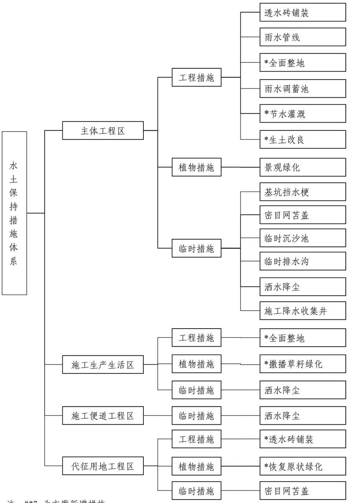

> **Zone C（应用范例层）使用边界**——仅可用于**写作风格、章节展开方式、表达逻辑、表格设计**的参考。
> **不得**用于合规判断；**不得**引入其项目数据（名称／地点／数字／单位名）；
> **不得**因其"曾经通过审批"而推定其做法在当前标准下仍然合规。
> 与 Zone A 冲突时**一律以 Zone A 为准**；Zone A 未明确规定时输出
> 「**Zone A 未明确规定，以下为参考写法，需人工判断**」。
>
> **坐标系警告**：本范例为**老八章结构**（GB 50433—2018 附录B），与 2026 版 10 章模板**同号不同义**
> （老 `1.5`＝防治目标，新 `1.5`＝水土流失预测结果；老 4→新 6 …偏移 +2；新版第 4/5 章老结构无独立章）。
> 因此 **`chapter_mapping: pending`——不得按章节号挂载**，检索一律走 `topic_tags`。
>
> **待加工**：`topic_tags`（主题标签）、`approval_basis_list`（编制依据逐字清单）、
> `structure_summary`（只提取结构：章节展开顺序／段落功能／表格栏目结构／句式模板／论证链步骤）。

1 综合说明.  
1.1 项目简况..  
1.2 编制依据....  
1.3 设计水平年... ....10  
1.4 水土流失防治责任范围... .....10  
1.5 水土流失防治目标.... ....11  
1.6 项目水土保持评价结论.. ....13  
1.7 水土流失预测结果... ...16  
1.8 水土保持措施布设成果. ....16  
1.9 水土保持监测方案.... .....19  
1.10 水土保持投资及效益分析成果.. ....20  
1.11 结论... ....20  
2 项目概况. ...25  
2.1 项目组成及工程布置.. ...25  
2.2 施工组织. ...42  
2.3 工程占地... ....46  
2.4 土石方平衡... ...47  
2.5 拆迁（移民）安置与专项设施改（迁）建 ..... ......58  
2.6 施工进度.. ....58  
2.7 自然概况... ....61  
3 项目水土保持评价. ....65  
3.1 主体工程选址（线）水土保持评价.... .....65  
3.2 建设方案与布局水土保持评价.. .....66  
3.3 主体工程设计中水土保持措施界定.... .....78  
4 水土流失分析与预测.. .....82  
4.1 水土流失现状... .....82  
4.2 水土流失影响因素分析.. .....82  
4.3 已发生土壤流失量调查结果.... ......84  
4.4 未施工时段土壤流失量预测... ....85  
4.5 水土流失结果... .....96  
4.6 水土流失危害分析.. ....96  
4.7 指导性意见.... .....97  
5 水土保持措施.. .....99  
5.1 防治区划分... ....99  
5.2 措施总体布局.. ....100  
5.3 分区措施布设..... ....103  
5.4 施工要求... .... 111  
6 水土保持监测.. ...116  
6.1 监测范围和时段.. ...116  
6.2 内容和方法... ...117  
6.3 点位布设... ...121  
6.4 实施条件和成果... ....121  
7 水土保持投资概算及效益分析.. ....124  
7.1 投资概算. ...124  
7.2 效益分析..... ....134  
8 水土保持管理.... .....136  
8.1 组织管理 ....... .....136  
8.2 后续设计.... ...136  
8.3 水土保持监测... ...136  
8.4 水土保持监理... ....137  
8.5 水土保持施工.. .....138  
8.6 水土保持设施验收... .....138  
投资概算单价分析表  
附件：  
附件 1 技术服务合同  
附件 2 项目建议书的批复  
附件 3 可行性研究报告的批复  
附件 4 建设项目用地预审与选址意见书  
附件 5 在京重点项目确认函  
附件 6 建设工程规划许可证  
附件 7 北京沙河高教园区土地划拨协议书  
附件 8 北京市人民政府关于北京邮电大学沙河校区二期项目申请使用国  
有土地的批复  
附件 9 不动产权证书  
附件 10 土石方消纳协议  
附件 11 土石方借调利用说明  
附件 12 关于履行水土保持方案编报程序的函

## 附图：

附图 1 项目地理位置图  
附图 2 项目区水系图  
附图 3 项目区土壤侵蚀强度分布图  
附图 4 北京市水土保持防治区划分图  
附图 5 北京市水土流失风险等级图  
附图 6 总平面布置图  
附图 7 水土流失防治责任范围及防治分区图  
附图 8 水土保持措施布局图  
附图 9 绿化措施布设图  
附图 10 透水砖铺装措施典型设计图  
附图 11 雨水调蓄池措施典型设计图  
附图 12 临时排水沟、沉沙池措施典型设计图  
附图 13 管线堆土临时苫盖措施典型设计图  
附图 14 基坑挡水埂措施典型设计图  
附图 15 节水灌溉措施管道布设图

## 1 综合说明

## 1.1 项目简况

## 1.1.1项目基本情况

## （1）项目建设必要性

北京邮电大学沙河校区研究生宿舍建设项目（以下简称“本项目”）作为沙河校区的重要组成部分，是完善学校基础设施建设、实现校园整体规划的关键环节。项目的建设完善了沙河校区设施建设、保障学生的日常学习与生活，促进学校招生规模的扩大，培养更多的优秀人才，最终推动国家信息通信行业的发展；项目的建设有利于学校尽早实现整体校园规划，为建设国内乃至世界一流大学提供了充分的软件环境及硬件设施保障；项目的建设有利于学校进一步缓解办学条件紧张的情况，提高教学质量，促进学校教育事业的进一步发展。

本项目建设时考虑学校近远期发展规划，以满足基本使用需求为准，为在校学生提供良好的生活环境，有利于提高学校的综合育人质量。本项目的建设，对于改善学校的基本办学条件、优化资源配置、提高教育教学水平和人才培养质量将起到重要作用，既是学校事业规模发展的需要，也是学校服务国家、行业、区域经济能力提升的需要。因此，本项目建设是非常必要的。

## （2）项目概况

项目位置：本项目位于北京市昌平区沙河镇沙河高教园区内，北至农机实验站用地，南至高教园南三街，东至北沙河东三路，西至南丰路。中心点坐标为：东经 116°17'10.8124"，北纬 40°09'18.5610"。

建设性质：新建项目。

规模与等级：本项目总建筑面积 $1 2 0 5 9 1 \mathrm { m } ^ { 2 }$ ，其中地上建筑面积 $8 9 9 9 1 \mathrm { m } ^ { 2 }$ （含地上人防竖井及出入 $\square \ 4 0 0 \mathrm { m } ^ { 2 } \ ,$ ），主要功能为研究生宿舍；地下建筑面积30600m2，主要功能为后勤及附属用房（面积 $1 1 9 9 3 \mathrm { m } ^ { 2 }$ ，师生便利服务设施、服务用房等）、人防工程（面积 $1 8 6 0 7 \mathrm { m } ^ { 2 }$ ，平时作为汽车库、活动室），属于房地产工程。

项目组成：项目主要建设内容包括建构筑物工程、道路广场工程、管线工程和绿化工程。建构筑物工程包括新建 6栋宿舍楼及地下人防工程，其中 2栋博士楼（A1#楼、A2#楼），地上十层，地下二层；4栋硕士楼（B1#\~B4#楼），地上九层，地下二层；地下人防工程平时作为汽车库及活动室等；新建 5 处下沉庭院，分别位于 A1#博士楼北侧、B1#及B3#硕士楼南侧、B2#及B4#硕士楼北侧。道路广场工程包括室外车行道路、消防停车场地、人行步道、非机动车停车位及室外广场。管线工程包括雨水管线及雨水池、污水管线及化粪池、供水管线、中水管线、热力管线及电力电信管线等，其中部分管线接口位于本项目用地红线外，管线施工至接口处段将占用部分临时用地，根据管线综合图，红线外管线总长度为324m。绿化工程主要为室外景观绿化。

项目主体工程建设用地占地面积共计 $4 . 0 7 \mathrm { h m } ^ { 2 }$ ，包括：建构筑物永久占地$1 . 1 8 \mathrm { h m } ^ { 2 }$ ，道路广场及管线永久占地 $1 . 6 7 \mathrm { h m } ^ { 2 }$ 、临时占地 $0 . 0 3 \mathrm { h m } ^ { 2 }$ ，绿化永久占地$1 . 1 9 \mathrm { h m } ^ { 2 }$ 。项目建设场地北侧为规划体育场及绿地，占地面积共计 $2 . 3 1 \mathrm { h m } ^ { 2 }$ ，由本项目代征但本次不代建，因此该区域纳入代征用地，本次作为施工生产生活区临时占用，占地面积为 $1 . 7 6 \mathrm { h m } ^ { 2 } ; $ ；管线施工穿越部分现状绿地，施工扰动面积为 $2 5 \mathrm { m } ^ { 2 }$ 其余区域均不扰动。项目四周环绕代征道路及绿地，均代征不代建，代征道路面积为 $3 . 3 8 \mathrm { h m } ^ { 2 }$ ，代征绿地面积为 $2 . 8 7 \mathrm { h m } ^ { 2 }$ ，其中北侧、西侧、南侧代征道路及绿地均为已建成道路及绿地，东侧代征道路由昌平区政府组织实施建设，北侧为现状高教园南二街、西侧为现状南丰路、南侧为现状高教园南三街、东侧为规划北沙河东三路。

拆迁（移民）安置与专项设施改（迁）建：本项目用地使用权归属于北京邮电大学，项目进场前建设用地范围内为拆迁后的净地，代征用地内现状为城镇村道路用地、公园与绿地、空闲地，不存在原有建筑物、构筑物及其他土地附着物的拆迁工作。

项目用地情况：本项目位于北京邮电大学沙河校区二期项目（以下简称“二期项目”）征地范围内，根据已批复的二期项目《用地预审与选址意见书》及《建设用地的批复》，二期工程征地范围内包括了 2 个地块（H-2B、H-7B）、代征道路和代征绿地。本项目建设用地位于H-7B地块内，无需单独征地，高教园南二街道路中线以南的代征道路及代征绿地纳入本项目防治责任范围，但均不代建。其中H-7B地块内包含两个项目，即研究生宿舍项目、规划体育场及绿地，两项目单独立项，规划用地位于本项目北侧，由本项目代征但本次不代建，因此该区域纳入代征用地工程区内。目前，除东侧代征道路及北侧规划体育场未实施外，其余代征道路及代征绿地均已建成，分别为北侧现状高教园南二街、西侧现状南丰路、南侧现状高教园南三街及现状公园绿地；东侧规划为北沙河东三路，未实施段代征道路面积约为 $0 . 5 7 \mathrm { h m } ^ { 2 }$ ，昌平区政府计划于2026年2 月组织实施建设；规划体育场及绿地面积为 $2 . 3 1 \mathrm { h m } ^ { 2 }$ ，待场地东侧区域部队用地征地拆迁完成后，单独立项，统一建设室外体育活动场地。本项目已取得《项目建议书的批复》、《可行性研究报告的批复》、《建设工程规划许可证》、《国有建设用地划拨决定书》、不动产权证书及《施工许可证》。

建设工期：本项目已于2025年2月开工，计划于2028年 2月底完工，总工期37个月。截至目前，项目已完成基坑开挖，并处于建筑物结构施工阶段。

项目投资：本项目总投资为 95663 万元，其中土建投资为 59141.61 万元，全部由北京邮电大学通过申请中央预算内投资和自筹解决。

工程占地：本项目征占地面积为 $1 2 . 6 3 \mathrm { h m } ^ { 2 }$ ，其中永久占地面积为 $1 2 . 6 0 \mathrm { h m } ^ { 2 }$ 临时占地面积为 $0 . 0 3 \mathrm { h m } ^ { 2 }$ 。永久占地中项目建设用地面积为 $4 . 0 4 \mathrm { h m } ^ { 2 }$ ，代征规划用地面积为 $2 . 3 1 \mathrm { h m } ^ { 2 }$ ，代征道路 $3 . 3 8 \mathrm { h m } ^ { 2 }$ ，代征绿地 $2 . 8 7 \mathrm { h m } ^ { 2 }$ ，均代征不代建；临时占地为管线施工至市政预留接口处的临时占地，施工结束后恢复原状道路。于北侧代征规划用地内及东侧代征道路内各布设1处施工生产生活区，占地面积为$1 . 9 2 \mathrm { h m } ^ { 2 } ; $ ；项目区内布设 1 条施工便道，环绕基坑布置并于东侧代征道路向南延伸至与市政道路联通，总占地面积为 $0 . 8 4 \mathrm { h m } ^ { 2 }$ ；施工生产生活区与施工便道均布设于项目永久占地范围内，未新增临时占地，面积不重复计算。项目原占地类型为空闲地、城镇村道路用地、公园与绿地。

土石方量：项目不涉及表土、岩土及尘（泥）土。本项目挖填土方总量为 20.91万 $\mathrm { m } ^ { 3 }$ ，其中挖方量为 15.55 万 $\mathrm { m } ^ { 3 }$ （全部为工程槽土）；填方量为 5.36 万 $\mathrm { m } ^ { 3 }$ （工程槽土 5万 $\mathrm { m } ^ { 3 }$ ，种植土 0.36 万 $\mathrm { m } ^ { 3 }$ ）；借方 2.95 万 $\mathrm { m } ^ { 3 }$ （全部为工程槽土），借方来源于沙河校区科研楼B座项目挖方；余方量为13.14万 $\mathrm { m } ^ { 3 } ( $ （全部为工程槽土），已全部运送至北京市昌平区崔村镇麻峪村村北进行综合利用。

截至目前，项目累计开挖土方 $1 4 \mathrm { ~ \mathscr ~ { ~ H ~ } ~ m ~ } ^ { 3 }$ ，填方 0.86 万 $\mathrm { m } ^ { 3 }$ ，借方0万 $\mathrm { m } ^ { 3 }$ ，开挖土方中 0.86 万 $\mathrm { m } ^ { 3 }$ 用于北侧场地垫高覆土，剩余土方已全部运送至北京市昌平区崔村镇麻峪村村北进行平整场地。

取土（石、砂）场：本项目借方全部来源于沙河校区科研楼 B座项目挖方，

不新设取土（石、砂）场。

弃土（石、渣）场：本项目余方全部运往北京市昌平区崔村镇麻峪村村北进行综合利用，不新设弃土（石、渣）场。

## 1.1.2项目前期工作进展情况

## （1）工程设计及前期手续情况

2021 年 11 月 29 日，北京邮电大学沙河校区二期项目取得中华人民共和国《建设项目用地预审与选址意见书》（用字第110114202100021号/2021规自（昌）预选字 0011号）；

2022 年 2 月 9 日，项目取得中华人民共和国教育部《关于北京邮电大学沙河校区研究生宿舍建设项目建议书的批复》（教发函〔2022〕4号）；

2022 年10月，建设单位委托北京东方畅想建筑设计有限公司编制完成《北京邮电大学沙河校区研究生宿舍建设项目可行性研究报告》；

2023 年1月17日，建设单位取得中华人民共和国教育部《关于北京邮电大学沙河校区研究生宿舍建设项目可行性研究报告的批复》（教发函〔2023〕13号）；

2023 年1月，建设单位委托建设综合勘察研究设计院有限公司编制完成《北京邮电大学沙河校区研究生宿舍建设项目岩土工程详细勘察报告》；

2024 年5月26日，北京邮电大学沙河校区二期项目取得《北京市人民政府关于昌平区二〇二四年度批次（北京邮电大学沙河校区二期项目）建设用地的批复》（京政地字〔2024〕67号）；

2024 年 12 月 9 日，建设单位取得项目建设工程规划许可证（建字第110114202400187 号/2024 规自（昌）建字 0060 号）；

2025 年 1 月 10 日，由北京市文物局组织开展了文物考古调查、勘探工作；

2025 年 3 月 3 日，建设单位取得《中华人民共和国国有建设用地划拨决定书》（京规自划字〔2025〕3号）；

2025 年8月11日，建设单位取得《中华人民共和国不动产权证书》。

本项目主体工程目前处于施工阶段，水土保持方案编制深度为初步设计深度。

## （2）水土保持方案编制过程

2022年11月，建设单位通过招投标方式确定北京清流技术股份有限公司为本项目水影响评价报告编制、水土保持监测及水土保持设施验收技术服务单位，并于2023 年1月6日签订了技术服务合同。

2023 年3月，根据《生产建设项目水土保持方案管理办法》（2023年1月17日水利部令第 53 号）第十条规定“国务院或者国务院有关部门审批、核准、备案的生产建设项目，其水土保持方案由水利部审批”，本项目由中华人民共和国教育部批准立项，因此项目应当编制水土保持方案并报送水利部审批。

2024 年11月，根据目前现有的设计资料，方案编制人员对项目现场进行了查勘、收集了项目区有关自然概况、水土流失及水土保持等方面资料，并通过认真分析研究，于 2025 年 8 月编制完成了《北京邮电大学沙河校区研究生宿舍建设项目水土保持方案报告书》。

## （3）水土保持监测开展情况

2022年11月，建设单位委托北京清流技术股份有限公司开展本项目水影响评价报告、水土保持监测及水土保持设施验收工作。2025年2 月项目开工建设，因此我单位立即组织监测技术人员对项目主体设计情况进行细致分析，并与各参建单位沟通，进行水土保持监测工作交底。在深入现场调查项目区水土流失背景情况下，编制完成了《北京邮电大学沙河校区研究生宿舍建设项目监测实施方案》。

随后按照以下监测频次开展现场监测：正在实施的水土保持措施建设情况等至少每 10 天监测记录 1 次；扰动地表面积、水土保持工程措施拦挡效果等至少每1个月监测记录 1次；主体工程建设进度、水土流失影响因子、水土保持生长情况等至少每 3个月监测记录 1 次。遇暴雨、大风等情况应及时加测。水土流失灾害事件发生后 1周内完成监测。现场监测后按季度编制《水土保持监测季报》。

目前，水土保持监测单位已编制完成了《水土保持监测实施方案》、《2025年第一季度监测季报》及《2025 年第二季度监测季报》，监测成果已报送至海河水利委员会、北京市水务局与昌平区水务局。

## （4）水土保持监理开展情况

项目未单独委托开展水土保持监理，水土保持设施施工监理由主体监理单位负责开展。监理单位已于 2025 年 2 月驻场随主体工程施工开展监理工作，将水土保持监理工作纳入主体工程监理体系，统筹规划、协同推进确保工程建设与水土保持措施同步落实。监理单位采取现场动态巡查、关键环节旁站监理等措施，对施工过程全面跟踪，确保各项水土保持实施到位。

## （5）项目施工现状

本项目于 2025 年 2 月开工建设，截至目前，项目已完成基坑开挖工作，处于建筑物结构施工阶段，基坑外场地全部进行硬化，于项目区北侧代征规划用地及东侧代征道路内各布设一处施工生产生活区，环绕基坑并于东侧代征道路向南延伸至与市政道路联通处布设 1 条施工便道，其余代征用地区域未进行扰动。

截至目前，项目扰动地表面积为 $6 . 1 3 \mathrm { h m } ^ { 2 } ; $ ；项目施工产生的水土流失量为9.83t；项目产生的挖方量为 $1 4 \mathrm { ~ \mathcal ~ { ~ H ~ } ~ m ~ } ^ { 3 }$ ，填方量为 0.86 万 m3，其余挖方已全部运往北京市昌平区崔村镇麻峪村村北进行综合利用；项目通过采取临时排水沉沙、基坑挡水埂、密目网苫盖、施工降水收集井及洒水降尘等措施，同时基坑外全部进行硬化，有效的减少了基坑开挖产生的水土流失，水土流失防治效果显著，经过现场调查，项目目前未造成水土流失危害。

截至目前，主体已完成水保措施工程量如下：

## ①主体工程区

临时措施：基坑挡水埂850m，临时沉沙池7座，临时排水沟 830m，密目网苫盖12000m2，洒水降尘80台时，施工降水收集井2座。

②施工生产生活区

临时措施：洒水降尘 20 台时。

③施工便道工程区

临时措施：洒水降尘 20 台时。

④代征用地工程区

临时措施：密目网苫盖3500m2。

## （6）水行政主管部门监督检查意见

北京市昌平区水土保持工作站于 2025 年 6 月 18 日对项目进行了现场检查，发现项目处于主体工程基础施工状态，尚未依法编报审批水土保持方案报告，并出具了《关于履行水土保持方案编报审批程序的函》（昌水保函〔2025〕第 36号），要求建设单位接到此通知后的 20 个工作日内到相关水行政主管部门完成水土保持方案报告书报批的行政许可手续，及时开展水土保持监理监测及相关材料报送工作。建设单位接到北京市昌平区水土保持工作站通知后，立即停工，并组织方案编制单位根据项目施工情况完善水土保持方案报告，及时报送水利部申请审批；

监测单位已编制完成《水土保持监测实施方案》、《2025年第一季度监测季报》及《2025 年第二季度监测季报》。项目目前已停止违法行为。

## 1.1.3 自然简况

项目区位于北京市昌平区沙河镇的沙河高教园区内，该高教园区位于沙河卫星城的东北部，地貌类型属平原。

项目区气候类型属于暖温带大陆性季风气候，冬季盛行西北风，夏季盛行东南风，年均风速 2.4m/s，最大风速 33m/s，年均日照2732小时，年均气温 11.8℃，极端最高气温 40.6℃，极端最低气温-27.4℃，≥10℃年积温约 4200℃，全年无霜期 210 天，多年平均降水量 574.30mm，集中于夏季的 6\~9 月，约占全年的83%，多年平均水面蒸发量 1245.40mm，最大冻土深度 85cm。项目区所属流域为海河流域，所属水系为北运河水系，土壤类型为潮土，开工前建设用地范围内原状为空闲地，无植被。

项目区为全国水土保持区划中的北方土石山区，土壤侵蚀类型为水力侵蚀，侵蚀强度为微度，容许土壤流失量为 $2 0 0 \mathrm { t / \left( k m ^ { 2 } { \cdot } a \right) }$ ），原地貌平均土壤侵蚀模数为$2 0 0 \mathrm { t } / \left( \mathrm { k m } ^ { 2 } { \cdot } \mathrm { a } \right.$ ）；根据《水利部办公厅关于做好国家级水土流失重点预防区和重点治理区落地上图成果应用的通知》（办水保〔2025〕170号），项目区不涉及国家级两区，根据《北京市水土保持规划》（2017年5月），项目区属于北京市水土流失重点预防区。根据《北京市生产建设项目水土保持方案管理规定（试行）》（京水务保〔2023〕17号），项目区属于北京市水土流失一般风险区 B区。项目区不涉及其它易引起严重水土流失和造成水土流失灾害的区域，不涉及占用耕地，不涉及饮用水水源保护区、水功能一级区的保护区和保留区、自然保护区、世界文化和自然遗产地、风景名胜区、地质公园、森林公园、重要湿地、生态保护红线、河湖管理范围等敏感区。

## 1.2 编制依据

## 1.2.1 法律法规

（1）《中华人民共和国水土保持法》（2010年12月25日第十一届全国人民代表大会常务委员会第十八次会议修订，自 2011年3月1日施行）；

（2）《北京市水土保持条例》（2015 年 5 月 29 日，北京市第十四届人大常

委会第十九次会议通过，2019 年7月26日北京市第十五届人民代表大会常务委员会第十四次会议修正，2025 年5月30日北京市第十六届人民代表大会常务委员会第十七次会议修正）。

## 1.2.2部委规章、规范性文件

（1）《生产建设项目水土保持方案管理办法》（2023 年 1 月 17 日水利部令第53号发布）；

（2）《水利部办公厅关于印发生产建设项目水土保持技术文件编写和印制格式规定（试行）的通知》（办水保〔2018〕135号）；

（3）《水利部办公厅关于印发生产建设项目水土保持方案审查要点的通知》（办水保〔2023〕177 号）；

（4）《北京市生产建设项目水土保持方案管理规定（试行）》（京水务保〔202317 号）；

（5）《北京市生产建设项目水土保持方案编制指南（试行）》（京水务保〔202318 号）；

（6）《水利部关于进一步深化“放管服”改革全面加强水土保持监管的意见》（水保〔2020〕160 号）；

（7）《水利部办公厅关于进一步加强生产建设项目水土保持监测工作的通知》（办水保〔2020〕161 号）；

（8）《水利部关于加强事中事后监管规范生产建设项目水土保持设施自主验收的通知》（办水保〔2017〕365 号）；

（9）《北京市水土保持补偿费征收管理办法》（京财农〔2016〕506号）；

（10）《北京市发展和改革委员会 北京市财政局 北京市水务局关于降低本市水土保持补偿费收费标准的通知》（京发改〔2021〕1271号）；

（11）水利部办公厅关于做好国家级水土流失重点预防区和重点治理区落地上图成果应用的通知（办水保〔2025〕170号）。

## 1.2.3技术规范及标准

（1）《生产建设项目水土保持技术标准》（GB50433-2018）；

（2）《生产建设项目水土流失防治标准》（GB/T50434-2018）；

（3）《水土保持工程设计规范》（GB51018-2014）；

（4）《土地利用现状分类》（GB/T21010-2017）；

（5）《土壤侵蚀分类分级标准》（SL190-2007）；

（6）《水土保持监理规范》（SL/T523-2024）；

（7）《水土保持工程质量验收与评价规范》（SL/T 336-2025）；

（8）《水利水电工程制图标准水土保持图》（SL73.6-2015）；

（9）《生产建设项目水土保持监测与评价标准》（GBT51240-2018）；

（10）《生产建设项目土壤流失量测算导则》（SL773-2018）；

（11）《生产建设项目水土保持监测规程（试行）》（办水保〔2015〕139号）；

（12）《水土保持监测技术规范》（SL/T277-2024）；

（13）《生产建设项目水土保持设施自主验收规程（试行）》（办水保〔2018〕133 号）；

（14）《建筑给水排水设计标准》（GB50015-2019）；

（15）《室外给水设计标准》（GB50013-2018）；

（16）《室外排水设计标准》（GB50014-2021）；

（17）《建筑与小区雨水控制及利用工程技术规范》（GB50400-2016）；

（18）《绿色建筑设计标准》（DB11/938-2022）；

（19）《民用建筑通用规范》（GB 55031-2022）；

（20）《海绵城市雨水控制与利用工程设计规范》）（DB11/685-2021）；

（21）《北京市建设工程概算定额（2016）》及相关配套文件；

（22）《绿色施工管理规程》（DB11/T 513-2018）。

## 1.2.4技术文件及相关资料

（1）《北京市水土保持规划》（2016-2030 年）；

（2）《北京邮电大学沙河校区研究生宿舍建设项目可行性研究报告》，北京东方畅想建筑设计有限公司，2022年10月；

（3）《北京邮电大学沙河校区研究生宿舍建设项目岩土工程详细勘察报告》，建设综合勘察研究设计院有限公司，2023年1月；

（4）《北京邮电大学沙河校区研究生宿舍建设项目初步设计概算》，中国建筑设计研究院有限公司，2023 年 8月；

（5）2025年1月至2025 年 7月的北京市工程造价信息；

（6）现场调查所得和建设单位提供的其他有关资料。

## 1.3 设计水平年

根据《生产建设项目水土保持技术标准》（GB50433-2018），工程属建设类项目，方案设计水平年为工程完工后的当年或后一年，本项目预计完工时间为 2028年2月，设计水平年为主体工程完工后的当年，即2028年。

## 1.4 水土流失防治责任范围

根据《生产建设项目水土保持技术标准》（GB50433-2018），生产建设项目水土流失防治责任范围应包括项目永久征地、临时占地（含租赁土地）以及其他使用与管辖区域。

参考主体设计资料并根据现场施工扰动情况，确定本项目水土流失防治责任范围面积为12.63hm2，其中永久占地面积为 $1 2 . 6 0 \mathrm { h m } ^ { 2 }$ ，临时占地面积为0.03hm2，永久占地中项目建设用地面积 4.04hm2，代征用地面积 8.56hm2。项目建设用地包括建构筑物工程区、道路广场及管线工程区、绿化工程区，代征用地包括代征规划用地、代征道路及代征绿地，本项目代征不代建。项目布设的施工生产生活区及施工便道区位于项目永久占地范围内，不重复计算占地面积。

表 1.4-1 水土流失防治责任范围表
<table><tr><td rowspan=2 colspan=1>序号</td><td rowspan=2 colspan=2>项目</td><td rowspan=1 colspan=3>防治责任范围（hm²）</td></tr><tr><td rowspan=1 colspan=1>永久占地</td><td rowspan=1 colspan=1>临时占地</td><td rowspan=1 colspan=1>小计</td></tr><tr><td rowspan=3 colspan=1>1</td><td rowspan=3 colspan=1>主体工程区</td><td rowspan=1 colspan=1>建构筑物工程区</td><td rowspan=1 colspan=1>1.18</td><td rowspan=1 colspan=1>0</td><td rowspan=1 colspan=1>1.18</td></tr><tr><td rowspan=1 colspan=1>道路广场及管线工程区</td><td rowspan=1 colspan=1>1.67</td><td rowspan=1 colspan=1>0.03</td><td rowspan=1 colspan=1>1.70</td></tr><tr><td rowspan=1 colspan=1>绿化工程区</td><td rowspan=1 colspan=1>1.19</td><td rowspan=1 colspan=1>0</td><td rowspan=1 colspan=1>1.19</td></tr><tr><td rowspan=3 colspan=1>2</td><td rowspan=3 colspan=1>代征用地工程区</td><td rowspan=1 colspan=1>代征规划用地</td><td rowspan=1 colspan=1>2.31</td><td rowspan=1 colspan=1>0</td><td rowspan=1 colspan=1>2.31</td></tr><tr><td rowspan=1 colspan=1>代征道路</td><td rowspan=1 colspan=1>3.38</td><td rowspan=1 colspan=1>0</td><td rowspan=1 colspan=1>3.38</td></tr><tr><td rowspan=1 colspan=1>代征绿地</td><td rowspan=1 colspan=1>2.87</td><td rowspan=1 colspan=1>0</td><td rowspan=1 colspan=1>2.87</td></tr><tr><td rowspan=1 colspan=1>3</td><td rowspan=1 colspan=2>施工生产生活区</td><td rowspan=1 colspan=1>(1.92)</td><td rowspan=1 colspan=1>0</td><td rowspan=1 colspan=1>(1.92)</td></tr><tr><td rowspan=1 colspan=1>4</td><td rowspan=1 colspan=2>施工便道工程区</td><td rowspan=1 colspan=1>(0.84)</td><td rowspan=1 colspan=1>0</td><td rowspan=1 colspan=1>(0.84)</td></tr><tr><td rowspan=1 colspan=1>5</td><td rowspan=1 colspan=2>合计</td><td rowspan=1 colspan=1>12.60</td><td rowspan=1 colspan=1>0.03</td><td rowspan=1 colspan=1>12.63</td></tr></table>

## 1.5 水土流失防治目标

## 1.5.1执行标准等级

本项目位于北方土石山区，根据《水利部办公厅关于做好国家级水土流失重点预防区和重点治理区落地上图成果应用的通知》（办水保〔2025〕170号），项目区不涉及国家级两区，根据《北京市水土保持规划》（2017 年5月），项目区属于北京市水土流失重点预防区。根据《生产建设项目水土流失防治标准》（GB/T50434-2018），应执行北方土石山区一级防治标准，并适当提高防治目标值。

## 1.5.2 防治目标

## 1.5.2.1 基本目标

根据《生产建设项目水土流失防治标准》（GB/T50434-2018）的相关规定，本项目应达到以下基本目标：

（1）项目建设范围内的新增水土流失应得到有效控制，原有水土流失得到治理；

（2）水土保持设施应安全有效；

（3）水土资源、林草植被应得到最大限度的保护与恢复；

（4）水土流失治理度、土壤流失控制比、渣土防护率、表土保护率、林草植被恢复率、林草覆盖率应达到防治标准规定。

## 1.5.2.2 六项指标目标值修正

项目位于北方土石山区，施工期和设计水平年的水土流失指标值采用北方土石山区水土流失防治指标一级标准值，同时结合项目建设特点以及项目区多年平均降雨量、现状土壤侵蚀强度、地形地貌和位置等，对防治目标修正如下：

（1）项目区土壤侵蚀以微度水力侵蚀为主，土壤流失控制比不小于 1.0，本报告土壤流失控制比提高至 1.05；

（2）项目区原为建设用地，根据北京市昌平区政府出具的《北京沙河高教园区土地划拨协议书》中“划拨给乙方的土地在乙方开工建设前达到“三通一平”，新校区建成投入使用前完成“九通一平””，同时建设单位于 2025 年1月取得《北京市人民政府关于北京邮电大学沙河校区二期项目申请使用国有土地的批复》，建设单位进场施工前，所在区域已经由昌平区区政府组织完成原有地上物的清理及“三通一平”工作，项目进场时建设用地区域为拆迁后的净地，根据调查结果，项目建设用地内土壤类型为潮土，地表 0\~60cm 范围内为房渣土，夹杂碎石及建筑垃圾等，土壤肥力极低，无法作为种植土利用，场地无可剥离表土，代征用地工程区除管线施工区域不扰动，管线施工不破坏代征道路的绿化带，不涉及表土保护率；

（3）项目位于城区，渣土防护率提高 2%；

（4）本项目位于城区且无法避让水土流失重点预防区，林草覆盖率应提高1%\~2%。根据建设工程规划许可证，项目绿地率在校园整体平衡，不低于 32.10%；本项目建设用地红线范围内设计绿化面积 1.19hm2，占地本项目建设用地面积比例为 29.46%。

根据规划，北京邮电大学沙河校区统筹平衡校园绿地率，校园整体绿地率指标为32.10%，待全部建成后，绿化面积应达到 275hm2。本项目位于北京邮电大学沙河校区二期项目征地范围内，征地内包括 2 建设地块及代征道路、代征绿地，根据建设项目选址意见书，北京邮电大学沙河校区二期项目 H-2B绿地率指标为 30%（含代征绿地）、H-7B 绿地率指标为 45%（含代征绿地）。根据 GB/T50434 标准 4.0.10，对林草植被有限制的项目，林草覆盖率可按照相关规定适当调整。

结合本项目实际情况及主体工程设计方案，场地北侧为规划体育场及绿地，本次代征不代建，代征规划用地部分区域作为本项目施工生产生活区临时占用，在施工后期拆除后进行撒播草籽绿化，但因该绿化非永久绿化，因此不纳入本项目绿地面积中。本项目林草植被面积为 3.82hm2，其中建设用地 1.19hm2、代征绿化用地现状绿地 2.43hm2、代征道路用地（已按规划实施区域）现状植物措施面积0.20hm2；林草植被面积占防治责任范围面积比例为 30.25%，因此将林草覆盖率调整至 30%。

综上，修正后目标值为：水土流失治理度 95%，土壤流失控制比 1.05，渣土防护率施工期 95%、设计水平年 99%，林草植被恢复率97%，林草覆盖率 30%，不涉及表土保护率。详见表1.5-1。

表 1.5-1 项目水土流失防治指标调整
<table><tr><td rowspan=2 colspan=1>防治指标</td><td rowspan=1 colspan=2>一级标准</td><td rowspan=2 colspan=1>调整参数</td><td rowspan=1 colspan=2>调整后目标</td></tr><tr><td rowspan=1 colspan=1>施工期</td><td rowspan=1 colspan=1>水平年</td><td rowspan=1 colspan=1>施工期</td><td rowspan=1 colspan=1>水平年</td></tr><tr><td rowspan=1 colspan=1>水土流失治理度（%）</td><td rowspan=1 colspan=1>1</td><td rowspan=1 colspan=1>95</td><td rowspan=1 colspan=1>1</td><td rowspan=1 colspan=1>1</td><td rowspan=1 colspan=1>95</td></tr><tr><td rowspan=1 colspan=1>土壤流失控制比</td><td rowspan=1 colspan=1>1</td><td rowspan=1 colspan=1>0.90</td><td rowspan=1 colspan=1>侵蚀强度为微度，绝对值应≥1.0，提高0.05</td><td rowspan=1 colspan=1>1</td><td rowspan=1 colspan=1>1.05</td></tr><tr><td rowspan=1 colspan=1>渣土防护率（%）</td><td rowspan=1 colspan=1>95</td><td rowspan=1 colspan=1>97</td><td rowspan=1 colspan=1>项目位于城市区，提高2%</td><td rowspan=1 colspan=1>95</td><td rowspan=1 colspan=1>99</td></tr><tr><td rowspan=1 colspan=1>表土保护率（%）</td><td rowspan=1 colspan=1>95</td><td rowspan=1 colspan=1>95</td><td rowspan=1 colspan=1>不涉及</td><td rowspan=1 colspan=1>1</td><td rowspan=1 colspan=1>1</td></tr><tr><td rowspan=1 colspan=1>林草植被恢复率（%）</td><td rowspan=1 colspan=1>1</td><td rowspan=1 colspan=1>97</td><td rowspan=1 colspan=1>1</td><td rowspan=1 colspan=1>1</td><td rowspan=1 colspan=1>97</td></tr><tr><td rowspan=1 colspan=1>林草覆盖率（%）</td><td rowspan=1 colspan=1>1</td><td rowspan=1 colspan=1>25</td><td rowspan=1 colspan=1>根据实际调整</td><td rowspan=1 colspan=1>1</td><td rowspan=1 colspan=1>30</td></tr></table>

## 1.6 项目水土保持评价结论

## 1.6.1主体工程选址（线）评价

项目选址不在全国水土保持监测网络中的水土保持监测站点、重点试验区以及国家确定的水土保持长期定位观测站；不涉及其它易引起严重水土流失和造成水土流失灾害的区域，不涉及占用耕地，不涉及饮用水水源保护区、水功能一级区的保护区和保留区、自然保护区、世界文化和自然遗产地、风景名胜区、地质公园、森林公园、重要湿地、生态保护红线、河湖管理范围等敏感区。项目原地貌为平原，根据地勘报告，拟建场地不存在影响场地整体稳定性的不良地质作用，属于基本稳定场地，较适宜本项目建设。

但项目选址无法避让北京市水土流失重点预防区，项目水土流失防治目标执行北方土石山区一级标准并将土壤流失控制比提高至 1.05、渣土防护率提高至99%、林草覆盖率提高至30%；项目优化了基坑开挖施工工艺，采用护坡桩支护直槽开挖，优化了竖向设计及施工时序，减少了土石方开挖数量和倒运时长；项目在用地红线四周设置彩钢板围挡，可以控制扰动范围；项目严格控制损坏植被面积，雨水排除设计标准执行 3 年一遇，建设后可恢复植被区域全部恢复植被；项目设计了雨水管线、雨水调蓄池、透水砖铺装和绿化工程等雨洪积蓄、利用措施，植物措施执行北京市园林绿化标准，已达水土保持措施最高等级，经方案补充完善后项目选址符合水土保持要求。

## 1.6.2建设方案与布局评价

## 1.6.2.1 建设方案评价

根据工程建设方案，建筑材料均外购，施工生产生活区及代征道路布设在永久占地范围内，未新增临时占地；管线市政接口位于项目用地范围外，施工将临时占用现状道路及代征规划用地，施工结束后恢复原状。项目区内土方协调调运统一管理，本项目开挖土方除部分用于本项目回填外，其余全部运至北京市昌平区崔村镇麻峪村村北进行综合利用，填方部分来源于项目挖方，不足部分来源于沙河校区科研楼B座项目挖方，未布设取、弃土场可减少倒运和新增临时占地。

主体设计采用海绵城市设计理念，布设了雨水管线、透水砖铺装及雨水调蓄池等措施以充分利用项目区内雨水。主体设计中人行道、地上停车位及室外广场均采用透水砖铺装，雨水通过雨水管排入雨水调蓄池收集，蓄积的雨水可用于绿化灌溉等。

主体已实施的密目网苫盖、临时排水沉沙、基坑挡水梗、洒水降尘及施工降水收集井等临时措施，有效的降低了项目施工产生的水土流失，建设文明绿色工地。

从水土保持角度分析评价，建设方案及总体布局可以满足水土保持的有关规定，建设方案和总体布局合理、可行。

## 1.6.2.2 工程占地评价

本项目总占地 12.63hm2，其中永久占地面积为 12.60hm2，临时占地面积为$0 . 0 3 \mathrm { h m } ^ { 2 }$ ，临时占地与永久占地之比为 0.24%，临时占地面积极小，且施工结束后恢复原地貌。

项目占地区域现状土地利用类型为空闲地、城镇村道路用地、公园与绿地，建设后土地利用类型为教育用地、城镇村道路用地、公园与绿地，占地符合土地利用规划的要求，占地规模合理，符合因地制宜、集约用地的原则，未占用耕地。符合有关土地管理的政策法规的要求。

从水土保持角度分析评价，工程占地基本符合水土保持要求。

## 1.6.2.3 土石方平衡评价

项目管线回填用土临时堆放在管沟一侧，雨水调蓄池、化粪池回填用土堆放在开挖面两侧，基坑开挖槽土部分用于基坑外北侧场地覆土，其余开挖产生的工程槽土全部运送至北京市昌平区崔村镇麻峪村村北进行综合利用，建筑垃圾拟运送至北京铭嘉亮点固废资源化利用有限公司百善镇临时消纳场消纳，其余回填用土来源于沙河校区科研楼 B 座项目开挖土方，由建设单位委托合法经营的土方运输单位进行运输。土石方运输过程中采用密闭渣土车运输，并用密目网苫盖，以减小土石方运输过程中造成的水土流失。

项目位于昌平区沙河镇高教园区内，为城市内建设工程。项目环绕基坑的场地作为施工车辆行驶及停靠场地进行临时硬化；同时为不新增项目临时占地，项目于场地北侧代征规划用地内及东侧代征道路内布设为施工生产生活区，用于施工材料堆放、办公及工人住宿用房等，因此，项目区内无土方临时堆放场地。项目区北侧、南侧及西侧为已建成的公园绿地及道路，东侧代征道路布设为施工便道，无法作为本项目土方临时堆放场地。项目周边为再建或已建成的城市住宅小区、学校、道路及公园绿化工程，无可作为临时堆土场的场地。因此，项目开挖土方除管沟回填利用挖方外，仅有少量土方用于项目北侧垫高覆土，其余土方全部运送至北京市昌平区崔村镇麻峪村村北进行综合利用，施工后期回填土方全部来源于沙河校区科研楼B座项目开挖土方。

项目受场地因素影响无空间布设临时堆土场，项目在前期施工阶段尽可能利用了少量挖方用于场地垫高覆土，其余挖方全部运送至北京市昌平区崔村镇麻峪村村北进行综合利用，建设单位已取得《北京市建筑垃圾利用方案备案》证明，施工后期项目回填用土利用周边建设项目挖方。因此，从水土保持角度分析，土石方平衡及调配符合水土保持要求，不存在限制性因素。

## 1.6.2.4取土（石、砂）场设置评价

本项目回填用土少量来源于项目挖方，不足部分来源于沙河校区科研楼B座项目开挖土方，本项目不涉及取土（石、砂）场设置。

## 1.6.2.5弃土（渣、灰、矸石、尾矿）场设置评价

本项目开挖产生的土石方部分用于项目区回填外，其余开挖产生的工程槽土全部运送至北京市昌平区崔村镇麻峪村村北综合利用，建筑垃圾拟运送至北京铭嘉亮点固废资源化利用有限公司百善镇临时消纳场消纳利用，不涉及弃土（渣、灰、矸石、尾矿）场设置。

## 1.6.2.6 施工方法与工艺评价

本项目施工过程中加强施工组织管理，采用先进的施工方法与工艺。施工过程中采用机械施工与人工施工相结合的方法，统筹、合理、科学安排施工工序，避免重复施工和土方乱流，建筑物基础采用整体开挖，基坑采用垂直灌注桩支护，不对基坑进行放坡，减少了基坑开挖扰动面积和土石方量；施工组织中增加水土保持要求，施工单位严格按照施工组织施工。施工期间及时回填、平整，土石方封闭运输，符合水土保持要求。

## 1.6.2.7具有水土保持功能工程的评价

项目主体设计中具有水土保持功能的工程主要有：透水砖铺装、雨水调蓄池、雨水管线、景观绿化等工程及植物措施，基坑挡水埂、密目网苫盖、临时排水沟、临时沉沙池、洒水降尘及施工降水收集井等临时措施。主体工程设计的措施减少了裸露地表面积和裸露时间，有效控制或减少扰动区域的新增水土流失量，具有较好的水土保持功能，符合水土保持要求。

## 1.7 水土流失预测结果

项目建设过程中扰动土地面积为 6.19hm2，损毁水土保持设施面积为 88m2，水土流失面积9.06hm2。根据预测结果，施工期及自然恢复期可能造成的水土流失总量为 186.56t（其中已开工时段建设期土壤流失总量为9.83t），新增水土流失量129.64t（其中已开工时段建设期土壤流失总量为 5.64t）。施工期作为水土保持监测的重点时段，特别是基坑开挖、回填、机械材料占压等施工活动期间水土流失最为严重；主体工程区中管线施工区域是新增水土流失量重点防治区域。

生产建设项目对原地貌破坏等形成的裸露地表及临时堆土，如不采取防治措施，容易造成严重的水土流失。因此，应做好工程建设过程中的施工管理，及时落实各项水土保持措施，减少水土流失，减轻对周边河流水系及生态环境产生的不利影响。

## 1.8 水土保持措施布设成果

## 1.8.1水土流失防治分区

根据主体工程布局、施工工艺及水土流失特点等，将防治分区划分为：主体工程区、施工生产生活区、施工便道工程区及代征用地工程区。为了防治工程建

设所产生的水土流失，减少对周边地区的影响，在本工程主体工程设计及水土保持方案编制中提出了多种措施进行综合治理。

## 1.8.2水土保持措施布设成果

## 1、主体工程区

## （1）总体布局

工程措施：设计在道路下方铺设雨水管线，雨水管网末端链接雨水调蓄池，调蓄后的雨水排入大市政雨水管网，雨水管线采取聚乙烯双壁波纹管及聚乙烯缠绕增强管，雨水调蓄池采取 PP 模块，尺寸为 $5 0 \mathrm { m } { \times } 1 0 \mathrm { m } { \times } 3 . 5 \mathrm { m } ;$ 室外人行道、停车位及室外广场采取透水砖铺装，透水砖尺寸为 $2 0 0 \mathrm { { m m } \times 1 0 0 \mathrm { { m m } \times 6 0 \mathrm { { m m } ; } } }$ 施工末期，在绿地内设置节水灌溉管线及喷头设施，随后进行绿化整地，绿化所需种植土采取生土改良获得。

植物措施：绿化区域整地后进行景观绿化，栽植乔灌木和铺设草坪进行绿化。

临时措施：施工期间，对基坑四周布设基坑挡水埂，砖砌结构，宽 10cm，高 30cm；沿基坑外侧布设临时排水沟，中段及末端连接临时沉沙池，汇集的地表径流经沉沙池沉淀后排入南侧现状市政雨水管网，临时排水沟和临时沉沙池均采用砖砌结构，临时排水沟为矩形断面，宽30cm，深40cm，临时沉沙池长2m，宽1m，深1m；对裸露地表进行密目网苫盖，管槽回填土临时堆放期间进行临时苫盖，密目网规格为2000目/m2；对基坑采取洒水降尘措施，管线临时堆土期间对所在区域采取洒水降尘措施，每日洒水一次（1 台时）；沿基坑布设 2 座施工降水井，采用砖砌结构，单井容积为 $4 0 \mathrm m ^ { 3 }$

## （2）主要措施量

工程措施：透水砖铺装 $3 4 4 1 \mathrm { m } ^ { 2 }$ ，实施时段为 2027 年 9 月至 2028 年 2 月；雨水调蓄池 1 座容积 $1 5 0 0 \mathrm { m } ^ { 3 }$ ，实施时段为 2027 年 3 月；全面整地 $1 . 1 9 \mathrm { h m } ^ { 2 }$ ，实施时段为 2027 年 6 月；雨水管线 1150m，实施时段为 2027 年 3 月至 2027 年 5月；节水灌溉 $1 . 1 9 \mathrm { h m } ^ { 2 }$ ，实施时段为2027年3月至2027年6月；生土改良 $3 6 0 0 \mathrm { m } ^ { 3 }$ 实施时段为 2027年6月。

植物措施：景观绿化 $1 . 1 9 \mathrm { h m } ^ { 2 }$ ，栽植乔木40株，栽植灌木 146株，铺冷季型草坪 $1 . 1 9 \mathrm { h m } ^ { 2 }$ ，实施时段为2027 年6月至2027年12月。

临时措施：基坑挡水埂850m，实施时段为2025年3月；密目网苫盖 $8 5 2 8 0 \mathrm { m } ^ { 2 }$ 实施时段为 2025 年 3 月至 2025 年 6 月、2026 年 4 月至 2027 年 8 月；临时排水沟830m，实施时段为2025年 3月；临时沉沙池7座，实施时段为 2025年3月；洒水降尘 120 台时，实施时段为 2025 年 3 月至 2025 年 6 月、2027 年 3 月至 2027年5月；施工降水收集井2座，实施时段为2025年3月。

截至目前，已实施的水土保持措施包括：基坑挡水埂 850m，密目网苫盖12000m2，临时排水沟830m，临时沉沙池 7座，洒水降尘80 台时，施工降水收集井2座。其余水保措施均未实施。

## 2、施工生产生活区

## （1）总体布局

工程措施：施工期间，布设 2处施工生产生活区，分别位于北侧代征规划用地内及东侧代征道路内，东侧施工生产生活区在代征道路建设前拆除并移交；为确保北侧规划体育场及绿地建设前，该区域不产生水土流失，在北侧代征规划用地内的施工生产生活区拆除后，对该区域进行全面整地。

植物措施：区域全面整地后，进行撒播草籽绿化。

临时措施：施工生产生活区布设过程中，对施工区域采取了洒水降尘措施，每日洒水一次（1台时）。

## （2）主要措施量

工程措施：全面整地1.76hm2，实施时段为2027年11 月。

植物措施：撒播草籽绿化 1.76hm2，实施时段为2027年 11月。

临时措施：洒水降尘20 台时，实施时段为 2025年3月。

截至目前，已实施的水土保持措施包括：洒水降尘 20 台时。其余水保措施均未实施。

## 3、施工便道工程区

## （1）总体布局

临时措施：施工便道布设过程中，对施工区域采取了洒水降尘措施，每日洒水一次（1台时）。

## （2）主要措施量

临时措施：洒水降尘20 台时，实施时段为 2025年3月。

截至目前，方案设计的水土保持措施已全部实施。

## 4、代征用地工程区

## （1）总体布局

工程措施：管线施工穿越北侧代征道路现状人行步道，施工结束后恢复原状透水砖。

植物措施：管线施工穿越代征规划用地现状绿化区域，施工结束后恢复原状绿化。

临时措施：代征道路实施前，对本项目未扰动的现状裸露地表进行了密目网苫盖，密目网规格为 2000目/m2。

## （2）主要措施量

工程措施：透水砖铺装 $6 3 \mathrm { m } ^ { 2 }$ ，实施时段为2027年7月。

植物措施：恢复原状绿化 $2 5 \mathrm { m } ^ { 2 }$ ，实施时段为2027年7月。

临时措施：密目网苫盖 $3 5 0 0 \mathrm { m } ^ { 2 }$ ，实施时段为 2025 年 3 月。

截至目前，已实施的水土保持措施为密目网苫盖 $3 5 0 0 \mathrm { m } ^ { 2 }$ 。其余水保措施均未实施。

## 1.9 水土保持监测方案

水土保持监测内容主要包括本底值监测、水土流失影响因素、扰动土地情况、水土流失状况、水土保持措施、水土流失防治成效、水土流失危害监测等。

根据《生产建设项目水土保持监测与评价标准》（GBT 51240-2018），水土保持监测的范围为防治责任范围，面积为 $1 2 . 6 3 \mathrm { h m } ^ { 2 }$ ，监测分区与工程项目水土流失防治分区一致，具体为主体工程区、施工生产生活区、施工便道工程区及代征用地工程区 4个监测分区。

本方案水土保持监测时段从施工准备期开始至设计水平年结束，即 2025 年2 月至 2028 年 12 月。

本项目监测代表点的选择要保证监测点具有代表性，同时选择交通便利的场地布设。截至目前项目实际布设 2 处监测点，1 处位于施工出入口沉沙池处，1处位于施工便道东北角；待项目临时硬化拆除后并进行室外工程建设时，再布设3处监测点，分别位于管线施工区域、绿化施工区域及施工生产生活区撒播草籽施工区域。监测方法主要采取调查监测法、定位监测法、遥感监测法等方法。

水土保持监测的主要内容包括扰动土地情况、弃土（石、渣）情况、水土流失状况监测、水土保持措施防治效果监测。根据《生产建设项目水土保持监测规程（试行）》的要求，针对不同的监测内容，监测方法主要采用地面观测、实地量测、遥感监测、资料分析的方法，监测水土流失情况、水土保持设施的完好程度和运营情况，林草成活率、保存率、生长情况及覆盖率等情况，施工场地内土石方挖填数量，以及水土保持措施建设情况、工程建设扰动地表面积、水土保持工程设计、水土保持管理及水土保持责任制度落实情况等。

监测频次为正在实施的水土保持措施建设情况每 10 天监测记录 1 次；扰动地表面积、水土保持工程措施拦挡效果等每 1个月监测记录 1次。其他监测内容每 3 个月监测记录 1 次。遇暴雨（降雨量≥50mm）及时加测 1 次。水土流失灾害事件发生后 1 周内完成监测。定期巡查的频次为每年 7～9 月，每月 1 次，主要针对挖填方边坡进行，每个单元每次抽样调查 2～3个。

## 1.10水土保持投资及效益分析成果

本工程水土保持总投资为 906.16 万元，其中工程措施投资 413.83 万元，植物措施投资 240.17万元，监测措施投资 15万元，施工临时工程投资 92.13万元，独立费用为 101.88万元，预备费为 43.15万元，水土保持补偿费可申请免征。

水土保持方案实施后，施工期，防治目标的实现值为：渣土防护率可达95%；至设计水平年，项目区水土流失治理度可达95%，土壤流失控制比可达1.05，渣土防护率可达99%，不涉及表土保护率，林草植被恢复可达97%，林草覆盖率可达30%，各项水土流失防治指标值全部达到方案确定的目标值。

水土保持工程的实施，有效地保护并增加了地表植被，将减少土壤流失量143.53t，使原有水土流失得到基本治理，新增水土流失得到有效控制，改善了项目区的生态环境，具有良好的生态效益。

## 1.11 结论

通过水土保持的分析论证，本工程在工程选址、建设方案基本符合水土保持相关要求，建设和运行过程中建设单位实施一系列的水土保持措施后，能有效防止新增水土流失，实现项目区环境的恢复和改善，从水土保持角度，项目建设是可行的。

工程建设过程中从水土保持的角度就工程设计、施工和建设管理提出如下要求：

①下阶段设计中应将水土保持列成专章；把水土保持方案投资纳入主体工程下阶段设计中，确保水土保持投资落到实处。

②工程建设过程中一定要切实落实水土保持方案和下阶段设计的各项防治措施，加强监督检查。

③施工单位要严格按照招标合同和水土保持方案的要求，不得扩大水土流失防治责任范围；要认真贯彻“三同时”和“先拦后弃”的原则；按照方案的要求做好各项临时防护措施，尽量避雨季施工，确实无法避开的应采取有效措施控制水土流失。

④项目建设起始阶段就应落实好水土保持监理和监测工作，监理和监测单位要严格按照水土保持相关法律法规的要求开展水土保持监理、监测工作，保障本项目水土保持措施的顺利实施。

⑤工程建成完工后，需开展水土保持设施的验收工作，验收的内容、程序等要严格按照《水利部关于印发生产建设项目水土保持设施自主验收规程（试行）的通知》（办水保〔2018〕133 号）和《水利部办公厅关于印发生产建设项目水土保持监督管理办法的通知》（办水保〔2019〕172号）要求开展，水土保持设施验收合格手续作为生产建设项目竣工验收的重要依据之一。根据相关法律法规，对未验收或验收不合格的项目，主体工程不得投入运行。

⑥水土保持方案经批准后，当生产建设项目地点、规模发生重大变化，或项目水土保持方案有关内容发生重大变化时，应及时向原审批部门申请变更水土保持方案。

水土保持方案特性表
<table><tr><td colspan="2" rowspan="1">项目名称</td><td colspan="6" rowspan="1">北京邮电大学沙河校区研究生宿舍建设项目</td><td colspan="1" rowspan="1">流域管理机构</td><td colspan="1" rowspan="1">海河水利委员会</td></tr><tr><td colspan="2" rowspan="1">涉及省区</td><td colspan="2" rowspan="1">北京市</td><td colspan="2" rowspan="1">涉及市</td><td colspan="2" rowspan="1">北京市</td><td colspan="1" rowspan="1">涉及县</td><td colspan="1" rowspan="1">昌平区</td></tr><tr><td colspan="2" rowspan="1">项目规模</td><td colspan="2" rowspan="1">总建筑面积 $1 2 0 5 9 1 \mathrm { m } ^ { 2 }$ </td><td colspan="2" rowspan="1">总投资（万元）</td><td colspan="2" rowspan="1">95663</td><td colspan="1" rowspan="1">土建投资(万元)</td><td colspan="1" rowspan="1">59141.61</td></tr><tr><td colspan="2" rowspan="1">动工时间</td><td colspan="2" rowspan="1">2025年2月</td><td colspan="2" rowspan="1">完工时间</td><td colspan="2" rowspan="1">2028年2月</td><td colspan="1" rowspan="1">设计水平年</td><td colspan="1" rowspan="1">2028年</td></tr><tr><td colspan="2" rowspan="1">工程占地 $\left( \mathrm { h m } ^ { 2 } \right)$ </td><td colspan="2" rowspan="1">12.63</td><td colspan="2" rowspan="1">永久占地 $\left( \mathrm { h m } ^ { 2 } \right)$ </td><td colspan="2" rowspan="1">12.60</td><td colspan="1" rowspan="1">临时占地 $\left( \mathrm { h m } ^ { 2 } \right)$ </td><td colspan="1" rowspan="1">0.03</td></tr><tr><td colspan="4" rowspan="2">土石方量 $\textstyle ( { \mathcal { F } } _ { \mathbf { \lambda } } _ { \mathbf { m } ^ { 3 } } )$ </td><td colspan="2" rowspan="1">挖方</td><td colspan="2" rowspan="1">填方</td><td colspan="1" rowspan="1">借方</td><td colspan="1" rowspan="1">余（弃）方</td></tr><tr><td colspan="2" rowspan="1">15.55</td><td colspan="2" rowspan="1">5.36</td><td colspan="1" rowspan="1">2.95</td><td colspan="1" rowspan="1">13.14</td></tr><tr><td colspan="4" rowspan="1">重点防治区名称</td><td colspan="6" rowspan="1">北京市水土流失重点预防区</td></tr><tr><td colspan="4" rowspan="1">地貌类型</td><td colspan="2" rowspan="1">平原</td><td colspan="2" rowspan="1">水土保持区划</td><td colspan="2" rowspan="1">北方土石山区</td></tr><tr><td colspan="4" rowspan="1">土壤侵蚀类型</td><td colspan="2" rowspan="1">水力侵蚀</td><td colspan="2" rowspan="1">土壤侵蚀强度</td><td colspan="2" rowspan="1">微度</td></tr><tr><td colspan="4" rowspan="1">防治责任范围面积  $\left( \mathrm { h m } ^ { 2 } \right)$ </td><td colspan="2" rowspan="1">12.63</td><td colspan="2" rowspan="1">容许土壤流失量〔t/（km²·a)〕</td><td colspan="2" rowspan="1">200</td></tr><tr><td colspan="4" rowspan="1">土壤流失预测总量（t）</td><td colspan="2" rowspan="1">186.56</td><td colspan="2" rowspan="1">新增土壤流失量(t)</td><td colspan="2" rowspan="1">129.64</td></tr><tr><td colspan="4" rowspan="1">水土流失防治标准执行等级</td><td colspan="6" rowspan="1">北方土石山区建设类项目一级防治标准</td></tr><tr><td colspan="1" rowspan="3">防治目标</td><td colspan="3" rowspan="1">水土流失治理度（%）</td><td colspan="2" rowspan="1">95</td><td colspan="2" rowspan="1">土壤流失控制比</td><td colspan="2" rowspan="1">1.05</td></tr><tr><td colspan="3" rowspan="1">渣土防护率（%）</td><td colspan="2" rowspan="1">99</td><td colspan="2" rowspan="1">表土保护率（%）</td><td colspan="2" rowspan="1">/</td></tr><tr><td colspan="3" rowspan="1">林草植被恢复率（%）</td><td colspan="2" rowspan="1">97</td><td colspan="2" rowspan="1">林草覆盖率（%）</td><td colspan="2" rowspan="1">30</td></tr><tr><td colspan="1" rowspan="6">防治措施及工程量</td><td colspan="2" rowspan="1">防治分区</td><td colspan="3" rowspan="1">工程措施</td><td colspan="2" rowspan="1">植物措施</td><td colspan="2" rowspan="1">临时措施</td></tr><tr><td colspan="2" rowspan="1">主体工程区</td><td colspan="3" rowspan="1">透水砖铺装 $\overline { { 3 4 4 1 \mathrm { m } ^ { 2 } } } ;$ 全面整地 $1 . 1 9 \mathrm { h m } ^ { 2 }$ ，雨水调蓄池 $1 5 0 0 \mathrm { m } ^ { 3 }$ 雨水管线 $1 1 5 0 \mathrm { m }$ ，节水灌溉1. $1 9 \mathrm { h m } ^ { 2 } .$ 生土改良 $3 6 0 0 \mathrm { m } ^ { 3 }$ </td><td colspan="2" rowspan="1">景观绿化 1.19 $\mathrm { h m } ^ { 2 }$ </td><td colspan="2" rowspan="1">基坑挡水埂850m，密目网苫盖85280m²，临时排水沟830m，临时沉沙池7座，洒水降尘120台时，施工降水收集井2座</td></tr><tr><td colspan="2" rowspan="1">施工生产生活区</td><td colspan="3" rowspan="1">全面整地 $1 . 7 6 \mathrm { h m } ^ { 2 }$ </td><td colspan="2" rowspan="1">撒播草籽绿化 $1 . 7 6 \mathrm { h m } ^ { 2 }$ </td><td colspan="2" rowspan="1">洒水降尘 20 台时</td></tr><tr><td colspan="2" rowspan="1">施工便道工程区</td><td colspan="3" rowspan="1">1</td><td colspan="2" rowspan="1">/</td><td colspan="2" rowspan="1">洒水降尘 20 台时</td></tr><tr><td colspan="2" rowspan="1">代征用地工程区</td><td colspan="3" rowspan="1">透水砖铺装 $6 3 \mathrm { m } ^ { 2 }$ </td><td colspan="2" rowspan="1">恢复原状绿化 $2 5 \mathrm { m } ^ { 2 }$ </td><td colspan="2" rowspan="1">密目网苫盖 $3 5 0 0 \mathrm { m } ^ { 2 }$ </td></tr><tr><td colspan="2" rowspan="1">投资（万元）</td><td colspan="3" rowspan="1">413.83</td><td colspan="2" rowspan="1">240.17</td><td colspan="2" rowspan="1">92.13</td></tr><tr><td colspan="3" rowspan="1">水土保持总投资（万元）</td><td colspan="3" rowspan="1">906.16</td><td colspan="2" rowspan="1">独立费用（万元）</td><td colspan="2" rowspan="1">101.88</td></tr><tr><td colspan="3" rowspan="1">监理费（万元）</td><td colspan="2" rowspan="1">28.52</td><td colspan="2" rowspan="1">监测费（万元）</td><td colspan="1" rowspan="1">15.00</td><td colspan="1" rowspan="1">补偿费（万元）</td><td colspan="1" rowspan="1">1</td></tr><tr><td colspan="3" rowspan="1">方案编制单位</td><td colspan="3" rowspan="1">北京清流技术股份有限公司</td><td colspan="2" rowspan="1">建设单位</td><td colspan="2" rowspan="1">北京邮电大学</td></tr><tr><td colspan="3" rowspan="1">法定代表人</td><td colspan="3" rowspan="1">秦春</td><td colspan="2" rowspan="1">法定代表人</td><td colspan="2" rowspan="1">徐坤</td></tr><tr><td colspan="3" rowspan="1">地址</td><td colspan="3" rowspan="1">北京市西城区建学胡同36号2幢091</td><td colspan="2" rowspan="1">地址</td><td colspan="2" rowspan="1">北京市海淀区西土城路10号</td></tr><tr><td colspan="3" rowspan="1">邮编</td><td colspan="3" rowspan="1">100053</td><td colspan="2" rowspan="1">邮编</td><td colspan="2" rowspan="1">100876</td></tr><tr><td colspan="3" rowspan="1">联系人及电话</td><td colspan="3" rowspan="1">联系人/【已脱敏】</td><td colspan="2" rowspan="1">联系人及电话</td><td colspan="2" rowspan="1">联系人/【已脱敏】</td></tr><tr><td colspan="3" rowspan="1">传真</td><td colspan="3" rowspan="1">1</td><td colspan="2" rowspan="1">传真</td><td colspan="2" rowspan="1">1</td></tr><tr><td colspan="3" rowspan="1">电子信箱</td><td colspan="3" rowspan="1">【已脱敏邮箱】</td><td colspan="2" rowspan="1">电子信箱</td><td colspan="2" rowspan="1">yangxinshuo@bupt.edu.cn</td></tr></table>

项目占地：本项目征占地面积为 12.63hm2，其中永久占地面积 $1 2 . 6 0 \mathrm { h m } ^ { 2 }$ ，临时占地面积 0.03hm2。临时占地为室外管线施工临时占地；永久占地中项目建设区占地面积为 $4 . 0 4 \mathrm { h m } ^ { 2 }$ ，代征规划用地面积为2.31hm2，代征道路面积为3.38hm2，代征绿地面积为 2.87hm2，代征用地均代征不代建，且除代征规划用地规划建设体育场及绿地（建设时间不定）、东侧代征道路计划于2026年 2月由昌平区政府实施外，其余代征道路及代征绿地均为已建成现状道路及绿地。项目布设2处施工生产生活区，分别位于项目区北侧代征规划用地内、东侧代征道路内，用于施工材料堆放、施工车辆停放及工人住宿用房等；项目布设1条施工便道，临时占用主体建设用地及代征道路，用于施工车辆行驶及停放。施工生产生活区及施工便道均布设于永久占地范围内，不新增临时占地。

表 2.1-1 经济技术指标表
<table><tr><td colspan="6" rowspan="1">北京邮电大学沙河校区研究生宿舍设计项目经济技术指标</td></tr><tr><td colspan="1" rowspan="1">序号</td><td colspan="2" rowspan="1">项目</td><td colspan="1" rowspan="1">数值</td><td colspan="1" rowspan="1">单位</td><td colspan="1" rowspan="1">备注</td></tr><tr><td colspan="6" rowspan="1">校园二期总指标</td></tr><tr><td colspan="1" rowspan="4">1</td><td colspan="2" rowspan="1">总用地面积</td><td colspan="1" rowspan="1">220764.949</td><td colspan="1" rowspan="1">m²</td><td colspan="1" rowspan="4">测量成果编号：2024规自（昌）测字0068号，其中本次申报项目位于南侧地块，建设用地面积为63490.418m²</td></tr><tr><td colspan="1" rowspan="3">其中</td><td colspan="1" rowspan="1">建设用地</td><td colspan="1" rowspan="1">129114.609</td><td colspan="1" rowspan="1">m²</td></tr><tr><td colspan="1" rowspan="1">代征绿地</td><td colspan="1" rowspan="1">42695.048</td><td colspan="1" rowspan="1">m²</td></tr><tr><td colspan="1" rowspan="1">代征道路</td><td colspan="1" rowspan="1">48955.292</td><td colspan="1" rowspan="1">m²</td></tr><tr><td colspan="1" rowspan="1">2</td><td colspan="2" rowspan="1">容积率</td><td colspan="1" rowspan="1">1.02（校园统筹平衡）</td><td colspan="1" rowspan="1"></td><td colspan="1" rowspan="1"></td></tr><tr><td colspan="1" rowspan="1">3</td><td colspan="2" rowspan="1">绿地率</td><td colspan="1" rowspan="1">32.10（校园统筹平衡）</td><td colspan="1" rowspan="1">%</td><td colspan="1" rowspan="1"></td></tr><tr><td colspan="6" rowspan="1">本项目指标</td></tr><tr><td colspan="1" rowspan="1">1</td><td colspan="2" rowspan="1">项目用地面积</td><td colspan="1" rowspan="1">40424</td><td colspan="1" rowspan="1">m²</td><td colspan="1" rowspan="1"></td></tr><tr><td colspan="1" rowspan="3">2</td><td colspan="2" rowspan="1">总建筑面积</td><td colspan="1" rowspan="1">120591</td><td colspan="1" rowspan="1">m²</td><td colspan="1" rowspan="1"></td></tr><tr><td colspan="1" rowspan="2">其中</td><td colspan="1" rowspan="1">地上建筑面积</td><td colspan="1" rowspan="1">89991</td><td colspan="1" rowspan="1">m²</td><td colspan="1" rowspan="1"></td></tr><tr><td colspan="1" rowspan="1">地下建筑面积</td><td colspan="1" rowspan="1">30600</td><td colspan="1" rowspan="1">m²</td><td colspan="1" rowspan="1"></td></tr><tr><td colspan="1" rowspan="1">3</td><td colspan="2" rowspan="1">建筑层数</td><td colspan="1" rowspan="1">9、10/2</td><td colspan="1" rowspan="1">层</td><td colspan="1" rowspan="1"></td></tr><tr><td colspan="1" rowspan="1">4</td><td colspan="2" rowspan="1">建筑高度</td><td colspan="1" rowspan="1">35.25/-8.4</td><td colspan="1" rowspan="1">m</td><td colspan="1" rowspan="1">地上为女儿墙到室外地坪距离；地下为室内建筑标高到室外地坪距离</td></tr><tr><td colspan="1" rowspan="1">5</td><td colspan="2" rowspan="1">校园应建机动车停车位</td><td colspan="1" rowspan="1">600</td><td colspan="1" rowspan="1">辆</td><td colspan="1" rowspan="1"></td></tr><tr><td colspan="1" rowspan="2"></td><td colspan="1" rowspan="2">其中</td><td colspan="1" rowspan="1">已批复机动车位</td><td colspan="1" rowspan="1">749</td><td colspan="1" rowspan="1"></td><td colspan="1" rowspan="1"></td></tr><tr><td colspan="1" rowspan="1">本项目机动车位</td><td colspan="1" rowspan="1">265</td><td colspan="1" rowspan="1"></td><td colspan="1" rowspan="1">均设在地下</td></tr><tr><td colspan="1" rowspan="3">6</td><td colspan="2" rowspan="1">校园应建非机动车停车位</td><td colspan="1" rowspan="1">1000</td><td colspan="1" rowspan="1"></td><td colspan="1" rowspan="1"></td></tr><tr><td colspan="1" rowspan="2">其中</td><td colspan="1" rowspan="1">已批复非机动车位</td><td colspan="1" rowspan="1">2279</td><td colspan="1" rowspan="1">辆</td><td colspan="1" rowspan="1"></td></tr><tr><td colspan="1" rowspan="1">本项目非机动车位</td><td colspan="1" rowspan="1">500</td><td colspan="1" rowspan="1"></td><td colspan="1" rowspan="1">均设在地上</td></tr></table>

建设投资：本项目总投资为 95663 万元，其中土建投资为 59141.61 万元，全部由北京邮电大学通过申请中央预算内投资和自筹解决。

建设工期：本项目已于2025年2月开工，计划于2028年 2月底完工，总工期37个月。工程特性表见下表 2.1-2。

表 2.1-2 工程特性表
<table><tr><td colspan="9" rowspan="1">一、项目基本情况</td></tr><tr><td colspan="2" rowspan="1">项目名称</td><td colspan="7" rowspan="1">北京邮电大学沙河校区研究生宿舍建设项目</td></tr><tr><td colspan="2" rowspan="1">建设地点</td><td colspan="2" rowspan="1">北京市昌平区沙河镇</td><td colspan="2" rowspan="1">所在流域</td><td colspan="3" rowspan="1">海河流域</td></tr><tr><td colspan="2" rowspan="1">项目等级</td><td colspan="2" rowspan="1">一级</td><td colspan="2" rowspan="1">建设性质</td><td colspan="3" rowspan="1">新建项目</td></tr><tr><td colspan="2" rowspan="1">建设单位</td><td colspan="7" rowspan="1">北京邮电大学</td></tr><tr><td colspan="2" rowspan="1">总投资（万元）</td><td colspan="2" rowspan="1">95663</td><td colspan="2" rowspan="1">土建投资（万元）</td><td colspan="3" rowspan="1">59141.61</td></tr><tr><td colspan="2" rowspan="1">开工日期</td><td colspan="1" rowspan="1">2025年2月</td><td colspan="1" rowspan="1">完工日期</td><td colspan="2" rowspan="1">2028年2月</td><td colspan="1" rowspan="1">总工期</td><td colspan="2" rowspan="1">37个月</td></tr><tr><td colspan="9" rowspan="1">二、项目组成及占地情况</td></tr><tr><td colspan="2" rowspan="1">项目区</td><td colspan="2" rowspan="1">永久占地 $\left( \mathrm { h m } ^ { 2 } \right)$ </td><td colspan="2" rowspan="1">临时占地（hm²）</td><td colspan="3" rowspan="1">合计（hm²）</td></tr><tr><td colspan="1" rowspan="3">主体工程区</td><td colspan="1" rowspan="1">建构筑物工程区</td><td colspan="2" rowspan="1">1.18</td><td colspan="2" rowspan="1">0</td><td colspan="3" rowspan="1">1.18</td></tr><tr><td colspan="1" rowspan="1">道路广场及管线工程区</td><td colspan="2" rowspan="1">1.67</td><td colspan="2" rowspan="1">0.03</td><td colspan="3" rowspan="1">1.70</td></tr><tr><td colspan="1" rowspan="1">绿化工程区</td><td colspan="2" rowspan="1">1.19</td><td colspan="2" rowspan="1">0</td><td colspan="3" rowspan="1">1.19</td></tr><tr><td colspan="2" rowspan="1">施工生产生活区</td><td colspan="2" rowspan="1">(1.92)</td><td colspan="2" rowspan="1">0</td><td colspan="3" rowspan="1">(1.92)</td></tr><tr><td colspan="2" rowspan="1">施工便道工程区</td><td colspan="2" rowspan="1">(0.84)</td><td colspan="2" rowspan="1">0</td><td colspan="3" rowspan="1">(0.84)</td></tr><tr><td colspan="2" rowspan="1">代征用地工程区</td><td colspan="2" rowspan="1">8.56</td><td colspan="2" rowspan="1">0</td><td colspan="3" rowspan="1">8.56</td></tr><tr><td colspan="2" rowspan="1">合计</td><td colspan="2" rowspan="1">12.60</td><td colspan="2" rowspan="1">0.03</td><td colspan="3" rowspan="1">12.63</td></tr><tr><td colspan="9" rowspan="1">三、项目土石方量（万m³）</td></tr><tr><td colspan="2" rowspan="1">项目组成</td><td colspan="1" rowspan="1">挖方</td><td colspan="1" rowspan="1">填方</td><td colspan="1" rowspan="1">调出</td><td colspan="1" rowspan="1">调入</td><td colspan="2" rowspan="1">借方</td><td colspan="1" rowspan="1">余方</td></tr><tr><td colspan="2" rowspan="1">建构筑物工程区</td><td colspan="1" rowspan="1">14.00</td><td colspan="1" rowspan="1">1.16</td><td colspan="1" rowspan="1">0.86</td><td colspan="1" rowspan="1"></td><td colspan="2" rowspan="1">1.16</td><td colspan="1" rowspan="1">13.14</td></tr><tr><td colspan="2" rowspan="1">道路广场及管线工程区</td><td colspan="1" rowspan="1">1.55</td><td colspan="1" rowspan="1">2.26</td><td colspan="1" rowspan="1"></td><td colspan="1" rowspan="1"></td><td colspan="2" rowspan="1">0.71</td><td colspan="1" rowspan="1"></td></tr><tr><td colspan="2" rowspan="1">绿化工程区</td><td colspan="1" rowspan="1"></td><td colspan="1" rowspan="1">1.08</td><td colspan="1" rowspan="1"></td><td colspan="1" rowspan="1"></td><td colspan="2" rowspan="1">1.08</td><td colspan="1" rowspan="1"></td></tr><tr><td colspan="2" rowspan="1">代征用地工程区</td><td colspan="1" rowspan="1"></td><td colspan="1" rowspan="1">0.86</td><td colspan="1" rowspan="1"></td><td colspan="1" rowspan="1">0.86</td><td colspan="2" rowspan="1"></td><td colspan="1" rowspan="1"></td></tr><tr><td colspan="2" rowspan="1">合计</td><td colspan="1" rowspan="1">15.55</td><td colspan="1" rowspan="1">5.36</td><td colspan="1" rowspan="1">0.86</td><td colspan="1" rowspan="1">0.86</td><td colspan="2" rowspan="1">2.95</td><td colspan="1" rowspan="1">13.14</td></tr><tr><td colspan="9" rowspan="1">四、施工组织情况</td></tr><tr><td colspan="9" rowspan="1">项目区北侧、西侧及南侧均为现状路，具备施工交通条件；施工生产生活区布设于北侧代征规划用地及东侧代征道路内，不新增临时用地；施工便道布设于主体建设用地及东侧代征道路内，不新增临时用地；部分管线的市政预留接口位于项目用地红线外，项目管线施工临时占用红线外区域；施工用水用电自北侧现状道路接入，具备接入条件；施工材料商业购买。</td></tr></table>

## 2.1.2项目与北京邮电大学沙河校区二期项目依托关系

2021 年11月，北京邮电大学沙河校区二期项目（以下简称“二期项目”）取得了《建设项目选址意见书》，二期工程总用地规模约 223697.747m2，征地范围内包括了高等院校用地、代征道路和代征绿地。

根据已批复的二期项目《用地预审与选址意见书》，二期工程征地范围内包括了2个地块（H-2B、H-7B）、代征道路和代征绿地。H-2B地块位于 H-7B地块北侧，为综合体育馆项目，高教园南二街道路中线以北的代征道路及代征绿地纳入该项目防治责任范围内，目前该项目已取得了水土保持方案批复。H-7B 地块内建设项目包括研究生宿舍项目、规划体育场及绿地，代征道路和代征绿地由昌平区政府组织实施。本项目位于 H-7B地块内，为研究生宿舍项目，规划体育场及绿地纳入本项目代征用地，但代征不代建，纳入本项目防治责任范围内，本次建设用地及代征规划用地已取得不动产权证书；高教园南二街道路中线以南的代征道路及代征绿地纳入本项目防治责任范围内，代征不代建。

本项目用地北侧代征规划用地为规划体育场及绿地，本次建设投资中未包含该区域建设投资，因此，规划体育场及绿地的建设不纳入本次建设范围内，为本项目代征用地，待场地东侧区域部队用地征地拆迁完成后，单独立项，统一建设室外体育活动场地。本次代征规划用地部分区域作为本项目的施工生产生活区临时占用，待施工后期临建拆除后，进行临时绿化。

本项目四周的代征道路及代征绿地均代征不待建，目前，场地北侧、西侧、南侧代征道路及代征绿地均已建设完成，其中北侧代征道路区域为高教园南二街道路永中以南的半幅路，高教园南二街已于 2015年10月建设完成，建设单位为

## 2.1.3项目组成及布置

## 2.1.3.1 平面布置

本项目建设用地红线四周为代征用地工程区，包括代征规划用地、代征道路及代征绿地，代征不代建。本项目用地北侧代征规划用地规划建设体育场及绿地，其建设投资未纳入本次建设总投资内，故本次不建设，后期待场地东侧部队用地征地腾退后，由建设单位自筹资金，单独立项，统一建设室外体育活动场地。

本项目建设用地内共建设 6 栋“L 形”建筑物，其中，用地西侧 2栋为博士生公寓，东侧 4栋楼为硕士研究生公寓，两区域相对独立，博士生可拥有独立向外的出入口。4栋硕士楼围合出了一个完整的大院落。布置 5处下沉庭院，下沉庭院紧贴建筑体量设置，可为地下一层的公共活动室、师生便利服务设施等空间提供良好的采光通风条件。

环绕建筑物布设车行道路，道路两侧为人行步道。项目区南、西、北三个方向分别布设 1处出入口，东侧布设 2处出入口；A2#博士楼东侧布设1处地下车库入口，A1#博士楼东北角布设 1处地下车库出口。

活动室），地下建筑物结构采用钢筋混凝土框架剪力墙结构体系，采用筏板基础。主体建筑物间的地下室顶板覆土 0.6m，地下室底板底标高为-9.98m，筏板基础0.6m。地下轮廓线面积 15367m2，施工开挖时采取垂直灌注桩支护的方式进行护坡。

## （2）主体工程-道路广场及管线工程

## ①道路广场工程

项目区道路广场工程总占地面积为 1.67hm2。沿建筑物设置室外道路，依据建筑物设计标高按照南高北低、西高东低进行布置，车行道路及消防停车场地采取不透水沥青铺装；人行步道、非机动车停车位及室外广场采用透水砖铺装，铺装面积为 $3 4 4 1 \mathrm { m } ^ { 2 }$ 。在项目区南、西、北三个方向各布设1处出入口，东侧布设2处出入口。地下车库出、入口分别位于A1#博士楼东北角、A2#博士楼东侧，无顶盖。

## ②给水系统

项目区内给水管线布设在道路及绿地下方，包括生活给水管线及消防给水管线，管径为DN200mm，埋深为 1.0-1.2m，给水管线总长度为 1450m。其中消防给水管线共 6根并排布设，单根管线长 150m，其中39.67m 位于红线外，110.33m管线位于项目用地及代征道路内，红线外消防给水管线总长度为 238m；生活给水管线单根布设，长度为 550m，其中 9.0m 管线（含断头连接井）位于红线外，541m 管线位于项目用地及代征道路内。室外消防和室外生活给水管合用，室内消防供水引自博士楼下消防泵房。与市政生活给水管道连接的管网 DN≤75mm者采用衬塑钢管，丝扣连接；DN＞75mm 者采用离心球墨给水铸铁管。

2 处市政接口分别为北侧高教园南二街北边界处的消防给水管线接口（位于用地红线外）及东侧规划北沙河东三路道路永中以东 8.50m 处的生活给水管线接口（位于用地红线外），其中北侧红线外管线为并排 6 根消防给水管，现状预留口间距为 1.32m\~1.48m，合沟开挖，管沟放坡开挖，坡比 1:0.25，管道两侧预留0.25m 作业面，临时堆土堆放在管沟左侧；东侧红线外管线（含断头连接井）长度 9.0m，单沟开挖，管沟放坡开挖，坡比 1:0.25，管道两侧预留 0.25m 作业面，临时堆土堆放在代征道路内。

## ③中水系统

项目区内中水管线布设在道路及绿地下方，管径为 DN150mm，埋深为 1.0-1.2m，管线长度约 1450m。与市政中水管道连接的管网 DN≤75mm 者采用衬塑钢管，丝扣连接；DN＞75mm 者采用离心球墨给水铸铁管。

1处市政接口位于东侧规划北沙河东三路道路永中以西 13.50m 处（位于用地红线代征道路内）。

## ④雨水排水系统

项目区内雨水管线布设在道路下方，管径为 DN300mm\~DN800mm，埋深为1.5-1.8m，管线长度约 1150m。雨水管线 DN<500mn 者采用聚乙烯双壁波纹管，承插接口，橡胶圈密封；DN>500mm 采用聚乙烯缠绕增强管，双承插连接，橡胶圈密封。

1 处市政接口位于本项目东侧用地内，距离高教园南二街与北沙河东三路交叉口约 50m（位于用地红线内）。

## ⑤污水排水系统

项目区内污水管线布设在道路及绿地下方，管径为 DN300mm，埋深为 1.8-2.2m，管线长度约900m。污水管线 DN<500mn 者采用聚乙烯双壁波纹管，承插接口，橡胶圈密封；DN>500mm采用聚乙烯缠绕增强管，双承插连接，橡胶圈密封。

1 处市政接口位于本项目东侧用地内，距离高教园南二街与北沙河东三路交叉口约 47.50m（位于用地红线内）。

## ⑥供热系统

项目区内热水供水及回水管线布设在道路及绿地下方，管径为 DN150mm，埋深为 1.0-1.2m，管线长度约 2900m，其中 40m 管线位于红线外，2860m 位于红线内。

2 处市政接口分别为北侧高教园南二街北边界处的供水管线接口（位于用地红线外）及本项目东北角用地范围内的回水管线接口（位于用地红线内）。红线外管线采取明沟开挖，单沟开挖，管沟放坡开挖，坡比 1:0.25，管道两侧预留 0.25m作业面，临时堆土堆放在管沟西侧。

## ⑦供电系统

项目进户高压电缆规格、型号由供电部门的供电方案确定，高压出线电缆选用 WDZAN-YJY-7.8/15kV 低烟无卤耐火电缆；低压出线火灾时非坚持工作的电缆选用 WDZ-YJY-1kV 低烟无卤 A 类阻燃电力电缆；低压出线火灾时坚持工作的电缆室内敷设选用隔离型柔性矿物绝缘不燃性电力电缆（RTXMY-A-750V）。管线埋深为 1.0m，管线长度约 900m，其中37m 管线位于红线外，863m 管线位于红线内。

2处市政接口分别位于北侧高教园南二街北边界处（位于用地红线外）、南丰路与高教园南二街交叉口东南侧（位于用地红线代征道路内）。红线外管线采取明沟开挖，单沟开挖，管沟放坡开挖，坡比 1:0.25，管道两侧预留 0.25m 作业面，临时堆土堆放在管沟东侧。

## ⑧通讯系统

项目区内在各防护单元内防化通信值班室内的人防电源配电箱内留有电源开关回路，人员掩体分区容量按 3kW 设计；在防化通信值班室设有电话出线口，留有电话线路与市话网络联通。管线埋深为 0.8m，管线长度约 600m。1 处市政接口位于本项目 B3#硕士楼及 B4#硕士楼之间的代征道路西边界处（位于用地红线内）。

## ⑨红线外管线统计

本项目在征占地范围以外建设的配套连接管线工程共 2 处，分别位于用地北侧和用地东侧。

## i. 北侧红线外连接管线

用地北侧连接管线共 8条，自西向东依次为 1条电力管线、6条消防管线和1 条热力管线，电力管线和最西侧消防管线间距约 2.88m，6 条消防管线之间距离约1.32\~1.48m，最东侧消防管线与热力管线间距约 1.36m，管线排布总宽度约11.05m。

为减小扰动范围，最西侧电力管线施工时管槽土方堆放在东侧，最东侧热力管线施工时管槽土方堆放在西侧。最西侧电力管线管沟底宽 0.5m，挖深 1.0m，沟槽放坡 1:0.25，管沟顶宽 1.0m，东侧布设堆土区宽度 1.5m，实际作业带宽度2.5m，与东侧消防管线作业带重复宽度约 1.73m，扣除与消防管线重复段后作业带宽度 0.77m；中间6条消防管线作业带宽度 10.02m；最东侧热力管线管沟底宽0.65m，挖深 1.0m，沟槽放坡 1:0.25，管沟顶宽约 1.15m，西侧布设堆土区宽度

2.0m，实际作业带宽度 3.15m，与西侧消防管线作业带重复宽度约 1.79m，扣除与消防管线重复段后作业带宽度 1.36m；合计，扣除重复宽度后实际作业带总宽度 12.15m。

西侧1条电力管线长37m，其中代征用地内长度15m，临时占地内长度22m，临时占地面积为 16.94m2；中间 6 条消防管线总长 238m，单条长 39.67m，其中代征用地内长度 15m，临时占地内长度 24.67m，临时占地面积为 247.19m2；东侧1条热力管线长 40m，其中代征用地内长度 15m，临时占地内长度 25m，临时占地面积为 34m2；合计临时占地面积为 298.13m2。

## ii. 东侧红线外连接管线

东侧红线外为 1 条给水管线，临时占地内管线长度 8.5m，管沟底宽 0.7m，挖深 1.0m，沟槽放坡 1:0.25，管沟顶宽约 1.2m，为减小扰动土地面积，管槽土方堆放在西侧永久占地内，实际作业带宽度 1.2m，临时占地面积为 10.20m2。

综上所述，红线外连接管线临时占地面积为 308.33m2。

## （4）主体工程-绿化工程

项目区总绿化占地面积为 1.19hm2，其中实土绿地面积为 1.03hm2，覆土绿地面积为 0.16hm2。绿地布置在建筑物和道路之间，采用乔灌草结合的方式进行绿化，种植一些具有观赏性的树种和花卉，并铺设草坪进行绿化。

## （5）代征规划用地

本项目用地范围北侧区域为代征规划用地，规划建设体育场及绿地，由于其建设投资未纳入本次建设总投资内，且规划待场地东侧部队用地征地拆迁后统一建设体育场地，因此，本项目本次代征不代建。

代征规划用地区域西侧为空闲地，面积为 1.76hm2；东侧临近部队用地区域目前位于部队围墙内，本次建设不对其进行扰动，该区域面积约 0.48hm2；部队北侧的规划用地紧邻高教园南二街，位于部队围墙北侧，该区域为现状绿化，面积约0.07hm2，本次建设仅管线工程施工时进行部分扰动。项目施工期间将 1处施工生产生活区布设于代征规划用地西侧区域内，待施工后期拆除后进行撒播草籽绿化，管线施工扰动区域恢复原状绿化。

## （6）代征道路

本项目四周的代征道路均代征不待建，目前，场地北侧、西侧、南侧代征道

路均已建设完成，场地东侧代征道路为规划北沙河东三路。

## ①北侧代征道路

北侧代征道路区域为高教园南二街道路永中以南的半幅路，已按规划建成，代征区域宽度为15m，包括10.5m 机动车道+4.5m 宽人行步道，无绿化带，人行步道采取透水砖铺装。

## ②南侧高教园南三街

南侧代征道路区域为高教园南三街道路永中以北的半幅路，已按规划建成，代征区域宽度为 15m，包括 7m 机动车道+1.5m 机非隔离带+2m 宽非机动车道+4.5m 宽人行步道，机非隔离带绿化面积约 0.05hm2，人行步道采取透水砖铺装。

## ③西侧南丰路

西侧代征道路区域为南丰路道路永中以东的半幅路，已按规划建成，代征区域宽度为 30m，包括 2.5m 中央隔离带+15m 机动车道+3m 机非隔离带+5m 宽非机动车道+4.5m 宽人行步道，中央隔离带与机非隔离带绿化面积共计 0.15hm2，人行步道采取透水砖铺装。

## ④东侧北沙河东三路

东侧代征道路为规划北沙河东三路道路永中以西的半幅路，与高教园南二街交叉口向南约 40m 范围内路段已实施，其余路段未实施。已实施段内无绿化带，人行步道面积约为 0.02hm2，采取透水砖铺装；未实施段代征道路占地面积约为0.57hm2，由昌平区政府计划于 2026年2月组织实施建设。

## （7）代征绿地

本项目东侧及南侧代征绿地为已建成公园绿地，其中硬化广场占地面积为0.44hm2，绿化植被占地面积为 2.43hm2。

## 2.1.3.3 竖向布置

6栋建筑物室内±0高程为 44.60m，下沉庭院设计高程为 38.45m，室外道路设计高程 42.85m\~43.05m，实土绿地设计高程 42.80m\~42.90m，覆土绿地设计高程 43.10m，代征规划用地区域设计高程为 42.27m，地下车库出入口设计高程43.10m。地下室共2层，地下室底板底高程为 34.62m，筏板基础 0.6m。

项目区雨水经管径为DN300mm\~DN800mm 的雨水管网收集后，排入项目区北侧雨水调蓄池，超出调蓄池调蓄能力的雨水向东排入北沙河东三路规划

DN1000mm 的市政雨水管道，最终排入北沙河。

项目区竖向布置情况见表 2.1-3。

表 2.1-3 现状及设计高程表
<table><tr><td rowspan=1 colspan=1>分区</td><td rowspan=1 colspan=1>内容</td><td rowspan=1 colspan=1>单位</td><td rowspan=1 colspan=1>设计高程</td><td rowspan=1 colspan=1>原状高程</td></tr><tr><td rowspan=3 colspan=1>建构筑物工程区</td><td rowspan=1 colspan=1>宿舍楼±0</td><td rowspan=1 colspan=1>m</td><td rowspan=1 colspan=1>44.60</td><td rowspan=8 colspan=1>40.76~41.39</td></tr><tr><td rowspan=1 colspan=1>地下室底板底</td><td rowspan=1 colspan=1>m</td><td rowspan=1 colspan=1>34.62</td></tr><tr><td rowspan=1 colspan=1>下沉庭院</td><td rowspan=1 colspan=1>m</td><td rowspan=1 colspan=1>38.45</td></tr><tr><td rowspan=1 colspan=2>道路广场及管线工程区</td><td rowspan=1 colspan=1>m</td><td rowspan=1 colspan=1>42.85~43.05</td></tr><tr><td rowspan=2 colspan=1>绿化工程区</td><td rowspan=1 colspan=1>实土绿地</td><td rowspan=1 colspan=1>m</td><td rowspan=1 colspan=1>42.80~42.90</td></tr><tr><td rowspan=1 colspan=1>覆土绿地</td><td rowspan=1 colspan=1>m</td><td rowspan=1 colspan=1>43.10</td></tr><tr><td rowspan=1 colspan=2>代征规划用地</td><td rowspan=1 colspan=1>m</td><td rowspan=1 colspan=1>42.27</td></tr><tr><td rowspan=1 colspan=2>地下车库出入口</td><td rowspan=1 colspan=1>m</td><td rowspan=1 colspan=1>43.10</td></tr><tr><td rowspan=4 colspan=1>代征道路</td><td rowspan=1 colspan=1>高教园南二街（北侧代征）</td><td rowspan=1 colspan=1>m</td><td rowspan=1 colspan=1>1</td><td rowspan=1 colspan=1>42.40~42.80</td></tr><tr><td rowspan=1 colspan=1>南丰路（西侧代征）</td><td rowspan=1 colspan=1>m</td><td rowspan=1 colspan=1>1</td><td rowspan=1 colspan=1>42.17~43</td></tr><tr><td rowspan=1 colspan=1>高教园南三街（南侧代征）</td><td rowspan=1 colspan=1>m</td><td rowspan=1 colspan=1>1</td><td rowspan=1 colspan=1>41.85~42.17</td></tr><tr><td rowspan=1 colspan=1>北沙河东三路（东侧代征）</td><td rowspan=1 colspan=1>m</td><td rowspan=1 colspan=1>1</td><td rowspan=1 colspan=1>42.98~43.83</td></tr><tr><td rowspan=1 colspan=1>代征绿地</td><td rowspan=1 colspan=1>代征绿地</td><td rowspan=1 colspan=1>m</td><td rowspan=1 colspan=1>/</td><td rowspan=1 colspan=1>41.72~43.80</td></tr></table>

## 2.1.3.4 配套工程

## （1）配套道路

项目区北侧为现状高教园南二街，南侧为现状高教园南三街，西侧为现状南丰路，东侧为规划北沙河东三路。其中高教园南二街道路永中以南、高教园南三街道路永中以北、南丰路道路永中以东、北沙河东三路道路永中以西为本项目代征道路，代征不待建。

项目布设2处施工出入口，1处人行出入口布设于场地西北角高教园南三街与南丰路交叉口处，1处施工车辆出入口布设于场地东南角。

## ①高教园南二街

高教园南二街道路等级为城市次干路，道路宽度为30m，已于2015年10月建设完成。

## ②南丰路

南丰路道路等级为城市主干路，道路宽度 60m，已于 2013 年 12 月建设完成。

## ③高教园南三街

高教园南三街道路等级为城市次干路，道路宽度为 30m，已于 2015 年 4 月建设完成。

## ④北沙河东三路

本项目东侧的规划北沙河东三路道路等级为城市次干路，道路宽度30m，由昌平区政府负责安排建设，该道路单独立项，计划 2026 年 2 月开始建设，2026年12月前建设完成，本项目供排水管线可以接入大市政管网。

## （2）给水管线

本项目给水分两路自项目区北侧及东侧接入，在用地范围内成供水环网。一路消防给水接自北侧高教园南二街现状 DN200mm 给水管线，高教园南二街预留消防给水管线接口位于道路北边界处，本项目消防给水管线穿越道路接入预留接口中；一路生活给水接自东侧北沙河东三路规划DN200mm 给水管线，规划管线接口位于道路永中东侧 8.5m 处。消防供水引自本单体地下消防泵房。市政给水管网最低供水压力为 0.25Mpa。给水管线施工至接口处时，将临时占用红线外用地，纳入本项目防治责任范围。

## （3）中水管线

本项目中水自项目区东侧引入，接自东侧北沙河东三路规划 DN150mm 中水管线，市政中水经总水表后，围绕本建筑形成供水环网，供水水压 0.10MPa。规划管线接口位于道路永中西侧 13.5m 处，位于代征道路内。

## （4）雨水管线

本项目屋面雨水均断接排至室外绿地，室外地面排水一部分通过透水铺装入渗地下，一部分通过雨水口及管道收集，排至雨水调蓄池调蓄，超出调蓄容积的雨水排入东侧北沙河东三路规划 DN1000mm 雨水管线，进入校区室外雨水管网，最终排入北沙河。北沙河东三路规划雨水管线接口位于本项目用地范围内，距离高教园南二街与北沙河东三路交叉口约 50m。

## （5）污水管线

本项目污废合流排放，污水汇集经化粪池处理后就近排入东侧北沙河东三路规划DN500mm 市政污水管线，排入北京邮电大学现状再生水处理站。北沙河东三路规划污水管线接口位于本项目用地范围内，距离高教园南二街与北沙河东三路交叉口约 47.50m。

## （6）供热管线

本项目热力管线分两路自项目区北侧及东侧接入，一路自东侧北沙河东三路规划DN150mm 燃气锅炉热媒管接入，一路自北侧高教园南二街现状 DN150mm燃气锅炉热媒管接入，供暖热源采用校内天然气锅炉房，二次水温度 75℃/50℃热水。东侧北沙河东三路规划供热管线接口位于本项目东北角用地范围内；北侧高教园南二街预留给水管线接口位于道路北边界处，本项目给水管线穿越道路接入预留接口中。北侧热力管线施工至接口处时，将临时占用红线外用地，纳入本项目防治责任范围。

## （7）供电管线

本项目拟从北侧高教园南二街现状市政引来2路10kV高压电源为本项目供电，两路高压独立运行，中间设联络，当一路电源发生故障时，另一路电源不应同时受到损坏，并能带全部二级及以上负荷。2路供电均接入北侧高教园南二街现状供电管网，其中一路供电接口位于高教园南二街北边界处，一路供电接口位于南丰路与高教园南二街交叉口东南侧。电力管线施工至接口处时，将临时占用红线外用地，纳入本项目防治责任范围。

## （8）通讯管线

本项目电信管网拟从东侧北沙河东三路规划预留管线路由接入。北沙河东三路规划通讯管线接口位于本项目 B3#硕士楼及 B4#硕士楼之间的代征道路西边界处。

## 2.2 施工组织

## 2.2.1 施工布置

施工生产生活区：本项目布设 2处施工生产生活区，其中 1处布置于项目区北侧代征规划用地范围内，占地面积 1.76hm2，用作施工材料堆放及施工车辆停放场地、临时办公用房及工人住宿用房，施工后期拆除并进行撒播草籽绿化；1处布置于东侧代征道路内，占地面积 0.16hm2，用作施工材料堆放场地，待代征道路建设时平整场地后移交。施工生产生活区布设于项目用地红线内，不新增临时占地。

施工便道：本项目北侧、西侧、南侧均为现状道路，对外交通便利，为便于场地内施工车辆行驶，并与市政道路顺利联通，项目区内布设 1条施工便道，环绕基坑布置并于东侧代征道路向南延伸至与市政道路联通，总长度为 885m，宽度为7.40m\~10m，总占地面积为 0.84hm2。东侧代征道路用地内的施工便道占地面积0.17hm2，于代征道路实施前拆除平整场地后，移交道路建设单位；主体工程建设用地范围内的施工便道于室外工程建设前拆除，并进行室外工程施工建设。

施工出入口：本项目在施工场地四周采用彩钢板围挡，构成封闭施工区，在项目区西北侧布设 1处人员出入口，项目区东南侧设置1处施工车辆出入口。

## 2.2.2 施工条件

## 2.2.2.1 施工道路

项目区北侧、西侧、南侧均有现状道路可以作为对外施工道路，于项目区内布设1条施工便道联通市政道路，能够满足施工期对外交通要求，交通条件较为便利。

## 2.2.2.2 施工材料

项目所需建筑材料主要有砂石料、混凝土、钢筋等，主要通过市场采购解决，

由有资质的专供企业提供，材料生产期间的水土流失防治责任由材料生产单位负责，运输期间的水土流失防治责任由运输单位负责，并报相应的水行政主管部门备案。

## 2.2.2.3 施工用水用电

项目区北侧高教园南二街有现状供水管线、供电管线，施工期间用水、用电均临时接入高教园南二街管网，周边市政基础设施较为完善，施工期间用水用电接引方便，可满足项目需要。

## 2.2.2.4 施工降水利用

根据建设综合勘察研究设计院有限公司出具的《北京邮电大学沙河校区研究生宿舍建设项目岩土工程详细勘察报告》，在勘察深度范围内观测到三层地下水：潜水、层间潜水、承压水。潜水稳定水位埋深为 2.10～3.90m（高程 37.76～40.04m），主要赋存于 $\textcircled{2} 1$ 砂质粉土～黏质粉土、 $\textcircled{2} _ { 2 }$ 粉细砂、 $\textcircled{3} _ { 1 }$ 砂质粉土～黏质粉土层；层间潜水稳定水位埋深为 7.00～8.50m（高程 33.19～35.54m），主要赋存于 $\textcircled{4} _ { 1 }$ 砂质粉土～黏质粉土、 $\textcircled{5} _ { 1 }$ 砂质粉土～黏质粉土、 $\textcircled{5} _ { 3 }$ 细砂、 $\textcircled{6}$ 1黏质粉土～砂质粉土、 $\textcircled{6} _ { 3 }$ 细砂层；承压水初见水位埋深为 24.50～25.50m（高程 15.59～17.59m），稳定水位埋深为 20.90～22.43m（高程 18.69～20.88m），主要赋存于 $\textcircled{7} 1$ 砂质粉土～黏质粉土、 $\textcircled{7} _ { 2 }$ 细砂层，承压水水头高度约 3.0～4.0m。

2025 年 1 月，中铁建设集团编制完成《北京邮电大学沙河校区研究生宿舍建设项目施工降水专项方案》，并于 2025 年 1 月 10 日通过专家审查。根据施工降水专项方案，本项目采用管井降水方法。

## （1）管井降水方案

沿基坑四周上槽口外 1.0m 的位置布置降水管井，井间距 8.0\~10.0m，基坑内部按照 20m 间距设置疏干井。基底肥槽设置集水沟，进行疏排。基坑内疏干并在建筑方案确定后可定位于邻近较深坑井部位。

降水井布置于基坑上口线以外1.0m，纵向间距8.0m，降水井设计孔径600mm，井深15m。疏干井间距20×20m，井深15m。共布置降水井76 口，疏干井51口。全孔下外径 400mm 的无砂混凝土滤水管，外缚两层细度 80 目尼龙网以及竹帘保护层；降水井管外采用2\~7mm滤料填充，距地表1.0m 回填粘土，防止地表水渗入。

基坑施工过程中，为避免含水层底部疏不干对施工造成不利影响，在基坑开挖至含水层位置，在基坑侧壁插入排水导管，将残留水引入坑内经排水沟导至集水井再抽排至地面沉淀池。

## （2）施工降水量

《施工降水专项方案》通过专家审查后，建设单位于昌平区水务局办理了施工降水许可审批，并于降水井布置完毕后安装水表。目前项目已进行建筑物结构施工，不再产生施工降水，截至目前，施工降水时间共计 150 天。通过读取水表，施工期间实际抽排的降水量为 $6 9 6 6 . 4 0 \mathrm { m } ^ { 3 }$ ，即 $4 6 . 4 4 \mathrm { m } ^ { 3 } / \mathrm { d }$ 。项目区内共布设2座施工降水收集井，单井容积 40m3，用于储存施工降水。

## （3）施工降水收集利用方案

工地抽排的全部地下水在施工现场进行综合利用，减少资源浪费。降水优先用于降尘、混凝土养护、工地车辆的洗刷等；剩余部分，通过和园林、环卫和居民社区联系，用于周边指定绿地、景观及环境卫生。抽排地下水进行综合利用主要包括以下几方面：

①土方开挖洒水降尘。在工地的土方开挖施工阶段，通过分布在场地四周的降水井直接抽取地下水，通过基坑四周布设的降尘管道对整个土方开挖场地进行洒水降尘，单日利用的施工降水量为 20m3，土方开挖降尘时间共计 120 天，共计利用抽取的地下水量约2400m3。

②混凝土养护。建筑物基础结构采用钢筋混凝土框架剪力墙结构，混凝土浇筑完毕后也需及时进行洒水养护。单日利用的施工降水量为 20m3，混凝土养护时间共计 30天，共计利用抽取的地下水量约600m3。

③工地车辆的冲洗。在施工场地出入口设置洗车池，将降水抽取的地下水排入洗车池沉淀后用于工地车辆的冲洗，单日利用的施工降水量为 $2 5 \mathrm { m } ^ { 3 }$ ，车辆冲洗时间共计 120天，共计利用抽取的地下水量约3000m3。

④周边绿化。设置集水池，将抽取的地下水排入施工降水收集井，和周边居委会和园林单位联系，定期用抽取的地下水进行绿地和绿化带的浇灌，共利用抽取的地下水 $9 6 6 . 4 0 \mathrm { m } ^ { 3 }$

## 2.2.3 施工工艺

## （1）场平工程

施工前通过测量放线确定建设范围，通过推土机平整场地，人工辅助实施。

## （2）基坑施工

本工程地基需要做地基处理，采用 CFG桩复合地基处理。采用机械挖土时严禁扰动基底持力层，施工时应保留不少于 300mm 厚土层，再采用人工挖掘至设计标高；地下部分施工完毕后，应及时进行基坑回填。

回填前应排除污水，清除基槽内虚土及建筑垃圾，采用 2:8 灰土及素土夯实，回填土应分层夯实，每层不超过 300，压实系数不小于 0.94。房心回填土采用素土回填，有机物含量不大于 5%。回填土应分层夯实，压实系数不小于 0.96。坡道下直接持力层为填土时，需将其全部清除，并采用灰土（3：7）回填至设计标高，按规范要求分层夯实并检验，压实系数不小于 0.95。

## （3）建筑物结构工程的施工工艺

建筑物结构施工工艺流程：混凝土垫层浇筑、养护→抄平、放线→基础底板钢筋绑扎、支模板→相关专业施工（如避雷接地施工）→钢筋、模板质量检查，清理→基础混凝土浇筑→混凝土养护→拆模。

## （4）施工降水施工工艺

施工降水方案采取管井降水方法。

管井施工工艺流程：放线定井位埋设钢护筒→挖泥浆池和泥浆沟→钻机就位→成孔→下放井管→填滤料→井管四周粘土封井→洗井→水泵安装、抽水。

泵吸反循环钻进施工工艺：泵吸反循环钻进指循环介质流向是从地面沿钻具与孔壁的环状间隙进入钻孔，至孔底携带钻渣从钻杆内返回地面的一种钻进工艺。钻进常用于大直径钻孔施工，适用于填土层、砂性土层、粘土层、卵砾石层等，钻进效率较高。

封井：结构外部的降水井根据实际需要进行封堵，可直接采用粘土密封至自然地面。

## （5）道路工程施工工艺

道路工程施工主要包括场地清理（含清基）、路基开挖和填筑、基础压实和防护等环节。

## ①路基开挖和填筑

道路路基土石方填筑采用水平分层填筑法施工，按照横断面全宽逐层向上填筑，如原地面不平，则由最低处分层填筑，每层经过压实符合规定要求后，再填

筑下一层。在通常的情况下，路基填筑料必须压实到规定密度且必须稳定，在路基面以下 0-80cm 的压实度要求达到 90%。

## ②路面工程

硬化道路：项目区车行道路采用沥青混凝土路面，路面结构为 20cm沥青混凝土面层+3cm 乳化沥青透层油+15cm 的水泥稳定碎石基层+15cm 三渣碎石垫层。工艺流程为清扫基层→洒透层或粘层沥青（乳化沥青贯入式或沥青贯入式厚度小于5cm）→撒主层矿料→碾压→洒布第一遍沥青→撒布第一遍嵌缝料→碾压→洒布第二遍沥青→撒布第二遍嵌缝料→碾压→洒布第三遍沥青→撒封层料→碾压→初期养护。

透水砖铺装：路面结构为 6cm 生态透水砖+6cm 中砂垫层+20cm 厚开级配水泥稳定碎石+3cm 厚级配中砂。先对路床进行素土夯实，素土压实度>95%，在路床上铺设基层，基层为级配水泥稳定碎石，压实度>93%，基层厚度 300mm，在基层上铺设垫层及找平层，垫层及找平层为 DP5 水泥砂浆，垫层及找平层厚度26mm，在垫层上铺设透水砖面层，砖与砖之间用细沙勾缝。

## （6）管线工程施工工艺

项目区管线主要采取单沟开挖，施工期间管线回填用土临时堆放在管沟一侧，临时统一堆放于沟槽口上缘一侧 1m 外，堆土高度不超过1.5m，堆土表面进行密目网苫盖。

## （7）绿化工程施工工艺

对绿化区域先进行绿化整地，采用机械与人工相结合方式整理，绿地整理完毕后定植乔灌木并铺设草坪，定期浇灌养护。其主要流程为：苗木栽植前的准备（选苗→苗木起挖→种植穴→苗木的运输和假植）→树木种植→浇水→支撑、固定→养护管理。

## 2.3 工程占地

本项目总占地面积为 12.63hm2，其中永久占地面积 12.60hm2，临时占地面积 0.03hm2。永久占地中项目建设区占地面积为 4.04hm2，代征用地工程区占地面积为 8.56hm2；临时占地为室外管线施工临时占地。项目现状土地利用类型为空闲地、城镇村道路用地、公园与绿地，项目区建设后土地利用类型为教育用地、城镇村道路用地、公园与绿地。

项目布设 2处施工生产生活区，位于项目代征规划用地及代征道路内，占地面积 $1 . 9 2 \mathrm { h m } ^ { 2 } ; $ ；布设1处施工便道，位于项目主体工程区及东侧代征道路内，占地面积 $0 . 8 4 \mathrm { h m } ^ { 2 }$ 。施工生产生活区及施工便道位于项目永久占地范围内，未新增临时占地。

项目给水、热力及电力管线的北侧市政管线预留接口位于高教园南二街北边界处，给水管线的东侧的市政管线预留接口位于北沙河东三路道路永中以东8.50m 处，因此，项目管线施工时将临时占用红线外部分区域，临时占地面积共计 $0 . 0 3 \mathrm { h m } ^ { 2 }$

表 2.3-1 项目占地情况表
<table><tr><td rowspan=2 colspan=3>项目</td><td rowspan=1 colspan=3>占地类型 $\left( \mathrm { ~ h m } ^ { 2 } \right)$ </td><td rowspan=1 colspan=2>占地性质 $\left( \mathrm { h m } ^ { 2 } \right)$ </td><td rowspan=2 colspan=1>合计 $\left( \mathrm { h m } ^ { 2 } \right)$ </td></tr><tr><td rowspan=1 colspan=1>空闲地</td><td rowspan=1 colspan=1>城镇村道路用地</td><td rowspan=1 colspan=1>公园与绿地</td><td rowspan=1 colspan=1>永久占地</td><td rowspan=1 colspan=1>临时占地</td></tr><tr><td rowspan=3 colspan=1>主体工程区</td><td rowspan=1 colspan=2>建构筑物工程区</td><td rowspan=1 colspan=1>1.18</td><td rowspan=1 colspan=1></td><td rowspan=1 colspan=1></td><td rowspan=1 colspan=1>1.18</td><td rowspan=1 colspan=1></td><td rowspan=1 colspan=1>1.18</td></tr><tr><td rowspan=1 colspan=2>道路广场及管线工程区</td><td rowspan=1 colspan=1>1.67</td><td rowspan=1 colspan=1>0.03</td><td rowspan=1 colspan=1></td><td rowspan=1 colspan=1>1.67</td><td rowspan=1 colspan=1>0.03</td><td rowspan=1 colspan=1>1.70</td></tr><tr><td rowspan=1 colspan=2>绿化工程区</td><td rowspan=1 colspan=1>1.19</td><td rowspan=1 colspan=1></td><td rowspan=1 colspan=1></td><td rowspan=1 colspan=1>1.19</td><td rowspan=1 colspan=1></td><td rowspan=1 colspan=1>1.19</td></tr><tr><td rowspan=9 colspan=1>代征用地工程区</td><td rowspan=3 colspan=1>代征规划用地</td><td rowspan=1 colspan=1>现状绿地</td><td rowspan=1 colspan=1>0.07</td><td rowspan=1 colspan=1></td><td rowspan=1 colspan=1></td><td rowspan=1 colspan=1>0.07</td><td rowspan=1 colspan=1></td><td rowspan=1 colspan=1>0.07</td></tr><tr><td rowspan=1 colspan=1>现状硬化地面</td><td rowspan=1 colspan=1>0.48</td><td rowspan=1 colspan=1></td><td rowspan=1 colspan=1></td><td rowspan=1 colspan=1>0.48</td><td rowspan=1 colspan=1></td><td rowspan=1 colspan=1>0.48</td></tr><tr><td rowspan=1 colspan=1>规划体育场及绿地</td><td rowspan=1 colspan=1>1.76</td><td rowspan=1 colspan=1></td><td rowspan=1 colspan=1></td><td rowspan=1 colspan=1>1.76</td><td rowspan=1 colspan=1></td><td rowspan=1 colspan=1>1.76</td></tr><tr><td rowspan=4 colspan=1>代征道路</td><td rowspan=1 colspan=1>车行道路</td><td rowspan=1 colspan=1></td><td rowspan=1 colspan=1>2.17</td><td rowspan=1 colspan=1></td><td rowspan=1 colspan=1>2.17</td><td rowspan=1 colspan=1></td><td rowspan=1 colspan=1>2.17</td></tr><tr><td rowspan=1 colspan=1>人行步道</td><td rowspan=1 colspan=1></td><td rowspan=1 colspan=1>0.44</td><td rowspan=1 colspan=1></td><td rowspan=1 colspan=1>0.44</td><td rowspan=1 colspan=1></td><td rowspan=1 colspan=1>0.44</td></tr><tr><td rowspan=1 colspan=1>绿化带</td><td rowspan=1 colspan=1></td><td rowspan=1 colspan=1>0.20</td><td rowspan=1 colspan=1></td><td rowspan=1 colspan=1>0.20</td><td rowspan=1 colspan=1></td><td rowspan=1 colspan=1>0.20</td></tr><tr><td rowspan=1 colspan=1>待建区</td><td rowspan=1 colspan=1></td><td rowspan=1 colspan=1>0.57</td><td rowspan=1 colspan=1></td><td rowspan=1 colspan=1>0.57</td><td rowspan=1 colspan=1></td><td rowspan=1 colspan=1>0.57</td></tr><tr><td rowspan=2 colspan=1>代征绿地</td><td rowspan=1 colspan=1>现状道路及广场</td><td rowspan=1 colspan=1></td><td rowspan=1 colspan=1></td><td rowspan=1 colspan=1>0.44</td><td rowspan=1 colspan=1>0.44</td><td rowspan=1 colspan=1></td><td rowspan=1 colspan=1>0.44</td></tr><tr><td rowspan=1 colspan=1>现状绿地</td><td rowspan=1 colspan=1></td><td rowspan=1 colspan=1></td><td rowspan=1 colspan=1>2.43</td><td rowspan=1 colspan=1>2.43</td><td rowspan=1 colspan=1></td><td rowspan=1 colspan=1>2.43</td></tr><tr><td rowspan=1 colspan=3>施工生产生活区</td><td rowspan=1 colspan=1>(1.76)</td><td rowspan=1 colspan=1>(0.16)</td><td rowspan=1 colspan=1></td><td rowspan=1 colspan=1>(1.92)</td><td rowspan=1 colspan=1></td><td rowspan=1 colspan=1>(1.92)</td></tr><tr><td rowspan=1 colspan=3>施工便道工程区</td><td rowspan=1 colspan=1>(0.67)</td><td rowspan=1 colspan=1>(0.17)</td><td rowspan=1 colspan=1></td><td rowspan=1 colspan=1>(0.84)</td><td rowspan=1 colspan=1></td><td rowspan=1 colspan=1>(0.84)</td></tr><tr><td rowspan=1 colspan=3>合计</td><td rowspan=1 colspan=1>6.35</td><td rowspan=1 colspan=1>3.41</td><td rowspan=1 colspan=1>2.87</td><td rowspan=1 colspan=1>12.60</td><td rowspan=1 colspan=1>0.03</td><td rowspan=1 colspan=1>12.63</td></tr></table>

## 2.4 土石方平衡

## 2.4.1 表土平衡

根据《表土剥离及其再利用技术要求》（GB/T 45107-2024），表土为耕地、园

<table><tr><td rowspan=2 colspan=1>6</td><td rowspan=2 colspan=1>地表概况</td><td rowspan=1 colspan=1>植物长势</td><td rowspan=1 colspan=1>无植被</td></tr><tr><td rowspan=1 colspan=1>地表水</td><td rowspan=1 colspan=1>无</td></tr><tr><td rowspan=2 colspan=1>7</td><td rowspan=2 colspan=1>土壤剖面</td><td rowspan=1 colspan=1>表土可剥离厚度/cm</td><td rowspan=1 colspan=1>0</td></tr><tr><td rowspan=1 colspan=1>土壤剖面深度/cm</td><td rowspan=1 colspan=1>100</td></tr><tr><td rowspan=1 colspan=1>8</td><td rowspan=1 colspan=2>可视杂物（量的多少及清除难度）</td><td rowspan=1 colspan=1>30%，较难清理</td></tr><tr><td rowspan=1 colspan=1>9</td><td rowspan=1 colspan=2>砾石含量（量的多少及清除难度）</td><td rowspan=1 colspan=1>20%，较难清理</td></tr><tr><td rowspan=2 colspan=1>10</td><td rowspan=2 colspan=1>周边概况</td><td rowspan=1 colspan=1>路况（运输方便与否）</td><td rowspan=1 colspan=1>运输方便</td></tr><tr><td rowspan=1 colspan=1>潜在污染源及影响程度</td><td rowspan=1 colspan=1>无</td></tr><tr><td rowspan=1 colspan=4>采样点2</td></tr><tr><td rowspan=1 colspan=1>序号</td><td rowspan=1 colspan=2>现场调查项目</td><td rowspan=1 colspan=1>实际情况描述/测定/记录</td></tr><tr><td rowspan=1 colspan=1>1</td><td rowspan=1 colspan=2>土源位置（定位）</td><td rowspan=1 colspan=1>经度：E116°17&#x27;15.5301&quot;纬度：N 40°09&#x27;18.1529&quot;</td></tr><tr><td rowspan=1 colspan=1>2</td><td rowspan=1 colspan=2>地形坡度/坡向</td><td rowspan=1 colspan=1>平地</td></tr><tr><td rowspan=1 colspan=1>3</td><td rowspan=1 colspan=2>土壤侵蚀类型/程度</td><td rowspan=1 colspan=1>微度水力侵蚀</td></tr><tr><td rowspan=1 colspan=1>4</td><td rowspan=1 colspan=2>地面平整度</td><td rowspan=1 colspan=1>平整</td></tr><tr><td rowspan=2 colspan=1>5</td><td rowspan=2 colspan=1>土地利用形式</td><td rowspan=1 colspan=1>现状</td><td rowspan=1 colspan=1>拆迁后的净地</td></tr><tr><td rowspan=1 colspan=1>历史</td><td rowspan=1 colspan=1>建筑用地及农用地</td></tr><tr><td rowspan=2 colspan=1>6</td><td rowspan=2 colspan=1>地表概况</td><td rowspan=1 colspan=1>植物长势</td><td rowspan=1 colspan=1>无植被</td></tr><tr><td rowspan=1 colspan=1>地表水</td><td rowspan=1 colspan=1>无</td></tr><tr><td rowspan=2 colspan=1>7</td><td rowspan=2 colspan=1>土壤剖面</td><td rowspan=1 colspan=1>表土可剥离厚度/cm</td><td rowspan=1 colspan=1>0</td></tr><tr><td rowspan=1 colspan=1>土壤剖面深度/cm</td><td rowspan=1 colspan=1>100</td></tr><tr><td rowspan=1 colspan=1>8</td><td rowspan=1 colspan=2>可视杂物（量的多少及清除难度）</td><td rowspan=1 colspan=1>30%，较难清理</td></tr><tr><td rowspan=1 colspan=1>9</td><td rowspan=1 colspan=2>砾石含量（量的多少及清除难度）</td><td rowspan=1 colspan=1>20%，较难清理</td></tr><tr><td rowspan=2 colspan=1>10</td><td rowspan=2 colspan=1>周边概况</td><td rowspan=1 colspan=1>路况（运输方便与否）</td><td rowspan=1 colspan=1>运输方便</td></tr><tr><td rowspan=1 colspan=1>潜在污染源及影响程度</td><td rowspan=1 colspan=1>无</td></tr></table>

## 2.4.2 建筑垃圾

项目区施工期间基坑外临时硬化面积 1.61hm2，临时硬化厚度为 0.3m，临时硬化拆除产生的建筑垃圾量为 0.48万m3。

施工生产生活区占地面积 1.92hm2，临时硬化厚度为0.3m，施工生产生活区拆除后产生的建筑垃圾量为 0.58 万m3。

施工便道占地面积 0.84hm2，临时硬化厚度为0.3m，施工便道拆除后产生的建筑垃圾量为 0.25 万 m3。

北侧管线施工时穿越现状高教园南二街，施工需破除现状路面约 $0 . 0 6 \mathrm { h m } ^ { 2 }$ 施工结束后恢复原地貌，现状道路结构层厚度为 0.28\~0.59m，路面破除产生的建筑垃圾量为 $0 . 0 3 \mathrm { ~ \mathscr ~ { ~ H ~ } ~ m ~ } ^ { 3 }$

项目共计产生建筑垃圾量为 1.34万 $\mathrm { m } ^ { 3 }$ ，拟全部运送至北京铭嘉亮点固废资源化利用有限公司百善镇临时消纳场进行消纳。

建筑垃圾不纳入土石方平衡。

## 2.4.3 槽土平衡

## 2.4.3.1 挖填方

## （1）施工期间实际产生的挖填方量

项目已于 2025年2月开工，截至 2025年8月18日，项目区完成基坑开挖，处于建筑物结构施工建设阶段，基坑外场地全部进行硬化；基坑北侧场地覆土25cm 至代征规划用地设计高程（42.27m）后，进行临时硬化并布设施工生产生活区。

根据监理月报，截至2025年8月18日，项目产生的挖方量为 14万 $\mathrm { m } ^ { 3 }$ ，填方量为 0.86 万 $\mathrm { m } ^ { 3 }$ ，项目区内未布设临时堆土场，开挖土方中 0.86 万 $\mathrm { m } ^ { 3 }$ 用于北侧场地覆土，剩余 13.14 万 $\mathrm { m } ^ { 3 }$ 已全部运往北京市昌平区崔村镇麻峪村村北进行综合利用。

已开工时段挖方量为14万 $\mathbf { m } ^ { 3 }$ ，填方量为0.86万 $\mathbf { m } ^ { 3 }$ ，余方量为13.14万 $\mathbf { m } ^ { 3 }$ 。

## （2）未施工时段产生的挖填方量

## ①建构筑物工程区回填

## i. 基坑回填

根据现场调查，项目区基坑采取整体大开挖的方式，基坑采用桩锚支护结构垂直支护，不进行放坡。建筑物设计±0 高程为 44.60m，地下室底板底高程为34.62m，筏板基础 0.6m，肥槽宽度 1m。

基坑肥槽回填面积为 $1 1 0 0 \mathrm { m } ^ { 2 }$ ，回填深度为 10.58m。

经计算，项目基坑肥槽回填量为 1.16 万 $\mathrm { m } ^ { 3 }$ 。

建构筑物工程区未施工时段产生的填方量为 1.16 万 $\mathrm { m } ^ { 3 }$ 。

②道路广场及管线工程区开挖及回填

i. 道路广场区域回填

本项目基坑外道路广场设计高程为 42.85\~43.05m，道路结构层厚度 42cm，基坑外道路广场区域现状高程为 41.76\~42.39m，因此基坑外道路广场区域需进行回填；基坑内地下室上方道路区域设计高程为43.10m，地下车库顶高程为 42.50m，道路结构层厚度 42cm，基坑内道路区域需回填至设计高程。

基坑外道路广场回填面积为 $1 3 9 2 6 \mathrm { m } ^ { 2 }$ ，回填深度为0.68m；基坑内道路回填面积 $3 2 0 1 \mathrm { m } ^ { 2 }$ ，回填深度为0.18m。

经计算，道路广场区域回填土方量共计 1.01 万 $\mathrm { m } ^ { 3 }$

ii.雨水调蓄池、化粪池开挖及回填

根据主体设计，本项目与硕士楼北侧道路下方建设1座雨水调蓄池及6座化粪池，雨水调蓄池尺寸为 $5 0 \mathrm { m } { \times } 1 0 \mathrm { m } { \times } 3 . 5 \mathrm { m }$ ，高度为3.50m，建成后顶端覆土3m；化粪池尺寸均为 $1 2 \mathrm { m } { \times } 3 . 2 \mathrm { m } { \times } 3 . 3 \mathrm { m }$ ，雨水调蓄池高度为 3.30m，建成后顶端覆土3m。

雨水调蓄池区域开挖面积为 $5 0 0 \mathrm { m } ^ { 2 }$ ，开挖深度为6.50m；回填面积为 $5 0 0 \mathrm { m } ^ { 2 }$ 回填深度为 3m。

化粪池区域开挖面积为 $2 3 0 . 4 0 \mathrm { m } ^ { 2 }$ ，开挖深度为6.30m；回填面积为 $2 3 0 . 4 0 \mathrm { m } ^ { 2 }$ 回填深度为 3m。

经计算，雨水调蓄池、化粪池区域开挖土方量为0.48万 $\mathrm { m } ^ { 3 }$ ，回填土方量为$0 . 2 2 \mathrm { ~ \mathscr ~ { ~ H ~ } ~ m ~ } ^ { 3 }$

## iii. 管线开挖及回填

根据主体设计，本项目直埋敷设给水、雨水、污水、中水、热力等各类管线，各管线单沟开挖。管线开挖分段施工，多余土方随挖随运，回填用土临时统一堆放于沟槽口上缘一侧 1m 外，堆土高度不超过 1.5m，管沟坡度 1：0.25，各管道开挖信息见下表，共计开挖土方量约 1.07万 $\mathrm { m } ^ { 3 }$ ，回填土方量约 1.03万 $\mathrm { m } ^ { 3 }$

2.4-2 管线开挖回填土石方计算表
<table><tr><td colspan="1" rowspan="1">管线</td><td colspan="1" rowspan="1">开挖长度 $\mathrm { ~ ( ~ m ~ ) ~ }$ </td><td colspan="1" rowspan="1">管径尺寸(mm)</td><td colspan="1" rowspan="1">埋深 $\mathrm { ~ ( ~ m ~ ) ~ }$ </td><td colspan="1" rowspan="1">开挖断面面积 ${ \bigl ( } \mathbf { m } ^ { 2 } { \bigr ) }$ </td><td colspan="1" rowspan="1">挖方 $\left( \mathbf { m } ^ { 3 } \right)$ </td><td colspan="1" rowspan="1">填方 $\left( \mathbf { m } ^ { 3 } \right)$ </td></tr><tr><td colspan="1" rowspan="1">雨水</td><td colspan="1" rowspan="1">1150</td><td colspan="1" rowspan="1">300~600</td><td colspan="1" rowspan="1">1.5</td><td colspan="1" rowspan="1">2.64</td><td colspan="1" rowspan="1">3037.18</td><td colspan="1" rowspan="1">2892.74</td></tr><tr><td colspan="1" rowspan="1">污水</td><td colspan="1" rowspan="1">900</td><td colspan="1" rowspan="1">300</td><td colspan="1" rowspan="1">2.2</td><td colspan="1" rowspan="1">3.81</td><td colspan="1" rowspan="1">3428.12</td><td colspan="1" rowspan="1">3364.54</td></tr><tr><td colspan="1" rowspan="1">给水</td><td colspan="1" rowspan="1">1450</td><td colspan="1" rowspan="1">150</td><td colspan="1" rowspan="1">1.0</td><td colspan="1" rowspan="1">0.71</td><td colspan="1" rowspan="1">1028.09</td><td colspan="1" rowspan="1">982.56</td></tr><tr><td colspan="1" rowspan="1">中水</td><td colspan="1" rowspan="1">1450</td><td colspan="1" rowspan="1">150</td><td colspan="1" rowspan="1">1.0</td><td colspan="1" rowspan="1">0.62</td><td colspan="1" rowspan="1">895.96</td><td colspan="1" rowspan="1">870.35</td></tr><tr><td colspan="1" rowspan="1">热力</td><td colspan="1" rowspan="1">2900</td><td colspan="1" rowspan="1">150</td><td colspan="1" rowspan="1">1.0</td><td colspan="1" rowspan="1">0.62</td><td colspan="1" rowspan="1">1791.91</td><td colspan="1" rowspan="1">1740.69</td></tr><tr><td colspan="1" rowspan="1">电力</td><td colspan="1" rowspan="1">900</td><td colspan="1" rowspan="1">1</td><td colspan="1" rowspan="1">1.0</td><td colspan="1" rowspan="1">0.32</td><td colspan="1" rowspan="1">343.82</td><td colspan="1" rowspan="1">343.82</td></tr><tr><td colspan="1" rowspan="1">电信</td><td colspan="1" rowspan="1">600</td><td colspan="1" rowspan="1">1</td><td colspan="1" rowspan="1">0.8</td><td colspan="1" rowspan="1">0.23</td><td colspan="1" rowspan="1">139.82</td><td colspan="1" rowspan="1">139.82</td></tr><tr><td colspan="1" rowspan="1">总计</td><td colspan="1" rowspan="1">/</td><td colspan="1" rowspan="1">/</td><td colspan="1" rowspan="1">/</td><td colspan="1" rowspan="1">/</td><td colspan="1" rowspan="1">10664.90</td><td colspan="1" rowspan="1">10334.52</td></tr></table>

综上，道路广场及管线工程区未施工时段产生的挖方量为 1.55万m3，填方量为 2.26 万 $\mathrm { m } ^ { 3 }$ 。

## ③绿化工程区开挖及回填

本项目基坑外绿地设计高程为 42.80\~42.90m，现状高程为 41.76\~42.39m，因此基坑外绿化区域需进行回填，其中地表30cm 需回填种植土；基坑内地下室上方绿化区域设计高程为 43.10m，地下车库顶高程为 42.50m，基坑内绿化区域需回填至设计高程，其中地表30cm需回填种植土。种植土由后期通过周边项目借调的工程槽土改良获得。

基坑外绿化区域回填面积为 $1 0 2 6 4 \mathrm { m } ^ { 2 }$ ，回填深度为0.95m（其中种植土0.30m）；基坑内绿化区域回填面积 $1 6 5 6 \mathrm { m } ^ { 2 }$ ，回填深度约为0.60m（其中种植土 0.30m）。

经计算，绿化区域回填土方量为1.08万 $\mathrm { m } ^ { 3 }$ ，其中种植土 $0 . 3 6 \mathrm { ~ \mathscr ~ { ~ H ~ } ~ m ~ } ^ { 3 }$

综上，绿化工程区未施工时段产生的填方量为1.08万 $\mathrm { m } ^ { 3 }$ 。

④未施工时段产生的挖填方量合计

综上所述，未施工时段挖方包括雨水调蓄池及化粪池开挖、管线开挖，回填包括道路广场区域回填、雨水调蓄池及化粪池回填、管沟回填、绿化区域回填。

未施工时段挖方量共计 1.55 万 m3，填方量共计 4.50 万 m3。

## （3）挖填土方合计

综上，经过分析计算，项目区工程槽土挖方总量 15.55万 m3，填方总量 5.36万 m3。

## 2.4.3.2 借方

由于本项目现场未布设临时堆土场，且施工前无可剥离表土，因此本项目除管线、雨水调蓄池回填用土、化粪池回填用土及北侧区域场地覆土来源于项目挖方外，其余回填用土全部来源于沙河校区科研楼B座项目开挖土方，其中种植土通过生土改良获得。因此，本项目借方总量为2.95万 $\mathrm { m } ^ { 3 }$

## 2.4.3.3 余方

工程槽土余方总量为 13.14 万 $\mathrm { m } ^ { 3 }$ ，全部运送至北京市昌平区崔村镇麻峪村

村北进行综合利用，不设弃渣场。

## 2.4.4土石方平衡

本项目挖填土方总量为 20.91 万 $\mathrm { m } ^ { 3 }$ ，其中挖方总量为 15.55 万 $\mathrm { m } ^ { 3 }$ （全部为工程槽土）；填方总量为5.36 万 $\mathrm { m } ^ { 3 }$ （其中工程槽土 $5 \ \overline { { \mathcal { H } } } \ \mathrm { m } ^ { 3 }$ ，种植 $\pm 0 . 3 6 \mathcal { F } \mathrm { ~ m } ^ { 3 }$ ）；借方总量为 2.95 万 $\mathrm { m } ^ { 3 } ( $ （全部为工程槽土）；余方13.14万 $\mathrm { m } ^ { 3 } ( $ （全部为工程槽土），工程槽土已全部运送至北京市昌平区崔村镇麻峪村村北进行综合利用，建筑垃圾拟运送至北京铭嘉亮点固废资源化利用有限公司百善镇临时消纳场进行消纳。土石方消纳证明文件详见附件 8。

项目填方中管沟回填用土、雨水调蓄池及化粪池回填用土来源于项目挖方，其余回填用土全部来源于沙河校区科研楼 B 座项目开挖土方；开挖产生的槽土除项目回填外，全部运送至北京市昌平区崔村镇麻峪村村北进行综合利用。建设单位已委托合法经营的土方运输单位进行本项目土石方运输工作，土石方运输过程中采用密闭渣土车运输，并用密目网苫盖，以减小土石方运输过程中造成的水土流失。

土方平衡详见表 2.4-3，土方流向框图详见图 2.4-3。

<table><tr><td rowspan=3 colspan=1>序号</td><td rowspan=3 colspan=1>项目分区</td><td rowspan=1 colspan=1>挖方</td><td rowspan=1 colspan=3>填方</td><td rowspan=1 colspan=2>调入</td><td rowspan=1 colspan=2>调出</td><td rowspan=1 colspan=2>借方</td><td rowspan=1 colspan=2>余方</td></tr><tr><td rowspan=2 colspan=1>工程槽土</td><td rowspan=2 colspan=1>工程槽土</td><td rowspan=2 colspan=1>种植土</td><td rowspan=2 colspan=1>小计</td><td rowspan=2 colspan=1>数量</td><td rowspan=2 colspan=1>来源</td><td rowspan=2 colspan=1>数量</td><td rowspan=2 colspan=1>去向</td><td rowspan=2 colspan=1>数量</td><td rowspan=2 colspan=1>来源</td><td rowspan=1 colspan=2>工程槽土</td></tr><tr><td rowspan=1 colspan=1>数量</td><td rowspan=1 colspan=1>去向</td></tr><tr><td rowspan=1 colspan=1>①</td><td rowspan=1 colspan=1>建构筑物工程区</td><td rowspan=1 colspan=1>14.00</td><td rowspan=1 colspan=1>1.16</td><td rowspan=1 colspan=1>1</td><td rowspan=1 colspan=1>1.16</td><td rowspan=1 colspan=1>1</td><td rowspan=1 colspan=1>一</td><td rowspan=1 colspan=1>0.86</td><td rowspan=1 colspan=1>④</td><td rowspan=1 colspan=1>1.16</td><td rowspan=5 colspan=1>沙河校区科研楼B座项目挖方</td><td rowspan=1 colspan=1>13.14</td><td rowspan=5 colspan=1>北京市昌平区崔村镇麻峪村村北</td></tr><tr><td rowspan=1 colspan=1>②</td><td rowspan=1 colspan=1>道路广场及管线工程区</td><td rowspan=1 colspan=1>1.55</td><td rowspan=1 colspan=1>2.26</td><td rowspan=1 colspan=1>1</td><td rowspan=1 colspan=1>2.26</td><td rowspan=1 colspan=1>1</td><td rowspan=1 colspan=1>1</td><td rowspan=1 colspan=1>1</td><td rowspan=1 colspan=1>1</td><td rowspan=1 colspan=1>0.71</td><td rowspan=1 colspan=1>0</td></tr><tr><td rowspan=1 colspan=1>③</td><td rowspan=1 colspan=1>绿化工程区</td><td rowspan=1 colspan=1>1</td><td rowspan=1 colspan=1>0.72</td><td rowspan=1 colspan=1>0.36</td><td rowspan=1 colspan=1>1.08</td><td rowspan=1 colspan=1>1</td><td rowspan=1 colspan=1>1</td><td rowspan=1 colspan=1>1</td><td rowspan=1 colspan=1>1</td><td rowspan=1 colspan=1>1.08</td><td rowspan=1 colspan=1>0</td></tr><tr><td rowspan=1 colspan=1>④</td><td rowspan=1 colspan=1>代征用地工程区</td><td rowspan=1 colspan=1>一</td><td rowspan=1 colspan=1>0.86</td><td rowspan=1 colspan=1>1</td><td rowspan=1 colspan=1>0.86</td><td rowspan=1 colspan=1>0.86</td><td rowspan=1 colspan=1>①</td><td rowspan=1 colspan=1>1</td><td rowspan=1 colspan=1>1</td><td rowspan=1 colspan=1>1</td><td rowspan=1 colspan=1>0</td></tr><tr><td rowspan=1 colspan=1></td><td rowspan=1 colspan=1>合计</td><td rowspan=1 colspan=1>15.55</td><td rowspan=1 colspan=1>5.00</td><td rowspan=1 colspan=1>0.36</td><td rowspan=1 colspan=1>5.36</td><td rowspan=1 colspan=1>0.86</td><td rowspan=1 colspan=1>1</td><td rowspan=1 colspan=1>0.86</td><td rowspan=1 colspan=1>1</td><td rowspan=1 colspan=1>2.95</td><td rowspan=1 colspan=1>13.14</td></tr></table>

表 2.4-3 土方平衡表  
单位：万 m3  
图 2.4-3 土方流向总图（单位：万 m3）

## 2.4.5借方调运方案

本项目基坑开挖土方部分用于北侧场地覆土，其余挖方已全部外运综合利用，项目场地内未设置临时堆土场，后期管沟开挖土方、雨水调蓄池及化粪池开挖土方临时堆放在管沟一侧，待管线、雨水调蓄池及化粪池施工完毕后回填，其余回填用土需全部外借，本项目借方量共计 $2 . 9 5 \mathrm { ~ \mathscr ~ { ~ H ~ } ~ m ~ } ^ { 3 }$ ，预计回填时间为 2026年3月-5月，拟全部采用沙河校区科研楼 B座项目开挖土方。

沙河校区科研楼 B 座项目为北京邮电大学负责实施，位于北京邮电大学沙河校区内，西侧为北沙河东三路，东侧为回昌路，南侧为高教园南二街，北侧为高教园中街，与本项目直线距离约 400m，目前该项目已取得《教育部关于北京邮电大学沙河校区科研楼 B座项目可行性研究报告的批复》（见附件 9），正在进行初步设计，建设单位已委托第三方编制单位开展该项目水土保持方案编制，计划 2025 年底开工建设，预计基坑开挖时间为 2026 年 1 月\~4 月，该项目预估产生余方量约 4.24 万 $\mathrm { m } ^ { 3 }$

因此土石方调运时序及土石方量可以满足本项目回填要求。

## 2.4.6余方综合利用方案

本项目共产生余方 13.14 万 $\mathrm { m } ^ { 3 }$ ，已全部运送至北京市昌平区崔村镇麻峪村村北进行综合利用。

麻峪村位于昌平区崔村镇东北，距离项目区直线距离约 16km，且有现状道路可以到达，项目土方运输路线合理。

昌平区崔村镇麻峪村村北土地权属单位为麻峪村村民委员会，弃方外运前场地为坑地，占地约 40 亩，可容纳土方约 $1 5 \mathrm { ~ \mathscr ~ { ~ H ~ } ~ m ~ } ^ { 3 }$ ，为北京市建筑垃圾车辆运输管理系统中备案的回填利用点。本项目向该地块输送余方13.14 万 $\mathrm { m } ^ { 3 }$ （约21万吨），用于现状坑地平整，该场地有能力接纳本项目产生的余方。目前本项目已取得《北京市建筑垃圾处置方案备案》，且已与麻峪村村民委员会签订土方运输、处置服务合同，建设单位负责将余方运往利用地点并承担土方开挖及运输过程中的水土流失防治责任，余方运往利用地点后的水土流失防治责任由麻峪村村民委员会负责，项目余方运送至该地点综合利用合法可行。

本项目土方运弃时间为 2025 年 3 月\~2025 年 6 月，由北京恒丰鑫发建设有限公司、北京万路恒通运输有限公司负责运输、回填，综合利用时间合理，坑地代征用地工程区：2027年 7 月、2027年11月；

竣工验收阶段：2028年 2月。

表 2.6-1 项目实施进度表
<table><tr><td rowspan=2 colspan=2>项目</td><td rowspan=1 colspan=4>2025年</td><td rowspan=1 colspan=4>2026年</td><td rowspan=1 colspan=4>2027年</td><td rowspan=1 colspan=1>2028年</td></tr><tr><td rowspan=1 colspan=1>1-3月</td><td rowspan=1 colspan=1>4-6月</td><td rowspan=1 colspan=1>7-9月</td><td rowspan=1 colspan=1>10-12月</td><td rowspan=1 colspan=1>1-3月</td><td rowspan=1 colspan=1>4-6月</td><td rowspan=1 colspan=1>7-9月</td><td rowspan=1 colspan=1>10-12月</td><td rowspan=1 colspan=1>1-3月</td><td rowspan=1 colspan=1>4-6月</td><td rowspan=1 colspan=1>7-9月</td><td rowspan=1 colspan=1>10-12月</td><td rowspan=1 colspan=1>1-3月</td></tr><tr><td rowspan=1 colspan=1>1</td><td rowspan=1 colspan=1>施工准备</td><td rowspan=1 colspan=1>一</td><td rowspan=1 colspan=1></td><td rowspan=1 colspan=1></td><td rowspan=1 colspan=1></td><td rowspan=1 colspan=1></td><td rowspan=1 colspan=1></td><td rowspan=1 colspan=1></td><td rowspan=1 colspan=1></td><td rowspan=1 colspan=1></td><td rowspan=1 colspan=1></td><td rowspan=1 colspan=1></td><td rowspan=1 colspan=1></td><td rowspan=1 colspan=1></td></tr><tr><td rowspan=1 colspan=1>2</td><td rowspan=1 colspan=1>基坑开挖</td><td rowspan=1 colspan=1></td><td rowspan=1 colspan=1></td><td rowspan=1 colspan=1></td><td rowspan=1 colspan=1></td><td rowspan=1 colspan=1></td><td rowspan=1 colspan=1></td><td rowspan=1 colspan=1></td><td rowspan=1 colspan=1></td><td rowspan=1 colspan=1></td><td rowspan=1 colspan=1></td><td rowspan=1 colspan=1></td><td rowspan=1 colspan=1></td><td rowspan=1 colspan=1></td></tr><tr><td rowspan=1 colspan=1>3</td><td rowspan=1 colspan=1>建筑物结构施工</td><td rowspan=1 colspan=1></td><td rowspan=1 colspan=1></td><td rowspan=1 colspan=1></td><td rowspan=1 colspan=1></td><td rowspan=1 colspan=1></td><td rowspan=1 colspan=1></td><td rowspan=1 colspan=1></td><td rowspan=1 colspan=1></td><td rowspan=1 colspan=1></td><td rowspan=1 colspan=1></td><td rowspan=1 colspan=1></td><td rowspan=1 colspan=1></td><td rowspan=1 colspan=1></td></tr><tr><td rowspan=2 colspan=1>4</td><td rowspan=2 colspan=1>建筑物内部管线等施工</td><td rowspan=2 colspan=1></td><td rowspan=2 colspan=1></td><td rowspan=2 colspan=1></td><td rowspan=2 colspan=1></td><td rowspan=2 colspan=1></td><td rowspan=2 colspan=1></td><td rowspan=1 colspan=1></td><td rowspan=1 colspan=1></td><td rowspan=2 colspan=1></td><td rowspan=2 colspan=1></td><td rowspan=2 colspan=1></td><td rowspan=2 colspan=1></td><td rowspan=2 colspan=1></td></tr><tr><td rowspan=1 colspan=1></td><td rowspan=1 colspan=1></td></tr><tr><td rowspan=2 colspan=1>5</td><td rowspan=2 colspan=1>建筑物室内装修及设备安装等施工</td><td rowspan=2 colspan=1></td><td rowspan=2 colspan=1></td><td rowspan=2 colspan=1></td><td rowspan=2 colspan=1></td><td rowspan=2 colspan=1></td><td rowspan=2 colspan=1></td><td rowspan=2 colspan=1></td><td rowspan=2 colspan=1></td><td rowspan=1 colspan=1></td><td rowspan=1 colspan=1></td><td rowspan=1 colspan=1></td><td rowspan=2 colspan=1></td><td rowspan=2 colspan=1></td></tr><tr><td rowspan=1 colspan=1></td><td rowspan=1 colspan=1></td><td rowspan=1 colspan=1></td></tr><tr><td rowspan=1 colspan=1>6</td><td rowspan=1 colspan=1>基坑肥槽回填及场地平整</td><td rowspan=1 colspan=1></td><td rowspan=1 colspan=1></td><td rowspan=1 colspan=1></td><td rowspan=1 colspan=1></td><td rowspan=1 colspan=1></td><td rowspan=1 colspan=1></td><td rowspan=1 colspan=1></td><td rowspan=1 colspan=1></td><td rowspan=1 colspan=1></td><td rowspan=1 colspan=1></td><td rowspan=1 colspan=1></td><td rowspan=1 colspan=1></td><td rowspan=1 colspan=1></td></tr><tr><td rowspan=2 colspan=1>7</td><td rowspan=2 colspan=1>管线施工</td><td rowspan=2 colspan=1></td><td rowspan=2 colspan=1></td><td rowspan=2 colspan=1></td><td rowspan=2 colspan=1></td><td rowspan=2 colspan=1></td><td rowspan=2 colspan=1></td><td rowspan=2 colspan=1></td><td rowspan=2 colspan=1></td><td rowspan=2 colspan=1></td><td rowspan=1 colspan=1></td><td rowspan=2 colspan=1>_</td><td rowspan=2 colspan=1></td><td rowspan=2 colspan=1></td></tr><tr><td rowspan=1 colspan=1></td></tr><tr><td rowspan=2 colspan=1>8</td><td rowspan=2 colspan=1>道路施工</td><td rowspan=2 colspan=1></td><td rowspan=2 colspan=1></td><td rowspan=2 colspan=1></td><td rowspan=2 colspan=1></td><td rowspan=2 colspan=1></td><td rowspan=2 colspan=1></td><td rowspan=2 colspan=1></td><td rowspan=2 colspan=1></td><td rowspan=2 colspan=1></td><td rowspan=2 colspan=1></td><td rowspan=1 colspan=1></td><td rowspan=1 colspan=1></td><td rowspan=2 colspan=1></td></tr><tr><td rowspan=1 colspan=1></td><td rowspan=1 colspan=1></td></tr><tr><td rowspan=2 colspan=1>9</td><td rowspan=2 colspan=1>绿化施工</td><td rowspan=2 colspan=1></td><td rowspan=2 colspan=1></td><td rowspan=2 colspan=1></td><td rowspan=2 colspan=1></td><td rowspan=2 colspan=1></td><td rowspan=2 colspan=1></td><td rowspan=2 colspan=1></td><td rowspan=2 colspan=1></td><td rowspan=2 colspan=1></td><td rowspan=2 colspan=1></td><td rowspan=1 colspan=1></td><td rowspan=1 colspan=1></td><td rowspan=2 colspan=1></td></tr><tr><td rowspan=1 colspan=1></td><td rowspan=1 colspan=1></td></tr><tr><td rowspan=2 colspan=1>10</td><td rowspan=2 colspan=1>施工生产生活区</td><td rowspan=2 colspan=1></td><td rowspan=1 colspan=1></td><td rowspan=1 colspan=1></td><td rowspan=1 colspan=1></td><td rowspan=1 colspan=1></td><td rowspan=1 colspan=1></td><td rowspan=1 colspan=1></td><td rowspan=1 colspan=1></td><td rowspan=1 colspan=1></td><td rowspan=1 colspan=1></td><td rowspan=1 colspan=1></td><td rowspan=2 colspan=1></td><td rowspan=2 colspan=1></td></tr><tr><td rowspan=1 colspan=1></td><td rowspan=1 colspan=1></td><td rowspan=1 colspan=1></td><td rowspan=1 colspan=1></td><td rowspan=1 colspan=1></td><td rowspan=1 colspan=1></td><td rowspan=1 colspan=1></td><td rowspan=1 colspan=1></td><td rowspan=1 colspan=1></td><td rowspan=1 colspan=1></td></tr><tr><td rowspan=2 colspan=1>11</td><td rowspan=2 colspan=1>施工便道区</td><td rowspan=2 colspan=1></td><td rowspan=1 colspan=1></td><td rowspan=1 colspan=1></td><td rowspan=1 colspan=1></td><td rowspan=1 colspan=1></td><td rowspan=1 colspan=1></td><td rowspan=1 colspan=1></td><td rowspan=1 colspan=1></td><td rowspan=1 colspan=1></td><td rowspan=1 colspan=1></td><td rowspan=1 colspan=1></td><td rowspan=2 colspan=1></td><td rowspan=2 colspan=1></td></tr><tr><td rowspan=1 colspan=1></td><td rowspan=1 colspan=1></td><td rowspan=1 colspan=1></td><td rowspan=1 colspan=1></td><td rowspan=1 colspan=1></td><td rowspan=1 colspan=1></td><td rowspan=1 colspan=1></td><td rowspan=1 colspan=1></td><td rowspan=1 colspan=1></td><td rowspan=1 colspan=1></td></tr><tr><td rowspan=1 colspan=1>12</td><td rowspan=1 colspan=1>代征用地工程区</td><td rowspan=1 colspan=1></td><td rowspan=1 colspan=1></td><td rowspan=1 colspan=1></td><td rowspan=1 colspan=1></td><td rowspan=1 colspan=1></td><td rowspan=1 colspan=1></td><td rowspan=1 colspan=1></td><td rowspan=1 colspan=1></td><td rowspan=1 colspan=1></td><td rowspan=1 colspan=1></td><td rowspan=1 colspan=1>一</td><td rowspan=1 colspan=1>一</td><td rowspan=1 colspan=1></td></tr><tr><td rowspan=1 colspan=1>13</td><td rowspan=1 colspan=1>竣工验收</td><td rowspan=1 colspan=1></td><td rowspan=1 colspan=1></td><td rowspan=1 colspan=1></td><td rowspan=1 colspan=1></td><td rowspan=1 colspan=1></td><td rowspan=1 colspan=1></td><td rowspan=1 colspan=1></td><td rowspan=1 colspan=1></td><td rowspan=1 colspan=1></td><td rowspan=1 colspan=1></td><td rowspan=1 colspan=1></td><td rowspan=1 colspan=1></td><td rowspan=1 colspan=1>一</td></tr></table>

## 2.7 自然概况

## 2.7.1 地形地貌

昌平地处温榆河冲积平原和军都山的结合地带，地跨山地和平原，地貌形态对比鲜明。主要由西部山地、北部山地和南部平原三大地貌单元构成。西部山地统称西山，属太行山山脉。北部山地统称军都山，属燕山山脉。平原系由温榆河水系形成的一系列冲积、洪积扇联合堆积而成。山峰海拔一般 800～1000m，最高山峰高楼峰位于流村镇，海拔约 1439m。平原高程 30～100m，最低点位于北七家镇鲁疃村，海拔约 30m。

本项目位于昌平区平原区域内，地处昌平区沙河镇的沙河高教园区内，该高教园区位于沙河卫星城的东北部，京藏高速和地铁昌平线直达北京市区，拟建场地地形基本平坦，地形起伏不大，场区为拆迁后的净地。

## 2.7.2 地质

## ①工程地质

北京市市区处于华北台地北缘，市区西、北及东北三面环山，东、东南为广阔的华北平原，第四纪以来受新构造运动的影响，山区部分不断抬升，平原不断下降，并接受巨厚的河流相沉积物。自西北部的山前地带向东南部平原区河流相沉积物逐渐增厚，地貌单元由冲洪积扇过渡为冲积平原，地层岩性由以卵石类土、砂类土为主渐变为以粉土、黏性土为主的交互地层。本场区位于温榆河河洪冲积扇的中部，地貌单元属于冲洪积平原。地层岩性表现为黏性土、细砂呈韵律状沉积，本场区第四系覆盖层厚度约 250m。

## ②地震

根据中华人民共和国国家地震局 1990年颁布的《中国地震烈度区划图》，本场区建筑抗震设防烈度为 8度，且场区不存在地震时可能发生的滑坡、崩塌、地陷、地裂、泥石流的部位，故场地不属于对建筑抗震危险地段；场区不处在条状突出的山嘴，高耸孤立的山丘，非岩质的陡坡、河岸及边坡的边缘，也不存在平面分布上成因、岩性、状态明显不均匀的土层（如故河道、疏松的断层破碎带、暗埋的塘浜沟谷和半填半挖地基）等；因此可判定本场地为对建筑抗震一般地段。

③不良地质

本项目所在区域地层分布较平稳，第四系覆盖层厚度大于 50m，整个场地位于冲积平原地貌，没有高大边坡，不存在岩体崩塌、开裂、滑坡和土体边坡失稳等造成的地质灾害问题。项目区东侧距离南口-孙河断裂约 1km，满足“发震断裂的最小避让距离”要求，拟建场地属稳定场地，项目所在区域无不良地质影响。

## ④水文地质

本项目所在区域未发现水塘、河流等地表水系。场地东侧距离东沙河约2.5km，场地南侧距离北沙河约 2km。东沙河、北沙河距拟建场地相对较远，施工时可不考虑其不利影响。

根据项目岩土工程勘察报告，勘察深度范围内观测到地下水为潜水、层间潜水、承压水三层。潜水稳定水位埋深为 2.10～3.90（标高37.76～40.04m），主要赋存于②1砂质粉土～黏质粉土、②2粉细砂、③1砂质粉土～黏质粉土层。层间潜水稳定水位埋深为 7.00～8.50m（标高33.19～35.54m），主要赋存于④ 砂质粉土～黏质粉土、⑤1砂质粉土～黏质粉土、 $\textcircled{5} _ { 3 }$ 细砂、⑥1黏质粉土～砂质粉土、⑥3 细砂层。潜水及层间潜水主要由地表水渗入及地下迳流水补给，并以地下迳流及人工开采为主要排泄方式。承压水初见水位埋深为 24.50～25.50m（标高15.59～17.59m）稳定水位埋深为 20.90～22.430m（标高 18.69～20.88m），主要赋存于⑦1砂质粉土～黏质粉土、 $\textcircled{7} _ { 2 }$ 细砂层，以地下径流及层间越流为主要补给方式，以地下径流及人工开采为主要排泄方式。

## 2.7.3 气象

昌平区属暖温带大陆性季风气候。气候特点是四季分明，冬季寒冷干燥，盛行西北风，夏季高温多雨，盛行东南风。年平均风速为 2.4m/s，大风日数平均29.5天，年平均气温 11.8℃，1 月份最冷，平均气温-4.8℃；7 月份最热，平均气温25.8℃，大于 10℃年积温约 4200℃。历史上极端最高气温 $4 0 . 6 \mathrm { ‰}$ （1961 年 6 月10 日），极端最低气温-27.4℃（1966 年 2 月 22 日）。最高气温常年在 35.0℃以上，出现在6月中旬至7月上旬，出现日数平均每年 9天。最低气温常年在-14℃\~-20℃之间，一般出现在 12 月下旬至 1 月下旬。全年无霜期平均 210 天左右，初霜平均在 10月下旬，终霜平均在 4月上旬。年平均日照时数为 2732小时。降雨集中于 6\~9月，年平均降水量 574.3mm，多年平均蒸发量 1245.4mm，最大冻土层厚度 85cm。

## 2.7.4 水文

北京河流均属海河流域，有永定河、北运河、大清河、潮白河、蓟运河五大水系。其中大清河、永定河水系主要分布于北京西部、南部地区，北运河主要分布于中部、东部地区，潮白河、蓟运河水系主要分布于北部、东部地区。

拟建场地位于北运河水系，场地东侧距离东沙河约 2.5km，场地南侧距离北沙河约 2km。

东沙河源于延庆区西二道河乡山区。由德胜口沟、锥石口沟和老君堂沟汇入十三陵水库，以下流经沙屯，于沙河镇会合北沙河入沙河水库，属温榆河支流。东沙河位于昌平区中部。全长约15km，河道宽400\~500m，总流域面积 $2 8 7 . 2 \mathrm { k m } ^ { 2 } .$

北沙河位于昌平县沙河镇北。由虎峪沟、关沟、狡猊沟、兴隆沟、白洋城沟、柏峪沟、高崖口沟汇合而成。主河道全长 60km，总流域面积为 $6 2 3 \mathrm { k m } ^ { 2 }$ 。河流走向为自西北向东南，穿京包铁路桥，于十三陵水库下游入东沙河，属温榆河支流。

## 2.7.5 土壤

昌平区受地质、气候、地形诸因素影响，土壤具多样性，山地区域以褐土为主，少量间杂棕壤及卵石滩；平原地区以潮土为主，少量间杂水稻土及褐土。

本项目位于昌平区沙河镇内，土壤类型为潮土，项目所在区域现状无可剥离表土。

## 2.7.6 植被

昌平区典型植被类型为温带落叶阔叶林，区内野生植物有 90 科，450 种。其中，木材植物有51种，药材植物有 300种，油脂及淀粉植物有 12种，食用植物有 12 种，橡胶、树脂、挥发油、植物胶植物有 15 种，纤维、蜜源植物有 15种，牧草植物有 45种。

本项目所在区域施工进场前为空闲地，地表无植被。

## 2.7.7水土保持敏感区调查

项目区属于北方土石山区，土壤侵蚀以微度水力侵蚀为主，容许土壤流失量$2 0 0 \mathrm { t } / \left( \mathrm { k m } ^ { 2 } { \cdot } \mathrm { a } \right.$ ）；根据《水利部办公厅关于做好国家级水土流失重点预防区和重点治理区落地上图成果应用的通知》（办水保〔2025〕170号），项目区不涉及国家级两区，根据《北京市水土保持规划》（2017年5月），项目区属于北京市水土流失重点预防区。项目区不涉及其它易引起严重水土流失和造成水土流失灾害的区域，不涉及占用耕地，不涉及饮用水水源保护区、水功能一级区的保护区和保留区、自然保护区、世界文化和自然遗产地、风景名胜区、地质公园、森林公园、重要湿地、生态保护红线、河湖管理范围等敏感区。

根据《北京市生产建设项目水土保持方案管理规定（试行）》（京水务保〔202317号），项目区属于北京市水土流失一般风险区 B区。

## 3 项目水土保持评价

## 3.1 主体工程选址（线）水土保持评价

根据《中华人民共和国水土保持法》、《生产建设项目水土保持技术标准》（GB50433-2018）的要求，对本项目进行水土保持限制性因素分析。

本项目位于北京市昌平区沙河镇，属于北京市水土流失重点预防区，水土流失防治目标执行一级标准并相应提高防治指标；不属于崩塌滑坡危险区和泥石流易发区；不属于易引起严重水土流失和生态恶化的地区；工程范围内没有全国水土保持监测网络中的水土保持监测站点、重点试验区、水土保持长期定位观测站。本项目不涉及饮用水水源保护区、水功能一级区的保护区和保留区、自然保护区、世界文化和自然遗产地、风景名胜区、地质公园、森林公园、重要湿地、生态保护红线、河湖管理范围等敏感区。无崩塌、滑坡、泥石流等不良地质作用发生。主体工程选址符合水土保持要求，项目建设可行。

## （1）水土保持法

依据《中华人民共和国水土保持法》（1991年6月29日通过，2010年12月25日修订）中第十七条、第十八条、第二十四条和第二十八条，对本项目各项情况进行分析，本项目符合文件的规定，不存在限制性因素。

表 3.1-1 水土保持法相关条文要求符合性对照表
<table><tr><td colspan="1" rowspan="1">文件条款</td><td colspan="1" rowspan="1">要求内容</td><td colspan="1" rowspan="1">项目情况</td><td colspan="1" rowspan="1">是否符合规定</td></tr><tr><td colspan="1" rowspan="1">第十七条</td><td colspan="1" rowspan="1">禁止在崩塌、滑坡危险区和泥石流易发区从事取土、挖砂、采石等可能造成水土流失的活动。</td><td colspan="1" rowspan="1">项目区不在崩塌、滑坡危险区和泥石流易发区。</td><td colspan="1" rowspan="1">符合法律要求</td></tr><tr><td colspan="1" rowspan="1">第十八条</td><td colspan="1" rowspan="1">水土流失严重、生态脆弱的地区，应当限制或者禁止可能造成水土流失的生产建设活动，严格保护植物、沙壳、结皮、地衣等。</td><td colspan="1" rowspan="1">项目区不属于水土流失严重、生态脆弱的地区。</td><td colspan="1" rowspan="1">符合法律要求</td></tr><tr><td colspan="1" rowspan="1">第二十四条</td><td colspan="1" rowspan="1">生产建设项目选址、选线应当避让水土流失重点预防区和重点治理区；无法避让的，应当提高防治标准，优化施工工艺，减少地表扰动和植被损坏范围，有效控制可能造成的水土流失。</td><td colspan="1" rowspan="1">本项目属于北京市水土流失重点预防区，水土流失防治目标执行一级标准，优化了施工工艺，控制了扰动范围。</td><td colspan="1" rowspan="1">经方案补充完善后符合法律要求</td></tr><tr><td colspan="1" rowspan="1">第二十八条</td><td colspan="1" rowspan="1">依法应当编制水土保持方案的生产建设项目，其生产建设活动中排弃的砂、石、</td><td colspan="1" rowspan="1">本工程余方外运至北京市昌平区崔村</td><td colspan="1" rowspan="1">符合法律要求</td></tr><tr><td colspan="1" rowspan="1"></td><td colspan="1" rowspan="1">土、矸石、尾矿、废渣等应当综合利用；不能综合利用，确需废弃的，应当堆放在水土保持方案确定的专门存放地，并采取措施保证不产生新的危害</td><td colspan="1" rowspan="1">镇麻峪村村北进行综合利用。</td><td colspan="1" rowspan="1"></td></tr></table>

## （2）水土保持技术规范

根据《生产建设项目水土保持技术标准》（GB50433-2018）中对工程选址及总体布局的有关限制性条件，逐条分析复核，分析结果如下表。

表 3.1-2 工程选址及总体布局限制性因素对照分析表
<table><tr><td rowspan=1 colspan=1>文件条款</td><td rowspan=1 colspan=1>要求内容</td><td rowspan=1 colspan=1>项目情况</td><td rowspan=1 colspan=1>是否符合要求</td></tr><tr><td rowspan=1 colspan=1>第一条</td><td rowspan=1 colspan=1>选址（线）应避让水土流失重点预防区和重点治理区。</td><td rowspan=1 colspan=1>本项目选址无法避让北京市水土流失重点预防区，水土流失防治目标执行一级标准，并相应提高防治指标。</td><td rowspan=1 colspan=1>符合</td></tr><tr><td rowspan=1 colspan=1>第二条</td><td rowspan=1 colspan=1>选址（线）应避让河流两岸、湖泊和水库周边的植物保护带。</td><td rowspan=1 colspan=1>不涉及河流两岸、湖泊和水库周边的植物保护带。</td><td rowspan=1 colspan=1>符合</td></tr><tr><td rowspan=1 colspan=1>第三条</td><td rowspan=1 colspan=1>选址（线）应避开全国水土保持监测网络中的水土保持监测站点、重点试验区及国家确定的水土保持长期定位观测站。</td><td rowspan=1 colspan=1>不涉及水土保持监测站点、重点试验区及国家确定的水土保持长期定位观测站。</td><td rowspan=1 colspan=1>符合</td></tr></table>

## 3.2 建设方案与布局水土保持评价

## 3.2.1建设方案评价

对照《中华人民共和国水土保持法》和《生产建设项目水土保持技术标准》（GB50433-2018）中对建设方案与布局的水土保持要求，对主体工程建设方案的分析评价详见表 3.2-1。

表 3.2-1 对主体工程建设方案的分析评价
<table><tr><td>文件 名称</td><td>建设方案应符合的规定</td><td>本区域情况</td><td>分析 评价</td></tr><tr><td>《中 华人 民共 和国 水土 保持 法》</td><td>第三十二条在山区、丘陵区、风沙区以及水土 保持规划确定的容易发生水土流失的其他区域开 办生产建设项目或者从事其他生产建设活动，损 坏水土保持设施、地貌植被，不能恢复原有水土 保持功能的，应当缴纳水土保持补偿费，专项用 于水土流失预防和治理。专用水土流失预防和治 理由水行政主管部门负责组织实施。</td><td>本项目为学校建 设，按照相关规 定，可申请免征水 土保持补偿费。</td><td>符合</td></tr><tr><td colspan="1" rowspan="1"></td><td colspan="1" rowspan="1">第三十八条 对生产建设活动所占用土地的地表土应当进行分层剥离，保存和利用，做到土石方挖填平衡，减少地表扰动范围，对废弃的砂、石、土、矸石、尾矿、废渣等存放地，应当采取拦挡坡面防护、防洪排导等措施。生产建设活动结束后，应当及时采取取土场、开挖面和存放地的裸露土地上植树种草，恢复植被，对闭库的尾矿库进行复垦。在干旱缺水地区从事生产建设活动，应当采取防止风力侵蚀措施，设置降水蓄渗设施，充分利用降水资源。</td><td colspan="1" rowspan="1">项目不涉及表土剥离。项目余方外运至北京市昌平区崔村镇麻峪村村北进行综合利用，不设置弃渣场。</td><td colspan="1" rowspan="1">符合</td></tr><tr><td colspan="1" rowspan="4">《生产建设项目水土保持技术标准》3.2.2建设方案应符合下列规定：</td><td colspan="1" rowspan="1">1.公路、铁路工程在高填深挖路段，应采用加大桥涵比例的方案，减少大填大挖，填高大于20米，挖深大于30米的，应进行桥隧替代方案论证，路堤、路堑在保证边坡稳定的基础上，应采用植物防护或工程与植物防护相结合的设计方案。</td><td colspan="1" rowspan="1">不属于左侧所列区域和工程类型。</td><td colspan="1" rowspan="1">符合</td></tr><tr><td colspan="1" rowspan="1">2.城镇区的建设项目应提高植被建设标准，注重景观效果，配套建设灌溉、排水和雨水利用设施。</td><td colspan="1" rowspan="1">项目位于城镇区，设计人行道及停车位采取透水砖铺装，道路下方铺设雨水管线，末端连接雨水调蓄池，方案补充设计了节水灌溉措施；项目林草植被执行北京市园林绿化标准已达最高等级。</td><td colspan="1" rowspan="1">符合</td></tr><tr><td colspan="1" rowspan="1">3.山丘区输电工程塔基应采用不等高基础，经过林区的应采用加高杆塔跨越方式。</td><td colspan="1" rowspan="1">不属于左侧所列区域和工程类型。</td><td colspan="1" rowspan="1">符合</td></tr><tr><td colspan="1" rowspan="1">4.对无法避让水土流失重点预防区和重点治理区的生产建设项目，建设方案应符合下列规定：1）应优化方案，减少工程占地和土石方量；2）截排水工程、拦挡工程的工程等级和防洪标准应提高一级；3）宜布设雨洪集蓄、沉沙设施；4）提高植物措施标准，林草覆盖率应提高1个~2个百分点。</td><td colspan="1" rowspan="1">本工程属于北京市水土流失重点预防区，优化了施工时段，植物措施标准已达最高等级，提高了部分防治目标值、林草覆盖率提高至 30%。</td><td colspan="1" rowspan="1">符合</td></tr></table>

本工程施工生产生活区布设于永久占地范围内，用于施工材料堆放、车辆停放场地及员工住宿用房、办公用房；施工材料运输等利用现状道路，于用地红线内布设施工便道，用于项目区内施工车辆的行驶及停放；本工程不新设取土场和弃渣（土）场，弃方运往政府公布的北京市昌平区崔村镇麻峪村村北进行综合利用。项目地处昌平区沙河镇内，项目区北侧、西侧、南侧均有现状道路，周边交通便利，市政设施齐全，可以为施工提供良好的条件，方便施工。施工期间红线范围内布设彩钢板等拦挡措施，严格控制施工范围，布设排水沉沙、苫盖和洒水措施，优化施工时段，缩短施工时长，以尽量减小水土流失量及对周边环境的影响，从水土保持角度分析，本工程建设方案满足水土保持要求。

## 3.2.2工程占地评价

## 3.2.2.1 占地面积评价

本工程总占地面积 12.63hm2，其中永久占地面积为 12.60hm2，临时占地面积为0.03hm2。场地位于北京邮电大学沙河校区二期项目内，北京邮电大学沙河校区二期项目已取得了《建设项目用地预审与选址意见书》，且项目建设用地已取得了不动产权证书。项目于用地范围内布设1条施工便道，用于施工车辆的行驶及停放；项目于用地范围内布设 2处施工生产生活区，用于施工材料堆放、施工车辆停放、工人住宿用房及办公用房；项目回填用土部分来源于挖方外，全部来源于沙河校区科研楼B座项目挖方，本工程无需新设取土场；弃方运至政府公布的北京市昌平区崔村镇麻峪村村北进行综合利用，本工程无需新设弃土场。工程占地不存在漏项，符合水土保持要求。

## 3.2.2.2 占地性质评价

本工程部分管线的预留市政接口位于用地红线外，管线施工临时占用红线外市政道路，临时占地与永久占地之比为0.24%，管线施工结束后恢复原地貌；项目沿建设用地红线范围布设彩钢板围挡，施工生产生活区及施工便道布设于用地范围内，严格控制施工范围，不超出红线范围施工，符合水土保持要求。

## 3.2.2.3 占地类型评价

根据《土地利用现状分类》（GB/T21010-2017），本工程占地类型为空闲地、城镇村道路用地、公园与绿地，未占用基本农田，项目建成后土地利用类型为教育用地、城镇村道路用地、公园与绿地，符合水土保持要求。

项目区位于平原区，地势平缓，水土流失属微度侵蚀。但由于本工程工期较长，应加强水土流失防治，采取完善的水土保持措施，有效的控制水土流失。

## 3.2.3土石方平衡评价

## 3.2.3.1 表土保护评价

项目区建设用地范围内现状占地类型为空闲地，经过现场土壤资源调查，项目进场时无地上物，表层土中存在房渣土、碎石等，土壤肥力极低，不具备表土剥离条件；代征用地内现状占地类型为城镇村道路用地、公园与绿地，北侧、西侧、南侧及东侧北半幅代征道路为现状道路，代征绿地为现状公园绿地，不再进行扰动建设，东侧代征道路区域现状为空闲地，由昌平区政府组织实施，因此，代征用地不具备表土剥离条件。

## 3.2.3.2弃渣减量化、资源化评价

主体设计优化了地下室范围，原设计建筑物及其合围区域全部地下空间作为地下室，地下 1层。后经过优化设计，将地下建筑全部布置于主体建筑物及2栋博士楼之间区域的下方，将原设计的 1层地下室调整为地下 2层，降低层高，并将东侧 4栋硕士楼合围的庭院区域设计为实土区域，从而减少了地下室开挖土石方量约 1.61 万 m3。

本项目挖方主要来源为地下车库、地下室建设、建筑物基础的基坑开挖土方，本项目在北京邮电大学沙河校区总体规划基础上，进行了竖向布置优化，根据设计资料，室外地坪及建筑物基底设计顺应场地四周市政道路现状高程，提高了建筑物及室外地坪设计高程，减少地下建筑开挖深度约 0.8m，减少了开挖土方量约 1.32 万 m3。

根据主体工程施工布置及基坑支护方案，设计基坑范围约 1.65hm2，基坑开挖深度为车库底板埋深加筏板基础深度，无超挖现象；本方案结合主体工程设计资料复核，并与施工单位讨论，建筑物基坑采取桩锚支护结构垂直支护，不进行放坡，基坑分段分层开挖，减少了开挖土方量约0.43万m3。

经过地下室范围、基坑支护及竖向布置优化，减少土石方开挖量约 3.36 万m3，符合水土保持要求。

工程填方根据土方回填施工工艺基坑肥槽逐层、分时段回填，分层压实，确保与周边高程顺接，不存在高陡边坡，按照设计标高回填，工程填方符合水土保持要求。

项目位于昌平区沙河镇高教园区内，为城市内建设工程。项目环绕基坑的场地作为施工车辆行驶及停靠场地进行临时硬化；同时为不新增项目临时占地，项目将北侧代征规划用地及东侧部分代征道路区域布设为施工生产生活区，用于施工材料堆放、办公及工人住宿用房等，因此，项目区内无土方临时堆放场地。项目区北侧、南侧及西侧为已建成的公园绿地及道路，东侧代征道路部分区域布设为施工便道及施工生产生活区，无法作为本项目土方临时堆放场地。项目周边为在建或已建成的城市住宅小区、学校、道路及公园绿化工程，无可作为临时堆土场的空地。因此，项目未布设临时堆土场。项目基坑开挖的土方部分用于北侧场地覆土，其余土方全部运送至北京市昌平区崔村镇麻峪村村北进行综合利用；建设后期管线回填用土、雨水调蓄池及化粪池回填用土采用项目挖方，其余回填用土全部来源于沙河校区科研楼 B座项目挖方。管槽挖方堆放在管槽一侧，雨水调蓄池及化粪池挖方堆放在坑道外侧，后期原土压实回填，压实度不低于 92%。

项目受场地因素影响无空间布设临时堆土场，项目在前期施工阶段尽可能利用了少量挖方用于垫高覆土，其余挖方全部运送至北京市昌平区崔村镇麻峪村村北综合利用，建设单位已取得《北京市建筑垃圾利用方案备案》证明，施工后期项目回填用土利用沙河校区科研楼 B座项目挖方。

根据主体设计并经方案补充后，各环节施工土方可以做到内部平衡利用，且增加了自身挖方回填利用率，符合水土保持要求。

## 3.2.4取土（石、砂）场设置评价

本项目回填土方除部分来源于挖方外，全部来源于沙河校区科研楼 B 座项目挖方，本项目不涉及取土（石、砂）场。

## 3.2.5弃土（石、渣、灰、矸石、尾矿）场设置评价

本项目开挖产生的土石方除部分用于项目回填外，全部运至北京市昌平区崔村镇麻峪村村北进行综合利用，本项目不涉及弃土（石、渣、灰、矸石、尾矿）场。

## 3.2.6施工方法与工艺评价

本项目施工过程中采用先进的施工方法与工艺。施工过程中采用机械施工与人工施工相结合的方法，统筹、合理、科学安排施工工序，避免重复施工和土方乱流，建筑物基础采用整体开挖，不对基坑进行放坡，减少了基坑开挖扰动面积和土石方量；施工单位严格按照施工组织中的水土保持要求施工。

施工条件方面，项目区对外交通较为便利，可以满足本项目所需材料、设备、机械等的运输需求；施工用水、用电条件成熟，均满足施工要求。

施工布置方面，于用地红线内布设施工生产生活区及施工便道，不新增临时占地，不新增扰动范围，符合水土保持要求。

施工时序方面，项目已于 2025年2月开工建设，计划2028年2月完成工程建设，总施工工期37个月。2025 年2月进行施工准备，基坑开挖阶段为 2025年3 月至 2025 年 6 月，建筑物结构施工阶段为 2025 年 7 月至 2027 年 9 月，管线施工阶段为 2027年3月至2027 年8月，道路施工阶段为2027 年9月至2028年2 月，绿化施工阶段为 2027 年 6 月至 2027 年 12 月。基坑开挖、管线开挖等土石方工程施工阶段避开雨季，有效的减少水土流失量。建筑物基坑开挖和回填施工时间安排较为合理。总体上来说，施工时序的安排均考虑了在工程建设的同时也注重水土保持、生态环境的保护。

施工工艺方面，主体工程施工采用专业化、机械化的施工队伍，采用较为先进的施工方法，以大型机械为主，极大提高了开挖、回填效率，缩短施工工期，减少了地表裸露时间。主体工程施工时全面整地以机械为主，人工配合机械对零星场地进行平整。项目区建筑基础开挖采用机械化大开挖，反铲挖掘机挖土，自卸汽车运土，推土机配合下进行联合作业，空地完全满足施工场地需求。回填时采用分层分时段回填，避免高陡边坡的产生，回填采用机械和人工相结合的方法，土方由挖掘机装土，自卸汽车运土，推土机铺土、摊平，用振动碾压机碾压，边缘压实不到之处，辅以人工和电动冲击夯实。自卸汽车运土期间采取密闭棚顶，减少运输期间土方遗撒，土方回填后及时进行苫盖，临时防护措施实施到位。从水土保持角度分析，主体工程施工工艺符合水土保持的要求。

综上所述，主体工程施工时序、施工方法、施工工艺合理，在一定程度上达到了水土保持的要求，对施工过程中水土流失的防治起到了积极的促进作用。但在临时防护措施等方面存在一些欠缺，方案将补充完善临时防护措施。

## 3.2.7主体工程设计中具有水土保持功能工程的评价

根据《绿色施工管理规程》（DB11/T513-2018）文件相关规定，主体设计在安全文明施工费中考虑了临时排水沟、临时沉沙池、密目网苫盖、洒水降尘等具有水土保持功能的工程，界定为水土保持措施，并纳入到项目水土保持投资中。

主体工程设计中具有水土保持功能的措施主要包括：透水砖铺装、雨水管线、雨水调蓄池、景观绿化、基坑挡水埂、密目网苫盖、洒水降尘、临时排水沉沙、施工降水收集井等。主体工程设计的水土保持措施布局基本完整，方案根据本工程各防治区的水土流失特点、防治责任和防治目标，补充了绿化种植前的全面整地措施、节水灌溉措施、生土改良措施、代征用地区域的全面整地及撒播草籽绿化措施、管线施工破坏的透水砖及绿化恢复措施。

## 3.2.7.1 主体工程区

主体工程区施工内容主要包括基坑开挖及回填、建筑结构施工和装修施工、路床开挖及填筑、路面面层铺筑、市政管槽开挖及回填、绿化植被种植，建成后实现了硬化及绿化覆盖，无裸露区域。

基坑施工采用灌注桩支护，对防治基坑坡面水土流失有一定的作用，但其主要是为了基坑施工安全；基坑外区域全部进行硬化处理，对防治场地水土流失有一定的作用，但其主要是为了方便施工车辆运输。主体设计的透水砖铺装、雨水管线、雨水调蓄池、景观植被具有防治水土流失的功能；按照《绿色施工管理规程》（DB11/T513-2018）的规定，施工期间布设的密目网苫盖、基坑挡水埂、临时排水沉沙、洒水降尘及施工降水收集井等施工防护措施，在满足安全文明施工的要求下，也具有防治基坑裸露面水土流失的功能，符合水土保持要求。但主体设计未考虑植被种植前的整地措施，同时为了减少水资源浪费，本方案补充设计全面整地、节水灌溉及生土改良措施。

## （1）雨水调蓄池

主体设计在用地北侧雨水管网末端修建 1 处有效容积为 $1 5 0 0 \mathrm { m } ^ { 3 }$ 的雨水调蓄池，用以蓄存雨水并降低洪峰流量，从而减小项目区外排雨水径流系数。

根据《海绵城市雨水控制与利用工程设计规范》（DB11/685-2021）的规定，当建筑与小区硬化面积达到 $1 0 0 0 0 \mathrm { m } ^ { 2 }$ ，每 $1 0 0 0 \mathrm { m } ^ { 2 }$ 硬化面积应配建调蓄容积不小于 $5 0 \mathrm m ^ { 3 }$ 的雨水调蓄设施。硬化面积计算方法为硬化面积=建设用地面积－绿地（包括实现绿化的屋顶）面积－透水铺装用地面积。

经过计算，本项目建成后用地范围内硬化面积为 $2 . 5 1 \mathrm { h m } ^ { 2 }$ ，应配建不小于$1 2 5 5 \mathrm { m } ^ { 3 }$ 的雨水调蓄池，本项目配建有效容积为 $1 5 0 0 \mathrm { m } ^ { 3 }$ 的雨水调蓄池，满足规范要求，符合水土保持要求。

## （2）透水砖铺装

根据《海绵城市雨水控制与利用工程设计规范》（DB11/685-2021）的规定，

公共停车场、人行道、步行街、自行车道和休闲广场、室外庭院的透水铺装率不应小于 70%。

本项目建成后，仅机动车道采取不透水沥青铺装，人行步道、非机动车停车位及休闲广场全部采取透水砖铺装，透水铺装率可达 100%，满足规范要求，符合水土保持要求。

## （3）雨水管线

主体设计在道路下方敷设雨水排水管线，用于排导场地雨水，管径为DN300\~800mm。

根据《海绵城市雨水控制与利用工程设计规范》（DB11/685-2021），建设区域雨水排水设计应与规划相协调，并不应低于 2年一遇重现期；外排雨水径流系数应不大于 0.4。

北京邮电大学沙河校区整体雨水设计重现期为 3年一遇，周边大市政雨水管网设计标准为 3\~5 年一遇重现期设计，本项目雨水管线设计标准为 3 年一遇重现期，满足标准要求。

本项目汇水面积为 6.35hm2，设计重现期为3年，日降雨厚度 108mm。

表 3.2-2 项目建设后综合径流系数及径流总量情况
<table><tr><td rowspan=1 colspan=1>区域</td><td rowspan=1 colspan=1>下垫面类型</td><td rowspan=1 colspan=1>占地面积 $\left( \mathrm { ~ h m } ^ { 2 } \right)$ </td><td rowspan=1 colspan=1>雨量径流系数</td><td rowspan=1 colspan=1>产流量 $\left( \mathbf { m } ^ { 3 } \right)$ </td><td rowspan=1 colspan=1>雨水调蓄池容积 $\left( \mathbf { m } ^ { 3 } \right)$ </td><td rowspan=1 colspan=1>外排量 $\left( \mathbf { m } ^ { 3 } \right)$ </td><td rowspan=1 colspan=1>外排径流系数</td></tr><tr><td rowspan=4 colspan=1>项目区</td><td rowspan=1 colspan=1>新建建筑</td><td rowspan=1 colspan=1>1.18</td><td rowspan=1 colspan=1>0.9</td><td rowspan=1 colspan=1>1146.96</td><td rowspan=5 colspan=1>1500</td><td rowspan=5 colspan=1>1279.38</td><td rowspan=5 colspan=1>0.29</td></tr><tr><td rowspan=1 colspan=1>透水铺装</td><td rowspan=1 colspan=1>0.34</td><td rowspan=1 colspan=1>0.4</td><td rowspan=1 colspan=1>146.88</td></tr><tr><td rowspan=1 colspan=1>硬化地面</td><td rowspan=1 colspan=1>1.33</td><td rowspan=1 colspan=1>0.9</td><td rowspan=1 colspan=1>1292.76</td></tr><tr><td rowspan=1 colspan=1>绿地</td><td rowspan=1 colspan=1>1.19</td><td rowspan=1 colspan=1>0.15</td><td rowspan=1 colspan=1>192.78</td></tr><tr><td rowspan=1 colspan=2>综合</td><td rowspan=1 colspan=1>4.04</td><td rowspan=1 colspan=1>0.64</td><td rowspan=1 colspan=1>2779.38</td></tr></table>

项目经雨水调蓄池调蓄后，综合径流系数小于0.4，满足规范要求。

## （4）基坑挡水梗

基坑施工期间，沿基坑四周布设了挡水梗，挡水梗设计为底部 30cm混凝土挡墙+上部1.2m 护栏，在满足基坑安全施工的情况下，有效的阻挡了客水进入基坑，满足水土保持要求。

## （5）临时排水沟

施工期间，环绕基坑布设了临时排水沟用以排除降雨产生的径流，临时排水沟设计为矩形断面砖砌结构，排水沟宽 0.3m，深 0.4m，临时排水沟设计等级为

1 年一遇重现期设计。

根据《水土保持工程设计规范》（GB51018-2014），项目区临时排水沟的雨水流量按下式计算：

$$
Q = 1 6 . 6 7 \varphi q F\tag{式 3-1}
$$

式中：

Q—排水流量， $\mathrm { m } ^ { 3 } / \mathrm { s } ;$

$\varphi \cdot$ —径流系数，施工期间基坑外全部进行临时硬化，取 1.0；

$\mathsf { q } ^ { - 1 }$ 年一遇10min 降雨历时内的平均降雨强度，mm/min；

F—汇水面积， $\mathrm { k m } ^ { 2 }$ ，临时排水沟最大汇水面积为基坑外场地区域，面积为$0 . 0 3 9 2 \mathrm { k m } ^ { 2 }$

$$
\begin{array} { r } { q = \frac { 1 6 0 2 \ ( 1 + 1 . 0 3 7 \log { P } ) } { ( t + 1 1 . 5 9 3 ) } } \end{array}\tag{式 3-2}
$$

式中：

P—设计重现期，取1年；

t—降雨历时，取 10min；

经过计算，项目区1年一遇10min降雨历时内的平均降雨强度 $\mathsf { q } { = } 1$ .19mm/min。

根据式（3.1）计算得排水沟最大洪峰流量 Q值为 $0 . 0 1 \mathrm { m } ^ { 3 } / \mathrm { s }$

根据上式中的设计频率暴雨坡面最大径流量，排水沟断面尺寸采用明渠均匀流公式计算确定：

$$
Q { = } A V\tag{式 3-2}
$$

$$
\textstyle V = { \frac { 1 } { n } } R ^ { 2 / 3 } i ^ { 1 / 2 }\tag{式 3-3}
$$

式中：

Q—最大排洪流量， $\mathrm { m } ^ { 3 } / \mathrm { s }$

A—过水断面面积， $\mathrm { m } ^ { 2 } , A { = } b h ;$ ；

V—流速， $\mathbf { m } / \mathbf { s } ;$

R—水力半径，m， $R = A / ( b + 2 h \sqrt { 1 + m ^ { 2 } } )$

i—沟道比降，i=0.8%；

n—沟道糙率， $n { = } 0 . 0 1 4 ;$

h—沟深，m；

b—底宽，m；

m—排水沟边坡比， $\mathrm { m } { = } 0$

经过计算，本项目排水沟过流能力为 $Q { = } 0 . 1 8 \mathrm { m } ^ { 3 } / \mathrm { s }$ ，能满足项目区最大洪峰流量 $0 . 0 1 \mathrm { m } ^ { 3 } / \mathrm { s }$ 的要求，符合水土保持要求。

## （6）临时沉沙池

施工期间，在排水沟中段及末端连接临时沉沙池，砖砌矩形断面，沉沙池长2m，宽 1m，深 1m。

根据《灌溉与排水工程设计规范》（GB 50288-2018），沉沙池的长宽计算公式按下式计算：

①池厢工作宽度计算公式：

$$
\begin{array} { r } { B _ { p } = \frac { Q _ { p } } { H _ { p } V } } \end{array}\tag{式 3-4}
$$

式中：

$B _ { p }$ —池厢工作宽度（m）；

$\mathcal { Q } _ { p }$ —通过池厢的工作流量（m3/s）；

$H _ { p }$ —池厢工作水深（m），可取用池厢深度的 70%\~75%；

V—池厢平均流速（m/s）。

②池厢工作长度计算公式：

$$
L _ { { \scriptscriptstyle p } } = 1 0 ^ { 3 } \xi H _ { { \scriptscriptstyle p } } \frac { \bar { V } } { \omega }\tag{式 3-5}
$$

式中：

$L _ { p }$ —池厢工作长度，m；

ξ—安全系数，可取1.2\~1.5，连续冲沙的沉沙池取小值，定期冲沙的沉沙池取大值；

ω—泥沙沉降速度，mm/s，可根据泥沙粒径-水温表查得。

设置的临时沉沙池采用矩形断面，长 2.0m，底宽1.0m，深 1.0m，进水口及出水口宽 0.3m，进水口及出水口深度 0.4m，沉沙池出水口略低于进水口 10cm，利于沉沙，沉淀后的水可用于施工，节约并综合利用了水资源，满足水土保持要求。

## （7）施工降水收集井

基坑开挖期间产生了施工降水，项目在基坑西北角、西南角布设了 2座施工

降水收集井，单井容积 $4 0 \mathrm m ^ { 3 }$ ，总容积 $8 0 \mathrm m ^ { 3 }$

施工降水主要用于降尘、混凝土养护、工地车辆的洗刷以及周边指定绿地、景观及环境卫生浇洒用水，单日施工降水量为 $4 6 . 4 4 \mathrm { m } ^ { 3 } / \mathrm { d } .$ 。降尘用水直接将抽排的地下水输送至降尘管道，工地车辆冲洗用水直接将施工降水输送至洗车沉淀池中，施工降水收集井主要用于存储每日多余的施工降水，并定期用于混凝土养护及周边指定绿地、景观及环境卫生浇洒用水，施工降水收集井的足够容纳每日产生的施工降水，满足水土保持的要求。

## （8）洒水降尘

施工期间在基坑土方开挖阶段，对整个土方开挖场地进行洒水降尘；设计在管线施工期间，对管线堆土区域进行洒水降尘，避免扬尘造成环境污染的同时，减少了水土流失，符合水土保持要求。

## （9）密目网苫盖

基坑土方开挖阶段，土方分段开挖，对暂时不施工的区域进行了密目网苫盖，配合洒水降尘进一步降低扬尘；设计在管线施工期间的管槽回填土临时堆放在管沟一侧，堆土表面进行密目网苫盖，符合水土保持要求。

## （10）景观绿化

主体设计项目林草工程按照北京园林绿化标准设计，采用乔灌草综合配置绿化，在美化环境的同时起到了水土保持作用，符合水土保持要求。

## 3.2.7.2 施工生产生活区

施工生产生活区在施工期间全部进行硬化处理，在施工结束后拆除。场地硬化虽然对防治水土流失有一定的作用，但其主要是为了减少扬尘和方便施工人员出入；施工生产生活区布设期间，对该区域地表采取了洒水降尘措施，降低了施工造成的扬尘，符合水土保持要求。

受设计深度影响，主体设计现阶段未考虑施工生产生活区拆除后水土保持措施，因此本方案补充设计全面整地、撒播草籽绿化措施。代征道路内的施工生产生活区拆除后，移交给代征道路建设单位，本方案不再对该区域进行补充设计。

## （1）洒水降尘

施工期间在施工生产生活区布设阶段，对整个施工场地进行洒水降尘，避免扬尘造成环境污染的同时，减少了水土流失，符合水土保持要求。

## 3.2.7.3 施工便道工程区

施工便道在施工期间全部进行硬化处理，在施工结束后拆除。场地硬化虽然对防治水土流失有一定的作用，但其主要是为了减少扬尘和方便施工车辆行驶；施工便道布设期间，对该区域地表采取了洒水降尘措施，降低了施工造成的扬尘，符合水土保持要求。

施工便道位于主体工程区及代征道路内，主体工程区内的施工便道拆除后，其水土保持措施纳入主体工程区内；代征道路内的施工便道拆除后，移交给代征道路建设单位，本方案不再对该区域进行补充设计。

## （1）洒水降尘

施工期间在施工便道布设阶段，对整个施工场地进行洒水降尘，避免扬尘造成环境污染的同时，减少了水土流失，符合水土保持要求。

## 3.2.7.4 代征用地工程区

代征道路及代征绿地代征不代建，且除东侧部分代征道路尚未建设外，其余代征区域均已建设完成。本项目于东侧代征区域内布设了施工便道及1处施工生产生活区，施工扰动区域位于东侧规划出入口至南侧现状代征道路，规划出入口至北侧现状代征道路区域未进行扰动。施工便道及施工生产生活区在施工期间全部进行硬化处理，于昌平区政府组织实施代征道路前拆除，随后移交代征道路建设单位。

施工便道施工期间，东侧代征道路地表处于空闲裸露状态，为了降低施工便道布设造成的影响，施工单位将本次不扰动代征道路区域进行了密目网苫盖，减小了大风天气造成的水土流失。主体工程管线施工将穿越北侧现状代征道路及代征规划用地现状绿地施工，将破坏现状路面、透水砖及现状绿地，受设计深度影响，主体设计现阶段未考虑管线施工后的场地恢复措施，因此本方案补充设计透水砖铺装及恢复原状绿化措施。

## （1）密目网苫盖

施工临建布设阶段，对本次不扰动代征道路区域进行了密目网苫盖，降低了项目施工造成的影响，符合水土保持要求。

## 3.3 主体工程设计中水土保持措施界定

## 3.3.1水土保持工程界定原则

根据《生产建设项目水土保持技术标准》（GB50433-2018）中相关规定，纳入水土流失防治措施体系水土保持工程的界定原则为：

①应将主体工程设计中以水土保持功能为主的工程界定为水土保持措施；

②难以区分是否以水土保持功能为主的工程，可按破坏性试验的原则进行界定，即假定没有这些工程，主体设计功能仍然可以发挥作用，但会产生较大的水土流失，此类工程应界定为水土保持措施。

## 3.3.2主体工程具有水土保持功能措施工程量及投资

经分析，主体设计的透水砖铺装、雨水管线、雨水调蓄池、景观绿化、密目网苫盖、基坑挡水埂、临时排水沉沙、洒水降尘及施工降水收集井等措施，都具有良好的水土保持功能，界定为水土保持工程。建筑物硬化屋顶、硬化地面起到了水土保持作用，但不应界定为水土保持工程。主体设计中界定为水土保持工程的措施如下：

## （1）主体工程区

透水砖：室外人行道及非机动车停车位全部采取透水砖铺装，铺装面积共计为 $3 4 4 1 \mathrm { m } ^ { 2 }$ ，透水砖规格为 200×100×60mm。

雨水管线：设计于道路下方铺设雨水管线，管线总长度约为 1150m，采用聚乙烯双壁波纹管及聚乙烯缠绕增强管。

雨水调蓄池：项目区东北侧布设 1 座有效容积为 1500m3 的雨水调蓄池，采用PP模块结构，尺寸为50×10×3.5m，位于项目区雨水管网末端，可以有效的收集项目区雨水，预计结束后蓄存的雨水用于项目区绿化灌溉、道路浇洒等。

景观绿化：主体设计道路及建筑物之间全部布设绿化，主体设计进行乔灌草综合配置绿化，绿化总面积为 1.19hm2。

基坑挡水埂：施工期间，环绕基坑四周布设底部为 30cm实体墙体的基坑挡水埂，以阻挡客水进入基坑，基坑挡水埂长度为 850m。

密目网苫盖：施工期间对基坑内的裸露地表、道路及绿化区域裸露地表进行密目网苫盖，同时管线施工期间的管槽回填土临时堆放在管沟一侧，堆土表面进

行密目网苫盖，面积共计85280m2。

临时排水沉沙：主体环绕基坑布设了 1条临时排水沟，为矩形断面，长 830m，宽30cm，高40cm；排水沟中段及末端共布设了 7座临时沉沙池，长 2m，宽1m，高 1m，雨水经过三级沉淀池沉淀后，上层清水循环利用，继续用于车辆清洗，多余的雨水排入南侧高教园南三街大市政雨水管网。

洒水降尘：施工期间对基坑施工区域进行洒水降尘；管线施工期间，对管线堆土区域进行洒水降尘，以减小大风天气造成的水土流失，洒水降尘共计120台时。

施工降水收集井：主体在项目区基坑西南、西北角处分别布设了一座施工降水收集井，单井容积为 $4 0 \mathrm m ^ { 3 }$

## （2）施工生产生活区

洒水降尘：施工生产生活区布设期间，对施工区域进行洒水降尘，以减小大风天气造成的水土流失，洒水降尘共计20台时。

## （3）施工便道工程区

洒水降尘：施工生产生活区布设期间，对施工区域进行洒水降尘，以减小大风天气造成的水土流失，洒水降尘共计20台时。

## （4）代征用地工程区

密目网苫盖：施工期间对东侧代征道路未扰动区域裸露地表进行密目网苫盖，面积共计 3500m2。

主体工程中纳入本方案的水土保持工程数量及投资见表 3.3-1。

表 3.3-1 主体工程中具有水土保持功能的工程措施量及投资
<table><tr><td rowspan=1 colspan=1>措施类型</td><td rowspan=1 colspan=1>防治分区</td><td rowspan=1 colspan=1>措施名称</td><td rowspan=1 colspan=1>单位</td><td rowspan=1 colspan=1>工程量</td><td rowspan=1 colspan=1>投资（万元）</td></tr><tr><td rowspan=4 colspan=1>工程措施</td><td rowspan=4 colspan=1>主体工程区</td><td rowspan=1 colspan=1>透水砖</td><td rowspan=1 colspan=1> $\mathrm { m } ^ { 2 }$ </td><td rowspan=1 colspan=1>3441</td><td rowspan=1 colspan=1>88.88</td></tr><tr><td rowspan=1 colspan=1>雨水管线</td><td rowspan=1 colspan=1>m</td><td rowspan=1 colspan=1>1150</td><td rowspan=1 colspan=1>109.25</td></tr><tr><td rowspan=1 colspan=1>雨水调蓄池</td><td rowspan=1 colspan=1> $\mathbf { m } ^ { 3 }$ </td><td rowspan=1 colspan=1>1500</td><td rowspan=1 colspan=1>195.00</td></tr><tr><td rowspan=1 colspan=1>小计</td><td rowspan=1 colspan=1></td><td rowspan=1 colspan=1></td><td rowspan=1 colspan=1>393.13</td></tr><tr><td rowspan=1 colspan=1>植物措施</td><td rowspan=1 colspan=1>主体工程区</td><td rowspan=1 colspan=1>景观绿化</td><td rowspan=1 colspan=1> $\mathrm { h m } ^ { 2 }$ </td><td rowspan=1 colspan=1>1.19</td><td rowspan=1 colspan=1>238</td></tr><tr><td rowspan=3 colspan=1>临时措施</td><td rowspan=3 colspan=1>主体工程区</td><td rowspan=1 colspan=1>基坑挡水埂</td><td rowspan=1 colspan=1>m</td><td rowspan=1 colspan=1>850</td><td rowspan=1 colspan=1>3.31</td></tr><tr><td rowspan=1 colspan=1>密目网苫盖</td><td rowspan=1 colspan=1> $\mathrm { m } ^ { 2 }$ </td><td rowspan=1 colspan=1>85280</td><td rowspan=1 colspan=1>17.15</td></tr><tr><td rowspan=1 colspan=1>临时沉沙池</td><td rowspan=1 colspan=1>座</td><td rowspan=1 colspan=1>7</td><td rowspan=1 colspan=1>0.74</td></tr></table>

## 4 水土流失分析与预测

## 4.1 水土流失现状

根据《全国水土保持规划（2015-2030年）》（2015年12 月），项目区位于北方土石山区，地处燕山及辽西山地丘陵区。根据《土壤侵蚀分类分级标准》（SL190-2007），项目区土壤容许流失量为 $2 0 0 \mathrm { t } / \ ( \mathrm { k m } ^ { 2 } { \cdot } \mathrm { a } )$ ）。

根据《北京市水土保持公报》（2024年），昌平区共有水土流失面积 $8 5 . 4 6 \mathrm { k m } ^ { 2 }$ 占全区总面积的 6.36%，土壤侵蚀类型为水力侵蚀。其中轻度水土流失面积$8 3 . 3 3 \mathrm { k m } ^ { 2 }$ ，占全区水土流失面积的 97.51%；中度水土流失面积 $1 . 6 1 \mathrm { k m } ^ { 2 }$ ，占全区水土流失面积的 1.88%；强烈水土流失面积 $0 . 1 6 \mathrm { k m } ^ { 2 }$ ，占全区水土流失面积的0.19%；极强烈水土流失面积 $0 . 0 5 \mathrm { k m } ^ { 2 }$ ，占全区水土流失面积的 0.06%；剧烈侵蚀水土流失面积 $0 . 3 1 \mathrm { k m } ^ { 2 }$ ，占全区水土流失面积的 0.36%。

项目区位于沙河镇内，位于昌平区水力侵蚀微度侵蚀区域，现状土地利用类型为城镇村道路用地、公园与绿地、空闲地，背景土壤侵蚀模数为 $0 { \sim } 2 0 0 \mathrm { t } / ( \mathrm { k m } ^ { 2 } { \cdot } \mathrm { a } )$ ）。

项目于 2025 年 2 月开工，目前项目处于建筑物结构施工阶段，经过实地调查，项目区基坑开挖造成地表裸露，基坑施工期间，基坑外区域进行硬化处理前降雨及大风天气容易造成扬尘及一定的水土流失。

根据建设单位提供的施工期间影像资料及现场监测结果，基坑开挖期间由于土石方大量运输，渣土车经过洗车池冲洗后仍会携带部分土方，造成水土流失；项目基坑开挖避开了雨季，基坑外围全部硬化，基坑周边采取临时拦挡，基坑裸露地表进行密目网苫盖，临时措施较为完善，减少了基坑开挖期间的水土流失。

## 4.2 水土流失影响因素分析

## 4.2.1水土流失影响因素

## （1）自然条件

包括降雨、地形地貌、坡度坡向、土壤、地表植被覆盖度、地质条件等，主要因素有降雨、土壤、地表植被。

## ①降雨

项目区大多数降水集中在 6～9 月份，短历时、大强度的降雨容易使裸露地表产生极强的水力侵蚀。

## ②土壤

项目区施工期间开挖、堆存、转运等施工活动，容易产生松散的土体，使土壤抗蚀能力降低。

## ③植被

现状区域地表无植被，地表裸露，当受到雨滴打击、水流冲刷或风力吹袭时，加速了土壤的侵蚀。

## （2）人为因素

根据项目区所处地理位置和地形、地貌特征，工程建设过程中全面整地、土方堆放、土方调运等施工活动，使原地形、地表植被和土壤结构遭受人为干扰和破坏，从而使地表的抗蚀力下降，引发和加速水土流失。主要体现在土壤表层松散性加大，固结性进一步降低。在工程建设期内，项目区周边地形条件、地面组成物质改变，而项目区历经多个雨季，雨季降雨量大且较集中，这些因素导致工程建设极易产生水土流失。因此，工程主要的水土流失发生在施工期；在运营期，项目区的排水以及各项植物防护措施均付诸实施，水土流失将逐步得到控制。

工程建设期水土流失影响因素主要有以下几个方面：

①工程扰动原地表，开挖、填筑裸露面表层结构疏松，在降雨条件下易产生水土流失。

②工程施工期间基坑大开挖及管槽开挖，开挖后如未能及时防护，在重力、降雨的作用下，易发生水力侵蚀、重力侵蚀，甚至引起坍塌。

③工程管槽一侧临时堆土，如不采取有效的防护措施，在降雨和刮风的情况下可能造成水蚀和风蚀的水土流失现象。

## 4.2.2扰动地表面积及损毁水土保持设施面积

根据现场调查，并结合卫星遥感影像资料，本工程占地面积 $1 2 . 6 3 \mathrm { h m } ^ { 2 }$ ，其中北侧、西侧、南侧为已建成道路及绿地，本项目除管线施工穿越的北侧及东侧代征道路部分区域外不进行扰动，东侧代征道路内布设施工便道及施工生产生活区，其余区域不进行扰动。穿越代征道路段扰动面积为 0.03hm2，代征用地外的临时占地区域面积为 $0 . 0 3 \mathrm { h m } ^ { 2 }$ ；项目管线施工将损毁部分现状透水砖道路及绿地，施工结束后恢复。

因此本项目施工扰动土地面积为 $6 . 1 9 \mathrm { h m } ^ { 2 }$ ，损毁水土保持设施面积为 $8 8 \mathrm m ^ { 2 }$

水土流失面积 $9 . 0 6 \mathrm { h m } ^ { 2 }$ o

表 4.2-1 扰动地表面积及损毁水土保持设施面积表
<table><tr><td rowspan=1 colspan=2>项目组成</td><td rowspan=1 colspan=1>占地面积 $\left( \mathrm { h m } ^ { 2 } \right)$ </td><td rowspan=1 colspan=1>扰动地表面积 $\left( \mathrm { h m } ^ { 2 } \right)$ </td><td rowspan=1 colspan=1>水土流失面 $\$ 123,456$ </td><td rowspan=1 colspan=1>损毁水土保持设施面积 $\left( \mathrm { h m } ^ { 2 } \right)$ </td></tr><tr><td rowspan=3 colspan=1>主体工程区</td><td rowspan=1 colspan=1>建构筑物工程区</td><td rowspan=1 colspan=1>1.18</td><td rowspan=1 colspan=1>1.18</td><td rowspan=1 colspan=1>1.18</td><td rowspan=1 colspan=1>0</td></tr><tr><td rowspan=1 colspan=1>道路广场及管线工程区</td><td rowspan=1 colspan=1>1.70</td><td rowspan=1 colspan=1>1.70</td><td rowspan=1 colspan=1>1.70</td><td rowspan=1 colspan=1>(0.01)</td></tr><tr><td rowspan=1 colspan=1>绿化工程区</td><td rowspan=1 colspan=1>1.19</td><td rowspan=1 colspan=1>1.19</td><td rowspan=1 colspan=1>1.19</td><td rowspan=1 colspan=1>0</td></tr><tr><td rowspan=1 colspan=2>施工生产生活区</td><td rowspan=1 colspan=1>(1.92)</td><td rowspan=1 colspan=1>(1.92)</td><td rowspan=1 colspan=1>(1.92)</td><td rowspan=1 colspan=1>0</td></tr><tr><td rowspan=1 colspan=2>施工便道区</td><td rowspan=1 colspan=1>(0.84)</td><td rowspan=1 colspan=1>(0.84)</td><td rowspan=1 colspan=1>(0.84)</td><td rowspan=1 colspan=1>0</td></tr><tr><td rowspan=3 colspan=1>代征用地工程区</td><td rowspan=1 colspan=1>代征规划用地</td><td rowspan=1 colspan=1>2.31</td><td rowspan=1 colspan=1>1.76</td><td rowspan=1 colspan=1>1.76</td><td rowspan=1 colspan=1>0.003</td></tr><tr><td rowspan=1 colspan=1>代征道路</td><td rowspan=1 colspan=1>3.38</td><td rowspan=1 colspan=1>0.36</td><td rowspan=1 colspan=1>0.36</td><td rowspan=1 colspan=1>0.007</td></tr><tr><td rowspan=1 colspan=1>代征绿地</td><td rowspan=1 colspan=1>2.87</td><td rowspan=1 colspan=1>0</td><td rowspan=1 colspan=1>2.87</td><td rowspan=1 colspan=1>0</td></tr><tr><td rowspan=1 colspan=2>合计</td><td rowspan=1 colspan=1>12.63</td><td rowspan=1 colspan=1>6.19</td><td rowspan=1 colspan=1>9.06</td><td rowspan=1 colspan=1>0.01</td></tr></table>

## 4.2.3余弃土（石、渣）量

本工程余方总量为 $1 3 . 1 4 \mathrm { ~ } \overline { { { \mathcal { H } } } } \mathrm { ~ m } ^ { 3 }$ ，全部为工程槽土，已全部运送至北京市昌平区崔村镇麻峪村村北进行综合利用，不设弃渣场。由建设单位承担余方综合利用的水土流失防治责任，采用封闭渣土车运输，严禁渣土遗撒路面，不会对周边环境造成危害。

## 4.3 已发生土壤流失量调查结果

项目已于 2025 年 2 月开工，计划于 2028 年 2 月完工。2023 年 1 月，建设单位委托北京清流技术股份有限公司开展水影响评价报告编制、水土保持监测及水土保持设施竣工验收工作。因此，2025 年 2 月至目前的水土流失量根据现场监测结果统计。

截至 2025年8月18日，项目处于建筑物结构施工阶段，项目区施工期间周边进行了临时围挡，基坑外地面全部进行硬化，于红线内北侧代征规划用地内及东侧代征道路内各布设一处施工生活区，环绕基坑并于东侧代征道路向南延伸至与市政道路联通处布设一条施工便道。项目基坑施工期间裸露地表进行了密目网苫盖及洒水降尘，沿基坑四周布设基坑挡水梗及临时排水沟，排水沟中段及末端布设了临时沉沙池，在基坑外侧布设了施工降水收集井，路面硬化前进行了洒水降尘。

以上工程在一定程度上减小了施工期间新增水土流失的发生未产生水土流失危害。由于场地四周设置有围墙，土壤未流失出项目区，未对外部市政道路和周边居民区造成危害；但渣土车经过洗车池冲洗后仍会携带部分土方，造成轻度水土流失。水土流失主要区域为主体工程区，此区域主要由于基坑开挖及回填施工及土方的运输，造成水土流失。

根据现场监测结果，2025 年 2 月至 2025 年 8 月 18 日，项目区已扰动土地面积 $6 . 1 3 \mathrm { h m } ^ { 2 }$ ，施工期间实际的土壤侵蚀模数为 $1 8 0 { \sim } 8 9 5 \mathrm { t / ~ ( ~ k m ^ { 2 } { \cdot } a ) }$ ），项目区已造成水土流失 9.83t。

表 4.3-1 已发生水土流失量一览表
<table><tr><td rowspan=1 colspan=2>水土流失单元</td><td rowspan=1 colspan=1>水土流失面积 $\left( \mathrm { h m } ^ { 2 } \right)$ </td><td rowspan=1 colspan=1>施工期间土壤侵蚀模数 $\mathbf { t } / \mathbf { \Gamma } ( \mathrm { k m } ^ { 2 } { \cdot } _ { \mathbf { a } } )$ </td><td rowspan=1 colspan=1>水土流失时段（a）</td><td rowspan=1 colspan=1>水土流失量（t)</td></tr><tr><td rowspan=3 colspan=1>主体工程区</td><td rowspan=1 colspan=1>建筑物工程区</td><td rowspan=1 colspan=1>1.18</td><td rowspan=1 colspan=1>895</td><td rowspan=1 colspan=1>0.33</td><td rowspan=1 colspan=1>3.49</td></tr><tr><td rowspan=1 colspan=1>道路广场及管线工程区</td><td rowspan=1 colspan=1>1.67</td><td rowspan=1 colspan=1>535</td><td rowspan=1 colspan=1>0.17</td><td rowspan=1 colspan=1>1.52</td></tr><tr><td rowspan=1 colspan=1>绿化工程区</td><td rowspan=1 colspan=1>1.19</td><td rowspan=1 colspan=1>535</td><td rowspan=1 colspan=1>0.17</td><td rowspan=1 colspan=1>1.08</td></tr><tr><td rowspan=1 colspan=2>施工生产生活区</td><td rowspan=1 colspan=1>(1.92)</td><td rowspan=1 colspan=1>535</td><td rowspan=1 colspan=1>0.17</td><td rowspan=1 colspan=1>(1.75)</td></tr><tr><td rowspan=1 colspan=2>施工便道工程区</td><td rowspan=1 colspan=1>(0.84)</td><td rowspan=1 colspan=1>535</td><td rowspan=1 colspan=1>0.17</td><td rowspan=1 colspan=1>(0.76)</td></tr><tr><td rowspan=3 colspan=1>代征用地工程区</td><td rowspan=1 colspan=1>代征规划用地</td><td rowspan=1 colspan=1>1.76</td><td rowspan=1 colspan=1>535</td><td rowspan=1 colspan=1>0.17</td><td rowspan=1 colspan=1>1.60</td></tr><tr><td rowspan=1 colspan=1>代征道路</td><td rowspan=1 colspan=1>0.33</td><td rowspan=1 colspan=1>535</td><td rowspan=1 colspan=1>0.17</td><td rowspan=1 colspan=1>0.30</td></tr><tr><td rowspan=1 colspan=1>代征绿地</td><td rowspan=1 colspan=1>2.43</td><td rowspan=1 colspan=1>180</td><td rowspan=1 colspan=1>0.42</td><td rowspan=1 colspan=1>1.84</td></tr><tr><td rowspan=1 colspan=2>合计</td><td rowspan=1 colspan=1>8.56</td><td rowspan=1 colspan=1></td><td rowspan=1 colspan=1></td><td rowspan=1 colspan=1>9.83</td></tr></table>

注：代征绿地施工期间未扰动。

监测期间完成基坑开挖工程，项目区已挖方约 14 万 $\mathbf { m } ^ { 3 } .$ ，填方 0.86 万 $\mathrm { m } ^ { 3 }$ 其余挖方已全部运送至北京市昌平区崔村镇麻峪村村北综合利用。

## 4.4 未施工时段土壤流失量预测

## 4.4.1 预测单元

根据主体工程推荐方案水土保持分析评价，工程施工特点，各工程的分布和水土流失防治分区确定预测范围。本次预测范围内的水土流失单元包括：主体工程区、施工生产生活区、施工便道工程区及代征用地工程区。因此，施工期预测面积 $7 . 4 4 \mathrm { h m } ^ { 2 }$ ，自然恢复期预测面积 $5 . 4 5 \mathrm { h m } ^ { 2 }$

表 4.4-1 预测单元面积一览表
<table><tr><td rowspan=2 colspan=1>序号</td><td rowspan=2 colspan=2>水土流失预测单元</td><td rowspan=2 colspan=1>土壤流失类型</td><td rowspan=1 colspan=2>水土流失面积  $\left( \mathrm { h m } ^ { 2 } \right)$ </td></tr><tr><td rowspan=1 colspan=1>施工期</td><td rowspan=1 colspan=1>自然恢复期</td></tr><tr><td rowspan=2 colspan=1>1</td><td rowspan=2 colspan=1>主体工程区</td><td rowspan=1 colspan=1>道路广场及管线工程</td><td rowspan=1 colspan=1>地表翻扰型一般扰动地表、上方无来水工程堆积体</td><td rowspan=1 colspan=1>1.70</td><td rowspan=1 colspan=1>/</td></tr><tr><td rowspan=1 colspan=1>绿化工程</td><td rowspan=1 colspan=1>地表翻扰型一般扰动地表</td><td rowspan=1 colspan=1>1.19</td><td rowspan=1 colspan=1>1.19</td></tr><tr><td rowspan=1 colspan=1>2</td><td rowspan=1 colspan=2>施工生产生活区</td><td rowspan=1 colspan=1>地表翻扰型一般扰动地表</td><td rowspan=1 colspan=1>(1.92)</td><td rowspan=1 colspan=1>(1.76)</td></tr><tr><td rowspan=1 colspan=1>3</td><td rowspan=1 colspan=2>施工便道工程区</td><td rowspan=1 colspan=1>地表翻扰型一般扰动地表</td><td rowspan=1 colspan=1>(0.84)</td><td rowspan=1 colspan=1>/</td></tr><tr><td rowspan=3 colspan=1>4</td><td rowspan=3 colspan=1>代征用地工程区</td><td rowspan=1 colspan=1>代征规划用地</td><td rowspan=1 colspan=1>地表翻扰型一般扰动地表</td><td rowspan=1 colspan=1>1.76</td><td rowspan=1 colspan=1>1.83</td></tr><tr><td rowspan=1 colspan=1>代征道路</td><td rowspan=1 colspan=1>地表翻扰型一般扰动地表</td><td rowspan=1 colspan=1>0.36</td><td rowspan=1 colspan=1>1</td></tr><tr><td rowspan=1 colspan=1>代征绿地</td><td rowspan=1 colspan=1>1</td><td rowspan=1 colspan=1>2.43</td><td rowspan=1 colspan=1>2.43</td></tr><tr><td rowspan=1 colspan=3>合计</td><td rowspan=1 colspan=1>1</td><td rowspan=1 colspan=1>7.44</td><td rowspan=1 colspan=1>5.45</td></tr></table>

## 4.4.2 预测时段

本工程属建设类项目，依据《生产建设项目水土保持技术标准》（GB50433-2018），“预测时段应分施工期（含施工准备期）和自然恢复期。各预测单元施工期和自然恢复期应根据施工进度分别确定。施工期为实际扰动地表时间，施工期预测时间应按连续 12个月为一年计；不足 12个月，但达到一个雨（风）季长度的，按一年计；不足一个雨（风）季长度的，按占雨（风）季长度的比例计算”。

本项目已于 2025 年 2 月开工，计划 2028 年 2 月完工，总工期 37 个月。因此，项目施工期经历雨季的按最不利因选取；项目区年降水量 550.30mm，处于半湿润地区，按照《生产建设项目水土保持技术标准》（GB50433-2018）相关规定，确定本项目自然恢复期为 3 年。

表 4.4-2 水土流失预测时段一览表
<table><tr><td colspan="1" rowspan="2">序号</td><td colspan="2" rowspan="2">预测单元</td><td colspan="1" rowspan="2">施工进度</td><td colspan="2" rowspan="1">预测时段（a）</td></tr><tr><td colspan="1" rowspan="1">施工期</td><td colspan="1" rowspan="1">自然恢复期</td></tr><tr><td colspan="1" rowspan="4">1</td><td colspan="1" rowspan="4">主体工程区</td><td colspan="1" rowspan="1">建筑结构施工</td><td colspan="1" rowspan="1">2025.8-2027.9</td><td colspan="1" rowspan="1">1</td><td colspan="1" rowspan="1">1</td></tr><tr><td colspan="1" rowspan="1">管线施工</td><td colspan="1" rowspan="1">2027.3-2027.8</td><td colspan="1" rowspan="1">1</td><td colspan="1" rowspan="1">1</td></tr><tr><td colspan="1" rowspan="1">道路施工</td><td colspan="1" rowspan="1">2027.9-2028.2</td><td colspan="1" rowspan="1">1.02</td><td colspan="1" rowspan="1">1</td></tr><tr><td colspan="1" rowspan="1">绿化施工</td><td colspan="1" rowspan="1">2027.6-2027.12</td><td colspan="1" rowspan="1">1</td><td colspan="1" rowspan="1">3</td></tr><tr><td colspan="1" rowspan="1">2</td><td colspan="2" rowspan="1">施工生产生活区</td><td colspan="1" rowspan="1">2025.8-2027.10</td><td colspan="1" rowspan="1">0.17</td><td colspan="1" rowspan="1">1</td></tr><tr><td colspan="1" rowspan="1">3</td><td colspan="2" rowspan="1">施工便道工程区</td><td colspan="1" rowspan="1">2025.8-2027.10</td><td colspan="1" rowspan="1">0.17</td><td colspan="1" rowspan="1">1</td></tr><tr><td colspan="1" rowspan="1">4</td><td colspan="1" rowspan="1">代征用地工程区</td><td colspan="1" rowspan="1">代征规划用地</td><td colspan="1" rowspan="1">2027.10-2027.11</td><td colspan="1" rowspan="1">0.17</td><td colspan="1" rowspan="1">3</td></tr><tr><td colspan="1" rowspan="2"></td><td colspan="1" rowspan="2"></td><td colspan="1" rowspan="1">代征道路</td><td colspan="1" rowspan="1">2027.7-2027.8</td><td colspan="1" rowspan="1">0.17</td><td colspan="1" rowspan="1">1</td></tr><tr><td colspan="1" rowspan="1">代征绿地</td><td colspan="1" rowspan="1">1</td><td colspan="1" rowspan="1">2.67</td><td colspan="1" rowspan="1">3</td></tr></table>

## 4.4.3土壤侵蚀模数

## 4.4.3.1 原地貌土壤侵蚀模数

根据《土壤侵蚀分类分级标准》（SL190-2007）及昌平区水土保持公报，结合对项目区地形、地貌、降雨、土壤、植被等水土流失影响因子的特性，项目所在地水土流失强度属微度水力侵蚀。项目现状土地利用类型为城镇村道路用地、公园与绿地、空闲地，背景土壤侵蚀模数为 $0 { \sim } 2 0 0 \mathrm { t } / \ ( \mathrm { k m } ^ { 2 } { \cdot } \mathrm { a } )$ ）。

## 4.4.3.2 施工期土壤侵蚀模数

根据《生产建设项目土壤流失量测算导则》（SL773-2018），本次预测范围内施工期的扰动类型包括：水力侵蚀上方无来水工程开挖面、水力侵蚀地表翻扰型一般扰动地表、水力侵蚀上方无来水工程堆积体。

（1）地表翻扰型一般扰动地表土壤侵蚀模数按以下公式计算：

$$
\mathrm { M _ { y d } = R K _ { y d } L _ { y } S _ { y } B E T A }\tag{式 4-1}
$$

$$
\operatorname { K } _ { \mathrm { y d } } = \operatorname { N K }\tag{式 4-2}
$$

式中：

$\mathrm { M } _ { \mathrm { y d } } .$ ——地表翻扰型一般扰动计算单元土壤侵蚀模数， $\mathbf { t } / \mathbf { \Gamma } ( \mathrm { k m } ^ { 2 } { \cdot } \mathbf { a } )$ ）；

R——降雨侵蚀力因子， $\mathbf { M J \cdot m m } / \ ( \mathbf { \lambda } \mathbf { h m } ^ { 2 } { \cdot } \mathbf { h } \ )$ ），查表取值；

$\mathrm { K _ { y d } }$ ——地表翻扰后土壤可蚀性因子， $\mathrm { t \cdot h m ^ { 2 } \cdot h / \Gamma ( \ h m ^ { 2 } { \cdot } M J { \cdot } m m ) } ;$

N——地表翻扰后土壤可蚀性因子增大系数，无量纲，取 2.13；

K——土壤可蚀性因子， $\mathbf { t \cdot h m } ^ { 2 } \mathbf { \cdot h } / \textrm { ( h m } ^ { 2 } \mathbf { \cdot M J \cdot m m ) }$ ），查表取值；

$\mathrm { L _ { y } }$ ——坡长因子，无量纲，计算公式见式 4-3；

$\mathrm { S _ { y } }$ ——坡度因子，无量纲，计算公式见式4-5；

B——植被覆盖因子，无量纲，查表取值；

E——工程措施因子，无量纲，查表取值；

T——耕作措施因子，无量纲，为农地，查表取值；

A——计算单元的水平投影面积， $\mathrm { h m } ^ { 2 }$ ，取 $1 \mathrm { h m } ^ { 2 }$

①坡长因子计算公式如下：

$$
L \mathbf { y } = \mathbf { \varepsilon } \left( \mathbf { \varepsilon } \lambda / 2 0 \mathbf { \varepsilon } \right) ^ { \mathrm { ~ m ~ } }\tag{式 4-3}
$$

$$
\lambda = \lambda _ { \chi } \cos \theta\tag{式 4-4}
$$

式中：

λ——计算单元水平投影长度，m；对一般扰动地表，水平投影坡长 $\leqslant 1 0 0 \mathrm { m }$ 时按实际值计算，水平投影坡长＞100m 时按100m 计算；

�——计算单元坡度，（°），取值范围 $0 { \sim } 9 0 ^ { \circ }$

m——坡长指数，其中 $\theta \leqslant 1 ^ { \circ }$ 时，m 取 0.2； $1 ^ { \circ } < \theta \leqslant 3 ^ { \circ }$ 时，m 取 0.3； $3 ^ { \circ }$ $< \theta \leqslant 5 ^ { \circ }$ 时，m 取 0.4；�大于 $5 ^ { \circ }$ 时，m 取 0.5；

$\lambda _ { \chi }$ ——计算单元斜坡长度，m。

②坡度因子计算公式如下：

$$
S _ { y } = - 1 . 5 + 1 7 / [ 1 + e ^ { ( 2 . 3 - 6 . 1 \sin \theta ) } ]\tag{式 4-5}
$$

式中：

e——自然对数的底，可取 2.72。

�——坡度 $\theta \leqslant 3 5 ^ { \circ }$ 时，按实际值计算，超过 $3 5 ^ { \circ }$ 时按 $3 5 ^ { \circ }$ 计算。坡度为 $0 ^ { \circ }$ 时， $\mathrm { S _ { y } }$ 取 0。

表 4.4-3 地表翻扰型一般扰动地表土壤侵蚀模数计算表
<table><tr><td colspan="1" rowspan="1">序号</td><td colspan="1" rowspan="1">项目</td><td colspan="1" rowspan="1">符号</td><td colspan="1" rowspan="1">单位</td><td colspan="1" rowspan="1">数量</td></tr><tr><td colspan="1" rowspan="1">1</td><td colspan="1" rowspan="1">土壤侵蚀模数</td><td colspan="1" rowspan="1"> $\mathbf { M _ { y d } }$ </td><td colspan="1" rowspan="1"> $\mathbf { t } / \ \left( \mathbf { k m } ^ { 2 } { \cdot } \mathbf { a } \ \right)$ </td><td colspan="1" rowspan="1">2074</td></tr><tr><td colspan="1" rowspan="1">1.1</td><td colspan="1" rowspan="1">降雨侵蚀力因子</td><td colspan="1" rowspan="1"> $\mathrm { R }$ </td><td colspan="1" rowspan="1"> $\mathbf { M J \cdot m m } / \ ( \mathbf { \lambda } \mathbf { h m } ^ { 2 } { \cdot } \mathbf { h } \ )$ </td><td colspan="1" rowspan="1">2319.8</td></tr><tr><td colspan="1" rowspan="1">1.2</td><td colspan="1" rowspan="1">土壤可蚀性因子</td><td colspan="1" rowspan="1"> $\mathrm { K _ { y d } }$ </td><td colspan="1" rowspan="1"> $\mathbf { t \cdot h m } ^ { 2 } \mathbf { \cdot h } / \textrm { ( h m } ^ { 2 } \mathbf { \cdot M J \cdot m m ) }$ </td><td colspan="1" rowspan="1">0.0373</td></tr><tr><td colspan="1" rowspan="1"></td><td colspan="1" rowspan="1">土壤可蚀性因子增大系数</td><td colspan="1" rowspan="1"> $_ \mathrm { N }$ </td><td colspan="1" rowspan="1"></td><td colspan="1" rowspan="1">2.13</td></tr><tr><td colspan="1" rowspan="1"></td><td colspan="1" rowspan="1">土壤可蚀性因子</td><td colspan="1" rowspan="1"> $\mathrm { K }$ </td><td colspan="1" rowspan="1"> $\mathbf { t \cdot h m } ^ { 2 } \mathbf { \cdot h } / \textrm { ( h m } ^ { 2 } \mathbf { \cdot M J \cdot m m ) }$ </td><td colspan="1" rowspan="1">0.0175</td></tr><tr><td colspan="1" rowspan="1">1.3</td><td colspan="1" rowspan="1">坡长因子</td><td colspan="1" rowspan="1"> $\mathrm { L _ { y } }$ </td><td colspan="1" rowspan="1"></td><td colspan="1" rowspan="1">1.6205</td></tr><tr><td colspan="1" rowspan="1"></td><td colspan="1" rowspan="1">计算单元水平投影长度</td><td colspan="1" rowspan="1"> $\lambda$ </td><td colspan="1" rowspan="1">m</td><td colspan="1" rowspan="1">99.9657</td></tr><tr><td colspan="1" rowspan="1"></td><td colspan="1" rowspan="1">坡长指数</td><td colspan="1" rowspan="1">m</td><td colspan="1" rowspan="1"></td><td colspan="1" rowspan="1">0.3</td></tr><tr><td colspan="1" rowspan="1"></td><td colspan="1" rowspan="1">计算单元斜坡长度</td><td colspan="1" rowspan="1"> $\lambda _ { \mathcal { X } }$ </td><td colspan="1" rowspan="1">m</td><td colspan="1" rowspan="1">100</td></tr><tr><td colspan="1" rowspan="1"></td><td colspan="1" rowspan="1">计算单元坡度</td><td colspan="1" rowspan="1">0</td><td colspan="1" rowspan="1">度</td><td colspan="1" rowspan="1">1.5</td></tr><tr><td colspan="1" rowspan="1">1.4</td><td colspan="1" rowspan="1">坡度因子</td><td colspan="1" rowspan="1"> $\mathrm { S _ { y } }$ </td><td colspan="1" rowspan="1"></td><td colspan="1" rowspan="1">0.2869</td></tr><tr><td colspan="1" rowspan="1"></td><td colspan="1" rowspan="1">自然对数的底</td><td colspan="1" rowspan="1">e</td><td colspan="1" rowspan="1"></td><td colspan="1" rowspan="1">2.72</td></tr><tr><td colspan="1" rowspan="1">1.5</td><td colspan="1" rowspan="1">植被覆盖因子</td><td colspan="1" rowspan="1">B</td><td colspan="1" rowspan="1"></td><td colspan="1" rowspan="1">0.516</td></tr><tr><td colspan="1" rowspan="1">1.6</td><td colspan="1" rowspan="1">工程措施因子</td><td colspan="1" rowspan="1">E</td><td colspan="1" rowspan="1"></td><td colspan="1" rowspan="1">1</td></tr><tr><td colspan="1" rowspan="1">1.7</td><td colspan="1" rowspan="1">耕作措施因子</td><td colspan="1" rowspan="1"> $\mathrm { T }$ </td><td colspan="1" rowspan="1"></td><td colspan="1" rowspan="1">1</td></tr><tr><td colspan="1" rowspan="1">1.8</td><td colspan="1" rowspan="1">计算单元的水平投影面积</td><td colspan="1" rowspan="1"> $\mathbf { A }$ </td><td colspan="1" rowspan="1"> $\mathrm { k m } ^ { 2 }$ </td><td colspan="1" rowspan="1">100</td></tr></table>

（2）上方无来水工程开挖面土壤侵蚀模数按以下公式计算：

$$
\mathsf { M } _ { \mathrm { k w } } = \mathsf { R G } _ { \mathrm { k w } } \mathsf { L } _ { \mathrm { k w } } \mathsf { S } _ { \mathrm { k w } } \mathsf { A }\tag{式 4-6}
$$

式中：

$\mathrm { M } _ { \mathrm { k w } }$ ——上方无来水工程堆积体计算单元土壤流失量， $\mathbf { t } / \mathbf { \Gamma } ( \mathrm { k m } ^ { 2 } { \cdot } \mathbf { a }$ ）；

R——降雨侵蚀力因子， $\mathbf { M J \cdot m m } / ( \mathbf { h m } ^ { 2 } { \cdot } \mathbf { h } )$

$\mathrm { G } _ { \mathrm { k w } }$ ——上方无来水工程开挖面土石质因子， $\mathrm { t \cdot h m ^ { 2 } \cdot h / ( h m ^ { 2 } \cdot M J \cdot m m ) }$

$\operatorname { L } _ { \mathrm { k w } }$ ——上方无来水工程开挖面坡长因子，无量纲；

$\mathrm { S k w }$ ——上方无来水工程开挖面坡度因子，无量纲；

A——计算单元的水评投影面积， $\mathrm { h m } ^ { 2 }$

①工程开挖面土石质因子 $\mathrm { G } _ { \mathrm { k w } }$ 计算公式如下：

$$
G _ { k w } = 0 . 0 0 4 e ^ { ( 4 . 2 8 S I L ( 1 - C L A ) / \rho ) }\tag{式 4-7}
$$

式中：

$\rho$ ——土体密度， ${ \mathrm { g } } / { \mathrm { m } } ^ { 3 }$

SIL——粉粒（0.002\~0.05mm）含量，取小数；

CLA——黏粒（<0.002mm）含量，取小数。

②坡度因子计算公式如下：

$$
\operatorname { S } _ { \mathrm { k w } } = 0 . 8 \sin \theta + 0 . 3 8\tag{式 4-8}
$$

③坡长因子计算公式如下：

$$
\operatorname { L } _ { \operatorname { k w } } = { \mathit { \Omega } } ( \lambda / 5 { \mathit { \Omega } } ) { \mathit { \Omega } } ^ { - 0 . 5 7 }\tag{式 4-9}
$$

表 4.4-4 上方无来水工程开挖面土壤侵蚀模数计算表
<table><tr><td colspan="1" rowspan="1">序号</td><td colspan="1" rowspan="1">项目</td><td colspan="1" rowspan="1">符号</td><td colspan="1" rowspan="1">单位</td><td colspan="1" rowspan="1">数量</td></tr><tr><td colspan="1" rowspan="1">1</td><td colspan="1" rowspan="1">土壤侵蚀模数</td><td colspan="1" rowspan="1"> $\mathbf { M } _ { \mathbf { y } \mathbf { d } }$ </td><td colspan="1" rowspan="1"> $\mathbf { t } / \ \left( \mathbf { k m } ^ { 2 } { \cdot } \mathbf { a } \ \right)$ </td><td colspan="1" rowspan="1">2819</td></tr><tr><td colspan="1" rowspan="1">1.1</td><td colspan="1" rowspan="1">降雨侵蚀力因子</td><td colspan="1" rowspan="1">R</td><td colspan="1" rowspan="1"> $\mathbf { M J } \mathbf { \bullet } \mathbf { m m } / \mathbf { \beta } ( \mathbf { h m } ^ { 2 } \mathbf { \bullet } \mathbf { h } \mathbf { \beta } )$ </td><td colspan="1" rowspan="1">2319.80</td></tr><tr><td colspan="1" rowspan="1">1.2</td><td colspan="1" rowspan="1">工程开挖面土石质因子</td><td colspan="1" rowspan="1"> $\mathrm { G } _ { \mathrm { k w } }$ </td><td colspan="1" rowspan="1"> $\mathbf { t \cdot h m } ^ { 2 } \mathbf { \cdot h } / \textrm { ( h m } ^ { 2 } \mathbf { \cdot M J \cdot m m ) }$ </td><td colspan="1" rowspan="1">0.0232</td></tr><tr><td colspan="1" rowspan="1"></td><td colspan="1" rowspan="1">土体密度</td><td colspan="1" rowspan="1"> $\rho$ </td><td colspan="1" rowspan="1"></td><td colspan="1" rowspan="1">1.97</td></tr><tr><td colspan="1" rowspan="1"></td><td colspan="1" rowspan="1">粉粒（0.002-0.05mm）含量</td><td colspan="1" rowspan="1">SIL</td><td colspan="1" rowspan="1"></td><td colspan="1" rowspan="1">0.9</td></tr><tr><td colspan="1" rowspan="1"></td><td colspan="1" rowspan="1">粘粒（&lt;0.002mm）含量</td><td colspan="1" rowspan="1"> $\mathrm { C L A }$ </td><td colspan="1" rowspan="1"></td><td colspan="1" rowspan="1">0.1</td></tr><tr><td colspan="1" rowspan="1">1.3</td><td colspan="1" rowspan="1">坡长因子</td><td colspan="1" rowspan="1"> $\mathrm { L } _ { \mathrm { k w } }$ </td><td colspan="1" rowspan="1"></td><td colspan="1" rowspan="1">0.5528</td></tr><tr><td colspan="1" rowspan="1"></td><td colspan="1" rowspan="1">计算单元水平投影长度</td><td colspan="1" rowspan="1"> $\lambda$ </td><td colspan="1" rowspan="1">m</td><td colspan="1" rowspan="1">14.1442</td></tr><tr><td colspan="1" rowspan="1"></td><td colspan="1" rowspan="1">计算单元斜坡长度</td><td colspan="1" rowspan="1"> $\lambda _ { \mathcal { X } }$ </td><td colspan="1" rowspan="1">m</td><td colspan="1" rowspan="1">20</td></tr><tr><td colspan="1" rowspan="1"></td><td colspan="1" rowspan="1">计算单元坡度</td><td colspan="1" rowspan="1"> $\theta$ </td><td colspan="1" rowspan="1">度</td><td colspan="1" rowspan="1">45</td></tr><tr><td colspan="1" rowspan="1">1.4</td><td colspan="1" rowspan="1">坡度因子</td><td colspan="1" rowspan="1"> $\mathrm { S } _ { \mathrm { k w } }$ </td><td colspan="1" rowspan="1"></td><td colspan="1" rowspan="1">0.9456</td></tr><tr><td colspan="1" rowspan="1">1.8</td><td colspan="1" rowspan="1">计算单元的水平投影面积</td><td colspan="1" rowspan="1">A</td><td colspan="1" rowspan="1"> $\mathrm { h m } ^ { 2 }$ </td><td colspan="1" rowspan="1">100</td></tr></table>

（3）上方无来水工程堆积体土壤侵蚀模数按以下公式计算：

$$
\mathrm { M } _ { \mathrm { d w } } = \mathrm { X R G } _ { \mathrm { d w } } \mathrm { L } _ { \mathrm { d w } } \mathrm { S } _ { \mathrm { d w } } \mathrm { A }\tag{式 4-10}
$$

式中：

$\mathrm { M d w }$ ——上方无来水工程堆积体计算单元土壤流失量， $\mathbf { t } / \mathbf { \nabla } ( \mathrm { k m } ^ { 2 } { \cdot } \mathbf { a } )$ ）；

X——工程堆积体形态因子，无量纲；

R——降雨侵蚀力因子， $\mathbf { M J \cdot m m } / ( \mathbf { h m } ^ { 2 } { \cdot } \mathbf { h } )$

$\mathrm { G } _ { \mathrm { d w } }$ ——上方无来水工程堆积体土质因子， $\mathrm { t \cdot h m ^ { 2 } \cdot h / ( h m ^ { 2 } \cdot M J \cdot m m ) }$ ；

$\mathrm { L d w }$ ——上方无来水工程堆积体坡长因子，无量纲；

$\mathbf { S } \mathrm { d w }$ ——上方无来水工程堆积体坡度因子，无量纲；

A——计算单元的水评投影面积， $\mathrm { h m } ^ { 2 }$

①工程堆积体土石质因子 $\mathrm { G } _ { \mathrm { d w } }$ 计算公式如下：

$$
G _ { d w } = a _ { 1 } e ^ { ( b _ { 1 } \delta ) }\tag{式 4-11}
$$

式中：

δ——计算单元侵蚀面积土体砾石含量，重量百分数，取小数（如0.1、0.2…）；  
${ \sf a } _ { 1 }$ $\mathsf { b } _ { 1 }$ ——上方无来水工程堆积体土石质因子系数，查表取值；

②坡度因子计算公式如下：

$$
\mathrm { S } _ { \mathrm { d w } } = ( \theta / 2 5 ) ^ { \mathrm { d } _ { 1 } }\tag{式 4-12}
$$

式中：

${ \sf d } _ { 1 }$ ——上方无来水工程堆积体坡度因子系数，查表取值；

③坡长因子计算公式如下：

$$
\mathrm { L _ { d w } = \Omega \Omega ( \lambda / 5 \Omega ) } ^ { \mathrm { ~ f _ { 1 } ~ } }\tag{式 4-13}
$$

式中：

$\mathrm { f } _ { 1 }$ ——上方无来水工程堆积体坡长因子系数，查表取值；

表 4.4-5 上方无来水工程堆积体土壤侵蚀模数计算表
<table><tr><td rowspan=1 colspan=1>序号</td><td rowspan=1 colspan=1>项目</td><td rowspan=1 colspan=1>符号</td><td rowspan=1 colspan=1>单位</td><td rowspan=1 colspan=1>数量</td></tr><tr><td rowspan=1 colspan=1>1</td><td rowspan=1 colspan=1>土壤侵蚀模数</td><td rowspan=1 colspan=1> $\mathbf { M } _ { \mathbf { d w } }$ </td><td rowspan=1 colspan=1> $\mathbf { t } / \ \left( \mathbf { k m } ^ { 2 } { \cdot } \mathbf { a } \ \right)$ </td><td rowspan=1 colspan=1>3339</td></tr><tr><td rowspan=1 colspan=1>1.1</td><td rowspan=1 colspan=1>工程堆积体形态因子</td><td rowspan=1 colspan=1>X</td><td rowspan=1 colspan=1></td><td rowspan=1 colspan=1>0.92</td></tr><tr><td rowspan=1 colspan=1>1.2</td><td rowspan=1 colspan=1>降雨侵蚀力因子</td><td rowspan=1 colspan=1>R</td><td rowspan=1 colspan=1> $\mathbf { M J \cdot m m } / \ ( \mathbf { \lambda } \mathbf { h m } ^ { 2 } { \cdot } \mathbf { h } \ )$ </td><td rowspan=1 colspan=1>2319.80</td></tr><tr><td rowspan=1 colspan=1>1.3</td><td rowspan=1 colspan=1>工程堆积体土石质因子</td><td rowspan=1 colspan=1> $\mathrm { G } _ { \mathrm { d w } }$ </td><td rowspan=1 colspan=1> $\mathbf { t \cdot h m } ^ { 2 } \mathbf { \cdot h } / \textrm { ( h m } ^ { 2 } \mathbf { \cdot M J \cdot m m ) }$ </td><td rowspan=1 colspan=1>0.0257</td></tr><tr><td rowspan=1 colspan=1></td><td rowspan=1 colspan=1>土壤砾石含量</td><td rowspan=1 colspan=1>8</td><td rowspan=1 colspan=1></td><td rowspan=1 colspan=1>0.3</td></tr><tr><td rowspan=1 colspan=1></td><td rowspan=1 colspan=1>土石质因子系数</td><td rowspan=1 colspan=1> ${ \bf a } _ { 1 }$ </td><td rowspan=1 colspan=1></td><td rowspan=1 colspan=1>0.075</td></tr><tr><td rowspan=1 colspan=1></td><td rowspan=1 colspan=1>土石质因子系数</td><td rowspan=1 colspan=1> $\boldsymbol { \mathbf { b } } _ { 1 }$ </td><td rowspan=1 colspan=1></td><td rowspan=1 colspan=1>-3.57</td></tr><tr><td rowspan=1 colspan=1>1.4</td><td rowspan=1 colspan=1>堆积体坡长因子</td><td rowspan=1 colspan=1> $\mathrm { L } _ { \mathrm { d w } }$ </td><td rowspan=1 colspan=1></td><td rowspan=1 colspan=1>0.30</td></tr><tr><td rowspan=1 colspan=1></td><td rowspan=1 colspan=1>斜坡长度（m）</td><td rowspan=1 colspan=1> $\lambda$ </td><td rowspan=1 colspan=1>m</td><td rowspan=1 colspan=1>1</td></tr><tr><td rowspan=1 colspan=1></td><td rowspan=1 colspan=1>坡长因子系数</td><td rowspan=1 colspan=1>fl</td><td rowspan=1 colspan=1></td><td rowspan=1 colspan=1>0.751</td></tr><tr><td rowspan=1 colspan=1>1.5</td><td rowspan=1 colspan=1>堆积体坡度因子</td><td rowspan=1 colspan=1> $\mathrm { S _ { d w } }$ </td><td rowspan=1 colspan=1></td><td rowspan=1 colspan=1>2.0389</td></tr><tr><td rowspan=1 colspan=1></td><td rowspan=1 colspan=1>坡度</td><td rowspan=1 colspan=1>0</td><td rowspan=1 colspan=1>度</td><td rowspan=1 colspan=1>45</td></tr><tr><td rowspan=1 colspan=1></td><td rowspan=1 colspan=1>坡度因子系数</td><td rowspan=1 colspan=1>d1</td><td rowspan=1 colspan=1></td><td rowspan=1 colspan=1>1.212</td></tr><tr><td rowspan=1 colspan=1>1.6</td><td rowspan=1 colspan=1>计算单元的水平投影面积</td><td rowspan=1 colspan=1>A</td><td rowspan=1 colspan=1> $\mathrm { k m } ^ { 2 }$ </td><td rowspan=1 colspan=1>100</td></tr></table>

## 4.4.3.3自然恢复期土壤侵蚀模数

根据《生产建设项目土壤流失量测算导则》（SL773-2018），本次预测范围内自然恢复期的扰动类型为水力侵蚀植被破坏型一般扰动地表。

植被破坏型一般扰动地表土壤侵蚀模数按以下公式计算：

$$
\mathrm { M _ { y z } = R K L _ { y } S _ { y } B E T A }\tag{式 4-14}
$$

式中：

$\mathrm { M } _ { \mathrm { y z } } .$ ——植被破坏型一般扰动计算单元土壤侵蚀模数， $\mathbf { t } / \mathbf { \tau } ( \mathbf { k } \mathbf { m } ^ { 2 } { \cdot } \mathbf { a } )$ ）；

R——降雨侵蚀力因子， $\mathbf { M J \cdot m m } / \ ( \mathbf { \ h m } ^ { 2 } { \cdot } \mathbf { h } \ )$ ），查表取值；

K——土壤可蚀性因子， $\mathbf { t \cdot h m } ^ { 2 } \mathbf { \cdot h } / \textrm { ( h m } ^ { 2 } \mathbf { \cdot M J \cdot m m ) }$ ），查表取值；

$\mathrm { L _ { y } }$ ——坡长因子，无量纲，计算公式见式 4-3；

$\mathrm { S _ { y } }$ ——坡度因子，无量纲，计算公式见式4-5；

B——植被覆盖因子，无量纲，查表取值；

E——工程措施因子，无量纲，查表取值；

T——耕作措施因子，无量纲，为农地，查表取值；

A——计算单元的水平投影面积， $\mathrm { h m } ^ { 2 }$ ，取 $1 \mathrm { h m } ^ { 2 }$

自然恢复期植物措施尚未完全发挥作用，因此仍存在一定的水土流失。但由于此时工程已基本无扰动，侵蚀模数较施工期降低。

表 4.4-6 自然恢复期土壤侵蚀模数计算表
<table><tr><td rowspan=2 colspan=1>序号</td><td rowspan=2 colspan=1>项目</td><td rowspan=2 colspan=1>符号</td><td rowspan=1 colspan=3>数量</td></tr><tr><td rowspan=1 colspan=1>第一年</td><td rowspan=1 colspan=1>第二年</td><td rowspan=1 colspan=1>第三年</td></tr><tr><td rowspan=1 colspan=1>1</td><td rowspan=1 colspan=1>土壤侵蚀模数</td><td rowspan=1 colspan=1> $\mathbf { M _ { y d } }$ </td><td rowspan=1 colspan=1>442</td><td rowspan=1 colspan=1>293</td><td rowspan=1 colspan=1>169</td></tr><tr><td rowspan=1 colspan=1>1.1</td><td rowspan=1 colspan=1>降雨侵蚀力因子</td><td rowspan=1 colspan=1>R</td><td rowspan=1 colspan=1>2319.8</td><td rowspan=1 colspan=1>2319.8</td><td rowspan=1 colspan=1>2319.8</td></tr><tr><td rowspan=1 colspan=1>1.2</td><td rowspan=1 colspan=1>土壤可蚀性因子</td><td rowspan=1 colspan=1>K</td><td rowspan=1 colspan=1>0.0373</td><td rowspan=1 colspan=1>0.0373</td><td rowspan=1 colspan=1>0.0373</td></tr><tr><td rowspan=1 colspan=1>1.3</td><td rowspan=1 colspan=1>坡长因子</td><td rowspan=1 colspan=1> $\mathrm { L _ { y } }$ </td><td rowspan=1 colspan=1>1.6205</td><td rowspan=1 colspan=1>1.6205</td><td rowspan=1 colspan=1>1.6205</td></tr><tr><td rowspan=1 colspan=1></td><td rowspan=1 colspan=1>计算单元水平投影长度</td><td rowspan=1 colspan=1> $\gimel$ </td><td rowspan=1 colspan=1>99.9657</td><td rowspan=1 colspan=1>99.9657</td><td rowspan=1 colspan=1>99.9657</td></tr><tr><td rowspan=1 colspan=1></td><td rowspan=1 colspan=1>坡长指数</td><td rowspan=1 colspan=1>m</td><td rowspan=1 colspan=1>0.3</td><td rowspan=1 colspan=1>0.3</td><td rowspan=1 colspan=1>0.3</td></tr><tr><td rowspan=1 colspan=1></td><td rowspan=1 colspan=1>计算单元斜坡长度</td><td rowspan=1 colspan=1> $\lambda _ { \chi }$ </td><td rowspan=1 colspan=1>100</td><td rowspan=1 colspan=1>100</td><td rowspan=1 colspan=1>100</td></tr><tr><td rowspan=1 colspan=1></td><td rowspan=1 colspan=1>计算单元坡度</td><td rowspan=1 colspan=1>θ</td><td rowspan=1 colspan=1>1.5</td><td rowspan=1 colspan=1>1.5</td><td rowspan=1 colspan=1>1.5</td></tr><tr><td rowspan=1 colspan=1>1.4</td><td rowspan=1 colspan=1>坡度因子</td><td rowspan=1 colspan=1> $\mathrm { S _ { y } }$ </td><td rowspan=1 colspan=1>0.2869</td><td rowspan=1 colspan=1>0.2869</td><td rowspan=1 colspan=1>0.2869</td></tr><tr><td rowspan=1 colspan=1></td><td rowspan=1 colspan=1>自然对数的底</td><td rowspan=1 colspan=1>e</td><td rowspan=1 colspan=1>2.72</td><td rowspan=1 colspan=1>2.72</td><td rowspan=1 colspan=1>2.72</td></tr><tr><td rowspan=1 colspan=1>1.5</td><td rowspan=1 colspan=1>植被覆盖因子</td><td rowspan=1 colspan=1>B</td><td rowspan=1 colspan=1>0.11</td><td rowspan=1 colspan=1>0.073</td><td rowspan=1 colspan=1>0.042</td></tr><tr><td rowspan=1 colspan=1>1.6</td><td rowspan=1 colspan=1>工程措施因子</td><td rowspan=1 colspan=1>E</td><td rowspan=1 colspan=1>1</td><td rowspan=1 colspan=1>1</td><td rowspan=1 colspan=1>1</td></tr><tr><td rowspan=1 colspan=1>1.7</td><td rowspan=1 colspan=1>耕作措施因子</td><td rowspan=1 colspan=1>T</td><td rowspan=1 colspan=1>1</td><td rowspan=1 colspan=1>1</td><td rowspan=1 colspan=1>1</td></tr><tr><td rowspan=1 colspan=1>1.8</td><td rowspan=1 colspan=1>计算单元的水平投影面积</td><td rowspan=1 colspan=1>A</td><td rowspan=1 colspan=1>100</td><td rowspan=1 colspan=1>100</td><td rowspan=1 colspan=1>100</td></tr></table>

## 4.4.3.4各预测单元土壤侵蚀模数的确定

经过分析计算确定施工期和自然恢复期不同用地类型的土壤侵蚀模数，详见下表。

表 4.4-7 项目各阶段土壤侵蚀模数
<table><tr><td colspan="2" rowspan="3">预测单元</td><td colspan="5" rowspan="1">侵蚀模数 $\left( \mathbf { t } / \mathbf { k } \mathbf { m } ^ { 2 } { \cdot } \mathbf { a } \right)$ </td></tr><tr><td colspan="1" rowspan="2">原地貌</td><td colspan="1" rowspan="2">施工期</td><td colspan="3" rowspan="1">自然恢复期</td></tr><tr><td colspan="1" rowspan="1">第一年</td><td colspan="1" rowspan="1">第二年</td><td colspan="1" rowspan="1">第三年</td></tr><tr><td colspan="1" rowspan="3">主体工程区</td><td colspan="1" rowspan="1">管线施工</td><td colspan="1" rowspan="1">200</td><td colspan="1" rowspan="1">3339</td><td colspan="1" rowspan="1">1</td><td colspan="1" rowspan="1">1</td><td colspan="1" rowspan="1">1</td></tr><tr><td colspan="1" rowspan="1">道路施工</td><td colspan="1" rowspan="1">200</td><td colspan="1" rowspan="1">2074</td><td colspan="1" rowspan="1">1</td><td colspan="1" rowspan="1">1</td><td colspan="1" rowspan="1">1</td></tr><tr><td colspan="1" rowspan="1">绿化施工</td><td colspan="1" rowspan="1">200</td><td colspan="1" rowspan="1">2074</td><td colspan="1" rowspan="1">442</td><td colspan="1" rowspan="1">293</td><td colspan="1" rowspan="1">169</td></tr><tr><td colspan="2" rowspan="1">施工生产生活区</td><td colspan="1" rowspan="1">200</td><td colspan="1" rowspan="1">2074</td><td colspan="1" rowspan="1">1</td><td colspan="1" rowspan="1">1</td><td colspan="1" rowspan="1">1</td></tr><tr><td colspan="2" rowspan="1">施工便道工程区</td><td colspan="1" rowspan="1">200</td><td colspan="1" rowspan="1">2074</td><td colspan="1" rowspan="1"> $/$ </td><td colspan="1" rowspan="1">1</td><td colspan="1" rowspan="1">1</td></tr><tr><td colspan="1" rowspan="3">代征用地工程区</td><td colspan="1" rowspan="1">代征规划用地</td><td colspan="1" rowspan="1">200</td><td colspan="1" rowspan="1">2074</td><td colspan="1" rowspan="1">442</td><td colspan="1" rowspan="1">293</td><td colspan="1" rowspan="1">169</td></tr><tr><td colspan="1" rowspan="1">代征道路</td><td colspan="1" rowspan="1">0</td><td colspan="1" rowspan="1">2074</td><td colspan="1" rowspan="1">1</td><td colspan="1" rowspan="1">1</td><td colspan="1" rowspan="1">1</td></tr><tr><td colspan="1" rowspan="1">代征绿地</td><td colspan="1" rowspan="1">180</td><td colspan="1" rowspan="1">180</td><td colspan="1" rowspan="1">180</td><td colspan="1" rowspan="1">180</td><td colspan="1" rowspan="1">180</td></tr></table>

## 4.4.4 计算方法

土壤流失量按以下公式计算：

$$
\begin{array} { r } { \mathsf { W } = \sum _ { j = 1 } ^ { 2 } \sum _ { i = 1 } ^ { n } F _ { j i } M _ { j i } T _ { j i } } \end{array}\tag{式 4-15}
$$

式中：

W ―土壤流失量，t；

j ―水土流失时段，j=1，2，指施工期（含施工准备期）和自然恢复期；

i ―水土流失单元，1，2，3……n；

$F _ { j i }$ ―第j 水土流失时段、第 i 水土流失单元的面积， $\mathrm { k m } ^ { 2 }$

$M _ { j i }$ ―第j 水土流失时段、第 i 水土流失单元的土壤侵蚀模数， $\mathbf { t } / \mathbf { \Gamma } \left( \mathbf { k m } ^ { 2 } { \cdot } \mathbf { a } \right)$

$T _ { j i }$ ―第j 水土流失时段、第 i 水土流失单元的预测时段长，a。

## 4.4.5 预测结果

经预测，未施工时段原地貌土壤流失量52.73t；可能产生的土壤流失总量为176.73t，其中施工期土壤流失量 136.56t，自然恢复期土壤流失量40.17t；新增土壤流失量 124t，其中施工期新增土壤流失量 115.03t，自然恢复期新增土壤流失量 8.97t。

未施工时段土壤侵蚀量计算表见表 4.4-8、表4.4-9。

表 4.4-8 未施工时段施工期土壤侵蚀量
<table><tr><td rowspan=2 colspan=3>水土流失单元</td><td rowspan=2 colspan=1>侵蚀面积 $\left( \mathbf { h } \mathbf { m } ^ { 2 } \right)$ </td><td rowspan=1 colspan=6>土壤侵蚀</td></tr><tr><td rowspan=1 colspan=1>土壤侵蚀背景值t/ $\left( \mathbf { k } \mathbf { m } ^ { 2 } { \cdot } \mathbf { a } \right)$ </td><td rowspan=1 colspan=1>扰动后土壤侵蚀模数 t/ $\left( \mathbf { k } \mathbf { m } ^ { 2 } { \cdot } \mathbf { a } \right)$ </td><td rowspan=1 colspan=1>侵蚀时间（a）</td><td rowspan=1 colspan=1>背景流失量(t)</td><td rowspan=1 colspan=1>预测流失量(t)</td><td rowspan=1 colspan=1>新增流失量(t)</td></tr><tr><td rowspan=4 colspan=1>主体工程区</td><td rowspan=1 colspan=1>管线施工扰动</td><td rowspan=1 colspan=1>空闲地</td><td rowspan=1 colspan=1>1.70</td><td rowspan=1 colspan=1>200</td><td rowspan=1 colspan=1>3339</td><td rowspan=1 colspan=1>1</td><td rowspan=1 colspan=1>3.40</td><td rowspan=1 colspan=1>56.76</td><td rowspan=1 colspan=1>53.36</td></tr><tr><td rowspan=1 colspan=1>道路施工扰动</td><td rowspan=1 colspan=1>空闲地</td><td rowspan=1 colspan=1>1.70</td><td rowspan=1 colspan=1>200</td><td rowspan=1 colspan=1>2074</td><td rowspan=1 colspan=1>1.02</td><td rowspan=1 colspan=1>3.47</td><td rowspan=1 colspan=1>35.96</td><td rowspan=1 colspan=1>32.49</td></tr><tr><td rowspan=1 colspan=1>绿化施工</td><td rowspan=1 colspan=1>空闲地</td><td rowspan=1 colspan=1>1.19</td><td rowspan=1 colspan=1>200</td><td rowspan=1 colspan=1>2074</td><td rowspan=1 colspan=1>1</td><td rowspan=1 colspan=1>2.38</td><td rowspan=1 colspan=1>24.68</td><td rowspan=1 colspan=1>22.30</td></tr><tr><td rowspan=1 colspan=2>小计</td><td rowspan=1 colspan=1>2.89</td><td rowspan=1 colspan=1></td><td rowspan=1 colspan=1></td><td rowspan=1 colspan=1></td><td rowspan=1 colspan=1>9.25</td><td rowspan=1 colspan=1>117.40</td><td rowspan=1 colspan=1>108.15</td></tr><tr><td rowspan=2 colspan=2>施工生产生活区</td><td rowspan=1 colspan=1>空闲地</td><td rowspan=1 colspan=1>(1.76)</td><td rowspan=1 colspan=1>200</td><td rowspan=1 colspan=1>2074</td><td rowspan=1 colspan=1>0.17</td><td rowspan=1 colspan=1>(0.60)</td><td rowspan=1 colspan=1>(6.21)</td><td rowspan=1 colspan=1>(5.61)</td></tr><tr><td rowspan=1 colspan=1>城镇村道路用地</td><td rowspan=1 colspan=1>(0.16)</td><td rowspan=1 colspan=1>0</td><td rowspan=1 colspan=1>2074</td><td rowspan=1 colspan=1>0.17</td><td rowspan=1 colspan=1>(0.00)</td><td rowspan=1 colspan=1>(0.56)</td><td rowspan=1 colspan=1>(0.56)</td></tr><tr><td rowspan=2 colspan=2>施工便道工程区</td><td rowspan=1 colspan=1>空闲地</td><td rowspan=1 colspan=1>(0.67)</td><td rowspan=1 colspan=1>200</td><td rowspan=1 colspan=1>2074</td><td rowspan=1 colspan=1>0.17</td><td rowspan=1 colspan=1>(0.23)</td><td rowspan=1 colspan=1>(2.36)</td><td rowspan=1 colspan=1>(2.13)</td></tr><tr><td rowspan=1 colspan=1>城镇村道路用地</td><td rowspan=1 colspan=1>(0.17)</td><td rowspan=1 colspan=1>0</td><td rowspan=1 colspan=1>2074</td><td rowspan=1 colspan=1>0.17</td><td rowspan=1 colspan=1>(0.00)</td><td rowspan=1 colspan=1>(0.60)</td><td rowspan=1 colspan=1>(0.60)</td></tr><tr><td rowspan=3 colspan=1>代征用地工程区</td><td rowspan=1 colspan=1>代征规划用地</td><td rowspan=1 colspan=1>空闲地</td><td rowspan=1 colspan=1>1.76</td><td rowspan=1 colspan=1>200</td><td rowspan=1 colspan=1>2074</td><td rowspan=1 colspan=1>0.17</td><td rowspan=1 colspan=1>0.60</td><td rowspan=1 colspan=1>6.21</td><td rowspan=1 colspan=1>5.61</td></tr><tr><td rowspan=1 colspan=1>代征道路</td><td rowspan=1 colspan=1>城镇村道路用地</td><td rowspan=1 colspan=1>0.20</td><td rowspan=1 colspan=1>0</td><td rowspan=1 colspan=1>2074</td><td rowspan=1 colspan=1>0.17</td><td rowspan=1 colspan=1>0.00</td><td rowspan=1 colspan=1>0.71</td><td rowspan=1 colspan=1>0.71</td></tr><tr><td rowspan=1 colspan=1>代征绿地</td><td rowspan=1 colspan=1>公园与绿地</td><td rowspan=1 colspan=1>2.43</td><td rowspan=1 colspan=1>180</td><td rowspan=1 colspan=1>180</td><td rowspan=1 colspan=1>2.67</td><td rowspan=1 colspan=1>11.68</td><td rowspan=1 colspan=1>11.68</td><td rowspan=1 colspan=1>0.00</td></tr><tr><td rowspan=1 colspan=3>合计</td><td rowspan=1 colspan=1>7.44</td><td rowspan=1 colspan=1></td><td rowspan=1 colspan=1></td><td rowspan=1 colspan=1></td><td rowspan=1 colspan=1>21.53</td><td rowspan=1 colspan=1>136.56</td><td rowspan=1 colspan=1>115.03</td></tr></table>

注：施工生产生活区布设于代征规划用地及代征道路内，面积未重复计算，水土流失量未重复计算；代征道路位于主体工程区及代征道路内，面积未重复计算，水土流失量未重复计算。

表 4.4-9 未施工时段自然恢复期土壤侵蚀量
<table><tr><td rowspan=2 colspan=2>水土流失单元</td><td rowspan=2 colspan=1>侵蚀面积 $\left( \mathbf { h } \mathbf { m } ^ { 2 } \right)$ </td><td rowspan=2 colspan=1>侵蚀时间(a)</td><td rowspan=2 colspan=1>土壤侵蚀背景值 $\mathbf { t } / \left( \mathbf { k } \mathbf { m } ^ { 2 } { \cdot } \mathbf { a } \right)$ </td><td rowspan=1 colspan=3>土壤侵蚀模数 $\mathbf { t } / \left( \mathbf { k } \mathbf { m } ^ { 2 } { \cdot } \mathbf { a } \right)$ </td><td rowspan=2 colspan=1>背景流失量(t)</td><td rowspan=2 colspan=1>预测土壤流失量(t)</td><td rowspan=2 colspan=1>新增流失量(t)</td></tr><tr><td rowspan=1 colspan=1>第一年</td><td rowspan=1 colspan=1>第二年</td><td rowspan=1 colspan=1>第三年</td></tr><tr><td rowspan=1 colspan=1>主体工程区</td><td rowspan=1 colspan=1>空闲地</td><td rowspan=1 colspan=1>1.19</td><td rowspan=1 colspan=1>3</td><td rowspan=1 colspan=1>200</td><td rowspan=1 colspan=1>442</td><td rowspan=1 colspan=1>293</td><td rowspan=1 colspan=1>169</td><td rowspan=1 colspan=1>7.14</td><td rowspan=1 colspan=1>10.76</td><td rowspan=1 colspan=1>3.62</td></tr><tr><td rowspan=1 colspan=1>施工生产生活区</td><td rowspan=1 colspan=1>空闲地</td><td rowspan=1 colspan=1>(1.76)</td><td rowspan=1 colspan=1>3</td><td rowspan=1 colspan=1>200</td><td rowspan=1 colspan=1>442</td><td rowspan=1 colspan=1>293</td><td rowspan=1 colspan=1>169</td><td rowspan=1 colspan=1>(10.56)</td><td rowspan=1 colspan=1>(15.91)</td><td rowspan=1 colspan=1>(5.35)</td></tr><tr><td rowspan=3 colspan=1>代征工程区</td><td rowspan=1 colspan=1>空闲地</td><td rowspan=1 colspan=1>0.07</td><td rowspan=1 colspan=1>3</td><td rowspan=1 colspan=1>180</td><td rowspan=1 colspan=1>180</td><td rowspan=1 colspan=1>180</td><td rowspan=1 colspan=1>180</td><td rowspan=1 colspan=1>0.38</td><td rowspan=1 colspan=1>0.38</td><td rowspan=1 colspan=1>0.00</td></tr><tr><td rowspan=1 colspan=1>空闲地</td><td rowspan=1 colspan=1>1.76</td><td rowspan=1 colspan=1>3</td><td rowspan=1 colspan=1>200</td><td rowspan=1 colspan=1>442</td><td rowspan=1 colspan=1>293</td><td rowspan=1 colspan=1>169</td><td rowspan=1 colspan=1>10.56</td><td rowspan=1 colspan=1>15.91</td><td rowspan=1 colspan=1>5.35</td></tr><tr><td rowspan=1 colspan=1>公园与绿地</td><td rowspan=1 colspan=1>2.50</td><td rowspan=1 colspan=1>3</td><td rowspan=1 colspan=1>180</td><td rowspan=1 colspan=1>180</td><td rowspan=1 colspan=1>180</td><td rowspan=1 colspan=1>180</td><td rowspan=1 colspan=1>13.50</td><td rowspan=1 colspan=1>13.50</td><td rowspan=1 colspan=1>0.00</td></tr><tr><td rowspan=1 colspan=2>合计</td><td rowspan=1 colspan=1>5.45</td><td rowspan=1 colspan=1></td><td rowspan=1 colspan=1></td><td rowspan=1 colspan=1></td><td rowspan=1 colspan=1></td><td rowspan=1 colspan=1></td><td rowspan=1 colspan=1>31.20</td><td rowspan=1 colspan=1>40.17</td><td rowspan=1 colspan=1>8.97</td></tr></table>

## 4.5 水土流失结果

根据已发生时段监测结果及未施工时段预测结果，项目区原地貌土壤流失量共计56.92t；可能产生的土壤流失总量为186.56t，其中施工期土壤流失量146.39t，自然恢复期土壤流失量40.17t；新增土壤流失量129.64t，其中施工期新增土壤流失量120.67t，自然恢复期新增土壤流失量8.97t。

表 4.4-10 土壤流失量预测汇总表
<table><tr><td rowspan=2 colspan=1>预测单元</td><td rowspan=2 colspan=1>原地貌土壤流失量（t）</td><td rowspan=1 colspan=3>预测期土壤流失量（t）</td><td rowspan=2 colspan=1>新增土壤流失量(t)</td></tr><tr><td rowspan=1 colspan=1>施工期</td><td rowspan=1 colspan=1>自然恢复期</td><td rowspan=1 colspan=1>合计</td></tr><tr><td rowspan=1 colspan=1>主体工程区</td><td rowspan=1 colspan=1>18.14</td><td rowspan=1 colspan=1>123.49</td><td rowspan=1 colspan=1>10.76</td><td rowspan=1 colspan=1>134.25</td><td rowspan=1 colspan=1>116.11</td></tr><tr><td rowspan=1 colspan=1>施工生产生活区</td><td rowspan=1 colspan=1>(11.76)</td><td rowspan=1 colspan=1>(8.52)</td><td rowspan=1 colspan=1>(15.91)</td><td rowspan=1 colspan=1>(24.43)</td><td rowspan=1 colspan=1>(12.67)</td></tr><tr><td rowspan=1 colspan=1>施工便道工程区</td><td rowspan=1 colspan=1>(0.46)</td><td rowspan=1 colspan=1>(3.72)</td><td rowspan=1 colspan=1>1</td><td rowspan=1 colspan=1>(3.72)</td><td rowspan=1 colspan=1>(3.26)</td></tr><tr><td rowspan=1 colspan=1>代征用地工程区</td><td rowspan=1 colspan=1>38.78</td><td rowspan=1 colspan=1>22.90</td><td rowspan=1 colspan=1>29.41</td><td rowspan=1 colspan=1>52.31</td><td rowspan=1 colspan=1>13.53</td></tr><tr><td rowspan=1 colspan=1>合计</td><td rowspan=1 colspan=1>56.92</td><td rowspan=1 colspan=1>146.39</td><td rowspan=1 colspan=1>40.17</td><td rowspan=1 colspan=1>186.56</td><td rowspan=1 colspan=1>129.64</td></tr></table>

图 4.4-1 不同区域施工期土壤流失量对比柱状图

## 4.6 水土流失危害分析

施工中如果不采取防护措施，严重的水土流失对项目区当地的生态环境、生活环境、经济发展都会造成极大的危害。主要体现在：

## （1）对工程自身安全的影响

基坑开挖、临时堆土等产生的裸露边坡和松散土石方，如不采取有效防护措施，在水力侵蚀作用下易造成失稳及坍塌危险，影响工程安全。

## （2）对周边村庄居民生产活动的影响

工程建设施工活动破坏原地貌，形成大面积裸露地表，改变了土壤结构，降

低或丧失土地的水土保持功能；工程建设中，若不采取水土保持措施，使得施工后期可利用土地资源减少，土地生产力下降，影响周边居民的生产生活。

## （3）对周边生态环境的影响

项目建设使地表结皮遭到破坏，自然体系生产能力降低，影响周边的生态环境，若得不到妥善治理，容易引起扬尘和土壤流失，危害生态环境。

## （4）对周边河道的影响

项目建设过程中如若产生严重的水土流失，项目区排出的径流将携带大量泥沙，淤积堵塞附近河道，削弱排水行洪能力，妨碍下游河道的正常行洪，也会对河水水质造成影响，同时也有可能对下游水质产生污染，危害生态环境。

## （5）对城市管网（水系）淤堵危害

项目所在地雨水均汇入市政雨水管网，如不对项目区裸露地面进行有效治理，项目区水土流失势必将会对市政雨水管道造成一定的淤堵，降低市政雨水管道排水能力，突遇极端天气不能迅速有效排除雨水，容易引起内涝。

根据现场调查及监测结果，项目施工期间严格按照城管、建委及水保监测要求进行硬化及临时防治措施布设，施工期间采取的苫盖、临时排水沉沙、洒水降尘及施工降水收集井等措施有效的减少了施工及土方运输造成的水土流失。工地四周布设围挡，通过洗车、沉沙措施的实施，施工期间基本无土方流失至项目区外，截至目前，项目的施工未对周边环境及市政管网造成水土流失危害。

## 4.7 指导性意见

## （1）水土流失重点区域

根据水土流失预测结果可以看出，项目建设期新增土壤流失量主要集中在道路广场及管线工程区，该区域由于扰动面积大，扰动时间长，使得水土流失量较大。因此施工期间水土流失防治和监测的重点区域为道路广场及管线工程区。

自然恢复期的水土流失位于绿化区域，该区域林草植被长势情况直接影响区域的水土流失量，绿化区域为自然恢复期的水土流失防治及水土保持监测的重点区域。

## （2）对防治措施的指导性意见

施工期间布设的排水沉沙、临时拦挡、苫盖等临时措施，可以有效的减少雨季降雨造成的水土流失，建设单位应在后续施工期间做好扬尘防治措施，以减少

水土流失。

合理安排工期，管线施工开槽及堆土应避开雨季，减少降雨造成的水土流失。

## （3）对水土保持监测的指导意见

水土保持监测重点主要为管槽开挖、道路及绿化工程建设区域，对极易造成水土流失的环节提出改进措施，减小水土流失。

## 5 水土保持措施

## 5.1 防治区划分

## 5.1.1水土流失防治责任范围

根据《生产建设项目水土保持技术标准》（GB50433-2018），生产建设项目水土流失防治责任范围应包括项目永久征地、临时占地（含租赁土地）以及其他使用与管辖区域。因此，本项目水土流失防治责任范围面积为 12.63hm2。

## 5.1.2水土流失防治分区依据

生产建设项目水土保持方案根据野外调查（勘测）结果，在确定水土流失防治责任范围内，依据主体工程布局、施工扰动特点、建设时序、自然属性、水土流失影响等进行分区。

（1）主体工程布局。根据主体工程总体布局方案，由于各单项工程布置不同，分区便有明显差别。

（2）施工扰动特点。由于工程项目不一样，其施工扰动的程度不同，分区也有不同。

（3）建设时序及时间。同一分区内的建设和生产过程即施工时序及建设时间应基本相同，便于水土流失预测时段的选择，也便于防治措施的进度安排。

（4）地形地貌特征。不同地貌特征的区段，尽管建设内容与施工特点相同，由于造成的水土流失和影响各不相同，防治措施的要求也不相同。

## 5.1.3水土流失防治分区原则

根据本工程水土流失防治责任范围，项目区地形地貌、地质条件、气候、植被和水土流失特征，结合工程总体布局、施工时序、占地类型及占用方式，造成的水土流失类型、水土流失的重点区域及水土流失防治目标等工程建设特点和人为活动影响情况综合分析进行水土流失防治分区。分区的划定遵循以下原则：

（1）分区气象水文、地形地貌特征、土壤植被等生态特征具有相似性；

（2）分区与地方水土保持规划中水土流失防治分区的划分相协调和一致；

（3）分区内主体工程建设时序以及工程建设新增水土流失特点相似；

（4）各地段工程施工工艺和方法相似，水土流失产生类型和形式基本一致。

## 5.1.4水土流失防治分区结果

根据确定的分区原则，本项目土壤侵蚀类型、地形地貌和气候类型等因素唯一，因此，根据项目组成和施工期水土流失特点，将水土流失防治分区划分为：主体工程区、施工生产生活区、施工便道工程区及代征用地工程区 4 个防治分区。水土流失防治分区成果详见下表 5.1-1。

表 5.1-1 水土流失防治分区一览表
<table><tr><td rowspan=1 colspan=1>序号</td><td rowspan=1 colspan=1>防治分区</td><td rowspan=1 colspan=1>防治内容</td><td rowspan=1 colspan=1>防治面积（hm²）</td></tr><tr><td rowspan=1 colspan=1>1</td><td rowspan=1 colspan=1>主体工程区</td><td rowspan=1 colspan=1>建筑物、地下室、室外道路、管线工程、室外绿化植被种植</td><td rowspan=1 colspan=1>4.07</td></tr><tr><td rowspan=1 colspan=1>2</td><td rowspan=1 colspan=1>施工生产生活区</td><td rowspan=1 colspan=1>临时施工生产生活区</td><td rowspan=1 colspan=1>(1.76)</td></tr><tr><td rowspan=1 colspan=1>3</td><td rowspan=1 colspan=1>施工便道工程区</td><td rowspan=1 colspan=1>临时施工便道</td><td rowspan=1 colspan=1>(1.00)</td></tr><tr><td rowspan=1 colspan=1>4</td><td rowspan=1 colspan=1>代征用地工程区</td><td rowspan=1 colspan=1>施工临建拆除后的场地恢复、保留现状的代征道路及代征绿地</td><td rowspan=1 colspan=1>8.56</td></tr><tr><td rowspan=1 colspan=1>合计</td><td rowspan=1 colspan=1></td><td rowspan=1 colspan=1></td><td rowspan=1 colspan=1>12.63</td></tr></table>

## 5.2 措施总体布局

## 5.2.1防治措施总体布设原则

（1）结合工程实际和项目区水土流失现状，因地制宜、因害设防、防治结合、全面布局、科学配置。

（2）保护原地表植被、表土层，减少占用水、土资源，提高利用效率。

（3）项目建设过程中应注重生态环境保护，设置临时性防护措施，减少施工过程中造成的人为干扰及产生的弃土（渣）。

（4）防治措施布设要与主体工程密切配合，相互协调，形成整体。

## 5.2.2防治措施设计原则

## （1）工程措施设计原则

水土保持措施与工程建设协调一致，相关工程要兼顾主体建设和水土保持两方面的需要。使新增措施与主体设计工程有机结合，合理防治工程建设中的水土流失，达到节约投资的目的。

设计过程中需考虑防治区的治理与生态环境治理和周边景观协调一致，坡面、坡度、排水设施等满足植被恢复基本条件。

## （2）植物措施设计原则

## ①设计原则

植物的选择本着“适地适树”的原则，根据工程自身特点结合周边区域绿地形式进行景观绿化设计。

## ②立地条件类型与树草种选择

树（草）种的选择以防治水土流失为前提，选择保水固土能力强、耐干旱、根系发达的树（草）种，选择容易种植和管理、抵抗病虫能力强的树（草）种，同时树（草）种具有良好的景观效果。

## （3）临时防护设计原则

根据项目建设特点及施工工艺和组织特性，进行施工期间临时防护措施布设，主要有临时苫盖、洒水、拦挡、排水沉沙、施工降水收集等，在暴雨期间需进行临时应急措施安排。同时在施工过程中加强砂、土、石等建筑材料和清场、清基废料的挡护、覆盖，减少施工过程中造成人为水土流失，以确保临时性防治措施与主体防治措施的衔接，达到控制新增水土流失的目的。

## 5.2.3防治措施总体布局

针对项目特点，把临时堆土防护、裸露场地防护等作为重点防治内容，设计总体布局如下：

防治措施体系和总体布局如下：

## （1）主体工程区

人行道、非机动车停车位及室外广场采取透水砖铺装，道路下方铺设雨水管线，雨水管线末端布设 1座雨水调蓄池，以增加项目降水蓄渗能力；在建筑物及道路之间布设绿地，植被种植前需进行整地，并配套节水灌溉设施；项目无可剥离表土，植被建设用的种植土通过生土改良获得。

基坑四周布设基坑挡水埂，以阻挡客水进入；施工过程中对裸露地表进行密目网苫盖，临时硬化拆除后，对裸露地表进行密目网苫盖，管线施工过程中，对管沟临时堆土进行密目网苫盖，以减少大风扬尘造成的水土流失；施工期间对基坑施工区域进行洒水降尘，以减少大风扬尘造成的水土流失；管线施工过程中，进行洒水降尘；沿基坑四周布设临时排水沟，中段及末端连接沉沙池；在基坑外布设2座施工降水收集井，以有效的利用施工降水，避免浪费水资源。

## （2）施工生产生活区

布设于代征规划用地内的施工生产生活区在施工后期拆除后，对场地进行整地，并进行撒播草籽绿化。

施工生产生活区布设期间，对施工场地进行了洒水降尘，减少大风扬尘造成的水土流失。

## （3）施工便道工程区

施工便道布设期间，对施工场地进行了洒水降尘，减少大风扬尘造成的水土流失。

施工后期拆除后平整场地，随后进行主体工程建设及代征道路移交，拆除后的水土保持措施纳入主体工程区及代征道路建设项目内。

## （4）代征用地工程区

东侧未建设的代征道路南部区域作为本项目的施工生产生活区及施工便道进行扰动，北侧未扰动区域在本项目施工过程中处于地表裸露状态，虽本项目不待建，但纳入本项目防治责任范围，因此本项目在代征道路建设前进行了密目网苫盖，以减少水土流失。

项目管线施工时为接入市政预留接口，需向北穿越代征道路内现状人行步道及代征规划用地内的现状绿地，破坏现状透水砖及绿地，待管线施工结束后进行透水砖铺装及恢复原状绿化。

本项目水土保持措施体系图见图 5.2-1。

  
注：“\*”为方案新增措施。

图 5.2-1 水土保持措施体系框图

## 5.3 分区措施布设

项目已于 2025年2月开工，截至 2025年8月，项目基坑开挖完成，处于建筑物结构施工阶段。目前，项目已实施的水土保持措施包括：基坑挡水埂、临时排水沟、临时沉沙池、密目网苫盖、洒水降尘及施工降水收集井等临时措施。

项目区主体已设未实施的水土保持措施为透水砖铺装、雨水调蓄池、雨水管线及景观绿化；本方案补充设计了主体工程绿化区域的全面整地措施、生土改良措施及节水灌溉措施，施工生产生活区内的全面整地措施及撒播草籽绿化措施，代征用地工程区内的透水砖铺装及恢复原状绿化措施措施。

## 5.3.1措施等级与标准

依照《水土保持工程设计规范》（GB51018-2014）确定工程等级及设计标准。

## （1）工程措施

雨水管线为主体设计，水土保持工程设计规范中未规定其措施等级，根据3.2.7.1章节计算分析，主体设计执行了《海绵城市雨水控制与利用工程设计规范》（DB11/685-2021）有关要求，排水设施按3年一遇设计，外排径流量不超过 0.4。

雨水调蓄池为主体设计，水土保持工程设计规范中未规定其措施等级，根据3.2.7.1章节计算分析，主体设计标准执行《海绵城市雨水控制与利用工程设计规范》（DB11685-2021）有关要求，工程等级为地下构筑物工程 1级。

透水砖铺装为主体设计，水土保持工程设计规范中未规定其措施等级，根据3.2.7.1章节计算分析，主体设计标准执行《海绵城市雨水控制与利用工程设计规范》（DB11685-2021）有关要求，工程等级为园路标准。

全面整地、节水灌溉、生土改良为方案新增设计，设计标准为北京市园林绿化标准。

## （2）植物措施

根据《水土保持工程设计规范》（GB51018-2014）5.11.4 章节，植被恢复与建设工程设计标准应符合下列规定：

①1 级植被建设工程应根据景观、游憩、环境保护和生态防护等多种功能的要求，执行工程所在地区的园林绿化工程标准；

②2 级植被建设工程应根据生态防护和环境保护要求,按生态公益林标准执行；有景观、游憩等功能要求的,结合工程所在地区的园林绿化标准，在生态公益林标准基础上适度提高。

③3 级植被建设工程应根据生态保护和环境保护要求，按生态公益林绿化标准执行；降水量为250mm>400mm 的区域，应以灌草为主；降水量在 250mm以

下的区域，应以封禁为主并辅以人工抚育。

本项目主体设计林草工程按照北京市园林绿化标准执行，工程级别为 1 级，已达水土保持林草工程设计最高等级。

代征规划用地工程区按规划建设前，本方案对其进行撒播草籽绿化，该措施非永久措施，工程措施等级为 3 级。

## （3）临时措施

基坑挡水埂、密目网苫盖、临时排水沟、临时沉沙池、洒水降尘及施工降水收集井等临时措施为主体设计，水土保持工程设计规范中未规定其措施等级，根据3.2.7.1 章节计算分析，主体设计标准执行《绿色施工管理规程》（DB11/T 513-2018）有关要求，设计标准为绿色施工标准。

## 5.3.2主体工程区措施布设

## （1）工程措施

①透水砖铺装（主体设计，未实施）

道路施工阶段，室外人行道、停车位及室外广场全部采取透水砖铺装，铺装面积为 3441m2，计划实施时间为 2027年9月至2028年2月。

②雨水管线（主体设计，未实施）

主体设计道路下方铺设雨水管线，末端连接雨水调蓄池，雨水管线总长度约为 1150m，计划实施时间为 2027 年 3 月至 2027 年 5 月。

③雨水调蓄池（主体设计，未实施）

主体设计修建 1 座有效容积为 1500m3 的雨水调蓄池，位于 B3 硕士楼北侧道路下方，尺寸为 50m×10m×3.5m，计划实施时间为 2027 年 3 月。

④全面整地（方案新增，未实施）

绿化植被种植前，需先对地面进行整地，全面整地面积为 1.19hm2，计划实施时间为 2027 年 6 月。

⑤节水灌溉（方案新增，未实施）

绿化区域采取节水灌溉措施，设计水源采用雨水及再生水，灌溉方式采用地埋旋转和散射喷头，灌溉系统管材采用给水 PE 管材，节水灌溉面积 1.19hm2，计划实施时间为 2027年3月至 2027年6月。

⑥生土改良（方案新增，未实施）

绿化种植用土采用回填土掺杂有机肥的生土改良方式，生土改良约 $3 6 0 0 \mathrm { m } ^ { 3 }$ 计划实施时间为 2027年6月。

## （2）植物措施

①景观绿化（主体设计，未实施）

主体设计道路及建筑物之间全部布设绿化，主体设计进行乔灌草综合配置绿化，设计的绿化总面积为 1.19hm2，计划实施时间为 2027 年 6 月至 2027 年 12月。

绿化景观树种为白皮松、白玉兰、丛生元宝枫、银杏、西府海棠、樱花、紫叶李、白丁香、丛生紫薇、大叶黄杨、金银木、连翘、冷季型草坪。苗木表如下：

表 5.3-1 乔灌木苗木表
<table><tr><td rowspan=1 colspan=1>序号</td><td rowspan=1 colspan=1>名称</td><td rowspan=1 colspan=1>胸/地径（cm）</td><td rowspan=1 colspan=1>冠幅（cm）</td><td rowspan=1 colspan=1>高度（cm）</td><td rowspan=1 colspan=1>单位</td><td rowspan=1 colspan=1>数量</td></tr><tr><td rowspan=1 colspan=1>1</td><td rowspan=1 colspan=1>白皮松</td><td rowspan=1 colspan=1></td><td rowspan=1 colspan=1>300-350</td><td rowspan=1 colspan=1>450-500</td><td rowspan=1 colspan=1>株</td><td rowspan=1 colspan=1>3</td></tr><tr><td rowspan=1 colspan=1>2</td><td rowspan=1 colspan=1>白玉兰</td><td rowspan=1 colspan=1>10-12</td><td rowspan=1 colspan=1>250-300</td><td rowspan=1 colspan=1>400-450</td><td rowspan=1 colspan=1>株</td><td rowspan=1 colspan=1>9</td></tr><tr><td rowspan=1 colspan=1>3</td><td rowspan=1 colspan=1>丛生元宝枫</td><td rowspan=1 colspan=1>10-12</td><td rowspan=1 colspan=1>450-500</td><td rowspan=1 colspan=1>650-700</td><td rowspan=1 colspan=1>株</td><td rowspan=1 colspan=1>2</td></tr><tr><td rowspan=1 colspan=1>4</td><td rowspan=1 colspan=1>银杏</td><td rowspan=1 colspan=1>16-18</td><td rowspan=1 colspan=1>300-350</td><td rowspan=1 colspan=1>650-700</td><td rowspan=1 colspan=1>株</td><td rowspan=1 colspan=1>6</td></tr><tr><td rowspan=1 colspan=1>5</td><td rowspan=1 colspan=1>西府海棠</td><td rowspan=1 colspan=1>6-8</td><td rowspan=1 colspan=1>200-250</td><td rowspan=1 colspan=1>300-350</td><td rowspan=1 colspan=1>株</td><td rowspan=1 colspan=1>20</td></tr><tr><td rowspan=1 colspan=1>6</td><td rowspan=1 colspan=1>樱花</td><td rowspan=1 colspan=1>10-12</td><td rowspan=1 colspan=1>250-300</td><td rowspan=1 colspan=1>300-350</td><td rowspan=1 colspan=1>株</td><td rowspan=1 colspan=1>5</td></tr><tr><td rowspan=1 colspan=1>7</td><td rowspan=1 colspan=1>紫叶李</td><td rowspan=1 colspan=1>10-12</td><td rowspan=1 colspan=1>200-250</td><td rowspan=1 colspan=1>350-400</td><td rowspan=1 colspan=1>株</td><td rowspan=1 colspan=1>14</td></tr><tr><td rowspan=1 colspan=1>8</td><td rowspan=1 colspan=1>白丁香</td><td rowspan=1 colspan=1></td><td rowspan=1 colspan=1>120-150</td><td rowspan=1 colspan=1>150-180</td><td rowspan=1 colspan=1>株</td><td rowspan=1 colspan=1>10</td></tr><tr><td rowspan=1 colspan=1>9</td><td rowspan=1 colspan=1>丛生紫薇</td><td rowspan=1 colspan=1></td><td rowspan=1 colspan=1>150-200</td><td rowspan=1 colspan=1>200-250</td><td rowspan=1 colspan=1>株</td><td rowspan=1 colspan=1>12</td></tr><tr><td rowspan=1 colspan=1>10</td><td rowspan=1 colspan=1>大叶黄杨</td><td rowspan=1 colspan=1></td><td rowspan=1 colspan=1>120-150</td><td rowspan=1 colspan=1>120-150</td><td rowspan=1 colspan=1>株</td><td rowspan=1 colspan=1>15</td></tr><tr><td rowspan=1 colspan=1>11</td><td rowspan=1 colspan=1>金银木</td><td rowspan=1 colspan=1></td><td rowspan=1 colspan=1>150-200</td><td rowspan=1 colspan=1>180-200</td><td rowspan=1 colspan=1>株</td><td rowspan=1 colspan=1>30</td></tr><tr><td rowspan=1 colspan=1>12</td><td rowspan=1 colspan=1>连翘</td><td rowspan=1 colspan=1></td><td rowspan=1 colspan=1>150-200</td><td rowspan=1 colspan=1>180-200</td><td rowspan=1 colspan=1>株</td><td rowspan=1 colspan=1>60</td></tr></table>

## （3）临时措施

①基坑挡水埂（主体设计，已实施）

基坑施工期间，对基坑四周布设基坑挡水埂，以阻挡客水进入基坑，护栏下方为0.3m 高实体挡墙。

目前，已实施的基坑挡水埂长度为 850m，实施时间为2025 年3月。

②密目网苫盖（主体设计，已实施）

基坑施工期间，对基坑内的裸露地表进行密目网苫盖，苫盖面积为 $1 2 0 0 0 \mathrm { m } ^ { 2 } ;$ 临时硬化拆除后，裸露地表采取密目网苫盖，苫盖面积 35000m2，计划实施

时间为 2026 年 4 月至 2027 年 2 月；

管线施工期间，管槽回填土临时堆放在管沟一侧，堆放期间对其进行临时苫盖，密目网苫盖面积8280m2，计划实施时间为2027年3月至 2027年8月。

临时硬化拆除后、绿化区域整地后、植被种植前需对裸露地表进行密目网苫盖，考虑到密目网的损毁，苫盖面积共计30000m2，计划实施时间为 2026年4月至 2027 年 6 月。

目前，已实施的密目网苫盖面积为 12000m2，实施时间为 2025年3月至2025年 6 月。

③临时排水沉沙（主体设计，已实施）

施工期间沿基坑四周布设临时排水沟，中段及末端连接临时沉沙池，使雨水逐级沉淀后，排入项目区南侧市政雨水管网。实际实施的临时排水沟为矩形断面，宽30cm，深40cm；临时沉沙池，池长2m，宽1m，深1m，池体采用机砖砌筑，水泥砂浆抹面。

目前，已完成的临时排水沟长830m，临时沉沙池7座，实施时间为 2025年3 月。

④洒水降尘（主体设计，已实施）

基坑及建筑物结构施工期间易产生扬尘，对基坑采取洒水降尘措施，洒水降尘共计 80台时。

管槽堆土期间，对地表布设洒水降尘措施，减少大风扬尘造成的水土流失，洒水降尘共计 40台时。

目前，已完成的洒水降尘 80 台时，实施时间为2025年3 月至2025年6月；其余计划实施时间为 2027年 3月至 2027年5月。

⑤施工降水收集井（主体设计，已实施）

基坑开挖期间产生了施工降水，项目于基坑西北角、西南角布设施工降水收集井，单井容积 40m3。

目前，已完成的施工降水收集井 2座，实施时间为2025 年3月。

## 5.3.3施工生产生活区措施布设

## （1）工程措施

①全面整地（方案新增，未实施）

位于代征规划用地内的施工生产生活区拆除后，需先对地面进行整地，全面整地面积为 $1 . 7 6 \mathrm { h m } ^ { 2 }$ ，计划实施时间为 2027年11 月。

## （2）植物措施

①撒播草籽绿化（方案新增，未实施）

整地后进行撒播草籽绿化，选用高茅草、早熟禾及结缕草混合草籽，撒播草籽绿化面积为 $1 . 7 6 \mathrm { h m } ^ { 2 }$ ，计划实施时间为 2027年11 月。

## （3）临时措施

①洒水降尘（主体设计，已实施）

施工生产生活区布设期间，对该区域地表采取了洒水降尘措施，洒水降尘20台时，实施时间为 2025年3 月。

## 5.3.4施工便道工程区措施布设

## （1）临时措施

①洒水降尘（主体设计，已实施）

施工便道布设期间，对该区域地表采取了洒水降尘措施，洒水降尘20台时，实施时间为 2025年3月。

## 5.3.5代征用地工程区措施布设

## （1）工程措施

①透水砖铺装（方案新增，未实施）

管线施工损毁现状透水砖，施工结束后需恢复，透水砖铺装面积 $6 3 \mathrm { m } ^ { 2 }$ ，计划实施时间为 2027年7月。

## （2）植物措施

①恢复原状绿化（方案新增，未实施）

管线施工损毁的绿地，在其施工结束后恢复原状绿化，选取高茅草栽种绿化，恢复原状绿化面积为 $2 5 \mathrm { m } ^ { 2 }$ ，计划实施时间为 2027年7月。

## （3）临时措施

①密目网苫盖（主体设计，已实施）

代征道路实施前，对本项目未扰动的现状裸露地表进行了密目网苫盖，苫盖面积共计 $3 5 0 0 \mathrm { m } ^ { 2 }$ ，实施时间为 2025年3月。

## 5.3.6措施典型设计

主体已设措施不再进行典型设计，对方案新增节水灌溉及生土改良措施进行典型设计。

## （1）节水灌溉

灌溉方式：从节约用水角度考虑，并提高绿化景观效果，设计采用微喷灌的灌溉方式。微喷灌是利用折射、旋转、或辐射式微型喷头将水均匀地喷洒到作物枝叶等区域的灌水形式，具有节水、美观、占地小等特点，符合本项目要求。

灌溉水源：从节约用水角度考虑，设计灌溉水源优先使用雨水调蓄池雨水，当雨水调蓄池雨水不能满足要求时，采用市政再生水作为第二水源。

管网布置：从雨水调蓄池引出回用管线，并连接项目区内再生水管网作为第二水源。灌溉管线由灌溉干管和灌溉支管组成，成丰字形布局。

灌溉管材：本项目灌溉管线选用 U-PVC 工程塑料给水管，管径为 DN65、DN50、DN25，抗压强度为 1.00Mp。

灌溉工程量：灌溉材料主要包括取水器、管线、喷头、阀门等，其中，取水器选用p-33取水器，配vb708 阀箱；喷头选用双侧轮微喷头，喷幅 4m，出水量60-80L/h；管线选用 DN65、DN50、DN20U-PVC 工程塑料给水管，管沟深 1m，宽度 0.40m，管沟铺砂 20cm，并坡向来水阀井，灌溉管道长度约 1.50km；管材铺设各主要连接处设水泥镇墩，间距 20m 内一处，阀门为法兰阀门。

表 5.3-2 节水灌溉工程量统计表
<table><tr><td rowspan=1 colspan=1>序号</td><td rowspan=1 colspan=1>项目</td><td rowspan=1 colspan=1>单位</td><td rowspan=1 colspan=1>工程量</td></tr><tr><td rowspan=1 colspan=1>1</td><td rowspan=1 colspan=1>节水灌溉面积</td><td rowspan=1 colspan=1> $\mathrm { h m } ^ { 2 }$ </td><td rowspan=1 colspan=1>1.19</td></tr><tr><td rowspan=1 colspan=1>2</td><td rowspan=1 colspan=1>灌溉方式</td><td rowspan=1 colspan=1>1</td><td rowspan=1 colspan=1>喷灌</td></tr><tr><td rowspan=1 colspan=1>3</td><td rowspan=1 colspan=1>DN65U-PVC 给水管</td><td rowspan=1 colspan=1>m</td><td rowspan=1 colspan=1>25</td></tr><tr><td rowspan=1 colspan=1>4</td><td rowspan=1 colspan=1>DN50U-PVC 给水管</td><td rowspan=1 colspan=1>m</td><td rowspan=1 colspan=1>790</td></tr><tr><td rowspan=1 colspan=1>5</td><td rowspan=1 colspan=1>DN25U-PVC 给水管</td><td rowspan=1 colspan=1>m</td><td rowspan=1 colspan=1>900</td></tr><tr><td rowspan=1 colspan=1>6</td><td rowspan=1 colspan=1>喷头</td><td rowspan=1 colspan=1>个</td><td rowspan=1 colspan=1>197</td></tr><tr><td rowspan=1 colspan=1>7</td><td rowspan=1 colspan=1>阀门</td><td rowspan=1 colspan=1>个</td><td rowspan=1 colspan=1>2</td></tr></table>

## （2）生土改良

本项目无可剥离的表土，方案考虑到回填土壤肥力不足，为提高植被成活率，设计在地块绿化前对土壤进行改良，根据《园林绿化工程施工及验收规范》，方

案设计改良土壤厚度 30cm，需改良土数量约 $3 6 0 0 \mathrm { m } ^ { 3 }$ ，拟采用浅层挖方掺杂有机肥的生土改良方式解决绿化用土需求，改良土纳入一般土石方平衡。

将 $3 6 0 0 \mathrm { m } ^ { 3 }$ 的待改良土堆放在绿化区域内，待绿化植被种植前用推土机平摊，平摊厚度 0.30m，掺杂约0.03%的有机肥，进行深翻和暴晒，重复 2\~3遍完成改良，周期约 20天，土壤熟化后进行植被种植。

## 5.3.7水土保持措施量

本方案将主体工程设计的水土保持工程纳入到本方案水土流失防治体系中，并对需进一步完善的植物措施进行了细化，增加了新的防治措施，形成了项目完整的水土保持防治体系，措施工程量详见表 5.3-3。

表 5.3-3 水土保持措施量统计汇总表
<table><tr><td colspan="1" rowspan="1">防治分区</td><td colspan="2" rowspan="1">措施名称</td><td colspan="1" rowspan="1">单位</td><td colspan="1" rowspan="1">已实施措施量</td><td colspan="1" rowspan="1">未实施措施量</td><td colspan="1" rowspan="1">合计</td></tr><tr><td colspan="1" rowspan="18">主体工程区</td><td colspan="1" rowspan="1">1</td><td colspan="1" rowspan="1">工程措施</td><td colspan="1" rowspan="1"></td><td colspan="1" rowspan="1"></td><td colspan="1" rowspan="1"></td><td colspan="1" rowspan="1"></td></tr><tr><td colspan="1" rowspan="1"></td><td colspan="1" rowspan="1">透水砖铺装</td><td colspan="1" rowspan="1"> $\mathrm { m } ^ { 2 }$ </td><td colspan="1" rowspan="1"></td><td colspan="1" rowspan="1">3441</td><td colspan="1" rowspan="1">3441</td></tr><tr><td colspan="1" rowspan="1"></td><td colspan="1" rowspan="1">雨水管线</td><td colspan="1" rowspan="1"> $\mathbf { m }$ </td><td colspan="1" rowspan="1"></td><td colspan="1" rowspan="1">1150</td><td colspan="1" rowspan="1">1150</td></tr><tr><td colspan="1" rowspan="1"></td><td colspan="1" rowspan="1">雨水调蓄池</td><td colspan="1" rowspan="1"> $\mathfrak { m } ^ { 3 }$ </td><td colspan="1" rowspan="1"></td><td colspan="1" rowspan="1">1500</td><td colspan="1" rowspan="1">1500</td></tr><tr><td colspan="1" rowspan="1"></td><td colspan="1" rowspan="1">全面整地</td><td colspan="1" rowspan="1"> $\mathrm { h m } ^ { 2 }$ </td><td colspan="1" rowspan="1"></td><td colspan="1" rowspan="1">1.19</td><td colspan="1" rowspan="1">1.19</td></tr><tr><td colspan="1" rowspan="1"></td><td colspan="1" rowspan="1">节水灌溉</td><td colspan="1" rowspan="1"> $\mathrm { h m } ^ { 2 }$ </td><td colspan="1" rowspan="1"></td><td colspan="1" rowspan="1">1.19</td><td colspan="1" rowspan="1">1.19</td></tr><tr><td colspan="1" rowspan="1"></td><td colspan="1" rowspan="1">生土改良</td><td colspan="1" rowspan="1"> $\mathfrak { m } ^ { 3 }$ </td><td colspan="1" rowspan="1"></td><td colspan="1" rowspan="1">3600</td><td colspan="1" rowspan="1">3600</td></tr><tr><td colspan="1" rowspan="1">2</td><td colspan="1" rowspan="1">植物措施</td><td colspan="1" rowspan="1"></td><td colspan="1" rowspan="1"></td><td colspan="1" rowspan="1"></td><td colspan="1" rowspan="1"></td></tr><tr><td colspan="1" rowspan="1"></td><td colspan="1" rowspan="1">乔木</td><td colspan="1" rowspan="1">株</td><td colspan="1" rowspan="1"></td><td colspan="1" rowspan="1">59</td><td colspan="1" rowspan="1">59</td></tr><tr><td colspan="1" rowspan="1"></td><td colspan="1" rowspan="1">灌木</td><td colspan="1" rowspan="1">株</td><td colspan="1" rowspan="1"></td><td colspan="1" rowspan="1">127</td><td colspan="1" rowspan="1">127</td></tr><tr><td colspan="1" rowspan="1"></td><td colspan="1" rowspan="1">草坪</td><td colspan="1" rowspan="1"> $\mathrm { h m } ^ { 2 }$ </td><td colspan="1" rowspan="1"></td><td colspan="1" rowspan="1">1.19</td><td colspan="1" rowspan="1">1.19</td></tr><tr><td colspan="1" rowspan="1">3</td><td colspan="1" rowspan="1">临时措施</td><td colspan="1" rowspan="1"></td><td colspan="1" rowspan="1"></td><td colspan="1" rowspan="1"></td><td colspan="1" rowspan="1"></td></tr><tr><td colspan="1" rowspan="1"></td><td colspan="1" rowspan="1">基坑挡水埂</td><td colspan="1" rowspan="1">m</td><td colspan="1" rowspan="1">850</td><td colspan="1" rowspan="1"></td><td colspan="1" rowspan="1">850</td></tr><tr><td colspan="1" rowspan="1"></td><td colspan="1" rowspan="1">密目网苫盖</td><td colspan="1" rowspan="1"> $\mathrm { m } ^ { 2 }$ </td><td colspan="1" rowspan="1">12000</td><td colspan="1" rowspan="1">73280</td><td colspan="1" rowspan="1">85280</td></tr><tr><td colspan="1" rowspan="1"></td><td colspan="1" rowspan="1">临时排水沟</td><td colspan="1" rowspan="1">m</td><td colspan="1" rowspan="1">830</td><td colspan="1" rowspan="1"></td><td colspan="1" rowspan="1">830</td></tr><tr><td colspan="1" rowspan="1"></td><td colspan="1" rowspan="1">临时沉沙池</td><td colspan="1" rowspan="1">座</td><td colspan="1" rowspan="1">7</td><td colspan="1" rowspan="1"></td><td colspan="1" rowspan="1">7</td></tr><tr><td colspan="1" rowspan="1"></td><td colspan="1" rowspan="1">洒水降尘</td><td colspan="1" rowspan="1">台时</td><td colspan="1" rowspan="1">80</td><td colspan="1" rowspan="1">40</td><td colspan="1" rowspan="1">120</td></tr><tr><td colspan="1" rowspan="1"></td><td colspan="1" rowspan="1">施工降水收集井</td><td colspan="1" rowspan="1">座</td><td colspan="1" rowspan="1">2</td><td colspan="1" rowspan="1"></td><td colspan="1" rowspan="1">2</td></tr><tr><td colspan="1" rowspan="3">施工生产生活区</td><td colspan="1" rowspan="1">1</td><td colspan="1" rowspan="1">工程措施</td><td colspan="1" rowspan="1"></td><td colspan="1" rowspan="1"></td><td colspan="1" rowspan="1"></td><td colspan="1" rowspan="1"></td></tr><tr><td colspan="1" rowspan="1"></td><td colspan="1" rowspan="1">全面整地</td><td colspan="1" rowspan="1"> $\mathrm { h m } ^ { 2 }$ </td><td colspan="1" rowspan="1"></td><td colspan="1" rowspan="1">1.76</td><td colspan="1" rowspan="1">1.76</td></tr><tr><td colspan="1" rowspan="1">2</td><td colspan="1" rowspan="1">植物措施</td><td colspan="1" rowspan="1"></td><td colspan="1" rowspan="1"></td><td colspan="1" rowspan="1"></td><td colspan="1" rowspan="1"></td></tr><tr><td colspan="1" rowspan="3"></td><td colspan="1" rowspan="1"></td><td colspan="1" rowspan="1">撒播草籽绿化</td><td colspan="1" rowspan="1"> $\mathrm { h m } ^ { 2 }$ </td><td colspan="1" rowspan="1"></td><td colspan="1" rowspan="1">1.76</td><td colspan="1" rowspan="1">1.76</td></tr><tr><td colspan="1" rowspan="1">3</td><td colspan="1" rowspan="1">临时措施</td><td colspan="1" rowspan="1"></td><td colspan="1" rowspan="1"></td><td colspan="1" rowspan="1"></td><td colspan="1" rowspan="1"></td></tr><tr><td colspan="1" rowspan="1"></td><td colspan="1" rowspan="1">洒水降尘</td><td colspan="1" rowspan="1">台时</td><td colspan="1" rowspan="1">20</td><td colspan="1" rowspan="1"></td><td colspan="1" rowspan="1">20</td></tr><tr><td colspan="1" rowspan="2">施工便道工程区</td><td colspan="1" rowspan="1">1</td><td colspan="1" rowspan="1">临时措施</td><td colspan="1" rowspan="1"></td><td colspan="1" rowspan="1"></td><td colspan="1" rowspan="1"></td><td colspan="1" rowspan="1"></td></tr><tr><td colspan="1" rowspan="1"></td><td colspan="1" rowspan="1">洒水降尘</td><td colspan="1" rowspan="1">台时</td><td colspan="1" rowspan="1">20</td><td colspan="1" rowspan="1"></td><td colspan="1" rowspan="1">20</td></tr><tr><td colspan="1" rowspan="6">代征用地工程区</td><td colspan="1" rowspan="1">1</td><td colspan="1" rowspan="1">工程措施</td><td colspan="1" rowspan="1"></td><td colspan="1" rowspan="1"></td><td colspan="1" rowspan="1"></td><td colspan="1" rowspan="1"></td></tr><tr><td colspan="1" rowspan="1"></td><td colspan="1" rowspan="1">透水砖铺装</td><td colspan="1" rowspan="1"> $\mathrm { m } ^ { 2 }$ </td><td colspan="1" rowspan="1"></td><td colspan="1" rowspan="1">72</td><td colspan="1" rowspan="1">72</td></tr><tr><td colspan="1" rowspan="1">2</td><td colspan="1" rowspan="1">植物措施</td><td colspan="1" rowspan="1"></td><td colspan="1" rowspan="1"></td><td colspan="1" rowspan="1"></td><td colspan="1" rowspan="1"></td></tr><tr><td colspan="1" rowspan="1"></td><td colspan="1" rowspan="1">恢复原状绿化</td><td colspan="1" rowspan="1"> $\mathrm { m } ^ { 2 }$ </td><td colspan="1" rowspan="1"></td><td colspan="1" rowspan="1">30</td><td colspan="1" rowspan="1">30</td></tr><tr><td colspan="1" rowspan="1">3</td><td colspan="1" rowspan="1">临时措施</td><td colspan="1" rowspan="1"></td><td colspan="1" rowspan="1"></td><td colspan="1" rowspan="1"></td><td colspan="1" rowspan="1"></td></tr><tr><td colspan="1" rowspan="1"></td><td colspan="1" rowspan="1">密目网苫盖</td><td colspan="1" rowspan="1"> $\mathrm { m } ^ { 2 }$ </td><td colspan="1" rowspan="1">3500</td><td colspan="1" rowspan="1"></td><td colspan="1" rowspan="1">3500</td></tr></table>

## 5.4 施工要求

## 5.4.1 施工原则

（1）遵循“三同时”制度，按照主体工程施工组织设计、建设工期、工艺流程，坚持积极稳妥、留有余地、尽快发挥效益的原则，以水土保持分区措施布设、施工的季节性、施工顺序、措施保证、工程质量和施工安全，合理安排，保证水土保持工程施工的组织性、计划性、有序性以及资金、材料和机械设备等资源的有效配置，确保工程按期完成。

（2）与主体工程相协调、相一致，根据工程量组织劳动力，使其相互协调，尽可能利用主体工程创造的水、电、交通等施工条件，减少施工辅助设施工程量，避免窝工浪费。

（3）工程措施安排在先，土方工程尽可能避开雨日；施工建设中，按“先挡后堆”的原则，先期安排拦挡和排水措施的实施。

（4）主体工程具有水土保持功能的防护措施的实施，按照主体工程组织设计进行。

## 5.4.2施工组织形式

## （1）工程措施

水土保持工程措施的实施，均与主体工程配套进行，故其施工条件与设施，原则上利用主体工程已有设施和施工条件。施工时应根据各防治区域具体的工程

措施安排各施工时序，减少或避免各工序间的相互干扰。

## （2）植物措施

本着“因地制宜、适地适草”的原则，所需草坪及绿篱尽量在本地采购，同时选择有经验的施工队伍进行施工。种植过程中科学使用保水剂、长效肥、微量元素、激素等先进材料和技术，以保证草坪及绿篱的成活率。在布设植物措施时需回覆一定厚度的种植土，施足底肥，精耕细作。保证土壤湿度，为种草正常生长创造良好的条件。

## （3）临时措施

要做好表面苫盖等措施，施工结束后及时实施场地清理。加强施工组织管理与临时防护措施，严格控制施工用地，严禁随意扩大占压、扰动面积和损坏地貌、植被，开挖土石必须及时处理，禁止随意堆放，临时堆放须采取防护措施，严格控制施工过程中可能造成的水土流失。

## 5.4.3 施工条件

## （1）对外交通

项目区周边交通便利，满足施工对外交通运输要求。水土保持措施所需的外来建筑材料，包括水泥、汽油、柴油等物资供应与主体工程施工相同。

## （2）施工临时设施区

项目布设 2处施工生产生活区，用于堆放施工材料及工人住宿等；布设一条施工便道，用于施工车辆行驶及停放。

## （3）施工用水用电

施工用水用电从项目区北侧现状电线和供水管线接引。

## 5.4.4施工质量要求

水土保持工程实施后，各项治理措施必须符合有关规范规定的质量要求，并经质量验收合格。应符合《水土保持综合治理验收规范》及《开发建设项目水土保持设施验收管理办法》等相关规定：水土保持各项治理措施的基本要求是总体布局合理，各项措施位置符合规划要求，规格尺寸质量、使用材料、施工方法符合施工和设计标准，经设计暴雨考验后基本完好。

## （1）工程措施

透水砖铺装、雨水管线、全面整地、雨水调蓄池、生土改良及节水灌溉管道

敷设等工程措施采用机械施工，人工辅助。

## （2）植物措施

绿化工程内的植物措施为栽植乔灌木及草坪绿化，施工工序为地形细整→定点放线→乔灌木及草坪栽植→施工期养护→养护管理期养护。

代征规划用地内的植物措施为栽植高茅草及撒播草籽绿化，施工工序为地形细整→定点放线→草坪栽植→施工期养护→养护管理期养护。

## （3）临时措施

临时苫盖采用人工进行密目网的铺设及遮盖；基坑挡水埂、临时排水沟、沉沙池、洒水降尘及施工降水收集井等临时措施采用人工施工。

## 5.4.5施工进度安排

本项目已于2025年2月开工，计划于2028年2月底完工，水土保持措施施工进度随主体工程进度，实施时段为 2025年3月到2028年 2月。

表 5.4-1 水土保持措施施工进度图
<table><tr><td colspan="1" rowspan="2">防治分区</td><td colspan="1" rowspan="2">措施类型</td><td colspan="1" rowspan="2">措施名称</td><td colspan="4" rowspan="1">2025年（季度）</td><td colspan="4" rowspan="1">2026年（季度）</td><td colspan="4" rowspan="1">2027年（季度）</td><td colspan="1" rowspan="1">2028年（季度）</td></tr><tr><td colspan="1" rowspan="1">1</td><td colspan="1" rowspan="1">2</td><td colspan="1" rowspan="1">3</td><td colspan="1" rowspan="1">4</td><td colspan="1" rowspan="1">1</td><td colspan="1" rowspan="1">2</td><td colspan="1" rowspan="1">3</td><td colspan="1" rowspan="1">4</td><td colspan="1" rowspan="1">1</td><td colspan="1" rowspan="1">2</td><td colspan="1" rowspan="1">3</td><td colspan="1" rowspan="1">4</td><td colspan="1" rowspan="1">1</td></tr><tr><td colspan="1" rowspan="15">主体工程区</td><td colspan="2" rowspan="2">主体工程进度</td><td colspan="1" rowspan="2"></td><td colspan="1" rowspan="1"></td><td colspan="1" rowspan="2"></td><td colspan="1" rowspan="2"></td><td colspan="1" rowspan="1"></td><td colspan="1" rowspan="1"></td><td colspan="1" rowspan="1"></td><td colspan="1" rowspan="1"></td><td colspan="1" rowspan="1"></td><td colspan="1" rowspan="1"></td><td colspan="1" rowspan="1"></td><td colspan="1" rowspan="1"></td><td colspan="1" rowspan="2"></td></tr><tr><td colspan="1" rowspan="1"></td><td colspan="1" rowspan="1"></td><td colspan="1" rowspan="1"></td><td colspan="1" rowspan="1"></td><td colspan="1" rowspan="1"></td><td colspan="1" rowspan="1"></td><td colspan="1" rowspan="1"></td><td colspan="1" rowspan="1"></td><td colspan="1" rowspan="1"></td></tr><tr><td colspan="1" rowspan="1">工程措施</td><td colspan="1" rowspan="1">透水砖铺装</td><td colspan="1" rowspan="1"></td><td colspan="1" rowspan="1"></td><td colspan="1" rowspan="1"></td><td colspan="1" rowspan="1"></td><td colspan="1" rowspan="1"></td><td colspan="1" rowspan="1"></td><td colspan="1" rowspan="1"></td><td colspan="1" rowspan="1"></td><td colspan="1" rowspan="1"></td><td colspan="1" rowspan="1"></td><td colspan="1" rowspan="1"></td><td colspan="1" rowspan="1">---</td><td colspan="1" rowspan="1">一- - 十 - - - - - - -</td></tr><tr><td colspan="1" rowspan="1">工程措施</td><td colspan="1" rowspan="1">雨水管线</td><td colspan="1" rowspan="1"></td><td colspan="1" rowspan="1"></td><td colspan="1" rowspan="1"></td><td colspan="1" rowspan="1"></td><td colspan="1" rowspan="1"></td><td colspan="1" rowspan="1"></td><td colspan="1" rowspan="1"></td><td colspan="1" rowspan="1"></td><td colspan="1" rowspan="1"></td><td colspan="1" rowspan="1"></td><td colspan="1" rowspan="1"></td><td colspan="1" rowspan="1"></td><td colspan="1" rowspan="1"></td></tr><tr><td colspan="1" rowspan="1">工程措施</td><td colspan="1" rowspan="1">雨水调蓄池</td><td colspan="1" rowspan="1"></td><td colspan="1" rowspan="1"></td><td colspan="1" rowspan="1"></td><td colspan="1" rowspan="1"></td><td colspan="1" rowspan="1"></td><td colspan="1" rowspan="1"></td><td colspan="1" rowspan="1"></td><td colspan="1" rowspan="1"></td><td colspan="1" rowspan="1"></td><td colspan="1" rowspan="1"></td><td colspan="1" rowspan="1"></td><td colspan="1" rowspan="1"></td><td colspan="1" rowspan="1"></td></tr><tr><td colspan="1" rowspan="1">工程措施</td><td colspan="1" rowspan="1">全面整地</td><td colspan="1" rowspan="1"></td><td colspan="1" rowspan="1"></td><td colspan="1" rowspan="1"></td><td colspan="1" rowspan="1"></td><td colspan="1" rowspan="1"></td><td colspan="1" rowspan="1"></td><td colspan="1" rowspan="1"></td><td colspan="1" rowspan="1"></td><td colspan="1" rowspan="1"></td><td colspan="1" rowspan="1">一</td><td colspan="1" rowspan="1"></td><td colspan="1" rowspan="1"></td><td colspan="1" rowspan="1"></td></tr><tr><td colspan="1" rowspan="1">工程措施</td><td colspan="1" rowspan="1">节水灌溉</td><td colspan="1" rowspan="1"></td><td colspan="1" rowspan="1"></td><td colspan="1" rowspan="1"></td><td colspan="1" rowspan="1"></td><td colspan="1" rowspan="1"></td><td colspan="1" rowspan="1"></td><td colspan="1" rowspan="1"></td><td colspan="1" rowspan="1"></td><td colspan="1" rowspan="1">-</td><td colspan="1" rowspan="1">-</td><td colspan="1" rowspan="1"></td><td colspan="1" rowspan="1"></td><td colspan="1" rowspan="1"></td></tr><tr><td colspan="1" rowspan="1">工程措施</td><td colspan="1" rowspan="1">生土改良</td><td colspan="1" rowspan="1"></td><td colspan="1" rowspan="1"></td><td colspan="1" rowspan="1"></td><td colspan="1" rowspan="1"></td><td colspan="1" rowspan="1"></td><td colspan="1" rowspan="1"></td><td colspan="1" rowspan="1"></td><td colspan="1" rowspan="1"></td><td colspan="1" rowspan="1"></td><td colspan="1" rowspan="1">–</td><td colspan="1" rowspan="1"></td><td colspan="1" rowspan="1"></td><td colspan="1" rowspan="1"></td></tr><tr><td colspan="1" rowspan="1">植物措施</td><td colspan="1" rowspan="1">景观绿化</td><td colspan="1" rowspan="1"></td><td colspan="1" rowspan="1"></td><td colspan="1" rowspan="1"></td><td colspan="1" rowspan="1"></td><td colspan="1" rowspan="1"></td><td colspan="1" rowspan="1"></td><td colspan="1" rowspan="1"></td><td colspan="1" rowspan="1"></td><td colspan="1" rowspan="1"></td><td colspan="1" rowspan="1"></td><td colspan="1" rowspan="1">---t--</td><td colspan="1" rowspan="1">--</td><td colspan="1" rowspan="1"></td></tr><tr><td colspan="1" rowspan="1">临时措施</td><td colspan="1" rowspan="1">基坑挡水埂</td><td colspan="1" rowspan="1">1</td><td colspan="1" rowspan="1"></td><td colspan="1" rowspan="1"></td><td colspan="1" rowspan="1"></td><td colspan="1" rowspan="1"></td><td colspan="1" rowspan="1"></td><td colspan="1" rowspan="1"></td><td colspan="1" rowspan="1"></td><td colspan="1" rowspan="1"></td><td colspan="1" rowspan="1"></td><td colspan="1" rowspan="1"></td><td colspan="1" rowspan="1"></td><td colspan="1" rowspan="1"></td></tr><tr><td colspan="1" rowspan="1">临时措施</td><td colspan="1" rowspan="1">密目网苫盖</td><td colspan="1" rowspan="1"></td><td colspan="1" rowspan="1">- - -</td><td colspan="1" rowspan="1"></td><td colspan="1" rowspan="1"></td><td colspan="1" rowspan="1"></td><td colspan="1" rowspan="1">- -</td><td colspan="1" rowspan="1">- - +</td><td colspan="1" rowspan="1">- -</td><td colspan="1" rowspan="1">- -</td><td colspan="1" rowspan="1">− - +</td><td colspan="1" rowspan="1">- -F</td><td colspan="1" rowspan="1">--</td><td colspan="1" rowspan="1"></td></tr><tr><td colspan="1" rowspan="1">临时措施</td><td colspan="1" rowspan="1">临时排水沟</td><td colspan="1" rowspan="1">–</td><td colspan="1" rowspan="1"></td><td colspan="1" rowspan="1"></td><td colspan="1" rowspan="1"></td><td colspan="1" rowspan="1"></td><td colspan="1" rowspan="1"></td><td colspan="1" rowspan="1"></td><td colspan="1" rowspan="1"></td><td colspan="1" rowspan="1"></td><td colspan="1" rowspan="1"></td><td colspan="1" rowspan="1"></td><td colspan="1" rowspan="1"></td><td colspan="1" rowspan="1"></td></tr><tr><td colspan="1" rowspan="1">临时措施</td><td colspan="1" rowspan="1">临时沉沙池</td><td colspan="1" rowspan="1">一</td><td colspan="1" rowspan="1"></td><td colspan="1" rowspan="1"></td><td colspan="1" rowspan="1"></td><td colspan="1" rowspan="1"></td><td colspan="1" rowspan="1"></td><td colspan="1" rowspan="1"></td><td colspan="1" rowspan="1"></td><td colspan="1" rowspan="1"></td><td colspan="1" rowspan="1"></td><td colspan="1" rowspan="1"></td><td colspan="1" rowspan="1"></td><td colspan="1" rowspan="1"></td></tr><tr><td colspan="1" rowspan="1">临时措施</td><td colspan="1" rowspan="1">洒水降尘</td><td colspan="1" rowspan="1"></td><td colspan="1" rowspan="1">----</td><td colspan="1" rowspan="1"></td><td colspan="1" rowspan="1"></td><td colspan="1" rowspan="1"></td><td colspan="1" rowspan="1"></td><td colspan="1" rowspan="1"></td><td colspan="1" rowspan="1"></td><td colspan="1" rowspan="1">- f</td><td colspan="1" rowspan="1">-</td><td colspan="1" rowspan="1"></td><td colspan="1" rowspan="1"></td><td colspan="1" rowspan="1"></td></tr><tr><td colspan="1" rowspan="1">临时措施</td><td colspan="1" rowspan="1">施工降水收集井</td><td colspan="1" rowspan="1">-</td><td colspan="1" rowspan="1"></td><td colspan="1" rowspan="1"></td><td colspan="1" rowspan="1"></td><td colspan="1" rowspan="1"></td><td colspan="1" rowspan="1"></td><td colspan="1" rowspan="1"></td><td colspan="1" rowspan="1"></td><td colspan="1" rowspan="1"></td><td colspan="1" rowspan="1"></td><td colspan="1" rowspan="1"></td><td colspan="1" rowspan="1"></td><td colspan="1" rowspan="1"></td></tr><tr><td colspan="1" rowspan="5">施工生产生活区</td><td colspan="2" rowspan="2">主体工程进度</td><td colspan="1" rowspan="2"></td><td colspan="1" rowspan="1"></td><td colspan="1" rowspan="1"></td><td colspan="1" rowspan="1"></td><td colspan="1" rowspan="1"></td><td colspan="1" rowspan="1"></td><td colspan="1" rowspan="1"></td><td colspan="1" rowspan="1"></td><td colspan="1" rowspan="1"></td><td colspan="1" rowspan="1"></td><td colspan="1" rowspan="1"></td><td colspan="1" rowspan="2">一</td><td colspan="1" rowspan="2"></td></tr><tr><td colspan="1" rowspan="1"></td><td colspan="1" rowspan="1"></td><td colspan="1" rowspan="1"></td><td colspan="1" rowspan="1"></td><td colspan="1" rowspan="1"></td><td colspan="1" rowspan="1"></td><td colspan="1" rowspan="1"></td><td colspan="1" rowspan="1"></td><td colspan="1" rowspan="1"></td><td colspan="1" rowspan="1"></td></tr><tr><td colspan="1" rowspan="3">工程措施</td><td colspan="1" rowspan="3">全面整地</td><td colspan="1" rowspan="3"></td><td></td><td></td><td></td><td></td><td></td><td></td><td></td><td></td><td></td><td></td><td></td><td></td></tr><tr><td colspan="1" rowspan="2"></td><td></td><td></td><td></td><td></td><td></td><td></td><td></td><td></td><td></td><td></td><td></td></tr><tr><td colspan="1" rowspan="1"></td><td colspan="1" rowspan="1"></td><td colspan="1" rowspan="1"></td><td colspan="1" rowspan="1"></td><td colspan="1" rowspan="1"></td><td colspan="1" rowspan="1"></td><td colspan="1" rowspan="1"></td><td colspan="1" rowspan="1"></td><td colspan="1" rowspan="1"></td><td colspan="1" rowspan="1">一</td><td colspan="1" rowspan="1"></td></tr><tr><td colspan="1" rowspan="3">施工便道工程区</td><td colspan="1" rowspan="2">主体</td><td colspan="1" rowspan="2">工程进度</td><td colspan="1" rowspan="2"></td><td colspan="1" rowspan="1"></td><td colspan="1" rowspan="1"></td><td colspan="1" rowspan="1"></td><td colspan="1" rowspan="1"></td><td colspan="1" rowspan="1"></td><td colspan="1" rowspan="1"></td><td colspan="1" rowspan="1"></td><td colspan="1" rowspan="1"></td><td colspan="1" rowspan="1"></td><td colspan="1" rowspan="1"></td><td colspan="1" rowspan="2"></td><td colspan="1" rowspan="2"></td></tr><tr><td colspan="1" rowspan="1"></td><td colspan="1" rowspan="1"></td><td colspan="1" rowspan="1"></td><td colspan="1" rowspan="1"></td><td colspan="1" rowspan="1"></td><td colspan="1" rowspan="1"></td><td colspan="1" rowspan="1"></td><td colspan="1" rowspan="1"></td><td colspan="1" rowspan="1"></td><td colspan="1" rowspan="1"></td></tr><tr><td colspan="1" rowspan="1">临时措施</td><td colspan="1" rowspan="1">洒水降尘</td><td colspan="1" rowspan="1">-</td><td colspan="1" rowspan="1"></td><td colspan="1" rowspan="1"></td><td colspan="1" rowspan="1"></td><td colspan="1" rowspan="1"></td><td colspan="1" rowspan="1"></td><td colspan="1" rowspan="1"></td><td colspan="1" rowspan="1"></td><td colspan="1" rowspan="1"></td><td colspan="1" rowspan="1"></td><td colspan="1" rowspan="1"></td><td colspan="1" rowspan="1"></td><td colspan="1" rowspan="1"></td></tr><tr><td colspan="1" rowspan="4">代征用地工程区</td><td colspan="2" rowspan="1">主体工程进度</td><td colspan="1" rowspan="1"></td><td colspan="1" rowspan="1"></td><td colspan="1" rowspan="1"></td><td colspan="1" rowspan="1"></td><td colspan="1" rowspan="1"></td><td colspan="1" rowspan="1"></td><td colspan="1" rowspan="1"></td><td colspan="1" rowspan="1"></td><td colspan="1" rowspan="1"></td><td colspan="1" rowspan="1"></td><td colspan="1" rowspan="1">一</td><td colspan="1" rowspan="1">一</td><td colspan="1" rowspan="1"></td></tr><tr><td colspan="1" rowspan="1">工程措施</td><td colspan="1" rowspan="1">透水砖铺装</td><td colspan="1" rowspan="1"></td><td colspan="1" rowspan="1"></td><td colspan="1" rowspan="1"></td><td colspan="1" rowspan="1"></td><td colspan="1" rowspan="1"></td><td colspan="1" rowspan="1"></td><td colspan="1" rowspan="1"></td><td colspan="1" rowspan="1"></td><td colspan="1" rowspan="1"></td><td colspan="1" rowspan="1"></td><td colspan="1" rowspan="1">一</td><td colspan="1" rowspan="1"></td><td colspan="1" rowspan="1"></td></tr><tr><td colspan="1" rowspan="1">植物措施</td><td colspan="1" rowspan="1">恢复原状绿化</td><td colspan="1" rowspan="1"></td><td colspan="1" rowspan="1"></td><td colspan="1" rowspan="1"></td><td colspan="1" rowspan="1"></td><td colspan="1" rowspan="1"></td><td colspan="1" rowspan="1"></td><td colspan="1" rowspan="1"></td><td colspan="1" rowspan="1"></td><td colspan="1" rowspan="1"></td><td colspan="1" rowspan="1"></td><td colspan="1" rowspan="1">-</td><td colspan="1" rowspan="1"></td><td colspan="1" rowspan="1"></td></tr><tr><td colspan="1" rowspan="1">临时措施</td><td colspan="1" rowspan="1">密目网苫盖</td><td colspan="1" rowspan="1">-</td><td colspan="1" rowspan="1"></td><td colspan="1" rowspan="1"></td><td colspan="1" rowspan="1"></td><td colspan="1" rowspan="1"></td><td colspan="1" rowspan="1"></td><td colspan="1" rowspan="1"></td><td colspan="1" rowspan="1"></td><td colspan="1" rowspan="1"></td><td colspan="1" rowspan="1"></td><td colspan="1" rowspan="1"></td><td colspan="1" rowspan="1"></td><td colspan="1" rowspan="1"></td></tr></table>

## 6 水土保持监测

根据《水利部办公厅关于进一步加强生产建设项目水土保持监测工作的通知》办水保〔2020〕161号文的要求，本项目挖填土石方总量在 5万立方米以上，因此，建设单位委托北京清流技术股份有限公司开展水土保持监测工作。

项目水土保持监测的目的是掌握项目区水土流失状况，评价工程建设对水土流失的实际影响，了解开发建设项目水土保持方案实施情况，以及项目区内水土保持措施实施后的合理性和实际效果，并通过政府监督和工程监理、监测手段，及时控制水土流失。同时，根据水土保持监测，分析水土流失控制状况，为工程安全、正常运行服务。

（1）落实水土保持方案，加强水土保持设计和施工管理，优化水土流失防治措施，协调水土保持工程与主体工程建设进度。

（2）监控工程施工期水土流失状况和设计水平年水土保持设施运行状况，及时发现、纠正水土流失现象和不规范的施工行为，确保水土保持设施的正常有效运行，减少水土流失。

（3）及时、准确掌握生产建设项目水土流失状况和防治效果，提出水土保持改进措施，减少人为水土流失，为各级水行政主管部门有针对性地开展监督检查、案件查处等提供重要依据。

（4）及时发现重大水土流失危害隐患，提出水土流失防治对策建议。

（5）提供水土保持监督管理技术依据和公众监督基础信息，促进项目区生态环境的有效保护和及时恢复。

（6）水土保持监测结果是水土保持设施竣工验收的重要依据。

## 6.1 监测范围和时段

## 6.1.1 监测范围

水土保持监测范围以水土流失防治责任范围为准，监测范围面积为12.63hm2。根据工程设计和施工安排，对防治责任范围内的水土流失影响因素、水土流失状况及水土流失防治效果等内容进行监测。

## 6.1.2 监测时段

本工程属建设类项目，依据《生产建设项目水土保持技术标准》（GB 50433-

2018）4.7.3条：“监测时段应从施工准备期前开始，至设计水平年结束。”本工程已于 2025 年 2 月开工，计划于 2028 年 2 月底完工，设计水平年为 2028 年，因此，本工程为监测时段从2025年 2月至设计水平年2028年 12月。

## 6.2 内容和方法

## 6.2.1 监测内容

根据《生产建设项目水土保持监测规程（试行）》（办水保〔2015〕139号）及《生产建设项目水土保持监测与评价标准》（GB/T 51240-2018）和《水利部办公厅关于进一步加强生产建设项目水土保持监测工作的通知》（办水保〔2020〕161号）的要求，结合项目区的实际情况，本次水土保持监测通过定点地面观测以及实地调查等方法，进行水土保持监测，主要包括土壤侵蚀量和水土保持效益等内容的监测。本次监测的具体内容主要包括以下几部分：

## （1）影响水土流失的主要因子监测

主要包括影响土壤侵蚀的降雨、地形、地貌、土壤、林草覆盖率等自然因子及工程建设对这些因子的影响；工程建设引起的对土地扰动及面积、挖方、填方量及占地面积；工程建设引起的破坏水土保持设施的种类与面积等。其中降雨情况的监测主要包括项目区 24h 降水量、1h降水量等。

## （2）水土流失动态变化监测

主要包括工程建设期的扰动地表面积、损毁水土保持设施数量、水土流失面积、分布、强度、流失量及其变化情况以及对下游和周边地区造成的危害及其趋势等。

## （3）水土保持措施防治效果监测

主要对水土流失防治措施的数量和质量的监测；林草成活率、保存率、生长情况及覆盖率的监测；临时截排水工程的稳定性、完好程度和运行情况的监测；临时堆土拦挡防护效果监测；弃土弃渣综合利用情况监测；六项防治目标达到情况监测。

## （4）重大水土流失事件监测

基坑开挖、管槽开挖形成的高陡边坡，临时堆土边坡等区域是重点监测内容，在建设期间及运行期，如果防护不当则可能造成次生滑坡、崩塌等潜在危险等事件。

## 6.2.2 监测方法

根据《生产建设项目水土保持监测规程（试行）》，本项目监测方法采用定位监测、调查巡查监测、遥感监测的监测方法。

## （1）调查监测法

①实地调查法：通过查阅主体工程设计资料，收集气象、水文、土壤、土地利用等资料，结合实地调查分析给各指标赋值；对水土流失危害监测涉及的指标主要通过对项目区重点地段进行典型调查和对周边居民进行访谈调查，获取监测数据。

②实地量测法：对防治责任范围、扰动地表面积、损坏水土保持设施面积采用手持 GPS 定位仪，沿占地红线和扰动边界跟踪作业确定；植被状况在水保方案实施前和实施期末各观测一次，主要监测指标包括植物种类、植被类型、林草生长量、林草植被覆盖度。

i.面积监测方法：面积监测采用手持 GPS定位仪进行。首先对调查区按扰动类型进行分区，同时记录调查点名称、工程名称、扰动类型和监测数据编号等。然后沿各分区边界走一圈，在GPS手薄上就可记录所测区域的形状（边界坐标），然后将监测结果转入计算机，通过计算机软件显示监测区域的图形和面积。

ii. 植被监测方法：选有代表性的地块作为标准地，标准地面积为投影面积，样地规格为 5m×5m，包含乔木、灌木及草地。采用标准地法进行观测并计算郁闭度。计算公式为：

$$
D = f _ { d } / f _ { c }\tag{式 6-1}
$$

$$
C = f / F\tag{式 6-2}
$$

式中：

—林地的郁闭度；

$f _ { c }$ —样方面积， $\mathrm { m } ^ { 2 }$ ；

$f _ { d }$ —样方内树冠垂直投影面积， $\mathbf { m } ^ { 2 } \mathbf { ; }$

每年夏季进行一次植被生长发育及覆盖率状况调查，主要调查树高、胸径、地径、郁闭度及密闭度等，同时调查植被成活率、密度等生长情况。

③巡查和观察法：对水土保持设施实施情况采用不定期巡查和观察法监测，

并结合施工和监理资料，最终确定实施数量。

## （2）定位监测法

## ①侵蚀沟测量法

侵蚀沟量测法可适用于暂不扰动的土质开挖面、土质或土与粒径较小的石砾混合物堆垫坡面的土壤流失量监测。按设计频次量测侵蚀沟长，计算土壤流失量。本次主要用于管线临时堆土的土壤流失量监测。

按设计频次量测侵蚀沟长，计算土壤流失量，土壤流失量可采用下列公式计算：

$$
\begin{array} { l } { { \displaystyle V _ { \mathrm { r } } = \sum _ { i = 1 } ^ { n } \sum _ { j = 1 } ^ { m } \overline { { b _ { i j } } } \overline { { h _ { i j } } } l _ { i j } } } \\ { { \displaystyle S _ { \mathrm { T } } = V _ { \mathrm { r } } \gamma _ { \mathrm { S } } } } \end{array}\tag{式 6-3}
$$

式中： $V r$ —侵蚀沟体积 $\left( { \mathrm { c m } } ^ { 3 } \right.$ ）；

$\overline { { b _ { i j } } }$ —侵蚀沟的平均宽度（cm）；

$\overline { { h _ { i j } } }$ —侵蚀沟的平均深度（cm）；

$l _ { i j }$ —侵蚀沟的长度（cm）；

$S _ { T }$ —土壤流失量（g）；

$\gamma _ { s }$ —土壤容重 $\mathrm { ( ~ g / c m ^ { 3 } ~ ) }$ ）；

i —量测断面序号，为 1，2，…，n；

j —断面内侵蚀沟序号，为 1，2，…，n。

## ②沉沙池法

沉沙池法可适用于径流冲刷物颗粒较大、汇水面积不大、有集中出口汇水区的土壤流失量监测。按照设计频次观测集沙池中的泥沙厚度。宜在集沙池的四个角及中心点分别量测泥沙厚度，并测算泥沙密度。土壤流失量可采用下列公式计算：

$$
S _ { \mathrm { T } } = \frac { h _ { 1 } + h _ { 2 } + h _ { 3 } + h _ { 4 } + h _ { 5 } } { 5 } S \rho _ { \mathrm { S } } { \times } 1 0 ^ { 4 }\tag{式 6-4}
$$

式中： $S _ { T }$ —汇水区土壤流失量（g）；

$h _ { i }$ —集沙池四角和中心点的泥沙厚度（cm）；

S —集沙池底面面积 ${ \bigl ( } \mathbf { m } ^ { 2 } { \bigr ) }$

��—泥沙密度 $\mathrm { ( ~ g / c m ^ { 3 } ~ ) }$ ）。

## （3）卫星遥感监测

遥感监测是通过遥感信息结合其他地理信息，通过专业处理系统，监测工程扰动面积状况、土壤侵蚀的类型、强度及空间分布状况，以及水土流失防治措施与效果情况。

## 6.2.3 监测频次

根据《生产建设项目水土保持监测规程（试行）》（办水保〔2015〕139 号）、《生产建设项目水土保持监测与评价标准》（GB/T 51240-2018）和《水利部办公厅关于进一步加强生产建设项目水土保持监测工作的通知》（办水保〔2020〕161号）规定，本工程监测频次按照以下频次实施：

## （1）水土流失影响因子监测

施工期项目区地形、地貌、土壤、林草覆盖率等自然因子应在监测进场时开展调查监测 1次，降雨情况可以采用查询北京市水务局城市雨情专栏获取。

## （2）扰动土地情况监测

施工期扰动土地情况应至少每月监测 1次。

## （3）水土流失状况监测

水土流失情况应至少每月监测 1次，发生强降雨后应及时加测，结合北京市有关要求，应在发生暴雨（降雨量大于等于 50mm）后2天内完成加测，并编制加测报告。

## （4）水土流失危害监测

水土流失危害的面积的监测可选择性采用实测法、遥感监测法进行监测。水土流失危害事件发生后 1周内应完成监测工作。

## （5）水土保持措施监测

水土流失防治效果应至少每季度监测 1次，其中临时措施采取实地调查统计实施情况，临时措施应至少每月监测 1次。植物类型及面积在综合分析相关技术资料的基础上，宜采用抽样调查的方法确定，确定植物措施相关落实情况，郁闭度与覆盖度监测方法应每季度调查 1次。水土保持措施对周边水土保持生态环境发挥的作用每年汛期前后及大风、暴雨后应分别进行监测记录 1次。自然恢复期植物措施恢复情况应至少每年春秋两季各监测 1次。

## 6.3 点位布设

## 6.3.1 布设原则

（1）典型性原则：结合新增水土流失预测结果，以主体工程土石方施工区为重点，选择典型场所进行监测。

（2）可操作性原则：结合项目及影响特点，力求经济、适用、可操作。

## 6.3.2监测点位布设

根据《生产建设项目水土保持监测与评价标准》（GB/T 51240-2018），生产建设项目监测点包括植物措施监测点、工程措施监测点和土壤流失量监测点。

根据监测报告，项目基坑外的场地全部硬化处理，因此，截至目前项目实际布设 2 处监测点，1 处位于施工出入口沉沙池处，1 处位于施工便道东北角；待项目临时硬化拆除后并进行室外工程建设时，再布设 3处监测点，分别位于管线施工区域、绿化施工区域及施工生产生活区拆除后撒播草籽绿化区域。

水土保持监测点布置见表 6.3-1。

表 6.3-1 水土保持监测点及监测方法一览表
<table><tr><td rowspan=1 colspan=1>防治分区</td><td rowspan=1 colspan=1>监测内容</td><td rowspan=1 colspan=1>监测方法</td><td rowspan=1 colspan=1>监测点位</td><td rowspan=1 colspan=1>监测点个数</td><td rowspan=1 colspan=1>布设情况</td></tr><tr><td rowspan=3 colspan=1>主体工程区</td><td rowspan=3 colspan=1>扰动地表情况、土石方开挖情况、水土流失情况、临时措施布设情况、工程措施运行情况、植物措施施工情况及植被生长情况</td><td rowspan=3 colspan=1>定位监测、调查监测、遥感监测</td><td rowspan=1 colspan=1>施工出入口沉沙池处</td><td rowspan=1 colspan=1>1</td><td rowspan=1 colspan=1>已布设</td></tr><tr><td rowspan=1 colspan=1>管线施工区域</td><td rowspan=1 colspan=1>1</td><td rowspan=1 colspan=1>计划布设</td></tr><tr><td rowspan=1 colspan=1>硕士楼中央绿地区域</td><td rowspan=1 colspan=1>1</td><td rowspan=1 colspan=1>计划布设</td></tr><tr><td rowspan=2 colspan=1>代征用地工程区</td><td rowspan=1 colspan=1>植被生长情况</td><td rowspan=1 colspan=1>定位监测、调查监测</td><td rowspan=1 colspan=1>施工生产生活区拆除后场地中央</td><td rowspan=1 colspan=1>1</td><td rowspan=1 colspan=1>计划布设</td></tr><tr><td rowspan=1 colspan=1>扰动地表情况、水土流失情况</td><td rowspan=1 colspan=1>调查监测、遥感监测</td><td rowspan=1 colspan=1>施工便道东北角</td><td rowspan=1 colspan=1>1</td><td rowspan=1 colspan=1>已布设</td></tr></table>

## 6.4 实施条件和成果

## 6.4.1监测人员、设施及设备

根据《生产建设项目水土保持监测规程》（试行）的规定，监测单位在现场设立监测项目部，监测项目部的主要责任是组织、协调和实施工程监测的各项事宜，并安排专业人员对监测数据进行采集，做好原始记录，同时完成汇总、复核、

成果编制与报送工作，水土保持监测人员应具有一定水土保持工程监测相关知识，监测项目部需配备 3 位监测人员，其中 1 为总监测工程师，1 为监测工程师，1为监测资料员。

充分利用水土保持措施中的沉沙池等作为监测设施；利用激光测距仪对防治责任范围、扰动土地面积、水土流失面积、扰动土地整治面积等进行现场测量。

## 6.4.2 监测制度

监测单位应按照有关规定、规范对防治责任范围内的水土流失和防治情况进行监测，监测资料应及时进行分项整理分析，建立监测档案，按要求向建设单位、海河水利委员会、北京市水务局及昌平区水务局报送监测成果。监测单位在监测过程中应当建立、健全以下监测制度。

## （1）监测设备检验制度

监测设备、设施使用前，应当根据有关技术规程或规范进行试验、率定，保证监测成果的准确性；在监测过程中，每个监测年度初应当对监测设施、设备进行检查、试验。

## （2）档案资料管理制度

监测单位应当对承担的监测项目建立专项档案，并有专人负责进行管理，对监测数据应当按照相应规定，做好数据的整编、分析、评价、归档和保密工作。

## （3）场地巡查制度

每年汛期 6～9 月份，每月场地巡查次数不少于 1 次，暴雨后及时加测，非汛期每 2～3 月巡查 1 次，场地巡查频次可根据工程施工进度或降雨情况，适当增加巡查频次。

## （4）监测报告制度

监测单位应建立汛期、非汛期季报的制度，定期编制监测实施方案及监测季报，将水土保持监测成果向建设单位、海河水利委员会、北京市水务局及昌平区水务局报送。完工后及时编制监测总结报告。

## （5）监测三色评价制度

根据《水利部办公厅关于进一步加强生产建设项目水土保持监测工作的通知》（办水保〔2020〕161号文）的相关要求，生产建设项目水土保持监测应在监测季报和总结报告中明确“绿黄红”三色评价结论。三色评价以水土保持方案确定的防治目标为基础，以监测获取的实际数据为依据，针对不同的监测内容，采取定量评价和定性分析相结合方式进行量化打分。满分为 100 分；得分 80 分及以上的为“绿”色，60 分及以上不足 80 分的为“黄”色，不足 60 分的为“红”色。

## 6.4.3 监测成果

监测成果包括水土保持监测实施方案、监测报告、图件、数据表（册）、影像资料等。

## （1）水土保持监测实施方案

在施工准备期之前进行了现场查勘和调查，并应根据相关技术标准和水土保持方案编制完成《生产建设项目水土保持监测实施方案》。

## （2）水土保持监测报告

水土保持监测报告包括监测季度报告表和监测总结报告。监测期间，应编制《生产建设项目水土保持监测季度报告表》。监测工作完成后，应编制《生产建设项目水土保持监测总结报告》。

目前已编制完成《2025 年第一季度监测季报》及《2025 年第二季度监测季报》。

## （3）图件

包括项目区地理位置图、扰动地表分布图、监测分区与监测点分布图、土壤侵蚀强度图、水土保持措施分布图等。

## （4）其它成果

数据表（册）包括原始记录表和汇总分析表。影像资料应包括监测过程中拍摄的反映水土流失动态变化及其治理措施实施情况的照片、录像等。照片集应包含项目部和监测点照片，同一监测点每次监测应拍摄同一位置、角度照片不少于三张。照片应标注拍摄时间。

目前，水土保持监测单位已编制完成了《水土保持监测实施方案》、《2025年第一季度监测季报》及《2025 年第二季度监测季报》，监测成果已报送至海河水利委员会、北京市水务局与昌平区水务局。

## 7水土保持投资概算及效益分析

## 7.1 投资概算

## 7.1.1 编制原则

（1）遵守国家和地方已颁布的有关水土保持政策、法规等；

（2）凡因工程建设对水土流失造成的影响，采取相应防治措施所需费用，均列入工程的水土保持方案投资；

（3）水土保持工程措施概算依据与主体工程一致，不足部分依据“水总〔2024323号”文件，《水利工程设计概（估）算编制规定》、《水土保持工程概算定额》和《水利工程施工机械台时费定额》；

（4）水土保持补偿费单列，计入总投资；

（5）水土保持工程价格水平年与主体工程保持一致取2025 年2月。

## 7.1.2 编制依据

（1）《水利工程设计概（估）算编制规定》（水总〔2024〕323号）；

（2）《水土保持工程概算定额》（水总〔2024〕323 号）；

（3）《水利工程施工机械台时费定额》（水总〔2024〕323 号）；

（4）《北京市建设工程计价依据-概算定额》（京建发〔2016〕407号）；

（5）《水利工程营业税改征增值税计价依据调整办法》（办水总〔2016〕132号）；

（6）《财政部税务总局关于调整增值税税率的通知》（财税〔2018〕32号）；

（7）《水利部办公厅关于调整水利工程计价依据增值税计算标准的通知》（办财务函〔2019〕448 号）；

（8）《关于印发<北京市水土保持补偿费征收管理办法>的通知》（京财农〔2016〕506 号）；

（9）《北京市发展和改革委员会北京市财政局北京市水务局关于降低本市水土保持补偿费收费标准的通知》（京发改〔2021〕1271号）；

（10）工程所在地建筑工程造价资料、材料价格信息；

（11）水土保持措施设计工程量清单。

## 7.1.3单价计算依据

## 7.1.3.1 基础单价

（1）工程人工预算单价：主体设计的水土保持措施人工费与主体工程保持一致，方案新增的水土保持措施人工费参照《水利工程设计概（估）算编制规定》（水总〔2024〕323号）选取，人工费取 6.38元/工时。

## （2）施工用电、水价

与主体工程保持一致（不含增值税进项税），施工用电 0.87 元/kW·h；施工水价城六区为 9.22 元/m3、其他区域为 8.74 元/m3，本项目取 8.74 元/m3。

## （3）材料预算价格

材料单价：主要、次要材料价格与主体工程一致。主材中汽油、柴油、水泥、砂、商品砼价格超过最高限额价格，超出最高限额价格部分以补差形式计入相应工程单价，并计算税金。

## （4）施工机械台时费

按《水利工程施工机械台时费定额》计算，施工台时费定额的折旧费除以调整系数 1.13，修理及替换设备费除以调整系数 1.09，安装拆卸费不变。

## 7.1.3.2 工程单价

水土保持概（估）算单价依据《水利工程设计概（估）算编制规定》（水总〔2024〕323号）计算，包括直接费（人工费+材料费+机械费）、企业管理费、利润、规费、税金。

表 7.1-1 水土保持工程投资概（估）算编制规定费用标准
<table><tr><td colspan="1" rowspan="1">序号</td><td colspan="1" rowspan="1">项目</td><td colspan="1" rowspan="1">费用</td></tr><tr><td colspan="1" rowspan="1">一</td><td colspan="1" rowspan="1">直接费</td><td colspan="1" rowspan="1"></td></tr><tr><td colspan="1" rowspan="1">1</td><td colspan="1" rowspan="1">基本直接费</td><td colspan="1" rowspan="1">人工费+材料费+机械使用费</td></tr><tr><td colspan="1" rowspan="1">2</td><td colspan="1" rowspan="1">其他直接费</td><td colspan="1" rowspan="1"></td></tr><tr><td colspan="1" rowspan="1"></td><td colspan="1" rowspan="1">工程措施（除固沙及土地整治工程）、植物措施外其他直接费</td><td colspan="1" rowspan="1">基本直接费×3.6%</td></tr><tr><td colspan="1" rowspan="1"></td><td colspan="1" rowspan="1">工程措施（固沙及土地整治工程）、植物措施其他直接费</td><td colspan="1" rowspan="1">基本直接费×2.3%</td></tr><tr><td colspan="1" rowspan="1"></td><td colspan="1" rowspan="1">监测措施其他直接费</td><td colspan="1" rowspan="1">基本直接费×2%</td></tr><tr><td colspan="1" rowspan="1">二</td><td colspan="1" rowspan="1">间接费</td><td colspan="1" rowspan="1"></td></tr><tr><td colspan="1" rowspan="1"></td><td colspan="1" rowspan="1">工程措施-土方工程间接费</td><td colspan="1" rowspan="1">直接费×5%</td></tr><tr><td colspan="1" rowspan="1"></td><td colspan="1" rowspan="1">工程措施-石方工程间接费</td><td colspan="1" rowspan="1">直接费×8%</td></tr><tr><td colspan="1" rowspan="1"></td><td colspan="1" rowspan="1">工程措施-混凝土工程间接费</td><td colspan="1" rowspan="1">直接费×7%</td></tr><tr><td colspan="1" rowspan="1"></td><td colspan="1" rowspan="1">工程措施-钢筋制安工程间接费</td><td colspan="1" rowspan="1">直接费×5%</td></tr><tr><td colspan="1" rowspan="1"></td><td colspan="1" rowspan="1">工程措施-基础处理工程间接费</td><td colspan="1" rowspan="1">直接费×10%</td></tr><tr><td colspan="1" rowspan="1"></td><td colspan="1" rowspan="1">工程措施-其他工程间接费</td><td colspan="1" rowspan="1">直接费×7%</td></tr><tr><td colspan="1" rowspan="1"></td><td colspan="1" rowspan="1">监测措施间接费</td><td colspan="1" rowspan="1">直接费×5%</td></tr><tr><td colspan="1" rowspan="1"></td><td colspan="1" rowspan="1">植物措施间接费</td><td colspan="1" rowspan="1">直接费×6%</td></tr><tr><td colspan="1" rowspan="1">三</td><td colspan="1" rowspan="1">利润</td><td colspan="1" rowspan="1">（直接费+间接费）×7%</td></tr><tr><td colspan="1" rowspan="1">四</td><td colspan="1" rowspan="1">材料补差</td><td colspan="1" rowspan="1">（材料预算价格-材料基价）×材料消耗量</td></tr><tr><td colspan="1" rowspan="1">五</td><td colspan="1" rowspan="1">税金</td><td colspan="1" rowspan="1">（直接费+间接费+利润+材料补差）×9%</td></tr><tr><td colspan="1" rowspan="1"></td><td colspan="1" rowspan="1">概算价格</td><td colspan="1" rowspan="1">直接费+间接费+利润+材料补差+税金</td></tr></table>

水土保持估算单价缺项部分，依据《北京市建设工程计价依据-估算定额》计算，包括直接费（人工费+材料费+机械费）、企业管理费、利润、规费、税金。

表 7.1-2 北京市建设工程计价依据-估算定额—绿化工程费用标准
<table><tr><td rowspan=1 colspan=1>序号</td><td rowspan=1 colspan=1>项目</td><td rowspan=1 colspan=1>费用</td></tr><tr><td rowspan=1 colspan=1>二</td><td rowspan=1 colspan=1>直接费</td><td rowspan=1 colspan=1></td></tr><tr><td rowspan=1 colspan=1>1</td><td rowspan=1 colspan=1>人工费</td><td rowspan=1 colspan=1>依据定额确定</td></tr><tr><td rowspan=1 colspan=1>2</td><td rowspan=1 colspan=1>材料费</td><td rowspan=1 colspan=1>依据定额确定</td></tr><tr><td rowspan=1 colspan=1>3</td><td rowspan=1 colspan=1>机械费</td><td rowspan=1 colspan=1>依据定额确定</td></tr><tr><td rowspan=1 colspan=1>二</td><td rowspan=1 colspan=1>企业管理费</td><td rowspan=1 colspan=1>人工费×27.04%</td></tr><tr><td rowspan=1 colspan=1>三</td><td rowspan=1 colspan=1>利润</td><td rowspan=1 colspan=1>（人工费+企业管理费）×24%</td></tr><tr><td rowspan=1 colspan=1>四</td><td rowspan=1 colspan=1>规费</td><td rowspan=1 colspan=1>人工费×19.16%</td></tr><tr><td rowspan=1 colspan=1>五</td><td rowspan=1 colspan=1>税金</td><td rowspan=1 colspan=1>（直接费+企业管理费+利润+规费）×9%</td></tr><tr><td rowspan=1 colspan=1></td><td rowspan=1 colspan=1>估算价格</td><td rowspan=1 colspan=1>直接费+企业管理费+利润+规费+税金</td></tr></table>

表 7.1-3 北京市建设工程计价依据-估算定额—庭园工程费用标准
<table><tr><td colspan="1" rowspan="1">序号</td><td colspan="1" rowspan="1">项目</td><td colspan="1" rowspan="1">费用</td></tr><tr><td colspan="1" rowspan="1">二</td><td colspan="1" rowspan="1">直接费</td><td colspan="1" rowspan="1"></td></tr><tr><td colspan="1" rowspan="1">1</td><td colspan="1" rowspan="1">人工费</td><td colspan="1" rowspan="1">依据定额确定</td></tr><tr><td colspan="1" rowspan="1">2</td><td colspan="1" rowspan="1">材料费</td><td colspan="1" rowspan="1">依据定额确定</td></tr><tr><td colspan="1" rowspan="1">3</td><td colspan="1" rowspan="1">机械费</td><td colspan="1" rowspan="1">依据定额确定</td></tr><tr><td colspan="1" rowspan="1">二</td><td colspan="1" rowspan="1">企业管理费</td><td colspan="1" rowspan="1">直接费×8.37%</td></tr><tr><td colspan="1" rowspan="1">三</td><td colspan="1" rowspan="1">利润</td><td colspan="1" rowspan="1">（直接费+企业管理费）×7%</td></tr><tr><td colspan="1" rowspan="1">四</td><td colspan="1" rowspan="1">规费</td><td colspan="1" rowspan="1">人工费×19.16%</td></tr><tr><td colspan="1" rowspan="1">五</td><td colspan="1" rowspan="1">税金</td><td colspan="1" rowspan="1">（直接费+企业管理费+利润+规费）×9%</td></tr><tr><td colspan="1" rowspan="1"></td><td colspan="1" rowspan="1">估算价格</td><td colspan="1" rowspan="1">直接费+企业管理费+利润+规费+税金</td></tr></table>

## 7.1.4 投资组成和编制方法

水土保持投资主要由工程措施费、植物措施费、监测措施费、施工临时工程费、独立费用、预备费、水土保持补偿费共 7部分组成。

## （1）工程措施费

工程措施的投资按设计工程量乘以工程单价进行编制。

## （2）植物措施费

植物措施的投资按设计工程量乘以工程单价进行编制。

## （3）监测措施费

包括水土保持监测费、弃渣场稳定监测费和建设期观测费。

本项目不涉及弃渣场，不单独布设径流小区等监测场，监测措施费按已签订的合同额 15万元计列。

## （4）施工临时工程费

包括临时防护工程、其他临时工程和施工安全生产专项。

临时防护工程指施工期为防治水土流失采取的临时防护措施，按设计工程量乘以单价编制。

其他临时工程按一至三部分投资合计的 1.0%\~2.0%计列。

施工安全生产专项按一至四部分建安工作量（不含设备购置费）之和的2.5%计算。

## （5）独立费用

独立费用包括建设管理费、工程建设监理费和科研勘测设计费。

## ①建设管理费

包括项目经常费和技术咨询费两部分。

项目经常费：按一至四部分投资合计的 0.6%\~2.5%计算（水土保持竣工验收费可按市场调节价计列或根据实际计算）。本项目除去水土保持设施验收费按一至四部分投资合计 1.5%计列，水土保持设施验收费按照实际合同价 5.00 万元计列。

技术咨询费：根据工作内容，按一至四部分投资合计的 0.4%\~1.5%计算（弃渣场稳定安全评估费可按市场调节价计列或根据实际计算，不涉及此项费用的不计列）。本项目不涉及此项费用。

## ②工程建设监理费

参照国家发展改革委、建设部以发改价格〔2007〕670号印发的《建设工程监理与相关服务收费管理规定》计算。本项目已开工，此项费用按照实际合同价计列。

## ③科研勘测设计费

工程科学研究试验费：遇大型、特殊工程，经论证确需开展有关科学研究试验的可列此项费用，一般按一至四部分投资合计的 0.2%\~0.5%计列，也可根据工程实际需求经方案论证后计列。本项目不涉及此项费用。

工程勘测设计费：前期工作阶段（项目建议书、可行性研究阶段）的工程勘测设计费按照批复费用计列。初步设计、招标设计及施工图设计阶段的工程勘测费、设计费参照《国家计委、建设部关于发布<工程勘察设计费管理规定>的通知》（计价格〔2002〕10 号）计算。水土保持方案编制费可按市场调节价计列或根据实际计算。相应阶段的工程勘测设计费应根据所完成的勘测设计工作阶段确定，未发生的工作阶段不计相关费用。本项目已开工，处于施工图设计阶段，工程勘测设计费参照“计价格〔2002〕10号”文件计列；水土保持方案编制费按照实际合同价 23.00 万元计列。

## （6）预备费

①基本预备费：按一至五部分投资合计的 3%\~5%计算。投资规模大的工程取中值或小值，反之取大值。本项目取 5%。

②价差预备费：生产建设项目水土保持工作不单独计列价差预备费。

## （7）水土保持补偿费

根据《北京市发展和改革委员会 北京市财政局 北京市水务局关于降低本市水土保持补偿费收费标准的通知》（京发改〔2021〕1271号），按征占地面积0.3 元/m2 计征。工程征占地面积为 126300m2，计费面积为 126300m2，水土保持补偿费为 37890元。本项目征占用地为教育用地，用于建设北京邮电大学沙河校区研究生宿舍，建设类型为新建社会事业类项目，属于公益类项目，符合免征水土保持补偿费规定，故本项目可申请免征水土保持补偿费。

## 7.1.4水土保持投资概算成果

本工程水土保持总投资为 906.16 万元，其中工程措施投资 413.83 万元，植物措施投资 240.17万元，监测措施投资 15万元，施工临时工程投资 92.13万元，独立费用为 101.88万元，预备费为 43.15万元，水土保持补偿费可申请免征。

本项目水土保持工程投资表见表 7.1-4\~表7.1-7。

表 7.1-4 水土保持工程投资总表  
单位：万元
<table><tr><td colspan="1" rowspan="1">序号</td><td colspan="1" rowspan="1">工程或费用名称</td><td colspan="1" rowspan="1">建筑安装工程费</td><td colspan="1" rowspan="1">设备购置费</td><td colspan="1" rowspan="1">独立费用</td><td colspan="1" rowspan="1">合计</td></tr><tr><td colspan="1" rowspan="1"></td><td colspan="1" rowspan="1">第一部分 工程措施</td><td colspan="1" rowspan="1">413.83</td><td colspan="1" rowspan="1"></td><td colspan="1" rowspan="1"></td><td colspan="1" rowspan="1">413.83</td></tr><tr><td colspan="1" rowspan="1">一</td><td colspan="1" rowspan="1">主体工程区</td><td colspan="1" rowspan="1">409.59</td><td colspan="1" rowspan="1"></td><td colspan="1" rowspan="1"></td><td colspan="1" rowspan="1">409.59</td></tr><tr><td colspan="1" rowspan="1">1</td><td colspan="1" rowspan="1">透水砖铺装</td><td colspan="1" rowspan="1">88.88</td><td colspan="1" rowspan="1"></td><td colspan="1" rowspan="1"></td><td colspan="1" rowspan="1">88.88</td></tr><tr><td colspan="1" rowspan="1">2</td><td colspan="1" rowspan="1">雨水调蓄池</td><td colspan="1" rowspan="1">195.00</td><td colspan="1" rowspan="1"></td><td colspan="1" rowspan="1"></td><td colspan="1" rowspan="1">195.00</td></tr><tr><td colspan="1" rowspan="1">3</td><td colspan="1" rowspan="1">全面整地</td><td colspan="1" rowspan="1">1.77</td><td colspan="1" rowspan="1"></td><td colspan="1" rowspan="1"></td><td colspan="1" rowspan="1">1.77</td></tr><tr><td colspan="1" rowspan="1">4</td><td colspan="1" rowspan="1">雨水管线</td><td colspan="1" rowspan="1">109.25</td><td colspan="1" rowspan="1"></td><td colspan="1" rowspan="1"></td><td colspan="1" rowspan="1">109.25</td></tr><tr><td colspan="1" rowspan="1">5</td><td colspan="1" rowspan="1">节水灌溉</td><td colspan="1" rowspan="1">6.31</td><td colspan="1" rowspan="1"></td><td colspan="1" rowspan="1"></td><td colspan="1" rowspan="1">6.31</td></tr><tr><td colspan="1" rowspan="1">6</td><td colspan="1" rowspan="1">生土改良</td><td colspan="1" rowspan="1">8.38</td><td colspan="1" rowspan="1"></td><td colspan="1" rowspan="1"></td><td colspan="1" rowspan="1">8.38</td></tr><tr><td colspan="1" rowspan="1">二</td><td colspan="1" rowspan="1">施工生产生活区</td><td colspan="1" rowspan="1">2.61</td><td colspan="1" rowspan="1"></td><td colspan="1" rowspan="1"></td><td colspan="1" rowspan="1">2.61</td></tr><tr><td colspan="1" rowspan="1">1</td><td colspan="1" rowspan="1">全面整地</td><td colspan="1" rowspan="1">2.61</td><td colspan="1" rowspan="1"></td><td colspan="1" rowspan="1"></td><td colspan="1" rowspan="1">2.61</td></tr><tr><td colspan="1" rowspan="1">三</td><td colspan="1" rowspan="1">代征用地工程区</td><td colspan="1" rowspan="1">1.63</td><td colspan="1" rowspan="1"></td><td colspan="1" rowspan="1"></td><td colspan="1" rowspan="1">1.63</td></tr><tr><td colspan="1" rowspan="1">1</td><td colspan="1" rowspan="1">透水砖铺装</td><td colspan="1" rowspan="1">1.63</td><td colspan="1" rowspan="1"></td><td colspan="1" rowspan="1"></td><td colspan="1" rowspan="1">1.63</td></tr><tr><td colspan="1" rowspan="1"></td><td colspan="1" rowspan="1">第二部分 植物措施</td><td colspan="1" rowspan="1">240.17</td><td colspan="1" rowspan="1"></td><td colspan="1" rowspan="1"></td><td colspan="1" rowspan="1">240.17</td></tr><tr><td colspan="1" rowspan="1">一</td><td colspan="1" rowspan="1">主体工程区</td><td colspan="1" rowspan="1">238.00</td><td colspan="1" rowspan="1"></td><td colspan="1" rowspan="1"></td><td colspan="1" rowspan="1">238.00</td></tr><tr><td colspan="1" rowspan="1">1</td><td colspan="1" rowspan="1">景观绿化</td><td colspan="1" rowspan="1">238.00</td><td colspan="1" rowspan="1"></td><td colspan="1" rowspan="1"></td><td colspan="1" rowspan="1">238.00</td></tr><tr><td colspan="1" rowspan="1">二</td><td colspan="1" rowspan="1">施工生产生活区</td><td colspan="1" rowspan="1">2.16</td><td colspan="1" rowspan="1"></td><td colspan="1" rowspan="1"></td><td colspan="1" rowspan="1">2.16</td></tr><tr><td colspan="1" rowspan="1">1</td><td colspan="1" rowspan="1">撒播草籽绿化</td><td colspan="1" rowspan="1">2.16</td><td colspan="1" rowspan="1"></td><td colspan="1" rowspan="1"></td><td colspan="1" rowspan="1">2.16</td></tr><tr><td colspan="1" rowspan="1">三</td><td colspan="1" rowspan="1">代征用地工程区</td><td colspan="1" rowspan="1">0.01</td><td colspan="1" rowspan="1"></td><td colspan="1" rowspan="1"></td><td colspan="1" rowspan="1">0.01</td></tr><tr><td colspan="1" rowspan="1">1</td><td colspan="1" rowspan="1">恢复原状绿化</td><td colspan="1" rowspan="1">0.01</td><td colspan="1" rowspan="1"></td><td colspan="1" rowspan="1"></td><td colspan="1" rowspan="1">0.01</td></tr><tr><td colspan="1" rowspan="1"></td><td colspan="1" rowspan="1">第三部分 监测措施</td><td colspan="1" rowspan="1">15.00</td><td colspan="1" rowspan="1"></td><td colspan="1" rowspan="1"></td><td colspan="1" rowspan="1">15.00</td></tr><tr><td colspan="1" rowspan="1"></td><td colspan="1" rowspan="1">建设期观测</td><td colspan="1" rowspan="1">15.00</td><td colspan="1" rowspan="1"></td><td colspan="1" rowspan="1"></td><td colspan="1" rowspan="1">15.00</td></tr><tr><td colspan="1" rowspan="1"></td><td colspan="1" rowspan="1">第四部分 施工临时工程</td><td colspan="1" rowspan="1">92.13</td><td colspan="1" rowspan="1"></td><td colspan="1" rowspan="1"></td><td colspan="1" rowspan="1">92.13</td></tr><tr><td colspan="1" rowspan="1">一</td><td colspan="1" rowspan="1">临时防护工程</td><td colspan="1" rowspan="1">63.53</td><td colspan="1" rowspan="1"></td><td colspan="1" rowspan="1"></td><td colspan="1" rowspan="1">63.53</td></tr><tr><td colspan="1" rowspan="1">(一)</td><td colspan="1" rowspan="1">主体工程区</td><td colspan="1" rowspan="1">62.39</td><td colspan="1" rowspan="1"></td><td colspan="1" rowspan="1"></td><td colspan="1" rowspan="1">62.39</td></tr><tr><td colspan="1" rowspan="1">1</td><td colspan="1" rowspan="1">基坑挡水埂</td><td colspan="1" rowspan="1">3.31</td><td colspan="1" rowspan="1"></td><td colspan="1" rowspan="1"></td><td colspan="1" rowspan="1">3.31</td></tr><tr><td colspan="1" rowspan="1">2</td><td colspan="1" rowspan="1">密目网苫盖</td><td colspan="1" rowspan="1">17.15</td><td colspan="1" rowspan="1"></td><td colspan="1" rowspan="1"></td><td colspan="1" rowspan="1">17.15</td></tr><tr><td colspan="1" rowspan="1">3</td><td colspan="1" rowspan="1">临时沉沙池</td><td colspan="1" rowspan="1">0.74</td><td colspan="1" rowspan="1"></td><td colspan="1" rowspan="1"></td><td colspan="1" rowspan="1">0.74</td></tr><tr><td colspan="1" rowspan="1">4</td><td colspan="1" rowspan="1">临时排水沟</td><td colspan="1" rowspan="1">35.87</td><td colspan="1" rowspan="1"></td><td colspan="1" rowspan="1"></td><td colspan="1" rowspan="1">35.87</td></tr><tr><td colspan="1" rowspan="1">5</td><td colspan="1" rowspan="1">洒水降尘</td><td colspan="1" rowspan="1">1.32</td><td colspan="1" rowspan="1"></td><td colspan="1" rowspan="1"></td><td colspan="1" rowspan="1">1.32</td></tr><tr><td colspan="1" rowspan="1">6</td><td colspan="1" rowspan="1">施工降水收集井</td><td colspan="1" rowspan="1">4.00</td><td colspan="1" rowspan="1"></td><td colspan="1" rowspan="1"></td><td colspan="1" rowspan="1">4.00</td></tr><tr><td colspan="1" rowspan="1">(二)</td><td colspan="1" rowspan="1">施工生产生活区</td><td colspan="1" rowspan="1">0.22</td><td colspan="1" rowspan="1"></td><td colspan="1" rowspan="1"></td><td colspan="1" rowspan="1">0.22</td></tr><tr><td colspan="1" rowspan="1">1</td><td colspan="1" rowspan="1">洒水降尘</td><td colspan="1" rowspan="1">0.22</td><td colspan="1" rowspan="1"></td><td colspan="1" rowspan="1"></td><td colspan="1" rowspan="1">0.22</td></tr><tr><td colspan="1" rowspan="1">(三)</td><td colspan="1" rowspan="1">施工便道区</td><td colspan="1" rowspan="1">0.22</td><td colspan="1" rowspan="1"></td><td colspan="1" rowspan="1"></td><td colspan="1" rowspan="1">0.22</td></tr><tr><td colspan="1" rowspan="1">1</td><td colspan="1" rowspan="1">洒水降尘</td><td colspan="1" rowspan="1">0.22</td><td colspan="1" rowspan="1"></td><td colspan="1" rowspan="1"></td><td colspan="1" rowspan="1">0.22</td></tr><tr><td colspan="1" rowspan="1">（四）</td><td colspan="1" rowspan="1">代征用地工程区</td><td colspan="1" rowspan="1">0.70</td><td colspan="1" rowspan="1"></td><td colspan="1" rowspan="1"></td><td colspan="1" rowspan="1">0.70</td></tr><tr><td colspan="1" rowspan="1">1</td><td colspan="1" rowspan="1">密目网苫盖</td><td colspan="1" rowspan="1">0.70</td><td colspan="1" rowspan="1"></td><td colspan="1" rowspan="1"></td><td colspan="1" rowspan="1">0.70</td></tr><tr><td colspan="1" rowspan="1">二</td><td colspan="1" rowspan="1">其他防护工程</td><td colspan="1" rowspan="1">10.04</td><td colspan="1" rowspan="1"></td><td colspan="1" rowspan="1"></td><td colspan="1" rowspan="1">10.04</td></tr><tr><td colspan="1" rowspan="1">三</td><td colspan="1" rowspan="1">施工安全生产专项</td><td colspan="1" rowspan="1">18.56</td><td colspan="1" rowspan="1"></td><td colspan="1" rowspan="1"></td><td colspan="1" rowspan="1">18.56</td></tr><tr><td colspan="1" rowspan="1"></td><td colspan="1" rowspan="1">第五部分 独立费用</td><td colspan="1" rowspan="1"></td><td colspan="1" rowspan="1"></td><td colspan="1" rowspan="1">101.88</td><td colspan="1" rowspan="1">101.88</td></tr><tr><td colspan="1" rowspan="1">二</td><td colspan="1" rowspan="1">建设管理费</td><td colspan="1" rowspan="1"></td><td colspan="1" rowspan="1"></td><td colspan="1" rowspan="1">16.42</td><td colspan="1" rowspan="1">16.42</td></tr><tr><td colspan="1" rowspan="1">1</td><td colspan="1" rowspan="1">项目经常费</td><td colspan="1" rowspan="1"></td><td colspan="1" rowspan="1"></td><td colspan="1" rowspan="1">16.42</td><td colspan="1" rowspan="1">16.42</td></tr><tr><td colspan="1" rowspan="1">2</td><td colspan="1" rowspan="1">技术咨询费</td><td colspan="1" rowspan="1"></td><td colspan="1" rowspan="1"></td><td colspan="1" rowspan="1">0</td><td colspan="1" rowspan="1">0</td></tr><tr><td colspan="1" rowspan="1">二</td><td colspan="1" rowspan="1">工程建设监理费</td><td colspan="1" rowspan="1"></td><td colspan="1" rowspan="1"></td><td colspan="1" rowspan="1">28.52</td><td colspan="1" rowspan="1">28.52</td></tr><tr><td colspan="1" rowspan="1">三</td><td colspan="1" rowspan="1">科研勘测设计费</td><td colspan="1" rowspan="1"></td><td colspan="1" rowspan="1"></td><td colspan="1" rowspan="1">56.94</td><td colspan="1" rowspan="1">56.94</td></tr><tr><td colspan="1" rowspan="1">1</td><td colspan="1" rowspan="1">工程科学研究试验费</td><td colspan="1" rowspan="1"></td><td colspan="1" rowspan="1"></td><td colspan="1" rowspan="1">0.00</td><td colspan="1" rowspan="1">0.00</td></tr><tr><td colspan="1" rowspan="1">2</td><td colspan="1" rowspan="1">工程勘测设计费</td><td colspan="1" rowspan="1"></td><td colspan="1" rowspan="1"></td><td colspan="1" rowspan="1">56.94</td><td colspan="1" rowspan="1">56.94</td></tr><tr><td colspan="1" rowspan="1">I</td><td colspan="1" rowspan="1">一至五部分合计</td><td colspan="1" rowspan="1">761.13</td><td colspan="1" rowspan="1">0.00</td><td colspan="1" rowspan="1">101.88</td><td colspan="1" rowspan="1">863.01</td></tr><tr><td colspan="1" rowspan="1">ⅡI</td><td colspan="1" rowspan="1">预备费</td><td colspan="1" rowspan="1"></td><td colspan="1" rowspan="1"></td><td colspan="1" rowspan="1"></td><td colspan="1" rowspan="1">43.15</td></tr><tr><td colspan="1" rowspan="1">II</td><td colspan="1" rowspan="1">水土保持补偿费</td><td colspan="1" rowspan="1"></td><td colspan="1" rowspan="1"></td><td colspan="1" rowspan="1"></td><td colspan="1" rowspan="1">0.00</td></tr><tr><td colspan="1" rowspan="1">IV</td><td colspan="1" rowspan="1">总投资</td><td colspan="1" rowspan="1"></td><td colspan="1" rowspan="1"></td><td colspan="1" rowspan="1"></td><td colspan="1" rowspan="1">906.16</td></tr></table>

表 7.1-5 水土保持工程分部投资表
<table><tr><td colspan="1" rowspan="1">序号</td><td colspan="1" rowspan="1">工程或费用名称</td><td colspan="1" rowspan="1">单位</td><td colspan="1" rowspan="1">数量</td><td colspan="1" rowspan="1">单价（元）</td><td colspan="1" rowspan="1">合计（万元）</td></tr><tr><td colspan="1" rowspan="1"></td><td colspan="1" rowspan="1">第一部分 工程措施</td><td colspan="1" rowspan="1"></td><td colspan="1" rowspan="1"></td><td colspan="1" rowspan="1"></td><td colspan="1" rowspan="1">413.83</td></tr><tr><td colspan="1" rowspan="1">二</td><td colspan="1" rowspan="1">主体工程区</td><td colspan="1" rowspan="1"></td><td colspan="1" rowspan="1"></td><td colspan="1" rowspan="1"></td><td colspan="1" rowspan="1">409.59</td></tr><tr><td colspan="1" rowspan="1">1</td><td colspan="1" rowspan="1">透水砖铺装</td><td colspan="1" rowspan="1"> $\mathrm { m } ^ { 2 }$ </td><td colspan="1" rowspan="1">3441.00</td><td colspan="1" rowspan="1">258.31</td><td colspan="1" rowspan="1">88.88</td></tr><tr><td colspan="1" rowspan="1">2</td><td colspan="1" rowspan="1">雨水调蓄池</td><td colspan="1" rowspan="1"> $\mathbf { m } ^ { 3 }$ </td><td colspan="1" rowspan="1">1500.00</td><td colspan="1" rowspan="1">1300</td><td colspan="1" rowspan="1">195.00</td></tr><tr><td colspan="1" rowspan="1">3</td><td colspan="1" rowspan="1">全面整地</td><td colspan="1" rowspan="1"> $\mathrm { h m } ^ { 2 }$ </td><td colspan="1" rowspan="1">1.19</td><td colspan="1" rowspan="1">14840.33</td><td colspan="1" rowspan="1">1.77</td></tr><tr><td colspan="1" rowspan="1">4</td><td colspan="1" rowspan="1">雨水管线</td><td colspan="1" rowspan="1">m</td><td colspan="1" rowspan="1">1150.00</td><td colspan="1" rowspan="1">950</td><td colspan="1" rowspan="1">109.25</td></tr><tr><td colspan="1" rowspan="1">5</td><td colspan="1" rowspan="1">节水灌溉</td><td colspan="1" rowspan="1"> $\mathrm { h m } ^ { 2 }$ </td><td colspan="1" rowspan="1">1.19</td><td colspan="1" rowspan="1"></td><td colspan="1" rowspan="1">6.31</td></tr><tr><td colspan="1" rowspan="1"></td><td colspan="1" rowspan="1">水泵</td><td colspan="1" rowspan="1">个</td><td colspan="1" rowspan="1">2</td><td colspan="1" rowspan="1">2500</td><td colspan="1" rowspan="1">0.50</td></tr><tr><td colspan="1" rowspan="1"></td><td colspan="1" rowspan="1">UPVC 塑料管 DN65</td><td colspan="1" rowspan="1">m</td><td colspan="1" rowspan="1">25</td><td colspan="1" rowspan="1">50.19</td><td colspan="1" rowspan="1">0.13</td></tr><tr><td colspan="1" rowspan="1"></td><td colspan="1" rowspan="1">UPVC 塑料管 DN50</td><td colspan="1" rowspan="1">m</td><td colspan="1" rowspan="1">790</td><td colspan="1" rowspan="1">31.42</td><td colspan="1" rowspan="1">2.48</td></tr><tr><td colspan="1" rowspan="1"></td><td colspan="1" rowspan="1">阀门井</td><td colspan="1" rowspan="1">个</td><td colspan="1" rowspan="1">2</td><td colspan="1" rowspan="1">3314.82</td><td colspan="1" rowspan="1">0.66</td></tr><tr><td colspan="1" rowspan="1"></td><td colspan="1" rowspan="1">UPVC 塑料管 DN25</td><td colspan="1" rowspan="1">m</td><td colspan="1" rowspan="1">900</td><td colspan="1" rowspan="1">23.93</td><td colspan="1" rowspan="1">2.15</td></tr><tr><td colspan="1" rowspan="1"></td><td colspan="1" rowspan="1">旋转式喷头</td><td colspan="1" rowspan="1">个</td><td colspan="1" rowspan="1">197</td><td colspan="1" rowspan="1">20</td><td colspan="1" rowspan="1">0.39</td></tr><tr><td colspan="1" rowspan="1">6</td><td colspan="1" rowspan="1">生土改良</td><td colspan="1" rowspan="1"> $\mathbf { m } ^ { 3 }$ </td><td colspan="1" rowspan="1">3600</td><td colspan="1" rowspan="1">23.27</td><td colspan="1" rowspan="1">8.38</td></tr><tr><td colspan="1" rowspan="1">二</td><td colspan="1" rowspan="1">施工生产生活区</td><td colspan="1" rowspan="1"></td><td colspan="1" rowspan="1"></td><td colspan="1" rowspan="1"></td><td colspan="1" rowspan="1">2.61</td></tr><tr><td colspan="1" rowspan="1">1</td><td colspan="1" rowspan="1">全面整地</td><td colspan="1" rowspan="1"> $\mathrm { h m } ^ { 2 }$ </td><td colspan="1" rowspan="1">1.76</td><td colspan="1" rowspan="1">14840.33</td><td colspan="1" rowspan="1">2.61</td></tr><tr><td colspan="1" rowspan="1">三</td><td colspan="1" rowspan="1">代征用地工程区</td><td colspan="1" rowspan="1"></td><td colspan="1" rowspan="1"></td><td colspan="1" rowspan="1"></td><td colspan="1" rowspan="1">1.63</td></tr><tr><td colspan="1" rowspan="1">1</td><td colspan="1" rowspan="1">透水砖铺装</td><td colspan="1" rowspan="1"> $\mathrm { m } ^ { 2 }$ </td><td colspan="1" rowspan="1">63.00</td><td colspan="1" rowspan="1">258.31</td><td colspan="1" rowspan="1">1.63</td></tr><tr><td colspan="1" rowspan="1"></td><td colspan="1" rowspan="1">第二部分 植物措施</td><td colspan="1" rowspan="1"></td><td colspan="1" rowspan="1"></td><td colspan="1" rowspan="1"></td><td colspan="1" rowspan="1">240.17</td></tr><tr><td colspan="1" rowspan="1"></td><td colspan="1" rowspan="1">主体工程区</td><td colspan="1" rowspan="1"></td><td colspan="1" rowspan="1"></td><td colspan="1" rowspan="1"></td><td colspan="1" rowspan="1">238.00</td></tr><tr><td colspan="1" rowspan="1">1</td><td colspan="1" rowspan="1">景观绿化</td><td colspan="1" rowspan="1"> $\mathrm { h m } ^ { 2 }$ </td><td colspan="1" rowspan="1">1.19</td><td colspan="1" rowspan="1">2000000</td><td colspan="1" rowspan="1">238.00</td></tr><tr><td colspan="1" rowspan="1">二</td><td colspan="1" rowspan="1">施工生产生活区</td><td colspan="1" rowspan="1"></td><td colspan="1" rowspan="1"></td><td colspan="1" rowspan="1"></td><td colspan="1" rowspan="1">2.16</td></tr><tr><td colspan="1" rowspan="1">1</td><td colspan="1" rowspan="1">撒播草籽绿化</td><td colspan="1" rowspan="1"> $\mathrm { h m } ^ { 2 }$ </td><td colspan="1" rowspan="1">1.76</td><td colspan="1" rowspan="1">12272.06</td><td colspan="1" rowspan="1">2.16</td></tr><tr><td colspan="1" rowspan="1">三</td><td colspan="1" rowspan="1">代征用地工程区</td><td colspan="1" rowspan="1"></td><td colspan="1" rowspan="1"></td><td colspan="1" rowspan="1"></td><td colspan="1" rowspan="1">0.01</td></tr><tr><td colspan="1" rowspan="1">1</td><td colspan="1" rowspan="1">恢复原状绿化</td><td colspan="1" rowspan="1"> $\mathrm { m } ^ { 2 }$ </td><td colspan="1" rowspan="1">25</td><td colspan="1" rowspan="1">2.36</td><td colspan="1" rowspan="1">0.01</td></tr><tr><td colspan="1" rowspan="1"></td><td colspan="1" rowspan="1">第三部分 监测措施</td><td colspan="1" rowspan="1"></td><td colspan="1" rowspan="1"></td><td colspan="1" rowspan="1"></td><td colspan="1" rowspan="1">15.00</td></tr><tr><td colspan="1" rowspan="1"></td><td colspan="1" rowspan="1">建设期观测</td><td colspan="1" rowspan="1"></td><td colspan="1" rowspan="1"></td><td colspan="1" rowspan="1"></td><td colspan="1" rowspan="1">15.00</td></tr><tr><td colspan="1" rowspan="1"></td><td colspan="1" rowspan="1">第四部分 施工临时工程</td><td colspan="1" rowspan="1"></td><td colspan="1" rowspan="1"></td><td colspan="1" rowspan="1"></td><td colspan="1" rowspan="1">92.13</td></tr><tr><td colspan="1" rowspan="1">一</td><td colspan="1" rowspan="1">临时防护工程</td><td colspan="1" rowspan="1"></td><td colspan="1" rowspan="1"></td><td colspan="1" rowspan="1"></td><td colspan="1" rowspan="1">63.53</td></tr><tr><td colspan="1" rowspan="1">(一)</td><td colspan="1" rowspan="1">主体工程区</td><td colspan="1" rowspan="1"></td><td colspan="1" rowspan="1"></td><td colspan="1" rowspan="1"></td><td colspan="1" rowspan="1">62.39</td></tr><tr><td colspan="1" rowspan="1">1</td><td colspan="1" rowspan="1">基坑挡水埂</td><td colspan="1" rowspan="1">m</td><td colspan="1" rowspan="1">850</td><td colspan="1" rowspan="1"></td><td colspan="1" rowspan="1">3.31</td></tr><tr><td colspan="1" rowspan="1"></td><td colspan="1" rowspan="1">砌砖</td><td colspan="1" rowspan="1"> $\mathbf { m } ^ { 3 }$ </td><td colspan="1" rowspan="1">25.50</td><td colspan="1" rowspan="1">434.03</td><td colspan="1" rowspan="1">1.11</td></tr><tr><td colspan="1" rowspan="1"></td><td colspan="1" rowspan="1">砂浆抹面</td><td colspan="1" rowspan="1"> $\mathrm { m } ^ { 2 }$ </td><td colspan="1" rowspan="1">510.06</td><td colspan="1" rowspan="1">43.20</td><td colspan="1" rowspan="1">2.20</td></tr><tr><td colspan="1" rowspan="1">2</td><td colspan="1" rowspan="1">密目网苫盖</td><td colspan="1" rowspan="1"> $\mathrm { m } ^ { 2 }$ </td><td colspan="1" rowspan="1">85280</td><td colspan="1" rowspan="1">2.01</td><td colspan="1" rowspan="1">17.15</td></tr><tr><td colspan="1" rowspan="1">3</td><td colspan="1" rowspan="1">临时沉沙池</td><td colspan="1" rowspan="1">座</td><td colspan="1" rowspan="1">7</td><td colspan="1" rowspan="1"></td><td colspan="1" rowspan="1">0.74</td></tr><tr><td colspan="1" rowspan="1"></td><td colspan="1" rowspan="1">人工挖坑柱</td><td colspan="1" rowspan="1"> $\mathbf { m } ^ { 3 }$ </td><td colspan="1" rowspan="1">32.90</td><td colspan="1" rowspan="1">18.42</td><td colspan="1" rowspan="1">0.06</td></tr><tr><td colspan="1" rowspan="1"></td><td colspan="1" rowspan="1">砌砖</td><td colspan="1" rowspan="1"> $\mathbf { m } ^ { 3 }$ </td><td colspan="1" rowspan="1">12.18</td><td colspan="1" rowspan="1">434.03</td><td colspan="1" rowspan="1">0.53</td></tr><tr><td colspan="1" rowspan="1"></td><td colspan="1" rowspan="1">砂浆抹面</td><td colspan="1" rowspan="1"> $\mathrm { m } ^ { 2 }$ </td><td colspan="1" rowspan="1">35</td><td colspan="1" rowspan="1">43.20</td><td colspan="1" rowspan="1">0.15</td></tr><tr><td colspan="1" rowspan="1">4</td><td colspan="1" rowspan="1">临时排水沟</td><td colspan="1" rowspan="1">m</td><td colspan="1" rowspan="1">830</td><td colspan="1" rowspan="1"></td><td colspan="1" rowspan="1">35.87</td></tr><tr><td colspan="1" rowspan="1"></td><td colspan="1" rowspan="1">人工挖排水沟</td><td colspan="1" rowspan="1"> $\mathbf { m } ^ { 3 }$ </td><td colspan="1" rowspan="1">99.60</td><td colspan="1" rowspan="1">22.44</td><td colspan="1" rowspan="1">0.22</td></tr><tr><td colspan="1" rowspan="1"></td><td colspan="1" rowspan="1">砌砖</td><td colspan="1" rowspan="1"> $\mathbf { m } ^ { 3 }$ </td><td colspan="1" rowspan="1">747.00</td><td colspan="1" rowspan="1">434.03</td><td colspan="1" rowspan="1">32.42</td></tr><tr><td colspan="1" rowspan="1"></td><td colspan="1" rowspan="1">砂浆抹面</td><td colspan="1" rowspan="1"> $\mathrm { m } ^ { 2 }$ </td><td colspan="1" rowspan="1">747</td><td colspan="1" rowspan="1">43.20</td><td colspan="1" rowspan="1">3.23</td></tr><tr><td colspan="1" rowspan="1">5</td><td colspan="1" rowspan="1">洒水降尘</td><td colspan="1" rowspan="1">台时</td><td colspan="1" rowspan="1">120</td><td colspan="1" rowspan="1">110</td><td colspan="1" rowspan="1">1.32</td></tr><tr><td colspan="1" rowspan="1">6</td><td colspan="1" rowspan="1">施工降水收集井</td><td colspan="1" rowspan="1">座</td><td colspan="1" rowspan="1">2</td><td colspan="1" rowspan="1">20000</td><td colspan="1" rowspan="1">4.00</td></tr><tr><td colspan="1" rowspan="1">(二)</td><td colspan="1" rowspan="1">施工生产生活区</td><td colspan="1" rowspan="1"></td><td colspan="1" rowspan="1"></td><td colspan="1" rowspan="1"></td><td colspan="1" rowspan="1">0.22</td></tr><tr><td colspan="1" rowspan="1">1</td><td colspan="1" rowspan="1">洒水降尘</td><td colspan="1" rowspan="1">台时</td><td colspan="1" rowspan="1">20</td><td colspan="1" rowspan="1">110</td><td colspan="1" rowspan="1">0.22</td></tr><tr><td colspan="1" rowspan="1">(三)</td><td colspan="1" rowspan="1">施工便道区</td><td colspan="1" rowspan="1"></td><td colspan="1" rowspan="1"></td><td colspan="1" rowspan="1"></td><td colspan="1" rowspan="1">0.22</td></tr><tr><td colspan="1" rowspan="1">1</td><td colspan="1" rowspan="1">洒水降尘</td><td colspan="1" rowspan="1">台时</td><td colspan="1" rowspan="1">20</td><td colspan="1" rowspan="1">110</td><td colspan="1" rowspan="1">0.22</td></tr><tr><td colspan="1" rowspan="1">（四）</td><td colspan="1" rowspan="1">代征用地工程区</td><td colspan="1" rowspan="1"></td><td colspan="1" rowspan="1"></td><td colspan="1" rowspan="1"></td><td colspan="1" rowspan="1">0.70</td></tr><tr><td colspan="1" rowspan="1">1</td><td colspan="1" rowspan="1">密目网苫盖</td><td colspan="1" rowspan="1"> $\mathrm { m } ^ { 2 }$ </td><td colspan="1" rowspan="1">3500</td><td colspan="1" rowspan="1">2.01</td><td colspan="1" rowspan="1">0.70</td></tr><tr><td colspan="1" rowspan="1">二</td><td colspan="1" rowspan="1">其他防护工程</td><td colspan="1" rowspan="1">%</td><td colspan="1" rowspan="1">1.5</td><td colspan="1" rowspan="1">6690000</td><td colspan="1" rowspan="1">10.04</td></tr><tr><td colspan="1" rowspan="1">三</td><td colspan="1" rowspan="1">施工安全生产专项</td><td colspan="1" rowspan="1">%</td><td colspan="1" rowspan="1">2.5</td><td colspan="1" rowspan="1">7425700</td><td colspan="1" rowspan="1">18.56</td></tr><tr><td colspan="1" rowspan="1"></td><td colspan="1" rowspan="1">第五部分 独立费用</td><td colspan="1" rowspan="1"></td><td colspan="1" rowspan="1"></td><td colspan="1" rowspan="1"></td><td colspan="1" rowspan="1">101.88</td></tr><tr><td colspan="1" rowspan="1">二</td><td colspan="1" rowspan="1">建设管理费</td><td colspan="1" rowspan="1"></td><td colspan="1" rowspan="1"></td><td colspan="1" rowspan="1"></td><td colspan="1" rowspan="1">16.42</td></tr><tr><td colspan="1" rowspan="1">1</td><td colspan="1" rowspan="1">项目经常费</td><td colspan="1" rowspan="1"></td><td colspan="1" rowspan="1"></td><td colspan="1" rowspan="1"></td><td colspan="1" rowspan="1">16.42</td></tr><tr><td colspan="1" rowspan="1"></td><td colspan="1" rowspan="1">水土保持设施验收费</td><td colspan="1" rowspan="1"></td><td colspan="1" rowspan="1"></td><td colspan="1" rowspan="1"></td><td colspan="1" rowspan="1">5.00</td></tr><tr><td colspan="1" rowspan="1"></td><td colspan="1" rowspan="1">其他项目经常费</td><td colspan="1" rowspan="1">%</td><td colspan="1" rowspan="1">1.5</td><td colspan="1" rowspan="1">7611300</td><td colspan="1" rowspan="1">11.42</td></tr><tr><td colspan="1" rowspan="1">2</td><td colspan="1" rowspan="1">技术咨询费</td><td colspan="1" rowspan="1"></td><td colspan="1" rowspan="1"></td><td colspan="1" rowspan="1"></td><td colspan="1" rowspan="1">0.00</td></tr><tr><td colspan="1" rowspan="1">二</td><td colspan="1" rowspan="1">工程建设监理费</td><td colspan="1" rowspan="1"></td><td colspan="1" rowspan="1"></td><td colspan="1" rowspan="1"></td><td colspan="1" rowspan="1">28.52</td></tr><tr><td colspan="1" rowspan="1">三</td><td colspan="1" rowspan="1">科研勘测设计费</td><td colspan="1" rowspan="1"></td><td colspan="1" rowspan="1"></td><td colspan="1" rowspan="1"></td><td colspan="1" rowspan="1">56.94</td></tr><tr><td colspan="1" rowspan="1">1</td><td colspan="1" rowspan="1">工程科学研究试验费</td><td colspan="1" rowspan="1"></td><td colspan="1" rowspan="1"></td><td colspan="1" rowspan="1"></td><td colspan="1" rowspan="1">0.00</td></tr><tr><td colspan="1" rowspan="1">2</td><td colspan="1" rowspan="1">工程勘测设计费</td><td colspan="1" rowspan="1"></td><td colspan="1" rowspan="1"></td><td colspan="1" rowspan="1"></td><td colspan="1" rowspan="1">56.94</td></tr><tr><td colspan="1" rowspan="1"></td><td colspan="1" rowspan="1">水土保持方案编制费</td><td colspan="1" rowspan="1"></td><td colspan="1" rowspan="1"></td><td colspan="1" rowspan="1"></td><td colspan="1" rowspan="1">23.00</td></tr><tr><td colspan="1" rowspan="1"></td><td colspan="1" rowspan="1">其他工程勘测设计费</td><td colspan="1" rowspan="1"></td><td colspan="1" rowspan="1"></td><td colspan="1" rowspan="1"></td><td colspan="1" rowspan="1">33.94</td></tr></table>

表 7.1-6 分年度投资表  
单位：万元
<table><tr><td colspan="1" rowspan="1">序号</td><td colspan="1" rowspan="1">工程名称</td><td colspan="1" rowspan="1">合计</td><td colspan="1" rowspan="1">2025年</td><td colspan="1" rowspan="1">2026年</td><td colspan="1" rowspan="1">2027年</td><td colspan="1" rowspan="1">2028年</td></tr><tr><td colspan="1" rowspan="1">二</td><td colspan="1" rowspan="1">工程措施</td><td colspan="1" rowspan="1">413.83</td><td colspan="1" rowspan="1"></td><td colspan="1" rowspan="1"></td><td colspan="1" rowspan="1">393.55</td><td colspan="1" rowspan="1">20.28</td></tr><tr><td colspan="1" rowspan="1">1</td><td colspan="1" rowspan="1">主体工程区</td><td colspan="1" rowspan="1">409.59</td><td colspan="1" rowspan="1"></td><td colspan="1" rowspan="1"></td><td colspan="1" rowspan="1">389.31</td><td colspan="1" rowspan="1">20.28</td></tr><tr><td colspan="1" rowspan="1"></td><td colspan="1" rowspan="1">透水砖铺装</td><td colspan="1" rowspan="1">88.88</td><td colspan="1" rowspan="1"></td><td colspan="1" rowspan="1"></td><td colspan="1" rowspan="1">68.60</td><td colspan="1" rowspan="1">20.28</td></tr><tr><td colspan="1" rowspan="1"></td><td colspan="1" rowspan="1">雨水调蓄池</td><td colspan="1" rowspan="1">195.00</td><td colspan="1" rowspan="1"></td><td colspan="1" rowspan="1"></td><td colspan="1" rowspan="1">195.00</td><td colspan="1" rowspan="1"></td></tr><tr><td colspan="1" rowspan="1"></td><td colspan="1" rowspan="1">全面整地</td><td colspan="1" rowspan="1">1.77</td><td colspan="1" rowspan="1"></td><td colspan="1" rowspan="1"></td><td colspan="1" rowspan="1">1.77</td><td colspan="1" rowspan="1"></td></tr><tr><td colspan="1" rowspan="1"></td><td colspan="1" rowspan="1">雨水管线</td><td colspan="1" rowspan="1">109.25</td><td colspan="1" rowspan="1"></td><td colspan="1" rowspan="1"></td><td colspan="1" rowspan="1">109.25</td><td colspan="1" rowspan="1"></td></tr><tr><td colspan="1" rowspan="1"></td><td colspan="1" rowspan="1">节水灌溉</td><td colspan="1" rowspan="1">6.31</td><td colspan="1" rowspan="1"></td><td colspan="1" rowspan="1"></td><td colspan="1" rowspan="1">6.31</td><td colspan="1" rowspan="1"></td></tr><tr><td colspan="1" rowspan="1"></td><td colspan="1" rowspan="1">生土改良</td><td colspan="1" rowspan="1">8.38</td><td colspan="1" rowspan="1"></td><td colspan="1" rowspan="1"></td><td colspan="1" rowspan="1">8.38</td><td colspan="1" rowspan="1"></td></tr><tr><td colspan="1" rowspan="1">2</td><td colspan="1" rowspan="1">施工生产生活区</td><td colspan="1" rowspan="1">2.61</td><td colspan="1" rowspan="1"></td><td colspan="1" rowspan="1"></td><td colspan="1" rowspan="1">2.61</td><td colspan="1" rowspan="1"></td></tr><tr><td colspan="1" rowspan="1"></td><td colspan="1" rowspan="1">全面整地</td><td colspan="1" rowspan="1">2.61</td><td colspan="1" rowspan="1"></td><td colspan="1" rowspan="1"></td><td colspan="1" rowspan="1">2.61</td><td colspan="1" rowspan="1"></td></tr><tr><td colspan="1" rowspan="1">3</td><td colspan="1" rowspan="1">代征用地工程区</td><td colspan="1" rowspan="1">1.63</td><td colspan="1" rowspan="1"></td><td colspan="1" rowspan="1"></td><td colspan="1" rowspan="1">1.63</td><td colspan="1" rowspan="1"></td></tr><tr><td colspan="1" rowspan="1"></td><td colspan="1" rowspan="1">透水砖铺装</td><td colspan="1" rowspan="1">1.63</td><td colspan="1" rowspan="1"></td><td colspan="1" rowspan="1"></td><td colspan="1" rowspan="1">1.63</td><td colspan="1" rowspan="1"></td></tr><tr><td colspan="1" rowspan="1">二</td><td colspan="1" rowspan="1">植物措施</td><td colspan="1" rowspan="1">240.17</td><td colspan="1" rowspan="1"></td><td colspan="1" rowspan="1"></td><td colspan="1" rowspan="1">240.17</td><td colspan="1" rowspan="1"></td></tr><tr><td colspan="1" rowspan="1">1</td><td colspan="1" rowspan="1">主体工程区</td><td colspan="1" rowspan="1">238.00</td><td colspan="1" rowspan="1"></td><td colspan="1" rowspan="1"></td><td colspan="1" rowspan="1">238.00</td><td colspan="1" rowspan="1"></td></tr><tr><td colspan="1" rowspan="1"></td><td colspan="1" rowspan="1">景观绿化</td><td colspan="1" rowspan="1">238.00</td><td colspan="1" rowspan="1"></td><td colspan="1" rowspan="1"></td><td colspan="1" rowspan="1">238.00</td><td colspan="1" rowspan="1"></td></tr><tr><td colspan="1" rowspan="1">2</td><td colspan="1" rowspan="1">施工生产生活区</td><td colspan="1" rowspan="1">2.16</td><td colspan="1" rowspan="1"></td><td colspan="1" rowspan="1"></td><td colspan="1" rowspan="1">2.16</td><td colspan="1" rowspan="1"></td></tr><tr><td colspan="1" rowspan="1"></td><td colspan="1" rowspan="1">撒播草籽绿化</td><td colspan="1" rowspan="1">2.16</td><td colspan="1" rowspan="1"></td><td colspan="1" rowspan="1"></td><td colspan="1" rowspan="1">2.16</td><td colspan="1" rowspan="1"></td></tr><tr><td colspan="1" rowspan="1">3</td><td colspan="1" rowspan="1">代征用地工程区</td><td colspan="1" rowspan="1">0.01</td><td colspan="1" rowspan="1"></td><td colspan="1" rowspan="1"></td><td colspan="1" rowspan="1">0.01</td><td colspan="1" rowspan="1"></td></tr><tr><td colspan="1" rowspan="1"></td><td colspan="1" rowspan="1">恢复原状绿化</td><td colspan="1" rowspan="1">0.01</td><td colspan="1" rowspan="1"></td><td colspan="1" rowspan="1"></td><td colspan="1" rowspan="1">0.01</td><td colspan="1" rowspan="1"></td></tr><tr><td colspan="1" rowspan="1">三</td><td colspan="1" rowspan="1">监测措施</td><td colspan="1" rowspan="1">15.00</td><td colspan="1" rowspan="1">4.17</td><td colspan="1" rowspan="1">5.00</td><td colspan="1" rowspan="1">5.00</td><td colspan="1" rowspan="1">0.83</td></tr><tr><td colspan="1" rowspan="1">1</td><td colspan="1" rowspan="1">建设期观测</td><td colspan="1" rowspan="1">15.00</td><td colspan="1" rowspan="1">4.17</td><td colspan="1" rowspan="1">5.00</td><td colspan="1" rowspan="1">5.00</td><td colspan="1" rowspan="1">0.83</td></tr><tr><td colspan="1" rowspan="1">四</td><td colspan="1" rowspan="1">施工临时工程</td><td colspan="1" rowspan="1">92.13</td><td colspan="1" rowspan="1">76.84</td><td colspan="1" rowspan="1">10.06</td><td colspan="1" rowspan="1">4.68</td><td colspan="1" rowspan="1">0.55</td></tr><tr><td colspan="1" rowspan="1">1</td><td colspan="1" rowspan="1">临时防护工程</td><td colspan="1" rowspan="1">63.53</td><td colspan="1" rowspan="1">48.24</td><td colspan="1" rowspan="1">10.06</td><td colspan="1" rowspan="1">4.68</td><td colspan="1" rowspan="1">0.55</td></tr><tr><td colspan="1" rowspan="1">(1)</td><td colspan="1" rowspan="1">主体工程区</td><td colspan="1" rowspan="1">62.39</td><td colspan="1" rowspan="1">47.10</td><td colspan="1" rowspan="1">10.06</td><td colspan="1" rowspan="1">4.68</td><td colspan="1" rowspan="1">0.55</td></tr><tr><td colspan="1" rowspan="1"></td><td colspan="1" rowspan="1">基坑挡水埂</td><td colspan="1" rowspan="1">3.31</td><td colspan="1" rowspan="1">3.31</td><td colspan="1" rowspan="1"></td><td colspan="1" rowspan="1"></td><td colspan="1" rowspan="1"></td></tr><tr><td colspan="1" rowspan="1"></td><td colspan="1" rowspan="1">密目网苫盖</td><td colspan="1" rowspan="1">17.15</td><td colspan="1" rowspan="1">2.41</td><td colspan="1" rowspan="1">10.06</td><td colspan="1" rowspan="1">4.68</td><td colspan="1" rowspan="1"></td></tr><tr><td colspan="1" rowspan="1"></td><td colspan="1" rowspan="1">临时沉沙池</td><td colspan="1" rowspan="1">0.74</td><td colspan="1" rowspan="1">0.63</td><td colspan="1" rowspan="1"></td><td colspan="1" rowspan="1"></td><td colspan="1" rowspan="1">0.11</td></tr><tr><td colspan="1" rowspan="1"></td><td colspan="1" rowspan="1">临时排水沟</td><td colspan="1" rowspan="1">35.87</td><td colspan="1" rowspan="1">35.87</td><td colspan="1" rowspan="1"></td><td colspan="1" rowspan="1"></td><td colspan="1" rowspan="1"></td></tr><tr><td colspan="1" rowspan="1"></td><td colspan="1" rowspan="1">洒水降尘</td><td colspan="1" rowspan="1">1.32</td><td colspan="1" rowspan="1">0.88</td><td colspan="1" rowspan="1"></td><td colspan="1" rowspan="1"></td><td colspan="1" rowspan="1">0.44</td></tr><tr><td colspan="1" rowspan="1"></td><td colspan="1" rowspan="1">施工降水收集井</td><td colspan="1" rowspan="1">4.00</td><td colspan="1" rowspan="1">4.00</td><td colspan="1" rowspan="1"></td><td colspan="1" rowspan="1"></td><td colspan="1" rowspan="1"></td></tr><tr><td colspan="1" rowspan="1">(2)</td><td colspan="1" rowspan="1">施工生产生活区</td><td colspan="1" rowspan="1">0.22</td><td colspan="1" rowspan="1">0.22</td><td colspan="1" rowspan="1"></td><td colspan="1" rowspan="1"></td><td colspan="1" rowspan="1"></td></tr><tr><td colspan="1" rowspan="1">1</td><td colspan="1" rowspan="1">洒水降尘</td><td colspan="1" rowspan="1">0.22</td><td colspan="1" rowspan="1">0.22</td><td colspan="1" rowspan="1"></td><td colspan="1" rowspan="1"></td><td colspan="1" rowspan="1"></td></tr><tr><td colspan="1" rowspan="1">(3)</td><td colspan="1" rowspan="1">施工便道区</td><td colspan="1" rowspan="1">0.22</td><td colspan="1" rowspan="1">0.22</td><td colspan="1" rowspan="1"></td><td colspan="1" rowspan="1"></td><td colspan="1" rowspan="1"></td></tr><tr><td colspan="1" rowspan="1">1</td><td colspan="1" rowspan="1">洒水降尘</td><td colspan="1" rowspan="1">0.22</td><td colspan="1" rowspan="1">0.22</td><td colspan="1" rowspan="1"></td><td colspan="1" rowspan="1"></td><td colspan="1" rowspan="1"></td></tr><tr><td colspan="1" rowspan="1">(4)</td><td colspan="1" rowspan="1">代征用地工程区</td><td colspan="1" rowspan="1">0.70</td><td colspan="1" rowspan="1">0.70</td><td colspan="1" rowspan="1"></td><td colspan="1" rowspan="1"></td><td colspan="1" rowspan="1"></td></tr><tr><td colspan="1" rowspan="1"></td><td colspan="1" rowspan="1">密目网苫盖</td><td colspan="1" rowspan="1">0.70</td><td colspan="1" rowspan="1">0.70</td><td colspan="1" rowspan="1"></td><td colspan="1" rowspan="1"></td><td colspan="1" rowspan="1"></td></tr><tr><td colspan="1" rowspan="1">2</td><td colspan="1" rowspan="1">其他防护工程</td><td colspan="1" rowspan="1">10.04</td><td colspan="1" rowspan="1">10.04</td><td colspan="1" rowspan="1"></td><td colspan="1" rowspan="1"></td><td colspan="1" rowspan="1"></td></tr><tr><td colspan="1" rowspan="1">3</td><td colspan="1" rowspan="1">施工安全生产专项</td><td colspan="1" rowspan="1">18.56</td><td colspan="1" rowspan="1">18.56</td><td colspan="1" rowspan="1"></td><td colspan="1" rowspan="1"></td><td colspan="1" rowspan="1"></td></tr><tr><td colspan="1" rowspan="1">五</td><td colspan="1" rowspan="1">独立费用</td><td colspan="1" rowspan="1">101.88</td><td colspan="1" rowspan="1">101.88</td><td colspan="1" rowspan="1"></td><td colspan="1" rowspan="1"></td><td colspan="1" rowspan="1"></td></tr><tr><td colspan="1" rowspan="1">1</td><td colspan="1" rowspan="1">建设管理费</td><td colspan="1" rowspan="1">16.42</td><td colspan="1" rowspan="1">16.42</td><td colspan="1" rowspan="1"></td><td colspan="1" rowspan="1"></td><td colspan="1" rowspan="1"></td></tr><tr><td colspan="1" rowspan="1"></td><td colspan="1" rowspan="1">项目经常费</td><td colspan="1" rowspan="1">16.42</td><td colspan="1" rowspan="1">16.42</td><td colspan="1" rowspan="1"></td><td colspan="1" rowspan="1"></td><td colspan="1" rowspan="1"></td></tr><tr><td colspan="1" rowspan="1"></td><td colspan="1" rowspan="1">技术咨询费</td><td colspan="1" rowspan="1"></td><td colspan="1" rowspan="1"></td><td colspan="1" rowspan="1"></td><td colspan="1" rowspan="1"></td><td colspan="1" rowspan="1"></td></tr><tr><td colspan="1" rowspan="1">2</td><td colspan="1" rowspan="1">工程建设监理费</td><td colspan="1" rowspan="1">28.52</td><td colspan="1" rowspan="1">28.52</td><td colspan="1" rowspan="1"></td><td colspan="1" rowspan="1"></td><td colspan="1" rowspan="1"></td></tr><tr><td colspan="1" rowspan="1">3</td><td colspan="1" rowspan="1">科研勘测设计费</td><td colspan="1" rowspan="1">56.94</td><td colspan="1" rowspan="1">56.94</td><td colspan="1" rowspan="1"></td><td colspan="1" rowspan="1"></td><td colspan="1" rowspan="1"></td></tr><tr><td colspan="1" rowspan="1"></td><td colspan="1" rowspan="1">工程科学研究试验费</td><td colspan="1" rowspan="1"></td><td colspan="1" rowspan="1"></td><td colspan="1" rowspan="1"></td><td colspan="1" rowspan="1"></td><td colspan="1" rowspan="1"></td></tr><tr><td colspan="1" rowspan="1"></td><td colspan="1" rowspan="1">工程勘测设计费</td><td colspan="1" rowspan="1">56.94</td><td colspan="1" rowspan="1">56.94</td><td colspan="1" rowspan="1"></td><td colspan="1" rowspan="1"></td><td colspan="1" rowspan="1"></td></tr><tr><td colspan="1" rowspan="1"></td><td colspan="1" rowspan="1">一至五部分合计</td><td colspan="1" rowspan="1">863.01</td><td colspan="1" rowspan="1">182.89</td><td colspan="1" rowspan="1">15.06</td><td colspan="1" rowspan="1">643.40</td><td colspan="1" rowspan="1">21.66</td></tr><tr><td colspan="1" rowspan="1"></td><td colspan="1" rowspan="1">预备费</td><td colspan="1" rowspan="1">43.15</td><td colspan="1" rowspan="1">11.99</td><td colspan="1" rowspan="1">14.38</td><td colspan="1" rowspan="1">14.38</td><td colspan="1" rowspan="1">2.40</td></tr><tr><td colspan="1" rowspan="1"></td><td colspan="1" rowspan="1">水土保持补偿费</td><td colspan="1" rowspan="1"></td><td colspan="1" rowspan="1"></td><td colspan="1" rowspan="1"></td><td colspan="1" rowspan="1"></td><td colspan="1" rowspan="1"></td></tr><tr><td colspan="1" rowspan="1"></td><td colspan="1" rowspan="1">总投资</td><td colspan="1" rowspan="1">906.16</td><td colspan="1" rowspan="1">194.88</td><td colspan="1" rowspan="1">29.44</td><td colspan="1" rowspan="1">657.78</td><td colspan="1" rowspan="1">24.06</td></tr></table>

表 7.1-7 水土保持补偿费概算表
<table><tr><td rowspan=1 colspan=1>序号</td><td rowspan=1 colspan=1>行政区划</td><td rowspan=1 colspan=1>占地性质</td><td rowspan=1 colspan=1>征占地面积（m²）</td><td rowspan=1 colspan=1>单价（元/m²）</td><td rowspan=1 colspan=1>投资（元）</td><td rowspan=1 colspan=1>备注</td></tr><tr><td rowspan=1 colspan=1>1</td><td rowspan=1 colspan=1>北京市昌平区1</td><td rowspan=1 colspan=1>永久占地</td><td rowspan=1 colspan=1>126300</td><td rowspan=1 colspan=1>0.30</td><td rowspan=1 colspan=1>37890</td><td rowspan=1 colspan=1>可申请免征</td></tr></table>

## 7.2 效益分析

通过对具有水土保持功能的措施进行分析评价，本方案对可能产生水土流失的区域采取了工程、植物、临时等综合防护措施。按照方案设计的目标和要求，各项措施实施后，因工程建设带来的水土流失将得到有效控制。

水土保持方案实施后，施工期，防治目标的实现值为：渣土防护率可达95%；至设计水平年，本项目水土流失治理度可达95%、土壤流失控制比可达1.05、渣土防护率可达99%、林草植被恢复率可达97%、林草覆盖率可达30%、不涉及表土保护率，项目水土流失各项防治指标均达到水土保持方案中规定的各项水土流失防治目标。

总体认为本方案实施后，可有效治理项目建设中产生的水土流失，改善项目区生态环境，水土流失防治措施实施后可减少水土流失，预测方案设计的措施实施后可减少水土流失量为143.53t。

项目实施的透水砖、雨水调蓄池、雨水管线、全面整地、节水灌溉、生土改良及植物措施能够在项目区内形成良好的景观效果，有利于雨洪的排导及入渗，提高项目的水土保持能力，同时能够涵养水源，保证植物生长。通过实施本水土保持方案规划设计的工程、植物和临时措施，可有效减轻水土资源的流失和破坏，使生态恢复与经济发展达到良性循环；同时可以树立典型，对促进当地生态环境建设，改善周边环境，加快工程建设和发展地方经济具有重要的意义。

## 8 水土保持管理

## 8.1 组织管理

建设单位已配备专职水土保持工作人员，负责协调组织设计单位、施工单位、监理单位、监测单位等，本工程水土保持方案经水利部批准后，建设单位将全面落实水土保持方案的内容和要求。

（1）建立健全水土保持管理规章制度，明确建设单位、设计单位、施工单位、监理单位、监测单位等的工作职责，保障水土保持措施实施进度、质量按要求落实，确保项目水土保持工作顺利开展。

（2）主动接受水行政主管部门的监督检查，对检查发现的问题积极进行改善和补救，确保水土保持工程的落实。

（3）加强水土保持方案实施管理，协调好水土保持方案与主体工程的关系，确保水土保持设施的正常建设，最大限度减少人为水土流失与生态环境的破坏；及时收集各项水土保持资料，规范水土保持档案管理，为水土保持工程验收提供相关资料。

（4）及时开展水土保持监理监测、水土保持设施自主验收工作，全面落实水土保持“三同时”制度要求，确保各项水土保持措施与主体工程同步实施，同期完成，同时验收。

## 8.2 后续设计

目前本项目设计单位已将水土保持措施工程及植物纳入施工图设计中，本方案经水利部批复后，设计单位将方案新增的水土保持措施进行深化设计，与水土保持方案相衔接，将水土保持措施纳入主体设计中，对设计变更实施严格的管理审批制度，在制定本工程的施工技术要求和操作规范时，应有专门的水土保持内容。

## 8.3 水土保持监测

根据《水利部关于进一步深化“放管服”改革全面加强水土保持监管的意见》（水保〔2020〕160号）和《水利部办公厅关于进一步加强生产建设项目水土保持监测工作的通知》（办水保〔2020〕161号），2023年1月，建设单位委托北京清流技术股份有限公司承担本项目水土保持监测工作。根据《生产建设项目水土保持方案管理办法》（水利部令第 53号）要求，方案批复后，生产建设单位应当组织监测单位按照有关规定向水行政主管部门报送监测情况。

截至 2025 年 8 月，监测单位已编制完成《水土保持监测实施方案》、《2025年第一季度水土保持监测季报》、《2025年第二季度水土保持监测季报》，并实行水土保持监测“绿黄红”三色评价，根据监测情况，在监测季报等监测成果中提出“绿黄红”三色评价结论。监测成果已报送至海河水利委员会、北京市水务局及昌平区水务局。

方案批复后，水土保持监测单位应当按相关规程、规定，将监测成果（季报、年报、水土流失危害事件报告）定期向相关水行政主管部门及建设单位报送。项目完工后编制本项目水土保持监测总结报告，作为水土保持设施验收的依据。

## 8.4 水土保持监理

水土保持监理是落实水土保持方案的重要措施，通过水土保持监理可为有效防止水土流失提供质量保障，确保达到水土保持方案提出的防治目标和水土保持资金的使用效益，同时为水土保持验收奠定基础。

根据《水利部关于进一步深化“放管服”改革全面加强水土保持监管的意见》水保〔2019〕160号文的要求，凡主体工程开展监理工作的项目，应当按照水土保持监理标准和规范开展水土保持施工监理。其中，征占地面积在 20 公顷以上或者挖填土石方总量在 20 万立方米以上的项目，应当配备具有水土保持专业监理资格的工程师；征占地面积在 200公顷以上或者挖填土石方总量在 200万立方米以上的项目，应当由具有水土保持工程施工监理专业资质的单位承担监理任务。本工程征占地面积 12.63hm2，挖填土石方量 20.91 万 m3，建设单位已委托主体监理北京兴电国际工程管理有限公司代为开展项目水土保持监理工作，并配备具了水土保持专业监理资格的工程师。

（1）按照国家现行工程监理要求制定水土保持工程监理制度，并在设计水平年末提交水土保持工程监理报告及临时措施影像资料、大事记等监理档案和国家规定的监理资料。

（2）水土保持工程监理的主要工作内容应包括水土保持工程合同管理，按照合同控制工程投资、工期和工程质量，并协调各方的关系。

（3）施工期水土保持工程监理的主要任务为：协助审查承包商选择的分包单位；组织设计交底和图纸会审；审查承包商提出的施工技术措施、施工进度计划和资金、物资、设备计划等；督促承包商执行工程承包合同，按照国家和行业技术标准及批准的设计文件施工；监督工程进度和质量，检查安全防护措施；核实完成的工程量；签发工程付款凭证，整理合同文件和技术档案资料；处理违约事件；协助项目负责人进行工程各阶段验收；提交水土保持监理总结报告。

## 8.5 水土保持施工

项目水土保持工程应与主体工程同时施工，并严格按照本方案提出的各项水土保持措施和建议以及施工规范，根据主体工程施工进度，合理安排各项水土保持措施的施工，确保各项水土保持工程能长期、高效地发挥作用。

（1）将水土保持工程列入招标合同，明确施工单位水土保持施工要求和水土流失防治责任。

（2）施工期间，施工单位应严格按照工程设计图纸和施工技术要求施工，并满足施工进度的要求。

（3）施工期间，施工单位应严格按照工程设计图纸和施工技术要求进行施工，防止不必要的人为水土流失和对占用地范围外土地的侵占及植被的损坏。严格控制和管理车辆机械的运行范围，土（石、渣）料在运输过程中应采取覆盖措施，防止沿途散溢。设立保护地表及植被的警示牌，注重保护地表和植被。

（4）施工单位应采取各种有效措施防止在其占用的土地上发生不必要的水土流失，防止其对占用地范围外土地的侵占及植被资源的损坏。

（5）工程措施一般应安排在非主汛期，大的土方工程尽可能避开汛期，并在汛期布设相应的排水防护等措施。各类工程措施，从总体部署，施工设计到清基、备料、开挖、填筑、砌石等全部完成，各道工序的质量都应及时进行测定，不符合要求的应及时改正，以确保工程安全及治理效果。

（6）在水土保持施工过程中，如需进行设计变更，施工单位需及时与建设单位、设计单位和监理单位协商，按相关程序要求实施变更或补充设计，并经批准后方可实施。

## 8.6 水土保持设施验收

依据《水利部办公厅关于印发生产建设项目水土保持设施自主验收规程（试行）的通知》（办水保〔2018〕133 号），项目在生产建设项目投产使用前将开展水土保持设施验收工作。施工单位和建设单位应依据《水土保持工程质量验收与评价规范》（SL/T 336-2025）做好各阶段的自查自验，为竣工验收做好准备。生产建设单位是生产建设项目水土保持设施验收的责任主体，一般按照编制验收报告、组织竣工验收、公开验收情况、报备验收材料的程序开展，未向水利部报备水土保持设施验收报告的生产建设项目不得投产使用。

## （1）验收程序及相关要求

①组织第三方机构编制水土保持设施验收报告。依法编制水土保持方案报告书的生产建设项目投产使用前，生产建设单位应当根据水土保持方案及其审批决定等，组织第三方机构编制水土保持设施验收报告。第三方机构是指具有独立承担民事责任能力且具有相应水土保持技术条件的企业法人、事业单位法人或其他组织。各级水行政主管部门和流域管理机构不得以任何形式推荐、建议和要求生产建设单位委托特定第三方机构提供水土保持设施验收报告编制服务。

②明确验收结论。水土保持设施验收报告编制完成后，生产建设单位应当按照水土保持法律法规、标准规范、水土保持方案及其审批决定、水土保持后续设计等，组织水土保持设施验收工作，形成水土保持设施验收鉴定书，明确水土保持设施验收合格的结论。水土保持设施验收合格后，生产建设项目方可通过竣工验收和投产使用。

③公开验收情况。除按照国家规定需要保密的情形外，生产建设单位应当在水土保持设施验收合格后，通过其官方网站或者其他便于公众知悉的方式向社会公开水土保持设施验收鉴定书、水土保持设施验收报告和水土保持监测总结报告。对于公众反映的主要问题和意见，生产建设单位应当及时给予处理或者回应。

④报备验收材料。生产建设单位应在向社会公开水土保持设施验收材料后、生产建设项目投产使用前，向水利部报备水土保持设施验收材料。报备材料包括水土保持设施验收鉴定书、水土保持设施验收报告和水土保持监测总结报告。生产建设单位、第三方机构和水土保持监测机构分别对水土保持设施验收鉴定书。水土保持设施验收报告和水土保持监测总结报告等材料的真实性负责。

## （2）验收后水土保持管理要求

本项目通过水土保持设施验收后，建设单位及时将各方资料整理归档，以备后期水行政主管部门的监督核查。建设单位在工程运营期负责后期的管理及维护，为落实有关水土保持的管理职责，维持水土保持设施的正常运行。建设单位将成立专门的管理养护机构，并设专人（专职或兼职）负责水土保持工作，建立明确的管理制度，自觉接受地方各级水行政主管部门的监督、检查，对水土保持措施实施的质量、数量进行跟踪调查，对水土保持设施进行管护，确保水土保持设施的正常使用和运行，以最大限度地发挥水土保持工程的效益。具体管理措施如下：

①由专人负责水土保持工作的档案管理工作。对各种资料、文本，包括水土保持方案及批复、初步设计及审批文件，专项设计、施工资料、监理资料、监测资料等其它基础资料，进行整理、存档，妥善保管。

②由专人负责对各项水土保持设施进行定期、不定期巡查，巡查内容包括排水沉沙及水工保护等设施的完好程度和运行情况、各防治分区植物措施成活及生长状况，并做好巡查记录，记录与水土保持工作有关的事项。发现特殊情况及时上报处理。定期对水土保持设施运行情况进行总结，以便吸取经验和教训，并将总结资料作为档案文件予以保存。

③及时维护。如发现工程设施遭到破坏，及时进行维护、加固和改造，以确保工程安全，防治水土流失。对于未成活的苗木及植被覆盖率低的场地，及时进行补植，加强抚育管理。

## 水土保持投资估算附表

附表 1 主要材料预算价格汇总表
<table><tr><td rowspan=1 colspan=1>序号</td><td rowspan=1 colspan=1>名称</td><td rowspan=1 colspan=1>单位</td><td rowspan=1 colspan=1>工程造价信息（除税）</td></tr><tr><td rowspan=1 colspan=1>1</td><td rowspan=1 colspan=1>人工单价</td><td rowspan=1 colspan=1>元/工时</td><td rowspan=1 colspan=1>6.38</td></tr><tr><td rowspan=1 colspan=1>2</td><td rowspan=1 colspan=1>水费</td><td rowspan=1 colspan=1> $\overline { { \mathcal { T } } } / \mathrm { m } ^ { 3 }$ </td><td rowspan=1 colspan=1>8.74</td></tr><tr><td rowspan=1 colspan=1>3</td><td rowspan=1 colspan=1>电费</td><td rowspan=1 colspan=1> $\mathrm { K w \cdot h }$ </td><td rowspan=1 colspan=1>0.87</td></tr><tr><td rowspan=1 colspan=1>4</td><td rowspan=1 colspan=1>柴油（0号）</td><td rowspan=1 colspan=1> $\mathrm { k g }$ </td><td rowspan=1 colspan=1>7.91</td></tr><tr><td rowspan=1 colspan=1>5</td><td rowspan=1 colspan=1>密目网</td><td rowspan=1 colspan=1> $\mathrm { m } ^ { 2 }$ </td><td rowspan=1 colspan=1>2</td></tr><tr><td rowspan=1 colspan=1>6</td><td rowspan=1 colspan=1>黏土</td><td rowspan=1 colspan=1> $\mathrm { m } ^ { 3 }$ </td><td rowspan=1 colspan=1>30</td></tr><tr><td rowspan=1 colspan=1>7</td><td rowspan=1 colspan=1>水泥</td><td rowspan=1 colspan=1> $\mathrm { k g }$ </td><td rowspan=1 colspan=1>0.4425</td></tr><tr><td rowspan=1 colspan=1>8</td><td rowspan=1 colspan=1>普通硅酸盐水泥 42.5 级散装</td><td rowspan=1 colspan=1> $\mathrm { m } ^ { 3 }$ </td><td rowspan=1 colspan=1>445</td></tr><tr><td rowspan=1 colspan=1>9</td><td rowspan=1 colspan=1>黄砂</td><td rowspan=1 colspan=1> $\mathrm { m } ^ { 3 }$ </td><td rowspan=1 colspan=1>120</td></tr></table>

注:价格水平年为 2025年4月，价格依据 2025年4月北京工程造价信息。

附表 2 主要材料用量汇总表
<table><tr><td rowspan=1 colspan=1>序号</td><td rowspan=1 colspan=1>项目</td><td rowspan=1 colspan=1>水泥（t）</td><td rowspan=1 colspan=1>柴油（t）</td></tr><tr><td rowspan=1 colspan=1>1</td><td rowspan=1 colspan=1>全面整地</td><td rowspan=1 colspan=1></td><td rowspan=1 colspan=1>706.79</td></tr><tr><td rowspan=1 colspan=1>2</td><td rowspan=1 colspan=1>临时排水沟</td><td rowspan=1 colspan=1>64.84</td><td rowspan=1 colspan=1>308.26</td></tr><tr><td rowspan=1 colspan=1>3</td><td rowspan=1 colspan=1>临时沉沙池</td><td rowspan=1 colspan=1>2.75</td><td rowspan=1 colspan=1>4.72</td></tr><tr><td rowspan=1 colspan=1>4</td><td rowspan=1 colspan=1>基坑挡水梗</td><td rowspan=1 colspan=1>12.98</td><td rowspan=1 colspan=1>18.86</td></tr></table>

附表 3 施工机械台时费汇总表
<table><tr><td rowspan=2 colspan=1>序号</td><td rowspan=2 colspan=1>名称及规格</td><td rowspan=2 colspan=1>台时费（元）</td><td rowspan=1 colspan=5>其中（元）</td></tr><tr><td rowspan=1 colspan=1>折旧费</td><td rowspan=1 colspan=1>维修及替换设备费</td><td rowspan=1 colspan=1>安装拆卸费</td><td rowspan=1 colspan=1>人工费</td><td rowspan=1 colspan=1>动力燃料费</td></tr><tr><td rowspan=1 colspan=1>01054</td><td rowspan=1 colspan=1>推土机 74kW</td><td rowspan=1 colspan=1>139.43</td><td rowspan=1 colspan=1>16.81</td><td rowspan=1 colspan=1>20.92</td><td rowspan=1 colspan=1>0.86</td><td rowspan=1 colspan=1>32.81</td><td rowspan=1 colspan=1>68.03</td></tr></table>

附表 4 水土保持措施单价汇总表
<table><tr><td rowspan=2 colspan=1>序号</td><td rowspan=2 colspan=1>定额编号</td><td rowspan=2 colspan=1>措施名称</td><td rowspan=2 colspan=1>单位</td><td rowspan=2 colspan=1>单价（元）</td><td rowspan=1 colspan=9>其中（元）</td></tr><tr><td rowspan=1 colspan=1>人工费</td><td rowspan=1 colspan=1>机械使用费</td><td rowspan=1 colspan=1>材料费</td><td rowspan=1 colspan=1>其它直接费</td><td rowspan=1 colspan=1>间接费</td><td rowspan=1 colspan=1>利润</td><td rowspan=1 colspan=1>材料补差</td><td rowspan=1 colspan=1>税金</td><td rowspan=1 colspan=1>扩大</td></tr><tr><td rowspan=1 colspan=1>1</td><td rowspan=1 colspan=1>08063</td><td rowspan=1 colspan=1>全面整地-机械施工（Ⅱ类土）</td><td rowspan=1 colspan=1>1hm²</td><td rowspan=1 colspan=1>14840.33</td><td rowspan=1 colspan=1>121.22</td><td rowspan=1 colspan=1>389.04</td><td rowspan=1 colspan=1>11187</td><td rowspan=1 colspan=1>421.10</td><td rowspan=1 colspan=1>605.92</td><td rowspan=1 colspan=1>890.70</td><td rowspan=1 colspan=1>0</td><td rowspan=1 colspan=1>1225.35</td><td rowspan=1 colspan=1>1</td></tr><tr><td rowspan=1 colspan=1>2</td><td rowspan=1 colspan=1>08080</td><td rowspan=1 colspan=1>直播种草-撒播（不覆土）</td><td rowspan=1 colspan=1>1hm²</td><td rowspan=1 colspan=1>12272.06</td><td rowspan=1 colspan=1>88.68</td><td rowspan=1 colspan=1>0</td><td rowspan=1 colspan=1>9270</td><td rowspan=1 colspan=1>215.25</td><td rowspan=1 colspan=1>574.44</td><td rowspan=1 colspan=1>710.39</td><td rowspan=1 colspan=1>400.01</td><td rowspan=1 colspan=1>1013.29</td><td rowspan=1 colspan=1>/</td></tr><tr><td rowspan=1 colspan=1>3</td><td rowspan=1 colspan=1>08084</td><td rowspan=1 colspan=1>园林草皮铺种-栽草</td><td rowspan=1 colspan=1>100m²</td><td rowspan=1 colspan=1>236.10</td><td rowspan=1 colspan=1>81.03</td><td rowspan=1 colspan=1>0</td><td rowspan=1 colspan=1>105.66</td><td rowspan=1 colspan=1>4.29</td><td rowspan=1 colspan=1>11.46</td><td rowspan=1 colspan=1>14.17</td><td rowspan=1 colspan=1>0</td><td rowspan=1 colspan=1>19.49</td><td rowspan=1 colspan=1>1</td></tr><tr><td rowspan=1 colspan=1>4</td><td rowspan=1 colspan=1>03005</td><td rowspan=1 colspan=1>密目网苫盖</td><td rowspan=1 colspan=1>100m²</td><td rowspan=1 colspan=1>83.83</td><td rowspan=1 colspan=1>63.80</td><td rowspan=1 colspan=1>0</td><td rowspan=1 colspan=1>2.28</td><td rowspan=1 colspan=1>2.38</td><td rowspan=1 colspan=1>3.42</td><td rowspan=1 colspan=1>5.03</td><td rowspan=1 colspan=1>0</td><td rowspan=1 colspan=1>6.92</td><td rowspan=1 colspan=1>1</td></tr></table>

附表 5 工程措施单价计算表
<table><tr><td rowspan=1 colspan=1>工程名称</td><td rowspan=1 colspan=5>全面整地-机械施工（Ⅱ类土）</td></tr><tr><td rowspan=1 colspan=1>定额编号</td><td rowspan=1 colspan=3>水保定额：08063</td><td rowspan=1 colspan=1>单位</td><td rowspan=1 colspan=1>1hm²</td></tr><tr><td rowspan=1 colspan=1>工作内容</td><td rowspan=1 colspan=5>人工施肥、拖拉机牵引铧梨耕翻地。</td></tr><tr><td rowspan=1 colspan=1>序号</td><td rowspan=1 colspan=1>名称</td><td rowspan=1 colspan=1>单位</td><td rowspan=1 colspan=1>数量</td><td rowspan=1 colspan=1>单价（元）</td><td rowspan=1 colspan=1>合价（元）</td></tr><tr><td rowspan=1 colspan=1>一</td><td rowspan=1 colspan=1>直接费</td><td rowspan=1 colspan=1></td><td rowspan=1 colspan=1></td><td rowspan=1 colspan=1></td><td rowspan=1 colspan=1>12118.36</td></tr><tr><td rowspan=1 colspan=1>(一)</td><td rowspan=1 colspan=1>基本直接费</td><td rowspan=1 colspan=1></td><td rowspan=1 colspan=1></td><td rowspan=1 colspan=1></td><td rowspan=1 colspan=1>11697.26</td></tr><tr><td rowspan=1 colspan=1>1</td><td rowspan=1 colspan=1>人工费</td><td rowspan=1 colspan=1></td><td rowspan=1 colspan=1></td><td rowspan=1 colspan=1></td><td rowspan=1 colspan=1>121.22</td></tr><tr><td rowspan=1 colspan=1></td><td rowspan=1 colspan=1>人工</td><td rowspan=1 colspan=1>工时</td><td rowspan=1 colspan=1>19</td><td rowspan=1 colspan=1>6.38</td><td rowspan=1 colspan=1>121.22</td></tr><tr><td rowspan=1 colspan=1>2</td><td rowspan=1 colspan=1>机械使用费</td><td rowspan=1 colspan=1></td><td rowspan=1 colspan=1></td><td rowspan=1 colspan=1></td><td rowspan=1 colspan=1>389.04</td></tr><tr><td rowspan=1 colspan=1></td><td rowspan=1 colspan=1>拖拉机 37kW</td><td rowspan=1 colspan=1>台时</td><td rowspan=1 colspan=1>8</td><td rowspan=1 colspan=1>48.63</td><td rowspan=1 colspan=1>389.04</td></tr><tr><td rowspan=1 colspan=1>3</td><td rowspan=1 colspan=1>材料费</td><td rowspan=1 colspan=1></td><td rowspan=1 colspan=1></td><td rowspan=1 colspan=1></td><td rowspan=1 colspan=1>11187.00</td></tr><tr><td rowspan=1 colspan=1></td><td rowspan=1 colspan=1>农家肥</td><td rowspan=1 colspan=1>m³</td><td rowspan=1 colspan=1>45</td><td rowspan=1 colspan=1>220</td><td rowspan=1 colspan=1>9900.00</td></tr><tr><td rowspan=1 colspan=1></td><td rowspan=1 colspan=1>其他材料费</td><td rowspan=1 colspan=1>%</td><td rowspan=1 colspan=1>13</td><td rowspan=1 colspan=1>9900.00</td><td rowspan=1 colspan=1>1287.00</td></tr><tr><td rowspan=1 colspan=1>(二)</td><td rowspan=1 colspan=1>其他直接费</td><td rowspan=1 colspan=1>%</td><td rowspan=1 colspan=1>3.6</td><td rowspan=1 colspan=1>11697.26</td><td rowspan=1 colspan=1>421.10</td></tr><tr><td rowspan=1 colspan=1>二</td><td rowspan=1 colspan=1>间接费（一）×5%</td><td rowspan=1 colspan=1>%</td><td rowspan=1 colspan=1>5</td><td rowspan=1 colspan=1>12118.36</td><td rowspan=1 colspan=1>605.92</td></tr><tr><td rowspan=1 colspan=1>三</td><td rowspan=1 colspan=1>利润（一+二）×7%</td><td rowspan=1 colspan=1>%</td><td rowspan=1 colspan=1>7</td><td rowspan=1 colspan=1>12724.28</td><td rowspan=1 colspan=1>890.70</td></tr><tr><td rowspan=1 colspan=1>四</td><td rowspan=1 colspan=1>材料补差</td><td rowspan=1 colspan=1>元</td><td rowspan=1 colspan=1>0</td><td rowspan=1 colspan=1>0.00</td><td rowspan=1 colspan=1>0.00</td></tr><tr><td rowspan=1 colspan=1>五</td><td rowspan=1 colspan=1>税金（一+二+三+四）×9%</td><td rowspan=1 colspan=1>%</td><td rowspan=1 colspan=1>9</td><td rowspan=1 colspan=1>13614.98</td><td rowspan=1 colspan=1>1225.35</td></tr><tr><td rowspan=1 colspan=2>合      计</td><td rowspan=1 colspan=1></td><td rowspan=1 colspan=1></td><td rowspan=1 colspan=1></td><td rowspan=1 colspan=1>14840.33</td></tr></table>

附表 6 植物措施单价计算表
<table><tr><td colspan="1" rowspan="1">工程名称</td><td colspan="5" rowspan="1">直播种草-撒播（不覆土）</td></tr><tr><td colspan="1" rowspan="1">定额编号</td><td colspan="3" rowspan="1">水保定额：08080</td><td colspan="1" rowspan="1">单位</td><td colspan="1" rowspan="1">1hm²</td></tr><tr><td colspan="1" rowspan="1">工作内容</td><td colspan="5" rowspan="1">种子处理、人工撒播草籽，不覆土</td></tr><tr><td colspan="1" rowspan="1">序号</td><td colspan="1" rowspan="1">名称</td><td colspan="1" rowspan="1">单位数</td><td colspan="1" rowspan="1">量</td><td colspan="1" rowspan="1">单价（元）</td><td colspan="1" rowspan="1">合价（元）</td></tr><tr><td colspan="1" rowspan="1">二</td><td colspan="1" rowspan="1">直接费</td><td colspan="1" rowspan="1"></td><td colspan="1" rowspan="1"></td><td colspan="1" rowspan="1"></td><td colspan="1" rowspan="1">9573.93</td></tr><tr><td colspan="1" rowspan="1">(一)</td><td colspan="1" rowspan="1">基本直接费</td><td colspan="1" rowspan="1"></td><td colspan="1" rowspan="1"></td><td colspan="1" rowspan="1"></td><td colspan="1" rowspan="1">9358.68</td></tr><tr><td colspan="1" rowspan="1">1</td><td colspan="1" rowspan="1">人工费</td><td colspan="1" rowspan="1"></td><td colspan="1" rowspan="1"></td><td colspan="1" rowspan="1"></td><td colspan="1" rowspan="1">88.68</td></tr><tr><td colspan="1" rowspan="1"></td><td colspan="1" rowspan="1">人工</td><td colspan="1" rowspan="1">工时</td><td colspan="1" rowspan="1">13.9</td><td colspan="1" rowspan="1">6.38</td><td colspan="1" rowspan="1">88.68</td></tr><tr><td colspan="1" rowspan="1">2</td><td colspan="1" rowspan="1">机械使用费</td><td colspan="1" rowspan="1"></td><td colspan="1" rowspan="1"></td><td colspan="1" rowspan="1"></td><td colspan="1" rowspan="1">0.00</td></tr><tr><td colspan="1" rowspan="1">3</td><td colspan="1" rowspan="1">材料费</td><td colspan="1" rowspan="1"></td><td colspan="1" rowspan="1"></td><td colspan="1" rowspan="1"></td><td colspan="1" rowspan="1">9270.00</td></tr><tr><td colspan="1" rowspan="1"></td><td colspan="1" rowspan="1">草籽</td><td colspan="1" rowspan="1">kg</td><td colspan="1" rowspan="1">150</td><td colspan="1" rowspan="1">60.00</td><td colspan="1" rowspan="1">9000.00</td></tr><tr><td colspan="1" rowspan="1"></td><td colspan="1" rowspan="1">其他材料费</td><td colspan="1" rowspan="1">%</td><td colspan="1" rowspan="1">3</td><td colspan="1" rowspan="1">9000.00</td><td colspan="1" rowspan="1">270.00</td></tr><tr><td colspan="1" rowspan="1">(二)</td><td colspan="1" rowspan="1">其他直接费</td><td colspan="1" rowspan="1">%</td><td colspan="1" rowspan="1">2.3</td><td colspan="1" rowspan="1">9358.68</td><td colspan="1" rowspan="1">215.25</td></tr><tr><td colspan="1" rowspan="1">二</td><td colspan="1" rowspan="1">间接费（一）×6%</td><td colspan="1" rowspan="1">%</td><td colspan="1" rowspan="1">6</td><td colspan="1" rowspan="1">9573.93</td><td colspan="1" rowspan="1">574.44</td></tr><tr><td colspan="1" rowspan="1">三</td><td colspan="1" rowspan="1">利润（一+二）×7%</td><td colspan="1" rowspan="1">%</td><td colspan="1" rowspan="1">7</td><td colspan="1" rowspan="1">10148.37</td><td colspan="1" rowspan="1">710.39</td></tr><tr><td colspan="1" rowspan="1">四</td><td colspan="1" rowspan="1">材料补差</td><td colspan="1" rowspan="1">kg</td><td colspan="1" rowspan="1">150</td><td colspan="1" rowspan="1">266.67</td><td colspan="1" rowspan="1">400.01</td></tr><tr><td colspan="1" rowspan="1">五</td><td colspan="1" rowspan="1">税金（一+二+三+四）×9%</td><td colspan="1" rowspan="1">%</td><td colspan="1" rowspan="1">9</td><td colspan="1" rowspan="1">11258.77</td><td colspan="1" rowspan="1">1013.29</td></tr><tr><td colspan="2" rowspan="1">合     计</td><td colspan="1" rowspan="1"></td><td colspan="1" rowspan="1"></td><td colspan="1" rowspan="1"></td><td colspan="1" rowspan="1">12272.06</td></tr><tr><td colspan="1" rowspan="1">工程名称</td><td colspan="5" rowspan="1">园林草皮铺种-栽草</td></tr><tr><td colspan="1" rowspan="1">定额编号</td><td colspan="3" rowspan="1">水保定额：08084</td><td colspan="1" rowspan="1">单位</td><td colspan="1" rowspan="1">100m²</td></tr><tr><td colspan="1" rowspan="1">工作内容</td><td colspan="5" rowspan="1">挖坑或沟、栽草、拍实、浇水、清理。</td></tr><tr><td colspan="1" rowspan="1">序号</td><td colspan="1" rowspan="1">名称</td><td colspan="1" rowspan="1">单位</td><td colspan="1" rowspan="1">数量</td><td colspan="1" rowspan="1">单价（元）</td><td colspan="1" rowspan="1">合价（元）</td></tr><tr><td colspan="1" rowspan="1">二</td><td colspan="1" rowspan="1">直接费</td><td colspan="1" rowspan="1"></td><td colspan="1" rowspan="1"></td><td colspan="1" rowspan="1"></td><td colspan="1" rowspan="1">190.98</td></tr><tr><td colspan="1" rowspan="1">(一)</td><td colspan="1" rowspan="1">基本直接费</td><td colspan="1" rowspan="1"></td><td colspan="1" rowspan="1"></td><td colspan="1" rowspan="1"></td><td colspan="1" rowspan="1">186.69</td></tr><tr><td colspan="1" rowspan="1">1</td><td colspan="1" rowspan="1">人工费</td><td colspan="1" rowspan="1"></td><td colspan="1" rowspan="1"></td><td colspan="1" rowspan="1"></td><td colspan="1" rowspan="1">81.03</td></tr><tr><td colspan="1" rowspan="1"></td><td colspan="1" rowspan="1">人工</td><td colspan="1" rowspan="1">工时</td><td colspan="1" rowspan="1">12.7</td><td colspan="1" rowspan="1">6.38</td><td colspan="1" rowspan="1">81.03</td></tr><tr><td colspan="1" rowspan="1">2</td><td colspan="1" rowspan="1">机械使用费</td><td colspan="1" rowspan="1"></td><td colspan="1" rowspan="1"></td><td colspan="1" rowspan="1"></td><td colspan="1" rowspan="1">0.00</td></tr><tr><td colspan="1" rowspan="1">3</td><td colspan="1" rowspan="1">材料费</td><td colspan="1" rowspan="1"></td><td colspan="1" rowspan="1"></td><td colspan="1" rowspan="1"></td><td colspan="1" rowspan="1">105.66</td></tr><tr><td colspan="1" rowspan="1"></td><td colspan="1" rowspan="1">草皮</td><td colspan="1" rowspan="1">m²</td><td colspan="1" rowspan="1">10</td><td colspan="1" rowspan="1">10.00</td><td colspan="1" rowspan="1">100.00</td></tr><tr><td colspan="1" rowspan="1"></td><td colspan="1" rowspan="1">水</td><td colspan="1" rowspan="1">m³</td><td colspan="1" rowspan="1">1.5</td><td colspan="1" rowspan="1">8.74</td><td colspan="1" rowspan="1">13.11</td></tr><tr><td colspan="1" rowspan="1"></td><td colspan="1" rowspan="1">其他材料费</td><td colspan="1" rowspan="1">%</td><td colspan="1" rowspan="1">5</td><td colspan="1" rowspan="1">113.11</td><td colspan="1" rowspan="1">5.66</td></tr><tr><td colspan="1" rowspan="1">(二)</td><td colspan="1" rowspan="1">其他直接费</td><td colspan="1" rowspan="1">%</td><td colspan="1" rowspan="1">2.3</td><td colspan="1" rowspan="1">186.69</td><td colspan="1" rowspan="1">4.29</td></tr><tr><td colspan="1" rowspan="1">二</td><td colspan="1" rowspan="1">间接费（一）×6%</td><td colspan="1" rowspan="1">%</td><td colspan="1" rowspan="1">6</td><td colspan="1" rowspan="1">190.98</td><td colspan="1" rowspan="1">11.46</td></tr><tr><td colspan="1" rowspan="1">三</td><td colspan="1" rowspan="1">利润（一+二）×7%</td><td colspan="1" rowspan="1">%</td><td colspan="1" rowspan="1">7</td><td colspan="1" rowspan="1">202.44</td><td colspan="1" rowspan="1">14.17</td></tr><tr><td colspan="1" rowspan="1">四</td><td colspan="1" rowspan="1">材料补差</td><td colspan="1" rowspan="1">kg</td><td colspan="1" rowspan="1">10</td><td colspan="1" rowspan="1">0.00</td><td colspan="1" rowspan="1">0.00</td></tr><tr><td colspan="1" rowspan="1">五</td><td colspan="1" rowspan="1">税金（一+二+三+四）×9%</td><td colspan="1" rowspan="1">%</td><td colspan="1" rowspan="1">9</td><td colspan="1" rowspan="1">216.61</td><td colspan="1" rowspan="1">19.49</td></tr><tr><td colspan="2" rowspan="1">合     计</td><td colspan="1" rowspan="1"></td><td colspan="1" rowspan="1"></td><td colspan="1" rowspan="1"></td><td colspan="1" rowspan="1">236.10</td></tr><tr><td colspan="6" rowspan="1">注：栽草按绿化面积10%折算为草皮面积计算。</td></tr></table>

附表7 临时措施单价计算表
<table><tr><td rowspan=1 colspan=1>工程名称</td><td rowspan=1 colspan=5>密目网苫盖</td></tr><tr><td rowspan=1 colspan=1>定额编号</td><td rowspan=1 colspan=3>参考水保定额：03005</td><td rowspan=1 colspan=1>单位</td><td rowspan=1 colspan=1>100m²</td></tr><tr><td rowspan=1 colspan=1>工作内容</td><td rowspan=1 colspan=5>场内运输、铺设、搭接</td></tr><tr><td rowspan=1 colspan=1>编号</td><td rowspan=1 colspan=1>名称</td><td rowspan=1 colspan=1>单位</td><td rowspan=1 colspan=1>数量</td><td rowspan=1 colspan=1>单价（元）</td><td rowspan=1 colspan=1>合价（元）</td></tr><tr><td rowspan=1 colspan=1>二</td><td rowspan=1 colspan=1>直接费</td><td rowspan=1 colspan=1></td><td rowspan=1 colspan=1></td><td rowspan=1 colspan=1></td><td rowspan=1 colspan=1>164.24</td></tr><tr><td rowspan=1 colspan=1>(一)</td><td rowspan=1 colspan=1>基本直接费</td><td rowspan=1 colspan=1></td><td rowspan=1 colspan=1></td><td rowspan=1 colspan=1></td><td rowspan=1 colspan=1>158.53</td></tr><tr><td rowspan=1 colspan=1>1</td><td rowspan=1 colspan=1>人工费</td><td rowspan=1 colspan=1></td><td rowspan=1 colspan=1></td><td rowspan=1 colspan=1></td><td rowspan=1 colspan=1>156.25</td></tr><tr><td rowspan=1 colspan=1></td><td rowspan=1 colspan=1>人工</td><td rowspan=1 colspan=1>工时</td><td rowspan=1 colspan=1>10</td><td rowspan=1 colspan=1>15.625</td><td rowspan=1 colspan=1>156.25</td></tr><tr><td rowspan=1 colspan=1>2</td><td rowspan=1 colspan=1>机械使用费</td><td rowspan=1 colspan=1></td><td rowspan=1 colspan=1></td><td rowspan=1 colspan=1></td><td rowspan=1 colspan=1>0.00</td></tr><tr><td rowspan=1 colspan=1>3</td><td rowspan=1 colspan=1>材料费</td><td rowspan=1 colspan=1></td><td rowspan=1 colspan=1></td><td rowspan=1 colspan=1></td><td rowspan=1 colspan=1>2.28</td></tr><tr><td rowspan=1 colspan=1></td><td rowspan=1 colspan=1>密目网</td><td rowspan=1 colspan=1>m2</td><td rowspan=1 colspan=1>113</td><td rowspan=1 colspan=1>2.00</td><td rowspan=1 colspan=1>2.26</td></tr><tr><td rowspan=1 colspan=1></td><td rowspan=1 colspan=1>其他材料费</td><td rowspan=1 colspan=1>%</td><td rowspan=1 colspan=1>1</td><td rowspan=1 colspan=1>2.26</td><td rowspan=1 colspan=1>0.02</td></tr><tr><td rowspan=1 colspan=1>(二)</td><td rowspan=1 colspan=1>其他直接费</td><td rowspan=1 colspan=1>%</td><td rowspan=1 colspan=1>3.6</td><td rowspan=1 colspan=1>158.53</td><td rowspan=1 colspan=1>5.71</td></tr><tr><td rowspan=1 colspan=1>二</td><td rowspan=1 colspan=1>间接费（一）×5%</td><td rowspan=1 colspan=1>%</td><td rowspan=1 colspan=1>5</td><td rowspan=1 colspan=1>164.24</td><td rowspan=1 colspan=1>8.21</td></tr><tr><td rowspan=1 colspan=1>三</td><td rowspan=1 colspan=1>利润（一+二）×7%</td><td rowspan=1 colspan=1>%</td><td rowspan=1 colspan=1>7</td><td rowspan=1 colspan=1>172.45</td><td rowspan=1 colspan=1>12.07</td></tr><tr><td rowspan=1 colspan=1>四</td><td rowspan=1 colspan=1>材料补差</td><td rowspan=1 colspan=1>元</td><td rowspan=1 colspan=1>0</td><td rowspan=1 colspan=1>0.00</td><td rowspan=1 colspan=1>0.00</td></tr><tr><td rowspan=1 colspan=1>五</td><td rowspan=1 colspan=1>税金（一+二+三+四）×9%</td><td rowspan=1 colspan=1>%</td><td rowspan=1 colspan=1>9</td><td rowspan=1 colspan=1>184.52</td><td rowspan=1 colspan=1>16.61</td></tr><tr><td rowspan=1 colspan=2>合      计</td><td rowspan=1 colspan=1></td><td rowspan=1 colspan=1></td><td rowspan=1 colspan=1></td><td rowspan=1 colspan=1>201.13</td></tr></table>