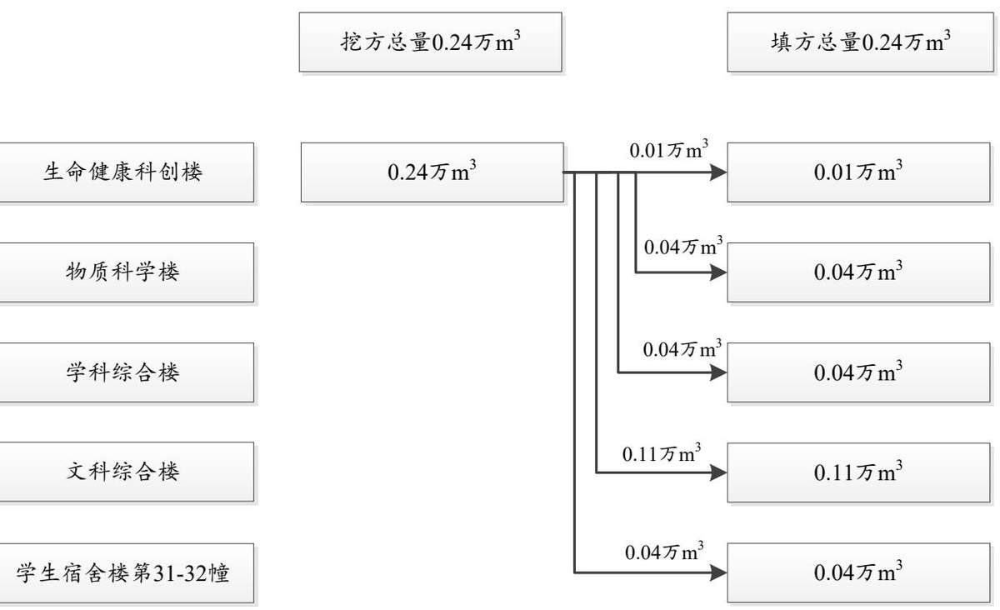
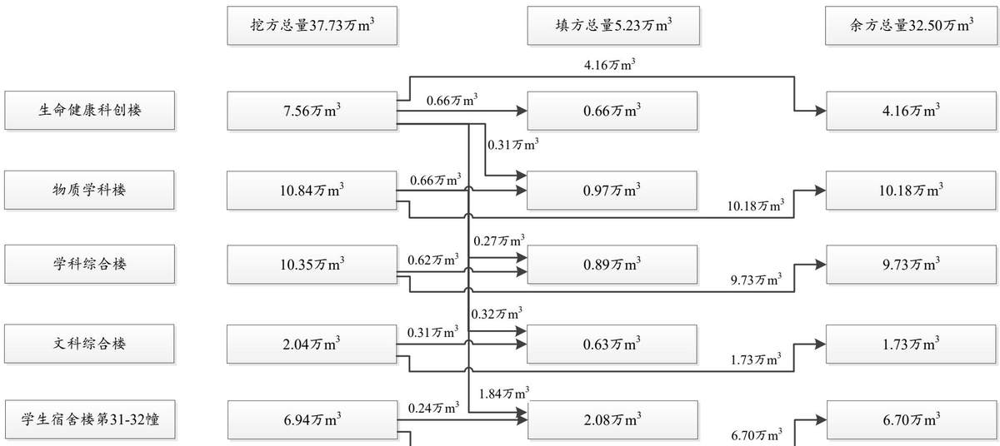
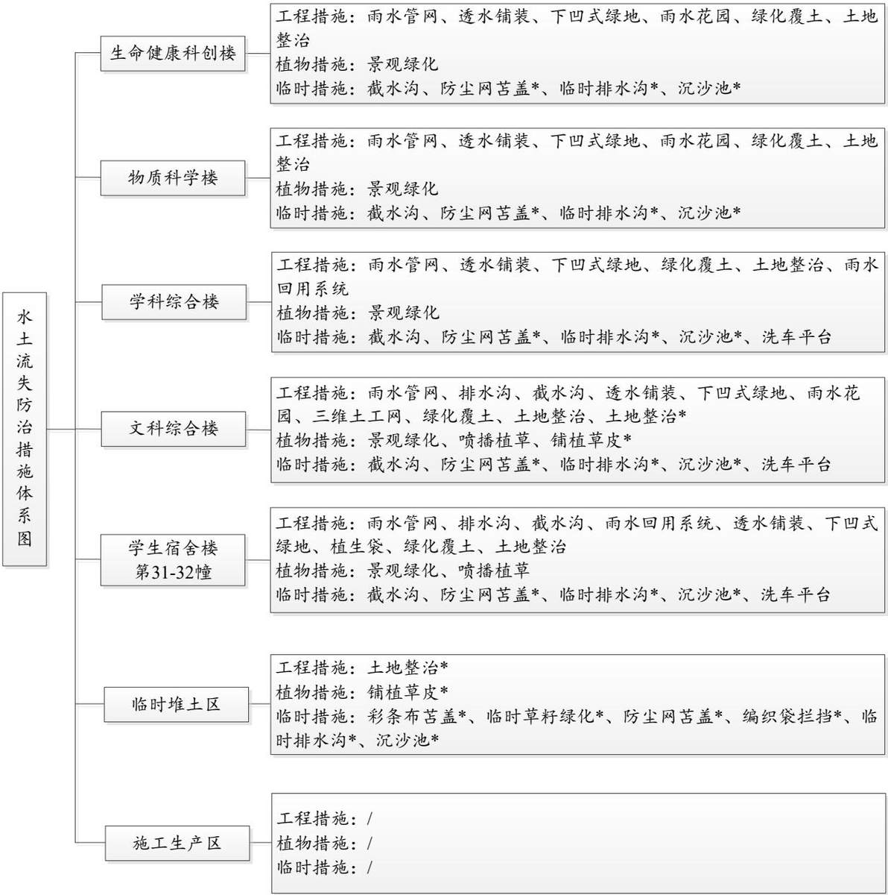

> **Zone C（应用范例层）使用边界**——仅可用于**写作风格、章节展开方式、表达逻辑、表格设计**的参考。
> **不得**用于合规判断；**不得**引入其项目数据（名称／地点／数字／单位名）；
> **不得**因其"曾经通过审批"而推定其做法在当前标准下仍然合规。
> 与 Zone A 冲突时**一律以 Zone A 为准**；Zone A 未明确规定时输出
> 「**Zone A 未明确规定，以下为参考写法，需人工判断**」。
>
> **坐标系警告**：本范例为**老八章结构**（GB 50433—2018 附录B），与 2026 版 10 章模板**同号不同义**
> （老 `1.5`＝防治目标，新 `1.5`＝水土流失预测结果；老 4→新 6 …偏移 +2；新版第 4/5 章老结构无独立章）。
> 因此 **`chapter_mapping: pending`——不得按章节号挂载**，检索一律走 `topic_tags`。
>
> **待加工**：`topic_tags`（主题标签）、`approval_basis_list`（编制依据逐字清单）、
> `structure_summary`（只提取结构：章节展开顺序／段落功能／表格栏目结构／句式模板／论证链步骤）。

1 综合说明..  
1.1 项目简况..  
1.2 编制依据..  
1.3 设计水平年.   
1.4 水土流失防治责任范围. . 9  
1.5 水土流失防治目标. .. 10  
1.6 项目水土保持评价结论. .. 13  
1.7 水土流失预测结果. .. 16  
1.8 水土保持措施布设成果. ... 16  
1.9 水土保持监测方案.... ... 23  
1.10 水土保持投资及效益分析成果... .... 24  
1.11 结论 .... ... 24  
2 项目概况 .... .... 28  
2.1 项目组成及工程布置.. ... 28  
2.2 施工组织... ... 44  
2.3 工程占地... ... 55  
2.4 土石方平衡... .. 55  
2.5 拆迁（移民）安置与专项设施改（迁）建.... .... 70  
2.6 施工进度.. .... 70  
2.7 自然概况... ... 71  
3 项目水土保持评价...... ..... 78  
3.1 主体工程选址水土保持评价... .... 78  
3.2 建设方案与布局水土保持评价..... ..... 80  
3.3 主体工程设计中水土保持措施界定... ..... 93  
4 水土流失分析与预测... ..... 103  
4.1 水土流失现状... .... 103  
4.2 水土流失影响因素分析.... ..... 104  
4.3 土壤流失量预测.... .... 105  
4.4 水土流失危害分析..... ...... 116  
4.5 指导意见.. .... 117  
5 水土保持措施.... .... 118  
5.1 防治区划分.. .... 118  
5.2 防治措施总体布局... .... 119  
5.3 分区措施布设... .... 123  
5.4 水土保持工程施工要求.... ..... 142  
6 水土保持监测.. .... 149  
6.1 监测范围与时段..... ..... 149  
6.2 监测内容与方法... ... 149  
6.3 监测点位布设..... ..... 154  
6.4 实施条件和成果.. ... 155  
7 水土保持投资概算及效益分析... ... 159  
7.1 投资概算.. ... 159  
7.2 效益分析.. ... 179  
8 水土保持管理... ... 180  
8.1 组织管理... .... 180  
8.2 后续设计 .... .... 180  
8.3 水土保持监测.... ... 181  
8.4 水土保持监理... .... 181  
8.5 水土保持施工... .... 182  
8.6 水土保持设施验收... ..... 182

## 附表

## 单价分析表

## 附件

附件1：教育部关于南京大学仙林校区生命健康科创楼项目可行性研究报告的批复  
附件2：教育部关于南京大学仙林校区物质科学楼项目可行性研究报告的批复  
附件3：教育部关于南京大学仙林校区学科综合楼项目可行性研究报告的批复  
附件4：教育部关于南京大学仙林校区文科综合楼项目可行性研究报告的批复  
附件 5：教育部关于南京大学仙林校区学生宿舍楼第 31-32 幢项目可行性研究报告的批  
复  
附件 6：关于做好南京大学仙林校区学生宿舍楼第 31-32 幢工程地质灾害治理工作的复  
函  
附件7：不动产权证书  
附件 8：关于南京大学仙林校区生命健康科创楼、物质科学楼、学科综合楼、文科综合  
楼以及学生宿舍楼第 31-32幢项目渣土处置情况的承诺

附件9：石方拍卖公告及确认书

附件10：南京大学仙林校区生命健康科创楼、物质科学楼、学科综合楼、文科综合楼以

及学生宿舍楼第 31-32幢项目临时占地说明

附件11：南京市绿化园林局园林绿化准予行政许可决定书

附件12：南京大学仙林校区学生宿舍楼第 28-30幢项目渣土处置方案申报表、渣土运输

处置方案审核表

附件 13：方案编制委托书

附图：

附图1：项目地理位置图

附图 2：项目区水系图

附图 3：项目区土壤侵蚀强度分布图

附图4：总平面布置图

附图5：江苏省水土流失重点防治区划分图

附图6-1：生命健康科创楼、物质科学楼、学科综合楼水土流失防治责任范围

附图6-2：文科综合楼水土流失防治责任范围

附图6-3：学生宿舍楼第 31-32幢水土流失防治责任范围

附图6-4：临时堆土区水土流失防治责任范围

附图6-5：施工生产区水土流失防治责任范围

附图 7-1：生命健康科创楼、物质科学楼、学科综合楼分区防治措施总体布局图（含监测点位）

附图7-2：文科综合楼分区防治措施总体布局图（含监测点位）

附图7-3：学生宿舍楼第 31-32幢分区防治措施总体布局图（含监测点位）

附图7-4：临时堆土区防治措施总体布局图（含监测点位）

附图8：临时措施典型设计图

附图9：围栏、坡顶截水沟大样图

## 1 综合说明

## 1.1 项目简况

## 1.1.1 项目基本情况

## 1.1.1.1 项目建设的必要性

南京大学仙林校区因事业发展和改善学校办学条件的需要，经中华人民共和国教育部批准在校园内部新建生命健康科创楼、物质科学楼、学科综合楼、文科综合楼以及学生宿舍楼第31-32 幢。项目的建设是落实国家和江苏省“第十四个五年规划和 2035 年远景目标纲要”的要求，也是南京大学构建一流学科生态体系的必然要求，更是南京大学高度重视人才培养，始终坚持育人为本的具体体现，项目建成后有助于提升相关学科发展水平，推动科研成果转化，有利于完善仙林校区地下防护空间体系。因此，本项目的建设是必要的。

## 1.1.1.2 项目建设概况

## （1）项目位置

南京大学仙林校区位于江苏省南京市栖霞区仙林街道仙林大道 163号，本项目建设地点位于仙林校区内部。

生命健康科创楼、物质科学楼、学科综合楼位于南京大学仙林校区西北角四组团内，北侧为食堂和学生公寓，南侧为风雨操场，西侧靠近校园汇文路，东侧为远东大道。三者建设地块相连，项目中心点坐标：东经 118°56′49.93″，北纬 32°07′26.56″。

文科综合楼位于南京大学仙林校区中心位置，拟建位置位于校区内部瑞清路北侧，北侧为窑山，南侧为田山，西侧为众创空间二期，东侧为历史学院、新闻传播学院，项目中心点坐标：东经 118°57′11.06″，北纬 32°07′18.18″。

学生宿舍楼第31-32幢位于南京大学仙林校区东部偏北，拟建位置东侧紧邻元化路，北侧、西侧为山体，南侧为规划在建的学生宿舍楼第 28-30 幢项目，项目中心点坐标：东经 $1 1 8 ^ { \circ } 5 7 ^ { \prime } 2 9 . 9 5 ^ { \prime \prime }$ ，北纬 32°07′8.98″。

## （2）工程建设性质、规模与内容

本项目建设性质为新建建设类项目。总建筑面积 $2 6 7 1 3 1 . 1 7 \mathrm { m } ^ { 2 }$ ，建设内容包括教学

楼4栋，宿舍楼 2幢。

1）生命健康科创楼成单塔布置，裙房为 4层，塔楼为 15层，裙楼与塔楼围合内庭院，首层公共空间串联门厅、休息厅、报告厅等交流空间，规划用地面积 7674.27m2，总建筑面积 55190.19m2，其中地上建筑面积 $4 1 6 3 0 . 0 2 \mathrm { m } ^ { 2 }$ （地上 15 层，裙房为 4 层），地下建筑面积13560.17m2（地下 3 层）。

2）物质科学楼地上主要功能为物理学院的教师办公用房、实验实习用房、科研用房。地下主要功能包括设备用房、机动车库及实验区，规划用地面积为 $8 8 0 2 . 1 2 \mathrm { m } ^ { 2 }$ ，总建筑面积 $7 0 7 8 1 . 7 4 \mathrm { m } ^ { 2 }$ ，其中地上建筑面积 $5 3 4 4 8 . 2 6 \mathrm { m } ^ { 2 }$ （地上 18 层，裙房 5 层），地下建筑面积 $1 7 3 3 3 . 4 8 \mathrm { m } ^ { 2 }$ （地下3层）。

3）学科综合楼地上主要功能为马克思主义学院、信息管理学院、教育研究院、数学学院以及校级共享实验室的教师办公用房、实验实习用房及科研用房。地下主要功能包括设备用房、机动车库、实验区，规划用地面积为 10551.57m2，总建筑面积75048.92m2，其中地上建筑面积 58648.92m2（地上 20层，裙房5层），地下建筑面积 16400.00m2（地下 3 层）。

4）文科综合楼总层高 4 层，项目规划功能为教学科研用房，使用功能为教研室、研究室、学生研究室等。其中首层西区设置文献特藏馆，包括特藏书库、开架书库、阅览室；东区北侧设置 220人阶梯教室；东区南侧设置成就展陈中心；二至四层为各平台教研室、研究室、学生研究室等。规划用地面积 $1 1 6 6 7 . 0 1 \mathrm { m } ^ { 2 }$ ，建筑面积 14170.90m2，无地下室。

5）学生宿舍楼第 31-32幢总层高 13层，首层主要为门厅、值班室、洗衣房、学生一站式社区、商铺、超市等，2至13 层均为学生宿舍。地下室主要为中央厨房、人防工程兼机动车库、非机动车库以及设备用房。规划用地面积 $2 0 4 3 1 . 5 3 \mathrm { m } ^ { 2 }$ ，总建筑面积$5 1 9 3 9 . 4 2 \mathrm { m } ^ { 2 }$ ，其中地上建筑面积 $4 4 8 2 8 . 1 0 \mathrm { m } ^ { 2 }$ （地上13层），地下建筑面积 $7 1 1 1 . 3 2 \mathrm { m } ^ { 2 }$ （地下1层）。

## （3）施工组织

本项目设置施工生产区共计 5 处，总面积 $3 0 1 4 \mathrm { m } ^ { 2 }$ （其中用地红线内面积 $1 7 1 4 \mathrm { m } ^ { 2 }$ 用地红线外面积 $1 3 0 0 \mathrm { m } ^ { 2 } )$ ），各建筑物施工生产区布置情况如下：

生命健康科创楼、物质科学楼、学科综合楼设置施工生产区共计 2 处，占地面积1572m2。其中施工生产区 1#设置在生命健康科创楼建设用地南侧，为建设红线外临时用地，占地面积1300m2，现状为学校内部硬化道路，用于施工材料临时堆放。施工生产区2#设置在学科综合楼东侧建设用地红线内，占用项目道路广场区域，占地面积 272m2。

文科综合楼在红线范围内西侧设置施工生产区 3#，占用项目道路广场以及绿化区域，占地面积1142m2。

学生宿舍楼第 31-32幢在项目红线范围内北侧设置施工生产区 4#、南侧设置施工生产区5#，占用道路广场区域，单处施工生产区占地面积 150m2。学生宿舍楼第 31-32 幢施工生产区面积共计 300m2。

为便于本项目开挖土方的中转，项目设置 1处临时堆土区，堆土区设置在仙林校区内部东门南侧空地，堆土区占地面积 1.28hm2，长约 147m，宽约90m，堆高2.50m，坡比1：2，可容纳土方 2.91万m3，用于堆放建筑物开挖待回填土方、绿化覆土，建筑物开挖待回填土方、绿化覆土来自生命健康科创楼基础开挖土方，实际堆放土方量共计2.85 万 m3，土方堆放时间从 2025 年 11 月\~2028 年 7 月。

项目施工准备期利用学校现有道路作为施工便道。后期进入主体工程阶段，项目场地根据设计沿基坑周边布设水泥硬化路面作为施工道路，工程后期硬化层拆除，各建筑物施工便道设置情况如下：

生命健康科创楼、物质科学楼、学科综合楼场地内施工道路宽度约 5.5m，总长度约830m，占地面积约 4571m2，临时占用道路广场区域。

文科综合楼场地内施工道路宽度约 4m，总长度约132m，占地面积约533m2，临时占用道路广场区域。

学生宿舍楼第 31-32 幢场地内施工道路宽度约 4m，总长度约 435m，占地面积约1740m2，临时占用道路广场区域。

## （4）建设工期

工程总工期 2025 年 11 月\~2028 年 12 月（38 个月）。其中生命健康科创楼、物质科学楼、学科综合楼工期为 2025 年 11 月\~2028 年 12 月（38 个月），文科综合楼工期为 2025 年 12 月\~2027 年 12 月（25 个月），学生宿舍楼第 31-32 幢工期为 2025 年 11 月

\~2027 年 12 月（26 个月）。

## （5）工程投资

工程总投资 216121.67万元，其中土建投资 95969.18 万元。其中生命健康科创楼项目总投资约 52119.92 万元，土建投资约 20847.97 万元；物质科学楼项目总投资约65443.20 万元，土建投资约 26177.28 万元；学科综合楼项目总投资约 64850.65 万元，土建投资约 25940.26 万元；文科综合楼项目总投资约 7400 万元，土建投资约 3820 万元；学生宿舍楼第 31-32 幢项目总投资约 26307.90 万元，其中土建投资 19183.67 万元。

## （6）工程占地

本项目总占地面积 $7 . 3 8 \mathrm { h m } ^ { 2 }$ ，其中永久占地 $5 . 9 2 \mathrm { h m } ^ { 2 }$ ，临时占地 $1 . 4 6 \mathrm { h m } ^ { 2 }$ 。其中生命健康科创楼占地面积 $0 . 7 7 \mathrm { h m } ^ { 2 }$ ，全部为永久占地；物质科学楼占地面积 $0 . 8 8 \mathrm { h m } ^ { 2 }$ ，全部为永久占地；学科综合楼占地面积 $1 . 0 6 \mathrm { h m } ^ { 2 }$ ，全部为永久占地；文科综合楼占地面积 $1 . 2 0 \mathrm { h m } ^ { 2 }$ 其中永久占地 $1 . 1 7 \mathrm { h m } ^ { 2 }$ （规划用地红线内面积），临时占地 $0 . 0 3 \mathrm { h m } ^ { 2 }$ （规划用地红线外接入管线面积）；学生宿舍楼第 31-32幢占地面积 $2 . 0 6 \mathrm { h m } ^ { 2 }$ ，其中永久占地 $2 . 0 4 \mathrm { h m } ^ { 2 }$ （规划用地红线内面积），临时占地 $0 . 0 2 \mathrm { h m } ^ { 2 }$ （规划用地红线外北侧边坡治理面积）；临时堆土区占地面积 $1 . 2 8 \mathrm { h m } ^ { 2 }$ ，全部为临时占地；施工生产区占地面积 $0 . 1 3 \mathrm { h m } ^ { 2 }$ （规划用地红线外），全部为临时占地，其余施工生产区临时占用主体工程区域，面积不重复计列。

## （7）土石方量

本项目土石方总挖方 37.73万 $\mathrm { m } ^ { 3 } \ell$ （土方 28.93 万 $\mathrm { m } ^ { 3 }$ ，石方 8.80 万 $\mathrm { ~ m } ^ { 3 } \mathrm { ~ . ~ }$ ）；总填方 5.23万 $\mathrm { m } ^ { 3 }$ （场平填方 $1 . 7 0 \mathrm { ~ } \overline { { \mathcal { H } } } \mathrm { ~ m } ^ { 3 }$ ，管线填方 0.68万 $\mathrm { m } ^ { 3 }$ ，绿化覆土 0.24万 $\mathrm { m } ^ { 3 }$ ，土方回填 2.61$\mathcal { F } \mathrm { ~ m } ^ { 3 } )$ ）；由生命健康科创楼向物质科学楼、学科综合楼、文科综合楼、学生宿舍楼第 31-32 幢分别调入土方 0.31 万 $\mathrm { m } ^ { 3 }$ 、0.27 万 m3、0.32 万 $\mathrm { m } ^ { 3 }$ 、1.84 万 $\mathbf { m } ^ { 3 } \mathbf { ; }$ ；无借方；总余方32.50 万 $\mathrm { m } ^ { 3 }$ ，其中土方 23.70 万 $\mathrm { m } ^ { 3 }$ 根据《南京市渣土运输管理办法》申请渣土处置许可，运输至南京市城市管理局公示的消纳场地（详见附件 8），石方 8.80 万 $\mathrm { m } ^ { 3 }$ 根据《江苏省自然资源厅关于推进矿产资源管理改革若干事项的通知》《南京市采矿权招标拍卖挂牌出让管理暂行办法》通过南京市建筑用品利用交易平台进行拍卖（详见附件 9），项目开挖土石方均随挖随运，不在项目区内设置土石方堆放中转场。

## （8）建设征地及移民安置

本项目用地通过划拨方式获得，不涉及拆迁（移民）安置与专项设施改（迁）建。

## 1.1.2 项目前期工作进展情况

2019年11月 25日，建设单位取得南京大学仙林校区不动产权证（苏（2019）宁栖不动产权第0052463 号）。

2024 年 11 月，中华人民共和国教育部对南京大学仙林校区生命健康科创楼项目可行性研究报告进行批复（教发函〔2024〕375号）。

2024 年 11 月，中华人民共和国教育部对南京大学仙林校区文科综合楼项目可行性研究报告进行批复（教发函〔2024〕380 号）。

2025年2月，中华人民共和国教育部对南京大学仙林校区学生宿舍楼第 31-32幢项目可行性研究报告进行批复（教发函〔2025〕60号）。

2025 年 3 月，中华人民共和国教育部对南京大学仙林校区学科综合楼项目可行性研究报告进行批复（教发函〔2025〕106 号）。

2025 年 3 月，中华人民共和国教育部对南京大学仙林校区物质科学楼项目可行性研究报告进行批复（教发函〔2025〕107 号）。

2025年6月，南京市规划和自然资源局栖霞分局出具《关于做好南京大学仙林校区学生宿舍楼第31-32幢工程地质灾害治理工作的复函》（宁栖规划资源函字[2025]20号）。

2025 年 6 月，南京市栖霞区人民政府仙林办事处委托南京嘉信拍卖有限公司对本项目生命健康科创楼、物质科学楼、学科综合楼开挖石方进行拍卖。

2025 年 6 月，南京市栖霞区人民政府仙林办事处委托江苏联合拍卖有限公司对本项目学生宿舍楼第 31-32幢开挖石方进行拍卖。

2025年6月，南京犇亿建设工程有限公司通过拍卖获得本项目生命健康科创楼、物质科学楼、学科综合楼开挖石方。

2025年9月，南京犇亿建设工程有限公司通过拍卖获得本项目学生宿舍楼第 31-32幢开挖石方。

2025 年 10 月，南京市绿化园林局对南京大学仙林校区新建学生宿舍树木更新申请进行批复（宁园移伐审字[2025]208号）。

根据《中华人民共和国水土保持法》《江苏省水土保持条例》等法律法规要求，本项目依法应当编报水土保持方案。2025 年6月，南京大学通过招标投确定江苏省水利勘测设计研究院有限公司（以下简称我单位）为本项目水土保持方案报告书的编制单位。

接受任务后，我单位组织专家和技术人员深入现场调查，收集了项目区的气象、水文、地质地貌、土壤、植被等自然状况方面的资料，同时也调查了社会经济状况，为水土保持方案编制取得了第一手资料。在查勘期间，认真听取了业主和设计单位对项目组成、规模、建设等级标准、土石方平衡、施工工艺和施工组织等情况的介绍。在此基础上，对项目区的地形地貌、土地利用类型、植被类型、水土流失现状、水土保持设施等进行了调查，并对主体工程设计进行合理性分析，通过对野外收集的基础资料认真整理分析，结合工程建设、运行特点，进行了水土保持评价，明确工程水土流失防治责任范围、方案编制深度和设计水平年，确定了水土流失重点防治区域、防治措施、投资概算，并对实施进度、水土保持管理工作等作出了安排，于 2025 年 9 月编制完成了《南京大学仙林校区生命健康科创楼、物质科学楼、学科综合楼、文科综合楼以及学生宿舍楼第31-32幢项目水土保持方案报告书》。

2025年10月 11日，水利部水土保持监测中心在南京主持召开了《南京大学仙林校区生命健康科创楼、物质科学楼、学科综合楼、文科综合楼以及学生宿舍楼第 31-32 幢项目水土保持方案报告书》技术评审会，会后项目组根据与会专家和代表就本工程水土保持方案报告书提出的意见和建议，对报告书进行了修改和完善，并于 2025年 10月修改完成了《南京大学仙林校区生命健康科创楼、物质科学楼、学科综合楼、文科综合楼以及学生宿舍楼第 31-32幢项目水土保持方案报告书》。

## 1.1.3 自然简况

本项目位于南京市栖霞区仙林街道，建设场地地貌属于丘陵地貌，生命健康科创楼、物质科学楼、学科综合楼原地貌标高 17.82\~19.93m（1985 国家高程基准，下同），文科综合楼建设场地原地貌标高 23.31\~40.76m，学生宿舍楼第 31-32幢建设场地原地貌高程约 18.82\~48.00m。

项目区属北亚热带湿润季风气候，近地面层受季风交替影响，故季风气候明显，并形成冬寒、夏热、春温、秋暖四季变化明显的气候特征。项目区年平均气温为 15.5℃，极端最高气温 43.0℃（2022 年），极端最低气温-14.0℃（1955 年）。无霜期年平均日数为225天。全年的日照时数为1971.2h，≥10℃年积温 $5 0 6 8 ^ { \circ } \mathrm { C }$ ，年平均降水量1109.9mm，最大年降雨量1778.3mm（1991年），最小年降雨量 465mm（1978年），多年平均蒸发量1312mm。年均风速 3.6m/s，全年主导风向NE。平均冻土深度 20cm。

根据工程勘察资料，项目区土壤类型为黄棕壤。

项目区主要植被类型属北亚热带常绿落叶阔叶混交林，项目区林草植被覆盖率约57%。

项目所在地属于南方红壤区（V）-江淮丘陵及下游平原区（V-1）-沿江丘陵岗地农田防护人居环境维护区（V-1-5nr）。根据《全国水土保持规划（2015-2030 年）》，项目所在地不属于国家级水土流失重点预防区和重点治理区。根据《省水利厅关于发布<江苏省省级水土流失重点预防区和重点治理区>的公告》，项目所在地仙林街道属于江苏省省级水土流失重点预防区。根据《土壤侵蚀分类分级标准》（SL190-2007）的规定，项目区土壤侵蚀类型以水力侵蚀为主，容许土壤流失量为 $5 0 0 \mathrm { t } / \ ( \mathrm { k m } ^ { 2 } { \cdot } \mathrm { a } )$ ）。根据外业调查复核、咨询当地水行政主管部门和水土保持专家，确定项目建设扰动区域土壤侵蚀模数背景值约 150t/（km2·a），土壤侵蚀强度属微度侵蚀。本项目不涉及饮用水水源保护区、水功能一级区的保护区和保留区、自然保护区、世界文化和自然遗产地、风景名胜区、地质公园、森林公园以及重要湿地等。根据《江苏省生态空间管控区域规划》，本项目所在地不涉及生态红线范围，无生态敏感区。

## 1.2 编制依据

## 1.2.1 法律法规及规范性文件

（1）《中华人民共和国水土保持法》，全国人大常委会，2010年12月25 日修订，自2011年3月1 日起施行；

（2）《生产建设项目水土保持方案管理办法》，水利部令第 53号，2023 年3月1日施行；

（3）《江苏省水土保持条例》，江苏省人大 2013年 11月29日十二届六次会议通过，2014年3月 1日施行，2017年6 月3日修订，2021年 9月29日修订；

（4）《水利部办公厅关于印发生产建设项目水土保持技术文件编写和印制格式规

定（试行）的通知》（办水保〔2018〕135号，2018年7 月12日）；

（5）江苏省水利厅关于印发《江苏省生产建设项目水土保持管理办法》的通知（苏水规〔2021〕8号）；

（6）《南京市水土保持办法》（2015年南京市人民政府令第 313号修订，自 2015年12月20 日起施行）。

## 1.2.2 技术标准

（1）《生产建设项目水土保持技术标准》（GB50433-2018）；

（2）《生产建设项目水土流失防治标准》（GB/T50434-2018）；

（3）《水土保持工程设计规范》（GB51018-2014）；

（4）《土壤侵蚀分类分级标准》（SL190-2007）；

（5）《土地利用现状分类标准》（GB/T21010-2017）；

（6）《生产建设项目土壤流失量测算导则》（SL773-2018）；

（7）《水利水电工程制图标准 水土保持图》（SL73.6-2015）；

（8）《生产建设项目水土保持监测与评价标准》（GB/T51240-2018）；

（9）《水土保持工程调查与勘测标准》（GB/T51297-2018）；

（10）《水土保持监理规范》（SL/T523-2024）。

## 1.2.3 技术资料

（1）《南京大学仙林校区生命健康科创楼项目初步设计报告》，南京大学建筑规划设计研究院有限公司，2025年8月；

（2）《南京大学仙林校区物质科学楼项目初步设计报告》，南京大学建筑规划设计研究院有限公司，2025年8月；

（3）《南京大学仙林校区学科综合楼项目初步设计报告》，南京大学建筑规划设计研究院有限公司，2025年8月；

（4）《南京大学仙林校区文科综合楼项目初步设计报告》，南京大学建筑规划设计研究院有限公司，2025年8月；

（5）《南京大学仙林校区学生宿舍楼第 31-32幢项目初步设计报告》，南京大学建筑规划设计研究院有限公司，2025年 8月；

（6）《南京大学仙林校区学生宿舍楼第 31-32幢地质灾害治理工程勘查与设计》，江苏省地质调查研究院，2025年5月；

（7）《南京大学仙林校区生命健康科创楼岩土工程详细勘察报告》，南京大学建筑规划设计研究院有限公司，2025年1 月；

（8）《南京大学仙林校区物质科学楼项目岩土工程勘察报告》，南京大学建筑规划设计研究院有限公司，2025年2月；

（9）《南京大学仙林校区文科综合楼项目岩土工程勘察报告》，南京大学建筑规划设计研究院有限公司，2025年6月；

（10）《南京大学仙林校区学生宿舍楼第 31-32幢项目岩土工程勘察报告》，南京大学建筑规划设计研究院有限公司，2025 年6月；

（11）《南京大学仙林校区学生宿舍楼第 31-32幢西侧边坡项目岩土工程勘察报告》，南京大学建筑规划设计研究院有限公司，2025年6月；

（12）南京市有关部门提供的气象、水文、地质及土壤植被相关资料。

## 1.3 设计水平年

根据《生产建设项目水土保持技术标准》（GB50433-2018）相关规定，设计水平年为主体工程完工后的当年或后一年，根据主体工程完工时间和水土保持措施实施进度安排等综合确定。本工程为新建建设类项目，综合考虑确定水土保持方案设计水平年为工程完工后一年。其中生命健康科创楼、物质科学楼、学科综合楼建设工期为 2025 年 11月至 2028 年 12 月，水土保持方案设计水平年为 2029 年；文科综合楼建设工期为 2025年12月至2027年 12月，水土保持方案设计水平年为 2028 年；学生宿舍楼第 31-32 幢建设工期为2025 年11月至2027年12 月，水土保持方案设计水平年为 2028年。

## 1.4 水土流失防治责任范围

根据《生产建设项目水土保持技术标准》（GB50433-2018）相关规定，生产建设项目水土流失防治责任范围应包括项目永久征地、临时占地以及其他使用与管辖区域。通过查阅主体工程设计文件及外业调查，对资料统计、分析，确定本项目水土流失防治责任范围面积共计 7.38hm2，其中生命健康科创楼水土流失防治责任范围面积 2.18hm2（包含临时堆土区面积 1.28hm2、施工生产区 $0 . 1 3 \mathrm { h m } ^ { 2 } )$ 、物质科学楼水土流失防治责任范围面积0.88hm2、学科综合楼水土流失防治责任范围面积 $1 . 0 6 \mathrm { h m } ^ { 2 }$ 、文科综合楼水土流失防治责任范围面积 $1 . 2 0 \mathrm { h m } ^ { 2 }$ 、学生宿舍楼第 31-32 幢水土流失防治责任范围面积 $2 . 0 6 \mathrm { h m } ^ { 2 }$

## 1.5 水土流失防治目标

## 1.5.1 执行标准等级

生产建设项目水土流失防治目标是水土保持设施验收、水土保持监测和水土保持监督执法的重要依据。水土流失防治执行标准等级按工程所处的水土流失防治区和区域水土保持生态功能重要性确定。

根据《全国水土保持规划（2015-2030 年）》，项目所在地不属于国家级水土流失重点预防区和重点治理区。根据《省水利厅关于发布<江苏省省级水土流失重点预防区和重点治理区>的公告》，项目所在地仙林街道属于江苏省省级水土流失重点预防区。根据《生产建设项目水土流失防治标准》（GB/T50434-2018），水土流失防治标准执行等级应采用南方红壤区一级防治标准。项目所在地南京市栖霞区仙林街道属于南方红壤区（V）-江淮丘陵及下游平原区（V-1）-沿江丘陵岗地农田防护人居环境维护区（V-1-5nr）。根据《土壤侵蚀分类分级标准》（SL190-2007），项目区容许土壤流失量为 500t$\left( \mathrm { { k m } } ^ { 2 } { \cdot } _ { \mathrm { { a } } } \right)$ ，根据外业调查复核、咨询当地水行政主管部门和水土保持专家，确定项目建设扰动区域土壤侵蚀模数背景值约 $1 5 0 \mathrm { t / \Omega } \left( \mathrm { k m } ^ { 2 } { \cdot } \mathrm { a } \right)$

## 1.5.2 防治目标

根据《生产建设项目水土保持技术标准》（GB50433-2018），生产建设项目水土保持方案应达到以下水土流失防治的基本目标：

（1）项目建设范围内新增水土流失应得到有效控制，原有水土流失得到治理；

（2）水土保持设施应安全有效；

（3）水土资源、林草植被应得到最大限度的保护与恢复；

（4）水土流失治理度、土壤流失控制比、渣土防护率、表土保护率、林草植被恢复率、林草覆盖率六项指标应符合现行国家标准《生产建设项目水土流失防治标准》（GB/T50434-2018）的规定。

本项目属南方红壤区且位于江苏省省级水土流失重点预防区，根据《生产建设项目水土流失防治标准》（GB/T50434-2018）相关规定，本项目采取南方红壤区一级防治标准，同时结合本项目具体情况对相关指标进行相应调整。

1）土壤流失控制比在轻度侵蚀为主的区域应不小于 1.0，中度以上侵蚀为主的区域可降低0.1\~0.2。根据水土流失现状调查，项目区土壤侵蚀以微度水力侵蚀为主，容许土壤流失量为 $5 0 0 \mathrm { t } / \ ( \mathrm { k m } ^ { 2 } { \cdot } \mathrm { a } )$ ，方案水土保持措施实施并发挥效益后，土壤侵蚀模数可控制在容许值以下，因此土壤流失控制比调整为 1。

2）本项目位于南京市栖霞区城区，同时项目位于南京大学仙林校区内部，故渣土防护率提高2%。

3）本项目生命健康科创楼项目林草覆盖率目标值按项目总平面规划设计调整为 5%，物质科学楼、学科综合楼项目林草覆盖率目标值按项目总平面规划设计调整为 7%。同时本项目涉及江苏省省级水土流失重点预防区，因此文科综合楼、学生宿舍楼第 31-32幢项目林草覆盖率提高 2%，提高至27%。

4）本项目仅临时堆土区（纳入生命健康科创楼）场地内存在表土分布，因此仅生命健康科创楼涉及表土保护率，其余建筑物不涉及表土保护率。

本项目生命健康科创楼、物质学科楼、学科综合楼、文科综合楼、学生宿舍楼第 31-32幢水土流失防治目标取值具体见表 1.5-1\~1.5-4，项目综合水土流失防治目标取值见表1.5-5。

表 1.5-1 生命健康科创楼水土流失防治目标表
<table><tr><td rowspan=2 colspan=1>防治指标</td><td rowspan=1 colspan=2>南方红壤区一级标准</td><td rowspan=1 colspan=1>土壤侵蚀强度调整</td><td rowspan=1 colspan=2>所处区位</td><td rowspan=1 colspan=2>防治目标值</td></tr><tr><td rowspan=1 colspan=1>施工期</td><td rowspan=1 colspan=1>设计水平年</td><td rowspan=1 colspan=1>微度</td><td rowspan=1 colspan=1>设计条件</td><td rowspan=1 colspan=1>城区</td><td rowspan=1 colspan=1>施工期</td><td rowspan=1 colspan=1>设计水平年</td></tr><tr><td rowspan=1 colspan=1>水土流失治理度（%）</td><td rowspan=1 colspan=1>-</td><td rowspan=1 colspan=1>98</td><td rowspan=1 colspan=1></td><td rowspan=1 colspan=1></td><td rowspan=1 colspan=1></td><td rowspan=1 colspan=1>1</td><td rowspan=1 colspan=1>98</td></tr><tr><td rowspan=1 colspan=1>土壤流失控制比</td><td rowspan=1 colspan=1>-</td><td rowspan=1 colspan=1>0.9</td><td rowspan=1 colspan=1>+0.1</td><td rowspan=1 colspan=1></td><td rowspan=1 colspan=1></td><td rowspan=1 colspan=1>-</td><td rowspan=1 colspan=1>1.0</td></tr><tr><td rowspan=1 colspan=1>渣土防护率（%）</td><td rowspan=1 colspan=1>95</td><td rowspan=1 colspan=1>97</td><td rowspan=1 colspan=1></td><td rowspan=1 colspan=1></td><td rowspan=1 colspan=1>+2</td><td rowspan=1 colspan=1>97</td><td rowspan=1 colspan=1>99</td></tr><tr><td rowspan=1 colspan=1>表土保护率（%）</td><td rowspan=1 colspan=1>92</td><td rowspan=1 colspan=1>92</td><td rowspan=1 colspan=1></td><td rowspan=1 colspan=1></td><td rowspan=1 colspan=1></td><td rowspan=1 colspan=1>92</td><td rowspan=1 colspan=1>92</td></tr><tr><td rowspan=1 colspan=1>林草植被恢复率（%）</td><td rowspan=1 colspan=1>1</td><td rowspan=1 colspan=1>98</td><td rowspan=1 colspan=1></td><td rowspan=1 colspan=1></td><td rowspan=1 colspan=1></td><td rowspan=1 colspan=1>1</td><td rowspan=1 colspan=1>98</td></tr><tr><td rowspan=1 colspan=1>林草覆盖率（%）</td><td rowspan=1 colspan=1>-</td><td rowspan=1 colspan=1>25</td><td rowspan=1 colspan=1></td><td rowspan=1 colspan=1>-20</td><td rowspan=1 colspan=1></td><td rowspan=1 colspan=1>-</td><td rowspan=1 colspan=1>5</td></tr></table>

表 1.5-2 物质科学楼、学科综合楼水土流失防治目标表
<table><tr><td rowspan=2 colspan=1>防治指标</td><td rowspan=1 colspan=2>南方红壤区一级标准</td><td rowspan=1 colspan=1>土壤侵蚀强度调整</td><td rowspan=1 colspan=2>所处区位</td><td rowspan=1 colspan=2>防治目标值</td></tr><tr><td rowspan=1 colspan=1>施工期</td><td rowspan=1 colspan=1>设计水平年</td><td rowspan=1 colspan=1>微度</td><td rowspan=1 colspan=1>设计条件</td><td rowspan=1 colspan=1>城区</td><td rowspan=1 colspan=1>施工期</td><td rowspan=1 colspan=1>设计水平年</td></tr><tr><td rowspan=1 colspan=1>水土流失治理度（%）</td><td rowspan=1 colspan=1>-</td><td rowspan=1 colspan=1>98</td><td rowspan=1 colspan=1></td><td rowspan=1 colspan=1></td><td rowspan=1 colspan=1></td><td rowspan=1 colspan=1>1</td><td rowspan=1 colspan=1>98</td></tr><tr><td rowspan=1 colspan=1>土壤流失控制比</td><td rowspan=1 colspan=1>-</td><td rowspan=1 colspan=1>0.9</td><td rowspan=1 colspan=1>+0.1</td><td rowspan=1 colspan=1></td><td rowspan=1 colspan=1></td><td rowspan=1 colspan=1>-</td><td rowspan=1 colspan=1>1.0</td></tr><tr><td rowspan=1 colspan=1>渣土防护率（%）</td><td rowspan=1 colspan=1>95</td><td rowspan=1 colspan=1>97</td><td rowspan=1 colspan=1></td><td rowspan=1 colspan=1></td><td rowspan=1 colspan=1>+2</td><td rowspan=1 colspan=1>97</td><td rowspan=1 colspan=1>99</td></tr><tr><td rowspan=1 colspan=1>表土保护率（%）</td><td rowspan=1 colspan=1>92</td><td rowspan=1 colspan=1>92</td><td rowspan=1 colspan=1></td><td rowspan=1 colspan=1></td><td rowspan=1 colspan=1></td><td rowspan=1 colspan=1>-</td><td rowspan=1 colspan=1>-</td></tr><tr><td rowspan=1 colspan=1>林草植被恢复率（%）</td><td rowspan=1 colspan=1>1</td><td rowspan=1 colspan=1>98</td><td rowspan=1 colspan=1></td><td rowspan=1 colspan=1></td><td rowspan=1 colspan=1></td><td rowspan=1 colspan=1>1</td><td rowspan=1 colspan=1>98</td></tr><tr><td rowspan=1 colspan=1>林草覆盖率（%）</td><td rowspan=1 colspan=1>-</td><td rowspan=1 colspan=1>25</td><td rowspan=1 colspan=1></td><td rowspan=1 colspan=1>-18</td><td rowspan=1 colspan=1></td><td rowspan=1 colspan=1>-</td><td rowspan=1 colspan=1>7</td></tr></table>

表 1.5-3 文科综合楼水土流失防治目标表
<table><tr><td rowspan=2 colspan=1>防治指标</td><td rowspan=1 colspan=2>南方红壤区一级标准</td><td rowspan=1 colspan=1>土壤侵蚀强度调整</td><td rowspan=1 colspan=2>所处区位</td><td rowspan=1 colspan=2>防治目标值</td></tr><tr><td rowspan=1 colspan=1>施工期</td><td rowspan=1 colspan=1>设计水平年</td><td rowspan=1 colspan=1>微度</td><td rowspan=1 colspan=1>重点预防区</td><td rowspan=1 colspan=1>城区</td><td rowspan=1 colspan=1>施工期</td><td rowspan=1 colspan=1>设计水平年</td></tr><tr><td rowspan=1 colspan=1>水土流失治理度（%）</td><td rowspan=1 colspan=1>二</td><td rowspan=1 colspan=1>98</td><td rowspan=1 colspan=1></td><td rowspan=1 colspan=1></td><td rowspan=1 colspan=1></td><td rowspan=1 colspan=1>二</td><td rowspan=1 colspan=1>98</td></tr><tr><td rowspan=1 colspan=1>土壤流失控制比</td><td rowspan=1 colspan=1>-</td><td rowspan=1 colspan=1>0.9</td><td rowspan=1 colspan=1>+0.1</td><td rowspan=1 colspan=1></td><td rowspan=1 colspan=1></td><td rowspan=1 colspan=1>-</td><td rowspan=1 colspan=1>1.0</td></tr><tr><td rowspan=1 colspan=1>渣土防护率（%）</td><td rowspan=1 colspan=1>95</td><td rowspan=1 colspan=1>97</td><td rowspan=1 colspan=1></td><td rowspan=1 colspan=1></td><td rowspan=1 colspan=1>+2</td><td rowspan=1 colspan=1>97</td><td rowspan=1 colspan=1>99</td></tr><tr><td rowspan=1 colspan=1>表土保护率（%）</td><td rowspan=1 colspan=1>92</td><td rowspan=1 colspan=1>92</td><td rowspan=1 colspan=1></td><td rowspan=1 colspan=1></td><td rowspan=1 colspan=1></td><td rowspan=1 colspan=1>-</td><td rowspan=1 colspan=1>-</td></tr><tr><td rowspan=1 colspan=1>林草植被恢复率（%）</td><td rowspan=1 colspan=1>1</td><td rowspan=1 colspan=1>98</td><td rowspan=1 colspan=1></td><td rowspan=1 colspan=1></td><td rowspan=1 colspan=1></td><td rowspan=1 colspan=1>1</td><td rowspan=1 colspan=1>98</td></tr><tr><td rowspan=1 colspan=1>林草覆盖率（%）</td><td rowspan=1 colspan=1>-</td><td rowspan=1 colspan=1>25</td><td rowspan=1 colspan=1></td><td rowspan=1 colspan=1>+2</td><td rowspan=1 colspan=1></td><td rowspan=1 colspan=1>-</td><td rowspan=1 colspan=1>27</td></tr></table>

表 1.5-4学生宿舍楼第 31-32幢水土流失防治目标表
<table><tr><td rowspan=2 colspan=1>防治指标</td><td rowspan=1 colspan=2>南方红壤区一级标准</td><td rowspan=1 colspan=1>土壤侵蚀强度调整</td><td rowspan=1 colspan=2>所处区位</td><td rowspan=1 colspan=2>防治目标值</td></tr><tr><td rowspan=1 colspan=1>施工期</td><td rowspan=1 colspan=1>设计水平年</td><td rowspan=1 colspan=1>微度</td><td rowspan=1 colspan=1>重点预防区</td><td rowspan=1 colspan=1>城区</td><td rowspan=1 colspan=1>施工期</td><td rowspan=1 colspan=1>设计水平年</td></tr><tr><td rowspan=1 colspan=1>水土流失治理度（%）</td><td rowspan=1 colspan=1>-</td><td rowspan=1 colspan=1>98</td><td rowspan=1 colspan=1></td><td rowspan=1 colspan=1></td><td rowspan=1 colspan=1></td><td rowspan=1 colspan=1>1</td><td rowspan=1 colspan=1>98</td></tr><tr><td rowspan=1 colspan=1>土壤流失控制比</td><td rowspan=1 colspan=1>-</td><td rowspan=1 colspan=1>0.9</td><td rowspan=1 colspan=1>+0.1</td><td rowspan=1 colspan=1></td><td rowspan=1 colspan=1></td><td rowspan=1 colspan=1>-</td><td rowspan=1 colspan=1>1.0</td></tr><tr><td rowspan=1 colspan=1>渣土防护率（%）</td><td rowspan=1 colspan=1>95</td><td rowspan=1 colspan=1>97</td><td rowspan=1 colspan=1></td><td rowspan=1 colspan=1></td><td rowspan=1 colspan=1>+2</td><td rowspan=1 colspan=1>97</td><td rowspan=1 colspan=1>99</td></tr><tr><td rowspan=1 colspan=1>表土保护率（%）</td><td rowspan=1 colspan=1>92</td><td rowspan=1 colspan=1>92</td><td rowspan=1 colspan=1></td><td rowspan=1 colspan=1></td><td rowspan=1 colspan=1></td><td rowspan=1 colspan=1>-</td><td rowspan=1 colspan=1>-</td></tr><tr><td rowspan=1 colspan=1>林草植被恢复率（%）</td><td rowspan=1 colspan=1>-</td><td rowspan=1 colspan=1>98</td><td rowspan=1 colspan=1></td><td rowspan=1 colspan=1></td><td rowspan=1 colspan=1></td><td rowspan=1 colspan=1>1</td><td rowspan=1 colspan=1>98</td></tr><tr><td rowspan=1 colspan=1>林草覆盖率（%）</td><td rowspan=1 colspan=1>-</td><td rowspan=1 colspan=1>25</td><td rowspan=1 colspan=1></td><td rowspan=1 colspan=1>+2</td><td rowspan=1 colspan=1></td><td rowspan=1 colspan=1>-</td><td rowspan=1 colspan=1>27</td></tr></table>

表 1.5-5 项目综合水土流失防治目标表
<table><tr><td rowspan=2 colspan=1>防治指标</td><td rowspan=1 colspan=2>南方红壤区一级标准</td><td rowspan=1 colspan=1>土壤侵蚀强度调整</td><td rowspan=1 colspan=2>所处区位</td><td rowspan=1 colspan=2>防治目标值</td></tr><tr><td rowspan=1 colspan=1>施工期</td><td rowspan=1 colspan=1>设计水平年</td><td rowspan=1 colspan=1>微度</td><td rowspan=1 colspan=1>重点预防区</td><td rowspan=1 colspan=1>城区</td><td rowspan=1 colspan=1>施工期</td><td rowspan=1 colspan=1>设计水平年</td></tr><tr><td rowspan=1 colspan=1>水土流失治理度（%）</td><td rowspan=1 colspan=1>-</td><td rowspan=1 colspan=1>98</td><td rowspan=1 colspan=1></td><td rowspan=1 colspan=1></td><td rowspan=1 colspan=1></td><td rowspan=1 colspan=1>-</td><td rowspan=1 colspan=1>98</td></tr><tr><td rowspan=1 colspan=1>土壤流失控制比</td><td rowspan=1 colspan=1>-</td><td rowspan=1 colspan=1>0.9</td><td rowspan=1 colspan=1>+0.1</td><td rowspan=1 colspan=1></td><td rowspan=1 colspan=1></td><td rowspan=1 colspan=1>-</td><td rowspan=1 colspan=1>1.0</td></tr><tr><td rowspan=1 colspan=1>渣土防护率（%）</td><td rowspan=1 colspan=1>95</td><td rowspan=1 colspan=1>97</td><td rowspan=1 colspan=1></td><td rowspan=1 colspan=1></td><td rowspan=1 colspan=1>+2</td><td rowspan=1 colspan=1>97</td><td rowspan=1 colspan=1>99</td></tr><tr><td rowspan=1 colspan=1>表土保护率（%）</td><td rowspan=1 colspan=1>92</td><td rowspan=1 colspan=1>92</td><td rowspan=1 colspan=1></td><td rowspan=1 colspan=1></td><td rowspan=1 colspan=1></td><td rowspan=1 colspan=1>92</td><td rowspan=1 colspan=1>92</td></tr><tr><td rowspan=1 colspan=1>林草植被恢复率（%）</td><td rowspan=1 colspan=1>1</td><td rowspan=1 colspan=1>98</td><td rowspan=1 colspan=1></td><td rowspan=1 colspan=1></td><td rowspan=1 colspan=1></td><td rowspan=1 colspan=1>-</td><td rowspan=1 colspan=1>98</td></tr><tr><td rowspan=1 colspan=1>林草覆盖率（%）</td><td rowspan=1 colspan=1>1</td><td rowspan=1 colspan=1>25</td><td rowspan=1 colspan=1></td><td rowspan=1 colspan=1>+2</td><td rowspan=1 colspan=1></td><td rowspan=1 colspan=1>-</td><td rowspan=1 colspan=1>27</td></tr></table>

## 1.6 项目水土保持评价结论

## 1.6.1 主体工程选址评价

工程建设符合《中华人民共和国水土保持法》《生产建设项目水土保持技术标准》（GB50433-2018）《南京市水土保持办法》的规定，工程所在地区不属于泥石流易发区、易引起严重水土流失和生态恶化的地区，工程建设区不涉及占用全国水土保持监测网络中的水土保持监测站点、重点试验区及水土保持长期定位观测站等；本项目学生宿舍楼第31-32幢建设范围内现状边坡存在滑坡隐患，项目建设会加剧地质灾害，为消除地质灾害，本项目同步开展边坡治理，采用削坡降坡以及锚杆+格构加固方式进行治理，可消除滑坡隐患；项目所在地属于江苏省省级水土流失重点预防区，方案采用南方红壤区一级防治标准并调整部分防治指标值，并通过工程采取的各项水土保持防护措施能较好的防止水土流失的产生。因此从水土保持角度分析，工程建设主体工程选址无重大水土保持制约性因素，是可行的。

## 1.6.2 建设方案与布局评价

## 1.6.2.1 建设方案评价

本项目位于城镇区域，项目主体已设计永久截排水工程、雨水管网、雨水回用系统、透水铺装、景观绿化、下凹式绿地、雨水花园等设施，并考虑在建设场地出入口设置洗车平台，可以控制施工过程中的水土流失。

本项目无法避让江苏省省级水土流失重点预防区，主体工程对竖向布设进行优化，

根据地形平坡式布置，生命健康科创楼、物质科学楼和学科综合楼地库采用灌注桩+钢筋砼支护，学生宿舍楼第 31-32幢采用钻孔灌注桩支护，以上施工工艺可以减少基坑放坡开挖扰动面积、开挖土方，各建筑物回填土方统一调配，减少余方产生。

对照《生产建设项目水土保持技术标准》（GB50433-2018）要求进行分析，本工程建设方案符合水土保持要求。

## 1.6.2.2 工程占地评价

项目主体工程设计中充分考虑地形条件和场地空间，在满足工程布置的同时，严格控制施工场地的面积。生命健康科创楼、物质科学楼、学科综合楼以及学生宿舍楼第 31-32幢施工用电、用水利用已有预留线路接引，尽量减少占地。临时占地主要是管线接入、施工生产区以及临时堆土区，文科综合楼管线从红线外道路以及历史学院接引，接引线路采用最近线路接入，尽可能减少扰动地表面积。施工生产区 1#占用红线外校园内部硬化道路，其余施工生产区均位于各建筑物红线内。工程开挖待回填土方集中堆放在仙林校区内部（建筑物规划用地外）并采取统一调配，避免各建筑物待回填土方各自分散堆放，本方案堆土统一堆放后共需临时占地 $1 . 2 8 \mathrm { h m } ^ { 2 }$ 。根据计算，本项目开挖外运余方 32.50$\overline { { \mathcal { H } } } ~ \mathrm { ~ m } ^ { 3 }$ 若需要设置堆放场地，按照堆高 2.50m 堆放考虑，则需要土石方堆放场地约$1 6 . 0 0 \mathrm { h m } ^ { 2 }$ ，本项目开挖土石方随挖随运，不在项目区内设置土石方堆放中转场，减少了工程余方堆放场地临时占地。工程占地不存在缺项漏项，占地面积、占地性质符合水土保持要求。

综上所述，本工程永久和临时占地布局总体上较为合理，工程占地组成无漏项，建设项目的各个环节都符合节约用地的原则，工程占地不存在水土保持制约性因素，符合水土保持要求。

## 1.6.2.3 土石方平衡评价

本工程土石方总挖方 37.73万 $\mathrm { m } ^ { 3 } \cdot$ （土方 28.93 万 $\mathrm { m } ^ { 3 }$ ，石方 8.80 万 $\mathrm { m } ^ { 3 } )$ ）；总填方 5.23万 $\mathrm { m } ^ { 3 }$ （场平填方 1.70万 $\mathrm { m } ^ { 3 }$ ，管线填方 0.68万 $\mathrm { m } ^ { 3 }$ ，绿化覆土 0.24万 $\mathrm { m } ^ { 3 }$ ，土方回填 2.61万 $\mathbf { m } ^ { 3 } )$ ）；由生命健康科创楼向物质科学楼、学科综合楼、文科综合楼、学生宿舍楼第 31-32 幢分别调入土方 0.31 万 $\mathrm { m } ^ { 3 }$ 、0.27 万 $\mathrm { m } ^ { 3 }$ 、0.32 万 $\mathrm { m } ^ { 3 }$ 、1.84 万 $\mathrm { m } ^ { 3 } ;$ ；无借方；总余方32.50 万 $\mathrm { m } ^ { 3 }$ ，其中土方 $2 3 . 7 0 \mathrm { ~ } \mathcal { F } \mathrm { ~ m } ^ { 3 }$ 根据《南京市渣土运输管理办法》申请渣土处置许可，运输至南京市城市管理局公示的消纳场地（详见附件 8），石方 8.80 万m3 根据《江苏省自然资源厅关于推进矿产资源管理改革若干事项的通知》《南京市采矿权招标拍卖挂牌出让管理暂行办法》通过南京市建筑用品利用交易平台进行拍卖（详见附件 9），项目开挖土石方均随挖随运，不在项目区内设置土石方堆放中转场。

本方案从水土保持角度出发，根据现场查勘，结合项目平面布置，并充分考虑区域之间调运土石方的可行性，对工程土石方调配进行细化优化，做到土石方调配的合理、科学，符合水土保持的要求。工程填筑全部采用工程本身挖方，无外购土方，有利于水土保持。工程土石方挖填利用基本合理，符合水土保持对生产建设项目的建设要求。

## 1.6.2.4 取土（石、砂）场设置评价

项目填方采用自身挖方，水土流失防治责任由建设单位负责落实。工程建设所需的水泥、砂砾石料、砂子、块石等材料均来源于外购，所涉及的水土流失防治责任由供货方负责。本项目不设置取土（石、砂）场，不涉及取土（石、砂）场评价。

## 1.6.2.5 弃土（石、砂）场设置评价

本项目余方总量 32.50 万 m3，其中土方 23.70 万 m3 根据《南京市渣土运输管理办法》申请渣土处置许可，运输至南京市城市管理局公示的消纳场地（详见附件 8），石方8.80万m3 根据《江苏省自然资源厅关于推进矿产资源管理改革若干事项的通知》《南京市采矿权招标拍卖挂牌出让管理暂行办法》通过南京市建筑用品利用交易平台进行拍卖（详见附件9），项目开挖土石方均随挖随运，不在项目区内设置土石方堆放中转场。本项目不设置弃土（石、砂）场，不涉及弃土（石、砂）场评价。

## 1.6.2.6 施工方法与工艺评价

工程土石方开挖和填筑采用机械、人工相结合的施工方式，开挖尽量减小扰动的范围，避免不必要的开挖和过多的破坏原状土，同时施工过程中采取必要的临时防护措施。施工过程中生命健康科创楼、物质科学楼和学科综合楼地库采用灌注桩+钢筋砼支护，学生宿舍楼第31-32幢采用钻孔灌注桩支护，减少了基坑放坡开挖扰动面积、土石方开挖量，减少项目建设过程中水土流失，同时主体工程针对文科综合楼、学生宿舍楼第 31-32幢项目边坡进行防护，可以防治水土流失。施工工艺对工程建设的水土保持工作起到了积极的作用，项目施工方法与工艺符合水土保持要求。

## 1.6.2.7 主体工程设计中具有水土保持功能工程的评价

按《生产建设项目水土保持技术标准》（GB50433-2018）中的界定原则，将以水土保持功能为主的工程界定为水土保持措施。在主体工程中界定的水土保持措施主要包括雨水管网、排水沟、截水沟、透水铺装、绿化覆土、土地整治、雨水回用系统、下凹式绿地、雨水花园、景观绿化、洗车平台、三维土工网、植生袋、喷播植草以及截水沟等。主体设计中的水土保持措施对项目区水土流失产生了较好的防护作用，防止对周边环境造成严重影响和危害，起到防治水土流失的目的，从水土保持角度考虑，工程建设无重大限制性因素，是可行的。

## 1.7 水土流失预测结果

根据预测结果，本工程水土流失预测总量为 500.42t（施工期 499.81t，自然恢复期0.61t），新增水土流失量为 474.28t（施工期 474.28t）。

施工期是工程水土流失产生、防治和水土保持监测的重点时段。临时堆土区是工程水土流失的防治重点区域。工程施工时若不进行有效的防治，将危及工程自身的安全，造成河道淤积，阻塞排水管网，对周边生态环境、居民生活带来不利影响。

## 1.8 水土保持措施布设成果

本项目根据建设内容划分为生命健康科创楼、物质科学楼、学科综合楼、文科综合楼、学生宿舍楼第 31-32幢、临时堆土区以及施工生产区 7个防治分区。水土保持措施总体布局将根据水土流失防治分区，针对工程建设施工活动引发水土流失的特点和危害程度，将水土保持工程措施、植物措施和临时措施有机结合，以形成完整的水土保持措施防治体系。

## 1.8.1 生命健康科创楼

生命健康科创楼主体已有水土保持措施包括雨水管网、透水铺装、下凹式绿地、雨水花园、绿化覆土、土地整治、景观绿化以及截水沟，方案新增水土保持措施包括防尘网苫盖、临时排水沟、沉沙池。

表 1.8-1 生命健康科创楼防治措施布设表
<table><tr><td rowspan=1 colspan=2>措施名称</td><td rowspan=1 colspan=1>结构型式</td><td rowspan=1 colspan=1>布设位置</td><td rowspan=1 colspan=1>单位</td><td rowspan=1 colspan=1>工程量</td><td rowspan=1 colspan=1>实施时段</td></tr><tr><td rowspan=7 colspan=1>工程措施</td><td rowspan=2 colspan=1>雨水管网</td><td rowspan=1 colspan=1>DN300</td><td rowspan=2 colspan=1>沿路网进行布设</td><td rowspan=1 colspan=1>m</td><td rowspan=1 colspan=1>257.60</td><td rowspan=2 colspan=1>2028.03~2028.06</td></tr><tr><td rowspan=1 colspan=1>DN500</td><td rowspan=1 colspan=1>m</td><td rowspan=1 colspan=1>20.30</td></tr><tr><td rowspan=1 colspan=1>透水铺装</td><td rowspan=1 colspan=1>透水混凝土</td><td rowspan=1 colspan=1>道路广场区域</td><td rowspan=1 colspan=1> $\mathrm { m } ^ { 2 }$ </td><td rowspan=1 colspan=1>756.10</td><td rowspan=1 colspan=1>2028.07</td></tr><tr><td rowspan=1 colspan=1>下凹式绿地</td><td rowspan=1 colspan=1>素土夯实，结构层为覆30cm 厚种植土</td><td rowspan=1 colspan=1>建筑物四周，广场绿化区域</td><td rowspan=1 colspan=1> $\mathrm { m } ^ { 2 }$ </td><td rowspan=1 colspan=1>76.00</td><td rowspan=1 colspan=1>2028.07</td></tr><tr><td rowspan=1 colspan=1>雨水花园</td><td rowspan=1 colspan=1>底部 20cm（粒径30~50mm）碎石层上部50cm 种植土</td><td rowspan=1 colspan=1>建筑物四周，广场绿化区域</td><td rowspan=1 colspan=1> $\mathrm { m } ^ { 2 }$ </td><td rowspan=1 colspan=1>50.00</td><td rowspan=1 colspan=1>2028.07</td></tr><tr><td rowspan=1 colspan=1>绿化覆土</td><td rowspan=1 colspan=1>一般绿地覆土厚度30cm，下凹式绿地覆土厚度30cm，雨水花园覆土厚度 50cm</td><td rowspan=1 colspan=1>绿化区域</td><td rowspan=1 colspan=1> $\mathrm { m } ^ { 3 }$ </td><td rowspan=1 colspan=1>126.88</td><td rowspan=1 colspan=1>2028.07</td></tr><tr><td rowspan=1 colspan=1>土地整治</td><td rowspan=1 colspan=1>施肥改良土壤</td><td rowspan=1 colspan=1>绿化区域</td><td rowspan=1 colspan=1> $\mathrm { h m } ^ { 2 }$ </td><td rowspan=1 colspan=1>0.04</td><td rowspan=1 colspan=1>2028.07~2028.08</td></tr><tr><td rowspan=1 colspan=1>植物措施</td><td rowspan=1 colspan=1>景观绿化</td><td rowspan=1 colspan=1>乔灌草结合</td><td rowspan=1 colspan=1>建筑物四周，广场绿化区域</td><td rowspan=1 colspan=1> $\mathrm { h m } ^ { 2 }$ </td><td rowspan=1 colspan=1>0.04</td><td rowspan=1 colspan=1>2028.09~2028.10</td></tr><tr><td rowspan=4 colspan=1>临时措施</td><td rowspan=1 colspan=1>截水沟</td><td rowspan=1 colspan=1>120mm厚砖砌，矩形断面，底宽0.40m，沟深0.40m</td><td rowspan=1 colspan=1>基坑顶部</td><td rowspan=1 colspan=1>m</td><td rowspan=1 colspan=1>239</td><td rowspan=1 colspan=1>2025.12</td></tr><tr><td rowspan=1 colspan=1>防尘网苫盖*</td><td rowspan=1 colspan=1>6 针防尘网</td><td rowspan=1 colspan=1>场地裸露地表，基坑开挖边坡</td><td rowspan=1 colspan=1> $\mathrm { h m } ^ { 2 }$ </td><td rowspan=1 colspan=1>0.57</td><td rowspan=1 colspan=1>2025.11~2028.12</td></tr><tr><td rowspan=1 colspan=1>临时排水沟*</td><td rowspan=1 colspan=1>HDPE材质，U形断面，内宽0.30m，深 0.30m</td><td rowspan=1 colspan=1>基坑四周及便道一侧</td><td rowspan=1 colspan=1>m</td><td rowspan=1 colspan=1>756</td><td rowspan=1 colspan=1>2025.11</td></tr><tr><td rowspan=1 colspan=1>沉沙池*</td><td rowspan=1 colspan=1>长3.0m，宽1.0m，深1.5m，砖砌</td><td rowspan=1 colspan=1>排水沟末端</td><td rowspan=1 colspan=1>座</td><td rowspan=1 colspan=1>3</td><td rowspan=1 colspan=1>2025.11</td></tr></table>

注：\*为方案新增措施。

## 1.8.2 物质科学楼

物质科学楼主体已有水土保持措施包括雨水管网、透水铺装、下凹式绿地、雨水花园、绿化覆土、土地整治、景观绿化以及截水沟，方案新增水土保持措施包括防尘网苫盖、临时排水沟、沉沙池。

表 1.8-2 物质科学楼防治措施布设表
<table><tr><td rowspan=1 colspan=2>措施名称</td><td rowspan=1 colspan=1>结构型式</td><td rowspan=1 colspan=1>布设位置</td><td rowspan=1 colspan=1>单位</td><td rowspan=1 colspan=1>工程量</td><td rowspan=1 colspan=1>实施时段</td></tr><tr><td rowspan=10 colspan=1>工程措施</td><td rowspan=5 colspan=1>雨水管网</td><td rowspan=1 colspan=1>DN200</td><td rowspan=5 colspan=1>沿路网进行布设</td><td rowspan=1 colspan=1>m</td><td rowspan=1 colspan=1>6.60</td><td rowspan=5 colspan=1>2028.03~2028.06</td></tr><tr><td rowspan=1 colspan=1>DN300</td><td rowspan=1 colspan=1>m</td><td rowspan=1 colspan=1>104.40</td></tr><tr><td rowspan=1 colspan=1>DN400</td><td rowspan=1 colspan=1>m</td><td rowspan=1 colspan=1>59.00</td></tr><tr><td rowspan=1 colspan=1>DN500</td><td rowspan=1 colspan=1>m</td><td rowspan=1 colspan=1>69.00</td></tr><tr><td rowspan=1 colspan=1>DN600</td><td rowspan=1 colspan=1>m</td><td rowspan=1 colspan=1>14.00</td></tr><tr><td rowspan=1 colspan=1>透水铺装</td><td rowspan=1 colspan=1>透水砖、透水混凝土</td><td rowspan=1 colspan=1>道路广场区域</td><td rowspan=1 colspan=1> $\mathrm { m } ^ { 2 }$ </td><td rowspan=1 colspan=1>1485.71</td><td rowspan=1 colspan=1>2028.07</td></tr><tr><td rowspan=1 colspan=1>下凹式绿地</td><td rowspan=1 colspan=1>素土夯实，结构层为覆 30cm 厚种植土</td><td rowspan=1 colspan=1>建筑物四周，广场绿化区域</td><td rowspan=1 colspan=1> $\mathrm { m } ^ { 2 }$ </td><td rowspan=1 colspan=1>240.00</td><td rowspan=1 colspan=1>2028.07</td></tr><tr><td rowspan=1 colspan=1>雨水花园</td><td rowspan=1 colspan=1>底部 20cm（粒径30~50mm)碎石层上部50cm 种植土</td><td rowspan=1 colspan=1>建筑物四周，广场绿化区域</td><td rowspan=1 colspan=1>m²</td><td rowspan=1 colspan=1>50.00</td><td rowspan=1 colspan=1>2028.07</td></tr><tr><td rowspan=1 colspan=1>绿化覆土</td><td rowspan=1 colspan=1>一般绿地覆土厚度30cm，下凹式绿地覆土厚度30cm，雨水花园覆土厚度 50cm</td><td rowspan=1 colspan=1>绿化区域</td><td rowspan=1 colspan=1>m³</td><td rowspan=1 colspan=1>347.17</td><td rowspan=1 colspan=1>2028.07</td></tr><tr><td rowspan=1 colspan=1>土地整治</td><td rowspan=1 colspan=1>施肥改良土壤</td><td rowspan=1 colspan=1>绿化区域</td><td rowspan=1 colspan=1>hm²</td><td rowspan=1 colspan=1>0.11</td><td rowspan=1 colspan=1>2028.07~2028.08</td></tr><tr><td rowspan=1 colspan=1>植物措施</td><td rowspan=1 colspan=1>景观绿化</td><td rowspan=1 colspan=1>乔灌草结合</td><td rowspan=1 colspan=1>建筑物四周，广场绿化区域</td><td rowspan=1 colspan=1>hm²</td><td rowspan=1 colspan=1>0.11</td><td rowspan=1 colspan=1>2028.09~2028.10</td></tr><tr><td rowspan=4 colspan=1>临时措施</td><td rowspan=1 colspan=1>截水沟</td><td rowspan=1 colspan=1>120mm厚砖砌，矩形断面，底宽0.40m，沟深 0.40m</td><td rowspan=1 colspan=1>基坑顶部</td><td rowspan=1 colspan=1>m</td><td rowspan=1 colspan=1>180</td><td rowspan=1 colspan=1>2025.12</td></tr><tr><td rowspan=1 colspan=1>防尘网苫盖*</td><td rowspan=1 colspan=1>6 针防尘网</td><td rowspan=1 colspan=1>场地裸露地表，基坑开挖边坡</td><td rowspan=1 colspan=1>hm²</td><td rowspan=1 colspan=1>0.64</td><td rowspan=1 colspan=1>2025.11~2028.12</td></tr><tr><td rowspan=1 colspan=1>临时排水沟*</td><td rowspan=1 colspan=1>HDPE 材质，U形断面，内宽0.30m，深0.30m</td><td rowspan=1 colspan=1>基坑四周及便道一侧</td><td rowspan=1 colspan=1>m</td><td rowspan=1 colspan=1>529</td><td rowspan=1 colspan=1>2025.11</td></tr><tr><td rowspan=1 colspan=1>沉沙池*</td><td rowspan=1 colspan=1>长3.0m，宽1.0m，深1.5m，砖砌</td><td rowspan=1 colspan=1>排水沟末端</td><td rowspan=1 colspan=1>座</td><td rowspan=1 colspan=1>3</td><td rowspan=1 colspan=1>2025.11</td></tr></table>

注：\*为方案新增措施。

## 1.8.3 学科综合楼

学科综合楼主体已有水土保持措施包括雨水管网、透水铺装、下凹式绿地、绿化覆土、土地整治、雨水回用系统、景观绿化、截水沟以及洗车平台，方案新增水土保持措施包括防尘网苫盖、临时排水沟、沉沙池。

表 1.8-3 学科综合楼防治措施布设表
<table><tr><td rowspan=1 colspan=2>措施名称</td><td rowspan=1 colspan=1>结构型式</td><td rowspan=1 colspan=1>布设位置</td><td rowspan=1 colspan=1>单位</td><td rowspan=1 colspan=1>工程量</td><td rowspan=1 colspan=1>实施时段</td></tr><tr><td rowspan=10 colspan=1>工程措施</td><td rowspan=5 colspan=1>雨水管网</td><td rowspan=1 colspan=1>DN200</td><td rowspan=5 colspan=1>沿路网进行布设</td><td rowspan=1 colspan=1>m</td><td rowspan=1 colspan=1>6.50</td><td rowspan=5 colspan=1>2028.03~2028.06</td></tr><tr><td rowspan=1 colspan=1>DN300</td><td rowspan=1 colspan=1>m</td><td rowspan=1 colspan=1>12.50</td></tr><tr><td rowspan=1 colspan=1>DN500</td><td rowspan=1 colspan=1>m</td><td rowspan=1 colspan=1>42.00</td></tr><tr><td rowspan=1 colspan=1>DN600</td><td rowspan=1 colspan=1>m</td><td rowspan=1 colspan=1>23.00</td></tr><tr><td rowspan=1 colspan=1>DN800</td><td rowspan=1 colspan=1>m</td><td rowspan=1 colspan=1>128.00</td></tr><tr><td rowspan=1 colspan=1>透水铺装</td><td rowspan=1 colspan=1>透水砖、透水混凝土</td><td rowspan=1 colspan=1>道路广场区域</td><td rowspan=1 colspan=1>m²</td><td rowspan=1 colspan=1>1186.23</td><td rowspan=1 colspan=1>2028.07</td></tr><tr><td rowspan=1 colspan=1>下凹式绿地</td><td rowspan=1 colspan=1>素土夯实，结构层为覆 30cm 厚种植土</td><td rowspan=1 colspan=1>建筑物四周，广场绿化区域</td><td rowspan=1 colspan=1>m²</td><td rowspan=1 colspan=1>60.00</td><td rowspan=1 colspan=1>2028.07</td></tr><tr><td rowspan=1 colspan=1>绿化覆土</td><td rowspan=1 colspan=1>一般绿地覆土厚度30cm，下凹式绿地覆土厚度 30cm</td><td rowspan=1 colspan=1>绿化区域</td><td rowspan=1 colspan=1>m³</td><td rowspan=1 colspan=1>395.13</td><td rowspan=1 colspan=1>2028.07</td></tr><tr><td rowspan=1 colspan=1>土地整治</td><td rowspan=1 colspan=1>施肥改良土壤</td><td rowspan=1 colspan=1>绿化区域</td><td rowspan=1 colspan=1>hm²</td><td rowspan=1 colspan=1>0.13</td><td rowspan=1 colspan=1>2028.07~2028.08</td></tr><tr><td rowspan=1 colspan=1>雨水回用系统</td><td rowspan=1 colspan=1>有效容积 630m³</td><td rowspan=1 colspan=1>地下室东侧</td><td rowspan=1 colspan=1>套</td><td rowspan=1 colspan=1>1</td><td rowspan=1 colspan=1>2026.06~2026.07</td></tr><tr><td rowspan=1 colspan=1>植物措施</td><td rowspan=1 colspan=1>景观绿化</td><td rowspan=1 colspan=1>乔灌草结合</td><td rowspan=1 colspan=1>建筑物四周，广场绿化区域</td><td rowspan=1 colspan=1>hm²</td><td rowspan=1 colspan=1>0.13</td><td rowspan=1 colspan=1>2028.09~2028.10</td></tr><tr><td rowspan=5 colspan=1>临时措施</td><td rowspan=1 colspan=1>截水沟</td><td rowspan=1 colspan=1>120mm厚砖砌，矩形断面，底宽0.40m，沟深 0.40m</td><td rowspan=1 colspan=1>基坑顶部</td><td rowspan=1 colspan=1>m</td><td rowspan=1 colspan=1>278</td><td rowspan=1 colspan=1>2025.12</td></tr><tr><td rowspan=1 colspan=1>防尘网苫盖*</td><td rowspan=1 colspan=1>6 针防尘网</td><td rowspan=1 colspan=1>场地裸露地表，基坑开挖边坡</td><td rowspan=1 colspan=1>hm²</td><td rowspan=1 colspan=1>0.79</td><td rowspan=1 colspan=1>2025.11~2028.12</td></tr><tr><td rowspan=1 colspan=1>临时排水沟*</td><td rowspan=1 colspan=1>HDPE 材质，U形断面，内宽0.30m，深0.30m</td><td rowspan=1 colspan=1>基坑四周及便道一侧、生产区四周</td><td rowspan=1 colspan=1>m</td><td rowspan=1 colspan=1>953</td><td rowspan=1 colspan=1>2025.11</td></tr><tr><td rowspan=1 colspan=1>沉沙池*</td><td rowspan=1 colspan=1>长3.0m，宽1.0m，深1.5m，砖砌</td><td rowspan=1 colspan=1>排水沟末端</td><td rowspan=1 colspan=1>座</td><td rowspan=1 colspan=1>4</td><td rowspan=1 colspan=1>2025.11</td></tr><tr><td rowspan=1 colspan=1>洗车平台</td><td rowspan=1 colspan=1>钢结构</td><td rowspan=1 colspan=1>东侧施工出入口</td><td rowspan=1 colspan=1>座</td><td rowspan=1 colspan=1>1</td><td rowspan=1 colspan=1>2025.11</td></tr></table>

注：\*为方案新增措施。

## 1.8.4 文科综合楼

文科综合楼主体已有水土保持措施包括雨水管网、排水沟、截水沟、透水铺装、下凹式绿地、雨水花园、三维土工网、绿化覆土、土地整治、景观绿化、喷播植草、截水沟以及洗车平台，方案新增水土保持措施包括土地整治、铺植草皮、防尘网苫盖、临时排水沟以及沉沙池。

表 1.8-4 文科综合楼防治措施布设表
<table><tr><td colspan="2" rowspan="1">措施名称</td><td colspan="1" rowspan="1">结构型式</td><td colspan="1" rowspan="1">布设位置</td><td colspan="1" rowspan="1">单位</td><td colspan="1" rowspan="1">工程量</td><td colspan="1" rowspan="1">实施时间</td></tr><tr><td colspan="1" rowspan="15">工程措施</td><td colspan="1" rowspan="6">雨水管网</td><td colspan="1" rowspan="1">DN150</td><td colspan="1" rowspan="5">道路广场区域</td><td colspan="1" rowspan="1">m</td><td colspan="1" rowspan="1">144.00</td><td colspan="1" rowspan="5">2025.12、2027.03~2027.08</td></tr><tr><td colspan="1" rowspan="1">DN300</td><td colspan="1" rowspan="1">m</td><td colspan="1" rowspan="1">415.49</td></tr><tr><td colspan="1" rowspan="1">DN400</td><td colspan="1" rowspan="1">m</td><td colspan="1" rowspan="1">43.00</td></tr><tr><td colspan="1" rowspan="1">DN500</td><td colspan="1" rowspan="1">m</td><td colspan="1" rowspan="1">87.16</td></tr><tr><td colspan="1" rowspan="1">DN600</td><td colspan="1" rowspan="1">m</td><td colspan="1" rowspan="1">99.05</td></tr><tr><td colspan="1" rowspan="1">DN600</td><td colspan="1" rowspan="1">边坡坡面</td><td colspan="1" rowspan="1">m</td><td colspan="1" rowspan="1">26.00</td><td colspan="1" rowspan="1">2026.03</td></tr><tr><td colspan="1" rowspan="1">排水沟</td><td colspan="1" rowspan="1">底宽0.50m，深0.40m</td><td colspan="1" rowspan="1">道路广场、边坡坡脚</td><td colspan="1" rowspan="1">m</td><td colspan="1" rowspan="1">316.00</td><td colspan="1" rowspan="1">2027.03~2027.08</td></tr><tr><td colspan="1" rowspan="1">截水沟</td><td colspan="1" rowspan="1">宽0.50m、深0.50m</td><td colspan="1" rowspan="1">坡顶平台</td><td colspan="1" rowspan="1">m</td><td colspan="1" rowspan="1">32.00</td><td colspan="1" rowspan="1">2026.03</td></tr><tr><td colspan="1" rowspan="1">透水铺装</td><td colspan="1" rowspan="1">透水砖</td><td colspan="1" rowspan="1">道路广场</td><td colspan="1" rowspan="1">m²</td><td colspan="1" rowspan="1">475.00</td><td colspan="1" rowspan="1">2027.04~2027.05</td></tr><tr><td colspan="1" rowspan="1">下凹式绿地</td><td colspan="1" rowspan="1">素土夯实，结构层为覆 30cm 厚种植土</td><td colspan="1" rowspan="1">建筑物四周，广场绿化区域</td><td colspan="1" rowspan="1">m²</td><td colspan="1" rowspan="1">399.00</td><td colspan="1" rowspan="2">2027.12</td></tr><tr><td colspan="1" rowspan="1">雨水花园</td><td colspan="1" rowspan="1">底部20cm（粒径30~50mm）碎石层→30cm 种植土</td><td colspan="1" rowspan="1">建筑物四周，广场绿化区域</td><td colspan="1" rowspan="1">m²</td><td colspan="1" rowspan="1">283.98</td></tr><tr><td colspan="1" rowspan="1">三维土工网</td><td colspan="1" rowspan="1">塑料三维土工网</td><td colspan="1" rowspan="1">建筑物北侧坡面</td><td colspan="1" rowspan="1">hm²</td><td colspan="1" rowspan="1">0.09</td><td colspan="1" rowspan="1">2026.01-2026.03</td></tr><tr><td colspan="1" rowspan="1">绿化覆土</td><td colspan="1" rowspan="1">一般绿地覆土厚度30cm，下凹式绿地覆土厚度30cm，雨水花园覆土厚度50cm，边坡覆土厚度11cm</td><td colspan="1" rowspan="1">绿化区域</td><td colspan="1" rowspan="1">万m³</td><td colspan="1" rowspan="1">0.11</td><td colspan="1" rowspan="1">2026.04、2027.12</td></tr><tr><td colspan="1" rowspan="1">土地整治</td><td colspan="1" rowspan="1">施肥改良土壤</td><td colspan="1" rowspan="1">待绿化区</td><td colspan="1" rowspan="1">hm2</td><td colspan="1" rowspan="1">0.41</td><td colspan="1" rowspan="1">2026.04、2027.12</td></tr><tr><td colspan="1" rowspan="1">土地整治*</td><td colspan="1" rowspan="1">施肥改良土壤</td><td colspan="1" rowspan="1">项目区西侧管线接入区域</td><td colspan="1" rowspan="1">hm²</td><td colspan="1" rowspan="1">0.01</td><td colspan="1" rowspan="1">2026.01</td></tr><tr><td colspan="1" rowspan="3">植物措施</td><td colspan="1" rowspan="1">景观绿化</td><td colspan="1" rowspan="1">乔灌草综合绿化</td><td colspan="1" rowspan="1">道路广场、建筑物周围</td><td colspan="1" rowspan="1">hm²</td><td colspan="1" rowspan="1">0.32</td><td colspan="1" rowspan="1">2027.12</td></tr><tr><td colspan="1" rowspan="2">喷播植草</td><td colspan="1" rowspan="2">高羊茅 1.0g/m²，紫花苜蓿 1.0 g/m²，紫穗槐3.0 g/m²，多花木兰3.0 g/m²，火棘 3.0g/m²，波斯菊 2.0g/m²，络石 2.0g/m²，紫藤花 2.0 g/m²，爬山虎 3.0 g/m²</td><td colspan="1" rowspan="2">建筑物北侧裸露坡面</td><td colspan="1" rowspan="1">hm2</td><td colspan="1" rowspan="1">0.09</td><td colspan="1" rowspan="2">2026.04</td></tr><tr><td colspan="1" rowspan="1">kg</td><td colspan="1" rowspan="1">17.84</td></tr><tr><td colspan="1" rowspan="1"></td><td colspan="1" rowspan="1">铺植草皮*</td><td colspan="1" rowspan="1">满铺狗牙根草皮</td><td colspan="1" rowspan="1">项目区西侧管线接入区域</td><td colspan="1" rowspan="1"> $\mathrm { h m } ^ { 2 }$ </td><td colspan="1" rowspan="1">0.01</td><td colspan="1" rowspan="1">2026.01</td></tr><tr><td colspan="1" rowspan="5">临时措施</td><td colspan="1" rowspan="1">截水沟</td><td colspan="1" rowspan="1">PVC管，半圆形断面，管径∅400mm，外壁砂浆填充</td><td colspan="1" rowspan="1">建筑物基坑四周</td><td colspan="1" rowspan="1">m</td><td colspan="1" rowspan="1">438</td><td colspan="1" rowspan="1">2026.01</td></tr><tr><td colspan="1" rowspan="1">洗车平台</td><td colspan="1" rowspan="1">钢结构</td><td colspan="1" rowspan="1">东侧出入口</td><td colspan="1" rowspan="1">座</td><td colspan="1" rowspan="1">1</td><td colspan="1" rowspan="1">2025.12</td></tr><tr><td colspan="1" rowspan="1">防尘网苫盖*</td><td colspan="1" rowspan="1">6 针防尘网</td><td colspan="1" rowspan="1">场地裸露地表，基坑开挖边坡、北侧边坡</td><td colspan="1" rowspan="1"> $\mathrm { h m } ^ { 2 }$ </td><td colspan="1" rowspan="1">0.87</td><td colspan="1" rowspan="1">2025.12~2026.05</td></tr><tr><td colspan="1" rowspan="1">临时排水沟*</td><td colspan="1" rowspan="1">HDPE，U形断面，内宽0.30m，深0.30m，外壁砂浆填充</td><td colspan="1" rowspan="1">道路广场区域</td><td colspan="1" rowspan="1">m</td><td colspan="1" rowspan="1">228</td><td colspan="1" rowspan="1">2026.01</td></tr><tr><td colspan="1" rowspan="1">沉沙池*</td><td colspan="1" rowspan="1">长3.0m，宽1.0m，深1.5m，0.24m 厚砖砌</td><td colspan="1" rowspan="1">临时排水沟末端</td><td colspan="1" rowspan="1">座</td><td colspan="1" rowspan="1">4</td><td colspan="1" rowspan="1">2026.01</td></tr></table>

注：\*为方案新增措施。

## 1.8.5 学生宿舍楼第 31-32 幢

学生宿舍楼第 31-32幢主体已有水土保持措施包括雨水管网、排水沟、截水沟、雨水回用系统、透水铺装、下凹式绿地、植生袋、绿化覆土、土地整治、景观绿化、喷播植草、截水沟以及洗车平台，方案新增水土保持措施包括防尘网苫盖、临时排水沟、沉沙池。

表 1.8-5 学生宿舍楼第 31-32幢防治措施布设表
<table><tr><td colspan="2" rowspan="1">措施名称</td><td colspan="1" rowspan="1">结构型式</td><td colspan="1" rowspan="1">布设位置</td><td colspan="1" rowspan="1">单位</td><td colspan="1" rowspan="1">工程量</td><td colspan="1" rowspan="1">实施时间</td></tr><tr><td colspan="1" rowspan="6">工程措施</td><td colspan="1" rowspan="1">雨水管网</td><td colspan="1" rowspan="1">DN200</td><td colspan="1" rowspan="2">道路广场四周</td><td colspan="1" rowspan="1">m</td><td colspan="1" rowspan="1">53.00</td><td colspan="1" rowspan="2">2027.03~2027.05</td></tr><tr><td colspan="1" rowspan="1">排水沟</td><td colspan="1" rowspan="1">底宽0.40m，高0.53m</td><td colspan="1" rowspan="1">m</td><td colspan="1" rowspan="1">1002.00</td></tr><tr><td colspan="1" rowspan="1">截水沟</td><td colspan="1" rowspan="1">宽0.80m、深0.80m</td><td colspan="1" rowspan="1">坡顶平台</td><td colspan="1" rowspan="1">m</td><td colspan="1" rowspan="1">224.00</td><td colspan="1" rowspan="1">2026.05</td></tr><tr><td colspan="1" rowspan="1">雨水回用系统</td><td colspan="1" rowspan="1">宿舍楼31#东侧</td><td colspan="1" rowspan="1">有效容积 $4 0 0 \mathrm m ^ { 3 }$ </td><td colspan="1" rowspan="1">座</td><td colspan="1" rowspan="1">1</td><td colspan="1" rowspan="1">2027.03~2027.04</td></tr><tr><td colspan="1" rowspan="1">透水铺装</td><td colspan="1" rowspan="1">透水混凝土、透水砖</td><td colspan="1" rowspan="1">南侧车行道路、非机动车停车位、人行道路</td><td colspan="1" rowspan="1"> $\mathrm { m } ^ { 2 }$ </td><td colspan="1" rowspan="1">852.00</td><td colspan="1" rowspan="1">2027.05~2027.09</td></tr><tr><td colspan="1" rowspan="1">下凹式绿地</td><td colspan="1" rowspan="1">素土夯实，结构层为覆 30cm 厚种植土</td><td colspan="1" rowspan="1">建筑物四周，广场绿化区域</td><td colspan="1" rowspan="1"> $\mathrm { m } ^ { 2 }$ </td><td colspan="1" rowspan="1">375.00</td><td colspan="1" rowspan="1">2027.12</td></tr><tr><td colspan="1" rowspan="3"></td><td colspan="1" rowspan="1">植生袋</td><td colspan="1" rowspan="1">铺设厚度0.40m</td><td colspan="1" rowspan="1">边坡区域</td><td colspan="1" rowspan="1">hm²</td><td colspan="1" rowspan="1">0.36</td><td colspan="1" rowspan="1">2026.05</td></tr><tr><td colspan="1" rowspan="1">绿化覆土</td><td colspan="1" rowspan="1">一般绿地覆土厚度30cm，下凹式绿地覆土厚度 30cm</td><td colspan="1" rowspan="1">绿化区域</td><td colspan="1" rowspan="1">万m³</td><td colspan="1" rowspan="1">0.04</td><td colspan="1" rowspan="1">2027.12</td></tr><tr><td colspan="1" rowspan="1">土地整治</td><td colspan="1" rowspan="1">施肥改良土壤</td><td colspan="1" rowspan="1">待绿化区</td><td colspan="1" rowspan="1">hm²</td><td colspan="1" rowspan="1">0.14</td><td colspan="1" rowspan="1">2027.12</td></tr><tr><td colspan="1" rowspan="3">植物措施</td><td colspan="1" rowspan="1">景观绿化</td><td colspan="1" rowspan="1">乔灌草综合绿化</td><td colspan="1" rowspan="1">道路广场周围</td><td colspan="1" rowspan="1">hm²</td><td colspan="1" rowspan="1">0.14</td><td colspan="1" rowspan="1">2027.12</td></tr><tr><td colspan="1" rowspan="2">喷播植草</td><td colspan="1" rowspan="2">高羊茅1.0g/m²，紫花苜蓿 1.0g/m²，紫穗槐3.0g/m²，多花木兰3.0g/m²，火棘 3.0g/m²，波斯菊 2.0g/m²，络石2.0g/m²，紫藤花2.0g/m²，爬山虎3.0g/m²</td><td colspan="1" rowspan="2">边坡裸露坡面</td><td colspan="1" rowspan="1">hm²</td><td colspan="1" rowspan="1">0.51</td><td colspan="1" rowspan="2">2026.05</td></tr><tr><td colspan="1" rowspan="1">kg</td><td colspan="1" rowspan="1">101.80</td></tr><tr><td colspan="1" rowspan="5">临时措施</td><td colspan="1" rowspan="1">截水沟</td><td colspan="1" rowspan="1">PVC管，半圆形断面，管径∅400mm，外壁砂浆填充</td><td colspan="1" rowspan="1">建筑物基坑四周</td><td colspan="1" rowspan="1">m</td><td colspan="1" rowspan="1">369</td><td colspan="1" rowspan="1">2025.11</td></tr><tr><td colspan="1" rowspan="1">洗车平台</td><td colspan="1" rowspan="1">钢结构</td><td colspan="1" rowspan="1">南侧出入口</td><td colspan="1" rowspan="1">座</td><td colspan="1" rowspan="1">1</td><td colspan="1" rowspan="1">2025.11</td></tr><tr><td colspan="1" rowspan="1">防尘网苫盖*</td><td colspan="1" rowspan="1">6 针防尘网</td><td colspan="1" rowspan="1">裸露地表、开挖坡面</td><td colspan="1" rowspan="1">hm²</td><td colspan="1" rowspan="1">1.26</td><td colspan="1" rowspan="1">2025.11~2026.06</td></tr><tr><td colspan="1" rowspan="1">临时排水沟*</td><td colspan="1" rowspan="1">HDPE，U形断面，内宽0.30m，深0.30m，外壁砂浆填充</td><td colspan="1" rowspan="1">道路广场区域</td><td colspan="1" rowspan="1">m</td><td colspan="1" rowspan="1">578</td><td colspan="1" rowspan="1">2025.11</td></tr><tr><td colspan="1" rowspan="1">沉沙池*</td><td colspan="1" rowspan="1">长3.0m，宽1.0m，深1.5m，0.24m厚砖砌</td><td colspan="1" rowspan="1">临时排水沟末端</td><td colspan="1" rowspan="1">座</td><td colspan="1" rowspan="1">4</td><td colspan="1" rowspan="1">2025.11</td></tr></table>

注：\*为方案新增措施。

## 1.8.6 临时堆土区

临时堆土区主体未考虑水土保持措施。方案新增水土保持措施包括土地整治、铺植草皮、彩条布苫盖、临时草籽绿化、防尘网苫盖、编织袋拦挡、临时排水沟、沉沙池。

表 1.8-6 临时堆土区防治措施布设表
<table><tr><td rowspan=1 colspan=2>措施名称</td><td rowspan=1 colspan=1>结构型式</td><td rowspan=1 colspan=1>布设位置</td><td rowspan=1 colspan=1>单位</td><td rowspan=1 colspan=1>工程量</td><td rowspan=1 colspan=1>实施时间</td></tr><tr><td rowspan=1 colspan=1>工程措施</td><td rowspan=1 colspan=1>土地整治*</td><td rowspan=1 colspan=1>施肥改良土壤</td><td rowspan=1 colspan=1>待绿化区</td><td rowspan=1 colspan=1>hm²</td><td rowspan=1 colspan=1>1.28</td><td rowspan=1 colspan=1>2028.08</td></tr><tr><td rowspan=1 colspan=1>植物措施</td><td rowspan=1 colspan=1>铺植草皮*</td><td rowspan=1 colspan=1>满铺狗牙根草皮</td><td rowspan=1 colspan=1>堆土区域</td><td rowspan=1 colspan=1>hm2</td><td rowspan=1 colspan=1>1.28</td><td rowspan=1 colspan=1>2028.08</td></tr><tr><td rowspan=7 colspan=1>临时措施</td><td rowspan=1 colspan=1>彩条布苫盖*</td><td rowspan=1 colspan=1>彩条布</td><td rowspan=1 colspan=1>堆土区域</td><td rowspan=1 colspan=1>hm²</td><td rowspan=1 colspan=1>1.28</td><td rowspan=1 colspan=1>2025.11</td></tr><tr><td rowspan=2 colspan=1>临时撒播草籽*</td><td rowspan=2 colspan=1>狗牙根草籽，撒播密度18g/m²</td><td rowspan=2 colspan=1>堆土边坡、坡顶</td><td rowspan=1 colspan=1>hm2</td><td rowspan=1 colspan=1>1.30</td><td rowspan=6 colspan=1>2025.12</td></tr><tr><td rowspan=1 colspan=1>kg</td><td rowspan=1 colspan=1>234.64</td></tr><tr><td rowspan=1 colspan=1>防尘网苫盖*</td><td rowspan=1 colspan=1>6 针防尘网</td><td rowspan=1 colspan=1>堆土边坡、坡顶</td><td rowspan=1 colspan=1>hm²</td><td rowspan=1 colspan=1>1.30</td></tr><tr><td rowspan=1 colspan=1>编织袋拦挡*</td><td rowspan=1 colspan=1>单层堆放，编织袋长0.75m、宽0.40m、高0.10m</td><td rowspan=1 colspan=1>堆土四周</td><td rowspan=1 colspan=1>m³</td><td rowspan=1 colspan=1>18.52</td></tr><tr><td rowspan=1 colspan=1>临时排水沟*</td><td rowspan=1 colspan=1>HDPE材质，U形断面，内宽0.30m，深0.30m</td><td rowspan=1 colspan=1>堆土四周</td><td rowspan=1 colspan=1>m</td><td rowspan=1 colspan=1>463</td></tr><tr><td rowspan=1 colspan=1>沉沙池*</td><td rowspan=1 colspan=1>长3.0m，宽1.0m，深1.5m，0.24m 厚砖砌</td><td rowspan=1 colspan=1>临时排水沟末端</td><td rowspan=1 colspan=1>座</td><td rowspan=1 colspan=1>1</td></tr></table>

注：\*为方案新增措施。

## 1.8.7 施工生产区

施工生产区现状为仙林校区内部硬化道路，用于施工材料临时堆放，项目施工结束后对施工生产区临时占用场地进行清理，不设置水土保持措施。

## 1.9 水土保持监测方案

根据本项目建设内容和特点，确定项目水土保持监测内容应包括水土流失影响因素、水土流失状况、水土流失危害和水土保持措施等。

根据主体工程建设进度和水土保持措施实施进度安排，为保证监测的实时性和准确性，水土保持监测应与主体工程建设同步进行。本项目监测时段从施工准备期开始至设计水平年结束，其中生命健康科创楼（含临时堆土区、施工生产区）、物质科学楼、学科综合楼监测时段为 2025 年 11 月至 2029 年12 月，文科综合楼监测时段为 2025 年 12月至 2028 年 12 月，学生宿舍楼第 31-32 幢监测时段为 2025 年 11 月至 2028 年 12 月。

本项目采用调查法、地面定点监测、遥感监测以及无人机监测相结合的形式进行水土保持监测。根据本工程的建设内容，初步选定 14 个监测点，其中生命健康科创楼 4个，物质科学楼2 个，学科综合楼2个，文科综合楼3个，学生宿舍楼第 31-32 幢3个。

## 1.10 水土保持投资及效益分析成果

本项目水土保持总投资为 1051.24 万元（主体871.85万元，新增 179.39万元），其中工程措施费488.27 万元（主体487.37万元，新增 0.90万元），植物措施费 278.90 万元（主体240.02万元，新增 38.88万元），监测措施费 29.30 万元（新增29.30 万元），施工临时工程费 100.12万元（主体48.64万元，新增 51.48 万元），独立费用 146.10 万元（主体 95.82 万元，新增 50.28 万元），基本预备费 8.55 万元，水土保持补偿费为88388.40 元（免征）。

水土保持措施实施后，水土流失治理达标面积可达 7.00hm2，林草植被面积可达2.82hm2，可减少水土流失量 374.68t。各项水土保持措施起到了有效保持水土的作用，达到预期的治理目标，效果显著。

## 1.11 结论

## 1.11.1 结论

本项目选址、建设方案及布置、水土流失防治等方面符合有关法律法规、规范文件的约束性约定；主体工程设计的水土保持措施与本方案新增的水土保持措施组成水土流失防治体系，能够有效减少建设期水土流失，工程建设引起的水土流失可以控制在规定范围内，经水土保持分析论证，项目的建设是可行的。

## 1.11.2 建议

建设单位应设立实施方案的管理机构，严格落实报告书中水土流失防治措施，设专人负责水土保持方案的组织、管理及实施工作，明确设计、施工、监理和监测等工作职责和要求，建立相关管理制度，明确做好档案工作要求；明确设计、施工、监理和监测等水土保持责任、各阶段水土保持工作任务，实行计划管理确保按方案要求组织实施。

设计单位在下阶段主体设计时，应将批复的项目水土保持方案中的水土保持措施纳入主体工程设计中，水土保持工程投资纳入主体工程投资中，进行水土保持设施专项设计、进一步细化工程占地内的水土保持措施内容，并按照批复后的水土保持方案落实各项措施。施工单位应将水土保持方案报告书及设计文件中规定的水土保持措施进行细化，做到管理到位，监理到场，责任到人。施工单位应采取水土保持措施，减少在其防治责任范围内发生的水土流失，避免对其防治责任范围外的土地扰动、地表植被破坏、生态环境影响。严格按照水土保持要求进行施工，施工过程中，如需设计变更，及时与建设单位、设计单位和监理单位协商，按相关程序变更获准后再进行相应的施工。

表 1.11-1 南京大学仙林校区生命健康科创楼、物质科学楼、学科综合楼、文科综合楼  
以及学生宿舍楼第 31-32幢项目水土保持方案特性表
<table><tr><td rowspan=1 colspan=3>项目名称</td><td rowspan=1 colspan=4>南京大学仙林校区生命健康科创楼、物质科学楼、学科综合楼、文科综合楼以及学生宿舍楼第31-32幢项目</td><td rowspan=1 colspan=4>流域管理机构</td><td rowspan=1 colspan=1>长江水利委员会</td></tr><tr><td rowspan=1 colspan=3>涉及省区</td><td rowspan=1 colspan=1>江苏省</td><td rowspan=1 colspan=3>涉及地市或个数</td><td rowspan=1 colspan=2>南京市</td><td rowspan=1 colspan=2>涉及县或个数</td><td rowspan=1 colspan=1>栖霞区</td></tr><tr><td rowspan=1 colspan=3>项目规模</td><td rowspan=1 colspan=1>建筑面积267131.17m²</td><td rowspan=1 colspan=3>总投资（亿元）</td><td rowspan=1 colspan=2>21.61</td><td rowspan=1 colspan=2>土建投资（亿元）</td><td rowspan=1 colspan=1>9.60</td></tr><tr><td rowspan=1 colspan=3>建筑物名称</td><td rowspan=1 colspan=1>动工时间</td><td rowspan=1 colspan=5>完工时间</td><td rowspan=1 colspan=3>设计水平年</td></tr><tr><td rowspan=1 colspan=3>生命健康科创楼</td><td rowspan=1 colspan=1>2025.11</td><td rowspan=1 colspan=5>2028.12</td><td rowspan=1 colspan=3>2029年</td></tr><tr><td rowspan=1 colspan=3>物质科学楼</td><td rowspan=1 colspan=1>2025.11</td><td rowspan=1 colspan=5>2028.12</td><td rowspan=1 colspan=3>2029年</td></tr><tr><td rowspan=1 colspan=3>学科综合楼</td><td rowspan=1 colspan=1>2025.11</td><td rowspan=1 colspan=5>2028.12</td><td rowspan=1 colspan=3>2029年</td></tr><tr><td rowspan=1 colspan=3>文科综合楼</td><td rowspan=1 colspan=1>2025.12</td><td rowspan=1 colspan=5>2027.12</td><td rowspan=1 colspan=3>2028年</td></tr><tr><td rowspan=1 colspan=3>学生宿舍楼第 31-32 幢</td><td rowspan=1 colspan=1>2025.11</td><td rowspan=1 colspan=5>2027.12</td><td rowspan=1 colspan=3>2028年</td></tr><tr><td rowspan=1 colspan=3>工程占地（hm²）</td><td rowspan=1 colspan=1>7.38</td><td rowspan=1 colspan=3>永久占地（hm²）</td><td rowspan=1 colspan=2>5.92</td><td rowspan=1 colspan=2>临时占地（hm²）</td><td rowspan=1 colspan=1>1.46</td></tr><tr><td rowspan=2 colspan=4>土石方量（万m³）</td><td rowspan=1 colspan=3>挖方</td><td rowspan=1 colspan=2>填方</td><td rowspan=1 colspan=2>借方</td><td rowspan=1 colspan=1>余方</td></tr><tr><td rowspan=1 colspan=3>37.73</td><td rowspan=1 colspan=2>5.23</td><td rowspan=1 colspan=2>1</td><td rowspan=1 colspan=1>32.50</td></tr><tr><td rowspan=1 colspan=4>重点防治区名称</td><td rowspan=1 colspan=8>江苏省省级水土流失重点预防区</td></tr><tr><td rowspan=1 colspan=4>地貌类型</td><td rowspan=1 colspan=2>丘陵地貌</td><td rowspan=1 colspan=4>水土保持区划</td><td rowspan=1 colspan=2>南方红壤区</td></tr><tr><td rowspan=1 colspan=4>土壤侵蚀类型</td><td rowspan=1 colspan=2>水力侵蚀</td><td rowspan=1 colspan=4>土壤侵蚀强度</td><td rowspan=1 colspan=2>微度</td></tr><tr><td rowspan=1 colspan=4>防治责任范围面积（hm²）</td><td rowspan=1 colspan=2>7.38</td><td rowspan=1 colspan=5>容许土壤流失量[t/(km².a)]</td><td rowspan=1 colspan=1>500</td></tr><tr><td rowspan=1 colspan=4>水土流失预测总量（t）</td><td rowspan=1 colspan=2>500.42</td><td rowspan=1 colspan=5>新增水土流失量（t）</td><td rowspan=1 colspan=1>474.28</td></tr><tr><td rowspan=1 colspan=4>水土流失防治标准执行等级</td><td rowspan=1 colspan=8>南方红壤区一级防治标准</td></tr><tr><td rowspan=15 colspan=1>防治目标</td><td rowspan=3 colspan=1>生命健康科创楼</td><td rowspan=1 colspan=3>水土流失治理度（%）</td><td rowspan=1 colspan=3>98</td><td rowspan=1 colspan=3>土壤流失控制比</td><td rowspan=1 colspan=1>1.0</td></tr><tr><td rowspan=1 colspan=3>渣土防护率（%）</td><td rowspan=1 colspan=3>99</td><td rowspan=1 colspan=3>表土保护率（%）</td><td rowspan=1 colspan=1>92</td></tr><tr><td rowspan=1 colspan=3>林草植被恢复率（%）</td><td rowspan=1 colspan=3>98</td><td rowspan=1 colspan=3>林草覆盖率（%）</td><td rowspan=1 colspan=1>5</td></tr><tr><td rowspan=3 colspan=1>物质科学楼、学科综合楼</td><td rowspan=1 colspan=3>水土流失治理度（%）</td><td rowspan=1 colspan=3>98</td><td rowspan=1 colspan=3>土壤流失控制比</td><td rowspan=1 colspan=1>1.0</td></tr><tr><td rowspan=1 colspan=3>渣土防护率（%）</td><td rowspan=1 colspan=3>99</td><td rowspan=1 colspan=3>表土保护率（%）</td><td rowspan=1 colspan=1>-</td></tr><tr><td rowspan=1 colspan=3>林草植被恢复率（%）</td><td rowspan=1 colspan=3>98</td><td rowspan=1 colspan=3>林草覆盖率（%）</td><td rowspan=1 colspan=1>7</td></tr><tr><td rowspan=3 colspan=1>文科综合楼</td><td rowspan=1 colspan=3>水土流失治理度（%）</td><td rowspan=1 colspan=3>98</td><td rowspan=1 colspan=3>土壤流失控制比</td><td rowspan=1 colspan=1>1.0</td></tr><tr><td rowspan=1 colspan=3>渣土防护率（%）</td><td rowspan=1 colspan=3>99</td><td rowspan=1 colspan=3>表土保护率（%）</td><td rowspan=1 colspan=1>-</td></tr><tr><td rowspan=1 colspan=3>林草植被恢复率%）</td><td rowspan=1 colspan=3>98</td><td rowspan=1 colspan=3>林草覆盖率（%）</td><td rowspan=1 colspan=1>27</td></tr><tr><td rowspan=3 colspan=1>学生宿舍楼第31-32 幢</td><td rowspan=1 colspan=3>水土流失治理度（%）</td><td rowspan=1 colspan=3>98</td><td rowspan=1 colspan=3>土壤流失控制比</td><td rowspan=1 colspan=1>1.0</td></tr><tr><td rowspan=1 colspan=3>渣土防护率（%）</td><td rowspan=1 colspan=3>99</td><td rowspan=1 colspan=3>表土保护率（%）</td><td rowspan=1 colspan=1>-</td></tr><tr><td rowspan=1 colspan=3>林草植被恢复率%)</td><td rowspan=1 colspan=3>98</td><td rowspan=1 colspan=3>林草覆盖率（%）</td><td rowspan=1 colspan=1>27</td></tr><tr><td rowspan=3 colspan=1>项目综合防治目标</td><td rowspan=1 colspan=3>水土流失治理度（%）</td><td rowspan=1 colspan=3>98</td><td rowspan=1 colspan=3>土壤流失控制比</td><td rowspan=1 colspan=1>1.0</td></tr><tr><td rowspan=1 colspan=3>渣土防护率（%）</td><td rowspan=1 colspan=3>99</td><td rowspan=1 colspan=3>表土保护率（%）</td><td rowspan=1 colspan=1>92</td></tr><tr><td rowspan=1 colspan=3>林草植被恢复率%)</td><td rowspan=1 colspan=3>98</td><td rowspan=1 colspan=3>林草覆盖率（%）</td><td rowspan=1 colspan=1>27</td></tr></table>

<table><tr><td rowspan=1 colspan=1>防治分区</td><td rowspan=1 colspan=2>工程措施</td><td rowspan=1 colspan=1>植物措施</td><td rowspan=1 colspan=2>临时措施</td></tr><tr><td rowspan=1 colspan=1>生命健康科创楼</td><td rowspan=1 colspan=2>雨水管网277.90m，透水铺装756.10m²，下凹式绿地76.00m²，雨水花园50.00m²，绿化覆土126.88m³，土地整治 0.04hm²</td><td rowspan=1 colspan=1>景观绿化0.04hm²</td><td rowspan=1 colspan=2>截水沟 239m，防尘网苫盖0.57hm²，临时排水沟756m，沉沙池3座</td></tr><tr><td rowspan=1 colspan=1>物质科学楼</td><td rowspan=1 colspan=2>雨水管网253.00m，透水铺装1485.71m²，下凹式绿地 240.00m²，雨水花园50.00m²，绿化覆土347.17m³，土地整治0.11hm²</td><td rowspan=1 colspan=1>景观绿化0.11hm²</td><td rowspan=1 colspan=2>截水沟180m，防尘网苫盖0.64hm²，临时排水沟529m，沉沙池3座</td></tr><tr><td rowspan=1 colspan=1>学科综合楼</td><td rowspan=1 colspan=2>雨水管网212.00m，透水铺装1186.23m²，下凹式绿地60.00m²，绿化覆土395.13m³，土地整治0.13hm²，雨水回用系统1套</td><td rowspan=1 colspan=1>景观绿化0.13hm²</td><td rowspan=1 colspan=2>截水沟 278m，防尘网苫盖0.79hm²，临时排水沟953m，沉沙池4座，洗车平台1座</td></tr><tr><td rowspan=1 colspan=1>文科综合楼</td><td rowspan=1 colspan=2>雨水管网 814.70m，排水沟316.00m，截水沟32.00m，透水铺装475.00m²，下凹式绿地399.00m2，雨水花园283.98m²，三维土工网 0.09hm²，绿化覆土1106.74m³，土地整治0.42hm²</td><td rowspan=1 colspan=1>景观绿化0.32hm²，喷播植草 0.09hm²，铺植草皮0.01hm²</td><td rowspan=1 colspan=2>截水沟438m，洗车平台1座，防尘网苫盖0.87hm²，临时排水沟228m，沉沙池4座</td></tr><tr><td rowspan=1 colspan=1>学生宿舍楼第31-32 幢</td><td rowspan=1 colspan=2>雨水管网 53.00m，排水沟 1002.00m截水沟224.00m，雨水回用系统1套，透水铺装852.00m²，下凹式绿地375.00m²，植生袋0.36hm²，绿化覆±419.70m³，土地整治0.14hm²</td><td rowspan=1 colspan=1>景观绿化0.14hm²，喷播植草 0.51hm²</td><td rowspan=1 colspan=2>截水沟369m，洗车平台1座，防尘网苫盖1.26hm²，临时排水沟578m，沉沙池4座</td></tr><tr><td rowspan=1 colspan=1>临时堆土区</td><td rowspan=1 colspan=2>土地整治 1.28hm²</td><td rowspan=1 colspan=1>铺植草皮1.28hm²</td><td rowspan=1 colspan=2>彩条布苫盖1.28hm²，临时撒播草籽1.30hm2，防尘网苫盖1.30hm²，编织袋拦挡18.52m³，临时排水沟463m，沉沙池1座</td></tr><tr><td rowspan=1 colspan=1>施工生产区</td><td rowspan=1 colspan=2>1</td><td rowspan=1 colspan=1>1</td><td rowspan=1 colspan=2>1</td></tr><tr><td rowspan=1 colspan=1>投资（万元）</td><td rowspan=1 colspan=2>488.27</td><td rowspan=1 colspan=1>278.90</td><td rowspan=1 colspan=2>100.12</td></tr><tr><td rowspan=1 colspan=1>水土保持投资</td><td rowspan=1 colspan=1>（万元）</td><td rowspan=1 colspan=1>1051.24</td><td rowspan=1 colspan=1>独立费用（万元</td><td rowspan=1 colspan=2>146.10</td></tr><tr><td rowspan=1 colspan=1>监理费（万元）</td><td rowspan=1 colspan=1>22.64</td><td rowspan=1 colspan=1>监测费（万元）</td><td rowspan=1 colspan=1>29.30</td><td rowspan=1 colspan=1>补偿费（万元）</td><td rowspan=1 colspan=1>免征</td></tr><tr><td rowspan=1 colspan=1>方案编制单位</td><td rowspan=1 colspan=2>江苏省水利勘测设计研究院有限公司</td><td rowspan=1 colspan=1>建设单位</td><td rowspan=1 colspan=2>南京大学</td></tr><tr><td rowspan=1 colspan=1>法定代表人</td><td rowspan=1 colspan=2>王钧</td><td rowspan=1 colspan=1>法定代表人</td><td rowspan=1 colspan=2>谈哲敏</td></tr><tr><td rowspan=1 colspan=1>地址</td><td rowspan=1 colspan=2>江苏省扬州市吉安路209号吉安大廈</td><td rowspan=1 colspan=1>地址</td><td rowspan=1 colspan=2>江苏省南京市栖霞区仙林大道163号</td></tr><tr><td rowspan=1 colspan=1>邮编</td><td rowspan=1 colspan=2>225000</td><td rowspan=1 colspan=1>邮编</td><td rowspan=1 colspan=2>210023</td></tr><tr><td rowspan=1 colspan=1>联系人及电话</td><td rowspan=1 colspan=2>陈杭/0514-87860138</td><td rowspan=1 colspan=1>联系人及电话</td><td rowspan=1 colspan=2>谢辉/15161456210</td></tr><tr><td rowspan=1 colspan=1>电子信箱</td><td rowspan=1 colspan=2>Ch5372@sina.com</td><td rowspan=1 colspan=1>电子信箱</td><td rowspan=1 colspan=2>xiehui@nju.edu.cn</td></tr></table>

## 2 项目概况

## 2.1 项目组成及工程布置

## 2.1.1 项目基本情况

项目名称：南京大学仙林校区生命健康科创楼、物质科学楼、学科综合楼、文科综合楼以及学生宿舍楼第 31-32幢项目

建设单位：南京大学

建设地点：江苏省南京市栖霞区仙林街道仙林大道 163 号。项目中心点坐标：东经118°56′49.93″，北纬 32°07′26.56″（生命健康科创楼、物质科学楼、学科综合楼），东经$1 1 8 ^ { \circ } 5 7 ^ { \prime } 1 1 . 0 6 ^ { \prime \prime }$ ，北纬 $3 2 ^ { \circ } 0 7 ^ { \prime } 1 8 . 1 8 ^ { \prime \prime }$ （文科综合楼），东经 $1 1 8 ^ { \circ } 5 7 ^ { \prime } 2 9 . 9 5 ^ { \prime \prime }$ ，北纬 $3 2 ^ { \circ } 0 7 ^ { \prime } 8 . 9 8 ^ { \prime \prime }$ （学生宿舍楼第 31-32幢）。

建设性质：新建建设类项目

项目类型：社会事业类项目

建设内容及规模：（1）生命健康科创楼：生命健康科创楼项目规划用地面积$7 6 7 4 . 2 7 \mathrm { m } ^ { 2 }$ ，总建筑面积 $5 5 1 9 0 . 1 9 \mathrm { m } ^ { 2 }$ ，其中地上建筑面积 $4 1 6 3 0 . 0 2 \mathrm { m } ^ { 2 }$ （地上15 层，裙房为4层），地下建筑面积 $1 3 5 6 0 . 1 7 \mathrm { m } ^ { 2 }$ （地下 3层），容积率 5.42，建筑密度46.13%，绿地率5.08%，机动车车位 165个；（2）物质科学楼、学科综合楼：物质科学楼规划用地面积为 $8 8 0 2 . 1 2 \mathrm { m } ^ { 2 }$ ，总建筑面积 $7 0 7 8 1 . 7 4 \mathrm { m } ^ { 2 }$ ，其中地上建筑面积 $5 3 4 4 8 . 2 6 \mathrm { m } ^ { 2 } ( $ （地上18层，裙房 5 层），地下建筑面积 $1 7 3 3 3 . 4 8 \mathrm { m } ^ { 2 }$ （地下 3 层），学科综合楼规划用地面积为$1 0 5 5 1 . 5 7 \mathrm { m } ^ { 2 }$ ，总建筑面积 $7 5 0 4 8 . 9 2 \mathrm { m } ^ { 2 }$ ，其中地上建筑面积 $5 8 6 4 8 . 9 2 \mathrm { m } ^ { 2 }$ （地上 20 层，裙房5层），地下建筑面积 $1 6 4 0 0 . 0 0 \mathrm { m } ^ { 2 }$ （地下 3层），物质科学楼和学科综合楼共有技术经济指标为容积率 5.79，建筑密度40.61%，绿地率 7.86%，非机动车车位172 个，机动车车位250 个。（3）文科综合楼：规划用地面积 $1 1 6 6 7 . 0 1 \mathrm { m } ^ { 2 }$ ，总建筑面积 $1 4 1 7 0 . 9 0 \mathrm { m } ^ { 2 }$ ，地上建筑面积 $1 4 1 7 0 . 9 0 \mathrm { m } ^ { 2 } ( $ （地上 4 层），容积率 1.20，绿地率 30.50%，建筑密度 38.60%，非机动车车位125 个，机动车车位16 个；（4）学生宿舍楼第 31-32幢：规划用地面积$2 0 4 3 1 . 5 3 \mathrm { m } ^ { 2 }$ ，总建筑面积 $5 1 9 3 9 . 4 2 \mathrm { m } ^ { 2 }$ ，其中地上建筑面积 $4 4 8 2 8 . 1 0 \mathrm { m } ^ { 2 }$ （地上 13 层），地下建筑面积 $7 1 1 1 . 3 2 \mathrm { m } ^ { 2 } \cdotp$ （地下1层），容积率2.24，绿地率 30.09%，建筑密度26.75%，

非机动车车位793 个，机动车车位53 个。

建设工期：总工期 2025年11月\~2028 年12月（38个月）。其中生命健康科创楼、物质科学楼、学科综合楼工期为 2025 年 11 月\~2028 年 12 月（38 个月），文科综合楼工期为 2025 年 12 月\~2027 年 12 月（25 个月），学生宿舍楼第 31-32 幢工期为 2025 年11 月\~2027 年 12 月（26 个月）。

项目投资：工程总投资 216121.67 万元，其中土建投资 95969.18万元。其中生命健康科创楼项目总投资约 52119.92 万元，土建投资约 20847.97 万元；物质科学楼项目总投资约 65443.20 万元，土建投资约 26177.28 万元；学科综合楼项目总投资约 64850.65万元，土建投资约 25940.26万元；文科综合楼项目总投资约 7400万元，土建投资约 3820万元；学生宿舍楼第 31-32幢项目总投资约 26307.90万元，土建投资 19183.67 万元。

南京大学仙林校区于 2006年11月开始进行建设，建设面积 26.68万m2，主要包括公共教学楼、基础实验楼、国际学院、综合体育馆、校医院、第一食堂和学生第一组团等；2009 年 9 月，南京大学仙林校区工程建筑正式投入使用；2011 年学校行政楼搬至南京大学仙林校区；2012年5月20日，南京大学仙林校区正式成为南京大学的主校区。

## 2.1.2 项目建设基本内容

项目拟建生命健康科创楼、物质科学楼、学科综合楼、文科综合楼、学生宿舍楼第31-32幢以及道路广场、景观绿化、给排水、边坡防护、地灾治理等配套设施。

表 2.1-1 主要技术指标表
<table><tr><td colspan="10" rowspan="1">一、项目基本概况</td></tr><tr><td colspan="2" rowspan="1">项目名称</td><td colspan="8" rowspan="1">南京大学仙林校区生命健康科创楼、物质科学楼、学科综合楼、文科综合楼以及学生宿舍楼第31-32幢项目</td></tr><tr><td colspan="2" rowspan="1">建设性质</td><td colspan="8" rowspan="1">新建建设类项目</td></tr><tr><td colspan="2" rowspan="1">工程类别</td><td colspan="8" rowspan="1">社会事业类项目</td></tr><tr><td colspan="2" rowspan="1">建设地点</td><td colspan="8" rowspan="1">江苏省南京市栖霞区仙林街道仙林大道163号</td></tr><tr><td colspan="2" rowspan="1">建设单位</td><td colspan="8" rowspan="1">南京大学</td></tr><tr><td colspan="2" rowspan="1">工程投资万</td><td colspan="8" rowspan="1">工程总投资216121.67万元，其中土建投资95969.18万元。其中生命健康科创楼项目总投资约 52119.92 万元，土建投资约20847.97万元；物质科学楼项目总投资约65443.20元，土建投资约26177.28万元；学科综合楼项目总投资约64850.65万元，土建投资约25940.26万元；文科综合楼项目总投资约7400万元，土建投资约3820万元；学生宿舍楼第31-32幢项目总投资约26307.90万元，其中土建投资19183.67万元。</td></tr><tr><td colspan="2" rowspan="1">建设工期</td><td colspan="8" rowspan="1">总工期2025年11月~2028年12月（38个月）。生命健康科创楼、物质科学楼、学</td></tr><tr><td colspan="2" rowspan="1"></td><td colspan="8" rowspan="1">科综合楼工期为2025年11月~2028年12月（38个月），文科综合楼工期为2025年12月~2027年12月（25个月），学生宿舍楼第31-32幢工期为2025年11月~2027年12月（26个月）。</td></tr><tr><td colspan="10" rowspan="1">二、主要建设内容</td></tr><tr><td colspan="3" rowspan="1">工程项目</td><td colspan="7" rowspan="1">内容及规模</td></tr><tr><td colspan="3" rowspan="1">生命健康科创楼</td><td colspan="7" rowspan="1">生命健康科创楼项目规划用地面积 7674.27m²，总建筑面积 55190.19m²，其中地上建筑面积41630.02m²（地上15层，裙房为4层），地下建筑面积13560.17m²（地下3层），并配套建设绿化工程、道路广场、给排水等工程。</td></tr><tr><td colspan="3" rowspan="1">物质科学楼</td><td colspan="7" rowspan="1">物质科学楼规划用地面积为8802.12m²，总建筑面积 70781.74m²，其中地上建筑面积53448.26m²（地上18层，裙房5层），地下建筑面积17333.48m²（地下3层），并配套建设绿化工程、道路广场、给排水等工程。</td></tr><tr><td colspan="3" rowspan="1">学科综合楼</td><td colspan="7" rowspan="1">学科综合楼规划用地面积为10551.57m²，总建筑面积75048.92m²，其中地上建筑面积58648.92m²（地上20层，裙房5层），地下建筑面积16400.00m²（地下3层），并配套建设绿化工程、道路广场、给排水等工程。</td></tr><tr><td colspan="3" rowspan="1">文科综合楼</td><td colspan="7" rowspan="1">文科综合楼规划用地面积11667.01m²，总建筑面积14170.90m²（地上4层），并配套建设绿化工程、道路广场、给排水工程以及边坡绿化工程。</td></tr><tr><td colspan="3" rowspan="1">学生宿舍楼第 31-32 幢</td><td colspan="7" rowspan="1">学生宿舍楼第31-32幢建设内容包括宿舍楼2幢，规划用地面积20431.53m²，总建筑面积51939.42m²，其中地上建筑面积44828.10m²（地上13层），地下建筑面积7111.32m²（地下1层），并配套建设绿化工程、道路广场以及给排水工程，同时对占用边坡区域进行地灾治理。</td></tr><tr><td colspan="10" rowspan="1">三、主要技术经济指标</td></tr><tr><td colspan="1" rowspan="2">序号</td><td colspan="3" rowspan="2">名称</td><td colspan="1" rowspan="2">单位</td><td colspan="5" rowspan="1">建筑物名称</td></tr><tr><td colspan="1" rowspan="1">生命健康科创楼</td><td colspan="1" rowspan="1">物质科学楼</td><td colspan="1" rowspan="1">学科综合楼</td><td colspan="1" rowspan="1">文科综合楼</td><td colspan="1" rowspan="1">学生宿舍楼第 31-32 幢</td></tr><tr><td colspan="1" rowspan="1">1</td><td colspan="3" rowspan="1">规划用地面积</td><td colspan="1" rowspan="1">m²</td><td colspan="1" rowspan="1">7674.27</td><td colspan="1" rowspan="1">8802.12</td><td colspan="1" rowspan="1">10551.57</td><td colspan="1" rowspan="1">11667.01</td><td colspan="1" rowspan="1">20431.53</td></tr><tr><td colspan="1" rowspan="1">2</td><td colspan="3" rowspan="1">总建筑面积</td><td colspan="1" rowspan="1">m²</td><td colspan="1" rowspan="1">55190.19</td><td colspan="1" rowspan="1">70781.74</td><td colspan="1" rowspan="1">75048.92</td><td colspan="1" rowspan="1">14170.90</td><td colspan="1" rowspan="1">51939.42</td></tr><tr><td colspan="1" rowspan="1">(1)</td><td colspan="3" rowspan="1">地上建筑面积</td><td colspan="1" rowspan="1">m²</td><td colspan="1" rowspan="1">41630.02</td><td colspan="1" rowspan="1">53448.26</td><td colspan="1" rowspan="1">58648.92</td><td colspan="1" rowspan="1">14170.90</td><td colspan="1" rowspan="1">44828.10</td></tr><tr><td colspan="1" rowspan="1">(2)</td><td colspan="3" rowspan="1">地下建筑面积</td><td colspan="1" rowspan="1">m²</td><td colspan="1" rowspan="1">13560.17</td><td colspan="1" rowspan="1">17333.48</td><td colspan="1" rowspan="1">16400.00</td><td colspan="1" rowspan="1">/</td><td colspan="1" rowspan="1">7111.32</td></tr><tr><td colspan="1" rowspan="1">3</td><td colspan="3" rowspan="1">计容面积</td><td colspan="1" rowspan="1">m²</td><td colspan="1" rowspan="1">41630.02</td><td colspan="1" rowspan="1">53448.26</td><td colspan="1" rowspan="1">58648.92</td><td colspan="1" rowspan="1">14170.90</td><td colspan="1" rowspan="1">45670.10</td></tr><tr><td colspan="1" rowspan="1">4</td><td colspan="3" rowspan="1">容积率</td><td colspan="1" rowspan="1">1</td><td colspan="1" rowspan="1">5.42</td><td colspan="2" rowspan="1">5.79</td><td colspan="1" rowspan="1">1.20</td><td colspan="1" rowspan="1">2.24</td></tr><tr><td colspan="1" rowspan="1">5</td><td colspan="3" rowspan="1">绿地率</td><td colspan="1" rowspan="1">%</td><td colspan="1" rowspan="1">5.08</td><td colspan="2" rowspan="1">7.86</td><td colspan="1" rowspan="1">30.50</td><td colspan="1" rowspan="1">30.09</td></tr><tr><td colspan="1" rowspan="1">6</td><td colspan="3" rowspan="1">基底面积</td><td colspan="1" rowspan="1">m²</td><td colspan="1" rowspan="1">3748.60</td><td colspan="2" rowspan="1">7854.69</td><td colspan="1" rowspan="1">4500.70</td><td colspan="1" rowspan="1">5466.05</td></tr><tr><td colspan="1" rowspan="1">7</td><td colspan="3" rowspan="1">建筑密度</td><td colspan="1" rowspan="1">%</td><td colspan="1" rowspan="1">46.13</td><td colspan="2" rowspan="1">40.61</td><td colspan="1" rowspan="1">38.60</td><td colspan="1" rowspan="1">26.75</td></tr><tr><td colspan="1" rowspan="1">8</td><td colspan="3" rowspan="1">非机动车车位</td><td colspan="1" rowspan="1">个</td><td colspan="1" rowspan="1">1</td><td colspan="2" rowspan="1">172</td><td colspan="1" rowspan="1">125</td><td colspan="1" rowspan="1">793</td></tr><tr><td colspan="1" rowspan="1">9</td><td colspan="3" rowspan="1">机动车位</td><td colspan="1" rowspan="1">个</td><td colspan="1" rowspan="1">165</td><td colspan="2" rowspan="1">250</td><td colspan="1" rowspan="1">16</td><td colspan="1" rowspan="1">53</td></tr></table>

## 2.1.3 工程平面布置

工程建设内容主要包括生命健康科创楼、物质科学楼、学科综合楼、文科综合楼以及学生宿舍楼第 31-32幢。生命健康科创楼、物质科学楼、学科综合楼三者建设地块相连，位于南京大学仙林校区西北角四组团内，北侧为食堂和学生公寓，南侧为风雨操场，西侧靠近校园汇文路，东侧为远东大道；文科综合楼拟建位置位于南京大学仙林校区中心位置，拟建设位置位于校区内部瑞清路北侧；学生宿舍楼第 31-32 幢位于南京大学仙林校区东部偏北，拟建位置东侧紧邻元化路，北侧、西侧为山体，南侧为规划在建的学生宿舍楼第28-30 幢项目。

## 2.1.3.1 生命健康科创楼

## （1）平面布置

综合考虑日照、通风、形象、容量等因素，方案成单塔布置，裙房为 4层，塔楼为15层，规划用地面积 7674.27m2，项目布局整体与周边建筑相协调。同时，充分考虑对北侧宿舍区采光日照的影响，设计将塔楼靠基地南侧布置，裙楼与塔楼围合内庭院，首层公共空间串联门厅、休息厅、报告厅等交流空间。

## （2）道路广场布置

利用四周校园道路组织车行流线，机动车停车均为地下车库，车库出入口设置在西侧。可由校园环路直接进入，就近入库，人车分流。塔楼主入口位于南侧，次入口位于东侧，东北角设置报告厅独立入口，可有效组织集中人流的出入，减少对塔楼的干扰。货物流线利用西侧道路，包含污物出口和货物入口。项目地块内道路宽度 4m，转弯半径 9m，长度约 365m，道路结构层为 40mm 细粒式沥青混凝土+60mm 中粒式沥青混凝土+6mm 乳化沥青+220mmC25 混凝土，基层为 300mm 厚级配碎石。

根据主体设计文件，在道路广场区域采用透水混凝土铺装，透水铺装面积 756.10m2。

## （3）景观绿化布置

景观系统分为三个层级，形成有层次的景观系统。东侧和南侧作为主要的展示面，结合主要出入口设计广场景观。西侧和北侧作为货运和辅助入口，以及场地设施布置功能景观。裙房屋面及内部庭院以设备布置为主，局部采用少量景观植物结合人造草坪布置，便于保养和维护。

根据主体设计文件，项目建设绿地面积共计 $3 8 9 . 6 0 \mathrm { m } ^ { 2 }$ ，其中下凹式绿地面积 $7 6 . 0 0 \mathrm { m } ^ { 2 }$ 雨水花园 $5 0 . 0 0 \mathrm { m } ^ { 2 }$ ，一般绿地面积 $2 6 3 . 6 0 \mathrm { m } ^ { 2 }$

## 2.1.3.2 物质科学楼、学科综合楼

## （1）平面布置

物质科学楼、学科综合楼：物质科学楼和学科综合楼毗邻建设，综合日照、通风、形象、容量等因素，确定两栋塔楼的方案，其中物质科学楼地上 18 层，学科综合楼地上20层，裙房均为 5 层，物质科学楼规划用地面积为 $8 8 0 2 . 1 2 \mathrm { m } ^ { 2 }$ ，学科综合楼规划用地面积为 $1 0 5 5 1 . 5 7 \mathrm { m } ^ { 2 }$ ，整体布局顺应校园现有建筑的空间轴线。

## （2）道路广场布置

物质科学楼、学科综合楼：物质科学楼主要人行出入口位于南侧，西侧设置次入口，报告厅入口位于东侧。学科综合楼主要人行出入口位于南侧，东侧设置次入口，多功能厅入口位于西侧。利用四周校园道路组织车行流线，机动车停车均为地下解决，车库出入口设置在北侧。货物流线利用北侧道路，包含污物出口和货物入口。地面不设置停车位，主要停车位于地下一到三层，通过北侧东西两个机动车出入口进出。项目地块内道路宽度4m，转弯半径 9m，长度约536m，道路结构层为40mm 细粒式沥青混凝土+60mm中粒式沥青混凝土+6mm 乳化沥青+220mmC25 混凝土，基层为 300mm 厚级配碎石。

根据主体设计文件，在道路广场区域采用透水砖和透水混凝土铺装，透水铺装面积2671.94m2。

## （3）景观绿化布置

物质科学楼、学科综合楼：在非消防登高面设置尺度宜人的景观绿地，对建筑进行包裹，烘托建筑气势，一定程度上软化场地视觉效果，对应校园四组团空间轴线，衔接四组团宿舍食堂流线，采用块状绿地结合休息座椅，结合雨水花园等生态景观元素，提供休憩交流的场所。

根据主体设计文件，项目建设绿地面积共计 $2 4 4 1 . 0 0 \mathrm { m } ^ { 2 }$ ，其中下凹式绿地面积$3 0 0 . 0 0 \mathrm { m } ^ { 2 }$ ，雨水花园 $5 0 . 0 0 \mathrm { m } ^ { 2 }$ ，一般绿地面积 $2 0 9 1 . 0 0 \mathrm { m } ^ { 2 }$

## 2.1.3.3 文科综合楼

## （1）平面布置

文科综合楼建设位置位于南京大学仙林校区校园中部区域，建设场地靠近山体，北侧为窑山，南侧为田山，西侧为众创空间二期，东侧为历史学院、新闻传播学院。建设场地内部现状为东高西低。目前场地内存在部分硬化地表，面积 0.30hm2。

项目建设内容包括教研室、研究室、学生研究室等。其中首层西区设置文献特藏馆，包括特藏书库、开架书库、阅览室；东区北侧设置 220人阶梯教室；东区南侧设置成就展陈中心；二至四层为各平台教研室、研究室、学生研究室等；并配套建设绿化工程、道路广场、室外管线等工程以及边坡绿化工程。

## （2）道路广场布置

项目地块内道路均以开放式广场、人行步道以及车行道为主，项目区东西两侧与校园内部道路无障碍连接。项目区内部在建筑物北侧设置有消防车道，消防车道平时人车分流，仅特殊情况下可供消防车驶入。项目地块内道路宽度 4m，转弯半径9m，长度约164m，道路结构层为 40mm 细粒式沥青混凝土+60mm 中粒式沥青混凝土+6mm 乳化沥青+320mm 厚水泥稳定碎石，下铺灰土 800mm（10%灰土 200mm、6%灰土 400mm、4%灰土 200mm）。

根据主体设计文件，项目道路广场内停车场以及部分广场区域铺设透水砖，面积$4 7 5 . 0 0 \mathrm { m } ^ { 2 }$

## （3）景观绿化布置

主体在建筑物、道路以及广场等不透水面的周边设置有景观绿化，并与校园内部景观相结合，选用多重植物搭配方案，同时设计有下凹式绿地，雨水花园。

根据主体设计文件，项目建设绿地面积共计 3172.77m2，其中下凹式绿地面积$3 9 9 . 0 0 \mathrm { m } ^ { 2 }$ ，雨水花园 283.98m2，一般绿地面积 2489.79m2。

## （4）边坡防护

文科综合楼北侧存在部分边坡，边坡区域原地貌高程约 25.40\~40.76m，占地面积0.09hm2。根据现场勘查，边坡区域存在部分裸露地表，为防治水土流失，工程针对坡顶建设有截水沟，并在坡面设置有排水管。根据现场勘查，目前仅高程 25.40\~34.56m 区域存在裸露地表，因此针对坡面 25.40\~34.56m 区域裸露地表采用三维土工网结合喷播植草进行植物绿化，坡面治理占地面积 $0 . 0 7 \mathrm { h m } ^ { 2 }$ ，剩余 $0 . 0 2 \mathrm { h m } ^ { 2 }$ 现状绿化区域不进行扰动。同时工程针对规划用地范围内边坡坡脚混凝土排水沟进行拆建，建设完成后排水沟接引至红线外已有排水沟。

## 2.1.3.4 学生宿舍楼第 31-32 幢

## （1）平面布置

学生宿舍楼第 31-32幢位于南京大学仙林校区校园内（靠近学校东门），场地现状为学校绿地，靠近山体，场地内有较多树木及植物。地势呈北高南低，西高东低，场地内平均高程为23.00m。项目建设内容包括 2幢宿舍楼，2幢宿舍楼南北方向布置，由北向南分别为宿舍楼 32#、宿舍楼 31#，拟建宿舍楼沿校园道路排列。首层功能为门厅、值班室、洗衣房、学生一站式社区、商铺、超市等，2至13 层均为学生宿舍。地下室主要为中央厨房、人防工程兼机动车库、非机动车库以及设备用房。并配套建设绿化工程、道路广场以及室外管线等工程，同时对占用边坡区域进行地灾治理。

## （2）道路广场布置

项目地块内道路均以开放式广场和人行步道为主，建筑外围设置对外开放道路，地下车库出入口设置在宿舍楼 31#南侧，与人行入口互不干扰，项目内部可从东南侧校园道路、学生宿舍楼第28-30幢广场无障碍连接。项目区内部采用外环车行系统，围绕建筑物设置双向机动车环道，环道内设置建筑主要人员出入口，平时人车分流，仅特殊情况下可供消防车驶入。项目地块内道路宽度 4m，转弯半径 9m，长度约 770m，道路结构层为 40mm 细粒式沥青混凝土+60mm 中粒式沥青混凝土+6mm 乳化沥青+220mmC25混凝土，基层为 300mm 厚级配碎石。

根据主体设计文件，项目道路广场内南侧车行道路设置有透水混凝土，面积$3 1 9 . 0 0 \mathrm { m } ^ { 2 }$ ；宿舍楼楼前非机动车停车位设置有透水砖，面积 150.00m2；道路广场西侧人行道路、非机动车停车位设置有透水混凝土，面积 383.00m2。透水铺装面积共计 852.00m2。

## （3）景观绿化布置

主体考虑自身用地紧凑，绿化呈条带状布设在建筑物、道路以及广场等不透水面的周边，并与校园内部景观相结合，选用多重植物搭配方案，同时设计有下凹式绿地，创造多维立体景观花园。

根据主体设计文件，项目建设绿地面积共计 $1 3 9 9 . 0 0 \mathrm { m } ^ { 2 }$ ，其中下凹式绿地面积$3 7 5 . 0 0 \mathrm { m } ^ { 2 }$ ，一般绿地面积 1024.00m2。

## （4）边坡治理

学生宿舍楼第 31-32 幢用地范围内现状边坡存在滑坡隐患，坡面树木有歪斜现象，坡脚有以往滑坡产生的滑坡堆积体，坡体目前尚不稳定，降雨可能引发滑坡地质灾害，安全隐患较高。根据南京大学校方关于学生宿舍楼第 31-32 幢的相关规划及场地需求，学生宿舍楼第31-32 幢用地范围内需要进行切坡开挖，切坡开挖会引发和加剧地质灾害，同时工程建设也会遭受地质灾害。根据《地质灾害防治条例》（国务院令第 394 号）第五条：“谁引发、谁治理”，第二十四条“地质灾害治理工程的设计、施工和验收应当与主体工程的设计、施工、验收同时进行”等原则，为保护地质环境，避免建设工程遭受或引发地质灾害，防患于未然，需开展地质灾害隐患治理工作，以恢复地质环境，确保人员生命财产安全。南京大学已委托江苏省地质调查研究院开展地质灾害治理工程勘察与设计工作。

根据现场调查结合南京大学仙林校区学生宿舍楼28-30 幢项目红线图，学生宿舍楼第 31-32 幢项目南侧与学生宿舍楼第 28-30 幢项目北侧存在重叠区域，重叠区域面积0.24hm2。根据《南京大学仙林校区学生宿舍楼第 31-32 幢地质灾害治理工程勘察与设计》，项目规划用地红线内边坡区域占地面积共计 0.71hm2，根据施工图地灾治理过程中在项目北侧规划用地红线外进行扰动（面积 191.71m2），同时项目地灾治理过程仅针对部分区域进行削坡，实际建设过程中边坡扰动地表面积 0.38hm2，剩余 0.35hm2 保持现状不进行扰动。

本项目地灾治理根据治理区地质灾害发育特点、场地条件、周边相似工程的治理经验及技术可行性，采用削坡降坡、锚杆格构、截水沟等措施进行地质灾害治理，坡面采用格构梁内码放植生袋、喷播植草的方式进行绿化。

地灾治理首先在拟建坡脚道路范围及范围外进行削坡降坡，坡脚道路范围外削坡坡度 45°，坡脚道路范围削坡至道路设计标高；削坡后采用人工的方式进行清坡、坡面修整。施工范围内南部需破除现有学生宿舍楼第 28-30 幢局部格构。19.35m\~23.85m 阶梯步道处需破除学生宿舍楼第 28-30幢局部围护桩。

在削坡减载及清坡、坡面修整的基础上，坡面采用锚杆+格构进行加固。锚杆为全长粘结锚杆，锚孔直径 90mm，倾角20°，由1根直径32mmHRB400钢筋组成；锚杆竖直向间距 2.0m（沿坡面间距约 2.8m），水平向间距 2.5m；锚杆标高为 26.0m、28.0m、

30.0m、32.0m、34.0m、36.0m、38.0m、40.0m、42.0m；由下至上，第一、二排锚杆长度6.0m；第三、四排锚杆长度9.0m；第五、六排锚杆长度12.0m；第七、八排锚杆长度15.0m；遇土时锚杆进入中风化岩体内长度要求为 3.0m；坡面采用格构梁进行加固，格构梁尺寸均为 0.40m×0.40m，顶梁、地梁尺寸均为 $0 . 5 0 \mathrm { m } { \times } 0 . 5 0 \mathrm { m }$ o

边坡稳定性受降雨影响大，因此工程在治理区周边布设完整、通畅的截水系统引导降雨汇水至项目区外，减少降雨汇水对坡体的不利影响。本次设计在削坡坡顶增设截水沟，长度 224.00m。截水沟顶宽 0.80m，底宽 0.80m，深 0.80m，壁厚 0.20m，C30 钢筋混凝土结构，截水沟每隔 10m 设置跌水结构。

边坡坡面采用格构梁内码放植生袋、植生袋外侧喷播草籽的方式进行绿化，植生袋码放厚度40cm，植生袋外侧普通喷播厚度 12cm（普通喷播主要是为了对格构梁形成遮挡，提高视觉效果）。复绿施工种子配方采用混播草籽（高羊茅 $1 . 0 \mathrm { g } / \mathrm { m } ^ { 2 }$ 、紫花苜蓿 1.0$\mathrm { g } / \mathrm { m } ^ { 2 }$ 、紫穗槐 $3 . 0 ~ \mathrm { g } / \mathrm { m } ^ { 2 }$ 、多花木兰 $3 . 0 ~ \mathrm { g } / \mathrm { m } ^ { 2 }$ 、火棘 $3 . 0 ~ \mathrm { g } / \mathrm { m } ^ { 2 }$ 、波斯菊 $2 . 0 ~ \mathrm { g } / \mathrm { m } ^ { 2 }$ 、络石 2.0$\mathrm { g } / \mathrm { m } ^ { 2 }$ 、紫藤花 $2 . 0 \mathrm { g } / \mathrm { m } ^ { 2 }$ 、爬山虎 $3 . 0 \mathrm { g } / \mathrm { m } ^ { 2 } .$ ），喷播后植被采用洒水养护。地灾治理完成后在格构梁顶梁设置一道铁丝围栏，围栏高 1.80m。

## 2.1.4 工程竖向设计

## 2.1.4.1 生命健康科创楼、物质科学楼、学科综合楼

## （1）生命健康科创楼

根据项目地勘报告，场地地面标高主要在17.82\~19.84m之间，地表相对高差2.02m，地势较平坦，场地平整后平均标高为 18.50m。

地面设计标高：项目建成后，室内地坪±0.00 对应设计标高为 18.40m，室外地坪设计标高为18.10m（相对标高-0.30m）；一般绿地设计标高为 18.10m（相对标高-0.30m）；下凹式绿地设计标高为 17.95m（相对标高-0.45m）；雨水花园设计标高为 17.85m（相对标高-0.55m）。

竖向设计标高：根据项目竖向设计方案，项目配建三层地下室，基坑面积 $4 6 7 0 . 2 5 \mathrm { m } ^ { 2 }$ 地下室与相邻物质科学楼地下室联通。地库底板底高程为 4.70m（相对标高-13.70m），道路广场及绿化区地库顶板高程为 16.60m（相对标高-1.80m）；道路广场地库顶板回填厚度0.87m、上部铺设结构层厚度按 0.63m 计；绿化区（一般绿地）地库顶板回填深度

1.50m（其中绿化覆土厚 0.30m），绿化区（下凹式绿地）地库顶板回填深度 1.35m（其中绿化覆土厚 0.30m），绿化区（雨水花园）地库顶板回填深度 1.25m（其中绿化覆土0.50m），绿化区覆土来源于生命健康科创楼开挖土方。

## （2）物质科学楼、学科综合楼

根据项目地勘报告，场地地面标高主要在17.82\~19.93m之间，地表相对高差2.11m，地势较平坦，场地平整后平均标高为 18.50m。

地面设计标高：项目建成后，室内地坪±0.00 对应设计标高为 18.70m，室外地坪设计标高为18.55m（相对标高-0.15m）；一般绿地设计标高为 18.55m（相对标高-0.15m）；下凹式绿地设计标高为 18.40m（相对标高-0.30m）；雨水花园设计标高为 18.35m（相对标高-0.35m）。

竖向设计标高：根据项目竖向设计方案，项目配建三层地下室，地下室相互联通，物质科学楼基坑面积 6527.36m2，学科综合楼基坑面积 6034.39m2，基坑面积合计12561.75m2。地库底板底高程为 4.40m（相对标高-14.30m），道路广场及绿化区地库顶板高程为17.05m（相对标高-1.65m）；道路广场地库顶板回填厚度 0.87m、上部铺设结构层厚度按0.63m 计；绿化区（一般绿地）地库顶板回填深度 1.50m（其中绿化覆土厚0.30m），绿化区（下凹式绿地）地库顶板回填深度 1.35m（其中绿化覆土厚 0.30m），绿化区（雨水花园）地库顶板回填深度 1.30m（其中绿化覆土厚 0.50m），绿化区结构层覆土来源于生命健康科创楼开挖土方。

表 2.1-2 生命健康科创楼、物质科学楼、学科综合楼项目竖向设计一览表
<table><tr><td rowspan=2 colspan=3>分区</td><td rowspan=1 colspan=3>平面布置</td><td rowspan=1 colspan=9>竖向设计</td></tr><tr><td rowspan=1 colspan=1>总面积(m²)</td><td rowspan=1 colspan=1>地库面积(m²)</td><td rowspan=1 colspan=1>非地库面积(m2)</td><td rowspan=1 colspan=1>原地貌平均高程(m)</td><td rowspan=1 colspan=1>室外设计标高(m)</td><td rowspan=1 colspan=1>地库底板底标高(m)</td><td rowspan=1 colspan=1>地库顶板标高(m)</td><td rowspan=1 colspan=1>地库开挖深度(m)</td><td rowspan=1 colspan=1>硬化结构层厚度(m)</td><td rowspan=1 colspan=1>顶板覆土厚度(m)</td><td rowspan=1 colspan=1>非地库区平均开挖深度(m)</td><td rowspan=1 colspan=1>非地库区覆土平均厚度(m)</td></tr><tr><td rowspan=7 colspan=1>生命健康科创楼</td><td rowspan=1 colspan=2>建筑物</td><td rowspan=1 colspan=1>3748.60</td><td rowspan=1 colspan=1>3748.60</td><td rowspan=1 colspan=1></td><td rowspan=1 colspan=1>18.50</td><td rowspan=1 colspan=1>18.10</td><td rowspan=1 colspan=1>4.70</td><td rowspan=1 colspan=1>16.60</td><td rowspan=1 colspan=1>13.80</td><td rowspan=1 colspan=1></td><td rowspan=1 colspan=1></td><td rowspan=1 colspan=1></td><td rowspan=1 colspan=1></td></tr><tr><td rowspan=1 colspan=1>道</td><td rowspan=1 colspan=1>路广场</td><td rowspan=1 colspan=1>3536.07</td><td rowspan=1 colspan=1>839.04</td><td rowspan=1 colspan=1>2697.03</td><td rowspan=1 colspan=1>18.50</td><td rowspan=1 colspan=1>18.10</td><td rowspan=1 colspan=1>4.70</td><td rowspan=1 colspan=1>16.60</td><td rowspan=1 colspan=1>13.80</td><td rowspan=1 colspan=1>0.63</td><td rowspan=1 colspan=1>0.87</td><td rowspan=1 colspan=1>1.03</td><td rowspan=1 colspan=1></td></tr><tr><td rowspan=4 colspan=1>绿化区</td><td rowspan=1 colspan=1>一般绿地</td><td rowspan=1 colspan=1>263.60</td><td rowspan=1 colspan=1>6.61</td><td rowspan=1 colspan=1>256.99</td><td rowspan=1 colspan=1>18.50</td><td rowspan=1 colspan=1>18.10</td><td rowspan=1 colspan=1>4.70</td><td rowspan=1 colspan=1>16.60</td><td rowspan=1 colspan=1>13.80</td><td rowspan=1 colspan=1></td><td rowspan=1 colspan=1>1.50</td><td rowspan=1 colspan=1>0.70</td><td rowspan=1 colspan=1>0.30</td></tr><tr><td rowspan=1 colspan=1>下凹式绿地</td><td rowspan=1 colspan=1>76.00</td><td rowspan=1 colspan=1>76.00</td><td rowspan=1 colspan=1></td><td rowspan=1 colspan=1>18.50</td><td rowspan=1 colspan=1>17.95</td><td rowspan=1 colspan=1>4.70</td><td rowspan=1 colspan=1>16.60</td><td rowspan=1 colspan=1>13.80</td><td rowspan=1 colspan=1></td><td rowspan=1 colspan=1>1.35</td><td rowspan=1 colspan=1></td><td rowspan=1 colspan=1></td></tr><tr><td rowspan=1 colspan=1>雨水花园</td><td rowspan=1 colspan=1>50.00</td><td rowspan=1 colspan=1></td><td rowspan=1 colspan=1>50.00</td><td rowspan=1 colspan=1>18.50</td><td rowspan=1 colspan=1>17.85</td><td rowspan=1 colspan=1>4.70</td><td rowspan=1 colspan=1>16.60</td><td rowspan=1 colspan=1>13.80</td><td rowspan=1 colspan=1></td><td rowspan=1 colspan=1></td><td rowspan=1 colspan=1>1.15</td><td rowspan=1 colspan=1>0.50</td></tr><tr><td rowspan=1 colspan=1>绿化区小计</td><td rowspan=1 colspan=1>389.60</td><td rowspan=1 colspan=1>82.61</td><td rowspan=1 colspan=1>306.99</td><td rowspan=1 colspan=1></td><td rowspan=1 colspan=1></td><td rowspan=1 colspan=1></td><td rowspan=1 colspan=1></td><td rowspan=1 colspan=1></td><td rowspan=1 colspan=1></td><td rowspan=1 colspan=1></td><td rowspan=1 colspan=1></td><td rowspan=1 colspan=1></td></tr><tr><td rowspan=1 colspan=1></td><td rowspan=1 colspan=1>小计</td><td rowspan=1 colspan=1>7674.27</td><td rowspan=1 colspan=1>4670.25</td><td rowspan=1 colspan=1>3004.02</td><td rowspan=1 colspan=1></td><td rowspan=1 colspan=1></td><td rowspan=1 colspan=1></td><td rowspan=1 colspan=1></td><td rowspan=1 colspan=1></td><td rowspan=1 colspan=1></td><td rowspan=1 colspan=1></td><td rowspan=1 colspan=1></td><td rowspan=1 colspan=1></td></tr><tr><td rowspan=7 colspan=1>物质科学楼</td><td rowspan=1 colspan=2>建筑物</td><td rowspan=1 colspan=1>3927.35</td><td rowspan=1 colspan=1>3927.35</td><td rowspan=1 colspan=1></td><td rowspan=1 colspan=1>18.50</td><td rowspan=1 colspan=1>18.55</td><td rowspan=1 colspan=1>4.40</td><td rowspan=1 colspan=1>17.05</td><td rowspan=1 colspan=1>14.10</td><td rowspan=1 colspan=1></td><td rowspan=1 colspan=1></td><td rowspan=1 colspan=1></td><td rowspan=1 colspan=1></td></tr><tr><td rowspan=1 colspan=1>道</td><td rowspan=1 colspan=1>道路广场</td><td rowspan=1 colspan=1>3750.87</td><td rowspan=1 colspan=1>1583.72</td><td rowspan=1 colspan=1>2167.15</td><td rowspan=1 colspan=1>18.50</td><td rowspan=1 colspan=1>18.55</td><td rowspan=1 colspan=1>4.40</td><td rowspan=1 colspan=1>17.05</td><td rowspan=1 colspan=1>14.10</td><td rowspan=1 colspan=1>0.63</td><td rowspan=1 colspan=1>0.87</td><td rowspan=1 colspan=1>0.58</td><td rowspan=1 colspan=1></td></tr><tr><td rowspan=4 colspan=1>绿化区</td><td rowspan=1 colspan=1>一般绿地</td><td rowspan=1 colspan=1>833.91</td><td rowspan=1 colspan=1>726.30</td><td rowspan=1 colspan=1>107.61</td><td rowspan=1 colspan=1>18.50</td><td rowspan=1 colspan=1>18.55</td><td rowspan=1 colspan=1>4.40</td><td rowspan=1 colspan=1>17.05</td><td rowspan=1 colspan=1>14.10</td><td rowspan=1 colspan=1></td><td rowspan=1 colspan=1>1.50</td><td rowspan=1 colspan=1>0.25</td><td rowspan=1 colspan=1>0.30</td></tr><tr><td rowspan=1 colspan=1>下凹式绿地</td><td rowspan=1 colspan=1>240.00</td><td rowspan=1 colspan=1>240.00</td><td rowspan=1 colspan=1></td><td rowspan=1 colspan=1>18.50</td><td rowspan=1 colspan=1>18.40</td><td rowspan=1 colspan=1>4.40</td><td rowspan=1 colspan=1>17.05</td><td rowspan=1 colspan=1>14.10</td><td rowspan=1 colspan=1></td><td rowspan=1 colspan=1>1.35</td><td rowspan=1 colspan=1></td><td rowspan=1 colspan=1></td></tr><tr><td rowspan=1 colspan=1>雨水花园</td><td rowspan=1 colspan=1>50.00</td><td rowspan=1 colspan=1>50.00</td><td rowspan=1 colspan=1></td><td rowspan=1 colspan=1>18.50</td><td rowspan=1 colspan=1>18.35</td><td rowspan=1 colspan=1>4.40</td><td rowspan=1 colspan=1>17.05</td><td rowspan=1 colspan=1>14.10</td><td rowspan=1 colspan=1></td><td rowspan=1 colspan=1>1.30</td><td rowspan=1 colspan=1></td><td rowspan=1 colspan=1></td></tr><tr><td rowspan=1 colspan=1>绿化区小计</td><td rowspan=1 colspan=1>1123.91</td><td rowspan=1 colspan=1>1016.30</td><td rowspan=1 colspan=1>107.61</td><td rowspan=1 colspan=1></td><td rowspan=1 colspan=1></td><td rowspan=1 colspan=1></td><td rowspan=1 colspan=1></td><td rowspan=1 colspan=1></td><td rowspan=1 colspan=1></td><td rowspan=1 colspan=1></td><td rowspan=1 colspan=1></td><td rowspan=1 colspan=1></td></tr><tr><td rowspan=1 colspan=1></td><td rowspan=1 colspan=1>小计</td><td rowspan=1 colspan=1>8802.12</td><td rowspan=1 colspan=1>6527.36</td><td rowspan=1 colspan=1>2274.76</td><td rowspan=1 colspan=1></td><td rowspan=1 colspan=1></td><td rowspan=1 colspan=1></td><td rowspan=1 colspan=1></td><td rowspan=1 colspan=1></td><td rowspan=1 colspan=1></td><td rowspan=1 colspan=1></td><td rowspan=1 colspan=1></td><td rowspan=1 colspan=1></td></tr><tr><td rowspan=6 colspan=1>学科综合楼</td><td rowspan=1 colspan=1></td><td rowspan=1 colspan=1>建筑物</td><td rowspan=1 colspan=1>3927.35</td><td rowspan=1 colspan=1>3927.35</td><td rowspan=1 colspan=1></td><td rowspan=1 colspan=1>18.50</td><td rowspan=1 colspan=1>18.55</td><td rowspan=1 colspan=1>4.40</td><td rowspan=1 colspan=1>17.05</td><td rowspan=1 colspan=1>14.10</td><td rowspan=1 colspan=1></td><td rowspan=1 colspan=1></td><td rowspan=1 colspan=1></td><td rowspan=1 colspan=1></td></tr><tr><td rowspan=1 colspan=1>道</td><td rowspan=1 colspan=1>路广场</td><td rowspan=1 colspan=1>5307.14</td><td rowspan=1 colspan=1>1100.51</td><td rowspan=1 colspan=1>4206.63</td><td rowspan=1 colspan=1>18.50</td><td rowspan=1 colspan=1>18.55</td><td rowspan=1 colspan=1>4.40</td><td rowspan=1 colspan=1>17.05</td><td rowspan=1 colspan=1>14.10</td><td rowspan=1 colspan=1>0.63</td><td rowspan=1 colspan=1>0.87</td><td rowspan=1 colspan=1>0.58</td><td rowspan=1 colspan=1></td></tr><tr><td rowspan=3 colspan=1>绿化区</td><td rowspan=1 colspan=1>一般绿地</td><td rowspan=1 colspan=1>1257.09</td><td rowspan=1 colspan=1>986.83</td><td rowspan=1 colspan=1>270.26</td><td rowspan=1 colspan=1>18.50</td><td rowspan=1 colspan=1>18.55</td><td rowspan=1 colspan=1>4.40</td><td rowspan=1 colspan=1>17.05</td><td rowspan=1 colspan=1>14.10</td><td rowspan=1 colspan=1></td><td rowspan=1 colspan=1>1.50</td><td rowspan=1 colspan=1>0.25</td><td rowspan=1 colspan=1>0.30</td></tr><tr><td rowspan=1 colspan=1>下凹式绿地</td><td rowspan=1 colspan=1>60.00</td><td rowspan=1 colspan=1>19.71</td><td rowspan=1 colspan=1>40.29</td><td rowspan=1 colspan=1>18.50</td><td rowspan=1 colspan=1>18.40</td><td rowspan=1 colspan=1>4.40</td><td rowspan=1 colspan=1>17.05</td><td rowspan=1 colspan=1>14.10</td><td rowspan=1 colspan=1></td><td rowspan=1 colspan=1>1.35</td><td rowspan=1 colspan=1>0.40</td><td rowspan=1 colspan=1>0.30</td></tr><tr><td rowspan=1 colspan=1>绿化区小计</td><td rowspan=1 colspan=1>1317.09</td><td rowspan=1 colspan=1>1006.54</td><td rowspan=1 colspan=1>310.55</td><td rowspan=1 colspan=1></td><td rowspan=1 colspan=1></td><td rowspan=1 colspan=1></td><td rowspan=1 colspan=1></td><td rowspan=1 colspan=1></td><td rowspan=1 colspan=1></td><td rowspan=1 colspan=1></td><td rowspan=1 colspan=1></td><td rowspan=1 colspan=1></td></tr><tr><td rowspan=1 colspan=2>小计</td><td rowspan=1 colspan=1>10551.57</td><td rowspan=1 colspan=1>6034.39</td><td rowspan=1 colspan=1>4517.18</td><td rowspan=1 colspan=1></td><td rowspan=1 colspan=1></td><td rowspan=1 colspan=1></td><td rowspan=1 colspan=1></td><td rowspan=1 colspan=1></td><td rowspan=1 colspan=1></td><td rowspan=1 colspan=1></td><td rowspan=1 colspan=1></td><td rowspan=1 colspan=1></td></tr><tr><td rowspan=1 colspan=3>总计</td><td rowspan=1 colspan=1>27027.96</td><td rowspan=1 colspan=1>17232.00</td><td rowspan=1 colspan=1>9795.96</td><td rowspan=1 colspan=1></td><td rowspan=1 colspan=1></td><td rowspan=1 colspan=1></td><td rowspan=1 colspan=1></td><td rowspan=1 colspan=1></td><td rowspan=1 colspan=1></td><td rowspan=1 colspan=1></td><td rowspan=1 colspan=1></td><td rowspan=1 colspan=1></td></tr></table>

备注：（1）生命健康科创楼下凹式绿地和雨水花园根据海绵城市设计要求分别低于一般绿地150mm、250mm，物质科学楼和学科综合楼下凹式绿地和雨水花园根据海绵城市设计要求分别低于一般绿地150mm、200mm。绿化区结构层覆土来源于生命健康科创楼开挖土方。

（2）道路广场地库内回填高度已扣除上部结构层厚度0.63m；绿化区顶板回填高度为种植覆土和碎石层厚度，包含下凹式绿地结构层厚度0.30m，雨水花园结构层厚度0.50m。

## 2.1.4.2 文科综合楼

文科综合楼原地貌高程约 23.31\~40.76m（其中建设场地区域原地貌高程为23.31\~27.76m，边坡区域原地貌高程约 25.40\~40.76m，其中本工程边坡治理高程范围为25.40\~34.56m），施工进场前对场地先进行平整，平整后建设场地标高为 25.40m，建筑物基础开挖放坡 1：2，建筑物基础采用独立承台基础，承台底标高 24.00m，垫层底标高 23.90m，基础开挖深度 1.50m。

项目建设完成后，室内地坪标高±0.00 对应设计标高为 26.00m，道路广场标高23.45\~26.00m（相对标高-2.55\~0.00m），绿化区域（一般绿地）设计标高 24.03\~25.40m（相对标高-1.97\~-0.60m），绿化区域（下凹式绿地）设计标高 24.75\~25.25m（相对标高-1.25\~-0.75m），绿化区域（雨水花园）设计标高 24.57\~25.15m（相对标高-1.43\~-0.85m），主要出入口均采用平坡出入口。边坡治理区域设计标高为 25.40\~34.56m。

表 2.1-3文科综合楼项目竖向设计一览表
<table><tr><td rowspan=1 colspan=2>分区</td><td rowspan=1 colspan=1>占地面积(hm²)</td><td rowspan=1 colspan=1>原地貌高程(m)</td><td rowspan=1 colspan=1>场平高程(m)</td><td rowspan=1 colspan=1>设计标高(m)</td><td rowspan=1 colspan=1>开挖底标高(m)</td><td rowspan=1 colspan=1>开挖深度(m)</td><td rowspan=1 colspan=1>硬化层厚度(m)</td><td rowspan=1 colspan=1>回填深度(m)</td></tr><tr><td rowspan=1 colspan=2>建筑物</td><td rowspan=1 colspan=1>0.41</td><td rowspan=6 colspan=1>23.31~27.76</td><td rowspan=6 colspan=1>25.40</td><td rowspan=1 colspan=1>26.00</td><td rowspan=1 colspan=1>23.90</td><td rowspan=1 colspan=1>1.50</td><td rowspan=1 colspan=1></td><td rowspan=1 colspan=1></td></tr><tr><td rowspan=1 colspan=2>道路广场</td><td rowspan=1 colspan=1>0.35</td><td rowspan=1 colspan=1>23.45~26.00</td><td rowspan=1 colspan=1>22.22~24.77</td><td rowspan=1 colspan=1>0.63~3.18</td><td rowspan=1 colspan=1>1.23</td><td rowspan=1 colspan=1></td></tr><tr><td rowspan=4 colspan=1>绿化区域</td><td rowspan=1 colspan=1>一般绿地</td><td rowspan=1 colspan=1>0.25</td><td rowspan=1 colspan=1>24.03~25.40</td><td rowspan=1 colspan=1>23.73~25.10</td><td rowspan=1 colspan=1>0.30~1.67</td><td rowspan=1 colspan=1></td><td rowspan=1 colspan=1>0.30</td></tr><tr><td rowspan=1 colspan=1>下凹式绿地</td><td rowspan=1 colspan=1>0.03</td><td rowspan=1 colspan=1>24.75~25.25</td><td rowspan=1 colspan=1>24.45~24.95</td><td rowspan=1 colspan=1>0.45~0.95</td><td rowspan=1 colspan=1></td><td rowspan=1 colspan=1>0.30</td></tr><tr><td rowspan=1 colspan=1>雨水花园</td><td rowspan=1 colspan=1>0.04</td><td rowspan=1 colspan=1>24.57~25.15</td><td rowspan=1 colspan=1>24.07~24.65</td><td rowspan=1 colspan=1>0.75~1.33</td><td rowspan=1 colspan=1></td><td rowspan=1 colspan=1>0.50</td></tr><tr><td rowspan=1 colspan=1>小计</td><td rowspan=1 colspan=1>0.32</td><td rowspan=1 colspan=1></td><td rowspan=1 colspan=1></td><td rowspan=1 colspan=1></td><td rowspan=1 colspan=1></td><td rowspan=1 colspan=1></td></tr><tr><td rowspan=1 colspan=2>边坡区域</td><td rowspan=1 colspan=1>0.09</td><td rowspan=1 colspan=1>25.40~40.76</td><td rowspan=1 colspan=1>1</td><td rowspan=1 colspan=1>25.40~34.56</td><td rowspan=1 colspan=1>/</td><td rowspan=1 colspan=1></td><td rowspan=1 colspan=1></td><td rowspan=1 colspan=1></td></tr><tr><td rowspan=1 colspan=2>合计</td><td rowspan=1 colspan=1>1.17</td><td rowspan=1 colspan=1></td><td rowspan=1 colspan=1></td><td rowspan=1 colspan=1></td><td rowspan=1 colspan=1></td><td rowspan=1 colspan=1></td><td rowspan=1 colspan=1></td><td rowspan=1 colspan=1></td></tr></table>

备注：文科综合楼下凹式绿地和雨水花园根据海绵城市设计要求分别低于一般绿地 150mm、250mm，绿化区结构层覆土来源于生命健康科创楼开挖土方。

## 2.1.4.3 学生宿舍楼第 31-32 幢

学生宿舍楼第 31-32幢建设场地属丘陵地貌，现状为山坡、绿化林地，本项目原地貌高程约18.82\~48.00m。建设场地西侧、北侧紧邻的山体坡度为 15\~30°。场地内山体在建设前将进行切坡并同步实施地质灾害治理，边坡区域原地貌高程 27.24\~48.00m，其中治理区域原地貌高程 27.24\~43.00m，切坡后消防车道以上边坡走向整体呈南北向、边坡坡向东，坡脚高程 23.85\~27.60m（即拟建消防车道高程），坡顶高程 26.00\~38.00m（即切坡后现状边坡高程），边坡高差 2.15\~10.40m，中部高，两侧低，边坡宽度约 244.0m。项目周边道路标高为 19.08\~19.35m，本项目场地道路设计标高为 19.35\~27.60m，高于周边道路标高，有利于项目区排水。根据设计资料，本项目采用雨污分流排放，生活污水接入项目区南侧 30#宿舍污水检查井，室外场地雨水经地下室雨水调蓄池、下凹式绿地排入项目区南侧校园内部已有雨水检查井。

本项目建筑物建设场地原地貌高程 18.82\~38.60m，进场前对场地先进行开挖、平整，开挖、平整后建设场地标高为 19.50\~26.90m。项目建设完成后，室内地坪标高±0.00 对应设计标高为 24.00m，地库底板底标高 14.60\~18.00m（相对标高-9.40\~-6.00m），室外地坪标高为 19.35\~27.60m（相对标高-4.65\~3.60m），道路铺设结构层按 0.63m 计，地库顶板高程22.35m（相对标高-1.65m），道路广场地库顶板回填土厚度 0.80\~0.87m，绿化区域（一般绿地）地库顶板回填深度 1.50m（其中绿化覆土厚 0.30m），绿化区域（下凹式绿地）地库顶板回填深度 1.30\~1.35m（其中绿化覆土厚 0.30m）；道路广场地库外区域覆土厚度0.62\~5.22m，绿化区域（一般绿地）地库外覆土厚度 0.30\~5.85m（其中绿化覆土厚0.30m），绿化区域（下凹式绿地）地库外覆土厚度 1.55\~5.65m（其中绿化覆土厚 0.30m）。

表 2.1-4学生宿舍楼第 31-32幢竖向设计统计表
<table><tr><td rowspan=2 colspan=2>分区</td><td rowspan=1 colspan=3>平面布置</td><td rowspan=1 colspan=11>竖向设计</td></tr><tr><td rowspan=1 colspan=1>总面积（m²）</td><td rowspan=1 colspan=1>地库内面积（m²）</td><td rowspan=1 colspan=1>地库外面积（m²）</td><td rowspan=1 colspan=1>原地貌高程(m)</td><td rowspan=1 colspan=1>设计标高(m)</td><td rowspan=1 colspan=1>地库内设计标高（m）</td><td rowspan=1 colspan=1>地库外设计标高（m）</td><td rowspan=1 colspan=1>地库底板底标高（m）</td><td rowspan=1 colspan=1>地库顶板高程(m)</td><td rowspan=1 colspan=1>地库开挖深度(m)</td><td rowspan=1 colspan=1>硬化层厚度(m)</td><td rowspan=1 colspan=1>地库顶板回填土厚度（m）</td><td rowspan=1 colspan=2>非地库区   非地库区域开挖深   域覆土厚度（m）    度（m）</td></tr><tr><td rowspan=1 colspan=2>建筑物</td><td rowspan=1 colspan=1>3981.09</td><td rowspan=1 colspan=1>2944.57</td><td rowspan=1 colspan=1>1036.51</td><td rowspan=3 colspan=1>18.82~38.60</td><td rowspan=1 colspan=1>24.00</td><td rowspan=1 colspan=1>24.00</td><td rowspan=1 colspan=1>24.00</td><td rowspan=1 colspan=1>18.00</td><td rowspan=1 colspan=1>22.35</td><td rowspan=1 colspan=1>2.60~14.00</td><td rowspan=1 colspan=1></td><td rowspan=1 colspan=1>/</td><td rowspan=1 colspan=1>5.80~10.00</td><td rowspan=1 colspan=1>/</td></tr><tr><td rowspan=1 colspan=2>道路广场</td><td rowspan=1 colspan=1>7967.44</td><td rowspan=1 colspan=1>3552.29</td><td rowspan=1 colspan=1>4415.15</td><td rowspan=1 colspan=1>19.35~27.60</td><td rowspan=1 colspan=1>23.78~23.85</td><td rowspan=1 colspan=1>19.35~27.60</td><td rowspan=1 colspan=1>14.60~18.00</td><td rowspan=1 colspan=1>22.35</td><td rowspan=1 colspan=1>1.47~13.00</td><td rowspan=1 colspan=1>0.63</td><td rowspan=1 colspan=1>0.80~0.87</td><td rowspan=1 colspan=1>0.43~11.60</td><td rowspan=1 colspan=1>0.62~5.22</td></tr><tr><td rowspan=2 colspan=1>绿化区</td><td rowspan=1 colspan=1>一般绿地</td><td rowspan=1 colspan=1>1024.00</td><td rowspan=1 colspan=1>296.94</td><td rowspan=1 colspan=1>727.06</td><td rowspan=1 colspan=1>19.35~23.85</td><td rowspan=1 colspan=1>23.85</td><td rowspan=1 colspan=1>19.45~23.85</td><td rowspan=1 colspan=1>18.00</td><td rowspan=1 colspan=1>22.35</td><td rowspan=1 colspan=1>8.20~13.00</td><td rowspan=1 colspan=1></td><td rowspan=1 colspan=1>1.50</td><td rowspan=1 colspan=1>0.50~14.00</td><td rowspan=1 colspan=1>0.30~5.85</td></tr><tr><td rowspan=1 colspan=1>下凹式绿地</td><td rowspan=1 colspan=1>375.00</td><td rowspan=1 colspan=1>317.52</td><td rowspan=1 colspan=1>57.48</td><td rowspan=1 colspan=1></td><td rowspan=1 colspan=1>23.65~23.70</td><td rowspan=1 colspan=1>23.65~23.70</td><td rowspan=1 colspan=1>23.65</td><td rowspan=1 colspan=1>18.00</td><td rowspan=1 colspan=1>22.35</td><td rowspan=1 colspan=1>6.10~12.80</td><td rowspan=1 colspan=1></td><td rowspan=1 colspan=1>1.30~1.35</td><td rowspan=1 colspan=1>9.50~11.00</td><td rowspan=1 colspan=1>1.55~5.65</td></tr><tr><td rowspan=1 colspan=2>边坡工程</td><td rowspan=1 colspan=1>7275.71</td><td rowspan=1 colspan=1></td><td rowspan=1 colspan=1>7275.71</td><td rowspan=1 colspan=1>27.24~43.00</td><td rowspan=1 colspan=1>23.85~38.00</td><td rowspan=1 colspan=1></td><td rowspan=1 colspan=1></td><td rowspan=1 colspan=1>1</td><td rowspan=1 colspan=1>1</td><td rowspan=1 colspan=1>1</td><td rowspan=1 colspan=1></td><td rowspan=1 colspan=1>/</td><td rowspan=1 colspan=1></td><td rowspan=1 colspan=1></td></tr><tr><td rowspan=1 colspan=2>合计</td><td rowspan=1 colspan=1>20623.24</td><td rowspan=1 colspan=1>7111.32</td><td rowspan=1 colspan=1>13511.92</td><td rowspan=1 colspan=1></td><td rowspan=1 colspan=1></td><td rowspan=1 colspan=1></td><td rowspan=1 colspan=1></td><td rowspan=1 colspan=1></td><td rowspan=1 colspan=1></td><td rowspan=1 colspan=1></td><td rowspan=1 colspan=1></td><td rowspan=1 colspan=1></td><td rowspan=1 colspan=1></td><td rowspan=1 colspan=1></td></tr><tr><td rowspan=1 colspan=2></td><td rowspan=1 colspan=1></td><td rowspan=1 colspan=1></td><td rowspan=1 colspan=1></td><td rowspan=1 colspan=1></td><td rowspan=1 colspan=1></td><td rowspan=1 colspan=2></td><td rowspan=1 colspan=1></td><td rowspan=1 colspan=1></td><td rowspan=1 colspan=1></td><td rowspan=1 colspan=1></td><td rowspan=1 colspan=1></td><td rowspan=1 colspan=1></td><td rowspan=1 colspan=1></td></tr></table>

备注：下凹式绿地根据海绵城市设计要求分别低于一般绿地150mm，绿化区覆土采用生命健康科创楼开挖土方。道路广场域地库内回填高度已扣除上部结构层厚度 0.63m；绿化区域顶板回填高度为种植覆土和碎石层厚度，包含下凹式绿地结构层厚度 0.30m。

## 2.1.5 项目附属工程

## （1）给水工程

校园给水采用城市自来水。现状校园市政给水引入管供水压力为 0.10MPa，校园内给水全部采用二次增压供水。项目西侧、北侧有校园低区供水环网（DN400）和高区供水环网（DN300）。本项目自西侧校园低区供水环网引入一路 DN150 低区给水管，自高区供水环网引入一路 DN200高区给水管，自北侧校园低区供水环网引入两路 DN200 低区给水管，自高区供水环网引入两路 DN150 高区给水管，供本项目给水。消防水源采用城市自来水。室外消防用水由现状校园室外消火栓和地下室室外消防水池消防车取水口联合供水，室内消防给水由地下室消防水池及消防泵房供水。

生命健康科创楼、物质科学楼、学科综合楼给水从场地内预留给水管线引入，给水管线型式为DN100，消防管线型式为 DN150；文科综合楼给水管线、室外消防用水从项目规划用地红线外道路已有管线引入，其中给水管线型式为 DN100，红线外长度 9.79m（占地面积34.23m2），消防管线型式为 DN150，红线外长度 3.62m（占地面积 $1 2 . 6 1 \mathrm { m } ^ { 2 }$ ）；学生宿舍楼第31-32幢给水管线、消防管线由学生宿舍楼第28-30幢北侧就近管网接入，给水管线型式为 DN100，消防管线型式为 DN150。

## （2）排水工程

生命健康科创楼、物质科学楼、学科综合楼实行雨、污水分流。普通生活污水，经专用管网收集，就近排入校园污水管道；实验室废水由专用管网收集，经地下室的实验室废水处理装置统一处理达标后排入校园；污水收集后直接排入地块东侧校园道路污水管网，雨水经地下室雨水调蓄池溢流后排至地块东侧校园道路雨水管网。雨水管网当管径≤DN400时，管材采用聚乙烯（PE）实壁管热熔连接，当管径＞DN400时，室外雨水管道管材采用Ⅱ级钢筋混凝土管，橡胶密封圈承插连接。室外污废水管采用排水球墨铸铁管，采用橡胶圈承插连接。生命健康科创楼布设管径DN300、DN500 雨水管道长度分别为 257.60m、20.30m，合计 277.90m，管径 DN300 污水管道 174.70m，管径 DN200 废水管道 106.10m。物质科学楼布设管径 DN200、DN300、DN400、DN500、DN600 雨水管道，长度分别为 6.60m、104.40m、59m、69m、14m，合计 253m，管径 DN300 污水管道 187.50m，管径 DN300 废水管道 156.50m。学科综合楼布设管径 DN200、DN300、

DN500、DN600、DN800，长度分别为 6.50m、12.50m、42m、23m、128m，合计 212m，管径 DN300 污水管道 224.20m。

文科综合楼主体在红线内道路广场四周设置有雨水管网共计 744m，包括 DN150、DN300、DN400、DN500、DN600，长度分别为 144m、391m、43m、72m、94m；同时在道路广场设置有排水明沟，长度 316m，雨水经排水沟收集后接入场地外东南侧校园道路雨水管网；文科综合楼红线外接引雨水管网长度共计44.70m（占地面积 $1 4 1 . 1 3 \mathrm { m } ^ { 2 }$ ），其中 DN300 长度 24.49m（占地面积 $6 0 . 9 4 \mathrm { m } ^ { 2 }$ ），DN500 长度 15.16m（占地面积 $6 1 . 6 6 \mathrm { m } ^ { 2 }$ ），DN600 长度 5.05m（占地面积 $1 8 . 5 3 \mathrm { m } ^ { 2 } \cdot$ ），雨水最终汇流至历史学院已有雨水收集池；主体工程在项目红线内建设有污水管网，型式为 DN300，长度共计 201m，污水收集后直接接入场地外侧校园已有污水管网，接入长度 1.63m（占地面积 5.70m2），污水管网长度共计 202.63m。

学生宿舍楼第 31-32幢场地内设置有雨水管网和排水沟，雨水管网为 DN200，长度53m，排水沟长度 1002m，雨水由排水沟收集至雨水收集池，雨水经收集池后接引至南侧宿舍楼 30#雨水管网；主体工程在项目区西侧以及场地区域设置有污水管网，型式为DN300，长度共计 679m，污水、废水、地下室厨房污水（隔油处理后）经污水管网接引至南侧宿舍楼30#污水管网。

## （3）雨水回用系统

生命健康科创楼、物质科学楼、学科综合楼合用雨水收集回用系统，主体工程在学科综合楼地下室设置 1 座 630m3 雨水收集池，部分雨水经收集后排入雨水收集利用装置，经处理后回用于建筑周围绿化浇洒及道路冲洗，溢流及弃流雨水排入东侧校园道路雨水管网。

文科综合楼在建设范围内未设置雨水收集回用系统，场地内降水经雨水管网汇流至东南侧历史学院已有雨水回用系统。

学生宿舍楼第 31-32 幢在宿舍楼 31#东侧设置有 1 处雨水收集回用系统，有效容积$4 0 0 \mathrm m ^ { 3 }$ ，部分雨水经收集后排入雨水收集利用装置，经处理后回用于建筑周围绿化浇洒及道路冲洗，溢流及弃流雨水排入南侧校园道路雨水管网。

## （4）供电工程

生命健康科创楼由市政提供六路 10kV 双重电源（应满足一级负荷供电要求，即当一路电源发生故障时，另一路电源不应同时受到损坏），10kV 电源室外采用电缆埋地引入一层变电所 1、变电所2。物质科学楼、学科综合楼由市政提供四路 10kV双重电源（应满足一级负荷供电要求，即当一路电源发生故障时，另一路电源不应同时受到损坏），10kV 电源室外采用电缆埋地引入学科综合楼一层开闭所（即中心站）。生命健康科创楼、物质科学楼、学科综合楼项目接入线路均在规划用地范围内。

文科综合楼附近变电所位于历史楼地下一层，由仙林校区 3#开闭所引来 2 路 20kV双重电源，线路采用地下敷设，红线外接入长度 19.15m（占地面积 67.00m2），

学生宿舍楼第31-32幢由校区学生宿舍28-30幢变电所高压环网柜出线引2路20kV双重电源至本工程地下一层变电所，项目接入线路均在学生宿舍楼第 31-32幢规划用地范围内。

## 2.2 施工组织

## 2.2.1 临时堆土区布置

为便于本项目待回填土方的集中堆放，项目设置1处临时堆土区，堆土区设置在仙林校区内部东门南侧空地，堆土区占地面积 $1 . 2 8 \mathrm { h m } ^ { 2 } .$ ，长约 147m，宽约 90m，堆高 2.50m，坡比1：2，可容纳土方 2.91万m3，用于堆放建筑物待回填土方以及绿化覆土，待回填土方以及绿化覆土来自生命健康科创楼基础开挖土方，实际堆放土方量共计2.85万m3，土方堆放时间从 2025年 11 月\~2028 年 7 月。为保护临时堆土区域的表土资源，方案针对临时堆土区先进行彩条布苫盖，后进行堆土临时堆放，临时堆土堆放过程中对堆土区域实施临时撒播草籽绿化、防尘网苫盖、编织袋拦挡、临时排水沟以及沉沙池，堆土清运后进行整地、铺植草皮。临时堆土区平面布置见下图。

表 2.2-1 临时堆土区统计情况
<table><tr><td rowspan=1 colspan=1>堆土区名称</td><td rowspan=1 colspan=1>面积（hm²）</td><td rowspan=1 colspan=1>堆高（m）</td><td rowspan=1 colspan=1>坡比</td><td rowspan=1 colspan=1>堆土容量 $( \mathcal { F } \mathbf { m } ^ { 3 } )$ </td></tr><tr><td rowspan=1 colspan=1>临时堆土区</td><td rowspan=1 colspan=1>1.28</td><td rowspan=1 colspan=1>2.50</td><td rowspan=1 colspan=1>1:2</td><td rowspan=1 colspan=1>2.91</td></tr></table>

## 2.2.2 施工生产区布置

根据项目施工要求，本项目设置施工生产区共计 5处，总面积 $3 0 1 4 \mathrm { m } ^ { 2 }$ （其中用地红线内面积 $1 7 1 4 \mathrm { m } ^ { 2 }$ 、用地红线外面积 $1 3 0 0 \mathrm { m } ^ { 2 } \ )$ ），占地类型为教育用地，用于施工材料堆放、钢筋加工以及临时办公等，各建筑物施工生产区布设情况如下：

生命健康科创楼、物质科学楼、学科综合楼设置施工生产区共计 2 处，占地面积$1 5 7 2 \mathrm { m } ^ { 2 } .$ 。其中施工生产区 1#设置在生命健康科创楼建设用地南侧，为建设红线外临时用地，占地面积 $1 3 0 0 \mathrm { m } ^ { 2 }$ ，现状为学校内部硬化道路，用于施工材料临时堆放。施工生产区2#处设置在学科综合楼东侧建设用地红线内，占用项目道路广场区域，占地面积272m2。

文科综合楼在文科综合楼建设用地红线内设置施工生产区 3#，占用项目道路广场以及绿化区域，占地面积 1142m2。

学生宿舍楼第 31-32幢在项目红线范围内北侧设置施工生产区 4#、南侧设置施工生产区5#，占用道路广场区域，单处施工生产区占地面积 $1 5 0 \mathrm m ^ { 2 }$ 。学生宿舍楼第 31-32 幢施工生产区面积共计 $3 0 0 \mathrm { m } ^ { 2 }$ 。本项目施工生产区统计情况见表 2.2-2。

表 2.2-2 施工生产区设置情况统计
<table><tr><td rowspan=1 colspan=1>建筑物名称</td><td rowspan=1 colspan=1>编号</td><td rowspan=1 colspan=1>位置</td><td rowspan=1 colspan=1>占地面积 ${ \bigl ( } \mathbf { m } ^ { 2 } { \bigr ) }$ </td><td rowspan=1 colspan=1>用地红线内 ${ \bigl ( } \mathbf { m } ^ { 2 } { \bigr ) }$ </td><td rowspan=1 colspan=1>用地红线外 $\left( \mathbf { m } ^ { 2 } \right)$ </td></tr><tr><td rowspan=1 colspan=1>生命健康科创楼</td><td rowspan=1 colspan=1>施工生产区1#</td><td rowspan=1 colspan=1>生命健康科创楼南侧红线外</td><td rowspan=1 colspan=1>1300</td><td rowspan=1 colspan=1></td><td rowspan=1 colspan=1>1300</td></tr><tr><td rowspan=1 colspan=1>学科综合楼</td><td rowspan=1 colspan=1>施工生产区2#</td><td rowspan=1 colspan=1>学科综合楼东侧红线内</td><td rowspan=1 colspan=1>272</td><td rowspan=1 colspan=1>272</td><td rowspan=1 colspan=1></td></tr><tr><td rowspan=1 colspan=1>文科综合楼</td><td rowspan=1 colspan=1>施工生产区3#</td><td rowspan=1 colspan=1>文科综合楼西侧红线内</td><td rowspan=1 colspan=1>1142</td><td rowspan=1 colspan=1>1142</td><td rowspan=1 colspan=1></td></tr><tr><td rowspan=3 colspan=1>学生宿舍楼第 31-32 幢</td><td rowspan=1 colspan=1>施工生产区4#</td><td rowspan=1 colspan=1>宿舍楼32幢红线内北侧</td><td rowspan=1 colspan=1>150</td><td rowspan=1 colspan=1>150</td><td rowspan=1 colspan=1></td></tr><tr><td rowspan=1 colspan=1>施工生产区 5#</td><td rowspan=1 colspan=1>宿舍楼31幢红线内南侧</td><td rowspan=1 colspan=1>150</td><td rowspan=1 colspan=1>150</td><td rowspan=1 colspan=1></td></tr><tr><td rowspan=1 colspan=2>小计</td><td rowspan=1 colspan=1>300</td><td rowspan=1 colspan=1>300</td><td rowspan=1 colspan=1></td></tr><tr><td rowspan=1 colspan=3>合计</td><td rowspan=1 colspan=1>3014</td><td rowspan=1 colspan=1>1714</td><td rowspan=1 colspan=1>1300</td></tr></table>

## 2.2.3 施工便道区

根据文明施工的规定及建设方要求，施工工地设置 2.50m 以上高度的封闭围挡。项目施工准备期利用学校现有道路作为施工便道。后期进入主体工程阶段，项目场地根据施工图设计沿基坑周边布设水泥硬化路面作为施工道路，硬化层厚度 0.30m，工程后期硬化层拆除后全部外运。各建筑物施工便道设置情况如下：

生命健康科创楼、物质科学楼、学科综合楼场地内施工道路宽度约 5.5m，总长度约

830m，占地面积约 $4 5 7 1 \mathrm { m } ^ { 2 }$ ，临时占用道路广场区域。

文科综合楼场地内施工道路宽度约 4m，总长度约132m，占地面积约 $5 3 3 \mathrm { m } ^ { 2 }$ ，临时占用道路广场区域。

学生宿舍楼第 31-32 幢场地内施工道路宽度约 4m，总长度约 435m，占地面积约$1 7 4 0 \mathrm m ^ { 2 }$ ，临时占用道路广场区域。

表 2.2-3 施工便道设置情况统计
<table><tr><td rowspan=1 colspan=1>建筑物名称</td><td rowspan=1 colspan=1>道路宽度（m）</td><td rowspan=1 colspan=1>道路长度（m）</td><td rowspan=1 colspan=1>占地面积 ${ \bigl ( } \mathbf { m } ^ { 2 } { \bigr ) }$ </td><td rowspan=1 colspan=1>备注</td></tr><tr><td rowspan=1 colspan=1>生命健康科创楼、物质科学楼、学科综合楼</td><td rowspan=1 colspan=1>5.5</td><td rowspan=1 colspan=1>830</td><td rowspan=1 colspan=1>4571</td><td rowspan=4 colspan=1>临时占用道路广场区域</td></tr><tr><td rowspan=1 colspan=1>文科综合楼</td><td rowspan=1 colspan=1>4.0</td><td rowspan=1 colspan=1>132</td><td rowspan=1 colspan=1>533</td></tr><tr><td rowspan=1 colspan=1>学生宿舍楼第 31-32幢</td><td rowspan=1 colspan=1>4.0</td><td rowspan=1 colspan=1>435</td><td rowspan=1 colspan=1>1740</td></tr><tr><td rowspan=1 colspan=1>合计</td><td rowspan=1 colspan=1></td><td rowspan=1 colspan=1></td><td rowspan=1 colspan=1>6844</td></tr></table>

## 2.2.3 取土（石、砂）场布设

本项目未设置取土（石、砂）场。

## 2.2.4 弃土（石、砂）场布设

本项目未设置弃土（石、砂）场。

## 2.2.5 施工条件

## 2.2.5.1 施工用水用电

施工用水：施工期用水来源于校内管网接驳，给水管道沿施工道路埋地铺设，由接驳点引到现场各用水点。

施工用电：用电为市政用电，考虑最短线路布设，沿建筑物四周布置动力、照明主干线，埋地电缆接至主配电箱。

## 2.2.5.2 施工排水

（1）基坑降排水

基坑内侧采用“管井”并结合“明沟加集水坑”进行疏干排水。基坑开挖成型后，沿基坑底四周设置一圈排水沟，间距 20m 设置集水井，并设专人负责抽水，确保基坑地面干燥。集水井周围必须充填有一定级配和磨圆度较好的中粗石英砂，不宜采用棱角状石渣料、风化料或其他粘质岩石；严格控制填滤料的规格，保证水井出清水，防止水井淤塞和坑外掏空。保证水井的施工质量，钻进时采用清水，成井后应立即洗井，可用空压机自下而上洗至水清，井底不存在泥沙为止，洗井后安排水泵并进行单井试抽，并做好工作压力、水位、抽水量的记录。基坑开挖前应提前一周进行降水，确保基坑开挖面无明水；如果基坑较长时间未开挖，集水井应保证每天抽水直至抽出清水，再抽 1\~2 小时方可停止。

## （2）施工期排水

施工期雨水经临时排水沟收集后排入沉沙池，经沉沙池预处理后接入项目场地校园雨水管网。生活污水收集后排入校园污水管网。

## 2.2.6 主要施工方法及工艺

## （1）场地平整

按照设计施工要求，对地表清杂平整，使场地达到施工条件。施工方法主要为人、机（推土机、挖掘机等）结合。

## （2）基坑土方开挖

## 1）生命健康科创楼、物质科学楼、学科综合楼

项目设置三层地下室，地下室基础形式采用旋挖钻孔灌注桩基础，基坑支护形式采用钻孔灌注桩加三层钢筋混凝土支撑支护。

基坑施工顺序：按照设计要求对基坑周边场地进行整平→测量放线，开挖沟槽，施工深搅桩、灌注桩、立柱桩→施工圈梁、第一层支撑、降水井→基坑开挖至第二层支撑底→施工围檩、第二层支撑→基坑开挖至第三层支撑底→施工围檩、第三层支撑→基坑开挖至坑底，满堂浇注砼垫层至支护结构边→地下室底板砼满堂浇注至支护结构边，后浇带设置传力型钢→待底板砼达到 80%设计强度后拆除第三层砼支撑→地下室施工至负二层板，后浇带设置传力型钢→待结构板砼达到 80%设计强度后拆除第二层砼支撑→地下室施工至负一层板，后浇带设置传力型钢→待结构板砼达到 80%设计强度后拆除第一层砼支撑→地下室主体结构施工至±0.000 并进行基坑侧壁回填。

## ①放坡支护

A.定位放线：根据设计图纸确定开挖边线，清除场地内杂物并整平，预留机械通行通道；B.土方开挖：采用机械分层开挖，根据地质条件调整放坡坡度 1：1；C.机械开挖

后人工修整坡面，平整度误差≤10cm，对面层采用 C20 喷射砼（厚度 60mm），挂钢筋网锚固加固。D.基底整平，采用压路机或平板夯夯实基底，压实度≥93%。

## ②开挖至圈梁底

根据基坑支护设计，优先采用机械开挖至圈梁底标高以上约 300mm，剩余土方人工清理以避免超挖扰动基底；土方作业遵循分区、分块、对称、平衡的原则，采用阶梯式多级分层放坡开挖。施工圈梁时，桩顶应凿至新鲜砼面，出露钢筋应平直，并保证设计要求的出露长度，浇注桩顶圈梁时必须清理干净残渣、浮土、积水，应保证圈梁与支护桩连接牢固，不得造成连接处产生薄弱面。

## ③灌注桩+钢筋砼支护

钻孔灌注桩采用旋挖机干成孔，施工过程中无需设置泥浆沉淀池；钢筋保护层厚度35mm，允许误差不超过 10mm，施工前应对桩位处探明和清除地下障碍物，并用素填土换填分层压实，护筒长度应超过杂填土埋深，护筒应进入原状土 0.20m，围护桩正式施工前应进行稳定性测试，应进行试成孔。在基坑竖向平面内，土方施工应严格遵守分层开挖、先撑后挖的原则。土层分区开挖时，支撑可随开挖进度分区安装，但一个区段内的支撑应形成整体。支撑安装应采用开槽架设，当支撑顶面需运行挖土机械时，支撑顶面的安装标高宜低于坑内土面 20\~30cm，并在挖土机及土方车辆的通道处架设道板。

## ④开挖至设计底板底标高

灌注桩、砼圈梁及支撑养护达设计强度且有缺陷的支护桩处理后方可进行土方开挖。开挖过程根据基坑形状合理分块、分段，每一层的挖土深度最大不得超过 1.5m，上一层土方和下一层土方分段处上下二层土需放坡留土台，坡度不大于 1：3。保证先撑后挖，开挖至支撑底标高后及时架设支撑，减少基坑开挖期间无支撑暴露时间、宽度和深度。开挖时严格控制标高，不得超挖；开挖到位后满堂作砼垫层，然后再局部由人工掏挖坑中坑。基坑内的深坑开挖必须等普遍的垫层形成并达到设计强度要求后方可进行，基础地梁、桩基承台、集水坑及电梯井逐个开挖、砖砌外模护壁，不得大面积开挖。

## 2）文科综合楼

文科综合楼基础采用独立承台基础，基础开挖采用放坡开挖，开挖边坡 1：2，基础开挖首先进行定位放线，根据设计图纸确定开挖边线，清除场地内杂物并整平，预留机械通行通道；后续进行土方采用机械开挖，根据地质条件调整放坡坡比 1：2，机械开挖后人工修整坡面，平整度误差≤10cm，再对开挖坡面、基底进行整平，采用压路机或平板夯机夯实基底，压实度≥93%，后续进行独立承台基础浇筑以及土方回填。文科综合楼后期基础侧壁周围回填土采用生命健康科创楼开挖土方。

## 3）学生宿舍楼第 31-32幢

项目建设 1 层地下室，地下室基础形式采用旋挖钻孔灌注桩基础，基坑顶部面积$1 0 7 8 1 . 4 1 \mathrm { m } ^ { 2 }$ ，周长 471.54m，基坑底面积为 $7 7 1 1 . 9 1 \mathrm { m } ^ { 2 }$ ，周长为 447.61m，基坑放坡包括1：0、1：0.75 以及 1：1 三种。根据场地地质条件、周边环境条件，基坑 AB 段采用Φ1700@2000钻孔灌注桩支护，桩间挂网喷浆，竖向设置预应力锚索；ALM、MN、NP、PQ 段采用 Φ800@1100 钻孔灌注桩支护，桩间挂网喷浆；BC、CD、DE、EFG 段采用Φ1700@2000钻孔灌注桩+放坡支护，坡面挂网喷浆，竖向设置预应力锚索；QRH 段采用放坡支护，坡面挂网喷浆。按照设计要求对基坑周边场地进行整平→测量放线、开挖沟槽，灌注桩、放坡基坑开挖至坑底，浇注砼垫层至支护结构边→地下室底板砼浇注→地下室主体结构施工至±0.00 并进行基坑侧壁回填。

## ①钻孔灌注桩+桩间挂网喷浆+预应力锚索

钻孔灌注桩采用旋挖机干成孔，施工过程中无需设置泥浆沉淀池；具体施工工艺如下：

定位成孔：根据设计图纸的标高和水平间距，在支护桩上定位。采用地质钻机或锚杆钻机成孔，孔深和孔径必须符合设计要求。成孔过程中需注意防止塌孔。

分层开挖与喷护：待桩身强度达标后，进行土方开挖。必须严格分层，每层开挖深度即为设计挂网高度（通常 1.5\~2.5m），严禁一挖到底。人工修整桩间暴露的土体，使其平整。铺设钢筋网片，并用短钢筋或土钉将其牢固地固定在两侧支护桩上。用喷射机将C20 细石混凝土高速喷射至网面上，覆盖钢筋网，形成 80-100mm 厚的保护层，防止土体坍塌流失。

锚索体制作、送入：设置2处预应力锚索，锚索有效长度L=25.0m，锚固段长 ${ \mathrm { L } } _ { \mathrm { a } } { = } 1 7 . 0 { \mathrm { m } }$ 自由段长Lf=8.0m，α=15°。在自由段，钢绞线需涂抹黄油并套上塑料护套，形成自由伸缩段；在锚固段，每隔 1.5m 设置一个架线环和紧箍环，确保钢绞线分散居中，保证注浆体包裹均匀。人工配合机械将制作好的锚索体小心地送入孔中，避免扭曲和破坏护套。

注浆：一次常压注浆通过预埋的注浆管，将水泥浆（水灰比 0.4\~0.5）从孔底向外灌注，直至孔口溢出浓浆。二次高压注浆在一次注浆浆体强度达到 5MPa后（通常为一次注浆后 12\~24 小时），通过专用的高压注浆管，以 2.5\~5.0MPa 的压力将水泥浆液压入锚固段。此过程能劈裂一次浆体，使浆液像树根一样渗入周围土体，显著增大锚固体直径和提高锚固力。

腰梁施工、张拉：在支护桩前安装型钢组合腰梁或钢筋混凝土腰梁。当注浆浆体和桩身混凝土强度达到设计值后，方可进行张拉。采用千斤顶对锚索进行预张拉（消除松驰）和正式张拉。张拉需分级进行，每级稳压一段时间并记录伸长值，与理论值进行校核。张拉至设计锁定值后，用锚具将钢绞线锁定在腰梁上。

②钻孔灌注桩+桩间挂网喷浆

钻孔灌注桩：按设计间距，沿基坑周边施工一排钢筋混凝土灌注桩，作为主要的挡土受力构件。

分层开挖与喷护：待桩身强度达标后，进行土方开挖。必须严格分层，每层开挖深度即为设计挂网高度（通常 1.5\~2.5m），严禁一挖到底。人工修整桩间暴露的土体，使其平整。铺设钢筋网片，并用短钢筋或土钉将其牢固地固定在两侧支护桩上。用喷射机将C20 细石混凝土高速喷射至网面上，覆盖钢筋网，形成 80-100mm 厚的保护层，防止土体坍塌流失。

③钻孔灌注桩+放坡支护，坡面挂网喷浆，竖向设置预应力锚索

钻孔灌注桩采用旋挖机干成孔，施工过程中无需设置泥浆沉淀池；具体施工工艺如下：

定位成孔：根据设计图纸的标高和水平间距，在支护桩上定位。采用地质钻机或锚杆钻机成孔，孔深和孔径必须符合设计要求。成孔过程中需注意防止塌孔。

分层开挖与喷护：待桩身强度达标后，进行土方开挖。必须严格分层，每层开挖深度即为设计挂网高度（通常 1.5\~2.5m），严禁一挖到底。人工修整桩间暴露的土体，使其平整。铺设钢筋网片，并用短钢筋或土钉将其牢固地固定在放坡坡面上。用喷射机将C20 细石混凝土高速喷射至网面上，覆盖钢筋网，形成 80-100mm 厚的保护层，防止土

体坍塌流失。

锚索体制作、送入：设置2处预应力锚索，锚索有效长度L=25.0m，锚固段长 ${ \mathrm { L } } _ { \mathrm { a } } { = } 1 7 . 0 { \mathrm { m } }$ 自由段长 $\mathrm { L } _ { \mathrm { f } } { = } 8 . 0 \mathrm { m } , \ \mathrm { a } { = } 1 5 ^ { \circ }$ 。在自由段，钢绞线需涂抹黄油并套上塑料护套，形成自由伸缩段；在锚固段，每隔 1.5m 设置一个架线环和紧箍环，确保钢绞线分散居中，保证注浆体包裹均匀。人工配合机械将制作好的锚索体小心地送入孔中，避免扭曲和破坏护套。

注浆：一次常压注浆通过预埋的注浆管，将水泥浆（水灰比 0.4\~0.5）从孔底向外灌注，直至孔口溢出浓浆。二次高压注浆在一次注浆浆体强度达到 5MPa后（通常为一次注浆后 12\~24 小时），通过专用的高压注浆管，以 2.5\~5.0MPa 的压力将水泥浆液压入锚固段。此过程能劈裂一次浆体，使浆液像树根一样渗入周围土体，显著增大锚固体直径和提高锚固力。

腰梁施工、张拉：在支护桩前安装型钢组合腰梁或钢筋混凝土腰梁。当注浆浆体和桩身混凝土强度达到设计值后，方可进行张拉。采用千斤顶对锚索进行预张拉（消除松驰）和正式张拉。张拉需分级进行，每级稳压一段时间并记录伸长值，与理论值进行校核。张拉至设计锁定值后，用锚具将钢绞线锁定在腰梁上。

## ④放坡支护，坡面挂网喷浆

放坡开挖采用机械开挖，根据地质条件确定放坡坡比 1：1，机械开挖后人工修整坡面，平整度误差≤10cm，再对开挖坡面、基底进行整平，采用压路机或平板夯机夯实基底，压实度≥93%。铺设钢筋网片，并用短钢筋或土钉将其牢固地固定在两侧支护桩上。用喷射机将C20 细石混凝土高速喷射至网面上，覆盖钢筋网，形成 80-100mm 厚的保护层，防止土体坍塌流失。

## ⑤开挖至基坑底

基坑支护达到设计强度且有缺陷的区域处理后方可进行土方开挖。开挖过程根据基坑形状合理分块、分段，每一层的挖土深度最大不得超过 1.5m，上一层土方和下一层土方分段处上下二层土需放坡留土台，开挖时严格控制标高，不得超挖。

表 2.2-4 学生宿舍楼第 31-32幢项目基坑信息一览表
<table><tr><td rowspan=2 colspan=1>施工段</td><td rowspan=2 colspan=2>原地貌高程</td><td rowspan=2 colspan=1>场平高程</td><td rowspan=1 colspan=3>1 级坡</td><td rowspan=1 colspan=2>2级坡</td><td rowspan=2 colspan=1>垫层底标高</td><td rowspan=2 colspan=1>底板标高</td></tr><tr><td rowspan=1 colspan=1>坡比</td><td rowspan=1 colspan=1>边坡顶宽(m)</td><td rowspan=1 colspan=1>平台高程</td><td rowspan=1 colspan=1>坡比</td><td rowspan=1 colspan=1>边坡顶宽(m)</td></tr><tr><td rowspan=1 colspan=1>AB</td><td rowspan=4 colspan=2></td><td rowspan=1 colspan=1>24.75</td><td rowspan=1 colspan=1>1:0</td><td rowspan=1 colspan=1>1</td><td rowspan=1 colspan=1>1</td><td rowspan=1 colspan=1>1</td><td rowspan=1 colspan=1>/</td><td rowspan=1 colspan=1>17.90</td><td rowspan=1 colspan=1>18.00</td></tr><tr><td rowspan=1 colspan=1>BC</td><td rowspan=1 colspan=1>25.50</td><td rowspan=1 colspan=1>1:0</td><td rowspan=1 colspan=1>/</td><td rowspan=1 colspan=1>22.10</td><td rowspan=1 colspan=1>1.:0.75</td><td rowspan=1 colspan=1>3.375</td><td rowspan=1 colspan=1>17.90</td><td rowspan=1 colspan=1>18.00</td></tr><tr><td rowspan=1 colspan=1>CD</td><td rowspan=1 colspan=1>27.60</td><td rowspan=1 colspan=1>1:0</td><td rowspan=1 colspan=1>1</td><td rowspan=1 colspan=1>22.10</td><td rowspan=1 colspan=1>1.:0.75</td><td rowspan=1 colspan=1>3.375</td><td rowspan=1 colspan=1>17.90</td><td rowspan=1 colspan=1>18.00</td></tr><tr><td rowspan=1 colspan=1>DE</td><td rowspan=1 colspan=1></td><td rowspan=1 colspan=1>27.30</td><td rowspan=1 colspan=1>1:0</td><td rowspan=1 colspan=1>1</td><td rowspan=1 colspan=1>22.10</td><td rowspan=1 colspan=1>1.:0.75</td><td rowspan=1 colspan=1>3.375</td><td rowspan=1 colspan=1>17.90</td><td rowspan=1 colspan=1>18.00</td></tr><tr><td rowspan=1 colspan=1>EFG</td><td rowspan=6 colspan=2>22.75~29.80</td><td rowspan=1 colspan=1>75~2</td><td rowspan=1 colspan=1>27.00</td><td rowspan=1 colspan=1>1：0</td><td rowspan=1 colspan=1>1</td><td rowspan=1 colspan=1>22.10</td><td rowspan=1 colspan=1>1.:0.75</td><td rowspan=1 colspan=1>3.375</td><td rowspan=1 colspan=1>17.90</td></tr><tr><td rowspan=1 colspan=1>ALM</td><td rowspan=1 colspan=1>24.25</td><td rowspan=1 colspan=1>1:1</td><td rowspan=1 colspan=1>1.65</td><td rowspan=1 colspan=1>22.60</td><td rowspan=1 colspan=1>1：0</td><td rowspan=1 colspan=1>1</td><td rowspan=1 colspan=1>17.90</td><td rowspan=1 colspan=1>18.00</td></tr><tr><td rowspan=1 colspan=1>MN</td><td rowspan=1 colspan=1>22.60</td><td rowspan=1 colspan=1>1:1</td><td rowspan=1 colspan=1>1.10</td><td rowspan=1 colspan=1>21.50</td><td rowspan=1 colspan=1>1:0</td><td rowspan=1 colspan=1>1</td><td rowspan=1 colspan=1>17.90</td><td rowspan=1 colspan=1>18.00</td></tr><tr><td rowspan=1 colspan=1>NP</td><td rowspan=1 colspan=1>21.50</td><td rowspan=1 colspan=1>1:0</td><td rowspan=1 colspan=1>1</td><td rowspan=1 colspan=1>/</td><td rowspan=1 colspan=1>/</td><td rowspan=1 colspan=1>1</td><td rowspan=1 colspan=1>17.90</td><td rowspan=1 colspan=1>18.00</td></tr><tr><td rowspan=1 colspan=1>PQ</td><td rowspan=1 colspan=1>19.50</td><td rowspan=1 colspan=1>1:0</td><td rowspan=1 colspan=1>1</td><td rowspan=1 colspan=1>/</td><td rowspan=1 colspan=1>1</td><td rowspan=1 colspan=1>1</td><td rowspan=1 colspan=1>14.50</td><td rowspan=1 colspan=1>14.60</td></tr><tr><td rowspan=1 colspan=1>QRH</td><td rowspan=1 colspan=1>19.50</td><td rowspan=1 colspan=1>1:1</td><td rowspan=1 colspan=1>3.00</td><td rowspan=1 colspan=1>16.50</td><td rowspan=1 colspan=1>/</td><td rowspan=1 colspan=1>1</td><td rowspan=1 colspan=1>17.00</td><td rowspan=1 colspan=1>17.10</td></tr></table>

## （3）土方回填

主要涉及地库顶板道路及绿地施工回填。回填范围内杂物应清除干净，淤泥挖除，积水排干，紧贴地下工程侧壁周围用生命健康科创楼开挖土方进行回填，水泥掺入量12%，填土对称进行，分层夯实，人工夯实厚度不大于 250mm，机械夯实厚度不大于300mm，经夯实取样的土方容重不小于 15kN/m3，回填密实系数不小于 0.95。

## （4）道路广场施工

道路广场施工工序主要为场地平整→施工放线→路槽→垫层→路面→广场车行和人行道路。项目区内道路路基填筑施工采用机械施工为主，适当配合人工施工的方案。回填时配置符合要求的压实机械，严格控制含水量，尤其是梅雨季节，严禁使用超规定含水量填料，做到分层压实，控制有效压实厚度，不得超厚压实，回填料夯实至路基顶面。路面工程采用配套路面施工机械设备，专业化施工方案，配置少量的人工辅助施工。严格控制材料级配和数量，做好现场监理与工序监测，在不满足规定气温要求的条件下不准施工。

## （5）绿化施工

绿化工程包括一般绿地、下凹式绿地、雨水花园施工。景观绿化工程做到适地适树，并尽量选择乡土树种。对于不同种类的植物，在种植时要结合各自的特点，保证足够的土壤厚度和一定的种植土确保植物正常、可持续地生长。土壤在平整和改造过程中要充分认识回填土方的特性，做好苗木种植前底肥工作，改造土壤性状，增加肥力。对于不同地段的土壤平整要分别对待，注意土壤的自然沉降和道路边缘土壤不能太高的特点，确保地形改造达到规范和设计的要求。绿化区域结构层覆土来自于生命健康科创楼开挖土方。

一般绿地施工工序：绿化区域土方填筑→场地平整→绿化地清理→覆种植土→放样 →挖穴→苗木选择及种植→种植浇灌→养护修整。

下凹式绿地施工工艺：测量放线→素土夯实（压实度>0.95）→300mm 种植土回填及溢流式雨水口施工→种植→养护修整。

雨水花园施工工艺：测量放线→素土夯实（压实度>0.95）→200g/m2防渗土工布安装→200mm 碎石层施工（碎石粒径范围为 30\~50mm）→200g/m2 防渗土工布安装→500mm 种植土回填及溢流式雨水口施工→耐淹苗木选择及种植→养护修整。

（6）削坡、锚杆+格构加固

工程位于学校校园内，考虑降低震动，减少对破碎岩体的扰动，同时减少噪音对周边环境的影响，石方开挖采用静力爆破法施工，石方开挖前施工单位应编制详细的石方爆破开挖施工组织设计，并取得基坑设计单位和相关主管部门的认可后方可施工。静力爆破是在岩体上钻孔并在钻孔中灌装静力爆破剂，依靠其膨胀力使岩石产生裂隙或裂缝，从而达到破碎的目的，施工工艺如下：

1）坡面修整：按设计坡度修整坡面，清除松动的浮石、浮土，使坡面大致平整。根据设计图纸，在坡面上精确放样，确定锚杆孔位和格构梁的纵横位置线。

2）锚杆施工：采用潜孔钻机等设备按设计孔深、倾角和孔径钻孔，采用高压风吹净孔内岩粉和碎屑，确保注浆体与孔壁的良好粘结。将制作好的锚杆钢筋（或钢绞线）插入孔中，然后通过注浆管向孔内灌注水泥浆液，常采用压力注浆，确保浆体饱满。待浆体强度达到设计要求后，对锚杆进行张拉并锁定，预先给边坡施加一个主动的压紧力。

3）格构梁施工：在坡面上按放线位置绑扎格构梁的钢筋骨架。在钢筋下方支设模板，形成格构梁的槽型。浇筑混凝土，振捣密实。

4）植生袋施工：先将边坡骨梁内坡面利用人工的方法将多余的土体等杂物清除并整平，保证清理后的坡面与格构纵梁内侧相平。在施工现场将腐植土、木纤维、泥炭土、缓释营养肥等混合材料当作基质填装到植生袋中，饱满度达 90%时扎紧袋口，将植生袋由下而上均匀码放在坡面上格构内，每码好一排后均用脚踩实压紧再往上继续码放，并用钉板固定。为保证植生袋稳定，可在做好的植生袋上用米字型铁丝网拉紧，用 50cm长的直径12mm 的钢筋固定。

5）喷播植草：坡面处理等工序完成后，即可进行普通喷播。将保水剂、粘合剂、团粒结构调节剂、植物纤维、泥炭土、缓释复合肥等混合干料，按比例搅拌均匀后，用喷射泵和空压机将干料送至喷射管口，在喷射管口将混合土与适量的水混合后喷射在坡面和铁丝网上，用水量控制在使喷射在岩面上的基质稠度既能粘结在岩面上又不致产生流淌为宜。喷射分二次进行，首先喷射不含种子的混合料，待第一次喷射的混合土达到一定强度后，紧接着第二次喷射含种子的混合材料，将经过催芽处理后的种子加入过筛后的泥炭土、腐殖土、粘结剂、纤维、缓释复合肥、保水剂搅拌均匀后，喷射在混合土层上，最终喷射混合材料平均厚度应为 12cm。施工时须严格核准材料混合比例及用水量。

（7）三维土工网

1）坡面处理：清除坡面浮石、树根等杂物，填坑补凹，使坡面大致平整、稳定。

2）铺设网垫：将三维网沿坡面自上而下地铺设。网垫的卷材长度方向与水流方向（或坡面垂直方向）平行。网垫左右搭接宽度不少于 10cm，上下搭接（即卷与卷之间）宽度不少于 15cm。搭接时，下方网垫在上方网垫之下，防止雨水灌入。用 U 型钉将网垫牢固地钉在坡面上，在坡顶、坡脚及搭接处应加密固定。

3）覆土：铺设完毕后，在三维网之上覆盖一层预先准备好的种植土，厚度要刚好覆盖住网包，使网垫完全包覆在土中。覆土方式采用人工撒土。

4）喷播植草：坡面处理等工序完成后，即可进行普通喷播。将保水剂、粘合剂、团粒结构调节剂、植物纤维、泥炭土、缓释复合肥等混合干料，按比例搅拌均匀后，用喷射泵和空压机将干料送至喷射管口，在喷射管口将混合土与适量的水混合后喷射在坡面。

5）覆盖无纺布：播种后，及时在坡面上覆盖一层无纺布或稻草帘，以减少水分蒸发，防止雨水冲刷，并为种子发芽保湿保温。

6）养护管理：定期洒水养护，保持土壤湿润，直至幼苗成活。待草苗生长稳定后，可适时揭去无纺布。后期根据植物生长情况进行追肥，促进植被茂盛生长。

## 2.3 工程占地

根据建设单位提供的不动产权证书以及主体工程设计提供的工程红线图，经过现场调查，结合工程施工及实际占地需要，对项目工程占地进行了全面复核，工程占地全部位于学校红线范围内，占地类型均为教育用地。

本项目总占地面积 $7 . 3 8 \mathrm { h m } ^ { 2 }$ ，其中永久占地 $5 . 9 2 \mathrm { h m } ^ { 2 }$ ，临时占地 $1 . 4 6 \mathrm { h m } ^ { 2 }$ 。其中生命健康科创楼占地面积 $0 . 7 7 \mathrm { h m } ^ { 2 }$ ，全部为永久占地；物质科学楼占地面积 $0 . 8 8 \mathrm { h m } ^ { 2 }$ ，全部为永久占地；学科综合楼占地面积 $1 . 0 6 \mathrm { h m } ^ { 2 }$ ，全部为永久占地；文科综合楼占地面积 $1 . 2 0 \mathrm { h m } ^ { 2 }$ 其中永久占地 $1 . 1 7 \mathrm { h m } ^ { 2 }$ （规划用地红线内面积），临时占地 $0 . 0 3 \mathrm { h m } ^ { 2 }$ （规划用地红线外接入管线面积）；学生宿舍楼第 31-32幢占地面积 $2 . 0 6 \mathrm { h m } ^ { 2 }$ ，其中永久占地 $2 . 0 4 \mathrm { h m } ^ { 2 }$ （规划用地红线内面积），临时占地 $0 . 0 2 \mathrm { h m } ^ { 2 }$ （规划用地红线外北侧边坡治理面积）；临时堆土区占地面积 $1 . 2 8 \mathrm { h m } ^ { 2 }$ ，全部为临时占地；施工生产区占地面积 $0 . 1 3 \mathrm { h m } ^ { 2 }$ （规划用地红线外），全部为临时占地，其余施工生产区临时占用主体工程区域，面积不重复计列。各楼栋施工便道区临时占用主体工程区域永久占地，面积不重复计列。

工程占地情况见表 2.3-1。

表 2.3-1 工程占地面积表
<table><tr><td rowspan=2 colspan=1>项目组成</td><td rowspan=1 colspan=1>占地类型 $\left( \mathrm { h m } ^ { 2 } \right)$ </td><td rowspan=1 colspan=2>占地性质  $\left( \mathrm { h m } ^ { 2 } \right)$ </td><td rowspan=2 colspan=1>合计 $\left( \mathrm { h m } ^ { 2 } \right)$ </td></tr><tr><td rowspan=1 colspan=1>教育用地</td><td rowspan=1 colspan=1>永久占地</td><td rowspan=1 colspan=1>临时占地</td></tr><tr><td rowspan=1 colspan=1>生命健康科创楼</td><td rowspan=1 colspan=1>0.77</td><td rowspan=1 colspan=1>0.77</td><td rowspan=1 colspan=1></td><td rowspan=1 colspan=1>0.77</td></tr><tr><td rowspan=1 colspan=1>物质科学楼</td><td rowspan=1 colspan=1>0.88</td><td rowspan=1 colspan=1>0.88</td><td rowspan=1 colspan=1></td><td rowspan=1 colspan=1>0.88</td></tr><tr><td rowspan=1 colspan=1>学科综合楼</td><td rowspan=1 colspan=1>1.06</td><td rowspan=1 colspan=1>1.06</td><td rowspan=1 colspan=1></td><td rowspan=1 colspan=1>1.06</td></tr><tr><td rowspan=1 colspan=1>文科综合楼</td><td rowspan=1 colspan=1>1.20</td><td rowspan=1 colspan=1>1.17</td><td rowspan=1 colspan=1>0.03</td><td rowspan=1 colspan=1>1.20</td></tr><tr><td rowspan=1 colspan=1>学生宿舍楼第 31-32幢</td><td rowspan=1 colspan=1>2.06</td><td rowspan=1 colspan=1>2.04</td><td rowspan=1 colspan=1>0.02</td><td rowspan=1 colspan=1>2.06</td></tr><tr><td rowspan=1 colspan=1>临时堆土区</td><td rowspan=1 colspan=1>1.28</td><td rowspan=1 colspan=1></td><td rowspan=1 colspan=1>1.28</td><td rowspan=1 colspan=1>1.28</td></tr><tr><td rowspan=1 colspan=1>施工生产区</td><td rowspan=1 colspan=1>0.13</td><td rowspan=1 colspan=1></td><td rowspan=1 colspan=1>0.13</td><td rowspan=1 colspan=1>0.13</td></tr><tr><td rowspan=1 colspan=1>合计</td><td rowspan=1 colspan=1>7.38</td><td rowspan=1 colspan=1>5.92</td><td rowspan=1 colspan=1>1.46</td><td rowspan=1 colspan=1>7.38</td></tr></table>

## 2.4 土石方平衡

## 2.4.1 土石方平衡原则

考虑到在工程施工过程中，由于受到挖填量的差别、挖填的先后顺序、挖填方材料质量以及运输道路状况等因素的影响，方案经过与工程设计单位、建设单位及施工单位

沟通，并结合现场踏勘的实际情况，对土石方进行综合平衡。土石方平衡充分考虑施工组织、土石方材质和数量等因素，土石方调运遵循挖填同时、就近回填原则，尽量综合利用土石方。

## 2.4.2 表土剥离与回覆

根据水土保持相关法律法规规定，项目开工前需对占地区域内表土进行剥离并采取防护措施。根据现场调查，本项目各建筑物建设场地范围内均无可剥离表土，本项目仅临时堆土区内存在表土分布，方案针对临时堆土区内表土采用彩条布苫盖进行防护。

根据后期植被恢复需求，本项目可绿化区域包括绿化区域、边坡区域，其中绿化区域中下凹式绿地覆土厚度为 30cm，雨水花园覆土厚度为 50cm，一般绿地区域覆土厚度为30cm，文科综合楼边坡区域覆土厚度为 11cm，本项目对生命健康科创楼开挖土方增施有机肥进行土壤改良，改良后土方用于绿化覆土，覆土量共计 0.24 万 m3，绿化覆土统计情况见表2.4-1。绿化覆土平衡表见表 2.4-2。

  
图 2.4-1绿化覆土平衡框图

表 2.4-1 绿化土回覆统计表
<table><tr><td rowspan=1 colspan=2>项目组成</td><td rowspan=1 colspan=1>覆土面积 $\left( \mathbf { m } ^ { 2 } \right)$ </td><td rowspan=1 colspan=1>覆土厚度（m）</td><td rowspan=1 colspan=1>覆土量 $\left( \mathbf { m } ^ { 3 } \right)$ </td></tr><tr><td rowspan=4 colspan=1>生命健康科创楼</td><td rowspan=1 colspan=1>一般绿地</td><td rowspan=1 colspan=1>263.60</td><td rowspan=1 colspan=1>0.30</td><td rowspan=1 colspan=1>79.08</td></tr><tr><td rowspan=1 colspan=1>下凹式绿地</td><td rowspan=1 colspan=1>76.00</td><td rowspan=1 colspan=1>0.30</td><td rowspan=1 colspan=1>22.80</td></tr><tr><td rowspan=1 colspan=1>雨水花园</td><td rowspan=1 colspan=1>50.00</td><td rowspan=1 colspan=1>0.50</td><td rowspan=1 colspan=1>25.00</td></tr><tr><td rowspan=1 colspan=1>小计</td><td rowspan=1 colspan=1>389.60</td><td rowspan=1 colspan=1></td><td rowspan=1 colspan=1>126.88</td></tr><tr><td rowspan=4 colspan=1>物质科学楼</td><td rowspan=1 colspan=1>一般绿地</td><td rowspan=1 colspan=1>833.91</td><td rowspan=1 colspan=1>0.30</td><td rowspan=1 colspan=1>250.17</td></tr><tr><td rowspan=1 colspan=1>下凹式绿地</td><td rowspan=1 colspan=1>240.00</td><td rowspan=1 colspan=1>0.30</td><td rowspan=1 colspan=1>72.00</td></tr><tr><td rowspan=1 colspan=1>雨水花园</td><td rowspan=1 colspan=1>50.00</td><td rowspan=1 colspan=1>0.50</td><td rowspan=1 colspan=1>25.00</td></tr><tr><td rowspan=1 colspan=1>小计</td><td rowspan=1 colspan=1>1123.91</td><td rowspan=1 colspan=1></td><td rowspan=1 colspan=1>347.17</td></tr><tr><td rowspan=3 colspan=1>学科综合楼</td><td rowspan=1 colspan=1>一般绿地</td><td rowspan=1 colspan=1>1257.09</td><td rowspan=1 colspan=1>0.30</td><td rowspan=1 colspan=1>377.13</td></tr><tr><td rowspan=1 colspan=1>下凹式绿地</td><td rowspan=1 colspan=1>60.00</td><td rowspan=1 colspan=1>0.30</td><td rowspan=1 colspan=1>18.00</td></tr><tr><td rowspan=1 colspan=1>小计</td><td rowspan=1 colspan=1>1317.09</td><td rowspan=1 colspan=1></td><td rowspan=1 colspan=1>395.13</td></tr><tr><td rowspan=6 colspan=1>文科综合楼</td><td rowspan=1 colspan=1>一般绿地</td><td rowspan=1 colspan=1>2489.79</td><td rowspan=1 colspan=1>0.30</td><td rowspan=1 colspan=1>746.94</td></tr><tr><td rowspan=1 colspan=1>下凹式绿地</td><td rowspan=1 colspan=1>399.00</td><td rowspan=1 colspan=1>0.30</td><td rowspan=1 colspan=1>119.70</td></tr><tr><td rowspan=1 colspan=1>雨水花园</td><td rowspan=1 colspan=1>283.98</td><td rowspan=1 colspan=1>0.50</td><td rowspan=1 colspan=1>141.99</td></tr><tr><td rowspan=1 colspan=1>小计</td><td rowspan=1 colspan=1>3172.77</td><td rowspan=1 colspan=1></td><td rowspan=1 colspan=1>1008.63</td></tr><tr><td rowspan=1 colspan=1>边坡工程</td><td rowspan=1 colspan=1>891.97</td><td rowspan=1 colspan=1>0.11</td><td rowspan=1 colspan=1>98.12</td></tr><tr><td rowspan=1 colspan=1>小计</td><td rowspan=1 colspan=1>4064.74</td><td rowspan=1 colspan=1></td><td rowspan=1 colspan=1>1106.74</td></tr><tr><td rowspan=3 colspan=1>学生宿舍楼第31-32 幢</td><td rowspan=1 colspan=1>一般绿地</td><td rowspan=1 colspan=1>1024.00</td><td rowspan=1 colspan=1>0.30</td><td rowspan=1 colspan=1>307.20</td></tr><tr><td rowspan=1 colspan=1>下凹式绿地</td><td rowspan=1 colspan=1>375.00</td><td rowspan=1 colspan=1>0.30</td><td rowspan=1 colspan=1>112.50</td></tr><tr><td rowspan=1 colspan=1>小计</td><td rowspan=1 colspan=1>1399.00</td><td rowspan=1 colspan=1></td><td rowspan=1 colspan=1>419.70</td></tr><tr><td rowspan=1 colspan=1>合计</td><td rowspan=1 colspan=1></td><td rowspan=1 colspan=1>8294.34</td><td rowspan=1 colspan=1></td><td rowspan=1 colspan=1>2395.62</td></tr></table>

表2.4-2 绿化覆土平衡表  
单位：万 m3
<table><tr><td rowspan=1 colspan=1>分区</td><td rowspan=1 colspan=1>开挖</td><td rowspan=1 colspan=1>回填</td><td rowspan=1 colspan=1>调入</td><td rowspan=1 colspan=1>来源</td><td rowspan=1 colspan=1>调出</td><td rowspan=1 colspan=1>去向</td><td rowspan=1 colspan=1>外借</td><td rowspan=1 colspan=1>余方</td></tr><tr><td rowspan=1 colspan=1>生命健康科创楼</td><td rowspan=1 colspan=1>0.24</td><td rowspan=1 colspan=1>0.01</td><td rowspan=1 colspan=1></td><td rowspan=1 colspan=1></td><td rowspan=1 colspan=1>0.23</td><td rowspan=1 colspan=1>物质科学楼、学科综合楼、文科综合楼以及学生宿舍楼第31-32 幢</td><td rowspan=1 colspan=1></td><td rowspan=1 colspan=1></td></tr><tr><td rowspan=1 colspan=1>物质科学楼</td><td rowspan=1 colspan=1></td><td rowspan=1 colspan=1>0.04</td><td rowspan=1 colspan=1>0.04</td><td rowspan=4 colspan=1>生命健康科创楼</td><td rowspan=1 colspan=1></td><td rowspan=1 colspan=1></td><td rowspan=1 colspan=1></td><td rowspan=1 colspan=1></td></tr><tr><td rowspan=1 colspan=1>学科综合楼</td><td rowspan=1 colspan=1></td><td rowspan=1 colspan=1>0.04</td><td rowspan=1 colspan=1>0.04</td><td rowspan=1 colspan=1></td><td rowspan=1 colspan=1></td><td rowspan=1 colspan=1></td><td rowspan=1 colspan=1></td></tr><tr><td rowspan=1 colspan=1>文科综合楼</td><td rowspan=1 colspan=1></td><td rowspan=1 colspan=1>0.11</td><td rowspan=1 colspan=1>0.11</td><td rowspan=1 colspan=1></td><td rowspan=1 colspan=1></td><td rowspan=1 colspan=1></td><td rowspan=1 colspan=1></td></tr><tr><td rowspan=1 colspan=1>学生宿舍楼第 31-32 幢</td><td rowspan=1 colspan=1></td><td rowspan=1 colspan=1>0.04</td><td rowspan=1 colspan=1>0.04</td><td rowspan=1 colspan=1></td><td rowspan=1 colspan=1></td><td rowspan=1 colspan=1></td><td rowspan=1 colspan=1></td></tr><tr><td rowspan=1 colspan=1>合计</td><td rowspan=1 colspan=1>0.24</td><td rowspan=1 colspan=1>0.24</td><td rowspan=1 colspan=1>0.23</td><td rowspan=1 colspan=1></td><td rowspan=1 colspan=1>0.23</td><td rowspan=1 colspan=1></td><td rowspan=1 colspan=1></td><td rowspan=1 colspan=1></td></tr></table>

## 2.4.3 一般土石方平衡

综合本项目涉及的土石方工程主要有：场地平整、放坡开挖至圈梁底、灌注桩支护

开挖、整体开挖至设计底板底标高、非地库区铺设结构层挖方、管线开挖、地库顶板一般土石方回填、地库开挖坡面回填以及管线回填等，因此分项考虑项目土方挖填量，得出以下土石方平衡数据。

## 2.4.3.1 生命健康科创楼

## 1）场地平整

对建设区域进行场地平整，平整面积 $0 . 4 8 \mathrm { h m } ^ { 2 }$ ，场平前地面标高 17.82\~19.84m，场平后平均标高为 18.50m，场地平整挖方量约 0.48万 $\mathrm { m } ^ { 3 }$ ，填方量 0.48万 $\mathrm { m } ^ { 3 }$

## 2）放坡开挖至圈梁底

第一层支撑上方区域放坡开挖至圈梁底，开挖边坡 1：1，开挖至标高 17.10m，开挖深度 1.00\~2.50m，开挖面积 $0 . 4 9 \mathrm { h m } ^ { 2 }$ ，平均开挖深度 1.40m，开挖土方约 0.67 万 $\mathrm { m } ^ { 3 }$

## 3）灌注桩支护开挖

根据基坑支护初步设计，本工程基坑支护主要采用灌注桩+钢筋砼支撑的支护形式。

支护桩形式为钻孔灌注桩钻孔，采用旋挖机干成孔，无泥浆护壁且无需配设泥浆沉淀池。据统计，项目支护采用 146根 Φ1000灌注桩，桩长 14m，经计算，桩基挖方量为$0 . 1 6 \mathrm { ~ } \mathcal { F } \mathrm { ~ m ~ } ^ { 3 }$

## 4）整体开挖至设计底板底标高

剩余土方分区、分层开挖至基坑垫层底的方式进行开挖。开挖过程中，局部区域采用分层错台式开挖，确保开挖安全，开挖面积 $0 . 4 7 \mathrm { h m } ^ { 2 }$ ，开挖深度 12.40m（不含放坡开挖深度），挖方量合计 5.79万 $\mathrm { m } ^ { 3 }$ ，其中土方 4.49 万 $\mathrm { m } ^ { 3 }$ ，石方 1.30 万 $\mathrm { m } ^ { 3 }$ 。项目开挖土石方随挖随运，不在项目区内设置土石方堆放中转场地。

## 5）灌注桩基础开挖

基础桩形式采用钻孔灌注桩，钻孔过程中采用旋挖机干成孔，无泥浆护壁且无需配设泥浆沉淀池。据统计，项目基础采用采用 86根Φ800灌注桩，桩长 19m，经计算，桩基挖方量为0.08 万 $\mathrm { m } ^ { 3 }$

## 6）非地库区铺设结构层挖方

道路广场非地库区上部铺设结构层厚度按 0.63m 计，开挖面积为 $0 . 2 7 \mathrm { h m } ^ { 2 }$ ，平均开挖深度 1.03m，挖方量约 0.28 万 $\mathrm { m } ^ { 3 }$ 。

绿地开挖主要为非地库区一般绿地、雨水花园结构层开挖。一般绿地面积 $0 . 0 3 \mathrm { h m } ^ { 2 }$ 一般绿地平均开挖深度 0.70m，挖方量为 0.02 万 $\mathrm { m } ^ { 3 }$ ；雨水花园面积 $0 . 0 0 5 \mathrm { h m } ^ { 2 }$ ，平均开挖深度 1.15m，挖方量为 0.006 万 $\mathrm { m } ^ { 3 }$

非地库区铺设结构层挖方共计 0.31 万 $\mathrm { m } ^ { 3 }$ 。

## 7）地库顶板一般土石方回填

道路广场回填面积 0.08hm2，顶板覆土厚度 0.87m，填方量约 0.07万 $\mathrm { m } ^ { 3 } ;$ ；绿化区（一般绿地）回填面积 0.0007hm2，一般土石方回填平均回填深度 1.20m（扣除结构层厚度0.30m），一般土石填方量约 0.0007 万 $\mathrm { m } ^ { 3 }$ ；绿化区（下凹式绿地）回填面积 0.008hm2，一般土石方回填平均回填深度 1.05m（扣除结构层厚度 0.30m），一般土石填方量约 0.008万 $\mathrm { m } ^ { 3 }$

地库顶板一般土石方填方量共计 0.08 万 $\mathrm { m } ^ { 3 }$

## 8）基坑开挖坡面回填

第一层支撑上方区域放坡开挖边坡 1：1，平均开挖深度 1.4m，坡面回填量 0.02 万$\mathrm { m } ^ { 3 }$

## 9）综合管线开挖

生命健康科创楼综合管线长度共计590.56m，雨水、污水、废水管线埋深1.80\~2.00m，电力管线埋深0.80m，管槽开挖宽度为 0.55m， 综合管线开挖土方 0.07万 $\mathrm { m } ^ { 3 }$

## 10）综合管线回填

综合管线开挖土方在管线施工完毕后全部回填，回填量 0.07万 $\mathrm { m } ^ { 3 }$ 。

## 11）绿化覆土

项目主体工程部分开挖土方经土壤改良后用于绿化覆土，一般绿地区域覆土厚度为30cm，覆土面积 $2 6 3 . 6 0 \mathrm { m } ^ { 2 }$ ，下凹式绿地覆土厚度为 30cm，覆土面积 $7 6 . 0 0 \mathrm { m } ^ { 2 }$ ，雨水花园覆土厚度为50cm，覆土面积 $5 0 . 0 0 \mathrm { m } ^ { 2 }$ ，合计覆土量0.01万 $\mathrm { m } ^ { 3 }$

综上，生命健康科创楼土石方挖方量 7.56万 $\mathrm { m } ^ { 3 } ( $ （土方 6.26 万 $\mathrm { m } ^ { 3 }$ ，石方 1.30 万 $\mathrm { m } ^ { 3 } .$ ），土石方填方量0.66 万 $\mathrm { m } ^ { 3 }$ （场平填方0.48 万 $\mathrm { m } ^ { 3 }$ ，管线填方 0.07万 $\mathrm { m } ^ { 3 }$ ，绿化覆土 0.01万$\mathrm { m } ^ { 3 }$ ，土方回填 0.10 万 $\mathrm { m } ^ { 3 } \mathrm { ~ . ~ }$ ），由生命健康科创楼向物质科学楼、学科综合楼、文科综合楼、学生宿舍楼第 31-32 幢分别调入土方 0.31 万 $\mathrm { m } ^ { 3 }$ 、0.27 万 $\mathrm { m } ^ { 3 }$ 、0.32 万 $\mathrm { m } ^ { 3 }$ 、1.84 万$\mathrm { m } ^ { 3 }$ ，余方 4.16 万 $\mathrm { m } ^ { 3 }$ （土方 2.86 万 $\mathrm { m } ^ { 3 }$ ，石方 1.30 万 m3）。

## 2.4.3.2 物质科学楼

## 1）场地平整

对建设区域进行场地平整，平整面积 $0 . 5 7 \mathrm { h m } ^ { 2 }$ ，场平前地面标高 17.82\~19.93m，场平后平均标高为 18.50m，场地平整挖方量约 0.57万 $\mathrm { m } ^ { 3 }$ ，填方量 0.57万 $\mathrm { m } ^ { 3 }$

## 2）放坡开挖至圈梁底

第一层支撑上方区域放坡开挖至圈梁底，开挖边坡 1：1，开挖至标高17.1m，开挖深度 1.00\~2.50m，开挖面积 $0 . 6 8 \mathrm { h m } ^ { 2 }$ ，平均开挖深度 1.40m，开挖土方约0.93万 $\mathrm { m } ^ { 3 }$

## 3）灌注桩支护开挖

根据基坑支护设计，本工程基坑支护主要采用灌注桩+钢筋砼支撑的支护形式。

支护桩的形式为钻孔灌注桩，钻孔过程中采用旋挖机干成孔，无泥浆护壁且无需配设泥浆沉淀池。据统计，项目支护采用 84根Φ1000灌注桩，桩长 10\~14m，37 根Φ1200灌注桩，桩长12m，25根Φ1300灌注桩，桩长 15m，经计算，桩基挖方量为 0.18 万m3。

## 4）整体开挖至设计底板底标高

剩余土方分区、分层开挖至基坑垫层底的方式进行开挖。开挖过程中，局部区域采用分层错台式开挖，确保开挖安全，开挖面积 $0 . 6 5 \mathrm { h m } ^ { 2 }$ ，开挖深度 12.70m（不含放坡开挖深度），挖方量合计 $8 . 2 9 \mathrm { ~ \mathscr ~ { ~ H ~ } ~ m ~ } ^ { 3 }$ ，其中土方 $6 . 4 7 \mathrm { ~ \mathscr ~ { ~ H ~ } ~ m ~ } ^ { 3 }$ ，石方 1.82万m3。项目开挖土石方均随挖随运，不在项目区内设置土石方堆放中转场。

## 5）灌注桩基础开挖

基础桩的形式为钻孔灌注桩，钻孔过程中采用旋挖机干成孔，无泥浆护壁且无需配设泥浆沉淀池。据统计，项目基础中采用 514根Φ800灌注桩，平均桩长 25m，经计算，桩基挖方量为0.65 万 $\mathrm { m } ^ { 3 }$

## 6）非地库区铺设结构层挖方

道路广场非地库区上部铺设结构层厚度按 0.63m 计，开挖面积为 $0 . 2 2 \mathrm { h m } ^ { 2 }$ ，平均开挖深度 0.58m，挖方量约 0.12 万 $\mathrm { m } ^ { 3 }$ 。

绿地开挖主要为非地库区一般绿地结构层开挖。一般绿地面积 $0 . 0 1 \mathrm { h m } ^ { 2 }$ ，一般绿地平均开挖深度0.25m，挖方量为0.004 万 $\mathrm { m } ^ { 3 }$

非地库区铺设结构层挖方共计 0.13 万 $\mathrm { m } ^ { 3 }$ 。

## 7）地库顶板一般土石方回填

道路广场回填面积 0.16hm2，顶板覆土厚度 0.87m，填方量约 0.14万 $\mathbf { m } ^ { 3 } ;$ ；绿化区（一般绿地）回填面积 $0 . 0 7 \mathrm { h m } ^ { 2 }$ ，一般土石方回填平均回填深度1.20m（扣除结构层厚度0.30m），一般土石填方量约 0.08万 $\mathbf { m } ^ { 3 } \mathbf { ; }$ ；绿化区（下凹式绿地）回填面积 $0 . 0 2 \mathrm { h m } ^ { 2 }$ ，一般土石方回填平均回填深度 1.05m（扣除结构层厚度 0.30m），一般土石填方量约 0.03万 $\mathrm { m } ^ { 3 } ;$ ；绿化区（雨水花园）回填面积 $0 . 0 0 5 \mathrm { h m } ^ { 2 }$ ，一般土石方回填平均回填深度 0.80m（扣除结构层厚度0.50m），一般土石填方量约 0.004 万 $\mathrm { m } ^ { 3 }$

地库顶板一般土石方填方量共计 0.25 万 $\mathrm { m } ^ { 3 }$ 。

## 8）基坑开挖坡面回填

第一层支撑上方区域放坡开挖边坡 1：1，平均开挖深度 1.4m，坡面回填量 0.02 万$\mathrm { m } ^ { 3 }$

## 9）综合管线开挖

物质科学楼综合管线长度共计 782.91m，雨水、污水、废水管线埋深 1.80\~2.00m，电力管线埋深0.80m，管槽开挖宽度为 0.55m， 综合管线开挖土方 0.09万 $\mathrm { m } ^ { 3 }$

## 10）综合管线回填

综合管线开挖土方在管线施工完毕后全部回填，回填量 0.09万 $\mathrm { m } ^ { 3 }$ 。

## 11）绿化覆土

项目利用经土壤改良后的生命健康科创楼部分开挖土方用于绿化覆土，一般绿地区域覆土厚度为30cm，覆土面积 $8 3 3 . 9 1 \mathrm { m } ^ { 2 }$ ，下凹式绿地覆土厚度为30cm，覆土面积 $2 4 0 \mathrm m ^ { 2 }$ 雨水花园覆土厚度为 50cm，覆土面积 $5 0 \mathrm { m } ^ { 2 }$ ，合计覆土量 0.04万 $\mathrm { m } ^ { 3 }$

综上，物质科学楼土石方挖方量 10.84万 $\mathrm { m } ^ { 3 }$ （土方 9.02 万 $\mathrm { m } ^ { 3 }$ ，石方 1.82 万 $\mathbf { m } ^ { 3 } )$ 土石方填方量0.97 万 $\mathrm { m } ^ { 3 }$ （场平填方0.57 万 $\mathrm { m } ^ { 3 }$ ，管线填方 0.09万 $\mathrm { m } ^ { 3 }$ ，绿化覆土 0.04万$\mathrm { m } ^ { 3 }$ ，土方回填0.27 万 $\mathrm { m } ^ { 3 }$ ），由生命健康科创楼向物质科学楼调入土方 0.31万 $\mathrm { m } ^ { 3 }$ ，余方10.18 万 $\mathrm { m } ^ { 3 }$ （土方 8.36 万 $\mathrm { m } ^ { 3 }$ ，石方 1.82 万 $\mathrm { m } ^ { 3 }$ ）。

## 2.4.3.3 学科综合楼

## 1）场地平整

对建设区域进行场地平整，平整面积 $0 . 5 7 \mathrm { h m } ^ { 2 }$ ，场平前地面标高 17.82\~19.93m，场平后平均标高为 18.50m，场地平整挖方量约 0.57万 $\mathrm { m } ^ { 3 }$ ，填方量 0.57万 $\mathrm { m } ^ { 3 }$

## 2）放坡开挖至圈梁底

第一层支撑上方区域放坡开挖至圈梁底，开挖边坡 1：1，开挖至标高 17.10m，开挖深度 1.00\~2.50m，开挖面积 $0 . 6 4 \mathrm { h m } ^ { 2 }$ ，平均开挖深度 1.40m，开挖土方约 0.87 万 $\mathrm { m } ^ { 3 }$

## 3）灌注桩支护开挖

根据基坑支护设计，本工程基坑支护主要采用灌注桩+钢筋砼支撑的支护形式。

支护桩的形式为钻孔灌注桩，钻孔过程中采用旋挖机干成孔，无泥浆护壁且无需配设泥浆沉淀池。据统计，项目支护采用 62根Φ1000灌注桩，桩长 14m，25根 Φ1200灌注桩，桩长 14m，93 根 Φ1300 灌注桩，桩长 15m，经计算，桩基挖方量为 0.29 万 $\mathrm { m } ^ { 3 }$

## 4）整体开挖至设计底板底标高

剩余土方分区、分层开挖至基坑垫层底的方式进行开挖。开挖过程中，局部区域采用分层错台式开挖，开挖面积 $0 . 6 0 \mathrm { h m } ^ { 2 }$ ，开挖深度12.7m（不含放坡开挖深度），挖方量合计 $7 . 6 6 \mathrm { ~ ‰ ~ }$ ，其中土方 $5 . 9 8 \mathrm { ~ \textmu ~ } \mathrm { ~ m ~ } ^ { 3 }$ ，石方 1.68 万 $\mathrm { m } ^ { 3 }$ 。项目开挖土石方均随挖随运，不在项目区内设置土石方堆放中转场。

## 5）灌注桩基础开挖

根据基坑支护设计，本工程基坑支护主要采用灌注桩+钢筋砼支撑的支护形式。

本项目桩的形式为钻孔灌注桩，钻孔过程中采用旋挖机干成孔，无泥浆护壁且无需配设泥浆沉淀池。据统计，项目施工过程中采用 522 根 Φ800 灌注桩，平均桩长 25m，经计算，桩基挖方量为 0.66万 $\mathrm { m } ^ { 3 }$

## 6）非地库区铺设结构层挖方

道路广场非地库区上部铺设结构层厚度按 0.63m 计，开挖面积为 $0 . 4 2 \mathrm { h m } ^ { 2 }$ ，平均开挖深度 0.58m，挖方量约 0.24 万 $\mathrm { m } ^ { 3 }$ 。

绿地开挖主要为非地库区一般绿地、下凹式绿地结构层开挖。一般绿地面积 $0 . 0 3 \mathrm { h m } ^ { 2 }$ 一般绿地平均开挖深度 0.25m，挖方量为 0.01 万 $\mathrm { m } ^ { 3 } ;$ ；下凹式绿地面积 $0 . 0 0 4 \mathrm { h m } ^ { 2 }$ ，一般绿地平均开挖深度 0.40m，挖方量为 0.002万 $\mathrm { m } ^ { 3 }$

非地库区铺设结构层挖方共计 0.25 万 $\mathrm { m } ^ { 3 }$

## 7）地库顶板一般土石方回填

道路广场回填面积 $0 . 1 1 \mathrm { h m } ^ { 2 }$ ，顶板覆土厚度 0.87m，填方量约 0.10万 $\mathrm { m } ^ { 3 } \mathrm { ; }$ ；绿化区（一般绿地）回填面积 $0 . 1 0 \mathrm { h m } ^ { 2 }$ ，一般土石方回填平均回填深度1.20m（扣除结构层厚度0.30m），一般土石填方量约 0.11 万 $\mathbf { m } ^ { 3 } \mathbf { ; }$ ；绿化区（下凹式绿地）回填面积 $0 . 0 0 2 \mathrm { h m } ^ { 2 }$ ，一般土石方回填平均回填深度 1.05m（扣除结构层厚度 0.30m），一般土石填方量约 0.002 万 $\mathrm { m } ^ { 3 }$

地库顶板一般土石方填方量共计 0.21 万 $\mathrm { m } ^ { 3 }$ 。

## 8）基坑开挖坡面回填

第一层支撑上方区域放坡开挖边坡 1：1，平均开挖深度 1.4m，坡面回填量 0.02 万$\mathrm { m } ^ { 3 }$

## 9）综合管线开挖

学科综合楼综合管线长度共计 472.66m，雨水、污水、废水管线埋深 1.80\~2.00m，电力管线埋深0.80m，管槽开挖宽度为 0.55m， 综合管线开挖土方 0.05万 $\mathrm { m } ^ { 3 }$

## 10）综合管线回填

综合管线开挖土方在管线施工完毕后全部回填，回填量 0.05万 $\mathrm { m } ^ { 3 }$ 。

## 11）绿化覆土

项目利用经土壤改良后的生命健康科创楼部分开挖土方用于绿化覆土，一般绿地区域覆土厚度为 30cm，覆土面积 $1 2 5 7 . 0 9 \mathrm { m } ^ { 2 }$ ，下凹式绿地覆土厚度为 30cm，覆土面积60.00m2，合计覆土量 0.04 万 $\mathrm { m } ^ { 3 }$

综上，学科综合楼土石方挖方量 10.35万 $\mathrm { m } ^ { 3 }$ （土方 8.67 万 $\mathrm { m } ^ { 3 }$ ，石方 1.68 万 $\mathbf { m } ^ { 3 } )$ ），土石方填方量0.89 万 $\mathrm { m } ^ { 3 }$ （场平填方0.57 万 $\mathrm { m } ^ { 3 }$ ，管线填方 0.05万 $\mathrm { m } ^ { 3 }$ ，绿化覆土 0.04万$\mathrm { m } ^ { 3 }$ ，土方回填0.23 万 $\mathrm { m } ^ { 3 } \mathrm { ~ . ~ }$ ），由生命健康科创楼向学科综合楼调入土方 0.27万 $\mathrm { m } ^ { 3 }$ ，余方9.73 万 $\mathrm { m } ^ { 3 }$ （土方 8.05 万 $\mathrm { m } ^ { 3 }$ ，石方 1.68 万 $\mathrm { m } ^ { 3 } )$ ）。

## 2.4.3.4 文科综合楼

## 1）场地平整

对建设区域非边坡区域进行场地平整，平整面积 $1 . 0 8 \mathrm { h m } ^ { 2 }$ ，场平前地面标高23.31\~27.76m，场平后平均标高为 25.40m，场地平整挖方量约 0.08 万 $\mathrm { m } ^ { 3 }$ ，填方量约 0.08万 $\mathrm { m } ^ { 3 }$ o

## 2）放坡开挖

文科综合楼放坡开挖至混凝土垫层底标高，开挖边坡 1：2，开挖至标高 23.90m，开挖深度 1.50m，开挖面积 0.70hm2，开挖土方约 0.94 万 $\mathrm { m } ^ { 3 }$

## 3）建筑物基础以外区域开挖

道路广场上部铺设结构层厚度按 1.23m 计，开挖面积为 $0 . 3 5 \mathrm { h m } ^ { 2 }$ ，开挖底标高  
22.22\~24.77m，开挖深度为 0.63\~3.18m，挖方量约 0.42 万 $\mathrm { m } ^ { 3 } .$ 。绿化区域开挖面积为  
0.32hm2，其中一般绿地开挖面积 $0 . 2 5 \mathrm { h m } ^ { 2 }$ ，开挖底标高 23.73\~25.10m，开挖深度  
0.30\~1.67m，下凹式绿地开挖面积 $0 . 0 3 \mathrm { h m } ^ { 2 }$ ，开挖深度 0.45\~0.95m，开挖底标高  
24.45\~24.95m，雨水花园开挖面积 $0 . 0 4 \mathrm { h m } ^ { 2 }$ ，开挖深度 0.75\~1.33m，开挖底标高  
24.07\~24.65m。综上，绿化区域挖方量共计 0.36 万 $\mathrm { m } ^ { 3 }$

## 4）管线工程开挖、回填

文科综合楼综合管线长度共计 1327.88m，给水、雨水、污水、水景、消防管线埋深1.80\~2.00m，电力、通讯管线埋深 0.80m，管槽开挖宽度为 0.55m，综合管线开挖土方0.23 万 $\mathrm { m } ^ { 3 }$ 。综合管线开挖土方在管线施工完毕后全部回填，回填量 0.23万 $\mathrm { m } ^ { 3 }$

## 5）道路广场、绿化区域回填

本项目道路广场区域设计标高 23.45\~26.00m，绿化区域（一般绿地）设计标高24.03\~25.40m，绿化区域（下凹式绿地）设计标高 24.75\~25.25m，绿化区域（雨水花园）设计标高24.57\~25.15m，场地平整后标高 25.40m，可直接进行道路结构层、绿化区域结构层填筑，无需进行一般土石方回填。

## 6）基坑开挖侧壁回填

基坑外侧侧壁回填深度 1.50m，回填面积 0.14hm2，回填土方量共计 0.21万 $\mathrm { m } ^ { 3 }$

## 7）边坡开挖

文科综合楼北侧边坡采用塑料三维土工网进行坡面防护，防护面积 $0 . 0 7 \mathrm { h m } ^ { 2 }$ ，开挖土方量 0.01 万 $\mathrm { m } ^ { 3 }$ 。余方外运共计 0.01 万 $\mathrm { m } ^ { 3 }$ 。

## 8）绿化覆土

项目利用经土壤改良后的生命健康科创楼部分开挖土方用于绿化覆土，一般绿地区域覆土厚度为 30cm，覆土面积 $2 4 8 9 . 7 9 \mathrm { m } ^ { 2 }$ ，下凹式绿地覆土厚度为 30cm，覆土面积

$3 9 9 . 0 0 \mathrm { m } ^ { 2 }$ ，雨水花园覆土厚度为 50cm，覆土面积 $2 8 3 . 9 8 \mathrm { m } ^ { 2 }$ ，边坡工程覆土厚度为 11cm，覆土面积 $8 9 1 . 9 7 \mathrm { m } ^ { 2 }$ ，合计覆土量0.11 万 $\mathrm { m } ^ { 3 }$ 。

综上，文科综合楼土石方挖方量 2.04万 $\mathrm { m } ^ { 3 }$ （土方 2.04 万 $\mathbf { m } ^ { 3 } )$ ，土石方填方量 0.63万 $\mathrm { m } ^ { 3 }$ （场平填方 0.08万 $\mathrm { m } ^ { 3 }$ ，管线填方 $0 . 2 3 \ \overline { { \mathcal { H } } } \ \mathrm { m } ^ { 3 }$ ，绿化覆土 0.11万 $\mathrm { m } ^ { 3 }$ ，土方回填 0.21$\overline { { \mathcal { H } } } \mathrm { ~ m } ^ { 3 } \mathrm { ~ ) ~ }$ ），由生命健康科创楼向文科综合楼调入土方 0.32 万 $\mathrm { m } ^ { 3 }$ ，余方 1.73 万 $\mathrm { m } ^ { 3 }$ （土方1.73 万 $\mathbf { m } ^ { 3 } )$ ）。

## 2.4.3.5 学生宿舍楼第 31-32 幢

## 1）基坑支护

本工程基坑支护主要采用∅1700@2000 钻孔灌注桩、∅800@1100 钻孔灌注桩，其中∅1700@2000 钻孔灌注桩数量 116 根，长度为 17.30\~24.60m，∅800@1100 钻孔灌注桩数量121根，长度为 9.65\~13.90m，经统计灌注桩基坑支护开挖土方量共计 0.61 万 $\mathrm { m } ^ { 3 }$

## 2）建设场地开挖

工程针对建设区域进行开挖，开挖面积 $1 . 3 3 \mathrm { h m } ^ { 2 }$ ，开挖前场地标原地貌标高18.82\~38.60m，开挖厚度 1.47\~14.00m，根据地质勘查资料，场地内土层平均分布厚度为4.85m，⑤-1 层、⑤-2D层岩石平均分布厚度为 8.00m，挖方量 3.96 万 $\mathrm { m } ^ { 3 }$ （土方 1.37 万$\mathrm { m } ^ { 3 }$ 、石方 2.59 $\mathcal { F } \mathrm { ~ m } ^ { 3 } \mathrm { ~ , ~ }$ ）。项目开挖土石方均随挖随运，不在项目区内设置土石方堆放中转场。

## 3）灌注桩开挖

本项目灌注桩钻孔过程中采用旋挖机干成孔，施工过程中无需泥浆护壁。经统计，项目施工过程中开挖采用 576 根 Φ700 灌注桩，桩长 8.00\~23.46m，经计算，本项目桩基挖方量为0.27 万 $\mathrm { m } ^ { 3 }$ 。

## 4）地库顶板一般土石方回填、基坑开挖坡面及侧壁回填

道路广场地库内回填面积 $0 . 3 6 \mathrm { h m } ^ { 2 }$ ，地库内顶板覆土厚度 0.80\~0.87m，填方量约 0.30$\mathcal { F } \mathrm { ~ m } ^ { 3 } ;$ ；绿化区域（一般绿地）地库内回填面积 $0 . 0 3 \mathrm { h m } ^ { 2 }$ ，回填厚度 1.20m（扣除绿化覆土厚度 0.30m），覆土量 0.03 万 $\mathbf { m } ^ { 3 } \mathbf { ; }$ ；绿化区域（下凹式绿地）地库内回填面积 $0 . 0 3 \mathrm { h m } ^ { 2 }$ 2覆土厚度 1.00\~1.05m（扣除绿化覆土厚度 0.30m），覆土量 0.03 万 $\mathrm { m } ^ { 3 }$ 。地库内顶板覆土量共计0.36万 $\mathrm { m } ^ { 3 }$

道路广场区域地库外回填面积 $0 . 4 4 \mathrm { h m } ^ { 2 }$ ，回填厚度 0.62\~5.22m，覆土量约 1.06 万 $\mathrm { m } ^ { 3 }$ ；绿化区域（一般绿地）地库外回填面积 $0 . 0 7 \mathrm { h m } ^ { 2 }$ ，回填厚度 0.95\~5.55m（扣除绿化覆土厚度 0.30m），覆土量约 0.35 万 $\mathrm { m } ^ { 3 }$ ；绿化区域（下凹式绿地）地库外覆土面积 $0 . 0 1 \mathrm { h m } ^ { 2 }$ 覆土厚度 1.25\~5.35m（扣除绿化覆土厚度 0.30m），覆土量约 0.03 万 $\mathrm { m } ^ { 3 }$ 。地库外覆土量共计 1.44 万 m3。

## 5）切坡

学生宿舍楼西侧边坡整治区域原地貌高程为 27.24\~43.00m，根据地质勘查资料，场地内土层平均分布厚度为 4.32m，⑤-1层、⑤-2D层岩石层平均分布厚度 6.60m，场地内切坡整治后坡脚高程为 23.85\~27.60m，坡顶高程为 26.00\~38.00m，切坡整治面积0.34hm2，其中切坡整治开挖土方量 0.45 万 $\mathrm { m } ^ { 3 }$ 、开挖石方量 1.41 万 $\mathrm { m } ^ { 3 }$ 。西侧边坡在削坡减载及清坡、坡面修整的基础上对坡面采用锚杆+格构进行加固，锚杆为全长粘结锚杆，锚杆长度 7338m，开挖土方量 $4 6 . 6 6 \mathrm { m } ^ { 3 }$ 。项目开挖土石方均随挖随运，不在项目区内设置土石方堆放中转场。

## 6）管线工程开挖、回填

学生宿舍楼第 31-32幢综合管线长度共计 2928m，给水、雨水、污水、水景、消防管线埋深 1.80\~2.00m，电力、通讯管线埋深 0.80m，管槽开挖宽度为 0.55m，综合管线开挖土方0.24万 $\mathrm { m } ^ { 3 }$ 。综合管线开挖土方在管线施工完毕后全部回填，回填量0.24万 $\mathrm { m } ^ { 3 }$

## 7）绿化覆土

项目利用经土壤改良后的生命健康科创楼部分开挖土方用于绿化覆土，一般绿地区域覆土厚度为 30cm，覆土面积 $1 0 2 4 . 0 0 \mathrm { m } ^ { 2 }$ ，下凹式绿地覆土厚度为 30cm，覆土面积$3 7 5 . 0 0 \mathrm { m } ^ { 2 }$ ，合计覆土量0.04万 $\mathrm { m } ^ { 3 }$

综上，学生宿舍楼第 31-32幢土石方挖方量 6.94万 $\mathrm { m } ^ { 3 }$ （土方 2.94 万 $\mathrm { m } ^ { 3 }$ ，石方 4.00万 $\mathbf { m } ^ { 3 } )$ ），土石方填方量 2.08 万 $\mathrm { m } ^ { 3 }$ （管线填方 0.24 万 $\mathrm { m } ^ { 3 }$ ，绿化覆土 0.04 万 $\mathrm { m } ^ { 3 }$ ，土方回填 1.08 万 $\mathrm { m } ^ { 3 }$ ），由生命健康科创楼向学生宿舍楼第 31-32 幢调入土方1.84万 $\mathrm { m } ^ { 3 }$ ，余方6.70 万 $\mathrm { m } ^ { 3 }$ （土方 2.70 万 $\mathrm { m } ^ { 3 }$ ，石方 4.00 万 $\mathrm { m } ^ { 3 } \mathrm { ~ , ~ }$ ）。

## 2.4.4 土石方总平衡

本工程土石方总挖方 37.73万 $\mathrm { m } ^ { 3 }$ （土方 28.93 万 $\mathrm { m } ^ { 3 }$ ，石方 8.80 万 $\mathrm { m } ^ { 3 } \mathrm { ~ , ~ }$ ）；总填方 5.23$\overline { { \mathcal { H } } } \mathrm { ~ m } ^ { 3 }$ （场平填方 1.70万 $\mathrm { m } ^ { 3 }$ ，管线填方 0.68万 $\mathrm { m } ^ { 3 }$ ，绿化覆土 $0 . 2 4 \mathrm { ~ \mathscr ~ { ~ H ~ } ~ m ~ } ^ { 3 }$ ，土方回填 2.61$\mathcal { F } \mathrm { ~ m } ^ { 3 } \mathrm { ~ ) ~ }$ ；由生命健康科创楼向物质科学楼、学科综合楼、文科综合楼、学生宿舍楼第 31-32 幢分别调入土方 0.31 万 $\mathrm { m } ^ { 3 }$ 、0.27 万 $\mathrm { m } ^ { 3 }$ 、0.32 万 $\mathrm { m } ^ { 3 }$ 、1.84 万 $\mathrm { m } ^ { 3 }$ ；无借方；总余方$3 2 . 5 0 \mathrm { ~ } \mathcal { F } \mathrm { ~ m } ^ { 3 }$ ，其中土方 $2 3 . 7 0 \mathrm { ~ } \mathcal { F } \mathrm { ~ m } ^ { 3 }$ 根据《南京市渣土运输管理办法》申请渣土处置许可，运输至南京市城市管理局公示的消纳场地（详见附件 8），石方 $8 . 8 0 \mathrm { ~ \mathscr ~ { ~ H ~ } ~ m ~ } ^ { 3 }$ 根据《江苏省自然资源厅关于推进矿产资源管理改革若干事项的通知》《南京市采矿权招标拍卖挂牌出让管理暂行办法》通过南京市建筑用品利用交易平台进行拍卖（详见附件 9）。

项目开挖土石方均随挖随运，不在项目区内设置土石方堆放中转场。项目区绿化覆土、建筑物待回填土方全部堆放在临时堆土区内，堆土占地面积 $1 . 2 8 \mathrm { h m } ^ { 2 }$ ，堆高 2.50m，坡比1：2，可容纳土方 2.91万 $\mathrm { m } ^ { 3 }$ ，可满足土方堆放要求。

项目区土石方平衡框图见图 2.4-2，土石方平衡汇总表见表 2.4-3。

  
图 2.4-2 土石方总平衡框图

## 表 2.4-3 土石方总平衡表

<table><tr><td rowspan=2 colspan=1>分区</td><td rowspan=1 colspan=1>挖方</td><td rowspan=1 colspan=2>（万m³）</td><td rowspan=1 colspan=3>填方（万m³）</td><td rowspan=1 colspan=4>调入（万m³）</td><td rowspan=1 colspan=3>调出（万m³）</td><td rowspan=1 colspan=2>外借（</td><td rowspan=1 colspan=2>万m³）</td><td rowspan=1 colspan=4>余方（万m³）</td></tr><tr><td rowspan=1 colspan=1>土方</td><td rowspan=1 colspan=1>石方</td><td rowspan=1 colspan=1>小计</td><td rowspan=1 colspan=1>绿化覆土</td><td rowspan=1 colspan=1>土方</td><td rowspan=1 colspan=1>小计</td><td rowspan=1 colspan=1>绿化覆土</td><td rowspan=1 colspan=1>土方</td><td rowspan=1 colspan=1>来源</td><td rowspan=1 colspan=1>小计</td><td rowspan=1 colspan=1>土方</td><td rowspan=1 colspan=1>去向</td><td rowspan=1 colspan=1>小计</td><td rowspan=1 colspan=1>土方</td><td rowspan=1 colspan=1>石方</td><td rowspan=1 colspan=1>来源</td><td rowspan=1 colspan=1>小计</td><td rowspan=1 colspan=1>土方</td><td rowspan=1 colspan=1>石方</td><td rowspan=1 colspan=1>去向</td><td rowspan=1 colspan=1>小计</td></tr><tr><td rowspan=1 colspan=1>生命健康科创楼</td><td rowspan=1 colspan=1>6.26</td><td rowspan=1 colspan=1>1.30</td><td rowspan=1 colspan=1>7.56</td><td rowspan=1 colspan=1>0.01</td><td rowspan=1 colspan=1>0.65</td><td rowspan=1 colspan=1>0.66</td><td rowspan=1 colspan=1></td><td rowspan=1 colspan=1></td><td rowspan=1 colspan=1></td><td rowspan=1 colspan=1></td><td rowspan=1 colspan=1>2.74</td><td rowspan=1 colspan=1>物质科学楼、学科综合楼、文科综合楼、学生宿舍楼第31-32 幢</td><td rowspan=1 colspan=1>2.74</td><td rowspan=1 colspan=1></td><td rowspan=1 colspan=1></td><td rowspan=1 colspan=1></td><td rowspan=1 colspan=1></td><td rowspan=1 colspan=1>2.86</td><td rowspan=1 colspan=1>1.30</td><td rowspan=2 colspan=1>土方根据《南京市渣土运输管理办法》申请渣土</td><td rowspan=1 colspan=1>4.16</td></tr><tr><td rowspan=1 colspan=1>物质科学楼</td><td rowspan=1 colspan=1>9.02</td><td rowspan=1 colspan=1>1.82</td><td rowspan=1 colspan=1>10.84</td><td rowspan=1 colspan=1>0.04</td><td rowspan=1 colspan=1>0.93</td><td rowspan=1 colspan=1>0.97</td><td rowspan=1 colspan=1>0.04</td><td rowspan=1 colspan=1>0.27</td><td rowspan=1 colspan=1></td><td rowspan=1 colspan=1>0.31</td><td rowspan=1 colspan=1></td><td rowspan=1 colspan=1></td><td rowspan=1 colspan=1></td><td rowspan=1 colspan=1></td><td rowspan=1 colspan=1></td><td rowspan=1 colspan=1></td><td rowspan=1 colspan=1></td><td rowspan=1 colspan=1>8.36</td><td rowspan=1 colspan=1>1.82</td><td rowspan=1 colspan=1>10.18</td></tr><tr><td rowspan=1 colspan=1>学科综合楼</td><td rowspan=1 colspan=1>8.67</td><td rowspan=1 colspan=1>1.68</td><td rowspan=1 colspan=1>10.35</td><td rowspan=1 colspan=1>0.04</td><td rowspan=1 colspan=1>0.85</td><td rowspan=1 colspan=1>0.89</td><td rowspan=1 colspan=1>0.04</td><td rowspan=1 colspan=1>0.23</td><td rowspan=1 colspan=1>生命健</td><td rowspan=1 colspan=1>0.27</td><td rowspan=1 colspan=1></td><td rowspan=1 colspan=1></td><td rowspan=1 colspan=1></td><td rowspan=1 colspan=1></td><td rowspan=1 colspan=1></td><td rowspan=1 colspan=1></td><td rowspan=1 colspan=1></td><td rowspan=1 colspan=1>8.05</td><td rowspan=1 colspan=1>1.68</td><td rowspan=1 colspan=1>处置许可，运至</td><td rowspan=1 colspan=1>9.73</td></tr><tr><td rowspan=1 colspan=1>文科综合楼</td><td rowspan=1 colspan=1>2.04</td><td rowspan=1 colspan=1></td><td rowspan=1 colspan=1>2.04</td><td rowspan=1 colspan=1>0.11</td><td rowspan=1 colspan=1>0.52</td><td rowspan=1 colspan=1>0.63</td><td rowspan=1 colspan=1>0.11</td><td rowspan=1 colspan=1>0.21</td><td rowspan=1 colspan=1>康科创</td><td rowspan=1 colspan=1>0.32</td><td rowspan=1 colspan=1></td><td rowspan=1 colspan=1></td><td rowspan=1 colspan=1></td><td rowspan=1 colspan=1></td><td rowspan=1 colspan=1></td><td rowspan=1 colspan=1></td><td rowspan=1 colspan=1></td><td rowspan=1 colspan=1>1.73</td><td rowspan=1 colspan=1></td><td rowspan=1 colspan=1>南京市城市管理</td><td rowspan=1 colspan=1>1.73</td></tr><tr><td rowspan=1 colspan=1>学生宿舍楼第31-32幢</td><td rowspan=1 colspan=1>2.94</td><td rowspan=1 colspan=1>4.00</td><td rowspan=1 colspan=1>6.94</td><td rowspan=1 colspan=1>0.04</td><td rowspan=1 colspan=1>2.04</td><td rowspan=1 colspan=1>2.08</td><td rowspan=1 colspan=1>0.04</td><td rowspan=1 colspan=1>1.80</td><td rowspan=1 colspan=1>楼</td><td rowspan=1 colspan=1>1.84</td><td rowspan=1 colspan=1></td><td rowspan=1 colspan=1></td><td rowspan=1 colspan=1></td><td rowspan=1 colspan=1></td><td rowspan=1 colspan=1></td><td rowspan=1 colspan=1></td><td rowspan=1 colspan=1></td><td rowspan=1 colspan=1>2.70</td><td rowspan=1 colspan=1>4.00</td><td rowspan=1 colspan=1>局公示的消纳场地，石方拍卖</td><td rowspan=1 colspan=1>6.70</td></tr><tr><td rowspan=1 colspan=1>合计</td><td rowspan=1 colspan=1>28.93</td><td rowspan=1 colspan=1>8.80</td><td rowspan=1 colspan=1>37.73</td><td rowspan=1 colspan=1>0.24</td><td rowspan=1 colspan=1>4.99</td><td rowspan=1 colspan=1>5.23</td><td rowspan=1 colspan=1>0.23</td><td rowspan=1 colspan=1>2.51</td><td rowspan=1 colspan=1></td><td rowspan=1 colspan=1>2.74</td><td rowspan=1 colspan=1></td><td rowspan=1 colspan=1></td><td rowspan=1 colspan=1>2.74</td><td rowspan=1 colspan=1></td><td rowspan=1 colspan=1></td><td rowspan=1 colspan=1></td><td rowspan=1 colspan=1></td><td rowspan=1 colspan=1>23.70</td><td rowspan=1 colspan=1>8.80</td><td rowspan=1 colspan=1></td><td rowspan=1 colspan=1>32.50</td></tr></table>

## 2.5 拆迁（移民）安置与专项设施改（迁）建

项目建设地块通过划拨方式获得，不涉及拆迁（移民）安置与专项设施改（迁）建。

## 2.6 施工进度

项目计划于 2025 年 11 月动工，预计于 2028 年 12 月完工，总工期 38 个月。其中生命健康科创楼、物质科学楼、学科综合楼预计于 2025 年 11 月开工，预计于 2028 年 12 月完工，工期 38 个月；文科综合楼预计于 2025 年 12 月开工，预计于 2027 年 12 月完工，工期 25 个月；学生宿舍楼第 31-32 幢预计于 2025 年 11 月开工，预计于 2027 年 12 月完工，工期 26 个月。工程施工进度安排见表 2.6-1。

表 2.6-1 施工进度表
<table><tr><td rowspan=2 colspan=2>工程项目</td><td rowspan=1 colspan=2>2025</td><td rowspan=1 colspan=9>2026</td><td rowspan=1 colspan=1></td><td rowspan=1 colspan=2></td><td rowspan=1 colspan=12>2027</td><td rowspan=1 colspan=7>2028</td><td rowspan=1 colspan=1></td><td rowspan=1 colspan=4></td></tr><tr><td rowspan=1 colspan=1>11</td><td rowspan=1 colspan=1>12</td><td rowspan=1 colspan=1>1</td><td rowspan=1 colspan=1>2</td><td rowspan=1 colspan=1>3</td><td rowspan=1 colspan=1>4</td><td rowspan=1 colspan=1>5</td><td rowspan=1 colspan=1>6</td><td rowspan=1 colspan=1>7</td><td rowspan=1 colspan=1>8</td><td rowspan=1 colspan=1>9</td><td rowspan=1 colspan=1>10</td><td rowspan=1 colspan=1>11</td><td rowspan=1 colspan=1>12</td><td rowspan=1 colspan=1>1</td><td rowspan=1 colspan=1>2</td><td rowspan=1 colspan=1>3</td><td rowspan=1 colspan=1>4</td><td rowspan=1 colspan=1>5</td><td rowspan=1 colspan=1>6</td><td rowspan=1 colspan=1>7</td><td rowspan=1 colspan=1>8</td><td rowspan=1 colspan=1>9</td><td rowspan=1 colspan=1>10</td><td rowspan=1 colspan=1>11</td><td rowspan=1 colspan=1>12</td><td rowspan=1 colspan=1>1</td><td rowspan=1 colspan=1>2</td><td rowspan=1 colspan=1>3</td><td rowspan=1 colspan=1>4</td><td rowspan=1 colspan=1>5</td><td rowspan=1 colspan=1>6</td><td rowspan=1 colspan=1>7</td><td rowspan=1 colspan=1>8</td><td rowspan=1 colspan=1>9</td><td rowspan=1 colspan=1>10</td><td rowspan=1 colspan=1>11</td><td rowspan=1 colspan=1>12</td></tr><tr><td rowspan=8 colspan=1>生命健康科创楼、物质科学楼、学科综合楼</td><td rowspan=1 colspan=1>施工准备</td><td rowspan=1 colspan=1></td><td rowspan=1 colspan=1></td><td rowspan=1 colspan=1></td><td rowspan=1 colspan=1></td><td rowspan=1 colspan=1></td><td rowspan=1 colspan=1></td><td rowspan=1 colspan=1></td><td rowspan=1 colspan=1></td><td rowspan=1 colspan=1></td><td rowspan=1 colspan=1></td><td rowspan=1 colspan=1></td><td rowspan=1 colspan=1></td><td rowspan=1 colspan=1></td><td rowspan=1 colspan=1></td><td rowspan=1 colspan=1></td><td rowspan=1 colspan=1></td><td rowspan=1 colspan=1></td><td rowspan=1 colspan=1></td><td rowspan=1 colspan=1></td><td rowspan=1 colspan=1></td><td rowspan=1 colspan=1></td><td rowspan=1 colspan=1></td><td rowspan=1 colspan=1></td><td rowspan=1 colspan=1></td><td rowspan=1 colspan=1></td><td rowspan=1 colspan=1></td><td rowspan=1 colspan=1></td><td rowspan=1 colspan=1></td><td rowspan=1 colspan=1></td><td rowspan=1 colspan=1></td><td rowspan=1 colspan=1></td><td rowspan=1 colspan=1></td><td rowspan=1 colspan=1></td><td rowspan=1 colspan=1></td><td rowspan=1 colspan=1></td><td rowspan=1 colspan=1></td><td rowspan=1 colspan=1></td><td rowspan=1 colspan=1></td></tr><tr><td rowspan=1 colspan=1>桩基工程</td><td rowspan=1 colspan=1></td><td rowspan=1 colspan=1></td><td rowspan=1 colspan=1></td><td rowspan=1 colspan=1></td><td rowspan=1 colspan=1></td><td rowspan=1 colspan=1></td><td rowspan=1 colspan=1></td><td rowspan=1 colspan=1></td><td rowspan=1 colspan=1></td><td rowspan=1 colspan=1></td><td rowspan=1 colspan=1></td><td rowspan=1 colspan=1></td><td rowspan=1 colspan=1></td><td rowspan=1 colspan=1></td><td rowspan=1 colspan=1></td><td rowspan=1 colspan=1></td><td rowspan=1 colspan=1></td><td rowspan=1 colspan=1></td><td rowspan=1 colspan=1></td><td rowspan=1 colspan=1></td><td rowspan=1 colspan=1></td><td rowspan=1 colspan=1></td><td rowspan=1 colspan=1></td><td rowspan=1 colspan=1></td><td rowspan=1 colspan=1></td><td rowspan=1 colspan=1></td><td rowspan=1 colspan=1></td><td rowspan=1 colspan=1></td><td rowspan=1 colspan=1></td><td rowspan=1 colspan=1></td><td rowspan=1 colspan=1></td><td rowspan=1 colspan=1></td><td rowspan=1 colspan=1></td><td rowspan=1 colspan=1></td><td rowspan=1 colspan=1></td><td rowspan=1 colspan=1></td><td rowspan=1 colspan=1></td><td rowspan=1 colspan=1></td></tr><tr><td rowspan=1 colspan=1>地下结构</td><td rowspan=1 colspan=1></td><td rowspan=1 colspan=1></td><td rowspan=1 colspan=1></td><td rowspan=1 colspan=1></td><td rowspan=1 colspan=1></td><td rowspan=1 colspan=1></td><td rowspan=1 colspan=1></td><td rowspan=1 colspan=1></td><td rowspan=1 colspan=1></td><td rowspan=1 colspan=1></td><td rowspan=1 colspan=1></td><td rowspan=1 colspan=1></td><td rowspan=1 colspan=1></td><td rowspan=1 colspan=1></td><td rowspan=1 colspan=1></td><td rowspan=1 colspan=1></td><td rowspan=1 colspan=1></td><td rowspan=1 colspan=1></td><td rowspan=1 colspan=1></td><td rowspan=1 colspan=1></td><td rowspan=1 colspan=1></td><td rowspan=1 colspan=1></td><td rowspan=1 colspan=1></td><td rowspan=1 colspan=1></td><td rowspan=1 colspan=1></td><td rowspan=1 colspan=1></td><td rowspan=1 colspan=1></td><td rowspan=1 colspan=1></td><td rowspan=1 colspan=1></td><td rowspan=1 colspan=1></td><td rowspan=1 colspan=1></td><td rowspan=1 colspan=1></td><td rowspan=1 colspan=1></td><td rowspan=1 colspan=1></td><td rowspan=1 colspan=1></td><td rowspan=1 colspan=1></td><td rowspan=1 colspan=1></td><td rowspan=1 colspan=1></td></tr><tr><td rowspan=1 colspan=1>地上结构</td><td rowspan=1 colspan=1></td><td rowspan=1 colspan=1></td><td rowspan=1 colspan=1></td><td rowspan=1 colspan=1></td><td rowspan=1 colspan=1></td><td rowspan=1 colspan=1></td><td rowspan=1 colspan=1></td><td rowspan=1 colspan=1></td><td rowspan=1 colspan=1></td><td rowspan=1 colspan=1>–</td><td rowspan=1 colspan=1></td><td rowspan=1 colspan=1>–</td><td rowspan=1 colspan=1>–</td><td rowspan=1 colspan=1>–</td><td rowspan=1 colspan=1></td><td rowspan=1 colspan=1></td><td rowspan=1 colspan=1>–</td><td rowspan=1 colspan=1></td><td rowspan=1 colspan=1></td><td rowspan=1 colspan=1></td><td rowspan=1 colspan=1></td><td rowspan=1 colspan=1></td><td rowspan=1 colspan=1></td><td rowspan=1 colspan=1></td><td rowspan=1 colspan=1></td><td rowspan=1 colspan=1></td><td rowspan=1 colspan=1></td><td rowspan=1 colspan=1></td><td rowspan=1 colspan=1></td><td rowspan=1 colspan=1></td><td rowspan=1 colspan=1></td><td rowspan=1 colspan=1></td><td rowspan=1 colspan=1></td><td rowspan=1 colspan=1></td><td rowspan=1 colspan=1></td><td rowspan=1 colspan=1></td><td rowspan=1 colspan=1></td><td rowspan=1 colspan=1></td></tr><tr><td rowspan=1 colspan=1>建筑装饰整修</td><td rowspan=1 colspan=1></td><td rowspan=1 colspan=1></td><td rowspan=1 colspan=1></td><td rowspan=1 colspan=1></td><td rowspan=1 colspan=1></td><td rowspan=1 colspan=1></td><td rowspan=1 colspan=1></td><td rowspan=1 colspan=1></td><td rowspan=1 colspan=1></td><td rowspan=1 colspan=1></td><td rowspan=1 colspan=1></td><td rowspan=1 colspan=1></td><td rowspan=1 colspan=1></td><td rowspan=1 colspan=1></td><td rowspan=1 colspan=1></td><td rowspan=1 colspan=1></td><td rowspan=1 colspan=1></td><td rowspan=1 colspan=1></td><td rowspan=1 colspan=1></td><td rowspan=1 colspan=1></td><td rowspan=1 colspan=1></td><td rowspan=1 colspan=1></td><td rowspan=1 colspan=1></td><td rowspan=1 colspan=1></td><td rowspan=1 colspan=1></td><td rowspan=1 colspan=1></td><td rowspan=1 colspan=1></td><td rowspan=1 colspan=1></td><td rowspan=1 colspan=1></td><td rowspan=1 colspan=1></td><td rowspan=1 colspan=1></td><td rowspan=1 colspan=1></td><td rowspan=1 colspan=1></td><td rowspan=1 colspan=1></td><td rowspan=1 colspan=1></td><td rowspan=1 colspan=1></td><td rowspan=1 colspan=1></td><td rowspan=1 colspan=1></td></tr><tr><td rowspan=1 colspan=1>综合管线工程</td><td rowspan=1 colspan=1></td><td rowspan=1 colspan=1></td><td rowspan=1 colspan=1></td><td rowspan=1 colspan=1></td><td rowspan=1 colspan=1></td><td rowspan=1 colspan=1></td><td rowspan=1 colspan=1></td><td rowspan=1 colspan=1></td><td rowspan=1 colspan=1></td><td rowspan=1 colspan=1></td><td rowspan=1 colspan=1></td><td rowspan=1 colspan=1></td><td rowspan=1 colspan=1></td><td rowspan=1 colspan=1></td><td rowspan=1 colspan=1></td><td rowspan=1 colspan=1></td><td rowspan=1 colspan=1></td><td rowspan=1 colspan=1></td><td rowspan=1 colspan=1></td><td rowspan=1 colspan=1></td><td rowspan=1 colspan=1></td><td rowspan=1 colspan=1></td><td rowspan=1 colspan=1></td><td rowspan=1 colspan=1></td><td rowspan=1 colspan=1></td><td rowspan=1 colspan=1></td><td rowspan=1 colspan=1></td><td rowspan=1 colspan=1></td><td rowspan=1 colspan=1>–</td><td rowspan=1 colspan=1>–</td><td rowspan=1 colspan=1>–</td><td rowspan=1 colspan=1>–</td><td rowspan=1 colspan=1>–</td><td rowspan=1 colspan=1></td><td rowspan=1 colspan=1></td><td rowspan=1 colspan=1></td><td rowspan=1 colspan=1></td><td rowspan=1 colspan=1></td></tr><tr><td rowspan=1 colspan=1>景观绿化工程</td><td rowspan=1 colspan=1></td><td rowspan=1 colspan=1></td><td rowspan=1 colspan=1></td><td rowspan=1 colspan=1></td><td rowspan=1 colspan=1></td><td rowspan=1 colspan=1></td><td rowspan=1 colspan=1></td><td rowspan=1 colspan=1></td><td rowspan=1 colspan=1></td><td rowspan=1 colspan=1></td><td rowspan=1 colspan=1></td><td rowspan=1 colspan=1></td><td rowspan=1 colspan=1></td><td rowspan=1 colspan=1></td><td rowspan=1 colspan=1></td><td rowspan=1 colspan=1></td><td rowspan=1 colspan=1></td><td rowspan=1 colspan=1></td><td rowspan=1 colspan=1></td><td rowspan=1 colspan=1></td><td rowspan=1 colspan=1></td><td rowspan=1 colspan=1></td><td rowspan=1 colspan=1></td><td rowspan=1 colspan=1></td><td rowspan=1 colspan=1></td><td rowspan=1 colspan=1></td><td rowspan=1 colspan=1></td><td rowspan=1 colspan=1></td><td rowspan=1 colspan=1></td><td rowspan=1 colspan=1></td><td rowspan=1 colspan=1></td><td rowspan=1 colspan=1></td><td rowspan=1 colspan=1></td><td rowspan=1 colspan=1></td><td rowspan=1 colspan=1></td><td rowspan=1 colspan=1></td><td rowspan=1 colspan=1></td><td rowspan=1 colspan=1></td></tr><tr><td rowspan=1 colspan=1>其他配套设施工程</td><td rowspan=1 colspan=1></td><td rowspan=1 colspan=1></td><td rowspan=1 colspan=1></td><td rowspan=1 colspan=1></td><td rowspan=1 colspan=1></td><td rowspan=1 colspan=1></td><td rowspan=1 colspan=1></td><td rowspan=1 colspan=1></td><td rowspan=1 colspan=1></td><td rowspan=1 colspan=1></td><td rowspan=1 colspan=1></td><td rowspan=1 colspan=1></td><td rowspan=1 colspan=1></td><td rowspan=1 colspan=1></td><td rowspan=1 colspan=1></td><td rowspan=1 colspan=1></td><td rowspan=1 colspan=1></td><td rowspan=1 colspan=1></td><td rowspan=1 colspan=1></td><td rowspan=1 colspan=1></td><td rowspan=1 colspan=1></td><td rowspan=1 colspan=1></td><td rowspan=1 colspan=1></td><td rowspan=1 colspan=1></td><td rowspan=1 colspan=1></td><td rowspan=1 colspan=1></td><td rowspan=1 colspan=1></td><td rowspan=1 colspan=1></td><td rowspan=1 colspan=1></td><td rowspan=1 colspan=1></td><td rowspan=1 colspan=1></td><td rowspan=1 colspan=1></td><td rowspan=1 colspan=1></td><td rowspan=1 colspan=1></td><td rowspan=1 colspan=1></td><td rowspan=1 colspan=1></td><td rowspan=1 colspan=1></td><td rowspan=1 colspan=1></td></tr><tr><td rowspan=6 colspan=1>文科综合楼</td><td rowspan=1 colspan=1>施工准备</td><td rowspan=1 colspan=1></td><td rowspan=1 colspan=1></td><td rowspan=1 colspan=1></td><td rowspan=1 colspan=1></td><td rowspan=1 colspan=1></td><td rowspan=1 colspan=1></td><td rowspan=1 colspan=1></td><td rowspan=1 colspan=1></td><td rowspan=1 colspan=1></td><td rowspan=1 colspan=1></td><td rowspan=1 colspan=1></td><td rowspan=1 colspan=1></td><td rowspan=1 colspan=1></td><td rowspan=1 colspan=1></td><td rowspan=1 colspan=1></td><td rowspan=1 colspan=1></td><td rowspan=1 colspan=1></td><td rowspan=1 colspan=1></td><td rowspan=1 colspan=1></td><td rowspan=1 colspan=1></td><td rowspan=1 colspan=1></td><td rowspan=1 colspan=1></td><td rowspan=1 colspan=1></td><td rowspan=1 colspan=1></td><td rowspan=1 colspan=1></td><td rowspan=1 colspan=1></td><td rowspan=1 colspan=1></td><td rowspan=1 colspan=1></td><td rowspan=1 colspan=1></td><td rowspan=1 colspan=1></td><td rowspan=1 colspan=1></td><td rowspan=1 colspan=1></td><td rowspan=1 colspan=1></td><td rowspan=1 colspan=1></td><td rowspan=1 colspan=1></td><td rowspan=1 colspan=1></td><td rowspan=1 colspan=1></td><td rowspan=1 colspan=1></td></tr><tr><td rowspan=1 colspan=1>边坡施工</td><td rowspan=1 colspan=1></td><td rowspan=1 colspan=1></td><td rowspan=1 colspan=1></td><td rowspan=1 colspan=1></td><td rowspan=1 colspan=1></td><td rowspan=1 colspan=1></td><td rowspan=1 colspan=1></td><td rowspan=1 colspan=1></td><td rowspan=1 colspan=1></td><td rowspan=1 colspan=1></td><td rowspan=1 colspan=1></td><td rowspan=1 colspan=1></td><td rowspan=1 colspan=1></td><td rowspan=1 colspan=1></td><td rowspan=1 colspan=1></td><td rowspan=1 colspan=1></td><td rowspan=1 colspan=1></td><td rowspan=1 colspan=1></td><td rowspan=1 colspan=1></td><td rowspan=1 colspan=1></td><td rowspan=1 colspan=1></td><td rowspan=1 colspan=1></td><td rowspan=1 colspan=1></td><td rowspan=1 colspan=1></td><td rowspan=1 colspan=1></td><td rowspan=1 colspan=1></td><td rowspan=1 colspan=1></td><td rowspan=1 colspan=1></td><td rowspan=1 colspan=1></td><td rowspan=1 colspan=1></td><td rowspan=1 colspan=1></td><td rowspan=1 colspan=1></td><td rowspan=1 colspan=1></td><td rowspan=1 colspan=1></td><td rowspan=1 colspan=1></td><td rowspan=1 colspan=1></td><td rowspan=1 colspan=1></td><td rowspan=1 colspan=1></td></tr><tr><td rowspan=1 colspan=1>基础开挖</td><td rowspan=1 colspan=1></td><td rowspan=1 colspan=1></td><td rowspan=1 colspan=1></td><td rowspan=1 colspan=1></td><td rowspan=1 colspan=1></td><td rowspan=1 colspan=1></td><td rowspan=1 colspan=1></td><td rowspan=1 colspan=1></td><td rowspan=1 colspan=1></td><td rowspan=1 colspan=1></td><td rowspan=1 colspan=1></td><td rowspan=1 colspan=1></td><td rowspan=1 colspan=1></td><td rowspan=1 colspan=1></td><td rowspan=1 colspan=1></td><td rowspan=1 colspan=1></td><td rowspan=1 colspan=1></td><td rowspan=1 colspan=1></td><td rowspan=1 colspan=1></td><td rowspan=1 colspan=1></td><td rowspan=1 colspan=1></td><td rowspan=1 colspan=1></td><td rowspan=1 colspan=1></td><td rowspan=1 colspan=1></td><td rowspan=1 colspan=1></td><td rowspan=1 colspan=1></td><td rowspan=1 colspan=1></td><td rowspan=1 colspan=1></td><td rowspan=1 colspan=1></td><td rowspan=1 colspan=1></td><td rowspan=1 colspan=1></td><td rowspan=1 colspan=1></td><td rowspan=1 colspan=1></td><td rowspan=1 colspan=1></td><td rowspan=1 colspan=1></td><td rowspan=1 colspan=1></td><td rowspan=1 colspan=1></td><td rowspan=1 colspan=1></td></tr><tr><td rowspan=1 colspan=1>建筑构筑物施工</td><td rowspan=1 colspan=1></td><td rowspan=1 colspan=1></td><td rowspan=1 colspan=1></td><td rowspan=1 colspan=1></td><td rowspan=1 colspan=1></td><td rowspan=1 colspan=1></td><td rowspan=1 colspan=1></td><td rowspan=1 colspan=1></td><td rowspan=1 colspan=1></td><td rowspan=1 colspan=1>–</td><td rowspan=1 colspan=1></td><td rowspan=1 colspan=1></td><td rowspan=1 colspan=1></td><td rowspan=1 colspan=1></td><td rowspan=1 colspan=1></td><td rowspan=1 colspan=1></td><td rowspan=1 colspan=1></td><td rowspan=1 colspan=1>–</td><td rowspan=1 colspan=1></td><td rowspan=1 colspan=1></td><td rowspan=1 colspan=1></td><td rowspan=1 colspan=1></td><td rowspan=1 colspan=1></td><td rowspan=1 colspan=1></td><td rowspan=1 colspan=1></td><td rowspan=1 colspan=1></td><td rowspan=1 colspan=1></td><td rowspan=1 colspan=1></td><td rowspan=1 colspan=1></td><td rowspan=1 colspan=1></td><td rowspan=1 colspan=1></td><td rowspan=1 colspan=1></td><td rowspan=1 colspan=1></td><td rowspan=1 colspan=1></td><td rowspan=1 colspan=1></td><td rowspan=1 colspan=1></td><td rowspan=1 colspan=1></td><td rowspan=1 colspan=1></td></tr><tr><td rowspan=1 colspan=1>室外管线、道路广场施工</td><td rowspan=1 colspan=1></td><td rowspan=1 colspan=1></td><td rowspan=1 colspan=1></td><td rowspan=1 colspan=1></td><td rowspan=1 colspan=1></td><td rowspan=1 colspan=1></td><td rowspan=1 colspan=1></td><td rowspan=1 colspan=1></td><td rowspan=1 colspan=1></td><td rowspan=1 colspan=1></td><td rowspan=1 colspan=1></td><td rowspan=1 colspan=1></td><td rowspan=1 colspan=1></td><td rowspan=1 colspan=1></td><td rowspan=1 colspan=1></td><td rowspan=1 colspan=1></td><td rowspan=1 colspan=1></td><td rowspan=1 colspan=1></td><td rowspan=1 colspan=1></td><td rowspan=1 colspan=1></td><td rowspan=1 colspan=1></td><td rowspan=1 colspan=1></td><td rowspan=1 colspan=1></td><td rowspan=1 colspan=1></td><td rowspan=1 colspan=1></td><td rowspan=1 colspan=1></td><td rowspan=1 colspan=1></td><td rowspan=1 colspan=1></td><td rowspan=1 colspan=1></td><td rowspan=1 colspan=1></td><td rowspan=1 colspan=1></td><td rowspan=1 colspan=1></td><td rowspan=1 colspan=1></td><td rowspan=1 colspan=1></td><td rowspan=1 colspan=1></td><td rowspan=1 colspan=1></td><td rowspan=1 colspan=1></td><td rowspan=1 colspan=1></td></tr><tr><td rowspan=1 colspan=1>绿化施工</td><td rowspan=1 colspan=1></td><td rowspan=1 colspan=1></td><td rowspan=1 colspan=1></td><td rowspan=1 colspan=1></td><td rowspan=1 colspan=1></td><td rowspan=1 colspan=1></td><td rowspan=1 colspan=1></td><td rowspan=1 colspan=1></td><td rowspan=1 colspan=1></td><td rowspan=1 colspan=1></td><td rowspan=1 colspan=1></td><td rowspan=1 colspan=1></td><td rowspan=1 colspan=1></td><td rowspan=1 colspan=1></td><td rowspan=1 colspan=1></td><td rowspan=1 colspan=1></td><td rowspan=1 colspan=1></td><td rowspan=1 colspan=1></td><td rowspan=1 colspan=1></td><td rowspan=1 colspan=1></td><td rowspan=1 colspan=1></td><td rowspan=1 colspan=1></td><td rowspan=1 colspan=1></td><td rowspan=1 colspan=1></td><td rowspan=1 colspan=1></td><td rowspan=1 colspan=1></td><td rowspan=1 colspan=1></td><td rowspan=1 colspan=1></td><td rowspan=1 colspan=1></td><td rowspan=1 colspan=1></td><td rowspan=1 colspan=1></td><td rowspan=1 colspan=1></td><td rowspan=1 colspan=1></td><td rowspan=1 colspan=1></td><td rowspan=1 colspan=1></td><td rowspan=1 colspan=1></td><td rowspan=1 colspan=1></td><td rowspan=1 colspan=1></td></tr><tr><td rowspan=6 colspan=1>学生宿舍楼第31-32幢</td><td rowspan=1 colspan=1>施工准备</td><td rowspan=1 colspan=1></td><td rowspan=1 colspan=1></td><td rowspan=1 colspan=1></td><td rowspan=1 colspan=1></td><td rowspan=1 colspan=1></td><td rowspan=1 colspan=1></td><td rowspan=1 colspan=1></td><td rowspan=1 colspan=1></td><td rowspan=1 colspan=1></td><td rowspan=1 colspan=1></td><td rowspan=1 colspan=1></td><td rowspan=1 colspan=1></td><td rowspan=1 colspan=1></td><td rowspan=1 colspan=1></td><td rowspan=1 colspan=1></td><td rowspan=1 colspan=1></td><td rowspan=1 colspan=1></td><td rowspan=1 colspan=1></td><td rowspan=1 colspan=1></td><td rowspan=1 colspan=1></td><td rowspan=1 colspan=1></td><td rowspan=1 colspan=1></td><td rowspan=1 colspan=1></td><td rowspan=1 colspan=1></td><td rowspan=1 colspan=1></td><td rowspan=1 colspan=1></td><td rowspan=1 colspan=1></td><td rowspan=1 colspan=1></td><td rowspan=1 colspan=1></td><td rowspan=1 colspan=1></td><td rowspan=1 colspan=1></td><td rowspan=1 colspan=1></td><td rowspan=1 colspan=1></td><td rowspan=1 colspan=1></td><td rowspan=1 colspan=1></td><td rowspan=1 colspan=1></td><td rowspan=1 colspan=1></td><td rowspan=1 colspan=1></td></tr><tr><td rowspan=1 colspan=1>边坡施工</td><td rowspan=1 colspan=1></td><td rowspan=1 colspan=1></td><td rowspan=1 colspan=1></td><td rowspan=1 colspan=1></td><td rowspan=1 colspan=1></td><td rowspan=1 colspan=1></td><td rowspan=1 colspan=1></td><td rowspan=1 colspan=1></td><td rowspan=1 colspan=1></td><td rowspan=1 colspan=1></td><td rowspan=1 colspan=1></td><td rowspan=1 colspan=1></td><td rowspan=1 colspan=1></td><td rowspan=1 colspan=1></td><td rowspan=1 colspan=1></td><td rowspan=1 colspan=1></td><td rowspan=1 colspan=1></td><td rowspan=1 colspan=1></td><td rowspan=1 colspan=1></td><td rowspan=1 colspan=1></td><td rowspan=1 colspan=1></td><td rowspan=1 colspan=1></td><td rowspan=1 colspan=1></td><td rowspan=1 colspan=1></td><td rowspan=1 colspan=1></td><td rowspan=1 colspan=1></td><td rowspan=1 colspan=1></td><td rowspan=1 colspan=1></td><td rowspan=1 colspan=1></td><td rowspan=1 colspan=1></td><td rowspan=1 colspan=1></td><td rowspan=1 colspan=1></td><td rowspan=1 colspan=1></td><td rowspan=1 colspan=1></td><td rowspan=1 colspan=1></td><td rowspan=1 colspan=1></td><td rowspan=1 colspan=1></td><td rowspan=1 colspan=1></td></tr><tr><td rowspan=1 colspan=1>宿舍楼基础、地下室开挖</td><td rowspan=1 colspan=1></td><td rowspan=1 colspan=1></td><td rowspan=1 colspan=1></td><td rowspan=1 colspan=1></td><td rowspan=1 colspan=1></td><td rowspan=1 colspan=1></td><td rowspan=1 colspan=1></td><td rowspan=1 colspan=1></td><td rowspan=1 colspan=1></td><td rowspan=1 colspan=1></td><td rowspan=1 colspan=1></td><td rowspan=1 colspan=1></td><td rowspan=1 colspan=1></td><td rowspan=1 colspan=1></td><td rowspan=1 colspan=1></td><td rowspan=1 colspan=1></td><td rowspan=1 colspan=1></td><td rowspan=1 colspan=1></td><td rowspan=1 colspan=1></td><td rowspan=1 colspan=1></td><td rowspan=1 colspan=1></td><td rowspan=1 colspan=1></td><td rowspan=1 colspan=1></td><td rowspan=1 colspan=1></td><td rowspan=1 colspan=1></td><td rowspan=1 colspan=1></td><td rowspan=1 colspan=1></td><td rowspan=1 colspan=1></td><td rowspan=1 colspan=1></td><td rowspan=1 colspan=1></td><td rowspan=1 colspan=1></td><td rowspan=1 colspan=1></td><td rowspan=1 colspan=1></td><td rowspan=1 colspan=1></td><td rowspan=1 colspan=1></td><td rowspan=1 colspan=1></td><td rowspan=1 colspan=1></td><td rowspan=1 colspan=1></td></tr><tr><td rowspan=1 colspan=1>建构筑物施工</td><td rowspan=1 colspan=1></td><td rowspan=1 colspan=1></td><td rowspan=1 colspan=1></td><td rowspan=1 colspan=1></td><td rowspan=1 colspan=1></td><td rowspan=1 colspan=1></td><td rowspan=1 colspan=1></td><td rowspan=1 colspan=1></td><td rowspan=1 colspan=1></td><td rowspan=1 colspan=1></td><td rowspan=1 colspan=1></td><td rowspan=1 colspan=1></td><td rowspan=1 colspan=1></td><td rowspan=1 colspan=1></td><td rowspan=1 colspan=1></td><td rowspan=1 colspan=1></td><td rowspan=1 colspan=1></td><td rowspan=1 colspan=1></td><td rowspan=1 colspan=1></td><td rowspan=1 colspan=1></td><td rowspan=1 colspan=1></td><td rowspan=1 colspan=1></td><td rowspan=1 colspan=1></td><td rowspan=1 colspan=1></td><td rowspan=1 colspan=1></td><td rowspan=1 colspan=1></td><td rowspan=1 colspan=1></td><td rowspan=1 colspan=1></td><td rowspan=1 colspan=1></td><td rowspan=1 colspan=1></td><td rowspan=1 colspan=1></td><td rowspan=1 colspan=1></td><td rowspan=1 colspan=1></td><td rowspan=1 colspan=1></td><td rowspan=1 colspan=1></td><td rowspan=1 colspan=1></td><td rowspan=1 colspan=1></td><td rowspan=1 colspan=1></td></tr><tr><td rowspan=1 colspan=1>室外管线、道路广场施工</td><td rowspan=1 colspan=1></td><td rowspan=1 colspan=1></td><td rowspan=1 colspan=1></td><td rowspan=1 colspan=1></td><td rowspan=1 colspan=1></td><td rowspan=1 colspan=1></td><td rowspan=1 colspan=1></td><td rowspan=1 colspan=1></td><td rowspan=1 colspan=1></td><td rowspan=1 colspan=1></td><td rowspan=1 colspan=1></td><td rowspan=1 colspan=1></td><td rowspan=1 colspan=1></td><td rowspan=1 colspan=1></td><td rowspan=1 colspan=1></td><td rowspan=1 colspan=1></td><td rowspan=1 colspan=1></td><td rowspan=1 colspan=1></td><td rowspan=1 colspan=1></td><td rowspan=1 colspan=1></td><td rowspan=1 colspan=1></td><td rowspan=1 colspan=1></td><td rowspan=1 colspan=1></td><td rowspan=1 colspan=1></td><td rowspan=1 colspan=1></td><td rowspan=1 colspan=1></td><td rowspan=1 colspan=1></td><td rowspan=1 colspan=1></td><td rowspan=1 colspan=1></td><td rowspan=1 colspan=1></td><td rowspan=1 colspan=1></td><td rowspan=1 colspan=1></td><td rowspan=1 colspan=1></td><td rowspan=1 colspan=1></td><td rowspan=1 colspan=1></td><td rowspan=1 colspan=1></td><td rowspan=1 colspan=1></td><td rowspan=1 colspan=1></td></tr><tr><td rowspan=1 colspan=1>绿化施工</td><td rowspan=1 colspan=1></td><td rowspan=1 colspan=1></td><td rowspan=1 colspan=1></td><td rowspan=1 colspan=1></td><td rowspan=1 colspan=1></td><td rowspan=1 colspan=1></td><td rowspan=1 colspan=1></td><td rowspan=1 colspan=1></td><td rowspan=1 colspan=1></td><td rowspan=1 colspan=1></td><td rowspan=1 colspan=1></td><td rowspan=1 colspan=1></td><td rowspan=1 colspan=1></td><td rowspan=1 colspan=1></td><td rowspan=1 colspan=1></td><td rowspan=1 colspan=1></td><td rowspan=1 colspan=1></td><td rowspan=1 colspan=1></td><td rowspan=1 colspan=1></td><td rowspan=1 colspan=1></td><td rowspan=1 colspan=1></td><td rowspan=1 colspan=1></td><td rowspan=1 colspan=1></td><td rowspan=1 colspan=1></td><td rowspan=1 colspan=1></td><td rowspan=1 colspan=1></td><td rowspan=1 colspan=1></td><td rowspan=1 colspan=1></td><td rowspan=1 colspan=1></td><td rowspan=1 colspan=1></td><td rowspan=1 colspan=1></td><td rowspan=1 colspan=1></td><td rowspan=1 colspan=1></td><td rowspan=1 colspan=1></td><td rowspan=1 colspan=1></td><td rowspan=1 colspan=1></td><td rowspan=1 colspan=1></td><td rowspan=1 colspan=1></td></tr></table>

## 2.7 自然概况

## 2.7.1 地形地貌

栖霞区地形地貌属于宁镇扬丘陵山区的一部分，是江苏省低山丘陵集中分布的主要区域之一。本项目位于南京市栖霞区仙林街道，建设场地属于丘陵地貌，生命健康科创楼原地貌标高17.82\~19.84m，物质科学楼、学科综合楼原地貌标高 17.82\~19.93m，文科综合楼原地貌标高 23.31\~40.76m，学生宿舍楼第 31-32 幢原地貌标高 18.82\~48.00m。

## 2.7.2 地质

## 2.7.2.1 区域地质

拟建场地区域构造体系隶属于淮阳山字型褶皱带部位。地层走向北东南西向。场地位于褶皱带内仙鹤门\~东阳向斜构造核部，南翼与桂山\~龙王山背斜相接。与褶皱带共生的仙鹤观\~西沟断裂从场区南部通过，呈舒缓波状东西向延伸，该断裂致使三迭系中统周冲组角砾状灰岩逆掩于侏罗系中下统象山群砂岩之上，由南向北强烈挤压，倾角陡。另有一组断裂呈近南北走向，为张性断裂，横切褶皱与压性断裂，断裂面很陡近于直立，如九乡河断裂，属坟头\~栖霞断裂的北端，总长 14km，断面倾向西，倾角 70°\~80°。根据南京地区区域地质研究资料，认为南京进入全新世以后，地壳活动已趋于稳定，其地壳变形速率SV约 1\~2mm/a，属基本稳定区。

本项目位于南京市栖霞区仙林街道，根据《建筑抗震设计标准》（GB/T50011-2010）（2024版），本区域抗震设防烈度为 7度。根据《中国地震动参数区划图》（GB18306-2015），生命健康科创楼场地类别为Ⅱ类，对应的基本地震动峰值加速度值为 0.10g，设计地震分组为第一组，基本地震动加速度反应谱特征周期为 0.35s；物质科学楼、学科综合楼场地类别为Ⅲ类，对应的基本地震动峰值加速度值为 0.10g，设计地震分组为第一组，设计特征周期值为 0.45s；文科综合楼场地建设场地类别为 II 类，基本地震动峰值加速度0.10g，设计地震分组为第一组，基本地震动加速度反应谱特征周期为 0.35s；学生宿舍楼第31-32 幢建设场地类别为Ⅱ类，基本地震动峰值加速度为 0.10g，设计地震分组为第一组，基本地震动加速度反应谱特征周期 0.35s。

## 2.7.2.2 工程地质

## （1）生命健康科创楼

场地岩土层分布自上往下详细分述如下：

①层 $\left( \mathrm { { Q 4 } ^ { m l } } \right.$ ）素填土：褐色，主要为黏性土，可塑，夹小粒径碎石，含植物根茎。场区普遍分布，填龄大于 10年。

③层（Q al）粉质黏土：黄褐色，可塑，偶见硬塑，稍有光泽，韧性及干强度中等，压缩性中等，无摇振反应，微透水。场区局部分布。

⑤-1层强风化泥质砂岩：灰色\~灰黄色，风化强烈，岩石结构已基本破坏，大部分已风化呈砂土状，局部夹中风化硬块，浸水易软化。场区内局部分布。

⑤-2a层中风化泥质砂岩（破碎）：灰黄色\~灰色，裂隙较发育，岩体破碎\~较破碎，夹有短柱状。该层岩体饱和单轴抗压强度平均值 10.96MPa（岩块饱和单轴抗压强度达32.22MPa），属软岩，岩体基本质量等级为 V 级。岩芯采取率约 70\~80%，RQD 约为0\~20%。场区局部分布。

⑤-2层中风化泥质砂岩：灰黄色\~灰色，岩芯呈短柱状\~长柱状，锤击声脆，属软岩，局部岩质较硬（岩块饱和单轴抗压强度达 54.88MPa），岩体较完整，偶见较破碎。该层局部含泥量较高，且向地下含泥量逐渐提高，岩体强度随泥化程度增大而降低。整个场地的中风化岩石由极软岩\~软岩\~较软岩\~较硬岩组成。经统计得，岩石饱和单轴抗压强度平均值12.04MPa。岩体基本质量等级为 IV\~V级；软化系数 0.69，为软化岩石。岩芯采取率约85\~95%，RQD约为60%。场区普遍分布，该层未穿透。

## （2）物质科学楼、学科综合楼

场地岩土层分布自上往下详细分述如下：

①层杂填土：灰黄色\~褐黄色，松散，以黏性土为主，土质不均匀，夹大量植物根茎及小碎石，局部含较大块石，场地内广泛分布。场地填塘区域主要由粉质黏土夹少量碎石及植物根茎填积；场地中部为南北向校内道路，道路层面约 30cm。填龄大于 10年。

②-1层粉质黏土：灰黄色～灰色，可塑，无摇震反应，稍有光泽，干强度中等，韧性中等，分布于坳沟位置。

②-2层粉质黏土：灰黄色～灰色，软塑\~可塑，局部流塑，无摇震反应，稍有光泽，

干强度中等，韧性中等，分布于坳沟位置。

③a层粉质黏土：黄褐色，可塑\~硬塑，切面有光泽，韧性及干强度高，无摇振反应，含有铁锰氧化物及少量高龄土团，场地内局部分布。

③层粉质黏土：黄褐色，可塑，切面稍有光泽，韧性及干强度中等\~高，无摇振反应，含有铁锰氧化物及少量高龄土团，场区内局部缺失。

⑤-1层强风化泥质砂岩：灰色\~灰黄色，风化强烈，遇水易软化，岩石结构大部分破坏，局部夹中风化硬块，岩芯易捏碎，碎后呈密实砂土状，岩体基本质量等级为Ⅴ级。场区内局部缺失。

⑤-2a中风化泥质砂岩（破碎）：灰黄色\~灰色，组织结构部分破坏，裂隙发育，岩体破碎，岩芯呈碎块状，局部为薄饼状，岩芯采取率为 20％\~50％，岩体饱和单轴抗压强度标准值 5.68MPa，属软岩，夹中风化硬块最大饱和单轴抗压强度标准值 46.12MPa，岩体基本质量等级为 V级；泥质砂岩岩体中泥质结构与砂质结构呈现交互现象，岩体软硬不均，浸水饱和后极易软化，软化系数最小值为 0.29，平均值为 0.61，为软化岩石。除场地西侧外大部分区域分布，该层部分区域未穿透。

⑤-2层中风化泥质砂岩：灰黄色\~灰色，泥质胶结，局部为粉砂岩，芯样以短柱状\~柱状为主，组织结构部分破坏，裂隙较发育，岩体较破碎\~较完整，节长大于 10cm 的约占进尺40%\~60％，岩芯采取率为50％\~80％，岩体饱和单轴抗压强度平均值 5.46MPa，属软岩，中风化硬块最大饱和单轴抗压强度标准值 54.88MPa，岩体基本质量等级为 V级；泥质砂岩岩体中泥质结构与砂质结构呈现交互现象，岩体软硬不均，浸水饱和后极易软化，软化系数最小值为 0.39，平均值为 0.60，为软化岩石。场区普遍分布，该层未穿透。根据紧邻场地北侧的学生宿舍四组团项目施工时周边山体断面岩层产状资料分析，该场地岩层倾向为北西向，倾角约 8\~15°。

## （3）文科综合楼

场地岩土层分布自上往下详细分述如下：

①-1层杂填土：杂色，松散，以混凝土碎块为主，且碎块大小不一，夹有少量黏性土及风化灰岩，土质不均匀。填龄小于 5年，工程性质差。

①-2层素填土：灰黄\~黄褐色，松散，以可塑状黏性土为主，夹有少量小粒径混凝

土碎渣，土质不均匀，场地内广泛分布，局部表层有 15cm 厚的混凝土垫层。填龄小于10年，工程性质差。

③层粉质黏土：黄褐色，可塑，局部硬塑。稍有光泽，无摇震反应，韧性中等，干强度中等。

⑤-1层强风化灰岩：灰色\~灰黄色，风化强烈，岩石结构已基本破坏，大部分已风化呈砂土状，浸水易软化。场区内局部分布。

⑤-2层中风化灰岩：灰黄色，锤击声脆，属较软岩，局部岩质较硬，岩体破碎\~较破碎，较少量为柱状（如以下配图）。基岩裂隙发育，裂隙多充填物。岩芯采取率约 85\~95%。多数岩芯表面有蜂窝状溶孔发育，岩体基本质量等级为 V 级。场区普遍分布。

## （4）学生宿舍楼第 31-32 幢

场地岩土层分布自上往下详细分述如下：

①-1层杂填土：杂色，松散，以碎块为主，且碎块大小不一，夹有少量黏性土，土质不均匀。填龄为 5\~10年，多为山坡岩石风化跌落，工程性质差。

①-2层素填土：灰黄\~黄褐色，松散，以可塑状黏性土为主，局部软塑，伴有植物根茎，夹有少量小粒径混凝土碎渣，土质不均匀，场地内广泛分布。填龄大于 10 年，工程性质差。

③层黏土：褐黄色，硬塑，含铁锰结合物，层底混少量风化岩屑，切面有光泽，无摇震反应，韧性中等\~高。

⑤-1层强风化灰岩：灰色\~灰黄色，风化强烈，岩石结构已基本破坏，大部分已风化呈砂土状，浸水易软化。场区内局部分布。

⑤-2D层溶洞：溶洞填充物主要为松散状黏性土，褐黄色，含水量一般，局部混有岩屑，少见岩块。溶洞多充满，少数为半充满状。钻探作业时，由于填充物松散，无法取得原状土样，此层力学指标为原位测试试验所得。

⑤-2P 层中风化灰岩（破碎）：灰黄色，破碎\~极破碎，多为裂隙填充物，无法获取10cm 及以上的岩芯。

⑤-2层中风化灰岩：灰黄色，锤击声脆，属较软岩，局部岩质较硬（岩块饱和单轴抗压强度达 31MPa），岩体较完整，局部较破碎\~破碎。基岩裂隙发育一般，较发育部

分在剖面上标出，裂隙多充填风化岩块。经总体统计得，岩石饱和单轴抗压强度平均值19.96MPa。岩芯采取率约 85\~95%，RQD 大多为 60%左右。岩体基本质量等级为 IV级。场区普遍分布，该层未穿透。

## 2.7.3 气象

本项目位于南京市栖霞区，属北亚热带湿润季风气候，近地面层受季风交替影响，故季风气候明显，并形成冬寒、夏热、春温、秋暖四季变化明显的气候特征。

根据南京市气象局观测站提供的气象统计资料（1952\~2023），项目区年平均气温为15.5℃，极端最高气温 43.0℃（2022 年），极端最低气温 $\mathrm { - 1 4 . 0 ^ { \circ } C }$ （1955 年）。无霜期年平均日数为 225 天。全年的日照时数为 1971.2h， ${ \ge } 1 0 ^ { \circ } \mathrm { C }$ 年积温 $5 0 6 8 ^ { \circ } \mathrm { C }$ ，年平均降水量1109.9mm，最大年降雨量 1778.3mm（1991 年），最小年降雨量 465mm（1978 年），多年平均蒸发量 1312mm。年均风速 3.6m/s，全年主导风向 NE。平均冻土深度 20cm。项目区气象特征值详见表 2.7-1。

表 2.7-1 气象要素统计表
<table><tr><td rowspan=1 colspan=1>项目</td><td rowspan=1 colspan=1>单位</td><td rowspan=1 colspan=1>数值</td></tr><tr><td rowspan=1 colspan=1>年平均降水量</td><td rowspan=1 colspan=1>mm</td><td rowspan=1 colspan=1>1109.9</td></tr><tr><td rowspan=1 colspan=1>最大年降雨量</td><td rowspan=1 colspan=1>mm</td><td rowspan=1 colspan=1>1778.3（1991年）</td></tr><tr><td rowspan=1 colspan=1>最小年降雨量</td><td rowspan=1 colspan=1>mm</td><td rowspan=1 colspan=1>465（1978年）</td></tr><tr><td rowspan=1 colspan=1>多年平均蒸发量</td><td rowspan=1 colspan=1>mm</td><td rowspan=1 colspan=1>1312</td></tr><tr><td rowspan=1 colspan=1>多年平均气温</td><td rowspan=1 colspan=1>℃</td><td rowspan=1 colspan=1>15.5</td></tr><tr><td rowspan=1 colspan=1>极端最高气温</td><td rowspan=1 colspan=1>℃</td><td rowspan=1 colspan=1>43.0</td></tr><tr><td rowspan=1 colspan=1>极端最低气温</td><td rowspan=1 colspan=1>℃</td><td rowspan=1 colspan=1>-14.0</td></tr><tr><td rowspan=1 colspan=1>年积温（≥10℃）</td><td rowspan=1 colspan=1>℃</td><td rowspan=1 colspan=1>5068</td></tr><tr><td rowspan=1 colspan=1>年均风速</td><td rowspan=1 colspan=1>m/s</td><td rowspan=1 colspan=1>3.6</td></tr><tr><td rowspan=1 colspan=1>全年日照时数</td><td rowspan=1 colspan=1>h</td><td rowspan=1 colspan=1>1971.2</td></tr><tr><td rowspan=1 colspan=1>无霜期</td><td rowspan=1 colspan=1>d</td><td rowspan=1 colspan=1>225</td></tr><tr><td rowspan=1 colspan=1>平均冻土深度</td><td rowspan=1 colspan=1>cm</td><td rowspan=1 colspan=1>20</td></tr></table>

## 2.7.4 水文

栖霞区主要河流包括长江、便民河、九乡河、七乡河、南十里长沟、北十里长沟、百水河、滨江河、三江河、八卦洲河流等。

本项目属长江水系，项目区西侧约 0.40km 为九乡河。九乡河原名锁石溪，是长江下游的一条支流，流经南京市市域，发源于南京市江宁区汤山街道锁石社区附近，下游

主要流经南京市栖霞区仙林大学城，在栖霞山脚下注入长江，河道总长 21.65km。

根据《江苏省地表水（环境）功能区划（2021-2030年）》，项目区位于九乡河农业用水区，不属重要江河等水功能一级保护区和饮用水源保护区。

本项目用地范围均位于河道管理蓝线范围以外，通过实施本方案设计的水土保持措施后对九乡河无影响。

## 2.7.5 土壤

南京市栖霞区土壤类型主要有水稻土、潮土、红壤、紫色土、黄棕壤等，成土母质有紫色砂质岩、第四纪红色黏土、红砂岩、千枚岩及河流冲积物等。地带性土壤主要是红壤、黄棕壤，非地带性土壤有潮土及水稻土。

经实地调查，本项目各建筑物建设场地内均无可剥离表土，仅临时堆土区场地内存在表土分布，厚度 0.30m，面积1.28hm2，表土总量共计0.38 万m3。为保护临时堆土区域的表土资源，方案针对临时堆土区先进行彩条布苫盖，后进行堆土临时堆放，临时堆土堆放过程中对堆土区域实施临时撒播草籽绿化、防尘网苫盖、编织袋拦挡、临时排水沟以及沉沙池，堆土清运后进行土地整地、铺植草皮。

## 2.7.6 植被

南京市栖霞区植被类型属北亚热带常绿落叶阔叶混交林，境内落叶阔叶树种有栎树、黄檀、枫香、刺槐；常绿阔叶树种有冬青、香樟、石楠等；常绿针叶树种有马尾松、黑松、湿地松、杉木、侧柏等；落叶针叶树种有水杉、池杉、落羽杉等。栖霞区林草覆盖率约38%，项目区林草植被覆盖率约 57%。

## 2.7.7 水土保持敏感区域

项目区属于南方红壤区（V）-江淮丘陵及下游平原区（V-1）-沿江丘陵岗地农田防护人居环境维护区（V-1-5nr）。根据《全国水土保持规划（2015-2030 年）》，项目所在地不属于国家级水土流失重点预防区和重点治理区。根据《省水利厅关于发布<江苏省省级水土流失重点预防区和重点治理区>的公告》，项目区所在地仙林街道属于江苏省省级水土流失重点预防区。本项目不涉及饮用水水源保护区、水功能一级区的保护区和保留区、自然保护区、世界文化和自然遗产地、风景名胜区、地质公园、森林公园以

及重要湿地等敏感区。

## 3 项目水土保持评价

## 3.1 主体工程选址水土保持评价

根据《全国水土保持规划（2015-2030 年）》，项目所在地不属于国家级水土流失重点预防区和重点治理区。根据《省水利厅关于发布<江苏省省级水土流失重点预防区和重点治理区>的公告》《江苏省水土保持规划（2015-2030 年）》，项目区所在地仙林街道属于江苏省省级水土流失重点预防区。

经调查，工程所在地区不属于泥石流易发区、易引起严重水土流失和生态恶化的地区，工程建设区不涉及占用全国水土保持监测网络中的水土保持监测站点、重点试验区及水土保持长期定位观测站等。本项目学生宿舍楼第31-32 幢用地范围内现状边坡存在滑坡隐患，项目建设会加剧地质灾害，为消除地质灾害，本项目同步开展边坡治理，采用削坡降坡以及锚杆+格构加固方式进行治理，可消除滑坡隐患。

根据《中华人民共和国水土保持法》《生产建设项目水土保持技术标准》（GB50433-2018）《南京市水土保持办法》对工程水土保持制约性因素进行逐条分析和评价，对照评价结果见表 3.1-1\~表 3.1-3。

（1）《中华人民共和国水土保持法》限制性分析

工程与《中华人民共和国水土保持法》的限制性因素的比较分析详见表 3.1-1。

表 3.1-1 主体工程限制性因素分析（《中华人民共和国水土保持法》）
<table><tr><td colspan="1" rowspan="1">序号</td><td colspan="1" rowspan="1">相关条文</td><td colspan="1" rowspan="1">相符性分析</td><td colspan="1" rowspan="1">分析结论</td></tr><tr><td colspan="1" rowspan="1">1</td><td colspan="1" rowspan="1">第十七条：禁止在滑坡危险区和泥石流易发区从事取土、挖砂、采石等可能造成水土流失的活动。</td><td colspan="1" rowspan="1">不涉及</td><td colspan="1" rowspan="1">符合</td></tr><tr><td colspan="1" rowspan="1">2</td><td colspan="1" rowspan="1">第十八条：水土流失严重、生态脆弱的地区，应当限制或者禁止可能造成水土流失的生产建设活动，严格保护植物、沙壳、结皮、地衣等。</td><td colspan="1" rowspan="1">不涉及</td><td colspan="1" rowspan="1">符合</td></tr><tr><td colspan="1" rowspan="1">3</td><td colspan="1" rowspan="1">第二十四条：生产建设项目选址、选线应当避让水土流失重点预防区和重点治理区；无法避让的，应当提高防治标准，优化施工工艺，减少地表扰动和植被损坏范围，有效控制可能造成的水土流失。</td><td colspan="1" rowspan="1">本项目涉及江苏省省级水土流失重点预防区。</td><td colspan="1" rowspan="1">方案执行南方红壤区一级防治标准并调整部分防治指标值。施工过程中采用灌注桩干成孔、基坑大范围支护，减少了施工过程扰动面积，同时本方案将待回填土方集中堆放，并在项目建设场地内设置施</td></tr><tr><td colspan="1" rowspan="1"></td><td colspan="1" rowspan="1"></td><td colspan="1" rowspan="1"></td><td colspan="1" rowspan="1">工临时道路、施工生产区（除施工生产区1#外），以上措施均可以减少地表扰动面积，同时本方案设计了较为全面的水土保持措施尽可能的减少水土流失。</td></tr></table>

（2）《生产建设项目水土保持技术标准》（GB50433-2018）的限制性分析

工程与《生产建设项目水土保持技术标准》（GB50433-2018）的限制性因素的比较分析详见表3.1-2。

表 3.1-2 主体工程限制性因素分析（《生产建设项目水土保持技术标准》（GB50433-2018））
<table><tr><td rowspan=1 colspan=1>序号</td><td rowspan=1 colspan=1>相关条文</td><td rowspan=1 colspan=1>相符性分析</td><td rowspan=1 colspan=1>分析结论</td></tr><tr><td rowspan=1 colspan=1>1</td><td rowspan=1 colspan=1>选址（线）应避让水土流失重点预防区和重点治理区。</td><td rowspan=1 colspan=1>本项目涉及江苏省省级水土流失重点预防区。</td><td rowspan=1 colspan=1>方案执行南方红壤区一级防治并提高部分防治指标值。施工过程中采用灌注桩干成孔、基坑大范围支护，减少了施工过程扰动面积、开挖土石方量，同时本方案将待回填土方集中堆放，并在建设场地内设置施工临时道路、施工生产区（除施工生产区1#外），尽可能减少地表扰动面积，同时本方案设计了较为全面的水土保持措施尽可能的减少水土流失。</td></tr><tr><td rowspan=1 colspan=1>2</td><td rowspan=1 colspan=1>选址（线）应避让河流两岸、湖泊和水库周边的植物保护带。</td><td rowspan=1 colspan=1>不涉及</td><td rowspan=1 colspan=1>符合</td></tr><tr><td rowspan=1 colspan=1>3</td><td rowspan=1 colspan=1>选址（线）应避开全国水土保持监测网络中的水土保持监测站点、重点试验区，不得占用国家确定的水土保持长期定位观测站。</td><td rowspan=1 colspan=1>不涉及</td><td rowspan=1 colspan=1>符合</td></tr></table>

（3）《南京市水土保持办法》相关规定的约束性分析  
工程与《南京市水土保持办法》的限制性因素的比较分析详见表 3.1-3。

表 3.1-3 主体工程限制性因素分析（《南京市水土保持办法》）
<table><tr><td rowspan=1 colspan=1>序号</td><td rowspan=1 colspan=1>相关条文</td><td rowspan=1 colspan=1>相符性分析</td><td rowspan=1 colspan=1>分析结论</td></tr><tr><td rowspan=1 colspan=1>1</td><td rowspan=1 colspan=1>第十四条：列入水土流失重点预防区的河流及湖泊上游水源涵养区、水库集水区，应当限制或者禁止可能造成水土流失的生产建设活动。</td><td rowspan=1 colspan=1>项目区不涉及左侧所列区域。</td><td rowspan=1 colspan=1>符合</td></tr></table>

综上所述，本工程不涉及崩塌滑坡危险区和泥石流易发区，未占用全国水土保持监测网络中的水土保持监测站点、重点试验区及国家确定的水土保持长期定位观测站。工程涉及江苏省省级水土流失重点预防区，根据《生产建设项目水土保持技术标准》（GB50433-2018）的规定，方案执行南方红壤区一级防治标准，相应调整土壤流失控制比、渣土防护率、林草覆盖率的防治目标值。通过工程采取的各项水土保持防护措施能较好的防止水土流失的产生。

综上所述，工程建设符合《中华人民共和国水土保持法》《生产建设项目水土保持技术标准》（GB50433-2018）《南京市水土保持办法》等相关规定，主体工程选址无重大水土保持制约性因素，工程建设是可行的。

## 3.2 建设方案与布局水土保持评价

## 3.2.1 建设方案评价

工程与《生产建设项目水土保持技术标准》（GB50433-2018）中约束性条款进行相符性分析。

表 3.2-1 建设方案评价分析表（《生产建设项目水土保持技术标准》（GB50433-2018）
<table><tr><td colspan="1" rowspan="1">序号</td><td colspan="1" rowspan="1">相关条文</td><td colspan="1" rowspan="1">相符性分析</td><td colspan="1" rowspan="1">分析结论</td></tr><tr><td colspan="1" rowspan="1">1</td><td colspan="1" rowspan="1">城镇区的建设项目应提高植被建设标准，注重景观效果，配套建设灌溉、排水和雨水利用设施</td><td colspan="1" rowspan="1">项目主体已设计永久截排水工程、雨水管网、雨水回用系统、透水铺装、景观绿化、下凹式绿地、雨水花园等设施</td><td colspan="1" rowspan="1">符合</td></tr><tr><td colspan="1" rowspan="1">2</td><td colspan="1" rowspan="1">对无法避让水土流失重点预防区和重点治理区的生产建设项目，建设方案应符合下列规定：</td><td colspan="1" rowspan="1"></td><td colspan="1" rowspan="1"></td></tr><tr><td colspan="1" rowspan="1">1)</td><td colspan="1" rowspan="1">应优化方案，减少工程区占地和土石方量</td><td colspan="1" rowspan="1">主体设计已对竖向布设进行优化，根据地形平坡式布置，生命健康科创楼、物质科学楼和学科综合楼地库采用灌注桩+钢筋砼支护，学生宿舍楼第31-32幢采用钻孔灌注桩支护，减少了施工过程扰动面积、开挖土石方量，各建筑物待回填土方共用临时堆土区，并在建设场地内设置施工临时道路、施工生产区(除施工生产区1#外)，尽可能减少地表扰动面积，减少了临时占地；项目填方全部采用自身挖方，减少余方产生。</td><td colspan="1" rowspan="1">符合</td></tr><tr><td colspan="1" rowspan="1">2)</td><td colspan="1" rowspan="1">截排水工程的工程等级和防洪标准应提高一级</td><td colspan="1" rowspan="1">项目主体已设计永久截排水工程、雨水管网、雨水回用系统、透水铺装，其中室外场地下沉广场雨水设计重现期50年，其余室外场地雨水设计重现期5年。</td><td colspan="1" rowspan="1">符合</td></tr><tr><td colspan="1" rowspan="1">3)</td><td colspan="1" rowspan="1">宜布设雨洪集蓄、沉沙设施</td><td colspan="1" rowspan="1">项目主体已设计永久截排水工程、雨水管网、雨水回用系统、透水铺装，方案新增临时排水沟、沉沙池、编织袋拦挡等临时措施进行截排水和拦挡。</td><td colspan="1" rowspan="1">符合</td></tr><tr><td colspan="1" rowspan="1">4)</td><td colspan="1" rowspan="1">提高植物措施标准，林草覆盖率应提高1-2个百分点</td><td colspan="1" rowspan="1">本项目植被建设采用一级标准，通过乔灌草结合方式，按照园林绿化标准实施，主体已设计下凹式绿地、雨水花园、边坡喷播植草，方案针对文科综合楼红线外管线开挖区域以及临时堆土区新增铺植草皮，并针对文科综合楼、学生宿舍楼第 31-32 幢林草覆盖率提高 2%。</td><td colspan="1" rowspan="1">符合</td></tr></table>

对照《生产建设项目水土保持技术标准》（GB50433-2018）要求进行分析，本工程建设方案符合水土保持要求。

## 3.2.2 工程占地评价

本项目总占地面积 $7 . 3 8 \mathrm { h m } ^ { 2 }$ ，其中永久占地 $5 . 9 2 \mathrm { h m } ^ { 2 }$ ，临时占地 $1 . 4 6 \mathrm { h m } ^ { 2 }$ 。其中生命健康科创楼占地面积 $0 . 7 7 \mathrm { h m } ^ { 2 }$ ，全部为永久占地；物质科学楼占地面积 $0 . 8 8 \mathrm { h m } ^ { 2 }$ ，全部为永久占地；学科综合楼占地面积 $1 . 0 6 \mathrm { h m } ^ { 2 }$ ，全部为永久占地；文科综合楼占地面积 $1 . 2 0 \mathrm { h m } ^ { 2 }$ 其中永久占地 $1 . 1 7 \mathrm { h m } ^ { 2 }$ （规划用地红线内面积），临时占地 $0 . 0 3 \mathrm { h m } ^ { 2 }$ （规划用地红线外接入管线面积）；学生宿舍楼第 31-32幢占地面积 $2 . 0 6 \mathrm { h m } ^ { 2 }$ ，其中永久占地 $2 . 0 4 \mathrm { h m } ^ { 2 }$ （规划用地红线内面积），临时占地 $0 . 0 2 \mathrm { h m } ^ { 2 }$ （规划用地红线外北侧边坡治理面积）；临时堆土区占地面积 $1 . 2 8 \mathrm { h m } ^ { 2 }$ ，全部为临时占地；施工生产区占地面积 $0 . 1 3 \mathrm { h m } ^ { 2 }$ （规划用地红线外），全部为临时占地，其余施工生产区临时占用主体工程区域，面积不重复计列。各楼栋施工便道区临时占用主体工程区域永久占地，面积不重复计列。

项目用地性质符合规划要求，建筑密度、容积率、绿地率符合行业用地指标规定。项目不涉及征地拆迁及移民安置、占用农耕地等问题。项目对外交通便利，生命健康科创楼、物质科学楼、学科综合楼以及学生宿舍楼第 31-32幢施工用电、用水利用已有预留线路接引，综合管线均埋入地下，文科综合楼施工用水、排水、用电从红线外道路以及历史学院接引，接引线路采用最近线路接入，尽可能减少扰动地表面积，符合水土保

持要求。

从占地面积上分析，项目主体工程设计中充分考虑地形条件和场地空间，在满足工程布置的同时，严格控制施工场地的面积，尽量减少占地。临时占地主要是施工生产区、临时堆土区、文科综合楼接入管线占地以及学生宿舍楼第 31-32幢北侧红线外地灾治理占地，结合校区整体规划布置在项目红线范围外，布置在仙林校区土地证范围内。其中施工生产区1#设置在红线外校园内部硬化道路（占地面积 $0 . 1 3 \mathrm { h m } ^ { 2 }$ ），其余建筑物施工生产区均设置在项目规划用地红线内，有效节约了工程临时占地；各建筑物待回填土方堆放共用一处临时堆土区，本方案堆土统一堆放后共需要临时占地 $1 . 2 8 \mathrm { h m } ^ { 2 }$ 。根据计算，本项目开挖外运余方 32.50 万 $\mathrm { m } ^ { 3 }$ 若需要设置堆放场地，按照堆高 2.50m 堆放考虑，则需要土石方堆放场地约 $1 6 . 0 0 \mathrm { h m } ^ { 2 }$ ，本项目开挖土石方随挖随运，不在项目区内设置土石方堆放场地，减少了工程余方堆放场地临时占地。工程占地不存在缺项漏项，占地面积、占地性质符合水土保持要求。

综上所述，本工程永久和临时占地布局总体上较为合理，工程占地组成无漏项，建设项目的各个环节都符合节约集约用地的原则，工程占地不存在水土保持制约性因素，符合水土保持要求。

## 3.2.3 土石方平衡评价

## （1）弃渣减量化分析

本项目主要挖方为场地平整、基坑开挖（包括放坡支护）等，主体设计已对竖向布设进行优化，根据地形平坡式布置，生命健康科创楼、物质科学楼、学科综合楼开挖基坑采用灌注桩+钢筋砼支护，学生宿舍楼第31-32幢项目基坑开挖采用钻孔灌注桩支护，可以减少施工过程扰动面积、开挖土石方量；钻孔灌注桩采用旋挖机干成孔，采用全钢护筒封闭孔壁，避免孔壁水土流失。本项目土石方在开挖与回填过程中注重施工区域与施工时序的衔接，生命健康科创楼、物质科学楼、学科综合楼地库顶板回填采用生命健康科创楼开挖土方，可利用开挖土方 0.60 万 $\mathrm { m } ^ { 3 }$ ；原设计方案在文科综合楼、学生宿舍楼第 31-32 幢项目基坑外侧回填固化土共计 2.01 万 $\mathrm { m } ^ { 3 }$ ，通过与主体设计沟通，本方案将生命健康科创楼开挖土方用于文科综合楼基坑侧壁覆土、学生宿舍楼第 31-32 幢项目基坑侧壁以及地下室顶板覆土，其中文科综合楼可利用土方 0.21 万 $\mathrm { m } ^ { 3 }$ 、学生宿舍楼第

31-32 幢项目可利用土方 1.80 万 $\mathrm { m } ^ { 3 }$ ，通过施工工艺优化，可减少余方 2.01万 $\mathrm { m } ^ { 3 }$ ；本项目对生命健康科创楼开挖土方增施有机肥进行土壤改良，改良后土方用于绿化覆土，覆土量 0.24 万 $\mathrm { m } ^ { 3 }$ ；综上，可减少余方共计 2.25万 $\mathrm { m } ^ { 3 }$

## （2）表土剥离分析

根据现场调查，本项目区各建筑物建设场地范围内无可剥离表土，本项目临时堆土区内存在表土分布，方案针对临时堆土区域的表土采用彩条布苫盖进行防护。本项目各建筑物场地绿化覆土全部采用生命健康科创楼开挖土方，通过增施有机肥进行土壤改良，改良后土方用于绿化覆土，覆土量0.24 万 $\mathrm { m } ^ { 3 }$

## （3）余方综合利用评价

本项目余方 32.50万 $\mathrm { m } ^ { 3 }$ （其中土方 23.70 万 $\mathrm { m } ^ { 3 }$ ，石方 8.80 万 $\mathrm { m } ^ { 3 }$ ），根据《南京市渣土运输管理办法》第二十四条“本市实行渣土运输工程招投标制度。渣土运输量超过二万立方米的，应当以招投标方式确定运输企业”，南京大学仙林校区生命健康科创楼、物质科学楼、学科综合楼以及学生宿舍楼第31-32幢项目渣土运输量均超过二万立方米，需要通过公开招标确定渣土运输企业。运输渣土前由运输单位协助选择渣土弃置场地、运输路线，并向城市管理部门申请许可。

现阶段建设项目正在推进施工总承包招标、渣土运输处置招标及前期报批报建各项工作。由于不具备渣土运输方案编制条件，无法提供渣土弃置场地相关协议。待施工总承包单位、渣土运输处置单位招标确定后，南京大学将通过南京市城市管理局每月公示的南京市回填项目清单，积极落实外运土方消纳场地。

根据已实施并获得水土保持方案准予许可的南京大学仙林校区学生宿舍楼第 28-30幢项目，南京大学根据《南京市渣土运输管理办法》相关要求，在南京市城市管理局公示的《南京市回填项目公示（2024年 1月）》范围内选定南京市六合区金牛湖街道马头山矿山修复项目为核准弃置场，并向南京市渣土联合整治管理办公室提交渣土处置方案申报表，该渣土处置方案取得住房和城乡建设部门、环境保护部门、城市管理部门、公安机关交通管理部门的审核同意（详见附件 12），本项目建设过程中将效仿南京大学仙林校区学生宿舍楼第 28-30幢项目进行余方外运。根据南京市城市管理局网站公示的南京市回填项目清单，2025 年 7 月南京市回填项目公示土场可容纳土方 2293.33 万 $\mathrm { m } ^ { 3 }$

2025 年 8 月南京市回填项目公示土场可容纳土方 2381.21 万 m3，2025 年 9 月南京市回填项目公示土场可容纳土方 2024.63 万 $\mathrm { m } ^ { 3 }$ （详见附件 8）。结合南京市城市管理局 2025年 7 月\~2025 年 9 月公示的南京市回填项目公示土场清单情况，本项目土方 23.70 万 m3在确定土方运输企业后，南京市城市管理局公示的回填项目公示土场可以满足本项目土方外运消纳的需求。石方 8.80 万m3 根据《江苏省自然资源厅关于推进矿产资源管理改革若干事项的通知》《南京市采矿权招标拍卖挂牌出让管理暂行办法》通过南京市建筑用品利用交易平台进行拍卖（详见附件 9）。2025年6月，南京犇亿建设工程有限公司通过拍卖获得本项目生命健康科创楼、物质科学楼、学科综合楼开挖石方。2025 年9月，南京犇亿建设工程有限公司通过拍卖获得本项目学生宿舍楼第 31-32 幢开挖石方。项目开挖土石方随挖随运，不在南京大学仙林校区内设置土石方中转场地。土石方运输过程中的水土流失防治责任由建设单位负责，到达接收方指定位置后由土石方接收单位负责。

本项目土石方在开挖与回填过程中注重施工区域与施工时序的衔接，减少余方量，挖、填土方施工时序合理，开挖土石方随挖随运，不设置临时中转场，减少了临时占地面积，减少水土流失量和对周边生态环境的影响，符合水土保持要求。

主体建筑施工过程中加强施工组织设计，注重各分项工程之间的土方时空调配，土石方调运应符合节点适宜时序可行、运距合理原则。

综上所述，本项目优化土石方挖填数量，土石方调配合理、得当，尽量用于项目自身回填，做到综合利用，土石方平衡符合水土保持要求，不存在水土保持制约性因素。

## 3.2.4 取土（石、砂）场设置评价

本项目填方采用自身挖方，水土流失防治责任由建设单位负责落实。工程建设所需的水泥、砂砾石料、砂子、块石等材料均来源于外购，所涉及的水土流失防治责任由供货方负责。本项目不设置取土（石、砂）场，不涉及取土（石、砂）场评价。

## 3.2.5 弃土（石、砂）场评价

本项目不设置弃土（石、砂）场，不涉及弃土（石、砂）场评价。

## 3.2.6 施工方法与工艺评价

根据《生产建设项目水土保持技术标准》（GB50433-2018），本工程施工组织制约

性因素分析与评价见表 3.2-2。

表 3.2-2 施工组织制约性因素分析（《生产建设项目水土保持技术标准》（GB50433-2018））
<table><tr><td rowspan=1 colspan=1>项目名称</td><td rowspan=1 colspan=1>技术标准中要求的强制性条款</td><td rowspan=1 colspan=1>本工程情况</td><td rowspan=1 colspan=1>符合性比较</td></tr><tr><td rowspan=4 colspan=1>施工组织</td><td rowspan=1 colspan=1>1、控制施工场地占地，避开植被相对良好区域和基本农田区。</td><td rowspan=1 colspan=1>本工程施工未占用植被相对良好区域和基本农田区。</td><td rowspan=4 colspan=1>通过水土保持方案提出防护措施及施工管理要求，工程施工组织可以满足约束性规定要求。</td></tr><tr><td rowspan=1 colspan=1>2、应合理安排施工，防止重复开挖和多次倒运，减少裸露时间和范围</td><td rowspan=1 colspan=1>本工程对施工期间的开挖、填筑、堆置土方施工时序安排合理，堆土周边布置相关临时措施防护。</td></tr><tr><td rowspan=1 colspan=1>3、外借土石方应优先考虑利用其他工程废弃的土（石、渣），外购土（石、料）应选择合规的料场。</td><td rowspan=1 colspan=1>本工程填方全部利用工程自身挖方，无外购土方。</td></tr><tr><td rowspan=1 colspan=1>4、工程标段划分应考虑合理调配土石方，减少取土（石）方、弃土（石、渣）方和临时占地数量。</td><td rowspan=1 colspan=1>根据场地填筑要求，就近合理调配土石方，减少余方。</td></tr></table>

项目实行围挡封闭施工，工区分布合理有序。渣土车进出场均经洗车平台冲洗，冲洗后的水由临时排水沟汇集，并设置沉沙池以沉淀泥沙，符合水土保持要求。

施工临时防护工程与主体工程工期安排相结合，先于土石方开挖堆弃。场地进行平整后应压实方可施工，各区域的绿化措施在场地平整后即开始进行，尽可能减少场地的裸露时间。雨季施工重点要做好临时排水措施、临时拦挡措施，设置完善的截排水系统，保证地表径流顺畅排导，从而防止水土流失。

工程土石方开挖和填筑采用机械、人工相结合的施工方式，开挖尽量减小扰动的范围，避免不必要的开挖和过多的破坏原状土，同时施工过程中采取必要的临时防护措施。工程施工过程中生命健康科创楼、物质科学楼和学科综合楼地库采用灌注桩+钢筋砼支护，学生宿舍楼第 31-32幢采用钻孔灌注桩支护，减少了基坑放坡开挖扰动面积以及开挖土石方，减少项目建设过程中水土流失。

土方开挖过程中，机械作业高程应高出设计高程，预留 30cm 土层人工开挖，以防止扰动地基土层。土方开挖主要采用 $1 \mathrm m ^ { 3 }$ 反铲挖掘机开挖；运距较远的开挖土方采用1m反铲挖掘机配合自卸汽车施工；建基面保护层、局部机械难以开挖的部位及边坡整坡等由人工开挖，胶轮车运输；基坑内的深坑开挖必须等普遍的垫层形成并达到设计强度要求后方可进行，基础地梁、桩基承台、集水坑及电梯井应逐个开挖、砖砌外模护壁，不得大面积开挖。本方案可有效减少土方开挖量。

工程针对文科综合楼北侧边坡进行三维土工网+喷播植草防护，可以有效减少工程土方开挖量，有利于水土保持。

工程针对学生宿舍楼第 31-32 幢场地西侧边坡进行削坡、锚杆+格构进行加固并配合植生袋、喷播植草进行绿化，其中削坡采用静力爆破法配合机械施工，开挖尽量减小扰动的范围，避免不必要的开挖和过多的破坏原状土，减少土石方开挖量，有利于水土保持。

填筑土方尽量做到“随挖、随运、随填、随压”，同时，为了满足工程回填土方堆放需要，工程设置了临时堆土区。基坑回填土方、绿化覆土可利用生命健康科创楼基坑开挖土方，减少余方外运量。主体工程回填土采取逐层填筑，分层压实的施工方法，可避免施工阶段出现大风天气产生扬尘，并可减少雨水冲刷产生的水土流失。

上述开挖、回填等关键性工程，采取的施工方法、工艺，在减少土石方挖填量、减少余方、基坑防护及保证基坑稳定等方面，可起到良好的水土保持作用。经分析，项目土方开挖与回填施工方法符合水土保持要求。

综上所述，主体工程施工组织合理，施工工艺除了有利于各工序间的交叉衔接外，还满足工作建设进度需要，减少地面重复开挖扰动，有利于水土保持，主体工程采用的施工方法与工艺是合理的。

## 3.2.7 主体工程设计中具有水土保持功能工程的评价

## 3.2.7.1 生命健康科创楼、物质科学楼、学科综合楼

基坑坑壁防护：基坑坑壁采取支护等防护措施，可防止边坡坍塌，有利于水土保持。

基坑内的排水沟和集水井：防止雨水和地下水在基坑内汇集影响施工安全，有序排水，有利于水土保持。

截水沟：主体工程设计项目建设期沿项目基坑顶部四周布设排水沟，以防止地面雨水进入基坑，具有较好的水土保持功能。截水沟结构型式为 120mm 厚砖砌，矩形断面，底宽0.40m，沟深 0.40m，生命健康科创楼布设截水沟长度 239m，物质科学楼布设截水沟长度180m，学科综合楼布设截水沟长度 278m。

场地平整：施工期进行的场地平整，可使本项目区原起伏的地势趋于平缓，有利于

水土保持。

施工围挡：项目场地四周设置施工围挡，可有效防止施工场地内泥沙流失，有利于水土保持。

地面硬化：可防止地面溅蚀，利于水土保持。

雨水管网：主体工程设计沿道路铺设室外永久排水管网，使项目建成后的道路及硬化面雨水有序汇入排水管道，最终排入校内雨水管网。当管径≤DN400 时，管材采用聚乙烯（PE）实壁管热熔连接，当管径＞DN400时,室外雨水管道管材采用Ⅱ级钢筋混凝土管，橡胶密封圈承插连接。生命健康科创楼布设雨水管道合计 277.90m，型式包括 DN300（257.60m）、DN500（20.30m）。物质科学楼布设雨水管道合计 253m，型式包括 DN200（6.60m）、DN300（104.40m）、DN400（59m）、DN500（69m）、DN600（14m）。学科综合楼布设雨水管道合计 212m，型式包括 DN200（6.50m）、DN300（12.50m）、DN500（42m）、DN600（23m）、DN800（128m）。

污水管网：主体工程设计沿道路铺设污水管网，使项目建成后产生的污水有序汇入校内道路污水管网，最终进入污水处理厂进行深度处理。

雨水回用系统：生命健康科创楼、物质科学楼、学科综合楼合用 1座雨水收集回用系统，有效容积 630m3，布设于在学科综合楼地下室。雨水回收处理后用于绿化浇灌、道路浇洒，该回用装置能在收集利用雨水，降低耗水耗能同时减轻了地面排水对于城市雨排管网和河道的压力，具有较好的保水保土功能。

透水铺装：主体工程设计对区内部分道路与广场交界进行布设透水铺装，生命健康科创楼透水铺装面积约为 756.10m2，型式为透水混凝土，物质科学楼面积约为1485.71m2，型式为透水砖和透水混凝土，学科综合楼面积约为 1186.23m2，型式为透水砖和透水混凝土。

下凹式绿地：主体工程在该区依据海绵城市设计，结合自然地形设置下凹式绿地。其中生命健康科创楼设置下凹式绿地 $7 6 . 0 0 \mathrm { m } ^ { 2 }$ ，物质科学楼设置下凹式绿地 $2 4 0 . 0 0 \mathrm { m } ^ { 2 }$ 学科综合楼设置下凹式绿地 $6 0 . 0 0 \mathrm { m } ^ { 2 }$ ，此项措施能够合理利用开放空间承接和贮存雨水，达到减少径流外排的作用，可有效减少水土流失。

雨水花园：主体工程在该区依据海绵城市设计，结合自然地形设置雨水花园。其中生命健康科创楼设置雨水花园 $5 0 . 0 0 \mathrm { m } ^ { 2 }$ ，物质科学楼设置雨水花园 $5 0 . 0 0 \mathrm { m } ^ { 2 }$ ，此项措施能够合理利用开放空间承接和贮存雨水，达到减少径流外排的作用，可有效减少水土流失。

绿化覆土、土地整治：主体工程在种植绿化前，计划对绿地进行覆土、整地。一般绿地覆土厚度30cm，下凹式绿地覆土厚度 30cm，雨水花园覆土厚度 50cm，覆土量共计$8 6 9 . 1 8 \mathrm { m } ^ { 3 }$ （其中生命健康科创楼覆土 $1 2 6 . 8 8 \mathrm { m } ^ { 3 }$ 、物质科学楼覆土 $3 4 7 . 1 7 \mathrm { m } ^ { 3 }$ 、学科综合楼覆土 $= 3 9 5 . 1 3 \mathrm { m } ^ { 3 }$ ），土地整治面积共计 $0 . 2 8 \mathrm { h m } ^ { 2 }$ （生命健康科创楼土地整治面积 $0 . 0 4 \mathrm { h m } ^ { 2 }$ 9物质科学楼土地整治面积 $0 . 1 1 \mathrm { h m } ^ { 2 }$ ，学科综合楼土地整治面积 $0 . 1 3 \mathrm { h m } ^ { 2 }$ ），主要工作内容为覆土、翻松和施肥，使土地条件达到种植需求，有助于植被生长，利于水土保持。

景观绿化：主体工程在该区依据乔灌草相结合的原则，兼顾物种多样性的需求设计绿化，生命健康科创楼景观绿化面积 $0 . 0 4 \mathrm { h m } ^ { 2 }$ ，物质科学楼景观绿化面积 $0 . 1 1 \mathrm { h m } ^ { 2 }$ ，学科综合楼景观绿化面积 $0 . 1 3 \mathrm { h m } ^ { 2 }$ ，区内采取乔灌草相结合的原则进行布设绿植，使项目建成后区内土壤不裸露，并发挥植物水土保持作用，可有效减少水土流失。

洗车平台：项目在车辆出入口设置 1座洗车平台对车辆携带的泥沙进行了冲洗，利于水土保持。

综上，主体工程在该区域已考虑的基坑坑壁防护、基坑内的排水沟和集水井、截水沟、场地平整、施工围挡、地面硬化、雨水管网、污水管网、雨水回用系统、透水铺装、下凹式绿地、雨水花园、绿化覆土、土地整治、景观绿化、洗车平台等措施，设计合理可行，能在一定程度上防止水土流失，但考虑该区域施工期间可能会存在裸露地表及基坑周边排水设施不完善，本方案在该区域新增防尘网苫盖、临时排水沟以及沉沙池进行防护。

## 3.2.7.2 文科综合楼

基坑坑壁防护：基坑坑壁采取支护等防护措施，可防止边坡坍塌，有利于水土保持。

基坑内的排水沟和集水井：防止雨水和地下水在基坑内汇集影响施工安全，有序排水，有利于水土保持。

截水沟：主体工程考虑在建筑物开挖基坑顶部四周布设截水沟，以防止地面雨水进入基坑，具有较好的水土保持功能。截水沟结构型式为PVC 排水沟，管径∅400mm，半圆形断面，外壁砂浆填充，布设长度 438m。

场地平整：施工期进行的场地平整，可使本项目区原起伏的地势趋于平缓，有利于水土保持。

施工围挡：项目场地四周设置施工围挡，可有效防止施工场地内泥沙流失，有利于水土保持。

地面硬化：可防止地面溅蚀，利于水土保持。

雨水管网：主体工程已考虑对文科综合楼规划用地红线内道路广场四周设置有雨水管网，型式包括 DN150（长度 144m）、DN300（长度 391m）、DN400（长度 43m）、DN500（长度72m）、DN600（长度94m）排水管，长度共计 744m；同时工程针对文科综合楼规划用地红线外建设有接引雨水管网，型式包括 DN300（长度 24.49m）、DN500（长度15.16m）、DN600（长度5.05m）排水管，长度共计 44.70m；为减少降雨汇水对坡体的不利影响，主体工程针对文科综合楼北侧坡面增设排水管，型式为 DN600，长度26m。综上，雨水管网长度共计 814.70m。

排水沟：主体工程在道路广场周围以及边坡区域坡脚设置有排水沟，排水明沟长度316m，排水沟底宽 0.50m，深 0.40m，混凝土结构，C25 砼护底厚 10cm。

截水沟：主体针对边坡区域坡顶平台增设截水沟，截水沟宽 0.50m，深 0.50m，壁厚 0.10m，C15 钢筋混凝土结构，长度 32m。

污水管网：主体工程设计沿道路铺设污水管网，使项目建成后产生的污水有序汇入校内道路污水管网，最终进入污水处理厂进行深度处理。

透水铺装：主体工程考虑在道路广场停车位以及部分广场区域铺设透水砖，铺装面积 475.00m2。

下凹式绿地：主体工程在该区依据海绵城市设计，结合自然地形设置下凹式绿地，面积共计399.00m2，此项措施能够合理利用开放空间承接和贮存雨水，达到减少径流外排的作用，可有效减少水土流失。

雨水花园：主体工程在该区依据海绵城市设计，结合自然地形设置雨水花园，面积共计283.98m2，此项措施能够合理利用开放空间承接和贮存雨水，达到减少径流外排的作用，可有效减少水土流失。

绿化覆土、土地整治：主体工程对文科综合楼种植绿化前，计划对绿地、边坡进行覆土、整地。一般绿地覆土厚度30cm，下凹式绿地覆土厚度 30cm，雨水花园覆土厚度50cm，土地整治面积 $0 . 3 2 \mathrm { h m } ^ { 2 }$ 。坡面覆土厚度11cm，土地整治面积 $0 . 0 9 \mathrm { h m } ^ { 2 }$ 。经统计绿化覆土共计 $1 1 0 6 . 7 4 \mathrm { m } ^ { 3 }$ ，土地整治面积 $0 . 4 1 \mathrm { h m } ^ { 2 }$ 。主要工作内容为覆土、翻松和施肥，使土地条件达到种植需求，有助于植被生长，利于水土保持。

景观绿化：主体工程在该区依据乔灌草相结合的原则，兼顾物种多样性的需求设计绿化，文科综合楼绿化面积共计 $0 . 3 2 \mathrm { h m } ^ { 2 }$ ，区内采取乔灌草相结合的原则进行布设绿植，使项目建成后区内土壤不裸露，并发挥植物水土保持作用，可有效减少水土流失。

三维土工网：主体工程针对文科综合楼北侧边坡区域进行三维土工网铺设，挂网面积0.09hm2，该措施可以防治坡面水土流失，有利于水土保持。

喷播植草：主体工程针对文科综合楼北侧边坡区域进行喷播植草，喷播面积 $0 . 0 9 \mathrm { h m } ^ { 2 }$ 草籽采用高羊茅、紫花苜蓿、紫穗槐、多花木兰、火棘、波斯菊、络石、紫藤花以及爬山虎草籽（高羊茅 $1 . 0 \mathrm { g } / \mathrm { m } ^ { 2 }$ ，紫花苜蓿 $1 . 0 \mathrm { g } / \mathrm { m } ^ { 2 }$ ，紫穗槐 $3 . 0 \mathrm { g } / \mathrm { m } ^ { 2 }$ ，多花木兰 $3 . 0 \mathrm { g } / \mathrm { m } ^ { 2 }$ ，火棘 $3 . 0 \mathrm { g } / \mathrm { m } ^ { 2 }$ ，波斯菊 $2 . 0 \mathrm { g } / \mathrm { m } ^ { 2 }$ ，络石 $2 . 0 \mathrm { g } / \mathrm { m } ^ { 2 }$ ，紫藤花 $2 . 0 \mathrm { g } / \mathrm { m } ^ { 2 }$ ，爬山虎 $3 . 0 \mathrm { g } / \mathrm { m } ^ { 2 }$ ），喷播密度 $2 0 \mathrm { g } / \mathrm { m } ^ { 2 }$ ，喷播植草共计 17.84kg，可有效减少水土流失。

洗车平台：项目在车辆出入口设置 1座洗车平台对车辆携带的泥沙进行了冲洗，有利于水土保持。

综上，主体工程在该区域考虑的基坑坑壁防护、基坑内的排水沟和集水井、截水沟、场地平整、施工围挡、地面硬化、雨水管网、排水沟、截水沟、污水管网、透水铺装、下凹式绿地、雨水花园、三维土工网、绿化覆土、土地整治、景观绿化、喷播植草以及洗车平台等措施，设计合理可行，能在一定程度上防治水土流失，但考虑该区域施工期间可能会存在裸露地表及基坑周边排水设施不完善，同时项目管线接入对项目区西侧历史学院草坪进行破坏，方案针对绿化破坏区域新增土地整治、铺植草皮，本方案新增防尘网苫盖、临时排水沟以及沉沙池进行防护。

## 3.2.7.3 学生宿舍楼第 31-32 幢

基坑坑壁防护：基坑坑壁采取支护等防护措施，可防止边坡坍塌，有利于水土保持。

基坑内的排水沟和集水井：防止雨水和地下水在基坑内汇集影响施工安全，有序排水，有利于水土保持。

场地平整：施工期时进行的场地平整，可使本项目区原起伏的地势趋于平缓，有利于水土保持。

截水沟：主体工程考虑在建筑物开挖基坑顶部四周布设截水沟，以防止地面雨水进入基坑，具有较好的水土保持功能。截水沟结构型式为PVC 排水沟，管径∅400mm，半圆形断面，外壁砂浆填充，布设长度 369m。

施工围挡：项目场地四周设置施工围挡，可有效防止施工场地内泥沙流失，有利于水土保持。

地面硬化：可防止地面溅蚀，利于水土保持。

雨水管网：主体工程已考虑对宿舍楼道路广场设置有 DN200 排水管，长度 53m。

排水沟：主体工程已考虑对道路广场四周设置有排水沟，长度 1002m，底宽 0.40m，深 0.53m，混凝土结构，C25 砼护底厚 10cm。

截水沟：为减少降雨汇水对坡体的不利影响，主体工程针对宿舍楼西侧削坡坡顶增设截水沟，截水沟宽 0.80m，深 0.80m，壁厚 0.20m，C30 钢筋混凝土结构，长度共计224m。

污水管网：主体工程设计沿道路铺设污水管网，使项目建成后产生的污水有序汇入校内道路污水管网，最终进入污水处理厂进行深度处理。

透水铺装：主体工程针对道路广场布置有透水铺装，铺装型式包括透水混凝土、透水砖。项目道路广场内南侧车行道路设置有透水混凝土，面积 319.00m2；宿舍楼楼前非机动车停车位设置有透水砖，面积 150.00m2；道路广场西侧人行道路、非机动车停车位设置有透水混凝土，面积 383.00m2。综上，学生宿舍楼第 31-32幢道路广场内透水铺装面积共计 852.00m2。

下凹式绿地：主体工程在该区依据海绵城市设计，结合自然地形设置下凹式绿地，面积共计375.00m2，此项措施能够合理利用开放空间承接和贮存雨水，达到减少径流外排的作用，可有效减少水土流失。

绿化覆土、土地整治：主体工程对绿地种植绿化前，计划对绿地进行覆土、整地。一般绿地覆土厚度 30cm，下凹式绿地覆土厚度 30cm，绿化覆土共计 419.70m3，土地整治面积 0.14hm2，主要工作内容为覆土、翻松和施肥，使土地条件达到种植需求，有助

于植被生长，利于水土保持。

雨水回用系统：主体工程在宿舍楼31#东侧设置有1处雨水收集池，有效容积 $4 0 0 \mathrm m ^ { 3 }$ 雨水回收处理后用于绿化浇灌、道路浇洒，该回用装置能在收集利用雨水，降低耗水耗能同时减轻了地面排水对于城市雨排管网和河道的压力，具有较好的水土保持功能。

坡面防护：主体工程针对宿舍楼西侧边坡坡面采用锚杆+格构进行加固，有利于水土保持。

植生袋：主体工程在边坡治理区域铺设有植生袋，铺设厚度 0.40m，铺设面积共计0.36hm2，该措施可为坡面后续植被恢复创造良好条件，有利于水土保持。

景观绿化：主体工程在该区依据乔灌草相结合的原则，兼顾物种多样性的需求设计绿化，绿化面积共计 0.14hm2，区内采取乔灌草相结合的原则进行布设绿植，使项目建成后区内土壤不裸露，并发挥植物水土保持作用，可达到防治水土流失要求。

喷播植草：主体工程针对学生宿舍楼第 31-32幢道路建筑物西侧坡面采用格构梁内码放植生袋、喷播植草的方式进行绿化，草籽采用高羊茅、紫花苜蓿、紫穗槐、多花木兰、火棘、波斯菊、络石、紫藤花以及爬山虎草籽（高羊茅 $1 . 0 \mathrm { g } / \mathrm { m } ^ { 2 }$ ，紫花苜蓿 1.0g/m2，紫穗槐 3.0g/m2，多花木兰 3.0g/m2，火棘 3.0g/m2，波斯菊 $2 . 0 \mathrm { g } / \mathrm { m } ^ { 2 }$ ，络石 $2 . 0 \mathrm { g } / \mathrm { m } ^ { 2 }$ ，紫藤花 2.0g/m2，爬山虎 3.0g/m2），喷播密度 20g/m2，喷播面积 0.51hm2，喷播植草共计 101.80kg，可有效减少水土流失。

洗车平台：项目在车辆出入口设置 1座洗车平台对车辆携带的泥沙进行冲洗，利于水土保持。

综上，主体工程在该区域考虑的基坑坑壁防护、基坑内的排水沟和集水井、场地平整、截水沟、施工围挡、地面硬化、雨水管网、排水沟、截水沟、污水管网、透水铺装、下凹式绿地、绿化覆土、土地整治、雨水回用系统、坡面防护、植生袋、景观绿化、喷播植草以及洗车平台等措施，设计合理可行，能在一定程度上防治水土流失，但考虑该区域施工期间可能会存在裸露地表及基坑周边排水设施不完善，本方案在该区域将新增防尘网苫盖、临时排水沟以及沉沙池进行防护。

## 3.2.7.4 临时堆土区

场地平整：临时堆土清运完成后，主体工程对其进行场地平整，可使项目区原起伏

的地势趋于平缓，有利于水土保持。

综上，主体工程针对临时堆土清运后考虑的场地平整在一定程度上防治水土流失，但施工期间未考虑对临时堆土场地内表土资源的保护，同时施工期间临时堆土堆放存在裸露坡面、堆土坡脚水土流失及场地内排水设施不完善，本方案在该区域新增彩条布苫盖、防尘网苫盖、编织袋拦挡、临时排水沟、沉沙池以及临时撒播草籽，针对清运后的堆土区域新增土地整治、铺植草皮。

## 3.2.7.5 施工生产区

施工生产区现状为仙林校区内部硬化道路，用于施工材料临时堆放。施工结束后，主体工程对其进行场地清理。方案不新增水土保持措施。

## 3.3 主体工程设计中水土保持措施界定

## 3.3.1 界定原则

根据《生产建设项目水土保持技术标准》（GB50433-2018）中相关规定，纳入水土流失防治措施体系水土保持工程的界定原则为：

（1）应将主体工程设计中以水土保持功能为主的工程界定为水土保持措施。

（2）难以区分是否以水土保持功能为主的工程，可按破坏性试验的原则进行界定，即假定没有这些工程，主体设计功能仍然可以发挥作用，但会产生较大的水土流失，此类工程应界定为水土保持措施。

## 3.3.2 生命健康科创楼、物质科学楼、学科综合楼

1）基坑开挖的坑壁防护工程虽有防止边坡坍塌的水土保持功能，但主要为主体工程施工安全设计，不界定为水土保持措施；

2）布设在基坑内的排水沟和集水井，以主体工程基坑排水、保证施工安全的设计功能为主，兼顾有序排水的水土保持功能，不界定为水土保持措施；

3）截水沟可使项目有序排水并拦截地表排水对基坑坑壁冲刷，有效降低排水过程中的土壤流失，具有明显的水土保持功效，界定为水土保持工程；

4）施工期进行的场地平整，虽使本项目区原起伏的地势趋于平缓，利于水土保持，但其以主体设计功能为主，不界定为水土保持措施；

5）项目场地四周设置施工围挡，主要目的是防止外来人员随便进入和整体美观，不界定为水土保持措施；

6）道路和广场硬化工程，虽可防止地面溅蚀，但其主要设计功能为交通、休闲，不界定为水土保持措施；

7）项目区沿路网布置的雨水管网，是控制项目区设计雨水归槽排泄，减少对地面冲刷和水土流失，界定为水土保持措施；

8）污水管网主要是环境功能为主，不界定为水土保持措施；

9）雨水回用系统在一定程度上可减缓降雨对地表的冲刷，降低地表 水径流量，雨水回用系统可保护利用水资源，界定为水土保持措施；

10）透水铺装作为广场、道路衔接区，可增加雨水蓄渗进入海绵体，有效保护了水资源，减少了地表冲刷，有利于水土保持，界定为水土保持措施；

11）下凹式绿地、雨水花园均为海绵体一部分，可有效贮存雨水，达到减少径流外排的作用，界定为水土保持措施；

12）绿化覆土、土地整治主要为覆土、翻松、平整种植土，增加入渗，为后期绿化工程提供栽植条件，界定为水土保持措施；

13）景观绿化可有效降低降雨对地表冲刷，涵养水土，有利于水土保持，界定为水土保持措施；

14）洗车平台可冲洗、收集车辆携带的泥沙，减少项目区泥沙外溢，有利于水土保持，界定为水土保持措施。

通过对主体设计中具有水土保持功能工程的分析评价，按照《生产建设项目水土保持技术标准》(GB50433-2018)中的界定原则，本项目生命健康科创楼、物质科学楼、学科综合楼主体工程设计中界定为水土保持措施的工程见表 3.3-1。

表 3.3-1 生命健康科创楼、物质科学楼、学科综合楼水土保持措施界定表
<table><tr><td rowspan=2 colspan=1>防治分区</td><td rowspan=2 colspan=1>措施</td><td rowspan=1 colspan=7>具有水土保持功能工程</td><td rowspan=2 colspan=1>需补充水土保持措施</td></tr><tr><td rowspan=1 colspan=6>不界定为水保措施</td><td rowspan=1 colspan=1>界定为水保措施</td></tr><tr><td rowspan=3 colspan=1>生命健康科创楼</td><td rowspan=1 colspan=1>工程措施</td><td rowspan=3 colspan=6>基坑坑壁防护、基坑内的排水沟和集水井、场地平整、施工围挡、地面硬化、污水管网</td><td rowspan=1 colspan=1>雨水管网、透水铺装、绿化覆土、土地整治、下凹式绿地、雨水花园</td><td rowspan=1 colspan=1>1</td></tr><tr><td rowspan=1 colspan=1>植物措施</td><td rowspan=1 colspan=2></td><td rowspan=1 colspan=1>景观绿化</td><td rowspan=1 colspan=1>1</td></tr><tr><td rowspan=1 colspan=1>临时措施</td><td rowspan=1 colspan=1>截水沟</td><td rowspan=1 colspan=1>防尘网苫盖、临时排水沟、沉沙池</td></tr><tr><td rowspan=3 colspan=1>物质科学楼</td><td rowspan=1 colspan=1>工程措施</td><td rowspan=1 colspan=6>基坑坑壁防护、基坑内的排水沟和集水</td><td rowspan=1 colspan=1>雨水管网、透水铺装、绿化覆土、土地整治、下凹式绿地、雨水花园</td><td rowspan=1 colspan=1>/</td></tr><tr><td rowspan=1 colspan=1>植物措施</td><td rowspan=1 colspan=2>井</td><td rowspan=2 colspan=5>井、场地平整、施工围挡、地面硬化、污水管网</td><td rowspan=1 colspan=1>地平整、施工</td><td rowspan=1 colspan=1></td></tr><tr><td rowspan=1 colspan=1>临时措施</td><td></td><td rowspan=1 colspan=1>截水沟</td><td rowspan=1 colspan=1>防尘网苫盖、临时排水沟、沉沙池</td></tr><tr><td rowspan=3 colspan=1>学科综合楼</td><td rowspan=1 colspan=1>工程措施</td><td rowspan=3 colspan=6>基坑坑壁防护、基坑内的排水沟和集水井、场地平整、施工围挡、地面硬化、污水管网</td><td rowspan=1 colspan=1>雨水管网、雨水回用系统、透水铺装、绿化覆土、土地整治、下凹式绿地</td><td rowspan=1 colspan=1>/</td></tr><tr><td rowspan=1 colspan=1>植物措施</td><td rowspan=1 colspan=1>景观绿化</td><td rowspan=1 colspan=1>1</td></tr><tr><td rowspan=1 colspan=1>临时措施</td><td rowspan=1 colspan=1>截水沟、洗车平台</td><td rowspan=1 colspan=1>防尘网苫盖、临时排水沟、沉沙池</td></tr></table>

## 3.3.3 文科综合楼

1）基坑开挖的坑壁防护工程虽有防止边坡坍塌的水土保持功能，但主要为主体工程施工安全设计，不界定为水土保持措施；

2）布设在基坑内的排水沟和集水井，以主体工程基坑排水、保证施工安全的设计功能为主，兼顾有序排水的水土保持功能，不界定为水土保持措施；

3）截水沟可使项目有序排水并拦截地表排水对基坑坑壁冲刷，有效降低排水过程中的土壤流失，具有明显的水土保持功效，界定为水土保持工程；

4）施工期时进行的场地平整，虽使本项目区原起伏的地势趋于平缓，利于水土保持，但其以主体设计功能为主，不界定为水土保持措施；

5）项目场地四周设置施工围挡，主要目的是防止外来人员随便进入和整体美观，不

界定为水土保持措施；

6）道路和广场硬化工程，虽可防止地面溅蚀，但其主要设计功能为交通、休闲，不界定为水土保持措施；

7）项目区沿路网布置的雨水管网、排水沟，是控制项目区设计雨水归槽排泄，减少对地面冲刷和水土流失，界定为水土保持措施；

8）污水管网主要是环境功能为主，不界定为水土保持措施；

9）透水铺装作为广场、道路衔接区，可增加雨水蓄渗进入海绵体，有效保护了水资源，减少了地表冲刷，有利于水土保持，界定为水土保持措施；

10）下凹式绿地、雨水花园均为海绵体一部分，可有效贮存雨水，达到减少径流外排的作用，界定为水土保持措施；

11）绿化覆土、土地整治主要为覆土、翻松、平整种植土，增加入渗，为后期绿化工程提供栽植条件，界定为水土保持措施；

12）景观绿化可有效降低降雨对地表冲刷，涵养水土，有利于水土保持，界定为水土保持措施；

13）主体工程在坡顶平台、坡面设置的截水沟、雨水管网可以减少对降水对坡面的冲刷，具有水土流失防治效果，界定为水土保持措施；

14）主体工程在坡面设计的三维土工网、喷播植草可以降低降水对坡面的冲刷，具有水土流失防治效果，界定为水土保持措施。

15）洗车平台可冲洗、收集车辆携带的泥沙，减少项目区泥沙外溢，有利于水土保持，界定为水土保持措施。

通过对主体设计中具有水土保持功能工程的分析评价，按照《生产建设项目水土保持技术标准》（GB50433-2018）中的界定原则，本项目主体工程设计中界定为水土保持措施的工程见表 3.3-2。

表 3.3-2 文科综合楼水土保持措施界定表
<table><tr><td rowspan=2 colspan=1>分区</td><td rowspan=2 colspan=1>措施类型</td><td rowspan=1 colspan=3>具有水土保持功能工程</td><td rowspan=2 colspan=1>需补充水土保持措施</td></tr><tr><td rowspan=1 colspan=2>不界定为水保措施</td><td rowspan=1 colspan=1>界定为水保措施</td></tr><tr><td rowspan=3 colspan=1>文科综合楼</td><td rowspan=1 colspan=1>工程措施</td><td rowspan=3 colspan=2>基坑坑壁防护、基坑内的排水沟和集水井、场地平整、施工围挡、地面硬化、污水管网</td><td rowspan=1 colspan=1>雨水管网、排水沟、透水铺装、绿化覆土、土地整治、下凹式绿地、雨水花园、三维土工网、截水沟</td><td rowspan=1 colspan=1>土地整治</td></tr><tr><td rowspan=1 colspan=1>植物措施</td><td rowspan=1 colspan=1>污</td><td rowspan=1 colspan=1>景观绿化、喷播植草</td><td rowspan=1 colspan=1>铺植草皮</td></tr><tr><td rowspan=1 colspan=1>临时措施</td><td rowspan=1 colspan=1>截水沟、洗车平台</td><td rowspan=1 colspan=1>防尘网苫盖、临时排水沟、沉沙池</td></tr></table>

## 3.3.4 学生宿舍楼第 31-32 幢

1）基坑开挖的坑壁防护工程虽有防止边坡坍塌的水土保持功能，但主要为主体工程施工安全设计，不界定为水土保持措施；

2）布设在基坑内的排水沟和集水井，以主体工程基坑排水、保证施工安全的设计功能为主，兼顾有序排水的水土保持功能，不界定为水土保持措施；

3）截水沟可使项目有序排水并拦截地表排水对基坑坑壁冲刷，有效降低排水过程中的土壤流失，具有明显的水土保持功效，界定为水土保持工程；

4）施工期进行的场地平整，虽使本项目区原起伏的地势趋于平缓，利于水土保持，但其以主体设计功能为主，不界定为水土保持措施；

5）项目场地四周设置施工围挡，主要目的是防止外来人员随便进入和整体美观，不界定为水土保持措施；

6）道路和广场硬化工程，虽可防止地面溅蚀，但其主要设计功能为交通、休闲，不界定为水土保持措施；

7）污水管网主要是环境功能为主，不界定为水土保持措施；

8）透水铺装作为广场、道路衔接区，可增加雨水蓄渗进入海绵体，有效保护了水资源，减少了地表冲刷，有利于水土保持，界定为水土保持措施；

9）雨水管网、排水沟是控制项目区设计雨水归槽排泄，减少对地面冲刷和水土流失，界定为水土保持措施；

10）下凹式绿地为海绵体一部分，可有效贮存雨水，达到减少径流外排的作用，界定为水土保持措施；

11）绿化覆土、土地整治主要为覆土、翻松、平整种植土，增加入渗，为后期绿化工程提供栽植条件，界定为水土保持措施；

12）雨水回用系统在一定程度上可减缓降雨对地表的冲刷，降低地表 水径流量，雨水回用系统可保护利用水资源，界定为水土保持措施；

13）景观绿化可有效降低降雨对地表冲刷，涵养水土，有利于水土保持，界定为水土保持措施；

14）洗车平台可冲洗、收集车辆携带的泥沙，减少项目区泥沙外溢，有利于水土保持，界定为水土保持措施；

15）主体设计的锚杆+格构加固可以防止坡面水土流失，但其主要功能为处理不良地质，不界定为水土保持措施；

16）主体设计的植生袋可以为降低降水对坡面的冲刷，同时可以为后续喷播植草创造条件，界定为水土保持措施；

17）主体工程在坡顶设置的截水沟可以减少对降水对坡面的冲刷，具有水土流失防治效果，界定为水土保持措施；

18）主体工程在坡面设计的喷播植草可以降低降水对坡面的冲刷，具有水土流失防治效果，界定为水土保持措施。

通过对主体设计中具有水土保持功能工程的分析评价，按照《生产建设项目水土保持技术标准》(GB50433-2018)中的界定原则，本项目主体工程设计中界定为水土保持措施的工程见表3.3-3。

表 3.3-3 学生宿舍楼第 31-32幢水土保持措施界定表
<table><tr><td rowspan=2 colspan=1>防治分区</td><td rowspan=2 colspan=1>措施类型</td><td rowspan=1 colspan=2>具有水土保持功能工程</td><td rowspan=2 colspan=1>需补充水土保持措施</td></tr><tr><td rowspan=1 colspan=1>不界定为水保措施</td><td rowspan=1 colspan=1>界定为水保措施</td></tr><tr><td rowspan=3 colspan=1>学生宿舍楼第31-32 幢</td><td rowspan=1 colspan=1>工程措施</td><td rowspan=3 colspan=1>基坑坑壁防护、基坑内的排水沟和集水井、场地平整、施工围挡、地面硬化、污水管网、锚杆+格构加固、场地平整</td><td rowspan=1 colspan=1>雨水管网、排水沟、透水铺装、下凹式绿地、绿化覆土、土地整治、雨水回用系统、截水沟、植生袋</td><td rowspan=1 colspan=1>/</td></tr><tr><td rowspan=1 colspan=1>植物措施</td><td rowspan=1 colspan=1>景观绿化、喷播植草</td><td rowspan=1 colspan=1>1</td></tr><tr><td rowspan=1 colspan=1>临时措施</td><td rowspan=1 colspan=1>截水沟、洗车平台</td><td rowspan=1 colspan=1>防尘网苫盖、临时排水沟、沉沙池</td></tr></table>

## 3.3.5 临时堆土区

临时堆土清运完成后进行的场地平整，虽使堆土区域地势趋于平缓，利于水土保持，但其以地形恢复功能为主，不界定为水土保持措施。

通过对主体设计中具有水土保持功能工程的分析评价，按照《生产建设项目水土保持技术标准》(GB50433-2018)中的界定原则，本项目主体工程设计中界定为水土保持措施的工程见表3.3-4。

表 3.3-4 临时堆土区水土保持措施界定表
<table><tr><td rowspan=2 colspan=1>防治分区</td><td rowspan=2 colspan=1>措施</td><td rowspan=1 colspan=2>具有水土保持功能工程</td><td rowspan=2 colspan=1>需补充水土保持措施</td></tr><tr><td rowspan=1 colspan=1>不界定为水保措施</td><td rowspan=1 colspan=1>界定为水保措施</td></tr><tr><td rowspan=3 colspan=1>临时堆土区</td><td rowspan=1 colspan=1>工程措施</td><td rowspan=1 colspan=1>场地平整</td><td rowspan=1 colspan=1>1</td><td rowspan=1 colspan=1>土地整治</td></tr><tr><td rowspan=1 colspan=1>植物措施</td><td rowspan=1 colspan=1>/</td><td rowspan=1 colspan=1>/</td><td rowspan=1 colspan=1>铺植草皮</td></tr><tr><td rowspan=1 colspan=1>临时措施</td><td rowspan=1 colspan=1>1</td><td rowspan=1 colspan=1>1</td><td rowspan=1 colspan=1>彩条布苫盖、防尘网苫盖、编织袋装土拦挡、临时排水沟、沉沙池、临时撒播草籽</td></tr></table>

## 3.3.6 施工生产区

施工生产区现状为仙林校区内部硬化道路，在施工结束后对场地进行清理，方案不新增水土保持措施。

通过对主体设计中具有水土保持功能工程的分析评价，按照《生产建设项目水土保持技术标准》(GB50433-2018)中的界定原则，本项目主体工程设计中界定为水土保持措施的工程见表3.3-5。

表 3.3-5 施工生产区水土保持措施界定表
<table><tr><td rowspan=2 colspan=1>防治分区</td><td rowspan=2 colspan=1>措施</td><td rowspan=1 colspan=2>具有水土保持功能工程</td><td rowspan=2 colspan=1>需补充水土保持措施</td></tr><tr><td rowspan=1 colspan=1>不界定为水保措施</td><td rowspan=1 colspan=1>界定为水保措施</td></tr><tr><td rowspan=3 colspan=1>临时堆土区</td><td rowspan=1 colspan=1>工程措施</td><td rowspan=1 colspan=1>场地平整</td><td rowspan=1 colspan=1>/</td><td rowspan=1 colspan=1>1</td></tr><tr><td rowspan=1 colspan=1>植物措施</td><td rowspan=1 colspan=1>/</td><td rowspan=1 colspan=1>/</td><td rowspan=1 colspan=1>1</td></tr><tr><td rowspan=1 colspan=1>临时措施</td><td rowspan=1 colspan=1>1</td><td rowspan=1 colspan=1>1</td><td rowspan=1 colspan=1>/</td></tr></table>

以上界定为水土保持措施的工程均纳入本方案水土流失防治体系，其投资纳入水土保持工程总投资。经统计，主体工程已有水土保持措施投资概算为 742.56万元（生命健康科创楼主体已有投资 54.42万元，物质科学楼主体已有投资 112.72万元，学科综合楼主体已有投资131.24 万元，文科综合楼主体已有投资 201.34 万元，学生宿舍楼第 31-32幢主体已有投资 242.84万元）。主体工程界定为水土保持措施的工程类型、数量及投资

概算见下表。

表 3.3-6 主体工程设计中界定为水土保持措施的工程类型、数量及投资概算汇总表
<table><tr><td colspan="1" rowspan="1">序号</td><td colspan="2" rowspan="1">工程费用和名称</td><td colspan="1" rowspan="1">单位</td><td colspan="1" rowspan="1">工程量</td><td colspan="1" rowspan="1">单价（元）</td><td colspan="1" rowspan="1">投资（万元）</td></tr><tr><td colspan="1" rowspan="1">一</td><td colspan="2" rowspan="1">生命健康科创楼</td><td colspan="1" rowspan="1"></td><td colspan="1" rowspan="1"></td><td colspan="1" rowspan="1"></td><td colspan="1" rowspan="1">54.42</td></tr><tr><td colspan="3" rowspan="1">第一部分 工程措施</td><td colspan="1" rowspan="1"></td><td colspan="1" rowspan="1"></td><td colspan="1" rowspan="1"></td><td colspan="1" rowspan="1">40.70</td></tr><tr><td colspan="1" rowspan="2">1</td><td colspan="1" rowspan="2">雨水管网</td><td colspan="1" rowspan="1">DN300</td><td colspan="1" rowspan="1">m</td><td colspan="1" rowspan="1">257.60</td><td colspan="1" rowspan="1">150.00</td><td colspan="1" rowspan="1">3.86</td></tr><tr><td colspan="1" rowspan="1">DN500</td><td colspan="1" rowspan="1">m</td><td colspan="1" rowspan="1">20.30</td><td colspan="1" rowspan="1">262.76</td><td colspan="1" rowspan="1">0.53</td></tr><tr><td colspan="1" rowspan="1">2</td><td colspan="2" rowspan="1">透水铺装</td><td colspan="1" rowspan="1"> $\mathrm { m } ^ { 2 }$ </td><td colspan="1" rowspan="1">756.10</td><td colspan="1" rowspan="1">450.00</td><td colspan="1" rowspan="1">34.02</td></tr><tr><td colspan="1" rowspan="1">3</td><td colspan="2" rowspan="1">下凹式绿地</td><td colspan="1" rowspan="1"> $\mathrm { m } ^ { 2 }$ </td><td colspan="1" rowspan="1">76.00</td><td colspan="1" rowspan="1">156.67</td><td colspan="1" rowspan="1">1.19</td></tr><tr><td colspan="1" rowspan="1">4</td><td colspan="2" rowspan="1">雨水花园</td><td colspan="1" rowspan="1"> $\mathrm { m } ^ { 2 }$ </td><td colspan="1" rowspan="1">50.00</td><td colspan="1" rowspan="1">142.25</td><td colspan="1" rowspan="1">0.71</td></tr><tr><td colspan="1" rowspan="1">5</td><td colspan="2" rowspan="1">绿化覆土</td><td colspan="1" rowspan="1"> $\mathrm { m } ^ { 3 }$ </td><td colspan="1" rowspan="1">126.88</td><td colspan="1" rowspan="1">28.08</td><td colspan="1" rowspan="1">0.36</td></tr><tr><td colspan="1" rowspan="1">6</td><td colspan="2" rowspan="1">土地整治</td><td colspan="1" rowspan="1"> $\mathrm { h m } ^ { 2 }$ </td><td colspan="1" rowspan="1">0.04</td><td colspan="1" rowspan="1">8000.00</td><td colspan="1" rowspan="1">0.03</td></tr><tr><td colspan="1" rowspan="1"></td><td colspan="2" rowspan="1">第二部分植物措施</td><td colspan="1" rowspan="1"></td><td colspan="1" rowspan="1"></td><td colspan="1" rowspan="1"></td><td colspan="1" rowspan="1">11.69</td></tr><tr><td colspan="1" rowspan="1">1</td><td colspan="2" rowspan="1">景观绿化</td><td colspan="1" rowspan="1">hm²</td><td colspan="1" rowspan="1">0.04</td><td colspan="1" rowspan="1">3000000.00</td><td colspan="1" rowspan="1">11.69</td></tr><tr><td colspan="1" rowspan="1"></td><td colspan="2" rowspan="1">第三部分临时措施</td><td colspan="1" rowspan="1"></td><td colspan="1" rowspan="1"></td><td colspan="1" rowspan="1"></td><td colspan="1" rowspan="1">2.03</td></tr><tr><td colspan="1" rowspan="1">1</td><td colspan="2" rowspan="1">截水沟（砖砌，宽0.40m，深0.40m）</td><td colspan="1" rowspan="1">m</td><td colspan="1" rowspan="1">239.00</td><td colspan="1" rowspan="1">85.00</td><td colspan="1" rowspan="1">2.03</td></tr><tr><td colspan="1" rowspan="1">二</td><td colspan="2" rowspan="1">物质科学楼</td><td colspan="1" rowspan="1"></td><td colspan="1" rowspan="1"></td><td colspan="1" rowspan="1"></td><td colspan="1" rowspan="1">112.72</td></tr><tr><td colspan="1" rowspan="1"></td><td colspan="2" rowspan="1">第一部分 工程措施</td><td colspan="1" rowspan="1"></td><td colspan="1" rowspan="1"></td><td colspan="1" rowspan="1"></td><td colspan="1" rowspan="1">77.47</td></tr><tr><td colspan="1" rowspan="5">1</td><td colspan="1" rowspan="5">雨水管网</td><td colspan="1" rowspan="1">DN200</td><td colspan="1" rowspan="1">m</td><td colspan="1" rowspan="1">6.60</td><td colspan="1" rowspan="1">135.00</td><td colspan="1" rowspan="1">0.09</td></tr><tr><td colspan="1" rowspan="1">DN300</td><td colspan="1" rowspan="1">m</td><td colspan="1" rowspan="1">104.40</td><td colspan="1" rowspan="1">150.00</td><td colspan="1" rowspan="1">1.57</td></tr><tr><td colspan="1" rowspan="1">DN400</td><td colspan="1" rowspan="1">m</td><td colspan="1" rowspan="1">59.00</td><td colspan="1" rowspan="1">179.85</td><td colspan="1" rowspan="1">1.06</td></tr><tr><td colspan="1" rowspan="1">DN500</td><td colspan="1" rowspan="1">m</td><td colspan="1" rowspan="1">69.00</td><td colspan="1" rowspan="1">262.76</td><td colspan="1" rowspan="1">1.81</td></tr><tr><td colspan="1" rowspan="1">DN600</td><td colspan="1" rowspan="1">m</td><td colspan="1" rowspan="1">14.00</td><td colspan="1" rowspan="1">392.31</td><td colspan="1" rowspan="1">0.55</td></tr><tr><td colspan="1" rowspan="1">2</td><td colspan="2" rowspan="1">透水铺装</td><td colspan="1" rowspan="1"> $\mathrm { m } ^ { 2 }$ </td><td colspan="1" rowspan="1">1485.71</td><td colspan="1" rowspan="1">450.00</td><td colspan="1" rowspan="1">66.86</td></tr><tr><td colspan="1" rowspan="1">3</td><td colspan="2" rowspan="1">下凹式绿地</td><td colspan="1" rowspan="1"> $\mathrm { m } ^ { 2 }$ </td><td colspan="1" rowspan="1">240.00</td><td colspan="1" rowspan="1">156.67</td><td colspan="1" rowspan="1">3.76</td></tr><tr><td colspan="1" rowspan="1">4</td><td colspan="2" rowspan="1">雨水花园</td><td colspan="1" rowspan="1"> $\mathrm { m } ^ { 2 }$ </td><td colspan="1" rowspan="1">50.00</td><td colspan="1" rowspan="1">142.25</td><td colspan="1" rowspan="1">0.71</td></tr><tr><td colspan="1" rowspan="1">5</td><td colspan="2" rowspan="1">绿化覆土</td><td colspan="1" rowspan="1">m³</td><td colspan="1" rowspan="1">347.17</td><td colspan="1" rowspan="1">28.08</td><td colspan="1" rowspan="1">0.97</td></tr><tr><td colspan="1" rowspan="1">6</td><td colspan="2" rowspan="1">土地整治</td><td colspan="1" rowspan="1">hm²</td><td colspan="1" rowspan="1">0.11</td><td colspan="1" rowspan="1">8000.00</td><td colspan="1" rowspan="1">0.09</td></tr><tr><td colspan="1" rowspan="1"></td><td colspan="2" rowspan="1">第二部分植物措施</td><td colspan="1" rowspan="1"></td><td colspan="1" rowspan="1"></td><td colspan="1" rowspan="1"></td><td colspan="1" rowspan="1">33.72</td></tr><tr><td colspan="1" rowspan="1">1</td><td colspan="2" rowspan="1">景观绿化</td><td colspan="1" rowspan="1">hm²</td><td colspan="1" rowspan="1">0.11</td><td colspan="1" rowspan="1">3000000.00</td><td colspan="1" rowspan="1">33.72</td></tr><tr><td colspan="3" rowspan="1">第三部分临时措施</td><td colspan="1" rowspan="1"></td><td colspan="1" rowspan="1"></td><td colspan="1" rowspan="1"></td><td colspan="1" rowspan="1">1.53</td></tr><tr><td colspan="1" rowspan="1">1</td><td colspan="2" rowspan="1">截水沟（砖砌，宽0.40m，深0.40m）</td><td colspan="1" rowspan="1">m</td><td colspan="1" rowspan="1">180.00</td><td colspan="1" rowspan="1">85.00</td><td colspan="1" rowspan="1">1.53</td></tr><tr><td colspan="1" rowspan="1">三</td><td colspan="2" rowspan="1">学科综合楼</td><td colspan="1" rowspan="1"></td><td colspan="1" rowspan="1"></td><td colspan="1" rowspan="1"></td><td colspan="1" rowspan="1">131.24</td></tr><tr><td colspan="1" rowspan="1"></td><td colspan="2" rowspan="1">第一部分 工程措施</td><td colspan="1" rowspan="1"></td><td colspan="1" rowspan="1"></td><td colspan="1" rowspan="1"></td><td colspan="1" rowspan="1">88.17</td></tr><tr><td colspan="1" rowspan="5">1</td><td colspan="1" rowspan="5">雨水管网</td><td colspan="1" rowspan="1">DN200</td><td colspan="1" rowspan="1">m</td><td colspan="1" rowspan="1">6.50</td><td colspan="1" rowspan="1">135.00</td><td colspan="1" rowspan="1">0.09</td></tr><tr><td colspan="1" rowspan="1">DN300</td><td colspan="1" rowspan="1">m</td><td colspan="1" rowspan="1">12.50</td><td colspan="1" rowspan="1">150.00</td><td colspan="1" rowspan="1">0.19</td></tr><tr><td colspan="1" rowspan="1">DN500</td><td colspan="1" rowspan="1">m</td><td colspan="1" rowspan="1">42.00</td><td colspan="1" rowspan="1">262.76</td><td colspan="1" rowspan="1">1.10</td></tr><tr><td colspan="1" rowspan="1">DN600</td><td colspan="1" rowspan="1">m</td><td colspan="1" rowspan="1">23.00</td><td colspan="1" rowspan="1">392.31</td><td colspan="1" rowspan="1">0.90</td></tr><tr><td colspan="1" rowspan="1">DN800</td><td colspan="1" rowspan="1">m</td><td colspan="1" rowspan="1">128.00</td><td colspan="1" rowspan="1">730.39</td><td colspan="1" rowspan="1">9.35</td></tr><tr><td colspan="1" rowspan="1">2</td><td colspan="2" rowspan="1">透水铺装</td><td colspan="1" rowspan="1"> $\mathrm { m } ^ { 2 }$ </td><td colspan="1" rowspan="1">1186.23</td><td colspan="1" rowspan="1">450.00</td><td colspan="1" rowspan="1">53.38</td></tr><tr><td colspan="1" rowspan="1">3</td><td colspan="2" rowspan="1">下凹式绿地</td><td colspan="1" rowspan="1"> $\mathrm { m } ^ { 2 }$ </td><td colspan="1" rowspan="1">60.00</td><td colspan="1" rowspan="1">156.67</td><td colspan="1" rowspan="1">0.94</td></tr><tr><td colspan="1" rowspan="1">4</td><td colspan="2" rowspan="1">绿化覆土</td><td colspan="1" rowspan="1"> $\mathrm { m } ^ { 3 }$ </td><td colspan="1" rowspan="1">395.13</td><td colspan="1" rowspan="1">28.08</td><td colspan="1" rowspan="1">1.11</td></tr><tr><td colspan="1" rowspan="1">5</td><td colspan="2" rowspan="1">土地整治</td><td colspan="1" rowspan="1"> $\mathrm { h m } ^ { 2 }$ </td><td colspan="1" rowspan="1">0.13</td><td colspan="1" rowspan="1">8000.00</td><td colspan="1" rowspan="1">0.11</td></tr><tr><td colspan="1" rowspan="1">6</td><td colspan="2" rowspan="1">雨水回用系统</td><td colspan="1" rowspan="1">套</td><td colspan="1" rowspan="1">1</td><td colspan="1" rowspan="1">210000.00</td><td colspan="1" rowspan="1">21.00</td></tr><tr><td colspan="1" rowspan="1"></td><td colspan="2" rowspan="1">第二部分 植物措施</td><td colspan="1" rowspan="1"></td><td colspan="1" rowspan="1"></td><td colspan="1" rowspan="1"></td><td colspan="1" rowspan="1">39.51</td></tr><tr><td colspan="1" rowspan="1">1</td><td colspan="2" rowspan="1">景观绿化</td><td colspan="1" rowspan="1">hm²</td><td colspan="1" rowspan="1">0.13</td><td colspan="1" rowspan="1">3000000.00</td><td colspan="1" rowspan="1">39.51</td></tr><tr><td colspan="1" rowspan="1"></td><td colspan="2" rowspan="1">第三部分 临时措施</td><td colspan="1" rowspan="1"></td><td colspan="1" rowspan="1"></td><td colspan="1" rowspan="1"></td><td colspan="1" rowspan="1">3.56</td></tr><tr><td colspan="1" rowspan="1">1</td><td colspan="2" rowspan="1">截水沟（砖砌，宽0.40m，深0.40m）</td><td colspan="1" rowspan="1">m</td><td colspan="1" rowspan="1">278</td><td colspan="1" rowspan="1">85.00</td><td colspan="1" rowspan="1">2.36</td></tr><tr><td colspan="1" rowspan="1">2</td><td colspan="2" rowspan="1">洗车平台</td><td colspan="1" rowspan="1">座</td><td colspan="1" rowspan="1">1</td><td colspan="1" rowspan="1">12000.00</td><td colspan="1" rowspan="1">1.20</td></tr><tr><td colspan="1" rowspan="1">四</td><td colspan="2" rowspan="1">文科综合楼</td><td colspan="1" rowspan="1"></td><td colspan="1" rowspan="1"></td><td colspan="1" rowspan="1"></td><td colspan="1" rowspan="1">201.34</td></tr><tr><td colspan="1" rowspan="1"></td><td colspan="2" rowspan="1">第一部分 工程措施</td><td colspan="1" rowspan="1"></td><td colspan="1" rowspan="1"></td><td colspan="1" rowspan="1"></td><td colspan="1" rowspan="1">99.21</td></tr><tr><td colspan="1" rowspan="5"></td><td colspan="1" rowspan="5">雨水管网</td><td colspan="1" rowspan="1">DN150</td><td colspan="1" rowspan="1">m</td><td colspan="1" rowspan="1">144.00</td><td colspan="1" rowspan="1">100.00</td><td colspan="1" rowspan="1">1.44</td></tr><tr><td colspan="1" rowspan="1">DN300</td><td colspan="1" rowspan="1">m</td><td colspan="1" rowspan="1">415.49</td><td colspan="1" rowspan="1">150.00</td><td colspan="1" rowspan="1">6.23</td></tr><tr><td colspan="1" rowspan="1">DN400</td><td colspan="1" rowspan="1">m</td><td colspan="1" rowspan="1">43.00</td><td colspan="1" rowspan="1">179.85</td><td colspan="1" rowspan="1">0.77</td></tr><tr><td colspan="1" rowspan="1">DN500</td><td colspan="1" rowspan="1">m</td><td colspan="1" rowspan="1">87.16</td><td colspan="1" rowspan="1">262.76</td><td colspan="1" rowspan="1">2.29</td></tr><tr><td colspan="1" rowspan="1">DN600</td><td colspan="1" rowspan="1">m</td><td colspan="1" rowspan="1">125.05</td><td colspan="1" rowspan="1">392.31</td><td colspan="1" rowspan="1">4.91</td></tr><tr><td colspan="1" rowspan="1">2</td><td colspan="2" rowspan="1">排水沟（宽0.50m，深0.40m）</td><td colspan="1" rowspan="1">m</td><td colspan="1" rowspan="1">316.00</td><td colspan="1" rowspan="1">352.00</td><td colspan="1" rowspan="1">11.12</td></tr><tr><td colspan="1" rowspan="1">3</td><td colspan="2" rowspan="1">截水沟（宽0.50m、深0.50m）</td><td colspan="1" rowspan="1">m</td><td colspan="1" rowspan="1">32.00</td><td colspan="1" rowspan="1">520.00</td><td colspan="1" rowspan="1">1.66</td></tr><tr><td colspan="1" rowspan="1">4</td><td colspan="2" rowspan="1">透水铺装</td><td colspan="1" rowspan="1">m²</td><td colspan="1" rowspan="1">475.00</td><td colspan="1" rowspan="1">450.00</td><td colspan="1" rowspan="1">21.38</td></tr><tr><td colspan="1" rowspan="1">5</td><td colspan="2" rowspan="1">下凹式绿地</td><td colspan="1" rowspan="1">m²</td><td colspan="1" rowspan="1">399.00</td><td colspan="1" rowspan="1">156.67</td><td colspan="1" rowspan="1">6.25</td></tr><tr><td colspan="1" rowspan="1">6</td><td colspan="2" rowspan="1">雨水花园</td><td colspan="1" rowspan="1">m²</td><td colspan="1" rowspan="1">283.98</td><td colspan="1" rowspan="1">142.25</td><td colspan="1" rowspan="1">4.04</td></tr><tr><td colspan="1" rowspan="1">7</td><td colspan="2" rowspan="1">三维土工网</td><td colspan="1" rowspan="1">hm²</td><td colspan="1" rowspan="1">0.09</td><td colspan="1" rowspan="1">4000000.00</td><td colspan="1" rowspan="1">35.68</td></tr><tr><td colspan="1" rowspan="1">8</td><td colspan="2" rowspan="1">绿化覆土</td><td colspan="1" rowspan="1">m³</td><td colspan="1" rowspan="1">1106.74</td><td colspan="1" rowspan="1">28.08</td><td colspan="1" rowspan="1">3.11</td></tr><tr><td colspan="1" rowspan="1">9</td><td colspan="2" rowspan="1">土地整治</td><td colspan="1" rowspan="1">hm²</td><td colspan="1" rowspan="1">0.41</td><td colspan="1" rowspan="1">8000.00</td><td colspan="1" rowspan="1">0.33</td></tr><tr><td colspan="1" rowspan="1"></td><td colspan="2" rowspan="1">第二部分植物措施</td><td colspan="1" rowspan="1"></td><td colspan="1" rowspan="1"></td><td colspan="1" rowspan="1"></td><td colspan="1" rowspan="1">97.86</td></tr><tr><td colspan="1" rowspan="1">1</td><td colspan="2" rowspan="1">景观绿化</td><td colspan="1" rowspan="1">hm²</td><td colspan="1" rowspan="1">0.32</td><td colspan="1" rowspan="1">3000000.00</td><td colspan="1" rowspan="1">95.18</td></tr><tr><td colspan="1" rowspan="1">1</td><td colspan="2" rowspan="1">喷播植草</td><td colspan="1" rowspan="1">hm²</td><td colspan="1" rowspan="1">0.09</td><td colspan="1" rowspan="1">300000.00</td><td colspan="1" rowspan="1">2.68</td></tr><tr><td colspan="1" rowspan="1"></td><td colspan="2" rowspan="1">第三部分临时措施</td><td colspan="1" rowspan="1"></td><td colspan="1" rowspan="1"></td><td colspan="1" rowspan="1"></td><td colspan="1" rowspan="1">4.27</td></tr><tr><td colspan="1" rowspan="1">1</td><td colspan="2" rowspan="1">截水沟（PVC管）</td><td colspan="1" rowspan="1">m</td><td colspan="1" rowspan="1">438</td><td colspan="1" rowspan="1">70.00</td><td colspan="1" rowspan="1">3.07</td></tr><tr><td colspan="1" rowspan="1">2</td><td colspan="2" rowspan="1">洗车平台</td><td colspan="1" rowspan="1">座</td><td colspan="1" rowspan="1">1</td><td colspan="1" rowspan="1">12000.00</td><td colspan="1" rowspan="1">1.20</td></tr><tr><td colspan="1" rowspan="1">五</td><td colspan="2" rowspan="1">学生宿舍楼第31-32幢</td><td colspan="1" rowspan="1"></td><td colspan="1" rowspan="1"></td><td colspan="1" rowspan="1"></td><td colspan="1" rowspan="1">242.84</td></tr><tr><td colspan="1" rowspan="1"></td><td colspan="2" rowspan="1">第一部分 工程措施</td><td colspan="1" rowspan="1"></td><td colspan="1" rowspan="1"></td><td colspan="1" rowspan="1"></td><td colspan="1" rowspan="1">181.82</td></tr><tr><td colspan="1" rowspan="1">1</td><td colspan="2" rowspan="1">雨水管网（DN200）</td><td colspan="1" rowspan="1">m</td><td colspan="1" rowspan="1">53.00</td><td colspan="1" rowspan="1">135.00</td><td colspan="1" rowspan="1">0.72</td></tr><tr><td colspan="1" rowspan="1">2</td><td colspan="2" rowspan="1">排水沟（宽0.40m，深0.53m）</td><td colspan="1" rowspan="1">m</td><td colspan="1" rowspan="1">1002.00</td><td colspan="1" rowspan="1">420.00</td><td colspan="1" rowspan="1">42.08</td></tr><tr><td colspan="1" rowspan="1">3</td><td colspan="2" rowspan="1">截水沟（宽0.80m，深0.80m）</td><td colspan="1" rowspan="1">m</td><td colspan="1" rowspan="1">224.00</td><td colspan="1" rowspan="1">850.00</td><td colspan="1" rowspan="1">19.04</td></tr><tr><td colspan="1" rowspan="1">4</td><td colspan="2" rowspan="1">透水铺装</td><td colspan="1" rowspan="1">m²</td><td colspan="1" rowspan="1">852.00</td><td colspan="1" rowspan="1">450.00</td><td colspan="1" rowspan="1">38.34</td></tr><tr><td colspan="1" rowspan="1">5</td><td colspan="2" rowspan="1">下凹式绿地</td><td colspan="1" rowspan="1">m²</td><td colspan="1" rowspan="1">375.00</td><td colspan="1" rowspan="1">156.67</td><td colspan="1" rowspan="1">5.88</td></tr><tr><td colspan="1" rowspan="1">6</td><td colspan="2" rowspan="1">绿化覆土</td><td colspan="1" rowspan="1">m³</td><td colspan="1" rowspan="1">419.70</td><td colspan="1" rowspan="1">28.08</td><td colspan="1" rowspan="1">1.18</td></tr><tr><td colspan="1" rowspan="1">7</td><td colspan="2" rowspan="1">土地整治</td><td colspan="1" rowspan="1">hm²</td><td colspan="1" rowspan="1">0.14</td><td colspan="1" rowspan="1">8000.00</td><td colspan="1" rowspan="1">0.11</td></tr><tr><td colspan="1" rowspan="1">8</td><td colspan="2" rowspan="1">雨水回用系统</td><td colspan="1" rowspan="1">座</td><td colspan="1" rowspan="1">1</td><td colspan="1" rowspan="1">180000.00</td><td colspan="1" rowspan="1">18.00</td></tr><tr><td colspan="1" rowspan="1">9</td><td colspan="2" rowspan="1">植生袋</td><td colspan="1" rowspan="1">hm²</td><td colspan="1" rowspan="1">0.36</td><td colspan="1" rowspan="1">1586200.00</td><td colspan="1" rowspan="1">56.47</td></tr><tr><td colspan="2" rowspan="1">第二部分 植物措施</td><td colspan="1" rowspan="1"></td><td colspan="1" rowspan="1"></td><td colspan="1" rowspan="1"></td><td colspan="2" rowspan="1">57.24</td></tr><tr><td colspan="1" rowspan="1">1</td><td colspan="2" rowspan="1">景观绿化</td><td colspan="1" rowspan="1">hm²</td><td colspan="1" rowspan="1">0.14</td><td colspan="1" rowspan="1">3000000.00</td><td colspan="1" rowspan="1">41.97</td></tr><tr><td colspan="1" rowspan="1">1</td><td colspan="2" rowspan="1">喷播植草</td><td colspan="1" rowspan="1">hm²</td><td colspan="1" rowspan="1">0.51</td><td colspan="1" rowspan="1">300000.00</td><td colspan="1" rowspan="1">15.27</td></tr><tr><td colspan="2" rowspan="1">第三部分临时措施</td><td colspan="1" rowspan="1"></td><td colspan="1" rowspan="1"></td><td colspan="1" rowspan="1"></td><td colspan="2" rowspan="1">3.78</td></tr><tr><td colspan="1" rowspan="1">1</td><td colspan="2" rowspan="1">截水沟（PVC管）</td><td colspan="1" rowspan="1">m</td><td colspan="1" rowspan="1">369</td><td colspan="1" rowspan="1">70.00</td><td colspan="1" rowspan="1">2.58</td></tr><tr><td colspan="1" rowspan="1">2</td><td colspan="2" rowspan="1">洗车平台</td><td colspan="1" rowspan="1">座</td><td colspan="1" rowspan="1">1</td><td colspan="1" rowspan="1">12000.00</td><td colspan="1" rowspan="1">1.20</td></tr><tr><td colspan="5" rowspan="1">合计</td><td colspan="2" rowspan="1">742.56</td></tr></table>

## 4 水土流失分析与预测

本工程在施工中将不可避免的扰动地面，破坏原有的水土资源，降低当地的土地生产力，在暴雨作用下，加剧水土流失，因此科学准确的预测施工期的水土流失成因、类型、分布、数量及其危害，对于正确合理的制定水土保持方案以及有效的防治水土流失具有十分重要的意义。

通过对项目区地形地貌、土壤植被、地表组成物质及水土流失现状等因素进行全面调查分析，结合拟建工程特点，确定水土流失预测的重点部位。同时根据工程具体布局，着重对工程施工过程中可能造成的地表扰动、破坏植被及损坏水土保持设施情况，以及各施工单元的新增水土流失量及其危害进行预测和评价，并掌握工程施工建设过程中新增水土流失发生的重点时段和重点部位，为制定水土流失防治总体布局和单项防治措施设计提供可靠的理论依据。

## 4.1 水土流失现状

根据《全国水土保持规划（2015-2030 年）》，项目所在地不属于国家级水土流失重点预防区和重点治理区。项目所在地南京市栖霞区仙林街道，属于南方红壤区（V）-江淮丘陵及下游平原区（V-1）-沿江丘陵岗地农田防护人居环境维护区（V-1-5nr）。

根据《省水利厅关于发布<江苏省省级水土流失重点预防区和重点治理区>的公告》（苏水农〔2014〕48 号），项目所在地仙林街道属于江苏省省级水土流失重点预防区。

根据《土壤侵蚀分类分级标准》（SL190-2007）规定，项目所在地南京市栖霞区仙林街道属于南方红壤区，容许土壤流失量为 $5 0 0 \mathrm { t } / \ ( \mathrm { k m } ^ { 2 } { \cdot } \mathrm { a } )$ 。根据现场调查和当地水行政主管部门的资料，项目区及周边区域的水土流失类型有降水面蚀和地表径流冲刷引起的水力侵蚀以及由于人类开发活动造成的水土流失，侵蚀强度为微度侵蚀。根据外业调查复核、咨询当地水行政主管部门和水土保持专家，确定项目建设扰动区域土壤侵蚀模数背景值约 $1 5 0 \mathrm { t / \Omega } \left( \mathrm { k m } ^ { 2 } { \cdot } \mathrm { a } \right)$

根据《江苏省水土保持公报 2023 年》，项目区水土流失以水力侵蚀为主，侵蚀强度主要为微度侵蚀。按地表物质侵蚀形态分析，则以面蚀、沟蚀为主。南京市栖霞区 2023年水土保持率和水土流失面积见表 4.1-1。

表 4.1-1 南京市栖霞区2023 年水土保持率和水土流失面积统计表
<table><tr><td rowspan=2 colspan=1>行政区</td><td rowspan=2 colspan=1>水土保持率（%）</td><td rowspan=1 colspan=6>水土流失面积  $\left( \mathrm { k m } ^ { 2 } \right)$ </td></tr><tr><td rowspan=1 colspan=1>合计</td><td rowspan=1 colspan=1>轻度侵蚀</td><td rowspan=1 colspan=1>中度侵蚀</td><td rowspan=1 colspan=1>强度侵蚀</td><td rowspan=1 colspan=1>极强烈侵蚀</td><td rowspan=1 colspan=1>剧烈侵蚀</td></tr><tr><td rowspan=1 colspan=1>栖霞区</td><td rowspan=1 colspan=1>97.04</td><td rowspan=1 colspan=1>11.69</td><td rowspan=1 colspan=1>10.28</td><td rowspan=1 colspan=1>1.25</td><td rowspan=1 colspan=1>0.14</td><td rowspan=1 colspan=1>0.02</td><td rowspan=1 colspan=1>0.00</td></tr></table>

## 4.2 水土流失影响因素分析

## 4.2.1 可能造成的水土流失影响因素分析

本项目建设中的水土流失影响因素主要包括自然因素和人为因素。其中，自然因素主要包括地理、植被、气候等；人为因素主要包括建设活动等。在工程建设过程中，涉及到很多挖方和填方，在施工过程中原有土地的坡度和面积将会出现较大变化，形成土坡和沟壑，从而引发水土流失。

表 4.2-1 项目建设对水土流失的影响分析表
<table><tr><td rowspan=1 colspan=1>项目</td><td rowspan=1 colspan=1>影响分析</td><td rowspan=1 colspan=1>可能的影响结果</td></tr><tr><td rowspan=2 colspan=1>主体工程</td><td rowspan=1 colspan=1>基坑开挖扰动原地表，形成裸露开挖边坡，改变原地形地貌，形成裸露面。</td><td rowspan=1 colspan=1>裸露面在降雨作用下发生面蚀或沟蚀水力侵蚀</td></tr><tr><td rowspan=1 colspan=1>道路广场和绿化区域施工扰动地表，形成裸露面。</td><td rowspan=1 colspan=1>使地表破损、裸露，裸露面在降雨作用下发生面蚀或沟蚀</td></tr><tr><td rowspan=1 colspan=1>施工便道区域</td><td rowspan=1 colspan=1>扰动地表，形成裸露面。</td><td rowspan=1 colspan=1>裸露面在降雨作用下发生面蚀或沟蚀</td></tr><tr><td rowspan=1 colspan=1>施工生产区域</td><td rowspan=1 colspan=1>扰动地表，降低原有水土保持功能，形成裸露面。</td><td rowspan=1 colspan=1>使地表破损、裸露，产生水土流失</td></tr><tr><td rowspan=1 colspan=1>临时堆土</td><td rowspan=1 colspan=1>土方临时堆放形成裸露面、边坡。</td><td rowspan=1 colspan=1>大风产生扬尘、降水形成坡面径流，易将泥沙带出</td></tr><tr><td rowspan=1 colspan=1>边坡工程</td><td rowspan=1 colspan=1>扰动边坡地表，降低原有水土保持功能，形成裸露面。</td><td rowspan=1 colspan=1>裸露面在降雨作用下发生面蚀或沟蚀</td></tr></table>

## 4.2.2 扰动地表、损毁植被面积及弃土量

本工程扰动地表面积均在仙林校区占地范围内，依据主体施工实际，采取实地调查与量测图纸相结合的方法，确定生命健康科创楼扰动地表面积 $0 . 7 7 \mathrm { h m } ^ { 2 }$ ，物质科学楼扰动地表面积 $0 . 8 8 \mathrm { h m } ^ { 2 }$ ，学科综合楼扰动地表面积 $1 . 0 6 \mathrm { h m } ^ { 2 }$ ，文科综合楼扰动地表面积$1 . 1 8 \mathrm { h m } ^ { 2 }$ （边坡 $0 . 0 2 \mathrm { h m } ^ { 2 }$ 未进行扰动），学生宿舍楼第 31-32 幢项目扰动地表面积 $1 . 7 1 \mathrm { h m } ^ { 2 }$ （边坡 $0 . 3 5 \mathrm { h m } ^ { 2 }$ 未进行扰动），临时堆土区扰动地表面积 $1 . 2 8 \mathrm { h m } ^ { 2 }$ ，施工生产区扰动地表面积 $0 . 1 3 \mathrm { h m } ^ { 2 } ( $ 占用已有道路硬化区域，不进行预测），项目合计扰动地表面积为 $7 . 0 1 \mathrm { h m } ^ { 2 }$

根据占地类型统计及现场植被覆盖调查情况，工程占地类型为公共管理与公共服务

用地（教育用地），工程建设损毁植被面积共计为 $5 . 1 7 \mathrm { h m } ^ { 2 }$

根据土石方平衡结果，本项目总余方 $3 2 . 5 0 \mathrm { ~ } \mathcal { F } \mathrm { ~ m } ^ { 3 }$ ，其中土方 $2 3 . 7 0 \mathrm { ~ } \overline { { \mathrm { ~ \mathscr { H } ~ } } } \mathrm { ~ m ~ } ^ { 3 }$ 根据《南京市渣土运输管理办法》申请渣土处置许可，运输至南京市城市管理局公示的消纳场地（详见附件 8），石方 $8 . 8 0 \mathrm { ~ \textmu ~ } \mathrm { ~ m ~ } ^ { 3 }$ 根据《江苏省自然资源厅关于推进矿产资源管理改革若干事项的通知》《南京市采矿权招标拍卖挂牌出让管理暂行办法》通过南京市建筑用品利用交易平台进行拍卖（详见附件 9），项目开挖土石方均随挖随运，不在项目区内设置土石方堆放中转场。

## 4.3 土壤流失量预测

## 4.3.1 预测单元

根据《生产建设项目土壤流失量测算导则》（SL773-2018），本工程预测范围为项目水土流失责任范围，各预测单元按照地形地貌、扰动方式、扰动后地表的物质组成、气象特征等相近的原则划分。本项目所有预测单元一级分类均属于水力作用下的土壤流失，二级分类包括一般扰动地表、工程开挖面、工程堆积体，三级分类包括地表翻扰型一般扰动地表、植被破坏型一般扰动地表、上方无来水工程开挖面和上方无来水工程堆积体。

## 4.3.2 预测时段

本工程的预测时段包括施工期和自然恢复期两个阶段。本工程建设时段为 2025 年11 月\~2028 年 12 月。根据项目区气象水文情况，工程所在区域雨季为 6\~9 月份，项目区地处湿润区，自然恢复期取 2年（24 个月）。在水土流失的预测中，预测时段的确定应当与预测单元、施工时序及施工组织结合起来进行分析。工程预测时段划分详见表4.3-1。

表 4.3-1工程预测单元及时段划分
<table><tr><td rowspan=2 colspan=1>阶段</td><td rowspan=2 colspan=2>预测单元</td><td rowspan=2 colspan=1>面积（hm²）</td><td rowspan=2 colspan=1>预测时段</td><td rowspan=1 colspan=3>土壤流失类型</td></tr><tr><td rowspan=1 colspan=1>一级分类</td><td rowspan=1 colspan=1>二级分类</td><td rowspan=1 colspan=1>三级分类</td></tr><tr><td rowspan=15 colspan=1>施工期</td><td rowspan=2 colspan=1>生命健康楼</td><td rowspan=1 colspan=1>基础开挖</td><td rowspan=1 colspan=1>0.47</td><td rowspan=1 colspan=1>2025.11~2026.11</td><td rowspan=22 colspan=1>水力侵蚀</td><td rowspan=1 colspan=1>工程开挖面</td><td rowspan=1 colspan=1>上方无来水</td></tr><tr><td rowspan=1 colspan=1>道路广场、绿化扰动</td><td rowspan=1 colspan=1>0.30</td><td rowspan=1 colspan=1>2025.11~2028.10</td><td rowspan=1 colspan=1>一般扰动地表</td><td rowspan=1 colspan=1>地表翻扰型</td></tr><tr><td rowspan=2 colspan=1>物质科学楼</td><td rowspan=1 colspan=1>基础开挖</td><td rowspan=1 colspan=1>0.65</td><td rowspan=1 colspan=1>2025.11~2026.11</td><td rowspan=1 colspan=1>工程开挖面</td><td rowspan=1 colspan=1>上方无来水</td></tr><tr><td rowspan=1 colspan=1>道路广场、绿化扰动</td><td rowspan=1 colspan=1>0.23</td><td rowspan=1 colspan=1>2025.11~2028.10</td><td rowspan=1 colspan=1>一般扰动地表</td><td rowspan=1 colspan=1>地表翻扰型</td></tr><tr><td rowspan=2 colspan=1>学科综合楼</td><td rowspan=1 colspan=1>基础开挖</td><td rowspan=1 colspan=1>0.60</td><td rowspan=1 colspan=1>2025.11~2026.11</td><td rowspan=1 colspan=1>工程开挖面</td><td rowspan=1 colspan=1>上方无来水</td></tr><tr><td rowspan=1 colspan=1>道路广场、绿化扰动</td><td rowspan=1 colspan=1>0.46</td><td rowspan=1 colspan=1>2026.9~2028.10</td><td rowspan=1 colspan=1>一般扰动地表</td><td rowspan=1 colspan=1>地表翻扰型</td></tr><tr><td rowspan=4 colspan=1>文科综合楼</td><td rowspan=1 colspan=1>基础开挖</td><td rowspan=1 colspan=1>0.41</td><td rowspan=1 colspan=1>2025.12~2026.06</td><td rowspan=1 colspan=1>工程开挖面</td><td rowspan=1 colspan=1>上方无来水</td></tr><tr><td rowspan=1 colspan=1>接引管线</td><td rowspan=1 colspan=1>0.03</td><td rowspan=1 colspan=1>2025.12</td><td rowspan=1 colspan=1>工程开挖面</td><td rowspan=1 colspan=1>上方无来水</td></tr><tr><td rowspan=1 colspan=1>道路广场、绿化扰动</td><td rowspan=1 colspan=1>0.67</td><td rowspan=1 colspan=1>2025.12~2027.10</td><td rowspan=1 colspan=1>一般扰动地表</td><td rowspan=1 colspan=1>地表翻扰型</td></tr><tr><td rowspan=1 colspan=1>边坡工程</td><td rowspan=1 colspan=1>0.07</td><td rowspan=1 colspan=1>2026.01~2026.03</td><td rowspan=1 colspan=1>工程开挖面</td><td rowspan=1 colspan=1>上方无来水</td></tr><tr><td rowspan=4 colspan=1>学生宿舍楼第 31-32 幢</td><td rowspan=1 colspan=1>基础开挖（场地开挖）</td><td rowspan=1 colspan=1>1.33</td><td rowspan=1 colspan=1>2025.11</td><td rowspan=1 colspan=1>工程开挖面</td><td rowspan=1 colspan=1>上方无来水</td></tr><tr><td rowspan=1 colspan=1>基础开挖（地库开挖）</td><td rowspan=1 colspan=1>0.71</td><td rowspan=1 colspan=1>2025.12~2026.04</td><td rowspan=1 colspan=1>工程开挖面</td><td rowspan=1 colspan=1>上方无来水</td></tr><tr><td rowspan=1 colspan=1>道路广场、绿化扰动</td><td rowspan=1 colspan=1>0.62</td><td rowspan=1 colspan=1>2025.12~2027.11</td><td rowspan=1 colspan=1>一般扰动地表</td><td rowspan=1 colspan=1>地表翻扰型</td></tr><tr><td rowspan=1 colspan=1>边坡工程</td><td rowspan=1 colspan=1>0.38</td><td rowspan=1 colspan=1>2025.12~2026.06</td><td rowspan=1 colspan=1>工程开挖面</td><td rowspan=1 colspan=1>上方无来水</td></tr><tr><td rowspan=1 colspan=2>临时堆土区</td><td rowspan=1 colspan=1>1.28</td><td rowspan=1 colspan=1>2025.11~2028.07</td><td rowspan=1 colspan=1>工程堆积体</td><td rowspan=1 colspan=1>上方无来水</td></tr><tr><td rowspan=7 colspan=1>自然恢复期</td><td rowspan=1 colspan=1>生命健康楼</td><td rowspan=1 colspan=1>绿化区域</td><td rowspan=1 colspan=1>0.04</td><td rowspan=1 colspan=1>2029.01~2030.12</td><td rowspan=7 colspan=1>一般扰动地表</td><td rowspan=7 colspan=1>植被破坏型</td></tr><tr><td rowspan=1 colspan=1>物质科学楼</td><td rowspan=1 colspan=1>绿化区域</td><td rowspan=1 colspan=1>0.11</td><td rowspan=1 colspan=1>2029.01~2030.12</td></tr><tr><td rowspan=1 colspan=1>学科综合楼</td><td rowspan=1 colspan=1>绿化区域</td><td rowspan=1 colspan=1>0.13</td><td rowspan=1 colspan=1>2029.01~2030.12</td></tr><tr><td rowspan=3 colspan=1>文科综合楼</td><td rowspan=1 colspan=1>绿化区域</td><td rowspan=1 colspan=1>0.32</td><td rowspan=1 colspan=1>2028.01~2029.12</td></tr><tr><td rowspan=1 colspan=1>接引管线</td><td rowspan=1 colspan=1>0.01</td><td rowspan=1 colspan=1>2028.01~2029.12</td></tr><tr><td rowspan=1 colspan=1>边坡工程</td><td rowspan=1 colspan=1>0.07</td><td rowspan=1 colspan=1>2028.01~2029.12</td></tr><tr><td rowspan=1 colspan=1>学生宿舍楼</td><td rowspan=1 colspan=1>绿化区域</td><td rowspan=1 colspan=1>0.14</td><td rowspan=1 colspan=1>2028.01~2029.12</td></tr></table>

<table><tr><td rowspan=4 colspan=1>阶段</td><td rowspan=3 colspan=2>预测单元第 31-32 幢</td><td rowspan=2 colspan=1>面积（hm²）</td><td rowspan=2 colspan=1>预测时段</td><td rowspan=1 colspan=3>土壤流失类型</td></tr><tr><td rowspan=1 colspan=1>一级分类</td><td rowspan=1 colspan=1>二级分类</td><td rowspan=1 colspan=1>三级分类</td></tr><tr><td rowspan=1 colspan=1>边坡工程</td><td rowspan=1 colspan=1>0.36</td><td rowspan=1 colspan=1>2028.01~2029.12</td><td rowspan=2 colspan=1></td><td rowspan=2 colspan=1></td><td rowspan=2 colspan=1></td></tr><tr><td rowspan=1 colspan=1>临时堆土区</td><td rowspan=1 colspan=1>绿化区域</td><td rowspan=1 colspan=1>1.28</td><td rowspan=1 colspan=1>2029.01~2030.12</td></tr></table>

## 4.3.3 土壤流失量测算

## 4.3.3.1 土壤流失量测算

本工程土壤流失量测算运用《生产建设项目土壤流失量测算导则》（SL773-2018）数学模型法确定。根据工程侵蚀外营力划分为水力侵蚀预测分区，通过对各预测单元地表扰动特征的分析，测算土壤流失量。

表 4.3-2 南京市栖霞区多年平均逐月和年降雨侵蚀力因子及土壤可蚀性因子参考值
<table><tr><td rowspan=1 colspan=2>指标</td><td rowspan=1 colspan=1>行政区划</td></tr><tr><td rowspan=14 colspan=1>R（降雨侵蚀力因子）</td><td rowspan=1 colspan=1>月份</td><td rowspan=1 colspan=1>栖霞区</td></tr><tr><td rowspan=1 colspan=1>1</td><td rowspan=1 colspan=1>56.6</td></tr><tr><td rowspan=1 colspan=1>2</td><td rowspan=1 colspan=1>56.7</td></tr><tr><td rowspan=1 colspan=1>3</td><td rowspan=1 colspan=1>153.2</td></tr><tr><td rowspan=1 colspan=1>4</td><td rowspan=1 colspan=1>225</td></tr><tr><td rowspan=1 colspan=1>5</td><td rowspan=1 colspan=1>418.6</td></tr><tr><td rowspan=1 colspan=1>6</td><td rowspan=1 colspan=1>851.4</td></tr><tr><td rowspan=1 colspan=1>7</td><td rowspan=1 colspan=1>1716.5</td></tr><tr><td rowspan=1 colspan=1>8</td><td rowspan=1 colspan=1>912.3</td></tr><tr><td rowspan=1 colspan=1>9</td><td rowspan=1 colspan=1>509.8</td></tr><tr><td rowspan=1 colspan=1>10</td><td rowspan=1 colspan=1>179.4</td></tr><tr><td rowspan=1 colspan=1>11</td><td rowspan=1 colspan=1>119.7</td></tr><tr><td rowspan=1 colspan=1>12</td><td rowspan=1 colspan=1>32.8</td></tr><tr><td rowspan=1 colspan=1>全年</td><td rowspan=1 colspan=1>5232.0</td></tr><tr><td rowspan=1 colspan=2>K（土壤可蚀性因子）</td><td rowspan=1 colspan=1>0.0037</td></tr></table>

## （1）水力作用下工程开挖面

本工程涉及此类型的分区主要为基础开挖、接引管线以及边坡工程，施工期可根据上方无来水工程开挖面土壤流失量公式计算单元土壤流失量，计算公式如下：

$$
\mathrm { M _ { k w } { = } R G _ { k w } L _ { k w } S _ { k w } A }
$$

式中：

$\mathrm { M } _ { \mathrm { k w } ^ { - } }$ 上方无来水工程开挖面单元土壤流失量，t；

R-降雨侵蚀力因子， $\mathbf { M J \cdot m m } / \ ( \mathbf { \ h m ^ { 2 } \cdot h } )$ ；

$\mathrm { G } _ { \mathrm { k w } ^ { - } }$ 上方无来水工程开挖面土质因子， $\mathrm { t { \cdot } h m ^ { 2 } { \cdot } h / \left( \ h m ^ { 2 } { \cdot } M J { \cdot } m m \right) , G _ { k w } { = } 0 . 0 0 4 e ^ { 4 . 2 8 S I L \ ( 1 . } }$ CLA）/ρ；

$\mathrm { L } _ { \mathrm { k w } ^ { - } }$ 上方无来水工程开挖面坡长因子，无量纲， $\mathrm { L } _ { \mathrm { k w } } = \mathrm { ~ ( ~ } \lambda / 5 \mathrm { ~ ) ~ } ^ { - 0 . 5 7 }$

$\mathrm { S } _ { \mathrm { k w } ^ { - } }$ 上方无来水工程开挖面坡度因子，无量纲， $\mathrm { S _ { k w } } { = } 0 . 8 0 \mathrm { S i n } \theta { + } 0 . 3 8 \mathrm { : }$

A-计算单元的水平投影面积， $\mathrm { h m } ^ { 2 } .$

表 4.3-3工程开挖面类型土壤流失量计算结果
<table><tr><td rowspan=2 colspan=1>序号</td><td rowspan=2 colspan=1>因子</td><td rowspan=1 colspan=1>生命健康科创楼</td><td rowspan=1 colspan=1>物质科学楼</td><td rowspan=1 colspan=1>学科综合楼</td><td rowspan=1 colspan=3>文科综合楼</td><td rowspan=1 colspan=3>学生宿舍楼第31-32幢</td></tr><tr><td rowspan=1 colspan=1>基础开挖</td><td rowspan=1 colspan=1>基础开挖</td><td rowspan=1 colspan=1>基础开挖</td><td rowspan=1 colspan=1>基础开挖</td><td rowspan=1 colspan=1>接引管线</td><td rowspan=1 colspan=1>边坡工程</td><td rowspan=1 colspan=1>基础开挖（场地开挖）</td><td rowspan=1 colspan=1>基础开挖（地库开挖）</td><td rowspan=1 colspan=1>边坡工程</td></tr><tr><td rowspan=1 colspan=1>(1)</td><td rowspan=1 colspan=1>R</td><td rowspan=1 colspan=1>5351.7</td><td rowspan=1 colspan=1>5351.7</td><td rowspan=1 colspan=1>5351.7</td><td rowspan=1 colspan=1>1794.3</td><td rowspan=1 colspan=1>32.8</td><td rowspan=1 colspan=1>266.5</td><td rowspan=1 colspan=1>119.7</td><td rowspan=1 colspan=1>524.3</td><td rowspan=1 colspan=1>1794.3</td></tr><tr><td rowspan=1 colspan=1>(2)</td><td rowspan=1 colspan=1> $\mathrm { G } _ { \mathrm { k w } }$ </td><td rowspan=1 colspan=1>0.01</td><td rowspan=1 colspan=1>0.01</td><td rowspan=1 colspan=1>0.01</td><td rowspan=1 colspan=1>0.01</td><td rowspan=1 colspan=1>0.01</td><td rowspan=1 colspan=1>0.01</td><td rowspan=1 colspan=1>0.01</td><td rowspan=1 colspan=1>0.01</td><td rowspan=1 colspan=1>0.01</td></tr><tr><td rowspan=1 colspan=1></td><td rowspan=1 colspan=1>SIL</td><td rowspan=1 colspan=1>0.63</td><td rowspan=1 colspan=1>0.65</td><td rowspan=1 colspan=1>0.65</td><td rowspan=1 colspan=1>0.65</td><td rowspan=1 colspan=1>0.65</td><td rowspan=1 colspan=1>0.65</td><td rowspan=1 colspan=1>0.65</td><td rowspan=1 colspan=1>0.65</td><td rowspan=1 colspan=1>0.65</td></tr><tr><td rowspan=1 colspan=1></td><td rowspan=1 colspan=1>CLA</td><td rowspan=1 colspan=1>0.22</td><td rowspan=1 colspan=1>0.20</td><td rowspan=1 colspan=1>0.20</td><td rowspan=1 colspan=1>0.20</td><td rowspan=1 colspan=1>0.20</td><td rowspan=1 colspan=1>0.20</td><td rowspan=1 colspan=1>0.20</td><td rowspan=1 colspan=1>0.20</td><td rowspan=1 colspan=1>0.20</td></tr><tr><td rowspan=1 colspan=1></td><td rowspan=1 colspan=1>ρ</td><td rowspan=1 colspan=1>2.65</td><td rowspan=1 colspan=1>2.65</td><td rowspan=1 colspan=1>2.65</td><td rowspan=1 colspan=1>2.65</td><td rowspan=1 colspan=1>2.65</td><td rowspan=1 colspan=1>2.65</td><td rowspan=1 colspan=1>2.65</td><td rowspan=1 colspan=1>2.65</td><td rowspan=1 colspan=1>2.65</td></tr><tr><td rowspan=1 colspan=1>(3)</td><td rowspan=1 colspan=1> $\mathrm { L } _ { \mathrm { k w } }$ </td><td rowspan=1 colspan=1>0.56</td><td rowspan=1 colspan=1>0.55</td><td rowspan=1 colspan=1>0.55</td><td rowspan=1 colspan=1>1.51</td><td rowspan=1 colspan=1>1.38</td><td rowspan=1 colspan=1>0.53</td><td rowspan=1 colspan=1>0.68</td><td rowspan=1 colspan=1>0.68</td><td rowspan=1 colspan=1>0.68</td></tr><tr><td rowspan=1 colspan=1></td><td rowspan=1 colspan=1>λ</td><td rowspan=1 colspan=1>13.8</td><td rowspan=1 colspan=1>14.1</td><td rowspan=1 colspan=1>14.1</td><td rowspan=1 colspan=1>2.42</td><td rowspan=1 colspan=1>2.83</td><td rowspan=1 colspan=1>15.00</td><td rowspan=1 colspan=1>9.90</td><td rowspan=1 colspan=1>9.90</td><td rowspan=1 colspan=1>9.90</td></tr><tr><td rowspan=1 colspan=1>(4)</td><td rowspan=1 colspan=1> $\mathbf { S } _ { \mathrm { k w } }$ </td><td rowspan=1 colspan=1>0.95</td><td rowspan=1 colspan=1>0.95</td><td rowspan=1 colspan=1>0.95</td><td rowspan=1 colspan=1>0.74</td><td rowspan=1 colspan=1>0.95</td><td rowspan=1 colspan=1>0.95</td><td rowspan=1 colspan=1>0.95</td><td rowspan=1 colspan=1>0.95</td><td rowspan=1 colspan=1>0.95</td></tr><tr><td rowspan=1 colspan=1></td><td rowspan=1 colspan=1>θ</td><td rowspan=1 colspan=1>45</td><td rowspan=1 colspan=1>45</td><td rowspan=1 colspan=1>45</td><td rowspan=1 colspan=1>27</td><td rowspan=1 colspan=1>45</td><td rowspan=1 colspan=1>45</td><td rowspan=1 colspan=1>45</td><td rowspan=1 colspan=1>45</td><td rowspan=1 colspan=1>45</td></tr><tr><td rowspan=1 colspan=1>(5)</td><td rowspan=1 colspan=1>A</td><td rowspan=1 colspan=1>0.47</td><td rowspan=1 colspan=1>0.65</td><td rowspan=1 colspan=1>0.60</td><td rowspan=1 colspan=1>0.41</td><td rowspan=1 colspan=1>0.03</td><td rowspan=1 colspan=1>0.07</td><td rowspan=1 colspan=1>1.33</td><td rowspan=1 colspan=1>0.71</td><td rowspan=1 colspan=1>0.38</td></tr><tr><td rowspan=1 colspan=1> $\mathrm { M } _ { \mathrm { k w } }$ </td><td rowspan=1 colspan=1>(t)</td><td rowspan=1 colspan=1>11.69</td><td rowspan=1 colspan=1>16.94</td><td rowspan=1 colspan=1>15.66</td><td rowspan=1 colspan=1>7.63</td><td rowspan=1 colspan=1>0.01</td><td rowspan=1 colspan=1>0.09</td><td rowspan=1 colspan=1>0.94</td><td rowspan=1 colspan=1>0.94</td><td rowspan=1 colspan=1>4.05</td></tr></table>

## （2）水力作用下水工程堆积体

本工程涉及此类型的分区为临时堆土区，施工期可根据上方无来水工程堆积体土壤流失量公式计算，单元土壤流失量计算公式如下：

$$
\mathrm { M } _ { \mathrm { d w } } { = } \mathrm { X R G } _ { \mathrm { d w } } \mathrm { L } _ { \mathrm { d w } } \mathrm { S } _ { \mathrm { d w } } \mathrm { A }
$$

式中：

$\mathrm { M } _ { \mathrm { d w } } -$ 上方无来水工程堆积体单元土壤流失量，t；

X-工程堆积体形态因子，无量纲，堆积体侵蚀面为倾斜平面，故X取1；

R-降雨侵蚀力因子， $\mathbf { M J \cdot m m } / \ ( \mathbf { \ h m } ^ { 2 } { \cdot } \mathbf { h } )$

$\mathrm { G } _ { \mathrm { d w } ^ { - } }$ 上方无来水工程堆积体土石质因子， $\mathrm { \Delta t { \cdot h m ^ { 2 } } { \cdot h } / \Omega ( \ h m ^ { 2 } { \cdot } M J { \cdot } m m ) , ~ \ G _ { d w } { = } _ { a l } e ^ { \ b l \delta } ; }$

$\mathrm { L } _ { \mathrm { d w } ^ { - } }$ 上方无来水工程堆积体坡长因子，无量纲， $\mathrm { L } _ { \mathrm { d w } } \mathrm { = } \ ( \lambda / 5 \ ) \ ^ { \mathrm { ~ f 1 } } ;$

$\mathrm { S _ { d w ^ { - } } }$ 上方无来水工程堆积体坡度因子，无量纲， $\mathrm { S } _ { \mathrm { d w } } = \mathrm { ~ ( ~ } \Theta / 2 5 \mathrm { ~ ) ~ } ^ { \mathrm { d 1 } }$

A-计算单元的水平投影面积， $\mathrm { h m } ^ { 2 }$

表 4.3-4 工程堆积体类型土壤流失量计算结果
<table><tr><td rowspan=1 colspan=1>序号</td><td rowspan=1 colspan=1>因 $\ J$ </td><td rowspan=1 colspan=1>临时堆土区</td></tr><tr><td rowspan=1 colspan=1>(1)</td><td rowspan=1 colspan=1>X</td><td rowspan=1 colspan=1>1</td></tr><tr><td rowspan=1 colspan=1>(2)</td><td rowspan=1 colspan=1> $\mathrm { R }$ </td><td rowspan=1 colspan=1>14094.5</td></tr><tr><td rowspan=1 colspan=1>(3)</td><td rowspan=1 colspan=1> $\mathrm { G } _ { \mathrm { d w } }$ </td><td rowspan=1 colspan=1>0.02</td></tr><tr><td rowspan=1 colspan=1></td><td rowspan=1 colspan=1> $\mathbf { a } _ { 1 }$ </td><td rowspan=1 colspan=1>0.023</td></tr><tr><td rowspan=1 colspan=1></td><td rowspan=1 colspan=1> $\boldsymbol { \mathbf { b } } _ { 1 }$ </td><td rowspan=1 colspan=1>-2.297</td></tr><tr><td rowspan=1 colspan=1></td><td rowspan=1 colspan=1> $\delta$ </td><td rowspan=1 colspan=1>0.1</td></tr><tr><td rowspan=1 colspan=1>(4)</td><td rowspan=1 colspan=1> $\mathrm { L } _ { \mathrm { d w } }$ </td><td rowspan=1 colspan=1>1.07</td></tr><tr><td rowspan=1 colspan=1></td><td rowspan=1 colspan=1> $\gimel$ </td><td rowspan=1 colspan=1>5.59</td></tr><tr><td rowspan=1 colspan=1></td><td rowspan=1 colspan=1> $\mathrm { f _ { 1 } }$ </td><td rowspan=1 colspan=1>0.596</td></tr><tr><td rowspan=1 colspan=1>(5)</td><td rowspan=1 colspan=1> $\mathrm { S _ { d w } }$ </td><td rowspan=1 colspan=1>1.08</td></tr><tr><td rowspan=1 colspan=1></td><td rowspan=1 colspan=1> $\theta$ </td><td rowspan=1 colspan=1>27</td></tr><tr><td rowspan=1 colspan=1></td><td rowspan=1 colspan=1> ${ \bf d } _ { 1 }$ </td><td rowspan=1 colspan=1>1.259</td></tr><tr><td rowspan=1 colspan=1>(6)</td><td rowspan=1 colspan=1> $\mathbf { A }$ </td><td rowspan=1 colspan=1>1.28</td></tr><tr><td rowspan=1 colspan=2>Mdw(t)</td><td rowspan=1 colspan=1>380.70</td></tr></table>

## （3）地表翻扰型一般扰动地表

本工程涉及此类型的分区为道路广场、绿化扰动，施工期可根据地表翻扰型一般扰动地表土壤流失量公式计算单元土壤流失量，计算公式如下：

$$
\mathrm { M _ { y d } { = } R K _ { y d } L _ { y } S _ { y } B E T A }
$$

式中：

$\mathrm { M _ { y d } }$ -地表翻扰型一般扰动地表单元土壤流失量，t；

R-降雨侵蚀力因子， $\mathbf { M J \cdot m m } / \ ( \mathbf { \ h m ^ { 2 } \cdot h } )$

$\mathrm { K _ { y d ^ { - } } }$ 地表翻扰后土壤可蚀性因子， $\mathrm { \Delta t { \cdot h m ^ { 2 } { \cdot h } } / \Delta ( \ h m ^ { 2 } { \cdot } M J { \cdot } m m ) , ~ \ K _ { y d } { = } } 2 . 1 3 \mathrm { K } ;$

$\mathrm { L _ { y } - }$ 坡长因子，无量纲， $\mathrm { L } _ { \mathrm { y } } { = } \ ( \ \lambda / 2 0 \ ) ^ { \mathrm { ~ m ~ } }$ ；

$\mathrm { S _ { y } } \mathrm { . }$ 坡度因子，无量纲， $\mathrm { S _ { y } } { = } { - } 1 . 5 { + } 1 7 / [ 1 { + } \mathrm { e } ^ { ( 2 . 3 { - } 6 . 1 \mathrm { s i n } \theta ) } ]$ ；

B-植被覆盖因子，无量纲；

E-工程措施因子，无量纲；

T-耕作措施因子，无量纲；

A-计算单元的水平投影面积， $\mathrm { h m } ^ { 2 }$

表 4.3-5地表翻扰型一般扰动地表土壤流失量计算结果
<table><tr><td rowspan=2 colspan=1>序号</td><td rowspan=2 colspan=1>因子</td><td rowspan=1 colspan=5>道路广场、绿化扰动</td></tr><tr><td rowspan=1 colspan=1>生命健康科创楼</td><td rowspan=1 colspan=1>物质科学楼</td><td rowspan=1 colspan=1>学科综合楼</td><td rowspan=1 colspan=1>文科综合楼</td><td rowspan=1 colspan=1>学生宿舍楼第31-32幢</td></tr><tr><td rowspan=1 colspan=1>(1)</td><td rowspan=1 colspan=1>R</td><td rowspan=1 colspan=1>15696.0</td><td rowspan=1 colspan=1>15696.0</td><td rowspan=1 colspan=1>15696.0</td><td rowspan=1 colspan=1>10344.3</td><td rowspan=1 colspan=1>10464.0</td></tr><tr><td rowspan=1 colspan=1>(2)</td><td rowspan=1 colspan=1> $\mathrm { K _ { y d } }$ </td><td rowspan=1 colspan=1>0.0079</td><td rowspan=1 colspan=1>0.0079</td><td rowspan=1 colspan=1>0.0079</td><td rowspan=1 colspan=1>0.0079</td><td rowspan=1 colspan=1>0.0079</td></tr><tr><td rowspan=1 colspan=1></td><td rowspan=1 colspan=1>K</td><td rowspan=1 colspan=1>0.0037</td><td rowspan=1 colspan=1>0.0037</td><td rowspan=1 colspan=1>0.0037</td><td rowspan=1 colspan=1>0.0037</td><td rowspan=1 colspan=1>0.0037</td></tr><tr><td rowspan=1 colspan=1>(3)</td><td rowspan=1 colspan=1> $\mathrm { L _ { y } }$ </td><td rowspan=1 colspan=1>1.13</td><td rowspan=1 colspan=1>1.13</td><td rowspan=1 colspan=1>1.13</td><td rowspan=1 colspan=1>1.62</td><td rowspan=1 colspan=1>1.62</td></tr><tr><td rowspan=1 colspan=1></td><td rowspan=1 colspan=1>2</td><td rowspan=1 colspan=1>30</td><td rowspan=1 colspan=1>30</td><td rowspan=1 colspan=1>30</td><td rowspan=1 colspan=1>100.00</td><td rowspan=1 colspan=1>100.00</td></tr><tr><td rowspan=1 colspan=1></td><td rowspan=1 colspan=1>m</td><td rowspan=1 colspan=1>0.3</td><td rowspan=1 colspan=1>0.3</td><td rowspan=1 colspan=1>0.3</td><td rowspan=1 colspan=1>0.3</td><td rowspan=1 colspan=1>0.3</td></tr><tr><td rowspan=1 colspan=1>(4)</td><td rowspan=1 colspan=1> $\mathrm { S _ { y } }$ </td><td rowspan=1 colspan=1>0.38</td><td rowspan=1 colspan=1>0.38</td><td rowspan=1 colspan=1>0.38</td><td rowspan=1 colspan=1>0.38</td><td rowspan=1 colspan=1>0.38</td></tr><tr><td rowspan=1 colspan=1></td><td rowspan=1 colspan=1>0</td><td rowspan=1 colspan=1>2</td><td rowspan=1 colspan=1>2</td><td rowspan=1 colspan=1>2</td><td rowspan=1 colspan=1>2</td><td rowspan=1 colspan=1>2</td></tr><tr><td rowspan=1 colspan=1>(5)</td><td rowspan=1 colspan=1>B</td><td rowspan=1 colspan=1>0.516</td><td rowspan=1 colspan=1>0.516</td><td rowspan=1 colspan=1>0.516</td><td rowspan=1 colspan=1>0.516</td><td rowspan=1 colspan=1>0.516</td></tr><tr><td rowspan=1 colspan=1>(6)</td><td rowspan=1 colspan=1>E</td><td rowspan=1 colspan=1>1</td><td rowspan=1 colspan=1>1</td><td rowspan=1 colspan=1>1</td><td rowspan=1 colspan=1>1</td><td rowspan=1 colspan=1>1</td></tr><tr><td rowspan=1 colspan=1>(7)</td><td rowspan=1 colspan=1>T</td><td rowspan=1 colspan=1>1</td><td rowspan=1 colspan=1>1</td><td rowspan=1 colspan=1>1</td><td rowspan=1 colspan=1>1</td><td rowspan=1 colspan=1>1</td></tr><tr><td rowspan=1 colspan=1>(8)</td><td rowspan=1 colspan=1>A</td><td rowspan=1 colspan=1>0.30</td><td rowspan=1 colspan=1>0.23</td><td rowspan=1 colspan=1>0.46</td><td rowspan=1 colspan=1>0.67</td><td rowspan=1 colspan=1>0.62</td></tr><tr><td rowspan=1 colspan=2> $\mathrm { M _ { y d } }$ (t)</td><td rowspan=1 colspan=1>8.14</td><td rowspan=1 colspan=1>6.16</td><td rowspan=1 colspan=1>12.46</td><td rowspan=1 colspan=1>17.06</td><td rowspan=1 colspan=1>16.07</td></tr></table>

## （3）植被破坏型一般扰动地表

此类型土壤流失量计算主要用于自然恢复期及背景值的土壤流失预测，植被破坏型一般扰动地表土壤流失量计算公式如下：

$$
\mathrm { M _ { y z } = R K L _ { y } S _ { y } B E T A }
$$

式中：

$\mathrm { M } _ { \mathrm { y z } } .$ -植被破坏型一般扰动地表单元土壤流失量，t；

R-降雨侵蚀力因子， $\mathbf { M J \cdot m m } / \ ( \mathbf { \ h m ^ { 2 } \cdot h } )$ ；

K-土壤可蚀性因子， $\mathbf { t \cdot h m } ^ { 2 } \mathbf { \cdot h } / \textrm { ( h m } ^ { 2 } \mathbf { \cdot M J \cdot m m ) }$ ；

$\mathrm { L _ { y } } .$ 坡长因子，无量纲， $\mathrm { L } _ { \mathrm { y } } { = } \ ( \ \lambda / 2 0 \ ) \ ^ { \mathrm { ~ m ~ } }$

$\mathrm { S _ { y } } .$ -坡度因子，无量纲， $\operatorname { S } _ { \mathrm { y } } = - 1 . 5 + 1 7 / \ [ \ 1 + \mathrm { e } ^ { ( 2 . 3 - 6 . 1 \sin \theta ) } ]$ ；

B-植被覆盖因子，无量纲；

E-工程措施因子，无量纲；

T-耕作措施因子，无量纲；

A-计算单元的水平投影面积， $\mathrm { h m } ^ { 2 }$

表 4.3-6自然恢复期土壤流失量计算结果
<table><tr><td rowspan=2 colspan=1>序号</td><td rowspan=2 colspan=1>因子</td><td rowspan=1 colspan=1>生命健康科创楼</td><td rowspan=1 colspan=1>物质科学楼</td><td rowspan=1 colspan=1>学科综合楼</td><td rowspan=1 colspan=3>文科综合楼</td><td rowspan=1 colspan=2>学生宿舍楼第31-32幢</td><td rowspan=2 colspan=1>临时堆土区</td></tr><tr><td rowspan=1 colspan=1>主体工程</td><td rowspan=1 colspan=1>主体工程</td><td rowspan=1 colspan=1>主体工程</td><td rowspan=1 colspan=1>主体工程</td><td rowspan=1 colspan=1>接引管线</td><td rowspan=1 colspan=1>边坡工程</td><td rowspan=1 colspan=1>主体工程</td><td rowspan=1 colspan=1>边坡工程</td></tr><tr><td rowspan=1 colspan=1>(1)</td><td rowspan=1 colspan=1>R</td><td rowspan=1 colspan=1>10464.0</td><td rowspan=1 colspan=1>10464.0</td><td rowspan=1 colspan=1>10464.0</td><td rowspan=1 colspan=1>10464.0</td><td rowspan=1 colspan=1>10464.0</td><td rowspan=1 colspan=1>10464.0</td><td rowspan=1 colspan=1>10464.0</td><td rowspan=1 colspan=1>10464.0</td><td rowspan=1 colspan=1>10464.0</td></tr><tr><td rowspan=1 colspan=1>(2)</td><td rowspan=1 colspan=1>K</td><td rowspan=1 colspan=1>0.0037</td><td rowspan=1 colspan=1>0.0037</td><td rowspan=1 colspan=1>0.0037</td><td rowspan=1 colspan=1>0.0037</td><td rowspan=1 colspan=1>0.0037</td><td rowspan=1 colspan=1>0.0037</td><td rowspan=1 colspan=1>0.0037</td><td rowspan=1 colspan=1>0.0037</td><td rowspan=1 colspan=1>0.0037</td></tr><tr><td rowspan=1 colspan=1>(3)</td><td rowspan=1 colspan=1>Ly</td><td rowspan=1 colspan=1>0.66</td><td rowspan=1 colspan=1>0.66</td><td rowspan=1 colspan=1>0.66</td><td rowspan=1 colspan=1>0.66</td><td rowspan=1 colspan=1>0.73</td><td rowspan=1 colspan=1>0.81</td><td rowspan=1 colspan=1>0.57</td><td rowspan=1 colspan=1>0.77</td><td rowspan=1 colspan=1>1.57</td></tr><tr><td rowspan=1 colspan=1></td><td rowspan=1 colspan=1>λ</td><td rowspan=1 colspan=1>5.00</td><td rowspan=1 colspan=1>5.00</td><td rowspan=1 colspan=1>5.00</td><td rowspan=1 colspan=1>5.00</td><td rowspan=1 colspan=1>7.00</td><td rowspan=1 colspan=1>13.12</td><td rowspan=1 colspan=1>3.00</td><td rowspan=1 colspan=1>12.00</td><td rowspan=1 colspan=1>90.00</td></tr><tr><td rowspan=1 colspan=1></td><td rowspan=1 colspan=1>m</td><td rowspan=1 colspan=1>0.3</td><td rowspan=1 colspan=1>0.3</td><td rowspan=1 colspan=1>0.3</td><td rowspan=1 colspan=1>0.3</td><td rowspan=1 colspan=1>0.3</td><td rowspan=1 colspan=1>0.5</td><td rowspan=1 colspan=1>0.3</td><td rowspan=1 colspan=1>0.5</td><td rowspan=1 colspan=1>0.3</td></tr><tr><td rowspan=1 colspan=1>(4)</td><td rowspan=1 colspan=1>Sy</td><td rowspan=1 colspan=1>0.38</td><td rowspan=1 colspan=1>0.38</td><td rowspan=1 colspan=1>0.38</td><td rowspan=1 colspan=1>0.38</td><td rowspan=1 colspan=1>0.38</td><td rowspan=1 colspan=1>11.56</td><td rowspan=1 colspan=1>0.38</td><td rowspan=1 colspan=1>11.56</td><td rowspan=1 colspan=1>0.38</td></tr><tr><td rowspan=1 colspan=1></td><td rowspan=1 colspan=1>θ</td><td rowspan=1 colspan=1>2</td><td rowspan=1 colspan=1>2</td><td rowspan=1 colspan=1>2</td><td rowspan=1 colspan=1>2</td><td rowspan=1 colspan=1>2</td><td rowspan=1 colspan=1>35</td><td rowspan=1 colspan=1>2</td><td rowspan=1 colspan=1>35</td><td rowspan=1 colspan=1>2</td></tr><tr><td rowspan=1 colspan=1>(5)</td><td rowspan=1 colspan=1>B</td><td rowspan=1 colspan=1>0.003</td><td rowspan=1 colspan=1>0.003</td><td rowspan=1 colspan=1>0.003</td><td rowspan=1 colspan=1>0.003</td><td rowspan=1 colspan=1>0.003</td><td rowspan=1 colspan=1>0.003</td><td rowspan=1 colspan=1>0.003</td><td rowspan=1 colspan=1>0.003</td><td rowspan=1 colspan=1>0.003</td></tr><tr><td rowspan=1 colspan=1>(6)</td><td rowspan=1 colspan=1>E</td><td rowspan=1 colspan=1>1</td><td rowspan=1 colspan=1>1</td><td rowspan=1 colspan=1>1</td><td rowspan=1 colspan=1>1</td><td rowspan=1 colspan=1>1</td><td rowspan=1 colspan=1>1</td><td rowspan=1 colspan=1>1</td><td rowspan=1 colspan=1>1</td><td rowspan=1 colspan=1>1</td></tr><tr><td rowspan=1 colspan=1>(7)</td><td rowspan=1 colspan=1>T</td><td rowspan=1 colspan=1>1</td><td rowspan=1 colspan=1>1</td><td rowspan=1 colspan=1>1</td><td rowspan=1 colspan=1>1</td><td rowspan=1 colspan=1>1</td><td rowspan=1 colspan=1>1</td><td rowspan=1 colspan=1>1</td><td rowspan=1 colspan=1>1</td><td rowspan=1 colspan=1>1</td></tr><tr><td rowspan=1 colspan=1>(8)</td><td rowspan=1 colspan=1>A</td><td rowspan=1 colspan=1>0.04</td><td rowspan=1 colspan=1>0.11</td><td rowspan=1 colspan=1>0.13</td><td rowspan=1 colspan=1>0.32</td><td rowspan=1 colspan=1>0.01</td><td rowspan=1 colspan=1>0.07</td><td rowspan=1 colspan=1>0.14</td><td rowspan=1 colspan=1>0.36</td><td rowspan=1 colspan=1>1.28</td></tr><tr><td rowspan=1 colspan=2>Myz(t)</td><td rowspan=1 colspan=1>0.01</td><td rowspan=1 colspan=1>0.01</td><td rowspan=1 colspan=1>0.01</td><td rowspan=1 colspan=1>0.01</td><td rowspan=1 colspan=1>0.01</td><td rowspan=1 colspan=1>0.08</td><td rowspan=1 colspan=1>0.01</td><td rowspan=1 colspan=1>0.38</td><td rowspan=1 colspan=1>0.09</td></tr></table>

表 4.3-7施工期土壤流失量背景值计算结果
<table><tr><td rowspan=2 colspan=1>序号</td><td rowspan=2 colspan=1>因子</td><td rowspan=2 colspan=1>生命健康科创楼</td><td rowspan=2 colspan=1>物质科学楼</td><td rowspan=2 colspan=1>学科综合楼</td><td rowspan=1 colspan=3>文科综合楼</td><td rowspan=1 colspan=2>学生宿舍楼第31-32幢</td><td rowspan=2 colspan=1>临时堆土区</td></tr><tr><td rowspan=1 colspan=1>主体工程</td><td rowspan=1 colspan=1>接引工程</td><td rowspan=1 colspan=1>边坡工程</td><td rowspan=1 colspan=1>主体工程</td><td rowspan=1 colspan=1>边坡工程区</td></tr><tr><td rowspan=1 colspan=1>(1)</td><td rowspan=1 colspan=1>R</td><td rowspan=1 colspan=1>15848.5</td><td rowspan=1 colspan=1>15848.5</td><td rowspan=1 colspan=1>15848.5</td><td rowspan=1 colspan=1>10496.8</td><td rowspan=1 colspan=1>32.8</td><td rowspan=1 colspan=1>266.5</td><td rowspan=1 colspan=1>10496.8</td><td rowspan=1 colspan=1>1794.3</td><td rowspan=1 colspan=1>14094.5</td></tr><tr><td rowspan=1 colspan=1>(2)</td><td rowspan=1 colspan=1>K</td><td rowspan=1 colspan=1>0.0037</td><td rowspan=1 colspan=1>0.0037</td><td rowspan=1 colspan=1>0.0037</td><td rowspan=1 colspan=1>0.0037</td><td rowspan=1 colspan=1>0.0037</td><td rowspan=1 colspan=1>0.0037</td><td rowspan=1 colspan=1>0.0037</td><td rowspan=1 colspan=1>0.0037</td><td rowspan=1 colspan=1>0.0037</td></tr><tr><td rowspan=1 colspan=1>(3)</td><td rowspan=1 colspan=1>Ly</td><td rowspan=1 colspan=1>1.62</td><td rowspan=1 colspan=1>1.62</td><td rowspan=1 colspan=1>1.62</td><td rowspan=1 colspan=1>1.32</td><td rowspan=1 colspan=1>0.81</td><td rowspan=1 colspan=1>0.81</td><td rowspan=1 colspan=1>0.81</td><td rowspan=1 colspan=1>0.87</td><td rowspan=1 colspan=1>1.35</td></tr><tr><td rowspan=1 colspan=1></td><td rowspan=1 colspan=1>λ</td><td rowspan=1 colspan=1>100</td><td rowspan=1 colspan=1>100</td><td rowspan=1 colspan=1>100</td><td rowspan=1 colspan=1>50</td><td rowspan=1 colspan=1>10</td><td rowspan=1 colspan=1>13.12</td><td rowspan=1 colspan=1>10</td><td rowspan=1 colspan=1>15</td><td rowspan=1 colspan=1>90</td></tr><tr><td rowspan=1 colspan=1></td><td rowspan=1 colspan=1>m</td><td rowspan=1 colspan=1>0.3</td><td rowspan=1 colspan=1>0.3</td><td rowspan=1 colspan=1>0.3</td><td rowspan=1 colspan=1>0.3</td><td rowspan=1 colspan=1>0.3</td><td rowspan=1 colspan=1>0.5</td><td rowspan=1 colspan=1>0.3</td><td rowspan=1 colspan=1>0.5</td><td rowspan=1 colspan=1>0.2</td></tr><tr><td rowspan=1 colspan=1>(4)</td><td rowspan=1 colspan=1>Sy</td><td rowspan=1 colspan=1>0.38</td><td rowspan=1 colspan=1>0.38</td><td rowspan=1 colspan=1>0.38</td><td rowspan=1 colspan=1>0.38</td><td rowspan=1 colspan=1>0.38</td><td rowspan=1 colspan=1>11.56</td><td rowspan=1 colspan=1>0.38</td><td rowspan=1 colspan=1>4.06</td><td rowspan=1 colspan=1>0.38</td></tr><tr><td rowspan=1 colspan=1></td><td rowspan=1 colspan=1>θ</td><td rowspan=1 colspan=1>2</td><td rowspan=1 colspan=1>2</td><td rowspan=1 colspan=1>2</td><td rowspan=1 colspan=1>2</td><td rowspan=1 colspan=1>2</td><td rowspan=1 colspan=1>35</td><td rowspan=1 colspan=1>2</td><td rowspan=1 colspan=1>15</td><td rowspan=1 colspan=1>2</td></tr><tr><td rowspan=1 colspan=1>(5)</td><td rowspan=1 colspan=1>B</td><td rowspan=1 colspan=1>0.200</td><td rowspan=1 colspan=1>0.200</td><td rowspan=1 colspan=1>0.200</td><td rowspan=1 colspan=1>0.242</td><td rowspan=1 colspan=1>0.242</td><td rowspan=1 colspan=1>0.516</td><td rowspan=1 colspan=1>0.027</td><td rowspan=1 colspan=1>0.027</td><td rowspan=1 colspan=1>0.003</td></tr><tr><td rowspan=1 colspan=1>(6)</td><td rowspan=1 colspan=1>E</td><td rowspan=1 colspan=1>1</td><td rowspan=1 colspan=1>1</td><td rowspan=1 colspan=1>1</td><td rowspan=1 colspan=1>1</td><td rowspan=1 colspan=1>1</td><td rowspan=1 colspan=1>1</td><td rowspan=1 colspan=1>1</td><td rowspan=1 colspan=1>1</td><td rowspan=1 colspan=1>1</td></tr><tr><td rowspan=1 colspan=1>(7)</td><td rowspan=1 colspan=1>T</td><td rowspan=1 colspan=1>1</td><td rowspan=1 colspan=1>1</td><td rowspan=1 colspan=1>1</td><td rowspan=1 colspan=1>1</td><td rowspan=1 colspan=1>1</td><td rowspan=1 colspan=1>1</td><td rowspan=1 colspan=1>1</td><td rowspan=1 colspan=1>1</td><td rowspan=1 colspan=1>1</td></tr><tr><td rowspan=1 colspan=1>(8)</td><td rowspan=1 colspan=1>A</td><td rowspan=1 colspan=1>0.77</td><td rowspan=1 colspan=1>0.88</td><td rowspan=1 colspan=1>1.06</td><td rowspan=1 colspan=1>1.08</td><td rowspan=1 colspan=1>0.03</td><td rowspan=1 colspan=1>0.07</td><td rowspan=1 colspan=1>1.33</td><td rowspan=1 colspan=1>0.38</td><td rowspan=1 colspan=1>1.28</td></tr><tr><td rowspan=1 colspan=2>Myz(t)</td><td rowspan=1 colspan=1>5.49</td><td rowspan=1 colspan=1>6.29</td><td rowspan=1 colspan=1>7.60</td><td rowspan=1 colspan=1>5.02</td><td rowspan=1 colspan=1>0.01</td><td rowspan=1 colspan=1>0.34</td><td rowspan=1 colspan=1>0.43</td><td rowspan=1 colspan=1>0.24</td><td rowspan=1 colspan=1>0.11</td></tr></table>

表 4.3-8自然恢复期土壤流失量背景值计算表
<table><tr><td rowspan=2 colspan=1>序号</td><td rowspan=2 colspan=1>因子</td><td rowspan=1 colspan=1>生命健康科创楼</td><td rowspan=1 colspan=1>物质科学楼</td><td rowspan=1 colspan=1>学科综合楼</td><td rowspan=1 colspan=3>文科综合楼</td><td rowspan=1 colspan=2>学生宿舍楼第31-32幢</td><td rowspan=2 colspan=1>临时堆土区</td></tr><tr><td rowspan=1 colspan=1>主体工程</td><td rowspan=1 colspan=1>主体工程</td><td rowspan=1 colspan=1>主体工程</td><td rowspan=1 colspan=1>主体工程</td><td rowspan=1 colspan=1>接引线路</td><td rowspan=1 colspan=1>边坡工程</td><td rowspan=1 colspan=1>主体工程</td><td rowspan=1 colspan=1>边坡工程</td></tr><tr><td rowspan=1 colspan=1>(1)</td><td rowspan=1 colspan=1>R</td><td rowspan=1 colspan=1>10464.0</td><td rowspan=1 colspan=1>10464.0</td><td rowspan=1 colspan=1>10464.0</td><td rowspan=1 colspan=1>10464.0</td><td rowspan=1 colspan=1>10464.0</td><td rowspan=1 colspan=1>10464.0</td><td rowspan=1 colspan=1>10464.0</td><td rowspan=1 colspan=1>10464.0</td><td rowspan=1 colspan=1>10464.0</td></tr><tr><td rowspan=1 colspan=1>(2)</td><td rowspan=1 colspan=1>K</td><td rowspan=1 colspan=1>0.0037</td><td rowspan=1 colspan=1>0.0037</td><td rowspan=1 colspan=1>0.0037</td><td rowspan=1 colspan=1>0.0037</td><td rowspan=1 colspan=1>0.0037</td><td rowspan=1 colspan=1>0.0037</td><td rowspan=1 colspan=1>0.0037</td><td rowspan=1 colspan=1>0.0037</td><td rowspan=1 colspan=1>0.0037</td></tr><tr><td rowspan=1 colspan=1>(3)</td><td rowspan=1 colspan=1>Ly</td><td rowspan=1 colspan=1>0.66</td><td rowspan=1 colspan=1>0.66</td><td rowspan=1 colspan=1>0.66</td><td rowspan=1 colspan=1>0.66</td><td rowspan=1 colspan=1>0.73</td><td rowspan=1 colspan=1>0.81</td><td rowspan=1 colspan=1>0.57</td><td rowspan=1 colspan=1>0.77</td><td rowspan=1 colspan=1>1.57</td></tr><tr><td rowspan=1 colspan=1></td><td rowspan=1 colspan=1>λ</td><td rowspan=1 colspan=1>5.00</td><td rowspan=1 colspan=1>5.00</td><td rowspan=1 colspan=1>5.00</td><td rowspan=1 colspan=1>5.00</td><td rowspan=1 colspan=1>7.00</td><td rowspan=1 colspan=1>13.12</td><td rowspan=1 colspan=1>3.00</td><td rowspan=1 colspan=1>12.00</td><td rowspan=1 colspan=1>90.00</td></tr><tr><td rowspan=1 colspan=1></td><td rowspan=1 colspan=1>m</td><td rowspan=1 colspan=1>0.3</td><td rowspan=1 colspan=1>0.3</td><td rowspan=1 colspan=1>0.3</td><td rowspan=1 colspan=1>0.3</td><td rowspan=1 colspan=1>0.3</td><td rowspan=1 colspan=1>0.5</td><td rowspan=1 colspan=1>0.3</td><td rowspan=1 colspan=1>0.5</td><td rowspan=1 colspan=1>0.3</td></tr><tr><td rowspan=1 colspan=1>(4)</td><td rowspan=1 colspan=1>Sy</td><td rowspan=1 colspan=1>0.38</td><td rowspan=1 colspan=1>0.38</td><td rowspan=1 colspan=1>0.38</td><td rowspan=1 colspan=1>0.38</td><td rowspan=1 colspan=1>0.38</td><td rowspan=1 colspan=1>11.56</td><td rowspan=1 colspan=1>0.38</td><td rowspan=1 colspan=1>4.06</td><td rowspan=1 colspan=1>0.38</td></tr><tr><td rowspan=1 colspan=1></td><td rowspan=1 colspan=1>0</td><td rowspan=1 colspan=1>2</td><td rowspan=1 colspan=1>2</td><td rowspan=1 colspan=1>2</td><td rowspan=1 colspan=1>2</td><td rowspan=1 colspan=1>2</td><td rowspan=1 colspan=1>35</td><td rowspan=1 colspan=1>2</td><td rowspan=1 colspan=1>15</td><td rowspan=1 colspan=1>2</td></tr><tr><td rowspan=1 colspan=1>(5)</td><td rowspan=1 colspan=1>B</td><td rowspan=1 colspan=1>0.200</td><td rowspan=1 colspan=1>0.200</td><td rowspan=1 colspan=1>0.200</td><td rowspan=1 colspan=1>0.242</td><td rowspan=1 colspan=1>0.242</td><td rowspan=1 colspan=1>0.516</td><td rowspan=1 colspan=1>0.027</td><td rowspan=1 colspan=1>0.027</td><td rowspan=1 colspan=1>0.003</td></tr><tr><td rowspan=1 colspan=1>(6)</td><td rowspan=1 colspan=1>E</td><td rowspan=1 colspan=1>1</td><td rowspan=1 colspan=1>1</td><td rowspan=1 colspan=1>1</td><td rowspan=1 colspan=1>1</td><td rowspan=1 colspan=1>1</td><td rowspan=1 colspan=1>1</td><td rowspan=1 colspan=1>1</td><td rowspan=1 colspan=1>1</td><td rowspan=1 colspan=1>1</td></tr><tr><td rowspan=1 colspan=1>(7)</td><td rowspan=1 colspan=1>T</td><td rowspan=1 colspan=1>1</td><td rowspan=1 colspan=1>1</td><td rowspan=1 colspan=1>1</td><td rowspan=1 colspan=1>1</td><td rowspan=1 colspan=1>1</td><td rowspan=1 colspan=1>1</td><td rowspan=1 colspan=1>1</td><td rowspan=1 colspan=1>1</td><td rowspan=1 colspan=1>1</td></tr><tr><td rowspan=1 colspan=1>(8)</td><td rowspan=1 colspan=1>A</td><td rowspan=1 colspan=1>0.04</td><td rowspan=1 colspan=1>0.11</td><td rowspan=1 colspan=1>0.13</td><td rowspan=1 colspan=1>0.32</td><td rowspan=1 colspan=1>0.01</td><td rowspan=1 colspan=1>0.07</td><td rowspan=1 colspan=1>0.14</td><td rowspan=1 colspan=1>0.36</td><td rowspan=1 colspan=1>1.28</td></tr><tr><td rowspan=1 colspan=2>Myz (t)</td><td rowspan=1 colspan=1>0.08</td><td rowspan=1 colspan=1>0.22</td><td rowspan=1 colspan=1>0.26</td><td rowspan=1 colspan=1>0.74</td><td rowspan=1 colspan=1>0.03</td><td rowspan=1 colspan=1>13.45</td><td rowspan=1 colspan=1>0.04</td><td rowspan=1 colspan=1>1.19</td><td rowspan=1 colspan=1>0.09</td></tr></table>

## 4.3.3.3 预测结果

根据各预测单元施工期、自然恢复期各扰动面的侵蚀模数，应用预测模型公式，根据预测结果，本工程水土流失预测总量为 500.42t（施工期 499.81t，自然恢复期 0.61t），新增水土流失量为 474.28t（施工期474.28t）。本工程水土流失量预测结果见下表。

表 4.3-9工程水土流失量预测表
<table><tr><td rowspan=1 colspan=1>阶段</td><td rowspan=1 colspan=1>预测单元</td><td rowspan=1 colspan=1>背景流失量（t）</td><td rowspan=1 colspan=1>预测流失量（t）</td><td rowspan=1 colspan=1>新增流失量（t）</td></tr><tr><td rowspan=7 colspan=1>施工期</td><td rowspan=1 colspan=1>生命健康科创楼</td><td rowspan=1 colspan=1>5.49</td><td rowspan=1 colspan=1>19.83</td><td rowspan=1 colspan=1>14.34</td></tr><tr><td rowspan=1 colspan=1>物质科学楼</td><td rowspan=1 colspan=1>6.29</td><td rowspan=1 colspan=1>23.10</td><td rowspan=1 colspan=1>16.81</td></tr><tr><td rowspan=1 colspan=1>学科综合楼</td><td rowspan=1 colspan=1>7.60</td><td rowspan=1 colspan=1>28.12</td><td rowspan=1 colspan=1>20.52</td></tr><tr><td rowspan=1 colspan=1>文科综合楼</td><td rowspan=1 colspan=1>5.37</td><td rowspan=1 colspan=1>24.79</td><td rowspan=1 colspan=1>19.42</td></tr><tr><td rowspan=1 colspan=1>学生宿舍楼第31-32 幢</td><td rowspan=1 colspan=1>0.67</td><td rowspan=1 colspan=1>23.27</td><td rowspan=1 colspan=1>22.60</td></tr><tr><td rowspan=1 colspan=1>临时堆土区</td><td rowspan=1 colspan=1>0.11</td><td rowspan=1 colspan=1>380.70</td><td rowspan=1 colspan=1>380.59</td></tr><tr><td rowspan=1 colspan=1>小计</td><td rowspan=1 colspan=1>25.53</td><td rowspan=1 colspan=1>499.81</td><td rowspan=1 colspan=1>474.28</td></tr><tr><td rowspan=7 colspan=1>自然恢复期</td><td rowspan=1 colspan=1>生命健康科创楼</td><td rowspan=1 colspan=1>0.08</td><td rowspan=1 colspan=1>0.01</td><td rowspan=1 colspan=1></td></tr><tr><td rowspan=1 colspan=1>物质科学楼</td><td rowspan=1 colspan=1>0.22</td><td rowspan=1 colspan=1>0.01</td><td rowspan=1 colspan=1></td></tr><tr><td rowspan=1 colspan=1>学科综合楼</td><td rowspan=1 colspan=1>0.26</td><td rowspan=1 colspan=1>0.01</td><td rowspan=1 colspan=1></td></tr><tr><td rowspan=1 colspan=1>文科综合楼</td><td rowspan=1 colspan=1>14.22</td><td rowspan=1 colspan=1>0.10</td><td rowspan=1 colspan=1></td></tr><tr><td rowspan=1 colspan=1>学生宿舍楼第 31-32幢</td><td rowspan=1 colspan=1>1.23</td><td rowspan=1 colspan=1>0.39</td><td rowspan=1 colspan=1></td></tr><tr><td rowspan=1 colspan=1>临时堆土区</td><td rowspan=1 colspan=1>0.09</td><td rowspan=1 colspan=1>0.09</td><td rowspan=1 colspan=1></td></tr><tr><td rowspan=1 colspan=1>小计</td><td rowspan=1 colspan=1>16.10</td><td rowspan=1 colspan=1>0.61</td><td rowspan=1 colspan=1></td></tr><tr><td rowspan=1 colspan=2>合计</td><td rowspan=1 colspan=1>41.63</td><td rowspan=1 colspan=1>500.42</td><td rowspan=1 colspan=1>474.28</td></tr></table>

## 4.4 水土流失危害分析

水土流失危害往往具有潜在性，若不采取水土保持措施，将对工程自身及项目区周边生态环境造成负面影响，甚至危及项目安全运行，主要危害表现在：

## （1）淤积市政雨排管网，造成局部内涝

工程施工过程中，使地表裸露，被雨水冲刷将产生一定量的的泥沙排入周边市政管网，会造成市政雨水管网堵塞，引发排涝不畅。

## （2）影响建设项目施工安全

本项目地下室基础开挖会形成坑槽，若不加强防护，遇强降雨时，降雨对坑槽冲刷，大量泥土流失进入坑槽，造成坑槽淤积，也有可能导致基坑不符合承载力要求，影响项目的正常施工建设。

## （3）影响周边的生态环境质量

因项目建设扰动地表、破坏植被，土壤结构受到破坏，土壤保水、保土能力下降，大面积土壤松懈、裸露，土地稳定性能减弱，裸露地表晴天或大风时尘土飞扬，遇大雨将会泥水横流，严重影响周围生态环境质量。

## （4）对周边水环境的影响

项目建设使该区域下垫面特征产生变化，改变汇水格局。施工潜在的水土流失如未经防护，将增加河道含沙量，可能导致河道的淤积，影响区域排涝，降低河道水质，进而影响项目区周边水环境。

## 4.5 指导意见

施工准备与施工期内，因各项工程施工，均使地表植被或地貌遭到破坏，丧失了原有水土保持功能，可能造成严重水土流失。综上，提出如下指导性意见：

## （1）防治重点时段与部位

通过以上分析，工程建设新增水土流失比较严重的时段是施工期，因此，要加强对施工期各单项工程的临时防护措施。通过各防治单元水土流失量及危害的分析，确定临时堆土区是本工程水土流失防治和监测的重点区域。

## （2）防护措施

以上预测结果是在防护措施不完善的情况下可能发生的水土流失，而产生水土流失的因素较多，地面坡度、地表组成物质与结构及降雨强度是造成水土流失强弱的主导因素，从以往的经验看，防治措施需要以工程措施为基础，并辅以临时措施。根据工程的施工特点和工程性质，临时堆土区主要是加强施工过程中的临时防护和后期恢复原有地貌及土地利用类型为主。

## （3）对施工进度安排的意见

根据预测结果，施工期是新增水土流失较严重的时期，建议在施工中加速主体工程施工进度，进而减少施工过程中的水土流失。在施工准备与施工期，加强临时防护，施工时避免雨季与大风季节，难以避开时，加强此时段的防护措施。

## （4）对水土保持监测的指导性意见

根据工程建设水土流失预测结果，确定本项目水土保持监测重点区域为临时堆土区。

## 5 水土保持措施

## 5.1 防治区划分

## 5.1.1 分区原则

（1）各区之间具有显著差异性；

（2）同一区内造成水土流失的主导因子和防治措施应相近或相似；

（3）根据项目的繁简程度和项目区自然情况，防治区可划分为一级或多级；

（4）一级区应具有控制性、整体性和全局性；

（5）各级分区应层次分明，具有关联性和系统性。

## 5.1.2 防治责任范围和防治分区

## 5.1.2.1 防治责任范围

根据《生产建设项目水土保持技术标准》（GB50433-2018）相关规定，生产建设项目水土流失防治责任范围应包括项目永久征地、临时占地以及其他使用与管辖区域。本项目占地面积共计 7.38hm2，其中永久占地 5.92hm2，临时占地 $1 . 4 6 \mathrm { h m } ^ { 2 }$ ，故本项目防治责任范围应为 7.38hm2。

## 5.1.2.2 防治分区

据本项目所处的地理位置、地貌类型、地面组成物质、土壤植被、土地利用现状、水土流失现状、工程布局、建设特点、建设时序、工程类别、造成水土流失特点的不同，依据外业调查勘测、资料收集与数据分析，将项目区按工程类别、施工生产区域和防治措施进行分区，根据不同项目建设内容划分为生命健康科创楼、物质科学楼、学科综合楼、文科综合楼、学生宿舍楼第 31-32 幢、临时堆土区以及施工生产区 7 个防治分区。具体分区情况见表 5.1-1。

表 5.1-1 工程水土流失防治分区表
<table><tr><td rowspan=2 colspan=1>防治分区</td><td rowspan=2 colspan=1>防治责任范围  $\left( \mathrm { h m } ^ { 2 } \right)$ </td><td rowspan=1 colspan=2>占地性质 $\left( \mathrm { h m } ^ { 2 } \right)$ </td></tr><tr><td rowspan=1 colspan=1>永久占地</td><td rowspan=1 colspan=1>临时占地</td></tr><tr><td rowspan=1 colspan=1>生命健康科创楼</td><td rowspan=1 colspan=1>0.77</td><td rowspan=1 colspan=1>0.77</td><td rowspan=1 colspan=1></td></tr><tr><td rowspan=1 colspan=1>物质科学楼</td><td rowspan=1 colspan=1>0.88</td><td rowspan=1 colspan=1>0.88</td><td rowspan=1 colspan=1></td></tr><tr><td rowspan=1 colspan=1>学科综合楼</td><td rowspan=1 colspan=1>1.06</td><td rowspan=1 colspan=1>1.06</td><td rowspan=1 colspan=1></td></tr><tr><td rowspan=1 colspan=1>文科综合楼</td><td rowspan=1 colspan=1>1.20</td><td rowspan=1 colspan=1>1.17</td><td rowspan=1 colspan=1>0.03</td></tr><tr><td rowspan=1 colspan=1>学生宿舍楼第 31-32幢</td><td rowspan=1 colspan=1>2.06</td><td rowspan=1 colspan=1>2.04</td><td rowspan=1 colspan=1>0.02</td></tr><tr><td rowspan=1 colspan=1>临时堆土区</td><td rowspan=1 colspan=1>1.28</td><td rowspan=1 colspan=1></td><td rowspan=1 colspan=1>1.28</td></tr><tr><td rowspan=1 colspan=1>施工生产区</td><td rowspan=1 colspan=1>0.13</td><td rowspan=1 colspan=1></td><td rowspan=1 colspan=1>0.13</td></tr><tr><td rowspan=1 colspan=1>合计</td><td rowspan=1 colspan=1>7.38</td><td rowspan=1 colspan=1>5.92</td><td rowspan=1 colspan=1>1.46</td></tr></table>

## 5.2 防治措施总体布局

## 5.2.1 布设原则

突出“生态优先，绿色发展”的理念，结合工程实际和项目区特点，因地制宜提出水土流失防治措施总体布局，明确综合防治措施体系，将工程措施、植物措施以及临时措施有机结合。

根据对主体工程设计中具有水土保持功能工程的评价，借鉴当地同类生产建设项目防治经验，布设防治措施应注重：

（1）表土资源保护；

（2）降水的排导、集蓄利用以及排水与下游（周边）的衔接；

（3）地表防护，防止地表裸露，优先布设植物措施，限制硬化面积；

（4）施工期的临时防护，对余方、裸露地表应及时防护。

## 5.2.2 措施总体布局

防治措施的总体布局，以防治新增水土流失和改善区域生态环境为主要目的，结合主体工程已有的具有水土保持功能的工程项目，开发与防治相结合，点线面相结合，工程、植物、临时措施相配合，形成完整的防治体系。

  
注：\*为方案新增措施。

图 5.2-1水土流失防治措施体系图

表 5.2-1 水土流失防治措施体系表
<table><tr><td rowspan=1 colspan=1>防治分区</td><td rowspan=1 colspan=1>措施类型</td><td rowspan=1 colspan=1>主体已有水保措施</td><td rowspan=1 colspan=1>补充水土保持措施</td></tr><tr><td rowspan=3 colspan=1>生命健康科创楼</td><td rowspan=1 colspan=1>工程措施</td><td rowspan=1 colspan=1>雨水管网、透水铺装、下凹式绿地、雨水花园、绿化覆土、土地整治</td><td rowspan=1 colspan=1>1</td></tr><tr><td rowspan=1 colspan=1>植物措施</td><td rowspan=1 colspan=1>景观绿化</td><td rowspan=1 colspan=1>/</td></tr><tr><td rowspan=1 colspan=1>临时措施</td><td rowspan=1 colspan=1>截水沟</td><td rowspan=1 colspan=1>防尘网苫盖、临时排水沟、沉沙池</td></tr><tr><td rowspan=3 colspan=1>物质科学楼</td><td rowspan=1 colspan=1>工程措施</td><td rowspan=1 colspan=1>雨水管网、透水铺装、下凹式绿地、雨水花园、绿化覆土、土地整治</td><td rowspan=1 colspan=1>1</td></tr><tr><td rowspan=1 colspan=1>植物措施</td><td rowspan=1 colspan=1>景观绿化</td><td rowspan=1 colspan=1>1</td></tr><tr><td rowspan=1 colspan=1>临时措施</td><td rowspan=1 colspan=1>截水沟</td><td rowspan=1 colspan=1>防尘网苫盖、临时排水沟、沉沙池</td></tr><tr><td rowspan=3 colspan=1>学科综合楼</td><td rowspan=1 colspan=1>工程措施</td><td rowspan=1 colspan=1>雨水管网、雨水回用系统、透水铺装、下凹式绿地、绿化覆土、土地整治</td><td rowspan=1 colspan=1>1</td></tr><tr><td rowspan=1 colspan=1>植物措施</td><td rowspan=1 colspan=1>景观绿化</td><td rowspan=1 colspan=1>1</td></tr><tr><td rowspan=1 colspan=1>临时措施</td><td rowspan=1 colspan=1>截水沟、洗车平台</td><td rowspan=1 colspan=1>防尘网苫盖、临时排水沟、沉沙池</td></tr><tr><td rowspan=3 colspan=1>文科综合楼</td><td rowspan=1 colspan=1>工程措施</td><td rowspan=1 colspan=1>雨水管网、排水沟、截水沟、透水铺装、下凹式绿地、雨水花园、三维土工网、绿化覆土、土地整治</td><td rowspan=1 colspan=1>土地整治</td></tr><tr><td rowspan=1 colspan=1>植物措施</td><td rowspan=1 colspan=1>景观绿化、喷播植草</td><td rowspan=1 colspan=1>铺植草皮</td></tr><tr><td rowspan=1 colspan=1>临时措施</td><td rowspan=1 colspan=1>截水沟、洗车平台</td><td rowspan=1 colspan=1>防尘网苫盖、临时排水沟、沉沙池</td></tr><tr><td rowspan=3 colspan=1>学生宿舍楼第 31-32 幢</td><td rowspan=1 colspan=1>工程措施</td><td rowspan=1 colspan=1>雨水管网、排水沟、截水沟、雨水回用系统、透水铺装、下凹式绿地、植生袋、绿化覆土、土地整治</td><td rowspan=1 colspan=1>/</td></tr><tr><td rowspan=1 colspan=1>植物措施</td><td rowspan=1 colspan=1>景观绿化、喷播植草</td><td rowspan=1 colspan=1>1</td></tr><tr><td rowspan=1 colspan=1>临时措施</td><td rowspan=1 colspan=1>截水沟、洗车平台</td><td rowspan=1 colspan=1>防尘网苫盖、临时排水沟、沉沙池</td></tr><tr><td rowspan=3 colspan=1>临时堆土区</td><td rowspan=1 colspan=1>工程措施</td><td rowspan=1 colspan=1>1</td><td rowspan=1 colspan=1>土地整治</td></tr><tr><td rowspan=1 colspan=1>植物措施</td><td rowspan=1 colspan=1>1</td><td rowspan=1 colspan=1>铺植草皮</td></tr><tr><td rowspan=1 colspan=1>临时措施</td><td rowspan=1 colspan=1>/</td><td rowspan=1 colspan=1>彩条布苫盖、临时撒播草籽、防尘网苫盖、编织袋拦挡、临时排水沟、沉沙池</td></tr><tr><td rowspan=3 colspan=1>施工生产区</td><td rowspan=1 colspan=1>工程措施</td><td rowspan=1 colspan=1>1</td><td rowspan=1 colspan=1>1</td></tr><tr><td rowspan=1 colspan=1>植物措施</td><td rowspan=1 colspan=1>1</td><td rowspan=1 colspan=1>1</td></tr><tr><td rowspan=1 colspan=1>临时措施</td><td rowspan=1 colspan=1>1</td><td rowspan=1 colspan=1>1</td></tr></table>

## 5.2.3 水土保持措施设计标准

## （1）工程措施

1）土地整治工程：参照《水土保持工程设计规范》（GB51018-2014），根据原占地类型、占地性质、立地条件及环境绿化等需要进行场地平整。

2）海绵城市设计：符合《南京市海绵城市专项规划（2016-2030）》的相关要求，进行下凹式绿地、雨水花园、透水铺装等设计。

3）雨水管线工程、截排水工程：根据《室外排水设计标准》（GB50014-2021），按照主体设计标准执行，需满足5年一遇 10min 短历时暴雨强度设计标准。

## （2）植物措施

根据《生产建设项目水土保持技术标准》（GB50433-2018）《水土保持工程设计规范》（GB51018-2014），项目主体工程植被恢复与建设工程级别为 1级。

因工程已委托南京大学建筑规划设计研究院有限公司进行景观设计，本方案按园林标准绿化美化，构筑逐层渐进、与周边整体协调的多维度景观效果。

## （3）临时措施

## 1）彩条布苫盖

根据施工经验，临时堆土堆放前针对场地采用彩条布进行苫盖，以防止水土流失，保护临时堆土区内表土资源。

## 2）防尘网苫盖

根据施工经验，地表裸露区域、堆土区域采用 6 针防尘网进行临时苫盖，以防止水土流失。

## 3）编织袋拦挡

编织袋拦挡工程采用 3级设计标准，采用编织袋在堆土坡脚单层拦挡，编织袋尺寸长 0.75m、宽 0.40m、高 0.10m，符合《水土保持工程设计规范》（GB51018-2014）相关要求。

## 4）临时排水

临时排水沟符合《水土保持工程设计规范》（GB51018-2014）相关要求，临时排水沟采用HDPE临时排水沟，断面为 U形，内宽 0.30m，深 0.30m，外壁砂浆填充，施工

过程中首先对地表进行开挖，开挖宽度 0.40m，开挖深度 0.35m，单位长度临时排水沟开挖土方量 $0 . 1 2 2 8 \mathrm { m } ^ { 3 }$ ，后在内部填充砂浆，单位长度填充砂浆量 $0 . 0 4 2 5 \mathrm { m } ^ { 3 }$ ，最后将 HDPE材质排水沟放入开挖沟槽内。

## 5）沉沙池

根据施工经验，结合场地空间、沉沙效果、泥沙含量等综合确定。

## 5.3 分区措施布设

## 5.3.1 生命健康科创楼

## 5.3.1.1 工程措施

雨水管网：主体设计在项目区内布设完善的排水系统，沿路网一侧布设雨水管网共计 277.90m，管径 DN300 聚乙烯（PE）实壁管 257.60m，管径 DN500 钢筋混凝土管20.30m。实施时段为 2028 年 3 月\~2028 年 6 月。

透水铺装：主体设计在道路广场区域采用透水混凝土铺装，透水铺装面积 $7 5 6 . 1 0 \mathrm { m } ^ { 2 }$ 实施时段为2028 年7月。

下凹式绿地、雨水花园：主体设计在建筑物四周、广场绿化区域布设下凹式绿地和雨水花园，下凹式绿地面积 76.00m2，雨水花园面积 $5 0 . 0 0 \mathrm { m } ^ { 2 }$ 。实施时段为2028 年7月。

绿化覆土：主体工程针对待绿化区域进行绿化覆土，一般绿地覆土厚度 30cm，覆土面积 $2 6 3 . 6 0 \mathrm { m } ^ { 2 }$ ，下凹式绿地覆土厚度 30cm，覆土面积 $7 6 \mathrm m ^ { 2 }$ ，雨水花园覆土厚度 50cm，覆土面积 $5 0 \mathrm { m } ^ { 2 }$ ，合计覆土量 $1 2 6 . 8 8 \mathrm { m } ^ { 3 }$ 。实施时段为2028 年7月。

土地整治：主体设计对待绿化区域进行土地整治，使其满足可绿化的要求。土地整治面积为 $0 . 0 4 \mathrm { h m } ^ { 2 }$ 。实施时段为 2028 年 7 月\~2028 年 8 月。

## 5.3.1.2 植物措施

景观绿化：主体设计中考虑了建筑物四周、广场绿化区域的景观绿化，绿化面积$0 . 0 4 \mathrm { h m } ^ { 2 }$ 。实施时段为 2028 年 9 月\~2028 年 10 月。

## 5.3.1.3 临时措施

截水沟：主体工程在建筑物基坑顶部设置有截水沟，结构型式为 120mm 厚砖砌，矩形断面，底宽 0.40m，沟深 0.40m，布设长度共计 239m。实施时间为 2025 年 12 月。

防尘网苫盖：方案针对开挖基坑坡面、施工作业面等裸露地表新增6针防尘网苫盖，

苫盖总面积约 0.57hm2。实施时段为 2025 年 11 月\~2028 年 12 月。

临时排水沟：方案在基坑周边及便道一侧新增临时排水沟 756m，排水经过沉沙池沉淀后就近排放至校园已有雨水管网，临时排水沟材质为HDPE，U形断面，内宽0.30m，深0.30m，外壁砂浆填充。实施时段为 2025年11月。

沉沙池：方案在排水沟末端新增 3 座沉沙池，容积为 $4 . 5 \mathrm { m } ^ { 3 }$ ，采用 0.24m 厚砖砌，尺寸为长 3.0m×宽 1.0m×深 1.5m。实施时段为 2025 年 11 月。

表 5.3-1 生命健康科创楼防治措施布设情况表
<table><tr><td rowspan=1 colspan=2>措施名称</td><td rowspan=1 colspan=1>结构型式</td><td rowspan=1 colspan=1>布设位置</td><td rowspan=1 colspan=1>单位</td><td rowspan=1 colspan=1>工程量</td><td rowspan=1 colspan=1>实施时段</td></tr><tr><td rowspan=7 colspan=1>工程措施</td><td rowspan=2 colspan=1>雨水管网</td><td rowspan=1 colspan=1>DN300</td><td rowspan=2 colspan=1>沿路网进行布设</td><td rowspan=1 colspan=1>m</td><td rowspan=1 colspan=1>257.60</td><td rowspan=2 colspan=1>2028.03~2028.06</td></tr><tr><td rowspan=1 colspan=1>DN500</td><td rowspan=1 colspan=1>m</td><td rowspan=1 colspan=1>20.30</td></tr><tr><td rowspan=1 colspan=1>透水铺装</td><td rowspan=1 colspan=1>透水混凝土</td><td rowspan=1 colspan=1>道路广场区域</td><td rowspan=1 colspan=1> $\mathrm { m } ^ { 2 }$ </td><td rowspan=1 colspan=1>756.10</td><td rowspan=1 colspan=1>2028.07</td></tr><tr><td rowspan=1 colspan=1>下凹式绿地</td><td rowspan=1 colspan=1>素土夯实，结构层为覆30cm 厚种植土</td><td rowspan=1 colspan=1>建筑物四周，广场绿化区域</td><td rowspan=1 colspan=1> $\mathbf { m } ^ { 2 }$ </td><td rowspan=1 colspan=1>76.00</td><td rowspan=1 colspan=1>2028.07</td></tr><tr><td rowspan=1 colspan=1>雨水花园</td><td rowspan=1 colspan=1>底部20cm（粒径30~50mm）碎石层上部50cm 种植土</td><td rowspan=1 colspan=1>建筑物四周，广场绿化区域</td><td rowspan=1 colspan=1>m²</td><td rowspan=1 colspan=1>50.00</td><td rowspan=1 colspan=1>2028.07</td></tr><tr><td rowspan=1 colspan=1>绿化覆土</td><td rowspan=1 colspan=1>一般绿地覆土厚度30cm，下凹式绿地覆土厚度30cm，雨水花园覆土厚度 50cm</td><td rowspan=1 colspan=1>绿化区域</td><td rowspan=1 colspan=1>m³</td><td rowspan=1 colspan=1>126.88</td><td rowspan=1 colspan=1>2028.07</td></tr><tr><td rowspan=1 colspan=1>土地整治</td><td rowspan=1 colspan=1>施肥改良土壤</td><td rowspan=1 colspan=1>绿化区域</td><td rowspan=1 colspan=1>hm²</td><td rowspan=1 colspan=1>0.04</td><td rowspan=1 colspan=1>2028.07~2028.08</td></tr><tr><td rowspan=1 colspan=1>植物措施</td><td rowspan=1 colspan=1>景观绿化</td><td rowspan=1 colspan=1>乔灌草结合</td><td rowspan=1 colspan=1>建筑物四周，广场绿化区域</td><td rowspan=1 colspan=1>hm²</td><td rowspan=1 colspan=1>0.04</td><td rowspan=1 colspan=1>2028.09~2028.10</td></tr><tr><td rowspan=4 colspan=1>临时措施</td><td rowspan=1 colspan=1>截水沟</td><td rowspan=1 colspan=1>120mm厚砖砌，矩形断面，底宽0.40m，沟深0.40m</td><td rowspan=1 colspan=1>基坑顶部</td><td rowspan=1 colspan=1>m</td><td rowspan=1 colspan=1>239</td><td rowspan=1 colspan=1>2025.12</td></tr><tr><td rowspan=1 colspan=1>防尘网苫盖*</td><td rowspan=1 colspan=1>6 针防尘网</td><td rowspan=1 colspan=1>场地裸露地表，基坑开挖边坡</td><td rowspan=1 colspan=1>hm²</td><td rowspan=1 colspan=1>0.57</td><td rowspan=1 colspan=1>2025.11~2028.12</td></tr><tr><td rowspan=1 colspan=1>临时排水沟*</td><td rowspan=1 colspan=1>HDPE材质，U形断面，内宽0.30m，深0.30m</td><td rowspan=1 colspan=1>基坑四周及便道一侧</td><td rowspan=1 colspan=1>m</td><td rowspan=1 colspan=1>756</td><td rowspan=1 colspan=1>2025.11</td></tr><tr><td rowspan=1 colspan=1>沉沙池*</td><td rowspan=1 colspan=1>长3.0m，宽1.0m，深1.5m，砖砌</td><td rowspan=1 colspan=1>排水沟末端</td><td rowspan=1 colspan=1>座</td><td rowspan=1 colspan=1>3</td><td rowspan=1 colspan=1>2025.11</td></tr></table>

注：\*为方案新增措施。

## 5.3.2 物质科学楼

## 5.3.2.1 工程措施

雨水管网：主体设计在项目区内布设完善的排水系统，沿路网一侧布设雨水管网共计 253.00m，管径 DN200 聚乙烯（PE）实壁管 6.60m，管径 DN300 聚乙烯（PE）实壁管104.40m，管径DN400聚乙烯（PE）实壁管59.00m，管径DN500钢筋混凝土管69.00m，管径 DN600 钢筋混凝土管 14.00m。实施时段为 2028 年 3 月\~2028 年 6 月。

透水铺装：主体设计在道路广场区域采用透水砖和透水混凝土铺装，透水铺装面积$1 4 8 5 . 7 1 \mathrm { m } ^ { 2 }$ 。实施时段为 2028年7月。

下凹式绿地、雨水花园：主体设计在建筑物四周、广场绿化区域布设下凹式绿地和雨水花园，下凹式绿地面积 $2 4 0 . 0 0 \mathrm { m } ^ { 2 }$ ，雨水花园面积 $5 0 . 0 0 \mathrm { m } ^ { 2 }$ 。实施时段为2028 年7月。

绿化覆土：主体工程针对待绿化区域进行绿化覆土，一般绿地覆土厚度 30cm，覆土面积 $8 3 3 . 9 1 \mathrm { m } ^ { 2 }$ ，下凹式绿地覆土厚度 30cm，覆土面积 $2 4 0 \mathrm m ^ { 2 }$ ，雨水花园覆土厚度 50cm，覆土面积 $5 0 \mathrm { m } ^ { 2 }$ ，合计覆土量 $3 4 7 . 1 7 \mathrm { m } ^ { 3 }$ 。实施时段为2028 年7月。

土地整治：主体设计对待绿化区域进行土地整治，使其满足可绿化的要求。土地整治面积为 0.11hm2。实施时段为 2028 年 7 月\~2028 年 8 月。

## 5.3.2.2 植物措施

景观绿化：主体设计中考虑了建筑物四周、广场绿化区域的景观绿化，绿化面积$0 . 1 1 \mathrm { h m } ^ { 2 }$ ，实施时段为 2028 年 9 月\~2028 年 10 月。

## 5.3.2.2 临时措施

截水沟：主体工程在建筑物基坑顶部设置有截水沟，结构型式为 120mm 厚砖砌，矩形断面，底宽 0.40m，沟深 0.40m，布设长度共计 180m。实施时间为 2025 年 12 月。

防尘网苫盖：方案针对开挖基坑坡面、施工作业面等裸露地表新增6针防尘网苫盖，苫盖总面积约 $0 . 6 4 \mathrm { h m } ^ { 2 }$ 。实施时段为 2025 年 11 月至 2028 年 12 月。

临时排水沟：方案在基坑周边及便道新增临时排水沟 529m，排水经过沉沙池沉淀后就近排放至校园已有雨水管网，临时排水沟材质为 HDPE，U 形断面，内宽 0.30m，深0.30m，外壁砂浆填充。实施时段为 2025年11月。

沉沙池：方案在排水沟末端布设 3 座沉沙池，容积为 $4 . 5 \mathrm { m } ^ { 3 }$ ，采用 0.24m 厚砖砌，

尺寸为长 3.0m×宽 1.0m×深 1.5m。实施时段为 2025 年 11 月。

表 5.3-2 物质科学楼防治措施布设情况表
<table><tr><td rowspan=1 colspan=2>措施名称</td><td rowspan=1 colspan=1>结构型式</td><td rowspan=1 colspan=1>布设位置</td><td rowspan=1 colspan=1>单位</td><td rowspan=1 colspan=1>工程量</td><td rowspan=1 colspan=1>实施时段</td></tr><tr><td rowspan=10 colspan=1>工程措施</td><td rowspan=5 colspan=1>雨水管网</td><td rowspan=1 colspan=1>DN200</td><td rowspan=5 colspan=1>沿路网进行布设</td><td rowspan=1 colspan=1>m</td><td rowspan=1 colspan=1>6.60</td><td rowspan=5 colspan=1>2028.03~2028.06</td></tr><tr><td rowspan=1 colspan=1>DN300</td><td rowspan=1 colspan=1>m</td><td rowspan=1 colspan=1>104.40</td></tr><tr><td rowspan=1 colspan=1>DN400</td><td rowspan=1 colspan=1>m</td><td rowspan=1 colspan=1>59.00</td></tr><tr><td rowspan=1 colspan=1>DN500</td><td rowspan=1 colspan=1>m</td><td rowspan=1 colspan=1>69.00</td></tr><tr><td rowspan=1 colspan=1>DN600</td><td rowspan=1 colspan=1>m</td><td rowspan=1 colspan=1>14.00</td></tr><tr><td rowspan=1 colspan=1>透水铺装</td><td rowspan=1 colspan=1>透水砖、透水混凝土</td><td rowspan=1 colspan=1>道路广场区域</td><td rowspan=1 colspan=1> $\mathrm { m } ^ { 2 }$ </td><td rowspan=1 colspan=1>1485.71</td><td rowspan=1 colspan=1>2028.07</td></tr><tr><td rowspan=1 colspan=1>下凹式绿地</td><td rowspan=1 colspan=1>素土夯实，结构层为覆 30cm 厚种植土</td><td rowspan=1 colspan=1>建筑物四周，广场绿化区域</td><td rowspan=1 colspan=1> $\mathrm { m } ^ { 2 }$ </td><td rowspan=1 colspan=1>240.00</td><td rowspan=1 colspan=1>2028.07</td></tr><tr><td rowspan=1 colspan=1>雨水花园</td><td rowspan=1 colspan=1>底部 20cm（粒径30~50mm)碎石层上部50cm 种植土</td><td rowspan=1 colspan=1>建筑物四周，广场绿化区域</td><td rowspan=1 colspan=1> $\mathrm { m } ^ { 2 }$ </td><td rowspan=1 colspan=1>50.00</td><td rowspan=1 colspan=1>2028.07</td></tr><tr><td rowspan=1 colspan=1>绿化覆土</td><td rowspan=1 colspan=1>一般绿地覆土厚度30cm，下凹式绿地覆土厚度30cm，雨水花园覆土厚度 50cm</td><td rowspan=1 colspan=1>绿化区域</td><td rowspan=1 colspan=1> $\mathrm { m } ^ { 3 }$ </td><td rowspan=1 colspan=1>347.17</td><td rowspan=1 colspan=1>2028.07</td></tr><tr><td rowspan=1 colspan=1>土地整治</td><td rowspan=1 colspan=1>施肥改良土壤</td><td rowspan=1 colspan=1>绿化区域</td><td rowspan=1 colspan=1> $\mathrm { h m } ^ { 2 }$ </td><td rowspan=1 colspan=1>0.11</td><td rowspan=1 colspan=1>2028.07~2028.08</td></tr><tr><td rowspan=1 colspan=1>植物措施</td><td rowspan=1 colspan=1>景观绿化</td><td rowspan=1 colspan=1>乔灌草结合</td><td rowspan=1 colspan=1>建筑物四周，广场绿化区域</td><td rowspan=1 colspan=1> $\mathrm { h m } ^ { 2 }$ </td><td rowspan=1 colspan=1>0.11</td><td rowspan=1 colspan=1>2028.09~2028.10</td></tr><tr><td rowspan=4 colspan=1>临时措施</td><td rowspan=1 colspan=1>截水沟</td><td rowspan=1 colspan=1>120mm厚砖砌，矩形断面，底宽0.40m，沟深 0.40m</td><td rowspan=1 colspan=1>基坑顶部</td><td rowspan=1 colspan=1>m</td><td rowspan=1 colspan=1>180</td><td rowspan=1 colspan=1>2025.12</td></tr><tr><td rowspan=1 colspan=1>防尘网苫盖*</td><td rowspan=1 colspan=1>6 针防尘网</td><td rowspan=1 colspan=1>场地裸露地表，基坑开挖边坡</td><td rowspan=1 colspan=1> $\mathrm { h m } ^ { 2 }$ </td><td rowspan=1 colspan=1>0.64</td><td rowspan=1 colspan=1>2025.11~2028.12</td></tr><tr><td rowspan=1 colspan=1>临时排水沟*</td><td rowspan=1 colspan=1>HDPE材质，U形断面，内宽0.30m，深0.30m</td><td rowspan=1 colspan=1>基坑四周及便道一侧</td><td rowspan=1 colspan=1>m</td><td rowspan=1 colspan=1>529</td><td rowspan=1 colspan=1>2025.11</td></tr><tr><td rowspan=1 colspan=1>沉沙池*</td><td rowspan=1 colspan=1>长3.0m，宽1.0m，深1.5m，砖砌</td><td rowspan=1 colspan=1>排水沟末端</td><td rowspan=1 colspan=1>座</td><td rowspan=1 colspan=1>3</td><td rowspan=1 colspan=1>2025.11</td></tr></table>

注：\*为方案新增措施。

## 5.3.3 学科综合楼

## 5.3.3.1 工程措施

雨水管网：主体设计在项目区内布设完善的排水系统，沿路网一侧布设雨水管网共

计 212.00m，管径 DN200 聚乙烯（PE）实壁管 6.50m，管径 DN300 聚乙烯（PE）实壁管 12.50m，管径 DN500 钢筋混凝土管 42.00m，管径 DN600 钢筋混凝土管 23.00m，管径 DN800 钢筋混凝土管 128.00m。实施时段为 2028 年 3 月\~2028 年 6 月。

透水铺装：主体设计在道路广场区域采用透水砖和透水混凝土铺装，透水铺装面积1186.23m2。实施时段为 2028 年 7 月。

下凹式绿地：主体设计在建筑物四周、广场绿化区域布设下凹式绿地，下凹式绿地面积 60.00m2。实施时段为 2028 年 7 月。

绿化覆土：主体工程针对待绿化区域进行绿化覆土，一般绿地覆土厚度 30cm，覆土面积 1257.09m2，下凹式绿地覆土厚度 30cm，覆土面积 60.00m2，合计覆土量 395.13m3。实施时段为2028 年7月。

土地整治：主体设计对待绿化区域进行土地整治，使其满足可绿化的要求。土地整治面积为 0.13hm2。实施时段为 2028 年 7 月\~2028 年 8 月。

雨水回用系统：主体工程在地库东侧设计雨水回用系统 1套，有效容积630m3。实施时段为 2026 年 6 月\~2026 年 7 月。

## 5.3.3.2 植物措施

景观绿化：主体设计中考虑了建筑物四周、广场绿化区域的景观绿化，绿化面积0.13hm2，实施时段为 2028 年 9 月\~2028 年 10 月。

## 5.3.3.2 临时措施

截水沟：主体工程在建筑物基坑顶部设置有截水沟，结构型式为 120mm 厚砖砌，矩形断面，底宽 0.40m，沟深 0.40m，布设长度共计 278m。实施时间为 2025 年 12 月。

防尘网苫盖：方案针对开挖基坑坡面、施工作业面等裸露地表新增6针防尘网苫盖，苫盖面积 0.79hm2。实施时段为 2025 年 11 月至 2028 年 12 月。

临时排水沟：方案在基坑周边及便道一侧、生产区四周新增临时排水沟 953m，排水经过沉沙池沉淀后就近排放至校园已有雨水管网，临时排水沟材质为 HDPE，U形断面，内宽0.30m，深 0.30m，外壁砂浆填充。实施时段为 2025 年11 月。

沉沙池：方案在排水沟末端布设 4 座沉沙池，容积为 4.5m3，采用 0.24m 厚砖砌，尺寸为长 3.0m×宽 1.0m×深 1.5m。实施时段为 2025 年 11 月。

洗车平台：主体在东侧施工出入口设置洗车平台 1 座。实施时段为 2025 年 11 月。

表 5.3-3 学科综合楼防治措施布设情况表
<table><tr><td rowspan=1 colspan=2>措施名称</td><td rowspan=1 colspan=1>结构型式</td><td rowspan=1 colspan=1>布设位置</td><td rowspan=1 colspan=1>单位</td><td rowspan=1 colspan=1>工程量</td><td rowspan=1 colspan=1>实施时段</td></tr><tr><td rowspan=10 colspan=1>工程措施</td><td rowspan=5 colspan=1>雨水管网</td><td rowspan=1 colspan=1>DN200</td><td rowspan=5 colspan=1>沿路网进行布设</td><td rowspan=1 colspan=1>m</td><td rowspan=1 colspan=1>6.50</td><td rowspan=5 colspan=1>2028.03~2028.06</td></tr><tr><td rowspan=1 colspan=1>DN300</td><td rowspan=1 colspan=1>m</td><td rowspan=1 colspan=1>12.50</td></tr><tr><td rowspan=1 colspan=1>DN500</td><td rowspan=1 colspan=1>m</td><td rowspan=1 colspan=1>42.00</td></tr><tr><td rowspan=1 colspan=1>DN600</td><td rowspan=1 colspan=1>m</td><td rowspan=1 colspan=1>23.00</td></tr><tr><td rowspan=1 colspan=1>DN800</td><td rowspan=1 colspan=1>m</td><td rowspan=1 colspan=1>128.00</td></tr><tr><td rowspan=1 colspan=1>透水铺装</td><td rowspan=1 colspan=1>透水砖和透水混凝土</td><td rowspan=1 colspan=1>道路广场区域</td><td rowspan=1 colspan=1> $\mathbf { m } ^ { 2 }$ </td><td rowspan=1 colspan=1>1186.23</td><td rowspan=1 colspan=1>2028.07</td></tr><tr><td rowspan=1 colspan=1>下凹式绿地</td><td rowspan=1 colspan=1>素土夯实，结构层为覆 30cm 厚种植土</td><td rowspan=1 colspan=1>建筑物四周，广场绿化区域</td><td rowspan=1 colspan=1> $\mathbf { m } ^ { 2 }$ </td><td rowspan=1 colspan=1>60.00</td><td rowspan=1 colspan=1>2028.07</td></tr><tr><td rowspan=1 colspan=1>绿化覆土</td><td rowspan=1 colspan=1>一般绿地覆土厚度30cm，下凹式绿地覆土厚度30cm</td><td rowspan=1 colspan=1>绿化区域</td><td rowspan=1 colspan=1> $\mathrm { m } ^ { 3 }$ </td><td rowspan=1 colspan=1>395.13</td><td rowspan=1 colspan=1>2028.07</td></tr><tr><td rowspan=1 colspan=1>土地整治</td><td rowspan=1 colspan=1>施肥改良土壤</td><td rowspan=1 colspan=1>绿化区域</td><td rowspan=1 colspan=1>hm²</td><td rowspan=1 colspan=1>0.13</td><td rowspan=1 colspan=1>2028.07~2028.08</td></tr><tr><td rowspan=1 colspan=1>雨水回用系统</td><td rowspan=1 colspan=1>有效容积 630m³</td><td rowspan=1 colspan=1>地下室东侧</td><td rowspan=1 colspan=1>套</td><td rowspan=1 colspan=1>1</td><td rowspan=1 colspan=1>2026.06~2026.07</td></tr><tr><td rowspan=1 colspan=1>植物措施</td><td rowspan=1 colspan=1>景观绿化</td><td rowspan=1 colspan=1>乔灌草结合</td><td rowspan=1 colspan=1>建筑物四周，广场绿化区域</td><td rowspan=1 colspan=1>hm²</td><td rowspan=1 colspan=1>0.13</td><td rowspan=1 colspan=1>2028.09~2028.10</td></tr><tr><td rowspan=5 colspan=1>临时措施</td><td rowspan=1 colspan=1>截水沟</td><td rowspan=1 colspan=1>120mm厚砖砌，矩形断面，底宽0.40m，沟深 0.40m</td><td rowspan=1 colspan=1>基坑顶部</td><td rowspan=1 colspan=1>m</td><td rowspan=1 colspan=1>278</td><td rowspan=1 colspan=1>2025.12</td></tr><tr><td rowspan=1 colspan=1>防尘网苫盖*</td><td rowspan=1 colspan=1>6 针防尘网</td><td rowspan=1 colspan=1>场地裸露地表，基坑开挖边坡</td><td rowspan=1 colspan=1>hm²</td><td rowspan=1 colspan=1>0.79</td><td rowspan=1 colspan=1>2025.11~2028.12</td></tr><tr><td rowspan=1 colspan=1>临时排水沟*</td><td rowspan=1 colspan=1>HDPE 材质，U形断面，内宽0.30m，深0.30m</td><td rowspan=1 colspan=1>基坑四周及便道一侧、生产区四周</td><td rowspan=1 colspan=1>m</td><td rowspan=1 colspan=1>953</td><td rowspan=1 colspan=1>2025.11</td></tr><tr><td rowspan=1 colspan=1>沉沙池*</td><td rowspan=1 colspan=1>长3.0m，宽1.0m，深1.5m，砖砌</td><td rowspan=1 colspan=1>排水沟末端</td><td rowspan=1 colspan=1>座</td><td rowspan=1 colspan=1>4</td><td rowspan=1 colspan=1>2025.11</td></tr><tr><td rowspan=1 colspan=1>洗车平台</td><td rowspan=1 colspan=1>钢结构</td><td rowspan=1 colspan=1>东侧施工出入口</td><td rowspan=1 colspan=1>座</td><td rowspan=1 colspan=1>1</td><td rowspan=1 colspan=1>2025.11</td></tr></table>

注：\*为方案新增措施。

## 5.3.4 文科综合楼

## 5.3.4.1 工程措施

雨水管网：主体工程已考虑对规划用地红线内文科综合楼道路广场四周设置有雨水管网、共计 744.00m，型式包括 DN150（长度 144.00m）、DN300（长度 391.00m）、

DN400（长度 43.00m）、DN500（长度 72.00m）、DN600（长度 94.00m）。实施时段为 2027 年 3 月\~2027 年 8 月。同时工程针对文科综合楼规划用地红线外接引雨水管网进行建设，长度共计 44.70m，型式包括 DN300（长度 24.49m）、DN500（长度 15.16m）、DN600（长度5.05m）。实施时段为 2025 年12月。为减少降雨汇水对坡体的不利影响，主体工程针对文科综合楼北侧坡面设置有雨水管网，坡面排水管型式为 DN600，长度26.00m。实施时段为 2026 年 3 月。

排水沟：主体工程在文科综合楼道路广场四周以及边坡区域坡脚设置有排水沟，排水沟底宽 0.50m，深 0.40m，混凝土结构，C25 砼护底厚 10cm，长度 316.00m。实施时段为 2027 年 3 月\~2027 年 8 月。

截水沟：为减少降雨汇水对坡体的不利影响，主体工程针对文科综合楼北侧坡顶平台增设截水沟，截水沟宽 0.50m，深0.50m，壁厚 0.10m，C15 钢筋混凝土结构，截水沟修建长度共计32.00m。实施时段为2026 年3月。

透水铺装：主体工程考虑在道路广场停车位以及部分广场区域铺设透水砖，铺装面积 475.00m2。实施时段为 2027 年 4 月\~2027 年 5 月。

下凹式绿地、雨水花园：主体设计在建筑物四周、广场绿化区域布设下凹式绿地和雨水花园，下凹式绿地面积 399.00m2，雨水花园面积283.98m2。实施时段为2027 年 12月。

三维土工网：主体针对文科综合楼北侧边坡区域进行三维土工网防护，防护面积0.09hm2。实施时段为 2026 年 1 月\~2026 年 3 月。

绿化覆土：主体工程针对待绿化区域进行绿化覆土，一般绿地覆土厚度 30cm，覆土面积 2489.79m2，下凹式绿地覆土厚度 30cm，覆土面积 399.00m2，雨水花园覆土厚度50cm，覆土面积 283.98m2，边坡区域覆土厚度 11cm，覆土面积 891.97m2，合计覆土量1106.74m3。实施时段为 2026 年 4 月、2027 年 12 月。

土地整治：主体工程针对工程范围内需要绿化的区域进行土地整治，使其满足可绿化种植的要求，整地面积 0.41hm2，其中边坡区域整治面积 0.09hm2、道路广场区域整治面积0.32hm2。边坡区域实施时段为 2026 年4月，道路广场区域实施时段为 2027 年 12月。项目管线接入对项目区西侧历史学院草坪进行破坏，方案针对绿化破坏区域新增土地整治，整地面积 $0 . 0 1 \mathrm { h m } ^ { 2 } .$ 。实施时段为 2026年1月。综上，土地整治面积共计 $0 . 4 2 \mathrm { h m } ^ { 2 }$ o

## 5.3.4.2 植物措施

景观绿化：主体设计中考虑了建筑物四周、广场绿化区域的景观绿化，绿化面积共计 $0 . 3 2 \mathrm { h m } ^ { 2 }$ 。实施时段为 2027年12 月。

喷播植草：主体工程针对文科综合楼北侧边坡区域进行喷播植草，草籽采用高羊茅、紫花苜蓿、紫穗槐、多花木兰、火棘、波斯菊、络石、紫藤花以及爬山虎草籽（高羊茅$1 . 0 \mathrm { g } / \mathrm { m } ^ { 2 }$ ，紫花苜蓿 $1 . 0 \mathrm { g } / \mathrm { m } ^ { 2 }$ ，紫穗槐 $3 . 0 \mathrm { g } / \mathrm { m } ^ { 2 }$ ，多花木兰 $3 . 0 \mathrm { g } / \mathrm { m } ^ { 2 }$ ，火棘 $3 . 0 \mathrm { g } / \mathrm { m } ^ { 2 }$ ，波斯菊$2 . 0 \mathrm { g } / \mathrm { m } ^ { 2 }$ ，络石 $2 . 0 \mathrm { g } / \mathrm { m } ^ { 2 }$ ，紫藤花 $2 . 0 \mathrm { g } / \mathrm { m } ^ { 2 }$ ，爬山虎 $3 . 0 \mathrm { g } / \mathrm { m } ^ { 2 } )$ ，喷播密度 $2 0 \mathrm { g } / \mathrm { m } ^ { 2 }$ ，喷播植草面积 $0 . 0 9 \mathrm { h m } ^ { 2 }$ （17.84kg）。实施时段为 2026 年 4 月。

铺植草皮：方案针对项目区西侧历史学院接入线路造成的草坪损坏区域铺植狗牙根草皮，铺植面积 $0 . 0 1 \mathrm { h m } ^ { 2 }$ 。实施时段为 2026年1月。

表 5.3-4 文科综合楼绿化乔木统计表
<table><tr><td colspan="1" rowspan="2">序号</td><td colspan="1" rowspan="2">苗木名称</td><td colspan="3" rowspan="1">规格</td><td colspan="1" rowspan="2">分支点(cm)</td><td colspan="1" rowspan="2">单位</td><td colspan="1" rowspan="2">数量</td></tr><tr><td colspan="1" rowspan="1">高度（cm）</td><td colspan="1" rowspan="1">胸径（cm）</td><td colspan="1" rowspan="1">冠幅（cm）</td></tr><tr><td colspan="8" rowspan="1">常绿乔木</td></tr><tr><td colspan="1" rowspan="1">1</td><td colspan="1" rowspan="1">香樟</td><td colspan="1" rowspan="1">650</td><td colspan="1" rowspan="1">20</td><td colspan="1" rowspan="1">450</td><td colspan="1" rowspan="1">240</td><td colspan="1" rowspan="1">株</td><td colspan="1" rowspan="1">11</td></tr><tr><td colspan="1" rowspan="1">2</td><td colspan="1" rowspan="1">广玉兰</td><td colspan="1" rowspan="1">650</td><td colspan="1" rowspan="1">16</td><td colspan="1" rowspan="1">400</td><td colspan="1" rowspan="1">200</td><td colspan="1" rowspan="1">株</td><td colspan="1" rowspan="1">2</td></tr><tr><td colspan="1" rowspan="1">3</td><td colspan="1" rowspan="1">桂花A</td><td colspan="1" rowspan="1">300</td><td colspan="1" rowspan="1"></td><td colspan="1" rowspan="1">250</td><td colspan="1" rowspan="1"></td><td colspan="1" rowspan="1">株</td><td colspan="1" rowspan="1">5</td></tr><tr><td colspan="1" rowspan="1">4</td><td colspan="1" rowspan="1">桂花B</td><td colspan="1" rowspan="1">250</td><td colspan="1" rowspan="1"></td><td colspan="1" rowspan="1">220</td><td colspan="1" rowspan="1"></td><td colspan="1" rowspan="1">株</td><td colspan="1" rowspan="1">6</td></tr><tr><td colspan="1" rowspan="1">5</td><td colspan="1" rowspan="1">罗汉松</td><td colspan="1" rowspan="1">&gt;300</td><td colspan="1" rowspan="1"></td><td colspan="1" rowspan="1">&gt;250</td><td colspan="1" rowspan="1"></td><td colspan="1" rowspan="1">株</td><td colspan="1" rowspan="1">1</td></tr><tr><td colspan="1" rowspan="1">6</td><td colspan="1" rowspan="1">冬青</td><td colspan="1" rowspan="1">&gt;300</td><td colspan="1" rowspan="1"></td><td colspan="1" rowspan="1">&gt;250</td><td colspan="1" rowspan="1"></td><td colspan="1" rowspan="1">株</td><td colspan="1" rowspan="1">1</td></tr><tr><td colspan="8" rowspan="1">落叶乔木</td></tr><tr><td colspan="1" rowspan="1">1</td><td colspan="1" rowspan="1">朴树</td><td colspan="1" rowspan="1">750</td><td colspan="1" rowspan="1">18</td><td colspan="1" rowspan="1">450</td><td colspan="1" rowspan="1">220</td><td colspan="1" rowspan="1">株</td><td colspan="1" rowspan="1">1</td></tr><tr><td colspan="1" rowspan="1">2</td><td colspan="1" rowspan="1">无患子</td><td colspan="1" rowspan="1">600</td><td colspan="1" rowspan="1">15</td><td colspan="1" rowspan="1">400</td><td colspan="1" rowspan="1"></td><td colspan="1" rowspan="1">株</td><td colspan="1" rowspan="1">9</td></tr><tr><td colspan="1" rowspan="1">3</td><td colspan="1" rowspan="1">银杏</td><td colspan="1" rowspan="1">800</td><td colspan="1" rowspan="1">20</td><td colspan="1" rowspan="1">400</td><td colspan="1" rowspan="1">240</td><td colspan="1" rowspan="1">株</td><td colspan="1" rowspan="1">1</td></tr><tr><td colspan="1" rowspan="1">4</td><td colspan="1" rowspan="1">榉树</td><td colspan="1" rowspan="1">750</td><td colspan="1" rowspan="1">18</td><td colspan="1" rowspan="1">450</td><td colspan="1" rowspan="1">220</td><td colspan="1" rowspan="1">株</td><td colspan="1" rowspan="1">17</td></tr><tr><td colspan="1" rowspan="1">5</td><td colspan="1" rowspan="1">乌柏</td><td colspan="1" rowspan="1">600</td><td colspan="1" rowspan="1">15</td><td colspan="1" rowspan="1">400</td><td colspan="1" rowspan="1">200</td><td colspan="1" rowspan="1">株</td><td colspan="1" rowspan="1">7</td></tr><tr><td colspan="1" rowspan="1">6</td><td colspan="1" rowspan="1">丛生乌柏</td><td colspan="1" rowspan="1">1000</td><td colspan="1" rowspan="1"></td><td colspan="1" rowspan="1">600</td><td colspan="1" rowspan="1">200</td><td colspan="1" rowspan="1">株</td><td colspan="1" rowspan="1">2</td></tr><tr><td colspan="1" rowspan="1">7</td><td colspan="1" rowspan="1">垂丝海棠</td><td colspan="1" rowspan="1">250</td><td colspan="1" rowspan="1">8</td><td colspan="1" rowspan="1">200</td><td colspan="1" rowspan="1"></td><td colspan="1" rowspan="1">株</td><td colspan="1" rowspan="1">3</td></tr><tr><td colspan="1" rowspan="1">8</td><td colspan="1" rowspan="1">西府海棠</td><td colspan="1" rowspan="1">250</td><td colspan="1" rowspan="1">8</td><td colspan="1" rowspan="1">250</td><td colspan="1" rowspan="1"></td><td colspan="1" rowspan="1">株</td><td colspan="1" rowspan="1">15</td></tr><tr><td colspan="1" rowspan="1">9</td><td colspan="1" rowspan="1">日本晚樱</td><td colspan="1" rowspan="1">300</td><td colspan="1" rowspan="1">10</td><td colspan="1" rowspan="1">250</td><td colspan="1" rowspan="1"></td><td colspan="1" rowspan="1">株</td><td colspan="1" rowspan="1">8</td></tr><tr><td colspan="1" rowspan="1">10</td><td colspan="1" rowspan="1">日本早樱</td><td colspan="1" rowspan="1">350</td><td colspan="1" rowspan="1">10</td><td colspan="1" rowspan="1">250</td><td colspan="1" rowspan="1"></td><td colspan="1" rowspan="1">株</td><td colspan="1" rowspan="1">2</td></tr><tr><td colspan="1" rowspan="1">11</td><td colspan="1" rowspan="1">紫薇</td><td colspan="1" rowspan="1">220</td><td colspan="1" rowspan="1">7</td><td colspan="1" rowspan="1">150</td><td colspan="1" rowspan="1"></td><td colspan="1" rowspan="1">株</td><td colspan="1" rowspan="1">5</td></tr><tr><td colspan="1" rowspan="1">12</td><td colspan="1" rowspan="1">鸡爪槭</td><td colspan="1" rowspan="1">280</td><td colspan="1" rowspan="1">8</td><td colspan="1" rowspan="1">250</td><td colspan="1" rowspan="1"></td><td colspan="1" rowspan="1">株</td><td colspan="1" rowspan="1">3</td></tr><tr><td colspan="1" rowspan="2">序号</td><td colspan="1" rowspan="2">苗木名称</td><td colspan="3" rowspan="1">规格</td><td colspan="1" rowspan="2">分支点 $\left( \mathrm { c m } \right)$ </td><td colspan="1" rowspan="2">单位</td><td colspan="1" rowspan="2">数量</td></tr><tr><td colspan="1" rowspan="1">高度（cm）</td><td colspan="1" rowspan="1">胸径  $\left( \mathrm { c m } \right)$ </td><td colspan="1" rowspan="1">冠幅（cm）</td></tr><tr><td colspan="1" rowspan="1">13</td><td colspan="1" rowspan="1">红枫</td><td colspan="1" rowspan="1">200</td><td colspan="1" rowspan="1">8</td><td colspan="1" rowspan="1">150</td><td colspan="1" rowspan="1"></td><td colspan="1" rowspan="1">株</td><td colspan="1" rowspan="1">2</td></tr><tr><td colspan="1" rowspan="1">14</td><td colspan="1" rowspan="1">二乔玉兰</td><td colspan="1" rowspan="1">250</td><td colspan="1" rowspan="1">8</td><td colspan="1" rowspan="1">200</td><td colspan="1" rowspan="1"></td><td colspan="1" rowspan="1">株</td><td colspan="1" rowspan="1">7</td></tr><tr><td colspan="1" rowspan="1">15</td><td colspan="1" rowspan="1">白玉兰</td><td colspan="1" rowspan="1">450</td><td colspan="1" rowspan="1">12</td><td colspan="1" rowspan="1">300</td><td colspan="1" rowspan="1"></td><td colspan="1" rowspan="1">株</td><td colspan="1" rowspan="1">2</td></tr><tr><td colspan="1" rowspan="1">16</td><td colspan="1" rowspan="1">红梅</td><td colspan="1" rowspan="1">220</td><td colspan="1" rowspan="1">8</td><td colspan="1" rowspan="1">150</td><td colspan="1" rowspan="1"></td><td colspan="1" rowspan="1">株</td><td colspan="1" rowspan="1">21</td></tr><tr><td colspan="1" rowspan="1">17</td><td colspan="1" rowspan="1">红叶碧桃</td><td colspan="1" rowspan="1">200</td><td colspan="1" rowspan="1">7</td><td colspan="1" rowspan="1">250</td><td colspan="1" rowspan="1"></td><td colspan="1" rowspan="1">株</td><td colspan="1" rowspan="1">4</td></tr><tr><td colspan="1" rowspan="1">18</td><td colspan="1" rowspan="1">山茶</td><td colspan="1" rowspan="1">220</td><td colspan="1" rowspan="1"></td><td colspan="1" rowspan="1">150</td><td colspan="1" rowspan="1"></td><td colspan="1" rowspan="1">株</td><td colspan="1" rowspan="1">6</td></tr><tr><td colspan="1" rowspan="1">19</td><td colspan="1" rowspan="1">花石榴</td><td colspan="1" rowspan="1">220</td><td colspan="1" rowspan="1"></td><td colspan="1" rowspan="1">150</td><td colspan="1" rowspan="1"></td><td colspan="1" rowspan="1">株</td><td colspan="1" rowspan="1">3</td></tr><tr><td colspan="1" rowspan="1">20</td><td colspan="1" rowspan="1">紫荆</td><td colspan="1" rowspan="1">200</td><td colspan="1" rowspan="1"></td><td colspan="1" rowspan="1">150</td><td colspan="1" rowspan="1"></td><td colspan="1" rowspan="1">株</td><td colspan="1" rowspan="1">5</td></tr></table>

表 5.3-5 文科综合楼绿化灌木统计表
<table><tr><td colspan="1" rowspan="2">序号</td><td colspan="1" rowspan="2">苗木名称</td><td colspan="2" rowspan="1">规格</td><td colspan="1" rowspan="2">单位</td><td colspan="1" rowspan="2">数量</td></tr><tr><td colspan="1" rowspan="1">高度（cm）</td><td colspan="1" rowspan="1">蓬径 $\left( \mathrm { c m } \right)$ </td></tr><tr><td colspan="6" rowspan="1">单株灌木</td></tr><tr><td colspan="1" rowspan="1">1</td><td colspan="1" rowspan="1">海桐球</td><td colspan="1" rowspan="1">150</td><td colspan="1" rowspan="1">180</td><td colspan="1" rowspan="1">株</td><td colspan="1" rowspan="1">3</td></tr><tr><td colspan="1" rowspan="1">2</td><td colspan="1" rowspan="1">结香球</td><td colspan="1" rowspan="1">120</td><td colspan="1" rowspan="1">120</td><td colspan="1" rowspan="1">株</td><td colspan="1" rowspan="1">9</td></tr><tr><td colspan="1" rowspan="1">3</td><td colspan="1" rowspan="1">红叶石楠球A</td><td colspan="1" rowspan="1">150</td><td colspan="1" rowspan="1">150</td><td colspan="1" rowspan="1">株</td><td colspan="1" rowspan="1">2</td></tr><tr><td colspan="1" rowspan="1">4</td><td colspan="1" rowspan="1">红叶石楠球B</td><td colspan="1" rowspan="1">150</td><td colspan="1" rowspan="1">150</td><td colspan="1" rowspan="1">株</td><td colspan="1" rowspan="1">2</td></tr><tr><td colspan="1" rowspan="1">5</td><td colspan="1" rowspan="1">无刺构骨球</td><td colspan="1" rowspan="1">120</td><td colspan="1" rowspan="1">120</td><td colspan="1" rowspan="1">株</td><td colspan="1" rowspan="1">4</td></tr><tr><td colspan="1" rowspan="1">6</td><td colspan="1" rowspan="1">红花继木球</td><td colspan="1" rowspan="1">120</td><td colspan="1" rowspan="1">120</td><td colspan="1" rowspan="1">株</td><td colspan="1" rowspan="1">4</td></tr><tr><td colspan="6" rowspan="1">片植灌木</td></tr><tr><td colspan="1" rowspan="1">1</td><td colspan="1" rowspan="1">慈孝竹</td><td colspan="1" rowspan="1">&gt;300</td><td colspan="1" rowspan="1">自然冠幅</td><td colspan="1" rowspan="1"> $\mathrm { m } ^ { 2 }$ </td><td colspan="1" rowspan="1">274</td></tr><tr><td colspan="1" rowspan="1">2</td><td colspan="1" rowspan="1">瓜子黄杨</td><td colspan="1" rowspan="1">35-40</td><td colspan="1" rowspan="1">25-30</td><td colspan="1" rowspan="1"> $\mathbf { m } ^ { 2 }$ </td><td colspan="1" rowspan="1">32</td></tr><tr><td colspan="1" rowspan="1">3</td><td colspan="1" rowspan="1">大叶黄杨</td><td colspan="1" rowspan="1">40-45</td><td colspan="1" rowspan="1">35-40</td><td colspan="1" rowspan="1"> $\mathrm { m } ^ { 2 }$ </td><td colspan="1" rowspan="1">29</td></tr><tr><td colspan="1" rowspan="1">4</td><td colspan="1" rowspan="1">红叶石楠</td><td colspan="1" rowspan="1">40-45</td><td colspan="1" rowspan="1">35-40</td><td colspan="1" rowspan="1"> $\mathrm { m } ^ { 2 }$ </td><td colspan="1" rowspan="1">63</td></tr><tr><td colspan="1" rowspan="1">5</td><td colspan="1" rowspan="1">龟甲冬青</td><td colspan="1" rowspan="1">25-30</td><td colspan="1" rowspan="1">20-25</td><td colspan="1" rowspan="1"> $\mathbf { m } ^ { 2 }$ </td><td colspan="1" rowspan="1">14</td></tr><tr><td colspan="1" rowspan="1">6</td><td colspan="1" rowspan="1">亮晶女贞</td><td colspan="1" rowspan="1">30-35</td><td colspan="1" rowspan="1">20-25</td><td colspan="1" rowspan="1"> $\mathrm { m } ^ { 2 }$ </td><td colspan="1" rowspan="1">15</td></tr><tr><td colspan="1" rowspan="1">7</td><td colspan="1" rowspan="1">小叶栀子</td><td colspan="1" rowspan="1">30-35</td><td colspan="1" rowspan="1">25-30</td><td colspan="1" rowspan="1"> $\mathrm { m } ^ { 2 }$ </td><td colspan="1" rowspan="1">49</td></tr><tr><td colspan="1" rowspan="1">8</td><td colspan="1" rowspan="1">金丝桃</td><td colspan="1" rowspan="1">35-40</td><td colspan="1" rowspan="1">30-40</td><td colspan="1" rowspan="1"> $\mathbf { m } ^ { 2 }$ </td><td colspan="1" rowspan="1">30</td></tr><tr><td colspan="1" rowspan="1">9</td><td colspan="1" rowspan="1">毛鹃</td><td colspan="1" rowspan="1">25-30</td><td colspan="1" rowspan="1">20-25</td><td colspan="1" rowspan="1"> $\mathrm { m } ^ { 2 }$ </td><td colspan="1" rowspan="1">57</td></tr><tr><td colspan="1" rowspan="1">10</td><td colspan="1" rowspan="1">金边黄杨</td><td colspan="1" rowspan="1">30-35</td><td colspan="1" rowspan="1">20-25</td><td colspan="1" rowspan="1"> $\mathbf { m } ^ { 2 }$ </td><td colspan="1" rowspan="1">23</td></tr><tr><td colspan="1" rowspan="1">11</td><td colspan="1" rowspan="1">海桐</td><td colspan="1" rowspan="1">40-45</td><td colspan="1" rowspan="1">25-30</td><td colspan="1" rowspan="1"> $\mathrm { m } ^ { 2 }$ </td><td colspan="1" rowspan="1">11</td></tr><tr><td colspan="1" rowspan="1">12</td><td colspan="1" rowspan="1">大花六道木</td><td colspan="1" rowspan="1">30-35</td><td colspan="1" rowspan="1">25-30</td><td colspan="1" rowspan="1"> $\mathrm { m } ^ { 2 }$ </td><td colspan="1" rowspan="1">32</td></tr><tr><td colspan="1" rowspan="1">13</td><td colspan="1" rowspan="1">黄金菊</td><td colspan="1" rowspan="1">30-35</td><td colspan="1" rowspan="1">20-25</td><td colspan="1" rowspan="1"> $\mathrm { m } ^ { 2 }$ </td><td colspan="1" rowspan="1">23</td></tr><tr><td colspan="1" rowspan="1">14</td><td colspan="1" rowspan="1">南天竹</td><td colspan="1" rowspan="1">35-40</td><td colspan="1" rowspan="1">30-35</td><td colspan="1" rowspan="1"> $\mathbf { m } ^ { 2 }$ </td><td colspan="1" rowspan="1">23</td></tr><tr><td colspan="1" rowspan="1">15</td><td colspan="1" rowspan="1">花叶络石</td><td colspan="1" rowspan="1">15-20</td><td colspan="1" rowspan="1">15-20</td><td colspan="1" rowspan="1"> $\mathrm { m } ^ { 2 }$ </td><td colspan="1" rowspan="1">18</td></tr><tr><td colspan="1" rowspan="1">16</td><td colspan="1" rowspan="1">八仙花</td><td colspan="1" rowspan="1">35-40</td><td colspan="1" rowspan="1">30-35</td><td colspan="1" rowspan="1"> $\mathrm { m } ^ { 2 }$ </td><td colspan="1" rowspan="1">167</td></tr><tr><td colspan="1" rowspan="1">17</td><td colspan="1" rowspan="1">大吴风草</td><td colspan="1" rowspan="1">15-20</td><td colspan="1" rowspan="1">10-15</td><td colspan="1" rowspan="1"> $\mathbf { m } ^ { 2 }$ </td><td colspan="1" rowspan="1">14</td></tr><tr><td colspan="1" rowspan="1">18</td><td colspan="1" rowspan="1">小叶麦冬</td><td colspan="1" rowspan="1">15-20</td><td colspan="1" rowspan="1">15-20</td><td colspan="1" rowspan="1"> $\mathrm { m } ^ { 2 }$ </td><td colspan="1" rowspan="1">34</td></tr><tr><td colspan="1" rowspan="1">19</td><td colspan="1" rowspan="1">细叶麦冬</td><td colspan="1" rowspan="1">15-20</td><td colspan="1" rowspan="1">15-20</td><td colspan="1" rowspan="1"> $\mathrm { m } ^ { 2 }$ </td><td colspan="1" rowspan="1">384</td></tr><tr><td colspan="1" rowspan="1">20</td><td colspan="1" rowspan="1">水果兰</td><td colspan="1" rowspan="1">40-50</td><td colspan="1" rowspan="1">35-40</td><td colspan="1" rowspan="1"> $\mathrm { m } ^ { 2 }$ </td><td colspan="1" rowspan="1">21</td></tr><tr><td colspan="1" rowspan="1">21</td><td colspan="1" rowspan="1">黄菖蒲</td><td colspan="1" rowspan="1">30-35</td><td colspan="1" rowspan="1">15-20</td><td colspan="1" rowspan="1"> $\mathbf { m } ^ { 2 }$ </td><td colspan="1" rowspan="1">19</td></tr><tr><td colspan="1" rowspan="1">22</td><td colspan="1" rowspan="1">细叶芒</td><td colspan="1" rowspan="1">60-80</td><td colspan="1" rowspan="1">35-40</td><td colspan="1" rowspan="1"> $\mathrm { m } ^ { 2 }$ </td><td colspan="1" rowspan="1">16</td></tr><tr><td colspan="1" rowspan="1">23</td><td colspan="1" rowspan="1">鸢尾</td><td colspan="1" rowspan="1">20-25</td><td colspan="1" rowspan="1">15-20</td><td colspan="1" rowspan="1"> $\mathrm { m } ^ { 2 }$ </td><td colspan="1" rowspan="1">11</td></tr><tr><td colspan="1" rowspan="1">24</td><td colspan="1" rowspan="1">美人蕉</td><td colspan="1" rowspan="1">40-50</td><td colspan="1" rowspan="1">30-35</td><td colspan="1" rowspan="1"> $\mathbf { m } ^ { 2 }$ </td><td colspan="1" rowspan="1">11</td></tr><tr><td colspan="1" rowspan="1">25</td><td colspan="1" rowspan="1">佛甲草</td><td colspan="1" rowspan="1">15-20</td><td colspan="1" rowspan="1">15-20</td><td colspan="1" rowspan="1"> $\mathrm { m } ^ { 2 }$ </td><td colspan="1" rowspan="1">3</td></tr></table>

## 5.3.4.3 临时措施

截水沟：主体工程在建筑物基坑顶部设置有截水沟，结构型式为 PVC 管，半圆形断面，管径∅400mm，外壁砂浆填充，布设长度共计 438m。实施时间为2026年 1月。

洗车平台：主体工程在文科综合楼建设场地东侧场地出入口设置有 1 处洗车平台。实施时段为2025 年12月。

防尘网苫盖：方案针对开挖基坑坡面、施工作业面以及边坡等裸露地表新增 6针防尘网苫盖，苫盖面积 0.87hm2。实施时段为 2025 年 12 月\~2026 年 5 月。

临时排水沟：为防止施工期的水土流失，方案在道路广场区域新增临时排水沟 228m，排水经过沉沙池沉淀后就近排放至校园已有雨水管网，临时排水沟材质为 HDPE，U形断面，内宽0.30m，深0.30m，外壁砂浆填充。实施时段为 2026年1月。

沉沙池：方案在排水沟末端新增 4 座沉沙池，容积为 $4 . 5 \mathrm { m } ^ { 3 }$ ，采用 0.24m 厚砖砌，尺寸为长 3.0m×宽 1.0m×深 1.5m。实施时段为 2026 年 1 月。

表 5.3-6 文科综合楼防治措施布设情况表
<table><tr><td colspan="2" rowspan="1">措施名称</td><td colspan="1" rowspan="1">结构型式</td><td colspan="1" rowspan="1">布设位置</td><td colspan="1" rowspan="1">单位</td><td colspan="1" rowspan="1">工程量</td><td colspan="1" rowspan="1">实施时间</td></tr><tr><td colspan="1" rowspan="9">工程措施</td><td colspan="1" rowspan="6">雨水管网</td><td colspan="1" rowspan="1">DN150</td><td colspan="1" rowspan="5">道路广场区域</td><td colspan="1" rowspan="1">m</td><td colspan="1" rowspan="1">144.00</td><td colspan="1" rowspan="5">2025.12、2027.03~2027.08</td></tr><tr><td colspan="1" rowspan="1">DN300</td><td colspan="1" rowspan="1">m</td><td colspan="1" rowspan="1">415.49</td></tr><tr><td colspan="1" rowspan="1">DN400</td><td colspan="1" rowspan="1">m</td><td colspan="1" rowspan="1">43.00</td></tr><tr><td colspan="1" rowspan="1">DN500</td><td colspan="1" rowspan="1">m</td><td colspan="1" rowspan="1">87.16</td></tr><tr><td colspan="1" rowspan="1">DN600</td><td colspan="1" rowspan="1">m</td><td colspan="1" rowspan="1">99.05</td></tr><tr><td colspan="1" rowspan="1">DN600</td><td colspan="1" rowspan="1">边坡坡面</td><td colspan="1" rowspan="1">m</td><td colspan="1" rowspan="1">26.00</td><td colspan="1" rowspan="1">2026.03</td></tr><tr><td colspan="1" rowspan="1">排水沟</td><td colspan="1" rowspan="1">底宽0.50m，深0.40m</td><td colspan="1" rowspan="1">道路广场、边坡坡脚</td><td colspan="1" rowspan="1">m</td><td colspan="1" rowspan="1">316.00</td><td colspan="1" rowspan="1">2027.03~2027.08</td></tr><tr><td colspan="1" rowspan="1">截水沟</td><td colspan="1" rowspan="1">宽0.50m、深0.50m</td><td colspan="1" rowspan="1">坡顶平台</td><td colspan="1" rowspan="1">m</td><td colspan="1" rowspan="1">32.00</td><td colspan="1" rowspan="1">2026.03</td></tr><tr><td colspan="1" rowspan="1">透水铺装</td><td colspan="1" rowspan="1">透水砖</td><td colspan="1" rowspan="1">道路广场</td><td colspan="1" rowspan="1"> $\mathrm { m } ^ { 2 }$ </td><td colspan="1" rowspan="1">475.00</td><td colspan="1" rowspan="1">2027.04~2027.05</td></tr><tr><td colspan="1" rowspan="6"></td><td colspan="1" rowspan="1">下凹式绿地</td><td colspan="1" rowspan="1">素土夯实，结构层为覆 30cm 厚种植土</td><td colspan="1" rowspan="1">建筑物四周，广场绿化区域</td><td colspan="1" rowspan="1"> $\mathrm { m } ^ { 2 }$ </td><td colspan="1" rowspan="1">399.00</td><td colspan="1" rowspan="2">2027.12</td></tr><tr><td colspan="1" rowspan="1">雨水花园</td><td colspan="1" rowspan="1">底部 20cm（粒径30~50mm）碎石层→30cm 种植土</td><td colspan="1" rowspan="1">建筑物四周，广场绿化区域</td><td colspan="1" rowspan="1"> $\mathrm { m } ^ { 2 }$ </td><td colspan="1" rowspan="1">283.98</td></tr><tr><td colspan="1" rowspan="1">三维土工网</td><td colspan="1" rowspan="1">塑料三维土工网</td><td colspan="1" rowspan="1">建筑物北侧坡面</td><td colspan="1" rowspan="1"> $\mathrm { h m } ^ { 2 }$ </td><td colspan="1" rowspan="1">0.09</td><td colspan="1" rowspan="1">2026.01-2026.03</td></tr><tr><td colspan="1" rowspan="1">绿化覆土</td><td colspan="1" rowspan="1">一般绿地覆土厚度30cm，下凹式绿地覆土厚度30cm，雨水花园覆土厚度50cm，边坡覆土厚度11cm</td><td colspan="1" rowspan="1">绿化区域</td><td colspan="1" rowspan="1"> $\mathcal { F } \mathrm { ~ m } ^ { 3 }$ </td><td colspan="1" rowspan="1">0.11</td><td colspan="1" rowspan="1">2026.04、2027.12</td></tr><tr><td colspan="1" rowspan="1">土地整治</td><td colspan="1" rowspan="1">施肥改良土壤</td><td colspan="1" rowspan="1">待绿化区</td><td colspan="1" rowspan="1"> $\mathrm { h m } ^ { 2 }$ </td><td colspan="1" rowspan="1">0.41</td><td colspan="1" rowspan="1">2026.04、2027.12</td></tr><tr><td colspan="1" rowspan="1">土地整治*</td><td colspan="1" rowspan="1">施肥改良土壤</td><td colspan="1" rowspan="1">项目区西侧管线接入区域</td><td colspan="1" rowspan="1"> $\mathrm { h m } ^ { 2 }$ </td><td colspan="1" rowspan="1">0.01</td><td colspan="1" rowspan="1">2026.01</td></tr><tr><td colspan="1" rowspan="4">植物措施</td><td colspan="1" rowspan="1">景观绿化</td><td colspan="1" rowspan="1">乔灌草综合绿化</td><td colspan="1" rowspan="1">道路广场、建筑物周围</td><td colspan="1" rowspan="1"> $\mathrm { h m } ^ { 2 }$ </td><td colspan="1" rowspan="1">0.32</td><td colspan="1" rowspan="1">2027.12</td></tr><tr><td colspan="1" rowspan="2">喷播植草</td><td colspan="1" rowspan="2">高羊茅 $1 . 0 \mathrm { g } / \mathrm { m } ^ { 2 }$ ，紫花苜蓿 $1 . 0 \mathrm { g } / \mathrm { m } ^ { 2 }$ 紫穗槐 $3 . 0 \ \mathrm { g } / \mathrm { m } ^ { 2 }$ ，多花木兰 $3 . 0 \ \mathrm { g } / \mathrm { m } ^ { 2 }$ ，火棘3.0 $\mathrm { g } / \mathrm { m } ^ { 2 }$ ，波斯菊 2.0 $\mathrm { g } / \mathrm { m } ^ { 2 }$ 络 $\overline { { \mathcal { A } } } ~ 2 . 0 \mathrm { g } / \mathrm { m } ^ { 2 }$ 9紫藤花 $2 . 0 \mathrm { g } / \mathrm { m } ^ { 2 }$ ，爬山虎 $3 . 0 \mathrm { g } / \mathrm { m } ^ { 2 }$ </td><td colspan="1" rowspan="2">建筑物北侧裸露坡面</td><td colspan="1" rowspan="1"> $\mathrm { h m } ^ { 2 }$ </td><td colspan="1" rowspan="1">0.09</td><td colspan="1" rowspan="2">2026.04</td></tr><tr><td colspan="1" rowspan="1">kg</td><td colspan="1" rowspan="1">17.84</td></tr><tr><td colspan="1" rowspan="1">铺植草皮*</td><td colspan="1" rowspan="1">满铺狗牙根草皮</td><td colspan="1" rowspan="1">项目区西侧管线接入区域</td><td colspan="1" rowspan="1"> $\mathrm { h m } ^ { 2 }$ </td><td colspan="1" rowspan="1">0.01</td><td colspan="1" rowspan="1">2026.01</td></tr><tr><td colspan="1" rowspan="3">临时措施</td><td colspan="1" rowspan="1">截水沟</td><td colspan="1" rowspan="1">PVC管，半圆形断面，管径∅400mm，外壁砂浆填充</td><td colspan="1" rowspan="1">建筑物基坑四周</td><td colspan="1" rowspan="1">m</td><td colspan="1" rowspan="1">438</td><td colspan="1" rowspan="1">2026.01</td></tr><tr><td colspan="1" rowspan="1">洗车平台</td><td colspan="1" rowspan="1">钢结构</td><td colspan="1" rowspan="1">东侧出入口</td><td colspan="1" rowspan="1">座</td><td colspan="1" rowspan="1">1</td><td colspan="1" rowspan="1">2025.12</td></tr><tr><td colspan="1" rowspan="1">防尘网苫盖*</td><td colspan="1" rowspan="1">6 针防尘网</td><td colspan="1" rowspan="1">场地裸露地表，基坑开挖边坡、</td><td colspan="1" rowspan="1"> $\mathrm { h m } ^ { 2 }$ </td><td colspan="1" rowspan="1">0.87</td><td colspan="1" rowspan="1">2025.12~2026.05</td></tr><tr><td colspan="1" rowspan="3"></td><td colspan="1" rowspan="1"></td><td colspan="1" rowspan="1"></td><td colspan="1" rowspan="1">北侧边坡</td><td colspan="1" rowspan="1"></td><td colspan="1" rowspan="1"></td><td colspan="1" rowspan="1"></td></tr><tr><td colspan="1" rowspan="1">临时排水沟*</td><td colspan="1" rowspan="1">HDPE，U形断面，内宽0.30m，深0.30m，外壁砂浆填充</td><td colspan="1" rowspan="1">道路广场区域</td><td colspan="1" rowspan="1">m</td><td colspan="1" rowspan="1">228</td><td colspan="1" rowspan="1">2026.01</td></tr><tr><td colspan="1" rowspan="1">沉沙池*</td><td colspan="1" rowspan="1">长3.0m，宽1.0m，深1.5m，0.24m 厚砖砌</td><td colspan="1" rowspan="1">临时排水沟末端</td><td colspan="1" rowspan="1">座</td><td colspan="1" rowspan="1">4</td><td colspan="1" rowspan="1">2026.01</td></tr></table>

注：\*为方案新增措施。

## 5.3.5 学生宿舍楼第 31-32 幢

## 5.3.5.1 工程措施

雨水管网：主体工程已考虑对道路广场四周设置有雨水管网，型式为 DN200 排水管，长度 53.00m。实施时段为 2027 年 3 月\~2027 年 5 月。

排水沟：主体工程已考虑对道路广场四周设置有排水沟，排水沟宽 0.40m，深 0.53m，混凝土结构，C25 砼护底厚 10cm，长度 1002.00m，实施时段为 2027 年 3 月\~2027 年 5月。

截水沟：为减少降雨汇水对坡体的不利影响，主体工程针对宿舍楼西侧削坡坡顶设置截水沟共计 224.00m，截水沟宽 0.80m，深 0.80m，壁厚 0.20m，C30 钢筋混凝土结构，截水沟每隔10m 设置跌水结构。实施时段为 2026年5月。

雨水回用系统：主体工程在宿舍楼 31#东侧设置有 1 处雨水回用系统，有效容积400m3。实施时段为 2027 年 3 月\~2027 年 4 月。

透水铺装：主体工程针对道路广场布置有透水铺装，铺装型式包括透水混凝土、透水砖。项目道路广场内南侧车行道路设置有透水混凝土，面积 $3 1 9 . 0 0 \mathrm { m } ^ { 2 } ; \quad$ ；宿舍楼楼前非机动车停车位设置有透水砖，面积 $1 5 0 . 0 0 \mathrm { m } ^ { 2 }$ ；道路广场西侧人行道路、非机动车停车位设置有透水混凝土，面积 383.00m2。透水铺装面积共计 852.00m2。实施时段为 2027 年5 月\~2027 年 9 月。

下凹式绿地：主体设计在建筑物四周、广场绿化区域布设下凹式绿地，面积 375.00m2。实施时段为2027 年12月。

植生袋：主体工程在边坡区域铺设有植生袋，铺设厚度0.40m，铺设面积共计0.36hm2。

实施时段为2026 年5月。

绿化覆土：主体工程针对待绿化区域进行绿化覆土，一般绿地覆土厚度 30cm，覆土面积 $1 0 2 4 . 0 0 \mathrm { m } ^ { 2 }$ ，下凹式绿地覆土厚度 30cm，覆土面积 $3 7 5 . 0 0 \mathrm { m } ^ { 2 }$ ，合计覆土量 $4 1 9 . 7 0 \mathrm { m } ^ { 3 }$ 实施时段为2027 年12月。

土地整治：主体工程针对工程范围内需要绿化的区域进行土地整治，使其满足可绿化种植的要求，整地面积 $0 . 1 4 \mathrm { h m } ^ { 2 }$ 。实施时段为 2027年12 月。

## 5.3.5.2 植物措施

景观绿化：主体设计中考虑了建筑物四周、广场绿化区域的景观绿化，绿化面积共计 $0 . 1 4 \mathrm { h m } ^ { 2 }$ 。实施时段为 2027年12 月。

喷播植草：主体工程针对学生宿舍楼第 31-32幢建筑物西侧坡面采用格构梁内码放植生袋、喷播植草的方式进行绿化，草籽采用高羊茅、紫花苜蓿、紫穗槐、多花木兰、火棘、波斯菊、络石、紫藤花以及爬山虎草籽（高羊茅 $1 . 0 \mathrm { g } / \mathrm { m } ^ { 2 }$ ，紫花苜蓿 $1 . 0 \mathrm { g } / \mathrm { m } ^ { 2 }$ ，紫穗槐 $3 . 0 \mathrm { g } / \mathrm { m } ^ { 2 }$ ，多花木兰 $3 . 0 \mathrm { g } / \mathrm { m } ^ { 2 }$ ，火棘 $3 . 0 \mathrm { g } / \mathrm { m } ^ { 2 }$ ，波斯菊 $2 . 0 \mathrm { g } / \mathrm { m } ^ { 2 }$ ，络石 $2 . 0 \mathrm { g } / \mathrm { m } ^ { 2 }$ ，紫藤花$2 . 0 \mathrm { g } / \mathrm { m } ^ { 2 }$ ，爬山虎 $3 . 0 \mathrm { g } / \mathrm { m } ^ { 2 }$ ），喷播密度 $2 0 { \mathrm { g } } / { \mathrm { m } } ^ { 2 }$ ，喷播面积 $0 . 5 1 \mathrm { h m } ^ { 2 } \ ( \ 1 0 1 . 8 0 \mathrm { k g } )$ 。实施时段为 2026 年 5 月。

表 5.3-7 学生宿舍楼第 31-32幢绿化乔木统计表
<table><tr><td rowspan=2 colspan=1>序号</td><td rowspan=2 colspan=1>名称</td><td rowspan=1 colspan=3>规格</td><td rowspan=2 colspan=1>数量</td><td rowspan=2 colspan=1>单位</td></tr><tr><td rowspan=1 colspan=1>胸（地）径(cm)</td><td rowspan=1 colspan=1>高度(cm)</td><td rowspan=1 colspan=1>冠幅(cm)</td></tr><tr><td rowspan=1 colspan=1>1</td><td rowspan=1 colspan=1>乌柏(丛生)</td><td rowspan=1 colspan=1>分枝 D=9-11</td><td rowspan=1 colspan=1>H=6.0-7.5</td><td rowspan=1 colspan=1>W≥4.5</td><td rowspan=1 colspan=1>1</td><td rowspan=1 colspan=1>株</td></tr><tr><td rowspan=1 colspan=1>2</td><td rowspan=1 colspan=1>无患子</td><td rowspan=1 colspan=1>φ=13-15</td><td rowspan=1 colspan=1>H=4.5-5.0</td><td rowspan=1 colspan=1>W≥3.5</td><td rowspan=1 colspan=1>6</td><td rowspan=1 colspan=1>株</td></tr><tr><td rowspan=1 colspan=1>3</td><td rowspan=1 colspan=1>朴树（丛生）</td><td rowspan=1 colspan=1>分枝 D=6-8</td><td rowspan=1 colspan=1>H=6.0-7.5</td><td rowspan=1 colspan=1>W≥4.0</td><td rowspan=1 colspan=1>1</td><td rowspan=1 colspan=1>株</td></tr><tr><td rowspan=1 colspan=1>4</td><td rowspan=1 colspan=1>紫叶李</td><td rowspan=1 colspan=1>D=10-12</td><td rowspan=1 colspan=1>H=2.0-2.5</td><td rowspan=1 colspan=1>W≥2.5</td><td rowspan=1 colspan=1>3</td><td rowspan=1 colspan=1>株</td></tr><tr><td rowspan=1 colspan=1>5</td><td rowspan=1 colspan=1>鸡爪槭</td><td rowspan=1 colspan=1>D=8-10</td><td rowspan=1 colspan=1>H=1.8-2.0</td><td rowspan=1 colspan=1>W≥2.0</td><td rowspan=1 colspan=1>2</td><td rowspan=1 colspan=1>株</td></tr><tr><td rowspan=1 colspan=1>6</td><td rowspan=1 colspan=1>红枫</td><td rowspan=1 colspan=1>D=10-12</td><td rowspan=1 colspan=1>H=2.5-3.0</td><td rowspan=1 colspan=1>W≥2.5</td><td rowspan=1 colspan=1>1</td><td rowspan=1 colspan=1>株</td></tr><tr><td rowspan=1 colspan=1>7</td><td rowspan=1 colspan=1>金桂（丛生）</td><td rowspan=1 colspan=1></td><td rowspan=1 colspan=1>H=3.5-3.5</td><td rowspan=1 colspan=1>W≥3.0</td><td rowspan=1 colspan=1>1</td><td rowspan=1 colspan=1>株</td></tr><tr><td rowspan=1 colspan=1>8</td><td rowspan=1 colspan=1>海桐球）</td><td rowspan=1 colspan=1></td><td rowspan=1 colspan=1>H=2.0</td><td rowspan=1 colspan=1>W=2.0</td><td rowspan=1 colspan=1>11</td><td rowspan=1 colspan=1>株</td></tr><tr><td rowspan=1 colspan=1>9</td><td rowspan=1 colspan=1>龟甲冬青球</td><td rowspan=1 colspan=1></td><td rowspan=1 colspan=1>H=1.2</td><td rowspan=1 colspan=1>W=1.2</td><td rowspan=1 colspan=1>5</td><td rowspan=1 colspan=1>株</td></tr><tr><td rowspan=1 colspan=1>10</td><td rowspan=1 colspan=1>无刺枸骨球</td><td rowspan=1 colspan=1></td><td rowspan=1 colspan=1>H=1.2</td><td rowspan=1 colspan=1>W=1.2</td><td rowspan=1 colspan=1>5</td><td rowspan=1 colspan=1>株</td></tr><tr><td rowspan=1 colspan=1>11</td><td rowspan=1 colspan=1>结香球</td><td rowspan=1 colspan=1></td><td rowspan=1 colspan=1>H=1.5</td><td rowspan=1 colspan=1>W=1.5</td><td rowspan=1 colspan=1>6</td><td rowspan=1 colspan=1>株</td></tr></table>

表 5.3-8 学生宿舍楼第 31-32幢绿化灌木、草本植物统计表
<table><tr><td rowspan=2 colspan=1>序号</td><td rowspan=2 colspan=1>名称</td><td rowspan=1 colspan=2>规格</td><td rowspan=2 colspan=1>面积</td><td rowspan=2 colspan=1>单位</td></tr><tr><td rowspan=1 colspan=1>高度(cm)</td><td rowspan=1 colspan=1>冠幅(cm)</td></tr><tr><td rowspan=1 colspan=1>1</td><td rowspan=1 colspan=1>八仙花</td><td rowspan=1 colspan=1>45</td><td rowspan=1 colspan=1>25</td><td rowspan=1 colspan=1>18</td><td rowspan=1 colspan=1>m2</td></tr><tr><td rowspan=1 colspan=1>2</td><td rowspan=1 colspan=1>小叶栀子</td><td rowspan=1 colspan=1>25-30</td><td rowspan=1 colspan=1>20</td><td rowspan=1 colspan=1>54</td><td rowspan=1 colspan=1>m²</td></tr><tr><td rowspan=1 colspan=1>3</td><td rowspan=1 colspan=1>毛鹃</td><td rowspan=1 colspan=1>30</td><td rowspan=1 colspan=1>20</td><td rowspan=1 colspan=1>263</td><td rowspan=1 colspan=1>m²</td></tr><tr><td rowspan=1 colspan=1>4</td><td rowspan=1 colspan=1>瓜子黄杨</td><td rowspan=1 colspan=1>30-35</td><td rowspan=1 colspan=1>20</td><td rowspan=1 colspan=1>93</td><td rowspan=1 colspan=1>m2</td></tr><tr><td rowspan=1 colspan=1>5</td><td rowspan=1 colspan=1>红叶石楠</td><td rowspan=1 colspan=1>30-35</td><td rowspan=1 colspan=1>20</td><td rowspan=1 colspan=1>27</td><td rowspan=1 colspan=1>m2</td></tr><tr><td rowspan=1 colspan=1>6</td><td rowspan=1 colspan=1>茶梅</td><td rowspan=1 colspan=1>35</td><td rowspan=1 colspan=1>21</td><td rowspan=1 colspan=1>119</td><td rowspan=1 colspan=1>m²</td></tr><tr><td rowspan=1 colspan=1>7</td><td rowspan=1 colspan=1>油麻藤</td><td rowspan=1 colspan=1>≥100（藤长）</td><td rowspan=1 colspan=1>-</td><td rowspan=1 colspan=1>64</td><td rowspan=1 colspan=1>m²</td></tr><tr><td rowspan=1 colspan=1>8</td><td rowspan=1 colspan=1>大吴风草</td><td rowspan=1 colspan=1>15-20</td><td rowspan=1 colspan=1>10</td><td rowspan=1 colspan=1>34</td><td rowspan=1 colspan=1>m2</td></tr><tr><td rowspan=1 colspan=1>9</td><td rowspan=1 colspan=1>欧石竹</td><td rowspan=1 colspan=1>5-10</td><td rowspan=1 colspan=1>15</td><td rowspan=1 colspan=1>53</td><td rowspan=1 colspan=1>m2</td></tr><tr><td rowspan=1 colspan=1>10</td><td rowspan=1 colspan=1>麦冬</td><td rowspan=1 colspan=1>25</td><td rowspan=1 colspan=1>21</td><td rowspan=1 colspan=1>400</td><td rowspan=1 colspan=1>m²</td></tr><tr><td rowspan=1 colspan=1>11</td><td rowspan=1 colspan=1>兰花三七</td><td rowspan=1 colspan=1>25</td><td rowspan=1 colspan=1>21</td><td rowspan=1 colspan=1>70</td><td rowspan=1 colspan=1>m²</td></tr><tr><td rowspan=1 colspan=1>12</td><td rowspan=1 colspan=1>矮生百慕大草皮卷</td><td rowspan=1 colspan=1>1</td><td rowspan=1 colspan=1>1</td><td rowspan=1 colspan=1>210</td><td rowspan=1 colspan=1>m²</td></tr></table>

## 5.3.5.3 临时措施

截水沟：主体工程在建筑物基坑顶部设置有截水沟，结构型式为 PVC 管，半圆形断面，管径∅400mm，外壁砂浆填充，布设长度共计 369m。实施时间为 2025 年 11 月。

洗车平台：主体工程在建设场地南侧场地内出入口设置有 1处洗车平台。实施时段为 2025 年 11 月。

防尘网苫盖：方案针对裸露地表、坡面新增 6针防尘网苫盖，苫盖面积约 1.26hm2。实施时段为 2025 年 11 月\~2026 年 6 月。

临时排水沟：为防止施工期的水土流失，方案在道路广场区域新增临时排水沟 578m，排水经过沉沙池沉淀后就近排放至校园已有雨水管网，临时排水沟材质为 HDPE，U形断面，内宽0.30m，深0.30m，外壁砂浆填充。实施时段为 2025年11 月。

沉沙池：方案在排水沟末端设置 4 座沉沙池，容积为 $4 . 5 \mathrm { m } ^ { 3 }$ ，采用 0.24m 厚砖砌，尺寸为长 3.0m×宽 1.0m×深 1.5m。实施时段为 2025 年 11 月。

表 5.3-9 学生宿舍楼第 31-32幢防治措施布设情况表
<table><tr><td colspan="2" rowspan="1">措施名称</td><td colspan="1" rowspan="1">结构型式</td><td colspan="1" rowspan="1">布设位置</td><td colspan="1" rowspan="1">单位</td><td colspan="1" rowspan="1">工程量</td><td colspan="1" rowspan="1">实施时间</td></tr><tr><td colspan="1" rowspan="4">工程措施</td><td colspan="1" rowspan="1">雨水管网</td><td colspan="1" rowspan="1">DN200</td><td colspan="1" rowspan="2">道路广场四周</td><td colspan="1" rowspan="1">m</td><td colspan="1" rowspan="1">53.00</td><td colspan="1" rowspan="2">2027.03~2027.05</td></tr><tr><td colspan="1" rowspan="1">排水沟</td><td colspan="1" rowspan="1">底宽0.40m，高0.53m</td><td colspan="1" rowspan="1">m</td><td colspan="1" rowspan="1">1002.00</td></tr><tr><td colspan="1" rowspan="1">截水沟</td><td colspan="1" rowspan="1">宽0.80m、深0.80m</td><td colspan="1" rowspan="1">坡顶平台</td><td colspan="1" rowspan="1">m</td><td colspan="1" rowspan="1">224.00</td><td colspan="1" rowspan="1">2026.05</td></tr><tr><td colspan="1" rowspan="1">雨水回用</td><td colspan="1" rowspan="1">宿舍楼31#东侧</td><td colspan="1" rowspan="1">有效容积</td><td colspan="1" rowspan="1">座</td><td colspan="1" rowspan="1">1</td><td colspan="1" rowspan="1">2027.03~</td></tr><tr><td colspan="1" rowspan="6"></td><td colspan="1" rowspan="1">系统</td><td colspan="1" rowspan="1"></td><td colspan="1" rowspan="1"> $4 0 0 \mathrm m ^ { 3 }$ </td><td colspan="1" rowspan="1"></td><td colspan="1" rowspan="1"></td><td colspan="1" rowspan="1">2027.04</td></tr><tr><td colspan="1" rowspan="1">透水铺装</td><td colspan="1" rowspan="1">透水混凝土、透水砖</td><td colspan="1" rowspan="1">南侧车行道路、非机动车停车位、人行道路</td><td colspan="1" rowspan="1"> $\mathrm { m } ^ { 2 }$ </td><td colspan="1" rowspan="1">852.00</td><td colspan="1" rowspan="1">2027.05~2027.09</td></tr><tr><td colspan="1" rowspan="1">下凹式绿地</td><td colspan="1" rowspan="1">素土夯实，结构层为覆30cm 厚种植土</td><td colspan="1" rowspan="1">建筑物四周，广场绿化区域</td><td colspan="1" rowspan="1"> $\mathrm { m } ^ { 2 }$ </td><td colspan="1" rowspan="1">375.00</td><td colspan="1" rowspan="1">2027.12</td></tr><tr><td colspan="1" rowspan="1">植生袋</td><td colspan="1" rowspan="1">铺设厚度 0.40m</td><td colspan="1" rowspan="1">边坡区域</td><td colspan="1" rowspan="1">hm²</td><td colspan="1" rowspan="1">0.36</td><td colspan="1" rowspan="1">2026.05</td></tr><tr><td colspan="1" rowspan="1">绿化覆土</td><td colspan="1" rowspan="1">一般绿地覆土厚度30cm，下凹式绿地覆土厚度 30cm</td><td colspan="1" rowspan="1">绿化区域</td><td colspan="1" rowspan="1">万m³</td><td colspan="1" rowspan="1">0.04</td><td colspan="1" rowspan="1">2027.12</td></tr><tr><td colspan="1" rowspan="1">土地整治</td><td colspan="1" rowspan="1">施肥改良土壤</td><td colspan="1" rowspan="1">待绿化区</td><td colspan="1" rowspan="1">hm²</td><td colspan="1" rowspan="1">0.14</td><td colspan="1" rowspan="1">2027.12</td></tr><tr><td colspan="1" rowspan="3">植物措施</td><td colspan="1" rowspan="1">景观绿化</td><td colspan="1" rowspan="1">乔灌草综合绿化</td><td colspan="1" rowspan="1">道路广场周围</td><td colspan="1" rowspan="1">hm²</td><td colspan="1" rowspan="1">0.14</td><td colspan="1" rowspan="1">2027.12</td></tr><tr><td colspan="1" rowspan="2">喷播植草</td><td colspan="1" rowspan="2">高羊茅1.0g/m²，紫花苜蓿 1.0g/m²，紫穗槐 $3 . 0 \mathrm { g } / \mathrm { m } ^ { 2 }$ ，多花木兰3.0g/m²，火棘 3.0g/m²，波斯菊 2.0g/m²，络石2.0g/m²，紫藤花 2.0g/m²，爬山虎3.0g/m²</td><td colspan="1" rowspan="2">边坡裸露坡面</td><td colspan="1" rowspan="1">hm²</td><td colspan="1" rowspan="1">0.51</td><td colspan="1" rowspan="2">2026.05</td></tr><tr><td colspan="1" rowspan="1">kg</td><td colspan="1" rowspan="1">101.80</td></tr><tr><td colspan="1" rowspan="5">临时措施</td><td colspan="1" rowspan="1">截水沟</td><td colspan="1" rowspan="1">PVC管，半圆形断面，管径φ400mm，外壁砂浆填充</td><td colspan="1" rowspan="1">建筑物基坑四周</td><td colspan="1" rowspan="1">m</td><td colspan="1" rowspan="1">369</td><td colspan="1" rowspan="1">2025.11</td></tr><tr><td colspan="1" rowspan="1">洗车平台</td><td colspan="1" rowspan="1">钢结构</td><td colspan="1" rowspan="1">南侧出入口</td><td colspan="1" rowspan="1">座</td><td colspan="1" rowspan="1">1</td><td colspan="1" rowspan="1">2025.11</td></tr><tr><td colspan="1" rowspan="1">防尘网苫盖*</td><td colspan="1" rowspan="1">6 针防尘网</td><td colspan="1" rowspan="1">裸露地表、开挖坡面</td><td colspan="1" rowspan="1">hm²</td><td colspan="1" rowspan="1">1.26</td><td colspan="1" rowspan="1">2025.11~2026.06</td></tr><tr><td colspan="1" rowspan="1">临时排水沟*</td><td colspan="1" rowspan="1">HDPE，U形断面，内宽0.30m，深0.30m，外壁砂浆填充</td><td colspan="1" rowspan="1">道路广场区域</td><td colspan="1" rowspan="1">m</td><td colspan="1" rowspan="1">578</td><td colspan="1" rowspan="1">2025.11</td></tr><tr><td colspan="1" rowspan="1">沉沙池*</td><td colspan="1" rowspan="1">长3.0m，宽1.0m，深1.5m，0.24m厚砖砌</td><td colspan="1" rowspan="1">临时排水沟末端</td><td colspan="1" rowspan="1">座</td><td colspan="1" rowspan="1">4</td><td colspan="1" rowspan="1">2025.11</td></tr></table>

注：\*为方案新增措施。

## 5.3.6 临时堆土区

## 5.3.6.1 工程措施

土地整治：方案针对临时堆土区扰动地表区域进行土地整治，土地整治面积 $1 . 2 8 \mathrm { h m } ^ { 2 }$

实施时段为2028 年8月。

## 5.3.6.2 植物措施

铺植草皮：方案在临时堆放土方清除后针对临时堆土区域铺植狗牙根草皮，铺植面积 $1 . 2 8 \mathrm { h m } ^ { 2 }$ 。实施时段为 2028年8月。

## 5.3.6.2 临时措施

彩条布苫盖：为保护临时堆土区内表土资源，方案在堆土堆放前对临时堆土场地进行彩条布苫盖，苫盖面积 $1 . 2 8 \mathrm { h m } ^ { 2 }$ 。实施时段为 2025年11 月。

临时撒播草籽：方案针对临时堆土坡面以及坡顶新增撒播狗牙根草籽临时绿化，撒播密度 $1 8 \mathrm { g } / \mathrm { m } ^ { 2 }$ ，撒播草籽面积 $1 . 3 0 \mathrm { h m } ^ { 2 }$ （234.64kg）。实施时段为 2025 年 12 月。

防尘网苫盖：方案针对施工期临时堆土表面新增 6 针防尘网苫盖，苫盖总面积约1.30hm2。实施时段为 2025 年 12 月。

编织袋拦挡：方案在临时堆土四周坡脚处布设编织袋拦挡，拦挡采用单层型式，编织袋尺寸为长 0.75m、宽 0.40m、高 0.10m，拦挡长度共计 463m，拦挡量 18.52m3。实施时段为2025年 12月。

临时排水沟：方案在临时堆土四周坡脚外布设临时排水沟 463m，排水经过沉沙池沉淀后就近排放至校园已有雨水管网，临时排水沟材质为HDPE，U形断面，内宽0.30m，深0.30m，外壁砂浆填充。实施时段为 2025年12月。

沉沙池：方案在排水沟末端新增 1 座沉沙池，容积为 $4 . 5 \mathrm { m } ^ { 3 }$ ，采用 0.24m 厚砖砌，尺寸为长 3.0m×宽 1.0m×深 1.5m。实施时段为 2025 年 12 月。

表 5.3-10临时堆土区防治措施布设情况表
<table><tr><td colspan="2" rowspan="1">措施名称</td><td colspan="1" rowspan="1">结构型式</td><td colspan="1" rowspan="1">布设位置</td><td colspan="1" rowspan="1">单位</td><td colspan="1" rowspan="1">工程量</td><td colspan="1" rowspan="1">实施时间</td></tr><tr><td colspan="1" rowspan="1">工程措施</td><td colspan="1" rowspan="1">土地整治*</td><td colspan="1" rowspan="1">施肥改良土壤</td><td colspan="1" rowspan="1">待绿化区</td><td colspan="1" rowspan="1"> $\mathrm { h m } ^ { 2 }$ </td><td colspan="1" rowspan="1">1.28</td><td colspan="1" rowspan="1">2028.08</td></tr><tr><td colspan="1" rowspan="1">植物措施</td><td colspan="1" rowspan="1">铺植草皮*</td><td colspan="1" rowspan="1">满铺狗牙根草皮</td><td colspan="1" rowspan="1">堆土区域</td><td colspan="1" rowspan="1"> $\mathrm { h m } ^ { 2 }$ </td><td colspan="1" rowspan="1">1.28</td><td colspan="1" rowspan="1">2028.08</td></tr><tr><td colspan="1" rowspan="5">临时措施</td><td colspan="1" rowspan="1">彩条布苫盖*</td><td colspan="1" rowspan="1">彩条布</td><td colspan="1" rowspan="1">堆土区域</td><td colspan="1" rowspan="1"> $\mathrm { h m } ^ { 2 }$ </td><td colspan="1" rowspan="1">1.28</td><td colspan="1" rowspan="1">2025.11</td></tr><tr><td colspan="1" rowspan="2">临时撒播草籽*</td><td colspan="1" rowspan="2">狗牙根草籽，撒播密度 $1 8 \mathrm { g } / \mathrm { m } ^ { 2 }$ </td><td colspan="1" rowspan="2">堆土边坡、坡顶</td><td colspan="1" rowspan="1"> $\mathrm { h m } ^ { 2 }$ </td><td colspan="1" rowspan="1">1.30</td><td colspan="1" rowspan="4">2025.12</td></tr><tr><td colspan="1" rowspan="1"> $\mathrm { k g }$ </td><td colspan="1" rowspan="1">234.64</td></tr><tr><td colspan="1" rowspan="1">防尘网苫盖*</td><td colspan="1" rowspan="1">6 针防尘网</td><td colspan="1" rowspan="1">堆土边坡、坡顶</td><td colspan="1" rowspan="1"> $\mathrm { h m } ^ { 2 }$ </td><td colspan="1" rowspan="1">1.30</td></tr><tr><td colspan="1" rowspan="1">编织袋拦挡*</td><td colspan="1" rowspan="1">单层堆放，编织袋长0.75m、宽0.40m、高0.10m</td><td colspan="1" rowspan="1">堆土四周</td><td colspan="1" rowspan="1"> $\mathrm { m } ^ { 3 }$ </td><td colspan="1" rowspan="1">18.52</td></tr><tr><td colspan="1" rowspan="2"></td><td colspan="1" rowspan="1">临时排水沟*</td><td colspan="1" rowspan="1">HDPE材质，U形断面，内宽 0.30m，深 0.30m</td><td colspan="1" rowspan="1">堆土四周</td><td colspan="1" rowspan="1">m</td><td colspan="1" rowspan="1">463</td><td colspan="1" rowspan="2"></td></tr><tr><td colspan="1" rowspan="1">沉沙池*</td><td colspan="1" rowspan="1">长 3.0m，宽 1.0m，深1.5m，0.24m 厚砖砌</td><td colspan="1" rowspan="1">临时排水沟末端</td><td colspan="1" rowspan="1">座</td><td colspan="1" rowspan="1">1</td></tr></table>

注：\*为方案新增措施。

## 5.3.7 施工生产区

施工生产区现状为仙林校区内部硬化道路，用于施工材料临时堆放，不设置水土保持措施。

## 5.3.8 防治措施工程量汇总

本项目水土保持措施内容和工程量汇总见表 5.3-11。

表 5.3-11 水土保持措施工程量汇总表
<table><tr><td rowspan=1 colspan=1>序号</td><td rowspan=1 colspan=2>防治措施</td><td rowspan=1 colspan=1>单位</td><td rowspan=1 colspan=1>生命健康科创楼</td><td rowspan=1 colspan=1>物质科学楼</td><td rowspan=1 colspan=1>学科综合楼</td><td rowspan=1 colspan=1>文科综合楼</td><td rowspan=1 colspan=1>学生宿舍楼第 31-32 幢</td><td rowspan=1 colspan=1>临时堆土区</td><td rowspan=1 colspan=1>施工生产区</td><td rowspan=1 colspan=1>合计</td></tr><tr><td rowspan=1 colspan=1>一</td><td rowspan=1 colspan=2>工程措施</td><td rowspan=1 colspan=1></td><td rowspan=1 colspan=1></td><td rowspan=1 colspan=1></td><td rowspan=1 colspan=1></td><td rowspan=1 colspan=1></td><td rowspan=1 colspan=1></td><td rowspan=1 colspan=1></td><td rowspan=1 colspan=1></td><td rowspan=1 colspan=1></td></tr><tr><td rowspan=7 colspan=1>1</td><td rowspan=7 colspan=1>雨水管网</td><td rowspan=1 colspan=1>DN150</td><td rowspan=1 colspan=1>m</td><td rowspan=1 colspan=1></td><td rowspan=1 colspan=1></td><td rowspan=1 colspan=1></td><td rowspan=1 colspan=1>144.00</td><td rowspan=1 colspan=1></td><td rowspan=1 colspan=1></td><td rowspan=1 colspan=1></td><td rowspan=1 colspan=1>144.00</td></tr><tr><td rowspan=1 colspan=1>DN200</td><td rowspan=1 colspan=1>m</td><td rowspan=1 colspan=1></td><td rowspan=1 colspan=1>6.60</td><td rowspan=1 colspan=1>6.50</td><td rowspan=1 colspan=1></td><td rowspan=1 colspan=1>53.00</td><td rowspan=1 colspan=1></td><td rowspan=1 colspan=1></td><td rowspan=1 colspan=1>66.10</td></tr><tr><td rowspan=1 colspan=1>DN300</td><td rowspan=1 colspan=1>m</td><td rowspan=1 colspan=1>257.60</td><td rowspan=1 colspan=1>104.40</td><td rowspan=1 colspan=1>12.50</td><td rowspan=1 colspan=1>415.49</td><td rowspan=1 colspan=1></td><td rowspan=1 colspan=1></td><td rowspan=1 colspan=1></td><td rowspan=1 colspan=1>789.99</td></tr><tr><td rowspan=1 colspan=1>DN400</td><td rowspan=1 colspan=1>m</td><td rowspan=1 colspan=1></td><td rowspan=1 colspan=1>59.00</td><td rowspan=1 colspan=1></td><td rowspan=1 colspan=1>43.00</td><td rowspan=1 colspan=1></td><td rowspan=1 colspan=1></td><td rowspan=1 colspan=1></td><td rowspan=1 colspan=1>102.00</td></tr><tr><td rowspan=1 colspan=1>DN500</td><td rowspan=1 colspan=1>m</td><td rowspan=1 colspan=1>20.30</td><td rowspan=1 colspan=1>69.00</td><td rowspan=1 colspan=1>42.00</td><td rowspan=1 colspan=1>87.16</td><td rowspan=1 colspan=1></td><td rowspan=1 colspan=1></td><td rowspan=1 colspan=1></td><td rowspan=1 colspan=1>218.46</td></tr><tr><td rowspan=1 colspan=1>DN600</td><td rowspan=1 colspan=1>m</td><td rowspan=1 colspan=1></td><td rowspan=1 colspan=1>14.00</td><td rowspan=1 colspan=1>23.00</td><td rowspan=1 colspan=1>125.05</td><td rowspan=1 colspan=1></td><td rowspan=1 colspan=1></td><td rowspan=1 colspan=1></td><td rowspan=1 colspan=1>162.05</td></tr><tr><td rowspan=1 colspan=1>DN800</td><td rowspan=1 colspan=1>m</td><td rowspan=1 colspan=1></td><td rowspan=1 colspan=1></td><td rowspan=1 colspan=1>128.00</td><td rowspan=1 colspan=1></td><td rowspan=1 colspan=1></td><td rowspan=1 colspan=1></td><td rowspan=1 colspan=1></td><td rowspan=1 colspan=1>128.00</td></tr><tr><td rowspan=2 colspan=1>2</td><td rowspan=2 colspan=1>排水沟</td><td rowspan=1 colspan=1>宽0.50m，深0.40m</td><td rowspan=1 colspan=1>m</td><td rowspan=1 colspan=1></td><td rowspan=1 colspan=1></td><td rowspan=1 colspan=1></td><td rowspan=1 colspan=1>316.00</td><td rowspan=1 colspan=1></td><td rowspan=1 colspan=1></td><td rowspan=1 colspan=1></td><td rowspan=1 colspan=1>316.00</td></tr><tr><td rowspan=1 colspan=1>宽0.40m，高0.53m</td><td rowspan=1 colspan=1>m</td><td rowspan=1 colspan=1></td><td rowspan=1 colspan=1></td><td rowspan=1 colspan=1></td><td rowspan=1 colspan=1></td><td rowspan=1 colspan=1>1002.00</td><td rowspan=1 colspan=1></td><td rowspan=1 colspan=1></td><td rowspan=1 colspan=1>1002.00</td></tr><tr><td rowspan=2 colspan=1>3</td><td rowspan=2 colspan=1>截水沟</td><td rowspan=1 colspan=1>宽0.50m、深0.50m</td><td rowspan=1 colspan=1>m</td><td rowspan=1 colspan=1></td><td rowspan=1 colspan=1></td><td rowspan=1 colspan=1></td><td rowspan=1 colspan=1>32.00</td><td rowspan=1 colspan=1></td><td rowspan=1 colspan=1></td><td rowspan=1 colspan=1></td><td rowspan=1 colspan=1>32.00</td></tr><tr><td rowspan=1 colspan=1>宽0.80m、深 0.80m</td><td rowspan=1 colspan=1>m</td><td rowspan=1 colspan=1></td><td rowspan=1 colspan=1></td><td rowspan=1 colspan=1></td><td rowspan=1 colspan=1></td><td rowspan=1 colspan=1>224.00</td><td rowspan=1 colspan=1></td><td rowspan=1 colspan=1></td><td rowspan=1 colspan=1>224.00</td></tr><tr><td rowspan=1 colspan=1>4</td><td rowspan=1 colspan=2>透水铺装</td><td rowspan=1 colspan=1> $\mathrm { m } ^ { 2 }$ </td><td rowspan=1 colspan=1>756.10</td><td rowspan=1 colspan=1>1485.71</td><td rowspan=1 colspan=1>1186.23</td><td rowspan=1 colspan=1>475.00</td><td rowspan=1 colspan=1>852.00</td><td rowspan=1 colspan=1></td><td rowspan=1 colspan=1></td><td rowspan=1 colspan=1>4755.04</td></tr><tr><td rowspan=1 colspan=1>5</td><td rowspan=1 colspan=2>下凹式绿地</td><td rowspan=1 colspan=1> $\mathrm { m } ^ { 2 }$ </td><td rowspan=1 colspan=1>76.00</td><td rowspan=1 colspan=1>240.00</td><td rowspan=1 colspan=1>60.00</td><td rowspan=1 colspan=1>399.00</td><td rowspan=1 colspan=1>375.00</td><td rowspan=1 colspan=1></td><td rowspan=1 colspan=1></td><td rowspan=1 colspan=1>1150.00</td></tr><tr><td rowspan=1 colspan=1>6</td><td rowspan=1 colspan=2>雨水花园</td><td rowspan=1 colspan=1> $\mathrm { m } ^ { 2 }$ </td><td rowspan=1 colspan=1>50.00</td><td rowspan=1 colspan=1>50.00</td><td rowspan=1 colspan=1></td><td rowspan=1 colspan=1>283.98</td><td rowspan=1 colspan=1></td><td rowspan=1 colspan=1></td><td rowspan=1 colspan=1></td><td rowspan=1 colspan=1>383.98</td></tr><tr><td rowspan=1 colspan=1>7</td><td rowspan=1 colspan=2>三维土工网</td><td rowspan=1 colspan=1> $\mathrm { h m } ^ { 2 }$ </td><td rowspan=1 colspan=1></td><td rowspan=1 colspan=1></td><td rowspan=1 colspan=1></td><td rowspan=1 colspan=1>0.09</td><td rowspan=1 colspan=1></td><td rowspan=1 colspan=1></td><td rowspan=1 colspan=1></td><td rowspan=1 colspan=1>0.09</td></tr><tr><td rowspan=1 colspan=1>8</td><td rowspan=1 colspan=2>绿化覆土（运输）</td><td rowspan=1 colspan=1> $\mathrm { m } ^ { 3 }$ </td><td rowspan=1 colspan=1>126.88</td><td rowspan=1 colspan=1>347.17</td><td rowspan=1 colspan=1>395.13</td><td rowspan=1 colspan=1>1106.74</td><td rowspan=1 colspan=1>419.70</td><td rowspan=1 colspan=1></td><td rowspan=1 colspan=1></td><td rowspan=1 colspan=1>2395.62</td></tr><tr><td rowspan=2 colspan=1>9</td><td rowspan=1 colspan=2>土地整治（主体）</td><td rowspan=1 colspan=1> $\mathrm { h m } ^ { 2 }$ </td><td rowspan=1 colspan=1>0.04</td><td rowspan=1 colspan=1>0.11</td><td rowspan=1 colspan=1>0.13</td><td rowspan=1 colspan=1>0.41</td><td rowspan=1 colspan=1>0.14</td><td rowspan=1 colspan=1></td><td rowspan=1 colspan=1></td><td rowspan=1 colspan=1>0.83</td></tr><tr><td rowspan=1 colspan=2>土地整治（新增）</td><td rowspan=1 colspan=1> $\mathrm { h m } ^ { 2 }$ </td><td rowspan=1 colspan=1></td><td rowspan=1 colspan=1></td><td rowspan=1 colspan=1></td><td rowspan=1 colspan=1>0.01</td><td rowspan=1 colspan=1></td><td rowspan=1 colspan=1>1.28</td><td rowspan=1 colspan=1></td><td rowspan=1 colspan=1>1.29</td></tr></table>

<table><tr><td rowspan=1 colspan=1>序号</td><td rowspan=1 colspan=2>防治措施</td><td rowspan=1 colspan=1>单位</td><td rowspan=1 colspan=1>生命健康科创楼</td><td rowspan=1 colspan=1>物质科学楼</td><td rowspan=1 colspan=1>学科综合楼</td><td rowspan=1 colspan=1>文科综合楼</td><td rowspan=1 colspan=1>学生宿舍楼第 31-32 幢</td><td rowspan=1 colspan=1>临时堆土区</td><td rowspan=1 colspan=1>施工生产区</td><td rowspan=1 colspan=1>合计</td></tr><tr><td rowspan=2 colspan=1>10</td><td rowspan=2 colspan=1>雨水回用系统</td><td rowspan=1 colspan=1>容积 630m³</td><td rowspan=1 colspan=1>套</td><td rowspan=1 colspan=1></td><td rowspan=1 colspan=1></td><td rowspan=1 colspan=1>1</td><td rowspan=1 colspan=1></td><td rowspan=1 colspan=1></td><td rowspan=1 colspan=1></td><td rowspan=1 colspan=1></td><td rowspan=1 colspan=1>1</td></tr><tr><td rowspan=1 colspan=1>容积 $4 0 0 \mathrm m ^ { 3 }$ </td><td rowspan=1 colspan=1>套</td><td rowspan=1 colspan=1></td><td rowspan=1 colspan=1></td><td rowspan=1 colspan=1></td><td rowspan=1 colspan=1></td><td rowspan=1 colspan=1>1</td><td rowspan=1 colspan=1></td><td rowspan=1 colspan=1></td><td rowspan=1 colspan=1>1</td></tr><tr><td rowspan=1 colspan=1>11</td><td rowspan=1 colspan=2>植生袋</td><td rowspan=1 colspan=1> $\mathrm { h m } ^ { 2 }$ </td><td rowspan=1 colspan=1></td><td rowspan=1 colspan=1></td><td rowspan=1 colspan=1></td><td rowspan=1 colspan=1></td><td rowspan=1 colspan=1>0.36</td><td rowspan=1 colspan=1></td><td rowspan=1 colspan=1></td><td rowspan=1 colspan=1>0.36</td></tr><tr><td rowspan=1 colspan=1>二</td><td rowspan=1 colspan=2>植物措施</td><td rowspan=1 colspan=1></td><td rowspan=1 colspan=1></td><td rowspan=1 colspan=1></td><td rowspan=1 colspan=1></td><td rowspan=1 colspan=1></td><td rowspan=1 colspan=1></td><td rowspan=1 colspan=1></td><td rowspan=1 colspan=1></td><td rowspan=1 colspan=1></td></tr><tr><td rowspan=1 colspan=1>1</td><td rowspan=1 colspan=2>景观绿化</td><td rowspan=1 colspan=1> $\mathrm { h m } ^ { 2 }$ </td><td rowspan=1 colspan=1>0.04</td><td rowspan=1 colspan=1>0.11</td><td rowspan=1 colspan=1>0.13</td><td rowspan=1 colspan=1>0.32</td><td rowspan=1 colspan=1>0.14</td><td rowspan=1 colspan=1></td><td rowspan=1 colspan=1></td><td rowspan=1 colspan=1>0.74</td></tr><tr><td rowspan=1 colspan=1>2</td><td rowspan=1 colspan=2>喷播植草</td><td rowspan=1 colspan=1> $\mathrm { h m } ^ { 2 }$ </td><td rowspan=1 colspan=1></td><td rowspan=1 colspan=1></td><td rowspan=1 colspan=1></td><td rowspan=1 colspan=1>0.09</td><td rowspan=1 colspan=1>0.51</td><td rowspan=1 colspan=1></td><td rowspan=1 colspan=1></td><td rowspan=1 colspan=1>0.60</td></tr><tr><td rowspan=1 colspan=1>3</td><td rowspan=1 colspan=2>铺植草皮</td><td rowspan=1 colspan=1> $\mathrm { h m } ^ { 2 }$ </td><td rowspan=1 colspan=1></td><td rowspan=1 colspan=1></td><td rowspan=1 colspan=1></td><td rowspan=1 colspan=1>0.01</td><td rowspan=1 colspan=1></td><td rowspan=1 colspan=1>1.28</td><td rowspan=1 colspan=1></td><td rowspan=1 colspan=1>1.29</td></tr><tr><td rowspan=1 colspan=1>三</td><td rowspan=1 colspan=2>临时措施</td><td rowspan=1 colspan=1></td><td rowspan=1 colspan=1></td><td rowspan=1 colspan=1></td><td rowspan=1 colspan=1></td><td rowspan=1 colspan=1></td><td rowspan=1 colspan=1></td><td rowspan=1 colspan=1></td><td rowspan=1 colspan=1></td><td rowspan=1 colspan=1></td></tr><tr><td rowspan=2 colspan=1>1</td><td rowspan=2 colspan=1>截水沟</td><td rowspan=1 colspan=1>砖砌结构</td><td rowspan=1 colspan=1>m</td><td rowspan=1 colspan=1>239</td><td rowspan=1 colspan=1>180</td><td rowspan=1 colspan=1>278</td><td rowspan=1 colspan=1></td><td rowspan=1 colspan=1></td><td rowspan=1 colspan=1></td><td rowspan=1 colspan=1></td><td rowspan=1 colspan=1>697</td></tr><tr><td rowspan=1 colspan=1>PVC管</td><td rowspan=1 colspan=1>m</td><td rowspan=1 colspan=1></td><td rowspan=1 colspan=1></td><td rowspan=1 colspan=1></td><td rowspan=1 colspan=1>438</td><td rowspan=1 colspan=1>369</td><td rowspan=1 colspan=1></td><td rowspan=1 colspan=1></td><td rowspan=1 colspan=1>807</td></tr><tr><td rowspan=1 colspan=1>2</td><td rowspan=1 colspan=2>洗车平台</td><td rowspan=1 colspan=1>座</td><td rowspan=1 colspan=1></td><td rowspan=1 colspan=1></td><td rowspan=1 colspan=1>1</td><td rowspan=1 colspan=1>1</td><td rowspan=1 colspan=1>1</td><td rowspan=1 colspan=1></td><td rowspan=1 colspan=1></td><td rowspan=1 colspan=1>3</td></tr><tr><td rowspan=1 colspan=1>3</td><td rowspan=1 colspan=2>防尘网苫盖</td><td rowspan=1 colspan=1> $\mathrm { h m } ^ { 2 }$ </td><td rowspan=1 colspan=1>0.57</td><td rowspan=1 colspan=1>0.64</td><td rowspan=1 colspan=1>0.79</td><td rowspan=1 colspan=1>0.87</td><td rowspan=1 colspan=1>1.26</td><td rowspan=1 colspan=1>1.30</td><td rowspan=1 colspan=1></td><td rowspan=1 colspan=1>5.43</td></tr><tr><td rowspan=1 colspan=1>4</td><td rowspan=1 colspan=2>彩条布苫盖</td><td rowspan=1 colspan=1> $\mathrm { h m } ^ { 2 }$ </td><td rowspan=1 colspan=1></td><td rowspan=1 colspan=1></td><td rowspan=1 colspan=1></td><td rowspan=1 colspan=1></td><td rowspan=1 colspan=1></td><td rowspan=1 colspan=1>1.28</td><td rowspan=1 colspan=1></td><td rowspan=1 colspan=1>1.28</td></tr><tr><td rowspan=1 colspan=1>5</td><td rowspan=1 colspan=2>临时排水沟</td><td rowspan=1 colspan=1>m</td><td rowspan=1 colspan=1>756</td><td rowspan=1 colspan=1>529</td><td rowspan=1 colspan=1>953</td><td rowspan=1 colspan=1>228</td><td rowspan=1 colspan=1>578</td><td rowspan=1 colspan=1>463</td><td rowspan=1 colspan=1></td><td rowspan=1 colspan=1>3507</td></tr><tr><td rowspan=1 colspan=1>6</td><td rowspan=1 colspan=2>沉沙池</td><td rowspan=1 colspan=1>座</td><td rowspan=1 colspan=1>3</td><td rowspan=1 colspan=1>3</td><td rowspan=1 colspan=1>4</td><td rowspan=1 colspan=1>4</td><td rowspan=1 colspan=1>4</td><td rowspan=1 colspan=1>1</td><td rowspan=1 colspan=1></td><td rowspan=1 colspan=1>19</td></tr><tr><td rowspan=1 colspan=1>7</td><td rowspan=1 colspan=2>编织袋拦挡</td><td rowspan=1 colspan=1> $\mathrm { m } ^ { 3 }$ </td><td rowspan=1 colspan=1></td><td rowspan=1 colspan=1></td><td rowspan=1 colspan=1></td><td rowspan=1 colspan=1></td><td rowspan=1 colspan=1></td><td rowspan=1 colspan=1>18.52</td><td rowspan=1 colspan=1></td><td rowspan=1 colspan=1>18.52</td></tr><tr><td rowspan=1 colspan=1>8</td><td rowspan=1 colspan=2>临时草籽绿化</td><td rowspan=1 colspan=1> $\mathrm { h m } ^ { 2 }$ </td><td rowspan=1 colspan=1></td><td rowspan=1 colspan=1></td><td rowspan=1 colspan=1></td><td rowspan=1 colspan=1></td><td rowspan=1 colspan=1></td><td rowspan=1 colspan=1>1.30</td><td rowspan=1 colspan=1></td><td rowspan=1 colspan=1>1.30</td></tr></table>

## 5.4 水土保持工程施工要求

## 5.4.1水土保持工程施工组织设计

## 5.4.1.1 施工组织设计原则

（1）与主体工程相互配合、协调，在不影响主体工程施工的前提下，利用主体工程创造的水、电、交通等施工条件，减少施工辅助设施工程量。

（2）水土保持措施实施进度与主体工程建设进度相适应，及时防治新增水土流失。

（3）施工进度安排坚持“保护优先，先挡后堆，及时跟进”的原则。

## 5.4.1.2 施工条件

## （1）交通条件

工程项目建设区交通十分便利，林草直接通过陆路进入工地，满足水土保持工程交通要求。

## （2）材料供应

水土保持植物措施的林草可在附近的花卉基地直接购买，水土保持临时措施的建材可在附近的建材市场直接购买。

## 5.4.2工程措施施工要求

土地整治包括平整土地、坑凹回填以及增施有机肥等。坑凹回填应充分利用土方，回填时合理安排土方的运行路线与倾倒方式，提前回填工效。坑凹回填后进一步平整地面、增施有机肥，为植物措施布设创造条件。排水系统的施工内容包括排水沟的开挖和护砌。排水沟按设计断面开挖后，应首先清除一切树根、杂草和尖石，然后浇水拍实，清理场地。砂浆拌制前应先通过试验选定符合设计要求的配合比，砂浆搅拌一定要均匀，不能出现干砂团或水泥块，厚度、强度要达到设计要求。施工结束后应及时清理施工场地，对建筑垃圾进行及时清运。

## 5.4.3植物措施施工要求

## （1）乔木、灌木的栽植

栽植前，对裸根的根群要进行修剪，剪去断根、破根、腐烂根、过长根，剪口要平滑。土球苗在解除草绳后也应进行剪根。裸根苗下坑应一人提抓树干，另一人（或多人）

手捧树根，轻放坑中扶正（小苗可一人操作），土球苗下坑应由两人以上手捧抬扛或手提草绳徐徐放下扶正，切忌推、滚下坑。栽植裸根苗应注意根系舒展。回土后要将树干轻提几下，使根、土密接，扶正后再分层填土并用锄把夯实坑壁，切忌捣伤树根。栽植深度应低于地面 5-10cm。栽植土球苗，应先摆正位置，底部用土填实，再解除包扎草绳，若草绳压底难以解除，可剪断草绳取尽断节，压底草绳可不予取出，再回填绿化土方，每层填土厚度不超过 20cm。栽植深度，土球表面应低于地面 3-5cm。栽植树木必须横平坚直，树干在一直线上，长距离栽植要每隔 10-20cm 先栽标尺树，然后再全面栽植。栽植行道树应将一直线上的树木按高度顺序依次排列，不能忽高忽低，相邻树木的高矮不得超过 50cm。栽植后要进行第二次修剪，整修树形。树高超过 2m 时，修剪要用高凳，不能强拉枝干免强操作。绿篱栽植后须修剪平整。

树木移植前需进行修剪，修剪量在 1/3-1/2 左右，剪去重叠枝，内向枝、纤弱枝、徒长枝，常绿树还需剪去部分嫩枝或叶片。树木栽植需带土球，土球的直径：落叶树乔木为树干胸径的 8-10 倍，落叶灌木为灌木丛高度的 1/3，常绿树乔木为树干胸径的 10-12倍，常绿灌木为灌丛高度的 1/2。土球须进行捆扎。树穴直径应大于土球直径 40\~60cm，深度应大于土球直径 20\~40cm，树穴不得成锅底形。栽植的树木，所带土球必须完好，不裂不散。凡土球松散的植株不得栽植。栽植前须回填 10cm 厚绿化土到树穴底，栽植后须把土夯实，并挖好水圈，浇定根水，并在略大于种植穴直径的周围筑成 10-15cm 的土堰（水圈），堰应筑实，不得漏水。新植树应在当日浇透第一遍（定根水），以后应及时适时补水。

## （2）种草技术要求

## ①草坪铺植技术

草坪植成活后，要反复多次将长出的杂草连根除去，并且每隔 10\~15天，在雨后每亩散施5\~6kg尿素；如晴天施肥，应随之洒水，以促使其更快生长。经过精心养护，约有 8 个月的生长期，草就能覆盖满地面。这时，把长的稍加修剪，就成为平坦的草坪。以后只需定期除去杂草，每年秋季喷施一次杀虫、杀菌混合剂即可。

## ②植后管理

a、适时浇水：新种植的草坪，根系尚未形成，抗旱能力较弱，适时进行浇水有助于

草坪的生长与定居。

b、追肥：鉴于草坪种植基地的土壤贫瘠、紧实，水肥条件差，不利于草坪草的生长，适时追肥对草皮的定居与繁衍有重要作用。

c、防止践踏：在草坪种植的初期，严防人为活动践踏，确保草坪的正常生长。

d、病虫害防治：注意病虫害发生情况，及时防治。

e、修补雨淋沟：暴雨后及时修补雨淋沟，并补植草皮或补撒草籽。

## 5.4.4临时措施施工要求

本项目采用的临时措施包括彩条布苫盖、防尘网苫盖、临时撒播草籽、临时排水沟、沉沙池以及编织袋拦挡。

彩条布苫盖：采用人工铺设，实施时根据临时堆土场地形状进行苫盖，苫盖场地应时根据彩条布的规格尺寸相互咬合、搭接或缝合，并采用石块或砂砾石压覆四周边脚，防止大风吹散，施工完毕后将其拆除并回收利用。

防尘网苫盖：采用人工铺设，实施时根据临时堆土及裸露面的规模和形状进行苫盖，苫盖土体应时根据防尘网的规格尺寸相互咬合、搭接或缝合，并采用石块或砂砾石压覆四周边脚，防止大风吹散及土方流失，施工过程中若防尘网发生破损应及时进行替换，施工完毕后将其拆除并回收利用。

临时撒播草籽：采用人工对堆土坡面、坡顶撒播狗牙根草籽，播种后立即浇透水，随后采用防尘网进行苫盖。

临时排水沟：按规格采用人工进行沟槽开挖，同时修整底、边，应首先清除一切树根、杂草和尖石，后将砂浆填筑到沟槽底部，最后将 HDPE 临时排水沟放入沟槽中。使用后要经常检查水流对沟帮的冲刷情况，如发现缺口，及时进行修补。

沉沙池：采用人工结合机械方法挖至设计深度，砖块运输、装卸要轻装、轻放，现场堆码整齐，清除开挖基坑内淤泥和杂物后吊线砌筑。

编织袋拦挡：在编织袋装填土方并采用绳子捆扎好，后将装土编织袋沿堆土四周进行单层围挡，围挡过程中将堆土坡脚的防尘网压盖。

## 5.4.5水土保持工程施工进度

（1）方案实施进度安排的原则

1）坚持预防为主，及时防治。排水系统设置及其它防护措施等要与主体工程建设协调进行；

2）永久性占地区工程措施坚持“先预防、后施工”的原则，及时控制施工过程中的水土流失；

3）施工场地、临时堆土区使用完毕后需及时拆除，并由施工单位进行场地清理整治。

（2）水土保持措施实施进度

水土保持措施实施计划详见表 5.4-1。

表 5.4-1水土保持措施实施进度表
<table><tr><td colspan="1" rowspan="2">防治分区</td><td colspan="1" rowspan="2">措施类型</td><td colspan="1" rowspan="2">防治措施</td><td colspan="2" rowspan="1">2025</td><td colspan="12" rowspan="1">2026</td><td colspan="7" rowspan="1">2027</td><td colspan="5" rowspan="1"></td><td colspan="12" rowspan="1">2028</td></tr><tr><td colspan="1" rowspan="1">11</td><td colspan="1" rowspan="1">12</td><td colspan="1" rowspan="1"></td><td colspan="1" rowspan="1">2</td><td colspan="1" rowspan="1"></td><td colspan="1" rowspan="1">4</td><td colspan="1" rowspan="1">5</td><td colspan="1" rowspan="1">6</td><td colspan="1" rowspan="1"></td><td colspan="1" rowspan="1">8</td><td colspan="1" rowspan="1">9</td><td colspan="1" rowspan="1">10</td><td colspan="1" rowspan="1">11</td><td colspan="1" rowspan="1">12</td><td colspan="1" rowspan="1"></td><td colspan="1" rowspan="1">2</td><td colspan="1" rowspan="1"></td><td colspan="1" rowspan="1">4</td><td colspan="1" rowspan="1"></td><td colspan="1" rowspan="1">6</td><td colspan="1" rowspan="1"></td><td colspan="1" rowspan="1">8</td><td colspan="1" rowspan="1">9</td><td colspan="1" rowspan="1">10</td><td colspan="1" rowspan="1">11</td><td colspan="1" rowspan="1">12</td><td colspan="1" rowspan="1"></td><td colspan="1" rowspan="1">2</td><td colspan="1" rowspan="1"></td><td colspan="1" rowspan="1">4</td><td colspan="1" rowspan="1">5</td><td colspan="1" rowspan="1">6</td><td colspan="1" rowspan="1"></td><td colspan="1" rowspan="1">8</td><td colspan="1" rowspan="1">9</td><td colspan="1" rowspan="1">10</td><td colspan="1" rowspan="1">11</td><td colspan="1" rowspan="1">12</td></tr><tr><td colspan="1" rowspan="12">生命健康科创楼</td><td colspan="2" rowspan="1">主体工程</td><td colspan="1" rowspan="1"></td><td colspan="1" rowspan="1"></td><td colspan="1" rowspan="1"></td><td colspan="1" rowspan="1"></td><td colspan="1" rowspan="1"></td><td colspan="1" rowspan="1"></td><td colspan="1" rowspan="1"></td><td colspan="1" rowspan="1"></td><td colspan="1" rowspan="1"></td><td colspan="1" rowspan="1"></td><td colspan="1" rowspan="1"></td><td colspan="1" rowspan="1"></td><td colspan="1" rowspan="1"></td><td colspan="1" rowspan="1"></td><td colspan="1" rowspan="1"></td><td colspan="1" rowspan="1"></td><td colspan="1" rowspan="1"></td><td colspan="1" rowspan="1"></td><td colspan="1" rowspan="1"></td><td colspan="1" rowspan="1"></td><td colspan="1" rowspan="1"></td><td colspan="1" rowspan="1"></td><td colspan="1" rowspan="1"></td><td colspan="1" rowspan="1"></td><td colspan="1" rowspan="1"></td><td colspan="1" rowspan="1"></td><td colspan="1" rowspan="1"></td><td colspan="1" rowspan="1"></td><td colspan="1" rowspan="1"></td><td colspan="1" rowspan="1"></td><td colspan="1" rowspan="1"></td><td colspan="1" rowspan="1"></td><td colspan="1" rowspan="1"></td><td colspan="1" rowspan="1"></td><td colspan="1" rowspan="1"></td><td colspan="1" rowspan="1"></td><td colspan="1" rowspan="1"></td><td colspan="1" rowspan="1"></td></tr><tr><td colspan="1" rowspan="6">工程措施</td><td colspan="1" rowspan="1">雨水管网</td><td colspan="1" rowspan="1"></td><td colspan="1" rowspan="1"></td><td colspan="1" rowspan="1"></td><td colspan="1" rowspan="1"></td><td colspan="1" rowspan="1"></td><td colspan="1" rowspan="1"></td><td colspan="1" rowspan="1"></td><td colspan="1" rowspan="1"></td><td colspan="1" rowspan="1"></td><td colspan="1" rowspan="1"></td><td colspan="1" rowspan="1"></td><td colspan="1" rowspan="1"></td><td colspan="1" rowspan="1"></td><td colspan="1" rowspan="1"></td><td colspan="1" rowspan="1"></td><td colspan="1" rowspan="1"></td><td colspan="1" rowspan="1"></td><td colspan="1" rowspan="1"></td><td colspan="1" rowspan="1"></td><td colspan="1" rowspan="1"></td><td colspan="1" rowspan="1"></td><td colspan="1" rowspan="1"></td><td colspan="1" rowspan="1"></td><td colspan="1" rowspan="1"></td><td colspan="1" rowspan="1"></td><td colspan="1" rowspan="1"></td><td colspan="1" rowspan="1"></td><td colspan="1" rowspan="1"></td><td colspan="1" rowspan="1"></td><td colspan="1" rowspan="1"></td><td colspan="1" rowspan="1"></td><td colspan="1" rowspan="1"></td><td colspan="1" rowspan="1"></td><td colspan="1" rowspan="1"></td><td colspan="1" rowspan="1"></td><td colspan="1" rowspan="1"></td><td colspan="1" rowspan="1"></td><td colspan="1" rowspan="1"></td></tr><tr><td colspan="1" rowspan="1">透水铺装</td><td colspan="1" rowspan="1"></td><td colspan="1" rowspan="1"></td><td colspan="1" rowspan="1"></td><td colspan="1" rowspan="1"></td><td colspan="1" rowspan="1"></td><td colspan="1" rowspan="1"></td><td colspan="1" rowspan="1"></td><td colspan="1" rowspan="1"></td><td colspan="1" rowspan="1"></td><td colspan="1" rowspan="1"></td><td colspan="1" rowspan="1"></td><td colspan="1" rowspan="1"></td><td colspan="1" rowspan="1"></td><td colspan="1" rowspan="1"></td><td colspan="1" rowspan="1"></td><td colspan="1" rowspan="1"></td><td colspan="1" rowspan="1"></td><td colspan="1" rowspan="1"></td><td colspan="1" rowspan="1"></td><td colspan="1" rowspan="1"></td><td colspan="1" rowspan="1"></td><td colspan="1" rowspan="1"></td><td colspan="1" rowspan="1"></td><td colspan="1" rowspan="1"></td><td colspan="1" rowspan="1"></td><td colspan="1" rowspan="1"></td><td colspan="1" rowspan="1"></td><td colspan="1" rowspan="1"></td><td colspan="1" rowspan="1"></td><td colspan="1" rowspan="1"></td><td colspan="1" rowspan="1"></td><td colspan="1" rowspan="1"></td><td colspan="1" rowspan="1"></td><td colspan="1" rowspan="1"></td><td colspan="1" rowspan="1"></td><td colspan="1" rowspan="1"></td><td colspan="1" rowspan="1"></td><td colspan="1" rowspan="1"></td></tr><tr><td colspan="1" rowspan="1">下凹式绿地</td><td colspan="1" rowspan="1"></td><td colspan="1" rowspan="1"></td><td colspan="1" rowspan="1"></td><td colspan="1" rowspan="1"></td><td colspan="1" rowspan="1"></td><td colspan="1" rowspan="1"></td><td colspan="1" rowspan="1"></td><td colspan="1" rowspan="1"></td><td colspan="1" rowspan="1"></td><td colspan="1" rowspan="1"></td><td colspan="1" rowspan="1"></td><td colspan="1" rowspan="1"></td><td colspan="1" rowspan="1"></td><td colspan="1" rowspan="1"></td><td colspan="1" rowspan="1"></td><td colspan="1" rowspan="1"></td><td colspan="1" rowspan="1"></td><td colspan="1" rowspan="1"></td><td colspan="1" rowspan="1"></td><td colspan="1" rowspan="1"></td><td colspan="1" rowspan="1"></td><td colspan="1" rowspan="1"></td><td colspan="1" rowspan="1"></td><td colspan="1" rowspan="1"></td><td colspan="1" rowspan="1"></td><td colspan="1" rowspan="1"></td><td colspan="1" rowspan="1"></td><td colspan="1" rowspan="1"></td><td colspan="1" rowspan="1"></td><td colspan="1" rowspan="1"></td><td colspan="1" rowspan="1"></td><td colspan="1" rowspan="1"></td><td colspan="1" rowspan="1"></td><td colspan="1" rowspan="1"></td><td colspan="1" rowspan="1"></td><td colspan="1" rowspan="1"></td><td colspan="1" rowspan="1"></td><td colspan="1" rowspan="1"></td></tr><tr><td colspan="1" rowspan="1">雨水花园</td><td colspan="1" rowspan="1"></td><td colspan="1" rowspan="1"></td><td colspan="1" rowspan="1"></td><td colspan="1" rowspan="1"></td><td colspan="1" rowspan="1"></td><td colspan="1" rowspan="1"></td><td colspan="1" rowspan="1"></td><td colspan="1" rowspan="1"></td><td colspan="1" rowspan="1"></td><td colspan="1" rowspan="1"></td><td colspan="1" rowspan="1"></td><td colspan="1" rowspan="1"></td><td colspan="1" rowspan="1"></td><td colspan="1" rowspan="1"></td><td colspan="1" rowspan="1"></td><td colspan="1" rowspan="1"></td><td colspan="1" rowspan="1"></td><td colspan="1" rowspan="1"></td><td colspan="1" rowspan="1"></td><td colspan="1" rowspan="1"></td><td colspan="1" rowspan="1"></td><td colspan="1" rowspan="1"></td><td colspan="1" rowspan="1"></td><td colspan="1" rowspan="1"></td><td colspan="1" rowspan="1"></td><td colspan="1" rowspan="1"></td><td colspan="1" rowspan="1"></td><td colspan="1" rowspan="1"></td><td colspan="1" rowspan="1"></td><td colspan="1" rowspan="1"></td><td colspan="1" rowspan="1"></td><td colspan="1" rowspan="1"></td><td colspan="1" rowspan="1"></td><td colspan="1" rowspan="1"></td><td colspan="1" rowspan="1"></td><td colspan="1" rowspan="1"></td><td colspan="1" rowspan="1"></td><td colspan="1" rowspan="1"></td></tr><tr><td colspan="1" rowspan="1">绿化覆土</td><td colspan="1" rowspan="1"></td><td colspan="1" rowspan="1"></td><td colspan="1" rowspan="1"></td><td colspan="1" rowspan="1"></td><td colspan="1" rowspan="1"></td><td colspan="1" rowspan="1"></td><td colspan="1" rowspan="1"></td><td colspan="1" rowspan="1"></td><td colspan="1" rowspan="1"></td><td colspan="1" rowspan="1"></td><td colspan="1" rowspan="1"></td><td colspan="1" rowspan="1"></td><td colspan="1" rowspan="1"></td><td colspan="1" rowspan="1"></td><td colspan="1" rowspan="1"></td><td colspan="1" rowspan="1"></td><td colspan="1" rowspan="1"></td><td colspan="1" rowspan="1"></td><td colspan="1" rowspan="1"></td><td colspan="1" rowspan="1"></td><td colspan="1" rowspan="1"></td><td colspan="1" rowspan="1"></td><td colspan="1" rowspan="1"></td><td colspan="1" rowspan="1"></td><td colspan="1" rowspan="1"></td><td colspan="1" rowspan="1"></td><td colspan="1" rowspan="1"></td><td colspan="1" rowspan="1"></td><td colspan="1" rowspan="1"></td><td colspan="1" rowspan="1"></td><td colspan="1" rowspan="1"></td><td colspan="1" rowspan="1"></td><td colspan="1" rowspan="1"></td><td colspan="1" rowspan="1"></td><td colspan="1" rowspan="1"></td><td colspan="1" rowspan="1"></td><td colspan="1" rowspan="1"></td><td colspan="1" rowspan="1"></td></tr><tr><td colspan="1" rowspan="1">土地整治</td><td colspan="1" rowspan="1"></td><td colspan="1" rowspan="1"></td><td colspan="1" rowspan="1"></td><td colspan="1" rowspan="1"></td><td colspan="1" rowspan="1"></td><td colspan="1" rowspan="1"></td><td colspan="1" rowspan="1"></td><td colspan="1" rowspan="1"></td><td colspan="1" rowspan="1"></td><td colspan="1" rowspan="1"></td><td colspan="1" rowspan="1"></td><td colspan="1" rowspan="1"></td><td colspan="1" rowspan="1"></td><td colspan="1" rowspan="1"></td><td colspan="1" rowspan="1"></td><td colspan="1" rowspan="1"></td><td colspan="1" rowspan="1"></td><td colspan="1" rowspan="1"></td><td colspan="1" rowspan="1"></td><td colspan="1" rowspan="1"></td><td colspan="1" rowspan="1"></td><td colspan="1" rowspan="1"></td><td colspan="1" rowspan="1"></td><td colspan="1" rowspan="1"></td><td colspan="1" rowspan="1"></td><td colspan="1" rowspan="1"></td><td colspan="1" rowspan="1"></td><td colspan="1" rowspan="1"></td><td colspan="1" rowspan="1"></td><td colspan="1" rowspan="1"></td><td colspan="1" rowspan="1"></td><td colspan="1" rowspan="1"></td><td colspan="1" rowspan="1"></td><td colspan="1" rowspan="1"></td><td colspan="1" rowspan="1"></td><td colspan="1" rowspan="1"></td><td colspan="1" rowspan="1"></td><td colspan="1" rowspan="1"></td></tr><tr><td colspan="1" rowspan="1">植物措施</td><td colspan="1" rowspan="1">景观绿化</td><td colspan="1" rowspan="1"></td><td colspan="1" rowspan="1"></td><td colspan="1" rowspan="1"></td><td colspan="1" rowspan="1"></td><td colspan="1" rowspan="1"></td><td colspan="1" rowspan="1"></td><td colspan="1" rowspan="1"></td><td colspan="1" rowspan="1"></td><td colspan="1" rowspan="1"></td><td colspan="1" rowspan="1"></td><td colspan="1" rowspan="1"></td><td colspan="1" rowspan="1"></td><td colspan="1" rowspan="1"></td><td colspan="1" rowspan="1"></td><td colspan="1" rowspan="1"></td><td colspan="1" rowspan="1"></td><td colspan="1" rowspan="1"></td><td colspan="1" rowspan="1"></td><td colspan="1" rowspan="1"></td><td colspan="1" rowspan="1"></td><td colspan="1" rowspan="1"></td><td colspan="1" rowspan="1"></td><td colspan="1" rowspan="1"></td><td colspan="1" rowspan="1"></td><td colspan="1" rowspan="1"></td><td colspan="1" rowspan="1"></td><td colspan="1" rowspan="1"></td><td colspan="1" rowspan="1"></td><td colspan="1" rowspan="1"></td><td colspan="1" rowspan="1"></td><td colspan="1" rowspan="1"></td><td colspan="1" rowspan="1"></td><td colspan="1" rowspan="1"></td><td colspan="1" rowspan="1"></td><td colspan="1" rowspan="1"></td><td colspan="1" rowspan="1"></td><td colspan="1" rowspan="1"></td><td colspan="1" rowspan="1"></td></tr><tr><td colspan="1" rowspan="4">临时措施</td><td colspan="1" rowspan="1">截水沟</td><td colspan="1" rowspan="1"></td><td colspan="1" rowspan="1"></td><td colspan="1" rowspan="1"></td><td colspan="1" rowspan="1"></td><td colspan="1" rowspan="1"></td><td colspan="1" rowspan="1"></td><td colspan="1" rowspan="1"></td><td colspan="1" rowspan="1"></td><td colspan="1" rowspan="1"></td><td colspan="1" rowspan="1"></td><td colspan="1" rowspan="1"></td><td colspan="1" rowspan="1"></td><td colspan="1" rowspan="1"></td><td colspan="1" rowspan="1"></td><td colspan="1" rowspan="1"></td><td colspan="1" rowspan="1"></td><td colspan="1" rowspan="1"></td><td colspan="1" rowspan="1"></td><td colspan="1" rowspan="1"></td><td colspan="1" rowspan="1"></td><td colspan="1" rowspan="1"></td><td colspan="1" rowspan="1"></td><td colspan="1" rowspan="1"></td><td colspan="1" rowspan="1"></td><td colspan="1" rowspan="1"></td><td colspan="1" rowspan="1"></td><td colspan="1" rowspan="1"></td><td colspan="1" rowspan="1"></td><td colspan="1" rowspan="1"></td><td colspan="1" rowspan="1"></td><td colspan="1" rowspan="1"></td><td colspan="1" rowspan="1"></td><td colspan="1" rowspan="1"></td><td colspan="1" rowspan="1"></td><td colspan="1" rowspan="1"></td><td colspan="1" rowspan="1"></td><td colspan="1" rowspan="1"></td><td colspan="1" rowspan="1"></td></tr><tr><td colspan="1" rowspan="1">防尘网苫盖*</td><td colspan="1" rowspan="1"></td><td colspan="1" rowspan="1"></td><td colspan="1" rowspan="1"></td><td colspan="1" rowspan="1"></td><td colspan="1" rowspan="1"></td><td colspan="1" rowspan="1"></td><td colspan="1" rowspan="1"></td><td colspan="1" rowspan="1"></td><td colspan="1" rowspan="1"></td><td colspan="1" rowspan="1"></td><td colspan="1" rowspan="1"></td><td colspan="1" rowspan="1"></td><td colspan="1" rowspan="1"></td><td colspan="1" rowspan="1"></td><td colspan="1" rowspan="1"></td><td colspan="1" rowspan="1"></td><td colspan="1" rowspan="1"></td><td colspan="1" rowspan="1"></td><td colspan="1" rowspan="1"></td><td colspan="1" rowspan="1"></td><td colspan="1" rowspan="1"></td><td colspan="1" rowspan="1"></td><td colspan="1" rowspan="1"></td><td colspan="1" rowspan="1"></td><td colspan="1" rowspan="1"></td><td colspan="1" rowspan="1"></td><td colspan="1" rowspan="1"></td><td colspan="1" rowspan="1"></td><td colspan="1" rowspan="1"></td><td colspan="1" rowspan="1"></td><td colspan="1" rowspan="1"></td><td colspan="1" rowspan="1"></td><td colspan="1" rowspan="1"></td><td colspan="1" rowspan="1"></td><td colspan="1" rowspan="1"></td><td colspan="1" rowspan="1"></td><td colspan="1" rowspan="1"></td><td colspan="1" rowspan="1"></td></tr><tr><td colspan="1" rowspan="1">临时排水沟*</td><td colspan="1" rowspan="1"></td><td colspan="1" rowspan="1"></td><td colspan="1" rowspan="1"></td><td colspan="1" rowspan="1"></td><td colspan="1" rowspan="1"></td><td colspan="1" rowspan="1"></td><td colspan="1" rowspan="1"></td><td colspan="1" rowspan="1"></td><td colspan="1" rowspan="1"></td><td colspan="1" rowspan="1"></td><td colspan="1" rowspan="1"></td><td colspan="1" rowspan="1"></td><td colspan="1" rowspan="1"></td><td colspan="1" rowspan="1"></td><td colspan="1" rowspan="1"></td><td colspan="1" rowspan="1"></td><td colspan="1" rowspan="1"></td><td colspan="1" rowspan="1"></td><td colspan="1" rowspan="1"></td><td colspan="1" rowspan="1"></td><td colspan="1" rowspan="1"></td><td colspan="1" rowspan="1"></td><td colspan="1" rowspan="1"></td><td colspan="1" rowspan="1"></td><td colspan="1" rowspan="1"></td><td colspan="1" rowspan="1"></td><td colspan="1" rowspan="1"></td><td colspan="1" rowspan="1"></td><td colspan="1" rowspan="1"></td><td colspan="1" rowspan="1"></td><td colspan="1" rowspan="1"></td><td colspan="1" rowspan="1"></td><td colspan="1" rowspan="1"></td><td colspan="1" rowspan="1"></td><td colspan="1" rowspan="1"></td><td colspan="1" rowspan="1"></td><td colspan="1" rowspan="1"></td><td colspan="1" rowspan="1"></td></tr><tr><td colspan="1" rowspan="1">沉沙池*</td><td colspan="1" rowspan="1"></td><td colspan="1" rowspan="1"></td><td colspan="1" rowspan="1"></td><td colspan="1" rowspan="1"></td><td colspan="1" rowspan="1"></td><td colspan="1" rowspan="1"></td><td colspan="1" rowspan="1"></td><td colspan="1" rowspan="1"></td><td colspan="1" rowspan="1"></td><td colspan="1" rowspan="1"></td><td colspan="1" rowspan="1"></td><td colspan="1" rowspan="1"></td><td colspan="1" rowspan="1"></td><td colspan="1" rowspan="1"></td><td colspan="1" rowspan="1"></td><td colspan="1" rowspan="1"></td><td colspan="1" rowspan="1"></td><td colspan="1" rowspan="1"></td><td colspan="1" rowspan="1"></td><td colspan="1" rowspan="1"></td><td colspan="1" rowspan="1"></td><td colspan="1" rowspan="1"></td><td colspan="1" rowspan="1"></td><td colspan="1" rowspan="1"></td><td colspan="1" rowspan="1"></td><td colspan="1" rowspan="1"></td><td colspan="1" rowspan="1"></td><td colspan="1" rowspan="1"></td><td colspan="1" rowspan="1"></td><td colspan="1" rowspan="1"></td><td colspan="1" rowspan="1"></td><td colspan="1" rowspan="1"></td><td colspan="1" rowspan="1"></td><td colspan="1" rowspan="1"></td><td colspan="1" rowspan="1"></td><td colspan="1" rowspan="1"></td><td colspan="1" rowspan="1"></td><td colspan="1" rowspan="1"></td></tr><tr><td colspan="1" rowspan="12">物质科学楼</td><td colspan="1" rowspan="1">主</td><td colspan="1" rowspan="1">体工程</td><td colspan="1" rowspan="1"></td><td colspan="1" rowspan="1"></td><td colspan="1" rowspan="1"></td><td colspan="1" rowspan="1"></td><td colspan="1" rowspan="1"></td><td colspan="1" rowspan="1"></td><td colspan="1" rowspan="1"></td><td colspan="1" rowspan="1"></td><td colspan="1" rowspan="1"></td><td colspan="1" rowspan="1"></td><td colspan="1" rowspan="1"></td><td colspan="1" rowspan="1"></td><td colspan="1" rowspan="1"></td><td colspan="1" rowspan="1"></td><td colspan="1" rowspan="1"></td><td colspan="1" rowspan="1"></td><td colspan="1" rowspan="1"></td><td colspan="1" rowspan="1"></td><td colspan="1" rowspan="1"></td><td colspan="1" rowspan="1"></td><td colspan="1" rowspan="1"></td><td colspan="1" rowspan="1"></td><td colspan="1" rowspan="1"></td><td colspan="1" rowspan="1"></td><td colspan="1" rowspan="1"></td><td colspan="1" rowspan="1"></td><td colspan="1" rowspan="1"></td><td colspan="1" rowspan="1"></td><td colspan="1" rowspan="1"></td><td colspan="1" rowspan="1"></td><td colspan="1" rowspan="1"></td><td colspan="1" rowspan="1"></td><td colspan="1" rowspan="1"></td><td colspan="1" rowspan="1"></td><td colspan="1" rowspan="1"></td><td colspan="1" rowspan="1"></td><td colspan="1" rowspan="1"></td><td colspan="1" rowspan="1"></td></tr><tr><td colspan="1" rowspan="6">工程措施</td><td colspan="1" rowspan="1">雨水管网</td><td colspan="1" rowspan="1"></td><td colspan="1" rowspan="1"></td><td colspan="1" rowspan="1"></td><td colspan="1" rowspan="1"></td><td colspan="1" rowspan="1"></td><td colspan="1" rowspan="1"></td><td colspan="1" rowspan="1"></td><td colspan="1" rowspan="1"></td><td colspan="1" rowspan="1"></td><td colspan="1" rowspan="1"></td><td colspan="1" rowspan="1"></td><td colspan="1" rowspan="1"></td><td colspan="1" rowspan="1"></td><td colspan="1" rowspan="1"></td><td colspan="1" rowspan="1"></td><td colspan="1" rowspan="1"></td><td colspan="1" rowspan="1"></td><td colspan="1" rowspan="1"></td><td colspan="1" rowspan="1"></td><td colspan="1" rowspan="1"></td><td colspan="1" rowspan="1"></td><td colspan="1" rowspan="1"></td><td colspan="1" rowspan="1"></td><td colspan="1" rowspan="1"></td><td colspan="1" rowspan="1"></td><td colspan="1" rowspan="1"></td><td colspan="1" rowspan="1"></td><td colspan="1" rowspan="1"></td><td colspan="1" rowspan="1"></td><td colspan="1" rowspan="1">–</td><td colspan="1" rowspan="1">–</td><td colspan="1" rowspan="1"></td><td colspan="1" rowspan="1"></td><td colspan="1" rowspan="1"></td><td colspan="1" rowspan="1"></td><td colspan="1" rowspan="1"></td><td colspan="1" rowspan="1"></td><td colspan="1" rowspan="1"></td></tr><tr><td colspan="1" rowspan="1">透水铺装</td><td colspan="1" rowspan="1"></td><td colspan="1" rowspan="1"></td><td colspan="1" rowspan="1"></td><td colspan="1" rowspan="1"></td><td colspan="1" rowspan="1"></td><td colspan="1" rowspan="1"></td><td colspan="1" rowspan="1"></td><td colspan="1" rowspan="1"></td><td colspan="1" rowspan="1"></td><td colspan="1" rowspan="1"></td><td colspan="1" rowspan="1"></td><td colspan="1" rowspan="1"></td><td colspan="1" rowspan="1"></td><td colspan="1" rowspan="1"></td><td colspan="1" rowspan="1"></td><td colspan="1" rowspan="1"></td><td colspan="1" rowspan="1"></td><td colspan="1" rowspan="1"></td><td colspan="1" rowspan="1"></td><td colspan="1" rowspan="1"></td><td colspan="1" rowspan="1"></td><td colspan="1" rowspan="1"></td><td colspan="1" rowspan="1"></td><td colspan="1" rowspan="1"></td><td colspan="1" rowspan="1"></td><td colspan="1" rowspan="1"></td><td colspan="1" rowspan="1"></td><td colspan="1" rowspan="1"></td><td colspan="1" rowspan="1"></td><td colspan="1" rowspan="1"></td><td colspan="1" rowspan="1"></td><td colspan="1" rowspan="1"></td><td colspan="1" rowspan="1"></td><td colspan="1" rowspan="1"></td><td colspan="1" rowspan="1"></td><td colspan="1" rowspan="1"></td><td colspan="1" rowspan="1"></td><td colspan="1" rowspan="1"></td></tr><tr><td colspan="1" rowspan="1">下凹式绿地</td><td colspan="1" rowspan="1"></td><td colspan="1" rowspan="1"></td><td colspan="1" rowspan="1"></td><td colspan="1" rowspan="1"></td><td colspan="1" rowspan="1"></td><td colspan="1" rowspan="1"></td><td colspan="1" rowspan="1"></td><td colspan="1" rowspan="1"></td><td colspan="1" rowspan="1"></td><td colspan="1" rowspan="1"></td><td colspan="1" rowspan="1"></td><td colspan="1" rowspan="1"></td><td colspan="1" rowspan="1"></td><td colspan="1" rowspan="1"></td><td colspan="1" rowspan="1"></td><td colspan="1" rowspan="1"></td><td colspan="1" rowspan="1"></td><td colspan="1" rowspan="1"></td><td colspan="1" rowspan="1"></td><td colspan="1" rowspan="1"></td><td colspan="1" rowspan="1"></td><td colspan="1" rowspan="1"></td><td colspan="1" rowspan="1"></td><td colspan="1" rowspan="1"></td><td colspan="1" rowspan="1"></td><td colspan="1" rowspan="1"></td><td colspan="1" rowspan="1"></td><td colspan="1" rowspan="1"></td><td colspan="1" rowspan="1"></td><td colspan="1" rowspan="1"></td><td colspan="1" rowspan="1"></td><td colspan="1" rowspan="1"></td><td colspan="1" rowspan="1"></td><td colspan="1" rowspan="1"></td><td colspan="1" rowspan="1"></td><td colspan="1" rowspan="1"></td><td colspan="1" rowspan="1"></td><td colspan="1" rowspan="1"></td></tr><tr><td colspan="1" rowspan="1">雨水花园</td><td colspan="1" rowspan="1"></td><td colspan="1" rowspan="1"></td><td colspan="1" rowspan="1"></td><td colspan="1" rowspan="1"></td><td colspan="1" rowspan="1"></td><td colspan="1" rowspan="1"></td><td colspan="1" rowspan="1"></td><td colspan="1" rowspan="1"></td><td colspan="1" rowspan="1"></td><td colspan="1" rowspan="1"></td><td colspan="1" rowspan="1"></td><td colspan="1" rowspan="1"></td><td colspan="1" rowspan="1"></td><td colspan="1" rowspan="1"></td><td colspan="1" rowspan="1"></td><td colspan="1" rowspan="1"></td><td colspan="1" rowspan="1"></td><td colspan="1" rowspan="1"></td><td colspan="1" rowspan="1"></td><td colspan="1" rowspan="1"></td><td colspan="1" rowspan="1"></td><td colspan="1" rowspan="1"></td><td colspan="1" rowspan="1"></td><td colspan="1" rowspan="1"></td><td colspan="1" rowspan="1"></td><td colspan="1" rowspan="1"></td><td colspan="1" rowspan="1"></td><td colspan="1" rowspan="1"></td><td colspan="1" rowspan="1"></td><td colspan="1" rowspan="1"></td><td colspan="1" rowspan="1"></td><td colspan="1" rowspan="1"></td><td colspan="1" rowspan="1"></td><td colspan="1" rowspan="1"></td><td colspan="1" rowspan="1"></td><td colspan="1" rowspan="1"></td><td colspan="1" rowspan="1"></td><td colspan="1" rowspan="1"></td></tr><tr><td colspan="1" rowspan="1">绿化覆土</td><td colspan="1" rowspan="1"></td><td colspan="1" rowspan="1"></td><td colspan="1" rowspan="1"></td><td colspan="1" rowspan="1"></td><td colspan="1" rowspan="1"></td><td colspan="1" rowspan="1"></td><td colspan="1" rowspan="1"></td><td colspan="1" rowspan="1"></td><td colspan="1" rowspan="1"></td><td colspan="1" rowspan="1"></td><td colspan="1" rowspan="1"></td><td colspan="1" rowspan="1"></td><td colspan="1" rowspan="1"></td><td colspan="1" rowspan="1"></td><td colspan="1" rowspan="1"></td><td colspan="1" rowspan="1"></td><td colspan="1" rowspan="1"></td><td colspan="1" rowspan="1"></td><td colspan="1" rowspan="1"></td><td colspan="1" rowspan="1"></td><td colspan="1" rowspan="1"></td><td colspan="1" rowspan="1"></td><td colspan="1" rowspan="1"></td><td colspan="1" rowspan="1"></td><td colspan="1" rowspan="1"></td><td colspan="1" rowspan="1"></td><td colspan="1" rowspan="1"></td><td colspan="1" rowspan="1"></td><td colspan="1" rowspan="1"></td><td colspan="1" rowspan="1"></td><td colspan="1" rowspan="1"></td><td colspan="1" rowspan="1"></td><td colspan="1" rowspan="1"></td><td colspan="1" rowspan="1"></td><td colspan="1" rowspan="1"></td><td colspan="1" rowspan="1"></td><td colspan="1" rowspan="1"></td><td colspan="1" rowspan="1"></td></tr><tr><td colspan="1" rowspan="1">土地整治</td><td colspan="1" rowspan="1"></td><td colspan="1" rowspan="1"></td><td colspan="1" rowspan="1"></td><td colspan="1" rowspan="1"></td><td colspan="1" rowspan="1"></td><td colspan="1" rowspan="1"></td><td colspan="1" rowspan="1"></td><td colspan="1" rowspan="1"></td><td colspan="1" rowspan="1"></td><td colspan="1" rowspan="1"></td><td colspan="1" rowspan="1"></td><td colspan="1" rowspan="1"></td><td colspan="1" rowspan="1"></td><td colspan="1" rowspan="1"></td><td colspan="1" rowspan="1"></td><td colspan="1" rowspan="1"></td><td colspan="1" rowspan="1"></td><td colspan="1" rowspan="1"></td><td colspan="1" rowspan="1"></td><td colspan="1" rowspan="1"></td><td colspan="1" rowspan="1"></td><td colspan="1" rowspan="1"></td><td colspan="1" rowspan="1"></td><td colspan="1" rowspan="1"></td><td colspan="1" rowspan="1"></td><td colspan="1" rowspan="1"></td><td colspan="1" rowspan="1"></td><td colspan="1" rowspan="1"></td><td colspan="1" rowspan="1"></td><td colspan="1" rowspan="1"></td><td colspan="1" rowspan="1"></td><td colspan="1" rowspan="1"></td><td colspan="1" rowspan="1"></td><td colspan="1" rowspan="1"></td><td colspan="1" rowspan="1"></td><td colspan="1" rowspan="1"></td><td colspan="1" rowspan="1"></td><td colspan="1" rowspan="1"></td></tr><tr><td colspan="1" rowspan="1">植物措施</td><td colspan="1" rowspan="1">景观绿化</td><td colspan="1" rowspan="1"></td><td colspan="1" rowspan="1"></td><td colspan="1" rowspan="1"></td><td colspan="1" rowspan="1"></td><td colspan="1" rowspan="1"></td><td colspan="1" rowspan="1"></td><td colspan="1" rowspan="1"></td><td colspan="1" rowspan="1"></td><td colspan="1" rowspan="1"></td><td colspan="1" rowspan="1"></td><td colspan="1" rowspan="1"></td><td colspan="1" rowspan="1"></td><td colspan="1" rowspan="1"></td><td colspan="1" rowspan="1"></td><td colspan="1" rowspan="1"></td><td colspan="1" rowspan="1"></td><td colspan="1" rowspan="1"></td><td colspan="1" rowspan="1"></td><td colspan="1" rowspan="1"></td><td colspan="1" rowspan="1"></td><td colspan="1" rowspan="1"></td><td colspan="1" rowspan="1"></td><td colspan="1" rowspan="1"></td><td colspan="1" rowspan="1"></td><td colspan="1" rowspan="1"></td><td colspan="1" rowspan="1"></td><td colspan="1" rowspan="1"></td><td colspan="1" rowspan="1"></td><td colspan="1" rowspan="1"></td><td colspan="1" rowspan="1"></td><td colspan="1" rowspan="1"></td><td colspan="1" rowspan="1"></td><td colspan="1" rowspan="1"></td><td colspan="1" rowspan="1"></td><td colspan="1" rowspan="1"></td><td colspan="1" rowspan="1"></td><td colspan="1" rowspan="1"></td><td colspan="1" rowspan="1"></td></tr><tr><td colspan="1" rowspan="4">临时措施</td><td colspan="1" rowspan="1">截水沟</td><td colspan="1" rowspan="1"></td><td colspan="1" rowspan="1"></td><td colspan="1" rowspan="1"></td><td colspan="1" rowspan="1"></td><td colspan="1" rowspan="1"></td><td colspan="1" rowspan="1"></td><td colspan="1" rowspan="1"></td><td colspan="1" rowspan="1"></td><td colspan="1" rowspan="1"></td><td colspan="1" rowspan="1"></td><td colspan="1" rowspan="1"></td><td colspan="1" rowspan="1"></td><td colspan="1" rowspan="1"></td><td colspan="1" rowspan="1"></td><td colspan="1" rowspan="1"></td><td colspan="1" rowspan="1"></td><td colspan="1" rowspan="1"></td><td colspan="1" rowspan="1"></td><td colspan="1" rowspan="1"></td><td colspan="1" rowspan="1"></td><td colspan="1" rowspan="1"></td><td colspan="1" rowspan="1"></td><td colspan="1" rowspan="1"></td><td colspan="1" rowspan="1"></td><td colspan="1" rowspan="1"></td><td colspan="1" rowspan="1"></td><td colspan="1" rowspan="1"></td><td colspan="1" rowspan="1"></td><td colspan="1" rowspan="1"></td><td colspan="1" rowspan="1"></td><td colspan="1" rowspan="1"></td><td colspan="1" rowspan="1"></td><td colspan="1" rowspan="1"></td><td colspan="1" rowspan="1"></td><td colspan="1" rowspan="1"></td><td colspan="1" rowspan="1"></td><td colspan="1" rowspan="1"></td><td colspan="1" rowspan="1"></td></tr><tr><td colspan="1" rowspan="1">防尘网苫盖*</td><td colspan="1" rowspan="1"></td><td colspan="1" rowspan="1"></td><td colspan="1" rowspan="1"></td><td colspan="1" rowspan="1"></td><td colspan="1" rowspan="1"></td><td colspan="1" rowspan="1"></td><td colspan="1" rowspan="1"></td><td colspan="1" rowspan="1"></td><td colspan="1" rowspan="1"></td><td colspan="1" rowspan="1"></td><td colspan="1" rowspan="1"></td><td colspan="1" rowspan="1"></td><td colspan="1" rowspan="1"></td><td colspan="1" rowspan="1"></td><td colspan="1" rowspan="1"></td><td colspan="1" rowspan="1"></td><td colspan="1" rowspan="1"></td><td colspan="1" rowspan="1"></td><td colspan="1" rowspan="1"></td><td colspan="1" rowspan="1"></td><td colspan="1" rowspan="1"></td><td colspan="1" rowspan="1"></td><td colspan="1" rowspan="1"></td><td colspan="1" rowspan="1"></td><td colspan="1" rowspan="1"></td><td colspan="1" rowspan="1"></td><td colspan="1" rowspan="1"></td><td colspan="1" rowspan="1"></td><td colspan="1" rowspan="1"></td><td colspan="1" rowspan="1"></td><td colspan="1" rowspan="1"></td><td colspan="1" rowspan="1"></td><td colspan="1" rowspan="1"></td><td colspan="1" rowspan="1"></td><td colspan="1" rowspan="1"></td><td colspan="1" rowspan="1"></td><td colspan="1" rowspan="1"></td><td colspan="1" rowspan="1"></td></tr><tr><td colspan="1" rowspan="1">临时排水沟*</td><td colspan="1" rowspan="1"></td><td colspan="1" rowspan="1"></td><td colspan="1" rowspan="1"></td><td colspan="1" rowspan="1"></td><td colspan="1" rowspan="1"></td><td colspan="1" rowspan="1"></td><td colspan="1" rowspan="1"></td><td colspan="1" rowspan="1"></td><td colspan="1" rowspan="1"></td><td colspan="1" rowspan="1"></td><td colspan="1" rowspan="1"></td><td colspan="1" rowspan="1"></td><td colspan="1" rowspan="1"></td><td colspan="1" rowspan="1"></td><td colspan="1" rowspan="1"></td><td colspan="1" rowspan="1"></td><td colspan="1" rowspan="1"></td><td colspan="1" rowspan="1"></td><td colspan="1" rowspan="1"></td><td colspan="1" rowspan="1"></td><td colspan="1" rowspan="1"></td><td colspan="1" rowspan="1"></td><td colspan="1" rowspan="1"></td><td colspan="1" rowspan="1"></td><td colspan="1" rowspan="1"></td><td colspan="1" rowspan="1"></td><td colspan="1" rowspan="1"></td><td colspan="1" rowspan="1"></td><td colspan="1" rowspan="1"></td><td colspan="1" rowspan="1"></td><td colspan="1" rowspan="1"></td><td colspan="1" rowspan="1"></td><td colspan="1" rowspan="1"></td><td colspan="1" rowspan="1"></td><td colspan="1" rowspan="1"></td><td colspan="1" rowspan="1"></td><td colspan="1" rowspan="1"></td><td colspan="1" rowspan="1"></td></tr><tr><td colspan="1" rowspan="1">沉沙池*</td><td colspan="1" rowspan="1"></td><td colspan="1" rowspan="1"></td><td colspan="1" rowspan="1"></td><td colspan="1" rowspan="1"></td><td colspan="1" rowspan="1"></td><td colspan="1" rowspan="1"></td><td colspan="1" rowspan="1"></td><td colspan="1" rowspan="1"></td><td colspan="1" rowspan="1"></td><td colspan="1" rowspan="1"></td><td colspan="1" rowspan="1"></td><td colspan="1" rowspan="1"></td><td colspan="1" rowspan="1"></td><td colspan="1" rowspan="1"></td><td colspan="1" rowspan="1"></td><td colspan="1" rowspan="1"></td><td colspan="1" rowspan="1"></td><td colspan="1" rowspan="1"></td><td colspan="1" rowspan="1"></td><td colspan="1" rowspan="1"></td><td colspan="1" rowspan="1"></td><td colspan="1" rowspan="1"></td><td colspan="1" rowspan="1"></td><td colspan="1" rowspan="1"></td><td colspan="1" rowspan="1"></td><td colspan="1" rowspan="1"></td><td colspan="1" rowspan="1"></td><td colspan="1" rowspan="1"></td><td colspan="1" rowspan="1"></td><td colspan="1" rowspan="1"></td><td colspan="1" rowspan="1"></td><td colspan="1" rowspan="1"></td><td colspan="1" rowspan="1"></td><td colspan="1" rowspan="1"></td><td colspan="1" rowspan="1"></td><td colspan="1" rowspan="1"></td><td colspan="1" rowspan="1"></td><td colspan="1" rowspan="1"></td></tr><tr><td colspan="1" rowspan="12">学科综合楼</td><td colspan="1" rowspan="1">主</td><td colspan="1" rowspan="1">体工程</td><td colspan="1" rowspan="1"></td><td colspan="1" rowspan="1"></td><td colspan="1" rowspan="1"></td><td colspan="1" rowspan="1"></td><td colspan="1" rowspan="1"></td><td colspan="1" rowspan="1"></td><td colspan="1" rowspan="1"></td><td colspan="1" rowspan="1"></td><td colspan="1" rowspan="1"></td><td colspan="1" rowspan="1"></td><td colspan="1" rowspan="1"></td><td colspan="1" rowspan="1"></td><td colspan="1" rowspan="1"></td><td colspan="1" rowspan="1"></td><td colspan="1" rowspan="1"></td><td colspan="1" rowspan="1"></td><td colspan="1" rowspan="1"></td><td colspan="1" rowspan="1"></td><td colspan="1" rowspan="1"></td><td colspan="1" rowspan="1"></td><td colspan="1" rowspan="1"></td><td colspan="1" rowspan="1"></td><td colspan="1" rowspan="1"></td><td colspan="1" rowspan="1"></td><td colspan="1" rowspan="1"></td><td colspan="1" rowspan="1"></td><td colspan="1" rowspan="1"></td><td colspan="1" rowspan="1"></td><td colspan="1" rowspan="1"></td><td colspan="1" rowspan="1"></td><td colspan="1" rowspan="1"></td><td colspan="1" rowspan="1"></td><td colspan="1" rowspan="1"></td><td colspan="1" rowspan="1"></td><td colspan="1" rowspan="1"></td><td colspan="1" rowspan="1"></td><td colspan="1" rowspan="1"></td><td colspan="1" rowspan="1"></td></tr><tr><td colspan="1" rowspan="6">工程措施</td><td colspan="1" rowspan="1">雨水管网</td><td colspan="1" rowspan="1"></td><td colspan="1" rowspan="1"></td><td colspan="1" rowspan="1"></td><td colspan="1" rowspan="1"></td><td colspan="1" rowspan="1"></td><td colspan="1" rowspan="1"></td><td colspan="1" rowspan="1"></td><td colspan="1" rowspan="1"></td><td colspan="1" rowspan="1"></td><td colspan="1" rowspan="1"></td><td colspan="1" rowspan="1"></td><td colspan="1" rowspan="1"></td><td colspan="1" rowspan="1"></td><td colspan="1" rowspan="1"></td><td colspan="1" rowspan="1"></td><td colspan="1" rowspan="1"></td><td colspan="1" rowspan="1"></td><td colspan="1" rowspan="1"></td><td colspan="1" rowspan="1"></td><td colspan="1" rowspan="1"></td><td colspan="1" rowspan="1"></td><td colspan="1" rowspan="1"></td><td colspan="1" rowspan="1"></td><td colspan="1" rowspan="1"></td><td colspan="1" rowspan="1"></td><td colspan="1" rowspan="1"></td><td colspan="1" rowspan="1"></td><td colspan="1" rowspan="1"></td><td colspan="1" rowspan="1"></td><td colspan="1" rowspan="1"></td><td colspan="1" rowspan="1"></td><td colspan="1" rowspan="1"></td><td colspan="1" rowspan="1"></td><td colspan="1" rowspan="1"></td><td colspan="1" rowspan="1"></td><td colspan="1" rowspan="1"></td><td colspan="1" rowspan="1"></td><td colspan="1" rowspan="1"></td></tr><tr><td colspan="1" rowspan="1">透水铺装</td><td colspan="1" rowspan="1"></td><td colspan="1" rowspan="1"></td><td colspan="1" rowspan="1"></td><td colspan="1" rowspan="1"></td><td colspan="1" rowspan="1"></td><td colspan="1" rowspan="1"></td><td colspan="1" rowspan="1"></td><td colspan="1" rowspan="1"></td><td colspan="1" rowspan="1"></td><td colspan="1" rowspan="1"></td><td colspan="1" rowspan="1"></td><td colspan="1" rowspan="1"></td><td colspan="1" rowspan="1"></td><td colspan="1" rowspan="1"></td><td colspan="1" rowspan="1"></td><td colspan="1" rowspan="1"></td><td colspan="1" rowspan="1"></td><td colspan="1" rowspan="1"></td><td colspan="1" rowspan="1"></td><td colspan="1" rowspan="1"></td><td colspan="1" rowspan="1"></td><td colspan="1" rowspan="1"></td><td colspan="1" rowspan="1"></td><td colspan="1" rowspan="1"></td><td colspan="1" rowspan="1"></td><td colspan="1" rowspan="1"></td><td colspan="1" rowspan="1"></td><td colspan="1" rowspan="1"></td><td colspan="1" rowspan="1"></td><td colspan="1" rowspan="1"></td><td colspan="1" rowspan="1"></td><td colspan="1" rowspan="1"></td><td colspan="1" rowspan="1"></td><td colspan="1" rowspan="1"></td><td colspan="1" rowspan="1"></td><td colspan="1" rowspan="1"></td><td colspan="1" rowspan="1"></td><td colspan="1" rowspan="1"></td></tr><tr><td colspan="1" rowspan="1">下凹式绿地</td><td colspan="1" rowspan="1"></td><td colspan="1" rowspan="1"></td><td colspan="1" rowspan="1"></td><td colspan="1" rowspan="1"></td><td colspan="1" rowspan="1"></td><td colspan="1" rowspan="1"></td><td colspan="1" rowspan="1"></td><td colspan="1" rowspan="1"></td><td colspan="1" rowspan="1"></td><td colspan="1" rowspan="1"></td><td colspan="1" rowspan="1"></td><td colspan="1" rowspan="1"></td><td colspan="1" rowspan="1"></td><td colspan="1" rowspan="1"></td><td colspan="1" rowspan="1"></td><td colspan="1" rowspan="1"></td><td colspan="1" rowspan="1"></td><td colspan="1" rowspan="1"></td><td colspan="1" rowspan="1"></td><td colspan="1" rowspan="1"></td><td colspan="1" rowspan="1"></td><td colspan="1" rowspan="1"></td><td colspan="1" rowspan="1"></td><td colspan="1" rowspan="1"></td><td colspan="1" rowspan="1"></td><td colspan="1" rowspan="1"></td><td colspan="1" rowspan="1"></td><td colspan="1" rowspan="1"></td><td colspan="1" rowspan="1"></td><td colspan="1" rowspan="1"></td><td colspan="1" rowspan="1"></td><td colspan="1" rowspan="1"></td><td colspan="1" rowspan="1"></td><td colspan="1" rowspan="1"></td><td colspan="1" rowspan="1"></td><td colspan="1" rowspan="1"></td><td colspan="1" rowspan="1"></td><td colspan="1" rowspan="1"></td></tr><tr><td colspan="1" rowspan="1">雨水回用系统</td><td colspan="1" rowspan="1"></td><td colspan="1" rowspan="1"></td><td colspan="1" rowspan="1"></td><td colspan="1" rowspan="1"></td><td colspan="1" rowspan="1"></td><td colspan="1" rowspan="1"></td><td colspan="1" rowspan="1"></td><td colspan="1" rowspan="1"></td><td colspan="1" rowspan="1"></td><td colspan="1" rowspan="1"></td><td colspan="1" rowspan="1"></td><td colspan="1" rowspan="1"></td><td colspan="1" rowspan="1"></td><td colspan="1" rowspan="1"></td><td colspan="1" rowspan="1"></td><td colspan="1" rowspan="1"></td><td colspan="1" rowspan="1"></td><td colspan="1" rowspan="1"></td><td colspan="1" rowspan="1"></td><td colspan="1" rowspan="1"></td><td colspan="1" rowspan="1"></td><td colspan="1" rowspan="1"></td><td colspan="1" rowspan="1"></td><td colspan="1" rowspan="1"></td><td colspan="1" rowspan="1"></td><td colspan="1" rowspan="1"></td><td colspan="1" rowspan="1"></td><td colspan="1" rowspan="1"></td><td colspan="1" rowspan="1"></td><td colspan="1" rowspan="1"></td><td colspan="1" rowspan="1"></td><td colspan="1" rowspan="1"></td><td colspan="1" rowspan="1"></td><td colspan="1" rowspan="1"></td><td colspan="1" rowspan="1"></td><td colspan="1" rowspan="1"></td><td colspan="1" rowspan="1"></td><td colspan="1" rowspan="1"></td></tr><tr><td colspan="1" rowspan="1">绿化覆土</td><td colspan="1" rowspan="1"></td><td colspan="1" rowspan="1"></td><td colspan="1" rowspan="1"></td><td colspan="1" rowspan="1"></td><td colspan="1" rowspan="1"></td><td colspan="1" rowspan="1"></td><td colspan="1" rowspan="1"></td><td colspan="1" rowspan="1"></td><td colspan="1" rowspan="1"></td><td colspan="1" rowspan="1"></td><td colspan="1" rowspan="1"></td><td colspan="1" rowspan="1"></td><td colspan="1" rowspan="1"></td><td colspan="1" rowspan="1"></td><td colspan="1" rowspan="1"></td><td colspan="1" rowspan="1"></td><td colspan="1" rowspan="1"></td><td colspan="1" rowspan="1"></td><td colspan="1" rowspan="1"></td><td colspan="1" rowspan="1"></td><td colspan="1" rowspan="1"></td><td colspan="1" rowspan="1"></td><td colspan="1" rowspan="1"></td><td colspan="1" rowspan="1"></td><td colspan="1" rowspan="1"></td><td colspan="1" rowspan="1"></td><td colspan="1" rowspan="1"></td><td colspan="1" rowspan="1"></td><td colspan="1" rowspan="1"></td><td colspan="1" rowspan="1"></td><td colspan="1" rowspan="1"></td><td colspan="1" rowspan="1"></td><td colspan="1" rowspan="1"></td><td colspan="1" rowspan="1"></td><td colspan="1" rowspan="1"></td><td colspan="1" rowspan="1"></td><td colspan="1" rowspan="1"></td><td colspan="1" rowspan="1"></td></tr><tr><td colspan="1" rowspan="1">土地整治</td><td colspan="1" rowspan="1"></td><td colspan="1" rowspan="1"></td><td colspan="1" rowspan="1"></td><td colspan="1" rowspan="1"></td><td colspan="1" rowspan="1"></td><td colspan="1" rowspan="1"></td><td colspan="1" rowspan="1"></td><td colspan="1" rowspan="1"></td><td colspan="1" rowspan="1"></td><td colspan="1" rowspan="1"></td><td colspan="1" rowspan="1"></td><td colspan="1" rowspan="1"></td><td colspan="1" rowspan="1"></td><td colspan="1" rowspan="1"></td><td colspan="1" rowspan="1"></td><td colspan="1" rowspan="1"></td><td colspan="1" rowspan="1"></td><td colspan="1" rowspan="1"></td><td colspan="1" rowspan="1"></td><td colspan="1" rowspan="1"></td><td colspan="1" rowspan="1"></td><td colspan="1" rowspan="1"></td><td colspan="1" rowspan="1"></td><td colspan="1" rowspan="1"></td><td colspan="1" rowspan="1"></td><td colspan="1" rowspan="1"></td><td colspan="1" rowspan="1"></td><td colspan="1" rowspan="1"></td><td colspan="1" rowspan="1"></td><td colspan="1" rowspan="1"></td><td colspan="1" rowspan="1"></td><td colspan="1" rowspan="1"></td><td colspan="1" rowspan="1"></td><td colspan="1" rowspan="1"></td><td colspan="1" rowspan="1"></td><td colspan="1" rowspan="1"></td><td colspan="1" rowspan="1"></td><td colspan="1" rowspan="1"></td></tr><tr><td colspan="1" rowspan="1">植物措施</td><td colspan="1" rowspan="1">景观绿化</td><td colspan="1" rowspan="1"></td><td colspan="1" rowspan="1"></td><td colspan="1" rowspan="1"></td><td colspan="1" rowspan="1"></td><td colspan="1" rowspan="1"></td><td colspan="1" rowspan="1"></td><td colspan="1" rowspan="1"></td><td colspan="1" rowspan="1"></td><td colspan="1" rowspan="1"></td><td colspan="1" rowspan="1"></td><td colspan="1" rowspan="1"></td><td colspan="1" rowspan="1"></td><td colspan="1" rowspan="1"></td><td colspan="1" rowspan="1"></td><td colspan="1" rowspan="1"></td><td colspan="1" rowspan="1"></td><td colspan="1" rowspan="1"></td><td colspan="1" rowspan="1"></td><td colspan="1" rowspan="1"></td><td colspan="1" rowspan="1"></td><td colspan="1" rowspan="1"></td><td colspan="1" rowspan="1"></td><td colspan="1" rowspan="1"></td><td colspan="1" rowspan="1"></td><td colspan="1" rowspan="1"></td><td colspan="1" rowspan="1"></td><td colspan="1" rowspan="1"></td><td colspan="1" rowspan="1"></td><td colspan="1" rowspan="1"></td><td colspan="1" rowspan="1"></td><td colspan="1" rowspan="1"></td><td colspan="1" rowspan="1"></td><td colspan="1" rowspan="1"></td><td colspan="1" rowspan="1"></td><td colspan="1" rowspan="1"></td><td colspan="1" rowspan="1"></td><td colspan="1" rowspan="1"></td><td colspan="1" rowspan="1"></td></tr><tr><td colspan="1" rowspan="4">临时措施</td><td colspan="1" rowspan="1">截水沟</td><td colspan="1" rowspan="1"></td><td colspan="1" rowspan="1"></td><td colspan="1" rowspan="1"></td><td colspan="1" rowspan="1"></td><td colspan="1" rowspan="1"></td><td colspan="1" rowspan="1"></td><td colspan="1" rowspan="1"></td><td colspan="1" rowspan="1"></td><td colspan="1" rowspan="1"></td><td colspan="1" rowspan="1"></td><td colspan="1" rowspan="1"></td><td colspan="1" rowspan="1"></td><td colspan="1" rowspan="1"></td><td colspan="1" rowspan="1"></td><td colspan="1" rowspan="1"></td><td colspan="1" rowspan="1"></td><td colspan="1" rowspan="1"></td><td colspan="1" rowspan="1"></td><td colspan="1" rowspan="1"></td><td colspan="1" rowspan="1"></td><td colspan="1" rowspan="1"></td><td colspan="1" rowspan="1"></td><td colspan="1" rowspan="1"></td><td colspan="1" rowspan="1"></td><td colspan="1" rowspan="1"></td><td colspan="1" rowspan="1"></td><td colspan="1" rowspan="1"></td><td colspan="1" rowspan="1"></td><td colspan="1" rowspan="1"></td><td colspan="1" rowspan="1"></td><td colspan="1" rowspan="1"></td><td colspan="1" rowspan="1"></td><td colspan="1" rowspan="1"></td><td colspan="1" rowspan="1"></td><td colspan="1" rowspan="1"></td><td colspan="1" rowspan="1"></td><td colspan="1" rowspan="1"></td><td colspan="1" rowspan="1"></td></tr><tr><td colspan="1" rowspan="1">防尘网苫盖*</td><td colspan="1" rowspan="1"></td><td colspan="1" rowspan="1"></td><td colspan="1" rowspan="1"></td><td colspan="1" rowspan="1"></td><td colspan="1" rowspan="1"></td><td colspan="1" rowspan="1"></td><td colspan="1" rowspan="1"></td><td colspan="1" rowspan="1"></td><td colspan="1" rowspan="1"></td><td colspan="1" rowspan="1"></td><td colspan="1" rowspan="1"></td><td colspan="1" rowspan="1"></td><td colspan="1" rowspan="1"></td><td colspan="1" rowspan="1"></td><td colspan="1" rowspan="1"></td><td colspan="1" rowspan="1"></td><td colspan="1" rowspan="1"></td><td colspan="1" rowspan="1"></td><td colspan="1" rowspan="1"></td><td colspan="1" rowspan="1"></td><td colspan="1" rowspan="1"></td><td colspan="1" rowspan="1"></td><td colspan="1" rowspan="1"></td><td colspan="1" rowspan="1"></td><td colspan="1" rowspan="1"></td><td colspan="1" rowspan="1"></td><td colspan="1" rowspan="1"></td><td colspan="1" rowspan="1"></td><td colspan="1" rowspan="1"></td><td colspan="1" rowspan="1"></td><td colspan="1" rowspan="1"></td><td colspan="1" rowspan="1"></td><td colspan="1" rowspan="1"></td><td colspan="1" rowspan="1"></td><td colspan="1" rowspan="1"></td><td colspan="1" rowspan="1"></td><td colspan="1" rowspan="1"></td><td colspan="1" rowspan="1"></td></tr><tr><td colspan="1" rowspan="1">临时排水沟*</td><td colspan="1" rowspan="1"></td><td colspan="1" rowspan="1"></td><td colspan="1" rowspan="1"></td><td colspan="1" rowspan="1"></td><td colspan="1" rowspan="1"></td><td colspan="1" rowspan="1"></td><td colspan="1" rowspan="1"></td><td colspan="1" rowspan="1"></td><td colspan="1" rowspan="1"></td><td colspan="1" rowspan="1"></td><td colspan="1" rowspan="1"></td><td colspan="1" rowspan="1"></td><td colspan="1" rowspan="1"></td><td colspan="1" rowspan="1"></td><td colspan="1" rowspan="1"></td><td colspan="1" rowspan="1"></td><td colspan="1" rowspan="1"></td><td colspan="1" rowspan="1"></td><td colspan="1" rowspan="1"></td><td colspan="1" rowspan="1"></td><td colspan="1" rowspan="1"></td><td colspan="1" rowspan="1"></td><td colspan="1" rowspan="1"></td><td colspan="1" rowspan="1"></td><td colspan="1" rowspan="1"></td><td colspan="1" rowspan="1"></td><td colspan="1" rowspan="1"></td><td colspan="1" rowspan="1"></td><td colspan="1" rowspan="1"></td><td colspan="1" rowspan="1"></td><td colspan="1" rowspan="1"></td><td colspan="1" rowspan="1"></td><td colspan="1" rowspan="1"></td><td colspan="1" rowspan="1"></td><td colspan="1" rowspan="1"></td><td colspan="1" rowspan="1"></td><td colspan="1" rowspan="1"></td><td colspan="1" rowspan="1"></td></tr><tr><td colspan="1" rowspan="1">沉沙池*</td><td colspan="1" rowspan="1"></td><td colspan="1" rowspan="1"></td><td colspan="1" rowspan="1"></td><td colspan="1" rowspan="1"></td><td colspan="1" rowspan="1"></td><td colspan="1" rowspan="1"></td><td colspan="1" rowspan="1"></td><td colspan="1" rowspan="1"></td><td colspan="1" rowspan="1"></td><td colspan="1" rowspan="1"></td><td colspan="1" rowspan="1"></td><td colspan="1" rowspan="1"></td><td colspan="1" rowspan="1"></td><td colspan="1" rowspan="1"></td><td colspan="1" rowspan="1"></td><td colspan="1" rowspan="1"></td><td colspan="1" rowspan="1"></td><td colspan="1" rowspan="1"></td><td colspan="1" rowspan="1"></td><td colspan="1" rowspan="1"></td><td colspan="1" rowspan="1"></td><td colspan="1" rowspan="1"></td><td colspan="1" rowspan="1"></td><td colspan="1" rowspan="1"></td><td colspan="1" rowspan="1"></td><td colspan="1" rowspan="1"></td><td colspan="1" rowspan="1"></td><td colspan="1" rowspan="1"></td><td colspan="1" rowspan="1"></td><td colspan="1" rowspan="1"></td><td colspan="1" rowspan="1"></td><td colspan="1" rowspan="1"></td><td colspan="1" rowspan="1"></td><td colspan="1" rowspan="1"></td><td colspan="1" rowspan="1"></td><td colspan="1" rowspan="1"></td><td colspan="1" rowspan="1"></td><td colspan="1" rowspan="1"></td></tr><tr><td colspan="1" rowspan="3">防治分区</td><td colspan="1" rowspan="3">措施类型</td><td colspan="1" rowspan="2">防治措施</td><td colspan="2" rowspan="1">2025</td><td colspan="12" rowspan="1">2026</td><td colspan="7" rowspan="1">2027</td><td colspan="5" rowspan="1"></td><td colspan="7" rowspan="1">2028</td><td colspan="5" rowspan="1"></td></tr><tr><td colspan="1" rowspan="1">11</td><td colspan="1" rowspan="1">12</td><td colspan="1" rowspan="1"></td><td colspan="1" rowspan="1">2</td><td colspan="1" rowspan="1">3</td><td colspan="1" rowspan="1">4</td><td colspan="1" rowspan="1">5</td><td colspan="1" rowspan="1">6</td><td colspan="1" rowspan="1">7</td><td colspan="1" rowspan="1">8</td><td colspan="1" rowspan="1">9</td><td colspan="1" rowspan="1">10</td><td colspan="1" rowspan="1">11</td><td colspan="1" rowspan="1">12</td><td colspan="1" rowspan="1">1</td><td colspan="1" rowspan="1">2</td><td colspan="1" rowspan="1">3</td><td colspan="1" rowspan="1">4</td><td colspan="1" rowspan="1">5</td><td colspan="1" rowspan="1">6</td><td colspan="1" rowspan="1">7</td><td colspan="1" rowspan="1">8</td><td colspan="1" rowspan="1">9</td><td colspan="1" rowspan="1">10</td><td colspan="1" rowspan="1">11</td><td colspan="1" rowspan="1">12</td><td colspan="1" rowspan="1">1</td><td colspan="1" rowspan="1">2</td><td colspan="1" rowspan="1">3</td><td colspan="1" rowspan="1">4</td><td colspan="1" rowspan="1">5</td><td colspan="1" rowspan="1">6</td><td colspan="1" rowspan="1">7</td><td colspan="1" rowspan="1">8</td><td colspan="1" rowspan="1">9</td><td colspan="1" rowspan="1">10</td><td colspan="1" rowspan="1">11</td><td colspan="1" rowspan="1">12</td></tr><tr><td colspan="1" rowspan="1">洗车平台</td><td colspan="1" rowspan="1"></td><td colspan="1" rowspan="1"></td><td colspan="1" rowspan="1"></td><td colspan="1" rowspan="1"></td><td colspan="1" rowspan="1"></td><td colspan="1" rowspan="1"></td><td colspan="1" rowspan="1"></td><td colspan="1" rowspan="1"></td><td colspan="1" rowspan="1"></td><td colspan="1" rowspan="1"></td><td colspan="1" rowspan="1"></td><td colspan="1" rowspan="1"></td><td colspan="1" rowspan="1"></td><td colspan="1" rowspan="1"></td><td colspan="1" rowspan="1"></td><td colspan="1" rowspan="1"></td><td colspan="1" rowspan="1"></td><td colspan="1" rowspan="1"></td><td colspan="1" rowspan="1"></td><td colspan="1" rowspan="1"></td><td colspan="1" rowspan="1"></td><td colspan="1" rowspan="1"></td><td colspan="1" rowspan="1"></td><td colspan="1" rowspan="1"></td><td colspan="1" rowspan="1"></td><td colspan="1" rowspan="1"></td><td colspan="1" rowspan="1"></td><td colspan="1" rowspan="1"></td><td colspan="1" rowspan="1"></td><td colspan="1" rowspan="1"></td><td colspan="1" rowspan="1"></td><td colspan="1" rowspan="1"></td><td colspan="1" rowspan="1"></td><td colspan="1" rowspan="1"></td><td colspan="1" rowspan="1"></td><td colspan="1" rowspan="1"></td><td colspan="1" rowspan="1"></td><td colspan="1" rowspan="1"></td></tr><tr><td colspan="1" rowspan="18">文科综合楼</td><td colspan="1" rowspan="1"></td><td colspan="1" rowspan="1">主体工程</td><td colspan="1" rowspan="1"></td><td colspan="1" rowspan="1"></td><td colspan="1" rowspan="1"></td><td colspan="1" rowspan="1"></td><td colspan="1" rowspan="1"></td><td colspan="1" rowspan="1"></td><td colspan="1" rowspan="1"></td><td colspan="1" rowspan="1"></td><td colspan="1" rowspan="1"></td><td colspan="1" rowspan="1"></td><td colspan="1" rowspan="1"></td><td colspan="1" rowspan="1"></td><td colspan="1" rowspan="1"></td><td colspan="1" rowspan="1"></td><td colspan="1" rowspan="1"></td><td colspan="1" rowspan="1"></td><td colspan="1" rowspan="1"></td><td colspan="1" rowspan="1"></td><td colspan="1" rowspan="1"></td><td colspan="1" rowspan="1"></td><td colspan="1" rowspan="1"></td><td colspan="1" rowspan="1"></td><td colspan="1" rowspan="1"></td><td colspan="1" rowspan="1"></td><td colspan="1" rowspan="1"></td><td colspan="1" rowspan="1"></td><td colspan="1" rowspan="1"></td><td colspan="1" rowspan="1"></td><td colspan="1" rowspan="1"></td><td colspan="1" rowspan="1"></td><td colspan="1" rowspan="1"></td><td colspan="1" rowspan="1"></td><td colspan="1" rowspan="1"></td><td colspan="1" rowspan="1"></td><td colspan="1" rowspan="1"></td><td colspan="1" rowspan="1"></td><td colspan="1" rowspan="1"></td><td colspan="1" rowspan="1"></td></tr><tr><td colspan="1" rowspan="9">工程措施</td><td colspan="1" rowspan="1">雨水管网</td><td colspan="1" rowspan="1"></td><td colspan="1" rowspan="1"></td><td colspan="1" rowspan="1"></td><td colspan="1" rowspan="1"></td><td colspan="1" rowspan="1"></td><td colspan="1" rowspan="1"></td><td colspan="1" rowspan="1"></td><td colspan="1" rowspan="1"></td><td colspan="1" rowspan="1"></td><td colspan="1" rowspan="1"></td><td colspan="1" rowspan="1"></td><td colspan="1" rowspan="1"></td><td colspan="1" rowspan="1"></td><td colspan="1" rowspan="1"></td><td colspan="1" rowspan="1"></td><td colspan="1" rowspan="1"></td><td colspan="1" rowspan="1"></td><td colspan="1" rowspan="1"></td><td colspan="1" rowspan="1"></td><td colspan="1" rowspan="1"></td><td colspan="1" rowspan="1"></td><td colspan="1" rowspan="1"></td><td colspan="1" rowspan="1"></td><td colspan="1" rowspan="1"></td><td colspan="1" rowspan="1"></td><td colspan="1" rowspan="1"></td><td colspan="1" rowspan="1"></td><td colspan="1" rowspan="1"></td><td colspan="1" rowspan="1"></td><td colspan="1" rowspan="1"></td><td colspan="1" rowspan="1"></td><td colspan="1" rowspan="1"></td><td colspan="1" rowspan="1"></td><td colspan="1" rowspan="1"></td><td colspan="1" rowspan="1"></td><td colspan="1" rowspan="1"></td><td colspan="1" rowspan="1"></td><td colspan="1" rowspan="1"></td></tr><tr><td colspan="1" rowspan="1">排水沟</td><td colspan="1" rowspan="1"></td><td colspan="1" rowspan="1"></td><td colspan="1" rowspan="1"></td><td colspan="1" rowspan="1"></td><td colspan="1" rowspan="1"></td><td colspan="1" rowspan="1"></td><td colspan="1" rowspan="1"></td><td colspan="1" rowspan="1"></td><td colspan="1" rowspan="1"></td><td colspan="1" rowspan="1"></td><td colspan="1" rowspan="1"></td><td colspan="1" rowspan="1"></td><td colspan="1" rowspan="1"></td><td colspan="1" rowspan="1"></td><td colspan="1" rowspan="1"></td><td colspan="1" rowspan="1"></td><td colspan="1" rowspan="1"></td><td colspan="1" rowspan="1"></td><td colspan="1" rowspan="1"></td><td colspan="1" rowspan="1"></td><td colspan="1" rowspan="1"></td><td colspan="1" rowspan="1"></td><td colspan="1" rowspan="1"></td><td colspan="1" rowspan="1"></td><td colspan="1" rowspan="1"></td><td colspan="1" rowspan="1"></td><td colspan="1" rowspan="1"></td><td colspan="1" rowspan="1"></td><td colspan="1" rowspan="1"></td><td colspan="1" rowspan="1"></td><td colspan="1" rowspan="1"></td><td colspan="1" rowspan="1"></td><td colspan="1" rowspan="1"></td><td colspan="1" rowspan="1"></td><td colspan="1" rowspan="1"></td><td colspan="1" rowspan="1"></td><td colspan="1" rowspan="1"></td><td colspan="1" rowspan="1"></td></tr><tr><td colspan="1" rowspan="1">截水沟</td><td colspan="1" rowspan="1"></td><td colspan="1" rowspan="1"></td><td colspan="1" rowspan="1"></td><td colspan="1" rowspan="1"></td><td colspan="1" rowspan="1">1</td><td colspan="1" rowspan="1"></td><td colspan="1" rowspan="1"></td><td colspan="1" rowspan="1"></td><td colspan="1" rowspan="1"></td><td colspan="1" rowspan="1"></td><td colspan="1" rowspan="1"></td><td colspan="1" rowspan="1"></td><td colspan="1" rowspan="1"></td><td colspan="1" rowspan="1"></td><td colspan="1" rowspan="1"></td><td colspan="1" rowspan="1"></td><td colspan="1" rowspan="1"></td><td colspan="1" rowspan="1"></td><td colspan="1" rowspan="1"></td><td colspan="1" rowspan="1"></td><td colspan="1" rowspan="1"></td><td colspan="1" rowspan="1"></td><td colspan="1" rowspan="1"></td><td colspan="1" rowspan="1"></td><td colspan="1" rowspan="1"></td><td colspan="1" rowspan="1"></td><td colspan="1" rowspan="1"></td><td colspan="1" rowspan="1"></td><td colspan="1" rowspan="1"></td><td colspan="1" rowspan="1"></td><td colspan="1" rowspan="1"></td><td colspan="1" rowspan="1"></td><td colspan="1" rowspan="1"></td><td colspan="1" rowspan="1"></td><td colspan="1" rowspan="1"></td><td colspan="1" rowspan="1"></td><td colspan="1" rowspan="1"></td><td colspan="1" rowspan="1"></td></tr><tr><td colspan="1" rowspan="1">透水铺装</td><td colspan="1" rowspan="1"></td><td colspan="1" rowspan="1"></td><td colspan="1" rowspan="1"></td><td colspan="1" rowspan="1"></td><td colspan="1" rowspan="1"></td><td colspan="1" rowspan="1"></td><td colspan="1" rowspan="1"></td><td colspan="1" rowspan="1"></td><td colspan="1" rowspan="1"></td><td colspan="1" rowspan="1"></td><td colspan="1" rowspan="1"></td><td colspan="1" rowspan="1"></td><td colspan="1" rowspan="1"></td><td colspan="1" rowspan="1"></td><td colspan="1" rowspan="1"></td><td colspan="1" rowspan="1"></td><td colspan="1" rowspan="1"></td><td colspan="1" rowspan="1"></td><td colspan="1" rowspan="1"></td><td colspan="1" rowspan="1"></td><td colspan="1" rowspan="1"></td><td colspan="1" rowspan="1"></td><td colspan="1" rowspan="1"></td><td colspan="1" rowspan="1"></td><td colspan="1" rowspan="1"></td><td colspan="1" rowspan="1"></td><td colspan="1" rowspan="1"></td><td colspan="1" rowspan="1"></td><td colspan="1" rowspan="1"></td><td colspan="1" rowspan="1"></td><td colspan="1" rowspan="1"></td><td colspan="1" rowspan="1"></td><td colspan="1" rowspan="1"></td><td colspan="1" rowspan="1"></td><td colspan="1" rowspan="1"></td><td colspan="1" rowspan="1"></td><td colspan="1" rowspan="1"></td><td colspan="1" rowspan="1"></td></tr><tr><td colspan="1" rowspan="1">下凹式绿地</td><td colspan="1" rowspan="1"></td><td colspan="1" rowspan="1"></td><td colspan="1" rowspan="1"></td><td colspan="1" rowspan="1"></td><td colspan="1" rowspan="1"></td><td colspan="1" rowspan="1"></td><td colspan="1" rowspan="1"></td><td colspan="1" rowspan="1"></td><td colspan="1" rowspan="1"></td><td colspan="1" rowspan="1"></td><td colspan="1" rowspan="1"></td><td colspan="1" rowspan="1"></td><td colspan="1" rowspan="1"></td><td colspan="1" rowspan="1"></td><td colspan="1" rowspan="1"></td><td colspan="1" rowspan="1"></td><td colspan="1" rowspan="1"></td><td colspan="1" rowspan="1"></td><td colspan="1" rowspan="1"></td><td colspan="1" rowspan="1"></td><td colspan="1" rowspan="1"></td><td colspan="1" rowspan="1"></td><td colspan="1" rowspan="1"></td><td colspan="1" rowspan="1"></td><td colspan="1" rowspan="1"></td><td colspan="1" rowspan="1"></td><td colspan="1" rowspan="1"></td><td colspan="1" rowspan="1"></td><td colspan="1" rowspan="1"></td><td colspan="1" rowspan="1"></td><td colspan="1" rowspan="1"></td><td colspan="1" rowspan="1"></td><td colspan="1" rowspan="1"></td><td colspan="1" rowspan="1"></td><td colspan="1" rowspan="1"></td><td colspan="1" rowspan="1"></td><td colspan="1" rowspan="1"></td><td colspan="1" rowspan="1"></td></tr><tr><td colspan="1" rowspan="1">雨水花园</td><td colspan="1" rowspan="1"></td><td colspan="1" rowspan="1"></td><td colspan="1" rowspan="1"></td><td colspan="1" rowspan="1"></td><td colspan="1" rowspan="1"></td><td colspan="1" rowspan="1"></td><td colspan="1" rowspan="1"></td><td colspan="1" rowspan="1"></td><td colspan="1" rowspan="1"></td><td colspan="1" rowspan="1"></td><td colspan="1" rowspan="1"></td><td colspan="1" rowspan="1"></td><td colspan="1" rowspan="1"></td><td colspan="1" rowspan="1"></td><td colspan="1" rowspan="1"></td><td colspan="1" rowspan="1"></td><td colspan="1" rowspan="1"></td><td colspan="1" rowspan="1"></td><td colspan="1" rowspan="1"></td><td colspan="1" rowspan="1"></td><td colspan="1" rowspan="1"></td><td colspan="1" rowspan="1"></td><td colspan="1" rowspan="1"></td><td colspan="1" rowspan="1"></td><td colspan="1" rowspan="1"></td><td colspan="1" rowspan="1"></td><td colspan="1" rowspan="1"></td><td colspan="1" rowspan="1"></td><td colspan="1" rowspan="1"></td><td colspan="1" rowspan="1"></td><td colspan="1" rowspan="1"></td><td colspan="1" rowspan="1"></td><td colspan="1" rowspan="1"></td><td colspan="1" rowspan="1"></td><td colspan="1" rowspan="1"></td><td colspan="1" rowspan="1"></td><td colspan="1" rowspan="1"></td><td colspan="1" rowspan="1"></td></tr><tr><td colspan="1" rowspan="1">三维土工网</td><td colspan="1" rowspan="1"></td><td colspan="1" rowspan="1"></td><td colspan="1" rowspan="1"></td><td colspan="1" rowspan="1"></td><td colspan="1" rowspan="1"></td><td colspan="1" rowspan="1"></td><td colspan="1" rowspan="1"></td><td colspan="1" rowspan="1"></td><td colspan="1" rowspan="1"></td><td colspan="1" rowspan="1"></td><td colspan="1" rowspan="1"></td><td colspan="1" rowspan="1"></td><td colspan="1" rowspan="1"></td><td colspan="1" rowspan="1"></td><td colspan="1" rowspan="1"></td><td colspan="1" rowspan="1"></td><td colspan="1" rowspan="1"></td><td colspan="1" rowspan="1"></td><td colspan="1" rowspan="1"></td><td colspan="1" rowspan="1"></td><td colspan="1" rowspan="1"></td><td colspan="1" rowspan="1"></td><td colspan="1" rowspan="1"></td><td colspan="1" rowspan="1"></td><td colspan="1" rowspan="1"></td><td colspan="1" rowspan="1"></td><td colspan="1" rowspan="1"></td><td colspan="1" rowspan="1"></td><td colspan="1" rowspan="1"></td><td colspan="1" rowspan="1"></td><td colspan="1" rowspan="1"></td><td colspan="1" rowspan="1"></td><td colspan="1" rowspan="1"></td><td colspan="1" rowspan="1"></td><td colspan="1" rowspan="1"></td><td colspan="1" rowspan="1"></td><td colspan="1" rowspan="1"></td><td colspan="1" rowspan="1"></td></tr><tr><td colspan="1" rowspan="1">绿化覆土</td><td colspan="1" rowspan="1"></td><td colspan="1" rowspan="1"></td><td colspan="1" rowspan="1"></td><td colspan="1" rowspan="1"></td><td colspan="1" rowspan="1"></td><td colspan="1" rowspan="1"></td><td colspan="1" rowspan="1"></td><td colspan="1" rowspan="1"></td><td colspan="1" rowspan="1"></td><td colspan="1" rowspan="1"></td><td colspan="1" rowspan="1"></td><td colspan="1" rowspan="1"></td><td colspan="1" rowspan="1"></td><td colspan="1" rowspan="1"></td><td colspan="1" rowspan="1"></td><td colspan="1" rowspan="1"></td><td colspan="1" rowspan="1"></td><td colspan="1" rowspan="1"></td><td colspan="1" rowspan="1"></td><td colspan="1" rowspan="1"></td><td colspan="1" rowspan="1"></td><td colspan="1" rowspan="1"></td><td colspan="1" rowspan="1"></td><td colspan="1" rowspan="1"></td><td colspan="1" rowspan="1"></td><td colspan="1" rowspan="1"></td><td colspan="1" rowspan="1"></td><td colspan="1" rowspan="1"></td><td colspan="1" rowspan="1"></td><td colspan="1" rowspan="1"></td><td colspan="1" rowspan="1"></td><td colspan="1" rowspan="1"></td><td colspan="1" rowspan="1"></td><td colspan="1" rowspan="1"></td><td colspan="1" rowspan="1"></td><td colspan="1" rowspan="1"></td><td colspan="1" rowspan="1"></td><td colspan="1" rowspan="1"></td></tr><tr><td colspan="1" rowspan="1">土地整治</td><td colspan="1" rowspan="1"></td><td colspan="1" rowspan="1"></td><td colspan="1" rowspan="1"></td><td colspan="1" rowspan="1"></td><td colspan="1" rowspan="1"></td><td colspan="1" rowspan="1"></td><td colspan="1" rowspan="1"></td><td colspan="1" rowspan="1"></td><td colspan="1" rowspan="1"></td><td colspan="1" rowspan="1"></td><td colspan="1" rowspan="1"></td><td colspan="1" rowspan="1"></td><td colspan="1" rowspan="1"></td><td colspan="1" rowspan="1"></td><td colspan="1" rowspan="1"></td><td colspan="1" rowspan="1"></td><td colspan="1" rowspan="1"></td><td colspan="1" rowspan="1"></td><td colspan="1" rowspan="1"></td><td colspan="1" rowspan="1"></td><td colspan="1" rowspan="1"></td><td colspan="1" rowspan="1"></td><td colspan="1" rowspan="1"></td><td colspan="1" rowspan="1"></td><td colspan="1" rowspan="1"></td><td colspan="1" rowspan="1"></td><td colspan="1" rowspan="1"></td><td colspan="1" rowspan="1"></td><td colspan="1" rowspan="1"></td><td colspan="1" rowspan="1"></td><td colspan="1" rowspan="1"></td><td colspan="1" rowspan="1"></td><td colspan="1" rowspan="1"></td><td colspan="1" rowspan="1"></td><td colspan="1" rowspan="1"></td><td colspan="1" rowspan="1"></td><td colspan="1" rowspan="1"></td><td colspan="1" rowspan="1"></td></tr><tr><td colspan="1" rowspan="3">植物措施</td><td colspan="1" rowspan="1">景观绿化</td><td colspan="1" rowspan="1"></td><td colspan="1" rowspan="1"></td><td colspan="1" rowspan="1"></td><td colspan="1" rowspan="1"></td><td colspan="1" rowspan="1"></td><td colspan="1" rowspan="1"></td><td colspan="1" rowspan="1"></td><td colspan="1" rowspan="1"></td><td colspan="1" rowspan="1"></td><td colspan="1" rowspan="1"></td><td colspan="1" rowspan="1"></td><td colspan="1" rowspan="1"></td><td colspan="1" rowspan="1"></td><td colspan="1" rowspan="1"></td><td colspan="1" rowspan="1"></td><td colspan="1" rowspan="1"></td><td colspan="1" rowspan="1"></td><td colspan="1" rowspan="1"></td><td colspan="1" rowspan="1"></td><td colspan="1" rowspan="1"></td><td colspan="1" rowspan="1"></td><td colspan="1" rowspan="1"></td><td colspan="1" rowspan="1"></td><td colspan="1" rowspan="1"></td><td colspan="1" rowspan="1"></td><td colspan="1" rowspan="1"></td><td colspan="1" rowspan="1"></td><td colspan="1" rowspan="1"></td><td colspan="1" rowspan="1"></td><td colspan="1" rowspan="1"></td><td colspan="1" rowspan="1"></td><td colspan="1" rowspan="1"></td><td colspan="1" rowspan="1"></td><td colspan="1" rowspan="1"></td><td colspan="1" rowspan="1"></td><td colspan="1" rowspan="1"></td><td colspan="1" rowspan="1"></td><td colspan="1" rowspan="1"></td></tr><tr><td colspan="1" rowspan="1">喷播植草</td><td colspan="1" rowspan="1"></td><td colspan="1" rowspan="1"></td><td colspan="1" rowspan="1"></td><td colspan="1" rowspan="1"></td><td colspan="1" rowspan="1"></td><td colspan="1" rowspan="1"></td><td colspan="1" rowspan="1"></td><td colspan="1" rowspan="1"></td><td colspan="1" rowspan="1"></td><td colspan="1" rowspan="1"></td><td colspan="1" rowspan="1"></td><td colspan="1" rowspan="1"></td><td colspan="1" rowspan="1"></td><td colspan="1" rowspan="1"></td><td colspan="1" rowspan="1"></td><td colspan="1" rowspan="1"></td><td colspan="1" rowspan="1"></td><td colspan="1" rowspan="1"></td><td colspan="1" rowspan="1"></td><td colspan="1" rowspan="1"></td><td colspan="1" rowspan="1"></td><td colspan="1" rowspan="1"></td><td colspan="1" rowspan="1"></td><td colspan="1" rowspan="1"></td><td colspan="1" rowspan="1"></td><td colspan="1" rowspan="1"></td><td colspan="1" rowspan="1"></td><td colspan="1" rowspan="1"></td><td colspan="1" rowspan="1"></td><td colspan="1" rowspan="1"></td><td colspan="1" rowspan="1"></td><td colspan="1" rowspan="1"></td><td colspan="1" rowspan="1"></td><td colspan="1" rowspan="1"></td><td colspan="1" rowspan="1"></td><td colspan="1" rowspan="1"></td><td colspan="1" rowspan="1"></td><td colspan="1" rowspan="1"></td></tr><tr><td colspan="1" rowspan="1">铺植草皮*</td><td colspan="1" rowspan="1"></td><td colspan="1" rowspan="1"></td><td colspan="1" rowspan="1"></td><td colspan="1" rowspan="1"></td><td colspan="1" rowspan="1"></td><td colspan="1" rowspan="1"></td><td colspan="1" rowspan="1"></td><td colspan="1" rowspan="1"></td><td colspan="1" rowspan="1"></td><td colspan="1" rowspan="1"></td><td colspan="1" rowspan="1"></td><td colspan="1" rowspan="1"></td><td colspan="1" rowspan="1"></td><td colspan="1" rowspan="1"></td><td colspan="1" rowspan="1"></td><td colspan="1" rowspan="1"></td><td colspan="1" rowspan="1"></td><td colspan="1" rowspan="1"></td><td colspan="1" rowspan="1"></td><td colspan="1" rowspan="1"></td><td colspan="1" rowspan="1"></td><td colspan="1" rowspan="1"></td><td colspan="1" rowspan="1"></td><td colspan="1" rowspan="1"></td><td colspan="1" rowspan="1"></td><td colspan="1" rowspan="1"></td><td colspan="1" rowspan="1"></td><td colspan="1" rowspan="1"></td><td colspan="1" rowspan="1"></td><td colspan="1" rowspan="1"></td><td colspan="1" rowspan="1"></td><td colspan="1" rowspan="1"></td><td colspan="1" rowspan="1"></td><td colspan="1" rowspan="1"></td><td colspan="1" rowspan="1"></td><td colspan="1" rowspan="1"></td><td colspan="1" rowspan="1"></td><td colspan="1" rowspan="1"></td></tr><tr><td colspan="1" rowspan="5">临时措施</td><td colspan="1" rowspan="1">截水沟</td><td colspan="1" rowspan="1"></td><td colspan="1" rowspan="1"></td><td colspan="1" rowspan="1"></td><td colspan="1" rowspan="1"></td><td colspan="1" rowspan="1"></td><td colspan="1" rowspan="1"></td><td colspan="1" rowspan="1"></td><td colspan="1" rowspan="1"></td><td colspan="1" rowspan="1"></td><td colspan="1" rowspan="1"></td><td colspan="1" rowspan="1"></td><td colspan="1" rowspan="1"></td><td colspan="1" rowspan="1"></td><td colspan="1" rowspan="1"></td><td colspan="1" rowspan="1"></td><td colspan="1" rowspan="1"></td><td colspan="1" rowspan="1"></td><td colspan="1" rowspan="1"></td><td colspan="1" rowspan="1"></td><td colspan="1" rowspan="1"></td><td colspan="1" rowspan="1"></td><td colspan="1" rowspan="1"></td><td colspan="1" rowspan="1"></td><td colspan="1" rowspan="1"></td><td colspan="1" rowspan="1"></td><td colspan="1" rowspan="1"></td><td colspan="1" rowspan="1"></td><td colspan="1" rowspan="1"></td><td colspan="1" rowspan="1"></td><td colspan="1" rowspan="1"></td><td colspan="1" rowspan="1"></td><td colspan="1" rowspan="1"></td><td colspan="1" rowspan="1"></td><td colspan="1" rowspan="1"></td><td colspan="1" rowspan="1"></td><td colspan="1" rowspan="1"></td><td colspan="1" rowspan="1"></td><td colspan="1" rowspan="1"></td></tr><tr><td colspan="1" rowspan="1">防尘网苫盖*</td><td colspan="1" rowspan="1"></td><td colspan="1" rowspan="1"></td><td colspan="1" rowspan="1"></td><td colspan="1" rowspan="1"></td><td colspan="1" rowspan="1"></td><td colspan="1" rowspan="1"></td><td colspan="1" rowspan="1"></td><td colspan="1" rowspan="1"></td><td colspan="1" rowspan="1"></td><td colspan="1" rowspan="1"></td><td colspan="1" rowspan="1"></td><td colspan="1" rowspan="1"></td><td colspan="1" rowspan="1"></td><td colspan="1" rowspan="1"></td><td colspan="1" rowspan="1"></td><td colspan="1" rowspan="1"></td><td colspan="1" rowspan="1"></td><td colspan="1" rowspan="1"></td><td colspan="1" rowspan="1"></td><td colspan="1" rowspan="1"></td><td colspan="1" rowspan="1"></td><td colspan="1" rowspan="1"></td><td colspan="1" rowspan="1"></td><td colspan="1" rowspan="1"></td><td colspan="1" rowspan="1"></td><td colspan="1" rowspan="1"></td><td colspan="1" rowspan="1"></td><td colspan="1" rowspan="1"></td><td colspan="1" rowspan="1"></td><td colspan="1" rowspan="1"></td><td colspan="1" rowspan="1"></td><td colspan="1" rowspan="1"></td><td colspan="1" rowspan="1"></td><td colspan="1" rowspan="1"></td><td colspan="1" rowspan="1"></td><td colspan="1" rowspan="1"></td><td colspan="1" rowspan="1"></td><td colspan="1" rowspan="1"></td></tr><tr><td colspan="1" rowspan="1">临时排水沟*</td><td colspan="1" rowspan="1"></td><td colspan="1" rowspan="1"></td><td colspan="1" rowspan="1"></td><td colspan="1" rowspan="1"></td><td colspan="1" rowspan="1"></td><td colspan="1" rowspan="1"></td><td colspan="1" rowspan="1"></td><td colspan="1" rowspan="1"></td><td colspan="1" rowspan="1"></td><td colspan="1" rowspan="1"></td><td colspan="1" rowspan="1"></td><td colspan="1" rowspan="1"></td><td colspan="1" rowspan="1"></td><td colspan="1" rowspan="1"></td><td colspan="1" rowspan="1"></td><td colspan="1" rowspan="1"></td><td colspan="1" rowspan="1"></td><td colspan="1" rowspan="1"></td><td colspan="1" rowspan="1"></td><td colspan="1" rowspan="1"></td><td colspan="1" rowspan="1"></td><td colspan="1" rowspan="1"></td><td colspan="1" rowspan="1"></td><td colspan="1" rowspan="1"></td><td colspan="1" rowspan="1"></td><td colspan="1" rowspan="1"></td><td colspan="1" rowspan="1"></td><td colspan="1" rowspan="1"></td><td colspan="1" rowspan="1"></td><td colspan="1" rowspan="1"></td><td colspan="1" rowspan="1"></td><td colspan="1" rowspan="1"></td><td colspan="1" rowspan="1"></td><td colspan="1" rowspan="1"></td><td colspan="1" rowspan="1"></td><td colspan="1" rowspan="1"></td><td colspan="1" rowspan="1"></td><td colspan="1" rowspan="1"></td></tr><tr><td colspan="1" rowspan="1">沉沙池*</td><td colspan="1" rowspan="1"></td><td colspan="1" rowspan="1"></td><td colspan="1" rowspan="1"></td><td colspan="1" rowspan="1"></td><td colspan="1" rowspan="1"></td><td colspan="1" rowspan="1"></td><td colspan="1" rowspan="1"></td><td colspan="1" rowspan="1"></td><td colspan="1" rowspan="1"></td><td colspan="1" rowspan="1"></td><td colspan="1" rowspan="1"></td><td colspan="1" rowspan="1"></td><td colspan="1" rowspan="1"></td><td colspan="1" rowspan="1"></td><td colspan="1" rowspan="1"></td><td colspan="1" rowspan="1"></td><td colspan="1" rowspan="1"></td><td colspan="1" rowspan="1"></td><td colspan="1" rowspan="1"></td><td colspan="1" rowspan="1"></td><td colspan="1" rowspan="1"></td><td colspan="1" rowspan="1"></td><td colspan="1" rowspan="1"></td><td colspan="1" rowspan="1"></td><td colspan="1" rowspan="1"></td><td colspan="1" rowspan="1"></td><td colspan="1" rowspan="1"></td><td colspan="1" rowspan="1"></td><td colspan="1" rowspan="1"></td><td colspan="1" rowspan="1"></td><td colspan="1" rowspan="1"></td><td colspan="1" rowspan="1"></td><td colspan="1" rowspan="1"></td><td colspan="1" rowspan="1"></td><td colspan="1" rowspan="1"></td><td colspan="1" rowspan="1"></td><td colspan="1" rowspan="1"></td><td colspan="1" rowspan="1"></td></tr><tr><td colspan="1" rowspan="1">洗车平台</td><td colspan="1" rowspan="1"></td><td colspan="1" rowspan="1"></td><td colspan="1" rowspan="1"></td><td colspan="1" rowspan="1"></td><td colspan="1" rowspan="1"></td><td colspan="1" rowspan="1"></td><td colspan="1" rowspan="1"></td><td colspan="1" rowspan="1"></td><td colspan="1" rowspan="1"></td><td colspan="1" rowspan="1"></td><td colspan="1" rowspan="1"></td><td colspan="1" rowspan="1"></td><td colspan="1" rowspan="1"></td><td colspan="1" rowspan="1"></td><td colspan="1" rowspan="1"></td><td colspan="1" rowspan="1"></td><td colspan="1" rowspan="1"></td><td colspan="1" rowspan="1"></td><td colspan="1" rowspan="1"></td><td colspan="1" rowspan="1"></td><td colspan="1" rowspan="1"></td><td colspan="1" rowspan="1"></td><td colspan="1" rowspan="1"></td><td colspan="1" rowspan="1"></td><td colspan="1" rowspan="1"></td><td colspan="1" rowspan="1"></td><td colspan="1" rowspan="1"></td><td colspan="1" rowspan="1"></td><td colspan="1" rowspan="1"></td><td colspan="1" rowspan="1"></td><td colspan="1" rowspan="1"></td><td colspan="1" rowspan="1"></td><td colspan="1" rowspan="1"></td><td colspan="1" rowspan="1"></td><td colspan="1" rowspan="1"></td><td colspan="1" rowspan="1"></td><td colspan="1" rowspan="1"></td><td colspan="1" rowspan="1"></td></tr><tr><td colspan="1" rowspan="17">学生宿舍楼第31-32幢</td><td colspan="1" rowspan="1"></td><td colspan="1" rowspan="1">主体工程</td><td colspan="1" rowspan="1"></td><td colspan="1" rowspan="1"></td><td colspan="1" rowspan="1"></td><td colspan="1" rowspan="1"></td><td colspan="1" rowspan="1"></td><td colspan="1" rowspan="1"></td><td colspan="1" rowspan="1"></td><td colspan="1" rowspan="1"></td><td colspan="1" rowspan="1"></td><td colspan="1" rowspan="1"></td><td colspan="1" rowspan="1"></td><td colspan="1" rowspan="1"></td><td colspan="1" rowspan="1"></td><td colspan="1" rowspan="1"></td><td colspan="1" rowspan="1"></td><td colspan="1" rowspan="1"></td><td colspan="1" rowspan="1"></td><td colspan="1" rowspan="1"></td><td colspan="1" rowspan="1"></td><td colspan="1" rowspan="1"></td><td colspan="1" rowspan="1"></td><td colspan="1" rowspan="1"></td><td colspan="1" rowspan="1"></td><td colspan="1" rowspan="1"></td><td colspan="1" rowspan="1"></td><td colspan="1" rowspan="1"></td><td colspan="1" rowspan="1"></td><td colspan="1" rowspan="1"></td><td colspan="1" rowspan="1"></td><td colspan="1" rowspan="1"></td><td colspan="1" rowspan="1"></td><td colspan="1" rowspan="1"></td><td colspan="1" rowspan="1"></td><td colspan="1" rowspan="1"></td><td colspan="1" rowspan="1"></td><td colspan="1" rowspan="1"></td><td colspan="1" rowspan="1"></td><td colspan="1" rowspan="1"></td></tr><tr><td colspan="1" rowspan="9">工程措施</td><td colspan="1" rowspan="1">雨水管网</td><td colspan="1" rowspan="1"></td><td colspan="1" rowspan="1"></td><td colspan="1" rowspan="1"></td><td colspan="1" rowspan="1"></td><td colspan="1" rowspan="1"></td><td colspan="1" rowspan="1"></td><td colspan="1" rowspan="1"></td><td colspan="1" rowspan="1"></td><td colspan="1" rowspan="1"></td><td colspan="1" rowspan="1"></td><td colspan="1" rowspan="1"></td><td colspan="1" rowspan="1"></td><td colspan="1" rowspan="1"></td><td colspan="1" rowspan="1"></td><td colspan="1" rowspan="1"></td><td colspan="1" rowspan="1"></td><td colspan="1" rowspan="1"></td><td colspan="1" rowspan="1"></td><td colspan="1" rowspan="1"></td><td colspan="1" rowspan="1"></td><td colspan="1" rowspan="1"></td><td colspan="1" rowspan="1"></td><td colspan="1" rowspan="1"></td><td colspan="1" rowspan="1"></td><td colspan="1" rowspan="1"></td><td colspan="1" rowspan="1"></td><td colspan="1" rowspan="1"></td><td colspan="1" rowspan="1"></td><td colspan="1" rowspan="1"></td><td colspan="1" rowspan="1"></td><td colspan="1" rowspan="1"></td><td colspan="1" rowspan="1"></td><td colspan="1" rowspan="1"></td><td colspan="1" rowspan="1"></td><td colspan="1" rowspan="1"></td><td colspan="1" rowspan="1"></td><td colspan="1" rowspan="1"></td><td colspan="1" rowspan="1"></td></tr><tr><td colspan="1" rowspan="1">排水沟</td><td colspan="1" rowspan="1"></td><td colspan="1" rowspan="1"></td><td colspan="1" rowspan="1"></td><td colspan="1" rowspan="1"></td><td colspan="1" rowspan="1"></td><td colspan="1" rowspan="1"></td><td colspan="1" rowspan="1"></td><td colspan="1" rowspan="1"></td><td colspan="1" rowspan="1"></td><td colspan="1" rowspan="1"></td><td colspan="1" rowspan="1"></td><td colspan="1" rowspan="1"></td><td colspan="1" rowspan="1"></td><td colspan="1" rowspan="1"></td><td colspan="1" rowspan="1"></td><td colspan="1" rowspan="1"></td><td colspan="1" rowspan="1"></td><td colspan="1" rowspan="1"></td><td colspan="1" rowspan="1"></td><td colspan="1" rowspan="1"></td><td colspan="1" rowspan="1"></td><td colspan="1" rowspan="1"></td><td colspan="1" rowspan="1"></td><td colspan="1" rowspan="1"></td><td colspan="1" rowspan="1"></td><td colspan="1" rowspan="1"></td><td colspan="1" rowspan="1"></td><td colspan="1" rowspan="1"></td><td colspan="1" rowspan="1"></td><td colspan="1" rowspan="1"></td><td colspan="1" rowspan="1"></td><td colspan="1" rowspan="1"></td><td colspan="1" rowspan="1"></td><td colspan="1" rowspan="1"></td><td colspan="1" rowspan="1"></td><td colspan="1" rowspan="1"></td><td colspan="1" rowspan="1"></td><td colspan="1" rowspan="1"></td></tr><tr><td colspan="1" rowspan="1">截水沟</td><td colspan="1" rowspan="1"></td><td colspan="1" rowspan="1"></td><td colspan="1" rowspan="1"></td><td colspan="1" rowspan="1"></td><td colspan="1" rowspan="1"></td><td colspan="1" rowspan="1"></td><td colspan="1" rowspan="1"></td><td colspan="1" rowspan="1"></td><td colspan="1" rowspan="1"></td><td colspan="1" rowspan="1"></td><td colspan="1" rowspan="1"></td><td colspan="1" rowspan="1"></td><td colspan="1" rowspan="1"></td><td colspan="1" rowspan="1"></td><td colspan="1" rowspan="1"></td><td colspan="1" rowspan="1"></td><td colspan="1" rowspan="1"></td><td colspan="1" rowspan="1"></td><td colspan="1" rowspan="1"></td><td colspan="1" rowspan="1"></td><td colspan="1" rowspan="1"></td><td colspan="1" rowspan="1"></td><td colspan="1" rowspan="1"></td><td colspan="1" rowspan="1"></td><td colspan="1" rowspan="1"></td><td colspan="1" rowspan="1"></td><td colspan="1" rowspan="1"></td><td colspan="1" rowspan="1"></td><td colspan="1" rowspan="1"></td><td colspan="1" rowspan="1"></td><td colspan="1" rowspan="1"></td><td colspan="1" rowspan="1"></td><td colspan="1" rowspan="1"></td><td colspan="1" rowspan="1"></td><td colspan="1" rowspan="1"></td><td colspan="1" rowspan="1"></td><td colspan="1" rowspan="1"></td><td colspan="1" rowspan="1"></td></tr><tr><td colspan="1" rowspan="1">透水铺装</td><td colspan="1" rowspan="1"></td><td colspan="1" rowspan="1"></td><td colspan="1" rowspan="1"></td><td colspan="1" rowspan="1"></td><td colspan="1" rowspan="1"></td><td colspan="1" rowspan="1"></td><td colspan="1" rowspan="1"></td><td colspan="1" rowspan="1"></td><td colspan="1" rowspan="1"></td><td colspan="1" rowspan="1"></td><td colspan="1" rowspan="1"></td><td colspan="1" rowspan="1"></td><td colspan="1" rowspan="1"></td><td colspan="1" rowspan="1"></td><td colspan="1" rowspan="1"></td><td colspan="1" rowspan="1"></td><td colspan="1" rowspan="1"></td><td colspan="1" rowspan="1"></td><td colspan="1" rowspan="1"></td><td colspan="1" rowspan="1">–</td><td colspan="1" rowspan="1"></td><td colspan="1" rowspan="1"></td><td colspan="1" rowspan="1">–</td><td colspan="1" rowspan="1"></td><td colspan="1" rowspan="1"></td><td colspan="1" rowspan="1"></td><td colspan="1" rowspan="1"></td><td colspan="1" rowspan="1"></td><td colspan="1" rowspan="1"></td><td colspan="1" rowspan="1"></td><td colspan="1" rowspan="1"></td><td colspan="1" rowspan="1"></td><td colspan="1" rowspan="1"></td><td colspan="1" rowspan="1"></td><td colspan="1" rowspan="1"></td><td colspan="1" rowspan="1"></td><td colspan="1" rowspan="1"></td><td colspan="1" rowspan="1"></td></tr><tr><td colspan="1" rowspan="1">下凹式绿地</td><td colspan="1" rowspan="1"></td><td colspan="1" rowspan="1"></td><td colspan="1" rowspan="1"></td><td colspan="1" rowspan="1"></td><td colspan="1" rowspan="1"></td><td colspan="1" rowspan="1"></td><td colspan="1" rowspan="1"></td><td colspan="1" rowspan="1"></td><td colspan="1" rowspan="1"></td><td colspan="1" rowspan="1"></td><td colspan="1" rowspan="1"></td><td colspan="1" rowspan="1"></td><td colspan="1" rowspan="1"></td><td colspan="1" rowspan="1"></td><td colspan="1" rowspan="1"></td><td colspan="1" rowspan="1"></td><td colspan="1" rowspan="1"></td><td colspan="1" rowspan="1"></td><td colspan="1" rowspan="1"></td><td colspan="1" rowspan="1"></td><td colspan="1" rowspan="1"></td><td colspan="1" rowspan="1"></td><td colspan="1" rowspan="1"></td><td colspan="1" rowspan="1"></td><td colspan="1" rowspan="1"></td><td colspan="1" rowspan="1"></td><td colspan="1" rowspan="1"></td><td colspan="1" rowspan="1"></td><td colspan="1" rowspan="1"></td><td colspan="1" rowspan="1"></td><td colspan="1" rowspan="1"></td><td colspan="1" rowspan="1"></td><td colspan="1" rowspan="1"></td><td colspan="1" rowspan="1"></td><td colspan="1" rowspan="1"></td><td colspan="1" rowspan="1"></td><td colspan="1" rowspan="1"></td><td colspan="1" rowspan="1"></td></tr><tr><td colspan="1" rowspan="1">植生袋</td><td colspan="1" rowspan="1"></td><td colspan="1" rowspan="1"></td><td colspan="1" rowspan="1"></td><td colspan="1" rowspan="1"></td><td colspan="1" rowspan="1"></td><td colspan="1" rowspan="1"></td><td colspan="1" rowspan="1"></td><td colspan="1" rowspan="1"></td><td colspan="1" rowspan="1"></td><td colspan="1" rowspan="1"></td><td colspan="1" rowspan="1"></td><td colspan="1" rowspan="1"></td><td colspan="1" rowspan="1"></td><td colspan="1" rowspan="1"></td><td colspan="1" rowspan="1"></td><td colspan="1" rowspan="1"></td><td colspan="1" rowspan="1"></td><td colspan="1" rowspan="1"></td><td colspan="1" rowspan="1"></td><td colspan="1" rowspan="1"></td><td colspan="1" rowspan="1"></td><td colspan="1" rowspan="1"></td><td colspan="1" rowspan="1"></td><td colspan="1" rowspan="1"></td><td colspan="1" rowspan="1"></td><td colspan="1" rowspan="1"></td><td colspan="1" rowspan="1"></td><td colspan="1" rowspan="1"></td><td colspan="1" rowspan="1"></td><td colspan="1" rowspan="1"></td><td colspan="1" rowspan="1"></td><td colspan="1" rowspan="1"></td><td colspan="1" rowspan="1"></td><td colspan="1" rowspan="1"></td><td colspan="1" rowspan="1"></td><td colspan="1" rowspan="1"></td><td colspan="1" rowspan="1"></td><td colspan="1" rowspan="1"></td></tr><tr><td colspan="1" rowspan="1">雨水回用系统</td><td colspan="1" rowspan="1"></td><td colspan="1" rowspan="1"></td><td colspan="1" rowspan="1"></td><td colspan="1" rowspan="1"></td><td colspan="1" rowspan="1"></td><td colspan="1" rowspan="1"></td><td colspan="1" rowspan="1"></td><td colspan="1" rowspan="1"></td><td colspan="1" rowspan="1"></td><td colspan="1" rowspan="1"></td><td colspan="1" rowspan="1"></td><td colspan="1" rowspan="1"></td><td colspan="1" rowspan="1"></td><td colspan="1" rowspan="1"></td><td colspan="1" rowspan="1"></td><td colspan="1" rowspan="1"></td><td colspan="1" rowspan="1"></td><td colspan="1" rowspan="1"></td><td colspan="1" rowspan="1"></td><td colspan="1" rowspan="1"></td><td colspan="1" rowspan="1"></td><td colspan="1" rowspan="1"></td><td colspan="1" rowspan="1"></td><td colspan="1" rowspan="1"></td><td colspan="1" rowspan="1"></td><td colspan="1" rowspan="1"></td><td colspan="1" rowspan="1"></td><td colspan="1" rowspan="1"></td><td colspan="1" rowspan="1"></td><td colspan="1" rowspan="1"></td><td colspan="1" rowspan="1"></td><td colspan="1" rowspan="1"></td><td colspan="1" rowspan="1"></td><td colspan="1" rowspan="1"></td><td colspan="1" rowspan="1"></td><td colspan="1" rowspan="1"></td><td colspan="1" rowspan="1"></td><td colspan="1" rowspan="1"></td></tr><tr><td colspan="1" rowspan="1">绿化覆土</td><td colspan="1" rowspan="1"></td><td colspan="1" rowspan="1"></td><td colspan="1" rowspan="1"></td><td colspan="1" rowspan="1"></td><td colspan="1" rowspan="1"></td><td colspan="1" rowspan="1"></td><td colspan="1" rowspan="1"></td><td colspan="1" rowspan="1"></td><td colspan="1" rowspan="1"></td><td colspan="1" rowspan="1"></td><td colspan="1" rowspan="1"></td><td colspan="1" rowspan="1"></td><td colspan="1" rowspan="1"></td><td colspan="1" rowspan="1"></td><td colspan="1" rowspan="1"></td><td colspan="1" rowspan="1"></td><td colspan="1" rowspan="1"></td><td colspan="1" rowspan="1"></td><td colspan="1" rowspan="1"></td><td colspan="1" rowspan="1"></td><td colspan="1" rowspan="1"></td><td colspan="1" rowspan="1"></td><td colspan="1" rowspan="1"></td><td colspan="1" rowspan="1"></td><td colspan="1" rowspan="1"></td><td colspan="1" rowspan="1"></td><td colspan="1" rowspan="1"></td><td colspan="1" rowspan="1"></td><td colspan="1" rowspan="1"></td><td colspan="1" rowspan="1"></td><td colspan="1" rowspan="1"></td><td colspan="1" rowspan="1"></td><td colspan="1" rowspan="1"></td><td colspan="1" rowspan="1"></td><td colspan="1" rowspan="1"></td><td colspan="1" rowspan="1"></td><td colspan="1" rowspan="1"></td><td colspan="1" rowspan="1"></td></tr><tr><td colspan="1" rowspan="1">土地整治</td><td colspan="1" rowspan="1"></td><td colspan="1" rowspan="1"></td><td colspan="1" rowspan="1"></td><td colspan="1" rowspan="1"></td><td colspan="1" rowspan="1"></td><td colspan="1" rowspan="1"></td><td colspan="1" rowspan="1"></td><td colspan="1" rowspan="1"></td><td colspan="1" rowspan="1"></td><td colspan="1" rowspan="1"></td><td colspan="1" rowspan="1"></td><td colspan="1" rowspan="1"></td><td colspan="1" rowspan="1"></td><td colspan="1" rowspan="1"></td><td colspan="1" rowspan="1"></td><td colspan="1" rowspan="1"></td><td colspan="1" rowspan="1"></td><td colspan="1" rowspan="1"></td><td colspan="1" rowspan="1"></td><td colspan="1" rowspan="1"></td><td colspan="1" rowspan="1"></td><td colspan="1" rowspan="1"></td><td colspan="1" rowspan="1"></td><td colspan="1" rowspan="1"></td><td colspan="1" rowspan="1"></td><td colspan="1" rowspan="1"></td><td colspan="1" rowspan="1"></td><td colspan="1" rowspan="1"></td><td colspan="1" rowspan="1"></td><td colspan="1" rowspan="1"></td><td colspan="1" rowspan="1"></td><td colspan="1" rowspan="1"></td><td colspan="1" rowspan="1"></td><td colspan="1" rowspan="1"></td><td colspan="1" rowspan="1"></td><td colspan="1" rowspan="1"></td><td colspan="1" rowspan="1"></td><td colspan="1" rowspan="1"></td></tr><tr><td colspan="1" rowspan="2">植物措施</td><td colspan="1" rowspan="1">景观绿化</td><td colspan="1" rowspan="1"></td><td colspan="1" rowspan="1"></td><td colspan="1" rowspan="1"></td><td colspan="1" rowspan="1"></td><td colspan="1" rowspan="1"></td><td colspan="1" rowspan="1"></td><td colspan="1" rowspan="1"></td><td colspan="1" rowspan="1"></td><td colspan="1" rowspan="1"></td><td colspan="1" rowspan="1"></td><td colspan="1" rowspan="1"></td><td colspan="1" rowspan="1"></td><td colspan="1" rowspan="1"></td><td colspan="1" rowspan="1"></td><td colspan="1" rowspan="1"></td><td colspan="1" rowspan="1"></td><td colspan="1" rowspan="1"></td><td colspan="1" rowspan="1"></td><td colspan="1" rowspan="1"></td><td colspan="1" rowspan="1"></td><td colspan="1" rowspan="1"></td><td colspan="1" rowspan="1"></td><td colspan="1" rowspan="1"></td><td colspan="1" rowspan="1"></td><td colspan="1" rowspan="1"></td><td colspan="1" rowspan="1"></td><td colspan="1" rowspan="1"></td><td colspan="1" rowspan="1"></td><td colspan="1" rowspan="1"></td><td colspan="1" rowspan="1"></td><td colspan="1" rowspan="1"></td><td colspan="1" rowspan="1"></td><td colspan="1" rowspan="1"></td><td colspan="1" rowspan="1"></td><td colspan="1" rowspan="1"></td><td colspan="1" rowspan="1"></td><td colspan="1" rowspan="1"></td><td colspan="1" rowspan="1"></td></tr><tr><td colspan="1" rowspan="1">喷播植草</td><td colspan="1" rowspan="1"></td><td colspan="1" rowspan="1"></td><td colspan="1" rowspan="1"></td><td colspan="1" rowspan="1"></td><td colspan="1" rowspan="1"></td><td colspan="1" rowspan="1"></td><td colspan="1" rowspan="1"></td><td colspan="1" rowspan="1"></td><td colspan="1" rowspan="1"></td><td colspan="1" rowspan="1"></td><td colspan="1" rowspan="1"></td><td colspan="1" rowspan="1"></td><td colspan="1" rowspan="1"></td><td colspan="1" rowspan="1"></td><td colspan="1" rowspan="1"></td><td colspan="1" rowspan="1"></td><td colspan="1" rowspan="1"></td><td colspan="1" rowspan="1"></td><td colspan="1" rowspan="1"></td><td colspan="1" rowspan="1"></td><td colspan="1" rowspan="1"></td><td colspan="1" rowspan="1"></td><td colspan="1" rowspan="1"></td><td colspan="1" rowspan="1"></td><td colspan="1" rowspan="1"></td><td colspan="1" rowspan="1"></td><td colspan="1" rowspan="1"></td><td colspan="1" rowspan="1"></td><td colspan="1" rowspan="1"></td><td colspan="1" rowspan="1"></td><td colspan="1" rowspan="1"></td><td colspan="1" rowspan="1"></td><td colspan="1" rowspan="1"></td><td colspan="1" rowspan="1"></td><td colspan="1" rowspan="1"></td><td colspan="1" rowspan="1"></td><td colspan="1" rowspan="1"></td><td colspan="1" rowspan="1"></td></tr><tr><td colspan="1" rowspan="5">临时措施</td><td colspan="1" rowspan="1">截水沟</td><td colspan="1" rowspan="1"></td><td colspan="1" rowspan="1"></td><td colspan="1" rowspan="1"></td><td colspan="1" rowspan="1"></td><td colspan="1" rowspan="1"></td><td colspan="1" rowspan="1"></td><td colspan="1" rowspan="1"></td><td colspan="1" rowspan="1"></td><td colspan="1" rowspan="1"></td><td colspan="1" rowspan="1"></td><td colspan="1" rowspan="1"></td><td colspan="1" rowspan="1"></td><td colspan="1" rowspan="1"></td><td colspan="1" rowspan="1"></td><td colspan="1" rowspan="1"></td><td colspan="1" rowspan="1"></td><td colspan="1" rowspan="1"></td><td colspan="1" rowspan="1"></td><td colspan="1" rowspan="1"></td><td colspan="1" rowspan="1"></td><td colspan="1" rowspan="1"></td><td colspan="1" rowspan="1"></td><td colspan="1" rowspan="1"></td><td colspan="1" rowspan="1"></td><td colspan="1" rowspan="1"></td><td colspan="1" rowspan="1"></td><td colspan="1" rowspan="1"></td><td colspan="1" rowspan="1"></td><td colspan="1" rowspan="1"></td><td colspan="1" rowspan="1"></td><td colspan="1" rowspan="1"></td><td colspan="1" rowspan="1"></td><td colspan="1" rowspan="1"></td><td colspan="1" rowspan="1"></td><td colspan="1" rowspan="1"></td><td colspan="1" rowspan="1"></td><td colspan="1" rowspan="1"></td><td colspan="1" rowspan="1"></td></tr><tr><td colspan="1" rowspan="1">防尘网苫盖*</td><td colspan="1" rowspan="1"></td><td colspan="1" rowspan="1"></td><td colspan="1" rowspan="1"></td><td colspan="1" rowspan="1"></td><td colspan="1" rowspan="1"></td><td colspan="1" rowspan="1"></td><td colspan="1" rowspan="1"></td><td colspan="1" rowspan="1"></td><td colspan="1" rowspan="1"></td><td colspan="1" rowspan="1"></td><td colspan="1" rowspan="1"></td><td colspan="1" rowspan="1"></td><td colspan="1" rowspan="1"></td><td colspan="1" rowspan="1"></td><td colspan="1" rowspan="1"></td><td colspan="1" rowspan="1"></td><td colspan="1" rowspan="1"></td><td colspan="1" rowspan="1"></td><td colspan="1" rowspan="1"></td><td colspan="1" rowspan="1"></td><td colspan="1" rowspan="1"></td><td colspan="1" rowspan="1"></td><td colspan="1" rowspan="1"></td><td colspan="1" rowspan="1"></td><td colspan="1" rowspan="1"></td><td colspan="1" rowspan="1"></td><td colspan="1" rowspan="1"></td><td colspan="1" rowspan="1"></td><td colspan="1" rowspan="1"></td><td colspan="1" rowspan="1"></td><td colspan="1" rowspan="1"></td><td colspan="1" rowspan="1"></td><td colspan="1" rowspan="1"></td><td colspan="1" rowspan="1"></td><td colspan="1" rowspan="1"></td><td colspan="1" rowspan="1"></td><td colspan="1" rowspan="1"></td><td colspan="1" rowspan="1"></td></tr><tr><td colspan="1" rowspan="1">临时排水沟*</td><td colspan="1" rowspan="1"></td><td colspan="1" rowspan="1"></td><td colspan="1" rowspan="1"></td><td colspan="1" rowspan="1"></td><td colspan="1" rowspan="1"></td><td colspan="1" rowspan="1"></td><td colspan="1" rowspan="1"></td><td colspan="1" rowspan="1"></td><td colspan="1" rowspan="1"></td><td colspan="1" rowspan="1"></td><td colspan="1" rowspan="1"></td><td colspan="1" rowspan="1"></td><td colspan="1" rowspan="1"></td><td colspan="1" rowspan="1"></td><td colspan="1" rowspan="1"></td><td colspan="1" rowspan="1"></td><td colspan="1" rowspan="1"></td><td colspan="1" rowspan="1"></td><td colspan="1" rowspan="1"></td><td colspan="1" rowspan="1"></td><td colspan="1" rowspan="1"></td><td colspan="1" rowspan="1"></td><td colspan="1" rowspan="1"></td><td colspan="1" rowspan="1"></td><td colspan="1" rowspan="1"></td><td colspan="1" rowspan="1"></td><td colspan="1" rowspan="1"></td><td colspan="1" rowspan="1"></td><td colspan="1" rowspan="1"></td><td colspan="1" rowspan="1"></td><td colspan="1" rowspan="1"></td><td colspan="1" rowspan="1"></td><td colspan="1" rowspan="1"></td><td colspan="1" rowspan="1"></td><td colspan="1" rowspan="1"></td><td colspan="1" rowspan="1"></td><td colspan="1" rowspan="1"></td><td colspan="1" rowspan="1"></td></tr><tr><td colspan="1" rowspan="1">沉沙池*</td><td colspan="1" rowspan="1"></td><td colspan="1" rowspan="1"></td><td colspan="1" rowspan="1"></td><td colspan="1" rowspan="1"></td><td colspan="1" rowspan="1"></td><td colspan="1" rowspan="1"></td><td colspan="1" rowspan="1"></td><td colspan="1" rowspan="1"></td><td colspan="1" rowspan="1"></td><td colspan="1" rowspan="1"></td><td colspan="1" rowspan="1"></td><td colspan="1" rowspan="1"></td><td colspan="1" rowspan="1"></td><td colspan="1" rowspan="1"></td><td colspan="1" rowspan="1"></td><td colspan="1" rowspan="1"></td><td colspan="1" rowspan="1"></td><td colspan="1" rowspan="1"></td><td colspan="1" rowspan="1"></td><td colspan="1" rowspan="1"></td><td colspan="1" rowspan="1"></td><td colspan="1" rowspan="1"></td><td colspan="1" rowspan="1"></td><td colspan="1" rowspan="1"></td><td colspan="1" rowspan="1"></td><td colspan="1" rowspan="1"></td><td colspan="1" rowspan="1"></td><td colspan="1" rowspan="1"></td><td colspan="1" rowspan="1"></td><td colspan="1" rowspan="1"></td><td colspan="1" rowspan="1"></td><td colspan="1" rowspan="1"></td><td colspan="1" rowspan="1"></td><td colspan="1" rowspan="1"></td><td colspan="1" rowspan="1"></td><td colspan="1" rowspan="1"></td><td colspan="1" rowspan="1"></td><td colspan="1" rowspan="1"></td></tr><tr><td colspan="1" rowspan="1">洗车平台</td><td colspan="1" rowspan="1"></td><td colspan="1" rowspan="1"></td><td colspan="1" rowspan="1"></td><td colspan="1" rowspan="1"></td><td colspan="1" rowspan="1"></td><td colspan="1" rowspan="1"></td><td colspan="1" rowspan="1"></td><td colspan="1" rowspan="1"></td><td colspan="1" rowspan="1"></td><td colspan="1" rowspan="1"></td><td colspan="1" rowspan="1"></td><td colspan="1" rowspan="1"></td><td colspan="1" rowspan="1"></td><td colspan="1" rowspan="1"></td><td colspan="1" rowspan="1"></td><td colspan="1" rowspan="1"></td><td colspan="1" rowspan="1"></td><td colspan="1" rowspan="1"></td><td colspan="1" rowspan="1"></td><td colspan="1" rowspan="1"></td><td colspan="1" rowspan="1"></td><td colspan="1" rowspan="1"></td><td colspan="1" rowspan="1"></td><td colspan="1" rowspan="1"></td><td colspan="1" rowspan="1"></td><td colspan="1" rowspan="1"></td><td colspan="1" rowspan="1"></td><td colspan="1" rowspan="1"></td><td colspan="1" rowspan="1"></td><td colspan="1" rowspan="1"></td><td colspan="1" rowspan="1"></td><td colspan="1" rowspan="1"></td><td colspan="1" rowspan="1"></td><td colspan="1" rowspan="1"></td><td colspan="1" rowspan="1"></td><td colspan="1" rowspan="1"></td><td colspan="1" rowspan="1"></td><td colspan="1" rowspan="1"></td></tr><tr><td colspan="1" rowspan="2">临时堆土区</td><td colspan="1" rowspan="1">工程措施</td><td colspan="1" rowspan="1">土地整治*</td><td colspan="1" rowspan="1"></td><td colspan="1" rowspan="1"></td><td colspan="1" rowspan="1"></td><td colspan="1" rowspan="1"></td><td colspan="1" rowspan="1"></td><td colspan="1" rowspan="1"></td><td colspan="1" rowspan="1"></td><td colspan="1" rowspan="1"></td><td colspan="1" rowspan="1"></td><td colspan="1" rowspan="1"></td><td colspan="1" rowspan="1"></td><td colspan="1" rowspan="1"></td><td colspan="1" rowspan="1"></td><td colspan="1" rowspan="1"></td><td colspan="1" rowspan="1"></td><td colspan="1" rowspan="1"></td><td colspan="1" rowspan="1"></td><td colspan="1" rowspan="1"></td><td colspan="1" rowspan="1"></td><td colspan="1" rowspan="1"></td><td colspan="1" rowspan="1"></td><td colspan="1" rowspan="1"></td><td colspan="1" rowspan="1"></td><td colspan="1" rowspan="1"></td><td colspan="1" rowspan="1"></td><td colspan="1" rowspan="1"></td><td colspan="1" rowspan="1"></td><td colspan="1" rowspan="1"></td><td colspan="1" rowspan="1"></td><td colspan="1" rowspan="1"></td><td colspan="1" rowspan="1"></td><td colspan="1" rowspan="1"></td><td colspan="1" rowspan="1"></td><td colspan="1" rowspan="1"></td><td colspan="1" rowspan="1"></td><td colspan="1" rowspan="1"></td><td colspan="1" rowspan="1"></td><td colspan="1" rowspan="1"></td></tr><tr><td colspan="1" rowspan="1">植物措施</td><td colspan="1" rowspan="1">铺植草皮*</td><td colspan="1" rowspan="1"></td><td colspan="1" rowspan="1"></td><td colspan="1" rowspan="1"></td><td colspan="1" rowspan="1"></td><td colspan="1" rowspan="1"></td><td colspan="1" rowspan="1"></td><td colspan="1" rowspan="1"></td><td colspan="1" rowspan="1"></td><td colspan="1" rowspan="1"></td><td colspan="1" rowspan="1"></td><td colspan="1" rowspan="1"></td><td colspan="1" rowspan="1"></td><td colspan="1" rowspan="1"></td><td colspan="1" rowspan="1"></td><td colspan="1" rowspan="1"></td><td colspan="1" rowspan="1"></td><td colspan="1" rowspan="1"></td><td colspan="1" rowspan="1"></td><td colspan="1" rowspan="1"></td><td colspan="1" rowspan="1"></td><td colspan="1" rowspan="1"></td><td colspan="1" rowspan="1"></td><td colspan="1" rowspan="1"></td><td colspan="1" rowspan="1"></td><td colspan="1" rowspan="1"></td><td colspan="1" rowspan="1"></td><td colspan="1" rowspan="1"></td><td colspan="1" rowspan="1"></td><td colspan="1" rowspan="1"></td><td colspan="1" rowspan="1"></td><td colspan="1" rowspan="1"></td><td colspan="1" rowspan="1"></td><td colspan="1" rowspan="1"></td><td colspan="1" rowspan="1"></td><td colspan="1" rowspan="1"></td><td colspan="1" rowspan="1"></td><td colspan="1" rowspan="1"></td><td colspan="1" rowspan="1"></td></tr><tr><td colspan="1" rowspan="8">防治分区</td><td colspan="1" rowspan="2">措施类型</td><td colspan="1" rowspan="2">防治措施</td><td colspan="2" rowspan="1">2025</td><td colspan="12" rowspan="1">2026</td><td colspan="12" rowspan="1">2027</td><td colspan="12" rowspan="1">2028</td></tr><tr><td colspan="1" rowspan="1">11</td><td colspan="1" rowspan="1">12</td><td colspan="1" rowspan="1"></td><td colspan="1" rowspan="1">2</td><td colspan="1" rowspan="1">3</td><td colspan="1" rowspan="1">4</td><td colspan="1" rowspan="1">5</td><td colspan="1" rowspan="1">6</td><td colspan="1" rowspan="1">7</td><td colspan="1" rowspan="1">8</td><td colspan="1" rowspan="1">9</td><td colspan="1" rowspan="1">10</td><td colspan="1" rowspan="1">11</td><td colspan="1" rowspan="1">12</td><td colspan="1" rowspan="1">1</td><td colspan="1" rowspan="1">2</td><td colspan="1" rowspan="1">3</td><td colspan="1" rowspan="1">4</td><td colspan="1" rowspan="1">5</td><td colspan="1" rowspan="1">6</td><td colspan="1" rowspan="1">7</td><td colspan="1" rowspan="1">8</td><td colspan="1" rowspan="1">9</td><td colspan="1" rowspan="1">10</td><td colspan="1" rowspan="1">11</td><td colspan="1" rowspan="1">12</td><td colspan="1" rowspan="1">1</td><td colspan="1" rowspan="1">2</td><td colspan="1" rowspan="1">3</td><td colspan="1" rowspan="1">4</td><td colspan="1" rowspan="1">5</td><td colspan="1" rowspan="1">6</td><td colspan="1" rowspan="1">7</td><td colspan="1" rowspan="1">8</td><td colspan="1" rowspan="1">9</td><td colspan="1" rowspan="1">10</td><td colspan="1" rowspan="1">11</td><td colspan="1" rowspan="1">12</td></tr><tr><td colspan="1" rowspan="6">临时措施</td><td colspan="1" rowspan="1">彩条布苫盖*</td><td colspan="1" rowspan="1"></td><td colspan="1" rowspan="1"></td><td colspan="1" rowspan="1"></td><td colspan="1" rowspan="1"></td><td colspan="1" rowspan="1"></td><td colspan="1" rowspan="1"></td><td colspan="1" rowspan="1"></td><td colspan="1" rowspan="1"></td><td colspan="1" rowspan="1"></td><td colspan="1" rowspan="1"></td><td colspan="1" rowspan="1"></td><td colspan="1" rowspan="1"></td><td colspan="1" rowspan="1"></td><td colspan="1" rowspan="1"></td><td colspan="1" rowspan="1"></td><td colspan="1" rowspan="1"></td><td colspan="1" rowspan="1"></td><td colspan="1" rowspan="1"></td><td colspan="1" rowspan="1"></td><td colspan="1" rowspan="1"></td><td colspan="1" rowspan="1"></td><td colspan="1" rowspan="1"></td><td colspan="1" rowspan="1"></td><td colspan="1" rowspan="1"></td><td colspan="1" rowspan="1"></td><td colspan="1" rowspan="1"></td><td colspan="1" rowspan="1"></td><td colspan="1" rowspan="1"></td><td colspan="1" rowspan="1"></td><td colspan="1" rowspan="1"></td><td colspan="1" rowspan="1"></td><td colspan="1" rowspan="1"></td><td colspan="1" rowspan="1"></td><td colspan="1" rowspan="1"></td><td colspan="1" rowspan="1"></td><td colspan="1" rowspan="1"></td><td colspan="1" rowspan="1"></td><td colspan="1" rowspan="1"></td></tr><tr><td colspan="1" rowspan="1">防尘网苫盖*</td><td colspan="1" rowspan="1"></td><td colspan="1" rowspan="1"></td><td colspan="1" rowspan="1"></td><td colspan="1" rowspan="1"></td><td colspan="1" rowspan="1"></td><td colspan="1" rowspan="1"></td><td colspan="1" rowspan="1"></td><td colspan="1" rowspan="1"></td><td colspan="1" rowspan="1"></td><td colspan="1" rowspan="1"></td><td colspan="1" rowspan="1"></td><td colspan="1" rowspan="1"></td><td colspan="1" rowspan="1"></td><td colspan="1" rowspan="1"></td><td colspan="1" rowspan="1"></td><td colspan="1" rowspan="1"></td><td colspan="1" rowspan="1"></td><td colspan="1" rowspan="1"></td><td colspan="1" rowspan="1"></td><td colspan="1" rowspan="1"></td><td colspan="1" rowspan="1"></td><td colspan="1" rowspan="1"></td><td colspan="1" rowspan="1"></td><td colspan="1" rowspan="1"></td><td colspan="1" rowspan="1"></td><td colspan="1" rowspan="1"></td><td colspan="1" rowspan="1"></td><td colspan="1" rowspan="1"></td><td colspan="1" rowspan="1"></td><td colspan="1" rowspan="1"></td><td colspan="1" rowspan="1"></td><td colspan="1" rowspan="1"></td><td colspan="1" rowspan="1"></td><td colspan="1" rowspan="1"></td><td colspan="1" rowspan="1"></td><td colspan="1" rowspan="1"></td><td colspan="1" rowspan="1"></td><td colspan="1" rowspan="1"></td></tr><tr><td colspan="1" rowspan="1">临时排水沟*</td><td colspan="1" rowspan="1"></td><td colspan="1" rowspan="1"></td><td colspan="1" rowspan="1"></td><td colspan="1" rowspan="1"></td><td colspan="1" rowspan="1"></td><td colspan="1" rowspan="1"></td><td colspan="1" rowspan="1"></td><td colspan="1" rowspan="1"></td><td colspan="1" rowspan="1"></td><td colspan="1" rowspan="1"></td><td colspan="1" rowspan="1"></td><td colspan="1" rowspan="1"></td><td colspan="1" rowspan="1"></td><td colspan="1" rowspan="1"></td><td colspan="1" rowspan="1"></td><td colspan="1" rowspan="1"></td><td colspan="1" rowspan="1"></td><td colspan="1" rowspan="1"></td><td colspan="1" rowspan="1"></td><td colspan="1" rowspan="1"></td><td colspan="1" rowspan="1"></td><td colspan="1" rowspan="1"></td><td colspan="1" rowspan="1"></td><td colspan="1" rowspan="1"></td><td colspan="1" rowspan="1"></td><td colspan="1" rowspan="1"></td><td colspan="1" rowspan="1"></td><td colspan="1" rowspan="1"></td><td colspan="1" rowspan="1"></td><td colspan="1" rowspan="1"></td><td colspan="1" rowspan="1"></td><td colspan="1" rowspan="1"></td><td colspan="1" rowspan="1"></td><td colspan="1" rowspan="1"></td><td colspan="1" rowspan="1"></td><td colspan="1" rowspan="1"></td><td colspan="1" rowspan="1"></td><td colspan="1" rowspan="1"></td></tr><tr><td colspan="1" rowspan="1">沉沙池*</td><td colspan="1" rowspan="1"></td><td colspan="1" rowspan="1"></td><td colspan="1" rowspan="1"></td><td colspan="1" rowspan="1"></td><td colspan="1" rowspan="1"></td><td colspan="1" rowspan="1"></td><td colspan="1" rowspan="1"></td><td colspan="1" rowspan="1"></td><td colspan="1" rowspan="1"></td><td colspan="1" rowspan="1"></td><td colspan="1" rowspan="1"></td><td colspan="1" rowspan="1"></td><td colspan="1" rowspan="1"></td><td colspan="1" rowspan="1"></td><td colspan="1" rowspan="1"></td><td colspan="1" rowspan="1"></td><td colspan="1" rowspan="1"></td><td colspan="1" rowspan="1"></td><td colspan="1" rowspan="1"></td><td colspan="1" rowspan="1"></td><td colspan="1" rowspan="1"></td><td colspan="1" rowspan="1"></td><td colspan="1" rowspan="1"></td><td colspan="1" rowspan="1"></td><td colspan="1" rowspan="1"></td><td colspan="1" rowspan="1"></td><td colspan="1" rowspan="1"></td><td colspan="1" rowspan="1"></td><td colspan="1" rowspan="1"></td><td colspan="1" rowspan="1"></td><td colspan="1" rowspan="1"></td><td colspan="1" rowspan="1"></td><td colspan="1" rowspan="1"></td><td colspan="1" rowspan="1"></td><td colspan="1" rowspan="1"></td><td colspan="1" rowspan="1"></td><td colspan="1" rowspan="1"></td><td colspan="1" rowspan="1"></td></tr><tr><td colspan="1" rowspan="1">编织袋拦挡*</td><td colspan="1" rowspan="1"></td><td colspan="1" rowspan="1"></td><td colspan="1" rowspan="1"></td><td colspan="1" rowspan="1"></td><td colspan="1" rowspan="1"></td><td colspan="1" rowspan="1"></td><td colspan="1" rowspan="1"></td><td colspan="1" rowspan="1"></td><td colspan="1" rowspan="1"></td><td colspan="1" rowspan="1"></td><td colspan="1" rowspan="1"></td><td colspan="1" rowspan="1"></td><td colspan="1" rowspan="1"></td><td colspan="1" rowspan="1"></td><td colspan="1" rowspan="1"></td><td colspan="1" rowspan="1"></td><td colspan="1" rowspan="1"></td><td colspan="1" rowspan="1"></td><td colspan="1" rowspan="1"></td><td colspan="1" rowspan="1"></td><td colspan="1" rowspan="1"></td><td colspan="1" rowspan="1"></td><td colspan="1" rowspan="1"></td><td colspan="1" rowspan="1"></td><td colspan="1" rowspan="1"></td><td colspan="1" rowspan="1"></td><td colspan="1" rowspan="1"></td><td colspan="1" rowspan="1"></td><td colspan="1" rowspan="1"></td><td colspan="1" rowspan="1"></td><td colspan="1" rowspan="1"></td><td colspan="1" rowspan="1"></td><td colspan="1" rowspan="1"></td><td colspan="1" rowspan="1"></td><td colspan="1" rowspan="1"></td><td colspan="1" rowspan="1"></td><td colspan="1" rowspan="1"></td><td colspan="1" rowspan="1"></td></tr><tr><td colspan="1" rowspan="1">临时撒播草籽*</td><td colspan="1" rowspan="1"></td><td colspan="1" rowspan="1"></td><td colspan="1" rowspan="1"></td><td colspan="1" rowspan="1"></td><td colspan="1" rowspan="1"></td><td colspan="1" rowspan="1"></td><td colspan="1" rowspan="1"></td><td colspan="1" rowspan="1"></td><td colspan="1" rowspan="1"></td><td colspan="1" rowspan="1"></td><td colspan="1" rowspan="1"></td><td colspan="1" rowspan="1"></td><td colspan="1" rowspan="1"></td><td colspan="1" rowspan="1"></td><td colspan="1" rowspan="1"></td><td colspan="1" rowspan="1"></td><td colspan="1" rowspan="1"></td><td colspan="1" rowspan="1"></td><td colspan="1" rowspan="1"></td><td colspan="1" rowspan="1"></td><td colspan="1" rowspan="1"></td><td colspan="1" rowspan="1"></td><td colspan="1" rowspan="1"></td><td colspan="1" rowspan="1"></td><td colspan="1" rowspan="1"></td><td colspan="1" rowspan="1"></td><td colspan="1" rowspan="1"></td><td colspan="1" rowspan="1"></td><td colspan="1" rowspan="1"></td><td colspan="1" rowspan="1"></td><td colspan="1" rowspan="1"></td><td colspan="1" rowspan="1"></td><td colspan="1" rowspan="1"></td><td colspan="1" rowspan="1"></td><td colspan="1" rowspan="1"></td><td colspan="1" rowspan="1"></td><td colspan="1" rowspan="1"></td><td colspan="1" rowspan="1"></td></tr><tr><td colspan="1" rowspan="1"></td><td colspan="40" rowspan="1"></td></tr></table>

## 6 水土保持监测

## 6.1 监测范围与时段

## 6.1.1 监测范围

根据《生产建设项目水土保持监测与评价标准》（GB/T51240-2018）相关规定，水土保持监测范围应包括水土保持方案确定的水土流失防治责任范围，以及项目建设与生产过程中扰动与危害的其他区域。

本项目监测区域为水土流失防治责任范围面积合计 $7 . 3 8 \mathrm { h m } ^ { 2 }$ 。监测分区按照水土流失防治分区划分生命健康科创楼、物质科学楼、学科综合楼、文科综合楼、学生宿舍楼第31-32幢、临时堆土区以及施工生产区 7个监测分区。水土保持监测重点包括水土保持方案落实情况、扰动土地及植被占压情况、水土保持措施（含临时防护措施）实施状况、水土保持责任制度落实情况等。

## 6.1.2 监测时段

根据主体工程建设进度和水土保持措施实施进度安排，为保证监测的实时性和准确性，水土保持监测应与主体工程建设同步进行。本工程为新建建设类项目，监测时段从施工准备期开始至设计水平年结束，生命健康科创楼（含临时堆土区、施工生产区）、物质科学楼、学科综合楼监测时段为 2025年11月至2029 年12月，文科综合楼监测时段为 2025 年 12 月至 2028 年 12 月，学生宿舍楼第 31-32 幢监测时段为 2025 年 11 月至2028 年 12 月。

## 6.2 监测内容与方法

## 6.2.1 监测内容

根据本项目建设内容和特点，确定项目水土保持监测内容应包括水土流失影响因素、水土流失状况、水土流失危害和水土保持措施等。

（1）水土流失影响因素监测应包括下列内容：

1）气象水文、地形地貌、地表组成物质、植被等自然影响因素；

2）项目建设对原地表、水土保持设施、植被的占压和损毁情况；

3）项目征占地和水土流失防治责任范围变化情况。

（2）水土流失状况监测应包括下列内容：

1）水土流失的类型、形式、面积、分布及强度；

2）各监测区及其重点对象的土壤流失量。

（3）水土流失危害监测应包括下列内容：

水土流失为主体工程造成危害的方式、数量和程度。

（4）水土保持措施监测应包括下列内容：

1）植物措施的种类、面积、分布、生长状况、成活率、保存率和林草覆盖率；

2）工程措施的类型、数量、分布和完好程度；

3）临时措施的类型、数量和分布；

4）主体工程和各项水土保持措施的实施进展情况；

5）水土保持措施对主体工程安全建设和运行发挥的作用；

6）水土保持措施对周边生态环境发挥的作用。

## 6.2.2 监测方法

本项目采用调查法、地面定点监测、遥感监测以及无人机监测相结合的形式进行水土保持监测。

## 6.2.2.1 水土流失影响因素监测

（1）气象、水文资料可通过监测范围内或附近条件类似的气象站、水文站收集。

（2）地形地貌状况可采用实地调查和查阅资料等方法获取。监测期监测 1 次。

（3）地表组成物质应采用实地调查的方法获取。施工准备期前和试运行期各监测 1次。

（4）植被状况应采用实地调查的方法获取，主要确定植被类型和优势种，施工准备期前监测1 次。

（5）地表扰动情况、水土流失防治责任范围应采用实地调查并结合查阅资料的方法进行监测。调查中，可采用实测法、填图法、遥感监测法。实测法宜采用测绳、测尺、全站仪、GPS 或其他设备量测；填图法宜应用大比例尺地形图现场勾绘，并应进行室内量算；遥感监测采用无人机正射影像解译工程扰动范围。点型项目每月监测 1 次，典型

地段每月监测1次，边坡区域每月 1次。

## 6.2.2.2 水土流失状况监测

（1）水土流失类型及形式应在综合分析相关资料的基础上通过实地调查确定，每年不应少于1次，边坡区域每季度 1次。

（2）工程水土流失面积监测应采用普查法，每季度1 次。

（3）土壤侵蚀强度应根据《土壤侵蚀分类分级标准》（SL190-2007）及监测分区分别确定，施工准备期前和监测期末各 1次，施工期每年不应少于 1次，边坡区域每季度1 次。

（4）各监测分区及其重点对象不同时段的土壤流失量应通过监测点观测获得。本工程中主要采用集沙池法、侵蚀沟法监测土壤流失量，每月监测 1次。

1）集沙池法：在项目建设区排水出口处设置集沙池。在量测集沙池泥沙厚度后，可以计算排水渠控制的汇水区域的土壤侵蚀量。通常是在集沙池的四个角及中心点分别量测泥沙厚度，并测得侵蚀泥沙的密度，通过公式计算侵蚀量。

计算公式如下：

$$
\mathrm { S _ { T } } = \frac { \mathrm { h _ { 1 } } + \mathrm { h _ { 2 } } + \mathrm { h _ { 3 } } + \mathrm { h _ { 4 } } + \mathrm { h _ { 5 } } } { 5 } \mathrm { S } \mathrm { \rho _ { s } } \times 1 0 ^ { 4 }
$$

式中： $\mathrm { S } \mathrm { T } ^ { - }$ 汇水区土壤流失量，g；

hi-集沙池四角和中心点的泥沙厚度，cm；

S-沉沙池底面面积， $\mathrm { m } ^ { 2 }$ ；

$\rho _ { \mathrm { { s } ^ { - } } }$ 泥沙密度， $\mathrm { g } / \mathrm { c m } ^ { 3 }$

2）侵蚀沟法：侵蚀沟量测法可适用于暂不扰动的土质开挖面、土质或土与粒径较小的石砾混合物堆垫坡面的土壤流失量监测。具体计算方式如下：计算公式采用：

$$
\mathrm { V _ { r } = \sum _ { i = 1 } ^ { n } \sum _ { j = 1 } ^ { n } \overline { { b _ { \mathrm { 1 } j } } } \overline { { h _ { \mathrm { 1 } j } } } \overline { { l _ { \mathrm { 1 } j } } } }
$$

$$
\mathsf { S } _ { \mathrm { T } } = \mathsf { V } _ { \mathrm { r } } \mathsf { \gamma } _ { \mathsf { S } }
$$

式中： $\mathrm { V _ { r } } .$ 侵蚀沟体积， $\mathrm { c m } ^ { 3 }$

$\overline { { \mathsf { b } _ { \mathrm { 1 J } } } } \mathrm { . }$ 侵蚀沟平均宽度，cm；

$\overline  { \mathrm { h } _ { \mathrm { 1 \} } } } -$ 侵蚀沟平均深度，cm；

$\bar { \mathrm { l } _ { \mathrm { 1 } \mathrm { 2 } } } -$ 侵蚀沟长度，cm；

ST-土壤流失量，g;

γ -土壤容重， $\mathrm { g } / \mathrm { c m } ^ { 3 } ;$

i，j 为量测断面序号与断面内侵蚀沟序号。

## 6.2.2.3 水土流失危害监测

（1）水土流失危害的面积可采用实测法、填图法或无人机监测法进行监测。

（2）水土流失危害的其他指标和危害程度可采用实地调查、量测和询问等方法进行监测。

（3）水土流失危害事件发生后 1 周内应完成监测工作。

## 6.2.2.4 水土保持措施监测

（1）植物措施监测应符合下列规定：

1）植物类型及面积应在综合分析相关技术资料的基础上，实地调查确定，应每季度调查1次，边坡区域每月 1次。

2）成活率、保存率及生长状况宜采用抽样调查的方法确定，应在栽植 6 个月后调查成活率，且每年调查 1次保存率及生长状况，边坡区域每月 1次。

3）盖度采用样线法和照相法测定，应每年在植被生长最茂盛的季节监测 1 次。

4）林草覆盖率应在统计林草地面积基础上分析计算获得。

（2）工程措施监测应符合下列规定：

措施的数量、分布和运行状况应在查阅工程设计、监理、施工等资料的基础上，结合实地勘测与全面巡查确定。重点区域应每月监测 1次，整体状况应每季度 1 次。对于措施运行状况，可设立监测点进行定期观测。

（3）临时措施类型、数量、分布可在查阅工程施工、监理等资料的基础上，实地调查，并拍摄照片或录像等影像资料，每季度统计 1次。

本工程监测内容、方法与监测频次见表 6.2-1。

表 6.2-1 项目监测内容、方法与频次一览表
<table><tr><td colspan="2" rowspan="1">监测内容</td><td colspan="1" rowspan="1">监测方法</td><td colspan="1" rowspan="1">监测频次</td></tr><tr><td colspan="1" rowspan="2">水土流失影响因素</td><td colspan="1" rowspan="1">降雨和风力等气象资料</td><td colspan="1" rowspan="1">气象站、水文站收集</td><td colspan="1" rowspan="1">/</td></tr><tr><td colspan="1" rowspan="1">地形地貌</td><td colspan="1" rowspan="1">实地调查和查阅资料</td><td colspan="1" rowspan="1">整个监测期监测1次</td></tr><tr><td colspan="1" rowspan="3">监测</td><td colspan="1" rowspan="1">地表组成物质</td><td colspan="1" rowspan="1">实地调查</td><td colspan="1" rowspan="1">施工准备期前和试运行期各监测1次。</td></tr><tr><td colspan="1" rowspan="1">植被状况</td><td colspan="1" rowspan="1">查阅资料、样方法</td><td colspan="1" rowspan="1">施工准备期前监测1次</td></tr><tr><td colspan="1" rowspan="1">地表扰动情况及水土流失防治责任范围</td><td colspan="1" rowspan="1">实地调查并结合查阅资料，可采用实测法、填图法、遥感监测法</td><td colspan="1" rowspan="1">点型项目每月监测1次，典型地段每月监测1次，边坡区域每月1次。</td></tr><tr><td colspan="1" rowspan="4">水土流失状况监测</td><td colspan="1" rowspan="1">水土流失类型及形式</td><td colspan="1" rowspan="1">实地调查+无人机监测</td><td colspan="1" rowspan="1">每年不应少于1次，边坡区域每月1次。</td></tr><tr><td colspan="1" rowspan="1">水土流失面积</td><td colspan="1" rowspan="1">普查法</td><td colspan="1" rowspan="1">每季度1次</td></tr><tr><td colspan="1" rowspan="1">土壤侵蚀强度</td><td colspan="1" rowspan="1">根据《土壤侵蚀分类分级标准》（SL190-2007）确定</td><td colspan="1" rowspan="1">施工准备期前和监测期末各1次，施工期每年不应少于1次，边坡区域每季度1次。</td></tr><tr><td colspan="1" rowspan="1">各监测分区及其重点对象的土壤流失量</td><td colspan="1" rowspan="1">侵蚀沟法、集沙池法</td><td colspan="1" rowspan="1">每月监测1次。</td></tr><tr><td colspan="1" rowspan="2">水土流失危害监测</td><td colspan="1" rowspan="1">水土流失危害的面积</td><td colspan="1" rowspan="1">实测法、填图法或遥感监测法</td><td colspan="1" rowspan="2">水土流失危害事件发生后1周内应完成监测工作</td></tr><tr><td colspan="1" rowspan="1">水土流失危害的其他指标和危害程度</td><td colspan="1" rowspan="1">实地调查、量测和询问</td></tr><tr><td colspan="1" rowspan="10">水土保持措施监测</td><td colspan="1" rowspan="1">植物类型及面积</td><td colspan="1" rowspan="1">资料分析+实地调查+无人机监测</td><td colspan="1" rowspan="1">每季度调查1次，边坡区域每月1次。</td></tr><tr><td colspan="1" rowspan="1">成活率、保存率及生长状况</td><td colspan="1" rowspan="1">抽样调查+样地或样线调查法</td><td colspan="1" rowspan="1">每年调查1 次保存率及生长状况，边坡区域每月1次。</td></tr><tr><td colspan="1" rowspan="1">盖度</td><td colspan="1" rowspan="1">样线法和照相法</td><td colspan="1" rowspan="1">每年监测1次</td></tr><tr><td colspan="1" rowspan="1">林草覆盖率</td><td colspan="1" rowspan="1">实地调查+无人机监测</td><td colspan="1" rowspan="1">1</td></tr><tr><td colspan="1" rowspan="1">工程措施的数量、分布和运行状况</td><td colspan="1" rowspan="1">实地调查+无人机监测</td><td colspan="1" rowspan="2">重点区域应每月监测1次，整体状况应每季度1次</td></tr><tr><td colspan="1" rowspan="1">工程措施运行状况</td><td colspan="1" rowspan="1">定期观测</td></tr><tr><td colspan="1" rowspan="1">临时措施类型、数量、分布</td><td colspan="1" rowspan="1">实地调查+无人机监测</td><td colspan="1" rowspan="1">每季度统计1次</td></tr><tr><td colspan="1" rowspan="1">措施实施情况</td><td colspan="1" rowspan="1">实地调查+无人机监测</td><td colspan="1" rowspan="1">每季度统计1次</td></tr><tr><td colspan="1" rowspan="1">水土保持措施对主体工程安全建设和运行发挥的作用</td><td colspan="1" rowspan="1">调查法</td><td colspan="1" rowspan="1">每年汛期前后及大风、暴雨后进行调查</td></tr><tr><td colspan="1" rowspan="1">水土保持措施对周边水土保持生态环境发挥的作用</td><td colspan="1" rowspan="1">调查法</td><td colspan="1" rowspan="1">每年汛期前后及大风、暴雨后进行调查</td></tr><tr><td colspan="1" rowspan="1">土石方平衡监测</td><td colspan="1" rowspan="1">各防治区土石方挖、填、借、弃情况</td><td colspan="1" rowspan="1">查阅资料、调查法</td><td colspan="1" rowspan="1">每季度统计1次</td></tr></table>

## 6.3 监测点位布设

## （1）监测点位布设原则

1）监测点的分布应反映项目所在区域的水土流失特征；

2）监测点应与项目构成和工程施工特性相适应；

3）监测点应按监测分区，根据监测重点布设，同时兼顾项目所涉及的行政区；

4）监测点布设应统筹考虑监测内容，尽量布设综合监测点；

5）监测点应相对稳定，满足持续监测要求。

（2）监测点位布设

水土保持监测站点的布设根据建设项目工程特点、扰动地表面积和特征、涉及的水土流失不同类型、扰动开挖和堆积形态、植被状况、水土保持设施及其布局，以及交通、通信等条件综合确定。本方案初步确定共布设监测点 14 个（临时堆土区监测点位并入生命健康科创楼）。其中生命健康科创楼布设监测点 4个；物质科学楼布设监测点 2个；学科综合楼布设监测点 2个；文科综合楼布设监测点位 3 个；学生宿舍楼第31-32幢布设监测点3 个。其他区域通过现场巡查，不布设专门的监测点。

表 6.3-1 水土保持监测点位布设表
<table><tr><td rowspan=1 colspan=1>序号</td><td rowspan=1 colspan=2>监测分区</td><td rowspan=1 colspan=1>监测点位</td><td rowspan=1 colspan=1>布设位置</td><td rowspan=1 colspan=1>数量</td><td rowspan=1 colspan=1>监测方法</td></tr><tr><td rowspan=1 colspan=1>1</td><td rowspan=4 colspan=1>生命健康科创楼</td><td rowspan=2 colspan=1>主体工程</td><td rowspan=1 colspan=1>1-1#</td><td rowspan=1 colspan=1>排水出口沉沙池</td><td rowspan=1 colspan=1>1</td><td rowspan=1 colspan=1>集沙池法</td></tr><tr><td rowspan=1 colspan=1>2</td><td rowspan=1 colspan=1>1-2#</td><td rowspan=1 colspan=1>绿化区域</td><td rowspan=1 colspan=1>1</td><td rowspan=1 colspan=1>抽样调查法、无人机监测</td></tr><tr><td rowspan=1 colspan=1>3</td><td rowspan=2 colspan=1>临时堆土区</td><td rowspan=1 colspan=1>1-3#</td><td rowspan=1 colspan=1>排水出口沉沙池</td><td rowspan=1 colspan=1>1</td><td rowspan=1 colspan=1>集沙池法</td></tr><tr><td rowspan=1 colspan=1>4</td><td rowspan=1 colspan=1>1-4#</td><td rowspan=1 colspan=1>绿化区域</td><td rowspan=1 colspan=1>1</td><td rowspan=1 colspan=1>抽样调查法、无人机监测</td></tr><tr><td rowspan=1 colspan=1>5</td><td rowspan=2 colspan=1>物质科学楼</td><td rowspan=2 colspan=1>主体工程</td><td rowspan=1 colspan=1>2-1#</td><td rowspan=1 colspan=1>排水出口沉沙池</td><td rowspan=1 colspan=1>1</td><td rowspan=1 colspan=1>集沙池法</td></tr><tr><td rowspan=1 colspan=1>6</td><td rowspan=1 colspan=1>2-2#</td><td rowspan=1 colspan=1>绿化区域</td><td rowspan=1 colspan=1>1</td><td rowspan=1 colspan=1>抽样调查法、无人机监测</td></tr><tr><td rowspan=1 colspan=1>7</td><td rowspan=2 colspan=1>学科综合楼</td><td rowspan=2 colspan=1>主体工程</td><td rowspan=1 colspan=1>3-1#</td><td rowspan=1 colspan=1>排水出口沉沙池</td><td rowspan=1 colspan=1>1</td><td rowspan=1 colspan=1>集沙池法</td></tr><tr><td rowspan=1 colspan=1>8</td><td rowspan=1 colspan=1>3-2#</td><td rowspan=1 colspan=1>绿化区域</td><td rowspan=1 colspan=1>1</td><td rowspan=1 colspan=1>抽样调查法、无人机监测</td></tr><tr><td rowspan=1 colspan=1>9</td><td rowspan=3 colspan=1>文科综合楼</td><td rowspan=2 colspan=1>主体工程</td><td rowspan=1 colspan=1>4-1#</td><td rowspan=1 colspan=1>排水出口沉沙池</td><td rowspan=1 colspan=1>1</td><td rowspan=1 colspan=1>集沙池法</td></tr><tr><td rowspan=1 colspan=1>10</td><td rowspan=1 colspan=1>4-2#</td><td rowspan=1 colspan=1>绿化区域</td><td rowspan=1 colspan=1>1</td><td rowspan=1 colspan=1>抽样调查法、无人机监测</td></tr><tr><td rowspan=1 colspan=1>11</td><td rowspan=1 colspan=1>边坡工程</td><td rowspan=1 colspan=1>4-3#</td><td rowspan=1 colspan=1>边坡表面</td><td rowspan=1 colspan=1>1</td><td rowspan=1 colspan=1>侵蚀沟法、无人机监测</td></tr><tr><td rowspan=1 colspan=1>12</td><td rowspan=2 colspan=1>学生宿舍楼第</td><td rowspan=2 colspan=1>主体工程</td><td rowspan=1 colspan=1>5-1#</td><td rowspan=1 colspan=1>排水出口沉沙池</td><td rowspan=1 colspan=1>1</td><td rowspan=1 colspan=1>集沙池法</td></tr><tr><td rowspan=1 colspan=1>13</td><td rowspan=1 colspan=1>5-2#</td><td rowspan=1 colspan=1>绿化区域</td><td rowspan=1 colspan=1>1</td><td rowspan=1 colspan=1>抽样调查法、无人机监测</td></tr><tr><td rowspan=1 colspan=1>14</td><td rowspan=1 colspan=1>31-32 幢</td><td rowspan=1 colspan=1>边坡工程</td><td rowspan=1 colspan=1>5-3#</td><td rowspan=1 colspan=1>边坡表面</td><td rowspan=1 colspan=1>1</td><td rowspan=1 colspan=1>侵蚀沟法、无人机监测</td></tr><tr><td rowspan=1 colspan=5>合计</td><td rowspan=1 colspan=1>14</td><td rowspan=1 colspan=1></td></tr></table>

## 6.4 实施条件和成果

## 6.4.1 实施条件

为准确获取各项地面观测及调查数据，水土保持监测必须采用现代技术与传统手段相结合的方法，借助一定的先进仪器设备，使监测方法更科学，监测结论更合理。如利用无人机对防治责任范围、扰动土地面积、水土流失面积、扰动土地整治面积等进行动态监测；用泥沙测量仪测量泥沙含量等。监测仪器设备主要由监测单位提供。

监测人员的配备方面，结合项目规模，建议工程水土保持监测配备 3 名监测人员。

## 6.4.2 水土保持监测成果

根据《水利部办公厅关于进一步加强生产建设项目水土保持监测工作的通知》（办水保〔2020〕161 号）《生产建设项目水土保持监测与评价标准》（GB/T51240-2018）提交监测成果，主要如下：

## （1）总体要求

监测单位在监测工作开展前要制定监测实施方案；在监测期间要做好监测记录和数据整编，按季度编制监测报告（以下简称监测季报）；在水土保持设施验收前应编制监测总结报告。监测实施方案、日常监测记录和数据、监测意见、监测季报和总结报告。监测实施方案、日常监测记录和数据、监测意见、监测季报和总结报告，应及时提交生产建设单位。监测单位发现可能发生水土流失危害情况的，应随时向生产建设单位报告。监测单位应当在每季度第一个月上旬向水利部长江水利委员会报送上一季度的监测季报。

## （2）监测实施方案要求

《生产建设项目水土保持监测实施方案》应包括综合说明、项目及项目区概况、监测布局、内容和方法、预期成果和工作组织等，各部分内容应符合下列规定：

①项目及项目区概况应说明项目概况、项目区概况、项目水土流失防治布局；

②水土保持监测布局应包括监测目标与任务、监测范围及其分区，监测点布局、监测时段和进度安排；

③监测内容和方法应包括施工准备期前（是指主体工程施工准备期前一年）、施工

准备期、施工期和试运行期的监测内容、监测指标与监测方法、监测点设计；

④预期成果应包括水土保持监测季度报告表、水土保持监测总结报告、数据表（册）、附图和附件；

⑤监测工作组织与质量保证体系应包括监测技术人员组成、主要工作制度和监测质量保证体系。

## （3）监测季报要求

①每季度第一个月上旬报送上一季度水土保持监测季度报告，如实反映监测过程中该项目水土保持工作情况、水土保持措施建设情况（质量、进度等），特别是因工程建设造成的水土流失及防治等建议。季度监测报告中应包含扰动土地面积、植被占压面积、水土保持工程进度、水土流失因子及流失量、水土流失灾害、存在问题与建议等情况。

②因降雨、大风、或人为因素发生严重水土流失及危害事件的，应于事件发生后一周内报告有关情况。

## （4）监测总结报告要求

《生产建设项目水土保持监测总结报告》应包括综合说明、项目及水土流失防治工作概况、监测布局与监测方法、水土流失动态监测结果与分析、水土流失防治效果评价和结论等内容，各部分内容应符合下列规定：

①项目及水土流失防治工作概况应说明项目及项目区概况、项目水土流失防治工作概况。

②监测布局与监测方法应包括监测范围及分区、监测点布局、监测时段、监测方法与频次。

③水土流失动态监测结果与分析应包括防治责任范围监测结果、扰动地表面积监测结果、水土流失防治措施监测结果和土壤流失量分析。防治责任范围监测结果应包括水土保持方案确定的和各时段的水土流失防治责任范围监测结果，水土流失防治措施监测结果应包括工程措施、植物措施和临时防治措施及各类措施的实施进度，土壤流失量分析应包括各时段土壤流失量分析和重点区域土壤流失量分析。

④水土流失防治效果分析评价应包括水土流失治理度、土壤流失控制比、渣土防护率、表土保护率、林草覆盖率、林草植被恢复率等指标的分析评价。

⑤结论部分应包括水土流失动态变化、水土保持措施评价、存在问题及建议，并给出综合结论。

水土保持监测总结报告应包括的主要内容见下表 6.4-1。

表 6.4-1水土保持监测总结报告应包括的主要内容一览表
<table><tr><td rowspan=1 colspan=1>序号</td><td rowspan=1 colspan=1>章节安排</td><td rowspan=1 colspan=1>主要内容</td></tr><tr><td rowspan=1 colspan=1>1</td><td rowspan=1 colspan=1>综合说明</td><td rowspan=1 colspan=1>项目情况、水土保持监测过程及成果等，并附水土保持监测特性表</td></tr><tr><td rowspan=1 colspan=1>2</td><td rowspan=1 colspan=1>项目及水土流失防治工作概况</td><td rowspan=1 colspan=1>项目及项目区位置项目水土流失防治工作概况</td></tr><tr><td rowspan=1 colspan=1>3</td><td rowspan=1 colspan=1>监测布局与监测方法</td><td rowspan=1 colspan=1>监测范围及分区监测点布局监测时段监测方法与频次</td></tr><tr><td rowspan=1 colspan=1>4</td><td rowspan=1 colspan=1>水土流失动态监测结果与分析</td><td rowspan=1 colspan=1>防治责任范围监测结果弃土（石、渣）监测结果扰动地表面积监测结果水土流失防治措施监测结果土壤流失量分析</td></tr><tr><td rowspan=1 colspan=1>5</td><td rowspan=1 colspan=1>水土流失防治效果分析评价</td><td rowspan=1 colspan=1>水土流失治理度土壤流失控制比渣土防护率表土保护率林草植被恢复率林草覆盖率</td></tr><tr><td rowspan=1 colspan=1>6</td><td rowspan=1 colspan=1>土壤流失情况监测</td><td rowspan=1 colspan=1>水土流失面积土壤流失量取料、弃渣潜在土壤流失量水土流失危害</td></tr><tr><td rowspan=1 colspan=1>7</td><td rowspan=1 colspan=1>结论</td><td rowspan=1 colspan=1>水土流失动态变化水土保持措施评价存在问题及建议综合结论</td></tr><tr><td rowspan=1 colspan=1>8</td><td rowspan=1 colspan=1>附图及有关资料</td><td rowspan=1 colspan=1>项目区地理位置图扰动地表分布图监测分区与监测点布设图水土保持措施分布图监测影像资料监测季度报告其他项目监测工作相关的资料</td></tr></table>

## （5）实行生产建设项目水土保持监测三色评价

生产建设项目水土流失监测三色评价是指监测单位依据扰动土地情况、水土流失状况、防治成效及水土流失危害等监测结果，对生产建设项目水土流失防治情况进行评价，在监测季报和监测总结报告中明确“绿黄红”三色评价结论。监测季报三色评价得分为本季度实际得分，监测总结报告三色评价得分为全部监测季报得分的平均值。

三色评价结论是生产建设单位落实参建单位责任、控制施工过程水土流失的重要依据，也是流域管理机构和各级水行政主管部门实施监管的重要依据。生产建设单位要根据水土保持监测成果和三色评价结论，不断优化水土保持设计，加强施工组织管理，对监测发现的问题建立台账，及时组织有关参建单位采取整改措施，有效控制新增水土流失。

## 7 水土保持投资概算及效益分析

## 7.1 投资概算

## 7.1.1 编制原则及依据

## 7.1.1.1 编制原则

水土保持投资概算是工程总概算的组成部分，因此本工程水土保持投资概算编制标准与主体工程概算编制标准一致。

（1）主体工程无定额的部分单价按照水利部水总〔2024〕323号进行参考补充，其他不足部分参考有关规定编制；

（2）投资概算编制价格水平年为 2025年第3季度，主要工程单价、主要材料单价等均采用主体工程的行业标准编制；

（3）当地建筑材料、草种单价按当地市场信息价计列；

（4）水土保持工程的施工方法按常规施工组织设计考虑。

## 7.1.1.2 编制依据

（1）《水利工程设计概（估）算编制规定 水土保持工程》（水总〔2024〕323 号）；

（2）《水土保持工程概算定额》（水总〔2024〕323 号）；

（3）《水利工程施工机械台时费定额》（水总〔2024〕323号）；

（4）关于印发《水土保持补偿费征收使用管理办法》的通知（财综[2014]8号，财政部、国家发展改革委、水利部、中国人民银行）；

（5）关于印发《江苏省水土保持补偿费征收使用管理办法》的通知（苏财综[2014]39号）；

（6）《江苏省物价局江苏省财政厅关于降低水土保持补偿费征收标准的通知》（苏价农[2018]112 号）；

（7）国家和地方其他有关政策和法规。

## 7.1.2 编制说明与概算成果

## 7.1.2.1 编制说明

水土保持投资概算编制价格水平年与主体工程一致。

## 1、项目划分

本工程水土保持工程投资概算费用由工程措施费、植物措施费、监测措施费、施工临时工程费、独立费用、预备费和水土保持补偿费组成。

## 2、概算编制

（1）工程措施费＝工程量×单价；

（2）植物措施费＝工程量×单价（苗木、草、种子等材料费＋种植费）；

（3）监测措施费=水土保持监测费+弃渣场稳定监测+建设期观测费；

（4）施工临时工程费＝临时防护工程＋其他临时工程+施工安全生产专项；

（4）独立费用＝建设管理费+工程建设监理费+科研勘测设计费；

（5）预备费=（第一部分至第五部分之和）×费率；

（6）水土保持补偿费，按相关规定计取。

## 3、基础单价

（1）根据《水利工程设计概（估）算编制规定 水土保持工程》（水总〔2024〕323号），人工单价 6.38元/工时；

（2）用水、电、砂石料、块石、料石、汽油、柴油价格：在初步设计阶段，材料原价原则上与主体工程保持一致。主要材料价格按水泥260元/t、柴油3020元/t、砂石料、块石、料石70元/m3 限价计入工程单价参加取费，超出部分以材料补差形式计算，列入单价并计取税金；

（3）植物措施单价：在初步设计阶段，材料原价原则上与主体工程保持一致。限价材料为苗木、种子，分别按乔木 15 元/株、灌木 5 元/株、草皮 10 元/m2 和草籽 60 元/kg限价进入工程单价，超出部分计取税金后列入相应部分之后；

（4）主要材料预算单价：材料价格中主要包括材料原价、运杂费、采购及保管费等。主要工程材料可就近从市场购买，材料原价按照 2025 年第 3 季度市场调查价加运杂费和采购及保管费，采购及保管费率按运到工地价的 2.3%计；

（5）施工机械使用费：按照《水利工程施工机械台时费定额》（水总〔2024〕323号）计算。

## 4、费率标准

## 1）工程措施和植物措施

## （1）直接费

人工费=定额劳动量（工时）×人工预算单价（元/工时）

材料费=定额材料用量（不含苗木、草籽、草皮等费）×材料预算价格

机械使用费=定额机械使用量（台时）×施工机械台时费（元/台时）

（2）其他直接费：工程措施（不含固沙、土地整治）按基本直接费的 3.6%计算；固沙、土地整治、植物措施按基本直接费的 2.0%计算；

（3）间接费：工程措施中土方工程按直接工程费的 5%计算，其他工程按直接费的7%计算，植物措施按直接工程费的 6%计算；

（4）利润：工程措施、植物措施、临时措施按直接费和间接费之和的 7%计算；

（5）税金：按直接费、间接费、利润、材料补差之和的 9%计算。

## 2）监测措施

监测措施费以实际合同额计列。

3）施工临时工程

施工临时工程费由临时防护工程费、其他临时工程费以及施工安全生产专项组成。

（1）临时防护工程费按设计工程量乘以单价进行计算；

（2）其它临时工程费按工程措施费、植物措施费、监测措施费之和的2%计；

（3）施工安全生产专项按一至四部分建安工作量（不含设备购置费）之和的 2.5%计。

## 4）独立费用

独立费用由建设管理费、工程建设监理费、科研勘测设计费组成。

（1）建设管理费：项目经常费按一至四部分投资之和的 2.5%计，技术咨询费按一至四部分投资之和 1.5%计（本项目不计列技术咨询费）;

（2）工程建设监理费：参照《关于印发<建设工程监理与相关服务收费管理规定>的通知》（发改价格[2007]670号）计算；

（3）科研勘测设计费：工程勘测设计费按《国家计委、建设部关于发布<工程勘察设计收费标准>的通知》（计价格[2002]10号）计算，水土保持方案编制费按合同价格计

列。

## 5）预备费

预备费包括基本预备费和价差预备费。基本预备费暂按工程措施、植物措施、监测措施、施工临时工程和独立费用 5 项之和的 5%计列。生产建设项目水土保持工程不单独计列价差预备费。

## 6）水土保持补偿费

根据《江苏省物价局 江苏省财政厅关于降低水土保持补偿费征收标准的通知》（苏价农〔2018〕112 号），本工程水土保持补偿费按 1.20元/ m2 计算，工程水土保持补偿费为 88388.40 元（其中生命健康科创楼 26100.00 元、物质科学楼 10563.60 元、学科综合楼 12662.40 元、文科综合楼 14313.60 元、学生宿舍楼第 31-32 幢 24748.80 元）。依据《水土保持补偿费征收使用管理办法》（财综〔2014〕8 号）第十一条“（一）建设学校、幼儿园、医院、养老服务设施、孤儿院、福利院等公益性工程项目的”免征水土保持补偿费。本项目属于学校建设项目，符合上述免征水土保持补偿费的情形。因此本项目免征水土保持补偿费。

## 7.1.2.2 概算成果

本项目水土保持总投资为 1051.24 万元（主体871.85万元，新增 179.39万元），其中工程措施费488.27 万元（主体487.37万元，新增 0.90万元），植物措施费 278.90 万元（主体 240.02 万元，新增 38.88 万元），监测措施费 29.30 万元（新增 29.30 万元），施工临时工程费 100.12万元（主体48.64万元，新增 51.48 万元），独立费用 146.10 万元（主体 95.82 万元，新增 50.28 万元），基本预备费 8.55 万元，水土保持补偿费为88388.40 元（免征）。

生命健康科创楼水土保持总投资为 151.52 万元（主体 63.15 万元，新增 88.37 万元），其中工程措施费 41.59万元（主体 40.70万元，新增0.89 万元），植物措施费 50.43万元（主体 11.69 万元，新增 38.74 万元），监测措施费 5.50 万元（新增 5.50 万元），施工临时工程费 25.65 万元（主体 4.46 万元，新增 21.19 万元），独立费用 24.14 万元（主体6.30万元，新增 17.84万元），基本预备费 4.21万元，水土保持补偿费 26100.00元（免征）。

物质科学楼水土保持总投资为 155.83 万元（主体 130.87 万元，新增 24.96 万元），其中工程措施费 77.47万元（主体77.47 万元），植物措施费 33.72万元（主体 33.72 万元），监测措施费 5.50 万元（新增5.50 万元），施工临时工程费 13.08 万元（主体 6.63万元，新增 6.45 万元），独立费用 24.87 万元（主体 13.05 万元，新增 11.82 万元），基本预备费1.19 万元，水土保持补偿费 10563.60元（免征）。

学科综合楼水土保持总投资为 181.70 万元（主体 152.32 万元，新增 29.38 万元），其中工程措施费 88.17万元（主体88.17 万元），植物措施费 39.51万元（主体 39.51 万元），监测措施费 5.50 万元（新增5.50 万元），施工临时工程费 19.69 万元（主体 9.45万元，新增 10.24 万元），独立费用 27.43 万元（主体 15.19 万元，新增 12.24 万元），基本预备费1.40 万元，水土保持补偿费 12662.40元（免征）。

文科综合楼水土保持总投资为 250.47 万元（主体 233.73 万元，新增 16.74 万元），其中工程措施费 99.22 万元（主体 99.21 万元，新增 0.01 万元），植物措施费 98.00 万元（主体 97.86 万元，新增 0.14 万元），监测措施费 5.00 万元（新增 5.00 万元），施工临时工程费18.23 万元（主体13.35 万元，新增4.88万元），独立费用 29.22 万元（主体 23.31 万元，新增 5.91 万元），基本预备费 0.80 万元，水土保持补偿费 14313.60 元（免征）。

学生宿舍楼第 31-32幢水土保持总投资为 311.72 万元（主体 291.78万元，新增 19.94万元），其中工程措施费 181.82万元（主体 181.82 万元），植物措施费 57.24 万元（主体57.24万元），监测措施费 7.80万元（新增 7.80万元），施工临时工程费 23.47 万元（主体14.75万元，新增 8.72万元），独立费用 40.44万元（主体 37.97万元，新增 2.47万元），基本预备费 0.95万元，水土保持补偿费 24748.80 元（免征）。

具体水土保持投资情况表 7.1-1\~7.1-18。

表 7.1-1 水土保持总投资概算表  
单位：万元
<table><tr><td rowspan=1 colspan=2>工程费用或名称</td><td rowspan=1 colspan=1>建筑安装工程费</td><td rowspan=1 colspan=1>设备购置费</td><td rowspan=1 colspan=1>独立费用</td><td rowspan=1 colspan=1>合计</td><td rowspan=1 colspan=1>主体</td><td rowspan=1 colspan=1>新增</td></tr><tr><td rowspan=1 colspan=2>第一部分 工程措施</td><td rowspan=1 colspan=1>488.27</td><td rowspan=1 colspan=1></td><td rowspan=1 colspan=1></td><td rowspan=1 colspan=1>488.27</td><td rowspan=1 colspan=1>487.37</td><td rowspan=1 colspan=1>0.90</td></tr><tr><td rowspan=1 colspan=1>1</td><td rowspan=1 colspan=1>生命健康科创楼</td><td rowspan=1 colspan=1>41.59</td><td rowspan=1 colspan=1></td><td rowspan=1 colspan=1></td><td rowspan=1 colspan=1>41.59</td><td rowspan=1 colspan=1>40.70</td><td rowspan=1 colspan=1>0.89</td></tr><tr><td rowspan=1 colspan=1>2</td><td rowspan=1 colspan=1>物质科学楼</td><td rowspan=1 colspan=1>77.47</td><td rowspan=1 colspan=1></td><td rowspan=1 colspan=1></td><td rowspan=1 colspan=1>77.47</td><td rowspan=1 colspan=1>77.47</td><td rowspan=1 colspan=1></td></tr><tr><td rowspan=1 colspan=1>3</td><td rowspan=1 colspan=1>学科综合楼</td><td rowspan=1 colspan=1>88.17</td><td rowspan=1 colspan=1></td><td rowspan=1 colspan=1></td><td rowspan=1 colspan=1>88.17</td><td rowspan=1 colspan=1>88.17</td><td rowspan=1 colspan=1></td></tr><tr><td rowspan=1 colspan=1>4</td><td rowspan=1 colspan=1>文科综合楼</td><td rowspan=1 colspan=1>99.22</td><td rowspan=1 colspan=1></td><td rowspan=1 colspan=1></td><td rowspan=1 colspan=1>99.22</td><td rowspan=1 colspan=1>99.21</td><td rowspan=1 colspan=1>0.01</td></tr><tr><td rowspan=1 colspan=1>5</td><td rowspan=1 colspan=1>学生宿舍楼第31-32幢</td><td rowspan=1 colspan=1>181.82</td><td rowspan=1 colspan=1></td><td rowspan=1 colspan=1></td><td rowspan=1 colspan=1>181.82</td><td rowspan=1 colspan=1>181.82</td><td rowspan=1 colspan=1></td></tr><tr><td rowspan=1 colspan=1></td><td rowspan=1 colspan=1>第二部分 植物措施</td><td rowspan=1 colspan=1>278.90</td><td rowspan=1 colspan=1></td><td rowspan=1 colspan=1></td><td rowspan=1 colspan=1>278.90</td><td rowspan=1 colspan=1>240.02</td><td rowspan=1 colspan=1>38.88</td></tr><tr><td rowspan=1 colspan=1>1</td><td rowspan=1 colspan=1>生命健康科创楼</td><td rowspan=1 colspan=1>50.43</td><td rowspan=1 colspan=1></td><td rowspan=1 colspan=1></td><td rowspan=1 colspan=1>50.43</td><td rowspan=1 colspan=1>11.69</td><td rowspan=1 colspan=1>38.74</td></tr><tr><td rowspan=1 colspan=1>2</td><td rowspan=1 colspan=1>物质科学楼</td><td rowspan=1 colspan=1>33.72</td><td rowspan=1 colspan=1></td><td rowspan=1 colspan=1></td><td rowspan=1 colspan=1>33.72</td><td rowspan=1 colspan=1>33.72</td><td rowspan=1 colspan=1></td></tr><tr><td rowspan=1 colspan=1>3</td><td rowspan=1 colspan=1>学科综合楼</td><td rowspan=1 colspan=1>39.51</td><td rowspan=1 colspan=1></td><td rowspan=1 colspan=1></td><td rowspan=1 colspan=1>39.51</td><td rowspan=1 colspan=1>39.51</td><td rowspan=1 colspan=1></td></tr><tr><td rowspan=1 colspan=1>4</td><td rowspan=1 colspan=1>文科综合楼</td><td rowspan=1 colspan=1>98.00</td><td rowspan=1 colspan=1></td><td rowspan=1 colspan=1></td><td rowspan=1 colspan=1>98.00</td><td rowspan=1 colspan=1>97.86</td><td rowspan=1 colspan=1>0.14</td></tr><tr><td rowspan=1 colspan=1>5</td><td rowspan=1 colspan=1>学生宿舍楼第31-32幢</td><td rowspan=1 colspan=1>57.24</td><td rowspan=1 colspan=1></td><td rowspan=1 colspan=1></td><td rowspan=1 colspan=1>57.24</td><td rowspan=1 colspan=1>57.24</td><td rowspan=1 colspan=1></td></tr><tr><td rowspan=1 colspan=1></td><td rowspan=1 colspan=1>第三部分监测措施</td><td rowspan=1 colspan=1>29.30</td><td rowspan=1 colspan=1></td><td rowspan=1 colspan=1></td><td rowspan=1 colspan=1>29.30</td><td rowspan=1 colspan=1></td><td rowspan=1 colspan=1>29.30</td></tr><tr><td rowspan=1 colspan=1>1</td><td rowspan=1 colspan=1>土建设施</td><td rowspan=1 colspan=1></td><td rowspan=1 colspan=1></td><td rowspan=1 colspan=1></td><td rowspan=1 colspan=1></td><td rowspan=1 colspan=1></td><td rowspan=1 colspan=1></td></tr><tr><td rowspan=1 colspan=1>2</td><td rowspan=1 colspan=1>建设期观测运行费</td><td rowspan=1 colspan=1>29.30</td><td rowspan=1 colspan=1></td><td rowspan=1 colspan=1></td><td rowspan=1 colspan=1>29.30</td><td rowspan=1 colspan=1></td><td rowspan=1 colspan=1>29.30</td></tr><tr><td rowspan=1 colspan=2>第四部分施工临时工程</td><td rowspan=1 colspan=1>100.12</td><td rowspan=1 colspan=1></td><td rowspan=1 colspan=1></td><td rowspan=1 colspan=1>100.12</td><td rowspan=1 colspan=1>48.64</td><td rowspan=1 colspan=1>51.48</td></tr><tr><td rowspan=1 colspan=1>7</td><td rowspan=1 colspan=1>临时防护工程</td><td rowspan=1 colspan=1>62.33</td><td rowspan=1 colspan=1></td><td rowspan=1 colspan=1></td><td rowspan=1 colspan=1>62.33</td><td rowspan=1 colspan=1>15.17</td><td rowspan=1 colspan=1>47.16</td></tr><tr><td rowspan=1 colspan=1>1</td><td rowspan=1 colspan=1>生命健康科创楼</td><td rowspan=1 colspan=1>20.70</td><td rowspan=1 colspan=1></td><td rowspan=1 colspan=1></td><td rowspan=1 colspan=1>20.70</td><td rowspan=1 colspan=1>2.03</td><td rowspan=1 colspan=1>18.67</td></tr><tr><td rowspan=1 colspan=1>2</td><td rowspan=1 colspan=1>物质科学楼</td><td rowspan=1 colspan=1>7.58</td><td rowspan=1 colspan=1></td><td rowspan=1 colspan=1></td><td rowspan=1 colspan=1>7.58</td><td rowspan=1 colspan=1>1.53</td><td rowspan=1 colspan=1>6.05</td></tr><tr><td rowspan=1 colspan=1>3</td><td rowspan=1 colspan=1>学科综合楼</td><td rowspan=1 colspan=1>13.30</td><td rowspan=1 colspan=1></td><td rowspan=1 colspan=1></td><td rowspan=1 colspan=1>13.30</td><td rowspan=1 colspan=1>3.56</td><td rowspan=1 colspan=1>9.74</td></tr><tr><td rowspan=1 colspan=1>4</td><td rowspan=1 colspan=1>文科综合楼</td><td rowspan=1 colspan=1>8.81</td><td rowspan=1 colspan=1></td><td rowspan=1 colspan=1></td><td rowspan=1 colspan=1>8.81</td><td rowspan=1 colspan=1>4.27</td><td rowspan=1 colspan=1>4.54</td></tr><tr><td rowspan=1 colspan=1>5</td><td rowspan=1 colspan=1>学生宿舍楼第31-32幢</td><td rowspan=1 colspan=1>11.94</td><td rowspan=1 colspan=1></td><td rowspan=1 colspan=1></td><td rowspan=1 colspan=1>11.94</td><td rowspan=1 colspan=1>3.78</td><td rowspan=1 colspan=1>8.16</td></tr><tr><td rowspan=1 colspan=1>二</td><td rowspan=1 colspan=1>其它临时工程</td><td rowspan=1 colspan=1>15.92</td><td rowspan=1 colspan=1></td><td rowspan=1 colspan=1></td><td rowspan=1 colspan=1>15.92</td><td rowspan=1 colspan=1>14.54</td><td rowspan=1 colspan=1>1.38</td></tr><tr><td rowspan=1 colspan=1>三</td><td rowspan=1 colspan=1>施工安全生产专项</td><td rowspan=1 colspan=1>21.87</td><td rowspan=1 colspan=1></td><td rowspan=1 colspan=1></td><td rowspan=1 colspan=1>21.87</td><td rowspan=1 colspan=1>18.93</td><td rowspan=1 colspan=1>2.94</td></tr><tr><td rowspan=1 colspan=1></td><td rowspan=1 colspan=1>第五部分独立费用</td><td rowspan=1 colspan=1></td><td rowspan=1 colspan=1></td><td rowspan=1 colspan=1>146.10</td><td rowspan=1 colspan=1>146.10</td><td rowspan=1 colspan=1>95.82</td><td rowspan=1 colspan=1>50.28</td></tr><tr><td rowspan=1 colspan=1>1</td><td rowspan=1 colspan=1>建设管理费</td><td rowspan=1 colspan=1></td><td rowspan=1 colspan=1></td><td rowspan=1 colspan=1>22.41</td><td rowspan=1 colspan=1>22.41</td><td rowspan=1 colspan=1>19.40</td><td rowspan=1 colspan=1>3.01</td></tr><tr><td rowspan=1 colspan=1>1)</td><td rowspan=1 colspan=1>项目经常费</td><td rowspan=1 colspan=1></td><td rowspan=1 colspan=1></td><td rowspan=1 colspan=1>22.41</td><td rowspan=1 colspan=1>22.41</td><td rowspan=1 colspan=1>19.40</td><td rowspan=1 colspan=1>3.01</td></tr><tr><td rowspan=1 colspan=1>2</td><td rowspan=1 colspan=1>工程建设监理费</td><td rowspan=1 colspan=1></td><td rowspan=1 colspan=1></td><td rowspan=1 colspan=1>22.64</td><td rowspan=1 colspan=1>22.64</td><td rowspan=1 colspan=1>19.60</td><td rowspan=1 colspan=1>3.04</td></tr><tr><td rowspan=1 colspan=1>3</td><td rowspan=1 colspan=1>科研勘测设计费</td><td rowspan=1 colspan=1></td><td rowspan=1 colspan=1></td><td rowspan=1 colspan=1>101.05</td><td rowspan=1 colspan=1>101.05</td><td rowspan=1 colspan=1>56.82</td><td rowspan=1 colspan=1>44.23</td></tr><tr><td rowspan=1 colspan=1>1)</td><td rowspan=1 colspan=1>工程勘测设计费</td><td rowspan=1 colspan=1></td><td rowspan=1 colspan=1></td><td rowspan=1 colspan=1>54.25</td><td rowspan=1 colspan=1>54.25</td><td rowspan=1 colspan=1>46.96</td><td rowspan=1 colspan=1>7.29</td></tr><tr><td rowspan=1 colspan=1>2)</td><td rowspan=1 colspan=1>水土保持方案编制费</td><td rowspan=1 colspan=1></td><td rowspan=1 colspan=1></td><td rowspan=1 colspan=1>46.80</td><td rowspan=1 colspan=1>46.80</td><td rowspan=1 colspan=1></td><td rowspan=1 colspan=1>46.80</td></tr><tr><td rowspan=1 colspan=2>第一~第五部分合计</td><td rowspan=1 colspan=1>896.59</td><td rowspan=1 colspan=1></td><td rowspan=1 colspan=1>146.10</td><td rowspan=1 colspan=1>1042.69</td><td rowspan=1 colspan=1>871.85</td><td rowspan=1 colspan=1>170.84</td></tr><tr><td rowspan=1 colspan=2>基本预备费（5%）</td><td rowspan=1 colspan=1></td><td rowspan=1 colspan=1></td><td rowspan=1 colspan=1>8.55</td><td rowspan=1 colspan=1>8.55</td><td rowspan=1 colspan=1></td><td rowspan=1 colspan=1>8.55</td></tr><tr><td rowspan=1 colspan=2>水土保持补偿费</td><td rowspan=1 colspan=1></td><td rowspan=1 colspan=1></td><td rowspan=1 colspan=1></td><td rowspan=1 colspan=1></td><td rowspan=1 colspan=1></td><td rowspan=1 colspan=1></td></tr><tr><td rowspan=1 colspan=2>水土保持总投资</td><td rowspan=1 colspan=1>896.59</td><td rowspan=1 colspan=1></td><td rowspan=1 colspan=1>154.65</td><td rowspan=1 colspan=1>1051.24</td><td rowspan=1 colspan=1>871.85</td><td rowspan=1 colspan=1>179.39</td></tr></table>

表 7.1-2 生命健康科创楼水土保持总投资概算表  
单位：万元
<table><tr><td rowspan=1 colspan=2>工程费用或名称</td><td rowspan=1 colspan=1>建筑安装工程费</td><td rowspan=1 colspan=1>设备购置费</td><td rowspan=1 colspan=1>独立费用</td><td rowspan=1 colspan=1>合计</td><td rowspan=1 colspan=1>主体</td><td rowspan=1 colspan=1>新增</td></tr><tr><td rowspan=1 colspan=2>第一部分 工程措施</td><td rowspan=1 colspan=1>41.59</td><td rowspan=1 colspan=1></td><td rowspan=1 colspan=1></td><td rowspan=1 colspan=1>41.59</td><td rowspan=1 colspan=1>40.70</td><td rowspan=1 colspan=1>0.89</td></tr><tr><td rowspan=1 colspan=1>1</td><td rowspan=1 colspan=1>生命健康科创楼</td><td rowspan=1 colspan=1>40.70</td><td rowspan=1 colspan=1></td><td rowspan=1 colspan=1></td><td rowspan=1 colspan=1>40.70</td><td rowspan=1 colspan=1>40.70</td><td rowspan=1 colspan=1></td></tr><tr><td rowspan=1 colspan=1>2</td><td rowspan=1 colspan=1>临时堆土区</td><td rowspan=1 colspan=1>0.89</td><td rowspan=1 colspan=1></td><td rowspan=1 colspan=1></td><td rowspan=1 colspan=1>0.89</td><td rowspan=1 colspan=1></td><td rowspan=1 colspan=1>0.89</td></tr><tr><td rowspan=1 colspan=1>3</td><td rowspan=1 colspan=1>施工生产区</td><td rowspan=1 colspan=1></td><td rowspan=1 colspan=1></td><td rowspan=1 colspan=1></td><td rowspan=1 colspan=1></td><td rowspan=1 colspan=1></td><td rowspan=1 colspan=1></td></tr><tr><td rowspan=1 colspan=2>第二部分植物措施</td><td rowspan=1 colspan=1>50.43</td><td rowspan=1 colspan=1></td><td rowspan=1 colspan=1></td><td rowspan=1 colspan=1>50.43</td><td rowspan=1 colspan=1>11.69</td><td rowspan=1 colspan=1>38.74</td></tr><tr><td rowspan=1 colspan=1>1</td><td rowspan=1 colspan=1>生命健康科创楼</td><td rowspan=1 colspan=1>11.69</td><td rowspan=1 colspan=1></td><td rowspan=1 colspan=1></td><td rowspan=1 colspan=1>11.69</td><td rowspan=1 colspan=1>11.69</td><td rowspan=1 colspan=1></td></tr><tr><td rowspan=1 colspan=1>2</td><td rowspan=1 colspan=1>临时堆土区</td><td rowspan=1 colspan=1>38.74</td><td rowspan=1 colspan=1></td><td rowspan=1 colspan=1></td><td rowspan=1 colspan=1>38.74</td><td rowspan=1 colspan=1></td><td rowspan=1 colspan=1>38.74</td></tr><tr><td rowspan=1 colspan=1>3</td><td rowspan=1 colspan=1>施工生产区</td><td rowspan=1 colspan=1></td><td rowspan=1 colspan=1></td><td rowspan=1 colspan=1></td><td rowspan=1 colspan=1></td><td rowspan=1 colspan=1></td><td rowspan=1 colspan=1></td></tr><tr><td rowspan=1 colspan=2>第三部分 监测措施</td><td rowspan=1 colspan=1>5.50</td><td rowspan=1 colspan=1></td><td rowspan=1 colspan=1></td><td rowspan=1 colspan=1>5.50</td><td rowspan=1 colspan=1></td><td rowspan=1 colspan=1>5.50</td></tr><tr><td rowspan=1 colspan=1>1</td><td rowspan=1 colspan=1>土建设施</td><td rowspan=1 colspan=1></td><td rowspan=1 colspan=1></td><td rowspan=1 colspan=1></td><td rowspan=1 colspan=1></td><td rowspan=1 colspan=1></td><td rowspan=1 colspan=1></td></tr><tr><td rowspan=1 colspan=1>2</td><td rowspan=1 colspan=1>建设期观测运行费</td><td rowspan=1 colspan=1>5.50</td><td rowspan=1 colspan=1></td><td rowspan=1 colspan=1></td><td rowspan=1 colspan=1>5.50</td><td rowspan=1 colspan=1></td><td rowspan=1 colspan=1>5.50</td></tr><tr><td rowspan=1 colspan=2>第四部分 施工临时工程</td><td rowspan=1 colspan=1>25.65</td><td rowspan=1 colspan=1></td><td rowspan=1 colspan=1></td><td rowspan=1 colspan=1>25.65</td><td rowspan=1 colspan=1>4.46</td><td rowspan=1 colspan=1>21.19</td></tr><tr><td rowspan=1 colspan=1>一</td><td rowspan=1 colspan=1>临时防护工程</td><td rowspan=1 colspan=1>20.70</td><td rowspan=1 colspan=1></td><td rowspan=1 colspan=1></td><td rowspan=1 colspan=1>20.70</td><td rowspan=1 colspan=1>2.03</td><td rowspan=1 colspan=1>18.67</td></tr><tr><td rowspan=1 colspan=1>1</td><td rowspan=1 colspan=1>生命健康科创楼</td><td rowspan=1 colspan=1>9.59</td><td rowspan=1 colspan=1></td><td rowspan=1 colspan=1></td><td rowspan=1 colspan=1>9.59</td><td rowspan=1 colspan=1>2.03</td><td rowspan=1 colspan=1>7.56</td></tr><tr><td rowspan=1 colspan=1>2</td><td rowspan=1 colspan=1>临时堆土区</td><td rowspan=1 colspan=1>11.11</td><td rowspan=1 colspan=1></td><td rowspan=1 colspan=1></td><td rowspan=1 colspan=1>11.11</td><td rowspan=1 colspan=1></td><td rowspan=1 colspan=1>11.11</td></tr><tr><td rowspan=1 colspan=1>3</td><td rowspan=1 colspan=1>施工生产区</td><td rowspan=1 colspan=1></td><td rowspan=1 colspan=1></td><td rowspan=1 colspan=1></td><td rowspan=1 colspan=1></td><td rowspan=1 colspan=1></td><td rowspan=1 colspan=1></td></tr><tr><td rowspan=1 colspan=1>二</td><td rowspan=1 colspan=1>其它临时工程</td><td rowspan=1 colspan=1>1.95</td><td rowspan=1 colspan=1></td><td rowspan=1 colspan=1></td><td rowspan=1 colspan=1>1.95</td><td rowspan=1 colspan=1>1.05</td><td rowspan=1 colspan=1>0.90</td></tr><tr><td rowspan=1 colspan=1>三</td><td rowspan=1 colspan=1>施工安全生产专项</td><td rowspan=1 colspan=1>3.00</td><td rowspan=1 colspan=1></td><td rowspan=1 colspan=1></td><td rowspan=1 colspan=1>3.00</td><td rowspan=1 colspan=1>1.38</td><td rowspan=1 colspan=1>1.62</td></tr><tr><td rowspan=1 colspan=2>第五部分独立费用</td><td rowspan=1 colspan=1></td><td rowspan=1 colspan=1></td><td rowspan=1 colspan=1>24.14</td><td rowspan=1 colspan=1>24.14</td><td rowspan=1 colspan=1>6.30</td><td rowspan=1 colspan=1>17.84</td></tr><tr><td rowspan=1 colspan=1>1</td><td rowspan=1 colspan=1>建设管理费</td><td rowspan=1 colspan=1></td><td rowspan=1 colspan=1></td><td rowspan=1 colspan=1>3.08</td><td rowspan=1 colspan=1>3.08</td><td rowspan=1 colspan=1>1.42</td><td rowspan=1 colspan=1>1.66</td></tr><tr><td rowspan=1 colspan=1>1)</td><td rowspan=1 colspan=1>项目经常费</td><td rowspan=1 colspan=1></td><td rowspan=1 colspan=1></td><td rowspan=1 colspan=1>3.08</td><td rowspan=1 colspan=1>3.08</td><td rowspan=1 colspan=1>1.42</td><td rowspan=1 colspan=1>1.66</td></tr><tr><td rowspan=1 colspan=1>2</td><td rowspan=1 colspan=1>工程建设监理费</td><td rowspan=1 colspan=1></td><td rowspan=1 colspan=1></td><td rowspan=1 colspan=1>3.11</td><td rowspan=1 colspan=1>3.11</td><td rowspan=1 colspan=1>1.44</td><td rowspan=1 colspan=1>1.67</td></tr><tr><td rowspan=1 colspan=1>3</td><td rowspan=1 colspan=1>科研勘测设计费</td><td rowspan=1 colspan=1></td><td rowspan=1 colspan=1></td><td rowspan=1 colspan=1>17.95</td><td rowspan=1 colspan=1>17.95</td><td rowspan=1 colspan=1>3.44</td><td rowspan=1 colspan=1>14.51</td></tr><tr><td rowspan=1 colspan=1>1)</td><td rowspan=1 colspan=1>工程勘测设计费</td><td rowspan=1 colspan=1></td><td rowspan=1 colspan=1></td><td rowspan=1 colspan=1>7.45</td><td rowspan=1 colspan=1>7.45</td><td rowspan=1 colspan=1>3.44</td><td rowspan=1 colspan=1>4.01</td></tr><tr><td rowspan=1 colspan=1>2)</td><td rowspan=1 colspan=1>水土保持方案编制费</td><td rowspan=1 colspan=1></td><td rowspan=1 colspan=1></td><td rowspan=1 colspan=1>10.50</td><td rowspan=1 colspan=1>10.50</td><td rowspan=1 colspan=1></td><td rowspan=1 colspan=1>10.50</td></tr><tr><td rowspan=1 colspan=2>第一~第五部分合计</td><td rowspan=1 colspan=1>123.17</td><td rowspan=1 colspan=1></td><td rowspan=1 colspan=1>24.14</td><td rowspan=1 colspan=1>147.31</td><td rowspan=1 colspan=1>63.15</td><td rowspan=1 colspan=1>84.16</td></tr><tr><td rowspan=1 colspan=2>基本预备费（5%）</td><td rowspan=1 colspan=1></td><td rowspan=1 colspan=1></td><td rowspan=1 colspan=1>4.21</td><td rowspan=1 colspan=1>4.21</td><td rowspan=1 colspan=1></td><td rowspan=1 colspan=1>4.21</td></tr><tr><td rowspan=1 colspan=2>水土保持补偿费</td><td rowspan=1 colspan=1></td><td rowspan=1 colspan=1></td><td rowspan=1 colspan=1></td><td rowspan=1 colspan=1></td><td rowspan=1 colspan=1></td><td rowspan=1 colspan=1></td></tr><tr><td rowspan=1 colspan=2>水土保持总投资</td><td rowspan=1 colspan=1>123.17</td><td rowspan=1 colspan=1></td><td rowspan=1 colspan=1>28.35</td><td rowspan=1 colspan=1>151.52</td><td rowspan=1 colspan=1>63.15</td><td rowspan=1 colspan=1>88.37</td></tr></table>

表 7.1-3 物质科学楼水土保持总投资概算表  
单位：万元
<table><tr><td rowspan=1 colspan=2>工程费用或名称</td><td rowspan=1 colspan=1>建筑安装工程费</td><td rowspan=1 colspan=1>设备购置费</td><td rowspan=1 colspan=1>独立费用</td><td rowspan=1 colspan=1>合计</td><td rowspan=1 colspan=1>主体</td><td rowspan=1 colspan=1>新增</td></tr><tr><td rowspan=1 colspan=2>第一部分 工程措施</td><td rowspan=1 colspan=1>77.47</td><td rowspan=1 colspan=1></td><td rowspan=1 colspan=1></td><td rowspan=1 colspan=1>77.47</td><td rowspan=1 colspan=1>77.47</td><td rowspan=1 colspan=1></td></tr><tr><td rowspan=1 colspan=1>1</td><td rowspan=1 colspan=1>物质科学楼</td><td rowspan=1 colspan=1>77.47</td><td rowspan=1 colspan=1></td><td rowspan=1 colspan=1></td><td rowspan=1 colspan=1>77.47</td><td rowspan=1 colspan=1>77.47</td><td rowspan=1 colspan=1></td></tr><tr><td rowspan=1 colspan=2>第二部分 植物措施</td><td rowspan=1 colspan=1>33.72</td><td rowspan=1 colspan=1></td><td rowspan=1 colspan=1></td><td rowspan=1 colspan=1>33.72</td><td rowspan=1 colspan=1>33.72</td><td rowspan=1 colspan=1></td></tr><tr><td rowspan=1 colspan=1>1</td><td rowspan=1 colspan=1>物质科学楼</td><td rowspan=1 colspan=1>33.72</td><td rowspan=1 colspan=1></td><td rowspan=1 colspan=1></td><td rowspan=1 colspan=1>33.72</td><td rowspan=1 colspan=1>33.72</td><td rowspan=1 colspan=1></td></tr><tr><td rowspan=1 colspan=2>第二部分 监测措施</td><td rowspan=1 colspan=1>5.50</td><td rowspan=1 colspan=1></td><td rowspan=1 colspan=1></td><td rowspan=1 colspan=1>5.50</td><td rowspan=1 colspan=1></td><td rowspan=1 colspan=1>5.50</td></tr><tr><td rowspan=1 colspan=1>1</td><td rowspan=1 colspan=1>土建设施</td><td rowspan=1 colspan=1></td><td rowspan=1 colspan=1></td><td rowspan=1 colspan=1></td><td rowspan=1 colspan=1></td><td rowspan=1 colspan=1></td><td rowspan=1 colspan=1></td></tr><tr><td rowspan=1 colspan=1>2</td><td rowspan=1 colspan=1>建设期观测运行费</td><td rowspan=1 colspan=1>5.50</td><td rowspan=1 colspan=1></td><td rowspan=1 colspan=1></td><td rowspan=1 colspan=1>5.50</td><td rowspan=1 colspan=1></td><td rowspan=1 colspan=1>5.50</td></tr><tr><td rowspan=1 colspan=2>第四部分 施工临时工程</td><td rowspan=1 colspan=1>13.08</td><td rowspan=1 colspan=1></td><td rowspan=1 colspan=1></td><td rowspan=1 colspan=1>13.08</td><td rowspan=1 colspan=1>6.63</td><td rowspan=1 colspan=1>6.45</td></tr><tr><td rowspan=1 colspan=1>一</td><td rowspan=1 colspan=1>临时防护工程</td><td rowspan=1 colspan=1>7.58</td><td rowspan=1 colspan=1></td><td rowspan=1 colspan=1></td><td rowspan=1 colspan=1>7.58</td><td rowspan=1 colspan=1>1.53</td><td rowspan=1 colspan=1>6.05</td></tr><tr><td rowspan=1 colspan=1>1</td><td rowspan=1 colspan=1>物质科学楼</td><td rowspan=1 colspan=1>7.58</td><td rowspan=1 colspan=1></td><td rowspan=1 colspan=1></td><td rowspan=1 colspan=1>7.58</td><td rowspan=1 colspan=1>1.53</td><td rowspan=1 colspan=1>6.05</td></tr><tr><td rowspan=1 colspan=1>二</td><td rowspan=1 colspan=1>其它临时工程</td><td rowspan=1 colspan=1>2.33</td><td rowspan=1 colspan=1></td><td rowspan=1 colspan=1></td><td rowspan=1 colspan=1>2.33</td><td rowspan=1 colspan=1>2.22</td><td rowspan=1 colspan=1>0.11</td></tr><tr><td rowspan=1 colspan=1>三</td><td rowspan=1 colspan=1>施工安全生产专项</td><td rowspan=1 colspan=1>3.17</td><td rowspan=1 colspan=1></td><td rowspan=1 colspan=1></td><td rowspan=1 colspan=1>3.17</td><td rowspan=1 colspan=1>2.88</td><td rowspan=1 colspan=1>0.29</td></tr><tr><td rowspan=1 colspan=2>第五部分独立费用</td><td rowspan=1 colspan=1></td><td rowspan=1 colspan=1></td><td rowspan=1 colspan=1>24.87</td><td rowspan=1 colspan=1>24.87</td><td rowspan=1 colspan=1>13.05</td><td rowspan=1 colspan=1>11.82</td></tr><tr><td rowspan=1 colspan=1>1</td><td rowspan=1 colspan=1>建设管理费</td><td rowspan=1 colspan=1></td><td rowspan=1 colspan=1></td><td rowspan=1 colspan=1>3.24</td><td rowspan=1 colspan=1>3.24</td><td rowspan=1 colspan=1>2.94</td><td rowspan=1 colspan=1>0.30</td></tr><tr><td rowspan=1 colspan=1>1)</td><td rowspan=1 colspan=1>项目经常费</td><td rowspan=1 colspan=1></td><td rowspan=1 colspan=1></td><td rowspan=1 colspan=1>3.24</td><td rowspan=1 colspan=1>3.24</td><td rowspan=1 colspan=1>2.94</td><td rowspan=1 colspan=1>0.30</td></tr><tr><td rowspan=1 colspan=1>2</td><td rowspan=1 colspan=1>工程建设监理费</td><td rowspan=1 colspan=1></td><td rowspan=1 colspan=1></td><td rowspan=1 colspan=1>3.28</td><td rowspan=1 colspan=1>3.28</td><td rowspan=1 colspan=1>2.98</td><td rowspan=1 colspan=1>0.30</td></tr><tr><td rowspan=1 colspan=1>3</td><td rowspan=1 colspan=1>科研勘测设计费</td><td rowspan=1 colspan=1></td><td rowspan=1 colspan=1></td><td rowspan=1 colspan=1>18.35</td><td rowspan=1 colspan=1>18.35</td><td rowspan=1 colspan=1>7.13</td><td rowspan=1 colspan=1>11.22</td></tr><tr><td rowspan=1 colspan=1>1)</td><td rowspan=1 colspan=1>工程勘测设计费</td><td rowspan=1 colspan=1></td><td rowspan=1 colspan=1></td><td rowspan=1 colspan=1>7.85</td><td rowspan=1 colspan=1>7.85</td><td rowspan=1 colspan=1>7.13</td><td rowspan=1 colspan=1>0.72</td></tr><tr><td rowspan=1 colspan=1>2)</td><td rowspan=1 colspan=1>水土保持方案编制费</td><td rowspan=1 colspan=1></td><td rowspan=1 colspan=1></td><td rowspan=1 colspan=1>10.50</td><td rowspan=1 colspan=1>10.50</td><td rowspan=1 colspan=1></td><td rowspan=1 colspan=1>10.50</td></tr><tr><td rowspan=1 colspan=2>第一~第五部分合计</td><td rowspan=1 colspan=1>129.77</td><td rowspan=1 colspan=1></td><td rowspan=1 colspan=1>24.87</td><td rowspan=1 colspan=1>154.64</td><td rowspan=1 colspan=1>130.87</td><td rowspan=1 colspan=1>23.77</td></tr><tr><td rowspan=1 colspan=2>基本预备费（5%）</td><td rowspan=1 colspan=1></td><td rowspan=1 colspan=1></td><td rowspan=1 colspan=1>1.19</td><td rowspan=1 colspan=1>1.19</td><td rowspan=1 colspan=1></td><td rowspan=1 colspan=1>1.19</td></tr><tr><td rowspan=1 colspan=2>水土保持补偿费</td><td rowspan=1 colspan=1></td><td rowspan=1 colspan=1></td><td rowspan=1 colspan=1></td><td rowspan=1 colspan=1></td><td rowspan=1 colspan=1></td><td rowspan=1 colspan=1></td></tr><tr><td rowspan=1 colspan=2>水土保持总投资</td><td rowspan=1 colspan=1>129.77</td><td rowspan=1 colspan=1></td><td rowspan=1 colspan=1>26.06</td><td rowspan=1 colspan=1>155.83</td><td rowspan=1 colspan=1>130.87</td><td rowspan=1 colspan=1>24.96</td></tr></table>

表 7.1-4 学科综合楼水土保持总投资概算表  
单位：万元
<table><tr><td rowspan=1 colspan=2>工程费用或名称</td><td rowspan=1 colspan=1>建筑安装工程费</td><td rowspan=1 colspan=1>设备购置费</td><td rowspan=1 colspan=1>独立费用</td><td rowspan=1 colspan=1>合计</td><td rowspan=1 colspan=1>主体</td><td rowspan=1 colspan=1>新增</td></tr><tr><td rowspan=1 colspan=2>第一部分 工程措施</td><td rowspan=1 colspan=1>88.17</td><td rowspan=1 colspan=1></td><td rowspan=1 colspan=1></td><td rowspan=1 colspan=1>88.17</td><td rowspan=1 colspan=1>88.17</td><td rowspan=1 colspan=1></td></tr><tr><td rowspan=1 colspan=1>1</td><td rowspan=1 colspan=1>学科综合楼</td><td rowspan=1 colspan=1>88.17</td><td rowspan=1 colspan=1></td><td rowspan=1 colspan=1></td><td rowspan=1 colspan=1>88.17</td><td rowspan=1 colspan=1>88.17</td><td rowspan=1 colspan=1></td></tr><tr><td rowspan=1 colspan=2>第二部分 植物措施</td><td rowspan=1 colspan=1>39.51</td><td rowspan=1 colspan=1></td><td rowspan=1 colspan=1></td><td rowspan=1 colspan=1>39.51</td><td rowspan=1 colspan=1>39.51</td><td rowspan=1 colspan=1></td></tr><tr><td rowspan=1 colspan=1>1</td><td rowspan=1 colspan=1>学科综合楼</td><td rowspan=1 colspan=1>39.51</td><td rowspan=1 colspan=1></td><td rowspan=1 colspan=1></td><td rowspan=1 colspan=1>39.51</td><td rowspan=1 colspan=1>39.51</td><td rowspan=1 colspan=1></td></tr><tr><td rowspan=1 colspan=2>第三部分 监测措施</td><td rowspan=1 colspan=1>5.50</td><td rowspan=1 colspan=1></td><td rowspan=1 colspan=1></td><td rowspan=1 colspan=1>5.50</td><td rowspan=1 colspan=1></td><td rowspan=1 colspan=1>5.50</td></tr><tr><td rowspan=1 colspan=1>1</td><td rowspan=1 colspan=1>土建设施</td><td rowspan=1 colspan=1></td><td rowspan=1 colspan=1></td><td rowspan=1 colspan=1></td><td rowspan=1 colspan=1></td><td rowspan=1 colspan=1></td><td rowspan=1 colspan=1></td></tr><tr><td rowspan=1 colspan=1>2</td><td rowspan=1 colspan=1>建设期观测运行费</td><td rowspan=1 colspan=1>5.50</td><td rowspan=1 colspan=1></td><td rowspan=1 colspan=1></td><td rowspan=1 colspan=1>5.50</td><td rowspan=1 colspan=1></td><td rowspan=1 colspan=1>5.50</td></tr><tr><td rowspan=1 colspan=2>第四部分 施工临时工程</td><td rowspan=1 colspan=1>19.69</td><td rowspan=1 colspan=1></td><td rowspan=1 colspan=1></td><td rowspan=1 colspan=1>19.69</td><td rowspan=1 colspan=1>9.45</td><td rowspan=1 colspan=1>10.24</td></tr><tr><td rowspan=1 colspan=1>一</td><td rowspan=1 colspan=1>临时防护工程</td><td rowspan=1 colspan=1>13.30</td><td rowspan=1 colspan=1></td><td rowspan=1 colspan=1></td><td rowspan=1 colspan=1>13.30</td><td rowspan=1 colspan=1>3.56</td><td rowspan=1 colspan=1>9.74</td></tr><tr><td rowspan=1 colspan=1>1</td><td rowspan=1 colspan=1>学科综合楼</td><td rowspan=1 colspan=1>13.30</td><td rowspan=1 colspan=1></td><td rowspan=1 colspan=1></td><td rowspan=1 colspan=1>13.30</td><td rowspan=1 colspan=1>3.56</td><td rowspan=1 colspan=1>9.74</td></tr><tr><td rowspan=1 colspan=1>二</td><td rowspan=1 colspan=1>其它临时工程</td><td rowspan=1 colspan=1>2.66</td><td rowspan=1 colspan=1></td><td rowspan=1 colspan=1></td><td rowspan=1 colspan=1>2.66</td><td rowspan=1 colspan=1>2.55</td><td rowspan=1 colspan=1>0.11</td></tr><tr><td rowspan=1 colspan=1>三</td><td rowspan=1 colspan=1>施工安全生产专项</td><td rowspan=1 colspan=1>3.73</td><td rowspan=1 colspan=1></td><td rowspan=1 colspan=1></td><td rowspan=1 colspan=1>3.73</td><td rowspan=1 colspan=1>3.34</td><td rowspan=1 colspan=1>0.39</td></tr><tr><td rowspan=1 colspan=2>第五部分独立费用</td><td rowspan=1 colspan=1></td><td rowspan=1 colspan=1></td><td rowspan=1 colspan=1>27.43</td><td rowspan=1 colspan=1>27.43</td><td rowspan=1 colspan=1>15.19</td><td rowspan=1 colspan=1>12.24</td></tr><tr><td rowspan=1 colspan=1>1</td><td rowspan=1 colspan=1>建设管理费</td><td rowspan=1 colspan=1></td><td rowspan=1 colspan=1></td><td rowspan=1 colspan=1>3.82</td><td rowspan=1 colspan=1>3.82</td><td rowspan=1 colspan=1>3.43</td><td rowspan=1 colspan=1>0.39</td></tr><tr><td rowspan=1 colspan=1>1)</td><td rowspan=1 colspan=1>项目经常费</td><td rowspan=1 colspan=1></td><td rowspan=1 colspan=1></td><td rowspan=1 colspan=1>3.82</td><td rowspan=1 colspan=1>3.82</td><td rowspan=1 colspan=1>3.43</td><td rowspan=1 colspan=1>0.39</td></tr><tr><td rowspan=1 colspan=1>2</td><td rowspan=1 colspan=1>工程建设监理费</td><td rowspan=1 colspan=1></td><td rowspan=1 colspan=1></td><td rowspan=1 colspan=1>3.86</td><td rowspan=1 colspan=1>3.86</td><td rowspan=1 colspan=1>3.46</td><td rowspan=1 colspan=1>0.40</td></tr><tr><td rowspan=1 colspan=1>3</td><td rowspan=1 colspan=1>科研勘测设计费</td><td rowspan=1 colspan=1></td><td rowspan=1 colspan=1></td><td rowspan=1 colspan=1>19.75</td><td rowspan=1 colspan=1>19.75</td><td rowspan=1 colspan=1>8.30</td><td rowspan=1 colspan=1>11.45</td></tr><tr><td rowspan=1 colspan=1>1)</td><td rowspan=1 colspan=1>工程勘测设计费</td><td rowspan=1 colspan=1></td><td rowspan=1 colspan=1></td><td rowspan=1 colspan=1>9.25</td><td rowspan=1 colspan=1>9.25</td><td rowspan=1 colspan=1>8.30</td><td rowspan=1 colspan=1>0.95</td></tr><tr><td rowspan=1 colspan=1>2)</td><td rowspan=1 colspan=1>水土保持方案编制费</td><td rowspan=1 colspan=1></td><td rowspan=1 colspan=1></td><td rowspan=1 colspan=1>10.50</td><td rowspan=1 colspan=1>10.50</td><td rowspan=1 colspan=1></td><td rowspan=1 colspan=1>10.50</td></tr><tr><td rowspan=1 colspan=2>第一~第五部分合计</td><td rowspan=1 colspan=1>152.87</td><td rowspan=1 colspan=1></td><td rowspan=1 colspan=1>27.43</td><td rowspan=1 colspan=1>180.30</td><td rowspan=1 colspan=1>152.32</td><td rowspan=1 colspan=1>27.98</td></tr><tr><td rowspan=1 colspan=2>基本预备费（5%）</td><td rowspan=1 colspan=1></td><td rowspan=1 colspan=1></td><td rowspan=1 colspan=1>1.40</td><td rowspan=1 colspan=1>1.40</td><td rowspan=1 colspan=1></td><td rowspan=1 colspan=1>1.40</td></tr><tr><td rowspan=1 colspan=2>水土保持补偿费</td><td rowspan=1 colspan=1></td><td rowspan=1 colspan=1></td><td rowspan=1 colspan=1></td><td rowspan=1 colspan=1></td><td rowspan=1 colspan=1></td><td rowspan=1 colspan=1></td></tr><tr><td rowspan=1 colspan=2>水土保持总投资</td><td rowspan=1 colspan=1>152.87</td><td rowspan=1 colspan=1></td><td rowspan=1 colspan=1>28.83</td><td rowspan=1 colspan=1>181.70</td><td rowspan=1 colspan=1>152.32</td><td rowspan=1 colspan=1>29.38</td></tr></table>

表 7.1-5 文科综合楼水土保持总投资概算表  
单位：万元
<table><tr><td rowspan=1 colspan=2>工程费用或名称</td><td rowspan=1 colspan=1>建筑安装工程费</td><td rowspan=1 colspan=1>设备购置费</td><td rowspan=1 colspan=1>独立费用</td><td rowspan=1 colspan=1>合计</td><td rowspan=1 colspan=1>主体</td><td rowspan=1 colspan=1>新增</td></tr><tr><td rowspan=1 colspan=2>第一部分 工程措施</td><td rowspan=1 colspan=1>99.22</td><td rowspan=1 colspan=1></td><td rowspan=1 colspan=1></td><td rowspan=1 colspan=1>99.22</td><td rowspan=1 colspan=1>99.21</td><td rowspan=1 colspan=1>0.01</td></tr><tr><td rowspan=1 colspan=1>1</td><td rowspan=1 colspan=1>文科综合楼</td><td rowspan=1 colspan=1>99.22</td><td rowspan=1 colspan=1></td><td rowspan=1 colspan=1></td><td rowspan=1 colspan=1>99.22</td><td rowspan=1 colspan=1>99.21</td><td rowspan=1 colspan=1>0.01</td></tr><tr><td rowspan=1 colspan=2>第二部分 植物措施</td><td rowspan=1 colspan=1>98.00</td><td rowspan=1 colspan=1></td><td rowspan=1 colspan=1></td><td rowspan=1 colspan=1>98.00</td><td rowspan=1 colspan=1>97.86</td><td rowspan=1 colspan=1>0.14</td></tr><tr><td rowspan=1 colspan=1>1</td><td rowspan=1 colspan=1>文科综合楼</td><td rowspan=1 colspan=1>98.00</td><td rowspan=1 colspan=1></td><td rowspan=1 colspan=1></td><td rowspan=1 colspan=1>98.00</td><td rowspan=1 colspan=1>97.86</td><td rowspan=1 colspan=1>0.14</td></tr><tr><td rowspan=1 colspan=2>第三部分 监测措施</td><td rowspan=1 colspan=1>5.00</td><td rowspan=1 colspan=1></td><td rowspan=1 colspan=1></td><td rowspan=1 colspan=1>5.00</td><td rowspan=1 colspan=1></td><td rowspan=1 colspan=1>5.00</td></tr><tr><td rowspan=1 colspan=1>1</td><td rowspan=1 colspan=1>土建设施</td><td rowspan=1 colspan=1></td><td rowspan=1 colspan=1></td><td rowspan=1 colspan=1></td><td rowspan=1 colspan=1></td><td rowspan=1 colspan=1></td><td rowspan=1 colspan=1></td></tr><tr><td rowspan=1 colspan=1>2</td><td rowspan=1 colspan=1>建设期观测运行费</td><td rowspan=1 colspan=1>5.00</td><td rowspan=1 colspan=1></td><td rowspan=1 colspan=1></td><td rowspan=1 colspan=1>5.00</td><td rowspan=1 colspan=1></td><td rowspan=1 colspan=1>5.00</td></tr><tr><td rowspan=1 colspan=2>第四部分 施工临时工程</td><td rowspan=1 colspan=1>18.23</td><td rowspan=1 colspan=1></td><td rowspan=1 colspan=1></td><td rowspan=1 colspan=1>18.23</td><td rowspan=1 colspan=1>13.35</td><td rowspan=1 colspan=1>4.88</td></tr><tr><td rowspan=1 colspan=1>一</td><td rowspan=1 colspan=1>临时防护工程</td><td rowspan=1 colspan=1>8.81</td><td rowspan=1 colspan=1></td><td rowspan=1 colspan=1></td><td rowspan=1 colspan=1>8.81</td><td rowspan=1 colspan=1>4.27</td><td rowspan=1 colspan=1>4.54</td></tr><tr><td rowspan=1 colspan=1>1</td><td rowspan=1 colspan=1>文科综合楼</td><td rowspan=1 colspan=1>8.81</td><td rowspan=1 colspan=1></td><td rowspan=1 colspan=1></td><td rowspan=1 colspan=1>8.81</td><td rowspan=1 colspan=1>4.27</td><td rowspan=1 colspan=1>4.54</td></tr><tr><td rowspan=1 colspan=1>二</td><td rowspan=1 colspan=1>其它临时工程</td><td rowspan=1 colspan=1>4.04</td><td rowspan=1 colspan=1></td><td rowspan=1 colspan=1></td><td rowspan=1 colspan=1>4.04</td><td rowspan=1 colspan=1>3.94</td><td rowspan=1 colspan=1>0.10</td></tr><tr><td rowspan=1 colspan=1>三</td><td rowspan=1 colspan=1>施工安全生产专项</td><td rowspan=1 colspan=1>5.38</td><td rowspan=1 colspan=1></td><td rowspan=1 colspan=1></td><td rowspan=1 colspan=1>5.38</td><td rowspan=1 colspan=1>5.14</td><td rowspan=1 colspan=1>0.24</td></tr><tr><td rowspan=1 colspan=2>第五部分独立费用</td><td rowspan=1 colspan=1></td><td rowspan=1 colspan=1></td><td rowspan=1 colspan=1>29.22</td><td rowspan=1 colspan=1>29.22</td><td rowspan=1 colspan=1>23.31</td><td rowspan=1 colspan=1>5.91</td></tr><tr><td rowspan=1 colspan=1>1</td><td rowspan=1 colspan=1>建设管理费</td><td rowspan=1 colspan=1></td><td rowspan=1 colspan=1></td><td rowspan=1 colspan=1>5.51</td><td rowspan=1 colspan=1>5.51</td><td rowspan=1 colspan=1>5.26</td><td rowspan=1 colspan=1>0.25</td></tr><tr><td rowspan=1 colspan=1>1)</td><td rowspan=1 colspan=1>项目经常费</td><td rowspan=1 colspan=1></td><td rowspan=1 colspan=1></td><td rowspan=1 colspan=1>5.51</td><td rowspan=1 colspan=1>5.51</td><td rowspan=1 colspan=1>5.26</td><td rowspan=1 colspan=1>0.25</td></tr><tr><td rowspan=1 colspan=1>2</td><td rowspan=1 colspan=1>工程建设监理费</td><td rowspan=1 colspan=1></td><td rowspan=1 colspan=1></td><td rowspan=1 colspan=1>5.57</td><td rowspan=1 colspan=1>5.57</td><td rowspan=1 colspan=1>5.32</td><td rowspan=1 colspan=1>0.25</td></tr><tr><td rowspan=1 colspan=1>3</td><td rowspan=1 colspan=1>科研勘测设计费</td><td rowspan=1 colspan=1></td><td rowspan=1 colspan=1></td><td rowspan=1 colspan=1>18.14</td><td rowspan=1 colspan=1>18.14</td><td rowspan=1 colspan=1>12.73</td><td rowspan=1 colspan=1>5.41</td></tr><tr><td rowspan=1 colspan=1>1)</td><td rowspan=1 colspan=1>工程勘测设计费</td><td rowspan=1 colspan=1></td><td rowspan=1 colspan=1></td><td rowspan=1 colspan=1>13.34</td><td rowspan=1 colspan=1>13.34</td><td rowspan=1 colspan=1>12.73</td><td rowspan=1 colspan=1>0.61</td></tr><tr><td rowspan=1 colspan=1>2)</td><td rowspan=1 colspan=1>水土保持方案编制费</td><td rowspan=1 colspan=1></td><td rowspan=1 colspan=1></td><td rowspan=1 colspan=1>4.80</td><td rowspan=1 colspan=1>4.80</td><td rowspan=1 colspan=1></td><td rowspan=1 colspan=1>4.80</td></tr><tr><td rowspan=1 colspan=2>第一~第五部分合计</td><td rowspan=1 colspan=1>220.45</td><td rowspan=1 colspan=1></td><td rowspan=1 colspan=1>29.22</td><td rowspan=1 colspan=1>249.67</td><td rowspan=1 colspan=1>233.73</td><td rowspan=1 colspan=1>15.94</td></tr><tr><td rowspan=1 colspan=2>基本预备费（5%）</td><td rowspan=1 colspan=1></td><td rowspan=1 colspan=1></td><td rowspan=1 colspan=1>0.80</td><td rowspan=1 colspan=1>0.80</td><td rowspan=1 colspan=1></td><td rowspan=1 colspan=1>0.80</td></tr><tr><td rowspan=1 colspan=2>水土保持补偿费</td><td rowspan=1 colspan=1></td><td rowspan=1 colspan=1></td><td rowspan=1 colspan=1></td><td rowspan=1 colspan=1></td><td rowspan=1 colspan=1></td><td rowspan=1 colspan=1></td></tr><tr><td rowspan=1 colspan=2>水土保持总投资</td><td rowspan=1 colspan=1>220.45</td><td rowspan=1 colspan=1></td><td rowspan=1 colspan=1>30.02</td><td rowspan=1 colspan=1>250.47</td><td rowspan=1 colspan=1>233.73</td><td rowspan=1 colspan=1>16.74</td></tr></table>

表 7.1-6 学生宿舍楼第 31-32幢水土保持总投资概算表  
单位：万元
<table><tr><td rowspan=1 colspan=2>工程费用或名称</td><td rowspan=1 colspan=1>建筑安装工程费</td><td rowspan=1 colspan=1>设备购置费</td><td rowspan=1 colspan=1>独立费用</td><td rowspan=1 colspan=1>合计</td><td rowspan=1 colspan=1>主体</td><td rowspan=1 colspan=1>新增</td></tr><tr><td rowspan=1 colspan=2>第一部分 工程措施</td><td rowspan=1 colspan=1>181.82</td><td rowspan=1 colspan=1></td><td rowspan=1 colspan=1></td><td rowspan=1 colspan=1>181.82</td><td rowspan=1 colspan=1>181.82</td><td rowspan=1 colspan=1></td></tr><tr><td rowspan=1 colspan=1>1</td><td rowspan=1 colspan=1>学生宿舍楼第 31-32幢</td><td rowspan=1 colspan=1>181.82</td><td rowspan=1 colspan=1></td><td rowspan=1 colspan=1></td><td rowspan=1 colspan=1>181.82</td><td rowspan=1 colspan=1>181.82</td><td rowspan=1 colspan=1></td></tr><tr><td rowspan=1 colspan=2>第二部分植物措施</td><td rowspan=1 colspan=1>57.24</td><td rowspan=1 colspan=1></td><td rowspan=1 colspan=1></td><td rowspan=1 colspan=1>57.24</td><td rowspan=1 colspan=1>57.24</td><td rowspan=1 colspan=1></td></tr><tr><td rowspan=1 colspan=1>1</td><td rowspan=1 colspan=1>学生宿舍楼第31-32幢</td><td rowspan=1 colspan=1>57.24</td><td rowspan=1 colspan=1></td><td rowspan=1 colspan=1></td><td rowspan=1 colspan=1>57.24</td><td rowspan=1 colspan=1>57.24</td><td rowspan=1 colspan=1></td></tr><tr><td rowspan=1 colspan=2>第三部分 监测措施</td><td rowspan=1 colspan=1>7.80</td><td rowspan=1 colspan=1></td><td rowspan=1 colspan=1></td><td rowspan=1 colspan=1>7.80</td><td rowspan=1 colspan=1></td><td rowspan=1 colspan=1>7.80</td></tr><tr><td rowspan=1 colspan=1>1</td><td rowspan=1 colspan=1>土建设施</td><td rowspan=1 colspan=1></td><td rowspan=1 colspan=1></td><td rowspan=1 colspan=1></td><td rowspan=1 colspan=1></td><td rowspan=1 colspan=1></td><td rowspan=1 colspan=1></td></tr><tr><td rowspan=1 colspan=1>2</td><td rowspan=1 colspan=1>建设期观测运行费</td><td rowspan=1 colspan=1>7.80</td><td rowspan=1 colspan=1></td><td rowspan=1 colspan=1></td><td rowspan=1 colspan=1>7.80</td><td rowspan=1 colspan=1></td><td rowspan=1 colspan=1>7.80</td></tr><tr><td rowspan=1 colspan=2>第四部分 施工临时工程</td><td rowspan=1 colspan=1>23.47</td><td rowspan=1 colspan=1></td><td rowspan=1 colspan=1></td><td rowspan=1 colspan=1>23.47</td><td rowspan=1 colspan=1>14.75</td><td rowspan=1 colspan=1>8.72</td></tr><tr><td rowspan=1 colspan=1>一</td><td rowspan=1 colspan=1>临时防护工程</td><td rowspan=1 colspan=1>11.94</td><td rowspan=1 colspan=1></td><td rowspan=1 colspan=1></td><td rowspan=1 colspan=1>11.94</td><td rowspan=1 colspan=1>3.78</td><td rowspan=1 colspan=1>8.16</td></tr><tr><td rowspan=1 colspan=1>1</td><td rowspan=1 colspan=1>学生宿舍楼第31-32幢</td><td rowspan=1 colspan=1>11.94</td><td rowspan=1 colspan=1></td><td rowspan=1 colspan=1></td><td rowspan=1 colspan=1>11.94</td><td rowspan=1 colspan=1>3.78</td><td rowspan=1 colspan=1>8.16</td></tr><tr><td rowspan=1 colspan=1>二</td><td rowspan=1 colspan=1>其它临时工程</td><td rowspan=1 colspan=1>4.94</td><td rowspan=1 colspan=1></td><td rowspan=1 colspan=1></td><td rowspan=1 colspan=1>4.94</td><td rowspan=1 colspan=1>4.78</td><td rowspan=1 colspan=1>0.16</td></tr><tr><td rowspan=1 colspan=1>三</td><td rowspan=1 colspan=1>施工安全生产专项</td><td rowspan=1 colspan=1>6.59</td><td rowspan=1 colspan=1></td><td rowspan=1 colspan=1></td><td rowspan=1 colspan=1>6.59</td><td rowspan=1 colspan=1>6.19</td><td rowspan=1 colspan=1>0.40</td></tr><tr><td rowspan=1 colspan=1></td><td rowspan=1 colspan=1>第五部分独立费用</td><td rowspan=1 colspan=1></td><td rowspan=1 colspan=1></td><td rowspan=1 colspan=1>40.44</td><td rowspan=1 colspan=1>40.44</td><td rowspan=1 colspan=1>37.97</td><td rowspan=1 colspan=1>2.47</td></tr><tr><td rowspan=1 colspan=1>1</td><td rowspan=1 colspan=1>建设管理费</td><td rowspan=1 colspan=1></td><td rowspan=1 colspan=1></td><td rowspan=1 colspan=1>6.76</td><td rowspan=1 colspan=1>6.76</td><td rowspan=1 colspan=1>6.35</td><td rowspan=1 colspan=1>0.41</td></tr><tr><td rowspan=1 colspan=1>1)</td><td rowspan=1 colspan=1>项目经常费</td><td rowspan=1 colspan=1></td><td rowspan=1 colspan=1></td><td rowspan=1 colspan=1>6.76</td><td rowspan=1 colspan=1>6.76</td><td rowspan=1 colspan=1>6.35</td><td rowspan=1 colspan=1>0.41</td></tr><tr><td rowspan=1 colspan=1>2</td><td rowspan=1 colspan=1>工程建设监理费</td><td rowspan=1 colspan=1></td><td rowspan=1 colspan=1></td><td rowspan=1 colspan=1>6.82</td><td rowspan=1 colspan=1>6.82</td><td rowspan=1 colspan=1>6.40</td><td rowspan=1 colspan=1>0.42</td></tr><tr><td rowspan=1 colspan=1>3</td><td rowspan=1 colspan=1>科研勘测设计费</td><td rowspan=1 colspan=1></td><td rowspan=1 colspan=1></td><td rowspan=1 colspan=1>26.86</td><td rowspan=1 colspan=1>26.86</td><td rowspan=1 colspan=1>25.22</td><td rowspan=1 colspan=1>1.64</td></tr><tr><td rowspan=1 colspan=1>1)</td><td rowspan=1 colspan=1>工程勘测设计费</td><td rowspan=1 colspan=1></td><td rowspan=1 colspan=1></td><td rowspan=1 colspan=1>16.36</td><td rowspan=1 colspan=1>16.36</td><td rowspan=1 colspan=1>15.36</td><td rowspan=1 colspan=1>1.00</td></tr><tr><td rowspan=1 colspan=1>2)</td><td rowspan=1 colspan=1>水土保持方案编制费</td><td rowspan=1 colspan=1></td><td rowspan=1 colspan=1></td><td rowspan=1 colspan=1>10.50</td><td rowspan=1 colspan=1>10.50</td><td rowspan=1 colspan=1></td><td rowspan=1 colspan=1>10.50</td></tr><tr><td rowspan=1 colspan=2>第一~第五部分合计</td><td rowspan=1 colspan=1>270.33</td><td rowspan=1 colspan=1></td><td rowspan=1 colspan=1>40.44</td><td rowspan=1 colspan=1>310.77</td><td rowspan=1 colspan=1>291.78</td><td rowspan=1 colspan=1>18.99</td></tr><tr><td rowspan=1 colspan=2>基本预备费（5%）</td><td rowspan=1 colspan=1></td><td rowspan=1 colspan=1></td><td rowspan=1 colspan=1>0.95</td><td rowspan=1 colspan=1>0.95</td><td rowspan=1 colspan=1></td><td rowspan=1 colspan=1>0.95</td></tr><tr><td rowspan=1 colspan=2>水土保持补偿费</td><td rowspan=1 colspan=1></td><td rowspan=1 colspan=1></td><td rowspan=1 colspan=1></td><td rowspan=1 colspan=1></td><td rowspan=1 colspan=1></td><td rowspan=1 colspan=1></td></tr><tr><td rowspan=1 colspan=2>水土保持总投资</td><td rowspan=1 colspan=1>270.33</td><td rowspan=1 colspan=1></td><td rowspan=1 colspan=1>41.39</td><td rowspan=1 colspan=1>311.72</td><td rowspan=1 colspan=1>291.78</td><td rowspan=1 colspan=1>19.94</td></tr></table>

表 7.1-7工程措施投资概算表
<table><tr><td rowspan=2 colspan=2>工程或费用名称</td><td rowspan=2 colspan=1>单位</td><td rowspan=1 colspan=8>工程量</td><td rowspan=1 colspan=1></td><td rowspan=1 colspan=8>投资金额（万元）</td></tr><tr><td rowspan=1 colspan=1>生命健康科创楼</td><td rowspan=1 colspan=1>物质科学楼</td><td rowspan=1 colspan=1>学科综合楼</td><td rowspan=1 colspan=1>文科综合楼</td><td rowspan=1 colspan=1>学生宿舍楼第 31-32 幢</td><td rowspan=1 colspan=1>临时堆土区</td><td rowspan=1 colspan=1>施工生产区</td><td rowspan=1 colspan=1>总计</td><td rowspan=1 colspan=1>单价（元）</td><td rowspan=1 colspan=1>生命健康科创楼</td><td rowspan=1 colspan=1>物质科学楼</td><td rowspan=1 colspan=1>学科综合楼</td><td rowspan=1 colspan=1>文科综合楼</td><td rowspan=1 colspan=1>学生宿舍楼第 31-32 幢</td><td rowspan=1 colspan=1>临时堆土区</td><td rowspan=1 colspan=1>施工生产区</td><td rowspan=1 colspan=1>总计</td></tr><tr><td rowspan=1 colspan=2>第一部分 工程措施</td><td rowspan=1 colspan=1></td><td rowspan=1 colspan=1></td><td rowspan=1 colspan=1></td><td rowspan=1 colspan=1></td><td rowspan=1 colspan=1></td><td rowspan=1 colspan=1></td><td rowspan=1 colspan=1></td><td rowspan=1 colspan=1></td><td rowspan=1 colspan=1></td><td rowspan=1 colspan=1></td><td rowspan=1 colspan=1>40.70</td><td rowspan=1 colspan=1>77.47</td><td rowspan=1 colspan=1>88.17</td><td rowspan=1 colspan=1>99.22</td><td rowspan=1 colspan=1>181.82</td><td rowspan=1 colspan=1>0.89</td><td rowspan=1 colspan=1></td><td rowspan=1 colspan=1>488.27</td></tr><tr><td rowspan=7 colspan=1>1</td><td rowspan=1 colspan=1>雨水管网 DN150</td><td rowspan=1 colspan=1>m</td><td rowspan=1 colspan=1></td><td rowspan=1 colspan=1></td><td rowspan=1 colspan=1></td><td rowspan=1 colspan=1>144.00</td><td rowspan=1 colspan=1></td><td rowspan=1 colspan=1></td><td rowspan=1 colspan=1></td><td rowspan=1 colspan=1>144.00</td><td rowspan=1 colspan=1>100.00</td><td rowspan=1 colspan=1></td><td rowspan=1 colspan=1></td><td rowspan=1 colspan=1></td><td rowspan=1 colspan=1>1.44</td><td rowspan=1 colspan=1></td><td rowspan=1 colspan=1></td><td rowspan=1 colspan=1></td><td rowspan=1 colspan=1>1.44</td></tr><tr><td rowspan=1 colspan=1>雨水管网 DN200</td><td rowspan=1 colspan=1>m</td><td rowspan=1 colspan=1></td><td rowspan=1 colspan=1>6.60</td><td rowspan=1 colspan=1>6.50</td><td rowspan=1 colspan=1></td><td rowspan=1 colspan=1>53.00</td><td rowspan=1 colspan=1></td><td rowspan=1 colspan=1></td><td rowspan=1 colspan=1>66.10</td><td rowspan=1 colspan=1>135.00</td><td rowspan=1 colspan=1></td><td rowspan=1 colspan=1>0.09</td><td rowspan=1 colspan=1>0.09</td><td rowspan=1 colspan=1></td><td rowspan=1 colspan=1>0.72</td><td rowspan=1 colspan=1></td><td rowspan=1 colspan=1></td><td rowspan=1 colspan=1>0.90</td></tr><tr><td rowspan=1 colspan=1>雨水管网 DN300</td><td rowspan=1 colspan=1>m</td><td rowspan=1 colspan=1>257.60</td><td rowspan=1 colspan=1>104.40</td><td rowspan=1 colspan=1>12.50</td><td rowspan=1 colspan=1>415.49</td><td rowspan=1 colspan=1></td><td rowspan=1 colspan=1></td><td rowspan=1 colspan=1></td><td rowspan=1 colspan=1>789.99</td><td rowspan=1 colspan=1>150.00</td><td rowspan=1 colspan=1>3.86</td><td rowspan=1 colspan=1>1.57</td><td rowspan=1 colspan=1>0.19</td><td rowspan=1 colspan=1>6.23</td><td rowspan=1 colspan=1></td><td rowspan=1 colspan=1></td><td rowspan=1 colspan=1></td><td rowspan=1 colspan=1>11.85</td></tr><tr><td rowspan=1 colspan=1>雨水管网 DN400</td><td rowspan=1 colspan=1>m</td><td rowspan=1 colspan=1></td><td rowspan=1 colspan=1>59.00</td><td rowspan=1 colspan=1></td><td rowspan=1 colspan=1>43.00</td><td rowspan=1 colspan=1></td><td rowspan=1 colspan=1></td><td rowspan=1 colspan=1></td><td rowspan=1 colspan=1>102.00</td><td rowspan=1 colspan=1>179.85</td><td rowspan=1 colspan=1></td><td rowspan=1 colspan=1>1.06</td><td rowspan=1 colspan=1></td><td rowspan=1 colspan=1>0.77</td><td rowspan=1 colspan=1></td><td rowspan=1 colspan=1></td><td rowspan=1 colspan=1></td><td rowspan=1 colspan=1>1.83</td></tr><tr><td rowspan=1 colspan=1>雨水管网 DN500</td><td rowspan=1 colspan=1>m</td><td rowspan=1 colspan=1>20.30</td><td rowspan=1 colspan=1>69.00</td><td rowspan=1 colspan=1>42.00</td><td rowspan=1 colspan=1>87.16</td><td rowspan=1 colspan=1></td><td rowspan=1 colspan=1></td><td rowspan=1 colspan=1></td><td rowspan=1 colspan=1>218.46</td><td rowspan=1 colspan=1>262.76</td><td rowspan=1 colspan=1>0.53</td><td rowspan=1 colspan=1>1.81</td><td rowspan=1 colspan=1>1.10</td><td rowspan=1 colspan=1>2.29</td><td rowspan=1 colspan=1></td><td rowspan=1 colspan=1></td><td rowspan=1 colspan=1></td><td rowspan=1 colspan=1>5.73</td></tr><tr><td rowspan=1 colspan=1>雨水管网 DN600</td><td rowspan=1 colspan=1>m</td><td rowspan=1 colspan=1></td><td rowspan=1 colspan=1>14.00</td><td rowspan=1 colspan=1>23.00</td><td rowspan=1 colspan=1>125.05</td><td rowspan=1 colspan=1></td><td rowspan=1 colspan=1></td><td rowspan=1 colspan=1></td><td rowspan=1 colspan=1>162.05</td><td rowspan=1 colspan=1>392.31</td><td rowspan=1 colspan=1></td><td rowspan=1 colspan=1>0.55</td><td rowspan=1 colspan=1>0.90</td><td rowspan=1 colspan=1>4.91</td><td rowspan=1 colspan=1></td><td rowspan=1 colspan=1></td><td rowspan=1 colspan=1></td><td rowspan=1 colspan=1>6.36</td></tr><tr><td rowspan=1 colspan=1>雨水管网 DN800</td><td rowspan=1 colspan=1>m</td><td rowspan=1 colspan=1></td><td rowspan=1 colspan=1></td><td rowspan=1 colspan=1>128.00</td><td rowspan=1 colspan=1></td><td rowspan=1 colspan=1></td><td rowspan=1 colspan=1></td><td rowspan=1 colspan=1></td><td rowspan=1 colspan=1>128.00</td><td rowspan=1 colspan=1>730.39</td><td rowspan=1 colspan=1></td><td rowspan=1 colspan=1></td><td rowspan=1 colspan=1>9.35</td><td rowspan=1 colspan=1></td><td rowspan=1 colspan=1></td><td rowspan=1 colspan=1></td><td rowspan=1 colspan=1></td><td rowspan=1 colspan=1>9.35</td></tr><tr><td rowspan=2 colspan=1>2</td><td rowspan=1 colspan=1>排水沟（宽0.50m，深0.40m）</td><td rowspan=1 colspan=1>m</td><td rowspan=1 colspan=1></td><td rowspan=1 colspan=1></td><td rowspan=1 colspan=1></td><td rowspan=1 colspan=1>316.00</td><td rowspan=1 colspan=1></td><td rowspan=1 colspan=1></td><td rowspan=1 colspan=1></td><td rowspan=1 colspan=1>316.00</td><td rowspan=1 colspan=1>352.00</td><td rowspan=1 colspan=1></td><td rowspan=1 colspan=1></td><td rowspan=1 colspan=1></td><td rowspan=1 colspan=1>11.12</td><td rowspan=1 colspan=1></td><td rowspan=1 colspan=1></td><td rowspan=1 colspan=1></td><td rowspan=1 colspan=1>11.12</td></tr><tr><td rowspan=1 colspan=1>排水沟（宽0.40m，高 0.53m）</td><td rowspan=1 colspan=1>m</td><td rowspan=1 colspan=1></td><td rowspan=1 colspan=1></td><td rowspan=1 colspan=1></td><td rowspan=1 colspan=1></td><td rowspan=1 colspan=1>1002.00</td><td rowspan=1 colspan=1></td><td rowspan=1 colspan=1></td><td rowspan=1 colspan=1>1002.00</td><td rowspan=1 colspan=1>420.00</td><td rowspan=1 colspan=1></td><td rowspan=1 colspan=1></td><td rowspan=1 colspan=1></td><td rowspan=1 colspan=1></td><td rowspan=1 colspan=1>42.08</td><td rowspan=1 colspan=1></td><td rowspan=1 colspan=1></td><td rowspan=1 colspan=1>42.08</td></tr><tr><td rowspan=2 colspan=1>3</td><td rowspan=1 colspan=1>截水沟（宽0.50m、深 0.50m）</td><td rowspan=1 colspan=1>m</td><td rowspan=1 colspan=1></td><td rowspan=1 colspan=1></td><td rowspan=1 colspan=1></td><td rowspan=1 colspan=1>32.00</td><td rowspan=1 colspan=1></td><td rowspan=1 colspan=1></td><td rowspan=1 colspan=1></td><td rowspan=1 colspan=1>32.00</td><td rowspan=1 colspan=1>520.00</td><td rowspan=1 colspan=1></td><td rowspan=1 colspan=1></td><td rowspan=1 colspan=1></td><td rowspan=1 colspan=1>1.66</td><td rowspan=1 colspan=1></td><td rowspan=1 colspan=1></td><td rowspan=1 colspan=1></td><td rowspan=1 colspan=1>1.66</td></tr><tr><td rowspan=1 colspan=1>截水沟（宽0.80m、深0.80m）</td><td rowspan=1 colspan=1>m</td><td rowspan=1 colspan=1></td><td rowspan=1 colspan=1></td><td rowspan=1 colspan=1></td><td rowspan=1 colspan=1></td><td rowspan=1 colspan=1>224</td><td rowspan=1 colspan=1></td><td rowspan=1 colspan=1></td><td rowspan=1 colspan=1>224.00</td><td rowspan=1 colspan=1>850.00</td><td rowspan=1 colspan=1></td><td rowspan=1 colspan=1></td><td rowspan=1 colspan=1></td><td rowspan=1 colspan=1></td><td rowspan=1 colspan=1>19.04</td><td rowspan=1 colspan=1></td><td rowspan=1 colspan=1></td><td rowspan=1 colspan=1>19.04</td></tr><tr><td rowspan=1 colspan=1>4</td><td rowspan=1 colspan=1>透水铺装</td><td rowspan=1 colspan=1>m2</td><td rowspan=1 colspan=1>756.10</td><td rowspan=1 colspan=1>1485.71</td><td rowspan=1 colspan=1>1186.23</td><td rowspan=1 colspan=1>475.00</td><td rowspan=1 colspan=1>852.00</td><td rowspan=1 colspan=1></td><td rowspan=1 colspan=1></td><td rowspan=1 colspan=1>4755.04</td><td rowspan=1 colspan=1>450.00</td><td rowspan=1 colspan=1>34.02</td><td rowspan=1 colspan=1>66.86</td><td rowspan=1 colspan=1>53.38</td><td rowspan=1 colspan=1>21.38</td><td rowspan=1 colspan=1>38.34</td><td rowspan=1 colspan=1></td><td rowspan=1 colspan=1></td><td rowspan=1 colspan=1>213.98</td></tr><tr><td rowspan=1 colspan=1>5</td><td rowspan=1 colspan=1>下凹式绿地</td><td rowspan=1 colspan=1>m2</td><td rowspan=1 colspan=1>76.00</td><td rowspan=1 colspan=1>240.00</td><td rowspan=1 colspan=1>60.00</td><td rowspan=1 colspan=1>399.00</td><td rowspan=1 colspan=1>375.00</td><td rowspan=1 colspan=1></td><td rowspan=1 colspan=1></td><td rowspan=1 colspan=1>1150.00</td><td rowspan=1 colspan=1>156.67</td><td rowspan=1 colspan=1>1.19</td><td rowspan=1 colspan=1>3.76</td><td rowspan=1 colspan=1>0.94</td><td rowspan=1 colspan=1>6.25</td><td rowspan=1 colspan=1>5.88</td><td rowspan=1 colspan=1></td><td rowspan=1 colspan=1></td><td rowspan=1 colspan=1>18.02</td></tr><tr><td rowspan=1 colspan=1>6</td><td rowspan=1 colspan=1>雨水花园</td><td rowspan=1 colspan=1>m2</td><td rowspan=1 colspan=1>50.00</td><td rowspan=1 colspan=1>50.00</td><td rowspan=1 colspan=1></td><td rowspan=1 colspan=1>283.98</td><td rowspan=1 colspan=1></td><td rowspan=1 colspan=1></td><td rowspan=1 colspan=1></td><td rowspan=1 colspan=1>383.98</td><td rowspan=1 colspan=1>142.25</td><td rowspan=1 colspan=1>0.71</td><td rowspan=1 colspan=1>0.71</td><td rowspan=1 colspan=1></td><td rowspan=1 colspan=1>4.04</td><td rowspan=1 colspan=1></td><td rowspan=1 colspan=1></td><td rowspan=1 colspan=1></td><td rowspan=1 colspan=1>5.46</td></tr><tr><td rowspan=1 colspan=1>7</td><td rowspan=1 colspan=1>三维土工网</td><td rowspan=1 colspan=1>hm2</td><td rowspan=1 colspan=1></td><td rowspan=1 colspan=1></td><td rowspan=1 colspan=1></td><td rowspan=1 colspan=1>0.09</td><td rowspan=1 colspan=1></td><td rowspan=1 colspan=1></td><td rowspan=1 colspan=1></td><td rowspan=1 colspan=1>0.09</td><td rowspan=1 colspan=1>4000000.00</td><td rowspan=1 colspan=1></td><td rowspan=1 colspan=1></td><td rowspan=1 colspan=1></td><td rowspan=1 colspan=1>35.68</td><td rowspan=1 colspan=1></td><td rowspan=1 colspan=1></td><td rowspan=1 colspan=1></td><td rowspan=1 colspan=1>35.68</td></tr><tr><td rowspan=1 colspan=1>8</td><td rowspan=1 colspan=1>绿化覆土（运输）</td><td rowspan=1 colspan=1>m3</td><td rowspan=1 colspan=1>126.88</td><td rowspan=1 colspan=1>347.17</td><td rowspan=1 colspan=1>395.13</td><td rowspan=1 colspan=1>1106.74</td><td rowspan=1 colspan=1>419.70</td><td rowspan=1 colspan=1></td><td rowspan=1 colspan=1></td><td rowspan=1 colspan=1>2395.62</td><td rowspan=1 colspan=1>28.08</td><td rowspan=1 colspan=1>0.36</td><td rowspan=1 colspan=1>0.97</td><td rowspan=1 colspan=1>1.11</td><td rowspan=1 colspan=1>3.11</td><td rowspan=1 colspan=1>1.18</td><td rowspan=1 colspan=1></td><td rowspan=1 colspan=1></td><td rowspan=1 colspan=1>6.73</td></tr><tr><td rowspan=2 colspan=1>9</td><td rowspan=1 colspan=1>土地整治（主体）</td><td rowspan=1 colspan=1>hm2</td><td rowspan=1 colspan=1>0.04</td><td rowspan=1 colspan=1>0.11</td><td rowspan=1 colspan=1>0.13</td><td rowspan=1 colspan=1>0.41</td><td rowspan=1 colspan=1>0.14</td><td rowspan=1 colspan=1></td><td rowspan=1 colspan=1></td><td rowspan=1 colspan=1>0.83</td><td rowspan=1 colspan=1>8000.00</td><td rowspan=1 colspan=1>0.03</td><td rowspan=1 colspan=1>0.09</td><td rowspan=1 colspan=1>0.11</td><td rowspan=1 colspan=1>0.33</td><td rowspan=1 colspan=1>0.11</td><td rowspan=1 colspan=1></td><td rowspan=1 colspan=1></td><td rowspan=1 colspan=1>0.67</td></tr><tr><td rowspan=1 colspan=1>土地整治（新增）</td><td rowspan=1 colspan=1>hm2</td><td rowspan=1 colspan=1></td><td rowspan=1 colspan=1></td><td rowspan=1 colspan=1></td><td rowspan=1 colspan=1>0.01</td><td rowspan=1 colspan=1></td><td rowspan=1 colspan=1>1.28</td><td rowspan=1 colspan=1></td><td rowspan=1 colspan=1>1.29</td><td rowspan=1 colspan=1>6944.81</td><td rowspan=1 colspan=1></td><td rowspan=1 colspan=1></td><td rowspan=1 colspan=1></td><td rowspan=1 colspan=1>0.01</td><td rowspan=1 colspan=1></td><td rowspan=1 colspan=1>0.89</td><td rowspan=1 colspan=1></td><td rowspan=1 colspan=1>0.90</td></tr><tr><td rowspan=2 colspan=1>10</td><td rowspan=1 colspan=1>雨水回用系统（容积 630m³）</td><td rowspan=1 colspan=1>套</td><td rowspan=1 colspan=1></td><td rowspan=1 colspan=1></td><td rowspan=1 colspan=1>1</td><td rowspan=1 colspan=1></td><td rowspan=1 colspan=1></td><td rowspan=1 colspan=1></td><td rowspan=1 colspan=1></td><td rowspan=1 colspan=1>1</td><td rowspan=1 colspan=1>210000.00</td><td rowspan=1 colspan=1></td><td rowspan=1 colspan=1></td><td rowspan=1 colspan=1>21.00</td><td rowspan=1 colspan=1></td><td rowspan=1 colspan=1></td><td rowspan=1 colspan=1></td><td rowspan=1 colspan=1></td><td rowspan=1 colspan=1>21.00</td></tr><tr><td rowspan=1 colspan=1>雨水回用系统（容积400m³）</td><td rowspan=1 colspan=1>套</td><td rowspan=1 colspan=1></td><td rowspan=1 colspan=1></td><td rowspan=1 colspan=1></td><td rowspan=1 colspan=1></td><td rowspan=1 colspan=1>1</td><td rowspan=1 colspan=1></td><td rowspan=1 colspan=1></td><td rowspan=1 colspan=1>1</td><td rowspan=1 colspan=1>180000.00</td><td rowspan=1 colspan=1></td><td rowspan=1 colspan=1></td><td rowspan=1 colspan=1></td><td rowspan=1 colspan=1></td><td rowspan=1 colspan=1>18.00</td><td rowspan=1 colspan=1></td><td rowspan=1 colspan=1></td><td rowspan=1 colspan=1>18.00</td></tr><tr><td rowspan=1 colspan=1>11</td><td rowspan=1 colspan=1>植生袋</td><td rowspan=1 colspan=1>hm2</td><td rowspan=1 colspan=1></td><td rowspan=1 colspan=1></td><td rowspan=1 colspan=1></td><td rowspan=1 colspan=1></td><td rowspan=1 colspan=1>0.36</td><td rowspan=1 colspan=1></td><td rowspan=1 colspan=1></td><td rowspan=1 colspan=1>0.36</td><td rowspan=1 colspan=1>1586200.00</td><td rowspan=1 colspan=1></td><td rowspan=1 colspan=1></td><td rowspan=1 colspan=1></td><td rowspan=1 colspan=1></td><td rowspan=1 colspan=1>56.47</td><td rowspan=1 colspan=1></td><td rowspan=1 colspan=1></td><td rowspan=1 colspan=1>56.47</td></tr></table>

表 7.1-8 植物措施投资概算表
<table><tr><td rowspan=2 colspan=2>工程或费用名称</td><td rowspan=2 colspan=1>单位</td><td rowspan=1 colspan=8>工程量</td><td rowspan=2 colspan=1>单价（元）</td><td rowspan=1 colspan=8>投资金额（万元）</td></tr><tr><td rowspan=1 colspan=1>生命健康科创楼</td><td rowspan=1 colspan=1>物质科学楼</td><td rowspan=1 colspan=1>学科综合楼</td><td rowspan=1 colspan=1>文科综合楼</td><td rowspan=1 colspan=1>学生宿舍楼第 31-32 幢</td><td rowspan=1 colspan=1>临时堆土区</td><td rowspan=1 colspan=1>施工生产区</td><td rowspan=1 colspan=1>总计</td><td rowspan=1 colspan=1>生命健康科创楼</td><td rowspan=1 colspan=1>物质科学楼</td><td rowspan=1 colspan=1>学科综合楼</td><td rowspan=1 colspan=1>文科综合楼</td><td rowspan=1 colspan=1>学生宿舍楼第 31-32 幢</td><td rowspan=1 colspan=1>临时堆土区</td><td rowspan=1 colspan=1>施工生产区</td><td rowspan=1 colspan=1>总计</td></tr><tr><td rowspan=1 colspan=2>第二部分 植物措施</td><td rowspan=1 colspan=1></td><td rowspan=1 colspan=1></td><td rowspan=1 colspan=1></td><td rowspan=1 colspan=1></td><td rowspan=1 colspan=1></td><td rowspan=1 colspan=1></td><td rowspan=1 colspan=1></td><td rowspan=1 colspan=1></td><td rowspan=1 colspan=1></td><td rowspan=1 colspan=1></td><td rowspan=1 colspan=1>11.69</td><td rowspan=1 colspan=1>33.72</td><td rowspan=1 colspan=1>39.51</td><td rowspan=1 colspan=1>98.00</td><td rowspan=1 colspan=1>57.24</td><td rowspan=1 colspan=1>38.74</td><td rowspan=1 colspan=1></td><td rowspan=1 colspan=1>278.90</td></tr><tr><td rowspan=1 colspan=1>1</td><td rowspan=1 colspan=1>景观绿化</td><td rowspan=1 colspan=1>hm2</td><td rowspan=1 colspan=1>0.04</td><td rowspan=1 colspan=1>0.11</td><td rowspan=1 colspan=1>0.13</td><td rowspan=1 colspan=1>0.32</td><td rowspan=1 colspan=1>0.14</td><td rowspan=1 colspan=1></td><td rowspan=1 colspan=1></td><td rowspan=1 colspan=1>0.74</td><td rowspan=1 colspan=1>3000000.00</td><td rowspan=1 colspan=1>11.69</td><td rowspan=1 colspan=1>33.72</td><td rowspan=1 colspan=1>39.51</td><td rowspan=1 colspan=1>95.18</td><td rowspan=1 colspan=1>41.97</td><td rowspan=1 colspan=1></td><td rowspan=1 colspan=1></td><td rowspan=1 colspan=1>222.07</td></tr><tr><td rowspan=1 colspan=1>2</td><td rowspan=1 colspan=1>喷播植草</td><td rowspan=1 colspan=1>hm2</td><td rowspan=1 colspan=1></td><td rowspan=1 colspan=1></td><td rowspan=1 colspan=1></td><td rowspan=1 colspan=1>0.09</td><td rowspan=1 colspan=1>0.51</td><td rowspan=1 colspan=1></td><td rowspan=1 colspan=1></td><td rowspan=1 colspan=1>0.60</td><td rowspan=1 colspan=1>300000.00</td><td rowspan=1 colspan=1></td><td rowspan=1 colspan=1></td><td rowspan=1 colspan=1></td><td rowspan=1 colspan=1>2.68</td><td rowspan=1 colspan=1>15.27</td><td rowspan=1 colspan=1></td><td rowspan=1 colspan=1></td><td rowspan=1 colspan=1>17.95</td></tr><tr><td rowspan=1 colspan=1>3</td><td rowspan=1 colspan=1>铺植草皮</td><td rowspan=1 colspan=1>hm2</td><td rowspan=1 colspan=1></td><td rowspan=1 colspan=1></td><td rowspan=1 colspan=1></td><td rowspan=1 colspan=1>0.01</td><td rowspan=1 colspan=1></td><td rowspan=1 colspan=1>1.28</td><td rowspan=1 colspan=1></td><td rowspan=1 colspan=1>1.29</td><td rowspan=1 colspan=1>303289.39</td><td rowspan=1 colspan=1></td><td rowspan=1 colspan=1></td><td rowspan=1 colspan=1></td><td rowspan=1 colspan=1>0.14</td><td rowspan=1 colspan=1></td><td rowspan=1 colspan=1>38.74</td><td rowspan=1 colspan=1></td><td rowspan=1 colspan=1>38.88</td></tr></table>

表 7.1-9 施工临时工程投资概算表
<table><tr><td rowspan=3 colspan=2>工程或费用名称</td><td rowspan=3 colspan=1>单位</td><td rowspan=1 colspan=8>工程量</td><td rowspan=1 colspan=1></td><td rowspan=1 colspan=8>投资金额（万元）</td></tr><tr><td rowspan=1 colspan=1>生命健康</td><td rowspan=1 colspan=1>物质</td><td rowspan=2 colspan=1>学科综合楼</td><td rowspan=2 colspan=1>文科综合楼</td><td rowspan=1 colspan=1>学生宿舍楼</td><td rowspan=1 colspan=1>临时</td><td rowspan=2 colspan=1>施工生产区</td><td rowspan=2 colspan=1>总计</td><td rowspan=1 colspan=1>单价（元）</td><td rowspan=1 colspan=1>生命健康</td><td rowspan=1 colspan=1>物质</td><td rowspan=1 colspan=1>学科</td><td rowspan=2 colspan=1>文科综合楼</td><td rowspan=2 colspan=1>学生宿舍楼第31-32 幢</td><td rowspan=2 colspan=1>临时堆土区</td><td rowspan=2 colspan=1>施工生产区</td><td rowspan=2 colspan=1>总计</td></tr><tr><td rowspan=1 colspan=1>科创楼</td><td rowspan=1 colspan=1>科学楼</td><td rowspan=1 colspan=1>第 31-32 幢</td><td rowspan=1 colspan=1>堆土区</td><td rowspan=1 colspan=1></td><td rowspan=1 colspan=1>科创楼</td><td rowspan=1 colspan=1>科学楼</td><td rowspan=1 colspan=1>综合楼</td></tr><tr><td rowspan=1 colspan=2>第四部分施工临时工程</td><td rowspan=1 colspan=1></td><td rowspan=1 colspan=1></td><td rowspan=1 colspan=1></td><td rowspan=1 colspan=1></td><td rowspan=1 colspan=1></td><td rowspan=1 colspan=1></td><td rowspan=1 colspan=1></td><td rowspan=1 colspan=1></td><td rowspan=1 colspan=1></td><td rowspan=1 colspan=1></td><td rowspan=1 colspan=1>14.54</td><td rowspan=1 colspan=1>13.08</td><td rowspan=1 colspan=1>19.69</td><td rowspan=1 colspan=1>18.23</td><td rowspan=1 colspan=1>23.47</td><td rowspan=1 colspan=1>11.11</td><td rowspan=1 colspan=1></td><td rowspan=1 colspan=1>100.12</td></tr><tr><td rowspan=1 colspan=1></td><td rowspan=1 colspan=1>临时防护工程</td><td rowspan=1 colspan=1></td><td rowspan=1 colspan=1></td><td rowspan=1 colspan=1></td><td rowspan=1 colspan=1></td><td rowspan=1 colspan=1></td><td rowspan=1 colspan=1></td><td rowspan=1 colspan=1></td><td rowspan=1 colspan=1></td><td rowspan=1 colspan=1></td><td rowspan=1 colspan=1></td><td rowspan=1 colspan=1>9.59</td><td rowspan=1 colspan=1>7.58</td><td rowspan=1 colspan=1>13.30</td><td rowspan=1 colspan=1>8.81</td><td rowspan=1 colspan=1>11.94</td><td rowspan=1 colspan=1>11.11</td><td rowspan=1 colspan=1></td><td rowspan=1 colspan=1>62.33</td></tr><tr><td rowspan=2 colspan=1>1</td><td rowspan=1 colspan=1>截水沟（砖砌结构）</td><td rowspan=1 colspan=1>m</td><td rowspan=1 colspan=1>239.00</td><td rowspan=1 colspan=1>180.00</td><td rowspan=1 colspan=1>278.00</td><td rowspan=1 colspan=1></td><td rowspan=1 colspan=1></td><td rowspan=1 colspan=1></td><td rowspan=1 colspan=1></td><td rowspan=1 colspan=1>697.00</td><td rowspan=1 colspan=1>85.00</td><td rowspan=1 colspan=1>2.03</td><td rowspan=1 colspan=1>1.53</td><td rowspan=1 colspan=1>2.36</td><td rowspan=1 colspan=1></td><td rowspan=1 colspan=1></td><td rowspan=1 colspan=1></td><td rowspan=1 colspan=1></td><td rowspan=1 colspan=1>5.92</td></tr><tr><td rowspan=1 colspan=1>截水沟（PVC）</td><td rowspan=1 colspan=1>m</td><td rowspan=1 colspan=1></td><td rowspan=1 colspan=1></td><td rowspan=1 colspan=1></td><td rowspan=1 colspan=1>438.00</td><td rowspan=1 colspan=1>369.00</td><td rowspan=1 colspan=1></td><td rowspan=1 colspan=1></td><td rowspan=1 colspan=1>807.00</td><td rowspan=1 colspan=1>70.00</td><td rowspan=1 colspan=1></td><td rowspan=1 colspan=1></td><td rowspan=1 colspan=1></td><td rowspan=1 colspan=1>3.07</td><td rowspan=1 colspan=1>2.58</td><td rowspan=1 colspan=1></td><td rowspan=1 colspan=1></td><td rowspan=1 colspan=1>5.65</td></tr><tr><td rowspan=1 colspan=1>2</td><td rowspan=1 colspan=1>洗车平台</td><td rowspan=1 colspan=1>座</td><td rowspan=1 colspan=1></td><td rowspan=1 colspan=1></td><td rowspan=1 colspan=1>1</td><td rowspan=1 colspan=1>1</td><td rowspan=1 colspan=1>1</td><td rowspan=1 colspan=1></td><td rowspan=1 colspan=1></td><td rowspan=1 colspan=1>3</td><td rowspan=1 colspan=1>12000.00</td><td rowspan=1 colspan=1></td><td rowspan=1 colspan=1></td><td rowspan=1 colspan=1>1.20</td><td rowspan=1 colspan=1>1.20</td><td rowspan=1 colspan=1>1.20</td><td rowspan=1 colspan=1></td><td rowspan=1 colspan=1></td><td rowspan=1 colspan=1>3.60</td></tr><tr><td rowspan=1 colspan=1>3</td><td rowspan=1 colspan=1>防尘网苫盖</td><td rowspan=1 colspan=1>hm2</td><td rowspan=1 colspan=1>0.57</td><td rowspan=1 colspan=1>0.64</td><td rowspan=1 colspan=1>0.79</td><td rowspan=1 colspan=1>0.87</td><td rowspan=1 colspan=1>1.26</td><td rowspan=1 colspan=1>1.30</td><td rowspan=1 colspan=1></td><td rowspan=1 colspan=1>5.43</td><td rowspan=1 colspan=1>25955.08</td><td rowspan=1 colspan=1>1.48</td><td rowspan=1 colspan=1>1.66</td><td rowspan=1 colspan=1>2.05</td><td rowspan=1 colspan=1>2.26</td><td rowspan=1 colspan=1>3.27</td><td rowspan=1 colspan=1>3.38</td><td rowspan=1 colspan=1></td><td rowspan=1 colspan=1>14.10</td></tr><tr><td rowspan=1 colspan=1>4</td><td rowspan=1 colspan=1>彩条布苫盖</td><td rowspan=1 colspan=1>hm²</td><td rowspan=1 colspan=1></td><td rowspan=1 colspan=1></td><td rowspan=1 colspan=1></td><td rowspan=1 colspan=1></td><td rowspan=1 colspan=1></td><td rowspan=1 colspan=1>1.28</td><td rowspan=1 colspan=1></td><td rowspan=1 colspan=1>1.28</td><td rowspan=1 colspan=1>15626.24</td><td rowspan=1 colspan=1></td><td rowspan=1 colspan=1></td><td rowspan=1 colspan=1></td><td rowspan=1 colspan=1></td><td rowspan=1 colspan=1></td><td rowspan=1 colspan=1>2.00</td><td rowspan=1 colspan=1></td><td rowspan=1 colspan=1>2.00</td></tr><tr><td rowspan=1 colspan=1>5</td><td rowspan=1 colspan=1>临时排水沟</td><td rowspan=1 colspan=1>m</td><td rowspan=1 colspan=1>756.00</td><td rowspan=1 colspan=1>529.00</td><td rowspan=1 colspan=1>953.00</td><td rowspan=1 colspan=1>228.00</td><td rowspan=1 colspan=1>578.00</td><td rowspan=1 colspan=1>463.00</td><td rowspan=1 colspan=1></td><td rowspan=1 colspan=1>3507.00</td><td rowspan=1 colspan=1>74.60</td><td rowspan=1 colspan=1>5.64</td><td rowspan=1 colspan=1>3.95</td><td rowspan=1 colspan=1>7.11</td><td rowspan=1 colspan=1>1.70</td><td rowspan=1 colspan=1>4.31</td><td rowspan=1 colspan=1>3.45</td><td rowspan=1 colspan=1></td><td rowspan=1 colspan=1>26.16</td></tr><tr><td rowspan=1 colspan=1>6</td><td rowspan=1 colspan=1>沉沙池</td><td rowspan=1 colspan=1>座</td><td rowspan=1 colspan=1>3</td><td rowspan=1 colspan=1>3</td><td rowspan=1 colspan=1>4</td><td rowspan=1 colspan=1>4</td><td rowspan=1 colspan=1>4</td><td rowspan=1 colspan=1>1</td><td rowspan=1 colspan=1></td><td rowspan=1 colspan=1>19</td><td rowspan=1 colspan=1>1454.38</td><td rowspan=1 colspan=1>0.44</td><td rowspan=1 colspan=1>0.44</td><td rowspan=1 colspan=1>0.58</td><td rowspan=1 colspan=1>0.58</td><td rowspan=1 colspan=1>0.58</td><td rowspan=1 colspan=1>0.15</td><td rowspan=1 colspan=1></td><td rowspan=1 colspan=1>2.77</td></tr><tr><td rowspan=1 colspan=1>7</td><td rowspan=1 colspan=1>编织袋装土拦挡</td><td rowspan=1 colspan=1>m3</td><td rowspan=1 colspan=1></td><td rowspan=1 colspan=1></td><td rowspan=1 colspan=1></td><td rowspan=1 colspan=1></td><td rowspan=1 colspan=1></td><td rowspan=1 colspan=1>18.52</td><td rowspan=1 colspan=1></td><td rowspan=1 colspan=1>18.52</td><td rowspan=1 colspan=1>131.25</td><td rowspan=1 colspan=1></td><td rowspan=1 colspan=1></td><td rowspan=1 colspan=1></td><td rowspan=1 colspan=1></td><td rowspan=1 colspan=1></td><td rowspan=1 colspan=1>0.24</td><td rowspan=1 colspan=1></td><td rowspan=1 colspan=1>0.24</td></tr><tr><td rowspan=1 colspan=1>8</td><td rowspan=1 colspan=1>临时草籽绿化</td><td rowspan=1 colspan=1>hm²</td><td rowspan=1 colspan=1></td><td rowspan=1 colspan=1></td><td rowspan=1 colspan=1></td><td rowspan=1 colspan=1></td><td rowspan=1 colspan=1></td><td rowspan=1 colspan=1>1.30</td><td rowspan=1 colspan=1></td><td rowspan=1 colspan=1>1.30</td><td rowspan=1 colspan=1>14531.63</td><td rowspan=1 colspan=1></td><td rowspan=1 colspan=1></td><td rowspan=1 colspan=1></td><td rowspan=1 colspan=1></td><td rowspan=1 colspan=1></td><td rowspan=1 colspan=1>1.89</td><td rowspan=1 colspan=1></td><td rowspan=1 colspan=1>1.89</td></tr><tr><td rowspan=1 colspan=1>二</td><td rowspan=1 colspan=1>其它临时工程</td><td rowspan=1 colspan=1></td><td rowspan=1 colspan=1>97.52</td><td rowspan=1 colspan=1>116.69</td><td rowspan=1 colspan=1>133.18</td><td rowspan=1 colspan=1>202.22</td><td rowspan=1 colspan=1>246.86</td><td rowspan=1 colspan=1></td><td rowspan=1 colspan=1></td><td rowspan=1 colspan=1>796.47</td><td rowspan=1 colspan=1>2%</td><td rowspan=1 colspan=1>1.95</td><td rowspan=1 colspan=1>2.33</td><td rowspan=1 colspan=1>2.66</td><td rowspan=1 colspan=1>4.04</td><td rowspan=1 colspan=1>4.94</td><td rowspan=1 colspan=1></td><td rowspan=1 colspan=1></td><td rowspan=1 colspan=1>15.92</td></tr><tr><td rowspan=1 colspan=1>三</td><td rowspan=1 colspan=1>施工安全生产专项</td><td rowspan=1 colspan=1></td><td rowspan=1 colspan=1>120.17</td><td rowspan=1 colspan=1>126.60</td><td rowspan=1 colspan=1>149.14</td><td rowspan=1 colspan=1>215.07</td><td rowspan=1 colspan=1>263.74</td><td rowspan=1 colspan=1></td><td rowspan=1 colspan=1></td><td rowspan=1 colspan=1>874.72</td><td rowspan=1 colspan=1>2.5%</td><td rowspan=1 colspan=1>3.00</td><td rowspan=1 colspan=1>3.17</td><td rowspan=1 colspan=1>3.73</td><td rowspan=1 colspan=1>5.38</td><td rowspan=1 colspan=1>6.59</td><td rowspan=1 colspan=1></td><td rowspan=1 colspan=1></td><td rowspan=1 colspan=1>21.87</td></tr></table>

表 7.1-10 独立费用计算表
<table><tr><td rowspan=1 colspan=1>序号</td><td rowspan=1 colspan=1>工程或费用名称</td><td rowspan=1 colspan=1>编制依据及计算公式</td><td rowspan=1 colspan=1>投资(万元)</td></tr><tr><td rowspan=1 colspan=1>1</td><td rowspan=1 colspan=1>建设管理费</td><td rowspan=1 colspan=1></td><td rowspan=1 colspan=1>22.41</td></tr><tr><td rowspan=1 colspan=1>(1)</td><td rowspan=1 colspan=1>项目经常费</td><td rowspan=1 colspan=1>按一至四部分投资之和的2.5%计</td><td rowspan=1 colspan=1>22.41</td></tr><tr><td rowspan=1 colspan=1>2</td><td rowspan=1 colspan=1>工程建设监理费</td><td rowspan=1 colspan=1>参照《关于印发&lt;建设工程监理与相关服务收费管理规定&gt;的通知》（发改价格[2007]670号）计算</td><td rowspan=1 colspan=1>22.64</td></tr><tr><td rowspan=1 colspan=1>3</td><td rowspan=1 colspan=1>科研勘测设计费</td><td rowspan=1 colspan=1></td><td rowspan=1 colspan=1>101.05</td></tr><tr><td rowspan=1 colspan=1>(1)</td><td rowspan=1 colspan=1>工程勘测设计费</td><td rowspan=1 colspan=1>按《国家计委、建设部关于发布&lt;工程勘察设计收费标准&gt;的通知》（计价格[2002]10号）计算</td><td rowspan=1 colspan=1>54.25</td></tr><tr><td rowspan=1 colspan=1>(2)</td><td rowspan=1 colspan=1>水土保持方案编制费</td><td rowspan=1 colspan=1>按照合同额计</td><td rowspan=1 colspan=1>46.80</td></tr><tr><td rowspan=1 colspan=3>合计</td><td rowspan=1 colspan=1>146.10</td></tr></table>

表 7.1-11 生命健康科创楼分年度投资概算表
<table><tr><td colspan="2" rowspan="2">工程费用或名称</td><td colspan="5" rowspan="1">年度</td><td colspan="1" rowspan="2">合计</td></tr><tr><td colspan="1" rowspan="1">2025</td><td colspan="1" rowspan="1">2026</td><td colspan="1" rowspan="1">2027</td><td colspan="1" rowspan="1">2028</td><td colspan="1" rowspan="1">2029</td></tr><tr><td colspan="2" rowspan="1">第一部分 工程措施</td><td colspan="1" rowspan="1"></td><td colspan="1" rowspan="1"></td><td colspan="1" rowspan="1"></td><td colspan="1" rowspan="1">41.59</td><td colspan="1" rowspan="1"></td><td colspan="1" rowspan="1">41.59</td></tr><tr><td colspan="1" rowspan="1">1</td><td colspan="1" rowspan="1">生命健康科创楼</td><td colspan="1" rowspan="1"></td><td colspan="1" rowspan="1"></td><td colspan="1" rowspan="1"></td><td colspan="1" rowspan="1">40.70</td><td colspan="1" rowspan="1"></td><td colspan="1" rowspan="1">40.70</td></tr><tr><td colspan="1" rowspan="1">2</td><td colspan="1" rowspan="1">临时堆土区</td><td colspan="1" rowspan="1"></td><td colspan="1" rowspan="1"></td><td colspan="1" rowspan="1"></td><td colspan="1" rowspan="1">0.89</td><td colspan="1" rowspan="1"></td><td colspan="1" rowspan="1">0.89</td></tr><tr><td colspan="1" rowspan="1">3</td><td colspan="1" rowspan="1">施工生产区</td><td colspan="1" rowspan="1"></td><td colspan="1" rowspan="1"></td><td colspan="1" rowspan="1"></td><td colspan="1" rowspan="1"></td><td colspan="1" rowspan="1"></td><td colspan="1" rowspan="1"></td></tr><tr><td colspan="2" rowspan="1">第二部分植物措施</td><td colspan="1" rowspan="1"></td><td colspan="1" rowspan="1"></td><td colspan="1" rowspan="1"></td><td colspan="1" rowspan="1">50.43</td><td colspan="1" rowspan="1"></td><td colspan="1" rowspan="1">50.43</td></tr><tr><td colspan="1" rowspan="1">1</td><td colspan="1" rowspan="1">生命健康科创楼</td><td colspan="1" rowspan="1"></td><td colspan="1" rowspan="1"></td><td colspan="1" rowspan="1"></td><td colspan="1" rowspan="1">11.69</td><td colspan="1" rowspan="1"></td><td colspan="1" rowspan="1">11.69</td></tr><tr><td colspan="1" rowspan="1">2</td><td colspan="1" rowspan="1">临时堆土区</td><td colspan="1" rowspan="1"></td><td colspan="1" rowspan="1"></td><td colspan="1" rowspan="1"></td><td colspan="1" rowspan="1">38.74</td><td colspan="1" rowspan="1"></td><td colspan="1" rowspan="1">38.74</td></tr><tr><td colspan="1" rowspan="1">3</td><td colspan="1" rowspan="1">施工生产区</td><td colspan="1" rowspan="1"></td><td colspan="1" rowspan="1"></td><td colspan="1" rowspan="1"></td><td colspan="1" rowspan="1"></td><td colspan="1" rowspan="1"></td><td colspan="1" rowspan="1"></td></tr><tr><td colspan="2" rowspan="1">第三部分 监测措施</td><td colspan="1" rowspan="1">0.22</td><td colspan="1" rowspan="1">1.32</td><td colspan="1" rowspan="1">1.32</td><td colspan="1" rowspan="1">1.32</td><td colspan="1" rowspan="1">1.32</td><td colspan="1" rowspan="1">5.50</td></tr><tr><td colspan="1" rowspan="1">1</td><td colspan="1" rowspan="1">土建设施</td><td colspan="1" rowspan="1"></td><td colspan="1" rowspan="1"></td><td colspan="1" rowspan="1"></td><td colspan="1" rowspan="1"></td><td colspan="1" rowspan="1"></td><td colspan="1" rowspan="1"></td></tr><tr><td colspan="1" rowspan="1">2</td><td colspan="1" rowspan="1">建设期观测运行费</td><td colspan="1" rowspan="1">0.22</td><td colspan="1" rowspan="1">1.32</td><td colspan="1" rowspan="1">1.32</td><td colspan="1" rowspan="1">1.32</td><td colspan="1" rowspan="1">1.32</td><td colspan="1" rowspan="1">5.50</td></tr><tr><td colspan="2" rowspan="1">第四部分 施工临时工程</td><td colspan="1" rowspan="1">20.17</td><td colspan="1" rowspan="1">0.51</td><td colspan="1" rowspan="1">0.37</td><td colspan="1" rowspan="1">4.54</td><td colspan="1" rowspan="1">0.06</td><td colspan="1" rowspan="1">25.65</td></tr><tr><td colspan="1" rowspan="1">一</td><td colspan="1" rowspan="1">临时防护工程</td><td colspan="1" rowspan="1">19.66</td><td colspan="1" rowspan="1">0.44</td><td colspan="1" rowspan="1">0.30</td><td colspan="1" rowspan="1">0.30</td><td colspan="1" rowspan="1"></td><td colspan="1" rowspan="1">20.70</td></tr><tr><td colspan="1" rowspan="1">1</td><td colspan="1" rowspan="1">生命健康科创楼</td><td colspan="1" rowspan="1">8.55</td><td colspan="1" rowspan="1">0.44</td><td colspan="1" rowspan="1">0.30</td><td colspan="1" rowspan="1">0.30</td><td colspan="1" rowspan="1"></td><td colspan="1" rowspan="1">9.59</td></tr><tr><td colspan="1" rowspan="1">2</td><td colspan="1" rowspan="1">临时堆土区</td><td colspan="1" rowspan="1">11.11</td><td colspan="1" rowspan="1"></td><td colspan="1" rowspan="1"></td><td colspan="1" rowspan="1"></td><td colspan="1" rowspan="1"></td><td colspan="1" rowspan="1">11.11</td></tr><tr><td colspan="1" rowspan="1">3</td><td colspan="1" rowspan="1">施工生产区</td><td colspan="1" rowspan="1"></td><td colspan="1" rowspan="1"></td><td colspan="1" rowspan="1"></td><td colspan="1" rowspan="1"></td><td colspan="1" rowspan="1"></td><td colspan="1" rowspan="1"></td></tr><tr><td colspan="1" rowspan="1">二</td><td colspan="1" rowspan="1">其它临时工程</td><td colspan="1" rowspan="1">0.01</td><td colspan="1" rowspan="1">0.03</td><td colspan="1" rowspan="1">0.02</td><td colspan="1" rowspan="1">1.86</td><td colspan="1" rowspan="1">0.03</td><td colspan="1" rowspan="1">1.95</td></tr><tr><td colspan="1" rowspan="1">三</td><td colspan="1" rowspan="1">施工安全生产专项</td><td colspan="1" rowspan="1">0.50</td><td colspan="1" rowspan="1">0.04</td><td colspan="1" rowspan="1">0.05</td><td colspan="1" rowspan="1">2.38</td><td colspan="1" rowspan="1">0.03</td><td colspan="1" rowspan="1">3.00</td></tr><tr><td colspan="2" rowspan="1">第五部分独立费用</td><td colspan="1" rowspan="1">18.78</td><td colspan="1" rowspan="1">0.51</td><td colspan="1" rowspan="1">0.35</td><td colspan="1" rowspan="1">2.78</td><td colspan="1" rowspan="1">1.72</td><td colspan="1" rowspan="1">24.14</td></tr><tr><td colspan="1" rowspan="1">1</td><td colspan="1" rowspan="1">建设管理费</td><td colspan="1" rowspan="1">0.31</td><td colspan="1" rowspan="1">0.46</td><td colspan="1" rowspan="1">0.31</td><td colspan="1" rowspan="1">0.31</td><td colspan="1" rowspan="1">1.69</td><td colspan="1" rowspan="1">3.08</td></tr><tr><td colspan="1" rowspan="1">1)</td><td colspan="1" rowspan="1">项目经常费</td><td colspan="1" rowspan="1">0.31</td><td colspan="1" rowspan="1">0.46</td><td colspan="1" rowspan="1">0.31</td><td colspan="1" rowspan="1">0.31</td><td colspan="1" rowspan="1">1.69</td><td colspan="1" rowspan="1">3.08</td></tr><tr><td colspan="1" rowspan="1">2</td><td colspan="1" rowspan="1">工程建设监理费</td><td colspan="1" rowspan="1">0.52</td><td colspan="1" rowspan="1">0.05</td><td colspan="1" rowspan="1">0.04</td><td colspan="1" rowspan="1">2.47</td><td colspan="1" rowspan="1">0.03</td><td colspan="1" rowspan="1">3.11</td></tr><tr><td colspan="1" rowspan="1">3</td><td colspan="1" rowspan="1">科研勘测设计费</td><td colspan="1" rowspan="1">17.95</td><td colspan="1" rowspan="1"></td><td colspan="1" rowspan="1"></td><td colspan="1" rowspan="1"></td><td colspan="1" rowspan="1"></td><td colspan="1" rowspan="1">17.95</td></tr><tr><td colspan="1" rowspan="1">1)</td><td colspan="1" rowspan="1">工程勘测设计费</td><td colspan="1" rowspan="1">7.45</td><td colspan="1" rowspan="1"></td><td colspan="1" rowspan="1"></td><td colspan="1" rowspan="1"></td><td colspan="1" rowspan="1"></td><td colspan="1" rowspan="1">7.45</td></tr><tr><td colspan="1" rowspan="1">2)</td><td colspan="1" rowspan="1">水土保持方案编制费</td><td colspan="1" rowspan="1">10.50</td><td colspan="1" rowspan="1"></td><td colspan="1" rowspan="1"></td><td colspan="1" rowspan="1"></td><td colspan="1" rowspan="1"></td><td colspan="1" rowspan="1">10.50</td></tr><tr><td colspan="2" rowspan="1">第一~第五部分合计</td><td colspan="1" rowspan="1">39.17</td><td colspan="1" rowspan="1">2.34</td><td colspan="1" rowspan="1">2.04</td><td colspan="1" rowspan="1">100.66</td><td colspan="1" rowspan="1">3.10</td><td colspan="1" rowspan="1">147.31</td></tr><tr><td colspan="2" rowspan="1">基本预备费（5%）</td><td colspan="1" rowspan="1"></td><td colspan="1" rowspan="1"></td><td colspan="1" rowspan="1"></td><td colspan="1" rowspan="1"></td><td colspan="1" rowspan="1">4.21</td><td colspan="1" rowspan="1">4.21</td></tr><tr><td colspan="2" rowspan="1">水土保持补偿费</td><td colspan="1" rowspan="1"></td><td colspan="1" rowspan="1"></td><td colspan="1" rowspan="1"></td><td colspan="1" rowspan="1"></td><td colspan="1" rowspan="1"></td><td colspan="1" rowspan="1"></td></tr><tr><td colspan="2" rowspan="1">水土保持总投资</td><td colspan="1" rowspan="1">39.17</td><td colspan="1" rowspan="1">2.34</td><td colspan="1" rowspan="1">2.04</td><td colspan="1" rowspan="1">100.66</td><td colspan="1" rowspan="1">7.31</td><td colspan="1" rowspan="1">151.52</td></tr></table>

表 7.1-12 物质科学楼分年度投资概算表
<table><tr><td rowspan=2 colspan=2>工程费用或名称</td><td rowspan=1 colspan=5>年度</td><td rowspan=2 colspan=1>合计</td></tr><tr><td rowspan=1 colspan=1>2025</td><td rowspan=1 colspan=1>2026</td><td rowspan=1 colspan=1>2027</td><td rowspan=1 colspan=1>2028</td><td rowspan=1 colspan=1>2029</td></tr><tr><td rowspan=1 colspan=2>第一部分 工程措施</td><td rowspan=1 colspan=1></td><td rowspan=1 colspan=1></td><td rowspan=1 colspan=1></td><td rowspan=1 colspan=1>77.47</td><td rowspan=1 colspan=1></td><td rowspan=1 colspan=1>77.47</td></tr><tr><td rowspan=1 colspan=1>1</td><td rowspan=1 colspan=1>物质科学楼</td><td rowspan=1 colspan=1></td><td rowspan=1 colspan=1></td><td rowspan=1 colspan=1></td><td rowspan=1 colspan=1>77.47</td><td rowspan=1 colspan=1></td><td rowspan=1 colspan=1>77.47</td></tr><tr><td rowspan=1 colspan=2>第二部分植物措施</td><td rowspan=1 colspan=1></td><td rowspan=1 colspan=1></td><td rowspan=1 colspan=1></td><td rowspan=1 colspan=1>33.72</td><td rowspan=1 colspan=1></td><td rowspan=1 colspan=1>33.72</td></tr><tr><td rowspan=1 colspan=1>1</td><td rowspan=1 colspan=1>物质科学楼</td><td rowspan=1 colspan=1></td><td rowspan=1 colspan=1></td><td rowspan=1 colspan=1></td><td rowspan=1 colspan=1>33.72</td><td rowspan=1 colspan=1></td><td rowspan=1 colspan=1>33.72</td></tr><tr><td rowspan=1 colspan=2>第二部分 监测措施</td><td rowspan=1 colspan=1>0.22</td><td rowspan=1 colspan=1>1.32</td><td rowspan=1 colspan=1>1.32</td><td rowspan=1 colspan=1>1.32</td><td rowspan=1 colspan=1>1.32</td><td rowspan=1 colspan=1>5.50</td></tr><tr><td rowspan=1 colspan=1>1</td><td rowspan=1 colspan=1>土建设施</td><td rowspan=1 colspan=1></td><td rowspan=1 colspan=1></td><td rowspan=1 colspan=1></td><td rowspan=1 colspan=1></td><td rowspan=1 colspan=1></td><td rowspan=1 colspan=1></td></tr><tr><td rowspan=1 colspan=1>2</td><td rowspan=1 colspan=1>建设期观测运行费</td><td rowspan=1 colspan=1>0.22</td><td rowspan=1 colspan=1>1.32</td><td rowspan=1 colspan=1>1.32</td><td rowspan=1 colspan=1>1.32</td><td rowspan=1 colspan=1>1.32</td><td rowspan=1 colspan=1>5.50</td></tr><tr><td rowspan=1 colspan=2>第四部分 施工临时工程</td><td rowspan=1 colspan=1>6.59</td><td rowspan=1 colspan=1>0.58</td><td rowspan=1 colspan=1>0.58</td><td rowspan=1 colspan=1>5.28</td><td rowspan=1 colspan=1>0.05</td><td rowspan=1 colspan=1>13.08</td></tr><tr><td rowspan=1 colspan=1>一</td><td rowspan=1 colspan=1>临时防护工程</td><td rowspan=1 colspan=1>6.41</td><td rowspan=1 colspan=1>0.50</td><td rowspan=1 colspan=1>0.50</td><td rowspan=1 colspan=1>0.17</td><td rowspan=1 colspan=1></td><td rowspan=1 colspan=1>7.58</td></tr><tr><td rowspan=1 colspan=1>1</td><td rowspan=1 colspan=1>物质科学楼</td><td rowspan=1 colspan=1>6.41</td><td rowspan=1 colspan=1>0.50</td><td rowspan=1 colspan=1>0.50</td><td rowspan=1 colspan=1>0.17</td><td rowspan=1 colspan=1></td><td rowspan=1 colspan=1>7.58</td></tr><tr><td rowspan=1 colspan=1>二</td><td rowspan=1 colspan=1>其它临时工程</td><td rowspan=1 colspan=1>0.01</td><td rowspan=1 colspan=1>0.03</td><td rowspan=1 colspan=1>0.03</td><td rowspan=1 colspan=1>2.24</td><td rowspan=1 colspan=1>0.02</td><td rowspan=1 colspan=1>2.33</td></tr><tr><td rowspan=1 colspan=1>三</td><td rowspan=1 colspan=1>施工安全生产专项</td><td rowspan=1 colspan=1>0.17</td><td rowspan=1 colspan=1>0.05</td><td rowspan=1 colspan=1>0.05</td><td rowspan=1 colspan=1>2.87</td><td rowspan=1 colspan=1>0.03</td><td rowspan=1 colspan=1>3.17</td></tr><tr><td rowspan=1 colspan=1></td><td rowspan=1 colspan=1>第五部分独立费用</td><td rowspan=1 colspan=1>18.84</td><td rowspan=1 colspan=1>0.70</td><td rowspan=1 colspan=1>0.37</td><td rowspan=1 colspan=1>3.14</td><td rowspan=1 colspan=1>1.82</td><td rowspan=1 colspan=1>24.87</td></tr><tr><td rowspan=1 colspan=1>1</td><td rowspan=1 colspan=1>建设管理费</td><td rowspan=1 colspan=1>0.32</td><td rowspan=1 colspan=1>0.65</td><td rowspan=1 colspan=1>0.32</td><td rowspan=1 colspan=1>0.16</td><td rowspan=1 colspan=1>1.79</td><td rowspan=1 colspan=1>3.24</td></tr><tr><td rowspan=1 colspan=1>1)</td><td rowspan=1 colspan=1>项目经常费</td><td rowspan=1 colspan=1>0.32</td><td rowspan=1 colspan=1>0.65</td><td rowspan=1 colspan=1>0.32</td><td rowspan=1 colspan=1>0.16</td><td rowspan=1 colspan=1>1.79</td><td rowspan=1 colspan=1>3.24</td></tr><tr><td rowspan=1 colspan=1>2</td><td rowspan=1 colspan=1>工程建设监理费</td><td rowspan=1 colspan=1>0.17</td><td rowspan=1 colspan=1>0.05</td><td rowspan=1 colspan=1>0.05</td><td rowspan=1 colspan=1>2.98</td><td rowspan=1 colspan=1>0.03</td><td rowspan=1 colspan=1>3.28</td></tr><tr><td rowspan=1 colspan=1>3</td><td rowspan=1 colspan=1>科研勘测设计费</td><td rowspan=1 colspan=1>18.35</td><td rowspan=1 colspan=1></td><td rowspan=1 colspan=1></td><td rowspan=1 colspan=1></td><td rowspan=1 colspan=1></td><td rowspan=1 colspan=1>18.35</td></tr><tr><td rowspan=1 colspan=1>1)</td><td rowspan=1 colspan=1>工程勘测设计费</td><td rowspan=1 colspan=1>7.85</td><td rowspan=1 colspan=1></td><td rowspan=1 colspan=1></td><td rowspan=1 colspan=1></td><td rowspan=1 colspan=1></td><td rowspan=1 colspan=1>7.85</td></tr><tr><td rowspan=1 colspan=1>2)</td><td rowspan=1 colspan=1>水土保持方案编制费</td><td rowspan=1 colspan=1>10.50</td><td rowspan=1 colspan=1></td><td rowspan=1 colspan=1></td><td rowspan=1 colspan=1></td><td rowspan=1 colspan=1></td><td rowspan=1 colspan=1>10.50</td></tr><tr><td rowspan=1 colspan=2>第一~第五部分合计</td><td rowspan=1 colspan=1>25.65</td><td rowspan=1 colspan=1>2.60</td><td rowspan=1 colspan=1>2.27</td><td rowspan=1 colspan=1>120.93</td><td rowspan=1 colspan=1>3.19</td><td rowspan=1 colspan=1>154.64</td></tr><tr><td rowspan=1 colspan=2>基本预备费（5%）</td><td rowspan=1 colspan=1></td><td rowspan=1 colspan=1></td><td rowspan=1 colspan=1></td><td rowspan=1 colspan=1></td><td rowspan=1 colspan=1>1.19</td><td rowspan=1 colspan=1>1.19</td></tr><tr><td rowspan=1 colspan=2>水土保持补偿费</td><td rowspan=1 colspan=1></td><td rowspan=1 colspan=1></td><td rowspan=1 colspan=1></td><td rowspan=1 colspan=1></td><td rowspan=1 colspan=1></td><td rowspan=1 colspan=1></td></tr><tr><td rowspan=1 colspan=2>水土保持总投资</td><td rowspan=1 colspan=1>25.65</td><td rowspan=1 colspan=1>2.60</td><td rowspan=1 colspan=1>2.27</td><td rowspan=1 colspan=1>120.93</td><td rowspan=1 colspan=1>4.38</td><td rowspan=1 colspan=1>155.83</td></tr></table>

表 7.1-13 学科综合楼分年度投资概算表
<table><tr><td rowspan=2 colspan=2>工程费用或名称</td><td rowspan=1 colspan=5>年度</td><td rowspan=2 colspan=1>合计</td></tr><tr><td rowspan=1 colspan=1>2025</td><td rowspan=1 colspan=1>2026</td><td rowspan=1 colspan=1>2027</td><td rowspan=1 colspan=1>2028</td><td rowspan=1 colspan=1>2029</td></tr><tr><td rowspan=1 colspan=2>第一部分 工程措施</td><td rowspan=1 colspan=1></td><td rowspan=1 colspan=1></td><td rowspan=1 colspan=1></td><td rowspan=1 colspan=1>88.17</td><td rowspan=1 colspan=1></td><td rowspan=1 colspan=1>88.17</td></tr><tr><td rowspan=1 colspan=1>1</td><td rowspan=1 colspan=1>学科综合楼</td><td rowspan=1 colspan=1></td><td rowspan=1 colspan=1></td><td rowspan=1 colspan=1></td><td rowspan=1 colspan=1>88.17</td><td rowspan=1 colspan=1></td><td rowspan=1 colspan=1>88.17</td></tr><tr><td rowspan=1 colspan=2>第二部分 植物措施</td><td rowspan=1 colspan=1></td><td rowspan=1 colspan=1></td><td rowspan=1 colspan=1></td><td rowspan=1 colspan=1>39.51</td><td rowspan=1 colspan=1></td><td rowspan=1 colspan=1>39.51</td></tr><tr><td rowspan=1 colspan=1>1</td><td rowspan=1 colspan=1>学科综合楼</td><td rowspan=1 colspan=1></td><td rowspan=1 colspan=1></td><td rowspan=1 colspan=1></td><td rowspan=1 colspan=1>39.51</td><td rowspan=1 colspan=1></td><td rowspan=1 colspan=1>39.51</td></tr><tr><td rowspan=1 colspan=2>第三部分 监测措施</td><td rowspan=1 colspan=1>0.22</td><td rowspan=1 colspan=1>1.32</td><td rowspan=1 colspan=1>1.32</td><td rowspan=1 colspan=1>1.32</td><td rowspan=1 colspan=1>1.32</td><td rowspan=1 colspan=1>5.50</td></tr><tr><td rowspan=1 colspan=1>1</td><td rowspan=1 colspan=1>土建设施</td><td rowspan=1 colspan=1></td><td rowspan=1 colspan=1></td><td rowspan=1 colspan=1></td><td rowspan=1 colspan=1></td><td rowspan=1 colspan=1></td><td rowspan=1 colspan=1>0.00</td></tr><tr><td rowspan=1 colspan=1>2</td><td rowspan=1 colspan=1>建设期观测运行费</td><td rowspan=1 colspan=1>0.22</td><td rowspan=1 colspan=1>1.32</td><td rowspan=1 colspan=1>1.32</td><td rowspan=1 colspan=1>1.32</td><td rowspan=1 colspan=1>1.32</td><td rowspan=1 colspan=1>5.50</td></tr><tr><td rowspan=1 colspan=2>第四部分 施工临时工程</td><td rowspan=1 colspan=1>11.75</td><td rowspan=1 colspan=1>0.69</td><td rowspan=1 colspan=1>0.69</td><td rowspan=1 colspan=1>6.50</td><td rowspan=1 colspan=1>0.06</td><td rowspan=1 colspan=1>19.69</td></tr><tr><td rowspan=1 colspan=1>一</td><td rowspan=1 colspan=1>临时防护工程</td><td rowspan=1 colspan=1>11.45</td><td rowspan=1 colspan=1>0.61</td><td rowspan=1 colspan=1>0.62</td><td rowspan=1 colspan=1>0.62</td><td rowspan=1 colspan=1></td><td rowspan=1 colspan=1>13.30</td></tr><tr><td rowspan=1 colspan=1>1</td><td rowspan=1 colspan=1>学科综合楼</td><td rowspan=1 colspan=1>11.45</td><td rowspan=1 colspan=1>0.61</td><td rowspan=1 colspan=1>0.62</td><td rowspan=1 colspan=1>0.62</td><td rowspan=1 colspan=1></td><td rowspan=1 colspan=1>13.30</td></tr><tr><td rowspan=1 colspan=1>二</td><td rowspan=1 colspan=1>其它临时工程</td><td rowspan=1 colspan=1>0.01</td><td rowspan=1 colspan=1>0.03</td><td rowspan=1 colspan=1>0.02</td><td rowspan=1 colspan=1>2.57</td><td rowspan=1 colspan=1>0.03</td><td rowspan=1 colspan=1>2.66</td></tr><tr><td rowspan=1 colspan=1>三</td><td rowspan=1 colspan=1>施工安全生产专项</td><td rowspan=1 colspan=1>0.29</td><td rowspan=1 colspan=1>0.05</td><td rowspan=1 colspan=1>0.05</td><td rowspan=1 colspan=1>3.31</td><td rowspan=1 colspan=1>0.03</td><td rowspan=1 colspan=1>3.73</td></tr><tr><td rowspan=1 colspan=2>第五部分独立费用</td><td rowspan=1 colspan=1>20.44</td><td rowspan=1 colspan=1>0.43</td><td rowspan=1 colspan=1>0.43</td><td rowspan=1 colspan=1>6.13</td><td rowspan=1 colspan=1></td><td rowspan=1 colspan=1>27.43</td></tr><tr><td rowspan=1 colspan=1>1</td><td rowspan=1 colspan=1>建设管理费</td><td rowspan=1 colspan=1>0.38</td><td rowspan=1 colspan=1>0.38</td><td rowspan=1 colspan=1>0.38</td><td rowspan=1 colspan=1>2.68</td><td rowspan=1 colspan=1></td><td rowspan=1 colspan=1>3.82</td></tr><tr><td rowspan=1 colspan=1>1)</td><td rowspan=1 colspan=1>项目经常费</td><td rowspan=1 colspan=1>0.38</td><td rowspan=1 colspan=1>0.38</td><td rowspan=1 colspan=1>0.38</td><td rowspan=1 colspan=1>2.68</td><td rowspan=1 colspan=1></td><td rowspan=1 colspan=1>3.82</td></tr><tr><td rowspan=1 colspan=1>2</td><td rowspan=1 colspan=1>工程建设监理费</td><td rowspan=1 colspan=1>0.31</td><td rowspan=1 colspan=1>0.05</td><td rowspan=1 colspan=1>0.05</td><td rowspan=1 colspan=1>3.45</td><td rowspan=1 colspan=1></td><td rowspan=1 colspan=1>3.86</td></tr><tr><td rowspan=1 colspan=1>3</td><td rowspan=1 colspan=1>科研勘测设计费</td><td rowspan=1 colspan=1>19.75</td><td rowspan=1 colspan=1></td><td rowspan=1 colspan=1></td><td rowspan=1 colspan=1></td><td rowspan=1 colspan=1></td><td rowspan=1 colspan=1>19.75</td></tr><tr><td rowspan=1 colspan=1>1)</td><td rowspan=1 colspan=1>工程勘测设计费</td><td rowspan=1 colspan=1>9.25</td><td rowspan=1 colspan=1></td><td rowspan=1 colspan=1></td><td rowspan=1 colspan=1></td><td rowspan=1 colspan=1></td><td rowspan=1 colspan=1>9.25</td></tr><tr><td rowspan=1 colspan=1>2)</td><td rowspan=1 colspan=1>水土保持方案编制费</td><td rowspan=1 colspan=1>10.50</td><td rowspan=1 colspan=1></td><td rowspan=1 colspan=1></td><td rowspan=1 colspan=1></td><td rowspan=1 colspan=1></td><td rowspan=1 colspan=1>10.50</td></tr><tr><td rowspan=1 colspan=2>第一~第五部分合计</td><td rowspan=1 colspan=1>32.41</td><td rowspan=1 colspan=1>2.44</td><td rowspan=1 colspan=1>2.44</td><td rowspan=1 colspan=1>141.63</td><td rowspan=1 colspan=1>1.38</td><td rowspan=1 colspan=1>180.30</td></tr><tr><td rowspan=1 colspan=2>基本预备费（5%）</td><td rowspan=1 colspan=1></td><td rowspan=1 colspan=1></td><td rowspan=1 colspan=1></td><td rowspan=1 colspan=1></td><td rowspan=1 colspan=1>1.40</td><td rowspan=1 colspan=1>1.40</td></tr><tr><td rowspan=1 colspan=2>水土保持补偿费</td><td rowspan=1 colspan=1></td><td rowspan=1 colspan=1></td><td rowspan=1 colspan=1></td><td rowspan=1 colspan=1></td><td rowspan=1 colspan=1></td><td rowspan=1 colspan=1></td></tr><tr><td rowspan=1 colspan=2>水土保持总投资</td><td rowspan=1 colspan=1>32.41</td><td rowspan=1 colspan=1>2.44</td><td rowspan=1 colspan=1>2.44</td><td rowspan=1 colspan=1>141.63</td><td rowspan=1 colspan=1>2.78</td><td rowspan=1 colspan=1>181.70</td></tr></table>

表 7.1-14 文科综合楼分年度投资概算表
<table><tr><td rowspan=2 colspan=2>工程费用或名称</td><td rowspan=1 colspan=4>年度</td><td rowspan=2 colspan=1>合计</td></tr><tr><td rowspan=1 colspan=1>2025</td><td rowspan=1 colspan=1>2026</td><td rowspan=1 colspan=1>2027</td><td rowspan=1 colspan=1>2028</td></tr><tr><td rowspan=1 colspan=2>第一部分 工程措施</td><td rowspan=1 colspan=1>0.97</td><td rowspan=1 colspan=1>0.01</td><td rowspan=1 colspan=1>98.24</td><td rowspan=1 colspan=1></td><td rowspan=1 colspan=1>99.22</td></tr><tr><td rowspan=1 colspan=1>1</td><td rowspan=1 colspan=1>文科综合楼</td><td rowspan=1 colspan=1>0.97</td><td rowspan=1 colspan=1>0.01</td><td rowspan=1 colspan=1>98.24</td><td rowspan=1 colspan=1></td><td rowspan=1 colspan=1>99.22</td></tr><tr><td rowspan=1 colspan=2>第二部分植物措施</td><td rowspan=1 colspan=1></td><td rowspan=1 colspan=1>0.14</td><td rowspan=1 colspan=1>97.86</td><td rowspan=1 colspan=1></td><td rowspan=1 colspan=1>98.00</td></tr><tr><td rowspan=1 colspan=1>1</td><td rowspan=1 colspan=1>文科综合楼</td><td rowspan=1 colspan=1></td><td rowspan=1 colspan=1>0.14</td><td rowspan=1 colspan=1>97.86</td><td rowspan=1 colspan=1></td><td rowspan=1 colspan=1>98.00</td></tr><tr><td rowspan=1 colspan=2>第三部分 监测措施</td><td rowspan=1 colspan=1>0.14</td><td rowspan=1 colspan=1>1.62</td><td rowspan=1 colspan=1>1.62</td><td rowspan=1 colspan=1>1.62</td><td rowspan=1 colspan=1>5.00</td></tr><tr><td rowspan=1 colspan=1>1</td><td rowspan=1 colspan=1>土建设施</td><td rowspan=1 colspan=1></td><td rowspan=1 colspan=1></td><td rowspan=1 colspan=1></td><td rowspan=1 colspan=1></td><td rowspan=1 colspan=1></td></tr><tr><td rowspan=1 colspan=1>2</td><td rowspan=1 colspan=1>建设期观测运行费</td><td rowspan=1 colspan=1>0.14</td><td rowspan=1 colspan=1>1.62</td><td rowspan=1 colspan=1>1.62</td><td rowspan=1 colspan=1>1.62</td><td rowspan=1 colspan=1>5.00</td></tr><tr><td rowspan=1 colspan=2>第四部分 施工临时工程</td><td rowspan=1 colspan=1>2.44</td><td rowspan=1 colspan=1>6.73</td><td rowspan=1 colspan=1>8.99</td><td rowspan=1 colspan=1>0.07</td><td rowspan=1 colspan=1>18.23</td></tr><tr><td rowspan=1 colspan=1>一</td><td rowspan=1 colspan=1>临时防护工程</td><td rowspan=1 colspan=1>2.33</td><td rowspan=1 colspan=1>6.48</td><td rowspan=1 colspan=1></td><td rowspan=1 colspan=1></td><td rowspan=1 colspan=1>8.81</td></tr><tr><td rowspan=1 colspan=1>1</td><td rowspan=1 colspan=1>文科综合楼</td><td rowspan=1 colspan=1>2.33</td><td rowspan=1 colspan=1>6.48</td><td rowspan=1 colspan=1></td><td rowspan=1 colspan=1></td><td rowspan=1 colspan=1>8.81</td></tr><tr><td rowspan=1 colspan=1>二</td><td rowspan=1 colspan=1>其它临时工程</td><td rowspan=1 colspan=1>0.02</td><td rowspan=1 colspan=1>0.04</td><td rowspan=1 colspan=1>3.95</td><td rowspan=1 colspan=1>0.03</td><td rowspan=1 colspan=1>4.04</td></tr><tr><td rowspan=1 colspan=1>三</td><td rowspan=1 colspan=1>施工安全生产专项</td><td rowspan=1 colspan=1>0.09</td><td rowspan=1 colspan=1>0.21</td><td rowspan=1 colspan=1>5.04</td><td rowspan=1 colspan=1>0.04</td><td rowspan=1 colspan=1>5.38</td></tr><tr><td rowspan=1 colspan=2>第五部分独立费用</td><td rowspan=1 colspan=1>19.06</td><td rowspan=1 colspan=1>1.04</td><td rowspan=1 colspan=1>9.08</td><td rowspan=1 colspan=1>0.04</td><td rowspan=1 colspan=1>29.22</td></tr><tr><td rowspan=1 colspan=1>1</td><td rowspan=1 colspan=1>建设管理费</td><td rowspan=1 colspan=1>0.83</td><td rowspan=1 colspan=1>0.83</td><td rowspan=1 colspan=1>3.85</td><td rowspan=1 colspan=1></td><td rowspan=1 colspan=1>5.51</td></tr><tr><td rowspan=1 colspan=1>1)</td><td rowspan=1 colspan=1>项目经常费</td><td rowspan=1 colspan=1>0.83</td><td rowspan=1 colspan=1>0.83</td><td rowspan=1 colspan=1>3.85</td><td rowspan=1 colspan=1></td><td rowspan=1 colspan=1>5.51</td></tr><tr><td rowspan=1 colspan=1>2</td><td rowspan=1 colspan=1>工程建设监理费</td><td rowspan=1 colspan=1>0.09</td><td rowspan=1 colspan=1>0.21</td><td rowspan=1 colspan=1>5.23</td><td rowspan=1 colspan=1>0.04</td><td rowspan=1 colspan=1>5.57</td></tr><tr><td rowspan=1 colspan=1>3</td><td rowspan=1 colspan=1>科研勘测设计费</td><td rowspan=1 colspan=1>18.14</td><td rowspan=1 colspan=1></td><td rowspan=1 colspan=1></td><td rowspan=1 colspan=1></td><td rowspan=1 colspan=1>18.14</td></tr><tr><td rowspan=1 colspan=1>1)</td><td rowspan=1 colspan=1>工程勘测设计费</td><td rowspan=1 colspan=1>13.34</td><td rowspan=1 colspan=1></td><td rowspan=1 colspan=1></td><td rowspan=1 colspan=1></td><td rowspan=1 colspan=1>13.34</td></tr><tr><td rowspan=1 colspan=1>2)</td><td rowspan=1 colspan=1>水土保持方案编制费</td><td rowspan=1 colspan=1>4.80</td><td rowspan=1 colspan=1></td><td rowspan=1 colspan=1></td><td rowspan=1 colspan=1></td><td rowspan=1 colspan=1>4.80</td></tr><tr><td rowspan=1 colspan=2>第一~第五部分合计</td><td rowspan=1 colspan=1>22.61</td><td rowspan=1 colspan=1>9.54</td><td rowspan=1 colspan=1>215.79</td><td rowspan=1 colspan=1>1.73</td><td rowspan=1 colspan=1>249.67</td></tr><tr><td rowspan=1 colspan=2>基本预备费（5%）</td><td rowspan=1 colspan=1></td><td rowspan=1 colspan=1></td><td rowspan=1 colspan=1></td><td rowspan=1 colspan=1>0.80</td><td rowspan=1 colspan=1>0.80</td></tr><tr><td rowspan=1 colspan=2>水土保持补偿费</td><td rowspan=1 colspan=1></td><td rowspan=1 colspan=1></td><td rowspan=1 colspan=1></td><td rowspan=1 colspan=1></td><td rowspan=1 colspan=1></td></tr><tr><td rowspan=1 colspan=2>水土保持总投资</td><td rowspan=1 colspan=1>22.61</td><td rowspan=1 colspan=1>9.54</td><td rowspan=1 colspan=1>215.79</td><td rowspan=1 colspan=1>2.53</td><td rowspan=1 colspan=1>250.47</td></tr></table>

表 7.1-15 学生宿舍楼第 31-32幢分年度投资概算表
<table><tr><td rowspan=2 colspan=2>工程费用或名称</td><td rowspan=1 colspan=4>年度</td><td rowspan=2 colspan=1>合计</td></tr><tr><td rowspan=1 colspan=1>2025</td><td rowspan=1 colspan=1>2026</td><td rowspan=1 colspan=1>2027</td><td rowspan=1 colspan=1>2028</td></tr><tr><td rowspan=1 colspan=2>第一部分 工程措施</td><td rowspan=1 colspan=1></td><td rowspan=1 colspan=1>56.47</td><td rowspan=1 colspan=1>125.35</td><td rowspan=1 colspan=1></td><td rowspan=1 colspan=1>181.82</td></tr><tr><td rowspan=1 colspan=1>1</td><td rowspan=1 colspan=1>学生宿舍楼第 31-32幢</td><td rowspan=1 colspan=1></td><td rowspan=1 colspan=1>56.47</td><td rowspan=1 colspan=1>125.35</td><td rowspan=1 colspan=1></td><td rowspan=1 colspan=1>181.82</td></tr><tr><td rowspan=1 colspan=2>第二部分植物措施</td><td rowspan=1 colspan=1></td><td rowspan=1 colspan=1>15.27</td><td rowspan=1 colspan=1>41.97</td><td rowspan=1 colspan=1></td><td rowspan=1 colspan=1>57.24</td></tr><tr><td rowspan=1 colspan=1>1</td><td rowspan=1 colspan=1>学生宿舍楼第31-32幢</td><td rowspan=1 colspan=1></td><td rowspan=1 colspan=1>15.27</td><td rowspan=1 colspan=1>41.97</td><td rowspan=1 colspan=1></td><td rowspan=1 colspan=1>57.24</td></tr><tr><td rowspan=1 colspan=2>第三部分 监测措施</td><td rowspan=1 colspan=1>0.42</td><td rowspan=1 colspan=1>2.46</td><td rowspan=1 colspan=1>2.46</td><td rowspan=1 colspan=1>2.46</td><td rowspan=1 colspan=1>7.80</td></tr><tr><td rowspan=1 colspan=1>1</td><td rowspan=1 colspan=1>土建设施</td><td rowspan=1 colspan=1></td><td rowspan=1 colspan=1></td><td rowspan=1 colspan=1></td><td rowspan=1 colspan=1></td><td rowspan=1 colspan=1></td></tr><tr><td rowspan=1 colspan=1>2</td><td rowspan=1 colspan=1>建设期观测运行费</td><td rowspan=1 colspan=1>0.42</td><td rowspan=1 colspan=1>2.46</td><td rowspan=1 colspan=1>2.46</td><td rowspan=1 colspan=1>2.46</td><td rowspan=1 colspan=1>7.80</td></tr><tr><td rowspan=1 colspan=2>第四部分 施工临时工程</td><td rowspan=1 colspan=1>9.93</td><td rowspan=1 colspan=1>5.72</td><td rowspan=1 colspan=1>7.66</td><td rowspan=1 colspan=1>0.16</td><td rowspan=1 colspan=1>23.47</td></tr><tr><td rowspan=1 colspan=1>一</td><td rowspan=1 colspan=1>临时防护工程</td><td rowspan=1 colspan=1>9.65</td><td rowspan=1 colspan=1>2.29</td><td rowspan=1 colspan=1></td><td rowspan=1 colspan=1></td><td rowspan=1 colspan=1>11.94</td></tr><tr><td rowspan=1 colspan=1>1</td><td rowspan=1 colspan=1>学生宿舍楼第 31-32幢</td><td rowspan=1 colspan=1>9.65</td><td rowspan=1 colspan=1>2.29</td><td rowspan=1 colspan=1></td><td rowspan=1 colspan=1></td><td rowspan=1 colspan=1>11.94</td></tr><tr><td rowspan=1 colspan=1>二</td><td rowspan=1 colspan=1>其它临时工程</td><td rowspan=1 colspan=1>0.02</td><td rowspan=1 colspan=1>1.48</td><td rowspan=1 colspan=1>3.34</td><td rowspan=1 colspan=1>0.10</td><td rowspan=1 colspan=1>4.94</td></tr><tr><td rowspan=1 colspan=1>三</td><td rowspan=1 colspan=1>施工安全生产专项</td><td rowspan=1 colspan=1>0.26</td><td rowspan=1 colspan=1>1.95</td><td rowspan=1 colspan=1>4.32</td><td rowspan=1 colspan=1>0.06</td><td rowspan=1 colspan=1>6.59</td></tr><tr><td rowspan=1 colspan=1></td><td rowspan=1 colspan=1>第五部分独立费用</td><td rowspan=1 colspan=1>27.80</td><td rowspan=1 colspan=1>2.70</td><td rowspan=1 colspan=1>5.14</td><td rowspan=1 colspan=1>4.80</td><td rowspan=1 colspan=1>40.44</td></tr><tr><td rowspan=1 colspan=1>1</td><td rowspan=1 colspan=1>建设管理费</td><td rowspan=1 colspan=1>0.68</td><td rowspan=1 colspan=1>0.68</td><td rowspan=1 colspan=1>0.67</td><td rowspan=1 colspan=1>4.73</td><td rowspan=1 colspan=1>6.76</td></tr><tr><td rowspan=1 colspan=1>1)</td><td rowspan=1 colspan=1>项目经常费</td><td rowspan=1 colspan=1>0.68</td><td rowspan=1 colspan=1>0.68</td><td rowspan=1 colspan=1>0.67</td><td rowspan=1 colspan=1>4.73</td><td rowspan=1 colspan=1>6.76</td></tr><tr><td rowspan=1 colspan=1>2</td><td rowspan=1 colspan=1>工程建设监理费</td><td rowspan=1 colspan=1>0.26</td><td rowspan=1 colspan=1>2.02</td><td rowspan=1 colspan=1>4.47</td><td rowspan=1 colspan=1>0.07</td><td rowspan=1 colspan=1>6.82</td></tr><tr><td rowspan=1 colspan=1>3</td><td rowspan=1 colspan=1>科研勘测设计费</td><td rowspan=1 colspan=1>26.86</td><td rowspan=1 colspan=1></td><td rowspan=1 colspan=1></td><td rowspan=1 colspan=1></td><td rowspan=1 colspan=1>26.86</td></tr><tr><td rowspan=1 colspan=1>1)</td><td rowspan=1 colspan=1>工程勘测设计费</td><td rowspan=1 colspan=1>16.36</td><td rowspan=1 colspan=1></td><td rowspan=1 colspan=1></td><td rowspan=1 colspan=1></td><td rowspan=1 colspan=1>16.36</td></tr><tr><td rowspan=1 colspan=1>2)</td><td rowspan=1 colspan=1>水土保持方案编制费</td><td rowspan=1 colspan=1>10.50</td><td rowspan=1 colspan=1></td><td rowspan=1 colspan=1></td><td rowspan=1 colspan=1></td><td rowspan=1 colspan=1>10.50</td></tr><tr><td rowspan=1 colspan=2>第一~第五部分合计</td><td rowspan=1 colspan=1>38.15</td><td rowspan=1 colspan=1>82.62</td><td rowspan=1 colspan=1>182.58</td><td rowspan=1 colspan=1>7.42</td><td rowspan=1 colspan=1>310.77</td></tr><tr><td rowspan=1 colspan=2>基本预备费（5%）</td><td rowspan=1 colspan=1></td><td rowspan=1 colspan=1></td><td rowspan=1 colspan=1></td><td rowspan=1 colspan=1>0.95</td><td rowspan=1 colspan=1>0.95</td></tr><tr><td rowspan=1 colspan=2>水土保持补偿费</td><td rowspan=1 colspan=1></td><td rowspan=1 colspan=1></td><td rowspan=1 colspan=1></td><td rowspan=1 colspan=1></td><td rowspan=1 colspan=1></td></tr><tr><td rowspan=1 colspan=2>水土保持总投资</td><td rowspan=1 colspan=1>38.15</td><td rowspan=1 colspan=1>82.62</td><td rowspan=1 colspan=1>182.58</td><td rowspan=1 colspan=1>8.37</td><td rowspan=1 colspan=1>311.72</td></tr></table>

表 7.1-16 主要施工机械台时费表
<table><tr><td rowspan=2 colspan=1>序号</td><td rowspan=2 colspan=1>定额编号</td><td rowspan=2 colspan=1>名称及规格</td><td rowspan=1 colspan=1>台时费</td><td rowspan=1 colspan=5>其中</td></tr><tr><td rowspan=1 colspan=1>（元）</td><td rowspan=1 colspan=1>折旧费</td><td rowspan=1 colspan=1>修理及替换设备费</td><td rowspan=1 colspan=1>安拆费</td><td rowspan=1 colspan=1>人工费</td><td rowspan=1 colspan=1>动力燃料费</td></tr><tr><td rowspan=1 colspan=1>1</td><td rowspan=1 colspan=1>01072</td><td rowspan=1 colspan=1>拖拉机 37kw</td><td rowspan=1 colspan=1>27.11</td><td rowspan=1 colspan=1>3.19</td><td rowspan=1 colspan=1>2.78</td><td rowspan=1 colspan=1>0.20</td><td rowspan=1 colspan=1>7.66</td><td rowspan=1 colspan=1>13.29</td></tr></table>

表 7.1-17主要材料价格汇总表
<table><tr><td rowspan=1 colspan=1>编号</td><td rowspan=1 colspan=1>材料名称及规格</td><td rowspan=1 colspan=1>单位</td><td rowspan=1 colspan=1>预算价格（元）</td><td rowspan=1 colspan=1>限价（元）</td><td rowspan=1 colspan=1>价差（元）</td></tr><tr><td rowspan=1 colspan=1>1</td><td rowspan=1 colspan=1>水</td><td rowspan=1 colspan=1> $\mathrm { m } ^ { 3 }$ </td><td rowspan=1 colspan=1>1.46</td><td rowspan=1 colspan=1></td><td rowspan=1 colspan=1></td></tr><tr><td rowspan=1 colspan=1>2</td><td rowspan=1 colspan=1>电</td><td rowspan=1 colspan=1>kWh</td><td rowspan=1 colspan=1>0.80</td><td rowspan=1 colspan=1></td><td rowspan=1 colspan=1></td></tr><tr><td rowspan=1 colspan=1>3</td><td rowspan=1 colspan=1>柴油</td><td rowspan=1 colspan=1> $\mathrm { k g }$ </td><td rowspan=1 colspan=1>7.47</td><td rowspan=1 colspan=1>3.02</td><td rowspan=1 colspan=1>4.45</td></tr><tr><td rowspan=1 colspan=1>4</td><td rowspan=1 colspan=1>狗牙根草皮</td><td rowspan=1 colspan=1> $\mathrm { m } ^ { 2 }$ </td><td rowspan=1 colspan=1>18.00</td><td rowspan=1 colspan=1>10.00</td><td rowspan=1 colspan=1>8.00</td></tr><tr><td rowspan=1 colspan=1>5</td><td rowspan=1 colspan=1>狗牙根草籽</td><td rowspan=1 colspan=1> $\mathrm { k g }$ </td><td rowspan=1 colspan=1>62.00</td><td rowspan=1 colspan=1>60.00</td><td rowspan=1 colspan=1>2.00</td></tr><tr><td rowspan=1 colspan=1>6</td><td rowspan=1 colspan=1>编织袋</td><td rowspan=1 colspan=1> $\uparrow$ </td><td rowspan=1 colspan=1>0.50</td><td rowspan=1 colspan=1></td><td rowspan=1 colspan=1></td></tr><tr><td rowspan=1 colspan=1>7</td><td rowspan=1 colspan=1>农家土杂肥</td><td rowspan=1 colspan=1> $\mathrm { m } ^ { 3 }$ </td><td rowspan=1 colspan=1>100.00</td><td rowspan=1 colspan=1></td><td rowspan=1 colspan=1></td></tr><tr><td rowspan=1 colspan=1>8</td><td rowspan=1 colspan=1>防尘网</td><td rowspan=1 colspan=1> $\mathrm { m } ^ { 2 }$ </td><td rowspan=1 colspan=1>1.20</td><td rowspan=1 colspan=1></td><td rowspan=1 colspan=1></td></tr><tr><td rowspan=1 colspan=1>9</td><td rowspan=1 colspan=1>彩条布</td><td rowspan=1 colspan=1> $\mathbf { m } ^ { 2 }$ </td><td rowspan=1 colspan=1>0.50</td><td rowspan=1 colspan=1></td><td rowspan=1 colspan=1></td></tr><tr><td rowspan=1 colspan=1>10</td><td rowspan=1 colspan=1>水泥 42.5 级</td><td rowspan=1 colspan=1>t</td><td rowspan=1 colspan=1>382.00</td><td rowspan=1 colspan=1>260.00</td><td rowspan=1 colspan=1>122.00</td></tr><tr><td rowspan=1 colspan=1>11</td><td rowspan=1 colspan=1>黄砂</td><td rowspan=1 colspan=1> $\mathrm { m } ^ { 3 }$ </td><td rowspan=1 colspan=1>172.00</td><td rowspan=1 colspan=1>70.00</td><td rowspan=1 colspan=1>102.00</td></tr><tr><td rowspan=1 colspan=1>12</td><td rowspan=1 colspan=1>碎石</td><td rowspan=1 colspan=1> $\mathrm { m } ^ { 3 }$ </td><td rowspan=1 colspan=1>152.00</td><td rowspan=1 colspan=1>70.00</td><td rowspan=1 colspan=1>82.00</td></tr><tr><td rowspan=1 colspan=1>13</td><td rowspan=1 colspan=1>机砖</td><td rowspan=1 colspan=1> $\mp \ddagger \nearrow$ </td><td rowspan=1 colspan=1>500.00</td><td rowspan=1 colspan=1></td><td rowspan=1 colspan=1></td></tr><tr><td rowspan=1 colspan=1>14</td><td rowspan=1 colspan=1>水泥砂浆</td><td rowspan=1 colspan=1> $\mathrm { m } ^ { 3 }$ </td><td rowspan=1 colspan=1>315.00</td><td rowspan=1 colspan=1></td><td rowspan=1 colspan=1></td></tr><tr><td rowspan=1 colspan=1>15</td><td rowspan=1 colspan=1>HDPE 排水沟</td><td rowspan=1 colspan=1>m</td><td rowspan=1 colspan=1>60.00</td><td rowspan=1 colspan=1></td><td rowspan=1 colspan=1></td></tr></table>

表 7.1-18 主要工程单价汇总表  
单位：元
<table><tr><td rowspan=1 colspan=1>序号</td><td rowspan=1 colspan=1>工程名称</td><td rowspan=1 colspan=1>单位</td><td rowspan=1 colspan=1>单价</td><td rowspan=1 colspan=1>人工费</td><td rowspan=1 colspan=1>材料费</td><td rowspan=1 colspan=1>机械使用费</td><td rowspan=1 colspan=1>其它直接费</td><td rowspan=1 colspan=1>间接费</td><td rowspan=1 colspan=1>利润</td><td rowspan=1 colspan=1>材料补差</td><td rowspan=1 colspan=1>税金</td></tr><tr><td rowspan=1 colspan=1>一</td><td rowspan=1 colspan=1>工程措施</td><td rowspan=1 colspan=1></td><td rowspan=1 colspan=1></td><td rowspan=1 colspan=1></td><td rowspan=1 colspan=1></td><td rowspan=1 colspan=1></td><td rowspan=1 colspan=1></td><td rowspan=1 colspan=1></td><td rowspan=1 colspan=1></td><td rowspan=1 colspan=1></td><td rowspan=1 colspan=1></td></tr><tr><td rowspan=1 colspan=1>1</td><td rowspan=1 colspan=1>全面整地（机械施工）</td><td rowspan=1 colspan=1>hm²</td><td rowspan=1 colspan=1>6944.81</td><td rowspan=1 colspan=1>121.22</td><td rowspan=1 colspan=1>5085.00</td><td rowspan=1 colspan=1>216.91</td><td rowspan=1 colspan=1>108.46</td><td rowspan=1 colspan=1>276.58</td><td rowspan=1 colspan=1>406.57</td><td rowspan=1 colspan=1>156.64</td><td rowspan=1 colspan=1>573.42</td></tr><tr><td rowspan=1 colspan=1>二</td><td rowspan=1 colspan=1>植物措施</td><td rowspan=1 colspan=1></td><td rowspan=1 colspan=1></td><td rowspan=1 colspan=1></td><td rowspan=1 colspan=1></td><td rowspan=1 colspan=1></td><td rowspan=1 colspan=1></td><td rowspan=1 colspan=1></td><td rowspan=1 colspan=1></td><td rowspan=1 colspan=1></td><td rowspan=1 colspan=1></td></tr><tr><td rowspan=1 colspan=1>1</td><td rowspan=1 colspan=1>铺植草皮</td><td rowspan=1 colspan=1>100m²</td><td rowspan=1 colspan=1>3032.89</td><td rowspan=1 colspan=1>484.88</td><td rowspan=1 colspan=1>1159.60</td><td rowspan=1 colspan=1></td><td rowspan=1 colspan=1>32.89</td><td rowspan=1 colspan=1>100.64</td><td rowspan=1 colspan=1>124.46</td><td rowspan=1 colspan=1>880.00</td><td rowspan=1 colspan=1>250.42</td></tr><tr><td rowspan=1 colspan=1>三</td><td rowspan=1 colspan=1>临时措施</td><td rowspan=1 colspan=1></td><td rowspan=1 colspan=1></td><td rowspan=1 colspan=1></td><td rowspan=1 colspan=1></td><td rowspan=1 colspan=1></td><td rowspan=1 colspan=1></td><td rowspan=1 colspan=1></td><td rowspan=1 colspan=1></td><td rowspan=1 colspan=1></td><td rowspan=1 colspan=1></td></tr><tr><td rowspan=1 colspan=1>1</td><td rowspan=1 colspan=1>临时撒播草籽</td><td rowspan=1 colspan=1>hm²</td><td rowspan=1 colspan=1>14531.63</td><td rowspan=1 colspan=1>88.68</td><td rowspan=1 colspan=1>11124.00</td><td rowspan=1 colspan=1></td><td rowspan=1 colspan=1>224.25</td><td rowspan=1 colspan=1>686.22</td><td rowspan=1 colspan=1>848.62</td><td rowspan=1 colspan=1>360.00</td><td rowspan=1 colspan=1>1199.86</td></tr><tr><td rowspan=1 colspan=1>2</td><td rowspan=1 colspan=1>防尘网苫盖</td><td rowspan=1 colspan=1>100m²</td><td rowspan=1 colspan=1>259.55</td><td rowspan=1 colspan=1>63.80</td><td rowspan=1 colspan=1>136.96</td><td rowspan=1 colspan=1></td><td rowspan=1 colspan=1>7.23</td><td rowspan=1 colspan=1>14.56</td><td rowspan=1 colspan=1>15.58</td><td rowspan=1 colspan=1></td><td rowspan=1 colspan=1>21.43</td></tr><tr><td rowspan=1 colspan=1>3</td><td rowspan=1 colspan=1>彩条布苫盖</td><td rowspan=1 colspan=1>100m²</td><td rowspan=1 colspan=1>156.26</td><td rowspan=1 colspan=1>63.80</td><td rowspan=1 colspan=1>57.07</td><td rowspan=1 colspan=1></td><td rowspan=1 colspan=1>4.35</td><td rowspan=1 colspan=1>8.77</td><td rowspan=1 colspan=1>9.38</td><td rowspan=1 colspan=1></td><td rowspan=1 colspan=1>12.90</td></tr><tr><td rowspan=1 colspan=1>4</td><td rowspan=1 colspan=1>沉沙池</td><td rowspan=1 colspan=1>座</td><td rowspan=1 colspan=1>1454.38</td><td rowspan=1 colspan=1>531.45</td><td rowspan=1 colspan=1>517.16</td><td rowspan=1 colspan=1></td><td rowspan=1 colspan=1>37.75</td><td rowspan=1 colspan=1>76.05</td><td rowspan=1 colspan=1>81.37</td><td rowspan=1 colspan=1>90.52</td><td rowspan=1 colspan=1>120.09</td></tr><tr><td rowspan=1 colspan=1>5</td><td rowspan=1 colspan=1>编织袋拦挡</td><td rowspan=1 colspan=1>100m³</td><td rowspan=1 colspan=1>13125.06</td><td rowspan=1 colspan=1>8485.40</td><td rowspan=1 colspan=1>1666.50</td><td rowspan=1 colspan=1></td><td rowspan=1 colspan=1>365.47</td><td rowspan=1 colspan=1>736.22</td><td rowspan=1 colspan=1>787.75</td><td rowspan=1 colspan=1></td><td rowspan=1 colspan=1>1083.72</td></tr><tr><td rowspan=1 colspan=1>6</td><td rowspan=1 colspan=1>HDEPE 临时排水沟</td><td rowspan=1 colspan=1>100m</td><td rowspan=1 colspan=1>7459.97</td><td rowspan=1 colspan=1>92.76</td><td rowspan=1 colspan=1>7341.53</td><td rowspan=1 colspan=1></td><td rowspan=1 colspan=1>3.44</td><td rowspan=1 colspan=1>4.95</td><td rowspan=1 colspan=1>7.28</td><td rowspan=1 colspan=1>0.00</td><td rowspan=1 colspan=1>10.01</td></tr><tr><td rowspan=1 colspan=1>6.1</td><td rowspan=1 colspan=1>人工挖沟槽</td><td rowspan=1 colspan=1>12.28m³</td><td rowspan=1 colspan=1>121.22</td><td rowspan=1 colspan=1>92.76</td><td rowspan=1 colspan=1>2.78</td><td rowspan=1 colspan=1></td><td rowspan=1 colspan=1>3.44</td><td rowspan=1 colspan=1>4.95</td><td rowspan=1 colspan=1>7.28</td><td rowspan=1 colspan=1>0.00</td><td rowspan=1 colspan=1>10.01</td></tr><tr><td rowspan=1 colspan=1>6.2</td><td rowspan=1 colspan=1>HDPE 临时排水沟</td><td rowspan=1 colspan=1>100m</td><td rowspan=1 colspan=1>6000.00</td><td rowspan=1 colspan=1></td><td rowspan=1 colspan=1>6000.00</td><td rowspan=1 colspan=1></td><td rowspan=1 colspan=1></td><td rowspan=1 colspan=1></td><td rowspan=1 colspan=1></td><td rowspan=1 colspan=1></td><td rowspan=1 colspan=1></td></tr><tr><td rowspan=1 colspan=1>6.3</td><td rowspan=1 colspan=1>水泥砂浆</td><td rowspan=1 colspan=1>4.25m³</td><td rowspan=1 colspan=1>1338.75</td><td rowspan=1 colspan=1></td><td rowspan=1 colspan=1>1338.75</td><td rowspan=1 colspan=1></td><td rowspan=1 colspan=1></td><td rowspan=1 colspan=1></td><td rowspan=1 colspan=1></td><td rowspan=1 colspan=1></td><td rowspan=1 colspan=1></td></tr></table>

## 7.2 效益分析

水土保持方案实施后，可以有效地控制工程建设过程中的人为水土流失，对保持和改善项目区生态环境具有较好的作用。水土保持方案中各防治分区的水土保持综合防治措施将有效控制施工期和生产期所产生的水土流失，具有良好的保水、保土效益。项目实施后，建设过程扰动地表面积 $7 . 0 1 \mathrm { h m } ^ { 2 }$ （扣除文科综合楼 $0 . 0 2 \mathrm { h m } ^ { 2 }$ 、学生宿舍楼第 31-32 幢 $0 . 3 5 \mathrm { h m } ^ { 2 }$ 未扰动区域），水土流失治理达标面积可达 $7 . 0 0 \mathrm { h m } ^ { 2 }$ ，林草植被面积可达$2 . 8 2 \mathrm { h m } ^ { 2 }$ ，可减少水土流失量 374.68t。方案实施后各项防治指标均达到方案设置的目标值。

## 8 水土保持管理

## 8.1 组织管理

为使水土保持方案落到实处，南京大学应设置方案实施的组织管理机构，负责组织、落实、管理、监督实施本工程的水土保持工作。设专人负责本项目建设过程中水土保持工作的组织和落实，并制定相应的实施、检查、验收的管理办法和制度，保证水土保持方案与主体工程同时设计、同时施工、同时投产使用。建立水土保持档案，有序管理过程资料。

按照《工程建设管理办法》中环境保护与水土保持篇章的要求，制定水土保持工作的规章制度，同时将水土保持工作纳入主体建设管理中，将其作为项目管理的重要内容之一，实现制度化和常态化。严格实行工程招标制，建立监理制度，委托第三方机构开展水土保持监测、监理工作，对水土保持工程施工进行科学指导，发现并解决问题。

项目建设过程中，实行建设单位负责、监理单位控制、监测单位监督，参建单位保证与政府监督相结合的水土保持质量管理体系，并设置专职人员负责水土保持日常监督与管理工作，做到层层抓管理，层层抓落实，管理出效益，积极配合各级水行政主管部门的监督检查，把项目建设的水土保持工作落到实处，严格按照“三同时”原则，做到水土保持方案实施的全过程规范化、标准化管理。

项目试运行过程中，仍把水土保持工作作为日常工作中要考核内容之一，对已经实施的水土保持措施认真管理和维护，发现问题及时联系施工单位进行处理，按时对水土保持方案实施情况的相关资料进行归档，积极与水利部沟通，为项目的水土保持设施自主验收创造条件。

## 8.2 后续设计

水土保持方案经水利部批复后，方案确定的各项水土流失防治措施均应纳入主体设计文件中，按照实际需求深化设计。

根据《生产建设项目水土保持方案管理办法》（水利部令第 53号）规定，生产建设项目的地点、规模发生重大变化的，或者水土保持方案实施过程中水土保持措施发生重大变更，应补充或者修改水土保持方案，报原审批机关批准。

## 8.3 水土保持监测

根据《水利部办公厅关于进一步加强生产建设项目水土保持监测工作的通知》（办水保〔2020〕161 号）的要求，南京大学应当依法组织开展水土保持监测工作，实行水土保持监测“绿黄红”三色评价。

监测单位在监测工作开展前要制定监测实施方案；在监测期间要做好监测记录和数据整编，按季度编制监测报告；在水土保持设施验收前应编制监测总结报告。监测实施方案、日常监测记录和数据、监测意见、监测季报和总结报告，应及时提交生产建设单位。监测单位发现可能发生水土流失危害情况的，应随时向生产建设单位报告。监测单位应当在每季度第一个月上旬向水利部长江水利委员会报送上一季度的监测季报。

在监测季报和总结报告中明确“绿黄红”三色评价结论。生产建设单位应当在项目建设期间将监测季度报告在其官方网站或其他网站公开；在水土保持设施验收合格后，将监测总结报告在其官方网站或其他网站公开；生产建设单位要根据水土保持监测成果和三色评价结论，不断优化水土保持设计，加强施工组织管理，对监测发现的问题建立台账，及时组织有关参建单位采取整改措施，有效控制新增水土流失；对监测总结报告三色评价结论为“红”色的，务必整改措施到位并发挥效益后，方可通过水土保持设施自主验收。

## 8.4 水土保持监理

根据《水利部关于进一步深化“放管服”改革全面加强水土保持监管的意见》（水保〔2019〕160 号）要求：凡主体工程开展监理工作的项目，应当按照水土保持监理标准和规范开展水土保持工程施工监理。其中，征占地面积在 20 公顷以上或者挖填土石方总量在 20 万立方米以上的项目，应当配备具有水土保持专业监理资格的工程师。本项目征占地面积7.38 公顷，土石方挖填总量 42.96万立方米，因此本项目应当配备具有水土保持专业监理资格的工程师。

监理单位和监理人员要严格按照水保方案设计进行监理，依照监理合同规定对水土保持工程建设的投资、进度、质量、合同等进行全面管理，制定监理制度，做好监理日志，编制监理报告，并协调各方关系，建立水土保持监理档案、留存施工过程中的临时措施影像资料。

## 8.5 水土保持施工

根据《生产建设项目水土保持方案管理办法》（水利部令第 53号）规定，南京大学应当将水土保持工作任务和内容纳入施工合同，落实施工单位水土保持责任，在建设过程中同步实施水土保持方案提出的水土保持措施，保证水土保持措施的质量、实施进度和资金投入。

（1）水土保持方案经批准后，应主动与水利部长江水利委员会取得联系，自觉接受水利部长江水利委员会的监督检查。在水土保持施工过程中，如需进行设计变更，施工单位应及时与建设单位、设计单位和监理单位协商，按相关程序要求实施变更或补充设计，并经批准后方可实施。

（2）水土保持方案的实施应建立健全领导协调组织、专职机构和工程技术人员，协调好与各级水行政主管部门的关系，应和水土保持工程的施工方签订施工责任书，建章立制，明确施工责任，提出水土保持工作验收标准细则，确保水土保持工程施工质量。

（3）施工单位应在本方案划分的水土流失防治责任范围进行施工，不得随意扩大施工范围，同时施工方应建立和完善内部相关制度，对水土保持工程施工过程中的突发问题及时进行解决，对工程的施工质量及时自检，并随时修正，确保工程质量。

（4）施工单位制定详细的水土保持方案实施进度计划，加强水土保持工程的计划管理，以确保各项水土保持设施与主体工程同时设计、同时施工和同时完工验收投产使用的“三同时”制度的落实。加强对工程建设的监督管理，成立专业的技术监督队伍，预防人为活动造成新的水土流失，并及时对生产建设活动造成的水土流失进行治理。确保水土保持工程质量。

## 8.6 水土保持设施验收

根据《生产建设项目水土保持方案管理办法》（水利部令第 53号），承担生产建设项目水土保持方案技术评审、水土保持监测、水土保持监理工作的单位不得作为该生产建设项目水土保持设施验收报告编制的第三方机构。生产建设项目的水土保持设施验收由生产建设单位自主开展。水土保持设施未经验收或者验收不合格的，生产建设项目不得投产使用。

（1）主体工程完工后，建设单位需委托第三方水土保持专业机构进行水土保持设施验收报告编制工作。对批复水土保持方案设计的水土保持措施实施情况、水土保持工程质量及防治效果进行全面检查评估后，形成本项目水土保持设施验收报告。

（2）水土保持设施验收报告编制完成后，生产建设单位应当按照水土保持法律法规、标准规范、水土保持方案及其审批决定、水土保持后续设计等，组织验收工作，形成验收鉴定书，明确验收结论。验收合格意见应当经三分之二以上验收组成员同意并签字。水土保持方案编制单位、设计单位、施工单位、监理单位、监测单位应当参加验收会议。

（3）除按照国家规定需要保密的情形外，生产建设单位应当在水土保持设施验收合格后，通过其官方网站或者其他便于公众知悉的方式向社会公开水土保持设施验收鉴定书、水土保持设施验收报告和水土保持监测总结报告。对于公众反映的主要问题和意见，生产建设单位应当及时给予处理或者回应。

（4）生产建设单位应当向社会公开水土保持设施验收材料后、生产建设项目投产使用前，向水土保持方案审批机关报备验收材料。公示不得少于 20个工作日，验收后 3个月内，到水利部进行报备。验收材料包括水土保持设施验收报备申请、验收鉴定书、验收报告、监测总结报告和向社会公开的时间、地点及方式等材料。生产建设单位、第三方机构和水土保持监测机构分别对水土保持设施验收鉴定书、水土保持设施验收报告和水土保持监测总结报告等材料的真实性负责。

（5）生产建设单位应当严格执行水土保持设施验收标准、规范、规程确定的验收要求，有下列情形之一的，不得通过验收：

（一）未依法依规履行水土保持方案及重大变更的编报审批程序的；

（二）未依法依规开展水土保持监理监测的；

（三）弃土弃渣未堆放在经批准的水土保持方案确定的专门存放地的；

（四）水土保持措施体系、等级和标准或者水土流失防治指标未按照水土保持方案批复要求落实的；

（五）存在水土流失风险隐患的；

（六）水土保持分部工程和单位工程未经验收或验收不合格的；

（七）水土保持设施验收材料明显不实、内容存在重大缺项、遗漏的；

（八）未依法依规缴纳水土保持补偿费的；

（九）存在法律法规和技术标准规定不得通过水土保持设施验收的其他情形的。

本项目通过水土保持设施验收后，建设单位及时将各方资料整理归档，以备后期水行政主管部门的监督核查。建设单位在工程运营期要安排专人对水土保持措施进行巡查管理，着重关注水土保持措施完好情况，对后期出现破损的水土保持措施，做到及时修补完善，以保证其能充分发挥水土保持功能。

## 附表 1：全面整地

工程名称：全面整地（机械整地）

定额依据：部水保概（2024）

定额编号：08063

定额单位：1hm2

适用范围：全面整地，耕深 0.2-0.3m。

工作内容：人工施肥、拖拉机牵引翻地

<table><tr><td rowspan=1 colspan=1>编号</td><td rowspan=1 colspan=1>名称及规格</td><td rowspan=1 colspan=1>单位</td><td rowspan=1 colspan=1>数量</td><td rowspan=1 colspan=1>单价(元)</td><td rowspan=1 colspan=1>合价(元)</td></tr><tr><td rowspan=1 colspan=1>一</td><td rowspan=1 colspan=1>直接费</td><td rowspan=1 colspan=1></td><td rowspan=1 colspan=1></td><td rowspan=1 colspan=1></td><td rowspan=1 colspan=1>5531.59</td></tr><tr><td rowspan=1 colspan=1>(一)</td><td rowspan=1 colspan=1>基本直接费</td><td rowspan=1 colspan=1></td><td rowspan=1 colspan=1></td><td rowspan=1 colspan=1></td><td rowspan=1 colspan=1>5423.13</td></tr><tr><td rowspan=1 colspan=1>1</td><td rowspan=1 colspan=1>人工费</td><td rowspan=1 colspan=1>工时</td><td rowspan=1 colspan=1>19.00</td><td rowspan=1 colspan=1>6.38</td><td rowspan=1 colspan=1>121.22</td></tr><tr><td rowspan=1 colspan=1>2</td><td rowspan=1 colspan=1>材料费</td><td rowspan=1 colspan=1>元</td><td rowspan=1 colspan=1></td><td rowspan=1 colspan=1></td><td rowspan=1 colspan=1>5085.00</td></tr><tr><td rowspan=1 colspan=1></td><td rowspan=1 colspan=1>农家土杂肥</td><td rowspan=1 colspan=1>m³</td><td rowspan=1 colspan=1>45.00</td><td rowspan=1 colspan=1>100.00</td><td rowspan=1 colspan=1>4500.00</td></tr><tr><td rowspan=1 colspan=1></td><td rowspan=1 colspan=1>其他材料费</td><td rowspan=1 colspan=1></td><td rowspan=1 colspan=1>4500.00</td><td rowspan=1 colspan=1>13.00%</td><td rowspan=1 colspan=1>585.00</td></tr><tr><td rowspan=1 colspan=1>3</td><td rowspan=1 colspan=1>机械费</td><td rowspan=1 colspan=1></td><td rowspan=1 colspan=1></td><td rowspan=1 colspan=1></td><td rowspan=1 colspan=1>216.91</td></tr><tr><td rowspan=1 colspan=1></td><td rowspan=1 colspan=1>拖拉机 37kW</td><td rowspan=1 colspan=1>台时</td><td rowspan=1 colspan=1>8.00</td><td rowspan=1 colspan=1>27.11</td><td rowspan=1 colspan=1>216.91</td></tr><tr><td rowspan=1 colspan=1>(二)</td><td rowspan=1 colspan=1>其他直接费</td><td rowspan=1 colspan=1>元</td><td rowspan=1 colspan=1>5423.13</td><td rowspan=1 colspan=1>2.00%</td><td rowspan=1 colspan=1>108.46</td></tr><tr><td rowspan=1 colspan=1>二</td><td rowspan=1 colspan=1>间接费</td><td rowspan=1 colspan=1>元</td><td rowspan=1 colspan=1>5531.59</td><td rowspan=1 colspan=1>5.00%</td><td rowspan=1 colspan=1>276.58</td></tr><tr><td rowspan=1 colspan=1>三</td><td rowspan=1 colspan=1>利润</td><td rowspan=1 colspan=1>元</td><td rowspan=1 colspan=1>5808.17</td><td rowspan=1 colspan=1>7.00%</td><td rowspan=1 colspan=1>406.57</td></tr><tr><td rowspan=1 colspan=1>四</td><td rowspan=1 colspan=1>材料补差（柴油）</td><td rowspan=1 colspan=1>元</td><td rowspan=1 colspan=1>35.20</td><td rowspan=1 colspan=1>4.45</td><td rowspan=1 colspan=1>156.64</td></tr><tr><td rowspan=1 colspan=1>五</td><td rowspan=1 colspan=1>税金</td><td rowspan=1 colspan=1>元</td><td rowspan=1 colspan=1>6371.39</td><td rowspan=1 colspan=1>9.00%</td><td rowspan=1 colspan=1>573.42</td></tr><tr><td rowspan=1 colspan=1></td><td rowspan=1 colspan=1>合计</td><td rowspan=1 colspan=1></td><td rowspan=1 colspan=1></td><td rowspan=1 colspan=1></td><td rowspan=1 colspan=1>6944.81</td></tr></table>

## 附表 2：铺植草皮

工程名称：园林草皮铺种（满铺，狗牙根草皮）

定额依据：部水保概（2024）

定额编号：08083

定额单位：100m2

工作内容：翻土整地、清除杂物、搬运草皮、铺草皮、浇水、清理。

<table><tr><td rowspan=1 colspan=1>编号</td><td rowspan=1 colspan=1>名称及规格</td><td rowspan=1 colspan=1>单位</td><td rowspan=1 colspan=1>数量</td><td rowspan=1 colspan=1>单价(元)</td><td rowspan=1 colspan=1>合价(元)</td></tr><tr><td rowspan=1 colspan=1>二</td><td rowspan=1 colspan=1>直接费</td><td rowspan=1 colspan=1></td><td rowspan=1 colspan=1></td><td rowspan=1 colspan=1></td><td rowspan=1 colspan=1>1677.37</td></tr><tr><td rowspan=1 colspan=1>(一)</td><td rowspan=1 colspan=1>基本直接费</td><td rowspan=1 colspan=1></td><td rowspan=1 colspan=1></td><td rowspan=1 colspan=1></td><td rowspan=1 colspan=1>1644.48</td></tr><tr><td rowspan=1 colspan=1>1</td><td rowspan=1 colspan=1>人工费</td><td rowspan=1 colspan=1>工时</td><td rowspan=1 colspan=1>76.00</td><td rowspan=1 colspan=1>6.38</td><td rowspan=1 colspan=1>484.88</td></tr><tr><td rowspan=1 colspan=1>2</td><td rowspan=1 colspan=1>材料费</td><td rowspan=1 colspan=1>元</td><td rowspan=1 colspan=1></td><td rowspan=1 colspan=1></td><td rowspan=1 colspan=1>1159.60</td></tr><tr><td rowspan=1 colspan=1></td><td rowspan=1 colspan=1>狗牙根草皮（满铺）</td><td rowspan=1 colspan=1>m²</td><td rowspan=1 colspan=1>110.00</td><td rowspan=1 colspan=1>10.00</td><td rowspan=1 colspan=1>1100</td></tr><tr><td rowspan=1 colspan=1></td><td rowspan=1 colspan=1>水</td><td rowspan=1 colspan=1>m³</td><td rowspan=1 colspan=1>3.00</td><td rowspan=1 colspan=1>1.46</td><td rowspan=1 colspan=1>4.38</td></tr><tr><td rowspan=1 colspan=1></td><td rowspan=1 colspan=1>其它材料费</td><td rowspan=1 colspan=1>元</td><td rowspan=1 colspan=1>1104.38</td><td rowspan=1 colspan=1>5.00%</td><td rowspan=1 colspan=1>55.22</td></tr><tr><td rowspan=1 colspan=1>(二)</td><td rowspan=1 colspan=1>其他直接费</td><td rowspan=1 colspan=1>元</td><td rowspan=1 colspan=1>1644.48</td><td rowspan=1 colspan=1>2.00%</td><td rowspan=1 colspan=1>32.89</td></tr><tr><td rowspan=1 colspan=1>二</td><td rowspan=1 colspan=1>间接费</td><td rowspan=1 colspan=1>元</td><td rowspan=1 colspan=1>1677.37</td><td rowspan=1 colspan=1>6.00%</td><td rowspan=1 colspan=1>100.64</td></tr><tr><td rowspan=1 colspan=1>三</td><td rowspan=1 colspan=1>利润</td><td rowspan=1 colspan=1>元</td><td rowspan=1 colspan=1>1778.01</td><td rowspan=1 colspan=1>7.00%</td><td rowspan=1 colspan=1>124.46</td></tr><tr><td rowspan=1 colspan=1>四</td><td rowspan=1 colspan=1>材料补差（狗牙根草皮）</td><td rowspan=1 colspan=1>元</td><td rowspan=1 colspan=1>110.00</td><td rowspan=1 colspan=1>8.00</td><td rowspan=1 colspan=1>880.00</td></tr><tr><td rowspan=1 colspan=1>五</td><td rowspan=1 colspan=1>税金</td><td rowspan=1 colspan=1>元</td><td rowspan=1 colspan=1>2782.47</td><td rowspan=1 colspan=1>9.00%</td><td rowspan=1 colspan=1>250.42</td></tr><tr><td rowspan=1 colspan=1></td><td rowspan=1 colspan=1>合计</td><td rowspan=1 colspan=1></td><td rowspan=1 colspan=1></td><td rowspan=1 colspan=1></td><td rowspan=1 colspan=1>3032.89</td></tr></table>

## 附表3：临时撒播草籽

工程名称：直播种草（撒播，狗牙根草籽）

定额依据：部水保概（2024）

定额编号：08080

定额单位：1hm2

工作内容：撒播：种子处理、人工撒播草籽，不覆土。

<table><tr><td rowspan=1 colspan=1>编号</td><td rowspan=1 colspan=1>名称及规格</td><td rowspan=1 colspan=1>单位</td><td rowspan=1 colspan=1>数量</td><td rowspan=1 colspan=1>单价(元)</td><td rowspan=1 colspan=1>合价(元)</td></tr><tr><td rowspan=1 colspan=1>一</td><td rowspan=1 colspan=1>直接费</td><td rowspan=1 colspan=1></td><td rowspan=1 colspan=1></td><td rowspan=1 colspan=1></td><td rowspan=1 colspan=1>11436.94</td></tr><tr><td rowspan=1 colspan=1>(一)</td><td rowspan=1 colspan=1>基本直接费</td><td rowspan=1 colspan=1></td><td rowspan=1 colspan=1></td><td rowspan=1 colspan=1></td><td rowspan=1 colspan=1>11212.68</td></tr><tr><td rowspan=1 colspan=1>1</td><td rowspan=1 colspan=1>人工费</td><td rowspan=1 colspan=1>工时</td><td rowspan=1 colspan=1>13.90</td><td rowspan=1 colspan=1>6.38</td><td rowspan=1 colspan=1>88.68</td></tr><tr><td rowspan=1 colspan=1>2</td><td rowspan=1 colspan=1>材料费</td><td rowspan=1 colspan=1>元</td><td rowspan=1 colspan=1></td><td rowspan=1 colspan=1></td><td rowspan=1 colspan=1>11124.00</td></tr><tr><td rowspan=1 colspan=1></td><td rowspan=1 colspan=1>狗牙根草籽</td><td rowspan=1 colspan=1>kg</td><td rowspan=1 colspan=1>180.00</td><td rowspan=1 colspan=1>60.00</td><td rowspan=1 colspan=1>10800.00</td></tr><tr><td rowspan=1 colspan=1></td><td rowspan=1 colspan=1>其它材料费</td><td rowspan=1 colspan=1></td><td rowspan=1 colspan=1>10800.00</td><td rowspan=1 colspan=1>3.00%</td><td rowspan=1 colspan=1>324.00</td></tr><tr><td rowspan=1 colspan=1>(二)</td><td rowspan=1 colspan=1>其他直接费</td><td rowspan=1 colspan=1>元</td><td rowspan=1 colspan=1>11212.68</td><td rowspan=1 colspan=1>2.00%</td><td rowspan=1 colspan=1>224.25</td></tr><tr><td rowspan=1 colspan=1>二</td><td rowspan=1 colspan=1>间接费</td><td rowspan=1 colspan=1>元</td><td rowspan=1 colspan=1>11436.94</td><td rowspan=1 colspan=1>6.00%</td><td rowspan=1 colspan=1>686.22</td></tr><tr><td rowspan=1 colspan=1>三</td><td rowspan=1 colspan=1>利润</td><td rowspan=1 colspan=1>元</td><td rowspan=1 colspan=1>12123.15</td><td rowspan=1 colspan=1>7.00%</td><td rowspan=1 colspan=1>848.62</td></tr><tr><td rowspan=1 colspan=1>四</td><td rowspan=1 colspan=1>材料补差（狗牙根草籽）</td><td rowspan=1 colspan=1>元</td><td rowspan=1 colspan=1>180.00</td><td rowspan=1 colspan=1>2.00</td><td rowspan=1 colspan=1>360.00</td></tr><tr><td rowspan=1 colspan=1>五</td><td rowspan=1 colspan=1>税金</td><td rowspan=1 colspan=1>元</td><td rowspan=1 colspan=1>13331.77</td><td rowspan=1 colspan=1>9.00%</td><td rowspan=1 colspan=1>1199.86</td></tr><tr><td rowspan=1 colspan=1></td><td rowspan=1 colspan=1>合计</td><td rowspan=1 colspan=1></td><td rowspan=1 colspan=1></td><td rowspan=1 colspan=1></td><td rowspan=1 colspan=1>14531.63</td></tr></table>

## 附表 4：防尘网苫盖

工程名称：防尘网苫盖

定额依据：部水保概（2024）

定额编号：03005

定额单位：100m2

<table><tr><td rowspan=1 colspan=6>工作内容：场内运输、铺设、搭接。</td></tr><tr><td rowspan=1 colspan=1>编号</td><td rowspan=1 colspan=1>名称及规格</td><td rowspan=1 colspan=1>单位</td><td rowspan=1 colspan=1>数量</td><td rowspan=1 colspan=1>单价(元)</td><td rowspan=1 colspan=1>合价(元)</td></tr><tr><td rowspan=1 colspan=1>一</td><td rowspan=1 colspan=1>直接费</td><td rowspan=1 colspan=1></td><td rowspan=1 colspan=1></td><td rowspan=1 colspan=1></td><td rowspan=1 colspan=1>207.98</td></tr><tr><td rowspan=1 colspan=1>(一)</td><td rowspan=1 colspan=1>直接费</td><td rowspan=1 colspan=1></td><td rowspan=1 colspan=1></td><td rowspan=1 colspan=1></td><td rowspan=1 colspan=1>200.76</td></tr><tr><td rowspan=1 colspan=1>1</td><td rowspan=1 colspan=1>人工费</td><td rowspan=1 colspan=1>工时</td><td rowspan=1 colspan=1>10.00</td><td rowspan=1 colspan=1>6.38</td><td rowspan=1 colspan=1>63.80</td></tr><tr><td rowspan=1 colspan=1>2</td><td rowspan=1 colspan=1>材料费</td><td rowspan=1 colspan=1></td><td rowspan=1 colspan=1></td><td rowspan=1 colspan=1></td><td rowspan=1 colspan=1>136.96</td></tr><tr><td rowspan=1 colspan=1></td><td rowspan=1 colspan=1>防尘网</td><td rowspan=1 colspan=1>m²</td><td rowspan=1 colspan=1>113.00</td><td rowspan=1 colspan=1>1.20</td><td rowspan=1 colspan=1>135.60</td></tr><tr><td rowspan=1 colspan=1></td><td rowspan=1 colspan=1>其他材料费</td><td rowspan=1 colspan=1>元</td><td rowspan=1 colspan=1>135.60</td><td rowspan=1 colspan=1>1.00%</td><td rowspan=1 colspan=1>1.36</td></tr><tr><td rowspan=1 colspan=1>(二)</td><td rowspan=1 colspan=1>其他直接费</td><td rowspan=1 colspan=1>元</td><td rowspan=1 colspan=1>200.76</td><td rowspan=1 colspan=1>3.60%</td><td rowspan=1 colspan=1>7.23</td></tr><tr><td rowspan=1 colspan=1>二</td><td rowspan=1 colspan=1>间接费</td><td rowspan=1 colspan=1>元</td><td rowspan=1 colspan=1>207.98</td><td rowspan=1 colspan=1>7.00%</td><td rowspan=1 colspan=1>14.56</td></tr><tr><td rowspan=1 colspan=1>三</td><td rowspan=1 colspan=1>利润</td><td rowspan=1 colspan=1>元</td><td rowspan=1 colspan=1>222.54</td><td rowspan=1 colspan=1>7.00%</td><td rowspan=1 colspan=1>15.58</td></tr><tr><td rowspan=1 colspan=1>四</td><td rowspan=1 colspan=1>税金</td><td rowspan=1 colspan=1>元</td><td rowspan=1 colspan=1>238.12</td><td rowspan=1 colspan=1>9.00%</td><td rowspan=1 colspan=1>21.43</td></tr><tr><td rowspan=1 colspan=1></td><td rowspan=1 colspan=1>合计</td><td rowspan=1 colspan=1>元</td><td rowspan=1 colspan=1></td><td rowspan=1 colspan=1></td><td rowspan=1 colspan=1>259.55</td></tr></table>

附件 5 ：彩条布苫盖

工程名称：彩条布苫盖

定额依据：部水保概（2024）

定额编号：03005

定额单位：100m2

工作内容：场内运输、铺设、搭接。

<table><tr><td rowspan=1 colspan=1>编号</td><td rowspan=1 colspan=1>名称及规格</td><td rowspan=1 colspan=1>单位</td><td rowspan=1 colspan=1>数量</td><td rowspan=1 colspan=1>单价(元)</td><td rowspan=1 colspan=1>合价(元)</td></tr><tr><td rowspan=1 colspan=1>一</td><td rowspan=1 colspan=1>直接费</td><td rowspan=1 colspan=1></td><td rowspan=1 colspan=1></td><td rowspan=1 colspan=1></td><td rowspan=1 colspan=1>125.22</td></tr><tr><td rowspan=1 colspan=1>(一)</td><td rowspan=1 colspan=1>直接费</td><td rowspan=1 colspan=1></td><td rowspan=1 colspan=1></td><td rowspan=1 colspan=1></td><td rowspan=1 colspan=1>120.87</td></tr><tr><td rowspan=1 colspan=1>1</td><td rowspan=1 colspan=1>人工费</td><td rowspan=1 colspan=1>工时</td><td rowspan=1 colspan=1>10.00</td><td rowspan=1 colspan=1>6.38</td><td rowspan=1 colspan=1>63.80</td></tr><tr><td rowspan=1 colspan=1>2</td><td rowspan=1 colspan=1>材料费</td><td rowspan=1 colspan=1></td><td rowspan=1 colspan=1></td><td rowspan=1 colspan=1></td><td rowspan=1 colspan=1>57.07</td></tr><tr><td rowspan=1 colspan=1></td><td rowspan=1 colspan=1>彩条布</td><td rowspan=1 colspan=1>m²</td><td rowspan=1 colspan=1>113.00</td><td rowspan=1 colspan=1>0.50</td><td rowspan=1 colspan=1>56.50</td></tr><tr><td rowspan=1 colspan=1></td><td rowspan=1 colspan=1>其他材料费</td><td rowspan=1 colspan=1>元</td><td rowspan=1 colspan=1>56.50</td><td rowspan=1 colspan=1>1.00%</td><td rowspan=1 colspan=1>0.57</td></tr><tr><td rowspan=1 colspan=1>(二)</td><td rowspan=1 colspan=1>其他直接费</td><td rowspan=1 colspan=1>元</td><td rowspan=1 colspan=1>120.87</td><td rowspan=1 colspan=1>3.60%</td><td rowspan=1 colspan=1>4.35</td></tr><tr><td rowspan=1 colspan=1>二</td><td rowspan=1 colspan=1>间接费</td><td rowspan=1 colspan=1>元</td><td rowspan=1 colspan=1>125.22</td><td rowspan=1 colspan=1>7.00%</td><td rowspan=1 colspan=1>8.77</td></tr><tr><td rowspan=1 colspan=1>三</td><td rowspan=1 colspan=1>利润</td><td rowspan=1 colspan=1>元</td><td rowspan=1 colspan=1>133.98</td><td rowspan=1 colspan=1>7.00%</td><td rowspan=1 colspan=1>9.38</td></tr><tr><td rowspan=1 colspan=1>四</td><td rowspan=1 colspan=1>税金</td><td rowspan=1 colspan=1>元</td><td rowspan=1 colspan=1>143.36</td><td rowspan=1 colspan=1>9.00%</td><td rowspan=1 colspan=1>12.90</td></tr><tr><td rowspan=1 colspan=1></td><td rowspan=1 colspan=1>合计</td><td rowspan=1 colspan=1>元</td><td rowspan=1 colspan=1></td><td rowspan=1 colspan=1></td><td rowspan=1 colspan=1>156.26</td></tr></table>

## 附表 6：沉沙池

工程名称：沉沙池（容积4.50m3）

定额依据：部水保概（2024）

定额编号：11078

定额单位：1 座

工作内容：池体开挖、池体砌筑、土方回填、池底及池壁抹面

<table><tr><td rowspan=1 colspan=1>编号</td><td rowspan=1 colspan=1>名称</td><td rowspan=1 colspan=1>单位</td><td rowspan=1 colspan=1>数量</td><td rowspan=1 colspan=1>单价（元）</td><td rowspan=1 colspan=1>合价（元）</td></tr><tr><td rowspan=1 colspan=1>一</td><td rowspan=1 colspan=1>直接费</td><td rowspan=1 colspan=1></td><td rowspan=1 colspan=1></td><td rowspan=1 colspan=1></td><td rowspan=1 colspan=1>1086.36</td></tr><tr><td rowspan=1 colspan=1>1</td><td rowspan=1 colspan=1>基本直接费</td><td rowspan=1 colspan=1></td><td rowspan=1 colspan=1></td><td rowspan=1 colspan=1></td><td rowspan=1 colspan=1>1048.61</td></tr><tr><td rowspan=1 colspan=1>(1)</td><td rowspan=1 colspan=1>人工费</td><td rowspan=1 colspan=1></td><td rowspan=1 colspan=1></td><td rowspan=1 colspan=1></td><td rowspan=1 colspan=1>531.45</td></tr><tr><td rowspan=1 colspan=1></td><td rowspan=1 colspan=1>人工</td><td rowspan=1 colspan=1>工时</td><td rowspan=1 colspan=1>83.3</td><td rowspan=1 colspan=1>6.38</td><td rowspan=1 colspan=1>531.45</td></tr><tr><td rowspan=1 colspan=1>(2)</td><td rowspan=1 colspan=1>材料费</td><td rowspan=1 colspan=1></td><td rowspan=1 colspan=1></td><td rowspan=1 colspan=1></td><td rowspan=1 colspan=1>517.16</td></tr><tr><td rowspan=1 colspan=1></td><td rowspan=1 colspan=1>水泥</td><td rowspan=1 colspan=1>t</td><td rowspan=1 colspan=1>0.14</td><td rowspan=1 colspan=1>260.00</td><td rowspan=1 colspan=1>36.40</td></tr><tr><td rowspan=1 colspan=1></td><td rowspan=1 colspan=1>黄砂</td><td rowspan=1 colspan=1>m³</td><td rowspan=1 colspan=1>0.72</td><td rowspan=1 colspan=1>70.00</td><td rowspan=1 colspan=1>50.40</td></tr><tr><td rowspan=1 colspan=1></td><td rowspan=1 colspan=1>机砖</td><td rowspan=1 colspan=1>千块</td><td rowspan=1 colspan=1>0.81</td><td rowspan=1 colspan=1>500.00</td><td rowspan=1 colspan=1>405.00</td></tr><tr><td rowspan=1 colspan=1></td><td rowspan=1 colspan=1>水</td><td rowspan=1 colspan=1>m³</td><td rowspan=1 colspan=1>0.5</td><td rowspan=1 colspan=1>1.46</td><td rowspan=1 colspan=1>0.73</td></tr><tr><td rowspan=1 colspan=1></td><td rowspan=1 colspan=1>其它材料费</td><td rowspan=1 colspan=1>元</td><td rowspan=1 colspan=1>492.53</td><td rowspan=1 colspan=1>5.00%</td><td rowspan=1 colspan=1>24.63</td></tr><tr><td rowspan=1 colspan=1>2</td><td rowspan=1 colspan=1>其他直接费</td><td rowspan=1 colspan=1>元</td><td rowspan=1 colspan=1>1048.61</td><td rowspan=1 colspan=1>3.60%</td><td rowspan=1 colspan=1>37.75</td></tr><tr><td rowspan=1 colspan=1>二</td><td rowspan=1 colspan=1>间接费</td><td rowspan=1 colspan=1>元</td><td rowspan=1 colspan=1>1086.36</td><td rowspan=1 colspan=1>7.00%</td><td rowspan=1 colspan=1>76.05</td></tr><tr><td rowspan=1 colspan=1>三</td><td rowspan=1 colspan=1>利润</td><td rowspan=1 colspan=1>元</td><td rowspan=1 colspan=1>1162.41</td><td rowspan=1 colspan=1>7.00%</td><td rowspan=1 colspan=1>81.37</td></tr><tr><td rowspan=1 colspan=1>四</td><td rowspan=1 colspan=1>材料补差</td><td rowspan=1 colspan=1>元</td><td rowspan=1 colspan=1></td><td rowspan=1 colspan=1></td><td rowspan=1 colspan=1>90.52</td></tr><tr><td rowspan=1 colspan=1></td><td rowspan=1 colspan=1>水泥</td><td rowspan=1 colspan=1>t</td><td rowspan=1 colspan=1>0.14</td><td rowspan=1 colspan=1>122.00</td><td rowspan=1 colspan=1>17.08</td></tr><tr><td rowspan=1 colspan=1></td><td rowspan=1 colspan=1>黄砂</td><td rowspan=1 colspan=1>m³</td><td rowspan=1 colspan=1>0.72</td><td rowspan=1 colspan=1>102.00</td><td rowspan=1 colspan=1>73.44</td></tr><tr><td rowspan=1 colspan=1>五</td><td rowspan=1 colspan=1>税金</td><td rowspan=1 colspan=1>元</td><td rowspan=1 colspan=1>1334.29</td><td rowspan=1 colspan=1>9.00%</td><td rowspan=1 colspan=1>120.09</td></tr><tr><td rowspan=1 colspan=1></td><td rowspan=1 colspan=1>合计</td><td rowspan=1 colspan=1></td><td rowspan=1 colspan=1></td><td rowspan=1 colspan=1></td><td rowspan=1 colspan=1>1454.38</td></tr></table>

## 附表 7：编织袋拦挡

工程名称：编织袋土填筑、拆除

定额依据：部水保概（2024）

定额编号：03056、03057

定额单位：100m3

工作内容：1、填筑：装土、封包、堆筑 2、拆除：拆除、清理

<table><tr><td rowspan=1 colspan=1>编号</td><td rowspan=1 colspan=1>名称及规格</td><td rowspan=1 colspan=1>单位</td><td rowspan=1 colspan=1>数量</td><td rowspan=1 colspan=1>单价(元)</td><td rowspan=1 colspan=1>合价(元)</td></tr><tr><td rowspan=1 colspan=1>一</td><td rowspan=1 colspan=1>直接费</td><td rowspan=1 colspan=1></td><td rowspan=1 colspan=1></td><td rowspan=1 colspan=1></td><td rowspan=1 colspan=1>10517.37</td></tr><tr><td rowspan=1 colspan=1>(一)</td><td rowspan=1 colspan=1>填筑直接费</td><td rowspan=1 colspan=1></td><td rowspan=1 colspan=1></td><td rowspan=1 colspan=1></td><td rowspan=1 colspan=1>9080.06</td></tr><tr><td rowspan=1 colspan=1>1</td><td rowspan=1 colspan=1>人工费</td><td rowspan=1 colspan=1>工时</td><td rowspan=1 colspan=1>1162.00</td><td rowspan=1 colspan=1>6.38</td><td rowspan=1 colspan=1>7413.56</td></tr><tr><td rowspan=1 colspan=1>2</td><td rowspan=1 colspan=1>材料费</td><td rowspan=1 colspan=1>元</td><td rowspan=1 colspan=1></td><td rowspan=1 colspan=1></td><td rowspan=1 colspan=1>1666.50</td></tr><tr><td rowspan=1 colspan=1></td><td rowspan=1 colspan=1>编织袋</td><td rowspan=1 colspan=1>个</td><td rowspan=1 colspan=1>3300.00</td><td rowspan=1 colspan=1>0.50</td><td rowspan=1 colspan=1>1650.00</td></tr><tr><td rowspan=1 colspan=1></td><td rowspan=1 colspan=1>其他材料费</td><td rowspan=1 colspan=1>元</td><td rowspan=1 colspan=1>1650.00</td><td rowspan=1 colspan=1>1.00%</td><td rowspan=1 colspan=1>16.50</td></tr><tr><td rowspan=1 colspan=1>(二)</td><td rowspan=1 colspan=1>拆除直接费</td><td rowspan=1 colspan=1></td><td rowspan=1 colspan=1></td><td rowspan=1 colspan=1></td><td rowspan=1 colspan=1>1071.84</td></tr><tr><td rowspan=1 colspan=1>1</td><td rowspan=1 colspan=1>人工费</td><td rowspan=1 colspan=1>工时</td><td rowspan=1 colspan=1>168.00</td><td rowspan=1 colspan=1>6.38</td><td rowspan=1 colspan=1>1071.84</td></tr><tr><td rowspan=1 colspan=1>2</td><td rowspan=1 colspan=1>其他材料费</td><td rowspan=1 colspan=1>元</td><td rowspan=1 colspan=1></td><td rowspan=1 colspan=1>3.00%</td><td rowspan=1 colspan=1></td></tr><tr><td rowspan=1 colspan=1>(三)</td><td rowspan=1 colspan=1>其他直接费</td><td rowspan=1 colspan=1>元</td><td rowspan=1 colspan=1>10151.90</td><td rowspan=1 colspan=1>3.60%</td><td rowspan=1 colspan=1>365.47</td></tr><tr><td rowspan=1 colspan=1>二</td><td rowspan=1 colspan=1>间接费</td><td rowspan=1 colspan=1>元</td><td rowspan=1 colspan=1>10517.37</td><td rowspan=1 colspan=1>7.00%</td><td rowspan=1 colspan=1>736.22</td></tr><tr><td rowspan=1 colspan=1>三</td><td rowspan=1 colspan=1>利润</td><td rowspan=1 colspan=1>元</td><td rowspan=1 colspan=1>11253.58</td><td rowspan=1 colspan=1>7.00%</td><td rowspan=1 colspan=1>787.75</td></tr><tr><td rowspan=1 colspan=1>四</td><td rowspan=1 colspan=1>税金</td><td rowspan=1 colspan=1>元</td><td rowspan=1 colspan=1>12041.34</td><td rowspan=1 colspan=1>9.00%</td><td rowspan=1 colspan=1>1083.72</td></tr><tr><td rowspan=1 colspan=1></td><td rowspan=1 colspan=1>合计</td><td rowspan=1 colspan=1></td><td rowspan=1 colspan=1></td><td rowspan=1 colspan=1></td><td rowspan=1 colspan=1>13125.06</td></tr></table>

附表 8：人工挖沟槽

工程名称：人工挖沟槽

定额依据：部水保概（2024）

定额编号：01007

定额单位：100m3

工作内容：挖槽、抛土并倒运到槽两侧 0.5m 以外，修整底、边。

<table><tr><td rowspan=1 colspan=1>编号</td><td rowspan=1 colspan=1>名称及规格</td><td rowspan=1 colspan=1>单位</td><td rowspan=1 colspan=1>数量</td><td rowspan=1 colspan=1>单价(元)</td><td rowspan=1 colspan=1>合价(元)</td></tr><tr><td rowspan=1 colspan=1>一</td><td rowspan=1 colspan=1>直接费</td><td rowspan=1 colspan=1></td><td rowspan=1 colspan=1></td><td rowspan=1 colspan=1></td><td rowspan=1 colspan=1>806.06</td></tr><tr><td rowspan=1 colspan=1>(一)</td><td rowspan=1 colspan=1>基本直接费</td><td rowspan=1 colspan=1></td><td rowspan=1 colspan=1></td><td rowspan=1 colspan=1></td><td rowspan=1 colspan=1>778.05</td></tr><tr><td rowspan=1 colspan=1>1</td><td rowspan=1 colspan=1>人工费</td><td rowspan=1 colspan=1>工时</td><td rowspan=1 colspan=1>118.40</td><td rowspan=1 colspan=1>6.38</td><td rowspan=1 colspan=1>755.39</td></tr><tr><td rowspan=1 colspan=1>2</td><td rowspan=1 colspan=1>材料费</td><td rowspan=1 colspan=1>元</td><td rowspan=1 colspan=1></td><td rowspan=1 colspan=1></td><td rowspan=1 colspan=1>22.66</td></tr><tr><td rowspan=1 colspan=1></td><td rowspan=1 colspan=1>零星材料费</td><td rowspan=1 colspan=1>元</td><td rowspan=1 colspan=1>755.39</td><td rowspan=1 colspan=1>3.00%</td><td rowspan=1 colspan=1>22.66</td></tr><tr><td rowspan=1 colspan=1>(二)</td><td rowspan=1 colspan=1>其他直接费</td><td rowspan=1 colspan=1>元</td><td rowspan=1 colspan=1>778.05</td><td rowspan=1 colspan=1>3.60%</td><td rowspan=1 colspan=1>28.01</td></tr><tr><td rowspan=1 colspan=1>二</td><td rowspan=1 colspan=1>间接费</td><td rowspan=1 colspan=1>元</td><td rowspan=1 colspan=1>806.06</td><td rowspan=1 colspan=1>5.00%</td><td rowspan=1 colspan=1>40.30</td></tr><tr><td rowspan=1 colspan=1>三</td><td rowspan=1 colspan=1>利润</td><td rowspan=1 colspan=1>元</td><td rowspan=1 colspan=1>846.37</td><td rowspan=1 colspan=1>7.00%</td><td rowspan=1 colspan=1>59.25</td></tr><tr><td rowspan=1 colspan=1>四</td><td rowspan=1 colspan=1>税金</td><td rowspan=1 colspan=1>元</td><td rowspan=1 colspan=1>905.61</td><td rowspan=1 colspan=1>9.00%</td><td rowspan=1 colspan=1>81.51</td></tr><tr><td rowspan=1 colspan=1></td><td rowspan=1 colspan=1>合计</td><td rowspan=1 colspan=1></td><td rowspan=1 colspan=1></td><td rowspan=1 colspan=1></td><td rowspan=1 colspan=1>987.12</td></tr></table>