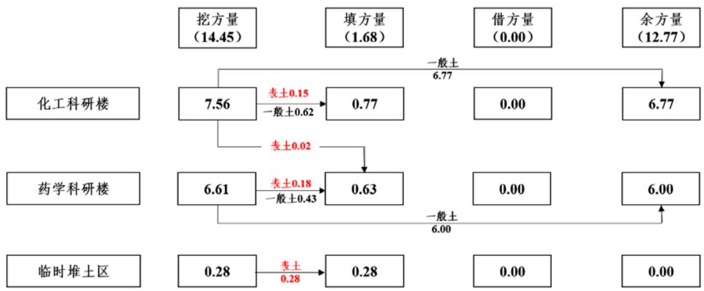
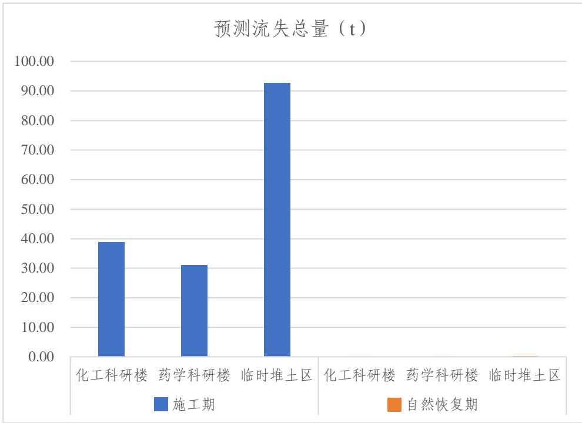
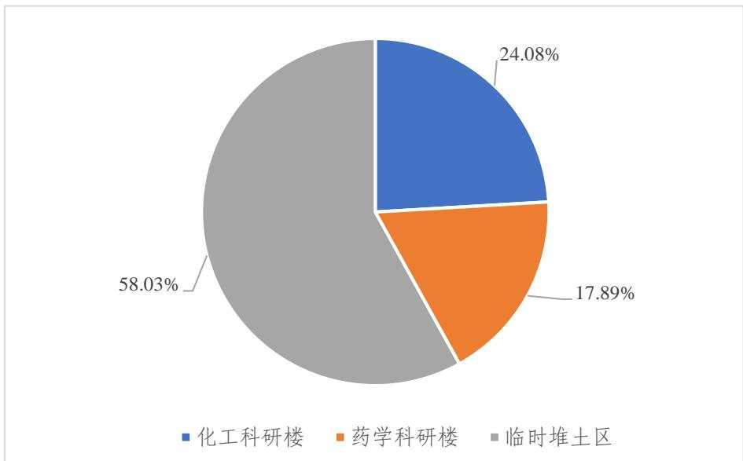
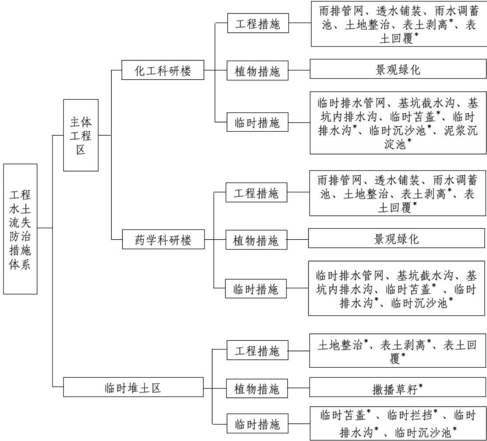

> **Zone C（应用范例层）使用边界**——仅可用于**写作风格、章节展开方式、表达逻辑、表格设计**的参考。
> **不得**用于合规判断；**不得**引入其项目数据（名称／地点／数字／单位名）；
> **不得**因其"曾经通过审批"而推定其做法在当前标准下仍然合规。
> 与 Zone A 冲突时**一律以 Zone A 为准**；Zone A 未明确规定时输出
> 「**Zone A 未明确规定，以下为参考写法，需人工判断**」。
>
> **坐标系警告**：本范例为**老八章结构**（GB 50433—2018 附录B），与 2026 版 10 章模板**同号不同义**
> （老 `1.5`＝防治目标，新 `1.5`＝水土流失预测结果；老 4→新 6 …偏移 +2；新版第 4/5 章老结构无独立章）。
> 因此 **`chapter_mapping: pending`——不得按章节号挂载**，检索一律走 `topic_tags`。
>
> **待加工**：`topic_tags`（主题标签）、`approval_basis_list`（编制依据逐字清单）、
> `structure_summary`（只提取结构：章节展开顺序／段落功能／表格栏目结构／句式模板／论证链步骤）。

1 综合说明 ........  
1.1 项目简况..  
1.2 编制依据...  
1.3 设计水平年.....  
1.4 水土流失防治责任范围..  
1.5 水土流失防治目标....  
1.6 项目水土保持评价结论... ... 8  
1.7 水土流失预测结果... ... 10  
1.8 水土保持措施布设成果.. ..... 10  
1.9 水土保持监测方案...... ... 13  
1.10 水土保持投资及效益分析成果... .... 13  
1.11 结论... ... 14  
2 项目概况 ....... ...... 16  
2.1 项目组成及工程布置... .... 16  
2.2 施工组织... ... 27  
2.3 工程占地.... .... 34  
2.4 土石方平衡.... ... 35  
2.5 拆迁（移民）安置与专项设施改（迁）建.... .... 45  
2.6 施工进度.... .... 45  
2.7 自然概况.... .... 48  
3 项目水土保持评价..... ..... 53  
3.1 主体工程选址（线）水土保持评价... ... 53  
3.2 建设方案与布局水土保持评价... ... 55  
3.3 主体工程设计中水土保持措施界定... .... 63  
4 水土流失分析与预测..... ...... 66  
4.1 水土流失现状... ... 66  
4.2 水土流失影响因素分析... ... 66  
4.3 土壤流失量预测... .... 67  
4.4 水土流失危害分析.... .... 86  
4.5 指导性意见... .... 87  
5 水土保持措施 ....... ...... 89  
5.1 防治区划分.. .... 89  
5.2 措施总体布局... .... 90  
5.3 分区措施布设... .... 92  
5.4 施工要求.... ... 108  
6 水土保持监测 ..... ...... 112  
6.1 范围和时段... .... 112  
6.2 内容和方法.... .... 112  
6.3 点位布设.... ... 116  
6.4 实施条件和成果... ... 117  
7 水土保持投资估算及效益分析 ......... ............. ...... 121  
7.1 投资估算... ... 121  
7.2 效益分析... ... 132  
8 水土保持管理 ....... ...... 135  
8.1 组织管理... .... 135  
8.2 后续设计.... .... 136  
8.3 水土保持监测... ... 137  
8.4 水土保持监理... ... 137  
8.5 水土保持施工... ... 138  
8.6 水土保持设施验收.. .... 139  
附表：投资估算单价分析表 ..... ..... 142

## 附 件

附件1：《教育部关于南京大学浦口校区化工科研楼项目可行性研究报告的批复》（教发函〔2025〕232号）

附件2：《教育部关于南京大学浦口校区药学科研楼项目可行性研究报告的批复》（教发函〔2025〕234号）

附件3：中华人民共和国不动产权证书（苏2025宁浦不动产权0004600号）

附件4：占地情况说明

附件5：土方工程承诺函

附件 6：委托函

## 附图：

附图1 项目地理位置图

附图2 项目区水系图

附图3 项目区土壤侵蚀强度分布图

附图4 江苏省水土流失重点预防区和重点治理区区划图

附图5-1 化工科研楼项目总体布置图

附图5-2 药学科研楼项目总体布置图

附图6-1 化工科研楼室外管线综合平面图

附图 6-2 药学科研楼室外管线综合平面图

附图7-1 化工科研楼雨水调蓄池典型布设图

附图7-2 药学科研楼雨水调蓄池典型布设图

附图8 防治责任范围及防治分区图

附图9 表土剥离及回覆范围图

附图10-1 化工科研楼分区防治措施总体布局图（含监测点位）

附图10-2 药学科研楼分区防治措施总体布局图（含监测点位）

附图10-3 临时堆土区分区防治措施总体布局图（含监测点位）

附图11-1 临时沉沙池、临时排水沟典型布设图

附图11-2 临时堆土区防护措施典型布设图

## 1 综合说明

## 1.1 项目简况

## 1.1.1 项目基本情况

## （1）项目建设的必要性

根据南京大学校园总体规划，本项目是南京大学浦口校区的一项重要基本设施，该项目的建立符合南京大学“十四五”总体发展规划及学校“十四五”基本建设规划，能够在一定程度上缓解化工学院及生命科学学院科研用房不足的现状，有助于南京大学“双一流”建设方案推进和高质量学科建设，并使学院的办学和科研条件得到改善。化工科研楼及药学科研楼的建设在促进学科发展、人才培养、区域经济发展以及提升国际影响力方面具有重要的战略意义，将为南京大学化工、药学学科的持续发展提供坚实的平台和保障。因此，南京大学浦口校区化工科研楼、药学科研楼项目的建设是十分必要的。

## （2）方案编制范围及背景

本方案包含南京大学浦口校区化工科研楼项目与南京大学浦口校区药学科研楼项目两个子项。上述项目已由中华人民共和国教育部同期批准立项（立项文号分别为：教发函〔2025〕232号、教发函〔2025〕234号），项目建设单位均为南京大学。本方案对两个项目进行合并编制，申请合并审批。

## （3）项目位置

南京大学浦口校区化工科研楼、药学科研楼项目位于南京市浦口区学府路 8号南京大学浦口校区内。其中：

南京大学浦口校区化工科研楼项目位于校区东南角，北侧为玉辉楼，西临校园主干道金陵大道（东），南侧紧邻学府渠、学府路，东侧为校外商业综合体，地块中心经纬度为：东经 118°42'36″，北纬 32°10'29″；

南京大学浦口校区药学科研楼项目位于校区西南角，北侧为校园内现有多层建筑，东临校园主干道金陵大道（西），南侧紧邻学府渠、学府路，西侧为校外高层住宅。地块中心经纬度为：东经 118°42'05″，北纬32°10'29″；

## （4）项目建设性质、规模、组成

本项目建设性质为新建建设类项目。建设规模及内容如下：

南京大学浦口校区化工科研楼项目规划用地面积 $1 3 7 9 2 . 1 9 \mathrm { m } ^ { 2 }$ ，总建筑面积55907m2，其中地上建筑面积 $4 7 1 3 0 \mathrm { m } ^ { 2 }$ ，地下建筑面积 $8 7 7 7 \mathrm { m } ^ { 2 }$ ，容积率3.44，建筑密度 40.93%，绿地率 19.83%，设置机动车停车位 95 辆，非机动车停车位 99辆。主要建设内容为科研用房、设备用房、人防地下车库等。

南京大学浦口校区药学科研楼项目规划用地面积 18856.47m2，总建筑面积60917m2，其中地上建筑面积 51910m2，地下建筑面积 9007m2，容积率 2.65，建筑密度41.48%，绿地率 18.59%，设置机动车停车位118辆，非机动车停车位75辆。主要建设内容为科研用房、设备用房、人防地下车库等。

工程总占地面积 $4 . 2 7 \mathrm { h m } ^ { 2 }$ ，其中永久占地 $3 . 2 7 \mathrm { h m } ^ { 2 }$ ，临时占地 $1 . 0 0 \mathrm { h m } ^ { 2 }$ 。占地类型均为教育用地。其中：化工科研楼项目占地面积 $1 . 3 8 \mathrm { h m } ^ { 2 }$ ，药学科研楼项目占地面积 $1 . 8 9 \mathrm { h m } ^ { 2 }$ ，临时堆土区占地面积 $1 . 0 0 \mathrm { h m } ^ { 2 }$ ，为两项目共用。

本项目建设过程中土石方挖填总量为16.13万m3，其中挖方14.45万 $\mathrm { m } ^ { 3 }$ （含表土 0.63 万 m3，泥浆量 2.54 万 m3），填方 1.68 万 $\mathrm { m } ^ { 3 }$ （含表土 0.63 万m3），余方 12.77 万 m3，无借方。本项目填方均利用自身挖方，多余土方进行外运处理，建设单位已承诺土方外运前明确施工及运输单位，落实渣土弃置地点，并严格监督实施单位落实相关法规要求，取得城市管理部门核发的渣土处置许可证。

## （5）施工组织

项目布置施工生产生活区 2 处，总占地面积 0.25hm2，均位于红线范围内，分别占用化工科研楼项目、药学科研楼项目道路广场面积。项目布置临时堆土区1 处，占地面积 $1 . 0 0 \mathrm { h m } ^ { 2 }$ ，位于红线范围外，临时占用浦口校区内东北角闲置地块面积。施工用水用电均由校园管网接入，施工雨水、污水经沉淀处理后分别排入校园雨水、污水管网。

## （6）拆迁（移民）安置与专项设施改（迁）建

本项目为划拨用地，工程占地均位于《中华人民共和国不动产权证书》（苏2025宁浦不动产权0004600号）用地文件范围内。根据工程建设要求，需对场地内的树木进行移栽，其中化工科研楼约50棵树木，药学科研楼约35棵树木，树木迁移相关手续正在同步办理中。

## （7）施工进度

南京大学浦口校区化工科研楼项目计划于2026年4月开工建设，于 2029年3 月完工，总工期36个月；

南京大学浦口校区药学科研楼项目计划于2026年6月开工建设，于 2029年5 月完工，总工期36个月。

## （8）工程投资

南京大学浦口校区化工科研楼项目工程总投资 55458 万元，其中土建投资47228 万元；

南京大学浦口校区药学科研楼项目工程总投资 59913 万元，其中土建投资51332 万元。

## 1.1.2 项目前期工作情况

本项目建设单位均为南京大学，设计单位均为南京大学建筑规划设计研究院有限公司。

2025年1月22日，南京大学取得了《中华人民共和国不动产权证书》（苏  
2025宁浦不动产权0004600号），南京大学浦口校区宗地面积为674059.6m2；

2025 年 4 月，南京大学建筑规划设计研究院有限公司编制完成了《南京大学浦口校区化工科研楼项目可行性研究报告》、《南京大学浦口校区药学科研楼项目可行性研究报告》；

2025年5月 20日，中华人民共和国教育部出具了《教育部关于南京大学浦口校区化工科研楼项目可行性研究报告的批复》（教发函〔2025〕232号）、《教育部关于南京大学浦口校区药学科研楼项目可行性研究报告的批复》（教发函〔2025〕234 号）。

根据《中华人民共和国水土保持法》、《江苏省水土保持条例》等法律法规的规定，南京大学于2025年10月委托北京林丰源生态环境规划设计院有限公司承担《南京大学浦口校区化工科研楼、药学科研楼项目水土保持方案报告书》的编制工作。接到委托后，北京林丰源生态环境规划设计院有限公司成立了项目组，于 2025年10月组织项目组技术人员对本工程现场进行了查勘，收集了工程区有关自然环境、社会经济和水土保持等方面的资料，在分析研究的基础上，按照《生产建设项目水土保持技术标准》（GB50433-2018）的要求，于2025年11月编制完成了《南京大学浦口校区化工科研楼、药学科研楼项目水土保持方案报告书》。

## 1.1.3 自然简况

本项目地貌区属于宁镇扬丘陵岗地\~平原区，地貌单元为岗地。化工科研楼项目场地标高在 17.59\~18.33m 之间，药学科研楼场地标高在 24.60\~25.68m 之间。场区内无不良地质现象，构造体系隶属于淮阳山字型东翼构造带，岩性为白垩纪及第三纪红色岩及侏罗\~白垩纪火山岩。项目所在区域属北亚热带季风气候区，多年平均气温 $1 5 . 4 \mathrm { { } ^ { \circ } C }$ （1962-2023，浦口站），大于等于 $1 0 ^ { \circ } \mathrm { C } .$ 年积温 $5 2 3 1 ^ { \circ } \mathrm { C }$ ，多年平均年水面蒸发量950mm，多年平均降雨量1095mm（1962-2023，浦口站）。多年平均风速 3.6m/s，大风日数 14.1d，年均日照 1987h，无霜期约 223\~226d，最大冻土深度9cm。化工科研楼项目场地南侧为学府渠，属于二级河道，项目红线退让学府渠 4.0m，地库轮廓线退让学府渠 12.50m，符合相关河道保护要求。项目区土壤类型为黄棕壤，植被类型为亚热带常绿阔叶林。浦口区林草覆盖率约为 42.75%，化工科研楼项目林草覆盖率约为 70%，药学科研楼项目林草覆盖率约为50%。项目区土壤侵蚀模数背景值为270.30t/km2·a。

根据《土壤侵蚀分类分级标准》（SL190-2007），项目区所属土壤侵蚀一级类型区为水力侵蚀类型区，二级类型区为南方红壤丘陵区，三级类型区为长江中下游平原区，水土流失类型为水力侵蚀，容许土壤流失量为 $5 0 0 0 0 / \mathrm { k m } ^ { 2 }$ ·a。项目区位于南京市浦口区沿江街道，根据《全国水土保持规划（2015-2030 年）》，项目区不属于国家级水土流失重点预防区和重点治理区。根据《江苏省水土保持规划（2015-2030）》，项目所在区域属于江苏省水土流失重点预防区。根据《江苏省水土保持公报（2023）》，项目区土壤侵蚀强度为微度。根据《江苏省生态空间管控区域规划》（苏政发〔2020〕1 号），项目区不涉及饮用水源保护区、水功能区一级保护区和保留区、自然保护区、风景名胜区、地质公园、森林公园以及重要湿地等。本项目不涉及河湖管理范围。

## 1.2 编制依据

## 1.2.1 法律法规、规章及规范性文件

（1）《中华人民共和国水土保持法》（2010年12月25日修订通过，2011年3月1日起施行）；

（2）《江苏省水土保持条例》（2021年9月29日修正，自公布之日起施行）；

（3）《江苏省生产建设项目水土保持管理办法》（2021年12月27日苏水规〔2021〕8号公布，2022年2月1日起施行）；

（4）《南京市水土保持办法》（2015年11月17日南京市政府令313号发布，2015年12月20日期施行）；

（5）《水利部办公厅关于印发生产建设项目水土保持技术文件编写和印制格式规定（试行）的通知》（办水保〔2018〕135号，2018年7月12日）；

（6）《生产建设项目水土保持方案管理办法》（2023年1月17日水利部令第53号发布）。

## 1.2.2 技术标准

（1）《生产建设项目水土保持技术标准》（GB50433-2018）；

（2）《生产建设项目水土流失防治标准》（GB/T50434-2018）；

（3）《水土保持工程设计规范》（GB51018-2014）；

（4）《土地利用现状分类标准》（GB/T21010-2017）；

（5）《土壤侵蚀分类分级标准》（SL190-2007）；

（6）《生产建设项目水土保持监测与评价标准》（GB/T51240-2018）；

（7）《水利水电工程制图标准 水土保持图》（SL73.6-2015）；

（8）《生产建设项目土壤流失量测算导则》（SL773-2018）；

（9）《水土保持工程调查与勘测标准》（GB/T51297-2018）；

（10）《水土保持监测技术规范》（SL/T277-2024）；

（11）《水土保持监理规范》（SL/T523—2024）；

（12）《表土剥离及其再利用技术要求》（GB/T45107-2024）。

## 1.2.3 技术资料

（1）《南京市建设工程材料市场信息价格》（2025年10月）；

（2）《南京市水土保持规划（2016-2030年）》；

（3）《南京大学浦口校区化工科研楼岩土工程详细勘察报告》（南京大学建筑规划设计研究院有限公司，2025年9月）；

（4）《南京大学浦口校区药学科研楼岩土工程详细勘察报告》（南京大学建筑规划设计研究院有限公司，2025年9月）；

（5）《南京大学浦口校区化工科研楼项目可行性研究报告》（南京大学建筑规划设计研究院有限公司，2025年4月）；

（6）《南京大学浦口校区药学科研楼项目可行性研究报告》（南京大学建筑规划设计研究院有限公司，2025年4月）；

（7）《南京大学浦口校区化工科研楼项目施工图》（南京大学建筑规划设计研究院有限公司，2025年9月）；

（8）《南京大学浦口校区药学科研楼项目施工图》（南京大学建筑规划设计研究院有限公司，2025年9月）；

（9）工程涉及的其他相关技术资料。

## 1.3 设计水平年

设计水平年指主体工程完工后，方案确定的水土保持措施实施完毕并初步发挥效益的时间，建设类项目为主体工程完工后当年或后一年。

南京大学浦口校区化工科研楼项目计划于2026年4月开工建设，于 2029年3 月完工，总工期 36 个月；南京大学浦口校区药学科研楼项目计划于 2026 年 6月开工建设，于 2029年5月完工，总工期 36个月。综合确定本方案设计水平年为两项目完工当年，即2029年。

## 1.4 水土流失防治责任范围

生产建设项目水土流失防治责任范围应包括项目永久征地、临时占地（含租赁土地） 以及其他使用与管辖区域。本项目占地面积4.27hm2，其中永久占地$3 . 2 7 \mathrm { h m } ^ { 2 }$ ，临时占地1.00hm2。因此本项目的水土流失防治责任范围为4.27hm2。

表1.4-1 水土流失防治责任范围面积（单位：hm2）
<table><tr><td rowspan=2 colspan=2>防治分区</td><td rowspan=1 colspan=2>占地性质</td><td rowspan=2 colspan=1>防治责任范围</td></tr><tr><td rowspan=1 colspan=1>永久占地</td><td rowspan=1 colspan=1>临时占地</td></tr><tr><td rowspan=2 colspan=1>主体工程区</td><td rowspan=1 colspan=1>化工科研楼</td><td rowspan=1 colspan=1>1.38</td><td rowspan=1 colspan=1>1</td><td rowspan=1 colspan=1>1.38</td></tr><tr><td rowspan=1 colspan=1>药学科研楼</td><td rowspan=1 colspan=1>1.89</td><td rowspan=1 colspan=1>1</td><td rowspan=1 colspan=1>1.89</td></tr><tr><td rowspan=1 colspan=2>临时堆土区</td><td rowspan=1 colspan=1>1</td><td rowspan=1 colspan=1>1.00</td><td rowspan=1 colspan=1>1.00</td></tr><tr><td rowspan=1 colspan=2>合计</td><td rowspan=1 colspan=1>3.27</td><td rowspan=1 colspan=1>1.00</td><td rowspan=1 colspan=1>4.27</td></tr></table>

## 1.5 水土流失防治目标

## 1.5.1 执行标准等级

本项目位于南京市浦口区沿江街道，根据《土壤侵蚀分类分级标准》（SL190-2007），项目区属于全国一级水力侵蚀类型区—南方红壤区。根据《全国水土保持规划（2015-2030 年）》，项目区不属于国家级水土流失重点预防区和重点治理区。根据《江苏省水土保持规划（2015-2030）》，项目区属于江苏省水土流失重点预防区。根据《生产建设项目水土流失防治标准》（GB/T50434-2018），应执行南方红壤区一级标准。

## 1.5.2 防治目标

根据本项目的建设特点、工程区环境现状等，明确本工程水土流失防治的基本目标为：

1、项目建设范围内的新增水土流失应得到有效控制，原有水土流失得到治理；

2、水土保持设施应安全有效；

3、水土资源、林草植被应得到最大限度的保护与恢复；

4、水土流失治理度、土壤流失控制比、渣土防护率、表土保护率、林草植被恢复率、林草覆盖率六项指标应符合现行国家标准《生产建设项目水土流失防治标准》GB/T50434-2018 的规定。

本项目水土流失防治指标值见表1.5。

表1.5-1 水土流失防治指标值
<table><tr><td rowspan=2 colspan=1>防治指标</td><td rowspan=1 colspan=2>一级标准防治目标值</td><td rowspan=1 colspan=1>按土壤侵蚀强度修正</td><td rowspan=1 colspan=1>按项目位置修正</td><td rowspan=1 colspan=2>防治目标</td></tr><tr><td rowspan=1 colspan=1>施工期</td><td rowspan=1 colspan=1>试运行期</td><td rowspan=1 colspan=1>微度</td><td rowspan=1 colspan=1>江苏省水土流失重点预防区</td><td rowspan=1 colspan=1>施工期</td><td rowspan=1 colspan=1>设计水平年</td></tr><tr><td rowspan=1 colspan=1>水土流失治理度(%)</td><td rowspan=1 colspan=1>一</td><td rowspan=1 colspan=1>98</td><td rowspan=1 colspan=1></td><td rowspan=1 colspan=1></td><td rowspan=1 colspan=1>一</td><td rowspan=1 colspan=1>98</td></tr><tr><td rowspan=1 colspan=1>土壤流失控制比</td><td rowspan=1 colspan=1>一</td><td rowspan=1 colspan=1>0.90</td><td rowspan=1 colspan=1>+0.10</td><td rowspan=1 colspan=1></td><td rowspan=1 colspan=1>一</td><td rowspan=1 colspan=1>1.0</td></tr><tr><td rowspan=1 colspan=1>渣土防护率(%)</td><td rowspan=1 colspan=1>95</td><td rowspan=1 colspan=1>97</td><td rowspan=1 colspan=1></td><td rowspan=1 colspan=1>+2</td><td rowspan=1 colspan=1>97</td><td rowspan=1 colspan=1>99</td></tr><tr><td rowspan=1 colspan=1>表土保护率(%)</td><td rowspan=1 colspan=1>92</td><td rowspan=1 colspan=1>92</td><td rowspan=1 colspan=1></td><td rowspan=1 colspan=1></td><td rowspan=1 colspan=1>92</td><td rowspan=1 colspan=1>92</td></tr><tr><td rowspan=1 colspan=1>林草植被恢复率(%)</td><td rowspan=1 colspan=1>一</td><td rowspan=1 colspan=1>98</td><td rowspan=1 colspan=1></td><td rowspan=1 colspan=1></td><td rowspan=1 colspan=1>一</td><td rowspan=1 colspan=1>98</td></tr><tr><td rowspan=1 colspan=1>林草覆盖率(%)</td><td rowspan=1 colspan=1>一</td><td rowspan=1 colspan=1>25</td><td rowspan=1 colspan=1></td><td rowspan=1 colspan=1>+2</td><td rowspan=1 colspan=1>一</td><td rowspan=1 colspan=1>27</td></tr></table>

本方案防治指标值按以下规定进行修正：

1、生产期新增扰动范围的防治指标值不应低于施工期指标值，其它区域不应低于设计水平年指标值；

2、土壤流失控制比在轻度侵蚀为主的区域应不小于 1，中度以上侵蚀为主的区域可降低0.1～0.2，本项目位于微度侵蚀区域，土壤流失控制比修正为 1.0；

3、本项目位于城市区域，渣土防护率提高 2 个百分点，设计水平年防治目标修正为 99%；

4、本项目属于江苏省水土流失重点预防区，林草覆盖率提高 2 个百分点，设计水平年防治目标修正为27%。

## 1.6 项目水土保持评价结论

## 1.6.1 主体工程选址（线）评价

通过对《中华人民共和国水土保持法》、《江苏省水土保持条例》及《生产建设项目水土保持技术标准》中的限制条件进行对照，本项目所在区域不属于水土流失严重、生态脆弱的地区，不涉及崩塌、滑坡危险区和泥石流易发区。项目区不涉及国家级“两区”，不涉及饮用水水源保护区、水功能一级区的保护区和保留区、自然保护区、世界文化和自然遗产地、风景名胜区、地质公园、森林公园、重要湿地、河湖管理范围、生态保护红线等敏感区。项目区涉及江苏省水土流失重点预防区，选址唯一，无法避让，方案已按照相关法律法规及技术标准优化水土流失防治指标值。工程建设区不涉及河流两岸、湖泊和水库周边，不涉及占用全国水土保持监测网络中的水土保持监测站点、重点试验区及国家确定的水土保持长期定位观测站等。

综上，主体工程选址（线）无明显水土保持制约性因素。

## 1.6.2 建设方案与布局评价

（1）建设方案评价：项目位于城镇区，化工科研楼项目绿地率达 19.83%，药学科研楼绿地率达 18.59%，景观效果优美，符合浦口校区总体规划要求。主体工程已优化设计方案，结合四周道路、周边地形地貌、排水汇流情况进行设计。项目雨污水管网系统建设完善，室外雨水经雨水口、雨水管收集后汇入雨水调蓄池利用，多余部分排入校园雨水管网。主体工程已配套设计雨水调蓄池、透水铺装等综合雨水系统，可实现雨水资源化利用。项目建设方案可行，符合水土保持要求；

（2）工程占地评价：项目总占地面积 4.27hm2，其中永久占地3.27hm2，临时占地 1.00hm2。项目占地类型均为教育用地，均位于南京大学浦口校区内。项目用地性质符合规划要求，建筑密度、容积率、绿地率符合行业用地指标规定。本工程占地配置合理，区内给排水、供电、交通等布局完善。施工便道与区内永久道路结合布设。施工生产生活区布置于项目永久占地内，可减少红线外临时用地。临时堆土区利用校区内闲置地块，两项目根据施工时序可轮流共用，减少了工程临时占地。工程占地数量、面积可满足本项目建设需求，符合水土保持要求；

（3）土石方平衡评价：项目各分区土石方挖填借余量合理，已对区域内表土资源设计剥离保护措施，剥离表土均用于自身回覆。土石方以挖方为主，填方均利用自身挖方，无借方。项目挖填方主要来源于场地平整、桩基施工、基坑开挖、土方回填及管沟挖填等，除场地平整、管沟开挖土方就地利用外，其余挖方调运至临时堆土区存放，后续进行外运处置。项目布置临时堆土区1处，选址合理，堆土量可满足施工需求。工程土石方调配合理，不存在多次倒运，符合水土保持要求；

（4）取土（石、砂）场设置评价：本项目不涉及取土（石、砂）场；

（5）弃土（石、渣、灰、矸石、尾矿）场设置评价：本项目不涉及弃土（石、渣、灰、矸石、尾矿）场；

（6）施工方法与工艺评价：本项目施工场地不涉及基本农田区。施工道路与永久道路结合布设，有助于减少场地二次开挖及扰动，降低对周边环境的影响。项目施工跨越雨季，主体工程已设计基坑降水、集水井等施工降水综合利用措施。基坑开挖、基坑排水、道路施工、管线铺设等施工方法与工艺明确，对工程建设的水土保持工作起到积极作用。建议进一步优化施工时序，合理安排施工工期，尽量将扰动大的工程安排在非雨日施工；

（7）具有水土保持功能工程的评价：主体工程设计的雨排管网、地面硬化、透水铺装、雨水调蓄池、土地整治、景观绿化、临时排水管网、基坑截水沟、基坑内排水沟等措施具有水土保持功能，相关设计满足《水土保持工程设计规范》（GB 51018-2014）、《室外排水设计标准》（GB50014-2021）的设计要求，能在一定程度上减少工程建设过程中可能造成的水土流失。但项目各防治分区水土保持措施及其工程量尚不完善，本方案根据各防治分区施工建设过程中的水土流失特点，补充设计表土剥离、表土回覆、土地整治、撒播草籽、临时苫盖、临时排水沟、临时沉沙池、泥浆沉淀池、临时拦挡等防治措施，实施后可达到本工程水土流失防治标准，有效防治水土流失。

因此，本项目建设方案可行，布局合理，符合水土保持要求。

## 1.7 水土流失预测结果

本项目可能造成土壤流失总量为 162.90t，其中背景流失量为 3.06t，新增土壤流失量为 159.84t。根据水土流失预测结果，工程建设过程中产生水土流失的重点时段为施工期，重点部位为主体工程区和临时堆土区。

本项目建设过程中如不采取积极有效的水土保持措施，将有可能造成如下水土流失危害：影响项目施工安全；淤积周边排水系统（或城市管网），造成局部区域内涝；影响区域生态环境等。

## 1.8 水土保持措施布设成果

针对本项目建设过程中的水土流失特点，结合总体布局、施工布置、施工工艺、施工时序等因素进行水土流失防治区的划分，将工程建设区划分为 2个一级防治分区，分别为主体工程区、临时堆土区。其中主体工程区下分化工科研楼、药学科研楼2个二级防治分区。

本项目水土流失防治措施体系由主体工程已有水土保持措施和方案新增水土保持措施组成，按照防治分区进行了布设，布设情况见表1.8-1。

表1.8-1 水土保持措施布设情况一览表
<table><tr><td rowspan=1 colspan=2>防治分区</td><td rowspan=1 colspan=1>措施类型</td><td rowspan=1 colspan=1>防治措施</td><td rowspan=1 colspan=2>结构形式</td><td rowspan=1 colspan=2>单位</td><td rowspan=1 colspan=1>工程量</td><td rowspan=1 colspan=1>实施时段</td><td rowspan=1 colspan=1>备注</td></tr><tr><td rowspan=25 colspan=2>化工科研主体楼工程区</td><td rowspan=11 colspan=1>工程措施</td><td rowspan=6 colspan=1>雨排管网</td><td rowspan=6 colspan=1>钢筋混凝土管</td><td rowspan=1 colspan=1>DN300</td><td rowspan=2 colspan=2></td><td rowspan=1 colspan=1>233</td><td rowspan=6 colspan=1>2028.09~2028.10</td><td rowspan=6 colspan=1>主体已有</td></tr><tr><td rowspan=2 colspan=1>DN400</td><td rowspan=2 colspan=1></td><td rowspan=2 colspan=1></td><td rowspan=2 colspan=1>77</td></tr><tr><td rowspan=1 colspan=2></td></tr><tr><td rowspan=2 colspan=1>DN500</td><td rowspan=1 colspan=2></td><td rowspan=2 colspan=1></td><td rowspan=2 colspan=1>155</td></tr><tr><td rowspan=1 colspan=2></td></tr><tr><td rowspan=1 colspan=1>DN600</td><td rowspan=1 colspan=2></td><td rowspan=1 colspan=1>15</td></tr><tr><td rowspan=1 colspan=1>透水铺装</td><td rowspan=1 colspan=2>透水砖</td><td rowspan=1 colspan=2>m²</td><td rowspan=1 colspan=1>170.9</td><td rowspan=1 colspan=1>2028.11~2028.12</td><td rowspan=1 colspan=1>主体已有</td></tr><tr><td rowspan=1 colspan=1>雨水调蓄池</td><td rowspan=1 colspan=2>PP模块</td><td rowspan=1 colspan=2>T</td><td rowspan=1 colspan=1>247.8</td><td rowspan=1 colspan=1>2026.11~2026.12</td><td rowspan=1 colspan=1>主体已有</td></tr><tr><td rowspan=1 colspan=1>土地整治</td><td rowspan=1 colspan=2>场地清理、平整等</td><td rowspan=1 colspan=2>hm²</td><td rowspan=1 colspan=1>0.27</td><td rowspan=1 colspan=1>2029.01~2029.02</td><td rowspan=1 colspan=1>主体已有</td></tr><tr><td rowspan=1 colspan=1>表土剥离</td><td rowspan=1 colspan=2>剥离厚度0.20m</td><td rowspan=1 colspan=2>万m³</td><td rowspan=1 colspan=1>0.17</td><td rowspan=1 colspan=1>2026.04</td><td rowspan=1 colspan=1>方案新增</td></tr><tr><td rowspan=1 colspan=1>表土回覆</td><td rowspan=1 colspan=2>回覆厚度0.56m</td><td rowspan=1 colspan=2>万m³</td><td rowspan=1 colspan=1>0.15</td><td rowspan=1 colspan=1>2029.01</td><td rowspan=1 colspan=1>方案新增</td></tr><tr><td rowspan=1 colspan=1>植物措施</td><td rowspan=1 colspan=1>景观绿化</td><td rowspan=1 colspan=2>乔灌草绿化</td><td rowspan=1 colspan=2>hm²</td><td rowspan=1 colspan=1>0.27</td><td rowspan=1 colspan=1>2029.01~2029.02</td><td rowspan=1 colspan=1>主体已有</td></tr><tr><td rowspan=7 colspan=1>临时措施</td><td rowspan=1 colspan=1>临时排水管网</td><td rowspan=1 colspan=2>De200UPVC管</td><td rowspan=1 colspan=2>m</td><td rowspan=1 colspan=1>70</td><td rowspan=1 colspan=1>2026.04</td><td rowspan=1 colspan=1>主体已有</td></tr><tr><td rowspan=1 colspan=1>基坑截水沟</td><td rowspan=1 colspan=2>底宽0.30m，深0.30m 砖砌</td><td rowspan=1 colspan=2>m</td><td rowspan=1 colspan=1>380</td><td rowspan=1 colspan=1>2026.06~2026.07</td><td rowspan=1 colspan=1>主体已有</td></tr><tr><td rowspan=1 colspan=1>基坑内排水沟</td><td rowspan=1 colspan=2>底宽0.30m，深0.20m 砖砌</td><td rowspan=1 colspan=2>m</td><td rowspan=1 colspan=1>350</td><td rowspan=1 colspan=1>2026.06~2026.07</td><td rowspan=1 colspan=1>主体已有</td></tr><tr><td rowspan=1 colspan=1>临时苫盖</td><td rowspan=1 colspan=2>6 针防尘网</td><td rowspan=1 colspan=2>m²</td><td rowspan=1 colspan=1>13800</td><td rowspan=1 colspan=1>2026.04~2029.01</td><td rowspan=1 colspan=1>方案新增</td></tr><tr><td rowspan=1 colspan=1>临时排水沟</td><td rowspan=1 colspan=2>底宽0.30m，深0.30m 砖砌</td><td rowspan=1 colspan=2>m</td><td rowspan=1 colspan=1>470</td><td rowspan=1 colspan=1>2026.06~2026.07</td><td rowspan=1 colspan=1>方案新增</td></tr><tr><td rowspan=1 colspan=1>临时沉沙池</td><td rowspan=1 colspan=2>砖砌、混凝土抹面3.0m*1.0m*1.5m</td><td rowspan=1 colspan=2>座</td><td rowspan=1 colspan=1>3</td><td rowspan=1 colspan=1>2026.06~2026.07</td><td rowspan=1 colspan=1>方案新增</td></tr><tr><td rowspan=1 colspan=1>泥浆沉淀池</td><td rowspan=1 colspan=2>6.0m*4.0m*1.5m土质</td><td rowspan=1 colspan=2>座</td><td rowspan=1 colspan=1>1</td><td rowspan=1 colspan=1>2026.05</td><td rowspan=1 colspan=1>方案新增</td></tr><tr><td rowspan=6 colspan=1></td><td rowspan=6 colspan=1>工程措施</td><td rowspan=6 colspan=1>雨排管网</td><td rowspan=6 colspan=1>钢筋混凝土管</td><td rowspan=1 colspan=1>De300</td><td rowspan=1 colspan=2></td><td rowspan=1 colspan=1>317</td><td rowspan=6 colspan=1>2028.11~2028.12</td><td rowspan=6 colspan=1>主体已有</td></tr><tr><td rowspan=2 colspan=1>De400</td><td rowspan=1 colspan=2></td><td rowspan=2 colspan=1></td><td rowspan=2 colspan=1>191</td></tr><tr><td rowspan=1 colspan=2></td></tr><tr><td rowspan=2 colspan=1>De500</td><td rowspan=1 colspan=2>m</td><td rowspan=2 colspan=1></td><td rowspan=2 colspan=1>17</td></tr><tr><td rowspan=1 colspan=2></td></tr><tr><td rowspan=1 colspan=1>De600</td><td rowspan=1 colspan=2></td><td rowspan=1 colspan=1>50</td></tr></table>

<table><tr><td colspan="1" rowspan="12"></td><td colspan="1" rowspan="5"></td><td colspan="1" rowspan="1">透水铺装</td><td colspan="1" rowspan="1">透水砖</td><td colspan="1" rowspan="1">m²</td><td colspan="1" rowspan="1">716.10</td><td colspan="1" rowspan="1">2029.01~2029.02</td><td colspan="1" rowspan="1">主体已有</td></tr><tr><td colspan="1" rowspan="1">雨水调蓄池</td><td colspan="1" rowspan="1">PP模块</td><td colspan="1" rowspan="1">T</td><td colspan="1" rowspan="1">442</td><td colspan="1" rowspan="1">2027.01~2027.02</td><td colspan="1" rowspan="1">主体已有</td></tr><tr><td colspan="1" rowspan="1">土地整治</td><td colspan="1" rowspan="1">场地清理、平整等</td><td colspan="1" rowspan="1">hm²</td><td colspan="1" rowspan="1">0.35</td><td colspan="1" rowspan="1">2029.03~2029.04</td><td colspan="1" rowspan="1">主体已有</td></tr><tr><td colspan="1" rowspan="1">表土剥离</td><td colspan="1" rowspan="1">剥离厚度 0.20m</td><td colspan="1" rowspan="1">万m³</td><td colspan="1" rowspan="1">0.18</td><td colspan="1" rowspan="1">2026.06</td><td colspan="1" rowspan="1">方案新增</td></tr><tr><td colspan="1" rowspan="1">表土回覆</td><td colspan="1" rowspan="1">回覆厚度0.56m</td><td colspan="1" rowspan="1">万m³</td><td colspan="1" rowspan="1">0.20</td><td colspan="1" rowspan="1">2029.02</td><td colspan="1" rowspan="1">方案新增</td></tr><tr><td colspan="1" rowspan="1">植物措施</td><td colspan="1" rowspan="1">景观绿化</td><td colspan="1" rowspan="1">乔灌草绿化</td><td colspan="1" rowspan="1">hm²</td><td colspan="1" rowspan="1">0.35</td><td colspan="1" rowspan="1">2029.03~2029.04</td><td colspan="1" rowspan="1">主体已有</td></tr><tr><td colspan="1" rowspan="6">临时措施</td><td colspan="1" rowspan="1">临时排水管网</td><td colspan="1" rowspan="1">De200UPVC管</td><td colspan="1" rowspan="1">m</td><td colspan="1" rowspan="1">90</td><td colspan="1" rowspan="1">2026.06</td><td colspan="1" rowspan="1">主体已有</td></tr><tr><td colspan="1" rowspan="1">基坑截水沟</td><td colspan="1" rowspan="1">底宽0.30m，深0.30m 砖砌</td><td colspan="1" rowspan="1">m</td><td colspan="1" rowspan="1">460</td><td colspan="1" rowspan="1">2026.09~2026.10</td><td colspan="1" rowspan="1">主体已有</td></tr><tr><td colspan="1" rowspan="1">基坑内排水沟</td><td colspan="1" rowspan="1">底宽0.30m，深0.20m 砖砌</td><td colspan="1" rowspan="1">m</td><td colspan="1" rowspan="1">420</td><td colspan="1" rowspan="1">2026.09~2026.10</td><td colspan="1" rowspan="1">主体已有</td></tr><tr><td colspan="1" rowspan="1">临时苫盖</td><td colspan="1" rowspan="1">6针防尘网</td><td colspan="1" rowspan="1">m²</td><td colspan="1" rowspan="1">18900</td><td colspan="1" rowspan="1">2026.06~2029.02</td><td colspan="1" rowspan="1">方案新增</td></tr><tr><td colspan="1" rowspan="1">临时排水沟</td><td colspan="1" rowspan="1">底宽0.30m，深0.30m 砖砌</td><td colspan="1" rowspan="1">m</td><td colspan="1" rowspan="1">520</td><td colspan="1" rowspan="1">2026.09~2026.10</td><td colspan="1" rowspan="1">方案新增</td></tr><tr><td colspan="1" rowspan="1">临时沉沙池</td><td colspan="1" rowspan="1">砖砌、混凝土抹面3.0m*1.0m*1.5m</td><td colspan="1" rowspan="1">座</td><td colspan="1" rowspan="1">3</td><td colspan="1" rowspan="1">2026.09~2026.10</td><td colspan="1" rowspan="1">方案新增</td></tr><tr><td colspan="1" rowspan="7">临时堆土区</td><td colspan="1" rowspan="3">工程措施</td><td colspan="1" rowspan="1">表土剥离</td><td colspan="1" rowspan="1">剥离厚度0.30m</td><td colspan="1" rowspan="1">万m³</td><td colspan="1" rowspan="1">0.28</td><td colspan="1" rowspan="1">2026.04</td><td colspan="1" rowspan="1">方案新增</td></tr><tr><td colspan="1" rowspan="1">表土回覆</td><td colspan="1" rowspan="1">回覆厚度0.30m</td><td colspan="1" rowspan="1">万m³</td><td colspan="1" rowspan="1">0.28</td><td colspan="1" rowspan="1">2029.02</td><td colspan="1" rowspan="1">方案新增</td></tr><tr><td colspan="1" rowspan="1">土地整治</td><td colspan="1" rowspan="1">场地清理、平整等</td><td colspan="1" rowspan="1">hm²</td><td colspan="1" rowspan="1">1.00</td><td colspan="1" rowspan="1">2029.02</td><td colspan="1" rowspan="1">方案新增</td></tr><tr><td colspan="1" rowspan="1">植物措施</td><td colspan="1" rowspan="1">撒播草籽</td><td colspan="1" rowspan="1">狗牙根</td><td colspan="1" rowspan="1">hm²</td><td colspan="1" rowspan="1">1.00</td><td colspan="1" rowspan="1">2029.02</td><td colspan="1" rowspan="1">方案新增</td></tr><tr><td colspan="1" rowspan="3">临时措施</td><td colspan="1" rowspan="1">临时苫盖</td><td colspan="1" rowspan="1">土工布</td><td colspan="1" rowspan="1">m²</td><td colspan="1" rowspan="1">10000</td><td colspan="1" rowspan="1">2026.04~2029.01</td><td colspan="1" rowspan="1">方案新增</td></tr><tr><td colspan="1" rowspan="1">临时拦挡</td><td colspan="1" rowspan="1">挡土编织袋底宽1.2m×顶宽0.60m×高度×0.80m</td><td colspan="1" rowspan="1">m³</td><td colspan="1" rowspan="1">288</td><td colspan="1" rowspan="1">2026.04~2029.01</td><td colspan="1" rowspan="1">方案新增</td></tr><tr><td colspan="1" rowspan="1">临时排水沟</td><td colspan="1" rowspan="1">土质</td><td colspan="1" rowspan="1">m</td><td colspan="1" rowspan="1">400</td><td colspan="1" rowspan="1">2026.04~2026.05</td><td colspan="1" rowspan="1">方案新增</td></tr><tr><td rowspan="2"></td><td rowspan="2"></td><td></td><td>底宽0.30m，顶 宽0.90m，深 0.30m</td><td></td><td></td><td></td><td></td></tr><tr><td>临时沉沙 池</td><td>砖砌、混凝土抹 面 3.0m*1.0m*1.5m</td><td>座</td><td>1</td><td>2026.04~2026.05</td><td>方案 新增</td></tr></table>

## 1.9 水土保持监测方案

（1）监测内容：水土流失自然影响因素、项目扰动土地情况、取土（石、料）及弃土（石、渣）情况、水土流失状况、水土流失防治成效以及水土流失危害等；

（2）监测时段：2026年4月至2029年12月，共计45个月；

（3）监测范围：本项目监测范围包括主体工程区、临时堆土区 2 个监测分区，其中主体工程区下分化工科研楼、药学科研楼 2个二级分区，监测范围总面积4.27hm²。重点监测区域为主体工程区、临时堆土区。

（3）监测方法：调查监测、定位观测、遥感监测；

（4）监测点位布设：本项目共布设监测点位 5 处。其中主体工程区 4 处，包含化工科研楼2处（1#监测点，集沙池法；2#监测点，抽样调查法），药学科研楼2处（3#监测点，集沙池法；4#监测点，抽样调查法）；临时堆土区1处（5#监测点，集沙池法）。其他区域通过现场巡查，不布设专门的监测点。

## 1.10 水土保持投资及效益分析成果

本项目水土保持工程总投资292.09万元，工程措施投资84.64万元，植物措施投资78.86万元，监测措施费29.40万元，施工临时工程投资39.82万元，独立费用32.82万元（含水土保持监理费14.00万元），基本预备费26.55万元，水土保持补偿费免征。

本方案实施后至设计水平年，本项目水土流失治理度达到99.77%，土壤流失控制比达到1.85，渣土防护率达到99.37%，表土保护率达到98.41%，林草植被恢复率达到99.38%，林草覆盖率达37.70%。可治理水土流失面积4.26hm²，建设植被面积1.61hm²，可减少土壤流失量约132.80t。

## 1.11 结论

本项目工程建设选址不存在水土保持制约性因素，建设方案及布局合理可行，已尽可能节约用地和减少扰动，项目土石方挖填数量合理，施工方法与工艺明确。本方案已按相关要求补充设计了工程措施、植物措施及临时防护措施，符合水土保持法律法规和技术标准的相关规定。主体设计及本方案新增的水土保持措施实施后，项目工程建设造成的水土流失影响将得到有效控制，达到本工程水土流失防治标准，实现保护生态环境的目的。因此，从水土保持角度分析，本项目建设是可行的。

本方案对从水土保持角度对项目工程设计、施工和建设管理提出以下要求：

（1）主体工程下阶段设计应进一步落实水土保持措施，将本方案新增的措施内容和投资纳入主体。水土保持方案和工程设计产生重大变更的，应按规定报相应行政主管部门批准；

（2）施工单位应严格控制红线施工，减少施工临时占地面积和土石方挖填方量，及时清运施工垃圾，严格按照批复的水土保持方案落实水土保持措施。同时，施工单位应进一步优化施工时序，合理安排施工工期，尽量将扰动大的工程安排在非雨季或非雨日施工；

（3）项目建设应落实好水土保持监理和监测工作。监测单位应依据监测结果和防治标准及时向建设单位反馈，补充完善相应水土保持措施，达到方案要求的防治目标。监理单位应按时进场，对水土保持措施进行全过程的监督管理；

（4）项目工程建设完工后，建设单位须开展水土保持设施的验收工作，验收内容及程序按《江苏省生产建设项目水土保持设施验收管理办法》（苏水规〔2018〕4号）的规定开展。水土保持工程验收不合格的，主体工程不得投入使用。

表1.11-1 项目水土保持方案特性表
<table><tr><td rowspan=1 colspan=3>项目名称</td><td rowspan=1 colspan=4>南京大学浦口校区化工科研楼、药学科研楼项目</td><td rowspan=1 colspan=1>流域管理机构</td><td rowspan=1 colspan=1>长江水利委员会</td></tr><tr><td rowspan=1 colspan=3>涉及省（市、区）</td><td rowspan=1 colspan=1>江苏省</td><td rowspan=1 colspan=1>涉及地市或个数</td><td rowspan=1 colspan=2>南京市</td><td rowspan=1 colspan=1>涉及县或个数</td><td rowspan=1 colspan=1>浦口区</td></tr><tr><td rowspan=1 colspan=2>项目规模</td><td rowspan=1 colspan=2>总建筑面积 116824m²</td><td rowspan=1 colspan=1>总投资(万元)</td><td rowspan=1 colspan=2>115371</td><td rowspan=1 colspan=1>土建投资(万元)</td><td rowspan=1 colspan=1>98560</td></tr><tr><td rowspan=1 colspan=2>动工时间</td><td rowspan=1 colspan=2>2026年4月</td><td rowspan=1 colspan=1>完工时间</td><td rowspan=1 colspan=2>2029年5月</td><td rowspan=1 colspan=1>设计水平年</td><td rowspan=1 colspan=1>2029年</td></tr><tr><td rowspan=1 colspan=3>工程占地（hm²）</td><td rowspan=1 colspan=1>4.27</td><td rowspan=1 colspan=1>永久占地(hm²)</td><td rowspan=1 colspan=2>3.27</td><td rowspan=1 colspan=1>临时占地(hm²)</td><td rowspan=1 colspan=1>1.00</td></tr><tr><td rowspan=2 colspan=4>土石方量(万m³)</td><td rowspan=1 colspan=1>挖方</td><td rowspan=1 colspan=2>填方</td><td rowspan=1 colspan=1>购方</td><td rowspan=1 colspan=1>余方</td></tr><tr><td rowspan=1 colspan=1>14.45</td><td rowspan=1 colspan=2>1.68</td><td rowspan=1 colspan=1>0</td><td rowspan=1 colspan=1>12.77</td></tr><tr><td rowspan=1 colspan=3>重点防治区名称</td><td rowspan=1 colspan=6>江苏省省级水土流失重点预防区</td></tr><tr><td rowspan=1 colspan=3>地貌类型</td><td rowspan=1 colspan=3>岗地</td><td rowspan=1 colspan=2>水土保持区划</td><td rowspan=1 colspan=1>南方红壤区</td></tr><tr><td rowspan=1 colspan=3>土壤侵蚀类型</td><td rowspan=1 colspan=3>水力侵蚀</td><td rowspan=1 colspan=2>土壤侵蚀强度</td><td rowspan=1 colspan=1>微度</td></tr><tr><td rowspan=1 colspan=3>防治责任范围面积(hm²)</td><td rowspan=1 colspan=3>4.27</td><td rowspan=1 colspan=2>容许土壤流失量[t/(km²·a)]</td><td rowspan=1 colspan=1>500</td></tr><tr><td rowspan=1 colspan=3>土壤流失预测总量(t)</td><td rowspan=1 colspan=3>162.90</td><td rowspan=1 colspan=2>新增土壤流失量(t)</td><td rowspan=1 colspan=1>159.84</td></tr><tr><td rowspan=1 colspan=3>水土流失防治标准执行等级</td><td rowspan=1 colspan=6>南方红壤区一级标准</td></tr><tr><td rowspan=3 colspan=1>防治目标</td><td rowspan=1 colspan=2>水土流失治理度(%)</td><td rowspan=1 colspan=3>98</td><td rowspan=1 colspan=2>土壤流失控制比</td><td rowspan=1 colspan=1>1.00</td></tr><tr><td rowspan=1 colspan=2>渣土防护率(%)</td><td rowspan=1 colspan=3>99</td><td rowspan=1 colspan=2>表土保护率(%)</td><td rowspan=1 colspan=1>92</td></tr><tr><td rowspan=1 colspan=2>林草植被恢复率(%)</td><td rowspan=1 colspan=3>98</td><td rowspan=1 colspan=2>林草覆盖率(%)</td><td rowspan=1 colspan=1>27</td></tr><tr><td rowspan=4 colspan=1>防治措施及工程量</td><td rowspan=1 colspan=2>防治分区</td><td rowspan=1 colspan=3>工程措施</td><td rowspan=1 colspan=1>植物措施</td><td rowspan=1 colspan=2>临时措施</td></tr><tr><td rowspan=2 colspan=1>主体工程区</td><td rowspan=1 colspan=1>化工科研楼</td><td rowspan=1 colspan=3>表土剥离 0.17万m³（新增）表土回覆0.15万m³（新增）雨排管网480m（主体）透水铺装170.9m²（主体）雨水调蓄池 247.8T（主体）土地整治 0.27hm²（主体）</td><td rowspan=1 colspan=1>景观绿化0.27hm²（主体）</td><td rowspan=1 colspan=2>临时排水管网70m（主体）基坑截水沟380m（主体）基坑内排水沟350m（主体）临时苫盖13800m²（新增）临时排水沟470m（新增）临时沉沙池3座（新增）泥浆沉淀池1座（新增）</td></tr><tr><td rowspan=1 colspan=1>药学科研楼</td><td rowspan=1 colspan=3>表土剥离 0.18万m³（新增）表土回覆0.20万m³（新增）雨排管网 575m（主体）透水铺装716.10m²（主体）雨水调蓄池442T（主体）土地整治 0.35hm²（主体）</td><td rowspan=1 colspan=1>景观绿化0.35hm²（主体）</td><td rowspan=1 colspan=2>临时排水管网 90m（主体）基坑截水沟460m（主体）基坑内排水沟420m（主体）临时苫盖18900m²（新增）临时排水沟520m（新增）临时沉沙池3座（新增）</td></tr><tr><td rowspan=1 colspan=2>临时堆土区</td><td rowspan=1 colspan=3>表土剥离 0.28万m³（新增）表土剥离 0.28万m³（新增）土地整治1.00hm²（新增）</td><td rowspan=1 colspan=1>撒播草籽1.00hm²（新增）</td><td rowspan=1 colspan=2>临时苫盖10000m²（新增）临时排水沟400m（新增）临时沉沙池1座（新增）临时拦挡288m³（新增）</td></tr><tr><td rowspan=1 colspan=3>投资(万元)</td><td rowspan=1 colspan=3>84.64</td><td rowspan=1 colspan=1>78.86</td><td rowspan=1 colspan=2>39.82</td></tr><tr><td rowspan=1 colspan=3>水土保持总投资(万元)</td><td rowspan=1 colspan=3>292.09</td><td rowspan=1 colspan=1>独立费用(万元)</td><td rowspan=1 colspan=2>32.82</td></tr><tr><td rowspan=1 colspan=3>监理费(万元)</td><td rowspan=1 colspan=1>14.00</td><td rowspan=1 colspan=2>监测费(万元)</td><td rowspan=1 colspan=1>29.40</td><td rowspan=1 colspan=1>补偿费(元)</td><td rowspan=1 colspan=1>免征</td></tr><tr><td rowspan=1 colspan=3>方案编制单位</td><td rowspan=1 colspan=3>北京林丰源生态环境规划设计院有限公司</td><td rowspan=1 colspan=1>建设单位</td><td rowspan=1 colspan=2>南京大学</td></tr><tr><td rowspan=1 colspan=3>法定代表人</td><td rowspan=1 colspan=3>赵云杰</td><td rowspan=1 colspan=1>法定代表人</td><td rowspan=1 colspan=2>谈哲敏</td></tr><tr><td rowspan=1 colspan=3>地址</td><td rowspan=1 colspan=3>北京市海淀区清华东路35号北京林业大学学研中心</td><td rowspan=1 colspan=1>地址</td><td rowspan=1 colspan=2>江苏省南京市栖霞区仙林大道163号</td></tr><tr><td rowspan=1 colspan=3>邮编</td><td rowspan=1 colspan=3>100091</td><td rowspan=1 colspan=1>邮编</td><td rowspan=1 colspan=2>210000</td></tr><tr><td rowspan=1 colspan=3>联系人及电话</td><td rowspan=1 colspan=3>联系人/【已脱敏】</td><td rowspan=1 colspan=1>联系人及电话</td><td rowspan=1 colspan=2>联系人/【已脱敏】</td></tr><tr><td rowspan=1 colspan=3>传真</td><td rowspan=1 colspan=3>010-82837021-8002</td><td rowspan=1 colspan=1>传真</td><td rowspan=1 colspan=2>/</td></tr><tr><td rowspan=1 colspan=3>电子信箱</td><td rowspan=1 colspan=3>【已脱敏邮箱】</td><td rowspan=1 colspan=1>电子信箱</td><td rowspan=1 colspan=2>njude@nju.edu.cn</td></tr></table>

## 2 项目概况

## 2.1 项目组成及工程布置

## 2.1.1 项目基本情况

## 一、南京大学浦口校区化工科研楼项目

项目名称：南京大学浦口校区化工科研楼项目；

项目性质：新建；

行业类别：社会事业类项目；

建设单位：南京大学；

设计单位：南京大学建筑规划设计研究院有限公司；

建设地点：南京市浦口区学府路 8号南京大学浦口校区内东南角，北侧为玉辉楼，西临校园主干道金陵大道（东），南侧紧邻学府渠、学府路，东侧为校外商业综合体；

项目区中心经纬度：东经 118°42'36″，北纬 32°10'29″；

建设规模及内容：规划用地面积13792.19m2，总建筑面积55907m2，其中地上建筑面积47130m2，地下建筑面积8777m2，容积率3.44，建筑密度40.93%，绿地率19.83%，设置机动车停车位95辆，非机动车停车位99辆。主要建设内容为科研用房、设备用房、人防地下车库等。

总投资及土建投资：项目总投资55458万元，其中土建投资47228万元；

建设工期：项目计划于2026 年4月开工建设，于 2029年3月完工，总工期36 个月；

拆迁安置：本项目为划拨土地，场地内现有约50棵树木需进行移栽，正在同步办理相关手续。

工程主要特性见表2.1-1。

表2.1-1 项目经济技术指标表（化工科研楼）
<table><tr><td rowspan=1 colspan=6>一、项目基本情况</td></tr><tr><td rowspan=1 colspan=1>1</td><td rowspan=1 colspan=1>项目名称</td><td rowspan=1 colspan=4>南京大学浦口校区化工科研楼项目</td></tr><tr><td rowspan=1 colspan=1>2</td><td rowspan=1 colspan=1>建设地点</td><td rowspan=1 colspan=4>南京市浦口区学府路8号南京大学浦口校区内东南角（东经118°42&#x27;36″，北纬32°10&#x27;29″）</td></tr><tr><td rowspan=1 colspan=1>3</td><td rowspan=1 colspan=1>建设单位</td><td rowspan=1 colspan=4>南京大学</td></tr><tr><td rowspan=1 colspan=1>4</td><td rowspan=1 colspan=1>工程性质</td><td rowspan=1 colspan=2>新建</td><td rowspan=1 colspan=1>建设工期</td><td rowspan=1 colspan=1>2026.04~2029.03</td></tr><tr><td rowspan=1 colspan=1>5</td><td rowspan=1 colspan=1>建设规模及内容</td><td rowspan=1 colspan=4>规划用地面积13792.19m²，总建筑面积55907m²，其中地上建筑面积47130m²，地下建筑面积8777m²，容积率 3.44，建筑密度40.93%，绿地率19.83%，设置机动车停车位95辆，非机动车停车位99辆。主要建设内容为科研用房、设备用房、人防地下车库等。</td></tr><tr><td rowspan=1 colspan=1>6</td><td rowspan=1 colspan=1>总投资</td><td rowspan=1 colspan=2>55458 万元</td><td rowspan=1 colspan=1>土建投资</td><td rowspan=1 colspan=1>47228 万元</td></tr><tr><td rowspan=1 colspan=6>二、主要经济技术指标</td></tr><tr><td rowspan=1 colspan=1>序号</td><td rowspan=1 colspan=3>项目</td><td rowspan=1 colspan=1>单位</td><td rowspan=1 colspan=1>数值</td></tr><tr><td rowspan=1 colspan=1>1</td><td rowspan=1 colspan=3>规划总用地面积</td><td rowspan=1 colspan=1> $\mathrm { m } ^ { 2 }$ </td><td rowspan=1 colspan=1>13792.19</td></tr><tr><td rowspan=1 colspan=1>2</td><td rowspan=1 colspan=3>总建筑面积</td><td rowspan=1 colspan=1> $\mathrm { m } ^ { 2 }$ </td><td rowspan=1 colspan=1>55907</td></tr><tr><td rowspan=3 colspan=1>其中</td><td rowspan=1 colspan=3>地上建筑面积</td><td rowspan=1 colspan=1> $\mathrm { m } ^ { 2 }$ </td><td rowspan=1 colspan=1>47130</td></tr><tr><td rowspan=1 colspan=3>地下建筑面积</td><td rowspan=1 colspan=1> $\mathrm { m } ^ { 2 }$ </td><td rowspan=1 colspan=1>8777</td></tr><tr><td rowspan=1 colspan=3>其中：人防建筑面积</td><td rowspan=1 colspan=1> $\mathrm { m } ^ { 2 }$ </td><td rowspan=1 colspan=1>4822</td></tr><tr><td rowspan=1 colspan=1>3</td><td rowspan=1 colspan=3>建筑基底面积</td><td rowspan=1 colspan=1> $\mathrm { m } ^ { 2 }$ </td><td rowspan=1 colspan=1>5645.25</td></tr><tr><td rowspan=1 colspan=1>4</td><td rowspan=1 colspan=3>容积率</td><td rowspan=1 colspan=1> $\mathrm { m } ^ { 2 }$ </td><td rowspan=1 colspan=1>3.44</td></tr><tr><td rowspan=1 colspan=1>5</td><td rowspan=1 colspan=3>建筑密度</td><td rowspan=1 colspan=1> $\%$ </td><td rowspan=1 colspan=1>40.93</td></tr><tr><td rowspan=1 colspan=1>6</td><td rowspan=1 colspan=3>绿地率</td><td rowspan=1 colspan=1> $\%$ </td><td rowspan=1 colspan=1>19.83</td></tr><tr><td rowspan=1 colspan=1>7</td><td rowspan=1 colspan=3>绿地面积</td><td rowspan=1 colspan=1> $\mathrm { m } ^ { 2 }$ </td><td rowspan=1 colspan=1>2734.75</td></tr><tr><td rowspan=1 colspan=1>8</td><td rowspan=1 colspan=3>规划高度</td><td rowspan=1 colspan=1>m</td><td rowspan=1 colspan=1>93.20</td></tr><tr><td rowspan=1 colspan=1>9</td><td rowspan=1 colspan=3>消防高度</td><td rowspan=1 colspan=1>m</td><td rowspan=1 colspan=1>77.90</td></tr><tr><td rowspan=3 colspan=1>10</td><td rowspan=1 colspan=3>机动车停车位</td><td rowspan=1 colspan=1>辆</td><td rowspan=1 colspan=1>95</td></tr><tr><td rowspan=2 colspan=2>其中</td><td rowspan=1 colspan=1>地下停车</td><td rowspan=1 colspan=1>辆</td><td rowspan=1 colspan=1>95</td></tr><tr><td rowspan=1 colspan=1>地上停车</td><td rowspan=1 colspan=1>辆</td><td rowspan=1 colspan=1>0</td></tr><tr><td rowspan=1 colspan=1>11</td><td rowspan=1 colspan=3>非机动车停车位</td><td rowspan=1 colspan=1>辆</td><td rowspan=1 colspan=1>99</td></tr></table>

## 二、南京大学浦口校区药学科研楼项目

项目名称：南京大学浦口校区药学科研楼项目；

项目性质：新建；

行业类别：社会事业类项目；

建设单位：南京大学；

设计单位：南京大学建筑规划设计研究院有限公司；

建设地点：南京市浦口区学府路 8号南京大学浦口校区内西南角，北侧为校园内现有多层建筑，东临校园主干道金陵大道（西），南侧紧邻学府渠、学府路，西侧为校外高层住宅；

项目区中心经纬度：东经 118°42'05″，北纬 32°10'29″；

建设规模及内容：规划用地面积18856.47m2，总建筑面积60917m2，其中地上建筑面积51910m2，地下建筑面积9007m2，容积率2.65，建筑密度41.48%，绿地率18.59%，设置机动车停车位118辆，非机动车停车位75辆。主要建设内容为科研用房、设备用房、人防地下车库等。

总投资及土建投资：项目总投资59913万元，其中土建投资51332万元；

建设工期：项目计划于2026 年6月开工建设，于 2029年5月完工，总工期36个月；

拆迁安置：本项目为划拨土地，场地内现有约35棵树木需进行移栽，正在同步办理相关手续。

工程主要特性见表2.1-2。

表2.1-2 项目经济技术指标表（药学科研楼）
<table><tr><td rowspan=1 colspan=6>一、项目基本情况</td></tr><tr><td rowspan=1 colspan=1>1</td><td rowspan=1 colspan=1>项目名称</td><td rowspan=1 colspan=4>南京大学浦口校区药学科研楼项目</td></tr><tr><td rowspan=1 colspan=1>2</td><td rowspan=1 colspan=1>建设地点</td><td rowspan=1 colspan=4>南京市浦口区学府路8号南京大学浦口校区内西南角（东经118°42&#x27;05″，北纬 32°10&#x27;29″）</td></tr><tr><td rowspan=1 colspan=1>3</td><td rowspan=1 colspan=1>建设单位</td><td rowspan=1 colspan=4>南京大学</td></tr><tr><td rowspan=1 colspan=1>4</td><td rowspan=1 colspan=1>工程性质</td><td rowspan=1 colspan=2>新建</td><td rowspan=1 colspan=1>建设工期</td><td rowspan=1 colspan=1>2026.06~2029.05</td></tr><tr><td rowspan=1 colspan=1>5</td><td rowspan=1 colspan=1>建设规模及内容</td><td rowspan=1 colspan=4>规划用地面积18856.47m²，总建筑面积60917m²，其中地上建筑面积 $5 1 9 1 0 \mathrm { m } ^ { 2 }$ ，地下建筑面积 $9 0 0 7 \mathrm { m } ^ { 2 }$ ，容积率2.65，建筑密度41.48%，绿地率18.59%，设置机动车停车位118辆，非机动车停车位75辆。主要建设内容为科研用房、设备用房、人防地下车库等。</td></tr><tr><td rowspan=1 colspan=1>6</td><td rowspan=1 colspan=1>总投资</td><td rowspan=1 colspan=2>59913 万元</td><td rowspan=1 colspan=1>土建投资</td><td rowspan=1 colspan=1>51332 万元</td></tr><tr><td rowspan=1 colspan=6>二、主要经济技术指标</td></tr><tr><td rowspan=1 colspan=1>序号</td><td rowspan=1 colspan=3>项目</td><td rowspan=1 colspan=1>单位</td><td rowspan=1 colspan=1>数值</td></tr><tr><td rowspan=1 colspan=1>1</td><td rowspan=1 colspan=3>规划总用地面积</td><td rowspan=1 colspan=1> $\mathrm { m } ^ { 2 }$ </td><td rowspan=1 colspan=1>18856.47</td></tr><tr><td rowspan=1 colspan=1>2</td><td rowspan=1 colspan=3>总建筑面积</td><td rowspan=1 colspan=1> $\mathrm { m } ^ { 2 }$ </td><td rowspan=1 colspan=1>60917</td></tr><tr><td rowspan=3 colspan=1>其中</td><td rowspan=1 colspan=3>地上建筑面积</td><td rowspan=1 colspan=1> $\mathrm { m } ^ { 2 }$ </td><td rowspan=1 colspan=1>51910</td></tr><tr><td rowspan=1 colspan=3>地下建筑面积</td><td rowspan=1 colspan=1> $\mathrm { m } ^ { 2 }$ </td><td rowspan=1 colspan=1>9007</td></tr><tr><td rowspan=1 colspan=3>其中：人防建筑面积</td><td rowspan=1 colspan=1> $\mathrm { m } ^ { 2 }$ </td><td rowspan=1 colspan=1>5050</td></tr><tr><td rowspan=1 colspan=1>3</td><td rowspan=1 colspan=3>建筑基底面积</td><td rowspan=1 colspan=1> $\mathrm { m } ^ { 2 }$ </td><td rowspan=1 colspan=1>7821.66</td></tr><tr><td rowspan=1 colspan=1>4</td><td rowspan=1 colspan=3>容积率</td><td rowspan=1 colspan=1> $\mathrm { m } ^ { 2 }$ </td><td rowspan=1 colspan=1>2.65</td></tr><tr><td rowspan=1 colspan=1>5</td><td rowspan=1 colspan=3>建筑密度</td><td rowspan=1 colspan=1> $\%$ </td><td rowspan=1 colspan=1>41.48</td></tr><tr><td rowspan=1 colspan=1>6</td><td rowspan=1 colspan=3>绿地率</td><td rowspan=1 colspan=1>%</td><td rowspan=1 colspan=1>18.59</td></tr><tr><td rowspan=1 colspan=1>7</td><td rowspan=1 colspan=3>绿地面积</td><td rowspan=1 colspan=1> $\mathrm { m } ^ { 2 }$ </td><td rowspan=1 colspan=1>3505.35</td></tr><tr><td rowspan=1 colspan=1>8</td><td rowspan=1 colspan=3>规划高度</td><td rowspan=1 colspan=1>m</td><td rowspan=1 colspan=1>91.50</td></tr><tr><td rowspan=1 colspan=1>9</td><td rowspan=1 colspan=3>消防高度</td><td rowspan=1 colspan=1>m</td><td rowspan=1 colspan=1>87</td></tr><tr><td rowspan=3 colspan=1>10</td><td rowspan=1 colspan=3>机动车停车位</td><td rowspan=1 colspan=1>辆</td><td rowspan=1 colspan=1>118</td></tr><tr><td rowspan=2 colspan=2>其中</td><td rowspan=1 colspan=1>地下停车</td><td rowspan=1 colspan=1>辆</td><td rowspan=1 colspan=1>105</td></tr><tr><td rowspan=1 colspan=1>地上停车</td><td rowspan=1 colspan=1>辆</td><td rowspan=1 colspan=1>13</td></tr><tr><td rowspan=1 colspan=1>11</td><td rowspan=1 colspan=3>非机动车停车位</td><td rowspan=1 colspan=1>辆</td><td rowspan=1 colspan=1>75</td></tr></table>

## 2.1.2 项目组成

## 一、南京大学浦口校区化工科研楼项目

南京大学浦口校区化工科研楼项目位于南京市浦口区学府路8号南京大学浦口校区内。主要建设内容为科研用房、设备用房、人防地下车库等，总建筑面积$5 5 9 0 7 \mathrm { m } ^ { 2 }$ ，其中地上建筑面积 $4 7 1 3 0 \mathrm { m } ^ { 2 }$ ，地下建筑面积 $8 7 7 7 \mathrm { m } ^ { 2 }$ ，容积率3.44，建筑密度40.93%，绿地率19.83%，设置机动车停车位95辆，非机动车停车位99辆。项目组成情况如下：

## 1、建筑物

建筑物基础采用钻孔灌注桩基础，包括 1 栋化工科研楼及 1 层人防地下室。化工科研楼由 17层主楼及4层裙楼组成， 建筑物基底面积0.56hm2。主楼采用钢筋混凝土框架-剪力墙结构，裙房采用钢筋混凝土框架结构，地下室采用框架结构。建筑物技术指标见下表。

2.1-3 建（构）筑物一览表
<table><tr><td rowspan=1 colspan=1>序号</td><td rowspan=1 colspan=2>建筑物</td><td rowspan=1 colspan=1>基底面积(hm²)</td><td rowspan=1 colspan=1>建筑面积(m2)</td><td rowspan=1 colspan=1>建筑高度(m)</td><td rowspan=1 colspan=1>建筑层数</td><td rowspan=1 colspan=1>基础形式</td><td rowspan=1 colspan=1>主体结构形式</td></tr><tr><td rowspan=2 colspan=1>1</td><td rowspan=2 colspan=1>化工科研楼</td><td rowspan=1 colspan=1>主楼</td><td rowspan=2 colspan=1>0.56</td><td rowspan=2 colspan=1>47130</td><td rowspan=1 colspan=1>92.00</td><td rowspan=1 colspan=1>17</td><td rowspan=2 colspan=1>钻孔灌注桩</td><td rowspan=1 colspan=1>钢筋混凝土框架-剪力墙</td></tr><tr><td rowspan=1 colspan=1>裙楼</td><td rowspan=1 colspan=1>23.30</td><td rowspan=1 colspan=1>4</td><td rowspan=1 colspan=1>钢筋混凝土框架</td></tr><tr><td rowspan=1 colspan=1>2</td><td rowspan=1 colspan=2>地下室</td><td rowspan=1 colspan=1>0.88</td><td rowspan=1 colspan=1>8777</td><td rowspan=1 colspan=1>4.80</td><td rowspan=1 colspan=1>1</td><td rowspan=1 colspan=1>钻孔灌注桩</td><td rowspan=1 colspan=1>钢筋混凝土框架</td></tr></table>

## 2、道路广场

道路广场占地面积约0.55hm2，包括道路、入口广场、地面停车位等。道路采用混凝土、沥青、块石铺砌路面，总长约500m，宽度 4.0m\~10.0m。区内设置地面非机动车停车位99辆。

## 3、绿化

项目绿化面积为0.27hm2，绿地率19.83%。绿化工程包括入口广场绿化、道路及建筑周边绿化等。

## 4、基础配套设施

（1）供电系统：本工程消防负荷、主要通道照明、安防用电、航障灯、国家重点实验室用电均为一级负荷，其它用电为三级负荷。浦口校区现状有一个开闭所，开闭所内无预留容量供本楼使用，需新增市政用电。本工程从市政接引两路10KV双重电源，在本楼内设置浦口校区2#开闭所，供本楼和后续新建建筑接引电源。变电所内共设置4X1600KVA变压器，2#开闭所为单母线运行方式，两段母线设置联络。总柜及母联柜三台断路器均采用操作闭锁及电气联锁手动投入。建筑总装机容量为6400KVA。变压器装置指标为114VA/m2。

（2）给水系统：校园现状给水自南侧学府路引入两路 DN300市政给水管分别接至1#泵站和2#泵站，市政供水压力0.15MPa 左右且供水压力不稳定，校园无市政市直供水系统，校园现状给水均由 1#泵站和 2#泵站增压供水。本项目就近接自校园增压给水管引入 DN150 给水管供本项目给水。最高日用水量

$2 5 8 . 3 5 \mathrm { m } ^ { 3 } / \mathrm { d }$ ，最大时用水量 $4 1 . 0 5 \mathrm { m } ^ { 3 } / \mathrm { h }$ 。给水分区供水，充分利用校园增压供水管网压力，供水分区静水压力不大于0.45MPa。

（3）排水系统：本工程室内外均采用雨污分流制。实验室有污染废水单独收集处理达标后排放。

雨水排放：雨水管采用钢筋混凝土管，管径DN300-DN500。主楼屋面采用87型雨水斗半有压流内落水系统，裙房屋面采用虹吸压力流系统，机房屋面采用重力流外落水系统。室外场地雨水经透水铺装、下凹式绿地、雨水集中收集设施截留后，地下室雨水收集池超过雨水径流控制要求的降雨溢流排放至校园雨水管网。

污水排放：地上排水采用专用通气管或伸顶通气管重力流排水系统。地上部分污水重力流排出。地下室污水采用潜污泵提升压力流排水。裙房污水管采用PVC-U排水塑料管，塔楼污水管采用PVC-U实壁加厚管。

废水排放：实验室废水管采用耐腐蚀化工排水管。实验室废液应单独收集，集中外运处理，不应直接排管网。实验室有污染废水单独收集至地下室废水处理站，处理达标后与生活污水一并排至校园污水管网。

（4）海绵城市：本工程海绵设施包括雨水收集池、透水铺装。

①雨水收集池：地下室设雨水收集池 247.8T 及雨水处理装置，用于雨水调蓄和回用；

②透水铺装：项目设计透水铺装 $1 7 0 . 9 \mathrm { m } ^ { 2 }$ ，采用透水混凝土，布置于非机动车停车位区域。

## （5）项目内外交通

项目位于南京大学浦口校区内，紧邻校园出入口，区内通过环形道路连接化工科研楼及周边校园道路，内外交通便利，周边基础设施完善，地理环境条件优越。

## 二、南京大学浦口校区药学科研楼项目

南京大学浦口校区药学科研楼项目位于南京市浦口区学府路8号南京大学浦口校区内。主要建设内容为科研用房、设备用房、人防地下车库等，总建筑面积$6 0 9 1 7 \mathrm { m } ^ { 2 }$ ，其中地上建筑面积 $5 1 9 1 0 \mathrm { m } ^ { 2 }$ ，地下建筑面积 $9 0 0 7 \mathrm { m } ^ { 2 }$ ，容积率2.65，建筑密度41.48%，绿地率18.59%，设置机动车停车位118辆，非机动车停车位75辆。项目组成情况如下：

## 1、建筑物

建筑物基础采用预应力混凝土方桩基础，包括 1栋药学科研楼及1层人防地下室。药学科研楼由11层主楼及8层裙楼组成，建筑物基底面积0.78hm2。主楼采用钢筋混凝土框架-剪力墙结构，裙房采用钢筋混凝土框架结构，地下室采用框架结构。建筑物技术指标见下表。

表 2.1-4 建（构）筑物一览表
<table><tr><td rowspan=1 colspan=1>序号</td><td rowspan=1 colspan=2>建筑物</td><td rowspan=1 colspan=1>基底面积(hm²)</td><td rowspan=1 colspan=1>建筑面积(m2)</td><td rowspan=1 colspan=1>建筑高度(m)</td><td rowspan=1 colspan=1>建筑层数</td><td rowspan=1 colspan=1>基础形式</td><td rowspan=1 colspan=1>主体结构形式</td></tr><tr><td rowspan=2 colspan=1>1</td><td rowspan=2 colspan=1>药学科研楼</td><td rowspan=1 colspan=1>主楼</td><td rowspan=2 colspan=1>0.78</td><td rowspan=2 colspan=1>47130</td><td rowspan=1 colspan=1>59.40</td><td rowspan=1 colspan=1>11</td><td rowspan=2 colspan=1>预应力混凝土方桩</td><td rowspan=1 colspan=1>钢筋混凝土框架-剪力墙</td></tr><tr><td rowspan=1 colspan=1>裙楼</td><td rowspan=1 colspan=1>32.40</td><td rowspan=1 colspan=1>6~8</td><td rowspan=1 colspan=1>钢筋混凝土框架</td></tr><tr><td rowspan=1 colspan=1>2</td><td rowspan=1 colspan=2>地下室</td><td rowspan=1 colspan=1>0.90</td><td rowspan=1 colspan=1>9007</td><td rowspan=1 colspan=1>5.20</td><td rowspan=1 colspan=1>1</td><td rowspan=1 colspan=1>预应力混凝土方桩</td><td rowspan=1 colspan=1>钢筋混凝土框架</td></tr></table>

## 2、道路广场

道路广场占地面积约0.76hm2，包括道路、入口广场、地面停车位等。道路采用混凝土、沥青、块石铺砌路面，总长约500m，宽度 4.0m\~10.0m。区内设置地上机动车停车位13辆、地上非机动车停车位75辆。

## 3、绿化

项目绿化面积为0.35hm2，绿地率18.59 %。绿化工程包括庭院绿化、道路及建筑周边绿化等。

## 4、基础配套设施

（1）供电系统：本工程从市政接引两路 10KV 双重电源，在化工科研楼内设置浦口校区 2#开闭所，从 2#开闭所两段母线上各引一路电源至本药学科研楼变电所，电缆规格为 ZR-YJV22-8.7/15kV-3x150，长度约为 2 根 800 米。本建筑总装机容量为7200KVA。变压器装置指标为 118VA/m2。

（2）给水系统：本项目就近接自校园增压给水管引入 DN150给水管供本项目给水。最高日用水量 90.31m3/d，最大时用水量16.05m3/h。给水分区供水，充分利用校园增压供水管网压力，供水分区静水压力不大于0.45MPa。

（3）排水系统：本工程室内外均采用雨污分流制。实验室有污染废水单独收集处理达标后排放。

雨水排放：雨水管采用钢筋混凝土管，管径DN300-DN600。主楼屋面采用87型雨水斗半有压流内落水系统，裙房屋面采用虹吸压力流系统，机房屋面采用重力流外落水系统。室外场地雨水经透水铺装、下凹式绿地、雨水集中收集设施截留后，地下室雨水收集池超过雨水径流控制要求的降雨溢流排放至校园雨水管网。

污水排放：地上排水采用专用通气管或伸顶通气管重力流排水系统。地上部分污水重力流排出。地下室污水采用潜污泵提升压力流排水。裙房污水管采用PVC-U排水塑料管，塔楼污水管采用PVC-U实壁加厚管。

废水排放：实验室废水管采用耐腐蚀化工排水管。实验室废液应单独收集，集中外运处理，不应直接排管网。实验室有污染废水单独收集至地下室废水处理站，处理达标后与生活污水一并排至校园污水管网。

（4）海绵城市：本工程海绵设施包括雨水收集池、透水铺装。

①雨水收集池：地下室设雨水收集池 442T 及雨水处理装置，用于雨水调蓄和回用；

②透水铺装：项目设计透水铺装 $7 1 6 . 1 0 \mathrm { m } ^ { 2 }$ ，采用透水混凝土，布置于停车位区域。

## （5）项目内外交通

项目位于南京大学浦口校区内，紧邻校园出入口，区内通过环形道路连接药学科研楼及周边校园道路，内外交通便利，周边基础设施完善，地理环境条件优越。

## 2.1.3 工程布置

## 2.1.3.1 平面布置

南京大学浦口校区化工科研楼、药学科研楼项目选址位于南京市浦口区学府路8号南京大学浦口校区内，分别位于校区东南角、西南角，紧邻校园南门出入口。

## 一、南京大学浦口校区化工科研楼项目

本项目位于南京市浦口区学府路 8 号南京大学浦口校区内。地块南侧位于校区东南角，北侧为玉辉楼，西临校园主干道金陵大道，南侧紧邻学府渠，东侧为校外商业综合体。

本项目为一类高层建筑，内部功能为实验科研为主。项目成单塔布置，底层一至四层为扩大裙房，裙房建筑高度 24 米，与北侧玉辉楼在高度上统一协调。塔楼位于地块南侧，尽量为北侧教学用房以及东北角的校外住宅小区让出日照通道以保证科研楼的建设尽量小的对周围住户造成日照恶化的情况。塔楼至于南侧临校外也拉开与北侧玉辉楼的距离，削弱大体量对视线的封堵。同时，也利于学校对城市的形象展示。

本工程平面布置以尊重场地，提升校园空间品质为原则，化工科研楼紧邻校园主入口，南侧临校外城市主干道，在校内区位和城市关系上都具有良好的互动行和展示性。因此，在场地布局上需要与校园入口联动结合，共同构建一个新的校园入口场景空间。

项目主入口位于建筑西侧，朝向校园主干道，主入口处设置硬质广场空间，北侧和南侧道路设置建筑次入口。北侧出入口与玉辉楼相对，可方便建成后的流线联通。项目机动车停车均位于地下，化工科研楼东北角设置一个双车道出入口，开口朝向北侧校内支路，与玉辉楼相对；化工科研楼东南角设置一个单车道出入口，开口朝向南侧场地内机动车道，面向校园围墙。地块四周设消防环线环通建筑，道路宽度和高度满足消防车同行要求，沿南侧建筑长边设置消防车登高操作场地，长度宽度满足规范要求

地块内沿建筑物四周及道路边侧设置沿线绿化，西北角区域布置集中绿化，与入口广场形成良好景观效果，总绿化面积2734.75m2，景观效果优美。

## 二、南京大学浦口校区药学科研楼项目

本项目位于南京市浦口区学府路8号南京大学浦口校区内。北侧为校园内现有多层建筑，东临校园主干道金陵大道（西），南侧紧邻学府渠、学府路，西侧为校外高层住宅。

本项目为一类高层公共建筑，项目成 1 座 91.5m 高塔楼和 33.0m 高裙楼组合布置，塔楼靠地块北侧布置，在南侧校园入口处形成退让空间。地上裙楼呈阶梯式退台体量，裙楼各个单层面积在 $2 0 0 0 { - } 5 0 0 0 \mathrm { m } ^ { 3 }$ 之间，塔楼标准层面积 $1 5 0 0 \mathrm { m } ^ { 3 }$ 每层均布置标准实验室和研讨室，部分楼层布置细胞培养无菌室。三层北侧布置一处大研讨室。本工程建筑人流主要从东侧主入口进入门厅，然后经竖向交通到各实验平台楼层，也可通过南侧裙楼入口进入建筑；

药学科研楼主入口朝向东侧道路，入口处形成硬质广场空间，同时南侧裙房和北侧裙房设置次入口；地下机动车出入口均设置在西侧，不影响东侧入口的形象和使用。人流主要从东侧主入口进入门厅，经竖向交通到各楼层，也可通过南侧入口进入建筑。

机动车通过西侧的机动车出入口进入地下车库。本项目机动车停车主要设置于地下室，地下停车数量为 105 辆，地上停车位布置于地块西侧，地上停车 13辆，可满足地块内机动车数量要求。项目位置靠近校园西门及宿舍区，在场地北侧入口处设置非机动车停放场地，设置停车位 75 辆，可整体平衡校园非机动车停车数量。

项目周边景观资源丰富，东侧地块水域形成开阔的视野。场地内部景观绿化主要为路旁绿化和内部院落。绿化面积 $3 5 0 5 . 3 5 \mathrm { m } ^ { 2 }$ ，广场铺砖面积 $2 3 8 7 . 1 \mathrm { m } ^ { 2 }$ 。景观设计以草地为主，搭配少量景观树木，内院景观设计提供科研人员休憩交流空间。绿地配以草坪、灌木等组合以改善景观效果。

## 2.1.3.2 竖向布置

## 一、南京大学浦口校区化工科研楼项目

竖向设计以原地貌高程为基础，结合四周道路、周边地形地貌、排水汇流情况进行设计。根据现场勘查及项目地勘资料，化工科研楼场地整体地势平坦，地面标高约为 17.59\~18.33m（1985 国家高程基准，下同），场地高差为0.74m。

化工科研楼建筑物基础形式采用桩基础，桩基类型为钻孔灌注桩。

项目1层地下室基底面积 $0 . 8 8 \mathrm { h m } ^ { 2 } .$ ，地库底板高程13.00m，底板厚度0.50m，基础底面高程12.50m。地库顶板高程16.60m。

化工科研楼基底面积 $0 . 5 6 \mathrm { h m } ^ { 2 } .$ ，均位于地库范围内。室内设计高程 18.10m，主楼为17层结构，层高4.50m\~6.10m，建筑高度92.00m；裙房为4层结构，层高 4.50m\~6.10m，建筑高度 23.30m。

道路广场占地面积 $0 . 5 5 \mathrm { h m } ^ { 2 }$ ，地库内面积 $0 . 1 8 \mathrm { h m } ^ { 2 }$ ，地库外面积 $0 . 3 7 \mathrm { h m } ^ { 2 }$ 。室外设计高程17.30\~18.50m，通过场地放坡进行高差衔接。路面层厚度 0.30m，道路广场基础底面高程 17.00m\~18.20m。

绿化区占地面积 $0 . 2 7 \mathrm { h m } ^ { 2 }$ ，地库内面积 $0 . 1 4 \mathrm { h m } ^ { 2 }$ ，地库外面积 $0 . 1 3 \mathrm { h m } ^ { 2 }$ 。室外设计高程 17.60\~17.80m。绿化覆土厚度 0.30m。

竖向设计情况表见表2.1-5。

表2.1-5 竖向设计表（化工科研楼）
<table><tr><td rowspan=2 colspan=1>位置</td><td rowspan=2 colspan=1>基底面积/hm²</td><td rowspan=2 colspan=1>地库面积/hm²</td><td rowspan=2 colspan=1>地库外面积/hm²</td><td rowspan=2 colspan=1>场平地面高程/m</td><td rowspan=2 colspan=1>设计高程/m</td><td rowspan=1 colspan=4>地库内</td><td rowspan=1 colspan=3>地库外</td></tr><tr><td rowspan=1 colspan=1>基坑底面高程/m</td><td rowspan=1 colspan=1>地库顶板顶高程/m</td><td rowspan=1 colspan=1>开挖深度/m</td><td rowspan=1 colspan=1>回填厚度/m</td><td rowspan=1 colspan=1>基础底面高程/m</td><td rowspan=1 colspan=1>开挖深度/m</td><td rowspan=1 colspan=1>回填厚度/m</td></tr><tr><td rowspan=1 colspan=1>建筑物</td><td rowspan=1 colspan=1>0.56</td><td rowspan=1 colspan=1>0.56</td><td rowspan=1 colspan=1>/</td><td rowspan=1 colspan=1>18.00</td><td rowspan=1 colspan=1>18.10</td><td rowspan=1 colspan=1>12.50</td><td rowspan=1 colspan=1>16.60</td><td rowspan=1 colspan=1>5.50</td><td rowspan=1 colspan=1>/</td><td rowspan=1 colspan=1>/</td><td rowspan=1 colspan=1>/</td><td rowspan=1 colspan=1>/</td></tr><tr><td rowspan=1 colspan=1>道路广场</td><td rowspan=1 colspan=1>0.55</td><td rowspan=1 colspan=1>0.18</td><td rowspan=1 colspan=1>0.37</td><td rowspan=1 colspan=1>18.00</td><td rowspan=1 colspan=1>17.30~18.50</td><td rowspan=1 colspan=1>12.50</td><td rowspan=1 colspan=1>16.60</td><td rowspan=1 colspan=1>5.50</td><td rowspan=1 colspan=1>0.40~1.60</td><td rowspan=1 colspan=1>17.00~18.20</td><td rowspan=1 colspan=1>0.00~1.00</td><td rowspan=1 colspan=1>0.00~0.20</td></tr><tr><td rowspan=1 colspan=1>绿化</td><td rowspan=1 colspan=1>0.27</td><td rowspan=1 colspan=1>0.14</td><td rowspan=1 colspan=1>0.13</td><td rowspan=1 colspan=1>18.00</td><td rowspan=1 colspan=1>17.60~17.80</td><td rowspan=1 colspan=1>12.50</td><td rowspan=1 colspan=1>16.60</td><td rowspan=1 colspan=1>5.50</td><td rowspan=1 colspan=1>1.00~1.20</td><td rowspan=1 colspan=1>17.04~17.24</td><td rowspan=1 colspan=1>0.76~0.96</td><td rowspan=1 colspan=1>0.56</td></tr><tr><td rowspan=1 colspan=1>合计</td><td rowspan=1 colspan=1>1.38</td><td rowspan=1 colspan=1>0.88</td><td rowspan=1 colspan=1>0.50</td><td rowspan=1 colspan=1>/</td><td rowspan=1 colspan=1>/</td><td rowspan=1 colspan=1>/</td><td rowspan=1 colspan=1>/</td><td rowspan=1 colspan=1>/</td><td rowspan=1 colspan=1>/</td><td rowspan=1 colspan=1>/</td><td rowspan=1 colspan=1>/</td><td rowspan=1 colspan=1>/</td></tr></table>

注：道路广场回填扣除道路面层0.30m，绿化覆土厚度0.30m。

## 二、南京大学浦口校区药学科研楼项目

根据现场勘查及项目地勘资料，场地整体地势平坦，药学科研楼地面标高约为 24.60\~25.68m（1985 国家高程基准，下同），场地高差为 1.08m。

药学科研楼建筑物基础形式采用桩基础，桩基类型为预应力混凝土方桩。

项目1层地下室基底面积 $0 . 9 0 \mathrm { h m } ^ { 2 } .$ ，地库底板高程19.70m，底板厚度0.50m，基础底面高程19.20m。地库顶板高程23.40m。

药学科研楼基底面积 0.78hm2，均位于地库范围内。室内设计高程 25.20m，主楼为 11 层结构，层高 4.50m\~5.40m，建筑高度 59.40m；裙房为 6\~8 层结构，层高 4.50m\~5.40m，建筑高度 32.40m。

道路广场占地面积0.76hm2，地库内面积 $0 . 0 5 \mathrm { h m } ^ { 2 }$ ，地库外面积 $0 . 7 1 \mathrm { h m } ^ { 2 }$ 。室外设计高程 24.70\~25.60m，路面层厚度 0.30m，道路广场基础底面高程 14.60m。

绿化区占地面积 $0 . 3 5 \mathrm { h m } ^ { 2 }$ ，地库内面积 $0 . 0 7 \mathrm { h m } ^ { 2 }$ ，地库外面积 $0 . 2 8 \mathrm { h m } ^ { 2 }$ 。室外设计高程 24.70\~25.60m。绿化覆土厚度 0.30m。

竖向设计情况表见表 2.1-6。

表2.1-6 竖向设计表（药学科研楼）
<table><tr><td rowspan=2 colspan=1>位置</td><td rowspan=2 colspan=1>基底面积/hm²</td><td rowspan=2 colspan=1>地库面积/hm²</td><td rowspan=2 colspan=1>地库外面积/hm²</td><td rowspan=2 colspan=1>场平地面高程/m</td><td rowspan=2 colspan=1>设计高程/m</td><td rowspan=1 colspan=4>地库内</td><td rowspan=1 colspan=3>地库外</td></tr><tr><td rowspan=1 colspan=1>基础底面高程/m</td><td rowspan=1 colspan=1>地库顶板顶高程/m</td><td rowspan=1 colspan=1>开挖深度/m</td><td rowspan=1 colspan=1>回填厚度/m</td><td rowspan=1 colspan=1>基础底面高程/m</td><td rowspan=1 colspan=1>开挖深度/m</td><td rowspan=1 colspan=1>回填厚度/m</td></tr><tr><td rowspan=1 colspan=1>建筑物</td><td rowspan=1 colspan=1>0.78</td><td rowspan=1 colspan=1>0.78</td><td rowspan=1 colspan=1>/</td><td rowspan=1 colspan=1>25.00</td><td rowspan=1 colspan=1>25.20</td><td rowspan=1 colspan=1>19.20</td><td rowspan=1 colspan=1>23.40</td><td rowspan=1 colspan=1>5.80</td><td rowspan=1 colspan=1>/</td><td rowspan=1 colspan=1>/</td><td rowspan=1 colspan=1>/</td><td rowspan=1 colspan=1>/</td></tr><tr><td rowspan=1 colspan=1>道路广场</td><td rowspan=1 colspan=1>0.76</td><td rowspan=1 colspan=1>0.05</td><td rowspan=1 colspan=1>0.71</td><td rowspan=1 colspan=1>25.00</td><td rowspan=1 colspan=1>24.70~25.60</td><td rowspan=1 colspan=1>19.20</td><td rowspan=1 colspan=1>23.40</td><td rowspan=1 colspan=1>5.80</td><td rowspan=1 colspan=1>1.20</td><td rowspan=1 colspan=1>24.40~26.55</td><td rowspan=1 colspan=1>0.00~0.60</td><td rowspan=1 colspan=1>0.00~0.30</td></tr><tr><td rowspan=1 colspan=1>绿化</td><td rowspan=1 colspan=1>0.35</td><td rowspan=1 colspan=1>0.07</td><td rowspan=1 colspan=1>0.28</td><td rowspan=1 colspan=1>25.00</td><td rowspan=1 colspan=1>24.70~25.60</td><td rowspan=1 colspan=1>19.20</td><td rowspan=1 colspan=1>23.40</td><td rowspan=1 colspan=1>5.80</td><td rowspan=1 colspan=1>1.50</td><td rowspan=1 colspan=1>24.14~25.04</td><td rowspan=1 colspan=1>0.00~0.86</td><td rowspan=1 colspan=1>0.56~0.60</td></tr><tr><td rowspan=1 colspan=1>合计</td><td rowspan=1 colspan=1>1.89</td><td rowspan=1 colspan=1>0.90</td><td rowspan=1 colspan=1>0.99</td><td rowspan=1 colspan=1>1</td><td rowspan=1 colspan=1>/</td><td rowspan=1 colspan=1>/</td><td rowspan=1 colspan=1>/</td><td rowspan=1 colspan=1>/</td><td rowspan=1 colspan=1>/</td><td rowspan=1 colspan=1>/</td><td rowspan=1 colspan=1>/</td><td rowspan=1 colspan=1>/</td></tr></table>

注：道路广场回填扣除道路面层0.30m，绿化覆土厚度0.56m。

## 2.2 施工组织

## 2.2.1 施工生产生活区布设

项目布置施工生产生活区 2 处，总占地面积 0.25hm2，均位于地块红线内，主要包括管理人员办公室、会议室、员工宿舍、食堂、卫生间等。其中：

（1）化工科研楼：施工生产生活区占地面积 0.10hm2，布置于红线内西侧，临时占用道路广场面积；

（2）药学科研楼：施工生产生活区占地面积 0.15hm2，布置于红线内东侧，临时占用道路广场面积。

施工结束后拆除临时设施，恢复硬化道路。

表 2.2-1 施工生产生活区布设情况表
<table><tr><td rowspan=1 colspan=1>项目</td><td rowspan=1 colspan=1>布设位置</td><td rowspan=1 colspan=1>面积（hm²）</td><td rowspan=1 colspan=1>后期恢复方向</td><td rowspan=1 colspan=1>备注</td></tr><tr><td rowspan=1 colspan=1>化工科研楼</td><td rowspan=1 colspan=1>红线内西侧</td><td rowspan=1 colspan=1>0.10</td><td rowspan=1 colspan=1>恢复硬化道路</td><td rowspan=1 colspan=1>永久占地</td></tr><tr><td rowspan=1 colspan=1>药学科研楼</td><td rowspan=1 colspan=1>红线内东侧</td><td rowspan=1 colspan=1>0.15</td><td rowspan=1 colspan=1>恢复硬化道路</td><td rowspan=1 colspan=1>永久占地</td></tr><tr><td rowspan=1 colspan=1>合计</td><td rowspan=1 colspan=1>/</td><td rowspan=1 colspan=1>0.25</td><td rowspan=1 colspan=1>/</td><td rowspan=1 colspan=1>/</td></tr></table>

## 2.2.2 临时堆土区布设

本方案布置1处临时堆土区，供化工科研楼及药学科研楼两项目共用。临时堆土区位于浦口校区内东北角闲置地块，占地面积1.00hm2，用于剥离表土堆放及一般土石方临时周转堆放。具体布置如下：

（1）表土堆放区：位于临时堆土区东侧，占地面积0.25hm2。根据《水土保持工程设计规范》（GB51018-2014）及工程地质情况，项目区土壤属于“紧密的黏土及砂质黏土”，边坡坡比取1:2.0，设计堆土高度不超过3m，最大堆土量约0.65 万 $\mathrm { m } ^ { 3 }$ 。本项目表土堆放量约 0.63万 $\mathrm { m } ^ { 3 }$ ，堆放周期为 2026年4月至2029年2月，表土堆放区可满足堆土要求。

（2）一般土石方堆放区：位于临时堆土区西侧，占地面积 $0 . 7 5 \mathrm { h m } ^ { 2 }$ ，该区域为土方临时中转场地，土方根据施工进度分批次堆放后及时进行外运处置。根据《水土保持工程设计规范》（GB51018-2014）及工程地质情况，项目区土壤属于“紧密的黏土及砂质黏土”，边坡坡比取1:2.0，设计堆土高度不超过3m，单次最大堆土量约 2.00 万 m3。2026 年 4 月至 8 月期间堆放土方约 2.00 万 m3，2026年9 月至 2028 年11 月期间堆放土方约 0.96 万 $\mathrm { m } ^ { 3 }$ ，一般土石方堆放区可满足堆土要求。

本方案已于临时堆土区新增设计表土剥离、表土回覆、土地整治、撒播草籽、临时苫盖、临时沉沙池、临时排水沟、临时拦挡等措施，使用结束后进行土地整治、撒播草籽复绿。

表 2.2-2 临时堆土区布设情况表
<table><tr><td rowspan=2 colspan=1>序号</td><td rowspan=2 colspan=1>项目分区</td><td rowspan=2 colspan=1>功能</td><td rowspan=2 colspan=1>位置</td><td rowspan=1 colspan=1>面积</td><td rowspan=1 colspan=1>堆高</td><td rowspan=1 colspan=1>堆土量</td></tr><tr><td rowspan=1 colspan=1>公顷</td><td rowspan=1 colspan=1>米</td><td rowspan=1 colspan=1>万立方米</td></tr><tr><td rowspan=1 colspan=1>1</td><td rowspan=1 colspan=1>表土堆放区</td><td rowspan=1 colspan=1>临时堆放表土</td><td rowspan=1 colspan=1>浦口校区内东北角闲置地块东侧区域</td><td rowspan=1 colspan=1>0.25</td><td rowspan=1 colspan=1>3.0</td><td rowspan=1 colspan=1>0.65</td></tr><tr><td rowspan=1 colspan=1>2</td><td rowspan=1 colspan=1>一般土石方堆放区</td><td rowspan=1 colspan=1>临时堆放周转土方</td><td rowspan=1 colspan=1>浦口校区内东北角闲置地块西侧区域</td><td rowspan=1 colspan=1>0.75</td><td rowspan=1 colspan=1>3.0</td><td rowspan=1 colspan=1>2.00</td></tr><tr><td rowspan=1 colspan=1>合计</td><td rowspan=1 colspan=1>/</td><td rowspan=1 colspan=1>/</td><td rowspan=1 colspan=1>/</td><td rowspan=1 colspan=1>1.00</td><td rowspan=1 colspan=1>/</td><td rowspan=1 colspan=1>/</td></tr></table>

## 2.2.2 施工道路布设

（1）化工科研楼：施工场地四周设置围墙围挡，红线西侧设置 1 个施工出入口，连接校内金陵大道及校区南 1门，不单独另设场外道路，可减少区外道路占地。区内施工便道与永久道路结合布设，沿地块边界设置环形便道。施工道路采用厚250mm的C30砼硬化，总长度约280m，宽度约4m，占地面积约0.11hm2。

（2）药学科研楼：施工场地四周设置围墙围挡，红线东侧设置 1 个施工出入口，连接校内金陵大道及校区出入口南2门，不单独另设场外道路，可减少区外道路占地。区内施工便道与永久道路结合布设，沿地块边界设置环形便道。施工道路采用厚250mm 的C30砼硬化，总长度约500m，宽度约4m，占地面积约$0 . 2 0 \mathrm { h m } ^ { 2 }$

项目施工便道与校内道路及周围市政道路相连接，交通便利，满足项目施工运输及消防需求。

## 2.2.3 施工用水水源、施工用电电源等工程布设

## （1）施工用水

施工期用水来源于校内管网接驳，给水管道沿施工道路埋地铺设，由接驳点引到现场各用水点。生活用水从DN100 用水点处将水接至办公区和生活区，管路采用热镀锌钢管，焊接连接/丝扣连接。室外消防用水沿现场围墙布置一圈，与施工用水共用系统，采用 DN100的镀锌钢管，现场按照规范每隔至多30\~50m 设置SN65 消火栓。

## （2）施工用电

施工用电就近接校园电缆，电缆线采用地下埋设，分区段设置配电箱，以满足不同施工段、施工期的各种用电设备的需要。根据施工现场的各主要用电负荷分布情况，主要用电处于桩基工程、主体结构及装修阶段。总配电箱接出的线路箱变到一级箱使用 YJV 电缆；一级箱到二级箱使用 VV 电缆，室内使用 YC 电缆。

## 2.2.4 施工排水

施工临时排水采用雨、污水分流的排水方式。具体如下：

（1）基坑内排水：基坑内采用明沟排水，地表水通过找坡排入基坑内，坡体内地下水通过泄水管排出；坡脚通长设置宽0.30m，深0.20m 的排水沟，集水井尺寸为 800x800x800，间距 30m。排水沟、集水井边缘距离基坑坡脚不应小于0.30m，基坑排水设施与校园雨水管网接口之间设置沉淀池；排水沟、集水井、沉淀池使用时把保证排水通畅并应随时清理淤积物。

（2）基坑外排水：基坑顶部设置截水沟，防止雨水流入基坑。区内沿施工道路设置临时排水沟、临时沉沙池等排水沉沙措施，场地内雨水由临时排水沟汇入三级沉沙池，经沉淀后排入校园雨水管网。

（3）生活污水排放：施工生产生活区污水排入化粪池沉淀处理后，排入校内污水管网。

## 2.2.5 取土（石、砂）场布设

本项目土方遵循综合利用原则，回填土方均利用自身挖方。项目不涉及取土（石、砂）场。

## 2.2.6 弃土（石、渣）场布设

本项目产生余方约 12.77 万 m3，余方在临时堆土区中转暂存后进行外运处置。建设单位已承诺开工后将督促施工单位依法办理工程渣土处置核准手续，优先选择浦口区范围内在建的需土项目作为消纳场所；并通过南京市公共资源交易平台履行电子招投标程序，择优选用南京市渣土运输企业公示名录中具备相应资质的运输单位承担渣土运输处置工作。本项目不涉及弃土（石、渣）场。

## 2.2.7 施工方法与工艺

本项目与水土保持相关的工程主要有场地平整、基础施工、基坑支护、基坑降水、土石方开挖及回填、路基修筑、管线施工、海绵城市施工及绿化施工等。

## （1）场地平整工程

按照设计施工要求，对地表清杂平整，使场地达到施工条件。施工方法主要为人、机（推土机、挖掘机等）结合，配合渣土运输车将挖方及时运出。

## （2）基础施工

## ①钻孔灌注桩

化工科研楼基础形式采用桩基础，工程桩均采用钻孔灌注桩，施工工艺流程如下：灌注柱定位→钻击成孔→清孔→下放钢筋笼→下导管→清孔→浇筑混凝土→成桩。

灌注桩施工前须进行工艺性试成孔。试成孔根据工程规模及场地不同地质条件确定垂直度、孔壁稳定和沉渣厚度，以便核对地质资料，检验所选设备。试成孔完成后应对其进行处理。灌注柱施工之前应先探明每根柱准位处有否地下障碍物及市政管线，如有障碍物必须对其清理及回填素土，分层夯实后方可进行灌注桩施工。采用多台钻机施工时，在相邻混凝土刚灌注完毕的邻桩旁成孔施工，相邻钻机开孔之距高桩中心距离不得小于四倍桩径。混凝土应连续灌注，每根桩的浇注时间不得大于混凝土的初凝时间。混凝土浇注应适当大于桩顶的设计标高（不小于1倍桩径），凿除浮浆后的桩顶混凝土标号必须满足设计要求，桩身不得有断桩、混凝土离析、夹泥现象发生。

灌注桩施工产生泥浆运至泥浆沉淀池固化处理，固化时在泥面上铺设一层150g/m2编织土工布，利用泡沫浮箱人工插设排水板，打设深度为泥浆堆填厚度，间距0.8m，正方形布置，泥浆固化后用于场地土石方回填。

## ②预应力混凝土方桩

药学科研楼基础形式采用桩基础，工程桩均采用预应力混凝土方桩，施工工艺流程如下：施工准备→测量放线→桩机就位→起吊桩段→插桩→双向垂直度校正→初始沉桩→正式沉桩→接桩→移机至下一桩位→土方开挖后凿桩头→桩身质量检测

预应力混凝土方桩的施工始于工厂预制，包括钢筋骨架制作、张拉、浇筑混凝土及养护，待桩体强度达标后运至现场。现场施工时，首先进行场地平整与测量定位，随后桩机就位。施工核心环节为沉桩：采用起重设备将桩段垂直吊入桩机，桩尖对准桩位中心后插入土中，并严格用仪器在双向校正其垂直度。确认无误后，通过锤击法或静压法将桩沉入设计土层。锤击法以柴油锤等冲击桩顶，依靠贯入度控制；静压法则利用桩机反力系统平稳压入，以压桩力为控制参数。若设计桩长超过单节桩长度，需进行接桩，常见方式为将上下节桩的端头板对准后焊接牢固，经冷却检验合格后方可继续沉桩。当桩顶标高低于地面时，需使用送桩器将桩送至设计标高。沉桩以标高与承载力双控为终止原则。全部桩基施工完成后，进行土方开挖，露出桩头并凿至设计标高，最后进行桩身完整性及承载力检测，为后续承台施工提供条件。

## ③泥浆处置

项目现场设置泥浆池，一般为钻孔容积的 2.0～3.0 倍，具有较好的防渗能力。护壁泥浆再生处理：施工中采用重力沉降除渣法，即利用泥浆与土渣的相对密度差使土渣产生沉淀以排除土渣的方法。现场设置回收泥浆池用作回收护壁泥浆使用，泥浆经沉淀净化后，输送到储浆池中，在储浆池中进一步处理（加入适量火碱和纤维素改善泥浆性能）经测试合格后重复使用。

泥浆池必须按照标准进行泥浆比重测试，并做好记录。现场必须放置留样渣盒。为保证安全和泥浆质量，泥浆池里的泥浆必须低于池顶 20cm，不得使泥浆溢出池外。沉浆池须及时采用泥浆车清运。循环池里的泥浆必须合乎标准要求，满足施工需要。此段桩基工程结束后，泥浆池、循环池里的泥浆及沉渣应清理干净，回填土方，回填土方应控制好土的含量。成孔过程中产生的泥浆及时排放至储浆池，再抽进全封闭泥浆车运至弃置点，产生的淤泥渣土及时成堆，然后由渣土车运至弃置点。

## （3）基坑支护

化工科研楼项目基坑方案采用灌注桩加一层支撑进行支护。GAB 段支护形式为灌注桩φ900@1100，BC 段支护形式为灌注桩φ1000@1200，CD 段支护形式为灌注桩 800@1100，DE 段支护形式为灌注桩 900@1300，EFG段支护形式为灌注桩φ800@1100。

本工程开挖深度影响范围内地下水以潜水为主，主要赋存于上部填土层中，土层含水量一般，基坑西侧软土区域采用双轴深搅桩（∅700@500）进行止水，其余区段坑内桩间设置挂网喷浆作为止水措施，坑内采用明沟+集水坑对基坑进行排水，软土区域采用管井进行降排水。

药学科研楼项目基坑方案采用灌注桩加一层支撑进行支护。AB段支护形式为灌注桩φ800@1400，BC 段支护形式为灌注桩φ800@1400，CDEF 段支护形式为灌注桩φ900@1400，FG 段支护形式为灌注桩φ1200@1400，GHA 段支护形式为灌注桩φ1000@1400。

钻孔灌注桩支护施工时，砼设计强度等级为水下 C30，钢筋保护层厚度为50mm。成孔至设计深度后应对孔深进行检查，确保偏差位于允许范围内。清孔分两次进行，第一次清孔应在成孔完成后进行，第二次应在安放钢能笼和导管安放完毕后进行，确保桩底沉渣厚度不大于 100mm。钢筋笼分段制作，上设保护层垫块，环形箍筋与主筋的连接应采用电弧焊点焊连接。商品混凝土浇筑砼时管底部至孔底的距离为 300\~500mn:不得有断桩、混凝土离析、加泥现象发生。

喷射砼作业应分段进行，喷射前，应清除坡面虚士，同一分段内喷射顺序应自下而上，一次喷射厚度不宜小于 30mm。坡面铺设Ф8 @200X200 钢筋网，加强筋为中 10@1500X1500，喷射砼厚 80mm。桩间挂Ф8 200X200 钢筋网，加强筋为Ф10，水平间距为桩中心距，坚向间距为1000，喷射砼厚80mm，钢筋网通过焊接的加强筋与螺栓固定。在砼面层背部，适当位置应设置泄水孔（水平排水管），管径不小于 70mn，其外端包扎滤网伸出支护面层，用以导出砼面层背后积水。

## （4）基坑降水

基坑内采用坑底两边布置明沟如集水坑进行疏排水，明沟采用 C20 素混凝土，宽度和深度均为 30cm，厚度 10cm，集水坑采用C20 素混凝土，宽度30cm，深度80cm，厚度 10cm，集水坑根据现场水量每30\~40m 设置一个。

本工程采用真空管井为主的疏干地下水，降水应按地勘报告所提供的地下水位深度进行设计，施工时可根据现场开挖后的地下水位实际情况对降水井管间距和深度进行适当调整。滤管选用内径为 300mm 的混凝土条孔管，外缠直径 3mm的塑料被复的玻纤丝，缠丝净距1.5\~2.0mm，空隙率19.17%。井孔直径为 600mm，降水井管下入后用 4\~8mm 粒径的砾料对井管外的井孔进行回填。管线施工完成后，应用砂砾石对废弃的降水井管间进行回填。每孔井管应配置一台扬程为（H+15.5）m；流量 15m°/h的深井潜水泵（功率5.5kw），施工时可根据现场抽水情况变更潜水泵规格。

## （5）土石方开挖

土石方开挖采用机械开挖方式，分级削坡，对高度＞10m 的边坡采用阶梯形开挖，岩质边坡布置砂浆锚杆。土石方开挖自上而下有序进行，分层开挖，保持边坡的稳定，基坑两侧严禁推土。土石方开挖施工流程：定位放线→验线→确定开挖顺序→挖土→人工清槽→验收。开挖过程中尽量缩短基坑无支撑暴露时间，严格控制基坑变形。挖土应遵循先撑后挖的原则分层开挖，挖土顺序应严格按施工组织设计进行，不得超挖，坑底必须留 200-300mm 厚基土用人工铲除修平。开挖面的高差应控制在3m 以内。基坑开挖过程中，基坑周边施工车辆允许超载及堆载不得大于20Kpa。

## （6）路基修筑

道路路基填筑施工采用机械施工为主，适当配合人工施工的方案。回填时配置符合要求的压实机械，严格控制含水量，尤其是梅雨季节，严禁使用超规定含水量填料，做到分层压实，控制有效压实厚度，不得超厚压实，回填料夯实至路基顶面。路面工程采用配套路面施工机械设备，专业化施工方案，配置少量的人工辅助施工。严格控制材料级配和数量，做好现场工序监测，在不满足规定气温

要求的条件下不准施工。

## （7）管线施工

管线铺设在道路施工前进行，沟槽开挖时槽宽度大于管外径，深度大于管外径加砂基础厚度。下管和稳管后支设管座模板，按要求标高和中线铺设后尽快回填，减少地基扰动的可能性，尽可能地减小水土流失。管沟挖填随土石方回填时进行施工，施工方法主要以人工为主，辅以必要的专业施工机具。

## （8）海绵设施施工

透水铺装施工工艺：施工准备→测量放线→路基开挖→盲管铺设→碎石垫层铺设→碎石基层铺设→粗砂找平层铺设→面层铺设。透水铺装施工先完成路基开挖、整平与盲管敷设，随后分层铺设碎石垫层、基层并压实，再以粗砂找平。最后采用透水砖（或透水混凝土）进行面层铺装，确保接缝透水顺畅，以形成有效的地表雨水下渗与收集系统。

雨水调蓄池施工工艺：施工准备→测量放线→基槽开挖→底板基础混凝土→土工布（膜）铺装→模块的定位与码放→管道与模块连接→回填及夯实→成品保护。雨水调蓄池采用明挖现浇与装配相结合工艺。施工核心流程包括：基槽开挖、钢筋混凝土底板浇筑、土工防渗层铺设，以及预制调蓄模块的精准码放与管道连接。最后进行分层回填夯实，确保池体稳定与防渗效果，实现设计要求的雨水储存与调节功能。

## （9）绿化施工

绿化工程施工前进行绿化覆土工程，绿化土后期采取外购的方式获得。绿化工程施工主要以人工种植为主，主要植株类别为乔、灌、草。按照各种苗木生长习性进行挖塘，挖塘深度与塘面址径略大于土球的直径和深度，达到种植要求，根据苗木品种规格，生长特性，采用复合肥作为基肥，苗木落塘时，坑穴底培置熟土，有利于栽植后的生长，落塘深度一般低于地面3-5cm，并确保竖直，在回土过程中，回一层夯实一层，层层土壤达到密实，以使定植后树木根系与土壤结合良好。树木栽下后应立即浇足定根水，以满足树木生长的水分需要。

## 2.3 工程占地

工程总占地面积4.27hm2，其中永久占地 3.27hm2，临时占地 1.00hm2。工程占地均位于《中华人民共和国不动产权证书》（苏2025宁浦不动产权0004600号）

用地文件范围内，占地类型均为教育用地。

（1）化工科研楼：占地面积 $1 . 3 8 \mathrm { h m } ^ { 2 }$ ，均为永久占地。其中，建筑物区占地面积0.56hm2；道路广场区占地面积 $0 . 5 5 \mathrm { h m } ^ { 2 } \cdot$ ；绿化区占地面积 $0 . 2 7 \mathrm { h m } ^ { 2 } ; \quad$ ；施工生产生活区占地面积 $0 . 1 0 \mathrm { h m } ^ { 2 }$ ，临时占用红线内西侧道路广场面积，施工结束后拆除临时设施，恢复硬化道路；

（2）药学科研楼：占地面积 $1 . 8 9 \mathrm { h m } ^ { 2 }$ ，均为永久占地。其中，建筑物区占地面积 $0 . 7 8 \mathrm { h m } ^ { 2 } ; $ ；道路广场区占地面积 $0 . 7 6 \mathrm { h m } ^ { 2 } \cdot$ ；绿化区占地面积 $0 . 3 5 \mathrm { h m } ^ { 2 } ; $ ；施工生产生活区占地面积 $0 . 1 5 \mathrm { h m } ^ { 2 }$ ，临时占用红线内东侧道路广场面积，施工结束后拆除临时设施，恢复硬化道路；

（3）临时堆土区：占地面积 $1 . 0 0 \mathrm { h m } ^ { 2 }$ ，均为临时占地，位于浦口校区内东北角闲置地块，使用结束后土地整治、撒播草籽复绿。

工程占地情况见表2.3-1。

表2.3-1 工程占地情况表
<table><tr><td rowspan=1 colspan=2>工程分区</td><td rowspan=1 colspan=1>面积 $\left( \mathbf { h } \mathbf { m } ^ { 2 } \right)$ </td><td rowspan=1 colspan=1>占地性质</td><td rowspan=1 colspan=1>占地类型</td><td rowspan=1 colspan=1>备注</td></tr><tr><td rowspan=5 colspan=1>化工科研楼</td><td rowspan=1 colspan=1>建筑物区</td><td rowspan=1 colspan=1>0.56</td><td rowspan=5 colspan=1>永久占地</td><td rowspan=5 colspan=1>教育用地</td><td rowspan=1 colspan=1>1</td></tr><tr><td rowspan=1 colspan=1>道路广场区</td><td rowspan=1 colspan=1>0.55</td><td rowspan=1 colspan=1>/</td></tr><tr><td rowspan=1 colspan=1>绿化区</td><td rowspan=1 colspan=1>0.27</td><td rowspan=1 colspan=1>/</td></tr><tr><td rowspan=1 colspan=1>施工生产生活区</td><td rowspan=1 colspan=1>(0.10)</td><td rowspan=1 colspan=1>临时占用道路广场面积</td></tr><tr><td rowspan=1 colspan=1>小计</td><td rowspan=1 colspan=1>1.38</td><td rowspan=1 colspan=1>/</td></tr><tr><td rowspan=5 colspan=1>药学科研楼</td><td rowspan=1 colspan=1>建筑物区</td><td rowspan=1 colspan=1>0.78</td><td rowspan=5 colspan=1>永久占地</td><td rowspan=5 colspan=1>教育用地</td><td rowspan=1 colspan=1>1</td></tr><tr><td rowspan=1 colspan=1>道路广场区</td><td rowspan=1 colspan=1>0.76</td><td rowspan=1 colspan=1>1</td></tr><tr><td rowspan=1 colspan=1>绿化区</td><td rowspan=1 colspan=1>0.35</td><td rowspan=1 colspan=1>/</td></tr><tr><td rowspan=1 colspan=1>施工生产生活区</td><td rowspan=1 colspan=1>(0.15)</td><td rowspan=1 colspan=1>临时占用道路广场面积</td></tr><tr><td rowspan=1 colspan=1>小计</td><td rowspan=1 colspan=1>1.89</td><td rowspan=1 colspan=1>/</td></tr><tr><td rowspan=1 colspan=2>临时堆土区</td><td rowspan=1 colspan=1>1.00</td><td rowspan=1 colspan=1>临时占地</td><td rowspan=1 colspan=1>教育用地</td><td rowspan=1 colspan=1>位于浦口校区内东北角闲置地块</td></tr><tr><td rowspan=1 colspan=2>合计</td><td rowspan=1 colspan=1>4.27</td><td rowspan=1 colspan=1>/</td><td rowspan=1 colspan=1>/</td><td rowspan=1 colspan=1>/</td></tr></table>

注：（）内为重复占地，统计时不重复计列。

## 2.4 土石方平衡

## 2.4.1 表土剥离及利用平衡分析

## （1）表土剥离设计原则

为有效的保护和利用珍贵的表土资源，结合施工进度和立地条件，需对区域

内可利用表层土进行剥离收集。工程可剥离表土区域原地貌主要为草地、林地，经现场踏勘、开挖剖面和工程地质资料，工程剥离表土厚度取 20cm\~30cm。本项目表土资源分布情况调查详见表2.4-1。

表2.4-1 表土资源分布情况调查表
<table><tr><td rowspan=1 colspan=1>工程分区</td><td rowspan=1 colspan=1>采样点</td><td rowspan=1 colspan=1>地表情况</td><td rowspan=1 colspan=1>表层土壤情况</td><td rowspan=1 colspan=1>可剥离表土厚度</td></tr><tr><td rowspan=1 colspan=1>化工科研楼</td><td rowspan=1 colspan=1>1#采样点</td><td rowspan=1 colspan=1>景观绿地、校园道路</td><td rowspan=1 colspan=1>粉质黏土为主，含植物根茎，混少量碎瓦片及砖块</td><td rowspan=1 colspan=1>20cm</td></tr><tr><td rowspan=1 colspan=1>药学科研楼</td><td rowspan=1 colspan=1>2#采样点</td><td rowspan=1 colspan=1>绿化草地、运动场地、硬化场地</td><td rowspan=1 colspan=1>黏土为主，夹植物根茎、小碎石块</td><td rowspan=1 colspan=1>20cm</td></tr><tr><td rowspan=1 colspan=1>临时堆土区</td><td rowspan=1 colspan=1>3#采样点</td><td rowspan=1 colspan=1>杂草地</td><td rowspan=1 colspan=1>黏土为主，含植物根茎</td><td rowspan=1 colspan=1>30cm</td></tr></table>

## （2）表土剥离与回覆平衡分析

## ①化工科研楼

化工科研楼占地面积1.38hm2，场地现状为景观绿地、校园道路等，可剥离表土范围约0.84hm2，表土剥离厚度20cm，可剥离表土量 0.17万m3。

化工科研楼项目绿化面积 $0 . 2 7 \mathrm { h m } ^ { 2 }$ ，采用乔灌草综合绿化形式，覆土厚度0.30m\~1.50m 不等，平均回覆厚度按 0.56m 考虑，需土量约 0.15 万 m3。

## ②药学科研楼

药学科研楼占地面积1.89hm2，场地现状为绿化草地、运动场地、硬化场地等，可剥离表土范围约0.88hm2，表土剥离厚度20cm，可剥离表土量0.18万m3。

药学科研楼项目绿化面积 $0 . 3 5 \mathrm { h m } ^ { 2 }$ ，采用乔灌草综合绿化形式，覆土厚度0.30m\~1.50m 不等，平均回覆厚度按 0.56m 考虑，需土量约 0.20 万 m3。

## ③临时堆土区

临时堆土区占地面积 1.00hm2，场地现状为杂草地，可剥离表土范围约0.92hm2，表土剥离厚度 30cm，可剥离表土量 0.28 万 m3。施工结束后对堆土区恢复原地貌，表土回覆厚度 30cm，表土回覆量0.28万m3。

经计算，本项目共计表土剥离量 0.63 万 $\mathrm { m } ^ { 3 }$ ，表土回覆量 0.63 万 $\mathrm { m } ^ { 3 }$ 。各工程区表土剥离与回覆情况具体详见表 2.4-4。

表2.4-2 可剥离表土量统计表
<table><tr><td rowspan=1 colspan=1>工程分区</td><td rowspan=1 colspan=1>占地面积 $\left( \mathrm { h m } ^ { 2 } \right)$ </td><td rowspan=1 colspan=1>可剥离表土面积 $\left( \mathrm { h m } ^ { 2 } \right)$ </td><td rowspan=1 colspan=1>表土剥离厚度(cm)</td><td rowspan=1 colspan=1>可剥离表土量 $( \mathcal { F } \mathrm { ~ m } ^ { 3 } )$ </td></tr><tr><td rowspan=1 colspan=1>化工科研楼</td><td rowspan=1 colspan=1>1.38</td><td rowspan=1 colspan=1>0.84</td><td rowspan=1 colspan=1>0.20</td><td rowspan=1 colspan=1>0.17</td></tr><tr><td rowspan=1 colspan=1>药学科研楼</td><td rowspan=1 colspan=1>1.89</td><td rowspan=1 colspan=1>0.88</td><td rowspan=1 colspan=1>0.20</td><td rowspan=1 colspan=1>0.18</td></tr><tr><td rowspan=1 colspan=1>临时堆土区</td><td rowspan=1 colspan=1>1.00</td><td rowspan=1 colspan=1>0.92</td><td rowspan=1 colspan=1>0.30</td><td rowspan=1 colspan=1>0.28</td></tr><tr><td rowspan=1 colspan=1>合计</td><td rowspan=1 colspan=1>4.27</td><td rowspan=1 colspan=1>2.64</td><td rowspan=1 colspan=1>/</td><td rowspan=1 colspan=1>0.63</td></tr></table>

表2.4-3 表土回覆需求统计表
<table><tr><td rowspan=1 colspan=1>工程分区</td><td rowspan=1 colspan=1>表土用途</td><td rowspan=1 colspan=1>覆土面积 $\left( \mathrm { h m } ^ { 2 } \right)$ </td><td rowspan=1 colspan=1>覆土厚度(m)</td><td rowspan=1 colspan=1>表土需求量 $( \mathrm { \mathcal { F } m } ^ { 3 } )$ </td></tr><tr><td rowspan=1 colspan=1>化工科研楼</td><td rowspan=1 colspan=1>综合绿化</td><td rowspan=1 colspan=1>0.27</td><td rowspan=1 colspan=1>0.56</td><td rowspan=1 colspan=1>0.15</td></tr><tr><td rowspan=1 colspan=1>药学科研楼</td><td rowspan=1 colspan=1>综合绿化</td><td rowspan=1 colspan=1>0.35</td><td rowspan=1 colspan=1>0.56</td><td rowspan=1 colspan=1>0.20</td></tr><tr><td rowspan=1 colspan=1>临时堆土区</td><td rowspan=1 colspan=1>植草</td><td rowspan=1 colspan=1>0.92</td><td rowspan=1 colspan=1>0.30</td><td rowspan=1 colspan=1>0.28</td></tr><tr><td rowspan=1 colspan=1>合计</td><td rowspan=1 colspan=1>/</td><td rowspan=1 colspan=1>1.54</td><td rowspan=1 colspan=1>/</td><td rowspan=1 colspan=1>0.63</td></tr></table>

表2.4-4 表土平衡分析表
<table><tr><td rowspan=2 colspan=1>工程分区</td><td rowspan=2 colspan=1>表土剥离量表 $( \mathrm { \mathcal { F } m } ^ { 3 } )$ </td><td rowspan=2 colspan=1>土回覆量 $( \mathrm { \mathcal { F } m } ^ { 3 } )$ </td><td rowspan=1 colspan=2>表土调入</td><td rowspan=1 colspan=2>表土调出</td><td rowspan=2 colspan=1>表土临时堆存区域</td></tr><tr><td rowspan=1 colspan=1>数量 $( \mathrm { \mathcal { F } m } ^ { 3 } )$ </td><td rowspan=1 colspan=1>来源</td><td rowspan=1 colspan=1>数量 $( \mathrm { ~ \mathcal { F } ~ m ^ { 3 } ~ } )$ </td><td rowspan=1 colspan=1>去向</td></tr><tr><td rowspan=1 colspan=1>化工科研楼</td><td rowspan=1 colspan=1>0.17</td><td rowspan=1 colspan=1>0.15</td><td rowspan=1 colspan=1>/</td><td rowspan=1 colspan=1>/</td><td rowspan=1 colspan=1>0.02</td><td rowspan=1 colspan=1>药学科研楼项目</td><td rowspan=1 colspan=1>临时堆土区</td></tr><tr><td rowspan=1 colspan=1>药学科研楼</td><td rowspan=1 colspan=1>0.18</td><td rowspan=1 colspan=1>0.20</td><td rowspan=1 colspan=1>0.02</td><td rowspan=1 colspan=1>化工科研楼项目</td><td rowspan=1 colspan=1>/</td><td rowspan=1 colspan=1>/</td><td rowspan=1 colspan=1>临时堆土区</td></tr><tr><td rowspan=1 colspan=1>临时堆土区</td><td rowspan=1 colspan=1>0.28</td><td rowspan=1 colspan=1>0.28</td><td rowspan=1 colspan=1>/</td><td rowspan=1 colspan=1>1</td><td rowspan=1 colspan=1>1</td><td rowspan=1 colspan=1>1</td><td rowspan=1 colspan=1>临时堆土区</td></tr><tr><td rowspan=1 colspan=1>合计</td><td rowspan=1 colspan=1>0.63</td><td rowspan=1 colspan=1>0.63</td><td rowspan=1 colspan=1>/</td><td rowspan=1 colspan=1>/</td><td rowspan=1 colspan=1>/</td><td rowspan=1 colspan=1>/</td><td rowspan=1 colspan=1>1</td></tr></table>

## （3）表土堆存及保护

本方案设置1处共用临时堆土区，表土和一般土石方分开堆放，表土堆放区占地面积 $0 . 2 5 \mathrm { h m } ^ { 2 } .$ ，堆高不超过 3m，边坡坡比 1:2.0，最大堆土量约 $0 . 6 5 \mathrm { ~ \mathscr ~ { ~ H ~ } ~ m ~ } ^ { 3 } .$ 堆土表面布设土工布苫盖措施，坡脚处布设编织袋拦挡，堆土区周边设置排水沟、沉沙池等措施，防止堆存期间的水土流失，使用结束后恢复原地貌。

## 2.4.2 土石方平衡分析

本项目涉及的土石方工程主要有：硬化地面拆除、场地平整、桩基工程、基坑开挖、顶板回填、路基工程、管线工程、绿化工程等。

## 一、化工科研楼

## （1）表土剥离

化工科研楼表土剥离范围 $0 . 8 4 \mathrm { h m } ^ { 2 }$ ，表土剥离厚度 20cm，剥离表土量 0.1737北京林丰源生态环境规划设计院有限公司

万 $\mathrm { m } ^ { 3 } .$

## （2）场地平整

本项目竖向设计以原地貌高程为基础，现状地面高程为 17.59\~18.33m，场地平整后地面高程18.00m。场地平整挖方0.09万m3，填方 0.11万m3。

## （3）基坑支护

基坑支护采用钻孔灌注桩+一层砼支撑形式，西侧软土区设置双轴深搅桩止水帷幕。GAB 段灌注桩φ900@1100 合计 103 根，BC 段灌注桩φ1000@1200 合计 48 根，CD 段灌注桩φ900@1100 合计 37 根，DE 段灌注桩φ900@1300 合计39根，EFG段灌注桩φ800@1100合计107根，泥浆系数取 2.5，计算得基坑支护开挖泥浆量 0.73 万 m3。

表2.4-5 基坑支护泥浆量计算表
<table><tr><td rowspan=1 colspan=1>支护位置</td><td rowspan=1 colspan=1>桩基结构</td><td rowspan=1 colspan=1>桩长（m）</td><td rowspan=1 colspan=1>数量（根）</td><td rowspan=1 colspan=1>泥浆量 $( \mathrm { \mathcal { F } m } ^ { 3 } )$ </td></tr><tr><td rowspan=1 colspan=1>GAB 段</td><td rowspan=1 colspan=1>φ900@1100</td><td rowspan=1 colspan=1>17.1</td><td rowspan=1 colspan=1>103</td><td rowspan=1 colspan=1>0.28</td></tr><tr><td rowspan=1 colspan=1>BC段</td><td rowspan=1 colspan=1>φ1000@1200</td><td rowspan=1 colspan=1>17.8</td><td rowspan=1 colspan=1>48</td><td rowspan=1 colspan=1>0.17</td></tr><tr><td rowspan=1 colspan=1>CD段</td><td rowspan=1 colspan=1>φ900@1100</td><td rowspan=1 colspan=1>11.1</td><td rowspan=1 colspan=1>37</td><td rowspan=1 colspan=1>0.07</td></tr><tr><td rowspan=1 colspan=1>EFG段</td><td rowspan=1 colspan=1>φ800@1100</td><td rowspan=1 colspan=1>15.8</td><td rowspan=1 colspan=1>107</td><td rowspan=1 colspan=1>0.21</td></tr><tr><td rowspan=1 colspan=1>合计</td><td rowspan=1 colspan=1>/</td><td rowspan=1 colspan=1>/</td><td rowspan=1 colspan=1>295</td><td rowspan=1 colspan=1>0.73</td></tr></table>

## （4）地下室基础施工

本项目地下室基础形式为钻孔灌注桩基础，桩号 ZH1 灌注桩桩径 800mm，桩长 21m，合计根数251根；桩号ZH2灌注桩桩径800mm，桩长 21m，合计根数83根；桩号 ZH3灌注桩桩径700mm，桩长21m，合计根数 175根。泥浆系数取2.5，计算得桩基工程开挖泥浆量约1.23万m3。

表2.4-6 桩基工程泥浆量计算表
<table><tr><td rowspan=1 colspan=1>桩号</td><td rowspan=1 colspan=1>桩基结构</td><td rowspan=1 colspan=1>桩长（m）</td><td rowspan=1 colspan=1>数量（根）</td><td rowspan=1 colspan=1>泥浆量 $( \mathrm { ~ \mathcal { F } ~ m ^ { 3 } ~ } )$ </td></tr><tr><td rowspan=1 colspan=1>ZH1</td><td rowspan=1 colspan=1>φ800</td><td rowspan=1 colspan=1>21.0</td><td rowspan=1 colspan=1>251</td><td rowspan=1 colspan=1>0.66</td></tr><tr><td rowspan=1 colspan=1>ZH2</td><td rowspan=1 colspan=1>φ 800</td><td rowspan=1 colspan=1>21.0</td><td rowspan=1 colspan=1>83</td><td rowspan=1 colspan=1>0.22</td></tr><tr><td rowspan=1 colspan=1>ZH3</td><td rowspan=1 colspan=1>φ700</td><td rowspan=1 colspan=1>21.0</td><td rowspan=1 colspan=1>175</td><td rowspan=1 colspan=1>0.35</td></tr><tr><td rowspan=1 colspan=1>合计</td><td rowspan=1 colspan=1>/</td><td rowspan=1 colspan=1>/</td><td rowspan=1 colspan=1>509</td><td rowspan=1 colspan=1>1.23</td></tr></table>

## （5）基础土方开挖

建筑物区占地面积 $0 . 5 6 \mathrm { h m } ^ { 2 } .$ ，均位于地库内，开挖深度5.50m，挖方3.08万$\mathrm { m } ^ { 3 } .$

道路广场区地库内占地面积 $0 . 1 8 \mathrm { h m } ^ { 2 }$ ，开挖深度5.50m，回填厚度0.40\~1.60m，地库内挖方 $0 . 9 9 \mathrm { ~ \mathcal ~ { ~ H ~ } ~ m ~ } ^ { 3 } .$ ，填方 $0 . 1 9 \mathrm { ~ } \overline { { \mathcal { A } } } \mathrm { ~ m } ^ { 3 }$ 。地库外占地面积 $0 . 3 7 \mathrm { h m } ^ { 2 } .$ ，开挖深度0\~0.80m，回填厚度 0\~0.40m，地库外挖方 0.16 万 $\mathbf { m } ^ { 3 } .$ ，填方 0.07 万 $\mathrm { m } ^ { 3 }$

绿化区地库内占地面积 $0 . 1 4 \mathrm { h m } ^ { 2 }$ ，地库内开挖深度 5.50m，回填厚度1.00\~1.20m，地库内挖方 0.77 万 $\mathrm { m } ^ { 3 }$ ，填方 0.16 万 $\mathrm { m } ^ { 3 }$ （含表土回覆 $0 . 0 8 \ \mathcal { F } \ \mathrm { m } ^ { 3 } )$ 地库外占地面积 $0 . 1 3 \mathrm { h m } ^ { 2 }$ ，开挖深度 0.76\~0.96m，回填厚度 0.56m，挖方 0.11 万$\mathrm { m } ^ { 3 }$ ，填方 0.07 万 $\mathrm { m } ^ { 3 }$ （表土回覆）。

表2.4-7 基础土方开挖计算表
<table><tr><td rowspan=2 colspan=1>位置</td><td rowspan=2 colspan=1>总面积地 $/ \mathrm { h m } ^ { 2 }$ </td><td rowspan=2 colspan=1>库面积 $\mathrm { / h m } ^ { 2 }$ </td><td rowspan=2 colspan=1>地库外面积 $/ \mathrm { h m } ^ { 2 }$ </td><td rowspan=1 colspan=4>地库内</td><td rowspan=1 colspan=4>地库外</td></tr><tr><td rowspan=1 colspan=1>开挖深度/m</td><td rowspan=1 colspan=1>回填厚度/m</td><td rowspan=1 colspan=1>挖方1万 $\mathrm { m } ^ { 3 }$ </td><td rowspan=1 colspan=1>填方1万 $\mathrm { m } ^ { 3 }$ </td><td rowspan=1 colspan=1>开挖深度/m</td><td rowspan=1 colspan=1>回填厚度/m</td><td rowspan=1 colspan=1>挖方1万 $\mathrm { m } ^ { 3 }$ </td><td rowspan=1 colspan=1>填方 $/ \mathcal { F } \mathrm { ~ m } ^ { 3 }$ </td></tr><tr><td rowspan=1 colspan=1>建筑物</td><td rowspan=1 colspan=1>0.56</td><td rowspan=1 colspan=1>0.56</td><td rowspan=1 colspan=1>/</td><td rowspan=1 colspan=1>5.50</td><td rowspan=1 colspan=1>/</td><td rowspan=1 colspan=1>3.08</td><td rowspan=1 colspan=1>/</td><td rowspan=1 colspan=1>/</td><td rowspan=1 colspan=1>/</td><td rowspan=1 colspan=1>/</td><td rowspan=1 colspan=1>/</td></tr><tr><td rowspan=1 colspan=1>道路广场</td><td rowspan=1 colspan=1>0.55</td><td rowspan=1 colspan=1>0.18</td><td rowspan=1 colspan=1>0.37</td><td rowspan=1 colspan=1>5.50</td><td rowspan=1 colspan=1>0.40~1.60</td><td rowspan=1 colspan=1>0.99</td><td rowspan=1 colspan=1>0.19</td><td rowspan=1 colspan=1>0.00~0.80</td><td rowspan=1 colspan=1>0.00~0.40</td><td rowspan=1 colspan=1>0.16</td><td rowspan=1 colspan=1>0.07</td></tr><tr><td rowspan=1 colspan=1>绿化</td><td rowspan=1 colspan=1>0.27</td><td rowspan=1 colspan=1>0.14</td><td rowspan=1 colspan=1>0.13</td><td rowspan=1 colspan=1>5.50</td><td rowspan=1 colspan=1>1.00~1.20</td><td rowspan=1 colspan=1>0.77</td><td rowspan=1 colspan=1>0.16(含表土0.08)</td><td rowspan=1 colspan=1>0.76~0.96</td><td rowspan=1 colspan=1>0.56</td><td rowspan=1 colspan=1>0.11</td><td rowspan=1 colspan=1>0.07(表土)</td></tr><tr><td rowspan=1 colspan=1>合计</td><td rowspan=1 colspan=1>1.38</td><td rowspan=1 colspan=1>0.88</td><td rowspan=1 colspan=1>0.50</td><td rowspan=1 colspan=1>/</td><td rowspan=1 colspan=1>1</td><td rowspan=1 colspan=1>4.84</td><td rowspan=1 colspan=1>0.35(含表土0.08)</td><td rowspan=1 colspan=1>/</td><td rowspan=1 colspan=1>/</td><td rowspan=1 colspan=1>0.27</td><td rowspan=1 colspan=1>0.14含表土0.07)</td></tr></table>

## （6）管线施工

项目新建管线约 2200m，管径 DN150\~DN600，开挖断面宽度 0.80m\~1.50m，挖深0.60\~1.80m，管线工程合计开挖土石方0.23万 $\mathrm { m } ^ { 3 }$ ，回填土石方 0.17万 $\mathrm { m } ^ { 3 } .$

经计算，化工科研楼合计挖方 7.56 万 $\mathrm { m } ^ { 3 }$ （含表土剥离 0.17 万 $\mathrm { m } ^ { 3 } .$ ，泥浆量$1 . 9 6 \ \mathcal { F } \ \mathrm { m } ^ { 3 } \ \mathrm { ~ , ~ }$ ），填方 0.77万 $\mathrm { m } ^ { 3 }$ （含表土回覆0.15万 $\mathrm { m } ^ { 3 } \mathrm { ~ . ~ }$ ）。

表2.4-8 化工科研楼土石方开挖一览表
<table><tr><td rowspan=2 colspan=1>建设内容</td><td rowspan=1 colspan=4>挖方（万m³）</td><td rowspan=1 colspan=3>填方（万m³）</td></tr><tr><td rowspan=1 colspan=1>表土</td><td rowspan=1 colspan=1>泥浆</td><td rowspan=1 colspan=1>一般土石方</td><td rowspan=1 colspan=1>小计</td><td rowspan=1 colspan=1>表土</td><td rowspan=1 colspan=1>一般土石方</td><td rowspan=1 colspan=1>小计</td></tr><tr><td rowspan=1 colspan=1>表土剥离</td><td rowspan=1 colspan=1>0.17</td><td rowspan=1 colspan=1>/</td><td rowspan=1 colspan=1>/</td><td rowspan=1 colspan=1>0.17</td><td rowspan=1 colspan=1>/</td><td rowspan=1 colspan=1>/</td><td rowspan=1 colspan=1>1</td></tr><tr><td rowspan=1 colspan=1>场地平整</td><td rowspan=1 colspan=1>1</td><td rowspan=1 colspan=1>1</td><td rowspan=1 colspan=1>0.09</td><td rowspan=1 colspan=1>0.09</td><td rowspan=1 colspan=1>1</td><td rowspan=1 colspan=1>0.11</td><td rowspan=1 colspan=1>0.11</td></tr><tr><td rowspan=1 colspan=1>基坑支护</td><td rowspan=1 colspan=1>/</td><td rowspan=1 colspan=1>0.73</td><td rowspan=1 colspan=1>/</td><td rowspan=1 colspan=1>0.73</td><td rowspan=1 colspan=1>1</td><td rowspan=1 colspan=1>1</td><td rowspan=1 colspan=1>1</td></tr><tr><td rowspan=1 colspan=1>地下室基础施工</td><td rowspan=1 colspan=1>/</td><td rowspan=1 colspan=1>1.23</td><td rowspan=1 colspan=1>/</td><td rowspan=1 colspan=1>1.23</td><td rowspan=1 colspan=1>/</td><td rowspan=1 colspan=1>/</td><td rowspan=1 colspan=1>/</td></tr><tr><td rowspan=1 colspan=1>基础土方开挖</td><td rowspan=1 colspan=1>/</td><td rowspan=1 colspan=1>/</td><td rowspan=1 colspan=1>5.11</td><td rowspan=1 colspan=1>5.11</td><td rowspan=1 colspan=1>0.15</td><td rowspan=1 colspan=1>0.34</td><td rowspan=1 colspan=1>0.49</td></tr><tr><td rowspan=1 colspan=1>管线施工</td><td rowspan=1 colspan=1>/</td><td rowspan=1 colspan=1>/</td><td rowspan=1 colspan=1>0.23</td><td rowspan=1 colspan=1>0.23</td><td rowspan=1 colspan=1>/</td><td rowspan=1 colspan=1>0.17</td><td rowspan=1 colspan=1>0.17</td></tr><tr><td rowspan=1 colspan=1>合计</td><td rowspan=1 colspan=1>0.17</td><td rowspan=1 colspan=1>1.96</td><td rowspan=1 colspan=1>5.43</td><td rowspan=1 colspan=1>7.56</td><td rowspan=1 colspan=1>0.15</td><td rowspan=1 colspan=1>0.62</td><td rowspan=1 colspan=1>0.77</td></tr></table>

## 二、药学科研楼

## （1）表土剥离

药学科研楼表土剥离范围 0.88hm2，表土剥离厚度 20cm，剥离表土量 0.18万 m3。

## （2）场地平整

本项目竖向设计以原地貌高程为基础，现状地面高程为 24.60\~25.68m，场地平整后地面高程25.00m。场地平整挖方0.15万m3，填方 0.10万m3。

## （3）基坑支护

基坑支护采用钻孔灌注桩+一层砼支撑形式，AB段灌注桩φ800@1400 合计40 根，BC 段灌注桩φ800@1400 合计 30 根，CDEF 段灌注桩φ900@1400 合计93 根，FG 段灌注桩φ1200@1400 合计 18 根，GHA 段灌注桩φ1000@1400 合计135根，泥浆系数取2.5，计算得基坑支护开挖泥浆量0.58万m3。

表2.4-9 基坑支护泥浆量计算表
<table><tr><td rowspan=1 colspan=1>支护位置</td><td rowspan=1 colspan=1>桩基结构</td><td rowspan=1 colspan=1>桩长（m）</td><td rowspan=1 colspan=1>数量（根）</td><td rowspan=1 colspan=1>泥浆量（万m³）</td></tr><tr><td rowspan=1 colspan=1>AB 段</td><td rowspan=1 colspan=1>φ800@1400</td><td rowspan=1 colspan=1>10.20</td><td rowspan=1 colspan=1>40</td><td rowspan=1 colspan=1>0.05</td></tr><tr><td rowspan=1 colspan=1>BC 段</td><td rowspan=1 colspan=1>φ800@1400</td><td rowspan=1 colspan=1>9.70</td><td rowspan=1 colspan=1>30</td><td rowspan=1 colspan=1>0.04</td></tr><tr><td rowspan=1 colspan=1>CDEF 段</td><td rowspan=1 colspan=1>φ900@1400</td><td rowspan=1 colspan=1>9.80</td><td rowspan=1 colspan=1>93</td><td rowspan=1 colspan=1>0.14</td></tr><tr><td rowspan=1 colspan=1>FG段</td><td rowspan=1 colspan=1>φ1200@1400</td><td rowspan=1 colspan=1>12.30</td><td rowspan=1 colspan=1>18</td><td rowspan=1 colspan=1>0.06</td></tr><tr><td rowspan=1 colspan=1>GHA 段</td><td rowspan=1 colspan=1>φ1000@1400</td><td rowspan=1 colspan=1>10.80</td><td rowspan=1 colspan=1>135</td><td rowspan=1 colspan=1>0.29</td></tr><tr><td rowspan=1 colspan=1>合计</td><td rowspan=1 colspan=1>7</td><td rowspan=1 colspan=1>/</td><td rowspan=1 colspan=1>316</td><td rowspan=1 colspan=1>0.58</td></tr></table>

## （4）基础土方开挖

建筑物区占地面积 0.78hm2，均位于地库内，开挖深度 5.80m，挖方 4.52 万$\mathrm { m } ^ { 3 } .$

道路广场区地库内占地面积 $0 . 0 5 \mathrm { h m } ^ { 2 } .$ ，开挖深度 5.80m，回填厚度 1.20m，地库内挖方0.29万 $\mathrm { m } ^ { 3 }$ ，填方0.06万 $\mathrm { m } ^ { 3 }$ 。地库外占地面积 $0 . 7 1 \mathrm { h m } ^ { 2 }$ ，开挖深度 0\~0.60m，回填厚度 0\~0.30m，地库外挖方 0.23 万 $\mathrm { m } ^ { 3 }$ ，填方 0.11 万 $\mathrm { m } ^ { 3 }$

绿化区地库内占地面积 $0 . 0 7 \mathrm { h m } ^ { 2 } .$ ，地库内开挖深度 5.80m，回填厚度 1.50m，地库内挖方0.41万 $\mathbf { m } ^ { 3 } ;$ ，填方 0.11 万 $\mathrm { m } ^ { 3 }$ （含表土回覆0.04万 $\mathrm { m } ^ { 3 } \mathrm { ~ , ~ }$ ）。地库外占地面积 $0 . 2 8 \mathrm { h m } ^ { 2 }$ ，开挖深度 0.00\~0.86m，回填厚度 0.56\~0.60m，挖方 0.12 万 $\mathrm { m } ^ { 3 }$ 填方 0.16 万 $\mathrm { m } ^ { 3 }$ （表土回覆 0.16 万 $\mathrm { m } ^ { 3 } )$ ）。

表2.4-10 基础土方开挖计算表
<table><tr><td rowspan=2 colspan=1>位置</td><td rowspan=2 colspan=1>总面积地 $/ \mathrm { h m } ^ { 2 }$ </td><td rowspan=2 colspan=1>库面积 $\mathrm { / h m } ^ { 2 }$ </td><td rowspan=2 colspan=1>地库外面积 $/ \mathrm { h m } ^ { 2 }$ </td><td rowspan=1 colspan=4>地库内</td><td rowspan=1 colspan=4>地库外</td></tr><tr><td rowspan=1 colspan=1>开挖深度/m</td><td rowspan=1 colspan=1>回填厚度/m</td><td rowspan=1 colspan=1>挖方 $/ \mathcal { F } \mathrm { ~ m } ^ { 3 }$ </td><td rowspan=1 colspan=1>填方 $/ \mathcal { F } \mathrm { ~ m } ^ { 3 }$ </td><td rowspan=1 colspan=1>开挖深度/m</td><td rowspan=1 colspan=1>回填厚度/m</td><td rowspan=1 colspan=1>挖方/万m³</td><td rowspan=1 colspan=1>填方 $/ \mathcal { F } \mathrm { ~ m } ^ { 3 }$ </td></tr><tr><td rowspan=1 colspan=1>建筑物</td><td rowspan=1 colspan=1>0.78</td><td rowspan=1 colspan=1>0.78</td><td rowspan=1 colspan=1>/</td><td rowspan=1 colspan=1>5.80</td><td rowspan=1 colspan=1>/</td><td rowspan=1 colspan=1>4.52</td><td rowspan=1 colspan=1>/</td><td rowspan=1 colspan=1>/</td><td rowspan=1 colspan=1>/</td><td rowspan=1 colspan=1>/</td><td rowspan=1 colspan=1>1</td></tr><tr><td rowspan=1 colspan=1>道路广场</td><td rowspan=1 colspan=1>0.76</td><td rowspan=1 colspan=1>0.05</td><td rowspan=1 colspan=1>0.71</td><td rowspan=1 colspan=1>5.80</td><td rowspan=1 colspan=1>1.20</td><td rowspan=1 colspan=1>0.29</td><td rowspan=1 colspan=1>0.06</td><td rowspan=1 colspan=1>0.00~0.60</td><td rowspan=1 colspan=1>0.00~0.30</td><td rowspan=1 colspan=1>0.23</td><td rowspan=1 colspan=1>0.11</td></tr><tr><td rowspan=1 colspan=1>绿化</td><td rowspan=1 colspan=1>0.35</td><td rowspan=1 colspan=1>0.07</td><td rowspan=1 colspan=1>0.28</td><td rowspan=1 colspan=1>5.80</td><td rowspan=1 colspan=1>1.50</td><td rowspan=1 colspan=1>0.41</td><td rowspan=1 colspan=1>0.11(含表土0.04)</td><td rowspan=1 colspan=1>0.00~0.86</td><td rowspan=1 colspan=1>0.56~0.60</td><td rowspan=1 colspan=1>0.12</td><td rowspan=1 colspan=1>0.16(表土)</td></tr><tr><td rowspan=1 colspan=1>合计</td><td rowspan=1 colspan=1>1.89</td><td rowspan=1 colspan=1>0.90</td><td rowspan=1 colspan=1>0.99</td><td rowspan=1 colspan=1>/</td><td rowspan=1 colspan=1>1</td><td rowspan=1 colspan=1>5.22</td><td rowspan=1 colspan=1>0.17(含表土0.04)</td><td rowspan=1 colspan=1>/</td><td rowspan=1 colspan=1>/</td><td rowspan=1 colspan=1>0.35</td><td rowspan=1 colspan=1>0.27含表土0.16)</td></tr></table>

## （5）管线施工

项目新建管线约 2300m，管径 DN100\~DN300，开挖断面宽度 0.60m\~1.00m，，挖深 0.50\~1.20m，管线工程合计开挖土石方 0.13 万 $\mathrm { m } ^ { 3 }$ ，回填土石方 0.09 万 $\mathrm { m } ^ { 3 } .$

经计算，药学科研楼合计挖方 6.61 万 $\mathrm { m } ^ { 3 }$ （含表土剥离 0.18 万 $\mathrm { m } ^ { 3 }$ ，泥浆量0.58 万 $\mathrm { m } ^ { 3 } .$ ），填方 0.63万 $\mathrm { m } ^ { 3 }$ （含表土回覆0.20万 $\mathrm { m } ^ { 3 } \mathrm { ~ , ~ }$ ）。

表2.4-11 药学科研楼土石方开挖一览表
<table><tr><td rowspan=2 colspan=1>建设内容</td><td rowspan=1 colspan=4>挖方 $( \mathrm { \mathcal { F } m } ^ { 3 } )$ </td><td rowspan=1 colspan=3>填方 $( \mathrm { \mathcal { F } m } ^ { 3 } )$ </td></tr><tr><td rowspan=1 colspan=1>表土</td><td rowspan=1 colspan=1>泥浆</td><td rowspan=1 colspan=1>一般土石方</td><td rowspan=1 colspan=1>小计</td><td rowspan=1 colspan=1>表土</td><td rowspan=1 colspan=1>一般土石方</td><td rowspan=1 colspan=1>小计</td></tr><tr><td rowspan=1 colspan=1>表土剥离</td><td rowspan=1 colspan=1>0.18</td><td rowspan=1 colspan=1>/</td><td rowspan=1 colspan=1>/</td><td rowspan=1 colspan=1>0.18</td><td rowspan=1 colspan=1>/</td><td rowspan=1 colspan=1>1</td><td rowspan=1 colspan=1>/</td></tr><tr><td rowspan=1 colspan=1>场地平整</td><td rowspan=1 colspan=1>/</td><td rowspan=1 colspan=1>/</td><td rowspan=1 colspan=1>0.15</td><td rowspan=1 colspan=1>0.15</td><td rowspan=1 colspan=1>/</td><td rowspan=1 colspan=1>0.10</td><td rowspan=1 colspan=1>0.10</td></tr><tr><td rowspan=1 colspan=1>基坑支护</td><td rowspan=1 colspan=1>/</td><td rowspan=1 colspan=1>0.58</td><td rowspan=1 colspan=1>/</td><td rowspan=1 colspan=1>0.58</td><td rowspan=1 colspan=1>/</td><td rowspan=1 colspan=1>/</td><td rowspan=1 colspan=1>/</td></tr><tr><td rowspan=1 colspan=1>基础土方开挖</td><td rowspan=1 colspan=1>1</td><td rowspan=1 colspan=1>1</td><td rowspan=1 colspan=1>5.57</td><td rowspan=1 colspan=1>5.57</td><td rowspan=1 colspan=1>0.20</td><td rowspan=1 colspan=1>0.24</td><td rowspan=1 colspan=1>0.44</td></tr><tr><td rowspan=1 colspan=1>管线施工</td><td rowspan=1 colspan=1>1</td><td rowspan=1 colspan=1>1</td><td rowspan=1 colspan=1>0.13</td><td rowspan=1 colspan=1>0.13</td><td rowspan=1 colspan=1>/</td><td rowspan=1 colspan=1>0.09</td><td rowspan=1 colspan=1>0.09</td></tr><tr><td rowspan=1 colspan=1>合计</td><td rowspan=1 colspan=1>0.18</td><td rowspan=1 colspan=1>0.58</td><td rowspan=1 colspan=1>5.85</td><td rowspan=1 colspan=1>6.61</td><td rowspan=1 colspan=1>0.20</td><td rowspan=1 colspan=1>0.43</td><td rowspan=1 colspan=1>0.63</td></tr></table>

## 三、开挖土方的堆置方案

本工程设置1处集中临时堆土区，位于项目红线范围外、南大浦口校区内东北角闲置地块，占地面积1.00hm2，主要用于工程开挖表土、一般土石方等临时堆放。临时堆土区设计堆土高度为 3m，边坡坡比1:2.0，单次最大堆土总量约2.65万 $\mathrm { m } ^ { 3 }$

表土与一般土石方实行分区堆放，其中：表土堆放区占地面积 $0 . 2 5 \mathrm { h m } ^ { 2 }$ ，最大堆土量约 0.65 万 $\mathrm { m } ^ { 3 }$ ，本项目表土堆放量约 0.63 万 $\mathrm { m } ^ { 3 }$ ，堆放周期为 2026年 4月至 2029 年 2 月，表土堆放区可满足堆土要求；一般土石方堆放区占地面积$0 . 7 5 \mathrm { h m } ^ { 2 }$ ，单次最大堆土量约2.00万 $\mathrm { m } ^ { 3 }$ ，2026年4月至8月期间堆放土方约2.00万 $\mathrm { m } ^ { 3 }$ ，2026 年 9 月至 2028 年 11 月期间堆放土方约 0.96 万 $\mathrm { m } ^ { 3 }$ ，一般土石方堆放区可满足堆土要求。

临时堆土区使用期间布置编织袋拦挡、临时排水沟、临时沉沙池、土工布苫盖等防护措施，项目开挖土方均需及时处理，在指定区域进行分类堆放或及时转运利用，尽量减少在场地内的二次搬运。

## 四、余方处置方案

本项目在完成自身回填利用后，预计产生工程余方约12.77万 $\mathbf { m } ^ { 3 } ;$ ，该余方主要为一般土石方及经固化处理的泥浆，属第Ⅰ类一般固体废物。经调查核实，项目用地历史无工业污染，开挖土体为天然粉质粘土、黏土等，不含有毒有害成分，不会对周边环境造成特殊污染风险。

为落实余方合规处置，建设单位承诺严格遵守《南京市渣土运输管理办法》（南京市政府令第301号）相关规定，择优选择具备相应资质的运输单位及消纳场所，并依法办理工程渣土处置核准手续。在消纳场点选择上，优先选择浦口区范围内在建的需土项目，根据南京市城市管理局发布的《南京市回填项目公示》当月土场信息，通过供需匹配实现余方的就近综合利用。

余方外运前依法办理工程渣土处置核准手续，择优选用南京市渣土运输企业公示名录中具备相应资质的运输单位承担渣土运输处置工作，应使用智能环保车辆，按照审批路线规范运输。运输过程将落实全程密闭、喷淋降尘等措施，防止抛洒滴漏。建设单位已承诺严格按照相关法规履行余方处置监管责任，确保所有余方合法、安全、资源化地用于区域建设需求，后续协议、处置核准及接收证明等文件纳入项目档案，接受主管部门监督。

## 五、总土石方挖填量

综合以上分析，本项目总挖填土方量为 $1 6 . 1 3 \ \overline { { \mathcal { H } } } \ \mathrm { m } ^ { 3 }$ ，其中挖方 14.45 万 $\mathrm { m } ^ { 3 }$ （含表土0.63万 $\mathrm { m } ^ { 3 } .$ ，泥浆量2.54万 $\mathrm { m } ^ { 3 } \mathrm { ~ , ~ }$ ），填方1.68万 $\mathrm { m } ^ { 3 } ( $ （含表土0.63万 $\mathrm { m } ^ { 3 } \mathrm { ~ , ~ }$ ），余方 12.77 万 $\mathrm { m } ^ { 3 }$ ，无借方。本项目填方均利用自身挖方，多余土方进行外运处理，建设单位已承诺建设单位已承诺土方外运前明确施工及运输单位，落实渣土弃置地点，并严格监督实施单位落实相关法规要求，取得城市管理部门核发的渣土处置许可证。

项目建设土石方平衡表见表2.4-12，项目总土石方流向框图见图2.4-3。

表2.4-12 项目总土石方平衡分析表
<table><tr><td rowspan=3 colspan=1>工程分区</td><td rowspan=2 colspan=3>挖方（万m³）</td><td rowspan=2 colspan=3>填方（万m³）</td><td rowspan=1 colspan=4>表土（万m³）</td><td rowspan=1 colspan=4>一般土(万m³)</td><td rowspan=2 colspan=2>余方（万m³）</td><td rowspan=3 colspan=1>借方(万m³)</td></tr><tr><td rowspan=1 colspan=2>调入</td><td rowspan=1 colspan=2>调出</td><td rowspan=1 colspan=2>调入</td><td rowspan=1 colspan=2>调出</td></tr><tr><td rowspan=1 colspan=1>表土</td><td rowspan=1 colspan=1>一般土</td><td rowspan=1 colspan=1>小计</td><td rowspan=1 colspan=1>表土</td><td rowspan=1 colspan=1>般土</td><td rowspan=1 colspan=1>小计</td><td rowspan=1 colspan=1>数量</td><td rowspan=1 colspan=1>来源</td><td rowspan=1 colspan=1>数量</td><td rowspan=1 colspan=1>去向</td><td rowspan=1 colspan=1>数量</td><td rowspan=1 colspan=1>来源</td><td rowspan=1 colspan=1>数量</td><td rowspan=1 colspan=1>去向</td><td rowspan=1 colspan=1>表土</td><td rowspan=1 colspan=1>一般土</td></tr><tr><td rowspan=1 colspan=1>化工科研楼</td><td rowspan=1 colspan=1>0.17</td><td rowspan=1 colspan=1>7.39</td><td rowspan=1 colspan=1>7.56</td><td rowspan=1 colspan=1>0.15</td><td rowspan=1 colspan=1>0.62</td><td rowspan=1 colspan=1>0.77</td><td rowspan=1 colspan=1>/</td><td rowspan=1 colspan=1>/</td><td rowspan=1 colspan=1>0.02</td><td rowspan=1 colspan=1>药学科研楼项目</td><td rowspan=1 colspan=1>/</td><td rowspan=1 colspan=1>1</td><td rowspan=1 colspan=1>1</td><td rowspan=1 colspan=1>/</td><td rowspan=1 colspan=1>一</td><td rowspan=1 colspan=1>6.77</td><td rowspan=1 colspan=1></td></tr><tr><td rowspan=1 colspan=1>药学科研楼</td><td rowspan=1 colspan=1>0.18</td><td rowspan=1 colspan=1>6.43</td><td rowspan=1 colspan=1>6.61</td><td rowspan=1 colspan=1>0.20</td><td rowspan=1 colspan=1>0.43</td><td rowspan=1 colspan=1>0.63</td><td rowspan=1 colspan=1>0.02</td><td rowspan=1 colspan=1>化工科研楼项目</td><td rowspan=1 colspan=1>/</td><td rowspan=1 colspan=1>1</td><td rowspan=1 colspan=1>/</td><td rowspan=1 colspan=1>1</td><td rowspan=1 colspan=1>/</td><td rowspan=1 colspan=1>/</td><td rowspan=1 colspan=1></td><td rowspan=1 colspan=1>6.00</td><td rowspan=1 colspan=1>1</td></tr><tr><td rowspan=1 colspan=1>临时堆土区</td><td rowspan=1 colspan=1>0.28</td><td rowspan=1 colspan=1>1</td><td rowspan=1 colspan=1>0.28</td><td rowspan=1 colspan=1>0.28</td><td rowspan=1 colspan=1>1</td><td rowspan=1 colspan=1>0.28</td><td rowspan=1 colspan=1>/</td><td rowspan=1 colspan=1>/</td><td rowspan=1 colspan=1>1</td><td rowspan=1 colspan=1>/</td><td rowspan=1 colspan=1>/</td><td rowspan=1 colspan=1>1</td><td rowspan=1 colspan=1>1</td><td rowspan=1 colspan=1>/</td><td rowspan=1 colspan=1>/</td><td rowspan=1 colspan=1>1</td><td rowspan=1 colspan=1>1</td></tr><tr><td rowspan=1 colspan=1>合计</td><td rowspan=1 colspan=1>0.63</td><td rowspan=1 colspan=1>13.82</td><td rowspan=1 colspan=1>14.45</td><td rowspan=1 colspan=1>0.63</td><td rowspan=1 colspan=1>1.05</td><td rowspan=1 colspan=1>1.68</td><td rowspan=1 colspan=1>0.02</td><td rowspan=1 colspan=1>/</td><td rowspan=1 colspan=1>0.02</td><td rowspan=1 colspan=1>/</td><td rowspan=1 colspan=1>/</td><td rowspan=1 colspan=1>/</td><td rowspan=1 colspan=1>一</td><td rowspan=1 colspan=1>/</td><td rowspan=1 colspan=1>/</td><td rowspan=1 colspan=1>12.77</td><td rowspan=1 colspan=1>1</td></tr></table>

  
图2.4-3 项目总土石方流向框图（单位：万m3）

## 2.5 拆迁（移民）安置与专项设施改（迁）建

本项目不涉及拆迁（移民）安置与专项设施改（迁）建。场地内现有约35棵树木需进行移栽，正在同步办理相关手续。

## 2.6 施工进度

## 1、化工科研楼

化工科研楼项目计划于2026年4月开工建设，于2029年3月完工，总工期36个月。项目具体进度安排如下：

（1）2026年4月，施工准备工作；

（2）2026年 5 月-2026年12月，完成地下室基坑开挖、基坑支护、地下建筑物结构建设；

（3）2027 年 1 月-2027 年 12 月，完成建（构）筑物主体结构施工；

（4）2028年1月\~2028年8月，完成建（构）筑物外墙及室内装饰施工；

（5）2028年9月\~2028年12月，完成室外道路、管线铺设、海绵城市等配套设施工程；

（6）2029年1月\~2029年2月，完成景观绿化、场地清理。

（7）2029 年 3 月，竣工验收；

详细施工进度安排见表2.6-1。

表2.6-1 化工科研楼施工进度表
<table><tr><td rowspan=2 colspan=1>阶段</td><td rowspan=2 colspan=1>主要内容</td><td rowspan=1 colspan=3>2026</td><td rowspan=1 colspan=4>2027</td><td rowspan=1 colspan=4>2028</td><td rowspan=1 colspan=1>2029</td></tr><tr><td rowspan=1 colspan=1>4~6</td><td rowspan=1 colspan=1>7~9</td><td rowspan=1 colspan=1>10~12</td><td rowspan=1 colspan=1>1~3</td><td rowspan=1 colspan=1>4~6</td><td rowspan=1 colspan=1>7~9</td><td rowspan=1 colspan=1>10~12</td><td rowspan=1 colspan=1>1~3</td><td rowspan=1 colspan=1>4~6</td><td rowspan=1 colspan=1>7~9</td><td rowspan=1 colspan=1>10~12</td><td rowspan=1 colspan=1>1~3</td></tr><tr><td rowspan=1 colspan=1>施工准备阶段</td><td rowspan=1 colspan=1>“三通一平”</td><td rowspan=1 colspan=1></td><td rowspan=1 colspan=1></td><td rowspan=1 colspan=1></td><td rowspan=1 colspan=1></td><td rowspan=1 colspan=1></td><td rowspan=1 colspan=1></td><td rowspan=1 colspan=1></td><td rowspan=1 colspan=1></td><td rowspan=1 colspan=1></td><td rowspan=1 colspan=1></td><td rowspan=1 colspan=1></td><td rowspan=1 colspan=1></td></tr><tr><td rowspan=2 colspan=1>基础施工期</td><td rowspan=2 colspan=1>基坑开挖、地下室建设、基础施工</td><td rowspan=2 colspan=1></td><td rowspan=2 colspan=1></td><td rowspan=1 colspan=1></td><td rowspan=2 colspan=1></td><td rowspan=2 colspan=1></td><td rowspan=2 colspan=1></td><td rowspan=2 colspan=1></td><td rowspan=2 colspan=1></td><td rowspan=2 colspan=1></td><td rowspan=2 colspan=1></td><td rowspan=2 colspan=1></td><td rowspan=2 colspan=1></td></tr><tr><td rowspan=1 colspan=1></td></tr><tr><td rowspan=4 colspan=1>主体施工期</td><td rowspan=2 colspan=1>建筑物主体结构施工</td><td rowspan=2 colspan=1></td><td rowspan=2 colspan=1></td><td rowspan=2 colspan=1></td><td rowspan=1 colspan=1></td><td rowspan=1 colspan=1></td><td rowspan=1 colspan=1></td><td rowspan=1 colspan=1></td><td rowspan=2 colspan=1></td><td rowspan=2 colspan=1></td><td rowspan=2 colspan=1></td><td rowspan=2 colspan=1></td><td rowspan=2 colspan=1></td></tr><tr><td rowspan=1 colspan=1></td><td rowspan=1 colspan=1></td><td rowspan=1 colspan=1></td><td rowspan=1 colspan=1></td></tr><tr><td rowspan=2 colspan=1>配套设施建设、室内装修工程</td><td rowspan=2 colspan=1></td><td rowspan=2 colspan=1></td><td rowspan=2 colspan=1></td><td rowspan=2 colspan=1></td><td rowspan=2 colspan=1></td><td rowspan=2 colspan=1></td><td rowspan=2 colspan=1></td><td rowspan=1 colspan=1></td><td rowspan=2 colspan=1></td><td rowspan=2 colspan=1></td><td rowspan=2 colspan=1></td><td rowspan=2 colspan=1></td></tr><tr><td rowspan=1 colspan=1></td></tr><tr><td rowspan=1 colspan=1>道路广场施工期</td><td rowspan=1 colspan=1>室外地面及配套设施建设</td><td rowspan=1 colspan=1></td><td rowspan=1 colspan=1></td><td rowspan=1 colspan=1></td><td rowspan=1 colspan=1></td><td rowspan=1 colspan=1></td><td rowspan=1 colspan=1></td><td rowspan=1 colspan=1></td><td rowspan=1 colspan=1></td><td rowspan=1 colspan=1></td><td rowspan=1 colspan=1></td><td rowspan=1 colspan=1></td><td rowspan=1 colspan=1></td></tr><tr><td rowspan=1 colspan=1>装饰整理期</td><td rowspan=1 colspan=1>绿化景观、后期整理</td><td rowspan=1 colspan=1></td><td rowspan=1 colspan=1></td><td rowspan=1 colspan=1></td><td rowspan=1 colspan=1></td><td rowspan=1 colspan=1></td><td rowspan=1 colspan=1></td><td rowspan=1 colspan=1></td><td rowspan=1 colspan=1></td><td rowspan=1 colspan=1></td><td rowspan=1 colspan=1></td><td rowspan=1 colspan=1></td><td rowspan=1 colspan=1></td></tr><tr><td rowspan=1 colspan=1>竣工验收</td><td rowspan=1 colspan=1>调试、验收</td><td rowspan=1 colspan=1></td><td rowspan=1 colspan=1></td><td rowspan=1 colspan=1></td><td rowspan=1 colspan=1></td><td rowspan=1 colspan=1></td><td rowspan=1 colspan=1></td><td rowspan=1 colspan=1></td><td rowspan=1 colspan=1></td><td rowspan=1 colspan=1></td><td rowspan=1 colspan=1></td><td rowspan=1 colspan=1></td><td rowspan=1 colspan=1></td></tr></table>

## 2、药学科研楼

药学科研楼项目计划于2026年6月开工建设，于2029年5月完工，总工期36个月。项目具体进度安排如下：

（1）2026年6月，施工准备工作；

（2）2026 年 7 月-2027 年 2 月，完成地下室基坑开挖、基坑支护、地下建筑物结构建设；

（3）2027年3月-2028年2 月，完成建（构）筑物主体结构施工；

（4）2028 年 3 月\~2028 年 10 月，完成建（构）筑物外墙及室内装饰施工；

（5）2028年11 月\~2029年2月，完成室外道路、管线铺设、海绵城市等配套设施工程；

（6）2029年3月\~2029年4 月，完成景观绿化、场地清理。

（7）2029年5月，竣工验收；

项目详细施工进度安排见表 2.6-2。

表2.6-2 药学科研楼施工进度表
<table><tr><td rowspan=2 colspan=1>阶段</td><td rowspan=2 colspan=1>主要内容</td><td rowspan=1 colspan=3>2026</td><td rowspan=1 colspan=4>2027</td><td rowspan=1 colspan=4>2028</td><td rowspan=1 colspan=2>2029</td></tr><tr><td rowspan=1 colspan=1>6</td><td rowspan=1 colspan=1>7~9</td><td rowspan=1 colspan=1>10~12</td><td rowspan=1 colspan=1>1~3</td><td rowspan=1 colspan=1>4~6</td><td rowspan=1 colspan=1>7~9</td><td rowspan=1 colspan=1>10~12</td><td rowspan=1 colspan=1>1~3</td><td rowspan=1 colspan=1>4~6</td><td rowspan=1 colspan=1>7~9</td><td rowspan=1 colspan=1>10~12</td><td rowspan=1 colspan=1>1~3</td><td rowspan=1 colspan=1>4~5</td></tr><tr><td rowspan=1 colspan=1>施工准备阶段</td><td rowspan=1 colspan=1>“三通一平”</td><td rowspan=1 colspan=1></td><td rowspan=1 colspan=1></td><td rowspan=1 colspan=1></td><td rowspan=1 colspan=1></td><td rowspan=1 colspan=1></td><td rowspan=1 colspan=1></td><td rowspan=1 colspan=1></td><td rowspan=1 colspan=1></td><td rowspan=1 colspan=1></td><td rowspan=1 colspan=1></td><td rowspan=1 colspan=1></td><td rowspan=1 colspan=1></td><td rowspan=1 colspan=1></td></tr><tr><td rowspan=2 colspan=1>基础施工期</td><td rowspan=2 colspan=1>基坑开挖、地下室建设、基础施工</td><td rowspan=2 colspan=1></td><td rowspan=1 colspan=1></td><td rowspan=2 colspan=1></td><td rowspan=2 colspan=1></td><td rowspan=2 colspan=1></td><td rowspan=2 colspan=1></td><td rowspan=2 colspan=1></td><td rowspan=2 colspan=1></td><td rowspan=2 colspan=1></td><td rowspan=2 colspan=1></td><td rowspan=2 colspan=1></td><td rowspan=2 colspan=1></td><td rowspan=2 colspan=1></td></tr><tr><td rowspan=1 colspan=1></td></tr><tr><td rowspan=2 colspan=1>主体施工期</td><td rowspan=1 colspan=1>建筑物主体结构施工</td><td rowspan=1 colspan=1></td><td rowspan=1 colspan=1></td><td rowspan=1 colspan=1></td><td rowspan=1 colspan=1></td><td rowspan=1 colspan=1></td><td rowspan=1 colspan=1></td><td rowspan=1 colspan=1></td><td rowspan=1 colspan=1></td><td rowspan=1 colspan=1></td><td rowspan=1 colspan=1></td><td rowspan=1 colspan=1></td><td rowspan=1 colspan=1></td><td rowspan=1 colspan=1></td></tr><tr><td rowspan=1 colspan=1>配套设施建设、室内装修工程</td><td rowspan=1 colspan=1></td><td rowspan=1 colspan=1></td><td rowspan=1 colspan=1></td><td rowspan=1 colspan=1></td><td rowspan=1 colspan=1></td><td rowspan=1 colspan=1></td><td rowspan=1 colspan=1></td><td rowspan=1 colspan=1></td><td rowspan=1 colspan=1></td><td rowspan=1 colspan=1></td><td rowspan=1 colspan=1></td><td rowspan=1 colspan=1></td><td rowspan=1 colspan=1></td></tr><tr><td rowspan=1 colspan=1>道路广场施工期</td><td rowspan=1 colspan=1>室外地面及配套设施建设</td><td rowspan=1 colspan=1></td><td rowspan=1 colspan=1></td><td rowspan=1 colspan=1></td><td rowspan=1 colspan=1></td><td rowspan=1 colspan=1></td><td rowspan=1 colspan=1></td><td rowspan=1 colspan=1></td><td rowspan=1 colspan=1></td><td rowspan=1 colspan=1></td><td rowspan=1 colspan=1></td><td rowspan=1 colspan=1></td><td rowspan=1 colspan=1></td><td rowspan=1 colspan=1></td></tr><tr><td rowspan=1 colspan=1>装饰整理期</td><td rowspan=1 colspan=1>绿化景观、后期整理</td><td rowspan=1 colspan=1></td><td rowspan=1 colspan=1></td><td rowspan=1 colspan=1></td><td rowspan=1 colspan=1></td><td rowspan=1 colspan=1></td><td rowspan=1 colspan=1></td><td rowspan=1 colspan=1></td><td rowspan=1 colspan=1></td><td rowspan=1 colspan=1></td><td rowspan=1 colspan=1></td><td rowspan=1 colspan=1></td><td rowspan=1 colspan=1></td><td rowspan=1 colspan=1></td></tr><tr><td rowspan=1 colspan=1>竣工验收</td><td rowspan=1 colspan=1>调试、验收</td><td rowspan=1 colspan=1></td><td rowspan=1 colspan=1></td><td rowspan=1 colspan=1></td><td rowspan=1 colspan=1></td><td rowspan=1 colspan=1></td><td rowspan=1 colspan=1></td><td rowspan=1 colspan=1></td><td rowspan=1 colspan=1></td><td rowspan=1 colspan=1></td><td rowspan=1 colspan=1></td><td rowspan=1 colspan=1></td><td rowspan=1 colspan=1></td><td rowspan=1 colspan=1></td></tr></table>

## 2.7 自然概况

## 2.7.1 地质

南京地区大地构造单元属下扬子沉降带，因印支运动强烈褶皱隆起，从此脱离海洋环境，燕山运动表现为强烈断裂，伴随有岩浆侵入和火山喷发，在本区形成断陷或坳陷盆地。拟建场地区域构造体系隶属于淮阳山字型东翼构造带，区内以断裂构造为主。本工程场地位于南京市浦口区沿江街道，根据《建筑抗震设计标准》（GB/T 50011-2010）（2024版）附录A，本区域抗震设防烈度为7度。Ⅲ类场地对应的基本地震动峰值加速度值为 0.10g，基本地震动加速度反应谱特征周期为 0.45s。

根据野外钻孔鉴别，结合土工试验及现场原位测试成果综合分析，场地岩土层分布详见工程地质剖面图，场地土层自上而下划分如下：

## 1、化工科研楼

（1）①层：①层素填土：灰黄色，以粉质黏土为主，含植物根茎，混少量碎瓦片及砖块，土质较均匀，多呈可塑状态，少量钻孔的素填土顶部存在 0.3\~0.4m的混凝土碎块。场区普遍分布，填龄大于 10年。

（2）②层：②-1粉质黏土：黄褐色，可塑为主，局部硬塑，含氧化铁颗粒，土质较均匀，稍有光泽，韧性及干强度中等，压缩性中等，无摇振反应，局部含铁锰结合物，场区普遍分布。②-2 粉质黏土：灰褐色，软塑为主，局部流塑，含氧化铁颗粒，土质较均匀，稍有光泽，韧性及干强度中等，压缩性中等，无摇振反应，局部含铁锰结合物，场区局部分布。②-3 粉质黏土：灰黄色，可塑为主，局部硬塑，含氧化铁颗粒，土质较均匀，稍有光泽，韧性及干强度中等，压缩性中等，无摇振反应，局部含铁锰结合物，场区局部分布。

（3）③层：③层粉质黏土：黄褐色，硬塑，偶见可塑，稍有光泽，韧性及干强度中等，压缩性中等，无摇振反应，局部夹卵石，卵砾石含量约20%-30%，粒径1-3cm。场区局部分布。

（4）⑤层：⑤-1层强风化砂岩：紫红色，风化强烈，岩石结构已基本破坏，大部分已风化呈砂土状，局部夹块状，浸水易软化。场区内局部分布。⑤-2 层中风化砂岩：紫红色，岩芯呈柱状～长柱状，锤击声脆，属较软岩，局部岩质较硬，岩体较完整，偶见较破碎。场区普遍分布，该层未穿透。

表2.7-1 岩土土层分布表（化工科研楼）
<table><tr><td rowspan=2 colspan=1>层号</td><td rowspan=1 colspan=3>厚度（m）</td><td rowspan=1 colspan=3>层顶深度（m）</td><td rowspan=1 colspan=3>层顶标高（m）</td></tr><tr><td rowspan=1 colspan=1>最小值</td><td rowspan=1 colspan=1>最大值</td><td rowspan=1 colspan=1>平均值</td><td rowspan=1 colspan=1>最小值</td><td rowspan=1 colspan=1>最大值</td><td rowspan=1 colspan=1>平均值</td><td rowspan=1 colspan=1>最小值</td><td rowspan=1 colspan=1>最大值</td><td rowspan=1 colspan=1>平均值</td></tr><tr><td rowspan=1 colspan=1>1</td><td rowspan=1 colspan=1>1.40</td><td rowspan=1 colspan=1>7.00</td><td rowspan=1 colspan=1>3.72</td><td rowspan=1 colspan=1>0.00</td><td rowspan=1 colspan=1>0.00</td><td rowspan=1 colspan=1>0.00</td><td rowspan=1 colspan=1>17.59</td><td rowspan=1 colspan=1>18.33</td><td rowspan=1 colspan=1>17.97</td></tr><tr><td rowspan=1 colspan=1>2-1</td><td rowspan=1 colspan=1>0.70</td><td rowspan=1 colspan=1>6.80</td><td rowspan=1 colspan=1>4.69</td><td rowspan=1 colspan=1>1.40</td><td rowspan=1 colspan=1>7.00</td><td rowspan=1 colspan=1>3.72</td><td rowspan=1 colspan=1>10.85</td><td rowspan=1 colspan=1>16.78</td><td rowspan=1 colspan=1>14.25</td></tr><tr><td rowspan=1 colspan=1>2-2</td><td rowspan=1 colspan=1>1.60</td><td rowspan=1 colspan=1>10.00</td><td rowspan=1 colspan=1>6.97</td><td rowspan=1 colspan=1>7.60</td><td rowspan=1 colspan=1>10.90</td><td rowspan=1 colspan=1>9.05</td><td rowspan=1 colspan=1>7.17</td><td rowspan=1 colspan=1>10.12</td><td rowspan=1 colspan=1>8.85</td></tr><tr><td rowspan=1 colspan=1>2-3</td><td rowspan=1 colspan=1>1.40</td><td rowspan=1 colspan=1>11.70</td><td rowspan=1 colspan=1>6.05</td><td rowspan=1 colspan=1>5.20</td><td rowspan=1 colspan=1>17.50</td><td rowspan=1 colspan=1>9.18</td><td rowspan=1 colspan=1>0.55</td><td rowspan=1 colspan=1>12.98</td><td rowspan=1 colspan=1>8.84</td></tr><tr><td rowspan=1 colspan=1>3</td><td rowspan=1 colspan=1>1.70</td><td rowspan=1 colspan=1>11.40</td><td rowspan=1 colspan=1>6.88</td><td rowspan=1 colspan=1>9.70</td><td rowspan=1 colspan=1>19.80</td><td rowspan=1 colspan=1>14.94</td><td rowspan=1 colspan=1>-2.11</td><td rowspan=1 colspan=1>8.48</td><td rowspan=1 colspan=1>3.08</td></tr><tr><td rowspan=1 colspan=1>5-1</td><td rowspan=1 colspan=1>0.30</td><td rowspan=1 colspan=1>3.30</td><td rowspan=1 colspan=1>1.29</td><td rowspan=1 colspan=1>16.94</td><td rowspan=1 colspan=1>24.50</td><td rowspan=1 colspan=1>21.06</td><td rowspan=1 colspan=1>-6.85</td><td rowspan=1 colspan=1>1.33</td><td rowspan=1 colspan=1>-3.09</td></tr><tr><td rowspan=1 colspan=1>5-2</td><td rowspan=1 colspan=3>揭露的最大值为15.50</td><td rowspan=1 colspan=1></td><td rowspan=1 colspan=1></td><td rowspan=1 colspan=1></td><td rowspan=1 colspan=1></td><td rowspan=1 colspan=1></td><td rowspan=1 colspan=1></td></tr></table>

## 2、药学科研楼

## （1）①层

①层（Q4ml）素填土：褐色，主要为黏性土，可塑，夹少量小粒径碎石，含植物根茎。少量钻孔的素填土顶部存在 0.3\~0.4m 的混凝土碎块。在场地北侧塑胶部分，局部钻孔的素填土出现 0.1\~0.2m 厚的塑胶、混凝土块。场区普遍分布，填龄大于 10年。

## （2）③层

③层（Q3al）粉质黏土：黄褐色，可塑，偶见硬塑，稍有光泽，韧性及干强度中等，压缩性中等，无摇振反应。场区局部分布。

## （3）⑤层

⑤-1层强风化砂岩：灰色\~灰黄色，风化强烈，岩石结构已基本破坏，大部分已风化呈砂土状、碎块状，浸水易软化。场区局部分布。

⑤-2层中风化砂岩：灰\~灰黄\~紫红色，岩芯呈柱状～长柱状，锤击声脆，属较软岩，局部岩质较硬，岩体较完整，偶见较破碎。节理裂隙局部发育，被方解石充填。局部砂岩含砾粒，砾石含量约为 10\~20%，胶结一般\~良好，砾粒粒径多为 1cm 左右，大者可见 3cm。场区普遍分布，该层未穿透。

表2.7-2 岩土土层分布表（药学科研楼）
<table><tr><td rowspan=2 colspan=1>层号</td><td rowspan=1 colspan=3>厚度（m）</td><td rowspan=1 colspan=3>层顶深度（m）</td><td rowspan=1 colspan=3>层顶标高（m）</td></tr><tr><td rowspan=1 colspan=1>最小值</td><td rowspan=1 colspan=1>最大值</td><td rowspan=1 colspan=1>平均值</td><td rowspan=1 colspan=1>最小值</td><td rowspan=1 colspan=1>最大值</td><td rowspan=1 colspan=1>平均值</td><td rowspan=1 colspan=1>最小值</td><td rowspan=1 colspan=1>最大值</td><td rowspan=1 colspan=1>平均值</td></tr><tr><td rowspan=1 colspan=1>1</td><td rowspan=1 colspan=1>0.5</td><td rowspan=1 colspan=1>7.0</td><td rowspan=1 colspan=1>3.18</td><td rowspan=1 colspan=1>0.0</td><td rowspan=1 colspan=1>0.0</td><td rowspan=1 colspan=1>0.00</td><td rowspan=1 colspan=1>24.6</td><td rowspan=1 colspan=1>25.7</td><td rowspan=1 colspan=1>26.55</td></tr><tr><td rowspan=1 colspan=1>3</td><td rowspan=1 colspan=1>1.1</td><td rowspan=1 colspan=1>16.4</td><td rowspan=1 colspan=1>7.60</td><td rowspan=1 colspan=1>0.5</td><td rowspan=1 colspan=1>7.0</td><td rowspan=1 colspan=1>3.22</td><td rowspan=1 colspan=1>18.4</td><td rowspan=1 colspan=1>25.0</td><td rowspan=1 colspan=1>22.08</td></tr><tr><td rowspan=1 colspan=1>5-1</td><td rowspan=1 colspan=1>0.5</td><td rowspan=1 colspan=1>5.2</td><td rowspan=1 colspan=1>2.30</td><td rowspan=1 colspan=1>0.7</td><td rowspan=1 colspan=1>21.0</td><td rowspan=1 colspan=1>10.58</td><td rowspan=1 colspan=1>4.5</td><td rowspan=1 colspan=1>24.8</td><td rowspan=1 colspan=1>14.71</td></tr><tr><td rowspan=1 colspan=1>5-2</td><td rowspan=1 colspan=3>揭露的最大值为 39.8</td><td rowspan=1 colspan=1>3.4</td><td rowspan=1 colspan=1>21.8</td><td rowspan=1 colspan=1>12.42</td><td rowspan=1 colspan=1>3.1</td><td rowspan=1 colspan=1>22.3</td><td rowspan=1 colspan=1>12.88</td></tr></table>

## 2.7.2 地貌

拟建场地位于南京市浦口区沿江街道。境内集低山、丘陵、平原、岗地、大江、大河为一体；区域属宁、镇、扬丘陵山地西北边缘地带，地势中部高，南北低。老山山脉由东向西横亘中部，制高点大刺山海拔 442.1m，平原标高 5\~7m，山地两侧为岗，临江、沿滁为低平的沙洲、河谷平原。

本项目地貌区属于宁镇扬丘陵岗地\~平原区，地貌单元为岗地。工程现状地貌高程如下：

## 1、化工科研楼

勘察期间勘探孔孔口高程在17.59\~18.33m 之间，地表相对高差0.74m，地势较平坦。场地北侧为低层教学楼建筑物，东侧为居民楼，西侧与南侧为现状使用道路。场地内的地势平坦，平均标高 18.0m 左右。东侧校园现有道路标高 17.68m，拟建场地可与校园道路平接。

## 2、药学科研楼

勘察期间勘探孔孔口高程在24.60\~25.68m 之间，地表相对高差1.08m，地势较平坦。场地内的地势平坦，平均标高 25.5m 左右。东侧校园现有道路标高24.58m，拟建场地可与校园道路平接。

## 2.7.3 气象

项目区位于南京浦口区，属亚热带季风气候区，气候温和，冬夏较长，春秋较短，日照充足，四季分明，雨水充沛。多年平均气温15.4℃（1980-2020，南京站），极端最高气温 $4 3 \mathrm { { } ^ { \circ } C }$ （1934年7 月13日），极端最低气温零下 14℃（1955年1月6日），大于等于 $1 0 ^ { \circ } \mathrm { C } .$ 年积温 $4 8 8 9 ^ { \circ } \mathrm { C } .$ 。多年平均年水面蒸发量 785.3mm，多年平均降雨量 1095mm（南京站，1950\~2020 年），最大年降雨量达 1774.3mm（1991 年），最小年降雨量达 448mm（1978 年），最大日降雨量达 245.1 mm

（2017年），雨季时段为每年5\~9月。南京市多年平均风速 3.6m/s，极端最大风速38.8m/s，年主导风向冬季以北风为主，夏季以东南风为主，大风日数约 14.1d。年均日照1987h，无霜期约 223\~226d，最大冻土深度 9cm。项目区主要气象气候特征见下表。

表2.7-3 主要气象气候特征表
<table><tr><td rowspan=1 colspan=2>项目</td><td rowspan=1 colspan=1>数值及单位</td></tr><tr><td rowspan=4 colspan=1>气温</td><td rowspan=1 colspan=1>年平均气温</td><td rowspan=1 colspan=1>15.4℃（1980-2020，南京站）</td></tr><tr><td rowspan=1 colspan=1>极端最高温度</td><td rowspan=1 colspan=1>43℃（1934年7月13日）</td></tr><tr><td rowspan=1 colspan=1>极端最低温度</td><td rowspan=1 colspan=1>-14℃（1955年1月6日）</td></tr><tr><td rowspan=1 colspan=1>大于等于10℃年积温</td><td rowspan=1 colspan=1>4889℃</td></tr><tr><td rowspan=4 colspan=1>降雨量</td><td rowspan=1 colspan=1>多年平均降雨量</td><td rowspan=1 colspan=1>1095mm（1980-2020，南京站）</td></tr><tr><td rowspan=1 colspan=1>最大年降雨量</td><td rowspan=1 colspan=1>1774.3mm（1991年）</td></tr><tr><td rowspan=1 colspan=1>最小年降雨量</td><td rowspan=1 colspan=1>448mm（1978年）</td></tr><tr><td rowspan=1 colspan=1>雨季时段</td><td rowspan=1 colspan=1>5月~9月</td></tr><tr><td rowspan=1 colspan=1>蒸发量</td><td rowspan=1 colspan=1>多年平均年水面蒸发量</td><td rowspan=1 colspan=1>785.3mm</td></tr><tr><td rowspan=4 colspan=1>风速风向</td><td rowspan=1 colspan=1>年主导风向</td><td rowspan=1 colspan=1>冬季以北风为主，夏季以东南风为主</td></tr><tr><td rowspan=1 colspan=1>多年平均风速</td><td rowspan=1 colspan=1>3.6m/s</td></tr><tr><td rowspan=1 colspan=1>极端最大风速</td><td rowspan=1 colspan=1>38.8m/s</td></tr><tr><td rowspan=1 colspan=1>大风日数</td><td rowspan=1 colspan=1>14.1d</td></tr><tr><td rowspan=1 colspan=2>年均日照</td><td rowspan=1 colspan=1>1987h</td></tr><tr><td rowspan=1 colspan=2>无霜期</td><td rowspan=1 colspan=1>223~226d</td></tr><tr><td rowspan=1 colspan=2>最大冻土深度</td><td rowspan=1 colspan=1>9cm</td></tr></table>

## 2.7.4 水文

项目所在区域属于长江水系，长江南京段是长江下游河道的组成部分，北岸起自浦口区林山镇驷马山河口，经浦口区、六合区，迄止六合区大河口，岸线长85km，南岸起自江宁区铜井镇和尚港，经江宁区、雨花台区、建邺区、鼓楼区、栖霞区，迄止栖霞区大道河口，岸线长98km。

化工科研楼项目场地南侧为学府渠，水流由西向东，河宽 11m～12m，河深约4m，采用浆砌块石岸坡，西段设有拦水坝；学府渠实测水面标高8.90m，水深1.00m，淤泥厚度在 0.50m 左右。根据《江北新区河道管理实施意见》（宁新区管发〔2019〕72号），学府渠为区级河道，属于二级河道，化工科研楼项目红线退让学府渠4.0m，地库轮廓线退让学府渠 12.50m，不涉及学府渠河道管理范围。主体工程已设置沿河绿化带，符合相关河道保护要求。

## 2.7.5 土壤

南京市土壤类型主要有水稻土、潮土、红壤、紫色土、黄棕壤等，成土母质有紫色砂质岩、第四纪红黏土、红砂岩、千枚岩及河流冲积物等。地带性土壤主要是红壤、黄棕壤，非地带性土壤有潮土及水稻土。西南部和东南部为脱潜型水稻土，湖积母质发育而成，粘性较强。漂洗水稻土和潴育型水稻土，黄土状母质发育而成。低山丘陵区为粗骨型黄棕壤和普通型黄棕壤，砂岩和石英砂岩风化的残积物发育而成。项目所在地位于浦口区，浦口内土壤多样，水稻土、潮土、黄棕壤占97%以上。

根据工程地质勘察结果，项目区主要土壤类型为黄棕壤，长江泥沙冲积母质发育而成。

## 2.7.6 植被

本项目所在地区植被类型为亚热带常绿落叶阔叶混交林，浦口内植被根据生态地理分布特点和外貌特征，分为落叶针叶林、常绿针叶林、落叶阔叶林、含常绿成分的落叶阔叶混交林、竹林及灌丛、草地等几个等类型。区内现有绿地范围主要包含已建成的市政绿地、公园绿地、道路两侧布置有道路绿化带、已建成地块内的公园绿地区域等。绿化树种包括杨树、柳树、水杉、女贞、广玉兰、喜树、石楠、紫叶李等。

浦口区林草覆盖率约为 42.75%。根据现场踏勘，化工科研楼项目林草覆盖率约为70%，药学科研楼项目林草覆盖率约为50%。

## 2.7.7 水土保持敏感性分析

项目选址不涉及饮用水水源保护区、水功能一级区的保护区和保留区、自然保护区、世界文化和自然遗产地、地质公园、森林公园、重要湿地和风景名胜区。根据《全国水土保持规划（2015-2030 年）》，项目区不属于国家级水土流失重点预防区和重点治理区。根据《江苏省水土保持规划（2015-2030）》，项目所在区域属于江苏省水土流失重点预防区，项目防治标准已执行南方红壤区一级标准，并优化水土流失防治指标值。根据《江苏省生态空间管控区域规划》（苏政发〔20201 号），本项目所在地不涉及生态空间管控区范围。本项目不涉及河湖管理范围。

## 3 项目水土保持评价

## 3.1 主体工程选址（线）水土保持评价

（1）《中华人民共和国水土保持法》制约性因素分析

选址应符合《中华人民共和国水土保持法》的相关要求，本工程与其制约性分析见下表。

表3.1-1 《中华人民共和国水土保持法》水土保持制约性因素分析表
<table><tr><td rowspan=1 colspan=1>序号</td><td rowspan=1 colspan=1>《中华人民共和国水土保持法》规定</td><td rowspan=1 colspan=1>本项目情况</td><td rowspan=1 colspan=1>制约性因素分析</td></tr><tr><td rowspan=1 colspan=1>1</td><td rowspan=1 colspan=1>第十七条：禁止在崩塌、滑坡危险区和泥石流易发区从事取土、挖砂、采石等可能造成水土流失的活动。</td><td rowspan=1 colspan=1>本项目所在区域不属于崩塌、滑坡危险区和泥石流易发区。</td><td rowspan=1 colspan=1>无制约性因素</td></tr><tr><td rowspan=1 colspan=1>2</td><td rowspan=1 colspan=1>第十八条：水土流失严重、生态脆弱的地区，应当限制或者禁止可能造成水土流失的生产建设活动，严格保护植物、沙壳、结皮、地衣等。在侵蚀沟的沟坡和沟岸、河流的两岸以及湖泊和水库的周边，土地所有权人、使用权人或者有关管理单位应当营造植物保护带。禁止开垦、开发植物保护带。</td><td rowspan=1 colspan=1>本项目所在区域不属于水土流失严重、生态脆弱的地区，不涉及侵蚀沟的沟坡、沟岸、河流的两岸以及湖泊和水库的周边地区。</td><td rowspan=1 colspan=1>无制约性因素</td></tr><tr><td rowspan=1 colspan=1>3</td><td rowspan=1 colspan=1>第二十四条：生产建设项目选址、选线应当避让水土流失重点预防区和重点治理区；无法避让的，应当提高防治标准，优化施工工艺，减少地表扰动和植被损坏范围，有效控制可能造成的水土流失。</td><td rowspan=1 colspan=1>本项目所在区域不属于国家级水土流失重点预防区和重点治理区，属于江苏省水土流失重点预防区，选址唯一，无法避让。本方案已优化水土流失防治指标值，要求主体工程落实防治措施，尽可能减少地表扰动和植被损坏。</td><td rowspan=1 colspan=1>采取相关措施后无明显制约性因素</td></tr></table>

## （2）《南京市水土保持办法》制约性因素分析

本工程建设与《南京市水土保持办法》的限制性因素的比较分析见表3.1-2。

表3.1-2 《南京市水土保持办法》水土保持制约性因素分析表
<table><tr><td rowspan=1 colspan=1>序号</td><td rowspan=1 colspan=1>《南京市水土保持办法》规定</td><td rowspan=1 colspan=1>本项目情况</td><td rowspan=1 colspan=1>制约性因素分析</td></tr><tr><td rowspan=1 colspan=1>1</td><td rowspan=1 colspan=1>第十四条：列入水土流失重点预防区的河流及湖泊上游水源涵养区、水库集水区，应当限制或者禁止可能造成水土流失的生产建设活动。</td><td rowspan=1 colspan=1>本项目所在区域不属于水土流失重点预防区的河流及湖泊上游水源涵养区、水库集水区。</td><td rowspan=1 colspan=1>无制约性因素</td></tr></table>

## （3）《生产建设项目水土保持技术标准》制约性因素分析

根据《生产建设项目水土保持技术标准》（GB50433-2018）对生产建设项目选址（线）的约束性规定，对本项目主体工程选址进行分析评价。

表3.1-3 《生产建设项目水土保持技术标准》制约性因素分析表
<table><tr><td rowspan=1 colspan=1>序号</td><td rowspan=1 colspan=1>要求内容</td><td rowspan=1 colspan=1>本项目情况</td><td rowspan=1 colspan=1>制约性因素分析</td></tr><tr><td rowspan=1 colspan=1>1</td><td rowspan=1 colspan=1>选址应避让水土流失重点预防区和重点治理区。</td><td rowspan=1 colspan=1>本项目所在区域不属于国家级水土流失重点预防区和重点治理区，属于江苏省水土流失重点预防区，选址唯一，无法避让。方案已按照相关法律法规及技术标准优化水土流失防治指标值。</td><td rowspan=1 colspan=1>采取相关措施后无明显制约性因素</td></tr><tr><td rowspan=1 colspan=1>2</td><td rowspan=1 colspan=1>选址应避让河流两岸、湖泊和水库周边的植物保护带。</td><td rowspan=1 colspan=1>本项目不涉及河流两岸、湖泊和水库周边的植物保护带。</td><td rowspan=1 colspan=1>无制约性因素</td></tr><tr><td rowspan=1 colspan=1>3</td><td rowspan=1 colspan=1>选址应避让全国水土保持监测网络中的水土保持监测站点、重点试验区及国家确定的水土保持长期定位观测站。</td><td rowspan=1 colspan=1>本项目不涉及相关区域。</td><td rowspan=1 colspan=1>无制约性因素</td></tr></table>

综合《中华人民共和国水土保持法》、《生产建设项目水土保持技术标准》的规定对主体工程选址的限制性因素进行分析，本项目所在区域不属于水土流失严重、生态脆弱的地区，不涉及崩塌、滑坡危险区和泥石流易发区。项目区不涉及国家级“两区”，不涉及饮用水水源保护区、水功能一级区的保护区和保留区、自然保护区、世界文化和自然遗产地、风景名胜区、地质公园、森林公园、重要湿地、河湖管理范围、生态保护红线等敏感区。项目区涉及江苏省水土流失重点预防区，选址唯一，无法避让，方案已按照相关法律法规及技术标准优化水土流失防治指标值。项目不涉及河流两岸、湖泊和水库周边，不涉及占用全国水土保持监测网络中的水土保持监测站点、重点试验区及国家确定的水土保持长期定位观测站等。

综合以上分析，采取相应措施后，主体工程选址（线）无明显水土保持制约性因素。

## 3.2 建设方案与布局水土保持评价

## 3.2.1 建设方案评价

根据《生产建设项目水土保持技术标准》（GB50433-2018）的规定，城镇区建设项目应提高植被建设标准，注重景观效果，配套建设灌溉、排水和雨水利用设施。对无法避让水土流失重点预防区和重点治理区的项目，应优化方案，减少工程占地和土石方量，布设雨洪集蓄、沉沙措施，同时提高植物措施标准。对主体工程建设方案的分析评价详见下表。

表3.2-1 对主体工程建设方案的分析评价
<table><tr><td rowspan=1 colspan=1>序号</td><td rowspan=1 colspan=1>要求内容</td><td rowspan=1 colspan=1>本项目情况</td><td rowspan=1 colspan=1>分析评价</td></tr><tr><td rowspan=1 colspan=1>1</td><td rowspan=1 colspan=1>公路、铁路工程在高填深挖路段，应采用加大桥涵比例的方案，减少大填大挖，填高大于20米，挖深大于30米的，应进行桥隧替代方案论证，路堤、路堑在保证边坡稳定的基础上，应采用植物防护或工程与植物防护相结合的设计方案。</td><td rowspan=1 colspan=1>不属于左侧所列区域和工程类型。</td><td rowspan=1 colspan=1>符合</td></tr><tr><td rowspan=1 colspan=1>2</td><td rowspan=1 colspan=1>城镇区的建设项目应提高植被建设标准，注重景观效果，配套建设灌溉、排水和雨水利用设施。</td><td rowspan=1 colspan=1>项目位于城镇区，化工科研楼项目绿地率达19.83%，药学科研楼绿地率达18.59%，景观效果优美，符合浦口校区总体规划要求。室外雨水经雨水口、雨水管收集后汇入雨水调蓄池利用，多余部分排入校园雨水管网，生活污水、实验废水经处理后排入校园污水管网。主体工程已配套设计雨水调蓄池、透水铺装等措施降低径流负荷，实现雨水资源化利用，符合水土保持要求。</td><td rowspan=1 colspan=1>符合</td></tr><tr><td rowspan=1 colspan=1>3</td><td rowspan=1 colspan=1>山丘区输电工程塔基应采用不等高基础，经过林区的应采用加高杆塔跨越方式。</td><td rowspan=1 colspan=1>不属于左侧所列区域和工程类型。</td><td rowspan=1 colspan=1>符合</td></tr><tr><td rowspan=1 colspan=1>4</td><td rowspan=1 colspan=1>对无法避让水土流失重点预防区和重点治理区的生产建设项目，建设方案应符合下列规定：1）应优化方案，减少工程占地和土石方量；2）截排水工程、拦挡工程的工程等级和防洪标准应提高一级；3）宜布设雨洪集蓄、沉沙设施；4）提高植物措施标准，林草覆盖率应提高1个~2个百分点。</td><td rowspan=1 colspan=1>项目所在区域不属于国家级水土流失重点预防区和重点治理区，属于江苏省水土流失重点预防区，选址唯一，无法避让，主体工程已优化设计方案，结合四周道路、周边地形地貌、排水汇流情况进行设计。施工生产生活区利用红线内面积，减少工程占地。主体工程已设计雨水调蓄池、透水铺装等海绵设施，可有效实现雨水收集、蓄存与综合利用。</td><td rowspan=1 colspan=1>符合</td></tr></table>

<table><tr><td></td><td>本方案已补充设计表土剥离、表土回 覆、土地整治、撒播草籽、临时苫盖、 临时排水沟、临时沉沙池、泥浆沉淀 池、临时拦挡等临时防护措施。</td></tr></table>

综上所述，项目建设方案设计合理、可行，符合水土保持要求。

## 3.2.2 工程占地评价

项目总占地面积 $. 4 . 2 7 \mathrm { h m } ^ { 2 }$ ，其中永久占地 $3 . 2 7 \mathrm { h m } ^ { 2 } .$ ，临时占地 $1 . 0 0 \mathrm { h m } ^ { 2 }$ 。项目占地类型均为教育用地，均位于南京大学浦口校区内。项目用地性质符合规划要求，建筑密度、容积率、绿地率符合行业用地指标规定。项目不涉及征地拆迁及移民安置、占用农耕地等问题。项目对外交通便利，不设临时道路。工程给排水系统及供电系统占地合理，布局完善。施工用电、用水等利用已有设施或就近引接，综合管线设计均埋入地下，基本不占用地上面积，符合水土保持要求。

化工科研楼项目与药学科研楼项目的施工生产生活区均布置在用地红线内，临时占用内部道路广场区域，有效减少了红线外临时用地。项目设置一处临时堆土区，利用校区内东北角空闲地块，占地面积 $1 . 0 0 \mathrm { h m } ^ { 2 }$ ，用于堆存施工期间剥离表土及开挖土方，施工结束后恢复原地貌。根据施工进度安排，两项目可轮流共用该临时堆土区，减少了工程临时占地。项目临时占地数量、面积可满足本项目建设需求，后期恢复方向明确，符合水土保持要求。

综上所述，项目工程占地配置合理、临时设施布设完善，符合水土保持相关要求。

## 3.2.3 土石方平衡评价

工程土石方挖填总量约为 16.13 万 $\mathrm { m } ^ { 3 }$ ，其中挖方 14.45 万 $\mathrm { m } ^ { 3 }$ （含表土 0.63万 $\mathrm { m } ^ { 3 }$ ，泥浆量 2.54万 $\mathrm { m } ^ { 3 } \mathrm { ~ , ~ }$ ），填方 1.68万 $\mathrm { m } ^ { 3 }$ （含表土0.63 万 $\mathbf { m } ^ { 3 } )$ ），余方 12.77 万$\mathrm { m } ^ { 3 }$ ，无借方。

## （1）弃渣减量化、资源化分析

本项目土方工程涵盖场地平整、桩基施工、基坑开挖、土方回填及管沟挖填等内容。基坑采用大开挖方式，开挖深度 5.50m\~5.80m，基础为桩基础，化工科研楼工程桩选用钻孔灌注桩，施工产生的泥浆经脱水晾晒后纳入余方外运；药学科研楼采用预制桩，全程无泥浆产生。基坑支护统一采用钻孔灌注桩+一层砼支撑形式，通过缩小施工坡面范围，减少基坑放坡开挖土方约 $2 . 7 0 \mathrm { ~ \textoverleftarrow ~ { ~ } } \mathrm { ~ m } ^ { 3 }$ ，从施工工艺上实现弃渣减量，同时降低施工期水土流失。

弃渣减量化方面，除支护优化外，项目对剥离的 0.63 万 m³表土单独分区堆存保护，全部用于自身及临时占地的绿化覆土与植被恢复，避免珍贵表土资源流失；针对13.73万 m3一般土石方，设置集中临时堆土区，采用 “分批次进场、即存即运” 的动态周转模式，减少长期堆存造成的损耗和场地占用。

资源化利用方面，项目回填用土依靠内部平衡调配，均利用自身挖方，无外购土方；最终经内部回用后产生的 12.77 万 m3 余方，由建设单位委托具备相应资质的单位，运至南京市渣土办批准的消纳场所，纳入区域土方调配体系，用于其他工程填方，实现弃渣的二次利用，符合水土保持要求。

## （2）表土平衡分析

工程场地现状部分为校园绿化，具备表土剥离条件。可剥离表土范围合计2.64hm2，可剥离表土厚度 20cm\~30cm，表土剥离量合计0.63 万m3。剥离表土用于绿化覆土，用地红线内景观绿化区域覆土厚度采用平均值 56cm，临时堆土区植草恢复区域覆土厚度采用30cm，表土回覆量合计 0.63万 m3。项目剥离表土均可用于自身回覆，实现了表土资源的就地保护与合理利用，符合水土保持和节约资源的要求。

## （3）土方调配分析

本项目地库范围较大，土石方以挖方为主，填方均利用自身挖方，无借方。其中，场地平整期间地势较高地区挖方直接用于低洼区域即时回填，形成较为平整的地面施工条件；管道施工期间管道敷设完毕后即时回填。桩基工程产生的泥浆经固化后和其余工程开挖一般土石方调运至临时堆土区存放，少量一般土用于后期土方回填施工，其余土方作为余方分时段外运处置。建设单位已承诺建设单位已承诺土方外运前明确施工及运输单位，落实渣土弃置地点，并严格监督实施单位落实相关法规要求，取得城市管理部门核发的渣土处置许可证。

## （4）临时堆土容量分析

工程设置1处集中临时堆土区，位于项目红线范围外、南大浦口校区内东北角闲置地块，占地面积1.00hm2，采用表土与一般土石方分区堆放方式。堆土区设计堆土高度不超过3m，边坡坡比为1:2.0。

表土堆放区占地面积 0.25hm2，最大堆土量约 0.65 万 $\mathrm { m } ^ { 3 }$ ，本项目表土堆放量约 0.63 万 $\mathrm { m } ^ { 3 }$ ，堆放周期为2026年4月至2029年2月，表土堆放区可满足堆土要求；一般土石方堆放区占地面积 0.75hm2，单次最大堆土量约 2.00 万 $\mathrm { m } ^ { 3 }$ 2026 年 4 月至 8 月期间堆放土方约 2.00 万 m3，2026 年 9 月至 2028 年 11 月期间堆放土方约0.96万m3，一般土石方堆放区可满足堆土要求。

方案已于临时堆土区新增设计表土剥离、表土回覆、土地整治、撒播草籽、临时苫盖、临时沉沙池、临时排水沟、临时拦挡等措施，使用结束后进行土地整治、撒播草籽复绿。临时堆土区措施完善，后期恢复方向明确，符合水土保持要求。

综上，项目土石方挖填借余平衡，主体工程已考虑了弃渣减量化及资源化利用，土石方调配方案合理，临时堆土区布置合理，容量能够满足项目施工全过程要求，符合《生产建设项目水土保持技术标准》（GB50433-2018）的要求。

## 3.2.4 取土（石、砂）场设置评价

本项目土方遵循综合利用原则，回填土方均利用自身挖方。项目不涉及取土（石、砂）场。

## 3.2.5 弃土（石、渣、灰、矸石、尾矿）场设置评价

本项目产生余方约 12.77 万 m3，余方在临时堆土区中转暂存后进行外运处置。建设单位已承诺开工后将督促施工单位依法办理工程渣土处置核准手续，优先选择浦口区范围内在建的需土项目作为消纳场所；并通过南京市公共资源交易平台履行电子招投标程序，择优选用南京市渣土运输企业公示名录中具备相应资质的运输单位承担渣土运输处置工作。本项目不涉及弃土（石、渣）场。

## 3.2.6 施工方法与工艺评价

## （1）施工条件

本项目所在区域交通条件良好，邻近市政主干道，可满足各类大型材料、设备与施工机械的运输需求。项目所需钢材、水泥、混凝土、预制构件等主要建筑材料均可从本地及周边正规市场稳定采购供应，货源可靠且运输便捷。施工用水、用电可就近从校园管网及电网接引，现场设置专用配电箱与供水接口，并配备备用发电机作为应急保障，确保施工连续稳定。整体施工条件具备，能够充分保障本项目建设顺利实施。

## （2）施工布置

施工临建设施主要包含施工生产生活区、临时堆土区，化工科研楼项目与药学科研楼项目的施工生产生活区均布置在用地红线内，临时占用内部道路广场区域。考虑工程挖方较大，需新增土方临时转运区域，新增红线外临时堆土区1处，占地面积 1.00hm2，以满足项目施工需求。本项目施工布置不涉及基本农田区，项目施工道路与永久道路结合布设，有助于减少场地二次开挖及扰动，降低对周边环境的影响，从水土保持的角度分析，主体工程施工布置较为合理。

## （3）施工时序

化工科研楼计划于2026年4月开工，2029年3月完工；药学科研楼计划于2026年6月开工，2029 年5月完工。两项目总体建设周期基本同步，略有间隔，便于统筹安排施工组织与临时设施共用。

在施工过程中，优先进行建构筑物基础开挖，并将可利用土方在场区内就近调配用于场地垫高，减少土方外运和临时堆放。道路与管线工程采用分段施工、随挖随填的方式，控制土方暴露时间。绿化工程紧随道路完工后及时实施，缩短地表裸露周期。两项目开工时序错开，可分时段共用同一处临时堆土区，进一步提高临时用地效率，减少重复占地。建议进一步优化施工时序，合理安排施工工期，尽量将扰动大的工程安排在非雨日施工。

综上，主体施工时序安排合理，有利于从时间和空间上控制地表扰动范围，符合水土保持相关要求，方案予以认可。

## （4）施工工艺

本项目施工过程中，采用先进的施工方法和工艺，加强施工组织管理，施工过程中采取机械施工与人工施工相结合的方法，统筹、合理、科学安排施工工序，避免重复施工和土方二次开挖等现象，在施工组织设计中应包含水土保持要求，施工单位应严格按照施工组织设计施工，施工方法与工艺分析评价如下表所示。

表3.2-2 项目施工方法与工艺评价
<table><tr><td colspan="1" rowspan="1">序号</td><td colspan="1" rowspan="1">项目</td><td colspan="1" rowspan="1">施工工艺</td><td colspan="1" rowspan="1">水土保持分析与评价</td></tr><tr><td colspan="1" rowspan="1">1</td><td colspan="1" rowspan="1">场地平整</td><td colspan="1" rowspan="1">清除障碍物，排出场地内积水，选用推土机进行施工，以挖作填，并利用运土机械和车辆进行压实，随运随压。</td><td colspan="1" rowspan="1">主体设计中已有对平整过后裸露土地的临时苫盖，减少雨水冲刷造成的水土流失，符合要求。</td></tr><tr><td colspan="1" rowspan="1">2</td><td colspan="1" rowspan="1">基坑施工</td><td colspan="1" rowspan="1">地下室基坑开挖采用机械大开挖与人工清基相结合，以机械开挖为主，人工开挖为辅，开挖机械主要为挖掘机，余土采用人工清基运至基坑边，由挖掘机挖走，弃方随挖随运，基坑四周设排水沟，确保有效排水。</td><td colspan="1" rowspan="1">符合要求，土方随挖随运，能够减少土方流转，减少了水土流失的发生。</td></tr><tr><td colspan="1" rowspan="1">3</td><td colspan="1" rowspan="1">基坑支护</td><td colspan="1" rowspan="1">基坑支护采用钻孔灌注桩+一层砼支撑形式，减少放坡开挖产生的开挖面，减少土壤裸露及水土流失</td><td colspan="1" rowspan="1">符合水土保持要求。</td></tr><tr><td colspan="1" rowspan="1">4</td><td colspan="1" rowspan="1">道路布设</td><td colspan="1" rowspan="1">道路路基施工采用常规的施工方法，路堤填筑严格控制填方材料，保证压实密度，施工前对地面压实，铺设碎石基层，并浇筑水泥混凝土面层，场内道路施工期间，给排水等管线埋设结合道路填筑施工同步进行。</td><td colspan="1" rowspan="1">符合要求，路面硬化防止路面的水土流失，道路施工的同时进行管线埋设，避免了二次开挖和回填。</td></tr><tr><td colspan="1" rowspan="1">5</td><td colspan="1" rowspan="1">布设管线</td><td colspan="1" rowspan="1">管线采用直埋敷设，分段施工，开挖土方临时堆放在管线的一侧，在管线埋设后应及时回填并整治压实，管线分段施工，及时回填，可有效减少水土流失</td><td colspan="1" rowspan="1">符合要求，管线埋设后及时回填，减少了临时堆放时间。</td></tr><tr><td colspan="1" rowspan="1">6</td><td colspan="1" rowspan="1">施工场地布置</td><td colspan="1" rowspan="1">主体工程已考虑在施工前期对施工活动区域设置围挡，进行封闭施工。</td><td colspan="1" rowspan="1">围挡封闭施工，严格控制施工活动场地，符合水土保持要求。</td></tr></table>

综上，主体工程施工方法合理，施工工艺对水土保持有利，对工程建设的水土保持工作起到了积极的作用，符合减少水土流失的要求。以上各项工程施工工艺除了有利于各工序间的交叉衔接外，还需满足工程建设进度需要，保证施工安全，主体工程施工工艺合理，减少了地面重复开挖扰动，符合水土保持要求。

## 3.2.7 主体工程设计中具有水土保持功能工程的评价

本项目主体工程设计的部分防护措施具有水土保持功能，一定程度控制和减少了工程建设过程中可能造成的水土流失。主体设计中具有水土保持功能的工程如下：

## 1、主体工程区

## （1）化工科研楼

①雨排管网：主体工程在道路两侧设计雨排管网480m，属于工程措施。结构形式为DN300\~DN600钢筋混泥土管，其中DN300合计233m，DN400合计77m，DN500合计155m，DN600合计15m。雨水经雨水管道系统收集后排入雨水窨井，汇集地面雨水纳入校园雨水管道，可减轻雨水对地表的侵蚀和雨洪危害，保障人

居环境安全，同时满足水土保持需求；

②地面硬化：主体工程设计地面硬化0.54hm2，属于工程措施，地面硬化工程可防止地面溅蚀，具有很好的水土保持作用；

③透水铺装：主体工程在停车场区域设计透水铺装170.9m2，结构形式为透水混凝土，属于工程措施。透水铺装能使雨水迅速下渗，补充地下水，防止地面径流，保持土壤湿润，维护地下水及土壤生态平衡，具有水土保持作用；

④雨水调蓄池：主体工程设计雨水调蓄池1座，有效容积247.8T，结构形式为PP模块，属于工程措施。基地内雨水通过雨水调蓄池得到充分收集利用，可减少因雨水冲刷所造成的水土流失；

⑤土地整治：主体工程对绿化区设计土地整治0.27hm2，属于工程措施。景观绿化前对绿化场地增加适合植物种植生产的熟土，使绿化区具有一定的保水功能，减少雨水侵蚀可能造成的水土流失；

⑥景观绿化：主体工程对绿化区设计景观绿化0.27hm2，合理搭配种植乔灌草植被，属于植物措施。绿化能够提升景观效果，改善空气质量，涵养水土，有效增加地表阻滞，满足水土保持需求；

⑦临时排水管网：主体工程于施工生产生活区设计临时排水管网 90m，结构形式为 De200 的 UPVC 管，属于临时措施。临时排水管网用于疏导地表径流，防止径流下渗，可有效控制水流侵蚀，减少水土流失；

⑧基坑截水沟：主体工程于基坑顶部设计基坑截水沟 380m，截水沟底宽0.30m，深 0.30m，结构形式为砖砌，属于临时措施。基坑截水沟能防止地面雨水进入基坑，具有较好的水土保持功能；

⑨基坑内排水沟：主体工程于基坑坡脚处设计基坑内排水沟 350m，底宽0.30m，深 0.20m，结构形式为砖砌，属于临时措施。基坑内排水沟能够汇流雨水，防止径流下渗，保证施工安全，减少水土流失。

## （2）药学科研楼

①雨排管网：主体工程在道路两侧设计雨排管网575m，属于工程措施。结构形式为De300\~De600钢筋混泥土管，其中De300合计317m，De400合计191m，De500合计17m，De600合计50m。雨水经雨水管道系统收集后排入雨水窨井，汇集地面雨水纳入校园雨水管道，可减轻雨水对地表的侵蚀和雨洪危害，保障人居

环境安全，同时满足水土保持需求；

②地面硬化：主体工程设计地面硬化0.76hm2，属于工程措施，地面硬化工程可防止地面溅蚀，具有很好的水土保持作用；

③透水铺装：主体工程在停车场区域设计透水铺装716.10m2，结构形式为透水混凝土，属于工程措施。透水铺装能使雨水迅速下渗，补充地下水，防止地面径流，保持土壤湿润，维护地下水及土壤生态平衡，具有水土保持作用；

④雨水调蓄池：主体工程设计雨水调蓄池 1 座，有效容积 442T，结构形式为PP模块，属于工程措施。基地内雨水通过雨水调蓄池得到充分收集利用，可减少因雨水冲刷所造成的水土流失；

⑤土地整治：主体工程对绿化区设计土地整治0.35hm2，属于工程措施。景观绿化前对绿化场地增加适合植物种植生产的熟土，使绿化区具有一定的保水功能，减少雨水侵蚀可能造成的水土流失；

⑥景观绿化：主体工程对绿化区设计景观绿化0.35hm2，合理搭配种植乔灌草植被，属于植物措施。绿化能够提升景观效果，改善空气质量，涵养水土，有效增加地表阻滞，满足水土保持需求；

⑦临时排水管网：主体工程于施工生产生活区设计临时排水管网 90m，结构形式为 De200 的 UPVC 管，属于临时措施。临时排水管网用于疏导地表径流，防止径流下渗，可有效控制水流侵蚀，减少水土流失；

⑧基坑截水沟：主体工程于基坑顶部设计基坑截水沟 460m，截水沟底宽0.30m，深 0.30m，结构形式为砖砌，属于临时措施。基坑截水沟能防止地面雨水进入基坑，具有较好的水土保持功能；

⑨基坑内排水沟：主体工程于基坑坡脚处设计基坑内排水沟 420m，底宽0.30m，深 0.20m，结构形式为砖砌，属于临时措施。基坑内排水沟能够汇流雨水，防止径流下渗，保证施工安全，减少水土流失。

综上，主体工程中具有水土保持功能的措施设计合理，能在一定程度上减少工程建设过程中可能造成的水土流失，但主体设计的水土流失防治措施尚不完善，缺少表土保护、苫盖、截排水、沉沙等措施，现有措施难以满足工程所在区域的水土流失防治标准。方案需补充设计表土剥离、表土回覆、土地整治、撒播草籽、临时苫盖、临时排水沟、临时沉沙池、泥浆沉淀池、临时拦挡等防护措施，实施

后可达到本工程水土流失防治标准。

## 3.3 主体工程设计中水土保持措施界定

通过对上述主体设计中具有水土保持功能工程的分析评价，本项目主体工程设计和施工中已考虑到生态环境保护与水土保持措施，根据《生产建设项目水土保持技术标准》（GB50433-2018）中的界定原则，应将主体工程设计中以水土保持功能为主的工程界定为水土保持措施；难以区分是否以水土保持功能为主的工程，可按破坏性试验的原则进行界定，即假定没有这些工程，主体设计功能仍然可以发挥作用，但会产生较大的水土流失，此类工程应界定为水土保持措施。

## （1）主体工程区

①雨排管网：雨排管网用于控制主体设计的雨水归槽排放，减少对地面冲刷和水土流失，并能保障项目区内居住安全，可界定为水土保持工程；

②地面硬化：地面硬化工程虽可防止地面溅蚀，但其主要设计功能为交通、休闲，不界定为水土保持工程；

③透水铺装：透水铺装能使雨水迅速下渗，补充地下水，减少地面径流，保持土壤湿润，维护地下水及土壤生态平衡，可界定为水土保持工程；

④雨水调蓄池：雨水调蓄池能够集蓄雨水，使雨水得到充分收集利用，减少因雨水冲刷所造成的水土流失，可界定为水土保持工程；

⑤土地整治：土地整治措施有利于绿化植被的快速定植，翻松后的土壤水分涵养能力增加，有利于项目区植被恢复，保水保土，可界定为水土保持工程；

⑥景观绿化：绿化可有效增加地表阻滞，有效减少地表水土流失，涵养水土，可界定为水土保持工程。

⑦临时排水管网：临时排水管网用于疏导地表径流，减少雨水对地面的侵蚀，可界定为水土保持工程。

⑧基坑截水沟：基坑截水沟用于截留地面雨水，防治水流进入基坑，可界定为水土保持工程。

⑨基坑内排水沟：基坑内排水沟用于汇流基坑内雨水，防止径流下渗，可界定为水土保持工程。

主体工程水土保持措施界定表见表 3.3-1，可界定为水土保持工程的工程量及投资见表3.3-2。

表3.3-1 水土保持措施界定表
<table><tr><td rowspan=1 colspan=1>防治分区</td><td rowspan=1 colspan=1>主体工程中具有水土保持功能的措施</td><td rowspan=1 colspan=1>水土保持功能</td><td rowspan=1 colspan=1>是否界定</td></tr><tr><td rowspan=9 colspan=1>主体工程区</td><td rowspan=1 colspan=1>雨排管网</td><td rowspan=1 colspan=1>控制主体设计的雨水归槽排放，减少对地面冲刷和水土流失</td><td rowspan=1 colspan=1>是</td></tr><tr><td rowspan=1 colspan=1>地面硬化</td><td rowspan=1 colspan=1>防止地面溅蚀</td><td rowspan=1 colspan=1>否</td></tr><tr><td rowspan=1 colspan=1>透水铺装</td><td rowspan=1 colspan=1>使雨水迅速下渗，减少地面径流，保持土壤湿润，维护地下水平衡</td><td rowspan=1 colspan=1>是</td></tr><tr><td rowspan=1 colspan=1>雨水调蓄池</td><td rowspan=1 colspan=1>集蓄雨水，充分收集利用，减少因雨水冲刷所造成的水土流失</td><td rowspan=1 colspan=1>是</td></tr><tr><td rowspan=1 colspan=1>土地整治</td><td rowspan=1 colspan=1>利于绿化植被的快速定植，增加土壤水分涵养能力</td><td rowspan=1 colspan=1>是</td></tr><tr><td rowspan=1 colspan=1>景观绿化</td><td rowspan=1 colspan=1>增加地表阻滞，涵养水土</td><td rowspan=1 colspan=1>是</td></tr><tr><td rowspan=1 colspan=1>临时排水管网</td><td rowspan=1 colspan=1>疏导地表径流，减少雨水对地面的侵蚀</td><td rowspan=1 colspan=1>是</td></tr><tr><td rowspan=1 colspan=1>基坑截水沟</td><td rowspan=1 colspan=1>防治水流进入基坑，减少水土流失</td><td rowspan=1 colspan=1>是</td></tr><tr><td rowspan=1 colspan=1>基坑内排水沟</td><td rowspan=1 colspan=1>汇流基坑内雨水，防止径流下渗</td><td rowspan=1 colspan=1>是</td></tr></table>

表3.3-2 主体工程中界定为水土保持工程的工程量及投资表
<table><tr><td rowspan=1 colspan=2>防治分区</td><td rowspan=1 colspan=1>措施工</td><td rowspan=1 colspan=1>程名称</td><td rowspan=1 colspan=2>结构形式</td><td rowspan=1 colspan=1>布设位置</td><td rowspan=1 colspan=1>数量</td><td rowspan=1 colspan=1>单价(元)</td><td rowspan=1 colspan=1>合计(万元)</td></tr><tr><td rowspan=22 colspan=1>主体工程区</td><td rowspan=11 colspan=1>化工科研楼</td><td rowspan=7 colspan=1>工程措施</td><td rowspan=4 colspan=1>雨排管网</td><td rowspan=4 colspan=1>钢筋混凝土管</td><td rowspan=1 colspan=1>DN300</td><td rowspan=4 colspan=1>道路边侧</td><td rowspan=1 colspan=1>233m</td><td rowspan=1 colspan=1>180</td><td rowspan=1 colspan=1>4.19</td></tr><tr><td rowspan=1 colspan=1>DN400</td><td rowspan=1 colspan=1>77m</td><td rowspan=1 colspan=1>300</td><td rowspan=1 colspan=1>2.31</td></tr><tr><td rowspan=1 colspan=1>DN500</td><td rowspan=1 colspan=1>155m</td><td rowspan=1 colspan=1>450</td><td rowspan=1 colspan=1>6.98</td></tr><tr><td rowspan=1 colspan=1>DN600</td><td rowspan=1 colspan=1>15m</td><td rowspan=1 colspan=1>700</td><td rowspan=1 colspan=1>1.05</td></tr><tr><td rowspan=1 colspan=1>透水铺装</td><td rowspan=1 colspan=2>透水混凝土</td><td rowspan=1 colspan=1>停车场区域</td><td rowspan=1 colspan=1>170.9m²</td><td rowspan=1 colspan=1>120</td><td rowspan=1 colspan=1>2.05</td></tr><tr><td rowspan=1 colspan=1>雨水调蓄池</td><td rowspan=1 colspan=2>PP模块</td><td rowspan=1 colspan=1>地块南侧</td><td rowspan=1 colspan=1>247.8T</td><td rowspan=1 colspan=1>480</td><td rowspan=1 colspan=1>11.89</td></tr><tr><td rowspan=1 colspan=1>土地整治</td><td rowspan=1 colspan=2>场地清理、平整及绿化覆土等</td><td rowspan=1 colspan=1>绿化区域</td><td rowspan=1 colspan=1>0.27hm²</td><td rowspan=1 colspan=1>17225.23</td><td rowspan=1 colspan=1>0.47</td></tr><tr><td rowspan=1 colspan=1>植物措施</td><td rowspan=1 colspan=1>景观绿化</td><td rowspan=1 colspan=2>乔灌草绿化</td><td rowspan=1 colspan=1>绿化区域</td><td rowspan=1 colspan=1>0.27hm²</td><td rowspan=1 colspan=1>1250000</td><td rowspan=1 colspan=1>33.75</td></tr><tr><td rowspan=3 colspan=1>临时措施</td><td rowspan=1 colspan=1>临时排水管网</td><td rowspan=1 colspan=2>UPVC管De200</td><td rowspan=1 colspan=1>施工生产生活区</td><td rowspan=1 colspan=1>70m</td><td rowspan=1 colspan=1>150.00</td><td rowspan=1 colspan=1>1.05</td></tr><tr><td rowspan=1 colspan=1>基坑截水沟</td><td rowspan=1 colspan=2>底宽0.30m，深0.30m 砖砌</td><td rowspan=1 colspan=1>基坑顶部</td><td rowspan=1 colspan=1>460m</td><td rowspan=1 colspan=1>39.31</td><td rowspan=1 colspan=1>1.81</td></tr><tr><td rowspan=1 colspan=1>基坑内排水沟</td><td rowspan=1 colspan=2>底宽0.30m，深0.20m 砖砌</td><td rowspan=1 colspan=1>基坑坡脚处</td><td rowspan=1 colspan=1>420m</td><td rowspan=1 colspan=1>30.34</td><td rowspan=1 colspan=1>1.27</td></tr><tr><td rowspan=11 colspan=1>药学科研楼</td><td rowspan=7 colspan=1>工程措施</td><td rowspan=4 colspan=1>雨排管网</td><td rowspan=4 colspan=1>钢筋混凝土管</td><td rowspan=1 colspan=1>DN300</td><td rowspan=4 colspan=1>道路边侧</td><td rowspan=1 colspan=1>317m</td><td rowspan=1 colspan=1>180</td><td rowspan=1 colspan=1>5.71</td></tr><tr><td rowspan=1 colspan=1>DN400</td><td rowspan=1 colspan=1>191m</td><td rowspan=1 colspan=1>300</td><td rowspan=1 colspan=1>5.73</td></tr><tr><td rowspan=1 colspan=1>DN500</td><td rowspan=1 colspan=1>17m</td><td rowspan=1 colspan=1>450</td><td rowspan=1 colspan=1>0.77</td></tr><tr><td rowspan=1 colspan=1>DN600</td><td rowspan=1 colspan=1>50m</td><td rowspan=1 colspan=1>700</td><td rowspan=1 colspan=1>3.50</td></tr><tr><td rowspan=1 colspan=1>透水铺装</td><td rowspan=1 colspan=2>透水混凝土</td><td rowspan=1 colspan=1>停车场区域</td><td rowspan=1 colspan=1>716.10m²</td><td rowspan=1 colspan=1>120</td><td rowspan=1 colspan=1>8.59</td></tr><tr><td rowspan=1 colspan=1>雨水调蓄池</td><td rowspan=1 colspan=2>PP模块</td><td rowspan=1 colspan=1>地块北侧</td><td rowspan=1 colspan=1>442T</td><td rowspan=1 colspan=1>480</td><td rowspan=1 colspan=1>21.22</td></tr><tr><td rowspan=1 colspan=1>土地整治</td><td rowspan=1 colspan=2>场地清理、平整及绿化覆土等</td><td rowspan=1 colspan=1>绿化区域</td><td rowspan=1 colspan=1>0.35hm²</td><td rowspan=1 colspan=1>17225.23</td><td rowspan=1 colspan=1>0.60</td></tr><tr><td rowspan=1 colspan=1>植物措施</td><td rowspan=1 colspan=1>景观绿化</td><td rowspan=1 colspan=2>乔灌草绿化</td><td rowspan=1 colspan=1>绿化区域</td><td rowspan=1 colspan=1>0.35hm²</td><td rowspan=1 colspan=1>1250000</td><td rowspan=1 colspan=1>43.75</td></tr><tr><td rowspan=3 colspan=1>临时措施</td><td rowspan=1 colspan=1>临时排水管网</td><td rowspan=1 colspan=2>UPVC管De200</td><td rowspan=1 colspan=1>施工生产生活区</td><td rowspan=1 colspan=1>90m</td><td rowspan=1 colspan=1>150.00</td><td rowspan=1 colspan=1>1.35</td></tr><tr><td rowspan=1 colspan=1>基坑截水沟</td><td rowspan=1 colspan=2>底宽0.30m，深0.30m 砖砌</td><td rowspan=1 colspan=1>基坑顶部</td><td rowspan=1 colspan=1>460m</td><td rowspan=1 colspan=1>47.58</td><td rowspan=1 colspan=1>2.19</td></tr><tr><td rowspan=1 colspan=1>基坑内排水沟</td><td rowspan=1 colspan=2>底宽0.30m，深0.20m 砖砌</td><td rowspan=1 colspan=1>基坑坡脚处</td><td rowspan=1 colspan=1>420m</td><td rowspan=1 colspan=1>36.41</td><td rowspan=1 colspan=1>1.53</td></tr><tr><td rowspan=1 colspan=2>总计</td><td rowspan=1 colspan=1>/</td><td rowspan=1 colspan=1>1</td><td rowspan=1 colspan=2>/</td><td rowspan=1 colspan=1>1</td><td rowspan=1 colspan=1>/</td><td rowspan=1 colspan=1>1</td><td rowspan=1 colspan=1>161.76</td></tr></table>

## 4 水土流失分析与预测

## 4.1 水土流失现状

本项目位于南京市浦口区沿江街道，根据《土壤侵蚀分类分级标准》（SL190-2007），项目区水力侵蚀类型区—南方红壤丘陵区—长江中下游平原区，水土流失类型为水力侵蚀，容许土壤流失量为 $5 0 0 \mathrm { t / k m } ^ { 2 } { \cdot } \mathbf { a }$ 。根据《江苏省水土保持公报（2023）》，项目区土壤侵蚀强度为微度。南京市浦口区 2023 年水土流失面积情况见表 4.1-1。

表4.1-1南京市浦口区2023年水土流失面积统计表
<table><tr><td rowspan=1 colspan=1>项目</td><td rowspan=1 colspan=1>轻度侵蚀</td><td rowspan=1 colspan=1>中度侵蚀</td><td rowspan=1 colspan=1>强烈侵蚀</td><td rowspan=1 colspan=1>极强烈侵蚀</td><td rowspan=1 colspan=1>剧烈侵蚀</td><td rowspan=1 colspan=1>合计</td></tr><tr><td rowspan=1 colspan=1>2023年水土流失面积 $\left( \mathrm { k m } ^ { 2 } \right)$ </td><td rowspan=1 colspan=1>48.13</td><td rowspan=1 colspan=1>2.75</td><td rowspan=1 colspan=1>0.40</td><td rowspan=1 colspan=1>-</td><td rowspan=1 colspan=1>-</td><td rowspan=1 colspan=1>51.28</td></tr></table>

对项目红线范围内使用无人机航测技术获取数字地表模型（DSM）数据，基于中国土壤流失方程（CSLE）计算项目区原地貌背景土壤侵蚀模数。计算公式为A=RKLSBET，计算得出项目区域背景流失量为 $2 7 0 . 3 0 \mathrm { t } / \mathrm { k m } ^ { 2 } .$ a。

## 4.2 水土流失影响因素分析

## 1、项目建设对水土流失的影响

本项目所在区域雨季为 5-9 月，期间降雨强度大，大雨、暴雨频繁且集中。化工科研楼及药学科研楼项目分别计划于 2026 年 4 月、2026 年 6 月开工建设，根据工程施工进度，基础施工期涵盖雨季，期间基础土石方开挖、回填、道路及管线施工等建设活动破坏了地表植被及土层结构，使相对稳定的表土层受到不同程度的扰动，导致地表裸露面积增加、土壤抗蚀能力减弱。在雨季多降雨的情况下，施工过程中如未实施有效的地面硬化、排水沉沙、绿化整治等措施，降雨径流造成的溅蚀、面蚀、沟蚀等水力侵蚀将加剧项目区的水土流失。

工程建设与生产对水土流失的影响分析见表 4.2-1。

表4.2-1 工程建设与生产对水土流失的影响分析
<table><tr><td rowspan=1 colspan=1>扰动方式</td><td rowspan=1 colspan=1>影响分析</td><td rowspan=1 colspan=1>可能影响的结果</td></tr><tr><td rowspan=1 colspan=1>场地平整</td><td rowspan=1 colspan=1>场地平整对地表构成占压、破坏原地表植被，局部地段有挖填施工，施工结束后迹地裸露</td><td rowspan=1 colspan=1>平整过程中及裸露后将加大占地范围水土流失强度</td></tr><tr><td rowspan=1 colspan=1>基坑开挖</td><td rowspan=1 colspan=1>扰动原地表，形成大面积裸露开挖边坡，产生大量弃土，改变原地形地貌</td><td rowspan=1 colspan=1>裸露面在降雨作用下发生面蚀或沟蚀等水力侵蚀</td></tr><tr><td rowspan=1 colspan=1>路基路面施工</td><td rowspan=1 colspan=1>扰动原地表，形成大面积裸露地表，土质松散，孔隙度高</td><td rowspan=1 colspan=1>可造成面蚀等水土流失，加大扰动面积。</td></tr><tr><td rowspan=1 colspan=1>土地整治</td><td rowspan=1 colspan=1>形成大面积裸露地表，土质松散，孔隙度高</td><td rowspan=1 colspan=1>可造成面蚀等水土流失，加大扰动面积。</td></tr><tr><td rowspan=1 colspan=1>管线施工</td><td rowspan=1 colspan=1>二次扰动地表，形成裸露地面，产生弃土（石、渣），改变原有地貌</td><td rowspan=1 colspan=1>裸露面在降雨作用下发生面蚀或沟蚀等水力侵蚀</td></tr></table>

## 2、扰动地表面积预测

本项目总占地面积 $4 . 2 7 \mathrm { h m } ^ { 2 }$ ，其中化工科研楼占地面积 $1 . 3 8 \mathrm { h m } ^ { 2 }$ ，药学科研楼占地面积 $1 . 8 9 \mathrm { h m } ^ { 2 }$ ，临时堆土区占地面积 $1 . 0 0 \mathrm { h m } ^ { 2 }$ ，建设过程中地表均受扰动，因此，项目建设期扰动地表面积为4.27hm2。

## 3、损毁植被面积预测

根据项目区遥感影像，化工科研楼项目原地貌林草覆盖率约为 70%，建设期损毁植被面积约0.97hm2；药学科研楼项目林草覆盖率约为50%，建设期损毁植被面积约0.95hm2；临时堆土区原地貌林草覆盖率约为 95%，建设期损毁植被面积约0.95hm2。因此，工程建设合计损毁植被面积 $2 . 8 7 \mathrm { h m } ^ { 2 }$ 0

## 4、余方量预测

项目建设过程中土方来源于建筑物地基及地下室开挖、桩基工程、道路修建及管线铺设不可避免的产生余方。合理堆放、处理开挖土方可有效杜绝余方产生新的水土流失。本项目余方总量为 12.77万 $\mathrm { m } ^ { 3 }$ 。

## 4.3 土壤流失量预测

## 4.3.1 预测单元

本工程土壤流失预测单元为项目建设区扰动地表的范围，预测面积总计$4 . 2 7 \mathrm { h m } ^ { 2 }$ 。根据工程防治责任范围分区及建设期各单元工程建设内容，预测单元按照地形地貌、扰动方式、扰动后地表的物质组成、气象特征等相近的原则划分。

结合工程平面布置，本项目的土壤流失预测单元可划分为化工科研楼、药学科研楼、临时堆土区3个预测分区。项目土壤流失预测单元划分见表4.3-1。

表4.3-1 项目土壤流失预测单元
<table><tr><td rowspan=2 colspan=2>预测单元</td><td rowspan=1 colspan=2>预测面积（hm²）</td><td rowspan=2 colspan=1>备注</td></tr><tr><td rowspan=1 colspan=1>施工期(含施工准备期)</td><td rowspan=1 colspan=1>自然恢复期</td></tr><tr><td rowspan=4 colspan=1>化工科研楼</td><td rowspan=1 colspan=1>建筑物区</td><td rowspan=1 colspan=1>0.56</td><td rowspan=1 colspan=1>/</td><td rowspan=1 colspan=1>/</td></tr><tr><td rowspan=1 colspan=1>道路广场区</td><td rowspan=1 colspan=1>0.45</td><td rowspan=1 colspan=1>/</td><td rowspan=1 colspan=1>施工期扣除施工生产生活区面积 0.10hm²</td></tr><tr><td rowspan=1 colspan=1>绿化区</td><td rowspan=1 colspan=1>0.27</td><td rowspan=1 colspan=1>0.27</td><td rowspan=1 colspan=1></td></tr><tr><td rowspan=1 colspan=1>施工生产生活区</td><td rowspan=1 colspan=1>0.10</td><td rowspan=1 colspan=1>1</td><td rowspan=1 colspan=1></td></tr><tr><td rowspan=4 colspan=1>药学科研楼</td><td rowspan=1 colspan=1>建筑物区</td><td rowspan=1 colspan=1>0.78</td><td rowspan=1 colspan=1>1</td><td rowspan=1 colspan=1></td></tr><tr><td rowspan=1 colspan=1>道路广场区</td><td rowspan=1 colspan=1>0.61</td><td rowspan=1 colspan=1>1</td><td rowspan=1 colspan=1>施工期扣除施工生产生活区面积 0.15hm²</td></tr><tr><td rowspan=1 colspan=1>绿化区</td><td rowspan=1 colspan=1>0.35</td><td rowspan=1 colspan=1>0.35</td><td rowspan=1 colspan=1>1</td></tr><tr><td rowspan=1 colspan=1>施工生产生活区</td><td rowspan=1 colspan=1>0.15</td><td rowspan=1 colspan=1>1</td><td rowspan=1 colspan=1>1</td></tr><tr><td rowspan=1 colspan=2>临时堆土区</td><td rowspan=1 colspan=1>1.00</td><td rowspan=1 colspan=1>1.00</td><td rowspan=1 colspan=1>1</td></tr><tr><td rowspan=1 colspan=2>合计</td><td rowspan=1 colspan=1>4.27</td><td rowspan=1 colspan=1>1.62</td><td rowspan=1 colspan=1>/</td></tr></table>

根据《生产建设项目土壤流失量测算导则》（SL773-2018）关于土壤流失类型划分的相关规定，结合主体工程建设内容、建设规模、建设期、项目区地形、气象、植被等基础资料对各预测单元土壤流失类型进行划分，划分结果见表 4.3-2。

表 4.3-2 项目预测单元土壤流失类型划分
<table><tr><td colspan="1" rowspan="2">时段</td><td colspan="2" rowspan="2">计算单元</td><td colspan="1" rowspan="2">扰动内容</td><td colspan="1" rowspan="2">面积 $\left( \mathrm { h m } ^ { 2 } \right)$ </td><td colspan="3" rowspan="1">土壤流失类型</td></tr><tr><td colspan="1" rowspan="1">一级分类</td><td colspan="1" rowspan="1">二级分类</td><td colspan="1" rowspan="1">三级分类</td></tr><tr><td colspan="1" rowspan="9">施工期</td><td colspan="1" rowspan="7">化工科研楼</td><td colspan="1" rowspan="1">全区场地平整</td><td colspan="1" rowspan="1">场地平整</td><td colspan="1" rowspan="1">1.38</td><td colspan="1" rowspan="1">水力侵蚀</td><td colspan="1" rowspan="1">一般扰动地表</td><td colspan="1" rowspan="1">地表翻扰型</td></tr><tr><td colspan="1" rowspan="1">建筑物区</td><td colspan="1" rowspan="1">基坑开挖</td><td colspan="1" rowspan="1">0.56</td><td colspan="1" rowspan="1">水力侵蚀</td><td colspan="1" rowspan="1">工程开挖面</td><td colspan="1" rowspan="1">上方无来水</td></tr><tr><td colspan="1" rowspan="1">道路广场区（地库内）</td><td colspan="1" rowspan="1">基坑开挖</td><td colspan="1" rowspan="1">0.18</td><td colspan="1" rowspan="1">水力侵蚀</td><td colspan="1" rowspan="1">工程开挖面</td><td colspan="1" rowspan="1">上方无来水</td></tr><tr><td colspan="1" rowspan="1">道路广场区（地库外）</td><td colspan="1" rowspan="1">路基施工</td><td colspan="1" rowspan="1">0.37</td><td colspan="1" rowspan="1">水力侵蚀一</td><td colspan="1" rowspan="1">般扰动地表地</td><td colspan="1" rowspan="1">表翻扰型</td></tr><tr><td colspan="1" rowspan="1">绿化区（地库内）</td><td colspan="1" rowspan="1">基坑开挖</td><td colspan="1" rowspan="1">0.14</td><td colspan="1" rowspan="1">水力侵蚀</td><td colspan="1" rowspan="1">工程开挖面</td><td colspan="1" rowspan="1">上方无来水</td></tr><tr><td colspan="1" rowspan="1">绿化区（地库外）</td><td colspan="1" rowspan="1">地表扰动</td><td colspan="1" rowspan="1">0.13</td><td colspan="1" rowspan="1">水力侵蚀一</td><td colspan="1" rowspan="1">般扰动地表地</td><td colspan="1" rowspan="1">表翻扰型</td></tr><tr><td colspan="1" rowspan="1">施工生产生活区</td><td colspan="1" rowspan="1">地表扰动</td><td colspan="1" rowspan="1">0.10</td><td colspan="1" rowspan="1">水力侵蚀</td><td colspan="1" rowspan="1">一般扰动地表</td><td colspan="1" rowspan="1">地表翻扰型</td></tr><tr><td colspan="1" rowspan="2">药学科研楼</td><td colspan="1" rowspan="1">全区场地平整</td><td colspan="1" rowspan="1">场地平整</td><td colspan="1" rowspan="1">1.89</td><td colspan="1" rowspan="1">水力侵蚀一</td><td colspan="1" rowspan="1">般扰动地表</td><td colspan="1" rowspan="1">地表翻扰型</td></tr><tr><td colspan="1" rowspan="1">建筑物区</td><td colspan="1" rowspan="1">基坑开挖</td><td colspan="1" rowspan="1">0.78</td><td colspan="1" rowspan="1">水力侵蚀</td><td colspan="1" rowspan="1">工程开挖面</td><td colspan="1" rowspan="1">上方无来水</td></tr><tr><td colspan="1" rowspan="6"></td><td colspan="1" rowspan="5"></td><td colspan="1" rowspan="1">道路广场区（地库内）</td><td colspan="1" rowspan="1">基坑开挖</td><td colspan="1" rowspan="1">0.05</td><td colspan="1" rowspan="1">水力侵蚀</td><td colspan="1" rowspan="1">工程开挖面</td><td colspan="1" rowspan="1">上方无来水</td></tr><tr><td colspan="1" rowspan="1">道路广场区（地库外）</td><td colspan="1" rowspan="1">路基施工</td><td colspan="1" rowspan="1">0.71</td><td colspan="1" rowspan="1">水力侵蚀一</td><td colspan="1" rowspan="1">般扰动地表地</td><td colspan="1" rowspan="1">表翻扰型</td></tr><tr><td colspan="1" rowspan="1">绿化区(地库内）</td><td colspan="1" rowspan="1">基坑开挖</td><td colspan="1" rowspan="1">0.07</td><td colspan="1" rowspan="1">水力侵蚀</td><td colspan="1" rowspan="1">工程开挖面</td><td colspan="1" rowspan="1">上方无来水</td></tr><tr><td colspan="1" rowspan="1">绿化区（地库外）</td><td colspan="1" rowspan="1">地表扰动</td><td colspan="1" rowspan="1">0.28</td><td colspan="1" rowspan="1">水力侵蚀</td><td colspan="1" rowspan="1">一般扰动地表地</td><td colspan="1" rowspan="1">表翻扰型</td></tr><tr><td colspan="1" rowspan="1">施工生产生活区</td><td colspan="1" rowspan="1">地表扰动</td><td colspan="1" rowspan="1">0.15</td><td colspan="1" rowspan="1">水力侵蚀</td><td colspan="1" rowspan="1">一般扰动地表</td><td colspan="1" rowspan="1">地表翻扰型</td></tr><tr><td colspan="2" rowspan="1">临时堆土区</td><td colspan="1" rowspan="1">土石方堆放</td><td colspan="1" rowspan="1">1.00</td><td colspan="1" rowspan="1">水力侵蚀</td><td colspan="1" rowspan="1">工程堆积体</td><td colspan="1" rowspan="1">上方无来水</td></tr><tr><td colspan="1" rowspan="3">自然恢复期</td><td colspan="2" rowspan="1">化工科研楼-绿化区</td><td colspan="1" rowspan="1">地表扰动</td><td colspan="1" rowspan="1">0.27</td><td colspan="1" rowspan="1">水力侵蚀</td><td colspan="1" rowspan="1">一般扰动地表</td><td colspan="1" rowspan="1">地表翻扰型</td></tr><tr><td colspan="2" rowspan="1">药学科研楼绿化区</td><td colspan="1" rowspan="1">地表扰动</td><td colspan="1" rowspan="1">0.35</td><td colspan="1" rowspan="1">水力侵蚀一</td><td colspan="1" rowspan="1">般扰动地表</td><td colspan="1" rowspan="1">地表翻扰型</td></tr><tr><td colspan="2" rowspan="1">临时堆土区</td><td colspan="1" rowspan="1">地表扰动</td><td colspan="1" rowspan="1">1.00</td><td colspan="1" rowspan="1">水力侵蚀一</td><td colspan="1" rowspan="1">般扰动地表</td><td colspan="1" rowspan="1">地表翻扰型</td></tr></table>

## 4.3.2 预测时段

根据《生产建设项目水土保持技术标准》（GB50433-2018）及工程建设特点，工程水土流失预测时段分施工期（含施工准备期）和自然恢复期。

化工科研楼项目工期为 2026 年 4 月\~2029 年 3 月，药学科研楼项目工期为2026 年 6 月\~2029 年 5 月。考虑到本项目所在区域为湿润区，自然恢复期取 2年。工程土壤流失预测时段划分见表 4.3-3。

表4.3-3 项目土壤流失预测时段
<table><tr><td rowspan=1 colspan=1>时段</td><td rowspan=1 colspan=2>计算单元</td><td rowspan=1 colspan=1>施工时段</td><td rowspan=1 colspan=1>降雨侵蚀力因子</td></tr><tr><td rowspan=15 colspan=1>施工期</td><td rowspan=7 colspan=1>化工科研楼</td><td rowspan=1 colspan=1>全区场地平整</td><td rowspan=1 colspan=1>2026.04</td><td rowspan=1 colspan=1>237.9</td></tr><tr><td rowspan=1 colspan=1>建筑物区</td><td rowspan=1 colspan=1>2026.05~2026.09</td><td rowspan=1 colspan=1>4290.9</td></tr><tr><td rowspan=1 colspan=1>道路广场区（地库内）</td><td rowspan=1 colspan=1>2026.05~2026.092028.09~2028.12</td><td rowspan=1 colspan=1>5085.4</td></tr><tr><td rowspan=1 colspan=1>道路广场区（地库外）</td><td rowspan=1 colspan=1>2026.05~2026.072028.09~2028.12</td><td rowspan=1 colspan=1>3745.8</td></tr><tr><td rowspan=1 colspan=1>绿化区（地库内）</td><td rowspan=1 colspan=1>2026.05~2026.092028.09~2029.02</td><td rowspan=1 colspan=1>5202.1</td></tr><tr><td rowspan=1 colspan=1>绿化区（地库外）</td><td rowspan=1 colspan=1>2026.05~2026.072029.01~2029.02</td><td rowspan=1 colspan=1>3068</td></tr><tr><td rowspan=1 colspan=1>施工生产生活区</td><td rowspan=1 colspan=1>2026.04、2029.02</td><td rowspan=1 colspan=1>297.6</td></tr><tr><td rowspan=7 colspan=1>药学科研楼</td><td rowspan=1 colspan=1>全区场地平整</td><td rowspan=1 colspan=1>2026.06</td><td rowspan=1 colspan=1>842.1</td></tr><tr><td rowspan=1 colspan=1>建筑物区</td><td rowspan=1 colspan=1>2026.07~2026.11</td><td rowspan=1 colspan=1>3302.1</td></tr><tr><td rowspan=1 colspan=1>道路广场区（地库内）</td><td rowspan=1 colspan=1>2026.07~2026.112028.11~2029.02</td><td rowspan=1 colspan=1>3570.6</td></tr><tr><td rowspan=1 colspan=1>道路广场区（地库外）</td><td rowspan=1 colspan=1>2026.07~2026.092028.11~2029.02</td><td rowspan=1 colspan=1>3278.7</td></tr><tr><td rowspan=1 colspan=1>绿化区（地库内）</td><td rowspan=1 colspan=1>2026.07~2026.092028.11~2029.04</td><td rowspan=1 colspan=1>3677.2</td></tr><tr><td rowspan=1 colspan=1>绿化区（地库外）</td><td rowspan=1 colspan=1>2029.02~2029.04</td><td rowspan=1 colspan=1>458.2</td></tr><tr><td rowspan=1 colspan=1>施工生产生活区</td><td rowspan=1 colspan=1>2026.06、2029.04</td><td rowspan=1 colspan=1>1080</td></tr><tr><td rowspan=1 colspan=2>临时堆土区</td><td rowspan=1 colspan=1>2026.07~2028.11</td><td rowspan=1 colspan=1>13563.5</td></tr><tr><td rowspan=3 colspan=1>自然恢复期</td><td rowspan=1 colspan=2>化工科研楼-绿化区</td><td rowspan=1 colspan=1>2029.03~2031.02</td><td rowspan=1 colspan=1>10261.4</td></tr><tr><td rowspan=1 colspan=2>药学科研楼绿化区</td><td rowspan=1 colspan=1>2029.05~2031.04</td><td rowspan=1 colspan=1>10261.4</td></tr><tr><td rowspan=1 colspan=2>临时堆土区</td><td rowspan=1 colspan=1>2028.12~2030.11</td><td rowspan=1 colspan=1>10261.4</td></tr></table>

## 4.3.3 预测结果

根据《水利部水土保持监测中心关于印发生产建设项目水土保持方案技术审查要点的通知》（水保监〔2020〕63号），土壤流失量预测应执行《生产建设项目土壤流失量测算导则》（SL773-2018）相关内容。

根据《生产建设项目土壤流失量测算导则》（SL773-2018），项目预测单元可划分为植被破坏型一般扰动地表、地表翻扰型一般扰动地表、上方无来水工程开挖面、上方无来水工程堆积体4种土壤流失类型。

浦口区月平均降雨侵蚀力因子计算表如下：

表4.3-4 南京市浦口区降雨侵蚀力因子、土壤可蚀性因子取值表
<table><tr><td rowspan=1 colspan=1>月份</td><td rowspan=1 colspan=1>降雨侵蚀力因子 $( \mathbf { M J \cdot m m } ) / ( \mathbf { h m ^ { 2 } \cdot h } )$ </td><td rowspan=1 colspan=1>土壤可蚀性因子 $\mathbf { t } { \cdot } \mathbf { h } \mathbf { m } ^ { 2 } { \cdot } \mathbf { h } / \ \left( \mathbf { \ c } \mathbf { h } \mathbf { m } ^ { 2 } { \cdot } \mathbf { M } \mathbf { J } { \cdot } \mathbf { m } \mathbf { m } \right)$ </td></tr><tr><td rowspan=1 colspan=1>1月</td><td rowspan=1 colspan=1>57</td><td rowspan=2 colspan=1></td></tr><tr><td rowspan=1 colspan=1>2月</td><td rowspan=1 colspan=1>59.7</td></tr><tr><td rowspan=1 colspan=1>3月</td><td rowspan=1 colspan=1>160.6</td><td rowspan=10 colspan=1>0.0038</td></tr><tr><td rowspan=1 colspan=1>4月</td><td rowspan=1 colspan=1>237.9</td></tr><tr><td rowspan=1 colspan=1>5月</td><td rowspan=1 colspan=1>438.6</td></tr><tr><td rowspan=1 colspan=1>6月</td><td rowspan=1 colspan=1>842.1</td></tr><tr><td rowspan=1 colspan=1>7月</td><td rowspan=1 colspan=1>1670.6</td></tr><tr><td rowspan=1 colspan=1>8月</td><td rowspan=1 colspan=1>869.7</td></tr><tr><td rowspan=1 colspan=1>9月</td><td rowspan=1 colspan=1>469.9</td></tr><tr><td rowspan=1 colspan=1>10月</td><td rowspan=1 colspan=1>172.8</td></tr><tr><td rowspan=1 colspan=1>11月</td><td rowspan=1 colspan=1>119.1</td></tr><tr><td rowspan=1 colspan=1>12月</td><td rowspan=1 colspan=1>32.7</td></tr><tr><td rowspan=1 colspan=1>合计</td><td rowspan=1 colspan=1>5130.7</td><td rowspan=1 colspan=1>/</td></tr></table>

## 1、施工期土壤流失量计算

## （1）植被破坏型一般扰动地表

植被破坏型一般扰动地表计算单元土壤流失量按以下公式计算：

$$
M _ { y z } = R K L _ { y } S _ { y } B E T A
$$

式中：

$\mathbf { M } _ { \mathrm { y z } }$ ——地表翻扰型一般扰动地表计算单元土壤流失量，t；

R——降雨侵蚀力因子， $( \mathrm { \bf ~ M J \cdot m m } ) / ( \mathrm { \bf ~ h m } ^ { 2 } \cdot \mathrm { \bf h } ) ;$

K——土壤可蚀性因子， $\mathbf { t } { \cdot } \mathbf { h } \mathbf { m } ^ { 2 } { \cdot } \mathbf { h } / \ \left( \mathbf { \ c } \mathbf { h } \mathbf { m } ^ { 2 } { \cdot } \mathbf { M } \mathbf { J } { \cdot } \mathbf { m } \mathbf { m } \right)$ ）；

$\mathrm { L _ { y } }$ ——坡长因子，无量纲；

$\mathrm { S _ { y } }$ ——坡度因子，无量纲；

B——植被覆盖因子，无量纲；

E ——工程措施因子，无量纲；

T——耕作措施因子，无量纲；

A——计算单元的水平投影面积， $\mathrm { h m } ^ { 2 } .$

$$
R _ { d } = 0 . 1 8 3 p _ { m } { } ^ { 1 . 9 9 6 }
$$

式中：

$\mathrm { R } _ { \mathrm { m } }$ ——第m 月的降雨侵蚀力因子， $\mathbf { M J \cdot m m } / \ ( \mathbf { \ h m } ^ { 2 } { \cdot } \mathbf { h } \ )$ ）；

$\mathrm { P _ { m } }$ ——第m 月的降雨量，mm，可根据实际需要，累加逐月降雨侵蚀力因子值得到多月降雨侵蚀力因子。

$$
L _ { y } = ( \lambda / 2 0 ) ^ { m }
$$

$$
\lambda = \lambda _ { x } c o s \theta
$$

式中：

λ——计算单元水平投影坡长度，对一般扰动地表，水平投影坡长 $\leqslant 1 0 0 \mathrm { m }$ 时按实际值计算，水平投影坡长>100m 按100m 计算;

θ ——计算单元坡度，取值范围为 $0 ^ { \circ } { \sim } 9 0 ^ { \circ }$

m ——坡长指数，其中 $0 \le 1 ^ { \circ }$ 时，m 取 0.2； $1 ^ { \circ } < 0 \le 3 ^ { \circ }$ 时，m 取 $0 . 3 ; 3 ^ { \circ } < 0 { \leq } 5 ^ { \circ }$ 时，m 取 0.4； $0 { > } 5 ^ { \circ }$ 时，m 取 0.5；

$\lambda _ { \mathrm { x } }$ ——计算单元斜坡长度，m；

$$
S _ { y } = - 1 . 5 + 1 7 / [ 1 + e ^ { ( 2 . 3 - 6 . 1 s i n \theta } ]
$$

式中：

e ——自然对数的底，可取 2.72；

$$
A = 1 0 ^ { - 4 } w \lambda _ { x } c o s \theta
$$

式中：

w——计算单元宽度，m。

计算结果：施工期背景土壤流失类型为植被破坏型一般扰动地表，各分区背景土壤流失量计算结果见下表。

表4.3-5 施工期背景土壤流失量计算结果（植被破坏型一般扰动地表）
<table><tr><td rowspan=2 colspan=1>序号</td><td rowspan=2 colspan=1>项目</td><td rowspan=2 colspan=1>因子</td><td rowspan=2 colspan=1>公式</td><td rowspan=1 colspan=3>施工期背景值</td></tr><tr><td rowspan=1 colspan=1>化工科研楼</td><td rowspan=1 colspan=1>药学科研楼</td><td rowspan=1 colspan=1>临时堆土区</td></tr><tr><td rowspan=1 colspan=1>1</td><td rowspan=1 colspan=1>一般扰动地表</td><td rowspan=1 colspan=1> $\mathbf { M } _ { \mathrm { y d } }$ </td><td rowspan=1 colspan=1> $\mathbf { M } _ { \mathrm { y d } } { = } 1 0 0 ^ { * } \mathbf { R } { \cdot } \mathbf { K } { \cdot } \mathbf { L }$  $\mathrm { y } { \cdot } S _ { \mathrm { y } } { \cdot } \mathrm { B } { \cdot } \mathrm { E } { \cdot } \mathrm { T }$ </td><td rowspan=1 colspan=1>0.47</td><td rowspan=1 colspan=1>2.49</td><td rowspan=1 colspan=1>0.03</td></tr><tr><td rowspan=1 colspan=1>1.1</td><td rowspan=1 colspan=1>降雨侵蚀力因 $\ J$ </td><td rowspan=1 colspan=1>R</td><td rowspan=1 colspan=1>/</td><td rowspan=1 colspan=1>15392.10</td><td rowspan=1 colspan=1>15392.10</td><td rowspan=1 colspan=1>13563.50</td></tr><tr><td rowspan=1 colspan=1>1.2</td><td rowspan=1 colspan=1>土壤可蚀性因 $\ J$ </td><td rowspan=1 colspan=1>K</td><td rowspan=1 colspan=1>/</td><td rowspan=1 colspan=1>0.0038</td><td rowspan=1 colspan=1>0.0038</td><td rowspan=1 colspan=1>0.0038</td></tr><tr><td rowspan=1 colspan=1>1.3</td><td rowspan=1 colspan=1>坡长因子</td><td rowspan=1 colspan=1> $\mathrm { L _ { y } }$ </td><td rowspan=1 colspan=1> $\mathrm { L } _ { \mathrm { y } } { = } \ ( \lambda / 2 0 \ ) \ \mathrm { m }$ </td><td rowspan=1 colspan=1>2.2360</td><td rowspan=1 colspan=1>2.2360</td><td rowspan=1 colspan=1>2.2361</td></tr><tr><td rowspan=1 colspan=1></td><td rowspan=1 colspan=1>计算单元水平投影坡长度</td><td rowspan=1 colspan=1> $\gimel$ </td><td rowspan=1 colspan=1> $\lambda { = } \lambda _ { \mathrm { x } } { \cos } \Theta$ </td><td rowspan=1 colspan=1>99.9983</td><td rowspan=1 colspan=1>99.9947</td><td rowspan=1 colspan=1>99.9988</td></tr><tr><td rowspan=1 colspan=1></td><td rowspan=1 colspan=1>计算单元坡度（角度值）</td><td rowspan=1 colspan=1>θ</td><td rowspan=1 colspan=1>/</td><td rowspan=1 colspan=1>0.33</td><td rowspan=1 colspan=1>0.59</td><td rowspan=1 colspan=1>0.28</td></tr><tr><td rowspan=1 colspan=1></td><td rowspan=1 colspan=1>计算单元坡度（弧度制）</td><td rowspan=1 colspan=1>θ</td><td rowspan=1 colspan=1></td><td rowspan=1 colspan=1>0.0058</td><td rowspan=1 colspan=1>0.0103</td><td rowspan=1 colspan=1>0.0049</td></tr><tr><td rowspan=1 colspan=1></td><td rowspan=1 colspan=1>斜坡长度</td><td rowspan=1 colspan=1> $\lambda _ { \mathrm { x } }$ </td><td rowspan=1 colspan=1>1</td><td rowspan=1 colspan=1>100</td><td rowspan=1 colspan=1>100</td><td rowspan=1 colspan=1>100</td></tr><tr><td rowspan=1 colspan=1></td><td rowspan=1 colspan=1>坡长指数</td><td rowspan=1 colspan=1>m</td><td rowspan=1 colspan=1>/</td><td rowspan=1 colspan=1>0.20</td><td rowspan=1 colspan=1>0.20</td><td rowspan=1 colspan=1>0.20</td></tr><tr><td rowspan=1 colspan=1>1.4</td><td rowspan=1 colspan=1>坡度因子</td><td rowspan=1 colspan=1> $\mathrm { S _ { y } }$ </td><td rowspan=1 colspan=1> $\mathbf { S _ { \mathrm { y } } } { = } { - } 1 . 5 { + } 1 7 / [ 1 { + } \mathbf { e }$  $^ { ( } 2 . 3 \substack { - 6 . 1 \mathrm { s i n } \theta ^ { ) } } ]$ </td><td rowspan=1 colspan=1>0.0972</td><td rowspan=1 colspan=1>0.1377</td><td rowspan=1 colspan=1>0.0895</td></tr><tr><td rowspan=1 colspan=1></td><td rowspan=1 colspan=1>计算单元坡度</td><td rowspan=1 colspan=1>θ</td><td rowspan=1 colspan=1>/</td><td rowspan=1 colspan=1>0.33</td><td rowspan=1 colspan=1>0.59</td><td rowspan=1 colspan=1>0.38</td></tr><tr><td rowspan=1 colspan=1>1.5</td><td rowspan=1 colspan=1>植被覆盖因子</td><td rowspan=1 colspan=1>B</td><td rowspan=1 colspan=1>1</td><td rowspan=1 colspan=1>0.027</td><td rowspan=1 colspan=1>0.073</td><td rowspan=1 colspan=1>0.003</td></tr><tr><td rowspan=1 colspan=1>1.6</td><td rowspan=1 colspan=1>工程措施因子</td><td rowspan=1 colspan=1>E</td><td rowspan=1 colspan=1>/</td><td rowspan=1 colspan=1>1</td><td rowspan=1 colspan=1>1</td><td rowspan=1 colspan=1>1</td></tr><tr><td rowspan=1 colspan=1>1.7</td><td rowspan=1 colspan=1>耕作措施因子</td><td rowspan=1 colspan=1> $\mathrm { T }$ </td><td rowspan=1 colspan=1>/</td><td rowspan=1 colspan=1>1</td><td rowspan=1 colspan=1>1</td><td rowspan=1 colspan=1>1</td></tr><tr><td rowspan=1 colspan=1>1.8</td><td rowspan=1 colspan=1>计算单元的水平投影面积</td><td rowspan=1 colspan=1>A</td><td rowspan=1 colspan=1> $\mathrm { A } { = } 1 0 ^ { - 4 } \mathrm { \omega } \mathrm { \omega } \mathrm { \omega } \mathrm { c } \mathrm { o s } \Theta$ </td><td rowspan=1 colspan=1>1.38</td><td rowspan=1 colspan=1>1.89</td><td rowspan=1 colspan=1>1.00</td></tr></table>

## （2）地表翻扰型一般扰动地表

地表翻扰型一般扰动地表计算单元土壤流失量按以下公式计算：

$$
M _ { y d } = R K _ { y d } L _ { y } S _ { y } B E T A
$$

$$
K = N K
$$

式中：

$\mathbf { M } _ { \mathrm { y d } }$ ——地表翻扰型一般扰动地表计算单元土壤流失量，t；

R——降雨侵蚀力因子， $( \mathrm { \bf ~ M J \cdot m m } ) / ( \mathrm { \bf ~ h m } ^ { 2 } \cdot \mathrm { \bf h } ) ;$

$\mathrm { K _ { y d } }$ ——地表翻扰后土壤可蚀性因子， $\mathbf { t } { \cdot } \mathbf { h } \mathbf { m } ^ { 2 } { \cdot } \mathbf { h } / \ \left( \mathbf { \ c } \mathbf { h } \mathbf { m } ^ { 2 } { \cdot } \mathbf { M } \mathbf { J } { \cdot } \mathbf { m } \mathbf { m } \right)$ ）；

K——土壤可蚀性因子， $\left( { \bf { t } } { \cdot \bf { h m } } ^ { 2 } { \cdot \bf { h } } \right) / \left( { \bf { h m } } ^ { 2 } { \cdot \bf { M J } } { \cdot \bf { m m } } \right)$ ；

$\mathrm { L _ { y } }$ ——坡长因子，无量纲；

$\mathrm { S _ { y } }$ ——坡度因子，无量纲；

B——植被覆盖因子，无量纲；

E——工程措施因子，无量纲；

T——耕作措施因子，无量纲；

A——计算单元的水平投影面积， $\mathrm { h m } ^ { 2 }$

N——地表翻扰后土壤可蚀性因子增大系数，无量纲，取2.13。

可获得月降雨资料时：

$$
R _ { d } = 0 . 1 8 3 p _ { m } { } ^ { 1 . 9 9 6 }
$$

式中：

$\mathrm { R } _ { \mathrm { m } }$ ——第m 月的降雨侵蚀力因子， $\mathbf { M J \cdot m m } / \ ( \mathbf { \ h m } ^ { 2 } { \cdot } \mathbf { h } ) ;$

$\mathrm { P _ { m } }$ ——第m 月的降雨量，mm，可根据实际需要，累加逐月降雨侵蚀力因子值得到多月降雨侵蚀力因子。

可获得多年平均降雨资料时：

$$
R _ { d } = 0 . 0 6 7 p _ { d } { } ^ { 1 . 6 2 7 }
$$

式中：

$\mathrm { R _ { d } }$ ——多年平均降雨侵蚀力因子， $\mathbf { M J \cdot m m } ) \mathbf { \beta } / \mathbf { \beta } ( \mathbf { \ h m ^ { 2 } \cdot h } \mathbf { \beta } .$ ）；

$\mathrm { P _ { s } }$ ——多年平均降雨量，mm；

$$
L _ { y } = ( \lambda / 2 0 ) ^ { m }
$$

$$
\lambda = \lambda _ { x } c o s \theta
$$

式中：

λ——计算单元水平投影坡长度，对一般扰动地表，水平投影坡长 $\leqslant 1 0 0 \mathrm { m }$ 时按实际值计算，水平投影坡长>100m 按100m 计算;

θ ——计算单元坡度，取值范围为 $0 ^ { \circ } { \sim } 9 0 ^ { \circ }$

m ——坡长指数，其中 $0 \le 1 ^ { \circ }$ 时，m 取 0.2； $1 ^ { \circ } < 0 \le 3 ^ { \circ }$ 时，m 取 $0 . 3 ; 3 ^ { \circ } < 0 { \leq } 5 ^ { \circ }$ 时，m 取 0.4； $0 { > } 5 ^ { \circ }$ 时，m 取 0.5；

$\lambda _ { \mathrm { x } }$ ——计算单元斜坡长度，m；

$$
S _ { y } = - 1 . 5 + 1 7 / [ 1 + e ^ { ( 2 . 3 - 6 . 1 s i n \theta } ]
$$

式中：

e ——自然对数的底，可取 2.72；

$$
A = 1 0 ^ { - 4 } w \lambda _ { x } c o s \theta
$$

式中：

w——计算单元宽度，m。

计算结果：施工期全区场地平整、道路广场区（地库外）、绿化区（地库外）、土地平整区、施工生产生活区土壤流失类型为地表翻扰型一般扰动地表，各分区土壤流失量计算结果见下表。

表4.3-6 施工期地表翻扰型一般扰动地表土壤流失量计算结果
<table><tr><td rowspan=3 colspan=1>序号</td><td rowspan=3 colspan=1>项目</td><td rowspan=3 colspan=1>因子</td><td rowspan=3 colspan=1>公式</td><td rowspan=1 colspan=8>施工期</td></tr><tr><td rowspan=1 colspan=4>化工科研楼</td><td rowspan=1 colspan=4>药学科研楼</td></tr><tr><td rowspan=1 colspan=1>全区场地平整</td><td rowspan=1 colspan=1>道路广场区(地库外）</td><td rowspan=1 colspan=1>绿化区施(地库外）</td><td rowspan=1 colspan=1>工生产生活区</td><td rowspan=1 colspan=1>全区场地平整</td><td rowspan=1 colspan=1>道路广场区(地库外）</td><td rowspan=1 colspan=1>绿化区（地库外）</td><td rowspan=1 colspan=1>施工生产生活区</td></tr><tr><td rowspan=1 colspan=1>1</td><td rowspan=1 colspan=1>一般扰动地表</td><td rowspan=1 colspan=1> $\mathbf { M } _ { \mathrm { y d } }$ </td><td rowspan=1 colspan=1> $\operatorname { M } _ { \operatorname { y d } } { = } \operatorname { R } \cdot \operatorname { K }$  $\mathrm { _ { y d } \cdot L _ { y } \cdot S _ { y } \cdot }$ B·E·T·A</td><td rowspan=1 colspan=1>0.02</td><td rowspan=1 colspan=1>0.46</td><td rowspan=1 colspan=1>0.24</td><td rowspan=1 colspan=1>0.03</td><td rowspan=1 colspan=1>0.29</td><td rowspan=1 colspan=1>2.99</td><td rowspan=1 colspan=1>0.17</td><td rowspan=1 colspan=1>0.21</td></tr><tr><td rowspan=1 colspan=1>1.1</td><td rowspan=1 colspan=1>降雨侵蚀力因子</td><td rowspan=1 colspan=1>R</td><td rowspan=1 colspan=1>R=0.183pm1.996</td><td rowspan=1 colspan=1>237.90</td><td rowspan=1 colspan=1>3745.803</td><td rowspan=1 colspan=1>068.00</td><td rowspan=1 colspan=1>297.60</td><td rowspan=1 colspan=1>842.10</td><td rowspan=1 colspan=1>3278.70</td><td rowspan=1 colspan=1>458.20</td><td rowspan=1 colspan=1>1080.00</td></tr><tr><td rowspan=1 colspan=1>1.2</td><td rowspan=1 colspan=1>地表翻扰后土壤可蚀性因子</td><td rowspan=1 colspan=1> $\mathrm { K _ { y d } }$ </td><td rowspan=1 colspan=1> $\mathrm { K _ { y d } = N K }$ </td><td rowspan=1 colspan=1>0.0081</td><td rowspan=1 colspan=1>0.0081</td><td rowspan=1 colspan=1>0.0081</td><td rowspan=1 colspan=1>0.0081</td><td rowspan=1 colspan=1>0.0081</td><td rowspan=1 colspan=1>0.0081</td><td rowspan=1 colspan=1>[0.0081</td><td rowspan=1 colspan=1>|0.0081</td></tr><tr><td rowspan=1 colspan=1></td><td rowspan=1 colspan=1>可蚀性因子增大系数</td><td rowspan=1 colspan=1>N</td><td rowspan=1 colspan=1>/</td><td rowspan=1 colspan=1>2.13</td><td rowspan=1 colspan=1>2.13</td><td rowspan=1 colspan=1>2.13</td><td rowspan=1 colspan=1>2.13</td><td rowspan=1 colspan=1>2.13</td><td rowspan=1 colspan=1>2.13</td><td rowspan=1 colspan=1>2.13</td><td rowspan=1 colspan=1>2.13</td></tr><tr><td rowspan=1 colspan=1></td><td rowspan=1 colspan=1>土壤可蚀性因子</td><td rowspan=1 colspan=1>K</td><td rowspan=1 colspan=1>/</td><td rowspan=1 colspan=1>0.0038</td><td rowspan=1 colspan=1>0.0038</td><td rowspan=1 colspan=1>0.0038</td><td rowspan=1 colspan=1>0.0038</td><td rowspan=1 colspan=1>0.0038</td><td rowspan=1 colspan=1>0.0038</td><td rowspan=1 colspan=1>[0.0038</td><td rowspan=1 colspan=1>[0.0038</td></tr><tr><td rowspan=1 colspan=1>1.3</td><td rowspan=1 colspan=1>坡长因子</td><td rowspan=1 colspan=1> $\mathrm { L _ { y } }$ </td><td rowspan=1 colspan=1> $\scriptstyle { \mathrm { L } } _ { \mathrm { y } } =$  $\left( \lambda / 2 0 \right)$ m</td><td rowspan=1 colspan=1>2.2360</td><td rowspan=1 colspan=1>1.0000</td><td rowspan=1 colspan=1>1.5811</td><td rowspan=1 colspan=1>2.2360</td><td rowspan=1 colspan=1>2.2360</td><td rowspan=1 colspan=1>2.2360</td><td rowspan=1 colspan=1>2.2360|</td><td rowspan=1 colspan=1>2.2360</td></tr><tr><td rowspan=1 colspan=1></td><td rowspan=1 colspan=1>计算单元水平投影坡长度</td><td rowspan=1 colspan=1>λ</td><td rowspan=1 colspan=1> $\lambda { = } \lambda _ { \mathrm { x } } { \cos } \Theta$ </td><td rowspan=1 colspan=1>99.9983</td><td rowspan=1 colspan=1>19.9999</td><td rowspan=1 colspan=1>49.9994</td><td rowspan=1 colspan=1>99.9983</td><td rowspan=1 colspan=1>99.9947</td><td rowspan=1 colspan=1>99.9947</td><td rowspan=1 colspan=1>99.9947</td><td rowspan=1 colspan=1>99.9947</td></tr><tr><td rowspan=1 colspan=1></td><td rowspan=1 colspan=1>计算单元坡度（角度值）</td><td rowspan=1 colspan=1>θ</td><td rowspan=1 colspan=1>1</td><td rowspan=1 colspan=1>0.33</td><td rowspan=1 colspan=1>0.21</td><td rowspan=1 colspan=1>0.28</td><td rowspan=1 colspan=1>0.33</td><td rowspan=1 colspan=1>0.59</td><td rowspan=1 colspan=1>0.59</td><td rowspan=1 colspan=1>0.59</td><td rowspan=1 colspan=1>0.59</td></tr><tr><td rowspan=1 colspan=1></td><td rowspan=1 colspan=1>计算单元坡度（弧度制）</td><td rowspan=1 colspan=1>θ</td><td rowspan=1 colspan=1></td><td rowspan=1 colspan=1>0.0058</td><td rowspan=1 colspan=1>0.0037</td><td rowspan=1 colspan=1>0.0049</td><td rowspan=1 colspan=1>0.0058</td><td rowspan=1 colspan=1>0.0103</td><td rowspan=1 colspan=1>0.0103</td><td rowspan=1 colspan=1>[0.0103</td><td rowspan=1 colspan=1>[0.0103]</td></tr><tr><td rowspan=1 colspan=1></td><td rowspan=1 colspan=1>斜坡长度</td><td rowspan=1 colspan=1> $\lambda _ { \mathrm { x } }$ </td><td rowspan=1 colspan=1>1</td><td rowspan=1 colspan=1>100</td><td rowspan=1 colspan=1>20</td><td rowspan=1 colspan=1>50</td><td rowspan=1 colspan=1>100</td><td rowspan=1 colspan=1>100</td><td rowspan=1 colspan=1>100</td><td rowspan=1 colspan=1>100</td><td rowspan=1 colspan=1>100</td></tr><tr><td rowspan=1 colspan=1></td><td rowspan=1 colspan=1>坡长指数</td><td rowspan=1 colspan=1>m</td><td rowspan=1 colspan=1>/</td><td rowspan=1 colspan=1>0.2</td><td rowspan=1 colspan=1>0.2</td><td rowspan=1 colspan=1>0.2</td><td rowspan=1 colspan=1>0.2</td><td rowspan=1 colspan=1>0.2</td><td rowspan=1 colspan=1>0.2</td><td rowspan=1 colspan=1>0.2</td><td rowspan=1 colspan=1>0.2</td></tr><tr><td rowspan=1 colspan=1>1.4</td><td rowspan=1 colspan=1>坡度因子</td><td rowspan=1 colspan=1> $\mathrm { S _ { y } }$ </td><td rowspan=1 colspan=1> $S _ { \mathrm { { y } } } \mathrm { { = } } \mathrm { { - } }$  $1 . 5 \substack { + 1 7 / [ 1 }$  $\mathrm { + e } ^ { \ ^ { ( } 2 . 3 \mathrm { - } }$  $6 . 1 \mathrm { s i n } \Theta ^ { \mathrm { ) } } ]$ </td><td rowspan=1 colspan=1>0.0972</td><td rowspan=1 colspan=1>0.0788</td><td rowspan=1 colspan=1>0.0895</td><td rowspan=1 colspan=1>0.0972</td><td rowspan=1 colspan=1>0.1377</td><td rowspan=1 colspan=1>0.1377</td><td rowspan=1 colspan=1>[0.1377</td><td rowspan=1 colspan=1>|0.1377</td></tr><tr><td rowspan=1 colspan=1></td><td rowspan=1 colspan=1>计算单元坡度</td><td rowspan=1 colspan=1>θ</td><td rowspan=1 colspan=1>/</td><td rowspan=1 colspan=1>0.33</td><td rowspan=1 colspan=1>0.21</td><td rowspan=1 colspan=1>0.28</td><td rowspan=1 colspan=1>0.33</td><td rowspan=1 colspan=1>0.59</td><td rowspan=1 colspan=1>0.59</td><td rowspan=1 colspan=1>0.59</td><td rowspan=1 colspan=1>0.59</td></tr><tr><td rowspan=1 colspan=1>1.5</td><td rowspan=1 colspan=1>植被覆盖因子</td><td rowspan=1 colspan=1>B</td><td rowspan=1 colspan=1>/</td><td rowspan=1 colspan=1>0.027</td><td rowspan=1 colspan=1>0.516</td><td rowspan=1 colspan=1>0.516</td><td rowspan=1 colspan=1>0.516</td><td rowspan=1 colspan=1>0.073</td><td rowspan=1 colspan=1>0.516</td><td rowspan=1 colspan=1>0.516</td><td rowspan=1 colspan=1>0.516</td></tr><tr><td rowspan=1 colspan=1>1.6</td><td rowspan=1 colspan=1>工程措施因子</td><td rowspan=1 colspan=1>E</td><td rowspan=1 colspan=1>1</td><td rowspan=1 colspan=1>1</td><td rowspan=1 colspan=1>1</td><td rowspan=1 colspan=1>1</td><td rowspan=1 colspan=1>1</td><td rowspan=1 colspan=1>1</td><td rowspan=1 colspan=1>1</td><td rowspan=1 colspan=1>1</td><td rowspan=1 colspan=1>1</td></tr><tr><td rowspan=1 colspan=1>1.7</td><td rowspan=1 colspan=1>耕作措施因子</td><td rowspan=1 colspan=1>T</td><td rowspan=1 colspan=1>/</td><td rowspan=1 colspan=1>1</td><td rowspan=1 colspan=1>1</td><td rowspan=1 colspan=1>1</td><td rowspan=1 colspan=1>1</td><td rowspan=1 colspan=1>1</td><td rowspan=1 colspan=1>1</td><td rowspan=1 colspan=1>1</td><td rowspan=1 colspan=1>1</td></tr><tr><td rowspan=1 colspan=1>1.8</td><td rowspan=1 colspan=1>计算单元的水平投影面积</td><td rowspan=1 colspan=1>A</td><td rowspan=1 colspan=1> $\mathrm { \bf A } { = } 1 0 ^ { - }$  $^ 4 \mathrm {{\omega } \omega \lambda _ { x } \mathrm { { c o s } \theta } }$ </td><td rowspan=1 colspan=1>1.38</td><td rowspan=1 colspan=1>0.37</td><td rowspan=1 colspan=1>0.13</td><td rowspan=1 colspan=1>0.10</td><td rowspan=1 colspan=1>1.89</td><td rowspan=1 colspan=1>0.71</td><td rowspan=1 colspan=1>0.28</td><td rowspan=1 colspan=1>0.15</td></tr></table>

## （3）上方无来水工程开挖面

上方无来水工程开挖面计算单元土壤流失量按以下公式计算：

$$
M _ { k w } = R G _ { k w } L _ { k w } S _ { k w } A
$$

式中：

$\mathbf { M } _ { \mathrm { k w } }$ ——上方无来水工程开挖面计算单元土壤流失量，t；

R——降雨侵蚀力因子， $\left( \mathbf { \nabla } \mathbf { M } \mathbf { J } { \cdot } \mathbf { m } \mathbf { m } \right) ~ / ~ \left( \mathbf { \nabla } \mathbf { h } \mathbf { m } ^ { 2 } { \cdot } \mathbf { h } \right)$ ）；

$\mathrm { G } _ { \mathrm { k w } }$ ——上方无来水工程开挖面土质因子， $\left( { \bf { t } } { \cdot \bf { h m } } ^ { 2 } { \cdot \bf { h } } \right) / \left( { \bf { h m } } ^ { 2 } { \cdot \bf { M J } } { \cdot \bf { m m } } \right)$ ）；

$\mathrm { L } _ { \mathrm { k w } }$ ——上方无来水工程开挖面坡长因子，无量纲；

$\mathbf { S } _ { \mathrm { k w } }$ ——上方无来水工程开挖面坡度因子，无量纲；

$$
G _ { k w } = 0 . 0 0 4 e ^ { \frac { 4 . 2 8 S I L ( 1 - C L A ) } { \rho } }
$$

式中：

ρ——土体密度，g/cm；

SIL——粉粒（0.002-0.05mm）含量，取小数；

CLA——黏粒（<0.002mm）含量，取小数；

$$
L _ { k w } = ( \lambda / 5 ) ^ { - 0 . 5 7 }
$$

$$
\lambda = \lambda _ { x } c o s \theta
$$

$$
S _ { k w } = 0 . 8 0 s i n \theta + 0 . 3 8
$$

式中：

λ——计算单元水平投影坡长度，对一般扰动地表，水平投影坡长 $\leqslant 1 0 0 \mathrm { m }$ 时按实际值计算，水平投影坡长>100m 按100m 计算;

θ——计算单元坡度，取值范围为 $0 ^ { \circ } { \sim } 9 0 ^ { \circ }$

计算结果：施工期建筑物区、道路广场区（地库内）、绿化区（地库内）土壤流失类型为上方无来水工程开挖面，各分区土壤流失量计算结果见下表。

4.3-7 施工期上方无来水工程开挖面土壤流失量计算结果
<table><tr><td rowspan=3 colspan=1>序号</td><td rowspan=3 colspan=1>项目</td><td rowspan=3 colspan=1>因子</td><td rowspan=3 colspan=1>公式</td><td rowspan=1 colspan=6>施工期（含施工准备期）</td></tr><tr><td rowspan=1 colspan=3>化工科研楼</td><td rowspan=1 colspan=3>药学科研楼</td></tr><tr><td rowspan=1 colspan=1>建筑物区</td><td rowspan=1 colspan=1>道路广场区（地库内）</td><td rowspan=1 colspan=1>绿化区(地库内）</td><td rowspan=1 colspan=1>建筑物区</td><td rowspan=1 colspan=1>道路广场区（地库内）</td><td rowspan=1 colspan=1>绿化区(地库内）</td></tr><tr><td rowspan=1 colspan=1>1</td><td rowspan=1 colspan=1>工程开挖面</td><td rowspan=1 colspan=1>M</td><td rowspan=1 colspan=1>M=R·Gkw·Lkw·Skw·A</td><td rowspan=1 colspan=1>22.67</td><td rowspan=1 colspan=1>8.64</td><td rowspan=1 colspan=1>6.87</td><td rowspan=1 colspan=1>23.57</td><td rowspan=1 colspan=1>1.50</td><td rowspan=1 colspan=1>2.29</td></tr><tr><td rowspan=1 colspan=1>1.1</td><td rowspan=1 colspan=1>降雨侵蚀力因子</td><td rowspan=1 colspan=1>R</td><td rowspan=1 colspan=1>R=0.053pn1.655</td><td rowspan=1 colspan=1>4290.90</td><td rowspan=1 colspan=1>5085.40</td><td rowspan=1 colspan=1>5202.10</td><td rowspan=1 colspan=1>3302.10</td><td rowspan=1 colspan=1>3278.70</td><td rowspan=1 colspan=1>3570.60</td></tr><tr><td rowspan=1 colspan=1>1.2</td><td rowspan=1 colspan=1>工程开挖面土质因子</td><td rowspan=1 colspan=1>Gdw</td><td rowspan=1 colspan=1>Gkw=0.004e4.28SIL(1-CLA)/ρ</td><td rowspan=1 colspan=1>0.0145</td><td rowspan=1 colspan=1>0.0145</td><td rowspan=1 colspan=1>0.0145</td><td rowspan=1 colspan=1>0.0145</td><td rowspan=1 colspan=1>0.0145</td><td rowspan=1 colspan=1>0.0145</td></tr><tr><td rowspan=1 colspan=1></td><td rowspan=1 colspan=1>土体密度</td><td rowspan=1 colspan=1>ρ</td><td rowspan=1 colspan=1>/</td><td rowspan=1 colspan=1>2.73</td><td rowspan=1 colspan=1>2.73</td><td rowspan=1 colspan=1>2.73</td><td rowspan=1 colspan=1>2.73</td><td rowspan=1 colspan=1>2.73</td><td rowspan=1 colspan=1>2.73</td></tr><tr><td rowspan=1 colspan=1></td><td rowspan=1 colspan=1>粉粒(0.002~0.05mm)含量</td><td rowspan=1 colspan=1>SIL</td><td rowspan=1 colspan=1>/</td><td rowspan=1 colspan=1>0.89</td><td rowspan=1 colspan=1>0.89</td><td rowspan=1 colspan=1>0.89</td><td rowspan=1 colspan=1>0.89</td><td rowspan=1 colspan=1>0.89</td><td rowspan=1 colspan=1>0.89</td></tr><tr><td rowspan=1 colspan=1></td><td rowspan=1 colspan=1>粘粒（&lt;く0.002mm）含量</td><td rowspan=1 colspan=1>CLA</td><td rowspan=1 colspan=1>/</td><td rowspan=1 colspan=1>0.08</td><td rowspan=1 colspan=1>0.08</td><td rowspan=1 colspan=1>0.08</td><td rowspan=1 colspan=1>0.08</td><td rowspan=1 colspan=1>0.08</td><td rowspan=1 colspan=1>0.08</td></tr><tr><td rowspan=1 colspan=1>1.3</td><td rowspan=1 colspan=1>开挖面坡长因子</td><td rowspan=1 colspan=1>Ldw</td><td rowspan=1 colspan=1>Ldw=（λ/5）-0.57</td><td rowspan=1 colspan=1>1.1540</td><td rowspan=1 colspan=1>1.1540</td><td rowspan=1 colspan=1>1.1540</td><td rowspan=1 colspan=1>1.1196</td><td rowspan=1 colspan=1>1.1196</td><td rowspan=1 colspan=1>1.1196</td></tr><tr><td rowspan=1 colspan=1></td><td rowspan=1 colspan=1>坡长（m）</td><td rowspan=1 colspan=1>λx</td><td rowspan=1 colspan=1>/</td><td rowspan=1 colspan=1>5.50</td><td rowspan=1 colspan=1>5.50</td><td rowspan=1 colspan=1>5.50</td><td rowspan=1 colspan=1>5.8</td><td rowspan=1 colspan=1>5.8</td><td rowspan=1 colspan=1>5.8</td></tr><tr><td rowspan=1 colspan=1></td><td rowspan=1 colspan=1>水平投影长度(m)</td><td rowspan=1 colspan=1>λ</td><td rowspan=1 colspan=1>λ=λxcosθ</td><td rowspan=1 colspan=1>3.8891</td><td rowspan=1 colspan=1>3.8891</td><td rowspan=1 colspan=1>3.8891</td><td rowspan=1 colspan=1>4.1012</td><td rowspan=1 colspan=1>4.1012</td><td rowspan=1 colspan=1>4.1012</td></tr><tr><td rowspan=1 colspan=1>1.4</td><td rowspan=1 colspan=1>开挖面坡度因子</td><td rowspan=1 colspan=1>Sdw</td><td rowspan=1 colspan=1>Skw=0.8sinθ+0.38</td><td rowspan=1 colspan=1>0.5657</td><td rowspan=1 colspan=1>0.5657</td><td rowspan=1 colspan=1>0.5657</td><td rowspan=1 colspan=1>0.5657</td><td rowspan=1 colspan=1>0.5657</td><td rowspan=1 colspan=1>0.5657</td></tr><tr><td rowspan=1 colspan=1></td><td rowspan=1 colspan=1>计算单元坡度（角度值）</td><td rowspan=1 colspan=1>θ</td><td rowspan=1 colspan=1>/</td><td rowspan=1 colspan=1>45</td><td rowspan=1 colspan=1>45</td><td rowspan=1 colspan=1>45</td><td rowspan=1 colspan=1>45</td><td rowspan=1 colspan=1>45</td><td rowspan=1 colspan=1>45</td></tr><tr><td rowspan=1 colspan=1></td><td rowspan=1 colspan=1>计算单元坡度（弧度制）</td><td rowspan=1 colspan=1>θ</td><td rowspan=1 colspan=1>/</td><td rowspan=1 colspan=1>0.7854</td><td rowspan=1 colspan=1>0.7854</td><td rowspan=1 colspan=1>0.7854</td><td rowspan=1 colspan=1>0.7854</td><td rowspan=1 colspan=1>0.7854</td><td rowspan=1 colspan=1>0.7854</td></tr><tr><td rowspan=1 colspan=1>1.5</td><td rowspan=1 colspan=1>计算单元的水平投影面积</td><td rowspan=1 colspan=1>A</td><td rowspan=1 colspan=1>A=10-4ωλxcosθ</td><td rowspan=1 colspan=1>0.56</td><td rowspan=1 colspan=1>0.18</td><td rowspan=1 colspan=1>0.14</td><td rowspan=1 colspan=1>0.78</td><td rowspan=1 colspan=1>0.05</td><td rowspan=1 colspan=1>0.07</td></tr></table>

## （4）上方无来水工程堆积体

上方无来水工程堆积体计算单元土壤流失量按以下公式计算：

$$
M _ { d w } = X R G _ { d w } L _ { d w } S _ { d w } A
$$

式中：

$\mathbf { M } _ { \mathrm { d w } }$ ——上方无来水工程堆积体计算单元土壤流失量，t；

X——工程堆积体形态因子，无量纲；

R——降雨侵蚀力因子， $( \mathrm { \bf ~ M J \cdot m m } ) / ( \mathrm { \bf ~ h m } ^ { 2 } \cdot \mathrm { \bf h } ) ;$

$\mathrm { G } _ { \mathrm { d w } }$ ——上方无来水工程堆积体土石质因子， $\left( { \bf { t } } { \cdot \bf { h m } } ^ { 2 } \right) / \left( { \bf { h m } } ^ { 2 } { \cdot \bf { M J } } \right)$ ）；

$\mathrm { L } \mathrm { d } \mathrm { w }$ ——上方无来水工程堆积体坡长因子，无量纲；

$\mathbf { S } _ { \mathrm { d w } }$ ——上方无来水工程堆积体坡度因子，无量纲。

$$
G _ { d w } = a _ { 1 } e ^ { b 1 \delta }
$$

式中：

δ——计算单元侵蚀面土体砾石含量，重量百分数，取小数；

a1、b1——上方无来水工程堆积体土石质因子系数，按表取值。

$$
L _ { d w } = ( \lambda / 5 ) ^ { f _ { 1 } }
$$

$$
\lambda = \lambda _ { x } c o s \theta
$$

式中：

λ——计算单元水平投影坡长度，对一般扰动地表，水平投影坡长≤100m 时按实际值计算，水平投影坡长>100m 按100m 计算;

θ——计算单元坡度，取值范围为 $0 ^ { \circ } { \sim } 9 0 ^ { \circ }$

$\mathrm { f } _ { 1 } .$ ——上方无来水工程堆积体坡长因子系数，按系数表取值。

$$
S _ { d w } = ( \theta / 2 5 ) ^ { d 1 }
$$

式中：

$\mathrm { d } _ { 1 } .$ ——上方无来水工程堆积体坡度因子系数，按系数表取值。

计算结果：临时堆土区土壤流失类型为上方无来水工程堆积体，计算结果见下表。

表4.3-8 施工期土壤流失量计算结果（上方无来水工程堆积体）
<table><tr><td rowspan=2 colspan=1>序号</td><td rowspan=2 colspan=1>项目</td><td rowspan=2 colspan=1>因子</td><td rowspan=2 colspan=1>公式</td><td rowspan=1 colspan=1>施工期</td></tr><tr><td rowspan=1 colspan=1>临时堆土区</td></tr><tr><td rowspan=1 colspan=1>1</td><td rowspan=1 colspan=1>工程堆积体</td><td rowspan=1 colspan=1> $\mathbf { M } _ { \mathrm { y d } }$ </td><td rowspan=1 colspan=1> $\mathrm { \bf M } _ { \mathrm { y d } } { = } \mathrm { \bf X } { \cdot } \mathrm { \bf R } { \cdot } \mathrm { \bf G } _ { \mathrm { d w } } { \cdot } \mathrm { \bf L } _ { \mathrm { d w } } .$  $\mathbf { S } _ { \mathrm { d w } } { \boldsymbol { \cdot } } \mathbf { A }$ </td><td rowspan=1 colspan=1>92.61</td></tr><tr><td rowspan=1 colspan=1>1.1</td><td rowspan=1 colspan=1>工程堆积体形态因子</td><td rowspan=1 colspan=1>X</td><td rowspan=1 colspan=1>1</td><td rowspan=1 colspan=1>0.92</td></tr><tr><td rowspan=1 colspan=1>1.2</td><td rowspan=1 colspan=1>降雨侵蚀力因子</td><td rowspan=1 colspan=1>R</td><td rowspan=1 colspan=1>/</td><td rowspan=1 colspan=1>13563.50</td></tr><tr><td rowspan=1 colspan=1>1.3</td><td rowspan=1 colspan=1>上方无来水工程堆积体土石质因子</td><td rowspan=1 colspan=1> $\mathrm { G } _ { \mathrm { d w } }$ </td><td rowspan=1 colspan=1> $\mathrm { G _ { d w } = a _ { l } e ^ { b 1 \delta } }$ </td><td rowspan=1 colspan=1>0.007</td></tr><tr><td rowspan=1 colspan=1></td><td rowspan=1 colspan=1>计算单元侵蚀面土体砾石含量</td><td rowspan=1 colspan=1>δ</td><td rowspan=1 colspan=1>1</td><td rowspan=1 colspan=1>0.650</td></tr><tr><td rowspan=2 colspan=1></td><td rowspan=2 colspan=1>上方无来水工程堆积体土石质因子系数</td><td rowspan=1 colspan=1> ${ \bf a } _ { 1 }$ </td><td rowspan=1 colspan=1>1</td><td rowspan=1 colspan=1>0.075</td></tr><tr><td rowspan=1 colspan=1> $\mathbf { b } _ { 1 }$ </td><td rowspan=1 colspan=1>1</td><td rowspan=1 colspan=1>-3.570</td></tr><tr><td rowspan=1 colspan=1>1.4</td><td rowspan=1 colspan=1>上方无来水工程堆积体坡长因子</td><td rowspan=1 colspan=1> $\mathrm { L } _ { \mathrm { d w } }$ </td><td rowspan=1 colspan=1> $\scriptstyle \mathrm { L } _ { \mathrm { d w } } = ( \lambda / 5 ) ^ { \mathrm { f 1 } }$ </td><td rowspan=1 colspan=1>0.702</td></tr><tr><td rowspan=1 colspan=1></td><td rowspan=1 colspan=1>计算单元水平投影坡长度</td><td rowspan=1 colspan=1>λ</td><td rowspan=1 colspan=1> $\lambda { = } \lambda _ { \mathrm { x } } { \cos \theta }$ </td><td rowspan=1 colspan=1>3.120</td></tr><tr><td rowspan=1 colspan=1></td><td rowspan=1 colspan=1>计算单元坡度（角度值）</td><td rowspan=1 colspan=1>0</td><td rowspan=1 colspan=1>1</td><td rowspan=1 colspan=1>33.690</td></tr><tr><td rowspan=1 colspan=1></td><td rowspan=1 colspan=1>计算单元坡度（弧度制）</td><td rowspan=1 colspan=1>0</td><td rowspan=1 colspan=1>/</td><td rowspan=1 colspan=1>0.5880</td></tr><tr><td rowspan=1 colspan=1></td><td rowspan=1 colspan=1>斜坡长度</td><td rowspan=1 colspan=1> $\lambda _ { \mathrm { x } }$ </td><td rowspan=1 colspan=1>/</td><td rowspan=1 colspan=1>3.750</td></tr><tr><td rowspan=1 colspan=1></td><td rowspan=1 colspan=1>上方无来水工程堆积体坡长因子系数</td><td rowspan=1 colspan=1> $\mathrm { f _ { 1 } }$ </td><td rowspan=1 colspan=1>1</td><td rowspan=1 colspan=1>0.751</td></tr><tr><td rowspan=1 colspan=1>1.5</td><td rowspan=1 colspan=1>上方无来水工程堆积体坡度因子</td><td rowspan=1 colspan=1> $\mathbf { S } _ { \mathrm { d w } }$ </td><td rowspan=1 colspan=1> $\mathrm { S } _ { \mathrm { d w } } { = } ( \Theta / 2 5 ) ^ { \mathrm { d } 1 }$ </td><td rowspan=1 colspan=1>1.436</td></tr><tr><td rowspan=1 colspan=1></td><td rowspan=1 colspan=1>计算单元坡度（角度值）</td><td rowspan=1 colspan=1>θ</td><td rowspan=1 colspan=1>/</td><td rowspan=1 colspan=1>34</td></tr><tr><td rowspan=1 colspan=1></td><td rowspan=1 colspan=1>上方无来水工程堆积体坡度因子系数</td><td rowspan=1 colspan=1> ${ \mathrm { d } } _ { 1 }$ </td><td rowspan=1 colspan=1>/</td><td rowspan=1 colspan=1>1.212</td></tr><tr><td rowspan=1 colspan=1>1.6</td><td rowspan=1 colspan=1>计算单元的水平投影面积</td><td rowspan=1 colspan=1>A</td><td rowspan=1 colspan=1> $\mathtt { A } { = } 1 0 ^ { - 4 } \mathtt {{ G } } { \mathtt { \partial } } \mathtt { { A } } { \mathtt { c } } { \mathtt { o } } { \mathtt { s } } \Theta$ </td><td rowspan=1 colspan=1>1.00</td></tr></table>

## 2、自然恢复期土壤流失量计算

本项目绿化区涉及自然恢复期，背景土壤流失类型为植被破坏性一般扰动地表，自然恢复期土壤流失类型为地表翻扰型一般扰动地表。自然恢复期背景土壤流失量及土壤流失总量计算结果见下表。

表4.3-9 自然恢复期背景土壤流失量计算结果（植被破坏型一般扰动地表）
<table><tr><td rowspan=2 colspan=1>序号</td><td rowspan=2 colspan=1>项目</td><td rowspan=2 colspan=1>因子</td><td rowspan=2 colspan=1>公式</td><td rowspan=1 colspan=3>自然恢复期背景值</td></tr><tr><td rowspan=1 colspan=1>化工科研楼一绿化区</td><td rowspan=1 colspan=1>药学科研楼一绿化区</td><td rowspan=1 colspan=1>临时堆土区</td></tr><tr><td rowspan=1 colspan=1>1</td><td rowspan=1 colspan=1>土壤流失量</td><td rowspan=1 colspan=1> $\mathbf { M } _ { \mathrm { y d } }$ </td><td rowspan=1 colspan=1> $\begin{array} { r } { \mathbf { M } _ { \mathrm { y d } } { = } \mathbf { R } { \cdot } \mathbf { K } { \cdot } \mathbf { L } _ { \mathrm { y } } { \cdot } \mathbf { S } _ { \mathrm { y } } { \cdot } \mathbf { B } { \cdot } \mathbf { E } . } \end{array}$ T·A</td><td rowspan=1 colspan=1>0.01</td><td rowspan=1 colspan=1>0.01</td><td rowspan=1 colspan=1>0.05</td></tr><tr><td rowspan=1 colspan=1>1.1</td><td rowspan=1 colspan=1>降雨侵蚀力因 $\ J$ </td><td rowspan=1 colspan=1>R</td><td rowspan=1 colspan=1> $\mathrm { R } { = } 0 . 1 8 3 \mathrm { p m } 1 . 9 9 6$ </td><td rowspan=1 colspan=1>10261.40</td><td rowspan=1 colspan=1>10261.40</td><td rowspan=1 colspan=1>10261.40</td></tr><tr><td rowspan=1 colspan=1>1.2</td><td rowspan=1 colspan=1>土壤可蚀性因 $\ J$ </td><td rowspan=1 colspan=1>K</td><td rowspan=1 colspan=1>/</td><td rowspan=1 colspan=1>0.0038</td><td rowspan=1 colspan=1>0.0038</td><td rowspan=1 colspan=1>0.0038</td></tr><tr><td rowspan=1 colspan=1>1.3</td><td rowspan=1 colspan=1>坡长因子</td><td rowspan=1 colspan=1> $\mathrm { L _ { y } }$ </td><td rowspan=1 colspan=1> $\mathrm { L } _ { \mathrm { y } } { = } \ ( \lambda / 2 0 \ ) \ \mathrm { m }$ </td><td rowspan=1 colspan=1>1.5811</td><td rowspan=1 colspan=1>1.5000</td><td rowspan=1 colspan=1>2.2360</td></tr><tr><td rowspan=1 colspan=1></td><td rowspan=1 colspan=1>计算单元水平投影坡长度</td><td rowspan=1 colspan=1>λ</td><td rowspan=1 colspan=1> $\lambda { = } \lambda _ { \mathrm { x } } { \cos \theta }$ </td><td rowspan=1 colspan=1>49.9994</td><td rowspan=1 colspan=1>44.9986</td><td rowspan=1 colspan=1>99.9983</td></tr><tr><td rowspan=1 colspan=1></td><td rowspan=1 colspan=1>计算单元坡度(角度值)</td><td rowspan=1 colspan=1>θ</td><td rowspan=1 colspan=1>1</td><td rowspan=1 colspan=1>0.28</td><td rowspan=1 colspan=1>0.45</td><td rowspan=1 colspan=1>0.33</td></tr><tr><td rowspan=1 colspan=1></td><td rowspan=1 colspan=1>计算单元坡度（弧度制）</td><td rowspan=1 colspan=1>θ</td><td rowspan=1 colspan=1>/</td><td rowspan=1 colspan=1>0.0049</td><td rowspan=1 colspan=1>0.0079</td><td rowspan=1 colspan=1>0.0058</td></tr><tr><td rowspan=1 colspan=1></td><td rowspan=1 colspan=1>斜坡长度</td><td rowspan=1 colspan=1> $\lambda _ { \mathrm { x } }$ </td><td rowspan=1 colspan=1>1</td><td rowspan=1 colspan=1>50</td><td rowspan=1 colspan=1>45</td><td rowspan=1 colspan=1>100</td></tr><tr><td rowspan=1 colspan=1></td><td rowspan=1 colspan=1>坡长指数</td><td rowspan=1 colspan=1>m</td><td rowspan=1 colspan=1>/</td><td rowspan=1 colspan=1>0.20</td><td rowspan=1 colspan=1>0.20</td><td rowspan=1 colspan=1>0.20</td></tr><tr><td rowspan=1 colspan=1>1.4</td><td rowspan=1 colspan=1>坡度因子</td><td rowspan=1 colspan=1> $\mathrm { S _ { y } }$ </td><td rowspan=1 colspan=1> $\mathrm { S _ { y } } { = } { - } 1 . 5 { + } 1 7 / [ 1 { + } \mathrm { e } ^ { \ ( 2 . 3 { - } }$  $^ { 6 . 1 \mathrm { s i n } \theta ^ { \prime } } ]$ </td><td rowspan=1 colspan=1>0.0895</td><td rowspan=1 colspan=1>0.1158</td><td rowspan=1 colspan=1>0.0972</td></tr><tr><td rowspan=1 colspan=1></td><td rowspan=1 colspan=1>计算单元坡度</td><td rowspan=1 colspan=1>θ</td><td rowspan=1 colspan=1>/</td><td rowspan=1 colspan=1>0.28</td><td rowspan=1 colspan=1>0.45</td><td rowspan=1 colspan=1>0.33</td></tr><tr><td rowspan=1 colspan=1>1.5</td><td rowspan=1 colspan=1>植被覆盖因子</td><td rowspan=1 colspan=1>B</td><td rowspan=1 colspan=1>1</td><td rowspan=1 colspan=1>0.006</td><td rowspan=1 colspan=1>0.006</td><td rowspan=1 colspan=1>0.006</td></tr><tr><td rowspan=1 colspan=1>1.6</td><td rowspan=1 colspan=1>工程措施因子</td><td rowspan=1 colspan=1>E</td><td rowspan=1 colspan=1>1</td><td rowspan=1 colspan=1>1</td><td rowspan=1 colspan=1>1</td><td rowspan=1 colspan=1>1</td></tr><tr><td rowspan=1 colspan=1>1.7</td><td rowspan=1 colspan=1>耕作措施因子</td><td rowspan=1 colspan=1>T</td><td rowspan=1 colspan=1>/</td><td rowspan=1 colspan=1>1</td><td rowspan=1 colspan=1>1</td><td rowspan=1 colspan=1>1</td></tr><tr><td rowspan=1 colspan=1>1.8</td><td rowspan=1 colspan=1>计算单元的水平投影面积</td><td rowspan=1 colspan=1>A</td><td rowspan=1 colspan=1> $\mathtt { A } { = } 1 0 ^ { - 4 } \mathtt {{ G } } { \mathtt { \partial } } \mathtt { { A } } { \mathtt { c } } { \mathtt { o } } { \mathtt { s } } \Theta$ </td><td rowspan=1 colspan=1>0.27</td><td rowspan=1 colspan=1>0.35</td><td rowspan=1 colspan=1>1.00</td></tr></table>

表4.3-10 自然恢复期土壤流失总量计算表（地表翻扰型一般扰动地表）
<table><tr><td rowspan=2 colspan=1>序号</td><td rowspan=2 colspan=1>项目</td><td rowspan=2 colspan=1>因子</td><td rowspan=2 colspan=1>公式</td><td rowspan=1 colspan=3>自然恢复期</td></tr><tr><td rowspan=1 colspan=1>化工科研楼一绿化区</td><td rowspan=1 colspan=1>药学科研楼一绿化区</td><td rowspan=1 colspan=1>临时堆土区</td></tr><tr><td rowspan=1 colspan=1>1</td><td rowspan=1 colspan=1>土壤流失量</td><td rowspan=1 colspan=1> $\mathbf { M } _ { \mathrm { y d } }$ </td><td rowspan=1 colspan=1> $\mathbf { M } _ { \mathrm { y d } } { = } \mathbf { R } { \cdot } \mathbf { K } _ { \mathrm { y d } } { \cdot } \mathbf { L } _ { \mathrm { y } } { \cdot } \mathbf { S } _ { \mathrm { y } } { \cdot }$ B·E·T·A</td><td rowspan=1 colspan=1>0.04</td><td rowspan=1 colspan=1>0.07</td><td rowspan=1 colspan=1>0.23</td></tr><tr><td rowspan=1 colspan=1>1.1</td><td rowspan=1 colspan=1>降雨侵蚀力因子</td><td rowspan=1 colspan=1>R</td><td rowspan=1 colspan=1> $\mathrm { R } { = } 0 . 1 8 3 \mathrm { p m } 1 . 9 9 6$ </td><td rowspan=1 colspan=1>10261.40</td><td rowspan=1 colspan=1>10261.40</td><td rowspan=1 colspan=1>10261.40</td></tr><tr><td rowspan=1 colspan=1>1.2</td><td rowspan=1 colspan=1>地表翻扰后土壤可蚀性因子</td><td rowspan=1 colspan=1> $\mathrm { K _ { y d } }$ </td><td rowspan=1 colspan=1> $\mathrm { K _ { y d } = N K }$ </td><td rowspan=1 colspan=1>0.0081</td><td rowspan=1 colspan=1>0.0081</td><td rowspan=1 colspan=1>0.0081</td></tr><tr><td rowspan=1 colspan=1></td><td rowspan=1 colspan=1>可蚀性因子增大系数</td><td rowspan=1 colspan=1>N</td><td rowspan=1 colspan=1>1</td><td rowspan=1 colspan=1>2.13</td><td rowspan=1 colspan=1>2.13</td><td rowspan=1 colspan=1>2.13</td></tr><tr><td rowspan=1 colspan=1></td><td rowspan=1 colspan=1>土壤可蚀性因子</td><td rowspan=1 colspan=1>K</td><td rowspan=1 colspan=1>1</td><td rowspan=1 colspan=1>0.0038</td><td rowspan=1 colspan=1>0.0038</td><td rowspan=1 colspan=1>0.0038</td></tr><tr><td rowspan=1 colspan=1>1.3</td><td rowspan=1 colspan=1>坡长因子</td><td rowspan=1 colspan=1> $\mathrm { L _ { y } }$ </td><td rowspan=1 colspan=1> $\mathrm { L } _ { \mathrm { y } } = \mathrm { ~ ( ~ } \lambda / 2 0 \mathrm { ~ ) ~ }$ m</td><td rowspan=1 colspan=1>1.5811</td><td rowspan=1 colspan=1>1.5000</td><td rowspan=1 colspan=1>2.2360</td></tr><tr><td rowspan=1 colspan=1></td><td rowspan=1 colspan=1>计算单元水平投影坡长度</td><td rowspan=1 colspan=1>λ</td><td rowspan=1 colspan=1> $\lambda { = } \lambda _ { \mathrm { x } } { \cos } \Theta$ </td><td rowspan=1 colspan=1>49.9994</td><td rowspan=1 colspan=1>44.9986</td><td rowspan=1 colspan=1>99.9983</td></tr><tr><td rowspan=1 colspan=1></td><td rowspan=1 colspan=1>计算单元坡度（角度值）</td><td rowspan=1 colspan=1>0</td><td rowspan=1 colspan=1>/</td><td rowspan=1 colspan=1>0.28</td><td rowspan=1 colspan=1>0.45</td><td rowspan=1 colspan=1>0.33</td></tr><tr><td rowspan=1 colspan=1></td><td rowspan=1 colspan=1>计算单元坡度（弧度制）</td><td rowspan=1 colspan=1>θ</td><td rowspan=1 colspan=1>/</td><td rowspan=1 colspan=1>0.0049</td><td rowspan=1 colspan=1>0.0079</td><td rowspan=1 colspan=1>0.0058</td></tr><tr><td rowspan=1 colspan=1></td><td rowspan=1 colspan=1>斜坡长度</td><td rowspan=1 colspan=1> $\lambda _ { \mathrm { x } }$ </td><td rowspan=1 colspan=1>1</td><td rowspan=1 colspan=1>50</td><td rowspan=1 colspan=1>45</td><td rowspan=1 colspan=1>100</td></tr><tr><td rowspan=1 colspan=1></td><td rowspan=1 colspan=1>坡长指数</td><td rowspan=1 colspan=1>m</td><td rowspan=1 colspan=1>1</td><td rowspan=1 colspan=1>0.2</td><td rowspan=1 colspan=1>0.5</td><td rowspan=1 colspan=1>0.5</td></tr><tr><td rowspan=1 colspan=1>1.4</td><td rowspan=1 colspan=1>坡度因子</td><td rowspan=1 colspan=1> $\mathrm { S _ { y } }$ </td><td rowspan=1 colspan=1> $\begin{array} { c } { { \bf { S } } _ { \mathrm { { y } } } = - 1 . 5 + 1 7 / [ 1 + \mathrm { { e } } } \\ { ( 2 . 3 - 6 . 1 \mathrm { { s i n } } \theta ^ { \mathrm { { ) } } } ] } \end{array}$ </td><td rowspan=1 colspan=1>0.0895</td><td rowspan=1 colspan=1>0.1158</td><td rowspan=1 colspan=1>0.0972</td></tr><tr><td rowspan=1 colspan=1></td><td rowspan=1 colspan=1>计算单元坡度</td><td rowspan=1 colspan=1>θ</td><td rowspan=1 colspan=1>1</td><td rowspan=1 colspan=1>0.28</td><td rowspan=1 colspan=1>0.45</td><td rowspan=1 colspan=1>0.33</td></tr><tr><td rowspan=1 colspan=1>1.5</td><td rowspan=1 colspan=1>植被覆盖因子</td><td rowspan=1 colspan=1>B</td><td rowspan=1 colspan=1>1</td><td rowspan=1 colspan=1>0.013</td><td rowspan=1 colspan=1>0.013</td><td rowspan=1 colspan=1>0.013</td></tr><tr><td rowspan=1 colspan=1>1.6</td><td rowspan=1 colspan=1>工程措施因子</td><td rowspan=1 colspan=1>E</td><td rowspan=1 colspan=1>1</td><td rowspan=1 colspan=1>1</td><td rowspan=1 colspan=1>1</td><td rowspan=1 colspan=1>1</td></tr><tr><td rowspan=1 colspan=1>1.7</td><td rowspan=1 colspan=1>耕作措施因子</td><td rowspan=1 colspan=1>T</td><td rowspan=1 colspan=1>/</td><td rowspan=1 colspan=1>1</td><td rowspan=1 colspan=1>1</td><td rowspan=1 colspan=1>1</td></tr><tr><td rowspan=1 colspan=1>1.8</td><td rowspan=1 colspan=1>计算单元的水平投影面积</td><td rowspan=1 colspan=1>A</td><td rowspan=1 colspan=1> $\mathtt { A } { = } 1 0 ^ { - 4 } \mathtt {{ G } } { \mathtt { \partial } } \mathtt { { A } } { \mathtt { c } } { \mathtt { o } } { \mathtt { s } } \Theta$ </td><td rowspan=1 colspan=1>0.27</td><td rowspan=1 colspan=1>0.35</td><td rowspan=1 colspan=1>1.00</td></tr></table>

## 4、土壤流失量预测结果汇总

通过预测，本项目可能产生土壤流失总量 162.90t，背景土壤流失量 3.06t，新增土壤流失量159.84t。

本项目土壤流失量预测结果汇总见表 4.3-11至表4.3-13，各预测单元不同时期土壤流失情况见图 4.3-1，各预测单元占新增土壤流失量比例饼状图见图 4.3-2。

表4.3-11 项目背景土壤流失量预测结果
<table><tr><td rowspan=1 colspan=1>时期</td><td rowspan=1 colspan=1>预测单元</td><td rowspan=1 colspan=1>R</td><td rowspan=1 colspan=1>K</td><td rowspan=1 colspan=1>θ</td><td rowspan=1 colspan=1>λ</td><td rowspan=1 colspan=1>L</td><td rowspan=1 colspan=1>S</td><td rowspan=1 colspan=1>B</td><td rowspan=1 colspan=1>E</td><td rowspan=1 colspan=1>T</td><td rowspan=1 colspan=1>A</td><td rowspan=1 colspan=1>M</td></tr><tr><td rowspan=3 colspan=1>施工期</td><td rowspan=1 colspan=1>化工科研楼</td><td rowspan=1 colspan=1>15392.10</td><td rowspan=1 colspan=1>0.0038</td><td rowspan=1 colspan=1>0.33</td><td rowspan=1 colspan=1>100.00</td><td rowspan=1 colspan=1>2.2360</td><td rowspan=1 colspan=1>0.0972</td><td rowspan=1 colspan=1>0.027</td><td rowspan=1 colspan=1>1</td><td rowspan=1 colspan=1>1</td><td rowspan=1 colspan=1>1.38</td><td rowspan=1 colspan=1>0.47</td></tr><tr><td rowspan=1 colspan=1>药学科研楼</td><td rowspan=1 colspan=1>15392.10</td><td rowspan=1 colspan=1>0.0038</td><td rowspan=1 colspan=1>0.59</td><td rowspan=1 colspan=1>99.99</td><td rowspan=1 colspan=1>2.2360</td><td rowspan=1 colspan=1>0.1377</td><td rowspan=1 colspan=1>0.073</td><td rowspan=1 colspan=1>1</td><td rowspan=1 colspan=1>1</td><td rowspan=1 colspan=1>1.89</td><td rowspan=1 colspan=1>2.49</td></tr><tr><td rowspan=1 colspan=1>临时堆土区</td><td rowspan=1 colspan=1>13563.50</td><td rowspan=1 colspan=1>0.0038</td><td rowspan=1 colspan=1>0.28</td><td rowspan=1 colspan=1>99.9988</td><td rowspan=1 colspan=1>2.2361</td><td rowspan=1 colspan=1>0.0895</td><td rowspan=1 colspan=1>0.003</td><td rowspan=1 colspan=1>1</td><td rowspan=1 colspan=1>1</td><td rowspan=1 colspan=1>1.00</td><td rowspan=1 colspan=1>0.03</td></tr><tr><td rowspan=3 colspan=1>自然恢复期</td><td rowspan=1 colspan=1>化工科研楼一绿化区</td><td rowspan=1 colspan=1>10261.40</td><td rowspan=1 colspan=1>0.0038</td><td rowspan=1 colspan=1>0.28</td><td rowspan=1 colspan=1>50.00</td><td rowspan=1 colspan=1>1.5811</td><td rowspan=1 colspan=1>0.0895</td><td rowspan=1 colspan=1>0.006</td><td rowspan=1 colspan=1>1</td><td rowspan=1 colspan=1>1</td><td rowspan=1 colspan=1>0.27</td><td rowspan=1 colspan=1>0.01</td></tr><tr><td rowspan=1 colspan=1>药学科研楼一绿化区</td><td rowspan=1 colspan=1>10261.40</td><td rowspan=1 colspan=1>0.0038</td><td rowspan=1 colspan=1>0.45</td><td rowspan=1 colspan=1>45.00</td><td rowspan=1 colspan=1>1.5000</td><td rowspan=1 colspan=1>0.1158</td><td rowspan=1 colspan=1>0.006</td><td rowspan=1 colspan=1>1</td><td rowspan=1 colspan=1>1</td><td rowspan=1 colspan=1>0.35</td><td rowspan=1 colspan=1>0.01</td></tr><tr><td rowspan=1 colspan=1>临时堆土区</td><td rowspan=1 colspan=1>10261.40</td><td rowspan=1 colspan=1>0.0038</td><td rowspan=1 colspan=1>0.33</td><td rowspan=1 colspan=1>99.9983</td><td rowspan=1 colspan=1>2.2360</td><td rowspan=1 colspan=1>0.0972</td><td rowspan=1 colspan=1>0.006</td><td rowspan=1 colspan=1>1</td><td rowspan=1 colspan=1>1</td><td rowspan=1 colspan=1>1.00</td><td rowspan=1 colspan=1>0.05</td></tr><tr><td rowspan=1 colspan=2>合计</td><td rowspan=1 colspan=1>/</td><td rowspan=1 colspan=1>/</td><td rowspan=1 colspan=1>/</td><td rowspan=1 colspan=1>/</td><td rowspan=1 colspan=1>/</td><td rowspan=1 colspan=1>/</td><td rowspan=1 colspan=1>/</td><td rowspan=1 colspan=1>/</td><td rowspan=1 colspan=1>1</td><td rowspan=1 colspan=1>4.27</td><td rowspan=1 colspan=1>3.06</td></tr></table>

表4.3-12 项目土壤流失总量预测结果
<table><tr><td rowspan=1 colspan=1>时期</td><td rowspan=1 colspan=2>预测单元</td><td rowspan=1 colspan=1>R</td><td rowspan=1 colspan=1>Kyd</td><td rowspan=1 colspan=1>θ</td><td rowspan=1 colspan=1>λ</td><td rowspan=1 colspan=1>L</td><td rowspan=1 colspan=1>S</td><td rowspan=1 colspan=1>B</td><td rowspan=1 colspan=1>E</td><td rowspan=1 colspan=1>T</td><td rowspan=1 colspan=1>SIL</td><td rowspan=1 colspan=1>CLA</td><td rowspan=1 colspan=1>ρ</td><td rowspan=1 colspan=1>G</td><td rowspan=1 colspan=1>X</td><td rowspan=1 colspan=1>δ</td><td rowspan=1 colspan=1>a1</td><td rowspan=1 colspan=1>b1</td><td rowspan=1 colspan=1>f1</td><td rowspan=1 colspan=1>d1</td><td rowspan=1 colspan=1>A</td><td rowspan=1 colspan=1>M</td></tr><tr><td rowspan=15 colspan=1>施工期</td><td rowspan=7 colspan=1>化工科研楼</td><td rowspan=1 colspan=1>全区场地平整</td><td rowspan=1 colspan=1>237.90</td><td rowspan=1 colspan=1>0.0081</td><td rowspan=1 colspan=1>0.33</td><td rowspan=1 colspan=1>99.9983</td><td rowspan=1 colspan=1>2.2360</td><td rowspan=1 colspan=1>0.0972</td><td rowspan=1 colspan=1>0.027</td><td rowspan=1 colspan=1>1</td><td rowspan=1 colspan=1>1</td><td rowspan=1 colspan=1>/</td><td rowspan=1 colspan=1></td><td rowspan=1 colspan=1></td><td rowspan=1 colspan=1></td><td rowspan=1 colspan=1>/</td><td rowspan=1 colspan=1>/</td><td rowspan=1 colspan=1>/</td><td rowspan=1 colspan=1></td><td rowspan=1 colspan=1></td><td rowspan=1 colspan=1></td><td rowspan=1 colspan=1>1.38</td><td rowspan=1 colspan=1>0.02</td></tr><tr><td rowspan=1 colspan=1>建筑物区</td><td rowspan=1 colspan=1>4290.90</td><td rowspan=1 colspan=1>/</td><td rowspan=1 colspan=1>45.00</td><td rowspan=1 colspan=1>3.8891</td><td rowspan=1 colspan=1>1.1540</td><td rowspan=1 colspan=1>0.5657</td><td rowspan=1 colspan=1>/</td><td rowspan=1 colspan=1>1</td><td rowspan=1 colspan=1></td><td rowspan=1 colspan=1>0.89</td><td rowspan=1 colspan=1>0.08</td><td rowspan=1 colspan=1>2.73</td><td rowspan=1 colspan=1>0.0145</td><td rowspan=1 colspan=1></td><td rowspan=1 colspan=1>1</td><td rowspan=1 colspan=1></td><td rowspan=1 colspan=1>/</td><td rowspan=1 colspan=1></td><td rowspan=1 colspan=1></td><td rowspan=1 colspan=1>0.56</td><td rowspan=1 colspan=1>22.67</td></tr><tr><td rowspan=1 colspan=1>道路广场区（地库内）</td><td rowspan=1 colspan=1>5085.40</td><td rowspan=1 colspan=1></td><td rowspan=1 colspan=1>45.00</td><td rowspan=1 colspan=1>3.8891</td><td rowspan=1 colspan=1>1.1540</td><td rowspan=1 colspan=1>0.57</td><td rowspan=1 colspan=1>/</td><td rowspan=1 colspan=1>/</td><td rowspan=1 colspan=1>/</td><td rowspan=1 colspan=1>0.89</td><td rowspan=1 colspan=1>0.08</td><td rowspan=1 colspan=1>2.73</td><td rowspan=1 colspan=1>0.0145</td><td rowspan=1 colspan=1></td><td rowspan=1 colspan=1></td><td rowspan=1 colspan=1></td><td rowspan=1 colspan=1></td><td rowspan=1 colspan=1></td><td rowspan=1 colspan=1></td><td rowspan=1 colspan=1>0.18</td><td rowspan=1 colspan=1>8.64</td></tr><tr><td rowspan=1 colspan=1>道路广场区(地库外)</td><td rowspan=1 colspan=1>3745.80</td><td rowspan=1 colspan=1>0.0081</td><td rowspan=1 colspan=1>0.21</td><td rowspan=1 colspan=1>19.9999</td><td rowspan=1 colspan=1>1.0000</td><td rowspan=1 colspan=1>0.0788</td><td rowspan=1 colspan=1>0.516</td><td rowspan=1 colspan=1>1</td><td rowspan=1 colspan=1>1</td><td rowspan=1 colspan=1>/</td><td rowspan=1 colspan=1>/</td><td rowspan=1 colspan=1></td><td rowspan=1 colspan=1></td><td rowspan=1 colspan=1></td><td rowspan=1 colspan=1></td><td rowspan=1 colspan=1></td><td rowspan=1 colspan=1></td><td rowspan=1 colspan=1></td><td rowspan=1 colspan=1></td><td rowspan=1 colspan=1>0.37</td><td rowspan=1 colspan=1>0.46</td></tr><tr><td rowspan=1 colspan=1>绿化区(地库内）</td><td rowspan=1 colspan=1>5202.10</td><td rowspan=1 colspan=1>/</td><td rowspan=1 colspan=1>45.00</td><td rowspan=1 colspan=1>3.8891</td><td rowspan=1 colspan=1>1.1540</td><td rowspan=1 colspan=1>0.5657</td><td rowspan=1 colspan=1>1</td><td rowspan=1 colspan=1>/</td><td rowspan=1 colspan=1>/</td><td rowspan=1 colspan=1>0.89</td><td rowspan=1 colspan=1>0.08</td><td rowspan=1 colspan=1>2.73</td><td rowspan=1 colspan=1>0.0145</td><td rowspan=1 colspan=1></td><td rowspan=1 colspan=1></td><td rowspan=1 colspan=1></td><td rowspan=1 colspan=1></td><td rowspan=1 colspan=1></td><td rowspan=1 colspan=1></td><td rowspan=1 colspan=1>0.14</td><td rowspan=1 colspan=1>6.87</td></tr><tr><td rowspan=1 colspan=1>绿化区(地库外)</td><td rowspan=1 colspan=1>3068.00</td><td rowspan=1 colspan=1>0.0081</td><td rowspan=1 colspan=1>0.28</td><td rowspan=1 colspan=1>49.9994</td><td rowspan=1 colspan=1>1.5811</td><td rowspan=1 colspan=1>0.0895</td><td rowspan=1 colspan=1>0.516</td><td rowspan=1 colspan=1>1</td><td rowspan=1 colspan=1>1</td><td rowspan=1 colspan=1>1</td><td rowspan=1 colspan=1>/</td><td rowspan=1 colspan=1>1</td><td rowspan=1 colspan=1></td><td rowspan=1 colspan=1></td><td rowspan=1 colspan=1></td><td rowspan=1 colspan=1></td><td rowspan=1 colspan=1></td><td rowspan=1 colspan=1></td><td rowspan=1 colspan=1></td><td rowspan=1 colspan=1>0.13</td><td rowspan=1 colspan=1>0.24</td></tr><tr><td rowspan=1 colspan=1>施工生产生活区</td><td rowspan=1 colspan=1>297.60</td><td rowspan=1 colspan=1>0.0081</td><td rowspan=1 colspan=1>0.33</td><td rowspan=1 colspan=1>99.9983</td><td rowspan=1 colspan=1>2.2360</td><td rowspan=1 colspan=1>0.0972</td><td rowspan=1 colspan=1>0.516</td><td rowspan=1 colspan=1>1</td><td rowspan=1 colspan=1>1</td><td rowspan=1 colspan=1>/</td><td rowspan=1 colspan=1>/</td><td rowspan=1 colspan=1>/</td><td rowspan=1 colspan=1></td><td rowspan=1 colspan=1></td><td rowspan=1 colspan=1></td><td rowspan=1 colspan=1>/</td><td rowspan=1 colspan=1>/</td><td rowspan=1 colspan=1></td><td rowspan=1 colspan=1></td><td rowspan=1 colspan=1>0.10</td><td rowspan=1 colspan=1>0.03</td></tr><tr><td rowspan=7 colspan=1>药学科研楼</td><td rowspan=1 colspan=1>全区场地平整</td><td rowspan=1 colspan=1>842.10</td><td rowspan=1 colspan=1>0.0081</td><td rowspan=1 colspan=1>0.59</td><td rowspan=1 colspan=1>99.9947</td><td rowspan=1 colspan=1>2.2360</td><td rowspan=1 colspan=1>0.1377</td><td rowspan=1 colspan=1>0.073</td><td rowspan=1 colspan=1>1</td><td rowspan=1 colspan=1>1</td><td rowspan=1 colspan=1>1</td><td rowspan=1 colspan=1>/</td><td rowspan=1 colspan=1>/</td><td rowspan=1 colspan=1>一</td><td rowspan=1 colspan=1>1</td><td rowspan=1 colspan=1>1</td><td rowspan=1 colspan=1></td><td rowspan=1 colspan=1>/</td><td rowspan=1 colspan=1></td><td rowspan=1 colspan=1></td><td rowspan=1 colspan=1>1.89</td><td rowspan=1 colspan=1>0.29</td></tr><tr><td rowspan=1 colspan=1>建筑物区</td><td rowspan=1 colspan=1>3302.10</td><td rowspan=1 colspan=1>1</td><td rowspan=1 colspan=1>45.00</td><td rowspan=1 colspan=1>4.1012</td><td rowspan=1 colspan=1>1.1196</td><td rowspan=1 colspan=1>0.5657</td><td rowspan=1 colspan=1>1</td><td rowspan=1 colspan=1>/</td><td rowspan=1 colspan=1></td><td rowspan=1 colspan=1>0.89</td><td rowspan=1 colspan=1>0.08</td><td rowspan=1 colspan=1>2.73</td><td rowspan=1 colspan=1>0.0145</td><td rowspan=1 colspan=1>/</td><td rowspan=1 colspan=1>/</td><td rowspan=1 colspan=1>/</td><td rowspan=1 colspan=1>1</td><td rowspan=1 colspan=1></td><td rowspan=1 colspan=1></td><td rowspan=1 colspan=1>0.78</td><td rowspan=1 colspan=1>23.57</td></tr><tr><td rowspan=1 colspan=1>道路广场区（地库内）</td><td rowspan=1 colspan=1>3278.70</td><td rowspan=1 colspan=1>0.0081</td><td rowspan=1 colspan=1>45.00</td><td rowspan=1 colspan=1>4.10</td><td rowspan=1 colspan=1>1.1196</td><td rowspan=1 colspan=1>0.5657</td><td rowspan=1 colspan=1>/</td><td rowspan=1 colspan=1>/</td><td rowspan=1 colspan=1>/</td><td rowspan=1 colspan=1>0.89</td><td rowspan=1 colspan=1>0.08</td><td rowspan=1 colspan=1>2.73</td><td rowspan=1 colspan=1>0.0145</td><td rowspan=1 colspan=1></td><td rowspan=1 colspan=1></td><td rowspan=1 colspan=1></td><td rowspan=1 colspan=1>/</td><td rowspan=1 colspan=1></td><td rowspan=1 colspan=1></td><td rowspan=1 colspan=1>0.05</td><td rowspan=1 colspan=1>1.50</td></tr><tr><td rowspan=1 colspan=1>道路广场区（地库外）</td><td rowspan=1 colspan=1>3278.70</td><td rowspan=1 colspan=1></td><td rowspan=1 colspan=1>0.59</td><td rowspan=1 colspan=1>99.99</td><td rowspan=1 colspan=1>2.2360</td><td rowspan=1 colspan=1>0.1377</td><td rowspan=1 colspan=1>0.516</td><td rowspan=1 colspan=1>1</td><td rowspan=1 colspan=1>1</td><td rowspan=1 colspan=1>/</td><td rowspan=1 colspan=1></td><td rowspan=1 colspan=1>/</td><td rowspan=1 colspan=1></td><td rowspan=1 colspan=1></td><td rowspan=1 colspan=1></td><td rowspan=1 colspan=1></td><td rowspan=1 colspan=1></td><td rowspan=1 colspan=1></td><td rowspan=1 colspan=1></td><td rowspan=1 colspan=1>0.71</td><td rowspan=1 colspan=1>2.99</td></tr><tr><td rowspan=1 colspan=1>绿化区(地库内)</td><td rowspan=1 colspan=1>3570.60</td><td rowspan=1 colspan=1>0.0081</td><td rowspan=1 colspan=1>45.00</td><td rowspan=1 colspan=1>4.10</td><td rowspan=1 colspan=1>1.1196</td><td rowspan=1 colspan=1>0.5657</td><td rowspan=1 colspan=1>/</td><td rowspan=1 colspan=1>/</td><td rowspan=1 colspan=1>/</td><td rowspan=1 colspan=1>0.89</td><td rowspan=1 colspan=1>0.08</td><td rowspan=1 colspan=1>[2.73|</td><td rowspan=1 colspan=1>0.0145</td><td rowspan=1 colspan=1></td><td rowspan=1 colspan=1></td><td rowspan=1 colspan=1></td><td rowspan=1 colspan=1></td><td rowspan=1 colspan=1></td><td rowspan=1 colspan=1></td><td rowspan=1 colspan=1>0.07</td><td rowspan=1 colspan=1>2.29</td></tr><tr><td rowspan=1 colspan=1>绿化区（地库外）</td><td rowspan=1 colspan=1>458.20</td><td rowspan=1 colspan=1>0.0081</td><td rowspan=1 colspan=1>0.59</td><td rowspan=1 colspan=1>99.99</td><td rowspan=1 colspan=1>2.2360</td><td rowspan=1 colspan=1>0.1377</td><td rowspan=1 colspan=1>0.516</td><td rowspan=1 colspan=1>1</td><td rowspan=1 colspan=1>1</td><td rowspan=1 colspan=1>1</td><td rowspan=1 colspan=1>/</td><td rowspan=1 colspan=1></td><td rowspan=1 colspan=1></td><td rowspan=1 colspan=1></td><td rowspan=1 colspan=1></td><td rowspan=1 colspan=1></td><td rowspan=1 colspan=1></td><td rowspan=1 colspan=1></td><td rowspan=1 colspan=1></td><td rowspan=1 colspan=1>0.28</td><td rowspan=1 colspan=1>0.17</td></tr><tr><td rowspan=1 colspan=1>施工生产生活区</td><td rowspan=1 colspan=1>1080.00</td><td rowspan=1 colspan=1>/</td><td rowspan=1 colspan=1>0.59</td><td rowspan=1 colspan=1>99.99</td><td rowspan=1 colspan=1>2.2360</td><td rowspan=1 colspan=1>0.1377</td><td rowspan=1 colspan=1>0.516</td><td rowspan=1 colspan=1>1</td><td rowspan=1 colspan=1>/</td><td rowspan=1 colspan=1>/</td><td rowspan=1 colspan=1>/</td><td rowspan=1 colspan=1>/</td><td rowspan=1 colspan=1></td><td rowspan=1 colspan=1></td><td rowspan=1 colspan=1></td><td rowspan=1 colspan=1></td><td rowspan=1 colspan=1>/</td><td rowspan=1 colspan=1></td><td rowspan=1 colspan=1></td><td rowspan=1 colspan=1>0.15</td><td rowspan=1 colspan=1>0.21</td></tr><tr><td rowspan=1 colspan=2>临时堆土区</td><td rowspan=1 colspan=1>13563.50</td><td rowspan=1 colspan=1>/</td><td rowspan=1 colspan=1>33.69</td><td rowspan=1 colspan=1>3.12</td><td rowspan=1 colspan=1>0.7018</td><td rowspan=1 colspan=1>1.4356</td><td rowspan=1 colspan=1>/</td><td rowspan=1 colspan=1>/</td><td rowspan=1 colspan=1>/</td><td rowspan=1 colspan=1>/</td><td rowspan=1 colspan=1>/</td><td rowspan=1 colspan=1>/</td><td rowspan=1 colspan=1>0.007</td><td rowspan=1 colspan=1>0.92</td><td rowspan=1 colspan=1>0.650</td><td rowspan=1 colspan=1>0.075</td><td rowspan=1 colspan=1>-3.57</td><td rowspan=1 colspan=1>0.751</td><td rowspan=1 colspan=1>1.212</td><td rowspan=1 colspan=1>1.00</td><td rowspan=1 colspan=1>92.61</td></tr><tr><td rowspan=3 colspan=1>自然恢复期</td><td rowspan=1 colspan=2>化工科研楼一绿化区</td><td rowspan=1 colspan=1>10261.40</td><td rowspan=1 colspan=1>0.0081</td><td rowspan=1 colspan=1>0.28</td><td rowspan=1 colspan=1>50.0000</td><td rowspan=1 colspan=1>1.5811</td><td rowspan=1 colspan=1>0.0895</td><td rowspan=1 colspan=1>0.013</td><td rowspan=1 colspan=1>1</td><td rowspan=1 colspan=1>1</td><td rowspan=1 colspan=1>/</td><td rowspan=1 colspan=1>/</td><td rowspan=1 colspan=1>/</td><td rowspan=1 colspan=1></td><td rowspan=1 colspan=1></td><td rowspan=1 colspan=1></td><td rowspan=1 colspan=1></td><td rowspan=1 colspan=1></td><td rowspan=1 colspan=1></td><td rowspan=1 colspan=1></td><td rowspan=1 colspan=1>0.27</td><td rowspan=1 colspan=1>0.04</td></tr><tr><td rowspan=1 colspan=2>药学科研楼一绿化区</td><td rowspan=1 colspan=1>10261.40</td><td rowspan=1 colspan=1>0.0081</td><td rowspan=1 colspan=1>0.45</td><td rowspan=1 colspan=1>45.0000</td><td rowspan=1 colspan=1>1.5000</td><td rowspan=1 colspan=1>0.1158</td><td rowspan=1 colspan=1>0.013</td><td rowspan=1 colspan=1>1</td><td rowspan=1 colspan=1>1</td><td rowspan=1 colspan=1>1</td><td rowspan=1 colspan=1>1</td><td rowspan=1 colspan=1>/</td><td rowspan=1 colspan=1>/</td><td rowspan=1 colspan=1>/</td><td rowspan=1 colspan=1>1</td><td rowspan=1 colspan=1>/</td><td rowspan=1 colspan=1>1</td><td rowspan=1 colspan=1>/</td><td rowspan=1 colspan=1>/</td><td rowspan=1 colspan=1>0.35</td><td rowspan=1 colspan=1>0.07</td></tr><tr><td rowspan=1 colspan=2>临时堆土区</td><td rowspan=1 colspan=1>10261.40</td><td rowspan=1 colspan=1>0.0081</td><td rowspan=1 colspan=1>0.33</td><td rowspan=1 colspan=1>100.0000</td><td rowspan=1 colspan=1>2.2360</td><td rowspan=1 colspan=1>0.0972</td><td rowspan=1 colspan=1>0.013</td><td rowspan=1 colspan=1>1</td><td rowspan=1 colspan=1>1</td><td rowspan=1 colspan=1>1</td><td rowspan=1 colspan=1>/</td><td rowspan=1 colspan=1>/</td><td rowspan=1 colspan=1>/</td><td rowspan=1 colspan=1>/</td><td rowspan=1 colspan=1>/</td><td rowspan=1 colspan=1>1</td><td rowspan=1 colspan=1>/</td><td rowspan=1 colspan=1>/</td><td rowspan=1 colspan=1>/</td><td rowspan=1 colspan=1>1.00</td><td rowspan=1 colspan=1>0.23</td></tr><tr><td rowspan=1 colspan=3>合计</td><td rowspan=1 colspan=1></td><td rowspan=1 colspan=1></td><td rowspan=1 colspan=1>1</td><td rowspan=1 colspan=1></td><td rowspan=1 colspan=1></td><td rowspan=1 colspan=1>1</td><td rowspan=1 colspan=1>7</td><td rowspan=1 colspan=1>1</td><td rowspan=1 colspan=1>/</td><td rowspan=1 colspan=1>\</td><td rowspan=1 colspan=1>1</td><td rowspan=1 colspan=1>/</td><td rowspan=1 colspan=1></td><td rowspan=1 colspan=1>/</td><td rowspan=1 colspan=1>1</td><td rowspan=1 colspan=1></td><td rowspan=1 colspan=1>1</td><td rowspan=1 colspan=1></td><td rowspan=1 colspan=1></td><td rowspan=1 colspan=1>4.27</td><td rowspan=1 colspan=1>162.90</td></tr></table>

表4.3-13 工程土壤流失量预测汇总表
<table><tr><td rowspan=1 colspan=1>时期</td><td rowspan=1 colspan=1>预测单元</td><td rowspan=1 colspan=1>预测面积 $\left( \mathrm { h m } ^ { 2 } \right)$ </td><td rowspan=1 colspan=1>预测流失总量(t)</td><td rowspan=1 colspan=1>背景流失量(t)</td><td rowspan=1 colspan=1>新增流失量(t)</td><td rowspan=1 colspan=1>占新增流失总量比</td></tr><tr><td rowspan=4 colspan=1>施工期(含施工准备期）</td><td rowspan=1 colspan=1>化工科研楼</td><td rowspan=1 colspan=1>1.38</td><td rowspan=1 colspan=1>38.93</td><td rowspan=1 colspan=1>0.47</td><td rowspan=1 colspan=1>38.46</td><td rowspan=1 colspan=1>24.06%</td></tr><tr><td rowspan=1 colspan=1>药学科研楼</td><td rowspan=1 colspan=1>1.89</td><td rowspan=1 colspan=1>31.02</td><td rowspan=1 colspan=1>2.49</td><td rowspan=1 colspan=1>28.53</td><td rowspan=1 colspan=1>17.85%</td></tr><tr><td rowspan=1 colspan=1>临时堆土区</td><td rowspan=1 colspan=1>1.00</td><td rowspan=1 colspan=1>92.61</td><td rowspan=1 colspan=1>0.03</td><td rowspan=1 colspan=1>92.58</td><td rowspan=1 colspan=1>57.92%</td></tr><tr><td rowspan=1 colspan=1>小计</td><td rowspan=1 colspan=1>4.27</td><td rowspan=1 colspan=1>162.56</td><td rowspan=1 colspan=1>2.99</td><td rowspan=1 colspan=1>159.57</td><td rowspan=1 colspan=1>99.83%</td></tr><tr><td rowspan=4 colspan=1>自然恢复期</td><td rowspan=1 colspan=1>化工科研楼一绿化区</td><td rowspan=1 colspan=1>0.27</td><td rowspan=1 colspan=1>0.04</td><td rowspan=1 colspan=1>0.01</td><td rowspan=1 colspan=1>0.03</td><td rowspan=1 colspan=1>0.02%</td></tr><tr><td rowspan=1 colspan=1>药学科研楼一绿化区</td><td rowspan=1 colspan=1>0.35</td><td rowspan=1 colspan=1>0.07</td><td rowspan=1 colspan=1>0.01</td><td rowspan=1 colspan=1>0.06</td><td rowspan=1 colspan=1>0.04%</td></tr><tr><td rowspan=1 colspan=1>临时堆土区</td><td rowspan=1 colspan=1>1.00</td><td rowspan=1 colspan=1>0.23</td><td rowspan=1 colspan=1>0.05</td><td rowspan=1 colspan=1>0.18</td><td rowspan=1 colspan=1>0.11%</td></tr><tr><td rowspan=1 colspan=1>小计</td><td rowspan=1 colspan=1>1.62</td><td rowspan=1 colspan=1>0.34</td><td rowspan=1 colspan=1>0.07</td><td rowspan=1 colspan=1>0.27</td><td rowspan=1 colspan=1>0.17%</td></tr><tr><td rowspan=1 colspan=2>总计</td><td rowspan=1 colspan=1>4.27</td><td rowspan=1 colspan=1>162.90</td><td rowspan=1 colspan=1>3.06</td><td rowspan=1 colspan=1>159.84</td><td rowspan=1 colspan=1>100.00%</td></tr></table>

  
图4.3-1 各分区不同时期土壤流失量情况图

  
图4.3-2 各分区新增土壤流失量情况饼状图

## 4.4 水土流失危害分析

## （1）项目水土流失危害分析

本项目工程建设过程中，地表扰动、植被破坏等工程活动使场地原有的水土保持功能降低，施工过程中形成的裸露开挖面、填筑面和大量松散土石方均易造成水土流失，对工程所在区域的水土资源、生态环境带来不利影响，影响工程运行安全。项目造成的水土流失危害主要表现在：

## ①对当地生态环境的影响

工程施工期间，挖填土石方量大，对地表的扰动较大，导致其涵养水源、拦挡泥沙的能力下降，在遇到暴雨的情况下，泥水可能直接流入城市雨水管网，造成比较严重的水土流失，造成城市排水管网堵塞，对周边生态环境造成破坏。施工期间，扬尘增加空气可吸入颗粒量，降低空气质量，影响周边居民生活和身体健康。同时扬尘沉积，影响城市景观，降低城市容貌。

## ②对周边道路和排水系统的影响

工程施工阶段跨越雨季，如不采取有效防护，泥土容易在雨水或机械冲洗水管等作用下流出地块范围外，运输车辆离开项目建设区时轮胎携带的泥土，以及运输过程中土料的散落，均会影响项目区周边道路的行车安全、影响路面清洁，且施工期雨水经过排水管网进入排水管网，若施工过程中防护不当，大量携沙水流直接进入城市排水管网，短期内造成排水系统堵塞，占用管道排水断面，对正常防洪排涝和水质造成不良影响。

## ③对工程建设的影响

项目施工过程中挖填土方量大，基础开挖、管沟开挖、道路地基加固等施工过程中如遇较强降雨，在防护措施不到位的情况下将产生大量泥沙，易造成面蚀、沟蚀和重力侵蚀，可能发生地面积水、边坡土体失稳、滑坡及崩塌等状况，严重时可能危及施工人员人身安全，造成较严重的水土流失，影响项目工程的正常施工。

为保障本项目的顺利实施，尽可能将建设引起水土流失危害控制在最小程度，本方案将根据项目建设引起的水土流失特点，将工程措施、植物措施和临时有机结合，建立完善的水土流失综合防治体系在项目设及运行过程中进水土资源的保护，实现社会经济的可持续发展。

## 4.5 指导性意见

## 4.5.1 综合分析

（1）本项目建设扰动、破坏原地貌面积 $4 . 2 7 \mathrm { h m } ^ { 2 }$ ，损毁植被面积 $0 . 9 7 \mathrm { h m } ^ { 2 }$ 总挖填土方量为 $1 6 . 1 3 \ \overline { { \mathcal { H } } } \ \mathrm { m } ^ { 3 } .$ ，其中挖方总量为 $1 4 . 4 5 ~ \overline { { \mathrm { ~ H ~ } } } \mathrm { m } ^ { 3 }$ ，回填土方总量为1.68万 $\mathrm { m } ^ { 3 }$ ，余方总量为 12.77 万 $\mathrm { m } ^ { 3 }$ ，无借方。计算时段内项目扰动地貌水土流失总量为 162.90t，新增水土流失量为 159.84t。

（2）从预测流失量和新增流失量结果来看，水土流失重点时段为施工期，重点区域是主体工程区和临时堆土区。

（3）根据水土流失强度可知监测重点时段为施工期，重点监测部位为主体工程区和临时堆土区。

（4）根据水土流失预测结果，应尽量缩短雨季施工时间，避免暴雨期施工。主体工程设计的水土保持措施部分已布设，但是对于目前还未施工裸露地表应进行及时苫盖，对于临时堆土区需要新增临时排水沟和临时沉沙池措施。临时防治措施布设要和主体工程进度相适应。

（5）项目区建设过程中未发生淤积校内排水管网及河道的事件，也未造成水土流失灾害事件的发生，建设项目施工安全，对周边的生态环境质量影响较小，符合水土保持要求。

## 4.5.2 指导意见

（1）加强水土流失重点时段和区域的水保设施布设和管护。从计算流失量和新增流失量结果来看，水土流失重点时段为施工期，重点区域是主体工程区和临时堆土区。

（2）建设单位在后续施工中进一步细化景观施工，重视地被植物布置，涵养水土，防治地表水土流失，达到水土保持要求。

（3）雨季施工应该做好场地的排水措施。雨季施工前，应完善施工场地的排水系统，保证排水通畅，并采取良好的挡水措施，以阻止地面水流入基坑内。根据本工程的基坑支护图纸及图纸会审，在基坑周边设置一圈排水沟，地面水经排水沟收集汇入临时沉沙池沉淀，最终排入校内道路雨水管网。雨季施工的工作面不宜过大，挡墙基坑应分段开挖，及时支护。

（4）加强重点区域水土保持监测。水土流失防治的重点时段、重点区域，同时也应该是水土流失监测的重点时段和重点区域。对于化工科研楼、药学科研楼和临时堆土区，应重点监测各分区施工期的水土流失、土地整治、植被恢复措施的防治效果。

（5）生产建设单位在工程运行过程中，负责建设范围内的水土保持设施管护工作，尤其要求加强项目区植物措施的巡视和管理工作，保证植被存活率，切实做好工程水土保持工作。

## 5 水土保持措施

## 5.1 防治区划分

## 5.1.1 水土流失防治分区划分依据与原则

根据实地调查（勘测）结果，在确定的防治责任范围内，依据工程布局、施工扰动特点、建设时序、地貌特征、自然属性、水土流失影响等进行分区。

（1）各区之间应具有显著差异性；

（2）同一区内造成水土流失的主导因子和防治措施应相近或相似；

（3）根据项目的繁简程度和项目区自然情况，防治区可划分为一级或多级；

（4）一级区应具有控制性、整体性、全局性，线型工程应按土壤侵蚀类型、地形地貌、气候类型等因素划分一级区，二级区及其以下分区应结合工程布局、项目组成、占地性质和扰动特点进行逐级分区；

（5）各级分区应层次分明，具有关联性和系统性。

## 5.1.2 水土流失防治分区划分结果

根据水土流失防治责任范围内各主体工程布局、施工工艺、不同场地的水土流失特征、土地整治后的发展利用方向、水土流失防治重点等因素，确定水土保持分区。本项目共划分为主体工程区、临时堆土区 2 个水土流失防治一级分区，其中主体工程区下分化工科研楼、药学科研楼2个二级防治分区。水土流失防治分区划分结果见表 5.1-1。

表5.1-1水土流失防治范围分区情况表
<table><tr><td rowspan=2 colspan=2>防治分区</td><td rowspan=2 colspan=1>面积(hm²)</td><td rowspan=1 colspan=2>占地性质</td><td rowspan=2 colspan=1>备注</td></tr><tr><td rowspan=1 colspan=1>永久占地</td><td rowspan=1 colspan=1>临时占地</td></tr><tr><td rowspan=2 colspan=1>主体工程区</td><td rowspan=1 colspan=1>化工科研楼</td><td rowspan=1 colspan=1>1.38</td><td rowspan=1 colspan=1>1.38</td><td rowspan=1 colspan=1>1</td><td rowspan=1 colspan=1>化工楼施工生产生活区占用红线内西侧道路广场面积0.10hm²，施工结束后拆除临时设施恢复硬化道路，不单独进行分区</td></tr><tr><td rowspan=1 colspan=1>药学科研楼</td><td rowspan=1 colspan=1>1.89</td><td rowspan=1 colspan=1>1.89</td><td rowspan=1 colspan=1>1</td><td rowspan=1 colspan=1>药学楼施工生产生活区占用红线内东侧道路广场面积 0.10hm²，施工结束后拆除临时设施恢复硬化道路，不单独进行分区</td></tr><tr><td rowspan=1 colspan=2>临时堆土区</td><td rowspan=1 colspan=1>1.00</td><td rowspan=1 colspan=1>/</td><td rowspan=1 colspan=1>1.00</td><td rowspan=1 colspan=1>位于浦口校区内东北角闲置地块</td></tr><tr><td rowspan=1 colspan=2>合计</td><td rowspan=1 colspan=1>4.27</td><td rowspan=1 colspan=1>3.27</td><td rowspan=1 colspan=1>1.00</td><td rowspan=1 colspan=1>/</td></tr></table>

## 5.2 措施总体布局

根据《生产建设项目水土保持技术标准》（GB50433-2018）规定，结合本项目工程特点、区域自然条件，本方案措施总体布局符合下列规定：

（1）根据主体设计中具有水土保持功能工程的评价，借鉴当地同类生产建设项目防治经验，布设防治措施；

（2）注重表土资源保护；

（3）注重降水的排导、集蓄利用以及排水与下游的衔接，防止对下游造成危害；

（4）注重地表防护，防止地表裸露，优先布设植物措施，限制硬化面积；

（5）注重施工期的临时防护，对裸露地表应及时防护。

根据水土流失预测结果、水土流失重点危害区域和水土流失防治分区，针对工程建设过程中可能引发水土流失的因素和危害程度，本工程水土流失防治采取工程措施和植物措施、永久措施和临时防治措施相结合的防治体系，将主体工程中具有水土保持功能的工程纳入到防治措施体系中，建立完整有效的水土保持防护体系。在主体工程已有设计措施的基础上，本方案另补充设计了土地整治、撒播草籽、临时沉沙池等临时防护措施，实施后可达到本工程水土流失防治标准，有效防治水土流失。

项目水土保持措施总体布局表见表5.2-1，水土保持措施体系框图详见图5.2-

1。

表5.2-1水土流失防治措施体系表
<table><tr><td rowspan=1 colspan=2>防治分区</td><td rowspan=1 colspan=1>主体工程已有设计措施</td><td rowspan=1 colspan=1>本方案补充设计措施</td></tr><tr><td rowspan=2 colspan=1>主体工程区</td><td rowspan=1 colspan=1>化工科研楼</td><td rowspan=1 colspan=1>雨排管网、透水铺装、雨水调蓄池、土地整治、景观绿化、临时排水管网、基坑截水沟、基坑内排水沟</td><td rowspan=1 colspan=1>表土剥离、表土回覆、临时苫盖、临时排水沟、临时沉沙池、泥浆沉淀池</td></tr><tr><td rowspan=1 colspan=1>药学科研楼</td><td rowspan=1 colspan=1>雨排管网、透水铺装、雨水调蓄池、土地整治、景观绿化、临时排水管网、基坑截水沟、基坑内排水沟</td><td rowspan=1 colspan=1>表土剥离、表土回覆、临时苫盖、临时排水沟、临时沉沙池</td></tr><tr><td rowspan=1 colspan=2>临时堆土区</td><td rowspan=1 colspan=1>/</td><td rowspan=1 colspan=1>表土剥离、表土回覆、土地整治、撒播草籽、临时苫盖、临时排水沟、临时沉沙池、临时拦挡</td></tr></table>

  
注：带\*为方案新增水土保持措施

图5.2-1水土流失防治措施体系框图

## 5.3 分区措施布设

## 5.3.1 设计原则及标准

## 5.3.1.1 设计原则

根据《生产建设项目水土保持技术标准》（GB50433-2018）的规定，分区措施布设应结合各区特点和各类水土保持措施的适用条件，在各区内不同部位布设相应的水土保持措施，并在此基础上进行典型措施布设，标准等级应符合现行国家标准《水土保持工程设计规范》（GB51018-2014）的规定。本项目各类措施布设应符合以下原则：

## （1）工程措施设计原则

①对城市地区的项目，应布设蓄水池、渗井、渗沟、透水铺装、下凹式绿地等措施，集蓄建（构）筑物和地表硬化后产生的径流。应初步确定蓄水池、渗井、渗沟的位置、结构和断面形式，下凹式绿地、透水铺装的位置、面积；

②在施工或开采结束后，应对施工生产生活区、施工道路、施工场地、绿化区域及空闲地等进行土地整治。应初步确定土地整治的范围、面积、整治后土地利用方向，包括植树种草、复耕等。

## （2）植物措施设计原则

①项目占地范围内除建（构）筑物、场地硬化、复耕占地外，适宜植物生长的区域均应布设植物措施；

②植物品种应优先选择优良的乡土树（草）种；

③应初步确定布设乔、灌、草的位置、品种、面积或数量。

## （3）临时措施设计原则

①临时堆土（料、渣）应布设拦挡、苫盖措施；施工扰动区域应布设临时排水和沉沙措施；相对固定的裸露场地宜布设临时铺垫或苫盖措施，裸露时间长的宜布设临时植草措施；

②应初步确定临时拦挡、苫盖、排水、沉沙、铺垫、临时植草等措施的位置、形式、数量。

## 5.3.1.2 设计标准

根据《生产建设项目水土保持技术标准》（GB50433-2018）、（《水土保持工程设计规范》（GB51018-2014）、《防洪标准》（GB50201-2014）、《室外排水设计标

准》（GB50014-2021）、《雨水集蓄利用工程技术规范》（GB50596-2010）、《城市绿地设计规范》（GB20420-2007）、《城市绿化工程施工及验收规范》（CJJ/T82-2012）等相关规定执行。

## 一、工程措施

1、土地整治工程：参照《水土保持工程设计规范》（GB51018-2014），根据原占地类型、占地性质、立地条件及环境绿化等需要，进行场地平整;参照《城市绿地设计规范》（GB20420-2007）、《城市绿化工程施工及验收规范》（CJJ/T82-2012），场地绿化区植物生长所必需的最低种植土层回覆厚度:草坪地被 300mm，小灌木 450mm，大灌木 600mm，乔木 1500mm，综合绿化覆土厚度取 560mm。

2、海绵城市设计：符合《南京市海绵城市专项规划（2016-2030）》的相关要求进行植草铺装、透水铺装等设计。

3、排水设计：根据《室外排水设计标准》（GB50014-2021），采用雨污分流制，排水明沟、雨水管网设计标准按3年一遇 10min 的降雨强度计算。

## 二、植被恢复与建设工程

## 1、工程级别和设计标准

根据《生产建设项目水土保持技术标准》（GB 50433-2018）《水土保持工程设计规范》（GB 51018-2014），植被恢复与建设工程的级别和设计标准按照主体工程所处的自然及人文环境、气候条件、立地条件、征地范围、绿化要求等综合确定。

表5.3-1 植被恢复与建设工程的级别和设计标准表
<table><tr><td rowspan=2 colspan=1>工程部位</td><td rowspan=1 colspan=2>植被恢复与建设工程</td></tr><tr><td rowspan=1 colspan=1>级别</td><td rowspan=1 colspan=1>设计标准</td></tr><tr><td rowspan=1 colspan=1>绿化区</td><td rowspan=1 colspan=1>1</td><td rowspan=1 colspan=1>植被建设工程应根据景观、游憩、环境保护和生态防护等多种功能的要求，执行工程所在地区的园林绿化工程标准。</td></tr><tr><td rowspan=1 colspan=1>临时堆土区</td><td rowspan=1 colspan=1>3</td><td rowspan=1 colspan=1>生态公益林绿化标准</td></tr></table>

## 2、绿化方案

按园林标准绿化美化，配备灌溉、雨水利用等设施，构筑逐层渐进、与周边整体协调的多维度景观效果。

## 3、树草种选择

1）选择原则

（1） 保持水土、改善景观原则。在保持水土的同时，选择色彩丰富、形态

优美的树草种，并通过乔灌草配置，构成多层次混交、相对稳定的群落，改善景观。

（2） 为主体工程服务原则。拟选树草种的枝叶形态、理化特性等满足主体工程功能，不影响主体工程安全。

（3） 因地制宜、适地适树适草原则。结合立地条件，选择易成活、病虫害少、群落稳定、管理粗放、蓄水保土能力强、耐贫瘠、耐践踏的树草种。

（4） 经济合理原则。结合不同绿化部位，采取不同的绿化标准。

（5） 保护利用项目建设区内优良的乡土树种，推广应用当地具有良好水土保持作用的树草种。

## 2）立地条件分析

项目区属北亚热带季风气候，水热资源丰富，工程周边种源丰富，自然植被生长良好，考虑工程扰动区域土地整治后，立地条件较好，无明显制约因素。

经调查，项目区适生的树草种有：朴树、榉树、香樟、紫玉兰、紫叶李、元宝枫、粉红花桃、红花碧桃、西府海棠、乌桕、四季桂、银杏、栾树、三角枫、三角枫、染井吉野樱、丹桂、鸡爪槭、梅花、海桐球、紫薇、金桂、茶梅、日本晚樱、垂丝海棠、紫荆、麦冬、大吴风草、佛甲草、荷兰菊、墨西哥鼠尾草、柳叶马鞭草、银叶菊、百子莲、花叶芒、紫穗狼尾草、矮蒲苇、羽毛草、夏鹃、玉簪、大花月季、宿根福禄考等。

## 三、临时防护工程

1、临时排水沟采用砖砌矩形断面。计算过程如下：

## 1）设计标准

参考永久排水，考虑项目区降雨量大、多短历时暴雨等实际情况，取3年一遇短历时设计暴雨。

## 2）计算公式

参考《室外排水设计规范》（GB50014-2021），临时排水沟设计标准按3年一遇 10min 的降雨强度计算。计算公式如下：

①雨水设计流量：

$$
\mathrm { Q _ { s } = q \cdot \Psi \cdot F }
$$

式中：Qs——雨水设计流量（L/s）；

q——设计暴雨强度 $\operatorname { \mathrm { [ L / ~ } } \left( \operatorname { h m } ^ { 2 } \cdot \mathrm { ~ s ~ } \right)$ ]；

Ψ——综合径流系数，本工程参照主体设计情况取 0.7；

F——汇水面积 $\left( \mathrm { h m } ^ { 2 } \right)$ ；

②南京市设计暴雨强度：

$$
q = \frac { 2 7 8 3 . 2 2 3 ( 1 + 0 . 9 5 4 \mathrm { l g } T _ { M } ) } { ( t + 1 8 . 8 2 5 ) ^ { 0 . 7 5 1 } }
$$

式中：q—降雨强度 $\left( \mathrm { L } / \mathrm { s } { \cdot } \mathrm { h m } ^ { 2 } \right)$

$\mathrm { T } _ { \mathbf { M } } .$ —设计重现期（年），考虑为施工临时排水，重现期3年；

t—降雨历时（min），取10min。

计算得 $\mathrm { q } { = } 3 2 4 . 4 7 \mathrm { L } / \mathrm { s } { \cdot } \mathrm { h m } ^ { 2 }$

③排水渠道设计流量：

$$
Q = A \cdot v \qquad v = { \frac { 1 } { n } } R ^ { { \frac { 2 } { 3 } } } I ^ { { \frac { 1 } { 2 } } } \qquad R = { \frac { A } { \chi } }
$$

式中：Q——设计流量（m³/s）；

A——水流有效断面面积 $\left( { \mathrm { m } } ^ { 2 } \right)$

v——流速（m/s）；

R——水力半径（m）；

I——水力坡降

n——粗糙系数；

χ——湿周（m）；

## 3）参数取值

根据《室外排水设计规范》（GB50014-2021），临时排水沟设计标准一般按3年一遇 15min 的降雨强度计算。根据主体工程设计情况，综合径流系数取0.7。

根据《灌溉与排水工程设计标准》（GB 50288-2018）附录 B，水泥砂浆抹面的糙率取 0.015，土质排水沟糙率取 0.02。

根据地形图及排水分区，量算得汇水面积；高含沙洪水容重取 $1 . 3 \mathrm { t } / \mathrm { m } ^ { 3 }$ ，固体物质容重取 $2 . 6 \mathrm { t } / \mathrm { m } ^ { 3 } ;$ ；渠道坡降按地形高差取0.005。

排水渠道设计施工应符合《水土保持工程设计规范》（GB 51018-2014）相关要求。

## 2、沉沙池

根据施工经验，结合场地空间、沉沙效果、泥沙含量等综合确定，采用串联

布置，三级沉沙，深度不超过 1.5m。

## 3、临时拦挡

临时拦挡工程采用3级设计标准，尺寸为底宽1.2m×顶宽0.60m×高度×0.80m，符合《水土保持工程设计规范》（GB51018-2014）相关要求。

## 5.3.2 分区防治措施布设

## 1、主体工程区

## （1）化工科研楼

## 工程措施

## ①雨排管网（主体已有）

主体工程设计雨排管网 480m，结构形式为 DN300\~DN600 钢筋混泥土管，其中 DN300 合计 233m，DN400 合计 77m，DN500 合计 155m，DN600 合计 15m。雨排管网布设于道路边侧，实施时段为 2028.09\~2028.10；

## ②透水铺装（主体已有）

主体工程设计透水铺装170.9m2，布设于停车场区域，结构形式为透水混凝土。实施时段为 2028.11\~2028.12；

## ③雨水调蓄池（主体已有）

主体工程设计雨水调蓄池1座，有效容积 247.8T，结构形式为 PP模块，布设于地块南侧。实施时段为 2026.11\~2026.12；

## ④土地整治（主体已有）

主体工程对绿化区域设计土地整治0.27hm2，主要内容为场地清理、平整等。整治后土地用于植树种草。实施时段为2029.01\~2029.02；

## ⑤表土剥离（方案新增）

方案新增表土剥离0.17万m3，实施位置为现状植被覆盖区域，表土剥离范围 0.84hm2，剥离厚度 0.20m，剥离表土调运至临时堆土区单独存放，后期用于表土回覆。实施时段为 2026.04。

## ⑥表土回覆（方案新增）

方案新增表土回覆 0.15万m3，覆土厚度约56cm，回覆表土由临时堆土区调入。实施时段为2029.01。

## 植物措施：

## ①景观绿化（主体已有）

主体工程设计景观绿化0.27hm2，结构形式为乔灌草绿化。灌溉水源优先利用雨水调蓄池收集雨水，经简单过滤处理后，由变频泵组加压输送，通过敷设临时软管，由人工进行针对性浇灌。实施时段为2029.01\~2029.02。

## 临时措施：

## ①临时排水管网（主体已有）

主体工程设计临时排水管网70m，布设于化工科研楼施工生产生活区内，结构形式为 UPVC 管，管径 De200。实施时段为 2026.04；

## ②基坑截水沟（主体已有）

主体工程设计基坑截水沟 380m，布设于基坑顶部，截水沟底宽 0.30m，深0.30m，结构形式为砖砌。实施时段为 2026.06\~2026.07；

## ③基坑内排水沟（主体已有）

主体工程设计基坑内排水沟350m，布设于基坑坡脚处，底宽0.30m，深0.20m，结构形式为砖砌。实施时段为 2026.06\~2026.07；

## ④临时苫盖（方案新增）

方案新增临时苫盖13800m2，布设于基坑周边临时堆土及裸露地表处，材质为 6 针防尘网。实施时段为 2026.04\~2029.01。

## ⑤临时排水沟（方案新增）

方案新增临时排水沟 470m，布设于施工场地四周，临时排水沟底宽0.30m，深 0.30m，结构形式为砖砌。实施时段为 2026.06\~2026.07；

## ⑥临时沉沙池（方案新增）

方案新增临时沉沙池3座，布设于基坑截水沟、基坑内排水沟及场地临时排水沟出水口处，临时沉沙池尺寸为3.0m\*1.0m\*1.5m，有效容积4.5m3，结构形式位砖砌。实施时段为 2026.06\~2026.07。

## ⑦泥浆沉淀池（方案新增）

方案新增泥浆沉淀池 1 座，布置于基坑区域，尺寸为 6.0m\*4.0m\*1.5m，采用土质结构，实施时段为2026.05。

## （2）药学科研楼

## 工程措施

## ①雨排管网（主体已有）

主体工程设计雨排管网575m，结构形式为De300\~De600 钢筋混泥土管，其中 De300 合计 317m，De400 合计 191m，De500 合计 17m，De600 合计 50m。雨排管网布设于道路边侧，实施时段为 2028.11\~2028.12；

## ②透水铺装（主体已有）

主体工程设计透水铺装716.10m2，布设于停车场区域，结构形式为透水混凝土。实施时段为 2029.01\~2029.02；

## ③雨水调蓄池（主体已有）

主体工程设计雨水调蓄池1座，有效容积442T，结构形式为PP模块，布设于地块北侧。实施时段为 2027.01\~2027.02；

## ④土地整治（主体已有）

主体工程对绿化区域设计土地整治0.35hm2，主要内容为场地清理、平整等。整治后土地用于植树种草。实施时段为2029.03\~2029.04；

## ⑤表土剥离（方案新增）

方案新增表土剥离0.18万m3，实施位置为现状植被覆盖区域，表土剥离范围 0.88hm2，剥离厚度 0.20m，剥离表土调运至临时堆土区单独存放，后期用于表土回覆。实施时段为 2026.06。

## ⑥表土回覆（方案新增）

方案新增表土回覆 0.20万m3，覆土厚度约56cm。回覆表土由临时堆土区调入。实施时段为2029.02。

## 植物措施

## ①景观绿化（主体已有）

主体工程设计景观绿化0.35hm2，结构形式为乔灌草绿化。灌溉水源优先利用雨水调蓄池收集雨水，经简单过滤处理后，由变频泵组加压输送，通过敷设临时软管，由人工进行针对性浇灌。实施时段为2029.03\~2029.04。

## 临时措施：

①临时排水管网（主体已有）

主体工程设计临时排水管网90m，布设于药学科研楼施工生产生活区内，结构形式为 UPVC 管，管径 De200。实施时段为 2026.06；

②基坑截水沟（主体已有）

主体工程设计基坑截水沟 460m，布设于基坑顶部，截水沟底宽 0.30m，深0.30m，结构形式为砖砌。实施时段为 2026.09\~2026.10；

③基坑内排水沟（主体已有）

主体工程设计基坑内排水沟420m，布设于基坑坡脚处，底宽0.30m，深0.20m，结构形式为砖砌。实施时段为 2026.09\~2026.10；

④临时苫盖（方案新增）

方案新增临时苫盖18900m2，布设于基坑周边临时堆土及裸露地表处，材质为 6 针防尘网。实施时段为 2026.06\~2029.02；

⑤临时排水沟（方案新增）

方案新增临时排水沟 520m，布设于施工场地四周，临时排水沟底宽0.30m，深 0.30m，结构形式为砖砌。实施时段为 2026.09\~2026.10；

⑥临时沉沙池（方案新增）

方案新增临时沉沙池3座，布设于基坑截水沟、基坑内排水沟及场地临时排水沟出水口处，临时沉沙池尺寸为 $3 . 0 \mathrm { m } ^ { * } 1 . 0 \mathrm { m } ^ { * } 1 . 5 \mathrm { m }$ ，有效容积 $4 . 5 \mathrm { m } ^ { 3 }$ ，结构形式位砖砌。实施时段为 2026.09\~2026.10。

表5.3-2 主体工程区水土保持措施工程量汇总表
<table><tr><td colspan="2" rowspan="1">防治分区</td><td colspan="1" rowspan="1">措施类型</td><td colspan="1" rowspan="1">防治措施</td><td colspan="2" rowspan="1">结构形式</td><td colspan="2" rowspan="1">单位</td><td colspan="1" rowspan="1">工程量</td><td colspan="1" rowspan="1">实施时段</td><td colspan="1" rowspan="1">备注</td></tr><tr><td colspan="1" rowspan="12">主体工程区</td><td colspan="1" rowspan="12">化工科研楼</td><td colspan="1" rowspan="11">工程措施</td><td colspan="1" rowspan="6">雨排管网</td><td colspan="1" rowspan="6">钢筋混凝土管</td><td colspan="1" rowspan="1">DN300</td><td colspan="2" rowspan="2"></td><td colspan="1" rowspan="1">233</td><td colspan="1" rowspan="6">2028.09~2028.10</td><td colspan="1" rowspan="6">主体已有</td></tr><tr><td colspan="1" rowspan="2">DN400</td><td colspan="1" rowspan="2"></td><td colspan="1" rowspan="2"></td><td colspan="1" rowspan="2">77</td></tr><tr><td colspan="2" rowspan="1"></td></tr><tr><td colspan="1" rowspan="2">DN500</td><td colspan="2" rowspan="1">m</td><td colspan="1" rowspan="2"></td><td colspan="1" rowspan="2">155</td></tr><tr><td colspan="2" rowspan="1"></td></tr><tr><td colspan="1" rowspan="1">DN600</td><td colspan="2" rowspan="1"></td><td colspan="1" rowspan="1">15</td></tr><tr><td colspan="1" rowspan="1">透水铺装</td><td colspan="2" rowspan="1">透水砖</td><td colspan="2" rowspan="1">m²</td><td colspan="1" rowspan="1">170.9</td><td colspan="1" rowspan="1">2028.11~2028.12</td><td colspan="1" rowspan="1">主体已有</td></tr><tr><td colspan="1" rowspan="1">雨水调蓄池</td><td colspan="2" rowspan="1">PP模块</td><td colspan="2" rowspan="1">T</td><td colspan="1" rowspan="1">247.8</td><td colspan="1" rowspan="1">2026.11~2026.12</td><td colspan="1" rowspan="1">主体已有</td></tr><tr><td colspan="1" rowspan="1">土地整治</td><td colspan="2" rowspan="1">场地清理、平整等</td><td colspan="2" rowspan="1">hm²</td><td colspan="1" rowspan="1">0.27</td><td colspan="1" rowspan="1">2029.01~2029.02</td><td colspan="1" rowspan="1">主体已有</td></tr><tr><td colspan="1" rowspan="1">表土剥离</td><td colspan="2" rowspan="1">剥离厚度 0.20m</td><td colspan="2" rowspan="1">万m³</td><td colspan="1" rowspan="1">0.17</td><td colspan="1" rowspan="1">2026.04</td><td colspan="1" rowspan="1">方案新增</td></tr><tr><td colspan="1" rowspan="1">表土回覆</td><td colspan="2" rowspan="1">回覆厚度0.56m</td><td colspan="2" rowspan="1">万m³</td><td colspan="1" rowspan="1">0.15</td><td colspan="1" rowspan="1">2029.01</td><td colspan="1" rowspan="1">方案新增</td></tr><tr><td colspan="1" rowspan="1">植物措施</td><td colspan="1" rowspan="1">景观绿化</td><td colspan="2" rowspan="1">乔灌草绿化</td><td colspan="2" rowspan="1">hm²</td><td colspan="1" rowspan="1">0.27</td><td colspan="1" rowspan="1">2029.01~2029.02</td><td colspan="1" rowspan="1">主体已有</td></tr><tr><td colspan="2" rowspan="24">主体工程区药学科研楼</td><td colspan="1" rowspan="7"></td><td colspan="1" rowspan="7">临时措施</td><td colspan="1" rowspan="1">临时排水管网</td><td colspan="3" rowspan="1">De200UPVC管</td><td colspan="1" rowspan="1">m</td><td colspan="1" rowspan="1">70</td><td colspan="3" rowspan="1">2026.04</td></tr><tr><td colspan="1" rowspan="1">基坑截水沟</td><td colspan="2" rowspan="1">底宽0.30m，深0.30m 砖砌</td><td colspan="2" rowspan="1">m</td><td colspan="1" rowspan="1">380</td><td colspan="1" rowspan="1">2026.06~2026.07</td><td colspan="2" rowspan="1">主体已有</td></tr><tr><td colspan="1" rowspan="1">基坑内排水沟</td><td colspan="2" rowspan="1">底宽0.30m，深0.20m 砖砌</td><td colspan="2" rowspan="1">m</td><td colspan="1" rowspan="1">350</td><td colspan="1" rowspan="1">2026.06~2026.07</td><td colspan="2" rowspan="1">主体已有</td></tr><tr><td colspan="1" rowspan="1">临时苫盖</td><td colspan="2" rowspan="1">6针防尘网</td><td colspan="2" rowspan="1">m²</td><td colspan="1" rowspan="1">13800</td><td colspan="1" rowspan="1">2026.04~2029.01</td><td colspan="2" rowspan="1">方案新增</td></tr><tr><td colspan="1" rowspan="1">临时排水沟</td><td colspan="2" rowspan="1">底宽0.30m，深0.30m 砖砌</td><td colspan="2" rowspan="1">m</td><td colspan="1" rowspan="1">470</td><td colspan="1" rowspan="1">2026.06~2026.07</td><td colspan="2" rowspan="1">方案新增</td></tr><tr><td colspan="1" rowspan="1">临时沉沙池</td><td colspan="2" rowspan="1">砖砌、混凝土抹面3.0m*1.0m*1.5m</td><td colspan="2" rowspan="1">座</td><td colspan="1" rowspan="1">3</td><td colspan="1" rowspan="1">2026.06~2026.07</td><td colspan="2" rowspan="1">方案新增</td></tr><tr><td colspan="1" rowspan="1">泥浆沉淀池</td><td colspan="2" rowspan="1">[6.0m*4.0m*1.5m土质</td><td colspan="2" rowspan="1">座</td><td colspan="1" rowspan="1">1</td><td colspan="1" rowspan="1">2026.05</td><td colspan="2" rowspan="1">方案新增</td></tr><tr><td colspan="1" rowspan="11">工程措施</td><td colspan="1" rowspan="6">雨排管网</td><td colspan="1" rowspan="6">钢筋混凝土管</td><td colspan="1" rowspan="1">De300</td><td colspan="2" rowspan="1"></td><td colspan="1" rowspan="1">317</td><td colspan="1" rowspan="6">2028.11~2028.12</td><td colspan="3" rowspan="6">主体已有</td></tr><tr><td colspan="1" rowspan="2">De400</td><td colspan="2" rowspan="1"></td><td colspan="1" rowspan="2"></td><td colspan="2" rowspan="2">191</td></tr><tr><td colspan="3" rowspan="1"></td></tr><tr><td colspan="1" rowspan="2">De500</td><td colspan="2" rowspan="1">11</td><td colspan="1" rowspan="1"></td><td colspan="2" rowspan="2">17</td></tr><tr><td colspan="3" rowspan="1"></td></tr><tr><td colspan="1" rowspan="1">De600</td><td colspan="2" rowspan="1"></td><td colspan="3" rowspan="1">50</td></tr><tr><td colspan="1" rowspan="1">透水铺装</td><td colspan="2" rowspan="1">透水砖</td><td colspan="2" rowspan="1">m²</td><td colspan="1" rowspan="1">716.10</td><td colspan="1" rowspan="1">2029.01~2029.02</td><td colspan="3" rowspan="1">主体已有</td></tr><tr><td colspan="1" rowspan="1">雨水调蓄池</td><td colspan="2" rowspan="1">PP模块</td><td colspan="2" rowspan="1">T</td><td colspan="1" rowspan="1">442</td><td colspan="1" rowspan="1">2027.01~2027.02</td><td colspan="3" rowspan="1">主体已有</td></tr><tr><td colspan="1" rowspan="1">土地整治</td><td colspan="2" rowspan="1">场地清理、平整等</td><td colspan="2" rowspan="1">hm²</td><td colspan="1" rowspan="1">0.35</td><td colspan="1" rowspan="1">2029.03~2029.04</td><td colspan="3" rowspan="1">主体已有</td></tr><tr><td colspan="1" rowspan="1">表土剥离</td><td colspan="2" rowspan="1">剥离厚度0.20m</td><td colspan="2" rowspan="1">万 m³</td><td colspan="1" rowspan="1">0.18</td><td colspan="1" rowspan="1">2026.06</td><td colspan="3" rowspan="1">方案新增</td></tr><tr><td colspan="1" rowspan="1">表土回覆</td><td colspan="2" rowspan="1">回覆厚度0.56m</td><td colspan="2" rowspan="1">万m³</td><td colspan="1" rowspan="1">0.20</td><td colspan="1" rowspan="1">2029.02</td><td colspan="3" rowspan="1">方案新增</td></tr><tr><td colspan="1" rowspan="1">植物措施</td><td colspan="1" rowspan="1">景观绿化</td><td colspan="2" rowspan="1">乔灌草绿化</td><td colspan="2" rowspan="1">hm²</td><td colspan="1" rowspan="1">0.35</td><td colspan="1" rowspan="1">2029.03~2029.04</td><td colspan="3" rowspan="1">主体已有</td></tr><tr><td colspan="1" rowspan="5">临时措施</td><td colspan="1" rowspan="1">临时排水管网</td><td colspan="2" rowspan="1">De200UPVC 管</td><td colspan="2" rowspan="1">m</td><td colspan="1" rowspan="1">90</td><td colspan="1" rowspan="1">2026.06</td><td colspan="3" rowspan="1">主体已有</td></tr><tr><td colspan="1" rowspan="1">基坑截水沟</td><td colspan="2" rowspan="1">底宽0.30m，深0.30m 砖砌</td><td colspan="2" rowspan="1">m</td><td colspan="1" rowspan="1">460</td><td colspan="1" rowspan="1">2026.09~2026.10</td><td colspan="3" rowspan="1">主体已有</td></tr><tr><td colspan="1" rowspan="1">基坑内排水沟</td><td colspan="2" rowspan="1">底宽0.30m，深0.20m 砖砌</td><td colspan="2" rowspan="1">m</td><td colspan="1" rowspan="1">420</td><td colspan="1" rowspan="1">2026.09~2026.10</td><td colspan="3" rowspan="1">主体已有</td></tr><tr><td colspan="1" rowspan="1">临时苫盖</td><td colspan="2" rowspan="1">6针防尘网</td><td colspan="2" rowspan="1">m²</td><td colspan="1" rowspan="1">18900</td><td colspan="1" rowspan="1">2026.06~2029.02</td><td colspan="3" rowspan="1">方案新增</td></tr><tr><td colspan="1" rowspan="1">临时排水沟</td><td colspan="2" rowspan="1">底宽0.30m，深0.30m 砖砌</td><td colspan="2" rowspan="1">m</td><td colspan="1" rowspan="1">520</td><td colspan="1" rowspan="1">2026.09~2026.10</td><td colspan="3" rowspan="1">方案新增</td></tr></table>

<table><tr><td rowspan=1 colspan=1></td><td rowspan=1 colspan=1></td><td rowspan=1 colspan=1></td><td rowspan=1 colspan=1>临时沉沙池</td><td rowspan=1 colspan=1>砖砌、混凝土抹面3.0m*1.0m*1.5m</td><td rowspan=1 colspan=1>座</td><td rowspan=1 colspan=1>3</td><td rowspan=1 colspan=1>2026.09~2026.10</td><td rowspan=1 colspan=1>方案新增</td></tr></table>

## 2、临时堆土区

## 工程措施：

①表土剥离（方案新增）

方案新增表土剥离 0.28万m3，实施位置为现状植被覆盖区域，表土剥离范围 0.92hm2，剥离厚度 0.30m，剥离表土调运至临时堆土区单独存放，后期用于表土回覆。实施时段为 2026.04。

## ②表土回覆（方案新增）

方案新增表土回覆 0.28万m3，覆土厚度约30cm。回覆表土由临时堆土区调入。实施时段为2029.02。

③土地整治（方案新增）

方案新增土地整治1.00hm2，主要内容为场地清理、平整等。整治后土地用于撒播草籽。实施时段为 2029.02；

## 植物措施：

## ①撒播草籽（方案新增）

方案新增撒播草籽 1.00hm2，对临时堆土区进行植被恢复，草籽选用狗牙根。实施时段为 2029.02；

## 临时措施：

## ①临时苫盖（方案新增）

方案新增临时苫盖 10000m2，实施位置为堆土表面，材质采用土工布。实施时段为 2026.04\~2029.01。

②临时拦挡（方案新增）

方案新增挡土编织袋 288m3，布置于堆土坡脚，尺寸为底宽 1.2m×顶宽0.60m×高度×0.80m。实施时段为 2026.04\~2029.01。

③临时排水沟（方案新增）

方案新增临时排水沟 400m，布置于堆土四周，采用梯形结构，尺寸为底宽0.30m，顶宽 0.90m，深 0.30m。实施时段为 2026.04\~2026.05。

④临时沉沙池（方案新增）

方案新增临时沉沙池1座，布置于排水出口处，尺寸为 300cm×150cm×100cm（长×宽×深），有效容积 $4 . 5 \mathrm { m } ^ { 3 } .$ 。实施时段为 2026.04\~2026.05。

表5.3-3 临时堆土区水土保持措施工程量汇总表
<table><tr><td rowspan=1 colspan=1>防治分区</td><td rowspan=1 colspan=1>措施类型</td><td rowspan=1 colspan=1>防治措施</td><td rowspan=1 colspan=1>结构形式</td><td rowspan=1 colspan=1>单位工</td><td rowspan=1 colspan=1>程量</td><td rowspan=1 colspan=1>实施时段</td><td rowspan=1 colspan=1>备注</td></tr><tr><td rowspan=8 colspan=1>临时堆土区</td><td rowspan=3 colspan=1>工程措施</td><td rowspan=1 colspan=1>表土剥离</td><td rowspan=1 colspan=1>剥离厚度0.30m</td><td rowspan=1 colspan=1> $\mathcal { F } \mathrm { ~ m } ^ { 3 }$ </td><td rowspan=1 colspan=1>0.28</td><td rowspan=1 colspan=1>2026.04</td><td rowspan=1 colspan=1>方案新增</td></tr><tr><td rowspan=1 colspan=1>表土回覆</td><td rowspan=1 colspan=1>回覆厚度0.30m</td><td rowspan=1 colspan=1>万 $\mathrm { m } ^ { 3 }$ </td><td rowspan=1 colspan=1>0.28</td><td rowspan=1 colspan=1>2029.02</td><td rowspan=1 colspan=1>方案新增</td></tr><tr><td rowspan=1 colspan=1>土地整治</td><td rowspan=1 colspan=1>场地清理、平整等</td><td rowspan=1 colspan=1> $\mathrm { h m } ^ { 2 }$ </td><td rowspan=1 colspan=1>1.00</td><td rowspan=1 colspan=1>2029.02</td><td rowspan=1 colspan=1>方案新增</td></tr><tr><td rowspan=1 colspan=1>植物措施</td><td rowspan=1 colspan=1>撒播草籽</td><td rowspan=1 colspan=1>狗牙根</td><td rowspan=1 colspan=1> $\mathrm { h m } ^ { 2 }$ </td><td rowspan=1 colspan=1>1.00</td><td rowspan=1 colspan=1>2029.02</td><td rowspan=1 colspan=1>方案新增</td></tr><tr><td rowspan=4 colspan=1>临时措施</td><td rowspan=1 colspan=1>临时苫盖</td><td rowspan=1 colspan=1>土工布</td><td rowspan=1 colspan=1> $\mathrm { m } ^ { 2 }$ </td><td rowspan=1 colspan=1>10000</td><td rowspan=1 colspan=1>2026.04~2029.01</td><td rowspan=1 colspan=1>方案新增</td></tr><tr><td rowspan=1 colspan=1>临时拦挡</td><td rowspan=1 colspan=1>挡土编织袋底宽1.2m×顶宽0.60m×高度×0.80m</td><td rowspan=1 colspan=1> $\mathrm { m } ^ { 3 }$ </td><td rowspan=1 colspan=1>288</td><td rowspan=1 colspan=1>2026.04~2029.01</td><td rowspan=1 colspan=1>方案新增</td></tr><tr><td rowspan=1 colspan=1>临时排水沟</td><td rowspan=1 colspan=1>土质底宽0.30m，顶宽0.90m，深0.30m</td><td rowspan=1 colspan=1>m</td><td rowspan=1 colspan=1>400</td><td rowspan=1 colspan=1>2026.04~2026.05</td><td rowspan=1 colspan=1>方案新增</td></tr><tr><td rowspan=1 colspan=1>临时沉沙池</td><td rowspan=1 colspan=1>砖砌、混凝土抹面 $3 . 0 \mathrm { m } ^ { * } 1 . 0 \mathrm { m } ^ { * } 1 . 5 \mathrm { m }$ </td><td rowspan=1 colspan=1>座</td><td rowspan=1 colspan=1>1</td><td rowspan=1 colspan=1>2026.04~2026.05</td><td rowspan=1 colspan=1>方案新增</td></tr></table>

## 5.3.4 典型设计

## 一、主体设计情况

## 1、雨排管网

## （1）化工科研楼

化工科研楼项目主体工程设计雨排管网 480m，结构形式为 DN300\~DN600钢筋混泥土管，其中 DN300 合计 233m，DN400 合计 77m，DN500 合计 155m，DN600合计15m。雨排管网布设于道路边侧，沿化工科研楼一周布设，南侧接入现状市政 DN600压力排水管。径流控制率 80%。

暴雨强度按南京市地区 $\begin{array} { r } { q = \frac { 2 7 8 3 . 2 2 3 ( 1 + 0 . 9 5 4 \mathrm { l g } T _ { M } ) } { ( t + 1 8 . 8 2 5 ) ^ { 0 . 7 5 1 } } \mathrm { . } } \end{array}$ 进行计算。M=3a，t=10min，计算得： $\begin{array} { r } { q = \frac { 2 7 8 3 . 2 2 3 ( 1 + 0 . 9 5 4 \mathrm { { l g 3 } } ) } { ( 1 0 + 1 8 . 8 2 5 ) ^ { 0 . 7 5 1 } } { = } 3 2 4 . 4 7 \mathrm { { L / s } } . \mathrm { { h m } } ^ { 2 } . } \end{array}$

$$
\mathrm { Q _ { s } } \mathrm { = q \cdot } \Psi { \cdot } \mathrm { F } \mathrm { = } 3 2 4 . 4 7 ^ { \ast } 0 . 7 ^ { \ast } 0 . 8 2 \mathrm { = } 0 . 1 8 6 \mathrm { m ^ { 3 } / s }
$$

$$
\scriptstyle \mathbf { Q } _ { \# } = \mathbf { \Delta } A \cdot v \mathbf { \Delta } = \pi \frac { D ^ { 2 } } { 4 } \cdot v \mathbf { \Delta } = 0 . 2 8 2 7 4 \times 0 . 9 6 9 2 = 0 . 2 7 4 \mathrm { m } ^ { 3 } / \mathrm { s }
$$

Q管（0.274）>Qs（0.186），雨水管可满足排水需求。

化工科研楼雨排管网出口接市政 DN600 压力排水管， $\scriptstyle { \mathbf { Q } } _ { \ u = A } \ \cdot v \ = \pi { \frac { D } { 4 } } ^ { 2 } \cdot v$ $= 3 . 1 4 ^ { * } 0 . 3 6 / 4 \times 2 . 5 { = } 0 . 7 0 8 \mathrm { m ^ { 3 } / s _ { \circ } } \textrm { Q } _ { \perp } \textrm { ( } 0 . 7 0 8 \textrm { ) } > \textrm { Q } _ { \perp }$ （0.274），出口流量可容纳雨水管汇流流量，雨排管网可满足场地雨水排放需求。

## （2）药学科研楼

药学科研楼项目主体工程设计雨排管网575m，结构形式为De300\~De600 钢筋混泥土管，其中 De300 合计 317m，De400 合计 191m，De500 合计 17m，De600合计 50m。雨排管网布设于道路边侧，沿药学科研楼一周布设，东北侧接入现状校园DN600压力排水管。

暴雨强度按南京市地区 $\begin{array} { r } { q = \frac { 2 7 8 3 . 2 2 3 ( 1 + 0 . 9 5 4 \mathrm { l g } T _ { M } ) } { ( t + 1 8 . 8 2 5 ) ^ { 0 . 7 5 1 } } } \end{array}$ 进行计算。M=3a，t=10min，计算得： $\begin{array} { r } { q = \frac { 2 7 8 3 . 2 2 3 ( 1 + 0 . 9 5 4 \mathrm { { l g 3 } } ) } { ( 1 0 + 1 8 . 8 2 5 ) ^ { 0 . 7 5 1 } } { = } 3 2 4 . 4 7 \mathrm { { L / s } } { \cdot } \mathrm { { h m } } ^ { 2 } } \end{array}$

$$
\mathrm { Q _ { s } } \mathrm { = q \cdot } \Psi { \cdot } \mathrm { F } \mathrm { = } 3 2 4 . 4 7 ^ { \ast } 0 . 7 ^ { \ast } 0 . 8 2 \mathrm { = } 0 . 1 8 6 \mathrm { m ^ { 3 } / s }
$$

$$
\scriptstyle \mathbf { Q } _ { \# } = \mathbf { \Delta } A \cdot v \mathbf { \Delta } = \pi \frac { D ^ { 2 } } { 4 } \cdot v \mathbf { \Delta } = 0 . 2 8 2 7 4 \times 0 . 9 6 9 2 = 0 . 2 7 4 \mathrm { m } ^ { 3 } / \mathrm { s }
$$

$\mathrm { { Q _ { ☉ } } \left( 0 . 2 7 4 \right) > Q _ { s } \left( 0 . 1 8 6 \right) }$ ，雨水管可满足排水需求。

药学科研楼雨排管网出口接市政 DN600 压力排水管， $\scriptstyle { \mathbf { Q } _ { \ \# } = A \cdot v \ = \pi { \frac { D ^ { 2 } } { 4 } } }$ ∙ �$= 3 . 1 4 ^ { * } 0 . 3 6 / 4 \times 2 . 5 = 0 . 7 0 8 \mathrm { { m } ^ { 3 } / { s } \cdot \mathrm { { ~ Q } _ { \mathrm { ~ i i ~ } } \mathrm { ~ ( ~ 0 . 7 0 8 ~ ) } > Q _ { \mathrm { ~ e ~ e ~ } } ( 0 . 2 7 4 \mathrm { { ~ ) } } } }$ ），出口流量可容纳雨水管汇流流量，雨排管网可满足场地雨水排放需求。

## 2、基坑截水沟

## （1）化工科研楼

化工科研楼项目主体工程设计基坑截水沟 380m，布设于基坑顶部，截水沟底宽 0.30m，深 0.30m，结构形式为砖砌，主要用于截留上方雨水。根据《室外排水设计标准》（GB50014-2021）计算， $\mathrm { Q _ { s } } \mathrm { = } \mathrm { q { . } } \Psi { \cdot } \mathrm { F } \mathrm { = } 3 2 4 . 4 7 ^ { \ast } 0 . 7 ^ { \ast } 0 . 2 8 \mathrm { = } 0 . 0 6 4 \mathrm { m ^ { 3 } / s } .$

经计算，底宽0.30m，深0.30m 矩形断面砖砌排水沟，排水沟过水断面面积A 为 0.09m²，湿周 $\chi$ 为 0.9m，水力半径 R 为 0.1，流速 v 为 1.02m/s，计算得临时排水沟流量 $\mathsf { Q } _ { \mathrm { ~ a } } = A \cdot v = 0 . 0 9 ^ { * } 1 . 0 2 = 0 . 0 9 0 \mathsf { m } ^ { 3 } / \mathsf { s } , \mathsf { Q } _ { \mathrm { ~ a ~ } } ( 0 . 0 9 0 ) > \mathsf { Q } _ { \mathrm { ~ s ~ } } ( 0 . 0 6 4 )$ ，能够满足截水需求。

## （2）药学科研楼

药学科研楼项目主体工程设计基坑截水沟 460m，布设于基坑顶部，截水沟底宽 0.30m，深 0.30m，结构形式为砖砌，主要用于截留上方雨水。根据《室外排水设计标准》（GB50014-2021）计算， $\mathrm { Q _ { s } } \mathrm { = } \mathrm { q . } \Psi { \cdot } \mathrm { F } \mathrm { = } 3 2 4 . 4 7 ^ { \ast } 0 . 7 ^ { \ast } 0 . 3 6 \mathrm { = } 0 . 0 8 2 \mathrm { m ^ { 3 } / s }$ 经计算，底宽0.30m，深0.30m 矩形断面 $\bar { \mu } _ { \zeta } ^ { \pm }$ 砌排水沟，排水沟过水断面面积A 为 0.09m²，湿周 $\chi$ 为 0.9m，水力半径 R 为 0.1，流速 v 为 1.02m/s，计算得临时排水沟流量 $\mathrm { ~ Q _ { * } = } A \cdot v = 0 . 0 9 * 1 . 0 2 \mathrm { = } 0 . 0 9 0 \mathrm { { m ^ { 3 } / s } ~ \mathrm { ~ Q _ { * * } ~ ( 0 . 0 9 0 ) ~ > Q _ { s } } }$ （0.082），能够满足截水需求。

## 3、基坑内排水沟

## （1）化工科研楼

化工科研楼项目主体工程设计基坑内排水沟 350m，布设于基坑坡脚处，底宽 0.30m，深 0.20m，结构形式为砖砌。根据《室外排水设计标准》（GB50014-2021）计算， $\mathrm { Q _ { s } } \mathrm { = q \cdot } \Psi { \cdot } \mathrm { F } \mathrm { = } 3 2 4 . 4 7 ^ { \ast } 0 . 7 ^ { \ast } 0 . 1 6 \mathrm { = } 0 . 0 3 6 \mathrm { m ^ { 3 } / s }$

经计算，底宽0.30m，深0.20m 矩形断面砖砌排水沟，排水沟过水断面面积A 为 0.06m²，湿周 $\chi$ 为 0.7m，水力半径 R 为 0.086，流速 v 为 0.58m/s，计算得基坑内排水沟流量 $\mathrm { ~ Q ~ } _ { \aleph } = A \cdot v = 0 . 0 6 ^ { * } 0 . 5 8 = 0 . 0 4 6 \mathrm { { m } ^ { 3 } / { s } , \mathrm { ~  ~ \tilde { ~ } Q ~ } _ { \aleph } ~ ( ~ 0 . 0 4 6 ~ ) ~ > Q _ { s } ~ }$ （0.036），能够满足基坑内临时排水需求。

## （2）药学科研楼

药学科研楼项目主体工程设计基坑内排水沟 420m，布设于基坑坡脚处，底宽 0.30m，深 0.20m，结构形式为砖砌。根据《室外排水设计标准》（GB50014-2021）计算， $\mathrm { Q _ { s } } \mathrm { = q \cdot } \Psi { \cdot } \mathrm { F } \mathrm { = } 3 2 4 . 4 7 ^ { \ast } 0 . 7 ^ { \ast } 0 . 1 8 \mathrm { = } 0 . 0 4 1 \mathrm { m ^ { 3 } / s }$

经计算，底宽0.30m，深0.20m 矩形断面砖砌排水沟，排水沟过水断面面积A 为 0.06m²，湿周 $\chi$ 为 0.7m，水力半径 R 为 0.086，流速 v 为 0.58m/s，计算得基坑内排水沟流量 $\mathrm { ~ Q ~ } _ { \aleph } = A \cdot v = 0 . 0 6 ^ { * } 0 . 5 8 = 0 . 0 4 6 \mathrm { { m } ^ { 3 } / { s } , \mathrm { ~  ~ \tilde { ~ } Q ~ } _ { \aleph } ~ ( ~ 0 . 0 4 6 ~ ) ~ > Q _ { s } ~ }$ （0.041），能够满足基坑内临时排水需求。

## 二、方案新增设计

## 1、临时排水沟

## （1）主体工程区

## ①化工科研楼

本方案于化工科研楼新增临时排水沟 4 条，总长 470m，单条排水沟最大汇水面积约 $0 . 2 6 \mathrm { h m } ^ { 2 } .$ 。根据《室外排水设计标准》（GB50014-2021）计算，本项目雨水设计流量 $\mathrm { Q _ { s } } \mathrm { = q \cdot } \Psi { \cdot } \mathrm { F } \mathrm { = } 3 2 4 . 4 7 ^ { \ast } 0 . 7 ^ { \ast } 0 . 2 6 \mathrm { = } 0 . 0 5 9 \mathrm { m ^ { 3 } / s }$

经计算，底宽0.30m，深0.30m 矩形断面砖砌矩形排水沟，排水沟过水断面面积 A 为 0.09m²，湿周 $\chi$ 为 0.9m，水力半径 R 为 0.1，流速 v 为 1.02m/s，计算得排水沟流量 $\mathrm { ~ Q _ {  } = } A \cdot v = 0 . 0 9 ^ { * } 1 . 0 2 \mathrm { = } 0 . 0 9 0 \mathrm { m ^ { 3 } / s . ~ \mathrm { ~ Q _ {  } ~ ( 0 . 0 9 0 ) ~ > Q _ { \mathrm { s } } ~ } }$ （0.059），能够满足场地临时排水需求。

化工科研楼临时排水沟出口接校园 DN300雨水管网，其过流能力 $\mathrm { \Delta Q \ } _ { \perp } \sqcup \sqcap = \ A$ $v ~ = \pi \frac { D ^ { 2 } } { 4 } \cdot v ~ = 3 . 1 4 \times 0 . 0 9 / 4 \times 2 . 5 \approx 0 . 1 7 7 \mathrm { m } ^ { 3 } / \mathrm { s } . ~ \mathrm { ~ Q ~ } _ { \mathrm { ~ i ~ f ~ f ~ } } ( 0 . 1 7 7 ) > \mathrm { Q } _ { \mathrm { ~ i ~ } } ( 0 . 0 9 0 )$ ），排水出口可容纳临时排水沟汇流流量。

## ②药学科研楼

本方案于药学科研楼新增临时排水沟 4 条，总长 520m，单条排水沟最大汇水面积约 $0 . 3 1 \mathrm { h m } ^ { 2 } .$ 。根据《室外排水设计标准》（GB50014-2021）计算，本项目雨水设计流量 $\mathrm { Q _ { s } } { = } \mathbf { q } { \cdot } \Psi { \cdot } \mathrm { F } { = } 3 2 4 . 4 7 ^ { * } 0 . 7 ^ { * } 0 . 3 1 { = } 0 . 0 7 0 \mathrm { m ^ { 3 } / s }$

经计算，底宽0.30m，深0.30m 矩形断面砖砌矩形排水沟，排水沟过水断面面积 A 为 0.09m²，湿周 $\chi$ 为 0.9m，水力半径 R 为 0.1，流速 v 为 1.02m/s，计算得排水沟流量 $\mathsf { Q } _ { \mathrm { ~ a ~ } } = A \cdot v = 0 . 0 9 ^ { * } 1 . 0 2 = 0 . 0 9 0 \mathsf { m } ^ { 3 } / \mathsf { s } , \mathsf { Q } _ { \mathrm { ~ a ~ } } ( 0 . 0 9 0 ) > \mathsf { Q } _ { \mathrm { ~ s ~ } } ( 0 . 0 7 0 )$ ），能够满足场地临时排水需求。

药学科研楼临时排水沟出口接校园 DN300雨水管网，其过流能力 $\mathrm { \Delta Q _ { \Psi } } _ { \Psi } \models { \cal A }$ $v ~ = \pi \frac { D ^ { 2 } } { 4 } \cdot v ~ = 3 . 1 4 \times 0 . 0 9 / 4 \times 2 . 5 \approx 0 . 1 7 7 \mathrm { m } ^ { 3 } / \mathrm { s } . ~ \mathrm { ~ Q ~ } _ { \mathrm { ~ i ~ f ~ } } ( 0 . 1 7 7 ) > \mathrm { Q ~ } _ { \mathrm { ~ i ~ } } ( 0 . 0 9 0 ) < 0 . 1 1 1 \mathrm { s } .$ ），排水出口可容纳临时排水沟汇流流量。

## （2）临时堆土区

本方案于临时堆土区四周设计临时排水沟4条，总长400m，环绕场地一周，考虑为坡面排水，单条排水沟最大汇水面积为0.40hm2，经计算，本项目雨水设计流量 $\mathrm { Q _ { s } { = } q { \cdot } \Psi { \cdot } F { = } 3 2 4 { . } 4 7 ^ { \ast } 0 { . } 7 ^ { \ast } 0 { . } 4 0 { = } 0 { . } 0 9 1 \mathrm { m ^ { 3 } / s } }$ 0

经试算，底宽 0.30m，顶宽0.90m，深0.30m 的土质梯形排水沟过水断面面积 A 为 0.18m²，湿周 $\chi$ 为 1.15m，谢才系数 C 为 36.71，排水沟水流流速 V 为0.65m/s，计算得排水沟流量 $\mathrm { ~ Q _ {  } = } A \cdot v = 0 . 1 8 ^ { * } 0 . 6 5 \mathrm { = } 0 . 1 1 7 \mathrm { m ^ { 3 } / s } \mathrm { ~ Q _ {  } ~ ( 0 . 1 1 7 ~ ) ~ } \mathrm { > Q _ { \mathrm { s } } ~ }$ （0.091），能够满足临时排水需求。

临时堆土区临时排水沟出口接校园DN300雨水管网，其过流能力 $\mathrm { \Delta Q _ { \Psi } } _ { \Psi } \ v _ { \Xi } = \mathrm { \Delta } A$ $v ~ = \pi \frac { D ^ { 2 } } { 4 } \cdot v ~ = 3 . 1 4 \times 0 . 0 9 / 4 \times 2 . 5 { \approx } 0 . 1 7 7 { \mathrm { m } } ^ { 3 } / { \mathrm { s } } . ~ \mathrm { ~ Q ~ } _ { \parallel } \approx ~ ( 0 . 1 7 7 ) > \mathrm { Q ~ } _ { \perp } ~ ( 0 . 1 1 7 )$ ，排水出口

可容纳临时排水沟汇流流量。

## 2、临时沉沙池

本方案新增临时沉沙 7 座，临时沉沙池的尺寸为 $3 . 0 \mathrm { m } ^ { * } 1 . 0 \mathrm { m } ^ { * } 1 . 5 \mathrm { m }$ ，有效容积4.5m3，采用砖砌结构，可满足《水土保持工程设计规范》（GB 51018-2014）设计要求。临时沉沙池底板厚 6cm，壁厚 12cm，顶部用预制板压盖。池口加盖板，定期清淤。临时沉沙池主要用于施工期，与截排水沟相结合，竣工后拆除。

## 3、临时拦挡

临时堆土两侧采用填土草袋，“品”字形紧密排列的堆砌护坡方式。拦挡墙断面为梯形，沿堆土区周边进行挡护，填土草袋拦挡墙尺寸为底宽 1.2m×顶宽0.60m×高度×0.80m。

## 5.3.5 防治措施工程量汇总

项目水土保持防治措施工程量汇总见表5.3-4。

表 5.3-4 本项目水土保持措施工程量汇总表
<table><tr><td rowspan=3 colspan=1>序号</td><td rowspan=3 colspan=1>防治措施</td><td rowspan=3 colspan=1>单位</td><td rowspan=1 colspan=3>防治分区</td><td rowspan=3 colspan=1>合计</td></tr><tr><td rowspan=1 colspan=2>主体工程区</td><td rowspan=2 colspan=1>临时堆土区</td></tr><tr><td rowspan=1 colspan=1>化工科研楼</td><td rowspan=1 colspan=1>药学科研楼</td></tr><tr><td rowspan=1 colspan=2> $\overline { { \mathbf { \Omega } } } \mathbf { \Omega } $ 工程措施</td><td rowspan=1 colspan=1></td><td rowspan=1 colspan=1></td><td rowspan=1 colspan=1></td><td rowspan=1 colspan=1></td><td rowspan=1 colspan=1></td></tr><tr><td rowspan=1 colspan=1>1</td><td rowspan=1 colspan=1>表土剥离</td><td rowspan=1 colspan=1> $\mathcal { F } \mathrm { ~ m } ^ { 3 }$ </td><td rowspan=1 colspan=1>0.17</td><td rowspan=1 colspan=1>0.18</td><td rowspan=1 colspan=1>0.28</td><td rowspan=1 colspan=1>0.63</td></tr><tr><td rowspan=1 colspan=1>2</td><td rowspan=1 colspan=1>表土回覆</td><td rowspan=1 colspan=1> $\mathcal { F } \mathrm { ~ m } ^ { 3 }$ </td><td rowspan=1 colspan=1>0.15</td><td rowspan=1 colspan=1>0.20</td><td rowspan=1 colspan=1>0.28</td><td rowspan=1 colspan=1>0.63</td></tr><tr><td rowspan=1 colspan=1>3</td><td rowspan=1 colspan=1>雨排管网</td><td rowspan=1 colspan=1>m</td><td rowspan=1 colspan=1>480</td><td rowspan=1 colspan=1>575</td><td rowspan=1 colspan=1></td><td rowspan=1 colspan=1>1055</td></tr><tr><td rowspan=1 colspan=1>4</td><td rowspan=1 colspan=1>透水铺装</td><td rowspan=1 colspan=1> $\mathrm { m } ^ { 2 }$ </td><td rowspan=1 colspan=1>170.90</td><td rowspan=1 colspan=1>716.10</td><td rowspan=1 colspan=1></td><td rowspan=1 colspan=1>887</td></tr><tr><td rowspan=1 colspan=1>5</td><td rowspan=1 colspan=1>雨水调蓄池</td><td rowspan=1 colspan=1> $\mathrm { T }$ </td><td rowspan=1 colspan=1>247.8</td><td rowspan=1 colspan=1>442</td><td rowspan=1 colspan=1></td><td rowspan=1 colspan=1>689.8</td></tr><tr><td rowspan=1 colspan=1>6</td><td rowspan=1 colspan=1>土地整治</td><td rowspan=1 colspan=1> $\mathrm { h m } ^ { 2 }$ </td><td rowspan=1 colspan=1>0.27</td><td rowspan=1 colspan=1>0.35</td><td rowspan=1 colspan=1>1.00</td><td rowspan=1 colspan=1>1.62</td></tr><tr><td rowspan=1 colspan=2> $\underline { { \underline { { \mathbf { \Pi } } } } } ,$ 植物措施</td><td rowspan=1 colspan=1></td><td rowspan=1 colspan=1></td><td rowspan=1 colspan=1></td><td rowspan=1 colspan=1></td><td rowspan=1 colspan=1></td></tr><tr><td rowspan=1 colspan=1>1</td><td rowspan=1 colspan=1>景观绿化</td><td rowspan=1 colspan=1> $\mathrm { h m } ^ { 2 }$ </td><td rowspan=1 colspan=1>0.27</td><td rowspan=1 colspan=1>0.35</td><td rowspan=1 colspan=1></td><td rowspan=1 colspan=1>0.62</td></tr><tr><td rowspan=1 colspan=1>2</td><td rowspan=1 colspan=1>撒播草籽</td><td rowspan=1 colspan=1> $\mathrm { h m } ^ { 2 }$ </td><td rowspan=1 colspan=1></td><td rowspan=1 colspan=1></td><td rowspan=1 colspan=1>1.00</td><td rowspan=1 colspan=1>1.00</td></tr><tr><td rowspan=1 colspan=2> $\underline { { \underline { { \mathbf { \Pi } } } } } ,$ 临时措施</td><td rowspan=1 colspan=1></td><td rowspan=1 colspan=1></td><td rowspan=1 colspan=1></td><td rowspan=1 colspan=1></td><td rowspan=1 colspan=1></td></tr><tr><td rowspan=1 colspan=1>1</td><td rowspan=1 colspan=1>临时苫盖</td><td rowspan=1 colspan=1> $\mathrm { m } ^ { 2 }$ </td><td rowspan=1 colspan=1>13800</td><td rowspan=1 colspan=1>18900</td><td rowspan=1 colspan=1>10000</td><td rowspan=1 colspan=1>42700</td></tr><tr><td rowspan=1 colspan=1>2</td><td rowspan=1 colspan=1>基坑截水沟</td><td rowspan=1 colspan=1> $\mathbf { m }$ </td><td rowspan=1 colspan=1>380</td><td rowspan=1 colspan=1>460</td><td rowspan=1 colspan=1></td><td rowspan=1 colspan=1>840</td></tr><tr><td rowspan=1 colspan=1>3</td><td rowspan=1 colspan=1>基坑内排水沟</td><td rowspan=1 colspan=1>m</td><td rowspan=1 colspan=1>350</td><td rowspan=1 colspan=1>420</td><td rowspan=1 colspan=1></td><td rowspan=1 colspan=1>770</td></tr><tr><td rowspan=1 colspan=1>4</td><td rowspan=1 colspan=1>临时排水沟</td><td rowspan=1 colspan=1>m</td><td rowspan=1 colspan=1>470</td><td rowspan=1 colspan=1>520</td><td rowspan=1 colspan=1>400</td><td rowspan=1 colspan=1>1390</td></tr><tr><td rowspan=1 colspan=1>5</td><td rowspan=1 colspan=1>临时沉沙池</td><td rowspan=1 colspan=1>座</td><td rowspan=1 colspan=1>3</td><td rowspan=1 colspan=1>3</td><td rowspan=1 colspan=1>1</td><td rowspan=1 colspan=1>7</td></tr><tr><td rowspan=1 colspan=1>6</td><td rowspan=1 colspan=1>泥浆沉淀池</td><td rowspan=1 colspan=1>座</td><td rowspan=1 colspan=1>1</td><td rowspan=1 colspan=1></td><td rowspan=1 colspan=1></td><td rowspan=1 colspan=1>1</td></tr><tr><td rowspan=1 colspan=1>7</td><td rowspan=1 colspan=1>临时排水管网</td><td rowspan=1 colspan=1>m</td><td rowspan=1 colspan=1>70</td><td rowspan=1 colspan=1>90</td><td rowspan=1 colspan=1></td><td rowspan=1 colspan=1>160</td></tr><tr><td rowspan=1 colspan=1>8</td><td rowspan=1 colspan=1>临时拦挡</td><td rowspan=1 colspan=1> $\mathrm { m } ^ { 3 }$ </td><td rowspan=1 colspan=1></td><td rowspan=1 colspan=1></td><td rowspan=1 colspan=1>288</td><td rowspan=1 colspan=1>288</td></tr></table>

## 5.4 施工要求

## 5.4.1 水土保持工程施工方法

## （1）工程措施

①雨排管网：施工方法采用沟槽土石方开挖回填，以人工挖沟槽为主，挖掘按设计断面及坡降进行整平，填土部分充分压实，预留高度10%的沉降率。挂线后使用镐锹挖槽，开挖土石方堆置在沟槽两边 0.50m 以外，修整底边并进行砖砌；

②透水铺装：清理压实地基，铺设透水垫层（砂砾石/土工布），摊铺透水基层（级配碎石或透水混凝土），面层铺透水砖/透水混凝土，养护维护，确保透水防冲刷；

③雨水调蓄池：按设计坡度分层开挖并压实池体，底部设置沉淀区并控制坡向，池壁及池底铺设防渗层并严格检测接缝密封性，进水口安装拦污装置，溢流口配置流量控制设施，池顶设置压顶结构，同步实施变形监测；

④土地整治：整地前进行杂物清理，先进行粗平，填平坑洼，然后将外购绿化土进行覆土回填以改善立地条件、增强土地肥力，形成种植面。整平后，按设计要求人工用石灰标出单棵树的位置和片状分布的不同树草的区域分界线。

## （2）植物措施

①景观绿化：采用乔灌草结合配置，对项目区内可绿化区域均进行植被恢复，不留裸地。乔木采用达到 2级以上标准2 年生壮苗，灌木采用 2年生壮苗，草籽要求种子的地净度达0%以上，发芽丰达70%以上。

苗木栽植采用穴坑整地，人工挖土，穴坑挖好后，先填 3～5cm 表土于穴底，堆 成小丘状，放入苗木。栽植时，扶正苗木，先填入松散湿润的表土层，填土约达穴 深一半时，轻提苗，使根呈自然向下舒展，然后踩实，继续填满穴后，再踩实一次，最后盖上一层土与地面持平，灌木使填土与原根径痕相平或高 3～5cm。穴面结合降雨和苗木需水条件进行修整，一般整修成下凹状，利于满足苗木的水分要求。移栽 苗木定植后必须浇足三次水，第一次要及时浇透定根水，渗入土层约 30cm，使泥土 充分吸收水分与根系紧密结合，以利根系的恢复和生长；第二次浇水应在定根水后的 2～3 天进行；再隔约 10 天左右浇第三次水，并灌足灌透，以后可根据实际情况 酌情灌水。灌溉水以自来水、塘水为宜。绿化措施施工完毕后，及时采取相应的抚育管理措施，以人工施工为主。

## ②撒播草籽

撒播草籽前先进行整地，清理杂物，捡除石块、石砾和建筑垃圾，并进行粗平，填平坑洼，然后将剥离表土进行覆土回填以改善立地条件、增强土地肥力，进行土壤翻松、碎土，再进行细平，形成种植面。

确定施工时间，选择适宜的施工时间，一般在春季或秋季气温适宜、降雨较多的时候进行。选择适合的草籽，根据项目需求和土壤条件，选择适合的草种。常见的草种有禾本科植物、禾本科杂草、禾本科多年生植物等。均匀撒播，将草籽均匀撒播在已经准备好的土地上。可以使用撒播机或者手动撒播，确保草籽的均匀分布。轻微覆土，将土壤覆盖在撒播的草籽上，覆土厚度约为草籽厚度的1/4。

施工后及时浇水：在草籽撒播完成后，及时进行浇水。保持土壤湿润，有利于草籽的发芽生长。定期浇水：根据天气条件和草籽生长情况，定期进行浇水。避免土壤过干或过湿。根据土壤检测结果，合理施肥。在草籽发芽后的 2-3周进行第一-次施肥。 选择氮、磷、钾等元素含量适宜的肥料进行施肥。确保施肥均匀，避免浓度过高导致烧伤草籽。

## （3）临时措施

①临时苫盖：防尘网全部采用人工铺装，实际实施时根据裸露土壤的规模及形状进行苫盖，苫盖土体应时根据防尘网的规格尺寸相互咬合、搭接或缝合，并采用块石或砂砾石压脚，防止大风吹散，施工完毕后将其拆除并回收利用。施工单位应做好塑料防尘网使用全过程管理，加强塑料防尘网使用回收利用及处置工作，苫盖结束后使用单位必须及时进行收集清理，对可以重复使用的要充分重复使用，对确实无重复使用价值或者达到产品报废回收条件的，冲洗干净后，按照垃圾分类“可回收物”的相关要求进行利用与处置，不得残留在土石方中；

②截排水沟：人工挖沟槽，开挖土石方堆置在沟槽两边，同时修整底、边，并进行砖砌，砖墙砌筑应上下错缝、内外搭砌，灰缝平直，砂浆饱满。洒水湿润墙体后，采用人工进行抹面，抹面厚度控制在2cm；

③临时沉沙池：采用人工结合机械方法挖至设计深度，砖块运输、装卸要轻装、轻放，现场堆码整齐，清除开挖基坑内淤泥和杂物后吊线砌筑。临时沉沙池投入使用后对池内的淤泥及时清理外运，禁乱堆乱放开挖淤泥。

④临时拦挡：采用就近的临时堆土装入编织袋，边装边砌筑，相互错开接缝；砌筑一层装土编织袋，铺设一层5cm 碎石土，边砌边堆置堆土，使编织袋临时挡墙和堆土形成一体，增加墙体的稳定性。

## 5.4.2 水土保持措施实施进度

根据水土保持方案与主体工程同步实施的原则，参照项目施工进度，各项水土保持措施的实施进度与主体工程相应的施工进度相衔接。各防治区内的水土流失防治措施配合主体工程同时实施，相互协调，有序进行。一般以工程措施为先，植物措施随后，总体要求植物措施比主体工程略为滞后，要求通过合理安排，在总工期内完成所有水土保持措施。水土保持措施施工进度安排原则如下：

（1）应与主体工程施工进度相协调，明确与主体单项工程施工相对应的进度安排；

（2）临时措施应与主体工程施工同步实施；

（3）施工裸露场地应及时采取防护措施，减少裸露时间；

（4）植物措施应根据生物学特性和气候条件合理安排。

本项目水土流失防治措施实施进度安排详见表5.4-1。

表5.4-1 主体工程与水土保持措施实施进度表
<table><tr><td rowspan=2 colspan=2>防治分区</td><td rowspan=2 colspan=1>措施类型</td><td rowspan=2 colspan=2>防治措施</td><td rowspan=1 colspan=9>2026</td><td rowspan=1 colspan=7>2027</td><td rowspan=1 colspan=5></td><td rowspan=1 colspan=12>2028</td><td rowspan=1 colspan=5>2029</td></tr><tr><td rowspan=1 colspan=1>4</td><td rowspan=1 colspan=1>5</td><td rowspan=1 colspan=1>6</td><td rowspan=1 colspan=1>7</td><td rowspan=1 colspan=1>8</td><td rowspan=1 colspan=1>9</td><td rowspan=1 colspan=1>10</td><td rowspan=1 colspan=1>11</td><td rowspan=1 colspan=1>12</td><td rowspan=1 colspan=1>1</td><td rowspan=1 colspan=1>2</td><td rowspan=1 colspan=1>3</td><td rowspan=1 colspan=1>4</td><td rowspan=1 colspan=1>5</td><td rowspan=1 colspan=1>6</td><td rowspan=1 colspan=1>7</td><td rowspan=1 colspan=1>8 9</td><td rowspan=1 colspan=1>1</td><td rowspan=1 colspan=1>01</td><td rowspan=1 colspan=1>1</td><td rowspan=1 colspan=1>1</td><td rowspan=1 colspan=1>2 1</td><td rowspan=1 colspan=1>2</td><td rowspan=1 colspan=1>3</td><td rowspan=1 colspan=1>4</td><td rowspan=1 colspan=1>5</td><td rowspan=1 colspan=1>6</td><td rowspan=1 colspan=1>7</td><td rowspan=1 colspan=1>89</td><td rowspan=1 colspan=1>10</td><td rowspan=1 colspan=1>1</td><td rowspan=1 colspan=1>11</td><td rowspan=1 colspan=1>2</td><td rowspan=1 colspan=1>1</td><td rowspan=1 colspan=1>2</td><td rowspan=1 colspan=1>3</td><td rowspan=1 colspan=1>4</td><td rowspan=1 colspan=1>5</td></tr><tr><td rowspan=29 colspan=2>化工科研楼主体工程区</td><td rowspan=1 colspan=1></td><td rowspan=1 colspan=1>体工</td><td rowspan=1 colspan=1></td><td rowspan=1 colspan=1></td><td rowspan=1 colspan=1></td><td rowspan=1 colspan=1></td><td rowspan=1 colspan=1></td><td rowspan=1 colspan=1></td><td rowspan=1 colspan=1></td><td rowspan=1 colspan=1></td><td rowspan=1 colspan=1></td><td rowspan=1 colspan=1></td><td rowspan=1 colspan=1></td><td rowspan=1 colspan=1></td><td rowspan=1 colspan=1></td><td rowspan=1 colspan=1></td><td rowspan=1 colspan=1></td><td rowspan=1 colspan=1></td><td rowspan=1 colspan=1></td><td rowspan=1 colspan=1></td><td rowspan=1 colspan=1></td><td rowspan=1 colspan=1></td><td rowspan=1 colspan=1></td><td rowspan=1 colspan=1></td><td rowspan=1 colspan=1></td><td rowspan=1 colspan=1></td><td rowspan=1 colspan=1></td><td rowspan=1 colspan=1></td><td rowspan=1 colspan=1></td><td rowspan=1 colspan=1></td><td rowspan=1 colspan=1></td><td rowspan=1 colspan=1></td><td rowspan=1 colspan=1></td><td rowspan=1 colspan=1></td><td rowspan=1 colspan=1></td><td rowspan=1 colspan=1></td><td rowspan=1 colspan=1></td><td rowspan=1 colspan=1></td><td rowspan=1 colspan=1></td><td rowspan=1 colspan=1></td><td rowspan=1 colspan=1></td></tr><tr><td rowspan=6 colspan=1>工程措施</td><td rowspan=1 colspan=2>雨排管网</td><td rowspan=1 colspan=1></td><td rowspan=1 colspan=1></td><td rowspan=1 colspan=1></td><td rowspan=1 colspan=1></td><td rowspan=1 colspan=1></td><td rowspan=1 colspan=1></td><td rowspan=1 colspan=1></td><td rowspan=1 colspan=1></td><td rowspan=1 colspan=1></td><td rowspan=1 colspan=1></td><td rowspan=1 colspan=1></td><td rowspan=1 colspan=1></td><td rowspan=1 colspan=1></td><td rowspan=1 colspan=1></td><td rowspan=1 colspan=1></td><td rowspan=1 colspan=1></td><td rowspan=1 colspan=1></td><td rowspan=1 colspan=1></td><td rowspan=1 colspan=1></td><td rowspan=1 colspan=1></td><td rowspan=1 colspan=1></td><td rowspan=1 colspan=1></td><td rowspan=1 colspan=1></td><td rowspan=1 colspan=1></td><td rowspan=1 colspan=1></td><td rowspan=1 colspan=1></td><td rowspan=1 colspan=1></td><td rowspan=1 colspan=1></td><td rowspan=1 colspan=1></td><td rowspan=1 colspan=1></td><td rowspan=1 colspan=1></td><td rowspan=1 colspan=1></td><td rowspan=1 colspan=1></td><td rowspan=1 colspan=1></td><td rowspan=1 colspan=1></td><td rowspan=1 colspan=1></td><td rowspan=1 colspan=1></td><td rowspan=1 colspan=1></td></tr><tr><td rowspan=1 colspan=2>透水铺装</td><td rowspan=1 colspan=1></td><td rowspan=1 colspan=1></td><td rowspan=1 colspan=1></td><td rowspan=1 colspan=1></td><td rowspan=1 colspan=1></td><td rowspan=1 colspan=1></td><td rowspan=1 colspan=1></td><td rowspan=1 colspan=1></td><td rowspan=1 colspan=1></td><td rowspan=1 colspan=1></td><td rowspan=1 colspan=1></td><td rowspan=1 colspan=1></td><td rowspan=1 colspan=1></td><td rowspan=1 colspan=1></td><td rowspan=1 colspan=1></td><td rowspan=1 colspan=1></td><td rowspan=1 colspan=1></td><td rowspan=1 colspan=1></td><td rowspan=1 colspan=1></td><td rowspan=1 colspan=1></td><td rowspan=1 colspan=1></td><td rowspan=1 colspan=1></td><td rowspan=1 colspan=1></td><td rowspan=1 colspan=1></td><td rowspan=1 colspan=1></td><td rowspan=1 colspan=1></td><td rowspan=1 colspan=1></td><td rowspan=1 colspan=1></td><td rowspan=1 colspan=1></td><td rowspan=1 colspan=1></td><td rowspan=1 colspan=1></td><td rowspan=1 colspan=1></td><td rowspan=1 colspan=1></td><td rowspan=1 colspan=1></td><td rowspan=1 colspan=1></td><td rowspan=1 colspan=1></td><td rowspan=1 colspan=1></td><td rowspan=1 colspan=1></td></tr><tr><td rowspan=1 colspan=2>雨水调蓄池</td><td rowspan=1 colspan=1></td><td rowspan=1 colspan=1></td><td rowspan=1 colspan=1></td><td rowspan=1 colspan=1></td><td rowspan=1 colspan=1></td><td rowspan=1 colspan=1></td><td rowspan=1 colspan=1></td><td rowspan=1 colspan=1></td><td rowspan=1 colspan=1></td><td rowspan=1 colspan=1></td><td rowspan=1 colspan=1></td><td rowspan=1 colspan=1></td><td rowspan=1 colspan=1></td><td rowspan=1 colspan=1></td><td rowspan=1 colspan=1></td><td rowspan=1 colspan=1></td><td rowspan=1 colspan=1></td><td rowspan=1 colspan=1></td><td rowspan=1 colspan=1></td><td rowspan=1 colspan=1></td><td rowspan=1 colspan=1></td><td rowspan=1 colspan=1></td><td rowspan=1 colspan=1></td><td rowspan=1 colspan=1></td><td rowspan=1 colspan=1></td><td rowspan=1 colspan=1></td><td rowspan=1 colspan=1></td><td rowspan=1 colspan=1></td><td rowspan=1 colspan=1></td><td rowspan=1 colspan=1></td><td rowspan=1 colspan=1></td><td rowspan=1 colspan=1></td><td rowspan=1 colspan=1></td><td rowspan=1 colspan=1></td><td rowspan=1 colspan=1></td><td rowspan=1 colspan=1></td><td rowspan=1 colspan=1></td><td rowspan=1 colspan=1></td></tr><tr><td rowspan=1 colspan=2>土地整治</td><td rowspan=1 colspan=1></td><td rowspan=1 colspan=1></td><td rowspan=1 colspan=1></td><td rowspan=1 colspan=1></td><td rowspan=1 colspan=1></td><td rowspan=1 colspan=1></td><td rowspan=1 colspan=1></td><td rowspan=1 colspan=1></td><td rowspan=1 colspan=1></td><td rowspan=1 colspan=1></td><td rowspan=1 colspan=1></td><td rowspan=1 colspan=1></td><td rowspan=1 colspan=1></td><td rowspan=1 colspan=1></td><td rowspan=1 colspan=1></td><td rowspan=1 colspan=1></td><td rowspan=1 colspan=1></td><td rowspan=1 colspan=1></td><td rowspan=1 colspan=1></td><td rowspan=1 colspan=1></td><td rowspan=1 colspan=1></td><td rowspan=1 colspan=1></td><td rowspan=1 colspan=1></td><td rowspan=1 colspan=1></td><td rowspan=1 colspan=1></td><td rowspan=1 colspan=1></td><td rowspan=1 colspan=1></td><td rowspan=1 colspan=1></td><td rowspan=1 colspan=1></td><td rowspan=1 colspan=1></td><td rowspan=1 colspan=1></td><td rowspan=1 colspan=1></td><td rowspan=1 colspan=1></td><td rowspan=1 colspan=1></td><td rowspan=1 colspan=1></td><td rowspan=1 colspan=1></td><td rowspan=1 colspan=1></td><td rowspan=1 colspan=1></td></tr><tr><td rowspan=1 colspan=2>表剥离</td><td rowspan=1 colspan=1></td><td rowspan=1 colspan=1></td><td rowspan=1 colspan=1></td><td rowspan=1 colspan=1></td><td rowspan=1 colspan=1></td><td rowspan=1 colspan=1></td><td rowspan=1 colspan=1></td><td rowspan=1 colspan=1></td><td rowspan=1 colspan=1></td><td rowspan=1 colspan=1></td><td rowspan=1 colspan=1></td><td rowspan=1 colspan=1></td><td rowspan=1 colspan=1></td><td rowspan=1 colspan=1></td><td rowspan=1 colspan=1></td><td rowspan=1 colspan=1></td><td rowspan=1 colspan=1></td><td rowspan=1 colspan=1></td><td rowspan=1 colspan=1></td><td rowspan=1 colspan=1></td><td rowspan=1 colspan=1></td><td rowspan=1 colspan=1></td><td rowspan=1 colspan=1></td><td rowspan=1 colspan=1></td><td rowspan=1 colspan=1></td><td rowspan=1 colspan=1></td><td rowspan=1 colspan=1></td><td rowspan=1 colspan=1></td><td rowspan=1 colspan=1></td><td rowspan=1 colspan=1></td><td rowspan=1 colspan=1></td><td rowspan=1 colspan=1></td><td rowspan=1 colspan=1></td><td rowspan=1 colspan=1></td><td rowspan=1 colspan=1></td><td rowspan=1 colspan=1></td><td rowspan=1 colspan=1></td><td rowspan=1 colspan=1></td></tr><tr><td rowspan=1 colspan=2>表土回覆</td><td rowspan=1 colspan=1></td><td rowspan=1 colspan=1></td><td rowspan=1 colspan=1></td><td rowspan=1 colspan=1></td><td rowspan=1 colspan=1></td><td rowspan=1 colspan=1></td><td rowspan=1 colspan=1></td><td rowspan=1 colspan=1></td><td rowspan=1 colspan=1></td><td rowspan=1 colspan=1></td><td rowspan=1 colspan=1></td><td rowspan=1 colspan=1></td><td rowspan=1 colspan=1></td><td rowspan=1 colspan=1></td><td rowspan=1 colspan=1></td><td rowspan=1 colspan=1></td><td rowspan=1 colspan=1></td><td rowspan=1 colspan=1></td><td rowspan=1 colspan=1></td><td rowspan=1 colspan=1></td><td rowspan=1 colspan=1></td><td rowspan=1 colspan=1></td><td rowspan=1 colspan=1></td><td rowspan=1 colspan=1></td><td rowspan=1 colspan=1></td><td rowspan=1 colspan=1></td><td rowspan=1 colspan=1></td><td rowspan=1 colspan=1></td><td rowspan=1 colspan=1></td><td rowspan=1 colspan=1></td><td rowspan=1 colspan=1></td><td rowspan=1 colspan=1></td><td rowspan=1 colspan=1></td><td rowspan=1 colspan=1>–</td><td rowspan=1 colspan=1></td><td rowspan=1 colspan=1></td><td rowspan=1 colspan=1></td><td rowspan=1 colspan=1></td></tr><tr><td rowspan=1 colspan=1>植物措施</td><td rowspan=1 colspan=2>景观绿化</td><td rowspan=1 colspan=1></td><td rowspan=1 colspan=1></td><td rowspan=1 colspan=1></td><td rowspan=1 colspan=1></td><td rowspan=1 colspan=1></td><td rowspan=1 colspan=1></td><td rowspan=1 colspan=1></td><td rowspan=1 colspan=1></td><td rowspan=1 colspan=1></td><td rowspan=1 colspan=1></td><td rowspan=1 colspan=1></td><td rowspan=1 colspan=1></td><td rowspan=1 colspan=1></td><td rowspan=1 colspan=1></td><td rowspan=1 colspan=1></td><td rowspan=1 colspan=1></td><td rowspan=1 colspan=1></td><td rowspan=1 colspan=1></td><td rowspan=1 colspan=1></td><td rowspan=1 colspan=1></td><td rowspan=1 colspan=1></td><td rowspan=1 colspan=1></td><td rowspan=1 colspan=1></td><td rowspan=1 colspan=1></td><td rowspan=1 colspan=1></td><td rowspan=1 colspan=1></td><td rowspan=1 colspan=1></td><td rowspan=1 colspan=1></td><td rowspan=1 colspan=1></td><td rowspan=1 colspan=1></td><td rowspan=1 colspan=1></td><td rowspan=1 colspan=1></td><td rowspan=1 colspan=1></td><td rowspan=1 colspan=1>=</td><td rowspan=1 colspan=1>= =</td><td rowspan=1 colspan=1></td><td rowspan=1 colspan=1></td><td rowspan=1 colspan=1></td></tr><tr><td rowspan=7 colspan=1>临时措施</td><td rowspan=1 colspan=2>临时苫盖</td><td rowspan=1 colspan=1></td><td rowspan=1 colspan=1></td><td rowspan=1 colspan=1></td><td rowspan=1 colspan=1></td><td rowspan=1 colspan=1>m</td><td rowspan=1 colspan=1></td><td rowspan=1 colspan=1>m</td><td rowspan=1 colspan=1></td><td rowspan=1 colspan=1></td><td rowspan=1 colspan=1></td><td rowspan=1 colspan=1>m</td><td rowspan=1 colspan=1></td><td rowspan=1 colspan=1></td><td rowspan=1 colspan=1></td><td rowspan=1 colspan=1></td><td rowspan=1 colspan=1></td><td rowspan=1 colspan=1></td><td rowspan=1 colspan=1></td><td rowspan=1 colspan=1></td><td rowspan=1 colspan=1></td><td rowspan=1 colspan=1></td><td rowspan=1 colspan=1></td><td rowspan=1 colspan=1></td><td rowspan=1 colspan=1>m</td><td rowspan=1 colspan=1></td><td rowspan=1 colspan=1></td><td rowspan=1 colspan=1></td><td rowspan=1 colspan=1></td><td rowspan=1 colspan=1></td><td rowspan=1 colspan=1>m</td><td rowspan=1 colspan=1></td><td rowspan=1 colspan=1></td><td rowspan=1 colspan=1></td><td rowspan=1 colspan=1>…</td><td rowspan=1 colspan=1></td><td rowspan=1 colspan=1></td><td rowspan=1 colspan=1></td><td rowspan=1 colspan=1></td></tr><tr><td rowspan=1 colspan=2>基坑截水沟</td><td rowspan=1 colspan=1></td><td rowspan=1 colspan=1></td><td rowspan=1 colspan=1></td><td rowspan=1 colspan=1></td><td rowspan=1 colspan=1></td><td rowspan=1 colspan=1></td><td rowspan=1 colspan=1></td><td rowspan=1 colspan=1></td><td rowspan=1 colspan=1></td><td rowspan=1 colspan=1></td><td rowspan=1 colspan=1></td><td rowspan=1 colspan=1></td><td rowspan=1 colspan=1></td><td rowspan=1 colspan=1></td><td rowspan=1 colspan=1></td><td rowspan=1 colspan=1></td><td rowspan=1 colspan=1></td><td rowspan=1 colspan=1></td><td rowspan=1 colspan=1></td><td rowspan=1 colspan=1></td><td rowspan=1 colspan=1></td><td rowspan=1 colspan=1></td><td rowspan=1 colspan=1></td><td rowspan=1 colspan=1></td><td rowspan=1 colspan=1></td><td rowspan=1 colspan=1></td><td rowspan=1 colspan=1></td><td rowspan=1 colspan=1></td><td rowspan=1 colspan=1></td><td rowspan=1 colspan=1></td><td rowspan=1 colspan=1></td><td rowspan=1 colspan=1></td><td rowspan=1 colspan=1></td><td rowspan=1 colspan=1></td><td rowspan=1 colspan=1></td><td rowspan=1 colspan=1></td><td rowspan=1 colspan=1></td><td rowspan=1 colspan=1></td></tr><tr><td rowspan=1 colspan=2>基坑内排水沟</td><td rowspan=1 colspan=1></td><td rowspan=1 colspan=1></td><td rowspan=1 colspan=1></td><td rowspan=1 colspan=1></td><td rowspan=1 colspan=1></td><td rowspan=1 colspan=1></td><td rowspan=1 colspan=1></td><td rowspan=1 colspan=1></td><td rowspan=1 colspan=1></td><td rowspan=1 colspan=1></td><td rowspan=1 colspan=1></td><td rowspan=1 colspan=1></td><td rowspan=1 colspan=1></td><td rowspan=1 colspan=1></td><td rowspan=1 colspan=1></td><td rowspan=1 colspan=1></td><td rowspan=1 colspan=1></td><td rowspan=1 colspan=1></td><td rowspan=1 colspan=1></td><td rowspan=1 colspan=1></td><td rowspan=1 colspan=1></td><td rowspan=1 colspan=1></td><td rowspan=1 colspan=1></td><td rowspan=1 colspan=1></td><td rowspan=1 colspan=1></td><td rowspan=1 colspan=1></td><td rowspan=1 colspan=1></td><td rowspan=1 colspan=1></td><td rowspan=1 colspan=1></td><td rowspan=1 colspan=1></td><td rowspan=1 colspan=1></td><td rowspan=1 colspan=1></td><td rowspan=1 colspan=1></td><td rowspan=1 colspan=1></td><td rowspan=1 colspan=1></td><td rowspan=1 colspan=1></td><td rowspan=1 colspan=1></td><td rowspan=1 colspan=1></td></tr><tr><td rowspan=1 colspan=2>临时排水沟</td><td rowspan=1 colspan=1></td><td rowspan=1 colspan=1></td><td rowspan=1 colspan=1>…</td><td rowspan=1 colspan=1>…</td><td rowspan=1 colspan=1></td><td rowspan=1 colspan=1></td><td rowspan=1 colspan=1></td><td rowspan=1 colspan=1></td><td rowspan=1 colspan=1></td><td rowspan=1 colspan=1></td><td rowspan=1 colspan=1></td><td rowspan=1 colspan=1></td><td rowspan=1 colspan=1></td><td rowspan=1 colspan=1></td><td rowspan=1 colspan=1></td><td rowspan=1 colspan=1></td><td rowspan=1 colspan=1></td><td rowspan=1 colspan=1></td><td rowspan=1 colspan=1></td><td rowspan=1 colspan=1></td><td rowspan=1 colspan=1></td><td rowspan=1 colspan=1></td><td rowspan=1 colspan=1></td><td rowspan=1 colspan=1></td><td rowspan=1 colspan=1></td><td rowspan=1 colspan=1></td><td rowspan=1 colspan=1></td><td rowspan=1 colspan=1></td><td rowspan=1 colspan=1></td><td rowspan=1 colspan=1></td><td rowspan=1 colspan=1></td><td rowspan=1 colspan=1></td><td rowspan=1 colspan=1></td><td rowspan=1 colspan=1></td><td rowspan=1 colspan=1></td><td rowspan=1 colspan=1></td><td rowspan=1 colspan=1></td><td rowspan=1 colspan=1></td></tr><tr><td rowspan=1 colspan=2>临时沉沙池</td><td rowspan=1 colspan=1></td><td rowspan=1 colspan=1></td><td rowspan=1 colspan=1></td><td rowspan=1 colspan=1></td><td rowspan=1 colspan=1></td><td rowspan=1 colspan=1></td><td rowspan=1 colspan=1></td><td rowspan=1 colspan=1></td><td rowspan=1 colspan=1></td><td rowspan=1 colspan=1></td><td rowspan=1 colspan=1></td><td rowspan=1 colspan=1></td><td rowspan=1 colspan=1></td><td rowspan=1 colspan=1></td><td rowspan=1 colspan=1></td><td rowspan=1 colspan=1></td><td rowspan=1 colspan=1></td><td rowspan=1 colspan=1></td><td rowspan=1 colspan=1></td><td rowspan=1 colspan=1></td><td rowspan=1 colspan=1></td><td rowspan=1 colspan=1></td><td rowspan=1 colspan=1></td><td rowspan=1 colspan=1></td><td rowspan=1 colspan=1></td><td rowspan=1 colspan=1></td><td rowspan=1 colspan=1></td><td rowspan=1 colspan=1></td><td rowspan=1 colspan=1></td><td rowspan=1 colspan=1></td><td rowspan=1 colspan=1></td><td rowspan=1 colspan=1></td><td rowspan=1 colspan=1></td><td rowspan=1 colspan=1></td><td rowspan=1 colspan=1></td><td rowspan=1 colspan=1></td><td rowspan=1 colspan=1></td><td rowspan=1 colspan=1></td></tr><tr><td rowspan=1 colspan=2>泥浆沉淀池</td><td rowspan=1 colspan=1></td><td rowspan=1 colspan=1>m</td><td rowspan=1 colspan=1></td><td rowspan=1 colspan=1></td><td rowspan=1 colspan=1></td><td rowspan=1 colspan=1></td><td rowspan=1 colspan=1></td><td rowspan=1 colspan=1></td><td rowspan=1 colspan=1></td><td rowspan=1 colspan=1></td><td rowspan=1 colspan=1></td><td rowspan=1 colspan=1></td><td rowspan=1 colspan=1></td><td rowspan=1 colspan=1></td><td rowspan=1 colspan=1></td><td rowspan=1 colspan=1></td><td rowspan=1 colspan=1></td><td rowspan=1 colspan=1></td><td rowspan=1 colspan=1></td><td rowspan=1 colspan=1></td><td rowspan=1 colspan=1></td><td rowspan=1 colspan=1></td><td rowspan=1 colspan=1></td><td rowspan=1 colspan=1></td><td rowspan=1 colspan=1></td><td rowspan=1 colspan=1></td><td rowspan=1 colspan=1></td><td rowspan=1 colspan=1></td><td rowspan=1 colspan=1></td><td rowspan=1 colspan=1></td><td rowspan=1 colspan=1></td><td rowspan=1 colspan=1></td><td rowspan=1 colspan=1></td><td rowspan=1 colspan=1></td><td rowspan=1 colspan=1></td><td rowspan=1 colspan=1></td><td rowspan=1 colspan=1></td><td rowspan=1 colspan=1></td></tr><tr><td rowspan=1 colspan=2>临时排水管网</td><td rowspan=1 colspan=1>■</td><td rowspan=1 colspan=1></td><td rowspan=1 colspan=1></td><td rowspan=1 colspan=1></td><td rowspan=1 colspan=1></td><td rowspan=1 colspan=1></td><td rowspan=1 colspan=1></td><td rowspan=1 colspan=1></td><td rowspan=1 colspan=1></td><td rowspan=1 colspan=1></td><td rowspan=1 colspan=1></td><td rowspan=1 colspan=1></td><td rowspan=1 colspan=1></td><td rowspan=1 colspan=1></td><td rowspan=1 colspan=1></td><td rowspan=1 colspan=1></td><td rowspan=1 colspan=1></td><td rowspan=1 colspan=1></td><td rowspan=1 colspan=1></td><td rowspan=1 colspan=1></td><td rowspan=1 colspan=1></td><td rowspan=1 colspan=1></td><td rowspan=1 colspan=1></td><td rowspan=1 colspan=1></td><td rowspan=1 colspan=1></td><td rowspan=1 colspan=1></td><td rowspan=1 colspan=1></td><td rowspan=1 colspan=1></td><td rowspan=1 colspan=1></td><td rowspan=1 colspan=1></td><td rowspan=1 colspan=1></td><td rowspan=1 colspan=1></td><td rowspan=1 colspan=1></td><td rowspan=1 colspan=1></td><td rowspan=1 colspan=1></td><td rowspan=1 colspan=1></td><td rowspan=1 colspan=1></td><td rowspan=1 colspan=1></td></tr><tr><td rowspan=14 colspan=1></td><td rowspan=1 colspan=1></td><td rowspan=1 colspan=2>主体工程</td><td rowspan=1 colspan=1></td><td rowspan=1 colspan=1></td><td></td><td></td><td></td><td></td><td></td><td></td><td></td><td></td><td></td><td></td><td></td><td></td><td></td><td></td><td></td><td></td><td></td><td></td><td></td><td></td><td></td><td></td><td></td><td></td><td></td><td></td><td></td><td></td><td></td><td></td><td></td><td></td><td></td><td></td><td></td><td></td></tr><tr><td rowspan=6 colspan=1>工程措施</td><td rowspan=1 colspan=2>雨排管网</td><td rowspan=1 colspan=1></td><td rowspan=1 colspan=1></td><td rowspan=1 colspan=1></td><td rowspan=1 colspan=1></td><td rowspan=1 colspan=1></td><td rowspan=1 colspan=1></td><td rowspan=1 colspan=1></td><td rowspan=1 colspan=1></td><td rowspan=1 colspan=1></td><td rowspan=1 colspan=1></td><td rowspan=1 colspan=1></td><td rowspan=1 colspan=1></td><td rowspan=1 colspan=1></td><td rowspan=1 colspan=1></td><td rowspan=1 colspan=1></td><td rowspan=1 colspan=1></td><td rowspan=1 colspan=1></td><td rowspan=1 colspan=1></td><td rowspan=1 colspan=1></td><td rowspan=1 colspan=1></td><td rowspan=1 colspan=1></td><td rowspan=1 colspan=1></td><td rowspan=1 colspan=1></td><td rowspan=1 colspan=1></td><td rowspan=1 colspan=1></td><td rowspan=1 colspan=1></td><td rowspan=1 colspan=1></td><td rowspan=1 colspan=1></td><td rowspan=1 colspan=1></td><td rowspan=1 colspan=1></td><td rowspan=1 colspan=1></td><td rowspan=1 colspan=1></td><td rowspan=1 colspan=1></td><td rowspan=1 colspan=1></td><td rowspan=1 colspan=1></td><td rowspan=1 colspan=1></td><td rowspan=1 colspan=1></td><td rowspan=1 colspan=1></td></tr><tr><td rowspan=1 colspan=2>透水铺装</td><td rowspan=1 colspan=1></td><td rowspan=1 colspan=1></td><td rowspan=1 colspan=1></td><td rowspan=1 colspan=1></td><td rowspan=1 colspan=1></td><td rowspan=1 colspan=1></td><td rowspan=1 colspan=1></td><td rowspan=1 colspan=1></td><td rowspan=1 colspan=1></td><td rowspan=1 colspan=1></td><td rowspan=1 colspan=1></td><td rowspan=1 colspan=1></td><td rowspan=1 colspan=1></td><td rowspan=1 colspan=1></td><td rowspan=1 colspan=1></td><td rowspan=1 colspan=1></td><td rowspan=1 colspan=1></td><td rowspan=1 colspan=1></td><td rowspan=1 colspan=1></td><td rowspan=1 colspan=1></td><td rowspan=1 colspan=1></td><td rowspan=1 colspan=1></td><td rowspan=1 colspan=1></td><td rowspan=1 colspan=1></td><td rowspan=1 colspan=1></td><td rowspan=1 colspan=1></td><td rowspan=1 colspan=1></td><td rowspan=1 colspan=1></td><td rowspan=1 colspan=1></td><td rowspan=1 colspan=1></td><td rowspan=1 colspan=1></td><td rowspan=1 colspan=1></td><td rowspan=1 colspan=1></td><td rowspan=1 colspan=1></td><td rowspan=1 colspan=1></td><td rowspan=1 colspan=1></td><td rowspan=1 colspan=1></td><td rowspan=1 colspan=1></td></tr><tr><td rowspan=1 colspan=2>雨水调蓄池</td><td rowspan=1 colspan=1></td><td rowspan=1 colspan=1></td><td rowspan=1 colspan=1></td><td rowspan=1 colspan=1></td><td rowspan=1 colspan=1></td><td rowspan=1 colspan=1></td><td rowspan=1 colspan=1></td><td rowspan=1 colspan=1></td><td rowspan=1 colspan=1></td><td rowspan=1 colspan=1>一</td><td rowspan=1 colspan=1>一</td><td rowspan=1 colspan=1></td><td rowspan=1 colspan=1></td><td rowspan=1 colspan=1></td><td rowspan=1 colspan=1></td><td rowspan=1 colspan=1></td><td rowspan=1 colspan=1></td><td rowspan=1 colspan=1></td><td rowspan=1 colspan=1></td><td rowspan=1 colspan=1></td><td rowspan=1 colspan=1></td><td rowspan=1 colspan=1></td><td rowspan=1 colspan=1></td><td rowspan=1 colspan=1></td><td rowspan=1 colspan=1></td><td rowspan=1 colspan=1></td><td rowspan=1 colspan=1></td><td rowspan=1 colspan=1></td><td rowspan=1 colspan=1></td><td rowspan=1 colspan=1></td><td rowspan=1 colspan=1></td><td rowspan=1 colspan=1></td><td rowspan=1 colspan=1></td><td rowspan=1 colspan=1></td><td rowspan=1 colspan=1></td><td rowspan=1 colspan=1></td><td rowspan=1 colspan=1></td><td rowspan=1 colspan=1></td></tr><tr><td rowspan=1 colspan=2>土地整治</td><td rowspan=1 colspan=1></td><td rowspan=1 colspan=1></td><td rowspan=1 colspan=1></td><td rowspan=1 colspan=1></td><td rowspan=1 colspan=1></td><td rowspan=1 colspan=1></td><td rowspan=1 colspan=1></td><td rowspan=1 colspan=1></td><td rowspan=1 colspan=1></td><td rowspan=1 colspan=1></td><td rowspan=1 colspan=1></td><td rowspan=1 colspan=1></td><td rowspan=1 colspan=1></td><td rowspan=1 colspan=1></td><td rowspan=1 colspan=1></td><td rowspan=1 colspan=1></td><td rowspan=1 colspan=1></td><td rowspan=1 colspan=1></td><td rowspan=1 colspan=1></td><td rowspan=1 colspan=1></td><td rowspan=1 colspan=1></td><td rowspan=1 colspan=1></td><td rowspan=1 colspan=1></td><td rowspan=1 colspan=1></td><td rowspan=1 colspan=1></td><td rowspan=1 colspan=1></td><td rowspan=1 colspan=1></td><td rowspan=1 colspan=1></td><td rowspan=1 colspan=1></td><td rowspan=1 colspan=1></td><td rowspan=1 colspan=1></td><td rowspan=1 colspan=1></td><td rowspan=1 colspan=1></td><td rowspan=1 colspan=1></td><td rowspan=1 colspan=1></td><td rowspan=1 colspan=1></td><td rowspan=1 colspan=1></td><td rowspan=1 colspan=1></td></tr><tr><td rowspan=1 colspan=2>表剥离</td><td rowspan=1 colspan=1></td><td rowspan=1 colspan=1></td><td rowspan=1 colspan=1>一</td><td rowspan=1 colspan=1></td><td rowspan=1 colspan=1></td><td rowspan=1 colspan=1></td><td rowspan=1 colspan=1></td><td rowspan=1 colspan=1></td><td rowspan=1 colspan=1></td><td rowspan=1 colspan=1></td><td rowspan=1 colspan=1></td><td rowspan=1 colspan=1></td><td rowspan=1 colspan=1></td><td rowspan=1 colspan=1></td><td rowspan=1 colspan=1></td><td rowspan=1 colspan=1></td><td rowspan=1 colspan=1></td><td rowspan=1 colspan=1></td><td rowspan=1 colspan=1></td><td rowspan=1 colspan=1></td><td rowspan=1 colspan=1></td><td rowspan=1 colspan=1></td><td rowspan=1 colspan=1></td><td rowspan=1 colspan=1></td><td rowspan=1 colspan=1></td><td rowspan=1 colspan=1></td><td rowspan=1 colspan=1></td><td rowspan=1 colspan=1></td><td rowspan=1 colspan=1></td><td rowspan=1 colspan=1></td><td rowspan=1 colspan=1></td><td rowspan=1 colspan=1></td><td rowspan=1 colspan=1></td><td rowspan=1 colspan=1></td><td rowspan=1 colspan=1></td><td rowspan=1 colspan=1></td><td rowspan=1 colspan=1></td><td rowspan=1 colspan=1></td></tr><tr><td rowspan=1 colspan=2>表土回覆</td><td rowspan=1 colspan=1></td><td rowspan=1 colspan=1></td><td rowspan=1 colspan=1></td><td rowspan=1 colspan=1></td><td rowspan=1 colspan=1></td><td rowspan=1 colspan=1></td><td rowspan=1 colspan=1></td><td rowspan=1 colspan=1></td><td rowspan=1 colspan=1></td><td rowspan=1 colspan=1></td><td rowspan=1 colspan=1></td><td rowspan=1 colspan=1></td><td rowspan=1 colspan=1></td><td rowspan=1 colspan=1></td><td rowspan=1 colspan=1></td><td rowspan=1 colspan=1></td><td rowspan=1 colspan=1></td><td rowspan=1 colspan=1></td><td rowspan=1 colspan=1></td><td rowspan=1 colspan=1></td><td rowspan=1 colspan=1></td><td rowspan=1 colspan=1></td><td rowspan=1 colspan=1></td><td rowspan=1 colspan=1></td><td rowspan=1 colspan=1></td><td rowspan=1 colspan=1></td><td rowspan=1 colspan=1></td><td rowspan=1 colspan=1></td><td rowspan=1 colspan=1></td><td rowspan=1 colspan=1></td><td rowspan=1 colspan=1></td><td rowspan=1 colspan=1></td><td rowspan=1 colspan=1></td><td rowspan=1 colspan=1></td><td rowspan=1 colspan=1></td><td rowspan=1 colspan=1></td><td rowspan=1 colspan=1></td><td rowspan=1 colspan=1></td></tr><tr><td rowspan=1 colspan=1>植物措施</td><td rowspan=1 colspan=2>景观绿化</td><td rowspan=1 colspan=1></td><td rowspan=1 colspan=1></td><td rowspan=1 colspan=1></td><td rowspan=1 colspan=1></td><td rowspan=1 colspan=1></td><td rowspan=1 colspan=1></td><td rowspan=1 colspan=1></td><td rowspan=1 colspan=1></td><td rowspan=1 colspan=1></td><td rowspan=1 colspan=1></td><td rowspan=1 colspan=1></td><td rowspan=1 colspan=1></td><td rowspan=1 colspan=1></td><td rowspan=1 colspan=1></td><td rowspan=1 colspan=1></td><td rowspan=1 colspan=1></td><td rowspan=1 colspan=1></td><td rowspan=1 colspan=1></td><td rowspan=1 colspan=1></td><td rowspan=1 colspan=1></td><td rowspan=1 colspan=1></td><td rowspan=1 colspan=1></td><td rowspan=1 colspan=1></td><td rowspan=1 colspan=1></td><td rowspan=1 colspan=1></td><td rowspan=1 colspan=1></td><td rowspan=1 colspan=1></td><td rowspan=1 colspan=1></td><td rowspan=1 colspan=1></td><td rowspan=1 colspan=1></td><td rowspan=1 colspan=1></td><td rowspan=1 colspan=1></td><td rowspan=1 colspan=1></td><td rowspan=1 colspan=1></td><td rowspan=1 colspan=1></td><td rowspan=1 colspan=1>=</td><td rowspan=1 colspan=1> =</td><td rowspan=1 colspan=1></td></tr><tr><td rowspan=6 colspan=1>临时措施</td><td rowspan=1 colspan=2>临时苫盖</td><td rowspan=1 colspan=1></td><td rowspan=1 colspan=1></td><td rowspan=1 colspan=1></td><td rowspan=1 colspan=1></td><td rowspan=1 colspan=1></td><td rowspan=1 colspan=1>…</td><td rowspan=1 colspan=1></td><td rowspan=1 colspan=1></td><td rowspan=1 colspan=1></td><td rowspan=1 colspan=1></td><td rowspan=1 colspan=1>m</td><td rowspan=1 colspan=1></td><td rowspan=1 colspan=1></td><td rowspan=1 colspan=1></td><td rowspan=1 colspan=1></td><td rowspan=1 colspan=1></td><td rowspan=1 colspan=1></td><td rowspan=1 colspan=1></td><td rowspan=1 colspan=1></td><td rowspan=1 colspan=1></td><td rowspan=1 colspan=1></td><td rowspan=1 colspan=1></td><td rowspan=1 colspan=1></td><td rowspan=1 colspan=1></td><td rowspan=1 colspan=1></td><td rowspan=1 colspan=1></td><td rowspan=1 colspan=1></td><td rowspan=1 colspan=1></td><td rowspan=1 colspan=1></td><td rowspan=1 colspan=1></td><td rowspan=1 colspan=1></td><td rowspan=1 colspan=1></td><td rowspan=1 colspan=1></td><td rowspan=1 colspan=1></td><td rowspan=1 colspan=1></td><td rowspan=1 colspan=1></td><td rowspan=1 colspan=1></td><td rowspan=1 colspan=1></td></tr><tr><td rowspan=1 colspan=2>基坑截水沟</td><td rowspan=1 colspan=1></td><td rowspan=1 colspan=1></td><td rowspan=1 colspan=1></td><td rowspan=1 colspan=1></td><td rowspan=1 colspan=1></td><td rowspan=1 colspan=1></td><td rowspan=1 colspan=1></td><td rowspan=1 colspan=1></td><td rowspan=1 colspan=1></td><td rowspan=1 colspan=1></td><td rowspan=1 colspan=1></td><td rowspan=1 colspan=1></td><td rowspan=1 colspan=1></td><td rowspan=1 colspan=1></td><td rowspan=1 colspan=1></td><td rowspan=1 colspan=1></td><td rowspan=1 colspan=1></td><td rowspan=1 colspan=1></td><td rowspan=1 colspan=1></td><td rowspan=1 colspan=1></td><td rowspan=1 colspan=1></td><td rowspan=1 colspan=1></td><td rowspan=1 colspan=1></td><td rowspan=1 colspan=1></td><td rowspan=1 colspan=1></td><td rowspan=1 colspan=1></td><td rowspan=1 colspan=1></td><td rowspan=1 colspan=1></td><td rowspan=1 colspan=1></td><td rowspan=1 colspan=1></td><td rowspan=1 colspan=1></td><td rowspan=1 colspan=1></td><td rowspan=1 colspan=1></td><td rowspan=1 colspan=1></td><td rowspan=1 colspan=1></td><td rowspan=1 colspan=1></td><td rowspan=1 colspan=1></td><td rowspan=1 colspan=1></td></tr><tr><td rowspan=1 colspan=2>基坑内排水沟</td><td rowspan=1 colspan=1></td><td rowspan=1 colspan=1></td><td rowspan=1 colspan=1></td><td rowspan=1 colspan=1></td><td rowspan=1 colspan=1></td><td rowspan=1 colspan=1>m</td><td rowspan=1 colspan=1></td><td rowspan=1 colspan=1></td><td rowspan=1 colspan=1></td><td rowspan=1 colspan=1></td><td rowspan=1 colspan=1></td><td rowspan=1 colspan=1></td><td rowspan=1 colspan=1></td><td rowspan=1 colspan=1></td><td rowspan=1 colspan=1></td><td rowspan=1 colspan=1></td><td rowspan=1 colspan=1></td><td rowspan=1 colspan=1></td><td rowspan=1 colspan=1></td><td rowspan=1 colspan=1></td><td rowspan=1 colspan=1></td><td rowspan=1 colspan=1></td><td rowspan=1 colspan=1></td><td rowspan=1 colspan=1></td><td rowspan=1 colspan=1></td><td rowspan=1 colspan=1></td><td rowspan=1 colspan=1></td><td rowspan=1 colspan=1></td><td rowspan=1 colspan=1></td><td rowspan=1 colspan=1></td><td rowspan=1 colspan=1></td><td rowspan=1 colspan=1></td><td rowspan=1 colspan=1></td><td rowspan=1 colspan=1></td><td rowspan=1 colspan=1></td><td rowspan=1 colspan=1></td><td rowspan=1 colspan=1></td><td rowspan=1 colspan=1></td></tr><tr><td rowspan=1 colspan=2>临时排水沟</td><td rowspan=1 colspan=1></td><td rowspan=1 colspan=1></td><td rowspan=1 colspan=1></td><td rowspan=1 colspan=1></td><td rowspan=1 colspan=1></td><td rowspan=1 colspan=1>m</td><td rowspan=1 colspan=1></td><td rowspan=1 colspan=1></td><td rowspan=1 colspan=1></td><td rowspan=1 colspan=1></td><td rowspan=1 colspan=1></td><td rowspan=1 colspan=1></td><td rowspan=1 colspan=1></td><td rowspan=1 colspan=1></td><td rowspan=1 colspan=1></td><td rowspan=1 colspan=1></td><td rowspan=1 colspan=1></td><td rowspan=1 colspan=1></td><td rowspan=1 colspan=1></td><td rowspan=1 colspan=1></td><td rowspan=1 colspan=1></td><td rowspan=1 colspan=1></td><td rowspan=1 colspan=1></td><td rowspan=1 colspan=1></td><td rowspan=1 colspan=1></td><td rowspan=1 colspan=1></td><td rowspan=1 colspan=1></td><td rowspan=1 colspan=1></td><td rowspan=1 colspan=1></td><td rowspan=1 colspan=1></td><td rowspan=1 colspan=1></td><td rowspan=1 colspan=1></td><td rowspan=1 colspan=1></td><td rowspan=1 colspan=1></td><td rowspan=1 colspan=1></td><td rowspan=1 colspan=1></td><td rowspan=1 colspan=1></td><td rowspan=1 colspan=1></td></tr><tr><td rowspan=1 colspan=2>临时沉沙池</td><td rowspan=1 colspan=1></td><td rowspan=1 colspan=1></td><td rowspan=1 colspan=1></td><td rowspan=1 colspan=1></td><td rowspan=1 colspan=1></td><td rowspan=1 colspan=1></td><td rowspan=1 colspan=1>.</td><td rowspan=1 colspan=1></td><td rowspan=1 colspan=1></td><td rowspan=1 colspan=1></td><td rowspan=1 colspan=1></td><td rowspan=1 colspan=1></td><td rowspan=1 colspan=1></td><td rowspan=1 colspan=1></td><td rowspan=1 colspan=1></td><td rowspan=1 colspan=1></td><td rowspan=1 colspan=1></td><td rowspan=1 colspan=1></td><td rowspan=1 colspan=1></td><td rowspan=1 colspan=1></td><td rowspan=1 colspan=1></td><td rowspan=1 colspan=1></td><td rowspan=1 colspan=1></td><td rowspan=1 colspan=1></td><td rowspan=1 colspan=1></td><td rowspan=1 colspan=1></td><td rowspan=1 colspan=1></td><td rowspan=1 colspan=1></td><td rowspan=1 colspan=1></td><td rowspan=1 colspan=1></td><td rowspan=1 colspan=1></td><td rowspan=1 colspan=1></td><td rowspan=1 colspan=1></td><td rowspan=1 colspan=1></td><td rowspan=1 colspan=1></td><td rowspan=1 colspan=1></td><td rowspan=1 colspan=1></td><td rowspan=1 colspan=1></td></tr><tr><td rowspan=1 colspan=2>临时排水管网</td><td rowspan=1 colspan=1></td><td rowspan=1 colspan=1></td><td rowspan=1 colspan=1>三</td><td rowspan=1 colspan=1></td><td rowspan=1 colspan=1></td><td rowspan=1 colspan=1></td><td rowspan=1 colspan=1></td><td rowspan=1 colspan=1></td><td rowspan=1 colspan=1></td><td rowspan=1 colspan=1></td><td rowspan=1 colspan=1></td><td rowspan=1 colspan=1></td><td rowspan=1 colspan=1></td><td rowspan=1 colspan=1></td><td rowspan=1 colspan=1></td><td rowspan=1 colspan=1></td><td rowspan=1 colspan=1></td><td rowspan=1 colspan=1></td><td rowspan=1 colspan=1></td><td rowspan=1 colspan=1></td><td rowspan=1 colspan=1></td><td rowspan=1 colspan=1></td><td rowspan=1 colspan=1></td><td rowspan=1 colspan=1></td><td rowspan=1 colspan=1></td><td rowspan=1 colspan=1></td><td rowspan=1 colspan=1></td><td rowspan=1 colspan=1></td><td rowspan=1 colspan=1></td><td rowspan=1 colspan=1></td><td rowspan=1 colspan=1></td><td rowspan=1 colspan=1></td><td rowspan=1 colspan=1></td><td rowspan=1 colspan=1></td><td rowspan=1 colspan=1></td><td rowspan=1 colspan=1></td><td rowspan=1 colspan=1></td><td rowspan=1 colspan=1></td></tr><tr><td rowspan=8 colspan=2>临时堆土区</td><td rowspan=3 colspan=1>工程措施</td><td rowspan=1 colspan=2>表土剥离</td><td rowspan=1 colspan=1></td><td rowspan=1 colspan=1></td><td rowspan=1 colspan=1></td><td rowspan=1 colspan=1></td><td rowspan=1 colspan=1></td><td rowspan=1 colspan=1></td><td rowspan=1 colspan=1></td><td rowspan=1 colspan=1></td><td rowspan=1 colspan=1></td><td rowspan=1 colspan=1></td><td rowspan=1 colspan=1></td><td rowspan=1 colspan=1></td><td rowspan=1 colspan=1></td><td rowspan=1 colspan=1></td><td rowspan=1 colspan=1></td><td rowspan=1 colspan=1></td><td rowspan=1 colspan=1></td><td rowspan=1 colspan=1></td><td rowspan=1 colspan=1></td><td rowspan=1 colspan=1></td><td rowspan=1 colspan=1></td><td rowspan=1 colspan=1></td><td rowspan=1 colspan=1></td><td rowspan=1 colspan=1></td><td rowspan=1 colspan=1></td><td rowspan=1 colspan=1></td><td rowspan=1 colspan=1></td><td rowspan=1 colspan=1></td><td rowspan=1 colspan=1></td><td rowspan=1 colspan=1></td><td rowspan=1 colspan=1></td><td rowspan=1 colspan=1></td><td rowspan=1 colspan=1></td><td rowspan=1 colspan=1></td><td rowspan=1 colspan=1></td><td rowspan=1 colspan=1></td><td rowspan=1 colspan=1></td><td rowspan=1 colspan=1></td></tr><tr><td rowspan=1 colspan=2>表土回覆</td><td rowspan=1 colspan=1></td><td rowspan=1 colspan=1></td><td rowspan=1 colspan=1></td><td rowspan=1 colspan=1></td><td rowspan=1 colspan=1></td><td rowspan=1 colspan=1></td><td rowspan=1 colspan=1></td><td rowspan=1 colspan=1></td><td rowspan=1 colspan=1></td><td rowspan=1 colspan=1></td><td rowspan=1 colspan=1></td><td rowspan=1 colspan=1></td><td rowspan=1 colspan=1></td><td rowspan=1 colspan=1></td><td rowspan=1 colspan=1></td><td rowspan=1 colspan=1></td><td rowspan=1 colspan=1></td><td rowspan=1 colspan=1></td><td rowspan=1 colspan=1></td><td rowspan=1 colspan=1></td><td rowspan=1 colspan=1></td><td rowspan=1 colspan=1></td><td rowspan=1 colspan=1></td><td rowspan=1 colspan=1></td><td rowspan=1 colspan=1></td><td rowspan=1 colspan=1></td><td rowspan=1 colspan=1></td><td rowspan=1 colspan=1></td><td rowspan=1 colspan=1></td><td rowspan=1 colspan=1></td><td rowspan=1 colspan=1></td><td rowspan=1 colspan=1></td><td rowspan=1 colspan=1></td><td rowspan=1 colspan=1></td><td rowspan=1 colspan=1></td><td rowspan=1 colspan=1></td><td rowspan=1 colspan=1></td><td rowspan=1 colspan=1></td></tr><tr><td rowspan=1 colspan=2>土地整治</td><td rowspan=1 colspan=1></td><td rowspan=1 colspan=1></td><td rowspan=1 colspan=1></td><td rowspan=1 colspan=1></td><td rowspan=1 colspan=1></td><td rowspan=1 colspan=1></td><td rowspan=1 colspan=1></td><td rowspan=1 colspan=1></td><td rowspan=1 colspan=1></td><td rowspan=1 colspan=1></td><td rowspan=1 colspan=1></td><td rowspan=1 colspan=1></td><td rowspan=1 colspan=1></td><td rowspan=1 colspan=1></td><td rowspan=1 colspan=1></td><td rowspan=1 colspan=1></td><td rowspan=1 colspan=1></td><td rowspan=1 colspan=1></td><td rowspan=1 colspan=1></td><td rowspan=1 colspan=1></td><td rowspan=1 colspan=1></td><td rowspan=1 colspan=1></td><td rowspan=1 colspan=1></td><td rowspan=1 colspan=1></td><td rowspan=1 colspan=1></td><td rowspan=1 colspan=1></td><td rowspan=1 colspan=1></td><td rowspan=1 colspan=1></td><td rowspan=1 colspan=1></td><td rowspan=1 colspan=1></td><td rowspan=1 colspan=1></td><td rowspan=1 colspan=1></td><td rowspan=1 colspan=1></td><td rowspan=1 colspan=1></td><td rowspan=1 colspan=1></td><td rowspan=1 colspan=1></td><td rowspan=1 colspan=1></td><td rowspan=1 colspan=1></td></tr><tr><td rowspan=1 colspan=1>植物措施</td><td rowspan=1 colspan=2>撒播草</td><td rowspan=1 colspan=1></td><td rowspan=1 colspan=1></td><td rowspan=1 colspan=1></td><td rowspan=1 colspan=1></td><td rowspan=1 colspan=1></td><td rowspan=1 colspan=1></td><td rowspan=1 colspan=1></td><td rowspan=1 colspan=1></td><td rowspan=1 colspan=1></td><td rowspan=1 colspan=1></td><td rowspan=1 colspan=1></td><td rowspan=1 colspan=1></td><td rowspan=1 colspan=1></td><td rowspan=1 colspan=1></td><td rowspan=1 colspan=1></td><td rowspan=1 colspan=1></td><td rowspan=1 colspan=1></td><td rowspan=1 colspan=1></td><td rowspan=1 colspan=1></td><td rowspan=1 colspan=1></td><td rowspan=1 colspan=1></td><td rowspan=1 colspan=1></td><td rowspan=1 colspan=1></td><td rowspan=1 colspan=1></td><td rowspan=1 colspan=1></td><td rowspan=1 colspan=1></td><td rowspan=1 colspan=1></td><td rowspan=1 colspan=1></td><td rowspan=1 colspan=1></td><td rowspan=1 colspan=1></td><td rowspan=1 colspan=1></td><td rowspan=1 colspan=1></td><td rowspan=1 colspan=1></td><td rowspan=1 colspan=1></td><td rowspan=1 colspan=1></td><td rowspan=1 colspan=1></td><td rowspan=1 colspan=1></td><td rowspan=1 colspan=1></td></tr><tr><td rowspan=4 colspan=1>临时措施</td><td rowspan=1 colspan=2>临时苫盖</td><td rowspan=1 colspan=1>■ ■</td><td rowspan=1 colspan=1></td><td rowspan=1 colspan=1></td><td rowspan=1 colspan=1></td><td rowspan=1 colspan=1></td><td rowspan=1 colspan=1>…</td><td rowspan=1 colspan=1></td><td rowspan=1 colspan=1>…</td><td rowspan=1 colspan=1></td><td rowspan=1 colspan=1></td><td rowspan=1 colspan=1>m</td><td rowspan=1 colspan=1></td><td rowspan=1 colspan=1></td><td rowspan=1 colspan=1></td><td rowspan=1 colspan=1></td><td rowspan=1 colspan=1></td><td rowspan=1 colspan=1></td><td rowspan=1 colspan=1></td><td rowspan=1 colspan=1></td><td rowspan=1 colspan=1>…</td><td rowspan=1 colspan=1></td><td rowspan=1 colspan=1>…</td><td rowspan=1 colspan=1>…</td><td rowspan=1 colspan=1></td><td rowspan=1 colspan=1>…</td><td rowspan=1 colspan=1>…</td><td rowspan=1 colspan=1></td><td rowspan=1 colspan=1>…</td><td rowspan=1 colspan=1>…</td><td rowspan=1 colspan=1>…</td><td rowspan=1 colspan=1></td><td rowspan=1 colspan=1>…</td><td rowspan=1 colspan=1>…</td><td rowspan=1 colspan=1>…</td><td rowspan=1 colspan=1></td><td rowspan=1 colspan=1></td><td rowspan=1 colspan=1></td><td rowspan=1 colspan=1></td></tr><tr><td rowspan=1 colspan=2>临时排水沟</td><td rowspan=1 colspan=1></td><td rowspan=1 colspan=1></td><td rowspan=1 colspan=1></td><td rowspan=1 colspan=1></td><td rowspan=1 colspan=1></td><td rowspan=1 colspan=1></td><td rowspan=1 colspan=1></td><td rowspan=1 colspan=1></td><td rowspan=1 colspan=1></td><td rowspan=1 colspan=1></td><td rowspan=1 colspan=1></td><td rowspan=1 colspan=1></td><td rowspan=1 colspan=1></td><td rowspan=1 colspan=1></td><td rowspan=1 colspan=1></td><td rowspan=1 colspan=1></td><td rowspan=1 colspan=1></td><td rowspan=1 colspan=1></td><td rowspan=1 colspan=1></td><td rowspan=1 colspan=1></td><td rowspan=1 colspan=1></td><td rowspan=1 colspan=1></td><td rowspan=1 colspan=1></td><td rowspan=1 colspan=1></td><td rowspan=1 colspan=1></td><td rowspan=1 colspan=1></td><td rowspan=1 colspan=1></td><td rowspan=1 colspan=1></td><td rowspan=1 colspan=1></td><td rowspan=1 colspan=1></td><td rowspan=1 colspan=1></td><td rowspan=1 colspan=1></td><td rowspan=1 colspan=1></td><td rowspan=1 colspan=1></td><td rowspan=1 colspan=1></td><td rowspan=1 colspan=1></td><td rowspan=1 colspan=1></td><td rowspan=1 colspan=1></td></tr><tr><td rowspan=1 colspan=2>临时沉沙池</td><td rowspan=1 colspan=1>m</td><td rowspan=1 colspan=1>…</td><td rowspan=1 colspan=1></td><td rowspan=1 colspan=1></td><td rowspan=1 colspan=1></td><td rowspan=1 colspan=1></td><td rowspan=1 colspan=1></td><td rowspan=1 colspan=1></td><td rowspan=1 colspan=1></td><td rowspan=1 colspan=1></td><td rowspan=1 colspan=1></td><td rowspan=1 colspan=1></td><td rowspan=1 colspan=1></td><td rowspan=1 colspan=1></td><td rowspan=1 colspan=1></td><td rowspan=1 colspan=1></td><td rowspan=1 colspan=1></td><td rowspan=1 colspan=1></td><td rowspan=1 colspan=1></td><td rowspan=1 colspan=1></td><td rowspan=1 colspan=1></td><td rowspan=1 colspan=1></td><td rowspan=1 colspan=1></td><td rowspan=1 colspan=1></td><td rowspan=1 colspan=1></td><td rowspan=1 colspan=1></td><td rowspan=1 colspan=1></td><td rowspan=1 colspan=1></td><td rowspan=1 colspan=1></td><td rowspan=1 colspan=1></td><td rowspan=1 colspan=1></td><td rowspan=1 colspan=1></td><td rowspan=1 colspan=1></td><td rowspan=1 colspan=1></td><td rowspan=1 colspan=1></td><td rowspan=1 colspan=1></td><td rowspan=1 colspan=1></td><td rowspan=1 colspan=1></td></tr><tr><td rowspan=1 colspan=2>临时拦挡</td><td rowspan=1 colspan=1></td><td rowspan=1 colspan=1></td><td rowspan=1 colspan=1>m</td><td rowspan=1 colspan=1></td><td rowspan=1 colspan=1></td><td rowspan=1 colspan=1>…</td><td rowspan=1 colspan=1></td><td rowspan=1 colspan=1>…</td><td rowspan=1 colspan=1></td><td rowspan=1 colspan=1></td><td rowspan=1 colspan=1>…</td><td rowspan=1 colspan=1></td><td rowspan=1 colspan=1></td><td rowspan=1 colspan=1></td><td rowspan=1 colspan=1></td><td rowspan=1 colspan=1></td><td rowspan=1 colspan=1></td><td rowspan=1 colspan=1></td><td rowspan=1 colspan=1></td><td rowspan=1 colspan=1>…</td><td rowspan=1 colspan=1>m</td><td rowspan=1 colspan=1>…</td><td rowspan=1 colspan=1></td><td rowspan=1 colspan=1></td><td rowspan=1 colspan=1>…</td><td rowspan=1 colspan=1></td><td rowspan=1 colspan=1></td><td rowspan=1 colspan=1></td><td rowspan=1 colspan=1></td><td rowspan=1 colspan=1>…</td><td rowspan=1 colspan=1></td><td rowspan=1 colspan=1></td><td rowspan=1 colspan=1>…</td><td rowspan=1 colspan=1></td><td rowspan=1 colspan=1></td><td rowspan=1 colspan=1></td><td rowspan=1 colspan=1></td><td rowspan=1 colspan=1></td></tr></table>

注：主体工程： 工程措施： 植物措施： 临时措施：

## 6 水土保持监测

本项目水土保持监测应满足《生产建设项目水土保持监测与评价标准》（GB/T51240-2018）等的要求，并结合《水利部办公厅关于进一步加强生产建设项目水土保持监测工作的通知》（办水保〔2020〕161号）等文件要求开展监测工作。监测过程中明确监测内容、方法和频次，调查获取项目区水土流失背景值，定量分析评价自项目动土至投产使用过程中的水土流失状况和防治效果，及时向生产建设单位提出控制施工过程中水土流失的意见建议，并按规定向长江水利委员会定期报送监测情况。

## 6.1 范围和时段

监测范围：根据《生产建设项目水土保持技术标准》（GB50433-2018）的要求，本项目监测范围为水土流失防治责任范围，包括主体工程区、临时堆土区2个监测分区，其中主体工程区下分化工科研楼、药学科研楼 2个二级分区，监测范围总面积4.27hm²。重点监测区域为主体工程区、临时堆土区。

监测时段：建设类项目监测时段应涵盖项目施工准备期、施工期至设计水平年结束。本项目监测时段从 2026 年 4 月开始，至设计水平年（2029 年 12 月）结束，共计45个月。

## 6.2 内容和方法

## 6.2.1 监测内容

根据《生产建设项目水土保持技术标准》（GB50433-2018）、《生产建设项目水土保持监测与评价标准》（GB/T51240-2018）及《水利部办公厅关于进一步加强生产建设项目水土保持监测工作的通知（办水保〔2020〕161号）》，结合本项目工程特点，本项目水土保持监测内容应包括水土流失自然影响因素、项目施工全过程各阶段扰动土地情况、取土（石、料）、弃土（石、渣）情况、水土流失状况、水土流失防治成效以及水土流失危害等。具体内容如下：

## （1）水土流失自然影响因素

主要包括气象水文、地形地貌、地表组成物质、植被等自然影响因素。

## （2）扰动土地情况

监测内容包括扰动范围、面积、土地利用类型及其变化情况等，重点监测实

际发生的永久和临时占地、扰动地表植被面积、永久和临时弃渣量及变化情况。  
本项目主要为点型扰动，扰动方式主要为土石方填挖和施工生产的扰动。

## （3）取土（石、料）、弃土（石、渣）情况

监测对象为建设期内所有取土、弃渣和临时堆放土石方，监测内容主要包括防治措施落实情况等。监测时应重点关注外弃土石方的去向及其合理性。

## （4）水土流失状况

重点监测实际造成的水土流失面积、分布、土壤流失量及变化情况等。

## （5）水土流失防治成效

重点监测实际采取水土保持工程、植物和临时措施的位置、数量，以及实施水土保持措施前后的防治效果对比情况等，主要包括：

①植物措施的种类、面积、分布、生长状况、成活率、保存率和林草覆盖率；

②工程措施的类型、数量、分布和完好程度；

③临时措施的类型、数量和分布；

④主体工程和各项水土保持措施的实施进展情况；

⑤水土保持措施对主体工程安全建设和运行发挥的作用；

⑥水土保持措施对周边生态环境发挥的作用。

## （6）水土流失危害

重点监测水土流失对主体工程、周边重要设施等造成的影响及危害等。主要包括：水土流失对主体工程造成危害的方式、数量和程度。

## 6.2.2 监测方法

根据《生产建设项目水土保持技术标准》（GB50433-2018）、《生产建设项目水土保持监测与评价标准》（GB/T51240-2018）和相关文件要求，结合本工程施工进度和现场情况，本项目水土保持监测采用实地调查为主，辅以必要的相对固定的地面定位观测及遥感监测，作为防治目标计算的辅助资料。调查监测主要监测除了水土流失侵蚀强度、数量以外的其他水土保持监测内容。地面定位观测采用沉沙池体积法，主要测算土壤流失量。遥感监测主要利用卫星遥感影像确定项目区施工前原地貌的水土流失形式、水土流失面积、水土流失强度、水土流失分布等。具体监测方法如下：

## （1）调查监测

①水土保持生态环境变化监测以场地巡查法为主，辅以查阅图纸和资料。主要为项目占地和扰动地表面积、挖填方及面积、土石方堆放面积变化监测等；

②水土保持措施防治效果监测以调查监测法为主。按防治分区调查监测各类防治措施的数量和质量（包括工程措施的稳定性、完好程度和运行情况），林草措施的成活率、保存率、覆盖率以及各类措施的拦渣保土效果等。防治工程质量上需观测排水沟、沉沙池等有否冲刷和坍塌，以及其发挥排水和拦沙的作用效果等；绿化区林草措施的成活率、保存率、覆盖率主要在植被恢复期进行样方和调查观测。

## （2）定位观测

水土流失监测主要以沉沙池体积法、样方法为主。

①沉沙池体积法：适用于径流冲刷物颗粒较大、汇水面积不大、有集中出口汇水区的土壤流失量监测。在项目临时排水出口处以集沙池法测定项目区土壤流失量，在沉沙池的四个角及中心点分别量测泥沙厚度，定时测定沉沙池中泥沙干重，池底清除泥砂后进行下一段观测。将施工期各时段观测的泥砂干重累加，即为该沉沙池控制的汇水区土壤侵蚀量。测算公式采用：

$$
S _ { T } = \frac { h _ { 1 } + h _ { 2 } + h _ { 3 } + h _ { 4 } + h _ { 5 } } { 5 } S _ { \rho s } \times 1 0 ^ { 4 }
$$

式中： $S _ { T }$ ——汇水区土壤流失量（g）

$h _ { i }$ ——沉沙池四角和中心点的泥沙厚度（cm）

�——沉沙池池底面面积 $\left( \mathbf { m } ^ { 2 } \right)$

$\rho s \cdot$ ——泥沙密度 $\mathrm { ( ~ g / c m ^ { 3 } ~ ) }$

②抽样调查法：采用抽样调查法对已实施的水土保持植物措施进行典型样方的测定，主要监测指标包括植物种类、植被类型、林草生长量、林草植被覆盖度等。采用样方进行调查时，采用调查法调查植物种类、计量植物措施的实际布设量、成活率和保存率，采用线段法（针刺法）观测计算灌、草盖度,选有代表性的地块作为标准地，标准地的面积为水平投影面积。如为组团景观绿化，可按组团绿地面积，选择适宜样方，根据样方投影面积，调查计算林草覆盖率。

## （3）遥感监测

通过遥感影像分析、人工模拟试验、现场调查、资料查阅等方法，对施工准备期前的水土流失情况进行本底值监测，对未开展水土保持监测期间的水土流失及水土保持状况进行分析评价。监测区域的土壤侵蚀背景数据及施工前后扰动、治理效果等，主要通过遥感调查与典型调查相结合的途径获得。以遥感影像为数据源，对监测区域进行外业调查，通过解译，获得监测区域在施工前后各种土地利用类型、土壤侵蚀类型和侵蚀强度的分布、面积和空间特征数据。

## 6.2.3 监测频次

根据《生产建设项目水土保持技术标准》（GB50433-2018）的相关规定，调查监测应根据监测内容和工程进度确定监测频次。根据《生产建设项目水土保持监测与评价标准》（GB/T51240-2018）、《水利部办公厅关于进一步加强生产建设项目水土保持监测工作的通知（办水保〔2020〕161号）》，各项内容监测频次如下：

## （1）水土流失自然影响因素

水土流失自然影响因素中地形地貌状况整个监测期监测1次，地表物质施工准备期和设计水平年各监测1次，植被状况施工准备期前测定1次，气象因子每月监测 1次；

（2）扰动土地情况

扰动土地情况应至少每月监测 1次；

（3）取土（石、料）、弃土（石、渣）情况

取土（石、料）、弃土（石、渣）情况、临时堆放土石方至少每月监测1次，重点关注外弃土石方的去向及其合理性；相关水土保持措施每月监测记录 1 次；

（4）水土流失状况

土壤流失面积监测应不少于每季度 1次；土壤流失量、取土（石、料）弃土（石、渣）潜在土壤流失量应不少于每月1次，发生强降水、大风等情况后应及时加测；

## （5）水土流失防治成效

水土流失防治成效应至少每季度监测1次，其中工程措施及防治效果至少每月监测记录1次，植物措施生长情况至少每季度监测记录 1次，临时措施及其防治效果至少每月监测 1 次；施工结束后水土保持措施数量及面积、永久建（构）筑物占地面积、可恢复林草植被面积及成活率、覆盖率监测1次；植被种植后每3个月监测1次；

## （6）水土流失危害

水土流失危害结合上述监测内容一并开展，水土流失灾害事件发生后 1周内完成监测。

## 6.3 点位布设

针对各防治分区的水土流失特点，按照代表性、方便性、少受干扰的原则，考虑与施工建设环境适应性条件，统筹规划进行水土流失监测点位布设，总体布设监测点位5处：

## 1、主体工程区4处

①化工科研楼 2 处：1 处布设于临时排水沟出水口处，采用集沙池监测法；1处布设于绿化区域，采用抽样调查法；

②药学科研楼 2 处：1 处布设于临时排水沟出水口处，采用集沙池监测法；1处布设于绿化区域，采用抽样调查法；

2、临时堆土区1处：布设于临时排水沟出水口处，采用集沙池监测法。  
详情见表 6.3-1。

表6.3-1 水土流失定点监测点位布设及监测内容、方法、频次表
<table><tr><td rowspan=1 colspan=1>监测内容</td><td rowspan=1 colspan=1>监测指标</td><td rowspan=1 colspan=1>监测方法</td><td rowspan=1 colspan=1>监测频次</td></tr><tr><td rowspan=4 colspan=1>水土流失自然影响因素</td><td rowspan=1 colspan=1>降雨、风力等气象资料</td><td rowspan=1 colspan=1>气象站、水文站收集，设备观测</td><td rowspan=1 colspan=1>每月统计1次</td></tr><tr><td rowspan=1 colspan=1>地形地貌</td><td rowspan=1 colspan=1>实地调查、遥感监测、查阅资料等</td><td rowspan=1 colspan=1>整个监测期监测1 次</td></tr><tr><td rowspan=1 colspan=1>地表组成物质</td><td rowspan=1 colspan=1>实地调查、遥感监测</td><td rowspan=1 colspan=1>施工准备期和设计水平年各监测1 次</td></tr><tr><td rowspan=1 colspan=1>植被状况</td><td rowspan=1 colspan=1>遥感监测</td><td rowspan=1 colspan=1>施工准备期前测定1次</td></tr><tr><td rowspan=3 colspan=1>扰动土地情况</td><td rowspan=1 colspan=1>地表扰动情况</td><td rowspan=1 colspan=1>实地调查、遥感监测</td><td rowspan=1 colspan=1>每月监测1次</td></tr><tr><td rowspan=1 colspan=1>防治责任范围</td><td rowspan=1 colspan=1>实地调查、遥感监测</td><td rowspan=1 colspan=1>每月监测1次</td></tr><tr><td rowspan=1 colspan=1>土地利用类型</td><td rowspan=1 colspan=1>实地调查、遥感监测</td><td rowspan=1 colspan=1>每月监测1次</td></tr><tr><td rowspan=3 colspan=1>取土(石、料)、弃土(石、渣)情况</td><td rowspan=1 colspan=1>取土（石、料）情况</td><td rowspan=1 colspan=1>实地调查、资料分析等</td><td rowspan=1 colspan=1>每月监测1次</td></tr><tr><td rowspan=1 colspan=1>弃土（石、渣）情况</td><td rowspan=1 colspan=1>实地调查、资料分析等</td><td rowspan=1 colspan=1>每月监测1次</td></tr><tr><td rowspan=1 colspan=1>临时堆土情况</td><td rowspan=1 colspan=1>实地调查</td><td rowspan=1 colspan=1>每月监测1次</td></tr><tr><td rowspan=4 colspan=1>水土流失状况</td><td rowspan=1 colspan=1>水土流失类型及形式</td><td rowspan=1 colspan=1>实地调查、资料分析等</td><td rowspan=1 colspan=1>每年不少于1次</td></tr><tr><td rowspan=1 colspan=1>水土流失面积</td><td rowspan=1 colspan=1>实地调查、遥感监测</td><td rowspan=1 colspan=1>每季度不少于1次</td></tr><tr><td rowspan=1 colspan=1>土壤侵蚀强度</td><td rowspan=1 colspan=1>按照《土壤侵蚀分类分级施标准》SL190按监测分区确定</td><td rowspan=1 colspan=1>工准备期和监测期末各1次，施工期每年不少于1次</td></tr><tr><td rowspan=1 colspan=1>重点区域和重点对象不同时段土壤流失量</td><td rowspan=1 colspan=1>集沙池法</td><td rowspan=1 colspan=1>每月监测1次</td></tr></table>

<table><tr><td rowspan=6 colspan=1>水土流失防治成效</td><td rowspan=3 colspan=1>工程措施</td><td rowspan=1 colspan=1>类型、数量、分布及完好程度</td><td rowspan=1 colspan=1>实地调查、场地巡查</td><td rowspan=1 colspan=1>每月监测1 次</td></tr><tr><td rowspan=1 colspan=1>对主体工程安全建设和运行发挥的作用</td><td rowspan=1 colspan=1>实地调查、场地巡查</td><td rowspan=1 colspan=1>每年汛期前后及大风、暴雨后进行调查</td></tr><tr><td rowspan=1 colspan=1>对周边水土保持生态环境发挥的作用</td><td rowspan=1 colspan=1>实地调查、场地巡查</td><td rowspan=1 colspan=1>每年汛期前后及大风、暴雨后进行调查</td></tr><tr><td rowspan=3 colspan=1>临时措施</td><td rowspan=1 colspan=1>类型、数量、分布及完好程度</td><td rowspan=1 colspan=1>实地调查、场地巡查</td><td rowspan=1 colspan=1>每月监测1次</td></tr><tr><td rowspan=1 colspan=1>对主体工程安全建设和运行发挥的作用</td><td rowspan=1 colspan=1>实地调查、场地巡查</td><td rowspan=1 colspan=1>每年汛期前后及大风、暴雨后进行调查</td></tr><tr><td rowspan=1 colspan=1>对周边水土保持生态环境发挥的作用</td><td rowspan=1 colspan=1>实地调查、场地巡查</td><td rowspan=1 colspan=1>每年汛期前后及大风、暴雨后进行调查</td></tr><tr><td rowspan=2 colspan=1>水土流失危害</td><td rowspan=1 colspan=2>危害面积</td><td rowspan=1 colspan=1>实测法、遥感监测法</td><td rowspan=1 colspan=1>危害事件发生后1周内</td></tr><tr><td rowspan=1 colspan=2>危害指标和危害程度</td><td rowspan=1 colspan=1>实地调查、量测、询问</td><td rowspan=1 colspan=1>危害事件发生后1周内</td></tr><tr><td rowspan=2 colspan=1>水土流失状况</td><td rowspan=1 colspan=2>土壤流失量</td><td rowspan=1 colspan=1>集沙池法</td><td rowspan=1 colspan=1>每月监测1次</td></tr><tr><td rowspan=1 colspan=2></td><td rowspan=1 colspan=1></td><td rowspan=1 colspan=1></td></tr><tr><td rowspan=4 colspan=1>水土流失防治成效</td><td rowspan=4 colspan=1>植物措施</td><td rowspan=1 colspan=1>植物类型及面积</td><td rowspan=1 colspan=1>实地调查、资料分析</td><td rowspan=1 colspan=1>每季度监测1次</td></tr><tr><td rowspan=1 colspan=1>成活率、保存率及生长状况</td><td rowspan=1 colspan=1>抽样调查法</td><td rowspan=1 colspan=1>栽植6个月后调查成活率，每年调查1次保存率及生长状况</td></tr><tr><td rowspan=1 colspan=1>林草覆盖率</td><td rowspan=1 colspan=1>实地调查、遥感监测、统计分析</td><td rowspan=1 colspan=1>每季度监测1次</td></tr><tr><td rowspan=1 colspan=1>措施实施情况</td><td rowspan=1 colspan=1>实地调查</td><td rowspan=1 colspan=1>每季度监测1次</td></tr></table>

表6.3-2 监测点位布设一览表
<table><tr><td rowspan=1 colspan=2>监测分区</td><td rowspan=1 colspan=1>监测点位</td><td rowspan=1 colspan=1>点位数量</td><td rowspan=1 colspan=1>布设位置</td><td rowspan=1 colspan=1>监测方法</td></tr><tr><td rowspan=4 colspan=1>主体工程区</td><td rowspan=2 colspan=1>化工科研楼</td><td rowspan=1 colspan=1>1#</td><td rowspan=1 colspan=1>1</td><td rowspan=1 colspan=1>沉沙池排水出口处</td><td rowspan=1 colspan=1>集沙池法</td></tr><tr><td rowspan=1 colspan=1>2#</td><td rowspan=1 colspan=1>1</td><td rowspan=1 colspan=1>绿化区域</td><td rowspan=1 colspan=1>抽样调查法</td></tr><tr><td rowspan=2 colspan=1>药学科研楼</td><td rowspan=1 colspan=1>3#</td><td rowspan=1 colspan=1>1</td><td rowspan=1 colspan=1>沉沙池排水出口处</td><td rowspan=1 colspan=1>集沙池法</td></tr><tr><td rowspan=1 colspan=1>4#</td><td rowspan=1 colspan=1>1</td><td rowspan=1 colspan=1>绿化区域</td><td rowspan=1 colspan=1>抽样调查法</td></tr><tr><td rowspan=1 colspan=2>临时堆土区</td><td rowspan=1 colspan=1>5#</td><td rowspan=1 colspan=1>1</td><td rowspan=1 colspan=1>沉沙池排水出口处</td><td rowspan=1 colspan=1>集沙池法</td></tr></table>

## 6.4 实施条件和成果

## 6.4.1 监测人员配备

水土保持监测机构应具有水土保持监测能力，监测单位依据《生产建设项目水土保持监测与评价标准》（GBT51240-2018），编制监测实施方案，根据工程特点制定监测保障措施，指定专人负责本工程水土保持监测工作，监测人员不得少于3人，全面保障监测工作顺利进行。

## 6.4.2 监测设施设备

为准确获取各项地面观测及调查数据，水土保持监测必须采用现代技术与传统手段相结合的方法，借助先进仪器设备，使监测方法更科学，监测结论更合理。

## （1）土建设施

本工程在开展水土保持监测时，可充分利用主体工程部分设施如排水沟、沉沙池等进行监测；

## （2）消耗性材料

消耗性材料包括测绳、测尺、土样盒等；

## （3）损耗性设备

这类设备包括GPS定位仪、数码照相机、计算机、烘箱、天平、雨量计等。

## 6.4.3 监测成果

监测单位在监测工作开展前要制定监测实施方案；在监测期间要做好监测记录和数据整编，按季度编制监测报告（以下简称监测季报）；在水土保持设施验收前应编制监测总结报告。监测实施方案、日常监测记录和数据、监测意见、监测季报和总结报告，应及时提交生产建设单位。监测单位发现可能发生水土流失危害情况的，应随时向生产建设单位报告。

监测单位应当在每季度第一个月上旬向审批水土保持方案的水行政主管部门（或者其他审批机关的同级水行政主管部门）报送上一季度的监测季报。

发生严重水土流失灾害事件时，应于事件发生后一周内完成专项报告。

监测工作完成后，应编制《生产建设项目水土保持监测总结报告》。

根据办水保〔2019〕160 号及办水保〔2020〕161 号要求，实行水土保持监测“绿黄红”三色评价，水土保持监测单位根据监测情况，在监测季报和总结报告等监测成果中提出“绿黄红”三色评价结论。

生产建设项目水土保持监测三色评价是指监测单位依据扰动土地情况、水土流失状况、防治成效及水土流失危害等监测结果，对生产建设项目水土流失防治情况进行评价，在监测季报和总结报告中明确“绿黄红”三色评价结论。三色评价结论是生产建设单位落实参建单位责任、控制施工过程水土流失的重要依据，也是各流域管理机构和地方各级水行政主管部门实施监管的重要依据。

三色评价以水土保持方案确定的防治目标为基础，以监测获取的实际数据为依据，针对不同的监测内容，采取定量评价和定性分析相结合的方式进行量化打分。三色评价采用评分法，满分为100 分；得分 80分及以上的为“绿”色60 分及以上不足 80分的为“黄”色，不足 60分的为“红”色。

监测季报三色评价得分为本季度实际得分，监测总结报告三色评价得分为全部监测季报得分的平均值。

表6.4-1 水土保持监测总报告应包含的主要内容
<table><tr><td rowspan=1 colspan=1>序号</td><td rowspan=1 colspan=1>章节安排</td><td rowspan=1 colspan=1>主要内容</td></tr><tr><td rowspan=1 colspan=1>1</td><td rowspan=1 colspan=1>建设项目及水土保持工作概况</td><td rowspan=1 colspan=1>工程建设项目概况水土流失防治工作概况监测工作实施概况</td></tr><tr><td rowspan=1 colspan=1>2</td><td rowspan=1 colspan=1>监测内容和方法</td><td rowspan=1 colspan=1>检测依据监测内容监测方法与频次</td></tr><tr><td rowspan=1 colspan=1>3</td><td rowspan=1 colspan=1>水土流失动态监测结果与分析</td><td rowspan=1 colspan=1>防治责任范围监测结果余方监测结果水土流失防治措施监测结果土壤流失量分析</td></tr><tr><td rowspan=1 colspan=1>4</td><td rowspan=1 colspan=1>水土流失防治效果监测分析</td><td rowspan=1 colspan=1>水土流失治理度土壤流失控制比渣土防护率表土保护率林草植被恢复率林草覆盖率</td></tr><tr><td rowspan=1 colspan=1>5</td><td rowspan=1 colspan=1>结论</td><td rowspan=1 colspan=1>水土流失动态变化水土流失治理达标评价水土保持措施评价存在问题与建议综合结论</td></tr><tr><td rowspan=1 colspan=1>6</td><td rowspan=1 colspan=1>附图及有关资料</td><td rowspan=1 colspan=1>附图（1）项目区地理位置图（2）扰动地表分布图（3）监测分区布设图（4）土壤侵蚀强度图（5）水土保持措施分布图</td></tr></table>

## 7 水土保持投资估算及效益分析

## 7.1 投资估算

## 7.1.1 编制依据

（1）《水利部关于发布<水利工程设计概（估）算编制规定>及水利工程系列定额的通知》（水利部，水总〔2024〕323号，2024年12月9日）；

（2）《关于印发<江苏省水土保持补偿费征收使用管理办法>的通知》（江苏省财政厅、江苏省物价局、江苏省水利厅、中国人民银行南京分行；苏财综〔201439 号，2014 年 7 月 24 日）；

（3）《江苏省物价局 江苏省财政厅关于降低水土保持补偿费征收标准的通知》（苏价农〔2018〕112号）；

（4）《财政部税务总局关于（调整增值税税率）的通知》（财税〔2018〕32号）；

（5）《财政部关于水土保持补偿费等四项非税收入划转税务部门征收的通知》（财税〔2020〕58号）。

## 7.1.2 编制说明与估算成果

## 1、编制说明

根据水利部《水利工程设计概（估）算编制规定》，本项目适用生产建设项目水土保持工程投资，属于非水利项目。本项目水土保持工程投资编制的概（估）算与生产建设项目主体工程价格水平一致。

水土保持工程估算由工程措施费、植物措施费、监测措施费、施工临时工程费、独立费用五部分及水土保持补偿费构成，各项工程单价计算方法为：

## （1）工程措施

1）按设计工程量或设备清单乘以工程（设备）单价。

2）安装费按设备费的百分率计算。

3）一级项目和二级项目按《水利工程设计概（估）算编制规定》执行，三级项目可根据水土保持初步设计和工程实际情况调整。

## （2）植物措施

按设计工程量乘以工程单价。

## （3）监测措施

1）水土保持监测按土建设施及设备设计工程量或设备清单乘以工程（设备）单价。安装费按设备费的百分率计算。

## 2）建设期观测费

建设期观测费包括系统运行材料费、维护检修费和常规观测费，可在具体监测范围、监测内容、监测方法及监测时段上分项计算，或按主体工程土建投资合计为基数，按《水利工程设计概（估）算编制规定》表1.4-4所列标准计列。

## （4）施工临时工程

## 1）临时防护工程

临时防护工程指施工期为防治水土流失采取的临时防护措施，按设计工程量乘以单价计列。

## 2）其他临时工程

其他临时工程按一至三部分投资合计的1.0%\~2.0%计列。

## 3）施工安全生产专项

依据现行规定，施工安全生产专项按一至四部分建安工作量(不含设备购置费)之和的2.5%计算。

## （5）独立费用

1）建设管理费：项目经常费按一至四部分投资合计的 0.6%\~2.5%计算（水土保持竣工验收费可按市场调节价计列或根据实际计算）；技术咨询费根据工作内容，按一至四部分投资合计的0.4%\~1.5%计算（弃渣场稳定安全评估费可按市场调节价计列或根据实际计算，不涉及此项费用的不计列）。

2）工程建设监理费：以水土保持措施费用为基数，按《建设工程监理与相关服务收费管理规定》的通知（发改价格〔2007〕670号）计列。

3）科研勘测设计费：①工程科学研究试验费。遇大型、特殊工程，经论证确需开展有关科学研究试验的可列此项费用，一般按一至四部分投资合计的0.2%\~0.5%计列，也可根据工程实际需求经方案论证后计列。本项目不涉及；②工程勘测设计费。前期工作阶段（项目建议书、可行性研究阶段）的工程勘测设计费按照批复费用计列。初步设计、招标设计及施工图设计阶段的工程勘测费、设计费参照《国家计委、建设部关于发布<工程勘察设计收费管理规定>的通知》(计价格〔2002〕10号)计算。水土保持方案编制费可按市场调节价计列或根据实际计算。

## （6）预备费

本项目属于生产建设项目水土保持工程，根据《水利工程设计概（估）算编制规定》，应按以下规定取值：

估算阶段：可行性研究阶段投资估算基本预备费费率取10%；项目建议书阶段基本预备费费率取 12%。

概算阶段：基本预备费按一至五部分投资合计的 3%\~5%计算。投资规模大的工程取中值或小值，反之取大值。生产建设项目水土保持工程不单独计列价差预备费。

本项目属于可行性研究阶段，基本预备费费率按10%计算。

## （7）水土保持补偿费

根据《江苏省物价局 江苏省财政厅关于降低水土保持补偿费征收标准的通知》（苏价农〔2018〕112号），南京市水土保持补偿费每平方米1.20元，不足1平方米按1平方米计。本项目总占地面积 $4 2 6 7 1 . 6 6 \mathrm { m } ^ { 2 }$ ，水土保持补偿费计征面积42672m2，计算得水土保持补偿费为 51206.4 元。根据《江苏省水土保持补偿费征收使用管理办法》（苏财综〔2014〕39 号）第十条（一）建设学校、幼儿园、医院、养老服务设施、孤儿院、福利院等公益性工程项目的，免征水土保持补偿费。本项目属于学校项目，可免征水土保持补偿费。

## （8）水土保持总投资

工程一至五部分投资、预备费及水土保持补偿费之和构成水土保持静态总投资，即水土保持总投资。

## 2、估算表

本工程水土保持总投资 292.09万元，工程措施投资84.64万元，植物措施投资 78.86 万元，监测措施费 29.40 万元，施工临时工程投资 39.82 万元，独立费用32.82 万元（含水土保持监理费 14.00万元），基本预备费26.55 万元，水土保持补偿费免征。

本工程水土保持投资估算见表7.1-1至表7.1-11。

表7.1-1 水土保持工程投资估算总表（单位：万元）
<table><tr><td rowspan=2 colspan=1>序号</td><td rowspan=2 colspan=1>工程或费用名称</td><td rowspan=2 colspan=1>建安工程设费</td><td rowspan=2 colspan=1>备购置费</td><td rowspan=2 colspan=1>独立费用</td><td rowspan=1 colspan=3>水土保持投资</td></tr><tr><td rowspan=1 colspan=1>主体已列方</td><td rowspan=1 colspan=1>案新增</td><td rowspan=1 colspan=1>总投资</td></tr><tr><td rowspan=1 colspan=1>一</td><td rowspan=1 colspan=1>第一部分 工程措施</td><td rowspan=1 colspan=1>84.64</td><td rowspan=1 colspan=1></td><td rowspan=1 colspan=1></td><td rowspan=1 colspan=1>75.06</td><td rowspan=1 colspan=1>9.58</td><td rowspan=1 colspan=1>84.64</td></tr><tr><td rowspan=1 colspan=1>1</td><td rowspan=1 colspan=1>主体工程区</td><td rowspan=1 colspan=1>79.42</td><td rowspan=1 colspan=1></td><td rowspan=1 colspan=1></td><td rowspan=1 colspan=1>71.56</td><td rowspan=1 colspan=1>7.86</td><td rowspan=1 colspan=1>79.42</td></tr><tr><td rowspan=1 colspan=1>2</td><td rowspan=1 colspan=1>临时堆土区</td><td rowspan=1 colspan=1>5.22</td><td rowspan=1 colspan=1></td><td rowspan=1 colspan=1></td><td rowspan=1 colspan=1>3.50</td><td rowspan=1 colspan=1>1.72</td><td rowspan=1 colspan=1>5.22</td></tr><tr><td rowspan=1 colspan=1>二</td><td rowspan=1 colspan=1>第二部分 植物措施</td><td rowspan=1 colspan=1>78.86</td><td rowspan=1 colspan=1></td><td rowspan=1 colspan=1></td><td rowspan=1 colspan=1>77.50</td><td rowspan=1 colspan=1>1.36</td><td rowspan=1 colspan=1>78.86</td></tr><tr><td rowspan=1 colspan=1>1</td><td rowspan=1 colspan=1>主体工程区</td><td rowspan=1 colspan=1>77.50</td><td rowspan=1 colspan=1></td><td rowspan=1 colspan=1></td><td rowspan=1 colspan=1>77.50</td><td rowspan=1 colspan=1>0.00</td><td rowspan=1 colspan=1>77.50</td></tr><tr><td rowspan=1 colspan=1>2</td><td rowspan=1 colspan=1>临时堆土区</td><td rowspan=1 colspan=1>1.36</td><td rowspan=1 colspan=1></td><td rowspan=1 colspan=1></td><td rowspan=1 colspan=1>0.00</td><td rowspan=1 colspan=1>1.36</td><td rowspan=1 colspan=1>1.36</td></tr><tr><td rowspan=1 colspan=1>三</td><td rowspan=1 colspan=1>第三部分 监测措施</td><td rowspan=1 colspan=1>28.00</td><td rowspan=1 colspan=1>1.40</td><td rowspan=1 colspan=1></td><td rowspan=1 colspan=1>0.00</td><td rowspan=1 colspan=1>29.40</td><td rowspan=1 colspan=1>29.40</td></tr><tr><td rowspan=1 colspan=1>1</td><td rowspan=1 colspan=1>水土保持监测</td><td rowspan=1 colspan=1>28.00</td><td rowspan=1 colspan=1>1.40</td><td rowspan=1 colspan=1></td><td rowspan=1 colspan=1>0.00</td><td rowspan=1 colspan=1>29.40</td><td rowspan=1 colspan=1>29.40</td></tr><tr><td rowspan=1 colspan=1>四</td><td rowspan=1 colspan=1>第四部分 施工临时工程</td><td rowspan=1 colspan=1>34.18</td><td rowspan=1 colspan=1></td><td rowspan=1 colspan=1>5.64</td><td rowspan=1 colspan=1>14.57</td><td rowspan=1 colspan=1>25.25</td><td rowspan=1 colspan=1>39.82</td></tr><tr><td rowspan=1 colspan=1>(一)</td><td rowspan=1 colspan=1>临时防护工程</td><td rowspan=1 colspan=1>32.25</td><td rowspan=1 colspan=1></td><td rowspan=1 colspan=1></td><td rowspan=1 colspan=1>9.19</td><td rowspan=1 colspan=1>23.06</td><td rowspan=1 colspan=1>32.25</td></tr><tr><td rowspan=1 colspan=1>1</td><td rowspan=1 colspan=1>主体工程区</td><td rowspan=1 colspan=1>26.76</td><td rowspan=1 colspan=1></td><td rowspan=1 colspan=1></td><td rowspan=1 colspan=1>9.19</td><td rowspan=1 colspan=1>17.57</td><td rowspan=1 colspan=1>26.76</td></tr><tr><td rowspan=1 colspan=1>2</td><td rowspan=1 colspan=1>临时堆土区</td><td rowspan=1 colspan=1>5.49</td><td rowspan=1 colspan=1></td><td rowspan=1 colspan=1></td><td rowspan=1 colspan=1>0.00</td><td rowspan=1 colspan=1>5.49</td><td rowspan=1 colspan=1>5.49</td></tr><tr><td rowspan=1 colspan=1>(二)</td><td rowspan=1 colspan=1>其他临时工程</td><td rowspan=1 colspan=1>1.93</td><td rowspan=1 colspan=1></td><td rowspan=1 colspan=1></td><td rowspan=1 colspan=1>1.30</td><td rowspan=1 colspan=1>0.63</td><td rowspan=1 colspan=1>1.93</td></tr><tr><td rowspan=1 colspan=1>(三)</td><td rowspan=1 colspan=1>施工安全生产专项</td><td rowspan=1 colspan=1></td><td rowspan=1 colspan=1></td><td rowspan=1 colspan=1>5.64</td><td rowspan=1 colspan=1>4.08</td><td rowspan=1 colspan=1>1.56</td><td rowspan=1 colspan=1>5.64</td></tr><tr><td rowspan=1 colspan=1>五</td><td rowspan=1 colspan=1>第五部分独立费用</td><td rowspan=1 colspan=1></td><td rowspan=1 colspan=1></td><td rowspan=1 colspan=1>32.82</td><td rowspan=1 colspan=1>17.18</td><td rowspan=1 colspan=1>15.64</td><td rowspan=1 colspan=1>32.82</td></tr><tr><td rowspan=1 colspan=1>1</td><td rowspan=1 colspan=1>建设管理费</td><td rowspan=1 colspan=1></td><td rowspan=1 colspan=1></td><td rowspan=1 colspan=1>5.82</td><td rowspan=1 colspan=1>4.18</td><td rowspan=1 colspan=1>1.64</td><td rowspan=1 colspan=1>5.82</td></tr><tr><td rowspan=1 colspan=1>2</td><td rowspan=1 colspan=1>科研勘测设计费</td><td rowspan=1 colspan=1></td><td rowspan=1 colspan=1></td><td rowspan=1 colspan=1>13.00</td><td rowspan=1 colspan=1>13.00</td><td rowspan=1 colspan=1>0.00</td><td rowspan=1 colspan=1>13.00</td></tr><tr><td rowspan=1 colspan=1>3</td><td rowspan=1 colspan=1>水土保持监理费</td><td rowspan=1 colspan=1></td><td rowspan=1 colspan=1></td><td rowspan=1 colspan=1>14.00</td><td rowspan=1 colspan=1>0.00</td><td rowspan=1 colspan=1>14.00</td><td rowspan=1 colspan=1>14.00</td></tr><tr><td rowspan=1 colspan=2>一至五部分合计</td><td rowspan=1 colspan=1>225.68</td><td rowspan=1 colspan=1>1.40</td><td rowspan=1 colspan=1>38.46</td><td rowspan=1 colspan=1>184.31</td><td rowspan=1 colspan=1>81.23</td><td rowspan=1 colspan=1>265.54</td></tr><tr><td rowspan=1 colspan=1>六</td><td rowspan=1 colspan=1>基本预备费</td><td rowspan=1 colspan=1></td><td rowspan=1 colspan=1></td><td rowspan=1 colspan=1></td><td rowspan=1 colspan=1>18.43</td><td rowspan=1 colspan=1>8.12</td><td rowspan=1 colspan=1>26.55</td></tr><tr><td rowspan=1 colspan=1>七</td><td rowspan=1 colspan=1>水土保持补偿费</td><td rowspan=1 colspan=1></td><td rowspan=1 colspan=1></td><td rowspan=1 colspan=1></td><td rowspan=1 colspan=1>0.00</td><td rowspan=1 colspan=1>0.00</td><td rowspan=1 colspan=1>0.00</td></tr><tr><td rowspan=1 colspan=1>八</td><td rowspan=1 colspan=1>水土保持总投资</td><td rowspan=1 colspan=1></td><td rowspan=1 colspan=1></td><td rowspan=1 colspan=1></td><td rowspan=1 colspan=1>202.74</td><td rowspan=1 colspan=1>89.35</td><td rowspan=1 colspan=1>292.09</td></tr></table>

表7.1-2 工程措施估算表（单位：万元）
<table><tr><td rowspan=1 colspan=1>序号</td><td rowspan=1 colspan=1>工程或费用名称</td><td rowspan=1 colspan=1>单位</td><td rowspan=1 colspan=1>数量</td><td rowspan=1 colspan=1>单价（元）</td><td rowspan=1 colspan=1>合计</td></tr><tr><td rowspan=1 colspan=2>第一部分 工程措施</td><td rowspan=1 colspan=1></td><td rowspan=1 colspan=1></td><td rowspan=1 colspan=1></td><td rowspan=1 colspan=1></td></tr><tr><td rowspan=1 colspan=1>1</td><td rowspan=1 colspan=1>主体工程区</td><td rowspan=1 colspan=1></td><td rowspan=1 colspan=1></td><td rowspan=1 colspan=1></td><td rowspan=1 colspan=1></td></tr><tr><td rowspan=1 colspan=1>1.1</td><td rowspan=1 colspan=1>化工科研楼</td><td rowspan=1 colspan=1></td><td rowspan=1 colspan=1></td><td rowspan=1 colspan=1></td><td rowspan=1 colspan=1></td></tr><tr><td rowspan=1 colspan=1>①</td><td rowspan=1 colspan=1>表土剥离</td><td rowspan=1 colspan=1>100m³</td><td rowspan=1 colspan=1>17</td><td rowspan=1 colspan=1>419.63</td><td rowspan=1 colspan=1>0.71</td></tr><tr><td rowspan=1 colspan=1>②</td><td rowspan=1 colspan=1>表土回覆</td><td rowspan=1 colspan=1>100m³</td><td rowspan=1 colspan=1>15</td><td rowspan=1 colspan=1>828.94</td><td rowspan=1 colspan=1>1.24</td></tr><tr><td rowspan=4 colspan=1>③</td><td rowspan=4 colspan=1>雨排管网</td><td rowspan=1 colspan=1>DN300</td><td rowspan=1 colspan=1>233</td><td rowspan=1 colspan=1>180</td><td rowspan=1 colspan=1>4.19</td></tr><tr><td rowspan=1 colspan=1>DN400</td><td rowspan=1 colspan=1>77</td><td rowspan=1 colspan=1>300</td><td rowspan=1 colspan=1>2.31</td></tr><tr><td rowspan=1 colspan=1>DN500</td><td rowspan=1 colspan=1>155</td><td rowspan=1 colspan=1>450</td><td rowspan=1 colspan=1>6.98</td></tr><tr><td rowspan=1 colspan=1>DN600</td><td rowspan=1 colspan=1>15</td><td rowspan=1 colspan=1>700</td><td rowspan=1 colspan=1>1.05</td></tr><tr><td rowspan=1 colspan=1>④</td><td rowspan=1 colspan=1>透水铺装</td><td rowspan=1 colspan=1>m2</td><td rowspan=1 colspan=1>170.9</td><td rowspan=1 colspan=1>120</td><td rowspan=1 colspan=1>2.05</td></tr><tr><td rowspan=1 colspan=1>⑤</td><td rowspan=1 colspan=1>雨水调蓄池</td><td rowspan=1 colspan=1>m³</td><td rowspan=1 colspan=1>247.8</td><td rowspan=1 colspan=1>480</td><td rowspan=1 colspan=1>11.89</td></tr><tr><td rowspan=1 colspan=1>⑥</td><td rowspan=1 colspan=1>土地整治</td><td rowspan=1 colspan=1>hm²</td><td rowspan=1 colspan=1>0.27</td><td rowspan=1 colspan=1>17225.23</td><td rowspan=1 colspan=1>0.47</td></tr><tr><td rowspan=1 colspan=1>1.2</td><td rowspan=1 colspan=1>药学科研楼</td><td rowspan=1 colspan=1></td><td rowspan=1 colspan=1></td><td rowspan=1 colspan=1></td><td rowspan=1 colspan=1></td></tr><tr><td rowspan=1 colspan=1>①</td><td rowspan=1 colspan=1>表土剥离</td><td rowspan=1 colspan=1>100m³</td><td rowspan=1 colspan=1>18</td><td rowspan=1 colspan=1>419.63</td><td rowspan=1 colspan=1>0.76</td></tr><tr><td rowspan=1 colspan=1>②</td><td rowspan=1 colspan=1>表土回覆</td><td rowspan=1 colspan=1>100m³</td><td rowspan=1 colspan=1>20</td><td rowspan=1 colspan=1>828.94</td><td rowspan=1 colspan=1>1.66</td></tr><tr><td rowspan=4 colspan=1>③</td><td rowspan=4 colspan=1>雨排管网</td><td rowspan=1 colspan=1>De300</td><td rowspan=1 colspan=1>317</td><td rowspan=1 colspan=1>180</td><td rowspan=1 colspan=1>5.71</td></tr><tr><td rowspan=1 colspan=1>De400</td><td rowspan=1 colspan=1>191</td><td rowspan=1 colspan=1>300</td><td rowspan=1 colspan=1>5.73</td></tr><tr><td rowspan=1 colspan=1>De500</td><td rowspan=1 colspan=1>17</td><td rowspan=1 colspan=1>450</td><td rowspan=1 colspan=1>0.77</td></tr><tr><td rowspan=1 colspan=1>De600</td><td rowspan=1 colspan=1>50</td><td rowspan=1 colspan=1>700</td><td rowspan=1 colspan=1>3.50</td></tr><tr><td rowspan=1 colspan=1>④</td><td rowspan=1 colspan=1>透水铺装</td><td rowspan=1 colspan=1>m2</td><td rowspan=1 colspan=1>716.1</td><td rowspan=1 colspan=1>120</td><td rowspan=1 colspan=1>8.59</td></tr><tr><td rowspan=1 colspan=1>⑤</td><td rowspan=1 colspan=1>雨水调蓄池</td><td rowspan=1 colspan=1>m³</td><td rowspan=1 colspan=1>442</td><td rowspan=1 colspan=1>480</td><td rowspan=1 colspan=1>21.22</td></tr><tr><td rowspan=1 colspan=1>⑥</td><td rowspan=1 colspan=1>土地整治</td><td rowspan=1 colspan=1>hm²</td><td rowspan=1 colspan=1>0.35</td><td rowspan=1 colspan=1>17225.23</td><td rowspan=1 colspan=1>0.60</td></tr><tr><td rowspan=1 colspan=1>2</td><td rowspan=1 colspan=1>临时堆土区</td><td rowspan=1 colspan=1></td><td rowspan=1 colspan=1></td><td rowspan=1 colspan=1></td><td rowspan=1 colspan=1></td></tr><tr><td rowspan=1 colspan=1>①</td><td rowspan=1 colspan=1>表土剥离</td><td rowspan=1 colspan=1>100m³</td><td rowspan=1 colspan=1>28</td><td rowspan=1 colspan=1>419.63</td><td rowspan=1 colspan=1>1.17</td></tr><tr><td rowspan=1 colspan=1>②</td><td rowspan=1 colspan=1>表土回覆</td><td rowspan=1 colspan=1>100m³</td><td rowspan=1 colspan=1>28</td><td rowspan=1 colspan=1>828.94</td><td rowspan=1 colspan=1>2.32</td></tr><tr><td rowspan=1 colspan=1>③</td><td rowspan=1 colspan=1>土地整治</td><td rowspan=1 colspan=1>hm²</td><td rowspan=1 colspan=1>1.00</td><td rowspan=1 colspan=1>17225.23</td><td rowspan=1 colspan=1>1.72</td></tr><tr><td rowspan=1 colspan=2>合计</td><td rowspan=1 colspan=1>/</td><td rowspan=1 colspan=1>/</td><td rowspan=1 colspan=1>/</td><td rowspan=1 colspan=1>84.64</td></tr></table>

表7.1-3 植物措施估算表（单位：万元）
<table><tr><td rowspan=1 colspan=1>序号</td><td rowspan=1 colspan=1>工程或费用名称</td><td rowspan=1 colspan=1>单位</td><td rowspan=1 colspan=1>数量</td><td rowspan=1 colspan=1>单价（元）</td><td rowspan=1 colspan=1>合计</td></tr><tr><td rowspan=1 colspan=2>第二部分 植物措施</td><td rowspan=1 colspan=1></td><td rowspan=1 colspan=1></td><td rowspan=1 colspan=1></td><td rowspan=1 colspan=1></td></tr><tr><td rowspan=1 colspan=1>1</td><td rowspan=1 colspan=1>主体工程区</td><td rowspan=1 colspan=1></td><td rowspan=1 colspan=1></td><td rowspan=1 colspan=1></td><td rowspan=1 colspan=1></td></tr><tr><td rowspan=1 colspan=1>1.1</td><td rowspan=1 colspan=1>化工科研楼</td><td rowspan=1 colspan=1></td><td rowspan=1 colspan=1></td><td rowspan=1 colspan=1></td><td rowspan=1 colspan=1></td></tr><tr><td rowspan=1 colspan=1>①</td><td rowspan=1 colspan=1>景观绿化</td><td rowspan=1 colspan=1>hm²</td><td rowspan=1 colspan=1>0.27</td><td rowspan=1 colspan=1>1250000.00</td><td rowspan=1 colspan=1>33.75</td></tr><tr><td rowspan=1 colspan=1>1.2</td><td rowspan=1 colspan=1>药学科研楼</td><td rowspan=1 colspan=1></td><td rowspan=1 colspan=1></td><td rowspan=1 colspan=1></td><td rowspan=1 colspan=1></td></tr><tr><td rowspan=1 colspan=1>①</td><td rowspan=1 colspan=1>景观绿化</td><td rowspan=1 colspan=1>hm²</td><td rowspan=1 colspan=1>0.35</td><td rowspan=1 colspan=1>1250000.00</td><td rowspan=1 colspan=1>43.75</td></tr><tr><td rowspan=1 colspan=1>2</td><td rowspan=1 colspan=1>临时堆土区</td><td rowspan=1 colspan=1></td><td rowspan=1 colspan=1></td><td rowspan=1 colspan=1></td><td rowspan=1 colspan=1></td></tr><tr><td rowspan=1 colspan=1>①</td><td rowspan=1 colspan=1>撒播草籽</td><td rowspan=1 colspan=1>hm²</td><td rowspan=1 colspan=1>1.00</td><td rowspan=1 colspan=1>13565.171</td><td rowspan=1 colspan=1>1.36</td></tr><tr><td rowspan=1 colspan=2>合计</td><td rowspan=1 colspan=1>/</td><td rowspan=1 colspan=1>/</td><td rowspan=1 colspan=1>/</td><td rowspan=1 colspan=1>78.86</td></tr></table>

表7.1-4 监测措施估算表（单位：万元）
<table><tr><td rowspan=2 colspan=2>序号</td><td rowspan=2 colspan=2>项目</td><td rowspan=2 colspan=1>单位</td><td rowspan=2 colspan=1>数量</td><td rowspan=2 colspan=1>单价</td><td rowspan=1 colspan=3>投资</td></tr><tr><td rowspan=1 colspan=1>复价</td><td rowspan=1 colspan=1>折旧</td><td rowspan=1 colspan=1>小计</td></tr><tr><td rowspan=1 colspan=4>第三部分 监测措施</td><td rowspan=1 colspan=1></td><td rowspan=1 colspan=1></td><td rowspan=1 colspan=1></td><td rowspan=1 colspan=1></td><td rowspan=1 colspan=1></td><td rowspan=1 colspan=1></td></tr><tr><td rowspan=14 colspan=1>化工科研楼</td><td rowspan=9 colspan=1>1</td><td rowspan=9 colspan=1>监测设备折旧费</td><td rowspan=1 colspan=1>用品柜</td><td rowspan=1 colspan=1>个</td><td rowspan=1 colspan=1>1</td><td rowspan=1 colspan=1>2000</td><td rowspan=1 colspan=1></td><td rowspan=1 colspan=1>0.02</td><td rowspan=1 colspan=1>0.004</td></tr><tr><td rowspan=1 colspan=1>烘箱</td><td rowspan=1 colspan=1>台</td><td rowspan=1 colspan=1>1</td><td rowspan=1 colspan=1>5000</td><td rowspan=1 colspan=1></td><td rowspan=1 colspan=1>0.006</td><td rowspan=1 colspan=1>0.003</td></tr><tr><td rowspan=1 colspan=1>精密天平</td><td rowspan=1 colspan=1>套</td><td rowspan=1 colspan=1>1</td><td rowspan=1 colspan=1>2000</td><td rowspan=1 colspan=1></td><td rowspan=1 colspan=1>0.002</td><td rowspan=1 colspan=1>0.0004</td></tr><tr><td rowspan=1 colspan=1>手持式 GPS</td><td rowspan=1 colspan=1>台</td><td rowspan=1 colspan=1>1</td><td rowspan=1 colspan=1>10000</td><td rowspan=1 colspan=1></td><td rowspan=1 colspan=1>0.12</td><td rowspan=1 colspan=1>0.12</td></tr><tr><td rowspan=1 colspan=1>激光测距仪</td><td rowspan=1 colspan=1>台</td><td rowspan=1 colspan=1>1</td><td rowspan=1 colspan=1>2000</td><td rowspan=1 colspan=1></td><td rowspan=1 colspan=1>0.10</td><td rowspan=1 colspan=1>0.02</td></tr><tr><td rowspan=1 colspan=1>数码照相机</td><td rowspan=1 colspan=1>台</td><td rowspan=1 colspan=1>1</td><td rowspan=1 colspan=1>8000</td><td rowspan=1 colspan=1></td><td rowspan=1 colspan=1>0.048</td><td rowspan=1 colspan=1>0.0384</td></tr><tr><td rowspan=1 colspan=1>便携式计算机</td><td rowspan=1 colspan=1>台</td><td rowspan=1 colspan=1>1</td><td rowspan=1 colspan=1>5000</td><td rowspan=1 colspan=1></td><td rowspan=1 colspan=1>0.19</td><td rowspan=1 colspan=1>0.095</td></tr><tr><td rowspan=1 colspan=1>无人机</td><td rowspan=1 colspan=1>台</td><td rowspan=1 colspan=1>1</td><td rowspan=1 colspan=1>10000</td><td rowspan=1 colspan=1></td><td rowspan=1 colspan=1>0.22</td><td rowspan=1 colspan=1>0.22</td></tr><tr><td rowspan=1 colspan=1>小计</td><td rowspan=1 colspan=1></td><td rowspan=1 colspan=1></td><td rowspan=1 colspan=1></td><td rowspan=1 colspan=1></td><td rowspan=1 colspan=1></td><td rowspan=1 colspan=1>0.5008</td></tr><tr><td rowspan=1 colspan=1>2</td><td rowspan=1 colspan=2>消耗性器材</td><td rowspan=1 colspan=1>套</td><td rowspan=1 colspan=1>1</td><td rowspan=1 colspan=1>2000</td><td rowspan=1 colspan=1></td><td rowspan=1 colspan=1></td><td rowspan=1 colspan=1>0.2</td></tr><tr><td rowspan=3 colspan=1>3</td><td rowspan=3 colspan=1>人工费</td><td rowspan=1 colspan=1>建设期</td><td rowspan=1 colspan=1>年</td><td rowspan=1 colspan=1>3</td><td rowspan=1 colspan=1>2万元/年·人</td><td rowspan=1 colspan=1>2人</td><td rowspan=1 colspan=1></td><td rowspan=1 colspan=1>12</td></tr><tr><td rowspan=1 colspan=1>自然恢复期</td><td rowspan=1 colspan=1>年</td><td rowspan=1 colspan=1>2</td><td rowspan=1 colspan=1>1 万元/年·人</td><td rowspan=1 colspan=1>1人</td><td rowspan=1 colspan=1></td><td rowspan=1 colspan=1>2</td></tr><tr><td rowspan=1 colspan=1>小计</td><td rowspan=1 colspan=1></td><td rowspan=1 colspan=1></td><td rowspan=1 colspan=1></td><td rowspan=1 colspan=1></td><td rowspan=1 colspan=1></td><td rowspan=1 colspan=1>14</td></tr><tr><td rowspan=1 colspan=1>4</td><td rowspan=1 colspan=1></td><td rowspan=1 colspan=1>合计</td><td rowspan=1 colspan=1></td><td rowspan=1 colspan=1></td><td rowspan=1 colspan=1></td><td rowspan=1 colspan=1></td><td rowspan=1 colspan=1></td><td rowspan=1 colspan=1>14.70</td></tr><tr><td rowspan=14 colspan=1>药学科研楼</td><td rowspan=9 colspan=1>1</td><td rowspan=9 colspan=1>监测设备折旧费</td><td rowspan=1 colspan=1>用品柜</td><td rowspan=1 colspan=1>个</td><td rowspan=1 colspan=1>1</td><td rowspan=1 colspan=1>2000</td><td rowspan=1 colspan=1></td><td rowspan=1 colspan=1>0.02</td><td rowspan=1 colspan=1>0.004</td></tr><tr><td rowspan=1 colspan=1>烘箱</td><td rowspan=1 colspan=1>台</td><td rowspan=1 colspan=1>1</td><td rowspan=1 colspan=1>5000</td><td rowspan=1 colspan=1></td><td rowspan=1 colspan=1>0.006</td><td rowspan=1 colspan=1>0.003</td></tr><tr><td rowspan=1 colspan=1>精密天平</td><td rowspan=1 colspan=1>套</td><td rowspan=1 colspan=1>1</td><td rowspan=1 colspan=1>2000</td><td rowspan=1 colspan=1></td><td rowspan=1 colspan=1>0.002</td><td rowspan=1 colspan=1>0.0004</td></tr><tr><td rowspan=1 colspan=1>手持式 GPS</td><td rowspan=1 colspan=1>台</td><td rowspan=1 colspan=1>1</td><td rowspan=1 colspan=1>10000</td><td rowspan=1 colspan=1></td><td rowspan=1 colspan=1>0.12</td><td rowspan=1 colspan=1>0.12</td></tr><tr><td rowspan=1 colspan=1>激光测距仪</td><td rowspan=1 colspan=1>台</td><td rowspan=1 colspan=1>1</td><td rowspan=1 colspan=1>2000</td><td rowspan=1 colspan=1></td><td rowspan=1 colspan=1>0.10</td><td rowspan=1 colspan=1>0.02</td></tr><tr><td rowspan=1 colspan=1>数码照相机</td><td rowspan=1 colspan=1>台</td><td rowspan=1 colspan=1>1</td><td rowspan=1 colspan=1>8000</td><td rowspan=1 colspan=1></td><td rowspan=1 colspan=1>0.048</td><td rowspan=1 colspan=1>0.0384</td></tr><tr><td rowspan=1 colspan=1>便携式计算机</td><td rowspan=1 colspan=1>台</td><td rowspan=1 colspan=1>1</td><td rowspan=1 colspan=1>5000</td><td rowspan=1 colspan=1></td><td rowspan=1 colspan=1>0.19</td><td rowspan=1 colspan=1>0.095</td></tr><tr><td rowspan=1 colspan=1>无人机</td><td rowspan=1 colspan=1>台</td><td rowspan=1 colspan=1>1</td><td rowspan=1 colspan=1>10000</td><td rowspan=1 colspan=1></td><td rowspan=1 colspan=1>0.22</td><td rowspan=1 colspan=1>0.22</td></tr><tr><td rowspan=1 colspan=1>小计</td><td rowspan=1 colspan=1></td><td rowspan=1 colspan=1></td><td rowspan=1 colspan=1></td><td rowspan=1 colspan=1></td><td rowspan=1 colspan=1></td><td rowspan=1 colspan=1>0.5008</td></tr><tr><td rowspan=1 colspan=1>2</td><td rowspan=1 colspan=2>消耗性器材</td><td rowspan=1 colspan=1>套</td><td rowspan=1 colspan=1>1</td><td rowspan=1 colspan=1>2000</td><td rowspan=1 colspan=1></td><td rowspan=1 colspan=1></td><td rowspan=1 colspan=1>0.2</td></tr><tr><td rowspan=3 colspan=1>3</td><td rowspan=3 colspan=1>人工费</td><td rowspan=1 colspan=1>建设期</td><td rowspan=1 colspan=1>年</td><td rowspan=1 colspan=1>3</td><td rowspan=1 colspan=1>2万元/年·人</td><td rowspan=1 colspan=1>2人</td><td rowspan=1 colspan=1></td><td rowspan=1 colspan=1>14</td></tr><tr><td rowspan=1 colspan=1>自然恢复期</td><td rowspan=1 colspan=1>年</td><td rowspan=1 colspan=1>2</td><td rowspan=1 colspan=1>1万元/年·人</td><td rowspan=1 colspan=1>1人</td><td rowspan=1 colspan=1></td><td rowspan=1 colspan=1>2</td></tr><tr><td rowspan=1 colspan=1>小计</td><td rowspan=1 colspan=1></td><td rowspan=1 colspan=1></td><td rowspan=1 colspan=1></td><td rowspan=1 colspan=1></td><td rowspan=1 colspan=1></td><td rowspan=1 colspan=1>14</td></tr><tr><td rowspan=1 colspan=1>4</td><td rowspan=1 colspan=2>合计</td><td rowspan=1 colspan=1></td><td rowspan=1 colspan=1></td><td rowspan=1 colspan=1></td><td rowspan=1 colspan=1></td><td rowspan=1 colspan=1></td><td rowspan=1 colspan=1>14.70</td></tr><tr><td rowspan=1 colspan=4>总计</td><td rowspan=1 colspan=1></td><td rowspan=1 colspan=1></td><td rowspan=1 colspan=1></td><td rowspan=1 colspan=1></td><td rowspan=1 colspan=1></td><td rowspan=1 colspan=1>29.40</td></tr></table>

表7.1-5 临时防护工程估算表（单位：万元）
<table><tr><td rowspan=1 colspan=1>序号</td><td rowspan=1 colspan=1>工程或费用名称</td><td rowspan=1 colspan=1>单位</td><td rowspan=1 colspan=1>数量</td><td rowspan=1 colspan=1>单价（元）</td><td rowspan=1 colspan=1>合计</td></tr><tr><td rowspan=1 colspan=2>第四部分临时措施</td><td rowspan=1 colspan=1></td><td rowspan=1 colspan=1></td><td rowspan=1 colspan=1></td><td rowspan=1 colspan=1></td></tr><tr><td rowspan=1 colspan=1>(一)</td><td rowspan=1 colspan=1>临时防护工程</td><td rowspan=1 colspan=1></td><td rowspan=1 colspan=1></td><td rowspan=1 colspan=1></td><td rowspan=1 colspan=1></td></tr><tr><td rowspan=1 colspan=1>1</td><td rowspan=1 colspan=1>主体工程区</td><td rowspan=1 colspan=1></td><td rowspan=1 colspan=1></td><td rowspan=1 colspan=1></td><td rowspan=1 colspan=1></td></tr><tr><td rowspan=1 colspan=1>1.1</td><td rowspan=1 colspan=1>化工科研楼</td><td rowspan=1 colspan=1></td><td rowspan=1 colspan=1></td><td rowspan=1 colspan=1></td><td rowspan=1 colspan=1></td></tr><tr><td rowspan=1 colspan=1>①</td><td rowspan=1 colspan=1>防尘网苫盖</td><td rowspan=1 colspan=1>100m²</td><td rowspan=1 colspan=1>138</td><td rowspan=1 colspan=1>296.33</td><td rowspan=1 colspan=1>4.09</td></tr><tr><td rowspan=1 colspan=1>②</td><td rowspan=1 colspan=1>基坑截水沟-开挖排水沟</td><td rowspan=1 colspan=1>100m³</td><td rowspan=1 colspan=1>0.74</td><td rowspan=1 colspan=1>2513.46</td><td rowspan=1 colspan=1>0.19</td></tr><tr><td rowspan=1 colspan=1>③</td><td rowspan=1 colspan=1>基坑截水沟-砖砌排水沟</td><td rowspan=1 colspan=1>100m³</td><td rowspan=1 colspan=1>0.40</td><td rowspan=1 colspan=1>40896.08</td><td rowspan=1 colspan=1>1.62</td></tr><tr><td rowspan=1 colspan=1>④</td><td rowspan=1 colspan=1>基坑内排水沟-开挖排水沟</td><td rowspan=1 colspan=1>100m³</td><td rowspan=1 colspan=1>0.49</td><td rowspan=1 colspan=1>2513.46</td><td rowspan=1 colspan=1>0.12</td></tr><tr><td rowspan=1 colspan=1>⑤</td><td rowspan=1 colspan=1>基坑内排水沟-砖砌排水沟</td><td rowspan=1 colspan=1>100m³</td><td rowspan=1 colspan=1>0.28</td><td rowspan=1 colspan=1>40896.08</td><td rowspan=1 colspan=1>1.15</td></tr><tr><td rowspan=1 colspan=1>⑥</td><td rowspan=1 colspan=1>临时排水沟-开挖排水沟</td><td rowspan=1 colspan=1>100m³</td><td rowspan=1 colspan=1>0.91</td><td rowspan=1 colspan=1>2513.46</td><td rowspan=1 colspan=1>0.23</td></tr><tr><td rowspan=1 colspan=1>⑦</td><td rowspan=1 colspan=1>临时排水沟-砖砌排水沟</td><td rowspan=1 colspan=1>100m³</td><td rowspan=1 colspan=1>0.49</td><td rowspan=1 colspan=1>40896.08</td><td rowspan=1 colspan=1>2.01</td></tr><tr><td rowspan=1 colspan=1>⑧</td><td rowspan=1 colspan=1>临时沉沙池</td><td rowspan=1 colspan=1>座</td><td rowspan=1 colspan=1>3</td><td rowspan=1 colspan=1>4306.65</td><td rowspan=1 colspan=1>1.29</td></tr><tr><td rowspan=1 colspan=1>⑨</td><td rowspan=1 colspan=1>泥浆沉淀池</td><td rowspan=1 colspan=1>座</td><td rowspan=1 colspan=1>1</td><td rowspan=1 colspan=1>5925.76</td><td rowspan=1 colspan=1>0.59</td></tr><tr><td rowspan=1 colspan=1>①0</td><td rowspan=1 colspan=1>临时排水管网</td><td rowspan=1 colspan=1>m</td><td rowspan=1 colspan=1>70</td><td rowspan=1 colspan=1>150.00</td><td rowspan=1 colspan=1>1.05</td></tr><tr><td rowspan=1 colspan=1>1.2</td><td rowspan=1 colspan=1>药学科研楼</td><td rowspan=1 colspan=1></td><td rowspan=1 colspan=1></td><td rowspan=1 colspan=1></td><td rowspan=1 colspan=1></td></tr><tr><td rowspan=1 colspan=1>①</td><td rowspan=1 colspan=1>防尘网苫盖</td><td rowspan=1 colspan=1>100m²</td><td rowspan=1 colspan=1>189</td><td rowspan=1 colspan=1>296.33</td><td rowspan=1 colspan=1>5.60</td></tr><tr><td rowspan=1 colspan=1>②</td><td rowspan=1 colspan=1>基坑截水沟-开挖排水沟</td><td rowspan=1 colspan=1>100m³</td><td rowspan=1 colspan=1>0.89</td><td rowspan=1 colspan=1>2513.46</td><td rowspan=1 colspan=1>0.22</td></tr><tr><td rowspan=1 colspan=1>③</td><td rowspan=1 colspan=1>基坑截水沟-砖砌排水沟</td><td rowspan=1 colspan=1>100m³</td><td rowspan=1 colspan=1>0.48</td><td rowspan=1 colspan=1>40896.08</td><td rowspan=1 colspan=1>1.96</td></tr><tr><td rowspan=1 colspan=1>④</td><td rowspan=1 colspan=1>基坑内排水沟-开挖排水沟</td><td rowspan=1 colspan=1>100m³</td><td rowspan=1 colspan=1>0.59</td><td rowspan=1 colspan=1>2513.46</td><td rowspan=1 colspan=1>0.15</td></tr><tr><td rowspan=1 colspan=1>⑤</td><td rowspan=1 colspan=1>基坑内排水沟-砖砌排水沟</td><td rowspan=1 colspan=1>100m³</td><td rowspan=1 colspan=1>0.34</td><td rowspan=1 colspan=1>40896.08</td><td rowspan=1 colspan=1>1.38</td></tr><tr><td rowspan=1 colspan=1>⑥</td><td rowspan=1 colspan=1>临时排水沟-开挖排水沟</td><td rowspan=1 colspan=1>100m³</td><td rowspan=1 colspan=1>1.01</td><td rowspan=1 colspan=1>2513.46</td><td rowspan=1 colspan=1>0.25</td></tr><tr><td rowspan=1 colspan=1>⑦</td><td rowspan=1 colspan=1>临时排水沟-砖砌排水沟</td><td rowspan=1 colspan=1>100m³</td><td rowspan=1 colspan=1>0.54</td><td rowspan=1 colspan=1>40896.08</td><td rowspan=1 colspan=1>2.22</td></tr><tr><td rowspan=1 colspan=1>⑧</td><td rowspan=1 colspan=1>临时沉沙池</td><td rowspan=1 colspan=1>座</td><td rowspan=1 colspan=1>3</td><td rowspan=1 colspan=1>4306.65</td><td rowspan=1 colspan=1>1.29</td></tr><tr><td rowspan=1 colspan=1>⑨</td><td rowspan=1 colspan=1>临时排水管网</td><td rowspan=1 colspan=1>m</td><td rowspan=1 colspan=1>90</td><td rowspan=1 colspan=1>150.00</td><td rowspan=1 colspan=1>1.35</td></tr><tr><td rowspan=1 colspan=1>2</td><td rowspan=1 colspan=1>临时堆土区</td><td rowspan=1 colspan=1></td><td rowspan=1 colspan=1></td><td rowspan=1 colspan=1></td><td rowspan=1 colspan=1></td></tr><tr><td rowspan=1 colspan=1>①</td><td rowspan=1 colspan=1>土工布苫盖</td><td rowspan=1 colspan=1>100m²</td><td rowspan=1 colspan=1>100</td><td rowspan=1 colspan=1>327.08</td><td rowspan=1 colspan=1>3.27</td></tr><tr><td rowspan=1 colspan=1>②</td><td rowspan=1 colspan=1>临时拦挡</td><td rowspan=1 colspan=1>100m³</td><td rowspan=1 colspan=1>2.88</td><td rowspan=1 colspan=1>5604.14</td><td rowspan=1 colspan=1>1.61</td></tr><tr><td rowspan=1 colspan=1>③</td><td rowspan=1 colspan=1>开挖排水沟</td><td rowspan=1 colspan=1>100m³</td><td rowspan=1 colspan=1>0.72</td><td rowspan=1 colspan=1>2513.46</td><td rowspan=1 colspan=1>0.18</td></tr><tr><td rowspan=1 colspan=1>④</td><td rowspan=1 colspan=1>临时沉沙池</td><td rowspan=1 colspan=1>座</td><td rowspan=1 colspan=1>1</td><td rowspan=1 colspan=1>4306.65</td><td rowspan=1 colspan=1>0.43</td></tr><tr><td rowspan=1 colspan=1>(二)</td><td rowspan=1 colspan=1>其他临时工程</td><td rowspan=1 colspan=1></td><td rowspan=1 colspan=1></td><td rowspan=1 colspan=1></td><td rowspan=1 colspan=1>1.93</td></tr><tr><td rowspan=1 colspan=1>(三)</td><td rowspan=1 colspan=1>施工安全生产专项</td><td rowspan=1 colspan=1></td><td rowspan=1 colspan=1></td><td rowspan=1 colspan=1></td><td rowspan=1 colspan=1>5.64</td></tr><tr><td rowspan=1 colspan=1>合计</td><td rowspan=1 colspan=1></td><td rowspan=1 colspan=1>/</td><td rowspan=1 colspan=1>/</td><td rowspan=1 colspan=1>/</td><td rowspan=1 colspan=1>39.82</td></tr></table>

表7.1-6 独立费用（单位：万元）
<table><tr><td rowspan=1 colspan=1>序号</td><td rowspan=1 colspan=1>工程或费用名称</td><td rowspan=1 colspan=1>编制依据及计算公式</td><td rowspan=1 colspan=1>合计</td></tr><tr><td rowspan=1 colspan=2>第五部分 独立费用</td><td rowspan=1 colspan=1></td><td rowspan=1 colspan=1></td></tr><tr><td rowspan=1 colspan=1>1</td><td rowspan=1 colspan=1>建设管理费</td><td rowspan=1 colspan=1>一至四部分和的2.5%</td><td rowspan=1 colspan=1>5.82</td></tr><tr><td rowspan=1 colspan=1>2</td><td rowspan=1 colspan=1>科研勘测设计费</td><td rowspan=1 colspan=1>/</td><td rowspan=1 colspan=1>13.00</td></tr><tr><td rowspan=1 colspan=1>3</td><td rowspan=1 colspan=1>水土保持监理费</td><td rowspan=1 colspan=1>根据工程具体情况</td><td rowspan=1 colspan=1>14.00</td></tr><tr><td rowspan=1 colspan=1>合计</td><td rowspan=1 colspan=1>/</td><td rowspan=1 colspan=1>/</td><td rowspan=1 colspan=1>32.82</td></tr></table>

表7.1-7 水土保持补偿费计算表（单位：元）
<table><tr><td colspan="2">费用名称</td><td>占地性质</td><td>占地面积  $( \mathbf { m } ^ { 2 } )$ </td><td>水土保持 补偿费计 征面积  $( \mathbf { m } ^ { 2 } )$ </td><td>补偿标 准（元  $/ \mathbf { m } ^ { 2 } )$ </td><td>补偿金 额 (元)</td><td>是否免 征情形</td></tr><tr><td rowspan="3">南京大学浦口校 区化工科研楼、 药学科研楼项目</td><td>化工科研楼</td><td>永久占地</td><td>13792.19</td><td rowspan="3">42672</td><td rowspan="3">1.2</td><td rowspan="3"></td><td rowspan="3">51206.4</td></tr><tr><td>药学科研楼</td><td>永久占地</td><td>18856.47</td></tr><tr><td>临时堆土区</td><td>临时占地</td><td>10023</td></tr><tr><td colspan="2">合计</td><td>/</td><td>42671.66</td><td></td><td></td><td></td><td></td></tr></table>

注：根据《江苏省水土保持补偿费征收使用管理办法》（苏财综〔2014〕39号）第十条（一）建设学校、幼儿园、医院、养老服务设施、孤儿院、福利院等公益性工程项目的，免征水土保持补偿费。本项目属于学校项目，可免征水土保持补偿费。

表7.1-8 新增水土保持措施投资估算表
<table><tr><td rowspan=1 colspan=1>序号</td><td rowspan=1 colspan=1>工程或费用名称</td><td rowspan=1 colspan=1>单位</td><td rowspan=1 colspan=1>数量</td><td rowspan=1 colspan=1>单价（元）</td><td rowspan=1 colspan=1>合计</td></tr><tr><td rowspan=1 colspan=2>第一部分 工程措施</td><td rowspan=1 colspan=1></td><td rowspan=1 colspan=1></td><td rowspan=1 colspan=1></td><td rowspan=1 colspan=1></td></tr><tr><td rowspan=1 colspan=1>①</td><td rowspan=1 colspan=1>表土剥离</td><td rowspan=1 colspan=1>100m³</td><td rowspan=1 colspan=1>63</td><td rowspan=1 colspan=1>419.63</td><td rowspan=1 colspan=1>2.64</td></tr><tr><td rowspan=1 colspan=1>②</td><td rowspan=1 colspan=1>表土回覆</td><td rowspan=1 colspan=1>100m³</td><td rowspan=1 colspan=1>63</td><td rowspan=1 colspan=1>828.94</td><td rowspan=1 colspan=1>5.22</td></tr><tr><td rowspan=1 colspan=1>③</td><td rowspan=1 colspan=1>土地整治</td><td rowspan=1 colspan=1>hm²</td><td rowspan=1 colspan=1>1.00</td><td rowspan=1 colspan=1>17225.23</td><td rowspan=1 colspan=1>1.72</td></tr><tr><td rowspan=1 colspan=2>第二部分 植物措施</td><td rowspan=1 colspan=1></td><td rowspan=1 colspan=1></td><td rowspan=1 colspan=1></td><td rowspan=1 colspan=1></td></tr><tr><td rowspan=1 colspan=1>①</td><td rowspan=1 colspan=1>撒播草籽</td><td rowspan=1 colspan=1>hm²</td><td rowspan=1 colspan=1>1.00</td><td rowspan=1 colspan=1>13565.171</td><td rowspan=1 colspan=1>1.36</td></tr><tr><td rowspan=1 colspan=2>第三部分 监测措施</td><td rowspan=1 colspan=1></td><td rowspan=1 colspan=1></td><td rowspan=1 colspan=1></td><td rowspan=1 colspan=1></td></tr><tr><td rowspan=1 colspan=1>①</td><td rowspan=1 colspan=1>水土保持监测</td><td rowspan=1 colspan=1>万元</td><td rowspan=1 colspan=1>/</td><td rowspan=1 colspan=1>/</td><td rowspan=1 colspan=1>29.40</td></tr><tr><td rowspan=1 colspan=2>第四部分 施工临时工程</td><td rowspan=1 colspan=1></td><td rowspan=1 colspan=1></td><td rowspan=1 colspan=1></td><td rowspan=1 colspan=1></td></tr><tr><td rowspan=1 colspan=1>(一)</td><td rowspan=1 colspan=1>临时防护工程</td><td rowspan=1 colspan=1></td><td rowspan=1 colspan=1></td><td rowspan=1 colspan=1></td><td rowspan=1 colspan=1></td></tr><tr><td rowspan=1 colspan=1>①</td><td rowspan=1 colspan=1>防尘网苫盖</td><td rowspan=1 colspan=1>100m²</td><td rowspan=1 colspan=1>327.00</td><td rowspan=1 colspan=1>296.33</td><td rowspan=1 colspan=1>9.69</td></tr><tr><td rowspan=1 colspan=1>②</td><td rowspan=1 colspan=1>土工布苫盖</td><td rowspan=1 colspan=1>100m²</td><td rowspan=1 colspan=1>100</td><td rowspan=1 colspan=1>327.08</td><td rowspan=1 colspan=1>3.27</td></tr><tr><td rowspan=1 colspan=1>③</td><td rowspan=1 colspan=1>临时排水沟-开挖排水沟</td><td rowspan=1 colspan=1>100m³</td><td rowspan=1 colspan=1>2.64</td><td rowspan=1 colspan=1>2513.46</td><td rowspan=1 colspan=1>0.66</td></tr><tr><td rowspan=1 colspan=1>④</td><td rowspan=1 colspan=1>临时排水沟-砖砌排水沟</td><td rowspan=1 colspan=1>100m³</td><td rowspan=1 colspan=1>1.03</td><td rowspan=1 colspan=1>40896.08</td><td rowspan=1 colspan=1>4.23</td></tr><tr><td rowspan=1 colspan=1>⑤</td><td rowspan=1 colspan=1>临时沉沙池</td><td rowspan=1 colspan=1>座</td><td rowspan=1 colspan=1>7</td><td rowspan=1 colspan=1>4306.65</td><td rowspan=1 colspan=1>3.01</td></tr><tr><td rowspan=1 colspan=1>⑥</td><td rowspan=1 colspan=1>泥浆沉淀池</td><td rowspan=1 colspan=1>座</td><td rowspan=1 colspan=1>1</td><td rowspan=1 colspan=1>5925.76</td><td rowspan=1 colspan=1>0.59</td></tr><tr><td rowspan=1 colspan=1>⑦</td><td rowspan=1 colspan=1>临时拦挡</td><td rowspan=1 colspan=1>100m³</td><td rowspan=1 colspan=1>2.88</td><td rowspan=1 colspan=1>5604.14</td><td rowspan=1 colspan=1>1.61</td></tr><tr><td rowspan=1 colspan=1>(二)</td><td rowspan=1 colspan=1>其他临时工程</td><td rowspan=1 colspan=1>万元</td><td rowspan=1 colspan=1>/</td><td rowspan=1 colspan=1>/</td><td rowspan=1 colspan=1>0.63</td></tr><tr><td rowspan=1 colspan=1>(三)</td><td rowspan=1 colspan=1>施工安全生产专项</td><td rowspan=1 colspan=1>万元</td><td rowspan=1 colspan=1>/</td><td rowspan=1 colspan=1>/</td><td rowspan=1 colspan=1>1.56</td></tr><tr><td rowspan=1 colspan=2>第五部分独立费用</td><td rowspan=1 colspan=1></td><td rowspan=1 colspan=1></td><td rowspan=1 colspan=1></td><td rowspan=1 colspan=1></td></tr><tr><td rowspan=1 colspan=1>①</td><td rowspan=1 colspan=1>建设管理费</td><td rowspan=1 colspan=1>万元</td><td rowspan=1 colspan=1>1</td><td rowspan=1 colspan=1>1</td><td rowspan=1 colspan=1>1.64</td></tr><tr><td rowspan=1 colspan=1>②</td><td rowspan=1 colspan=1>水土保持监理费</td><td rowspan=1 colspan=1>万元</td><td rowspan=1 colspan=1>/</td><td rowspan=1 colspan=1>/</td><td rowspan=1 colspan=1>14.00</td></tr><tr><td rowspan=1 colspan=2>第六部分 基本预备费</td><td rowspan=1 colspan=1></td><td rowspan=1 colspan=1></td><td rowspan=1 colspan=1></td><td rowspan=1 colspan=1></td></tr><tr><td rowspan=1 colspan=1>①</td><td rowspan=1 colspan=1>第一至第五部分之和的10%</td><td rowspan=1 colspan=1>万元</td><td rowspan=1 colspan=1>81.23</td><td rowspan=1 colspan=1>10%</td><td rowspan=1 colspan=1>8.12</td></tr><tr><td rowspan=1 colspan=2>第七部分 水土保持补偿费</td><td rowspan=1 colspan=1>万元</td><td rowspan=1 colspan=1>1</td><td rowspan=1 colspan=1>1</td><td rowspan=1 colspan=1>1</td></tr><tr><td rowspan=1 colspan=2>合计</td><td rowspan=1 colspan=1>万元</td><td rowspan=1 colspan=1></td><td rowspan=1 colspan=1></td><td rowspan=1 colspan=1>89.35</td></tr></table>

表7.1-9 项目分年度投资表（单位：万元）
<table><tr><td colspan="1" rowspan="2">序号</td><td colspan="1" rowspan="2">工程或费用名称</td><td colspan="1" rowspan="2">总投资</td><td colspan="4" rowspan="1">建设工期（年）</td></tr><tr><td colspan="1" rowspan="1">2026</td><td colspan="1" rowspan="1">2027</td><td colspan="1" rowspan="1">2028</td><td colspan="1" rowspan="1">2029</td></tr><tr><td colspan="2" rowspan="1">第一部分 工程措施</td><td colspan="1" rowspan="1"></td><td colspan="1" rowspan="1"></td><td colspan="1" rowspan="1"></td><td colspan="1" rowspan="1"></td><td colspan="1" rowspan="1"></td></tr><tr><td colspan="1" rowspan="1">1</td><td colspan="1" rowspan="1">主体工程区</td><td colspan="1" rowspan="1"></td><td colspan="1" rowspan="1"></td><td colspan="1" rowspan="1"></td><td colspan="1" rowspan="1"></td><td colspan="1" rowspan="1"></td></tr><tr><td colspan="1" rowspan="1">1.1</td><td colspan="1" rowspan="1">化工科研楼</td><td colspan="1" rowspan="1"></td><td colspan="1" rowspan="1"></td><td colspan="1" rowspan="1"></td><td colspan="1" rowspan="1"></td><td colspan="1" rowspan="1"></td></tr><tr><td colspan="1" rowspan="1">①</td><td colspan="1" rowspan="1">表土剥离</td><td colspan="1" rowspan="1">0.71</td><td colspan="1" rowspan="1">0.71</td><td colspan="1" rowspan="1">0.00</td><td colspan="1" rowspan="1">0.00</td><td colspan="1" rowspan="1">0.00</td></tr><tr><td colspan="1" rowspan="1">②</td><td colspan="1" rowspan="1">表土回覆</td><td colspan="1" rowspan="1">1.24</td><td colspan="1" rowspan="1">0.00</td><td colspan="1" rowspan="1">0.00</td><td colspan="1" rowspan="1">0.00</td><td colspan="1" rowspan="1">1.24</td></tr><tr><td colspan="1" rowspan="1">③</td><td colspan="1" rowspan="1">雨排管网</td><td colspan="1" rowspan="1">14.53</td><td colspan="1" rowspan="1">0.00</td><td colspan="1" rowspan="1">0.00</td><td colspan="1" rowspan="1">14.53</td><td colspan="1" rowspan="1">0.00</td></tr><tr><td colspan="1" rowspan="1">④</td><td colspan="1" rowspan="1">透水铺装</td><td colspan="1" rowspan="1">2.05</td><td colspan="1" rowspan="1">0.00</td><td colspan="1" rowspan="1">0.00</td><td colspan="1" rowspan="1">2.05</td><td colspan="1" rowspan="1">0.00</td></tr><tr><td colspan="1" rowspan="1">⑤</td><td colspan="1" rowspan="1">雨水调蓄池</td><td colspan="1" rowspan="1">11.89</td><td colspan="1" rowspan="1">0.00</td><td colspan="1" rowspan="1">11.89</td><td colspan="1" rowspan="1">0.00</td><td colspan="1" rowspan="1">0.00</td></tr><tr><td colspan="1" rowspan="1">⑥</td><td colspan="1" rowspan="1">土地整治</td><td colspan="1" rowspan="1">0.47</td><td colspan="1" rowspan="1">0.00</td><td colspan="1" rowspan="1">0.00</td><td colspan="1" rowspan="1">0.00</td><td colspan="1" rowspan="1">0.47</td></tr><tr><td colspan="1" rowspan="1">1.2</td><td colspan="1" rowspan="1">药学科研楼</td><td colspan="1" rowspan="1"></td><td colspan="1" rowspan="1"></td><td colspan="1" rowspan="1"></td><td colspan="1" rowspan="1"></td><td colspan="1" rowspan="1"></td></tr><tr><td colspan="1" rowspan="1">①</td><td colspan="1" rowspan="1">表土剥离</td><td colspan="1" rowspan="1">0.76</td><td colspan="1" rowspan="1">0.76</td><td colspan="1" rowspan="1">0.00</td><td colspan="1" rowspan="1">0.00</td><td colspan="1" rowspan="1">0.00</td></tr><tr><td colspan="1" rowspan="1">②</td><td colspan="1" rowspan="1">表土回覆</td><td colspan="1" rowspan="1">1.66</td><td colspan="1" rowspan="1">0.00</td><td colspan="1" rowspan="1">0.00</td><td colspan="1" rowspan="1">0.00</td><td colspan="1" rowspan="1">1.66</td></tr><tr><td colspan="1" rowspan="1">③</td><td colspan="1" rowspan="1">雨排管网</td><td colspan="1" rowspan="1">15.70</td><td colspan="1" rowspan="1">0.00</td><td colspan="1" rowspan="1">0.00</td><td colspan="1" rowspan="1">0.00</td><td colspan="1" rowspan="1">15.70</td></tr><tr><td colspan="1" rowspan="1">④</td><td colspan="1" rowspan="1">透水铺装</td><td colspan="1" rowspan="1">8.59</td><td colspan="1" rowspan="1">0.00</td><td colspan="1" rowspan="1">0.00</td><td colspan="1" rowspan="1">0.00</td><td colspan="1" rowspan="1">8.59</td></tr><tr><td colspan="1" rowspan="1">⑤</td><td colspan="1" rowspan="1">雨水调蓄池</td><td colspan="1" rowspan="1">21.22</td><td colspan="1" rowspan="1">0.00</td><td colspan="1" rowspan="1">21.22</td><td colspan="1" rowspan="1">0.00</td><td colspan="1" rowspan="1">0.00</td></tr><tr><td colspan="1" rowspan="1">⑥</td><td colspan="1" rowspan="1">土地整治</td><td colspan="1" rowspan="1">0.60</td><td colspan="1" rowspan="1">0.00</td><td colspan="1" rowspan="1">0.00</td><td colspan="1" rowspan="1">0.00</td><td colspan="1" rowspan="1">0.60</td></tr><tr><td colspan="1" rowspan="1">2</td><td colspan="1" rowspan="1">临时堆土区</td><td colspan="1" rowspan="1"></td><td colspan="1" rowspan="1"></td><td colspan="1" rowspan="1"></td><td colspan="1" rowspan="1"></td><td colspan="1" rowspan="1"></td></tr><tr><td colspan="1" rowspan="1">①</td><td colspan="1" rowspan="1">表土剥离</td><td colspan="1" rowspan="1">1.17</td><td colspan="1" rowspan="1">1.17</td><td colspan="1" rowspan="1">0.00</td><td colspan="1" rowspan="1">0.00</td><td colspan="1" rowspan="1">0.00</td></tr><tr><td colspan="1" rowspan="1">②</td><td colspan="1" rowspan="1">表土回覆</td><td colspan="1" rowspan="1">2.32</td><td colspan="1" rowspan="1">0.00</td><td colspan="1" rowspan="1">0.00</td><td colspan="1" rowspan="1">0.00</td><td colspan="1" rowspan="1">2.32</td></tr><tr><td colspan="1" rowspan="1">③</td><td colspan="1" rowspan="1">土地整治</td><td colspan="1" rowspan="1">1.72</td><td colspan="1" rowspan="1">0.00</td><td colspan="1" rowspan="1">0.00</td><td colspan="1" rowspan="1">0.00</td><td colspan="1" rowspan="1">1.72</td></tr><tr><td colspan="2" rowspan="1">第二部分 植物措施</td><td colspan="1" rowspan="1"></td><td colspan="1" rowspan="1"></td><td colspan="1" rowspan="1"></td><td colspan="1" rowspan="1"></td><td colspan="1" rowspan="1"></td></tr><tr><td colspan="1" rowspan="1">1</td><td colspan="1" rowspan="1">主体工程区</td><td colspan="1" rowspan="1"></td><td colspan="1" rowspan="1"></td><td colspan="1" rowspan="1"></td><td colspan="1" rowspan="1"></td><td colspan="1" rowspan="1"></td></tr><tr><td colspan="1" rowspan="1">1.1</td><td colspan="1" rowspan="1">化工科研楼</td><td colspan="1" rowspan="1"></td><td colspan="1" rowspan="1"></td><td colspan="1" rowspan="1"></td><td colspan="1" rowspan="1"></td><td colspan="1" rowspan="1"></td></tr><tr><td colspan="1" rowspan="1">①</td><td colspan="1" rowspan="1">景观绿化</td><td colspan="1" rowspan="1">33.75</td><td colspan="1" rowspan="1">0.00</td><td colspan="1" rowspan="1">0.00</td><td colspan="1" rowspan="1">0.00</td><td colspan="1" rowspan="1">33.75</td></tr><tr><td colspan="1" rowspan="1">1.2</td><td colspan="1" rowspan="1">化工科研楼</td><td colspan="1" rowspan="1"></td><td colspan="1" rowspan="1"></td><td colspan="1" rowspan="1"></td><td colspan="1" rowspan="1"></td><td colspan="1" rowspan="1"></td></tr><tr><td colspan="1" rowspan="1">①</td><td colspan="1" rowspan="1">景观绿化</td><td colspan="1" rowspan="1">43.75</td><td colspan="1" rowspan="1">0.00</td><td colspan="1" rowspan="1">0.00</td><td colspan="1" rowspan="1">0.00</td><td colspan="1" rowspan="1">43.75</td></tr><tr><td colspan="1" rowspan="1">2</td><td colspan="1" rowspan="1">临时堆土区</td><td colspan="1" rowspan="1"></td><td colspan="1" rowspan="1"></td><td colspan="1" rowspan="1"></td><td colspan="1" rowspan="1"></td><td colspan="1" rowspan="1"></td></tr><tr><td colspan="1" rowspan="1">①</td><td colspan="1" rowspan="1">撒播草籽</td><td colspan="1" rowspan="1">1.36</td><td colspan="1" rowspan="1">0.00</td><td colspan="1" rowspan="1">1.36</td><td colspan="1" rowspan="1">0.00</td><td colspan="1" rowspan="1">0.00</td></tr><tr><td colspan="2" rowspan="1">第三部分 监测措施</td><td colspan="1" rowspan="1"></td><td colspan="1" rowspan="1"></td><td colspan="1" rowspan="1"></td><td colspan="1" rowspan="1"></td><td colspan="1" rowspan="1"></td></tr><tr><td colspan="1" rowspan="1">1</td><td colspan="1" rowspan="1">水土保持监测</td><td colspan="1" rowspan="1">29.40</td><td colspan="1" rowspan="1">5.12</td><td colspan="1" rowspan="1">9.80</td><td colspan="1" rowspan="1">9.80</td><td colspan="1" rowspan="1">4.68</td></tr><tr><td colspan="2" rowspan="1">第四部分 施工临时工程</td><td colspan="1" rowspan="1"></td><td colspan="1" rowspan="1"></td><td colspan="1" rowspan="1"></td><td colspan="1" rowspan="1"></td><td colspan="1" rowspan="1"></td></tr><tr><td colspan="1" rowspan="1">(一)</td><td colspan="1" rowspan="1">临时防护工程</td><td colspan="1" rowspan="1"></td><td colspan="1" rowspan="1"></td><td colspan="1" rowspan="1"></td><td colspan="1" rowspan="1"></td><td colspan="1" rowspan="1"></td></tr><tr><td colspan="1" rowspan="1">1</td><td colspan="1" rowspan="1">主体工程区</td><td colspan="1" rowspan="1"></td><td colspan="1" rowspan="1"></td><td colspan="1" rowspan="1"></td><td colspan="1" rowspan="1"></td><td colspan="1" rowspan="1"></td></tr><tr><td colspan="1" rowspan="1">1.1</td><td colspan="1" rowspan="1">化工科研楼</td><td colspan="1" rowspan="1"></td><td colspan="1" rowspan="1"></td><td colspan="1" rowspan="1"></td><td colspan="1" rowspan="1"></td><td colspan="1" rowspan="1"></td></tr><tr><td colspan="1" rowspan="1">①</td><td colspan="1" rowspan="1">临时苦盖</td><td colspan="1" rowspan="1">4.09</td><td colspan="1" rowspan="1">1.24</td><td colspan="1" rowspan="1">1.36</td><td colspan="1" rowspan="1">1.36</td><td colspan="1" rowspan="1">0.13</td></tr><tr><td colspan="1" rowspan="1">②</td><td colspan="1" rowspan="1">基坑截水沟</td><td colspan="1" rowspan="1">1.81</td><td colspan="1" rowspan="1">1.81</td><td colspan="1" rowspan="1">0.00</td><td colspan="1" rowspan="1">0.00</td><td colspan="1" rowspan="1">0.00</td></tr><tr><td colspan="1" rowspan="1">③</td><td colspan="1" rowspan="1">基坑内排水沟</td><td colspan="1" rowspan="1">1.27</td><td colspan="1" rowspan="1">1.27</td><td colspan="1" rowspan="1">0.00</td><td colspan="1" rowspan="1">0.00</td><td colspan="1" rowspan="1">0.00</td></tr><tr><td colspan="1" rowspan="1">④</td><td colspan="1" rowspan="1">临时排水沟</td><td colspan="1" rowspan="1">2.24</td><td colspan="1" rowspan="1">2.24</td><td colspan="1" rowspan="1">0.00</td><td colspan="1" rowspan="1">0.00</td><td colspan="1" rowspan="1">0.00</td></tr><tr><td colspan="1" rowspan="1">⑤</td><td colspan="1" rowspan="1">临时沉沙池</td><td colspan="1" rowspan="1">1.29</td><td colspan="1" rowspan="1">1.29</td><td colspan="1" rowspan="1">0.00</td><td colspan="1" rowspan="1">0.00</td><td colspan="1" rowspan="1">0.00</td></tr><tr><td colspan="1" rowspan="1">⑥</td><td colspan="1" rowspan="1">泥浆沉淀池</td><td colspan="1" rowspan="1">0.59</td><td colspan="1" rowspan="1">0.59</td><td colspan="1" rowspan="1">0.00</td><td colspan="1" rowspan="1">0.00</td><td colspan="1" rowspan="1">0.00</td></tr><tr><td colspan="1" rowspan="1">⑦</td><td colspan="1" rowspan="1">临时排水管网</td><td colspan="1" rowspan="1">1.05</td><td colspan="1" rowspan="1">1.05</td><td colspan="1" rowspan="1">0.00</td><td colspan="1" rowspan="1">0.00</td><td colspan="1" rowspan="1">0.00</td></tr><tr><td colspan="1" rowspan="1">1.2</td><td colspan="1" rowspan="1">药学科研楼</td><td colspan="1" rowspan="1"></td><td colspan="1" rowspan="1"></td><td colspan="1" rowspan="1"></td><td colspan="1" rowspan="1"></td><td colspan="1" rowspan="1"></td></tr><tr><td colspan="1" rowspan="1">①</td><td colspan="1" rowspan="1">临时苫盖</td><td colspan="1" rowspan="1">5.60</td><td colspan="1" rowspan="1">1.54</td><td colspan="1" rowspan="1">1.87</td><td colspan="1" rowspan="1">1.87</td><td colspan="1" rowspan="1">0.32</td></tr><tr><td colspan="1" rowspan="1">②</td><td colspan="1" rowspan="1">基坑截水沟</td><td colspan="1" rowspan="1">2.19</td><td colspan="1" rowspan="1">2.19</td><td colspan="1" rowspan="1">0.00</td><td colspan="1" rowspan="1">0.00</td><td colspan="1" rowspan="1">0.00</td></tr><tr><td colspan="1" rowspan="1">③</td><td colspan="1" rowspan="1">基坑内排水沟</td><td colspan="1" rowspan="1">1.53</td><td colspan="1" rowspan="1">1.53</td><td colspan="1" rowspan="1">0.00</td><td colspan="1" rowspan="1">0.00</td><td colspan="1" rowspan="1">0.00</td></tr><tr><td colspan="1" rowspan="1">④</td><td colspan="1" rowspan="1">临时排水沟</td><td colspan="1" rowspan="1">2.47</td><td colspan="1" rowspan="1">2.47</td><td colspan="1" rowspan="1">0.00</td><td colspan="1" rowspan="1">0.00</td><td colspan="1" rowspan="1">0.00</td></tr><tr><td colspan="1" rowspan="1">⑤</td><td colspan="1" rowspan="1">临时沉沙池</td><td colspan="1" rowspan="1">1.29</td><td colspan="1" rowspan="1">1.29</td><td colspan="1" rowspan="1">0.00</td><td colspan="1" rowspan="1">0.00</td><td colspan="1" rowspan="1">0.00</td></tr><tr><td colspan="1" rowspan="1">⑥</td><td colspan="1" rowspan="1">临时排水管网</td><td colspan="1" rowspan="1">1.35</td><td colspan="1" rowspan="1">1.35</td><td colspan="1" rowspan="1">0.00</td><td colspan="1" rowspan="1">0.00</td><td colspan="1" rowspan="1">0.00</td></tr><tr><td colspan="1" rowspan="1">2</td><td colspan="1" rowspan="1">临时堆土区</td><td colspan="1" rowspan="1"></td><td colspan="1" rowspan="1"></td><td colspan="1" rowspan="1"></td><td colspan="1" rowspan="1"></td><td colspan="1" rowspan="1"></td></tr><tr><td colspan="1" rowspan="1">①</td><td colspan="1" rowspan="1">临时苫盖</td><td colspan="1" rowspan="1">3.27</td><td colspan="1" rowspan="1">0.82</td><td colspan="1" rowspan="1">0.82</td><td colspan="1" rowspan="1">0.82</td><td colspan="1" rowspan="1">0.81</td></tr><tr><td colspan="1" rowspan="1">②</td><td colspan="1" rowspan="1">临时拦挡</td><td colspan="1" rowspan="1">1.61</td><td colspan="1" rowspan="1">1.61</td><td colspan="1" rowspan="1">0.00</td><td colspan="1" rowspan="1">0.00</td><td colspan="1" rowspan="1">0.00</td></tr><tr><td colspan="1" rowspan="1">③</td><td colspan="1" rowspan="1">临时排水沟</td><td colspan="1" rowspan="1">0.18</td><td colspan="1" rowspan="1">0.18</td><td colspan="1" rowspan="1">0.00</td><td colspan="1" rowspan="1">0.00</td><td colspan="1" rowspan="1">0.00</td></tr><tr><td colspan="1" rowspan="1">④</td><td colspan="1" rowspan="1">临时沉沙池</td><td colspan="1" rowspan="1">0.43</td><td colspan="1" rowspan="1">0.43</td><td colspan="1" rowspan="1">0.00</td><td colspan="1" rowspan="1">0.00</td><td colspan="1" rowspan="1">0.00</td></tr><tr><td colspan="1" rowspan="1">(二)</td><td colspan="1" rowspan="1">其他临时工程</td><td colspan="1" rowspan="1">1.93</td><td colspan="1" rowspan="1">0.44</td><td colspan="1" rowspan="1">0.66</td><td colspan="1" rowspan="1">0.66</td><td colspan="1" rowspan="1">0.17</td></tr><tr><td colspan="1" rowspan="1">(三)</td><td colspan="1" rowspan="1">施工安全生产专项</td><td colspan="1" rowspan="1">5.64</td><td colspan="1" rowspan="1">0.48</td><td colspan="1" rowspan="1">1.93</td><td colspan="1" rowspan="1">1.93</td><td colspan="1" rowspan="1">1.30</td></tr><tr><td colspan="2" rowspan="1">第五部分 独立费用</td><td colspan="1" rowspan="1"></td><td colspan="1" rowspan="1"></td><td colspan="1" rowspan="1"></td><td colspan="1" rowspan="1"></td><td colspan="1" rowspan="1"></td></tr><tr><td colspan="1" rowspan="1">1</td><td colspan="1" rowspan="1">建设管理费</td><td colspan="1" rowspan="1">5.82</td><td colspan="1" rowspan="1">1.33</td><td colspan="1" rowspan="1">1.99</td><td colspan="1" rowspan="1">1.99</td><td colspan="1" rowspan="1">0.51</td></tr><tr><td colspan="1" rowspan="1">2</td><td colspan="1" rowspan="1">科研勘测设计费</td><td colspan="1" rowspan="1">13.00</td><td colspan="1" rowspan="1">13.00</td><td colspan="1" rowspan="1">0.00</td><td colspan="1" rowspan="1">0.00</td><td colspan="1" rowspan="1">0.00</td></tr><tr><td colspan="1" rowspan="1">3</td><td colspan="1" rowspan="1">水土保持监理费</td><td colspan="1" rowspan="1">14.00</td><td colspan="1" rowspan="1">3.20</td><td colspan="1" rowspan="1">4.80</td><td colspan="1" rowspan="1">4.80</td><td colspan="1" rowspan="1">1.20</td></tr><tr><td colspan="2" rowspan="1">第六部分 预备费</td><td colspan="1" rowspan="1">26.55</td><td colspan="1" rowspan="1">6.07</td><td colspan="1" rowspan="1">9.10</td><td colspan="1" rowspan="1">9.10</td><td colspan="1" rowspan="1">2.28</td></tr><tr><td colspan="2" rowspan="1">水土保持补偿费</td><td colspan="1" rowspan="1">0.00</td><td colspan="1" rowspan="1">0.00</td><td colspan="1" rowspan="1">0.00</td><td colspan="1" rowspan="1">0.00</td><td colspan="1" rowspan="1">0.00</td></tr><tr><td colspan="2" rowspan="1">工程总投资</td><td colspan="1" rowspan="1">292.09</td><td colspan="1" rowspan="1">55.18</td><td colspan="1" rowspan="1">66.80</td><td colspan="1" rowspan="1">48.91</td><td colspan="1" rowspan="1">121.20</td></tr></table>

表7.1-10 工程单价汇总表（单位：元）
<table><tr><td rowspan=1 colspan=1>序号</td><td rowspan=1 colspan=1>工程名称</td><td rowspan=1 colspan=1>单价</td><td rowspan=1 colspan=1>直接费工程费</td><td rowspan=1 colspan=1>间接费</td><td rowspan=1 colspan=1>企业利润</td><td rowspan=1 colspan=1>税金</td><td rowspan=1 colspan=1>扩大系数</td></tr><tr><td rowspan=1 colspan=1>1</td><td rowspan=1 colspan=1>防尘网苫盖</td><td rowspan=1 colspan=1>296.33</td><td rowspan=1 colspan=1>219.98</td><td rowspan=1 colspan=1>11.00</td><td rowspan=1 colspan=1>16.17</td><td rowspan=1 colspan=1>22.24</td><td rowspan=1 colspan=1>26.94</td></tr><tr><td rowspan=1 colspan=1>2</td><td rowspan=1 colspan=1>土工布苫盖</td><td rowspan=1 colspan=1>327.08</td><td rowspan=1 colspan=1>242.80</td><td rowspan=1 colspan=1>12.14</td><td rowspan=1 colspan=1>17.85</td><td rowspan=1 colspan=1>24.55</td><td rowspan=1 colspan=1>29.74</td></tr><tr><td rowspan=1 colspan=1>3</td><td rowspan=1 colspan=1>临时沉沙池</td><td rowspan=1 colspan=1>4306.65</td><td rowspan=1 colspan=1>3137.27</td><td rowspan=1 colspan=1>219.61</td><td rowspan=1 colspan=1>234.98</td><td rowspan=1 colspan=1>323.28</td><td rowspan=1 colspan=1>391.51</td></tr><tr><td rowspan=1 colspan=1>4</td><td rowspan=1 colspan=1>土地整治</td><td rowspan=1 colspan=1>17225.23</td><td rowspan=1 colspan=1>12726.52</td><td rowspan=1 colspan=1>699.96</td><td rowspan=1 colspan=1>939.85</td><td rowspan=1 colspan=1>1292.97</td><td rowspan=1 colspan=1>1565.93</td></tr><tr><td rowspan=1 colspan=1>5</td><td rowspan=1 colspan=1>填土草袋</td><td rowspan=1 colspan=1>5604.14</td><td rowspan=1 colspan=1>4228.69</td><td rowspan=1 colspan=1>139.55</td><td rowspan=1 colspan=1>305.78</td><td rowspan=1 colspan=1>420.65</td><td rowspan=1 colspan=1>509.47</td></tr><tr><td rowspan=1 colspan=1>6</td><td rowspan=1 colspan=1>撒播草籽</td><td rowspan=1 colspan=1>13565.17</td><td rowspan=1 colspan=1>11790.87</td><td rowspan=1 colspan=1>707.45</td><td rowspan=1 colspan=1>874.88</td><td rowspan=1 colspan=1>86.39</td><td rowspan=1 colspan=1>105.58</td></tr><tr><td rowspan=1 colspan=1>7</td><td rowspan=1 colspan=1>表土剥离</td><td rowspan=1 colspan=1>419.63</td><td rowspan=1 colspan=1>311.51</td><td rowspan=1 colspan=1>15.58</td><td rowspan=1 colspan=1>22.90</td><td rowspan=1 colspan=1>31.49</td><td rowspan=1 colspan=1>38.15</td></tr><tr><td rowspan=1 colspan=1>8</td><td rowspan=1 colspan=1>表土回覆</td><td rowspan=1 colspan=1>828.94</td><td rowspan=1 colspan=1>615.36</td><td rowspan=1 colspan=1>30.77</td><td rowspan=1 colspan=1>45.23</td><td rowspan=1 colspan=1>62.22</td><td rowspan=1 colspan=1>75.36</td></tr></table>

表7.1-11 主要材料单价汇总表
<table><tr><td rowspan=1 colspan=1>编号</td><td rowspan=1 colspan=1>材料名称及规格</td><td rowspan=1 colspan=1>单位</td><td rowspan=1 colspan=1>预算价格（元）</td></tr><tr><td rowspan=1 colspan=1>1</td><td rowspan=1 colspan=1>水</td><td rowspan=1 colspan=1> $\mathrm { m } ^ { 3 }$ </td><td rowspan=1 colspan=1>4.11</td></tr><tr><td rowspan=1 colspan=1>2</td><td rowspan=1 colspan=1>电</td><td rowspan=1 colspan=1>度</td><td rowspan=1 colspan=1>0.67</td></tr><tr><td rowspan=1 colspan=1>3</td><td rowspan=1 colspan=1>6针防尘网</td><td rowspan=1 colspan=1> $\mathrm { m } ^ { 2 }$ </td><td rowspan=1 colspan=1>0.6</td></tr><tr><td rowspan=1 colspan=1>4</td><td rowspan=1 colspan=1>机砖</td><td rowspan=1 colspan=1>千块</td><td rowspan=1 colspan=1>670</td></tr><tr><td rowspan=1 colspan=1>5</td><td rowspan=1 colspan=1>砂浆</td><td rowspan=1 colspan=1> $\mathrm { m } ^ { 3 }$ </td><td rowspan=1 colspan=1>385.4</td></tr><tr><td rowspan=1 colspan=1>6</td><td rowspan=1 colspan=1>柴油（0#）</td><td rowspan=1 colspan=1> $\mathrm { k g }$ </td><td rowspan=1 colspan=1>6.68</td></tr></table>

## 7.2 效益分析

本方案水土保持措施实施后，项目工程建设造成的水土流失影响将得到有效控制，水土流失治理面积达到4.26hm²，林草植被建设面积达到1.61hm²，可减少土壤流失量约132.80t。方案实施后至设计水平年，各区扰动地表面积、水土保持措施防治面积及建（构）筑物、硬化覆盖面积等详见表7.2-1。

表7.2-1 水土流失治理面积统计表（单位：hm2）
<table><tr><td rowspan=2 colspan=2>防治分区</td><td rowspan=2 colspan=1>面积 $\left( \mathrm { h m } ^ { 2 } \right)$ </td><td rowspan=2 colspan=1>造成水土流失面积 $\left( \mathrm { h m } ^ { 2 } \right)$ </td><td rowspan=1 colspan=4>水土流失治理达标面积（hm²）</td></tr><tr><td rowspan=1 colspan=1>小计</td><td rowspan=1 colspan=1>工程措施</td><td rowspan=1 colspan=1>植物措施</td><td rowspan=1 colspan=1>建（构）筑物覆盖、硬化、未建设面积</td></tr><tr><td rowspan=2 colspan=1>主体工程区</td><td rowspan=1 colspan=1>化工科研楼</td><td rowspan=1 colspan=1>1.38</td><td rowspan=1 colspan=1>1.38</td><td rowspan=1 colspan=1>1.38</td><td rowspan=1 colspan=1>0.02</td><td rowspan=1 colspan=1>0.27</td><td rowspan=1 colspan=1>1.09</td></tr><tr><td rowspan=1 colspan=1>药学科研楼</td><td rowspan=1 colspan=1>1.89</td><td rowspan=1 colspan=1>1.89</td><td rowspan=1 colspan=1>1.89</td><td rowspan=1 colspan=1>0.07</td><td rowspan=1 colspan=1>0.35</td><td rowspan=1 colspan=1>1.47</td></tr><tr><td rowspan=1 colspan=2>临时堆土区</td><td rowspan=1 colspan=1>1.00</td><td rowspan=1 colspan=1>1.00</td><td rowspan=1 colspan=1>0.99</td><td rowspan=1 colspan=1>/</td><td rowspan=1 colspan=1>0.99</td><td rowspan=1 colspan=1>/</td></tr><tr><td rowspan=1 colspan=2>合计</td><td rowspan=1 colspan=1>4.27</td><td rowspan=1 colspan=1>4.27</td><td rowspan=1 colspan=1>4.26</td><td rowspan=1 colspan=1>0.09</td><td rowspan=1 colspan=1>1.61</td><td rowspan=1 colspan=1>2.56</td></tr></table>

根据工程所采取的各项水土保持措施，计算施工建设期六项指标。

## ①水土流失治理度

本项目施工可能造成水土流失的面积 4.27hm²，通过本方案的实施，本工程防治责任范围内的水土流失面积得到了有效的治理，水土保持措施面积4.26hm²，随着水土保持综合措施效益的逐渐发挥，水土流失治理度达到了 99.77%，达到防治目标要求；

## ②土壤流失控制比

各项水土保持措施完全发挥效益后，项目区土壤侵蚀模数将达到270t（/ km²•a）（按水力侵蚀考虑），土壤流失控制比为 1.85，项目区生态环境得到了有效改善步入良性循环；

## ③渣土防护率

项目无余方，工程建设期间堆土及渣土量约 14.36 万 m3，实际挡护堆土量14.27万m3，渣土防护率达到 99.37%，达到防治目标要求；

## ④表土保护率

本项目水土流失防治责任范围内可剥离表土总量为0.63 万 $\mathrm { m } ^ { 3 }$ ，工程实际保护的表土数量为0.62万m3，表土保护率为98.41%；

## ⑤林草植被恢复率

根据主体设计及临时占地类型，本项目后期可恢复植被面积 1.62hm²，植物措施达标面积为 1.61hm²。本方案实施后，本工程林草植被恢复率达到 99.38%，达到防治目标要求；

## ⑥林草覆盖率

水土保持方案实施后，植物措施达标面积为 1.61hm²，本期建设防治责任范围 4.27hm²，林草覆盖率达到37.70%，达到防治目标要求。

本工程综合目标分析汇总详见表7.2-2。

表 7.2-2 工程六项指标综合目标值分析汇总表
<table><tr><td rowspan=1 colspan=1>评估指标</td><td rowspan=1 colspan=1>目标值</td><td rowspan=1 colspan=1>评估依据</td><td rowspan=1 colspan=1>单位</td><td rowspan=1 colspan=1>数量</td><td rowspan=1 colspan=1>效果值</td><td rowspan=1 colspan=1>评估结果</td></tr><tr><td rowspan=2 colspan=1>水土流失治理度(%)</td><td rowspan=2 colspan=1>98</td><td rowspan=1 colspan=1>水土流失治理达标面积</td><td rowspan=1 colspan=1> $\mathrm { h m } ^ { 2 }$ </td><td rowspan=1 colspan=1>4.26</td><td rowspan=2 colspan=1>99.77</td><td rowspan=2 colspan=1>达标</td></tr><tr><td rowspan=1 colspan=1>水土流失总面积</td><td rowspan=1 colspan=1> $\mathrm { h m } ^ { 2 }$ </td><td rowspan=1 colspan=1>4.27</td></tr><tr><td rowspan=2 colspan=1>土壤流失控制比</td><td rowspan=2 colspan=1>1.0</td><td rowspan=1 colspan=1>容许土壤流失量</td><td rowspan=1 colspan=1> $\mathrm { t } / \mathrm { h m } ^ { 2 . } \mathrm { a }$ </td><td rowspan=1 colspan=1>500</td><td rowspan=2 colspan=1>1.85</td><td rowspan=2 colspan=1>达标</td></tr><tr><td rowspan=1 colspan=1>治理后土壤流失量</td><td rowspan=1 colspan=1> $\mathrm { t } / \mathrm { h m } ^ { 2 . } \mathrm { a }$ </td><td rowspan=1 colspan=1>270</td></tr><tr><td rowspan=2 colspan=1>渣土防护率(%)</td><td rowspan=2 colspan=1>99</td><td rowspan=1 colspan=1>采取措施实际挡护的永久弃渣、临时堆土数量</td><td rowspan=1 colspan=1>万 $\mathrm { m } ^ { 3 }$ </td><td rowspan=1 colspan=1>14.27</td><td rowspan=2 colspan=1>99.37</td><td rowspan=2 colspan=1>达标</td></tr><tr><td rowspan=1 colspan=1>永久弃渣和临时堆土总量</td><td rowspan=1 colspan=1> $\mathcal { F } \mathrm { ~ m } ^ { 3 }$ </td><td rowspan=1 colspan=1>14.36</td></tr><tr><td rowspan=2 colspan=1>表土保护率(%)</td><td rowspan=2 colspan=1>92</td><td rowspan=1 colspan=1>保护的表土数量</td><td rowspan=1 colspan=1>万 $\mathrm { m } ^ { 3 }$ </td><td rowspan=1 colspan=1>0.62</td><td rowspan=2 colspan=1>98.41</td><td rowspan=2 colspan=1>达标</td></tr><tr><td rowspan=1 colspan=1>可剥离表土总量</td><td rowspan=1 colspan=1>万 $\mathrm { m } ^ { 3 }$ </td><td rowspan=1 colspan=1>0.63</td></tr><tr><td rowspan=2 colspan=1>林草植被恢复率(%)</td><td rowspan=2 colspan=1>98</td><td rowspan=1 colspan=1>林草类植被面积</td><td rowspan=1 colspan=1> $\mathrm { h m } ^ { 2 }$ </td><td rowspan=1 colspan=1>1.61</td><td rowspan=2 colspan=1>99.38</td><td rowspan=2 colspan=1>达标</td></tr><tr><td rowspan=1 colspan=1>可恢复林草植被面积</td><td rowspan=1 colspan=1> $\mathrm { h m } ^ { 2 }$ </td><td rowspan=1 colspan=1>1.62</td></tr><tr><td rowspan=2 colspan=1>林草覆盖率(%)</td><td rowspan=2 colspan=1>27</td><td rowspan=1 colspan=1>林草类植被面积</td><td rowspan=1 colspan=1> $\mathrm { h m } ^ { 2 }$ </td><td rowspan=1 colspan=1>1.61</td><td rowspan=2 colspan=1>37.70</td><td rowspan=2 colspan=1>达标</td></tr><tr><td rowspan=1 colspan=1>防治责任范围面积</td><td rowspan=1 colspan=1> $\mathrm { h m } ^ { 2 }$ </td><td rowspan=1 colspan=1>4.27</td></tr></table>

## 8 水土保持管理

## 8.1 组织管理

## 8.1.1 组织领导

根据国家有关法律规定，水土保持方案报水土保持主管部门批准后，建设单位应成立单独或与环境保护相结合的水土保持方案实施管理机构，并设专人负责水土保持工作，协调好水土保持方案与主体工程的关系，负责组织实施审批的水土保持方案，开展水土保持方案的实施检查，全力保证水土保持工作按年度、按计划进行，并主动与当地水保主管部门密切配合，自觉接受各级水保与水土保持主管部门的监督检查。水土保持实施管理机构主要工作职责如下：

（1）认真贯彻、执行“预防为主、保护优先、全面规划、综合治理、因地制宜、突出重点、科学管理、注重效益”的水土保持方针，确保水保工程安全，充分发挥水保工程效益。

（2）建立水土保持目标责任制，把水土保持列为工程进度、质量考核的内容之一，按季度向当地水行政主管部门报告水土流失治理情况，并制定水土保持方案详细实施计划。

（3）工程施工期间，负责与设计、施工、监理单位保持联系，协调好水土保持方案与主体工程的关系，确保水保工程的正常开展和顺利进行，并按时竣工，最大限度减少人为造成的水土流失和生态环境的破坏。

（4）深入工程现场进行检查和观测，掌握工程施工和运行期间的水土流失状况及其防治措施落实状况，为有关部门决策提供基础资料。

（5）建立、健全各项档案，积累、分析整编资料，为水土保持工程验收提供相关资料。

（6）水土保持工程建成后，为保证工程安全和正常运行，充分发挥工程效益，建设单位必须对征地范围内的水土保持设施进行维护和管理。

## 8.1.2 管理措施

在日常管理中，建设单位主要采取以下管理措施：

（1）水土保持措施是生态建设的重要内容，建设单位要把水土保持工作列入重要议事日程，切实加强领导，真正做到责任、措施和投入“三到位”，认真组

织方案的实施管理，定期检查，接受社会监督。

（2）加强水土保持的宣传、教育工作，提高施工人员和各级管理人员以及工程附近群众的水土保持意识。

（3）制定详细的水土保持方案实施进度，加强计划管理，以确保各项水土保持措施与主体工程同步实施，同步完成，同步验收。

（4）水土保持工程验收后，应由项目法人负责对项目建设区的水土保持设施后续管护与维修，运行管护维修费用从生产成本中列支。

## 8.2 后续设计

水土保持方案经行政主管部门批复后，作为水土保持后续设计的依据，由具有相关工程设计资质的单位完成水土保持工程的初步设计及施工图设计，将方案的措施内容和投资纳入主体工程初步设计文件，单独成章，报行政主管部门备案。

根据《生产建设项目水土保持方案管理办法》（水利部令第 53 号发布）规定：水土保持方案经批准后存在下列情形之一的，生产建设单位应当补充或者修改水土保持方案，报原审批部门审批：

（1）工程扰动新涉及水土流失重点预防区或者重点治理区的；

（2）水土流失防治责任范围或者开挖填筑土石方总量增加30%以上的；

（3）线型工程山区、丘陵区部分线路横向位移超过 300 米的长度累计达到该部分线路长度 30%以上的；

（4）表土剥离量或者植物措施总面积减少 30%以上的；

（5）水土保持重要单位工程措施发生变化，可能导致水土保持功能显著降低或者丧失的。因工程扰动范围减少，相应表土剥离和植物措施数量减少的，不需要补充或者修改水土保持方案。在水土保持方案确定的弃土（渣）场以外新设弃土（渣）场的，或者因弃渣量增加导致弃土（渣）场等级提高的，生产建设单位应当开展弃渣减量化、资源化论证，并在弃渣前编制水土保持方案补充报告，报原审批部门审批。水土保持方案自批准之日起满 3年，生产建设项目方开工建设的，其水土保持方案应当报原审批部门重新审核。原审批部门应当自收到生产建设项目水土保持方案之日起 10 个工作日内，将审核意见书面通知生产建设单位。

## 8.3 水土保持监测

根据《江苏省生产建设项目水土保持管理办法》（苏水规〔2021〕8号）及《水利部办公厅关于进一步加强生产建设项目水土保持监测工作的通知》（办水保〔2020〕161号），对编制水土保持方案报告书的生产建设项目，生产建设单位应当自行或者委托具备相应技术条件的机构开展水土保持监测工作，实行水土保持监测“绿黄红”三色评价。水土保持监测单位应根据监测情况，在监测季报和总结报告等监测成果中提出“绿黄红”三色评价结论。

三色评价是指监测单位依据扰动土地情况、水土流失状况、防治成效及水土流失危害等监测结果，对生产建设项目水土流失防治情况进行评价。得分 80 分及以上的为“绿”色，60 分及以上不足 80 分的为“黄”色，不足 60 分的为“红”色。监测季报三色评价得分为本季度实际得分，监测总结报告三色评价得分为全部监测季报得分的平均值。

承担生产建设项目水土保持监测任务的单位，应当按照水土保持有关技术标准和水土保持方案的要求，根据不同生产建设项目的特点，明确监测内容、方法和频次，调查获取项目区水土流失背景值，定量分析评价自项目动土至投产使用过程中的水土流失状况和防治效果，及时向生产建设单位提出控制施工过程中水土流失的意见建议。

建设单位应委托水土保持监测单位进场监测，监测单位应及时向相关水行政主管部门报送水土保持监测实施方案；监测单位每次进场现场监测后，填写监测记录表，向建设单位提出水土保持监测意见；每季度第一个月上旬报送上一季度水土保持监测季度报告；发生严重水土流失灾害事件时，应于事件发生后一周内完成专项报告；监测工作完成后 3个月内报送水土保持监测总结报告，水土保持监测总结报告应根据《生产建设项目水土保持监测与评价标准（GB/T 51240-2018）》、《生产建设项目水土保持监测规程（试行）》等标准规范进行编制。

## 8.4 水土保持监理

根据《江苏省生产建设项目水土保持管理办法》（苏水规〔2021〕8号）、《水利部关于进一步深化放管服改革全面加强水土保持监管的意见》（水保〔2019160）号文等要求：

（1）凡主体工程开展监理工作的项目，应当按照水土保持监理标准和规范开展水土保持工程施工监理。其中，征占地面积在 50 公顷以上或者挖填土石方总量在 50万立方米以上的项目，应当配备具有水土保持专业监理资格的工程师;征占地面积 200 公顷以上或挖填土石方量 200 万以上应具有水土保持工程施工监理专业资质的单位承担监理任务；本项目挖填土石方量为 $1 6 . 1 3 \ \overline { { { \mathcal { H } } } } \ \mathrm { m } ^ { 3 } ,$ ，可由主体监理单位开展水土保持监理工作。

（2）承担水土保持监理的单位，应依照监理合同约定，组建项目现场监理机构，配置满足监理工作需要的监理人员，编制项目监理规划和监理实施细则，制定技术文件审核和审批、材料、构配件和工程设备检验、工程质量检验、工程计量与付款签证、工地会议、工作报告和工作验收等工作制度和文档资料、图片及录像资料收集、整编、归档、保管、查阅、移交和保密等信息管理制度，协助建设单位选择施工单位及设备、工程材料、苗木和籽种供货人，检查并签发施工图纸、审批施工单位提交的有关文件，监督、检查施工过程中现场安全、职业卫生和环境保护情况，监督、检查工程建设进度，检查工程项目的材料、苗木、籽种的质量和工程施工质量，处置施工中影响工程质量或安全的紧急情况，审核工程量，签发付款凭证，处理合同违约、变更和索赔等问题，参与工程阶段验收、单位工程验收和水土保持设施验收，对水土保持设施的单元工程、分部工程和单位工程提出质量评定意见，编制监理月报（季报、年度报告）、监理专题报告、监理工作报告和监理工作总结报告；

（3）施工监理方法主要包括现场记录、发布文件、巡视检验、旁站监理、跟踪检测、平行检测，以及协调建设各方关系，调解工程施工中出现的问题和争议等。水土保持监理是落实水土保持方案的重要措施，通过水土保持监理可为有效防治水土流失提供质量保障，确保达到水土保持方案提出的防治指标和水土保持效益，同时为水土保持验收工作奠定基础。

## 8.5 水土保持施工

水土保持各项工程必须符合《水土保持工程质量评定规程》（SL336-2006）、《水利部关于进一步深化“放管服”改革全面加强水土保持监管的意见》（水保〔2019〕160号）等有关规范、规定的质量要求，需符合《江苏省生产建设项目水土保持设施验收管理办法》等相关规定并经质量验收合格，水土保持各项治理措施总体布局合理，各项措施位置符合规划要求，规格尺寸质量、使用材料、施工方法符合施工和设计标准，经暴雨考验后基本完好。工程措施使用的材料规格、质量应符合设计要求，胶合材料性能良好、牢固、整齐。水土保持植物措施所选种植地块的立地条件应符合相应物种的要求，种植密度要达到设计要求。

建设单位应根据批复的水土保持方案，对施工单位水土保持实施提出具体要求。水土保持方案实施过程中应采取“三制”质量保证措施，即实行项目法人责任制、工程招标投标制和工程建设监理制，以保证水土保持方案的顺利实施，并达到预期的设计目标。将水土保持工程以合同条款形式明确承包商应承担防治水土流失的责任、义务和惩罚措施。

施工单位在施工过程中，对其责任范围内的水土流失负责。施工单位应采取各种有效措施，防止在其防治范围内发生水土流失，避免对其范围外的土地进行扰动、破坏地表植被，避免对周边生态环境的影响。严格按照水土保持要求进行施工。水土保持各项工程必须符合《水土保持工程质量评定规程》（SL336-2006）等有关规范、规定的质量要求。施工过程中，如需进行设计变更，及时与建设单位、设计单位和监理单位协商，按相关程序变更或补充设计批准后实施。

## 8.6 水土保持设施验收

## 8.6.1 方案实施及设施维护和检查

## （1）建设单位要经常对项目建设区进行现场检查

进行现场检查是为了督促施工单位做好水土流失防治工作，检查中发现的问题应及时处理。工程措施施工时，应对施工质量实施检查，对不符合设计要求或质量要求的工程，责令其重建，直到满足要求为止。植物措施工程施工时，应注意加强植物措施的后期抚育和管护，清除杂草，确保各种植物的成活率，发挥植物措施的水土保持效益。

## （2）建设单位要自觉接受并配合各级水行政主管部门的监督检查

各级水行政主管部门依法对水土保持方案的实施进行监督管理，定期对水土保持方案的实施进度、质量、资金落实等情况进行实地监督、检查。在监督方法上可采用建设单位定期汇报和实地监督相结合，必要时可以采取行政、经济、司法等多种手段促使水土保持方案的完全落实。

在方案实施过程中，建设单位应加强与地方水行政主管部门沟通，本项目建设单位要自觉接受并配合地方水行政主管部门的监督管理，建设单位应对各级水行政主管部门对本工程水土保持方案实等措施的监督、检查，应予以配合。

（3）工程完工后进行验收，合格后施工单位方可结算、撤离现场。

## 8.6.2 工程竣工验收

根据《江苏省生产建设项目水土保持管理办法》（苏水规〔2021〕8 号），项目工程建设完工后，建设单位须开展水土保持设施的验收工作。生产建设单位应当根据水土保持方案及其审批决定等，组织第三方机构依法编制水土保持设施验收报告，开展自行验收工作。

水土保持设施验收报告编制完成后，生产建设单位应当按照水土保持法律法规、标准规范、水土保持方案及其审批决定、水土保持后续设计等，组织验收工作，形成验收鉴定书，明确验收结论。验收合格意见应当经三分之二以上验收组成员同意并签字。水土保持方案编制单位、设计单位、施工单位、监理单位、监测单位应当参加验收会议。

建设单位开展水土保持设施自主验收的具体工作程序及要求如下：

（1）组织第三方机构编制水土保持设施验收报告。

依法编制水土保持方案报告书的生产建设项目投产使用前，生产建设单位应当根据水土保持方案及其审批决定等，组织第三方机构编制水土保持设施验收报告，同一项目的水土保持方案编制单位、监理单位、监测机构不得承担水土保持设施验收报告编制工作；

（2）明确验收结论。

水土保持设施验收报告编制完成后，生产建设单位应当按照水土保持法律法规、标准规范、水土保持方案及其审批决定、水土保持后续设计等，组织水土保持设施验收工作，形成水土保持设施验收鉴定书，明确水土保持设施验收合格的结论。水土保持设施验收合格后，生产建设项目方可通过竣工验收和投产使用；

（3）公开验收情况。

建设单位应当在水土保持设施验收合格后，及时在其官方网站或者其他公众知悉的网站公示水土保持设施验收材料，公示时间不得少于 20 个工作日。对于公众反映的主要问题和意见，建设单位应当及时给予处理或者回应。生产建设单位、验收评估机构和水土保持监测机构分别对各自所出具材料的真实性负责；

（4）报备验收材料。

建设单位应当在水土保持设施验收通过 3 个月内,向审批水土保持方案的水行政主管部门或者水土保持方案审批机关的同级水行政主管部门报备水土保持设施验收材料。报备材料包括水土保持设施验收鉴定书、水土保持设施验收报告和水土保持监测总结报告。

## 8.6.3 水土保持后续设施管理

项目水土保持工作不仅包括各项水土保持防护措施的落实和实施，也包括水土保持工程建成运行后的设施维护。水土保持设施验收合格投入运行后，项目区的水土保持设施后续管理和维护，由物业或建设单位委托的第三方机构负责，定期或不定期地对已验收的水土保持设施进行检查观测，随时掌握其运行状态，进行日常管护维修，消除隐患，维护工程安全、有效运行。

水土保持工程验收后，建设单位对永久征地范围内的水土保持设施进行后续管护与维修；临时占地范围内的水土保持设施由建设单位移交土地权属单位或个人继续管理维护。