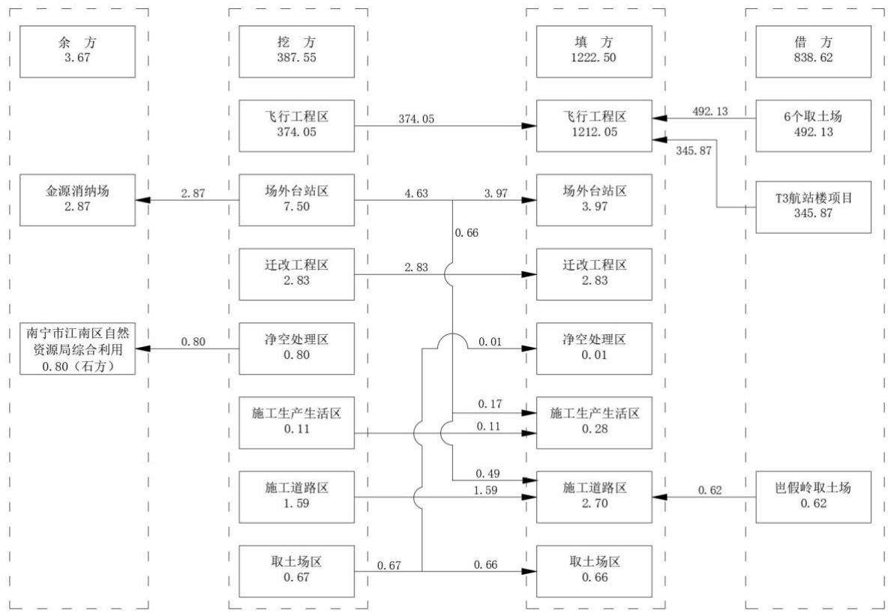
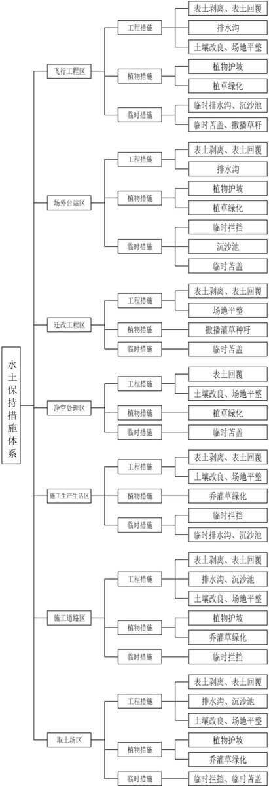

> **Zone C（应用范例层）使用边界**——仅可用于**写作风格、章节展开方式、表达逻辑、表格设计**的参考。
> **不得**用于合规判断；**不得**引入其项目数据（名称／地点／数字／单位名）；
> **不得**因其"曾经通过审批"而推定其做法在当前标准下仍然合规。
> 与 Zone A 冲突时**一律以 Zone A 为准**；Zone A 未明确规定时输出
> 「**Zone A 未明确规定，以下为参考写法，需人工判断**」。
>
> **坐标系警告**：本范例为**老八章结构**（GB 50433—2018 附录B），与 2026 版 10 章模板**同号不同义**
> （老 `1.5`＝防治目标，新 `1.5`＝水土流失预测结果；老 4→新 6 …偏移 +2；新版第 4/5 章老结构无独立章）。
> 因此 **`chapter_mapping: pending`——不得按章节号挂载**，检索一律走 `topic_tags`。
>
> **待加工**：`topic_tags`（主题标签）、`approval_basis_list`（编制依据逐字清单）、
> `structure_summary`（只提取结构：章节展开顺序／段落功能／表格栏目结构／句式模板／论证链步骤）。

水保方案（粤）字第20230003号

项目代码：2019-000052-56-01-001473

工程咨询 甲 232022030311

工程设计 A144006933

工程勘察 B144006933

# 南宁吴圩机场改扩建工程水土保持方案报告书

建设单位: 广西机场管理集团有限责任公司

编制单位: 中水珠江规划勘测设计有限公司

（原水利部珠江水利委员会勘测设计研究院）

2025 年 8 月

## 目 录

1 综合说明 ...  
1.1 项目简况..  
1.2 编制依据.... ...16  
1.3 设计水平年... ...18  
1.4 水土流失防治责任范围.. ...18  
1.5 水土流失防治目标.... ....18  
1.6 项目水土保持评价结论.. ...19  
1.7 水土流失调查结果... ...22  
1.8 水土保持措施布设成果. ...22  
1.9 水土保持监测方案 ..... ...25  
1.10 水土保持投资及效益分析成果. ...26  
1.11 结论.... ...26  
2 项目概况 .... ...30  
2.1 项目组成及工程布置.. ...30  
2.2 施工组织... ...52  
2.3 工程占地... ...67  
2.4 土石方平衡... ...70  
2.5 拆迁（移民）安置与专项设施改（迁）建........ .....79  
2.6 施工进度.... ....81  
2.7 自然概况... ...83  
3 项目水土保持评价.... ...92  
3.1 主体工程选址水土保持评价.. ...92  
3.2 建设方案与布局水土保持评价. ...94  
3.3 主体工程设计中水土保持措施界定. ...114  
4 水土流失分析与调查.... ....120  
4.1 水土流失现状.. . 120  
4.2 水土流失影响因素分析. . 122  
4.3 土壤流失量调查.... . 123  
4.4 水土流失危害分析.. .. 124  
4.5 指导性意见... .. 124  
5 水土保持措施.... .. 126  
5.1 防治区划分.. .. 126  
5.2 措施总体布局.. .. 127  
5.3 分区措施布设.. .. 135  
5.4 施工要求 .... ... 154  
6 水土保持监测... ... 158  
6.1 范围和时段.. .. 158  
6.2 内容和方法.. ... 158  
6.3 点位布设 ...... ... 161  
6.4 实施条件和成果.. ... 163  
7 水土保持投资估算及效益分析. .. 164  
7.1 投资估算 ... ... 164  
7.2 效益分析 .. .. 178  
8 水土保持管理.. ... 180  
8.1 组织管理 .. .... 180  
8.2 后续设计 ..... ... 180  
8.3 水土保持监测.. .. 181  
8.4 水土保持监理.. ... 182  
8.5 水土保持施工... .... 182  
8.6 水土保持设施验收.. ... 183

## 附表：

附表1： 水土流失防治责任范围表；

附表2： 水土流失防治标准指标计算表。

## 附件：

附件1：关于南宁吴圩机场改扩建工程可行性研究报告的批复；

附件2：关于南宁吴圩机场改扩建工程初步设计及概算的批复；

附件3：关于南宁吴圩机场改扩建工程水行政许可的通知；

附件4：关于南宁吴圩机场改扩建工程建设占用耕地耕作层土壤剥离项目通过表土剥离验收的通知；

附件5：空管工程的立项文件和水土保持方案许可；

附件6：借方来源和余方去向的支撑材料；

附件7：水土保持监管相关材料；

附件8：取土场用地审批材料；

附件9：现场照片。

## 附图：

附图1：项目地理位置图（WXJC-2W-01）；

附图2：项目区水系图（WXJC-2W-02）；

附图3：项目区土壤侵蚀强度分布图（WXJC-2W-03）；

附图4：工程总体布置图（WXJC-2W-04）；

附图5：水土流失防治责任范围及监测点布置图（WXJC-2W-05）；

附图6：飞行工程区水土保持措施布置图（WXJC-2W-06）；

附图7：飞行工程区表土保护利用图（WXJC-2W-07）；

附图8：飞行工程区边坡分布及防护图（WXJC-2W-08）；

附图9：飞行工程区排水布置及设计图（WXJC-2W-09）；

附图10：飞行工程区绿化布置图（WXJC-2W-10）；

附图11：飞行工程区外排水水土保持措施布置图（WXJC-2W-11）

附图12：场外台站区（扶绥台）水土保持措施布置图（WXJC-2W-12）；

附图13：场外台站区（邕宁台）水土保持措施布置图（WXJC-2W-13）；  
附图14：净空处理区水土保持措施布置图（WXJC-2W-14）；  
附图15：施工生产生活区水土保持措施布置图（WXJC-2W-15）；  
附图16：施工道路区水土保持措施布置图（WXJC-2W-16）；  
附图17：取土场分布图（WXJC-2W-17）；  
附图18：那审取土场水土保持措施布置图（WXJC-2W-18）；  
附图19：那洋取土场水土保持措施布置图（WXJC-2W-19）；  
附图20：绿陇取土场水土保持措施布置图（WXJC-2W-20）；  
附图21：岜假岭取土场水土保持措施布置图（WXJC-2W-21）；  
附图22：保安取土场水土保持措施布置图（WXJC-2W-22）；  
附图23：同华取土场水土保持措施布置图（WXJC-2W-23）；  
附图24：水土保持措施典型布设图（WXJC-2W-24）。

## 1 综合说明

南宁吴圩机场改扩建工程位于广西壮族自治区南宁市江南区、邕宁区和崇左市扶绥县，主要建设内容为在现状跑道东侧新建长3800m、宽45m 的第二跑道及其滑行道系统、精密进近系统、配套设施以及场外导航台站等，已于 2022 年 8 月开工，计划2025 年 9 月完工。

本工程在实施过程中采取了表土保护利用、排水、拦挡、护坡、土地整治、植被恢复、临时防护等措施，现状排水顺畅、林草覆盖度高、水土流失轻微。

本工程存在“未批先建”的水土保持违法行为，南宁市江南区农业农村局以“江农（水政）罚〔2025〕1号”下达了《行政处罚决定书》，罚款45万元，建设单位已在限期内足额缴纳了罚款。同时，水利部珠江水利委员会对建设单位进行了约谈，广西壮族自治区水利厅将建设单位纳入水土保持“重点关注名单”，南宁市水利局先后以“南水函〔2025〕30号”“南水责改〔2025〕42号”对建设单位下达责令整改，南宁市江南区农业农村局以“江农（水政）限改〔2024〕1 号”对建设单位下达责令整改并将建设单位纳入水土保持“重点关注名单”；目前，历次监管意见中除水土保持补偿费需待方案批复后确定金额再缴纳外，其他意见均已落实到位并书面报告了整改情况，详见附件7。

主体工程涉及河湖管理范围，涉水建设方案已获得南宁市行政审批局的批复（批复文号：南审批农〔2024〕60号，见附件3），临时工程不涉及河湖管理范围。

主体工程和临时工程均不涉及饮用水水源保护区、水功能一级区的保护区和保留区、自然保护区、世界文化和自然遗产地、风景名胜区、地质公园、森林公园、重要湿地、生态保护红线等敏感区。

## 1.1 项目简况

## 1.1.1 建设必要性

南宁吴圩机场是广西最重要的航空枢纽，是贯彻落实“三大定位”新使命、构建“两广互通、通达港澳、连接东盟”的综合交通运输大通道中空中通道的关键节点。

南宁是中国-东盟博览会（简称“东博会”）的永久举办地，东博会是“具有特殊国际影响力”“国家层面举办的重点涉外论坛和展会”，是三个国家一类展会之一，“成为广西亮丽的名片，也成为中国-东盟重要的开放平台”；近年来，参展企业、参展参会客商持续增长，南宁吴圩机场的业务需求日益增长。

南宁吴圩机场现状只有 1条跑道，2019年旅客吞吐量 1576.23万人次、飞机起降11.47万架次、货邮吞吐量 12.22万t，跑道能力趋于饱和，不满足航空业务发展需求。

为贯彻落实“三大定位”新使命，满足东博会需要，适应新时代西部大开发、珠江-西江经济带、广西、北部湾、南宁等社会经济高质量发展和机场自身需求，工程建设是必要的、迫切的。

本工程符合《南宁吴圩国际机场总体规划修编（2019年版）》，是《中国民用航空发展第十三个五年规划》中 139个改扩建机场之一，是广西壮族自治区重大项目建设推进领导小组办公室确定的 2021年第一批自治区层面统筹推进的重大项目之一。

## 1.1.2 机场总体规划和现状

## a）机场总体规划

南宁吴圩机场定位为面向东南亚的区域航空枢纽，远期2050年规划跑道4条（一、二跑道长3800m、宽 45m，飞行区等级4F；三、四跑道长 3200m、宽45m，飞行区等级4E）、航站楼5座（T1\~T5）、机位426个，满足飞机年起降55.9万架次、旅客年吞吐量 8000 万人次、货邮年吞吐量 150 万 t 需要，总用地面积 32.26km2；近期 2030年规划跑道2条（一跑道长 3200m、宽45m，二跑道长 3800m、宽45m，飞行区等级4F），航站楼3座（T1\~T3），机位195个，满足飞机年起降 33.8万架次、旅客年吞吐量4800万人次、货邮年吞吐量50万t 需要，近期总用地面积 16.62km2。

## b）机场现状

南宁吴圩机场位于南宁市江南区吴圩镇，距南宁市中心直线距离 27.8km，1958年迁至现址，1962年通航，现为 4E级国际机场，现状用地面积 7.05km2。

机场现有1条长3200m、宽45m 的跑道及相应的滑行道系统、精密进近系统，飞行区等级为4E；现有机位 110个，其中T1站坪机位 18个、T2站坪机位64个、应急机坪机位28个；现有航站楼 2座，其中T1已停用，T2建筑面积18.9万m2，设计旅客年吞吐量 1600 万人次；工作区位于跑道北部和西部，货运区位于跑道北部，现有供油、供水、供电、消防、应急等设施。

机场目前主要的在建项目为“南宁吴圩国际机场 T3航站区及配套设施建设工程”（简称“T3 航站楼项目”），该工程位于T2航站楼和本工程之间，主要建设内容包括T3航站楼、空侧站坪、站前交通、高架桥及供油设施等，项目法人为广西机场管理集团有限责任公司，已于 2023年8 月开工，计划 2027年6月完工；该工程由广西壮族自治区发展和改革委员会批准建设（批复文号：桂发改交通〔2022〕1149 号）、水土保持方案由南宁市行政审批局准予行政许可（许可文号：南审批农〔2023〕126号），已于 2023 年 8 月委托中国能源建设集团广西电力设计研究院有限公司开展水土保持监测工作、委托广西桂能工程咨询集团有限公司开展水土保持监理工作，目前正在开展监测、监理工作。

## 1.1.3 本报告编制范围

工程可行性研究报告批复中的建设内容为机场工程和空管工程，其中：机场工程为在现有跑道东侧 2200m 处建设 1 条长 3800m、宽 45m 的第二跑道及相应的滑行道系统，跑道主、次降方向分别设置Ⅲ类和Ⅰ类精密进近系统，配套建设助航灯光、供电、供水、消防等设施，飞行区等级 4F，项目法人为广西机场管理集团有限责任公司；空管工程为建设 1.56 万 m2 的塔台运行、中低空管制等业务用房，建设航管、通信、监视、气象等设施，项目法人为民航中南地区空管局。批复同时明确项目法人分别负责各自项目的组织实施与管理，详见附件1。

2023年4月，空管工程的项目法人中国民用航空中南地区空中交通管理局广西分局将空管工程在南宁经济技术开发区管理委员会备案（根据南宁市委、市政府关于五象新区、市管国家级开发区体制机制改革工作有关决策部署，该管委会实施的行政审批事项于 2024 年分批次移交至南宁市行政审批局、南宁市市场监督管理局、南宁市生态环境局及南宁市江南区人民政府实施），备案的项目名称为“南宁吴圩机场改扩建工程空管工程”，项目代码为 2304-450112-04-01-851063。

2024 年 11 月，广西金土资产房地产不动产评估有限公司编制完成《南宁吴圩机场改扩建工程空管工程水土保持方案报告书》；同月，南宁市江南区农业农村局以“江农局水〔2024〕18号”准予行政许可，详见附件5。

鉴于实际情况，本报告的编制范围为机场工程，主要建设内容为：①新建第二跑道及相应的滑行道系统、精密进近系统，配套助航灯光、供电、排水、消防等设施；②在二跑道两端分别建设场外导航台站。

本工程为改扩建项目，不涉及航站区、工作区、货运区、空管区、油库区等。

## 1.1.4 本工程概况

南宁吴圩机场改扩建工程位于广西壮族自治区南宁市江南区吴圩镇、邕宁区蒲庙镇和崇左市扶绥县岜盆乡，临时用地还涉及江南区的苏圩镇和江西镇，二跑道中心点经纬度为 E108°11'17"、N22°35'32"，建设性质为改扩建。

工程在现状跑道（一跑道）东侧 2200m 处新建 1 条长 3800m、宽 45m 的第二跑道及相应的滑行道系统、精密进近系统，配套助航灯光、供电、排水、消防等设施；在二跑道两端分别建设场外导航台站。本次改扩建后，结合一跑道、T2航站楼、T3航站楼等，满足近期2030年飞机年起降33.8万架次、旅客年吞吐量4800万人次、货邮年吞吐量50万t 需要。

工程主要由飞行工程、场外台站和净空处理工程组成，其中：

飞行工程：新建长3800m、宽45m 的第二跑道及相应的滑行道系统、精密进近系统，配套助航灯光、导航、供电、排水、消防等设施，飞行区等级为4F。

场外台站：指二跑道两端约 36km 处的南、北 DVOR/DME 台（即扶绥台、邕宁台），均新建一套输出功率 100W、双机自动转换的 DVOR 设备和峰值功率 1000W、双机自动转换的 DME 设备，配套建设业务用房、供水、供电、进站道路等，建筑面积均为 339.36m2。

净空处理工程：指二跑道北端3.4km 处的龟背山，山体由185.6m 降低至 161.8m。

工程建设需迁改飞行工程用地范围涉及的通信光纤、农村电网，共光纤迁改18.04km、农网迁改9.53km，由本工程一并建设。工程建设拆除各类房屋建筑面积 20.83万m2、搬迁2600余人，采用货币方式一次性补偿，由地方政府“以购代建”等方式另行安置；工程建设需迁改国道，采用货币方式一次性补偿，由广西壮族自治区桂西公路发展中心另行立项、另行建设；工程建设需还建糖厂烟囱，采用货币方式一次性补偿，由南宁明阳制糖有限责任公司另行立项、另行建设。

工程共设施工生产生活区 5 处（其中红线内 2 处、红线外 3 处）、表土暂存场 4处（均在飞行工程区永久用地范围内，目前表土已全部利用，场地已随主体工程一并硬化或绿化）、石方暂存场 1处（在净空处理区临时用地范围内，目前石方已清理并综合利用，场地已恢复原地貌）、施工道路长 0.84km/3 段、取土场 6 处（总取土量$4 9 2 . 7 5 \ \overline { { \mathcal { H } } } \ \mathrm { m } ^ { 3 } \ \mathrm { ) }$

工程总占地面积 399.91hm2，其中永久占地 $3 5 0 . 0 7 \mathrm { h m } ^ { 2 }$ （新增建设用地 $3 2 1 . 4 8 \mathrm { h m } ^ { 2 }$ 利用既有建设用地28.59hm2）、临时占地 $4 9 . 8 4 \mathrm { h m } ^ { 2 }$ ；占地类型按原地貌划分为耕地、园地、林地、草地、交通运输用地、水域及水利设施用地、城镇村及工矿用地和其他土地。

工程剥离并回覆表土 24.01万 $\mathrm { m } ^ { 3 }$ ，表土已全部用于绿化覆土。

工程挖填方总量 1610.05万 $\mathrm { m } ^ { 3 }$ ，其中挖方 387.55 万 $\mathrm { m } ^ { 3 }$ ，填方 $1 2 2 2 . 5 0 \mathrm { ~ \mathscr { H } ~ m ~ } ^ { 3 }$ ，借方 838.62 万 $\mathrm { m } ^ { 3 }$ （其中取土场自采 492.75 万 $\mathrm { m } ^ { 3 }$ 、利用 T3 航站楼项目余方 345.87 万$\mathbf { m } ^ { 3 } )$ ，余方 3.67 万 $\mathrm { m } ^ { 3 }$ （其中土方2.87万 $\mathrm { m } ^ { 3 }$ ，已运输至南宁市邕宁区的金源消纳场处置；石方 0.80 万 $\mathrm { m } ^ { 3 }$ ，已由南宁市江南区自然资源局公开出让给广西矿通资源投资发展有限公司，石方已清理并综合利用），相关材料附件6。

工程已于 2022 年 8 月开工，计划 2025 年 9 月完工，总工期 38 个月；截至 2025年7月，工程基本完成。

工程概算总投资 620134万元，其中土建投资 304893万元；资金来源为：国家发改委安排中央预算内资金 3.1 亿元，民航局安排民航发展基金 7.7 亿元，广西壮族自治区安排财政资金 15.8448 亿元，南宁市安排财政资金 10.5632 亿元，其余由建设单位自筹解决。

建设单位为广西机场管理集团有限责任公司。

## 1.1.5 依托工程和相关工程概况

## 1.1.5.1 依托工程概况

依托工程包括供水、供电、外部交通、供油等。

a）供水

机场现状供水设施位于北工作区中部，现有 2 条 DN450 的供水管连接市政供水管网，市政管网的供水能力为 5 万 $\mathrm { m } ^ { 3 } / \mathrm { d }$ （规划 $3 0 \mathrm { ~ \textbar { ~ } { ~ H ~ } ~ m ^ { 3 } / d }$ ），现状供水能力满足本次改扩建需要。

## b）供电

机场现状供电设施位于北工作区中部，即 110kV航空港站，主变容量 2×40MW，现状供电能力满足本次改扩建需要。

## c）外部交通

机场现状外部交通利用南友高速公路（编号 G7211）、机场第二高速公路、G210国道、南崇铁路等，现状交通满足本次改扩建需要。

## d）供油

机场现状油库位于西工作区西端，容量3.9万m3，现状供油能力满足本次改扩建需要。

## 1.1.5.2 相关工程概况

相关工程包括空管工程、民航消防综合训练基地、国道改造、烟囱还建等。

## a）空管工程

空管工程即“南宁吴圩机场改扩建工程空管工程”，建设飞行程序需要的管制设施设备和业务用房，项目法人为中国民用航空中南地区空中交通管理局广西分局。

2023年4月，南宁经济技术开发区管理委员会对该工程予以备案；2024 年 11月，南宁市江南区农业农村局以《关于南宁吴圩机场改扩建工程空管工程水土保持方案报告书行政许可决定书》（江农局水〔2024〕18号）对该工程的水土保持方案准予行政许可。

## b）民航消防综合训练基地

民航消防综合训练基地位于一跑道东北侧，由现状消防执勤点、T3航站楼项目实施的真火实训指挥室、训练塔、训练场地和本工程实施的消防主站等组成，均为独立建构筑物，保障等级为九级，总建筑面积 $4 6 3 5 . 2 \mathrm { m } ^ { 2 }$ ，其中现有 3143m2、T3 航站楼项目实施 75m2、本工程实施 1417.2m2。

## c）国道改道

国道改道即“G322吴圩机场段优化工程”，对本工程建设范围涉及的国道进行改

道，采用货币方式一次性补偿，项目法人为广西壮族自治区桂西公路发展中心。

2023年5月，广西壮族自治区发展和改革委员会以《关于 G322吴圩机场段优化工程可行性研究报告的批复》（桂发改交通〔2023〕392 号）同意建设该工程；2023年 8 月，南宁市行政审批局以《关于 G322 吴圩机场段优化工程水土保持方案报告书审批准予行政许可的通知》（南审批农〔2023〕174 号）对该工程的水土保持方案准予行政许可。

## d）烟囱还建

烟囱还建即“南宁吴圩机场改扩建工程南宁明阳制糖有限责任公司烟囱还建项目”，对影响飞行程序的明阳糖厂烟囱拆除后原址重建，采用货币方式一次性补偿，项目法人为南宁明阳制糖有限责任公司。

2024年1月，南宁市江南区发展和改革局对该工程予以备案；该工程的占地面积约 $0 . 1 5 \mathrm { h m } ^ { 2 }$ 、土石方挖填总量约 $0 . 0 8 \mathrm { ~ \mathscr ~ { ~ H ~ } ~ m ~ } ^ { 3 }$ ，属于《南宁市水土保持若干规定》第七条第二款规定的可以免予编制水土保持方案情形。

## 1.1.6 项目前期工作情况

a）主体工程设计及审查审批情况

2019年6月，中国民用航空局以《关于报送南宁机场改扩建工程预可行性研究报告意见的函》（民航函〔2019〕476号）出具预可行性研究报告的民航行业意见。

2021 年 11 月，国家发展和改革委员会以《关于南宁吴圩机场改扩建工程可行性研究报告的批复》（发改基础〔2021〕1539号）批复可行性研究报告，详见附件 1。

2021年12月，中国民用航空中南地区管理局 广西壮族自治区发展和改革委员会以《关于南宁吴圩机场改扩建工程初步设计及概算的批复》（民航中南局〔2021〕261号）批复初步设计及概算，详见附件 2。

2024年4月，南宁市行政审批局以《关于南宁吴圩机场改扩建工程水行政许可的通知》（南审批农〔2024〕60号）对涉水建设方案准予行政许可，同意反射平台以长270m、宽120m 的钢筋砼平台+标准桩间距15m×15m 的台柱网+桩径DN600 的三桩承台基础的建设方案上跨良凤江（又名那楞河，市管河道），同意 1 号、2 号外排水的末端接入良凤江并对河道进行护岸，详见附件 3。

2024年4月，上海民航新时代机场设计研究院有限公司编制完成《南宁吴圩机场改扩建工程施工图设计》。

2022 年 4 月至 2023 年 6 月，中国电子工程设计院有限公司对民航专业的施工图设计进行审查，民航专业工程质量监督总站中南地区监督站对审查报告予以备案；2023 年 5 月至 2024 年 1 月，广西中蓝审图有限责任公司、广西图海建筑工程咨询有限公司分别对建筑专业的施工图设计进行审查并出具审查意见。

## b）水土保持方案编制情况

受建设单位委托，中水珠江规划勘测设计有限公司组织技术人员进行了现场踏勘，收集了工程立项、设计、施工和水土保持监测、监理等资料，结合现场实际情况，于2025年8月编制完成《南宁吴圩机场改扩建工程水土保持方案报告书》。

本方案为补报水土保持方案。

## 1.1.7 水土保持工作情况

## a）前期工程水土保持情况

南宁吴圩机场自1990 年扩建后，本工程建设单位负责的主要改扩建有2013 年完成的T1航站楼应急工程、2017年完成的T2航站楼项目、在建的 T3航站楼项目等，水土保持情况如下：

T1航站楼应急工程：即“南宁吴圩国际机场现航站区应急扩建工程”，广西壮族自治区水利厅于 2017 年 7 月以《关于印发南宁吴圩国际机场现航站区应急扩建工程水土保持设施验收鉴定书的函》（桂水水保函〔2017〕60号）印发该工程的水土保持设施验收鉴定书，同意通过验收。

T2航站楼项目：即“南宁吴圩国际机场新航站区及配套设施建设工程”，水利部水土保持司于2019年8月出具该工程的水土保持设施自主验收报备回执，回执编号：水保验收回执〔2019〕第 6号。

T3航站楼项目：2023 年7月，南宁市行政审批局以《关于南宁吴圩国际机场 T3新航站区及配套设施建设工程水土保持方案报告书审批准予行政许可的通知》（南审批农〔2023〕126 号）对该工程的水土保持方案准予行政许可；目前工程正在施工，已同步开展水土保持监测、监理等工作。

## b）本工程水土保持情况

工程已于 2022 年 8 月开工，计划 2025 年 9 月完工，截至 2025 年 7 月，本工程的水土保持情况如下：

扰动面积：占地范围已全部扰动且扰动结束。

挖填方总量：土石方挖填已全部完成。

表土剥离量：已全部剥离，已全部用于绿化覆土。

水土保持措施：主体设计的表土保护利用、排水、拦挡、护坡、土地整治、植被恢复、临时防护等措施已全部实施。

水土流失情况：现状土壤侵蚀强度为微度；现阶段主要问题是局部边坡的植物长势一般，沉沙池内有少量淤积，应加强管养维护，对枯死苗木及时补植补种、对沉沙池及时清淤。

水土保持监测：陕西绿馨水土保持有限公司已于 2022 年 9 月进场开展水土保持监测工作，已完成监测报告 14 份，其中实施方案 1 份、季度报告 11 份、年度报告 2份，目前仍在监测中。

水土保持监理：陕西绿馨水土保持有限公司已于 2022 年 9 月进场开展水土保持监理工作，开展了旁站、巡视、量测等现场监理，已完成监理报告37份，其中规划 1份、细则1份、月报 35份，目前仍在监理中。

本工程水土保持情况详见表 1.1-1。

表 1.1-1 本工程水土保持情况表（截至2025年 7月）
<table><tr><td rowspan=1 colspan=1>序号</td><td rowspan=1 colspan=1>项目</td><td rowspan=1 colspan=1>已完成情况</td><td rowspan=1 colspan=1>待完成情况</td></tr><tr><td rowspan=1 colspan=1>1</td><td rowspan=1 colspan=1>扰动面积</td><td rowspan=1 colspan=1>399.91hm²</td><td rowspan=1 colspan=1>1</td></tr><tr><td rowspan=1 colspan=1>2</td><td rowspan=1 colspan=1>挖填方总量</td><td rowspan=1 colspan=1>1610.05万m³</td><td rowspan=1 colspan=1>1</td></tr><tr><td rowspan=1 colspan=1>3</td><td rowspan=1 colspan=1>表土剥离量</td><td rowspan=1 colspan=1>24.01万m³</td><td rowspan=1 colspan=1>/</td></tr><tr><td rowspan=1 colspan=1>4</td><td rowspan=1 colspan=1>水土保持措施</td><td rowspan=1 colspan=1>主体设计的表土保护利用、排水、拦挡、护坡、土地整治、植被恢复、临时防护等措施已全部实施</td><td rowspan=1 colspan=1>1</td></tr><tr><td rowspan=1 colspan=1>5</td><td rowspan=1 colspan=1>水土流失情况</td><td rowspan=1 colspan=1>1. 现状土壤侵蚀强度为微度；2. 局部边坡的植物长势一般，沉沙池内有少量淤积</td><td rowspan=1 colspan=1>加强管养维护，及时补植补种、清淤修缮</td></tr><tr><td rowspan=1 colspan=1>6</td><td rowspan=1 colspan=1>水土保持监测</td><td rowspan=1 colspan=1>陕西绿馨水土保持有限公司已于2022年9月进场开展工作，已完成监测报告14份</td><td rowspan=1 colspan=1>仍在监测中</td></tr><tr><td rowspan=1 colspan=1>7</td><td rowspan=1 colspan=1>水土保持监理</td><td rowspan=1 colspan=1>陕西绿馨水土保持有限公司已于2022年9月进场开展工作，已完成监理报告37份</td><td rowspan=1 colspan=1>仍在监理中</td></tr></table>

## 1.1.8 水土保持监管情况

本工程自 2022 年 8 月开工以来，各级水行政主管部门对建设单位的水土保持监管共9次，其中：水利部珠江水利委员会 1次、广西壮族自治区水利厅 1次、南宁市水利局2次、南宁市江南区农业农村局 2次、遥感图斑核查 3次，历次监管意见中除水土保持补偿费需待水土保持方案批复后确定金额再缴纳外，其他均已落实到位并书面报告了整改情况，历次监管意见及落实情况如下：

a）水利部珠江水利委员会（约谈）

2025年4月3日，水利部珠江水利委员会决定就本工程“未批先建”等情况约谈建设单位，以“珠水水保函〔2025〕89号”发出约谈通知。

2025 年 4 月 10 日，建设单位派员参加约谈，如实汇报了水土保持工作情况，认识到水土保持工作不足，后续将全面加强水土保持工作，确保不出现类似问题。

b）广西壮族自治区水利厅（信用监管）

2025 年 5 月 30 日，鉴于本工程存在“未批先建”等情况，广西壮族自治区水利厅将建设单位列入水土保持“重点关注名单”。

c）南宁市水利局（提醒+责令整改）

## 1）提醒

2025 年 3 月 4 日，南宁市水利局以“南水函〔2025〕30 号”向建设单位发出提醒，要求及时采取有效的水土保持措施，防止项目发生水土流失；要求尽快完成项目水土保持方案编制、报批，依法足额缴纳水土保持补偿费，开展水土保持监测工作。

建设单位组织相关单位进一步实施了水土保持措施，于 2025年4月27日书面报告了整改落实情况。

## 2）责令整改

2025年4月30日，南宁市水利局以“南水责改〔2025〕42号”向建设单位下达责令（限期）改正水事违法行为通知书，要求依据已批复的主体工程设计和水土保持规范，在规定期限内完成项目水土保持相关工作，包括但不限于拦挡和边坡防护设施的设置、排水和沉沙系统的完善、裸土苫盖的措施、表土的手机与利用等。

建设单位对现场全面排查后补充实施了取土场区的排水、沉沙，净空处理区的拦挡、苫盖，飞行工程区的植草绿化以及表土收集利用等措施，并于2025年5 月20日以“桂机场〔2025〕130号”书面报告了整改情况。

d）南宁市江南区农业农村局（行政处罚+信用监管）

## 1）行政处罚

2025年4月7日，经立案调查、告知等程序，南宁市江南区农业农村局以“江农（水政）罚〔2025〕1 号”对本工程“未批先建”的水土保持违法行为下达《行政处罚决定书》，罚款人民币 45万元。

2025年4月10日，建设单位在限期内通过银行汇款方式足额缴纳了罚款。

## 2）信用监管

2025 年 5 月 27 日，鉴于本工程存在“未批先建”等情况，南宁市江南区农业农村局将建设单位列入水土保持“重点关注名单”。

e）遥感图斑核查（2022年度、2023年度、2024年度）

## 1）2022年度遥感图斑核查

2022 年广西第二期省级遥感监管发现图斑，图斑编号：202211\_450105\_0017，并在当期以未批先建进行下发。

2023年8月，南宁经济技术开发区社会事业局现场复核后认定图斑属于本工程，并下达限期整改通知，要求开展实质性的水土保持工作，并在 20 天内将项目水土保持方案报经开区行政审批局审批。

2023 年 11 月，由于借方来源、弃方去向等不明确，建设单位书面报告了整改情况说明；南宁经济技术开发区社会事业局上传情况说明等作为整改完成佐证材料。

## 2）2023年度遥感图斑核查

2023 年广西第一期省级遥感监管发现图斑，图斑编号：202307\_450105\_0005，并在当期以未批先建进行下发。

2023年9月，南宁经济技术开发区社会事业局现场复核后认定图斑属于“南宁吴圩国际机场T3航站区及配套设施建设工程”，不属于本工程。

## 3）2024年度遥感图斑核查

2024 年广西第一期省级遥感监管发现图斑，图斑编号：202407\_450105\_0014，并在当期以未批先建进行下发。

2024 年 11 月，南宁市江南区农业农村局现场复核后认定图斑属于本工程，并以“江农（水政）限改〔2024〕1号”下达责令限期整改通知，要求在2025 年1月15日前编制水土保持方案并报水行政主管部门批准。

2024 年 12 月，建设单位书面报告了整改情况；由于水土保持方案未在限期内获得批复，南宁市江南区农业农村局依法开展了行政处罚相关工作，即前文所述的行政处罚。

同时，就监管职责履行不到位、整改通知书不规范等问题，广西壮族自治区水利厅于 2025 年 4 月 7 日约谈了南宁市江南区农业农村局；南宁市江南区农业农村局派员按时参加约谈，认识到工作不足，下一步将及时依法履职，杜绝类似事件发生。

水土保持监管情况见表 1.1-2和附件 7。

表 1.1-2 历次水土保持监管意见及整改落实情况表
<table><tr><td colspan="1" rowspan="1">序号</td><td colspan="1" rowspan="1">监管意见</td><td colspan="1" rowspan="1">整改落实情况</td><td colspan="1" rowspan="1">备注</td></tr><tr><td colspan="1" rowspan="1">一</td><td colspan="1" rowspan="1">水利部珠江水利委员会（约谈）</td><td colspan="1" rowspan="1"></td><td colspan="1" rowspan="1">附件7-1</td></tr><tr><td colspan="1" rowspan="1">1</td><td colspan="1" rowspan="1">定于2025年4月10日在广州市约谈建设单位</td><td colspan="1" rowspan="1">建设单位按时参加约谈，认识到水土保持工作不足，后续将全面加强水土保持工作，确保不出现类似问题</td><td colspan="1" rowspan="1"></td></tr><tr><td colspan="1" rowspan="1">二</td><td colspan="1" rowspan="1">广西壮族自治区水利厅（信用监管+约谈）</td><td colspan="1" rowspan="1"></td><td colspan="1" rowspan="1">附件7-2</td></tr><tr><td colspan="1" rowspan="1">(一)</td><td colspan="1" rowspan="1">信用监管</td><td colspan="1" rowspan="1"></td><td colspan="1" rowspan="1"></td></tr><tr><td colspan="1" rowspan="1">1</td><td colspan="1" rowspan="1">将建设单位纳入水土保持“重点关注名单”</td><td colspan="1" rowspan="1">建设单位进一步认识到水土保持工作不足，采取措施积极防治水土流失，全面履行水土保持责任</td><td colspan="1" rowspan="1"></td></tr><tr><td colspan="1" rowspan="1">(二)</td><td colspan="1" rowspan="1">约谈</td><td colspan="1" rowspan="1"></td><td colspan="1" rowspan="1"></td></tr><tr><td colspan="1" rowspan="1">1</td><td colspan="1" rowspan="1">定于2025年4月7日约谈南宁市江南区农业农村局</td><td colspan="1" rowspan="1">派员按时参加约谈，认识到工作不足，下一步将及时依法履职，杜绝类似事件发生</td><td colspan="1" rowspan="1">附件7-3</td></tr><tr><td colspan="1" rowspan="1">三</td><td colspan="1" rowspan="1">南宁市水利局</td><td colspan="1" rowspan="1"></td><td colspan="1" rowspan="1"></td></tr><tr><td colspan="1" rowspan="1">(一)</td><td colspan="1" rowspan="1">提醒</td><td colspan="1" rowspan="1"></td><td colspan="1" rowspan="1">附件7-4</td></tr><tr><td colspan="1" rowspan="1">1</td><td colspan="1" rowspan="1">及时采取有效的水土保持措施，防止项目发生水土流失</td><td colspan="1" rowspan="1">采取了排水、沉沙、植物护坡、乔灌草绿化等水土保持措施，有效地防治了水土流失</td><td colspan="1" rowspan="1"></td></tr><tr><td colspan="1" rowspan="1">2</td><td colspan="1" rowspan="1">尽快完成项目水土保持方案编制、报批，依法足额缴纳水土保持补偿费，开展水土保持监测工作</td><td colspan="1" rowspan="1">1. 已完成水土保持方案编制；2. 待水土保持方案批复后确定金额再缴纳补偿费；3. 已于2022年9月开展水土保持监测工作</td><td colspan="1" rowspan="1"></td></tr><tr><td colspan="1" rowspan="1">3</td><td colspan="1" rowspan="1">配合江南区农业农村局开展相关工作</td><td colspan="1" rowspan="1">已配合完成执法等相关工作，已缴纳罚款</td><td colspan="1" rowspan="1"></td></tr><tr><td colspan="1" rowspan="1">(二)</td><td colspan="1" rowspan="1">责令整改</td><td colspan="1" rowspan="1"></td><td colspan="1" rowspan="1">附件7-5</td></tr><tr><td colspan="1" rowspan="1">1</td><td colspan="1" rowspan="1">在规定期限内完成项目水土保持相关工作，包括但不限于拦挡和边坡防护设施的设置、排水和沉沙系统的完善、裸土苫盖的措施、表土的手机与利用等</td><td colspan="1" rowspan="1">现场全面排查后补充实施了取土场区的排水、沉沙，净空处理区的拦挡、苫盖，飞行工程区的植草绿化以及表土收集利用等措施</td><td colspan="1" rowspan="1"></td></tr><tr><td colspan="1" rowspan="1">四</td><td colspan="1" rowspan="1">南宁市江南区农业农村局</td><td colspan="1" rowspan="1"></td><td colspan="1" rowspan="1"></td></tr><tr><td colspan="1" rowspan="1">(一)</td><td colspan="1" rowspan="1">行政处罚</td><td colspan="1" rowspan="1"></td><td colspan="1" rowspan="1">附件7-6</td></tr><tr><td colspan="1" rowspan="1">1</td><td colspan="1" rowspan="1">罚款人民币45万元</td><td colspan="1" rowspan="1">已在限期内足额缴纳罚款</td><td colspan="1" rowspan="1"></td></tr><tr><td colspan="1" rowspan="1">(二)</td><td colspan="1" rowspan="1">信用监管</td><td colspan="1" rowspan="1"></td><td colspan="1" rowspan="1">附件7-7</td></tr><tr><td colspan="1" rowspan="1">1</td><td colspan="1" rowspan="1">将建设单位纳入水土保持“重点关注名单”</td><td colspan="1" rowspan="1">建设单位进一步认识到水土保持工作不足，采取措施积极防治水土流失，全面履行水土保持责任</td><td colspan="1" rowspan="1"></td></tr><tr><td colspan="1" rowspan="1">五</td><td colspan="1" rowspan="1">遥感图斑核查</td><td colspan="1" rowspan="1"></td><td colspan="1" rowspan="1"></td></tr><tr><td colspan="1" rowspan="1">1</td><td colspan="1" rowspan="1">2022年度遥感图斑核查</td><td colspan="1" rowspan="1"></td><td colspan="1" rowspan="1">附件7-8</td></tr><tr><td colspan="1" rowspan="1"></td><td colspan="1" rowspan="1">遥感监管发现图斑，并在当期以未批先建进行下发</td><td colspan="1" rowspan="1">1. 南宁经济技术开发区社会事业局现场复核后认定图斑属于本工程，并下达责令整改通知，要求开展实质性的水土保持工作，并在20天内将项目水土保持方案报经开区行政审批局审批；2. 建设单位书面报告了整改落实情况；3. 南宁经济技术开发区社会事业局上传情况说明等作为整改完成佐证材料</td><td colspan="1" rowspan="1"></td></tr><tr><td colspan="1" rowspan="1">2</td><td colspan="1" rowspan="1">2023年度遥感图斑核查</td><td colspan="1" rowspan="1"></td><td colspan="1" rowspan="1">/</td></tr><tr><td colspan="1" rowspan="1"></td><td colspan="1" rowspan="1">遥感监管发现图斑，并在当期以未批先建进行下发</td><td colspan="1" rowspan="1">南宁经济技术开发区社会事业局现场复核后认定图斑不属于本工程</td><td colspan="1" rowspan="1"></td></tr><tr><td colspan="1" rowspan="1">3</td><td colspan="1" rowspan="1">2024年度遥感图斑核查</td><td colspan="1" rowspan="1"></td><td colspan="1" rowspan="1">附件7-9</td></tr><tr><td colspan="1" rowspan="1"></td><td colspan="1" rowspan="1">遥感监管发现图斑，并在当期以未批先建进行下发</td><td colspan="1" rowspan="1">1. 南宁市江南区农业农村局现场复核后认定图斑属于本工程，并下达责令限期整改通知，要求在2025年1月15日前编制水土保持方案并报水行政主管部门批准；2. 建设单位书面报告了整改落实情况；3. 由于水土保持方案未在限期内获得批复，南宁市江南区农业农村局依法开展了行政处罚相关工作（即前述的罚款45万元），建设单位已在限期内缴纳罚款</td><td colspan="1" rowspan="1"></td></tr></table>

说明：吴圩机场位于南宁经济技术开发区内，水土保持的属地管理部门为南宁经济技术开发区社会事业局；根据南宁市委、市政府关于市管国家级开发区体制机制改革工作有关决策部署，属地管理部门于 2024年调整为南宁市江南区农业农村局。

## 1.1.9 自然简况

## a）自然概况

项目区属丘陵台地地貌，其中：飞行工程、迁改工程、净空处理工程位于苏吴盆地北东部、良凤江左岸，为溶蚀平原地貌，地势平缓，地面高程 110m\~120m，分布有大小不一的水塘，零星有溶蚀孤峰，相对高差 30m\~60m；场外台站为丘陵地貌，场址位于山丘顶部。

项目区属南亚热带湿润气候，多年平均气温 $2 1 . 6 ^ { \circ } \mathrm { C }$ ，多年平均蒸发量 1607.8mm，多年平均降雨量1265.0mm，多年平均风速 1.6m/s。

项目区属西江流域郁江水系，飞行工程、迁改工程和净空处理工程附近主要河流为良凤江及其支流派斩河；场外台站位于山丘顶部，场内无自然沟道。

项目区地带性土壤为赤红壤，发育有红壤、水稻土、石灰土等。

项目区地带性植被为亚热带常绿阔叶林，现状以马尾松、杉木、桉树次生林、经果林为主，垦殖后多种植农作物。

## b）水土流失情况

根据《土壤侵蚀分类分级标准》（SL 190-2007），项目区属南方红壤丘陵区，容许土壤流失量 $5 0 0 \mathrm { t } / ( \mathrm { k m } ^ { 2 } { \cdot } \mathrm { a } )$ ，土壤侵蚀类型以水力侵蚀为主，侵蚀强度以微度为主。

## c）水土保持区划

根据《全国水土保持规划（2015-2030年）》，飞行工程、迁改工程、净空处理工程和邕宁台所在区域的水土保持区划一级区为南方红壤区、二级区为华南沿海丘陵台地区、三级区为华南沿海丘陵台地人居环境维护区；扶绥台所在区域的一级区为西南岩溶区、二级区为滇黔桂山地丘陵区、三级区为滇黔桂峰丛洼地蓄水保土区。

## d）水土保持敏感区

根据工程所在地水土流失重点防治区划分成果，邕宁台所在地南宁市邕宁区属于桂南沿海丘陵台地自治区级水土流失重点治理区、扶绥台所在地崇左市扶绥县属于桂西南丘陵台地自治区级水土流失重点治理区，工程其他部位不涉及国家级、广西壮族自治区级、南宁市级、崇左市级水土流失重点预防区及重点治理区，工程在“两区”范围内的面积占比为 1.6%。

主体工程的反射平台上跨良凤江、外排水末端接入良凤江，工程涉水建设方案已获得南宁市行政审批局的批复，批复文号：南审批农〔2024〕60号；临时工程均不涉及河道管理范围。

主体工程和临时工程均不涉及饮用水水源保护区、水功能一级区的保护区和保留区、自然保护区、世界文化和自然遗产地、风景名胜区、地质公园、森林公园、重要湿地、生态保护红线等敏感区。

## 1.2 编制依据

## 1.2.1 主要法律法规和部委规章

1）《中华人民共和国水土保持法》（中华人民共和国主席令第 39号，2010 年12月25日修订通过，2011年 3月1日起实施）；

2）《广西壮族自治区实施<中华人民共和国水土保持法>办法》（广西壮族自治区第十二届人民代表大会常务委员会公告第 27 号，2014 年 7 月 24 日修订通过，2014年10月1日起实施）；

3）《南宁市水土保持若干规定》（南宁市第十四届人民代表大会常务委员会公告第 35 号，2020 年 12 月 30 日通过，2021 年 5 月 26 日批准，2021 年 7 月 1 日起实施）；

4）《生产建设项目水土保持方案管理办法》（水利部令第 53 号，2023 年 3 月 1日起实施）。

## 1.2.2 主要规范性文件

1）《水利部办公厅关于印发<全国水土保持规划国家级水土流失重点预防区和重点治理区复核划分成果>的通知》（办水保〔2013〕188号）；

2）《水利部办公厅关于印发生产建设项目水土保持技术文件编写和印制格式规定（试行）的通知》（办水保〔2018〕135号）；

3）《水利部办公厅关于印发生产建设项目水土保持方案审查要点的通知》（办水保〔2023〕177 号）；

4）《水利部办公厅关于进一步加强部批项目水土保持监管工作的通知》（办水保〔2024〕57 号）；

5）《广西壮族自治区人民政府关于划分我区水土流失重点预防区和重点治理区的通告》（桂政发〔2017〕5号）。

## 1.2.3 主要技术标准

1）《生产建设项目水土保持技术标准》（GB 50433-2018）；

2）《生产建设项目水土流失防治标准》（GB/T 50434-2018）；

3）《水土保持工程设计规范》（GB 51018-2014）；

4）《生产建设项目水土保持监测与评价标准》（GB/T 51240-2018）；

5）《水土保持工程调查与勘测标准》（GB/T 51297-2018）；

6）《造林技术规程》（GB/T 15776-2023）；

7）《生态公益林建设》系列标准（GB/T 18337）；

8）《水利水电工程制图标准 水土保持图》（SL 73.6-2015）；

9）《土壤侵蚀分类分级标准》（SL 190-2007）；

10）《水土保持监理规范》（SL/T 523-2024）；

11）《水土保持监测技术规范》（SL/T 277-2024）；

12）《民用机场飞行区技术标准》（MH 5001-2021）。

## 1.2.4 主要技术资料

1）《南宁吴圩机场改扩建工程施工图设计》（上海民航新时代机场设计研究院有限公司，2022年4月）；

2）《南宁吴圩机场改扩建用地范围农村电网迁改工程施工图设计》（广西弘燊电力设计有限公司，2022 年5月）；

3）《南宁吴圩机场改扩建工程涉及国防通信线路迁改项目竣工图》（银泰通信有限公司，2023年3月）；

4）《南宁吴圩机场改扩建工程建设占用耕地耕作层土壤剥离方案》（广西直方土地规划有限公司，2022 年8月）；

5）《全国水土保持规划（2015-2030 年）》《广西壮族自治区水土保持规划（2016\~2030年）》《广西壮族自治区水土保持公报（2023年）》《南宁市水土保持规划（2019-2030年）》《崇左市水土保持规划（2017-2030年）》《南宁市江南区水土

保持规划（2023\~2030年）》等；

6）建设单位提供的临时用地土地复垦方案，取土场开挖利用方案、植被恢复和林业生产条件方案，实际土石方量及调配利用等资料；

7）陕西绿馨水土保持有限公司提供的水土保持监测、监理资料。

## 1.3 设计水平年

工程计划 2025 年 9 月完工；综合考虑不同部位的建设进度、植被自然恢复条件和工程实际情况，本方案设计水平年确定为工程完工的后一年，即2026年。

## 1.4 水土流失防治责任范围

根据《生产建设项目水土保持技术标准》（GB 540433-2018），水土流失防治责任范围包括项目永久征地、临时占地（含租赁土地）以及其他使用与管辖区域，是建设单位依法承担水土流失防治义务的区域。

结合工程实际情况，水土流失防治责任范围面积为 $3 9 9 . 9 1 \mathrm { h m } ^ { 2 }$ ，其中江南区393.33hm2、邕宁区 1.72hm2、扶绥县 4.86hm2，详见附表 1。

## 1.5 水土流失防治目标

## 1.5.1 执行标准等级

工程建设范围涉及南宁市江南区的吴圩镇、苏圩镇、江西镇，邕宁区的蒲庙镇以及崇左市扶绥县岜盆乡，主要在吴圩镇。

根据工程所在地水土流失重点防治区划分成果，邕宁台所在地南宁市邕宁区属于桂南沿海丘陵台地自治区级水土流失重点治理区、扶绥台所在地崇左市扶绥县属于桂西南丘陵台地自治区级水土流失重点治理区，工程其他部位不涉及国家级、广西壮族自治区级、南宁市级、崇左市级水土流失重点预防区及重点治理区；工程在水土流失重点防治区内的占地面积 6.58hm2，占工程总占地面积的 1.6%。

南宁吴圩机场是面向东南亚的区域航空枢纽，是连接中国与东南亚国家的重要桥梁，是国家批准设立的南宁临空经济示范区的核心区域，是展现新时代壮美广西建设的重要窗口；鉴于工程实际情况和区域社会、经济、生态等定位要求，水土流失防治标准等级执行一级标准。

根据《全国水土保持规划（2015-2030年）》，江南区和邕宁区属南方红壤区，扶绥县属西南岩溶区；本工程在扶绥县境内占地面积 4.86hm2，占工程总占地面积的1.2%。鉴于工程实际情况，水土流失防治标准等级统一执行南方红壤区一级标准。

## 1.5.2 防治目标

a）基本目标

1）项目建设范围内的新增水土流失得到有效控制，原有水土流失得到治理；

2）水土保持设施安全有效；

3）水土资源、林草植被得到最大限度的保护与恢复；

4）水土流失治理度、土壤流失控制比、渣土防护率、表土保护率、林草植被恢复率、林草覆盖率六项指标符合现行国家标准《生产建设项目水土流失防治标准》（GB/T50434-2018）的规定。

## b）防治指标值

1）修正情况

土壤流失控制比：项目区土壤侵蚀强度以微度为主，土壤流失控制比上调到 1.01。

渣土防护率和林草覆盖率：工程部分建设内容在广西自治区级水土流失重点治理区内，主要建设区域在南宁吴圩机场周边，该区域是国家批准设立的南宁临空经济示范区的核心区域，社会、经济、生态等定位高，为更好地防治水土流失，渣土防护率和林草覆盖率统一提高 2个百分点。

项目区属湿润地区、丘陵台地地貌，水土流失治理度、林草植被恢复率等不调整。

## 2）修正后的指标值

至设计水平年，水土流失防治指标值为：水土流失治理度 98%，土壤流失控制比1.01，渣土防护率99%，表土保护率92%，林草植被恢复率 98%，林草覆盖率 27%。

水土流失防治指标值计算详见附表2。

## 1.6 项目水土保持评价结论

## 1.6.1 主体工程选址评价

工程选址未占用全国水土保持监测网络中的水土保持监测站点、重点试验区及国家确定的水土保持长期定位观测站，不涉及河流两岸、湖泊和水库周边的植物保护带；

工程选址无法避让广西自治区级水土流失重点治理区，工程采取了减少占地、减少土石方量、提高措施等级和标准、布设沉沙设施、提高林草覆盖率等措施，具体如下：

工程新增建设用地面积 321.48hm2，小于用地控制指标，且新增建设用地已获得批复，符合节约用地、保护耕地等要求；工程临建设施中场道 1 标、2 标施工区利用红线内空地综合布置，场道 3标施工区利用机场现有停车场，场道4 标施工区利用其他工程的项目部，减少了临时占地，避开了植被良好区和生产力高的土地。

工程场地标高按尽可能少挖、少填的挖填平衡原则控制，受原地貌高程、一跑道高程等限制，本期建设的二跑道及相应的滑行道、联络道等需要大量填方，工程挖方充分回填利用后，不足借方首先利用其他工程余方，仍不足的由经审批的取土场自采。

工程挖方回填利用后余方3.67万m3，其中：石方 0.80万m3，已由南宁市江南区自然资源局公开出让给广西矿通资源投资发展有限公司，石方已清理并综合利用；土方 2.87 万 m3，由于工期不衔接、跨行政区等因素，已全部运输至附近合法的社会消纳场处置。工程余方均妥善处置。

工程外排水采用箱涵、明渠等形式，减少了占地；光纤采用顶管、桥架、直埋相结合的施工方案，农网采用架空、顶管、直埋相结合的施工方案，减少了占地面积和土石方量；山体降高采用大型吊机运输施工设备，避免了沿山体修建盘山路，减少山体破坏和土石方量。

主体工程外排水的设计标准为 100年一遇，场内排水的设计标准为 5年一遇短历时暴雨，均达到了水土保持 1级标准，排水设计标准均采用主体工程的行业标准；本工程未布置集雨蓄水措施，但与本工程紧邻且整体规划、分别立项、同步实施的 T3航站楼项目综合布置了雨水调蓄池，工程建设方案综合考虑了水土保持要求。

飞行工程区、净空处理区采用植草方式绿化，草种选择适生性好的三裂叶蟛蜞菊，临时用地植被恢复的绿化方案为种植乔木+撒播灌草混合种籽，种籽选择当地适生的猪屎豆、银合欢、狗牙根、波斯菊、宽叶草、糖蜜草、苕子等混合种籽；为统筹改善区域生态环境，本方案将林草覆盖率提高 2个百分点。

综合采取上述措施后，工程选址符合水土保持要求。

## 1.6.2 建设方案与布局评价

## a）建设方案评价

工程选址无法避让水土流失重点防治区；工程采取了减少占地面积、减少土石方量、提高措施等级和标准、布设沉沙设施、提高林草覆盖率 2个百分点等措施，建设方案符合水土保持要求。

## b）工程占地评价

工程新增建设用地已获得批复，符合节约用地、保护耕地等要求；临建设施充分永临结合，满足施工需要。

## c）土石方平衡评价

工程土石方挖填数量合理，土石方调运的节点适宜、时序可行、运距合理；工程借方首先利用其他工程（T3 航站楼项目）的余方，不足的再由经审批的取土场自采；工程标段划分考虑了土石方调配利用，减少了借弃方量和临时占地数量。

## d）弃渣减量化、资源化

初步设计阶段工程余方 110.04 万 m3。施工图设计阶段通过飞行区和场外台站的竖向标高调整、飞行区场道分区填筑等整体优化后，余方量减少至57.84 万m3；实施阶段通过加强组织管理、精细化施工、主体工程和临建设施移挖作填等，余方进一步减少至3.67万m3。相对于初步设计，工程实际余方减少106.37万m3，减幅 96.7%。

工程余方中石方 0.80 万 m3，已由南宁市自然资源局公开出让给广西矿通资源投资发展有限公司，石方已清理并综合利用，实现了资源化利用。

## e）取土场设置评价

工程设取土场6处，场址均不涉及崩塌和滑坡危险区、泥石流易发区，场址均远离城镇、景区，未涉及河道，选址均无水土保持制约性因素。取土场用地均已获得主管部门批准，均不涉及耕地、基本农田等，均不涉及Ⅰ、Ⅱ级保护林地。

## f）土石方暂存场设置评价

工程设土石方暂存场 5处，均为平地堆渣，最大堆高 4.8m，场地周边地势平缓，无居民点、工矿企业等，不涉及河道，目前土石方均已清理并利用，场地均已恢复，选址均符合水土保持要求。

## g）施工方法与工艺评评价

工程采用机械与人工相结合的施工方法和工艺，其中：飞行工程区的场道分区填筑，初平标高预留管线沟槽余土量等；迁改工程采用顶管方式下穿小河道、道路及集中居民点等，采用桥架方式上跨主要河道；龟背山降高采用大型机械吊装设备至山顶，避免了修建盘山路，均有利于减少水土流失。

## h）主体已有水土保持措施评价

主体已有表土保护利用、拦挡、排水、护坡、绿化、迹地恢复、临时防护等措施，各项措施均已实施，现状水土流失轻微；工程场外排水按 100年一遇洪水设计，场内排水按5年一遇短历时暴雨设计。主体已有的水土保持措施体系和设计标准均满足水土保持需要，本方案不新增措施。

## 1.7 水土流失调查结果

1）根据设计、施工和水土保持监测、监理等资料统计，结合现场调查，工程扰动地表面积 $3 9 9 . 9 1 \mathrm { h m } ^ { 2 }$ ，损毁植被面积 50.81hm2。

2）工程余方 3.67 万 m3，其中：石方 0.80 万 m3，已由南宁市江南区自然资源局公开出让给广西矿通资源投资发展有限公司，石方已清理并综合利用；土方 2.87 万m3，已运输至南宁市邕宁区的金源消纳场处置。

3）根据水土保持监测结果，工程建设造成土壤流失量62566t，其中新增60414t，主要在飞行工程区和取土场区，现阶段水土流失轻微，各部位的土壤侵蚀强度已小于容许值。

4）根据水土保持监测结果，工程未发生水土流失灾害事件，施工期的水土流失造成下边坡溜渣、坡脚淤积等情况。

## 1.8 水土保持措施布设成果

## 1.8.1 防治区划分

工程划分为飞行工程区、场外台站区、迁改工程区、净空处理区、施工生产生活区、施工道路区、取土场区共 7个防治分区。

## 1.8.2 分区措施体系

根据水土流失防治目标、工程建设方案、施工组织、工程现状和水土保持功能定

位、水土保持敏感区分布等，统筹布局水土保持措施，各区措施布置如下：

## a）飞行工程区

施工时剥离表土，在土面区的表土暂存场集中存放，后期全部用于土面区、边坡的绿化覆土，表土暂存场采取四周临时排水沟、表面撒播草籽临时绿化等防护措施；场平时提前开挖排水沟的沟槽，兼做施工期临时排水，排水末端设沉沙池，对裸露边坡临时苫盖；边坡成型后采用骨架植草、挂网植草等植物护坡；场平后修建永久排水沟，相互连通后顺接至外排水，土面区覆土平整后植草绿化。

外排水施工时，回填土在一侧沿线临时堆放，表面临时苫盖；沟槽回填后施工作业带场地平整、土壤改良后交还地方耕作，渠道边坡植草护坡。

## b）场外台站区

台站：施工时对裸露地表临时苫盖；场平后场地四周设排水沟，末端引接至进站道路的排水沟；场内非硬化区域、设备下空地覆土平整后植草绿化。

进站道路：施工时剥离表土，装袋用于下边坡的临时拦挡，后期用于绿化覆土；提前开挖排水沟，兼做施工期临时排水，末端设沉沙池；道路成型后，路面内侧设永久排水沟，路基及台站的雨水引接至附近自然沟道，边坡采用骨架植草、挂网植草、植草等植物护坡。

## c）迁改工程区

施工时剥离开槽口部分的表土，在施工作业带沿线一侧堆放，表面临时苫盖，后期用于绿化覆土；沟槽回填后场地平整并交还地方复耕复种，对原地貌为林草地的撒播灌草种籽绿化。

## d）净空处理区

施工过程中对裸露区域临时苫盖，降高后对平台覆土平整并植草绿化。

## e）施工生产生活区

场道 1 标、2 标施工区：布置在红线内，已随主体工程一并绿化或硬化；使用过程中场地四周、拌合站四周设置了临时排水沟和沉沙池，场地雨水接入飞行工程区的排水系统，统一外排。

场道 3 标、4 标施工区：场道 3 标施工区原为机场的停车场（规划为候机楼），场道 4 标施工区原为其他工程的项目部（土地已收储，规划为 T4 航站楼），使用时

均保留了原有的硬化地表、排水等水土保持措施；本期拆除地上设施，仍保留原有的水土保持措施。

扶绥台施工区：施工前剥离了表土，装袋用于边坡的临时拦挡，后期用于绿化覆土；使用结束后，场地平整并土壤改良后乔灌草绿化。

## f）施工道路区

施工时剥离了表土，装袋用于下边坡的临时拦挡，后期用于绿化覆土；道路内侧设排水沟，排水末端、汇集处设沉沙池，道路雨水分段引入附近自然沟道，路面场地平整并土壤改良后乔灌草绿化；边坡修整后坡面植草护坡。

## g）取土场区

取土前剥离了表土，装袋用于开采境界外下边坡的临时拦挡，后期用于绿化覆土；取土过程中对裸露边坡临时苫盖。取土结束后，边坡分级放坡，坡面分别采用挂网植草、喷播植草、植草等植物护坡，马道上设排水沟，坡面雨水分级引接至两侧自然沟道或顺接至平台排水沟；平台微地貌改造后结合地势设置排水沟和沉沙池，场地雨水有序排入附近自然沟道，平台土壤改良、场地平整后乔灌草绿化。

各取土场原地貌为相对独立的山丘，开采境界已达到或超过分水岭，边坡外侧无需设置截水设施。

## 1.8.3 分区措施工程量

## a）飞行工程区

已实施量：表土剥离及回覆 23.10 万 $\mathrm { m } ^ { 3 }$ ，排水沟 30569m，场地平整及土壤改良$7 . 8 4 \mathrm { h m } ^ { 2 } ; $ ；植物护坡 $1 1 . 5 0 \mathrm { h m } ^ { 2 }$ ，植草绿化 $1 7 8 . 2 0 \mathrm { h m } ^ { 2 }$ ；临时苫盖 23.80万 $\mathrm { m } ^ { 2 }$ ，临时排水沟9180m，临时沉沙池42 个，撒播草籽临时绿化 $1 0 . 2 0 \mathrm { h m } ^ { 2 }$

## b）场外台站区

已实施量：表土剥离 0.10万 $\mathrm { m } ^ { 3 }$ ，表土回覆0.08 万 $\mathrm { m } ^ { 3 }$ ，排水沟2492m；植物护坡$1 . 0 8 \mathrm { h m } ^ { 2 }$ ，植草绿化 $0 . 8 2 \mathrm { h m } ^ { 2 }$ ；临时拦挡1000m，临时苫盖 1.55万 $\mathrm { m } ^ { 2 }$ ，沉沙池 5个。

## c）迁改工程区

已实施量：表土剥离及回覆 0.07万 $\mathrm { m } ^ { 3 }$ ，场地平整 $0 . 8 3 \mathrm { h m } ^ { 2 }$ ，撒播灌草种籽 $0 . 1 9 \mathrm { h m } ^ { 2 }$ 临时苫盖 $2 . 6 5 \ \overline { { \mathcal { H } } } \ \mathrm { m } ^ { 2 }$ 0

## d）净空处理区

已实施量：表土回覆 0.01万 $\mathrm { m } ^ { 3 }$ ，土壤改良及场地平整 $0 . 1 0 \mathrm { h m } ^ { 2 }$ ，植草绿化 $0 . 1 0 \mathrm { h m } ^ { 2 }$ 临时苫盖0.65万 $\mathrm { m } ^ { 2 }$ 。

## e）施工生产生活区

已实施量：表土剥离 0.01 $\mathcal { F } \mathrm { ~ m } ^ { 3 }$ ，表土回覆 0.03 万 $\mathrm { m } ^ { 3 }$ ，土壤改良及场地平整$0 . 2 2 \mathrm { h m } ^ { 2 } ; \quad$ ；种植乔木978株，撒播灌草种籽 $0 . 2 2 \mathrm { h m } ^ { 2 } ; \quad$ ；临时拦挡100m，临时排水沟1150m，沉沙池3个。

## f）施工道路区

已实施量：表土剥离及回覆 0.06万 $\mathrm { m } ^ { 3 }$ ，排水沟 870m，沉沙池5个，土壤改良及场地平整 $0 . 4 4 \mathrm { h m } ^ { 2 }$ ；植物护坡 $0 . 5 6 \mathrm { h m } ^ { 2 }$ ，种植乔木 1680株，撒播灌草种籽 $0 . 4 4 \mathrm { h m } ^ { 2 }$ ；临时拦挡 600m。

## g）取土场区

已实施量：表土剥离 0.67万m3，表土回覆 0.66万 $\mathrm { m } ^ { 3 }$ ，排水沟6569m，沉沙池25个，土壤改良和场地平整 $1 3 . 2 7 \mathrm { h m } ^ { 2 } ;$ ；植物护坡 $1 4 . 4 8 \mathrm { h m } ^ { 2 }$ ，种植乔木58978 株，撒播灌草种籽 $1 3 . 2 7 \mathrm { h m } ^ { 2 }$ ；临时拦挡 6700m，临时苫盖 9.16万 $\mathrm { m } ^ { 2 }$

## 1.9 水土保持监测方案

陕西绿馨水土保持有限公司已于 2022 年 9 月进场开展水土保持监测工作，目前仍在监测中。

监测范围为水土流失防治责任范围，面积 $3 9 9 . 9 1 \mathrm { h m } ^ { 2 }$ ，包括建设过程中扰动与危害的其他区域，重点区域为飞行工程区和取土场区；监测工作已于2022 年9月开始，计划至设计水平年结束，约4.0a，重点时段为施工期。

监测内容包括扰动土地情况、水土流失状况、防治成效和水土流失危害等；监测方法主要采用卫星遥感影像解译、无人机遥感（禁飞区以外区域）、地面观测、实地调查量测、资料收集分析等；监测工作已全程开展，其中：正在使用的取土场每 2周一次；扰动面积、水土流失危害、临时措施等每月 1次；土壤流失量在雨季连续观测，强降水时加测；植物措施、防治效果等每季度 1次。

监测单位在二跑道北部挖方边坡、东部填方边坡、南部涉良凤江段和北垂直联络道跨机场大道的南桥台，扶绥台和邕宁台的边坡和排水末端，龟背山，各取土场，同华便道边坡等典型施工部位以及临河、邻村等水土保持敏感点共设置了22个监测点。

监测成果包括实施方案、季度报告、年度报告、总结报告等，在季度报告和总结报告中提出“绿黄红”三色评价结论，并在建设单位官方网站、业主项目部、施工项目部等公开。

截至2025年7月，监测单位已完成监测报告14 份，其中实施方案1份、季度报告 11 份、年度报告 2 份；监测成果应报送至水利部珠江水利委员会、广西壮族自治区水利厅、南宁市水利局、崇左市水利局、南宁市江南区农业农村局、南宁市邕宁区农林水利局、扶绥县水利局等，并上传至全国水土保持信息管理系统，在每季度第一个月报送上季度的季度报告、每年1月报送上一年度的年报报告、在监测工作完成后3个月内报送总结报告。

## 1.10 水土保持投资及效益分析成果

水土保持工程估算总投资为 27193.25 万元，其中：工程措施费 18217.77 万元，植物措施费3559.18万元，监测措施费 66.38万元，施工临时工程费1242.63万元，独立费用 1235.27 万元（建设管理费 346.28 万元、工程建设监理费 71.62 万元、科研勘测设计费817.37万元），预备费 2431.12万元，水土保持补偿费 439.90万元（其中江南区432.66万元、邕宁区 1.89万元、扶绥县5.35万元）。

本方案实施后能控制和减轻工程建设所造成的水土流失效果显著，减少水土流失对工程建设和运行的危害。在严格执行和落实本方案确定的水土保持措施后，水土流失治理度、土壤流失控制比、渣土防护率、表土保护率、林草植被恢复率和林草覆盖率等6项防治目标均能达到方案确定的目标值，可减少土壤流失量 0.82万t。

## 1.11 结论

## a）结论

工程选址、建设方案等满足《中华人民共和国水土保持法》、《生产建设项目水土保持技术标准》（GB 50433-2018）等中约束性要求；施工过程中的土石方挖填、堆放、调运，施工机械占压等扰动地表、损毁植被，容易产生水土流失，本方案提出的各项水土保持措施得到落实后，可有效防治水土流失、维护人居环境，减轻工程建设对当地生态环境的不利影响，实现防治目标。

综上所述，从水土保持角度分析，工程建设可行。

## b）建议

根据水土保持要求，结合工程实际情况，提出以下建议：

1）加强各项措施的管养维护，确保发挥效益。

2）及时开展验收工作，水土保持设施验收不合格、工程不得投产使用。

水土保持方案特性表
<table><tr><td rowspan=1 colspan=2>项目名称</td><td rowspan=1 colspan=9>南宁吴圩机场改扩建工程</td><td rowspan=1 colspan=3>流域管理机构</td><td rowspan=1 colspan=1>珠江水利委员会</td></tr><tr><td rowspan=1 colspan=2>涉及省（市、区）</td><td rowspan=1 colspan=4>广西壮族自治区</td><td rowspan=1 colspan=3>涉及地市或个数</td><td rowspan=1 colspan=2>南宁市、崇左市</td><td rowspan=1 colspan=3>涉及县或个数</td><td rowspan=1 colspan=1>江南区、邕宁区、扶绥县</td></tr><tr><td rowspan=1 colspan=2>项目规模</td><td rowspan=1 colspan=4>4F</td><td rowspan=1 colspan=3>总投资（万元）</td><td rowspan=1 colspan=2>620134</td><td rowspan=1 colspan=3>土建投资（万元）</td><td rowspan=1 colspan=1>304893</td></tr><tr><td rowspan=1 colspan=2>动工时间</td><td rowspan=1 colspan=4>2022年8月</td><td rowspan=1 colspan=3>完工时间</td><td rowspan=1 colspan=2>2025年9月</td><td rowspan=1 colspan=3>设计水平年</td><td rowspan=1 colspan=1>2026年</td></tr><tr><td rowspan=1 colspan=2>工程占地（hm²）</td><td rowspan=1 colspan=4>399.91</td><td rowspan=1 colspan=3>永久占地（hm²）</td><td rowspan=1 colspan=2>350.07</td><td rowspan=1 colspan=3>临时占地（hm²）</td><td rowspan=1 colspan=1>49.84</td></tr><tr><td rowspan=9 colspan=2>土石方量(万m³)</td><td rowspan=1 colspan=4>区域</td><td rowspan=1 colspan=3>挖方</td><td rowspan=1 colspan=2>填方</td><td rowspan=1 colspan=3>借方</td><td rowspan=1 colspan=1>余方</td></tr><tr><td rowspan=1 colspan=4>飞行工程区</td><td rowspan=1 colspan=3>374.05</td><td rowspan=1 colspan=2>1212.05</td><td rowspan=1 colspan=3>838.00</td><td rowspan=1 colspan=1></td></tr><tr><td rowspan=1 colspan=4>场外台站区</td><td rowspan=1 colspan=3>7.50</td><td rowspan=1 colspan=2>3.97</td><td rowspan=1 colspan=3></td><td rowspan=1 colspan=1>2.87</td></tr><tr><td rowspan=1 colspan=4>迁改工程区</td><td rowspan=1 colspan=3>2.83</td><td rowspan=1 colspan=2>2.83</td><td rowspan=1 colspan=3></td><td rowspan=1 colspan=1></td></tr><tr><td rowspan=1 colspan=4>净空处理区</td><td rowspan=1 colspan=3>0.80</td><td rowspan=1 colspan=2>0.01</td><td rowspan=1 colspan=3></td><td rowspan=1 colspan=1>0.80</td></tr><tr><td rowspan=1 colspan=4>施工生产生活区</td><td rowspan=1 colspan=3>0.11</td><td rowspan=1 colspan=2>0.28</td><td rowspan=1 colspan=3></td><td rowspan=1 colspan=1></td></tr><tr><td rowspan=1 colspan=4>施工道路区</td><td rowspan=1 colspan=3>1.59</td><td rowspan=1 colspan=2>2.70</td><td rowspan=1 colspan=3>0.62</td><td rowspan=1 colspan=1></td></tr><tr><td rowspan=1 colspan=4>取土场区</td><td rowspan=1 colspan=3>0.67</td><td rowspan=1 colspan=2>0.66</td><td rowspan=1 colspan=3></td><td rowspan=1 colspan=1></td></tr><tr><td rowspan=1 colspan=4>合计</td><td rowspan=1 colspan=3>387.55</td><td rowspan=1 colspan=2>1222.50</td><td rowspan=1 colspan=3>838.62</td><td rowspan=1 colspan=1>3.67</td></tr><tr><td rowspan=1 colspan=4>重点防治区名称</td><td rowspan=1 colspan=11>桂南沿海丘陵台地、桂西南丘陵台地自治区级水土流失重点治理区</td></tr><tr><td rowspan=1 colspan=4>地貌类型</td><td rowspan=1 colspan=4>丘陵台地</td><td rowspan=1 colspan=4>水土保持区划</td><td rowspan=1 colspan=3>南方红壤区</td></tr><tr><td rowspan=1 colspan=4>土壤侵蚀类型</td><td rowspan=1 colspan=4>水力侵蚀</td><td rowspan=1 colspan=4>土壤侵蚀强度</td><td rowspan=1 colspan=3>微度为主</td></tr><tr><td rowspan=1 colspan=4>防治责任范围面积（hm²）</td><td rowspan=1 colspan=4>399.91</td><td rowspan=1 colspan=4>容许土壤流失量（t/km²·a）</td><td rowspan=1 colspan=3>500</td></tr><tr><td rowspan=1 colspan=4>土壤流失调查总量（t）</td><td rowspan=1 colspan=4>62566</td><td rowspan=1 colspan=4>新增土壤流失量（t）</td><td rowspan=1 colspan=3>60414</td></tr><tr><td rowspan=1 colspan=4>水土流失防治标准执行等级</td><td rowspan=1 colspan=11>南方红壤区一级标准</td></tr><tr><td rowspan=3 colspan=1>防治指标</td><td rowspan=1 colspan=3>水土流失治理度（%）</td><td rowspan=1 colspan=4>98</td><td rowspan=1 colspan=4>土壤流失控制比</td><td rowspan=1 colspan=3>1.01</td></tr><tr><td rowspan=1 colspan=3>渣土防护率（%）</td><td rowspan=1 colspan=4>99</td><td rowspan=1 colspan=4>表土保护率（%）</td><td rowspan=1 colspan=3>92</td></tr><tr><td rowspan=1 colspan=3>林草植被恢复率（%）</td><td rowspan=1 colspan=4>98</td><td rowspan=1 colspan=4>林草覆盖率（%）</td><td rowspan=1 colspan=3>27</td></tr><tr><td rowspan=8 colspan=1>防治施及工程量</td><td rowspan=1 colspan=2>防治分区</td><td rowspan=1 colspan=5>工程措施</td><td rowspan=1 colspan=4>植物措施</td><td rowspan=1 colspan=3>临时措施</td></tr><tr><td rowspan=1 colspan=2>飞行工程区</td><td rowspan=1 colspan=5>表土剥离及回覆23.10万m³，排水沟30569m，场地平整及土壤改良 7.84hm²</td><td rowspan=1 colspan=4>植物护坡11.50hm²，植草绿化 178.20hm²</td><td rowspan=1 colspan=3>临时苫盖23.80万m²，临时排水沟9180m，沉沙池42个，撒播草籽10.20hm²</td></tr><tr><td rowspan=1 colspan=2>场外台站区</td><td rowspan=1 colspan=5>表土剥离0.10万m³，表土回覆0.08万m3，排水沟2492m</td><td rowspan=1 colspan=4>植物护坡1.08hm²，植草绿化 0.82hm²</td><td rowspan=1 colspan=3>临时拦挡1000m，临时苫盖1.55万m2，沉沙池5个</td></tr><tr><td rowspan=1 colspan=2>迁改工程区</td><td rowspan=1 colspan=5>表土剥离及回覆0.07万m³，场地平整 0.83hm²</td><td rowspan=1 colspan=4>撒播灌草种籽 0.19hm²</td><td rowspan=1 colspan=3>临时苫盖2.65万m²</td></tr><tr><td rowspan=1 colspan=2>净空处理区</td><td rowspan=1 colspan=5>表土回覆0.01万m³，土壤改良及场地平整0.10hm²</td><td rowspan=1 colspan=4>植草绿化 0.10hm²</td><td rowspan=1 colspan=3>临时苫盖0.65万m²</td></tr><tr><td rowspan=1 colspan=2>施工生产生活区</td><td rowspan=1 colspan=5>表土剥离0.01万m³，表土回覆0.03万m³，场地平整及土壤改良0.22hm²</td><td rowspan=1 colspan=4>种植乔木 978 株，撒播灌草种籽 0.22hm²</td><td rowspan=1 colspan=3>临时拦挡100m，临时排水沟1150m，沉沙池3个</td></tr><tr><td rowspan=1 colspan=2>施工道路区</td><td rowspan=1 colspan=5>表土剥离及回覆0.06万m³，排水沟870m，沉沙池5个，场地平整及土壤改良0.44hm²</td><td rowspan=1 colspan=4>植物护坡0.56hm²，种植乔木1680株，撒播灌草种籽0.44hm2</td><td rowspan=1 colspan=3>临时拦挡 600m</td></tr><tr><td rowspan=1 colspan=2>取土场区</td><td rowspan=1 colspan=5>表土剥离0.67万m³，表土回覆0.66万m³，排水沟6569m，沉沙池25个，土壤改良和场地平整13.27hm2</td><td rowspan=1 colspan=4>植物护坡14.48hm2，种植乔木 58978 株，撒播灌草种籽 13.27hm²</td><td rowspan=1 colspan=3>临时拦挡6700m，临时苫盖9.16万m²</td></tr><tr><td rowspan=1 colspan=3>投资（万元）</td><td rowspan=1 colspan=5>18217.77</td><td rowspan=1 colspan=4>3559.18</td><td rowspan=1 colspan=3>1242.63</td></tr><tr><td rowspan=1 colspan=3>水土保持总投资（万元）</td><td rowspan=1 colspan=4>27193.25</td><td rowspan=1 colspan=3>独立费用（万元）</td><td rowspan=1 colspan=5>1235.27</td></tr><tr><td rowspan=1 colspan=2>监理费（万元）</td><td rowspan=1 colspan=3>71.62</td><td rowspan=1 colspan=2>监测费（万元）</td><td rowspan=1 colspan=3>66.38</td><td rowspan=1 colspan=3>补偿费（万元）</td><td rowspan=1 colspan=2>439.90</td></tr><tr><td rowspan=1 colspan=2>方案编制单位</td><td rowspan=1 colspan=5>中水珠江规划勘测设计有限公司</td><td rowspan=1 colspan=3>建设单位</td><td rowspan=1 colspan=5>广西机场管理集团有限责任公司</td></tr><tr><td rowspan=1 colspan=2>法定代表人</td><td rowspan=1 colspan=5>蒋翼</td><td rowspan=1 colspan=3>法定代表人</td><td rowspan=1 colspan=5>胡俊华</td></tr><tr><td rowspan=1 colspan=2>地址</td><td rowspan=1 colspan=5>广州市天河区天寿路沾益直街19号</td><td rowspan=1 colspan=3>地址</td><td rowspan=1 colspan=5>南宁市江南区壮锦大道24号</td></tr><tr><td rowspan=1 colspan=2>邮编</td><td rowspan=1 colspan=5>510610</td><td rowspan=1 colspan=3>邮编</td><td rowspan=1 colspan=5>530033</td></tr><tr><td rowspan=1 colspan=2>联系人及电话</td><td rowspan=1 colspan=5>吴玉庭 13640764542</td><td rowspan=1 colspan=3>联系人及电话</td><td rowspan=1 colspan=5>魏魁 18177111025</td></tr><tr><td rowspan=1 colspan=2>传真</td><td rowspan=1 colspan=5>020-87117441</td><td rowspan=1 colspan=3>传真</td><td rowspan=1 colspan=5>0771-6112222</td></tr><tr><td rowspan=1 colspan=2>电子信箱</td><td rowspan=1 colspan=5>382854644@qq.com</td><td rowspan=1 colspan=3>电子信箱</td><td rowspan=1 colspan=5>624913264@qq.com</td></tr></table>

## 2 项目概况

## 2.1 项目组成及工程布置

## 2.1.1 项目基本情况

项目名称：南宁吴圩机场改扩建工程

建设单位：广西机场管理集团有限责任公司

建设地点：广西壮族自治区南宁市江南区吴圩镇、邕宁区蒲庙镇和崇左市扶绥县岜盆乡

建设性质：改扩建

改扩建方案：在现状跑道（一跑道）东侧 2200m 处新建1条长3800m、宽 45m 的第二跑道及相应的滑行道系统、精密进近系统，配套助航灯光、供电、排水、消防等设施；在二跑道两端分别设置场外导航台站

工程规模：本次改扩建后，结合一跑道、T2航站楼、T3航站楼等，满足近期 2030年飞机年起降33.8万架次、旅客年吞吐量4800万人次、货邮年吞吐量50万 t 需要

飞行区等级：4F

建设内容：工程主要由飞行工程、场外台站和净空处理工程组成，主要包括：新建长 3800m、宽 45m 的第二跑道及相应的滑行道系统、精密进近系统，配套助航灯光、导航、供电、排水、消防等设施；在二跑道两端约 36km 处新建 2 座场外导航台站，建筑面积均为 339.36m2；二跑道北端 3.4km 的龟背山，山体由 185.6m 降低至161.8m

工程投资：概算总投资 620134万元，其中土建投资 304893万元；资金来源为：国家发改委安排中央预算内资金 3.1 亿元，民航局安排民航发展基金 7.7 亿元，广西壮族自治区安排财政资金 15.8448 亿元，南宁市安排财政资金 10.5632 亿元，其余由建设单位自筹解决

建设工期：已于2022 年8月开工，计划2025年 9月完工，总工期38个月

工程特性见表2.1-1，项目地理位置见图 2.1-1。

表 2.1-1 工程特性表
<table><tr><td rowspan=1 colspan=15>一、基本情况</td></tr><tr><td rowspan=1 colspan=1>1</td><td rowspan=1 colspan=3>项目名称</td><td rowspan=1 colspan=11>南宁吴圩机场改扩建工程</td></tr><tr><td rowspan=1 colspan=1>2</td><td rowspan=1 colspan=3>建设单位</td><td rowspan=1 colspan=11>广西机场管理集团有限责任公司</td></tr><tr><td rowspan=1 colspan=1>3</td><td rowspan=1 colspan=3>建设地点</td><td rowspan=1 colspan=11>广西壮族自治区南宁市江南区吴圩镇、邕宁区蒲庙镇和崇左市扶绥县邑盆乡</td></tr><tr><td rowspan=1 colspan=1>4</td><td rowspan=1 colspan=3>建设性质</td><td rowspan=1 colspan=11>改扩建</td></tr><tr><td rowspan=1 colspan=1>5</td><td rowspan=1 colspan=3>建设规模</td><td rowspan=1 colspan=11>新建1条长3800m、宽45m的第二跑道及配套设施，飞行区等级4F</td></tr><tr><td rowspan=1 colspan=1>6</td><td rowspan=1 colspan=3>主要建设内容</td><td rowspan=1 colspan=11>新建长3800m、宽45m的第二跑道及相应的滑行道系统、精密进近系统，配套助航灯光、导航、供电、排水、消防等设施；在二跑道两端约36km处新建2座场外导航台站；二跑道北端3.4km的龟背山，山体由185.6m降低至161.8m</td></tr><tr><td rowspan=1 colspan=1>7</td><td rowspan=1 colspan=3>工程投资</td><td rowspan=1 colspan=11>概算总投资620134万元，其中土建投资304893万元</td></tr><tr><td rowspan=1 colspan=1>8</td><td rowspan=1 colspan=3>建设工期</td><td rowspan=1 colspan=11>已于2022年8月开工，计划2025年9月完工，总工期38个月</td></tr><tr><td rowspan=1 colspan=15>二、项目组成及占地</td></tr><tr><td rowspan=2 colspan=2>行政区</td><td rowspan=2 colspan=4>项目组成</td><td rowspan=2 colspan=2>占地面积(hm²)</td><td rowspan=1 colspan=4>占地性质（hm²）</td><td rowspan=1 colspan=3>主要技术指标</td></tr><tr><td rowspan=1 colspan=2>永久</td><td rowspan=1 colspan=2>临时</td><td rowspan=1 colspan=2>项目</td><td rowspan=1 colspan=1>数量</td></tr><tr><td rowspan=8 colspan=2>南宁市、崇左市</td><td rowspan=1 colspan=4>飞行工程区</td><td rowspan=1 colspan=2>352.90</td><td rowspan=1 colspan=2>343.85</td><td rowspan=1 colspan=2>9.05</td><td rowspan=1 colspan=2>飞行区指标</td><td rowspan=1 colspan=1>4F</td></tr><tr><td rowspan=1 colspan=4>场外台站区</td><td rowspan=1 colspan=2>6.22</td><td rowspan=1 colspan=2>6.22</td><td rowspan=1 colspan=2></td><td rowspan=1 colspan=2>建筑面积（m²）</td><td rowspan=1 colspan=1>2×339.36</td></tr><tr><td rowspan=1 colspan=4>迁改工程区</td><td rowspan=1 colspan=2>5.70</td><td rowspan=1 colspan=2></td><td rowspan=1 colspan=2>5.70</td><td rowspan=1 colspan=2>长度（km）</td><td rowspan=1 colspan=1>27.57</td></tr><tr><td rowspan=1 colspan=4>净空处理区</td><td rowspan=1 colspan=2>0.75</td><td rowspan=1 colspan=2></td><td rowspan=1 colspan=2>0.75</td><td rowspan=1 colspan=2>处理量（万m³）</td><td rowspan=1 colspan=1>0.80</td></tr><tr><td rowspan=1 colspan=4>施工生产生活区</td><td rowspan=1 colspan=2>5.59</td><td rowspan=1 colspan=2></td><td rowspan=1 colspan=2>5.59</td><td rowspan=1 colspan=2>数量（个）</td><td rowspan=1 colspan=1>5</td></tr><tr><td rowspan=1 colspan=4>施工道路区</td><td rowspan=1 colspan=2>1.00</td><td rowspan=1 colspan=2></td><td rowspan=1 colspan=2>1.00</td><td rowspan=1 colspan=2>长度（km）</td><td rowspan=1 colspan=1>0.84</td></tr><tr><td rowspan=1 colspan=4>取土场区</td><td rowspan=1 colspan=2>27.75</td><td rowspan=1 colspan=2></td><td rowspan=1 colspan=2>27.75</td><td rowspan=1 colspan=2>数量（个）</td><td rowspan=1 colspan=1>6</td></tr><tr><td rowspan=1 colspan=4>合计</td><td rowspan=1 colspan=2>399.91</td><td rowspan=1 colspan=2>350.07</td><td rowspan=1 colspan=2>49.84</td><td rowspan=1 colspan=2></td><td rowspan=1 colspan=1></td></tr><tr><td rowspan=1 colspan=15>三、施工组织</td></tr><tr><td rowspan=1 colspan=1>1</td><td rowspan=1 colspan=3>施工生产生活区</td><td rowspan=1 colspan=11>5处，其中红线内2处，红线外3处</td></tr><tr><td rowspan=1 colspan=1>2</td><td rowspan=1 colspan=3>施工道路</td><td rowspan=1 colspan=11>共3段，总长0.84km，其中邕宁台便道0.08km、岜假岭便道0.18km、同华便道0.58km</td></tr><tr><td rowspan=1 colspan=1>3</td><td rowspan=1 colspan=3>施工用水、电</td><td rowspan=1 colspan=11>由机场既有供水、供电引接，零星用水、电由罐车拉水、柴油发电机组等解决</td></tr><tr><td rowspan=1 colspan=1>4</td><td rowspan=1 colspan=3>取土场</td><td rowspan=1 colspan=11>6处，总取土量492.75万m³</td></tr><tr><td rowspan=1 colspan=1>5</td><td rowspan=1 colspan=3>弃渣场</td><td rowspan=1 colspan=11>不设弃渣场</td></tr><tr><td rowspan=1 colspan=1>6</td><td rowspan=1 colspan=3>土石方暂存场</td><td rowspan=1 colspan=11>5处，其中表土暂存场4处，堆放量23.10万m³，在飞行工程区永久用地范围内；石方暂存场1处，堆放量0.80万m³，在净空处理区临时用地范围内</td></tr><tr><td rowspan=1 colspan=15>四、土石方量（万m³）</td></tr><tr><td rowspan=1 colspan=3>工程部位</td><td rowspan=1 colspan=2>挖方</td><td rowspan=1 colspan=2>填方</td><td rowspan=1 colspan=2>调入</td><td rowspan=1 colspan=2>调出</td><td rowspan=1 colspan=2>借方</td><td rowspan=1 colspan=1>余方</td><td rowspan=1 colspan=1>说明</td></tr><tr><td rowspan=1 colspan=3>飞行工程区</td><td rowspan=1 colspan=2>374.05</td><td rowspan=1 colspan=2>1212.05</td><td rowspan=1 colspan=2></td><td rowspan=1 colspan=2></td><td rowspan=1 colspan=2>838.00</td><td rowspan=1 colspan=1></td><td rowspan=4 colspan=1>绿化覆土利用自身剥离的表土或通</td></tr><tr><td rowspan=1 colspan=3>场外台站区</td><td rowspan=1 colspan=2>7.50</td><td rowspan=1 colspan=2>3.97</td><td rowspan=1 colspan=2></td><td rowspan=1 colspan=2>0.66</td><td rowspan=1 colspan=2></td><td rowspan=1 colspan=1>2.87</td></tr><tr><td rowspan=1 colspan=3>迁改工程区</td><td rowspan=1 colspan=2>2.83</td><td rowspan=1 colspan=2>2.83</td><td rowspan=1 colspan=2></td><td rowspan=1 colspan=2></td><td rowspan=1 colspan=2></td><td rowspan=1 colspan=1></td></tr><tr><td rowspan=1 colspan=3>净空处理区</td><td rowspan=1 colspan=2>0.80</td><td rowspan=1 colspan=2>0.01</td><td rowspan=1 colspan=2>0.01</td><td rowspan=1 colspan=2></td><td rowspan=1 colspan=2></td><td rowspan=1 colspan=1>0.80</td></tr><tr><td rowspan=1 colspan=3>施工生产生活区</td><td rowspan=1 colspan=2>0.11</td><td rowspan=1 colspan=2>0.28</td><td rowspan=1 colspan=2>0.17</td><td rowspan=1 colspan=2></td><td rowspan=1 colspan=2></td><td rowspan=1 colspan=1></td><td rowspan=4 colspan=1>过土壤改良以提高土地生产力</td></tr><tr><td rowspan=1 colspan=3>施工道路区</td><td rowspan=1 colspan=2>1.59</td><td rowspan=1 colspan=2>2.7</td><td rowspan=1 colspan=2>0.49</td><td rowspan=1 colspan=2></td><td rowspan=1 colspan=2>0.62</td><td rowspan=1 colspan=1></td></tr><tr><td rowspan=1 colspan=3>取土场区</td><td rowspan=1 colspan=2>0.67</td><td rowspan=1 colspan=2>0.66</td><td rowspan=1 colspan=2></td><td rowspan=1 colspan=2>0.01</td><td rowspan=1 colspan=2></td><td rowspan=1 colspan=1></td></tr><tr><td rowspan=1 colspan=3>合计</td><td rowspan=1 colspan=2>387.55</td><td rowspan=1 colspan=2>1222.50</td><td rowspan=1 colspan=2>0.67</td><td rowspan=1 colspan=2>0.67</td><td rowspan=1 colspan=2>838.62</td><td rowspan=1 colspan=1>3.67</td></tr></table>

航站区：近期在一、二跑道之间，现状 T2 航站楼东侧规划T3航站楼，楼前交通采用贯穿式布局，站前广场设综合交通枢纽（GTC1），引入高速铁路、高速公路和城市轨道等；远期在T2、T3航站楼南侧规划 T4、T5航站楼，T4、T5间采用旅客捷运系统连接，楼前主进场道路交通采用尽端式，保留中部陆侧南北的穿越通道，城市轨道向南延伸，结合T4、T5航站楼规划设置GTC2、GTC3，并与GTC1 联动。

机坪：近期机位 195个，其中客机位180个（近机位84个、远机位 50个、备降及缓压机位46个）、货机位 7个、维修机位7 个、隔离机位 1个；远期机位 426个，其中客机位301个（近机位 197个、远机位 58 个、备降及缓压机位46个）、货机位19个、维修机位49个、其他辅助机坪55个、隔离机位 2个。

工作区：近期在 T2北侧的北工作区和 T1附近的西工作区空地规划相关设施；远期在三跑道以东和T4 南侧进一步发展工作区。

货运区：近期在北工作区西部规划货运区；远期继续在货运区空地规划前列式新货运库，依靠服务车道与近期货运机坪连接，在四跑道西侧规划大型前列式货运库。

空管设施：近期在现有塔台管制室下方设置管制业务场所，配置航管、机坪管制、监视、通信、导航、气象等设施设备；远期在 T3 站前广场北侧规划第二塔台，结合空管行业规划相关设施设备。

机场分期建设情况见表 2.1-2，总体规划见图 2.1-2。

表 2.1-2 机场分期建设情况表
<table><tr><td rowspan=1 colspan=1>序号</td><td rowspan=1 colspan=1>项目</td><td rowspan=1 colspan=1>近期(2030年)</td><td rowspan=1 colspan=1>远期(2050年)</td><td rowspan=1 colspan=1>现状(2024年)</td><td rowspan=1 colspan=1>本期建设</td><td rowspan=1 colspan=1>后续建设</td></tr><tr><td rowspan=1 colspan=1>1</td><td rowspan=1 colspan=1>飞行区</td><td rowspan=1 colspan=1>一、二共2条平行跑道</td><td rowspan=1 colspan=1>一、二、三、四共4条平行跑道</td><td rowspan=1 colspan=1>一跑道</td><td rowspan=1 colspan=1>二跑道</td><td rowspan=1 colspan=1>三、四跑道</td></tr><tr><td rowspan=1 colspan=1>2</td><td rowspan=1 colspan=1>航站区</td><td rowspan=1 colspan=1>T1、T2、T3</td><td rowspan=1 colspan=1>T1、T2、T3、T4、T5</td><td rowspan=1 colspan=1>T1、T2、T3（在建）</td><td rowspan=1 colspan=1>/</td><td rowspan=1 colspan=1>T4、T5</td></tr><tr><td rowspan=1 colspan=1>3</td><td rowspan=1 colspan=1>机坪机位</td><td rowspan=1 colspan=1>195个</td><td rowspan=1 colspan=1>426个</td><td rowspan=1 colspan=1>110个</td><td rowspan=1 colspan=1>/</td><td rowspan=1 colspan=1>326个</td></tr><tr><td rowspan=1 colspan=1>4</td><td rowspan=1 colspan=1>空管区</td><td rowspan=1 colspan=1>1 个塔台</td><td rowspan=1 colspan=1>2个塔台</td><td rowspan=1 colspan=1>1 个塔台</td><td rowspan=1 colspan=1>/</td><td rowspan=1 colspan=1>第二塔台</td></tr><tr><td rowspan=1 colspan=1>5</td><td rowspan=1 colspan=1>工作区</td><td rowspan=1 colspan=1>北工作区、西工作区</td><td rowspan=1 colspan=1>北工作区、西工作区、南工作区等</td><td rowspan=1 colspan=1>北工作区、西工作区</td><td rowspan=1 colspan=1>/</td><td rowspan=1 colspan=1>北工作区、西工作区、南工作区等</td></tr><tr><td rowspan=1 colspan=1>6</td><td rowspan=1 colspan=1>货运区</td><td rowspan=1 colspan=1>北工作区西部</td><td rowspan=1 colspan=1>北工作区西部，四跑道西侧等</td><td rowspan=1 colspan=1>北工作区西部</td><td rowspan=1 colspan=1>/</td><td rowspan=1 colspan=1>北工作区西部，四跑道西侧等</td></tr></table>

扩建 36 个机位的停机坪，扩建建筑面积 $8 0 0 0 \mathrm { m } ^ { 2 }$ 的旅客到达行李提取厅和建筑面积$7 4 0 0 \mathrm { m } ^ { 2 }$ 的货运库以及配套的水、电、通信、消防、停车场等设施。

该工程已于2013年5 月开工，2013年8月完工。

## 2）水土保持情况

水土保持方案：2013 年8月，广西壮族自治区水利厅以《关于南宁吴圩国际机场现航站区应急扩建工程水土保持方案的函》（桂水水保函〔2013〕117 号）批复该工程的水土保持方案。

水土保持设施验收：2017年7月，广西壮族自治区水利厅以《关于印发南宁吴圩国际机场现航站区应急扩建工程水土保持设施验收鉴定书的函》（桂水水保函〔201760号）印发该工程的水土保持设施验收鉴定书，同意通过验收。

## b）T2 航站楼项目

## 1）工程概况

T2航站楼项目即“南宁吴圩国际机场新航站区及配套设施建设工程”，主要建设内容包括：①在现有跑道东侧建设第一平行滑行道、局部第二平行滑行道及联络滑行道等，建设站坪机位50个，建设建筑面积18.9万 $\mathrm { m } ^ { 2 }$ 的T2航站楼、建筑面积 $1 3 4 6 3 \mathrm { m } ^ { 2 }$ 的货运站、建筑面积 $4 8 6 0 \mathrm { m } ^ { 2 }$ 的信息中心大楼、建筑面积 $1 0 4 2 7 \mathrm { m } ^ { 2 }$ 的航空配餐中心，配套建设助航灯光、通信、消防、供电、供水、供冷、供气、雨水、污水、污物处理、停车场和辅助生产生活等设施；②在T2航站楼东南侧建设高89m 的塔台，总建筑面积 $1 5 0 3 7 \mathrm { m } ^ { 2 }$ 的航管楼、管制楼、综合业务楼、倒班宿舍、动力用房以及水、电、通信、消防等设施，在跑道北端建设 1 套风廊线雷达；③建设建筑面积 $3 8 0 0 \mathrm { m } ^ { 2 }$ 的监管业务用房，配套建设车库、停车场等附属设施；④建设屯里储油库至机场油库的 DN200输油管道，长 75km；⑤拆除旧油罐，建设 2 座 $3 0 0 0 \mathrm { m } ^ { 3 }$ 的油罐，敷设总长 13.5km 的机坪加油管，建设第二航空加油站以及业务用房，配置供油设施设备等；⑥建设总建筑面积2.5万m2 的航司综合办公楼（含会议中心）、出勤楼（含值班公寓）、现场指挥调度中心、空勤业务培训楼以及医疗中心、车库等。

该工程已于2011年7 月开工，2017年4月完工。

## 2）水土保持情况

水土保持方案：2011 年3月，水利部以《关于南宁吴圩国际机场新航站区及配套

设施建设工程水土保持方案的复函》（水保函〔2011〕77号）批复该工程的水土保持方案。

水土保持设施验收：2019年8月，水利部水土保持司出具该工程水土保持设施自主验收报备回执，回执编号：水保验收回执〔2019〕第6号。

## c）T3 航站楼项目

## 1）工程概况

T3航站楼项目即“南宁吴圩国际机场 T3航站区及配套设施建设工程”，主要建设内容包括：①建设建筑面积 43.2万m2 的T3 航站楼和76个机位的空侧站坪，配套建设助航灯光、消防、安防、供电、排水、生产辅助用房、站前交通、高架桥等设施；②建设T3站坪加油管道及加油设施，配套建设油车停放点、生产运控中心等设施。

该工程已于2023 年8月开工，计划2027年 6月完工。

## 2）水土保持情况

水土保持方案：2023 年 7 月，南宁市行政审批局以《关于南宁吴圩国际机场 T3新航站区及配套设施建设工程水土保持方案报告书审批准予行政许可的通知》（南审批农〔2023〕126号）对该工程的水土保持方案准予行政许可。

水土保持监测：2023年8月，中国能源建设集团广西电力设计研究院有限公司中标该工程的水土保持监测，目前正在监测中。

水土保持监理：2023年8月，广西桂能工程咨询集团有限公司中标该工程的水土保持监理，目前正在监理中。

## 3）与本工程关系

本工程与T3航站楼项目整体规划、分别报建、同步施工，两工程关系如下：

平面布置：本工程的第二平行滑行道、北垂直联络道与 T3 航站楼项目的站坪平接，本工程的1号下穿通道连接 T2站坪和T3站坪（T3航站楼项目范围内的由 T3航站楼项目实施）、3号下穿通道连接北服务车道和 T3站坪。

竖向布置：两工程衔接处本工程侧的二平滑设计标高由南向北依次为 118.871m升高至 119.855m 再降低至 119.083m，对应 T3 站坪的设计标高为 118.534m 升高至119.517m 再降低至 119.038m，本工程侧北垂直联络道北侧设计标高由东向西依次为119.381m 升高至 124.546m，对应 T3 站坪的设计标高为 118.941m 升高至 124.562m，通道、一跑道二平滑B3至 C3段以及消防主站、消防执勤点、灯光站、下滑台、导航台、场务车库、供电、排水、通信、围界、围场路、绿化等组成，占地面积 352.90hm2，按功能划分为场道工程、助航灯光工程、导航工程（不含场外台站）、消防工程、安防工程、信息工程、场务车库工程及特种车辆等。

## a）场道工程

## 1）平面布置

二跑道：位于一跑道东侧距离跑道中心线 2200m 处，两跑道平行布置且北端齐平；二跑道长 3800m，宽 45m，两侧道肩各宽 15m，总宽 75m，跑道两端各设置长120m、宽75m 的防吹坪，跑道方向为真向47°\~227°，飞行区指标为 4F。

滑行道系统：在二跑道西侧设置 2条等长的F 类平行滑行道，二跑道与第一平行滑行道间距180m，第一、二平行滑行道间距91m；在二跑道主、次降方向各设置 3条快速出口滑行道，其中线交点分别距跑道入口端1850m、2250m、2650m；在跑滑间设置 5 条 F 类垂直联络滑行道，在滑滑间设置 14 条 F 类垂直联络滑行道；在一、二跑道间设置两组 4 条 E 类垂直联络滑行道，南垂直联络道与二跑道南端距离分别为611.5m 和 691.5m，北垂直联络道与二跑道北端距离分别为 359.5m 和 439.5m，长4×1666.5m，道间距80m；贯通一跑道二平滑的B3至 C3段，采用E类标准，长 669m。

F类滑行道和一跑道二平滑 B3至C3段的道面宽 23m，两侧道肩各宽 10.5m，总宽44m；E类联络道的道面宽 23m，两侧道肩宽7.5m，总宽38m。

二跑道南端设置反射平台，距二跑道南端入口 689m，钢筋砼框架结构，架空布设，上部为净长270m、净宽120m 的钢筋砼平台，投影面积 3.24hm2，顶面建筑标高121.75m\~122.05m，梁底标高 120.15m，下部为标准桩间距 15m×15m 的台柱网和桩径DN600的三桩承台基础，基础埋深 2.02m\~2.19m。反射平台占用河道管理范围面积为 19520m2，涉水建设方案已获得南宁市行政审批局的批复，批复文号：南审批农〔2024〕60 号，详见附件 3。

## 2）竖向布置

## （1）竖向布置原则

竖向布置原则主要有：①满足防洪排涝要求，良凤江 10#断面（二跑道中部）50年一遇洪水位111.62m、100 年一遇洪水位111.84m；②立足近期，考虑中、远期发展

规划；③结合场区排水系统，使道面、土面排水顺畅；④土石方挖填平衡，尽可能少挖、少填；⑤满足通讯导航的场地平整要求；⑥与现状设施高程、坡度等衔接合理。

## （2）竖向标高

受一跑道现状高程、T3航站楼站坪标高等限制，整体采用平坡式布置，最低点设计标高113.601m（土面区），在飞行区东南角的排水出口处，最高点设计标高127.500m，在北垂直联络道跨机场大道桥处，具体标高如下：

二跑道：南端点设计标高 118.400m，北端点设计标高 120.238m，跑道自南向北的坡度及长度依次为：0.00%/757.5m、+0.15%/860.0m、0.00%/863.0m、-0.08%/815.0m和 0.00%/504.5m，总体横坡 1%\~1.5%。

滑行道：南端点设计标高 118.020m，北端点设计标高 119.858m；道面横坡 1%，道肩横坡1.5%，土面区横向坡度主要控制在 1%\~2.5%之间。

## （3）边坡分布及防护

根据竖向布置和原地貌高程，场地整体以回填为主，场地四周挖方边坡总长4059.6m，最大挖深 10.5m，在二跑道北部北侧；填方边坡总长 13318.9m，最大填高11.3m，在北联络道南部南侧，现状已被T3航站楼项目占用。

除二跑道北部北侧的开挖边坡分2级外，其他边坡均一坡到顶，边坡高度大于 5m或较陡的采用骨架植草护坡，其他采用挂网植草护坡，共植物护坡面积10.99hm2，其中骨架植草护坡4.08hm2、挂网植草护坡6.91hm2。

边坡分布见表2.1-3和附图8。

表 2.1-3 边坡分布表
<table><tr><td rowspan=2 colspan=1>边坡类型</td><td rowspan=2 colspan=1>边坡名称</td><td rowspan=2 colspan=1>位置</td><td rowspan=2 colspan=1>长度(m)</td><td rowspan=2 colspan=1>最大高度(m)</td><td rowspan=1 colspan=3>边坡防护及面积（m2）</td><td rowspan=2 colspan=1>备注</td></tr><tr><td rowspan=1 colspan=1>挂网植草</td><td rowspan=1 colspan=1>骨架植草</td><td rowspan=1 colspan=1>合计</td></tr><tr><td rowspan=13 colspan=1>挖方边坡</td><td rowspan=1 colspan=1>#1 挖方边坡</td><td rowspan=1 colspan=1>二跑道南部东侧</td><td rowspan=1 colspan=1>369.4</td><td rowspan=1 colspan=1>6.7</td><td rowspan=1 colspan=1>1063</td><td rowspan=1 colspan=1></td><td rowspan=1 colspan=1>1063</td><td rowspan=1 colspan=1></td></tr><tr><td rowspan=1 colspan=1>#2 挖方边坡</td><td rowspan=1 colspan=1>二跑道南部东侧</td><td rowspan=1 colspan=1>154.6</td><td rowspan=1 colspan=1>8.8</td><td rowspan=1 colspan=1>851</td><td rowspan=1 colspan=1></td><td rowspan=1 colspan=1>851</td><td rowspan=1 colspan=1></td></tr><tr><td rowspan=1 colspan=1>#3挖方边坡</td><td rowspan=1 colspan=1>二跑道中部东侧</td><td rowspan=1 colspan=1>179</td><td rowspan=1 colspan=1>3.6</td><td rowspan=1 colspan=1>423</td><td rowspan=1 colspan=1></td><td rowspan=1 colspan=1>423</td><td rowspan=1 colspan=1></td></tr><tr><td rowspan=1 colspan=1>#4 挖方边坡</td><td rowspan=1 colspan=1>二跑道北部东侧</td><td rowspan=1 colspan=1>107.2</td><td rowspan=1 colspan=1>3.3</td><td rowspan=1 colspan=1>261</td><td rowspan=1 colspan=1></td><td rowspan=1 colspan=1>261</td><td rowspan=1 colspan=1></td></tr><tr><td rowspan=1 colspan=1>#5 挖方边坡</td><td rowspan=1 colspan=1>二跑道北部北侧</td><td rowspan=1 colspan=1>2317.4</td><td rowspan=1 colspan=1>10.5</td><td rowspan=1 colspan=1></td><td rowspan=1 colspan=1>31656</td><td rowspan=1 colspan=1>31656</td><td rowspan=1 colspan=1></td></tr><tr><td rowspan=1 colspan=1>#6挖方边坡</td><td rowspan=1 colspan=1>二跑道北部西侧</td><td rowspan=1 colspan=1>60.4</td><td rowspan=1 colspan=1>3.6</td><td rowspan=1 colspan=1>152</td><td rowspan=1 colspan=1></td><td rowspan=1 colspan=1>152</td><td rowspan=1 colspan=1></td></tr><tr><td rowspan=1 colspan=1>#7挖方边坡</td><td rowspan=1 colspan=1>二跑道南部西侧</td><td rowspan=1 colspan=1>143.9</td><td rowspan=1 colspan=1>9.3</td><td rowspan=1 colspan=1>815</td><td rowspan=1 colspan=1></td><td rowspan=1 colspan=1>815</td><td rowspan=1 colspan=1></td></tr><tr><td rowspan=1 colspan=1>#8挖方边坡</td><td rowspan=1 colspan=1>2号下穿通道</td><td rowspan=1 colspan=1>111.2</td><td rowspan=1 colspan=1>7.8</td><td rowspan=1 colspan=1></td><td rowspan=1 colspan=1>552</td><td rowspan=1 colspan=1>552</td><td rowspan=1 colspan=1></td></tr><tr><td rowspan=1 colspan=1>#9挖方边坡</td><td rowspan=1 colspan=1>2号下穿通道</td><td rowspan=1 colspan=1>132.6</td><td rowspan=1 colspan=1>8.4</td><td rowspan=1 colspan=1></td><td rowspan=1 colspan=1>748</td><td rowspan=1 colspan=1>748</td><td rowspan=1 colspan=1></td></tr><tr><td rowspan=1 colspan=1>#10挖方边坡</td><td rowspan=1 colspan=1>2号下穿通道</td><td rowspan=1 colspan=1>71.7</td><td rowspan=1 colspan=1>2.2</td><td rowspan=1 colspan=1>151</td><td rowspan=1 colspan=1></td><td rowspan=1 colspan=1>151</td><td rowspan=1 colspan=1></td></tr><tr><td rowspan=1 colspan=1>#11 挖方边坡</td><td rowspan=1 colspan=1>2号下穿通道</td><td rowspan=1 colspan=1>49.7</td><td rowspan=1 colspan=1>2.3</td><td rowspan=1 colspan=1>115</td><td rowspan=1 colspan=1>1320</td><td rowspan=1 colspan=1>1435</td><td rowspan=1 colspan=1></td></tr><tr><td rowspan=1 colspan=1>#12挖方边坡</td><td rowspan=1 colspan=1>3号下穿通道</td><td rowspan=1 colspan=1>362.5</td><td rowspan=1 colspan=1>7.6</td><td rowspan=1 colspan=1></td><td rowspan=1 colspan=1>1387</td><td rowspan=1 colspan=1>1387</td><td rowspan=1 colspan=1>已被 T3 航站楼项目占用</td></tr><tr><td rowspan=1 colspan=1>合计</td><td rowspan=1 colspan=1></td><td rowspan=1 colspan=1>4059.6</td><td rowspan=1 colspan=1></td><td rowspan=1 colspan=1>3831</td><td rowspan=1 colspan=1>35663</td><td rowspan=1 colspan=1>39494</td><td rowspan=1 colspan=1></td></tr><tr><td rowspan=17 colspan=1>填方边坡</td><td rowspan=1 colspan=1>#1 填方边坡</td><td rowspan=1 colspan=1>南联络道北部南侧</td><td rowspan=1 colspan=1>713.9</td><td rowspan=1 colspan=1>4.7</td><td rowspan=1 colspan=1>2518</td><td rowspan=1 colspan=1></td><td rowspan=1 colspan=1>2518</td><td rowspan=1 colspan=1></td></tr><tr><td rowspan=1 colspan=1>#2 填方边坡</td><td rowspan=1 colspan=1>南联络道南部南侧</td><td rowspan=1 colspan=1>1272.5</td><td rowspan=1 colspan=1>9.2</td><td rowspan=1 colspan=1>5676</td><td rowspan=1 colspan=1></td><td rowspan=1 colspan=1>5676</td><td rowspan=1 colspan=1></td></tr><tr><td rowspan=1 colspan=1>#3 填方边坡</td><td rowspan=1 colspan=1>二跑道南部西南侧</td><td rowspan=1 colspan=1>1332.5</td><td rowspan=1 colspan=1>2.9</td><td rowspan=1 colspan=1>2337</td><td rowspan=1 colspan=1></td><td rowspan=1 colspan=1>2337</td><td rowspan=1 colspan=1></td></tr><tr><td rowspan=1 colspan=1>#4 填方边坡</td><td rowspan=1 colspan=1>二跑道南部东南侧</td><td rowspan=1 colspan=1>594.8</td><td rowspan=1 colspan=1>3.9</td><td rowspan=1 colspan=1>1748</td><td rowspan=1 colspan=1></td><td rowspan=1 colspan=1>1748</td><td rowspan=1 colspan=1></td></tr><tr><td rowspan=1 colspan=1>#5 填方边坡</td><td rowspan=1 colspan=1>二跑道南端东侧</td><td rowspan=1 colspan=1>342.6</td><td rowspan=1 colspan=1>1.6</td><td rowspan=1 colspan=1>573</td><td rowspan=1 colspan=1></td><td rowspan=1 colspan=1>573</td><td rowspan=1 colspan=1></td></tr><tr><td rowspan=1 colspan=1>#6 填方边坡</td><td rowspan=1 colspan=1>二跑道南端东侧</td><td rowspan=1 colspan=1>649.0</td><td rowspan=1 colspan=1>3.8</td><td rowspan=1 colspan=1>1976</td><td rowspan=1 colspan=1></td><td rowspan=1 colspan=1>1976</td><td rowspan=1 colspan=1></td></tr><tr><td rowspan=1 colspan=1>#7填方边坡</td><td rowspan=1 colspan=1>二跑道中部东侧</td><td rowspan=1 colspan=1>1660.2</td><td rowspan=1 colspan=1>7.6</td><td rowspan=1 colspan=1>5553</td><td rowspan=1 colspan=1>3622</td><td rowspan=1 colspan=1>9175</td><td rowspan=1 colspan=1></td></tr><tr><td rowspan=1 colspan=1>#8 填方边坡</td><td rowspan=1 colspan=1>二跑道北部东侧</td><td rowspan=1 colspan=1>864.2</td><td rowspan=1 colspan=1>9.9</td><td rowspan=1 colspan=1>1925</td><td rowspan=1 colspan=1>1557</td><td rowspan=1 colspan=1>3482</td><td rowspan=1 colspan=1></td></tr><tr><td rowspan=1 colspan=1>#9填方边坡</td><td rowspan=1 colspan=1>二跑道北部东侧</td><td rowspan=1 colspan=1>141.3</td><td rowspan=1 colspan=1>5.8</td><td rowspan=1 colspan=1>703</td><td rowspan=1 colspan=1></td><td rowspan=1 colspan=1>703</td><td rowspan=1 colspan=1></td></tr><tr><td rowspan=1 colspan=1>#10填方边坡</td><td rowspan=1 colspan=1>二跑道北部北侧</td><td rowspan=1 colspan=1>91.2</td><td rowspan=1 colspan=1>2.4</td><td rowspan=1 colspan=1>245</td><td rowspan=1 colspan=1></td><td rowspan=1 colspan=1>245</td><td rowspan=1 colspan=1></td></tr><tr><td rowspan=1 colspan=1>#11 填方边坡</td><td rowspan=1 colspan=1>二跑道北部西侧</td><td rowspan=1 colspan=1>419.3</td><td rowspan=1 colspan=1>4.5</td><td rowspan=1 colspan=1>2075</td><td rowspan=1 colspan=1></td><td rowspan=1 colspan=1>2075</td><td rowspan=1 colspan=1></td></tr><tr><td rowspan=1 colspan=1>#12 填方边坡</td><td rowspan=1 colspan=1>北联络道南部北侧</td><td rowspan=1 colspan=1>887.6</td><td rowspan=1 colspan=1>7.9</td><td rowspan=1 colspan=1>7707</td><td rowspan=1 colspan=1></td><td rowspan=1 colspan=1>7707</td><td rowspan=3 colspan=1>已被 T3 航站楼项目占用</td></tr><tr><td rowspan=1 colspan=1>#13 填方边坡</td><td rowspan=1 colspan=1>北联络道南部南侧</td><td rowspan=1 colspan=1>1121.9</td><td rowspan=1 colspan=1>11.3</td><td rowspan=1 colspan=1>13557</td><td rowspan=1 colspan=1></td><td rowspan=1 colspan=1>13557</td></tr><tr><td rowspan=1 colspan=1>#14 填方边坡</td><td rowspan=1 colspan=1>二跑道中部西侧</td><td rowspan=1 colspan=1>1359.9</td><td rowspan=1 colspan=1>10.6</td><td rowspan=1 colspan=1>10471</td><td rowspan=1 colspan=1></td><td rowspan=1 colspan=1>10471</td></tr><tr><td rowspan=1 colspan=1>#15 填方边坡</td><td rowspan=1 colspan=1>南联络道南部北侧</td><td rowspan=1 colspan=1>1154.9</td><td rowspan=1 colspan=1>4.5</td><td rowspan=1 colspan=1>4542</td><td rowspan=1 colspan=1></td><td rowspan=1 colspan=1>4542</td><td rowspan=1 colspan=1></td></tr><tr><td rowspan=1 colspan=1>#16 填方边坡</td><td rowspan=1 colspan=1>南联络道北部北侧</td><td rowspan=1 colspan=1>713.1</td><td rowspan=1 colspan=1>4.6</td><td rowspan=1 colspan=1>3699</td><td rowspan=1 colspan=1></td><td rowspan=1 colspan=1>3699</td><td rowspan=1 colspan=1></td></tr><tr><td rowspan=1 colspan=1>合计</td><td rowspan=1 colspan=1></td><td rowspan=1 colspan=1>13318.9</td><td rowspan=1 colspan=1></td><td rowspan=1 colspan=1>65305</td><td rowspan=1 colspan=1>5179</td><td rowspan=1 colspan=1>70484</td><td rowspan=1 colspan=1></td></tr><tr><td rowspan=1 colspan=2>总计</td><td rowspan=1 colspan=1></td><td rowspan=1 colspan=1>17378.5</td><td rowspan=1 colspan=1></td><td rowspan=1 colspan=1>69136</td><td rowspan=1 colspan=1>40842</td><td rowspan=1 colspan=1>109978</td><td rowspan=1 colspan=1></td></tr></table>

## 3）地基处理

场地分布有素填土、耕作土、膨胀土、岩溶、沟塘等，主要采用换填法处理，置换的膨胀土、淤泥等全部用于土面区填筑，耕作土用于绿化覆土。

素填土：分布在机场既有建设用地范围内和其他工程遗留的施工区域，采用换填+冲碾法处理，换填厚度2m（有管线的区域换填至管线顶部），基面冲击碾压法补强（施工难度较大和管线区域采用振动碾压法补强），填筑时加 2层土工格栅。

耕作土：广泛分布，换填法处理，换填厚度 0.5m。

膨胀土：填高小于 0.8m 的区域和挖方区，超挖换填至槽底标高以下 0.8m，基面冲击碾压法补强；填高大于 0.8m 的区域在符合要求的前提下不进行特殊处理。

岩溶：埋深小于 5m 的洞体采用清爆换填法处理，埋深 5m\~8m 的洞体采用垫层强夯法处理，埋深大于 8m 且无填充的洞体采用低标号混凝土充填处理，埋深大于 8m且全填充的洞体采用灌低密度水泥砂浆处理。

沟塘：零散分布，总面积约 25.22hm2，水深 0.2m\~1.0m，淤泥厚 0.1m\~1.9m；疏干水后挖除淤泥并回填粉质粘土，共疏干水 21.17 万m3、挖淤泥30.60万 m3、回填粉质粘土 74.35 万 m3。

## 4）道面

均采用现浇水泥砼道面，总面积 1315082m2，不同部位结构见表2.1-4。

表 2.1-4 道面结构表
<table><tr><td rowspan=1 colspan=1>序号</td><td rowspan=1 colspan=1>工程部位</td><td rowspan=1 colspan=1>道面结构（自上而下）</td><td rowspan=1 colspan=1>总厚度(cm)</td><td rowspan=1 colspan=1>面积(m2)</td></tr><tr><td rowspan=1 colspan=1>1</td><td rowspan=1 colspan=1>跑道两端800m范围，平行滑行道，垂直联络道等</td><td rowspan=1 colspan=1>40cm厚水泥砼面层+土工布隔离层+20cm厚水泥稳定碎石基层+20cm厚水泥稳定碎石底基层</td><td rowspan=1 colspan=1>80</td><td rowspan=1 colspan=1>632577</td></tr><tr><td rowspan=1 colspan=1>2</td><td rowspan=1 colspan=1>跑道中部，快速出口滑行道</td><td rowspan=1 colspan=1>36cm厚水泥砼面层+土工布隔离层+20cm厚水泥稳定碎石基层+20cm厚水泥稳定碎石底基层</td><td rowspan=1 colspan=1>76</td><td rowspan=1 colspan=1>158059</td></tr><tr><td rowspan=1 colspan=1>3</td><td rowspan=1 colspan=1>道肩</td><td rowspan=1 colspan=1>12cm 厚水泥砼面层+1cm 厚石屑找平层+18cm 厚水泥稳定碎石基层</td><td rowspan=1 colspan=1>31</td><td rowspan=1 colspan=1>401161</td></tr><tr><td rowspan=1 colspan=1>4</td><td rowspan=1 colspan=1>防吹坪</td><td rowspan=1 colspan=1>20cm厚水泥砼面层+20cm厚水泥稳定碎石基层</td><td rowspan=1 colspan=1>40</td><td rowspan=1 colspan=1>18000</td></tr><tr><td rowspan=1 colspan=1>5</td><td rowspan=1 colspan=1>服务车道</td><td rowspan=1 colspan=1>28cm厚水泥砼面层+18cm厚水泥稳定碎石基层+18cm水泥稳定碎石底基层</td><td rowspan=1 colspan=1>64</td><td rowspan=1 colspan=1>105285</td></tr><tr><td rowspan=1 colspan=1></td><td rowspan=1 colspan=1>合计</td><td rowspan=1 colspan=1></td><td rowspan=1 colspan=1></td><td rowspan=1 colspan=1>1315082</td></tr></table>

## 5）场内排水

场内排水采用5年一遇短历时设计暴雨，雨水设计总流量 153m3/s，采用明渠+箱涵的方式组织排水，最终通过 8个出水口排入场外水系。

排水沟布置在场地四周和场地内跑滑之间、滑滑之间，轴线与跑道中心线基本一致，以迅速汇集场地雨水，分片顺接至跑道两端的 1 号、2 号外排水，最终排入良凤江；排水沟总长30569m，其中浆砌石矩形明沟 23211m、浆砌石矩形盖板明沟 2405m、钢筋砼箱涵4328m、钢筋砼双孔箱涵 625m。

## 6）场外排水

机场现状外排水分为3个片区，其中：南部汇水面积262.6hm2，设计流量35.6m3/s，经1号出水口排入派斩河；中部和东部汇水面积 379.8hm2，设计流量 53.56m3/s，经2号出水口和北部场外排水沟排入良凤江（又名那楞河）；西北部汇水面积 127.7hm2，

## 7）桥梁

南、北垂直联络道与机场大道、南侧规划路等交叉处新建 2组6座桥梁，分别为  
南垂直联络道跨南侧规划路的 1号滑行道桥（E 线）、2号滑行道桥（F线）和南服务  
车道桥（D 线），北垂直联络道跨机场大道的 3 号滑行道桥（A 线）、4 号滑行道桥  
（B 线）和北服务车道桥（C 线），总长654.5m，设计速度 60km/h，桥面面积 19329m2。桥梁基本情况见表 2.1-5。

表 2.1-5 桥梁基本情况表
<table><tr><td rowspan=1 colspan=1>序号</td><td rowspan=1 colspan=1>工程部位</td><td rowspan=1 colspan=1>道桥名称</td><td rowspan=1 colspan=1>长度(m)</td><td rowspan=1 colspan=1>宽度(m)</td><td rowspan=1 colspan=1>桥面面积 $( \mathbf { m } ^ { 2 } )$ </td><td rowspan=1 colspan=1>结构</td></tr><tr><td rowspan=1 colspan=1>1</td><td rowspan=3 colspan=1>南垂直联络道</td><td rowspan=1 colspan=1>1 号滑行道桥(E线)</td><td rowspan=1 colspan=1>60</td><td rowspan=1 colspan=1>40</td><td rowspan=1 colspan=1>2400</td><td rowspan=1 colspan=1>（25+25）m预应力砼连续梁+钢筋砼板式墩+承台桩群基础+U形桥台</td></tr><tr><td rowspan=1 colspan=1>2</td><td rowspan=1 colspan=1>2号滑行道桥(F线)</td><td rowspan=1 colspan=1>60</td><td rowspan=1 colspan=1>40</td><td rowspan=1 colspan=1>2400</td><td rowspan=1 colspan=1>（25+25）m预应力砼连续梁+钢筋砼板式墩+承台桩群基础+U形桥台</td></tr><tr><td rowspan=1 colspan=1>3</td><td rowspan=1 colspan=1>南服务车道桥(D线)</td><td rowspan=1 colspan=1>60</td><td rowspan=1 colspan=1>9.55</td><td rowspan=1 colspan=1>573</td><td rowspan=1 colspan=1>（25+25）m预应力砼连续梁+钢筋砼板式墩+承台桩群基础+U形桥台</td></tr><tr><td rowspan=1 colspan=1>4</td><td rowspan=3 colspan=1>北垂直联络道</td><td rowspan=1 colspan=1>3号滑行道桥(A线)</td><td rowspan=1 colspan=1>153</td><td rowspan=1 colspan=1>40</td><td rowspan=1 colspan=1>6120</td><td rowspan=1 colspan=1>（38+42+35+28）m预应力砼连续梁+钢筋砼板式墩+承台桩群基础+U形桥台</td></tr><tr><td rowspan=1 colspan=1>5</td><td rowspan=1 colspan=1>4号滑行道桥(B线)</td><td rowspan=1 colspan=1>156.5</td><td rowspan=1 colspan=1>40</td><td rowspan=1 colspan=1>6260</td><td rowspan=1 colspan=1>（38.5+45+35+28）m预应力砼连续梁+钢筋砼板式墩+承台桩群基础+U形桥台</td></tr><tr><td rowspan=1 colspan=1>6</td><td rowspan=1 colspan=1>北服务车道桥(C线)</td><td rowspan=1 colspan=1>165</td><td rowspan=1 colspan=1>9.55</td><td rowspan=1 colspan=1>1576</td><td rowspan=1 colspan=1>(44.5+44.5+36+30）m预应力砼连续梁+钢筋砼板式墩+承台桩群基础+U形桥台</td></tr><tr><td rowspan=1 colspan=1></td><td rowspan=1 colspan=1>合计</td><td rowspan=1 colspan=1></td><td rowspan=1 colspan=1>654.5</td><td rowspan=1 colspan=1></td><td rowspan=1 colspan=1>19329</td><td rowspan=1 colspan=1></td></tr></table>

## 8）下穿通道

设下穿通道3条，双向两车道，设计速度30km/h，总长1687.33m，其中：1号下穿通道位于 T2 航站楼南侧，连接 T2 站坪和 T3 站坪，长 923.7m（其中本工程实施580m（暗埋段 410m、敞开段 170m）、T3 航站楼项目实施 343.7m）；2 号下穿通道位于北垂直联络道跨机场大道桥的北端，连接 T2 站坪和北垂滑以北飞行区，长607.33m，其中暗埋段 240m、敞开段 367.33m；3 号下穿通道位于北垂直联络道跨机场大道桥的南段，连接 T3坪和北服务车道，长500m，其中道路段185m、敞开段 315m。

1号下穿通道在K0+488\~K0+512 处上跨南崇铁路吴圩机场隧道，该段为 U型槽，结构最低点高程为 114.91m，高于铁路控制高程 113.09m；1 号下穿通道终点标高112.23m，与 T3 航站楼项目实施段平滑顺接；2 号、3 号下穿通道均下穿北垂直联络道，通过调整纵坡和线位，均满足 5.0m 净空要求。

下穿通道的暗埋段均采用现浇单孔钢筋砼闭合框架箱涵，敞开段采用 U 槽结构/悬臂式挡土墙，净宽11m，净高 4.5m；均采用沥青砼路面，路面结构自上而下依次为：

5cm 厚 AC-13 SBS 上面层+8cm 厚 AC-25 下面层+1cm 厚沥青封层+20cm 水泥稳定碎石上基层（1 号下穿通道厚 15cm）+20cm 厚水泥稳定碎石下基层（1 号下穿通道厚15cm），总厚55cm（1号下穿通道总厚 45m）。

## 9）围界、围场路和绿化

围界：飞行区四周设双层围界，并与现有围界衔接，总长 37109m，其中钢筋网围界（顶部设置刺丝笼）长 36179m、砖围界（顶部镶嵌碎玻璃渣）长 930m，高 2.5m；在东飞行区两端设2座8m 宽的双向开启式应急大门。

围场路：飞行区四周、围界内侧设置围场路，并与现有围场路衔接，长 8851m，路面宽3.5m，水泥砼路面，路面结构为 20cm 厚水泥砼路面+18cm 厚水泥稳定碎石基层，总厚 38cm。

绿化：土面区植草绿化，共绿化面积 178.20hm2。

b）助航灯光工程

1）助航灯光及供电系统

在二跑道主、次降方向分别设置Ⅲ类和Ⅰ类精密进近灯光系统，主要包括：跑道的中线灯、边灯、接地带灯、入口灯、入口翼排灯、末端灯、PAPI灯、快速出口滑行道指示灯等，滑行道的中线灯、边灯、停止排灯、中间等待位置灯、跑道警戒灯、禁止进入排灯等，滑行引导标记牌，跑道两端的风向标灯等，累计敷设灯光一次电缆383km、二次电缆 126.5km，新建电缆井 90 座。

电源均引自北工作区的 110kV航空港站。

## 2）灯光站

在二跑道两端各新建 1座灯光站，其中：南灯光站位于二跑道南端西侧，距跑道中心线179.5m，地上二层、地下夹层，建筑高7.4m，建筑面积3320m2；北灯光站位于二跑道北端西侧，距跑道中心线 247m，地上一层、地下夹层，建筑高6m，建筑面积1562m2，均采用钢筋砼框架结构。

## c）导航工程（不含场外台站）

在二跑道主、次降方向分别设置Ⅲ类和Ⅰ类精密进近仪表着陆系统，在二跑道两端入口内撤310m、跑道中心线东侧 120m 处新建南北下滑台，均配备测距仪（DME）；在二跑道中心线延长线上，距两端310m 处分别设置南北航向台。

南北下滑台、南北航向台均采用砌体结构，建筑面积均为 $2 4 \mathrm { m } ^ { 2 }$

## d）消防工程

保障等级：九级，其中土建按十级一次建成，消防用水量150L/s、火灾延续 1h。

消防管网：沿二跑道及其滑行道埋地敷设 DN400 环状消防管网，在适当位置设置地下式双出口消火栓取水点（其中跑道端部取水点为 1 组 10 个消火栓），由消防主站和南消防执勤点内的消防泵房联合供水，共敷设 DN400钢丝网骨架管12.42km、DN200钢丝网骨架管 0.70km，新建地下式消火栓及消火栓井 44座、DN400 闸阀及闸阀井3座、容积600m3的消防水池2座。

消防主站：在T2 航站楼站坪东北侧现状消防执勤点旁新增建筑面积 $3 1 4 3 \mathrm { m } ^ { 2 }$ 的业务用房，与现有建筑共同构成消防主站，扩建后总建筑面积 $4 5 6 0 . 2 \mathrm { m } ^ { 2 }$ ，采用钢筋砼框架结构，地上二层、地下一层，内设车库、宿舍、值班室、会议室、训练室、药剂室、充气泵室、器材室、厨房、餐厅、水泵房等。

消防执勤点：在二跑道两端各新建 1座消防执勤点，其中：南消防执勤点与消防泵房合建，位于二跑道南端西侧，距跑道中心线 179.5m，地上1层、地下 1层，建筑高5.5m，建筑面积 $1 2 3 0 \mathrm m ^ { 2 } \mathrm m$ ；北消防执勤点位于二跑道北端西侧，距跑道中心线 191m，地上 1 层，建筑高 6.9m，建筑面积 $1 0 3 0 \mathrm m ^ { 2 }$ ，均采用钢筋砼框架结构，内设车库、宿舍、值班室、餐厅兼会议室、防爆间等。

## e）安防工程和信息工程

安防工程包括围界入侵报警系统、视频监控系统、声光警示联动系统等，配套建通信、供电等设施；信息工程包括地理信息系统（GIS）、鸟类探驱一体情报信息系统和扩容无线通信系统等。

在 3#下穿通道起点处新建 1 个建筑面积 $1 1 4 \mathrm { m } ^ { 2 }$ 的隔离区道口和建筑面积 $2 3 5 \mathrm { m } ^ { 2 }$ 的雨棚，设置1进1出车辆安检通道，配备挡车器、岗亭等，均采用钢筋砼框架结构。

## f）场务车库工程和特种车辆

场务车库位于二跑道北端西侧，距跑道中心线 246m 处，地上2层，建筑高 9.6m，建筑面积 $2 0 0 2 \mathrm { m } ^ { 2 }$ ，一层为车库、库房、维修车间、设备用房及辅助用房等，二层为业务用房、值班室、会议室、综合仓库等，采用钢筋砼框架结构。

共配备特种车辆 39辆，其中场务27辆、消防 11辆、救护1辆。

## 2.1.4.2 场外台站

指导航工程涉及的二跑道两端约 36km 处的南 DVOR/DME 台（扶绥台）、北DVOR/DME 台（邕宁台），均新建一套输出功率 100W、双机自动转换的 DVOR 设备和峰值功率1000W、双机自动转换的 DME设备，配套建设业务用房、供水、供电、进站道路等。

## a）扶绥台

扶绥台位于崇左市扶绥县岜盆乡渠凯屯东南侧 2.1km 的山顶处，地理坐标为E107°49′57″、N22°26′10″，征地面积 4.64hm2，其中：台站 0.59hm2、进站道路 4.05hm2。

## 1）平面布置

台站平面呈菱形，长约 106m、宽约54m，主要布置 7.5m×3.2m 的全向信标台方舱、20.4m×8.9m 的 1 层生活用房、18.8m×8.4m 的 1 层油机配电房，总建筑面积339.36m2，建筑密度 5.8%，容积率 0.06，绿化面积 4162m2，绿地率 71.4%。

进站道路：起于台站东侧的机耕路（K0+000），沿山体盘旋而上，止于台站入口（K1+514.757），长 1.51km；采用四级公路（Ⅱ类）标准，设计速度 15km/h，横断面为0.5m 土路肩+3.5m 行车道+0.5m 土路肩，水泥砼路面，单车道。

供电：采用市电+自备柴油发电机组的供电方案，工艺设备增设UPS 作为后备电源。市电由附近10kV线路引接，沿既有道路、进站道路等布设，长约2.5km，其中架空段 2.0km、电缆段 0.5km，新立杆塔约 36 基，场内安装 1 台 80kVA 干式变压器，备用2台30kVA柴油发电机组，满足 15s 内完成自动启动和转换供电。

给水：饮用水购买桶装水；生活用水量 3.0m3/d，站内打井取水。井口安装 1台流量6.0m3/h、扬程150m的深井泵，井水提升至场内容积 2.0m3 的生活水箱后由埋地管道供给至各用水点。

排水：按5年一遇短历时暴雨设计，台站雨水由明沟汇集、自然散排至进站道路的排水沟或附近自然沟道；进站道路的雨水由路基内侧的排水沟汇集，就近顺接至自然沟道，排水沟总长1483m，矩形断面，底宽0.4m、深0.4m，浆砌石衬砌厚 30cm，过路时设 DN500 钢筋砼涵管 25m。台站污水由管道收集至容积 9m3 的化粪池，最终由市政污水车定期抽取运至污水处理站集中处置。

## 2）竖向布置

台站：溶蚀残丘，山顶海拔 261.22m；场地采用平坡式布置，室外设计标高244.76m\~245.00m，坡度控制在 1%以内。

进站道路：起点高程 156.53m，终点标高 244.77m，最大纵坡 6.71%，K0+000\~K0+120段为填方路基，其他段为半挖半填路基。

## 3）边坡分布及防护

台站：位于山丘顶部，开挖形成的平台，四周无边坡。

进站道路：内侧为挖方边坡，最大边坡高度 20m，在 K0+820 左侧；外侧为填方边坡，最大边坡高度 3.0m，在K0+720左侧。边坡采用路肩墙或放坡，坡面挂网植草护坡，共设路肩墙396m，植草护坡投影面积0.81hm2。

## b）邕宁台

邕宁台位于南宁市邕宁区蒲庙镇蒲庙造纸厂生活区东北侧0.7km 的山顶处，地理坐标为 E108°30′51″、N22°45′8″，征地面积 1.58hm2，其中：台站 0.58hm2、进站道路$1 . 0 0 \mathrm { h m } ^ { 2 }$

## 1）平面布置

台站平面呈较规整的多边形，长约 80m、宽约 60m，主要布置 7.5m×3.2m 的全向信标台方舱、20.4m×8.9m 的 1 层生活用房、18.8m×8.4m 的 1 层油机配电房，总建筑面积 339.36m2，建筑密度 5.3%，容积率 0.05，绿化面积 3960m2，绿地率 62.1%。

进站道路：起于台站东侧的机耕路（K0+000），沿山体盘旋而上，止于台站入口（K0+669.858），长0.67km；采用四级公路（Ⅱ类）标准，设计速度 15km/h，横断面为0.5m 土路肩+3.5m 行车道+0.5m 土路肩，水泥砼路面，单车道。

供电：采用市电+自备柴油发电机组的供电方案，工艺设备增设UPS 作为后备电源。市电由附近10kV 线路引接，沿既有道路、进站道路等布设，长约 1.0km，均为架空线路，新立杆塔约 10 基，场内安装 1 台 80kVA 干式变压器，备用 2 台 30kVA 柴油发电机组，满足15s 内完成自动启动和转换供电。

给水：饮用水购买桶装水；生活用水量 3.0m3/d，站内打井取水。井口安装 1台流量 $6 . 0 \mathrm { m } ^ { 3 } / \mathrm { h }$ 、扬程150m的深井泵，井水提升至场内容积 $2 . 0 \mathrm { m } ^ { 3 }$ 的生活水箱后由埋地管道供给至各用水点。

排水：按5年一遇短历时暴雨设计，台站雨水由明沟汇集、自然散排至进站道路的排水沟或附近自然沟道；进站道路的雨水由路基内侧的排水沟汇集，就近顺接至自然沟道，排水沟总长1009m，矩形断面，底宽0.4m、深0.4m，浆砌石衬砌厚 30cm，过路时设 DN500 钢筋砼涵管 30m。台站污水由管道收集至容积 $9 \mathrm { m } ^ { 3 }$ 的化粪池，最终由市政污水车定期抽取运至污水处理站集中处置。

## 2）竖向布置

台站：侵蚀残丘，山顶海拔 169.58m；场地采用平坡式布置，室外设计标高156.20m\~156.50m，坡度控制在 2%以内。

进站道路：起点高程 131.30m，终点标高156.17m，最大纵坡11.28%，主要为半挖半填路基。

## 3）边坡分布及防护

台站：位于山丘顶部，开挖形成的平台，四周无边坡。

进站道路：内侧为挖方边坡，最大边坡高度4.0m，在K0+320右侧；外侧为填方边坡，最大边坡高度3.6m，在K0+360 左侧。边坡采用骨架植草、挂网植草等植物护坡，植草护坡投影面积0.27hm2。

## 2.1.4.3 净空处理工程

二跑道北端3.4km 处的龟背山，山体由 185.6m 降低至 161.8m，共产生石方 0.80万 m3。

## 2.2 施工组织

## 2.2.1 施工生产生活区

工程设施工生产生活区 5处，总占地面积12.82hm2，其中：布置在本期永久占地范围内2处，占地面积 $7 . 2 3 \mathrm { h m } ^ { 2 } ; $ ；布置在本期永久占地范围外3处，占地面积5.59hm2。

施工生产生活区基本情况见表 2.2-1，现状见图 2.2-1。

表 2.2-1 施工生产生活区基本情况表
<table><tr><td rowspan=2 colspan=1>序号</td><td rowspan=2 colspan=1>名称</td><td rowspan=2 colspan=1>布设位置</td><td rowspan=2 colspan=1>主要功能</td><td rowspan=1 colspan=3>占地面积（hm²）</td><td rowspan=2 colspan=1>原地类</td><td rowspan=2 colspan=1>本期恢复方向</td><td rowspan=2 colspan=1>现状</td><td rowspan=2 colspan=1>远期规划</td></tr><tr><td rowspan=1 colspan=1>红线内</td><td rowspan=1 colspan=1>红线外</td><td rowspan=1 colspan=1>小计</td></tr><tr><td rowspan=1 colspan=1>1</td><td rowspan=1 colspan=1>场道1 标施工区</td><td rowspan=1 colspan=1>二跑道东侧、南导航台北侧</td><td rowspan=1 colspan=1>场道1标的驻地、拌合站、加工场等</td><td rowspan=1 colspan=1>1.62</td><td rowspan=1 colspan=1></td><td rowspan=1 colspan=1>1.62</td><td rowspan=1 colspan=1>耕地、林地等</td><td rowspan=1 colspan=1>随主体工程一</td><td rowspan=1 colspan=1>已拆除，</td><td rowspan=1 colspan=1>1</td></tr><tr><td rowspan=1 colspan=1>2</td><td rowspan=1 colspan=1>场道2标施工区</td><td rowspan=1 colspan=1>二跑道东侧、北导航台南侧</td><td rowspan=1 colspan=1>场道2标的驻地、拌合站、加工场等</td><td rowspan=1 colspan=1>5.61</td><td rowspan=1 colspan=1></td><td rowspan=1 colspan=1>5.61</td><td rowspan=1 colspan=1>耕地、林地等</td><td rowspan=1 colspan=1>并硬化或绿化</td><td rowspan=1 colspan=1>已绿化</td><td rowspan=1 colspan=1>1</td></tr><tr><td rowspan=1 colspan=1>3</td><td rowspan=1 colspan=1>场道3标施工区</td><td rowspan=1 colspan=1>北垂直联络道北侧、机场大道西侧</td><td rowspan=1 colspan=1>场道3标的项目部，桥梁工程的项目部，监理项目部等</td><td rowspan=1 colspan=1></td><td rowspan=1 colspan=1>3.88</td><td rowspan=1 colspan=1>3.88</td><td rowspan=1 colspan=1>T2 航站楼的停车场</td><td rowspan=1 colspan=1>拆除地上设施，保留原硬</td><td rowspan=1 colspan=1>仍在使用</td><td rowspan=1 colspan=1>候机楼</td></tr><tr><td rowspan=1 colspan=1>4</td><td rowspan=1 colspan=1>场道4标施工区</td><td rowspan=1 colspan=1>1号下穿通道西侧，现状国道北侧</td><td rowspan=1 colspan=1>场道4标的驻地，拌合站等</td><td rowspan=1 colspan=1></td><td rowspan=1 colspan=1>1.49</td><td rowspan=1 colspan=1>1.49</td><td rowspan=1 colspan=1>其他工程的项目部</td><td rowspan=1 colspan=1>化地表、排水、绿化等</td><td rowspan=1 colspan=1>仍在使用</td><td rowspan=1 colspan=1>T4航站楼</td></tr><tr><td rowspan=1 colspan=1>5</td><td rowspan=1 colspan=1>扶绥台施工区</td><td rowspan=1 colspan=1>扶绥台进站道路起点旁</td><td rowspan=1 colspan=1>现场管理，机具停放，砂石料堆放等</td><td rowspan=1 colspan=1></td><td rowspan=1 colspan=1>0.22</td><td rowspan=1 colspan=1>0.22</td><td rowspan=1 colspan=1>林地</td><td rowspan=1 colspan=1>复绿</td><td rowspan=1 colspan=1>已清理，已复绿</td><td rowspan=1 colspan=1>1</td></tr><tr><td rowspan=1 colspan=1></td><td rowspan=1 colspan=1>合计</td><td rowspan=1 colspan=1></td><td rowspan=1 colspan=1></td><td rowspan=1 colspan=1>7.23</td><td rowspan=1 colspan=1>5.59</td><td rowspan=1 colspan=1>12.82</td><td rowspan=1 colspan=1></td><td rowspan=1 colspan=1></td><td rowspan=1 colspan=1></td><td rowspan=1 colspan=1></td></tr></table>

注：根据《南宁市人民政府 广西机场管理集团研究加快推进南宁国际区域航空枢纽重大项目建设有关问题会议纪要》（〔2023〕46 号），场道4 标施工区所在区域已由南宁经济开发区管理委员会提前收储，作为 航站楼预留用地。

迁改工程、净空处理工程等：柴油发电机组供电，罐车拉水供水。

## 2.2.4 取土场

工程设取土场 6 处，临时占地面积 $2 7 . 7 5 \mathrm { h m } ^ { 2 }$ ，总取土量 492.75 万 $\mathrm { m } ^ { 3 }$ ，其中：那审取土场位于江南区吴圩镇那德村，占地面积 $2 . 4 7 \mathrm { h m } ^ { 2 }$ ，取土量 64.00 万 $\mathrm { m } ^ { 3 }$ ，最大取土深度52m；那洋取土场位于江南区吴圩镇定宁村，占地面积 $7 . 3 6 \mathrm { h m } ^ { 2 }$ ，取土量 196.44万 $\mathrm { m } ^ { 3 }$ ，最大取土深度85m；绿陇取土场位于江南区吴圩镇定宁村，占地面积 $2 . 9 7 \mathrm { h m } ^ { 2 }$ 取土量 42.14 万 $\mathrm { m } ^ { 3 }$ ，最大取土深度 38m；岜假岭取土场位于江南区吴圩镇定宁村，占地面积 $7 . 0 1 \mathrm { h m } ^ { 2 }$ ，取土量 96.19 万 $\mathrm { m } ^ { 3 }$ ，最大取土深度 68m；保安取土场位于江南区苏圩镇保安村，占地面积 $3 . 7 8 \mathrm { h m } ^ { 2 }$ ，取土量 $6 2 . 2 3 \mathrm { ~ \mathscr ~ { ~ H ~ } ~ m ~ } ^ { 3 }$ ，最大取土深度 38m；同华取土场位于江南区江西镇同华村，占地面积 $4 . 1 6 \mathrm { h m } ^ { 2 }$ ，取土量 $3 1 . 7 5 \mathrm { ~ ‰ ~ } \mathrm { m } ^ { 3 }$ ，最大取土深度32m。

各取土场均为相对独立的山包，附近均有现状道路，采用由近及远、自上而下、分级放坡的开采方案，公路开拓，主要采用 $2 . 0 \mathrm { m } ^ { 3 }$ 挖掘机开挖装车、推土机集料、20t自卸汽车运输，最终全部复绿。

各取土场的无用料（主要为表土）装袋用于坡脚临时拦挡，后期用于绿化覆土。

取土场位置见图2.2-3 和表2.2-3，基本情况和开采方案见表2.2-4，地质情况见表2.2-5，原地貌、开采终了及现状见图 2.2-4。

表 2.2-3 取土场位置表
<table><tr><td rowspan=2 colspan=1>序号</td><td rowspan=2 colspan=1>名称</td><td rowspan=2 colspan=1>涉及林班号</td><td rowspan=1 colspan=3>隶属行政区</td><td rowspan=1 colspan=2>地理位置</td></tr><tr><td rowspan=1 colspan=1>区</td><td rowspan=1 colspan=1>镇</td><td rowspan=1 colspan=1>村</td><td rowspan=1 colspan=1>东经(°)</td><td rowspan=1 colspan=1>北纬(°)</td></tr><tr><td rowspan=1 colspan=1>1</td><td rowspan=1 colspan=1>那审取土场</td><td rowspan=1 colspan=1>国有七坡林场康宁分场12、14林班</td><td rowspan=1 colspan=1>江南区</td><td rowspan=1 colspan=1>吴圩镇</td><td rowspan=1 colspan=1>那德村</td><td rowspan=1 colspan=1>108°8&#x27;32&quot;</td><td rowspan=1 colspan=1>22°40&#x27;8&quot;</td></tr><tr><td rowspan=1 colspan=1>2</td><td rowspan=1 colspan=1>那洋取土场</td><td rowspan=1 colspan=1>国有七坡林场那琴分场8林班</td><td rowspan=1 colspan=1>江南区</td><td rowspan=1 colspan=1>吴圩镇</td><td rowspan=1 colspan=1>定宁村</td><td rowspan=1 colspan=1>108°5&#x27;46&quot;</td><td rowspan=1 colspan=1>22°37&#x27;57&quot;</td></tr><tr><td rowspan=1 colspan=1>3</td><td rowspan=1 colspan=1>绿陇取土场</td><td rowspan=1 colspan=1>国有七坡林场那琴分场10林班</td><td rowspan=1 colspan=1>江南区</td><td rowspan=1 colspan=1>吴圩镇</td><td rowspan=1 colspan=1>定宁村</td><td rowspan=1 colspan=1>108°8&#x27;1&quot;</td><td rowspan=1 colspan=1>22°38&#x27;17&quot;</td></tr><tr><td rowspan=1 colspan=1>4</td><td rowspan=1 colspan=1>邑假岭取土场</td><td rowspan=1 colspan=1>国有七坡林场那琴分场10林班</td><td rowspan=1 colspan=1>江南区</td><td rowspan=1 colspan=1>吴圩镇</td><td rowspan=1 colspan=1>定宁村</td><td rowspan=1 colspan=1>108°8&#x27;42&quot;</td><td rowspan=1 colspan=1>22°38&#x27;20&quot;</td></tr><tr><td rowspan=1 colspan=1>5</td><td rowspan=1 colspan=1>保安取土场</td><td rowspan=1 colspan=1>苏圩镇保安村集体林地</td><td rowspan=1 colspan=1>江南区</td><td rowspan=1 colspan=1>苏圩镇</td><td rowspan=1 colspan=1>保安村</td><td rowspan=1 colspan=1>108°5&#x27;34&quot;</td><td rowspan=1 colspan=1>22°35&#x27;54&quot;</td></tr><tr><td rowspan=1 colspan=1>6</td><td rowspan=1 colspan=1>同华取土场</td><td rowspan=1 colspan=1>国有七坡林场康宁分场11林班</td><td rowspan=1 colspan=1>江南区</td><td rowspan=1 colspan=1>江西镇</td><td rowspan=1 colspan=1>同华村</td><td rowspan=1 colspan=1>108°7&#x27;55&quot;</td><td rowspan=1 colspan=1>22°40&#x27;24&quot;</td></tr><tr><td rowspan=1 colspan=1></td><td rowspan=1 colspan=1>合计</td><td rowspan=1 colspan=1></td><td rowspan=1 colspan=1></td><td rowspan=1 colspan=1></td><td rowspan=1 colspan=1></td><td rowspan=1 colspan=1></td><td rowspan=1 colspan=1></td></tr></table>

表 2.2-4 取土场基本情况及开采方案表
<table><tr><td rowspan=2 colspan=1>序号</td><td rowspan=2 colspan=1>名称</td><td rowspan=1 colspan=4>基本情况</td><td rowspan=1 colspan=5>开采方案</td></tr><tr><td rowspan=1 colspan=1>主要地形</td><td rowspan=1 colspan=1>主要地类</td><td rowspan=1 colspan=1>取料类型</td><td rowspan=1 colspan=1>占地面积（hm²）</td><td rowspan=1 colspan=1>开采方式</td><td rowspan=1 colspan=1>取土量（万m³）</td><td rowspan=1 colspan=1>最大取土深度（m）</td><td rowspan=1 colspan=1>主要防护措施</td><td rowspan=1 colspan=1>恢复方向</td></tr><tr><td rowspan=1 colspan=1>1</td><td rowspan=1 colspan=1>那审取土场</td><td rowspan=1 colspan=1>山丘</td><td rowspan=1 colspan=1>林地</td><td rowspan=1 colspan=1>土料</td><td rowspan=1 colspan=1>2.47</td><td rowspan=1 colspan=1>分级放坡明挖</td><td rowspan=1 colspan=1>64</td><td rowspan=1 colspan=1>52</td><td rowspan=1 colspan=1>边坡削坡分级后</td><td rowspan=1 colspan=1>复绿</td></tr><tr><td rowspan=1 colspan=1>2</td><td rowspan=1 colspan=1>那洋取土场</td><td rowspan=1 colspan=1>山丘</td><td rowspan=1 colspan=1>林地</td><td rowspan=1 colspan=1>土料</td><td rowspan=1 colspan=1>7.36</td><td rowspan=1 colspan=1>分级放坡明挖</td><td rowspan=1 colspan=1>196.44</td><td rowspan=1 colspan=1>85</td><td rowspan=2 colspan=1>挂网植草、喷播植草、植草等植物护坡，平台土</td><td rowspan=1 colspan=1>复绿</td></tr><tr><td rowspan=1 colspan=1>3</td><td rowspan=1 colspan=1>绿陇取土场</td><td rowspan=1 colspan=1>山丘</td><td rowspan=1 colspan=1>林地</td><td rowspan=1 colspan=1>土料</td><td rowspan=1 colspan=1>2.97</td><td rowspan=1 colspan=1>分级放坡明挖</td><td rowspan=1 colspan=1>42.14</td><td rowspan=1 colspan=1>38</td><td rowspan=1 colspan=1>复绿</td></tr><tr><td rowspan=1 colspan=1>4</td><td rowspan=1 colspan=1>邑假岭取土场</td><td rowspan=1 colspan=1>山丘</td><td rowspan=1 colspan=1>林地</td><td rowspan=1 colspan=1>土料</td><td rowspan=1 colspan=1>7.01</td><td rowspan=1 colspan=1>分级放坡明挖</td><td rowspan=1 colspan=1>96.19</td><td rowspan=1 colspan=1>68</td><td rowspan=2 colspan=1>地整治后乔灌草绿化，马道及平台设排水沟，排</td><td rowspan=1 colspan=1>复绿</td></tr><tr><td rowspan=1 colspan=1>5</td><td rowspan=1 colspan=1>保安取土场</td><td rowspan=1 colspan=1>山丘</td><td rowspan=1 colspan=1>林地</td><td rowspan=1 colspan=1>土料</td><td rowspan=1 colspan=1>3.78</td><td rowspan=1 colspan=1>分级放坡明挖</td><td rowspan=1 colspan=1>62.23</td><td rowspan=1 colspan=1>38</td><td rowspan=1 colspan=1>复绿</td></tr><tr><td rowspan=1 colspan=1>6</td><td rowspan=1 colspan=1>同华取土场</td><td rowspan=1 colspan=1>山丘</td><td rowspan=1 colspan=1>林地</td><td rowspan=1 colspan=1>土料</td><td rowspan=1 colspan=1>4.16</td><td rowspan=1 colspan=1>分级放坡明挖</td><td rowspan=1 colspan=1>31.75</td><td rowspan=1 colspan=1>32</td><td rowspan=1 colspan=1>水末端设沉沙池</td><td rowspan=1 colspan=1>复绿</td></tr><tr><td rowspan=1 colspan=1></td><td rowspan=1 colspan=1>合计</td><td rowspan=1 colspan=1></td><td rowspan=1 colspan=1></td><td rowspan=1 colspan=1></td><td rowspan=1 colspan=1>27.75</td><td rowspan=1 colspan=1></td><td rowspan=1 colspan=1>492.75</td><td rowspan=1 colspan=1></td><td rowspan=1 colspan=1></td><td rowspan=1 colspan=1></td></tr></table>

表 2.2-5 取土场地质情况表
<table><tr><td>序号</td><td>名称</td><td>地形地貌</td><td>地层及岩性</td><td>地震</td><td>水文</td><td>不良地质</td></tr><tr><td rowspan="2">1</td><td rowspan="2">那审取 土场</td><td>丘陵地貌，相对独立的山包，</td><td>1、地表为第四纪粉质粘土，黄褐~红褐色，层厚</td><td rowspan="2">7度</td><td>无地表水；地下水主要为松散堆积 层孔隙水和基岩裂隙水，埋深大</td><td>未见崩塌、滑坡、泥石流等</td></tr><tr><td>桉树林，高程165m~215m</td><td>5.0m~15.0m；下伏硅质页岩夹泥岩，灰色、浅灰色，</td><td></td><td>不良地质，岸坡稳定</td></tr><tr><td rowspan="3">2</td><td rowspan="3">那洋取 土场</td><td>丘陵地貌，相对独立的山包，</td><td>深厚，微晶结构，条带~纹层状构造，承载力300kPa;</td><td rowspan="3">7度</td><td>无地表水；地下水主要为松散堆积</td><td>未见崩塌、滑坡、泥石流等</td></tr><tr><td>桉树林，高程230m~335m</td><td>2、土体化学成分为二氧化硅91.76%~97.91%、三氧化</td><td>层孔隙水和基岩裂隙水，埋深大</td><td>不良地质，岸坡稳定</td></tr><tr><td>丘陵地貌，相对独立的山包，</td><td>二铝0.74%~3.87%、三氧化二铁0.36%~2.79%、氧化</td><td>无地表水；地下水主要为松散堆积</td><td>未见崩塌、滑坡、泥石流等</td></tr><tr><td rowspan="3">3</td><td rowspan="3">绿陇取 土场 邑假岭</td><td>桉树林，高程183m~239m</td><td>钙0.012%0.284%，烧失量0.88%~1.88%；</td><td rowspan="3">7度</td><td>层孔隙水和基岩裂隙水，埋深大</td><td>不良地质，岸坡稳定</td></tr><tr><td>丘陵地貌，相对独立的山包，</td><td>3、土体粒度大小集中在&lt;0.075mm，平均占比30.8%，</td><td>无地表水；地下水主要为松散堆积</td><td>未见崩塌、滑坡、泥石流等</td></tr><tr><td>桉树林，高程165m~275m</td><td>7度 主要为粘土（约31%），其次为含少量硅质页岩碎石</td><td>层孔隙水和基岩裂隙水，埋深大</td><td>不良地质，岸坡稳定</td></tr><tr><td rowspan="3">5</td><td rowspan="3">取土场 保安取 土场</td><td>丘陵地貌，相对独立的山包，</td><td>（约 24%）；</td><td rowspan="3">7度</td><td>无地表水；地下水主要为松散堆积</td><td>未见崩塌、滑坡、泥石流等</td></tr><tr><td>桉树林，高程195m~228m</td><td>4、土体平均抗压强度0.108MPa，平均粘聚力37.8kPa，</td><td>层孔隙水和基岩裂隙水，埋深大</td><td>不良地质，岸坡稳定</td></tr><tr><td>丘陵地貌，山丘顶部，桉树林，</td><td></td><td></td><td></td></tr><tr><td rowspan="2">6</td><td rowspan="2">同华取 土场</td><td>高程 250m~310m</td><td rowspan="2">平均内摩擦角22.1°； 5、无用料极少，主要为表土，已用于绿化覆土</td><td rowspan="2">7度</td><td>无地表水；地下水主要为松散堆积</td><td>未见崩塌、滑坡、泥石流等</td></tr><tr><td></td><td>层孔隙水和基岩裂隙水，埋深大</td><td>不良地质，岸坡稳定</td></tr></table>

注：地质概况摘自取土场开采方案及岩土检测报告。

## 2.2.5 土石方暂存场

## a）基本情况

工程设土石方暂存场 5处，总占地面积 $1 2 . 8 6 \mathrm { h m } ^ { 2 }$ ，总堆放量23.90万 $\mathrm { m } ^ { 3 } .$ ，其中：表土暂存场4处，占地面积 $1 2 . 2 1 \mathrm { h m } ^ { 2 }$ ，堆放量 23.10 万 $\mathrm { m } ^ { 3 }$ ，均在飞行工程区永久用地范围内；石方暂存场 1处，占地面积 $0 . 6 5 \mathrm { h m } ^ { 2 }$ ，堆放量 $0 . 8 0 \mathrm { ~ } \mathcal { F } \mathrm { ~ m ~ } ^ { 3 }$ ，在净空处理区临时用地范围内。

## b）调配利用情况

## 1）表土暂存场

飞行工程区设表土暂存场 4处，与场道工程划分为 4个施工标段对应，均在清表时设立，其规模与场道分片清理、分片填筑的动态过程相结合，即某片区清表时剥离表土并运输至对应的表土暂存场，某片区场道的土面区成型后及时覆土绿化，最终留存量为对应场道标段最后交地的区域绿化覆土量。

目前，表土暂存场的表土已全部清理，表土已全部用于飞行工程区的绿化覆土。

## 2）石方暂存场

石方暂存场位于龟背山山脚，临时占地面积 $0 . 6 5 \mathrm { h m } ^ { 2 }$ ，于 2024 年 5 月启用，2025年2月存放量达到峰值，最大存放量0.8万m3，最大堆高 4.5m，采取了临时围蔽、苫盖等措施。

2025年6月，该石方由南宁市江南区自然资源局公开出让给广西矿通资源投资发展有限公司，成交价 54.18 万元；目前，广西矿通资源投资发展有限公司已完成石方清理和综合利用，场地已恢复原地貌（水田、机耕路）。

土石方暂存场基本情况及堆置方案见表2.2-6，石方暂存场现状见图 2.2-5。

表 2.2-6 土石方暂存场基本情况及堆置方案表
<table><tr><td rowspan=2 colspan=1>序号</td><td rowspan=2 colspan=1>名称</td><td rowspan=2 colspan=1>布设位置</td><td rowspan=2 colspan=1>原地类</td><td rowspan=2 colspan=1>占地面积(hm²)</td><td rowspan=2 colspan=1>容量(万 m³)</td><td rowspan=2 colspan=1>堆放量(万 m³)</td><td rowspan=2 colspan=1>堆置方案</td><td rowspan=2 colspan=1>最大堆高(m)</td><td rowspan=2 colspan=1>坡比</td><td rowspan=1 colspan=4>防护措施</td><td rowspan=2 colspan=1>去向</td><td rowspan=2 colspan=1>现状</td></tr><tr><td rowspan=1 colspan=1>临时排水沟（m）</td><td rowspan=1 colspan=1>撒播草籽(hm²)</td><td rowspan=1 colspan=1>临时拦挡(m)</td><td rowspan=1 colspan=1>临时苫盖(万 m²)</td></tr><tr><td rowspan=1 colspan=1>1</td><td rowspan=1 colspan=1>表土暂存场1</td><td rowspan=1 colspan=1>二跑道中部偏南，飞行工程区用地范围内</td><td rowspan=1 colspan=1>旱地</td><td rowspan=1 colspan=1>3.35</td><td rowspan=1 colspan=1>6.80</td><td rowspan=1 colspan=1>6.48</td><td rowspan=1 colspan=1>平地堆放</td><td rowspan=1 colspan=1>4.8</td><td rowspan=1 colspan=1>1:1.5</td><td rowspan=1 colspan=1>2520</td><td rowspan=1 colspan=1>2.80</td><td rowspan=1 colspan=1>2520</td><td rowspan=1 colspan=1></td><td rowspan=1 colspan=1>工程绿化覆土</td><td rowspan=1 colspan=1>随主体工程一并硬化或绿化</td></tr><tr><td rowspan=1 colspan=1>2</td><td rowspan=1 colspan=1>表土暂存场2</td><td rowspan=1 colspan=1>二跑道中部偏北，飞行工程区用地范围内</td><td rowspan=1 colspan=1>旱地</td><td rowspan=1 colspan=1>6.88</td><td rowspan=1 colspan=1>14.10</td><td rowspan=1 colspan=1>13.44</td><td rowspan=1 colspan=1>平地堆放</td><td rowspan=1 colspan=1>4.8</td><td rowspan=1 colspan=1>1:1.5</td><td rowspan=1 colspan=1>5220</td><td rowspan=1 colspan=1>5.80</td><td rowspan=1 colspan=1>5220</td><td rowspan=1 colspan=1></td><td rowspan=1 colspan=1>工程绿化覆土</td><td rowspan=1 colspan=1>随主体工程一并硬化或绿化</td></tr><tr><td rowspan=1 colspan=1>3</td><td rowspan=1 colspan=1>表土暂存场3</td><td rowspan=1 colspan=1>北垂直联络道中部，飞行工程区用地范围内</td><td rowspan=1 colspan=1>旱地</td><td rowspan=1 colspan=1>0.99</td><td rowspan=1 colspan=1>1.72</td><td rowspan=1 colspan=1>1.64</td><td rowspan=1 colspan=1>平地堆放</td><td rowspan=1 colspan=1>4.8</td><td rowspan=1 colspan=1>1:1.5</td><td rowspan=1 colspan=1>720</td><td rowspan=1 colspan=1>2.80</td><td rowspan=1 colspan=1>720</td><td rowspan=1 colspan=1></td><td rowspan=1 colspan=1>工程绿化覆土</td><td rowspan=1 colspan=1>随主体工程一并硬化或绿化</td></tr><tr><td rowspan=1 colspan=1>4</td><td rowspan=1 colspan=1>表土暂存场4</td><td rowspan=1 colspan=1>南垂直联络道与二平滑交叉口北侧，飞行工程区用地范围内</td><td rowspan=1 colspan=1>旱地</td><td rowspan=1 colspan=1>0.99</td><td rowspan=1 colspan=1>1.62</td><td rowspan=1 colspan=1>1.54</td><td rowspan=1 colspan=1>平地堆放</td><td rowspan=1 colspan=1>4.8</td><td rowspan=1 colspan=1>1:1.5</td><td rowspan=1 colspan=1>720</td><td rowspan=1 colspan=1>2.80</td><td rowspan=1 colspan=1>720</td><td rowspan=1 colspan=1></td><td rowspan=1 colspan=1>工程绿化覆土</td><td rowspan=1 colspan=1>随主体工程一并硬化或绿化</td></tr><tr><td rowspan=1 colspan=1>5</td><td rowspan=1 colspan=1>石方暂存场</td><td rowspan=1 colspan=1>龟背山山脚，净空处理区用地范围内</td><td rowspan=1 colspan=1>旱地</td><td rowspan=1 colspan=1>0.65</td><td rowspan=1 colspan=1>0.90</td><td rowspan=1 colspan=1>0.80</td><td rowspan=1 colspan=1>平地堆放</td><td rowspan=1 colspan=1>4.5</td><td rowspan=1 colspan=1>1:1</td><td rowspan=1 colspan=1></td><td rowspan=1 colspan=1></td><td rowspan=1 colspan=1>320</td><td rowspan=1 colspan=1>0.45</td><td rowspan=1 colspan=1>综合利用</td><td rowspan=1 colspan=1>石方已清理，场地已恢复</td></tr><tr><td rowspan=1 colspan=1></td><td rowspan=1 colspan=1>合计</td><td rowspan=1 colspan=1></td><td rowspan=1 colspan=1></td><td rowspan=1 colspan=1>12.86</td><td rowspan=1 colspan=1>25.14</td><td rowspan=1 colspan=1>23.90</td><td rowspan=1 colspan=1></td><td rowspan=1 colspan=1></td><td rowspan=1 colspan=1></td><td rowspan=1 colspan=1>9180</td><td rowspan=1 colspan=1>10.20</td><td rowspan=1 colspan=1>9500</td><td rowspan=1 colspan=1>0.45</td><td rowspan=1 colspan=1></td><td rowspan=1 colspan=1></td></tr></table>

方已由南宁市江南区自然资源局公开出让给广西矿通资源投资发展有限公司，石方已清理并综合利用，场地已恢复原地貌（水田和机耕路）。

## d）迁改工程

架空段：杆塔基础采用小型挖掘机挖坑、人工修坡清底；砂浆外购，罐车运输至杆塔附近，再由胶轮车二次运输至塔位，现场浇筑养护；杆塔现场组装、小型吊机配合立杆，基坑人工回填夯实，余土就地摊平；导线牵张架线。

直埋段：小型挖掘机开槽，小型吊机配合敷设电缆，盖板外购，覆板后恢复原地貌，余土在施工作业带上摊平。

顶管段：两端设工作井，砼管护壁或放坡明挖，钻机成孔，牵引敷设；施工结束后回覆工作井，余土就地摊平。

## 2.3 工程占地

工程总占地面积 $3 9 9 . 9 1 \mathrm { h m } ^ { 2 }$ ，其中永久占地 $3 5 0 . 0 7 \mathrm { h m } ^ { 2 } \cdot$ （新增建设用地 $3 2 1 . 4 8 \mathrm { h m } ^ { 2 }$ 利用既有建设用地 $2 8 . 5 9 \mathrm { h m } ^ { 2 }$ ）、临时占地 $4 9 . 8 4 \mathrm { h m } ^ { 2 . }$ ；占地类型按原地貌有耕地、园地、林地、草地、交通运输用地、水域及水利设施用地、城镇村及工矿用地和其他土地。

## a）永久占地

根据飞行工程、邕宁台、扶绥台的总平面图（见附图 5、9、10），工程新增建设用地面积 $3 2 1 . 4 8 \mathrm { h m } ^ { 2 }$ ，其中飞行工程区 $3 1 5 . 2 6 \mathrm { h m } ^ { 2 }$ 、扶绥台 $4 . 6 4 \mathrm { h m } ^ { 2 }$ 、邕宁台 $1 . 5 8 \mathrm { h m } ^ { 2 }$

经复核，工程新增建设用地未统计机场既有建设用地范围内的一跑道二平滑 B3至 C3 段、南北垂直联络道与一跑道二平滑的衔接段、消防主站、下穿通道等，未计列面积 $2 8 . 5 9 \mathrm { h m } ^ { 2 }$ ，详见图 2.3-1。

表 2.3-1 工程占地面积表（单位：hm2）
<table><tr><td rowspan=3 colspan=1>工程部位</td><td rowspan=1 colspan=3>行政区</td><td rowspan=1 colspan=2>占地性质</td><td rowspan=1 colspan=9>占地类型（按原地貌）</td><td rowspan=3 colspan=1>扰动情况</td></tr><tr><td rowspan=1 colspan=2>南宁市</td><td rowspan=1 colspan=1>崇左市</td><td rowspan=2 colspan=1>永久</td><td rowspan=2 colspan=1>临时</td><td rowspan=2 colspan=1>耕地</td><td rowspan=2 colspan=1>园地</td><td rowspan=2 colspan=1>林地</td><td rowspan=2 colspan=1>草地</td><td rowspan=2 colspan=1>交通运输用地</td><td rowspan=2 colspan=1>水域及水利设施用地</td><td rowspan=2 colspan=1>城镇村及工矿用地</td><td rowspan=2 colspan=1>其他土地</td><td rowspan=2 colspan=1>小计</td></tr><tr><td rowspan=1 colspan=1>江南区</td><td rowspan=1 colspan=1>邕宁区</td><td rowspan=1 colspan=1>扶绥县</td></tr><tr><td rowspan=1 colspan=1>飞行工程区</td><td rowspan=1 colspan=1>352.90</td><td rowspan=1 colspan=1></td><td rowspan=1 colspan=1></td><td rowspan=1 colspan=1>343.85</td><td rowspan=1 colspan=1>9.05</td><td rowspan=1 colspan=1>220.55</td><td rowspan=1 colspan=1>27.61</td><td rowspan=1 colspan=1>14.01</td><td rowspan=1 colspan=1>1.32</td><td rowspan=1 colspan=1>36.26</td><td rowspan=1 colspan=1>21.29</td><td rowspan=1 colspan=1>27.32</td><td rowspan=1 colspan=1>4.54</td><td rowspan=1 colspan=1>352.90</td><td rowspan=1 colspan=1>全部扰动</td></tr><tr><td rowspan=1 colspan=1>场外台站区</td><td rowspan=1 colspan=1></td><td rowspan=1 colspan=1>1.58</td><td rowspan=1 colspan=1>4.64</td><td rowspan=1 colspan=1>6.22</td><td rowspan=1 colspan=1></td><td rowspan=1 colspan=1></td><td rowspan=1 colspan=1></td><td rowspan=1 colspan=1>6.22</td><td rowspan=1 colspan=1></td><td rowspan=1 colspan=1></td><td rowspan=1 colspan=1></td><td rowspan=1 colspan=1></td><td rowspan=1 colspan=1></td><td rowspan=1 colspan=1>6.22</td><td rowspan=1 colspan=1>全部扰动</td></tr><tr><td rowspan=1 colspan=1>迁改工程区</td><td rowspan=1 colspan=1>5.70</td><td rowspan=1 colspan=1></td><td rowspan=1 colspan=1></td><td rowspan=1 colspan=1></td><td rowspan=1 colspan=1>5.70</td><td rowspan=1 colspan=1>0.34</td><td rowspan=1 colspan=1>0.30</td><td rowspan=1 colspan=1>0.10</td><td rowspan=1 colspan=1>0.09</td><td rowspan=1 colspan=1>4.87</td><td rowspan=1 colspan=1></td><td rowspan=1 colspan=1></td><td rowspan=1 colspan=1></td><td rowspan=1 colspan=1>5.70</td><td rowspan=1 colspan=1>全部扰动</td></tr><tr><td rowspan=1 colspan=1>净空处理区</td><td rowspan=1 colspan=1>0.75</td><td rowspan=1 colspan=1></td><td rowspan=1 colspan=1></td><td rowspan=1 colspan=1></td><td rowspan=1 colspan=1>0.75</td><td rowspan=1 colspan=1>0.65</td><td rowspan=1 colspan=1></td><td rowspan=1 colspan=1>0.10</td><td rowspan=1 colspan=1></td><td rowspan=1 colspan=1></td><td rowspan=1 colspan=1></td><td rowspan=1 colspan=1></td><td rowspan=1 colspan=1></td><td rowspan=1 colspan=1>0.75</td><td rowspan=1 colspan=1>全部扰动</td></tr><tr><td rowspan=1 colspan=1>施工生产生活区</td><td rowspan=1 colspan=1>5.37</td><td rowspan=1 colspan=1></td><td rowspan=1 colspan=1>0.22</td><td rowspan=1 colspan=1></td><td rowspan=1 colspan=1>5.59</td><td rowspan=1 colspan=1></td><td rowspan=1 colspan=1></td><td rowspan=1 colspan=1>0.22</td><td rowspan=1 colspan=1></td><td rowspan=1 colspan=1>5.37</td><td rowspan=1 colspan=1></td><td rowspan=1 colspan=1></td><td rowspan=1 colspan=1></td><td rowspan=1 colspan=1>5.59</td><td rowspan=1 colspan=1>全部扰动</td></tr><tr><td rowspan=1 colspan=1>施工道路区</td><td rowspan=1 colspan=1>0.86</td><td rowspan=1 colspan=1>0.14</td><td rowspan=1 colspan=1></td><td rowspan=1 colspan=1></td><td rowspan=1 colspan=1>1.00</td><td rowspan=1 colspan=1></td><td rowspan=1 colspan=1></td><td rowspan=1 colspan=1>1.00</td><td rowspan=1 colspan=1></td><td rowspan=1 colspan=1></td><td rowspan=1 colspan=1></td><td rowspan=1 colspan=1></td><td rowspan=1 colspan=1></td><td rowspan=1 colspan=1>1.00</td><td rowspan=1 colspan=1>全部扰动</td></tr><tr><td rowspan=1 colspan=1>取土场区</td><td rowspan=1 colspan=1>27.75</td><td rowspan=1 colspan=1></td><td rowspan=1 colspan=1></td><td rowspan=1 colspan=1></td><td rowspan=1 colspan=1>27.75</td><td rowspan=1 colspan=1></td><td rowspan=1 colspan=1></td><td rowspan=1 colspan=1>27.75</td><td rowspan=1 colspan=1></td><td rowspan=1 colspan=1></td><td rowspan=1 colspan=1></td><td rowspan=1 colspan=1></td><td rowspan=1 colspan=1></td><td rowspan=1 colspan=1>27.75</td><td rowspan=1 colspan=1>全部扰动</td></tr><tr><td rowspan=1 colspan=1>合计</td><td rowspan=1 colspan=1>393.33</td><td rowspan=1 colspan=1>1.72</td><td rowspan=1 colspan=1>4.86</td><td rowspan=1 colspan=1>350.07</td><td rowspan=1 colspan=1>49.84</td><td rowspan=1 colspan=1>221.54</td><td rowspan=1 colspan=1>27.91</td><td rowspan=1 colspan=1>49.40</td><td rowspan=1 colspan=1>1.41</td><td rowspan=1 colspan=1>46.50</td><td rowspan=1 colspan=1>21.29</td><td rowspan=1 colspan=1>27.32</td><td rowspan=1 colspan=1>4.54</td><td rowspan=1 colspan=1>399.91</td><td rowspan=1 colspan=1></td></tr></table>

注：永久占地中有 28.59hm2 在机场既有建设用地范围内，其他 321.48hm2 为新增建设占地（其中飞行工程区 315.26hm2、场外台站区 6.22hm2）。

## 2.4 土石方平衡

## 2.4.1 表土

## a）飞行工程区

受建设单位委托，广西直方土地规划有限公司开展了飞行工程区的表土调查、检测等，于 2022 年 8 月编制完成《南宁吴圩机场改扩建工程建设占用耕地耕作层土壤剥离方案》；工程在建设过程中实施了表土剥离、存放、利用等措施；2023 年2月，南宁市自然资源局南宁经济技术开发区分局和南宁经济技术开发区社会事业局组织专家和有关部门对表土保护利用情况进行验收，认为建设单位“按照耕作层土壤剥离工艺开展剥离工作，剥离工作基本符合要求，现予以同意南宁吴圩机场改扩建工程建设占用耕地耕作层土壤剥离项目验收合格”，详见附件 4。

## 1）表土调查及检测情况

动工前，建设单位按照《耕作层土壤剥离利用技术规范》（TD/T 1048-2016）等规定和要求，结合实际占地情况，组织开展了表土调查工作，共采集土样30个，现场量测了地形坡度、表土层深度等，分析了机械设备作业和土壤运输存放条件；根据《建设占用耕地耕作层土壤剥离利用技术规程》（DB45/T 1992-2019）的要求，划定可剥离面积、剥离量、存储位置及存储方案等。

2022年8月，广西西大检测有限公司对本工程送检的 30个土样按照《土壤 pH的测定》（NY/T 1377-2007）、《土壤有机质的测定》（NY/T 1121.6-2006）等规定和要求进行检测，并出具检测报告，检测报告编号为XDJ-W2207105，检测结果为：pH值在 5.2\~8.0 之间，有机质含量（17.3\~36.7）g/kg，以中壤土为主。

表土调查情况见图2.4-1\~2。

## 2）表土剥离、存放及利用

表土采用人工和机械相结合的剥离方式，平均剥离厚度 20cm，共剥离表土面积121.59hm2，实际剥离表土量 23.10万m3，表土在红线内的 4处表土暂存场临时存放，已全部用于自身的绿化覆土。

## b）场外台站区

扶绥台：根据工程布置和追溯调查，该区域的表土分布面积 4.64hm2，原地貌为林地，结合进站道路开挖后的剖面，表土层厚 2cm\~10cm，部分区域基岩裸露；根据水土保持监测、监理和施工资料统计，共剥离表土 0.06 万 m3，装袋用于临时拦挡，其中0.04万m3 已用于绿化覆土、剩下的 0.02 万m3 已用于扶绥台施工区的绿化覆土。

邕宁台：根据工程布置和追溯调查，该区域的表土分布面积 1.58hm2，原地貌为林地，结合进站道路开挖后的剖面，表土层厚 2cm\~10cm；根据水土保持监测、监理和施工资料统计，共剥离表土 0.04万m3，装袋用于临时拦挡，已用于绿化覆土。

## c）迁改工程区

根据施工布置和追溯调查，该区域的表土分布在耕地、园地、林地和草地，表土分布面积0.83hm2，表土层厚 5cm\~20cm；根据水土保持监测、监理和施工资料统计，施工时剥离了开槽口部分的表土，共剥离表土 0.07 万 m3，在施工作业带一侧沿线临时存放并采取了苫盖措施，已全部用于覆土平整。

## d）净空处理区

根据施工布置和追溯调查，该区域的表土分布在山脚的石方暂存场，表土分布面积0.65hm2，原地类为旱地，表土层平均厚度约20cm；山体为溶蚀孤峰，基岩大范围出露，虽然扰动前植被覆盖较好，但根系与基岩紧密结合，基岩和枯枝落叶层之间的土壤层极薄，树木砍伐并清除树根后，表土极少。

山脚的石方暂存场为临时占压扰动；山顶平台表土回覆 0.01 万 m3，利用取土场剥离的表土。

## e）施工生产生活区

根据施工布置和追溯调查，该区域的表土分布在扶绥台施工区，表土分布面积0.22hm2，原地类为林地，表土层平均厚度约10cm。

该区域地势相对平缓，树木砍伐并清除树根后，部分区域基岩出露；根据水土保

持监测、监理和施工资料统计，共剥离表土 0.01 万 $\mathrm { m } ^ { 3 }$ ，表土装袋用于临时拦挡，场地清理后共表土回覆 0.03万 $\mathrm { m } ^ { 3 }$ ，不足的表土来自扶绥台。

## f）施工道路区

根据施工布置和追溯调查，该区域的表土分布面积 $1 . 0 0 \mathrm { h m } ^ { 2 }$ ，原地类为林地，结合道路开挖后的剖面，表土层厚 5cm\~10cm。

该区域地势起伏较大，其中同华便道为之字形盘山路，树木砍伐并清除树根后，表土分布零散，部分区域基岩出露；根据水土保持监测、监理和施工资料统计，共剥离表土 $0 . 0 6 \mathrm { ~ \mathscr ~ { ~ H ~ } ~ m ~ } ^ { 3 }$ ，表土装袋用于临时拦挡，共表土回覆 0.06万m3。

## g）取土场区

根据施工布置和追溯调查，该区域的表土分布面积 $2 7 . 7 5 \mathrm { h m } ^ { 2 }$ ，原地类为林地，结合开采后的边坡，表土层厚2cm\~10cm。

取土场原为相对独立山丘，地势起伏较大，树木砍伐并清除树根后，表土分布零散，部分区域基岩出露；根据水土保持监测、监理和施工资料统计，共剥离表土 0.67万 $\mathrm { m } ^ { 3 }$ ，表土装袋用于临时拦挡，开采结束后共表土回覆 0.66万 $\mathrm { m } ^ { 3 }$ ，多余表土用于净空处理区的山顶绿化覆土。

综上所述，根据水土保持监测、监理资料和追溯调查结果，工程表土分布面积$1 5 8 . 2 6 \mathrm { h m } ^ { 2 }$ ，原地貌表土层厚 2cm\~20cm，部分区域基岩出露、表土层极薄；工程实际剥离表土 24.01 万 $\mathrm { m } ^ { 3 }$ ，其中：23.10 万 $\mathrm { m } ^ { 3 }$ 在飞行工程区内的 4 处表土暂存场临时存放、0.07 万 $\mathrm { m } ^ { 3 }$ 在施工作业带一侧沿线存放、剩下的 0.84万 $\mathrm { m } ^ { 3 }$ 装袋用于临时拦挡，表土已全部用于工程自身的绿化覆土。

表土平衡见表 2.4-1。

表 2.4-1 表土平衡表（单位：万 m3）
<table><tr><td rowspan=2 colspan=2>工程部位</td><td rowspan=2 colspan=1>挖方</td><td rowspan=2 colspan=1>填方</td><td rowspan=1 colspan=2>调入</td><td rowspan=1 colspan=2>调出</td><td rowspan=2 colspan=1>借方</td><td rowspan=2 colspan=1>余方</td></tr><tr><td rowspan=1 colspan=1>数量</td><td rowspan=1 colspan=1>来源</td><td rowspan=1 colspan=1>数量</td><td rowspan=1 colspan=1>去向</td></tr><tr><td rowspan=1 colspan=2>飞行工程区</td><td rowspan=1 colspan=1>23.10</td><td rowspan=1 colspan=1>23.10</td><td rowspan=1 colspan=1></td><td rowspan=1 colspan=1></td><td rowspan=1 colspan=1></td><td rowspan=1 colspan=1></td><td rowspan=1 colspan=1></td><td rowspan=1 colspan=1></td></tr><tr><td rowspan=3 colspan=1>场外台站区</td><td rowspan=1 colspan=1>扶绥台</td><td rowspan=1 colspan=1>0.06</td><td rowspan=1 colspan=1>0.04</td><td rowspan=1 colspan=1></td><td rowspan=1 colspan=1></td><td rowspan=1 colspan=1>0.02</td><td rowspan=1 colspan=1>扶绥台工区</td><td rowspan=1 colspan=1></td><td rowspan=1 colspan=1></td></tr><tr><td rowspan=1 colspan=1>邕宁台</td><td rowspan=1 colspan=1>0.04</td><td rowspan=1 colspan=1>0.04</td><td rowspan=1 colspan=1></td><td rowspan=1 colspan=1></td><td rowspan=1 colspan=1></td><td rowspan=1 colspan=1></td><td rowspan=1 colspan=1></td><td rowspan=1 colspan=1></td></tr><tr><td rowspan=1 colspan=1>小计</td><td rowspan=1 colspan=1>0.10</td><td rowspan=1 colspan=1>0.08</td><td rowspan=1 colspan=1></td><td rowspan=1 colspan=1></td><td rowspan=1 colspan=1>0.02</td><td rowspan=1 colspan=1></td><td rowspan=1 colspan=1></td><td rowspan=1 colspan=1></td></tr><tr><td rowspan=3 colspan=1>迁改工程区</td><td rowspan=1 colspan=1>光纤迁改</td><td rowspan=1 colspan=1>0.03</td><td rowspan=1 colspan=1>0.03</td><td rowspan=1 colspan=1></td><td rowspan=1 colspan=1></td><td rowspan=1 colspan=1></td><td rowspan=1 colspan=1></td><td rowspan=1 colspan=1></td><td rowspan=1 colspan=1></td></tr><tr><td rowspan=1 colspan=1>农网迁改</td><td rowspan=1 colspan=1>0.04</td><td rowspan=1 colspan=1>0.04</td><td rowspan=1 colspan=1></td><td rowspan=1 colspan=1></td><td rowspan=1 colspan=1></td><td rowspan=1 colspan=1></td><td rowspan=1 colspan=1></td><td rowspan=1 colspan=1></td></tr><tr><td rowspan=1 colspan=1>小计</td><td rowspan=1 colspan=1>0.07</td><td rowspan=1 colspan=1>0.07</td><td rowspan=1 colspan=1></td><td rowspan=1 colspan=1></td><td rowspan=1 colspan=1></td><td rowspan=1 colspan=1></td><td rowspan=1 colspan=1></td><td rowspan=1 colspan=1></td></tr><tr><td rowspan=1 colspan=2>净空处理区</td><td rowspan=1 colspan=1></td><td rowspan=1 colspan=1>0.01</td><td rowspan=1 colspan=1>0.01</td><td rowspan=1 colspan=1>绿陇取土场</td><td rowspan=1 colspan=1></td><td rowspan=1 colspan=1></td><td rowspan=1 colspan=1></td><td rowspan=1 colspan=1></td></tr><tr><td rowspan=1 colspan=2>施工生产生活区</td><td rowspan=1 colspan=1>0.01</td><td rowspan=1 colspan=1>0.03</td><td rowspan=1 colspan=1>0.02</td><td rowspan=1 colspan=1>扶绥台</td><td rowspan=1 colspan=1></td><td rowspan=1 colspan=1></td><td rowspan=1 colspan=1></td><td rowspan=1 colspan=1></td></tr><tr><td rowspan=4 colspan=1>施工道路区</td><td rowspan=1 colspan=1>邕宁台便道</td><td rowspan=1 colspan=1>0.01</td><td rowspan=1 colspan=1>0.01</td><td rowspan=1 colspan=1></td><td rowspan=1 colspan=1></td><td rowspan=1 colspan=1></td><td rowspan=1 colspan=1></td><td rowspan=1 colspan=1></td><td rowspan=1 colspan=1></td></tr><tr><td rowspan=1 colspan=1>邑假岭便道</td><td rowspan=1 colspan=1>0.01</td><td rowspan=1 colspan=1>0.01</td><td rowspan=1 colspan=1></td><td rowspan=1 colspan=1></td><td rowspan=1 colspan=1></td><td rowspan=1 colspan=1></td><td rowspan=1 colspan=1></td><td rowspan=1 colspan=1></td></tr><tr><td rowspan=1 colspan=1>同华便道</td><td rowspan=1 colspan=1>0.04</td><td rowspan=1 colspan=1>0.04</td><td rowspan=1 colspan=1></td><td rowspan=1 colspan=1></td><td rowspan=1 colspan=1></td><td rowspan=1 colspan=1></td><td rowspan=1 colspan=1></td><td rowspan=1 colspan=1></td></tr><tr><td rowspan=1 colspan=1>小计</td><td rowspan=1 colspan=1>0.06</td><td rowspan=1 colspan=1>0.06</td><td rowspan=1 colspan=1></td><td rowspan=1 colspan=1></td><td rowspan=1 colspan=1></td><td rowspan=1 colspan=1></td><td rowspan=1 colspan=1></td><td rowspan=1 colspan=1></td></tr><tr><td rowspan=7 colspan=1>取土场区</td><td rowspan=1 colspan=1>那审取土场</td><td rowspan=1 colspan=1>0.07</td><td rowspan=1 colspan=1>0.07</td><td rowspan=1 colspan=1></td><td rowspan=1 colspan=1></td><td rowspan=1 colspan=1></td><td rowspan=1 colspan=1></td><td rowspan=1 colspan=1></td><td rowspan=1 colspan=1></td></tr><tr><td rowspan=1 colspan=1>那洋取土场</td><td rowspan=1 colspan=1>0.16</td><td rowspan=1 colspan=1>0.16</td><td rowspan=1 colspan=1></td><td rowspan=1 colspan=1></td><td rowspan=1 colspan=1></td><td rowspan=1 colspan=1></td><td rowspan=1 colspan=1></td><td rowspan=1 colspan=1></td></tr><tr><td rowspan=1 colspan=1>绿陇取土场</td><td rowspan=1 colspan=1>0.07</td><td rowspan=1 colspan=1>0.06</td><td rowspan=1 colspan=1></td><td rowspan=1 colspan=1></td><td rowspan=1 colspan=1>0.01</td><td rowspan=1 colspan=1>净空处理区</td><td rowspan=1 colspan=1></td><td rowspan=1 colspan=1></td></tr><tr><td rowspan=1 colspan=1>邑假岭取土场</td><td rowspan=1 colspan=1>0.18</td><td rowspan=1 colspan=1>0.18</td><td rowspan=1 colspan=1></td><td rowspan=1 colspan=1></td><td rowspan=1 colspan=1></td><td rowspan=1 colspan=1></td><td rowspan=1 colspan=1></td><td rowspan=1 colspan=1></td></tr><tr><td rowspan=1 colspan=1>保安取土场</td><td rowspan=1 colspan=1>0.10</td><td rowspan=1 colspan=1>0.10</td><td rowspan=1 colspan=1></td><td rowspan=1 colspan=1></td><td rowspan=1 colspan=1></td><td rowspan=1 colspan=1></td><td rowspan=1 colspan=1></td><td rowspan=1 colspan=1></td></tr><tr><td rowspan=1 colspan=1>同华取土场</td><td rowspan=1 colspan=1>0.09</td><td rowspan=1 colspan=1>0.09</td><td rowspan=1 colspan=1></td><td rowspan=1 colspan=1></td><td rowspan=1 colspan=1></td><td rowspan=1 colspan=1></td><td rowspan=1 colspan=1></td><td rowspan=1 colspan=1></td></tr><tr><td rowspan=1 colspan=1>小计</td><td rowspan=1 colspan=1>0.67</td><td rowspan=1 colspan=1>0.66</td><td rowspan=1 colspan=1></td><td rowspan=1 colspan=1></td><td rowspan=1 colspan=1>0.01</td><td rowspan=1 colspan=1></td><td rowspan=1 colspan=1></td><td rowspan=1 colspan=1></td></tr><tr><td rowspan=1 colspan=2>合计</td><td rowspan=1 colspan=1>24.01</td><td rowspan=1 colspan=1>24.01</td><td rowspan=1 colspan=1>0.03</td><td rowspan=1 colspan=1></td><td rowspan=1 colspan=1>0.03</td><td rowspan=1 colspan=1></td><td rowspan=1 colspan=1>0</td><td rowspan=1 colspan=1>0</td></tr></table>

## 2.4.2 土石方量及调配利用

## a）土石方量

根据设计、施工和水土保持监测、监理等资料统计，按自然方换算后，工程挖填方总量 $1 6 1 0 . 0 5 \ \mathcal { F } \ \mathrm { m } ^ { 3 } .$ ，其中挖方 $3 8 7 . 5 5 \mathrm { ~ ‰ ~ } \mathrm { m } ^ { 3 } .$ ，填方 1222.50 万 m3，借方 838.62 万 m3（其中取土场自采 $4 9 2 . 7 5 \ \mathcal { F } \ \mathrm { m } ^ { 3 }$ 、利用 T3 航站楼项目余方 $3 4 5 . 8 7 ~ \overline { { \mathcal { H } } } ~ \mathrm { m } ^ { 3 } \mathrm { ~ , ~ }$ ），余方 3.67$\overline { { \mathcal { H } } } \mathrm { ~ m } ^ { 3 }$ （其中土方 $2 . 8 7 \ \overline { { \mathcal { H } } } \ \mathrm { m } ^ { 3 }$ ，已运输至南宁市邕宁区的金源消纳场处置；石方 0.80万$\mathrm { m } ^ { 3 }$ ，已由南宁市江南区自然资源局公开出让给广西矿通资源投资发展有限公司，石方已清理并综合利用）。

## b）调配利用情况

结合施工部位和时序，各部位土石方调配如下：

飞行工程区：挖方全部回填利用，不足填方首先利用 T3 航站楼项目余方，仍不足的再由取土场自采。

场外台站区：扶绥台的挖方回填利用后，剩余挖方用于扶绥台施工区的场地填筑；邕宁台的挖方回填利用后，部分剩余挖方用于邕宁台便道填筑，其他剩余挖方运输至南宁市邕宁区的金源消纳场处置。

迁改工程区：挖方回填利用后，剩余挖方在施工作业带上摊平。

净空处理区：余方均为石方，在山脚处的石方暂存场临时存放；目前，石方已由南宁市江南区自然资源局公开出让给广西矿通资源投资发展有限公司，石方已清理并综合利用、场地已恢复。

施工生产生活区：挖方全部回填利用，不足填方利用扶绥台余方。

施工道路区：挖方全部回填利用，不足填方就近利用邕宁台余方或由岜假岭取土场自采。

取土场区：剥离的表土用于自身绿化覆土。

工程土石方平衡见表 2.4-2和图2.4-3。

表 2.4-2 土石方平衡表（单位：万 m3）
<table><tr><td rowspan=2 colspan=2>工程部位</td><td rowspan=1 colspan=4>挖方</td><td rowspan=1 colspan=4>填方</td><td rowspan=1 colspan=5>调入</td><td rowspan=1 colspan=5>调出</td><td rowspan=1 colspan=2>借方</td><td rowspan=1 colspan=4>余方</td></tr><tr><td rowspan=1 colspan=1>表土</td><td rowspan=1 colspan=1>土方</td><td rowspan=1 colspan=1>石方</td><td rowspan=1 colspan=1>小计</td><td rowspan=1 colspan=1>表土</td><td rowspan=1 colspan=1>土方</td><td rowspan=1 colspan=1>石方</td><td rowspan=1 colspan=1>小计</td><td rowspan=1 colspan=1>表土</td><td rowspan=1 colspan=1>土方</td><td rowspan=1 colspan=1>石方</td><td rowspan=1 colspan=1>小计</td><td rowspan=1 colspan=1>来源</td><td rowspan=1 colspan=1>表土</td><td rowspan=1 colspan=1>土方</td><td rowspan=1 colspan=1>石方</td><td rowspan=1 colspan=1>小计</td><td rowspan=1 colspan=1>去向</td><td rowspan=1 colspan=1>土方</td><td rowspan=1 colspan=1>来源</td><td rowspan=1 colspan=1>土方</td><td rowspan=1 colspan=1>石方</td><td rowspan=1 colspan=1>小计</td><td rowspan=1 colspan=1>去向</td></tr><tr><td rowspan=1 colspan=2>飞行工程区</td><td rowspan=1 colspan=1>23.1</td><td rowspan=1 colspan=1>350.95</td><td rowspan=1 colspan=1></td><td rowspan=1 colspan=1>374.05</td><td rowspan=1 colspan=1>23.1</td><td rowspan=1 colspan=1>1188.95</td><td rowspan=1 colspan=1></td><td rowspan=1 colspan=1>1212.05</td><td rowspan=1 colspan=1></td><td rowspan=1 colspan=1></td><td rowspan=1 colspan=1></td><td rowspan=1 colspan=1></td><td rowspan=1 colspan=1></td><td rowspan=1 colspan=1></td><td rowspan=1 colspan=1></td><td rowspan=1 colspan=1></td><td rowspan=1 colspan=1></td><td rowspan=1 colspan=1></td><td rowspan=1 colspan=1>838.00</td><td rowspan=1 colspan=1>取土场492.13, T3项目 345.87</td><td rowspan=1 colspan=1></td><td rowspan=1 colspan=1></td><td rowspan=1 colspan=1></td><td rowspan=1 colspan=1></td></tr><tr><td rowspan=3 colspan=1>场外台站区</td><td rowspan=1 colspan=1>扶绥台</td><td rowspan=1 colspan=1>0.06</td><td rowspan=1 colspan=1>1.25</td><td rowspan=1 colspan=1>2.69</td><td rowspan=1 colspan=1>4.00</td><td rowspan=1 colspan=1>0.04</td><td rowspan=1 colspan=1>1.10</td><td rowspan=1 colspan=1>2.69</td><td rowspan=1 colspan=1>3.83</td><td rowspan=1 colspan=1></td><td rowspan=1 colspan=1></td><td rowspan=1 colspan=1></td><td rowspan=1 colspan=1></td><td rowspan=1 colspan=1></td><td rowspan=1 colspan=1>0.02</td><td rowspan=1 colspan=1>0.15</td><td rowspan=1 colspan=1></td><td rowspan=1 colspan=1>0.17</td><td rowspan=1 colspan=1>扶绥台施工区</td><td rowspan=1 colspan=1></td><td rowspan=1 colspan=1></td><td rowspan=1 colspan=1></td><td rowspan=1 colspan=1></td><td rowspan=1 colspan=1></td><td rowspan=1 colspan=1></td></tr><tr><td rowspan=1 colspan=1>邕宁台</td><td rowspan=1 colspan=1>0.04</td><td rowspan=1 colspan=1>3.46</td><td rowspan=1 colspan=1></td><td rowspan=1 colspan=1>3.50</td><td rowspan=1 colspan=1>0.04</td><td rowspan=1 colspan=1>0.10</td><td rowspan=1 colspan=1></td><td rowspan=1 colspan=1>0.14</td><td rowspan=1 colspan=1></td><td rowspan=1 colspan=1></td><td rowspan=1 colspan=1></td><td rowspan=1 colspan=1></td><td rowspan=1 colspan=1></td><td rowspan=1 colspan=1></td><td rowspan=1 colspan=1>0.49</td><td rowspan=1 colspan=1></td><td rowspan=1 colspan=1>0.49</td><td rowspan=1 colspan=1>邕宁台便道</td><td rowspan=1 colspan=1></td><td rowspan=1 colspan=1></td><td rowspan=1 colspan=1>2.87</td><td rowspan=1 colspan=1></td><td rowspan=1 colspan=1>2.87</td><td rowspan=1 colspan=1>金源消纳场</td></tr><tr><td rowspan=1 colspan=1>小计</td><td rowspan=1 colspan=1>0.10</td><td rowspan=1 colspan=1>4.71</td><td rowspan=1 colspan=1>2.69</td><td rowspan=1 colspan=1>7.50</td><td rowspan=1 colspan=1>0.08</td><td rowspan=1 colspan=1>1.21</td><td rowspan=1 colspan=1>2.69</td><td rowspan=1 colspan=1>3.97</td><td rowspan=1 colspan=1></td><td rowspan=1 colspan=1></td><td rowspan=1 colspan=1></td><td rowspan=1 colspan=1></td><td rowspan=1 colspan=1></td><td rowspan=1 colspan=1>0.02</td><td rowspan=1 colspan=1>0.64</td><td rowspan=1 colspan=1></td><td rowspan=1 colspan=1>0.66</td><td rowspan=1 colspan=1></td><td rowspan=1 colspan=1></td><td rowspan=1 colspan=1></td><td rowspan=1 colspan=1>2.87</td><td rowspan=1 colspan=1></td><td rowspan=1 colspan=1>2.87</td><td rowspan=1 colspan=1></td></tr><tr><td rowspan=1 colspan=1></td><td rowspan=1 colspan=1>光纤迁改</td><td rowspan=1 colspan=1>0.03</td><td rowspan=1 colspan=1>2.16</td><td rowspan=1 colspan=1></td><td rowspan=1 colspan=1>2.19</td><td rowspan=1 colspan=1>0.03</td><td rowspan=1 colspan=1>2.16</td><td rowspan=1 colspan=1></td><td rowspan=1 colspan=1>2.19</td><td rowspan=1 colspan=1></td><td rowspan=1 colspan=1></td><td rowspan=1 colspan=1></td><td rowspan=1 colspan=1></td><td rowspan=1 colspan=1></td><td rowspan=1 colspan=1></td><td rowspan=1 colspan=1></td><td rowspan=1 colspan=1></td><td rowspan=1 colspan=1></td><td rowspan=1 colspan=1></td><td rowspan=1 colspan=1></td><td rowspan=1 colspan=1></td><td rowspan=1 colspan=1></td><td rowspan=1 colspan=1></td><td rowspan=1 colspan=1></td><td rowspan=1 colspan=1></td></tr><tr><td rowspan=1 colspan=1>迁改工程区</td><td rowspan=1 colspan=1>农网迁改</td><td rowspan=1 colspan=1>0.04</td><td rowspan=1 colspan=1>0.60</td><td rowspan=1 colspan=1></td><td rowspan=1 colspan=1>0.64</td><td rowspan=1 colspan=1>0.04</td><td rowspan=1 colspan=1>0.6</td><td rowspan=1 colspan=1></td><td rowspan=1 colspan=1>0.64</td><td rowspan=1 colspan=1></td><td rowspan=1 colspan=1></td><td rowspan=1 colspan=1></td><td rowspan=1 colspan=1></td><td rowspan=1 colspan=1></td><td rowspan=1 colspan=1></td><td rowspan=1 colspan=1></td><td rowspan=1 colspan=1></td><td rowspan=1 colspan=1></td><td rowspan=1 colspan=1></td><td rowspan=1 colspan=1></td><td rowspan=1 colspan=1></td><td rowspan=1 colspan=1></td><td rowspan=1 colspan=1></td><td rowspan=1 colspan=1></td><td rowspan=1 colspan=1></td></tr><tr><td rowspan=1 colspan=1></td><td rowspan=1 colspan=1>小计</td><td rowspan=1 colspan=1>0.07</td><td rowspan=1 colspan=1>2.76</td><td rowspan=1 colspan=1></td><td rowspan=1 colspan=1>2.83</td><td rowspan=1 colspan=1>0.07</td><td rowspan=1 colspan=1>2.76</td><td rowspan=1 colspan=1></td><td rowspan=1 colspan=1>2.83</td><td rowspan=1 colspan=1></td><td rowspan=1 colspan=1></td><td rowspan=1 colspan=1></td><td rowspan=1 colspan=1></td><td rowspan=1 colspan=1></td><td rowspan=1 colspan=1></td><td rowspan=1 colspan=1></td><td rowspan=1 colspan=1></td><td rowspan=1 colspan=1></td><td rowspan=1 colspan=1></td><td rowspan=1 colspan=1></td><td rowspan=1 colspan=1></td><td rowspan=1 colspan=1></td><td rowspan=1 colspan=1></td><td rowspan=1 colspan=1></td><td rowspan=1 colspan=1></td></tr><tr><td rowspan=1 colspan=2>净空处理区</td><td rowspan=1 colspan=1></td><td rowspan=1 colspan=1></td><td rowspan=1 colspan=1>0.80</td><td rowspan=1 colspan=1>0.80</td><td rowspan=1 colspan=1>0.01</td><td rowspan=1 colspan=1></td><td rowspan=1 colspan=1></td><td rowspan=1 colspan=1>0.01</td><td rowspan=1 colspan=1>0.01</td><td rowspan=1 colspan=1></td><td rowspan=1 colspan=1></td><td rowspan=1 colspan=1>0.01</td><td rowspan=1 colspan=1>绿陇取土场</td><td rowspan=1 colspan=1></td><td rowspan=1 colspan=1></td><td rowspan=1 colspan=1></td><td rowspan=1 colspan=1></td><td rowspan=1 colspan=1></td><td rowspan=1 colspan=1></td><td rowspan=1 colspan=1></td><td rowspan=1 colspan=1></td><td rowspan=1 colspan=1>0.80</td><td rowspan=1 colspan=1>0.80</td><td rowspan=1 colspan=1>南宁市江南区自然资源局综合利用</td></tr><tr><td rowspan=1 colspan=2>施工生产生活区</td><td rowspan=1 colspan=1>0.01</td><td rowspan=1 colspan=1>0.10</td><td rowspan=1 colspan=1></td><td rowspan=1 colspan=1>0.11</td><td rowspan=1 colspan=1>0.03</td><td rowspan=1 colspan=1>0.25</td><td rowspan=1 colspan=1></td><td rowspan=1 colspan=1>0.28</td><td rowspan=1 colspan=1>0.02</td><td rowspan=1 colspan=1>0.15</td><td rowspan=1 colspan=1></td><td rowspan=1 colspan=1>0.17</td><td rowspan=1 colspan=1>扶绥台</td><td rowspan=1 colspan=1></td><td rowspan=1 colspan=1></td><td rowspan=1 colspan=1></td><td rowspan=1 colspan=1></td><td rowspan=1 colspan=1></td><td rowspan=1 colspan=1></td><td rowspan=1 colspan=1></td><td rowspan=1 colspan=1></td><td rowspan=1 colspan=1></td><td rowspan=1 colspan=1></td><td rowspan=1 colspan=1></td></tr><tr><td rowspan=1 colspan=2>施工道路区</td><td rowspan=1 colspan=1>0.06</td><td rowspan=1 colspan=1>1.53</td><td rowspan=1 colspan=1></td><td rowspan=1 colspan=1>1.59</td><td rowspan=1 colspan=1>0.06</td><td rowspan=1 colspan=1>2.64</td><td rowspan=1 colspan=1></td><td rowspan=1 colspan=1>2.70</td><td rowspan=1 colspan=1></td><td rowspan=1 colspan=1>0.49</td><td rowspan=1 colspan=1></td><td rowspan=1 colspan=1>0.49</td><td rowspan=1 colspan=1>邕宁台</td><td rowspan=1 colspan=1></td><td rowspan=1 colspan=1></td><td rowspan=1 colspan=1></td><td rowspan=1 colspan=1></td><td rowspan=1 colspan=1></td><td rowspan=1 colspan=1>0.62</td><td rowspan=1 colspan=1>邑假岭取土场</td><td rowspan=1 colspan=1></td><td rowspan=1 colspan=1></td><td rowspan=1 colspan=1></td><td rowspan=1 colspan=1></td></tr><tr><td rowspan=1 colspan=2>取土场</td><td rowspan=1 colspan=1>0.67</td><td rowspan=1 colspan=1></td><td rowspan=1 colspan=1></td><td rowspan=1 colspan=1>0.67</td><td rowspan=1 colspan=1>0.66</td><td rowspan=1 colspan=1></td><td rowspan=1 colspan=1></td><td rowspan=1 colspan=1>0.66</td><td rowspan=1 colspan=1></td><td rowspan=1 colspan=1></td><td rowspan=1 colspan=1></td><td rowspan=1 colspan=1></td><td rowspan=1 colspan=1></td><td rowspan=1 colspan=1>0.01</td><td rowspan=1 colspan=1></td><td rowspan=1 colspan=1></td><td rowspan=1 colspan=1>0.01</td><td rowspan=1 colspan=1>净空处理区</td><td rowspan=1 colspan=1></td><td rowspan=1 colspan=1></td><td rowspan=1 colspan=1></td><td rowspan=1 colspan=1></td><td rowspan=1 colspan=1></td><td rowspan=1 colspan=1></td></tr><tr><td rowspan=1 colspan=2>合计</td><td rowspan=1 colspan=1>24.01</td><td rowspan=1 colspan=1>360.05</td><td rowspan=1 colspan=1>3.49</td><td rowspan=1 colspan=1>387.55</td><td rowspan=1 colspan=1>24.01</td><td rowspan=1 colspan=1>1195.8</td><td rowspan=1 colspan=1>2.69</td><td rowspan=1 colspan=1>1222.5</td><td rowspan=1 colspan=1>0.03</td><td rowspan=1 colspan=1>0.64</td><td rowspan=1 colspan=1></td><td rowspan=1 colspan=1>0.67</td><td rowspan=1 colspan=1></td><td rowspan=1 colspan=1>0.03</td><td rowspan=1 colspan=1>0.64</td><td rowspan=1 colspan=1></td><td rowspan=1 colspan=1>0.67</td><td rowspan=1 colspan=1></td><td rowspan=1 colspan=1>838.62</td><td rowspan=1 colspan=1></td><td rowspan=1 colspan=1>2.87</td><td rowspan=1 colspan=1>0.80</td><td rowspan=1 colspan=1>3.67</td><td rowspan=1 colspan=1></td></tr></table>

注：石方已由南宁市江南区自然资源局公开出让给广西矿通资源投资发展有限公司，石方已清理并综合利用。

  
图 2.4-3 土石方流向框图（单位：万 m3）

## 2.4.3 借方来源和弃方去向概况

## a）借方来源概况

本工程借方 838.62 万 $\mathrm { m } ^ { 3 }$ ，其中利用T3航站楼项目余方 345.87万 $\mathrm { m } ^ { 3 }$ 、取土场自采 492.75 万 $\mathrm { m } ^ { 3 }$ ，除岜假岭便道的不足填方由岜假岭取土场开采 0.62 万 $\mathrm { m } ^ { 3 }$ 外，其他借方均用于飞行工程区的场地填筑。

T3航站楼项目即“南宁吴圩国际机场 T3航站区及配套设施建设工程”，该工程位于南宁吴圩机场 T2 航站楼和本工程之间，与本工程整体规划、分别报建、同步施工，主要建设内容包括 T3 航站楼、空侧站坪、站前交通、高架桥及供油设施等；该工程已于2023年8月开工，计划 2027年6月完工，建设单位与本工程一致，均为广西机场管理集团有限责任公司。

2023年7月，南宁市行政审批局以“南审批农〔2023〕126号”对该工程的水土保持方案准予行政许可。在实施过程中，经 T3 航站楼项目的建设、施工、监理和水土保持监测等单位核实，T3 航站楼项目共有345.87 万 $\mathrm { m } ^ { 3 }$ 用于本工程回填。

从土石方的数量、质地、工期、运输和建设管理等角度分析，本工程利用 T3 航站楼项目的余方是合理的、可行的，详见表2.4-3和附件6-1。

表 2.4-3 借方来源评价表（T3航站楼项目）
<table><tr><td rowspan=1 colspan=1>序号</td><td rowspan=1 colspan=1>项目</td><td rowspan=1 colspan=1>本工程</td><td rowspan=1 colspan=1>借方来源（T3航站楼项目）</td><td rowspan=1 colspan=1>评价结果</td></tr><tr><td rowspan=1 colspan=1>1</td><td rowspan=1 colspan=1>主要建设内容</td><td rowspan=1 colspan=1>第二跑道</td><td rowspan=1 colspan=1>T3 航站楼</td><td rowspan=1 colspan=1>/</td></tr><tr><td rowspan=1 colspan=1>2</td><td rowspan=1 colspan=1>运输</td><td rowspan=1 colspan=2>两工程紧邻，场内有施工道路连接</td><td rowspan=1 colspan=1>合理、可行</td></tr><tr><td rowspan=1 colspan=1>3</td><td rowspan=1 colspan=1>土石方量</td><td rowspan=1 colspan=1>借方 838.62万 $\mathrm { m } ^ { 3 }$ </td><td rowspan=1 colspan=1>余方约349万 $\mathrm { m } ^ { 3 }$ </td><td rowspan=1 colspan=1>合理、可行</td></tr><tr><td rowspan=1 colspan=1>4</td><td rowspan=1 colspan=1>土石方质地</td><td rowspan=1 colspan=2>本工程的土面区除跑滑两侧一定范围外，填料质地无特别要求</td><td rowspan=1 colspan=1>合理、可行</td></tr><tr><td rowspan=1 colspan=1>5</td><td rowspan=1 colspan=1>土石方施工期</td><td rowspan=1 colspan=1>2023年4月至2024年8月</td><td rowspan=1 colspan=1>2023年8月至2025年12月</td><td rowspan=1 colspan=1>合理、可行</td></tr><tr><td rowspan=1 colspan=1>6</td><td rowspan=1 colspan=1>建设管理</td><td rowspan=1 colspan=2>建设单位一致，均为广西机场管理集团有限责任公司</td><td rowspan=1 colspan=1>可行</td></tr><tr><td rowspan=1 colspan=1>7</td><td rowspan=1 colspan=1>综合评价</td><td rowspan=1 colspan=3>本工程利用T3航站楼项目的余方是合理的、可行的</td></tr></table>

## b）弃方去向概况

本工程余方 $3 . 6 7 ~ \overline { { \mathcal { H } } } ~ \mathrm { m } ^ { 3 }$ ，其中：石方 $0 . 8 0 \mathrm { ~ } \mathcal { F } \mathrm { ~ m ~ } ^ { 3 }$ ，已由南宁市江南区自然资源局公开出让给广西矿通资源投资发展有限公司，石方已清理并综合利用；土方 2.87万 $\mathrm { m } ^ { 3 }$ 已运输至南宁市邕宁区的金源消纳场处置。

## 1）综合利用

《自然资源部关于规范和完善砂石开采管理的通知》（自然资发〔2023〕57 号）

规定，“经批准设立的能源、交通、水利等基础设施、线性工程等建设项目，应按照节约集约原则动用砂石，在自然资源部门批准的建设用地（不含临时用地）范围内，因工程施工产生的砂石料可直接用于该工程建设，不办理采矿许可证。上述自用仍有剩余的砂石料，由所在地自然资源主管部门报县级以上地方人民政府组织纳入公共资源交易平台处置。严禁擅自扩大施工范围采挖砂石，以及私自出售或以赠予为名擅自处置工程建设动用的砂石料”。

龟背山为溶蚀孤峰，降高产生石方 0.80 万 m3，按照相关规定应由地方政府组织公开出让。

目前，石方已由南宁市江南区自然资源局公开出让给广西矿通资源投资发展有限公司，石方已清理并综合利用、场地已恢复原地貌（水田和机耕路），详见附件 6-3。

## 2）金源消纳场

金源消纳场位于南宁市邕宁区蒲庙镇X031县道旁，本工程邕宁台以西0.7km 处，占地面积11.94hm2，总消纳量 102.48万m3，主要消纳建筑工程弃土。

金源消纳场由广西南宁金土源投资有限公司投资、建设和运营，其城市建筑垃圾处置于 2023 年 1 月获得南宁市行政审批局许可（许可证号：建筑垃圾管字【2023】第30005号）、水土保持方案于 2022年12月获得南宁市邕宁区行政审批局许可（许可文号：邕审社〔2022〕第 030030号）。

经建设单位同意，本工程邕宁台的施工单位（广西市政工程集团有限公司）与金源消纳场的运营单位（广西南宁金土源投资有限公司）于 2024 年 5 月签订了《弃方消纳处置合同》，邕宁台的余方运输至该消纳场处置，消纳场的水土流失防治等责任由广西南宁金土源投资有限公司负责，详见附件6-2。

邕宁台与金源消纳场位置关系及运输道路见图 2.4-4。

表 2.6-1 施工进度安排表（单位：月）
<table><tr><td rowspan=2 colspan=2>工程部位</td><td rowspan=1 colspan=5>2022年</td><td rowspan=1 colspan=12>2023年</td><td rowspan=1 colspan=12>2024年</td><td rowspan=1 colspan=9>2025年</td></tr><tr><td rowspan=1 colspan=1>8</td><td rowspan=1 colspan=1>9</td><td rowspan=1 colspan=1>10</td><td rowspan=1 colspan=1>11</td><td rowspan=1 colspan=1>12</td><td rowspan=1 colspan=1>1</td><td rowspan=1 colspan=1>2</td><td rowspan=1 colspan=1>3</td><td rowspan=1 colspan=1>4</td><td rowspan=1 colspan=1></td><td rowspan=1 colspan=1>6</td><td rowspan=1 colspan=1>7</td><td rowspan=1 colspan=1>8</td><td rowspan=1 colspan=1>9</td><td rowspan=1 colspan=1>10</td><td rowspan=1 colspan=1>11</td><td rowspan=1 colspan=1>12</td><td rowspan=1 colspan=1>1</td><td rowspan=1 colspan=1>2</td><td rowspan=1 colspan=1>3</td><td rowspan=1 colspan=1>4</td><td rowspan=1 colspan=1>5</td><td rowspan=1 colspan=1>6</td><td rowspan=1 colspan=1>7</td><td rowspan=1 colspan=1>8</td><td rowspan=1 colspan=1>9</td><td rowspan=1 colspan=1>10</td><td rowspan=1 colspan=1>11</td><td rowspan=1 colspan=1>12</td><td rowspan=1 colspan=1>1</td><td rowspan=1 colspan=1>2</td><td rowspan=1 colspan=1>3</td><td rowspan=1 colspan=1></td><td rowspan=1 colspan=1>5</td><td rowspan=1 colspan=1>6</td><td rowspan=1 colspan=1>7</td><td rowspan=1 colspan=1>8</td><td rowspan=1 colspan=1>9</td></tr><tr><td rowspan=1 colspan=1></td><td rowspan=1 colspan=1>施工准备</td><td rowspan=1 colspan=1></td><td rowspan=1 colspan=1></td><td rowspan=1 colspan=1></td><td rowspan=1 colspan=1></td><td rowspan=1 colspan=1></td><td rowspan=1 colspan=1></td><td rowspan=1 colspan=1></td><td rowspan=1 colspan=1></td><td rowspan=1 colspan=1></td><td rowspan=1 colspan=1></td><td rowspan=1 colspan=1></td><td rowspan=1 colspan=1></td><td rowspan=1 colspan=1></td><td rowspan=1 colspan=1></td><td rowspan=1 colspan=1></td><td rowspan=1 colspan=1></td><td rowspan=1 colspan=1></td><td rowspan=1 colspan=1></td><td rowspan=1 colspan=1></td><td rowspan=1 colspan=1></td><td rowspan=1 colspan=1></td><td rowspan=1 colspan=1></td><td rowspan=1 colspan=1></td><td rowspan=1 colspan=1></td><td rowspan=1 colspan=1></td><td rowspan=1 colspan=1></td><td rowspan=1 colspan=1></td><td rowspan=1 colspan=1></td><td rowspan=1 colspan=1></td><td rowspan=1 colspan=1></td><td rowspan=1 colspan=1></td><td rowspan=1 colspan=1></td><td rowspan=1 colspan=1></td><td rowspan=1 colspan=1></td><td rowspan=1 colspan=1></td><td rowspan=1 colspan=1></td><td rowspan=1 colspan=1></td><td rowspan=1 colspan=1></td></tr><tr><td rowspan=1 colspan=1>行</td><td rowspan=1 colspan=1>场道工程</td><td rowspan=1 colspan=1></td><td rowspan=1 colspan=1></td><td rowspan=1 colspan=1></td><td rowspan=1 colspan=1></td><td rowspan=1 colspan=1></td><td rowspan=1 colspan=1></td><td rowspan=1 colspan=1></td><td rowspan=1 colspan=1></td><td rowspan=1 colspan=1></td><td rowspan=1 colspan=1></td><td rowspan=1 colspan=1></td><td rowspan=1 colspan=1></td><td rowspan=1 colspan=1></td><td rowspan=1 colspan=1></td><td rowspan=1 colspan=1></td><td rowspan=1 colspan=1></td><td rowspan=1 colspan=1></td><td rowspan=1 colspan=1></td><td rowspan=1 colspan=1></td><td rowspan=1 colspan=1></td><td rowspan=1 colspan=1></td><td rowspan=1 colspan=1></td><td rowspan=1 colspan=1></td><td rowspan=1 colspan=1></td><td rowspan=1 colspan=1></td><td rowspan=1 colspan=1></td><td rowspan=1 colspan=1></td><td rowspan=1 colspan=1></td><td rowspan=1 colspan=1></td><td rowspan=1 colspan=1></td><td rowspan=1 colspan=1></td><td rowspan=1 colspan=1></td><td rowspan=1 colspan=1></td><td rowspan=1 colspan=1></td><td rowspan=1 colspan=1></td><td rowspan=1 colspan=1></td><td rowspan=1 colspan=1></td><td rowspan=1 colspan=1></td></tr><tr><td rowspan=2 colspan=1>飞行工程</td><td rowspan=1 colspan=1>导航通信等</td><td rowspan=1 colspan=1></td><td rowspan=1 colspan=1></td><td rowspan=1 colspan=1></td><td rowspan=1 colspan=1></td><td rowspan=1 colspan=1></td><td rowspan=1 colspan=1></td><td rowspan=1 colspan=1></td><td rowspan=1 colspan=1></td><td rowspan=1 colspan=1></td><td rowspan=1 colspan=1></td><td rowspan=1 colspan=1></td><td rowspan=1 colspan=1></td><td rowspan=1 colspan=1></td><td rowspan=1 colspan=1></td><td rowspan=1 colspan=1></td><td rowspan=1 colspan=1></td><td rowspan=1 colspan=1></td><td rowspan=1 colspan=1></td><td rowspan=1 colspan=1></td><td rowspan=1 colspan=1></td><td rowspan=1 colspan=1></td><td rowspan=1 colspan=1></td><td rowspan=1 colspan=1></td><td rowspan=1 colspan=1></td><td rowspan=1 colspan=1></td><td rowspan=1 colspan=1></td><td rowspan=1 colspan=1></td><td rowspan=1 colspan=1></td><td rowspan=1 colspan=1></td><td rowspan=1 colspan=1></td><td rowspan=1 colspan=1></td><td rowspan=1 colspan=1></td><td rowspan=1 colspan=1></td><td rowspan=1 colspan=1></td><td rowspan=1 colspan=1></td><td rowspan=1 colspan=1></td><td rowspan=1 colspan=1></td><td rowspan=1 colspan=1></td></tr><tr><td rowspan=1 colspan=1>附属设施</td><td rowspan=1 colspan=1></td><td rowspan=1 colspan=1></td><td rowspan=1 colspan=1></td><td rowspan=1 colspan=1></td><td rowspan=1 colspan=1></td><td rowspan=1 colspan=1></td><td rowspan=1 colspan=1></td><td rowspan=1 colspan=1></td><td rowspan=1 colspan=1></td><td rowspan=1 colspan=1></td><td rowspan=1 colspan=1></td><td rowspan=1 colspan=1></td><td rowspan=1 colspan=1></td><td rowspan=1 colspan=1></td><td rowspan=1 colspan=1></td><td rowspan=1 colspan=1></td><td rowspan=1 colspan=1></td><td rowspan=1 colspan=1></td><td rowspan=1 colspan=1></td><td rowspan=1 colspan=1></td><td rowspan=1 colspan=1></td><td rowspan=1 colspan=1></td><td rowspan=1 colspan=1></td><td rowspan=1 colspan=1></td><td rowspan=1 colspan=1></td><td rowspan=1 colspan=1></td><td rowspan=1 colspan=1></td><td rowspan=1 colspan=1></td><td rowspan=1 colspan=1></td><td rowspan=1 colspan=1></td><td rowspan=1 colspan=1></td><td rowspan=1 colspan=1></td><td rowspan=1 colspan=1></td><td rowspan=1 colspan=1></td><td rowspan=1 colspan=1></td><td rowspan=1 colspan=1></td><td rowspan=1 colspan=1></td><td rowspan=1 colspan=1></td></tr><tr><td rowspan=1 colspan=2>场外台站</td><td rowspan=1 colspan=1></td><td rowspan=1 colspan=1></td><td rowspan=1 colspan=1></td><td rowspan=1 colspan=1></td><td rowspan=1 colspan=1></td><td rowspan=1 colspan=1></td><td rowspan=1 colspan=1></td><td rowspan=1 colspan=1></td><td rowspan=1 colspan=1></td><td rowspan=1 colspan=1></td><td rowspan=1 colspan=1></td><td rowspan=1 colspan=1></td><td rowspan=1 colspan=1></td><td rowspan=1 colspan=1></td><td rowspan=1 colspan=1></td><td rowspan=1 colspan=1></td><td rowspan=1 colspan=1></td><td rowspan=1 colspan=1></td><td rowspan=1 colspan=1></td><td rowspan=1 colspan=1></td><td rowspan=1 colspan=1></td><td rowspan=1 colspan=1></td><td rowspan=1 colspan=1></td><td rowspan=1 colspan=1></td><td rowspan=1 colspan=1></td><td rowspan=1 colspan=1></td><td rowspan=1 colspan=1></td><td rowspan=1 colspan=1></td><td rowspan=1 colspan=1></td><td rowspan=1 colspan=1></td><td rowspan=1 colspan=1></td><td rowspan=1 colspan=1></td><td rowspan=1 colspan=1></td><td rowspan=1 colspan=1></td><td rowspan=1 colspan=1></td><td rowspan=1 colspan=1></td><td rowspan=1 colspan=1></td><td rowspan=1 colspan=1></td></tr><tr><td rowspan=1 colspan=2>净空处理工程</td><td rowspan=1 colspan=1></td><td rowspan=1 colspan=1></td><td rowspan=1 colspan=1></td><td rowspan=1 colspan=1></td><td rowspan=1 colspan=1></td><td rowspan=1 colspan=1></td><td rowspan=1 colspan=1></td><td rowspan=1 colspan=1></td><td rowspan=1 colspan=1></td><td rowspan=1 colspan=1></td><td rowspan=1 colspan=1></td><td rowspan=1 colspan=1></td><td rowspan=1 colspan=1></td><td rowspan=1 colspan=1></td><td rowspan=1 colspan=1></td><td rowspan=1 colspan=1></td><td rowspan=1 colspan=1></td><td rowspan=1 colspan=1></td><td rowspan=1 colspan=1></td><td rowspan=1 colspan=1></td><td rowspan=1 colspan=1></td><td rowspan=1 colspan=1></td><td rowspan=1 colspan=1></td><td rowspan=1 colspan=1></td><td rowspan=1 colspan=1></td><td rowspan=1 colspan=1></td><td rowspan=1 colspan=1></td><td rowspan=1 colspan=1></td><td rowspan=1 colspan=1></td><td rowspan=1 colspan=1></td><td rowspan=1 colspan=1></td><td rowspan=1 colspan=1></td><td rowspan=1 colspan=1></td><td rowspan=1 colspan=1></td><td rowspan=1 colspan=1></td><td rowspan=1 colspan=1></td><td rowspan=1 colspan=1></td><td rowspan=1 colspan=1></td></tr><tr><td rowspan=1 colspan=2>迁改工程</td><td rowspan=1 colspan=1></td><td rowspan=1 colspan=1></td><td rowspan=1 colspan=1></td><td rowspan=1 colspan=1></td><td rowspan=1 colspan=1></td><td rowspan=1 colspan=1></td><td rowspan=1 colspan=1></td><td rowspan=1 colspan=1></td><td rowspan=1 colspan=1></td><td rowspan=1 colspan=1></td><td rowspan=1 colspan=1></td><td rowspan=1 colspan=1></td><td rowspan=1 colspan=1></td><td rowspan=1 colspan=1></td><td rowspan=1 colspan=1></td><td rowspan=1 colspan=1></td><td rowspan=1 colspan=1></td><td rowspan=1 colspan=1></td><td rowspan=1 colspan=1></td><td rowspan=1 colspan=1></td><td rowspan=1 colspan=1></td><td rowspan=1 colspan=1></td><td rowspan=1 colspan=1></td><td rowspan=1 colspan=1></td><td rowspan=1 colspan=1></td><td rowspan=1 colspan=1></td><td rowspan=1 colspan=1></td><td rowspan=1 colspan=1></td><td rowspan=1 colspan=1></td><td rowspan=1 colspan=1></td><td rowspan=1 colspan=1></td><td rowspan=1 colspan=1></td><td rowspan=1 colspan=1></td><td rowspan=1 colspan=1></td><td rowspan=1 colspan=1></td><td rowspan=1 colspan=1></td><td rowspan=1 colspan=1></td><td rowspan=1 colspan=1></td></tr><tr><td rowspan=1 colspan=2>交工验收</td><td rowspan=1 colspan=1></td><td rowspan=1 colspan=1></td><td rowspan=1 colspan=1></td><td rowspan=1 colspan=1></td><td rowspan=1 colspan=1></td><td rowspan=1 colspan=1></td><td rowspan=1 colspan=1></td><td rowspan=1 colspan=1></td><td rowspan=1 colspan=1></td><td rowspan=1 colspan=1></td><td rowspan=1 colspan=1></td><td rowspan=1 colspan=1></td><td rowspan=1 colspan=1></td><td rowspan=1 colspan=1></td><td rowspan=1 colspan=1></td><td rowspan=1 colspan=1></td><td rowspan=1 colspan=1></td><td rowspan=1 colspan=1></td><td rowspan=1 colspan=1></td><td rowspan=1 colspan=1></td><td rowspan=1 colspan=1></td><td rowspan=1 colspan=1></td><td rowspan=1 colspan=1></td><td rowspan=1 colspan=1></td><td rowspan=1 colspan=1></td><td rowspan=1 colspan=1></td><td rowspan=1 colspan=1></td><td rowspan=1 colspan=1></td><td rowspan=1 colspan=1></td><td rowspan=1 colspan=1></td><td rowspan=1 colspan=1></td><td rowspan=1 colspan=1></td><td rowspan=1 colspan=1></td><td rowspan=1 colspan=1></td><td rowspan=1 colspan=1></td><td rowspan=1 colspan=1></td><td rowspan=1 colspan=1></td><td rowspan=1 colspan=1></td></tr></table>

## 2.7 自然概况

## 2.7.1 地质

## a）地质构造

工程区位于南华准地台华夏褶断带粤西隆起西南端与右江褶断带越北隆起北缘的接壤地区，属南岭纬向构造与新华夏系第二沉降带西南端的复合地带，各类构造形态不同，断裂发育，曾经历多次构造运动。构造线以北东东向为主，伴有少许北西向断裂，“东吴运动”使区域垂直隆起，十万大山断陷盆地于早侏罗世早期沉积滨湖相物质，造成汪门组碎屑岩不整合于二叠系、下三叠统之上。

根据区域地质资料，场地及周边未发现活动性大断裂；工程区位于苏圩褶断带坛河背斜东南翼，北、东、南三个方向 10km 范围内未发现断层，场地西侧约 5km 有一走向约北东20°、倾度约 17°的逆断层，区域地质构造较为稳定。

## b）地层岩性

根据工程地勘资料，工程区出露地层从上至下依次为：

素填土①1 层：褐红色，稍湿～湿，土质结构松散，以粉砂岩、泥质粉砂岩、硅质岩碎石、块石、粘性土为主，为近期人工填土，层厚 0.40m\~3.70m。

耕土①2层：灰褐色，稍湿～湿，土质结构松散，以粘性土为主，混硅质岩碎屑，含较多有机质及植物根系；场内广泛分布，层厚 0.30m\~0.50m。

淤泥质粘土①3 层：黑褐色，湿，软塑状，略带腥嗅味，干强度高，韧性高，摇振反应中等；主要分布在水塘底部，层厚0.50m\~1.00m。

粉质粘土②1 层：黄色，可塑状态，干强度中等，韧性中等，摇振无反应，冲击钻进进尺稍慢，土芯多呈长柱状；一般分布在地表局部低凹地段，层厚2.00m\~4.40m。

粉质粘土②层：红褐色、黄色，硬塑状态为主、局部为坚硬状态，局部含较多硅质岩、灰岩角砾。干强度中等，韧性中等，摇振无反应，冲击钻进进尺稍慢，土芯多呈短柱状。场地内广泛分布，层厚 0.90m～8.00m。

粘土混角砾③层：棕红色、棕黄色，硬塑～坚硬状态，粘土为主，混硅质岩、灰岩角砾约占25%\~40%，粒径以（2\~25）mm 为主，干强度中等，韧性中等，摇振无反应。该层上段及中段的局部地段碎石含量超过 50％，相变为碎石土或角砾。冲击钻进进尺较慢，土芯呈短柱状或松散状，手捏易散开。场地内广泛分布，但层位不稳定，厚度变化较大，层厚 0.60m\~12.00m。

红粘土④层：棕黄色、夹红褐色，硬塑状态为主、局部坚硬，土体偶见裂隙、结构为致密状的，含少量铁锰质氧化物和硅质岩、石灰岩角砾。场地内广泛有分布，层厚 0.70m\~13.40m。

红粘土⑤层：棕黄色、夹红褐色，可塑状态，土体偶见裂隙、致密状结构，含少量铁锰质氧化物和石灰岩角砾，冲击钻进进尺较快，土芯多呈长柱状。场地内局部有分布，层厚 0.70m\~13.80m。

中风化石灰岩⑥层：灰色，隐晶质结构，中厚\~厚层状构造，岩石坚硬，岩体局部溶蚀沟槽和溶孔发育，裂隙中有方解石细脉充填胶结。送水钻进进尺慢、较平稳，岩芯采取率60%～85%，岩芯多呈短柱状，少数呈碎块状，岩石锤击声脆。该岩层部分地段岩溶较发育。钻探深度内尚未揭穿该层，最大揭露厚度 12.30m。

## c）地震

根据《中国地震动参数区划图》（GB 18306-2015），工程区地震动峰值加速度为0.1g，地震基本烈度为Ⅶ度。

## d）地下水

工程区地下水主要为松散堆积层孔隙水、基岩裂隙水和岩溶水，其中：松散堆积层孔隙水赋存于第四系含碎石粉质粘土、粘土、砂性土和砂砾石内，主要分布于河床、阶地、平原及山间盆地，稳定地下水位埋深 0.2m\~14.1m，赋存及补给条件均不好，含水量贫乏；基岩裂隙水属碎屑岩类地层的基岩裂隙水，受大气降水补给，含水量较小；岩溶水赋存于碳酸盐岩类地层中，水量受岩溶的发育程度和连通程度影响，受大气降水补给，最终排入良凤江。

## e）不良地质现象

工程区位于盆地中部，河流左岸阶地上，地势平缓，局部发育溶蚀孤峰，无滑坡、崩塌、泥石流等不良地质作用；工程区下伏基岩为灰岩，主要不良地质为溶洞，采用充填等方式处理。

温40.4℃，极端最低气温-2.1℃；多年平均日照1834.5h，多年平均湿度79%；多年平均风速 1.6m/s，最大风速 16.9m/s，极端风速 31.5m/s，全年盛行东风和东南风；多年平均蒸发量 1607.8mm，最大月蒸发量 195.8mm（7 月），最小月蒸发量 69.9mm（2月）；多年平均降水量 1265.0mm，最大日降雨量 198.6mm，降雨主要集中在 5 月至9 月，占全年的71.2%。

## 2.7.4 水文

项目区属西江流域郁江水系，飞行工程、迁改工程和净空处理工程附近主要河流为良凤江及其支流派斩河；场外台站位于山丘顶部，场内无自然沟道。

## a）郁江

郁江是珠江流域西江水系的最大支流，发源于云南省广南县的九龙山，整体上自西北向东南至南宁后转向东北，源头段称驮娘江，至田林县者达村与西洋江汇合后称剥隘河，至百色市区与澄碧河汇合后称右江，至南宁市宋村与左江汇合后称邕江，在西津电站下游穿过横州市城区后始称郁江，在桂平市区注入西江干流，全长1145km，流域面积 $8 9 8 7 0 \mathrm { k m } ^ { 2 } ( $ （其中我国境内 78280km2、越南境内 11590km2），平均坡降 0.33‰。

## b）良凤江（又名那楞河）

郁江干流邕江段右岸一级支流，为南宁市管河道，发源于苏圩镇慕六屯，向东南流至联英屯后转向东北，经镇宁村、永红村、平洞村、高岭村、黄茅坪，在亭子圩下游永新化工厂旁汇入郁江干流；全长71.4km，流域面积 $5 0 5 \mathrm { k m } ^ { 2 }$ ，年均流量 6.8m3/s，平均坡降 1.67‰，主要支流有那海河、康宁江、派斩河等，干支流总长 102.8km。上游上建有六思、新生等水库，均为饮用水源地；下游建有小（1）型良凤江水库，总库容 127 万 $\mathrm { m } ^ { 3 }$ ，兴利库容35万 $\mathrm { m } ^ { 3 }$ ，主要任务为灌溉、防洪。

## c）派斩河

良凤江左岸支流，发源于南宁吴圩机场西北的大蓬岭，由西北向东南流至定文坡穿国道，继续向东南至九汤屯汇入良凤江；干流长 10.9km，流域面积 $1 4 . 2 \mathrm { k m } ^ { 2 }$

工程区设计暴雨成果见表 2.7-1，工程涉及的良凤江现状见图 2.7-2。

## 2.7.7 水土保持敏感区

## a）水土流失重点预防区和重点治理区

工程位于广西壮族自治区的南宁市江南区吴圩镇、邕宁区蒲庙镇和崇左市扶绥县岜盆乡，临时用地还涉及江南区的苏圩镇和江西镇。

根据《水利部办公厅关于印发<全国水土保持规划国家级水土流失重点预防区和重点治理区复核划分成果>的通知》（办水保〔2013〕188号）、《广西壮族自治区人民政府关于划分我区水土流失重点预防区和重点治理区的通告》（桂政发〔2017〕5号）、《南宁市水土保持规划（2019-2030年）》和《崇左市水土保持规划（2017-2030年）》，邕宁台所在地南宁市邕宁区属于桂南沿海丘陵台地自治区级水土流失重点治理区、扶绥台所在地崇左市扶绥县属于桂西南丘陵台地自治区级水土流失重点治理区，工程其他部位不属于国家级、广西壮族自治区级、南宁市级、崇左市级水土流失重点预防区及重点治理区。

工程涉及“两区”情况见表 2.7-3，工程在“两区”中位置见图2.7-3\~5。

表 2.7-2 工程涉及“两区”表
<table><tr><td rowspan=1 colspan=3>工程涉及的行政区</td><td rowspan=2 colspan=1>工程部位</td><td rowspan=1 colspan=3>“两区”情况</td></tr><tr><td rowspan=1 colspan=1>市</td><td rowspan=1 colspan=1>县(区）</td><td rowspan=1 colspan=1>乡(镇)</td><td rowspan=1 colspan=1>国家级</td><td rowspan=1 colspan=1>自治区级</td><td rowspan=1 colspan=1>市级</td></tr><tr><td rowspan=3 colspan=1>南宁市</td><td rowspan=2 colspan=1>江南区</td><td rowspan=1 colspan=1>吴圩镇</td><td rowspan=1 colspan=1>飞行工程，迁改工程，净空处理工程等</td><td rowspan=1 colspan=1>/</td><td rowspan=1 colspan=1>/</td><td rowspan=1 colspan=1>/</td></tr><tr><td rowspan=1 colspan=1>苏圩镇、江西镇</td><td rowspan=1 colspan=1>保安取土场、同华取土场</td><td rowspan=1 colspan=1>1</td><td rowspan=1 colspan=1>/</td><td rowspan=1 colspan=1>1</td></tr><tr><td rowspan=1 colspan=1>邕宁区</td><td rowspan=1 colspan=1>蒲庙镇</td><td rowspan=1 colspan=1>邕宁台</td><td rowspan=1 colspan=1>1</td><td rowspan=1 colspan=1>桂南沿海丘陵台地自治区级水土流失重点治理区</td><td rowspan=1 colspan=1>1</td></tr><tr><td rowspan=1 colspan=1>崇左市</td><td rowspan=1 colspan=1>扶绥县</td><td rowspan=1 colspan=1>邑盆乡</td><td rowspan=1 colspan=1>扶绥台</td><td rowspan=1 colspan=1>/</td><td rowspan=1 colspan=1>桂西南丘陵台地自治区级水土流失重点治理区</td><td rowspan=1 colspan=1>/</td></tr></table>

## b）河湖管理范围

主体工程涉及河湖管理范围，涉水建设范围已获得南宁市行政审批局的批复（批复文号：南审批农〔2024〕60号，见附件3），临时工程不涉及河湖管理范围。

## c）其他

根据南宁市、崇左市“三区三线”“自然保护地”等划定成果，主体工程和临时工程均不涉及饮用水水源保护区、水功能一级区的保护区和保留区、自然保护区、世界文化和自然遗产地、风景名胜区、地质公园、森林公园、重要湿地、生态保护红线等水土保持敏感区。

## 3 项目水土保持评价

## 3.1 主体工程选址水土保持评价

## a）水土保持制约性因素

根据《中华人民共和国水土保持法》、《生产建设项目水土保持技术标准》（GB50433-2018）、《水土保持工程设计规范》（GB 51018-2014）等规定和要求，主体工程的水土保持制约性因素分析见表 3.1-1。

表 3.1-1 工程选址评价表
<table><tr><td rowspan=1 colspan=1>序号</td><td rowspan=1 colspan=1>约束性规定</td><td rowspan=1 colspan=1>本工程情况</td><td rowspan=1 colspan=1>评价结果</td></tr><tr><td rowspan=1 colspan=1>一</td><td rowspan=1 colspan=1>《中华人民共和国水土保持法》</td><td rowspan=1 colspan=1></td><td rowspan=1 colspan=1></td></tr><tr><td rowspan=1 colspan=1>1</td><td rowspan=1 colspan=1>第十七条：禁止在崩塌、滑坡危险区和泥石流易发区从事取土、挖砂、采石等可能造成水土流失的活动</td><td rowspan=1 colspan=1>未涉及</td><td rowspan=1 colspan=1>符合</td></tr><tr><td rowspan=1 colspan=1>2</td><td rowspan=1 colspan=1>第十八条：水土流失严重、生态脆弱的地区，应当限制或者禁止可能造成水土流失的生产建设活动，严格保护植物、沙壳、结皮、地衣等</td><td rowspan=1 colspan=1>未涉及</td><td rowspan=1 colspan=1>符合</td></tr><tr><td rowspan=1 colspan=1>3</td><td rowspan=1 colspan=1>第二十条：禁止在二十五度以上陡坡地开垦种植农作物。在二十五度以上陡坡地种植经济林的，应当科学选择树种，合理确定规模，采取水土保持措施，防止造成水土流失</td><td rowspan=1 colspan=1>未涉及</td><td rowspan=1 colspan=1>符合</td></tr><tr><td rowspan=1 colspan=1>4</td><td rowspan=1 colspan=1>第二十一条：禁止毁林、毁草开垦和采集发菜。禁止在水土流失重点预防区和重点治理区铲草皮、挖树兜或者滥挖虫草、甘草、麻黄等</td><td rowspan=1 colspan=1>未涉及</td><td rowspan=1 colspan=1>符合</td></tr><tr><td rowspan=1 colspan=1>5</td><td rowspan=1 colspan=1>第二十四条：生产建设项目选址、选线应当避让水土流失重点预防区和重点治理区；无法避让的，应当提高防治标准，优化施工工艺，减少地表扰动和植被损坏范围，有效控制可能造成的水土流失</td><td rowspan=1 colspan=1>涉及重点治理区且无法避让，采取了提高防治标准等措施</td><td rowspan=1 colspan=1>符合</td></tr><tr><td rowspan=1 colspan=1>二</td><td rowspan=1 colspan=1>《生产建设项目水土保持技术标准》（GB50433-2018）</td><td rowspan=1 colspan=1></td><td rowspan=1 colspan=1></td></tr><tr><td rowspan=1 colspan=1>1</td><td rowspan=1 colspan=1>3.2.1 主体工程选线应避让下列区域：</td><td rowspan=1 colspan=1></td><td rowspan=1 colspan=1></td></tr><tr><td rowspan=1 colspan=1></td><td rowspan=1 colspan=1>1 水土流失重点预防区和重点治理区</td><td rowspan=1 colspan=1>涉及重点治理区且无法避让，采取了提高防治标准等措施</td><td rowspan=1 colspan=1>符合</td></tr><tr><td rowspan=1 colspan=1></td><td rowspan=1 colspan=1>2 河流两岸、湖泊和水库周边的植物保护带</td><td rowspan=1 colspan=1>未涉及</td><td rowspan=1 colspan=1>符合</td></tr><tr><td rowspan=1 colspan=1></td><td rowspan=1 colspan=1>3全国水土保持监测网络中的水土保持监测站点、重点实验区及国家确定的水土保持长期定位观测站</td><td rowspan=1 colspan=1>未涉及</td><td rowspan=1 colspan=1>符合</td></tr><tr><td rowspan=1 colspan=1>2</td><td rowspan=1 colspan=1>3.2.3严禁在崩塌和滑坡危险区、泥石流易发区内设置取土（石）场。</td><td rowspan=1 colspan=1>未涉及</td><td rowspan=1 colspan=1>符合</td></tr><tr><td rowspan=1 colspan=1>3</td><td rowspan=1 colspan=1>3.2.5 严禁在对公共设施、基础设施、工业企业、居民点等有重大影响的区域设置弃土（石、渣、灰、矸石、尾矿）场。</td><td rowspan=1 colspan=1>未涉及</td><td rowspan=1 colspan=1>符合</td></tr><tr><td rowspan=1 colspan=1>三</td><td rowspan=1 colspan=1>《水土保持工程设计规范》（GB51018-2014）</td><td rowspan=1 colspan=1></td><td rowspan=1 colspan=1></td></tr><tr><td rowspan=1 colspan=1>1</td><td rowspan=1 colspan=1>12.2.2 弃渣场选址应符合下列规定：</td><td rowspan=1 colspan=1></td><td rowspan=1 colspan=1></td></tr><tr><td rowspan=1 colspan=1></td><td rowspan=1 colspan=1>2严禁在对重要基础设施、人民群众生命财产安全及行洪安全有重大影响的区域布设弃渣场</td><td rowspan=1 colspan=1>未涉及</td><td rowspan=1 colspan=1>符合</td></tr></table>

由表3.1-1可知，工程选址未占用全国水土保持监测网络中的水土保持监测站点、重点试验区及国家确定的水土保持长期定位观测站，不涉及河流两岸、湖泊和水库周边的植物保护带；工程选址无法避让广西自治区级水土流失重点治理区，工程采取了减少占地、减少土石方量、提高措施等级和标准、布设沉沙设施、提高林草覆盖率等措施，具体如下：

工程新增建设用地面积 321.48hm2，小于用地控制指标，且新增建设用地已获得批复，符合节约用地、保护耕地等要求；工程临建设施中场道 1 标、2 标施工区利用红线内空地综合布置，场道 3标施工区利用机场现有停车场，场道 4 标施工区利用其他工程的项目部，减少了临时占地，避开了植被良好区和生产力高的土地。

工程场地标高按尽可能少挖、少填的挖填平衡原则控制，受原地貌高程、一跑道高程等限制，本期建设的二跑道及相应的滑行道、联络道等需要大量填方，工程挖方充分回填利用后，不足借方首先利用其他工程余方，仍不足的由经审批的取土场自采。

工程挖方回填利用后余方 3.67万m3，其中：石方 0.80万m3，已由南宁市江南区自然资源局公开出让给广西矿通资源投资发展有限公司，石方已清理并综合利用；土方 2.87 万 m3，由于工期不衔接、跨行政区等因素，已全部运输至附近合法的社会消纳场处置。工程余方均妥善处置。

工程外排水采用箱涵、明渠等形式，减少了占地；光纤采用顶管、桥架、直埋相结合的施工方案，农网采用架空、顶管、直埋相结合的施工方案，减少了占地面积和土石方量；山体降高采用大型吊机运输施工设备，避免了沿山体修建盘山路，减少山体破坏和土石方量。

主体工程外排水的设计标准为 100年一遇，场内排水的设计标准为5 年一遇短历时暴雨，均达到了水土保持 1级标准，排水设计标准均采用主体工程的行业标准；本工程未布置集雨蓄水措施，但与本工程紧邻且整体规划、分别立项、同步实施的 T3航站楼项目综合布置了雨水调蓄池，工程建设方案综合考虑了水土保持要求。

飞行工程区、净空处理区采用植草方式绿化，草种选择适生性好的三裂叶蟛蜞菊，临时用地植被恢复的绿化方案为种植乔木+撒播灌草混合种籽，种籽选择当地适生的猪屎豆、银合欢、狗牙根、波斯菊、宽叶草、糖蜜草、苕子等混合种籽；为统筹改善区域生态环境，本方案将林草覆盖率提高 2个百分点。

综合采取上述措施后，工程选址符合水土保持要求。

## b）其他制约因素

工程不涉及饮用水水源保护区、自然保护区、世界文化和自然遗产地、风景名胜区、地质公园、森林公园、重要湿地等其他制约因素。

## 3.2 建设方案与布局水土保持评价

## 3.2.1 建设方案评价

## a）平面布局

本工程在现状基础上改扩建，结合机场总体规划，在现状一跑道东侧2200m 处新建第二跑道、在二跑道西侧 180m 处新建第一平行滑行道、在一平滑西侧 91m 处新建第二平行滑行道、在二跑道南端距离 611.5m 和691.5m 处新建南垂直联络道、在二跑道北端距离359.5m 和439.5m 处新建北垂直联络道，平面布置已考虑节约用地。

飞行工程区划分为8 个排水片区，雨水由排水沟汇集、迅速排入外排水，最终排入良凤江，外排水的设计标准为 100年一遇；场外台站的雨水由排水沟汇集，经进站道路的排水沟最终排入附近自然沟道。

## b）竖向布局

场地标高按尽可能少挖、少填的挖填平衡原则控制，受一跑道现状高程（南端衔接处高程 126.032m、北端衔接处高程 126.865m）限制，南垂直联络道的道面标高由北向南降低至 117.735m，北垂直联络道受现状机场大道净空要求，道面标高提高至127.500m 后降低至 119.986m，滑行道的道面标高在 118.020m\~120.510m 之间，二跑道的道面标高在 118.400m\~120.890m 之间，纵坡 0.08%\~0.15%；为迅速排出场道雨水，道面设1%的横坡，道肩设 1.5%的横坡，土面区设 1%\~2.5%的横坡。

飞行工程区 100 年一遇洪水位 110.48m，场道最低点设计标高 113.60m，满足防洪排涝要求；场外台站位于山丘顶部，扶绥台的室外设计标高 245.00m、邕宁台的室外设计标高156.20m，均高于当地 100年一遇洪水位。

工程竖向布置已考虑减少土石方量。

综上所述，工程建设方案符合水土保持要求，详见表 3.2-1。

表 3.2-1 工程建设方案评价表
<table><tr><td rowspan=1 colspan=1>序号</td><td rowspan=1 colspan=1>《生产建设项目水土保持技术标准》（GB 50433-2018）中约束性规定</td><td rowspan=1 colspan=1>本工程情况</td><td rowspan=1 colspan=1>评价结果</td></tr><tr><td rowspan=1 colspan=1></td><td rowspan=1 colspan=1>3.2.2 建设方案应符合下列规定：</td><td rowspan=1 colspan=1></td><td rowspan=1 colspan=1></td></tr><tr><td rowspan=1 colspan=1>1</td><td rowspan=1 colspan=1>公路、铁路工程在高填深挖路段，应采用加大桥隧比例的方案，减少大填大挖；填高大于20m，挖深大于30m的，应进行桥隧替代方案论证；路堤、路堑在保证边坡稳定的基础上，应采用植物防护或工程与植物相结合的设计方案；</td><td rowspan=1 colspan=1>不涉及</td><td rowspan=1 colspan=1>/</td></tr><tr><td rowspan=1 colspan=1>2</td><td rowspan=1 colspan=1>城镇区的建设项目应提高植被建设标准，注重景观效果，配套建设灌溉、排水和雨水利用设施；</td><td rowspan=1 colspan=1>本工程不在划定的城市区域内</td><td rowspan=1 colspan=1>符合</td></tr><tr><td rowspan=1 colspan=1>3</td><td rowspan=1 colspan=1>山丘区输电工程塔基应采用不等高基础，经过林区的应采用加高杆塔跨越方式；</td><td rowspan=1 colspan=1>农网迁改属平原地貌，不涉及山丘区</td><td rowspan=1 colspan=1>符合</td></tr><tr><td rowspan=1 colspan=1>4</td><td rowspan=1 colspan=1>对无法避让水土流失重点预防区和重点治理区的生产建设项目，建设方案应符合下列规定：</td><td rowspan=1 colspan=1></td><td rowspan=1 colspan=1></td></tr><tr><td rowspan=1 colspan=1>1)</td><td rowspan=1 colspan=1>应优化方案，减少工程占地和土石方量；公路、铁路等项目填高大于8m宜采用桥梁方法；管道工程穿越宜采用隧道、定向钻、顶管等方式；山丘区工业场地宜优先采取阶梯式布置。</td><td rowspan=1 colspan=1>1. 永久占地小于控制指标且已获得批复，临建设施永临结合或利用既有设施，减少了占地面积、避开了植被良好区域；2. 竖向标高按少挖、少填的挖填平衡原则控制，减少土石方量；3. 迁改工程采用顶管、桥架等方式穿越河流、路口、集中居民点等</td><td rowspan=1 colspan=1>符合</td></tr><tr><td rowspan=1 colspan=1>2)</td><td rowspan=1 colspan=1>截排水工程、拦挡工程的工程等级和防洪标准应提高一级。</td><td rowspan=1 colspan=1>1. 飞行区地势平缓，场地整体填高，场外台站位于山丘顶部，周边无需设置截水设施；2. 工程不设弃渣场；3. 飞行区的外排水按照主体工程的100年一遇设计、场内排水按照主体工程的5年一遇短历时暴雨设计，临时占地的排水按主体工程的5年一遇短历时暴雨设计，均达到了水土保持1 级标准</td><td rowspan=1 colspan=1>符合</td></tr><tr><td rowspan=1 colspan=1>3)</td><td rowspan=1 colspan=1>宜布设雨洪集蓄、沉沙设施。</td><td rowspan=1 colspan=1>1. 本工程未设置集雨蓄水设施，但与本工程紧邻且整体规划、分别立项、同步实施的T3航站楼项目综合设置了集雨蓄水设施；2. 排水末端、衔接处设置了沉沙设施</td><td rowspan=1 colspan=1>符合</td></tr><tr><td rowspan=1 colspan=1>4)</td><td rowspan=1 colspan=1>提高植物措施标准，林草覆盖率应提高1个~2个百分点。</td><td rowspan=1 colspan=1>1. 林草覆盖率调高2个百分点；2. 临时用地的绿化方案设计为种植乔木+撒播灌草混合种籽</td><td rowspan=1 colspan=1>符合</td></tr><tr><td rowspan=1 colspan=1>二</td><td rowspan=1 colspan=1>3.2.9 平原地区应符合下列规定：</td><td rowspan=1 colspan=1></td><td rowspan=1 colspan=1></td></tr><tr><td rowspan=1 colspan=1>1</td><td rowspan=1 colspan=1>应保存和利用耕作层土壤；</td><td rowspan=1 colspan=1>编制了专题报告，采取了耕作层土壤剥离、存放、利用等措施并通过验收</td><td rowspan=1 colspan=1>符合</td></tr><tr><td rowspan=1 colspan=1>2</td><td rowspan=1 colspan=1>应采取沉沙措施，防治河渠淤积；</td><td rowspan=1 colspan=1>设置了沉沙池</td><td rowspan=1 colspan=1>符合</td></tr><tr><td rowspan=1 colspan=1>3</td><td rowspan=1 colspan=1>取土（石、砂）场宜以宽浅式为主，注重取土后的恢复利用措施；</td><td rowspan=1 colspan=1>取土场结合地形条件放坡明挖，边坡分级放坡后挂网植草、喷播植草、植草等护坡，平台微地貌改造后乔灌草绿化并布设排水、沉沙等设施</td><td rowspan=1 colspan=1>符合</td></tr><tr><td rowspan=1 colspan=1>4</td><td rowspan=1 colspan=1>应优化场地、路面设计标高，或采取其他措施，减少外借土石方量。</td><td rowspan=1 colspan=1>施工图设计阶段二跑道南部标高整体下调1.2m，借方量大幅度减少</td><td rowspan=1 colspan=1>符合</td></tr></table>

## 3.2.2 工程占地评价

## a）用地合规性

工程新增建设用地已分别获得国土资源部、广西壮族自治区人民政府批复，工程

永久占地符合国家政策，符合当地土地利用规划。

## b）用地指标

本工程为改扩建项目，用地指标参照《民用航空运输机场工程项目建设用地指标》（建标〔2011〕157号）。

本工程新建的第二跑道长 3800m，与现状一跑道间距 2200m 且北端齐平，新建2条平行滑行道，跑滑间距 180m、滑滑间距 91m，新建Ⅲ类和Ⅰ类精密进近系统，飞行区等级为 4F，航向台距跑道两端 310m，对应的用地指标为升降带及其附属设施146.20hm2、平行滑行道 65.82hm2、助航灯光设施及保护区 $8 . 9 5 \mathrm { h m } ^ { 2 }$ 、航向台 $2 \times 2 . 0 \mathrm { h m } ^ { 2 }$ 下滑台13.16hm2；结合据实计列的南北垂直联络道、外排水、边坡等，控制用地面积为315.76hm2（不含既有建设用地）。

飞行工程区新增建设用地面积 $3 1 5 . 2 6 \mathrm { h m } ^ { 2 }$ ，小于控制指标，详见表3.2-2。

表 3.2-2 飞行工程区新增建设用地指标对比表
<table><tr><td rowspan=1 colspan=1>序号</td><td rowspan=1 colspan=1>功能分区</td><td rowspan=1 colspan=1>建设规模</td><td rowspan=1 colspan=1>用地指标(hm²)</td><td rowspan=1 colspan=1>实际占地(hm²)</td><td rowspan=1 colspan=1>评价</td><td rowspan=1 colspan=1>备注</td></tr><tr><td rowspan=1 colspan=1>1</td><td rowspan=1 colspan=1>升降带</td><td rowspan=1 colspan=1>3800m/4F</td><td rowspan=1 colspan=1>146.20</td><td rowspan=1 colspan=1>145.70</td><td rowspan=1 colspan=1>符合</td><td rowspan=1 colspan=1></td></tr><tr><td rowspan=1 colspan=1>2</td><td rowspan=1 colspan=1>平行滑行道</td><td rowspan=1 colspan=1>F类</td><td rowspan=1 colspan=1>65.82</td><td rowspan=1 colspan=1>65.82</td><td rowspan=1 colspan=1>符合</td><td rowspan=1 colspan=1></td></tr><tr><td rowspan=1 colspan=1>3</td><td rowspan=1 colspan=1>联络滑行道</td><td rowspan=1 colspan=1>E类</td><td rowspan=1 colspan=1>45.60</td><td rowspan=1 colspan=1>45.60</td><td rowspan=1 colspan=1>符合</td><td rowspan=1 colspan=1>据实计列</td></tr><tr><td rowspan=1 colspan=1>4</td><td rowspan=1 colspan=1>助航灯光设施及保护区</td><td rowspan=1 colspan=1>主降Ⅲ类次降I类</td><td rowspan=1 colspan=1>8.95</td><td rowspan=1 colspan=1>8.95</td><td rowspan=1 colspan=1>符合</td><td rowspan=1 colspan=1>《民用机场飞行区技术标准》（MH5001-2013）及第一修订案</td></tr><tr><td rowspan=1 colspan=1>5</td><td rowspan=1 colspan=1>航向台</td><td rowspan=1 colspan=1>距跑道端310m</td><td rowspan=1 colspan=1>2×2.0</td><td rowspan=1 colspan=1>3.7+0.3</td><td rowspan=1 colspan=1>符合</td><td rowspan=1 colspan=1></td></tr><tr><td rowspan=1 colspan=1>6</td><td rowspan=1 colspan=1>下滑台</td><td rowspan=1 colspan=1>2座</td><td rowspan=1 colspan=1>13.16</td><td rowspan=1 colspan=1>5.6+7.56</td><td rowspan=1 colspan=1>符合</td><td rowspan=1 colspan=1>《民用航空通信导航监视台（站）设置规范第1部分：导航》(MH/T4003.1-2014)</td></tr><tr><td rowspan=1 colspan=1>7</td><td rowspan=1 colspan=1>外排水</td><td rowspan=1 colspan=1></td><td rowspan=1 colspan=1>4.28</td><td rowspan=1 colspan=1>4.28</td><td rowspan=1 colspan=1>符合</td><td rowspan=1 colspan=1>据实计列</td></tr><tr><td rowspan=1 colspan=1>8</td><td rowspan=1 colspan=1>边坡</td><td rowspan=1 colspan=1></td><td rowspan=1 colspan=1>27.75</td><td rowspan=1 colspan=1>27.75</td><td rowspan=1 colspan=1>符合</td><td rowspan=1 colspan=1>据实计列</td></tr><tr><td rowspan=1 colspan=1></td><td rowspan=1 colspan=1>合计</td><td rowspan=1 colspan=1></td><td rowspan=1 colspan=1>315.76</td><td rowspan=1 colspan=1>315.26</td><td rowspan=1 colspan=1></td><td rowspan=1 colspan=1></td></tr></table>

## c）占地面积评价

工程总占地面积399.91hm2，其中永久占地 $3 5 0 . 0 7 \mathrm { h m } ^ { 2 }$ （新增建设用地 321.48hm2、利用既有建设用地 $2 8 . 5 9 \mathrm { h m } ^ { 2 } \mathrm { ~ , ~ }$ ）、临时占地 $4 9 . 8 4 \mathrm { h m } ^ { 2 . }$ ；临时占地包括施工生产生活区、施工道路、取土场场等，无漏项。

临建设施充分利用红线内空地、既有建设用地等综合布置，满足施工需要的同时减少了占地、避开了生产力高的土地和植被良好区。

综上所述，工程占地符合水土保持要求，详见表 3.2-3。

表 3.2-3 工程占地评价表
<table><tr><td rowspan=1 colspan=1>序号</td><td rowspan=1 colspan=1>评价内容</td><td rowspan=1 colspan=1>本工程情况</td><td rowspan=1 colspan=1>评价结果</td></tr><tr><td rowspan=1 colspan=1>1</td><td rowspan=1 colspan=1>工程占地应符合节约用地和减少扰动的要求</td><td rowspan=1 colspan=1>新增建设用地已获得批准；临建设施充分利用红线内空地、既有建设用地等综合布置，节约了用地、减少了扰动范围，避开了良好区等</td><td rowspan=1 colspan=1>符合</td></tr><tr><td rowspan=1 colspan=1>2</td><td rowspan=1 colspan=1>临时占地应满足施工要求</td><td rowspan=1 colspan=1>1. 施工生产生活区满足实际施工需要；2. 施工道路的布置、长度、宽度等满足施工交通需要；3. 取土场的范围、容量满足取土需要：4. 表土暂存场利用飞行工程区内空地综合布置，石方暂存场利用净空处理区内空地综合布置</td><td rowspan=1 colspan=1>满足</td></tr><tr><td rowspan=1 colspan=1>3</td><td rowspan=1 colspan=1>工程占地是否存在漏项</td><td rowspan=1 colspan=1>工程占地考虑了施工生产生活区、施工道路、取土场等，满足工程建设需要</td><td rowspan=1 colspan=1>无漏项</td></tr><tr><td rowspan=1 colspan=1>4</td><td rowspan=1 colspan=1>永久占地以用地预审或行业用地指标为衡量标准</td><td rowspan=1 colspan=1>新增建设用地已分别获得国土资源部、广西壮族自治区人民政府的批准</td><td rowspan=1 colspan=1>符合</td></tr></table>

## 3.2.3 土石方平衡评价

## 3.2.3.1 土石方量及调配利用评价

## a）土石方挖填量

主体设计结合实测的大比例尺地形图，采用网格法、计算机测算了场地平整的土石方量，按松实系数换算后得到挖填方量；计算了建构筑物基础、排水沟、电缆沟、消防水池等沟槽的挖填方量，考虑了施工生产生活区、施工道路等场平的挖填方量，考虑了取土场无用料剥离量等，土石方数据基本合理，无漏项。

## b）土石方调运

工程挖方除邕宁台余土和龟背山剩余石方外，其他全部就近回填利用，场道填筑时预留了管线沟槽余土，避免了重复挖填和临时存放，土方随挖随运、随填随压，土方调运的节点适宜、时序可行、运距合理。

邕宁台于2024年 4月开工，初期余方用于邕宁台便道填筑，至 2024 年9月进站道路拓宽、修整时产生余方，而此时飞行工程区的场道回填基本结束，两者的工期不衔接且跨行政区，邕宁台的余方未用于飞行区的场道填筑。

净空处理工程从 2024 年 5 月开工，自上而下逐层清理，初期施工作业面狭小且爆破时需对周边设施进行管控（影响明阳糖厂生产），至2024年11月形成较大作业面后施工进度明显加快，此时场道回填基本结束，由于工期不衔接且已由南宁市江南区自然资源局公开出让给广西矿通资源投资发展有限公司，石方已清理并综合利用，故龟背山降高的剩余石方未用于飞行区的场道填筑。

综上所述，土石方平衡符合水土保持要求，详见表 3.2-4。

表 3.2-4 土石方平衡评价表
<table><tr><td rowspan=1 colspan=1>序号</td><td rowspan=1 colspan=1>评价内容</td><td rowspan=1 colspan=1>本工程情况</td><td rowspan=1 colspan=1>评价结果</td></tr><tr><td rowspan=1 colspan=1>1</td><td rowspan=1 colspan=1>土石方挖填数量应符合最优化原则</td><td rowspan=1 colspan=1>飞行工程区、场外台站通过优化标高等，整体减少了挖填方量；挖填方数量考虑了松实系数，场道填筑时预留了管线沟槽的余土，避免了重复开挖</td><td rowspan=1 colspan=1>符合</td></tr><tr><td rowspan=1 colspan=1>2</td><td rowspan=1 colspan=1>土石方调运应符合节点适宜、时序可行、运距合理原则</td><td rowspan=1 colspan=1>土石方随挖随运、随填随压，表土就近集中存放；土石方调运的节点适宜、时序可行、运距合理</td><td rowspan=1 colspan=1>符合</td></tr><tr><td rowspan=1 colspan=1>3</td><td rowspan=1 colspan=1>余方应首先考虑综合利用</td><td rowspan=1 colspan=1>余方中石方已由南宁市江南区自然资源局组织综合利用，土方已运输至社会消纳场处置</td><td rowspan=1 colspan=1>符合</td></tr><tr><td rowspan=1 colspan=1>4</td><td rowspan=1 colspan=1>外借土石方应优先考虑利用其他工程弃方，外购土（石、料）应选择合规的料场</td><td rowspan=1 colspan=1>借方优先利用其他项目（T3航站楼项目）余土，不足的再由经审批的取土场自采</td><td rowspan=1 colspan=1>符合</td></tr><tr><td rowspan=1 colspan=1>5</td><td rowspan=1 colspan=1>工程标段划分应考虑合理调配土石方，减少取土（石）方、弃土（石、渣）和临时占地数量</td><td rowspan=1 colspan=1>场道工程划分为4个施工标段，考虑了标段内土石方调配等；外排水的余方直接用于场道填筑，减少了取弃土场量和临时占地数量</td><td rowspan=1 colspan=1>符合</td></tr></table>

## 3.2.3.2 弃渣减量化情况

## a）基准值

根据工程初步设计成果，工程挖填方总量1920.46 万 $\mathrm { m } ^ { 3 }$ ，其中挖方 446.19 万 $\mathrm { m } ^ { 3 }$ 填方 $1 4 7 4 . 2 7 \mathrm { ~ \mathscr { H } ~ m } ^ { 3 } .$ ，借方 $1 1 3 8 . 1 2 \mathrm { ~ } \overline { { { \mathcal { H } } } } \mathrm { ~ m } ^ { 3 }$ ，余方 $1 1 0 . 0 4 \mathrm { ~ } \overline { { { \mathcal { H } } } } \mathrm { ~ m } ^ { 3 } .$ 。借方由取土场自采，全部用于飞行区场道填筑。余方中飞行区 41.05万 $\mathrm { m } ^ { 3 }$ 、外排水 53.30 万 $\mathrm { m } ^ { 3 }$ 、扶绥台 11.44万 $\mathrm { m } ^ { 3 }$ 、邕宁台 3.45 万 $\mathrm { m } ^ { 3 }$ 、龟背山降高0.80万 $\mathrm { m } ^ { 3 }$ ，全部运输至社会消纳场处置。

初步设计阶段的土石方平衡见表3.2-5。

表 3.2-5 初步设计阶段的土石方平衡表（单位：万 $\mathbf { m } ^ { 3 } )$
<table><tr><td rowspan=2 colspan=1>工程部位</td><td rowspan=2 colspan=1>挖方</td><td rowspan=2 colspan=1>填方</td><td rowspan=1 colspan=2>借方</td><td rowspan=1 colspan=2>余方</td></tr><tr><td rowspan=1 colspan=1>数量</td><td rowspan=1 colspan=1>来源</td><td rowspan=1 colspan=1>数量</td><td rowspan=1 colspan=1>去向</td></tr><tr><td rowspan=1 colspan=1>飞行区</td><td rowspan=1 colspan=1>357.63</td><td rowspan=1 colspan=1>1454.70</td><td rowspan=1 colspan=1>1138.12</td><td rowspan=1 colspan=1>取土场</td><td rowspan=1 colspan=1>41.05</td><td rowspan=1 colspan=1>社会消纳场</td></tr><tr><td rowspan=1 colspan=1>外排水</td><td rowspan=1 colspan=1>72.40</td><td rowspan=1 colspan=1>19.10</td><td rowspan=1 colspan=1></td><td rowspan=1 colspan=1></td><td rowspan=1 colspan=1>53.30</td><td rowspan=1 colspan=1>社会消纳场</td></tr><tr><td rowspan=1 colspan=1>扶绥台</td><td rowspan=1 colspan=1>11.78</td><td rowspan=1 colspan=1>0.34</td><td rowspan=1 colspan=1></td><td rowspan=1 colspan=1></td><td rowspan=1 colspan=1>11.44</td><td rowspan=1 colspan=1>社会消纳场</td></tr><tr><td rowspan=1 colspan=1>邕宁台</td><td rowspan=1 colspan=1>3.58</td><td rowspan=1 colspan=1>0.13</td><td rowspan=1 colspan=1></td><td rowspan=1 colspan=1></td><td rowspan=1 colspan=1>3.45</td><td rowspan=1 colspan=1>社会消纳场</td></tr><tr><td rowspan=1 colspan=1>龟背山降高</td><td rowspan=1 colspan=1>0.80</td><td rowspan=1 colspan=1></td><td rowspan=1 colspan=1></td><td rowspan=1 colspan=1></td><td rowspan=1 colspan=1>0.80</td><td rowspan=1 colspan=1>社会消纳场</td></tr><tr><td rowspan=1 colspan=1>合计</td><td rowspan=1 colspan=1>446.19</td><td rowspan=1 colspan=1>1474.27</td><td rowspan=1 colspan=1>1138.12</td><td rowspan=1 colspan=1></td><td rowspan=1 colspan=1>110.04</td><td rowspan=1 colspan=1></td></tr></table>

注：①迁改工程原规划采用货币方式一次性补偿，由其主管部门另行立项、另行实施，设计阶段未考虑其土石方量；②设计阶段未考虑施工临建设施的土石方量。

## b）后续设计阶段的弃渣减量情况

后续设计整体优化后，工程挖填方总量 $1 6 2 7 . 0 8 \ \mathcal { F } \ \mathrm { m } ^ { 3 }$ ，其中挖方 $4 0 1 . 7 8 \ \mathcal { F } \ \mathrm { m } ^ { 3 }$ 填方 $1 2 2 5 . 3 0 \mathrm { ~ \mathscr { H } ~ m ~ } ^ { 3 }$ ，借方 881.36 万 $\mathrm { m } ^ { 3 }$ ，余方 57.84 万 $\mathrm { m } ^ { 3 } .$ 。借方由取土场自采，全部用于飞行区场道填筑。余方中外排水 53.30万 $\mathrm { m } ^ { 3 }$ 、扶绥台 0.15万 $\mathrm { m } ^ { 3 } .$ 、邕宁台 3.59万$\mathrm { m } ^ { 3 }$ 、龟背山降高0.80万 $\mathrm { m } ^ { 3 }$ ，全部运输至社会消纳场处置。

施工图设计阶段的土石方平衡见表 3.2-6。

表 3.2-6 施工图设计阶段的土石方平衡表（单位：万 m3）
<table><tr><td rowspan=2 colspan=1>工程部位</td><td rowspan=2 colspan=1>挖方</td><td rowspan=2 colspan=1>填方</td><td rowspan=1 colspan=2>借方</td><td rowspan=1 colspan=2>余方</td></tr><tr><td rowspan=1 colspan=1>数量</td><td rowspan=1 colspan=1>来源</td><td rowspan=1 colspan=1>数量</td><td rowspan=1 colspan=1>去向</td></tr><tr><td rowspan=1 colspan=1>飞行区</td><td rowspan=1 colspan=1>320.95</td><td rowspan=1 colspan=1>1202.31</td><td rowspan=1 colspan=1>881.36</td><td rowspan=1 colspan=1>取土场</td><td rowspan=1 colspan=1></td><td rowspan=1 colspan=1></td></tr><tr><td rowspan=1 colspan=1>外排水</td><td rowspan=1 colspan=1>72.40</td><td rowspan=1 colspan=1>19.10</td><td rowspan=1 colspan=1></td><td rowspan=1 colspan=1></td><td rowspan=1 colspan=1>53.30</td><td rowspan=1 colspan=1>社会消纳场</td></tr><tr><td rowspan=1 colspan=1>扶绥台</td><td rowspan=1 colspan=1>3.94</td><td rowspan=1 colspan=1>3.79</td><td rowspan=1 colspan=1></td><td rowspan=1 colspan=1></td><td rowspan=1 colspan=1>0.15</td><td rowspan=1 colspan=1>社会消纳场</td></tr><tr><td rowspan=1 colspan=1>邕宁台</td><td rowspan=1 colspan=1>3.69</td><td rowspan=1 colspan=1>0.10</td><td rowspan=1 colspan=1></td><td rowspan=1 colspan=1></td><td rowspan=1 colspan=1>3.59</td><td rowspan=1 colspan=1>社会消纳场</td></tr><tr><td rowspan=1 colspan=1>龟背山降高</td><td rowspan=1 colspan=1>0.80</td><td rowspan=1 colspan=1></td><td rowspan=1 colspan=1></td><td rowspan=1 colspan=1></td><td rowspan=1 colspan=1>0.80</td><td rowspan=1 colspan=1>社会消纳场</td></tr><tr><td rowspan=1 colspan=1>合计</td><td rowspan=1 colspan=1>401.78</td><td rowspan=1 colspan=1>1225.30</td><td rowspan=1 colspan=1>881.36</td><td rowspan=1 colspan=1></td><td rowspan=1 colspan=1>57.84</td><td rowspan=1 colspan=1></td></tr></table>

相对于初步设计，施工图设计阶段的工程余方由110.04万m3减少至 57.84万m3，减少52.20 万 m3，减幅 47.4%，主要变化如下：

## 1）飞行区设计标高降低，土石方量总体减少

初步设计阶段二跑道的南端点设计标高 119.600m，北端点设计标高 120.238m，跑道自南向北的坡度及长度依次为：0.00%/757.5m、+0.15%/860.0m、0.00%/863.0m、-0.08%/815.0m 和 0.00%/504.5m；一平滑南端点设计标高 119.200m、北端点设计标高119.858m，二平滑南端点设计标高 119.220m、北端点设计标高 119.858m。

施工图设计整体优化后，二跑道南端点设计标高由 119.600m 降低至 118.400m，一平滑南端点设计标高由 119.200m 降低至 118.020m，二平滑南端点设计标高由119.220m 降低至 118.020m，跑滑北端点的设计标高不变；飞行区南部设计标高整体降低1.200m，土石方量总体减少。

## 2）场道分区填筑，飞行区实现“零弃渣”

初步设计阶段飞行区的耕地腐殖土、林草地草皮土、沟塘淤泥等，除用于绿化覆土外，剩下的全部按弃方处置，共计余方41.05 万m3。

在施工图设计阶段，根据地质勘察成果和《民用机场飞行区技术标准》（MH 5001-2021）、《民用机场飞行区土石方与道面基（垫）层施工技术规范》（MH/T 5014－2022）等规定和要求，飞行区的场道划分为道槽区、道路及边坡稳定影响区、土面区的跑道端安全区、其他土面区等填筑区域，分别采用不同的填筑技术标准，结合现有的技术条件（设施、设备、工艺、工法等），场地挖方经处理后可全部用于场道不同部位的填筑，飞行区实现“零弃渣”。

## 3）扶绥台整体优化，余方量大幅度减少

初步设计阶段扶绥台的台站室外设计标高 241.00m\~240.69m，对应挖方量 11.78万 $\mathrm { m } ^ { 3 }$ ，填方量 0.34 万 $\mathrm { m } ^ { 3 }$ ，余方量 11.44 万 $\mathrm { m } ^ { 3 } .$

在施工图设计阶段，台站、进站道路的布置方案结合地势整体优化，其中：台站的室外设计标高提高至244.76m\~245.00m，对应场地平整的挖方量大幅度减少；进站道路结合破碎地形治理，填筑量增加；整体优化后余方大幅度减少。

## c）实施阶段的弃渣减量情况

实施阶段通过加强组织管理、主体工程和临建设施移挖作填等，工程挖填方总量1610.05 万 m3，其中挖方 387.55 万 m3，填方 1222.50 万 m3，借方 838.62 万 $\mathrm { m } ^ { 3 }$ （其中取土场自采 492.75 万 $\mathrm { m } ^ { 3 }$ 、利用 T3 航站楼项目余方 345.87 万 m3），余方 3.67 万 $\mathrm { m } ^ { 3 }$ （其中土方 2.87 万 $\mathrm { m } ^ { 3 }$ ，已运输至南宁市邕宁区的金源消纳场处置；石方 0.80 万 $\mathrm { m } ^ { 3 }$ 已由南宁市江南区自然资源局公开出让给广西矿通资源投资发展有限公司，石方已清理并综合利用）。

相对于初步设计，实施阶段的工程余方由 110.04 万 $\mathrm { m } ^ { 3 }$ 减少至 3.67 万 $\mathrm { m } ^ { 3 }$ ，减少106.37 万 $\mathrm { m } ^ { 3 } .$ ，减幅96.7%，主要变化如下：

## 1）加强组织管理，飞行工程区实现“零弃渣”

飞行区和外排水分别由上海民航新时代机场设计研究院有限公司、广西壮族自治区水利电力勘测设计研究院有限责任公司设计，在设计阶段未考虑土石方调配利用。

在实施阶段，建设单位加强了组织管理和沟通协调，外排水的剩余挖方全部用于飞行区的场道填筑，整个飞行工程区（飞行区+外排水）实现“零弃渣”。

2）精细化施工，土石方总量进一步减少

飞行区场道填筑前，施工单位开展了原位试验，通过试验段合理确定挖填的工艺、工法等，选择合适的设施、设备；通过精细化施工，土石方总量进一步减少。

3）主体工程和临建设施移挖作填，余方量进一步减少

在实施阶段，扶绥台的剩余挖方用于其施工生产生活区的场地填筑，邕宁台的剩余挖方用于其施工便道的填筑，迁改工程的塔基余土、沟槽余土等就地摊平；通过主体工程和临建设施移挖作填，余方量进一步减少。

综上所述，相对于初步设计，工程后续设计阶段的余方减少 52.20 万 $\mathrm { m } ^ { 3 } .$ 、减幅

47.4%，工程实施阶段的余方减少106.37万 $\mathrm { m } ^ { 3 }$ 、减幅 96.7%。

弃渣减量情况见表 3.2-7。

表 3.2-7 弃渣减量情况表（单位：万 m3、%）
<table><tr><td rowspan=2 colspan=1>序号</td><td rowspan=2 colspan=1>工程部位</td><td rowspan=2 colspan=1>基准值(初设)</td><td rowspan=1 colspan=3>后续设计阶段的减量情况</td><td rowspan=1 colspan=3>实施阶段的减量情况</td></tr><tr><td rowspan=1 colspan=1>弃渣量</td><td rowspan=1 colspan=1>变化情况</td><td rowspan=1 colspan=1>变幅</td><td rowspan=1 colspan=1>弃渣量</td><td rowspan=1 colspan=1>变化情况</td><td rowspan=1 colspan=1>变幅</td></tr><tr><td rowspan=1 colspan=1>一</td><td rowspan=1 colspan=1>飞行工程区</td><td rowspan=1 colspan=1>94.35</td><td rowspan=1 colspan=1>53.30</td><td rowspan=1 colspan=1>-41.05</td><td rowspan=1 colspan=1>-43.5</td><td rowspan=1 colspan=1></td><td rowspan=1 colspan=1>-94.35</td><td rowspan=1 colspan=1>-100</td></tr><tr><td rowspan=1 colspan=1>1</td><td rowspan=1 colspan=1>飞行区</td><td rowspan=1 colspan=1>41.05</td><td rowspan=1 colspan=1></td><td rowspan=1 colspan=1>-41.05</td><td rowspan=1 colspan=1>-100</td><td rowspan=1 colspan=1></td><td rowspan=1 colspan=1>-41.05</td><td rowspan=1 colspan=1>-100</td></tr><tr><td rowspan=1 colspan=1>2</td><td rowspan=1 colspan=1>外排水</td><td rowspan=1 colspan=1>53.30</td><td rowspan=1 colspan=1>53.30</td><td rowspan=1 colspan=1></td><td rowspan=1 colspan=1></td><td rowspan=1 colspan=1></td><td rowspan=1 colspan=1>-53.30</td><td rowspan=1 colspan=1>-100</td></tr><tr><td rowspan=1 colspan=1>二</td><td rowspan=1 colspan=1>场外台站区</td><td rowspan=1 colspan=1>14.89</td><td rowspan=1 colspan=1>3.74</td><td rowspan=1 colspan=1>-11.15</td><td rowspan=1 colspan=1>-74.9</td><td rowspan=1 colspan=1>2.87</td><td rowspan=1 colspan=1>-12.02</td><td rowspan=1 colspan=1>-80.7</td></tr><tr><td rowspan=1 colspan=1>1</td><td rowspan=1 colspan=1>扶绥台</td><td rowspan=1 colspan=1>11.44</td><td rowspan=1 colspan=1>0.15</td><td rowspan=1 colspan=1>-11.29</td><td rowspan=1 colspan=1>-98.7</td><td rowspan=1 colspan=1></td><td rowspan=1 colspan=1>-11.44</td><td rowspan=1 colspan=1>-100</td></tr><tr><td rowspan=1 colspan=1>2</td><td rowspan=1 colspan=1>邕宁台</td><td rowspan=1 colspan=1>3.45</td><td rowspan=1 colspan=1>3.59</td><td rowspan=1 colspan=1>0.14</td><td rowspan=1 colspan=1>4.1</td><td rowspan=1 colspan=1>2.87</td><td rowspan=1 colspan=1>-0.58</td><td rowspan=1 colspan=1>-16.8</td></tr><tr><td rowspan=1 colspan=1>三</td><td rowspan=1 colspan=1>净空处理区</td><td rowspan=1 colspan=1>0.80</td><td rowspan=1 colspan=1>0.80</td><td rowspan=1 colspan=1></td><td rowspan=1 colspan=1></td><td rowspan=1 colspan=1>0.80</td><td rowspan=1 colspan=1></td><td rowspan=1 colspan=1></td></tr><tr><td rowspan=1 colspan=1></td><td rowspan=1 colspan=1>合计</td><td rowspan=1 colspan=1>110.04</td><td rowspan=1 colspan=1>57.84</td><td rowspan=1 colspan=1>-52.20</td><td rowspan=1 colspan=1>-47.4</td><td rowspan=1 colspan=1>3.67</td><td rowspan=1 colspan=1>-106.37</td><td rowspan=1 colspan=1>-96.7</td></tr></table>

注：①迁改工程、施工临建设施的挖方全部回填利用，无弃渣；②取土场的无用料（表土）已用于绿化覆土。

## 3.2.3.3 弃渣资源化情况

工程弃渣的资源化利用为综合利用。

## a）市场需求情况

根据南宁市人民政府批准的《南宁市机制砂石行业布局规划（2021\~2025 年）》（批复文号：南府办〔2020〕55 号），江南区是划定的 3 个大型机制砂石生产基地之一，规划建设产能≥1000 万t/a的生产线（1\~2）条、产能（500\~1000）万 t/a的生产线（2\~4）条、再生机制砂石生产线（2\~4）条，总产能任务为 3200 万 t/a，重点承担主城区和中心城市建设、重大基础设施工程砂石资源保障功能，同时辐射全市范围。

南宁国际铁路港、南宁国际空港、南宁综合保税区均位于南宁市江南区，是南宁市跨境产业融合发展的主要承载地，是南宁市近年来重大项目的主要建设地区之一，预计南宁市主城区（西乡塘区、兴宁区、青秀区、邕宁区、良庆区和江南区）的砂石资源需求量约1.5亿t/a、尾矿废石和建筑垃圾等固废资源需求量约 2000 万t/a。

目前，江南区主要的机制砂石项目有广西晶晨科技有限公司年处理 400 万吨建筑再生资源产业链一体化项目、广西呈康新型建材有限公司年产 400 万吨人工砂石项目、南宁碧丰农业有限责任公司那沙砂场年产 180万立方米砂石材料建设项目等，产能基本满足市场需求。

本工程剩余石方 0.80 万 $\mathrm { m } ^ { 3 }$ ，为开采后破碎的灰岩，具有质地好、极其开采、易加工等特点，通过破碎、加工、分选后可制备各种规格的碎石、机制砂、水洗山砂等，市场应用广泛；通过市场需求和产能分析，剩余石方可全部利用。

## b）综合利用情况

本工程剩余石方已由南宁市江南区自然资源局公开出让给广西矿通资源投资发展有限公司，石方已清理并综合利用、场地已恢复原地貌，已资源化利用。

## 3.2.3.4 土石方暂存场评价

工程设土石方暂存场 5处，其中表土暂存场4处、石方暂存场 1处。

表土暂存场均在飞行工程区永久用地范围内，四周为主体工程的施工场地，目前表土已全部用于工程自身的绿化覆土，场地已随主体工程一并硬化或绿化；石方暂存场在净空处理区临时用地范围内，周边地势平缓，无居民点、工矿企业等，不涉及河道，目前石方已综合利用、场地已恢复。

综上所述，土石方暂存场的选址符合水土保持要求。

## 3.2.3.5 土石方平衡评价结论

综上所述，工程土石方挖填数量合理，土石方调运的节点适宜、时序可行、运距合理；工程借方首先利用其他工程（T3航站楼项目）的弃方，不足的再由经审批的取土场自采；工程标段划分考虑了土石方调配利用，减少了借弃方量和临时占地数量。

工程弃渣通过后续设计整体优化、实施阶段移挖作填等，余方量由初步设计阶段的 110.04 万 m3 减少至 3.67 万 m3，减少 $1 0 6 . 3 7 \mathrm { ~ \mathscr ~ { ~ H ~ } ~ m ~ } ^ { 3 }$ ，减幅96.7%；余方通过社会消纳场处置、综合利用等方式妥善处置，无永久弃渣。

## 3.2.4 取土场设置评价

工程设取土场6处，总占地面积27.75hm2。

## a）水土保持制约性因素评价

根据《生产建设项目水土保持技术标准》（GB 50434-2018）中关于取土场选址的约束性要求，结合工程实际情况，各取土场均不涉及崩塌和滑坡危险区、泥石流易发区，均不涉及河道，均远离城镇，周边均无景点，场地均按原地类恢复，选址均无水土保持制约性因素。

## b）其他制约性因素评价

根据《基本农田保护条例》（国务院令第257 号）和《建设项目使用林地审核审批管理办法》（国家林业局令第 35号），各取土场用地均为林地，不涉及耕地、基本农田等，林地使用已获得林业主管部门同意，符合相关规定和要求。

## c）用地手续办理情况

《自然资源部 国家林业和草原局关于以第三次全国国土调查成果为基础明确林地管理边界规范林地管理的通知》（自然资发〔2023〕53号）规定，“对于新发生的建设项目临时使用林地、草地和林业直服设施占用林地的，依据《森林法》《草原法》办理临时使用林地审批、临时使用草原审核和林业直服设施审批手续。优化审批流程，对临时用地只涉及使用林地、草地的，由林草主管部门依法办理审批（审核）手续；涉及林地、草地、耕地等地类混合的，由受理部门（自然资源或林草主管部门）牵头，分别依法办理相关审批（审核）手续后，由受理部门统一出具一个批准文件”。

本工程各取土场均为林地，应由林业主管部门办理临时用地审批手续；目前，各取土场的临时用地均已获得林业主管部门批准，详见附件 8。

取土场选址评价见表 3-2-8。

表 3.2-8 取土场选址评价表
<table><tr><td rowspan=1 colspan=1>序号</td><td rowspan=1 colspan=1>项目</td><td rowspan=1 colspan=1>那审取土场</td><td rowspan=1 colspan=1>那洋取土场</td><td rowspan=1 colspan=1>绿陇取土场</td><td rowspan=1 colspan=1>邑假岭取土场</td><td rowspan=1 colspan=1>保安取土场</td><td rowspan=1 colspan=1>同华取土场</td><td rowspan=1 colspan=1>合计</td></tr><tr><td rowspan=1 colspan=1></td><td rowspan=1 colspan=1>基本情况</td><td rowspan=1 colspan=1></td><td rowspan=1 colspan=1></td><td rowspan=1 colspan=1></td><td rowspan=1 colspan=1></td><td rowspan=1 colspan=1></td><td rowspan=1 colspan=1></td><td rowspan=1 colspan=1></td></tr><tr><td rowspan=1 colspan=1>1</td><td rowspan=1 colspan=1>位置</td><td rowspan=1 colspan=1>吴圩镇那德村</td><td rowspan=1 colspan=1>吴圩镇定宁村</td><td rowspan=1 colspan=1>吴圩镇定宁村</td><td rowspan=1 colspan=1>吴圩镇定宁村</td><td rowspan=1 colspan=1>苏圩镇保安村</td><td rowspan=1 colspan=1>江西镇同华村</td><td rowspan=1 colspan=1></td></tr><tr><td rowspan=1 colspan=1>2</td><td rowspan=1 colspan=1>林班号</td><td rowspan=1 colspan=1>七坡林场康宁分场12林班、14林班</td><td rowspan=1 colspan=1>七坡林场那琴分场8林班</td><td rowspan=1 colspan=1>七坡林场那琴分场 10林班</td><td rowspan=1 colspan=1>七坡林场那琴分场 10 林班</td><td rowspan=1 colspan=1>江南区苏圩镇集体林地</td><td rowspan=1 colspan=1>七坡林场康宁分场 11林班</td><td rowspan=1 colspan=1></td></tr><tr><td rowspan=1 colspan=1>3</td><td rowspan=1 colspan=1>开采方式</td><td rowspan=1 colspan=1>分级放坡明挖</td><td rowspan=1 colspan=1>分级放坡明挖</td><td rowspan=1 colspan=1>分级放坡明挖</td><td rowspan=1 colspan=1>分级放坡明挖</td><td rowspan=1 colspan=1>分级放坡明挖</td><td rowspan=1 colspan=1>分级放坡明挖</td><td rowspan=1 colspan=1></td></tr><tr><td rowspan=1 colspan=1>4</td><td rowspan=1 colspan=1>占地面积（hm²）</td><td rowspan=1 colspan=1>2.47</td><td rowspan=1 colspan=1>7.36</td><td rowspan=1 colspan=1>2.97</td><td rowspan=1 colspan=1>7.01</td><td rowspan=1 colspan=1>3.78</td><td rowspan=1 colspan=1>4.16</td><td rowspan=1 colspan=1>27.75</td></tr><tr><td rowspan=1 colspan=1>5</td><td rowspan=1 colspan=1>取土量（万m³）</td><td rowspan=1 colspan=1>64.00</td><td rowspan=1 colspan=1>196.44</td><td rowspan=1 colspan=1>42.14</td><td rowspan=1 colspan=1>96.19</td><td rowspan=1 colspan=1>62.23</td><td rowspan=1 colspan=1>31.75</td><td rowspan=1 colspan=1>492.75</td></tr><tr><td rowspan=1 colspan=1>6</td><td rowspan=1 colspan=1>最大挖深（m）</td><td rowspan=1 colspan=1>52</td><td rowspan=1 colspan=1>85</td><td rowspan=1 colspan=1>38</td><td rowspan=1 colspan=1>68</td><td rowspan=1 colspan=1>38</td><td rowspan=1 colspan=1>32</td><td rowspan=1 colspan=1></td></tr><tr><td rowspan=1 colspan=1>二</td><td rowspan=1 colspan=1>《生产建设项目水土保持技术标准》（GB 50433-2018）中约束性规定</td><td rowspan=1 colspan=1></td><td rowspan=1 colspan=1></td><td rowspan=1 colspan=1></td><td rowspan=1 colspan=1></td><td rowspan=1 colspan=1></td><td rowspan=1 colspan=1></td><td rowspan=1 colspan=1></td></tr><tr><td rowspan=1 colspan=1>1</td><td rowspan=1 colspan=1>3.2.3 严禁在崩塌和滑坡危险区、泥石流易发区内设置取土（石、砂）场。</td><td rowspan=1 colspan=1>未涉及</td><td rowspan=1 colspan=1>未涉及</td><td rowspan=1 colspan=1>未涉及</td><td rowspan=1 colspan=1>未涉及</td><td rowspan=1 colspan=1>未涉及</td><td rowspan=1 colspan=1>未涉及</td><td rowspan=1 colspan=1></td></tr><tr><td rowspan=1 colspan=1>2</td><td rowspan=1 colspan=1>3.2.4取土（石、砂）场设置尚应符合下列规定：</td><td rowspan=1 colspan=1></td><td rowspan=1 colspan=1></td><td rowspan=1 colspan=1></td><td rowspan=1 colspan=1></td><td rowspan=1 colspan=1></td><td rowspan=1 colspan=1></td><td rowspan=1 colspan=1></td></tr><tr><td rowspan=1 colspan=1>1)</td><td rowspan=1 colspan=1>应符合城镇、景观等规划要求，并与周边景观相互协调；</td><td rowspan=1 colspan=1>远离城镇，周边无景点</td><td rowspan=1 colspan=1>远离城镇，周边无景点</td><td rowspan=1 colspan=1>远离城镇，周边无景点</td><td rowspan=1 colspan=1>远离城镇，周边无景点</td><td rowspan=1 colspan=1>远离城镇，周边无景点</td><td rowspan=1 colspan=1>远离城镇，周边无景点</td><td rowspan=1 colspan=1></td></tr><tr><td rowspan=1 colspan=1>2)</td><td rowspan=1 colspan=1>在河道取土（石、砂）的应符合河道管理的有关规定；</td><td rowspan=1 colspan=1>不涉及河道</td><td rowspan=1 colspan=1>不涉及河道</td><td rowspan=1 colspan=1>不涉及河道</td><td rowspan=1 colspan=1>不涉及河道</td><td rowspan=1 colspan=1>不涉及河道</td><td rowspan=1 colspan=1>不涉及河道</td><td rowspan=1 colspan=1></td></tr><tr><td rowspan=1 colspan=1>3)</td><td rowspan=1 colspan=1>应综合考虑取土（石、砂）结束后的土地利用。</td><td rowspan=1 colspan=1>场地复绿，交还林场使用</td><td rowspan=1 colspan=1>场地复绿，交还林场使用</td><td rowspan=1 colspan=1>场地复绿，交还林场使用</td><td rowspan=1 colspan=1>场地复绿，交还林场使用</td><td rowspan=1 colspan=1>场地复绿，交还村委使用</td><td rowspan=1 colspan=1>场地复绿，交还林场使用</td><td rowspan=1 colspan=1></td></tr><tr><td rowspan=1 colspan=1>三</td><td rowspan=1 colspan=1>评价结果</td><td rowspan=1 colspan=1>符合</td><td rowspan=1 colspan=1>符合</td><td rowspan=1 colspan=1>符合</td><td rowspan=1 colspan=1>符合</td><td rowspan=1 colspan=1>符合</td><td rowspan=1 colspan=1>符合</td><td rowspan=1 colspan=1></td></tr></table>

## 3.2.5 施工方法与工艺评价

飞行工程区的场地平整分片施工、机械挖填，土方随挖随运、随填随压，场平时预留管线沟槽的余土量，机械施工加快了施工进度、减少了扰动时间、保障了施工质量，有利于水土保持。

场外台站的进站道路先初步平整，提前砌筑挡墙，待设备安装调试后再进行拓宽、修整等，并提前开挖排水沟，兼做施工期临时排水。

迁改后的光缆沿道路敷设，小型挖掘机后退式明挖，过路口、居民点时顶管施工，过良凤江时利用现状桥梁桥架敷设，迁改后的农村电网绕行机场外侧，并结合用户点就近计入，采用架空线路和埋地电缆相结合，均有利于水土保持。

净空处理时采用大型吊车将设备吊装至山顶附近平缓处，微差爆破施工，避免了修建盘山公路，减少了占地和土石方量。

综上所述，施工方法和工艺基本符合水土保持要求，详见表 3.2-9。

表 3.2-9 施工方法与工艺评价表
<table><tr><td rowspan=1 colspan=1>序号</td><td rowspan=1 colspan=1>评价内容</td><td rowspan=1 colspan=1>本工程情况</td><td rowspan=1 colspan=1>评价结果</td></tr><tr><td rowspan=1 colspan=1>1</td><td rowspan=1 colspan=1>施工方法是否符合减少水土流失的要求</td><td rowspan=1 colspan=1>飞行区场道填筑时预留管线沟道的余土量；迁改工程采用顶管、桥架等方式穿过路口、居民点、河道等；净空处理采用大型吊机吊装设备至山顶，避免新增施工便道，均有利于减少占地和减少土石方量，有利于减少水土流失</td><td rowspan=1 colspan=1>符合</td></tr><tr><td rowspan=1 colspan=1>2</td><td rowspan=1 colspan=1>施工场地是否避开植被相对良好的区域和基本农田区</td><td rowspan=1 colspan=1>临建设施充分利用红线内空地综合布置，充分考虑避让植被良好区域和基本农田，临时用地均获得主管部门批复</td><td rowspan=1 colspan=1>符合</td></tr><tr><td rowspan=1 colspan=1>3</td><td rowspan=1 colspan=1>在河岸陡坡开挖土石方，以及开挖边坡下方有河渠、公路、铁路、居民点和其他重要基础设施时，是否设计渣石渡槽、溜渣洞等专门导渣或防护设施</td><td rowspan=1 colspan=1>未涉及</td><td rowspan=1 colspan=1>符合</td></tr><tr><td rowspan=1 colspan=1>4</td><td rowspan=1 colspan=1>大型料场宜分台阶开采，控制开挖深度。爆破开挖应控制装药量和爆破范围</td><td rowspan=1 colspan=1>取土场均由近及远、由上及下、分台阶开采，避免形成高陡边坡；龟背山爆破采用光面微差爆破，有效地控制了爆破范围和程度</td><td rowspan=1 colspan=1>符合</td></tr><tr><td rowspan=1 colspan=1>5</td><td rowspan=1 colspan=1>土石方运输是否采取防止沿途散溢等保护措施</td><td rowspan=1 colspan=1>土石方运输按照市政要求出场时清洁车身和轮胎、车厢全封闭</td><td rowspan=1 colspan=1>符合</td></tr><tr><td rowspan=1 colspan=1>6</td><td rowspan=1 colspan=1>是否采取表土剥离或保护措施及具体施工方法</td><td rowspan=1 colspan=1>编制了专题报告，采取了表土保护利用措施并通过主管部门的验收</td><td rowspan=1 colspan=1>符合</td></tr><tr><td rowspan=1 colspan=1>7</td><td rowspan=1 colspan=1>裸露地表是否及时采取防护措施，填筑土石是否做到随挖、随运、随填、随压</td><td rowspan=1 colspan=1>裸露地表按照文明施工要求临时苫盖；填方随挖、随运、随填、随压</td><td rowspan=1 colspan=1>符合</td></tr><tr><td rowspan=1 colspan=1>8</td><td rowspan=1 colspan=1>临时堆土应集中堆放，并采取临时拦挡、苫盖、排水、沉沙等措施</td><td rowspan=1 colspan=1>利用场内空地设置土石方暂存场5处，采取了临时排水、临时绿化等措施</td><td rowspan=1 colspan=1>符合</td></tr><tr><td rowspan=1 colspan=1>9</td><td rowspan=1 colspan=1>施工产生的泥浆是否设置泥浆沉淀池，泥浆沉淀后的处置措施是否明确</td><td rowspan=1 colspan=1>单体建筑规模较小，采用筏板基础</td><td rowspan=1 colspan=1>符合</td></tr><tr><td rowspan=1 colspan=1>10</td><td rowspan=1 colspan=1>弃渣场是否满足“先拦后弃”原则</td><td rowspan=1 colspan=1>无弃渣场</td><td rowspan=1 colspan=1>符合</td></tr><tr><td rowspan=1 colspan=1>11</td><td rowspan=1 colspan=1>取土场开挖前是否按要求设置截（排、挡）水、沉沙等措施</td><td rowspan=1 colspan=1>相对独立的山包，结合地形设置了排水、沉沙等措施</td><td rowspan=1 colspan=1>符合</td></tr></table>

## 3.2.6 主体工程设计中具有水土保持功能工程的评价

## 3.2.6.1 飞行工程区

## a）具有水土保持功能的措施

根据主体工程设计、施工、监理等资料统计，具有水土保持功能的措施有排水沟、表土剥离及回覆、场地平整及土壤改良、植物护坡和植草绿化、临时排水、沉沙、苫盖和撒播草籽临时绿化等。

## 1）表土剥离及回覆

施工时剥离扰动范围内的表土，在场内的表土暂存场集中存放，后期全部用于土面区、边坡的绿化覆土；工程共剥离、回覆表土 23.10 万m3。

## 2）排水沟

场地四周和场地内跑滑之间、滑滑之间布设排水沟，以迅速汇集场地雨水，分片顺接至跑道两端的1号、2 号外排水，最终排入良凤江；排水沟总长 30569m，其中浆砌石矩形明沟 23211m、浆砌石矩形盖板明沟 2405m、钢筋砼箱涵 4328m、钢筋砼双孔箱涵 625m。

外排水按照主体工程的 100年一遇标准设计，场内排水按照主体工程的 5 年一遇短历时暴雨设计，满足水土保持要求。

## 3）场地平整、土壤改良

外排水箱涵段的施工作业带，场地平整并土壤改良以提高土地生产力，共场地平整7.84hm2、土壤改良7.84hm2；采用74kW推土机平整、施农家肥改良土壤，平整后交还地方复耕复种。

## 4）植草绿化

场道土面区回覆表土并整地后植草绿化，共绿化面积 178.20hm2，草种选择三裂叶蟛蜞菊，种子处理后人工撒播，播种量 50kg/hm2。

## 5）植草护坡

场地四周的边坡、外排水明渠段的土质边坡采用植物护坡，共护坡面积 11.50hm2，其中：场地四周高度大于 5m 或较陡的边坡采用骨架植草护坡，护坡面积 4.08hm2；场地四周其他边坡采用挂网植草护坡，护坡面积 6.91hm2；外排水明渠段的土质边坡采用植草护坡，护坡面积0.51hm2。

## 6）临时排水沟和撒播草籽

表土暂存场的四周设临时排水沟、表面撒播草籽临时绿化，临时排水沟长 9180m、撒播草籽 10.20hm2。

临时排水沟采用梯形断面，底宽 0.4m、深 0.4m，边坡系数 1:0.5，原状土拍实；草籽选择具有固氮作用的豆科植物苕子，种籽处理后人工撒播，播种量 60kg/hm2。

## 7）沉沙池

场地施工期排水永临结合，在排水末端设沉沙池，以降低径流含沙量、减缓流速，共设沉沙池42个；采用梯形断面，上口 4.0m×4.0m，下口 2.0m×2.0m，深 1.2m，进出口错位布置，见光面 M10 水泥砂浆面厚5cm。

## 8）临时苫盖

施工过程中对裸露边坡、地表等进行苫盖，苫盖面积 23.80万m2；苫盖材料选用密目网，搭接宽度不小于 30cm，竹签或块石压脚，使用结束后回收。

## b）水土保持评价

根据《生产建设项目水土保持技术标准》（GB 50433-2018）中措施体系和总体布局要求，飞行工程区现有的措施满足水土流失防治需要，满足水土保持标准。

## 3.2.6.2 场外台站区

## a）具有水土保持功能的措施

根据主体工程设计、施工、监理等资料统计，具有水土保持功能的措施有表土剥离及回覆、排水沟、植草绿化、植物护坡和临时防护措施。

## 1）表土剥离及回覆

扰动时剥离表土，装袋用于临时拦挡，后期用于绿化覆土，共表土剥离 0.10 万m3、回覆 0.08 万 m3。

## 2）排水沟

台站的场地四周、进站道路的内侧设排水沟，顺接后排入附近自然沟道，总长2492m，其中扶绥台 1483m、邕宁台 1009m，均采用矩形断面，底宽 0.4m、深 0.4m，M10 浆砌石衬砌厚 30cm。

排水按照主体工程的 5年一遇短历时暴雨设计，满足水土保持要求。

## 3）植草绿化

台站内非硬化区域、设备下空地回覆表土并整地后植草绿化，共绿化面积0.82hm2，其中扶绥台 0.42hm2、邕宁台 0.40hm2。

## 4）植物护坡

进站道路的边坡采用砌石挡墙防护后，一般坡面喷播植草护坡、坡度较陡或石质坡面骨架植草或挂网植草护坡，共植物护坡面积 1.08hm2，其中扶绥台0.81hm2、邕宁台 0.27hm2。

## 5）临时拦挡

施工过程中对进站道路的坡脚临时拦挡，长1000m，采用袋装土码砌，高 1.2m、宽0.8m，填料利用剥离的表土，使用结束后拆除，表土用于绿化覆土。

## 6）沉沙池

场地施工期排水永临结合，在排水末端设沉沙池，以降低径流含沙量、减缓流速，共设沉沙池5个；采用梯形断面，上口 4.0m×4.0m，下口2.0m×2.0m，深1.2m，进出口错位布置，见光面M10 水泥砂浆面厚5cm。

## 7）临时苫盖

施工过程中对裸露边坡、地表等进行苫盖，苫盖面积 1.55 万 m2；苫盖材料选用密目网，搭接宽度不小于 30cm，竹签或块石压脚，使用结束后回收。

## b）水土保持评价

根据《生产建设项目水土保持技术标准》（GB 50433-2018）中措施体系和总体布局要求，场外台站区现有的措施满足水土流失防治需要，满足水土保持标准。

## 3.2.6.3 迁改工程区

## a）具有水土保持功能的措施

根据主体工程设计、施工、监理等资料统计，具有水土保持功能的措施有表土保护利用、场地平整、撒播灌草种籽和临时苫盖。

## 1）表土剥离及回覆

扰动时剥离表土，在施工作业带一侧沿线堆放，后期用于绿化覆土，共表土剥离0.07 万 m3、表土回覆 0.07 万 m3。

## 2）场地平整

塔基、沟槽施工场地施工结束后场地平整以提高土地生产力，共平整面积

0.83hm2。

## 3）撒播灌草种籽

对原地貌为林草地的施工作业带撒播灌草种籽以促进植被恢复，撒播面积0.19hm2。种籽选择猪屎豆、银合欢、狗牙根、波斯菊、宽叶草、糖蜜草、苕子等混合种籽，催芽、拌肥等处理后人工撒播，播种量 60kg/hm2。

## 4）临时苫盖

施工过程中对塔基、沟槽的临时堆土进行苫盖，苫盖面积 2.65 万 m2；苫盖材料选用密目网，搭接宽度不小于 30cm，竹签或块石压脚，使用结束后回收。

## b）水土保持评价

根据《生产建设项目水土保持技术标准》（GB 50433-2018）中措施体系和总体布局要求，迁改工程区现有的措施满足水土流失防治需要，满足水土保持标准。

## 3.2.6.4 净空处理区

## a）具有水土保持功能的措施

根据临时用地的土地复垦方案，结合现场调查和水土保持监测资料，具有水土保持功能的措施有表土回覆、场地平整、土壤改良、植草绿化和临时苫盖。

## 1）表土回覆

降高后的平台回覆表土以改善立地条件、促进植被恢复，共表土回覆 0.01万m3，利用取土场剥离的表土。

## 2）土壤改良和场地平整

降高后的山顶平台场地平整、土壤改良以改善立地条件、促进植被恢复，共土壤改良 0.10hm2、场地平整 0.10hm2。

## 3）植草绿化

山顶平台覆土平整后植草绿化，共绿化面积 0.10hm2；草种选择三裂叶蟛蜞菊，种籽处理后人工撒播，播种量 50kg/hm2。

## 4）临时苫盖

施工过程中对裸露地表进行苫盖，共苫盖面积 0.65万m2；苫盖材料选用密目网，搭接宽度不小于30cm，竹签或块石压脚，使用结束后回收。

## b）水土保持评价

根据《生产建设项目水土保持技术标准》（GB 50433-2018）中措施体系和总体布局要求，净空处理区现有的措施满足水土流失防治需要，满足水土保持标准。

## 3.2.6.5 施工生产生活区

## a）具有水土保持功能的措施

根据施工临时用地的土地复垦方案，结合现场调查和水土保持监测资料，具有水土保持功能的措施有表土剥离及回覆、场地平整、土壤改良、乔灌草绿化、临时拦挡、临时排水沟和沉沙池。

## 1）表土剥离及回覆

扶绥台施工区使用前剥离表土，装袋用于边坡临时拦挡，后期用于绿化覆土，共表土剥离 0.01 万 m3、回覆 0.03 万 m3。

## 2）土壤改良及场地平整

扶绥台施工区清理临建设施后采用 74kW推土机平整、施农家肥以改良土壤、提高土地生产力，共场地平整 0.22hm2、土壤改良0.22hm2。

## 3）乔灌草绿化

扶绥台施工区土地整治后乔灌草绿化，共种植乔木978株、撒播灌草种籽0.22hm2。

乔木选择地径1cm 的桉树，带营养杯人工穴植，株行距 1.5m×1.5m，行间错位；种籽选择猪屎豆、银合欢、狗牙根、波斯菊、宽叶草、糖蜜草、苕子等混合种籽，催芽、拌肥等处理后人工撒播，播种量 60kg/hm2。

## 4）临时拦挡

施工过程中对坡脚临时拦挡，长 100m，采用袋装土码砌，高 1.2m、宽 0.8m，填料利用剥离的表土，使用结束后拆除，表土用于绿化覆土。

## 5）临时排水沟、沉沙池

场道 1 标、2 标施工区的场地四周、拌合站四周设临时排水沟，末端设沉沙池，以汇集场地雨水，有序排入飞行工程区的排水系统，最终排入良凤江，临时排水沟长1150m，沉沙池 3 个。

场地四周的排水沟采用梯形断面，底宽 0.5m、深 0.5m，边坡系数1:1，原状土拍实；拌合站四周的排水沟采用矩形断面，底宽 0.3m、深0.3m，砖砌并水泥砂浆抹面、钢筋格栅盖板；沉沙池采用矩形结构，长 5.0m、宽 1.5m、深2.0m，砖砌并砂浆抹面，

钢筋格栅盖板，内设 3隔，进出水口错位布置。

排水按照主体工程的 5年一遇短历时暴雨设计，满足水土保持要求。

## b）水土保持评价

工程设施工生产生活区 5处，其中：场道1 标、场道2标施工区在永久占地范围内，已随主体工程一并硬化或绿化；场道 3 标施工区原为 T2 航站楼项目的停车场，场道4标施工区原为其他项目的项目部，原地表已硬化，原有完善的排水设施，本次使用未破坏原硬化地表、未破坏原排水设施，本次拆除地上设施后仍保留硬化地表和排水设施，主体设计对扶绥台施工区进行迹地恢复，满足水土保持要求。

## 3.2.6.6 施工道路区

## a）具有水土保持功能的措施

根据施工临时用地的土地复垦方案，结合现场调查和水土保持监测资料，具有水土保持功能的措施有表土剥离及回覆、排水沟、沉沙池、场地平整、土壤改良、乔灌草绿化、植物护坡和临时拦挡。

## 1）表土剥离及回覆

施工时剥离表土，装袋用于边坡临时拦挡，后期用于绿化覆土，共表土剥离 0.06万 m3、回覆 0.06 万 m3。

## 2）排水沟和沉沙池

路基内侧设排水沟，排水末端、转弯等处设沉沙池，道路雨水分段排入附近自然沟道，排水沟长870m、沉沙池5个。

排水沟采用梯形断面，底宽 0.5m、深 0.5m，边坡系数 1:1，见光面 M10 水泥砂浆抹面厚2cm；沉沙池采用矩形断面，二级沉沙，净尺寸为长 4m、宽4m、深1.2m，内设高1.2m 的隔墙，砖砌并砂浆抹面，进出口错位布设。

排水按照主体工程的 5年一遇短历时暴雨设计，满足水土保持要求。

## 3）场地平整、土壤改良

路面采用74kW推土机平整、施农家肥以改良土壤、提高土地生产力，共场地平整 0.44hm2、土壤改良 0.44hm2。

## 4）乔灌草绿化

路面范围土地整治后乔灌草绿化，共种植乔木 1680株、撒播灌草种籽 0.44hm2。

乔木选择地径1cm 的桉树，带营养杯人工穴植，株行距 1.5m×1.5m，行间错位；种籽选择猪屎豆、银合欢、狗牙根、波斯菊、宽叶草、糖蜜草、苕子等混合种籽，催芽、拌肥等处理后人工撒播，播种量 60kg/hm2。

## 5）植草护坡

道路边坡修整后坡面植草护坡，共护坡面积 0.56hm2；草籽选择狗牙根、波斯菊、宽叶草、糖蜜草、苕子等混合种籽，催芽、拌肥等处理后人工撒播，播种量 60kg/hm2。

## 6）临时拦挡

施工过程中对坡脚临时拦挡，长 600m，采用袋装土码砌，高 1.2m、宽 0.8m，填料利用剥离的表土，使用结束后拆除，表土用于绿化覆土。

## b）水土保持评价

根据《生产建设项目水土保持技术标准》（GB 50433-2018）中措施体系和总体布局要求，施工道路区现有的措施满足水土流失防治需要，满足水土保持标准。

## 3.2.6.7 取土场区

## a）具有水土保持功能的措施

根据取土场的土地复垦方案、植被恢复和林业生产条件方案等资料统计，结合现场调查和水土保持监测资料，具有水土保持功能的措施有表土保护利用、排水沟、沉沙池、土壤改良、场地平整、植物护坡、乔灌草绿化和临时苫盖、拦挡。

## 1）表土剥离及回覆

无用料剥离时剥离表土，装袋用于开采境界下边坡的临时拦挡，后期用于绿化覆土，共表土剥离0.67万m3、回覆0.66万m3，多余表土用于净空处理区的绿化覆土。

## 2）排水沟、沉沙池

边坡马道上设排水沟，以分流坡面雨水至两侧自然沟道或顺接至平台排水沟，平台结合微地貌改造后的地形设置排水沟，排水末端、衔接处设沉沙池，场地雨水有序排入附近自然沟道，共设排水沟 6569m、沉沙池25 个。

排水沟采用梯形明渠，底宽不小于 0.5m、深不小于 0.5m，边坡系数不小于 1:0.5；沉沙池采用矩形断面，二级沉沙，净尺寸为长 4m、宽 4m、深1.2m，内设高 1.2m 的隔墙，砖砌并砂浆抹面，进出口错位布设。

排水按照主体工程的 5年一遇短历时暴雨设计，满足水土保持要求。

## 3）土壤改良

平台微地貌改造后采用 74kW推土机平整、施农家肥以改良土壤、提高土地生产力，根据施工布置，共场地平整 13.27hm2、土壤改良 13.27hm2。

## 4）植物护坡

边坡分级放坡后，坡面结合坡度、岩土质地等分别采用挂网植草、喷播植草、植草等植物护坡，共护坡面积 14.48hm2，其中挂网植草 0.87hm2、喷播植草 3.43hm2、植草 10.18hm2。

草籽选择狗牙根、波斯菊、宽叶草、糖蜜草、苕子等混合种籽，催芽、拌肥等处理后液压喷播或人工撒播，播种量 60kg/hm2。

## 5）乔灌草绿化

平台微地貌改造并土壤改良后，采用乔灌草方式绿化，共绿化面积 13.27hm2，共种植乔木 58978 株、撒播灌草种籽 13.27hm2。

乔木选择地径1cm 的桉树，带营养杯人工穴植，株行距 1.5m×1.5m，行间错位；种籽选择猪屎豆、银合欢、狗牙根、波斯菊、宽叶草、糖蜜草、苕子等混合种籽，催芽、拌肥等处理后人工撒播，播种量 60kg/hm2。

## 6）临时拦挡、苫盖

开采过程中对下边坡临时拦挡、对裸露边坡临时苫盖，共拦挡 6700m、苫盖面积9.16万m2；拦挡采用袋装土码砌，高 1.2m、宽 0.8m，填料利用剥离的表土，使用结束后拆除，表土用于绿化覆土；苫盖材料选用密目网，搭接宽度不小于 30cm，竹签或块石压脚，使用结束后回收。

## b）水土保持评价

根据《生产建设项目水土保持技术标准》（GB 50433-2018）中措施体系和总体布局要求，取土场区现有的措施满足水土流失防治需要，满足水土保持标准。

各取土场原地貌为相对独立的山丘，开采境界已达到或超过分水岭，边坡外侧无需设置截水设施。

## 3.3 主体工程设计中水土保持措施界定

## 3.3.1 界定为水土保持工程的措施及数量

通过对主体工程设计中具有水土保持功能工程的分析和评价，按照《生产建设项目水土保持技术标准》（GB 50433-2018）中界定原则，评价后纳入水土保持工程的措施为：排水沟、沉沙池、表土剥离及回覆、场地平整、土壤改良、植物护坡、植草绿化、乔灌草绿化、临时拦挡、临时排水沟、沉沙池、临时苫盖等措施，详见表 3.3-1。

表 3.3-1 主体工程设计中水土保持措施的工程量及投资表
<table><tr><td colspan="1" rowspan="2">序号</td><td colspan="1" rowspan="2">措施名称</td><td colspan="1" rowspan="2">单位</td><td colspan="8" rowspan="1">工程量</td><td colspan="1" rowspan="2">投资（万元）</td></tr><tr><td colspan="1" rowspan="1">飞行工程区</td><td colspan="1" rowspan="1">场外台站区</td><td colspan="1" rowspan="1">迁改工程区</td><td colspan="1" rowspan="1">净空处理区</td><td colspan="1" rowspan="1">施工生产生活区</td><td colspan="1" rowspan="1">施工道路区</td><td colspan="1" rowspan="1">取土场区</td><td colspan="1" rowspan="1">合计</td></tr><tr><td colspan="1" rowspan="1">一</td><td colspan="1" rowspan="1">工程措施</td><td colspan="1" rowspan="1"></td><td colspan="1" rowspan="1"></td><td colspan="1" rowspan="1"></td><td colspan="1" rowspan="1"></td><td colspan="1" rowspan="1"></td><td colspan="1" rowspan="1"></td><td colspan="1" rowspan="1"></td><td colspan="1" rowspan="1"></td><td colspan="1" rowspan="1"></td><td colspan="1" rowspan="1">18197.58</td></tr><tr><td colspan="1" rowspan="1">(一)</td><td colspan="1" rowspan="1">表土保护工程</td><td colspan="1" rowspan="1"></td><td colspan="1" rowspan="1"></td><td colspan="1" rowspan="1"></td><td colspan="1" rowspan="1"></td><td colspan="1" rowspan="1"></td><td colspan="1" rowspan="1"></td><td colspan="1" rowspan="1"></td><td colspan="1" rowspan="1"></td><td colspan="1" rowspan="1"></td><td colspan="1" rowspan="1">518.79</td></tr><tr><td colspan="1" rowspan="1">1</td><td colspan="1" rowspan="1">表土剥离</td><td colspan="1" rowspan="1">万m³</td><td colspan="1" rowspan="1">23.1</td><td colspan="1" rowspan="1">0.1</td><td colspan="1" rowspan="1">0.07</td><td colspan="1" rowspan="1"></td><td colspan="1" rowspan="1">0.01</td><td colspan="1" rowspan="1">0.06</td><td colspan="1" rowspan="1">0.67</td><td colspan="1" rowspan="1">24.01</td><td colspan="1" rowspan="1">156.4</td></tr><tr><td colspan="1" rowspan="1">2</td><td colspan="1" rowspan="1">表土回覆</td><td colspan="1" rowspan="1">万m³</td><td colspan="1" rowspan="1">23.1</td><td colspan="1" rowspan="1">0.08</td><td colspan="1" rowspan="1">0.07</td><td colspan="1" rowspan="1">0.01</td><td colspan="1" rowspan="1">0.03</td><td colspan="1" rowspan="1">0.06</td><td colspan="1" rowspan="1">0.66</td><td colspan="1" rowspan="1">24.01</td><td colspan="1" rowspan="1">362.39</td></tr><tr><td colspan="1" rowspan="1">(二)</td><td colspan="1" rowspan="1">防洪排导工程</td><td colspan="1" rowspan="1"></td><td colspan="1" rowspan="1"></td><td colspan="1" rowspan="1"></td><td colspan="1" rowspan="1"></td><td colspan="1" rowspan="1"></td><td colspan="1" rowspan="1"></td><td colspan="1" rowspan="1"></td><td colspan="1" rowspan="1"></td><td colspan="1" rowspan="1"></td><td colspan="1" rowspan="1">17553.27</td></tr><tr><td colspan="1" rowspan="1">1</td><td colspan="1" rowspan="1">排水沟</td><td colspan="1" rowspan="1">m</td><td colspan="1" rowspan="1">30569</td><td colspan="1" rowspan="1">2492</td><td colspan="1" rowspan="1"></td><td colspan="1" rowspan="1"></td><td colspan="1" rowspan="1"></td><td colspan="1" rowspan="1">870</td><td colspan="1" rowspan="1">6569</td><td colspan="1" rowspan="1">40500</td><td colspan="1" rowspan="1">17549.64</td></tr><tr><td colspan="1" rowspan="1">2</td><td colspan="1" rowspan="1">沉沙池</td><td colspan="1" rowspan="1">个</td><td colspan="1" rowspan="1"></td><td colspan="1" rowspan="1"></td><td colspan="1" rowspan="1"></td><td colspan="1" rowspan="1"></td><td colspan="1" rowspan="1"></td><td colspan="1" rowspan="1">5</td><td colspan="1" rowspan="1">25</td><td colspan="1" rowspan="1">30</td><td colspan="1" rowspan="1">3.63</td></tr><tr><td colspan="1" rowspan="1">(三)</td><td colspan="1" rowspan="1">土地整治工程</td><td colspan="1" rowspan="1"></td><td colspan="1" rowspan="1"></td><td colspan="1" rowspan="1"></td><td colspan="1" rowspan="1"></td><td colspan="1" rowspan="1"></td><td colspan="1" rowspan="1"></td><td colspan="1" rowspan="1"></td><td colspan="1" rowspan="1"></td><td colspan="1" rowspan="1"></td><td colspan="1" rowspan="1">125.52</td></tr><tr><td colspan="1" rowspan="1">1</td><td colspan="1" rowspan="1">土壤改良</td><td colspan="1" rowspan="1">hm²</td><td colspan="1" rowspan="1">7.84</td><td colspan="1" rowspan="1"></td><td colspan="1" rowspan="1"></td><td colspan="1" rowspan="1">0.75</td><td colspan="1" rowspan="1">0.22</td><td colspan="1" rowspan="1">0.44</td><td colspan="1" rowspan="1">13.27</td><td colspan="1" rowspan="1">22.52</td><td colspan="1" rowspan="1">106.92</td></tr><tr><td colspan="1" rowspan="1">2</td><td colspan="1" rowspan="1">场地平整</td><td colspan="1" rowspan="1">hm²</td><td colspan="1" rowspan="1">7.84</td><td colspan="1" rowspan="1"></td><td colspan="1" rowspan="1">0.83</td><td colspan="1" rowspan="1">0.75</td><td colspan="1" rowspan="1">0.22</td><td colspan="1" rowspan="1">0.44</td><td colspan="1" rowspan="1"></td><td colspan="1" rowspan="1">10.08</td><td colspan="1" rowspan="1">18.6</td></tr><tr><td colspan="1" rowspan="1">二</td><td colspan="1" rowspan="1">植物措施</td><td colspan="1" rowspan="1"></td><td colspan="1" rowspan="1"></td><td colspan="1" rowspan="1"></td><td colspan="1" rowspan="1"></td><td colspan="1" rowspan="1"></td><td colspan="1" rowspan="1"></td><td colspan="1" rowspan="1"></td><td colspan="1" rowspan="1"></td><td colspan="1" rowspan="1"></td><td colspan="1" rowspan="1">3559.18</td></tr><tr><td colspan="1" rowspan="1">(一)</td><td colspan="1" rowspan="1">绿化工程</td><td colspan="1" rowspan="1"></td><td colspan="1" rowspan="1"></td><td colspan="1" rowspan="1"></td><td colspan="1" rowspan="1"></td><td colspan="1" rowspan="1"></td><td colspan="1" rowspan="1"></td><td colspan="1" rowspan="1"></td><td colspan="1" rowspan="1"></td><td colspan="1" rowspan="1"></td><td colspan="1" rowspan="1">3482.8</td></tr><tr><td colspan="1" rowspan="1">1</td><td colspan="1" rowspan="1">植物护坡</td><td colspan="1" rowspan="1">hm²</td><td colspan="1" rowspan="1">11.5</td><td colspan="1" rowspan="1">1.08</td><td colspan="1" rowspan="1"></td><td colspan="1" rowspan="1"></td><td colspan="1" rowspan="1"></td><td colspan="1" rowspan="1">0.56</td><td colspan="1" rowspan="1">14.48</td><td colspan="1" rowspan="1">27.62</td><td colspan="1" rowspan="1">2497.75</td></tr><tr><td colspan="1" rowspan="1"></td><td colspan="1" rowspan="1">骨架植草</td><td colspan="1" rowspan="1">hm²</td><td colspan="1" rowspan="1">4.08</td><td colspan="1" rowspan="1">0.12</td><td colspan="1" rowspan="1"></td><td colspan="1" rowspan="1"></td><td colspan="1" rowspan="1"></td><td colspan="1" rowspan="1"></td><td colspan="1" rowspan="1"></td><td colspan="1" rowspan="1">4.2</td><td colspan="1" rowspan="1">1527.67</td></tr><tr><td colspan="1" rowspan="1"></td><td colspan="1" rowspan="1">挂网喷播植草</td><td colspan="1" rowspan="1">hm²</td><td colspan="1" rowspan="1">6.91</td><td colspan="1" rowspan="1">0.61</td><td colspan="1" rowspan="1"></td><td colspan="1" rowspan="1"></td><td colspan="1" rowspan="1"></td><td colspan="1" rowspan="1"></td><td colspan="1" rowspan="1">0.87</td><td colspan="1" rowspan="1">8.39</td><td colspan="1" rowspan="1">708.71</td></tr><tr><td colspan="1" rowspan="1"></td><td colspan="1" rowspan="1">喷播植草</td><td colspan="1" rowspan="1">hm2</td><td colspan="1" rowspan="1"></td><td colspan="1" rowspan="1">0.35</td><td colspan="1" rowspan="1"></td><td colspan="1" rowspan="1"></td><td colspan="1" rowspan="1"></td><td colspan="1" rowspan="1"></td><td colspan="1" rowspan="1">3.43</td><td colspan="1" rowspan="1">3.78</td><td colspan="1" rowspan="1">90.82</td></tr><tr><td colspan="1" rowspan="1"></td><td colspan="1" rowspan="1">植草</td><td colspan="1" rowspan="1">hm²</td><td colspan="1" rowspan="1">0.51</td><td colspan="1" rowspan="1"></td><td colspan="1" rowspan="1"></td><td colspan="1" rowspan="1"></td><td colspan="1" rowspan="1"></td><td colspan="1" rowspan="1">0.56</td><td colspan="1" rowspan="1">10.18</td><td colspan="1" rowspan="1">11.25</td><td colspan="1" rowspan="1">170.55</td></tr><tr><td colspan="1" rowspan="1">2</td><td colspan="1" rowspan="1">植草绿化</td><td colspan="1" rowspan="1">hm²</td><td colspan="1" rowspan="1">178.2</td><td colspan="1" rowspan="1">0.82</td><td colspan="1" rowspan="1"></td><td colspan="1" rowspan="1">0.1</td><td colspan="1" rowspan="1"></td><td colspan="1" rowspan="1"></td><td colspan="1" rowspan="1"></td><td colspan="1" rowspan="1">179.12</td><td colspan="1" rowspan="1">985.05</td></tr><tr><td colspan="1" rowspan="1">(二)</td><td colspan="1" rowspan="1">植被恢复与建设工程</td><td colspan="1" rowspan="1"></td><td colspan="1" rowspan="1"></td><td colspan="1" rowspan="1"></td><td colspan="1" rowspan="1"></td><td colspan="1" rowspan="1"></td><td colspan="1" rowspan="1"></td><td colspan="1" rowspan="1"></td><td colspan="1" rowspan="1"></td><td colspan="1" rowspan="1"></td><td colspan="1" rowspan="1">76.38</td></tr><tr><td colspan="1" rowspan="1">1</td><td colspan="1" rowspan="1">乔灌草绿化</td><td colspan="1" rowspan="1">hm²</td><td colspan="1" rowspan="1"></td><td colspan="1" rowspan="1"></td><td colspan="1" rowspan="1">0.19</td><td colspan="1" rowspan="1"></td><td colspan="1" rowspan="1">0.22</td><td colspan="1" rowspan="1">0.44</td><td colspan="1" rowspan="1">13.27</td><td colspan="1" rowspan="1">14.12</td><td colspan="1" rowspan="1">76.38</td></tr><tr><td colspan="1" rowspan="1"></td><td colspan="1" rowspan="1">种植乔木</td><td colspan="1" rowspan="1">株</td><td colspan="1" rowspan="1"></td><td colspan="1" rowspan="1"></td><td colspan="1" rowspan="1"></td><td colspan="1" rowspan="1"></td><td colspan="1" rowspan="1">978</td><td colspan="1" rowspan="1">1680</td><td colspan="1" rowspan="1">58978</td><td colspan="1" rowspan="1">61636</td><td colspan="1" rowspan="1">46.22</td></tr><tr><td colspan="1" rowspan="1"></td><td colspan="1" rowspan="1">撒播灌草种籽</td><td colspan="1" rowspan="1">hm²</td><td colspan="1" rowspan="1"></td><td colspan="1" rowspan="1"></td><td colspan="1" rowspan="1">0.19</td><td colspan="1" rowspan="1"></td><td colspan="1" rowspan="1">0.22</td><td colspan="1" rowspan="1">0.44</td><td colspan="1" rowspan="1">13.27</td><td colspan="1" rowspan="1">14.12</td><td colspan="1" rowspan="1">30.16</td></tr><tr><td colspan="1" rowspan="1">三</td><td colspan="1" rowspan="1">临时措施</td><td colspan="1" rowspan="1"></td><td colspan="1" rowspan="1"></td><td colspan="1" rowspan="1"></td><td colspan="1" rowspan="1"></td><td colspan="1" rowspan="1"></td><td colspan="1" rowspan="1"></td><td colspan="1" rowspan="1"></td><td colspan="1" rowspan="1"></td><td colspan="1" rowspan="1"></td><td colspan="1" rowspan="1">369.91</td></tr><tr><td colspan="1" rowspan="1">(一)</td><td colspan="1" rowspan="1">临时防护工程</td><td colspan="1" rowspan="1"></td><td colspan="1" rowspan="1"></td><td colspan="1" rowspan="1"></td><td colspan="1" rowspan="1"></td><td colspan="1" rowspan="1"></td><td colspan="1" rowspan="1"></td><td colspan="1" rowspan="1"></td><td colspan="1" rowspan="1"></td><td colspan="1" rowspan="1"></td><td colspan="1" rowspan="1">369.91</td></tr><tr><td colspan="1" rowspan="1">1</td><td colspan="1" rowspan="1">临时拦挡</td><td colspan="1" rowspan="1">m</td><td colspan="1" rowspan="1"></td><td colspan="1" rowspan="1">1000</td><td colspan="1" rowspan="1"></td><td colspan="1" rowspan="1">320</td><td colspan="1" rowspan="1">100</td><td colspan="1" rowspan="1">600</td><td colspan="1" rowspan="1">6700</td><td colspan="1" rowspan="1">8720</td><td colspan="1" rowspan="1">272.63</td></tr><tr><td colspan="1" rowspan="1">2</td><td colspan="1" rowspan="1">临时排水沟</td><td colspan="1" rowspan="1">m</td><td colspan="1" rowspan="1">9180</td><td colspan="1" rowspan="1"></td><td colspan="1" rowspan="1"></td><td colspan="1" rowspan="1"></td><td colspan="1" rowspan="1">1150</td><td colspan="1" rowspan="1"></td><td colspan="1" rowspan="1"></td><td colspan="1" rowspan="1">10330</td><td colspan="1" rowspan="1">26.36</td></tr><tr><td colspan="1" rowspan="1">3</td><td colspan="1" rowspan="1">沉沙池</td><td colspan="1" rowspan="1">个</td><td colspan="1" rowspan="1">42</td><td colspan="1" rowspan="1">5</td><td colspan="1" rowspan="1"></td><td colspan="1" rowspan="1"></td><td colspan="1" rowspan="1">3</td><td colspan="1" rowspan="1"></td><td colspan="1" rowspan="1"></td><td colspan="1" rowspan="1">50</td><td colspan="1" rowspan="1">6.05</td></tr><tr><td colspan="1" rowspan="1">4</td><td colspan="1" rowspan="1">临时苫盖</td><td colspan="1" rowspan="1">万m2</td><td colspan="1" rowspan="1">23.8</td><td colspan="1" rowspan="1">1.55</td><td colspan="1" rowspan="1">2.65</td><td colspan="1" rowspan="1">0.65</td><td colspan="1" rowspan="1"></td><td colspan="1" rowspan="1"></td><td colspan="1" rowspan="1">9.16</td><td colspan="1" rowspan="1">37.81</td><td colspan="1" rowspan="1">63.99</td></tr><tr><td colspan="1" rowspan="1">5</td><td colspan="1" rowspan="1">撒播草籽</td><td colspan="1" rowspan="1">hm2</td><td colspan="1" rowspan="1">10.2</td><td colspan="1" rowspan="1"></td><td colspan="1" rowspan="1"></td><td colspan="1" rowspan="1"></td><td colspan="1" rowspan="1"></td><td colspan="1" rowspan="1"></td><td colspan="1" rowspan="1"></td><td colspan="1" rowspan="1">10.2</td><td colspan="1" rowspan="1">0.88</td></tr><tr><td colspan="1" rowspan="1"></td><td colspan="1" rowspan="1">合计</td><td colspan="1" rowspan="1"></td><td colspan="1" rowspan="1"></td><td colspan="1" rowspan="1"></td><td colspan="1" rowspan="1"></td><td colspan="1" rowspan="1"></td><td colspan="1" rowspan="1"></td><td colspan="1" rowspan="1"></td><td colspan="1" rowspan="1"></td><td colspan="1" rowspan="1"></td><td colspan="1" rowspan="1">22126.67</td></tr></table>

## 3.3.2 水土保持措施体系评价

主体已有的表土保护利用、排水、拦挡、护坡、土地整治、植被恢复、临时防护等措施实施后，现状水土流失轻微，主体已有的措施体系满足水土保持要求，本方案不新增措施。

主体工程外排水的设计标准为 100年一遇、场内排水的设计标准为5 年一遇短历时暴雨，均已达到水土保持 1级标准，满足水土保持要求。

水土保持措施体系评价见表 3.3-2。

表 3.3-2 水土保持措施体系评价表
<table><tr><td rowspan=2 colspan=1>防治分区</td><td rowspan=2 colspan=1>主体已有的水土保持措施</td><td rowspan=1 colspan=2>主体已有措施是否满足水土保持要求</td><td rowspan=2 colspan=1>水保方案新增的措施</td></tr><tr><td rowspan=1 colspan=1>措施体系</td><td rowspan=1 colspan=1>设计标准</td></tr><tr><td rowspan=1 colspan=1>飞行工程区</td><td rowspan=1 colspan=1>表土剥离及回覆，排水沟，土壤改良及场地平整；植物护坡，植草绿化；临时排水沟，沉沙池，临时苫盖，撒播草籽临时绿化等</td><td rowspan=1 colspan=1>满足</td><td rowspan=1 colspan=1>满足</td><td rowspan=1 colspan=1>/</td></tr><tr><td rowspan=1 colspan=1>场外台站区</td><td rowspan=1 colspan=1>表土剥离及回覆，排水沟；植物护坡，植草绿化；临时拦挡，沉沙池，临时苫盖</td><td rowspan=1 colspan=1>满足</td><td rowspan=1 colspan=1>满足</td><td rowspan=1 colspan=1>/</td></tr><tr><td rowspan=1 colspan=1>迁改工程区</td><td rowspan=1 colspan=1>表土剥离及回覆，场地平整；撒播灌草种籽；临时苫盖</td><td rowspan=1 colspan=1>满足</td><td rowspan=1 colspan=1>满足</td><td rowspan=1 colspan=1>/</td></tr><tr><td rowspan=1 colspan=1>净空处理区</td><td rowspan=1 colspan=1>表土回覆，土壤改良及场地平整；植草绿化；临时苫盖</td><td rowspan=1 colspan=1>满足</td><td rowspan=1 colspan=1>满足</td><td rowspan=1 colspan=1>/</td></tr><tr><td rowspan=1 colspan=1>施工生产生活区</td><td rowspan=1 colspan=1>表土剥离及回覆，土壤改良及场地平整；乔灌草绿化；临时拦挡，临时排水沟，沉沙池</td><td rowspan=1 colspan=1>满足</td><td rowspan=1 colspan=1>满足</td><td rowspan=1 colspan=1>/</td></tr><tr><td rowspan=1 colspan=1>施工道路区</td><td rowspan=1 colspan=1>表土剥离及回覆，排水沟，沉沙池，土壤改良及场地平整；植物护坡，乔灌草绿化；临时拦挡</td><td rowspan=1 colspan=1>满足</td><td rowspan=1 colspan=1>满足</td><td rowspan=1 colspan=1>/</td></tr><tr><td rowspan=1 colspan=1>取土场区</td><td rowspan=1 colspan=1>表土剥离及回覆，排水沟，沉沙池，土壤改良及场地平整；植物护坡，乔灌草绿化；临时拦挡，临时苫盖</td><td rowspan=1 colspan=1>满足</td><td rowspan=1 colspan=1>满足</td><td rowspan=1 colspan=1>1</td></tr></table>

## 3.3.3 已实施的水土保持措施分析与评价

## a）水土保持措施实施情况

根据水土保持监测、监理等资料统计，结合现场调查，截至 2025 年 7 月，各项措施均已实施，具体工程量如下：

工程措施：表土剥离及回覆24.01万m3，排水沟 40500m，沉沙池30 个，土壤改良 21.87hm2，场地平整 22.70hm2。

植物措施：植物护坡 27.62hm2，植草绿化 179.12hm2，种植乔木 61636 株，撒播灌草种籽 14.12hm2。

临时措施：临时拦挡 8400m，临时排水沟10330m，沉沙池50个，临时苫盖 37.81 万 m2，撒播草籽 10.20hm2。

## b）水土流失防治效果

工程地表扰动、土石方挖填均已结束，主体设计的表土保护利用、排水、拦挡、

## 4 水土流失分析与调查

## 4.1 水土流失现状

## a）区域水土流失现状

根据《土壤侵蚀分类分级标准》（SL 190-2007），项目区属南方红壤丘陵区，容许土壤流失量 $5 0 0 \mathrm { t } / ( \mathrm { k m } ^ { 2 } { \cdot } \mathrm { a } )$ ，土壤侵蚀类型以水力侵蚀为主。

根据《广西壮族自治区水土保持公报（2023年）》，江南区水土流失面积 $2 4 8 . 5 7 \mathrm { k m } ^ { 2 }$ 水土保持率78.46%，邕宁区水土流失面积 $2 7 0 . 4 5 \mathrm { k m } ^ { 2 }$ 、水土保持率78.45%，扶绥县水土流失面积 $8 4 5 . 9 7 \mathrm { k m } ^ { 2 }$ 、水土保持率 70.22%，区域土壤侵蚀强度以微度为主。

项目区土壤侵蚀面积见表4.1-1。

表 4.1-1 项目区土壤侵蚀面积表
<table><tr><td rowspan=2 colspan=2>行政区</td><td rowspan=2 colspan=1>水土保持率（%）</td><td rowspan=1 colspan=6>土壤侵蚀面积 $( \mathrm { k m } ^ { 2 } )$ </td></tr><tr><td rowspan=1 colspan=1>轻度</td><td rowspan=1 colspan=1>中度</td><td rowspan=1 colspan=1>强烈</td><td rowspan=1 colspan=1>极强烈</td><td rowspan=1 colspan=1>剧烈</td><td rowspan=1 colspan=1>合计</td></tr><tr><td rowspan=2 colspan=1>南宁市</td><td rowspan=1 colspan=1>江南区</td><td rowspan=1 colspan=1>78.46</td><td rowspan=1 colspan=1>91.58</td><td rowspan=1 colspan=1>64.28</td><td rowspan=1 colspan=1>33.94</td><td rowspan=1 colspan=1>31.64</td><td rowspan=1 colspan=1>27.13</td><td rowspan=1 colspan=1>248.57</td></tr><tr><td rowspan=1 colspan=1>邕宁区</td><td rowspan=1 colspan=1>78.45</td><td rowspan=1 colspan=1>123.93</td><td rowspan=1 colspan=1>58.85</td><td rowspan=1 colspan=1>27.19</td><td rowspan=1 colspan=1>30.05</td><td rowspan=1 colspan=1>30.43</td><td rowspan=1 colspan=1>270.45</td></tr><tr><td rowspan=1 colspan=1>崇左市</td><td rowspan=1 colspan=1>扶绥县</td><td rowspan=1 colspan=1>70.22</td><td rowspan=1 colspan=1>437.14</td><td rowspan=1 colspan=1>197.45</td><td rowspan=1 colspan=1>88.59</td><td rowspan=1 colspan=1>74.02</td><td rowspan=1 colspan=1>48.77</td><td rowspan=1 colspan=1>845.97</td></tr></table>

## b）项目建设区水土流失现状

根据水土保持监测成果，工程区现状土壤侵蚀强度为微度。

水土流失现状见表4.1-2。

表 4.1-2 水土流失现状表
<table><tr><td rowspan=1 colspan=2>工程部位</td><td rowspan=1 colspan=1>原地貌</td><td rowspan=1 colspan=1>现状（2025年7月）</td><td rowspan=1 colspan=1>水土流失现状</td></tr><tr><td rowspan=6 colspan=1>飞行工程区</td><td rowspan=1 colspan=1>二跑道及其滑行道、联络道</td><td rowspan=1 colspan=1>耕地、林地等，地势平缓，水土流失轻微</td><td rowspan=1 colspan=1>已完工，土面区全部绿化，有完善的排水体系，边坡已防护</td><td rowspan=1 colspan=1>排水顺畅，无明显淤积，无裸露地表，水土流失轻微</td></tr><tr><td rowspan=1 colspan=1>1#下穿通道</td><td rowspan=1 colspan=1>机场预留用地，硬化或绿化地表，有雨水管网，无水土流失</td><td rowspan=1 colspan=1>已完工，有完善的排水体系，边坡已防护</td><td rowspan=1 colspan=1>排水顺畅，无明显淤积，无裸露地表，水土流失轻微</td></tr><tr><td rowspan=1 colspan=1>2#下穿通道</td><td rowspan=1 colspan=1>机场停车场，硬化地表，有雨水管网，无水土流失</td><td rowspan=1 colspan=1>已完工，有完善的排水体系，边坡已防护</td><td rowspan=1 colspan=1>排水顺畅，无明显淤积，无裸露地表，水土流失轻微</td></tr><tr><td rowspan=1 colspan=1>3#下穿通道</td><td rowspan=1 colspan=1>居民点、水塘等，地势平缓，水土流失轻微</td><td rowspan=1 colspan=1>已完工，有完善的排水体系，边坡已防护</td><td rowspan=1 colspan=1>排水顺畅，无明显淤积，无裸露地表，水土流失轻微</td></tr><tr><td rowspan=1 colspan=1>一跑道二平滑B3 至 C3 段</td><td rowspan=1 colspan=1>机场预留用地，已平整绿化，无水土流失</td><td rowspan=1 colspan=1>已完工，土面区全部绿化</td><td rowspan=1 colspan=1>排水顺畅，无明显淤积，无裸露地表，水土流失轻微</td></tr><tr><td rowspan=1 colspan=1>外排水</td><td rowspan=1 colspan=1>耕地、林地等，地势平缓，水土流失轻微</td><td rowspan=1 colspan=1>已完工，边坡已防护，临时用地已土地整治并交还地方</td><td rowspan=1 colspan=1>排水顺畅，无明显淤积，无裸露地表，水土流失轻微</td></tr><tr><td rowspan=2 colspan=1>场外台站区</td><td rowspan=1 colspan=1>扶绥台</td><td rowspan=1 colspan=1>溶蚀残丘，林地，植被覆盖良好，水土流失轻微</td><td rowspan=1 colspan=1>已完成，有边坡防护、排水、绿化等措施</td><td rowspan=1 colspan=1>排水顺畅，无明显淤积，林草郁闭度高，水土流失轻微</td></tr><tr><td rowspan=1 colspan=1>邕宁台</td><td rowspan=1 colspan=1>侵蚀孤丘，林地，植被覆盖良好，水土流失轻微</td><td rowspan=1 colspan=1>已完成，有边坡防护、排水、绿化等措施</td><td rowspan=1 colspan=1>排水顺畅，无明显淤积，林草郁闭度高，水土流失轻微</td></tr><tr><td rowspan=1 colspan=2>迁改工程区</td><td rowspan=1 colspan=1>市政道路、耕地等，地势平缓，水土流失轻微</td><td rowspan=1 colspan=1>已完成并交还地方</td><td rowspan=1 colspan=1>地势平缓，林草郁闭度高，水土流失轻微</td></tr><tr><td rowspan=2 colspan=1>净空处理区</td><td rowspan=1 colspan=1>山顶平台</td><td rowspan=1 colspan=1>溶蚀孤峰，林地，植被覆盖良好，水土流失轻微</td><td rowspan=1 colspan=1>已完成，已覆土平整并植草绿化</td><td rowspan=1 colspan=1>林草覆盖度高，水土流失轻微</td></tr><tr><td rowspan=1 colspan=1>山脚的石方暂存场</td><td rowspan=1 colspan=1>平地，耕地，水土流失轻微</td><td rowspan=1 colspan=1>石方已清理，场地已恢复原状（机耕路、水田）</td><td rowspan=1 colspan=1>地势平缓，无明显水土流失</td></tr><tr><td rowspan=3 colspan=1>施工生产生活区</td><td rowspan=1 colspan=1>场道3标施工区</td><td rowspan=1 colspan=1>机场的停车场，地表已硬化，有雨水管网，无水土流失</td><td rowspan=1 colspan=1>仍在使用，有完善的排水体系</td><td rowspan=1 colspan=1>无明显水土流失</td></tr><tr><td rowspan=1 colspan=1>场道4标施工区</td><td rowspan=1 colspan=1>其他工程的项目部，有排水、绿化等，无水土流失</td><td rowspan=1 colspan=1>仍在使用，有完善的排水体系</td><td rowspan=1 colspan=1>无明显水土流失</td></tr><tr><td rowspan=1 colspan=1>扶绥台施工区</td><td rowspan=1 colspan=1>缓坡，林地，植被覆盖良好，水土流失轻微</td><td rowspan=1 colspan=1>使用结束，场地已清理并覆土平整绿化</td><td rowspan=1 colspan=1>地势平缓，林草郁闭度高，水土流失轻微</td></tr><tr><td rowspan=3 colspan=1>施工道路区</td><td rowspan=1 colspan=1>1#邕宁台便道</td><td rowspan=1 colspan=1>林地，植被覆盖度良好，水土流失轻微</td><td rowspan=1 colspan=1>使用结束，已实施护坡、排水、绿化等措施</td><td rowspan=1 colspan=1>排水顺畅，无明显淤积，林草郁闭度高，水土流失轻微</td></tr><tr><td rowspan=1 colspan=1>2#邑假岭便道</td><td rowspan=1 colspan=1>林地，植被覆盖度良好，水土流失轻微</td><td rowspan=1 colspan=1>使用结束，已实施护坡、排水、绿化等措施</td><td rowspan=1 colspan=1>排水顺畅，无明显淤积，林草郁闭度高，水土流失轻微</td></tr><tr><td rowspan=1 colspan=1>3#同华便道</td><td rowspan=1 colspan=1>林地，植被覆盖度良好，水土流失轻微</td><td rowspan=1 colspan=1>使用结束，已实施护坡、排水、绿化等措施</td><td rowspan=1 colspan=1>排水顺畅，无明显淤积，林草郁闭度高，水土流失轻微</td></tr><tr><td rowspan=6 colspan=1>取土场区</td><td rowspan=1 colspan=1>1#那审取土场</td><td rowspan=1 colspan=1>丘陵，林地，植被覆盖度良好，水土流失轻微</td><td rowspan=1 colspan=1>取土结束，已实施护坡、排水、绿化等措施</td><td rowspan=1 colspan=1>排水顺畅，无明显淤积，林草郁闭度高，水土流失轻微</td></tr><tr><td rowspan=1 colspan=1>2#那洋取土场</td><td rowspan=1 colspan=1>丘陵，林地，植被覆盖度良好，水土流失轻微</td><td rowspan=1 colspan=1>取土结束，已实施护坡、排水、绿化等措施</td><td rowspan=1 colspan=1>排水顺畅，无明显淤积，林草郁闭度高，水土流失轻微</td></tr><tr><td rowspan=1 colspan=1>3#绿陇取土场</td><td rowspan=1 colspan=1>丘陵，林地，植被覆盖度良好，水土流失轻微</td><td rowspan=1 colspan=1>取土结束，已实施护坡、排水、绿化等措施</td><td rowspan=1 colspan=1>排水顺畅，无明显淤积，林草郁闭度高，水土流失轻微</td></tr><tr><td rowspan=1 colspan=1>4#邑假岭取土场</td><td rowspan=1 colspan=1>丘陵，林地，植被覆盖度良好，水土流失轻微</td><td rowspan=1 colspan=1>取土结束，已实施护坡、排水、绿化等措施</td><td rowspan=1 colspan=1>排水顺畅，无明显淤积，林草郁闭度高，水土流失轻微</td></tr><tr><td rowspan=1 colspan=1>5#保安取土场</td><td rowspan=1 colspan=1>丘陵，林地，植被覆盖度良好，水土流失轻微</td><td rowspan=1 colspan=1>取土结束，已实施护坡、排水、绿化等措施</td><td rowspan=1 colspan=1>排水顺畅，无明显淤积，林草郁闭度高，水土流失轻微</td></tr><tr><td rowspan=1 colspan=1>6#同华取土场</td><td rowspan=1 colspan=1>丘陵，林地，植被覆盖度良好，水土流失轻微</td><td rowspan=1 colspan=1>取土结束，已实施护坡、排水、绿化等措施</td><td rowspan=1 colspan=1>排水顺畅，无明显淤积，林草郁闭度高，水土流失轻微</td></tr></table>

## 4.2 水土流失影响因素分析

## 4.2.1 影响因素分析

项目区水土流失主要影响因子为降雨。在人为扰动破坏原地表的情况下，降雨及其产生的径流是水土流失的直接动力，松散堆置的土体则为侵蚀的主要对象。

从地表扰动特点来看，工程建设内容呈点状分布，开挖、回填、堆土等类型共存，应针对不同类型区域采取相应防护措施。

从施工方法和施工时序来看，在一定时期内会产生挖填边坡，裸露坡面为水土流失产生了条件；施工期需做好与外界排水的衔接，做好临时拦挡措施，防治水土流失。

从气候条件来看，项目区属南亚热带湿润气候，降水多，强度大，在降雨溅蚀和径流冲刷作用下，施工扰动造成的裸露面、临时堆土极易发生水土流失，泥沙将随水而下，淤积排水系统。在雨季，尤其在暴雨天气进行土石方作业很容易造成水土流失，对主体工程施工带来不利影响。

## 4.2.2 扰动地表、损毁植被面积

## a）扰动地表面积

扰动地表面积指因生产建设活动挖填、占压、翻扰以及其他扰动方式破坏了原有植被、改变了原有地形或表层物质物理性状的土地面积。

根据水土保持监测结果，工程扰动地表面积399.91hm2。

## b）损毁植被面积

损毁植被面积指扰动地表范围内损毁的林地、草地等面积；结合原地貌资料统计，工程共损毁植被面积50.81hm2。

工程扰动地表、损毁植被面积见表4.2-1。

表 4.2-1 扰动地表、损毁植被面积表（单位：hm2）
<table><tr><td rowspan=1 colspan=2>行政区</td><td rowspan=1 colspan=1>防治分区</td><td rowspan=1 colspan=1>占地面积</td><td rowspan=1 colspan=1>扰动面积</td><td rowspan=1 colspan=1>损毁植被面积</td></tr><tr><td rowspan=11 colspan=1>南宁市</td><td rowspan=7 colspan=1>江南区</td><td rowspan=1 colspan=1>飞行工程区</td><td rowspan=1 colspan=1>352.90</td><td rowspan=1 colspan=1>352.90</td><td rowspan=1 colspan=1>15.33</td></tr><tr><td rowspan=1 colspan=1>迁改工程区</td><td rowspan=1 colspan=1>5.70</td><td rowspan=1 colspan=1>5.70</td><td rowspan=1 colspan=1>0.19</td></tr><tr><td rowspan=1 colspan=1>净空处理区</td><td rowspan=1 colspan=1>0.75</td><td rowspan=1 colspan=1>0.75</td><td rowspan=1 colspan=1>0.10</td></tr><tr><td rowspan=1 colspan=1>施工生产生活区</td><td rowspan=1 colspan=1>5.37</td><td rowspan=1 colspan=1>5.37</td><td rowspan=1 colspan=1></td></tr><tr><td rowspan=1 colspan=1>施工道路区</td><td rowspan=1 colspan=1>0.86</td><td rowspan=1 colspan=1>0.86</td><td rowspan=1 colspan=1>0.86</td></tr><tr><td rowspan=1 colspan=1>取土场区</td><td rowspan=1 colspan=1>27.75</td><td rowspan=1 colspan=1>27.75</td><td rowspan=1 colspan=1>27.75</td></tr><tr><td rowspan=1 colspan=1>小计</td><td rowspan=1 colspan=1>393.33</td><td rowspan=1 colspan=1>393.33</td><td rowspan=1 colspan=1>44.23</td></tr><tr><td rowspan=3 colspan=1>邕宁区</td><td rowspan=1 colspan=1>场外台站区（邕宁台）</td><td rowspan=1 colspan=1>1.58</td><td rowspan=1 colspan=1>1.58</td><td rowspan=1 colspan=1>1.58</td></tr><tr><td rowspan=1 colspan=1>施工道路区（邕宁台便道）</td><td rowspan=1 colspan=1>0.14</td><td rowspan=1 colspan=1>0.14</td><td rowspan=1 colspan=1>0.14</td></tr><tr><td rowspan=1 colspan=1>小计</td><td rowspan=1 colspan=1>1.72</td><td rowspan=1 colspan=1>1.72</td><td rowspan=1 colspan=1>1.72</td></tr><tr><td rowspan=1 colspan=1></td><td rowspan=1 colspan=1>南宁市合计</td><td rowspan=1 colspan=1>395.05</td><td rowspan=1 colspan=1>395.05</td><td rowspan=1 colspan=1>45.95</td></tr><tr><td rowspan=3 colspan=1>崇左市</td><td rowspan=3 colspan=1>扶绥县</td><td rowspan=1 colspan=1>场外台站区（扶绥台）</td><td rowspan=1 colspan=1>4.64</td><td rowspan=1 colspan=1>4.64</td><td rowspan=1 colspan=1>4.64</td></tr><tr><td rowspan=1 colspan=1>施工生产生活区（扶绥台施工区）</td><td rowspan=1 colspan=1>0.22</td><td rowspan=1 colspan=1>0.22</td><td rowspan=1 colspan=1>0.22</td></tr><tr><td rowspan=1 colspan=1>小计</td><td rowspan=1 colspan=1>4.86</td><td rowspan=1 colspan=1>4.86</td><td rowspan=1 colspan=1>4.86</td></tr><tr><td rowspan=1 colspan=3>合计</td><td rowspan=1 colspan=1>399.91</td><td rowspan=1 colspan=1>399.91</td><td rowspan=1 colspan=1>50.81</td></tr></table>

## 4.2.3 弃土（石、渣）量

根据土石方平衡结果，工程余方总量3.67 万m3，其中：邕宁台余土 2.87万m3，已运输至南宁市邕宁区的金源消纳场处置；龟背山降高剩余石方 0.80 万 m3，已由南宁市江南区自然资源局公开出让给广西矿通资源投资发展有限公司，石方已清理并综合利用、场地已恢复。

## 4.3 土壤流失量调查

工程已于 2022 年 8 月开工，计划 2025 年 9 月完工，截至 2025 年 7 月，工程占地范围已全部扰动且扰动结束，土石方挖填已结束，水土保持措施已全部实施；陕西绿馨水土保持有限公司已于 2022年9月进场开展水土保持监测工作，监测结果表明：工程区现状土壤侵蚀强度为微度。

根据水土保持监测结果，截至 2025 年 7 月，工程共造成土壤流失量 62566t，其中新增60414t，土壤流失的重点部位为飞行工程区和取土场区。

以2025年第二季度的土壤流失量为基准，按占当地雨季长度的比例（1/3）估算，各部位的土壤侵蚀强度均小于 $5 0 \mathrm { 0 t / \Omega } \left( \mathrm { k m } ^ { 2 } { \cdot } \mathrm { a } \right)$ ，详见表 4.3-1。

## 4.4 水土流失危害分析

根据水土保持监测结果，工程未发生水土流失灾害事件，施工期的水土流失造成下边坡溜渣、坡脚淤积等情况。

## 4.5 指导性意见

鉴于工程实际情况，结合水土保持监测结果，水土流失的重点部位为飞行工程区和取土场区；应加强各项措施的管养维护，确保发挥效益。

表 4.3-1 土壤流失量统计表（单位：t、t/km2·a）
<table><tr><td rowspan=2 colspan=1>序号</td><td rowspan=2 colspan=1>工程部位</td><td rowspan=1 colspan=2>2022年</td><td rowspan=1 colspan=4>2023年</td><td rowspan=1 colspan=4>2024年</td><td rowspan=1 colspan=2>2025年</td><td rowspan=2 colspan=1>土壤流失量合计</td><td rowspan=2 colspan=1>现阶段土壤侵蚀强度</td></tr><tr><td rowspan=1 colspan=1>8~9月</td><td rowspan=1 colspan=1>10~12月</td><td rowspan=1 colspan=1>1~3月</td><td rowspan=1 colspan=1>4~6月</td><td rowspan=1 colspan=1>7~9月</td><td rowspan=1 colspan=1>10~12月</td><td rowspan=1 colspan=1>1~3月</td><td rowspan=1 colspan=1>4~6月</td><td rowspan=1 colspan=1>7~9月</td><td rowspan=1 colspan=1>10~12月</td><td rowspan=1 colspan=1>1~3月</td><td rowspan=1 colspan=1>4~6月</td></tr><tr><td rowspan=1 colspan=1>1</td><td rowspan=1 colspan=1>飞行工程区</td><td rowspan=1 colspan=1>206</td><td rowspan=1 colspan=1>1896</td><td rowspan=1 colspan=1>1107</td><td rowspan=1 colspan=1>6935</td><td rowspan=1 colspan=1>9832</td><td rowspan=1 colspan=1>6546</td><td rowspan=1 colspan=1>1740</td><td rowspan=1 colspan=1>8790</td><td rowspan=1 colspan=1>6630</td><td rowspan=1 colspan=1>3890</td><td rowspan=1 colspan=1>1350</td><td rowspan=1 colspan=1>390</td><td rowspan=1 colspan=1>49312</td><td rowspan=1 colspan=1>332</td></tr><tr><td rowspan=1 colspan=1>2</td><td rowspan=1 colspan=1>场外台站区</td><td rowspan=1 colspan=1></td><td rowspan=1 colspan=1></td><td rowspan=1 colspan=1></td><td rowspan=1 colspan=1></td><td rowspan=1 colspan=1></td><td rowspan=1 colspan=1></td><td rowspan=1 colspan=1></td><td rowspan=1 colspan=1>65</td><td rowspan=1 colspan=1>428</td><td rowspan=1 colspan=1>336</td><td rowspan=1 colspan=1>35</td><td rowspan=1 colspan=1>8</td><td rowspan=1 colspan=1>872</td><td rowspan=1 colspan=1>386</td></tr><tr><td rowspan=1 colspan=1>3</td><td rowspan=1 colspan=1>迁改工程区</td><td rowspan=1 colspan=1>71</td><td rowspan=1 colspan=1>96</td><td rowspan=1 colspan=1>37</td><td rowspan=1 colspan=1>7</td><td rowspan=1 colspan=1>6</td><td rowspan=1 colspan=1></td><td rowspan=1 colspan=1></td><td rowspan=1 colspan=1></td><td rowspan=1 colspan=1></td><td rowspan=1 colspan=1></td><td rowspan=1 colspan=1></td><td rowspan=1 colspan=1></td><td rowspan=1 colspan=1>217</td><td rowspan=1 colspan=1>316</td></tr><tr><td rowspan=1 colspan=1>4</td><td rowspan=1 colspan=1>净空处理区</td><td rowspan=1 colspan=1></td><td rowspan=1 colspan=1></td><td rowspan=1 colspan=1></td><td rowspan=1 colspan=1></td><td rowspan=1 colspan=1></td><td rowspan=1 colspan=1></td><td rowspan=1 colspan=1></td><td rowspan=1 colspan=1>3</td><td rowspan=1 colspan=1>10</td><td rowspan=1 colspan=1>4</td><td rowspan=1 colspan=1>1</td><td rowspan=1 colspan=1>1</td><td rowspan=1 colspan=1>19</td><td rowspan=1 colspan=1>400</td></tr><tr><td rowspan=1 colspan=1>5</td><td rowspan=1 colspan=1>施工生产生活区</td><td rowspan=1 colspan=1></td><td rowspan=1 colspan=1></td><td rowspan=1 colspan=1></td><td rowspan=1 colspan=1></td><td rowspan=1 colspan=1></td><td rowspan=1 colspan=1></td><td rowspan=1 colspan=1></td><td rowspan=1 colspan=1>6</td><td rowspan=1 colspan=1>5</td><td rowspan=1 colspan=1>2</td><td rowspan=1 colspan=1>2</td><td rowspan=1 colspan=1>3</td><td rowspan=1 colspan=1>18</td><td rowspan=1 colspan=1>161</td></tr><tr><td rowspan=1 colspan=1>6</td><td rowspan=1 colspan=1>施工道路区</td><td rowspan=1 colspan=1></td><td rowspan=1 colspan=1></td><td rowspan=1 colspan=1>3</td><td rowspan=1 colspan=1>8</td><td rowspan=1 colspan=1>12</td><td rowspan=1 colspan=1>5</td><td rowspan=1 colspan=1>2</td><td rowspan=1 colspan=1>9</td><td rowspan=1 colspan=1>15</td><td rowspan=1 colspan=1>6</td><td rowspan=1 colspan=1>2</td><td rowspan=1 colspan=1>2</td><td rowspan=1 colspan=1>64</td><td rowspan=1 colspan=1>460</td></tr><tr><td rowspan=1 colspan=1>7</td><td rowspan=1 colspan=1>取土场区</td><td rowspan=1 colspan=1></td><td rowspan=1 colspan=1></td><td rowspan=1 colspan=1>26</td><td rowspan=1 colspan=1>641</td><td rowspan=1 colspan=1>2138</td><td rowspan=1 colspan=1>1086</td><td rowspan=1 colspan=1>337</td><td rowspan=1 colspan=1>2691</td><td rowspan=1 colspan=1>3752</td><td rowspan=1 colspan=1>1290</td><td rowspan=1 colspan=1>63</td><td rowspan=1 colspan=1>40</td><td rowspan=1 colspan=1>12064</td><td rowspan=1 colspan=1>432</td></tr><tr><td rowspan=1 colspan=1></td><td rowspan=1 colspan=1>合计</td><td rowspan=1 colspan=1>277</td><td rowspan=1 colspan=1>1992</td><td rowspan=1 colspan=1>1173</td><td rowspan=1 colspan=1>7591</td><td rowspan=1 colspan=1>11988</td><td rowspan=1 colspan=1>7637</td><td rowspan=1 colspan=1>2079</td><td rowspan=1 colspan=1>11564</td><td rowspan=1 colspan=1>10840</td><td rowspan=1 colspan=1>5528</td><td rowspan=1 colspan=1>1453</td><td rowspan=1 colspan=1>444</td><td rowspan=1 colspan=1>62566</td><td rowspan=1 colspan=1>/</td></tr></table>

注：①数据摘自陕西绿馨水土保持有限公司开展的本工程水土保持监测结果。  
②迁改工程于 年 月完工，在 年 季度监测时流失量已达到容许范围，后续未再进行监测。

## 5 水土保持措施

## 5.1 防治区划分

## a）分区依据

在实地调查基础上，对水土流失防治责任范围内，按工程布局、施工扰动特点、建设时序、地貌特征、自然属性、水土流失影响等进行防治区划分。

b）分区原则

1）各区之间具有显著差异性；

2）区内造成水土流失的主要因子和防治措施相近；

3）一级区按土壤侵蚀类型、地形地貌、气候类型等因素划分，二级区结合工程布置、项目组成、占地性质和扰动特点等逐级划分；

4）各级分区层析分明，具有关联性和系统性。

## c）分区结果

根据防治区划分依据和原则，结合工程实际情况，划分为飞行工程区、场外台站区、迁改工程区、净空处理区、施工生产生活区、施工道路区、取土场区共 7 个防治分区，详见表5.1-1。

表 5.1-1 水土流失防治分区划分结果表
<table><tr><td rowspan=2 colspan=1>序号</td><td rowspan=2 colspan=1>防治分区</td><td rowspan=1 colspan=3>防治面积（hm²）</td><td rowspan=2 colspan=1>防治范围</td></tr><tr><td rowspan=1 colspan=1>永久</td><td rowspan=1 colspan=1>临时</td><td rowspan=1 colspan=1>小计</td></tr><tr><td rowspan=1 colspan=1>1</td><td rowspan=1 colspan=1>飞行工程区</td><td rowspan=1 colspan=1>343.85</td><td rowspan=1 colspan=1>9.05</td><td rowspan=1 colspan=1>352.90</td><td rowspan=1 colspan=1>二跑道及其滑行道系统、助航灯光、导航、消防、安防等，含边坡、外排水、绿化、桥梁、下穿通道等，含红线内的表土暂存场</td></tr><tr><td rowspan=1 colspan=1>2</td><td rowspan=1 colspan=1>场外台站区</td><td rowspan=1 colspan=1>6.22</td><td rowspan=1 colspan=1></td><td rowspan=1 colspan=1>6.22</td><td rowspan=1 colspan=1>场外导航台站，含其进站道路、边坡等</td></tr><tr><td rowspan=1 colspan=1>3</td><td rowspan=1 colspan=1>迁改工程区</td><td rowspan=1 colspan=1></td><td rowspan=1 colspan=1>5.70</td><td rowspan=1 colspan=1>5.70</td><td rowspan=1 colspan=1>二跑道用地范围涉及的通信/国防光纤、农村电网迁改</td></tr><tr><td rowspan=1 colspan=1>4</td><td rowspan=1 colspan=1>净空处理区</td><td rowspan=1 colspan=1></td><td rowspan=1 colspan=1>0.75</td><td rowspan=1 colspan=1>0.75</td><td rowspan=1 colspan=1>龟背山山体降高，包括山顶平台和山脚的石方暂存场</td></tr><tr><td rowspan=1 colspan=1>5</td><td rowspan=1 colspan=1>施工生产生活区</td><td rowspan=1 colspan=1></td><td rowspan=1 colspan=1>5.59</td><td rowspan=1 colspan=1>5.59</td><td rowspan=1 colspan=1>施工布置的办公生活、材料堆放、砼拌合等临时场地，共5处，其中红线内2处、红线外3处</td></tr><tr><td rowspan=1 colspan=1>6</td><td rowspan=1 colspan=1>施工道路区</td><td rowspan=1 colspan=1></td><td rowspan=1 colspan=1>1.00</td><td rowspan=1 colspan=1>1.00</td><td rowspan=1 colspan=1>邕宁台、邑假岭取土场、同华取土场的施工便道，共3段，总长0.84km</td></tr><tr><td rowspan=1 colspan=1>7</td><td rowspan=1 colspan=1>取土场区</td><td rowspan=1 colspan=1></td><td rowspan=1 colspan=1>27.75</td><td rowspan=1 colspan=1>27.75</td><td rowspan=1 colspan=1>工程涉及的6处取土场</td></tr><tr><td rowspan=1 colspan=1></td><td rowspan=1 colspan=1>合计</td><td rowspan=1 colspan=1>350.07</td><td rowspan=1 colspan=1>49.84</td><td rowspan=1 colspan=1>399.91</td><td rowspan=1 colspan=1></td></tr></table>

## 5.2 措施总体布局

## 5.2.1 措施布局原则

生产建设项目的水土流失防治应控制和减少对原地貌、地表植被、水系的扰动和损毁，保护原地表植被和表土，减少占用水土资源，提高利用效率；对挖填场地采取拦挡、护坡、截排水等措施，弃渣优先考虑综合利用，施工过程必须有临时防护措施，施工迹地及时治理以恢复原土地功能。水土保持措施布设遵循以下原则：

1）结合工程实际和项目区水土流失现状，因地制宜、因害设防、总体设计、全面布局、科学配置。

2）注重生态环境保护，设置临时性防护措施，对临时堆土、裸露地表及时防护，减少人为扰动及产生的水土流失，减少损毁原地貌和植被。

3）注重吸收当地水土保持的成功经验，借鉴国内外先进技术。

4）注重表土的保护，临时堆存的表土应采取防护措施。

5）注重降水的排导、集蓄利用以及排水与下游的衔接，防止对下游造成危害。

6）注重弃渣场的防护，减少弃渣过程中产生的水土流失。

7）注重地表防护，防止地表裸露，优先布设植物措施，限制硬化面积。

8）树立人与自然和谐相处的理念，尊重自然规律，注重与周边景观相协调。

9）工程措施、植物措施、临时措施、管理措施合理配置、统筹兼顾，形成综合防护体系，并与主体工程密切配合，相互协调，形成整体。

## 5.2.2 措施总体布局

根据各防治分区的水土流失特点、危害程度和防治目标，在主体工程已有水土保持措施的基础上进行补充和完善，采取重点治理与面上防治相结合、植物措施与工程措施相结合、治理措施与美化绿化相结合，统筹布局各类水土保持措施，形成完整的水土流失防治体系。

在防治措施具体配置中，以工程措施为先导，发挥其速效性和控制性，在重点地段布设工程措施的同时，加强“线上”“面上”的林草建设，保护新生地表，绿化美化新塑地貌，改善和恢复生态环境，提高土地生产力和利用率，充分发挥植物措施的后效性和生态效应，实现水土流失的根本治理，进而使工程与其周围的自然景观和人

文景观融为一体。

## 5.2.3 分区防治措施体系

根据水土流失防治目标、工程建设方案、施工组织、工程现状和水土保持功能定位、水土保持敏感区分布等，统筹布局水土保持措施，各区措施布置如下：

## a）飞行工程区

施工时剥离表土，在土面区的表土暂存场集中存放，后期全部用于土面区、边坡的绿化覆土，表土暂存场采取四周临时排水沟、表面撒播草籽临时绿化等防护措施；场平时提前开挖排水沟的沟槽，兼做施工期临时排水，排水末端设沉沙池，对裸露边坡临时苫盖；边坡成型后采用骨架植草、挂网植草等植物护坡；场平后修建永久排水沟，相互连通后顺接至外排水，土面区覆土平整后植草绿化。

外排水施工时，回填土在一侧沿线临时堆放，表面临时苫盖；沟槽回填后施工作业带场地平整、土壤改良后交还地方耕作，渠道边坡植草护坡。

## b）场外台站区

台站：施工时对裸露地表临时苫盖；场平后场地四周设排水沟，末端引接至进站道路的排水沟；场内非硬化区域、设备下空地覆土平整后植草绿化。

进站道路：施工时剥离表土，装袋用于下边坡的临时拦挡，后期用于绿化覆土；提前开挖排水沟，兼做施工期临时排水，末端设沉沙池；道路成型后，路面内侧设永久排水沟，路基及台站的雨水引接至附近自然沟道，边坡采用骨架植草、挂网植草、植草等植物护坡。

## c）迁改工程区

施工时剥离开槽口部分的表土，在施工作业带沿线一侧堆放，表面临时苫盖，后期用于绿化覆土；沟槽回填后场地平整并交还地方复耕复种，对原地貌为林草地的撒播灌草种籽绿化。

## d）净空处理区

施工过程中对裸露区域临时苫盖，降高后对平台覆土平整并植草绿化。

## e）施工生产生活区

场道 1 标、2 标施工区：布置在红线内，已随主体工程一并绿化或硬化；使用过程中场地四周、拌合站四周设置了临时排水沟和沉沙池，场地雨水接入飞行工程区的排水系统，统一外排。

场道3标、4标施工区：场道3标施工区原为 T2航站楼项目的停车场（规划为候机楼），场道4标施工区原为其他工程的项目部（土地已收储，规划为 T4 航站楼），使用时均保留了原有的硬化地表、排水等水土保持措施；本期拆除地上设施，仍保留原有的水土保持措施。

扶绥台施工区：施工前剥离了表土，装袋用于边坡的临时拦挡，后期用于绿化覆土；使用结束后，场地平整并土壤改良后乔灌草绿化。

## f）施工道路区

施工时剥离了表土，装袋用于下边坡的临时拦挡，后期用于绿化覆土；道路内侧设排水沟，排水末端、汇集处设沉沙池，道路雨水分段引入附近自然沟道，路面场地平整并土壤改良后乔灌草绿化；边坡修整后坡面植草护坡。

## g）取土场区

取土前剥离了表土，装袋用于开采境界外下边坡的临时拦挡，后期用于绿化覆土；取土过程中对裸露边坡临时苫盖。取土结束后，边坡分级放坡，坡面分别采用挂网植草、喷播植草、植草等植物护坡，马道上设排水沟，坡面雨水分级引接至两侧自然沟道或顺接至平台排水沟；平台微地貌改造后结合地势设置排水沟和沉沙池，场地雨水有序排入附近自然沟道，平台土壤改良、场地平整后乔灌草绿化。

各取土场原地貌为相对独立的山丘，开采境界已达到或超过分水岭，边坡外侧无需设置截水设施。

水土保持措施体系见表 5.2-1和图5.2-1。

表 5.2-1 水土保持措施体系表
<table><tr><td rowspan=1 colspan=1>防治分区</td><td rowspan=1 colspan=2>防治措施</td><td rowspan=1 colspan=1>布设位置</td></tr><tr><td rowspan=9 colspan=1>飞行工程区</td><td rowspan=3 colspan=1>工程措施</td><td rowspan=1 colspan=1>表土剥离、表土回覆</td><td rowspan=1 colspan=1>扰动范围内有表土的区域；土面区、边坡等绿化区域</td></tr><tr><td rowspan=1 colspan=1>排水沟</td><td rowspan=1 colspan=1>场地四周，跑滑间、滑滑间</td></tr><tr><td rowspan=1 colspan=1>土壤改良、场地平整</td><td rowspan=1 colspan=1>外排水的施工临时用地</td></tr><tr><td rowspan=2 colspan=1>植物措施</td><td rowspan=1 colspan=1>植物护坡</td><td rowspan=1 colspan=1>场地四周的边坡，外排水的渠道边坡</td></tr><tr><td rowspan=1 colspan=1>植草绿化</td><td rowspan=1 colspan=1>土面区</td></tr><tr><td rowspan=4 colspan=1>临时措施</td><td rowspan=1 colspan=1>临时排水沟</td><td rowspan=1 colspan=1>表土暂存场四周</td></tr><tr><td rowspan=1 colspan=1>沉沙池</td><td rowspan=1 colspan=1>临时排水的末端、衔接处</td></tr><tr><td rowspan=1 colspan=1>临时苫盖</td><td rowspan=1 colspan=1>场平过程中的裸露边坡，外排水的施工作业带</td></tr><tr><td rowspan=1 colspan=1>撒播草籽</td><td rowspan=1 colspan=1>表土暂存场的表面</td></tr><tr><td rowspan=7 colspan=1>场外台站区</td><td rowspan=2 colspan=1>工程措施</td><td rowspan=1 colspan=1>表土剥离、表土回覆</td><td rowspan=1 colspan=1>扰动范围内有表土的区域，站内绿化区域</td></tr><tr><td rowspan=1 colspan=1>排水沟</td><td rowspan=1 colspan=1>台站的场地四周，进站道路内侧</td></tr><tr><td rowspan=2 colspan=1>植物措施</td><td rowspan=1 colspan=1>植物护坡</td><td rowspan=1 colspan=1>进站道路的边坡</td></tr><tr><td rowspan=1 colspan=1>植草绿化</td><td rowspan=1 colspan=1>台站的内部空地</td></tr><tr><td rowspan=3 colspan=1>临时措施</td><td rowspan=1 colspan=1>临时拦挡</td><td rowspan=1 colspan=1>边坡外侧</td></tr><tr><td rowspan=1 colspan=1>沉沙池</td><td rowspan=1 colspan=1>临时排水的末端、衔接处</td></tr><tr><td rowspan=1 colspan=1>临时苫盖</td><td rowspan=1 colspan=1>场平过程中的裸露边坡、地表</td></tr><tr><td rowspan=5 colspan=1>迁改工程区</td><td rowspan=3 colspan=1>工程措施</td><td rowspan=1 colspan=1>表土剥离</td><td rowspan=1 colspan=1>扰动范围内有表土的区域</td></tr><tr><td rowspan=1 colspan=1>表土回覆</td><td rowspan=1 colspan=1>施工作业带</td></tr><tr><td rowspan=1 colspan=1>场地平整</td><td rowspan=1 colspan=1>施工区域</td></tr><tr><td rowspan=1 colspan=1>植物措施</td><td rowspan=1 colspan=1>撒播灌草种籽</td><td rowspan=1 colspan=1>原地貌为林草地的施工作业带</td></tr><tr><td rowspan=1 colspan=1>临时措施</td><td rowspan=1 colspan=1>临时苫盖</td><td rowspan=1 colspan=1>施工作业带</td></tr><tr><td rowspan=4 colspan=1>净空处理区</td><td rowspan=2 colspan=1>工程措施</td><td rowspan=1 colspan=1>表土回覆</td><td rowspan=1 colspan=1>降高后的平台</td></tr><tr><td rowspan=1 colspan=1>土壤改良、场地平整</td><td rowspan=1 colspan=1>降高后的山顶平台</td></tr><tr><td rowspan=1 colspan=1>植物措施</td><td rowspan=1 colspan=1>植草绿化</td><td rowspan=1 colspan=1>降高后的平台</td></tr><tr><td rowspan=1 colspan=1>临时措施</td><td rowspan=1 colspan=1>临时苫盖</td><td rowspan=1 colspan=1>施工时的裸露地表</td></tr><tr><td rowspan=5 colspan=1>施工生产生活区</td><td rowspan=2 colspan=1>工程措施</td><td rowspan=1 colspan=1>表土剥离、表土回覆</td><td rowspan=1 colspan=1>扶绥台施工区</td></tr><tr><td rowspan=1 colspan=1>场地平整、土壤改良</td><td rowspan=1 colspan=1>扶绥台施工区</td></tr><tr><td rowspan=1 colspan=1>植物措施</td><td rowspan=1 colspan=1>乔灌草绿化</td><td rowspan=1 colspan=1>扶绥台施工区</td></tr><tr><td rowspan=2 colspan=1>临时措施</td><td rowspan=1 colspan=1>临时拦挡</td><td rowspan=1 colspan=1>扶绥台施工区</td></tr><tr><td rowspan=1 colspan=1>临时排水沟、沉沙池</td><td rowspan=1 colspan=1>场地1标、2标施工区的四周、排水末端</td></tr><tr><td rowspan=6 colspan=1>施工道路区</td><td rowspan=3 colspan=1>工程措施</td><td rowspan=1 colspan=1>表土剥离、表土回覆</td><td rowspan=1 colspan=1>扰动范围内有表土的区域，路面</td></tr><tr><td rowspan=1 colspan=1>排水沟、沉沙池</td><td rowspan=1 colspan=1>路面</td></tr><tr><td rowspan=1 colspan=1>土壤改良、场地平整</td><td rowspan=1 colspan=1>路面</td></tr><tr><td rowspan=2 colspan=1>植物措施</td><td rowspan=1 colspan=1>植物护坡</td><td rowspan=1 colspan=1>边坡</td></tr><tr><td rowspan=1 colspan=1>乔灌草绿化</td><td rowspan=1 colspan=1>路面</td></tr><tr><td rowspan=1 colspan=1>临时措施</td><td rowspan=1 colspan=1>临时拦挡</td><td rowspan=1 colspan=1>边坡外侧</td></tr><tr><td rowspan=7 colspan=1>取土场区</td><td rowspan=3 colspan=1>工程措施</td><td rowspan=1 colspan=1>表土剥离、表土回覆</td><td rowspan=1 colspan=1>扰动范围内有表土的区域，平台</td></tr><tr><td rowspan=1 colspan=1>排水沟、沉沙池</td><td rowspan=1 colspan=1>边坡的马道上，平台；排水末端和衔接处</td></tr><tr><td rowspan=1 colspan=1>土壤改良、场地平整</td><td rowspan=1 colspan=1>微地貌改造后的平台</td></tr><tr><td rowspan=2 colspan=1>植物措施</td><td rowspan=1 colspan=1>植物护坡</td><td rowspan=1 colspan=1>分级放坡后的边坡</td></tr><tr><td rowspan=1 colspan=1>乔灌草绿化</td><td rowspan=1 colspan=1>微地貌改造后的平台</td></tr><tr><td rowspan=2 colspan=1>临时措施</td><td rowspan=1 colspan=1>临时拦挡</td><td rowspan=1 colspan=1>开采范围的下边坡</td></tr><tr><td rowspan=1 colspan=1>临时苫盖</td><td rowspan=1 colspan=1>开采过程中裸露边坡</td></tr></table>

  
图 5.2-1 水土保持措施体系框图

## 5.2.4 水土保持工程级别与设计标准

## 5.2.4.1 植被恢复与建设工程

## a）工程级别和设计标准

根据《水土保持工程设计规范》（GB 51018-2014），植被恢复与建设工程的级别和设计标准按照主体工程所处的自然及人文环境、气候条件、立地条件、征地范围、绿化要求以及涉及“两区”情况等综合确定，详见表 5.2-2。

表 5.2-2 植被恢复与建设工程的级别和设计标准表
<table><tr><td rowspan=2 colspan=1>序号</td><td rowspan=2 colspan=1>工程部位</td><td rowspan=1 colspan=2>植被恢复与建设工程</td></tr><tr><td rowspan=1 colspan=1>级别</td><td rowspan=1 colspan=1>设计标准</td></tr><tr><td rowspan=1 colspan=1>1</td><td rowspan=1 colspan=1>永久占地</td><td rowspan=1 colspan=1>1</td><td rowspan=1 colspan=1>根据景观、游憩、环境保护和生态防护等多种功能要求，执行工程所在地区的园林绿化工程标准</td></tr><tr><td rowspan=1 colspan=1>2</td><td rowspan=1 colspan=1>临时占地</td><td rowspan=1 colspan=1>2</td><td rowspan=1 colspan=1>满足水土保持和生态保护要求，适当结合景观、游憩等功能要求</td></tr></table>

注：工程涉及“两区”，临时占地的植被恢复与建设工程级别由 3 级提高至2 级。

## b）树草种选择

## 1）选择原则

（1）保持水土、改善景观原则。在保持水土的同时，选择色彩丰富、形态优美的树草种，并通过乔灌草配置，构成多层次混交、相对稳定的群落，改善景观。

（2）为主体工程服务原则。拟选树草种的枝叶形态、理化特性等满足主体工程功能，不得影响主体工程安全。

（3）因地制宜、适地适树适草原则。结合立地条件，选择易成活、病虫害少、群落稳定、管理粗放、蓄水保土能力强、耐贫瘠、耐践踏的树草种。

（4）经济合理原则。结合不同绿化部位，采取不同的绿化标准。

（5）保护利用项目建设区内优良的乡土树种，推广应用当地具有良好水土保持作用的树草种。

## 2）立地条件分析

项目区属南亚热带湿润气候，水热资源丰富且同期，工程周边种源丰富，自然植被生长良好，考虑工程扰动区域土地整治后，立地条件较好，无明显制约因素。

因飞行安全需要，飞行工程区、场外台站区、净空处理区不得种植高大、深根植物，宜采用植草方式绿化。

## 3）适生的树草种

经调查，项目区适生的树草种有：马尾松、木麻黄、湿地松、水杉、楠木、榉树、桉树、木荷、黄连木、银合欢、夹竹桃、猪屎豆、山毛豆、桃金娘、胡枝子、葛藤、芒箕、田菁、狗牙根、竹节草、糖蜜草、苕子等。

主要景观树草种有：榕、芒果、木棉、凤凰木、椰、樟、紫荆、小叶榄仁、秋枫、南洋楹、人面子、蒲桃、白千层、盆架子、桂花、海桐、茉莉、黄金榕、三角梅、鸡蛋花、紫薇、红叶石楠、金边黄杨、迎春花、苏铁、禾雀花、爬山虎、一串红、美人蕉、台湾草、波斯菊、蔓花生、满天星、宽叶草等。

飞行工程区和净空处理区的草种选择《运输机场飞行区土面区植被建植指南》（AC-140-CA-2024-02）中推荐的三裂叶蟛蜞菊。

## 4）拟选的树草种及配置方案

根据绿化部位，结合树草种生物学特性，拟选树草种及配置方案如下：

乔木：选用桉树（eucalyptus spp.），采用地径 1cm 的实生苗，带营养杯人工穴植，株行距1.5m×1.5m，行间错位。

灌草：飞行工程区和净空处理区选用三裂叶蟛蜞菊（Sphagneticola trilobata），临时用地选用猪屎豆（Crotalaria pallida）、银合欢（Leucaena leucocephala）、狗牙根（Cynodon dactylon）、波斯菊（Cosmos bipinnata）、宽叶草（Broadleaf herba）、糖蜜草（Melinis minutiflora）、苕子（Vicia dasycarpa）等混合种籽，Ⅰ级种，处理后液压喷播或人工撒播，播种量（50\~60）kg/hm2。

## 5.2.4.2 坡面截排水

根据《水土保持工程设计规范》（GB 51018-2014），林草工程的坡面截排水设计标准为1级（5\~10）年一遇短历时暴雨、2级（3\~5）年一遇短历时暴雨、3级3年一遇短历时暴雨。

主体工程各部位的排水采用 5年一遇短历时暴雨设计，均已达到水土保持 1级标准；鉴于工程实际情况，林草工程的坡面截排水设计标准采用主体工程的行业标准。

## 5.2.4.3 其他

## a）土石方暂存场

工程设土石方暂存场 5处，结合最大堆高4.8m、存放时间不超过2.0a、周边无工矿企业、居民点等设施、不涉及河湖管理范围和工程涉及“两区”等实际情况，为确保安全，参考《水土保持工程设计规范》（GB 51018-2014）中5级弃渣场并提高一级设计，具体为：拦挡工程的级别提高到4级，排洪工程的级别提高到4级，设计标准提高到20年一遇设计、30 年一遇校核，排水工程的设计标准为5年一遇短历时暴雨。

## b）临时排水

## 1）设计标准

参考永久排水，考虑项目区降雨量大、多短历时暴雨、水土保持功能定位等实际情况，设计标准提高到5 年一遇短历时暴雨。

## 2）计算公式

参考《水土保持工程设计规范》（GB 51018-2014），洪峰流量计算公式如下：

$$
Q _ { \mathfrak { m } } = 1 6 . 6 7 \times \phi \times q \times F
$$

$$
q = C _ { t } \cdot C _ { p } \cdot q _ { 5 , 1 0 }
$$

式中： $Q _ { m }$ ：设计洪峰流量， $\mathrm { m } ^ { 3 } / \mathfrak { s }$ s；

$\phi$ ：径流系数；

$F$ ：汇水面积， $\tan ^ { 2 } \colon$

$q$ ：设计降雨强度，mm/min；

$q _ { 5 , 1 0 } \mathrm { : }$ 5 年一遇 10min 降雨强度，min/min；查图结果为 2.9mm/min；

$C _ { t } \colon$ 降雨历时转换系数；

$C _ { p } { \mathrm { : } }$ 重现期转换系数。

渠道按明渠均匀流公式计算过流能力，公式如下：

$$
Q = C \times A \times { \sqrt { R \times i } }
$$

式中： ：过水断面面积， $\mathbf { m } ^ { 2 } ;$ ；

$i$ ：坡降，无量纲；按实际取值。

$\mathbf { R }$ ：水力半径，m，

$$
R = \frac { \bigl ( b + m \times h \bigr ) \times h } { 2 \times h \times \sqrt { 1 + m ^ { 2 } } + b } .
$$

：谢才系数， $m ^ { \ V _ { 2 } } / s \ , C = \frac { 1 } { n } { \times } R ^ { \ V _ { 6 } }$ ；

：沟道糙率，无量纲；

：渠道正常水深，m；h

：底宽，m；b

：边坡系数，无量纲。m

## 3）参数取值

根据《水土保持工程设计规范》（GB 51018-2014）附录 A，查图得项目区 5年一遇10min 降雨强度为 3.0mm/min，重现期转换系数为 1.00，降雨强度转换系数取 0.50，径流系数取 0.6\~0.8。

根据《灌溉与排水工程设计标准》（GB 50288-2018）附录B，水泥砂浆抹面的糙率取 0.013。

## 4）计算方法

采用试算法确定排水沟的断面尺寸和衬砌材质，综合施工难易、造价、场地空间等综合确定。

## c）临时拦挡、沉沙

按照简单有效、经济合理、便于管护等原则，结合水土流失潜在风险、场地空间等综合确定拦挡、沉沙设施。

## 5.3 分区措施布设

## 5.3.1 飞行工程区

指二跑道及其滑行道系统、南北垂直联络道、下穿通道、消防主站、一跑道二平滑B3至C3 段、外排水等，主要水土保持措施有排水沟、表土剥离及回覆、场地平整及土壤改良、植物护坡和植草绿化、临时排水、沉沙、苫盖和撒播草籽临时绿化等。

## a）工程措施

## 1）表土剥离及回覆

施工时剥离扰动范围内的表土，在场内的表土暂存场集中存放，后期全部用于土面区、边坡的绿化覆土；工程共剥离、回覆表土 23.10万m3。

## 2）排水沟

场地四周和场地内跑滑之间、滑滑之间布设排水沟，以迅速汇集场地雨水，分片顺接至跑道两端的1号、2号外排水，最终排入良凤江；排水沟总长 30569m，其中浆

砌石矩形明沟 23211m、浆砌石矩形盖板明沟 2405m、钢筋砼箱涵 4328m、钢筋砼双孔箱涵 625m。

排水流向见图5.3-1。

## 3）场地平整、土壤改良

外排水箱涵段的施工作业带，场地平整并土壤改良以提高土地生产力；根据施工布置，共场地平整7.84hm2、土壤改良 $7 . 8 4 \mathrm { h m } ^ { 2 }$ ；采用 74kW推土机平整、施农家肥改良土壤，平整后交还地方复耕复种。

## b）植物措施

## 1）植草绿化

场道土面区回覆表土并整地后植草绿化，共绿化面积 178.20hm2，草种选择三裂叶蟛蜞菊，种子处理后人工撒播，播种量 50kg/hm2。

## 2）植草护坡

场地四周的边坡、外排水明渠段的土质边坡采用植物护坡，共护坡面积 $1 1 . 5 0 \mathrm { h m } ^ { 2 }$ 其中：场地四周高度大于 5m 或较陡的边坡采用骨架植草护坡，护坡面积 4.08hm2；场地四周其他边坡采用挂网植草护坡，护坡面积 6.91hm2；外排水明渠段的土质边坡采用植草护坡，护坡面积0.51hm2。

## c）临时措施

## 1）临时排水沟和撒播草籽

表土暂存场的四周设临时排水沟、表面撒播草籽临时绿化，根据施工布置，临时排水沟长 9180m、撒播草籽 10.20hm2。

临时排水沟采用梯形断面，底宽 0.4m、深 0.4m，边坡系数 1:0.5，原状土拍实；草籽选择具有固氮作用的豆科植物苕子，种籽处理后人工撒播，播种量 60kg/hm2。

## 2）沉沙池

场地施工期排水永临结合，在排水末端设沉沙池，以降低径流含沙量、减缓流速；根据施工布置和排水流向，共设沉沙池 42 个；采用梯形断面，上口 4.0m×4.0m，下$\perp 2 . 0 \mathrm { m } \times 2 . 0 \mathrm { m }$ ，深1.2m，进出口错位布置，见光面 M10 水泥砂浆面厚5cm。

## 3）临时苫盖

施工过程中对裸露边坡、地表等进行苫盖，苫盖面积 23.80万m2；苫盖材料选用密目网，搭接宽度不小于 30cm，竹签或块石压脚，使用结束后回收。

本区水土保持措施工程量见表 5.3-1。

表 5.3-1 飞行工程区水土保持措施工程量表
<table><tr><td rowspan=1 colspan=1>序号</td><td rowspan=1 colspan=1>措施名称</td><td rowspan=1 colspan=1>单位</td><td rowspan=1 colspan=1>工程量</td><td rowspan=1 colspan=1>实施情况</td></tr><tr><td rowspan=1 colspan=1>一</td><td rowspan=1 colspan=1>工程措施</td><td rowspan=1 colspan=1></td><td rowspan=1 colspan=1></td><td rowspan=1 colspan=1></td></tr><tr><td rowspan=1 colspan=1>(一)</td><td rowspan=1 colspan=1>表土保护工程</td><td rowspan=1 colspan=1></td><td rowspan=1 colspan=1></td><td rowspan=1 colspan=1></td></tr><tr><td rowspan=1 colspan=1>1</td><td rowspan=1 colspan=1>表土剥离</td><td rowspan=1 colspan=1> $\overline { { \mathcal { H } } } \mathrm { ~ m } ^ { 3 }$ </td><td rowspan=1 colspan=1>23.10</td><td rowspan=1 colspan=1>已实施</td></tr><tr><td rowspan=1 colspan=1>2</td><td rowspan=1 colspan=1>表土回覆</td><td rowspan=1 colspan=1> $\mathcal { F } \mathrm { ~ m } ^ { 3 }$ </td><td rowspan=1 colspan=1>23.10</td><td rowspan=1 colspan=1>已实施</td></tr><tr><td rowspan=1 colspan=1>(二)</td><td rowspan=1 colspan=1>防洪排导工程</td><td rowspan=1 colspan=1></td><td rowspan=1 colspan=1></td><td rowspan=1 colspan=1></td></tr><tr><td rowspan=1 colspan=1>1</td><td rowspan=1 colspan=1>排水沟</td><td rowspan=1 colspan=1>m</td><td rowspan=1 colspan=1>30569</td><td rowspan=1 colspan=1>已实施</td></tr><tr><td rowspan=1 colspan=1>(三)</td><td rowspan=1 colspan=1>土地整治工程</td><td rowspan=1 colspan=1></td><td rowspan=1 colspan=1></td><td rowspan=1 colspan=1></td></tr><tr><td rowspan=1 colspan=1>1</td><td rowspan=1 colspan=1>土壤改良</td><td rowspan=1 colspan=1>hm²</td><td rowspan=1 colspan=1>7.84</td><td rowspan=1 colspan=1>已实施</td></tr><tr><td rowspan=1 colspan=1>2</td><td rowspan=1 colspan=1>场地平整</td><td rowspan=1 colspan=1>hm²</td><td rowspan=1 colspan=1>7.84</td><td rowspan=1 colspan=1>已实施</td></tr><tr><td rowspan=1 colspan=1>二</td><td rowspan=1 colspan=1>植物措施</td><td rowspan=1 colspan=1></td><td rowspan=1 colspan=1></td><td rowspan=1 colspan=1></td></tr><tr><td rowspan=1 colspan=1>(一)</td><td rowspan=1 colspan=1>绿化工程</td><td rowspan=1 colspan=1></td><td rowspan=1 colspan=1></td><td rowspan=1 colspan=1></td></tr><tr><td rowspan=1 colspan=1>1</td><td rowspan=1 colspan=1>植物护坡</td><td rowspan=1 colspan=1>hm²</td><td rowspan=1 colspan=1>11.50</td><td rowspan=1 colspan=1>已实施</td></tr><tr><td rowspan=1 colspan=1></td><td rowspan=1 colspan=1>骨架植草</td><td rowspan=1 colspan=1>hm²</td><td rowspan=1 colspan=1>4.08</td><td rowspan=1 colspan=1>已实施</td></tr><tr><td rowspan=1 colspan=1></td><td rowspan=1 colspan=1>喷播植草</td><td rowspan=1 colspan=1>hm²</td><td rowspan=1 colspan=1>6.91</td><td rowspan=1 colspan=1>已实施</td></tr><tr><td rowspan=1 colspan=1></td><td rowspan=1 colspan=1>植草</td><td rowspan=1 colspan=1>hm²</td><td rowspan=1 colspan=1>0.51</td><td rowspan=1 colspan=1>已实施</td></tr><tr><td rowspan=1 colspan=1>2</td><td rowspan=1 colspan=1>植草绿化</td><td rowspan=1 colspan=1>hm²</td><td rowspan=1 colspan=1>178.20</td><td rowspan=1 colspan=1>已实施</td></tr><tr><td rowspan=1 colspan=1>三</td><td rowspan=1 colspan=1>临时措施</td><td rowspan=1 colspan=1></td><td rowspan=1 colspan=1></td><td rowspan=1 colspan=1></td></tr><tr><td rowspan=1 colspan=1>(一)</td><td rowspan=1 colspan=1>临时防护工程</td><td rowspan=1 colspan=1></td><td rowspan=1 colspan=1></td><td rowspan=1 colspan=1></td></tr><tr><td rowspan=1 colspan=1>1</td><td rowspan=1 colspan=1>临时苫盖</td><td rowspan=1 colspan=1>万m2</td><td rowspan=1 colspan=1>23.80</td><td rowspan=1 colspan=1>已实施</td></tr><tr><td rowspan=1 colspan=1>2</td><td rowspan=1 colspan=1>临时排水沟</td><td rowspan=1 colspan=1>m</td><td rowspan=1 colspan=1>9180</td><td rowspan=1 colspan=1>已实施</td></tr><tr><td rowspan=1 colspan=1>3</td><td rowspan=1 colspan=1>撒播草籽</td><td rowspan=1 colspan=1>hm²</td><td rowspan=1 colspan=1>10.20</td><td rowspan=1 colspan=1>已实施</td></tr><tr><td rowspan=1 colspan=1>4</td><td rowspan=1 colspan=1>沉沙池</td><td rowspan=1 colspan=1>个</td><td rowspan=1 colspan=1>42</td><td rowspan=1 colspan=1>已实施</td></tr></table>

## 5.3.2 场外台站区

指二跑道两端的导航台站（扶绥台、邕宁台），均位于山丘顶部，主要水土保持措施有表土剥离及回覆、排水沟、植草绿化、植物护坡和临时防护措施。

## a）工程措施

## 1）表土剥离及回覆

扰动时剥离表土，装袋用于临时拦挡，后期用于绿化覆土，共表土剥离 0.10 万m3、回覆0.08万m3，多余表土用于扶绥台施工区的绿化覆土。

## 2）排水沟

台站的场地四周、进站道路的内侧设排水沟，顺接后排入附近自然沟道；根据工程布置，排水沟总长 2492m，其中扶绥台1483m、邕宁台1009m，采用主体工程的 5

## b）植物措施

## 1）植草绿化

台站内非硬化区域、设备下空地回覆表土并整地后植草绿化，共绿化面积0.82hm2，其中扶绥台 0.42hm2、邕宁台 0.40hm2。

## 2）植物护坡

进站道路的边坡采用砌石挡墙防护后，一般坡面喷播植草护坡、坡度较陡或石质坡面骨架植草或挂网植草护坡，共植物护坡面积 1.08hm2，其中扶绥台0.81hm2、邕宁台 0.27hm2。

## c）临时措施

## 1）临时拦挡

施工过程中对进站道路的坡脚临时拦挡，长 1000m，采用袋装土码砌，高 1.2m、宽0.8m，填料利用剥离的表土，使用结束后拆除，表土用于绿化覆土。

## 2）沉沙池

场地施工期排水永临结合，在排水末端设沉沙池，以降低径流含沙量、减缓流速；根据施工布置和排水流向，共设沉沙池 5个；采用梯形断面，上口 4.0m×4.0m，下口2.0m×2.0m，深1.2m，进出口错位布置，见光面 M10 水泥砂浆面厚5cm。

## 3）临时苫盖

施工过程中对裸露边坡、地表等进行苫盖，苫盖面积 1.55 万 m2；苫盖材料选用密目网，搭接宽度不小于 30cm，竹签或块石压脚，使用结束后回收。

本区水土保持措施工程量见表 5.3-2。

表 5.3-2 场外台站区水土保持措施工程量表
<table><tr><td rowspan=2 colspan=1>序号</td><td rowspan=2 colspan=1>措施名称</td><td rowspan=2 colspan=1>单位</td><td rowspan=1 colspan=3>工程量</td><td rowspan=2 colspan=1>实施情况</td></tr><tr><td rowspan=1 colspan=1>扶绥台</td><td rowspan=1 colspan=1>邕宁台</td><td rowspan=1 colspan=1>合计</td></tr><tr><td rowspan=1 colspan=1>二</td><td rowspan=1 colspan=1>工程措施</td><td rowspan=1 colspan=1></td><td rowspan=1 colspan=1></td><td rowspan=1 colspan=1></td><td rowspan=1 colspan=1></td><td rowspan=1 colspan=1></td></tr><tr><td rowspan=1 colspan=1>(一)</td><td rowspan=1 colspan=1>表土保护工程</td><td rowspan=1 colspan=1></td><td rowspan=1 colspan=1></td><td rowspan=1 colspan=1></td><td rowspan=1 colspan=1></td><td rowspan=1 colspan=1></td></tr><tr><td rowspan=1 colspan=1>1</td><td rowspan=1 colspan=1>表土剥离</td><td rowspan=1 colspan=1> $\mathcal { F } \mathrm { ~ m } ^ { 3 }$ </td><td rowspan=1 colspan=1>0.06</td><td rowspan=1 colspan=1>0.04</td><td rowspan=1 colspan=1>0.10</td><td rowspan=1 colspan=1>已实施</td></tr><tr><td rowspan=1 colspan=1>2</td><td rowspan=1 colspan=1>表土回覆</td><td rowspan=1 colspan=1> $\mathcal { F } \mathrm { ~ m } ^ { 3 }$ </td><td rowspan=1 colspan=1>0.04</td><td rowspan=1 colspan=1>0.04</td><td rowspan=1 colspan=1>0.08</td><td rowspan=1 colspan=1>已实施</td></tr><tr><td rowspan=1 colspan=1>(二)</td><td rowspan=1 colspan=1>防洪排导工程</td><td rowspan=1 colspan=1></td><td rowspan=1 colspan=1></td><td rowspan=1 colspan=1></td><td rowspan=1 colspan=1></td><td rowspan=1 colspan=1></td></tr><tr><td rowspan=1 colspan=1>1</td><td rowspan=1 colspan=1>排水沟</td><td rowspan=1 colspan=1>m</td><td rowspan=1 colspan=1>1483</td><td rowspan=1 colspan=1>1009</td><td rowspan=1 colspan=1>2492</td><td rowspan=1 colspan=1>已实施</td></tr><tr><td rowspan=1 colspan=1>二</td><td rowspan=1 colspan=1>植物措施</td><td rowspan=1 colspan=1></td><td rowspan=1 colspan=1></td><td rowspan=1 colspan=1></td><td rowspan=1 colspan=1></td><td rowspan=1 colspan=1></td></tr><tr><td rowspan=1 colspan=1>(一)</td><td rowspan=1 colspan=1>绿化工程</td><td rowspan=1 colspan=1></td><td rowspan=1 colspan=1></td><td rowspan=1 colspan=1></td><td rowspan=1 colspan=1></td><td rowspan=1 colspan=1></td></tr><tr><td rowspan=1 colspan=1>1</td><td rowspan=1 colspan=1>植物护坡</td><td rowspan=1 colspan=1> $\mathrm { h m } ^ { 2 }$ </td><td rowspan=1 colspan=1>0.81</td><td rowspan=1 colspan=1>0.27</td><td rowspan=1 colspan=1>1.08</td><td rowspan=1 colspan=1>已实施</td></tr><tr><td rowspan=1 colspan=1></td><td rowspan=1 colspan=1>骨架植草</td><td rowspan=1 colspan=1>hm²</td><td rowspan=1 colspan=1></td><td rowspan=1 colspan=1>0.12</td><td rowspan=1 colspan=1>0.12</td><td rowspan=1 colspan=1>已实施</td></tr><tr><td rowspan=1 colspan=1></td><td rowspan=1 colspan=1>挂网喷播植草</td><td rowspan=1 colspan=1> $\mathrm { h m } ^ { 2 }$ </td><td rowspan=1 colspan=1>0.46</td><td rowspan=1 colspan=1>0.15</td><td rowspan=1 colspan=1>0.61</td><td rowspan=1 colspan=1>已实施</td></tr><tr><td rowspan=1 colspan=1></td><td rowspan=1 colspan=1>喷播植草</td><td rowspan=1 colspan=1> $\mathrm { h m } ^ { 2 }$ </td><td rowspan=1 colspan=1>0.35</td><td rowspan=1 colspan=1></td><td rowspan=1 colspan=1>0.35</td><td rowspan=1 colspan=1>已实施</td></tr><tr><td rowspan=1 colspan=1>2</td><td rowspan=1 colspan=1>植草绿化</td><td rowspan=1 colspan=1> $\mathrm { h m } ^ { 2 }$ </td><td rowspan=1 colspan=1>0.42</td><td rowspan=1 colspan=1>0.40</td><td rowspan=1 colspan=1>0.82</td><td rowspan=1 colspan=1>已实施</td></tr><tr><td rowspan=1 colspan=1>三</td><td rowspan=1 colspan=1>临时措施</td><td rowspan=1 colspan=1></td><td rowspan=1 colspan=1></td><td rowspan=1 colspan=1></td><td rowspan=1 colspan=1></td><td rowspan=1 colspan=1></td></tr><tr><td rowspan=1 colspan=1>(一)</td><td rowspan=1 colspan=1>临时防护工程</td><td rowspan=1 colspan=1></td><td rowspan=1 colspan=1></td><td rowspan=1 colspan=1></td><td rowspan=1 colspan=1></td><td rowspan=1 colspan=1></td></tr><tr><td rowspan=1 colspan=1>1</td><td rowspan=1 colspan=1>临时苫盖</td><td rowspan=1 colspan=1> $\overline { { \mathcal { H } } } \mathrm { ~ m } ^ { 2 }$ </td><td rowspan=1 colspan=1>1.25</td><td rowspan=1 colspan=1>0.30</td><td rowspan=1 colspan=1>1.55</td><td rowspan=1 colspan=1>已实施</td></tr><tr><td rowspan=1 colspan=1>2</td><td rowspan=1 colspan=1>沉沙池</td><td rowspan=1 colspan=1>个</td><td rowspan=1 colspan=1>3</td><td rowspan=1 colspan=1>2</td><td rowspan=1 colspan=1>5</td><td rowspan=1 colspan=1>已实施</td></tr><tr><td rowspan=1 colspan=1>3</td><td rowspan=1 colspan=1>临时拦挡</td><td rowspan=1 colspan=1>m</td><td rowspan=1 colspan=1>600</td><td rowspan=1 colspan=1>400</td><td rowspan=1 colspan=1>1000</td><td rowspan=1 colspan=1>已实施</td></tr></table>

## 5.3.3 迁改工程区

指二跑道新增建设用地范围涉及的农村电网、通信/国防光纤迁改的施工区域，主要水土保持措施有表土保护利用、场地平整、撒播灌草种籽和临时苫盖。

## a）工程措施

## 1）表土剥离及回覆

扰动时剥离表土，在施工作业带一侧沿线堆放，后期用于绿化覆土，共表土剥离0.07 万 $\mathrm { m } ^ { 3 }$ 、表土回覆 0.07 万 $\mathrm { m } ^ { 3 }$

## 2）场地平整

塔基、沟槽施工场地施工结束后场地平整以提高土地生产力，根据施工布置，共平整面积 $0 . 8 3 \mathrm { h m } ^ { 2 }$

## b）植物措施

撒播灌草种籽：对原地貌为林草地的施工作业带撒播灌草种籽以促进植被恢复；

根据施工布置，撒播面积 $0 . 1 9 \mathrm { h m } ^ { 2 }$ 。种籽选择猪屎豆、银合欢、狗牙根、波斯菊、宽叶草、糖蜜草、苕子等混合种籽，催芽、拌肥等处理后人工撒播，播种量 $6 0 \mathrm { k g / h m } ^ { 2 }$

## c）临时措施

临时苫盖：施工过程中对塔基、沟槽的临时堆土进行苫盖，苫盖面积 2.65万m2；苫盖材料选用密目网，搭接宽度不小于 30cm，竹签或块石压脚，使用结束后回收。本区水土保持措施工程量见表 5.3-3。

表 5.3-3 迁改工程区水土保持措施工程量表
<table><tr><td rowspan=2 colspan=1>序号</td><td rowspan=2 colspan=1>措施名称</td><td rowspan=2 colspan=1>单位</td><td rowspan=1 colspan=3>工程量</td><td rowspan=2 colspan=1>实施情况</td></tr><tr><td rowspan=1 colspan=1>光纤</td><td rowspan=1 colspan=1>农网</td><td rowspan=1 colspan=1>合计</td></tr><tr><td rowspan=1 colspan=1>二</td><td rowspan=1 colspan=1>工程措施</td><td rowspan=1 colspan=1></td><td rowspan=1 colspan=1></td><td rowspan=1 colspan=1></td><td rowspan=1 colspan=1></td><td rowspan=1 colspan=1></td></tr><tr><td rowspan=1 colspan=1>(一)</td><td rowspan=1 colspan=1>表土保护工程</td><td rowspan=1 colspan=1></td><td rowspan=1 colspan=1></td><td rowspan=1 colspan=1></td><td rowspan=1 colspan=1></td><td rowspan=1 colspan=1></td></tr><tr><td rowspan=1 colspan=1>1</td><td rowspan=1 colspan=1>表土剥离</td><td rowspan=1 colspan=1> $\mathcal { F } \mathrm { ~ m } ^ { 3 }$ </td><td rowspan=1 colspan=1>0.03</td><td rowspan=1 colspan=1>0.04</td><td rowspan=1 colspan=1>0.07</td><td rowspan=1 colspan=1>已实施</td></tr><tr><td rowspan=1 colspan=1>2</td><td rowspan=1 colspan=1>表土回覆</td><td rowspan=1 colspan=1> $\mathcal { F } \mathrm { ~ m } ^ { 3 }$ </td><td rowspan=1 colspan=1>0.03</td><td rowspan=1 colspan=1>0.04</td><td rowspan=1 colspan=1>0.07</td><td rowspan=1 colspan=1>已实施</td></tr><tr><td rowspan=1 colspan=1>(二)</td><td rowspan=1 colspan=1>土地整治工程</td><td rowspan=1 colspan=1></td><td rowspan=1 colspan=1></td><td rowspan=1 colspan=1></td><td rowspan=1 colspan=1></td><td rowspan=1 colspan=1></td></tr><tr><td rowspan=1 colspan=1>1</td><td rowspan=1 colspan=1>场地平整</td><td rowspan=1 colspan=1> $\mathrm { h m } ^ { 2 }$ </td><td rowspan=1 colspan=1></td><td rowspan=1 colspan=1>0.83</td><td rowspan=1 colspan=1>0.83</td><td rowspan=1 colspan=1>已实施</td></tr><tr><td rowspan=1 colspan=1>二</td><td rowspan=1 colspan=1>植物措施</td><td rowspan=1 colspan=1></td><td rowspan=1 colspan=1></td><td rowspan=1 colspan=1></td><td rowspan=1 colspan=1></td><td rowspan=1 colspan=1></td></tr><tr><td rowspan=1 colspan=1>(一)</td><td rowspan=1 colspan=1>植被恢复与建设工程</td><td rowspan=1 colspan=1></td><td rowspan=1 colspan=1></td><td rowspan=1 colspan=1></td><td rowspan=1 colspan=1></td><td rowspan=1 colspan=1></td></tr><tr><td rowspan=1 colspan=1>1</td><td rowspan=1 colspan=1>撒播灌草种籽</td><td rowspan=1 colspan=1> $\mathrm { h m } ^ { 2 }$ </td><td rowspan=1 colspan=1>0.19</td><td rowspan=1 colspan=1></td><td rowspan=1 colspan=1>0.19</td><td rowspan=1 colspan=1>已实施</td></tr><tr><td rowspan=1 colspan=1>三</td><td rowspan=1 colspan=1>临时措施</td><td rowspan=1 colspan=1></td><td rowspan=1 colspan=1></td><td rowspan=1 colspan=1></td><td rowspan=1 colspan=1></td><td rowspan=1 colspan=1></td></tr><tr><td rowspan=1 colspan=1>(一)</td><td rowspan=1 colspan=1>临时防护工程</td><td rowspan=1 colspan=1></td><td rowspan=1 colspan=1></td><td rowspan=1 colspan=1></td><td rowspan=1 colspan=1></td><td rowspan=1 colspan=1></td></tr><tr><td rowspan=1 colspan=1>1</td><td rowspan=1 colspan=1>临时苫盖</td><td rowspan=1 colspan=1> $\overline { { \mathcal { H } } } \mathrm { ~ m } ^ { 2 }$ </td><td rowspan=1 colspan=1>2.20</td><td rowspan=1 colspan=1>0.45</td><td rowspan=1 colspan=1>2.65</td><td rowspan=1 colspan=1>已实施</td></tr></table>

## 5.3.4 净空处理区

指二跑道北侧3.4km 处的龟背山山体降高，主要水土保持措施有表土回覆、场地平整、土壤改良、植草绿化和临时苫盖。

## a）工程措施

## 1）表土回覆

降高后的平台回覆表土以改善立地条件、促进植被恢复，根据施工布置，共表土回覆 $0 . 0 1 \ \overline { { \mathcal { A } } } \ \mathrm { m } ^ { 3 }$ ，利用取土场剥离的表土。

## 2）土壤改良和场地平整

降高后的山顶平台场地平整、土壤改良以改善立地条件、促进植被恢复，根据施 工布置，共土壤改良 $0 . 1 0 \mathrm { h m } ^ { 2 }$ 、场地平整 $0 . 1 0 \mathrm { h m } ^ { 2 }$

## b）植物措施

植草绿化：山顶平台覆土平整后植草绿化，共绿化面积 $0 . 1 0 \mathrm { h m } ^ { 2 } ; \quad$ ；草种选择三裂叶蟛蜞菊，种籽处理后人工撒播，播种量 $5 0 \mathrm { k g / h m } ^ { 2 }$

## c）临时措施

## 1）临时苫盖

施工过程中对裸露地表进行苫盖，共苫盖面积 0.65万m2，苫盖材料选用密目网，搭接宽度不小于30cm，竹签或块石压脚，使用结束后回收。

本区水土保持措施工程量见表 5.3-4。

表 5.3-4 净空处理区水土保持措施工程量表
<table><tr><td rowspan=1 colspan=1>序号</td><td rowspan=1 colspan=1>措施名称</td><td rowspan=1 colspan=1>单位</td><td rowspan=1 colspan=1>工程量</td><td rowspan=1 colspan=1>实施情况</td></tr><tr><td rowspan=1 colspan=1>二</td><td rowspan=1 colspan=1>工程措施</td><td rowspan=1 colspan=1></td><td rowspan=1 colspan=1></td><td rowspan=1 colspan=1></td></tr><tr><td rowspan=1 colspan=1>(一)</td><td rowspan=1 colspan=1>表土保护工程</td><td rowspan=1 colspan=1></td><td rowspan=1 colspan=1></td><td rowspan=1 colspan=1></td></tr><tr><td rowspan=1 colspan=1>1</td><td rowspan=1 colspan=1>表土回覆</td><td rowspan=1 colspan=1> $\mathcal { F } \mathrm { ~ m } ^ { 3 }$ </td><td rowspan=1 colspan=1>0.01</td><td rowspan=1 colspan=1>已实施</td></tr><tr><td rowspan=1 colspan=1>(二)</td><td rowspan=1 colspan=1>土地整治工程</td><td rowspan=1 colspan=1></td><td rowspan=1 colspan=1></td><td rowspan=1 colspan=1></td></tr><tr><td rowspan=1 colspan=1>1</td><td rowspan=1 colspan=1>场地平整</td><td rowspan=1 colspan=1> $\mathrm { h m } ^ { 2 }$ </td><td rowspan=1 colspan=1>0.10</td><td rowspan=1 colspan=1>已实施</td></tr><tr><td rowspan=1 colspan=1>2</td><td rowspan=1 colspan=1>土壤改良</td><td rowspan=1 colspan=1> $\mathrm { h m } ^ { 2 }$ </td><td rowspan=1 colspan=1>0.10</td><td rowspan=1 colspan=1>已实施</td></tr><tr><td rowspan=1 colspan=1>二</td><td rowspan=1 colspan=1>植物措施</td><td rowspan=1 colspan=1></td><td rowspan=1 colspan=1></td><td rowspan=1 colspan=1></td></tr><tr><td rowspan=1 colspan=1>(一)</td><td rowspan=1 colspan=1>植被恢复与建设工程</td><td rowspan=1 colspan=1></td><td rowspan=1 colspan=1></td><td rowspan=1 colspan=1></td></tr><tr><td rowspan=1 colspan=1>1</td><td rowspan=1 colspan=1>植草绿化</td><td rowspan=1 colspan=1> $\mathrm { h m } ^ { 2 }$ </td><td rowspan=1 colspan=1>0.10</td><td rowspan=1 colspan=1>已实施</td></tr><tr><td rowspan=1 colspan=1>三</td><td rowspan=1 colspan=1>临时措施</td><td rowspan=1 colspan=1></td><td rowspan=1 colspan=1></td><td rowspan=1 colspan=1></td></tr><tr><td rowspan=1 colspan=1>(一)</td><td rowspan=1 colspan=1>临时防护工程</td><td rowspan=1 colspan=1></td><td rowspan=1 colspan=1></td><td rowspan=1 colspan=1></td></tr><tr><td rowspan=1 colspan=1>1</td><td rowspan=1 colspan=1>临时苫盖</td><td rowspan=1 colspan=1> $\overline { { \mathcal { H } } } \mathrm { ~ m } ^ { 2 }$ </td><td rowspan=1 colspan=1>0.65</td><td rowspan=1 colspan=1>已实施</td></tr></table>

## 5.3.5 施工生产生活区

工程设施工生产生活区 5 处，其中：红线内 2 处（场地 1 标、2 标施工区）、红线外3处（场道3标、4标和扶绥台施工区），主要水土保持措施有表土剥离及回覆、场地平整、土壤改良、乔灌草绿化、临时拦挡、临时排水沟和沉沙池。

## a）工程措施

## 1）表土剥离及回覆

扶绥台施工区使用前剥离表土，装袋用于边坡临时拦挡，后期用于绿化覆土，共表土剥离0.01万m3、回覆 0.03万m3，不足表土利用扶绥台剩余表土。

## 2）土壤改良及场地平整

扶绥台施工区清理临建设施后采用74kW推土机平整、施农家肥以改良土壤、提

高土地生产力；根据施工布置，共场地平整 0.22hm2、土壤改良0.22hm2。

## b）植物措施

乔灌草绿化：扶绥台施工区土地整治后乔灌草绿化；根据施工布置，共种植乔木978 株、撒播灌草种籽 0.22hm2。

乔木选择地径1cm 的桉树，带营养杯人工穴植，株行距 1.5m×1.5m，行间错位；种籽选择猪屎豆、银合欢、狗牙根、波斯菊、宽叶草、糖蜜草、苕子等混合种籽，催芽、拌肥等处理后人工撒播，播种量 60kg/hm2。

## c）临时措施

## 1）临时拦挡

施工过程中对坡脚临时拦挡，长 100m，采用袋装土码砌，高 1.2m、宽 0.8m，填料利用剥离的表土，使用结束后拆除，表土用于绿化覆土。

## 2）临时排水沟、沉沙池

场道 1 标、2 标施工区的场地四周、拌合站四周设临时排水沟，末端设沉沙池，以汇集场地雨水，有序排入飞行工程区的排水系统，最终排入良凤江；根据施工布置，临时排水沟长1150m，沉沙池 3个。

场地四周的排水沟采用梯形断面，底宽 0.5m、深0.5m，边坡系数1:1，原状土拍实；拌合站四周的排水沟采用矩形断面，底宽 0.3m、深0.3m，砖砌并水泥砂浆抹面、钢筋格栅盖板；沉沙池采用矩形结构，长 5.0m、宽 1.5m、深2.0m，砖砌并砂浆抹面，钢筋格栅盖板，内设 3隔，进出水口错位布置。

本区水土保持措施工程量见表 5.3-5。

表 5.3-5 施工生产生活区水土保持措施工程量表
<table><tr><td rowspan=1 colspan=1>序号</td><td rowspan=1 colspan=1>措施名称</td><td rowspan=1 colspan=1>单位</td><td rowspan=1 colspan=1>工程量</td><td rowspan=1 colspan=1>实施情况</td></tr><tr><td rowspan=1 colspan=1>一</td><td rowspan=1 colspan=1>工程措施</td><td rowspan=1 colspan=1></td><td rowspan=1 colspan=1></td><td rowspan=1 colspan=1></td></tr><tr><td rowspan=1 colspan=1>(一)</td><td rowspan=1 colspan=1>表土保护工程</td><td rowspan=1 colspan=1></td><td rowspan=1 colspan=1></td><td rowspan=1 colspan=1></td></tr><tr><td rowspan=1 colspan=1>1</td><td rowspan=1 colspan=1>表土剥离</td><td rowspan=1 colspan=1> $\overline { { \mathcal { H } } } \mathrm { ~ m } ^ { 3 }$ </td><td rowspan=1 colspan=1>0.01</td><td rowspan=1 colspan=1>已实施</td></tr><tr><td rowspan=1 colspan=1>2</td><td rowspan=1 colspan=1>表土回覆</td><td rowspan=1 colspan=1> $\mathcal { F } \mathrm { ~ m } ^ { 3 }$ </td><td rowspan=1 colspan=1>0.03</td><td rowspan=1 colspan=1>已实施</td></tr><tr><td rowspan=1 colspan=1>(二)</td><td rowspan=1 colspan=1>土地整治工程</td><td rowspan=1 colspan=1></td><td rowspan=1 colspan=1></td><td rowspan=1 colspan=1></td></tr><tr><td rowspan=1 colspan=1>1</td><td rowspan=1 colspan=1>土壤改良</td><td rowspan=1 colspan=1> $\mathrm { h m } ^ { 2 }$ </td><td rowspan=1 colspan=1>0.22</td><td rowspan=1 colspan=1>已实施</td></tr><tr><td rowspan=1 colspan=1>2</td><td rowspan=1 colspan=1>场地平整</td><td rowspan=1 colspan=1> $\mathrm { h m } ^ { 2 }$ </td><td rowspan=1 colspan=1>0.22</td><td rowspan=1 colspan=1>已实施</td></tr><tr><td rowspan=1 colspan=1>二</td><td rowspan=1 colspan=1>植物措施</td><td rowspan=1 colspan=1></td><td rowspan=1 colspan=1></td><td rowspan=1 colspan=1></td></tr><tr><td rowspan=1 colspan=1>(一)</td><td rowspan=1 colspan=1>植被恢复与建设工程</td><td rowspan=1 colspan=1></td><td rowspan=1 colspan=1></td><td rowspan=1 colspan=1></td></tr><tr><td rowspan=1 colspan=1>1</td><td rowspan=1 colspan=1>乔灌草绿化</td><td rowspan=1 colspan=1>hm²</td><td rowspan=1 colspan=1>0.22</td><td rowspan=1 colspan=1>已实施</td></tr><tr><td rowspan=1 colspan=1></td><td rowspan=1 colspan=1>种植乔木</td><td rowspan=1 colspan=1>株</td><td rowspan=1 colspan=1>978</td><td rowspan=1 colspan=1>已实施</td></tr><tr><td rowspan=1 colspan=1></td><td rowspan=1 colspan=1>撒播灌草种籽</td><td rowspan=1 colspan=1>hm²</td><td rowspan=1 colspan=1>0.22</td><td rowspan=1 colspan=1>已实施</td></tr><tr><td rowspan=1 colspan=1>三</td><td rowspan=1 colspan=1>临时措施</td><td rowspan=1 colspan=1></td><td rowspan=1 colspan=1></td><td rowspan=1 colspan=1></td></tr><tr><td rowspan=1 colspan=1>(一)</td><td rowspan=1 colspan=1>临时防护工程</td><td rowspan=1 colspan=1></td><td rowspan=1 colspan=1></td><td rowspan=1 colspan=1></td></tr><tr><td rowspan=1 colspan=1>1</td><td rowspan=1 colspan=1>土袋拦挡</td><td rowspan=1 colspan=1>m</td><td rowspan=1 colspan=1>100</td><td rowspan=1 colspan=1>已实施</td></tr><tr><td rowspan=1 colspan=1>2</td><td rowspan=1 colspan=1>临时排水沟</td><td rowspan=1 colspan=1>m</td><td rowspan=1 colspan=1>1150</td><td rowspan=1 colspan=1>已实施</td></tr><tr><td rowspan=1 colspan=1>3</td><td rowspan=1 colspan=1>沉沙池</td><td rowspan=1 colspan=1>个</td><td rowspan=1 colspan=1>3</td><td rowspan=1 colspan=1>已实施</td></tr></table>

## 5.3.6 施工道路区

工程设施工道路3段，总长 0.84km，原地貌均为林地，主要水土保持措施有表土剥离及回覆、排水沟、沉沙池、场地平整、土壤改良、乔灌草绿化、植物护坡和临时拦挡。

## a）工程措施

## 1）表土剥离及回覆

施工时剥离表土，装袋用于边坡临时拦挡，后期用于绿化覆土，共表土剥离 0.06万 m3、回覆 $0 . 0 6 \mathrm { ~ \mathscr ~ { ~ H ~ } ~ m ~ } ^ { 3 }$

## 2）排水沟和沉沙池

路基内侧设排水沟，排水末端、转弯等处设沉沙池，道路雨水分段排入附近自然沟道；根据施工布置，排水沟长 870m、沉沙池5个。

排水沟采用主体工程的 5 年一遇短历时暴雨设计，断面为梯形，底宽 0.5m、深0.5m，边坡系数1:1，见光面 M10 水泥砂浆抹面厚 2cm；沉沙池采用矩形断面，二级沉沙，净尺寸为长4m、宽 4m、深1.2m，内设高1.2m 的隔墙，砖砌并砂浆抹面，进

出口错位布设。

## 3）场地平整、土壤改良

路面采用74kW推土机平整、施农家肥以改良土壤、提高土地生产力，根据施工布置，共场地平整 0.44hm2、土壤改良 0.44hm2。

## b）植物措施

## 1）乔灌草绿化

路面范围土地整治后乔灌草绿化；根据施工布置，共种植乔木 1680 株、撒播灌草种籽 0.44hm2。

乔木选择地径1cm 的桉树，带营养杯人工穴植，株行距 1.5m×1.5m，行间错位；种籽选择猪屎豆、银合欢、狗牙根、波斯菊、宽叶草、糖蜜草、苕子等混合种籽，催芽、拌肥等处理后人工撒播，播种量 60kg/hm2。

## 2）植草护坡

道路边坡修整后坡面植草护坡，共护坡面积 0.56hm2；草籽选择狗牙根、波斯菊、宽叶草、糖蜜草、苕子等混合种籽，催芽、拌肥等处理后人工撒播，播种量 60kg/hm2。

## c）临时措施

临时拦挡：施工过程中对坡脚临时拦挡，长 600m，采用袋装土码砌，高 1.2m、宽0.8m，填料利用剥离的表土，使用结束后拆除，表土用于绿化覆土。

本区水土保持措施工程量见表 5.3-6。

表 5.3-6 施工道路区水土保持措施工程量表
<table><tr><td rowspan=2 colspan=1>序号</td><td rowspan=2 colspan=1>措施名称</td><td rowspan=2 colspan=1>单位</td><td rowspan=1 colspan=4>工程量</td><td rowspan=2 colspan=1>实施情况</td></tr><tr><td rowspan=1 colspan=1>邕宁台便道</td><td rowspan=1 colspan=1>邑假岭便道</td><td rowspan=1 colspan=1>同华便道</td><td rowspan=1 colspan=1>合计</td></tr><tr><td rowspan=1 colspan=1>二</td><td rowspan=1 colspan=1>工程措施</td><td rowspan=1 colspan=1></td><td rowspan=1 colspan=1></td><td rowspan=1 colspan=1></td><td rowspan=1 colspan=1></td><td rowspan=1 colspan=1></td><td rowspan=1 colspan=1></td></tr><tr><td rowspan=1 colspan=1>(一)</td><td rowspan=1 colspan=1>表土保护工程</td><td rowspan=1 colspan=1></td><td rowspan=1 colspan=1></td><td rowspan=1 colspan=1></td><td rowspan=1 colspan=1></td><td rowspan=1 colspan=1></td><td rowspan=1 colspan=1></td></tr><tr><td rowspan=1 colspan=1>1</td><td rowspan=1 colspan=1>表土剥离</td><td rowspan=1 colspan=1>万m³</td><td rowspan=1 colspan=1>0.01</td><td rowspan=1 colspan=1>0.01</td><td rowspan=1 colspan=1>0.04</td><td rowspan=1 colspan=1>0.06</td><td rowspan=1 colspan=1>已实施</td></tr><tr><td rowspan=1 colspan=1>2</td><td rowspan=1 colspan=1>表土回覆</td><td rowspan=1 colspan=1>万m³</td><td rowspan=1 colspan=1>0.01</td><td rowspan=1 colspan=1>0.01</td><td rowspan=1 colspan=1>0.04</td><td rowspan=1 colspan=1>0.06</td><td rowspan=1 colspan=1>已实施</td></tr><tr><td rowspan=1 colspan=1>(二)</td><td rowspan=1 colspan=1>防洪排导工程</td><td rowspan=1 colspan=1></td><td rowspan=1 colspan=1></td><td rowspan=1 colspan=1></td><td rowspan=1 colspan=1></td><td rowspan=1 colspan=1></td><td rowspan=1 colspan=1></td></tr><tr><td rowspan=1 colspan=1>1</td><td rowspan=1 colspan=1>排水沟</td><td rowspan=1 colspan=1>m</td><td rowspan=1 colspan=1>90</td><td rowspan=1 colspan=1>190</td><td rowspan=1 colspan=1>590</td><td rowspan=1 colspan=1>870</td><td rowspan=1 colspan=1>已实施</td></tr><tr><td rowspan=1 colspan=1>2</td><td rowspan=1 colspan=1>沉沙池</td><td rowspan=1 colspan=1>个</td><td rowspan=1 colspan=1>1</td><td rowspan=1 colspan=1>1</td><td rowspan=1 colspan=1>3</td><td rowspan=1 colspan=1>5</td><td rowspan=1 colspan=1>已实施</td></tr><tr><td rowspan=1 colspan=1>(三)</td><td rowspan=1 colspan=1>土地整治工程</td><td rowspan=1 colspan=1></td><td rowspan=1 colspan=1></td><td rowspan=1 colspan=1></td><td rowspan=1 colspan=1></td><td rowspan=1 colspan=1></td><td rowspan=1 colspan=1></td></tr><tr><td rowspan=1 colspan=1>1</td><td rowspan=1 colspan=1>土壤改良</td><td rowspan=1 colspan=1>hm²</td><td rowspan=1 colspan=1>0.04</td><td rowspan=1 colspan=1>0.11</td><td rowspan=1 colspan=1>0.29</td><td rowspan=1 colspan=1>0.44</td><td rowspan=1 colspan=1>已实施</td></tr><tr><td rowspan=1 colspan=1>2</td><td rowspan=1 colspan=1>场地平整</td><td rowspan=1 colspan=1>hm²</td><td rowspan=1 colspan=1>0.04</td><td rowspan=1 colspan=1>0.11</td><td rowspan=1 colspan=1>0.29</td><td rowspan=1 colspan=1>0.44</td><td rowspan=1 colspan=1>已实施</td></tr><tr><td rowspan=1 colspan=1>二</td><td rowspan=1 colspan=1>植物措施</td><td rowspan=1 colspan=1></td><td rowspan=1 colspan=1></td><td rowspan=1 colspan=1></td><td rowspan=1 colspan=1></td><td rowspan=1 colspan=1></td><td rowspan=1 colspan=1></td></tr><tr><td rowspan=1 colspan=1>(一)</td><td rowspan=1 colspan=1>绿化工程</td><td rowspan=1 colspan=1></td><td rowspan=1 colspan=1></td><td rowspan=1 colspan=1></td><td rowspan=1 colspan=1></td><td rowspan=1 colspan=1></td><td rowspan=1 colspan=1></td></tr><tr><td rowspan=1 colspan=1>1</td><td rowspan=1 colspan=1>植物护坡</td><td rowspan=1 colspan=1> $\mathrm { h m } ^ { 2 }$ </td><td rowspan=1 colspan=1>0.10</td><td rowspan=1 colspan=1>0.09</td><td rowspan=1 colspan=1>0.37</td><td rowspan=1 colspan=1>0.56</td><td rowspan=1 colspan=1>已实施</td></tr><tr><td rowspan=1 colspan=1></td><td rowspan=1 colspan=1>植草</td><td rowspan=1 colspan=1> $\mathrm { h m } ^ { 2 }$ </td><td rowspan=1 colspan=1>0.10</td><td rowspan=1 colspan=1>0.09</td><td rowspan=1 colspan=1>0.37</td><td rowspan=1 colspan=1>0.56</td><td rowspan=1 colspan=1>已实施</td></tr><tr><td rowspan=1 colspan=1>(二)</td><td rowspan=1 colspan=1>植被恢复与建设工程</td><td rowspan=1 colspan=1></td><td rowspan=1 colspan=1></td><td rowspan=1 colspan=1></td><td rowspan=1 colspan=1></td><td rowspan=1 colspan=1></td><td rowspan=1 colspan=1></td></tr><tr><td rowspan=1 colspan=1>1</td><td rowspan=1 colspan=1>乔灌草绿化</td><td rowspan=1 colspan=1>hm²</td><td rowspan=1 colspan=1>0.04</td><td rowspan=1 colspan=1>0.11</td><td rowspan=1 colspan=1>0.29</td><td rowspan=1 colspan=1>0.44</td><td rowspan=1 colspan=1>已实施</td></tr><tr><td rowspan=1 colspan=1></td><td rowspan=1 colspan=1>种植乔木</td><td rowspan=1 colspan=1>株</td><td rowspan=1 colspan=1>160</td><td rowspan=1 colspan=1>360</td><td rowspan=1 colspan=1>1160</td><td rowspan=1 colspan=1>1680</td><td rowspan=1 colspan=1>已实施</td></tr><tr><td rowspan=1 colspan=1></td><td rowspan=1 colspan=1>撒播灌草种籽</td><td rowspan=1 colspan=1>hm²</td><td rowspan=1 colspan=1>0.04</td><td rowspan=1 colspan=1>0.11</td><td rowspan=1 colspan=1>0.29</td><td rowspan=1 colspan=1>0.44</td><td rowspan=1 colspan=1>已实施</td></tr><tr><td rowspan=1 colspan=1>三</td><td rowspan=1 colspan=1>临时措施</td><td rowspan=1 colspan=1></td><td rowspan=1 colspan=1></td><td rowspan=1 colspan=1></td><td rowspan=1 colspan=1></td><td rowspan=1 colspan=1></td><td rowspan=1 colspan=1></td></tr><tr><td rowspan=1 colspan=1>(一)</td><td rowspan=1 colspan=1>临时防护工程</td><td rowspan=1 colspan=1></td><td rowspan=1 colspan=1></td><td rowspan=1 colspan=1></td><td rowspan=1 colspan=1></td><td rowspan=1 colspan=1></td><td rowspan=1 colspan=1></td></tr><tr><td rowspan=1 colspan=1>1</td><td rowspan=1 colspan=1>土袋拦挡</td><td rowspan=1 colspan=1>m</td><td rowspan=1 colspan=1>100</td><td rowspan=1 colspan=1>100</td><td rowspan=1 colspan=1>400</td><td rowspan=1 colspan=1>600</td><td rowspan=1 colspan=1>已实施</td></tr></table>

## 5.3.7 取土场区

工程设取土场6处，均分级放坡取土，主要水土保持措施有表土保护利用、排水沟、沉沙池、土壤改良、场地平整、植物护坡、乔灌草绿化和临时苫盖、拦挡。

## a）工程措施

## 1）表土剥离及回覆

无用料剥离时剥离表土，装袋用于开采境界下边坡的临时拦挡，后期用于绿化覆土，共表土剥离0.67万m3、回覆0.66万m3，多余表土用于净空处理区的绿化覆土。

## 2）排水沟、沉沙池

边坡马道上设排水沟，以分流坡面雨水至两侧自然沟道或顺接至平台排水沟，平台结合微地貌改造后的地形设置排水沟，排水末端、衔接处设沉沙池，场地雨水有序

排入附近自然沟道；根据施工布置，共设排水沟 6569m、沉沙池25个。

排水沟采用主体工程的 5年一遇短历时暴雨设计，断面为梯形，底宽不小于 0.5m、深不小于 0.5m，边坡系数不小于 1:0.5；沉沙池采用矩形断面，二级沉沙，净尺寸为长4m、宽4m、深1.2m，内设高1.2m 的隔墙，砖砌并砂浆抹面，进出口错位布设。

## 3）土壤改良、场地平整

平台微地貌改造后采用 74kW推土机平整、施农家肥以改良土壤、提高土地生产力，根据施工布置，共场地平整 13.27hm2、土壤改良 13.27hm2。

## b）植物措施

## 1）植物护坡

边坡分级放坡后，坡面结合坡度、岩土质地等分别采用挂网植草、喷播植草、植草等植物护坡，共护坡面积 14.48hm2，其中挂网植草 0.87hm2、喷播植草 3.43hm2、植草 10.18hm2。

草籽选择狗牙根、波斯菊、宽叶草、糖蜜草、苕子等混合种籽，催芽、拌肥等处理后液压喷播或人工撒播，播种量 60kg/hm2。

## 2）乔灌草绿化

平台微地貌改造并土壤改良后，采用乔灌草方式绿化，共绿化面积 13.27hm2，共种植乔木 58978 株、撒播灌草种籽 13.27hm2。

乔木选择地径1cm 的桉树，带营养杯人工穴植，株行距 1.5m×1.5m，行间错位；种籽选择猪屎豆、银合欢、狗牙根、波斯菊、宽叶草、糖蜜草、苕子等混合种籽，催芽、拌肥等处理后人工撒播，播种量 60kg/hm2。

## c）临时措施

临时拦挡、苫盖：开采过程中对下边坡临时拦挡、对裸露边坡临时苫盖，共拦挡6700m、苫盖面积9.16 万m2；拦挡采用袋装土码砌，高 1.2m、宽0.8m，填料利用剥离的表土，使用结束后拆除，表土用于绿化覆土；苫盖材料选用密目网，搭接宽度不小于30cm，竹签或块石压脚，使用结束后回收。

本区水土保持措施工程量见表 5.3-7。

表 5.3-7 取土场区水土保持措施工程量表
<table><tr><td rowspan=2 colspan=1>序号</td><td rowspan=2 colspan=1>措施名称</td><td rowspan=2 colspan=1>单位</td><td rowspan=1 colspan=7>工程量</td><td rowspan=2 colspan=1>实施情况</td></tr><tr><td rowspan=1 colspan=1>那审</td><td rowspan=1 colspan=1>那洋</td><td rowspan=1 colspan=1>绿陇</td><td rowspan=1 colspan=1>邑假岭</td><td rowspan=1 colspan=1>保安</td><td rowspan=1 colspan=1>同华</td><td rowspan=1 colspan=1>小计</td></tr><tr><td rowspan=1 colspan=1>二</td><td rowspan=1 colspan=1>工程措施</td><td rowspan=1 colspan=1></td><td rowspan=1 colspan=1></td><td rowspan=1 colspan=1></td><td rowspan=1 colspan=1></td><td rowspan=1 colspan=1></td><td rowspan=1 colspan=1></td><td rowspan=1 colspan=1></td><td rowspan=1 colspan=1></td><td rowspan=1 colspan=1></td></tr><tr><td rowspan=1 colspan=1>(一)</td><td rowspan=1 colspan=1>表土保护工程</td><td rowspan=1 colspan=1></td><td rowspan=1 colspan=1></td><td rowspan=1 colspan=1></td><td rowspan=1 colspan=1></td><td rowspan=1 colspan=1></td><td rowspan=1 colspan=1></td><td rowspan=1 colspan=1></td><td rowspan=1 colspan=1></td><td rowspan=1 colspan=1></td></tr><tr><td rowspan=1 colspan=1>1</td><td rowspan=1 colspan=1>表土剥离</td><td rowspan=1 colspan=1>万m³</td><td rowspan=1 colspan=1>0.07</td><td rowspan=1 colspan=1>0.16</td><td rowspan=1 colspan=1>0.07</td><td rowspan=1 colspan=1>0.18</td><td rowspan=1 colspan=1>0.1</td><td rowspan=1 colspan=1>0.09</td><td rowspan=1 colspan=1>0.67</td><td rowspan=1 colspan=1>已实施</td></tr><tr><td rowspan=1 colspan=1>2</td><td rowspan=1 colspan=1>表土回覆</td><td rowspan=1 colspan=1>万m³</td><td rowspan=1 colspan=1>0.07</td><td rowspan=1 colspan=1>0.16</td><td rowspan=1 colspan=1>0.06</td><td rowspan=1 colspan=1>0.18</td><td rowspan=1 colspan=1>0.1</td><td rowspan=1 colspan=1>0.09</td><td rowspan=1 colspan=1>0.66</td><td rowspan=1 colspan=1>已实施</td></tr><tr><td rowspan=1 colspan=1>(二)</td><td rowspan=1 colspan=1>防洪排导工程</td><td rowspan=1 colspan=1></td><td rowspan=1 colspan=1></td><td rowspan=1 colspan=1></td><td rowspan=1 colspan=1></td><td rowspan=1 colspan=1></td><td rowspan=1 colspan=1></td><td rowspan=1 colspan=1></td><td rowspan=1 colspan=1></td><td rowspan=1 colspan=1></td></tr><tr><td rowspan=1 colspan=1>1</td><td rowspan=1 colspan=1>排水沟</td><td rowspan=1 colspan=1>m</td><td rowspan=1 colspan=1>797</td><td rowspan=1 colspan=1>1755</td><td rowspan=1 colspan=1>576</td><td rowspan=1 colspan=1>1755</td><td rowspan=1 colspan=1>696</td><td rowspan=1 colspan=1>990</td><td rowspan=1 colspan=1>6569</td><td rowspan=1 colspan=1>已实施</td></tr><tr><td rowspan=1 colspan=1>2</td><td rowspan=1 colspan=1>沉沙池</td><td rowspan=1 colspan=1>个</td><td rowspan=1 colspan=1>2</td><td rowspan=1 colspan=1>9</td><td rowspan=1 colspan=1>2</td><td rowspan=1 colspan=1>5</td><td rowspan=1 colspan=1>2</td><td rowspan=1 colspan=1>5</td><td rowspan=1 colspan=1>25</td><td rowspan=1 colspan=1>已实施</td></tr><tr><td rowspan=1 colspan=1>(三)</td><td rowspan=1 colspan=1>土地整治工程</td><td rowspan=1 colspan=1></td><td rowspan=1 colspan=1></td><td rowspan=1 colspan=1></td><td rowspan=1 colspan=1></td><td rowspan=1 colspan=1></td><td rowspan=1 colspan=1></td><td rowspan=1 colspan=1></td><td rowspan=1 colspan=1></td><td rowspan=1 colspan=1></td></tr><tr><td rowspan=1 colspan=1>1</td><td rowspan=1 colspan=1>土壤改良</td><td rowspan=1 colspan=1>hm2</td><td rowspan=1 colspan=1>1.66</td><td rowspan=1 colspan=1>4.07</td><td rowspan=1 colspan=1>1.63</td><td rowspan=1 colspan=1>2.72</td><td rowspan=1 colspan=1>2.27</td><td rowspan=1 colspan=1>0.92</td><td rowspan=1 colspan=1>13.27</td><td rowspan=1 colspan=1>已实施</td></tr><tr><td rowspan=1 colspan=1>2</td><td rowspan=1 colspan=1>场地平整</td><td rowspan=1 colspan=1>hm2</td><td rowspan=1 colspan=1>1.66</td><td rowspan=1 colspan=1>4.07</td><td rowspan=1 colspan=1>1.63</td><td rowspan=1 colspan=1>2.72</td><td rowspan=1 colspan=1>2.27</td><td rowspan=1 colspan=1>0.92</td><td rowspan=1 colspan=1>13.27</td><td rowspan=1 colspan=1>已实施</td></tr><tr><td rowspan=1 colspan=1>二</td><td rowspan=1 colspan=1>植物措施</td><td rowspan=1 colspan=1></td><td rowspan=1 colspan=1></td><td rowspan=1 colspan=1></td><td rowspan=1 colspan=1></td><td rowspan=1 colspan=1></td><td rowspan=1 colspan=1></td><td rowspan=1 colspan=1></td><td rowspan=1 colspan=1></td><td rowspan=1 colspan=1></td></tr><tr><td rowspan=1 colspan=1>(一)</td><td rowspan=1 colspan=1>绿化工程</td><td rowspan=1 colspan=1></td><td rowspan=1 colspan=1></td><td rowspan=1 colspan=1></td><td rowspan=1 colspan=1></td><td rowspan=1 colspan=1></td><td rowspan=1 colspan=1></td><td rowspan=1 colspan=1></td><td rowspan=1 colspan=1></td><td rowspan=1 colspan=1></td></tr><tr><td rowspan=1 colspan=1>1</td><td rowspan=1 colspan=1>植物护坡</td><td rowspan=1 colspan=1>hm2</td><td rowspan=1 colspan=1>0.81</td><td rowspan=1 colspan=1>3.29</td><td rowspan=1 colspan=1>1.34</td><td rowspan=1 colspan=1>4.29</td><td rowspan=1 colspan=1>1.51</td><td rowspan=1 colspan=1>3.24</td><td rowspan=1 colspan=1>14.48</td><td rowspan=1 colspan=1>已实施</td></tr><tr><td rowspan=1 colspan=1></td><td rowspan=1 colspan=1>挂网喷播植草</td><td rowspan=1 colspan=1>hm2</td><td rowspan=1 colspan=1></td><td rowspan=1 colspan=1></td><td rowspan=1 colspan=1></td><td rowspan=1 colspan=1>0.51</td><td rowspan=1 colspan=1></td><td rowspan=1 colspan=1>0.36</td><td rowspan=1 colspan=1>0.87</td><td rowspan=1 colspan=1>已实施</td></tr><tr><td rowspan=1 colspan=1></td><td rowspan=1 colspan=1>喷播植草</td><td rowspan=1 colspan=1>hm²</td><td rowspan=1 colspan=1>0.61</td><td rowspan=1 colspan=1>1.58</td><td rowspan=1 colspan=1>0.46</td><td rowspan=1 colspan=1></td><td rowspan=1 colspan=1>0.78</td><td rowspan=1 colspan=1></td><td rowspan=1 colspan=1>3.43</td><td rowspan=1 colspan=1>已实施</td></tr><tr><td rowspan=1 colspan=1></td><td rowspan=1 colspan=1>植草</td><td rowspan=1 colspan=1>hm²</td><td rowspan=1 colspan=1>0.20</td><td rowspan=1 colspan=1>1.71</td><td rowspan=1 colspan=1>0.88</td><td rowspan=1 colspan=1>3.78</td><td rowspan=1 colspan=1>0.73</td><td rowspan=1 colspan=1>2.88</td><td rowspan=1 colspan=1>10.18</td><td rowspan=1 colspan=1>已实施</td></tr><tr><td rowspan=1 colspan=1>(二)</td><td rowspan=1 colspan=1>植被恢复与建设工程</td><td rowspan=1 colspan=1></td><td rowspan=1 colspan=1></td><td rowspan=1 colspan=1></td><td rowspan=1 colspan=1></td><td rowspan=1 colspan=1></td><td rowspan=1 colspan=1></td><td rowspan=1 colspan=1></td><td rowspan=1 colspan=1></td><td rowspan=1 colspan=1></td></tr><tr><td rowspan=1 colspan=1>1</td><td rowspan=1 colspan=1>乔灌草绿化</td><td rowspan=1 colspan=1>hm²</td><td rowspan=1 colspan=1>1.66</td><td rowspan=1 colspan=1>4.07</td><td rowspan=1 colspan=1>1.63</td><td rowspan=1 colspan=1>2.72</td><td rowspan=1 colspan=1>2.27</td><td rowspan=1 colspan=1>0.92</td><td rowspan=1 colspan=1>13.27</td><td rowspan=1 colspan=1>已实施</td></tr><tr><td rowspan=1 colspan=1></td><td rowspan=1 colspan=1>种植乔木</td><td rowspan=1 colspan=1>株</td><td rowspan=1 colspan=1>7378</td><td rowspan=1 colspan=1>18089</td><td rowspan=1 colspan=1>7244</td><td rowspan=1 colspan=1>12089</td><td rowspan=1 colspan=1>10089</td><td rowspan=1 colspan=1>4089</td><td rowspan=1 colspan=1>58978</td><td rowspan=1 colspan=1>已实施</td></tr><tr><td rowspan=1 colspan=1></td><td rowspan=1 colspan=1>撒播灌草种籽</td><td rowspan=1 colspan=1>hm²</td><td rowspan=1 colspan=1>1.66</td><td rowspan=1 colspan=1>4.07</td><td rowspan=1 colspan=1>1.63</td><td rowspan=1 colspan=1>2.72</td><td rowspan=1 colspan=1>2.27</td><td rowspan=1 colspan=1>0.92</td><td rowspan=1 colspan=1>13.27</td><td rowspan=1 colspan=1>已实施</td></tr><tr><td rowspan=1 colspan=1>三</td><td rowspan=1 colspan=1>临时措施</td><td rowspan=1 colspan=1></td><td rowspan=1 colspan=1></td><td rowspan=1 colspan=1></td><td rowspan=1 colspan=1></td><td rowspan=1 colspan=1></td><td rowspan=1 colspan=1></td><td rowspan=1 colspan=1></td><td rowspan=1 colspan=1></td><td rowspan=1 colspan=1></td></tr><tr><td rowspan=1 colspan=1>(一)</td><td rowspan=1 colspan=1>临时防护工程</td><td rowspan=1 colspan=1></td><td rowspan=1 colspan=1></td><td rowspan=1 colspan=1></td><td rowspan=1 colspan=1></td><td rowspan=1 colspan=1></td><td rowspan=1 colspan=1></td><td rowspan=1 colspan=1></td><td rowspan=1 colspan=1></td><td rowspan=1 colspan=1></td></tr><tr><td rowspan=1 colspan=1>1</td><td rowspan=1 colspan=1>土袋拦挡</td><td rowspan=1 colspan=1>m</td><td rowspan=1 colspan=1>700</td><td rowspan=1 colspan=1>1600</td><td rowspan=1 colspan=1>700</td><td rowspan=1 colspan=1>1800</td><td rowspan=1 colspan=1>1000</td><td rowspan=1 colspan=1>900</td><td rowspan=1 colspan=1>6700</td><td rowspan=1 colspan=1>已实施</td></tr><tr><td rowspan=1 colspan=1>2</td><td rowspan=1 colspan=1>临时苫盖</td><td rowspan=1 colspan=1>万m²</td><td rowspan=1 colspan=1>0.82</td><td rowspan=1 colspan=1>2.43</td><td rowspan=1 colspan=1>0.98</td><td rowspan=1 colspan=1>2.31</td><td rowspan=1 colspan=1>1.25</td><td rowspan=1 colspan=1>1.37</td><td rowspan=1 colspan=1>9.16</td><td rowspan=1 colspan=1>已实施</td></tr></table>

## 5.3.8 水土保持措施工程量

根据设计、施工和水土保持监测、监理等资料统计，结合现场调查，水土保持措施工程量及实施情况如下：

## a）工程量

工程措施：表土剥离及回覆 24.01万m3，排水沟 40500m，沉沙池30个，土壤改良 21.87hm2，场地平整 22.70hm2。

植物措施：植物护坡 27.62hm2，植草绿化 179.12hm2，种植乔木 61636 株，撒播灌草种籽 14.12hm2。

临时措施：临时拦挡 8400m，临时排水沟10330m，沉沙池50个，临时苫盖 37.81 万 m2，撒播草籽 10.20hm2。

## b）实施情况

截至2025年7月，各项水土保持措施均已实施。

水土保持措施工程量见表 5.3-8。

表 5.3-8 水土保持措施工程量表（均已实施）
<table><tr><td rowspan=1 colspan=1>序号</td><td rowspan=1 colspan=1>措施名称</td><td rowspan=1 colspan=1>单位</td><td rowspan=1 colspan=1>飞行工程区</td><td rowspan=1 colspan=1>场外台站区</td><td rowspan=1 colspan=1>迁改工程区</td><td rowspan=1 colspan=1>净空处理区</td><td rowspan=1 colspan=1>施工生产生活区</td><td rowspan=1 colspan=1>施工道路区</td><td rowspan=1 colspan=1>取土场区</td><td rowspan=1 colspan=1>合计</td></tr><tr><td rowspan=1 colspan=1>二</td><td rowspan=1 colspan=1>工程措施</td><td rowspan=1 colspan=1></td><td rowspan=1 colspan=1></td><td rowspan=1 colspan=1></td><td rowspan=1 colspan=1></td><td rowspan=1 colspan=1></td><td rowspan=1 colspan=1></td><td rowspan=1 colspan=1></td><td rowspan=1 colspan=1></td><td rowspan=1 colspan=1></td></tr><tr><td rowspan=1 colspan=1>(一)</td><td rowspan=1 colspan=1>表土保护工程</td><td rowspan=1 colspan=1></td><td rowspan=1 colspan=1></td><td rowspan=1 colspan=1></td><td rowspan=1 colspan=1></td><td rowspan=1 colspan=1></td><td rowspan=1 colspan=1></td><td rowspan=1 colspan=1></td><td rowspan=1 colspan=1></td><td rowspan=1 colspan=1></td></tr><tr><td rowspan=1 colspan=1>1</td><td rowspan=1 colspan=1>表土剥离</td><td rowspan=1 colspan=1>万m³</td><td rowspan=1 colspan=1>23.10</td><td rowspan=1 colspan=1>0.10</td><td rowspan=1 colspan=1>0.07</td><td rowspan=1 colspan=1></td><td rowspan=1 colspan=1>0.01</td><td rowspan=1 colspan=1></td><td rowspan=1 colspan=1>0.67</td><td rowspan=1 colspan=1>24.01</td></tr><tr><td rowspan=1 colspan=1>2</td><td rowspan=1 colspan=1>表土回覆</td><td rowspan=1 colspan=1>万m³</td><td rowspan=1 colspan=1>23.10</td><td rowspan=1 colspan=1>0.08</td><td rowspan=1 colspan=1>0.07</td><td rowspan=1 colspan=1>0.01</td><td rowspan=1 colspan=1>0.03</td><td rowspan=1 colspan=1></td><td rowspan=1 colspan=1>0.66</td><td rowspan=1 colspan=1>24.01</td></tr><tr><td rowspan=1 colspan=1>(二)</td><td rowspan=1 colspan=1>防洪排导工程</td><td rowspan=1 colspan=1></td><td rowspan=1 colspan=1></td><td rowspan=1 colspan=1></td><td rowspan=1 colspan=1></td><td rowspan=1 colspan=1></td><td rowspan=1 colspan=1></td><td rowspan=1 colspan=1></td><td rowspan=1 colspan=1></td><td rowspan=1 colspan=1></td></tr><tr><td rowspan=1 colspan=1>1</td><td rowspan=1 colspan=1>排水沟</td><td rowspan=1 colspan=1>m</td><td rowspan=1 colspan=1>30569</td><td rowspan=1 colspan=1>2492</td><td rowspan=1 colspan=1></td><td rowspan=1 colspan=1></td><td rowspan=1 colspan=1></td><td rowspan=1 colspan=1></td><td rowspan=1 colspan=1>6569</td><td rowspan=1 colspan=1>40500</td></tr><tr><td rowspan=1 colspan=1>2</td><td rowspan=1 colspan=1>沉沙池</td><td rowspan=1 colspan=1>个</td><td rowspan=1 colspan=1></td><td rowspan=1 colspan=1></td><td rowspan=1 colspan=1></td><td rowspan=1 colspan=1></td><td rowspan=1 colspan=1></td><td rowspan=1 colspan=1></td><td rowspan=1 colspan=1>25</td><td rowspan=1 colspan=1>30</td></tr><tr><td rowspan=1 colspan=1>(三)</td><td rowspan=1 colspan=1>土地整治工程</td><td rowspan=1 colspan=1></td><td rowspan=1 colspan=1></td><td rowspan=1 colspan=1></td><td rowspan=1 colspan=1></td><td rowspan=1 colspan=1></td><td rowspan=1 colspan=1></td><td rowspan=1 colspan=1></td><td rowspan=1 colspan=1></td><td rowspan=1 colspan=1></td></tr><tr><td rowspan=1 colspan=1>1</td><td rowspan=1 colspan=1>土壤改良</td><td rowspan=1 colspan=1>hm2</td><td rowspan=1 colspan=1>7.84</td><td rowspan=1 colspan=1></td><td rowspan=1 colspan=1></td><td rowspan=1 colspan=1>0.10</td><td rowspan=1 colspan=1>0.22</td><td rowspan=1 colspan=1></td><td rowspan=1 colspan=1>13.27</td><td rowspan=1 colspan=1>21.87</td></tr><tr><td rowspan=1 colspan=1>2</td><td rowspan=1 colspan=1>场地平整</td><td rowspan=1 colspan=1>hm²</td><td rowspan=1 colspan=1>7.84</td><td rowspan=1 colspan=1></td><td rowspan=1 colspan=1>0.83</td><td rowspan=1 colspan=1>0.10</td><td rowspan=1 colspan=1>0.22</td><td rowspan=1 colspan=1></td><td rowspan=1 colspan=1>13.27</td><td rowspan=1 colspan=1>22.70</td></tr><tr><td rowspan=1 colspan=1>二</td><td rowspan=1 colspan=1>植物措施</td><td rowspan=1 colspan=1></td><td rowspan=1 colspan=1></td><td rowspan=1 colspan=1></td><td rowspan=1 colspan=1></td><td rowspan=1 colspan=1></td><td rowspan=1 colspan=1></td><td rowspan=1 colspan=1></td><td rowspan=1 colspan=1></td><td rowspan=1 colspan=1></td></tr><tr><td rowspan=1 colspan=1>(一)</td><td rowspan=1 colspan=1>绿化工程</td><td rowspan=1 colspan=1></td><td rowspan=1 colspan=1></td><td rowspan=1 colspan=1></td><td rowspan=1 colspan=1></td><td rowspan=1 colspan=1></td><td rowspan=1 colspan=1></td><td rowspan=1 colspan=1></td><td rowspan=1 colspan=1></td><td rowspan=1 colspan=1></td></tr><tr><td rowspan=1 colspan=1>1</td><td rowspan=1 colspan=1>植物护坡</td><td rowspan=1 colspan=1>hm²</td><td rowspan=1 colspan=1>11.50</td><td rowspan=1 colspan=1>1.08</td><td rowspan=1 colspan=1></td><td rowspan=1 colspan=1></td><td rowspan=1 colspan=1></td><td rowspan=1 colspan=1></td><td rowspan=1 colspan=1>14.48</td><td rowspan=1 colspan=1>27.62</td></tr><tr><td rowspan=1 colspan=1></td><td rowspan=1 colspan=1>骨架植草</td><td rowspan=1 colspan=1>hm²</td><td rowspan=1 colspan=1>4.08</td><td rowspan=1 colspan=1>0.12</td><td rowspan=1 colspan=1></td><td rowspan=1 colspan=1></td><td rowspan=1 colspan=1></td><td rowspan=1 colspan=1></td><td rowspan=1 colspan=1></td><td rowspan=1 colspan=1>4.20</td></tr><tr><td rowspan=1 colspan=1></td><td rowspan=1 colspan=1>挂网喷播植草</td><td rowspan=1 colspan=1>hm²</td><td rowspan=1 colspan=1>6.91</td><td rowspan=1 colspan=1>0.61</td><td rowspan=1 colspan=1></td><td rowspan=1 colspan=1></td><td rowspan=1 colspan=1></td><td rowspan=1 colspan=1></td><td rowspan=1 colspan=1>0.87</td><td rowspan=1 colspan=1>8.39</td></tr><tr><td rowspan=1 colspan=1></td><td rowspan=1 colspan=1>喷播植草</td><td rowspan=1 colspan=1>hm²</td><td rowspan=1 colspan=1></td><td rowspan=1 colspan=1>0.35</td><td rowspan=1 colspan=1></td><td rowspan=1 colspan=1></td><td rowspan=1 colspan=1></td><td rowspan=1 colspan=1></td><td rowspan=1 colspan=1>3.43</td><td rowspan=1 colspan=1>3.78</td></tr><tr><td rowspan=1 colspan=1></td><td rowspan=1 colspan=1>植草</td><td rowspan=1 colspan=1>hm2</td><td rowspan=1 colspan=1>0.51</td><td rowspan=1 colspan=1></td><td rowspan=1 colspan=1></td><td rowspan=1 colspan=1></td><td rowspan=1 colspan=1></td><td rowspan=1 colspan=1></td><td rowspan=1 colspan=1>10.18</td><td rowspan=1 colspan=1>11.25</td></tr><tr><td rowspan=1 colspan=1>2</td><td rowspan=1 colspan=1>植草绿化</td><td rowspan=1 colspan=1>hm²</td><td rowspan=1 colspan=1>178.20</td><td rowspan=1 colspan=1>0.82</td><td rowspan=1 colspan=1></td><td rowspan=1 colspan=1>0.10</td><td rowspan=1 colspan=1></td><td rowspan=1 colspan=1></td><td rowspan=1 colspan=1></td><td rowspan=1 colspan=1>179.12</td></tr><tr><td rowspan=1 colspan=1>(二)</td><td rowspan=1 colspan=1>植被恢复与建设工程</td><td rowspan=1 colspan=1></td><td rowspan=1 colspan=1></td><td rowspan=1 colspan=1></td><td rowspan=1 colspan=1></td><td rowspan=1 colspan=1></td><td rowspan=1 colspan=1></td><td rowspan=1 colspan=1></td><td rowspan=1 colspan=1></td><td rowspan=1 colspan=1></td></tr><tr><td rowspan=1 colspan=1>1</td><td rowspan=1 colspan=1>乔灌草绿化</td><td rowspan=1 colspan=1>hm²</td><td rowspan=1 colspan=1></td><td rowspan=1 colspan=1></td><td rowspan=1 colspan=1>0.19</td><td rowspan=1 colspan=1></td><td rowspan=1 colspan=1>0.22</td><td rowspan=1 colspan=1></td><td rowspan=1 colspan=1>13.27</td><td rowspan=1 colspan=1>14.12</td></tr><tr><td rowspan=1 colspan=1></td><td rowspan=1 colspan=1>种植乔木</td><td rowspan=1 colspan=1>株</td><td rowspan=1 colspan=1></td><td rowspan=1 colspan=1></td><td rowspan=1 colspan=1></td><td rowspan=1 colspan=1></td><td rowspan=1 colspan=1>978</td><td rowspan=1 colspan=1></td><td rowspan=1 colspan=1>58978</td><td rowspan=1 colspan=1>61636</td></tr><tr><td rowspan=1 colspan=1></td><td rowspan=1 colspan=1>撒播灌草种籽</td><td rowspan=1 colspan=1>hm²</td><td rowspan=1 colspan=1></td><td rowspan=1 colspan=1></td><td rowspan=1 colspan=1>0.19</td><td rowspan=1 colspan=1></td><td rowspan=1 colspan=1>0.22</td><td rowspan=1 colspan=1></td><td rowspan=1 colspan=1>13.27</td><td rowspan=1 colspan=1>14.12</td></tr><tr><td rowspan=1 colspan=1>三</td><td rowspan=1 colspan=1>临时措施</td><td rowspan=1 colspan=1></td><td rowspan=1 colspan=1></td><td rowspan=1 colspan=1></td><td rowspan=1 colspan=1></td><td rowspan=1 colspan=1></td><td rowspan=1 colspan=1></td><td rowspan=1 colspan=1></td><td rowspan=1 colspan=1></td><td rowspan=1 colspan=1></td></tr><tr><td rowspan=1 colspan=1>(一)</td><td rowspan=1 colspan=1>临时防护工程</td><td rowspan=1 colspan=1></td><td rowspan=1 colspan=1></td><td rowspan=1 colspan=1></td><td rowspan=1 colspan=1></td><td rowspan=1 colspan=1></td><td rowspan=1 colspan=1></td><td rowspan=1 colspan=1></td><td rowspan=1 colspan=1></td><td rowspan=1 colspan=1></td></tr><tr><td rowspan=1 colspan=1>1</td><td rowspan=1 colspan=1>临时拦挡</td><td rowspan=1 colspan=1>m</td><td rowspan=1 colspan=1></td><td rowspan=1 colspan=1>1000</td><td rowspan=1 colspan=1></td><td rowspan=1 colspan=1></td><td rowspan=1 colspan=1>100</td><td rowspan=1 colspan=1></td><td rowspan=1 colspan=1>6700</td><td rowspan=1 colspan=1>8400</td></tr><tr><td rowspan=1 colspan=1>2</td><td rowspan=1 colspan=1>临时排水沟</td><td rowspan=1 colspan=1>m</td><td rowspan=1 colspan=1>9180</td><td rowspan=1 colspan=1></td><td rowspan=1 colspan=1></td><td rowspan=1 colspan=1></td><td rowspan=1 colspan=1>1150</td><td rowspan=1 colspan=1></td><td rowspan=1 colspan=1></td><td rowspan=1 colspan=1>10330</td></tr><tr><td rowspan=1 colspan=1>3</td><td rowspan=1 colspan=1>沉沙池</td><td rowspan=1 colspan=1>个</td><td rowspan=1 colspan=1>42</td><td rowspan=1 colspan=1>5</td><td rowspan=1 colspan=1></td><td rowspan=1 colspan=1></td><td rowspan=1 colspan=1>3</td><td rowspan=1 colspan=1></td><td rowspan=1 colspan=1></td><td rowspan=1 colspan=1>50</td></tr><tr><td rowspan=1 colspan=1>4</td><td rowspan=1 colspan=1>临时苫盖</td><td rowspan=1 colspan=1>万m2</td><td rowspan=1 colspan=1>23.80</td><td rowspan=1 colspan=1>1.55</td><td rowspan=1 colspan=1>2.65</td><td rowspan=1 colspan=1>0.65</td><td rowspan=1 colspan=1></td><td rowspan=1 colspan=1></td><td rowspan=1 colspan=1>9.16</td><td rowspan=1 colspan=1>37.81</td></tr><tr><td rowspan=1 colspan=1>5</td><td rowspan=1 colspan=1>撒播草籽</td><td rowspan=1 colspan=1>hm²</td><td rowspan=1 colspan=1>10.20</td><td rowspan=1 colspan=1></td><td rowspan=1 colspan=1></td><td rowspan=1 colspan=1></td><td rowspan=1 colspan=1></td><td rowspan=1 colspan=1></td><td rowspan=1 colspan=1></td><td rowspan=1 colspan=1>10.20</td></tr></table>

## 5.4 施工要求

## 5.4.1 施工条件与总布置

## a）施工条件

## 1）对外交通

工程附近有南防铁路（国铁Ⅱ级）、南友高速公路（编号 G7211）、北南高速公路（编号S45）、G210国道等，路网发达，对外交通便利。

## 2）施工用水、电

水土保持施工需要的水、电等利用主体工程的施工供水、供电设施，零星用水由罐车拉水解决、零星用电由移动式柴油发电机组解决。

## 3）材料供应

钢筋、水泥、砂石等随主体工程一并采购，草籽、苗木等由附近“三证”齐全的苗圃采购，均由汽车运输至工地仓库或施工点。

## b）施工总布置

## 1）施工生产生活区

水土保持工程施工需要的场地、办公生活区、工地仓库、材料堆场、机具停放场地等利用主体工程的施工场地，不新增施工生产生活区。

## 2）施工道路

项目区现有的地方道路和主体工程的施工道路满足水土保持工程建设需要，不新增施工道路。

## 5.4.2 施工工艺和方法

## a）施工工艺和方法

排水沟、沉沙池：小型挖掘机挖沟槽，人工刷坡修整，砂浆外购、罐车运输至现场、泵送至施工点现浇。

场地平整：74kW推土机平整；龟背山顶部的平台人工平整。

土壤改良：复合肥 $\left( { 2 0 \mathrm { k g } } / { \mathrm { h m } ^ { 2 } } \right)$ 、磷肥 $\left( \ 1 0 \mathrm { k g / h m } ^ { 2 } \right)$ 与有机肥 $\left( \ 1 . 5 \mathrm { m } ^ { 3 } / \mathrm { h m } ^ { 2 } \right)$ 混合后撒播或结合场地平整进行摊铺。

种植乔木：结合土地权属人意愿，苗木选择当地适生的桉树，采用地径1cm、带

营养杯的实生苗，人工穴植，株行距1.5m×1.5m，行间错位；种植后遭遇干旱时罐车 拉水养护。

灌草绿化：种籽选择猪屎豆、银合欢、狗牙根、波斯菊、宽叶草、糖蜜草、苕子等混合种籽，催芽、拌肥等处理后人工撒播，播种量 60kg/hm2；撒播后遭遇干旱时罐车拉水养护。

临时拦挡：袋装土品字形码砌，高 1.2m、宽 0.8m，填料利用剥离的表土或场地挖方，使用结束后拆除，表土用于绿化覆土、余方就地摊平。

苫盖：材料选用密目网，人工搭接宽度不小于 30cm，块石或竹签压脚。

## b）施工质量要求

各项水土保持措除符合主体工程相关技术标准外，还应符合《水土保持工程质量评定规程》（SL 336-2006）等规定和要求，经验收合格后才能交付使用。

## 5.4.3 施工进度安排

工程已于 2022 年 8 月开工，计划 2025 年 9 月完工，截至 2025 年 7 月，各项水土保持措施均已实施。

施工进度安排见表 5.4-1\~2。

表 5.4-1 水土保持措施施工进度表
<table><tr><td rowspan=2 colspan=1>防治分区</td><td rowspan=2 colspan=2>防治措施</td><td rowspan=1 colspan=2>2022年</td><td rowspan=1 colspan=4>2023年</td><td rowspan=1 colspan=4>2024年</td><td rowspan=1 colspan=3>2025年</td></tr><tr><td rowspan=1 colspan=1>3季度</td><td rowspan=1 colspan=1>4季度</td><td rowspan=1 colspan=1>1季度</td><td rowspan=1 colspan=1>2季度</td><td rowspan=1 colspan=1>3季度</td><td rowspan=1 colspan=1>4季度</td><td rowspan=1 colspan=1>1季度</td><td rowspan=1 colspan=1>2季度</td><td rowspan=1 colspan=1>3季度</td><td rowspan=1 colspan=1>4季度</td><td rowspan=1 colspan=1>1季度</td><td rowspan=1 colspan=1>2季度</td><td rowspan=1 colspan=1>3季度</td></tr><tr><td rowspan=10 colspan=1>飞行工程区</td><td rowspan=3 colspan=1>工程措施</td><td rowspan=1 colspan=1>表土剥离、表土回覆</td><td rowspan=1 colspan=1></td><td rowspan=1 colspan=1></td><td rowspan=1 colspan=1></td><td rowspan=1 colspan=1></td><td rowspan=1 colspan=1></td><td rowspan=1 colspan=1></td><td rowspan=1 colspan=1></td><td rowspan=1 colspan=1></td><td rowspan=1 colspan=1></td><td rowspan=1 colspan=1></td><td rowspan=1 colspan=1></td><td rowspan=1 colspan=1></td><td rowspan=1 colspan=1></td></tr><tr><td rowspan=1 colspan=1>场地平整、土壤改良</td><td rowspan=1 colspan=1></td><td rowspan=1 colspan=1></td><td rowspan=1 colspan=1></td><td rowspan=1 colspan=1></td><td rowspan=1 colspan=1></td><td rowspan=1 colspan=1></td><td rowspan=1 colspan=1></td><td rowspan=1 colspan=1></td><td rowspan=1 colspan=1></td><td rowspan=1 colspan=1></td><td rowspan=1 colspan=1></td><td rowspan=1 colspan=1></td><td rowspan=1 colspan=1></td></tr><tr><td rowspan=1 colspan=1>排水沟</td><td rowspan=1 colspan=1></td><td rowspan=1 colspan=1></td><td rowspan=1 colspan=1></td><td rowspan=1 colspan=1></td><td rowspan=1 colspan=1></td><td rowspan=1 colspan=1></td><td rowspan=1 colspan=1></td><td rowspan=1 colspan=1></td><td rowspan=1 colspan=1></td><td rowspan=1 colspan=1></td><td rowspan=1 colspan=1></td><td rowspan=1 colspan=1></td><td rowspan=1 colspan=1></td></tr><tr><td rowspan=2 colspan=1>植物措施</td><td rowspan=1 colspan=1>植物护坡</td><td rowspan=1 colspan=1></td><td rowspan=1 colspan=1></td><td rowspan=1 colspan=1></td><td rowspan=1 colspan=1></td><td rowspan=1 colspan=1></td><td rowspan=1 colspan=1></td><td rowspan=1 colspan=1></td><td rowspan=1 colspan=1></td><td rowspan=1 colspan=1></td><td rowspan=1 colspan=1></td><td rowspan=1 colspan=1></td><td rowspan=1 colspan=1></td><td rowspan=1 colspan=1></td></tr><tr><td rowspan=1 colspan=1>植草绿化</td><td rowspan=1 colspan=1></td><td rowspan=1 colspan=1></td><td rowspan=1 colspan=1></td><td rowspan=1 colspan=1></td><td rowspan=1 colspan=1></td><td rowspan=1 colspan=1></td><td rowspan=1 colspan=1></td><td rowspan=1 colspan=1></td><td rowspan=1 colspan=1></td><td rowspan=1 colspan=1></td><td rowspan=1 colspan=1></td><td rowspan=1 colspan=1></td><td rowspan=1 colspan=1></td></tr><tr><td rowspan=4 colspan=1>临时措施</td><td rowspan=1 colspan=1>临时排水沟</td><td rowspan=1 colspan=1></td><td rowspan=1 colspan=1></td><td rowspan=1 colspan=1></td><td rowspan=1 colspan=1></td><td rowspan=1 colspan=1></td><td rowspan=1 colspan=1></td><td rowspan=1 colspan=1></td><td rowspan=1 colspan=1></td><td rowspan=1 colspan=1></td><td rowspan=1 colspan=1></td><td rowspan=1 colspan=1></td><td rowspan=1 colspan=1></td><td rowspan=1 colspan=1></td></tr><tr><td rowspan=1 colspan=1>撒播草籽</td><td rowspan=1 colspan=1></td><td rowspan=1 colspan=1></td><td rowspan=1 colspan=1></td><td rowspan=1 colspan=1></td><td rowspan=1 colspan=1></td><td rowspan=1 colspan=1></td><td rowspan=1 colspan=1></td><td rowspan=1 colspan=1></td><td rowspan=1 colspan=1></td><td rowspan=1 colspan=1></td><td rowspan=1 colspan=1></td><td rowspan=1 colspan=1></td><td rowspan=1 colspan=1></td></tr><tr><td rowspan=1 colspan=1>沉沙池</td><td rowspan=1 colspan=1></td><td rowspan=1 colspan=1></td><td rowspan=1 colspan=1></td><td rowspan=1 colspan=1></td><td rowspan=1 colspan=1></td><td rowspan=1 colspan=1></td><td rowspan=1 colspan=1></td><td rowspan=1 colspan=1></td><td rowspan=1 colspan=1></td><td rowspan=1 colspan=1></td><td rowspan=1 colspan=1></td><td rowspan=1 colspan=1></td><td rowspan=1 colspan=1></td></tr><tr><td rowspan=1 colspan=1>临时苫盖</td><td rowspan=1 colspan=1></td><td rowspan=1 colspan=1></td><td rowspan=1 colspan=1></td><td rowspan=1 colspan=1></td><td rowspan=1 colspan=1></td><td rowspan=1 colspan=1></td><td rowspan=1 colspan=1></td><td rowspan=1 colspan=1></td><td rowspan=1 colspan=1></td><td rowspan=1 colspan=1></td><td rowspan=1 colspan=1></td><td rowspan=1 colspan=1></td><td rowspan=1 colspan=1></td></tr><tr><td rowspan=1 colspan=1></td><td rowspan=1 colspan=1>主体工程</td><td rowspan=1 colspan=1></td><td rowspan=1 colspan=1></td><td rowspan=1 colspan=1></td><td rowspan=1 colspan=1></td><td rowspan=1 colspan=1></td><td rowspan=1 colspan=1></td><td rowspan=1 colspan=1></td><td rowspan=1 colspan=1></td><td rowspan=1 colspan=1></td><td rowspan=1 colspan=1></td><td rowspan=1 colspan=1></td><td rowspan=1 colspan=1></td><td rowspan=1 colspan=1></td></tr><tr><td rowspan=9 colspan=1>场外台站区</td><td rowspan=3 colspan=1>工程措施</td><td rowspan=1 colspan=1>表土剥离</td><td rowspan=1 colspan=1></td><td rowspan=1 colspan=1></td><td rowspan=1 colspan=1></td><td rowspan=1 colspan=1></td><td rowspan=1 colspan=1></td><td rowspan=1 colspan=1></td><td rowspan=1 colspan=1></td><td rowspan=1 colspan=1></td><td rowspan=1 colspan=1></td><td rowspan=1 colspan=1></td><td rowspan=1 colspan=1></td><td rowspan=1 colspan=1></td><td rowspan=1 colspan=1></td></tr><tr><td rowspan=1 colspan=1>表土回覆</td><td rowspan=1 colspan=1></td><td rowspan=1 colspan=1></td><td rowspan=1 colspan=1></td><td rowspan=1 colspan=1></td><td rowspan=1 colspan=1></td><td rowspan=1 colspan=1></td><td rowspan=1 colspan=1></td><td rowspan=1 colspan=1></td><td rowspan=1 colspan=1></td><td rowspan=1 colspan=1></td><td rowspan=1 colspan=1></td><td rowspan=1 colspan=1></td><td rowspan=1 colspan=1></td></tr><tr><td rowspan=1 colspan=1>排水沟</td><td rowspan=1 colspan=1></td><td rowspan=1 colspan=1></td><td rowspan=1 colspan=1></td><td rowspan=1 colspan=1></td><td rowspan=1 colspan=1></td><td rowspan=1 colspan=1></td><td rowspan=1 colspan=1></td><td rowspan=1 colspan=1></td><td rowspan=1 colspan=1></td><td rowspan=1 colspan=1></td><td rowspan=1 colspan=1></td><td rowspan=1 colspan=1></td><td rowspan=1 colspan=1></td></tr><tr><td rowspan=2 colspan=1>植物措施</td><td rowspan=1 colspan=1>植物护坡</td><td rowspan=1 colspan=1></td><td rowspan=1 colspan=1></td><td rowspan=1 colspan=1></td><td rowspan=1 colspan=1></td><td rowspan=1 colspan=1></td><td rowspan=1 colspan=1></td><td rowspan=1 colspan=1></td><td rowspan=1 colspan=1></td><td rowspan=1 colspan=1></td><td rowspan=1 colspan=1></td><td rowspan=1 colspan=1></td><td rowspan=1 colspan=1></td><td rowspan=1 colspan=1></td></tr><tr><td rowspan=1 colspan=1>植草绿化</td><td rowspan=1 colspan=1></td><td rowspan=1 colspan=1></td><td rowspan=1 colspan=1></td><td rowspan=1 colspan=1></td><td rowspan=1 colspan=1></td><td rowspan=1 colspan=1></td><td rowspan=1 colspan=1></td><td rowspan=1 colspan=1></td><td rowspan=1 colspan=1></td><td rowspan=1 colspan=1></td><td rowspan=1 colspan=1></td><td rowspan=1 colspan=1></td><td rowspan=1 colspan=1></td></tr><tr><td rowspan=3 colspan=1>临时措施</td><td rowspan=1 colspan=1>临时苫盖</td><td rowspan=1 colspan=1></td><td rowspan=1 colspan=1></td><td rowspan=1 colspan=1></td><td rowspan=1 colspan=1></td><td rowspan=1 colspan=1></td><td rowspan=1 colspan=1></td><td rowspan=1 colspan=1></td><td rowspan=1 colspan=1></td><td rowspan=1 colspan=1></td><td rowspan=1 colspan=1></td><td rowspan=1 colspan=1></td><td rowspan=1 colspan=1></td><td rowspan=1 colspan=1></td></tr><tr><td rowspan=1 colspan=1>临时拦挡</td><td rowspan=1 colspan=1></td><td rowspan=1 colspan=1></td><td rowspan=1 colspan=1></td><td rowspan=1 colspan=1></td><td rowspan=1 colspan=1></td><td rowspan=1 colspan=1></td><td rowspan=1 colspan=1></td><td rowspan=1 colspan=1></td><td rowspan=1 colspan=1></td><td rowspan=1 colspan=1></td><td rowspan=1 colspan=1></td><td rowspan=1 colspan=1></td><td rowspan=1 colspan=1></td></tr><tr><td rowspan=1 colspan=1>沉沙池</td><td rowspan=1 colspan=1></td><td rowspan=1 colspan=1></td><td rowspan=1 colspan=1></td><td rowspan=1 colspan=1></td><td rowspan=1 colspan=1></td><td rowspan=1 colspan=1></td><td rowspan=1 colspan=1></td><td rowspan=1 colspan=1></td><td rowspan=1 colspan=1></td><td rowspan=1 colspan=1></td><td rowspan=1 colspan=1></td><td rowspan=1 colspan=1></td><td rowspan=1 colspan=1></td></tr><tr><td rowspan=1 colspan=1></td><td rowspan=1 colspan=1>主体工程</td><td rowspan=1 colspan=1></td><td rowspan=1 colspan=1></td><td rowspan=1 colspan=1></td><td rowspan=1 colspan=1></td><td rowspan=1 colspan=1></td><td rowspan=1 colspan=1></td><td rowspan=1 colspan=1></td><td rowspan=1 colspan=1></td><td rowspan=1 colspan=1></td><td rowspan=1 colspan=1></td><td rowspan=1 colspan=1></td><td rowspan=1 colspan=1></td><td rowspan=1 colspan=1></td></tr><tr><td rowspan=5 colspan=1>迁改工程区</td><td rowspan=2 colspan=1>工程措施</td><td rowspan=1 colspan=1>表土剥离、回覆</td><td rowspan=1 colspan=1></td><td rowspan=1 colspan=1></td><td rowspan=1 colspan=1></td><td rowspan=1 colspan=1></td><td rowspan=1 colspan=1></td><td rowspan=1 colspan=1></td><td rowspan=1 colspan=1></td><td rowspan=1 colspan=1></td><td rowspan=1 colspan=1></td><td rowspan=1 colspan=1></td><td rowspan=1 colspan=1></td><td rowspan=1 colspan=1></td><td rowspan=1 colspan=1></td></tr><tr><td rowspan=1 colspan=1>土壤改良、场地平整</td><td rowspan=1 colspan=1></td><td rowspan=1 colspan=1></td><td rowspan=1 colspan=1></td><td rowspan=1 colspan=1></td><td rowspan=1 colspan=1></td><td rowspan=1 colspan=1></td><td rowspan=1 colspan=1></td><td rowspan=1 colspan=1></td><td rowspan=1 colspan=1></td><td rowspan=1 colspan=1></td><td rowspan=1 colspan=1></td><td rowspan=1 colspan=1></td><td rowspan=1 colspan=1></td></tr><tr><td rowspan=1 colspan=1>植物措施</td><td rowspan=1 colspan=1>撒播灌草草籽</td><td rowspan=1 colspan=1></td><td rowspan=1 colspan=1></td><td rowspan=1 colspan=1></td><td rowspan=1 colspan=1></td><td rowspan=1 colspan=1></td><td rowspan=1 colspan=1></td><td rowspan=1 colspan=1></td><td rowspan=1 colspan=1></td><td rowspan=1 colspan=1></td><td rowspan=1 colspan=1></td><td rowspan=1 colspan=1></td><td rowspan=1 colspan=1></td><td rowspan=1 colspan=1></td></tr><tr><td rowspan=1 colspan=1>临时措施</td><td rowspan=1 colspan=1>临时苫盖</td><td rowspan=1 colspan=1></td><td rowspan=1 colspan=1></td><td rowspan=1 colspan=1></td><td rowspan=1 colspan=1></td><td rowspan=1 colspan=1></td><td rowspan=1 colspan=1></td><td rowspan=1 colspan=1></td><td rowspan=1 colspan=1></td><td rowspan=1 colspan=1></td><td rowspan=1 colspan=1></td><td rowspan=1 colspan=1></td><td rowspan=1 colspan=1></td><td rowspan=1 colspan=1></td></tr><tr><td rowspan=1 colspan=2>主体工程</td><td rowspan=1 colspan=1></td><td rowspan=1 colspan=1></td><td rowspan=1 colspan=1></td><td rowspan=1 colspan=1></td><td rowspan=1 colspan=1></td><td rowspan=1 colspan=1></td><td rowspan=1 colspan=1></td><td rowspan=1 colspan=1></td><td rowspan=1 colspan=1></td><td rowspan=1 colspan=1></td><td rowspan=1 colspan=1></td><td rowspan=1 colspan=1></td><td rowspan=1 colspan=1></td></tr><tr><td rowspan=1 colspan=16>注：      表示主体工程施工进度，     表示已实施水土保持措施。</td></tr></table>

表 5.4-2 水土保持措施施工进度表
<table><tr><td rowspan=2 colspan=1>防治分区</td><td rowspan=2 colspan=2>防治措施</td><td rowspan=1 colspan=2>2022年</td><td rowspan=1 colspan=4>2023年</td><td rowspan=1 colspan=4>2024年</td><td rowspan=1 colspan=3>2025年</td></tr><tr><td rowspan=1 colspan=1>3季度</td><td rowspan=1 colspan=1>4季度</td><td rowspan=1 colspan=1>1季度</td><td rowspan=1 colspan=1>2季度</td><td rowspan=1 colspan=1>3季度</td><td rowspan=1 colspan=1>4季度</td><td rowspan=1 colspan=1>1季度</td><td rowspan=1 colspan=1>2季度</td><td rowspan=1 colspan=1>3季度</td><td rowspan=1 colspan=1>4季度</td><td rowspan=1 colspan=1>1季度</td><td rowspan=1 colspan=1>2季度</td><td rowspan=1 colspan=1>3季度</td></tr><tr><td rowspan=5 colspan=1>净空处理区</td><td rowspan=2 colspan=1>工程措施</td><td rowspan=1 colspan=1>表土回覆</td><td rowspan=1 colspan=1></td><td rowspan=1 colspan=1></td><td rowspan=1 colspan=1></td><td rowspan=1 colspan=1></td><td rowspan=1 colspan=1></td><td rowspan=1 colspan=1></td><td rowspan=1 colspan=1></td><td rowspan=1 colspan=1></td><td rowspan=1 colspan=1></td><td rowspan=1 colspan=1></td><td rowspan=1 colspan=1></td><td rowspan=1 colspan=1></td><td rowspan=1 colspan=1></td></tr><tr><td rowspan=1 colspan=1>土壤改良、场地平整</td><td rowspan=1 colspan=1></td><td rowspan=1 colspan=1></td><td rowspan=1 colspan=1></td><td rowspan=1 colspan=1></td><td rowspan=1 colspan=1></td><td rowspan=1 colspan=1></td><td rowspan=1 colspan=1></td><td rowspan=1 colspan=1></td><td rowspan=1 colspan=1></td><td rowspan=1 colspan=1></td><td rowspan=1 colspan=1></td><td rowspan=1 colspan=1></td><td rowspan=1 colspan=1></td></tr><tr><td rowspan=1 colspan=1>植物措施</td><td rowspan=1 colspan=1>植草绿化</td><td rowspan=1 colspan=1></td><td rowspan=1 colspan=1></td><td rowspan=1 colspan=1></td><td rowspan=1 colspan=1></td><td rowspan=1 colspan=1></td><td rowspan=1 colspan=1></td><td rowspan=1 colspan=1></td><td rowspan=1 colspan=1></td><td rowspan=1 colspan=1></td><td rowspan=1 colspan=1></td><td rowspan=1 colspan=1></td><td rowspan=1 colspan=1></td><td rowspan=1 colspan=1></td></tr><tr><td rowspan=1 colspan=1>临时措施</td><td rowspan=1 colspan=1>临时苫盖</td><td rowspan=1 colspan=1></td><td rowspan=1 colspan=1></td><td rowspan=1 colspan=1></td><td rowspan=1 colspan=1></td><td rowspan=1 colspan=1></td><td rowspan=1 colspan=1></td><td rowspan=1 colspan=1></td><td rowspan=1 colspan=1></td><td rowspan=1 colspan=1></td><td rowspan=1 colspan=1></td><td rowspan=1 colspan=1></td><td rowspan=1 colspan=1></td><td rowspan=1 colspan=1></td></tr><tr><td rowspan=1 colspan=1></td><td rowspan=1 colspan=1>主体工程</td><td rowspan=1 colspan=1></td><td rowspan=1 colspan=1></td><td rowspan=1 colspan=1></td><td rowspan=1 colspan=1></td><td rowspan=1 colspan=1></td><td rowspan=1 colspan=1></td><td rowspan=1 colspan=1></td><td rowspan=1 colspan=1></td><td rowspan=1 colspan=1></td><td rowspan=1 colspan=1></td><td rowspan=1 colspan=1></td><td rowspan=1 colspan=1></td><td rowspan=1 colspan=1></td></tr><tr><td rowspan=5 colspan=1>施工生产生活区</td><td rowspan=2 colspan=1>工程措施</td><td rowspan=1 colspan=1>表土剥离、回覆</td><td rowspan=1 colspan=1></td><td rowspan=1 colspan=1></td><td rowspan=1 colspan=1></td><td rowspan=1 colspan=1></td><td rowspan=1 colspan=1></td><td rowspan=1 colspan=1></td><td rowspan=1 colspan=1></td><td rowspan=1 colspan=1></td><td rowspan=1 colspan=1></td><td rowspan=1 colspan=1></td><td rowspan=1 colspan=1></td><td rowspan=1 colspan=1></td><td rowspan=1 colspan=1></td></tr><tr><td rowspan=1 colspan=1>场地平整、土壤改良</td><td rowspan=1 colspan=1></td><td rowspan=1 colspan=1></td><td rowspan=1 colspan=1></td><td rowspan=1 colspan=1></td><td rowspan=1 colspan=1></td><td rowspan=1 colspan=1></td><td rowspan=1 colspan=1></td><td rowspan=1 colspan=1></td><td rowspan=1 colspan=1></td><td rowspan=1 colspan=1></td><td rowspan=1 colspan=1></td><td rowspan=1 colspan=1></td><td rowspan=1 colspan=1></td></tr><tr><td rowspan=1 colspan=1>植物措施</td><td rowspan=1 colspan=1>乔灌草绿化</td><td rowspan=1 colspan=1></td><td rowspan=1 colspan=1></td><td rowspan=1 colspan=1></td><td rowspan=1 colspan=1></td><td rowspan=1 colspan=1></td><td rowspan=1 colspan=1></td><td rowspan=1 colspan=1></td><td rowspan=1 colspan=1></td><td rowspan=1 colspan=1></td><td rowspan=1 colspan=1></td><td rowspan=1 colspan=1></td><td rowspan=1 colspan=1></td><td rowspan=1 colspan=1></td></tr><tr><td rowspan=1 colspan=1>临时措施</td><td rowspan=1 colspan=1>临时拦挡、排水、沉沙</td><td rowspan=1 colspan=1></td><td rowspan=1 colspan=1></td><td rowspan=1 colspan=1></td><td rowspan=1 colspan=1></td><td rowspan=1 colspan=1></td><td rowspan=1 colspan=1></td><td rowspan=1 colspan=1></td><td rowspan=1 colspan=1></td><td rowspan=1 colspan=1></td><td rowspan=1 colspan=1></td><td rowspan=1 colspan=1></td><td rowspan=1 colspan=1></td><td rowspan=1 colspan=1></td></tr><tr><td rowspan=1 colspan=1></td><td rowspan=1 colspan=1>主体工程</td><td rowspan=1 colspan=1></td><td rowspan=1 colspan=1></td><td rowspan=1 colspan=1></td><td rowspan=1 colspan=1></td><td rowspan=1 colspan=1></td><td rowspan=1 colspan=1></td><td rowspan=1 colspan=1></td><td rowspan=1 colspan=1></td><td rowspan=1 colspan=1></td><td rowspan=1 colspan=1></td><td rowspan=1 colspan=1></td><td rowspan=1 colspan=1></td><td rowspan=1 colspan=1></td></tr><tr><td rowspan=7 colspan=1>施工道路区</td><td rowspan=3 colspan=1>工程措施</td><td rowspan=1 colspan=1>排水沟、沉沙池</td><td rowspan=1 colspan=1></td><td rowspan=1 colspan=1></td><td rowspan=1 colspan=1></td><td rowspan=1 colspan=1></td><td rowspan=1 colspan=1></td><td rowspan=1 colspan=1></td><td rowspan=1 colspan=1></td><td rowspan=1 colspan=1></td><td rowspan=1 colspan=1></td><td rowspan=1 colspan=1></td><td rowspan=1 colspan=1></td><td rowspan=1 colspan=1></td><td rowspan=1 colspan=1></td></tr><tr><td rowspan=1 colspan=1>表土剥离、回覆</td><td rowspan=1 colspan=1></td><td rowspan=1 colspan=1></td><td rowspan=1 colspan=1></td><td rowspan=1 colspan=1></td><td rowspan=1 colspan=1></td><td rowspan=1 colspan=1></td><td rowspan=1 colspan=1></td><td rowspan=1 colspan=1></td><td rowspan=1 colspan=1></td><td rowspan=1 colspan=1></td><td rowspan=1 colspan=1></td><td rowspan=1 colspan=1></td><td rowspan=1 colspan=1></td></tr><tr><td rowspan=1 colspan=1>场地平整、土壤改良</td><td rowspan=1 colspan=1></td><td rowspan=1 colspan=1></td><td rowspan=1 colspan=1></td><td rowspan=1 colspan=1></td><td rowspan=1 colspan=1></td><td rowspan=1 colspan=1></td><td rowspan=1 colspan=1></td><td rowspan=1 colspan=1></td><td rowspan=1 colspan=1></td><td rowspan=1 colspan=1></td><td rowspan=1 colspan=1></td><td rowspan=1 colspan=1></td><td rowspan=1 colspan=1></td></tr><tr><td rowspan=2 colspan=1>植物措施</td><td rowspan=1 colspan=1>植物护坡</td><td rowspan=1 colspan=1></td><td rowspan=1 colspan=1></td><td rowspan=1 colspan=1></td><td rowspan=1 colspan=1></td><td rowspan=1 colspan=1></td><td rowspan=1 colspan=1></td><td rowspan=1 colspan=1></td><td rowspan=1 colspan=1></td><td rowspan=1 colspan=1></td><td rowspan=1 colspan=1></td><td rowspan=1 colspan=1></td><td rowspan=1 colspan=1></td><td rowspan=1 colspan=1></td></tr><tr><td rowspan=1 colspan=1>乔灌草绿化</td><td rowspan=1 colspan=1></td><td rowspan=1 colspan=1></td><td rowspan=1 colspan=1></td><td rowspan=1 colspan=1></td><td rowspan=1 colspan=1></td><td rowspan=1 colspan=1></td><td rowspan=1 colspan=1></td><td rowspan=1 colspan=1></td><td rowspan=1 colspan=1></td><td rowspan=1 colspan=1></td><td rowspan=1 colspan=1></td><td rowspan=1 colspan=1></td><td rowspan=1 colspan=1></td></tr><tr><td rowspan=1 colspan=1>临时措施</td><td rowspan=1 colspan=1>临时拦挡</td><td rowspan=1 colspan=1></td><td rowspan=1 colspan=1></td><td rowspan=1 colspan=1></td><td rowspan=1 colspan=1></td><td rowspan=1 colspan=1></td><td rowspan=1 colspan=1></td><td rowspan=1 colspan=1></td><td rowspan=1 colspan=1></td><td rowspan=1 colspan=1></td><td rowspan=1 colspan=1></td><td rowspan=1 colspan=1></td><td rowspan=1 colspan=1></td><td rowspan=1 colspan=1></td></tr><tr><td rowspan=1 colspan=1></td><td rowspan=1 colspan=1>主体工程</td><td rowspan=1 colspan=1></td><td rowspan=1 colspan=1></td><td rowspan=1 colspan=1></td><td rowspan=1 colspan=1></td><td rowspan=1 colspan=1></td><td rowspan=1 colspan=1></td><td rowspan=1 colspan=1></td><td rowspan=1 colspan=1></td><td rowspan=1 colspan=1></td><td rowspan=1 colspan=1></td><td rowspan=1 colspan=1></td><td rowspan=1 colspan=1></td><td rowspan=1 colspan=1></td></tr><tr><td rowspan=7 colspan=1>取土场区</td><td rowspan=3 colspan=1>工程措施</td><td rowspan=1 colspan=1>排水沟、沉沙池</td><td rowspan=1 colspan=1></td><td rowspan=1 colspan=1></td><td rowspan=1 colspan=1></td><td rowspan=1 colspan=1></td><td rowspan=1 colspan=1></td><td rowspan=1 colspan=1></td><td rowspan=1 colspan=1></td><td rowspan=1 colspan=1></td><td rowspan=1 colspan=1></td><td rowspan=1 colspan=1></td><td rowspan=1 colspan=1></td><td rowspan=1 colspan=1></td><td rowspan=1 colspan=1></td></tr><tr><td rowspan=1 colspan=1>表土剥离、回覆</td><td rowspan=1 colspan=1></td><td rowspan=1 colspan=1></td><td rowspan=1 colspan=1></td><td rowspan=1 colspan=1></td><td rowspan=1 colspan=1></td><td rowspan=1 colspan=1></td><td rowspan=1 colspan=1></td><td rowspan=1 colspan=1></td><td rowspan=1 colspan=1></td><td rowspan=1 colspan=1></td><td rowspan=1 colspan=1></td><td rowspan=1 colspan=1></td><td rowspan=1 colspan=1></td></tr><tr><td rowspan=1 colspan=1>土壤改良、场地平整</td><td rowspan=1 colspan=1></td><td rowspan=1 colspan=1></td><td rowspan=1 colspan=1></td><td rowspan=1 colspan=1></td><td rowspan=1 colspan=1></td><td rowspan=1 colspan=1></td><td rowspan=1 colspan=1></td><td rowspan=1 colspan=1></td><td rowspan=1 colspan=1></td><td rowspan=1 colspan=1></td><td rowspan=1 colspan=1></td><td rowspan=1 colspan=1></td><td rowspan=1 colspan=1></td></tr><tr><td rowspan=2 colspan=1>植物措施</td><td rowspan=1 colspan=1>植物护坡</td><td rowspan=1 colspan=1></td><td rowspan=1 colspan=1></td><td rowspan=1 colspan=1></td><td rowspan=1 colspan=1></td><td rowspan=1 colspan=1></td><td rowspan=1 colspan=1></td><td rowspan=1 colspan=1></td><td rowspan=1 colspan=1></td><td rowspan=1 colspan=1></td><td rowspan=1 colspan=1></td><td rowspan=1 colspan=1></td><td rowspan=1 colspan=1></td><td rowspan=1 colspan=1></td></tr><tr><td rowspan=1 colspan=1>乔灌草绿化</td><td rowspan=1 colspan=1></td><td rowspan=1 colspan=1></td><td rowspan=1 colspan=1></td><td rowspan=1 colspan=1></td><td rowspan=1 colspan=1></td><td rowspan=1 colspan=1></td><td rowspan=1 colspan=1></td><td rowspan=1 colspan=1></td><td rowspan=1 colspan=1></td><td rowspan=1 colspan=1></td><td rowspan=1 colspan=1></td><td rowspan=1 colspan=1></td><td rowspan=1 colspan=1></td></tr><tr><td rowspan=1 colspan=1>临时措施</td><td rowspan=1 colspan=1>临时拦挡、苫盖</td><td rowspan=1 colspan=1></td><td rowspan=1 colspan=1></td><td rowspan=1 colspan=1></td><td rowspan=1 colspan=1></td><td rowspan=1 colspan=1></td><td rowspan=1 colspan=1></td><td rowspan=1 colspan=1></td><td rowspan=1 colspan=1></td><td rowspan=1 colspan=1></td><td rowspan=1 colspan=1></td><td rowspan=1 colspan=1></td><td rowspan=1 colspan=1></td><td rowspan=1 colspan=1></td></tr><tr><td rowspan=1 colspan=2>主体工程</td><td rowspan=1 colspan=1></td><td rowspan=1 colspan=1></td><td rowspan=1 colspan=1></td><td rowspan=1 colspan=1></td><td rowspan=1 colspan=1></td><td rowspan=1 colspan=1></td><td rowspan=1 colspan=1></td><td rowspan=1 colspan=1></td><td rowspan=1 colspan=1></td><td rowspan=1 colspan=1></td><td rowspan=1 colspan=1></td><td rowspan=1 colspan=1></td><td rowspan=1 colspan=1></td></tr><tr><td rowspan=1 colspan=16>注        表示主体工程施工进度</td></tr></table>

注： 表示主体工程施工进度， 表示已实施水土保持措施。

## 6 水土保持监测

陕西绿馨水土保持有限公司已于 2022 年 9 月进场开展水土保持监测工作，目前仍在监测中；本章主要内容摘自监测成果。

## 6.1 范围和时段

## a）监测范围

监测范围为水土流失防治责任范围，面积 399.91hm2，包括建设过程中扰动与危害的其他区域。

## b）监测单元划分

监测单元划分与防治分区一致，重点区域为飞行工程区和取土场区。

## c）监测时段

监测工作已于2022年 9月开始，计划至设计水平年结束，共4年。

## 6.2 内容和方法

## 6.2.1 监测内容

根据《生产建设项目水土保持监测与评价标准》（GB/T 51240-2018）、《水土保持监测技术规范》（SL/T 277-2024）、《水利部办公厅关于进一步加强生产建设项目水土保持监测工作的通知》（办水保〔2020〕161 号）等规定和要求，结合监测成果，监测内容如下：

## a）扰动土地情况

包括工程征占地面积、扰动土地面积、损毁植被面积和防治责任范围，取土场的扰动面积及取料方式等；重点为实际发生的永久和临时占地、扰动地表和损毁植被面积、临时弃渣量及变化情况等。

## b）水土流失状况

包括水土流失的类型、形式、面积、分布、强度以及各监测分区、重点对象的土壤流失量等；重点为实际造成的水土流失面积、分布、土壤流失量及变化情况等。

## c）防治成效

包括植物措施的种类、面积、分布、生长状况、成活率、保存率、林草覆盖率，工程措施的类型、数量、分布和完好程度，临时措施的类型、数量和分布，主体工程和各项水土保持措施的实施进展情况，水土保持措施对主体工程安全建设和运行、对周边生态环境发挥的作用等；重点为实际采取水土保持措施的位置、数量及实施前后的防治效果对比等。

## d）水土流失危害

包括水土流失对主体工程造成危害的方式、数量和程度，掩埋冲毁农田、道路、沟渠、居民点等的数量、程度，对重要基础设施造成的危害，造成土地沙化、边坡崩塌等灾害，直接进入河湖管理范围的弃渣等；重点为水土流失对主体工程、周边重要设施等造成的影响及危害等。

## 6.2.2 监测方法和频次

监测单位采取了卫星遥感影像解译、无人机（禁飞区外）、地面观测、实地调查量测、资料收集分析等多种方法开展水土保持监测，主要监测方法和频次如下：

## a）扰动土地情况

每月监测记录1次，正在使用的取土场每 2周监测记录1次。

对短历时、小范围、分散的区域，采用测绳、测距仪、GPS 仪等设备实地量测，几何法计算面积；对大范围、集中连片的区域，通过填图、无人机正射影像、高分辨率卫星影像等勾绘面积。取土场在查阅资料的基础上，通过实地调查和量测获得扰动面积、土石方量等。

## b）水土流失状况

每月监测记录1次，发生强降雨时加测，土壤流失量在雨季连续观测。

土壤流失量通过布设监测点，采用简易坡面观测场、侵蚀沟量测、沉沙池淤积量测等手段，量测典型断面的土壤流失量，推算土壤侵蚀强度。

侵蚀沟量测法适用于暂不扰动的土质开挖面、土质或土与粒径较小的石砾混合物堆垫坡面的土壤流失量监测。对已发生侵蚀沟的边坡，选取长 5m\~10m 的典型样方，样方内侵蚀沟按大（沟宽＞100cm）、中（沟宽 30\~100cm）、小（沟宽＜30cm）分类

统计；全面量测或典型量测侵蚀沟的长、中、下等断面的面积和长度，计算得侵蚀沟的体积，再通过土壤容重、侵蚀时间、汇水面积等推算土壤侵蚀强度，计算公式为：

$$
V _ { \mathrm { r } } \ = \ \sum _ { \mathrm { i } = 1 } ^ { n } \cdot \sum _ { j = 1 } ^ { m } \overline { { b _ { i j } } } \cdot \overline { { h _ { i j } } } \cdot { \cal I } _ { i j }
$$

$$
S _ { _ T } ~ = ~ V _ { _ r } ~ \cdot ~ \gamma _ { _ s }
$$

式中： $V _ { \mathrm { ~ r ~ } } { : }$ 侵蚀沟体积， $\mathrm { c m } ^ { 3 } ;$

$\mathrm { ~ b ~ } _ { i j }$ ：侵蚀沟的平均宽度，cm；

$\mathrm { h } _ { \mathit { i j } }$ ：侵蚀沟的平均深度，cm；

${ \mathrm { l } } _ { i j }$ ：侵蚀沟的长度，cm；

$S _ { T }$ ：土壤流失量，g；

：土壤容重， $\mathrm { g } / \mathrm { c m } ^ { 3 } ;$

：量测断面序号，为 1，2，3，…，n;

：断面内侵蚀沟序号，为 1，2，3，…，m。

沉沙池淤积量测法适用于径流冲刷物颗粒较大、汇水面积不大、有集中出口汇水区的土壤流失量监测。通过量测沉沙池内泥沙体积（淤积深度），计算得汇水面积内的土壤侵蚀量，计算公式如下：

$$
S _ { _ T } \ = \ \frac { \mathrm { h } _ { 1 } + h _ { 2 } + h _ { 3 } + h _ { 4 } + h _ { 5 } } { 5 } \cdot S \cdot \rho _ { s } \cdot 1 0 ^ { 4 }
$$

式中： $S _ { T }$ ：土壤流失量，g；

$\boldsymbol { h } _ { \mathrm { i } }$ ：沉沙池四角和中心点的泥沙厚度，cm；

S：沉沙池底面面积， $\mathrm { m } ^ { 2 \cdot }$

$\rho _ { s }$ ：泥沙密度， $\mathrm { g } / \mathrm { c m } ^ { 3 } .$

c）防治成效

每季度监测记录1次，其中临时措施每月监测记录 1次。

植物措施的类型和面积在综合分析资料的基础上实地调查确定，成活率和生长状况抽样调查，郁闭度在植物生长最旺盛季节采用样线、照相、网格、针刺等方法实地调查确定，林草覆盖率在统计资料基础上计算分析获得。工程措施和临时措施的数量、分布、运行状况等在查阅工程设计、监理、施工等资料的基础上，结合实地勘测与全面巡查确定，并通过监测点位定期观测运行状况。

## d）水土流失危害

结合监测内容一并开展，每月监测记录 1次，水土流失危害事件发生后 1周内完成监测。

水土流失危害的面积采用实测法、填图法、遥感影像法等进行监测，危害程度等采用实地调查、量测和询问等方法进行。

水土保持监测的内容、方法和频次详见表 6.2-1。

表 6.2-1 水土保持监测规划表
<table><tr><td rowspan=1 colspan=2>监测内容</td><td rowspan=1 colspan=1>主要监测方法</td><td rowspan=1 colspan=1>监测频次</td></tr><tr><td rowspan=2 colspan=1>扰动土地情况</td><td rowspan=1 colspan=1>征占地、扰动、损毁植被、防治责任范围等面积</td><td rowspan=1 colspan=1>卫星遥感影像、无人机、实地量测等</td><td rowspan=1 colspan=1>每月1次</td></tr><tr><td rowspan=1 colspan=1>取土场</td><td rowspan=1 colspan=1>资料分析、实地量测</td><td rowspan=1 colspan=1>每2周1次</td></tr><tr><td rowspan=2 colspan=1>水土流失状况</td><td rowspan=1 colspan=1>水土流失面积、分布、强度</td><td rowspan=1 colspan=1>实地调查</td><td rowspan=1 colspan=1>每月1次</td></tr><tr><td rowspan=1 colspan=1>土壤流失量</td><td rowspan=1 colspan=1>测钎法、侵蚀沟量测法、沉沙池淤积量测法等</td><td rowspan=1 colspan=1>雨季连续观测，强降水时加测</td></tr><tr><td rowspan=3 colspan=1>防治成效</td><td rowspan=1 colspan=1>植物措施</td><td rowspan=1 colspan=1>实地调查</td><td rowspan=1 colspan=1>每季度1次</td></tr><tr><td rowspan=1 colspan=1>工程措施和临时措施</td><td rowspan=1 colspan=1>资料分析，实地勘测、全面巡查，监测点定期观测</td><td rowspan=1 colspan=1>工程措施每季度1次，临时措施每月1次</td></tr><tr><td rowspan=1 colspan=1>实施进度及防治效果</td><td rowspan=1 colspan=1>巡查</td><td rowspan=1 colspan=1>每年汛期前后各1次、暴雨后加测</td></tr><tr><td rowspan=2 colspan=1>水土流失危害</td><td rowspan=1 colspan=1>危害的方式、程度和数量等</td><td rowspan=1 colspan=1>实测、填图、遥感、询问</td><td rowspan=1 colspan=1>每月1次</td></tr><tr><td rowspan=1 colspan=1>水土流失灾害事件</td><td rowspan=1 colspan=1>实地调查，无人机影像</td><td rowspan=1 colspan=1>发生后1周内完成</td></tr></table>

## 6.3 点位布设

遵循“代表性、方便性、少受干扰”原则，结合工程实际情况及监测内容、方法、频次等综合确定，在全面监测的基础上，共设 22个监测点，详见表6.3-1。

表 6.3-1 监测点位布置表
<table><tr><td rowspan=1 colspan=1>监测分区</td><td rowspan=1 colspan=1>监测点位置</td><td rowspan=1 colspan=1>数量（个）</td><td rowspan=1 colspan=1>主要监测指标</td><td rowspan=1 colspan=1>主要监测方法</td><td rowspan=1 colspan=1>主要监测设施</td></tr><tr><td rowspan=5 colspan=1>飞行工程区</td><td rowspan=1 colspan=1>二跑道北部挖方边坡</td><td rowspan=1 colspan=1>1</td><td rowspan=1 colspan=1>措施实施情况，土壤流失量</td><td rowspan=1 colspan=1>现场调查，实地量测（桩钉法）</td><td rowspan=1 colspan=1>简易坡面观测场1个</td></tr><tr><td rowspan=1 colspan=1>二跑道东部填方边坡（邻近农田段，排水末端各1个）</td><td rowspan=1 colspan=1>2</td><td rowspan=1 colspan=1>措施实施情况，土壤流失量，水土流失危害等</td><td rowspan=1 colspan=1>现场调查，实地量测（侵蚀沟量测、桩钉法、沉沙池量测），巡查等</td><td rowspan=1 colspan=1>简易坡面观测场1个，利用沉沙池1个</td></tr><tr><td rowspan=1 colspan=1>二跑道南部涉良凤江段</td><td rowspan=1 colspan=1>1</td><td rowspan=1 colspan=1>水土流失危害</td><td rowspan=1 colspan=1>巡查</td><td rowspan=1 colspan=1>/</td></tr><tr><td rowspan=1 colspan=1>北垂直联络道跨机场大道的南桥台</td><td rowspan=1 colspan=1>1</td><td rowspan=1 colspan=1>水土流失危害</td><td rowspan=1 colspan=1>巡查</td><td rowspan=1 colspan=1>/</td></tr><tr><td rowspan=1 colspan=1>2号外排水末端</td><td rowspan=1 colspan=1>1</td><td rowspan=1 colspan=1>水土流失危害</td><td rowspan=1 colspan=1>巡查</td><td rowspan=1 colspan=1>/</td></tr><tr><td rowspan=2 colspan=1>场外台站区</td><td rowspan=1 colspan=1>扶绥台的边坡、排水末端</td><td rowspan=1 colspan=1>2</td><td rowspan=1 colspan=1>措施实施情况，土壤流失量</td><td rowspan=1 colspan=1>现场调查，实地量测（沉沙池量测）</td><td rowspan=1 colspan=1>利用沉沙池</td></tr><tr><td rowspan=1 colspan=1>邕宁台的边坡、排水末端</td><td rowspan=1 colspan=1>2</td><td rowspan=1 colspan=1>措施实施情况，土壤流失量</td><td rowspan=1 colspan=1>现场调查，实地量测（沉沙池量测）</td><td rowspan=1 colspan=1>利用沉沙池</td></tr><tr><td rowspan=1 colspan=1>迁改工程区</td><td rowspan=1 colspan=1>光纤跨良凤江处</td><td rowspan=1 colspan=1>1</td><td rowspan=1 colspan=1>水土流失危害</td><td rowspan=1 colspan=1>巡查</td><td rowspan=1 colspan=1>/</td></tr><tr><td rowspan=1 colspan=1>净空处理区</td><td rowspan=1 colspan=1>龟背山山顶平台、山脚的石方暂存场</td><td rowspan=1 colspan=1>2</td><td rowspan=1 colspan=1>植被恢复情况</td><td rowspan=1 colspan=1>实地调查（样方格）</td><td rowspan=1 colspan=1>/</td></tr><tr><td rowspan=1 colspan=1>施工生产生活区</td><td rowspan=1 colspan=1>场道4标施工区</td><td rowspan=1 colspan=1>1</td><td rowspan=1 colspan=1>植被恢复情况</td><td rowspan=1 colspan=1>实地调查（样方格）</td><td rowspan=1 colspan=1>/</td></tr><tr><td rowspan=1 colspan=1>施工道路区</td><td rowspan=1 colspan=1>同华便道的挖填边坡</td><td rowspan=1 colspan=1>2</td><td rowspan=1 colspan=1>措施实施情况，土壤流失量</td><td rowspan=1 colspan=1>实地调查，实地量测（桩钉法）</td><td rowspan=1 colspan=1>简易坡面观测场2个</td></tr><tr><td rowspan=1 colspan=1>取土场区</td><td rowspan=1 colspan=1>各取土场</td><td rowspan=1 colspan=1>6</td><td rowspan=1 colspan=1>措施实施情况，土壤流失量</td><td rowspan=1 colspan=1>实地调查（样方格等），实地量测（桩钉法、侵蚀沟量测）</td><td rowspan=1 colspan=1>简易坡面观测场6个</td></tr><tr><td rowspan=1 colspan=1>合计</td><td rowspan=1 colspan=1></td><td rowspan=1 colspan=1>22</td><td rowspan=1 colspan=1></td><td rowspan=1 colspan=1></td><td rowspan=1 colspan=1>简易坡面观测场10个</td></tr></table>

## 6.4 实施条件和成果

## a）人员配置

监测单位的监测项目组配备了7名水土保持监测人员，其中：总监测工程师 1名、监测工程师2名、监测员 3名、辅助人员1名。

## b）监测设施

结合监测规划和工程实际情况，监测设施充分利用水土保持措施中的排水沟、沉沙池以及工程坡面等。

## c）监测成果及报送要求

监测成果包括实施方案、季度报告、总结报告等，在季度报告和总结报告中提出“绿黄红”三色评价结论，并在建设单位官方网站、业主项目部、施工项目部等公开。

截至2025年7月，监测单位已完成监测报告 14份，其中实施方案1 份、季度报告 11 份、年度报告 2 份；监测成果应报送至水利部珠江水利委员会、广西壮族自治区水利厅、南宁市水利局、崇左市水利局、南宁市江南区农业农村局、南宁市邕宁区农业农村局、扶绥县水利局等，并上传至全国水土保持信息管理系统，在每季度第一个月报送上季度的季度报告、每年 1月报送上一年度的年报报告、在监测工作完成后3个月内报送总结报告。

## 7 水土保持投资估算及效益分析

## 7.1 投资估算

## 7.1.1 编制原则及依据

## a）编制原则

1）项目组成与划分、费用构成、编制方法、计算标准等执行水利部2024 年颁布的《水利工程设计概（估）算编制规定（水土保持工程）》《水土保持工程概算定额》《水利工程施工机械台时费定额》，不足的采用相关行业定额。

2）工程单价、价格水平年与主体工程一致。

3）水土保持工程投资纳入项目建设总投资。

4）完成工程结算的水土保持措施按实际发生工程量及结算价计列，完成招标的措施按中标价或合同价计列，其他按设计工程量乘以工程单价进行编制。

## b）编制依据

1）《水利部关于发布<水利工程设计概（估）算编制规定>及水利工程系列定额的通知》（水总〔2024〕323 号）；

2）《民航建设工程概算编制办法》（AP-129-CA-2008-01）、《民用机场场道工程预算定额》（2012）等；

3）《财政部 国家发展改革委 水利部 中国人民银行关于印发<水土保持补偿费征收使用管理办法>的通知》（财综〔2014〕8号）；

4）《国家发展改革委关于进一步放开建设项目专业服务价格的通知》（发改价格〔2015〕299 号）；

5）《广西壮族自治区物价局 财政厅 水利厅关于调整我区水土保持补偿费征收标准有关问题的通知》（桂价费〔2017〕37号）；

6）《南宁吴圩机场改扩建工程初步设计》（上海民航新时代机场设计研究院有限公司，2021年11月）；

7）建设单位已签订的水土保持方案编制、监测、监理、验收等合同。

## 7.1.2 编制说明与估算成果

## 7.1.2.1 基础单价

## a）人工预算单价

工程位于广西壮族自治区南宁市江南区、邕宁区和崇左市扶绥县，其中江南区扰动面积占工程总扰动面积的 98.4%，工程主要水土保持设施在江南区。

根据“水总〔2024〕323 号”等规定和要求，人工预算单价统一执行南宁市江南区所在的一般地区，即 6.38元/工时。

## b）材料预算价格

与主体工程一致，不足的采用当地信息价或市场调查价；苗木、草、种子的采购及保管费考虑苗木特性、立地条件等因素，按运到工地价的 1.0%计。

材料预算价格超过材料基价时，以基价计入工程单价参与取费，超出部分以材料补差形式计算，列入单价表并计取税金；主要材料基价为：水泥 260 元/t、钢筋 2580元/t、柴油 3020 元/t、乔木 15 元/株、灌木 5 元/株、草皮10 元/m2、种籽 60 元/kg、水生植物2元/株（丛、m2）、植被混凝土绿化基材 400元/m3。

## c）电、水、风预算价格

施工用水、电价格与主体工程一致，电价为 0.85元/kW·h、水价为3.45 元/m3；施工用风价格取0.18元/m3。

## d）施工机械使用费

按照《水利工程施工机械台时费定额》及有关规定计算，不足的采用主体工程施工机械台时费或相关行业定额计算。

## e）砂石料单价

砂石料的来源、单价等与主体工程一致，单价为：中砂 190 元 $/ \mathrm { m } ^ { 3 } .$ 、碎石 227.63 元/m3、块石 169.95 元/m3，砂石料的基价为 70 元/m3。

## f）混凝土材料单价

参照《水土保持工程概算定额》附录中的混凝土材料配合比表计算。

## 7.1.2.2 工程单价

主体工程已有的措施直接采用其单价，不足的按“水总〔2024〕323 号”计算。

工程概算单价由直接费（包括基本直接费和其他直接费）、间接费、利润、材料补差和税金组成，其中基本直接费按定额消耗量乘以基础单价进行编列，材料预算价格超过限价的按限价参与取费、超出部分以材料补差形式计取税金，其他按费率计取；措施估算单价在概算单价基础上扩大，其中钢筋制安工程扩大 5%、其他扩大 10%。

工程单价费率取值见表 7.1-1。

表 7.1-1 工程估算单价费率取值表
<table><tr><td rowspan=1 colspan=1>序号</td><td rowspan=1 colspan=2>费用名称</td><td rowspan=1 colspan=1>计费基础</td><td rowspan=1 colspan=1>费率（%）</td></tr><tr><td rowspan=3 colspan=1>1</td><td rowspan=3 colspan=1>其他直接费</td><td rowspan=1 colspan=1>植物措施</td><td rowspan=1 colspan=1>基本直接费</td><td rowspan=1 colspan=1>2.0</td></tr><tr><td rowspan=1 colspan=1>土地整治工程</td><td rowspan=1 colspan=1>基本直接费</td><td rowspan=1 colspan=1>2.0</td></tr><tr><td rowspan=1 colspan=1>其他</td><td rowspan=1 colspan=1>基本直接费</td><td rowspan=1 colspan=1>3.3</td></tr><tr><td rowspan=7 colspan=1>2</td><td rowspan=7 colspan=1>间接费</td><td rowspan=1 colspan=1>土方工程</td><td rowspan=1 colspan=1>直接费</td><td rowspan=1 colspan=1>5.0</td></tr><tr><td rowspan=1 colspan=1>石方工程</td><td rowspan=1 colspan=1>直接费</td><td rowspan=1 colspan=1>8.0</td></tr><tr><td rowspan=1 colspan=1>混凝土工程</td><td rowspan=1 colspan=1>直接费</td><td rowspan=1 colspan=1>7.0</td></tr><tr><td rowspan=1 colspan=1>钢筋制安工程</td><td rowspan=1 colspan=1>直接费</td><td rowspan=1 colspan=1>5.0</td></tr><tr><td rowspan=1 colspan=1>基础处理工程</td><td rowspan=1 colspan=1>直接费</td><td rowspan=1 colspan=1>10.0</td></tr><tr><td rowspan=1 colspan=1>植物措施</td><td rowspan=1 colspan=1>直接费</td><td rowspan=1 colspan=1>6.0</td></tr><tr><td rowspan=1 colspan=1>其他</td><td rowspan=1 colspan=1>直接费</td><td rowspan=1 colspan=1>7.0</td></tr><tr><td rowspan=1 colspan=1>3</td><td rowspan=1 colspan=2>利润</td><td rowspan=1 colspan=1>直接费+间接费</td><td rowspan=1 colspan=1>7.0</td></tr><tr><td rowspan=1 colspan=1>4</td><td rowspan=1 colspan=2>税金</td><td rowspan=1 colspan=1>直接费+间接费+利润+材料补差</td><td rowspan=1 colspan=1>9.0</td></tr><tr><td rowspan=2 colspan=1>5</td><td rowspan=2 colspan=1>阶段系数</td><td rowspan=1 colspan=1>钢筋制安工程</td><td rowspan=1 colspan=1>直接费+间接费+利润+材料补差+税金</td><td rowspan=1 colspan=1>5.0</td></tr><tr><td rowspan=1 colspan=1>其他</td><td rowspan=1 colspan=1>直接费+间接费+利润+材料补差+税金</td><td rowspan=1 colspan=1>10.0</td></tr></table>

## 7.1.2.3 编制方法

水土保持工程投资由工程措施费、植物措施费、监测措施费、施工临时工程费、独立费用、预备费和水土保持补偿费组成。

## a）第一部分 工程措施费

按设计工程量乘以工程单价进行编制。

## b）第二部分 植物措施费

按设计工程量乘以工程单价进行编制。

## c）第三部分 监测措施费

包括水土保持监测费和建设期观测费，按合同价计列。

## d）第四部分 施工临时工程费

包括临时防护工程费、其他临时工程费和施工安全生产专项费，其中：临时防护

工程费按设计工程量乘以工程单价进行编制，其他临时工程费取一至三部分之和的1.5%，施工安全生产专项费取一至四部分建安工作量（不含设备购置费）之和的 2.5%。

## e）独立费用

包括建设管理费、工程建设监理费和科研勘测设计费，其中：

1）建设管理费：指项目经常费（含水土保持竣工验收费），取第一至四部分之和的 1.5%。

2）工程建设监理费：按合同价计列。

3）科研勘测设计费：包括水土保持方案编制费和水土保持工程勘测费、设计费，按合同价计取。

## f）预备费

指基本预备费，可行性研究阶段，取一至四部分之和的10%。

## g）水土保持补偿费

根据“财综〔2014〕8 号”“桂价费〔2017〕37号”等规定和要求，本工程属一般性生产建设项目，所有占地范围均需缴纳水土保持补偿费，计征面积为 399.91hm2，其中江南区 393.33hm2、邕宁区 1.72hm2、扶绥县 4.86hm2，计费标准为 1.1 元/m²。

## 7.1.2.4 估算成果

按照上述定额、编制规定等计算得，水土保持工程估算总投资为 27193.25万元，其中：工程措施费18217.77 万元，植物措施费 3559.18万元，监测措施费 66.38万元，施工临时工程费 1242.63 万元，独立费用 1235.27 万元（建设管理费 346.28 万元、工程建设监理费 71.62 万元、科研勘测设计费 817.37 万元），预备费 2431.12 万元，水土保持补偿费 439.90 万元（其中江南区 432.66 万元、邕宁区 1.89 万元、扶绥县 5.35万元）。

水土保持投资估算成果见表 7.1-2\~6。

表 7.1-2 总估算表（单位：万元）
<table><tr><td colspan="1" rowspan="1">序号</td><td colspan="1" rowspan="1">工程或费用名称</td><td colspan="1" rowspan="1">建筑安装工程费</td><td colspan="1" rowspan="1">设备购置费</td><td colspan="1" rowspan="1">独立费用</td><td colspan="1" rowspan="1">合计</td></tr><tr><td colspan="1" rowspan="1"></td><td colspan="1" rowspan="1">第一部分 工程措施</td><td colspan="1" rowspan="1">18217.77</td><td colspan="1" rowspan="1"></td><td colspan="1" rowspan="1"></td><td colspan="1" rowspan="1">18217.77</td></tr><tr><td colspan="1" rowspan="1">一</td><td colspan="1" rowspan="1">飞行工程区</td><td colspan="1" rowspan="1">17735.82</td><td colspan="1" rowspan="1"></td><td colspan="1" rowspan="1"></td><td colspan="1" rowspan="1">17735.82</td></tr><tr><td colspan="1" rowspan="1">(一)</td><td colspan="1" rowspan="1">表土保护工程</td><td colspan="1" rowspan="1">499.13</td><td colspan="1" rowspan="1"></td><td colspan="1" rowspan="1"></td><td colspan="1" rowspan="1">499.13</td></tr><tr><td colspan="1" rowspan="1">(二)</td><td colspan="1" rowspan="1">防洪排导工程</td><td colspan="1" rowspan="1">17185.01</td><td colspan="1" rowspan="1"></td><td colspan="1" rowspan="1"></td><td colspan="1" rowspan="1">17185.01</td></tr><tr><td colspan="1" rowspan="1">(三)</td><td colspan="1" rowspan="1">土地整治工程</td><td colspan="1" rowspan="1">51.68</td><td colspan="1" rowspan="1"></td><td colspan="1" rowspan="1"></td><td colspan="1" rowspan="1">51.68</td></tr><tr><td colspan="1" rowspan="1">二</td><td colspan="1" rowspan="1">场外台站区</td><td colspan="1" rowspan="1">115.42</td><td colspan="1" rowspan="1"></td><td colspan="1" rowspan="1"></td><td colspan="1" rowspan="1">115.42</td></tr><tr><td colspan="1" rowspan="1">(一)</td><td colspan="1" rowspan="1">表土保护工程</td><td colspan="1" rowspan="1">1.86</td><td colspan="1" rowspan="1"></td><td colspan="1" rowspan="1"></td><td colspan="1" rowspan="1">1.86</td></tr><tr><td colspan="1" rowspan="1">(二)</td><td colspan="1" rowspan="1">防洪排导工程</td><td colspan="1" rowspan="1">113.56</td><td colspan="1" rowspan="1"></td><td colspan="1" rowspan="1"></td><td colspan="1" rowspan="1">113.56</td></tr><tr><td colspan="1" rowspan="1">三</td><td colspan="1" rowspan="1">迁改工程区</td><td colspan="1" rowspan="1">3.05</td><td colspan="1" rowspan="1"></td><td colspan="1" rowspan="1"></td><td colspan="1" rowspan="1">3.05</td></tr><tr><td colspan="1" rowspan="1">(一)</td><td colspan="1" rowspan="1">表土保护工程</td><td colspan="1" rowspan="1">1.52</td><td colspan="1" rowspan="1"></td><td colspan="1" rowspan="1"></td><td colspan="1" rowspan="1">1.52</td></tr><tr><td colspan="1" rowspan="1">(二)</td><td colspan="1" rowspan="1">土地整治工程</td><td colspan="1" rowspan="1">1.53</td><td colspan="1" rowspan="1"></td><td colspan="1" rowspan="1"></td><td colspan="1" rowspan="1">1.53</td></tr><tr><td colspan="1" rowspan="1">四</td><td colspan="1" rowspan="1">净空处理区</td><td colspan="1" rowspan="1">0.80</td><td colspan="1" rowspan="1"></td><td colspan="1" rowspan="1"></td><td colspan="1" rowspan="1">0.80</td></tr><tr><td colspan="1" rowspan="1">(一)</td><td colspan="1" rowspan="1">表土保护工程</td><td colspan="1" rowspan="1">0.15</td><td colspan="1" rowspan="1"></td><td colspan="1" rowspan="1"></td><td colspan="1" rowspan="1">0.15</td></tr><tr><td colspan="1" rowspan="1">(二)</td><td colspan="1" rowspan="1">土地整治工程</td><td colspan="1" rowspan="1">0.65</td><td colspan="1" rowspan="1"></td><td colspan="1" rowspan="1"></td><td colspan="1" rowspan="1">0.65</td></tr><tr><td colspan="1" rowspan="1">五</td><td colspan="1" rowspan="1">施工生产生活区</td><td colspan="1" rowspan="1">1.97</td><td colspan="1" rowspan="1"></td><td colspan="1" rowspan="1"></td><td colspan="1" rowspan="1">1.97</td></tr><tr><td colspan="1" rowspan="1">(一)</td><td colspan="1" rowspan="1">表土保护工程</td><td colspan="1" rowspan="1">0.52</td><td colspan="1" rowspan="1"></td><td colspan="1" rowspan="1"></td><td colspan="1" rowspan="1">0.52</td></tr><tr><td colspan="1" rowspan="1">(二)</td><td colspan="1" rowspan="1">土地整治工程</td><td colspan="1" rowspan="1">1.45</td><td colspan="1" rowspan="1"></td><td colspan="1" rowspan="1"></td><td colspan="1" rowspan="1">1.45</td></tr><tr><td colspan="1" rowspan="1">六</td><td colspan="1" rowspan="1">施工道路区</td><td colspan="1" rowspan="1">34.17</td><td colspan="1" rowspan="1"></td><td colspan="1" rowspan="1"></td><td colspan="1" rowspan="1">34.17</td></tr><tr><td colspan="1" rowspan="1">(一)</td><td colspan="1" rowspan="1">表土保护工程</td><td colspan="1" rowspan="1">1.30</td><td colspan="1" rowspan="1"></td><td colspan="1" rowspan="1"></td><td colspan="1" rowspan="1">1.30</td></tr><tr><td colspan="1" rowspan="1">(二)</td><td colspan="1" rowspan="1">防洪排导工程</td><td colspan="1" rowspan="1">29.97</td><td colspan="1" rowspan="1"></td><td colspan="1" rowspan="1"></td><td colspan="1" rowspan="1">29.97</td></tr><tr><td colspan="1" rowspan="1">(三)</td><td colspan="1" rowspan="1">土地整治工程</td><td colspan="1" rowspan="1">2.90</td><td colspan="1" rowspan="1"></td><td colspan="1" rowspan="1"></td><td colspan="1" rowspan="1">2.90</td></tr><tr><td colspan="1" rowspan="1">七</td><td colspan="1" rowspan="1">取土场区</td><td colspan="1" rowspan="1">326.54</td><td colspan="1" rowspan="1"></td><td colspan="1" rowspan="1"></td><td colspan="1" rowspan="1">326.54</td></tr><tr><td colspan="1" rowspan="1">(一)</td><td colspan="1" rowspan="1">表土保护工程</td><td colspan="1" rowspan="1">14.32</td><td colspan="1" rowspan="1"></td><td colspan="1" rowspan="1"></td><td colspan="1" rowspan="1">14.32</td></tr><tr><td colspan="1" rowspan="1">(二)</td><td colspan="1" rowspan="1">防洪排导工程</td><td colspan="1" rowspan="1">224.73</td><td colspan="1" rowspan="1"></td><td colspan="1" rowspan="1"></td><td colspan="1" rowspan="1">224.73</td></tr><tr><td colspan="1" rowspan="1">(三)</td><td colspan="1" rowspan="1">土地整治工程</td><td colspan="1" rowspan="1">87.49</td><td colspan="1" rowspan="1"></td><td colspan="1" rowspan="1"></td><td colspan="1" rowspan="1">87.49</td></tr><tr><td colspan="1" rowspan="1"></td><td colspan="1" rowspan="1">第二部分 植物措施</td><td colspan="1" rowspan="1">3559.18</td><td colspan="1" rowspan="1"></td><td colspan="1" rowspan="1"></td><td colspan="1" rowspan="1">3559.18</td></tr><tr><td colspan="1" rowspan="1">二</td><td colspan="1" rowspan="1">飞行工程区</td><td colspan="1" rowspan="1">3055.43</td><td colspan="1" rowspan="1"></td><td colspan="1" rowspan="1"></td><td colspan="1" rowspan="1">3055.43</td></tr><tr><td colspan="1" rowspan="1">(一)</td><td colspan="1" rowspan="1">绿化工程</td><td colspan="1" rowspan="1">3055.43</td><td colspan="1" rowspan="1"></td><td colspan="1" rowspan="1"></td><td colspan="1" rowspan="1">3055.43</td></tr><tr><td colspan="1" rowspan="1">二</td><td colspan="1" rowspan="1">场外台站区</td><td colspan="1" rowspan="1">108.10</td><td colspan="1" rowspan="1"></td><td colspan="1" rowspan="1"></td><td colspan="1" rowspan="1">108.10</td></tr><tr><td colspan="1" rowspan="1">(一)</td><td colspan="1" rowspan="1">绿化工程</td><td colspan="1" rowspan="1">108.10</td><td colspan="1" rowspan="1"></td><td colspan="1" rowspan="1"></td><td colspan="1" rowspan="1">108.10</td></tr><tr><td colspan="1" rowspan="1">三</td><td colspan="1" rowspan="1">迁改工程区</td><td colspan="1" rowspan="1">0.41</td><td colspan="1" rowspan="1"></td><td colspan="1" rowspan="1"></td><td colspan="1" rowspan="1">0.41</td></tr><tr><td colspan="1" rowspan="1">(一)</td><td colspan="1" rowspan="1">植被恢复与建设工程</td><td colspan="1" rowspan="1">0.41</td><td colspan="1" rowspan="1"></td><td colspan="1" rowspan="1"></td><td colspan="1" rowspan="1">0.41</td></tr><tr><td colspan="1" rowspan="1">四</td><td colspan="1" rowspan="1">净空处理区</td><td colspan="1" rowspan="1">0.55</td><td colspan="1" rowspan="1"></td><td colspan="1" rowspan="1"></td><td colspan="1" rowspan="1">0.55</td></tr><tr><td colspan="1" rowspan="1">(一)</td><td colspan="1" rowspan="1">绿化工程</td><td colspan="1" rowspan="1">0.55</td><td colspan="1" rowspan="1"></td><td colspan="1" rowspan="1"></td><td colspan="1" rowspan="1">0.55</td></tr><tr><td colspan="1" rowspan="1">五</td><td colspan="1" rowspan="1">施工生产生活区</td><td colspan="1" rowspan="1">1.20</td><td colspan="1" rowspan="1"></td><td colspan="1" rowspan="1"></td><td colspan="1" rowspan="1">1.20</td></tr><tr><td colspan="1" rowspan="1">(一)</td><td colspan="1" rowspan="1">植被恢复与建设工程</td><td colspan="1" rowspan="1">1.20</td><td colspan="1" rowspan="1"></td><td colspan="1" rowspan="1"></td><td colspan="1" rowspan="1">1.20</td></tr><tr><td colspan="1" rowspan="1">六</td><td colspan="1" rowspan="1">施工道路区</td><td colspan="1" rowspan="1">10.69</td><td colspan="1" rowspan="1"></td><td colspan="1" rowspan="1"></td><td colspan="1" rowspan="1">10.69</td></tr><tr><td colspan="1" rowspan="1">(一)</td><td colspan="1" rowspan="1">绿化工程</td><td colspan="1" rowspan="1">8.49</td><td colspan="1" rowspan="1"></td><td colspan="1" rowspan="1"></td><td colspan="1" rowspan="1">8.49</td></tr><tr><td colspan="1" rowspan="1">(二)</td><td colspan="1" rowspan="1">植被恢复与建设工程</td><td colspan="1" rowspan="1">2.20</td><td colspan="1" rowspan="1"></td><td colspan="1" rowspan="1"></td><td colspan="1" rowspan="1">2.20</td></tr><tr><td colspan="1" rowspan="1">七</td><td colspan="1" rowspan="1">取土场区</td><td colspan="1" rowspan="1">382.80</td><td colspan="1" rowspan="1"></td><td colspan="1" rowspan="1"></td><td colspan="1" rowspan="1">382.80</td></tr><tr><td colspan="1" rowspan="1">(一)</td><td colspan="1" rowspan="1">绿化工程</td><td colspan="1" rowspan="1">310.23</td><td colspan="1" rowspan="1"></td><td colspan="1" rowspan="1"></td><td colspan="1" rowspan="1">310.23</td></tr><tr><td colspan="1" rowspan="1">(二)</td><td colspan="1" rowspan="1">植被恢复与建设工程</td><td colspan="1" rowspan="1">72.57</td><td colspan="1" rowspan="1"></td><td colspan="1" rowspan="1"></td><td colspan="1" rowspan="1">72.57</td></tr><tr><td colspan="1" rowspan="1"></td><td colspan="1" rowspan="1">第三部分 监测措施</td><td colspan="1" rowspan="1">66.38</td><td colspan="1" rowspan="1"></td><td colspan="1" rowspan="1"></td><td colspan="1" rowspan="1">66.38</td></tr><tr><td colspan="1" rowspan="1"></td><td colspan="1" rowspan="1">第四部分 施工临时工程</td><td colspan="1" rowspan="1">1242.63</td><td colspan="1" rowspan="1"></td><td colspan="1" rowspan="1"></td><td colspan="1" rowspan="1">1242.63</td></tr><tr><td colspan="1" rowspan="1">一</td><td colspan="1" rowspan="1">临时防护工程</td><td colspan="1" rowspan="1">359.91</td><td colspan="1" rowspan="1"></td><td colspan="1" rowspan="1"></td><td colspan="1" rowspan="1">359.91</td></tr><tr><td colspan="1" rowspan="1">(一)</td><td colspan="1" rowspan="1">飞行工程区</td><td colspan="1" rowspan="1">69.67</td><td colspan="1" rowspan="1"></td><td colspan="1" rowspan="1"></td><td colspan="1" rowspan="1">69.67</td></tr><tr><td colspan="1" rowspan="1">(二)</td><td colspan="1" rowspan="1">场外台站区</td><td colspan="1" rowspan="1">34.50</td><td colspan="1" rowspan="1"></td><td colspan="1" rowspan="1"></td><td colspan="1" rowspan="1">34.50</td></tr><tr><td colspan="1" rowspan="1">(三)</td><td colspan="1" rowspan="1">迁改工程区</td><td colspan="1" rowspan="1">4.48</td><td colspan="1" rowspan="1"></td><td colspan="1" rowspan="1"></td><td colspan="1" rowspan="1">4.48</td></tr><tr><td colspan="1" rowspan="1">(四)</td><td colspan="1" rowspan="1">净空处理区</td><td colspan="1" rowspan="1">1.10</td><td colspan="1" rowspan="1"></td><td colspan="1" rowspan="1"></td><td colspan="1" rowspan="1">1.10</td></tr><tr><td colspan="1" rowspan="1">(五)</td><td colspan="1" rowspan="1">施工生产生活区</td><td colspan="1" rowspan="1">6.42</td><td colspan="1" rowspan="1"></td><td colspan="1" rowspan="1"></td><td colspan="1" rowspan="1">6.42</td></tr><tr><td colspan="1" rowspan="1">(六)</td><td colspan="1" rowspan="1">施工道路区</td><td colspan="1" rowspan="1">18.76</td><td colspan="1" rowspan="1"></td><td colspan="1" rowspan="1"></td><td colspan="1" rowspan="1">18.76</td></tr><tr><td colspan="1" rowspan="1">(七)</td><td colspan="1" rowspan="1">取土场区</td><td colspan="1" rowspan="1">224.98</td><td colspan="1" rowspan="1"></td><td colspan="1" rowspan="1"></td><td colspan="1" rowspan="1">224.98</td></tr><tr><td colspan="1" rowspan="1">二</td><td colspan="1" rowspan="1">其他临时工程</td><td colspan="1" rowspan="1">327.64</td><td colspan="1" rowspan="1"></td><td colspan="1" rowspan="1"></td><td colspan="1" rowspan="1">327.64</td></tr><tr><td colspan="1" rowspan="1">三</td><td colspan="1" rowspan="1">施工安全专项工程</td><td colspan="1" rowspan="1">555.08</td><td colspan="1" rowspan="1"></td><td colspan="1" rowspan="1"></td><td colspan="1" rowspan="1">555.08</td></tr><tr><td colspan="1" rowspan="1"></td><td colspan="1" rowspan="1">第五部分 独立费用</td><td colspan="1" rowspan="1"></td><td colspan="1" rowspan="1"></td><td colspan="1" rowspan="1">1235.27</td><td colspan="1" rowspan="1">1235.27</td></tr><tr><td colspan="1" rowspan="1">二</td><td colspan="1" rowspan="1">建设管理费</td><td colspan="1" rowspan="1"></td><td colspan="1" rowspan="1"></td><td colspan="1" rowspan="1">346.28</td><td colspan="1" rowspan="1">346.28</td></tr><tr><td colspan="1" rowspan="1">1</td><td colspan="1" rowspan="1">项目经常费(含水土保持设施竣工验收费)</td><td colspan="1" rowspan="1"></td><td colspan="1" rowspan="1"></td><td colspan="1" rowspan="1">346.28</td><td colspan="1" rowspan="1">346.28</td></tr><tr><td colspan="1" rowspan="1">二</td><td colspan="1" rowspan="1">工程建设监理费</td><td colspan="1" rowspan="1"></td><td colspan="1" rowspan="1"></td><td colspan="1" rowspan="1">71.62</td><td colspan="1" rowspan="1">71.62</td></tr><tr><td colspan="1" rowspan="1">三</td><td colspan="1" rowspan="1">科研勘测设计费</td><td colspan="1" rowspan="1"></td><td colspan="1" rowspan="1"></td><td colspan="1" rowspan="1">817.37</td><td colspan="1" rowspan="1">817.37</td></tr><tr><td colspan="1" rowspan="1">1</td><td colspan="1" rowspan="1">水土保持方案编制费</td><td colspan="1" rowspan="1"></td><td colspan="1" rowspan="1"></td><td colspan="1" rowspan="1">49.20</td><td colspan="1" rowspan="1">49.20</td></tr><tr><td colspan="1" rowspan="1">2</td><td colspan="1" rowspan="1">水土保持工程勘测、设计费</td><td colspan="1" rowspan="1"></td><td colspan="1" rowspan="1"></td><td colspan="1" rowspan="1">768.17</td><td colspan="1" rowspan="1">768.17</td></tr><tr><td colspan="1" rowspan="1">I</td><td colspan="1" rowspan="1">一至五部分之和</td><td colspan="1" rowspan="1">23085.96</td><td colspan="1" rowspan="1"></td><td colspan="1" rowspan="1">1235.27</td><td colspan="1" rowspan="1">24321.23</td></tr><tr><td colspan="1" rowspan="1">II</td><td colspan="1" rowspan="1">基本预备费</td><td colspan="1" rowspan="1"></td><td colspan="1" rowspan="1"></td><td colspan="1" rowspan="1"></td><td colspan="1" rowspan="1">2432.12</td></tr><tr><td colspan="1" rowspan="1">ⅢII</td><td colspan="1" rowspan="1">水土保持补偿费</td><td colspan="1" rowspan="1"></td><td colspan="1" rowspan="1"></td><td colspan="1" rowspan="1"></td><td colspan="1" rowspan="1">439.90</td></tr><tr><td colspan="1" rowspan="1"></td><td colspan="1" rowspan="1">总投资（I+Ⅱ+ⅢII）</td><td colspan="1" rowspan="1"></td><td colspan="1" rowspan="1"></td><td colspan="1" rowspan="1"></td><td colspan="1" rowspan="1">27193.25</td></tr></table>

表 7.1-3 分部估算表
<table><tr><td colspan="1" rowspan="1">序号</td><td colspan="1" rowspan="1">工程或费用名称</td><td colspan="1" rowspan="1">单位</td><td colspan="1" rowspan="1">数量</td><td colspan="1" rowspan="1">单价（元）</td><td colspan="1" rowspan="1">合计（万元）</td></tr><tr><td colspan="1" rowspan="1"></td><td colspan="1" rowspan="1">第一部分 工程措施</td><td colspan="1" rowspan="1"></td><td colspan="1" rowspan="1"></td><td colspan="1" rowspan="1"></td><td colspan="1" rowspan="1">18217.77</td></tr><tr><td colspan="1" rowspan="1">一</td><td colspan="1" rowspan="1">飞行工程区</td><td colspan="1" rowspan="1"></td><td colspan="1" rowspan="1"></td><td colspan="1" rowspan="1"></td><td colspan="1" rowspan="1">17735.82</td></tr><tr><td colspan="1" rowspan="1">(一)</td><td colspan="1" rowspan="1">表土保护工程</td><td colspan="1" rowspan="1"></td><td colspan="1" rowspan="1"></td><td colspan="1" rowspan="1"></td><td colspan="1" rowspan="1">499.13</td></tr><tr><td colspan="1" rowspan="1">1</td><td colspan="1" rowspan="1">表土剥离</td><td colspan="1" rowspan="1">万m³</td><td colspan="1" rowspan="1">23.10</td><td colspan="1" rowspan="1">65136</td><td colspan="1" rowspan="1">150.47</td></tr><tr><td colspan="1" rowspan="1">2</td><td colspan="1" rowspan="1">表土回覆</td><td colspan="1" rowspan="1">万m³</td><td colspan="1" rowspan="1">23.10</td><td colspan="1" rowspan="1">150935</td><td colspan="1" rowspan="1">348.66</td></tr><tr><td colspan="1" rowspan="1">(二)</td><td colspan="1" rowspan="1">防洪排导工程</td><td colspan="1" rowspan="1"></td><td colspan="1" rowspan="1"></td><td colspan="1" rowspan="1"></td><td colspan="1" rowspan="1">17185.01</td></tr><tr><td colspan="1" rowspan="1">1</td><td colspan="1" rowspan="1">排水沟</td><td colspan="1" rowspan="1">m</td><td colspan="1" rowspan="1">30569</td><td colspan="1" rowspan="1">5621.71</td><td colspan="1" rowspan="1">17185.01</td></tr><tr><td colspan="1" rowspan="1">(三)</td><td colspan="1" rowspan="1">土地整治工程</td><td colspan="1" rowspan="1"></td><td colspan="1" rowspan="1"></td><td colspan="1" rowspan="1"></td><td colspan="1" rowspan="1">51.68</td></tr><tr><td colspan="1" rowspan="1">1</td><td colspan="1" rowspan="1">土壤改良</td><td colspan="1" rowspan="1">hm²</td><td colspan="1" rowspan="1">7.84</td><td colspan="1" rowspan="1">47480</td><td colspan="1" rowspan="1">37.22</td></tr><tr><td colspan="1" rowspan="1">2</td><td colspan="1" rowspan="1">场地平整</td><td colspan="1" rowspan="1">hm²</td><td colspan="1" rowspan="1">7.84</td><td colspan="1" rowspan="1">18449</td><td colspan="1" rowspan="1">14.46</td></tr><tr><td colspan="1" rowspan="1">二</td><td colspan="1" rowspan="1">场外台站区</td><td colspan="1" rowspan="1"></td><td colspan="1" rowspan="1"></td><td colspan="1" rowspan="1"></td><td colspan="1" rowspan="1">115.42</td></tr><tr><td colspan="1" rowspan="1">(一)</td><td colspan="1" rowspan="1">表土保护工程</td><td colspan="1" rowspan="1"></td><td colspan="1" rowspan="1"></td><td colspan="1" rowspan="1"></td><td colspan="1" rowspan="1">1.86</td></tr><tr><td colspan="1" rowspan="1">1</td><td colspan="1" rowspan="1">表土剥离</td><td colspan="1" rowspan="1">万m³</td><td colspan="1" rowspan="1">0.10</td><td colspan="1" rowspan="1">65136</td><td colspan="1" rowspan="1">0.65</td></tr><tr><td colspan="1" rowspan="1">2</td><td colspan="1" rowspan="1">表土回覆</td><td colspan="1" rowspan="1">万m³</td><td colspan="1" rowspan="1">0.08</td><td colspan="1" rowspan="1">150935</td><td colspan="1" rowspan="1">1.21</td></tr><tr><td colspan="1" rowspan="1">(二)</td><td colspan="1" rowspan="1">防洪排导工程</td><td colspan="1" rowspan="1"></td><td colspan="1" rowspan="1"></td><td colspan="1" rowspan="1"></td><td colspan="1" rowspan="1">113.56</td></tr><tr><td colspan="1" rowspan="1">1</td><td colspan="1" rowspan="1">排水沟</td><td colspan="1" rowspan="1">m</td><td colspan="1" rowspan="1">2492</td><td colspan="1" rowspan="1">455.7</td><td colspan="1" rowspan="1">113.56</td></tr><tr><td colspan="1" rowspan="1">三</td><td colspan="1" rowspan="1">迁改工程区</td><td colspan="1" rowspan="1"></td><td colspan="1" rowspan="1"></td><td colspan="1" rowspan="1"></td><td colspan="1" rowspan="1">3.05</td></tr><tr><td colspan="1" rowspan="1">(一)</td><td colspan="1" rowspan="1">表土保护工程</td><td colspan="1" rowspan="1"></td><td colspan="1" rowspan="1"></td><td colspan="1" rowspan="1"></td><td colspan="1" rowspan="1">1.52</td></tr><tr><td colspan="1" rowspan="1">1</td><td colspan="1" rowspan="1">表土剥离</td><td colspan="1" rowspan="1">万m³</td><td colspan="1" rowspan="1">0.07</td><td colspan="1" rowspan="1">65136</td><td colspan="1" rowspan="1">0.46</td></tr><tr><td colspan="1" rowspan="1">2</td><td colspan="1" rowspan="1">表土回覆</td><td colspan="1" rowspan="1">万m³</td><td colspan="1" rowspan="1">0.07</td><td colspan="1" rowspan="1">150935</td><td colspan="1" rowspan="1">1.06</td></tr><tr><td colspan="1" rowspan="1">(二)</td><td colspan="1" rowspan="1">土地整治工程</td><td colspan="1" rowspan="1"></td><td colspan="1" rowspan="1"></td><td colspan="1" rowspan="1"></td><td colspan="1" rowspan="1">1.53</td></tr><tr><td colspan="1" rowspan="1">1</td><td colspan="1" rowspan="1">场地平整</td><td colspan="1" rowspan="1">hm²</td><td colspan="1" rowspan="1">0.83</td><td colspan="1" rowspan="1">18449</td><td colspan="1" rowspan="1">1.53</td></tr><tr><td colspan="1" rowspan="1">四</td><td colspan="1" rowspan="1">净空处理区</td><td colspan="1" rowspan="1"></td><td colspan="1" rowspan="1"></td><td colspan="1" rowspan="1"></td><td colspan="1" rowspan="1">0.80</td></tr><tr><td colspan="1" rowspan="1">(一)</td><td colspan="1" rowspan="1">表土保护工程</td><td colspan="1" rowspan="1"></td><td colspan="1" rowspan="1"></td><td colspan="1" rowspan="1"></td><td colspan="1" rowspan="1">0.15</td></tr><tr><td colspan="1" rowspan="1">1</td><td colspan="1" rowspan="1">表土回覆</td><td colspan="1" rowspan="1">万m³</td><td colspan="1" rowspan="1">0.01</td><td colspan="1" rowspan="1">150935</td><td colspan="1" rowspan="1">0.15</td></tr><tr><td colspan="1" rowspan="1">(二)</td><td colspan="1" rowspan="1">土地整治工程</td><td colspan="1" rowspan="1"></td><td colspan="1" rowspan="1"></td><td colspan="1" rowspan="1"></td><td colspan="1" rowspan="1">0.65</td></tr><tr><td colspan="1" rowspan="1">1</td><td colspan="1" rowspan="1">土壤改良</td><td colspan="1" rowspan="1">hm²</td><td colspan="1" rowspan="1">0.10</td><td colspan="1" rowspan="1">47480</td><td colspan="1" rowspan="1">0.47</td></tr><tr><td colspan="1" rowspan="1">2</td><td colspan="1" rowspan="1">场地平整</td><td colspan="1" rowspan="1">hm²</td><td colspan="1" rowspan="1">0.10</td><td colspan="1" rowspan="1">18449</td><td colspan="1" rowspan="1">0.18</td></tr><tr><td colspan="1" rowspan="1">五</td><td colspan="1" rowspan="1">施工生产生活区</td><td colspan="1" rowspan="1"></td><td colspan="1" rowspan="1"></td><td colspan="1" rowspan="1"></td><td colspan="1" rowspan="1">1.97</td></tr><tr><td colspan="1" rowspan="1">(一)</td><td colspan="1" rowspan="1">表土保护工程</td><td colspan="1" rowspan="1"></td><td colspan="1" rowspan="1"></td><td colspan="1" rowspan="1"></td><td colspan="1" rowspan="1">0.52</td></tr><tr><td colspan="1" rowspan="1">1</td><td colspan="1" rowspan="1">表土剥离</td><td colspan="1" rowspan="1">万m³</td><td colspan="1" rowspan="1">0.01</td><td colspan="1" rowspan="1">65136</td><td colspan="1" rowspan="1">0.07</td></tr><tr><td colspan="1" rowspan="1">2</td><td colspan="1" rowspan="1">表土回覆</td><td colspan="1" rowspan="1">万m³</td><td colspan="1" rowspan="1">0.03</td><td colspan="1" rowspan="1">150935</td><td colspan="1" rowspan="1">0.45</td></tr><tr><td colspan="1" rowspan="1">(二)</td><td colspan="1" rowspan="1">土地整治工程</td><td colspan="1" rowspan="1"></td><td colspan="1" rowspan="1"></td><td colspan="1" rowspan="1"></td><td colspan="1" rowspan="1">1.45</td></tr><tr><td colspan="1" rowspan="1">1</td><td colspan="1" rowspan="1">土壤改良</td><td colspan="1" rowspan="1">hm²</td><td colspan="1" rowspan="1">0.22</td><td colspan="1" rowspan="1">47480</td><td colspan="1" rowspan="1">1.04</td></tr><tr><td colspan="1" rowspan="1">2</td><td colspan="1" rowspan="1">场地平整</td><td colspan="1" rowspan="1">hm²</td><td colspan="1" rowspan="1">0.22</td><td colspan="1" rowspan="1">18449</td><td colspan="1" rowspan="1">0.41</td></tr><tr><td colspan="1" rowspan="1">六</td><td colspan="1" rowspan="1">施工道路区</td><td colspan="1" rowspan="1"></td><td colspan="1" rowspan="1"></td><td colspan="1" rowspan="1"></td><td colspan="1" rowspan="1">34.17</td></tr><tr><td colspan="1" rowspan="1">(一)</td><td colspan="1" rowspan="1">表土保护工程</td><td colspan="1" rowspan="1"></td><td colspan="1" rowspan="1"></td><td colspan="1" rowspan="1"></td><td colspan="1" rowspan="1">1.30</td></tr><tr><td colspan="1" rowspan="1">1</td><td colspan="1" rowspan="1">表土剥离</td><td colspan="1" rowspan="1">万m³</td><td colspan="1" rowspan="1">0.06</td><td colspan="1" rowspan="1">65136</td><td colspan="1" rowspan="1">0.39</td></tr><tr><td colspan="1" rowspan="1">2</td><td colspan="1" rowspan="1">表土回覆</td><td colspan="1" rowspan="1">万m³</td><td colspan="1" rowspan="1">0.06</td><td colspan="1" rowspan="1">150935</td><td colspan="1" rowspan="1">0.91</td></tr><tr><td colspan="1" rowspan="1">(二)</td><td colspan="1" rowspan="1">防洪排导工程</td><td colspan="1" rowspan="1"></td><td colspan="1" rowspan="1"></td><td colspan="1" rowspan="1"></td><td colspan="1" rowspan="1">29.97</td></tr><tr><td colspan="1" rowspan="1">1</td><td colspan="1" rowspan="1">排水沟</td><td colspan="1" rowspan="1">m</td><td colspan="1" rowspan="1">870</td><td colspan="1" rowspan="1">337.5</td><td colspan="1" rowspan="1">29.36</td></tr><tr><td colspan="1" rowspan="1">2</td><td colspan="1" rowspan="1">沉沙池</td><td colspan="1" rowspan="1">个</td><td colspan="1" rowspan="1">5</td><td colspan="1" rowspan="1">1210</td><td colspan="1" rowspan="1">0.61</td></tr><tr><td colspan="1" rowspan="1">(三)</td><td colspan="1" rowspan="1">土地整治工程</td><td colspan="1" rowspan="1"></td><td colspan="1" rowspan="1"></td><td colspan="1" rowspan="1"></td><td colspan="1" rowspan="1">2.90</td></tr><tr><td colspan="1" rowspan="1">1</td><td colspan="1" rowspan="1">土壤改良</td><td colspan="1" rowspan="1">hm²</td><td colspan="1" rowspan="1">0.44</td><td colspan="1" rowspan="1">47480</td><td colspan="1" rowspan="1">2.09</td></tr><tr><td colspan="1" rowspan="1">2</td><td colspan="1" rowspan="1">场地平整</td><td colspan="1" rowspan="1">hm²</td><td colspan="1" rowspan="1">0.44</td><td colspan="1" rowspan="1">18449</td><td colspan="1" rowspan="1">0.81</td></tr><tr><td colspan="1" rowspan="1">七</td><td colspan="1" rowspan="1">取土场区</td><td colspan="1" rowspan="1"></td><td colspan="1" rowspan="1"></td><td colspan="1" rowspan="1"></td><td colspan="1" rowspan="1">326.54</td></tr><tr><td colspan="1" rowspan="1">(一)</td><td colspan="1" rowspan="1">表土保护工程</td><td colspan="1" rowspan="1"></td><td colspan="1" rowspan="1"></td><td colspan="1" rowspan="1"></td><td colspan="1" rowspan="1">14.32</td></tr><tr><td colspan="1" rowspan="1">1</td><td colspan="1" rowspan="1">表土剥离</td><td colspan="1" rowspan="1">万m³</td><td colspan="1" rowspan="1">0.67</td><td colspan="1" rowspan="1">65136</td><td colspan="1" rowspan="1">4.36</td></tr><tr><td colspan="1" rowspan="1">2</td><td colspan="1" rowspan="1">表土回覆</td><td colspan="1" rowspan="1">万m³</td><td colspan="1" rowspan="1">0.66</td><td colspan="1" rowspan="1">150935</td><td colspan="1" rowspan="1">9.96</td></tr><tr><td colspan="1" rowspan="1">(二)</td><td colspan="1" rowspan="1">防洪排导工程</td><td colspan="1" rowspan="1"></td><td colspan="1" rowspan="1"></td><td colspan="1" rowspan="1"></td><td colspan="1" rowspan="1">224.73</td></tr><tr><td colspan="1" rowspan="1">1</td><td colspan="1" rowspan="1">排水沟</td><td colspan="1" rowspan="1">m</td><td colspan="1" rowspan="1">6569</td><td colspan="1" rowspan="1">337.5</td><td colspan="1" rowspan="1">221.70</td></tr><tr><td colspan="1" rowspan="1">2</td><td colspan="1" rowspan="1">沉沙池</td><td colspan="1" rowspan="1">个</td><td colspan="1" rowspan="1">25</td><td colspan="1" rowspan="1">1210</td><td colspan="1" rowspan="1">3.03</td></tr><tr><td colspan="1" rowspan="1">(三)</td><td colspan="1" rowspan="1">土地整治工程</td><td colspan="1" rowspan="1"></td><td colspan="1" rowspan="1"></td><td colspan="1" rowspan="1"></td><td colspan="1" rowspan="1">87.49</td></tr><tr><td colspan="1" rowspan="1">1</td><td colspan="1" rowspan="1">土壤改良</td><td colspan="1" rowspan="1">hm²</td><td colspan="1" rowspan="1">13.27</td><td colspan="1" rowspan="1">47480</td><td colspan="1" rowspan="1">63.01</td></tr><tr><td colspan="1" rowspan="1">2</td><td colspan="1" rowspan="1">场地平整</td><td colspan="1" rowspan="1">hm2</td><td colspan="1" rowspan="1">13.27</td><td colspan="1" rowspan="1">18449</td><td colspan="1" rowspan="1">24.48</td></tr><tr><td colspan="1" rowspan="1"></td><td colspan="1" rowspan="1">第二部分 植物措施</td><td colspan="1" rowspan="1"></td><td colspan="1" rowspan="1"></td><td colspan="1" rowspan="1"></td><td colspan="1" rowspan="1">3559.18</td></tr><tr><td colspan="1" rowspan="1">一</td><td colspan="1" rowspan="1">飞行工程区</td><td colspan="1" rowspan="1"></td><td colspan="1" rowspan="1"></td><td colspan="1" rowspan="1"></td><td colspan="1" rowspan="1">3055.43</td></tr><tr><td colspan="1" rowspan="1">(一)</td><td colspan="1" rowspan="1">绿化工程</td><td colspan="1" rowspan="1"></td><td colspan="1" rowspan="1"></td><td colspan="1" rowspan="1"></td><td colspan="1" rowspan="1">3055.43</td></tr><tr><td colspan="1" rowspan="1">1</td><td colspan="1" rowspan="1">植物护坡</td><td colspan="1" rowspan="1"></td><td colspan="1" rowspan="1"></td><td colspan="1" rowspan="1"></td><td colspan="1" rowspan="1">2075.44</td></tr><tr><td colspan="1" rowspan="1"></td><td colspan="1" rowspan="1">骨架植草护坡</td><td colspan="1" rowspan="1">hm²</td><td colspan="1" rowspan="1">4.08</td><td colspan="1" rowspan="1">3637294</td><td colspan="1" rowspan="1">1484.02</td></tr><tr><td colspan="1" rowspan="1"></td><td colspan="1" rowspan="1">挂网植草护坡</td><td colspan="1" rowspan="1">hm²</td><td colspan="1" rowspan="1">6.91</td><td colspan="1" rowspan="1">844703</td><td colspan="1" rowspan="1">583.69</td></tr><tr><td colspan="1" rowspan="1"></td><td colspan="1" rowspan="1">植草护坡</td><td colspan="1" rowspan="1">hm²</td><td colspan="1" rowspan="1">0.51</td><td colspan="1" rowspan="1">151600</td><td colspan="1" rowspan="1">7.73</td></tr><tr><td colspan="1" rowspan="1">2</td><td colspan="1" rowspan="1">植草绿化</td><td colspan="1" rowspan="1">hm²</td><td colspan="1" rowspan="1">178.20</td><td colspan="1" rowspan="1">54994</td><td colspan="1" rowspan="1">979.99</td></tr><tr><td colspan="1" rowspan="1">二</td><td colspan="1" rowspan="1">场外台站区</td><td colspan="1" rowspan="1"></td><td colspan="1" rowspan="1"></td><td colspan="1" rowspan="1"></td><td colspan="1" rowspan="1">108.10</td></tr><tr><td colspan="1" rowspan="1">(一)</td><td colspan="1" rowspan="1">绿化工程</td><td colspan="1" rowspan="1"></td><td colspan="1" rowspan="1"></td><td colspan="1" rowspan="1"></td><td colspan="1" rowspan="1">108.10</td></tr><tr><td colspan="1" rowspan="1">1</td><td colspan="1" rowspan="1">植物护坡</td><td colspan="1" rowspan="1"></td><td colspan="1" rowspan="1"></td><td colspan="1" rowspan="1"></td><td colspan="1" rowspan="1">103.59</td></tr><tr><td colspan="1" rowspan="1"></td><td colspan="1" rowspan="1">骨架植草护坡</td><td colspan="1" rowspan="1">hm²</td><td colspan="1" rowspan="1">0.12</td><td colspan="1" rowspan="1">3637294</td><td colspan="1" rowspan="1">43.65</td></tr><tr><td colspan="1" rowspan="1"></td><td colspan="1" rowspan="1">挂网植草护坡</td><td colspan="1" rowspan="1">hm²</td><td colspan="1" rowspan="1">0.61</td><td colspan="1" rowspan="1">844703</td><td colspan="1" rowspan="1">51.53</td></tr><tr><td colspan="1" rowspan="1"></td><td colspan="1" rowspan="1">喷植草护坡</td><td colspan="1" rowspan="1">hm²</td><td colspan="1" rowspan="1">0.35</td><td colspan="1" rowspan="1">240269</td><td colspan="1" rowspan="1">8.41</td></tr><tr><td colspan="1" rowspan="1">2</td><td colspan="1" rowspan="1">植草绿化</td><td colspan="1" rowspan="1">hm2</td><td colspan="1" rowspan="1">0.82</td><td colspan="1" rowspan="1">54994</td><td colspan="1" rowspan="1">4.51</td></tr><tr><td colspan="1" rowspan="1">三</td><td colspan="1" rowspan="1">迁改工程区</td><td colspan="1" rowspan="1"></td><td colspan="1" rowspan="1"></td><td colspan="1" rowspan="1"></td><td colspan="1" rowspan="1">0.41</td></tr><tr><td colspan="1" rowspan="1">(一)</td><td colspan="1" rowspan="1">植被恢复与建设工程</td><td colspan="1" rowspan="1"></td><td colspan="1" rowspan="1"></td><td colspan="1" rowspan="1"></td><td colspan="1" rowspan="1">0.41</td></tr><tr><td colspan="1" rowspan="1">1</td><td colspan="1" rowspan="1">撒播灌草种籽</td><td colspan="1" rowspan="1">hm²</td><td colspan="1" rowspan="1">0.19</td><td colspan="1" rowspan="1">21360</td><td colspan="1" rowspan="1">0.41</td></tr><tr><td colspan="1" rowspan="1">四</td><td colspan="1" rowspan="1">净空处理区</td><td colspan="1" rowspan="1"></td><td colspan="1" rowspan="1"></td><td colspan="1" rowspan="1"></td><td colspan="1" rowspan="1">0.55</td></tr><tr><td colspan="1" rowspan="1">(一)</td><td colspan="1" rowspan="1">绿化工程</td><td colspan="1" rowspan="1"></td><td colspan="1" rowspan="1"></td><td colspan="1" rowspan="1"></td><td colspan="1" rowspan="1">0.55</td></tr><tr><td colspan="1" rowspan="1">1</td><td colspan="1" rowspan="1">植草绿化</td><td colspan="1" rowspan="1">hm²</td><td colspan="1" rowspan="1">0.10</td><td colspan="1" rowspan="1">54994</td><td colspan="1" rowspan="1">0.55</td></tr><tr><td colspan="1" rowspan="1">五</td><td colspan="1" rowspan="1">施工生产生活区</td><td colspan="1" rowspan="1"></td><td colspan="1" rowspan="1"></td><td colspan="1" rowspan="1"></td><td colspan="1" rowspan="1">1.20</td></tr><tr><td colspan="1" rowspan="1">(一)</td><td colspan="1" rowspan="1">植被恢复与建设工程</td><td colspan="1" rowspan="1"></td><td colspan="1" rowspan="1"></td><td colspan="1" rowspan="1"></td><td colspan="1" rowspan="1">1.20</td></tr><tr><td colspan="1" rowspan="1">1</td><td colspan="1" rowspan="1">乔灌草绿化</td><td colspan="1" rowspan="1"></td><td colspan="1" rowspan="1"></td><td colspan="1" rowspan="1"></td><td colspan="1" rowspan="1">1.20</td></tr><tr><td colspan="1" rowspan="1"></td><td colspan="1" rowspan="1">种植桉树</td><td colspan="1" rowspan="1">株</td><td colspan="1" rowspan="1">978</td><td colspan="1" rowspan="1">7.5</td><td colspan="1" rowspan="1">0.73</td></tr><tr><td colspan="1" rowspan="1"></td><td colspan="1" rowspan="1">撒播灌草种籽</td><td colspan="1" rowspan="1">hm²</td><td colspan="1" rowspan="1">0.22</td><td colspan="1" rowspan="1">21360</td><td colspan="1" rowspan="1">0.47</td></tr><tr><td colspan="1" rowspan="1">六</td><td colspan="1" rowspan="1">施工道路区</td><td colspan="1" rowspan="1"></td><td colspan="1" rowspan="1"></td><td colspan="1" rowspan="1"></td><td colspan="1" rowspan="1">10.69</td></tr><tr><td colspan="1" rowspan="1">(一)</td><td colspan="1" rowspan="1">绿化工程</td><td colspan="1" rowspan="1"></td><td colspan="1" rowspan="1"></td><td colspan="1" rowspan="1"></td><td colspan="1" rowspan="1">8.49</td></tr><tr><td colspan="1" rowspan="1">1</td><td colspan="1" rowspan="1">植草护坡</td><td colspan="1" rowspan="1">hm²</td><td colspan="1" rowspan="1">0.56</td><td colspan="1" rowspan="1">151600</td><td colspan="1" rowspan="1">8.49</td></tr><tr><td colspan="1" rowspan="1">(二)</td><td colspan="1" rowspan="1">植被恢复与建设工程</td><td colspan="1" rowspan="1"></td><td colspan="1" rowspan="1"></td><td colspan="1" rowspan="1"></td><td colspan="1" rowspan="1">2.20</td></tr><tr><td colspan="1" rowspan="1">1</td><td colspan="1" rowspan="1">乔灌草绿化</td><td colspan="1" rowspan="1"></td><td colspan="1" rowspan="1"></td><td colspan="1" rowspan="1"></td><td colspan="1" rowspan="1">2.20</td></tr><tr><td colspan="1" rowspan="1"></td><td colspan="1" rowspan="1">种植桉树</td><td colspan="1" rowspan="1">株</td><td colspan="1" rowspan="1">1680</td><td colspan="1" rowspan="1">7.5</td><td colspan="1" rowspan="1">1.26</td></tr><tr><td colspan="1" rowspan="1"></td><td colspan="1" rowspan="1">撒播灌草种籽</td><td colspan="1" rowspan="1">hm²</td><td colspan="1" rowspan="1">0.44</td><td colspan="1" rowspan="1">21360</td><td colspan="1" rowspan="1">0.94</td></tr><tr><td colspan="1" rowspan="1">七</td><td colspan="1" rowspan="1">取土场区</td><td colspan="1" rowspan="1"></td><td colspan="1" rowspan="1"></td><td colspan="1" rowspan="1"></td><td colspan="1" rowspan="1">382.80</td></tr><tr><td colspan="1" rowspan="1">(一)</td><td colspan="1" rowspan="1">绿化工程</td><td colspan="1" rowspan="1"></td><td colspan="1" rowspan="1"></td><td colspan="1" rowspan="1"></td><td colspan="1" rowspan="1">310.23</td></tr><tr><td colspan="1" rowspan="1">1</td><td colspan="1" rowspan="1">植物护坡</td><td colspan="1" rowspan="1"></td><td colspan="1" rowspan="1"></td><td colspan="1" rowspan="1"></td><td colspan="1" rowspan="1">310.23</td></tr><tr><td colspan="1" rowspan="1"></td><td colspan="1" rowspan="1">挂网植草护坡</td><td colspan="1" rowspan="1">hm²</td><td colspan="1" rowspan="1">0.87</td><td colspan="1" rowspan="1">844703</td><td colspan="1" rowspan="1">73.49</td></tr><tr><td colspan="1" rowspan="1"></td><td colspan="1" rowspan="1">喷植草护坡</td><td colspan="1" rowspan="1">hm2</td><td colspan="1" rowspan="1">3.43</td><td colspan="1" rowspan="1">240269</td><td colspan="1" rowspan="1">82.41</td></tr><tr><td colspan="1" rowspan="1"></td><td colspan="1" rowspan="1">植草护坡</td><td colspan="1" rowspan="1">hm²</td><td colspan="1" rowspan="1">10.18</td><td colspan="1" rowspan="1">151600</td><td colspan="1" rowspan="1">154.33</td></tr><tr><td colspan="1" rowspan="1">(二)</td><td colspan="1" rowspan="1">植被恢复与建设工程</td><td colspan="1" rowspan="1"></td><td colspan="1" rowspan="1"></td><td colspan="1" rowspan="1"></td><td colspan="1" rowspan="1">72.57</td></tr><tr><td colspan="1" rowspan="1">1</td><td colspan="1" rowspan="1">乔灌草绿化</td><td colspan="1" rowspan="1"></td><td colspan="1" rowspan="1"></td><td colspan="1" rowspan="1"></td><td colspan="1" rowspan="1">72.57</td></tr><tr><td colspan="1" rowspan="1"></td><td colspan="1" rowspan="1">种植桉树</td><td colspan="1" rowspan="1">株</td><td colspan="1" rowspan="1">58978</td><td colspan="1" rowspan="1">7.5</td><td colspan="1" rowspan="1">44.23</td></tr><tr><td colspan="1" rowspan="1"></td><td colspan="1" rowspan="1">撒播灌草种籽</td><td colspan="1" rowspan="1">hm2</td><td colspan="1" rowspan="1">13.27</td><td colspan="1" rowspan="1">21360</td><td colspan="1" rowspan="1">28.34</td></tr><tr><td colspan="1" rowspan="1"></td><td colspan="1" rowspan="1">第三部分 监测措施</td><td colspan="1" rowspan="1">项</td><td colspan="1" rowspan="1">1</td><td colspan="1" rowspan="1"></td><td colspan="1" rowspan="1">66.38</td></tr><tr><td colspan="1" rowspan="1"></td><td colspan="1" rowspan="1">第四部分 临时措施</td><td colspan="1" rowspan="1"></td><td colspan="1" rowspan="1"></td><td colspan="1" rowspan="1"></td><td colspan="1" rowspan="1">1242.63</td></tr><tr><td colspan="1" rowspan="1">一</td><td colspan="1" rowspan="1">临时防护工程</td><td colspan="1" rowspan="1"></td><td colspan="1" rowspan="1"></td><td colspan="1" rowspan="1"></td><td colspan="1" rowspan="1">359.91</td></tr><tr><td colspan="1" rowspan="1">(一)</td><td colspan="1" rowspan="1">飞行工程区</td><td colspan="1" rowspan="1"></td><td colspan="1" rowspan="1"></td><td colspan="1" rowspan="1"></td><td colspan="1" rowspan="1">69.67</td></tr><tr><td colspan="1" rowspan="1">1</td><td colspan="1" rowspan="1">临时排水沟</td><td colspan="1" rowspan="1">m</td><td colspan="1" rowspan="1">9180</td><td colspan="1" rowspan="1">25.52</td><td colspan="1" rowspan="1">23.43</td></tr><tr><td colspan="1" rowspan="1">2</td><td colspan="1" rowspan="1">沉沙池</td><td colspan="1" rowspan="1">个</td><td colspan="1" rowspan="1">42</td><td colspan="1" rowspan="1">1210</td><td colspan="1" rowspan="1">5.08</td></tr><tr><td colspan="1" rowspan="1">3</td><td colspan="1" rowspan="1">临时苫盖</td><td colspan="1" rowspan="1">万m2</td><td colspan="1" rowspan="1">23.80</td><td colspan="1" rowspan="1">16923</td><td colspan="1" rowspan="1">40.28</td></tr><tr><td colspan="1" rowspan="1">4</td><td colspan="1" rowspan="1">撒播草籽</td><td colspan="1" rowspan="1">hm²</td><td colspan="1" rowspan="1">10.20</td><td colspan="1" rowspan="1">858.58</td><td colspan="1" rowspan="1">0.88</td></tr><tr><td colspan="1" rowspan="1">(二)</td><td colspan="1" rowspan="1">场外台站区</td><td colspan="1" rowspan="1"></td><td colspan="1" rowspan="1"></td><td colspan="1" rowspan="1"></td><td colspan="1" rowspan="1">34.50</td></tr><tr><td colspan="1" rowspan="1">1</td><td colspan="1" rowspan="1">临时拦挡</td><td colspan="1" rowspan="1">m</td><td colspan="1" rowspan="1">1000</td><td colspan="1" rowspan="1">312.65</td><td colspan="1" rowspan="1">31.27</td></tr><tr><td colspan="1" rowspan="1">2</td><td colspan="1" rowspan="1">沉沙池</td><td colspan="1" rowspan="1">个</td><td colspan="1" rowspan="1">5</td><td colspan="1" rowspan="1">1210</td><td colspan="1" rowspan="1">0.61</td></tr><tr><td colspan="1" rowspan="1">3</td><td colspan="1" rowspan="1">临时苫盖</td><td colspan="1" rowspan="1">万m²</td><td colspan="1" rowspan="1">1.55</td><td colspan="1" rowspan="1">16923</td><td colspan="1" rowspan="1">2.62</td></tr><tr><td colspan="1" rowspan="1">(三)</td><td colspan="1" rowspan="1">迁改工程区</td><td colspan="1" rowspan="1"></td><td colspan="1" rowspan="1"></td><td colspan="1" rowspan="1"></td><td colspan="1" rowspan="1">4.48</td></tr><tr><td colspan="1" rowspan="1">1</td><td colspan="1" rowspan="1">临时苫盖</td><td colspan="1" rowspan="1">万m²</td><td colspan="1" rowspan="1">2.65</td><td colspan="1" rowspan="1">16923</td><td colspan="1" rowspan="1">4.48</td></tr><tr><td colspan="1" rowspan="1">(四)</td><td colspan="1" rowspan="1">净空处理区</td><td colspan="1" rowspan="1"></td><td colspan="1" rowspan="1"></td><td colspan="1" rowspan="1"></td><td colspan="1" rowspan="1">1.10</td></tr><tr><td colspan="1" rowspan="1">1</td><td colspan="1" rowspan="1">临时苫盖</td><td colspan="1" rowspan="1">万m²</td><td colspan="1" rowspan="1">0.65</td><td colspan="1" rowspan="1">16923</td><td colspan="1" rowspan="1">1.10</td></tr><tr><td colspan="1" rowspan="1">(五)</td><td colspan="1" rowspan="1">施工生产生活区</td><td colspan="1" rowspan="1"></td><td colspan="1" rowspan="1"></td><td colspan="1" rowspan="1"></td><td colspan="1" rowspan="1">6.42</td></tr><tr><td colspan="1" rowspan="1">1</td><td colspan="1" rowspan="1">临时拦挡</td><td colspan="1" rowspan="1">m</td><td colspan="1" rowspan="1">100</td><td colspan="1" rowspan="1">312.65</td><td colspan="1" rowspan="1">3.13</td></tr><tr><td colspan="1" rowspan="1">2</td><td colspan="1" rowspan="1">临时排水沟</td><td colspan="1" rowspan="1">m</td><td colspan="1" rowspan="1">1150</td><td colspan="1" rowspan="1">25.52</td><td colspan="1" rowspan="1">2.93</td></tr><tr><td colspan="1" rowspan="1">3</td><td colspan="1" rowspan="1">沉沙池</td><td colspan="1" rowspan="1">个</td><td colspan="1" rowspan="1">3</td><td colspan="1" rowspan="1">1210</td><td colspan="1" rowspan="1">0.36</td></tr><tr><td colspan="1" rowspan="1">(六)</td><td colspan="1" rowspan="1">施工道路区</td><td colspan="1" rowspan="1"></td><td colspan="1" rowspan="1"></td><td colspan="1" rowspan="1"></td><td colspan="1" rowspan="1">18.76</td></tr><tr><td colspan="1" rowspan="1">1</td><td colspan="1" rowspan="1">临时拦挡</td><td colspan="1" rowspan="1">m</td><td colspan="1" rowspan="1">600</td><td colspan="1" rowspan="1">312.65</td><td colspan="1" rowspan="1">18.76</td></tr><tr><td colspan="1" rowspan="1">(七)</td><td colspan="1" rowspan="1">取土场区</td><td colspan="1" rowspan="1"></td><td colspan="1" rowspan="1"></td><td colspan="1" rowspan="1"></td><td colspan="1" rowspan="1">224.98</td></tr><tr><td colspan="1" rowspan="1">1</td><td colspan="1" rowspan="1">临时拦挡</td><td colspan="1" rowspan="1">m</td><td colspan="1" rowspan="1">6700</td><td colspan="1" rowspan="1">312.65</td><td colspan="1" rowspan="1">209.48</td></tr><tr><td colspan="1" rowspan="1">1</td><td colspan="1" rowspan="1">临时苫盖</td><td colspan="1" rowspan="1">万m²</td><td colspan="1" rowspan="1">9.16</td><td colspan="1" rowspan="1">16923</td><td colspan="1" rowspan="1">15.50</td></tr><tr><td colspan="1" rowspan="1">二</td><td colspan="1" rowspan="1">其他临时工程</td><td colspan="1" rowspan="1">%</td><td colspan="1" rowspan="1">1.50</td><td colspan="1" rowspan="1">218433300</td><td colspan="1" rowspan="1">327.64</td></tr><tr><td colspan="1" rowspan="1">三</td><td colspan="1" rowspan="1">施工安全专项工程</td><td colspan="1" rowspan="1">%</td><td colspan="1" rowspan="1">2.50</td><td colspan="1" rowspan="1">222032400</td><td colspan="1" rowspan="1">555.08</td></tr><tr><td colspan="1" rowspan="1"></td><td colspan="1" rowspan="1">第五部分 独立费用</td><td colspan="1" rowspan="1"></td><td colspan="1" rowspan="1"></td><td colspan="1" rowspan="1"></td><td colspan="1" rowspan="1">1235.27</td></tr><tr><td colspan="1" rowspan="1">二</td><td colspan="1" rowspan="1">建设管理费</td><td colspan="1" rowspan="1"></td><td colspan="1" rowspan="1"></td><td colspan="1" rowspan="1"></td><td colspan="1" rowspan="1">346.28</td></tr><tr><td colspan="1" rowspan="1">1</td><td colspan="1" rowspan="1">项目经常费(含水土保持设施竣工验收费)</td><td colspan="1" rowspan="1">%</td><td colspan="1" rowspan="1">1.50</td><td colspan="1" rowspan="1">230859600</td><td colspan="1" rowspan="1">346.28</td></tr><tr><td colspan="1" rowspan="1">二</td><td colspan="1" rowspan="1">工程建设监理费</td><td colspan="1" rowspan="1">项</td><td colspan="1" rowspan="1">1</td><td colspan="1" rowspan="1">716200</td><td colspan="1" rowspan="1">71.62</td></tr><tr><td colspan="1" rowspan="1">三</td><td colspan="1" rowspan="1">科研勘察设计费</td><td colspan="1" rowspan="1"></td><td colspan="1" rowspan="1"></td><td colspan="1" rowspan="1"></td><td colspan="1" rowspan="1">817.37</td></tr><tr><td colspan="1" rowspan="1">1</td><td colspan="1" rowspan="1">水保方案编制费</td><td colspan="1" rowspan="1">项</td><td colspan="1" rowspan="1">1</td><td colspan="1" rowspan="1">492000</td><td colspan="1" rowspan="1">49.20</td></tr><tr><td colspan="1" rowspan="1">2</td><td colspan="1" rowspan="1">水土保持工程勘测费、设计费</td><td colspan="1" rowspan="1">项</td><td colspan="1" rowspan="1">1</td><td colspan="1" rowspan="1">7681700</td><td colspan="1" rowspan="1">768.17</td></tr><tr><td colspan="1" rowspan="1">I</td><td colspan="1" rowspan="1">一至五部分合计</td><td colspan="1" rowspan="1"></td><td colspan="1" rowspan="1"></td><td colspan="1" rowspan="1"></td><td colspan="1" rowspan="1">24321.23</td></tr><tr><td colspan="1" rowspan="1">Ⅱ</td><td colspan="1" rowspan="1">基本预备费</td><td colspan="1" rowspan="1">%</td><td colspan="1" rowspan="1">10</td><td colspan="1" rowspan="1">243212300</td><td colspan="1" rowspan="1">2432.12</td></tr><tr><td colspan="1" rowspan="1">III</td><td colspan="1" rowspan="1">水土保持补偿费</td><td colspan="1" rowspan="1"></td><td colspan="1" rowspan="1"></td><td colspan="1" rowspan="1"></td><td colspan="1" rowspan="1">439.90</td></tr><tr><td colspan="1" rowspan="1">1</td><td colspan="1" rowspan="1">江南区</td><td colspan="1" rowspan="1">hm²</td><td colspan="1" rowspan="1">393.33</td><td colspan="1" rowspan="1">11000</td><td colspan="1" rowspan="1">432.66</td></tr><tr><td colspan="1" rowspan="1">2</td><td colspan="1" rowspan="1">邕宁区</td><td colspan="1" rowspan="1">hm²</td><td colspan="1" rowspan="1">1.72</td><td colspan="1" rowspan="1">11000</td><td colspan="1" rowspan="1">1.89</td></tr><tr><td colspan="1" rowspan="1">3</td><td colspan="1" rowspan="1">扶绥县</td><td colspan="1" rowspan="1">hm²</td><td colspan="1" rowspan="1">4.86</td><td colspan="1" rowspan="1">11000</td><td colspan="1" rowspan="1">5.35</td></tr><tr><td colspan="1" rowspan="1"></td><td colspan="1" rowspan="1">总投资（I+ⅡI+III）</td><td colspan="1" rowspan="1"></td><td colspan="1" rowspan="1"></td><td colspan="1" rowspan="1"></td><td colspan="1" rowspan="1">27193.25</td></tr></table>

表 7.1-4 水土保持投资估算表（按县级行政区汇总）
<table><tr><td colspan="1" rowspan="2">序号</td><td colspan="1" rowspan="2">措施名称</td><td colspan="1" rowspan="2">单位</td><td colspan="4" rowspan="1">工程量</td><td colspan="3" rowspan="1">单价（元）</td><td colspan="4" rowspan="1">合计（万元）</td></tr><tr><td colspan="1" rowspan="1">江南区</td><td colspan="1" rowspan="1">邕宁区</td><td colspan="1" rowspan="1">扶绥县</td><td colspan="1" rowspan="1">合计</td><td colspan="1" rowspan="1">江南区</td><td colspan="1" rowspan="1">邕宁区</td><td colspan="1" rowspan="1">扶绥县</td><td colspan="1" rowspan="1">江南区</td><td colspan="1" rowspan="1">邕宁区</td><td colspan="1" rowspan="1">扶绥县</td><td colspan="1" rowspan="1">合计</td></tr><tr><td colspan="1" rowspan="1"></td><td colspan="1" rowspan="1">工程措施</td><td colspan="1" rowspan="1"></td><td colspan="1" rowspan="1"></td><td colspan="1" rowspan="1"></td><td colspan="1" rowspan="1"></td><td colspan="1" rowspan="1"></td><td colspan="1" rowspan="1"></td><td colspan="1" rowspan="1"></td><td colspan="1" rowspan="1"></td><td colspan="1" rowspan="1">18096.74</td><td colspan="1" rowspan="1">50.48</td><td colspan="1" rowspan="1">70.55</td><td colspan="1" rowspan="1">18217.77</td></tr><tr><td colspan="1" rowspan="1">(一)</td><td colspan="1" rowspan="1">表土保护工程</td><td colspan="1" rowspan="1"></td><td colspan="1" rowspan="1"></td><td colspan="1" rowspan="1"></td><td colspan="1" rowspan="1"></td><td colspan="1" rowspan="1"></td><td colspan="1" rowspan="1"></td><td colspan="1" rowspan="1"></td><td colspan="1" rowspan="1"></td><td colspan="1" rowspan="1">516.19</td><td colspan="1" rowspan="1">1.08</td><td colspan="1" rowspan="1">1.52</td><td colspan="1" rowspan="1">518.79</td></tr><tr><td colspan="1" rowspan="1">1</td><td colspan="1" rowspan="1">表土剥离</td><td colspan="1" rowspan="1">万m³</td><td colspan="1" rowspan="1">23.89</td><td colspan="1" rowspan="1">0.05</td><td colspan="1" rowspan="1">0.07</td><td colspan="1" rowspan="1">24.01</td><td colspan="1" rowspan="1">65136</td><td colspan="1" rowspan="1">65136</td><td colspan="1" rowspan="1">65136</td><td colspan="1" rowspan="1">155.61</td><td colspan="1" rowspan="1">0.33</td><td colspan="1" rowspan="1">0.46</td><td colspan="1" rowspan="1">156.40</td></tr><tr><td colspan="1" rowspan="1">2</td><td colspan="1" rowspan="1">表土回覆</td><td colspan="1" rowspan="1">万m³</td><td colspan="1" rowspan="1">23.89</td><td colspan="1" rowspan="1">0.05</td><td colspan="1" rowspan="1">0.07</td><td colspan="1" rowspan="1">24.01</td><td colspan="1" rowspan="1">150935</td><td colspan="1" rowspan="1">150935</td><td colspan="1" rowspan="1">150935</td><td colspan="1" rowspan="1">360.58</td><td colspan="1" rowspan="1">0.75</td><td colspan="1" rowspan="1">1.06</td><td colspan="1" rowspan="1">362.39</td></tr><tr><td colspan="1" rowspan="1">(二)</td><td colspan="1" rowspan="1">防洪排导工程</td><td colspan="1" rowspan="1"></td><td colspan="1" rowspan="1"></td><td colspan="1" rowspan="1"></td><td colspan="1" rowspan="1"></td><td colspan="1" rowspan="1"></td><td colspan="1" rowspan="1"></td><td colspan="1" rowspan="1"></td><td colspan="1" rowspan="1"></td><td colspan="1" rowspan="1">17436.55</td><td colspan="1" rowspan="1">49.14</td><td colspan="1" rowspan="1">67.58</td><td colspan="1" rowspan="1">17553.27</td></tr><tr><td colspan="1" rowspan="1">1</td><td colspan="1" rowspan="1">排水沟</td><td colspan="1" rowspan="1">m</td><td colspan="1" rowspan="1">37918</td><td colspan="1" rowspan="1">1099</td><td colspan="1" rowspan="1">1483</td><td colspan="1" rowspan="1">40500</td><td colspan="1" rowspan="1"></td><td colspan="1" rowspan="1"></td><td colspan="1" rowspan="1"></td><td colspan="1" rowspan="1">17433.04</td><td colspan="1" rowspan="1">49.02</td><td colspan="1" rowspan="1">67.58</td><td colspan="1" rowspan="1">17549.64</td></tr><tr><td colspan="1" rowspan="1"></td><td colspan="1" rowspan="1">砌石排水沟</td><td colspan="1" rowspan="1">m</td><td colspan="1" rowspan="1">30569</td><td colspan="1" rowspan="1">1009</td><td colspan="1" rowspan="1">1483</td><td colspan="1" rowspan="1">33061</td><td colspan="1" rowspan="1">5621.71</td><td colspan="1" rowspan="1">455.7</td><td colspan="1" rowspan="1">455.7</td><td colspan="1" rowspan="1">17185.01</td><td colspan="1" rowspan="1">45.98</td><td colspan="1" rowspan="1">67.58</td><td colspan="1" rowspan="1">17298.57</td></tr><tr><td colspan="1" rowspan="1"></td><td colspan="1" rowspan="1">砂浆抹面排水沟</td><td colspan="1" rowspan="1">m</td><td colspan="1" rowspan="1">7349</td><td colspan="1" rowspan="1">90</td><td colspan="1" rowspan="1"></td><td colspan="1" rowspan="1">7439</td><td colspan="1" rowspan="1">337.5</td><td colspan="1" rowspan="1">337.5</td><td colspan="1" rowspan="1">337.5</td><td colspan="1" rowspan="1">248.03</td><td colspan="1" rowspan="1">3.04</td><td colspan="1" rowspan="1"></td><td colspan="1" rowspan="1">251.07</td></tr><tr><td colspan="1" rowspan="1">2</td><td colspan="1" rowspan="1">沉沙池</td><td colspan="1" rowspan="1">个</td><td colspan="1" rowspan="1">29</td><td colspan="1" rowspan="1">1</td><td colspan="1" rowspan="1"></td><td colspan="1" rowspan="1">30</td><td colspan="1" rowspan="1">1210</td><td colspan="1" rowspan="1">1210</td><td colspan="1" rowspan="1">1210</td><td colspan="1" rowspan="1">3.51</td><td colspan="1" rowspan="1">0.12</td><td colspan="1" rowspan="1"></td><td colspan="1" rowspan="1">3.63</td></tr><tr><td colspan="1" rowspan="1">(三)</td><td colspan="1" rowspan="1">土地整治工程</td><td colspan="1" rowspan="1"></td><td colspan="1" rowspan="1"></td><td colspan="1" rowspan="1"></td><td colspan="1" rowspan="1"></td><td colspan="1" rowspan="1"></td><td colspan="1" rowspan="1"></td><td colspan="1" rowspan="1"></td><td colspan="1" rowspan="1"></td><td colspan="1" rowspan="1">144.00</td><td colspan="1" rowspan="1">0.26</td><td colspan="1" rowspan="1">1.45</td><td colspan="1" rowspan="1">145.71</td></tr><tr><td colspan="1" rowspan="1">1</td><td colspan="1" rowspan="1">土壤改良</td><td colspan="1" rowspan="1">hm²</td><td colspan="1" rowspan="1">21.61</td><td colspan="1" rowspan="1">0.04</td><td colspan="1" rowspan="1">0.22</td><td colspan="1" rowspan="1">21.87</td><td colspan="1" rowspan="1">47480</td><td colspan="1" rowspan="1">47480</td><td colspan="1" rowspan="1">47480</td><td colspan="1" rowspan="1">102.60</td><td colspan="1" rowspan="1">0.19</td><td colspan="1" rowspan="1">1.04</td><td colspan="1" rowspan="1">103.83</td></tr><tr><td colspan="1" rowspan="1">2</td><td colspan="1" rowspan="1">场地平整</td><td colspan="1" rowspan="1">hm²</td><td colspan="1" rowspan="1">22.44</td><td colspan="1" rowspan="1">0.04</td><td colspan="1" rowspan="1">0.22</td><td colspan="1" rowspan="1">22.7</td><td colspan="1" rowspan="1">18449</td><td colspan="1" rowspan="1">18449</td><td colspan="1" rowspan="1">18449</td><td colspan="1" rowspan="1">41.40</td><td colspan="1" rowspan="1">0.07</td><td colspan="1" rowspan="1">0.41</td><td colspan="1" rowspan="1">41.88</td></tr><tr><td colspan="1" rowspan="1">二</td><td colspan="1" rowspan="1">植物措施</td><td colspan="1" rowspan="1"></td><td colspan="1" rowspan="1"></td><td colspan="1" rowspan="1"></td><td colspan="1" rowspan="1"></td><td colspan="1" rowspan="1"></td><td colspan="1" rowspan="1"></td><td colspan="1" rowspan="1"></td><td colspan="1" rowspan="1"></td><td colspan="1" rowspan="1">3448.15</td><td colspan="1" rowspan="1">60.25</td><td colspan="1" rowspan="1">50.78</td><td colspan="1" rowspan="1">3559.18</td></tr><tr><td colspan="1" rowspan="1">(一)</td><td colspan="1" rowspan="1">绿化工程</td><td colspan="1" rowspan="1"></td><td colspan="1" rowspan="1"></td><td colspan="1" rowspan="1"></td><td colspan="1" rowspan="1"></td><td colspan="1" rowspan="1"></td><td colspan="1" rowspan="1"></td><td colspan="1" rowspan="1"></td><td colspan="1" rowspan="1"></td><td colspan="1" rowspan="1">3373.18</td><td colspan="1" rowspan="1">60.04</td><td colspan="1" rowspan="1">49.58</td><td colspan="1" rowspan="1">3482.80</td></tr><tr><td colspan="1" rowspan="1">1</td><td colspan="1" rowspan="1">植物护坡</td><td colspan="1" rowspan="1">hm²</td><td colspan="1" rowspan="1">26.44</td><td colspan="1" rowspan="1">0.37</td><td colspan="1" rowspan="1">0.81</td><td colspan="1" rowspan="1">27.62</td><td colspan="1" rowspan="1"></td><td colspan="1" rowspan="1"></td><td colspan="1" rowspan="1"></td><td colspan="1" rowspan="1">2392.64</td><td colspan="1" rowspan="1">57.84</td><td colspan="1" rowspan="1">47.27</td><td colspan="1" rowspan="1">2497.75</td></tr><tr><td colspan="1" rowspan="1"></td><td colspan="1" rowspan="1">骨架植草</td><td colspan="1" rowspan="1">hm²</td><td colspan="1" rowspan="1">4.08</td><td colspan="1" rowspan="1">0.12</td><td colspan="1" rowspan="1"></td><td colspan="1" rowspan="1">4.2</td><td colspan="1" rowspan="1">3637294</td><td colspan="1" rowspan="1">3637294</td><td colspan="1" rowspan="1">3637294</td><td colspan="1" rowspan="1">1484.02</td><td colspan="1" rowspan="1">43.65</td><td colspan="1" rowspan="1"></td><td colspan="1" rowspan="1">1527.67</td></tr><tr><td colspan="1" rowspan="1"></td><td colspan="1" rowspan="1">挂网喷播植草</td><td colspan="1" rowspan="1">hm²</td><td colspan="1" rowspan="1">7.78</td><td colspan="1" rowspan="1">0.15</td><td colspan="1" rowspan="1">0.46</td><td colspan="1" rowspan="1">8.39</td><td colspan="1" rowspan="1">844703</td><td colspan="1" rowspan="1">844703</td><td colspan="1" rowspan="1">844703</td><td colspan="1" rowspan="1">657.18</td><td colspan="1" rowspan="1">12.67</td><td colspan="1" rowspan="1">38.86</td><td colspan="1" rowspan="1">708.71</td></tr><tr><td colspan="1" rowspan="1"></td><td colspan="1" rowspan="1">喷播植草</td><td colspan="1" rowspan="1">hm²</td><td colspan="1" rowspan="1">3.43</td><td colspan="1" rowspan="1"></td><td colspan="1" rowspan="1">0.35</td><td colspan="1" rowspan="1">3.78</td><td colspan="1" rowspan="1">240269</td><td colspan="1" rowspan="1">240269</td><td colspan="1" rowspan="1">240269</td><td colspan="1" rowspan="1">82.41</td><td colspan="1" rowspan="1"></td><td colspan="1" rowspan="1">8.41</td><td colspan="1" rowspan="1">90.82</td></tr><tr><td colspan="1" rowspan="1"></td><td colspan="1" rowspan="1">植草</td><td colspan="1" rowspan="1">hm²</td><td colspan="1" rowspan="1">11.15</td><td colspan="1" rowspan="1">0.1</td><td colspan="1" rowspan="1"></td><td colspan="1" rowspan="1">11.25</td><td colspan="1" rowspan="1">151600</td><td colspan="1" rowspan="1">151600</td><td colspan="1" rowspan="1">151600</td><td colspan="1" rowspan="1">169.03</td><td colspan="1" rowspan="1">1.52</td><td colspan="1" rowspan="1"></td><td colspan="1" rowspan="1">170.55</td></tr><tr><td colspan="1" rowspan="1">2</td><td colspan="1" rowspan="1">植草绿化</td><td colspan="1" rowspan="1">hm²</td><td colspan="1" rowspan="1">178.3</td><td colspan="1" rowspan="1">0.4</td><td colspan="1" rowspan="1">0.42</td><td colspan="1" rowspan="1">179.12</td><td colspan="1" rowspan="1">54994</td><td colspan="1" rowspan="1">54994</td><td colspan="1" rowspan="1">54994</td><td colspan="1" rowspan="1">980.54</td><td colspan="1" rowspan="1">2.20</td><td colspan="1" rowspan="1">2.31</td><td colspan="1" rowspan="1">985.05</td></tr><tr><td colspan="1" rowspan="1">(二)</td><td colspan="1" rowspan="1">植被恢复与建设工程</td><td colspan="1" rowspan="1"></td><td colspan="1" rowspan="1"></td><td colspan="1" rowspan="1"></td><td colspan="1" rowspan="1"></td><td colspan="1" rowspan="1"></td><td colspan="1" rowspan="1"></td><td colspan="1" rowspan="1"></td><td colspan="1" rowspan="1"></td><td colspan="1" rowspan="1">74.97</td><td colspan="1" rowspan="1">0.21</td><td colspan="1" rowspan="1">1.20</td><td colspan="1" rowspan="1">76.38</td></tr><tr><td colspan="1" rowspan="1">1</td><td colspan="1" rowspan="1">乔灌草绿化</td><td colspan="1" rowspan="1">hm²</td><td colspan="1" rowspan="1">13.86</td><td colspan="1" rowspan="1">0.04</td><td colspan="1" rowspan="1">0.22</td><td colspan="1" rowspan="1">14.12</td><td colspan="1" rowspan="1"></td><td colspan="1" rowspan="1"></td><td colspan="1" rowspan="1"></td><td colspan="1" rowspan="1">74.97</td><td colspan="1" rowspan="1">0.21</td><td colspan="1" rowspan="1">1.20</td><td colspan="1" rowspan="1">76.38</td></tr><tr><td colspan="1" rowspan="1"></td><td colspan="1" rowspan="1">种植乔木</td><td colspan="1" rowspan="1">株</td><td colspan="1" rowspan="1">60498</td><td colspan="1" rowspan="1">160</td><td colspan="1" rowspan="1">978</td><td colspan="1" rowspan="1">61636</td><td colspan="1" rowspan="1">7.5</td><td colspan="1" rowspan="1">7.5</td><td colspan="1" rowspan="1">7.5</td><td colspan="1" rowspan="1">45.37</td><td colspan="1" rowspan="1">0.12</td><td colspan="1" rowspan="1">0.73</td><td colspan="1" rowspan="1">46.22</td></tr><tr><td colspan="1" rowspan="1"></td><td colspan="1" rowspan="1">撒播灌草种籽</td><td colspan="1" rowspan="1">hm²</td><td colspan="1" rowspan="1">13.86</td><td colspan="1" rowspan="1">0.04</td><td colspan="1" rowspan="1">0.22</td><td colspan="1" rowspan="1">14.12</td><td colspan="1" rowspan="1">21360</td><td colspan="1" rowspan="1">21360</td><td colspan="1" rowspan="1">21360</td><td colspan="1" rowspan="1">29.60</td><td colspan="1" rowspan="1">0.09</td><td colspan="1" rowspan="1">0.47</td><td colspan="1" rowspan="1">30.16</td></tr><tr><td colspan="1" rowspan="1">三</td><td colspan="1" rowspan="1">监测措施</td><td colspan="1" rowspan="1">项</td><td colspan="1" rowspan="1">1</td><td colspan="1" rowspan="1">1</td><td colspan="1" rowspan="1">1</td><td colspan="1" rowspan="1">1</td><td colspan="1" rowspan="1">593800</td><td colspan="1" rowspan="1">35000</td><td colspan="1" rowspan="1">35000</td><td colspan="1" rowspan="1">59.38</td><td colspan="1" rowspan="1">3.50</td><td colspan="1" rowspan="1">3.50</td><td colspan="1" rowspan="1">66.38</td></tr><tr><td colspan="1" rowspan="1">四</td><td colspan="1" rowspan="1">临时措施</td><td colspan="1" rowspan="1"></td><td colspan="1" rowspan="1"></td><td colspan="1" rowspan="1"></td><td colspan="1" rowspan="1"></td><td colspan="1" rowspan="1"></td><td colspan="1" rowspan="1"></td><td colspan="1" rowspan="1"></td><td colspan="1" rowspan="1"></td><td colspan="1" rowspan="1">1191.30</td><td colspan="1" rowspan="1">21.36</td><td colspan="1" rowspan="1">29.97</td><td colspan="1" rowspan="1">1242.63</td></tr><tr><td colspan="1" rowspan="1">(一)</td><td colspan="1" rowspan="1">临时防护工程</td><td colspan="1" rowspan="1"></td><td colspan="1" rowspan="1"></td><td colspan="1" rowspan="1"></td><td colspan="1" rowspan="1"></td><td colspan="1" rowspan="1"></td><td colspan="1" rowspan="1"></td><td colspan="1" rowspan="1"></td><td colspan="1" rowspan="1"></td><td colspan="1" rowspan="1">319.16</td><td colspan="1" rowspan="1">16.38</td><td colspan="1" rowspan="1">24.37</td><td colspan="1" rowspan="1">359.91</td></tr><tr><td colspan="1" rowspan="1">1</td><td colspan="1" rowspan="1">临时拦挡</td><td colspan="1" rowspan="1">m</td><td colspan="1" rowspan="1">7200</td><td colspan="1" rowspan="1">500</td><td colspan="1" rowspan="1">700</td><td colspan="1" rowspan="1">8400</td><td colspan="1" rowspan="1">312.65</td><td colspan="1" rowspan="1">312.65</td><td colspan="1" rowspan="1">312.65</td><td colspan="1" rowspan="1">225.11</td><td colspan="1" rowspan="1">15.63</td><td colspan="1" rowspan="1">21.89</td><td colspan="1" rowspan="1">262.63</td></tr><tr><td colspan="1" rowspan="1">2</td><td colspan="1" rowspan="1">临时排水沟</td><td colspan="1" rowspan="1">m</td><td colspan="1" rowspan="1">10330</td><td colspan="1" rowspan="1"></td><td colspan="1" rowspan="1"></td><td colspan="1" rowspan="1">10330</td><td colspan="1" rowspan="1">25.52</td><td colspan="1" rowspan="1">25.52</td><td colspan="1" rowspan="1">25.52</td><td colspan="1" rowspan="1">26.36</td><td colspan="1" rowspan="1"></td><td colspan="1" rowspan="1"></td><td colspan="1" rowspan="1">26.36</td></tr><tr><td colspan="1" rowspan="1">3</td><td colspan="1" rowspan="1">沉沙池</td><td colspan="1" rowspan="1">个</td><td colspan="1" rowspan="1">45</td><td colspan="1" rowspan="1">2</td><td colspan="1" rowspan="1">3</td><td colspan="1" rowspan="1">50</td><td colspan="1" rowspan="1">1210</td><td colspan="1" rowspan="1">1210</td><td colspan="1" rowspan="1">1210</td><td colspan="1" rowspan="1">5.45</td><td colspan="1" rowspan="1">0.24</td><td colspan="1" rowspan="1">0.36</td><td colspan="1" rowspan="1">6.05</td></tr><tr><td colspan="1" rowspan="1">4</td><td colspan="1" rowspan="1">临时苫盖</td><td colspan="1" rowspan="1">万m²</td><td colspan="1" rowspan="1">36.26</td><td colspan="1" rowspan="1">0.3</td><td colspan="1" rowspan="1">1.25</td><td colspan="1" rowspan="1">37.81</td><td colspan="1" rowspan="1">16923</td><td colspan="1" rowspan="1">16923</td><td colspan="1" rowspan="1">16923</td><td colspan="1" rowspan="1">61.36</td><td colspan="1" rowspan="1">0.51</td><td colspan="1" rowspan="1">2.12</td><td colspan="1" rowspan="1">63.99</td></tr><tr><td colspan="1" rowspan="1">5</td><td colspan="1" rowspan="1">撒播草籽</td><td colspan="1" rowspan="1">hm²</td><td colspan="1" rowspan="1">10.2</td><td colspan="1" rowspan="1"></td><td colspan="1" rowspan="1"></td><td colspan="1" rowspan="1">10.2</td><td colspan="1" rowspan="1">858.58</td><td colspan="1" rowspan="1">858.58</td><td colspan="1" rowspan="1">858.58</td><td colspan="1" rowspan="1">0.88</td><td colspan="1" rowspan="1"></td><td colspan="1" rowspan="1"></td><td colspan="1" rowspan="1">0.88</td></tr><tr><td colspan="1" rowspan="1">二</td><td colspan="1" rowspan="1">其他临时工程</td><td colspan="1" rowspan="1">%</td><td colspan="1" rowspan="1">1.5</td><td colspan="1" rowspan="1">1.5</td><td colspan="1" rowspan="1">1.5</td><td colspan="1" rowspan="1"></td><td colspan="1" rowspan="1">216042700</td><td colspan="1" rowspan="1">1142300</td><td colspan="1" rowspan="1">1248300</td><td colspan="1" rowspan="1">324.06</td><td colspan="1" rowspan="1">1.71</td><td colspan="1" rowspan="1">1.87</td><td colspan="1" rowspan="1">327.64</td></tr><tr><td colspan="1" rowspan="1">三</td><td colspan="1" rowspan="1">施工安全专项工程</td><td colspan="1" rowspan="1">%</td><td colspan="1" rowspan="1">2.5</td><td colspan="1" rowspan="1">2.5</td><td colspan="1" rowspan="1">2.5</td><td colspan="1" rowspan="1"></td><td colspan="1" rowspan="1">219234300</td><td colspan="1" rowspan="1">1306100</td><td colspan="1" rowspan="1">1492000</td><td colspan="1" rowspan="1">548.08</td><td colspan="1" rowspan="1">3.27</td><td colspan="1" rowspan="1">3.73</td><td colspan="1" rowspan="1">555.08</td></tr><tr><td colspan="1" rowspan="1"></td><td colspan="1" rowspan="1">第五部分 独立费用</td><td colspan="1" rowspan="1"></td><td colspan="1" rowspan="1"></td><td colspan="1" rowspan="1"></td><td colspan="1" rowspan="1"></td><td colspan="1" rowspan="1"></td><td colspan="1" rowspan="1"></td><td colspan="1" rowspan="1"></td><td colspan="1" rowspan="1"></td><td colspan="1" rowspan="1">1210.22</td><td colspan="1" rowspan="1">12.03</td><td colspan="1" rowspan="1">13.02</td><td colspan="1" rowspan="1">1235.27</td></tr><tr><td colspan="1" rowspan="1">一</td><td colspan="1" rowspan="1">建设管理费</td><td colspan="1" rowspan="1"></td><td colspan="1" rowspan="1"></td><td colspan="1" rowspan="1"></td><td colspan="1" rowspan="1"></td><td colspan="1" rowspan="1"></td><td colspan="1" rowspan="1"></td><td colspan="1" rowspan="1"></td><td colspan="1" rowspan="1"></td><td colspan="1" rowspan="1">341.93</td><td colspan="1" rowspan="1">2.03</td><td colspan="1" rowspan="1">2.32</td><td colspan="1" rowspan="1">346.28</td></tr><tr><td colspan="1" rowspan="1">1</td><td colspan="1" rowspan="1">项目经常费</td><td colspan="1" rowspan="1">%</td><td colspan="1" rowspan="1">1.5</td><td colspan="1" rowspan="1">1.5</td><td colspan="1" rowspan="1">1.5</td><td colspan="1" rowspan="1"></td><td colspan="1" rowspan="1">227955700</td><td colspan="1" rowspan="1">1355900</td><td colspan="1" rowspan="1">1548000</td><td colspan="1" rowspan="1">341.93</td><td colspan="1" rowspan="1">2.03</td><td colspan="1" rowspan="1">2.32</td><td colspan="1" rowspan="1">346.28</td></tr><tr><td colspan="1" rowspan="1">二</td><td colspan="1" rowspan="1">工程建设监理费</td><td colspan="1" rowspan="1">项</td><td colspan="1" rowspan="1">1</td><td colspan="1" rowspan="1">1</td><td colspan="1" rowspan="1">1</td><td colspan="1" rowspan="1"></td><td colspan="1" rowspan="1"></td><td colspan="1" rowspan="1"></td><td colspan="1" rowspan="1"></td><td colspan="1" rowspan="1">66.62</td><td colspan="1" rowspan="1">2.50</td><td colspan="1" rowspan="1">2.50</td><td colspan="1" rowspan="1">71.62</td></tr><tr><td colspan="1" rowspan="1">三</td><td colspan="1" rowspan="1">科研勘察设计费</td><td colspan="1" rowspan="1"></td><td colspan="1" rowspan="1"></td><td colspan="1" rowspan="1"></td><td colspan="1" rowspan="1"></td><td colspan="1" rowspan="1"></td><td colspan="1" rowspan="1"></td><td colspan="1" rowspan="1"></td><td colspan="1" rowspan="1"></td><td colspan="1" rowspan="1">801.67</td><td colspan="1" rowspan="1">7.50</td><td colspan="1" rowspan="1">8.20</td><td colspan="1" rowspan="1">817.37</td></tr><tr><td colspan="1" rowspan="1">1</td><td colspan="1" rowspan="1">水保方案编制费</td><td colspan="1" rowspan="1">项</td><td colspan="1" rowspan="1">1</td><td colspan="1" rowspan="1">1</td><td colspan="1" rowspan="1">1</td><td colspan="1" rowspan="1"></td><td colspan="1" rowspan="1"></td><td colspan="1" rowspan="1"></td><td colspan="1" rowspan="1"></td><td colspan="1" rowspan="1">43.20</td><td colspan="1" rowspan="1">3.00</td><td colspan="1" rowspan="1">3.00</td><td colspan="1" rowspan="1">49.20</td></tr><tr><td colspan="1" rowspan="1">2</td><td colspan="1" rowspan="1">水土保持工程勘测费、设计费</td><td colspan="1" rowspan="1">项</td><td colspan="1" rowspan="1">1</td><td colspan="1" rowspan="1">1</td><td colspan="1" rowspan="1">1</td><td colspan="1" rowspan="1"></td><td colspan="1" rowspan="1"></td><td colspan="1" rowspan="1"></td><td colspan="1" rowspan="1"></td><td colspan="1" rowspan="1">758.47</td><td colspan="1" rowspan="1">4.50</td><td colspan="1" rowspan="1">5.20</td><td colspan="1" rowspan="1">768.17</td></tr><tr><td colspan="1" rowspan="1">I</td><td colspan="1" rowspan="1">一至五部分合计</td><td colspan="1" rowspan="1"></td><td colspan="1" rowspan="1"></td><td colspan="1" rowspan="1"></td><td colspan="1" rowspan="1"></td><td colspan="1" rowspan="1"></td><td colspan="1" rowspan="1"></td><td colspan="1" rowspan="1"></td><td colspan="1" rowspan="1"></td><td colspan="1" rowspan="1">24005.79</td><td colspan="1" rowspan="1">147.62</td><td colspan="1" rowspan="1">167.82</td><td colspan="1" rowspan="1">24321.23</td></tr><tr><td colspan="1" rowspan="1">Ⅱ</td><td colspan="1" rowspan="1">基本预备费</td><td colspan="1" rowspan="1">%</td><td colspan="1" rowspan="1">10</td><td colspan="1" rowspan="1">10</td><td colspan="1" rowspan="1">10</td><td colspan="1" rowspan="1"></td><td colspan="1" rowspan="1">240057900</td><td colspan="1" rowspan="1">1476200</td><td colspan="1" rowspan="1">1678200</td><td colspan="1" rowspan="1">2400.58</td><td colspan="1" rowspan="1">14.76</td><td colspan="1" rowspan="1">16.78</td><td colspan="1" rowspan="1">2432.12</td></tr><tr><td colspan="1" rowspan="1">Ⅲ</td><td colspan="1" rowspan="1">水土保持补偿费</td><td colspan="1" rowspan="1">hm²</td><td colspan="1" rowspan="1">393.33</td><td colspan="1" rowspan="1">1.72</td><td colspan="1" rowspan="1">4.86</td><td colspan="1" rowspan="1"></td><td colspan="1" rowspan="1">11000</td><td colspan="1" rowspan="1">11000</td><td colspan="1" rowspan="1">11000</td><td colspan="1" rowspan="1">432.66</td><td colspan="1" rowspan="1">1.89</td><td colspan="1" rowspan="1">5.35</td><td colspan="1" rowspan="1">439.90</td></tr><tr><td colspan="1" rowspan="1"></td><td colspan="1" rowspan="1">总投资（I+II+II）</td><td colspan="1" rowspan="1"></td><td colspan="1" rowspan="1"></td><td colspan="1" rowspan="1"></td><td colspan="1" rowspan="1"></td><td colspan="1" rowspan="1"></td><td colspan="1" rowspan="1"></td><td colspan="1" rowspan="1"></td><td colspan="1" rowspan="1"></td><td colspan="1" rowspan="1">26839.03</td><td colspan="1" rowspan="1">164.27</td><td colspan="1" rowspan="1">189.95</td><td colspan="1" rowspan="1">27193.25</td></tr></table>

表 7.1-5 分年度投资表（单位：万元）
<table><tr><td colspan="1" rowspan="1">序号</td><td colspan="1" rowspan="1">工程或费用名称</td><td colspan="1" rowspan="1">合计</td><td colspan="1" rowspan="1">2022年</td><td colspan="1" rowspan="1">2023年</td><td colspan="1" rowspan="1">2024年</td><td colspan="1" rowspan="1">2025年</td></tr><tr><td colspan="1" rowspan="1"></td><td colspan="1" rowspan="1">第一部分 工程措施</td><td colspan="1" rowspan="1">18217.77</td><td colspan="1" rowspan="1">151.64</td><td colspan="1" rowspan="1">35.21</td><td colspan="1" rowspan="1">17672.26</td><td colspan="1" rowspan="1">358.66</td></tr><tr><td colspan="1" rowspan="1">一</td><td colspan="1" rowspan="1">飞行工程区</td><td colspan="1" rowspan="1">17735.82</td><td colspan="1" rowspan="1">150.46</td><td colspan="1" rowspan="1">28.52</td><td colspan="1" rowspan="1">17556.84</td><td colspan="1" rowspan="1"></td></tr><tr><td colspan="1" rowspan="1">(一)</td><td colspan="1" rowspan="1">表土保护工程</td><td colspan="1" rowspan="1">499.13</td><td colspan="1" rowspan="1">150.46</td><td colspan="1" rowspan="1">28.52</td><td colspan="1" rowspan="1">320.15</td><td colspan="1" rowspan="1"></td></tr><tr><td colspan="1" rowspan="1">(二)</td><td colspan="1" rowspan="1">防洪排导工程</td><td colspan="1" rowspan="1">17185.01</td><td colspan="1" rowspan="1"></td><td colspan="1" rowspan="1"></td><td colspan="1" rowspan="1">17185.01</td><td colspan="1" rowspan="1"></td></tr><tr><td colspan="1" rowspan="1">(三)</td><td colspan="1" rowspan="1">土地整治工程</td><td colspan="1" rowspan="1">51.68</td><td colspan="1" rowspan="1"></td><td colspan="1" rowspan="1"></td><td colspan="1" rowspan="1">51.68</td><td colspan="1" rowspan="1"></td></tr><tr><td colspan="1" rowspan="1">二</td><td colspan="1" rowspan="1">场外台站区</td><td colspan="1" rowspan="1">115.42</td><td colspan="1" rowspan="1"></td><td colspan="1" rowspan="1"></td><td colspan="1" rowspan="1">115.42</td><td colspan="1" rowspan="1"></td></tr><tr><td colspan="1" rowspan="1">(一)</td><td colspan="1" rowspan="1">表土保护工程</td><td colspan="1" rowspan="1">1.86</td><td colspan="1" rowspan="1"></td><td colspan="1" rowspan="1"></td><td colspan="1" rowspan="1">1.86</td><td colspan="1" rowspan="1"></td></tr><tr><td colspan="1" rowspan="1">(二)</td><td colspan="1" rowspan="1">防洪排导工程</td><td colspan="1" rowspan="1">113.56</td><td colspan="1" rowspan="1"></td><td colspan="1" rowspan="1"></td><td colspan="1" rowspan="1">113.56</td><td colspan="1" rowspan="1"></td></tr><tr><td colspan="1" rowspan="1">三</td><td colspan="1" rowspan="1">迁改工程区</td><td colspan="1" rowspan="1">3.05</td><td colspan="1" rowspan="1">1.18</td><td colspan="1" rowspan="1">1.87</td><td colspan="1" rowspan="1"></td><td colspan="1" rowspan="1"></td></tr><tr><td colspan="1" rowspan="1">(一)</td><td colspan="1" rowspan="1">表土保护工程</td><td colspan="1" rowspan="1">1.52</td><td colspan="1" rowspan="1">0.86</td><td colspan="1" rowspan="1">0.66</td><td colspan="1" rowspan="1"></td><td colspan="1" rowspan="1"></td></tr><tr><td colspan="1" rowspan="1">(二)</td><td colspan="1" rowspan="1">土地整治工程</td><td colspan="1" rowspan="1">1.53</td><td colspan="1" rowspan="1">0.32</td><td colspan="1" rowspan="1">1.21</td><td colspan="1" rowspan="1"></td><td colspan="1" rowspan="1"></td></tr><tr><td colspan="1" rowspan="1">四</td><td colspan="1" rowspan="1">净空处理区</td><td colspan="1" rowspan="1">0.80</td><td colspan="1" rowspan="1"></td><td colspan="1" rowspan="1"></td><td colspan="1" rowspan="1"></td><td colspan="1" rowspan="1">0.80</td></tr><tr><td colspan="1" rowspan="1">(一)</td><td colspan="1" rowspan="1">表土保护工程</td><td colspan="1" rowspan="1">0.15</td><td colspan="1" rowspan="1"></td><td colspan="1" rowspan="1"></td><td colspan="1" rowspan="1"></td><td colspan="1" rowspan="1">0.15</td></tr><tr><td colspan="1" rowspan="1">(二)</td><td colspan="1" rowspan="1">土地整治工程</td><td colspan="1" rowspan="1">0.65</td><td colspan="1" rowspan="1"></td><td colspan="1" rowspan="1"></td><td colspan="1" rowspan="1"></td><td colspan="1" rowspan="1">0.65</td></tr><tr><td colspan="1" rowspan="1">五</td><td colspan="1" rowspan="1">施工生产生活区</td><td colspan="1" rowspan="1">1.97</td><td colspan="1" rowspan="1"></td><td colspan="1" rowspan="1">0.07</td><td colspan="1" rowspan="1"></td><td colspan="1" rowspan="1">1.90</td></tr><tr><td colspan="1" rowspan="1">(一)</td><td colspan="1" rowspan="1">表土保护工程</td><td colspan="1" rowspan="1">0.52</td><td colspan="1" rowspan="1"></td><td colspan="1" rowspan="1">0.07</td><td colspan="1" rowspan="1"></td><td colspan="1" rowspan="1">0.45</td></tr><tr><td colspan="1" rowspan="1">(二)</td><td colspan="1" rowspan="1">土地整治工程</td><td colspan="1" rowspan="1">1.45</td><td colspan="1" rowspan="1"></td><td colspan="1" rowspan="1"></td><td colspan="1" rowspan="1"></td><td colspan="1" rowspan="1">1.45</td></tr><tr><td colspan="1" rowspan="1">六</td><td colspan="1" rowspan="1">施工道路区</td><td colspan="1" rowspan="1">34.17</td><td colspan="1" rowspan="1"></td><td colspan="1" rowspan="1">0.39</td><td colspan="1" rowspan="1"></td><td colspan="1" rowspan="1">33.78</td></tr><tr><td colspan="1" rowspan="1">(一)</td><td colspan="1" rowspan="1">表土保护工程</td><td colspan="1" rowspan="1">1.30</td><td colspan="1" rowspan="1"></td><td colspan="1" rowspan="1">0.39</td><td colspan="1" rowspan="1"></td><td colspan="1" rowspan="1">0.91</td></tr><tr><td colspan="1" rowspan="1">(二)</td><td colspan="1" rowspan="1">防洪排导工程</td><td colspan="1" rowspan="1">29.97</td><td colspan="1" rowspan="1"></td><td colspan="1" rowspan="1"></td><td colspan="1" rowspan="1"></td><td colspan="1" rowspan="1">29.97</td></tr><tr><td colspan="1" rowspan="1">(三)</td><td colspan="1" rowspan="1">土地整治工程</td><td colspan="1" rowspan="1">2.90</td><td colspan="1" rowspan="1"></td><td colspan="1" rowspan="1"></td><td colspan="1" rowspan="1"></td><td colspan="1" rowspan="1">2.90</td></tr><tr><td colspan="1" rowspan="1">七</td><td colspan="1" rowspan="1">取土场区</td><td colspan="1" rowspan="1">326.54</td><td colspan="1" rowspan="1"></td><td colspan="1" rowspan="1">4.36</td><td colspan="1" rowspan="1"></td><td colspan="1" rowspan="1">322.18</td></tr><tr><td colspan="1" rowspan="1">(一)</td><td colspan="1" rowspan="1">表土保护工程</td><td colspan="1" rowspan="1">14.32</td><td colspan="1" rowspan="1"></td><td colspan="1" rowspan="1">4.36</td><td colspan="1" rowspan="1"></td><td colspan="1" rowspan="1">9.96</td></tr><tr><td colspan="1" rowspan="1">(二)</td><td colspan="1" rowspan="1">防洪排导工程</td><td colspan="1" rowspan="1">224.73</td><td colspan="1" rowspan="1"></td><td colspan="1" rowspan="1"></td><td colspan="1" rowspan="1"></td><td colspan="1" rowspan="1">224.73</td></tr><tr><td colspan="1" rowspan="1">(三)</td><td colspan="1" rowspan="1">土地整治工程</td><td colspan="1" rowspan="1">87.49</td><td colspan="1" rowspan="1"></td><td colspan="1" rowspan="1"></td><td colspan="1" rowspan="1"></td><td colspan="1" rowspan="1">87.49</td></tr><tr><td colspan="1" rowspan="1"></td><td colspan="1" rowspan="1">第二部分 植物措施</td><td colspan="1" rowspan="1">3559.18</td><td colspan="1" rowspan="1"></td><td colspan="1" rowspan="1">169.11</td><td colspan="1" rowspan="1">2886.73</td><td colspan="1" rowspan="1">503.34</td></tr><tr><td colspan="1" rowspan="1">一</td><td colspan="1" rowspan="1">飞行工程区</td><td colspan="1" rowspan="1">3055.43</td><td colspan="1" rowspan="1"></td><td colspan="1" rowspan="1">168.70</td><td colspan="1" rowspan="1">2886.73</td><td colspan="1" rowspan="1"></td></tr><tr><td colspan="1" rowspan="1">(一)</td><td colspan="1" rowspan="1">绿化工程</td><td colspan="1" rowspan="1">3055.43</td><td colspan="1" rowspan="1"></td><td colspan="1" rowspan="1">168.70</td><td colspan="1" rowspan="1">2886.73</td><td colspan="1" rowspan="1"></td></tr><tr><td colspan="1" rowspan="1">二</td><td colspan="1" rowspan="1">场外台站区</td><td colspan="1" rowspan="1">108.10</td><td colspan="1" rowspan="1"></td><td colspan="1" rowspan="1"></td><td colspan="1" rowspan="1"></td><td colspan="1" rowspan="1">108.10</td></tr><tr><td colspan="1" rowspan="1">(一)</td><td colspan="1" rowspan="1">绿化工程</td><td colspan="1" rowspan="1">108.10</td><td colspan="1" rowspan="1"></td><td colspan="1" rowspan="1"></td><td colspan="1" rowspan="1"></td><td colspan="1" rowspan="1">108.10</td></tr><tr><td colspan="1" rowspan="1">三</td><td colspan="1" rowspan="1">迁改工程区</td><td colspan="1" rowspan="1">0.41</td><td colspan="1" rowspan="1"></td><td colspan="1" rowspan="1">0.41</td><td colspan="1" rowspan="1"></td><td colspan="1" rowspan="1"></td></tr><tr><td colspan="1" rowspan="1">(一)</td><td colspan="1" rowspan="1">植被恢复与建设工程</td><td colspan="1" rowspan="1">0.41</td><td colspan="1" rowspan="1"></td><td colspan="1" rowspan="1">0.41</td><td colspan="1" rowspan="1"></td><td colspan="1" rowspan="1"></td></tr><tr><td colspan="1" rowspan="1">四</td><td colspan="1" rowspan="1">净空处理区</td><td colspan="1" rowspan="1">0.55</td><td colspan="1" rowspan="1"></td><td colspan="1" rowspan="1"></td><td colspan="1" rowspan="1"></td><td colspan="1" rowspan="1">0.55</td></tr><tr><td colspan="1" rowspan="1">(一)</td><td colspan="1" rowspan="1">绿化工程</td><td colspan="1" rowspan="1">0.55</td><td colspan="1" rowspan="1"></td><td colspan="1" rowspan="1"></td><td colspan="1" rowspan="1"></td><td colspan="1" rowspan="1">0.55</td></tr><tr><td colspan="1" rowspan="1">五</td><td colspan="1" rowspan="1">施工生产生活区</td><td colspan="1" rowspan="1">1.20</td><td colspan="1" rowspan="1"></td><td colspan="1" rowspan="1"></td><td colspan="1" rowspan="1"></td><td colspan="1" rowspan="1">1.20</td></tr><tr><td colspan="1" rowspan="1">(一)</td><td colspan="1" rowspan="1">植被恢复与建设工程</td><td colspan="1" rowspan="1">1.20</td><td colspan="1" rowspan="1"></td><td colspan="1" rowspan="1"></td><td colspan="1" rowspan="1"></td><td colspan="1" rowspan="1">1.20</td></tr><tr><td colspan="1" rowspan="1">六</td><td colspan="1" rowspan="1">施工道路区</td><td colspan="1" rowspan="1">10.69</td><td colspan="1" rowspan="1"></td><td colspan="1" rowspan="1"></td><td colspan="1" rowspan="1"></td><td colspan="1" rowspan="1">10.69</td></tr><tr><td colspan="1" rowspan="1">(一)</td><td colspan="1" rowspan="1">绿化工程</td><td colspan="1" rowspan="1">8.49</td><td colspan="1" rowspan="1"></td><td colspan="1" rowspan="1"></td><td colspan="1" rowspan="1"></td><td colspan="1" rowspan="1">8.49</td></tr><tr><td colspan="1" rowspan="1">(二)</td><td colspan="1" rowspan="1">植被恢复与建设工程</td><td colspan="1" rowspan="1">2.20</td><td colspan="1" rowspan="1"></td><td colspan="1" rowspan="1"></td><td colspan="1" rowspan="1"></td><td colspan="1" rowspan="1">2.20</td></tr><tr><td colspan="1" rowspan="1">七</td><td colspan="1" rowspan="1">取土场区</td><td colspan="1" rowspan="1">382.80</td><td colspan="1" rowspan="1"></td><td colspan="1" rowspan="1"></td><td colspan="1" rowspan="1"></td><td colspan="1" rowspan="1">382.80</td></tr><tr><td colspan="1" rowspan="1">(一)</td><td colspan="1" rowspan="1">绿化工程</td><td colspan="1" rowspan="1">310.23</td><td colspan="1" rowspan="1"></td><td colspan="1" rowspan="1"></td><td colspan="1" rowspan="1"></td><td colspan="1" rowspan="1">310.23</td></tr><tr><td colspan="1" rowspan="1">(二)</td><td colspan="1" rowspan="1">植被恢复与建设工程</td><td colspan="1" rowspan="1">72.57</td><td colspan="1" rowspan="1"></td><td colspan="1" rowspan="1"></td><td colspan="1" rowspan="1"></td><td colspan="1" rowspan="1">72.57</td></tr><tr><td colspan="1" rowspan="1"></td><td colspan="1" rowspan="1">第三部分 监测措施</td><td colspan="1" rowspan="1">66.38</td><td colspan="1" rowspan="1">10.00</td><td colspan="1" rowspan="1">18.00</td><td colspan="1" rowspan="1">18.00</td><td colspan="1" rowspan="1">20.38</td></tr><tr><td colspan="1" rowspan="1"></td><td colspan="1" rowspan="1">第四部分 施工临时工程</td><td colspan="1" rowspan="1">1242.63</td><td colspan="1" rowspan="1">35.07</td><td colspan="1" rowspan="1">186.46</td><td colspan="1" rowspan="1">985.80</td><td colspan="1" rowspan="1">35.30</td></tr><tr><td colspan="1" rowspan="1">一</td><td colspan="1" rowspan="1">临时防护工程</td><td colspan="1" rowspan="1">359.91</td><td colspan="1" rowspan="1">27.91</td><td colspan="1" rowspan="1">173.24</td><td colspan="1" rowspan="1">158.76</td><td colspan="1" rowspan="1"></td></tr><tr><td colspan="1" rowspan="1">(一)</td><td colspan="1" rowspan="1">飞行工程区</td><td colspan="1" rowspan="1">69.67</td><td colspan="1" rowspan="1">24.31</td><td colspan="1" rowspan="1">18.60</td><td colspan="1" rowspan="1">26.76</td><td colspan="1" rowspan="1"></td></tr><tr><td colspan="1" rowspan="1">(二)</td><td colspan="1" rowspan="1">场外台站区</td><td colspan="1" rowspan="1">34.50</td><td colspan="1" rowspan="1"></td><td colspan="1" rowspan="1"></td><td colspan="1" rowspan="1">34.50</td><td colspan="1" rowspan="1"></td></tr><tr><td colspan="1" rowspan="1">(三)</td><td colspan="1" rowspan="1">迁改工程区</td><td colspan="1" rowspan="1">4.48</td><td colspan="1" rowspan="1">3.60</td><td colspan="1" rowspan="1">0.88</td><td colspan="1" rowspan="1"></td><td colspan="1" rowspan="1"></td></tr><tr><td colspan="1" rowspan="1">(四)</td><td colspan="1" rowspan="1">净空处理区</td><td colspan="1" rowspan="1">1.10</td><td colspan="1" rowspan="1"></td><td colspan="1" rowspan="1"></td><td colspan="1" rowspan="1">1.10</td><td colspan="1" rowspan="1"></td></tr><tr><td colspan="1" rowspan="1">(五)</td><td colspan="1" rowspan="1">施工生产生活区</td><td colspan="1" rowspan="1">6.42</td><td colspan="1" rowspan="1"></td><td colspan="1" rowspan="1">6.42</td><td colspan="1" rowspan="1"></td><td colspan="1" rowspan="1"></td></tr><tr><td colspan="1" rowspan="1">(六)</td><td colspan="1" rowspan="1">施工道路区</td><td colspan="1" rowspan="1">18.76</td><td colspan="1" rowspan="1"></td><td colspan="1" rowspan="1">18.76</td><td colspan="1" rowspan="1"></td><td colspan="1" rowspan="1"></td></tr><tr><td colspan="1" rowspan="1">(七)</td><td colspan="1" rowspan="1">取土场区</td><td colspan="1" rowspan="1">224.98</td><td colspan="1" rowspan="1"></td><td colspan="1" rowspan="1">128.58</td><td colspan="1" rowspan="1">96.40</td><td colspan="1" rowspan="1"></td></tr><tr><td colspan="1" rowspan="1">二</td><td colspan="1" rowspan="1">其他临时工程</td><td colspan="1" rowspan="1">327.64</td><td colspan="1" rowspan="1">2.42</td><td colspan="1" rowspan="1">3.33</td><td colspan="1" rowspan="1">308.65</td><td colspan="1" rowspan="1">13.24</td></tr><tr><td colspan="1" rowspan="1">三</td><td colspan="1" rowspan="1">施工安全专项工程</td><td colspan="1" rowspan="1">555.08</td><td colspan="1" rowspan="1">4.74</td><td colspan="1" rowspan="1">9.89</td><td colspan="1" rowspan="1">518.39</td><td colspan="1" rowspan="1">22.06</td></tr><tr><td colspan="1" rowspan="1"></td><td colspan="1" rowspan="1">第五部分 独立费用</td><td colspan="1" rowspan="1">1235.27</td><td colspan="1" rowspan="1">781.12</td><td colspan="1" rowspan="1">28.13</td><td colspan="1" rowspan="1">360.20</td><td colspan="1" rowspan="1">65.82</td></tr><tr><td colspan="1" rowspan="1"></td><td colspan="1" rowspan="1">建设管理费</td><td colspan="1" rowspan="1">346.28</td><td colspan="1" rowspan="1">2.95</td><td colspan="1" rowspan="1">6.13</td><td colspan="1" rowspan="1">323.44</td><td colspan="1" rowspan="1">13.76</td></tr><tr><td colspan="1" rowspan="1">1</td><td colspan="1" rowspan="1">项目经常费（含水土保持设施竣工验收费）</td><td colspan="1" rowspan="1">346.28</td><td colspan="1" rowspan="1">2.95</td><td colspan="1" rowspan="1">6.13</td><td colspan="1" rowspan="1">323.44</td><td colspan="1" rowspan="1">13.76</td></tr><tr><td colspan="1" rowspan="1">二</td><td colspan="1" rowspan="1">工程建设监理费</td><td colspan="1" rowspan="1">71.62</td><td colspan="1" rowspan="1">10.00</td><td colspan="1" rowspan="1">22.00</td><td colspan="1" rowspan="1">22.00</td><td colspan="1" rowspan="1">17.62</td></tr><tr><td colspan="1" rowspan="1">三</td><td colspan="1" rowspan="1">科研勘测设计费</td><td colspan="1" rowspan="1">817.37</td><td colspan="1" rowspan="1">768.17</td><td colspan="1" rowspan="1"></td><td colspan="1" rowspan="1">14.76</td><td colspan="1" rowspan="1">34.44</td></tr><tr><td colspan="1" rowspan="1">1</td><td colspan="1" rowspan="1">水土保持方案编制费</td><td colspan="1" rowspan="1">49.20</td><td colspan="1" rowspan="1"></td><td colspan="1" rowspan="1"></td><td colspan="1" rowspan="1">14.76</td><td colspan="1" rowspan="1">34.44</td></tr><tr><td colspan="1" rowspan="1">2</td><td colspan="1" rowspan="1">水土保持工程勘测设计费</td><td colspan="1" rowspan="1">768.17</td><td colspan="1" rowspan="1">768.17</td><td colspan="1" rowspan="1"></td><td colspan="1" rowspan="1"></td><td colspan="1" rowspan="1"></td></tr><tr><td colspan="1" rowspan="1">I</td><td colspan="1" rowspan="1">一至五部分之和</td><td colspan="1" rowspan="1">24321.23</td><td colspan="1" rowspan="1">977.83</td><td colspan="1" rowspan="1">436.91</td><td colspan="1" rowspan="1">21922.99</td><td colspan="1" rowspan="1">983.50</td></tr><tr><td colspan="1" rowspan="1">ⅡI</td><td colspan="1" rowspan="1">基本预备费</td><td colspan="1" rowspan="1">2432.12</td><td colspan="1" rowspan="1">97.78</td><td colspan="1" rowspan="1">43.69</td><td colspan="1" rowspan="1">2192.30</td><td colspan="1" rowspan="1">98.35</td></tr><tr><td colspan="1" rowspan="1">ⅢⅢ</td><td colspan="1" rowspan="1">水土保持补偿费</td><td colspan="1" rowspan="1">439.90</td><td colspan="1" rowspan="1"></td><td colspan="1" rowspan="1"></td><td colspan="1" rowspan="1"></td><td colspan="1" rowspan="1">439.90</td></tr><tr><td colspan="1" rowspan="1"></td><td colspan="1" rowspan="1">总投资（I+II+III）</td><td colspan="1" rowspan="1">27193.25</td><td colspan="1" rowspan="1">1075.61</td><td colspan="1" rowspan="1">480.60</td><td colspan="1" rowspan="1">24115.29</td><td colspan="1" rowspan="1">1521.75</td></tr></table>

表 7.1-6 工程单价汇总表
<table><tr><td rowspan=1 colspan=1>序号</td><td rowspan=1 colspan=1>工程单价名称</td><td rowspan=1 colspan=1>单位</td><td rowspan=1 colspan=1>单价（元）</td><td rowspan=1 colspan=1>备注</td></tr><tr><td rowspan=1 colspan=1>1</td><td rowspan=1 colspan=1>表土剥离</td><td rowspan=1 colspan=1> $\overline { { \mathcal { H } } } \mathrm { ~ m } ^ { 3 }$ </td><td rowspan=1 colspan=1>65136</td><td rowspan=1 colspan=1>主体工程单价</td></tr><tr><td rowspan=1 colspan=1>2</td><td rowspan=1 colspan=1>表土回覆</td><td rowspan=1 colspan=1>万 $\mathrm { m } ^ { 3 }$ </td><td rowspan=1 colspan=1>150935</td><td rowspan=1 colspan=1>主体工程单价</td></tr><tr><td rowspan=1 colspan=1>3</td><td rowspan=1 colspan=1>排水沟</td><td rowspan=1 colspan=1>m</td><td rowspan=1 colspan=1>5621.71</td><td rowspan=1 colspan=1>主体工程单价，飞行工程区</td></tr><tr><td rowspan=1 colspan=1>4</td><td rowspan=1 colspan=1>排水沟</td><td rowspan=1 colspan=1>m</td><td rowspan=1 colspan=1>455.7</td><td rowspan=1 colspan=1>主体工程单价，场外台站区</td></tr><tr><td rowspan=1 colspan=1>5</td><td rowspan=1 colspan=1>排水沟</td><td rowspan=1 colspan=1>m</td><td rowspan=1 colspan=1>337.5</td><td rowspan=1 colspan=1>主体工程单价，临时用地</td></tr><tr><td rowspan=1 colspan=1>6</td><td rowspan=1 colspan=1>沉沙池</td><td rowspan=1 colspan=1>个</td><td rowspan=1 colspan=1>1210</td><td rowspan=1 colspan=1>主体工程单价</td></tr><tr><td rowspan=1 colspan=1>7</td><td rowspan=1 colspan=1>土壤改良</td><td rowspan=1 colspan=1> $\mathrm { h m } ^ { 2 }$ </td><td rowspan=1 colspan=1>47480</td><td rowspan=1 colspan=1>主体工程单价</td></tr><tr><td rowspan=1 colspan=1>8</td><td rowspan=1 colspan=1>场地平整</td><td rowspan=1 colspan=1> $\mathrm { h m } ^ { 2 }$ </td><td rowspan=1 colspan=1>18449</td><td rowspan=1 colspan=1>主体工程单价</td></tr><tr><td rowspan=1 colspan=1>9</td><td rowspan=1 colspan=1>骨架植草护坡</td><td rowspan=1 colspan=1> $\mathrm { h m } ^ { 2 }$ </td><td rowspan=1 colspan=1>3637294</td><td rowspan=1 colspan=1>主体工程单价</td></tr><tr><td rowspan=1 colspan=1>10</td><td rowspan=1 colspan=1>挂网植草护坡</td><td rowspan=1 colspan=1> $\mathrm { h m } ^ { 2 }$ </td><td rowspan=1 colspan=1>844703</td><td rowspan=1 colspan=1>主体工程单价</td></tr><tr><td rowspan=1 colspan=1>11</td><td rowspan=1 colspan=1>喷播植草护坡</td><td rowspan=1 colspan=1>hm²</td><td rowspan=1 colspan=1>240269</td><td rowspan=1 colspan=1>主体工程单价</td></tr><tr><td rowspan=1 colspan=1>12</td><td rowspan=1 colspan=1>植草护坡</td><td rowspan=1 colspan=1> $\mathrm { h m } ^ { 2 }$ </td><td rowspan=1 colspan=1>151600</td><td rowspan=1 colspan=1>主体工程单价</td></tr><tr><td rowspan=1 colspan=1>13</td><td rowspan=1 colspan=1>植草绿化</td><td rowspan=1 colspan=1> $\mathrm { h m } ^ { 2 }$ </td><td rowspan=1 colspan=1>54994</td><td rowspan=1 colspan=1>主体工程单价</td></tr><tr><td rowspan=1 colspan=1>14</td><td rowspan=1 colspan=1>种植桉树</td><td rowspan=1 colspan=1>株</td><td rowspan=1 colspan=1>7.5</td><td rowspan=1 colspan=1>主体工程单价</td></tr><tr><td rowspan=1 colspan=1>15</td><td rowspan=1 colspan=1>撒播灌草种籽</td><td rowspan=1 colspan=1> $\mathrm { h m } ^ { 2 }$ </td><td rowspan=1 colspan=1>21360</td><td rowspan=1 colspan=1>主体工程单价</td></tr><tr><td rowspan=1 colspan=1>16</td><td rowspan=1 colspan=1>临时拦挡</td><td rowspan=1 colspan=1>m</td><td rowspan=1 colspan=1>312.65</td><td rowspan=1 colspan=1>主体工程单价</td></tr><tr><td rowspan=1 colspan=1>17</td><td rowspan=1 colspan=1>临时排水沟</td><td rowspan=1 colspan=1>m</td><td rowspan=1 colspan=1>25.52</td><td rowspan=1 colspan=1>主体工程单价</td></tr><tr><td rowspan=1 colspan=1>18</td><td rowspan=1 colspan=1>沉沙池</td><td rowspan=1 colspan=1>个</td><td rowspan=1 colspan=1>1210</td><td rowspan=1 colspan=1>主体工程单价</td></tr><tr><td rowspan=1 colspan=1>19</td><td rowspan=1 colspan=1>临时苫盖</td><td rowspan=1 colspan=1>万m2</td><td rowspan=1 colspan=1>16923</td><td rowspan=1 colspan=1>主体工程单价</td></tr><tr><td rowspan=1 colspan=1>20</td><td rowspan=1 colspan=1>撒播草籽</td><td rowspan=1 colspan=1> $\mathrm { h m } ^ { 2 }$ </td><td rowspan=1 colspan=1>858.58</td><td rowspan=1 colspan=1>主体工程单价</td></tr></table>

## 7.2 效益分析

项目水土流失防治责任范围面积 $3 9 9 . 9 1 \mathrm { h m } ^ { 2 }$ ，按原地貌划分为耕地和园地$2 4 9 . 4 5 \mathrm { h m } ^ { 2 }$ 、林地和草地 $5 0 . 8 1 \mathrm { h m } ^ { 2 }$ 、其他 $9 9 . 6 5 \mathrm { h m } ^ { 2 }$ ，工程建设可能造成的水土流失面积为 $3 9 9 . 9 1 \mathrm { h m } ^ { 2 } ; \quad$ ；通过实施本方案确定的各项水土保持措施后，工程措施治理面积$1 5 . 6 4 \mathrm { h m } ^ { 2 } ( $ （含复耕 $8 . 4 9 \mathrm { h m } ^ { 2 } \cdot$ ），植物措施治理面积 $2 2 0 . 8 6 \mathrm { h m } ^ { 2 }$ 、硬化及其他面积 $1 6 3 . 4 1 \mathrm { h m } ^ { 2 }$ 据此计算水土流失防治指标达到情况。

## a）水土流失治理度

通过工程建设中对防治责任范围内建设施工活动造成的水土流失进行防治，可使各类土地的土壤流失量下降到规定范围内，达到水土流失治理度 98%的防治目标。

## b）土壤流失控制比

本方案对工程建设扰动范围内可能造成水土流失的区域均采取了治理措施，对开

挖、回填、堆垫等场地进行了防护、治理，采取了必要的拦挡、排水、苫盖等措施。通过水土保持监测，对施工过程中发生的土壤流失及时采取控制措施，使各阶段的土壤流失防治均达到防治目标，治理后的土壤流失控制比达到防治目标 1.01。

## c）渣土防护率

通过采取相应的措施，对防治责任范围内临时堆存的填筑料和表土进行有效保护，达到渣土防护率 99%以上的防治目标。

## d）表土保护率

通过采取相应的措施，对防治责任范围内表土进行有效保护，达到表土保护率92%以上的防治目标。

## e）林草植被恢复率

方案实施后，将恢复工程建设影响和破坏的原地表植被，达到林草植被恢复率98%的防治目标。

## f）林草覆盖率

方案实施后，将恢复和改善项目区的生态环境状况，在工程建设产生的裸露地表可恢复植被的区域种树种草，防治责任范围内林草覆盖率可达到 27%的防治目标。

本方案实施后能控制和减轻工程建设所造成的水土流失效果显著，并减少水土流失对工程建设和运行的危害。在严格执行和落实本方案确定的水土保持措施后，水土流失治理度、土壤流失控制比、渣土防护率、表土保护率、林草植被恢复率和林草覆盖率等6项防治目标均能达到方案确定的目标值，可减少土壤流失量 0.82万t。

## 8 水土保持管理

## 8.1 组织管理

## a）建设期管理

建设单位广西机场管理集团有限责任公司是本工程水土流失防治的责任主体，为贯彻落实《中华人民共和国水土保持法》，确保水土保持方案落到实处，在本方案实施过程中，将切实做好水土保持工程的设计、招标、施工、监理、监测、验收等工作，以合同条款、补充协议、责任书等形式明确各参建单位的水土流失防治责任和奖惩措施，成立水土保持方案实施领导小组，制定水土保持管理制度，自觉、主动接受各级水行政主管部门的监督管理并及时落实监管意见、报告整改情况。

水土保持工作已纳入主体工程一并管理，具体由建设单位直属机构“广西机场管理集团有限责任公司建设工程指挥部”（简称“指挥部”）实施。

指挥部下设党群工作部、综合管理部、计划法务部、财务管理部、总工程师办公室、造价管理部、工程管理部、机电设备部、弱电信息部、征地协调办公室等部门，各部门分工明确、各司其职，组织构架和体系完善。

水土保持工作主要归口在工程管理部，专人负责，水土保持后续设计已纳入主体工程一并勘察设计，水土保持施工已纳入主体工程场道标一并招标，水土保持监测、监理、验收等通过招标方式遴选供应商，形成了各司其职、各负其责、协作配合的组织管理体系。

水土保持方案批复后，按照相关规定和要求，及时缴纳水土保持补偿费。

## b）运行期管理

水土保持设施验收合格后，运行管理单位应制定水土保持工程的管护制度、明确机构、落实人员和经费，加强日常巡检和管养维护，及时清淤修缮、补植补种等，确保各项水土保持措施能长期有效地发挥作用。

## 8.2 后续设计

本方案批复后，及时组织有资质的设计单位开展水土保持措施的优化设计，全面

落实水土保持方案及其批复要求。

在实施过程中，措施体系、措施标准等与本方案不一致的，及时开展设计变更工作，达到《生产建设项目水土保持方案管理办法》（水利部令第 53号）第十六条、十七条等规定条件时，及时开展水土保持方案变更等编报审批工作。

## 8.3 水土保持监测

《水利部办公厅关于进一步加强生产建设项目水土保持监测工作的通知》（办水保〔2020〕161号）要求，对编制水土保持方案报告书的生产建设项目，生产建设单位应当自行或者委托具备相应技术条件的机构开展水土保持监测工作。

建设单位已委托陕西绿馨水土保持有限公司开展本工程的水土保持监测工作，监测单位已于2022年9 月进场开展工作，目前仍在监测中。

监测范围为水土流失防治责任范围，面积 399.91hm2，包括建设过程中扰动与危害的其他区域，重点区域为飞行工程区和取土场区；监测工作已于 2022 年9月开始，计划至设计水平年结束，约4.0a，重点时段为施工期。

监测内容包括扰动土地情况、水土流失状况、防治成效和水土流失危害等；监测方法主要采用卫星遥感影像解译、无人机遥感（禁飞区以外区域）、地面观测、实地调查量测、资料收集分析等；监测工作已全程开展，其中：正在使用的取土场每 2周一次；扰动面积、水土流失危害、临时措施等每月 1次；土壤流失量在雨季连续观测，强降水时加测；植物措施、防治效果等每季度 1次。

监测单位在二跑道北部挖方边坡、东部填方边坡、南部涉良凤江段和北垂直联络道跨机场大道的南桥台，扶绥台和邕宁台的边坡和排水末端，龟背山，各取土场，同华便道边坡等典型施工部位以及临河、邻村等水土保持敏感点共设置了 22 个监测点。

监测成果包括实施方案、季度报告、总结报告等，在季度报告和总结报告中提出“绿黄红”三色评价结论，并在建设单位官方网站、业主项目部、施工项目部等公开。

截至2025年7月，监测单位已完成监测报告 14份，其中实施方案1 份、季度报告 11 份、年度报告 2 份；监测成果应报送至水利部珠江水利委员会、广西壮族自治区水利厅、南宁市水利局、崇左市水利局、南宁市江南区农业农村局、南宁市邕宁区农业农村局、扶绥县水利局等，并上传至全国水土保持信息管理系统，在每季度第一个月报送上季度的季度报告、每年 1月报送上一年度的年报报告、在监测工作完成后3个月内报送总结报告。

## 8.4 水土保持监理

《水利部关于进一步深化“放管服”改革全面加强水土保持监管的意见》（水保〔2019〕160号）要求，凡主体工程开展监理工作的项目，应当按照水土保持监理标准和规范开展水土保持工程施工监理，其中征占地面积在 200公顷以上或者挖填土石方总量在200万立方米以上的项目应当由具有水土保持工程施工监理专业资质的单位承担监理任务。

建设单位已委托陕西绿馨水土保持有限公司开展本工程的水土保持工程施工监理工作，监理单位已于 2022 年 9 月进场开展工作，及时组建了监理项目部，编制了监理大纲和实施细则，结合主体工程监理，开展了旁站、巡视、量测等现场监理；截至 2025 年 7 月，已完成监理报告 37 份，其中规划 1 份、细则 1 份、月报 35 份，目前仍在监理中。

## 8.5 水土保持施工

施工单位按照法律法规、施工图等要求落实各项水土保持措施，具体如下：

1）施工组织按照“绿色施工”“文明施工”“避开连续阴雨天施工”等水土保持原则和要求，采取合理的施工方法、施工时序，从源头减少占地面积和土石方量。

2）加强施工人员的培训和教育，树立保护表土、保护植被的水土保持意识，严禁乱砍、乱伐，设立保护地表及植被的警示牌，注重保护表土与植被。

3）严格控制扰动范围，不得随意扩大施工范围，禁止随意占压破坏地表植被。

4）土石方施工合理避开雨季，避开连续阴雨天，裸露地表采取临时苫盖、拦挡、排水、沉沙等防护措施。

5）运输土石方的车辆按规定清洗、苫盖之后再出场。

6）对已建成的水土保持措施经常性检查维修、及时补植补种，确保发挥效益。

7）施工中发现实际情况与设计不符时，及时联系相关单位，按设计变更落实防治措施，保障水土保持工作的顺利开展。

## 8.6 水土保持设施验收

《生产建设项目水土保持方案管理办法》（水利部令第 53号）第二十三条规定，“水土保持设施未经验收或者验收不合格的，生产建设项目不得投产使用。

存在下列情形之一的，水土保持设施验收结论应当为不合格：

（一）未依法依规履行水土保持方案编报审批程序或者开展水土保持监测、监理的；

（二）弃土弃渣未堆放在经批准的水土保持方案确定的专门存放地的；

（三）水土保持措施体系、等级和标准或者水土流失防治指标未按照水土保持方案批复要求落实的；

（四）存在水土流失风险隐患的；

（五）水土保持设施验收材料明显不实、内容存在重大缺项、遗漏的；

（六）存在法律法规和技术标准规定不得通过水土保持设施验收的其他情形的。”

建设单位广西机场管理集团有限责任公司是水土保持设施验收的责任主体单位，已于 2022 年 9 月与陕西绿馨水土保持有限公司签订水土保持验收合同，目前验收单位已进场开展工作。

按照《水利部办公厅关于印发生产建设项目水土保持设施自主验收规程（试行）的通知》（办水保〔2018〕133 号）、《水利部办公厅关于印发生产建设项目水土保持监督管理办法的通知》（办水保〔2019〕172 号）等规定和要求，本工程应编制水土保持设施验收报告，召开水土保持设施验收会，在验收组同意通过验收的情况下形成水土保持设施验收鉴定书，待验收成果向社会公示后，将验收资料报备至水行政主管部门并取得报备回执。

## 附 表

## 附表1 水土流失防治责任范围表

水土流失防治责任范围表
<table><tr><td rowspan=2 colspan=2>行政区</td><td rowspan=2 colspan=1>防治分区</td><td rowspan=1 colspan=3>水土流失防治责任范围面积（hm²）</td></tr><tr><td rowspan=1 colspan=1>永久</td><td rowspan=1 colspan=1>临时</td><td rowspan=1 colspan=1>合计</td></tr><tr><td rowspan=11 colspan=1>南宁市</td><td rowspan=7 colspan=1>江南区</td><td rowspan=1 colspan=1>飞行工程区</td><td rowspan=1 colspan=1>343.85</td><td rowspan=1 colspan=1>9.05</td><td rowspan=1 colspan=1>352.90</td></tr><tr><td rowspan=1 colspan=1>迁改工程区</td><td rowspan=1 colspan=1></td><td rowspan=1 colspan=1>5.70</td><td rowspan=1 colspan=1>5.70</td></tr><tr><td rowspan=1 colspan=1>净空处理区</td><td rowspan=1 colspan=1></td><td rowspan=1 colspan=1>0.53</td><td rowspan=1 colspan=1>0.53</td></tr><tr><td rowspan=1 colspan=1>施工生产生活区</td><td rowspan=1 colspan=1></td><td rowspan=1 colspan=1>5.37</td><td rowspan=1 colspan=1>5.37</td></tr><tr><td rowspan=1 colspan=1>施工道路区</td><td rowspan=1 colspan=1></td><td rowspan=1 colspan=1>1.08</td><td rowspan=1 colspan=1>1.08</td></tr><tr><td rowspan=1 colspan=1>取土场区</td><td rowspan=1 colspan=1></td><td rowspan=1 colspan=1>27.75</td><td rowspan=1 colspan=1>27.75</td></tr><tr><td rowspan=1 colspan=1>小计</td><td rowspan=1 colspan=1>343.85</td><td rowspan=1 colspan=1>49.48</td><td rowspan=1 colspan=1>393.33</td></tr><tr><td rowspan=3 colspan=1>邕宁区</td><td rowspan=1 colspan=1>场外台站区（邕宁台）</td><td rowspan=1 colspan=1>1.58</td><td rowspan=1 colspan=1></td><td rowspan=1 colspan=1>1.58</td></tr><tr><td rowspan=1 colspan=1>施工道路区（邕宁台便道）</td><td rowspan=1 colspan=1></td><td rowspan=1 colspan=1>0.14</td><td rowspan=1 colspan=1>0.14</td></tr><tr><td rowspan=1 colspan=1>小计</td><td rowspan=1 colspan=1>1.58</td><td rowspan=1 colspan=1>0.14</td><td rowspan=1 colspan=1>1.72</td></tr><tr><td rowspan=1 colspan=1></td><td rowspan=1 colspan=1>合计</td><td rowspan=1 colspan=1>345.43</td><td rowspan=1 colspan=1>49.62</td><td rowspan=1 colspan=1>395.05</td></tr><tr><td rowspan=3 colspan=1>崇左市</td><td rowspan=3 colspan=1>扶绥县</td><td rowspan=1 colspan=1>场外台站区（扶绥台）</td><td rowspan=1 colspan=1>4.64</td><td rowspan=1 colspan=1></td><td rowspan=1 colspan=1>4.64</td></tr><tr><td rowspan=1 colspan=1>施工生产生活区（扶绥台施工区）</td><td rowspan=1 colspan=1></td><td rowspan=1 colspan=1>0.22</td><td rowspan=1 colspan=1>0.22</td></tr><tr><td rowspan=1 colspan=1>小计</td><td rowspan=1 colspan=1>4.64</td><td rowspan=1 colspan=1>0.22</td><td rowspan=1 colspan=1>4.86</td></tr><tr><td rowspan=1 colspan=3>合计</td><td rowspan=1 colspan=1>350.07</td><td rowspan=1 colspan=1>49.84</td><td rowspan=1 colspan=1>399.91</td></tr></table>

附表2 水土流失防治标准指标计算表

水土流失防治指标值计算表
<table><tr><td rowspan=2 colspan=1>防治指标</td><td rowspan=1 colspan=2>南方红壤区一级标准</td><td rowspan=1 colspan=2>按土壤侵蚀强度修正</td><td rowspan=1 colspan=2>按两区、区域社会、经济、生态定位等修正</td><td rowspan=1 colspan=2>采用标准</td></tr><tr><td rowspan=1 colspan=1>施工期</td><td rowspan=1 colspan=1>设计水平年</td><td rowspan=1 colspan=1>施工期</td><td rowspan=1 colspan=1>设计水平年</td><td rowspan=1 colspan=1>施工期</td><td rowspan=1 colspan=1>设计水平年</td><td rowspan=1 colspan=1>施工期</td><td rowspan=1 colspan=1>设计水平年</td></tr><tr><td rowspan=1 colspan=1>水土流失治理度（%）</td><td rowspan=1 colspan=1></td><td rowspan=1 colspan=1>98</td><td rowspan=1 colspan=1></td><td rowspan=1 colspan=1></td><td rowspan=1 colspan=1></td><td rowspan=1 colspan=1></td><td rowspan=1 colspan=1></td><td rowspan=1 colspan=1>98</td></tr><tr><td rowspan=1 colspan=1>土壤流失控制比</td><td rowspan=1 colspan=1></td><td rowspan=1 colspan=1>0.90</td><td rowspan=1 colspan=1></td><td rowspan=1 colspan=1>+0.11</td><td rowspan=1 colspan=1></td><td rowspan=1 colspan=1></td><td rowspan=1 colspan=1></td><td rowspan=1 colspan=1>1.01</td></tr><tr><td rowspan=1 colspan=1>渣土防护率（%）</td><td rowspan=1 colspan=1>95</td><td rowspan=1 colspan=1>97</td><td rowspan=1 colspan=1></td><td rowspan=1 colspan=1></td><td rowspan=1 colspan=1></td><td rowspan=1 colspan=1>+2</td><td rowspan=1 colspan=1>95</td><td rowspan=1 colspan=1>99</td></tr><tr><td rowspan=1 colspan=1>表土保护率（%）</td><td rowspan=1 colspan=1>92</td><td rowspan=1 colspan=1>92</td><td rowspan=1 colspan=1></td><td rowspan=1 colspan=1></td><td rowspan=1 colspan=1></td><td rowspan=1 colspan=1></td><td rowspan=1 colspan=1>92</td><td rowspan=1 colspan=1>92</td></tr><tr><td rowspan=1 colspan=1>林草植被恢复率（%）</td><td rowspan=1 colspan=1></td><td rowspan=1 colspan=1>98</td><td rowspan=1 colspan=1></td><td rowspan=1 colspan=1></td><td rowspan=1 colspan=1></td><td rowspan=1 colspan=1></td><td rowspan=1 colspan=1></td><td rowspan=1 colspan=1>98</td></tr><tr><td rowspan=1 colspan=1>林草覆盖率（%）</td><td rowspan=1 colspan=1></td><td rowspan=1 colspan=1>25</td><td rowspan=1 colspan=1></td><td rowspan=1 colspan=1></td><td rowspan=1 colspan=1></td><td rowspan=1 colspan=1>+2</td><td rowspan=1 colspan=1></td><td rowspan=1 colspan=1>27</td></tr></table>