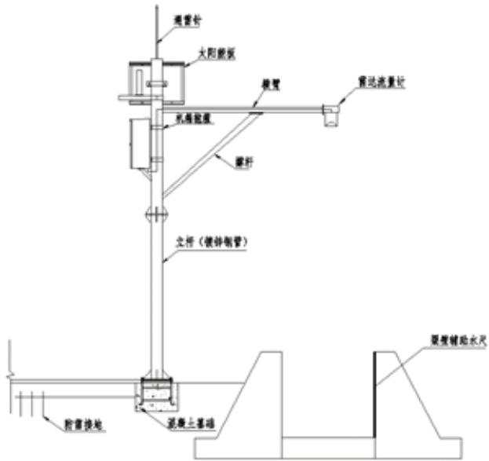
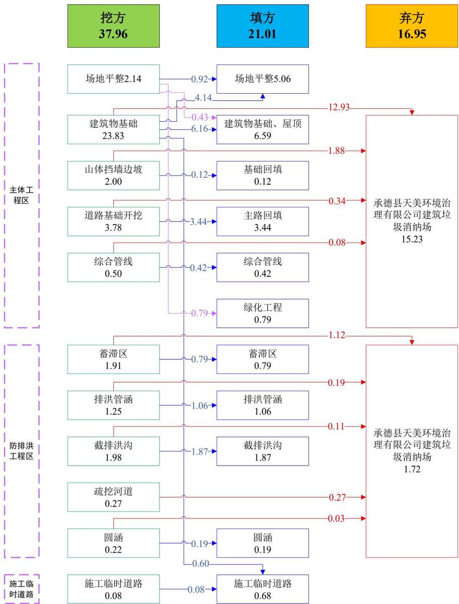
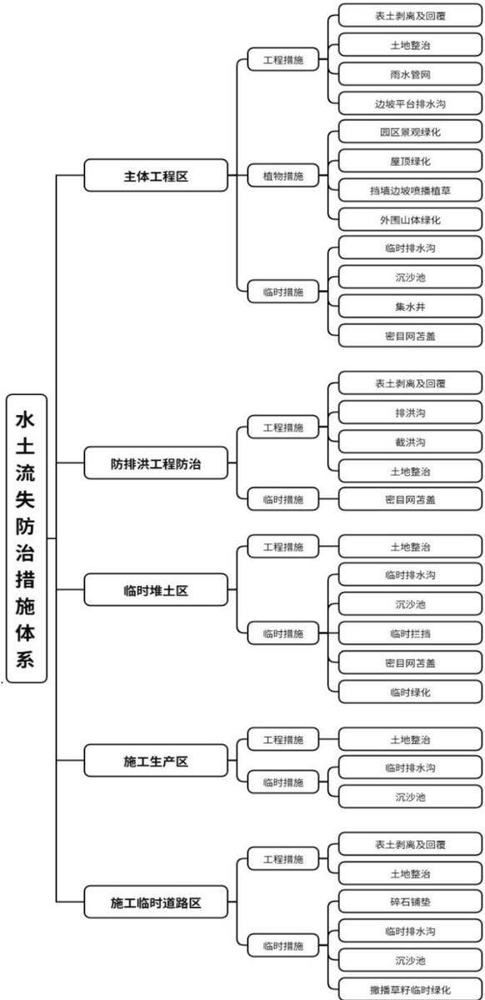

> **Zone C（应用范例层）使用边界**——仅可用于**写作风格、章节展开方式、表达逻辑、表格设计**的参考。
> **不得**用于合规判断；**不得**引入其项目数据（名称／地点／数字／单位名）；
> **不得**因其"曾经通过审批"而推定其做法在当前标准下仍然合规。
> 与 Zone A 冲突时**一律以 Zone A 为准**；Zone A 未明确规定时输出
> 「**Zone A 未明确规定，以下为参考写法，需人工判断**」。
>
> **坐标系警告**：本范例为**老八章结构**（GB 50433—2018 附录B），与 2026 版 10 章模板**同号不同义**
> （老 `1.5`＝防治目标，新 `1.5`＝水土流失预测结果；老 4→新 6 …偏移 +2；新版第 4/5 章老结构无独立章）。
> 因此 **`chapter_mapping: pending`——不得按章节号挂载**，检索一律走 `topic_tags`。
>
> **待加工**：`topic_tags`（主题标签）、`approval_basis_list`（编制依据逐字清单）、
> `structure_summary`（只提取结构：章节展开顺序／段落功能／表格栏目结构／句式模板／论证链步骤）。

1 综合说明.  
1.1 项目简况 ....  
1.2 编制依据 ....  
1.3 设计水平年 ...  
1.4 水土流失防治责任范围.  
1.5 水土流失防治目标 .......  
1.6 项目水土保持评价结论. .. 8  
1.7 水土流失预测结果.... .11  
1.8 水土保持措施布设成果. ..11  
1.9 水土保持监测方案..... ... 13  
1.10 水土保持投资及效益分析成果.. ... 13  
1.11 结论 .... ... 13  
2 项目概况 ........ ..... 18  
2.1 项目组成及工程布置. ... 18  
2.2 施工组织 ...... .... 41  
2.3工程占地..... ..47  
2.4 土石方平衡 ........ ... 49  
2.5 拆迁（移民）安置与专项设施改（迁）建...... ... 55  
2.6 施工进度. ..55  
2.7自然概况... ... 57  
3 项目水土保持评价 .......... ..... 64  
3.1 主体工程选址（线）水土保持评价 ... 64  
3.2建设方案与布局水土保持评价......... .... 65  
3.3主体工程设计中水土保持措施界定.. ... 92  
4 水土流失分析与预测...... .... 96  
4.1水土流失现状....... ... 96  
4.2水土流失影响因素分析..... ... 96  
4.3土壤流失量预测..... .... 98  
4.4水土流失危害分析.... ..108  
4.5 指导性意见 .... ..108  
5 水土保持措施 ...... .... 112  
5.1防治区划分... ..112  
5.2 措施总体布局... ...112  
5.3 分区措施布设 ..... ..117  
5.4施工要求..... ..129  
6 水土保持监测 ...... .... 136  
6.1 范围和时段 .... ...136  
6.2 内容和方法. ...136  
6.3 点位布设 .... ...141  
6.4实施条件和成果. ...142  
7 水土保持投资估算及效益分析... ...145  
7.1投资估算... ...145  
7.2 效益分析 .. ...162  
8 水土保持管理.. ...164  
8.1组织管理.. ...164  
8.2后续设计.. ...165  
8.3水土保持监测. ...165  
8.4水土保持监理 ...165  
8.5水土保持施工 ...166  
8.6 水土保持设施验收.. ...167  
附表 .. ...169  
附件. ...185

## 1 综合说明

## 1.1 项目简况

## 1.1.1 项目基本情况

（1）项目建设必要性：国家文献储备库项目建设是落实“十三五”规划纲要、增强文化软实力的关键举措，承担着传承中华文明、保障文献安全的战略使命。项目通过构建国家文献战略储备体系，实施三线分藏机制，解决文献集中保存风险，填补我国文献战略储备体系空白。作为京津冀协同发展示范工程，选址承德既缓解北京土地资源压力，又依托承德历史文化底蕴和交通区位优势，促进区域协同发展。项目同步完善国家图书馆职能，通过文献异地分藏化解馆藏集中隐患，实现数字资源长期安全备份，有效缓解馆舍库容压力，保障珍贵文献资源的安全存储，巩固国家总书库职能，为文化传承和学术研究提供永续支撑。

因此，本工程建设是必要的。

（2）项目位置：国家文献储备库项目选址于河北省承德市承德县下坂城镇大杖子村龙王沟，承德县西区旅游新城范围内。建设场址北侧紧邻规划一号路，隔山为承德县大数据库二期工程，东南为连接现状五号路，西侧临山。中心坐标：东经 $1 1 8 ^ { \circ } ~ 0 8 ^ { \prime } 4 5 . 0 4 "$ ，北纬40°45'26.93"。

（3）建设性质：本工程建设性质为新建建设类项目。

（4）规模与等级：本工程主要包括文献存储库区、数字资源存储及灾备中心、业务加工区、配套用房、地下车库及人防工程等。项目规划用地面积 $1 0 . 1 7 \mathrm { h m } ^ { 2 }$ 总建筑面积 $6 9 6 6 8 \mathrm { m } ^ { 2 } ,$ ,其中地上建筑面积 $3 0 5 7 5 \mathrm { m } ^ { 2 }$ ，地下建筑面积 $3 9 0 9 3 \mathrm { m } ^ { 2 }$ 。容积率0.30，建筑密度19.8%，绿地率49.20%。工程等级为一级，工程规模为大型社会事业类项目。

由于本工程位于滦河支沟龙王沟沟口山洪汇流区域，防洪排水安全较为突出，为确保工程防洪排水安全，解决工程用地和行洪排水的矛盾，同时在项目区上游和东西两侧建设防排洪设施，主要包括6处蓄滞洪区和截排洪沟，其中6处蓄滞洪区占地面积 $7 9 2 7 \mathrm { m } ^ { 2 }$ ，可蓄滞洪水约1.39万m3，其中排洪管涵长461m，钢筋混凝土排洪沟长382.2m，混凝土排洪沟总长1244.43m，截洪沟总长1600m。防排洪工程施工扰动占地面积 $1 . 4 0 \mathrm { h m } ^ { 2 }$ ，其中规划红线外占地面积0.60hm2，规划红线内占地

面积0.80hm2。

（5）项目组成：本工程主要由主体工程、防排洪工程组成。建设内容主要包括文献存储库区、数字资源存储及灾备中心、业务加工区、配套用房、地下车库及人防工程五部分，配套建设道路广场、室外绿化、室外管线及项目区防排洪工程。

（6）施工组织：本工程施工组织由施工生产区、临时堆土区和施工道路组成。项目布置1处施工生产区，位于本工程红线内，生活区租用附近民房；场内施工道路采用永临结合布设，项目区北侧上游防排洪工程建设所需施工道路沿规划一号路建设，长度300m；项目区布设临时堆土场2处，其中1#临时堆土场0.40hm2，用于堆放项目区剥离的表土，2#临时堆土场0.66hm2，用于堆放周转建筑物基槽回填土方，堆土场均位于用地红线范围内。

（7）拆迁（移民）数量及安置方式、专项设施改（迁）建：本工程红线范围内有1处民房需要拆迁，拆迁面积约500m2，已采用货币补偿方式解决，项目不涉及专项设施改（迁）建等问题。

（8）开工与完工时间、总工期：本工程计划于2026年2月开工建设，2029年1月投产运行，建设总工期36个月。

（9）工程占地：本工程征占地面积共计11.15hm²，其中永久占地10.85hm²，临时占地0.30hm²。项目规划用地性质为公共管理与公共服务用地中的文化设施用地，现状占地类型主要为耕地、林地、草地、交通运输用地、住宅用地和其他土地。

（10）工程土石方：本工程土石方挖填总量为58.97万m³，其中开挖土石方总量37.96万m³（含表土1.63万m³），填筑土石方总量21.01万m³（含表土1.63万m³），无借方，弃方16.95万m³，弃方外运至承德县天美环境治理有限公司建筑垃圾消纳场消纳解决，运距约13km，该项目为承德县建筑垃圾消纳场，年处理固体废弃物30-100万m3，能满足本工程土方消纳需求。土方运输过程中水土流失防治责任由建设单位负责，待土方接收完成后，水土流失防治责任由土方接收单位负责。

（11）工程总投资及土建投资：工程总投资84012万元，其中土建投资68432万元，项目资金来源全部申请中央预算内资金解决。

## 1.1.2 项目前期工作进展情况

## （1）主体工程设计情况

2015年9月21日，国家发展改革委出具了《关于报批国家图书馆国家文献战略储备库建设工程项目建议书的请示》（发改社会〔2015〕2130号）；

2015年11月3日，国家发展改革委以《关于印发国家发展改革委关于报批国家文献储备库项目项目建议书的请示的通知》（发改社会〔2015〕2534号），对本工程项目建议书进行了批复；

2017年5月，北京矿冶研究总院编制完成了《建设项目环境影响报告表》；

2017年8月，建设单位委托中国中元国际工程有限公司编制完成了《国家文献储备库项目可行性研究报告》，2018年4月13日，国家发展改革委以《国家发展改革委关于国家文献储备库项目可行性研究报告的批复》（发改社会〔2018〕565号）对本工程可研报告进行了批复；

2017年11月，河北省水利水电第二勘测设计研究院编制完成了《国家文献储备库项目防洪评价报告》；

2024年11月，建设单位委托北京中水利德科技发展有限公司编制完成了《国家文献储备库项目防排洪工程初步设计方案》；

2025年5月，建设单位委托北京中水利德科技发展有限公司编制完成了《国家文献储备库项目防排洪工程施工图设计总说明》；

2025年5月，建设单位委托中国建筑设计研究院有限公司编制完成了《国家文献储备库项目初步设计方案》；

2025年5月，北京城建勘测设计研究院有限责任公司编制完成了《国家图书馆国家文献战略储备库项目山体支护及基坑支护设计》；

2025年6月16日，国家发改委以《国家发展改革委关于国家文献储备库项目初步设计方案和投资概算的批复》（发改投资〔2025〕746号）对本工程初步设计进行了批复；

目前本工程已取得建设项目选址意见书、建设用地规划许可证、环境影响报告批复、防洪评价报告批复等文件。

## （2）水土保持方案编制情况

根据《中华人民共和国水土保持法》、《生产建设项目水土保持方案管理办法》和《关于印发河北省生产建设项目水土保持方案编制范围的通知》（冀水保〔2023〕15号）等规定，本工程位于河北省承德市承德县，属于水土保持方案编制范围。2025年4月，建设单位国家图书馆委托江河水利开发中心有限责任公司编制本工程水土保持方案。我单位接到任务后，安排专业技术人员对现场进行了查勘和资料收集，并于2025年11月编制完成了《国家文献储备库项目水土保持方案报告书》。

## 1.1.3 自然简况

项目位于承德市承德县，承德县位于河北省东北部，地属南部燕山地槽和北部内蒙古台背过渡带，项目区属于中低山地貌类型，本工程所在地块外围四面环山，与滦河隔山相望。用地范围内地势较为平坦。

项目区气候类型属东亚暖温带大陆性季风气候，工程位置附近多年平均气温10.2℃。1月最冷，平均气温-7.5℃，7月最热，平均气温24.5℃，极端最高气温36.1℃，极端最低气温-18℃。全年日照时数为2212.5h，平均无霜期198d，最大冻土深度1.26m。多年平均风速1.4m/s，最大风速17m/s，多年平均蒸发量1459mm（φ20cm蒸发皿），多年平均降水量560mm，降水多集中在6、7、8月， $\geqslant 1 0 \mathrm { { \bar { C } } }$ 积温为3703.2℃。

项目区土壤类型以褐土为主。土壤质地较好，酸碱度适中，养分含量较为丰富，表土厚度约10\~35cm。

项目区植被类型为暖温带落叶阔叶林针叶林区域，主要分布有草地植被和林地植被，项目区森林覆盖率在60.14％以上。工程区范围内主要以乔灌木、野生草本和农作物为主，建设区范围内林草覆盖率约75.60%。

根据项目区情况，水土流失类型区划为北方土石山区-燕山及辽西山地丘陵区-燕山山地丘陵水源涵养生态维护区，土壤侵蚀类型以水力侵蚀为主，容许土壤流失量为 $2 0 0 \mathrm { t / k m } ^ { 2 } { \cdot } \mathbf { a }$ ，侵蚀强度以微度为主。

通过查询国家级水土流失重点预防区和重点治理区查询系统，项目区不涉及国家级水土流失重点预防区，项目区不属于省级、市县级水土流失重点预防区和重点治理区。项目所在地不涉及河湖管理范围和生态保护红线，不涉及饮用水水源保护区、水功能一级区的保护区和保留区，不属于自然保护区、世界文化和自然遗产地、风景名胜区、地质公园、森林公园、重要湿地等水土保持敏感区。

## 1.2 编制依据

## 1.2.1 法律法规

（1）《中华人民共和国水土保持法》（2010年12月25日第十一届全国人民代表大会常务委员会第十八次会议修订，自2011年3月1日施行）；

（2）《河北省实施<中华人民共和国水土保持法>办法》（河北省人民代表大会常务委员会，2018年5月31日修正）。

## 1.2.2 规章及规范性文件

（1）《生产建设项目水土保持方案管理办法》（水利部令第 53号发布，2023年1月 17日）；

（2）中共中央办公厅、国务院办公厅《关于加强新时代水土保持工作的意见》（2023 年 1月3日公开）；

（3）《关于做好国家级水土流失重点预防区和重点治理区落地上图成果应用的通知》（办水保〔2025〕170号）；

（4）《水利部办公厅关于印发生产建设项目水土保持技术文件编写和印制格式规定(试行)的通知》（办水保〔2018〕135号）；

（5）《水利部办公厅关于印发生产建设项目水土保持方案审查要点的通知》（办水保〔2023〕177号）；

（6）《河北省生产建设项目水土保持方案管理办法》（冀水保〔2023〕31号）（河北省水利厅 河北省政务服务管理办公室，2023 年12月19日）；

（7）《河北省水利厅关于发布省级水土流失重点预防区和重点治理区的公告》（冀水保〔2018〕4号）；

（8）《河北省水利厅关于生产建设项目水土保持方案编制范围的指导意见》（冀水保〔2020〕6号）。

## 1.2.3 技术规范及标准

（1）《水土保持工程设计规范》（GB51018-2014）；

（2）《生产建设项目水土保持技术标准》（GB50433-2018）；

（3）《生产建设项目水土流失防治标准》（GB/T50434-2018）；

（4）《土地利用现状分类》（GB/T 21010-2017）；

（5）《水土保持监理规范》（SL/T 523-2024）；

（6）《水土保持工程调查与勘测标准》（GB/T 51297-2018）；

（7）《水利工程设计概（估）算编制规定》（水总〔2024〕323号）；

（8）《水利水电工程制图标准水土保持图》（SL73.6-2015）；

（9）《生产建设项目土壤流失量测算导则》（SL773-2018）；

（10）《水土保持监测技术规范》（SL/T 277-2024）；

（11）《生态清洁小流域建设技术规范》（SL/T 534-2023）；

（12）《表土剥离及其再利用技术要求》（GB/T 45107—2024）；

（13）《水利水电工程等级划分及洪水标准》（SL252-2017）；

（14）《防洪标准》（GB50201-2014）；

（15）《水利工程水利计算规范》（SL104-2015）；

（16）《河道整治设计规范》（GB50707-2011）；

（17）《堤防工程设计规范》（GB50286-2013）；

（18）《水工混凝土结构设计规范》（SL191-2008）；

（19）《水利水电工程边坡设计规范》（SL386-2007）；

（20）《建筑地基基础设计规范》（GB50007-2011）；

（21）《水利水电工程施工组织设计规范》（SL303-2017）；

（22）《室外排水设计规范》（GB50014-2021）；

（23）《水利水电工程初步设计报告编制规程》SL619-2013。

## 1.2.4 技术文件及资料

（1）《全国水土保持规划（2015-2030年）》（国函〔2015〕160号）；

（2）《河北省水土保持规划（2016-2030 年）》（冀政字〔2017〕35 号）；

（3）《国家文献储备库项目可行性研究报告》（中国中元国际工程有限公司，2017 年8 月）；

（4）《国家文献储备库项目初步设计方案》（中国建筑设计研究院有限公司，2025年5 月）；

（5）《国家文献储备库项目防排洪工程施工图设计总说明》（北京中水利德科技发展有限公司，2025年5月）；

（6）《国家图书馆国家文献战略储备库项目山体支护及基坑支护设计》（北

京城建勘测设计研究院有限责任公司，2025年5月）；

（7）项目组设计人员实地踏勘的调查资料以及建设单位提供的相关资料。

## 1.3 设计水平年

根据主体工程进度安排，本工程计划于2026年2月开工，2029年1月完工，总工期36个月，本方案设计水平年为主体工程完工后的当年，即2029年。

## 1.4 水土流失防治责任范围

本工程水土流失防治责任范围面积 $1 1 . 1 5 \mathrm { h m } ^ { 2 }$ ，为永久占地 $1 0 . 8 5 \mathrm { h m } ^ { 2 }$ ，临时占地 $\cdot 0 . 3 0 \mathrm { h m } ^ { 2 }$ 。防治责任主体为国家图书馆。防治责任范围见表1.4-1。

表1.4-1  
水土流失防治责任范围表  
单位：hm2
<table><tr><td rowspan=2 colspan=1>项目组成</td><td rowspan=1 colspan=2>占地性质</td><td rowspan=2 colspan=1>合计</td></tr><tr><td rowspan=1 colspan=1>永久占地</td><td rowspan=1 colspan=1>临时占地</td></tr><tr><td rowspan=1 colspan=1>主体工程区</td><td rowspan=1 colspan=1>9.45</td><td rowspan=1 colspan=1></td><td rowspan=1 colspan=1>9.45</td></tr><tr><td rowspan=1 colspan=1>防排洪工程区</td><td rowspan=1 colspan=1>1.40</td><td rowspan=1 colspan=1></td><td rowspan=1 colspan=1>1.40</td></tr><tr><td rowspan=1 colspan=1>施工生产区</td><td rowspan=1 colspan=1>(0.10)</td><td rowspan=1 colspan=1></td><td rowspan=1 colspan=1>(0.10)</td></tr><tr><td rowspan=1 colspan=1>临时堆土区</td><td rowspan=1 colspan=1>(1.06)</td><td rowspan=1 colspan=1></td><td rowspan=1 colspan=1>(1.06)</td></tr><tr><td rowspan=1 colspan=1>施工临时道路区</td><td rowspan=1 colspan=1></td><td rowspan=1 colspan=1>0.30</td><td rowspan=1 colspan=1>0.30</td></tr><tr><td rowspan=1 colspan=1>合计</td><td rowspan=1 colspan=1>10.85</td><td rowspan=1 colspan=1>0.30</td><td rowspan=1 colspan=1>11.15</td></tr></table>

注：临时堆土区和施工生产区位于红线范围内，不重复计算；其中防排洪工程区中0.60hm2和边坡工程中0.08hm2，位于规划用地红线范围外，但属于项目预留用地范围，计入永久占地。

## 1.5 水土流失防治目标

## 1.5.1执行标准等级

根据《关于做好国家级水土流失重点预防区和重点治理区落地上图成果应用的通知》（办水保〔2025〕170号）和工程所在地水土流失重点防治区划分成果，工程不涉及国家级水土流失重点预防区和重点治理区，不涉及省级、市县级水土流失重点预防区和重点治理区；不在饮用水水源保护区、水功能一级区的保护区和保留区、自然保护区、世界文化和自然遗产地、风景名胜区、地质公园、森林公园、重要湿地等区域内；不在县级及以上城市区域内；不在湖泊和已建成水库周边，但位于滦河西侧3km汇流范围内，且项目周边500m范围内有居民点。因此根据《生产建设项目水土流失防治标准》（GB/T50434-2018）规定，本工程水土流失防治标准执行北方土石山区二级水土流失防治标准。

## 1.5.2防治目标

根据《生产建设项目水土流失防治标准》（GB/T50434-2018）的相关规定，本工程应达到以下基本目标：

（1）项目建设范围内的新增水土流失应得到有效控制，原有水土流失得到治理；

（2）水土保持设施应安全有效；

（3）水土资源、林草植被应得到最大限度地保护与恢复；

（4）北方土石山区二级标准设计水平年防治指标值国标中为：水土流失治理度92%，土壤流失控制比0.85，渣土防护率95%，表土保护率92%，林草植被恢复率95％，林草覆盖率22%。项目区以微度水力侵蚀为主，土壤流失控制比应不小于1.0，本工程土壤流失控制比提高0.15，其他防治指标不做调整。

本工程水土流失防治目标指标值见表1.5-1。

表1.5-1  
本工程水土流失防治指标值
<table><tr><td rowspan=2 colspan=1>防治指标</td><td rowspan=1 colspan=2>标准规定</td><td rowspan=2 colspan=1>参数修正</td><td rowspan=1 colspan=2>采用标准</td></tr><tr><td rowspan=1 colspan=1>施工期</td><td rowspan=1 colspan=1>设计水平年</td><td rowspan=1 colspan=1>施工期</td><td rowspan=1 colspan=1>设计水平年</td></tr><tr><td rowspan=1 colspan=1>水土流失治理度(%)</td><td rowspan=1 colspan=1>一</td><td rowspan=1 colspan=1>92</td><td rowspan=1 colspan=1>1</td><td rowspan=1 colspan=1>一</td><td rowspan=1 colspan=1>92</td></tr><tr><td rowspan=1 colspan=1>土壤流失控制比</td><td rowspan=1 colspan=1>一</td><td rowspan=1 colspan=1>0.85</td><td rowspan=1 colspan=1>微度侵蚀，提高防治标准+0.15</td><td rowspan=1 colspan=1>一</td><td rowspan=1 colspan=1>1.0</td></tr><tr><td rowspan=1 colspan=1>渣土防护率(%)</td><td rowspan=1 colspan=1>90</td><td rowspan=1 colspan=1>95</td><td rowspan=1 colspan=1>1</td><td rowspan=1 colspan=1>90</td><td rowspan=1 colspan=1>95</td></tr><tr><td rowspan=1 colspan=1>表土保护率(%)</td><td rowspan=1 colspan=1>92</td><td rowspan=1 colspan=1>92</td><td rowspan=1 colspan=1>1</td><td rowspan=1 colspan=1>92</td><td rowspan=1 colspan=1>92</td></tr><tr><td rowspan=1 colspan=1>林草植被恢复率(%)</td><td rowspan=1 colspan=1>二</td><td rowspan=1 colspan=1>95</td><td rowspan=1 colspan=1>1</td><td rowspan=1 colspan=1>二</td><td rowspan=1 colspan=1>95</td></tr><tr><td rowspan=1 colspan=1>林草覆盖率(%)</td><td rowspan=1 colspan=1>一</td><td rowspan=1 colspan=1>22</td><td rowspan=1 colspan=1>/</td><td rowspan=1 colspan=1>一</td><td rowspan=1 colspan=1>22</td></tr></table>

## 1.6 项目水土保持评价结论

## 1.6.1 主体工程选址（线）评价

本工程选址（线）不涉及国家级水土流失重点治理区和重点预防区，不涉及省级和市县级水土流失重点治理区和重点预防区，但500m范围内有居民点，本工程施工期间优化了施工工艺，减少了土方裸露时间和临时占地，并通过提高水土流失防治目标值和完善水土流失防治体系，予以控制水土流失。本工程不涉及河流两岸、湖泊和水库周边的植物保护带；工程选址范围内无全国水土保持监测网络中的水土保持监测站点、重点试验区和国家确定的水土保持长期定位观测站。项目建设区不涉及饮用水水源保护区、水功能一级区的保护区和保留区、自然保护区、世界文化和自然遗产地、风景名胜区、地质公园、森林公园以及重要湿地等。根据现场调查和当地水行政主管部门咨询，项目所在位置不涉及重点小流域治理区域，项目所在的龙王沟未进行过小流域治理，项目区无小流域治理相关设施，主体设计增加龙王沟的防排洪工程，排导、蓄滞龙王沟的汇水，减少龙王沟周边及上游山体汇水对主体工程的影响，符合水土保持要求。

综上所述，本工程主体工程选址（线）不涉及国家级、省级和市县级水土流失重点治理区和重点预防区，不存在水土保持制约性因素，同时根据项目建设重要性的定位，通过提高建设标准，优化施工工艺，符合水土保持要求。

## 1.6.2 建设方案与布局评价

## （1）建设方案评价

鉴于本工程建设重要性，且属于京津冀协同示范建设项目，已按要求提高植被建设标准，优化施工方案，减少占地。项目施工期建设采取苫盖措施，建成后有完善的排水防洪设施。项目施工方案根据场地实际情况，通过优化建设方案和施工方式，最大程度地减少了工程占地和土石方量，有利于水土保持。

综上所述，本工程建设方案符合《生产建设项目水土保持技术标准》（GB50433-2018）对建设方案的相关约束性规定。通过优化建设方案和施工工艺来减少水土流失，从水土保持的角度来看，本工程建设方案合理。

## （2）工程占地的评价

本方案复核后工程征占地面积共计11.15hm²，其中永久占地10.85hm²，临时占地0.30hm²，本工程划分主体工程区、防排洪工程区、施工生产区、临时堆土区和施工临时道路区。根据建设项目选址意见书，工程永久占地类型为公共管理与公共服务用地中的文化设施用地。根据现状调查，工程占地主要类型为林地、草地和耕地，占总占地的92.56%。项目区不占用基本农田。建设单位已取得该地块不动产权证书，不存在制约性因素。

本工程文献资源计划存储总量为2555.72万册，根据《公共图书馆建设用地指标》建标[2008]74号，参考《河北省建设用地使用标准》(2024年版)，本工程为公共图书馆大型馆，用地指标 $1 2 . 7 \mathrm { h m } ^ { 2 } { \sim } 1 5 . 5 \mathrm { h m } ^ { 2 }$ ，本工程永久用地面积 $1 0 . 8 5 \mathrm { h m } ^ { 2 }$ ，小于用地指标，符合集约用地的要求。

项目主体工程设计中充分考虑地形条件和场地空间，在满足工程布置的同时，

严格控制施工场地的面积，尽量减少占地。

临时占地主要为施工临时道路区占地。经统计共计增加临时占地0.30hm2，施工前应办理相关临时用地手续。

施工生活区租用附近民房，施工生产区结合生态停车场位置布设，临时堆土区设置在红线范围内，不新增临时占地。项目对外交通便利，施工用电、用水等利用已有设施或就近从已建成规划5号路引接，规划5号路配套本工程的供水、雨水、污水、通信和电力等综合管线均已预埋接口至本工程用地红线边界处，接引时无需新增临时占地，符合水土保持要求。

综上所述，主体工程确定的永久占地布局总体上较为合理，对项目施工用地考虑较周全，既满足工程布置，同时又响应了国家政策，工程占地不存在水土制约性因素，符合水土保持要求。

## （3）土石方平衡评价

本工程主体工程建设主要包括建筑物、道路广场、综合管线、绿化工程、山体边坡防护等。整组建筑±0.00标高均按标高277.00m起算，拟建范围标高-1.7\~+17.8，整体呈北高南低。经场地平整，通过建筑物基础开挖后，除部分用于基础回填，多余土方通过调配，用于道路广场回填，平整至设计标高，减少了调运距离，做到土方基本平衡。

工程回填土方结合施工时序利用自身开挖土方，工程场地内设置2处临时堆土场堆放前期剥离表土和回填土中转场地，弃方均运往承德县天美环境治理有限公司建筑垃圾消纳场消纳解决，运距约13km。

综上，工程土石方挖填合理，土方调运节点适宜，时序合理，运距合理。

## （4）取土场、弃渣场设置

本工程不设置取土场、弃渣场。

## （5）施工方法与工艺评价

从施工方法与工艺方面分析，本工程各类建筑物（包括沟道）基础开挖采用机械施工与人工施工相结合的方法，机械以铲运机、推土机为主，人工则配合机械进行零星场地或边角地区的平整，考虑了土石方开挖、回填、运输、平整等施工工艺，基本符合水土保持要求。

本工程所采用的施工工艺在确保主体工程顺利实施的同时，考虑了水土保持要求，主体设计考虑了临时苫盖、临时排水沉沙等措施，注重施工过程中临时防护，施工结束后及时土地整治，能有效控制工程建设产生的水土流失。

## （6）具有水土保持功能工程的评价

主体设计考虑了景观绿化、边坡喷播植草、雨水管线、截排洪沟、蓄滞洪区工程、表土剥离与表土回覆等主要防护措施，同时考虑了施工过程中临时道路碎石铺垫、临时排水沉沙、临时拦挡苫盖等临时防护措施以及施工后期的土地整治等措施，形成了完整的水土流失防治体系，符合水土保持要求。

综上所述，从水土保持角度评价，项目建设是可行的。

## 1.7 水土流失预测结果

工程建设期工程建设可能产生的水土流失总量237.26t，新增水土流失总量206.85t。施工期是工程建设可能产生水土流失重点时段，水土流失的重点区域为主体工程区和临时堆土区。水土流失危害主要表现为加剧水土流失，影响小流域行洪，影响主体工程安全等。

## 1.8 水土保持措施布设成果

本方案根据工程组成和施工工艺，将项目区分为主体工程区、防排洪工程区、临时堆土区、施工生产区和施工临时道路区等5个一级防治区。根据各分区的特点，布设相应的水土保持措施。

## （1）主体工程区

施工前对可剥离表土区域进行表土剥离，其中耕地按30cm剥离，林地和草地按20cm剥离，剥离表土面积 $5 . 2 8 \mathrm { h m } ^ { 2 }$ ，表土剥离量1.22万m3，实施时间2026年8月\~2026年10月。施工前期先进行山体支护，对东西两侧山体边坡进行防护，在边坡平台设置40cm×40cm混凝土排水沟，并对土层边坡进行喷播植草防护，实施排水沟长度371m，喷播植草 $2 8 0 7 \mathrm { m } ^ { 2 }$ ，实施时间2026年4月\~2026年7月。施工过程中对建筑物基础开挖的裸露边坡、管沟开挖土方和绿化裸露区进行临时苫盖，密目网苫盖面积 $3 9 1 1 1 \mathrm { m } ^ { 2 }$ ，实施时间2026年3月\~2027年7月。基坑坡脚设置临时排水沟和集水井，基坑临时排水沟880m，集水井16座，实施时间2026年10月\~12月。基坑外侧施工场地设置临时排水沟424m，排水沟底宽0.4m，深0.6m，砖砌沉沙池2座，实施时间2026年3月\~5月。工程施工后期完成场内雨水排水系统，其中排水管线715m，实施时间2028年6月\~2028年9月。施工后期对场内绿化区域回覆表土并进行土地整治，回覆表土1.22万m3，土地整治 $2 . 0 9 \mathrm { h m } ^ { 2 }$ ，实施时间2028年1月\~2028年3月。建筑物屋顶绿化 $. 4 3 3 9 . 3 7 \mathrm { m } ^ { 2 }$ ，园内景观绿化 $1 . 6 6 \mathrm { h m } ^ { 2 }$ ，外围山体撒播草籽绿化 $3 . 3 4 \mathrm { h m } ^ { 2 }$ ，实施时间2028年6月\~2028年11月。

## （2）防排洪工程区

施工前对该区域内可剥离表土区域进行表土剥离，其中耕地按30cm剥离，林地按20cm剥离，剥离表土面积 $1 . 4 0 \mathrm { h m } ^ { 2 }$ ，表土剥离量0.33万m3，实施时间2026年3月\~2026年4月。在项目区东西两侧修建截排洪沟，截洪沟采取浆砌石结构，排洪沟采取混凝土结构和钢筋混凝土结构，共计布设排洪管涵461m、混凝土排洪沟1244.43m、浆砌石截洪沟1600m、钢筋混凝土水簸箕8个、钢筋混凝土排洪沟（东支沟）382.2m，实施时间2026年3月\~2026年7月。土方开挖施工时，对沟槽开挖土方和蓄滞洪区开挖裸露面采用密目网进行苫盖防护，密目网苫盖面积14000m2，实施时间2026年3月\~2026年6月。施工后期对蓄滞洪区和沟道外侧扰动区回覆表土，土地整治，回覆表 $\pm 0 . 3 3 \sqrt { \mathrm { { f } } } \mathrm { { m } } ^ { 3 }$ ，土地整治面积1.08hm2，实施时间2026年6月\~2026年7月。

## （3）临时堆土区

工程前期剥离表土需要集中临时堆存，堆土场周边采用编织袋装土拦挡，密目网苫盖，撒播草籽临时绿化，基础回填后，进行土地整治。土地整治1.06hm2，其中2#堆土场实施时间2027年4月；1#堆土场实施时间2028年1月。编织袋挡墙494m，实施时间2026年4月；密目网苫盖面积 $1 5 9 0 0 \mathrm { m } ^ { 2 }$ ，临时绿化4000m2，实施时间2026年8月\~2026年9月。临时土质排水沟48m，临时砖砌排水沟148m，临时沉沙池2座，实施时间2026年3月\~2026年5月。编织袋装土挡墙拆除494m，实施时间2027年3月和2027年12月。

## （4）施工生产区

施工前，在施工生产区周边布设临时排水设施，施工结束后，对场地进行土地整治。临时排水沟155m，实施时间2026年3月。土地整治0.10hm2，实施时间2028年6月。

## （5）施工临时道路区

本工程前期对占用耕地剥离表土，结合规划一号路设计，先对道路进行平整清理，采用碎石铺盖，在临时道路一侧设置临时排水沟，排水沟末端设置沉沙池。

后期回覆表土，对边坡进行整治，撒播草籽进行临时绿化。排水沟采用梯形断面，土质结构，沉沙池采用砖砌水泥砂浆抹面。其中表土剥离及回覆0.08万m3，实施时间2026年3月、2026年5月。碎石铺垫 $1 3 5 0 \mathrm { m } ^ { 2 }$ ，临时排水沟300m，沉沙池1座，实施时间2026年3月。土地整治 $0 . 1 7 \mathrm { h m } ^ { 2 }$ ，路基边坡撒草籽临时绿化 $\phantom { - } 0 . 1 7 \mathrm { h m } ^ { 2 }$ ，实施时间2026年5月。

## 1.9 水土保持监测方案

本工程水土保持监测内容主要包括：扰动水土流失影响因素、水土流失状况、水土保持措施、水土流失危害。水土保持监测范围为本工程水土流失防治责任范围 $1 1 . 1 5 \mathrm { h m } ^ { 2 }$ 。本工程水土保持监测时段为施工准备期开始至设计水平年结束，即2026年2月至2029年。

本工程主要采取定位监测、调查监测、无人机监测、资料分析相结合的方法，监测重点时段为施工期，监测重点区域为临时堆土区、建筑物工程区。

本工程共布设12个监测点位，其中主体工程区6个、防排洪工程2个、临时堆土区2个、施工生产区1个和施工临时道路区1个监测点。

## 1.10 水土保持投资及效益分析成果

## （1）水土保持投资

本工程水土保持总投资为1459.27万元，其中工程措施投资595.26万元，植物措施投资509.22万元，监测措施费63.44万元，施工临时措施投资145.36万元，独立费用88.33万元（其中建设管理费19.70万元，水土保持监理费36.00万元，科研勘测设计费32.63万元，基本预备费42.05万元，水土保持补偿费15.61万元。

## （2）水土流失防治效果

工程的六项防治指标全部达标：水土流失治理度96.50%，土壤流失控制比为1.08，渣土防护率98.84%，表土保护率98.77%，恢复林草植被面积 $5 . 5 6 \mathrm { h m } ^ { 2 }$ ，林草植被恢复率为97.37%，林草覆盖率为49.87%。可治理水土流失面积 $1 1 . 1 5 \mathrm { h m } ^ { 2 }$ ，林草植被建设面积 $5 . 5 6 \mathrm { h m } ^ { 2 }$ ，减少水土流失量196t。通过水土保持综合治理，项目区水土流失得到控制，实现防治目标。

## 1.11 结论

## 1.11.1 结论

根据《中华人民共和国水土保持法》、《生产建设项目水土保持技术标准》（GB50433-2018）等相关规定，本工程不涉及国家级和省级、市县级水土流失重点治理区和重点预防区，但工程位于滦河西侧3km汇流范围内，且项目周边500m范围内有居民点，本方案采用北方土石山区二级防治标准，提高土壤流失控制比防治目标值，修建防排洪设施，采用防洪标准为百年一遇，通过优化施工工艺，减少地表扰动和植被破坏，加强防护和治理。工程选址（线）基本满足水土保持相关要求。

主体设计方案合理可行，建设方案及布局、工程占地、土石方工程量及工程施工组织设计等方面均符合水土保持要求。本方案界定出主体工程设计中具有水土保持功能的水保措施，包括永久防护措施和施工期的临时防护措施，能够形成综合防治体系，可有效的防治工程建设造成的水土流失。

本方案水土保持措施实施后，至设计水平年六项指标均达到目标值，总体上可有效地治理工程建设及完工后续阶段的新增和原有水土流失，保护和改善工程区的生态环境，恢复工程区内的林草植被，对保障工程安全运行和促进区域可持续发展起到重要作用。

由以上分析可知：本工程通过方案的水土保持措施治理后，项目建设满足水土保持要求。

## 1.11.2 建议

（1）为确保有效的控制本工程在实施过程中人为的水土流失，建设单位应要求施工单位将批复的水土保持方案中的水土保持措施在施工期间，认真落实组织落实，进行水土保持方案要求纳入施工组织设计，优化工程建设区的水土保持措施设计内容。当主体工程设计发生重大变更时，应重新报批水土保持方案。

（2）建设单位签订工程招标承包合同时，应在合同中明确施工单位需按照水土保持技术要求施工，明确水土流失防治责任、义务和范围，严禁在建设过程中随意扩大施工扰动范围。

（3）施工单位应根据水土保持设施验收标准，将水土保持工作内容纳入施工组织设计中，严格按照行业规范要求和批准的水土保持设计进行施工作业，不得擅自变更，做到文明施工，安全生产。

（4）建设单位在方案批复后应及时委托开展水土保持监理、监测工作，确保工程水土流失有效防护。

（5）项目投产使用前，生产建设单位应当按照水利部规定的标准和要求，开展水土保持设施自主验收，验收结果向社会公开并报水利部备案。水土保持设施未经验收或者验收不合格的，生产建设项目不得投产使用。

本工程主要特性详见水土保持方案特性表。

水土保持方案特性表
<table><tr><td colspan="2" rowspan="1">项目名称</td><td colspan="7" rowspan="1">国家文献储备库项目</td><td colspan="3" rowspan="1">流域管理机构</td><td colspan="1" rowspan="1">海河水利委员会</td></tr><tr><td colspan="2" rowspan="1">涉及省（市、区）</td><td colspan="3" rowspan="1">河北省</td><td colspan="2" rowspan="1">涉及地市或个数</td><td colspan="2" rowspan="1">承德市</td><td colspan="3" rowspan="1">涉及县或个数</td><td colspan="1" rowspan="1">承德县</td></tr><tr><td colspan="2" rowspan="1">项目规模</td><td colspan="3" rowspan="1">大型</td><td colspan="2" rowspan="1">总投资（万元）</td><td colspan="2" rowspan="1">84012</td><td colspan="3" rowspan="1">土建投资（万元）</td><td colspan="1" rowspan="1">68432</td></tr><tr><td colspan="2" rowspan="1">动工时间</td><td colspan="3" rowspan="1">2026年2月</td><td colspan="2" rowspan="1">完工时间</td><td colspan="2" rowspan="1">2029年1月</td><td colspan="3" rowspan="1">设计水平年</td><td colspan="1" rowspan="1">2029年</td></tr><tr><td colspan="2" rowspan="1">工程占地(hm²)</td><td colspan="3" rowspan="1">11.15</td><td colspan="2" rowspan="1">永久占地（hm²）</td><td colspan="2" rowspan="1">10.85</td><td colspan="3" rowspan="1">临时占地（hm²）</td><td colspan="1" rowspan="1">0.30</td></tr><tr><td colspan="5" rowspan="2">土石方量（万m³）</td><td colspan="2" rowspan="1">挖方</td><td colspan="2" rowspan="1">填方</td><td colspan="3" rowspan="1">借方</td><td colspan="1" rowspan="1">余方</td></tr><tr><td colspan="2" rowspan="1">37.96</td><td colspan="2" rowspan="1">21.01</td><td colspan="3" rowspan="1">1</td><td colspan="1" rowspan="1">16.95</td></tr><tr><td colspan="5" rowspan="1">重点防治区名称</td><td colspan="8" rowspan="1">不涉及</td></tr><tr><td colspan="5" rowspan="1">地貌类型</td><td colspan="2" rowspan="1">低山丘陵区</td><td colspan="5" rowspan="1">水土保持区划</td><td colspan="1" rowspan="1">北方土石山区</td></tr><tr><td colspan="5" rowspan="1">土壤侵蚀类型</td><td colspan="2" rowspan="1">水力侵蚀</td><td colspan="5" rowspan="1">土壤侵蚀强度</td><td colspan="1" rowspan="1">微度</td></tr><tr><td colspan="5" rowspan="1">防治责任范围面积（hm²）</td><td colspan="2" rowspan="1">11.15</td><td colspan="5" rowspan="1">容许土壤流失量(t/km²·a)</td><td colspan="1" rowspan="1">200</td></tr><tr><td colspan="5" rowspan="1">土壤流失预测总量（t）</td><td colspan="2" rowspan="1">237.26</td><td colspan="5" rowspan="1">新增土壤流失量（t）</td><td colspan="1" rowspan="1">206.85</td></tr><tr><td colspan="5" rowspan="1">水土流失防治标准执行等级</td><td colspan="8" rowspan="1">北方土石山区二级防治标准</td></tr><tr><td colspan="1" rowspan="3">防治目标</td><td colspan="4" rowspan="1">水土流失治理度（%）</td><td colspan="2" rowspan="1">92</td><td colspan="4" rowspan="1">土壤流失控制比</td><td colspan="2" rowspan="1">1.0</td></tr><tr><td colspan="4" rowspan="1">渣土防护率（%）</td><td colspan="2" rowspan="1">95</td><td colspan="4" rowspan="1">表土保护率（%）</td><td colspan="2" rowspan="1">92</td></tr><tr><td colspan="4" rowspan="1">林草植被恢复率（%）</td><td colspan="2" rowspan="1">95</td><td colspan="4" rowspan="1">林草覆盖率（%）</td><td colspan="2" rowspan="1">22</td></tr><tr><td colspan="1" rowspan="6">防治措施及工程量</td><td colspan="3" rowspan="1">分区</td><td colspan="3" rowspan="1">工程措施</td><td colspan="4" rowspan="1">植物措施</td><td colspan="2" rowspan="1">临时措施</td></tr><tr><td colspan="3" rowspan="1">主体工程区</td><td colspan="3" rowspan="1">表土剥离5.28hm²，回覆表土1.22万m³，土地整治2.09hm²，边坡平台排水沟371m，雨水管线715m</td><td colspan="4" rowspan="1">屋顶绿化4339.37m²，山体土质边坡喷播植草2807m²，场内景观绿化1.66hm²，外围山体撒播草籽3.34hm²</td><td colspan="2" rowspan="1">密目网苫盖39111m²，基坑排水沟880m，集水井16座，场区临时排水沟424m，沉沙池2座</td></tr><tr><td colspan="3" rowspan="1">防排洪工程区</td><td colspan="3" rowspan="1">表土剥离1.40hm²，回覆表土0.33万m³，土地整治1.08hm²，排洪管涵461m，混凝土排洪沟1244.43m，浆砌石截洪沟1600m，钢筋混凝土水簸箕8个，钢筋混凝土排洪沟382.2m</td><td colspan="4" rowspan="1">1</td><td colspan="2" rowspan="1">密目网苫盖面积14000m²</td></tr><tr><td colspan="3" rowspan="1">临时堆土区</td><td colspan="3" rowspan="1">土地整治1.06hm²</td><td colspan="4" rowspan="1">1</td><td colspan="2" rowspan="1">编织袋装土挡护494m，临时绿化4000m²，密目网苫盖15900m²，临时土质排水沟48m，临时砖砌排水沟148m，沉沙池2座</td></tr><tr><td colspan="3" rowspan="1">施工生产区</td><td colspan="3" rowspan="1">土地整治0.10hm²</td><td colspan="4" rowspan="1">1</td><td colspan="2" rowspan="1">临时排水沟155m，沉沙池1座</td></tr><tr><td colspan="3" rowspan="1">施工临时道路区</td><td colspan="3" rowspan="1">表土剥离0.30hm²，回覆表土0.08万m³，土地整治0.17hm²</td><td colspan="4" rowspan="1">1</td><td colspan="2" rowspan="1">碎石铺垫1350m²，临时绿化0.17hm²，临时排水沟300m，沉沙池1座</td></tr><tr><td colspan="4" rowspan="1">投资（万元）</td><td colspan="3" rowspan="1">595.26</td><td colspan="4" rowspan="1">509.22</td><td colspan="2" rowspan="1">145.36</td></tr><tr><td colspan="4" rowspan="1">水土保持总投资（万元）</td><td colspan="3" rowspan="1">1459.27</td><td colspan="5" rowspan="1">独立费用（万元）</td><td colspan="1" rowspan="1">88.33</td></tr><tr><td colspan="4" rowspan="1">监理费（万元）</td><td colspan="2" rowspan="1">36.00</td><td colspan="2" rowspan="1">监测费（万元）</td><td colspan="3" rowspan="1">63.44</td><td colspan="1" rowspan="1">补偿费(万元)</td><td colspan="1" rowspan="1">15.61</td></tr><tr><td colspan="3" rowspan="1">分省措施费（万元）</td><td colspan="4" rowspan="1">1</td><td colspan="3" rowspan="1">分省补偿费（万元）</td><td colspan="3" rowspan="1">1</td></tr><tr><td colspan="3" rowspan="1">方案编制单位</td><td colspan="4" rowspan="1">江河水利开发中心有限责任公司</td><td colspan="3" rowspan="1">建设单位</td><td colspan="3" rowspan="1">国家图书馆</td></tr><tr><td colspan="3" rowspan="1">法定代表人</td><td colspan="4" rowspan="1">张旭红</td><td colspan="3" rowspan="1">法定代表人</td><td colspan="3" rowspan="1">陈樱</td></tr><tr><td colspan="3" rowspan="1">地址</td><td colspan="4" rowspan="1">北京市海淀区莲花池西里26号院1号楼3层311</td><td colspan="3" rowspan="1">地址</td><td colspan="3" rowspan="1">北京市海淀区中关村南大街33号</td></tr><tr><td colspan="3" rowspan="1">邮编</td><td colspan="4" rowspan="1">100094</td><td colspan="3" rowspan="1">邮编</td><td colspan="3" rowspan="1">100081</td></tr><tr><td colspan="3" rowspan="1">联系人及电话</td><td colspan="4" rowspan="1">联系人/【已脱敏】</td><td colspan="3" rowspan="1">联系人及电话</td><td colspan="3" rowspan="1">联系人/【已脱敏】</td></tr><tr><td colspan="3" rowspan="1">传真</td><td colspan="4" rowspan="1">1</td><td colspan="3" rowspan="1">传真</td><td colspan="3" rowspan="1">1</td></tr><tr><td colspan="3" rowspan="1">电子邮箱</td><td colspan="4" rowspan="1">【已脱敏邮箱】</td><td colspan="3" rowspan="1">电子邮箱</td><td colspan="3" rowspan="1">baohan@nlc.cn</td></tr></table>

## 2 项目概况

## 2.1 项目组成及工程布置

## 2.1.1 项目基本情况

项目名称：国家文献储备库项目

建设单位：国家图书馆

建设地点：河北省承德市承德县下板城镇大杖子村龙王沟

所属流域：海河流域

建设性质：新建建设项目

建设内容及规模：本工程主要包括文献存储库区、数字资源存储及灾备中心、业务加工区、配套用房、地下车库及人防工程等。项目规划用地面积 $1 0 . 1 7 \mathrm { h m } ^ { 2 }$ 总建筑面积69668m2,其中地上建筑面积30575m2，地下建筑面积39093m2。容积率0.30，建筑密度19.8%，绿地率49.20%。

为防范上游洪水，同时在项目区上游和东西两侧建设防排洪设施，主要包括6处蓄滞洪区和截排洪沟，其中6处蓄滞洪区占地面积 $7 9 2 7 \mathrm { m } ^ { 2 }$ ，可蓄滞洪水约1.39万m3，排洪管涵长461m，钢筋混凝土排洪沟（东支沟）长382.2m，混凝土排洪沟总长1244.43m，截洪沟总长1600m。防排洪工程施工扰动占地面积 $1 . 4 0 \mathrm { h m } ^ { 2 }$ ，其中规划红线外占地面积 $0 . 6 0 \mathrm { h m } ^ { 2 }$ ，规划红线内占地面积0.80hm2。

工程投资：工程总投资84012万元，其中土建投资68432万元，项目资金来源全部申请中央预算内资金解决。

建设工期：本工程计划于2026年2月开工建设，2029年1月投产运行，建设总工期36个月。

本工程由主体工程和防排洪工程两部分等组成。

项目组成及其主要特性详见表2.1-1。

表2.1-1 国家文献储备库项目主要技术指标表
<table><tr><td rowspan=1 colspan=12>一、项目基本情况</td></tr><tr><td rowspan=1 colspan=2>项目名称</td><td rowspan=1 colspan=10>国家文献储备库项目</td></tr><tr><td rowspan=1 colspan=2>工程性质</td><td rowspan=1 colspan=3>新建建设类</td><td rowspan=1 colspan=3>所属流域</td><td rowspan=1 colspan=4>海河流域</td></tr><tr><td rowspan=1 colspan=2>建设单位</td><td rowspan=1 colspan=3>国家图书馆</td><td rowspan=1 colspan=3>建设地点</td><td rowspan=1 colspan=4>河北省承德市承德县下板城镇大杖子村龙王沟</td></tr><tr><td rowspan=1 colspan=2>总投资（万元）</td><td rowspan=1 colspan=3>84012</td><td rowspan=1 colspan=3>土建投资（万元）</td><td rowspan=1 colspan=4>68432</td></tr><tr><td rowspan=1 colspan=2>建设工期</td><td rowspan=1 colspan=10>2026年2月~2029年1月，总工期36个月</td></tr><tr><td rowspan=1 colspan=2>建设规模</td><td rowspan=1 colspan=10>总建筑面积 $6 9 6 6 8 \mathrm { m } ^ { 2 }$ ，其中地上30575m²，地下 $3 9 0 9 3 \mathrm { m } ^ { 2 }$ </td></tr><tr><td rowspan=1 colspan=2>建筑密度</td><td rowspan=1 colspan=10>19.8%</td></tr><tr><td rowspan=1 colspan=2>绿化面积</td><td rowspan=1 colspan=10>总绿化面积 $5 . 0 0 \mathrm { h m } ^ { 2 }$ ，其中外围山体绿化面积3.34m²，场区内绿化面积 $1 . 6 6 \mathrm { m } ^ { 2 }$ ，建筑屋顶绿化面积4339.37m²未计入绿地率。</td></tr><tr><td rowspan=1 colspan=2>防排洪工程</td><td rowspan=1 colspan=10>6处蓄滞洪区和截排洪沟，其中6处蓄滞洪区占地面积7927m²，可蓄滞洪水约1.39万 $\mathrm { m } ^ { 3 }$ ，排洪管涵长461m，钢筋混凝土排洪沟长382.2m，混凝土排洪沟总长1244.43m，截洪沟总长1600m。防排洪工程施工扰动占地面积 $1 . 4 \mathrm { h m } ^ { 2 } ,$ 其中规划红线外占地面积0.60hm²，规划红线内占地面积0.80hm²。</td></tr><tr><td rowspan=1 colspan=12>二、项目组成及主要技术指标</td></tr><tr><td rowspan=2 colspan=2>项目组成</td><td rowspan=1 colspan=6>占地面积（hm²）</td><td rowspan=1 colspan=4>备注</td></tr><tr><td rowspan=1 colspan=2>永久占地</td><td rowspan=1 colspan=2>临时占地</td><td rowspan=1 colspan=2>小计</td><td rowspan=1 colspan=4></td></tr><tr><td rowspan=1 colspan=2>主体工程区</td><td rowspan=1 colspan=2>9.45</td><td rowspan=1 colspan=2></td><td rowspan=1 colspan=2>9.45</td><td rowspan=1 colspan=4>其中建筑物占地2.41hm²，道路广场硬化场地 2.04hm²，绿化区占地 5.00hm²</td></tr><tr><td rowspan=1 colspan=2>防排洪工程区</td><td rowspan=1 colspan=2>1.40</td><td rowspan=1 colspan=2></td><td rowspan=1 colspan=2>1.40</td><td rowspan=1 colspan=4></td></tr><tr><td rowspan=1 colspan=2>施工生产区</td><td rowspan=1 colspan=2>(0.10)</td><td rowspan=1 colspan=2></td><td rowspan=1 colspan=2>(0.10)</td><td rowspan=1 colspan=4>布设红线范围内，规划停车场位置</td></tr><tr><td rowspan=1 colspan=2>临时堆土区</td><td rowspan=1 colspan=2>(1.06)</td><td rowspan=1 colspan=2></td><td rowspan=1 colspan=2>(1.06)</td><td rowspan=1 colspan=4>1#堆土区布设红线范围内，西北侧规划停车场位置，2#堆土区位于5#蓄滞洪区位置</td></tr><tr><td rowspan=1 colspan=2>施工临时道路区</td><td rowspan=1 colspan=2></td><td rowspan=1 colspan=2>0.30</td><td rowspan=1 colspan=2>0.30</td><td rowspan=1 colspan=4>泥结碎石路面，宽10m，长300m</td></tr><tr><td rowspan=1 colspan=2>合计</td><td rowspan=1 colspan=2>10.85</td><td rowspan=1 colspan=2>0.30</td><td rowspan=1 colspan=2>11.15</td><td rowspan=1 colspan=4></td></tr><tr><td rowspan=1 colspan=12>三、工程土石方情况（万m³）</td></tr><tr><td rowspan=1 colspan=3>项目</td><td rowspan=1 colspan=2>挖方</td><td rowspan=1 colspan=1>填方</td><td rowspan=1 colspan=1>调入</td><td rowspan=1 colspan=2>调出借</td><td rowspan=1 colspan=1>方</td><td rowspan=1 colspan=1>弃方</td><td rowspan=1 colspan=1>弃方去向</td></tr><tr><td rowspan=4 colspan=1>主体工程区</td><td rowspan=1 colspan=2>场地平整</td><td rowspan=1 colspan=2>2.14</td><td rowspan=1 colspan=1>5.06</td><td rowspan=1 colspan=1>4.14</td><td rowspan=1 colspan=2>1.22</td><td rowspan=1 colspan=1></td><td rowspan=1 colspan=1></td><td rowspan=6 colspan=1>承德县天美环境治理有限公司建筑垃圾消纳场</td></tr><tr><td rowspan=1 colspan=2>建筑物工程</td><td rowspan=1 colspan=2>25.83</td><td rowspan=1 colspan=1>6.71</td><td rowspan=1 colspan=1>0.43</td><td rowspan=1 colspan=2>4.74</td><td rowspan=1 colspan=1></td><td rowspan=1 colspan=1>14.81</td></tr><tr><td rowspan=1 colspan=2>道路广场及综合管线</td><td rowspan=1 colspan=2>4.28</td><td rowspan=1 colspan=1>3.86</td><td rowspan=1 colspan=1></td><td rowspan=1 colspan=2></td><td rowspan=1 colspan=1></td><td rowspan=1 colspan=1>0.42</td></tr><tr><td rowspan=1 colspan=2>绿化工程</td><td rowspan=1 colspan=2></td><td rowspan=1 colspan=1>0.79</td><td rowspan=1 colspan=1>0.79</td><td rowspan=1 colspan=2></td><td rowspan=1 colspan=1></td><td rowspan=1 colspan=1></td></tr><tr><td rowspan=1 colspan=3>防排洪工程区</td><td rowspan=1 colspan=2>5.63</td><td rowspan=1 colspan=1>3.91</td><td rowspan=1 colspan=1></td><td rowspan=1 colspan=2></td><td rowspan=1 colspan=1></td><td rowspan=1 colspan=1>1.72</td></tr><tr><td rowspan=1 colspan=3>施工临时道路区</td><td rowspan=1 colspan=2>0.08</td><td rowspan=1 colspan=1>0.68</td><td rowspan=1 colspan=1>0.60</td><td rowspan=1 colspan=2></td><td rowspan=1 colspan=1></td><td rowspan=1 colspan=1></td></tr><tr><td rowspan=1 colspan=3>合计</td><td rowspan=1 colspan=2>37.96</td><td rowspan=1 colspan=1>21.01</td><td rowspan=1 colspan=1>5.96</td><td rowspan=1 colspan=2>5.96</td><td rowspan=1 colspan=1></td><td rowspan=1 colspan=1>16.95</td><td rowspan=1 colspan=1></td></tr></table>

## 2.1.2 依托项目情况介绍

## （1）场外道路

①北侧规划一路：规划长度210m，宽度15m。承德县人民政府受财政资金紧张和用地规模等因素制约，拟将北侧用地外市政道路建设争列超长期特别国债项目，在项目竣工验收前完成项目北侧入口路网及配套电力、给水、通讯等设施建设。国家图书馆配合承德县做好项目北侧出入口路网设计优化工作，尽量减少投资。

②承德县县城西区规划五号路及国图连接线建设项目：该项目是国家文献储备库项目南侧出入口道路，道路长度300.401m，宽度15m，该项目2022年8月开工建设，已于2024年7月完工。该道路配套的通信、电力、给水、雨水、污水管线已在国家文献储备库项目用地红线边界处预留接口。2022年7月，承德捷讯工程技术服务有限公司完成了《承德县县城西区规划五号路及国图连接线建设项目水土保持方案报告表》，并取得了水土保持方案批复。

## （2）防排洪工程

由于本工程位于滦河支沟龙王沟沟口山洪汇流区域，防洪排水安全较为突出，为确保工程防洪排水安全，解决工程用地和行洪排水的矛盾，主体设计拟在国家文献储备库项目上游建设若干蓄滞洪区，通过层层滞纳洪水的措施，将国家文献储备库项目内的100年一遇的下泄洪峰流量控制在低于2m3/s的水平上。本工程拟采用洪水蓄滞+截、排洪沟的方式进行防洪排水。

根据现状龙王沟地形条件，项目区上游及西侧上部来水具备蓄滞的条件，西侧中下游及东侧没有条件蓄滞，只能向下游排放。本工程在项目区上游地形平缓的沟底布置5处蓄滞洪区，另在沟口设施1蓄滞洪区，用于排水沟泄洪消能及蓄滞。

在东侧区间边坡底部布置东1排洪沟1条，东支沟1条。东1排洪沟位于东侧上游，主要排放东北侧径流，终点汇入排洪管涵。东支沟沿东侧边坡坡地布置，排放东侧区间径流。为确保边坡安全，本工程拟在东西两侧坡顶布置截洪沟，截洪沟内洪水通过水簸箕汇入排洪沟。

项目区主要洪水通过位于东侧边坡底部的排洪管涵向下游宣泄，排洪管涵采用管涵断面形式。在西侧区间边坡底部布置排洪沟6条。西1\~西3排洪沟位于西侧区间上游，西2、西3排洪沟洪水向北汇入西1排洪沟后进入5#蓄滞洪区后，通过

## 2.1.3.2道路广场

根据总平面布局，沿建筑东侧设置7m宽场区主干道路分别与北侧、南侧市政道路衔接，考虑到主要运输口在北侧，将西侧至北门卫室段加宽至9m；沿存储库区（C区）北、西、南侧设置5m宽道路与东侧场区主干道连通形成环形道路；沿业务加工区（B区）北侧在建筑之间的室外场地设置4m宽尽端式消防通道（结合场地铺装，设12m×12m的回车场）与东侧场区主干道连通；南侧入口礼仪广场兼做B区南侧部分建筑的室外消防通道。消防车道均与南北不同方向的两个市政路出入口连通，道路宽度、净空高度、转弯半径、路面（或车库顶板）荷载均满足室外消防的要求。

根据主设文件，本工程道路广场面积 $2 . 0 4 \mathrm { h m } ^ { 2 }$ ，主要建设内容包括人行道、消防通道等。

在场地南入口的东、西侧各设置一个地下车库出入口，外部车辆就近进入地下车库；在东侧和北侧分散布置部分地面停车位，满足库区运输车辆和办公车辆停放需要。

车行道路和广场结构在满足运输车、消防车荷载的前提下，拟采用广场铺装材料路面做法、停车场结构拟采用生态停车场。

## 2.1.3.3绿化工程

本工程总绿化面积5.00hm2，其中外围山体绿化面积3.34hm2，区内绿化面积$1 . 6 6 \mathrm { h m } ^ { 2 }$ 。建筑屋顶绿化面积4339.37m2，建筑屋顶未计入绿地率。

绿化设计统筹考虑气候特点、建筑室内外空间、结合山体、水体、下沉庭院、室外平台、屋顶、入口广场，优先选用地方树种和绿化植物，采用多种形式、层次变化丰富的绿化手法，形成颇具地方特色，并与建筑小空间、山体大空间协调一致的绿化氛围。植物树种选择结合项目区现状绿化情况，以乡土树种为主，在树种选择和种植方式上采用较为自然的形式，营造自然活泼的气氛，植物种类、种植层次宜丰富，乔木采用自然式种植方式，结合现状及设计，主体设计中的树种有：乔木：油松，侧柏，云杉，旱柳，栾树等；灌木：紫丁香、连翘等。

## 2.1.3.4防排洪工程

（一）工程任务

通过工程措施，解决龙王沟洪水下泄问题，确保国家文献战略储备库项目区防洪安全。利用龙王沟现状地形条件，充分发掘上游沟道的洪水蓄滞潜力，尽量将洪峰在上游地区削减，减小洪峰下泄流量，缓解主项目区防洪压力。

## （二）工程等级及设计标准

工程等级：工程等别为Ⅱ等，主要建筑物为2级。防洪标准：100年一遇，洪峰流量14.2m3/s。

## （三）防排洪总体布局

为满足本工程减小洪水下泄流量、确保项目区安全度汛的工程目标，本工程拟采用洪水蓄滞+截排洪沟的方式进行防洪排水。

根据现状龙王沟地形条件，项目区上游及西侧上部来水具备蓄滞的条件，西侧中下游及东侧没有条件蓄滞，只能向下游排放。本工程在项目区上游地形平缓的沟底布置5处蓄滞洪区，总面积为 $7 3 2 9 \mathrm { m } ^ { 2 }$ ，可蓄滞洪水约1.29万m3。另在沟口设施1蓄滞洪区，用于排水沟泄洪消能及蓄滞，面积为 $5 9 8 \mathrm { m } ^ { 2 }$ ，可蓄滞洪水约0.1万 $\mathbf { \dot { m } } ^ { 3 } .$ 。各个蓄滞洪区参数见表2.1-3。

表2.1-3  
蓄滞洪区主要参数表
<table><tr><td rowspan=1 colspan=1>蓄滞洪区</td><td rowspan=1 colspan=1>面积（m²)</td><td rowspan=1 colspan=1>设计水深（m）</td><td rowspan=1 colspan=1>容量 $( \mathbf { m } ^ { 3 } )$ </td><td rowspan=1 colspan=1>主要蓄滞洪区域</td></tr><tr><td rowspan=1 colspan=1>1#</td><td rowspan=1 colspan=1>2333</td><td rowspan=1 colspan=1>2.5</td><td rowspan=1 colspan=1>5380</td><td rowspan=1 colspan=1>上边界洪水</td></tr><tr><td rowspan=1 colspan=1>2#</td><td rowspan=1 colspan=1>1051</td><td rowspan=1 colspan=1>1.5</td><td rowspan=1 colspan=1>1577</td><td rowspan=1 colspan=1>上边界洪水</td></tr><tr><td rowspan=1 colspan=1>3#</td><td rowspan=1 colspan=1>1275</td><td rowspan=1 colspan=1>1.5</td><td rowspan=1 colspan=1>1912</td><td rowspan=1 colspan=1>上边界洪水</td></tr><tr><td rowspan=1 colspan=1>4#</td><td rowspan=1 colspan=1>770</td><td rowspan=1 colspan=1>1.0</td><td rowspan=1 colspan=1>770</td><td rowspan=1 colspan=1>上边界洪水</td></tr><tr><td rowspan=1 colspan=1>5#</td><td rowspan=1 colspan=1>1900</td><td rowspan=1 colspan=1>1.5</td><td rowspan=1 colspan=1>2850</td><td rowspan=1 colspan=1>西侧区间上部</td></tr><tr><td rowspan=1 colspan=1>6#</td><td rowspan=1 colspan=1>598</td><td rowspan=1 colspan=1>1.5</td><td rowspan=1 colspan=1>861</td><td rowspan=1 colspan=1>排洪管涵</td></tr></table>

项目区主要洪水通过位于东侧边坡底部的排洪管涵向下游宣泄，排洪管涵采用管涵断面形式。

在西侧区间边坡底部布置排洪沟6条。西1\~西3排洪沟位于西侧区间上游，洪峰流量约为 $3 \mathrm { m } ^ { 3 } / \mathrm { s }$ ，西2、西3排洪沟洪水向北汇入西1排洪沟后进入5#蓄滞洪区后，通过排洪管涵向下排放，经蓄滞后，需下泄洪峰流量约为 $2 \mathrm { m } ^ { 3 } / \mathrm { s }$ 。西4、西5排洪沟位于西侧中部，向东汇入排洪管涵，设计洪峰流量约为 $2 \mathrm { m } ^ { 3 } / \mathrm { s } .$ 。西6排洪沟位于西侧区间下游，排洪沟来水直接汇入下游现状河道。

在东侧区间边坡底部布置东1排洪沟1条，东支沟1条。东1排洪沟位于东侧上游，主要排放东北侧径流，洪峰流量约为 $1 . 5 \mathrm { m } ^ { 3 } / \mathrm { s }$ ，终点汇入排洪管涵。东支沟沿东侧边坡坡地布置，排放东侧区间径流，洪峰流量约为2.7m3/s。

为确保边坡安全，本工程拟在东西两侧坡顶布置截洪沟，截洪沟内洪水通过水簸箕汇入排洪沟。

根据工程总体布局，龙王沟内各个区域排洪途径汇总见表2.1-4。

表2.1-4  
龙王沟各区洪水排除途径表
<table><tr><td rowspan=1 colspan=2>蓄滞洪区</td><td rowspan=1 colspan=1>洪峰流量 $( \mathbf { m } ^ { 3 } / \mathbf { s } )$ </td><td rowspan=1 colspan=1>蓄滞后洪峰流量 $( \mathbf { m } ^ { 3 } / \mathbf { s } )$ </td><td rowspan=1 colspan=1>排水途径</td></tr><tr><td rowspan=1 colspan=2>项目区上边界</td><td rowspan=1 colspan=1>8.9</td><td rowspan=1 colspan=1>2</td><td rowspan=1 colspan=1>1~4#蓄滞洪区→排洪管涵</td></tr><tr><td rowspan=3 colspan=1>项目区西侧区间</td><td rowspan=1 colspan=1>上游</td><td rowspan=1 colspan=1>3</td><td rowspan=1 colspan=1>2</td><td rowspan=1 colspan=1>西1~西3排洪沟→5#蓄滞洪区→排洪管涵</td></tr><tr><td rowspan=1 colspan=1>中部</td><td rowspan=1 colspan=1>2</td><td rowspan=1 colspan=1>2</td><td rowspan=1 colspan=1>西4～西5 排洪沟→排洪管涵</td></tr><tr><td rowspan=1 colspan=1>下游</td><td rowspan=1 colspan=1>1.1</td><td rowspan=1 colspan=1>1.1</td><td rowspan=1 colspan=1>西 6 排洪沟→现状河道</td></tr><tr><td rowspan=2 colspan=1>项目区东侧区间</td><td rowspan=1 colspan=1>上游</td><td rowspan=1 colspan=1>1.5</td><td rowspan=1 colspan=1>1.5</td><td rowspan=1 colspan=1>东 1 排洪沟→排洪管涵</td></tr><tr><td rowspan=1 colspan=1>中下</td><td rowspan=1 colspan=1>2.7</td><td rowspan=1 colspan=1>2.2</td><td rowspan=1 colspan=1>东支沟→6#蓄滞洪区</td></tr></table>

## （2）截排洪沟工程

## 1）排洪管涵

排洪管涵为项目区上游洪水主要排洪通道，其路由主要结合项目区现有建筑物布置及管线综合情况进行布置。起点位于5#蓄滞洪区东南角，向南穿过规划两处规划绿地后，向东穿越规划场内道路至东侧坡脚，沿坡脚向南直至6#蓄滞洪区北侧，全长461m，设计纵坡0.0845\~0.0180。管道采用钢塑复合管，管径为DN1500mm，桩号0+000\~0+080.31段采用钢筋混凝土全包封结构，桩号0+080.31\~0+68.74段管底铺设15cm砂基础，管道各层回填土压实系数如下：土弧基础中砂垫层为不小于0.95；砂基础为不小于0.95；胸腔部分采用原土回填，回填土的压实系数不小于0.95；管顶部分采用原土回填，压实系数不小于0.95。

排洪管涵沿线有东1排洪沟及西4排洪沟来水的汇入，拟布置两座跌水井。采用钢筋混凝土结构，尺寸为4.4×5.3m。除跌水井外，还设置3座检修井，采用钢筋混凝土结构，尺寸为4.4×4.4m。

## 2）排洪沟工程

## ①东侧排洪沟

为排除场区内雨水及东侧坡面汇集洪水，拟沿东侧坡脚排洪管涵上部布置1条排洪沟，即东支沟，宽1m，长约382.2m，采用矩形断面，钢筋混凝土结构。

为排除东侧坡面洪水，拟沿东侧山体布置1条排洪沟，即东1排洪沟，主要排放东北角产生的径流。东1排洪沟宽1m，采用矩形断面，浆砌石结构。

## ②西侧排洪沟

为排除西侧坡面洪水，根据场区布置，拟布置6条排洪沟，其中西北部的3条排洪沟主要排放西北角径流，排水汇入5#蓄滞洪区；中部的2条排洪沟向东汇入排洪管涵；南部的排洪沟汇入现状沟口的河道。排洪沟采用矩形断面，宽1m，素混凝土结构。

## 3）截洪沟工程

为配合边坡支护需要，安全排除项目区内山坡洪水，拟在山体边坡布置截洪沟，其中西侧7条，东侧9条。截洪沟宽1m，采用矩形断面，浆砌石结构。截洪沟总长1600m。

截洪沟与排洪沟相连，其中东6截洪沟通过东1水簸箕与东支沟相连，将坡面

来水导入地面排洪沟。

## （3）监测智慧化工程

项目各蓄滞洪区的水位监测、流量监测、雨量监测、视频监控等系统共6套，及数据集成软件平台1处。

  
图2.1-14 智能流量计示意图

## 2.1.4竖向布置

## （1）防洪标准

根据《国家图书馆国家文献战略储备库建设工程防洪评价报告（报批稿）》（2017.11），项目区设计防洪标准为100年一遇，洪峰流量14.2m3/s。

本工程所选地块外围四面环山，与滦河隔山相望，山体自身构成天然防洪屏障避免了滦河洪水对选址区的直接冲击。滦河下板城段20年、50年、100年一遇洪峰流量分别为5030m3/s、8320m3/s、11050m3/s。根据洪水调查资料，乌龙矶路通沟门河段建国以来最大洪峰流量为8330m3/s（1962年），项目区1962年洪水位高程约为268.0m；鸡冠山河段调查到的最大洪水为1886年15500m3/s（供参考）推算项目区洪水位将达272.8m。本工程所选地块位于龙王沟沟里高地，龙王沟沟口位置现状高程约为268.0m，项目区整组建筑设计地面标高高程值为277.0m远高于最大洪水位，滦河洪水对项目区没有影响。

## （2）总体布置

根据建筑布局，结合与用地南北两侧市政道路的衔接，确定北侧规划一号路与用地红线交点处的市政道路高程为294.00m，南侧承德县县城西区规划五号路及国图连接线建设项目与用地红线交点处的市政道路高程为272.40m。

竖向设计结合现状地形、周边市政道路和防排洪工程等因素，综合考虑建筑、场地、山体与市政道路的衔接关系，顺应地势，避免大填大挖，采用台地式布置方式，整组建筑±0.00标高均按标高277.00m起算，根据此标高系统，A区首层室内标高为-1.700；B区首层室内标高为±0.000；C区首层室内标高为17.300m；D区首层室内标高为11.500m；F区首层室内标高为17.800m。场内建构筑标高与防排洪工程的防洪要求一致，满足100年排洪要求。

北侧设置1处绿色停车场，北侧道路衔接，停车场采取平坡布置，北侧293.1m，南侧291.5m，整体高差1.6m，北侧停车场东西宽度约18m，南北长度48m，西侧与道路衔接，道路纵坡在2.28%\~5.83%，东侧与山体缓坡衔接，高差在2\~4m。

西北设置1处绿化停车场，停车场通过缓坡布设，设计标高291.4m\~289.6m，停车场北侧、西侧和南侧通过重力式挡墙与山体衔接，挡墙高度2\~5m。东侧与场区环形道路顺坡衔接。

C区为存储仓库区，占地面积约1.48hm2，地下室3层，地上2层，室内设计标高为290.75m\~294.3m，室内标高高于周边配套步道0.4m，北侧与场内道路通过平滑衔接，东西两侧与道路通过挡墙衔接，挡墙高度在2\~10m，C区内道路通过缓坡与环形道路连通，各建筑通过台阶形式连通。

D区位于C区南面的西侧，占地面积约0.60hm2，地下室1层，地上3层，室内设计标高为288.5m，室内标高高于周边配套步道0.4m，东侧与场内道路通过平滑衔接，北侧、西侧和南侧与山体通过挡墙衔接，挡墙高度在2\~10m。

B区位于C区的南侧，占地面积约1.50hm2，地下室1层，地上3层，室内设计标高为277m，室内标高高于周边配套步道0.4m，北侧与D区中间有场内环形道路，道路标高280.7m，环形道路通过绿化边坡衔接C区和D区，B区东侧与场内环形道路衔接，西侧与山体通过挡墙衔接，挡墙高度在2\~5m。南侧通过道路连接A区（设计标高275m），与南侧五号路平滑衔接。

建筑内部空间组织灵活，既容纳了各分区必要的功能空间，又顺应了山势；建筑外部与不同标高的场地建立有机联系，组织各分区的功能出入口；建筑外围通过布置场区道路、排洪沟、山体护坡（含挡土墙）、山体截洪沟等与自然山体

## 2.1.5室外配套工程

## 2.1.5.1给排水系统

## （1）给水系统

①供水水源：城市自来水。从用地北侧规划一路给水管和南侧五号路给水管各接出一根DN200引入管进入用地红线，经总水表和倒流防止器后在红线内形成室外给水环状管网，环管管径DN200，自来水管线总长约1681m，埋深约1.5m。各单体建筑的引入管从室外给水环管上接出。市政供水压力，相对于南侧273.00m标高约合0.22MPa。

管材、接口：采用内衬环氧树脂粉末外防腐涂层离心球墨给水铸铁管，承插防滑脱接口。

②中水水源：为市政中水。拟从用地南侧规划五路市政中水管接出一根DN100引入管进入用地红线，经总水表后在红线内形成室外中水供水管道，建筑的引入管从室外中水管上接出。中水管线总长约1095m，其中DN25长80m，DN40长564m，DN50长450m，中水管线埋深约1.5m。

管材、接口：采用钢丝网骨架聚乙烯复合给水管，电热熔连接。

用地南侧规划五路给水管线已在用地红线边界处预留接驳口，无需临时征地。

## （2）排水系统

## ①雨污排水系统

用地南侧的规划五路有DN600的市政污水管和DN1200的市政雨水管，为本工程预留的雨、污水驳接点。室外为污废水、雨水分流排水制度。

生活污废水经60m3化粪池处理、厨房污水经隔油器处理后排入市政污水管道，室外雨水经雨水口汇集到雨水管道，最终排入市政雨水管道。室外污水管线管径为DN150\~DN300，总长约1164m，其中DN150长77m，DN200长695m，DN300长392m。污水管线埋深1.5\~2.0m。室外雨水管线管径为DN200\~DN700，总长715m，其中DN200长193m，DN300长184m，DN400长198m，DN500长20m，DN600长116m，DN700长4m。管线埋深1.5\~2.0m。

管材、接口：室外污、废水和雨水管道采用硬聚氯乙烯（UPVC）双壁波纹管，承插式密封圈连接。

用地南侧规划五路市政雨污排水系统已在用地红线边界处预留接驳口，无需

临时征地。

## ②雨水利用与控制系统

本工程雨水利用为间接利用和调蓄排放相结合。雨水采用就地入渗方式。屋面雨水均排至室外散水面，再流入室外绿地。绿地低于道路面约10cm，面积约6500m2，可蓄渗回灌等面积屋面雨水，超过绿地接纳能力的雨水通过高于绿地种植面50mm的溢流雨水口排入雨水管道。室外路面雨水经路面透水材料渗入地下。

雨水调蓄控制排放：场地北侧雨水及业务加工区上部雨水，与穿越场地的排洪设施（排洪沟及蓄滞洪区）合并设置，经蓄滞洪区调蓄后排放至滦河。

项目实际收集区域为场地南侧业务加工区域，面积约合 $1 3 2 6 5 \mathrm { m } ^ { 2 }$ 。调蓄排放设施与防洪设施统一设置，总有效容积为1.42万m3，满足海绵设计要求。

## 2.1.5.2供热系统

场区内供热供F区值班室的散热器采暖系统、空调冷热水系统管道采用直埋敷设。管材采用钢管标准为GB6479的无缝钢管，材质为20G。热力管径DN40\~250，管线总长655m，管线埋深约1.5m。

## 2.1.5.3供电系统

项目区域紧邻供电线路，电源直接从五号路供电系统接驳口引入，用地南侧规划五路供电线路已在用地红线边界处预留接驳口，无需临时征地。

## 2.1.5.4 通信系统

工程区南侧五号路相关通信设施已在本工程用地红线边界处预留接驳口，可以满足工程通信需求。

## 2.1.5.5 项目内外交通

项目南侧有现有道路（五号路）可直通项目区内，交通便利。为满足项目区北侧用地红线外防排洪工程施工需要，施工期间需修建临时施工道路。

## 2.2 施工组织

## 2.2.1施工布置

## （1）施工生活区

现场不设置生活区，施工生活区采用租用当地民房解决。

## （2）施工生产区

本工程布设施工生产区1处，位于红线范围内的北侧停车场内。施工生产区占地面积1000m2。

## （3）施工道路

项目区南侧有五号路连接项目区，北侧为规划一号路暂未实施，项目区红线外防排洪工程局部与规划一号路相邻，施工期间临时便道与规划一号路衔接，设置便道长度300m，路基宽10m，占地面积0.30hm2。

场内施工道路采用永临结合的方式，施工期为施工道路，运营期为场内主干道。施工期道路高程较建成后设计道路高程低3.0m，施工结后期敷设综合管线后进行回填，减少综合管线土方挖填倒运。

## （4）临时堆土区

本工程共设置2处临时堆土场。

根据主体工程施工进度安排，工程前期剥离表土需要临时集中堆置，在项目区西北侧停车场内设1处临时堆土场用于堆存表土，堆土量1.22万m3，堆存高度不高于4.5m，边坡比1:2，占地面积 $0 . 4 0 \mathrm { h m } ^ { 2 }$ ，堆土场容量约1.31万m3，容量满足临时堆土需求。堆放时间计划为2026年8月\~2027年12月。

本工程基础和肥槽回填土方 $6 . 1 6 \mathcal { \overline { { H } } } \mathrm { m } ^ { 3 }$ ，B、C、D三个区域分期施工，周转回填方分别2.56万m3、2.62万m3和0.97万m3。工程考虑设置1处临时堆土中转场，堆存高度不高于2.5m，边坡比1:2，占地面积0.66hm2，容量约 $2 . 8 0 \overline { { \mathcal { H } } } \mathrm { m } ^ { 3 }$ ，满足土方堆存周转。临时堆土场设置在5#蓄滞洪区范围内，地形为凹地，底部高程为287.8m，顶部高程为291m，底部深度约-3.2m。堆放时间计划2026年4月\~2027年3月。

临时堆土场布置情况见表2.2-1。

表2.2-1  
临时堆土场基本情况表
<table><tr><td rowspan=1 colspan=1>名称</td><td rowspan=1 colspan=1>位置</td><td rowspan=1 colspan=1>占地面积(hm2)</td><td rowspan=1 colspan=1>堆高(m)</td><td rowspan=1 colspan=1>容量(万m³)</td><td rowspan=1 colspan=1>堆土量(万m³)</td><td rowspan=1 colspan=1>类型</td></tr><tr><td rowspan=1 colspan=1>1#堆土场</td><td rowspan=1 colspan=1>西北侧绿化停车场</td><td rowspan=1 colspan=1>0.40</td><td rowspan=1 colspan=1>4.5</td><td rowspan=1 colspan=1>1.31</td><td rowspan=1 colspan=1>1.22</td><td rowspan=1 colspan=1>平地型</td></tr><tr><td rowspan=1 colspan=1>2#堆土场</td><td rowspan=1 colspan=1>5#蓄滞洪区</td><td rowspan=1 colspan=1>0.66</td><td rowspan=1 colspan=1>2.5</td><td rowspan=1 colspan=1>2.80</td><td rowspan=1 colspan=1>2.62（最大）</td><td rowspan=1 colspan=1>凹地型</td></tr><tr><td rowspan=1 colspan=1>合计</td><td rowspan=1 colspan=1></td><td rowspan=1 colspan=1>1.06</td><td rowspan=1 colspan=1></td><td rowspan=1 colspan=1>4.11</td><td rowspan=1 colspan=1>3.84</td><td rowspan=1 colspan=1></td></tr></table>

## 2.2.2施工用水用电

（1）施工区附近有供水线路，施工用水拟从规划五号路水源接口处引接。

（2）本工程施工用电包括生产用电和生活用电，施工区附近现有电力线路，

可就近从规划五号路电力接口架设线路引至施工区域，并配备柴油发电机作为备用电源。

规划五号路供水和供电接驳口已预留至本工程用地红线边界处，接引时无需新增临时占地。

## 2.2.3施工方法与工艺

本工程建设期分为四个施工时段：施工准备期、防排洪工程施工期、基础工程施工期、主体工程施工期、装饰整修期（包括水、电、气等配套设施安装）。现按上述五个施工时段简述主要施工内容和施工方法。

## （1）施工准备期

## 场地平整

场地平整施工需从前期准备开始，包括清除地上地下障碍物、排除积水并修筑临时道路，为后续作业创造条件。设计标高应以总平面设计为基准，兼顾场内外标高协调，优先实现挖填平衡以减少土方外运。施工测量方面，需根据控制点划分地块并测定地面高程，作为工程量计算和施工依据，同时全程动态测量记录，确保最终场地符合设计要求。

土石方调配需综合计算挖方、填方及运输量，制定优化方案并绘制调配图，明确各区域的工程量、施工顺序、土方来源及运输路线，避免重复运输。针对坡度20°以内的场地，宜选用铲运机兼顾挖运填作业，同时结合碾压机械压实填方。填方施工需选择合格材料（禁用淤泥、腐殖土等），分层填筑并控制每层虚铺厚度，采用碾压、夯实或振动夯实等方式，边坡坡度需根据填筑高度和材料特性设计。施工过程中需随填随压，并通过取样检测密实度，确保符合设计标准后方可验收。

整个施工过程需通过科学规划和动态管控，实现土方高效利用、施工安全及场地稳定性，为后续建筑施工奠定基础。

## （2）防排洪工程施工期

## ①土方开挖：

开挖以1m3挖掘机为主，局部挖深较浅处及机械开挖预留保护层处采用人工开挖。部分土料就近堆放，以备回填或运至其他填筑区域，多余部分土料使用1m3挖掘机装10t自卸汽车运输。

## ②土方回填

主要为蓄滞洪区回填土，利用开挖土料，采用1m3挖掘机倒土，人工摊铺，小型机械压实。

## ③砂料料垫层

外购材料运至现场，胶轮车倒运至填筑部位，人工分料、摊铺，蛙夯夯实。

## ④铅丝石笼施工

外购石料和铅丝笼片运至现场，格栅安放绑扎成型后，胶轮车运输石料，人工装填。

## ⑤钢筋混凝土施工

钢筋：钢筋在现场综合加工厂加工后，胶轮车配合运输。

模板：本工程以使用钢模板为主，木模板为辅；人工进行立模、支撑加固、堵设缝隙并进行清仓去污。

现浇混凝土浇筑：采用预拌混凝土，混凝土搅拌运输车运至现场，泵送混 凝土入仓浇筑，振捣器密实，人工洒水养护。

## （3）基础工程期

拟建场地永久边坡采用排桩式锚杆挡墙、重力式挡墙；拟建场地基坑采用预 应力锚索支护桩，演示锚杆墙。

## ①山体边坡支护施工

## 排桩式锚杆挡墙：

边坡支护采用排桩式锚杆挡墙，支护桩直径1000mm，桩间距1.5m。桩顶布置冠梁，尺寸为1100×800mm。挡墙布置锚索。永久支护桩钢筋笼在每排锚杆轴向位置采用钢管预留锚孔，肥槽回填范围内桩间采用临时锚喷支护，地面以上桩间先采用临时锚喷支护，最后再设置永久挡板，板厚0.3m，采用植筋方式与支护桩连接。

## 重力式挡墙：

重力式挡土墙施工应采用C30毛石混凝土，毛石掺量不超过30%，基础设C15混凝土垫层。墙背设置不小于300mm厚的级配碎石反滤层，填料选用透水性良好的材料，确保内摩擦角满足设计要求。排水孔按梅花形布置，采用φ100PVC管预埋，外倾坡度合理，孔后设反滤层，并通过三通连接形成排水系统。变形缝间距不大于15m，缝宽30mm，遇地质突变或结构变化处应增设，缝内填塞沥青麻筋至足够深度。地基承载力及墙底摩擦系数需符合设计要求。回填应在墙身强度达75%后进行，分层填筑、夯实，每层厚度200～300mm，压实系数≥0.93；墙顶3m范围内采用人工配合小型机械夯填密实。

## 边坡开挖施工：

边坡开挖均应在干地施工，对开挖施工中的地下水、雨水和施工积水，应采取有效、可靠的截、排水措施予以排除，现场须做好施工期间的临时排水组织。边坡开挖应按逆作法，开挖后及时支护。遇岩石边坡修整开挖应采取人工开挖方式施工，并应及时清除可能掉落的岩块和危岩，严禁超挖和欠挖。边坡开挖应遵循“从上到下、开挖一级支护一级，待上一级支护完工后方可开挖下一级边坡”的原则，边坡开挖后应及时支护，避免裸露时间过长，严禁一次大开挖后再进行支护。及时清除开挖弃土，土方开挖前，应对坡顶及坡脚控制点坐标和高程进行复核，边坡开挖施工过程中应由地勘单位进行地质核对。桩前土应分层、分段开挖，不得超挖下层土体，在距离排桩0.5m范围内时应由人工开挖、找平。

## ②基坑支护施工

## 支护桩施工：

桩身混凝土强度等级为C30，钢筋保护层厚度50mm，支护桩主筋的连接采用直螺纹套筒连接工艺，其他部位钢筋接头采用焊接连接，单面焊搭接长度L不小于10d，双面焊搭接长度L不小于5d。

采用间隔成桩的施工顺序，新完成混凝土浇筑的桩与邻桩成孔安全距离不应小于4倍桩径，或间隔时间不应少于24h。清孔分两次进行；第一次清孔应在成孔完成后进行；第二次应在安放钢筋笼和导管安放完毕后进行，确保桩底沉渣厚度不大于100mm。钢筋笼可分段制作，分段长度应视成笼的整体刚度，来料钢筋长度及起重设备的有效高度等因素合理确定；桩身应采用商品混凝土；桩身混凝土应连续浇灌，不得有断桩、混凝土离析、夹泥现象发生，浇灌时严禁勾带钢筋笼；混凝土粗骨料最大直径不大于25mm；围护桩宜采取隔桩施工，并应在灌注混凝土24h后进行邻桩成孔施工。混凝土的浇筑应适当高于设计标高0.5m，桩顶不得偏低，凿除浮浆后的桩顶混凝土强度必须满足设计要求。施工桩顶冠梁前，首先凿除浮碴至设计标高，检查桩顶混凝土的强度和密实性，以及预留钢筋长度是否满足设计要求，经检验合格后，方可进行冠梁的施工。冠梁底设置厚0.1m的C15素混凝土垫层，两侧超出冠梁50mm。

基坑及边坡支护锚索均采用钢铰线，使用前需清除油污、锈斑并严格按设计尺寸下料（误差≤100mm），每1.5m设定位支架，前端设置导向帽；自由段采用塑胶套管保护，边坡锚索自由段还需进行除锈、刷沥青船底漆并缠裹两层沥青玻纤布防腐，再装入套管，两端填充黄油并用胶布固定。锚头锚具经除锈、涂三度防腐漆后，采用钢筋网罩与现浇混凝土封闭，混凝土强度等级与支护桩一致，厚度不小于100mm，保护层不小于50mm。

## 基坑土方开挖：

地下建筑基坑开挖采用机械大开挖与人工清基相结合，以机械开挖为主，人工开挖为辅，开挖机械主要为挖掘机，余土采用人工清基运至基坑边，由挖掘机挖走。

基坑四周应按要求设置排水沟或盲沟，宜每隔30m设一处集水井，尺寸需符合规定要求并派专人定期检查其运转情况，保证排水畅通。土方挖到坑底时，要预留20-30cm，待钎探验槽后进行人工清底，并应随即进行垫层混凝土的施工。

本工程基坑挖土遵循由上而下、分层开挖的顺序，严格按照土方开挖路线图规定的开挖路线、顺序进行开挖，开挖坡度按照基坑支护设计中的规定设置，避免混乱、超挖、乱挖，尽可能使用机械挖土，减少人工挖土。土方开挖时，施工测量人员严格控制标高，严禁超挖。

## （5）主体工程期

主要为地面上主体工程。如钢筋混凝土梁、柱结构和砖混结构施工，混凝土使用商品混凝土；砖混施工主要有砂浆制备和墙体砌筑。砂浆制备采用商用干骨料储存罐，随用随进随制备，节省了散装水泥和砂料储存。零星砂、石料备在项目区内，并有苫盖。施工方法主要采用机械施工为主，适当配合人工施工的方案。

## （6）装饰整理期

包括建筑物外墙面装饰、内墙面粉刷、房屋配套设施安装、水电气等设施安装、场地回填、道路整修和路面铺设、绿化区土地平整（包括翻松和施肥）等，施工方法主要以人工为主，辅以必要的专业施工机具。

## ①顶板回填、道路管线

道路路基填筑施工采用机械施工为主，适当配合人工施工的方案。回填时严格控制含水量，严禁使用超规定含水量填料，回填料夯实至路基顶面。道路施工时同步进行管线埋设施工，管线施工采用大开挖的方式，分段开挖后及时回填。

主体设计对地下室上部（除建筑物占地部分）覆土厚度1.3m，用于建设地下室上的道路、管网、绿化及硬化等设施。地下室上方填土时应采用分层机械填压并进行管网的埋设、道路路基处理，填土结束后立即进行硬化及绿化措施，避免填压土暴露时间过长，产生水土流失。区内道路路基填筑施工采用机械施工为主，适当配合人工施工方案。回填时配置符合要求的压实机械，严格控制含水量，尤其是梅雨季节，严禁使用超规定含水量填料，做到分层压实，控制有效压实厚度，不得超厚压实，回填料夯实至路基顶面。路面工程采用配套路面机械设备，专业化施工方案，配置少量的人工辅助施工。严格控制材料级配和数量，做好现场监理与工序监测，在不满足规定气温要求的条件下不准施工。道路施工时同步进行管线埋设施工，管线采用大开挖施工，开挖后及时回填。

## ②景观绿化施工工艺

景观绿化施工严格按设计标准和景观要求，土方回填并垫高至设计标高，回填种植土厚度不低于30cm，种植土整理成符合要求的平面或曲面，按图纸设计要求进行整坡工作。选苗时，苗木规格与设计规格误差不得超过5%，按设计规格选择苗木。乔木及灌木土球用草绳、蒲包包装，并适当修剪枝叶，防止水分过度蒸发而影响成活率。

## 2.3工程占地

本方案复核后工程占地面积共计11.15hm²，其中永久占地10.85hm²，临时占地0.30hm²。

本工程由主体工程区、防排洪工程区、施工生产区、临时堆土区和施工临时道路区组成。根据建设项目选址意见书，工程永久占地类型为公共管理与公共服务用地中的文化设施用地。根据现状调查，本工程现状占地类型为耕地、林地、交通运输用地、住宅用地、其他土地和草地等。占地情况详见表2.3-1。

表2.3-1  
工程占地面积汇总表  
单位：hm2
<table><tr><td rowspan=2 colspan=1>项目组成</td><td rowspan=1 colspan=6>占地类型</td><td rowspan=1 colspan=2>占地性质</td><td rowspan=2 colspan=1>合计</td></tr><tr><td rowspan=1 colspan=1>耕地</td><td rowspan=1 colspan=1>林地</td><td rowspan=1 colspan=1>交通运输用地</td><td rowspan=1 colspan=1>住宅用地</td><td rowspan=1 colspan=1>其他土地</td><td rowspan=1 colspan=1>草地</td><td rowspan=1 colspan=1>永久占地</td><td rowspan=1 colspan=1>临时占地</td></tr><tr><td rowspan=1 colspan=1>主体工程区</td><td rowspan=1 colspan=1>1.63</td><td rowspan=1 colspan=1>4.38</td><td rowspan=1 colspan=1>0.61</td><td rowspan=1 colspan=1>0.05</td><td rowspan=1 colspan=1>0.17</td><td rowspan=1 colspan=1>2.61</td><td rowspan=1 colspan=1>9.45</td><td rowspan=1 colspan=1></td><td rowspan=1 colspan=1>9.45</td></tr><tr><td rowspan=1 colspan=1>防排洪工程区</td><td rowspan=1 colspan=1>0.47</td><td rowspan=1 colspan=1>0.93</td><td rowspan=1 colspan=1></td><td rowspan=1 colspan=1></td><td rowspan=1 colspan=1></td><td rowspan=1 colspan=1></td><td rowspan=1 colspan=1>1.40</td><td rowspan=1 colspan=1></td><td rowspan=1 colspan=1>1.40</td></tr><tr><td rowspan=1 colspan=1>施工生产区</td><td rowspan=1 colspan=1></td><td rowspan=1 colspan=1>(0.10)</td><td rowspan=1 colspan=1></td><td rowspan=1 colspan=1></td><td rowspan=1 colspan=1></td><td rowspan=1 colspan=1></td><td rowspan=1 colspan=1></td><td rowspan=1 colspan=1>(0.10)</td><td rowspan=1 colspan=1>(0.10)</td></tr><tr><td rowspan=1 colspan=1>临时堆土区</td><td rowspan=1 colspan=1>(1.01)</td><td rowspan=1 colspan=1></td><td rowspan=1 colspan=1></td><td rowspan=1 colspan=1>(0.05)</td><td rowspan=1 colspan=1></td><td rowspan=1 colspan=1></td><td rowspan=1 colspan=1></td><td rowspan=1 colspan=1>(1.06)</td><td rowspan=1 colspan=1>(1.06)</td></tr><tr><td rowspan=1 colspan=1>施工临时道路区</td><td rowspan=1 colspan=1>0.17</td><td rowspan=1 colspan=1>0.13</td><td rowspan=1 colspan=1></td><td rowspan=1 colspan=1></td><td rowspan=1 colspan=1></td><td rowspan=1 colspan=1></td><td rowspan=1 colspan=1></td><td rowspan=1 colspan=1>0.30</td><td rowspan=1 colspan=1>0.30</td></tr><tr><td rowspan=1 colspan=1>合计</td><td rowspan=1 colspan=1>2.27</td><td rowspan=1 colspan=1>5.44</td><td rowspan=1 colspan=1>0.61</td><td rowspan=1 colspan=1>0.05</td><td rowspan=1 colspan=1>0.17</td><td rowspan=1 colspan=1>2.61</td><td rowspan=1 colspan=1>10.85</td><td rowspan=1 colspan=1>0.30</td><td rowspan=1 colspan=1>11.15</td></tr></table>

注：1、施工生产区中0.10hm2和临时堆土区中1.06hm2为红线范围内占地，面积不重复计列；  
2、施工临时道路0.30hm2，计入临时占地；  
3、其中防排洪工程区中有0.60hm2和边坡工程中有0.08hm2，位于规划用地红线范围外，属于预留用地范围内，计入永久占地。

## 2.4 土石方平衡

## 2.4.1表土剥离及回填平衡分析

## 2.4.1.1表土资源调查

根据调查，项目区所在地的土壤类型主要为褐土为主。表土层厚度分布不均。可剥离区域主要为耕地、林地和草地，其中耕地分布在山谷底部，草地分布在道路边坡，林地分布在山体边坡。

根据现场的土壤剖面调查（土壤剖面调查详见“2.7.5土壤”），项目区耕地区域表土厚度约30cm，林地和草地表土厚度10\~25cm，本次表土剥离厚度耕地按照30cm计列，林地和草地按照平均20cm计列。

表土资源调查成果表详见下表。

表2.4-1  
表土资源调查成果表
<table><tr><td rowspan=1 colspan=1>占地类型</td><td rowspan=1 colspan=1>土壤类型</td><td rowspan=1 colspan=1>分布情况</td><td rowspan=1 colspan=1>表土层厚度(cm)</td><td rowspan=1 colspan=1>可剥离范围</td><td rowspan=1 colspan=1>可剥离面积（hm²）</td><td rowspan=1 colspan=1>利用途径</td></tr><tr><td rowspan=1 colspan=1>耕地</td><td rowspan=1 colspan=1>褐土</td><td rowspan=1 colspan=1>地表覆盖有少量农作物</td><td rowspan=1 colspan=1>30-35</td><td rowspan=1 colspan=1>山谷底部耕地</td><td rowspan=1 colspan=1>2.27</td><td rowspan=1 colspan=1>用于后期绿化覆土</td></tr><tr><td rowspan=1 colspan=1>林地</td><td rowspan=1 colspan=1>褐土</td><td rowspan=1 colspan=1>地表覆盖有灌木林</td><td rowspan=1 colspan=1>10~25</td><td rowspan=1 colspan=1>山体边坡</td><td rowspan=1 colspan=1>2.10</td><td rowspan=1 colspan=1>用于后期绿化覆土</td></tr><tr><td rowspan=1 colspan=1>草地</td><td rowspan=1 colspan=1>褐土</td><td rowspan=1 colspan=1>地表覆盖有野生杂草</td><td rowspan=1 colspan=1>10~20</td><td rowspan=1 colspan=1>道路边坡</td><td rowspan=1 colspan=1>2.61</td><td rowspan=1 colspan=1>用于后期绿化覆土</td></tr></table>

## 2.4.1.2 表土平衡分析

## （1）防排洪工程

防排洪工程区占用林地 $0 . 9 3 \mathrm { h m } ^ { 2 }$ ，耕地 $0 . 4 7 \mathrm { h m } ^ { 2 }$ ，其中林地按20cm剥离，耕地按30cm剥离，共计剥离表土0.33万m3，防排洪施工结束后用于蓄滞洪区和截排洪沟扰动区覆土绿化。

## （2）场区内表土平衡

场区内外围山体林地区域绿化保留原状山体，工程对其撒播草籽，无需剥离和回填绿化覆土。根据现场调查，场区内可剥离区域主要为耕地、林地和草地。

场区内需剥离面积约 $5 . 2 8 \mathrm { h m } ^ { 2 }$ ，其中耕地 $1 . 6 3 \mathrm { h m } ^ { 2 }$ ，剥离厚度30cm，剥离表土0.49万m3，林地和草地 $3 . 6 5 \mathrm { h m } ^ { 2 }$ ，剥离厚度20cm，剥离表土 $\phantom { - } 0 . 7 3 \mathrm { h m } ^ { 2 } .$ 。场区内

共计剥离表土1.22万m3。剥离的表土暂堆放于临时堆土场，工程后期可直接用于绿化区的回填覆土，其中实土绿化区域1.66hm2，回覆厚度50cm，回覆量0.79万m3，屋顶绿化区域0.43hm2，覆土1.0m，回覆量0.43万m3。

## （3）施工临时道路区

施工临时道路区占用耕地0.17hm2，按30cm进行剥离，剥离表土量0.05万m3，占用林地0.13hm2，按20cm进行剥离，剥离表土量0.03万m3。施工临时道路区共计剥离表土0.08万m3，用于路基边坡绿化覆土。

综上，本工程共计剥离表土1.63万m3，回覆利用1.63万m3，表土平衡。详见表2.4-2。

表2.4-2  
表土平衡表  
单位：万m3
<table><tr><td rowspan=2 colspan=1>序号</td><td rowspan=2 colspan=2>项目组成</td><td rowspan=2 colspan=1>表土剥离</td><td rowspan=2 colspan=1>表土回覆</td><td rowspan=1 colspan=2>调入</td><td rowspan=1 colspan=2>调出</td></tr><tr><td rowspan=1 colspan=1>数量</td><td rowspan=1 colspan=1>来源</td><td rowspan=1 colspan=1>数量</td><td rowspan=1 colspan=1>去向</td></tr><tr><td rowspan=1 colspan=1>①</td><td rowspan=4 colspan=1>主体工程区</td><td rowspan=1 colspan=1>建筑物工程</td><td rowspan=1 colspan=1>0.54</td><td rowspan=1 colspan=1>0.43</td><td rowspan=1 colspan=1></td><td rowspan=1 colspan=1></td><td rowspan=1 colspan=1>0.11</td><td rowspan=1 colspan=1>③</td></tr><tr><td rowspan=1 colspan=1>②</td><td rowspan=1 colspan=1>道路广场</td><td rowspan=1 colspan=1>0.33</td><td rowspan=1 colspan=1></td><td rowspan=1 colspan=1></td><td rowspan=1 colspan=1></td><td rowspan=1 colspan=1>0.33</td><td rowspan=1 colspan=1>③</td></tr><tr><td rowspan=1 colspan=1>③</td><td rowspan=1 colspan=1>绿化工程</td><td rowspan=1 colspan=1>0.35</td><td rowspan=1 colspan=1>0.79</td><td rowspan=1 colspan=1>0.44</td><td rowspan=1 colspan=1>①②</td><td rowspan=1 colspan=1></td><td rowspan=1 colspan=1></td></tr><tr><td rowspan=1 colspan=1></td><td rowspan=1 colspan=1>小计</td><td rowspan=1 colspan=1>1.22</td><td rowspan=1 colspan=1>1.22</td><td rowspan=1 colspan=1>0.44</td><td rowspan=1 colspan=1></td><td rowspan=1 colspan=1>0.44</td><td rowspan=1 colspan=1></td></tr><tr><td rowspan=1 colspan=1>④</td><td rowspan=1 colspan=2>防排洪工程区</td><td rowspan=1 colspan=1>0.33</td><td rowspan=1 colspan=1>0.33</td><td rowspan=1 colspan=1></td><td rowspan=1 colspan=1></td><td rowspan=1 colspan=1></td><td rowspan=1 colspan=1></td></tr><tr><td rowspan=1 colspan=1>⑤</td><td rowspan=1 colspan=2>施工临时道路区</td><td rowspan=1 colspan=1>0.08</td><td rowspan=1 colspan=1>0.08</td><td rowspan=1 colspan=1></td><td rowspan=1 colspan=1></td><td rowspan=1 colspan=1></td><td rowspan=1 colspan=1></td></tr><tr><td rowspan=1 colspan=3>合计</td><td rowspan=1 colspan=1>1.63</td><td rowspan=1 colspan=1>1.63</td><td rowspan=1 colspan=1>0.44</td><td rowspan=1 colspan=1></td><td rowspan=1 colspan=1>0.44</td><td rowspan=1 colspan=1></td></tr></table>

## 2.4.2土石方平衡情况

## （1）防排洪工程

根据主体设计资料中，防排洪工程设置了蓄滞洪区和截排洪沟、排洪管涵等。防排洪工程开挖土方5.63万m3（含表土剥离0.33万m3），回填土方3.91万m3（含表土回覆0.33万m3），余方1.72万m3。详见下表：

表2.4-3  
防排洪工程土方情况表  
单位：万m3
<table><tr><td rowspan=1 colspan=1>序号</td><td rowspan=1 colspan=1>区块</td><td rowspan=1 colspan=1>开挖</td><td rowspan=1 colspan=1>回填</td><td rowspan=1 colspan=1>余方</td></tr><tr><td rowspan=1 colspan=1>1</td><td rowspan=1 colspan=1>蓄滞洪区</td><td rowspan=1 colspan=1>1.91</td><td rowspan=1 colspan=1>0.79</td><td rowspan=1 colspan=1>1.12</td></tr><tr><td rowspan=1 colspan=1>2</td><td rowspan=1 colspan=1>排洪管涵</td><td rowspan=1 colspan=1>1.25</td><td rowspan=1 colspan=1>1.06</td><td rowspan=1 colspan=1>0.19</td></tr><tr><td rowspan=1 colspan=1>3</td><td rowspan=1 colspan=1>截排洪沟</td><td rowspan=1 colspan=1>1.98</td><td rowspan=1 colspan=1>1.87</td><td rowspan=1 colspan=1>0.11</td></tr><tr><td rowspan=1 colspan=1>4</td><td rowspan=1 colspan=1>疏挖河道</td><td rowspan=1 colspan=1>0.27</td><td rowspan=1 colspan=1></td><td rowspan=1 colspan=1>0.27</td></tr><tr><td rowspan=1 colspan=1>5</td><td rowspan=1 colspan=1>圆涵</td><td rowspan=1 colspan=1>0.22</td><td rowspan=1 colspan=1>0.19</td><td rowspan=1 colspan=1>0.03</td></tr><tr><td rowspan=1 colspan=2>合计</td><td rowspan=1 colspan=1>5.63</td><td rowspan=1 colspan=1>3.91</td><td rowspan=1 colspan=1>1.72</td></tr></table>

## （2）主体工程

①场地平整

根据主体设计资料中，外围山体绿化面积 $3 . 3 4 \mathrm { h m } ^ { 2 }$ ，场地平整面积 $6 . 8 3 \mathrm { h m } ^ { 2 }$ 整体场平划分4个场平区，结合基坑边坡支护方案，业务加工、生活配套及存储库区用房（B区）规划设计标高277m，存储库区用房（C区）规划设计标高295.25m，数字资源存储及灾备中心用房（D区）规划设计标高288.5m。

经方案复核，场地平衡开挖土方 $2 . 1 4 \mathcal { F } \mathrm { m } ^ { 3 }$ （含表土剥离1.22万 $\mathrm { m } ^ { 3 } )$ ），回填方5.06万m3，回填方不足部分利用建筑物基础开挖土方。

## ②建筑物工程

建筑物基础占地面积2.01hm2，地下室占地面积 $2 . 0 2 \mathrm { h m } ^ { 2 }$ ，地下室开挖深度3.0m\~17.3m。建筑基础挖方23.83万 $\mathrm { ~ m } ^ { 3 }$ ，填方 $6 . 1 6 { \overline { { \mathcal { H } } } } \mathbf { m } ^ { 3 } ,$ ，其中1.09万m3用于建筑物基础底板回填，5.07万 $\mathrm { \dot { ~ } m } ^ { 3 }$ 用于建筑基础肥槽填筑，余方12.93万 $\mathrm { ~ m } ^ { 3 }$ 运至承德县天美环境治理有限公司建筑垃圾消纳场综合利用，运距约13km。基坑基槽回填方5.07$\overline { { \mathcal { H } } } \mathbf { m } ^ { 3 }$ ，施工期间临时堆存于场内2#临时堆土场，基础施工结束后回填建筑物基础肥槽。

山体边坡基础开挖2.00万 $\mathrm { ~ m } ^ { 3 }$ ，边坡回填土方0.12万 $\mathrm { ~ m } ^ { 3 }$ ，余方1.88万 $\mathrm { ~ m } ^ { 3 }$ 运至承德县天美环境治理有限公司建筑垃圾消纳场综合利用。

## ③道路及综合管线

场区内道路采用永临结合，施工期间路基开挖土石方 $3 . 7 8 \overline { { \mathrm { \mathcal { H } } } } \mathrm { m } ^ { 3 }$ ，施工结束后路基回填3.44万m3。

管沟开挖与回填：场区东北侧道路采用永临结合，施工期间道路标高低于消防道路设计高程约3.0m，无需重复开挖，管道敷设后，道路回填至标高即可，其他区域道路下敷设自来水、雨水、污水等市政综合管线，管沟开挖宽度0.80m，深度1.50\~2.00m（包含基础厚度0.20m），管网总长度3940m，挖方0.50万 $\mathrm { ~ m } ^ { 3 }$ ，填方0.42万 $\mathrm { ~ m } ^ { 3 }$

经方案复核，道路广场及管线区土石方挖方量4.28万m3，填方量3.86万m3，余方0.42万m3。

## ④绿化工程

本工程总绿化面积 $5 . 0 0 \mathrm { h m } ^ { 2 }$ ，其中场区内绿化面积 $1 . 6 6 \mathrm { h m } ^ { 2 }$ ，建筑屋顶绿化面积 $4 3 3 9 . 3 7 \mathrm { m } ^ { 2 }$ ，场区内剥离的表土回覆至场区绿化区域，表土回覆量 $0 . 7 9 \overline { { \mathcal { H } } } \mathrm { m } ^ { 3 }$ 。外围山体绿化面积 $3 . 3 4 \mathrm { h m } ^ { 2 }$ ，外围山体绿化保留原状山体，工程对其撒播草籽，无需

回填绿化覆土。

## （3）施工临时道路

根据现场和项目区设计，施工临时道路利用北侧规划一号路段300m，场地剥离表土，共计剥离表土0.08万m3，后期用于施工道路路基边坡绿化覆土。路基回填厚度约2m，共需回填土方0.60万m3，回填土方利用场地内开挖土方。

根据上述分析及相关计算，本工程土石方挖填总量为58.97万m³，其中开挖土石方总量37.96万m³（含表土1.63万m³），填筑土石方总量21.01万m³（含表土1.63万m³），无借方，弃方16.95万m³，弃方外运至承德县天美环境治理有限公司建筑垃圾消纳场消纳解决，运距约13km，该项目为承德县建筑垃圾消纳场，年处理固体废弃物30-100万m3，能满足本工程土方消纳需求。土方运输过程中水土流失防治责任由建设单位负责，待土方接收完成后，水土流失防治责任由土方接收单位负责。

主体工程土石方平衡总表见表2.4-4，土石方流向见图2.4-1。

表2.4-4  
土石方平衡总表  
单位：万m3
<table><tr><td rowspan=2 colspan=2>项目组成</td><td rowspan=2 colspan=1>编号</td><td rowspan=1 colspan=3>挖方</td><td rowspan=1 colspan=3>填方</td><td rowspan=1 colspan=2>调入</td><td rowspan=1 colspan=2>调出</td><td rowspan=1 colspan=2>弃方</td></tr><tr><td rowspan=1 colspan=1>表土</td><td rowspan=1 colspan=1>一般土石方</td><td rowspan=1 colspan=1>小计</td><td rowspan=1 colspan=1>表土</td><td rowspan=1 colspan=1>一般土石方</td><td rowspan=1 colspan=1>小计</td><td rowspan=1 colspan=1>数量</td><td rowspan=1 colspan=1>来源</td><td rowspan=1 colspan=1>数量</td><td rowspan=1 colspan=1>去向</td><td rowspan=1 colspan=1>数量</td><td rowspan=1 colspan=1>去向</td></tr><tr><td rowspan=7 colspan=1>主体工程区</td><td rowspan=1 colspan=1>场地平整</td><td rowspan=1 colspan=1>①</td><td rowspan=1 colspan=1>1.22</td><td rowspan=1 colspan=1>0.92</td><td rowspan=1 colspan=1>2.14</td><td rowspan=1 colspan=1></td><td rowspan=1 colspan=1>5.06</td><td rowspan=1 colspan=1>5.06</td><td rowspan=1 colspan=1>4.14</td><td rowspan=1 colspan=1>②</td><td rowspan=1 colspan=1>1.22</td><td rowspan=1 colspan=1>②⑥</td><td rowspan=1 colspan=1></td><td rowspan=1 colspan=1></td></tr><tr><td rowspan=1 colspan=1>建筑物基础、屋顶</td><td rowspan=1 colspan=1>②</td><td rowspan=1 colspan=1></td><td rowspan=1 colspan=1>23.83</td><td rowspan=1 colspan=1>23.83</td><td rowspan=1 colspan=1>0.43</td><td rowspan=1 colspan=1>6.16</td><td rowspan=1 colspan=1>6.59</td><td rowspan=1 colspan=1>0.43</td><td rowspan=1 colspan=1>①</td><td rowspan=1 colspan=1>4.74</td><td rowspan=1 colspan=1>①12</td><td rowspan=1 colspan=1>12.93</td><td rowspan=4 colspan=1>承德县天美环境治理有限公司建筑垃圾消纳场</td></tr><tr><td rowspan=1 colspan=1>山体挡墙边坡</td><td rowspan=1 colspan=1>③</td><td rowspan=1 colspan=1></td><td rowspan=1 colspan=1>2.00</td><td rowspan=1 colspan=1>2.00</td><td rowspan=1 colspan=1></td><td rowspan=1 colspan=1>0.12</td><td rowspan=1 colspan=1>0.12</td><td rowspan=1 colspan=1></td><td rowspan=1 colspan=1></td><td rowspan=1 colspan=1></td><td rowspan=1 colspan=1></td><td rowspan=1 colspan=1>1.88</td></tr><tr><td rowspan=1 colspan=1>道路工程</td><td rowspan=1 colspan=1>④</td><td rowspan=1 colspan=1></td><td rowspan=1 colspan=1>3.78</td><td rowspan=1 colspan=1>3.78</td><td rowspan=1 colspan=1></td><td rowspan=1 colspan=1>3.44</td><td rowspan=1 colspan=1>3.44</td><td rowspan=1 colspan=1></td><td rowspan=1 colspan=1></td><td rowspan=1 colspan=1></td><td rowspan=1 colspan=1></td><td rowspan=1 colspan=1>0.34</td></tr><tr><td rowspan=1 colspan=1>综合管线</td><td rowspan=1 colspan=1>⑤</td><td rowspan=1 colspan=1></td><td rowspan=1 colspan=1>0.50</td><td rowspan=1 colspan=1>0.50</td><td rowspan=1 colspan=1></td><td rowspan=1 colspan=1>0.42</td><td rowspan=1 colspan=1>0.42</td><td rowspan=1 colspan=1></td><td rowspan=1 colspan=1></td><td rowspan=1 colspan=1></td><td rowspan=1 colspan=1></td><td rowspan=1 colspan=1>0.08</td></tr><tr><td rowspan=1 colspan=1>绿化工程</td><td rowspan=1 colspan=1>⑥</td><td rowspan=1 colspan=1></td><td rowspan=1 colspan=1></td><td rowspan=1 colspan=1></td><td rowspan=1 colspan=1>0.79</td><td rowspan=1 colspan=1></td><td rowspan=1 colspan=1>0.79</td><td rowspan=1 colspan=1>0.79</td><td rowspan=1 colspan=1>①</td><td rowspan=1 colspan=1></td><td rowspan=1 colspan=1></td><td rowspan=1 colspan=1></td><td rowspan=1 colspan=1></td></tr><tr><td rowspan=1 colspan=1>小计</td><td rowspan=1 colspan=1></td><td rowspan=1 colspan=1>1.22</td><td rowspan=1 colspan=1>31.03</td><td rowspan=1 colspan=1>32.25</td><td rowspan=1 colspan=1>1.22</td><td rowspan=1 colspan=1>15.20</td><td rowspan=1 colspan=1>16.42</td><td rowspan=1 colspan=1>5.36</td><td rowspan=1 colspan=1></td><td rowspan=1 colspan=1>5.96</td><td rowspan=1 colspan=1></td><td rowspan=1 colspan=1>15.23</td><td rowspan=1 colspan=1></td></tr><tr><td rowspan=6 colspan=1>防排洪工程区</td><td rowspan=1 colspan=1>蓄滞洪区</td><td rowspan=1 colspan=1>⑦</td><td rowspan=1 colspan=1>0.14</td><td rowspan=1 colspan=1>1.77</td><td rowspan=1 colspan=1>1.91</td><td rowspan=1 colspan=1>0.14</td><td rowspan=1 colspan=1>0.65</td><td rowspan=1 colspan=1>0.79</td><td rowspan=1 colspan=1></td><td rowspan=1 colspan=1></td><td rowspan=1 colspan=1></td><td rowspan=1 colspan=1></td><td rowspan=1 colspan=1>1.12</td><td rowspan=5 colspan=1>承德县天美环境治理有限公司建筑垃圾消纳场</td></tr><tr><td rowspan=1 colspan=1>排洪管涵</td><td rowspan=1 colspan=1>⑧</td><td rowspan=1 colspan=1></td><td rowspan=1 colspan=1>1.25</td><td rowspan=1 colspan=1>1.25</td><td rowspan=1 colspan=1></td><td rowspan=1 colspan=1>1.06</td><td rowspan=1 colspan=1>1.06</td><td rowspan=1 colspan=1></td><td rowspan=1 colspan=1></td><td rowspan=1 colspan=1></td><td rowspan=1 colspan=1></td><td rowspan=1 colspan=1>0.19</td></tr><tr><td rowspan=1 colspan=1>截排洪沟</td><td rowspan=1 colspan=1>⑨</td><td rowspan=1 colspan=1>0.19</td><td rowspan=1 colspan=1>1.79</td><td rowspan=1 colspan=1>1.98</td><td rowspan=1 colspan=1>0.19</td><td rowspan=1 colspan=1>1.68</td><td rowspan=1 colspan=1>1.87</td><td rowspan=1 colspan=1></td><td rowspan=1 colspan=1></td><td rowspan=1 colspan=1></td><td rowspan=1 colspan=1></td><td rowspan=1 colspan=1>0.11</td></tr><tr><td rowspan=1 colspan=1>疏挖河道</td><td rowspan=1 colspan=1>①</td><td rowspan=1 colspan=1></td><td rowspan=1 colspan=1>0.27</td><td rowspan=1 colspan=1>0.27</td><td rowspan=1 colspan=1></td><td rowspan=1 colspan=1></td><td rowspan=1 colspan=1>0.00</td><td rowspan=1 colspan=1></td><td rowspan=1 colspan=1></td><td rowspan=1 colspan=1></td><td rowspan=1 colspan=1></td><td rowspan=1 colspan=1>0.27</td></tr><tr><td rowspan=1 colspan=1>圆涵</td><td rowspan=1 colspan=1>①1</td><td rowspan=1 colspan=1></td><td rowspan=1 colspan=1>0.22</td><td rowspan=1 colspan=1>0.22</td><td rowspan=1 colspan=1></td><td rowspan=1 colspan=1>0.19</td><td rowspan=1 colspan=1>0.19</td><td rowspan=1 colspan=1></td><td rowspan=1 colspan=1></td><td rowspan=1 colspan=1></td><td rowspan=1 colspan=1></td><td rowspan=1 colspan=1>0.03</td></tr><tr><td rowspan=1 colspan=1>小计</td><td rowspan=1 colspan=1></td><td rowspan=1 colspan=1>0.33</td><td rowspan=1 colspan=1>5.30</td><td rowspan=1 colspan=1>5.63</td><td rowspan=1 colspan=1>0.33</td><td rowspan=1 colspan=1>3.58</td><td rowspan=1 colspan=1>3.91</td><td rowspan=1 colspan=1></td><td rowspan=1 colspan=1></td><td rowspan=1 colspan=1></td><td rowspan=1 colspan=1></td><td rowspan=1 colspan=1>1.72</td><td rowspan=1 colspan=1></td></tr><tr><td rowspan=1 colspan=2>施工临时道路区</td><td rowspan=1 colspan=1>12</td><td rowspan=1 colspan=1>0.08</td><td rowspan=1 colspan=1></td><td rowspan=1 colspan=1>0.08</td><td rowspan=1 colspan=1>0.08</td><td rowspan=1 colspan=1>0.60</td><td rowspan=1 colspan=1>0.68</td><td rowspan=1 colspan=1>0.60</td><td rowspan=1 colspan=1>②</td><td rowspan=1 colspan=1></td><td rowspan=1 colspan=1></td><td rowspan=1 colspan=1></td><td rowspan=1 colspan=1></td></tr><tr><td rowspan=1 colspan=3>合计</td><td rowspan=1 colspan=1>1.63</td><td rowspan=1 colspan=1>36.33</td><td rowspan=1 colspan=1>37.96</td><td rowspan=1 colspan=1>1.63</td><td rowspan=1 colspan=1>19.38</td><td rowspan=1 colspan=1>21.01</td><td rowspan=1 colspan=1>5.96</td><td rowspan=1 colspan=1></td><td rowspan=1 colspan=1>5.96</td><td rowspan=1 colspan=1></td><td rowspan=1 colspan=1>16.95</td><td rowspan=1 colspan=1></td></tr></table>

说明：表中的土石方数据均为自然方。

  
图2.4-1 土石方平衡流向框图

## 2.5 拆迁（移民）安置与专项设施改（迁）建

工程区内有1处民房，占地约0.05hm2，已经采取经济补偿，不涉及拆迁（移民）安置与专项设施改（迁）建。

## 2.6 施工进度

本工程计划于2026年2月开工，2029年1月完工，总工期36个月。根据施工安排，工程前期先进行防排洪工程施工，再进行主体工程施工，施工进度安排具体见表2.6-1。

表2.6-1  
项目进度安排表
<table><tr><td rowspan=2 colspan=1>工程单元</td><td rowspan=1 colspan=11>2026年</td><td rowspan=1 colspan=12>2027年</td><td rowspan=1 colspan=12>2028年</td><td rowspan=1 colspan=2>2029年</td></tr><tr><td rowspan=1 colspan=1>2</td><td rowspan=1 colspan=1>3</td><td rowspan=1 colspan=1>4</td><td rowspan=1 colspan=1>5</td><td rowspan=1 colspan=1>6</td><td rowspan=1 colspan=1>7</td><td rowspan=1 colspan=1>8</td><td rowspan=1 colspan=1>9</td><td rowspan=1 colspan=1>10</td><td rowspan=1 colspan=1>11</td><td rowspan=1 colspan=1>12</td><td rowspan=1 colspan=1>1</td><td rowspan=1 colspan=1>2</td><td rowspan=1 colspan=1>3</td><td rowspan=1 colspan=1>4</td><td rowspan=1 colspan=1>5</td><td rowspan=1 colspan=1>6</td><td rowspan=1 colspan=1>7</td><td rowspan=1 colspan=1>8</td><td rowspan=1 colspan=1>9</td><td rowspan=1 colspan=1>10</td><td rowspan=1 colspan=1>11</td><td rowspan=1 colspan=1>12</td><td rowspan=1 colspan=1>1</td><td rowspan=1 colspan=1>2</td><td rowspan=1 colspan=1>3</td><td rowspan=1 colspan=1>4</td><td rowspan=1 colspan=1>5</td><td rowspan=1 colspan=1>6</td><td rowspan=1 colspan=1>7</td><td rowspan=1 colspan=1>8</td><td rowspan=1 colspan=1>9</td><td rowspan=1 colspan=1>10</td><td rowspan=1 colspan=1>11</td><td rowspan=1 colspan=1>12</td><td rowspan=1 colspan=1>1</td><td rowspan=1 colspan=1>2</td></tr><tr><td rowspan=1 colspan=1>施工准备</td><td rowspan=1 colspan=1></td><td rowspan=1 colspan=1></td><td rowspan=1 colspan=1></td><td rowspan=1 colspan=1></td><td rowspan=1 colspan=1></td><td rowspan=1 colspan=1></td><td rowspan=1 colspan=1></td><td rowspan=1 colspan=1></td><td rowspan=1 colspan=1></td><td rowspan=1 colspan=1></td><td rowspan=1 colspan=1></td><td rowspan=1 colspan=1></td><td rowspan=1 colspan=1></td><td rowspan=1 colspan=1></td><td rowspan=1 colspan=1></td><td rowspan=1 colspan=1></td><td rowspan=1 colspan=1></td><td rowspan=1 colspan=1></td><td rowspan=1 colspan=1></td><td rowspan=1 colspan=1></td><td rowspan=1 colspan=1></td><td rowspan=1 colspan=1></td><td rowspan=1 colspan=1></td><td rowspan=1 colspan=1></td><td rowspan=1 colspan=1></td><td rowspan=1 colspan=1></td><td rowspan=1 colspan=1></td><td rowspan=1 colspan=1></td><td rowspan=1 colspan=1></td><td rowspan=1 colspan=1></td><td rowspan=1 colspan=1></td><td rowspan=1 colspan=1></td><td rowspan=1 colspan=1></td><td rowspan=1 colspan=1></td><td rowspan=1 colspan=1></td><td rowspan=1 colspan=1></td><td rowspan=1 colspan=1></td></tr><tr><td rowspan=1 colspan=1>山体边坡支护工程</td><td rowspan=1 colspan=1></td><td rowspan=1 colspan=1></td><td rowspan=1 colspan=1></td><td rowspan=1 colspan=1></td><td rowspan=1 colspan=1></td><td rowspan=1 colspan=1></td><td rowspan=1 colspan=1></td><td rowspan=1 colspan=1></td><td rowspan=1 colspan=1></td><td rowspan=1 colspan=1></td><td rowspan=1 colspan=1></td><td rowspan=1 colspan=1></td><td rowspan=1 colspan=1></td><td rowspan=1 colspan=1></td><td rowspan=1 colspan=1></td><td rowspan=1 colspan=1></td><td rowspan=1 colspan=1></td><td rowspan=1 colspan=1></td><td rowspan=1 colspan=1></td><td rowspan=1 colspan=1></td><td rowspan=1 colspan=1></td><td rowspan=1 colspan=1></td><td rowspan=1 colspan=1></td><td rowspan=1 colspan=1></td><td rowspan=1 colspan=1></td><td rowspan=1 colspan=1></td><td rowspan=1 colspan=1></td><td rowspan=1 colspan=1></td><td rowspan=1 colspan=1></td><td rowspan=1 colspan=1></td><td rowspan=1 colspan=1></td><td rowspan=1 colspan=1></td><td rowspan=1 colspan=1></td><td rowspan=1 colspan=1></td><td rowspan=1 colspan=1></td><td rowspan=1 colspan=1></td><td rowspan=1 colspan=1></td></tr><tr><td rowspan=1 colspan=1>防排洪工程</td><td rowspan=1 colspan=1></td><td rowspan=1 colspan=1></td><td rowspan=1 colspan=1></td><td rowspan=1 colspan=1></td><td rowspan=1 colspan=1></td><td rowspan=1 colspan=1></td><td rowspan=1 colspan=1></td><td rowspan=1 colspan=1></td><td rowspan=1 colspan=1></td><td rowspan=1 colspan=1></td><td rowspan=1 colspan=1></td><td rowspan=1 colspan=1></td><td rowspan=1 colspan=1></td><td rowspan=1 colspan=1></td><td rowspan=1 colspan=1></td><td rowspan=1 colspan=1></td><td rowspan=1 colspan=1></td><td rowspan=1 colspan=1></td><td rowspan=1 colspan=1></td><td rowspan=1 colspan=1></td><td rowspan=1 colspan=1></td><td rowspan=1 colspan=1></td><td rowspan=1 colspan=1></td><td rowspan=1 colspan=1></td><td rowspan=1 colspan=1></td><td rowspan=1 colspan=1></td><td rowspan=1 colspan=1></td><td rowspan=1 colspan=1></td><td rowspan=1 colspan=1></td><td rowspan=1 colspan=1></td><td rowspan=1 colspan=1></td><td rowspan=1 colspan=1></td><td rowspan=1 colspan=1></td><td rowspan=1 colspan=1></td><td rowspan=1 colspan=1></td><td rowspan=1 colspan=1></td><td rowspan=1 colspan=1></td></tr><tr><td rowspan=1 colspan=1>土方开挖与基坑支护</td><td rowspan=1 colspan=1></td><td rowspan=1 colspan=1></td><td rowspan=1 colspan=1></td><td rowspan=1 colspan=1></td><td rowspan=1 colspan=1></td><td rowspan=1 colspan=1></td><td rowspan=1 colspan=1></td><td rowspan=1 colspan=1></td><td rowspan=1 colspan=1></td><td rowspan=1 colspan=1></td><td rowspan=1 colspan=1></td><td rowspan=1 colspan=1></td><td rowspan=1 colspan=1></td><td rowspan=1 colspan=1></td><td rowspan=1 colspan=1></td><td rowspan=1 colspan=1></td><td rowspan=1 colspan=1></td><td rowspan=1 colspan=1></td><td rowspan=1 colspan=1></td><td rowspan=1 colspan=1></td><td rowspan=1 colspan=1></td><td rowspan=1 colspan=1></td><td rowspan=1 colspan=1></td><td rowspan=1 colspan=1></td><td rowspan=1 colspan=1></td><td rowspan=1 colspan=1></td><td rowspan=1 colspan=1></td><td rowspan=1 colspan=1></td><td rowspan=1 colspan=1></td><td rowspan=1 colspan=1></td><td rowspan=1 colspan=1></td><td rowspan=1 colspan=1></td><td rowspan=1 colspan=1></td><td rowspan=1 colspan=1></td><td rowspan=1 colspan=1></td><td rowspan=1 colspan=1></td><td rowspan=1 colspan=1></td></tr><tr><td rowspan=1 colspan=1>建筑基础及地下室工程</td><td rowspan=1 colspan=1></td><td rowspan=1 colspan=1></td><td rowspan=1 colspan=1></td><td rowspan=1 colspan=1></td><td rowspan=1 colspan=1></td><td rowspan=1 colspan=1></td><td rowspan=1 colspan=1></td><td rowspan=1 colspan=1></td><td rowspan=1 colspan=1></td><td rowspan=1 colspan=1></td><td rowspan=1 colspan=1></td><td rowspan=1 colspan=1></td><td rowspan=1 colspan=1></td><td rowspan=1 colspan=1></td><td rowspan=1 colspan=1></td><td rowspan=1 colspan=1></td><td rowspan=1 colspan=1></td><td rowspan=1 colspan=1></td><td rowspan=1 colspan=1></td><td rowspan=1 colspan=1></td><td rowspan=1 colspan=1></td><td rowspan=1 colspan=1></td><td rowspan=1 colspan=1></td><td rowspan=1 colspan=1></td><td rowspan=1 colspan=1></td><td rowspan=1 colspan=1></td><td rowspan=1 colspan=1></td><td rowspan=1 colspan=1></td><td rowspan=1 colspan=1></td><td rowspan=1 colspan=1></td><td rowspan=1 colspan=1></td><td rowspan=1 colspan=1></td><td rowspan=1 colspan=1></td><td rowspan=1 colspan=1></td><td rowspan=1 colspan=1></td><td rowspan=1 colspan=1></td><td rowspan=1 colspan=1></td></tr><tr><td rowspan=1 colspan=1>结构及装饰工程</td><td rowspan=1 colspan=1></td><td rowspan=1 colspan=1></td><td rowspan=1 colspan=1></td><td rowspan=1 colspan=1></td><td rowspan=1 colspan=1></td><td rowspan=1 colspan=1></td><td rowspan=1 colspan=1></td><td rowspan=1 colspan=1></td><td rowspan=1 colspan=1></td><td rowspan=1 colspan=1></td><td rowspan=1 colspan=1></td><td rowspan=1 colspan=1></td><td rowspan=1 colspan=1></td><td rowspan=1 colspan=1></td><td rowspan=1 colspan=1></td><td rowspan=1 colspan=1></td><td rowspan=1 colspan=1></td><td rowspan=1 colspan=1></td><td rowspan=1 colspan=1></td><td rowspan=1 colspan=1></td><td rowspan=1 colspan=1></td><td rowspan=1 colspan=1></td><td rowspan=1 colspan=1></td><td rowspan=1 colspan=1></td><td rowspan=1 colspan=1></td><td rowspan=1 colspan=1></td><td rowspan=1 colspan=1></td><td rowspan=1 colspan=1></td><td rowspan=1 colspan=1></td><td rowspan=1 colspan=1></td><td rowspan=1 colspan=1></td><td rowspan=1 colspan=1></td><td rowspan=1 colspan=1></td><td rowspan=1 colspan=1></td><td rowspan=1 colspan=1></td><td rowspan=1 colspan=1></td><td rowspan=1 colspan=1></td></tr><tr><td rowspan=1 colspan=1>室外工程</td><td rowspan=1 colspan=1></td><td rowspan=1 colspan=1></td><td rowspan=1 colspan=1></td><td rowspan=1 colspan=1></td><td rowspan=1 colspan=1></td><td rowspan=1 colspan=1></td><td rowspan=1 colspan=1></td><td rowspan=1 colspan=1></td><td rowspan=1 colspan=1></td><td rowspan=1 colspan=1></td><td rowspan=1 colspan=1></td><td rowspan=1 colspan=1></td><td rowspan=1 colspan=1></td><td rowspan=1 colspan=1></td><td rowspan=1 colspan=1></td><td rowspan=1 colspan=1></td><td rowspan=1 colspan=1></td><td rowspan=1 colspan=1></td><td rowspan=1 colspan=1></td><td rowspan=1 colspan=1></td><td rowspan=1 colspan=1></td><td rowspan=1 colspan=1></td><td rowspan=1 colspan=1></td><td rowspan=1 colspan=1></td><td rowspan=1 colspan=1></td><td rowspan=1 colspan=1></td><td rowspan=1 colspan=1></td><td rowspan=1 colspan=1></td><td rowspan=1 colspan=1></td><td rowspan=1 colspan=1></td><td rowspan=1 colspan=1></td><td rowspan=1 colspan=1></td><td rowspan=1 colspan=1></td><td rowspan=1 colspan=1></td><td rowspan=1 colspan=1></td><td rowspan=1 colspan=1></td><td rowspan=1 colspan=1></td></tr><tr><td rowspan=1 colspan=1>试运行及土建验收</td><td rowspan=1 colspan=1></td><td rowspan=1 colspan=1></td><td rowspan=1 colspan=1></td><td rowspan=1 colspan=1></td><td rowspan=1 colspan=1></td><td rowspan=1 colspan=1></td><td rowspan=1 colspan=1></td><td rowspan=1 colspan=1></td><td rowspan=1 colspan=1></td><td rowspan=1 colspan=1></td><td rowspan=1 colspan=1></td><td rowspan=1 colspan=1></td><td rowspan=1 colspan=1></td><td rowspan=1 colspan=1></td><td rowspan=1 colspan=1></td><td rowspan=1 colspan=1></td><td rowspan=1 colspan=1></td><td rowspan=1 colspan=1></td><td rowspan=1 colspan=1></td><td rowspan=1 colspan=1></td><td rowspan=1 colspan=1></td><td rowspan=1 colspan=1></td><td rowspan=1 colspan=1></td><td rowspan=1 colspan=1></td><td rowspan=1 colspan=1></td><td rowspan=1 colspan=1></td><td rowspan=1 colspan=1></td><td rowspan=1 colspan=1></td><td rowspan=1 colspan=1></td><td rowspan=1 colspan=1></td><td rowspan=1 colspan=1></td><td rowspan=1 colspan=1></td><td rowspan=1 colspan=1></td><td rowspan=1 colspan=1></td><td rowspan=1 colspan=1></td><td rowspan=1 colspan=1></td><td rowspan=1 colspan=1></td></tr></table>

## 2.7自然概况

## 2.7.1地形地貌

承德县地属南部燕山地槽和北部内蒙古台背过渡带。地势北高南低。县北部七老图山主峰南天门海拔1755.1m，南部滦河出境处海拔222m。山地、丘陵占全县总面积的94.6%，河谷、陆地占5.4%，为中、低山丘陵河谷地貌。

该场区位于承德县下板城镇大杖子村龙王沟，有乡村公路相通，交通较方便。场地地形起伏较大，整体地势北高南低，场地标高为267.61～304.42m，地表相对高差36.81m。场地所处地貌类型为中低山区。

## 2.7.2工程地质

第一层 ①耕植土（Q4ml）

黄褐色，稍湿，松散，以粉土为主，局部含有砾石，可见植物根茎。

亚层①1杂填土（Q4ml）

黄褐色，稍湿，松散，以粉土、碎石生活垃圾等为主，局部表层为水泥路面。

第二层②粉土（Q4al+pl）

黄褐色，稍湿，稍密，干强度及韧性低，局部夹有细砂薄层，个别钻孔表层可见植被根茎。厚度为0.20～4.20m，平均厚度为1.57m，层底埋深为0.20～4.20m，平均深度为1.57m，层底标高为269.76～297.33m。

第三层③角砾（Q4al+pl）

黄褐色，稍密，骨架颗粒成分以岩屑砂岩为主，粒径多为2-10mm，砾石呈棱角状-次棱角状，砂类土充填为主。厚度为0.20～2.70m，平均厚度为0.83m，层底埋深为0.20～4.60m，平均深度为2.24m，层底标高为266.81～302.92m。

夹层③1细砂（Q4al+pl）

褐色，稍湿，松散，成分以石英、长石等为主，磨圆度较好局部含粉砂。厚度为0.80～2.10m，平均厚度为1.40m，层底埋深为1.50～4.40m，平均深度为2.75m，层底标高为269.94～290.11m。

夹层③2粉土（Q4al+pl）

黄褐色，稍湿，稍密，干强度及韧性低，局部夹有砾石。厚度为0.50～1.00m，平均厚度为0.73m，层底埋深为1.90～3.50m，平均深度为2.63m，层底标高为270.16～287.74m。

## 第四层④细砂岩（T1d）

## ④1全风化细砂岩（T1d）

紫红色-灰白色，结构已被破坏，呈散体结构，手可捏碎，岩芯呈砂土状。厚度为0.30～1.80m，平均厚度为0.84m，层底埋深为1.40～3.80m，平均深度为-12-2.60m，层底标高为276.26～293.93m。

## ④2强风化细砂岩（T1d）

紫红色，风化裂隙发育，岩石较破碎，岩芯呈小碎块状，手可掰碎，主要矿物成分为石英、云母等，粒状结构，层理构造。厚度为0.30～4.50m，平均厚度为2.23m，层底埋深为1.00～7.20m，平均深度为4.40m，层底标高为267.84～300.42m。

## ④3中风化细砂岩（T1d）

紫红色，岩石较完整，岩芯呈柱状，主要矿物成分为石英、云母，粒状结构，层理构造。揭露厚度为2.70～24.30m，平均厚度为9.91m，层底埋深为5.20～27.00m，平均深度为14.96m，层底标高为259.84～288.68m。

## ④4微风化细砂岩（T1d）

紫红色，岩芯完整，岩芯呈长柱状，主要矿物成分为石英、云母，粒状结构，层理构造。揭露厚度为3.00～12.00m，揭露深度为23.00～32.00m。

## 第五层⑤岩屑砂岩（T1d）

⑤1强风化岩屑砂岩（T1d）

灰绿色，中粗粒砂状结构，层理构造，碎屑成分以石英、黑云母为主，岩屑主要以凝灰岩组成，石英、岩屑颗粒磨圆度较差，呈棱角状，硅质胶结，岩芯破碎，呈碎块状。厚度为0.20～3.60m，平均厚度为0.67m，层底埋深为0.40～5.80m，平均深度为1.53m，层底标高为265.91～295.62m。

## ⑤2中风化岩屑砂岩（T1d）

灰绿色，中粗粒砂状结构，层理构造，碎屑成分以石英、黑云母为主，岩屑主要以凝灰岩组成，石英、岩屑颗粒磨圆度较差，呈棱角状，硅质胶结，岩

芯较完整，较坚硬。揭露厚度为2.80～20.00m，平均厚度为11.25m，揭露埋深为6.00～21.00m，平均深度为13.56m，层底标高为257.61～283.62m。

## ⑤3微风化岩屑砂岩（T1d）

灰绿色，中粗粒砂状结构，层理构造，碎屑成分以石英、黑云母为主，岩屑主要以凝灰岩组成，石英、岩屑颗粒磨圆度较差，呈棱角状，硅质胶结，岩芯完整，较坚硬。揭露厚度为5.50m，揭露深度为25.00m，

拟建场地无断裂构造，属对建筑抗震的一般地段，不良地质作用弱发育，地质灾害危险性小地段。拟建工程场地为基本稳定场地。

## 2.7.3气象

本区域地处燕山山脉中部，属东亚暖温带大陆性季风气候区，四季分明。春季干旱多风，蒸发量大；夏季受海洋性气候及台风影响，炎热多雨，降雨集中，昼夜温差较大；秋季天高气爽，降雨稀少；冬季多北风，寒冷少雨雪。

本区域多年平均气温10.2℃。年内最冷月(1月)平均气温-7.5℃，最热月(7月)平均气温24.5℃，极端最高气温36.1℃，极端最低气温-18℃。全年日照时数为2212.5h，平均无霜期198d，最大冻土深度1.26m。多年平均风速1.4m/s，最大风速17m/s，多年平均蒸发量1459mm（φ20cm蒸发皿），多年平均降水量560mm，降水多集中在6、7、8月，≥10℃积温为3703.2℃。

表2.7-1  
项目区气候要素表
<table><tr><td rowspan=1 colspan=1>序号</td><td rowspan=1 colspan=1>项目</td><td rowspan=1 colspan=1>单位</td><td rowspan=1 colspan=1>统计值</td></tr><tr><td rowspan=1 colspan=1>1</td><td rowspan=1 colspan=1>多年平均气温</td><td rowspan=1 colspan=1>℃</td><td rowspan=1 colspan=1>10.2</td></tr><tr><td rowspan=1 colspan=1>2</td><td rowspan=1 colspan=1>多年平均风速</td><td rowspan=1 colspan=1>m/s</td><td rowspan=1 colspan=1>1.4</td></tr><tr><td rowspan=1 colspan=1>3</td><td rowspan=1 colspan=1>最大风速</td><td rowspan=1 colspan=1>m/s</td><td rowspan=1 colspan=1>17</td></tr><tr><td rowspan=1 colspan=1>4</td><td rowspan=1 colspan=1>主导风向</td><td rowspan=1 colspan=1></td><td rowspan=1 colspan=1>西南、西北风向</td></tr><tr><td rowspan=1 colspan=1>5</td><td rowspan=1 colspan=1>≥10℃积温</td><td rowspan=1 colspan=1>℃</td><td rowspan=1 colspan=1>3703.2</td></tr><tr><td rowspan=1 colspan=1>6</td><td rowspan=1 colspan=1>多年平均蒸发量</td><td rowspan=1 colspan=1>mm</td><td rowspan=1 colspan=1>1459</td></tr><tr><td rowspan=1 colspan=1>7</td><td rowspan=1 colspan=1>多年平均降水量</td><td rowspan=1 colspan=1>mm</td><td rowspan=1 colspan=1>560</td></tr><tr><td rowspan=1 colspan=1>8</td><td rowspan=1 colspan=1>无霜期</td><td rowspan=1 colspan=1>天</td><td rowspan=1 colspan=1>198</td></tr><tr><td rowspan=1 colspan=1>9</td><td rowspan=1 colspan=1>最大冻土深</td><td rowspan=1 colspan=1>cm</td><td rowspan=1 colspan=1>126</td></tr><tr><td rowspan=1 colspan=1>10</td><td rowspan=1 colspan=1>常年大风日数</td><td rowspan=1 colspan=1>d</td><td rowspan=1 colspan=1>7.2</td></tr><tr><td rowspan=1 colspan=1>11</td><td rowspan=1 colspan=1>雨季时段</td><td rowspan=1 colspan=1>月</td><td rowspan=1 colspan=1>6~8</td></tr><tr><td rowspan=1 colspan=1>12</td><td rowspan=1 colspan=1>风季时段</td><td rowspan=1 colspan=1>月</td><td rowspan=1 colspan=1>3~5</td></tr></table>

## 2.7.4水文

## （1）地表水

项目区位于滦河干流右岸，属滦河流域。滦河发源于河北省丰宁满族自治县巴彦图古尔山麓，上源称闪电河，流经内蒙古又折回河北。滦河流域在多伦以上属草原地貌，地势平坦，海拔高程1300～1400m，河道比降为1／2000。滦河于上板城镇西营村入境，流经下板城镇，于八家乡彭杖子村流入兴隆县，境内流长45.6km，直接流域面积 $2 6 4 . 9 1 \mathrm { k m } ^ { 2 }$ 。河道平均比降1.66%，平均宽约75m。平均年降水深619.1mm，平均年径流深160.0mm，平均年径流量 $0 . 5 0 8 \mathrm { / } \mathrm { Z m } ^ { 3 }$ ，年径流系数0.26。平均流量 $4 4 . 5 9 \mathrm { m } ^ { 3 } / \mathrm { s }$ ，最大流量 $8 3 3 0 \mathrm { m } ^ { 3 } / \mathrm { s }$ ，最小流量 $0 . 6 9 \mathrm { m } ^ { 3 } / \mathrm { s }$ 。项目区水系见附图2。

## （2）地下水

根据勘察钻孔揭露地层情况，场区内地下水属孔隙潜水，角砾层为其主要含水层；勘察期间48小时后，实测钻孔水位埋深为1.40～4.00m，水位标高为274.64～283.38m。地下水补给来源主要由大气降水、地表水体渗入和上游地下径流补给，并通过径流、人工开采及蒸发消耗等方式排泄，场区地下水水位受季节性大气降水影响较明显。

## 2.7.5 土壤

项目区土壤类型以褐土为主，土壤呈中性至微碱性，土壤腐殖质厚度约10\~35cm。根据现场调查，项目区土壤成土母质类型包括：冲积物、洪积物、黄土、人工堆垫物和各种岩石残坡积物，部分为砂壤质土壤虽然具有结构性稍差、保肥蓄水力较弱。土壤有机质含量约1.13%。

根据现场土壤剖面调查，项目区表土厚度10\~35cm。可剥离表土面积 $6 . 9 8 \mathrm { h m } ^ { 2 }$ 其中耕地 $\phantom { - } 2 . 2 7 \mathrm { h m } ^ { 2 }$ ，林地 $2 . 1 0 \mathrm { h m } ^ { 2 }$ ，草地 $2 . 6 1 \mathrm { h m } ^ { 2 }$ 。耕地按30cm进行剥离，林地和草地按20cm进行剥离。

项目所在地不涉及河湖管理范围和生态保护红线，不属于自然保护区、世界文化和自然遗产地、风景名胜区、地质公园、森林公园、重要湿地等水土保持敏感区。

## 3 项目水土保持评价

## 3.1 主体工程选址（线）水土保持评价

根据《中华人民共和国水土保持法》、《生产建设项目水土保持技术标准》（GB50433-2018），本方案从水土保持法、水保技术标准要求等方面对主体工程进行水土保持制约性因素分析与评价详见下表。

表3.1-1 与《中华人民共和国水土保持法》有关规定的相符性分析表
<table><tr><td rowspan=1 colspan=1>序号</td><td rowspan=1 colspan=1>法律条款规定</td><td rowspan=1 colspan=1>主体工程情况</td><td rowspan=1 colspan=1>相符性评价</td></tr><tr><td rowspan=1 colspan=1>1</td><td rowspan=1 colspan=1>第十七条：禁止在崩塌、滑坡危险区和泥石流易发区从事取土、挖砂、采石等可能造成水土流失的活动。</td><td rowspan=1 colspan=1>本工程不涉及</td><td rowspan=1 colspan=1>符合</td></tr><tr><td rowspan=1 colspan=1>2</td><td rowspan=1 colspan=1>第十八条：水土流失严重、生态脆弱的地区，应当限制或者禁止可能造成水土流失的生产建设活动，严格保护植物、沙壳、结皮、地衣等。</td><td rowspan=1 colspan=1>本工程不涉及</td><td rowspan=1 colspan=1>符合</td></tr><tr><td rowspan=1 colspan=1>3</td><td rowspan=1 colspan=1>第二十四条：生产建设项目选址、选线应当避让水土流失重点预防区和重点治理区；无法避让的，应当提高防治标准，优化施工工艺，减少地表扰动和植被损坏范围，有效控制可造成的水土流失。</td><td rowspan=1 colspan=1>本工程不涉及</td><td rowspan=1 colspan=1>符合</td></tr></table>

表3.1-2 本工程与技术规范限制性规定分析表
<table><tr><td rowspan=1 colspan=1>序号</td><td rowspan=1 colspan=1>约束性条件</td><td rowspan=1 colspan=1>本工程情况</td><td rowspan=1 colspan=1>相符性评价</td></tr><tr><td rowspan=1 colspan=1>1</td><td rowspan=1 colspan=1>选址（线）应避让水土流失重点预防区和重点治理区。</td><td rowspan=1 colspan=1>工程选址不涉及水土流失重点预防区和重点治理区</td><td rowspan=1 colspan=1>符合</td></tr><tr><td rowspan=1 colspan=1>2</td><td rowspan=1 colspan=1>选址（线）应避让河流两岸、湖泊和水库周边的植物保护带。</td><td rowspan=1 colspan=1>项目区距下游滦河约370m，不在河道管理范围内，不涉及植物保护带。</td><td rowspan=1 colspan=1>符合</td></tr><tr><td rowspan=1 colspan=1>3</td><td rowspan=1 colspan=1>选址（线）应避让全国水土保持监测网络中的水土保持监测站点、重点试验区、不得占用国家确定的水土保持长期定位观测站。</td><td rowspan=1 colspan=1>不涉及</td><td rowspan=1 colspan=1>符合</td></tr></table>

从上表可以看出，对照《中华人民共和国水土保持法》、《生产建设项目水土保持技术标准》（GB50433-2018）中的要求。本工程选址（线）不涉及国家级、省级和市县级水土流失重点预防区和重点治理区，本工程施工期间优化了施工工艺，减少了土方裸露时间和临时占地，并通过提高水土流失防治目标值和完善水土流失防治体系，予以控制水土流失。本工程不涉及河流两岸、湖泊和水库周边的植物保护带；工程选址范围内无全国水土保持监测网络中的水土保持监测站点、重点试验区和国家确定的水土保持长期定位观测站。项目建设区不涉及饮用水水源保护区、水功能一级区的保护区和保留区、自然保护区、世界文化和自然遗产地、风景名胜区、地质公园、森林公园以及重要湿地等。项目区位于龙王沟小流域内，根据现场调查和咨询当地水行政主管部门，该小流域未开展过小流域治理，场地内无小流域治理措施。为防止流域内洪水对主体工程造成影响，主体工程增加龙王沟的防排洪工程，排导蓄滞龙王沟的汇水，减少龙王沟周边及上游山体汇水对主体工程的影响，符合水土保持要求。

综上所述，项目区实施防排洪措施，减少了流域内水土流失，符合水土保持要求。本工程水土流失防治目标值为二级标准，主体已设计了完善水土流失防治体系，满足水土保持要求，不存在制约性因素。

## 3.2建设方案与布局水土保持评价

## 3.2.1建设方案评价

根据《生产建设项目水土保持技术标准》（GB50433-2018）文件中关于建设方案的相关要求，进行分析与评价。建设方案应符合下列规定：

1、公路、铁路工程在高填深挖路段，应采用加大桥隧比例的方案，减少大填大挖；填高大于20m，挖深大于30m的，应进行桥隧替代方案论证；路堤、路垫在保证边坡稳定的基础上，应采用植物防护或工程与植物防护相结合的设计方案；

2、城镇区的建设项目应提高植被建设标准，注重景观效果，配套建设灌溉、排水和雨水利用设施；

3、山丘区输电工程塔基应采用不等高基础，经过林区的应采用加高杆塔跨越方式；

4、对无法避让水土流失重点预防区和重点治理区的生产建设项目，建设方案应符合下列规定：

1）应优化方案，减少工程占地和土石方量；公路、铁路等项目填高大于8m宜采用桥梁方案；管道工程穿越宜采用隧道、定向钻、顶管等方式；山丘区工业场地宜优先采取阶梯式布置。

2）截排水工程、拦挡工程的工程等级和防洪标准应提高一级。

3）宜布设雨洪集蓄、沉沙设施。

4）提高植物措施标准，林草覆盖率应提高1个\~2个百分点。

根据上文分析，本工程建设不在城镇区内，不涉及国家级、省级和市县级水土流失重点治理区和重点预防区，主体工程增加了项目选址龙王沟内的防排洪工程，蓄滞排导龙王沟的汇水，减少龙王沟周边及上游山体汇水对主体工程的影响，防洪标准按照百年一遇标准，同时提高植被建设标准为园林景观绿化。优化施工方案，建筑物采用台地布置方式，减少了工程土石方量。项目施工期建设采取苫盖措施，建成后有完善的排水防洪设施。项目施工方案根据场地实际情况，通过优化建设方案和施工方式，最大程度地减少了工程占地和土石方量，有利于水土保持。

综上所述，本工程建设方案符合《生产建设项目水土保持技术标准》（GB50433-2018）对建设方案的相关约束性规定。通过优化建设方案和施工工艺来减少水土流失，从水土保持的角度来看，本工程建设方案合理。

## 3.2.2工程占地评价

本方案复核后工程征占地面积共计11.15hm²，其中永久占地10.85hm²，临时占地0.30hm²，本工程划分主体工程区、防排洪工程区、施工生产区、临时堆土区和施工临时道路区组成。根据建设项目选址意见书，工程永久占地类型为公共管理与公共服务用地中的文化设施用地。根据现状调查，占地类型包括林地、草地、耕地、交通运输用地、住宅用地、其他土地等。

## （1）占地类型评价

根据现状调查，工程占地主要类型为林地、草地和耕地，占总占地的92.6%。根据土地利用规划，项目区用地性质为文化设施用地，不占用基本农田。建设单位已取得该地块不动产权证书，不存在制约性因素。

## （2）工程占地面积分析评价

## 1）永久占地分析评价

本工程文献资源计划存储总量为2555.72万册，根据《公共图书馆建设用地指标》建标[2008]74号，参考《河北省建设用地使用标准》(2024年版)，本工程为公共图书馆大型馆，用地指标 $1 2 . 7 \mathrm { h m } ^ { 2 } { \sim } 1 5 . 5 \mathrm { h m } ^ { 2 }$ ，本工程永久用地面积 $1 0 . 1 7 \mathrm { h m } ^ { 2 }$ ，小于用地指标，符合集约用地的要求。

## 2）临时占地分析评价

项目主体工程设计中充分考虑地形条件和场地空间，在满足工程布置的同时，

严格控制施工场地的面积，尽量减少占地。

临时占地主要是施工临时道路区占地。为满足防排洪工程施工需要，需在项目区北侧布设临时施工道路，施工道路沿市政规划一号路布设，做到永临结合，减少扰动面积。

施工生活区租用附近民房，施工生产区结合生态停车场位置布设，不新增临时占地。

项目对外交通便利，施工用电、用水等可就近接引，目前项目区南侧已建成规划5号路综合管线预留接口已布设至本工程用地红线边界，接引时无需新增临时占地，符合水土保持要求。

综上所述，主体工程确定的永久占地布局总体上较为合理，对项目施工用地考虑较周全，无漏项，既满足工程布置，同时又响应了国家政策，工程占地不存在水土制约性因素，符合水土保持要求。

## 3.2.3土石方平衡分析

## （1）表土剥离及利用评价

表土是宝贵的自然资源，根据水土保持法律法规的相关要求，施工前需对可剥离的表土进行剥离。施工准备期对表土层未被破坏的区域进行表土剥离，根据现场踏勘及资料查阅，需剥离面积约 $6 . 9 8 \mathrm { h m } ^ { 2 }$ ，其中耕地剥离厚度30cm，林地和草地剥离厚度20cm，共计剥离表土 $1 . 6 3 \sqrt { \mathrm { \Omega } } \mathrm { m } ^ { 3 }$ 。剥离的表土暂堆放于临时堆土场，工程后期可直接用于绿化区的回填覆土。

用地红线内剥离表 $\pm 1 . 2 2 \sqrt { \mathrm { { f } } } \mathrm { { m } } ^ { 3 }$ ，临时堆存在场区西北侧生态停车场用地内。本工程绿化占地面积 $5 . 0 0 \mathrm { h m } ^ { 2 }$ ，其中外围山体绿化面积 $3 . 3 4 \mathrm { h m } ^ { 2 }$ ，项目区内绿化面积 $1 . 6 6 \mathrm { h m } ^ { 2 }$ ，建筑屋顶绿化面积 $4 3 3 9 . 3 7 \mathrm { m } ^ { 2 }$ ，其中景观绿化区回填厚度0.5m，共计回覆表 $\pm 0 . 7 9 \mathcal { \overline { { H } } } \mathrm { m } ^ { 3 }$ ，屋顶绿化覆 $\pm 1 . 0 \mathrm { m }$ ，共计回覆表土 $. 0 . 4 3 \overline { { \mathcal { H } } } \mathrm { m } ^ { 3 }$

防排洪工程共计剥离表 $\pm 0 . 3 3 \sqrt { \mathrm { { f } } } \mathrm { { m } } ^ { 3 }$ ，其中蓄滞洪区回填 $0 . 1 4 \overline { { \mathrm { \mathcal { H } } } } \mathrm { m } ^ { 3 }$ ，截排水沟周边扰动区域回覆表土 $0 . 1 9 \overline { { \mathcal { H } } } \mathrm { m } ^ { 3 }$ ，并结合项目外围山体绿化，撒播草籽恢复植被。

施工临时道路剥离表土 $0 . 0 8 \overline { { \mathcal { H } } } \mathrm { m } ^ { 3 }$ ，回覆至路基两侧边坡进行绿化。

综上，项目区表土全部实现内部平衡，表土资源全部综合利用。

## （2）土石方平衡

主体工程对场地平整、防排洪工程、山体支护和基坑、场内道路综合管线等土方进行了计算统计，不存在漏项，但未红线内绿化工程回填土方未考虑表土的回覆利用，本方案进行了细化补充。经复核，本工程土石方挖填总量为58.76万m³，其中开挖土石方总量37.96万m³（含表土1.63万m³），填筑土石方总量21.01万m（含表土1.63万m³），无借方，弃方16.95万m³，弃方外运建筑垃圾消纳场消纳解决。

## （3）弃渣减量化、资源化评价

根据主体设计，场地内建筑物采用台地形式布设，按建筑群分A、B、C、D、F五个地块布设，结合现状地形设置标高，减少了场平和基础开挖土方，减少了弃方。另外施工组织设计场内道路采用永临结合，施工期间道路标高低于建成后主路标高3.0m，减少综合管线敷设过程中土方重复挖填。防排洪工程蓄滞洪区选择低洼区域，减少了蓄滞洪区土方挖填量。综上，主体设计结合现状地形，建筑物采取分级布设，施工期间场内道路降低标高，尽量减少施工土方倒运，最大限度实现土方综合利用，减少弃渣。

## （4）弃方处置可行性、合理性分析

本工程余方16.95万m³，均为一般土石方。根据主体工程施工时序，2026年3月\~2026年10月期间主要土方施工区域为防排洪工程和山体边坡防护工程，本阶段产生少量余方堆放于临时堆土周转场地和山体边坡挡墙施工场地内。2026年10月\~2027年3月为基础土方大开挖阶段，余方需外运处理。本工程余方外运至承德县天美环境治理有限公司建筑垃圾消纳场消纳解决。建设单位与承德县天美环境治理有限公司签订了土石方综合利用意向协议，明确了弃方消纳、利用去向和水土流失防治责任（附件十二）。

承德县天美环境治理有限公司建筑垃圾消纳场位于承德县下板城镇老梁沟门村，距离本工程运距约13km。该消纳场于2025年11月24日已取得项目水土保持方案批复文件，根据批复内容，该项目主要建设规模及内容为新建生产厂房等总建筑面积1000m2，并配套建设厂区道路、护坡、拦渣坝、排水沟等相关附属工程。年处理固体废弃物30-100万m3。项目总占地面积为22.73hm2。工程总投资6000万元，工程建设工期为2025年11月至2026年10月，工期12个月（详见附件十三、附件十四）。

边生态环境的影响，符合水土保持要求。

## （5）临时堆土场设置评价

本工程共设置2处临时堆土场。

## 1）表土临时堆土场

场平前先对主体工程区占用的耕地、林地的表层土进行剥离，剥离量1.22万m3，剥离土方就近堆存至1#堆土场，位于项目区西北角绿化停车场。该堆土场未设置在对公共设施、基础设施、工业企业、居民点等有重大影响的区域，不涉及河道、湖泊和水库，周边无敏感保护物项。

1#堆土场占地约0.40hm2，考虑最大堆高4.5m，堆放边坡坡比1:2，最大可堆放土方1.31万m3，实际堆放土方量1.22万m3。堆放前，在四周布设临时编织袋装土挡护，周边设置排水沟，然后自下而上堆放土方，施工过程中用密目网进行苫盖并采用临时绿化措施，满足《水土保持工程设计规范》（GB 51018-2014）的要求。

施工过程至施工后期，1.22万m3表土回覆至主体工程的景观绿化区和屋顶绿化区域用于绿化覆土。

## 2）土石方临时转存场

受总体施工工序和施工布置的影响，拟于5#蓄滞洪区设置土石方临时转存场（2#堆土场），用于施工过程中土石方的周转。

2#堆土场自然地势为凹地型区域，地面高程287.8m～291m，地貌主要为剥蚀平缓残丘。堆土场位于项目区内5#蓄滞洪区，根据国家文献储备库项目岩土勘察报告及地质灾害危险性评估报告，项目区附近范围内无能动断层，不存在地震地质灾害。出露的三叠系地层（丁家沟组、下板城组、胡杖子组）总体走向北东向，倾向南，倾角在55°～65°之间，呈单斜构造产出，各组间呈整合接触。

区域地质背景中等，地层岩性简单，地质构造中等，水文地质条件中等，工程地质条件中等，破坏地质环境的人类工程活动中等。依据《地质灾害危险性评估规范》（GB/T40112-2021）中表17《地质灾害危险性分级表》，现状地质灾害不发育，危害程度小，地质灾害危险性小。

根据《中国地震动参数区划图》(GB18306-2015)，本区抗震设防烈度为6度，场地地震动峰值加速度取0.05g，反应谱特征周期0.45s，地震分组为第三组，场

地类别为Ⅱ类，抗震设防类别为乙类。

## 3）选址合理性分析

根据现场调查，临时堆土场场地三面环山，周边搬迁已完成，龙王沟流域范围内无已建成或者正在使用中的公共设施、基础设施、工业企业、居民点等敏感区域，只有拟建项目区和施工生产区。施工过程中1#堆土场距离C区建构筑物最近距离25m；2#堆土场南距离拟建C区建构筑20\~30m，距离最近的区域为C区存储区，根据场区施工规划，该区域为后施工区域，东侧距离拟建施工生产区为20m，该区主要用于材料堆放等工作。

根据土石方转运分析，1#堆土场最大堆土量1.22万m3，主要为表土，2#堆土场的高峰期最大堆土石方量为2.62万m3，均为一般土石方，全部堆放在堆场内部，整体稳定性较好；考虑到暴雨及施工条件的特殊等极端情况下，本工程堆土体如发生垮塌，1#堆土场东侧坡脚向东滑动最远约12m；2#堆土场在东侧坡脚向东滑动最远10m，距东侧施工生产区最近边线20m，在南侧坡脚向南滑动最远10m，距南侧施工联络道路最近边线20m；在北侧为自然山体，西侧为自然山体，不会对生产、安全造成不利影响。

综上所述，本工程优化土石方挖填数量，土石方施工时序及调配合理，尽量用于项目自身回填，做到综合利用，余方运至专业建筑垃圾消纳场消纳解决，土石方平衡符合水土保持要求，不存在水土保持制约性因素。

## 3.2.4取土（石、砂）场设置评价

本工程回填土方利用临时堆土场中转，本工程无取土场。

## 3.2.5弃土（石、渣）场设置评价

本工程不设置弃土（石、渣）场。本工程弃方均运往承德县天美环境治理有限公司建筑垃圾消纳场消纳，开挖及运输过程中的水土流失防治责任由建设单位负责，待土方接收完成，水土流失防治责任由土方接收单位负责。

## 3.2.6施工方法与工艺评价

## （1）主体工程施工组织评价

根据施工总体布置方案，项目建设布置施工生产区、施工临时道路和临时堆土场，制定施工方案、施工工期和施工时序，安排施工进度等，保证本工程施工

的顺利实施。

根据施工时序，项目前期先进行防排洪工程施工，防止施工过程中龙王沟小流域内上游汇水阻滞。施工时序上先行排水再施工的施工组织安排，能够有效的保证施工安全，降低洪水影响，符合水土保持要求。

主体施工时，先进行山体边坡和基坑支护施工，保证山体边坡稳定。基坑施工期间，施工道路以低于建成后3m的标高施工，为后续综合管线施工建设土方重复开挖倒运，可以缩短施工时间。主体工程施工时序安排总体较为合理。

（2）施工方法及工艺评价

场区内基坑采用预应力锚索支护桩，演示锚杆墙，减少了放坡，从而减少土方开挖。建筑物基础开挖以机械开挖为主，辅以人工开挖，建筑物分台地布设，减少挖填量，施工开挖严格按照分层、分片渐进。施工机械的使用，可以缩短施工时间，减少裸露时间，符合水土保持要求。开挖土方首先考虑本区域的土方回填，避免了二次倒运，土方临时堆放期间及时采取临时苫盖措施，有效防止水土流失。

施工道路低于建成后道路3.0m，管线敷设工程中，可以减少管沟开挖、开挖料堆放作业，减少了土方重复开挖，大大减少了地表裸露时间和临时堆土的堆放时间，只要在施工过程中采取合理措施，施工时注意避开雨季施工，就可以达到减少水土流失发生的目的。

本工程对水土流失影响主要集中在施工期，如场地平整、建筑物基础开挖、管道沟槽开挖、建筑材料占压等施工环节。从施工组织方面分析，临时施工场地尽量利用红线范围内，主体施工各工序紧密结合，在满足工程施工需求的同时，尽量减少施工工期和地表裸露的时间；施工场地施工建筑材料堆放、机具布设合理等减少了施工过程中对土地的占压和扰动，符合水土保持的要求。从施工方法与工艺方面分析，本工程各类建筑物（包括沟道）基础开挖采用机械施工与人工施工相结合的方法，机械以铲运机、推土机为主，人工则配合机械进行零星场地或边角地区的平整，考虑了土石方开挖、回填、运输、平整等施工工艺，基本符合水土保持要求。

从水土保持角度要求工程填筑土方应随挖、随运、随填、随压，尽量减少临时堆土堆放时间，外购土石方运输要采取保护措施，防止沿途散溢。主体工程没有提出对临时堆土采取临时防护措施。对于大量堆放于地表的松散土方，若不采取防护措施，易造成水土流失。

本工程所采用的施工工艺在确保主体工程顺利实施的同时，考虑了水土保持要求，但应补充临时堆土防护，临时排水沉沙措施，注重施工过程中临时防护，施工结束后及时土地整治，能有效控制工程建设产生的水土流失。本工程施工组织设计、工程施工对照《生产建设项目水土保持技术标准》（GB50433-2018）中水土保持约束性规定分析见表3.2-1。

表3.2-1 施工组织设计水土保持分析评价表
<table><tr><td>序号</td><td>要求内容</td><td>分析评价</td><td>结论建 议</td></tr><tr><td>1</td><td>施工组织设计应符合下列规定： 1.应控制施工场地占地，避开植被 相对良好的区域和基本农田。 2.应合理安排施工，防止重复开挖 和多次倒运，减少裸露时间和范 围。 3.弃土、弃石、弃渣应分类堆放。 4.工程标段划分应考虑合理调配土 石方，减少取土（石）方、弃土 （石、渣）方和临时占地数量。</td><td>工程施工生产区和临时堆土场布 置在项目区内，临时道路利用北 侧规划一号路。 2.施工组织设计安排合理，工程 施工内部土方就近调配，减少裸 露时间和多次开挖倒运。 3.工程弃方主要运往消纳场解 决。 4.本工程根据施工时序，各区域 进行了合理调配。</td><td>符合要 求</td></tr><tr><td>2</td><td>工程施工应符合下列规定： 1. 施工活动应控制在设计的施工道 路、施工场地内。 2. 施工开始时应首先对表土进行剥 离和保护，剥离的表土应集中堆 放，并采取防护措施。 3. 裸露地表应及时防护，减少裸露 时间；填筑土方时应随挖、随运、 随填、随压。 4. 临时堆土（石、渣）应集中堆 放，并采取临时拦挡、苫盖、排 水、沉沙等措施。 5. 施工产生的泥浆应先通过泥浆沉 淀池沉淀，再采取其他处置措施。 6.土（石、料、渣、矸石）方在运 输过程中应采取保护措施，防止沿 途散溢。</td><td>1 工程施工场地布设在永久占地 范围内，施工便道利用北侧规划 一号路范围内，施工场地、道路 满足施工活动要求。 2. 本工程占地范围剥离表土集中 堆放，并采取防护措施。 3. 工程合理安排施工时间，减少 裸露地表时间。 4. 水土保持要求临时堆土集中堆 放，并采取拦挡措施进行防护。 5. 主体工程考虑施工产生泥浆进 行回收外运，避免污染水体。 6. 工程土石方运输过程中提出水 土保持要求，防止沿途散溢，而 且定期清理散溢的土石方。</td><td>水保方 案补充 完善后 符合</td></tr></table>

## 3.2.7主体工程设计中具有水土保持功能工程的评价

主体工程从自身功能和安全角度考虑，布置了一系列具有水土保持功能的设施，在充分发挥主体工程自身作用的同时，有效地防治了水土流失。本方案将从全面防治水土流失的角度出发，对主体工程设计中具有水土保持功能的各项工程进行分析论证，对不能满足水土保持要求的，本方案将进行补充设计。

## 3.2.7.1 主体工程区

## （1）表土剥离

施工期对主体工程内的耕地、林地和草地区域进行表土剥离，剥离前清理、移除剥离区中影响施工的地被植物以及石块等杂物，耕地区域剥离厚度30cm，剥离面积1.63hm2，剥离量0.49万m3，林地和草地区域剥离厚度20cm，剥离面积3.65hm2，剥离量0.73万 m3。共计剥离表土面积5.28hm2，剥离量1.22万$\mathrm { m } ^ { 3 }$

分析评价：主体设计表土剥离，能有效的保护利用表土资源，具有水土保持功能，因此界定为水土保持措施。

## （2）回覆表土和土地整治

主体设计屋顶绿化回覆表土后土地整治，回覆表土0.43万m3，回覆厚度1.0m，土地整治面积0.43hm2。绿化工程施工前回覆表土后土地整治，回覆表土0.79万 m3，回覆厚度0.5m，土地整治面积1.66hm2。共计回覆表土1.22万 m3，土地整治面积2.09hm2。

分析评价：回覆表土和土地整治能够保证植物的存活率，具有较好的水土保持功能，符合水土保持要求，界定为水土保持措施。

## （3）雨水管线

项目区内布设完善的排水系统，雨水排水系统按照《室外排水设计标准》（GB50014-2021）设计。沿场区路网共计布设雨排管线715m，满足3年一遇10min短历时暴雨强度设计标准，采用管径DN200\~DN700的HDPE双壁波纹管。其中DN200长193m，DN300长184m，DN400长198m，DN500长20m，DN600长116m，DN700长4m。管线埋深1.5\~2.0m。

雨水管线排水能力校核：

承德市暴雨强度公式：

$$
q = \frac { 2 9 5 8 . 4 2 \times ( 1 + 0 . 7 8 9 L g P ) } { ( T + 1 4 . 7 2 ) ^ { 0 . 8 2 9 } }
$$

q—降雨强度， $\mathrm { L } / \mathrm { s } \cdot \mathrm { h m } ^ { 2 } ; $

P—重现期，取3年；

t—降水时间，取10min。

雨水流量公式： $Q { = } { \psi } q F$

Q—雨水设计流量（L/s）；

q—设计暴雨强度；

F—汇水面积(km2)；

—综合径流系数（本方案直接引用主体设计指标，取0.5）

排水管渠的流量，按下列公式计算：

$$
Q { = } A \cdot \nu
$$

式中：Q－设计流量 $\mathrm { ( ~ m ^ { 3 } / s ~ ) }$

A－水流有效断面面积 ${ \bigl ( } \mathbf { m } ^ { 2 } { \bigr ) }$ ；

v－流速（m/s）。

排水沟流速，按下列公式计算：

$$
v = C \sqrt { R i } = \frac { 1 } { n } R ^ { \frac { 2 } { 3 } } i ^ { \frac { 1 } { 2 } }
$$

式中：v—流速（m/s）；

C—谢才系数，使用曼宁公式： $C { = } \frac { 1 } { n } R ^ { \frac { 1 } { 6 } }$

R—水力半径（m）；

i－水力坡度；

n—粗糙系数。

根据公式计算，本工程雨水管排放能力如下表。

表 3.2-2  
雨水排放能力校核表
<table><tr><td rowspan=1 colspan=1>名称</td><td rowspan=1 colspan=1>汇流面积(hm2)</td><td rowspan=1 colspan=1>管径</td><td rowspan=1 colspan=1>水力半径(R)</td><td rowspan=1 colspan=1>水力坡度(i)</td><td rowspan=1 colspan=1>粗糙系数(n)</td><td rowspan=1 colspan=1>流速(v)</td><td rowspan=1 colspan=1>过水能力(L/s)</td><td rowspan=1 colspan=1>场地暴雨流量(L/s)</td><td rowspan=1 colspan=1>是而</td></tr><tr><td rowspan=1 colspan=1>雨水管线</td><td rowspan=1 colspan=1>0.45</td><td rowspan=1 colspan=1>DN200</td><td rowspan=1 colspan=1>0.05</td><td rowspan=1 colspan=1>3%</td><td rowspan=1 colspan=1>0.01</td><td rowspan=1 colspan=1>2.35</td><td rowspan=1 colspan=1>73.84</td><td rowspan=1 colspan=1>64.09</td><td rowspan=1 colspan=1>是</td></tr><tr><td rowspan=1 colspan=1>雨水管线</td><td rowspan=1 colspan=1>0.56</td><td rowspan=1 colspan=1>DN300</td><td rowspan=1 colspan=1>0.075</td><td rowspan=1 colspan=1>1.5%</td><td rowspan=1 colspan=1>0.01</td><td rowspan=1 colspan=1>2.22</td><td rowspan=1 colspan=1>157</td><td rowspan=1 colspan=1>79.88</td><td rowspan=1 colspan=1>是</td></tr><tr><td rowspan=1 colspan=1>雨水管线</td><td rowspan=1 colspan=1>0.78</td><td rowspan=1 colspan=1>DN400</td><td rowspan=1 colspan=1>0.10</td><td rowspan=1 colspan=1>1%</td><td rowspan=1 colspan=1>0.01</td><td rowspan=1 colspan=1>2.15</td><td rowspan=1 colspan=1>270</td><td rowspan=1 colspan=1>111.3</td><td rowspan=1 colspan=1>是</td></tr><tr><td rowspan=1 colspan=1>雨水管线</td><td rowspan=1 colspan=1>1.77</td><td rowspan=1 colspan=1>DN500</td><td rowspan=1 colspan=1>0.125</td><td rowspan=1 colspan=1>0.5%</td><td rowspan=1 colspan=1>0.01</td><td rowspan=1 colspan=1>1.77</td><td rowspan=1 colspan=1>347</td><td rowspan=1 colspan=1>252.5</td><td rowspan=1 colspan=1>是</td></tr><tr><td rowspan=1 colspan=1>雨水管线</td><td rowspan=1 colspan=1>2.15</td><td rowspan=1 colspan=1>DN600</td><td rowspan=1 colspan=1>0.15</td><td rowspan=1 colspan=1>0.5%</td><td rowspan=1 colspan=1>0.01</td><td rowspan=1 colspan=1>1.84</td><td rowspan=1 colspan=1>520</td><td rowspan=1 colspan=1>306.7</td><td rowspan=1 colspan=1>是</td></tr><tr><td rowspan=1 colspan=1>雨水管线</td><td rowspan=1 colspan=1>5.71</td><td rowspan=1 colspan=1>DN700</td><td rowspan=1 colspan=1>0.175</td><td rowspan=1 colspan=1>1.5%</td><td rowspan=1 colspan=1>0.01</td><td rowspan=1 colspan=1>2.89</td><td rowspan=1 colspan=1>1112</td><td rowspan=1 colspan=1>814.53</td><td rowspan=1 colspan=1>是</td></tr></table>

分析评价：场区内采用雨水管线能够满足场区雨水排除要求，水土流失防治效果明显，根据水土保持工程措施界定原则，该措施属于水土保持工程。

## （4）边坡混凝土排水沟

本工程边坡支护为永久支护，使用年限为50年。主体设计对东侧两侧部分山体边坡进行放坡，岩石边坡和土层边坡间设置平台，平台布设混凝土排水沟，排水沟底宽40cm，高40cm，排水沟总长371m，参照《室外排水设计标准》（GB50014-2021）和《水利水电工程等级划分及洪水标准》（SL252-2017）设计，满足5年一遇10min短历时暴雨强度设计标准。

边坡平台排水沟排水能力校核：

本方案根据《水土保持工程设计规范》（GB51018-2014）规范要求，对主体设计的截排水措施排水能力进行校核，采用排水设计标准采用5年一遇10min短历时设计暴雨。水文计算采用《水土保持工程设计规范》（GB51018-2014）A.4.1-1公式进行计算：

$$
Q _ { m } { = } I 6 . 6 7 \phi q F
$$

式中： $Q _ { m }$ —设计洪峰流量， $\mathrm { m } ^ { 3 } / \mathrm { s } ;$

$\varPhi \mathrm { - }$ —径流系数；从采用《水土保持工程设计规范》表A.4.1-1径流系数Φ参考值中查得，本工程Φ值取0.60；

F—汇水面积 $\left( \mathrm { k m } ^ { 2 } \right)$ ；

q—设计重现期和降雨历时内的平均降雨强度，mm/min。

设计重现期和降雨历时内的平均降雨强度 $\boldsymbol { \mathrm { \Sigma } } ^ { \mathrm { q } }$ （mm/min）采用《水土保持工程设计规范》A.4.1-2公式进行计算：

$$
q { = } C _ { p } C _ { t } q _ { 5 } , \ I 0
$$

式中： $q _ { 5 , \ I 0 - 5 }$ 年重现期和10min降雨历时的标准降雨强度（mm/min），按工程所在地区，查《水土保持工程设计规范》得到项目区位2.0mm/min；

$C _ { p ^ { - } }$ —重现期转换系数，为设计重现期降雨强度 $q p$ 同标准重现期降雨强度 $^ { 9 5 }$ 的比值 $\left( { \sf q _ { p } / q _ { 5 } } \right)$ ，按工程所在地区 $C _ { p }$ 确定1.0；

$C _ { t }$ —降雨历时转换系数，为降雨历时t的降雨强度 $\mathbf { \mathcal { q } } _ { t }$ 同10min降雨历时的降雨强度 $q _ { I 0 }$ 的比值（ $( q / q _ { I 0 } )$ ，按工程所在地区的60min转换系数 $\left( C _ { 6 0 } \right)$ ，由《水土保持工程设计规范》查取， $C _ { t }$ 取1.0。

设计流量校核计算采用公式：

$$
\scriptstyle Q _ { \mathit { i } } = A C { \sqrt { R i } }
$$

式中： $\mathbf { Q } _ { \mathcal { U } } .$ ——设计最大流量， $\mathrm { m } ^ { 3 } / \mathrm { s }$

A—排水沟断面面积， $\mathbf { m } ^ { 2 } ;$ ；

C—谢才系数，使用曼宁公式： $C { = } \frac { 1 } { n } R ^ { \frac { 1 } { 6 } }$ ；

R—水力半径，m，R=A/（b+2h）；

i—排水沟比降，1%；

n—粗糙系数，0.012。

截（排）水沟过流能力校核成果表见下表：

表 3.2-3 边坡平台排水沟过流能力校核成果表
<table><tr><td rowspan=2 colspan=1>汇水面积(km2)</td><td rowspan=2 colspan=1>重现期转换系数 Cp</td><td rowspan=2 colspan=1>降雨历时转换系数 Ct/</td><td rowspan=2 colspan=1>降雨强度q5,10mm/min</td><td rowspan=2 colspan=1>径流系数φ</td><td rowspan=2 colspan=1>最大径流量Q(m³/s)</td><td rowspan=1 colspan=4>截排水沟尺寸</td><td rowspan=2 colspan=1>是否满足</td></tr><tr><td rowspan=1 colspan=1>断面形式</td><td rowspan=1 colspan=1>底宽b(m)</td><td rowspan=1 colspan=1>深h(m)</td><td rowspan=1 colspan=1>过流能力Q(m³/s)</td></tr><tr><td rowspan=1 colspan=1>0.003</td><td rowspan=1 colspan=1>1</td><td rowspan=1 colspan=1>1.0</td><td rowspan=1 colspan=1>2</td><td rowspan=1 colspan=1>0.6</td><td rowspan=1 colspan=1>0.06</td><td rowspan=1 colspan=1>矩形断面</td><td rowspan=1 colspan=1>0.4</td><td rowspan=1 colspan=1>0.4</td><td rowspan=1 colspan=1>0.35</td><td rowspan=1 colspan=1>满足</td></tr></table>

由计算结果可知，主体设计的排水沟过流能力均大于相应级别的最大径流量，规模、规格满足水土保持要求。

分析评价：平台排水沟能有效导流坡面径流，减少坡面冲刷，降低水土流失，因此界定为水土保持工程。

## （5）基坑顶部挡水台

主体设计沿基坑周边布置设置挡水台，挡水台宽度为24cm，高度30cm，砖砌结构，并用防水砂浆抹面。

分析评价：基坑顶部排水沟、挡水墙主要是防止场地雨水流入基坑，影响主体施工。虽然具有水土保持功能，但主要是为主体工程服务，因此不界定为水土保持措施。

## （6）基坑坑底排水沟及集水井

主体设计在基坑底部坡脚四周布设临时排水沟，采用矩形砖砌排水沟，临时排水沟总长880m，尺寸底宽30cm，高30cm，拐角设置砖砌集水井，净尺寸为2.0m×1.5m×1.5m，共设置集水井16座。

分析评价：基坑坑底排水沟及集水井能够截蓄坡面径流，和基坑底部渗水，减少基坑径流冲刷，具有水土保持功能，因此界定为水土保持措施。

（7）屋顶绿化

主体设计在对建筑物屋顶采用灌草混播的绿化方式进行景观绿化，景观绿化工程执行园林绿化工程标准，按照1级植被工程建设，共绿化面积4339.37m2。设计树草种有紫丁香、连翘、草籽等。

分析评价：绿化不仅可以美化环境，还可以减少地表径流、改良土壤结构，具有水土保持功能，界定为水土保持措施。

## （8）山体边坡喷播植草

主体设计对山体东西两侧部分山体进行放坡，土层边坡铺设防护网，并采取喷播植草防护，植草面积0.28hm2。喷播植草执行生态公益林绿化标准，按照3级植被工程建设。

分析评价：山体土层边坡采用喷播植草防护，能有效截蓄地表径流，保持水土，具有水土保持工程，因此界定为水土保持工程。

## （9）场区内景观绿化

主体设计在地面建筑物周围，采用乔灌草结合绿化，景观绿化工程执行园林绿化工程标准，按照1级植被工程建设，绿化面积1.66hm2。

分析评价：绿化不仅可以美化环境，还可以减少地表径流、改良土壤结构，具有水土保持功能，界定为水土保持措施。

## （10）外围山体绿化

主体保留外围山体绿化面积3.34hm2，外围山体绿化不进行扰动，仅撒播草籽进行抚育，撒播草籽执行生态公益林绿化标准，按照3级植被工程建设。

分析评价：绿化不仅可以美化环境，还可以减少地表径流、改良土壤结构，具有水土保持功能，界定为水土保持措施。

## （11）密目网苫盖

主体设计施工期间对裸露地表和边坡进行临时苫盖，采用密目网进行防护，管道开挖土方堆置在管沟一侧，由于表面物质松散，极易产生水土流失。施工过程中需对临时堆土表面进行简单拍实，堆高控制在2.0m以内，边坡比1:1，在此基础上苫盖密目网以防止降雨及大风引起的水土流失。施工期间共需布设密目网苫盖面积39111m2。

分析评价：密目网覆盖能有效地降低降雨对裸露土方的冲刷，减少水土流失，具有水土保持功能，界定为水土保持措施。

## （12）场区临时排水沟、沉沙池

工程开始建设时，场区内排水系统并未修建，根据场区竖向布置图，结合主体截排洪工程位置布设临时排水沟，按照《水土保持工程设计规范》（GB51018-2014）设计，满足5年一遇10min短历时暴雨设计标准。临时排水沟采用梯形断面，底宽0.4m、深0.6m、坡比1:0.5，采用土质结构，水泥砂浆抹面，坡降5‰。根据量算，共计布设临时排水沟424m，排水沟采用2cm厚水泥砂浆抹面防止冲刷。为防止临时排水沟中的泥沙排入下游沟渠，计划在排水沟末端布设临时沉沙池，共计布设2处。

临时排水沟过水能力校核：

设计流量根据《水土保持工程设计规范》（GB51018-2014）提供的以下公式计算：

$$
Q _ { m } { = } 1 6 . 6 7 \varphi q F
$$

$$
q { = } C _ { p } C _ { t } q _ { 5 , l 0 }
$$

式中， $Q _ { m }$ —设计流量， $\mathrm { m } ^ { 3 } / \mathrm { s }$

$\varphi \cdot$ —径流系数；

$q _ { - }$ —设计重现期和降雨历时内的平均降雨强度，mm/min；

$F _ { - }$ —集水面积， $\mathrm { k m } ^ { 2 } ;$ ；

$q _ { 5 , l 0 - 5 }$ 年重现期和10min降雨历时的标准降雨强度，mm/min；

$C _ { p }$ —重现期转换系数；

$C _ { t }$ —降雨历时转换系数。

结合《水土保持工程设计规范》（GB51018-2014）附录A水文计算部分，可查得项目区设计重现期和降雨历时洪水设计相关数值如下： $\scriptstyle { \mathsf { q } } 5 , 1 0 = 2 { \mathrm { m m } } / { \mathrm { m i n } } , C _ { p } = 1$ $C _ { t } { = } 1 . 0$

施工期地面径流系数取值 $\scriptstyle { \varphi = 0 . 6 0 }$ ；根据主体工程设计文件，按图纸测算最大集水面积按 $_ { \mathrm { F = } 0 . 0 2 \mathrm { k m } ^ { 2 } }$ 。计算可得设计流量 $Q _ { m } { = } 0 . 4 0 \mathrm { m } ^ { 3 } / \mathrm { s }$

排水沟流量，按下列公式计算：

$$
Q { = } A \cdot \nu
$$

式中： $\mathcal { Q } ^ { - }$ 设计流量 $\mathrm { ( ~ m ^ { 3 } / s ~ ) }$ ；

A－水流有效断面面积 ${ \bigl ( } \mathbf { m } ^ { 2 } { \bigr ) }$ ；

v－流速（m/s）。

排水沟流速，按下列公式计算：

$$
v = C \sqrt { R i } = \frac { 1 } { n } R ^ { \frac { 2 } { 3 } } i ^ { \frac { 1 } { 2 } }
$$

式中：�—流速（m/s）；

R—水力半径（m），R=A/S；

C—谢才系数， $C { = } \frac { 1 } { n } R ^ { \frac { 1 } { 6 } } ;$

i－水力坡度；

n—粗糙系数；

$$
S - \sqrt { \sharp } \bigstar \big | \sharp \bigstar \big | , A = ( b + m h ) h \qquad S = b + 2 h \ ( \ 1 + \mathrm { m } ^ { 2 } ) ^ { \ 1 / 2 } ;
$$

b—底宽（m）；

m—边坡系数；

h—水深。

临时排水设计采用梯形断面，底宽0.4m、深0.6m、坡比1:0.5，采用土质结构，水泥砂浆抹面，n取0.025、i取5‰。

经计算得v=1.10m/s，设计流量 $\mathrm { Q { = } A v { = } 0 . 4 2 { \times } 1 . 1 0 { = } 0 . 4 6 2 \mathrm { m ^ { 3 } / s } > 0 . 4 0 \mathrm { m ^ { 3 } / s } }$ ，满足排水要求。v=1.10m/s，满足不淤（0.15m/s）、不冲流速（5.2m/s）条件。

分析评价：场地临时排水沟、沉沙池能有效地理顺施工期间项目区内汇水，极大降低了径流对地表的冲刷，防止水土流失危害的作用，具有较好的水土保持功能，因此将其界定为水土保持措施。

## 3.2.7.2 防排洪工程区

## （1）表土剥离

主体设计在施工前对耕地和林地区域表土进行剥离，后期用于蓄滞洪区和截排洪沟扰动区植被恢复。耕地区域剥离厚度30cm，剥离面积 $0 . 4 7 \mathrm { h m } ^ { 2 }$ ，剥离量0.14$\overline { { \mathcal { H } } } \mathbf { m } ^ { 3 }$ ，林地区域剥离厚度20cm，剥离面积 $0 . 9 3 \mathrm { h m } ^ { 2 }$ ，剥离量 $0 . 1 9 \overline { { \mathcal { A } } } \mathrm { m } ^ { 3 }$ ，共计剥离面积 $1 . 4 0 \mathrm { h m } ^ { 2 }$ ，剥离量0.33万m3。

分析评价：主体设计表土剥离，能有效的保护利用表土资源，具有水土保持功能，因此界定为水土保持措施。

## （2）截排洪沟

主体设计了6处蓄滞洪区占地面积7927m2，可蓄滞洪水约1.39万m3，其中排洪管涵长461m，钢筋混凝土排洪沟长382.2m，混凝土排洪沟总长1244.43m，截洪沟总长1600m。截排水工程参照《室外排水设计标准》（GB50014-2021）和《水利水电工程等级划分及洪水标准》（SL252-2017）设计，满足100年一遇洪峰流量设计标准。

排洪管采用D1500钢塑复合管；截洪沟采用矩形断面，宽1m，设计水深为0.6m，超高0.4m，采用浆砌石结构，侧墙及底板厚度为50cm；排洪沟采用矩形断面，上口宽1m，设计水深为0.6m，超高0.4m，采用混凝土结构，侧墙及底板厚度为20cm；水簸箕采用钢筋混凝土结构。

## a.防洪标准：

龙王沟无实测洪水资料，因此本工程设计洪峰流量根据设计暴雨间接推求。本设计采用2017年7月河北省水利水电第二勘测设计研究院《国家图书馆国家文献战略储备库建设工程防洪评价报告》中的水文成果，该成果基于《承德水文图集》推理公式法、合理化公式法及《河北省中小流域设计暴雨洪水图集》中的推理公式法等方法计算设计洪峰流量，经合理性分析最终采用《承德水文图集》推理公式法成果。

计算公式如下：

$$
\scriptstyle Q _ { I ^ { \scriptstyle \varnothing _ { o } } } = 0 . 2 7 \delta \ ( { \frac { S _ { p } } { \ n } } - \mu \ ) \ F
$$

$$
\mu ^ { = } ~ ( I - n ~ ) ~ n ^ { \frac { n } { I - n } } ~ ( \frac { S _ { p } } { h _ { R } ^ { n } } ~ ) ^ { \frac { I } { I - n } }
$$

式中： $Q _ { I \% ^ { - } }$ —百年一遇设计洪峰流量（m³/s）；

$S _ { p }$ —雨力（mm/h）；

F—流域面积 $\left( \mathrm { k m } ^ { 2 } \right)$ ；

τ—流域汇流时间（h）；

n—暴雨递减指数；

$\mu -$ —产流历时内平均入渗率；

$h _ { R ^ { - } }$ —百年一遇24小时暴雨产生的径流深（mm）。

计算结果如下表：

根据《水力学计算手册》，明渠均匀流计算公式为：

$$
{ \sf Q } = { \sf A C } \sqrt { R i }
$$

式中：

Q——设计流量，m³/s；

A——过水断面面积， $m ^ { 2 }$ ；

C——谢才系数， $\begin{array} { r } { C = \frac { 1 } { n } R ^ { \frac { 1 } { 6 } } \mathrm { , } } \end{array}$ ；

R——水力半径，取0.375m；

n——粗糙系数，取0.012

i ——水力坡度，取0.0149。

经计算，管径1.5m的管道满管过流 $9 . 4 3 \mathrm { m } ^ { 3 } / \mathrm { s }$ ，管道充满度为60%时，过流能力 $5 . 6 6 \mathrm { m } ^ { 3 } / \mathrm { s }$ ，能够满足过流要求。

c.排洪沟、截洪沟过流能力校核

本次复核考虑到龙王沟流域面积较小，由暴雨强度公式法推求设计洪峰流量，承德地区暴雨强度公式如下。

$$
q = \frac { 2 8 3 9 [ 1 + 0 . 7 2 8 1 g ( P - 0 . 1 2 1 ) ] } { ( t + 9 . 6 0 ) ^ { 0 . 8 7 } }
$$

式中：

t—汇流历时（min），本次根据龙王沟流域范围确定为5min；

P—设计重现期（a），本次取100年一遇。

$$
\mathrm { Q } _ { \mathrm { s } } { = } \varphi \mathrm { q F }
$$

式中：

φ—径流系数，取0.6

q—设计暴雨强度 $ { [ \mathrm { L } / ( \mathrm { s . h m } ^ { 2 } ) ] }$

F—汇水面积 $\left( \mathrm { h m } ^ { 2 } \right)$

截、排洪沟设计流量根据《水力学计算手册》，明渠均匀流计算公式为：

$$
{ \sf Q } = { \sf A C } \sqrt { R i }
$$

式中：

Q——设计流量， $\mathrm { m } ^ { 3 } / \mathrm { s } ;$

A——过水断面面积， $\mathrm { m } ^ { 2 } ;$

C——谢才系数， $C = { \frac { 1 } { n } } R ^ { \frac { 1 } { 6 } } \ /$ ；

R——水力半径，取值0.2m；

n——粗糙系数；

i ——水力坡度。

截、排水沟过流能力校核成果表见下表：

表3.2-5  
截排洪沟过流能力校核成果表
<table><tr><td rowspan=1 colspan=1>名称</td><td rowspan=1 colspan=1>规格尺寸（m）</td><td rowspan=1 colspan=1>最大汇流面积（km²)</td><td rowspan=1 colspan=1>坡度(i)</td><td rowspan=1 colspan=1>粗糙系数（n）</td><td rowspan=1 colspan=1>过水能力(m³/s)</td><td rowspan=1 colspan=1>设计洪峰流量（m³/s）</td><td rowspan=1 colspan=1>是否满足</td></tr><tr><td rowspan=1 colspan=1>浆砌石截洪沟</td><td rowspan=1 colspan=1>矩形，底宽1，深0.6，超高 0.4</td><td rowspan=1 colspan=1>0.008</td><td rowspan=1 colspan=1>0.068</td><td rowspan=1 colspan=1>0.032</td><td rowspan=1 colspan=1>0.83</td><td rowspan=1 colspan=1>0.38</td><td rowspan=1 colspan=1>是</td></tr><tr><td rowspan=1 colspan=1>混凝土排洪沟</td><td rowspan=1 colspan=1>矩形，底宽1，深0.6，超高 0.4</td><td rowspan=1 colspan=1>0.015</td><td rowspan=1 colspan=1>0.068</td><td rowspan=1 colspan=1>0.014</td><td rowspan=1 colspan=1>1.89</td><td rowspan=1 colspan=1>0.71</td><td rowspan=1 colspan=1>是</td></tr></table>

经计算，排洪沟设计最大过流能力为1.89m3/s，截洪沟最大过流能力为0.83m3/s。主体设计的截、排洪沟过流能力均大于相应级别的最大径流量，规模、规格满足水土保持要求。

分析评价：主体设计在项目区东西两侧山体边坡设置截排水沟，主要用于项目区上游及山体东西两侧雨水排导防洪，具有水土保持功能，界定为水土保持措施。

## （3）回覆表土和土地整治

主体设计在防排洪施工后期，将表土回覆至蓄滞洪区和截排水沟扰动区域，回覆表土0.33万m3，回覆厚度0.3m，土地整治面积1.08hm2。

分析评价：回覆表土和土地整治能够保证植物的存活率，具有较好的水土保持功能，符合水土保持要求，界定为水土保持措施。

## （4）密目网苫盖

蓄滞区开挖面裸露期间极易产生水土流失，需覆盖密目网进行防护；沟渠开挖土方堆置在一侧，由于表面物质松散，极易产生水土流失。施工过程中需对临时堆土表面进行简单拍实，在此基础上苫盖密目网以防止降雨及大风引起的水土流失。防排洪工程区施工期间共需布设密目网苫盖面积14000m2。

分析评价：密目网覆盖能有效地降低降雨对裸露土方的冲刷，减少水土流失，具有水土保持功能，界定为水土保持措施。

## 3.2.7.3 临时堆土区

## （1）土地整治

土方回填后，对临时堆土区堆放场地进行土地整治，整治面积1.06hm2。

分析评价：土地整治能够清理临时堆土，平整土地，具有较好的水土保持功能，符合水土保持要求，界定为水土保持措施。

## （2）临时拦挡、苫盖

施工期，表土和建筑物基槽回填土需临时集中堆放，其中1#堆土场堆高为4.5m，2#堆土场堆高2.5m，边坡1:2，四周坡脚采用编织袋装土挡护，同时在临时堆土表面采用密目网进行苫盖。填土编织袋采用梯形断面，顶宽0.4m，高0.9m，底宽0.8m，编织袋装土土源为临时堆存土方。临时堆土防护措施工程量为：编织袋装土挡护长度为494m，编织袋填筑264.6m3，编织袋拆除264.6m3，密目网苫盖15900m2。

分析评价：临时拦挡和密目网覆盖能有效地降低降雨对裸露土方的冲刷，减少水土流失，具有水土保持功能，界定为水土保持措施。

## （3）临时排水沟、沉沙池

1#堆土场位于停车场区，周边设有截、排洪沟，施工前期可采用永临结合形式，先行开挖土质排水沟，梯形断面，底宽1.0m、深1.0m、坡比1:0.5，采用土质结构，n取0.03、i取6.8%。同时东侧新增48m临时排水沟，梯形断面，底宽0.4m、深0.6m、坡比1:0.5，采用土质结构，水泥砂浆抹面，n取0.025、i取5‰。排水沟末端设置1座砖砌沉沙池，雨水经沉淀后接入2#堆土场临时排水沟，最终汇入排洪管涵。永临结合截、排水沟采用百年一遇洪峰流量设计标准，新增土质排水沟采用5年一遇10min短历时暴雨设计标准。

2#堆土场位于5#蓄滞洪区，土方堆放期间，项目区上游和西侧来水接引至堆土区东侧和南侧新增临时排水沟148m，矩形断面，底宽1.0m，深1.0m，采用砖砌结构，2cm水泥砂浆抹面，n取0.025、i取5%。排水出口设置1座砖砌沉沙池，雨水经沉淀后汇入排洪管涵。沉沙池在使用过程中定期清淤，以防淤塞。砖砌排水沟采用百年一遇洪峰流量设计标准。

①新增临时土质排水沟过水能力校核：

设计流量根据《水土保持工程设计规范》（GB51018-2014）提供的以下公式计算：

$$
Q _ { m } { = } 1 6 . 6 7 \varphi q F
$$

$$
q { = } C _ { p } C _ { t } q _ { 5 , l 0 }
$$

式中， $\mathcal { Q } _ { m }$ —设计流量， $\mathrm { m } ^ { 3 } / \mathrm { s } ;$

$\varphi \cdot$ —径流系数；

$q -$ —设计重现期和降雨历时内的平均降雨强度，mm/min；

F—集水面积， $\mathrm { k m } ^ { 2 } ;$

$q { s , t 0 } { - 5 }$ 年重现期和10min降雨历时的标准降雨强度，mm/min；

$C _ { p }$ —重现期转换系数；

$C _ { t }$ —降雨历时转换系数。

结合《水土保持工程设计规范》（GB51018-2014）附录A水文计算部分，可查得项目区设计重现期和降雨历时洪水设计相关数值如下： $\scriptstyle { \mathsf { q } } 5 , 1 0 = 2 { \mathrm { m m } } / { \mathrm { m i n } } , C _ { p } = 1$ $C _ { t } { = } 1 . 0$

施工期地面径流系数取值 $\Phi { = } 0 . 6 0 \mathrm { { ; } }$ ；根据主体工程设计文件，按图纸测算最大集水面积按 $\mathrm { F } { = } 0 . 0 0 0 8 \mathrm { k m } ^ { 2 }$ 。计算可得设计流量 $Q _ { m } { = } 0 . 0 1 6 \mathbf { m } ^ { 3 } / \mathbf { s }$

排水沟流量，按下列公式计算：

$$
Q { = } A \cdot \nu
$$

式中：Q－设计流量 $\mathrm { ( ~ m ^ { 3 } / s ~ ) }$

A－水流有效断面面积 $( \mathbf { m } ^ { 2 } )$ ；

v－流速（m/s）。

排水沟流速，按下列公式计算：

$$
v = C \sqrt { R i } = \frac { 1 } { n } R ^ { \frac { 2 } { 3 } } i ^ { \frac { 1 } { 2 } }
$$

式中：�—流速（m/s）；

R—水力半径（m）； $R { = } A / S$

C—谢才系数， $C { = } \frac { 1 } { n } R ^ { \frac { 1 } { 6 } } ;$

i－水力坡度；

n—粗糙系数；

S－湿周， $\scriptstyle A = ( b + m h ) h$ $S = b \mathrm { + } 2 h \ \textup { ( } 1 \mathrm { + } \mathrm { m } ^ { 2 } \ \mathrm { ) } \ ^ { \ 1 / 2 } ;$

b—底宽（m）；

m—边坡系数；

h—水深。

临时排水设计采用梯形断面，底宽0.4m、深0.6m、坡比1:0.5，采用土质结构，水泥砂浆抹面，n取0.025、i取5‰。

经计算得v=1.10m/s，设计流量 $\mathrm { Q { = } A v { = } 0 . 4 2 { \times } 1 . 1 0 { = } 0 . 4 6 2 { m ^ { 3 } } / s > 0 . 0 1 6 { m ^ { 3 } } / s }$ ，满足排水要求。v=1.10m/s，满足不淤（0.15m/s）、不冲流速（5.2m/s）条件。

②永临结合土质截、排洪沟和砖砌排水沟过水能力校核

本次复核采用承德地区暴雨强度公式如下。

$$
q = \frac { 2 8 3 9 [ 1 + 0 . 7 2 8 1 g ( P - 0 . 1 2 1 ) ] } { ( t + 9 . 6 0 ) ^ { 0 . 8 7 } }
$$

式中：

t—汇流历时（min），本次根据龙王沟流域范围确定为5min；

P—设计重现期（a），本次取100年一遇。

$$
\mathrm { Q } _ { \mathrm { s } } { = } \Psi \mathsf { q } \mathrm { F }
$$

式中：

ψ—径流系数，取0.6；

q—设计暴雨强度 $ { [ \mathrm { L } / ( \mathrm { s . h m } ^ { 2 } ) ] }$ ；

F—汇水面积 $\left( \mathrm { h m } ^ { 2 } \right)$

截、排洪沟和砖砌排水沟设计流量根据《水力学计算手册》，明渠均匀流计算公式为：

$$
{ \sf Q } = { \sf A C } \sqrt { R i }
$$

式中：

Q——设计流量，m³/s；

A——过水断面面积， $\mathbf { m } ^ { 2 } ;$

C——谢才系数， $\begin{array} { r } { C = \frac { 1 } { n } R ^ { \frac { 1 } { 6 } } \mathrm { , } } \end{array}$ ；

R——水力半径，m；

n——粗糙系数；

i ——水力坡度。

截、排水沟过流能力校核成果表见下表：

表3.2-6 截排洪沟过流能力校核成果表
<table><tr><td rowspan=1 colspan=1>名称</td><td rowspan=1 colspan=1>规格尺寸（m）</td><td rowspan=1 colspan=1>最大汇流面积（km²)</td><td rowspan=1 colspan=1>水力半径(R)</td><td rowspan=1 colspan=1>坡度（i）</td><td rowspan=1 colspan=1>粗糙系数（n）</td><td rowspan=1 colspan=1>过水能力 $\bf ( \ m ^ { 3 } / s )$ </td><td rowspan=1 colspan=1>设计洪峰流量 $\bf ( \ m ^ { 3 } / s )$ </td><td rowspan=1 colspan=1>是否满足</td></tr><tr><td rowspan=1 colspan=1>土质截洪沟</td><td rowspan=1 colspan=1>梯形，底宽1，深1.0，边坡比 1:0.5</td><td rowspan=1 colspan=1>0.006</td><td rowspan=1 colspan=1>0.463</td><td rowspan=1 colspan=1>0.068</td><td rowspan=1 colspan=1>0.03</td><td rowspan=1 colspan=1>7.77</td><td rowspan=1 colspan=1>0.0285</td><td rowspan=1 colspan=1>是</td></tr><tr><td rowspan=1 colspan=1>土质排洪沟</td><td rowspan=1 colspan=1>梯形，底宽1，深1.0，边坡比 1:0.5</td><td rowspan=1 colspan=1>0.010</td><td rowspan=1 colspan=1>0.463</td><td rowspan=1 colspan=1>0.068</td><td rowspan=1 colspan=1>0.03</td><td rowspan=1 colspan=1>7.77</td><td rowspan=1 colspan=1>0.476</td><td rowspan=1 colspan=1>是</td></tr><tr><td rowspan=1 colspan=1>砖砌排水沟</td><td rowspan=1 colspan=1>矩形，底宽1.0m，深1.0m</td><td rowspan=1 colspan=1>0.18</td><td rowspan=1 colspan=1>0.333</td><td rowspan=1 colspan=1>0.05</td><td rowspan=1 colspan=1>0.025</td><td rowspan=1 colspan=1>2.71</td><td rowspan=1 colspan=1>2.0</td><td rowspan=1 colspan=1>是</td></tr></table>

土质截洪沟最大径流0.0285m3/s，土质排洪沟设计洪峰流量0.476 m3/s，项目区上游界面经1\~4#蓄滞洪区调蓄后，下泄洪峰流量约 $2 \mathrm { m } ^ { 3 } / \mathrm { s } .$

经计算，土质截、排洪沟设计最大过流能力为 $7 . 7 7 \mathrm { m } ^ { 3 } / \mathrm { s }$ ，砖砌排水沟最大过流能力为 $2 . 7 1 \mathrm { m } ^ { 3 } / \mathrm { s }$ 。临时排水沟过流能力均大于相应级别的最大径流量，规模、规格满足水土保持要求。

分析评价：临时排水沟、沉沙池能有效地排导临时堆土场的汇水，极大降低了径流对临时堆土的影响，防止水土流失危害的作用，具有较好的水土保持功能，因此将其界定为水土保持措施。

## （4）临时绿化

由于1#堆土场表土堆存时间超过1年，在采取拦挡苫盖防护的基础上，撒播草籽临时绿化，草籽选择高羊茅，撒播密度为 $8 0 \mathrm { k g / h m } ^ { 2 }$ ，撒播面积 $\phantom { - } 0 . 4 0 \mathrm { h m } ^ { 2 }$ ，撒播量为32kg。

分析评价：临时绿化地等具有保护水土、保护环境的作用，具有水土保持功能，满足水土保持要求，界定为水土保持措施。

## 3.2.7.4 施工生产区

## （1）土地整治

施工结束后，施工生产区进行拆除，清理场地，实施土地整治，整治面积$0 . 1 0 \mathrm { h m } ^ { 2 }$

分析评价：土地整治能够清理临时堆土，平整土地，具有较好的水土保持功能，符合水土保持要求，界定为水土保持措施。

## （2）临时排水沟、沉沙池

为避免施工中，施工生产区内受雨水冲刷而产生水土流失，考虑在施工生产区周边设置排水沟，雨水经排水沟收集向东侧汇集，雨水经沉沙池沉淀后排入主

干道排洪沟内。

临时排水设计采用梯形断面，底宽0.4m、深0.6m、坡比1:0.5，采用土质结构，水泥砂浆抹面，坡降 $5 \text{‰}$ 。根据量算，共计布设临时排水沟155m，排水沟采用2cm厚水泥砂浆抹面防止冲刷。排水沟土方开挖 $5 5 . 8 \mathrm { m } ^ { 3 }$ ，砂浆抹面 $2 2 3 \mathrm { m } ^ { 2 }$

临时排水沟参照《水土保持工程设计规范》（GB51018-2014）设计，满足5年一遇10min短历时暴雨设计标准。

临时排水沟过水能力校核：

设计流量根据《水土保持工程设计规范》（GB51018-2014）提供的以下公式计算：

$$
Q _ { m } { = } 1 6 . 6 7 \varphi q F
$$

$$
q { = } C _ { p } C _ { t } q _ { 5 , l 0 }
$$

式中， $Q _ { m }$ —设计流量， $\mathrm { m } ^ { 3 } / \mathrm { s } ;$

φ—径流系数；

q—设计重现期和降雨历时内的平均降雨强度，mm/min；

F—集水面积， $\mathrm { k m } ^ { 2 } ;$

$q _ { 5 , l 0 - 5 }$ 年重现期和10min降雨历时的标准降雨强度，mm/min；

$C _ { p }$ —重现期转换系数；

$C _ { t }$ —降雨历时转换系数；

结合《水土保持工程设计规范》（GB51018-2014）附录A水文计算部分，可查得项目区设计重现期和降雨历时洪水设计相关数值如下： $\scriptstyle { \mathsf { q } } 5 , 1 0 = 2 { \mathrm { m m } } / { \mathrm { m i n } } , C _ { p } = 1$ $C _ { t } { = } 1 . 0$

施工期地面径流系数取值 $\Phi { = } 0 . 6 0 \mathrm { { ; } }$ ；根据主体工程设计文件，按图纸测算最大集水面积按 $\mathrm { F } { = } 0 . 0 0 1 \mathrm { k m } ^ { 2 }$ 。计算可得设计流量 $Q _ { m } { = } 0 . 0 2 \mathrm { m } ^ { 3 } / \mathrm { s }$

排水沟流量，按下列公式计算：

$$
Q { = } A \cdot \nu
$$

式中：Q－设计流量 $\mathrm { ( ~ m ^ { 3 } / s ~ ) }$

A－水流有效断面面积 ${ \bigl ( } \mathbf { m } ^ { 2 } { \bigr ) }$ ；

v－流速（m/s）。

排水沟流速，按下列公式计算：

$$
v = C \sqrt { R i } = \frac { 1 } { n } R ^ { \frac { 2 } { 3 } } i ^ { \frac { 1 } { 2 } }
$$

式中：�—流速（m/s）；

R—水力半径（m）；R=A/S

C—谢才系数， $C { = } \frac { 1 } { n } R ^ { \frac { 1 } { 6 } } ;$

i－水力坡度；

n—粗糙系数；

S－湿周，A=(b+mh)h S＝b+2h（1+m2）1/2。

b—底宽（m）；

m—边坡系数；

h—水深。

临时排水设计采用梯形断面，底宽0.4m、深0.6m、坡比1:0.5，采用土质结构，水泥砂浆抹面，n取0.025、i取5‰。

经计算得 $\cdot \nu { = } 1 . 1 0 \mathrm { m / s }$ ，设计流量 $\mathrm { Q { = } A v { = } 0 . 4 2 { \times } 1 . 1 0 { = } 0 . 4 6 2 \mathrm { m ^ { 3 } / s } > 0 . 0 2 \mathrm { m ^ { 3 } / s } }$ ，满足排水要求。 $\nu { = } 1 . 1 0 \mathrm { m / s }$ ，满足不淤（0.15m/s）、不冲流速（5.2m/s）条件。

分析评价：临时排水沟、沉沙池能有效地理顺施工期间项目区内汇水，极大降低了径流对地表的冲刷，防止水土流失危害的作用，具有较好的水土保持功能，因此将其界定为水土保持措施。

## 3.2.7.5 施工临时道路区

## （1）碎石铺垫

主体设计对临时道路采用碎石铺垫，道路长300m，路面宽4.5m，铺垫碎石20cm，共计铺设碎石 $1 3 5 0 \mathrm { m } ^ { 2 }$

分析评价：碎石铺垫能起到降水蓄渗作用，具有水土保持功能，界定为水土保持措施。

## （2）表土剥离

主体设计中，在施工前对扰动的耕地和林地区域进行表土剥离，剥离前清理、移除剥离区中影响施工的地被植物以及石块等杂物，耕地区域剥离厚度 30cm，剥离面积 $0 . 1 7 \mathrm { h m } ^ { 2 }$ ，剥离量0.05万 $\mathrm { m } ^ { 3 }$ ，林地区域剥离厚度20cm，剥离面积 $0 . 1 3 \mathrm { h m } ^ { 2 }$ 剥离量 0.03 万 $\mathrm { m } ^ { 3 }$ 。

分析评价：主体设计表土剥离，能有效的保护利用表土资源，具有水土保持功能，因此界定为水土保持措施。

## （3）土地整治和回覆表土

道路路基填筑后，将表土回覆至路基边坡，并对边坡进行土地整治，边坡整治面积 $0 . 1 7 \mathrm { h m } ^ { 2 }$

分析评价：回覆表土和土地整治能够保证植物的存活率，具有较好的水土保持功能，符合水土保持要求，界定为水土保持措施。

## （4）临时排水沟、沉沙池

根据现场调查，为避免施工中，施工临时道路区内受雨水冲刷而产生水土流失，考虑在临时施工道路一侧设置排水沟，排水沟末端设置沉沙池，雨水经沉淀后排入蓄滞洪区。临时排水设计采用梯形断面，底宽0.4m、深0.6m、坡比1:0.5，采用土质结构，坡降5‰。根据量算，共计布设临时排水沟300m，沉沙池1座。临时排水沟参照《水土保持工程设计规范》（GB51018-2014）设计，满足5年一遇10min短历时暴雨设计标准。

临时排水沟过水能力校核：

设计流量根据《水土保持工程设计规范》（GB51018-2014）提供的以下公式计算：

$$
Q _ { m } { = } 1 6 . 6 7 \varphi q F
$$

$$
q { = } C _ { p } C _ { t } q _ { 5 , l 0 }
$$

式中， $Q _ { m }$ —设计流量， $\mathrm { m } ^ { 3 } / \mathrm { s }$

$\varphi \cdot$ —径流系数；

q—设计重现期和降雨历时内的平均降雨强度，mm/min；

F—集水面积， $\mathrm { k m } ^ { 2 } ;$

$q _ { \bar { \cdot } , I \theta ^ { - } }$ —5年重现期和10min降雨历时的标准降雨强度，mm/min；

$C _ { p }$ —重现期转换系数；

Ct—降雨历时转换系数；

结合《水土保持工程设计规范》（GB51018-2014）附录A水文计算部分，可查得项目区设计重现期和降雨历时洪水设计相关数值如下： $\scriptstyle { \mathsf { q } } 5 , 1 0 = 2 { \mathrm { m m } } / { \mathrm { m i n } } , C _ { p } = 1$ $C { \imath } { = } 1 . 0$

施工期地面径流系数取值 $\Phi { = } 0 . 6 0 ;$ ；根据主体工程设计文件，按图纸测算最

大集水面积按 $\mathrm { F } { = } 0 . 0 0 3 \mathrm { k m } ^ { 2 }$ 。计算可得设计流量 $Q _ { m } { = } 0 . 0 6 \mathrm { m } ^ { 3 } / \mathrm { s }$

排水沟流量，按下列公式计算：

$$
Q { = } A \cdot \nu
$$

式中：Q－设计流量 $\mathrm { ( ~ m ^ { 3 } / s ~ ) }$

A－水流有效断面面积 $( \mathbf { m } ^ { 2 } )$ ；

v－流速（m/s）。

排水沟流速，按下列公式计算：

$$
v = C \sqrt { R i } = \frac { 1 } { n } R ^ { \frac { 2 } { 3 } } i ^ { \frac { 1 } { 2 } }
$$

式中：�—流速（m/s）；

R—水力半径（m）； $R { = } A / S$

C—谢才系数， $C { = } \frac { 1 } { n } R ^ { \frac { 1 } { 6 } } ;$

i－水力坡度；

n—粗糙系数；

S－湿周， $A = ( b + m h ) h \qquad S = b + 2 h \ ( \ 1 + m ^ { 2 } { \bf \Big ) } \ ^ { 1 / 2 } \circ$

b—底宽（m）；

m—边坡系数；

h—水深。

临时排水设计采用梯形断面，底宽0.4m、深0.6m、坡比1:0.5，采用土质结构，水泥砂浆抹面，n取0.025、i取5‰。

经计算得v=1.10m/s，设计流量 $\mathrm { Q { = } A v { = } 0 . 4 2 { \times } 1 . 1 0 { = } 0 . 4 6 2 \mathrm { m ^ { 3 } / s } > 0 . 0 6 \mathrm { m ^ { 3 } / s } }$ ，满足排水要求。 $\nu { = } 1 . 1 0 \mathrm { m / s }$ ，满足不淤（0.15m/s）、不冲流速（5.2m/s）条件。

分析评价：临时排水沟、沉沙池能有效地理顺施工期间项目区内汇水，极大降低了径流对地表的冲刷，防止水土流失危害的作用，具有较好的水土保持功能，因此将其界定为水土保持措施。

## 3.3主体工程设计中水土保持措施界定

## 3.3.1水土保持工程的界定

## （1）界定原则

根据《生产建设项目水土保持技术标准》（GB50433-2018）中相关规定，纳

入水土流失防治措施体系水土保持工程的界定原则为：

1）应将主体工程设计中以水土保持功能为主的工程界定为水土保持措施；

2）难以区分是否以水土保持功能为主的工程，可按破坏性试验的原则进行界定，即假定没有这些工程，主体设计功能仍然可以发挥作用，但会产生较大的水土流失，此类工程应界定为水土保持措施。

根据以上原则，本工程主体工程设计中表土剥离及回覆、截排水沟、雨水管线、景观绿化、边坡喷播植草等以及施工过程中临时排水、沉沙、苫盖临时防护措施能够满足水土保持技术要求，可降低工程区土壤流失量，具有一定的水土保持功能，本方案将其界定为具有水土保持功能的措施。

（2）主体设计中纳入本方案的水土保持工程数量及投资汇总

主体设计中纳入本方案的水土保持工程数量汇总及投资见表3.3-1。

表3.3-1 主体工程具有水土保持功能措施工程量汇总表
<table><tr><td colspan="1" rowspan="1">序号</td><td colspan="1" rowspan="1">工程或费用名称</td><td colspan="1" rowspan="1">单位</td><td colspan="1" rowspan="1">数量</td><td colspan="1" rowspan="1">单价</td><td colspan="1" rowspan="1">投资（万元）</td></tr><tr><td colspan="2" rowspan="1">第一部分 工程措施</td><td colspan="1" rowspan="1"></td><td colspan="1" rowspan="1"></td><td colspan="1" rowspan="1"></td><td colspan="1" rowspan="1">595.26</td></tr><tr><td colspan="1" rowspan="1">一</td><td colspan="1" rowspan="1">主体工程区</td><td colspan="1" rowspan="1"></td><td colspan="1" rowspan="1"></td><td colspan="1" rowspan="1"></td><td colspan="1" rowspan="1">55.38</td></tr><tr><td colspan="1" rowspan="1">1</td><td colspan="1" rowspan="1">混凝土排水沟</td><td colspan="1" rowspan="1">m</td><td colspan="1" rowspan="1">371</td><td colspan="1" rowspan="1">76.6</td><td colspan="1" rowspan="1">2.84</td></tr><tr><td colspan="1" rowspan="1">2</td><td colspan="1" rowspan="1">剥离表土</td><td colspan="1" rowspan="1"> $\mathrm { h m } ^ { 2 }$ </td><td colspan="1" rowspan="1">5.28</td><td colspan="1" rowspan="1">12906</td><td colspan="1" rowspan="1">6.81</td></tr><tr><td colspan="1" rowspan="1">3</td><td colspan="1" rowspan="1">回覆表土</td><td colspan="1" rowspan="1"> $\overline { { \mathcal { H } } } \mathrm { ~ m } ^ { 3 }$ </td><td colspan="1" rowspan="1">1.22</td><td colspan="1" rowspan="1">27078</td><td colspan="1" rowspan="1">3.3</td></tr><tr><td colspan="1" rowspan="1">4</td><td colspan="1" rowspan="1">土地整治</td><td colspan="1" rowspan="1"> $\mathrm { m } ^ { 2 }$ </td><td colspan="1" rowspan="1">2.1753</td><td colspan="1" rowspan="1">12267</td><td colspan="1" rowspan="1">2.67</td></tr><tr><td colspan="1" rowspan="1">5</td><td colspan="1" rowspan="1">雨水管线</td><td colspan="1" rowspan="1">m</td><td colspan="1" rowspan="1">715</td><td colspan="1" rowspan="1"></td><td colspan="1" rowspan="1">39.75</td></tr><tr><td colspan="1" rowspan="1">5.1</td><td colspan="1" rowspan="1">DN200</td><td colspan="1" rowspan="1">m</td><td colspan="1" rowspan="1">193</td><td colspan="1" rowspan="1">460.1</td><td colspan="1" rowspan="1">8.88</td></tr><tr><td colspan="1" rowspan="1">5.2</td><td colspan="1" rowspan="1">DN300</td><td colspan="1" rowspan="1">m</td><td colspan="1" rowspan="1">184</td><td colspan="1" rowspan="1">506.52</td><td colspan="1" rowspan="1">9.32</td></tr><tr><td colspan="1" rowspan="1">5.3</td><td colspan="1" rowspan="1">DN400</td><td colspan="1" rowspan="1">m</td><td colspan="1" rowspan="1">198</td><td colspan="1" rowspan="1">697.98</td><td colspan="1" rowspan="1">13.82</td></tr><tr><td colspan="1" rowspan="1">5.4</td><td colspan="1" rowspan="1">DN500</td><td colspan="1" rowspan="1">m</td><td colspan="1" rowspan="1">20</td><td colspan="1" rowspan="1">825</td><td colspan="1" rowspan="1">1.65</td></tr><tr><td colspan="1" rowspan="1">5.5</td><td colspan="1" rowspan="1">DN600</td><td colspan="1" rowspan="1">m</td><td colspan="1" rowspan="1">116</td><td colspan="1" rowspan="1">484.48</td><td colspan="1" rowspan="1">5.62</td></tr><tr><td colspan="1" rowspan="1">5.6</td><td colspan="1" rowspan="1">DN700</td><td colspan="1" rowspan="1">m</td><td colspan="1" rowspan="1">4</td><td colspan="1" rowspan="1">1150</td><td colspan="1" rowspan="1">0.46</td></tr><tr><td colspan="1" rowspan="1">二</td><td colspan="1" rowspan="1">防排洪工程区</td><td colspan="1" rowspan="1"></td><td colspan="1" rowspan="1"></td><td colspan="1" rowspan="1"></td><td colspan="1" rowspan="1">537.64</td></tr><tr><td colspan="1" rowspan="1">1</td><td colspan="1" rowspan="1">表土剥离</td><td colspan="1" rowspan="1"> $\mathrm { h m } ^ { 2 }$ </td><td colspan="1" rowspan="1">1.4</td><td colspan="1" rowspan="1">12906</td><td colspan="1" rowspan="1">1.81</td></tr><tr><td colspan="1" rowspan="1">2</td><td colspan="1" rowspan="1">表土回覆</td><td colspan="1" rowspan="1"> $\overline { { \mathcal { H } } } \mathrm { ~ m } ^ { 3 }$ </td><td colspan="1" rowspan="1">0.33</td><td colspan="1" rowspan="1">27078</td><td colspan="1" rowspan="1">0.89</td></tr><tr><td colspan="1" rowspan="1">3</td><td colspan="1" rowspan="1">土地整治</td><td colspan="1" rowspan="1"> $\mathrm { h m } ^ { 2 }$ </td><td colspan="1" rowspan="1">1.08</td><td colspan="1" rowspan="1">12267</td><td colspan="1" rowspan="1">1.32</td></tr><tr><td colspan="1" rowspan="1">4</td><td colspan="1" rowspan="1">截排洪沟</td><td colspan="1" rowspan="1">m</td><td colspan="1" rowspan="1">3687.63</td><td colspan="1" rowspan="1"></td><td colspan="1" rowspan="1">533.62</td></tr><tr><td colspan="1" rowspan="1">4.1</td><td colspan="1" rowspan="1">排洪管涵（D1500钢塑复合管）</td><td colspan="1" rowspan="1">m</td><td colspan="1" rowspan="1">461</td><td colspan="1" rowspan="1">4037.31</td><td colspan="1" rowspan="1">186.12</td></tr><tr><td colspan="1" rowspan="1">4.2</td><td colspan="1" rowspan="1">混凝土排洪沟</td><td colspan="1" rowspan="1">m</td><td colspan="1" rowspan="1">1244.43</td><td colspan="1" rowspan="1">1561.76</td><td colspan="1" rowspan="1">194.35</td></tr><tr><td colspan="1" rowspan="1">4.3</td><td colspan="1" rowspan="1">浆砌石截洪沟</td><td colspan="1" rowspan="1">m</td><td colspan="1" rowspan="1">1600</td><td colspan="1" rowspan="1">895.81</td><td colspan="1" rowspan="1">143.33</td></tr><tr><td colspan="1" rowspan="1">4.4</td><td colspan="1" rowspan="1">钢筋混凝土水簸箕</td><td colspan="1" rowspan="1">个</td><td colspan="1" rowspan="1">8</td><td colspan="1" rowspan="1">7537.5</td><td colspan="1" rowspan="1">6.03</td></tr><tr><td colspan="1" rowspan="1">4.5</td><td colspan="1" rowspan="1">钢筋混凝土排洪沟</td><td colspan="1" rowspan="1">m</td><td colspan="1" rowspan="1">382.2</td><td colspan="1" rowspan="1">99.16</td><td colspan="1" rowspan="1">3.79</td></tr><tr><td colspan="1" rowspan="1">三</td><td colspan="1" rowspan="1">临时堆土区</td><td colspan="1" rowspan="1"></td><td colspan="1" rowspan="1"></td><td colspan="1" rowspan="1"></td><td colspan="1" rowspan="1">1.3</td></tr><tr><td colspan="1" rowspan="1">1</td><td colspan="1" rowspan="1">平整土地</td><td colspan="1" rowspan="1"> $\mathrm { h m } ^ { 2 }$ </td><td colspan="1" rowspan="1">1.06</td><td colspan="1" rowspan="1">12267</td><td colspan="1" rowspan="1">1.3</td></tr><tr><td colspan="1" rowspan="1">四</td><td colspan="1" rowspan="1">施工生产区</td><td colspan="1" rowspan="1"></td><td colspan="1" rowspan="1"></td><td colspan="1" rowspan="1"></td><td colspan="1" rowspan="1">0.12</td></tr><tr><td colspan="1" rowspan="1">1</td><td colspan="1" rowspan="1">平整土地</td><td colspan="1" rowspan="1"> $\mathrm { h m } ^ { 2 }$ </td><td colspan="1" rowspan="1">0.1</td><td colspan="1" rowspan="1">12267</td><td colspan="1" rowspan="1">0.12</td></tr><tr><td colspan="1" rowspan="1">五</td><td colspan="1" rowspan="1">施工临时道路区</td><td colspan="1" rowspan="1"></td><td colspan="1" rowspan="1"></td><td colspan="1" rowspan="1"></td><td colspan="1" rowspan="1">0.81</td></tr><tr><td colspan="1" rowspan="1">1</td><td colspan="1" rowspan="1">表土剥离</td><td colspan="1" rowspan="1"> $\mathrm { h m } ^ { 2 }$ </td><td colspan="1" rowspan="1">0.3</td><td colspan="1" rowspan="1">12906</td><td colspan="1" rowspan="1">0.39</td></tr><tr><td colspan="1" rowspan="1">2</td><td colspan="1" rowspan="1">表土回覆</td><td colspan="1" rowspan="1"> $\overline { { \mathcal { H } } } \mathrm { ~ m } ^ { 3 }$ </td><td colspan="1" rowspan="1">0.08</td><td colspan="1" rowspan="1">27078</td><td colspan="1" rowspan="1">0.22</td></tr><tr><td colspan="1" rowspan="1">3</td><td colspan="1" rowspan="1">土地整治</td><td colspan="1" rowspan="1"> $\mathrm { h m } ^ { 2 }$ </td><td colspan="1" rowspan="1">0.17</td><td colspan="1" rowspan="1">12267</td><td colspan="1" rowspan="1">0.21</td></tr><tr><td colspan="1" rowspan="1"></td><td colspan="1" rowspan="1">第二部分 植物措施</td><td colspan="1" rowspan="1"></td><td colspan="1" rowspan="1"></td><td colspan="1" rowspan="1"></td><td colspan="1" rowspan="1">509.22</td></tr><tr><td colspan="1" rowspan="1">一</td><td colspan="1" rowspan="1">主体工程区</td><td colspan="1" rowspan="1"></td><td colspan="1" rowspan="1"></td><td colspan="1" rowspan="1"></td><td colspan="1" rowspan="1">509.22</td></tr><tr><td colspan="1" rowspan="1">1</td><td colspan="1" rowspan="1">屋顶景观绿化</td><td colspan="1" rowspan="1"> $\mathrm { m } ^ { 2 }$ </td><td colspan="1" rowspan="1">4339.37</td><td colspan="1" rowspan="1">170</td><td colspan="1" rowspan="1">73.77</td></tr><tr><td colspan="1" rowspan="1">2</td><td colspan="1" rowspan="1">喷播植草</td><td colspan="1" rowspan="1"> $\mathrm { m } ^ { 2 }$ </td><td colspan="1" rowspan="1">2807</td><td colspan="1" rowspan="1">28.5</td><td colspan="1" rowspan="1">8</td></tr><tr><td colspan="1" rowspan="1">3</td><td colspan="1" rowspan="1">场区景观绿化</td><td colspan="1" rowspan="1"> $\mathrm { m } ^ { 2 }$ </td><td colspan="1" rowspan="1">16611</td><td colspan="1" rowspan="1">170</td><td colspan="1" rowspan="1">282.39</td></tr><tr><td colspan="1" rowspan="1">4</td><td colspan="1" rowspan="1">栽植乔木（带土球）</td><td colspan="1" rowspan="1">100 株</td><td colspan="1" rowspan="1">29.43</td><td colspan="1" rowspan="1">32164.79</td><td colspan="1" rowspan="1">94.66</td></tr><tr><td colspan="1" rowspan="1">5</td><td colspan="1" rowspan="1">栽植乔木（裸根）</td><td colspan="1" rowspan="1">100株</td><td colspan="1" rowspan="1">14.91</td><td colspan="1" rowspan="1">12472</td><td colspan="1" rowspan="1">18.6</td></tr><tr><td colspan="1" rowspan="1">6</td><td colspan="1" rowspan="1">栽植灌木</td><td colspan="1" rowspan="1">100株</td><td colspan="1" rowspan="1">19.83</td><td colspan="1" rowspan="1">4421.08</td><td colspan="1" rowspan="1">8.77</td></tr><tr><td colspan="1" rowspan="1">7</td><td colspan="1" rowspan="1">撒播草籽</td><td colspan="1" rowspan="1"> $\mathrm { h m } ^ { 2 }$ </td><td colspan="1" rowspan="1">5.43</td><td colspan="1" rowspan="1">3794.89</td><td colspan="1" rowspan="1">2.06</td></tr><tr><td colspan="1" rowspan="1">9</td><td colspan="1" rowspan="1">抚育管理（第一年）</td><td colspan="1" rowspan="1"> $\mathrm { h m } ^ { 2 }$ </td><td colspan="1" rowspan="1">5.43</td><td colspan="1" rowspan="1">22746.06</td><td colspan="1" rowspan="1">12.35</td></tr><tr><td colspan="1" rowspan="1">9</td><td colspan="1" rowspan="1">抚育管理（第二年）</td><td colspan="1" rowspan="1"> $\mathrm { h m } ^ { 2 }$ </td><td colspan="1" rowspan="1">5.43</td><td colspan="1" rowspan="1">15895.91</td><td colspan="1" rowspan="1">8.63</td></tr><tr><td colspan="1" rowspan="1"></td><td colspan="1" rowspan="1">第三部分 临时措施</td><td colspan="1" rowspan="1"></td><td colspan="1" rowspan="1"></td><td colspan="1" rowspan="1"></td><td colspan="1" rowspan="1">101.74</td></tr><tr><td colspan="1" rowspan="1">一</td><td colspan="1" rowspan="1">主体工程区</td><td colspan="1" rowspan="1"></td><td colspan="1" rowspan="1"></td><td colspan="1" rowspan="1"></td><td colspan="1" rowspan="1">50.15</td></tr><tr><td colspan="1" rowspan="1">1</td><td colspan="1" rowspan="1">临时排水沟</td><td colspan="1" rowspan="1"> $\mathbf { m }$ </td><td colspan="1" rowspan="1">880</td><td colspan="1" rowspan="1"></td><td colspan="1" rowspan="1">13.78</td></tr><tr><td colspan="1" rowspan="1">1.1</td><td colspan="1" rowspan="1">土方开挖</td><td colspan="1" rowspan="1"> $\mathrm { m } ^ { 3 }$ </td><td colspan="1" rowspan="1">370.66</td><td colspan="1" rowspan="1">21.32</td><td colspan="1" rowspan="1">0.79</td></tr><tr><td colspan="1" rowspan="1">1.2</td><td colspan="1" rowspan="1">砖砌</td><td colspan="1" rowspan="1"> $\mathrm { m } ^ { 3 }$ </td><td colspan="1" rowspan="1">291.46</td><td colspan="1" rowspan="1">418.63</td><td colspan="1" rowspan="1">12.2</td></tr><tr><td colspan="1" rowspan="1">1.3</td><td colspan="1" rowspan="1">砂浆抹面</td><td colspan="1" rowspan="1"> $\mathrm { m } ^ { 2 }$ </td><td colspan="1" rowspan="1">792</td><td colspan="1" rowspan="1">9.93</td><td colspan="1" rowspan="1">0.79</td></tr><tr><td colspan="1" rowspan="1">2</td><td colspan="1" rowspan="1">集水井</td><td colspan="1" rowspan="1"> $\nVDash$ </td><td colspan="1" rowspan="1">16</td><td colspan="1" rowspan="1"></td><td colspan="1" rowspan="1">0.12</td></tr><tr><td colspan="1" rowspan="1">2.1</td><td colspan="1" rowspan="1">土方开挖</td><td colspan="1" rowspan="1"> $\mathrm { m } ^ { 3 }$ </td><td colspan="1" rowspan="1">3.46</td><td colspan="1" rowspan="1">21.32</td><td colspan="1" rowspan="1">0.01</td></tr><tr><td colspan="1" rowspan="1">2.2</td><td colspan="1" rowspan="1">砖砌</td><td colspan="1" rowspan="1"> $\mathrm { m } ^ { 3 }$ </td><td colspan="1" rowspan="1">1.6</td><td colspan="1" rowspan="1">418.63</td><td colspan="1" rowspan="1">0.07</td></tr><tr><td colspan="1" rowspan="1">2.3</td><td colspan="1" rowspan="1">砂浆抹面</td><td colspan="1" rowspan="1"> $\mathrm { m } ^ { 2 }$ </td><td colspan="1" rowspan="1">44.24</td><td colspan="1" rowspan="1">9.93</td><td colspan="1" rowspan="1">0.04</td></tr><tr><td colspan="1" rowspan="1">3</td><td colspan="1" rowspan="1">密目网苫盖</td><td colspan="1" rowspan="1"> $\mathrm { m } ^ { 2 }$ </td><td colspan="1" rowspan="1">39111</td><td colspan="1" rowspan="1">8.94</td><td colspan="1" rowspan="1">34.97</td></tr><tr><td colspan="1" rowspan="1">4</td><td colspan="1" rowspan="1">临时排水沟</td><td colspan="1" rowspan="1"> $\mathbf { m }$ </td><td colspan="1" rowspan="1">424</td><td colspan="1" rowspan="1"></td><td colspan="1" rowspan="1">1.09</td></tr><tr><td colspan="1" rowspan="1">4.1</td><td colspan="1" rowspan="1">土方开挖</td><td colspan="1" rowspan="1"> $\mathrm { m } ^ { 3 }$ </td><td colspan="1" rowspan="1">178.08</td><td colspan="1" rowspan="1">21.32</td><td colspan="1" rowspan="1">0.38</td></tr><tr><td colspan="1" rowspan="1">4.2</td><td colspan="1" rowspan="1">砂浆抹面</td><td colspan="1" rowspan="1"> $\mathrm { m } ^ { 2 }$ </td><td colspan="1" rowspan="1">712</td><td colspan="1" rowspan="1">9.93</td><td colspan="1" rowspan="1">0.71</td></tr><tr><td colspan="1" rowspan="1">5</td><td colspan="1" rowspan="1">临时沉沙池</td><td colspan="1" rowspan="1"> $\nVDash$ </td><td colspan="1" rowspan="1">2</td><td colspan="1" rowspan="1"></td><td colspan="1" rowspan="1">0.21</td></tr><tr><td colspan="1" rowspan="1">5.1</td><td colspan="1" rowspan="1">土方开挖</td><td colspan="1" rowspan="1"> $\mathrm { m } ^ { 3 }$ </td><td colspan="1" rowspan="1">30.32</td><td colspan="1" rowspan="1">21.32</td><td colspan="1" rowspan="1">0.06</td></tr><tr><td colspan="1" rowspan="1">5.2</td><td colspan="1" rowspan="1">砖砌</td><td colspan="1" rowspan="1"> $\mathrm { m } ^ { 3 }$ </td><td colspan="1" rowspan="1">2.08</td><td colspan="1" rowspan="1">418.63</td><td colspan="1" rowspan="1">0.09</td></tr><tr><td colspan="1" rowspan="1">5.3</td><td colspan="1" rowspan="1">砂浆抹面</td><td colspan="1" rowspan="1"> $\mathrm { m } ^ { 2 }$ </td><td colspan="1" rowspan="1">54</td><td colspan="1" rowspan="1">9.93</td><td colspan="1" rowspan="1">0.05</td></tr><tr><td colspan="1" rowspan="1">二</td><td colspan="1" rowspan="1">防排洪工程区</td><td colspan="1" rowspan="1"></td><td colspan="1" rowspan="1"></td><td colspan="1" rowspan="1"></td><td colspan="1" rowspan="1">12.52</td></tr><tr><td colspan="1" rowspan="1">1</td><td colspan="1" rowspan="1">密目网苫盖</td><td colspan="1" rowspan="1"> $\mathrm { m } ^ { 2 }$ </td><td colspan="1" rowspan="1">14000</td><td colspan="1" rowspan="1">8.94</td><td colspan="1" rowspan="1">12.52</td></tr><tr><td colspan="1" rowspan="1">三</td><td colspan="1" rowspan="1">临时堆土区</td><td colspan="1" rowspan="1"></td><td colspan="1" rowspan="1"></td><td colspan="1" rowspan="1"></td><td colspan="1" rowspan="1">35.49</td></tr><tr><td colspan="1" rowspan="1">1</td><td colspan="1" rowspan="1">编织袋装土挡墙</td><td colspan="1" rowspan="1">m</td><td colspan="1" rowspan="1">494</td><td colspan="1" rowspan="1"></td><td colspan="1" rowspan="1">14.54</td></tr><tr><td colspan="1" rowspan="1">1.1</td><td colspan="1" rowspan="1">编织袋填筑</td><td colspan="1" rowspan="1"> $\mathrm { m } ^ { 3 }$ </td><td colspan="1" rowspan="1">486</td><td colspan="1" rowspan="1">263.46</td><td colspan="1" rowspan="1">12.8</td></tr><tr><td colspan="1" rowspan="1">1.2</td><td colspan="1" rowspan="1">编织袋拆除</td><td colspan="1" rowspan="1"> $\mathrm { m } ^ { 3 }$ </td><td colspan="1" rowspan="1">486</td><td colspan="1" rowspan="1">35.81</td><td colspan="1" rowspan="1">1.74</td></tr><tr><td colspan="1" rowspan="1">2</td><td colspan="1" rowspan="1">密目网覆盖</td><td colspan="1" rowspan="1"> $\mathrm { m } ^ { 2 }$ </td><td colspan="1" rowspan="1">15900</td><td colspan="1" rowspan="1">8.94</td><td colspan="1" rowspan="1">14.21</td></tr><tr><td colspan="1" rowspan="1">3</td><td colspan="1" rowspan="1">临时绿化</td><td colspan="1" rowspan="1"> $\mathrm { h m } ^ { 2 }$ </td><td colspan="1" rowspan="1">0.4</td><td colspan="1" rowspan="1"></td><td colspan="1" rowspan="1">0.28</td></tr><tr><td colspan="1" rowspan="1">3.1</td><td colspan="1" rowspan="1">撒播草籽</td><td colspan="1" rowspan="1"> $\mathrm { h m } ^ { 2 }$ </td><td colspan="1" rowspan="1">0.4</td><td colspan="1" rowspan="1">3794.89</td><td colspan="1" rowspan="1">0.15</td></tr><tr><td colspan="1" rowspan="1">3.2</td><td colspan="1" rowspan="1">高羊茅草籽</td><td colspan="1" rowspan="1"> $\mathrm { k g }$ </td><td colspan="1" rowspan="1">32</td><td colspan="1" rowspan="1">40</td><td colspan="1" rowspan="1">0.13</td></tr><tr><td colspan="1" rowspan="1">4</td><td colspan="1" rowspan="1">临时土质排水沟</td><td colspan="1" rowspan="1"> $\mathbf { m }$ </td><td colspan="1" rowspan="1">48</td><td colspan="1" rowspan="1"></td><td colspan="1" rowspan="1">0.12</td></tr><tr><td colspan="1" rowspan="1">4.1</td><td colspan="1" rowspan="1">土方开挖</td><td colspan="1" rowspan="1"> $\mathrm { m } ^ { 3 }$ </td><td colspan="1" rowspan="1">20.16</td><td colspan="1" rowspan="1">21.32</td><td colspan="1" rowspan="1">0.04</td></tr><tr><td colspan="1" rowspan="1">4.2</td><td colspan="1" rowspan="1">砂浆抹面</td><td colspan="1" rowspan="1"> $\mathrm { m } ^ { 2 }$ </td><td colspan="1" rowspan="1">79</td><td colspan="1" rowspan="1">9.93</td><td colspan="1" rowspan="1">0.08</td></tr><tr><td colspan="1" rowspan="1">5</td><td colspan="1" rowspan="1">砖砌排水沟</td><td colspan="1" rowspan="1"> $\mathbf { m }$ </td><td colspan="1" rowspan="1">148</td><td colspan="1" rowspan="1"></td><td colspan="1" rowspan="1">6.13</td></tr><tr><td colspan="1" rowspan="1">5.1</td><td colspan="1" rowspan="1">土方开挖</td><td colspan="1" rowspan="1"> $\mathrm { m } ^ { 3 }$ </td><td colspan="1" rowspan="1">277.5</td><td colspan="1" rowspan="1">21.32</td><td colspan="1" rowspan="1">0.59</td></tr><tr><td colspan="1" rowspan="1">5.2</td><td colspan="1" rowspan="1">砖砌</td><td colspan="1" rowspan="1"> $\mathrm { m } ^ { 3 }$ </td><td colspan="1" rowspan="1">123.61</td><td colspan="1" rowspan="1">418.63</td><td colspan="1" rowspan="1">5.17</td></tr><tr><td colspan="1" rowspan="1">5.3</td><td colspan="1" rowspan="1">2cm 水泥砂浆抹面</td><td colspan="1" rowspan="1"> $\mathrm { m } ^ { 2 }$ </td><td colspan="1" rowspan="1">370</td><td colspan="1" rowspan="1">9.93</td><td colspan="1" rowspan="1">0.37</td></tr><tr><td colspan="1" rowspan="1">6</td><td colspan="1" rowspan="1">临时沉沙池</td><td colspan="1" rowspan="1"> $\nVDash$ </td><td colspan="1" rowspan="1">2</td><td colspan="1" rowspan="1"></td><td colspan="1" rowspan="1">0.21</td></tr><tr><td colspan="1" rowspan="1">6.1</td><td colspan="1" rowspan="1">土方开挖</td><td colspan="1" rowspan="1"> $\mathrm { m } ^ { 3 }$ </td><td colspan="1" rowspan="1">30.32</td><td colspan="1" rowspan="1">21.32</td><td colspan="1" rowspan="1">0.06</td></tr><tr><td colspan="1" rowspan="1">6.2</td><td colspan="1" rowspan="1">砖砌</td><td colspan="1" rowspan="1"> $\mathrm { m } ^ { 3 }$ </td><td colspan="1" rowspan="1">2.08</td><td colspan="1" rowspan="1">418.63</td><td colspan="1" rowspan="1">0.09</td></tr><tr><td colspan="1" rowspan="1">6.3</td><td colspan="1" rowspan="1">砂浆抹面</td><td colspan="1" rowspan="1"> $\mathrm { m } ^ { 2 }$ </td><td colspan="1" rowspan="1">54</td><td colspan="1" rowspan="1">9.93</td><td colspan="1" rowspan="1">0.05</td></tr><tr><td colspan="1" rowspan="1">四</td><td colspan="1" rowspan="1">施工生产区</td><td colspan="1" rowspan="1"></td><td colspan="1" rowspan="1"></td><td colspan="1" rowspan="1"></td><td colspan="1" rowspan="1">0.42</td></tr><tr><td colspan="1" rowspan="1">1</td><td colspan="1" rowspan="1">临时排水沟</td><td colspan="1" rowspan="1">m</td><td colspan="1" rowspan="1">155</td><td colspan="1" rowspan="1"></td><td colspan="1" rowspan="1">0.34</td></tr><tr><td colspan="1" rowspan="1">1.1</td><td colspan="1" rowspan="1">土方开挖</td><td colspan="1" rowspan="1"> $\mathrm { m } ^ { 3 }$ </td><td colspan="1" rowspan="1">55.8</td><td colspan="1" rowspan="1">21.32</td><td colspan="1" rowspan="1">0.12</td></tr><tr><td colspan="1" rowspan="1">1.2</td><td colspan="1" rowspan="1">2cm 砂浆抹面</td><td colspan="1" rowspan="1"> $\mathrm { m } ^ { 2 }$ </td><td colspan="1" rowspan="1">223</td><td colspan="1" rowspan="1">9.93</td><td colspan="1" rowspan="1">0.22</td></tr><tr><td colspan="1" rowspan="1">2</td><td colspan="1" rowspan="1">临时沉沙池</td><td colspan="1" rowspan="1">座</td><td colspan="1" rowspan="1">1</td><td colspan="1" rowspan="1"></td><td colspan="1" rowspan="1">0.08</td></tr><tr><td colspan="1" rowspan="1">2.1</td><td colspan="1" rowspan="1">土方开挖</td><td colspan="1" rowspan="1"> $\mathrm { m } ^ { 3 }$ </td><td colspan="1" rowspan="1">15.16</td><td colspan="1" rowspan="1">21.32</td><td colspan="1" rowspan="1">0.03</td></tr><tr><td colspan="1" rowspan="1">2.2</td><td colspan="1" rowspan="1">砖砌</td><td colspan="1" rowspan="1"> $\mathrm { m } ^ { 3 }$ </td><td colspan="1" rowspan="1">0.52</td><td colspan="1" rowspan="1">418.63</td><td colspan="1" rowspan="1">0.02</td></tr><tr><td colspan="1" rowspan="1">2.3</td><td colspan="1" rowspan="1">砂浆抹面</td><td colspan="1" rowspan="1"> $\mathrm { m } ^ { 2 }$ </td><td colspan="1" rowspan="1">27</td><td colspan="1" rowspan="1">9.93</td><td colspan="1" rowspan="1">0.03</td></tr><tr><td colspan="1" rowspan="1">五</td><td colspan="1" rowspan="1">施工临时道路区</td><td colspan="1" rowspan="1"></td><td colspan="1" rowspan="1"></td><td colspan="1" rowspan="1"></td><td colspan="1" rowspan="1">3.16</td></tr><tr><td colspan="1" rowspan="1">1</td><td colspan="1" rowspan="1">临时排水沟</td><td colspan="1" rowspan="1">m</td><td colspan="1" rowspan="1">200</td><td colspan="1" rowspan="1"></td><td colspan="1" rowspan="1">0.15</td></tr><tr><td colspan="1" rowspan="1">1.1</td><td colspan="1" rowspan="1">土方开挖</td><td colspan="1" rowspan="1"> $\mathrm { m } ^ { 3 }$ </td><td colspan="1" rowspan="1">72</td><td colspan="1" rowspan="1">21.32</td><td colspan="1" rowspan="1">0.15</td></tr><tr><td colspan="1" rowspan="1">2</td><td colspan="1" rowspan="1">沉沙池</td><td colspan="1" rowspan="1">座</td><td colspan="1" rowspan="1">1</td><td colspan="1" rowspan="1"></td><td colspan="1" rowspan="1">0.1</td></tr><tr><td colspan="1" rowspan="1">2.1</td><td colspan="1" rowspan="1">土方开挖</td><td colspan="1" rowspan="1"> $\mathrm { m } ^ { 3 }$ </td><td colspan="1" rowspan="1">15.16</td><td colspan="1" rowspan="1">21.32</td><td colspan="1" rowspan="1">0.03</td></tr><tr><td colspan="1" rowspan="1">2.2</td><td colspan="1" rowspan="1">砌砖</td><td colspan="1" rowspan="1"> $\mathrm { m } ^ { 3 }$ </td><td colspan="1" rowspan="1">1.04</td><td colspan="1" rowspan="1">418.63</td><td colspan="1" rowspan="1">0.04</td></tr><tr><td colspan="1" rowspan="1">2.3</td><td colspan="1" rowspan="1">2cm 水泥砂浆抹面</td><td colspan="1" rowspan="1"> $\mathrm { m } ^ { 2 }$ </td><td colspan="1" rowspan="1">27</td><td colspan="1" rowspan="1">9.93</td><td colspan="1" rowspan="1">0.03</td></tr><tr><td colspan="1" rowspan="1">3</td><td colspan="1" rowspan="1">碎石铺垫</td><td colspan="1" rowspan="1"> $\mathrm { m } ^ { 2 }$ </td><td colspan="1" rowspan="1">1350</td><td colspan="1" rowspan="1">20.75</td><td colspan="1" rowspan="1">2.8</td></tr><tr><td colspan="1" rowspan="1">4</td><td colspan="1" rowspan="1">临时绿化</td><td colspan="1" rowspan="1"> $\mathrm { h m } ^ { 2 }$ </td><td colspan="1" rowspan="1">0.17</td><td colspan="1" rowspan="1"></td><td colspan="1" rowspan="1">0.11</td></tr><tr><td colspan="1" rowspan="1">4.1</td><td colspan="1" rowspan="1">撒播草籽</td><td colspan="1" rowspan="1"> $\mathrm { h m } ^ { 2 }$ </td><td colspan="1" rowspan="1">0.17</td><td colspan="1" rowspan="1">3794.89</td><td colspan="1" rowspan="1">0.06</td></tr><tr><td colspan="1" rowspan="1">4.2</td><td colspan="1" rowspan="1">高羊茅草籽</td><td colspan="1" rowspan="1"> $\mathrm { k g }$ </td><td colspan="1" rowspan="1">13.6</td><td colspan="1" rowspan="1">40</td><td colspan="1" rowspan="1">0.05</td></tr><tr><td colspan="2" rowspan="1">合计</td><td colspan="1" rowspan="1"></td><td colspan="1" rowspan="1"></td><td colspan="1" rowspan="1"></td><td colspan="1" rowspan="1">1206.22</td></tr></table>

## 4 水土流失分析与预测

## 4.1水土流失现状

根据《河北省水土保持公报》（2024年），项目区所在承德市水土流失面积$1 1 8 1 0 . 5 2 \mathrm { k m } ^ { 2 }$ ，占全市面积的29.88%，其中度以上流失占土壤侵蚀面积的3.22%。

表4.1-1  
承德市水土流失强度表
<table><tr><td rowspan=2 colspan=1>行政区划</td><td rowspan=2 colspan=1>土地面积(km²)</td><td rowspan=1 colspan=6>水土流失面积</td><td rowspan=2 colspan=1>水土流失面积比例(%)</td></tr><tr><td rowspan=1 colspan=1>小计</td><td rowspan=1 colspan=1>轻度侵蚀</td><td rowspan=1 colspan=1>中度侵蚀</td><td rowspan=1 colspan=1>强烈侵蚀</td><td rowspan=1 colspan=1>极强烈侵蚀</td><td rowspan=1 colspan=1>剧烈侵蚀</td></tr><tr><td rowspan=1 colspan=1>承德市</td><td rowspan=1 colspan=1>39519</td><td rowspan=1 colspan=1>11810.52</td><td rowspan=1 colspan=1>11430.63</td><td rowspan=1 colspan=1>251.66</td><td rowspan=1 colspan=1>102.07</td><td rowspan=1 colspan=1>23.29</td><td rowspan=1 colspan=1>2.87</td><td rowspan=1 colspan=1>29.88</td></tr></table>

本工程位于承德县，水土流失类型区划为北方土石山区-燕山及辽西山地丘陵区-燕山山地丘陵水源涵养生态维护区，土壤侵蚀类型以水力侵蚀为主，容许土壤流失量为 $2 0 0 \mathrm { t / k m } ^ { 2 } { \cdot } \mathbf { a }$ ，土壤侵蚀强度以微度为主。

依据项目现状及建设情况，采取遥感影像判读的方法对项目区原地貌水土流失情况进行调查，结合河北省土壤侵蚀模数图及承德县土壤侵蚀类型图，项目区土壤侵蚀背景值为 $1 8 0 \mathrm { t / k m } ^ { 2 } { \cdot } \mathbf { a }$

## 4.2水土流失影响因素分析

## 4.2.1 水土流失影响分析

分析工程建设占地类型，破坏原地貌、植被的数量，损坏水土保持设施量，分析施工过程中产生的土石方量情况；在调查分析估判原地貌和扰动后地表水土流失的基础上，预测水土流失量；从各方面综合分析评价防治责任范围内的水土流失程度、强度、危害及其对周围区域的影响，为合理布设水土保持防治措施，制定水土保持监测设计提供依据。

工程建设期由于工程场地平整、基础开挖等将涉及大量土石方开挖，造成地表扰动影响项目区内土壤、植被及地形条件，造成新的水土流失。在自然恢复期随着水保措施的防护，人为活动对地表的扰动很小，项目区内水土流失量减少。

## （1）施工建设期水土流失的影响因素分析

主要水土流失因素地基处理、建筑物基础开挖、回填、临时土方堆放、管沟开挖回填、场地平整等，破坏地表，造成水土流失。

各施工场地区域因开挖土石方临时堆放、材料堆放压盖、车辆碾压、设备压盖等施工作业面扰动，会破坏地表组织，不采取措施防护，会产生一定量的水土流失。

## （2）自然恢复期水土流失因素分析

本工程建成后，绿化区植被逐渐丰富，松散裸露地面逐渐趋于稳定，土壤侵蚀强度减弱。自然恢复期人为活动对地表扰动很小，工程建设区域范围内水土流失将大大减少，水土流失因素将以自然因素为主。

## 4.2.2 扰动地表及损毁植被面积

## （1）扰动地表面积

本工程共计扰动地表面积11.15hm²，其中永久占地10.85hm²，临时占地0.30hm²，本工程划分主体工程区、防排洪工程区、施工生产区、临时堆土区和施工临时道路区。根据建设项目选址意见书，工程永久占地类型为公共管理与公共服务用地中的文化设施用地。现场调查，现状占地类型主要为耕地、林地、交通运输用地、住宅用地、草地及其他土地。详见表4.2-1。

表4.2-1  
工程扰动地表面积一览表  
单位：hm2
<table><tr><td rowspan=2 colspan=1>项目组成</td><td rowspan=1 colspan=6>占地类型</td><td rowspan=2 colspan=1>合计</td></tr><tr><td rowspan=1 colspan=1>耕地</td><td rowspan=1 colspan=1>林地</td><td rowspan=1 colspan=1>交通运输用地</td><td rowspan=1 colspan=1>住宅用地</td><td rowspan=1 colspan=1>其他土地</td><td rowspan=1 colspan=1>草地</td></tr><tr><td rowspan=1 colspan=1>主体工程区</td><td rowspan=1 colspan=1>1.63</td><td rowspan=1 colspan=1>4.38</td><td rowspan=1 colspan=1>0.61</td><td rowspan=1 colspan=1>0.05</td><td rowspan=1 colspan=1>0.17</td><td rowspan=1 colspan=1>2.61</td><td rowspan=1 colspan=1>9.45</td></tr><tr><td rowspan=1 colspan=1>防排洪工程区</td><td rowspan=1 colspan=1>0.47</td><td rowspan=1 colspan=1>0.93</td><td rowspan=1 colspan=1></td><td rowspan=1 colspan=1></td><td rowspan=1 colspan=1></td><td rowspan=1 colspan=1></td><td rowspan=1 colspan=1>1.40</td></tr><tr><td rowspan=1 colspan=1>施工生产区</td><td rowspan=1 colspan=1></td><td rowspan=1 colspan=1>(0.10)</td><td rowspan=1 colspan=1></td><td rowspan=1 colspan=1></td><td rowspan=1 colspan=1></td><td rowspan=1 colspan=1></td><td rowspan=1 colspan=1>(0.10)</td></tr><tr><td rowspan=1 colspan=1>临时堆土区</td><td rowspan=1 colspan=1>(1.01)</td><td rowspan=1 colspan=1></td><td rowspan=1 colspan=1></td><td rowspan=1 colspan=1>(0.05)</td><td rowspan=1 colspan=1></td><td rowspan=1 colspan=1></td><td rowspan=1 colspan=1>(1.06)</td></tr><tr><td rowspan=1 colspan=1>施工临时道路区</td><td rowspan=1 colspan=1>0.17</td><td rowspan=1 colspan=1>0.13</td><td rowspan=1 colspan=1></td><td rowspan=1 colspan=1></td><td rowspan=1 colspan=1></td><td rowspan=1 colspan=1></td><td rowspan=1 colspan=1>0.30</td></tr><tr><td rowspan=1 colspan=1>合计</td><td rowspan=1 colspan=1>2.27</td><td rowspan=1 colspan=1>5.44</td><td rowspan=1 colspan=1>0.61</td><td rowspan=1 colspan=1>0.05</td><td rowspan=1 colspan=1>0.17</td><td rowspan=1 colspan=1>2.61</td><td rowspan=1 colspan=1>11.15</td></tr></table>

## （2）损毁植被面积

根据现场踏勘调查，本工程损毁植被面积10.32hm2。损毁的现状用地类型主要为耕地、草地、林地等。详见表4.2-2。

表4.2-2  
工程损坏植被面积统计表  
单位：hm2
<table><tr><td rowspan=2 colspan=1>项目组成</td><td rowspan=1 colspan=3>占地类型</td><td rowspan=2 colspan=1>合计</td></tr><tr><td rowspan=1 colspan=1>耕地</td><td rowspan=1 colspan=1>林地</td><td rowspan=1 colspan=1>草地</td></tr><tr><td rowspan=1 colspan=1>主体工程区</td><td rowspan=1 colspan=1>1.63</td><td rowspan=1 colspan=1>4.38</td><td rowspan=1 colspan=1>2.61</td><td rowspan=1 colspan=1>8.62</td></tr><tr><td rowspan=1 colspan=1>防排洪工程区</td><td rowspan=1 colspan=1>0.47</td><td rowspan=1 colspan=1>0.93</td><td rowspan=1 colspan=1></td><td rowspan=1 colspan=1>1.40</td></tr><tr><td rowspan=1 colspan=1>施工生产区</td><td rowspan=1 colspan=1></td><td rowspan=1 colspan=1>(0.10)</td><td rowspan=1 colspan=1></td><td rowspan=1 colspan=1>(0.10)</td></tr><tr><td rowspan=1 colspan=1>临时堆土区</td><td rowspan=1 colspan=1>(1.01)</td><td rowspan=1 colspan=1></td><td rowspan=1 colspan=1></td><td rowspan=1 colspan=1>(1.01)</td></tr><tr><td rowspan=1 colspan=1>施工临时道路区</td><td rowspan=1 colspan=1>0.17</td><td rowspan=1 colspan=1>0.13</td><td rowspan=1 colspan=1></td><td rowspan=1 colspan=1>0.30</td></tr><tr><td rowspan=1 colspan=1>合计</td><td rowspan=1 colspan=1>2.27</td><td rowspan=1 colspan=1>5.44</td><td rowspan=1 colspan=1>2.61</td><td rowspan=1 colspan=1>10.32</td></tr></table>

注：施工生产区和临时堆土区位于永久占地红线范围内，不再重复计列。

## 4.2.3 废弃土（石、渣）量

本工程弃方16.95万m³，弃方外运承德县天美环境治理有限公司建筑垃圾消纳场消纳解决，开挖及运输过程中的水土流失防治责任由建设单位负责，待土方接收完成，水土流失防治责任由土方接收单位负责。

## 4.3土壤流失量预测

## 4.3.1 预测单元

本工程位于平原区，水土流失预测单元划分为5个一级预测单元，分别为主体工程区、防排洪工程区、临时堆土区、施工生产区和施工临时道路区。根据扰动方式、扰动后地表的物质组成、气象特征等相近的原则划分一般扰动地表区、工程开挖面和工程堆积体3个二级预测单元。预测单元划分详见表4.3-1。

表4.3-1  
水土流失预测单元划分表  
单位：hm2
<table><tr><td rowspan=1 colspan=1>预测单元</td><td rowspan=1 colspan=1>二级分类</td><td rowspan=1 colspan=1>三级分类</td><td rowspan=1 colspan=1>施工期预测面积</td><td rowspan=1 colspan=1>自然恢复期面积</td></tr><tr><td rowspan=3 colspan=1>主体工程区</td><td rowspan=1 colspan=1>工程开挖面</td><td rowspan=1 colspan=1>地表翻扰型</td><td rowspan=1 colspan=1>3.06</td><td rowspan=1 colspan=1>0.43</td></tr><tr><td rowspan=1 colspan=1>工程堆积体</td><td rowspan=1 colspan=1>上方无来水</td><td rowspan=1 colspan=1>0.65</td><td rowspan=1 colspan=1></td></tr><tr><td rowspan=1 colspan=1>一般扰动地表区</td><td rowspan=1 colspan=1>地表翻动型</td><td rowspan=1 colspan=1>1.57</td><td rowspan=1 colspan=1>1.66</td></tr><tr><td rowspan=2 colspan=1>防排洪工程区</td><td rowspan=1 colspan=1>工程开挖面</td><td rowspan=1 colspan=1>地表翻扰型</td><td rowspan=1 colspan=1>0.57</td><td rowspan=1 colspan=1></td></tr><tr><td rowspan=1 colspan=1>工程堆积体</td><td rowspan=1 colspan=1>上方无来水</td><td rowspan=1 colspan=1>0.50</td><td rowspan=1 colspan=1></td></tr><tr><td rowspan=1 colspan=1>临时堆土区</td><td rowspan=1 colspan=1>工程堆积体</td><td rowspan=1 colspan=1>上方无来水</td><td rowspan=1 colspan=1>1.06</td><td rowspan=1 colspan=1></td></tr><tr><td rowspan=1 colspan=1>施工生产区</td><td rowspan=1 colspan=1>一般扰动地表区</td><td rowspan=1 colspan=1>地表翻扰型</td><td rowspan=1 colspan=1>0.10</td><td rowspan=1 colspan=1></td></tr><tr><td rowspan=1 colspan=1>施工临时道路区</td><td rowspan=1 colspan=1>一般扰动地表区</td><td rowspan=1 colspan=1>地表翻扰型</td><td rowspan=1 colspan=1>0.30</td><td rowspan=1 colspan=1></td></tr><tr><td rowspan=1 colspan=1>合计</td><td rowspan=1 colspan=1></td><td rowspan=1 colspan=1></td><td rowspan=1 colspan=1>7.81</td><td rowspan=1 colspan=1>2.09</td></tr></table>

注：绿化工程区中3.34hm2山体绿化区域不进行扰动，预测面积中予以扣除。

## 4.3.2 预测时段

本工程属建设类项目，根据建设特点和上述水土流失影响因素的分析，水土流失预测时段分为建设期和自然恢复期两个时段，其中建设期包含项目施工准备期和施工期。

施工期由于基础开挖、回填、建筑施工等施工扰动较为集中，必然破坏原地表，扰动相对稳定的土体结构，使土体抗蚀能力下降，土壤侵蚀加剧，因此该阶段工程建设可能造成的水土流失问题较为严重，是工程建设中造成水土流失的重点时段。

工程完建后的自然恢复期，工程施工已结束，扰动地表、损坏林草植被的施工活动基本停止，由于工程建设造成人为水土流失的因素多已消失，多数扰动区域被永久建筑物覆盖或硬化，水土流失程度较建设期大为降低，但由于此期扰动区施工活动结束时间较短，被损坏的植被尚未恢复或未完全恢复，水土流失强度仍将高于工程建设前的状况，即工程建设导致新增水土流失情况依然存在。自然恢复期按照河北省扰动地表自然恢复水土保持功能的情况取为3年。

工程计划于2026年2月开工，2029年1月完工，总工期36个月。根据各预测单元的施工扰动时间，按照有关技术标准要求，按最不利条件确定预测时段。项目区属水蚀区，雨季集中在6～8月份（3个月），超过雨季长度按全年计算，未超过雨季长度的按占雨季长度的比例计算。依据本工程的施工进度安排及雨季的时段分布，确定水土流失预测计算时间。各预测分区水土流失预测时段详见表4.3-2。

表4.3-2  
水土流失预测时间划分一览表
<table><tr><td rowspan=1 colspan=1>项目分区</td><td rowspan=1 colspan=1>预测单元</td><td rowspan=1 colspan=1>二级分类</td><td rowspan=1 colspan=1>三级分类</td><td rowspan=1 colspan=1>施工时段（月）</td><td rowspan=1 colspan=1>预测年限（a）</td></tr><tr><td rowspan=1 colspan=2></td><td rowspan=1 colspan=2>施工期</td><td rowspan=1 colspan=1>36个月</td><td rowspan=1 colspan=1></td></tr><tr><td rowspan=3 colspan=2>主体工程区</td><td rowspan=1 colspan=1>工程开挖面</td><td rowspan=1 colspan=1>地表翻扰型</td><td rowspan=1 colspan=1>2026年3月~2027年7月</td><td rowspan=1 colspan=1>1.42</td></tr><tr><td rowspan=1 colspan=1>工程堆积体</td><td rowspan=1 colspan=1>上方无来水</td><td rowspan=1 colspan=1>2026年9月~2027年9月</td><td rowspan=1 colspan=1>1.0</td></tr><tr><td rowspan=1 colspan=1>一般扰动地表区</td><td rowspan=1 colspan=1>地表翻动型</td><td rowspan=1 colspan=1>2026年4月~2028年3月</td><td rowspan=1 colspan=1>1.42</td></tr><tr><td rowspan=2 colspan=2>防排洪工程区</td><td rowspan=1 colspan=1>工程开挖面</td><td rowspan=1 colspan=1>地表翻扰型</td><td rowspan=1 colspan=1>2026年3~2026年7月</td><td rowspan=1 colspan=1>0.42</td></tr><tr><td rowspan=1 colspan=1>工程堆积体</td><td rowspan=1 colspan=1>上方无来水</td><td rowspan=1 colspan=1>2026年3~2026年7月</td><td rowspan=1 colspan=1>0.42</td></tr><tr><td rowspan=1 colspan=2>临时堆土区</td><td rowspan=1 colspan=1>工程堆积体</td><td rowspan=1 colspan=1>上方无来水</td><td rowspan=1 colspan=1>2026年4月~2027年12月</td><td rowspan=1 colspan=1>2</td></tr><tr><td rowspan=1 colspan=2>施工生产区</td><td rowspan=1 colspan=1>一般扰动地表区</td><td rowspan=1 colspan=1>地表翻扰型</td><td rowspan=1 colspan=1>2026年3月~2028年12月</td><td rowspan=1 colspan=1>2.83</td></tr><tr><td rowspan=1 colspan=2>施工临时道路区</td><td rowspan=1 colspan=1>一般扰动地表区</td><td rowspan=1 colspan=1>地表翻扰型</td><td rowspan=1 colspan=1>2026年3月~2027年12月</td><td rowspan=1 colspan=1>1.83</td></tr><tr><td rowspan=1 colspan=2>二</td><td rowspan=1 colspan=2>自然恢复期</td><td rowspan=1 colspan=1>36个月</td><td rowspan=1 colspan=1>3</td></tr></table>

## 4.3.3 土壤侵蚀模数

## （1）原地貌土壤侵蚀模数

项目区土地利用类型林地、耕地、交通运输用地、住宅用地和其他土地等。根据土壤侵蚀现状图，结合现场调查，分析土地利用现状、自然地理条件、水土流失成因和水土流失强度、程度分布规律，结合项目区人为活动因素，本工程各区域土壤侵蚀背景值为 $1 8 0 \mathrm { t / \Omega ( \mathrm { k m } ^ { 2 } { \cdot } a \Omega ) }$

## （2）扰动后土壤侵蚀模数

本工程扰动后的土壤侵蚀模数采用数学模型法确定。根据《生产建设项目土壤流失量测算导则》（SL773-2018），扰动后各侵蚀单元的计算如下：

## 1）一般扰动地表区

一般扰动地表区的地表翻扰型，按照下式计算：

$$
M { = } R { \cdot } K _ { y d } { \cdot } L _ { y } { \cdot } S _ { y } { \cdot } B { \cdot } E { \cdot } T
$$

式中：

$M _ { y d }$ ——地表翻扰型一般扰动地表测算单元土壤侵蚀模数， $\mathbf { t } / \mathbf { \Gamma } ( \mathrm { k m } ^ { 2 } { \cdot } \mathbf { a } )$

R——降雨侵蚀力因子， $\mathbf { M J \cdot m m } / \ ( \mathbf { \ h m } ^ { 2 } { \cdot } \mathbf { h } )$ ；

$K _ { y d }$ ——地表翻扰后土壤可蚀性因子， $\mathbf { t \cdot h m } ^ { 2 } \mathbf { \cdot h } / \textrm { ( h m } ^ { 2 } \mathbf { \cdot M J \cdot m m ) }$ $K _ { y d } \mathrm { = N \cdot K } ;$ N——地表翻扰后可蚀性因子增大系数。

一般扰动地表区地表翻动型土壤侵蚀模数计算详见表4.3-3。

表4.3-3 施工期一般扰动地表区地表翻扰型土壤侵蚀模数计算表
<table><tr><td rowspan=1 colspan=1>序号</td><td rowspan=1 colspan=1>项目</td><td rowspan=1 colspan=1>因子</td><td rowspan=1 colspan=1>公式</td><td rowspan=1 colspan=1>侵蚀模数 $\left( { \bf { t } } / { \bf { k } } { \bf { m } } ^ { 2 } { \cdot } { \bf { a } } \right)$ </td></tr><tr><td rowspan=1 colspan=1>1</td><td rowspan=1 colspan=1>地表翻扰型</td><td rowspan=1 colspan=1>M</td><td rowspan=1 colspan=1> $M { = } R K _ { y d } L _ { y } S _ { y } B E T A$ </td><td rowspan=1 colspan=1>1433</td></tr><tr><td rowspan=1 colspan=1>1.1</td><td rowspan=1 colspan=1>降雨侵蚀力因子</td><td rowspan=1 colspan=1>R</td><td rowspan=1 colspan=1>查取测算导则中附录C.1获取</td><td rowspan=1 colspan=1>2585.90</td></tr><tr><td rowspan=1 colspan=1></td><td rowspan=1 colspan=1>多年平均降水量</td><td rowspan=1 colspan=1> $p _ { d }$ </td><td rowspan=1 colspan=1></td><td rowspan=1 colspan=1>560.00</td></tr><tr><td rowspan=1 colspan=1>1.2</td><td rowspan=1 colspan=1>地表翻扰后土壤可蚀性因子</td><td rowspan=1 colspan=1> $K y d$ </td><td rowspan=1 colspan=1> $K y d { = } N K$ </td><td rowspan=1 colspan=1>0.0302</td></tr><tr><td rowspan=1 colspan=1></td><td rowspan=1 colspan=1>可蚀性因子增大系数</td><td rowspan=1 colspan=1> $N$ </td><td rowspan=1 colspan=1></td><td rowspan=1 colspan=1>2.13</td></tr><tr><td rowspan=1 colspan=1></td><td rowspan=1 colspan=1>土壤可蚀性系数</td><td rowspan=1 colspan=1> $K$ </td><td rowspan=1 colspan=1></td><td rowspan=1 colspan=1>0.0142</td></tr><tr><td rowspan=1 colspan=1>1.3</td><td rowspan=1 colspan=1>一般扰动地表坡长因子</td><td rowspan=1 colspan=1> $L _ { y }$ </td><td rowspan=1 colspan=1> $L _ { y } = \ ( \lambda / 2 0 \ ) \ ^ { m }$ </td><td rowspan=1 colspan=1>1.44</td></tr><tr><td rowspan=1 colspan=1></td><td rowspan=1 colspan=1>坡长（m）</td><td rowspan=1 colspan=1>λ</td><td rowspan=1 colspan=1> $\lambda { = } \lambda _ { x } c o s \theta$ </td><td rowspan=1 colspan=1>50.00</td></tr><tr><td rowspan=1 colspan=1></td><td rowspan=1 colspan=1>水平投影长度</td><td rowspan=1 colspan=1> $\lambda _ { x }$ </td><td rowspan=1 colspan=1></td><td rowspan=1 colspan=1>48.00</td></tr><tr><td rowspan=1 colspan=1></td><td rowspan=1 colspan=1>坡长指数</td><td rowspan=1 colspan=1>m</td><td rowspan=1 colspan=1></td><td rowspan=1 colspan=1>0.40</td></tr><tr><td rowspan=1 colspan=1>1.4</td><td rowspan=1 colspan=1>一般扰动地表坡度因子</td><td rowspan=1 colspan=1> $S _ { y }$ </td><td rowspan=1 colspan=1> $\begin{array} { r } { S _ { y } { = } { - } I . 5 { + } I 7 / [ I I + e ^ { ( 2 . 3 - 6 . I s i n \theta ) } J } \end{array}$ </td><td rowspan=1 colspan=1>0.98</td></tr><tr><td rowspan=1 colspan=1></td><td rowspan=1 colspan=1>坡度（°）</td><td rowspan=1 colspan=1>θ</td><td rowspan=1 colspan=1></td><td rowspan=1 colspan=1>5.00</td></tr><tr><td rowspan=1 colspan=1>1.5</td><td rowspan=1 colspan=1>植被覆盖因子</td><td rowspan=1 colspan=1>B</td><td rowspan=1 colspan=1></td><td rowspan=1 colspan=1>0.1300</td></tr><tr><td rowspan=1 colspan=1>1.6</td><td rowspan=1 colspan=1>工程措施因子</td><td rowspan=1 colspan=1> $E$ </td><td rowspan=1 colspan=1></td><td rowspan=1 colspan=1>1.00</td></tr><tr><td rowspan=1 colspan=1>1.7</td><td rowspan=1 colspan=1>耕作措施因子</td><td rowspan=1 colspan=1> $T$ </td><td rowspan=1 colspan=1></td><td rowspan=1 colspan=1>1.00</td></tr><tr><td rowspan=1 colspan=1>1.8</td><td rowspan=1 colspan=1>水平投影面积</td><td rowspan=1 colspan=1> $A$ </td><td rowspan=1 colspan=1></td><td rowspan=1 colspan=1>100.00</td></tr></table>

## 2）工程开挖面

项目地处平原工程开挖面施工期土壤侵蚀模数可按照上方无来水工程开挖面土壤流失量公式计算，自然恢复期该部分可参照一般扰动区域植被破坏型土壤侵蚀量测算。上方无来水工程开挖面公式如下：

$$
M _ { k w } { = } R { \cdot } G _ { k w } { \cdot } L _ { k w } { \cdot } S _ { k w }
$$

式中：

$M _ { k w }$ —上方无来水工程开挖面测算单元土壤侵蚀模数， $\mathbf { t } / \mathbf { \Gamma } ( \mathrm { k m } ^ { 2 } { \cdot } \mathbf { a } )$

$G _ { k w }$ 上方无来水工程开挖面土质因子，无量纲；

$L _ { k w }$ —上方无来水工程开挖面坡长因子，无量纲；

$S _ { k w }$ —上方无来水工程开挖面坡度因子，无量纲。

工程开挖面土壤侵蚀模数计算详见表4.3-4。

表 4.3-4 上方无来水开挖面土壤侵蚀模数计算表
<table><tr><td rowspan=1 colspan=1>序号</td><td rowspan=1 colspan=1>项目</td><td rowspan=1 colspan=1>因子</td><td rowspan=1 colspan=1>公式</td><td rowspan=1 colspan=1>侵蚀模数 $\left( { \bf t } / { \bf k m ^ { 2 } \cdot a } \right)$ </td></tr><tr><td rowspan=1 colspan=1>1</td><td rowspan=1 colspan=1>土壤侵蚀模数</td><td rowspan=1 colspan=1> $M _ { k w }$ </td><td rowspan=1 colspan=1> $M _ { k w } { = } R G _ { k w } L _ { k w } S _ { k w } A$ </td><td rowspan=1 colspan=1>2048</td></tr><tr><td rowspan=1 colspan=1>1.1</td><td rowspan=1 colspan=1>降雨侵蚀力因子</td><td rowspan=1 colspan=1> $R$ </td><td rowspan=1 colspan=1>查取测算导则中附录 C.1获取</td><td rowspan=1 colspan=1>2585.90</td></tr><tr><td rowspan=1 colspan=1></td><td rowspan=1 colspan=1>多年平均降水量</td><td rowspan=1 colspan=1> $p d$ </td><td rowspan=1 colspan=1></td><td rowspan=1 colspan=1>560.00</td></tr><tr><td rowspan=1 colspan=1>1.2</td><td rowspan=1 colspan=1>工程开挖面土石质因子</td><td rowspan=1 colspan=1> $G _ { k w }$ </td><td rowspan=1 colspan=1> $G _ { k w } { = } 0 . 0 0 4 e ^ { 4 . 2 8 S I L ( I { - } C L A ) / \rho }$ </td><td rowspan=1 colspan=1>0.008</td></tr><tr><td rowspan=1 colspan=1></td><td rowspan=1 colspan=1>土体密度</td><td rowspan=1 colspan=1> $\rho$ </td><td rowspan=1 colspan=1></td><td rowspan=1 colspan=1>1.35</td></tr><tr><td rowspan=1 colspan=1></td><td rowspan=1 colspan=1>粉粒（0.002~0.05mm）含量</td><td rowspan=1 colspan=1> $S I L$ </td><td rowspan=1 colspan=1></td><td rowspan=1 colspan=1>0.25</td></tr><tr><td rowspan=1 colspan=1></td><td rowspan=1 colspan=1>黏粒（&lt;0.002mm）含量</td><td rowspan=1 colspan=1> $C L A$ </td><td rowspan=1 colspan=1></td><td rowspan=1 colspan=1>0.10</td></tr><tr><td rowspan=1 colspan=1>1.3</td><td rowspan=1 colspan=1>开挖面坡长因子</td><td rowspan=1 colspan=1> $L _ { k w }$ </td><td rowspan=1 colspan=1> $L k w = \mathrm { \Gamma } ( \lambda / 5 \mathrm { \Gamma } ) \cdots 0 . 5 7$ </td><td rowspan=1 colspan=1>1.00</td></tr><tr><td rowspan=1 colspan=1></td><td rowspan=1 colspan=1>坡长（m）</td><td rowspan=1 colspan=1> $\lambda$ </td><td rowspan=1 colspan=1></td><td rowspan=1 colspan=1>5.00</td></tr><tr><td rowspan=1 colspan=1>1.4</td><td rowspan=1 colspan=1>开挖面坡度因子</td><td rowspan=1 colspan=1> $S _ { k w }$ </td><td rowspan=1 colspan=1> $S _ { k w } = 0 . 8 s i n \theta + 0 . 3 \ 8$ </td><td rowspan=1 colspan=1>0.99</td></tr><tr><td rowspan=1 colspan=1></td><td rowspan=1 colspan=1>坡度（°）</td><td rowspan=1 colspan=1> $\theta$ </td><td rowspan=1 colspan=1></td><td rowspan=1 colspan=1>50</td></tr><tr><td rowspan=1 colspan=1>1.5</td><td rowspan=1 colspan=1>计算单元水平投影面积</td><td rowspan=1 colspan=1> $A$ </td><td rowspan=1 colspan=1></td><td rowspan=1 colspan=1>100.00</td></tr></table>

## 3）工程堆积体

各工程区的开挖土方临时堆放及表土临时堆放区域，周边布设有临时排水沟，因此施工期该区域可按照工程堆积体上方无来水土壤流失量公式计算；自然恢复期该部分可参照一般扰动区域植被破坏型土壤侵蚀量测算。其中上方无来水土壤流失量公式如下：

$$
M _ { d w } { = } { \cdot } X R { \cdot } G _ { d w } { \cdot } L _ { d w } { \cdot } S _ { d w }
$$

式中：

$M _ { d w }$ —上方无来水工程堆积体测算单元土壤侵蚀模数， $\mathbf { t } / \mathbf { \Gamma } \left( \mathbf { k m } ^ { 2 } { \cdot } \mathbf { a } \right)$

X—工程堆积体形态因子，无量纲；

R—降雨侵蚀力因子， $\mathbf { M J } { \cdot } \mathbf { m m } / ( \mathbf { h m } ^ { 2 } { \cdot } \mathbf { h } ) ;$ ；

$G _ { d w }$ —上方无来水工程堆积体土石质因子， $\mathrm { t \cdot h m ^ { 2 } \cdot h / ( h m ^ { 2 } \cdot M J \cdot m m ) }$ ；

$L _ { d w }$ —上方无来水工程堆积体坡长因子，无量纲；

$S _ { d w }$ —上方无来水工程堆积体坡度因子，无量纲。

根据上式计算，工程堆积体上方无来水土壤侵蚀模数计算详见表4.3-5。

表4.3-5 上方无来水工程堆积体土壤侵蚀模数计算表
<table><tr><td rowspan=1 colspan=1>序号</td><td rowspan=1 colspan=1>项目</td><td rowspan=1 colspan=1> $\boxed { \star } \neq$ </td><td rowspan=1 colspan=1>公式</td><td rowspan=1 colspan=1>侵蚀模数 $\left( { \bf t } / { \bf k m ^ { 2 } \cdot a } \right)$ </td></tr><tr><td rowspan=1 colspan=1>1</td><td rowspan=1 colspan=1>土壤侵蚀模数</td><td rowspan=1 colspan=1> $M _ { d w }$ </td><td rowspan=1 colspan=1> $\scriptstyle M _ { d w } = X R G _ { d w } L _ { d w } S _ { d w } \mathbf { A }$ </td><td rowspan=1 colspan=1>2381</td></tr><tr><td rowspan=1 colspan=1></td><td rowspan=1 colspan=1>工程堆积体形态因子</td><td rowspan=1 colspan=1> $X$ </td><td rowspan=1 colspan=1></td><td rowspan=1 colspan=1>0.92</td></tr><tr><td rowspan=1 colspan=1>2</td><td rowspan=1 colspan=1>降雨侵蚀力因子</td><td rowspan=1 colspan=1> $R$ </td><td rowspan=1 colspan=1>查取测算导则中附录C.1 获取</td><td rowspan=1 colspan=1>2585.90</td></tr><tr><td rowspan=1 colspan=1>3</td><td rowspan=1 colspan=1>工程堆积体土石质因子</td><td rowspan=1 colspan=1> $G _ { d w }$ </td><td rowspan=1 colspan=1> $\begin{array} { r l } { G _ { d w } } & { { } = a _ { l } e ^ { b I { \delta } } } \end{array}$ </td><td rowspan=1 colspan=1>0.013</td></tr><tr><td rowspan=1 colspan=1>4</td><td rowspan=1 colspan=1>堆积体坡长因子</td><td rowspan=1 colspan=1> $L _ { d w }$ </td><td rowspan=1 colspan=1> $L _ { d w } \mathrm { = } \ ( \lambda / 5 \ ) \ : f { 1 }$ </td><td rowspan=1 colspan=1>0.77</td></tr><tr><td rowspan=1 colspan=1></td><td rowspan=1 colspan=1>坡长（m）</td><td rowspan=1 colspan=1> $\lambda$ </td><td rowspan=1 colspan=1></td><td rowspan=1 colspan=1>3.50</td></tr><tr><td rowspan=1 colspan=1>5</td><td rowspan=1 colspan=1>堆积体坡度因子</td><td rowspan=1 colspan=1> $S _ { d w }$ </td><td rowspan=1 colspan=1> $S _ { d w } { = } ( \theta / 2 5 ) ^ { d I }$ </td><td rowspan=1 colspan=1>1.00</td></tr><tr><td rowspan=1 colspan=1></td><td rowspan=1 colspan=1>坡度（°）</td><td rowspan=1 colspan=1> $\theta$ </td><td rowspan=1 colspan=1></td><td rowspan=1 colspan=1>25</td></tr><tr><td rowspan=1 colspan=1>6</td><td rowspan=1 colspan=1>计算单元水平投影面积</td><td rowspan=1 colspan=1> $\mathbf { A }$ </td><td rowspan=1 colspan=1></td><td rowspan=1 colspan=1>100.00</td></tr></table>

## 4）自然恢复期各预测单元土壤侵蚀模数

自然恢复期土壤侵蚀模数采用测算导则中公式（1）计算。

$$
\scriptstyle M _ { y z m s } = R K L , S _ { y } B E T
$$

式中：

$M _ { y z m s }$ — 扰动地表（植被破坏型）土壤侵蚀模数， $\left( { \bf { \ t } } / { \bf { k } } { \bf { m } } ^ { 2 } . { \bf { a } } \right)$ ；

R — 降雨侵蚀力因子， $\mathbf { M J } \cdot \mathbf { m m } / \mathbf { \mu } ( \mathbf { h m } ^ { 2 } \cdot \mathbf { h } )$

K — 土壤可蚀性因子， $\mathrm {  ~ t ~ } \cdot \mathrm {  ~ h m ~ } ^ { 2 } \cdot \mathrm {  ~ h / ~ } \left( \mathrm {  ~ h m ^ { 2 } ~ } \cdot \mathrm {  ~ M J ~ } \cdot \mathrm {  ~ m m ~ } \right)$

$L _ { y }$ — 坡长因子，无量纲；

$S _ { y }$ — 坡度因子，无量纲；

B — 植被覆盖因子，无量纲；

E — 工程措施因子，无量纲；

T — 耕作措施因子，无量纲。

其中降雨侵蚀力因子、土壤可蚀性因子、工程措施因子、耕作措施因子、坡度因子、坡长因子未发生变化。

自然恢复期3年内，随着植被在慢慢发挥水土保持作用，通过查表和工程情况分析得出植被覆盖因子第一年为0.053，第二年为0.033，第三年为0.027。

自然恢复期土壤侵蚀模数各因子数值与计算结果详见表4.3-6。

表4.3-6 自然恢复期土壤侵蚀模数各因子数值计算结果表
<table><tr><td rowspan=1 colspan=1>序号</td><td rowspan=1 colspan=1>项目</td><td rowspan=1 colspan=1>因子</td><td rowspan=1 colspan=1>公式</td><td rowspan=1 colspan=1>侵蚀模数 $\left( { \bf t } / { \bf k m ^ { 2 } \cdot a } \right)$ </td></tr><tr><td rowspan=3 colspan=1>1</td><td rowspan=1 colspan=1>土壤侵蚀模数（第1）年</td><td rowspan=1 colspan=1> $M _ { I }$ </td><td rowspan=1 colspan=1> $M _ { I } { = } R K L y S y B _ { I } E T A$ </td><td rowspan=1 colspan=1>362</td></tr><tr><td rowspan=1 colspan=1>土壤侵蚀模数（第2）年</td><td rowspan=1 colspan=1> $M _ { 2 }$ </td><td rowspan=1 colspan=1> $M _ { 2 } { = } I O O R K L y S y B _ { 2 } E T$ </td><td rowspan=1 colspan=1>226</td></tr><tr><td rowspan=1 colspan=1>土壤侵蚀模数（第3）年</td><td rowspan=1 colspan=1> $M _ { 3 }$ </td><td rowspan=1 colspan=1> $M _ { 3 } = I O O R K L y S y B _ { 3 } E T$ </td><td rowspan=1 colspan=1>185</td></tr><tr><td rowspan=1 colspan=1>1.1</td><td rowspan=1 colspan=1>降雨侵蚀力因子</td><td rowspan=1 colspan=1> $R$ </td><td rowspan=1 colspan=1>2585.90</td><td rowspan=1 colspan=1>2585.90</td></tr><tr><td rowspan=1 colspan=1></td><td rowspan=1 colspan=1>多年平均降水量</td><td rowspan=1 colspan=1> $p _ { d }$ </td><td rowspan=1 colspan=1>560</td><td rowspan=1 colspan=1>560</td></tr><tr><td rowspan=1 colspan=1>1.2</td><td rowspan=1 colspan=1>土壤可蚀性因子</td><td rowspan=1 colspan=1> $K$ </td><td rowspan=1 colspan=1>0.0142</td><td rowspan=1 colspan=1>0.0142</td></tr><tr><td rowspan=1 colspan=1>1.3</td><td rowspan=1 colspan=1>坡长因子</td><td rowspan=1 colspan=1> $L y$ </td><td rowspan=1 colspan=1> $L _ { y } = \ ( \lambda / 2 0 \ ) \ ^ { m }$ </td><td rowspan=1 colspan=1>1.90</td></tr><tr><td rowspan=1 colspan=1></td><td rowspan=1 colspan=1>坡长 $\mathrm { ~ ( ~ m ~ ) ~ }$ </td><td rowspan=1 colspan=1> $\lambda$ </td><td rowspan=1 colspan=1>λ=λxcosθ</td><td rowspan=1 colspan=1>99.96</td></tr><tr><td rowspan=1 colspan=1></td><td rowspan=1 colspan=1>水平投影长度</td><td rowspan=1 colspan=1> $\lambda x$ </td><td rowspan=1 colspan=1></td><td rowspan=1 colspan=1>100.0</td></tr><tr><td rowspan=1 colspan=1></td><td rowspan=1 colspan=1>坡长指数</td><td rowspan=1 colspan=1> $m$ </td><td rowspan=1 colspan=1></td><td rowspan=1 colspan=1>0.40</td></tr><tr><td rowspan=1 colspan=1>1.4</td><td rowspan=1 colspan=1>坡度因子</td><td rowspan=1 colspan=1> $S _ { y }$ </td><td rowspan=1 colspan=1> $\displaystyle S _ { y } = - 1 . 5 + { I 7 } / { [ l + e ^ { ( 2 . 3 - 6 . l s i n \theta ) } } { ] }$ </td><td rowspan=1 colspan=1>0.98</td></tr><tr><td rowspan=1 colspan=1></td><td rowspan=1 colspan=1>坡度（°）</td><td rowspan=1 colspan=1> $\theta$ </td><td rowspan=1 colspan=1></td><td rowspan=1 colspan=1>5.00</td></tr><tr><td rowspan=3 colspan=1>1.5</td><td rowspan=1 colspan=1>植被覆盖因子（第1年）</td><td rowspan=1 colspan=1> $B _ { I }$ </td><td rowspan=1 colspan=1>第一年</td><td rowspan=1 colspan=1>0.0530</td></tr><tr><td rowspan=1 colspan=1>植被覆盖因子（第2年）</td><td rowspan=1 colspan=1> $B _ { 2 }$ </td><td rowspan=1 colspan=1>第一年</td><td rowspan=1 colspan=1>0.0330</td></tr><tr><td rowspan=1 colspan=1>植被覆盖因子（第3年）</td><td rowspan=1 colspan=1> $B _ { 3 }$ </td><td rowspan=1 colspan=1>第一年</td><td rowspan=1 colspan=1>0.0270</td></tr><tr><td rowspan=1 colspan=1>1.6</td><td rowspan=1 colspan=1>工程措施因子</td><td rowspan=1 colspan=1> $E$ </td><td rowspan=1 colspan=1></td><td rowspan=1 colspan=1>1.00</td></tr><tr><td rowspan=1 colspan=1>1.7</td><td rowspan=1 colspan=1>耕作措施因子</td><td rowspan=1 colspan=1> $T$ </td><td rowspan=1 colspan=1></td><td rowspan=1 colspan=1>1.00</td></tr><tr><td rowspan=1 colspan=1>1.8</td><td rowspan=1 colspan=1>计算单元投影面积</td><td rowspan=1 colspan=1>A</td><td rowspan=1 colspan=1></td><td rowspan=1 colspan=1>100.00</td></tr></table>

## 4.3.4 预测结果

土壤流失量预测按照下列公式计算。当预测单元土壤侵蚀强度恢复到原地貌土壤侵蚀模数以下时，不再计算。

$$
W = \sum _ { j } ^ { 2 } \sum _ { i = 1 } ^ { n } ( F _ { j i } \times M _ { j i } \times T _ { j i } )
$$

$$
\Delta W = \sum _ { j } ^ { 2 } \sum _ { i = 1 } ^ { n } ( F _ { j i } \times \Delta M _ { j i } \times T _ { j i } )
$$

式中： $W$ －土壤流失量，t； $\Delta W$ －新增土壤流失量，t；

$F _ { j i }$ －第j 预测时段、第i 预测单元的面积， $\mathrm { k m } ^ { 2 }$

$M _ { j i }$ －第j 预测时段、第i 预测单元的土壤侵蚀模数， $\mathbf { t } / \ ( \ \mathrm { k m } ^ { 2 } \cdot \mathbf { a } )$

$\Delta M _ { j i }$ －某时段某单元的新增土壤侵蚀模数， $\mathbf { t } / \left( \mathbf { k } \mathbf { m } ^ { 2 } \cdot \mathbf { a } \right)$ ，只记正值，

负值按0计；

$T _ { j i }$ －第j 预测时段、第i 预测单元的预测时段长，a；

i－预测单 $\bar { \pi }$ ，i=1、2、3……、n；

j－预测时段，i=1、2、3，指施工准备期、施工期和自然恢复期。

经分析预测，工程建设可能造成的水土流失总量为237.26t，新增水土流失总量206.85t，工程各预测单元分时段水土流失量预测成果统计详见表4.3-7-4.3\~9。

表4.3-7  
施工期扰动地面土壤侵蚀量计算表
<table><tr><td rowspan=1 colspan=1>预测单元</td><td rowspan=1 colspan=1>工程开挖面</td><td rowspan=1 colspan=1>施工期侵蚀面积(hm²)</td><td rowspan=1 colspan=1>原地貌侵蚀模数（t/km²·a）</td><td rowspan=1 colspan=1>扰动后侵蚀模数（t/km²·a）</td><td rowspan=1 colspan=1>预测时段</td><td rowspan=1 colspan=1>原地貌土壤侵蚀量(t)</td><td rowspan=1 colspan=1>扰动后土壤侵蚀量（t）</td><td rowspan=1 colspan=1>新增土壤侵蚀量（t）</td></tr><tr><td rowspan=3 colspan=1>主体工程区</td><td rowspan=1 colspan=1>工程开挖面</td><td rowspan=1 colspan=1>3.06</td><td rowspan=1 colspan=1>180</td><td rowspan=1 colspan=1>2048</td><td rowspan=1 colspan=1>1.42</td><td rowspan=1 colspan=1>7.82</td><td rowspan=1 colspan=1>88.99</td><td rowspan=1 colspan=1>81.17</td></tr><tr><td rowspan=1 colspan=1>工程堆积体</td><td rowspan=1 colspan=1>0.65</td><td rowspan=1 colspan=1>180</td><td rowspan=1 colspan=1>2381</td><td rowspan=1 colspan=1>1</td><td rowspan=1 colspan=1>1.17</td><td rowspan=1 colspan=1>15.48</td><td rowspan=1 colspan=1>14.31</td></tr><tr><td rowspan=1 colspan=1>一般扰动地表区</td><td rowspan=1 colspan=1>1.57</td><td rowspan=1 colspan=1>180</td><td rowspan=1 colspan=1>1433</td><td rowspan=1 colspan=1>1.42</td><td rowspan=1 colspan=1>4.01</td><td rowspan=1 colspan=1>31.95</td><td rowspan=1 colspan=1>27.94</td></tr><tr><td rowspan=2 colspan=1>防排洪工程区</td><td rowspan=1 colspan=1>工程开挖面</td><td rowspan=1 colspan=1>0.57</td><td rowspan=1 colspan=1>180</td><td rowspan=1 colspan=1>2048</td><td rowspan=1 colspan=1>0.42</td><td rowspan=1 colspan=1>0.43</td><td rowspan=1 colspan=1>4.90</td><td rowspan=1 colspan=1>4.47</td></tr><tr><td rowspan=1 colspan=1>工程堆积体</td><td rowspan=1 colspan=1>0.50</td><td rowspan=1 colspan=1>180</td><td rowspan=1 colspan=1>2381</td><td rowspan=1 colspan=1>0.42</td><td rowspan=1 colspan=1>0.38</td><td rowspan=1 colspan=1>5.00</td><td rowspan=1 colspan=1>4.62</td></tr><tr><td rowspan=1 colspan=1>临时堆土区</td><td rowspan=1 colspan=1>工程堆积体</td><td rowspan=1 colspan=1>1.06</td><td rowspan=1 colspan=1>180</td><td rowspan=1 colspan=1>2381</td><td rowspan=1 colspan=1>2</td><td rowspan=1 colspan=1>3.82</td><td rowspan=1 colspan=1>50.48</td><td rowspan=1 colspan=1>46.66</td></tr><tr><td rowspan=1 colspan=1>施工生产区</td><td rowspan=1 colspan=1>一般扰动地表区</td><td rowspan=1 colspan=1>0.10</td><td rowspan=1 colspan=1>180</td><td rowspan=1 colspan=1>1433</td><td rowspan=1 colspan=1>2.83</td><td rowspan=1 colspan=1>0.51</td><td rowspan=1 colspan=1>4.06</td><td rowspan=1 colspan=1>3.55</td></tr><tr><td rowspan=1 colspan=1>施工临时道路区</td><td rowspan=1 colspan=1>一般扰动地表区</td><td rowspan=1 colspan=1>0.30</td><td rowspan=1 colspan=1>180</td><td rowspan=1 colspan=1>1433</td><td rowspan=1 colspan=1>1.83</td><td rowspan=1 colspan=1>0.99</td><td rowspan=1 colspan=1>7.87</td><td rowspan=1 colspan=1>6.88</td></tr><tr><td rowspan=1 colspan=2>合计</td><td rowspan=1 colspan=1>7.81</td><td rowspan=1 colspan=1></td><td rowspan=1 colspan=1></td><td rowspan=1 colspan=1></td><td rowspan=1 colspan=1>19.13</td><td rowspan=1 colspan=1>208.73</td><td rowspan=1 colspan=1>189.60</td></tr></table>

表4.3-8  
自然恢复期扰动地面土壤侵蚀量计算表
<table><tr><td rowspan=2 colspan=1>预测单元</td><td rowspan=2 colspan=1>自然恢复期侵蚀面积（hm²）</td><td rowspan=2 colspan=1>原地貌侵蚀模数(t/km²·a)</td><td rowspan=1 colspan=3>扰动后侵蚀模数（t/km²·a）</td><td rowspan=1 colspan=1>原地貌土壤</td><td rowspan=1 colspan=3>扰动后土壤侵蚀量（t）</td><td rowspan=2 colspan=1>扰动后土壤侵蚀量（t）</td><td rowspan=2 colspan=1>新增土壤侵蚀量（t）</td></tr><tr><td rowspan=1 colspan=1>第一年</td><td rowspan=1 colspan=1>第二年</td><td rowspan=1 colspan=1>第三年</td><td rowspan=1 colspan=1>侵蚀量(t)</td><td rowspan=1 colspan=1>第一年</td><td rowspan=1 colspan=1>第二年</td><td rowspan=1 colspan=1>第三年</td></tr><tr><td rowspan=2 colspan=1>主体工程区</td><td rowspan=1 colspan=1>0.43</td><td rowspan=1 colspan=1>180</td><td rowspan=1 colspan=1>362</td><td rowspan=1 colspan=1>226</td><td rowspan=1 colspan=1>185</td><td rowspan=1 colspan=1>2.32</td><td rowspan=1 colspan=1>1.56</td><td rowspan=1 colspan=1>0.97</td><td rowspan=1 colspan=1>0.80</td><td rowspan=1 colspan=1>3.33</td><td rowspan=1 colspan=1>1.01</td></tr><tr><td rowspan=1 colspan=1>1.66</td><td rowspan=1 colspan=1>180</td><td rowspan=1 colspan=1>362</td><td rowspan=1 colspan=1>226</td><td rowspan=1 colspan=1>185</td><td rowspan=1 colspan=1>8.96</td><td rowspan=1 colspan=1>12.9</td><td rowspan=1 colspan=1>6.8</td><td rowspan=1 colspan=1>5.5</td><td rowspan=1 colspan=1>25.20</td><td rowspan=1 colspan=1>16.24</td></tr><tr><td rowspan=1 colspan=1>防排洪工程区</td><td rowspan=1 colspan=1></td><td rowspan=1 colspan=1></td><td rowspan=1 colspan=1></td><td rowspan=1 colspan=1></td><td rowspan=1 colspan=1></td><td rowspan=1 colspan=1></td><td rowspan=1 colspan=1></td><td rowspan=1 colspan=1></td><td rowspan=1 colspan=1></td><td rowspan=1 colspan=1></td><td rowspan=1 colspan=1></td></tr><tr><td rowspan=1 colspan=1>临时堆土区</td><td rowspan=1 colspan=1></td><td rowspan=1 colspan=1></td><td rowspan=1 colspan=1></td><td rowspan=1 colspan=1></td><td rowspan=1 colspan=1></td><td rowspan=1 colspan=1></td><td rowspan=1 colspan=1></td><td rowspan=1 colspan=1></td><td rowspan=1 colspan=1></td><td rowspan=1 colspan=1></td><td rowspan=1 colspan=1></td></tr><tr><td rowspan=1 colspan=1>施工生产区</td><td rowspan=1 colspan=1></td><td rowspan=1 colspan=1></td><td rowspan=1 colspan=1></td><td rowspan=1 colspan=1></td><td rowspan=1 colspan=1></td><td rowspan=1 colspan=1></td><td rowspan=1 colspan=1></td><td rowspan=1 colspan=1></td><td rowspan=1 colspan=1></td><td rowspan=1 colspan=1></td><td rowspan=1 colspan=1></td></tr><tr><td rowspan=1 colspan=1>施工临时道路区</td><td rowspan=1 colspan=1></td><td rowspan=1 colspan=1></td><td rowspan=1 colspan=1></td><td rowspan=1 colspan=1></td><td rowspan=1 colspan=1></td><td rowspan=1 colspan=1></td><td rowspan=1 colspan=1></td><td rowspan=1 colspan=1></td><td rowspan=1 colspan=1></td><td rowspan=1 colspan=1></td><td rowspan=1 colspan=1></td></tr><tr><td rowspan=1 colspan=1>合计</td><td rowspan=1 colspan=1>2.09</td><td rowspan=1 colspan=1></td><td rowspan=1 colspan=1></td><td rowspan=1 colspan=1></td><td rowspan=1 colspan=1></td><td rowspan=1 colspan=1>11.28</td><td rowspan=1 colspan=1>14.46</td><td rowspan=1 colspan=1>7.77</td><td rowspan=1 colspan=1>6.30</td><td rowspan=1 colspan=1>28.53</td><td rowspan=1 colspan=1>17.25</td></tr></table>

表4.3-9  
土壤侵蚀量汇总表  
单位：t
<table><tr><td rowspan=1 colspan=1>预测单元</td><td rowspan=1 colspan=1>施工期侵蚀量（t）</td><td rowspan=1 colspan=1>自然恢复期侵蚀量（t）</td><td rowspan=1 colspan=1>原地貌侵蚀量（t）</td><td rowspan=1 colspan=1>土壤侵蚀总量（t）</td><td rowspan=1 colspan=1>新增土壤侵蚀量（t）</td></tr><tr><td rowspan=1 colspan=1>主体工程区</td><td rowspan=1 colspan=1>136.42</td><td rowspan=1 colspan=1>28.53</td><td rowspan=1 colspan=1>24.28</td><td rowspan=1 colspan=1>164.95</td><td rowspan=1 colspan=1>140.67</td></tr><tr><td rowspan=1 colspan=1>防排洪工程区</td><td rowspan=1 colspan=1>9.90</td><td rowspan=1 colspan=1></td><td rowspan=1 colspan=1>0.81</td><td rowspan=1 colspan=1>9.90</td><td rowspan=1 colspan=1>9.09</td></tr><tr><td rowspan=1 colspan=1>临时堆土区</td><td rowspan=1 colspan=1>35.84</td><td rowspan=1 colspan=1></td><td rowspan=1 colspan=1>3.82</td><td rowspan=1 colspan=1>50.48</td><td rowspan=1 colspan=1>46.66</td></tr><tr><td rowspan=1 colspan=1>施工生产区</td><td rowspan=1 colspan=1>4.06</td><td rowspan=1 colspan=1></td><td rowspan=1 colspan=1>0.51</td><td rowspan=1 colspan=1>4.06</td><td rowspan=1 colspan=1>3.55</td></tr><tr><td rowspan=1 colspan=1>施工临时道路区</td><td rowspan=1 colspan=1>7.87</td><td rowspan=1 colspan=1></td><td rowspan=1 colspan=1>0.99</td><td rowspan=1 colspan=1>7.87</td><td rowspan=1 colspan=1>6.88</td></tr><tr><td rowspan=1 colspan=1>合计</td><td rowspan=1 colspan=1>194.09</td><td rowspan=1 colspan=1>28.53</td><td rowspan=1 colspan=1>30.41</td><td rowspan=1 colspan=1>237.26</td><td rowspan=1 colspan=1>206.85</td></tr></table>

## 4.4水土流失危害分析

通过工程水土流失预测可以看出，施工过程中的基础开挖、临时堆土等，破坏了项目区原有地貌及土壤结构，在不同程度上对原有水土保持设施造成损坏。工程建设中形成的松散堆积体和裸露地表，抗蚀能力极弱，减弱了原有水土保持设施的固土、拦挡能力。如不采取有效的水土保持防护措施进行预防、治理，当发生区域强降雨并形成较大的地表径流时，溅蚀、细沟侵蚀均可产生严重的水土流失，影响项目区周边生态环境状况。主要危害表现为以下几个方面：

## （1）加剧水土流失

本工程施工扰动面较大，若不采取防护措施将加剧水土流失，工程建设中产生临时堆土的堆积，易产生严重的水土流失，造成道路泥泞以及对周边沟渠造成污染，同时影响工程施工，降低工效，延长工期，增加工程投资费用。

## （2）施工安全影响

项目区位于龙王沟内，施工中土石方开挖、填筑、碾压、堆土等活动，若不采取有效防治措施，原地表的损坏，易造成滑坡泥石流等地质灾害，对施工安全和周边居民造成影响。

## （3）影响小流域行洪安全

工程建设过程中，若防护措施不到位，则可能诱发水土流失，使施工期土壤侵蚀模数增加，水土流失量增大，造成排洪沟道淤堵，流域内汇水无法排除，影响项目区行洪安全和施工安全。

## 4.5 指导性意见

## 4.5.1 预测结果分析

1、工程建设区扰动地表面积为 $1 1 . 1 5 \mathrm { h m } ^ { 2 }$ ，损坏植被面积10.32hm2。

2、本工程弃方16.95万m³，弃方外运承德县天美环境治理有限公司建筑垃圾消纳场消纳解决。

3、预测产生的土壤流失量情况分析：工程建设可能造成的土壤侵蚀总量为237.26t，新增水土流失总量206.85t。

4、经预测分析，本工程水土流失集中发生在施工期扰动地表，占流失总量的87%，新增流失量主要发生在主体工程区和临时堆土区。因此施工期为本工程水土流失量有所降低。随着自然恢复，水土流失量逐渐减少。在工程建设过程中，临时堆土区和建筑物工程区是水土流失发生的重点地段。根据上述工程建设可能产生的水土流失预测结果，并结合类比工程水土流失防治与水土保持监测进行综合分析，本方案提出以下指导性意见：

## （1）防治重点时段与部位

通过以上分析，工程建设产生新增水土流失比较严重的时段是施工期，因此，要加强对施工期各单项工程的临时防护措施。通过各防治单元水土流失量及危害的分析，确定主体工程区和临时堆土区是本工程水土流失防治和监测的重点区域。

## （2）防护措施

以上预测结果是在防护措施不完善的情况下可能发生的水土流失，而产生水土流失的因素较多，地面坡度、地表组成物质与结构及降雨强度是造成水土流失强弱的主导因素，从以往的经验看，防治措施需要以工程措施为基础，结合植物措施，并辅以临时措施。

根据各类工程的施工特点和工程性质，对产生水土流失的点（建筑物区开挖区域）、线（施工临时道路区）、面（如管道临时堆土、施工裸露场地）等各施工单元，应根据各自不同自然条件和施工特点，布设相应的工程措施（主要有排水、土地整治、覆土等）、植物措施（主要对绿化区域的绿化美化）和临时防护措施（主要为在施工过程中采取的临时拦挡、排水沟、沉沙池、苫盖等），最大限度地控制水土流失。

## （3）对施工进度安排的意见

根据预测结果，施工期是新增水土流失较严重的时期，建议在施工中加速主体工程施工进度，有效缩短水土流失时段。在施工准备与施工期间，加强临时防护；施工时避免雨季与大风季节，难以避开时，加强此时段的防护措施。在主体工程施工期间，在其非施工的空地段，考虑先期进行植物措施的种植和抚育。植物措施结合主体工程施工进度的安排，分期、分批地实施。

## （4）对水土保持监测的指导性意见

根据工程建设水土流失预测结果，结合项目建设防治责任范围和重点防治区域的划分以及水土流失特征，确定该项目水土保持监测的重点区域为：临时堆土区和建筑物工程区，在监测过程中，应针对上述重点部位，依据各区域水土流失

特点，拟定具体的监测时段、频次和方法，布设相应的定位监测点和水土保持工程防护效果监测点，监测水土流失状况和水土保持效果。

## 5 水土保持措施

## 5.1防治区划分

项目区整体位于水力侵蚀类型区的北方土石山区，气候类型相似，地貌特征主要为低山丘陵地貌，考虑到兼顾分区地域的连续性，本方案根据工程组成和施工工艺，将项目区分为主体工程区、防排洪工程区、临时堆土区、施工生产区和施工临时道路区等5个一级防治区。详见表5.1-1。

表5.1-1 工程水土流失防治分区及防治责任范围一览表
<table><tr><td rowspan=1 colspan=1>序号</td><td rowspan=1 colspan=1>水土流失防治分区</td><td rowspan=1 colspan=1>防治分区面积(hm²)</td><td rowspan=1 colspan=1>备注</td></tr><tr><td rowspan=1 colspan=1>1</td><td rowspan=1 colspan=1>主体工程区</td><td rowspan=1 colspan=1>9.45</td><td rowspan=1 colspan=1></td></tr><tr><td rowspan=1 colspan=1>2</td><td rowspan=1 colspan=1>防排洪工程区</td><td rowspan=1 colspan=1>1.40</td><td rowspan=1 colspan=1></td></tr><tr><td rowspan=1 colspan=1>3</td><td rowspan=1 colspan=1>施工生产区</td><td rowspan=1 colspan=1>(0.10)</td><td rowspan=1 colspan=1>（）位于项目用地红线内，不重复计列</td></tr><tr><td rowspan=1 colspan=1>4</td><td rowspan=1 colspan=1>临时堆土区</td><td rowspan=1 colspan=1>(1.06)</td><td rowspan=1 colspan=1>（）位于项目用地红线内，不重复计列</td></tr><tr><td rowspan=1 colspan=1>5</td><td rowspan=1 colspan=1>施工临时道路区</td><td rowspan=1 colspan=1>0.30</td><td rowspan=1 colspan=1></td></tr><tr><td rowspan=1 colspan=2>合计</td><td rowspan=1 colspan=1>11.15(1.16)</td><td rowspan=1 colspan=1></td></tr></table>

## 5.2 措施总体布局

## 5.2.1 水土流失防治措施体系及总体布局

根据水土流失预测和防治责任范围，并结合水土流失防治分区及主体工程已有水土保持功能的分析评价，确定不同的防治区采取不同的防治措施及布局。通过现场调查，结合工程实际，以临时防护措施为先导，确保施工过程中的水土流失得到有效控制，以工程措施为重点，发挥其速效性和保障作用；以植物措施为辅助，起到长期稳定的水土保持作用，保证项目建设和营运的安全。针对不同施工区水土流失的特点和造成危害的程度，采取有效的水土流失防治措施，把水土保持工程措施与植物措施、永久措施和临时措施体系有机结合起来，合理确定水土保持措施的总体布局，以形成完整、科学的水土流失防治体系。本工程各防治分区措施总体布局如下：

## （1）主体工程区

施工前，对主体工程区的表土进行剥离，施工过程中对业务加工、生活配套及存储库区用房和存储库区用房等建筑物基础开挖的裸露边坡进行临时苫盖，基坑底设置临时截水沟和集水井。对东西两侧山体边坡挡墙上部放坡的土质边坡铺设主动防护网，并喷播植草进行防护，边坡平台设置混凝土排水沟。施工后期，对建筑物屋顶回覆表土，土地整治，并进行屋顶绿化。道路广场施工过程中设置临时排水、沉沙措施，管线沟槽开挖施工时，对沟槽一侧土方采用密目网进行苫盖防护，施工结束后进行回填。工程完工前完成道路雨水排水系统。绿化工程施工期间对裸露区域进行苫盖，施工后期应结合主体工程绿化区域施工进度，采取回覆表土措施，土地整治措施，在此基础上进行景观绿化。未扰动外围山体进行撒播草籽绿化。

## （2）防排洪工程区

施工前，对该区域内的可剥离表土区域进行表土剥离，在项目区东、西两侧修建截排洪沟，确保场地内截排水顺畅，避免施工汇水对主体工程造成水土流失影响，施工过程中对开挖的临时堆土和蓄滞洪区开挖裸露面采取临时苫盖措施。施工结束后，对蓄滞洪区和沟槽外侧扰动区回覆表土，土地整治。

## （3）临时堆土区

项目区剥离的表土和建筑物基础开挖的土方，施工期间需临时集中堆存，堆土场周边采用编织袋装土拦挡，密目网苫盖，周边设置临时排水沟，排水出口设置沉沙池，接场地排水沟，同时1#临时堆土场进行临时绿化。临时堆土回填清理后，进行对堆土场占压场地进行土地整治。

## （4）施工生产区

施工前，在施工生产区周边布设临时排水设施，施工结束后，对场地进行土地整治。

## （5）施工临时道路区

施工前，对该区内的表土进行剥离，先对道路进行平整清理，回填垫高，并采用碎石铺盖，临时道路一侧设置临时排水沟，排水沟末端设置沉沙池，表土回覆至道路边坡，并撒播草籽进行临时绿化。

本工程水土保持防治措施体系详见表5.2-1，水土流失防治措施体系框图见图5.2-1。水土保持措施布局图见附图-07。

表5.2-1  
水土保持防治措施体系表
<table><tr><td rowspan=12 colspan=1>水土流失防治措施体系</td><td rowspan=1 colspan=1>防治分区</td><td rowspan=1 colspan=1>措施类型</td><td rowspan=1 colspan=1>措施名称</td></tr><tr><td rowspan=3 colspan=1>主体工程区</td><td rowspan=1 colspan=1>工程措施</td><td rowspan=1 colspan=1>表土剥离及回覆、土地整治、雨水管网、边坡平台排水沟</td></tr><tr><td rowspan=1 colspan=1>植物措施</td><td rowspan=1 colspan=1>景观绿化、屋顶绿化、挡墙边坡喷播植草、外围山体绿化</td></tr><tr><td rowspan=1 colspan=1>临时措施</td><td rowspan=1 colspan=1>临时排水沟、沉沙池、集水井、密目网苫盖</td></tr><tr><td rowspan=2 colspan=1>防排洪工程区</td><td rowspan=1 colspan=1>工程措施</td><td rowspan=1 colspan=1>表土剥离及回覆、排洪沟、截洪沟、土地整治</td></tr><tr><td rowspan=1 colspan=1>临时措施</td><td rowspan=1 colspan=1>密目网苫盖</td></tr><tr><td rowspan=2 colspan=1>临时堆土区</td><td rowspan=1 colspan=1>工程措施</td><td rowspan=1 colspan=1>土地整治</td></tr><tr><td rowspan=1 colspan=1>临时措施</td><td rowspan=1 colspan=1>临时排水沟、沉沙池、临时拦挡、密目网苫盖、临时绿化</td></tr><tr><td rowspan=2 colspan=1>施工生产区</td><td rowspan=1 colspan=1>工程措施</td><td rowspan=1 colspan=1>土地整治</td></tr><tr><td rowspan=1 colspan=1>临时措施</td><td rowspan=1 colspan=1>临时排水沟、沉沙池</td></tr><tr><td rowspan=2 colspan=1>施工临时道路区</td><td rowspan=1 colspan=1>工程措施</td><td rowspan=1 colspan=1>表土剥离及回覆、土地整治</td></tr><tr><td rowspan=1 colspan=1>临时措施</td><td rowspan=1 colspan=1>碎石铺垫、临时排水沟、沉沙池、边坡撒播草籽临时绿化</td></tr></table>

注：现阶段为施工图审查阶段，临时措施均已纳入主体。

  
图5.2-1 水土保持措施体系图

## 5.2.2设计标准

## （1）工程措施

1）防洪标准：防洪标准：100 年一遇，洪峰流量14.2m3/s。

2）截排水工程：参照《室外排水设计标准》（GB50014-2021）和《水利水电工程等级划分及洪水标准》（SL252-2017）设计，防排洪工程截洪沟、排洪沟设计满足 100 年一遇5min 短历时暴雨强度设计标准，超高 0.4m；边坡平台排水沟满足 5年一遇 10min 短历时暴雨强度设计标准。

3）雨水管线工程：参照《室外排水设计标准》（GB50014-2021）设计，雨水管线满足 3 年一遇10min 短历时暴雨强度设计标准。

4）表土剥离、表土回覆、土地整治工程：参照《水土保持工程设计规范》（GB51018-2014），根据原占地类型、立地条件及环境绿化等需要，表土剥离厚度为20\~30cm 之间，其中耕地按30cm 剥离，林地和草地按 20cm 进行剥离，土地整治后表土回覆厚度实土绿化区按 50cm 回覆，屋顶绿化按 1.0m 回覆，防排洪工程区按30cm 进行回覆。

## （2）植物措施

1）景观绿化工程：根据项目区气候、土壤条件以及工程建设要求，参照《水土保持工程设计规范》（GB51018-2014），景观绿化工程执行园林绿化工程标准，按照1级植被工程建设。

2）撒播草籽工程：根据项目区气候、土壤条件以及工程建设要求，参照《水土保持工程设计规范》（GB51018-2014），执行生态公益林绿化标准，按照 3级植被工程建设。

## （3）临时措施

1）临时土质排水沟、沉沙措施的设计标准《水土保持工程设计规范》（GB51018-2014），采用 5 年 10min 降雨值；临时砖砌排水沟采用百年一遇洪峰流量设计标准。

## 2）临时苫盖

根据施工经验，地表裸露区域、堆土区域采用 6针防尘网进行临时苫盖，以防止水土流失。

## 3）编织袋拦挡

编织袋拦挡工程采用 3级设计标准，采用编织袋在堆土坡脚单层拦挡，符合《水土保持工程设计规范》（GB51018-2014）相关要求。

## 5.3 分区措施布设

## 5.3.1 主体工程区

## 1、工程措施

## （1）表土剥离

施工期对主体工程内的耕地、林地和草地区域进行表土剥离，剥离前清理、移除剥离区中影响施工的地被植物以及石块等杂物，耕地区域剥离厚度 30cm，剥离面积 1.63hm2，剥离量 0.49 万 $\mathrm { m } ^ { 3 }$ ，林地和草地区域剥离厚度 20cm，剥离面积 3.65hm2，剥离量 $0 . 7 3 \ \overline { { \mathcal { H } } } \ \mathrm { m } ^ { 3 }$ 。共计剥离表土面积 $5 . 2 8 \mathrm { h m } ^ { 2 }$ ，剥离量 1.22万 $\mathrm { m } ^ { 3 }$

## （2）雨水管线

项目区内布设完善的排水系统，沿场区路网共计布设雨水管线715m，采用管径DN200\~DN700的HDPE双壁波纹管。其中DN200长193m，DN300长184m，DN400长198m，DN500长20m，DN600长116m，DN700长4m。管线埋深1.5\~2.0m。

## （3）边坡平台钢筋混凝土排水沟

主体设计在东西两侧山体支护石质边坡和土层边坡之间平台处设置C30钢筋混凝土排水沟，排水沟底宽40cm，高40cm，排水沟总长371m，平台排水沟末端接入排洪沟。

## （4）表土回覆和土地整治

主体设计屋顶绿化回覆表土后土地整治，回覆表土 0.43 万 $\mathrm { m } ^ { 3 }$ ，回覆厚度1.0m，土地整治面积0.43hm2。绿化工程施工前先回覆表土和土地整治，回覆表土 0.79 万 m3，回覆厚度 0.5m，土地整治面积 1.66hm2。

## 2、植物措施

## （1）屋顶绿化

主体设计屋顶绿化区回覆表土后土地整治，对屋顶绿化采取灌草结合绿化，屋顶绿化面积4339.37m2。设计树草种有紫丁香、连翘、植草。

## （2）山体边坡喷播植草绿化

主体设计对东西两侧山体进行挡墙支护，挡墙上方土质边坡按1:1.25放坡，土层边坡铺设防护网，喷播植草护坡，植草面积2807m2。

## （3）场区景观绿化

主体设计场区景观绿化面积1.66hm2，场区内进行景观绿化。

## （4）外围山体绿化

主体保留外围山体绿化面积3.34hm2，外围山体绿化不进行扰动，仅撒播草籽进行抚育。

植物树种选择结合项目区现状绿化情况，以乡土树种为主，在树种选择和种植方式上采用较为自然的形式，营造自然活泼的气氛，植物种类、种植层次宜丰富，乔木采用自然式种植方式，结合现状及设计，主体设计中的树种有：

乔木：油松，侧柏，云杉，旱柳，栾树等；

灌木：紫丁香、连翘等。

表5.3-1  
绿化苗木表
<table><tr><td colspan="1" rowspan="1">序号</td><td colspan="1" rowspan="1">名称</td><td colspan="1" rowspan="1">规格（mm）</td><td colspan="1" rowspan="1">数量</td><td colspan="1" rowspan="1">单位</td></tr><tr><td colspan="1" rowspan="1">1</td><td colspan="1" rowspan="1">油松</td><td colspan="1" rowspan="1">胸径20</td><td colspan="1" rowspan="1">905</td><td colspan="1" rowspan="1">株</td></tr><tr><td colspan="1" rowspan="1">2</td><td colspan="1" rowspan="1">侧柏</td><td colspan="1" rowspan="1">胸径15</td><td colspan="1" rowspan="1">737</td><td colspan="1" rowspan="1">株</td></tr><tr><td colspan="1" rowspan="1">3</td><td colspan="1" rowspan="1">云杉</td><td colspan="1" rowspan="1">胸径20</td><td colspan="1" rowspan="1">158</td><td colspan="1" rowspan="1">株</td></tr><tr><td colspan="1" rowspan="1">4</td><td colspan="1" rowspan="1">圆柏</td><td colspan="1" rowspan="1">胸径15</td><td colspan="1" rowspan="1">133</td><td colspan="1" rowspan="1">株</td></tr><tr><td colspan="1" rowspan="1">5</td><td colspan="1" rowspan="1">白梨</td><td colspan="1" rowspan="1">胸径10</td><td colspan="1" rowspan="1">657</td><td colspan="1" rowspan="1">株</td></tr><tr><td colspan="1" rowspan="1">6</td><td colspan="1" rowspan="1">毛白杨</td><td colspan="1" rowspan="1">胸径20</td><td colspan="1" rowspan="1">18</td><td colspan="1" rowspan="1">株</td></tr><tr><td colspan="1" rowspan="1">7</td><td colspan="1" rowspan="1">黄栌</td><td colspan="1" rowspan="1">胸径8</td><td colspan="1" rowspan="1">877</td><td colspan="1" rowspan="1">株</td></tr><tr><td colspan="1" rowspan="1">8</td><td colspan="1" rowspan="1">旱柳</td><td colspan="1" rowspan="1">胸径20</td><td colspan="1" rowspan="1">28</td><td colspan="1" rowspan="1">株</td></tr><tr><td colspan="1" rowspan="1">9</td><td colspan="1" rowspan="1">绦柳</td><td colspan="1" rowspan="1">胸径20</td><td colspan="1" rowspan="1">88</td><td colspan="1" rowspan="1">株</td></tr><tr><td colspan="1" rowspan="1">10</td><td colspan="1" rowspan="1">栾树</td><td colspan="1" rowspan="1">胸径15</td><td colspan="1" rowspan="1">70</td><td colspan="1" rowspan="1">株</td></tr><tr><td colspan="1" rowspan="1">11</td><td colspan="1" rowspan="1">刺槐</td><td colspan="1" rowspan="1">胸径8</td><td colspan="1" rowspan="1">63</td><td colspan="1" rowspan="1">株</td></tr><tr><td colspan="1" rowspan="1">12</td><td colspan="1" rowspan="1">榆叶梅</td><td colspan="1" rowspan="1">胸径8</td><td colspan="1" rowspan="1">86</td><td colspan="1" rowspan="1">株</td></tr><tr><td colspan="1" rowspan="1">13</td><td colspan="1" rowspan="1">碧桃</td><td colspan="1" rowspan="1"></td><td colspan="1" rowspan="1">130</td><td colspan="1" rowspan="1">株</td></tr><tr><td colspan="1" rowspan="1">14</td><td colspan="1" rowspan="1">山杏</td><td colspan="1" rowspan="1">胸径12</td><td colspan="1" rowspan="1">56</td><td colspan="1" rowspan="1">株</td></tr><tr><td colspan="1" rowspan="1">15</td><td colspan="1" rowspan="1">金叶槐</td><td colspan="1" rowspan="1">胸径12</td><td colspan="1" rowspan="1">14</td><td colspan="1" rowspan="1">株</td></tr><tr><td colspan="1" rowspan="1">16</td><td colspan="1" rowspan="1">金银木</td><td colspan="1" rowspan="1">胸径6</td><td colspan="1" rowspan="1">48</td><td colspan="1" rowspan="1">株</td></tr><tr><td colspan="1" rowspan="1">17</td><td colspan="1" rowspan="1">山楂</td><td colspan="1" rowspan="1">胸径8</td><td colspan="1" rowspan="1">125</td><td colspan="1" rowspan="1">株</td></tr><tr><td colspan="1" rowspan="1">18</td><td colspan="1" rowspan="1">山桃</td><td colspan="1" rowspan="1">胸径12</td><td colspan="1" rowspan="1">79</td><td colspan="1" rowspan="1">株</td></tr><tr><td colspan="1" rowspan="1">19</td><td colspan="1" rowspan="1">石榴</td><td colspan="1" rowspan="1">胸径8</td><td colspan="1" rowspan="1">24</td><td colspan="1" rowspan="1">株</td></tr><tr><td colspan="1" rowspan="1">20</td><td colspan="1" rowspan="1">海棠</td><td colspan="1" rowspan="1">胸径8</td><td colspan="1" rowspan="1">63</td><td colspan="1" rowspan="1">株</td></tr><tr><td colspan="1" rowspan="1">21</td><td colspan="1" rowspan="1">珍珠海</td><td colspan="1" rowspan="1">胸径8</td><td colspan="1" rowspan="1">75</td><td colspan="1" rowspan="1">株</td></tr><tr><td colspan="1" rowspan="1">22</td><td colspan="1" rowspan="1">白丁香</td><td colspan="1" rowspan="1"></td><td colspan="1" rowspan="1">75</td><td colspan="1" rowspan="1">株</td></tr><tr><td colspan="1" rowspan="1">23</td><td colspan="1" rowspan="1">紫丁香</td><td colspan="1" rowspan="1"></td><td colspan="1" rowspan="1">34</td><td colspan="1" rowspan="1">株</td></tr><tr><td colspan="1" rowspan="1">24</td><td colspan="1" rowspan="1">黄刺玫</td><td colspan="1" rowspan="1"></td><td colspan="1" rowspan="1">86</td><td colspan="1" rowspan="1">株</td></tr><tr><td colspan="1" rowspan="1">25</td><td colspan="1" rowspan="1">文冠果</td><td colspan="1" rowspan="1"></td><td colspan="1" rowspan="1">93</td><td colspan="1" rowspan="1">株</td></tr><tr><td colspan="1" rowspan="1">26</td><td colspan="1" rowspan="1">连翘</td><td colspan="1" rowspan="1"></td><td colspan="1" rowspan="1">37</td><td colspan="1" rowspan="1">株</td></tr><tr><td colspan="1" rowspan="1">27</td><td colspan="1" rowspan="1">早园竹</td><td colspan="1" rowspan="1"></td><td colspan="1" rowspan="1">165.76</td><td colspan="1" rowspan="1">m2</td></tr></table>

## 3、临时措施

## （1）密目网苫盖

主体设计施工期间对裸露地表和边坡进行临时苫盖，采用密目网进行防护；综合管线施工开挖土方堆置在管沟一侧，由于表面物质松散，极易产生水土流失，施工过程中需对临时堆土表面进行简单拍实，堆高控制在2.0m以内，边坡比1:1，在此基础上苫盖密目网以防止降雨及大风引起的水土流失。工程施工期间共需布设密目网苫盖面积39111m2。

## （2）基坑临时排水沟及集水井

主体设计在基坑底部坡脚四周布设临时截水沟，采用矩形砖砌排水沟，临时排水沟总长880m，尺寸底宽30cm，高30cm，拐角设置砖砌集水井，净尺寸为2.0m×1.5m×1.5m，共设置集水井16座。

## （3）场区临时排水沟、沉沙池

工程开始建设时，场区内排水系统并未修建，根据场区竖向布置图，结合主体截排洪工程位置布设临时排水沟。

临时排水设计采用梯形断面，底宽0.4m、深0.6m、坡比1:0.5，采用土质结构，水泥砂浆抹面，坡降5‰。根据量算，共计布设临时排水沟424m，排水沟采用2cm厚水泥砂浆抹面防止冲刷。排水沟土方开挖178.08m3，砂浆抹面712m2。

工程施工期间，为防止临时排水沟中的泥沙排入下游沟渠，计划在排水沟末端布设临时沉沙池，共计布设2处。根据本工程特点，拟定沉沙池断面2.0m×1.8m×1.5m（长×宽×深），池内设置1道挡水埂以增加泥沙沉淀率，挡水埂流水口断面规格为0.8m×0.7m。均采用用砖砌结构，壁厚240mm，底厚130mm，挡水埂厚120mm，20mm水泥砂浆抹面防护。在使用过程中定期清淤，以防淤塞。

主体工程区水土保持措施工程量详见表5.3-2。

表5.3-2 主体工程区水土保持措施工程量表
<table><tr><td rowspan=1 colspan=1>措施类型</td><td rowspan=1 colspan=1>措施名称</td><td rowspan=1 colspan=1>结构形式</td><td rowspan=1 colspan=1>工程量</td><td rowspan=1 colspan=1>布设位置</td><td rowspan=1 colspan=1>实施时段</td></tr><tr><td rowspan=7 colspan=1>工程措施</td><td rowspan=1 colspan=1>表土剥离</td><td rowspan=1 colspan=1>表土</td><td rowspan=1 colspan=1>1.22万m³</td><td rowspan=1 colspan=1>可剥离表土区域</td><td rowspan=1 colspan=1>2026.8~2026.10</td></tr><tr><td rowspan=1 colspan=1>边坡排水沟</td><td rowspan=1 colspan=1>钢筋混凝土</td><td rowspan=1 colspan=1>371m</td><td rowspan=1 colspan=1>边坡平台处</td><td rowspan=1 colspan=1>2026.4~2026.7</td></tr><tr><td rowspan=2 colspan=1>表土回覆</td><td rowspan=2 colspan=1>表土</td><td rowspan=1 colspan=1>0.43万m³</td><td rowspan=1 colspan=1>屋顶绿化区</td><td rowspan=1 colspan=1>2028.1~2028.3</td></tr><tr><td rowspan=1 colspan=1>0.79万m³</td><td rowspan=1 colspan=1>景观绿化区</td><td rowspan=1 colspan=1>2028.1~2028.3</td></tr><tr><td rowspan=2 colspan=1>土地整治</td><td rowspan=2 colspan=1>土地整治</td><td rowspan=1 colspan=1>0.4339m²</td><td rowspan=1 colspan=1>屋顶绿化区</td><td rowspan=1 colspan=1>2028.1~2028.3</td></tr><tr><td rowspan=1 colspan=1>1.66hm²</td><td rowspan=1 colspan=1>景观绿化区</td><td rowspan=1 colspan=1>2028.1~2028.3</td></tr><tr><td rowspan=1 colspan=1>雨水管线</td><td rowspan=1 colspan=1>HDPE双壁波纹管</td><td rowspan=1 colspan=1>715m</td><td rowspan=1 colspan=1>沿道路</td><td rowspan=1 colspan=1>2028.6~2028.9</td></tr><tr><td rowspan=4 colspan=1>植物措施</td><td rowspan=1 colspan=1>屋顶绿化</td><td rowspan=1 colspan=1>栽植灌草</td><td rowspan=1 colspan=1>4339.37m²</td><td rowspan=1 colspan=1>屋顶绿化区</td><td rowspan=1 colspan=1>2028.6~2028.11</td></tr><tr><td rowspan=1 colspan=1>山体边坡绿化</td><td rowspan=1 colspan=1>喷播植草</td><td rowspan=1 colspan=1>2807 m²</td><td rowspan=1 colspan=1>山体土层边坡</td><td rowspan=1 colspan=1>2026.4~2026.7</td></tr><tr><td rowspan=1 colspan=1>场区景观绿化</td><td rowspan=1 colspan=1>灌草绿化</td><td rowspan=1 colspan=1>1.66hm²</td><td rowspan=1 colspan=1>绿化区</td><td rowspan=1 colspan=1>2028.6~2028.11</td></tr><tr><td rowspan=1 colspan=1>外围山体撒草籽</td><td rowspan=1 colspan=1>撒播草籽</td><td rowspan=1 colspan=1>3.34hm²</td><td rowspan=1 colspan=1>外围山体</td><td rowspan=1 colspan=1>2028.6~2028.8</td></tr><tr><td rowspan=7 colspan=1>临时措施</td><td rowspan=3 colspan=1>密目网苫盖</td><td rowspan=3 colspan=1>6针密目网</td><td rowspan=1 colspan=1>20000m²</td><td rowspan=1 colspan=1>建筑物区及山体边坡裸露面</td><td rowspan=1 colspan=1>2026.3~2026.10</td></tr><tr><td rowspan=1 colspan=1>2500m²</td><td rowspan=1 colspan=1>管沟临时堆土</td><td rowspan=1 colspan=1>2028.6~2028.9</td></tr><tr><td rowspan=1 colspan=1>16611m²</td><td rowspan=1 colspan=1>绿化区裸露地表</td><td rowspan=1 colspan=1>2028.3~2028.6</td></tr><tr><td rowspan=1 colspan=1>场区临时排水沟</td><td rowspan=1 colspan=1>土质</td><td rowspan=1 colspan=1>424m</td><td rowspan=1 colspan=1>沿道路敷设</td><td rowspan=1 colspan=1>2026.3~2026.5</td></tr><tr><td rowspan=1 colspan=1>临时沉沙池</td><td rowspan=1 colspan=1>砖砌</td><td rowspan=1 colspan=1>2座</td><td rowspan=1 colspan=1>排水出口</td><td rowspan=1 colspan=1>2026.3~2026.5</td></tr><tr><td rowspan=1 colspan=1>基坑临时排水沟</td><td rowspan=1 colspan=1>砖砌</td><td rowspan=1 colspan=1>880m</td><td rowspan=1 colspan=1>基坑坡脚</td><td rowspan=1 colspan=1>2026.10~2026.12</td></tr><tr><td rowspan=1 colspan=1>集水井</td><td rowspan=1 colspan=1>砖砌</td><td rowspan=1 colspan=1>16座</td><td rowspan=1 colspan=1>基坑拐角</td><td rowspan=1 colspan=1>2026.10~2026.12</td></tr></table>

## 5.3.2 防排洪工程区

## 1、工程措施

## （1）表土剥离

主体设计中，在施工前对防排洪工程扰动区域的耕地和林地区域进行表土剥离，剥离前清理、移除剥离区中影响施工的地被植物以及石块等杂物，耕地区域剥离厚度30cm，剥离面积0.47hm2，剥离量0.14万m3，林地区域剥离厚度20cm，剥离面积 0.93hm2，剥离量 0.19 万 m3。

## （2）截排洪沟

结合项目布置特点，在东侧布置排洪管涵1条、钢筋混凝土排洪沟（东支沟）1条、排洪沟1条、截洪沟7条，在西侧布置排洪沟6条、截洪沟7条，其中排洪管涵长461m，东支沟长382.2m、排洪沟总长1244.43m、截洪沟总长1600m。截洪沟内洪水通过水簸箕汇入排洪沟，水簸箕共计8处。

排洪管采用D1500钢塑复合管；截洪沟采用矩形断面，宽1m，设计水深为0.6m，超高0.4m，采用浆砌石结构，侧墙及底板厚度为50cm；排洪沟采用矩形断面，上口宽1m，设计水深为0.6m，超高0.4m，采用混凝土结构，侧墙及底板厚度为20cm；东支沟与其他排洪沟尺寸一致，采用钢筋混凝土结构；水簸箕采用钢筋混凝土结构。

## （3）土地整治和回覆表土

主体设计在防排洪施工后期，将表土回覆至蓄滞洪区和截排水沟两侧扰动区域，回覆表土0.33万m3，回覆厚度0.3m，土地整治面积1.08hm2。

## 2、临时措施

## （1）密目网苫盖

蓄滞洪区开挖裸露区和沟渠开挖土方堆置在一侧，由于表面物质松散，极易产生水土流失。施工过程中需进行密目网苫盖以防止降雨及大风引起的水土流失，共需布设密目网苫盖面积14000m2。

防排洪工程区水土保持措施工程量表详见表5.3-3。

表5.3-3 防排洪工程区水土保持措施工程量表
<table><tr><td rowspan=1 colspan=1>措施类型</td><td rowspan=1 colspan=1>措施名称</td><td rowspan=1 colspan=1>结构形式</td><td rowspan=1 colspan=1>工程量</td><td rowspan=1 colspan=1>布设位置</td><td rowspan=1 colspan=1>实施时段</td></tr><tr><td rowspan=8 colspan=1>工程措施</td><td rowspan=1 colspan=1>表土剥离</td><td rowspan=1 colspan=1>表土</td><td rowspan=1 colspan=1>1.40hm²</td><td rowspan=1 colspan=1>可剥离表土区</td><td rowspan=1 colspan=1>2026.3~2026.4</td></tr><tr><td rowspan=1 colspan=1>回覆表土</td><td rowspan=1 colspan=1>表土</td><td rowspan=1 colspan=1>0.33万m³</td><td rowspan=1 colspan=1>蓄滞洪区和排水沟外侧</td><td rowspan=1 colspan=1>2026.3~2026.5</td></tr><tr><td rowspan=1 colspan=1>排洪管涵</td><td rowspan=1 colspan=1>D1500钢塑复合管</td><td rowspan=1 colspan=1>461m</td><td rowspan=1 colspan=1>东侧主路边坡坡脚</td><td rowspan=5 colspan=1>2026.3~2026.7</td></tr><tr><td rowspan=1 colspan=1>排洪沟</td><td rowspan=1 colspan=1>混凝土结构</td><td rowspan=1 colspan=1>1244.43m</td><td rowspan=1 colspan=1>边坡坡脚</td></tr><tr><td rowspan=1 colspan=1>截洪沟</td><td rowspan=1 colspan=1>浆砌石结构</td><td rowspan=1 colspan=1>1600m</td><td rowspan=1 colspan=1>边坡坡顶</td></tr><tr><td rowspan=1 colspan=1>水簸箕</td><td rowspan=1 colspan=1>钢筋混凝土结构</td><td rowspan=1 colspan=1>8处</td><td rowspan=1 colspan=1>边坡坡脚</td></tr><tr><td rowspan=1 colspan=1>钢筋混凝土排洪沟</td><td rowspan=1 colspan=1>钢筋混凝土结构</td><td rowspan=1 colspan=1>382.2m</td><td rowspan=1 colspan=1>边坡坡脚</td></tr><tr><td rowspan=1 colspan=1>土地整治</td><td rowspan=1 colspan=1>土地平整</td><td rowspan=1 colspan=1>1.08hm²</td><td rowspan=1 colspan=1>蓄滞洪区和排水沟外侧</td><td rowspan=1 colspan=1>2026.6~2026.7</td></tr><tr><td rowspan=1 colspan=1>临时措施</td><td rowspan=1 colspan=1>密目网</td><td rowspan=1 colspan=1>6针密目网</td><td rowspan=1 colspan=1>14000m²</td><td rowspan=1 colspan=1>蓄滞洪区开挖面和沟槽堆土面</td><td rowspan=1 colspan=1>2026.3~2026.6</td></tr></table>

## 5.3.3 临时堆土区

## 1、工程措施

## （1）土地整治

土方回填后，对临时堆土区堆放场地进行土地整治，整治面积1.06hm2。

## 2、临时措施

## （1）临时拦挡、苫盖

施工期，表土和建筑物基槽回填土需临时集中堆放，其中1#堆土场堆高为4.5m，2#堆土场堆高2.5m，边坡坡比1:2，四周坡脚采用编织袋装土挡护，同时在临时堆土表面采用密目网进行苫盖。填土编织袋采用梯形断面，顶宽0.4m，高0.9m，底宽0.8m，编织袋装土土源为临时堆存土方。临时堆土防护措施工程量为：编织袋装土挡护长度为494m，编织袋填筑 $2 6 4 . 6 \mathrm { m } ^ { 3 }$ ，编织袋拆除 $2 6 4 . 6 \mathrm { m } ^ { 3 }$ ，密目网苫盖$1 5 9 0 0 \mathrm { m } ^ { 2 }$

## （2）临时排水沟、沉沙池

1#堆土场位于项目区西北侧停车场区，周边设有截、排洪沟，堆土期间可采用永临结合形式，先行开挖土质排水沟，采用梯形断面，土质结构，底宽1.0m、深1.0m、坡比1:0.5；同时1#堆土场东侧新增48m临时排水沟排除场内东侧方向来水，临时排水设计采用梯形断面，底宽0.4m、深0.6m、坡比1:0.5，采用土质结构，水泥砂浆抹面，坡降5‰。排水沟末端接入临时砖砌沉沙池，沉沙池断面2.0m×1.8m×1.5m（长×宽×深），池内设置1道挡水埂以增加泥沙沉淀率，挡水埂流水口断面规格为0.8m×0.7m。均采用砖砌结构，壁厚240mm，底厚130mm，挡水埂厚120mm，20mm水泥砂浆抹面防护。

2#堆土场位于5#蓄滞洪区，堆土堆放期间，项目区上游和西侧来水无法排入5#蓄滞洪区，因此在2#堆土场南侧和东侧新增临时排水沟，接引项目区上游来水和西侧排洪沟雨水至排洪管涵，共计新修临时排水沟148m，采用矩形断面，砖砌结构，壁厚240mm，底宽1.0m、深1.0m，水泥砂浆抹面，n取0.025、i取5%。排水出口设置1座砖砌沉沙池，沉沙池断面2.0m×1.8m×1.5m（长×宽×深），池内设置1道挡水埂以增加泥沙沉淀率，挡水埂流水口断面规格为 $0 . 8 \mathrm { m } { \times } 0 . 7 \mathrm { m }$ 。均采用砖砌结构，壁厚240mm，底厚130mm，挡水埂厚120mm，20mm水泥砂浆抹面防护。在使用过程中定期清淤，以防淤塞。雨水经沉沙池沉淀后排入排洪管涵。

土质排水沟长度48m，其中土方开挖 $2 0 . 1 6 \mathrm { m } ^ { 3 }$ ，水泥砂浆抹面 $7 9 \mathrm { m } ^ { 2 } ;$ ；砖砌排水沟长148m，其中土方开挖277.5m3，砌砖 $1 2 3 . 6 1 \mathrm { m } ^ { 3 }$ ，水泥砂浆抹面 $3 7 0 \mathrm m ^ { 2 }$

## （3）临时绿化

由于1#堆土场表土堆存时间超过1年，在采取拦挡苫盖防护的基础上，撒播草籽临时绿化，草籽选择高羊茅，撒播密度为80kg/hm2，撒播面积0.40hm2，撒播量为32kg。

临时堆土区水土保持工程量详见表5.3-4。

表5.3-4 临时堆土区防治区水土保持工程量汇总表
<table><tr><td rowspan=1 colspan=1>措施类型</td><td rowspan=1 colspan=1>措施名称</td><td rowspan=1 colspan=1>结构形式</td><td rowspan=1 colspan=1>工程量</td><td rowspan=1 colspan=1>布设位置</td><td rowspan=1 colspan=1>实施时段</td></tr><tr><td rowspan=1 colspan=1>工程措施</td><td rowspan=1 colspan=1>土地整治</td><td rowspan=1 colspan=1>场地平整</td><td rowspan=1 colspan=1>1.06hm²</td><td rowspan=1 colspan=1>临时堆土区</td><td rowspan=1 colspan=1>2027.4、2028.1</td></tr><tr><td rowspan=7 colspan=1>临时措施</td><td rowspan=1 colspan=1>编织袋填筑</td><td rowspan=1 colspan=1>编织袋装土</td><td rowspan=1 colspan=1>264.6m³</td><td rowspan=1 colspan=1>临时堆土区周边</td><td rowspan=1 colspan=1>2026.4</td></tr><tr><td rowspan=1 colspan=1>编织袋拆除</td><td rowspan=1 colspan=1>编织袋装土</td><td rowspan=1 colspan=1>264.6m³</td><td rowspan=1 colspan=1>临时堆土区周边</td><td rowspan=1 colspan=1>2027.3、2027.12</td></tr><tr><td rowspan=1 colspan=1>临时绿化</td><td rowspan=1 colspan=1>撒播草籽</td><td rowspan=1 colspan=1>4000m²</td><td rowspan=1 colspan=1>临时堆土区</td><td rowspan=1 colspan=1>2026.8~2026.9</td></tr><tr><td rowspan=1 colspan=1>密目网</td><td rowspan=1 colspan=1>6针密目网</td><td rowspan=1 colspan=1>15900m²</td><td rowspan=1 colspan=1>临时堆土区</td><td rowspan=1 colspan=1>2026.8~2026.9</td></tr><tr><td rowspan=2 colspan=1>临时排水沟</td><td rowspan=1 colspan=1>砖砌</td><td rowspan=1 colspan=1>148m</td><td rowspan=2 colspan=1>临时堆土区周边</td><td rowspan=2 colspan=1>2026.3~2026.5</td></tr><tr><td rowspan=1 colspan=1>土质</td><td rowspan=1 colspan=1>48m</td></tr><tr><td rowspan=1 colspan=1>临时沉沙池</td><td rowspan=1 colspan=1>砖砌</td><td rowspan=1 colspan=1>2座</td><td rowspan=1 colspan=1>排水出口</td><td rowspan=1 colspan=1>2026.3~2026.5</td></tr></table>

## 5.3.4 施工生产区

## 1、工程措施

## （1）土地整治

施工结束后，施工生产区进行拆除，清理场地，实施土地整治，整治土地面积0.10hm2。

## 2、临时措施

## （1）临时排水沟

为避免施工中，施工生产区内受雨水冲刷而产生水土流失，考虑在施工生产区周边设置排水沟，雨水经排水沟收集向东侧汇集，雨水经沉沙池沉淀后排入主干道排洪沟内。

临时排水设计采用梯形断面，底宽0.4m、深0.6m、坡比1:0.5，采用土质结构，水泥砂浆抹面，坡降5‰。根据量算，共计布设临时排水沟155m，排水沟采用2cm厚水泥砂浆抹面防止冲刷。排水沟土方开挖55.8m3，砂浆抹面223m2。

## （2）沉沙池

工程施工期间，为防止临时排水沟中的泥沙排入下游排洪沟，在排水沟末端布设临时沉沙池，共计布设1处。根据本工程特点，拟定沉沙池断面2.0m×1.8m×1.5m（长×宽×深），池内设置1道挡水埂以增加泥沙沉淀率，挡水

埂流水口断面规格为0.8m×0.7m。均采用砖砌结构，壁厚240mm，底厚130mm，挡水埂厚120mm，20mm水泥砂浆抹面防护。在使用过程中定期清淤，以防淤塞。

施工生产区水土流失防治措施工程量详见表5.3-5。

表5.3-5 施工生产区水土保持措施工程量汇总表
<table><tr><td rowspan=1 colspan=1>措施类型</td><td rowspan=1 colspan=1>措施名称</td><td rowspan=1 colspan=1>结构形式</td><td rowspan=1 colspan=1>工程量</td><td rowspan=1 colspan=1>布设位置</td><td rowspan=1 colspan=1>实施时段</td></tr><tr><td rowspan=1 colspan=1>工程措施</td><td rowspan=1 colspan=1>土地整治</td><td rowspan=1 colspan=1>场地平整</td><td rowspan=1 colspan=1>0.10hm²</td><td rowspan=1 colspan=1>施工生活区</td><td rowspan=1 colspan=1>2028.6</td></tr><tr><td rowspan=2 colspan=1>临时措施</td><td rowspan=1 colspan=1>临时排水沟</td><td rowspan=1 colspan=1>土质抹面</td><td rowspan=1 colspan=1>155m</td><td rowspan=1 colspan=1>施工生活区周边</td><td rowspan=1 colspan=1>2026.3</td></tr><tr><td rowspan=1 colspan=1>沉沙池</td><td rowspan=1 colspan=1>砖砌结构</td><td rowspan=1 colspan=1>1座</td><td rowspan=1 colspan=1>排水沟末端</td><td rowspan=1 colspan=1>2026.3</td></tr></table>

## 5.3.5 施工临时道路区

## 1、工程措施

## （1）表土剥离

主体设计中，在施工前对扰动的耕地和林地区域进行表土剥离，剥离前清理、移除剥离区中影响施工的地被植物以及石块等杂物，耕地区域剥离厚度 30cm，剥离面积0.17hm2，剥离量0.05万m3，林地区域剥离厚度20cm，剥离面积0.13hm2，剥离量 0.03 万 m3。

## （2）表土回覆和土地整治

道路路基填筑后，将表土回覆至路基边坡，并对边坡进行土地整治，边坡整治面积0.17hm2。

## 2、临时措施

## （1）临时排水沟、沉沙池

根据现场调查，为避免施工中，施工临时道路区内受雨水冲刷而产生水土流失，考虑在临时施工道路一侧设置排水沟，排水沟末端设置沉沙池，雨水经沉淀后排入下游排水沟。

临时排水设计采用梯形断面，底宽0.4m、深0.6m、坡比1:0.5，采用土质结构，坡降5‰。根据量算，共计布设临时排水沟300m。排水沟土方开挖108m3。

工程施工期间，为防止临时排水沟中的泥沙排入下游排水沟，计划在排水沟末端布设临时沉沙池，共计布设1处。根据本工程特点，拟定沉沙池断面2.0m×1.8m×1.5m（长×宽×深），池内设置1道挡水埂以增加泥沙沉淀率，挡水埂流水口断面规格为0.8m×0.7m。均采用砖砌结构，壁厚240mm，底厚130mm，挡水埂厚120mm，20mm水泥砂浆抹面防护。在使用过程中定期清淤，以防淤塞。

## （2）碎石铺垫

施工前，需对进场道路进行修整，路面结构采用碎石铺面，铺设厚度20cm，铺设面积1350m2。

## （3）临时绿化

临时道路完成后，对边坡进行整治，撒播草籽临时绿化。

施工临时道路区水土流失防治措施工程量详见表5.3-6。

表5.3-6 施工临时道路区水土保持措施工程量汇总表
<table><tr><td rowspan=1 colspan=1>措施类型</td><td rowspan=1 colspan=1>措施名称</td><td rowspan=1 colspan=1>结构形式</td><td rowspan=1 colspan=1>工程量</td><td rowspan=1 colspan=1>布设位置</td><td rowspan=1 colspan=1>实施时段</td></tr><tr><td rowspan=3 colspan=1>工程措施</td><td rowspan=1 colspan=1>表土剥离</td><td rowspan=1 colspan=1>表土</td><td rowspan=1 colspan=1> $0 . 0 8 \mathcal { F } \mathrm { m } ^ { 3 }$ </td><td rowspan=1 colspan=1>临时道路</td><td rowspan=1 colspan=1>2026.3</td></tr><tr><td rowspan=1 colspan=1>表土回覆</td><td rowspan=1 colspan=1>表土</td><td rowspan=1 colspan=1> $0 . 0 8 \mathcal { F } \mathrm { m } ^ { 3 }$ </td><td rowspan=1 colspan=1>道路路基</td><td rowspan=1 colspan=1>2026.5</td></tr><tr><td rowspan=1 colspan=1>土地整治</td><td rowspan=1 colspan=1>边坡平整</td><td rowspan=1 colspan=1> $0 . 1 7 \mathrm { h m } ^ { 2 }$ </td><td rowspan=1 colspan=1>路基边坡</td><td rowspan=1 colspan=1>2026.5</td></tr><tr><td rowspan=4 colspan=1>临时措施</td><td rowspan=1 colspan=1>临时排水沟</td><td rowspan=1 colspan=1>土质</td><td rowspan=1 colspan=1>300m</td><td rowspan=1 colspan=1>临时道路东侧</td><td rowspan=1 colspan=1>2026.3</td></tr><tr><td rowspan=1 colspan=1>临时沉沙池</td><td rowspan=1 colspan=1>砖砌</td><td rowspan=1 colspan=1>1座</td><td rowspan=1 colspan=1>排水沟出口</td><td rowspan=1 colspan=1>2026.3</td></tr><tr><td rowspan=1 colspan=1>碎石铺垫</td><td rowspan=1 colspan=1>碎石铺垫</td><td rowspan=1 colspan=1>1350m²</td><td rowspan=1 colspan=1>临时道路</td><td rowspan=1 colspan=1>2026.3</td></tr><tr><td rowspan=1 colspan=1>临时绿化</td><td rowspan=1 colspan=1>撒播草籽</td><td rowspan=1 colspan=1>0.17hm²</td><td rowspan=1 colspan=1>路基边坡</td><td rowspan=1 colspan=1>2026.5</td></tr></table>

## 5.3.6 防治措施工程量汇总

水土保持措施工程数量汇总详见表5.3-7。

表5.3-7  
水土保持工程量汇总表
<table><tr><td colspan="1" rowspan="2">防治分区</td><td colspan="1" rowspan="2">措施类型</td><td colspan="1" rowspan="2">措施名称</td><td colspan="3" rowspan="1">措施布置</td><td colspan="3" rowspan="1">工程量</td></tr><tr><td colspan="1" rowspan="1">措施位置</td><td colspan="1" rowspan="1">单位</td><td colspan="1" rowspan="1">数量</td><td colspan="1" rowspan="1">内容</td><td colspan="1" rowspan="1">单位</td><td colspan="1" rowspan="1">数量</td></tr><tr><td colspan="1" rowspan="19">主体工程区</td><td colspan="1" rowspan="7">工程措施</td><td colspan="1" rowspan="1">表土剥离</td><td colspan="1" rowspan="1">耕地、林地和草地区域</td><td colspan="1" rowspan="1">hm²</td><td colspan="1" rowspan="1">5.28</td><td colspan="1" rowspan="1">剥离表土</td><td colspan="1" rowspan="1">万m³</td><td colspan="1" rowspan="1">1.22</td></tr><tr><td colspan="1" rowspan="2">表土回覆</td><td colspan="1" rowspan="1">屋顶绿化区</td><td colspan="1" rowspan="1">hm²</td><td colspan="1" rowspan="1">0.43</td><td colspan="1" rowspan="1">回覆表土</td><td colspan="1" rowspan="1">万m³</td><td colspan="1" rowspan="1">0.43</td></tr><tr><td colspan="1" rowspan="1">绿化施工区</td><td colspan="1" rowspan="1">hm²</td><td colspan="1" rowspan="1">1.66</td><td colspan="1" rowspan="1">回覆表土</td><td colspan="1" rowspan="1">万m³</td><td colspan="1" rowspan="1">0.79</td></tr><tr><td colspan="1" rowspan="1">雨水管线</td><td colspan="1" rowspan="1">沿道路敷设</td><td colspan="1" rowspan="1">m</td><td colspan="1" rowspan="1">715</td><td colspan="1" rowspan="1">雨水管线</td><td colspan="1" rowspan="1">m</td><td colspan="1" rowspan="1">715</td></tr><tr><td colspan="1" rowspan="2">土地整治</td><td colspan="1" rowspan="1">屋顶绿化区</td><td colspan="1" rowspan="1">m2</td><td colspan="1" rowspan="1">4339.37</td><td colspan="1" rowspan="1">土地整治</td><td colspan="1" rowspan="1">hm²</td><td colspan="1" rowspan="1">0.43</td></tr><tr><td colspan="1" rowspan="1">绿化施工区</td><td colspan="1" rowspan="1">hm²</td><td colspan="1" rowspan="1">1.66</td><td colspan="1" rowspan="1">土地整治</td><td colspan="1" rowspan="1">hm²</td><td colspan="1" rowspan="1">1.66</td></tr><tr><td colspan="1" rowspan="1">边坡平台排水沟</td><td colspan="1" rowspan="1">山体边坡平台</td><td colspan="1" rowspan="1">m</td><td colspan="1" rowspan="1">371</td><td colspan="1" rowspan="1">混凝土排水沟</td><td colspan="1" rowspan="1">m</td><td colspan="1" rowspan="1">371.00</td></tr><tr><td colspan="1" rowspan="4">植物措施</td><td colspan="1" rowspan="1">屋顶绿化</td><td colspan="1" rowspan="1">屋顶绿化区</td><td colspan="1" rowspan="1">m²</td><td colspan="1" rowspan="1">4339.37</td><td colspan="1" rowspan="1">栽植灌草</td><td colspan="1" rowspan="1">m²</td><td colspan="1" rowspan="1">4339.37</td></tr><tr><td colspan="1" rowspan="1">山体边坡绿化</td><td colspan="1" rowspan="1">山体土层边坡</td><td colspan="1" rowspan="1">m2</td><td colspan="1" rowspan="1">2807</td><td colspan="1" rowspan="1">喷播植草</td><td colspan="1" rowspan="1">m2</td><td colspan="1" rowspan="1">2807</td></tr><tr><td colspan="1" rowspan="1">景观绿化</td><td colspan="1" rowspan="1">绿化施工区</td><td colspan="1" rowspan="1">hm²</td><td colspan="1" rowspan="1">1.66</td><td colspan="1" rowspan="1">乔灌草绿化</td><td colspan="1" rowspan="1">hm²</td><td colspan="1" rowspan="1">1.66</td></tr><tr><td colspan="1" rowspan="1">撒播草籽</td><td colspan="1" rowspan="1">外围山体</td><td colspan="1" rowspan="1">hm2</td><td colspan="1" rowspan="1">3.34</td><td colspan="1" rowspan="1">撒播草籽</td><td colspan="1" rowspan="1">hm2</td><td colspan="1" rowspan="1">3.34</td></tr><tr><td colspan="1" rowspan="8">临时措施</td><td colspan="1" rowspan="1">密目网苫盖</td><td colspan="1" rowspan="1">边坡裸露地表、管沟堆土、绿化裸露区</td><td colspan="1" rowspan="1">m2</td><td colspan="1" rowspan="1">39111</td><td colspan="1" rowspan="1">密目网</td><td colspan="1" rowspan="1">m2</td><td colspan="1" rowspan="1">39111</td></tr><tr><td colspan="1" rowspan="1">基坑临时排水沟</td><td colspan="1" rowspan="1">基坑坡脚</td><td colspan="1" rowspan="1">m</td><td colspan="1" rowspan="1">880</td><td colspan="1" rowspan="1">排水沟</td><td colspan="1" rowspan="1">m</td><td colspan="1" rowspan="1">880</td></tr><tr><td colspan="1" rowspan="1">集水井</td><td colspan="1" rowspan="1">基坑拐角</td><td colspan="1" rowspan="1">座</td><td colspan="1" rowspan="1">16</td><td colspan="1" rowspan="1">集水井</td><td colspan="1" rowspan="1">座</td><td colspan="1" rowspan="1">16</td></tr><tr><td colspan="1" rowspan="2">场地临时排水沟</td><td colspan="1" rowspan="2">坡脚 1m</td><td colspan="1" rowspan="2">m</td><td colspan="1" rowspan="2">424</td><td colspan="1" rowspan="1">开挖土方</td><td colspan="1" rowspan="1">m3</td><td colspan="1" rowspan="1">178.08</td></tr><tr><td colspan="1" rowspan="1">砂浆抹面</td><td colspan="1" rowspan="1">m2</td><td colspan="1" rowspan="1">712</td></tr><tr><td colspan="1" rowspan="3">临时沉沙池</td><td colspan="1" rowspan="3">排水出口</td><td colspan="1" rowspan="3">座</td><td colspan="1" rowspan="3">2</td><td colspan="1" rowspan="1">土方开挖</td><td colspan="1" rowspan="1">m³</td><td colspan="1" rowspan="1">30.32</td></tr><tr><td colspan="1" rowspan="1">砌砖</td><td colspan="1" rowspan="1">m³</td><td colspan="1" rowspan="1">1.04</td></tr><tr><td colspan="1" rowspan="1">水泥砂浆抹面</td><td colspan="1" rowspan="1">m2</td><td colspan="1" rowspan="1">54</td></tr><tr><td colspan="1" rowspan="1">防排洪工程区</td><td colspan="1" rowspan="1">工程措施</td><td colspan="1" rowspan="1">表土剥离</td><td colspan="1" rowspan="1">耕地和林草地区域</td><td colspan="1" rowspan="1">hm²</td><td colspan="1" rowspan="1">1.40</td><td colspan="1" rowspan="1">剥离表土</td><td colspan="1" rowspan="1">万m³</td><td colspan="1" rowspan="1">0.33</td></tr><tr><td colspan="1" rowspan="8"></td><td colspan="1" rowspan="7"></td><td colspan="1" rowspan="1">表土回覆</td><td colspan="1" rowspan="1">蓄滞洪区和沟道外侧扰动区</td><td colspan="1" rowspan="1">hm2</td><td colspan="1" rowspan="1">1.08</td><td colspan="1" rowspan="1">回覆表土</td><td colspan="1" rowspan="1">万m³</td><td colspan="1" rowspan="1">0.33</td></tr><tr><td colspan="1" rowspan="1">土地整治</td><td colspan="1" rowspan="1">蓄滞洪区和沟道外侧扰动区</td><td colspan="1" rowspan="1">hm²</td><td colspan="1" rowspan="1">1.08</td><td colspan="1" rowspan="1">土地整治</td><td colspan="1" rowspan="1">hm²</td><td colspan="1" rowspan="1">1.08</td></tr><tr><td colspan="1" rowspan="1">排洪管涵</td><td colspan="1" rowspan="1">场区东侧主干路靠边坡一侧</td><td colspan="1" rowspan="1">m</td><td colspan="1" rowspan="1">461</td><td colspan="1" rowspan="1">D1500 钢塑复合管</td><td colspan="1" rowspan="1">m</td><td colspan="1" rowspan="1">461</td></tr><tr><td colspan="1" rowspan="1">排洪沟</td><td colspan="1" rowspan="1">边坡坡脚</td><td colspan="1" rowspan="1">m</td><td colspan="1" rowspan="1">1244.43</td><td colspan="1" rowspan="1">混凝土排洪沟</td><td colspan="1" rowspan="1">m</td><td colspan="1" rowspan="1">1244.43</td></tr><tr><td colspan="1" rowspan="1">截洪沟</td><td colspan="1" rowspan="1">边坡坡顶</td><td colspan="1" rowspan="1">m</td><td colspan="1" rowspan="1">1600</td><td colspan="1" rowspan="1">浆砌石截洪沟</td><td colspan="1" rowspan="1">m</td><td colspan="1" rowspan="1">1600</td></tr><tr><td colspan="1" rowspan="1">水簸箕</td><td colspan="1" rowspan="1">边坡坡脚</td><td colspan="1" rowspan="1">个</td><td colspan="1" rowspan="1">8</td><td colspan="1" rowspan="1">钢筋混凝土水簸箕</td><td colspan="1" rowspan="1">个</td><td colspan="1" rowspan="1">8</td></tr><tr><td colspan="1" rowspan="1">排洪沟（东支沟）</td><td colspan="1" rowspan="1">边坡坡脚</td><td colspan="1" rowspan="1">m</td><td colspan="1" rowspan="1">382.2</td><td colspan="1" rowspan="1">钢筋混凝土排洪沟</td><td colspan="1" rowspan="1">m</td><td colspan="1" rowspan="1">382.2</td></tr><tr><td colspan="1" rowspan="1">临时措施</td><td colspan="1" rowspan="1">密目网苫盖</td><td colspan="1" rowspan="1">蓄滞洪区开挖面及沟槽开挖土方</td><td colspan="1" rowspan="1">m²</td><td colspan="1" rowspan="1">14000</td><td colspan="1" rowspan="1">密目网</td><td colspan="1" rowspan="1">m²</td><td colspan="1" rowspan="1">14000</td></tr><tr><td colspan="1" rowspan="14">临时堆土区</td><td colspan="1" rowspan="1">工程措施</td><td colspan="1" rowspan="1">土地整治</td><td colspan="1" rowspan="1">临时堆土占用区域</td><td colspan="1" rowspan="1">hm²</td><td colspan="1" rowspan="1">1.06</td><td colspan="1" rowspan="1">土地整治</td><td colspan="1" rowspan="1">hm²</td><td colspan="1" rowspan="1">1.06</td></tr><tr><td colspan="1" rowspan="13">临时措施</td><td colspan="1" rowspan="2">编织袋装土挡墙</td><td colspan="1" rowspan="2">临时堆土四周</td><td colspan="1" rowspan="2">m</td><td colspan="1" rowspan="2">494</td><td colspan="1" rowspan="1">编织袋填筑</td><td colspan="1" rowspan="1">m³</td><td colspan="1" rowspan="1">264.6</td></tr><tr><td colspan="1" rowspan="1">编织袋拆除</td><td colspan="1" rowspan="1">m³</td><td colspan="1" rowspan="1">264.6</td></tr><tr><td colspan="1" rowspan="2">临时绿化</td><td colspan="1" rowspan="2">1#临时堆土场</td><td colspan="1" rowspan="2">m²</td><td colspan="1" rowspan="2">4000</td><td colspan="1" rowspan="1">撒播草籽</td><td colspan="1" rowspan="1">hm²</td><td colspan="1" rowspan="1">0.40</td></tr><tr><td colspan="1" rowspan="1">高羊茅草籽</td><td colspan="1" rowspan="1">kg</td><td colspan="1" rowspan="1">32.00</td></tr><tr><td colspan="1" rowspan="1">密目网覆盖</td><td colspan="1" rowspan="1">临时堆土处</td><td colspan="1" rowspan="1">m²</td><td colspan="1" rowspan="1">15900</td><td colspan="1" rowspan="1">密目网</td><td colspan="1" rowspan="1">m²</td><td colspan="1" rowspan="1">15900</td></tr><tr><td colspan="1" rowspan="3">砖砌排水沟</td><td colspan="1" rowspan="3">堆土坡脚 1m</td><td colspan="1" rowspan="3">m</td><td colspan="1" rowspan="3">148</td><td colspan="1" rowspan="1">土方开挖</td><td colspan="1" rowspan="1">m³</td><td colspan="1" rowspan="1">277.5</td></tr><tr><td colspan="1" rowspan="1">砌砖</td><td colspan="1" rowspan="1">m³</td><td colspan="1" rowspan="1">123.61</td></tr><tr><td colspan="1" rowspan="1">2cm 水泥砂浆抹面</td><td colspan="1" rowspan="1">m²</td><td colspan="1" rowspan="1">370</td></tr><tr><td colspan="1" rowspan="2">土质临时排水沟</td><td colspan="1" rowspan="2">堆土坡脚 1m</td><td colspan="1" rowspan="2">m</td><td colspan="1" rowspan="2">48</td><td colspan="1" rowspan="1">开挖土方</td><td colspan="1" rowspan="1">m³</td><td colspan="1" rowspan="1">20.16</td></tr><tr><td colspan="1" rowspan="1">2cm 水泥砂浆抹面</td><td colspan="1" rowspan="1">m²</td><td colspan="1" rowspan="1">79</td></tr><tr><td colspan="1" rowspan="3">临时沉沙池</td><td colspan="1" rowspan="3">排水出口</td><td colspan="1" rowspan="3">座</td><td colspan="1" rowspan="3">2</td><td colspan="1" rowspan="1">土方开挖</td><td colspan="1" rowspan="1">m³</td><td colspan="1" rowspan="1">30.32</td></tr><tr><td colspan="1" rowspan="1">砌砖</td><td colspan="1" rowspan="1">m³</td><td colspan="1" rowspan="1">1.04</td></tr><tr><td colspan="1" rowspan="1">水泥砂浆抹面</td><td colspan="1" rowspan="1">m2</td><td colspan="1" rowspan="1">54</td></tr><tr><td colspan="1" rowspan="1">施工生产区</td><td colspan="1" rowspan="1">工程措施</td><td colspan="1" rowspan="1">土地整治</td><td colspan="1" rowspan="1">施工扰动区</td><td colspan="1" rowspan="1">hm2</td><td colspan="1" rowspan="1">0.10</td><td colspan="1" rowspan="1">土地整治</td><td colspan="1" rowspan="1">hm2</td><td colspan="1" rowspan="1">0.10</td></tr><tr><td colspan="1" rowspan="5"></td><td colspan="1" rowspan="5">临时措施</td><td colspan="1" rowspan="2">临时排水沟</td><td colspan="1" rowspan="2">施工生产区四周</td><td colspan="1" rowspan="2">m</td><td colspan="1" rowspan="2">155</td><td colspan="1" rowspan="1">开挖土方</td><td colspan="1" rowspan="1">m³</td><td colspan="1" rowspan="1">55.8</td></tr><tr><td colspan="1" rowspan="1">砂浆抹面</td><td colspan="1" rowspan="1">m2</td><td colspan="1" rowspan="1">223</td></tr><tr><td colspan="1" rowspan="3">临时沉沙池</td><td colspan="1" rowspan="3">排水出口</td><td colspan="1" rowspan="3">座</td><td colspan="1" rowspan="3">1</td><td colspan="1" rowspan="1">土方开挖</td><td colspan="1" rowspan="1">m³</td><td colspan="1" rowspan="1">15.16</td></tr><tr><td colspan="1" rowspan="1">砌砖</td><td colspan="1" rowspan="1">m³</td><td colspan="1" rowspan="1">0.52</td></tr><tr><td colspan="1" rowspan="1">2cm 水泥砂浆抹面</td><td colspan="1" rowspan="1">m2</td><td colspan="1" rowspan="1">27</td></tr><tr><td colspan="1" rowspan="10">施工临时道路区</td><td colspan="1" rowspan="3">工程措施</td><td colspan="1" rowspan="1">表土剥离</td><td colspan="1" rowspan="1">临时道路区</td><td colspan="1" rowspan="1">hm²</td><td colspan="1" rowspan="1">0.3</td><td colspan="1" rowspan="1">剥离表土</td><td colspan="1" rowspan="1">万m³</td><td colspan="1" rowspan="1">0.08</td></tr><tr><td colspan="1" rowspan="1">表土回覆</td><td colspan="1" rowspan="1">道路路基边坡</td><td colspan="1" rowspan="1">hm²</td><td colspan="1" rowspan="1">0.17</td><td colspan="1" rowspan="1">回覆表土</td><td colspan="1" rowspan="1">万m³</td><td colspan="1" rowspan="1">0.08</td></tr><tr><td colspan="1" rowspan="1">土地整治</td><td colspan="1" rowspan="1">道路路基边坡</td><td colspan="1" rowspan="1">hm²</td><td colspan="1" rowspan="1">0.17</td><td colspan="1" rowspan="1">土地整治</td><td colspan="1" rowspan="1">hm²</td><td colspan="1" rowspan="1">0.17</td></tr><tr><td colspan="1" rowspan="7">临时措施</td><td colspan="1" rowspan="1">临时排水沟</td><td colspan="1" rowspan="1">施工道路一侧</td><td colspan="1" rowspan="1">m</td><td colspan="1" rowspan="1">300</td><td colspan="1" rowspan="1">开挖土方</td><td colspan="1" rowspan="1">m³</td><td colspan="1" rowspan="1">108</td></tr><tr><td colspan="1" rowspan="3">沉沙池</td><td colspan="1" rowspan="3">排水沟末端</td><td colspan="1" rowspan="3">座</td><td colspan="1" rowspan="3">1</td><td colspan="1" rowspan="1">土方开挖</td><td colspan="1" rowspan="1">m³</td><td colspan="1" rowspan="1">15.16</td></tr><tr><td colspan="1" rowspan="1">砌砖</td><td colspan="1" rowspan="1">m³</td><td colspan="1" rowspan="1">0.52</td></tr><tr><td colspan="1" rowspan="1">2cm 水泥砂浆抹面</td><td colspan="1" rowspan="1">m2</td><td colspan="1" rowspan="1">27</td></tr><tr><td colspan="1" rowspan="1">碎石铺垫</td><td colspan="1" rowspan="1">施工道路上层</td><td colspan="1" rowspan="1">m2</td><td colspan="1" rowspan="1">1350</td><td colspan="1" rowspan="1">碎石铺垫</td><td colspan="1" rowspan="1">m2</td><td colspan="1" rowspan="1">1350</td></tr><tr><td colspan="1" rowspan="2">临时绿化</td><td colspan="1" rowspan="2">路基边坡</td><td colspan="1" rowspan="2">hm²</td><td colspan="1" rowspan="2">0.17</td><td colspan="1" rowspan="1">撒播草籽</td><td colspan="1" rowspan="1">hm²</td><td colspan="1" rowspan="1">0.17</td></tr><tr><td colspan="1" rowspan="1">高羊茅草籽</td><td colspan="1" rowspan="1">kg</td><td colspan="1" rowspan="1">13.60</td></tr></table>

## 5.4施工要求

## 5.4.1 施工条件及布置

水土保持工程以主体工程为依托，施工期间的供水、供电、通信和施工营地可与主体工程共用，无需额外占地，项目区道路畅通，水土保持材料可利用现有道路运到现场，无需新修施工道路，工程施工依托条件良好。

水土保持措施的施工条件布置应结合主体工程的施工布置，以节约用地、有利生产、易于管理、少占地的原则进行。

## 5.4.2 施工方法

## （1）工程措施

本工程采取的水土保持工程措施主要为表土剥离、截排水沟、排水管线、土地整治等。

表土剥离：表土剥离采用74.0kW推土机按设计剥离厚度，铲除剥离区域的表层土，并采用10t自卸汽车运输至临时堆放点。山坡不宜使用机械的区域以人工辅助方式剥离表土。

截排水沟：根据设计要求，使用水准仪、经纬仪等仪器进行精确的测量放线，确定截水沟的中心线、边线和高程控制点。采用人工或机械开挖，开挖时要按照测量放线的位置和设计的尺寸进行。机械开挖要预留一定厚度（一般为10-20cm）的余量，由人工进行清理修整，避免超挖。

排水管线：采用机械和人工相结合的施工方法，用机械开挖管沟，开挖土在开挖线一侧集中堆放，管道安装完成后，管沟回填土方并压实。

场地平整：清除场地内所有地上、地下障碍物，并进行翻土平整。

绿化土回覆：选择推土机进行回覆，局部辅以人工整平。

## （2）植物措施

本工程水土保持工程植物措施主要包括乔灌木栽植、撒播草籽等。

## a）乔灌木栽植

主要安排在春季或秋季人工种植。在施工现场对苗木应采取假植等措施加强保护，栽植后浇水一次，在幼年期应对林木进行抚育，保证苗木成活率。树木种植养护措施如下：

乔木质量标准：树干挺直，不应有明显弯曲，小弯曲也不得超出两处，无蛀干害虫和未愈合的机械损伤。分枝点高度2.5m\~2.8m。树冠丰满，枝条分布均匀、无严重病虫危害。根系发育良好、无严重病虫危害，移植时根系或土球大小，应为苗木胸径的8～10倍及以上的园林美化树苗。

施工时应根据各防治区域具体的工程措施合理安排各施工工序，减少或避免各工序间的相互干扰。施工道路、施工生产区等的防护工程措施是主体工程的一部分，其施工应充分利用主体工程施工提供的施工条件与主体工程施工一并进行。

灌木质量标准：根系发达，生长健壮，无严重病虫危害，顶芽发育较好，灌丛匀称，树冠丰满。灌木规格按设计要求执行。植物根系保存完好，生长健壮，无病虫害，枝条无断裂。灌木选用地径5cm、灌丛高200cm的灌木苗；绿篱采用灌丛高100cm的灌木苗。

装运、卸苗、假植和修剪：装、运、卸和假植苗木的各环节均应保护好苗木，轻拿、轻放，必须保证根系和土球的完好，严禁摔坨。长途运输应特别注意保持根部湿润，一般可采取沾泥浆、喷保湿剂和用苫布遮盖等方法。卸车时应顺序进行，按品种规格码放整齐，及时假植，缩短根部暴露时间。使用吊车装卸苗木时，必须保证土球完好，拴绳必须拴土球，严禁捆树干吊树干。

种植穴、槽质量要求：挖种植穴、槽的大小，根据苗木根系、土球直径和土 壤情况确定。种植穴必须垂直下挖，上口下底相等，避免成锅底形。穴槽壁要平 滑，挖出的表土和底土、好土、坏土分别置放。底部应留一层活土。

植物种植要求：种植苗木的本身应保持与地面垂直，不得倾斜。种植时应注意苗木的丰满一面或主要观赏面应朝主要视线方面。种植规则要横平竖直，树木应在一条直线上，不得相差半树干，遇有树弯时方向应一致。树木高矮，相邻两株不得相差超过30cm。

种植苗木深浅应适合。一般乔灌木应与原土痕持平。个别快长、易成活的树种可较原土痕栽深5cm\~10cm。

养护管理：新植乔木要隔一两天灌一次水，保证成活。干旱时期，增加灌溉次数，除干旱季节，一般情况下乔木一年灌水3次。栽植当年除草松土3\~4次，一般第1次松土除草在早春萌芽时进行，春末夏初进行第2次松土除草，进入雨季，即夏末秋初进行第3次松土除草。定植后，即第1年松土除草深度约10\~20cm左右，

以后逐年加深。

## b）撒播草籽

草种选择要求质量规格达到一级标准，播种量根据具体草种的千粒重和成活率确定，净度不低于95%、发芽率不低于90%。

土壤准备与处理：耕翻土地时用人工拣除和用化学方法在播种前进行灭杂。

播种时间：在撒播草籽前，要密切注意收集当地气象资料，加强了解天气变化一般宜在春季和秋季播种。

播种：草籽撒播前要清理场地，进行全面整地，适当加入腐熟的有机肥料做基肥，撒肥要均匀。播种时应先浇水浸地，保持土壤湿润，稍干后将表层土耙细耙平，进行撒播，均匀覆土0.5\~1cm后轻压。播种后应及时喷水，水点宜细密均匀，浸透土层8\~10cm，除降雨天气，喷水不得间断。亦可用草帘覆盖保持湿度，至发芽时撒除。

养护管理：灌水频率以少量多次为原则，一天早晚各一次。苗期应勤除杂草。草层高20\~25cm可以适当修建增强通风透气，保持坪面整齐美观，增加枝条分蘖。冬季时去除枯枝、枯叶，在寒冷冬季来临前浇一遍越冬水，可结合施有机肥，为来年草坪生长提供养分。

## （3）临时措施施工

在工程开工建设之前，应做好各类临时防护措施，做到“预防为主、先拦后弃”。尤其是各类拦挡工程，必须在施工准备期就应先行实施；对于施工建设中的各类临时堆土必须设置专门堆放地，集中堆放，并采取拦挡、苫盖等措施；对施工开挖、剥离的表土，应安排场地集中堆放，用于工程施工结束后的回填。

1）临时排水沟、沉沙池：根据水土保持工程设计图纸，按施工有关规范施工。①测量放样，②开挖采用人工开挖的方法进行施工，施工时应严格按照标高、轴线控制桩进行检查，其标高、沟渠几何尺寸、坡度应符合设计要求，并接近沟渠底标高时采用人工进行修整，以免超挖。③沟渠开挖前应采用控制水平板复核管沟的中心线，边线及坡度，确认符合设计要求后方可开挖，开挖时严格按照标高控制桩进行检查，确保标高、坡度符合设计要求。④沟渠开挖到沟底时，在沟底补设临时桩控制标高，防止因多挖而破坏自然土层，一般可在挖至接近标高时留出10cm深土层暂时不挖，留至沟渠底夯实施工时清底找平。⑤开挖后进行人工原土夯实，夯实厚度一般为5cm，以保证沟渠不渗漏和边坡稳定。

2）编织袋装土挡墙：采用就近的临时堆土装入编织袋，边装边砌筑，相互错开接缝；砌筑一层装土编织袋，铺设一层5cm的碎石土，边砌边堆置堆土，使编织袋挡墙和堆土形成一体，增加墙体的稳定性；墙体砌筑每50cm高，在弃渣体中搭接50cm装土编织袋，这样墙体更具有稳定性。

临时防护工程要求：施工期各种车辆、运输设备应固定行驶路线不得任意开辟道路，减少对地面的扰动；明确标识场内交通道路的边界，规范车辆的行驶，减少对原地貌的扰动。临时道路应采取压实、洒水等措施，减轻水土流失；合理确定工程的施工期，避免在暴雨时施工。

## 5.4.3 施工质量要求

水土保持工程实施后，各项治理措施必须符合规定的质量要求，并经规定的质量测定方法确定后，才能作为治理成果进行数量统计。

根据相关规定：水土保持各项治理措施的基本要求是总体布局合理，各项措施位置符合规划要求，规格、尺寸、质量使用材料、施工方法符合施工和设计标准经暴雨考验后基本完好。

排水沟能有效地控制地表径流，排水去处要妥善处理。在经过规定频率的暴雨考验后，排水沟等的完好率在95%以上。

水土保持种草的位置应符合各类草种所需要的立地条件，种草密度达到设计要求。采用经济价值高、保土保水能力强的优良草种，当年出苗率与成活率在90%以上，3年后保存率在70%以上。

## 5.4.4 施工进度安排

## （1）进度安排原则

①按照“三同时”原则，结合主体工程施工组织设计、建设工期、工艺流程的要求，积极坚持稳妥、留有余地、尽快发挥效益的原则，确保水土保持措施分区布设、施工的季节性、施工工序、措施保证、工程质量和施工安全，分期实施，合理安排。保证水土保持工程施工的组织性、计划性、有序性和资金、材料、机械设备等资源的有效配置，确保工程按期完成。

②各防治分区的工程措施坚持“先防护后施工”原则，及时控制施工过程中的水土流失。坚持预防为主，及时防治，实施进度与主体工程协调一致。

③工程临时堆土场、堆料场坚持“先防护，后堆放”及“防护并行”的原则。

④临时占地区使用完毕后及时拆除并进行场地清理整治。

⑤坚持先工程措施再植物措施，工程措施尽量避开大风和暴雨天气。植物措施应以春、秋季为主。施工建设中，应按照“先拦后弃”的原则，先期安排水土保持措施的实施。结合区域气候特点和工程建设特点及水土流失类型特征，在适宜的季节进行相应的措施布设。

## （2）实施进度安排

本工程水土保持的实施进度，本着预防为主、及时防治的原则，根据工程进度、土石方的调运安排施工顺序，尽可能减少施工过程中的水土流失。

①各个分区的水土保持措施中，排水、土地整治等工程措施要与工程建设协调进行，主要根据不同措施的防护功能不同，逐次安排。

②各区域的水保工程措施亦根据主体工程进度分期进行，植物恢复措施在施工结束后完成。

③临时措施与主体工程施工进度保持一致。对临时堆土采取先拦挡、后堆放；为防治风蚀，对临时堆土采取密目网苫盖措施。施工单位应做好合理的施工组织，避免在大风、大雨天气进行土建施工。水土保持监理单位严格按照水土保持设计要求，加强临时措施的实施。

本工程水土保持措施年度实施计划见图5.4-1。

<table><tr><td colspan="1" rowspan="2">防治分区</td><td colspan="1" rowspan="2">措施类型</td><td colspan="1" rowspan="2">措施名称</td><td colspan="12" rowspan="1">2026年</td><td colspan="12" rowspan="1">2027年</td><td colspan="12" rowspan="1">2028年</td><td colspan="3" rowspan="1">2029年</td></tr><tr><td colspan="1" rowspan="1"></td><td colspan="1" rowspan="1">2</td><td colspan="1" rowspan="1">3</td><td colspan="1" rowspan="1">4 |5</td><td colspan="1" rowspan="1">|</td><td colspan="1" rowspan="1">6 |</td><td colspan="1" rowspan="1">7</td><td colspan="1" rowspan="1">8 |</td><td colspan="1" rowspan="1">9</td><td colspan="1" rowspan="1">10</td><td colspan="1" rowspan="1">11</td><td colspan="1" rowspan="1">1</td><td colspan="1" rowspan="1">21</td><td colspan="1" rowspan="1">2</td><td colspan="1" rowspan="1">3</td><td colspan="1" rowspan="1">4</td><td colspan="1" rowspan="1">5</td><td colspan="1" rowspan="1">6</td><td colspan="1" rowspan="1">7</td><td colspan="1" rowspan="1">8</td><td colspan="1" rowspan="1">9</td><td colspan="1" rowspan="1">[10|</td><td colspan="1" rowspan="1">11|</td><td colspan="1" rowspan="1">12]</td><td colspan="1" rowspan="1"></td><td colspan="1" rowspan="1">2</td><td colspan="1" rowspan="1">3</td><td colspan="1" rowspan="1">4</td><td colspan="1" rowspan="1">5</td><td colspan="1" rowspan="1">6</td><td colspan="1" rowspan="1">7</td><td colspan="1" rowspan="1">8</td><td colspan="1" rowspan="1">9</td><td colspan="1" rowspan="1">10</td><td colspan="1" rowspan="1">11</td><td colspan="1" rowspan="1">12</td><td colspan="1" rowspan="1"></td><td colspan="1" rowspan="1">2</td><td colspan="1" rowspan="1">3</td></tr><tr><td colspan="1" rowspan="1"></td><td colspan="2" rowspan="1">主体工程</td><td colspan="1" rowspan="1"></td><td colspan="1" rowspan="1"></td><td colspan="1" rowspan="1"></td><td colspan="1" rowspan="1"></td><td colspan="1" rowspan="1"></td><td colspan="1" rowspan="1"></td><td colspan="1" rowspan="1"></td><td colspan="1" rowspan="1"></td><td colspan="1" rowspan="1"></td><td colspan="1" rowspan="1"></td><td colspan="1" rowspan="1"></td><td colspan="1" rowspan="1"></td><td colspan="1" rowspan="1"></td><td colspan="1" rowspan="1"></td><td colspan="1" rowspan="1"></td><td colspan="1" rowspan="1"></td><td colspan="1" rowspan="1"></td><td colspan="1" rowspan="1"></td><td colspan="1" rowspan="1"></td><td colspan="1" rowspan="1"></td><td colspan="1" rowspan="1"></td><td colspan="1" rowspan="1"></td><td colspan="1" rowspan="1"></td><td colspan="1" rowspan="1"></td><td colspan="1" rowspan="1"></td><td colspan="1" rowspan="1"></td><td colspan="1" rowspan="1"></td><td colspan="1" rowspan="1"></td><td colspan="1" rowspan="1"></td><td colspan="1" rowspan="1"></td><td colspan="1" rowspan="1"></td><td colspan="1" rowspan="1"></td><td colspan="1" rowspan="1"></td><td colspan="1" rowspan="1"></td><td colspan="1" rowspan="1"></td><td colspan="1" rowspan="1"></td><td colspan="1" rowspan="1"></td><td colspan="1" rowspan="1"></td><td colspan="1" rowspan="1"></td></tr><tr><td colspan="1" rowspan="14">主体工程区</td><td colspan="1" rowspan="5">工程措施</td><td colspan="1" rowspan="1">表土剥离</td><td colspan="1" rowspan="1"></td><td colspan="1" rowspan="1"></td><td colspan="1" rowspan="1"></td><td colspan="1" rowspan="1"></td><td colspan="1" rowspan="1"></td><td colspan="1" rowspan="1"></td><td colspan="1" rowspan="1"></td><td colspan="1" rowspan="1"></td><td colspan="1" rowspan="1"></td><td colspan="1" rowspan="1"></td><td colspan="1" rowspan="1"></td><td colspan="1" rowspan="1"></td><td colspan="1" rowspan="1"></td><td colspan="1" rowspan="1"></td><td colspan="1" rowspan="1"></td><td colspan="1" rowspan="1"></td><td colspan="1" rowspan="1"></td><td colspan="1" rowspan="1"></td><td colspan="1" rowspan="1"></td><td colspan="1" rowspan="1"></td><td colspan="1" rowspan="1"></td><td colspan="1" rowspan="1"></td><td colspan="1" rowspan="1"></td><td colspan="1" rowspan="1"></td><td colspan="1" rowspan="1"></td><td colspan="1" rowspan="1"></td><td colspan="1" rowspan="1"></td><td colspan="1" rowspan="1"></td><td colspan="1" rowspan="1"></td><td colspan="1" rowspan="1"></td><td colspan="1" rowspan="1"></td><td colspan="1" rowspan="1"></td><td colspan="1" rowspan="1"></td><td colspan="1" rowspan="1"></td><td colspan="1" rowspan="1"></td><td colspan="1" rowspan="1"></td><td colspan="1" rowspan="1"></td><td colspan="1" rowspan="1"></td><td colspan="1" rowspan="1"></td></tr><tr><td colspan="1" rowspan="1">表土回覆</td><td colspan="1" rowspan="1"></td><td colspan="1" rowspan="1"></td><td colspan="1" rowspan="1"></td><td colspan="1" rowspan="1"></td><td colspan="1" rowspan="1"></td><td colspan="1" rowspan="1"></td><td colspan="1" rowspan="1"></td><td colspan="1" rowspan="1"></td><td colspan="1" rowspan="1"></td><td colspan="1" rowspan="1"></td><td colspan="1" rowspan="1"></td><td colspan="1" rowspan="1"></td><td colspan="1" rowspan="1"></td><td colspan="1" rowspan="1"></td><td colspan="1" rowspan="1"></td><td colspan="1" rowspan="1"></td><td colspan="1" rowspan="1"></td><td colspan="1" rowspan="1"></td><td colspan="1" rowspan="1"></td><td colspan="1" rowspan="1"></td><td colspan="1" rowspan="1"></td><td colspan="1" rowspan="1"></td><td colspan="1" rowspan="1"></td><td colspan="1" rowspan="1"></td><td colspan="1" rowspan="1"></td><td colspan="1" rowspan="1"></td><td colspan="1" rowspan="1"></td><td colspan="1" rowspan="1"></td><td colspan="1" rowspan="1"></td><td colspan="1" rowspan="1"></td><td colspan="1" rowspan="1"></td><td colspan="1" rowspan="1"></td><td colspan="1" rowspan="1"></td><td colspan="1" rowspan="1"></td><td colspan="1" rowspan="1"></td><td colspan="1" rowspan="1"></td><td colspan="1" rowspan="1"></td><td colspan="1" rowspan="1"></td><td colspan="1" rowspan="1"></td></tr><tr><td colspan="1" rowspan="1">土地整治</td><td colspan="1" rowspan="1"></td><td colspan="1" rowspan="1"></td><td colspan="1" rowspan="1"></td><td colspan="1" rowspan="1"></td><td colspan="1" rowspan="1"></td><td colspan="1" rowspan="1"></td><td colspan="1" rowspan="1"></td><td colspan="1" rowspan="1"></td><td colspan="1" rowspan="1"></td><td colspan="1" rowspan="1"></td><td colspan="1" rowspan="1"></td><td colspan="1" rowspan="1"></td><td colspan="1" rowspan="1"></td><td colspan="1" rowspan="1"></td><td colspan="1" rowspan="1"></td><td colspan="1" rowspan="1"></td><td colspan="1" rowspan="1"></td><td colspan="1" rowspan="1"></td><td colspan="1" rowspan="1"></td><td colspan="1" rowspan="1"></td><td colspan="1" rowspan="1"></td><td colspan="1" rowspan="1"></td><td colspan="1" rowspan="1"></td><td colspan="1" rowspan="1"></td><td colspan="1" rowspan="1"></td><td colspan="1" rowspan="1"></td><td colspan="1" rowspan="1"></td><td colspan="1" rowspan="1"></td><td colspan="1" rowspan="1"></td><td colspan="1" rowspan="1"></td><td colspan="1" rowspan="1"></td><td colspan="1" rowspan="1"></td><td colspan="1" rowspan="1"></td><td colspan="1" rowspan="1"></td><td colspan="1" rowspan="1"></td><td colspan="1" rowspan="1"></td><td colspan="1" rowspan="1"></td><td colspan="1" rowspan="1"></td><td colspan="1" rowspan="1"></td></tr><tr><td colspan="1" rowspan="1">雨水管线</td><td colspan="1" rowspan="1"></td><td colspan="1" rowspan="1"></td><td colspan="1" rowspan="1"></td><td colspan="1" rowspan="1"></td><td colspan="1" rowspan="1"></td><td colspan="1" rowspan="1"></td><td colspan="1" rowspan="1"></td><td colspan="1" rowspan="1"></td><td colspan="1" rowspan="1"></td><td colspan="1" rowspan="1"></td><td colspan="1" rowspan="1"></td><td colspan="1" rowspan="1"></td><td colspan="1" rowspan="1"></td><td colspan="1" rowspan="1"></td><td colspan="1" rowspan="1"></td><td colspan="1" rowspan="1"></td><td colspan="1" rowspan="1"></td><td colspan="1" rowspan="1"></td><td colspan="1" rowspan="1"></td><td colspan="1" rowspan="1"></td><td colspan="1" rowspan="1"></td><td colspan="1" rowspan="1"></td><td colspan="1" rowspan="1"></td><td colspan="1" rowspan="1"></td><td colspan="1" rowspan="1"></td><td colspan="1" rowspan="1"></td><td colspan="1" rowspan="1"></td><td colspan="1" rowspan="1"></td><td colspan="1" rowspan="1"></td><td colspan="1" rowspan="1"></td><td colspan="1" rowspan="1"></td><td colspan="1" rowspan="1"></td><td colspan="1" rowspan="1"></td><td colspan="1" rowspan="1"></td><td colspan="1" rowspan="1"></td><td colspan="1" rowspan="1"></td><td colspan="1" rowspan="1"></td><td colspan="1" rowspan="1"></td><td colspan="1" rowspan="1"></td></tr><tr><td colspan="1" rowspan="1">边坡平台排水沟</td><td colspan="1" rowspan="1"></td><td colspan="1" rowspan="1"></td><td colspan="1" rowspan="1"></td><td colspan="1" rowspan="1"></td><td colspan="1" rowspan="1"></td><td colspan="1" rowspan="1"></td><td colspan="1" rowspan="1"></td><td colspan="1" rowspan="1"></td><td colspan="1" rowspan="1"></td><td colspan="1" rowspan="1"></td><td colspan="1" rowspan="1"></td><td colspan="1" rowspan="1"></td><td colspan="1" rowspan="1"></td><td colspan="1" rowspan="1"></td><td colspan="1" rowspan="1"></td><td colspan="1" rowspan="1"></td><td colspan="1" rowspan="1"></td><td colspan="1" rowspan="1"></td><td colspan="1" rowspan="1"></td><td colspan="1" rowspan="1"></td><td colspan="1" rowspan="1"></td><td colspan="1" rowspan="1"></td><td colspan="1" rowspan="1"></td><td colspan="1" rowspan="1"></td><td colspan="1" rowspan="1"></td><td colspan="1" rowspan="1"></td><td colspan="1" rowspan="1"></td><td colspan="1" rowspan="1"></td><td colspan="1" rowspan="1"></td><td colspan="1" rowspan="1"></td><td colspan="1" rowspan="1"></td><td colspan="1" rowspan="1"></td><td colspan="1" rowspan="1"></td><td colspan="1" rowspan="1"></td><td colspan="1" rowspan="1"></td><td colspan="1" rowspan="1"></td><td colspan="1" rowspan="1"></td><td colspan="1" rowspan="1"></td><td colspan="1" rowspan="1"></td></tr><tr><td colspan="1" rowspan="4">植物措施</td><td colspan="1" rowspan="1">屋顶绿化</td><td colspan="1" rowspan="1"></td><td colspan="1" rowspan="1"></td><td colspan="1" rowspan="1"></td><td colspan="1" rowspan="1"></td><td colspan="1" rowspan="1"></td><td colspan="1" rowspan="1"></td><td colspan="1" rowspan="1"></td><td colspan="1" rowspan="1"></td><td colspan="1" rowspan="1"></td><td colspan="1" rowspan="1"></td><td colspan="1" rowspan="1"></td><td colspan="1" rowspan="1"></td><td colspan="1" rowspan="1"></td><td colspan="1" rowspan="1"></td><td colspan="1" rowspan="1"></td><td colspan="1" rowspan="1"></td><td colspan="1" rowspan="1"></td><td colspan="1" rowspan="1"></td><td colspan="1" rowspan="1"></td><td colspan="1" rowspan="1"></td><td colspan="1" rowspan="1"></td><td colspan="1" rowspan="1"></td><td colspan="1" rowspan="1"></td><td colspan="1" rowspan="1"></td><td colspan="1" rowspan="1"></td><td colspan="1" rowspan="1"></td><td colspan="1" rowspan="1"></td><td colspan="1" rowspan="1"></td><td colspan="1" rowspan="1"></td><td colspan="1" rowspan="1"></td><td colspan="1" rowspan="1"></td><td colspan="1" rowspan="1"></td><td colspan="1" rowspan="1"></td><td colspan="1" rowspan="1"></td><td colspan="1" rowspan="1"></td><td colspan="1" rowspan="1"></td><td colspan="1" rowspan="1"></td><td colspan="1" rowspan="1"></td><td colspan="1" rowspan="1"></td></tr><tr><td colspan="1" rowspan="1">山体边坡绿化</td><td colspan="1" rowspan="1"></td><td colspan="1" rowspan="1"></td><td colspan="1" rowspan="1"></td><td colspan="1" rowspan="1"></td><td colspan="1" rowspan="1"></td><td colspan="1" rowspan="1"></td><td colspan="1" rowspan="1"></td><td colspan="1" rowspan="1"></td><td colspan="1" rowspan="1"></td><td colspan="1" rowspan="1"></td><td colspan="1" rowspan="1"></td><td colspan="1" rowspan="1"></td><td colspan="1" rowspan="1"></td><td colspan="1" rowspan="1"></td><td colspan="1" rowspan="1"></td><td colspan="1" rowspan="1"></td><td colspan="1" rowspan="1"></td><td colspan="1" rowspan="1"></td><td colspan="1" rowspan="1"></td><td colspan="1" rowspan="1"></td><td colspan="1" rowspan="1"></td><td colspan="1" rowspan="1"></td><td colspan="1" rowspan="1"></td><td colspan="1" rowspan="1"></td><td colspan="1" rowspan="1"></td><td colspan="1" rowspan="1"></td><td colspan="1" rowspan="1"></td><td colspan="1" rowspan="1"></td><td colspan="1" rowspan="1"></td><td colspan="1" rowspan="1"></td><td colspan="1" rowspan="1"></td><td colspan="1" rowspan="1"></td><td colspan="1" rowspan="1"></td><td colspan="1" rowspan="1"></td><td colspan="1" rowspan="1"></td><td colspan="1" rowspan="1"></td><td colspan="1" rowspan="1"></td><td colspan="1" rowspan="1"></td><td colspan="1" rowspan="1"></td></tr><tr><td colspan="1" rowspan="1">景观绿化</td><td colspan="1" rowspan="1"></td><td colspan="1" rowspan="1"></td><td colspan="1" rowspan="1"></td><td colspan="1" rowspan="1"></td><td colspan="1" rowspan="1"></td><td colspan="1" rowspan="1"></td><td colspan="1" rowspan="1"></td><td colspan="1" rowspan="1"></td><td colspan="1" rowspan="1"></td><td colspan="1" rowspan="1"></td><td colspan="1" rowspan="1"></td><td colspan="1" rowspan="1"></td><td colspan="1" rowspan="1"></td><td colspan="1" rowspan="1"></td><td colspan="1" rowspan="1"></td><td colspan="1" rowspan="1"></td><td colspan="1" rowspan="1"></td><td colspan="1" rowspan="1"></td><td colspan="1" rowspan="1"></td><td colspan="1" rowspan="1"></td><td colspan="1" rowspan="1"></td><td colspan="1" rowspan="1"></td><td colspan="1" rowspan="1"></td><td colspan="1" rowspan="1"></td><td colspan="1" rowspan="1"></td><td colspan="1" rowspan="1"></td><td colspan="1" rowspan="1"></td><td colspan="1" rowspan="1"></td><td colspan="1" rowspan="1"></td><td colspan="1" rowspan="1"></td><td colspan="1" rowspan="1"></td><td colspan="1" rowspan="1"></td><td colspan="1" rowspan="1"></td><td colspan="1" rowspan="1"></td><td colspan="1" rowspan="1"></td><td colspan="1" rowspan="1"></td><td colspan="1" rowspan="1"></td><td colspan="1" rowspan="1"></td><td colspan="1" rowspan="1"></td></tr><tr><td colspan="1" rowspan="1">撒播草籽</td><td colspan="1" rowspan="1"></td><td colspan="1" rowspan="1"></td><td colspan="1" rowspan="1"></td><td colspan="1" rowspan="1"></td><td colspan="1" rowspan="1"></td><td colspan="1" rowspan="1"></td><td colspan="1" rowspan="1"></td><td colspan="1" rowspan="1"></td><td colspan="1" rowspan="1"></td><td colspan="1" rowspan="1"></td><td colspan="1" rowspan="1"></td><td colspan="1" rowspan="1"></td><td colspan="1" rowspan="1"></td><td colspan="1" rowspan="1"></td><td colspan="1" rowspan="1"></td><td colspan="1" rowspan="1"></td><td colspan="1" rowspan="1"></td><td colspan="1" rowspan="1"></td><td colspan="1" rowspan="1"></td><td colspan="1" rowspan="1"></td><td colspan="1" rowspan="1"></td><td colspan="1" rowspan="1"></td><td colspan="1" rowspan="1"></td><td colspan="1" rowspan="1"></td><td colspan="1" rowspan="1"></td><td colspan="1" rowspan="1"></td><td colspan="1" rowspan="1"></td><td colspan="1" rowspan="1"></td><td colspan="1" rowspan="1"></td><td colspan="1" rowspan="1"></td><td colspan="1" rowspan="1"></td><td colspan="1" rowspan="1"></td><td colspan="1" rowspan="1"></td><td colspan="1" rowspan="1"></td><td colspan="1" rowspan="1"></td><td colspan="1" rowspan="1"></td><td colspan="1" rowspan="1"></td><td colspan="1" rowspan="1"></td><td colspan="1" rowspan="1"></td></tr><tr><td colspan="1" rowspan="5">临时措施</td><td colspan="1" rowspan="1">密目网苫盖</td><td colspan="1" rowspan="1"></td><td colspan="1" rowspan="1"></td><td colspan="1" rowspan="1"></td><td colspan="1" rowspan="1"></td><td colspan="1" rowspan="1"></td><td colspan="1" rowspan="1"></td><td colspan="1" rowspan="1"></td><td colspan="1" rowspan="1"></td><td colspan="1" rowspan="1"></td><td colspan="1" rowspan="1"></td><td colspan="1" rowspan="1"></td><td colspan="1" rowspan="1"></td><td colspan="1" rowspan="1"></td><td colspan="1" rowspan="1"></td><td colspan="1" rowspan="1"></td><td colspan="1" rowspan="1"></td><td colspan="1" rowspan="1"></td><td colspan="1" rowspan="1"></td><td colspan="1" rowspan="1"></td><td colspan="1" rowspan="1"></td><td colspan="1" rowspan="1"></td><td colspan="1" rowspan="1"></td><td colspan="1" rowspan="1"></td><td colspan="1" rowspan="1"></td><td colspan="1" rowspan="1"></td><td colspan="1" rowspan="1"></td><td colspan="1" rowspan="1"></td><td colspan="1" rowspan="1"></td><td colspan="1" rowspan="1"></td><td colspan="1" rowspan="1"></td><td colspan="1" rowspan="1"></td><td colspan="1" rowspan="1"></td><td colspan="1" rowspan="1"></td><td colspan="1" rowspan="1"></td><td colspan="1" rowspan="1"></td><td colspan="1" rowspan="1"></td><td colspan="1" rowspan="1"></td><td colspan="1" rowspan="1"></td><td colspan="1" rowspan="1"></td></tr><tr><td colspan="1" rowspan="1">场地临时排水沟</td><td colspan="1" rowspan="1"></td><td colspan="1" rowspan="1"></td><td colspan="1" rowspan="1"></td><td colspan="1" rowspan="1"></td><td colspan="1" rowspan="1"></td><td colspan="1" rowspan="1"></td><td colspan="1" rowspan="1"></td><td colspan="1" rowspan="1"></td><td colspan="1" rowspan="1"></td><td colspan="1" rowspan="1"></td><td colspan="1" rowspan="1"></td><td colspan="1" rowspan="1"></td><td colspan="1" rowspan="1"></td><td colspan="1" rowspan="1"></td><td colspan="1" rowspan="1"></td><td colspan="1" rowspan="1"></td><td colspan="1" rowspan="1"></td><td colspan="1" rowspan="1"></td><td colspan="1" rowspan="1"></td><td colspan="1" rowspan="1"></td><td colspan="1" rowspan="1"></td><td colspan="1" rowspan="1"></td><td colspan="1" rowspan="1"></td><td colspan="1" rowspan="1"></td><td colspan="1" rowspan="1"></td><td colspan="1" rowspan="1"></td><td colspan="1" rowspan="1"></td><td colspan="1" rowspan="1"></td><td colspan="1" rowspan="1"></td><td colspan="1" rowspan="1"></td><td colspan="1" rowspan="1"></td><td colspan="1" rowspan="1"></td><td colspan="1" rowspan="1"></td><td colspan="1" rowspan="1"></td><td colspan="1" rowspan="1"></td><td colspan="1" rowspan="1"></td><td colspan="1" rowspan="1"></td><td colspan="1" rowspan="1"></td><td colspan="1" rowspan="1"></td></tr><tr><td colspan="1" rowspan="1">临时沉沙池</td><td colspan="1" rowspan="1"></td><td colspan="1" rowspan="1"></td><td colspan="1" rowspan="1"></td><td colspan="1" rowspan="1"></td><td colspan="1" rowspan="1"></td><td colspan="1" rowspan="1"></td><td colspan="1" rowspan="1"></td><td colspan="1" rowspan="1"></td><td colspan="1" rowspan="1"></td><td colspan="1" rowspan="1"></td><td colspan="1" rowspan="1"></td><td colspan="1" rowspan="1"></td><td colspan="1" rowspan="1"></td><td colspan="1" rowspan="1"></td><td colspan="1" rowspan="1"></td><td colspan="1" rowspan="1"></td><td colspan="1" rowspan="1"></td><td colspan="1" rowspan="1"></td><td colspan="1" rowspan="1"></td><td colspan="1" rowspan="1"></td><td colspan="1" rowspan="1"></td><td colspan="1" rowspan="1"></td><td colspan="1" rowspan="1"></td><td colspan="1" rowspan="1"></td><td colspan="1" rowspan="1"></td><td colspan="1" rowspan="1"></td><td colspan="1" rowspan="1"></td><td colspan="1" rowspan="1"></td><td colspan="1" rowspan="1"></td><td colspan="1" rowspan="1"></td><td colspan="1" rowspan="1"></td><td colspan="1" rowspan="1"></td><td colspan="1" rowspan="1"></td><td colspan="1" rowspan="1"></td><td colspan="1" rowspan="1"></td><td colspan="1" rowspan="1"></td><td colspan="1" rowspan="1"></td><td colspan="1" rowspan="1"></td><td colspan="1" rowspan="1"></td></tr><tr><td colspan="1" rowspan="1">基坑临时排水沟</td><td colspan="1" rowspan="1"></td><td colspan="1" rowspan="1"></td><td colspan="1" rowspan="1"></td><td colspan="1" rowspan="1"></td><td colspan="1" rowspan="1"></td><td colspan="1" rowspan="1"></td><td colspan="1" rowspan="1"></td><td colspan="1" rowspan="1"></td><td colspan="1" rowspan="1"></td><td colspan="1" rowspan="1"></td><td colspan="1" rowspan="1"></td><td colspan="1" rowspan="1"></td><td colspan="1" rowspan="1"></td><td colspan="1" rowspan="1"></td><td colspan="1" rowspan="1"></td><td colspan="1" rowspan="1"></td><td colspan="1" rowspan="1"></td><td colspan="1" rowspan="1"></td><td colspan="1" rowspan="1"></td><td colspan="1" rowspan="1"></td><td colspan="1" rowspan="1"></td><td colspan="1" rowspan="1"></td><td colspan="1" rowspan="1"></td><td colspan="1" rowspan="1"></td><td colspan="1" rowspan="1"></td><td colspan="1" rowspan="1"></td><td colspan="1" rowspan="1"></td><td colspan="1" rowspan="1"></td><td colspan="1" rowspan="1"></td><td colspan="1" rowspan="1"></td><td colspan="1" rowspan="1"></td><td colspan="1" rowspan="1"></td><td colspan="1" rowspan="1"></td><td colspan="1" rowspan="1"></td><td colspan="1" rowspan="1"></td><td colspan="1" rowspan="1"></td><td colspan="1" rowspan="1"></td><td colspan="1" rowspan="1"></td><td colspan="1" rowspan="1"></td></tr><tr><td colspan="1" rowspan="1">集水井</td><td colspan="1" rowspan="1"></td><td colspan="1" rowspan="1"></td><td colspan="1" rowspan="1"></td><td colspan="1" rowspan="1"></td><td colspan="1" rowspan="1"></td><td colspan="1" rowspan="1"></td><td colspan="1" rowspan="1"></td><td colspan="1" rowspan="1"></td><td colspan="1" rowspan="1"></td><td colspan="1" rowspan="1"></td><td colspan="1" rowspan="1"></td><td colspan="1" rowspan="1"></td><td colspan="1" rowspan="1"></td><td colspan="1" rowspan="1"></td><td colspan="1" rowspan="1"></td><td colspan="1" rowspan="1"></td><td colspan="1" rowspan="1"></td><td colspan="1" rowspan="1"></td><td colspan="1" rowspan="1"></td><td colspan="1" rowspan="1"></td><td colspan="1" rowspan="1"></td><td colspan="1" rowspan="1"></td><td colspan="1" rowspan="1"></td><td colspan="1" rowspan="1"></td><td colspan="1" rowspan="1"></td><td colspan="1" rowspan="1"></td><td colspan="1" rowspan="1"></td><td colspan="1" rowspan="1"></td><td colspan="1" rowspan="1"></td><td colspan="1" rowspan="1"></td><td colspan="1" rowspan="1"></td><td colspan="1" rowspan="1"></td><td colspan="1" rowspan="1"></td><td colspan="1" rowspan="1"></td><td colspan="1" rowspan="1"></td><td colspan="1" rowspan="1"></td><td colspan="1" rowspan="1"></td><td colspan="1" rowspan="1"></td><td colspan="1" rowspan="1"></td></tr><tr><td colspan="1" rowspan="5">防排洪工程区</td><td colspan="1" rowspan="4">工程措施</td><td colspan="1" rowspan="1">表土剥离</td><td colspan="1" rowspan="1"></td><td colspan="1" rowspan="1"></td><td colspan="1" rowspan="1"></td><td colspan="1" rowspan="1"></td><td colspan="1" rowspan="1"></td><td colspan="1" rowspan="1"></td><td colspan="1" rowspan="1"></td><td colspan="1" rowspan="1"></td><td colspan="1" rowspan="1"></td><td colspan="1" rowspan="1"></td><td colspan="1" rowspan="1"></td><td colspan="1" rowspan="1"></td><td colspan="1" rowspan="1"></td><td colspan="1" rowspan="1"></td><td colspan="1" rowspan="1"></td><td colspan="1" rowspan="1"></td><td colspan="1" rowspan="1"></td><td colspan="1" rowspan="1"></td><td colspan="1" rowspan="1"></td><td colspan="1" rowspan="1"></td><td colspan="1" rowspan="1"></td><td colspan="1" rowspan="1"></td><td colspan="1" rowspan="1"></td><td colspan="1" rowspan="1"></td><td colspan="1" rowspan="1"></td><td colspan="1" rowspan="1"></td><td colspan="1" rowspan="1"></td><td colspan="1" rowspan="1"></td><td colspan="1" rowspan="1"></td><td colspan="1" rowspan="1"></td><td colspan="1" rowspan="1"></td><td colspan="1" rowspan="1"></td><td colspan="1" rowspan="1"></td><td colspan="1" rowspan="1"></td><td colspan="1" rowspan="1"></td><td colspan="1" rowspan="1"></td><td colspan="1" rowspan="1"></td><td colspan="1" rowspan="1"></td><td colspan="1" rowspan="1"></td></tr><tr><td colspan="1" rowspan="1">表土回覆</td><td colspan="1" rowspan="1"></td><td colspan="1" rowspan="1"></td><td colspan="1" rowspan="1"></td><td colspan="1" rowspan="1"></td><td colspan="1" rowspan="1"></td><td colspan="1" rowspan="1"></td><td colspan="1" rowspan="1"></td><td colspan="1" rowspan="1"></td><td colspan="1" rowspan="1"></td><td colspan="1" rowspan="1"></td><td colspan="1" rowspan="1"></td><td colspan="1" rowspan="1"></td><td colspan="1" rowspan="1"></td><td colspan="1" rowspan="1"></td><td colspan="1" rowspan="1"></td><td colspan="1" rowspan="1"></td><td colspan="1" rowspan="1"></td><td colspan="1" rowspan="1"></td><td colspan="1" rowspan="1"></td><td colspan="1" rowspan="1"></td><td colspan="1" rowspan="1"></td><td colspan="1" rowspan="1"></td><td colspan="1" rowspan="1"></td><td colspan="1" rowspan="1"></td><td colspan="1" rowspan="1"></td><td colspan="1" rowspan="1"></td><td colspan="1" rowspan="1"></td><td colspan="1" rowspan="1"></td><td colspan="1" rowspan="1"></td><td colspan="1" rowspan="1"></td><td colspan="1" rowspan="1"></td><td colspan="1" rowspan="1"></td><td colspan="1" rowspan="1"></td><td colspan="1" rowspan="1"></td><td colspan="1" rowspan="1"></td><td colspan="1" rowspan="1"></td><td colspan="1" rowspan="1"></td><td colspan="1" rowspan="1"></td><td colspan="1" rowspan="1"></td></tr><tr><td colspan="1" rowspan="1">土地整治</td><td colspan="1" rowspan="1"></td><td colspan="1" rowspan="1"></td><td colspan="1" rowspan="1"></td><td colspan="1" rowspan="1"></td><td colspan="1" rowspan="1"></td><td colspan="1" rowspan="1"></td><td colspan="1" rowspan="1"></td><td colspan="1" rowspan="1"></td><td colspan="1" rowspan="1"></td><td colspan="1" rowspan="1"></td><td colspan="1" rowspan="1"></td><td colspan="1" rowspan="1"></td><td colspan="1" rowspan="1"></td><td colspan="1" rowspan="1"></td><td colspan="1" rowspan="1"></td><td colspan="1" rowspan="1"></td><td colspan="1" rowspan="1"></td><td colspan="1" rowspan="1"></td><td colspan="1" rowspan="1"></td><td colspan="1" rowspan="1"></td><td colspan="1" rowspan="1"></td><td colspan="1" rowspan="1"></td><td colspan="1" rowspan="1"></td><td colspan="1" rowspan="1"></td><td colspan="1" rowspan="1"></td><td colspan="1" rowspan="1"></td><td colspan="1" rowspan="1"></td><td colspan="1" rowspan="1"></td><td colspan="1" rowspan="1"></td><td colspan="1" rowspan="1"></td><td colspan="1" rowspan="1"></td><td colspan="1" rowspan="1"></td><td colspan="1" rowspan="1"></td><td colspan="1" rowspan="1"></td><td colspan="1" rowspan="1"></td><td colspan="1" rowspan="1"></td><td colspan="1" rowspan="1"></td><td colspan="1" rowspan="1"></td><td colspan="1" rowspan="1"></td></tr><tr><td colspan="1" rowspan="1">截排洪沟</td><td colspan="1" rowspan="1"></td><td colspan="1" rowspan="1"></td><td colspan="1" rowspan="1"></td><td colspan="1" rowspan="1"></td><td colspan="1" rowspan="1"></td><td colspan="1" rowspan="1"></td><td colspan="1" rowspan="1"></td><td colspan="1" rowspan="1"></td><td colspan="1" rowspan="1"></td><td colspan="1" rowspan="1"></td><td colspan="1" rowspan="1"></td><td colspan="1" rowspan="1"></td><td colspan="1" rowspan="1"></td><td colspan="1" rowspan="1"></td><td colspan="1" rowspan="1"></td><td colspan="1" rowspan="1"></td><td colspan="1" rowspan="1"></td><td colspan="1" rowspan="1"></td><td colspan="1" rowspan="1"></td><td colspan="1" rowspan="1"></td><td colspan="1" rowspan="1"></td><td colspan="1" rowspan="1"></td><td colspan="1" rowspan="1"></td><td colspan="1" rowspan="1"></td><td colspan="1" rowspan="1"></td><td colspan="1" rowspan="1"></td><td colspan="1" rowspan="1"></td><td colspan="1" rowspan="1"></td><td colspan="1" rowspan="1"></td><td colspan="1" rowspan="1"></td><td colspan="1" rowspan="1"></td><td colspan="1" rowspan="1"></td><td colspan="1" rowspan="1"></td><td colspan="1" rowspan="1"></td><td colspan="1" rowspan="1"></td><td colspan="1" rowspan="1"></td><td colspan="1" rowspan="1"></td><td colspan="1" rowspan="1"></td><td colspan="1" rowspan="1"></td></tr><tr><td colspan="1" rowspan="1">临时措施</td><td colspan="1" rowspan="1">密目网苫盖</td><td colspan="1" rowspan="1"></td><td colspan="1" rowspan="1"></td><td colspan="1" rowspan="1"></td><td colspan="1" rowspan="1"></td><td colspan="1" rowspan="1"></td><td colspan="1" rowspan="1"></td><td colspan="1" rowspan="1"></td><td colspan="1" rowspan="1"></td><td colspan="1" rowspan="1"></td><td colspan="1" rowspan="1"></td><td colspan="1" rowspan="1"></td><td colspan="1" rowspan="1"></td><td colspan="1" rowspan="1"></td><td colspan="1" rowspan="1"></td><td colspan="1" rowspan="1"></td><td colspan="1" rowspan="1"></td><td colspan="1" rowspan="1"></td><td colspan="1" rowspan="1"></td><td colspan="1" rowspan="1"></td><td colspan="1" rowspan="1"></td><td colspan="1" rowspan="1"></td><td colspan="1" rowspan="1"></td><td colspan="1" rowspan="1"></td><td colspan="1" rowspan="1"></td><td colspan="1" rowspan="1"></td><td colspan="1" rowspan="1"></td><td colspan="1" rowspan="1"></td><td colspan="1" rowspan="1"></td><td colspan="1" rowspan="1"></td><td colspan="1" rowspan="1"></td><td colspan="1" rowspan="1"></td><td colspan="1" rowspan="1"></td><td colspan="1" rowspan="1"></td><td colspan="1" rowspan="1"></td><td colspan="1" rowspan="1"></td><td colspan="1" rowspan="1"></td><td colspan="1" rowspan="1"></td><td colspan="1" rowspan="1"></td><td colspan="1" rowspan="1"></td></tr><tr><td colspan="1" rowspan="2">临时堆土区</td><td colspan="1" rowspan="1">工程措施</td><td colspan="1" rowspan="1">土地整治</td><td colspan="1" rowspan="1"></td><td colspan="1" rowspan="1"></td><td colspan="1" rowspan="1"></td><td colspan="1" rowspan="1"></td><td colspan="1" rowspan="1"></td><td colspan="1" rowspan="1"></td><td colspan="1" rowspan="1"></td><td colspan="1" rowspan="1"></td><td colspan="1" rowspan="1"></td><td colspan="1" rowspan="1"></td><td colspan="1" rowspan="1"></td><td colspan="1" rowspan="1"></td><td colspan="1" rowspan="1"></td><td colspan="1" rowspan="1"></td><td colspan="1" rowspan="1"></td><td colspan="1" rowspan="1"></td><td colspan="1" rowspan="1"></td><td colspan="1" rowspan="1"></td><td colspan="1" rowspan="1"></td><td colspan="1" rowspan="1"></td><td colspan="1" rowspan="1"></td><td colspan="1" rowspan="1"></td><td colspan="1" rowspan="1"></td><td colspan="1" rowspan="1"></td><td colspan="1" rowspan="1"></td><td colspan="1" rowspan="1"></td><td colspan="1" rowspan="1"></td><td colspan="1" rowspan="1"></td><td colspan="1" rowspan="1"></td><td colspan="1" rowspan="1"></td><td colspan="1" rowspan="1"></td><td colspan="1" rowspan="1"></td><td colspan="1" rowspan="1"></td><td colspan="1" rowspan="1"></td><td colspan="1" rowspan="1"></td><td colspan="1" rowspan="1"></td><td colspan="1" rowspan="1"></td><td colspan="1" rowspan="1"></td><td colspan="1" rowspan="1"></td></tr><tr><td colspan="1" rowspan="1">临时措施</td><td colspan="1" rowspan="1">编织袋装土拦挡</td><td colspan="1" rowspan="1"></td><td colspan="1" rowspan="1"></td><td colspan="1" rowspan="1"></td><td colspan="1" rowspan="1"></td><td colspan="1" rowspan="1"></td><td colspan="1" rowspan="1"></td><td colspan="1" rowspan="1"></td><td colspan="1" rowspan="1"></td><td colspan="1" rowspan="1"></td><td colspan="1" rowspan="1"></td><td colspan="1" rowspan="1"></td><td colspan="1" rowspan="1"></td><td colspan="1" rowspan="1"></td><td colspan="1" rowspan="1"></td><td colspan="1" rowspan="1"></td><td colspan="1" rowspan="1"></td><td colspan="1" rowspan="1"></td><td colspan="1" rowspan="1"></td><td colspan="1" rowspan="1"></td><td colspan="1" rowspan="1"></td><td colspan="1" rowspan="1"></td><td colspan="1" rowspan="1"></td><td colspan="1" rowspan="1"></td><td colspan="1" rowspan="1"></td><td colspan="1" rowspan="1"></td><td colspan="1" rowspan="1"></td><td colspan="1" rowspan="1"></td><td colspan="1" rowspan="1"></td><td colspan="1" rowspan="1"></td><td colspan="1" rowspan="1"></td><td colspan="1" rowspan="1"></td><td colspan="1" rowspan="1"></td><td colspan="1" rowspan="1"></td><td colspan="1" rowspan="1"></td><td colspan="1" rowspan="1"></td><td colspan="1" rowspan="1"></td><td colspan="1" rowspan="1"></td><td colspan="1" rowspan="1"></td><td colspan="1" rowspan="1"></td></tr><tr><td colspan="1" rowspan="3">施工生产区</td><td colspan="1" rowspan="1">工程措施</td><td colspan="1" rowspan="1">土地整治</td><td colspan="1" rowspan="1"></td><td colspan="1" rowspan="1"></td><td colspan="1" rowspan="1"></td><td colspan="1" rowspan="1"></td><td colspan="1" rowspan="1"></td><td colspan="1" rowspan="1"></td><td colspan="1" rowspan="1"></td><td colspan="1" rowspan="1"></td><td colspan="1" rowspan="1"></td><td colspan="1" rowspan="1"></td><td colspan="1" rowspan="1"></td><td colspan="1" rowspan="1"></td><td colspan="1" rowspan="1"></td><td colspan="1" rowspan="1"></td><td colspan="1" rowspan="1"></td><td colspan="1" rowspan="1"></td><td colspan="1" rowspan="1"></td><td colspan="1" rowspan="1"></td><td colspan="1" rowspan="1"></td><td colspan="1" rowspan="1"></td><td colspan="1" rowspan="1"></td><td colspan="1" rowspan="1"></td><td colspan="1" rowspan="1"></td><td colspan="1" rowspan="1"></td><td colspan="1" rowspan="1"></td><td colspan="1" rowspan="1"></td><td colspan="1" rowspan="1"></td><td colspan="1" rowspan="1"></td><td colspan="1" rowspan="1"></td><td colspan="1" rowspan="1"></td><td colspan="1" rowspan="1"></td><td colspan="1" rowspan="1"></td><td colspan="1" rowspan="1"></td><td colspan="1" rowspan="1"></td><td colspan="1" rowspan="1"></td><td colspan="1" rowspan="1"></td><td colspan="1" rowspan="1"></td><td colspan="1" rowspan="1"></td><td colspan="1" rowspan="1"></td></tr><tr><td colspan="1" rowspan="2">临时措施</td><td colspan="1" rowspan="1">临时排水沟</td><td colspan="1" rowspan="1"></td><td colspan="1" rowspan="1"></td><td colspan="1" rowspan="1"></td><td colspan="1" rowspan="1"></td><td colspan="1" rowspan="1"></td><td colspan="1" rowspan="1"></td><td colspan="1" rowspan="1"></td><td colspan="1" rowspan="1"></td><td colspan="1" rowspan="1"></td><td colspan="1" rowspan="1"></td><td colspan="1" rowspan="1"></td><td colspan="1" rowspan="1"></td><td colspan="1" rowspan="1"></td><td colspan="1" rowspan="1"></td><td colspan="1" rowspan="1"></td><td colspan="1" rowspan="1"></td><td colspan="1" rowspan="1"></td><td colspan="1" rowspan="1"></td><td colspan="1" rowspan="1"></td><td colspan="1" rowspan="1"></td><td colspan="1" rowspan="1"></td><td colspan="1" rowspan="1"></td><td colspan="1" rowspan="1"></td><td colspan="1" rowspan="1"></td><td colspan="1" rowspan="1"></td><td colspan="1" rowspan="1"></td><td colspan="1" rowspan="1"></td><td colspan="1" rowspan="1"></td><td colspan="1" rowspan="1"></td><td colspan="1" rowspan="1"></td><td colspan="1" rowspan="1"></td><td colspan="1" rowspan="1"></td><td colspan="1" rowspan="1"></td><td colspan="1" rowspan="1"></td><td colspan="1" rowspan="1"></td><td colspan="1" rowspan="1"></td><td colspan="1" rowspan="1"></td><td colspan="1" rowspan="1"></td><td colspan="1" rowspan="1"></td></tr><tr><td colspan="1" rowspan="1">临时沉沙池</td><td colspan="1" rowspan="1"></td><td colspan="1" rowspan="1"></td><td colspan="1" rowspan="1"></td><td colspan="1" rowspan="1"></td><td colspan="1" rowspan="1"></td><td colspan="1" rowspan="1"></td><td colspan="1" rowspan="1"></td><td colspan="1" rowspan="1"></td><td colspan="1" rowspan="1"></td><td colspan="1" rowspan="1"></td><td colspan="1" rowspan="1"></td><td colspan="1" rowspan="1"></td><td colspan="1" rowspan="1"></td><td colspan="1" rowspan="1"></td><td colspan="1" rowspan="1"></td><td colspan="1" rowspan="1"></td><td colspan="1" rowspan="1"></td><td colspan="1" rowspan="1"></td><td colspan="1" rowspan="1"></td><td colspan="1" rowspan="1"></td><td colspan="1" rowspan="1"></td><td colspan="1" rowspan="1"></td><td colspan="1" rowspan="1"></td><td colspan="1" rowspan="1"></td><td colspan="1" rowspan="1"></td><td colspan="1" rowspan="1"></td><td colspan="1" rowspan="1"></td><td colspan="1" rowspan="1"></td><td colspan="1" rowspan="1"></td><td colspan="1" rowspan="1"></td><td colspan="1" rowspan="1"></td><td colspan="1" rowspan="1"></td><td colspan="1" rowspan="1"></td><td colspan="1" rowspan="1"></td><td colspan="1" rowspan="1"></td><td colspan="1" rowspan="1"></td><td colspan="1" rowspan="1"></td><td colspan="1" rowspan="1"></td><td colspan="1" rowspan="1"></td></tr><tr><td colspan="1" rowspan="3">施工</td><td colspan="1" rowspan="3">工程措施</td><td colspan="1" rowspan="1">表土剥离</td><td colspan="1" rowspan="1"></td><td colspan="1" rowspan="1"></td><td colspan="1" rowspan="1"></td><td colspan="1" rowspan="1"></td><td colspan="1" rowspan="1"></td><td colspan="1" rowspan="1"></td><td colspan="1" rowspan="1"></td><td colspan="1" rowspan="1"></td><td colspan="1" rowspan="1"></td><td colspan="1" rowspan="1"></td><td colspan="1" rowspan="1"></td><td colspan="1" rowspan="1"></td><td colspan="1" rowspan="1"></td><td colspan="1" rowspan="1"></td><td colspan="1" rowspan="1"></td><td colspan="1" rowspan="1"></td><td colspan="1" rowspan="1"></td><td colspan="1" rowspan="1"></td><td colspan="1" rowspan="1"></td><td colspan="1" rowspan="1"></td><td colspan="1" rowspan="1"></td><td colspan="1" rowspan="1"></td><td colspan="1" rowspan="1"></td><td colspan="1" rowspan="1"></td><td colspan="1" rowspan="1"></td><td colspan="1" rowspan="1"></td><td colspan="1" rowspan="1"></td><td colspan="1" rowspan="1"></td><td colspan="1" rowspan="1"></td><td colspan="1" rowspan="1"></td><td colspan="1" rowspan="1"></td><td colspan="1" rowspan="1"></td><td colspan="1" rowspan="1"></td><td colspan="1" rowspan="1"></td><td colspan="1" rowspan="1"></td><td colspan="1" rowspan="1"></td><td colspan="1" rowspan="1"></td><td colspan="1" rowspan="1"></td><td colspan="1" rowspan="1"></td></tr><tr><td colspan="1" rowspan="1">表土回覆</td><td colspan="1" rowspan="1"></td><td colspan="1" rowspan="1"></td><td colspan="1" rowspan="1"></td><td colspan="1" rowspan="1"></td><td colspan="1" rowspan="1"></td><td colspan="1" rowspan="1"></td><td colspan="1" rowspan="1"></td><td colspan="1" rowspan="1"></td><td colspan="1" rowspan="1"></td><td colspan="1" rowspan="1"></td><td colspan="1" rowspan="1"></td><td colspan="1" rowspan="1"></td><td colspan="1" rowspan="1"></td><td colspan="1" rowspan="1"></td><td colspan="1" rowspan="1"></td><td colspan="1" rowspan="1"></td><td colspan="1" rowspan="1"></td><td colspan="1" rowspan="1"></td><td colspan="1" rowspan="1"></td><td colspan="1" rowspan="1"></td><td colspan="1" rowspan="1"></td><td colspan="1" rowspan="1"></td><td colspan="1" rowspan="1"></td><td colspan="1" rowspan="1"></td><td colspan="1" rowspan="1"></td><td colspan="1" rowspan="1"></td><td colspan="1" rowspan="1"></td><td colspan="1" rowspan="1"></td><td colspan="1" rowspan="1"></td><td colspan="1" rowspan="1"></td><td colspan="1" rowspan="1"></td><td colspan="1" rowspan="1"></td><td colspan="1" rowspan="1"></td><td colspan="1" rowspan="1"></td><td colspan="1" rowspan="1"></td><td colspan="1" rowspan="1"></td><td colspan="1" rowspan="1"></td><td colspan="1" rowspan="1"></td><td colspan="1" rowspan="1"></td></tr><tr><td colspan="1" rowspan="1">土地整治</td><td colspan="1" rowspan="1"></td><td colspan="1" rowspan="1"></td><td colspan="1" rowspan="1"></td><td colspan="1" rowspan="1"></td><td colspan="1" rowspan="1"></td><td colspan="1" rowspan="1"></td><td colspan="1" rowspan="1"></td><td colspan="1" rowspan="1"></td><td colspan="1" rowspan="1"></td><td colspan="1" rowspan="1"></td><td colspan="1" rowspan="1"></td><td colspan="1" rowspan="1"></td><td colspan="1" rowspan="1"></td><td colspan="1" rowspan="1"></td><td colspan="1" rowspan="1"></td><td colspan="1" rowspan="1"></td><td colspan="1" rowspan="1"></td><td colspan="1" rowspan="1"></td><td colspan="1" rowspan="1"></td><td colspan="1" rowspan="1"></td><td colspan="1" rowspan="1"></td><td colspan="1" rowspan="1"></td><td colspan="1" rowspan="1"></td><td colspan="1" rowspan="1"></td><td colspan="1" rowspan="1"></td><td colspan="1" rowspan="1"></td><td colspan="1" rowspan="1"></td><td colspan="1" rowspan="1"></td><td colspan="1" rowspan="1"></td><td colspan="1" rowspan="1"></td><td colspan="1" rowspan="1"></td><td colspan="1" rowspan="1"></td><td colspan="1" rowspan="1"></td><td colspan="1" rowspan="1"></td><td colspan="1" rowspan="1"></td><td colspan="1" rowspan="1"></td><td colspan="1" rowspan="1"></td><td colspan="1" rowspan="1"></td><td colspan="1" rowspan="1"></td></tr><tr><td colspan="1" rowspan="4">临时道路区</td><td colspan="1" rowspan="4">临时措施</td><td colspan="1" rowspan="1">临时排水沟</td><td colspan="1" rowspan="1"></td><td colspan="1" rowspan="1"></td><td colspan="1" rowspan="1"></td><td colspan="1" rowspan="1"></td><td colspan="1" rowspan="1"></td><td colspan="1" rowspan="1"></td><td colspan="1" rowspan="1"></td><td colspan="1" rowspan="1"></td><td colspan="1" rowspan="1"></td><td colspan="1" rowspan="1"></td><td colspan="1" rowspan="1"></td><td colspan="1" rowspan="1"></td><td colspan="1" rowspan="1"></td><td colspan="1" rowspan="1"></td><td colspan="1" rowspan="1"></td><td colspan="1" rowspan="1"></td><td colspan="1" rowspan="1"></td><td colspan="1" rowspan="1"></td><td colspan="1" rowspan="1"></td><td colspan="1" rowspan="1"></td><td colspan="1" rowspan="1"></td><td colspan="1" rowspan="1"></td><td colspan="1" rowspan="1"></td><td colspan="1" rowspan="1"></td><td colspan="1" rowspan="1"></td><td colspan="1" rowspan="1"></td><td colspan="1" rowspan="1"></td><td colspan="1" rowspan="1"></td><td colspan="1" rowspan="1"></td><td colspan="1" rowspan="1"></td><td colspan="1" rowspan="1"></td><td colspan="1" rowspan="1"></td><td colspan="1" rowspan="1"></td><td colspan="1" rowspan="1"></td><td colspan="1" rowspan="1"></td><td colspan="1" rowspan="1"></td><td colspan="1" rowspan="1"></td><td colspan="1" rowspan="1"></td><td colspan="1" rowspan="1"></td></tr><tr><td colspan="1" rowspan="1">沉沙池</td><td colspan="1" rowspan="1"></td><td colspan="1" rowspan="1"></td><td colspan="1" rowspan="1"></td><td colspan="1" rowspan="1"></td><td colspan="1" rowspan="1"></td><td colspan="1" rowspan="1"></td><td colspan="1" rowspan="1"></td><td colspan="1" rowspan="1"></td><td colspan="1" rowspan="1"></td><td colspan="1" rowspan="1"></td><td colspan="1" rowspan="1"></td><td colspan="1" rowspan="1"></td><td colspan="1" rowspan="1"></td><td colspan="1" rowspan="1"></td><td colspan="1" rowspan="1"></td><td colspan="1" rowspan="1"></td><td colspan="1" rowspan="1"></td><td colspan="1" rowspan="1"></td><td colspan="1" rowspan="1"></td><td colspan="1" rowspan="1"></td><td colspan="1" rowspan="1"></td><td colspan="1" rowspan="1"></td><td colspan="1" rowspan="1"></td><td colspan="1" rowspan="1"></td><td colspan="1" rowspan="1"></td><td colspan="1" rowspan="1"></td><td colspan="1" rowspan="1"></td><td colspan="1" rowspan="1"></td><td colspan="1" rowspan="1"></td><td colspan="1" rowspan="1"></td><td colspan="1" rowspan="1"></td><td colspan="1" rowspan="1"></td><td colspan="1" rowspan="1"></td><td colspan="1" rowspan="1"></td><td colspan="1" rowspan="1"></td><td colspan="1" rowspan="1"></td><td colspan="1" rowspan="1"></td><td colspan="1" rowspan="1"></td><td colspan="1" rowspan="1"></td></tr><tr><td colspan="1" rowspan="1">碎石铺垫</td><td colspan="1" rowspan="1"></td><td colspan="1" rowspan="1"></td><td colspan="1" rowspan="1"></td><td colspan="1" rowspan="1"></td><td colspan="1" rowspan="1"></td><td colspan="1" rowspan="1"></td><td colspan="1" rowspan="1"></td><td colspan="1" rowspan="1"></td><td colspan="1" rowspan="1"></td><td colspan="1" rowspan="1"></td><td colspan="1" rowspan="1"></td><td colspan="1" rowspan="1"></td><td colspan="1" rowspan="1"></td><td colspan="1" rowspan="1"></td><td colspan="1" rowspan="1"></td><td colspan="1" rowspan="1"></td><td colspan="1" rowspan="1"></td><td colspan="1" rowspan="1"></td><td colspan="1" rowspan="1"></td><td colspan="1" rowspan="1"></td><td colspan="1" rowspan="1"></td><td colspan="1" rowspan="1"></td><td colspan="1" rowspan="1"></td><td colspan="1" rowspan="1"></td><td colspan="1" rowspan="1"></td><td colspan="1" rowspan="1"></td><td colspan="1" rowspan="1"></td><td colspan="1" rowspan="1"></td><td colspan="1" rowspan="1"></td><td colspan="1" rowspan="1"></td><td colspan="1" rowspan="1"></td><td colspan="1" rowspan="1"></td><td colspan="1" rowspan="1"></td><td colspan="1" rowspan="1"></td><td colspan="1" rowspan="1"></td><td colspan="1" rowspan="1"></td><td colspan="1" rowspan="1"></td><td colspan="1" rowspan="1"></td><td colspan="1" rowspan="1"></td></tr><tr><td colspan="1" rowspan="1">临时绿化</td><td colspan="1" rowspan="1"></td><td colspan="1" rowspan="1"></td><td colspan="1" rowspan="1"></td><td colspan="1" rowspan="1"></td><td colspan="1" rowspan="1"></td><td colspan="1" rowspan="1"></td><td colspan="1" rowspan="1"></td><td colspan="1" rowspan="1"></td><td colspan="1" rowspan="1"></td><td colspan="1" rowspan="1"></td><td colspan="1" rowspan="1"></td><td colspan="1" rowspan="1"></td><td colspan="1" rowspan="1"></td><td colspan="1" rowspan="1"></td><td colspan="1" rowspan="1"></td><td colspan="1" rowspan="1"></td><td colspan="1" rowspan="1"></td><td colspan="1" rowspan="1"></td><td colspan="1" rowspan="1"></td><td colspan="1" rowspan="1"></td><td colspan="1" rowspan="1"></td><td colspan="1" rowspan="1"></td><td colspan="1" rowspan="1"></td><td colspan="1" rowspan="1"></td><td colspan="1" rowspan="1"></td><td colspan="1" rowspan="1"></td><td colspan="1" rowspan="1"></td><td colspan="1" rowspan="1"></td><td colspan="1" rowspan="1"></td><td colspan="1" rowspan="1"></td><td colspan="1" rowspan="1"></td><td colspan="1" rowspan="1"></td><td colspan="1" rowspan="1"></td><td colspan="1" rowspan="1"></td><td colspan="1" rowspan="1"></td><td colspan="1" rowspan="1"></td><td colspan="1" rowspan="1"></td><td colspan="1" rowspan="1"></td><td colspan="1" rowspan="1"></td></tr></table>

注：主体工程进度： 6 “ ”工程措施进度： “ ”植物措施进度： 6 ”临时措施进度： “”

图5.4-1 水土保持措施实施进度图

## 6 水土保持监测

## 6.1 范围和时段

## 6.1.1 监测范围

根据《水利部办公厅关于印发<生产建设项目水土保持监测规程（试行）>的通知》（办水保〔2015〕139号）的规定，结合开发建设项目水土流失防治责任范围，分析确定监测范围及其分区。

## 本工程监测范围见表6.1-1。

表6.1-1 本工程水土流失监测范围表
<table><tr><td rowspan=1 colspan=1>序号</td><td rowspan=1 colspan=1>监测分区</td><td rowspan=1 colspan=1>项目建设区 $\left( \mathbf { h } \mathbf { m } ^ { 2 } \right)$ </td></tr><tr><td rowspan=1 colspan=1>1</td><td rowspan=1 colspan=1>主体工程区</td><td rowspan=1 colspan=1>9.45</td></tr><tr><td rowspan=1 colspan=1>2</td><td rowspan=1 colspan=1>防排洪工程区</td><td rowspan=1 colspan=1>1.40</td></tr><tr><td rowspan=1 colspan=1>3</td><td rowspan=1 colspan=1>施工生产区</td><td rowspan=1 colspan=1>(0.10)</td></tr><tr><td rowspan=1 colspan=1>4</td><td rowspan=1 colspan=1>临时堆土区</td><td rowspan=1 colspan=1>(1.06)</td></tr><tr><td rowspan=1 colspan=1>5</td><td rowspan=1 colspan=1>施工临时道路区</td><td rowspan=1 colspan=1>0.30</td></tr><tr><td rowspan=1 colspan=2>合计</td><td rowspan=1 colspan=1>11.15 (1.16)</td></tr></table>

注：临时堆土区和施工生产区位于红线范围内，面积不再重复计算。

## 6.1.2 监测时段

为了及时了解并掌握工程建设中水土流失状况和水土保持措施实施效果，水土保持监测应与主体工程同步实施。根据主体工程建设进度安排，本工程水土保持监测时段为施工准备期开始至设计水平年结束，即2026年2月至设计水平年，即2029年底。

## 6.2 内容和方法

## 6.2.1 监测内容

根据《生产建设项目水土保持监测与评价标准》（GB/T 51240-2018）及《水利部办公厅关于进一步加强生产建设项目水土保持监测工作的通知》（办水保〔2020〕161号）的规定，结合本工程的建设特点，监测内容主要包括：各阶段扰动土地情况、水土流失状况、防治成效及水土流失危害等。

## 1、施工准备期

通过实地调查和收集资料，监测项目区地形地貌、地面组成物质、植被、降

雨、水文气象、土地利用现状、水土流失状况等因子基本情况，重点是土壤侵蚀背景值调查。

## 2、工程建设期

## （1）扰动土地情况监测

本工程扰动土地情况监测的内容包括工程扰动范围、面积、土地利用类型及其变化情况等。土地利用类型参照GB/T 21010土地利用类型一级类。应重点监测实际发生的永久和临时占地、扰动地表植被面积、永久和临时弃渣量及变化情况等。

## （2）取土（石、料）弃土（石、渣）监测

主要为本工程临时堆土场的数量、位置、方量、防治措施落实情况等。主要采用定位监测、调查和巡查等方法，对本工程建设中扰动土地面积，挖方、填方数量及占地面积，临时堆土量及堆放情况等进行监测；采用侵蚀沟量测法和桩标法对建设期临时堆土水土流失量进行观测。

## （3）水土流失状况监测

本工程水土流失状况监测应重点监测实际造成的水土流失面积、分布、土壤流失量及变化情况等。采用调查和布设定位监测点的方法，对各监测分区土壤侵蚀的形式、面积、分布、土壤流失量和水土流失强度变化情况进行动态监测。

## （4）水土保持防治成效监测

在水土流失防治成效方面，应重点监测实际采取水土保持工程、植物和临时措施的位置、数量，以及实施水土保持措施前后的防治效果对比情况等。包括各措施开（完）工日期、位置、规格、尺寸、数量、林草覆盖度（郁闭度）、防治效果、运行状况等。采用调查、实地量测的监测方法，根据水土保持方案及实际施工情况，对各监测分区水土保持措施数量、位置、进度等实施情况进行动态监测，水土保持措施包括工程措施（排水管线、截排洪工程、土地整治等）、植物措施（植树、种草等）和临时措施（临时堆土拦挡、苫盖、临时排水等）。

## （5）水土流失危害监测

监测采用调查的监测方法，水土流失危害重点监测水土流失对主体工程、周边重要设施等造成的影响及危害等。包括施工过程中乱弃、乱堆等现象。

## （6）重大水土流失事件监测

在大暴雨等自然灾害后进行全面监测，方法以调查法为主。事发一周后上报水利部。

## （7）其他情况监测

采用调查、巡测和收集资料的方法，对主体工程建设进度、扰动土地面积、植被占压面积、水土保持方案落实情况，水土保持工程建设情况，以及水土保持工程设计、水土保持管理等方面的情况进行监测。

## 6.2.2 监测方法与频次

## 6.2.2.1 监测方法

本工程主要采用调查监测法、定点监测法、遥感监测法、无人机监测法以及资料分析相结合的方法，根据本工程各施工区的不同特征以及监测内容采取不同的监测方法，具体监测方法如下：

## 1、调查监测法

（1）地形、地貌植被的扰动面积及扰动强度的变化，采用实地量测、线路调查、地形测量等方法，应用对地形和植被的变化进行监测。

## （2）场地占用土地面积和扰动地表面积

采用查阅设计文件资料，沿扰动边际进行跟踪作业，结合实地情况调查，地形测量分析，进行对比核实，计算场地占用土地面积和扰动地表面积。

## （3）项目挖方、填方数量，临时堆土数量及堆放面积

采用查阅设计文件资料，沿扰动边际进行跟踪作业，结合实地情况调查，地形测量分析，进行对比核实，计算项目区挖方、填方数量，各个施工阶段所产生的临时堆土数量及堆放面积。人工开挖与填方边坡坡度等采用地形测量法。

（4）项目区林草覆盖度采用抽样调查、测量等方法，选择有代表性的地块，分别确定调查地样方，并进行现场测量和计算。

项目区林草覆盖度先计算各草树种盖度（或郁闭度），再计算出场地的林草覆盖度。具体方法为：

①林地郁闭度监测采用树冠投影法。在典型地内选定20m×20m的样方地，用皮尺将标准地划分为5m×5m的方格，测量每株立木在方格中的位置，用皮尺和罗盘测定每株树冠东西、南北的投影，在图上求出树冠投影面积和标准地面积，即可计算林地郁闭度。

②灌木盖度监测采用线段法。在典型地块内选定10m×10m的标准地，用测绳或皮尺在所选定样方10m×10m灌木上方拉过，垂直观察灌丛在测绳上的投影长度，并用皮尺进行测量。灌木总投影长度与测绳或样方总长度之比，即为灌木盖度。

③草地盖度监测采用针刺法。在典型地块内选取 $2 \mathrm { m } { \times } 2 \mathrm { m }$ 的小样方，测绳每20cm 处用细针(直径=2mm)做标记，顺次在小样方内的上下左右间隔20cm的点上从草的上方垂直插下，针与草相接触即算有，不接触即算无。针与草相接触点数占总点数的比值，即为样方草地盖度。

④林地的郁闭度或灌草地的盖度计算公式为：

$$
D = \frac { f _ { e } } { f _ { d } } \times 1 0 0 \%
$$

式中：D—林地的郁闭度（或灌草地的盖度），%；

$\mathrm { f _ { d } } -$ —样方面积， $\mathbf { m } ^ { 2 } ;$ ；

fe—样方内树冠（或草冠）的垂直投影面积， $\mathrm { m } ^ { 2 }$

⑤项目建设区内各种类型场地的林草植被覆盖度(C)计算公式为：

$$
C = \frac { f } { F } \times 1 0 0 \%
$$

式中：C—林木（或灌草）植被的覆盖度，%；

F—类型区总面积， $\tan ^ { 2 } \colon$

f—类型区内林地（或灌草地）的垂直投影面积， $\mathrm { k m } ^ { 2 }$

植被状况观测在水土流失背景调查、地表扰动和地面监测后期进行。背景调查扰动区域植被覆盖率变化、多年植物破坏情况。观测时段为工程开工时至监测项目结束。

（5）水土保持措施的实施面积、数量和质量

采用抽样调查的方式，通过实地调查核实。对于工程措施，主要调查其稳定性、完好程度、质量和运行状况，按照《生产建设项目水土保持监测与评价标准》（GB/T 51240-2018）中规定的方法进行调查；植物措施主要调查林草的成活率、保存率、生长发育情况及其植物覆盖度的变化。

2、定点监测法：

（1）地面观测法（非标准小区法）：地面观测法主要是针对不同地表扰动类型，侵蚀强度的监测，采用地面定位监测方法，利用确定的地面监测点位监测水土流失强度。本工程地面定位观测点宜采用沉沙池、排水沟出口，重点监测排水含沙量。

沉沙池法即在场区排水系统末端修建沉沙池，通过量测沉沙池内泥沙沉积量计算控制区域内的土壤流失量。通常在沉沙池的四个角及中心点分别量测泥沙厚度，并测算泥沙密度。通过下式计算土壤流失量：

$$
S _ { _ T } = \frac { h _ { _ 1 } + h _ { _ 2 } + h _ { _ 3 } + h _ { _ 4 } + h _ { _ 5 } } { 5 } S \rho _ { _ \mathrm { s } } \times 1 0 ^ { 4 }
$$

式中：ST—排水系统控制区域的土壤流失量（g）；

hi—沉沙池四角和中心点的泥沙厚度（cm）；

S—沉沙池底面面 $\left( \mathbf { m } ^ { 2 } \right)$ ；

ρs—侵蚀土壤密度 $\mathrm { ( ~ g / c m ^ { 3 } ~ ) }$

## （2）实地量测

实地量测法是通过工程现场实地调查、量测确定工程扰动土地面积、土壤流失面积、水土保持措施实施数量、水土流失防治效果等。

实地量测需要定期采取全区域调查的方式，通过现场实地勘测，采用GPS、照相机、标杆、尺子等工具，按不同工程扰动类型分类测定扰动面积。填表记录每个单项工程区的扰动土地情况（特别是开挖面坡长、坡度、岩石类型等）、水土保持措施实施情况。各项水土保持措施实施后，利用标准样地法监测水土流失防治效果。

## 3、无人机监测

以监测区地形图为基础，根据监测区域地形、地貌设计航摄方案（包括航摄比例尺、重叠度、航摄时间等）。在航摄区域布设一定数量的地面标志，检测无人机起飞后即可进行野外航摄。整理航摄范围内航片，通过清除异常航片、错误纠正、重复航片清除等进行数据预处理及格式标准化。利用遥感影像处理软件对影像进行拼接、纠正、调色等处理。

## 6.2.2.2 监测频次

## （1）水土流失影响因素监测

①降雨和风力等气象资料：每月统计1次。日降水量超过25mm或1小时降水量超过8mm的降水应统计降水量和历时，风速大于5m/s时应统计风速、风向、出现的次数或频率。②地形地貌状况：整个监测期监测1次。③地表物质组成：施

工准备期和试运行期各监测1次。④植被状况：确定植被类型、覆盖度和成活率等，施工准备期前监测1次。⑤地表扰动情况、水土流失防治责任范围：实地量测监测每季度1次，典型地段应每月监测1次。

## （2）水土流失状况监测

①水土流失类型监测每季度1次。②水土流失面积监测每季度不少于1次。③土壤侵蚀强度在施工准备期和监测期末各1次，施工期每季度1次。④土壤流失量、临时堆土潜在土壤流失量每月1次，遇暴雨等应加测。

## （3）水土流失危害监测

水土流失灾害事件发生后1周内完成监测并提交水土流失危害事件监测报告。

## （4）水土保持措施监测

## 1）植物措施监测

①植物措施类型及面积每季度监测记录1次。②成活率在栽植6个月后调查，调查1次保存率及生长状况。③郁闭度、盖度在夏季监测1次。

## 2）工程措施监测

主体工程区和施工临时道路区等重点区域工程措施及防治效果每月监测记录1次，整体状况每季度1次。

## 3）临时措施监测

措施量和实施进度，每月监测记录1次。

## 4）措施实施情况

措施实施情况可在查阅施工、监理等资料的基础上，结合调查询问与实地调查确定，措施量每季度统计1次。

5）水土保持措施对主体工程安全建设和运行发挥的作用监测为每年汛期前后及大风、暴雨后调查。

6）水土保持措施对周边水土保持生态环境发挥的作用监测为每年汛期前后及大风、暴雨后调查。

## 6.3 点位布设

根据《生产建设项目水土保持监测与评价标准》（GB/T 51240-2018）中监测点布设和选址要求。在实地踏勘基础上，针对项目区工程特点、施工规划布置、水土流失特点和水土保持措施布局特征，并考虑观测与管理的方便性。本工程共

布设12个监测点位。水土保持监测点位及监测内容详见表6.3-1。水土保持监测点位布置见附图7。

表6.3-1  
水土保持监测点位布设情况汇总表
<table><tr><td rowspan=1 colspan=2>监测点位</td><td rowspan=1 colspan=1>位置</td><td rowspan=1 colspan=1>数量</td></tr><tr><td rowspan=3 colspan=1>主体工程区</td><td rowspan=1 colspan=1>建筑物工程</td><td rowspan=1 colspan=1>C区和东侧边坡挡墙处各1处</td><td rowspan=1 colspan=1>2</td></tr><tr><td rowspan=1 colspan=1>道路广场及管线工程</td><td rowspan=1 colspan=1>C 区东侧道路停车场 1 处和场区南侧出口处广场1处</td><td rowspan=1 colspan=1>2</td></tr><tr><td rowspan=1 colspan=1>绿化工程</td><td rowspan=1 colspan=1>C区屋顶绿地、5#蓄滞洪区外侧景观绿化区各1处</td><td rowspan=1 colspan=1>2</td></tr><tr><td rowspan=1 colspan=2>防排洪工程区</td><td rowspan=1 colspan=1>2#和 6#蓄滞洪区各设置 1 处</td><td rowspan=1 colspan=1>2</td></tr><tr><td rowspan=1 colspan=2>临时堆土区</td><td rowspan=1 colspan=1>1#和 2#临时堆土场各1 处</td><td rowspan=1 colspan=1>2</td></tr><tr><td rowspan=1 colspan=2>施工生产区</td><td rowspan=1 colspan=1>项目区北侧施工生产区1处</td><td rowspan=1 colspan=1>1</td></tr><tr><td rowspan=1 colspan=2>施工临时道路区</td><td rowspan=1 colspan=1>北侧施工临时道路区1处</td><td rowspan=1 colspan=1>1</td></tr><tr><td rowspan=1 colspan=2>合计</td><td rowspan=1 colspan=1></td><td rowspan=1 colspan=1>12</td></tr></table>

## 6.4实施条件和成果

## 6.4.1监测设施、设备及人员配置

## （1）监测设施设备

为准确获取各项地面观测及调查数据，水土保持监测必须采用现代技术与传统手段相结合的方法，借助一定的先进仪器设备，使监测方法更科学，监测结论更合理。如用地理信息系统（GIS）建立动态监测数据库，无人机影像资料，用水样、土样分析仪器分析典型区沙量以及土壤养分等，监测仪器设备主要由监测单位提供。

## （2）监测人员配置

水土保持监测应由建设单位自行监测或委托具有相应监测水平的专门机构进行监测。在工程水土保持监测工作开展前，监测单位应根据工程实际情况按《生产建设项目水土保持监测与评价标准》（GB/T 51240-2018）编制较为详细的水土保持监测实施方案，对上述问题进一步明确。

依据前述监测内容和点位布设，对监测人员进行以下安排：

监测项目部人员应不少于3名，应设总监测工程师、监测工程师、监测员等岗位。结合本方案的监测内容及监测点位布设情况，配备3名熟悉水土保持、植物学和工程学的专业人员进行现场的水土保持监测。其中总监测工程师1人，监测工程师2人。根据工程实施情况人员可按需增减。本工程水土保持监测时段为工程施工准备期2026年2月开始至设计水平年2029年结束。

## 6.4.2 监测成果

监测成果包括监测报告、监测数据、相关监测图件及影像资料。

监测成果包括监测实施方案、监测记录表、监测意见、监测报告、相关监测图件、影像资料。

（1）监测实施方案应根据工程实际情况，结合水土保持方案合理确定监测重点及计划。

（2）监测报告客观反映工程施工过程中水土保持监测情况，及时上报建设单位及水利部，根据《水利部关于进一步深化“放管服”改革全面加强水土保持监管的意见》水保〔2019〕160号要求，建设单位应当在工程建设期间将水土保持监测季报在其官方网站公开，同时在业主项目部和施工项目部公开。

（3）水土保持监测总结报告应内容全面、数据真实、重点突出、结论客观。报告包括以下内容：①建设项目及水土保持工作概况。包括项目建设概况、水土流失防治工作概况及监测工作实施概况。②重点部位水土流失动态监测结果。包括防治责任范围监测结果(包括水土保持防治责任范围、建设期扰动土地面积)、弃土监测结果(包括设计弃土情况、堆土场位置及占地面积监测结果、弃土量监测结果)。③水土流失防治措施监测结果。包括工程措施及实施进度、植物措施及实施进度及临时措施实施进度。④土壤流失量分析。包括各阶段土壤流失量分析、各扰动土地类型土壤流失量分析。⑤水土流失防治效果监测结果。包括水土流失治理度、土壤流失控制比、渣土防护率、表土保护率、林草植被恢复率及林草覆盖率.⑥结论。包括水土流失动态变化、水土保持措施评价、存在问题及建议、综合结论。

（4）监测图件主要包括工程地理位置图、监测分区及监测点位分布图、水土流失防治责任范围图、工程建设前项目区水土流失现状图、水土保持措施布局图、工程竣工后项目区水土流失现状图等，作为监测成果报告的附图。

（5）监测影像资料主要包括监测过程中各监测点(简易观测点)照片、水土保持设施施工前、中、后照片及监测人员现场监测的录像资料等。

## （6）监测制度

①每次监测前，需对仪器设备进行检验，合格后方可投入使用。

②对每次监测结果进行统计分析，做出简要评价，提出防治水土流失的意见及建议。

③监测单位要及时对监测成果进行整理、统计、分析和归档，协助建设单位在项目开工(含施工准备期)前应向水利部报送《生产建设项目水土保持监测实施方案》。

工程建设期间，应于每季度的第一个月内报送上季度的《生产建设项目水土保持监测季度报告表》。

因降雨、大风或人为原因发生严重水土流失及危害事件的，应于事件发生后1周内报告有关情况。

水土保持监测任务完成后，应于3个月内报送《生产建设项目水土保持监测总结报告》，实行水土保持监测“红、黄、绿”三色评价，水土保持监测单位根据监测情况，在监测季报和总结报告等监测成果中提出“红、黄、绿”三色评价结论。

水土保持监测单位应定期向水利部报送水土保持监测成果，监测成果经水利部成果认证后，可作为工程竣工验收的依据。

监测过程中所获得的监测数据、监测图件和影像资料应妥善保存，在项目竣工后移交至建设单位存档。

## 7 水土保持投资估算及效益分析

## 7.1投资估算

## 7.1.1编制原则及依据

## 7.1.1.1编制原则

（1）本工程的水土保持投资估算的编制依据、价格水平年、人工单价、主要工程单价、主要材料价格、施工机械台时费、费用估算编制定额、取费项目及费率等与主体工程一致；

（2）主体工程定额中未明确的、不能满足要求的部分，选用水土保持行业标准，采用水土保持或相关行业的定额、取费项目及费率；

（3）对于主体设计中已界定为水土保持措施的投资直接计列入本方案，本方案新增部分的水土保持措施投资，按照《水利部水总〔2024〕323号》进行计算；

（4）水土保持投资估算总表按工程措施、植物措施、监测措施、临时工程、独立费用、其它费用（基本预备费和水土保持补偿费）等部分计列。分部工程估算表、分年度投资表按照防治分区计列上述各项投资；

（5）施工水电价格、主要材料价格等按照不含税价格计算，植物措施单价依据当地造价信息，不足部分根据市场价格水平确定；

（6）水土保持投资按工程初设阶段进行估算，建设期融资利息暂不考虑，按水土保持投资的静态投资计列；

（7）编制格式及要求执行《水利部水总〔2024〕323号》和《水办总〔2016132号》规定。

（8）工程投资估算价格水平年为2025年第3季度。

## 7.1.1.2编制依据

（1）《关于降低电信网码号资源占用费等部分行政事业性收费标准的通知》（国家发展改革委财政部，发改价格〔2017〕1186号，2017年6月22日）。

（2）《关于水土保持补偿费收费标准(试行)的通知》(发改价格〔2014〕886号，2014年5月7日)17)《水利部办公厅关于转发国家发展改革委财政部降低水土保持补偿费收费标准的通知》(办财务〔2017〕113号，2017年7月19日)。

（3）《生产建设项目水土保持工程概（估）算编制规定》（水利部水总〔2024323号）。

（4）《水利部办公厅关于调整水利工程计价依据增值税计算标准的通知》(办财务函〔2019〕448号)。

（5）《河北省财政厅等四部门关于印发<河北省水土保持补偿费征收使用管理办法>的通知》（冀财非税〔2020〕5号）。

（6）《国家文献储备库项目初步设计概算部分》（中国建筑设计研究院有限公司，2025年4月）。

（7）工程所在地建筑工程造价资料、材料价格信息。

（8）其他相关依据。

## 7.1.2 编制说明与估算成果

## 7.1.2.1 编制说明

## （一）费用构成

根据《水土保持工程概（估）算编制规定》和《水利部办公厅关于印发<水利工程营业税改增值税计价依据调整办法>的通知》，水土保持工程投资包括主体工程中具有水土保持功能的工程投资和新增水土保持工程投资。

水土保持措施费用由工程措施费、植物措施费、监测措施费、施工临时工程费、独立费用五部分及预备费、水土保持补偿费构成，其中独立费用包括建设管理费、科研勘测设计费、工程建设监理费组成。

表7.1-1  
水土保持工程投资费用构成表
<table><tr><td rowspan=1 colspan=1>序号</td><td rowspan=1 colspan=2>费用名称</td><td rowspan=1 colspan=1>内容</td></tr><tr><td rowspan=1 colspan=1>1</td><td rowspan=7 colspan=1>费用构成</td><td rowspan=1 colspan=1>工程措施费</td><td rowspan=1 colspan=1>直接工程费、间接费、利润、税金</td></tr><tr><td rowspan=1 colspan=1>2</td><td rowspan=1 colspan=1>植物措施费</td><td rowspan=1 colspan=1>直接工程费、间接费、利润、税金</td></tr><tr><td rowspan=1 colspan=1>3</td><td rowspan=1 colspan=1>监测措施费</td><td rowspan=1 colspan=1>水土保持监测费、建设期观测费</td></tr><tr><td rowspan=1 colspan=1>4</td><td rowspan=1 colspan=1>临时措施费</td><td rowspan=1 colspan=1>临时措施、其他临时措施</td></tr><tr><td rowspan=1 colspan=1>5</td><td rowspan=1 colspan=1>独立费用</td><td rowspan=1 colspan=1>建设管理费、水土保持科研勘测设计费、工程建设监理费</td></tr><tr><td rowspan=1 colspan=1>6</td><td rowspan=1 colspan=2>基本预备费</td></tr><tr><td rowspan=1 colspan=1>7</td><td rowspan=1 colspan=2>水土保持补偿费</td></tr></table>

## （二）基础单价

## （1）人工预算单价

水土保持工程人工单价参照主体设计人工信息价，基价为120元/工日，折合15元/工时。

## （2）电、风、水预算价格

## ①施工用水价格

设计基价主体工程一致，价格为6.31元/m3。

②施工用电价格

本工程用水、用电、柴油价格等与主体工程一致，用电价格为0.97元/kw·h，柴油为8.14元/kg，汽油为9.20元/kg。

## （3）材料预算价格

主要材料与主体工程一致的，采用主体工程中的材料预算价格；主体工程没有涉及的材料，采用建设工程造价管理信息网公布的市场预算价格。

## （4）施工机械台时费

根据主体工程机械使用费进行编制，不足部分参照《水土保持工程施工机械台时费定额》计取。

（三）取费标准

（1）主体工程已有措施部分

主体工程已有的水土保持措施，按照主体已计列的措施单价计算。

## （2）方案新增水土保持措施部分

本方案新增部分的水土保持措施单价包括直接工程费、间接费、企业利润、税金组成。本方案编制阶段为可研设计阶段，故单价乘以10%的扩大系数。其中直接工程费由直接费、其它直接费和现场经费组成。

新增水土保持措施费率取值详见表7.1-2。

表7.1-2 水土保持措施费率取值表
<table><tr><td colspan="3" rowspan="1">费用名称</td><td colspan="1" rowspan="1">计算基础</td><td colspan="1" rowspan="1">费用标准(%)</td></tr><tr><td colspan="1" rowspan="5">其他直接费</td><td colspan="1" rowspan="4">冬雨季施工增加费</td><td colspan="1" rowspan="1">工程措施（固沙及土地整治工程）</td><td colspan="1" rowspan="1">基本直接费</td><td colspan="1" rowspan="1">1.5</td></tr><tr><td colspan="1" rowspan="1">植物措施</td><td colspan="1" rowspan="1">基本直接费</td><td colspan="1" rowspan="1">1.5</td></tr><tr><td colspan="1" rowspan="1">监测措施</td><td colspan="1" rowspan="1">基本直接费</td><td colspan="1" rowspan="1">2</td></tr><tr><td colspan="1" rowspan="1">工程措施（除固沙及土地整治工程）</td><td colspan="1" rowspan="1">基本直接费</td><td colspan="1" rowspan="1">2</td></tr><tr><td colspan="1" rowspan="1">夜间施工增</td><td colspan="1" rowspan="1">工程措施（除固沙及土</td><td colspan="1" rowspan="1">基本直接费</td><td colspan="1" rowspan="1">0.3</td></tr><tr><td colspan="1" rowspan="7"></td><td colspan="1" rowspan="2">加费</td><td colspan="1" rowspan="1">地整治工程）</td><td colspan="1" rowspan="1"></td><td colspan="1" rowspan="1"></td></tr><tr><td colspan="1" rowspan="1">监测措施</td><td colspan="1" rowspan="1">基本直接费</td><td colspan="1" rowspan="1">0.3</td></tr><tr><td colspan="1" rowspan="4">临时设施费</td><td colspan="1" rowspan="1">工程措施（除固沙及土地整治工程）</td><td colspan="1" rowspan="1">基本直接费</td><td colspan="1" rowspan="1">2</td></tr><tr><td colspan="1" rowspan="1">监测措施</td><td colspan="1" rowspan="1">基本直接费</td><td colspan="1" rowspan="1">2</td></tr><tr><td colspan="1" rowspan="1">工程措施（固沙及土地整治工程）</td><td colspan="1" rowspan="1">基本直接费</td><td colspan="1" rowspan="1">1</td></tr><tr><td colspan="1" rowspan="1">植物措施</td><td colspan="1" rowspan="1">基本直接费</td><td colspan="1" rowspan="1">1</td></tr><tr><td colspan="2" rowspan="1">其他</td><td colspan="1" rowspan="1">基本直接费</td><td colspan="1" rowspan="1">0.5</td></tr><tr><td colspan="1" rowspan="7">间接费</td><td colspan="1" rowspan="6">工程措施、监测措施</td><td colspan="1" rowspan="1">土方工程</td><td colspan="1" rowspan="1">直接费</td><td colspan="1" rowspan="1">5</td></tr><tr><td colspan="1" rowspan="1">石方工程</td><td colspan="1" rowspan="1">直接费</td><td colspan="1" rowspan="1">8</td></tr><tr><td colspan="1" rowspan="1">混凝土工程</td><td colspan="1" rowspan="1">直接费</td><td colspan="1" rowspan="1">7</td></tr><tr><td colspan="1" rowspan="1">钢筋制安工程</td><td colspan="1" rowspan="1">直接费</td><td colspan="1" rowspan="1">5</td></tr><tr><td colspan="1" rowspan="1">基础处理工程</td><td colspan="1" rowspan="1">直接费</td><td colspan="1" rowspan="1">10</td></tr><tr><td colspan="1" rowspan="1">其他工程</td><td colspan="1" rowspan="1">直接费</td><td colspan="1" rowspan="1">7</td></tr><tr><td colspan="2" rowspan="1">植物措施</td><td colspan="1" rowspan="1">直接费</td><td colspan="1" rowspan="1">6</td></tr><tr><td colspan="1" rowspan="1">利润</td><td colspan="2" rowspan="1">工程措施、植物措施、监测措施</td><td colspan="1" rowspan="1">直接费+间接费</td><td colspan="1" rowspan="1">7</td></tr><tr><td colspan="3" rowspan="1">税金</td><td colspan="1" rowspan="1">直接费+间接费+利润+材料补差</td><td colspan="1" rowspan="1">9</td></tr><tr><td colspan="2" rowspan="2">扩大系数</td><td colspan="1" rowspan="1">钢筋制安工程</td><td colspan="1" rowspan="1">直接费+间接费+利润+材料补差+税金</td><td colspan="1" rowspan="1">5</td></tr><tr><td colspan="1" rowspan="1">其他工程</td><td colspan="1" rowspan="1">直接费+间接费+利润+材料补差+税金</td><td colspan="1" rowspan="1">10</td></tr></table>

第一部分：工程措施费，按设计工程量乘以工程单价进行计算。

第二部分：植物措施费，由苗木、草、种子等材料费和种植费组成。植物措施材料费由苗木、草、种子的预算价格乘以实物量进行计算。种植费按树、草种设计实物量乘以相应种植工程单价进行计算。

## 第三部分：监测措施费

土建设施及设备按设计工程量乘以工程单价计算；安装费按设备费的百分率计算；建设期观测费包括系统运行材料费、维护检修费和常规观测费。

## 第四部分：施工临时工程费

施工临时工程费按设计方案的工程量乘以单价编制。其它临时工程，按一至二部分投资之和的1.0%～2.0%计算，本工程取1%。

第五部分：独立费用

独立费用包括建设管理费、水土保持监理费、科研勘测设计费等。各项费用按照国家和水土保持相关规定计列。

1）建设管理费：

①项目经常费包括建设管理人员费，工程建设过程中用于水土保持管理、视察等所发生的会议和差旅费用，水土保持建设管理人员的办公费、差旅费等，水土保持宣传及水土保持竣工验收费等，本方案按第一至第四部分投资合计的1.5%计算；

②技术咨询费不计列。

2）水土保持监理费：据同类项目市场价格进行计列；

3）科研勘测设计费：

①工程科学研究试验费按照一至四部分投资合计的0.2%计列；

②工程勘测设计费：

初步设计和施工图设计阶段工程勘测设计费参照国家计委、建设部关于发布《工程勘察设计收费管理规定》的通知（计价格[2002]10号）计算；水土保持方案编制费按实际合同额计列。

第六部分：基本预备费

基本预备费按一至五部分投资合计的3%计算，不计价差预备费。

第七部分：水土保持补偿费

依据《关于印发〈水土保持补偿费征收使用管理办法〉的通知》（财政部、国家发展改革委、水利部、中国人民银行 财综〔2014〕8号）和《关于降低电信网码号资源占用费等部分行政事业性收费标准的通知》（国家发展改革委、财政部发改价格〔2017〕1186号）和《河北省物价局 河北省财政厅 河北省水利厅关于调整水土保持补偿费收费标准的通知》（冀价行费〔2017〕173号）要求，对一般性生产建设项目，按照征用土地面积一次计征，每平方米按1.4元征收。

## 7.1.2.2 估算成果

本工程水土保持总投资为1459.27万元，其中工程措施投资595.26万元，植物措施投资509.22万元，监测措施费63.44万元，施工临时措施投资145.36万元，独立费用88.33万元（其中建设管理费19.70万元，水土保持监理费36.00万元，科研勘测设计费32.63万元，基本预备费42.05万元，水土保持补偿费15.61万元。

详见表7.1-3\~7.1-13。

表7.1-3  
工程水土保持总投资估算总表 单位：万元
<table><tr><td colspan="1" rowspan="1">序号</td><td colspan="1" rowspan="1">工程名称</td><td colspan="1" rowspan="1">建筑安装工程费</td><td colspan="1" rowspan="1">设备购置费</td><td colspan="1" rowspan="1">独立费用</td><td colspan="1" rowspan="1">合计</td></tr><tr><td colspan="2" rowspan="1">第一部分 工程措施</td><td colspan="1" rowspan="1">595.26</td><td colspan="1" rowspan="1"></td><td colspan="1" rowspan="1"></td><td colspan="1" rowspan="1">595.26</td></tr><tr><td colspan="1" rowspan="1"></td><td colspan="1" rowspan="1">主体工程区</td><td colspan="1" rowspan="1">55.38</td><td colspan="1" rowspan="1"></td><td colspan="1" rowspan="1"></td><td colspan="1" rowspan="1">55.38</td></tr><tr><td colspan="1" rowspan="1">1</td><td colspan="1" rowspan="1">表土保护工程</td><td colspan="1" rowspan="1">10.12</td><td colspan="1" rowspan="1"></td><td colspan="1" rowspan="1"></td><td colspan="1" rowspan="1">4.12</td></tr><tr><td colspan="1" rowspan="1">2</td><td colspan="1" rowspan="1">土地整治工程</td><td colspan="1" rowspan="1">2.67</td><td colspan="1" rowspan="1"></td><td colspan="1" rowspan="1"></td><td colspan="1" rowspan="1">0.63</td></tr><tr><td colspan="1" rowspan="1">3</td><td colspan="1" rowspan="1">防洪排导工程</td><td colspan="1" rowspan="1">2.84</td><td colspan="1" rowspan="1"></td><td colspan="1" rowspan="1"></td><td colspan="1" rowspan="1">2.84</td></tr><tr><td colspan="1" rowspan="1">4</td><td colspan="1" rowspan="1">排水工程</td><td colspan="1" rowspan="1">39.75</td><td colspan="1" rowspan="1"></td><td colspan="1" rowspan="1"></td><td colspan="1" rowspan="1">39.75</td></tr><tr><td colspan="1" rowspan="1">二</td><td colspan="1" rowspan="1">防排洪工程区</td><td colspan="1" rowspan="1">537.64</td><td colspan="1" rowspan="1"></td><td colspan="1" rowspan="1"></td><td colspan="1" rowspan="1">537.64</td></tr><tr><td colspan="1" rowspan="1">1</td><td colspan="1" rowspan="1">表土保护工程</td><td colspan="1" rowspan="1">2.7</td><td colspan="1" rowspan="1"></td><td colspan="1" rowspan="1"></td><td colspan="1" rowspan="1">2.7</td></tr><tr><td colspan="1" rowspan="1">2</td><td colspan="1" rowspan="1">土地整治工程</td><td colspan="1" rowspan="1">1.32</td><td colspan="1" rowspan="1"></td><td colspan="1" rowspan="1"></td><td colspan="1" rowspan="1">1.32</td></tr><tr><td colspan="1" rowspan="1">3</td><td colspan="1" rowspan="1">防洪排导工程</td><td colspan="1" rowspan="1">533.62</td><td colspan="1" rowspan="1"></td><td colspan="1" rowspan="1"></td><td colspan="1" rowspan="1">533.62</td></tr><tr><td colspan="1" rowspan="1">三</td><td colspan="1" rowspan="1">临时堆土区</td><td colspan="1" rowspan="1">1.3</td><td colspan="1" rowspan="1"></td><td colspan="1" rowspan="1"></td><td colspan="1" rowspan="1">1.3</td></tr><tr><td colspan="1" rowspan="1">1</td><td colspan="1" rowspan="1">土地整治工程</td><td colspan="1" rowspan="1">1.3</td><td colspan="1" rowspan="1"></td><td colspan="1" rowspan="1"></td><td colspan="1" rowspan="1">1.3</td></tr><tr><td colspan="1" rowspan="1">四</td><td colspan="1" rowspan="1">施工生产区</td><td colspan="1" rowspan="1">0.12</td><td colspan="1" rowspan="1"></td><td colspan="1" rowspan="1"></td><td colspan="1" rowspan="1">0.12</td></tr><tr><td colspan="1" rowspan="1">1</td><td colspan="1" rowspan="1">土地整治工程</td><td colspan="1" rowspan="1">0.12</td><td colspan="1" rowspan="1"></td><td colspan="1" rowspan="1"></td><td colspan="1" rowspan="1">0.12</td></tr><tr><td colspan="1" rowspan="1">五</td><td colspan="1" rowspan="1">施工临时道路区</td><td colspan="1" rowspan="1">0.82</td><td colspan="1" rowspan="1"></td><td colspan="1" rowspan="1"></td><td colspan="1" rowspan="1">0.82</td></tr><tr><td colspan="1" rowspan="1">1</td><td colspan="1" rowspan="1">表土保护工程</td><td colspan="1" rowspan="1">0.61</td><td colspan="1" rowspan="1"></td><td colspan="1" rowspan="1"></td><td colspan="1" rowspan="1">0.61</td></tr><tr><td colspan="1" rowspan="1">2</td><td colspan="1" rowspan="1">土地整治工程</td><td colspan="1" rowspan="1">0.21</td><td colspan="1" rowspan="1"></td><td colspan="1" rowspan="1"></td><td colspan="1" rowspan="1">0.21</td></tr><tr><td colspan="1" rowspan="1"></td><td colspan="1" rowspan="1">第二部分 植物措施</td><td colspan="1" rowspan="1">509.22</td><td colspan="1" rowspan="1"></td><td colspan="1" rowspan="1"></td><td colspan="1" rowspan="1">509.22</td></tr><tr><td colspan="1" rowspan="1"></td><td colspan="1" rowspan="1">主体工程区</td><td colspan="1" rowspan="1">509.22</td><td colspan="1" rowspan="1"></td><td colspan="1" rowspan="1"></td><td colspan="1" rowspan="1">509.22</td></tr><tr><td colspan="1" rowspan="1">1</td><td colspan="1" rowspan="1">绿化工程</td><td colspan="1" rowspan="1">488.24</td><td colspan="1" rowspan="1"></td><td colspan="1" rowspan="1"></td><td colspan="1" rowspan="1">488.24</td></tr><tr><td colspan="1" rowspan="1">2</td><td colspan="1" rowspan="1">抚育工程</td><td colspan="1" rowspan="1">20.98</td><td colspan="1" rowspan="1"></td><td colspan="1" rowspan="1"></td><td colspan="1" rowspan="1">20.98</td></tr><tr><td colspan="2" rowspan="1">第三部分 监测措施</td><td colspan="1" rowspan="1">59.92</td><td colspan="1" rowspan="1">3.52</td><td colspan="1" rowspan="1"></td><td colspan="1" rowspan="1">63.44</td></tr><tr><td colspan="1" rowspan="1">一</td><td colspan="1" rowspan="1">水土保持监测</td><td colspan="1" rowspan="1">0.12</td><td colspan="1" rowspan="1"></td><td colspan="1" rowspan="1"></td><td colspan="1" rowspan="1">0.12</td></tr><tr><td colspan="1" rowspan="1">1</td><td colspan="1" rowspan="1">土建设施</td><td colspan="1" rowspan="1">0.12</td><td colspan="1" rowspan="1"></td><td colspan="1" rowspan="1"></td><td colspan="1" rowspan="1">0.12</td></tr><tr><td colspan="1" rowspan="1"></td><td colspan="1" rowspan="1">观测场地</td><td colspan="1" rowspan="1">0.12</td><td colspan="1" rowspan="1"></td><td colspan="1" rowspan="1"></td><td colspan="1" rowspan="1">0.12</td></tr><tr><td colspan="1" rowspan="1">2</td><td colspan="1" rowspan="1">设备及安装</td><td colspan="1" rowspan="1"></td><td colspan="1" rowspan="1">3.52</td><td colspan="1" rowspan="1"></td><td colspan="1" rowspan="1">3.52</td></tr><tr><td colspan="1" rowspan="1">二</td><td colspan="1" rowspan="1">建设期观测费</td><td colspan="1" rowspan="1">59.8</td><td colspan="1" rowspan="1"></td><td colspan="1" rowspan="1"></td><td colspan="1" rowspan="1">59.8</td></tr><tr><td colspan="1" rowspan="1"></td><td colspan="1" rowspan="1">第四部分 施工临时工程</td><td colspan="1" rowspan="1">145.36</td><td colspan="1" rowspan="1"></td><td colspan="1" rowspan="1"></td><td colspan="1" rowspan="1">145.36</td></tr><tr><td colspan="1" rowspan="1">一</td><td colspan="1" rowspan="1">临时防护工程</td><td colspan="1" rowspan="1">101.74</td><td colspan="1" rowspan="1"></td><td colspan="1" rowspan="1"></td><td colspan="1" rowspan="1">101.74</td></tr><tr><td colspan="1" rowspan="1">1</td><td colspan="1" rowspan="1">主体工程区</td><td colspan="1" rowspan="1">50.15</td><td colspan="1" rowspan="1"></td><td colspan="1" rowspan="1"></td><td colspan="1" rowspan="1">50.15</td></tr><tr><td colspan="1" rowspan="1">(1)</td><td colspan="1" rowspan="1">苫盖防护工程</td><td colspan="1" rowspan="1">34.97</td><td colspan="1" rowspan="1"></td><td colspan="1" rowspan="1"></td><td colspan="1" rowspan="1">34.97</td></tr><tr><td colspan="1" rowspan="1">(2)</td><td colspan="1" rowspan="1">临时排水工程</td><td colspan="1" rowspan="1">15.18</td><td colspan="1" rowspan="1"></td><td colspan="1" rowspan="1"></td><td colspan="1" rowspan="1">15.18</td></tr><tr><td colspan="1" rowspan="1">2</td><td colspan="1" rowspan="1">防排洪工程区</td><td colspan="1" rowspan="1">12.52</td><td colspan="1" rowspan="1"></td><td colspan="1" rowspan="1"></td><td colspan="1" rowspan="1">12.52</td></tr><tr><td colspan="1" rowspan="1">(1)</td><td colspan="1" rowspan="1">苫盖防护工程</td><td colspan="1" rowspan="1">12.52</td><td colspan="1" rowspan="1"></td><td colspan="1" rowspan="1"></td><td colspan="1" rowspan="1">12.52</td></tr><tr><td colspan="1" rowspan="1">3</td><td colspan="1" rowspan="1">临时堆土区</td><td colspan="1" rowspan="1">35.49</td><td colspan="1" rowspan="1"></td><td colspan="1" rowspan="1"></td><td colspan="1" rowspan="1">35.49</td></tr><tr><td colspan="1" rowspan="1">(1)</td><td colspan="1" rowspan="1">临时拦挡工程</td><td colspan="1" rowspan="1">14.54</td><td colspan="1" rowspan="1"></td><td colspan="1" rowspan="1"></td><td colspan="1" rowspan="1">14.54</td></tr><tr><td colspan="1" rowspan="1">(2)</td><td colspan="1" rowspan="1">苫盖防护工程</td><td colspan="1" rowspan="1">14.21</td><td colspan="1" rowspan="1"></td><td colspan="1" rowspan="1"></td><td colspan="1" rowspan="1">14.21</td></tr><tr><td colspan="1" rowspan="1">(3)</td><td colspan="1" rowspan="1">临时绿化工程</td><td colspan="1" rowspan="1">0.28</td><td colspan="1" rowspan="1"></td><td colspan="1" rowspan="1"></td><td colspan="1" rowspan="1">0.28</td></tr><tr><td colspan="1" rowspan="1">(4)</td><td colspan="1" rowspan="1">临时排水工程</td><td colspan="1" rowspan="1">6.46</td><td colspan="1" rowspan="1"></td><td colspan="1" rowspan="1"></td><td colspan="1" rowspan="1">6.46</td></tr><tr><td colspan="1" rowspan="1">4</td><td colspan="1" rowspan="1">施工生产区</td><td colspan="1" rowspan="1">0.42</td><td colspan="1" rowspan="1"></td><td colspan="1" rowspan="1"></td><td colspan="1" rowspan="1">0.42</td></tr><tr><td colspan="1" rowspan="1">(1)</td><td colspan="1" rowspan="1">临时排水工程</td><td colspan="1" rowspan="1">0.42</td><td colspan="1" rowspan="1"></td><td colspan="1" rowspan="1"></td><td colspan="1" rowspan="1">0.42</td></tr><tr><td colspan="1" rowspan="1">5</td><td colspan="1" rowspan="1">施工临时道路区</td><td colspan="1" rowspan="1">3.16</td><td colspan="1" rowspan="1"></td><td colspan="1" rowspan="1"></td><td colspan="1" rowspan="1">3.16</td></tr><tr><td colspan="1" rowspan="1">(1)</td><td colspan="1" rowspan="1">临时排水工程</td><td colspan="1" rowspan="1">0.25</td><td colspan="1" rowspan="1"></td><td colspan="1" rowspan="1"></td><td colspan="1" rowspan="1">0.25</td></tr><tr><td colspan="1" rowspan="1">(2)</td><td colspan="1" rowspan="1">碎石铺垫工程</td><td colspan="1" rowspan="1">2.8</td><td colspan="1" rowspan="1"></td><td colspan="1" rowspan="1"></td><td colspan="1" rowspan="1">2.8</td></tr><tr><td colspan="1" rowspan="1">(3)</td><td colspan="1" rowspan="1">临时绿化工程</td><td colspan="1" rowspan="1">0.11</td><td colspan="1" rowspan="1"></td><td colspan="1" rowspan="1"></td><td colspan="1" rowspan="1">0.11</td></tr><tr><td colspan="1" rowspan="1">二</td><td colspan="1" rowspan="1">其他临时工程（1%）</td><td colspan="1" rowspan="1">11.68</td><td colspan="1" rowspan="1"></td><td colspan="1" rowspan="1"></td><td colspan="1" rowspan="1">11.68</td></tr><tr><td colspan="1" rowspan="1">三</td><td colspan="1" rowspan="1">施工安全生产专项（2.5%）</td><td colspan="1" rowspan="1">31.95</td><td colspan="1" rowspan="1"></td><td colspan="1" rowspan="1"></td><td colspan="1" rowspan="1">31.95</td></tr><tr><td colspan="1" rowspan="1"></td><td colspan="1" rowspan="1">第五部分 独立费用</td><td colspan="1" rowspan="1"></td><td colspan="1" rowspan="1"></td><td colspan="1" rowspan="1">88.33</td><td colspan="1" rowspan="1">88.33</td></tr><tr><td colspan="1" rowspan="1">二</td><td colspan="1" rowspan="1">建设管理费</td><td colspan="1" rowspan="1"></td><td colspan="1" rowspan="1"></td><td colspan="1" rowspan="1">19.70</td><td colspan="1" rowspan="1">19.70</td></tr><tr><td colspan="1" rowspan="1">1</td><td colspan="1" rowspan="1">项目经常费（1.5%）</td><td colspan="1" rowspan="1"></td><td colspan="1" rowspan="1"></td><td colspan="1" rowspan="1">19.70</td><td colspan="1" rowspan="1">19.70</td></tr><tr><td colspan="1" rowspan="1">二</td><td colspan="1" rowspan="1">工程建设监理费</td><td colspan="1" rowspan="1"></td><td colspan="1" rowspan="1"></td><td colspan="1" rowspan="1">36</td><td colspan="1" rowspan="1">36</td></tr><tr><td colspan="1" rowspan="1">三</td><td colspan="1" rowspan="1">科研勘测设计费</td><td colspan="1" rowspan="1"></td><td colspan="1" rowspan="1"></td><td colspan="1" rowspan="1">32.63</td><td colspan="1" rowspan="1">32.63</td></tr><tr><td colspan="1" rowspan="1">1</td><td colspan="1" rowspan="1">工程科学研究试验费（0.2%）</td><td colspan="1" rowspan="1"></td><td colspan="1" rowspan="1"></td><td colspan="1" rowspan="1">2.63</td><td colspan="1" rowspan="1">2.63</td></tr><tr><td colspan="1" rowspan="1">2</td><td colspan="1" rowspan="1">工程勘测设计费</td><td colspan="1" rowspan="1"></td><td colspan="1" rowspan="1"></td><td colspan="1" rowspan="1">30</td><td colspan="1" rowspan="1">30</td></tr><tr><td colspan="1" rowspan="1">I</td><td colspan="1" rowspan="1">一至五部分合计</td><td colspan="1" rowspan="1"></td><td colspan="1" rowspan="1"></td><td colspan="1" rowspan="1"></td><td colspan="1" rowspan="1">1401.61</td></tr><tr><td colspan="1" rowspan="1">ⅡI</td><td colspan="1" rowspan="1">预备费（3%）</td><td colspan="1" rowspan="1"></td><td colspan="1" rowspan="1"></td><td colspan="1" rowspan="1"></td><td colspan="1" rowspan="1">42.05</td></tr><tr><td colspan="1" rowspan="1">III</td><td colspan="1" rowspan="1">水土保持补偿费</td><td colspan="1" rowspan="1"></td><td colspan="1" rowspan="1"></td><td colspan="1" rowspan="1"></td><td colspan="1" rowspan="1">15.61</td></tr><tr><td colspan="1" rowspan="1"></td><td colspan="1" rowspan="1">水土保持总投资（I+I+Ⅲ）</td><td colspan="1" rowspan="1"></td><td colspan="1" rowspan="1"></td><td colspan="1" rowspan="1"></td><td colspan="1" rowspan="1">1459.27</td></tr></table>

水土保持工程措施投资估算表
<table><tr><td rowspan=1 colspan=1>序号</td><td rowspan=1 colspan=1>工程或费用名称</td><td rowspan=1 colspan=1>单位</td><td rowspan=1 colspan=1>数量</td><td rowspan=1 colspan=1>单价</td><td rowspan=1 colspan=1>投资（万元）</td></tr><tr><td rowspan=1 colspan=2>第一部分 工程措施</td><td rowspan=1 colspan=1></td><td rowspan=1 colspan=1></td><td rowspan=1 colspan=1></td><td rowspan=1 colspan=1>595.26</td></tr><tr><td rowspan=1 colspan=1>一</td><td rowspan=1 colspan=1>主体工程区</td><td rowspan=1 colspan=1></td><td rowspan=1 colspan=1></td><td rowspan=1 colspan=1></td><td rowspan=1 colspan=1>55.38</td></tr><tr><td rowspan=1 colspan=1>1</td><td rowspan=1 colspan=1>混凝土排水沟</td><td rowspan=1 colspan=1>m</td><td rowspan=1 colspan=1>371</td><td rowspan=1 colspan=1>76.6</td><td rowspan=1 colspan=1>2.84</td></tr><tr><td rowspan=1 colspan=1>2</td><td rowspan=1 colspan=1>剥离表土</td><td rowspan=1 colspan=1>hm²</td><td rowspan=1 colspan=1>5.28</td><td rowspan=1 colspan=1>12906</td><td rowspan=1 colspan=1>6.81</td></tr><tr><td rowspan=1 colspan=1>3</td><td rowspan=1 colspan=1>回覆表土</td><td rowspan=1 colspan=1>万m³</td><td rowspan=1 colspan=1>1.22</td><td rowspan=1 colspan=1>27078</td><td rowspan=1 colspan=1>3.3</td></tr><tr><td rowspan=1 colspan=1>4</td><td rowspan=1 colspan=1>土地整治</td><td rowspan=1 colspan=1>m²</td><td rowspan=1 colspan=1>2.1753</td><td rowspan=1 colspan=1>12267</td><td rowspan=1 colspan=1>2.67</td></tr><tr><td rowspan=1 colspan=1>5</td><td rowspan=1 colspan=1>雨水管线</td><td rowspan=1 colspan=1>m</td><td rowspan=1 colspan=1>715</td><td rowspan=1 colspan=1></td><td rowspan=1 colspan=1>39.75</td></tr><tr><td rowspan=1 colspan=1>5.1</td><td rowspan=1 colspan=1>DN200</td><td rowspan=1 colspan=1>m</td><td rowspan=1 colspan=1>193</td><td rowspan=1 colspan=1>460.1</td><td rowspan=1 colspan=1>8.88</td></tr><tr><td rowspan=1 colspan=1>5.2</td><td rowspan=1 colspan=1>DN300</td><td rowspan=1 colspan=1>m</td><td rowspan=1 colspan=1>184</td><td rowspan=1 colspan=1>506.52</td><td rowspan=1 colspan=1>9.32</td></tr><tr><td rowspan=1 colspan=1>5.3</td><td rowspan=1 colspan=1>DN400</td><td rowspan=1 colspan=1>m</td><td rowspan=1 colspan=1>198</td><td rowspan=1 colspan=1>697.98</td><td rowspan=1 colspan=1>13.82</td></tr><tr><td rowspan=1 colspan=1>5.4</td><td rowspan=1 colspan=1>DN500</td><td rowspan=1 colspan=1>m</td><td rowspan=1 colspan=1>20</td><td rowspan=1 colspan=1>825</td><td rowspan=1 colspan=1>1.65</td></tr><tr><td rowspan=1 colspan=1>5.5</td><td rowspan=1 colspan=1>DN600</td><td rowspan=1 colspan=1>m</td><td rowspan=1 colspan=1>116</td><td rowspan=1 colspan=1>484.48</td><td rowspan=1 colspan=1>5.62</td></tr><tr><td rowspan=1 colspan=1>5.6</td><td rowspan=1 colspan=1>DN700</td><td rowspan=1 colspan=1>m</td><td rowspan=1 colspan=1>4</td><td rowspan=1 colspan=1>1150</td><td rowspan=1 colspan=1>0.46</td></tr><tr><td rowspan=1 colspan=1>二</td><td rowspan=1 colspan=1>防排洪工程区</td><td rowspan=1 colspan=1></td><td rowspan=1 colspan=1></td><td rowspan=1 colspan=1></td><td rowspan=1 colspan=1>537.64</td></tr><tr><td rowspan=1 colspan=1>1</td><td rowspan=1 colspan=1>表土剥离</td><td rowspan=1 colspan=1>hm²</td><td rowspan=1 colspan=1>1.4</td><td rowspan=1 colspan=1>12906</td><td rowspan=1 colspan=1>1.81</td></tr><tr><td rowspan=1 colspan=1>2</td><td rowspan=1 colspan=1>表土回覆</td><td rowspan=1 colspan=1>万m³</td><td rowspan=1 colspan=1>0.33</td><td rowspan=1 colspan=1>27078</td><td rowspan=1 colspan=1>0.89</td></tr><tr><td rowspan=1 colspan=1>3</td><td rowspan=1 colspan=1>土地整治</td><td rowspan=1 colspan=1>hm²</td><td rowspan=1 colspan=1>1.08</td><td rowspan=1 colspan=1>12267</td><td rowspan=1 colspan=1>1.32</td></tr><tr><td rowspan=1 colspan=1>4</td><td rowspan=1 colspan=1>截排洪沟</td><td rowspan=1 colspan=1>m</td><td rowspan=1 colspan=1>3687.63</td><td rowspan=1 colspan=1></td><td rowspan=1 colspan=1>533.62</td></tr><tr><td rowspan=1 colspan=1>4.1</td><td rowspan=1 colspan=1>排洪管涵（D1500钢塑复合管）</td><td rowspan=1 colspan=1>m</td><td rowspan=1 colspan=1>461</td><td rowspan=1 colspan=1>4037.31</td><td rowspan=1 colspan=1>186.12</td></tr><tr><td rowspan=1 colspan=1>4.2</td><td rowspan=1 colspan=1>混凝土排洪沟</td><td rowspan=1 colspan=1>m</td><td rowspan=1 colspan=1>1244.43</td><td rowspan=1 colspan=1>1561.76</td><td rowspan=1 colspan=1>194.35</td></tr><tr><td rowspan=1 colspan=1>4.3</td><td rowspan=1 colspan=1>浆砌石截洪沟</td><td rowspan=1 colspan=1>m</td><td rowspan=1 colspan=1>1600</td><td rowspan=1 colspan=1>895.81</td><td rowspan=1 colspan=1>143.33</td></tr><tr><td rowspan=1 colspan=1>4.4</td><td rowspan=1 colspan=1>钢筋混凝土水簸箕</td><td rowspan=1 colspan=1>个</td><td rowspan=1 colspan=1>8</td><td rowspan=1 colspan=1>7537.5</td><td rowspan=1 colspan=1>6.03</td></tr><tr><td rowspan=1 colspan=1>4.5</td><td rowspan=1 colspan=1>钢筋混凝土排洪沟</td><td rowspan=1 colspan=1>m</td><td rowspan=1 colspan=1>382.2</td><td rowspan=1 colspan=1>99.16</td><td rowspan=1 colspan=1>3.79</td></tr><tr><td rowspan=1 colspan=1>三</td><td rowspan=1 colspan=1>临时堆土区</td><td rowspan=1 colspan=1></td><td rowspan=1 colspan=1></td><td rowspan=1 colspan=1></td><td rowspan=1 colspan=1>1.3</td></tr><tr><td rowspan=1 colspan=1>1</td><td rowspan=1 colspan=1>土地整治</td><td rowspan=1 colspan=1>hm²</td><td rowspan=1 colspan=1>1.06</td><td rowspan=1 colspan=1>12267</td><td rowspan=1 colspan=1>1.3</td></tr><tr><td rowspan=1 colspan=1>四</td><td rowspan=1 colspan=1>施工生产区</td><td rowspan=1 colspan=1></td><td rowspan=1 colspan=1></td><td rowspan=1 colspan=1></td><td rowspan=1 colspan=1>0.12</td></tr><tr><td rowspan=1 colspan=1>1</td><td rowspan=1 colspan=1>土地整治</td><td rowspan=1 colspan=1>hm²</td><td rowspan=1 colspan=1>0.1</td><td rowspan=1 colspan=1>12267</td><td rowspan=1 colspan=1>0.12</td></tr><tr><td rowspan=1 colspan=1>五</td><td rowspan=1 colspan=1>施工临时道路区</td><td rowspan=1 colspan=1></td><td rowspan=1 colspan=1></td><td rowspan=1 colspan=1></td><td rowspan=1 colspan=1>0.82</td></tr><tr><td rowspan=1 colspan=1>1</td><td rowspan=1 colspan=1>表土剥离</td><td rowspan=1 colspan=1>hm²</td><td rowspan=1 colspan=1>0.3</td><td rowspan=1 colspan=1>12906</td><td rowspan=1 colspan=1>0.39</td></tr><tr><td rowspan=1 colspan=1>2</td><td rowspan=1 colspan=1>表土回覆</td><td rowspan=1 colspan=1>万m³</td><td rowspan=1 colspan=1>0.08</td><td rowspan=1 colspan=1>27078</td><td rowspan=1 colspan=1>0.22</td></tr><tr><td rowspan=1 colspan=1>3</td><td rowspan=1 colspan=1>土地整治</td><td rowspan=1 colspan=1>hm²</td><td rowspan=1 colspan=1>0.17</td><td rowspan=1 colspan=1>12267</td><td rowspan=1 colspan=1>0.21</td></tr></table>

表7.1-5  
水土保持植物措施投资估算表
<table><tr><td rowspan=1 colspan=1>序号</td><td rowspan=1 colspan=1>工程或费用名称</td><td rowspan=1 colspan=1>单位</td><td rowspan=1 colspan=1>数量</td><td rowspan=1 colspan=1>单价（元）</td><td rowspan=1 colspan=1>合计（万元）</td></tr><tr><td rowspan=1 colspan=2>第二部分 植物措施</td><td rowspan=1 colspan=1></td><td rowspan=1 colspan=1></td><td rowspan=1 colspan=1></td><td rowspan=1 colspan=1>509.22</td></tr><tr><td rowspan=1 colspan=1>一</td><td rowspan=1 colspan=1>主体工程区</td><td rowspan=1 colspan=1></td><td rowspan=1 colspan=1></td><td rowspan=1 colspan=1></td><td rowspan=1 colspan=1>509.22</td></tr><tr><td rowspan=1 colspan=1>1</td><td rowspan=1 colspan=1>屋顶景观绿化</td><td rowspan=1 colspan=1> $\mathrm { m } ^ { 2 }$ </td><td rowspan=1 colspan=1>4339.37</td><td rowspan=1 colspan=1>170</td><td rowspan=1 colspan=1>73.77</td></tr><tr><td rowspan=1 colspan=1>2</td><td rowspan=1 colspan=1>喷播植草</td><td rowspan=1 colspan=1> $\mathrm { m } ^ { 2 }$ </td><td rowspan=1 colspan=1>2807</td><td rowspan=1 colspan=1>28.5</td><td rowspan=1 colspan=1>8.00</td></tr><tr><td rowspan=1 colspan=1>3</td><td rowspan=1 colspan=1>场区景观绿化</td><td rowspan=1 colspan=1> $\mathrm { m } ^ { 2 }$ </td><td rowspan=1 colspan=1>16611</td><td rowspan=1 colspan=1>170</td><td rowspan=1 colspan=1>282.39</td></tr><tr><td rowspan=1 colspan=1>4</td><td rowspan=1 colspan=1>栽植乔木（带土球）</td><td rowspan=1 colspan=1>100株</td><td rowspan=1 colspan=1>29.43</td><td rowspan=1 colspan=1>32164.79</td><td rowspan=1 colspan=1>94.66</td></tr><tr><td rowspan=1 colspan=1>5</td><td rowspan=1 colspan=1>栽植乔木（裸根）</td><td rowspan=1 colspan=1>100株</td><td rowspan=1 colspan=1>14.91</td><td rowspan=1 colspan=1>12472</td><td rowspan=1 colspan=1>18.60</td></tr><tr><td rowspan=1 colspan=1>6</td><td rowspan=1 colspan=1>栽植灌木</td><td rowspan=1 colspan=1>100株</td><td rowspan=1 colspan=1>19.83</td><td rowspan=1 colspan=1>4421.08</td><td rowspan=1 colspan=1>8.77</td></tr><tr><td rowspan=1 colspan=1>7</td><td rowspan=1 colspan=1>撒播草籽</td><td rowspan=1 colspan=1> $\mathrm { h m } ^ { 2 }$ </td><td rowspan=1 colspan=1>5.43</td><td rowspan=1 colspan=1>3794.89</td><td rowspan=1 colspan=1>2.06</td></tr><tr><td rowspan=1 colspan=1>9</td><td rowspan=1 colspan=1>抚育管理（第一年）</td><td rowspan=1 colspan=1> $\mathrm { h m } ^ { 2 }$ </td><td rowspan=1 colspan=1>5.43</td><td rowspan=1 colspan=1>22746.06</td><td rowspan=1 colspan=1>12.35</td></tr><tr><td rowspan=1 colspan=1>10</td><td rowspan=1 colspan=1>抚育管理（第二年）</td><td rowspan=1 colspan=1> $\mathrm { h m } ^ { 2 }$ </td><td rowspan=1 colspan=1>5.43</td><td rowspan=1 colspan=1>15895.91</td><td rowspan=1 colspan=1>8.63</td></tr></table>

表7.1-6  
监测措施费估算表
<table><tr><td rowspan=1 colspan=1>序号</td><td rowspan=1 colspan=1>工程名称</td><td rowspan=1 colspan=1>单位</td><td rowspan=1 colspan=1>数量</td><td rowspan=1 colspan=1>单价（元）</td><td rowspan=1 colspan=1>合计(万元)</td></tr><tr><td rowspan=1 colspan=1></td><td rowspan=1 colspan=1>第三部分 监测措施</td><td rowspan=1 colspan=1></td><td rowspan=1 colspan=1></td><td rowspan=1 colspan=1></td><td rowspan=1 colspan=1>63.44</td></tr><tr><td rowspan=1 colspan=1>一</td><td rowspan=1 colspan=1>水土保持监测</td><td rowspan=1 colspan=1></td><td rowspan=1 colspan=1></td><td rowspan=1 colspan=1></td><td rowspan=1 colspan=1>3.64</td></tr><tr><td rowspan=1 colspan=1>(一)</td><td rowspan=1 colspan=1>土建设施</td><td rowspan=1 colspan=1></td><td rowspan=1 colspan=1></td><td rowspan=1 colspan=1></td><td rowspan=1 colspan=1>0.12</td></tr><tr><td rowspan=1 colspan=1>1</td><td rowspan=1 colspan=1>观测场地</td><td rowspan=1 colspan=1></td><td rowspan=1 colspan=1></td><td rowspan=1 colspan=1></td><td rowspan=1 colspan=1>0.12</td></tr><tr><td rowspan=1 colspan=1>(1)</td><td rowspan=1 colspan=1>刺铁围栏</td><td rowspan=1 colspan=1>m</td><td rowspan=1 colspan=1>40</td><td rowspan=1 colspan=1>31.02</td><td rowspan=1 colspan=1>0.12</td></tr><tr><td rowspan=1 colspan=1>(二)</td><td rowspan=1 colspan=1>设备及安装</td><td rowspan=1 colspan=1></td><td rowspan=1 colspan=1></td><td rowspan=1 colspan=1></td><td rowspan=1 colspan=1>3.51</td></tr><tr><td rowspan=1 colspan=1>1</td><td rowspan=1 colspan=1>自计雨量计</td><td rowspan=1 colspan=1>台</td><td rowspan=1 colspan=1>1</td><td rowspan=1 colspan=1>3600</td><td rowspan=1 colspan=1>0.36</td></tr><tr><td rowspan=1 colspan=1>2</td><td rowspan=1 colspan=1>坡度仪</td><td rowspan=1 colspan=1>个</td><td rowspan=1 colspan=1>1</td><td rowspan=1 colspan=1>80</td><td rowspan=1 colspan=1>0.01</td></tr><tr><td rowspan=1 colspan=1>3</td><td rowspan=1 colspan=1>风速风向自记仪</td><td rowspan=1 colspan=1>台</td><td rowspan=1 colspan=1>1</td><td rowspan=1 colspan=1>600</td><td rowspan=1 colspan=1>0.06</td></tr><tr><td rowspan=1 colspan=1>4</td><td rowspan=1 colspan=1>测距仪</td><td rowspan=1 colspan=1>台</td><td rowspan=1 colspan=1>1</td><td rowspan=1 colspan=1>350</td><td rowspan=1 colspan=1>0.04</td></tr><tr><td rowspan=1 colspan=1>5</td><td rowspan=1 colspan=1>无人机</td><td rowspan=1 colspan=1>台</td><td rowspan=1 colspan=1>1</td><td rowspan=1 colspan=1>20000</td><td rowspan=1 colspan=1>2.00</td></tr><tr><td rowspan=1 colspan=1>6</td><td rowspan=1 colspan=1>计算机</td><td rowspan=1 colspan=1>台</td><td rowspan=1 colspan=1>1</td><td rowspan=1 colspan=1>5000</td><td rowspan=1 colspan=1>0.50</td></tr><tr><td rowspan=1 colspan=1>7</td><td rowspan=1 colspan=1>打印机</td><td rowspan=1 colspan=1>台</td><td rowspan=1 colspan=1>1</td><td rowspan=1 colspan=1>3000</td><td rowspan=1 colspan=1>0.30</td></tr><tr><td rowspan=1 colspan=1>8</td><td rowspan=1 colspan=1>数码相机</td><td rowspan=1 colspan=1>个</td><td rowspan=1 colspan=1>1</td><td rowspan=1 colspan=1>2500</td><td rowspan=1 colspan=1>0.25</td></tr><tr><td rowspan=1 colspan=1>二</td><td rowspan=1 colspan=1>建设期观测费</td><td rowspan=1 colspan=1></td><td rowspan=1 colspan=1></td><td rowspan=1 colspan=1></td><td rowspan=1 colspan=1>59.80</td></tr></table>

表7.1-7  
水土保持临时措施投资估算表
<table><tr><td colspan="1" rowspan="1">序号</td><td colspan="1" rowspan="1">工程或费用名称</td><td colspan="1" rowspan="1">单位</td><td colspan="1" rowspan="1">数量</td><td colspan="1" rowspan="1">单价（元）</td><td colspan="1" rowspan="1">合计（万元）</td></tr><tr><td colspan="2" rowspan="1">第三部分 临时措施</td><td colspan="1" rowspan="1"></td><td colspan="1" rowspan="1"></td><td colspan="1" rowspan="1"></td><td colspan="1" rowspan="1">145.36</td></tr><tr><td colspan="1" rowspan="1">一</td><td colspan="1" rowspan="1">临时防护工程</td><td colspan="1" rowspan="1"></td><td colspan="1" rowspan="1"></td><td colspan="1" rowspan="1"></td><td colspan="1" rowspan="1">101.74</td></tr><tr><td colspan="1" rowspan="1">(一)</td><td colspan="1" rowspan="1">主体工程区</td><td colspan="1" rowspan="1"></td><td colspan="1" rowspan="1"></td><td colspan="1" rowspan="1"></td><td colspan="1" rowspan="1">50.15</td></tr><tr><td colspan="1" rowspan="1">1</td><td colspan="1" rowspan="1">临时排水沟</td><td colspan="1" rowspan="1">m</td><td colspan="1" rowspan="1">880</td><td colspan="1" rowspan="1"></td><td colspan="1" rowspan="1">13.78</td></tr><tr><td colspan="1" rowspan="1">1.1</td><td colspan="1" rowspan="1">土方开挖</td><td colspan="1" rowspan="1">m³</td><td colspan="1" rowspan="1">370.66</td><td colspan="1" rowspan="1">21.32</td><td colspan="1" rowspan="1">0.79</td></tr><tr><td colspan="1" rowspan="1">1.2</td><td colspan="1" rowspan="1">砖砌</td><td colspan="1" rowspan="1">m³</td><td colspan="1" rowspan="1">291.46</td><td colspan="1" rowspan="1">418.63</td><td colspan="1" rowspan="1">12.2</td></tr><tr><td colspan="1" rowspan="1">1.3</td><td colspan="1" rowspan="1">砂浆抹面</td><td colspan="1" rowspan="1">m2</td><td colspan="1" rowspan="1">792</td><td colspan="1" rowspan="1">9.93</td><td colspan="1" rowspan="1">0.79</td></tr><tr><td colspan="1" rowspan="1">2</td><td colspan="1" rowspan="1">集水井</td><td colspan="1" rowspan="1">座</td><td colspan="1" rowspan="1">16</td><td colspan="1" rowspan="1"></td><td colspan="1" rowspan="1">0.12</td></tr><tr><td colspan="1" rowspan="1">2.1</td><td colspan="1" rowspan="1">土方开挖</td><td colspan="1" rowspan="1">m³</td><td colspan="1" rowspan="1">3.46</td><td colspan="1" rowspan="1">21.32</td><td colspan="1" rowspan="1">0.01</td></tr><tr><td colspan="1" rowspan="1">2.2</td><td colspan="1" rowspan="1">砖砌</td><td colspan="1" rowspan="1">m³</td><td colspan="1" rowspan="1">1.6</td><td colspan="1" rowspan="1">418.63</td><td colspan="1" rowspan="1">0.07</td></tr><tr><td colspan="1" rowspan="1">2.3</td><td colspan="1" rowspan="1">砂浆抹面</td><td colspan="1" rowspan="1">m²</td><td colspan="1" rowspan="1">44.24</td><td colspan="1" rowspan="1">9.93</td><td colspan="1" rowspan="1">0.04</td></tr><tr><td colspan="1" rowspan="1">3</td><td colspan="1" rowspan="1">密目网苫盖</td><td colspan="1" rowspan="1">m²</td><td colspan="1" rowspan="1">39111</td><td colspan="1" rowspan="1">8.94</td><td colspan="1" rowspan="1">34.97</td></tr><tr><td colspan="1" rowspan="1">4</td><td colspan="1" rowspan="1">临时排水沟</td><td colspan="1" rowspan="1">m</td><td colspan="1" rowspan="1">424</td><td colspan="1" rowspan="1"></td><td colspan="1" rowspan="1">1.09</td></tr><tr><td colspan="1" rowspan="1">4.1</td><td colspan="1" rowspan="1">土方开挖</td><td colspan="1" rowspan="1">m³</td><td colspan="1" rowspan="1">178.08</td><td colspan="1" rowspan="1">21.32</td><td colspan="1" rowspan="1">0.38</td></tr><tr><td colspan="1" rowspan="1">4.2</td><td colspan="1" rowspan="1">砂浆抹面</td><td colspan="1" rowspan="1">m²</td><td colspan="1" rowspan="1">712</td><td colspan="1" rowspan="1">9.93</td><td colspan="1" rowspan="1">0.71</td></tr><tr><td colspan="1" rowspan="1">5</td><td colspan="1" rowspan="1">临时沉沙池</td><td colspan="1" rowspan="1">座</td><td colspan="1" rowspan="1">2</td><td colspan="1" rowspan="1"></td><td colspan="1" rowspan="1">0.21</td></tr><tr><td colspan="1" rowspan="1">5.1</td><td colspan="1" rowspan="1">土方开挖</td><td colspan="1" rowspan="1">m³</td><td colspan="1" rowspan="1">30.32</td><td colspan="1" rowspan="1">21.32</td><td colspan="1" rowspan="1">0.06</td></tr><tr><td colspan="1" rowspan="1">5.2</td><td colspan="1" rowspan="1">砖砌</td><td colspan="1" rowspan="1">m³</td><td colspan="1" rowspan="1">2.08</td><td colspan="1" rowspan="1">418.63</td><td colspan="1" rowspan="1">0.09</td></tr><tr><td colspan="1" rowspan="1">5.3</td><td colspan="1" rowspan="1">砂浆抹面</td><td colspan="1" rowspan="1">m2</td><td colspan="1" rowspan="1">54</td><td colspan="1" rowspan="1">9.93</td><td colspan="1" rowspan="1">0.05</td></tr><tr><td colspan="1" rowspan="1">(二)</td><td colspan="1" rowspan="1">防排洪工程区</td><td colspan="1" rowspan="1"></td><td colspan="1" rowspan="1"></td><td colspan="1" rowspan="1"></td><td colspan="1" rowspan="1">12.52</td></tr><tr><td colspan="1" rowspan="1">1</td><td colspan="1" rowspan="1">密目网苫盖</td><td colspan="1" rowspan="1">m²</td><td colspan="1" rowspan="1">14000</td><td colspan="1" rowspan="1">8.94</td><td colspan="1" rowspan="1">12.52</td></tr><tr><td colspan="1" rowspan="1">(三)</td><td colspan="1" rowspan="1">临时堆土区</td><td colspan="1" rowspan="1"></td><td colspan="1" rowspan="1"></td><td colspan="1" rowspan="1"></td><td colspan="1" rowspan="1">35.49</td></tr><tr><td colspan="1" rowspan="1">1</td><td colspan="1" rowspan="1">编织袋装土挡墙</td><td colspan="1" rowspan="1">m</td><td colspan="1" rowspan="1">494</td><td colspan="1" rowspan="1"></td><td colspan="1" rowspan="1">14.54</td></tr><tr><td colspan="1" rowspan="1">1.1</td><td colspan="1" rowspan="1">编织袋填筑</td><td colspan="1" rowspan="1">m³</td><td colspan="1" rowspan="1">486</td><td colspan="1" rowspan="1">263.46</td><td colspan="1" rowspan="1">12.8</td></tr><tr><td colspan="1" rowspan="1">1.2</td><td colspan="1" rowspan="1">编织袋拆除</td><td colspan="1" rowspan="1">m³</td><td colspan="1" rowspan="1">486</td><td colspan="1" rowspan="1">35.81</td><td colspan="1" rowspan="1">1.74</td></tr><tr><td colspan="1" rowspan="1">2</td><td colspan="1" rowspan="1">密目网覆盖</td><td colspan="1" rowspan="1">m²</td><td colspan="1" rowspan="1">15900</td><td colspan="1" rowspan="1">8.94</td><td colspan="1" rowspan="1">14.21</td></tr><tr><td colspan="1" rowspan="1">3</td><td colspan="1" rowspan="1">临时绿化</td><td colspan="1" rowspan="1">hm²</td><td colspan="1" rowspan="1">0.4</td><td colspan="1" rowspan="1"></td><td colspan="1" rowspan="1">0.28</td></tr><tr><td colspan="1" rowspan="1">3.1</td><td colspan="1" rowspan="1">撒播草籽</td><td colspan="1" rowspan="1">hm²</td><td colspan="1" rowspan="1">0.4</td><td colspan="1" rowspan="1">3794.89</td><td colspan="1" rowspan="1">0.15</td></tr><tr><td colspan="1" rowspan="1">3.2</td><td colspan="1" rowspan="1">高羊茅草籽</td><td colspan="1" rowspan="1">kg</td><td colspan="1" rowspan="1">32</td><td colspan="1" rowspan="1">40</td><td colspan="1" rowspan="1">0.13</td></tr><tr><td colspan="1" rowspan="1">4</td><td colspan="1" rowspan="1">临时土质排水沟</td><td colspan="1" rowspan="1">m</td><td colspan="1" rowspan="1">48</td><td colspan="1" rowspan="1"></td><td colspan="1" rowspan="1">0.12</td></tr><tr><td colspan="1" rowspan="1">4.1</td><td colspan="1" rowspan="1">土方开挖</td><td colspan="1" rowspan="1">m³</td><td colspan="1" rowspan="1">20.16</td><td colspan="1" rowspan="1">21.32</td><td colspan="1" rowspan="1">0.04</td></tr><tr><td colspan="1" rowspan="1">4.2</td><td colspan="1" rowspan="1">砂浆抹面</td><td colspan="1" rowspan="1">m²</td><td colspan="1" rowspan="1">79</td><td colspan="1" rowspan="1">9.93</td><td colspan="1" rowspan="1">0.08</td></tr><tr><td colspan="1" rowspan="1">5</td><td colspan="1" rowspan="1">砖砌排水沟</td><td colspan="1" rowspan="1">m</td><td colspan="1" rowspan="1">148</td><td colspan="1" rowspan="1"></td><td colspan="1" rowspan="1">6.13</td></tr><tr><td colspan="1" rowspan="1">5.1</td><td colspan="1" rowspan="1">土方开挖</td><td colspan="1" rowspan="1">m³</td><td colspan="1" rowspan="1">277.5</td><td colspan="1" rowspan="1">21.32</td><td colspan="1" rowspan="1">0.59</td></tr><tr><td colspan="1" rowspan="1">5.2</td><td colspan="1" rowspan="1">砖砌</td><td colspan="1" rowspan="1">m³</td><td colspan="1" rowspan="1">123.61</td><td colspan="1" rowspan="1">418.63</td><td colspan="1" rowspan="1">5.17</td></tr><tr><td colspan="1" rowspan="1">5.3</td><td colspan="1" rowspan="1">砂浆抹面</td><td colspan="1" rowspan="1">m²</td><td colspan="1" rowspan="1">370</td><td colspan="1" rowspan="1">9.93</td><td colspan="1" rowspan="1">0.37</td></tr><tr><td colspan="1" rowspan="1">6</td><td colspan="1" rowspan="1">临时沉沙池</td><td colspan="1" rowspan="1">座</td><td colspan="1" rowspan="1">2</td><td colspan="1" rowspan="1"></td><td colspan="1" rowspan="1">0.2</td></tr><tr><td colspan="1" rowspan="1">6.1</td><td colspan="1" rowspan="1">土方开挖</td><td colspan="1" rowspan="1">m³</td><td colspan="1" rowspan="1">30.32</td><td colspan="1" rowspan="1">21.32</td><td colspan="1" rowspan="1">0.06</td></tr><tr><td colspan="1" rowspan="1">6.2</td><td colspan="1" rowspan="1">砖砌</td><td colspan="1" rowspan="1">m³</td><td colspan="1" rowspan="1">2.08</td><td colspan="1" rowspan="1">418.63</td><td colspan="1" rowspan="1">0.09</td></tr><tr><td colspan="1" rowspan="1">6.3</td><td colspan="1" rowspan="1">砂浆抹面</td><td colspan="1" rowspan="1">m²</td><td colspan="1" rowspan="1">54</td><td colspan="1" rowspan="1">9.93</td><td colspan="1" rowspan="1">0.05</td></tr><tr><td colspan="1" rowspan="1">(四)</td><td colspan="1" rowspan="1">施工生产区</td><td colspan="1" rowspan="1"></td><td colspan="1" rowspan="1"></td><td colspan="1" rowspan="1"></td><td colspan="1" rowspan="1">0.42</td></tr><tr><td colspan="1" rowspan="1">1</td><td colspan="1" rowspan="1">临时排水沟</td><td colspan="1" rowspan="1">m</td><td colspan="1" rowspan="1">155</td><td colspan="1" rowspan="1"></td><td colspan="1" rowspan="1">0.34</td></tr><tr><td colspan="1" rowspan="1">1.1</td><td colspan="1" rowspan="1">土方开挖</td><td colspan="1" rowspan="1"> $\mathrm { m } ^ { 3 }$ </td><td colspan="1" rowspan="1">55.8</td><td colspan="1" rowspan="1">21.32</td><td colspan="1" rowspan="1">0.12</td></tr><tr><td colspan="1" rowspan="1">1.2</td><td colspan="1" rowspan="1">2cm 砂浆抹面</td><td colspan="1" rowspan="1"> $\mathrm { m } ^ { 2 }$ </td><td colspan="1" rowspan="1">223</td><td colspan="1" rowspan="1">9.93</td><td colspan="1" rowspan="1">0.22</td></tr><tr><td colspan="1" rowspan="1">2</td><td colspan="1" rowspan="1">临时沉沙池</td><td colspan="1" rowspan="1">座</td><td colspan="1" rowspan="1">1</td><td colspan="1" rowspan="1"></td><td colspan="1" rowspan="1">0.08</td></tr><tr><td colspan="1" rowspan="1">2.1</td><td colspan="1" rowspan="1">土方开挖</td><td colspan="1" rowspan="1"> $\mathbf { m } ^ { 3 }$ </td><td colspan="1" rowspan="1">15.16</td><td colspan="1" rowspan="1">21.32</td><td colspan="1" rowspan="1">0.03</td></tr><tr><td colspan="1" rowspan="1">2.2</td><td colspan="1" rowspan="1">砖砌</td><td colspan="1" rowspan="1"> $\mathbf { m } ^ { 3 }$ </td><td colspan="1" rowspan="1">0.52</td><td colspan="1" rowspan="1">418.63</td><td colspan="1" rowspan="1">0.02</td></tr><tr><td colspan="1" rowspan="1">2.3</td><td colspan="1" rowspan="1">砂浆抹面</td><td colspan="1" rowspan="1"> $\mathrm { m } ^ { 2 }$ </td><td colspan="1" rowspan="1">27</td><td colspan="1" rowspan="1">9.93</td><td colspan="1" rowspan="1">0.03</td></tr><tr><td colspan="1" rowspan="1">(五)</td><td colspan="1" rowspan="1">施工临时道路区</td><td colspan="1" rowspan="1"></td><td colspan="1" rowspan="1"></td><td colspan="1" rowspan="1"></td><td colspan="1" rowspan="1">3.16</td></tr><tr><td colspan="1" rowspan="1">1</td><td colspan="1" rowspan="1">临时排水沟</td><td colspan="1" rowspan="1">m</td><td colspan="1" rowspan="1">200</td><td colspan="1" rowspan="1"></td><td colspan="1" rowspan="1">0.15</td></tr><tr><td colspan="1" rowspan="1">1.1</td><td colspan="1" rowspan="1">土方开挖</td><td colspan="1" rowspan="1">m³</td><td colspan="1" rowspan="1">72</td><td colspan="1" rowspan="1">21.32</td><td colspan="1" rowspan="1">0.15</td></tr><tr><td colspan="1" rowspan="1">2</td><td colspan="1" rowspan="1">沉沙池</td><td colspan="1" rowspan="1">座</td><td colspan="1" rowspan="1">1</td><td colspan="1" rowspan="1"></td><td colspan="1" rowspan="1">0.1</td></tr><tr><td colspan="1" rowspan="1">2.1</td><td colspan="1" rowspan="1">土方开挖</td><td colspan="1" rowspan="1"> $\mathrm { m } ^ { 3 }$ </td><td colspan="1" rowspan="1">15.16</td><td colspan="1" rowspan="1">21.32</td><td colspan="1" rowspan="1">0.03</td></tr><tr><td colspan="1" rowspan="1">2.2</td><td colspan="1" rowspan="1">砌砖</td><td colspan="1" rowspan="1">m³</td><td colspan="1" rowspan="1">1.04</td><td colspan="1" rowspan="1">418.63</td><td colspan="1" rowspan="1">0.04</td></tr><tr><td colspan="1" rowspan="1">2.3</td><td colspan="1" rowspan="1">2cm 水泥砂浆抹面</td><td colspan="1" rowspan="1"> $\mathrm { m } ^ { 2 }$ </td><td colspan="1" rowspan="1">27</td><td colspan="1" rowspan="1">9.93</td><td colspan="1" rowspan="1">0.03</td></tr><tr><td colspan="1" rowspan="1">3</td><td colspan="1" rowspan="1">碎石铺垫</td><td colspan="1" rowspan="1">m²</td><td colspan="1" rowspan="1">1350</td><td colspan="1" rowspan="1">20.75</td><td colspan="1" rowspan="1">2.8</td></tr><tr><td colspan="1" rowspan="1">4</td><td colspan="1" rowspan="1">临时绿化</td><td colspan="1" rowspan="1"> $\mathrm { h m } ^ { 2 }$ </td><td colspan="1" rowspan="1">0.17</td><td colspan="1" rowspan="1"></td><td colspan="1" rowspan="1">0.11</td></tr><tr><td colspan="1" rowspan="1">4.1</td><td colspan="1" rowspan="1">撒播草籽</td><td colspan="1" rowspan="1">hm²</td><td colspan="1" rowspan="1">0.17</td><td colspan="1" rowspan="1">3794.89</td><td colspan="1" rowspan="1">0.06</td></tr><tr><td colspan="1" rowspan="1">4.2</td><td colspan="1" rowspan="1">高羊茅草籽</td><td colspan="1" rowspan="1">kg</td><td colspan="1" rowspan="1">13.6</td><td colspan="1" rowspan="1">40</td><td colspan="1" rowspan="1">0.05</td></tr><tr><td colspan="1" rowspan="1">二</td><td colspan="1" rowspan="1">其他临时工程（1%）</td><td colspan="1" rowspan="1">1.00%</td><td colspan="1" rowspan="1"></td><td colspan="1" rowspan="1"></td><td colspan="1" rowspan="1">11.68</td></tr><tr><td colspan="1" rowspan="1">三</td><td colspan="1" rowspan="1">施工安全生产专项（2.5%）</td><td colspan="1" rowspan="1">2.50%</td><td colspan="1" rowspan="1"></td><td colspan="1" rowspan="1"></td><td colspan="1" rowspan="1">31.95</td></tr></table>

表7.1-8  
水土保持分年度投资估算表  
单位：万元
<table><tr><td colspan="1" rowspan="2">序号</td><td colspan="1" rowspan="2">工程名称</td><td colspan="1" rowspan="2">合计</td><td colspan="4" rowspan="1">建设工期（年）</td></tr><tr><td colspan="1" rowspan="1">2026</td><td colspan="1" rowspan="1">2027</td><td colspan="1" rowspan="1">2028</td><td colspan="1" rowspan="1">2029</td></tr><tr><td colspan="2" rowspan="1">第一部分 工程措施</td><td colspan="1" rowspan="1">595.26</td><td colspan="1" rowspan="1">548.11</td><td colspan="1" rowspan="1">0.81</td><td colspan="1" rowspan="1">46.34</td><td colspan="1" rowspan="1"></td></tr><tr><td colspan="1" rowspan="1"></td><td colspan="1" rowspan="1">主体工程区</td><td colspan="1" rowspan="1">55.38</td><td colspan="1" rowspan="1">9.65</td><td colspan="1" rowspan="1"></td><td colspan="1" rowspan="1">45.73</td><td colspan="1" rowspan="1"></td></tr><tr><td colspan="1" rowspan="1">1</td><td colspan="1" rowspan="1">表土保护工程</td><td colspan="1" rowspan="1">10.12</td><td colspan="1" rowspan="1">6.81</td><td colspan="1" rowspan="1"></td><td colspan="1" rowspan="1">3.31</td><td colspan="1" rowspan="1"></td></tr><tr><td colspan="1" rowspan="1">2</td><td colspan="1" rowspan="1">土地整治工程</td><td colspan="1" rowspan="1">2.67</td><td colspan="1" rowspan="1"></td><td colspan="1" rowspan="1"></td><td colspan="1" rowspan="1">2.67</td><td colspan="1" rowspan="1"></td></tr><tr><td colspan="1" rowspan="1">3</td><td colspan="1" rowspan="1">防洪排导工程</td><td colspan="1" rowspan="1">2.84</td><td colspan="1" rowspan="1">2.84</td><td colspan="1" rowspan="1"></td><td colspan="1" rowspan="1"></td><td colspan="1" rowspan="1"></td></tr><tr><td colspan="1" rowspan="1">4</td><td colspan="1" rowspan="1">排水工程</td><td colspan="1" rowspan="1">39.75</td><td colspan="1" rowspan="1"></td><td colspan="1" rowspan="1"></td><td colspan="1" rowspan="1">39.75</td><td colspan="1" rowspan="1"></td></tr><tr><td colspan="1" rowspan="1">二</td><td colspan="1" rowspan="1">防排洪工程区</td><td colspan="1" rowspan="1">537.64</td><td colspan="1" rowspan="1">537.64</td><td colspan="1" rowspan="1"></td><td colspan="1" rowspan="1"></td><td colspan="1" rowspan="1"></td></tr><tr><td colspan="1" rowspan="1">1</td><td colspan="1" rowspan="1">表土保护工程</td><td colspan="1" rowspan="1">2.7</td><td colspan="1" rowspan="1">2.7</td><td colspan="1" rowspan="1"></td><td colspan="1" rowspan="1"></td><td colspan="1" rowspan="1"></td></tr><tr><td colspan="1" rowspan="1">2</td><td colspan="1" rowspan="1">土地整治工程</td><td colspan="1" rowspan="1">1.32</td><td colspan="1" rowspan="1">1.32</td><td colspan="1" rowspan="1"></td><td colspan="1" rowspan="1"></td><td colspan="1" rowspan="1"></td></tr><tr><td colspan="1" rowspan="1">3</td><td colspan="1" rowspan="1">防洪排导工程</td><td colspan="1" rowspan="1">533.62</td><td colspan="1" rowspan="1">533.62</td><td colspan="1" rowspan="1"></td><td colspan="1" rowspan="1"></td><td colspan="1" rowspan="1"></td></tr><tr><td colspan="1" rowspan="1">三</td><td colspan="1" rowspan="1">临时堆土区</td><td colspan="1" rowspan="1">1.30</td><td colspan="1" rowspan="1"></td><td colspan="1" rowspan="1">0.81</td><td colspan="1" rowspan="1">0.49</td><td colspan="1" rowspan="1"></td></tr><tr><td colspan="1" rowspan="1">1</td><td colspan="1" rowspan="1">土地整治工程</td><td colspan="1" rowspan="1">1.3</td><td colspan="1" rowspan="1"></td><td colspan="1" rowspan="1">0.81</td><td colspan="1" rowspan="1">0.49</td><td colspan="1" rowspan="1"></td></tr><tr><td colspan="1" rowspan="1">四</td><td colspan="1" rowspan="1">施工生产区</td><td colspan="1" rowspan="1">0.12</td><td colspan="1" rowspan="1"></td><td colspan="1" rowspan="1"></td><td colspan="1" rowspan="1">0.12</td><td colspan="1" rowspan="1"></td></tr><tr><td colspan="1" rowspan="1">1</td><td colspan="1" rowspan="1">土地整治工程</td><td colspan="1" rowspan="1">0.12</td><td colspan="1" rowspan="1"></td><td colspan="1" rowspan="1"></td><td colspan="1" rowspan="1">0.12</td><td colspan="1" rowspan="1"></td></tr><tr><td colspan="1" rowspan="1">五</td><td colspan="1" rowspan="1">施工临时道路区</td><td colspan="1" rowspan="1">0.82</td><td colspan="1" rowspan="1">0.82</td><td colspan="1" rowspan="1"></td><td colspan="1" rowspan="1"></td><td colspan="1" rowspan="1"></td></tr><tr><td colspan="1" rowspan="1">1</td><td colspan="1" rowspan="1">表土保护工程</td><td colspan="1" rowspan="1">0.61</td><td colspan="1" rowspan="1">0.61</td><td colspan="1" rowspan="1"></td><td colspan="1" rowspan="1"></td><td colspan="1" rowspan="1"></td></tr><tr><td colspan="1" rowspan="1">2</td><td colspan="1" rowspan="1">土地整治工程</td><td colspan="1" rowspan="1">0.21</td><td colspan="1" rowspan="1">0.21</td><td colspan="1" rowspan="1"></td><td colspan="1" rowspan="1"></td><td colspan="1" rowspan="1"></td></tr><tr><td colspan="2" rowspan="1">第二部分 植物措施</td><td colspan="1" rowspan="1">509.22</td><td colspan="1" rowspan="1">8.00</td><td colspan="1" rowspan="1"></td><td colspan="1" rowspan="1">501.22</td><td colspan="1" rowspan="1"></td></tr><tr><td colspan="1" rowspan="1">一</td><td colspan="1" rowspan="1">主体工程区</td><td colspan="1" rowspan="1">509.22</td><td colspan="1" rowspan="1">8.00</td><td colspan="1" rowspan="1"></td><td colspan="1" rowspan="1">75.9</td><td colspan="1" rowspan="1"></td></tr><tr><td colspan="1" rowspan="1">1</td><td colspan="1" rowspan="1">绿化工程</td><td colspan="1" rowspan="1">488.24</td><td colspan="1" rowspan="1">8.00</td><td colspan="1" rowspan="1"></td><td colspan="1" rowspan="1">74.24</td><td colspan="1" rowspan="1"></td></tr><tr><td colspan="1" rowspan="1">2</td><td colspan="1" rowspan="1">抚育工程</td><td colspan="1" rowspan="1">20.98</td><td colspan="1" rowspan="1">0</td><td colspan="1" rowspan="1"></td><td colspan="1" rowspan="1">1.66</td><td colspan="1" rowspan="1"></td></tr><tr><td colspan="1" rowspan="1"></td><td colspan="1" rowspan="1">第三部分 监测措施</td><td colspan="1" rowspan="1">63.44</td><td colspan="1" rowspan="1">33.64</td><td colspan="1" rowspan="1">15</td><td colspan="1" rowspan="1">10</td><td colspan="1" rowspan="1">4.8</td></tr><tr><td colspan="1" rowspan="1">一</td><td colspan="1" rowspan="1">水土保持监测</td><td colspan="1" rowspan="1">3.64</td><td colspan="1" rowspan="1">3.64</td><td colspan="1" rowspan="1"></td><td colspan="1" rowspan="1"></td><td colspan="1" rowspan="1"></td></tr><tr><td colspan="1" rowspan="1">1</td><td colspan="1" rowspan="1">土建设施</td><td colspan="1" rowspan="1">0.12</td><td colspan="1" rowspan="1">0.12</td><td colspan="1" rowspan="1"></td><td colspan="1" rowspan="1"></td><td colspan="1" rowspan="1"></td></tr><tr><td colspan="1" rowspan="1"></td><td colspan="1" rowspan="1">观测场地</td><td colspan="1" rowspan="1">0.12</td><td colspan="1" rowspan="1">0.12</td><td colspan="1" rowspan="1"></td><td colspan="1" rowspan="1"></td><td colspan="1" rowspan="1"></td></tr><tr><td colspan="1" rowspan="1">2</td><td colspan="1" rowspan="1">设备及安装</td><td colspan="1" rowspan="1">3.52</td><td colspan="1" rowspan="1">3.52</td><td colspan="1" rowspan="1"></td><td colspan="1" rowspan="1"></td><td colspan="1" rowspan="1"></td></tr><tr><td colspan="1" rowspan="1">二</td><td colspan="1" rowspan="1">建设期观测费</td><td colspan="1" rowspan="1">59.8</td><td colspan="1" rowspan="1">30</td><td colspan="1" rowspan="1">15</td><td colspan="1" rowspan="1">10</td><td colspan="1" rowspan="1">4.8</td></tr><tr><td colspan="2" rowspan="1">第四部分 施工临时工程</td><td colspan="1" rowspan="1">145.36</td><td colspan="1" rowspan="1">106.72</td><td colspan="1" rowspan="1">3.36</td><td colspan="1" rowspan="1">35.11</td><td colspan="1" rowspan="1">0.17</td></tr><tr><td colspan="1" rowspan="1"></td><td colspan="1" rowspan="1">临时防护工程</td><td colspan="1" rowspan="1">101.73</td><td colspan="1" rowspan="1">82.90</td><td colspan="1" rowspan="1">1.74</td><td colspan="1" rowspan="1">17.09</td><td colspan="1" rowspan="1"></td></tr><tr><td colspan="1" rowspan="1">1</td><td colspan="1" rowspan="1">主体工程区</td><td colspan="1" rowspan="1">50.15</td><td colspan="1" rowspan="1">33.06</td><td colspan="1" rowspan="1"></td><td colspan="1" rowspan="1">17.09</td><td colspan="1" rowspan="1"></td></tr><tr><td colspan="1" rowspan="1">(1)</td><td colspan="1" rowspan="1">苫盖防护工程</td><td colspan="1" rowspan="1">34.97</td><td colspan="1" rowspan="1">17.88</td><td colspan="1" rowspan="1"></td><td colspan="1" rowspan="1">17.09</td><td colspan="1" rowspan="1"></td></tr><tr><td colspan="1" rowspan="1">(2)</td><td colspan="1" rowspan="1">临时排水工程</td><td colspan="1" rowspan="1">15.18</td><td colspan="1" rowspan="1">15.18</td><td colspan="1" rowspan="1"></td><td colspan="1" rowspan="1"></td><td colspan="1" rowspan="1"></td></tr><tr><td colspan="1" rowspan="1">2</td><td colspan="1" rowspan="1">防排洪工程区</td><td colspan="1" rowspan="1">12.52</td><td colspan="1" rowspan="1">12.52</td><td colspan="1" rowspan="1"></td><td colspan="1" rowspan="1"></td><td colspan="1" rowspan="1"></td></tr><tr><td colspan="1" rowspan="1">(1)</td><td colspan="1" rowspan="1">苫盖防护工程</td><td colspan="1" rowspan="1">12.52</td><td colspan="1" rowspan="1">12.52</td><td colspan="1" rowspan="1"></td><td colspan="1" rowspan="1"></td><td colspan="1" rowspan="1"></td></tr><tr><td colspan="1" rowspan="1">3</td><td colspan="1" rowspan="1">临时堆土区</td><td colspan="1" rowspan="1">35.48</td><td colspan="1" rowspan="1">33.74</td><td colspan="1" rowspan="1">1.74</td><td colspan="1" rowspan="1"></td><td colspan="1" rowspan="1"></td></tr><tr><td colspan="1" rowspan="1">(1)</td><td colspan="1" rowspan="1">临时拦挡工程</td><td colspan="1" rowspan="1">14.54</td><td colspan="1" rowspan="1">12.8</td><td colspan="1" rowspan="1">1.74</td><td colspan="1" rowspan="1"></td><td colspan="1" rowspan="1"></td></tr><tr><td colspan="1" rowspan="1">(2)</td><td colspan="1" rowspan="1">苫盖防护工程</td><td colspan="1" rowspan="1">14.21</td><td colspan="1" rowspan="1">14.21</td><td colspan="1" rowspan="1"></td><td colspan="1" rowspan="1"></td><td colspan="1" rowspan="1"></td></tr><tr><td colspan="1" rowspan="1">(3)</td><td colspan="1" rowspan="1">临时绿化工程</td><td colspan="1" rowspan="1">0.28</td><td colspan="1" rowspan="1">0.28</td><td colspan="1" rowspan="1"></td><td colspan="1" rowspan="1"></td><td colspan="1" rowspan="1"></td></tr><tr><td colspan="1" rowspan="1">(4)</td><td colspan="1" rowspan="1">临时排水工程</td><td colspan="1" rowspan="1">6.45</td><td colspan="1" rowspan="1">6.45</td><td colspan="1" rowspan="1"></td><td colspan="1" rowspan="1"></td><td colspan="1" rowspan="1"></td></tr><tr><td colspan="1" rowspan="1">4</td><td colspan="1" rowspan="1">施工生产区</td><td colspan="1" rowspan="1">0.42</td><td colspan="1" rowspan="1">0.42</td><td colspan="1" rowspan="1"></td><td colspan="1" rowspan="1"></td><td colspan="1" rowspan="1"></td></tr><tr><td colspan="1" rowspan="1">(1)</td><td colspan="1" rowspan="1">临时排水工程</td><td colspan="1" rowspan="1">0.42</td><td colspan="1" rowspan="1">0.42</td><td colspan="1" rowspan="1"></td><td colspan="1" rowspan="1"></td><td colspan="1" rowspan="1"></td></tr><tr><td colspan="1" rowspan="1">5</td><td colspan="1" rowspan="1">施工临时道路区</td><td colspan="1" rowspan="1">3.16</td><td colspan="1" rowspan="1">3.16</td><td colspan="1" rowspan="1"></td><td colspan="1" rowspan="1"></td><td colspan="1" rowspan="1"></td></tr><tr><td colspan="1" rowspan="1">(1)</td><td colspan="1" rowspan="1">临时排水工程</td><td colspan="1" rowspan="1">0.25</td><td colspan="1" rowspan="1">0.25</td><td colspan="1" rowspan="1"></td><td colspan="1" rowspan="1"></td><td colspan="1" rowspan="1"></td></tr><tr><td colspan="1" rowspan="1">(2)</td><td colspan="1" rowspan="1">碎石铺垫工程</td><td colspan="1" rowspan="1">2.8</td><td colspan="1" rowspan="1">2.8</td><td colspan="1" rowspan="1"></td><td colspan="1" rowspan="1"></td><td colspan="1" rowspan="1"></td></tr><tr><td colspan="1" rowspan="1">(3)</td><td colspan="1" rowspan="1">临时绿化工程</td><td colspan="1" rowspan="1">0.11</td><td colspan="1" rowspan="1">0.11</td><td colspan="1" rowspan="1"></td><td colspan="1" rowspan="1"></td><td colspan="1" rowspan="1"></td></tr><tr><td colspan="1" rowspan="1">二</td><td colspan="1" rowspan="1">其他临时工程（1%）</td><td colspan="1" rowspan="1">11.68</td><td colspan="1" rowspan="1">6.05</td><td colspan="1" rowspan="1">0.47</td><td colspan="1" rowspan="1">5.11</td><td colspan="1" rowspan="1">0.05</td></tr><tr><td colspan="1" rowspan="1">三</td><td colspan="1" rowspan="1">施工安全生产专项（2.5%）</td><td colspan="1" rowspan="1">31.95</td><td colspan="1" rowspan="1">17.77</td><td colspan="1" rowspan="1">1.15</td><td colspan="1" rowspan="1">12.91</td><td colspan="1" rowspan="1">0.12</td></tr><tr><td colspan="1" rowspan="1"></td><td colspan="1" rowspan="1">第五部分 独立费用</td><td colspan="1" rowspan="1">88.33</td><td colspan="1" rowspan="1">61.08</td><td colspan="1" rowspan="1">11.09</td><td colspan="1" rowspan="1">16.09</td><td colspan="1" rowspan="1">0.07</td></tr><tr><td colspan="1" rowspan="1">一</td><td colspan="1" rowspan="1">建设管理费</td><td colspan="1" rowspan="1">19.70</td><td colspan="1" rowspan="1">10.45</td><td colspan="1" rowspan="1">0.29</td><td colspan="1" rowspan="1">8.89</td><td colspan="1" rowspan="1">0.07</td></tr><tr><td colspan="1" rowspan="1">1</td><td colspan="1" rowspan="1">项目经常费（1.5%）</td><td colspan="1" rowspan="1">19.70</td><td colspan="1" rowspan="1">10.45</td><td colspan="1" rowspan="1">0.29</td><td colspan="1" rowspan="1">8.89</td><td colspan="1" rowspan="1">0.07</td></tr><tr><td colspan="1" rowspan="1">二</td><td colspan="1" rowspan="1">工程建设监理费</td><td colspan="1" rowspan="1">36</td><td colspan="1" rowspan="1">18</td><td colspan="1" rowspan="1">10.8</td><td colspan="1" rowspan="1">7.2</td><td colspan="1" rowspan="1"></td></tr><tr><td colspan="1" rowspan="1">三</td><td colspan="1" rowspan="1">科研勘测设计费</td><td colspan="1" rowspan="1">32.63</td><td colspan="1" rowspan="1">32.63</td><td colspan="1" rowspan="1"></td><td colspan="1" rowspan="1"></td><td colspan="1" rowspan="1"></td></tr><tr><td colspan="1" rowspan="1">1</td><td colspan="1" rowspan="1">工程科学研究试验费（0.2%）</td><td colspan="1" rowspan="1">2.63</td><td colspan="1" rowspan="1">2.63</td><td colspan="1" rowspan="1"></td><td colspan="1" rowspan="1"></td><td colspan="1" rowspan="1"></td></tr><tr><td colspan="1" rowspan="1">2</td><td colspan="1" rowspan="1">工程勘测设计费</td><td colspan="1" rowspan="1">30</td><td colspan="1" rowspan="1">30</td><td colspan="1" rowspan="1"></td><td colspan="1" rowspan="1"></td><td colspan="1" rowspan="1"></td></tr><tr><td colspan="1" rowspan="1">I</td><td colspan="1" rowspan="1">一至五部分合计</td><td colspan="1" rowspan="1">1401.61</td><td colspan="1" rowspan="1">757.55</td><td colspan="1" rowspan="1">30.26</td><td colspan="1" rowspan="1">608.76</td><td colspan="1" rowspan="1">5.04</td></tr><tr><td colspan="1" rowspan="1">ⅡI</td><td colspan="1" rowspan="1">预备费（3%）</td><td colspan="1" rowspan="1">42.05</td><td colspan="1" rowspan="1">22.73</td><td colspan="1" rowspan="1">0.91</td><td colspan="1" rowspan="1">18.26</td><td colspan="1" rowspan="1">0.15</td></tr><tr><td colspan="1" rowspan="1">Ⅲ</td><td colspan="1" rowspan="1">水土保持补偿费</td><td colspan="1" rowspan="1">15.61</td><td colspan="1" rowspan="1">15.61</td><td colspan="1" rowspan="1"></td><td colspan="1" rowspan="1"></td><td colspan="1" rowspan="1"></td></tr><tr><td colspan="2" rowspan="1">水土保持总投资（I+II+ⅢI）</td><td colspan="1" rowspan="1">1459.27</td><td colspan="1" rowspan="1">795.89</td><td colspan="1" rowspan="1">31.17</td><td colspan="1" rowspan="1">627.02</td><td colspan="1" rowspan="1">5.19</td></tr></table>

表7.1-9  
水土保持独立费用投资计算表
<table><tr><td rowspan=1 colspan=1>序号</td><td rowspan=1 colspan=1>工程名称</td><td rowspan=1 colspan=1>合计</td><td rowspan=1 colspan=1>备注</td></tr><tr><td rowspan=1 colspan=1></td><td rowspan=1 colspan=1>第五部分 独立费用</td><td rowspan=1 colspan=1>88.33</td><td rowspan=1 colspan=1></td></tr><tr><td rowspan=1 colspan=1>一</td><td rowspan=1 colspan=1>建设管理费</td><td rowspan=1 colspan=1>19.70</td><td rowspan=1 colspan=1></td></tr><tr><td rowspan=1 colspan=1>1</td><td rowspan=1 colspan=1>项目经常费（1.5%）</td><td rowspan=1 colspan=1>19.70</td><td rowspan=1 colspan=1>1~4 部分投资 1.5%计列</td></tr><tr><td rowspan=1 colspan=1>二</td><td rowspan=1 colspan=1>工程建设监理费</td><td rowspan=1 colspan=1>36</td><td rowspan=1 colspan=1>参考同类工程合同计列</td></tr><tr><td rowspan=1 colspan=1>三</td><td rowspan=1 colspan=1>科研勘测设计费</td><td rowspan=1 colspan=1>32.63</td><td rowspan=1 colspan=1>1~4 部分投资 0.2%计列</td></tr><tr><td rowspan=1 colspan=1>1</td><td rowspan=1 colspan=1>工程科学研究试验费（0.2%）</td><td rowspan=1 colspan=1>2.63</td><td rowspan=1 colspan=1>按一至四部分0.2%计列</td></tr><tr><td rowspan=1 colspan=1>2</td><td rowspan=1 colspan=1>工程勘测设计费</td><td rowspan=1 colspan=1>30</td><td rowspan=1 colspan=1>初步设计、施工图设计参照《工程勘察设计收费管理规定》的通知（计价格[2002]10号）计列，水土保持方案编制费按实际合同计列</td></tr></table>

表7.1-10  
水土保持补偿费计算表
<table><tr><td rowspan=1 colspan=1>行政区域</td><td rowspan=1 colspan=1>分类</td><td rowspan=1 colspan=1>单价（元 $/ \mathbf { m } ^ { 2 } )$ </td><td rowspan=1 colspan=1>征地面积 $( \mathbf { m } ^ { 2 } )$ </td><td rowspan=1 colspan=1>合计（元）</td><td rowspan=1 colspan=1>备注</td></tr><tr><td rowspan=1 colspan=1>河北省承德市承德县</td><td rowspan=1 colspan=1>一般性生产建设项目</td><td rowspan=1 colspan=1>1.4</td><td rowspan=1 colspan=1>111518.85</td><td rowspan=1 colspan=1>156126.39</td><td rowspan=1 colspan=1></td></tr></table>

水土保持措施单价汇总表

单位：元

表7.1-11
<table><tr><td colspan="1" rowspan="2">序号</td><td colspan="1" rowspan="2">定额编号</td><td colspan="1" rowspan="2">工程名称</td><td colspan="1" rowspan="2">单位</td><td colspan="1" rowspan="2">单价</td><td colspan="16" rowspan="1">其中</td></tr><tr><td colspan="1" rowspan="1">人工费</td><td colspan="1" rowspan="1">材料费</td><td colspan="1" rowspan="1">机械费</td><td colspan="1" rowspan="1">其他直接费</td><td colspan="1" rowspan="1">间接费</td><td colspan="1" rowspan="1">利润</td><td colspan="1" rowspan="1">材料价差</td><td colspan="1" rowspan="1">税金</td><td colspan="8" rowspan="1">扩大</td></tr><tr><td colspan="1" rowspan="1">1</td><td colspan="1" rowspan="1">水保[01162]</td><td colspan="1" rowspan="1">表土剥离</td><td colspan="1" rowspan="1">100m²</td><td colspan="1" rowspan="1">129.06</td><td colspan="1" rowspan="1">10.50</td><td colspan="1" rowspan="1">1.79</td><td colspan="1" rowspan="1">54.81</td><td colspan="1" rowspan="1">1.68</td><td colspan="1" rowspan="1">3.44</td><td colspan="1" rowspan="1">5.06</td><td colspan="1" rowspan="1">33.12</td><td colspan="1" rowspan="1">9.94</td><td colspan="8" rowspan="1">8.72</td></tr><tr><td colspan="1" rowspan="1">2</td><td colspan="1" rowspan="1">水保[01170]</td><td colspan="1" rowspan="1">表土回覆</td><td colspan="1" rowspan="1">100m³</td><td colspan="1" rowspan="1">270.78</td><td colspan="1" rowspan="1">169.75</td><td colspan="1" rowspan="1">2.48</td><td colspan="1" rowspan="1">144.77</td><td colspan="1" rowspan="1">4.24</td><td colspan="1" rowspan="1">8.70</td><td colspan="1" rowspan="1">12.79</td><td colspan="1" rowspan="1">33.12</td><td colspan="1" rowspan="1">20.57</td><td colspan="8" rowspan="1">21.61</td></tr><tr><td colspan="1" rowspan="1">3</td><td colspan="1" rowspan="1">水保[03056〕</td><td colspan="1" rowspan="1">编织袋土（石）填筑</td><td colspan="1" rowspan="1">100m³</td><td colspan="1" rowspan="1">26345.51</td><td colspan="1" rowspan="1">19096.50</td><td colspan="1" rowspan="1">1666.50</td><td colspan="1" rowspan="1"></td><td colspan="1" rowspan="1">95.48</td><td colspan="1" rowspan="1">1343.44</td><td colspan="1" rowspan="1">1437.48</td><td colspan="1" rowspan="1"></td><td colspan="1" rowspan="1">1977.56</td><td colspan="8" rowspan="1">2395.05</td></tr><tr><td colspan="1" rowspan="1">4</td><td colspan="1" rowspan="1">水保[03057]</td><td colspan="1" rowspan="1">编织袋土（石）拆除</td><td colspan="1" rowspan="1">100m³</td><td colspan="1" rowspan="1">3580.89</td><td colspan="1" rowspan="1">2520.00</td><td colspan="1" rowspan="1">75.60</td><td colspan="1" rowspan="1"></td><td colspan="1" rowspan="1">12.98</td><td colspan="1" rowspan="1">182.60</td><td colspan="1" rowspan="1">195.38</td><td colspan="1" rowspan="1"></td><td colspan="1" rowspan="1">268.79</td><td colspan="8" rowspan="1">325.54</td></tr><tr><td colspan="1" rowspan="1">5</td><td colspan="1" rowspan="1">水保[03003〕</td><td colspan="1" rowspan="1">密目网苫盖</td><td colspan="1" rowspan="1">100m²</td><td colspan="1" rowspan="1">894.22</td><td colspan="1" rowspan="1">240.00</td><td colspan="1" rowspan="1">408.18</td><td colspan="1" rowspan="1"></td><td colspan="1" rowspan="1">3.24</td><td colspan="1" rowspan="1">45.60</td><td colspan="1" rowspan="1">48.79</td><td colspan="1" rowspan="1"></td><td colspan="1" rowspan="1">67.12</td><td colspan="8" rowspan="1">81.29</td></tr><tr><td colspan="1" rowspan="1">6</td><td colspan="1" rowspan="1">水保[07009]</td><td colspan="1" rowspan="1">碎石压盖</td><td colspan="1" rowspan="1">100m²</td><td colspan="1" rowspan="1">2074.64</td><td colspan="1" rowspan="1">850.50</td><td colspan="1" rowspan="1">554.68</td><td colspan="1" rowspan="1">16.68</td><td colspan="1" rowspan="1">61.14</td><td colspan="1" rowspan="1">118.64</td><td colspan="1" rowspan="1">112.11</td><td colspan="1" rowspan="1">16.56</td><td colspan="1" rowspan="1">155.73</td><td colspan="8" rowspan="1">188.60</td></tr><tr><td colspan="1" rowspan="1">7</td><td colspan="1" rowspan="1">水保[01168]</td><td colspan="1" rowspan="1">土地整治</td><td colspan="1" rowspan="1">100m²</td><td colspan="1" rowspan="1">122.67</td><td colspan="1" rowspan="1">10.50</td><td colspan="1" rowspan="1">1.79</td><td colspan="1" rowspan="1">47.79</td><td colspan="1" rowspan="1">1.50</td><td colspan="1" rowspan="1">3.08</td><td colspan="1" rowspan="1">4.53</td><td colspan="1" rowspan="1">33.12</td><td colspan="1" rowspan="1">9.21</td><td colspan="8" rowspan="1">11.15</td></tr><tr><td colspan="1" rowspan="1">8</td><td colspan="1" rowspan="1">水保[01004]</td><td colspan="1" rowspan="1">人工挖排水沟、截水沟</td><td colspan="1" rowspan="1">100m³自然方</td><td colspan="1" rowspan="1">2132.05</td><td colspan="1" rowspan="1">1485.00</td><td colspan="1" rowspan="1">44.55</td><td colspan="1" rowspan="1"></td><td colspan="1" rowspan="1">38.24</td><td colspan="1" rowspan="1">94.07</td><td colspan="1" rowspan="1">116.33</td><td colspan="1" rowspan="1"></td><td colspan="1" rowspan="1">160.04</td><td colspan="8" rowspan="1">193.82</td></tr><tr><td colspan="1" rowspan="1">9</td><td colspan="1" rowspan="1">水保[03006]</td><td colspan="1" rowspan="1">砌砖</td><td colspan="1" rowspan="1">100m³砌方体</td><td colspan="1" rowspan="1">41862.80</td><td colspan="1" rowspan="1">8673.00</td><td colspan="1" rowspan="1">21514.99</td><td colspan="1" rowspan="1">130.82</td><td colspan="1" rowspan="1">757.97</td><td colspan="1" rowspan="1">1553.84</td><td colspan="1" rowspan="1">2284.14</td><td colspan="1" rowspan="1"></td><td colspan="1" rowspan="1">3142.33</td><td colspan="8" rowspan="1">3805.71</td></tr><tr><td colspan="1" rowspan="1">10</td><td colspan="1" rowspan="1">水保[03092]</td><td colspan="1" rowspan="1">水泥砂浆抹面（2cm厚）</td><td colspan="1" rowspan="1">100</td><td colspan="1" rowspan="1">993.48</td><td colspan="1" rowspan="1">430.50</td><td colspan="1" rowspan="1">283.68</td><td colspan="1" rowspan="1">5.33</td><td colspan="1" rowspan="1">17.99</td><td colspan="1" rowspan="1">36.88</td><td colspan="1" rowspan="1">54.21</td><td colspan="1" rowspan="1"></td><td colspan="1" rowspan="1">74.57</td><td colspan="8" rowspan="1">90.32</td></tr><tr><td colspan="1" rowspan="1">11</td><td colspan="1" rowspan="1">水保[08080〕</td><td colspan="1" rowspan="1">撒播草籽</td><td colspan="1" rowspan="1">hm²</td><td colspan="1" rowspan="1">3794.89</td><td colspan="1" rowspan="1">832.50</td><td colspan="1" rowspan="1">1890.00</td><td colspan="1" rowspan="1"></td><td colspan="1" rowspan="1">68.06</td><td colspan="1" rowspan="1">167.43</td><td colspan="1" rowspan="1">207.06</td><td colspan="1" rowspan="1"></td><td colspan="1" rowspan="1">284.85</td><td colspan="8" rowspan="1">344.99</td></tr><tr><td colspan="1" rowspan="1">12</td><td colspan="1" rowspan="1">水保[08181]</td><td colspan="1" rowspan="1">幼林抚育第一年</td><td colspan="1" rowspan="1">1hm².a</td><td colspan="1" rowspan="1">22746.06</td><td colspan="1" rowspan="1">1998.00</td><td colspan="1" rowspan="1">14320.25</td><td colspan="1" rowspan="1"></td><td colspan="1" rowspan="1">407.96</td><td colspan="1" rowspan="1">1003.57</td><td colspan="1" rowspan="1">1241.08</td><td colspan="1" rowspan="1"></td><td colspan="1" rowspan="1">1707.38</td><td colspan="8" rowspan="1">2067.82</td></tr><tr><td colspan="1" rowspan="1">13</td><td colspan="1" rowspan="1">水保[08182]</td><td colspan="1" rowspan="1">幼林抚育第二年</td><td colspan="1" rowspan="1">1hm².a</td><td colspan="1" rowspan="1">15895.91</td><td colspan="1" rowspan="1">1554.00</td><td colspan="1" rowspan="1">9849.88</td><td colspan="1" rowspan="1"></td><td colspan="1" rowspan="1">285.10</td><td colspan="1" rowspan="1">701.34</td><td colspan="1" rowspan="1">867.32</td><td colspan="1" rowspan="1"></td><td colspan="1" rowspan="1">1193.19</td><td colspan="8" rowspan="1">1445.08</td></tr><tr><td colspan="1" rowspan="1">14</td><td colspan="1" rowspan="1">水保[08148]</td><td colspan="1" rowspan="1">栽植乔木（带土球）</td><td colspan="1" rowspan="1">100株</td><td colspan="1" rowspan="1">32164.79</td><td colspan="1" rowspan="1">595.52</td><td colspan="1" rowspan="1">12916.40</td><td colspan="1" rowspan="1"></td><td colspan="1" rowspan="1">337.80</td><td colspan="1" rowspan="1">830.98</td><td colspan="1" rowspan="1">1027.65</td><td colspan="1" rowspan="1">11118.00</td><td colspan="1" rowspan="1">2414.37</td><td colspan="8" rowspan="1">2924.07</td></tr><tr><td colspan="1" rowspan="1">15</td><td colspan="1" rowspan="1">水保[08184]</td><td colspan="1" rowspan="1">栽植乔木（裸根）</td><td colspan="1" rowspan="1">100株</td><td colspan="1" rowspan="1">12472.79</td><td colspan="1" rowspan="1">1012.50</td><td colspan="1" rowspan="1">4941.43</td><td colspan="1" rowspan="1"></td><td colspan="1" rowspan="1">151.32</td><td colspan="1" rowspan="1">372.24</td><td colspan="1" rowspan="1">460.34</td><td colspan="1" rowspan="1">3366.00</td><td colspan="1" rowspan="1">936.24</td><td colspan="8" rowspan="1">1133.89</td></tr><tr><td colspan="1" rowspan="1">16</td><td colspan="1" rowspan="1">水保[08185]</td><td colspan="1" rowspan="1">栽植灌木</td><td colspan="1" rowspan="1">100株</td><td colspan="1" rowspan="1">4421.08</td><td colspan="1" rowspan="1">153.00</td><td colspan="1" rowspan="1">1841.30</td><td colspan="1" rowspan="1"></td><td colspan="1" rowspan="1">50.78</td><td colspan="1" rowspan="1">124.91</td><td colspan="1" rowspan="1">154.48</td><td colspan="1" rowspan="1">1326.00</td><td colspan="1" rowspan="1">331.86</td><td colspan="8" rowspan="1">401.92</td></tr><tr><td colspan="1" rowspan="1">17</td><td colspan="1" rowspan="1">水保[08239]</td><td colspan="1" rowspan="1">刺铁围栏</td><td colspan="1" rowspan="1">100m</td><td colspan="1" rowspan="1">3201.22</td><td colspan="1" rowspan="1">795.00</td><td colspan="1" rowspan="1">1440.86</td><td colspan="1" rowspan="1"></td><td colspan="1" rowspan="1">68.61</td><td colspan="1" rowspan="1">163.24</td><td colspan="1" rowspan="1">174.67</td><td colspan="1" rowspan="1"></td><td colspan="1" rowspan="1">240.29</td><td colspan="8" rowspan="1">291.02</td></tr><tr><td colspan="1" rowspan="1">1</td><td colspan="1" rowspan="1">1</td><td colspan="1" rowspan="1">喷播植草</td><td colspan="1" rowspan="1">m2</td><td colspan="1" rowspan="1">28.5</td><td colspan="16" rowspan="7">主体工程单价</td></tr><tr><td colspan="1" rowspan="1">1</td><td colspan="1" rowspan="1">1</td><td colspan="1" rowspan="1">混凝土排水沟(0.4m×0.4m)</td><td colspan="1" rowspan="1">m</td><td colspan="8" rowspan="1">76.60</td></tr><tr><td colspan="1" rowspan="1">1</td><td colspan="1" rowspan="1">1</td><td colspan="1" rowspan="1">DN200雨水管</td><td colspan="1" rowspan="1">m</td><td colspan="8" rowspan="1">460.10</td></tr><tr><td colspan="1" rowspan="1">1</td><td colspan="1" rowspan="1">1</td><td colspan="1" rowspan="1">DN300雨水管</td><td colspan="1" rowspan="1">m</td><td colspan="8" rowspan="1">506.52</td></tr><tr><td colspan="1" rowspan="1">1</td><td colspan="1" rowspan="1">1</td><td colspan="1" rowspan="1">DN400雨水管</td><td colspan="1" rowspan="1">m</td><td colspan="8" rowspan="1">697.98</td></tr><tr><td colspan="1" rowspan="1">1</td><td colspan="1" rowspan="1">1</td><td colspan="1" rowspan="1">DN500雨水管</td><td colspan="1" rowspan="1">m</td><td colspan="8" rowspan="1">825.00</td></tr><tr><td colspan="1" rowspan="1">1</td><td colspan="1" rowspan="1">1</td><td colspan="1" rowspan="1">DN600雨水管</td><td colspan="1" rowspan="1">m</td><td colspan="8" rowspan="1">484.48</td></tr><tr><td colspan="1" rowspan="1">1</td><td colspan="1" rowspan="1">1</td><td colspan="1" rowspan="1">DN700雨水管</td><td colspan="1" rowspan="1">m</td><td colspan="1" rowspan="1">1150</td><td colspan="12" rowspan="14"></td></tr><tr><td colspan="1" rowspan="1">1</td><td colspan="1" rowspan="1">1</td><td colspan="1" rowspan="1">蓄滞洪区土方开挖</td><td colspan="1" rowspan="1">m³</td><td colspan="1" rowspan="1">44.31</td></tr><tr><td colspan="1" rowspan="1">1</td><td colspan="1" rowspan="1">1</td><td colspan="1" rowspan="1">重力坝C25混凝土</td><td colspan="1" rowspan="1">m³</td><td colspan="1" rowspan="1">743.95</td></tr><tr><td colspan="1" rowspan="1">1</td><td colspan="1" rowspan="1">1</td><td colspan="1" rowspan="1">格栅石笼挡墙</td><td colspan="1" rowspan="1">m³</td><td colspan="1" rowspan="1">176.41</td></tr><tr><td colspan="1" rowspan="1">1</td><td colspan="1" rowspan="1">1</td><td colspan="1" rowspan="1">浆砌石坝体</td><td colspan="1" rowspan="1">m³</td><td colspan="1" rowspan="1">574.69</td></tr><tr><td colspan="1" rowspan="1">1</td><td colspan="1" rowspan="1">1</td><td colspan="1" rowspan="1">1#跌水</td><td colspan="1" rowspan="1">座</td><td colspan="1" rowspan="1">378100</td></tr><tr><td colspan="1" rowspan="1">1</td><td colspan="1" rowspan="1">1</td><td colspan="1" rowspan="1">2#跌水</td><td colspan="1" rowspan="1">座</td><td colspan="1" rowspan="1">561100</td></tr><tr><td colspan="1" rowspan="1">1</td><td colspan="1" rowspan="1">1</td><td colspan="1" rowspan="1">排洪管涵（D1500钢塑复合管）</td><td colspan="1" rowspan="1">m</td><td colspan="1" rowspan="1">4037.31</td></tr><tr><td colspan="1" rowspan="1">1</td><td colspan="1" rowspan="1">1</td><td colspan="1" rowspan="1">混凝土排洪沟</td><td colspan="1" rowspan="1">m</td><td colspan="1" rowspan="1">1561.76</td><td colspan="3" rowspan="1"></td></tr><tr><td colspan="1" rowspan="2">1</td><td colspan="1" rowspan="2">1</td><td colspan="1" rowspan="2">浆砌石截洪沟</td><td colspan="1" rowspan="2">m</td><td colspan="1" rowspan="2">895.81</td><td colspan="2" rowspan="2"></td><td colspan="1" rowspan="1"></td></tr><tr><td colspan="2" rowspan="1"></td></tr><tr><td colspan="1" rowspan="1">1</td><td colspan="1" rowspan="1">1</td><td colspan="1" rowspan="1">钢筋混凝土水簸箕</td><td colspan="1" rowspan="1">个</td><td colspan="1" rowspan="1">7537.50</td><td colspan="3" rowspan="1"></td></tr><tr><td colspan="1" rowspan="1">1</td><td colspan="1" rowspan="1">1</td><td colspan="1" rowspan="1">钢筋混凝土排洪沟</td><td colspan="1" rowspan="1">m</td><td colspan="1" rowspan="1">99.16</td></tr><tr><td colspan="1" rowspan="1">1</td><td colspan="1" rowspan="1">1</td><td colspan="1" rowspan="1">景观绿化</td><td colspan="1" rowspan="1">m²</td><td colspan="1" rowspan="1">170</td></tr></table>

表7.1-12  
施工机械台时费汇总表  
单位：元
<table><tr><td rowspan=1 colspan=1>名称及规格</td><td rowspan=1 colspan=1>台时费</td><td rowspan=1 colspan=1>备注</td></tr><tr><td rowspan=1 colspan=1>单斗挖掘机液压 $1 \mathrm m ^ { 3 }$ </td><td rowspan=1 colspan=1>196.03</td><td rowspan=1 colspan=1>主体工程单价</td></tr><tr><td rowspan=1 colspan=1>推土机59kw</td><td rowspan=1 colspan=1>106.05</td><td rowspan=1 colspan=1>主体工程单价</td></tr><tr><td rowspan=1 colspan=1>推土机74kw</td><td rowspan=1 colspan=1>140.55</td><td rowspan=1 colspan=1>主体工程单价</td></tr><tr><td rowspan=1 colspan=1>振捣器插入式1.1kw</td><td rowspan=1 colspan=1>2.17</td><td rowspan=1 colspan=1>主体工程单价</td></tr><tr><td rowspan=1 colspan=1>灰浆搅拌机</td><td rowspan=1 colspan=1>17.33</td><td rowspan=1 colspan=1>主体工程单价</td></tr><tr><td rowspan=1 colspan=1>载重汽车5t</td><td rowspan=1 colspan=1>91.13</td><td rowspan=1 colspan=1>主体工程单价</td></tr><tr><td rowspan=1 colspan=1>胶轮车</td><td rowspan=1 colspan=1>0.81</td><td rowspan=1 colspan=1>主体工程单价</td></tr></table>

表7.1-13  
主要材料单价汇总表  
单位：元

<table><tr><td rowspan=1 colspan=1>序号</td><td rowspan=1 colspan=1>名称</td><td rowspan=1 colspan=1>单位</td><td rowspan=1 colspan=1>预算价格</td><td rowspan=1 colspan=1>备注</td></tr><tr><td rowspan=1 colspan=1>1</td><td rowspan=1 colspan=1>柴油</td><td rowspan=1 colspan=1>t</td><td rowspan=1 colspan=1>8141.59</td><td rowspan=1 colspan=1>主体单价</td></tr><tr><td rowspan=1 colspan=1>2</td><td rowspan=1 colspan=1>汽油</td><td rowspan=1 colspan=1>t</td><td rowspan=1 colspan=1>9203.54</td><td rowspan=1 colspan=1>主体单价</td></tr><tr><td rowspan=1 colspan=1>3</td><td rowspan=1 colspan=1>电</td><td rowspan=1 colspan=1> $\mathrm { k w h }$ </td><td rowspan=1 colspan=1>0.97</td><td rowspan=1 colspan=1>主体单价</td></tr><tr><td rowspan=1 colspan=1>4</td><td rowspan=1 colspan=1>风</td><td rowspan=1 colspan=1> $\mathbf { m } ^ { 3 }$ </td><td rowspan=1 colspan=1>0.17</td><td rowspan=1 colspan=1>主体单价</td></tr><tr><td rowspan=1 colspan=1>5</td><td rowspan=1 colspan=1>水</td><td rowspan=1 colspan=1>t</td><td rowspan=1 colspan=1>6.31</td><td rowspan=1 colspan=1>主体单价</td></tr><tr><td rowspan=1 colspan=1>6</td><td rowspan=1 colspan=1>碎石</td><td rowspan=1 colspan=1> $\mathbf { m } ^ { 3 }$ </td><td rowspan=1 colspan=1>100.37</td><td rowspan=1 colspan=1>主体单价</td></tr><tr><td rowspan=1 colspan=1>7</td><td rowspan=1 colspan=1>块石</td><td rowspan=1 colspan=1> $\mathbf { m } ^ { 3 }$ </td><td rowspan=1 colspan=1>95.36</td><td rowspan=1 colspan=1>主体单价</td></tr><tr><td rowspan=1 colspan=1>8</td><td rowspan=1 colspan=1>中粗砂</td><td rowspan=1 colspan=1> $\mathbf { m } ^ { 3 }$ </td><td rowspan=1 colspan=1>101.94</td><td rowspan=1 colspan=1>主体单价</td></tr><tr><td rowspan=1 colspan=1>9</td><td rowspan=1 colspan=1>32.5 水泥</td><td rowspan=1 colspan=1>t</td><td rowspan=1 colspan=1>359.22</td><td rowspan=1 colspan=1>主体单价</td></tr><tr><td rowspan=1 colspan=1>10</td><td rowspan=1 colspan=1>无纺布</td><td rowspan=1 colspan=1> $\mathrm { m } ^ { 2 }$ </td><td rowspan=1 colspan=1>4.39</td><td rowspan=1 colspan=1>主体单价</td></tr><tr><td rowspan=1 colspan=1>11</td><td rowspan=1 colspan=1>密目网</td><td rowspan=1 colspan=1> $\mathrm { m } ^ { 2 }$ </td><td rowspan=1 colspan=1>3.73</td><td rowspan=1 colspan=1>主体单价</td></tr><tr><td rowspan=1 colspan=1>12</td><td rowspan=1 colspan=1>编织袋</td><td rowspan=1 colspan=1> $\uparrow$ </td><td rowspan=1 colspan=1>0.5</td><td rowspan=1 colspan=1>主体单价</td></tr><tr><td rowspan=1 colspan=1>13</td><td rowspan=1 colspan=1>农家土杂肥</td><td rowspan=1 colspan=1> $\mathbf { m } ^ { 3 }$ </td><td rowspan=1 colspan=1>60</td><td rowspan=1 colspan=1>主体单价</td></tr><tr><td rowspan=1 colspan=1>14</td><td rowspan=1 colspan=1>标准砖</td><td rowspan=1 colspan=1>千块</td><td rowspan=1 colspan=1>300</td><td rowspan=1 colspan=1>主体单价</td></tr><tr><td rowspan=1 colspan=1>15</td><td rowspan=1 colspan=1>刺铁丝网</td><td rowspan=1 colspan=1> $\mathrm { k g }$ </td><td rowspan=1 colspan=1>20.56</td><td rowspan=1 colspan=1>主体单价</td></tr><tr><td rowspan=1 colspan=1>16</td><td rowspan=1 colspan=1>木桩</td><td rowspan=1 colspan=1> $\mathbf { m } ^ { 3 }$ </td><td rowspan=1 colspan=1>312.95</td><td rowspan=1 colspan=1>主体单价</td></tr><tr><td rowspan=1 colspan=1>17</td><td rowspan=1 colspan=1>高羊茅</td><td rowspan=1 colspan=1>kg</td><td rowspan=1 colspan=1>40</td><td rowspan=1 colspan=1>主体单价</td></tr></table>

## 7.2 效益分析

水土保持是一项社会公益事业，其效益分析必须在国家生态建设规划的指导下，本着可持续发展的原则，着重分析工程建设过程中通过落实各项水土保持措施后，在控制人为水土流失方面所产生的保水、保土、改善生态环境的作用和效益。本工程防治责任范围面积为 $1 1 . 1 5 \mathrm { h m } ^ { 2 }$ ，扰动地表面积为 $1 1 . 1 5 \mathrm { h m } ^ { 2 }$ ，造成水土流失面积为 $1 1 . 1 5 \mathrm { h m } ^ { 2 }$ 。对各建设区域分别采取相应的水土流失治理措施后，可治理水土流失面积 $1 1 . 1 5 \mathrm { h m } ^ { 2 }$ ，林草植被建设面积 $5 . 5 6 \mathrm { h m } ^ { 2 }$ 。通过水土流失防治措施的实施，施工期水土流失控制率能达到96%以上。植物措施实施后，根据相关工程治理经验及水土保持措施效果预测，到设计水平年可减少水土流失量196t。

经分析计算，本水土保持方案实施后，到方案设计水平年，除表土保护率不计算，水土流失治理度、土壤流失控制比、林草植被恢复率、林草覆盖率和渣土防护率6项生态效益指标均达到或超过方案制订的目标值，起到了较好的生态效益。

## 8 水土保持管理

## 8.1组织管理

## 8.1.1组织机构

## （1）组织机构

根据《中华人民共和国水土保持法》，水土保持方案报水利部批准后，由建设单位负责组织实施。为保证水土保持方案的顺利实施，建设单位应指定专人负责水土保持方案的委托编制、报批工作，并在工程建设和运行期负责工程后续水土保持的全面实施工作。

## （2）工作职责

①认真贯彻、执行水土保持工作方针，确保水土保持工程安全，充分发挥水土保持工程效益。

②建立水土保持目标责任制，把水土保持列为工程进度、质量考核的内容之一，按季度向水利部报告水土流失治理情况，并制定水土保持措施详细实施计划。

③工程施工期间，负责与设计、施工、监理单位保持联系，协调好水土保持工程与主体工程的关系，确保水土保持工程的正常开展和顺利进行，并按时竣工，最大限度减少人为造成的水土流失和对生态环境的破坏。

④深入工程现场进行检查和观测，掌握工程施工和运行期间的水土流失状况及其防治措施落实状况，为有关部门决策提供基础资料。

⑤建立、健全各项档案，积累、分析整编资料，为水土保持工程验收提供相关资料。

## 8.1.2管理制度

在日常管理中，建设单位主要采取以下管理制度：

（1）切实加强领导，真正做到责任、措施和投入“三到位”，认真组织方案的实施和管理，定期检查，接受社会监督。

（2）加强水土保持的宣传、教育工作，提高施工人员和各级管理人员以及工程附近群众的水土保持意识。

（3）将水土保持方案内容纳入主体工程招投标文件中，要求施工单位在投标文件中，对水土保持措施的落实作出承诺。

（4）制定详细的水土保持方案实施进度，加强计划管理，以确保各项水土保持措施与主体工程同步实施，同期完成，同时验收。

## 8.2后续设计

本方案批复后，及时组织设计单位开展水土保持措施的优化设计，全面落实水土保持方案及其批复要求。

在实施过程中，措施体系、措施标准等与本方案不一致的，及时开展设计变更工作，达到《生产建设项目水土保持方案管理办法》（水利部令第53号）第十六条、十七条等规定条件时，及时开展水土保持方案变更等编报审批工作。

## 8.3水土保持监测

（1）水利部批复本工程水土保持方案报告书后，按照《生产建设项目水土保持方案管理办法》（水利部令第53号，2023年1月17日）、《生产建设项目水土保持监测规程（试行）》（办水保〔2015〕139 号）和《生产建设项目水土保持监测与评价标准》（GB/T 51240-2018）、《水利部办公厅关于进一步加强生产建设项目水土保持监测工作的通知》（办水保〔2020〕161 号）等文件要求，生产建设单位应当组织对生产建设活动造成的水土流失进行监测，及时定量掌握水土流失及防治状况，科学评价防治成效，按照有关规定向水利部报送监测情况。

（2）从施工准备期就开始进行水土保持监测工作，业主要做好工程建设期的水保监测工作，及时向水利部上报监测报告，发现问题及时向上级汇报以便采取行之有效的整改措施。水土保持监测报告作为水土保持设施竣工验收的依据。

## 8.4水土保持监理

（1）根据《水利部关于进一步深化“放管服”改革全面加强水土保持监管的意见》水保〔2019〕160号文的要求，凡主体工程开展监理工作的项目，应当按照水土保持监理标准和规范开展水土保持施工监理。其中，征占地面积在20公顷以上或者挖填土石方总量在20万立方米以上的项目，应当配备具有水土保持专业监理资格的工程师；征占地面积在200公顷以上或者挖填土石方总量在200万立方米以上的项目，应当由具有水土保持工程施工监理专业资质的单位承担监理任务。

本工程属于挖填土石方总量在20万立方米以上的项目，因此需要配备具有水土保持专业监理资格的工程师。

（2）工程水土保持监理成果是生产建设项目水土保持设施自主验收的基础。建议本工程及时委托水土保持监理单位开展本工程的水土保持监理工作。在工程水土保持专项措施实施过程中，形成以水土保持监理工程师为依托的合同管理模式，以期达到降低造价，保证进度，提高水土保持工程施工质量的目的。

（3）在施工过程中，建立工程材料检验和复验制度，建立工序质量检查和技术复核制定。对施工组织实施情况，监理工程师以监理日记、月报和年报的形式进行记录，说明施工进度、施工质量、资金使用以及存在的问题、处理意见、有价值的经验等，全面控制水土保持工程的实施。

（4）监理过程中，现场水土保持监理人员按照国家和河北省有关水土保持法规，受业主委托监督、检查工程及影响区域的各项水土保持工作；以监督检查等方式定期对各施工区域的各项水土保持措施的落实情况，存在的水土保持问题和解决情况进行检查，并填写监理日记和巡查记录，对巡查过程中发现的水土保持问题，应以通知单的形式要求施工单位在限期内处理，并在处理过程中进行检查，完工后进行验收；每季度主持一次有建设单位、设计单位、施工单位参加的水土保持协调会，对前一季度水土保持工作进行回顾总结，对水土保持状况进行评价，并提出存在的问题及相应的整改要求，在业主授权范围内发布有关指令，签字确认所监理的水土保持工程项目有关支付凭证。

（5）日常工作中及时整理、归档有关水土保持资料，定期向水土保持监理单位和业主报告现场水土保持工作情况，按要求编报水土保持监理月报或季度报告。水土保持竣工验收时提交《工程水土保持监理总结报告》和工程质量评定的原始资料和影像资料。

## 8.5水土保持施工

（1）由具有相应资质的设计单位依据批复后的水土保持方案完成水土保持工程施工组织设计。

（2）在主体工程施工招标文件和施工合同中应明确水土保持要求。

（3）水土保持工程施工过程中，建设单位需对施工单位提出具体的水土保持工程施工要求，并要求施工单位对其防治责任范围内的水土流失负责。

（4）施工期间，施工单位应严格按照工程设计图纸和施工技术要求施工，并满足施工进度的要求。

（5）为了保证水土保持工程的质量，施工单位应采取各种有效措施防止在其占用的土地上发生不必要的水土流失，防止其对占用地范围外土地的侵占及植被资源的损坏，防止工程施工开挖料或其他土石渣在河流水体中淤积。

（6）各类工程措施，从总体部署、施工设计到清基、备料、开挖、填筑、砌石等全部完成，各道工序的质量都应及时进行测定，不合要求的应及时改正，以确保工程安全及治理效果。

（7）植物措施从总体部署、施工设计到工程整地、植物选择、播种栽植等全部完成，各道工序的质量都应及时进行测定，不合要求的应及时更改。此外，还应加强植物的后期抚育工作，做好植被抚育和管护，确保其成活率与保存率，以求尽早发挥植物措施的水土保持效益。

（8）在水土保持施工过程中，如需进行设计变更，施工单位需及时与建设单位、设计单位和监理单位协商，按相关程序要求实施变更或补充设计，并经批准后方可实施。

## 8.6 水土保持设施验收

在项目投产使用前，生产建设单位及时组织水土保持设施验收，根据《水利部关于加强事中事后监管规范生产建设项目水土保持设施验收的通知》（水保〔2017〕365号）、《生产建设项目水土保持设施验收技术规程》等相关文件和标准的要求，委托第三方机构依据批复的水土保持方案报告书、设计文件的内容和工程量，对水土保持设施完成情况进行检查并完成水土保持设施验收报告的编制工作。水土保持验收报告编制完成后，建设单位应当按照水土保持法律法规、标准规范、水土保持方案及其审批决定、水土保持后续设计等，组织水土保持设施验收工作，形成水土保持设施验收鉴定书，确保水土保持设施验收合格。

水土保持设施验收合格后，通过生产建设单位官方网站或者其他便于公众知悉的方式向社会公开水土保持设施验收鉴定书、水土保持设施验收报告和水土保持监测总结报告。对于公众反应的主要问题和意见，生产建设单位应当及时给予处理或者回应。在社会公开水土保持设施验收材料后、生产建设项目投产使用前，向水利部报备水土保持设施验收材料。

本工程通过水土保持设施验收后，生产建设单位应及时将各方资料整理归档，以备后期水利部的监督核查；组织运行管理部门对水土流失防治责任范围内的水土保持设施进行后续运行管理和维护，及时对后期出现破损的水土保持措施进行补充完善，保证其能充分发挥水土保持功能。