> **Zone C（应用范例层）使用边界**——仅可用于**写作风格、章节展开方式、表达逻辑、表格设计**的参考。
> **不得**用于合规判断；**不得**引入其项目数据（名称／地点／数字／单位名）；
> **不得**因其"曾经通过审批"而推定其做法在当前标准下仍然合规。
> 与 Zone A 冲突时**一律以 Zone A 为准**；Zone A 未明确规定时输出
> 「**Zone A 未明确规定，以下为参考写法，需人工判断**」。
>
> **坐标系警告**：本范例为**老八章结构**（GB 50433—2018 附录B），与 2026 版 10 章模板**同号不同义**
> （老 `1.5`＝防治目标，新 `1.5`＝水土流失预测结果；老 4→新 6 …偏移 +2；新版第 4/5 章老结构无独立章）。
> 因此 **`chapter_mapping: pending`——不得按章节号挂载**，检索一律走 `topic_tags`。
>
> **待加工**：`topic_tags`（主题标签）、`approval_basis_list`（编制依据逐字清单）、
> `structure_summary`（只提取结构：章节展开顺序／段落功能／表格栏目结构／句式模板／论证链步骤）。

1 综合说明...  
1.1 项目简况...  
1.2 编制依据....  
1.3 设计水平年.... .. 8  
1.4 水土流失防治责任范围.. ... 8  
1.5 防治标准及防治目标... ... 8  
1.6 项目水土保持分析评价结论.. ... 10  
1.7 水土流失预测结果.... .... 12  
1.8 水土保持措施布设成果.. .... 12  
1.9 水土保持监测方案..... .... 13  
1.10 水土保持投资估算及效益分析... ..... 14  
1.11 结论..... ..... 14  
2 项目概况... .... 17  
2.1 项目组成及工程布置... ... 17  
2.2 施工组织... .... 32  
2.3 工程占地... .... 46  
2.4 土石方平衡.... ..... 47  
2.5 拆迁（移民）安置与专项设施改（迁）建... ..... 54  
2.6 施工进度.... ... 54  
2.7 自然概况.. ... 56  
3 项目水土保持评价.. ... 62  
3.1 主体工程选址（线）水土保持评价.. ... 62  
3.2 建设方案与布局水土保持评价... .... 65  
3.3 主体工程设计中水土保持措施界定... .... 78  
4 水土流失分析与预测.. .... 83  
4.1水土流失现状.. .. 83  
4.2 水土流失影响因素分析... ... 83  
4.3土壤流失量预测... ... 85  
4.4 水土流失危害分析. ... 93  
4.5 指导性意见... ... 94  
5 水土保持措施.... .... 96  
5.1 防治区划分... ... 96  
5.2 措施总体布局. ... 97  
5.3 分区措施布设. ... 101  
5.4 施工要求... ... 120  
6 水土保持监测... ... 125  
6.1 范围和时段.... .... 125  
6.2 内容和方法... ... 125  
6.3 点位布设... .. 132  
6.4 实施条件和成果.. ... 132  
7 水土保持投资估算及效益分析... .... 136  
7.1 投资估算..... .... 136  
7.2 效益分析... ... 146  
8 水土保持管理.. ... 148  
8.1 组织管理.. ... 148  
8.2 后续设计.... ... 149  
8.3 水土保持监测.. ... 149  
8.4 水土保持监理... ... 150  
8.5 水土保持施工... ... 151  
8.6 水土保持方案变更.. .. 151  
8.7 水土保持设施验收... ... 152  
附表 ... .. 154  
附表1 工程防治责任范围主要拐点坐标.... .... 154  
附表2 单价分析表... .. 155  
附件.. .. 158  
附件A 本项目所涉农转用批次号《浙江省建设用地审批意见书》. ...... 158  
附件B 关于要求配合办理批而未供土地供地手续的函... .... 164  
附件C 浙江大学党委常委会研究同意浙江大学基础交叉研究大楼立项................165  
附件D 可行性研究报告批复... ... 166  
附件E 建设项目用地预审与选址意见书.. ... 168  
附件F 初步设计报告批复. .. 172  
附件G 考古前置意见书.... .... 174  
附件H 借方余方相关支撑文件... .... 175  
附件I 借方来源同类项目案例. .... 214  
附件J 余方去向同类项目案例 ... 221

## 附图：

附图1 工程地理位置图  
附图2 工程总平面布置图  
附图3 项目竖向设计图（A-A）  
附图4 项目竖向设计图（B-B）  
附图5 施工总布置图  
附图6 海绵城市措施设计断面图  
附图7 项目区周边水系及水功能区划图  
附图8 杭州市水土流失重点防治区图  
附图9 项目区土壤侵蚀强度分布图  
附图10水土流失防治责任范围及分区、措施、监测点位布局图（基坑工程阶段）  
附图11水土流失防治责任范围及分区、措施、监测点位布局图（地上工程阶段）  
附图12 临时截排水沟措施断面图  
附图13 泥浆池设计断面图  
附图14 固化土临时堆土场防护设计图  
附图15 临时沉沙池设计断面图

## 1 综合说明

## 1.1 项目简况

## 1.1.1 项目基本情况

## 1）项目建设必要性

党的二十大报告提出，加强基础学科、新兴学科、交叉学科建设，加快建设中国特色、世界一流的大学和优势学科；我们要坚持教育优先发展、科技自立自强、人才引领驱动，全面提高人才自主培养质量，着力造就拔尖创新人才。教育部、国家发展改革委等五部门印发《普通高等教育学科专业设置调整优化改革方案》（教高〔2023〕1 号）提出面向世界科技前沿、面向经济主战场、面向国家重大需求，打破学科专业壁垒，深化学科交叉融合……建设科教、产教融 《浙江大学“十四五”发展规划》提出对接世界学术前沿和科技强 板块交叉会聚催生人工智能、量子信息、集成电路、生命健康、 、空天科技、深地深海等前沿领域。

浙江大学基础交叉研究大楼的建设是浙江大学推动基础交叉研究、服务创新型国家和世界科技强国建设的重要举措，是对接世界学术前沿、服务支撑中国式现代化建设的需要，是有利于学校推进基础学科交叉会聚、构建卓越创新生态，是服务浙江共同富裕示范区建设，助推浙江大学创建“双一流”高校的必然选择。因此，项目建设是必要的。

## 2）项目概况

浙江大学基础交叉研究大楼位于浙江大学紫金港校区西区，西临学科交叉创新大楼，南临规划待建的前沿学科综合大楼，东临西行河，北临北教学区及机械工程学院。浙江大学紫金港校区位于杭州市西湖区余杭塘路 866 号，东至紫荆花路，南至余杭塘路、西至蒋墩路与博港巷、北至博创街。项目中心位置地理坐标为：东经120°04'37.8793"，北纬 30°18'13.7313"，项目地理位置见附图 1。

本项目属于新建项目，项目类型为社会事业类。

项目总用地面积为 4.05hm2，其中项目主体用地面积 3.89hm2，规划区域用地面积0.16hm2；总建筑面积为 59999m2，其中地上建筑面积为 39999m2，均为学校基础交叉科研用房，地下建筑面积 20000m2，均为地下停车场（兼人防工程）及设备用房。本项目容积率≤0.8，建筑密度≤30%，绿地率≥35%，建筑高度≤60m。建设内容包括基础交叉研究大楼、地下停车场（兼人防工程）及设备用房、景观绿化等。

项目计划建设工期 34 个月（2026 年 3 月\~2028 年 12 月）。项目概算总投资53924.33 万元，其中土建投资 48267.26 万元，建设资金来源为中央投资和学校自筹。建设单位为浙江大学。

## 3）项目占地

根据主体工程设计文件等相关资料，工程占地面积 4.05hm2，均为永久占地。施工临时设施均布置在永久占地内，共 1.06hm

## 4）施工组织

① 施工生活区：本项目设置 1 处施工生活区，位于基础交叉研究大楼西侧组团绿化区内，主要功能为施工办公、生活场所，占地面积 0.83hm2。

② 施工生产区：施工生产区主要钢筋加工厂、木材加工厂、构件仓库、安装车间等设施，占地面积共 0.12hm2。

③ 泥浆处置区：泥浆处置区主要包括泥浆沉降池、固化设备、固化土方临时堆土场，在桩基工程阶段泥浆沉降池（大）、固化设备、固化土方临时堆土场集中布置在场地中部（后期动态调整），在场地布置 4处泥浆沉降池（小），占地面积共 0.10hm2。

④基坑施工区：本项目地下室开挖施工阶段，基坑开挖范围面积为 17620m2。

⑤取、弃土场：本项目未设置取土、弃土场。

⑥施工临时道路：本项目可利用周边现状道路，无需设置施工临时道路。

⑦ 施工用水用电：临时用水采用校内自来水，施工用电在场地内设置相关设备。

⑧施工通信：施工通讯与当地电信、电讯部门协商，从学校通信网络就近接入。

## 5）土石方平衡

项目土石方开挖量 18.53 万 m3，均为土方；填筑量 2.79 万 m3，其中表土 1.29 万

m3，土方 1.50 万 m3；自身利用共 1.50 万 m3，均为土方；借方共 1.29 万 $\mathrm { m } ^ { 3 }$ ，均为表土，由杭州市西湖区综合行政执法局统一调配；余方共 $1 7 . 0 3 \ : \mathrm { ~ \mathscr ~ { ~ H ~ } ~ m ~ } ^ { 3 }$ ，均为土方，由杭州市西湖区综合行政执法局统一调配消纳。

## 6）拆迁（移民）安置与专项设施改（迁）建

本项目不涉及拆迁（移民）安置与专项设施改（迁）建。

## 7）项目区现状情况

本项目由三个区域组成，包括规划区域 1、2和基础交叉研究大楼区域。

基础交叉研究大楼区域现状地面高程 4.50m～4.80m，地势平坦，地面无建构筑物。区域内地下室建设范围已先行开展考古。基础交叉研究大楼区域西侧为在建的学科交叉创新大楼，其施工生产生活区局部占用本工程红线范围内。基础交叉研究大楼建设区域范围内有宜山环路、七号路、六号路，均为现状 路。

规划区域 1 现状为河道和绿化用地，现状绿化面积为 $5 8 \mathrm { m } ^ { 2 } .$ 。规划区域 2 现状为实验地，局部植被覆盖，现状绿化面积为 1033m2。 规划区域均维持现状，不涉及建设内容。

## 1.1.2 项目前期工作进展情况

本项目用地涉及《浙江省建设用地审批意见书》（浙土字 A〔2006〕-0156 号）和《浙江省建设用地审批意见书》（浙土字 A〔2010〕-0730 号），属于已批未供土地（详见附件 A）。2020 年 7 月 28 日，杭州市规划和自然资源局西湖分局以“关于要求配合办理批而未供土地供地手续的函”（详见附件 B）发文予浙江大学要求全面完成农转用批次号（涉及上述批次号）所涉批而未供土地的消化。

2024年 5月 23日，浙江大学党委常委会研究同意浙江大学基础交叉研究大楼立项（详见附件 C）。

2024年 7月 26日，中华人民共和国教育部以“教发函〔2024〕241号”批复浙江大学基础交叉研究大楼项目可行性研究报告（详见附件 D）。

根据《浙江省资源厅关于推进规划用地“多审合一、多证合一”改革的通知》（浙自然资规〔2010〕2 号），本项目办理规划选址手续，2025 年 1 月 13 日，杭州市规划和自然资源局以“用字第 3301062025XS0008583 号”出具建设项目用地预审与选址意见书（详见附件 E）。

2025年 7月 28日，中华人民共和国教育部以“教发函〔2025〕377号”批复浙江大学基础交叉研究大楼项目初步设计及概算（详见附件 F）。

2025 年 10 月 31 日，杭州市园林文物局对基础交叉研究大楼建设区域出具了考古前置意见书。

建设单位浙江大学委托浙江省水利水电勘测设计院有限责任公司（以下简称“浙水设计”）承担浙江大学基础交叉研究大楼水土保持方案报告书的编制工作，成立了水土保持专题项目组，对工程设计资料进行了全面分析研究，并现场踏勘，详细调查项目区的自然环境、生态环境、水土流失及水土保持现状等，与建设单位和设计单位进行了充分沟通，依据《生产建设项目水土保持技术标准》（GB 50433-2018）的要求，在充分利用已有的水土流失治理经验的基础上 工程设计和施工特点，于2025年12月编制完成《浙江大学基础 水土保持方案报告书》。

## 1.1.3 自然简况

本项目所在区域地貌单元为杭嘉湖冲积平原区。项目区现状地面高程 4.50m～4.80m（1985 国家基准高程，下同），地势平坦，地表物质主要为杂填土。项目区地下水位埋深 1.7m～2.3m，未发现滑坡、泥石流、崩塌、地面塌陷、地裂缝、岩溶等其他不良地质作用。气候属亚热带季风气候区，年平均气温 16.27℃，极端最高 41.3℃，极端最低-9.6℃；年平均降水量 1406.8mm，降雨以梅雨为主，台风雨补充，主要集中在3-9 月；年平均蒸发量 1235.3mm；无霜期 209d；年平均风速 2.2m/s，主导风向为NNW，主要灾害性天气为热带气旋（台风及热带风暴），一般发生在 7 月\~10 月。 项目区不涉及河流水系，距项目区东侧范围线 30m 处为校内景观河—西行河。项目区内零星植被覆盖，现状林草覆盖率为 5%。

项目所在地水土保持区划属浙西北低山丘陵生态维护水质维护区，是水力侵蚀为主的类型区中的南方红壤区，水土流失类型以地表径流冲刷引起的水力侵蚀为主，主要表现形式为面蚀。土壤侵蚀模数背景值约为 $3 0 0 \mathrm { t } / \ ( \mathrm { k m } ^ { 2 } { \cdot } \mathbf { a } )$ ），小于工程区容许土壤流

失量 $5 0 0 \mathrm { t } / \ ( \mathrm { k m } ^ { 2 } { \cdot } \mathrm { a } )$ ），土壤侵蚀强度属微度。

根据《水利部办公厅关于做好国家级水土流失重点预防区和重点治理区落地上图成果应用的通知》（办水保〔2025〕170 号），项目区不属于国家级水土流失重点预防区和重点治理区。根据《关于公布省级水土流失重点预防区和重点治理区的公告》（公告〔2015〕2 号），项目区不涉及省级水土流失重点预防区和重点治理区。根据《杭州市水土保持规划》，项目区不涉及市县级水土流失重点预防区和重点治理区。

本项目区不涉及饮用水水源保护区、水功能一级区的保护区和保留区、自然保护区、世界文化和自然遗产地、风景名胜区、地质公园、森林公园以及重要湿地等水土保持敏感区。

## 1.2 编制依据

## 1.2.1 法律法规

1）《中华人民共和国水土保持法》（中华人民共和国主席令第 39号，2010年 12月25日修订，2011年3月1日实施）；

2）《中华人民共和国环境保护法》（中华人民共和国主席令第 22 号，2014 年 4 月24 日修订通过）；

3）《中华人民共和国固体废物污染环境防治法》（中华人民共和国主席令第 31 号，2016 年 11 月 7 日，2020 年 4 月 29 日修订）；

4）《浙江省水土保持条例》（浙江省第十二届人民代表大会常务委员会公告第 20号，2020年11月27日修订）。

## 1.2.2 规章

1）《产业结构调整指导目录（2024 年本）》（中华人民共和国国家发展和改革委员会 2023年第7号令）；

2）《生产建设项目水土保持方案管理办法》（水利部令第 53 号，2023 年 1 月 17日）。

## 1.2.3 规范性文件

1）《水利部关于加强事中事后监管规范生产建设项目水土保持设施自主验收的通

知》（水保〔2017〕365号）；

2）《水利部办公厅关于印发生产建设项目水土保持技术文件编写和印制格式规定（试行）的通知》（办水保〔2018〕135号）；

3）《水利部关于进一步深化“放管服”改革全面加强水土保持监管的意见》（水保〔2019〕160 号）；

4）《水利部办公厅关于印发水土保持监测成果管理办法（试行）的通知》（办水保〔2019〕164 号）；

5）《水利部办公厅关于印发生产建设项目水土保持监督管理办法的通知》（办水保〔2019〕172 号）；

6）《水利部办公厅关于实施生产建设项目水土保持信用监管“两单”制度的通知》（办水保〔2020〕157 号）；

7）《水利部办公厅关于进一步加强生产建设项目水土保持监测工作的通知》（办水保〔2020〕161 号）；

8）《水利部办公厅关于印发生产建设项目水土保持问题分类和责任追究标准的通

9）《水利部办公厅关于印发生产建设项目水土保持方案审查要点的通知》（办水保〔2023〕177 号）；

10）《关于印发贯彻落实〈关于加强新时代水土保持工作的意见〉实施方案的通知》（水保〔2023〕25号）；

11）《水利部办公厅关于做好国家级水土流失重点预防区和重点治理区落地上图成果应用的通知》（办水保〔2025〕170号）；

12）《浙江省水利厅、浙江省发展和改革委员会关于公布省级水土流失重点预防区和重点治理区的公告》（公告〔2015〕2号）；

13）《浙江省水利厅关于印发浙江省生产建设项目水土保持管理办法的通知》（浙水保〔2019〕3号）；

14）《杭州市城乡建设委员会杭州市城市管理局关于进一步规范建设工程建筑垃圾

处置相关事项的通知》（杭建工〔2023〕169号）；

15）《杭州市人民政府办公厅关于进一步推进建筑垃圾长效管理的通知》（杭政办函〔2024〕41 号）。

## 1.2.4 技术规范与标准

1）《防洪标准》（GB50201-2014）；

2）《水土保持工程设计规范》（GB51018-2014）；

3）《生产建设项目水土保持技术标准》（GB 50433-2018）；

4）《生产建设项目水土流失防治标准》（GB/T 50434-2018）；

5）《生产建设项目水土保持监测与评价标准》（GB/T 51240-2018）；

6）《水土保持工程调查与勘测标准》（GB/T51297-2018）；

7）《土壤侵蚀分类分级标准》（SL190-2007）；

8）《水利水电工程制图标准 水土保持图》（SL73.6-2015）；

9）《生产建设项目土壤流失量测算导则》（SL773-2018）；

10）《水土保持监测技术规范》（SL/T277-2024）；

11）《浙江省暴雨强度计算标准》（DB33/T 1191-2020）；

12）其他相关技术标准、规程规范。

## 1.2.5 技术文件及资料

1）《浙江省水功能区水环境功能区划分方案（2015）》（浙江省水利厅、浙江省环境保护厅，2015年6月）;

2）《浙江省水土保持“十四五”规划》（浙江省水利厅，2021年5月）；

3）《杭州市水土保持“十四五”规划》（杭州市林业水利局，2021年7月）；

4）《浙江大学基础交叉研究大楼可行性研究报告（修订版）》（浙江大学建筑设计研究院有限公司，2024年7月）；

5）《浙江大学基础交叉研究大楼项目岩土工程勘察报告》（信电综合勘察设计研究院有限公司，2025年3月）；

6）《浙江大学基础交叉研究大楼初步设计方案（评估修订版）》（浙江大学建筑设

计研究院有限公司，2025年6月）。

## 1.3 设计水平年

根据主体工程的施工进度安排及本工程的建设特点，项目总工期为 34 个月。2026年 3 月开始施工准备，计划 2028 年 12 月完工。故确定方案设计水平年为项目完工后的下一年，即 2029年。

## 1.4 水土流失防治责任范围

项目水土流失防治责任范围包括项目永久征地、临时占地及其他使用与管辖区域。本项目水土流失防治责任范围共计 $4 . 0 5 \mathrm { h m } ^ { 2 }$ ，均为永久占地，无临时占地，施工临时设施均布置在永久占地范围内，不涉及其他使用与管辖区域，水土流失防治责任范围一览表详见表 1.4-1。

表 1.4-1  
水土流失防治责任范围一览
<table><tr><td rowspan=2 colspan=1>序号</td><td rowspan=2 colspan=1>水土流失防治分区</td><td rowspan=2 colspan=1>范围</td><td rowspan=1 colspan=3>占地性质 $\left( \mathrm { h m } ^ { 2 } \right)$ </td></tr><tr><td rowspan=1 colspan=1>永久占地</td><td rowspan=1 colspan=1>临时占地</td><td rowspan=1 colspan=1>小计</td></tr><tr><td rowspan=1 colspan=1>1</td><td rowspan=1 colspan=1>主体工程区</td><td rowspan=1 colspan=1>建构筑物、道路及其他配套设施、绿化区</td><td rowspan=1 colspan=1>4.05</td><td rowspan=1 colspan=1>0</td><td rowspan=1 colspan=1>4.05</td></tr><tr><td rowspan=1 colspan=1>2</td><td rowspan=1 colspan=1>施工临时设施区</td><td rowspan=1 colspan=1>施工生活区、泥浆处置区、施7工生产区</td><td rowspan=1 colspan=1>(1.06)</td><td rowspan=1 colspan=1>0</td><td rowspan=1 colspan=1>(1.06)</td></tr><tr><td rowspan=1 colspan=3>合计</td><td rowspan=1 colspan=1>4.05</td><td rowspan=1 colspan=1>0</td><td rowspan=1 colspan=1>4.05</td></tr></table>

注：表中“（）”占地面积为利用永久占地布置，不计入合计。

## 1.5 防治标准及防治目标

## 1.5.1 执行标准等级

根据《生产建设项目水土流失防治标准》（GB/T50434-2018），生产建设项目水土流失防治标准等级应根据项目所处地区水土保持敏感程度和水土流失影响程度确定。项目区位于南方红壤区；项目区不涉及各级人民政府和相关机构确定的水土流失重点预防区和重点治理区、饮用水水源保护区、水功能一级区的保护区和保留区、自然保护区、世界文化和自然遗产地、风景名胜区、地质公园、森林公园等区域；但项目区位于县级以上城市区域，因此应执行南方红壤区建设类项目水土流失防治一级标准。

## 1.5.2 防治目标

生产建设项目水土流失防治应达到下列基本目标：

1）项目建设范围内的新增水土流失应得到有效控制，原有水土流失得到治理；

2）水土保持设施应安全有效；

3）水土资源、林草植被应得到最大限度的保护和恢复；

4）水土流失治理度、土壤流失控制比、渣土防护率、表土保护率、林草植被恢复率、林草覆盖率六项指标应符合现行国家标准的规定。

根据《生产建设项目水土流失防治标准》（GB/T 50434-2018），本项目防治标准值根据项目所在地区的土壤侵蚀强度和地形等影响条件进行修正， ①土壤侵蚀强度影响：土壤流失控制比在轻度侵蚀为主的区域应大于或土壤流失控制比不应小于 1，结合背景土壤侵蚀 理后土壤侵蚀模数逐步恢复至背景值为原则，初步确定本方案土壤流 0.8，调整土壤流失控制比为1.7。②地形因素影响：项目区不属于中、高 渣土防护率值不降低。③所处区域影响：位于城市区的项目， 林草覆盖率可提高 1%\~2%，本项目位于杭州市城市区，渣土防护率和林草覆盖率提高 2%。④根据现场调查和地勘报告，项目区表层土为杂填土， 无表土，另外规划区域（现状局部为耕地）不扰动，因此无需剥离表土，因此本项目不设置表土保护率指标。防治标准指标计算详见下表 1.5-1。

表1.5-1  
防治标准指标计算表
<table><tr><td rowspan=2 colspan=1>防治指标</td><td rowspan=1 colspan=2>一级标准规定值</td><td rowspan=2 colspan=1>依据土壤侵蚀强度调整</td><td rowspan=2 colspan=1>依据城市区调整</td><td rowspan=2 colspan=1>影响因素</td><td rowspan=1 colspan=2>本项目采用标准</td></tr><tr><td rowspan=1 colspan=1>施工期</td><td rowspan=1 colspan=1>设计水平年</td><td rowspan=1 colspan=1>施工期</td><td rowspan=1 colspan=1>设计水平年</td></tr><tr><td rowspan=1 colspan=1>水土流失治理度（%）</td><td rowspan=1 colspan=1>-</td><td rowspan=1 colspan=1>98</td><td rowspan=1 colspan=1>/</td><td rowspan=1 colspan=1>/</td><td rowspan=1 colspan=1>/</td><td rowspan=1 colspan=1>-</td><td rowspan=1 colspan=1>98</td></tr><tr><td rowspan=1 colspan=1>土壤流失控制比</td><td rowspan=1 colspan=1></td><td rowspan=1 colspan=1>0.90</td><td rowspan=1 colspan=1>+0.8</td><td rowspan=1 colspan=1>/</td><td rowspan=1 colspan=1>位于轻度侵蚀为主区域</td><td rowspan=1 colspan=1>1</td><td rowspan=1 colspan=1>1.70</td></tr><tr><td rowspan=1 colspan=1>渣土防护率（%）</td><td rowspan=1 colspan=1>95</td><td rowspan=1 colspan=1>97</td><td rowspan=1 colspan=1>1</td><td rowspan=1 colspan=1>+2</td><td rowspan=1 colspan=1>位于城市区的</td><td rowspan=1 colspan=1>97</td><td rowspan=1 colspan=1>99</td></tr><tr><td rowspan=1 colspan=1>表土保护率（%）</td><td rowspan=1 colspan=1>92</td><td rowspan=1 colspan=1>92</td><td rowspan=1 colspan=1>1</td><td rowspan=1 colspan=1>1</td><td rowspan=1 colspan=1>现状无表土可剥离</td><td rowspan=1 colspan=1>1</td><td rowspan=1 colspan=1>1</td></tr><tr><td rowspan=1 colspan=1>林草植被恢复率（%）</td><td rowspan=1 colspan=1>1</td><td rowspan=1 colspan=1>98</td><td rowspan=1 colspan=1>1</td><td rowspan=1 colspan=1>1</td><td rowspan=1 colspan=1></td><td rowspan=1 colspan=1>-</td><td rowspan=1 colspan=1>98</td></tr><tr><td rowspan=1 colspan=1>林草覆盖率（%）</td><td rowspan=1 colspan=1>-</td><td rowspan=1 colspan=1>25</td><td rowspan=1 colspan=1>1</td><td rowspan=1 colspan=1>+2</td><td rowspan=1 colspan=1>位于城市区的</td><td rowspan=1 colspan=1>-</td><td rowspan=1 colspan=1>27</td></tr></table>

## 1.6 项目水土保持分析评价结论

## 1.6.1 主体工程选址（线）评价

项目沿线不属于泥石流易发区、崩塌滑坡危险区以及易引起严重水土流失和生态恶化地区；项目区不属于生态脆弱区、国家划定的水土流失重点预防区和重点治理成果区；项目区不涉及各级水土流失重点预防区和重点治理区，亦不占用全国水土保持监测网络中的水土保持监测站点、重点试验区及水土保持长期定位观测站。项目区不涉及植物保护带、生态保护红线、永久基本农田、饮用水水源保护区、生态公益林等区域。因此，主体工程不存在重大水土保持限制性制约因素，本项目建设可行。

## 1.6.2 建设方案与布局评价

## 1）建设方案分析评价

## ①项目平面布置的合理性分析与评价

本项目选址位于浙江大学紫金港校区西区，项目选址具有唯一性和不可替代性，项目平面布置充分考虑了施工与运营的衔接，主体工程施工临时设施场地均利用项目永久占地范围，减免了临时占地对周边环境的扰动。本项目施工期和运行期排水均能够接入与周边道路预留的排水系统接口， 确保多余雨水能有序溢流排入场地雨水管网并就近汇入市政雨水系统。施工 期间 项目建设区域与外部用围墙隔离，围墙能够保证项目运行的安全，也可保证项目施工在项目占地内进行，避免不必要的土方工程量和扰动面积。

## ②项目竖向设计合理性分析与评价

本项目竖向设计充分利用了场地原始地形地貌特征，室外设计标高遵循现状场地特点，综合考虑周围道路标高及场地排水的顺畅性、结构开挖的经济性，避免了大规模的挖填方作业，有效减少了地表扰动范围和土石方工程量。本项目竖向设计在满足建筑功能和交通组织需求的同时，最大限度地顺应了自然地形，优化了排水路径，是符合水土保持要求的合理设计方案。

## 2）项目占地评价

项目占地均在浙江大学紫金港校区西区校园内，不涉及河流两岸、湖泊和水库周边的植物保护带；项目未涉及生态保护红线、永久基本农田、生态公益林、饮用水源保护区、自然保护区、风景名胜区、国家公园、地质公园、森林公园、世界文化和自然遗产地、重要湿地、文物保护单位等。施工临时设施用地均布置在项目用地红线范围内，根据相关施工工艺和施工需要，在场地内布置施工生活区、施工生产区、泥浆处置区等，在施工过程中按照施工需要动态调整，封闭施工，可有效地控制施工活动扰动范围。由于基础交叉研究大楼区域和组团绿地同步实施场地平衡，可直接在场地内部进行土方调用，施工时序衔接，因而可减少临时堆场占地设置。项目对外交通便利，不需另设施工道路，可减少施工道路占地。施工用电、用水等利用已有设施或就近引接，综合管线设计均埋入地下，基本不占用地上面积。施工后，用地主要被建筑物、景观绿化等覆盖。

## 3）土石方平衡、减量化及资源化评价

经综合外部道路高程、防洪要求及内部功能需求 确定场地设计标高为 4.65m。该标高设定与原地面高程接近，大幅降低了场地平整阶段的填挖方总量。1#楼建筑设置 2 层地下室，2#\~3#楼建筑仅设置 1 层地下室，并精准控制各功能区（如机动车库、非机动车库、设备用房）的层高。 通过这种差异化的竖向设计，有效控制了基坑开挖深度，在满足使用功能的前提上削减了建筑弃方的产生量。

本项目弃方适用于地基回填等部位、路基垫层等部位以及用于堆山造景、园林绿化种植等。弃方处置按《杭州市综合行政执法局等四部门关于印发<杭州市建筑垃圾资源化利用支持政策（试行）>的通知》（2025年 7月 8日）等文件的要求，由杭州市西湖区综合行政执法局统一调配，进行资源化利用。

## 4）取土（石、砂）场设置评价

本项目不设置取土（石、砂）场，借方均为表土，根据《杭州市城乡建设委员会杭州市城市管理局关于进一步规范建设工程建筑垃圾处置相关事项的通知（杭建工〔2023〕169 号）》《杭州市人民政府办公厅关于进一步推进建筑垃圾长效管理的通知（杭政办函〔2024〕41号）》《杭州市综合行政执法局等四部门关于印发<杭州市建筑垃圾资源化利用支持政策（试行）>的通知》（2025 年 7 月 8 日）等文件规定和要求，办理相关手续后由杭州市西湖区综合行政执法局统一监管、调配。

## 5）弃土（石、渣、灰、矸石、尾矿）场设置评价

本项目不设置弃土（石、渣、灰、矸石、尾矿）场。根据《杭州市城乡建设委员会杭州市城市管理局关于进一步规范建设工程建筑垃圾处置相关事项的通知（杭建工〔2023〕169 号）》《杭州市人民政府办公厅关于进一步推进建筑垃圾长效管理的通知（杭政办函〔2024〕41号）》《杭州市综合行政执法局等四部门关于印发<杭州市建筑垃圾资源化利用支持政策（试行）>的通知》（2025 年 7 月 8 日）等文件规定和要求，通过周边项目调查，本项目弃方将按照以上规定统一由西湖区综合行政执法局调配，去向为其他项目综合利用或消纳场消纳。

## 6）施工方法与工艺评价

主体工程施工布置、施工组织、施工时序、施工工艺和方法均在满足施工要求的基础上，选择了有利于水土保持的措施和方案，符合水土保持要求。

## 7）主体工程设计中具有水土保持功能工程的评价

根据对主体设计资料的分析，主体设计中具有水土保持功能的措施主要有绿化覆土、永久排水沟、雨水管网、透水铺装、 下凹式绿地、场地平整、景观绿化、基坑坑顶外侧截水沟、基坑坑顶外侧临时沉沙池、施工生产生活区临时绿化和临时排水沟等，以上措施在保护主体工程安全的同时，对于防治水土流失起到了积极的作用。

## 1.7 水土流失预测结果

综合以上分析，本项目建设可能产生的水土流失总量约 906t，新增的水土流失总量约 889t。施工期是本项目建设可能产生水土流失最为严重的时期，期间新增的水土流失量 887t，占新增流失总量 99.78%。建设期水土流失的重点区域为钻孔灌注桩施工区、建筑物区等。在项目施工结束后的自然恢复期，也将有一定程度的水土流失发生。各区域要采取相应的防护措施加以治理，水保措施需与主体工程同时实施，相互协调，有序进行，并进行水土流失状况监测。

## 1.8 水土保持措施布设成果

## 1）主体工程区

工程措施：覆土（主体设计）1.29万m3，永久排水沟（主体设计）492m，排水管线（主体设计）1858m，透水铺装（主体设计） $5 6 6 1 \mathrm { m } ^ { 2 }$ ，下凹绿地（主体设计）2017m2，场地平整（主体设计）17625m2。

植物措施：景观绿化（主体设计） $1 7 6 2 5 \mathrm { m } ^ { 2 }$ （含抚育）。

临时措施：基坑坑顶外侧截水沟（主体设计）600m，临时沉沙池（主体设计）20座，项目区排水沟（方案新增）670m，三级临时沉沙池（方案新增）4座，临时苫盖（方案新增）10000m2。

## 2）施工临时设施区

临时措施：泥浆池（大）（主体设计）1座，泥浆池（小）（主体设计）4座，临时挡（方案新增）30m3。

## 1.9 水土保持监测方案

本项目为建设类项目，水土保持监测从工程施工准备期开始至设计水平年结束，。本项目监测方法以调查和查阅资料为主，结合巡查和遥感监测、视频监测等动态监测手段。

本项目监测频次中，扰动地表情况和水土流失防治责任范围每月1次；水土流失类次；余方去向监测、扰动地表面积、水土保持工程措施拦挡效果、主体工程建设进度、水土流失影响因子、水土保持植物措施生长情况等至少每1个月监测记录1次。遇暴雨、大风等情况应及时加测。水土流失危害事件发生后1周内完成监测报告。

本项目共在主体工程开挖面、绿化区、泥浆处置区、施工生产生活区未扰动的对比区域等重点监测区域布置 7个监测点。

本项目监测内容包括：水土流失影响因素、扰动土地情况、水土流失状况、水土流失防治成效、水土流失危害。

## 1.10 水土保持投资估算及效益分析

项目水土保持投资 1098.23 万元，其中工程措施投资 465.95 万元，植物措施投资328.41万元，监测措施投资 20.12万元，临时措施投资 88.65万元，独立费用 142.80万元，基本预备费 52.30万元，水土保持补偿费免征。

本方案实施后能够控制和减轻项目建设所造成的水土流失效果显著，并减少水土流失对项目建设和运行的危害。在严格执行和落实本方案设计的水土保持措施后，防治目标均能达到方案编制目标，可减少水土流失量 885t。

## 1.11 结论

项目建设符合国家产业政策和规划要求，项目选址不存在水土保持制约因素，项目建设方案和布局较为合理，各防治区通过采取工程措施、植物措施、临时措施和管理措施，符合水土保持法律法规、技术标准的规定，实施水土保持措施后能达到控制水土流失、保护生态环境的目的。在项目下阶段工作中， 建议做好以下工作。

1）对项目设计的建议

水土保持方案经水行政主管部门批复后，落实水土保持“三同时” 制度，并将本方图设计中。后续设计和实施过程中，项目占地、土石方量等变化达到《生产建设项目水土保持管理办法》（水利部第 53 号令）中规定的条件时，应重新编制水土保持方案，报水利部审批。

## 2）对水土保持工程施工的建议

① 严格按照施工合同要求做好水土保持设施的建设和管理工作。本项目土石方开挖量大，水土流失主要发生在施工期间，因此，在项目建设过程中，要特别做好施工期间的临时防护，减少施工期间的水土流失。

② 要求施工结束后，抓住绿化有利时机，尽快开展区域植被建设，对适宜的植物种类进行比选、配置，确保植物的成活率，达到绿化质量要求，并加强之后的抚育和管理，及时补植，以确保成活率，并满足水土保持的要求。绿化工程实施需与项目进度相协调，根据实际情况，尽量采取水土保持效果最好，经济、生态效益最佳的防护形式。

## 3）对建设管理的建议

① 建设单位加强施工承包商之间的协调，特别是做好各区域的施工进度衔接工作，根据减量化分析，土石方尽可能减量化利用，从而减少因余方等造成的水土流失。建设单位应督促施工单位按水土保持方案要求保质保量完成项目水土保持措施布设，落实水土保持等工作。

② 积极配合各级水行政主管部门对项目水土保持方案实施的监督检查。项目竣工验收前应完成水土保持设施验收，验收合格后报水行政主管部门备案后方可投入运行。

③ 建设单位应根据水土保持“同时设计、同时施工、同时投入使用”的制度，落实水土保持后续设计，开展水土保持监理和水土保持监测工作，确保水土保持措施真正落实到位，并及时开展自查初验工作，在土建项目完工后、主体工程竣工验收前，进行水土保持设施验收。

水土保持方案特性表
<table><tr><td rowspan=1 colspan=2>项目名称</td><td rowspan=1 colspan=4>浙江大学基础交叉研究大楼</td><td rowspan=1 colspan=4>流域管理机构</td><td rowspan=1 colspan=1>太湖流域管理局</td></tr><tr><td rowspan=1 colspan=2>涉及省（市、区）</td><td rowspan=1 colspan=2>浙江省</td><td rowspan=1 colspan=1>涉及地市或个数</td><td rowspan=1 colspan=1>杭州市</td><td rowspan=1 colspan=4>涉及县或个数</td><td rowspan=1 colspan=1>西湖区</td></tr><tr><td rowspan=1 colspan=2>项目规模</td><td rowspan=1 colspan=3>项目总用地面积4.05hm²，总建筑面积59999m²</td><td rowspan=1 colspan=1>总投资(万元)</td><td rowspan=1 colspan=3>53924.33</td><td rowspan=1 colspan=1>土建投资(万元)</td><td rowspan=1 colspan=1>48267.26</td></tr><tr><td rowspan=1 colspan=2>开工时间</td><td rowspan=1 colspan=2>2026年3月</td><td rowspan=1 colspan=1>完工时间</td><td rowspan=1 colspan=1>2028年12月</td><td rowspan=1 colspan=4>设计水平年</td><td rowspan=1 colspan=1>2029年</td></tr><tr><td rowspan=1 colspan=2>工程占地（hm²）</td><td rowspan=1 colspan=2>4.05</td><td rowspan=1 colspan=1>永久占地（hm²）</td><td rowspan=1 colspan=1>4.05</td><td rowspan=1 colspan=4>临时占地（hm²）</td><td rowspan=1 colspan=1>0</td></tr><tr><td rowspan=1 colspan=4>土石方量（万m³）</td><td rowspan=1 colspan=1>挖方</td><td rowspan=1 colspan=1>填方</td><td rowspan=1 colspan=4>借方</td><td rowspan=1 colspan=1>余（弃）方</td></tr><tr><td rowspan=1 colspan=4>表土工程（绿化工程）</td><td rowspan=1 colspan=1>0</td><td rowspan=1 colspan=1>1.29</td><td rowspan=1 colspan=4>1.29</td><td rowspan=1 colspan=1>0</td></tr><tr><td rowspan=1 colspan=4>围护、桩基工程</td><td rowspan=1 colspan=1>2.17</td><td rowspan=1 colspan=1>0</td><td rowspan=1 colspan=4>0</td><td rowspan=1 colspan=1>2.17</td></tr><tr><td rowspan=1 colspan=4>基坑工程</td><td rowspan=1 colspan=1>14.83</td><td rowspan=1 colspan=1>0</td><td rowspan=1 colspan=4>0</td><td rowspan=1 colspan=1>14.83</td></tr><tr><td rowspan=1 colspan=4>场地平整工程</td><td rowspan=1 colspan=1>1.53</td><td rowspan=1 colspan=1>1.50</td><td rowspan=1 colspan=4>0</td><td rowspan=1 colspan=1>0.03</td></tr><tr><td rowspan=1 colspan=4>合计</td><td rowspan=1 colspan=1>18.53</td><td rowspan=1 colspan=1>2.79</td><td rowspan=1 colspan=4>1.29</td><td rowspan=1 colspan=1>17.03</td></tr><tr><td rowspan=1 colspan=4>重点防治区名称</td><td rowspan=1 colspan=7>不涉及国家级、省、市、县级水土流失重点预防区和重点治理区</td></tr><tr><td rowspan=1 colspan=4>地貌类型</td><td rowspan=1 colspan=1>平原</td><td rowspan=1 colspan=2>水土保持区划</td><td rowspan=1 colspan=4>南方红壤区</td></tr><tr><td rowspan=1 colspan=4>土壤侵蚀类型</td><td rowspan=1 colspan=1>水力侵蚀</td><td rowspan=1 colspan=5>土壤侵蚀强度</td><td rowspan=1 colspan=1>微度</td></tr><tr><td rowspan=1 colspan=2>植被类型</td><td rowspan=1 colspan=3>亚热带常绿阔叶植被带</td><td rowspan=1 colspan=5>原地貌土壤侵蚀模数[t/(km²·a)]</td><td rowspan=1 colspan=1>300</td></tr><tr><td rowspan=1 colspan=4>防治责任范围面积(hm²)</td><td rowspan=1 colspan=1>4.05</td><td rowspan=1 colspan=5>容许土壤流失量[t/(km²·a)]</td><td rowspan=1 colspan=1>500</td></tr><tr><td rowspan=1 colspan=4>土壤流失预测总量（t）</td><td rowspan=1 colspan=1>906    </td><td rowspan=1 colspan=5>新增水土流失量（t）</td><td rowspan=1 colspan=1>889</td></tr><tr><td rowspan=1 colspan=5>水土流失防治标准执行等级</td><td rowspan=1 colspan=6>南方红壤区建设类一级标准</td></tr><tr><td rowspan=3 colspan=1>防治指标</td><td rowspan=1 colspan=4>水土流失治理度（%）</td><td rowspan=1 colspan=1>98</td><td rowspan=1 colspan=4>土壤流失控制比</td><td rowspan=1 colspan=1>1.70</td></tr><tr><td rowspan=1 colspan=4>渣土防护率（%）</td><td rowspan=1 colspan=1>99</td><td rowspan=1 colspan=4>表土保护率（%）</td><td rowspan=1 colspan=1>1</td></tr><tr><td rowspan=1 colspan=4>林草植被恢复率（%）</td><td rowspan=1 colspan=1>98</td><td rowspan=1 colspan=4>林草覆盖率（%）</td><td rowspan=1 colspan=1>27</td></tr><tr><td rowspan=4 colspan=1>防治措施</td><td rowspan=1 colspan=2>防治分区</td><td rowspan=1 colspan=2>工程措施</td><td rowspan=1 colspan=1>植物措施</td><td rowspan=1 colspan=5>临时措施</td></tr><tr><td rowspan=1 colspan=2>主体工程区1</td><td rowspan=1 colspan=2>覆土（主体设计）1.29万m³，永久排水沟（主体设计）492m，排水管线（主体设计）1858m，透水铺装（主体设计）5661m²，下凹绿地（主体设计）2017m²，场地平整（主体设计）17625m²</td><td rowspan=1 colspan=1>景观绿化（主体设计）17625m²</td><td rowspan=1 colspan=5>基坑坑顶外侧截水沟（主体设计）600m，临时沉沙池（主体设计）20座，项目区排水沟（方案新增）670m，三级临时沉沙池（方案新增）4座，临时苫盖（方案新增）10000m²</td></tr><tr><td rowspan=1 colspan=2>施工临时设施区</td><td rowspan=1 colspan=2></td><td rowspan=1 colspan=1></td><td rowspan=1 colspan=5>泥浆池（主体设计）（大）1座，泥浆池（主体设计）（小）4座，临时绿化（主体设计）500m²，临时排水沟（主体设计）460m，临时堆土场填土编织袋拦挡（方案新增）30m³</td></tr><tr><td rowspan=1 colspan=2>投资（万元）</td><td rowspan=1 colspan=2>465.95</td><td rowspan=1 colspan=1>328.41</td><td rowspan=1 colspan=5>88.65</td></tr><tr><td rowspan=1 colspan=4>水土保持总投资（万元）</td><td rowspan=1 colspan=1>1098.23</td><td rowspan=1 colspan=5>独立费用（万元）</td><td rowspan=1 colspan=1>142.80</td></tr><tr><td rowspan=1 colspan=3>监理费（万元）</td><td rowspan=1 colspan=1>27.47</td><td rowspan=1 colspan=1>监测费（万元）</td><td rowspan=1 colspan=3>20.12</td><td rowspan=1 colspan=2>补偿费（万元）</td><td rowspan=1 colspan=1>免征</td></tr><tr><td rowspan=1 colspan=2>方案编制单位</td><td rowspan=1 colspan=3>浙江省水利水电勘测设计院有限责任公司</td><td rowspan=1 colspan=3>建设单位</td><td rowspan=1 colspan=3>浙江大学</td></tr><tr><td rowspan=1 colspan=2>法定代表人及电话</td><td rowspan=1 colspan=3>叶垭兴，0571-86068241</td><td rowspan=1 colspan=3>法定代表人及电话</td><td rowspan=1 colspan=3>马琰铭</td></tr><tr><td rowspan=1 colspan=2>地址</td><td rowspan=1 colspan=3>杭州市抚宁巷66号</td><td rowspan=1 colspan=3>地址</td><td rowspan=1 colspan=3>浙江省杭州市西湖区余杭塘路866号</td></tr><tr><td rowspan=1 colspan=2>邮编</td><td rowspan=1 colspan=3>310002</td><td rowspan=1 colspan=3>邮编</td><td rowspan=1 colspan=3>310058</td></tr><tr><td rowspan=1 colspan=2>联系人及电话</td><td rowspan=1 colspan=3>郑钧潆，【已脱敏手机号】</td><td rowspan=1 colspan=3>联系人及电话</td><td rowspan=1 colspan=3>徐懿，【已脱敏手机号】</td></tr><tr><td rowspan=1 colspan=2>传真</td><td rowspan=1 colspan=3>0571-86070311</td><td rowspan=1 colspan=3>传真</td><td rowspan=1 colspan=3>/</td></tr><tr><td rowspan=1 colspan=2>电子信箱</td><td rowspan=1 colspan=3>【已脱敏邮箱】</td><td rowspan=1 colspan=3>电子信箱</td><td rowspan=1 colspan=3>/</td></tr></table>

## 2 项目概况

## 2.1 项目组成及工程布置

## 2.1.1 项目基本情况

项目名称：浙江大学基础交叉研究大楼

项目类型：社会事业类建设项目

建设单位：浙江大学

建设性质：新建工程

建设地点：本项目位于浙江大学紫金港校区西区。浙江大学紫金港校区位于杭州市西湖区余杭塘路866号，东至紫荆花路，南至余杭塘路、西至蒋墩路与博港巷、北至博创街。项目建设地块西临学科交叉创新大楼，南临规划待建的前沿学科综合大楼，东临西行河，北临北教学区及机械工程学院

建设规模及内容：基础交叉研究大楼、地下停车场（兼人防工程）及设备用房、景观绿化等。项目总用地面积为 4.05hm2，其中项目主体用地面积 $3 . 8 9 \mathrm { h m } ^ { 2 }$ ，规划区域用地面积0.16hm2；总建筑面积为 9999m2， 其中地上建筑面积为 $3 9 9 9 9 \mathrm { m } ^ { 2 }$ ，均为学校基础交叉科研用房，地下建筑面积20000m2，均为地下停车场（兼人防工程）及设备用房。本项目容积率≤0.8，建筑密度≤30%，绿地率≥35%，建筑高度≤60m。

建设投资：工程总投资53924.33万元，其中土建投资48267.26万元。

建设工期：总工期为34个月。计划2026年3月开工，2028年12月完工。

项目组成及主要技术指标见表2.1-1。

表2.1-1  
项目组成及主要技术指标
<table><tr><td rowspan=1 colspan=8>一、总体概况</td></tr><tr><td rowspan=1 colspan=1>项目名称</td><td rowspan=1 colspan=7>浙江大学基础交叉研究大楼</td></tr><tr><td rowspan=1 colspan=1>工程性质</td><td rowspan=1 colspan=7>新建工程</td></tr><tr><td rowspan=1 colspan=1>建设地点</td><td rowspan=1 colspan=7>浙江省杭州市西湖区</td></tr><tr><td rowspan=1 colspan=1>建设单位</td><td rowspan=1 colspan=7>浙江大学</td></tr><tr><td rowspan=1 colspan=1>工程总投资</td><td rowspan=1 colspan=7>工程总投资53924.33万元，其中土建投资48267.26万元</td></tr><tr><td rowspan=1 colspan=1>工程建设期</td><td rowspan=1 colspan=7>34个月（2026年3月~2028年12月）</td></tr><tr><td rowspan=1 colspan=8>二、项目组成及项目规模</td></tr><tr><td rowspan=1 colspan=1>项目组成</td><td rowspan=1 colspan=1>用地面积 $\left( \mathrm { h m } ^ { 2 } \right)$ </td><td rowspan=1 colspan=3>用地面积 ${ \bigl ( } \mathbf { m } ^ { 2 } { \bigr ) }$ </td><td rowspan=1 colspan=3>建筑面积 ${ \bigl ( } \mathbf { m } ^ { 2 } { \bigr ) }$ </td></tr><tr><td rowspan=4 colspan=1>基础交叉研究大楼区域</td><td rowspan=4 colspan=1>3.89</td><td rowspan=1 colspan=1>建构筑物用地</td><td rowspan=1 colspan=2>9000</td><td rowspan=4 colspan=1>59999</td><td rowspan=2 colspan=1>地上总建筑面积</td><td rowspan=2 colspan=1>39999</td></tr><tr><td rowspan=1 colspan=1>道路铺装用地</td><td rowspan=1 colspan=2>8938</td></tr><tr><td rowspan=1 colspan=1>绿化用地</td><td rowspan=1 colspan=2>17708</td><td rowspan=2 colspan=1>地下总建筑面积</td><td rowspan=2 colspan=1>20000</td></tr><tr><td rowspan=1 colspan=1>现状道路（保留）</td><td rowspan=1 colspan=2>3279</td></tr><tr><td rowspan=2 colspan=1>规划区域1</td><td rowspan=2 colspan=1>0.01</td><td rowspan=1 colspan=1>绿化面积（保留）</td><td rowspan=1 colspan=2>58</td><td rowspan=4 colspan=3></td></tr><tr><td rowspan=1 colspan=1>其他（保留）</td><td rowspan=1 colspan=2>101</td></tr><tr><td rowspan=2 colspan=1>规划区域2</td><td rowspan=2 colspan=1>0.15</td><td rowspan=1 colspan=1>绿化面积（保留）</td><td rowspan=1 colspan=2>1033</td></tr><tr><td rowspan=1 colspan=1>其他（保留）</td><td rowspan=1 colspan=2>433</td></tr><tr><td rowspan=1 colspan=2></td><td rowspan=1 colspan=6>三、技术经济指标（基础交叉研究大楼）</td></tr><tr><td rowspan=1 colspan=2>项目</td><td rowspan=1 colspan=2>数值      </td><td rowspan=1 colspan=2>规划条件</td><td rowspan=1 colspan=2>备注</td></tr><tr><td rowspan=1 colspan=2>人防建筑面积  ${ \bigl ( } \mathbf { m } ^ { 2 } { \bigr ) }$ </td><td rowspan=1 colspan=2>3434</td><td rowspan=1 colspan=2>/</td><td rowspan=1 colspan=2>按不低于地上建筑面积的8%配建，不小于3199.92m²</td></tr><tr><td rowspan=1 colspan=2>容积率</td><td rowspan=1 colspan=2>不大于0.8</td><td rowspan=1 colspan=2>1</td><td rowspan=1 colspan=2>1</td></tr><tr><td rowspan=1 colspan=2>建筑密度（%）</td><td rowspan=1 colspan=2>不大于30</td><td rowspan=1 colspan=2>1</td><td rowspan=1 colspan=2>1</td></tr><tr><td rowspan=1 colspan=2>绿地面积 ${ \bigl ( } \mathbf { m } ^ { 2 } { \bigr ) }$ </td><td rowspan=1 colspan=2>14196</td><td rowspan=1 colspan=4>根据浙江省景观绿地率计算规则，地下室顶板低于室外地坪1m及以上覆土厚度1.5m以上，按100%计算绿地面积；覆土厚度0.5m以上不足1.0m，按50%计算绿地面积；覆土厚度0.3m以上不足0.5m，按30%计算绿地面积，屋顶绿化覆土厚度0.5m以上不足1.0m，按50%计算绿地面积</td></tr><tr><td rowspan=1 colspan=2>绿地率（%）</td><td rowspan=1 colspan=2>不小于35</td><td rowspan=1 colspan=2>1</td><td rowspan=1 colspan=2>/</td></tr><tr><td rowspan=1 colspan=2>建筑高度（m）</td><td rowspan=1 colspan=2>52.35</td><td rowspan=1 colspan=2>限高60m</td><td rowspan=1 colspan=2></td></tr><tr><td rowspan=1 colspan=2>机动车位（辆）</td><td rowspan=1 colspan=2>440</td><td rowspan=1 colspan=2>1</td><td rowspan=1 colspan=2>均为地下，含充电车位53个，含出租车车位4个，含无障碍车位5个</td></tr><tr><td rowspan=1 colspan=2>非机动车位（辆）</td><td rowspan=1 colspan=2>600</td><td rowspan=1 colspan=2>/</td><td rowspan=1 colspan=2>地上公共自行车63辆地上普通自行车167辆地下电动自行车370辆</td></tr></table>

注：1、容积率等指标均为XH010602-18地块整体平衡。  
2、规划区域1、规划区域2本次无建设内容，因用地审批闭合需要纳入本项目红线范围。

## 2.1.2 项目地理位置

本项目位于浙江大学紫金港校区西区，西临学科交叉创新大楼，南临规划待建的前沿学科综合大楼，东临西行河，北临北教学区及机械工程学院。浙江大学紫金港校区位于杭州市西湖区余杭塘路866号，东至紫荆花路，南至余杭塘路、西至蒋墩路与博港巷、北至博创街。项目中心位置地理坐标为：东经120°04'37.8793"，北纬30°18'13.7313"，详见附图1 工程地理位置图，项目卫星影像图见图2-1。

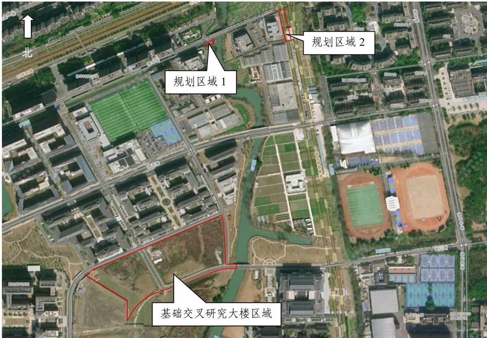  
图 2.1-1  
项目区现状卫星影像图

## 2.1.3 工程总体布置

## 1）场地现状

本项目由三个区域组成，包括规划区域1、2和基础交叉研究大楼区域。

①基础交叉研究大楼区域

基础交叉研究大楼区域现状地面高程4.50m～4.80m，地势平坦，地面无建构筑物。

区域内地下室建设范围已先行开展考古，发现明清时期文化堆积和宋元时期次生堆积，未发现遗迹现象且未于文献中见有记载。2025年11月杭州市园林文物局出具了考古前置意见书，原则上同意了后续供地手续。考古区域形成条状坑，后续由考古项目施工队对场地进行场地平整。

区域西侧为在建的学科交叉创新大楼，其施工生产生活区局部占用本工程红线范围内，在区域西南一角，面积约1500m2，为硬化地面和二层临时办公区域。

基础交叉研究大楼建设区域范围内有宜山环路、七号路、六号路，均为现状校内道路，本次均不涉及拆除和新建，保留现状，施工期间用于通行。

本工程地块周围的校区道路敷设有完善的校区给排水管网可供接管，学校周围的城市道路上的市政给水管和本项目地块周围的校区道路上的给水管均为环状管网。

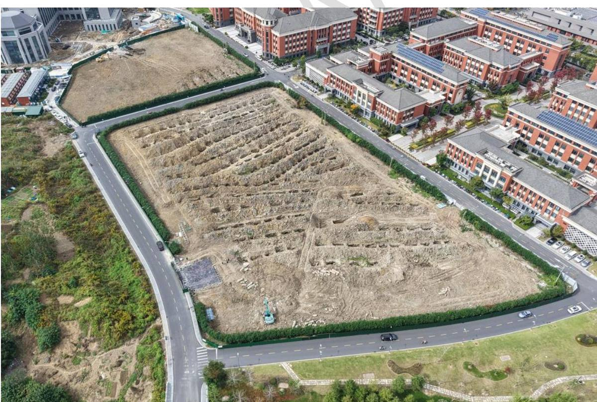  
图 2.1-2  
基础交叉研究大楼区域现状

表2.1-2  
基础交叉研究大楼区域现状一览
<table><tr><td rowspan=1 colspan=1>序号</td><td rowspan=1 colspan=1>现状地貌情况</td><td rowspan=1 colspan=1>面积 ${ \bigl ( } \mathbf { m } ^ { 2 } { \bigr ) }$ </td><td rowspan=1 colspan=1>备注</td></tr><tr><td rowspan=1 colspan=1>1</td><td rowspan=1 colspan=1>宜山环路、七号路、六号路现状道路</td><td rowspan=1 colspan=1>2473</td><td rowspan=1 colspan=1>维持原貌，不扰动</td></tr><tr><td rowspan=1 colspan=1>2</td><td rowspan=1 colspan=1>在建学科交叉创新大楼施工营地</td><td rowspan=1 colspan=1>1500</td><td rowspan=1 colspan=1>占用本工程用地，施工完成后拆除临时设施，后期由本工程实施宜山环路连接道路和景观绿化，局部绿化由学科交叉创新大楼实施约200m²（本项目六号路连接道路以西的两块空地由学科交叉创新大楼实施景观绿化共325m²)</td></tr><tr><td rowspan=1 colspan=1>3</td><td rowspan=1 colspan=1>场地四周绿化带</td><td rowspan=1 colspan=1>500</td><td rowspan=1 colspan=1>1</td></tr><tr><td rowspan=1 colspan=1>4</td><td rowspan=1 colspan=1>考古区域</td><td rowspan=1 colspan=1>14177</td><td rowspan=1 colspan=1>拟建地下室范围</td></tr><tr><td rowspan=1 colspan=1>5</td><td rowspan=1 colspan=1>其他撂荒地</td><td rowspan=1 colspan=1>20275</td><td rowspan=1 colspan=1></td></tr><tr><td rowspan=1 colspan=2>合计</td><td rowspan=1 colspan=1>38925</td><td rowspan=1 colspan=1></td></tr></table>

本项目周边在建学科交叉创新大楼的项目建设内容包括科研工作室、科研辅助用房、医疗智能中心、道路、停车位、管线 、绿地、地下车库以及地下实验室等配套设施。该项目计划2026年1月完工，施 工营地占用本项目红线 $1 5 0 0 \mathrm { m } ^ { 2 }$ 。本项目用地红线与六号路连接道路围出两块角落空地，由该项目实施景观绿化共 $3 2 5 \mathrm { m } ^ { 2 }$

## ② 规划区域

由于浙江大学紫金港校区西区土地是根据项目建设时序分期分批供地，供地时出现了部分临近项目红线间未闭合的问题，根据资规部门要求，两片合计 $1 6 2 5 \mathrm { m } ^ { 2 }$ 的飞地需要在本项目建设时一并供地。

规划区域1现状为河道和绿化用地，其中绿化面积为 $5 8 \mathrm { m } ^ { 2 }$ 。规划区域2现状为实验地，局部植被覆盖，其中绿化面积为 $1 0 3 3 \mathrm { m } ^ { 2 } .$ 。规划区域均维持现状，不涉及建设内容。

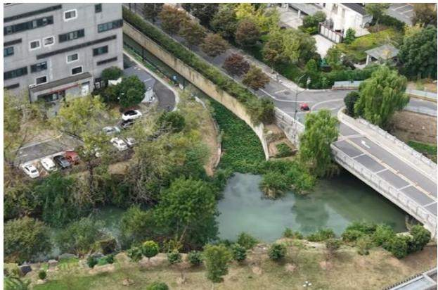  
图 2.1-3

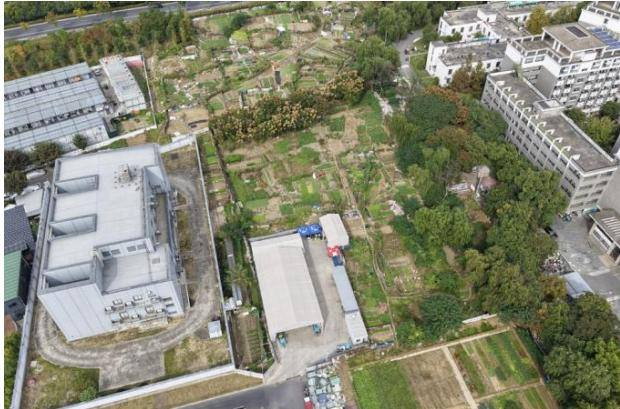  
规划区域现状

## 2）工程平面布置

本项目由三个区域组成，包括规划区域1、2和基础交叉研究大楼区域。

规划区域1、2位于浙江大学紫金港校区西区的北侧，由于用地审批区域闭合纳入本项目红线范围，规划区域保留原貌。

基础交叉研究大楼建设区域位于紫金港校区西区，校园内部河道西行河的西侧，基础交叉研究大楼在区域的东侧 以东），基础交叉研究大楼由一栋9层的1#楼（高层建筑），5层的2#楼、3#楼， 4#楼组成。建筑群体围合出开放的中央景观广场。1#楼建筑位于区域西侧， 主入口朝南，高层部分以点式布局。2#\~4#楼环绕中央广场展开，2#楼建筑位于区域北侧，3#楼、4#楼建筑位于区域东侧。

七号路以西为组团绿地，本次建设内容为景观绿化、透水园路铺装、宜山环路连接道路、六号路连接道路，其中六号路连接道路以西的两块边角用地由在建学科交叉创新大楼项目代建，建设内容为景观绿化，共325m2。

基础交叉研究大楼建设区域范围内有宜山环路、七号路、六号路，均为现状校内道路，本次均不涉及拆除和新建，保留现状，施工期间用于通行。

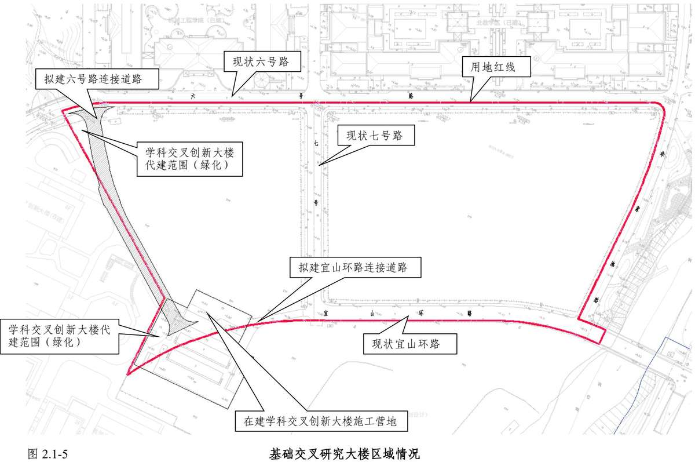

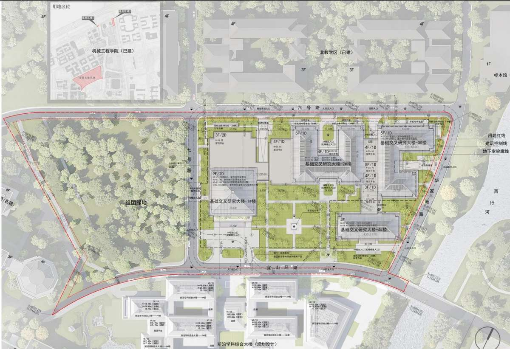  
图 2.1-6  
平面布置图

## 3）工程竖向布置

## ① 现状地块高程

基础交叉研究大楼区域现状地面高程 4.50m～4.80m，地势平坦，地面无建构筑物，施工准备期先进行场地平整，平整后平均高程约为4.65m。

六号路，现状高程为 4.15m\~4.60m；东侧紧邻华家池路，现状高程为 4.71m\~5.79m；南侧紧邻宜山环路，现状高程为 4.27m\~5.79m；中部为七号路，现状高程为4.40m\~4.60m。

## ② 防洪设计高程

根据《杭州市城市防洪排涝规划》（2021-2035 年）、《杭州市防洪减灾规划》及《余杭塘河整治工程规划》，本项目位于紫金港西区，紫金港西区水系位于余杭塘河（蒋村交叉口）和余杭塘河（紫金港交叉口）两处断面之间，20 年一遇洪水位为同时校内景观常水位按 2.0m控制。本项目室外场地设计标高为

本项目区块防洪标准为 50 年一遇，现状校区总体设计高程为 4.50m\~4.70m。

## ③ 竖向设计

场地内地坪标高结合外部道路高度以及内部建筑等级和防洪防汛要求等原则布置，室外场地设计标高为 4.65m，室内外高差 0.3m，室内±0.00的绝对标高为 4.95m。建筑

1#楼建筑：地上共 9 层，建筑高度为 41.70 m（室外地坪至檐口），建筑限高为52.35m（室外地坪至最高点）；消防高度为 47.03 m（室外地坪至檐口与屋脊的平均）。地下共 2层，地下室顶板底高程（4.65m）室外地坪至地下二层室内标高的高度为 9.0m，地下一层底板顶高程为-0.25m，地下二层底板高程为-4.35m，底板厚度为 30cm。

2#、3#楼建筑：地上 5 层，建筑高度为 25.10m（室外地坪至檐口）；建筑限高为30.80m（室外地坪至最高点）；消防高度为 23.95m（室外地坪至屋面面层）。地下共 1层，其中室外地坪至地下一层机动车库、排烟机房等区域室内标高的高度为 5.20m，室外地坪至地下一层非机动车库等区域室内标高的高度为 2.9m。

4#楼建筑：地上 4 层，建筑高度为 20.60m（室外地坪至檐口）；建筑限高为  
28.20m（室外地坪至最高点）；消防高度为 19.45m（室外地坪至屋面面层）。无地下室。

④ 周边高程衔接情况

本项目室外设计地坪标高与周围道路差异不大，与区外道路衔接采取连续平坡式设计，平缓过度，不会产生较大边坡，避免了高差过大可能产生的边坡问题。

## 2.1.4 项目组成

## 2.1.4.1 基础交叉研究大楼区域

## 1）建构筑物

基础交叉研究大楼区域建设内容包括基础交叉研究大楼、 地下停车场（兼人防工程）及设备用房、景观绿化等。项目总建 中地上建筑面积为39999m2，均为学校基础交叉科研用房，地下建 00m2 为地下停车场（兼人防工程）及设备用房，建筑物用地面积为

1#楼建筑主入口朝南，高层部分以点式布局。一层为门厅、展厅、交叉交流空间，在门厅处结合交通空间设置休憩空间。和交流空间。2#楼\~4#楼建筑环绕中 广场展开。一层中央区域布置门厅和主要的交通空间，其余部分布置实验室和科研辅助用房；二层以上主要为实验室和科研辅助用房。房间的数量和大小均满足任务书的要求。在 4#楼建筑的一层设置抗微震洁净实验室，在 3#楼、4#楼的1至3层设置洁净实验室。

本建筑标准层采用内廊式的水平交通空间，结合电梯厅等区域局部放大设置休憩空间、交流空间等。

根据浙江大学紫金港校区西区整体建筑风貌的要求，按照以下原则进行设计：屋顶形式平坡结合，以坡顶为主，平面布局相对规整，外立面采用玻璃幕墙、铝板幕墙、石材幕墙相结合，色彩以暖灰为主。建筑立面竖向采用经典的基座-主墙面-坡屋顶三段式布局，水平向采用对称中正的立面开窗形式，体现百年学府严谨治学的学术特点。同时在建筑中引入花窗、门头等元素，细节丰富，韵味悠长。

1#楼建筑结构体系为钢筋混凝土框架—剪力墙结构体系，2#、3#、4#楼建筑结构

体系为钢筋混凝土框架结构体系，地下室采用钢筋混凝土框架结构体系。

本项目基础拟采用钻孔灌注桩+桩基承台+平板式防水板。桩基采用Φ600、Φ700钻孔孔灌注桩，持力层为⑩c层中等风化泥质粉砂岩。

## 2）道路及其他配套设施

本项目区块内已有校园现状内部道路宜山环路、七号路、六号路，本次均不涉及拆除和新建，保留现状，施工期间用于通行。

基础交叉研究大楼区域内道路及其他配套设施主要为道路硬化地面及地面停车位（非机动车）等，具体包括沥青路面 $1 3 7 0 \mathrm m ^ { 2 }$ 、透水铺装 $5 6 6 1 \mathrm { m } ^ { 2 }$ （大楼区域 $4 5 7 8 \mathrm { m } ^ { 2 }$ 西侧组团绿化区域 1083m2）、宜山环路连接道路 1063m2、 路连接道路 $8 4 4 \mathrm { m } ^ { 2 }$ 。宜山环路连接道路长度为 106m，六号路连接道路长度

宜山环路连接道路、六号路连接道路为小区级道路，设计轴载按 BZZ-100 计，设为 7.0m、10m 车行道。

透水铺装是利用透水材料替代传统的混凝土、水泥、沥青等，铺设在广场、停车场及人行道等原有硬 持原有功能的前提下，提高雨水的下渗能力，减小下垫面径流系数的 制利用设施。透水铺装结构应符合《透水砖路面技术规程》（CJJ/T188）、《透水沥青路面技术规程》（CJJ/T190）和《透水水泥混凝土路面技术规程》（CJJ/T135）的规定。也可采用结构性透水铺装，即材料本身不透水，通过留缝及基层结构透水达到雨水下渗的目的。本项目透水铺装主要包括采用透水块石及透水混凝土路面，停车位、小路等区域采用透水砖铺装。

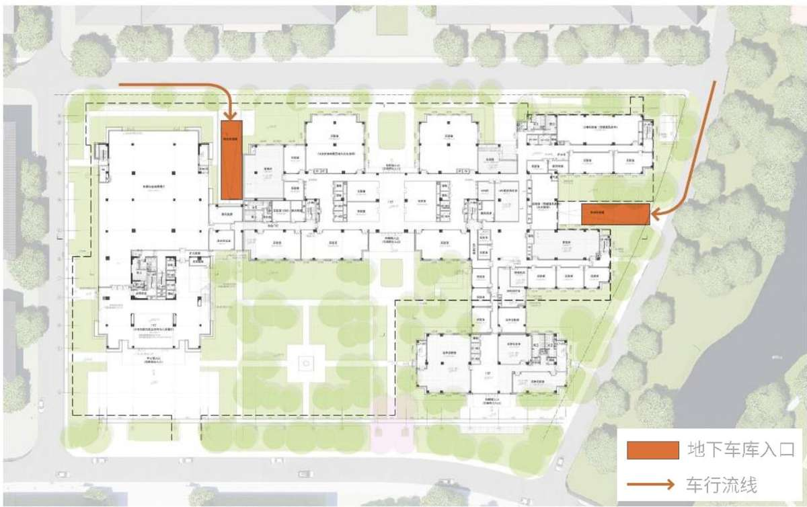

图 2.1-7  
车行流线图  
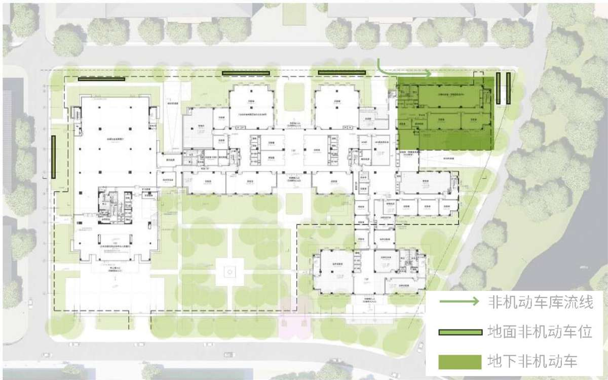  
图 2.1-8  
非机动车流线图

## 3）绿化区域

植物设计延续校园整体风貌，遵循“适地适树、简洁大气、自然生态、四季有色”的策略，注意常绿与落叶、速生与慢生、乔灌木与地被相结合，构成稳定的生态群落，同时兼顾滞尘、降噪、净化空气、美化环境的作用。在绿化品种择取上以生态化为原则，充分结合杭州当地绿化特点，采用抗性强，低维护的本地树种，降低种植和养护成本，并结合海绵城市设计要求，做到因地制宜，因需选树。主要乔木品种有香樟、娜塔栎、沙朴、红枫、桂花、胡柚、鸡爪槭、红梅、二乔玉兰、乐昌含笑、红豆杉等，主要地被品种有金叶石菖蒲、毛鹃、夏鹃、龟甲冬青、金森女贞、茶梅、金边六月雪、南天竹、海桐、大叶栀子、洒金珊瑚、红叶石楠等。绿化面积 $1 9 0 4 1 \mathrm m ^ { 2 }$ ，其中由本项目实施的包括组团绿地 $1 1 3 0 6 \mathrm { m } ^ { 2 }$ 、基础交叉大楼普通地面绿化区 $4 0 6 0 \mathrm { m } ^ { 2 }$ 、基础交叉大楼下凹绿地绿化区 $2 0 1 7 \mathrm { m } ^ { 2 }$ 、基础交叉大楼屋顶绿化区 $2 4 2 \mathrm { m } ^ { 2 } ;$ 与在建学科交叉创新大楼项目交叉区域的组团绿地区域 $3 2 5 \mathrm { m } ^ { 2 }$ 是由学科交叉创新大楼项目代建；规划区域 1、2绿化面积共 $1 0 9 1 \mathrm m ^ { 2 }$ ，维持现状。

表2.1-3  
绿化汇总一览
<table><tr><td rowspan=1 colspan=1>序号</td><td rowspan=1 colspan=2>区域</td><td rowspan=1 colspan=1>项目</td><td rowspan=1 colspan=1>面积 $( \mathbf { m } ^ { 2 } )$ </td><td rowspan=1 colspan=1>备注</td></tr><tr><td rowspan=1 colspan=1>1</td><td rowspan=3 colspan=1>基础交叉研究大楼区域</td><td rowspan=2 colspan=1>基础交叉研究大楼</td><td rowspan=1 colspan=1>地面绿化</td><td rowspan=1 colspan=1>6077</td><td rowspan=1 colspan=1>下凹绿地：  $2 0 1 7 \mathrm { m } ^ { 2 }$ </td></tr><tr><td rowspan=1 colspan=1>2</td><td rowspan=1 colspan=1>屋顶绿化</td><td rowspan=1 colspan=1>242</td><td rowspan=1 colspan=1>2#楼建筑四层露台</td></tr><tr><td rowspan=1 colspan=1>3</td><td rowspan=1 colspan=2>     组团绿地</td><td rowspan=1 colspan=1>11631</td><td rowspan=1 colspan=1>其中325m²由在建学科交叉创新大楼项目代建</td></tr><tr><td rowspan=1 colspan=1>4</td><td rowspan=1 colspan=3>规划区域1</td><td rowspan=1 colspan=1>58</td><td rowspan=1 colspan=1>维持现状，不扰动</td></tr><tr><td rowspan=1 colspan=1>5</td><td rowspan=1 colspan=3>规划区域2</td><td rowspan=1 colspan=1>1033</td><td rowspan=1 colspan=1>维持现状，不扰动</td></tr><tr><td rowspan=1 colspan=4>合计</td><td rowspan=1 colspan=1>19041</td><td rowspan=1 colspan=1></td></tr></table>

## 4）给排水工程

## ① 给水系统

本工程水源采用城市自来水，从七号路引一路 DN200 生活给水管、从南侧前沿学科综合大楼地块引一路 DN150 生活给水管，两路给水管至本地块后，在地块内形成环网，供整个地块生活用水。给水采用分质供水，生活、消防给水采用城市自来水，室

外绿化灌溉、道路浇洒用水采用校区杂用水。校区杂用水从校区杂用水管网中接一路DN100杂用水管至本地块。

## ② 排水系统

室外排水采用雨、污分流，污、废分流。室内采用生活污废水、实验废水、雨水分流制。地下室地面排水经集水井收集后用潜污泵提升排出室外，除汽车坡道、自行车坡道、室外楼梯等主要承接雨水的集水坑，排水接至室外雨水管网，其余均接至室外污水管道。

屋面雨水采取有组织排水，屋面雨水设计重现期 10 年，场地排水、雨水管道排水能力按重现期为 5 年设计，室外雨水采用有组织排水，雨水口应设置在雨水控制利用设施末端，超过雨水径流控制要求的降雨以溢流形式排放，地块内雨水经汇合收集后就近排入校内道路雨水管。

根据当地海绵城市控制要求，雨水口应设置在雨水控制利用设施末端，以溢流形式排放，超过雨水径流控制要求的降雨溢流通过室外排水沟或排水管网等排入市政雨水管渠。室外排水沟排水根据现场情况就近接至雨水管道。

室外排水沟采用采用 C25 钢筋砼结构，上带不锈钢缝隙式盖板，矩形断面，底宽25cm，沟深 40cm， 衬砌厚 底部采用 10cm 厚的 C20 素混凝土垫层，共492m。排水管网采用 PE 缠绕结构壁管，管径 DN150\~DN500，总长为 1858m，其中DN150 长 623m，DN300 长 1095m，DN400 长 120m，DN500 长 20m。

本工程地块周围的校区道路敷设有完善的校区给排水管网可供接管。学校周围的城市道路上的市政给水管和本项目地块周围的校区道路上的给水管均为环状管网。

七号路设有 D400\~D600 雨水管并在地块内预留 1 处 D500 雨水管接口（接口标高2.489m），设有 D400 污水管，并在地块内预留 1 处 D300 污水管接口（接口标高2.762m）。六号路设有 D1000 雨水管并在地块内预留 1 处 D500 雨水管接口（接口标高2.368m），设有 D400 污水管，并在地块内预留 1 处 D300 污水管接口（接口标高2.592m）。华家池路设有 D400\~D600雨水管并在地块内预留 1处 D500雨水管接口（接口标高 2.175m）。宜山环路设有 D400\~D600 雨水管并在地块内预留 1 处 D400 雨水管接口（接口标高 2.517m），设有 D400 污水管，并需在地块内新开一处污水接口，接口处污水井标高 1.932m，接口管径 D300，标高 2.700m。

## ③ 海绵设施

根据《杭州市海绵城市建设管理办法》、《杭州市海绵城市建设低影响开发雨水系统技术导则（试行）》等要求，本工程年径流总量控制率达到 81.06%，对应设计降雨量为 26.37mm，综合径流系数达到≤0.6，SS 去除控制率 61%。本工程以 LID 技术改造为切入点，结合下凹绿地、透水铺装、雨水回用设施等，从源头、过程和末端全面控制雨水，最终达到面源污染控制、改善地块水环境的目标。

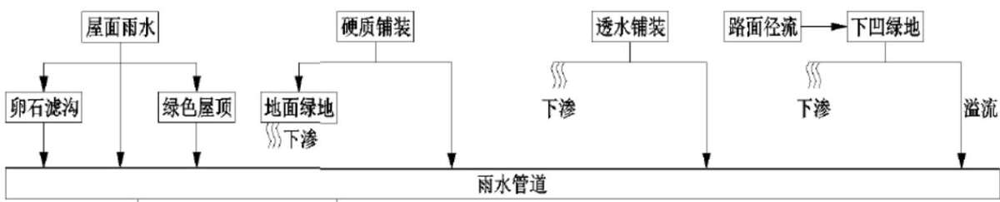  
图 2.1-9  
海绵城市设计技术路线图

## a、下凹绿地

下凹绿地是低于周边铺砌地面或道路在 200mm 以内的绿地，利用植被截流和土壤渗透，积蓄、下渗、净化自身和周边雨水径流的生态型雨水渗透设施。下凹式绿地设计应满足《杭州市海绵城市建设低影响开发雨水系统技术导则（试行）》中的相关要求；滤料层的渗透系数不应小于 $1 . 0 \times 1 0 ^ { - 4 } \mathrm { { c m } / \mathrm { { s } ; } }$ ；植物的耐淹时间宜为 1d \~3d；涉及行人安全处必须设置相应的警示标识。

本项目设置下凹绿地下凹深度 15cm，有效蓄水深度 10cm。下凹绿地内设置溢流口，溢流口顶面标高于周边绿地 100mm。本项目下凹绿地共2017m2。

## b、透水铺装

透水铺装是利用透水材料替代传统的混凝土、水泥、沥青等，铺设在广场、停车场及人行道等原有硬化路面，使其在保持原有功能的前提下，提高雨水的下渗能力，

减小下垫面径流系数的雨水控制利用设施。本项目透水铺装共 $5 6 6 1 \mathrm { m } ^ { 2 }$ ，其中组团绿地区域 1083m2，基础交叉大楼道路及路面共铺设 4578m2。

## c、绿色屋顶（屋顶绿化）

绿色屋面是以绿色植物为主要覆盖物，配以植物生存所需的种植土以及屋面所需的保护层（植物根阻拦层）、排水层、防水层等所共同组成的整个屋面系统。其主要功能、特点为：滞留、净化屋面雨水，降低径流负荷；增加空气湿度，降低室内温度；释放氧气，滞留飞尘，改善空气质量；固定二氧化碳，减少碳排放；提高城市绿化面积，美化环境。本项目在基础交叉大楼 2#楼建筑四层露台设置了屋顶绿化，共 $2 4 1 \mathrm m ^ { 2 }$

## 5）室内设计

该项目集门厅、实验空间、科研办公、会议空间及展示空间等功能于一体，室内设计以“构建未来交叉学科新高地”为核心设计理念，专注构建学科交叉与创新平台，致力于为学院学生、科研人员营造出“ 享、生态、创新”的空间环境。

室内设计强调“空间优化、设施升级、文化营造”的关键点。室内设计延续校园聚落花园的布局以及建筑现代简约的风格基调，强调室内外一体化设计。提取建筑外立面形体的线条节奏和严谨的模数序列融入室内空间，倡导空间开放、结构优化和设备整合，并结合浙大“求是创新 与百年传承文化，营造有序切富有人文精神的新型科研组团。

空间设计运用高效的设计体系，在多样的功能关系中梳理空间逻辑。采用标准化设计体系，把控标准空间设计品质的同时降低成本和设计周期。划分各功能空间等级标准，统一整合各功能楼内公区走廊、实验室、办公室、会议室、卫生间等空间的设计标准与做法，保证同属性空间的一致性。

## 2.1.4.2 规划区域

规划区域维持原状，无建设内容。

## 2.2 施工组织

## 2.2.1 场内外交通

本项目位于浙江大学紫金港校区，周边道路系统完善，交通便利，运输条件较好，

建筑材料直接运达工地。周边现状道路主要有紫金港路天目山路、紫荆花北路、余杭塘路以及校园内部道路等。施工阶段车辆通过校园内部路迪臣中路、宜山路、宜山环路从校园西侧出入口通行，满足施工期运输车辆通行和施工机械通行要求。

施工出入口拟在南侧和北侧各设置 1 处，与外界道路连通，交通便利，能够满足施工材料等运输，无需新建施工便道。

## 2.2.2 施工用水

临时用水包括临时消防、施工生产、施工生活用水三部分。用水接自校内自来水管网。其中临时生活用水由管网直接供给；管材为镀锌钢管，丝扣连接。沿现场四周敷设管径 DN100 的水管并形成环网，可满足施工用水、施工机械用水、生活用水和消防用水。消防用水及施工用水结合考虑，施工和消防用水管在主体结构内垂直向上敷设。

## 2.2.3 施工排水

施工排水分污水及雨水两个系统，雨水经沉淀处理后，经雨水排水系统排至城市雨水管网系统。生产废水、生活污水先排至就近的隔油池、化粪池后，然后经过污水排水系统排至城市污水管网。

## 2.2.4 施工用电

本工程现场设置一台 800KV 临时变压器，现场总配电室根据现场实际情况，在场地北侧西部设立一个 1#一级配电箱，在场地西侧中部设立一个 2#一级配电箱，在现场南侧东部设立一个 3#一级配电箱。

生产区内供电线路又分为二路：一路连接大型施工机械专用电箱，另一路供应各楼层的施工照明用电。生活供电线路也分为二路：一路为施工现场生产办公室用电，另一路为生活照明及其它用电。

## 2.2.5 施工通讯

工程地处经济发达地区，有线通信网络已十分完善，施工通讯可与当地电信、电讯部门协商，从学校通信网络就近接入。同时，工程沿线有移动通信信号覆盖，工程建设可利用现有的移动通信资源，作为有线通信的补充。施工通讯不涉及施工区外土

石方挖填。

## 2.2.6 施工总布置

根据与建设单位沟通，施工期间，本项目场地四周将设置围墙，进行封闭施工。施工总布置本着利于生产、方便生活、快速生产、经济可靠、易于管理的原则进行规划设计。考虑现行建设管理模式和施工机械化水平，合理确定劳动力使用量和生活福利建筑面积，合理布置施工期生活办公区。

本项目施工临时设施均布置在永久占地范围内。

## 1）施工生活区

施工生产生活区布置在基础交叉大楼区域组团绿地范围内， 占地面积共 8345m2，主要为项目部人员施工办公生活场所。施工生活区进行临时场地围墙设置，办公区设置采用二层集装箱设置，职工生活区内设职工宿舍、职工食堂、 洗涤区、晾晒区、厕浴等生活设施。

## 2）施工生产区

施工生产区主要为钢筋加工厂、木材加工厂、构件仓库、安装车间等设施，占地面积共 1200m2。其中地下室基坑工程阶段，施工生产区主要为钢筋加工厂、木材加工厂等，布置在场地东侧和南侧 （地下室范围以外）区域，共 300m2；地上工程阶段，施工生产区主要为钢筋加工厂、木材加工厂、构件仓库、安装车间等，布置在场地中部区域，共 1200m2。

## 3）泥浆处置区

泥浆处置区主要包括泥浆沉降池、固化设备、固化土临时堆土场，在桩基工程阶段泥浆沉降池（大）、固化设备、固化土临时堆土场集中布置在场地中部（后期动态调整），在场地布置 4处泥浆沉降池（小），占地面积共 1050m2。

表 2.2-1  
泥浆处置区一览
<table><tr><td rowspan=1 colspan=1>序号</td><td rowspan=1 colspan=1>项目</td><td rowspan=1 colspan=1>个数</td><td rowspan=1 colspan=1>面积 ${ \bigl ( } \mathbf { m } ^ { 2 } { \bigr ) }$ </td><td rowspan=1 colspan=1>备注</td></tr><tr><td rowspan=1 colspan=1>1</td><td rowspan=1 colspan=1>泥浆池（大）</td><td rowspan=1 colspan=1>1</td><td rowspan=1 colspan=1>300</td><td rowspan=3 colspan=1>场地中部</td></tr><tr><td rowspan=1 colspan=1>2</td><td rowspan=1 colspan=1>固化设备</td><td rowspan=1 colspan=1>1</td><td rowspan=1 colspan=1>50</td></tr><tr><td rowspan=1 colspan=1>3</td><td rowspan=1 colspan=1>固化土临时堆土场</td><td rowspan=1 colspan=1>1</td><td rowspan=1 colspan=1>300</td></tr><tr><td rowspan=1 colspan=1>4</td><td rowspan=1 colspan=1>泥浆池（小）</td><td rowspan=1 colspan=1>4</td><td rowspan=1 colspan=1>400</td><td rowspan=1 colspan=1>场地4处</td></tr><tr><td rowspan=1 colspan=3>合计</td><td rowspan=1 colspan=1>1050</td><td rowspan=1 colspan=1></td></tr></table>

## 4）基坑施工区域

本项目基坑开挖范围面积为 $1 7 6 2 0 \mathrm { m } ^ { 2 }$ ，基坑土石方总体施工顺序为由南北两侧向中间开挖，由场地西侧出土口出土。

表 2.2-2  
施工总布置一览
<table><tr><td rowspan=1 colspan=1>序号</td><td rowspan=1 colspan=1>项目</td><td rowspan=1 colspan=1>面积 $( \mathbf { m } ^ { 2 } )$ </td><td rowspan=1 colspan=1>位置</td></tr><tr><td rowspan=1 colspan=1>1</td><td rowspan=1 colspan=1>施工生活区</td><td rowspan=1 colspan=1>7 8345  17</td><td rowspan=1 colspan=1>组团绿地北侧</td></tr><tr><td rowspan=1 colspan=1>2</td><td rowspan=1 colspan=1>施工生产区</td><td rowspan=1 colspan=1>1200</td><td rowspan=1 colspan=1>基础交叉研究大楼区域内</td></tr><tr><td rowspan=1 colspan=1>3</td><td rowspan=1 colspan=1>泥浆处置区</td><td rowspan=1 colspan=1>71050</td><td rowspan=1 colspan=1>基础交叉研究大楼区域内</td></tr><tr><td rowspan=1 colspan=1>4</td><td rowspan=1 colspan=1>基坑施工区域</td><td rowspan=1 colspan=1>17620</td><td rowspan=1 colspan=1>基坑开挖范围</td></tr><tr><td rowspan=1 colspan=2>合计</td><td rowspan=1 colspan=1>28215</td><td rowspan=1 colspan=1>均布置在永久占地范围内</td></tr></table>

## 2.2.7 施工工艺

本工程建设主要的施工工艺流程详见图 2.2-1。

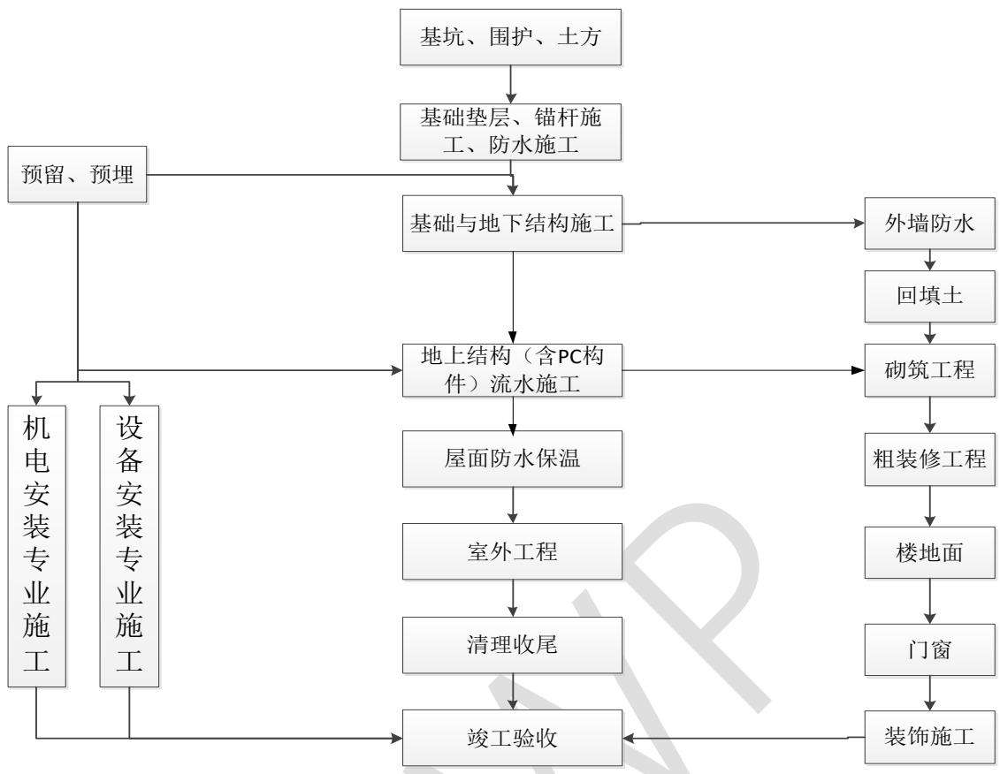  
图 2.2-1 项目全过程施工流程图

## 1）围护工程

本工程基坑围护设计采用桩+一道钢筋混凝土支撑（或斜撑）、局部桩悬臂、放坡结合钢板桩加固的围护方案。桩+支撑区域基坑施工顺序为先施工三轴、双轴水泥搅拌桩帷幕，然后施工围护桩（钻孔灌注桩）、拉森钢板桩、PC工法组合钢管桩。

## ①三轴水泥搅拌桩

施工前做好场地平整（回填空洞）、清理障碍物、铺设建筑道渣或钢走道板；拼装桩机完成的同时安装灰浆制备系统包括工作平台、制浆设备及泵送设备、灰浆流动制备站。做好管线连接工作，最后进行机械调试。

三轴水泥搅拌桩机在施工区域（包含附近坑中坑及加固区域施工）流向施工。根据设计要求深度，桩身采用一次搅拌工艺，水泥和原状土须均匀拌和，下沉及提升均为喷浆搅拌，为保证水泥土搅拌均匀，必须控制好钻具下沉及提升速度，在桩底部分重复搅拌注浆。连续施工情况下三轴搅拌桩均采用以下方式施工，即采用跳孔式重复套打施工方法（套接一孔法施工顺序），可减少偏钻，以确保搅拌桩连续性及止水效果。

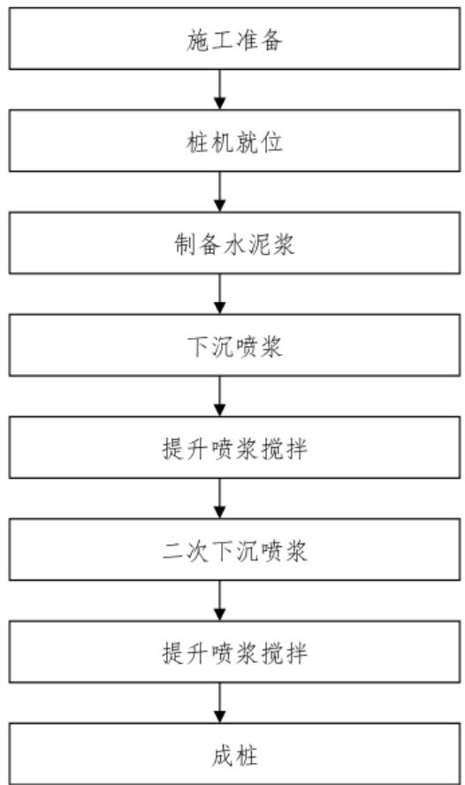  
三轴泥搅拌桩施工工艺流程图

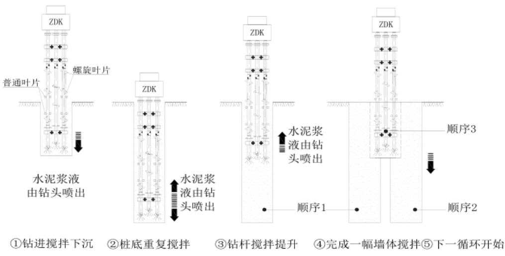  
三轴水泥搅拌桩施工示意图  
图 2.2-1 三轴水泥搅拌桩施工工艺流程

本工程三轴水泥搅拌桩采用Φ850mm，采用标准连续方式施工。

## ②双轴水泥搅拌桩

本工程双轴水泥搅拌桩采用Φ700mm，中心距为 500mm，成桩工艺要求四次搅拌两次喷浆，类似与三轴水泥搅拌桩施工工艺。

## ③钻孔灌注桩

钻孔灌注桩采用中Φ700、Φ800mm，桩间距 1000mm，采用水下 C30混凝土。围护钻孔灌注桩应采用跳打法施工，相邻桩混凝土 36 小时后，方可进行另一根桩施工。在钻孔施工时，必须埋设护筒，利用全站仪精确测定桩位中心，并设置十字交叉护桩，确保护筒埋设准确。本工程采用泥浆护壁正循环钻进的施工方法，钻具从上至下的连接依次为提引水龙头→主动钻杆→圆钻杆→钻头。泥浆循环路线为泥浆循环池→泥浆泵→高压管→主钻杆上水龙头→主钻杆→圆 →孔底→孔口 砂石泵→泥浆循环池。护壁泥浆由水、黏土（或膨润土）按一定比例配制而成， 通过机械在泥浆池、钻孔中搅拌均匀。清孔分两次进行，钻孔深度达到设计要求 后进行第一次清孔；钢筋骨架、导管安放完毕，混凝土浇筑之前，应进行第二次清孔。灌注水下混凝土采用钢制导管回顶法施工，导管接口之间采用丝 兰连接，连接时必须加垫密封圈或橡胶垫，并上紧丝扣或螺栓。必须保证首 混凝土量充足，灌注后导管埋入混凝土深度至少 1.0m，利用混凝土的冲击力封住导管底口，隔绝泥浆。灌注过程必须连续进行，严禁中途长时间停工。

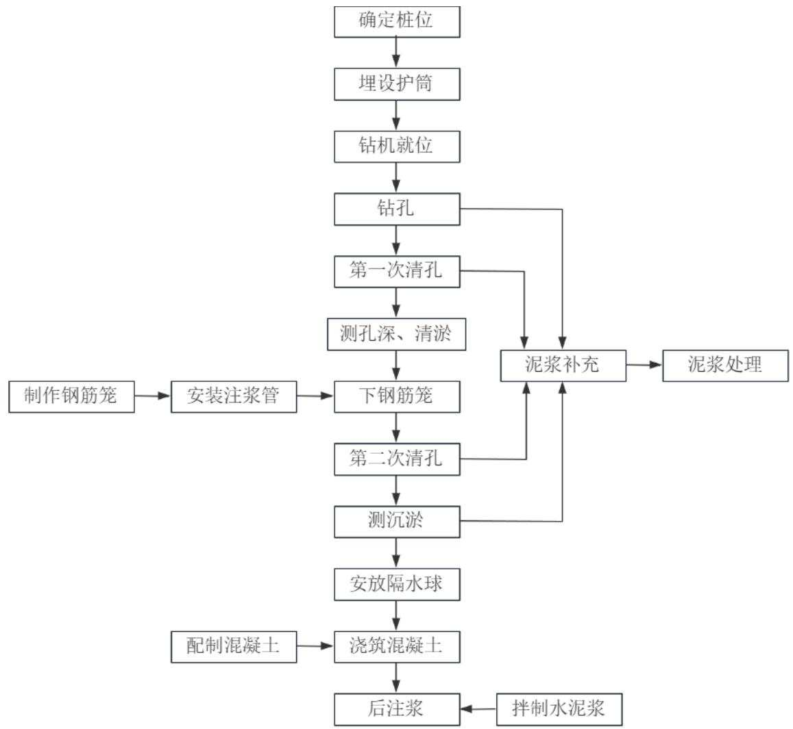  
图 2.2-2  
钻孔灌注桩施工工艺流程

根据《杭州市工程渣土管理实施办法》（杭政办函〔2016〕51 号）：“占地规模 20亩（含）以上或建筑体量 10 万方（含）以上的建设工地应在工地内设置泥浆固化处理设备，实现泥浆就地处理。”。本工程拟采用泥浆固化设备处置钻渣泥浆，固化土方将按照当地要求清运，处置流程详见图 2.2-3。

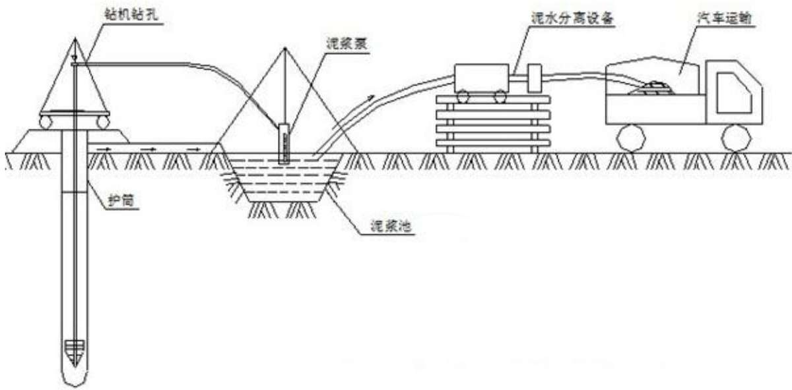  
图 2.2-3 排浆及泥浆固化处置工艺流程

## ④ 拉森钢板桩

定位与导向阶段，通过精准的测量放线和安装导架（围檩）来为后续沉桩定好规矩，确保桩体能按预定轨迹打 桩施打是核心环节，推荐采用屏风式打入法（一次性插入多根桩分次打设 垂直度和轴线精度，避免单根打入法易导致的累积误差和合拢困难 质地层则需采用引孔辅助沉桩，切忌盲目硬打以免损坏桩体；桩体沉设完成后，在基坑开挖阶段需严格遵循分层开挖原则，并及时安装内支撑（围檩和横撑）以抵御土压力，防止桩体变形。最后，在工程完工进行拔桩作业时，应利用振动锤边振边拔，并同步进行桩孔回填（如灌水、灌砂或注浆），以填补空隙、防止地面沉降，从而确保整个施工过程安全、高效且对周边环境影响最小。

拉森钢板桩按照《热轧钢板桩》（GB/T 20933-2021）选用，采用 PU400×170×15.5，Q235B 钢。

## ⑤ PC 工法组合钢管桩

PC 工法组合钢管桩采用直径 630mm，壁厚为 14mm 的螺旋焊管，钢管采用Q355B 钢。

施工前应进行成桩试验，空隙采用小企口拉森钢板桩连接，转角部位应采用转角确保止水效果连续性。宜采用整材，分段焊接时应采用坡口等强焊接并外焊 4 块弧形钢板，焊缝质量等级不应低于二级，施工前采用超声探伤等非破损方法检测。单根钢管桩焊接接头不宜超过 2 个，焊接接头距离坑底面不应小于 2m，且相邻两根钢管桩接头应错开 1m 以上。PC 工法组合钢管桩必须控制好施工速度，钢管桩下沉和回收速度一般为 1m/min，回收速度同时应满足注浆要求。施工时采用专用设备引孔或注水、必要时采用静压设备，同时减侯施工速度等方法减小钢管推施工对周边环境的影响。要确保平整度和垂直度，不允许有扭曲现象，平面差不大于 10mm，标高误差不大于100mm。

## 2）桩基工程

本项目建筑物基础拟采用钻孔灌注桩+桩基承台+平板式防水板。

## ① 钻孔灌注桩

钻孔灌注桩桩基采用Φ600、Φ700 钻孔孔灌注桩，持力层为⑩c 层中等风化泥质粉砂岩。施工工艺同围护工程钻孔灌注桩。

## ② 桩基承台

待桩身混凝土达到强度并完成基坑土方开挖后，便进入桩基承台施工阶段，首先需对桩头进行破除，剔除桩顶疏松混凝土直至露出密实部分，并将桩顶钢筋调直理顺以满足锚入承台的长度要求；接着在基坑底部浇筑素混凝土垫层，并沿承台边缘砌筑砖胎模作为侧模；随后进行承台钢筋的绑扎；钢筋验收合格后支设必要的侧模，浇筑大体积混凝土（通常为防水混凝土）。

## ③ 平板式防水板

在承台及地梁施工完成并验收合格后，开始进行平板式防水板的施工；首先必须对基层（垫层及砖胎模）进行细致处理，要求表面平整、坚实、干燥，并对阴阳角、桩头等细部节点做成圆弧形，涂刷基层处理剂以增强粘结力；接着在桩头、施工缝及后浇带等薄弱部位铺设防水附加层进行加强；然后进行大面积的防水层施工；最后在防水层上浇筑细石混凝土保护层，并对侧墙防水层粘贴聚苯板保护层。

## 3）土方工程（深基坑开挖）

土方开挖原则上应分区分段对称进行，挖土次序严格遵循“分层开挖，先撑后挖”及“大基坑，小开挖”的原则，进行分区开挖。

土方开挖前场地相对标高约为-0.400m（高程为 4.55m），整个基坑按支撑设置分为 2 层土层，每层分段开挖长度不得超过 15m，基坑先开挖至底板底标高，再分批开挖出承台、地梁及电梯井位置。距基坑底 300mm 土方以及承台和电梯井宜采用人工开挖。第一层开挖后立即施工混凝土支撑，待支撑强度达到设计强度 80%后再行开挖下层土。在开挖第二层土前，必须确保上道支撑的垫层已全部凿除，以防止垫层在施工过程中坠落造成意外。在土方开挖过程中如遇到淤泥质土层要控制开挖深度，每层开挖深度不应超过 1m，在坑中坑开挖过程中应分层、台阶式放坡挖掘，并将土方及时运出，每层开挖深度不应超过 1m。

## 4）地下室结构工程

地下室钢筋混凝土框架结构体系的施工 工艺流程始于对钢筋工程的精细把控，需根据构件受力特点选用电渣压力焊、直螺纹套筒连接或绑扎连接等方式处理钢筋接头，并通过设置稳固的钢筋马凳（支架） 来确保底板上下层钢筋网的位置准确，同时在模特点优先选用承载力高、稳定性好的盘扣式钢管脚手架作为支撑体系， 别注意在外墙对拉螺栓上焊接止水片以切断渗水通道；随后进入混凝土的浇筑与养护阶段，采用分层浇筑或跳仓法施工以控制大体积混凝土的水化热，通过优化配合比掺加粉煤灰、矿粉及膨胀剂来减少收缩，并在浇筑过程中严格控制振捣质量以避免漏振或过振；最后在结构验收合格后进行防水与回填施工。

## 5）地上主体结构工程

1#楼建筑地上主体结构采用钢筋混凝土框架-剪力墙体系，首先是在楼面进行测量放线，弹出墙柱的控制边线和模板控制线，接着进行墙柱钢筋的绑扎，按照“先竖向筋后水平筋”的顺序安装，并在钢筋骨架上设置垫块以保证保护层厚度，同时预埋好水电管线和预留孔洞；随后进行模板工程，墙柱模板通常采用木胶合板或定型钢模板，通过竖向木方背楞和水平钢管围檩配合对拉螺栓（止水螺杆）进行加固，特别要注意在模板拼缝处粘贴海绵条以防漏浆，梁板模板则依托满堂脚手架支撑体系进行铺设；模板验收合格后进行墙柱混凝土的浇筑，通常先在底部铺设一层与混凝土同配比的减石子砂浆以防止烂根，然后分层下料、分层振捣，严格控制每层浇筑厚度和间歇时间，待墙柱混凝土浇筑完毕并停歇 1\~1.5小时后，再进行梁板钢筋的绑扎（注意梁柱节点核心区的钢筋锚固）和梁板混凝土的浇筑，梁板浇筑时采用“赶浆法”由一端向另一端推进，并用铁插尺检查厚度，最后在混凝土终凝后及时进行覆盖保湿养护，待混凝土强度达到规范要求后方可进行上一层结构的施工，从而完成“放线—绑筋—支模—浇筑—养护”的标准楼层循环。

2#楼\~4#楼建筑地上主体结构采用钢筋混凝土框架结构体系，施工工艺同地下室结构工程。

6）室外工程

① 管道铺设

在下列情况下，给排水管道应采取 150mm厚C25混凝土包方加固措施：

a、塑料给水管管顶覆土小于 0.8m，或当在机动车道下时管道最小管顶覆土小于1.0m；b、金属给水管道管顶覆土小于 0.7m，或当在机动车道下时管道最小管顶覆土小于 0.90m；c、排水管道在机动车道下管道最小管顶覆土小于 0.70m，或在人行道下管道最小管顶覆土小于 0.60m。

金属给水管道为开槽埋设，配合室外道路建设的管道，应在路基施工完毕后，开槽挖沟并按设计进行敷管。采用素土基础时，管沟下要求原状土，机械开挖时，人工清底，沟开挖后严禁晾槽，不应泡水。

塑料给水管道管沟开挖、施工降水、回填及管道基础施工应严格按照 a、如为未经扰动的原状土层，则天然地基进行夯实；b、如为回填土土层，则在回填土地段做300mm 厚灰土垫层；c、如为软泥土则应通知设计踏勘现场根据现场实际情况确定基础处理方案，采取更换土壤、做混凝土枕基或打木桩等措施。

塑料排水管道应敷设在原状土地基或经开槽后处理回填密实的地基上，如采用机械开挖管道沟槽时，应保留 0.20m 厚的不开挖土层，该土层待铺管前用人工清槽至设计标高，不得超挖，如若超挖或发生扰动，应换填 10m\~15m 天然级配砂石料或颗粒小于 40mm碎石，整平夯实进行地基处理。管槽底部到管顶以上 300mm范围回填材料采用中粗砂。回填要求管底基础至管顶以上 0.5m 范围内，必须采用人工回填，轻型压实设备夯实，不得采用机械推土回填；回填、夯实应分层对称进行，每层回填土高度不应大于 200mm，不得单侧回填、夯实；管顶 0.5m以上采用机械回填压实时，应从管轴线两侧同时均匀进行，并夯实、碾压。塑料排水管道不得采用刚性管基基础，严禁采用刚性桩直接支撑管道。

## ②海绵设施溢流口、雨水口和排水沟

雨水口应设置在雨水控制利用设施末端，以溢流形式排放，超过雨水径流控制要求的降雨溢流排入市政雨水管渠。室外排水沟排水根据现场情况就近接至雨水管道，排水沟终点排水口与检查井之间的连接管的管径、标高和坡度以本设计为准，如无注明者均采用 D300、坡度 i=0.01。如景观专业无特殊要求， 雨水口按国标图集 16S518《雨水口》施工，有道牙的路面采用预制混凝土偏沟式 篦雨水口，其余部位均采用预制混凝土平箅式雨水口，雨水口支座和算子材质均采用球墨铸铁。设在绿地、人行道、非机动车道、人行铺装广场采 机动车行驶的区域采用 D400 级箅子。海绵设施溢流口算面标高应根据雨水调蓄设计要求确定。平箅式雨水口的算面标高应比周围路面标高低 30mm，其四周地坪均坡向雨水口（坡度 i=0.01）；雨水口与检查井之间的连接管的管径、标高和坡度，如无特别注明，单个雨水口的连接管径为D200，串联 2个或 3个雨水口的连接管径为 D300，坡度均按 i=0.01；雨水口连接管起点底深度 0.7m。

## ③ 道路施工

项目区内道路路基填筑施工采用机械施工为主，适当配合人工施工的方案。填筑时配置符合要求的压实机械，严格控制含水量，尤其是梅雨季节，严禁使用超规定含水量填料，做到分层压实，控制有效压实厚度，不得超厚压实，填筑料夯实至路基顶面。路面工程采用配套路面施工机械设备，专业化施工方案，配置少量的人工辅助施工。严格控制材料级配和数量。

## ④ 景观工程

## a、乔木种植

树穴应根据苗木根系，土球直径和土壤情况而定，树穴应垂直下挖，上口下底、规格应符合城市绿地技术操作规范规定。

植株安放在栽植穴槽内，定好方向，根部用土塞实后，方可解除泥球包扎物，而后填培肥土（包含去除杂质的表土），分层间隙捣实，但每层不得超过 20cm，栽植完毕后必须一次浇透水。

## b、灌木种植

灌木的种植效果必须达到设计所要求的效果，做到黄土不露天。灌木边缘轮廊种植应密实，保证灌木冠幅相交错，并在靠外倒伏种植，形成圆角。灌木种植后的修剪工作须跟上，且须修剪齐（标明灌木自然形态的除外）

## c 、地被植物栽植

以成片栽植整体覆盖地面为原则。绿地于道路街接处露土部位，卵石下脚处等均布置以书带草。

## d、草坪栽植

景观草坪根据坡度素土夯实，坪床表面 20cm的土壤要求翻松整平，去除石块、垃圾等杂物，覆盖 5cm 厚 1:1 比例的黄沙、营养土混合土。将处理完毕的坪床土壤充分浇水 1-2次后，利用滚筒适度滚压，由人工采用刮板操作将整个坪床基层处理平整，要求细平整后要保证坪床各材料均匀混合，坪床面耙平滑一致，坪床无下陷。草坪有播种或满铺，满铺时建议密封满铺，铺栽后充分浇水压平或夯平。

## 2.2.8 建筑材料

工程所用建筑材料主要为道路填筑和绿化建设所需宕渣、砂砾料、水泥、砖、钢筋等。

道路填筑料：道路路基填筑碎石、宕渣（塘渣）从附近合法料场商购；

砂砾料及水泥等：从附近市场商购；

砖、钢筋及其他材料：均从市场或厂家直接采购。

## 2.2.9 施工时序

项目按“先土建后安装”、“先主体后装修”、“先室内后室外”的原则安排各工种、各工序，进行立体流水交叉施工作业。

项目启动初期，在完成场地平整和地质勘察后，首先进行的是基础工程，包括基坑支护、土方开挖、桩基施工以及基础垫层和防水层的铺设；紧接着进入主体结构施工阶段，按照“放线—钢筋绑扎—模板支设—混凝土浇筑”的工序逐层向上推进，待主体封顶后，便开始穿插进行砌体及二次结构施工，如墙体砌筑和构造柱浇筑。随后，工程转入建筑装饰与安装阶段，这期间外立面幕墙或涂料、门窗栏杆安装与室内的抹灰、地坪、涂饰等装修工程同步展开，同时给排水、电气、暖通等设备安装工程也全面铺开；在主体结构施工后期或结束后，屋面工程（保温、防水、保护层）随即实施。最后，在室内装修和设备安装基本完成后，启动室外及景观工程，包括道路铺装、园林绿化和综合管网的接驳。

## 2.3 工程占地

根据主体工程设计文件等相关资料，工程占地面积4.05hm2，均为永久占地。

根据《浙江省建设用地审批意见书》 （浙土字 A〔2006〕-0156 号）和《浙江省建-0730 号），本项目用地已完成农转用，现状用地位于浙江大学紫金港校区西区内部， 长时间撂荒。根据现场调查，按照《土地利用现状分类》（GB/T 21010-2017），占地类型属于公共管理与公共服务用地中的教育用地。

表 2.3-1  
项目占地汇总  
单位：hm2
<table><tr><td rowspan=1 colspan=2>项目</td><td rowspan=1 colspan=1>教育用地</td><td rowspan=1 colspan=1>合计</td></tr><tr><td rowspan=4 colspan=1>永久占地</td><td rowspan=1 colspan=1>主体建构筑物</td><td rowspan=1 colspan=1>0.90</td><td rowspan=1 colspan=1>0.90</td></tr><tr><td rowspan=1 colspan=1>道路及其他配套设施</td><td rowspan=1 colspan=1>1.22</td><td rowspan=1 colspan=1>1.22</td></tr><tr><td rowspan=1 colspan=1>绿化区</td><td rowspan=1 colspan=1>1.77</td><td rowspan=1 colspan=1>1.77</td></tr><tr><td rowspan=1 colspan=1>规划区域</td><td rowspan=1 colspan=1>0.16</td><td rowspan=1 colspan=1>0.16</td></tr><tr><td rowspan=1 colspan=2>总计</td><td rowspan=1 colspan=1>4.05</td><td rowspan=1 colspan=1>4.05</td></tr></table>

## 2.4 土石方平衡

## 2.4.1 土石方平衡原则

土石方平衡按以下步骤进行：首先，在各分项工程内，根据土石方的开挖及回填量，挖填部位的材料质量，分别计算出每一项目多余或不足的土石方数量；其次，考虑材质、施工时序、土方可堆置条件的情况，在经济合理、施工可行的前提下对工程各建设区土石方进行综合平衡。

土石方平衡按以下原则进行：

1）根据主体工程的施工进度，桩基础最先实施，然后进行地下室基坑开挖；

2）土石方回填及调运遵循挖填同时、就近回填的原则，尽量综合利用土石方，减少弃方数量。

## 2.4.2 分项土石方

## 1）表土工程（绿化工程）

根据表土调查成果，本项目扰动范围（不包括规划区域 1 和规划区域 2）内无可剥离表土；本项目施工后期，将按照景观设计进行绿化施工，景观绿化面积共计$1 9 0 4 1 \mathrm m ^ { 2 }$ ，其中由本项目实施的包括组团绿地 $1 1 3 0 6 \mathrm { m } ^ { 2 }$ 、基础交叉大楼普通地面绿化区$4 0 6 0 \mathrm { m } ^ { 2 }$ 、基础交叉大楼下凹绿地绿化区 $2 0 1 7 \mathrm { m } ^ { 2 }$ 、基础交叉大楼屋顶绿化区 $2 4 2 \mathrm { m } ^ { 2 }$ ；与在建学科交叉创新大楼项目交叉区域的组团绿地区域 $3 2 5 \mathrm { m } ^ { 2 }$ 是由学科交叉创新大楼项目代建；规划区域 1、2绿化面积共 $1 0 9 1 \mathrm m ^ { 2 }$ ，维持现状。

参照《城市绿化工程施工及验收规范》（CJJ/T82-2012），绿化栽植土壤有效土层厚度要求为草坪、花卉、草本地被>30cm，小灌木、宿根花卉、小藤本>40cm，大、中灌木>90cm，乔本（胸径<20cm）>150cm（深根），乔本（胸径<20cm）>100cm（浅根）。结合本项目初步设计报告中景观工程要求，绿化区域覆土厚度详见表 2.4-1，本项目绿化施工需覆土共 $1 . 2 9 \mathrm { ~ \mathscr { H } ~ m ~ } ^ { 3 }$ ，办理相关手续后由杭州市西湖区综合行政执法局统一调配。

表 2.4-1  
表土工程计算及平衡一览
<table><tr><td rowspan=2 colspan=1>序号</td><td rowspan=2 colspan=2>区域</td><td rowspan=2 colspan=1>剥离量 $\overline { { \mathcal { A } } } \mathrm { ~ m } ^ { 3 }$ </td><td rowspan=1 colspan=3>回填量计算</td><td rowspan=2 colspan=1>借方万m³</td><td rowspan=2 colspan=1>余方万m³</td></tr><tr><td rowspan=1 colspan=1>覆土面积 m²</td><td rowspan=1 colspan=1>平均覆土厚度cm</td><td rowspan=1 colspan=1>覆土量万m³</td></tr><tr><td rowspan=1 colspan=1>1</td><td rowspan=4 colspan=1>基础交叉研究大楼区域</td><td rowspan=1 colspan=1>普通地面绿化</td><td rowspan=1 colspan=1>0</td><td rowspan=1 colspan=1>4060</td><td rowspan=1 colspan=1>80</td><td rowspan=1 colspan=1>0.32</td><td rowspan=1 colspan=1>0.32</td><td rowspan=1 colspan=1>0</td></tr><tr><td rowspan=1 colspan=1>2</td><td rowspan=1 colspan=1>下凹绿地</td><td rowspan=1 colspan=1>0</td><td rowspan=1 colspan=1>2017</td><td rowspan=1 colspan=1>30</td><td rowspan=1 colspan=1>0.06</td><td rowspan=1 colspan=1>0.06</td><td rowspan=1 colspan=1>0</td></tr><tr><td rowspan=1 colspan=1>3</td><td rowspan=1 colspan=1>屋顶绿化</td><td rowspan=1 colspan=1>0</td><td rowspan=1 colspan=1>242</td><td rowspan=1 colspan=1>50</td><td rowspan=1 colspan=1>0.01</td><td rowspan=1 colspan=1>0.01</td><td rowspan=1 colspan=1>0</td></tr><tr><td rowspan=1 colspan=1>4</td><td rowspan=1 colspan=1>组团绿地</td><td rowspan=1 colspan=1>0</td><td rowspan=1 colspan=1>11306</td><td rowspan=1 colspan=1>80</td><td rowspan=1 colspan=1>0.90</td><td rowspan=1 colspan=1>0.90</td><td rowspan=1 colspan=1>0</td></tr><tr><td rowspan=1 colspan=3>合计</td><td rowspan=1 colspan=1>0</td><td rowspan=1 colspan=1>17625</td><td rowspan=1 colspan=1>1</td><td rowspan=1 colspan=1>1.29</td><td rowspan=1 colspan=1>1.29</td><td rowspan=1 colspan=1>0</td></tr></table>

## 2）围护、桩基工程

围护、桩基工程包括基坑围护工程和桩基工程。围护桩施工时三轴、双轴水泥搅拌桩、钻孔灌注桩，桩基采用钻孔灌注桩，以上施工工艺均将产生弃方，其中三轴、双轴水泥搅拌桩施工将产生弃土，钻孔灌注桩施工将产生钻渣泥浆。围护、桩基工程共产生开挖方 2.17万 m3，均为土方，全部作为余方处置。其中钻渣合泥浆量共 6.03万$\mathrm { m } ^ { 3 }$ ，在泥浆处置区内通过固化设备处置后以固化土方外运，按照当地要求清运。

表2.4-2  
围护、桩基工程弃方计算
<table><tr><td rowspan=2 colspan=1>序号</td><td rowspan=2 colspan=2>7分项工程</td><td rowspan=2 colspan=1>桩径mm</td><td rowspan=2 colspan=1>有效桩长m</td><td rowspan=2 colspan=1>桩数量(个)</td><td rowspan=1 colspan=3>余方 $( \mathrm { ~ \mathcal { F } ~ m } ^ { 3 } )$ </td><td rowspan=2 colspan=1>合钻渣泥浆量 $( \mathrm { ~ \mathcal { F } ~ m } ^ { 3 } )$ </td></tr><tr><td rowspan=1 colspan=1>土方</td><td rowspan=1 colspan=1>土方(钻渣)</td><td rowspan=1 colspan=1>小计</td></tr><tr><td rowspan=1 colspan=1>1</td><td rowspan=4 colspan=1>围护桩</td><td rowspan=1 colspan=1>三轴水泥搅拌桩</td><td rowspan=1 colspan=1>850</td><td rowspan=1 colspan=1>23</td><td rowspan=1 colspan=1>235</td><td rowspan=1 colspan=1>0.14</td><td rowspan=1 colspan=1>0</td><td rowspan=1 colspan=1>0.14</td><td rowspan=1 colspan=1>1</td></tr><tr><td rowspan=1 colspan=1>2</td><td rowspan=1 colspan=1>双轴水泥搅拌桩</td><td rowspan=1 colspan=1>700</td><td rowspan=1 colspan=1>18</td><td rowspan=1 colspan=1>146</td><td rowspan=1 colspan=1>0.02</td><td rowspan=1 colspan=1>0</td><td rowspan=1 colspan=1>0.02</td><td rowspan=1 colspan=1>1</td></tr><tr><td rowspan=1 colspan=1>3</td><td rowspan=2 colspan=1>钻孔灌注桩</td><td rowspan=1 colspan=1>800</td><td rowspan=1 colspan=1>23</td><td rowspan=1 colspan=1>255</td><td rowspan=1 colspan=1>0</td><td rowspan=1 colspan=1>0.29</td><td rowspan=1 colspan=1>0.29</td><td rowspan=1 colspan=1>0.87</td></tr><tr><td rowspan=1 colspan=1>4</td><td rowspan=1 colspan=1>700</td><td rowspan=1 colspan=1>18</td><td rowspan=1 colspan=1>300</td><td rowspan=1 colspan=1>0</td><td rowspan=1 colspan=1>0.21</td><td rowspan=1 colspan=1>0.21</td><td rowspan=1 colspan=1>0.63</td></tr><tr><td rowspan=1 colspan=1>5</td><td rowspan=3 colspan=1>桩基工程</td><td rowspan=3 colspan=1>钻孔灌注桩</td><td rowspan=1 colspan=1>600</td><td rowspan=1 colspan=1>≥45</td><td rowspan=1 colspan=1>414</td><td rowspan=1 colspan=1>0</td><td rowspan=1 colspan=1>0.61</td><td rowspan=1 colspan=1>0.61</td><td rowspan=1 colspan=1>1.83</td></tr><tr><td rowspan=1 colspan=1>6</td><td rowspan=1 colspan=1>600</td><td rowspan=1 colspan=1>≥45</td><td rowspan=1 colspan=1>312</td><td rowspan=1 colspan=1>0</td><td rowspan=1 colspan=1>0.46</td><td rowspan=1 colspan=1>0.46</td><td rowspan=1 colspan=1>1.38</td></tr><tr><td rowspan=1 colspan=1>7</td><td rowspan=1 colspan=1>700</td><td rowspan=1 colspan=1>≥45</td><td rowspan=1 colspan=1>221</td><td rowspan=1 colspan=1>0</td><td rowspan=1 colspan=1>0.44</td><td rowspan=1 colspan=1>0.44</td><td rowspan=1 colspan=1>1.32</td></tr><tr><td rowspan=1 colspan=6>合计</td><td rowspan=1 colspan=1>0.16</td><td rowspan=1 colspan=1>2.01</td><td rowspan=1 colspan=1>2.17</td><td rowspan=1 colspan=1>6.03</td></tr></table>

## 3）基坑工程

基础交叉大楼建筑区域根据地下室设计和防微振设计要求，1#楼建筑设置 2 层地下室，室外地坪至地下二层室内标高的高度为 9.0m；2#楼\~3#楼建筑设置 1层地下室，其中室外地坪至地下一层机动车库、排烟机房等区域室内标高的高度为 5.20m，室外地坪至地下一层非机动车库等区域室内标高的高度为 2.9m，地下一层非机动车库主要位于 3#楼建筑东北角；4#楼建筑不设置地下室，但由于一层实验室对实验精度要求较高，对楼面微振动非常敏感，因此 4#楼基础除基础底板 150cm 和下设Φ600 钻孔灌注桩外，还需根据微振实验室设备厂家的要求布置基础。因此根据初步设计基坑围护工程设计，1#楼建筑地下室范围开挖深度为 10.3m，2#楼\~3#楼建筑地下室范围主要开挖深度为6.3m，局部开挖深度为 3.8m，4#楼基础开挖深度为 3.3m，局部电梯井基坑等区域开挖深度分别为 12.9m、6.80m，详见图 2.4-1。

根据主体设计报告，区块东侧靠近西行河区域局部表层含淤泥，约 0.03万m3。

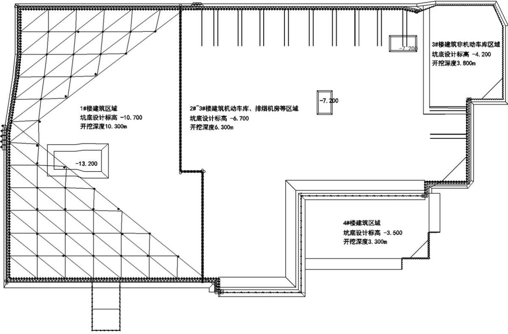  
图 2.4-1  
基坑围护及开挖布置图

表 2.4-3  
基坑工程土石方计算
<table><tr><td rowspan=2 colspan=1>序号</td><td rowspan=2 colspan=3>分项工程</td><td rowspan=2 colspan=1>开挖面积(m2)</td><td rowspan=2 colspan=1>开挖深度(m)</td><td rowspan=1 colspan=2>开挖放坡</td><td rowspan=1 colspan=3>余方（万m³）</td></tr><tr><td rowspan=1 colspan=1>坡比</td><td rowspan=1 colspan=1>坡深（m）</td><td rowspan=1 colspan=1>土方</td><td rowspan=1 colspan=1>土方(淤泥)</td><td rowspan=1 colspan=1>小计</td></tr><tr><td rowspan=1 colspan=1>1</td><td rowspan=1 colspan=1>1#楼</td><td rowspan=1 colspan=2>地下室</td><td rowspan=1 colspan=1>6959</td><td rowspan=2 colspan=1>10.30~12.80</td><td rowspan=1 colspan=1>/</td><td rowspan=1 colspan=1>/</td><td rowspan=2 colspan=1>8.65</td><td rowspan=2 colspan=1>0</td><td rowspan=2 colspan=1>8.65</td></tr><tr><td rowspan=1 colspan=1>2</td><td rowspan=1 colspan=1>建筑</td><td rowspan=1 colspan=1>坑中坑</td><td rowspan=1 colspan=1>电梯井</td><td rowspan=1 colspan=1>283</td><td rowspan=1 colspan=1>1:1</td><td rowspan=1 colspan=1>2.50</td></tr><tr><td rowspan=2 colspan=1>3</td><td rowspan=2 colspan=1>2#~3</td><td rowspan=2 colspan=2>机动车等地下室</td><td rowspan=2 colspan=1>7919</td><td rowspan=2 colspan=1>6.30</td><td rowspan=1 colspan=1>1</td><td rowspan=1 colspan=1>1</td><td rowspan=2 colspan=1>5.27</td><td rowspan=2 colspan=1>0</td><td rowspan=2 colspan=1>5.27</td></tr><tr><td rowspan=1 colspan=1>1:1</td><td rowspan=1 colspan=1>2.5马道1m宽3.8</td></tr><tr><td rowspan=1 colspan=1>4</td><td rowspan=2 colspan=1>#楼建筑</td><td rowspan=2 colspan=2>非机动车等地下室</td><td rowspan=2 colspan=1>1200</td><td rowspan=2 colspan=1>3.80~</td><td rowspan=1 colspan=1>1:1</td><td rowspan=1 colspan=1>1.0</td><td rowspan=4 colspan=1>0.45</td><td rowspan=4 colspan=1>0.03</td><td rowspan=4 colspan=1>0.48</td></tr><tr><td rowspan=1 colspan=1></td><td rowspan=1 colspan=1>1:1</td><td rowspan=1 colspan=1>3.8</td></tr><tr><td rowspan=1 colspan=1>5</td><td rowspan=2 colspan=1></td><td rowspan=2 colspan=1>坑中坑</td><td rowspan=1 colspan=1>电梯井</td><td rowspan=1 colspan=1>63</td><td rowspan=2 colspan=1>4.30</td><td rowspan=1 colspan=1>1:1</td><td rowspan=1 colspan=1>0.5</td></tr><tr><td rowspan=1 colspan=1>6</td><td rowspan=1 colspan=1>电梯井</td><td rowspan=1 colspan=1>51</td><td rowspan=1 colspan=1>1:1</td><td rowspan=1 colspan=1>0.5</td></tr><tr><td rowspan=2 colspan=1>7</td><td rowspan=2 colspan=3>4#楼建筑</td><td rowspan=2 colspan=1>1420</td><td rowspan=2 colspan=1>3.30</td><td rowspan=1 colspan=1>1: 1</td><td rowspan=1 colspan=1> 1.0 </td><td rowspan=2 colspan=1>0.43</td><td rowspan=2 colspan=1>0</td><td rowspan=2 colspan=1>0.43</td></tr><tr><td rowspan=1 colspan=1>1: 1.3</td><td rowspan=1 colspan=1>3.30</td></tr><tr><td rowspan=1 colspan=8>合计                                     7</td><td rowspan=1 colspan=1>14.80</td><td rowspan=1 colspan=1>0.03</td><td rowspan=1 colspan=1>14.83</td></tr></table>

基坑工程开挖土石方量共 14.83 万 m3，均为土方；无填筑方；无借方；弃方共14.83 万 m3，均为土方。其中淤泥在泥浆处置区内处置后以固化土方外运，按照当地要求清运。

## 4）场地平整工程

场地平整工程主要按照室外地下室顶板回填区域和地下室范围外室外场平区域。根据初步设计结构工程要求，室外地下室顶板回填厚度为 1.50m，考虑该范围内包括普通地面绿化区域、下凹绿地、透水铺装、沥青路面、基坑侧壁回填、管线工程等，按照设计断面计算回填土方数量；地下室范围外室外场平区域根据普通地面绿化区域、下凹绿地、透水铺装、沥青路面、组团绿地、连接道路、管线工程等设计断面计算开挖土方数量。

表 2.4-4  
室外地下室顶板回填计算
<table><tr><td rowspan=1 colspan=1>序号</td><td rowspan=1 colspan=1>区域</td><td rowspan=1 colspan=1>断面设计</td><td rowspan=1 colspan=1>面积 ${ \bigl ( } \mathbf { m } ^ { 2 } { \bigr ) }$ </td><td rowspan=1 colspan=1>土方回填厚度（cm）</td><td rowspan=1 colspan=1>土方回填量(万m³)</td></tr><tr><td rowspan=1 colspan=1>1</td><td rowspan=1 colspan=1>普通地面绿化区域</td><td rowspan=1 colspan=1>80cm 种植土</td><td rowspan=1 colspan=1>2325</td><td rowspan=1 colspan=1>70</td><td rowspan=1 colspan=1>0.19</td></tr><tr><td rowspan=1 colspan=1>2</td><td rowspan=1 colspan=1>下凹绿地</td><td rowspan=1 colspan=1>30cm 种植土+10cm 砂土层</td><td rowspan=1 colspan=1>700</td><td rowspan=1 colspan=1>110</td><td rowspan=1 colspan=1>0.09</td></tr><tr><td rowspan=1 colspan=1>3</td><td rowspan=1 colspan=1>透水铺装</td><td rowspan=1 colspan=1>5cm指定材料铺装+3cm厚干硬性水泥砂浆+10cm无砂大孔混凝土+30cm碎石基层</td><td rowspan=1 colspan=1>1500</td><td rowspan=1 colspan=1>102</td><td rowspan=1 colspan=1>0.18</td></tr><tr><td rowspan=1 colspan=1>4</td><td rowspan=1 colspan=1>沥青路面</td><td rowspan=1 colspan=1>5cmAC-10 OGFC 高粘度改性排水沥青砼I型+粘层沥青（0.6L/m²）+6cmAC-25 C 型粗粒式沥青砼+1cm稀浆封层+水泥（5%水泥）30cm稳定碎石基层+50cm厚塘渣垫层</td><td rowspan=1 colspan=1>154</td><td rowspan=1 colspan=1>58</td><td rowspan=1 colspan=1>0.01</td></tr><tr><td rowspan=1 colspan=1>5</td><td rowspan=1 colspan=1>基坑侧壁回填</td><td rowspan=1 colspan=1>/</td><td rowspan=1 colspan=1></td><td rowspan=1 colspan=1>1</td><td rowspan=1 colspan=1>1.06</td></tr><tr><td rowspan=1 colspan=5>合计</td><td rowspan=1 colspan=1>1.53</td></tr></table>

注：土方回填量已换算为自然方。

表 2.4-5  
地下室范围外室外场平计算
<table><tr><td rowspan=1 colspan=1>序号</td><td rowspan=1 colspan=1>区域</td><td rowspan=1 colspan=1>断面设计           </td><td rowspan=1 colspan=1>面积 $( \mathbf { m } ^ { 2 } )$ </td><td rowspan=1 colspan=1>开挖深度(cm)</td><td rowspan=1 colspan=1>土方开挖量 $( \mathrm { ~ \mathcal { F } ~ m } ^ { 3 } )$ </td></tr><tr><td rowspan=1 colspan=1>1</td><td rowspan=1 colspan=1>普通地面绿化区域</td><td rowspan=1 colspan=1>80cm 种植土</td><td rowspan=1 colspan=1>1735</td><td rowspan=1 colspan=1>80</td><td rowspan=1 colspan=1>0.14</td></tr><tr><td rowspan=1 colspan=1>2</td><td rowspan=1 colspan=1>下凹绿地</td><td rowspan=1 colspan=1>30cm 种植土+10cm 砂土层</td><td rowspan=1 colspan=1>1317</td><td rowspan=1 colspan=1>40</td><td rowspan=1 colspan=1>0.05</td></tr><tr><td rowspan=1 colspan=1>3</td><td rowspan=1 colspan=1>透水铺装</td><td rowspan=1 colspan=1>5cm指定材料铺装+3cm厚干硬性水泥砂浆+10cm无砂大孔混凝土A       +30cm 碎石基层</td><td rowspan=1 colspan=1>3078</td><td rowspan=1 colspan=1>48</td><td rowspan=1 colspan=1>0.15</td></tr><tr><td rowspan=1 colspan=1>4</td><td rowspan=1 colspan=1>沥青路面</td><td rowspan=1 colspan=1>5cmAC-10 OGFC 高粘度改性排水沥青砼I型+粘层沥青（0.6L/m²）+6cmAC-25 C 型粗粒式沥青砼+1cm稀浆封层+水泥（5%水泥）30cm稳定碎石基层+50cm厚塘渣垫层</td><td rowspan=1 colspan=1>1216</td><td rowspan=1 colspan=1>92</td><td rowspan=1 colspan=1>0.11</td></tr><tr><td rowspan=1 colspan=1>6</td><td rowspan=1 colspan=1>组团绿地</td><td rowspan=1 colspan=1>80cm 种植土</td><td rowspan=1 colspan=1>11306</td><td rowspan=1 colspan=1>80</td><td rowspan=1 colspan=1>0.9</td></tr><tr><td rowspan=1 colspan=1>7</td><td rowspan=1 colspan=1>透水铺装-园路</td><td rowspan=1 colspan=1>5cm指定材料铺装+20cm透水混凝土+25cm碎石基层</td><td rowspan=1 colspan=1>1083</td><td rowspan=1 colspan=1>50</td><td rowspan=1 colspan=1>0.05</td></tr><tr><td rowspan=1 colspan=1>8</td><td rowspan=1 colspan=1>连接道路</td><td rowspan=1 colspan=1>5cm指定材料铺装+素水泥砂浆一道+3cm 水泥砂浆+20cmC25 钢筋砼+10cm 碎石垫层+30cm厚塘渣垫层</td><td rowspan=1 colspan=1>1537</td><td rowspan=1 colspan=1>68</td><td rowspan=1 colspan=1>0.10</td></tr><tr><td rowspan=1 colspan=5>合计</td><td rowspan=1 colspan=1>1.50</td></tr></table>

注：地下室范围以外室外场地现状高程为 4.50m～4.80m，室外设计高程为 4.65m。

场地平整工程开挖土石方量共 1.53 万 m3，均为土方；回填土石方量共 1.50 万 m3，均为土方；无借方；弃方共 0.03万m3，均为土方。

## 5）道路、铺装、管线工程

道路、铺装、管线工程同步施工，根据断面设计，地下室顶板回填时预留各类管线槽位，避免二次开挖回填，土方挖填量计入场平工程。管线铺设完成后，全面进行路面、铺装等施工。

## 2.4.3 土石方平衡汇总

项目土石方开挖量 18.53 万 $\mathrm { m } ^ { 3 }$ ，均为土方；填筑量 2.79 万 $\mathrm { m } ^ { 3 }$ ，其中表土 1.29 万$\mathrm { m } ^ { 3 }$ ，土方 $1 . 5 0 \mathrm { ~ } \mathcal { F } \mathrm { ~ m } ^ { 3 } \mathrm { ~ }$ ；自身利用共 $1 . 5 0 \mathrm { ~ \mathscr ~ { ~ H ~ } ~ m ~ } ^ { 3 }$ ，均为土方；借方共 $1 . 2 9 \mathrm { ~ \mathscr ~ { ~ H ~ } ~ m ~ } ^ { 3 }$ ，均为表土，由杭州市西湖区综合行政执法局统一调配；余方共 $1 7 . 0 3 \ : \mathrm { ~ \mathscr ~ { ~ H ~ } ~ m ~ } ^ { 3 }$ ，均为土方，由杭州市西湖区综合行政执法局统一调配消纳。

表 2.4-7  
工程土石方平衡  
单位：万 $\mathrm { m } ^ { 3 }$
<table><tr><td rowspan=2 colspan=1>序号</td><td rowspan=2 colspan=1>分项工程</td><td rowspan=1 colspan=2>挖方</td><td rowspan=1 colspan=3>填方</td><td rowspan=1 colspan=2>借方</td><td rowspan=1 colspan=2>余（弃）方</td></tr><tr><td rowspan=1 colspan=1>土方</td><td rowspan=1 colspan=1>小计</td><td rowspan=1 colspan=1>表土</td><td rowspan=1 colspan=1>土方</td><td rowspan=1 colspan=1>小计</td><td rowspan=1 colspan=1>表土</td><td rowspan=1 colspan=1>小计</td><td rowspan=1 colspan=1>土方</td><td rowspan=1 colspan=1>小计</td></tr><tr><td rowspan=1 colspan=1>1</td><td rowspan=1 colspan=1>表土工程（绿化工程）</td><td rowspan=1 colspan=1>0</td><td rowspan=1 colspan=1>0</td><td rowspan=1 colspan=1>1.29</td><td rowspan=1 colspan=1>0</td><td rowspan=1 colspan=1>1.29</td><td rowspan=1 colspan=1>1.29</td><td rowspan=1 colspan=1>1.29</td><td rowspan=1 colspan=1>0</td><td rowspan=1 colspan=1>0</td></tr><tr><td rowspan=1 colspan=1>2</td><td rowspan=1 colspan=1>围护、桩基工程</td><td rowspan=1 colspan=1>2.17</td><td rowspan=1 colspan=1>2.17</td><td rowspan=1 colspan=1>0</td><td rowspan=1 colspan=1>0</td><td rowspan=1 colspan=1>0</td><td rowspan=1 colspan=1>0</td><td rowspan=1 colspan=1>0</td><td rowspan=1 colspan=1>2.17</td><td rowspan=1 colspan=1>2.17</td></tr><tr><td rowspan=1 colspan=1>3</td><td rowspan=1 colspan=1>基坑工程</td><td rowspan=1 colspan=1>14.83</td><td rowspan=1 colspan=1>14.83</td><td rowspan=1 colspan=1>0</td><td rowspan=1 colspan=1>0</td><td rowspan=1 colspan=1>0</td><td rowspan=1 colspan=1>0</td><td rowspan=1 colspan=1>0</td><td rowspan=1 colspan=1>14.83</td><td rowspan=1 colspan=1>14.83</td></tr><tr><td rowspan=1 colspan=1>4</td><td rowspan=1 colspan=1>场地平整工程</td><td rowspan=1 colspan=1>1.53</td><td rowspan=1 colspan=1>1.53</td><td rowspan=1 colspan=1>0</td><td rowspan=1 colspan=1>1.50</td><td rowspan=1 colspan=1>1.50</td><td rowspan=1 colspan=1>0</td><td rowspan=1 colspan=1>0</td><td rowspan=1 colspan=1>0.03</td><td rowspan=1 colspan=1>0.03</td></tr><tr><td rowspan=1 colspan=1>5</td><td rowspan=1 colspan=1>合计</td><td rowspan=1 colspan=1>18.53</td><td rowspan=1 colspan=1>18.53</td><td rowspan=1 colspan=1>1.29</td><td rowspan=1 colspan=1>1.50</td><td rowspan=1 colspan=1>2.79</td><td rowspan=1 colspan=1>1.29</td><td rowspan=1 colspan=1>1.29</td><td rowspan=1 colspan=1>17.03</td><td rowspan=1 colspan=1>17.03</td></tr></table>

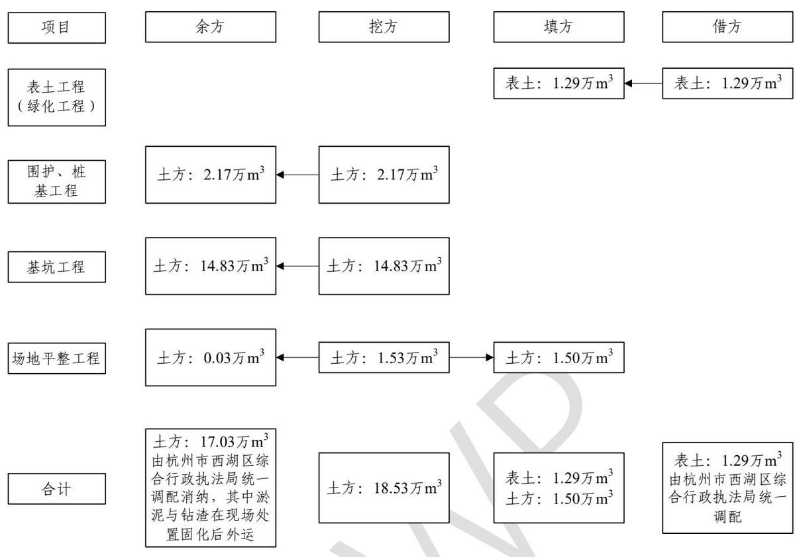  
图 2.4-2  
工程土石方流向框图

## 2.5 拆迁（移民）安置与专项设施改（迁）建

工程建设征地范围内不涉及拆迁安置与专项设施改（迁）建。

## 2.6 施工进度

项目计划 2026年 3月开工，计划 2028 年 12月完工，总工期为 34个月。计划进度分别安排如下：

1）2026年3月\~2026年4月，施工准备工作；

2）2026年4月\~2026年8月，基坑围护、桩基施工；

3）2026年6月\~2026年12月，基坑土方开挖施工；

4）2026 年 9 月\~2027 年 9 月，地下室结构施工；

5）2027 年 1 月\~2028 年 4 月，上部主体结构施工；

6）2027 年 4 月\~2027 年 6 月，屋面工程施工；

7）2027 年 4 月\~2028 年 8 月，装修工程；

8）2027 年 8 月\~2028 年 11 月，安装工程；

9）2027 年 7 月\~2027 年 9 月，电梯工程；

10）2028 年 3 月\~2028 年 11 月，室外工程；

11）2028 年 10 月\~2028 年 11 月，绿化工程；

12）2028 年 12 月，工程完工。

工程施工进度情况见表 2.6-1。

表 2.6-1

工程施工进度情况表
<table><tr><td rowspan=2 colspan=1>序号</td><td rowspan=2 colspan=1>工程项目</td><td rowspan=1 colspan=4>2026年</td><td rowspan=1 colspan=4>2027年</td><td rowspan=1 colspan=4>2028年</td></tr><tr><td rowspan=1 colspan=1>I</td><td rowspan=1 colspan=1>ⅡI</td><td rowspan=1 colspan=1>IⅢ</td><td rowspan=1 colspan=1>IV</td><td rowspan=1 colspan=1>I</td><td rowspan=1 colspan=1>ⅡI</td><td rowspan=1 colspan=1>IⅢ</td><td rowspan=1 colspan=1>IV</td><td rowspan=1 colspan=1>I</td><td rowspan=1 colspan=1>Ⅱ</td><td rowspan=1 colspan=1>ⅢⅢ</td><td rowspan=1 colspan=1>IV</td></tr><tr><td rowspan=1 colspan=1>1</td><td rowspan=1 colspan=1>施工准备工作</td><td rowspan=1 colspan=1></td><td rowspan=1 colspan=1></td><td rowspan=1 colspan=1></td><td rowspan=1 colspan=1></td><td rowspan=1 colspan=1></td><td rowspan=1 colspan=1></td><td rowspan=1 colspan=1></td><td rowspan=1 colspan=1></td><td rowspan=1 colspan=1></td><td rowspan=1 colspan=1></td><td rowspan=1 colspan=1></td><td rowspan=1 colspan=1></td></tr><tr><td rowspan=1 colspan=1>2</td><td rowspan=1 colspan=1>基坑围护、桩基施工</td><td rowspan=1 colspan=1></td><td rowspan=1 colspan=1></td><td rowspan=1 colspan=1></td><td rowspan=1 colspan=1></td><td rowspan=1 colspan=1></td><td rowspan=1 colspan=1></td><td rowspan=1 colspan=1></td><td rowspan=1 colspan=1></td><td rowspan=1 colspan=1></td><td rowspan=1 colspan=1></td><td rowspan=1 colspan=1></td><td rowspan=1 colspan=1></td></tr><tr><td rowspan=1 colspan=1>3</td><td rowspan=1 colspan=1>基坑土方开挖施工</td><td rowspan=1 colspan=1></td><td rowspan=1 colspan=1></td><td rowspan=1 colspan=1></td><td rowspan=1 colspan=1></td><td rowspan=1 colspan=1></td><td rowspan=1 colspan=1></td><td rowspan=1 colspan=1></td><td rowspan=1 colspan=1></td><td rowspan=1 colspan=1></td><td rowspan=1 colspan=1></td><td rowspan=1 colspan=1></td><td rowspan=1 colspan=1></td></tr><tr><td rowspan=2 colspan=1>4</td><td rowspan=2 colspan=1>地下室结构施工</td><td rowspan=2 colspan=1></td><td rowspan=2 colspan=1></td><td rowspan=2 colspan=1></td><td rowspan=1 colspan=1></td><td rowspan=1 colspan=1></td><td rowspan=1 colspan=1></td><td rowspan=1 colspan=1></td><td rowspan=2 colspan=1></td><td rowspan=2 colspan=1></td><td rowspan=2 colspan=1></td><td rowspan=2 colspan=1></td><td rowspan=2 colspan=1></td></tr><tr><td rowspan=1 colspan=1></td><td rowspan=1 colspan=1></td><td rowspan=1 colspan=1></td><td rowspan=1 colspan=1></td></tr><tr><td rowspan=2 colspan=1>5</td><td rowspan=2 colspan=1>上部主体结构施工</td><td rowspan=2 colspan=1></td><td rowspan=2 colspan=1></td><td rowspan=2 colspan=1></td><td rowspan=2 colspan=1>X</td><td rowspan=1 colspan=1></td><td rowspan=1 colspan=1></td><td rowspan=1 colspan=1></td><td rowspan=1 colspan=1></td><td rowspan=1 colspan=1></td><td rowspan=2 colspan=1></td><td rowspan=2 colspan=1></td><td rowspan=2 colspan=1></td></tr><tr><td rowspan=1 colspan=1></td><td rowspan=1 colspan=1></td><td rowspan=1 colspan=1></td><td rowspan=1 colspan=1></td><td rowspan=1 colspan=1></td></tr><tr><td rowspan=2 colspan=1>6</td><td rowspan=2 colspan=1>屋面工程施工</td><td rowspan=2 colspan=1></td><td rowspan=2 colspan=1></td><td rowspan=2 colspan=1></td><td rowspan=2 colspan=1></td><td rowspan=2 colspan=1>X</td><td rowspan=1 colspan=1></td><td rowspan=2 colspan=1></td><td rowspan=2 colspan=1></td><td rowspan=2 colspan=1></td><td rowspan=2 colspan=1></td><td rowspan=2 colspan=1></td><td rowspan=2 colspan=1></td></tr><tr><td rowspan=1 colspan=1></td></tr><tr><td rowspan=2 colspan=1>7</td><td rowspan=2 colspan=1>装修工程</td><td rowspan=2 colspan=1></td><td rowspan=2 colspan=1></td><td rowspan=2 colspan=1></td><td rowspan=2 colspan=1></td><td rowspan=2 colspan=1></td><td rowspan=1 colspan=1></td><td rowspan=1 colspan=1></td><td rowspan=1 colspan=1></td><td rowspan=1 colspan=1></td><td rowspan=1 colspan=1></td><td rowspan=2 colspan=1></td><td rowspan=2 colspan=1></td></tr><tr><td rowspan=1 colspan=1></td><td rowspan=1 colspan=1></td><td rowspan=1 colspan=1></td><td rowspan=1 colspan=1></td><td rowspan=1 colspan=1></td></tr><tr><td rowspan=2 colspan=1>8</td><td rowspan=2 colspan=1>安装工程</td><td rowspan=2 colspan=1></td><td rowspan=2 colspan=1></td><td rowspan=2 colspan=1></td><td rowspan=2 colspan=1></td><td rowspan=2 colspan=1></td><td rowspan=2 colspan=1></td><td rowspan=2 colspan=1></td><td rowspan=1 colspan=1></td><td rowspan=1 colspan=1></td><td rowspan=1 colspan=1></td><td rowspan=1 colspan=1></td><td rowspan=2 colspan=1></td></tr><tr><td rowspan=1 colspan=1></td><td rowspan=1 colspan=1></td><td rowspan=1 colspan=1></td><td rowspan=1 colspan=1></td></tr><tr><td rowspan=2 colspan=1>9</td><td rowspan=2 colspan=1>电梯工程</td><td rowspan=2 colspan=1></td><td rowspan=2 colspan=1></td><td rowspan=2 colspan=1></td><td rowspan=2 colspan=1></td><td rowspan=2 colspan=1></td><td rowspan=2 colspan=1></td><td rowspan=1 colspan=1></td><td rowspan=2 colspan=1></td><td rowspan=2 colspan=1></td><td rowspan=2 colspan=1></td><td rowspan=2 colspan=1></td><td rowspan=2 colspan=1></td></tr><tr><td rowspan=1 colspan=1></td></tr><tr><td rowspan=2 colspan=1>10</td><td rowspan=2 colspan=1>室外工程</td><td rowspan=2 colspan=1></td><td rowspan=2 colspan=1></td><td rowspan=2 colspan=1></td><td rowspan=2 colspan=1></td><td rowspan=2 colspan=1></td><td rowspan=2 colspan=1></td><td rowspan=2 colspan=1></td><td rowspan=2 colspan=1></td><td rowspan=2 colspan=1></td><td rowspan=1 colspan=1></td><td rowspan=1 colspan=1></td><td rowspan=2 colspan=1></td></tr><tr><td rowspan=1 colspan=1></td><td rowspan=1 colspan=1></td></tr><tr><td rowspan=1 colspan=1>11</td><td rowspan=1 colspan=1>绿化工程</td><td rowspan=1 colspan=1></td><td rowspan=1 colspan=1></td><td rowspan=1 colspan=1>V</td><td rowspan=1 colspan=1></td><td rowspan=1 colspan=1></td><td rowspan=1 colspan=1></td><td rowspan=1 colspan=1></td><td rowspan=1 colspan=1></td><td rowspan=1 colspan=1></td><td rowspan=1 colspan=1></td><td rowspan=1 colspan=1></td><td rowspan=1 colspan=1></td></tr><tr><td rowspan=1 colspan=1>12</td><td rowspan=1 colspan=1>完工</td><td rowspan=1 colspan=1></td><td rowspan=1 colspan=1></td><td rowspan=1 colspan=1></td><td rowspan=1 colspan=1></td><td rowspan=1 colspan=1></td><td rowspan=1 colspan=1></td><td rowspan=1 colspan=1></td><td rowspan=1 colspan=1></td><td rowspan=1 colspan=1></td><td rowspan=1 colspan=1></td><td rowspan=1 colspan=1></td><td rowspan=1 colspan=1></td></tr></table>

注：工程实施计划进度

## 2.7 自然概况

## 2.7.1 地形地貌

项目区所在地为杭州市西湖区，工程所经区域属杭嘉湖平原地貌，根据现场踏勘和主体工程资料，基础交叉研究大楼区域现状地面高程 4.50m～4.80m，地势平坦，地面无建构筑物，2025 年 10 月开展了供地前置的考古工作，考古区域主要为基坑开挖区域，目前形成条状坑，地形地势未改变；组团绿地区域现状地面高程 4.50m～4.80m，地势平坦，地面无建构筑物，其中西南角为在建的学科交叉创新大楼施工生产生活区，占用面积约1500m2，为硬化地面和二层集装箱办公区域，未改变地形。

规划区域 1 现状为河道和绿化用地，规划区域 2 现状为实验地，局部植被覆盖。规划区域地势平坦。

## 2.7.2 地质

## 1）地质构造及地震

工程区属杭嘉湖沉积平原区，其大地构造位置属于扬子准地台钱塘江台褶带的余杭\~嘉兴台陷东北端，新构造运动主要以震荡性升降运动为主，近场区区域（25km 半径范围） 断裂中有北东向的湖州—临安、 马金—乌镇断裂、萧山—球川深断裂；北西向的孝丰—三门大断裂和前村—瓜沥断裂；东西向的昌化—普陀大断裂，全新统以来都没有活动。

根据《建筑抗震设计规范》（GB 50011-2010）（2016年版）及《中国地震动参数区划图》（GB18306-2015）的划分标准，杭州市西湖区抗震设防烈度为 7 度，设计地震分组为第一组，设计基本地震加速度值为 0.10g。设计地震分组为第一组，基本地震动峰值加速度反应谱特征周期值为 0.45s。

## 2）地质条件

根据《浙江大学基础交叉研究大楼项目岩土工程勘察报告》（详细勘察阶段）（信电综合勘察设计研究院有限公司 2025年3月），本工程场地地质条件概况：

①-1 层杂填土（mlQ4）：杂色、灰褐色，松散，性质不均，主要由碎石、粘性土组成，含大量碎砖、凝土块等建筑垃圾，含生活垃圾。由于其组成物质杂乱，分布缺乏规律性，造成杂填土的性质不均匀，均性差，稳定性一般；一般是任意堆填，未经充分压实，故具土质松散，低密实度、高压缩性和低强度等特性。东侧河道区域含淤泥。

①-2层 淤填土（mlQ4）：杂色、灰黑色，流塑状，含腐殖物、建筑垃圾、碎砖、凝土碎块及块石，底部夹杂塘该层土均匀性很差，为新近回填堆积。

②层 粉质粘土(al-mQ34):青灰色、灰黄色，硬可塑，含少量氧化物和铁锰质斑点;切面较光滑，有光泽，干强度及韧性中等。该层土均匀性一般。

③层 砂质粉土(al-mQ34):灰色、灰黄色，很湿，稍密;中等压缩性，摇振反应稍快，切面较粗糙，干强度低，韧性低；含云母碎片，该层土均匀性一般。

④层 淤泥质粉质粘土(a1-mO42):灰色，流塑，含少量腐殖质和贝壳；干强度中等，超固结土，均性较好；结构性对软土工程力学性能影响较大，本场地淤泥质粉质粘土其原状土与其重塑土压缩特性、 固结 特性有明显的差异。该软土层微观结构在受力过程中，从空架结构向片架结构过渡，最后为片架结构；属高灵敏度土，受到振动荷载后(如桩基施工过程中)，易出现土体结构强度降低，易出现土体侧向滑动或土体隆起等不良现象。

⑤层 粉质粘土(mQ14):灰色、灰黄色，硬可塑，切面较光滑，有光泽，干强度及韧性中等。该层土均匀性较好。

⑥层 粉质粘土(mO14):灰色，软塑\~可塑，含少量腐殖质；切面较光滑，有光泽，干强度及韧性中等。该层土均匀性较好。

⑦层 粉质粘土(mQ23):灰色、青灰色，硬可塑，切面较光滑，有光泽，干强度及韧性中等。该层土均匀性一般。底部夹有稍密状粘质粉土，相对该层中上部无夹粉土层，其工程力学性能有所降低。

⑦夹 粉砂(mO23):灰色，饱和，稍密，颗粒较均匀，可见长石、石英、云母等矿物。呈透镜体状分布，无规律，预应力管桩贯穿该层存在一定的难度，根据附近施工经验反馈部分区域无法贯穿该夹层，导致桩长存在高高低低现象。该层土均匀性一般。

⑨-1 层 粉质粘土夹粉砂(a1Q23):灰色、青灰色，可塑，稍密，中等压缩性，摇振反应稍快，切面较粗糙，干强度低，韧性低;夹稍密状粉砂；含云母碎片和少量腐殖质。该层土均匀性一般。该层混夹粉砂，分布无规律，预应力管桩贯穿该层局部区域存在一定的难度，导致桩长会存在高高低低现象。

⑨-2 层 圆砾(a1Q23):灰色，饱和，以中密为主，局部密实。粒径大于 2mm 颗粒含量约占 50%\~65%，粒径最大超过 100mm，一般 10\~20mm，颗粒呈亚圆形为主，少量棱角形，颗粒级配差，排列杂乱；母岩呈中风化，部分微风化，岩性以晶屑熔结凝灰岩、石英砂岩为主，岩质较坚硬，中粗砂及少量粉粘粒充填。局部相变为砾砂或卵石。该层土均匀性一般。

⑩b 层 强风化泥质粉砂岩(K1):棕红色，稍硬，粉粒结构，原岩结构已基本破坏。裂隙发育，岩芯极破碎，以碎块状为主，局部区域上部有 20\~50mm 左右全风化泥质粉砂岩，遇水易软化。

⑩c 层 中等风化泥质粉砂岩(K1):紫红色、棕红色，粉砂质结构，块状构造，原岩结构较清晰，风化程度不高:裂隙发 较完整，RQD=75-85 左右，呈短柱状，少量碎块状，进尺平稳。岩石单轴天然抗压强度平均值为 2.53MPa，属极软岩，岩体较完整，岩体基本质量等级为 V 级； 勘察孔深度内未见洞穴、临空面。分布稳定，巨厚层，均匀性较好；该层未揭穿。

## 3）不良地质作用及特殊性岩土

根据《浙江大学基础交叉研究大楼项目岩土工程勘察报告》（详细勘察阶段）（信电综合勘察设计研究院有限公司 2025 年 3 月），本工程场地未发现滑坡、泥石流、崩塌、地面塌陷、地裂缝、岩溶等不良地质作用。

## 4）水文地质条件

根据《浙江大学基础交叉研究大楼项目岩土工程勘察报告》（详细勘察阶段）（信电综合勘察设计研究院有限公司 2025 年 3 月），场地内地表水主要为雨水期间集聚在场地局部低洼地带，接受大气降水补给，并以蒸发和向东侧河道排泄；平常期间场地内无地表水分布。东侧为校区内河道—西行河，属余杭塘河支流。

场地内主要分布三层地下水，上层地下水性质属于孔隙潜水，下部地下水性质属

于承压水，下层地下水性质属基岩裂隙水。

上部地下水类型属孔隙潜水，潜水埋藏较浅，主要赋存于场地内的①-1 层杂填土、①-2 层淤填土、②粉质粘土、③层砂质粉土中。潜水水以蒸发与侧向径流为主要排泄方式，地下水位埋深 1.7m\~2.3m 左右，地下水位年变化在 1.0m\~2.0m 之间。

下部地下水类型属承压水，主要赋存于下部的粉质粘土夹粉砂、圆砾中。上部的粘性土是相对隔水层，构成含水层的承压顶板。该层承压水水量一般。本场地承压水水位在自然地面下约 6.0m\~7.0m，相对高程约-2.0\~-3.0m 左右，地下水位年变化在1.0m\~2.0m 之间。

下层基岩裂隙水主要赋存于下部风化基岩裂隙中，含水层透水性受岩石的风化程度、裂隙发育程度和贯通性控制。裂隙水主要受侧向补给和上部孔隙潜水含水层下渗补给，径流缓慢。对工程桩基施工基本无影响。

## 2.7.3 气象

工程区气候属亚热带季风气候区，其基本特点是冬冷夏热，四季分明；降水充沛，光照充足；春夏雨热同步， 温互补；气候垂直变化明显，灾害性天气较多。根，极端最高 41.3℃，极端最低-9.6℃；年平均降水量 1406.8mm，降雨以梅雨为主，台风雨补充，主要集中在 3-9 月，年最大降水量达 1755.6mm，年最小降水量仅 774.4mm，年最大日降雨量 191.3mm；年平均蒸发量1235.3mm；无霜期 209d；年平均风速 2.2m/s，主导风向为 NNW，主要灾害性天气为热带气旋（台风及热带风暴），一般发生在 7月\~10月。

## 2.7.4 水文

紫金港校区属运河水系的运西片，为典型的平原河网水系，区内水网交错。紫金港校区内的河网为封闭独立的水系。本工程项目位于紫金港校区西区，距项目区东侧范围线 30m 处为校内景观河—西行河，西行河为一级河道，在校区内的行洪排涝上发挥主要作用，在配水上为主要配水通道，在校园内为主要的景观性水面，对滨水建筑的景观影响大。西行河宽 25m，南北走向，南起余杭塘河，北至创新街，横穿中心湖，与余杭塘河、簇浜漾、北护校河相交，全长约 1635m。西行河作为紫金港校区西区校内水系之一，常水位控制在 2.0m（景观水位）。

根据《浙江省水功能区水环境功能区划分方案》（浙江省水利厅、浙江省环保厅，2015 年），项目周边水系余杭塘河属于杭嘉湖 29，水功能区属余杭塘河杭州景观娱乐用水区 1，水环境功能区属景观娱乐用水区，目标水质Ⅲ。

表 2.7-1  
项目周边水系水功能区水环境功能区划
<table><tr><td rowspan=2 colspan=1>序号</td><td rowspan=2 colspan=1>水功能区</td><td rowspan=2 colspan=1>水环境功能区</td><td rowspan=2 colspan=1>河流</td><td rowspan=1 colspan=2>范围</td><td rowspan=2 colspan=1>长度面积(km/km²)</td><td rowspan=2 colspan=1>目标质</td></tr><tr><td rowspan=1 colspan=1>起始断面</td><td rowspan=1 colspan=1>终止断面</td></tr><tr><td rowspan=1 colspan=1>杭嘉湖29</td><td rowspan=1 colspan=1>余杭塘河杭州景观娱乐用水区1</td><td rowspan=1 colspan=1>景观娱乐用水区</td><td rowspan=1 colspan=1>余杭塘河</td><td rowspan=1 colspan=1>绕城公路桥</td><td rowspan=1 colspan=1>西塘河交</td><td rowspan=1 colspan=1>7.2</td><td rowspan=1 colspan=1>Ⅲ</td></tr></table>

## 2.7.5 土壤

西湖区地形多样，受成土母质、地形和植被等因素影响，主要土壤类型有红壤、黄壤和水稻土。其中，红壤和黄壤 布在低山 丘陵 具有酸性强、养分含量较低等特点；水稻土主要分布在平原和河谷地区，肥力较高，适宜种植水稻等作物。

根据《浙江大学基础交叉研究大楼项目岩土工程勘察报告》（详细勘察阶段）（信电综合勘察设计研究院有限公司 2025 年 3 月）和现场调查情况，场地地表主要为杂填土。

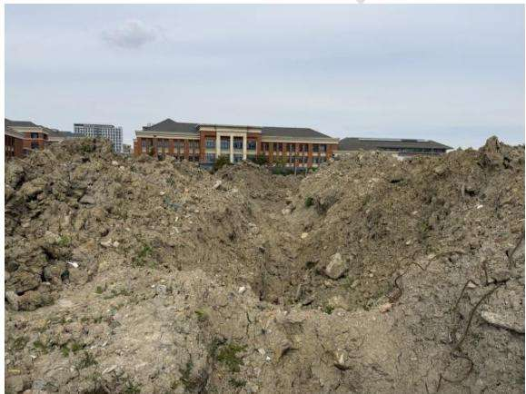  
图 2.7-1

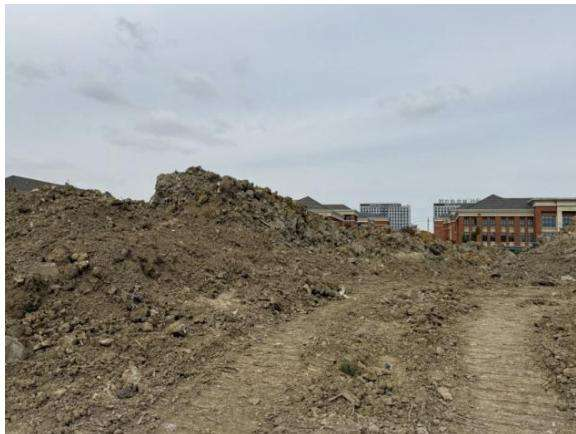  
现场调查地表土壤情况

## 2.7.6 植被

项目区植被分区属中亚热带常绿阔叶林地带北部亚地带 1 号植被区，随境内地形自东向西逐步抬高，植被的垂直分布明显。杭州市林草覆盖率达 63%以上，森林资源位居全省第二。西湖区平原区域（主要集中在东部、北部沿湖平原及西溪湿地周边平原，地势平坦、水网密集，受人为活动影响较深）的植被以人工栽培植被为主、自然次生植被为辅，受人为活动影响，平原区域自然植被留存较少，仅在河道两岸、闲置地块、西溪湿地外围有零星分布，以耐贫瘠、适应性强的草本和灌木为主，除西溪湿地核心区外，多数植被为人工规划种植（如行道树、公园景观植物、茶园）。

本项目区基础交叉大楼和组团绿地区域四周栽植有大叶女贞，无其他植被覆盖，局部植被覆盖，现状绿化面积为 $1 0 3 3 \mathrm { m } ^ { 2 }$ 。项目区现状林草覆盖率约为 5%。

## 2.7.7 水土保持敏感区

本项目区不涉及饮用水水源保护区、水功能一级区的保护区和保留区、自然保护区、世界文化和自然遗产地、风景名胜区、地质公园、森林公园以及重要湿地等水土保持敏感区。

## 3 项目水土保持评价

## 3.1 主体工程选址（线）水土保持评价

本工程不属于《促进产业结构调整暂行规定》（国发〔2013〕21 号）、国家发展和改革委员会发布的《产业结构调整指导目录（2024 年本）》中限制类和淘汰类产业的生产建设项目。本项目符合国土空间规划管控规则，杭州市人民政府于 2010 年 10月批复浙江大学紫金港校区西区修建性详细规划；2012 年10 月，杭州市规划局又对校区的修规调整方案进行了简复。2024年 5月 23日，浙江大学党委常委会研究同意浙江大学基础交叉研究大楼立项。

1）根据《水利部办公厅关于做好国家级水土流失重点预防区和重点治理区落地上图成果应用的通知》（办水保〔2025〕170 号），工程区不属于国家级水土流失重点预防区和重点治理区。根据《关于公布省级水土流失重点预防区和重点治理区的公告》（公告〔2015〕2 号），工程区不涉及省级水土流失重点预防区和重点治理区。根据《杭州市水土保持规划》，工程区不涉及市县级水土流失重点预防区和重点治理区。

2）项目建设过程中在场地四周设置施工围墙，起到阻隔的作用，减少对周边环境的影响。项目桩基、基坑开挖等施工过程中，淤泥及泥浆通过固化设备干化后与开挖的一般土方一并处置， 市西湖区综合行政执法局进行统一调配消纳。考虑泥浆及泥浆固化后在场地内短暂中转（不超过 10 天），本方案补充固化土临时堆土场，并配以防护措施。基坑开挖一般土方随挖随运处置。施工开挖、填筑、堆置等裸露面，采取临时苫盖等措施；施工生产生活区内根据地形设置临时排水沉沙措施。本次为校园大楼建设项目，施工后期将实施景观绿化工程，有利于水土保持和恢复校内景观环境。施工过程中，应安排施工进度与时序，缩小裸露面积和减少裸露时间，减少施工过程中因降水和风等水土流失影响因素可能产生的水土流失。雨季填筑土方应随挖、随填、随压，避免产生水土流失。

3）根据《浙江大学基础交叉研究大楼项目岩土工程勘察报告》（详细勘察阶段）（信电综合勘察设计研究院有限公司，2025 年 3 月），本工程场地未发现滑坡、泥石流、崩塌、地面塌陷、地裂缝、岩溶等不良地质作用。

4）本工程区不属于生态脆弱区，不占用全国水土保持监测网络中的水土保持监测站点、重点试验区及水土保持长期定位观测站。

5）本工程区不涉及河流两岸、湖泊和水库周边的植物保护带；工程未涉及生态保护红线、永久基本农田、生态公益林、饮用水源保护区、自然保护区、风景名胜区、国家公园、地质公园、森林公园、世界文化和自然遗产地、重要湿地、文物保护单位等。

综合以上分析，工程建设不存在重大的水土保持制约因素，工程建设是可行的。

工程水土保持制约因素分析见表 3.1-1。

表 3.1-1  
工程水土保持制约性因素分析与评价表
<table><tr><td rowspan=1 colspan=1>项目</td><td rowspan=1 colspan=1>要求内容</td><td rowspan=1 colspan=1>分析评价</td></tr><tr><td rowspan=6 colspan=1>《中华人民共和国水土保持法》</td><td rowspan=1 colspan=1>（1）禁止在崩塌、滑坡危险区和泥石流易发区从事取土、挖砂、采石等可能造成水土流失的活动。</td><td rowspan=1 colspan=1>均不涉及</td></tr><tr><td rowspan=1 colspan=1>(2）生产建设项目选址、选线应当避让水土流失重点预防区和重点治理区；无法避让的，应当提高防治标准，优化施工工艺，减少地表扰动和植被损坏范围，有效控制可能造成的水土流失。</td><td rowspan=1 colspan=1>工程不涉及各级水土流失重点预防区和治理区</td></tr><tr><td rowspan=1 colspan=1>（3）在山区、丘陵区、风沙区以及水土保持规划确定的容易发生水土流失的其他区域开办生产建设项目或者从事其他生产建设活动，损坏水土保持设施、地貌植被，不能恢复原有水土保持功能的，应当缴纳水土保持补偿费，专项用于水土流失预防和治理。</td><td rowspan=1 colspan=1>工程为学校项目，属于公益性工程，故免征水土保持补偿费</td></tr><tr><td rowspan=1 colspan=1>（4）水土流失严重、生态脆弱的地区，应当限制或者禁止可能造成水土流失的生产建设活动，严格保护植物、沙壳、结皮、地衣等。</td><td rowspan=1 colspan=1>均不涉及</td></tr><tr><td rowspan=1 colspan=1>（5）依法应当编制水土保持方案的生产建设项目，其生产建设活动中排弃的砂、石、土、矸石、尾矿、废渣等应当综合利用；不能综合利用，确需废弃的，应当堆放在水土保持方案确定的专门存放地，并采取措施保证不产生新的危害。</td><td rowspan=1 colspan=1>余方由杭州市西湖区综合行政执法局统一调配综合利用或消纳场消纳</td></tr><tr><td rowspan=1 colspan=1>（6）对生产建设活动所占用土地的地表土应当进行分层剥离、保存和利用，做到土石方挖填平衡，减少地表扰动范围；对废弃的砂、石、土、矸石、尾矿、废渣等存放地，应当采取拦挡、坡面防护、防洪排导等措施。生产建设活动结束后，应当及时在取土场、开挖面和存放地的裸露土地上植树种草、恢复植被，对闭库的尾矿库进行复垦。</td><td rowspan=1 colspan=1>无可剥离表土</td></tr><tr><td rowspan=6 colspan=1>《生产建设项目水土保持技术规范》(GB50433-2018)对主体工程约束性规定</td><td rowspan=1 colspan=1>（1）主体工程选址（线）应避让水土流失重点预防区和重点治理区；河流两岸、湖泊和水库周边的植物保护带；全国水土保持监测网络中的水土保持监测站点、重点试验区及水土保持长期定位观测站。</td><td rowspan=1 colspan=1>均不涉及</td></tr><tr><td rowspan=1 colspan=1>（2）严禁在崩塌和滑坡危险区、泥石流易发区内设置取土（石、砂）场。</td><td rowspan=1 colspan=1>不涉及</td></tr><tr><td rowspan=1 colspan=1>（3）严禁在对公共设施、基础设施、工业企业、居民点等有重大影响的区域设置弃土（石、渣、灰、矸石、尾矿）场。</td><td rowspan=1 colspan=1>余方由杭州市西湖区综合行政执法局统一调配综合利用或消纳场消纳，不涉及弃渣场</td></tr><tr><td rowspan=1 colspan=1>（4）涉及河道的应符合河流防洪规划和治导线的规定，不得设置在河道、湖泊和建成水库管理范围内。</td><td rowspan=1 colspan=1>均不涉及</td></tr><tr><td rowspan=1 colspan=1>（5）应控制施工场地占地，避开植被相对良好的区域和基本农田区。</td><td rowspan=1 colspan=1>项目区为教育用地，不涉及基本农田，施工场地均布置在永久占地范围内</td></tr><tr><td rowspan=1 colspan=1>（6）合理安排施工，防治重复开挖和多次倒运，减少裸露时间和范围；裸露地表应及时防护，减少裸露时间；填筑土方应随挖随运、随填、随压。</td><td rowspan=1 colspan=1>均不涉及</td></tr><tr><td rowspan=4 colspan=1>《浙江省水土保持条例》的限制性条文</td><td rowspan=1 colspan=1>1）生产建设项目在法律、法规规定禁止建设的区域的</td><td rowspan=1 colspan=1>不涉及</td></tr><tr><td rowspan=1 colspan=1>2）生产建设项目无法避让水土流失重点预防区和重点治理区，未相应提高水土流失防治标准的</td><td rowspan=1 colspan=1>工程不涉及各级水土流失重点预防区和治理区</td></tr><tr><td rowspan=1 colspan=1>3）生产建设项目取土场地未落实，或者取土场选址、设置不符合法律、法规规定和水土保持技术标准的</td><td rowspan=1 colspan=1>不涉及取土场</td></tr><tr><td rowspan=1 colspan=1>4）生产建设项目排弃的砂、石、土、矸石、尾矿、废渣等，应当综合利用没有综合利用方案；或者确需排弃没有落实存放地，以及存放地选址、设置不符合法律、法规规定和水土保持技术标准的</td><td rowspan=1 colspan=1>余方由杭州市西湖区综合行政执法局统一调配综合利用或消纳场消纳</td></tr></table>

综合以上分析，主体工程选址（线）符合《中华人民共和国水土保持法》(2011 年3月 1日)、《浙江省水土保持条例》(2020年 11月 27日)、《生产建设项目水土保持技术标准》(GB50433-2018)的要求，主体工程选址（线）不存在重大的水土保持制约因素，因此，本工程建设可行。

## 3.2 建设方案与布局水土保持评价

## 3.2.1 建设方案评价

## 1）工程平面布置的合理性分析与评价

本项目选址位于浙江大学紫金港校区西区，项目选址具有唯一性和不可替代性，契合学校整体发展规划及学科布局优化的迫切需求。

项目区平面布局设计科学、紧凑且功能分区明确，满足《建设项目用地预审与选址意见书》的相关指标要求。工程建设以“节约土地、便于管理、环境友好、美观协调”为基本原则，对建筑物、道路、硬质铺装及绿地进行了系统化、精细化的综合配置。在满足各项使用功能和安全间距的前提下 项目充分利用红线范围内的边角区域进行综合绿化，见缝插绿， 有 地利用的集约化程度。建筑物之间通过硬化地面进行有效分隔，既保证了各建筑单体的独立性和私密性，又通过合理的间距设计满足了消防、通风和采光的要求。

在交通组织与配套设施方面，主体设计在建筑物四周布置了道路系统，确保了消防车通行无阻以及人员物资运输的便捷高效。同时，结合道路周边布局了景观绿化，形成了点、线、面相结合的完整绿化体系，丰富的植被种植有效增加了地表粗糙度，减缓了地表径流速度，降低了水土流失风险。不仅美化了校园环境，提升了景观品质，更在水土保持方面发挥了积极作用。

本项目深度融入了“海绵城市”的先进设计理念，将水土保持与雨水管理有机结合。通过设置透水铺装、下凹绿地等低影响开发设施，构建了“渗、滞、蓄、净、用、排”的综合技术体系。透水铺装能有效促进雨水下渗，补充地下水资源；下凹绿地则能滞蓄和净化初期雨水，削减径流峰值。这一系统性设计从源头、过程到末端全方位优化了场地的水文循环，对减轻市政排水管网压力、防治内涝以及改善水生态环境均

具有重要意义。

此外，工程平面布置充分考虑了施工与运营的衔接，主体工程施工临时设施均利用工程永久占地范围，最大限度地减少了临时占地对周边环境的扰动。本工程项目施工期和运行期排水均能够接入与周边道路预留的排水系统接口，确保多余雨水能有序溢流排入场地雨水管网并就近汇入市政雨水系统。

综上所述，从水土保持角度，本工程平面布置合理。

## 2）项目竖向设计合理性分析与评价

本项目竖向设计充分利用了场地原始地形地貌特征，室外设计标高遵循现状场地特点，场地内地坪标高结合外部道路高度以及内部建筑等级和防洪防汛要求等原则布置，场地标高定位 4.65m，新建建筑主入口设置无障碍坡道或缓坡进入建筑内部，室内外高差控制在 300mm，室内±0.00 的绝对标高为 4.95m。 场地内雨水采用有组织排水，利用雨水管排向城市综合管网。本项目竖向设计综合考虑周围道路标高及场地排水的顺畅性、结构开挖的经济性，避免了大规模的挖填方作业，有效减少了地表扰动范围和土石方工程量，从源头上降低了水土流失的风险。通过对原地形的合理利用，自然坡度走向有利于地表径流的自然汇集与排放，能够迅速排除场地内雨水，防止积水对地基和裸露地表造成冲刷侵蚀。

在具体标高控制上，设计地面标高与周边市政道路及场地外自然地形实现了平顺衔接，不仅保证了项目内部排水的顺畅，也有效防止了外部客水倒灌进入施工区或建成区，减轻了区域排水系统的压力。竖向布置充分考虑了各类地下管线（包括雨水管、污水管等）的埋设深度和坡度要求，避免了因管线施工造成的二次开挖和地表破坏，有利于施工期及运行期的水土保持维护。

竖向设计与景观设计紧密结合，通过合理的地形塑造，为下凹绿地等海绵城市设施的布置提供了有利条件。这些设施能够利用地形高差，通过植被缓冲带和土壤渗滤作用，对初期雨水中的泥沙和污染物进行截留、净化，进一步减少了水土流失量及泥沙入河量。综上所述，本项目竖向设计在满足建筑功能和交通组织需求的同时，最大限度地顺应了自然地形，优化了排水路径，是符合水土保持要求的合理设计方案。

## 3.2.2 工程占地评价

根据主体工程设计文件等相关资料，工程占地面积 $4 . 0 5 \mathrm { h m } ^ { 2 }$ ，均为永久占地。

项目占地均在浙江大学紫金港校区西区校园内，不涉及河流两岸、湖泊和水库周边的植物保护带；工程未涉及生态保护红线、永久基本农田、生态公益林、饮用水源保护区、自然保护区、风景名胜区、国家公园、地质公园、森林公园、世界文化和自然遗产地、重要湿地、文物保护单位等。

施工临时设施用地均布置在工程用地红线范围内，根据相关施工工艺和施工需要，在场地内施工生产生活区、泥浆处置区等，在施工过程中按照施工需要动态调整，封闭施工，可有效地控制施工活动扰动范围。根据土石方平衡结果，本工程地平整工程挖填平衡，由于基础交叉研究大楼区域和组团绿地同步实施场地平衡，可直接在场地内部进行土方调用，施工时序衔接，因而可减少临时堆场占地设置。项目对外交通便利，不需另设施工道路，可减少施工道 电、 用水等利用已有设施或就近引接，综合管线设计均埋入地下，基本不占用 面积。施工后，用地主要被建筑物、景观绿化等覆盖。

在桩基工程期间，在固化设备附近设置固化土临时堆土场，中转期按照 10 天为周期，设置时段为 2026 年 26 月底，堆置在基础交叉研究大楼区域中部（区域四周设置有围墙），周边无居民点等敏感点，面积为 $3 0 0 \mathrm { m } ^ { 2 }$ ，设计容量为 $2 5 0 \mathrm m ^ { 3 }$ ，堆置高度不超过 2.5m，堆置边坡坡比应缓于 1：2，坡脚四周采用填土编织袋拦挡。

表 3.2-1  
固化土临时堆土场特性表
<table><tr><td rowspan=1 colspan=1>序号</td><td rowspan=1 colspan=1>临时堆土场</td><td rowspan=1 colspan=1>面积/hm2</td><td rowspan=1 colspan=1>最大堆高/m</td><td rowspan=1 colspan=1>堆置坡比</td><td rowspan=1 colspan=1>最大堆存量/m³</td><td rowspan=1 colspan=1>堆场类型</td><td rowspan=1 colspan=1>堆存时间</td><td rowspan=1 colspan=1>周边是否存在水土保持敏感区域</td><td rowspan=1 colspan=1>备注</td></tr><tr><td rowspan=1 colspan=1>1</td><td rowspan=1 colspan=1>固化土临时堆土场</td><td rowspan=1 colspan=1>0.03</td><td rowspan=1 colspan=1>2.5</td><td rowspan=1 colspan=1>≤1:2</td><td rowspan=1 colspan=1>250</td><td rowspan=1 colspan=1>平地型</td><td rowspan=1 colspan=1>2026年5月~2026年8月底</td><td rowspan=1 colspan=1>无</td><td rowspan=1 colspan=1>上方无来水</td></tr></table>

项目建设过程中，进行开挖、填筑活动，若不重视水土保持工作，将造成项目区内大范围的水土流失，不仅危害主体工程安全运营，而且会影响项目区周边校园及居民区环境。施工过程中应优化施工工艺，严格按照征地红线范围施工，尽量减少对周边环境的影响，并规范施工，避免各种不必要的扰动土地行为。

## 3.2.3 土石方平衡分析评价

## 1）土石方挖填数量评价

根据主体工程设计中，工程土石方分成表土工程（绿化工程）、围护及桩基工程、基坑工程、场地平整工程、道路铺装管线工程等 5 个分项进行梳理和统计，绿化所需表土均由杭州市西湖区综合行政执法局统一调配；围护及桩基工程、基坑工程产生的弃方按照相关要求办理外运手续，杭州市西湖区建设项目渣土均由杭州市西湖区综合行政执法局统一监管、调配；场地平整工程挖填平衡；道路铺装管线工程主要考虑石方填筑。本工程土石方平衡满足水土保持要求。

## 2）土石方调运的评价

土石方平衡按以下步骤进行：首先在各单项工程内， 根据土石方的开挖及回填量，分别计算出每一项目多余或不足的土石方数量，其次考虑施工时序、土石方材料质量及运距等情况，进行土石方综合平衡。

本项目土石方调运根据主体工程施工工艺和施工工序合理安排，满足节点适宜、时序可行的原则。

## 3）余方处置评价

结合杭州市以及周边项目施工经验，城区房产项目施工具有地下室面积大、余方大和土地资源紧张的特点，地下室挖方基本采取全部外运处置方式，基坑开挖的土方采取即挖即走的方式。根据调查，杭州市西湖区建设项目渣土均由杭州市西湖区综合行政执法局统一调配，主要用于周边在建项目的综合利用。

## 3.2.4 减量化及资源化分析评价

## 1）弃方减量化分析

## ① 竖向设计优化

本项目在竖向设计与施工组织中，将“土方平衡与弃方减量”作为核心控制目标，通过精细化设计与施工组织，最大限度实现了土方资源的内部循环利用。

首先，场地标高优化有效减少外部土方依赖。项目区域现状地面高程为 4.50m～4.80m，地势平坦且无建构筑物。经综合外部道路高程、防洪要求及内部功能需求，确定场地设计标高为 4.65m。该标高设定与原地面高程接近，大幅降低了场地平整阶段的填挖方总量。

其次，实施全场地土方平衡，实现内部消纳。在土方工程施工中，采用“地下室顶板回填与室外场平同步推进”的策略。充分利用基坑开挖产生的合格土方，直接用于室外地下室顶板回填区域和地下室范围外室外场平区域。通过这种“开挖—回填”一体化的内部土方调运模式，极大地提高了土方自平衡能力，显著减少了土方外运量及临时堆置量。

最后，优化地下室竖向布局，从源头控制开挖量。针对项目需设置地下室的功能需求，主体设计严格遵循“控规模、减深度”原则。根据实际功能差异，1#楼建筑设置 2 层地下室，2#\~3#楼建筑仅设置 1 层地下室，并精准控制各功能区（如机动车库、非机动车库、设备用房）的层高。通过这种差异化的竖向设计，有效控制了基坑开挖深度，在满足使用功能的前提下， 最大限度减少了地下空间的开挖体积，从而从源头上削减了建筑弃方的

## 2）资源化利用分析

杭州市积极推进建筑垃圾资源化利用设施落地建设，提升建筑垃圾资源化利用水平，促进再生产品的推广应用，推进“无废城市”建设和碳达峰碳中和工作，制定了《杭州市综合行政执法局等四部门关于印发<杭州市建筑垃圾资源化利用支持政策（试行）>的通知》（2025年 7月 8日）。根据文件要求，本项目组与主管部门沟通，并调查了周边项目，分析本工程弃方组成，主要为一般土方和固化土，根据杭州市纳入支持政策的建筑垃圾再生产品种类目录清单（第一版），适用于地基回填、路基垫层等部位以及用于堆山造景、园林绿化种植等。因此本工程弃方处置按要求由杭州市西湖区综合行政执法局统一调配，从全市层面统筹安排，提高资源化利用。

## 3.2.5 取土（石、砂）场设置评价

本工程仅涉及表土借方，拟由杭州市西湖区综合行政执法局统一调配。

## 1）表土（种植土）来源

经调查，杭州市房地产项目绿化土方可利用素土或灰土，根据《杭州市城乡建设委员会杭州市城市管理局关于进一步规范建设工程建筑垃圾处置相关事项的通知（杭建工〔2023〕169 号）》《杭州市人民政府办公厅关于进一步推进建筑垃圾长效管理的通知（杭政办函〔2024〕41号）》《杭州市综合行政执法局等四部门关于印发<杭州市建筑垃圾资源化利用支持政策（试行）>的通知》（2025年 7月 8日）（详见附件 H）等文件规定和要求，表土（种植土）利用已纳入消纳场地管理，建设项目开挖土方中的耕地耕作层和土方已实行分类处置，消纳过程中严格执行耕作层剥离和再利用制度。本工程位于杭州市西湖区，因此，本工程后期绿化时，所需表土由杭州市西湖区综合行政执法局统一调配。其它项目的表土经过土质检测合格后，作为本工程绿化种植土。

## 2）调配管理办法

根据管理流程，利用方在回填施工前， 向综合行政执法局提出渣土消纳场地登记申请表（堆填场地、综合市工程渣土消纳场地登记证明。 土供需平衡平台”，由杭州市西湖区综合行政执法局确定供方。利用方 签订处置合同后、运输前，利用方场地应具备相应的摊铺、碾压、除尘、照明等机械和设备，有排水、消防等设施，有健全的环境卫生和安全管理制度并得到有效执行的。利用方在接收表土后出具接收证明或消纳场地接纳回执联，形成清运、接收闭环。

## 3）同类项目案例

根据实际调查，杭州市区项目绿化用土由均综合行政执法局调配，以塘栖 62 号地块公租房项目室外附属工程为例，杭州市临平区农业农村局于 2022 年 9 月 20 日以“临水保批复〔2022〕第 16 号”出具了关于该项目水土保持方案报告书的批复。项目施工时间 2022 年 8 月到 2025 年 8 月。项目在绿化实施期间，办理了意见书和杭州市工程渣土消纳场地登记证明，并在接收绿化用土出具了接收证明（详见附件 I）。

综上，从水土保持角度认为，本工程取料符合当地的实际情况，同时避免了自行开采料场所增加的对土地植被的破坏以及造成的水土流失。

## 3.2.6 弃土（石、渣、灰、矸石、尾矿）场设置评价

## 1）杭州市关于渣土处置的管理办法

根据《杭州市城乡建设委员会杭州市城市管理局关于进一步规范建设工程建筑垃圾处置相关事项的通知（杭建工〔2023〕169 号）》、《杭州市人民政府办公厅关于进一步推进建筑垃圾长效管理的通知（杭政办函〔2024〕41 号）》、《杭州市综合行政执法局等四部门关于印发<杭州市建筑垃圾资源化利用支持政策（试行）>的通知》（2025 年 7月 8 日）等文件规定和要求，杭州市域内的渣土、泥浆、建筑垃圾运输、调配、管理等相关流程如下：

① 施工招标阶段，建设单位应当在招标文件中对建筑垃圾处置方案提出要求，并列入技术评标内容，投标人应结合工程实际和消纳场地等有关情况，编制建筑垃圾处置方案。

② 建设工程施工前，中标的施工单位应当深化完善建筑垃圾处置方案，对工程项目建筑垃圾总量、回填利用量进行全面准确测算，制定出土计划、运输方式等。建筑垃圾处置方案需经建设单位确认同意。

③ 建设单位或施工单位应向城管部门提交书面申请，城管部门通过“工程渣土供需平衡平台”，根据消纳场的容量、地理位置、费用及工地需求，对本辖区所有项目的产渣、需渣情况进行协调、平衡，确定消纳场地。

④ 建设单位或施工单位与渣土运输企业签订建筑垃圾运输处置合同后，进一步完善建筑垃圾处置方案，确定运输的时间、路线等。渣土运输企业需办理渣土准运证。

⑤ 建设单位或委托施工单位办理杭州市建筑垃圾处置证和城市管理局出具的准予行政许可决定书。

⑥ 渣土清运时，实行建筑垃圾转移电子联单运行管理，落实出场每车（次）识别，并与接纳场地扫码识别。运渣车辆出入口安装数字化管控设备，对渣土运输车辆，按照每台运输车辆、每次运输数量落实管理。车辆安装 GPS 定位，严格按照批复运输线路运输。运渣车辆过磅称重后出场。

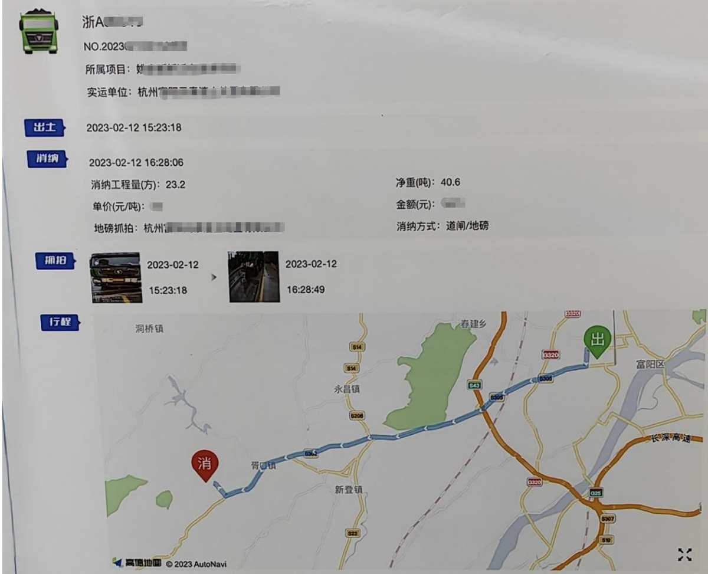  
图 3.2-1  
运渣车辆运输过程监控

⑦ 运渣车辆到达消纳场地，进场过磅称重后，消纳场地将核发接纳回执联或消纳清单数据。

⑧ 运渣合同结算时，建设单位应对建筑垃圾处置核准证、消纳场地接纳回执联、工程竣工结算清单中建筑垃圾工程量三者进行比对：如实际消纳方量大于（或等于）工程竣工结算清单中建筑垃圾工程量 90%的，应按竣工结算清单工程量进行结算；如实际消纳方量小于工程竣工结算清单建筑垃圾工程量 90%的，施工单位或运渣单位应提供情况说明并附以佐证材料，无法提供佐证材料的，应根据消纳场地接纳回执联工程量进行竣工结算。

2）本项目位于杭州市市区，弃方组成土方和固化土（钻渣泥浆和淤泥通过固化设备处置），根据杭州市纳入支持政策的建筑垃圾再生产品种类目录清单（第一版），本工程弃方可适用于地基回填等部位、路基垫层等部位以及用于堆山造景、园林绿化种植（土质检测合格后）等。通过周边项目调查，本项目弃方将按照杭州市渣土处置相关管理规定统一由西湖区综合行政执法局调配，去向为综合利用或消纳场消纳。

渣土运输车在运输渣土时，必须做好冲洗及苫盖措施，根据工程场地实际，在工地出入口设置洗车平台，配备洗车设施，确保渣土运输车辆净车出场，严禁超载滥运，运载渣土时，必须加装液压可伸缩顶，车厢底部铺上防漏垫，防止泥土外漏。土方运输过程中做好苫盖或封闭措施，减少运输过程中对周边环境的影响，防止人为水土流失的产生。运输过程中严格按照规定的路线运输。

## 3）同类工程弃方处置案例

根据实际调查，西湖区近两年施工项目较多，其中浮山单元 XH2007-G1/S42-15地块转塘回龙中心公园及地下公共停车库项目于 2024 年 3 月取得水土保持方案报告书批复（杭西水许〔2024〕第 15号），项目施工时间为 2024年 3月\~2025年 12月；杭州赛艾孚弘润汽车制动蹄智能制造项目于 2025 年 月取得登记表备案，项目施工时间为2025年 7月\~2027年 11月。该项目土方外运情况详见表 3.2-2。余方处置相关支撑材料见附件 J。

表 3.2-2  
同类工程弃方处置证发放及去向一览
<table><tr><td rowspan=1 colspan=1>序号</td><td rowspan=1 colspan=1>项目名称</td><td rowspan=1 colspan=1>城市管理局出具的行政许可决定书</td><td rowspan=1 colspan=1>审批时间</td><td rowspan=1 colspan=1>申请处置方量(t)</td><td rowspan=1 colspan=1>处置证编号</td><td rowspan=1 colspan=1>去向</td><td rowspan=1 colspan=1>处置类型</td></tr><tr><td rowspan=3 colspan=1>1</td><td rowspan=3 colspan=1>浮山单元XH2007-G1/S42-15地块转塘回龙中心公园及地下公共停车库项目</td><td rowspan=1 colspan=1>杭综执西渣许准字〔2024〕第1138号</td><td rowspan=1 colspan=1>2024.5.21</td><td rowspan=1 colspan=1>5100</td><td rowspan=1 colspan=1>西湖0053-01</td><td rowspan=1 colspan=1>双浦单元XH23-G1/S42-B39公园及地下停车车库项目</td><td rowspan=4 colspan=1>综合利用</td></tr><tr><td rowspan=1 colspan=1>杭综执西渣许准字〔2024〕第419号</td><td rowspan=1 colspan=1>2024.10.16</td><td rowspan=1 colspan=1>5100</td><td rowspan=1 colspan=1>西湖0053-02</td><td rowspan=1 colspan=1>浮山单元XH2007-04地块12班幼儿园</td></tr><tr><td rowspan=1 colspan=1>杭综执西渣许准字〔2024〕第421号</td><td rowspan=1 colspan=1>2024.10.16</td><td rowspan=1 colspan=1>17000</td><td rowspan=1 colspan=1>西湖0053-03</td><td rowspan=1 colspan=1>中船重工海洋信息装备军民融合产业化项目二期（A区）</td></tr><tr><td rowspan=2 colspan=1>2</td><td rowspan=2 colspan=1>杭州赛艾孚弘润汽车制动蹄智能制造项目</td><td rowspan=1 colspan=1>杭综执西渣许准字〔2025〕第690号</td><td rowspan=1 colspan=1>2025.7.1</td><td rowspan=1 colspan=1>8500</td><td rowspan=1 colspan=1>西湖0134-01</td><td rowspan=1 colspan=1>杭长以南环境综合整治三期</td></tr><tr><td rowspan=1 colspan=1>杭综执西渣许准字〔2025〕第1002号</td><td rowspan=1 colspan=1></td><td rowspan=1 colspan=1></td><td rowspan=1 colspan=1>西湖0134-04</td><td rowspan=1 colspan=1>渣土消纳场</td><td rowspan=1 colspan=1>消纳场</td></tr></table>

## 4）处置方案合理性分析

本项目余方共 17.03万 m3，均为土方，根据施工进度计划，出渣工期为 2026年 6月\~2026年 12月，日均出渣量810m3，高峰期最大日出渣量3000m3。

基坑开挖前，施工单位按施工进度计划向杭州市西湖区综合行政执法局报送余方处置方案，包括数量、工期、出渣计划等，并保证运渣车量投入满足运渣强度要求。杭州市西湖区综合行政执法局根据消纳场情况出具行政许可决定书和建筑垃圾处置证。

经调查，近年来杭州市区同类项目因用地紧凑而无法在场地内设置外运土方临时堆土场，出渣基本采用随挖随运，施工单位根据建筑垃圾处置证下发情况调整基坑开挖进度计划。

根据同类项目经验，以西湖区浮山单元 XH2007-G1/S42-15地块转塘回龙中心公园及地下公共停车库项目为例，建筑垃圾处置情况详见表 3.2-3，日运渣处置量为$3 5 4 \mathrm { m } ^ { 3 } \mathrm { \sim } 3 1 8 8 \mathrm { m } ^ { 3 }$ 。运土期间，项目场地内不设置临时中转场，随挖随运。

综上所述，本项目处置方案可行。

表 3.2-3  
建筑垃圾处置情况一览
<table><tr><td rowspan=1 colspan=1>序号</td><td rowspan=1 colspan=1>城市管理局出具的行政许可决定书</td><td rowspan=1 colspan=1>审批时间</td><td rowspan=1 colspan=1>申请处置方量（t)</td><td rowspan=1 colspan=1>建筑垃圾处置证编号</td><td rowspan=1 colspan=1>运渣车辆数量</td><td rowspan=1 colspan=1>有效日期</td><td rowspan=1 colspan=1>处置天数</td></tr><tr><td rowspan=1 colspan=1>1</td><td rowspan=1 colspan=1>杭综执西渣许准字〔2024〕第1138号</td><td rowspan=1 colspan=1>2024.5.21</td><td rowspan=1 colspan=1>5100</td><td rowspan=1 colspan=1>西湖 0053-01</td><td rowspan=1 colspan=1>11辆</td><td rowspan=1 colspan=1>2024.5.24</td><td rowspan=1 colspan=1>1天</td></tr><tr><td rowspan=1 colspan=1>2</td><td rowspan=1 colspan=1>杭综执西渣许准字〔2024〕第419号</td><td rowspan=1 colspan=1>2024.10.16</td><td rowspan=1 colspan=1>5100</td><td rowspan=1 colspan=1>西湖 0053-02</td><td rowspan=1 colspan=1>16辆</td><td rowspan=1 colspan=1>2024.10.16~2024.10.24</td><td rowspan=1 colspan=1>9天</td></tr><tr><td rowspan=1 colspan=1>3</td><td rowspan=1 colspan=1>杭综执西渣许准字〔2024〕第421号</td><td rowspan=1 colspan=1>2024.10.16</td><td rowspan=1 colspan=1>17000</td><td rowspan=1 colspan=1>西湖 0053-03</td><td rowspan=1 colspan=1>21 辆</td><td rowspan=1 colspan=1>2024.10.16~2024.10.19</td><td rowspan=1 colspan=1>4天</td></tr></table>

## 3.2.7 施工方法与工艺评价

## 1）施工条件的评价

施工交通：项目周边路网交叉纵横，交通条件成熟便利，为施工队伍、机械以及砂石料和外购材料的运输提供了良好的交通条件，无需新建施工便道；但项目施工期间应做好交通疏解，保证周边可绕行道路。从水土保持角度看，避免了因新修施工便道而增加地表扰动面积，有利于水土保持。

建筑材料：工程建设中所需的石料购自当地政府批准的持证合法的采石场，本项目所需混凝土均采用商品混凝土，砼、钢材等从杭州市持证合法商家购买，相关石料场等的水土流失防治责任由其开采建设单位承担，避免了工程小规模独立采石、取土而扩大水土流失影响范围。

## 2）施工布置的评价

施工期临时排水：本方案考虑新增临时排水、沉沙措施用于项目施工期的临时排水，施工期临时排水考虑分区排水，排水经沉沙池沉淀后抽排至周边道路市政管网，施工期临时排水基本满足水土保持的要求。

施工临时设施区：施工所需其他材料均从附近供应场地运来，桩基、基坑工程所产生的土方均随挖随运，固化土考虑在固化设备附近设置临时堆土场（中转按 10 天），四周采用填土编织袋拦挡，减少了临时堆场的占地，满足水土保持的要求。

余方综合利用：由杭州市西湖区综合行政执法局统一调配。

## 3）施工时序的评价

工程建设时，建设单位需在施工前做好场地排水等防护措施，尽可能将土石方开挖回填施工在雨季前完成，并做好相应的临时防护措施，从源头上减少水土流失的发生。项目在建设时需按照一定施工时序进行操作，在保障施工安全的基础上，尽量采用先进技术，提高施工效率缩短工期，避免长时间扰动地表产生较大的水土流失。

## 4）施工方法与工艺的评价

## ①土石方开挖和基础施工

本项目地下室基坑和室外道路、管线等土石方开挖活动和各类基础施工，主要采用机械为主的施工方式，大量机械施工能提高施工效率和缩短工期，从而减少地表裸露时间，在同等侵蚀强度下，较大程度减少项目施工产生的土壤流失量。道路管线工程同步实施，分段实施，避免了全面铺 减小了管线施工周期及扰动地表的裸露时间，施工过程中，尽力缩短回填周期、 可有效减少水土流失，有利于水土保持。

## ② 绿化工程

本项目绿化包括乔灌草园林绿化、屋顶绿化、海绵城市配套绿化，绿化覆土采用人工配合机械方式，保证了土壤的孔隙度，有利于项目区绿化。项目区绿化采用乔、灌、草相结合的形式，提高了对降雨的截留能力，降低了汇流对土壤的冲刷，有利于水土保持。

整个项目施工方法（工艺）较合理，基本符合水土保持要求。但主体的土石方工程施工期间，需要及时地做好临时排水、沉沙等雨水排导工作，以最大限度的控制水土流失对周边区域造成的不良影响。

综上所述，主体工程施工布置、施工组织、施工时序、施工工艺和方法均在满足施工要求的基础上，选择了有利于水土保持的措施和方案，符合水土保持要求。

## 3.2.8 主体工程设计中具有水土保持功能工程的评价

主体工程设计中，已采取了部分以防治水土流失为主要目标的水土保持措施，这些措施在保护主体工程安全的同时，对于防治水土流失起到了积极的作用，是水土保持措施的重要组成部分。

根据对主体资料的分析，主体工程中采取的具有水土保持功能的工程主要为绿化覆土、永久排水沟、雨水管网、透水铺装、下凹式绿地、场地平整、景观绿化、基坑坑顶外侧截水沟和沉沙、标化工地临时绿化、施工生产生活区地面硬化、钻渣泥浆固化、施工临时围挡、基坑支护、洗车平台等。

## 1）场地平整、绿化覆土及景观绿化

参照《城市绿化工程施工及验收规范》（CJJ/T 82-2012），绿化栽植土壤有效土层厚度要求为草坪、花卉、草本地被≥30cm，小灌木、宿根花卉、小藤本≥40cm，大、（浅根）。

绿化区域进行场地平整，绿化覆土为植物生长提供基础，景观绿化通过构建“乔、灌、草”结合的植物群落，增强土壤抗侵蚀能力，防止坡面崩塌。同时，植被冠层可截留雨水，减少雨滴溅蚀，枯枝落叶层则能涵养水源，进一步减少地表径流和泥沙流失。

## 2）永久排水沟、雨水管网

根据《室外排水设计标准》（GB50014-2021），永久排水沟、雨水管网设计标准按5年一遇10min降雨历时。主体设计在建筑物周边区域布设了完善的永久排水沟与雨水管网系统，通过有组织的排水方式，防止因雨水冲刷造成的土壤流失，

## 3）透水铺装、下凹式绿地

根据《杭州市海绵城市建设管理办法》、《杭州市海绵城市建设低影响开发雨水系统技术导则（试行）》等要求，本工程年径流总量控制率达到 81.06%，对应设计降雨量为 26.37mm，综合径流系数达到≤0.6，SS 去除控制率 61%。本项目海绵城市设计通过设置透水铺装、下凹绿地等。

主体设计深度融合了海绵城市设计理念， 在建筑物周边、道路两侧合理布局了下透水铺装、下凹式绿地，采用“渗、滞、蓄、净”的综合治理策略，对控制项目区水

土流失、减轻地表径流冲刷。

## 4）基坑坑顶外侧截水沟、临时沉沙池

排水设计标准按 3 年一遇 10min 短历时设计暴雨。在基坑内外设置临时排水沟及集水井，采用自流井排除积水，防止雨水和地下水在基坑内汇集影响施工安全，兼顾沉淀泥沙，有序排水，利于水土保持。

## 5）标化工地临时绿化、施工生产生活区地面硬化

在主体工程的施工组织设计中，施工生产生活区地面硬化与标化工地临时绿化可有效控制施工期水土流失。

## 6）钻渣泥浆固化

主体设计在桩基施工区域设置了泥浆固化设备，用于处理钻孔灌注桩产生的泥浆和基坑开挖产生的淤泥。

## 7）施工临时围挡

根据项目施工组织设计，项目正式开工前将在四周设置彩钢板作为施工临时围挡。施工临时围挡能有效防止扰动面人为扩大和施工建设对周边的影响，减缓项目区新增水土流失对项目建设区以外的地区的影响， 同时也减少施工过程中水土流失所产生的影响，具有一定的水土保持功能，但不界定为主体具有水保功能的措施。

## 8）基坑支护

基坑支护减少了基坑边坡裸露面，一定程度减少了基坑施工过程中的水土流失，虽具有一定的水土保持作用但其主要功能为保证工程施工安全。

## 9）洗车平台

主体工程在施工区出口处设置车辆冲洗设施，用于冲洗车辆轮胎及外壁等。车辆冲洗设施主要设置洗车平台、洗车池。洗车池废水收集后汇入周边临时排水沟，排水沟接排水出口前的沉沙池，洗车池溢水经临时沉沙池沉淀泥沙后可循环利用。具有一定的水土保持功能，但不界定为主体具有水保功能的措施。

## 3.3 主体工程设计中水土保持措施界定

## 3.3.1 主体设计中水土保持措施界定原则

根据《生产建设项目水土保持技术标准》（GB50433-2018）中相关规定，纳入水土流失防治措施体系水土保持工程的界定原则为：

1）以防治水土流失为主要目标的防护工程，应界定为水土保持工程。以主体工程设计功能为主、同时兼有水土保持功能的工程，不纳入水土流失防治措施体系，仅对其进行水土保持分析与评价。当不能满足水土保持要求时，可要求主体设计修改完善，也可提出补充措施（纳入水土流失防治措施体系）。

2）对主体设计功能和水土保持功能难以区分的防护措施，可按破坏性试验的原则进行界定：假定没有这项防护措施，主体设计仍旧可以发挥作用，但会产生较大的水土流失，该项防护措施应界定为水土保持工程，纳入水土流失防治措施体系。

## 3.3.2 主体工程设计中水土保持措施

根据对主体设计资料的分析，主体设计中具有水土保持功能的措施主要有绿化覆土、永久排水沟、雨水管网、透水铺装、下凹式绿地、场地平整、景观绿化、基坑坑顶外侧截水沟、基坑坑顶外侧临时沉沙池、施工生产生活区临时绿化和临时排水沟等。

## 1）主体工程区

## ① 工程措施

## a、绿化覆土

参照《城市绿化工程施工及验收规范》（CJJ/T 82-2012），绿化栽植土壤有效土层厚度要求为草坪、花卉、草本地被≥30cm，小灌木、宿根花卉、小藤本≥40cm，大、中灌木≥90cm，乔木（胸径＜20cm）≥150cm（深根），乔木（胸径＜20cm）≥100cm（浅根）。

施工后期，对项目绿化区域进行覆土，覆土范围包括地面绿化区域和屋面绿化区域，覆土量为 1.29万m3。

## b、永久排水沟

根据《室外排水设计标准》（GB50014-2021），永久排水沟、雨水管网设计标准按 5 年一遇 10min 降雨历时。室外排水沟采用采用 C25 钢筋砼结构，上带不锈钢缝隙式盖板，矩形断面，底宽 25cm，沟深 40cm，衬砌厚度为 10cm，底部采用 10cm 厚的

C20素混凝土垫层，共492m。

## c、排水管网

根据《室外排水设计标准》（GB50014-2021），永久排水沟、雨水管网设计标准按 5 年一遇 10min 降雨历时。本项目排水管网采用 PE 缠绕结构壁管，管径DN150\~DN500，总长为 1858m，其中 DN150 长 623m，DN300 长 1095m，DN400 长120m，DN500 长 20m。

## d、海绵城市设计

根据《杭州市海绵城市建设管理办法》、《杭州市海绵城市建设低影响开发雨水系统技术导则（试行）》等要求，本工程年径流总量控制率达到 81.06%，对应设计降雨量为 26.37mm，综合径流系数达到≤0.6，SS 去除控制率 61%。本项目海绵城市设计通过设置透水铺装、下凹绿地等。

根据园区道路采用人车分流行车较少的特点，硬化地面尽量采用透水铺装，透水铺装面积约为5661m2，有效降低场地径流系数。

根据景观设计设置下凹绿地，共计2017m2。下凹绿地采用铺设10cm砂土层+无纺土工布（ $( 2 5 0 \mathrm { g } / \mathrm { m } ^ { 2 } )$ ），最上层覆耕植土30cm， 溢流井周边采用卵石（粒径3cm \~5cm）覆盖，仅露出溢水口。

## e、场地平整

在地面绿化、屋面绿化区域通过地形平整施工，创造出符合设计要求的地形地貌，为后续园林绿化工程施工提供良好的基础条件。场地平整17625m2。

## ② 植物措施

本区绿化面积共 17625m2，其中由本项目实施的包括组团绿地 $1 1 3 0 6 \mathrm { m } ^ { 2 }$ 、基础交叉研究大楼普通地面绿化区 $4 0 6 0 \mathrm { m } ^ { 2 }$ 、基础交叉研究大楼下凹绿地绿化区 $2 0 1 7 \mathrm { m } ^ { 2 }$ 、基础交叉研究大楼屋顶绿化区 $2 4 2 \mathrm { m } ^ { 2 }$

## ③ 临时措施

## a、基坑外侧截水沟

排水设计标准按 3年一遇10min短历时设计暴雨。

沿基坑布设，基坑开挖线长 586m，在距基坑边线约 50cm 的位置布置截水沟长600m。

## b、基坑外侧沉沙池

沿基坑外侧截水沟每30m处设置一个沉沙池，共设置20个临时沉沙池。

## 2）施工临时设施区

## ① 临时措施

## a、泥浆池

泥浆池采用砖砌结构，砌筑厚度为24cm，内壁采用2cm厚的水泥砂浆抹面。在场地内设置1处泥浆池（大）和4处泥浆池（小）。泥浆池（大）的尺寸规格为底长30m，底宽10m，地面以下有效深度为1.0m；泥浆池（小）的尺寸规格为底长10m，底宽10m，地面以下有效深度为1.0m。其中泥浆池（大）结合固化设备布置，位于场地中部，其他泥浆池（小）根据施工需要布置在场地内。

## b、临时绿化

在施工生产生活区布置临时绿化，共500m2，拟栽植植被为龟甲冬青、金森女贞、狗牙根、黑麦草等。

## c、施工生活生产区临时排水

临时排水沟采用矩形砖砌结构，规格宽 40cm，深 30cm，底坡为 0.01。临时排水沟总长 460m。

综上所述，主体工程设计中具有水土保持功能的工程在完工后标准和数量基本满足水土保持要求，但施工期间的防护措施不满足要求，本方案将予以补充完善。在主体工程的施工中，要充分结合本方案新增的水土保持措施，做到主体工程设计中已有的水土保持措施设计与本方案新增的水土保持措施布设较好的结合，建立起一个防治效果显著、经济可行的水土保持措施体系。主体工程设计中已有的水土保持措施工程量及投资汇总见表 3.3-1。

表 3.3-1  
主体工程设计的水土保持工程量及投资
<table><tr><td rowspan=1 colspan=1>序号</td><td rowspan=1 colspan=1>项目</td><td rowspan=1 colspan=1>单位</td><td rowspan=1 colspan=1>工程量</td><td rowspan=1 colspan=1>单价</td><td rowspan=1 colspan=1>投资(万元)</td></tr><tr><td rowspan=1 colspan=1>一</td><td rowspan=1 colspan=1>主体工程区</td><td rowspan=1 colspan=1></td><td rowspan=1 colspan=1></td><td rowspan=1 colspan=1></td><td rowspan=1 colspan=1>804.95</td></tr><tr><td rowspan=1 colspan=1>1</td><td rowspan=1 colspan=1>工程措施</td><td rowspan=1 colspan=1></td><td rowspan=1 colspan=1></td><td rowspan=1 colspan=1></td><td rowspan=1 colspan=1>465.95</td></tr><tr><td rowspan=1 colspan=1>1)</td><td rowspan=1 colspan=1>绿化覆土</td><td rowspan=1 colspan=1> $\mathrm { m } ^ { 3 }$ </td><td rowspan=1 colspan=1>12900</td><td rowspan=1 colspan=1>68.54</td><td rowspan=1 colspan=1>88.42</td></tr><tr><td rowspan=1 colspan=1>2)</td><td rowspan=1 colspan=1>永久排水沟</td><td rowspan=1 colspan=1>m</td><td rowspan=1 colspan=1>492</td><td rowspan=1 colspan=1>120</td><td rowspan=1 colspan=1>5.9</td></tr><tr><td rowspan=1 colspan=1>3)</td><td rowspan=1 colspan=1>排水管线</td><td rowspan=1 colspan=1>m</td><td rowspan=1 colspan=1>1858</td><td rowspan=1 colspan=1>228.96</td><td rowspan=1 colspan=1>42.54</td></tr><tr><td rowspan=1 colspan=1>4)</td><td rowspan=1 colspan=1>透水砖铺设</td><td rowspan=1 colspan=1> $\mathrm { m } ^ { 2 }$ </td><td rowspan=1 colspan=1>5661</td><td rowspan=1 colspan=1>550</td><td rowspan=1 colspan=1>311.36</td></tr><tr><td rowspan=1 colspan=1>5)</td><td rowspan=1 colspan=1>下凹绿地</td><td rowspan=1 colspan=1> $\mathrm { m } ^ { 2 }$ </td><td rowspan=1 colspan=1>2017</td><td rowspan=1 colspan=1>40.78</td><td rowspan=1 colspan=1>8.23</td></tr><tr><td rowspan=1 colspan=1>6)</td><td rowspan=1 colspan=1>场地平整</td><td rowspan=1 colspan=1> $\mathrm { m } ^ { 2 }$ </td><td rowspan=1 colspan=1>17625</td><td rowspan=1 colspan=1>5.39</td><td rowspan=1 colspan=1>9.5</td></tr><tr><td rowspan=1 colspan=1>2</td><td rowspan=1 colspan=1>植物措施</td><td rowspan=1 colspan=1></td><td rowspan=1 colspan=1></td><td rowspan=1 colspan=1></td><td rowspan=1 colspan=1>328.41</td></tr><tr><td rowspan=1 colspan=1>1)</td><td rowspan=1 colspan=1>景观绿化</td><td rowspan=1 colspan=1>m2</td><td rowspan=1 colspan=1>17625</td><td rowspan=1 colspan=1>186.33</td><td rowspan=1 colspan=1>328.41</td></tr><tr><td rowspan=1 colspan=1>3</td><td rowspan=1 colspan=1>临时措施</td><td rowspan=1 colspan=1></td><td rowspan=1 colspan=1></td><td rowspan=1 colspan=1></td><td rowspan=1 colspan=1>10.59</td></tr><tr><td rowspan=1 colspan=1>1)</td><td rowspan=1 colspan=1>基坑坑顶外侧截水沟</td><td rowspan=1 colspan=1>m</td><td rowspan=1 colspan=1>600</td><td rowspan=1 colspan=1>1</td><td rowspan=1 colspan=1>8.16</td></tr><tr><td rowspan=1 colspan=1>2)</td><td rowspan=1 colspan=1>基坑外侧沉沙池</td><td rowspan=1 colspan=1>座</td><td rowspan=1 colspan=1>20</td><td rowspan=1 colspan=1>1</td><td rowspan=1 colspan=1>2.43</td></tr><tr><td rowspan=1 colspan=1>二</td><td rowspan=1 colspan=1>施工临时设施区</td><td rowspan=1 colspan=1></td><td rowspan=1 colspan=1></td><td rowspan=1 colspan=1></td><td rowspan=1 colspan=1>23.87</td></tr><tr><td rowspan=1 colspan=1>1</td><td rowspan=1 colspan=1>临时措施</td><td rowspan=1 colspan=1></td><td rowspan=1 colspan=1></td><td rowspan=1 colspan=1></td><td rowspan=1 colspan=1>23.87</td></tr><tr><td rowspan=1 colspan=1>1)</td><td rowspan=1 colspan=1>泥浆池</td><td rowspan=1 colspan=1>座</td><td rowspan=1 colspan=1>5</td><td rowspan=1 colspan=1>1</td><td rowspan=1 colspan=1>17.82</td></tr><tr><td rowspan=1 colspan=1>2)</td><td rowspan=1 colspan=1>临时绿化</td><td rowspan=1 colspan=1>m2</td><td rowspan=1 colspan=1>500</td><td rowspan=1 colspan=1>50</td><td rowspan=1 colspan=1>2.5</td></tr><tr><td rowspan=1 colspan=1>3)</td><td rowspan=1 colspan=1>1临时排水沟</td><td rowspan=1 colspan=1>m</td><td rowspan=1 colspan=1>460</td><td rowspan=1 colspan=1>/</td><td rowspan=1 colspan=1>3.55</td></tr><tr><td rowspan=1 colspan=1></td><td rowspan=1 colspan=1>合计</td><td rowspan=1 colspan=1></td><td rowspan=1 colspan=1></td><td rowspan=1 colspan=1></td><td rowspan=1 colspan=1>828.82</td></tr></table>

## 4 水土流失分析与预测

## 4.1 水土流失现状

根据全国土壤侵蚀类型区划，项目区属于以水力侵蚀为主的南方红壤区，容许土壤流失量 $5 0 0 \mathrm { t } / \ \left( \mathrm { k m } ^ { 2 } \bullet _ { \mathrm { a } } \right)$ ）。水土流失的类型主要为水力侵蚀。杭州市水土流失重点防治区图见附图4-1。

根据2024年水土流失动态监测成果，工程所在的区域水土流失情况见表4.1-1。工程区土壤侵蚀强度分布图详见附图9。项目区土壤侵蚀模数背景值约为 $3 0 0 \mathrm { t / \Omega } \left( \mathrm { k m } ^ { 2 } { \cdot } \mathrm { a } \right)$ ），小于项目区容许土壤流失量 $5 0 0 \mathrm { t } / \ ( \mathrm { k m } ^ { 2 } { \cdot } \mathrm { a } )$ ），土壤侵蚀强度属微度。

表4.1-1  
工程所涉及区域水土流失面积统计  
单位：km2
<table><tr><td rowspan=2 colspan=1>区域</td><td rowspan=2 colspan=1>土地总面积</td><td rowspan=1 colspan=7>水土流失面积     7</td></tr><tr><td rowspan=1 colspan=1>轻度</td><td rowspan=1 colspan=1>中度A</td><td rowspan=1 colspan=1>強烈</td><td rowspan=1 colspan=1>极强烈</td><td rowspan=1 colspan=1>剧烈</td><td rowspan=1 colspan=1>小计</td><td rowspan=1 colspan=1>水土流失面积占土地总面积的比例(%)</td></tr><tr><td rowspan=1 colspan=1>杭州市</td><td rowspan=1 colspan=1>16596</td><td rowspan=1 colspan=1>858.28</td><td rowspan=1 colspan=1>55.24</td><td rowspan=1 colspan=1>37</td><td rowspan=1 colspan=1>8.32</td><td rowspan=1 colspan=1>0.73</td><td rowspan=1 colspan=1>959.57</td><td rowspan=1 colspan=1>5.78</td></tr><tr><td rowspan=1 colspan=1>西湖区</td><td rowspan=1 colspan=1>309</td><td rowspan=1 colspan=1>7.64</td><td rowspan=1 colspan=1>0.40</td><td rowspan=1 colspan=1>0.24</td><td rowspan=1 colspan=1>0.06</td><td rowspan=1 colspan=1>0.05</td><td rowspan=1 colspan=1>8.39</td><td rowspan=1 colspan=1>2.72</td></tr></table>

根据《水利部办公厅关于做好国家级水土流失重点预防区和重点治理区落地上图成果应用的通知》（办水保〔2025〕170号）工程区不属于国家级水土流失重点预防区和重点治理区。根据《关于公布省级水土流失重点预防区和重点治理区的公告》（公告〔2015〕2号），本工程不属于省级水土流失重点预防区和重点治理区。根据《杭州市水土保持规划》，本工程不属于杭州市水土流失重点预防区和重点治理区。

## 4.2 水土流失影响因素分析

## 4.2.1 水土流失影响因素

根据工程施工的特点，工程可能造成的水土流失主要发生在工程开挖、填筑等地表扰动区域，包括建筑物区、道路及其他配套设施、绿化工程、施工生产生活区等。

本工程的水土流失主要发生在施工期和自然恢复期。工程区内的场地开挖、场地回填会对工程占地范围内产生扰动。施工期间，施工活动将对土壤环境造成直接与间接损害，原有地形地貌受到较大程度的扰动和损坏，使区域内土壤抗侵蚀能力降低，水土流失加剧。施工建设期指开挖、场地填筑以及土建工程大规模施工直至施工结束。此时，由于基坑等的开挖及施工后期场地的填筑等建设活动将会有大量的开挖和填筑裸露面产生，裸露面表层结构疏松，侵蚀强度较大，施工时土石方的搬运和堆置过程中造成的水土流失量也较大。

自然恢复期，由于扰动地表的各项施工活动已基本停止，水土流失量将较施工期明显减少，侵蚀模数逐渐降低，并逐渐达到背景值，但此过程中仍有一定量的水土流失。

在项目建设过程中，若临时防护措施不到位，产生的新增水土流失将给项目区及其周边环境带来危害。因此，科学预测工程建设过程中造成的水土流失及其影响，为尽可能减少工程施工对原地貌的破坏、合理布设防护措施、 有效防治新增水土流失、重建和恢复区域生态防护体系提供依据，以保证项目建设的安全施工和运营以及生态环境的良性循环，为当地经济的可持续发展服务

## 4.2.2 扰动地表及损坏植被面积

工程建设过程中，地面设施的兴建、开挖、填筑等都不同程度、不同形式地扰动了原地貌形态，损坏了地表土体结构和地面植被。根据主体工程设计资料及实地查勘，结合征占地使用范围，对项目建设区开挖扰动地表及损坏植被面积进行测算统计，扰动占地面积为3.89hm2(已扣除规划区域)，损坏植被面积为 $0 . 1 0 \mathrm { h m } ^ { 2 }$ （基础交叉研究大楼现状地块范围线沿线栽植有灌木） 。

## 4.2.3 水土保持补偿费计征面积

根据浙价费〔2014〕224号及浙政办发〔2015〕107号文件，工程水土保持补偿费计征面积主要由工程征占地引起，按工程征占地计取，同时根据《水土保持补偿费征收使用管理办法》（财综〔2014〕8 号）第十一条，工程为学校项目，属于公益性工程，故免征水土保持补偿费。

## 4.2.4 弃土（石、渣）量

余方共17.03万m3，均为土方，由杭州市西湖区综合行政执法局统一调配消纳。

## 4.3 土壤流失量预测

## 4.3.1 计算单元

水土流失预测的目的是为了确定行之有效的水土保持措施总体布局，预测项目建设及运营带来的水土流失总量及分布，分析可能造成的水土流失危害，明确重点防治区。因此根据项目建设的不同情况，依据以下原则进行水土流失预测单元的划分：

1）同一预测单元的地貌、地表的物质组成相同；

2）同一预测单元扰动地表的形成机理与形态相同；

3）同一预测单元土地利用现状基本一致；

4）同一预测单位主要土壤侵蚀因子基本一致。

预测法将项目水土流失扰动单元划分为包括建筑物区、道路及其他配套设施、绿根据《生产建设项目土壤流失量测算导则》（SL773-2018），考虑扰动方 垫面类型、地表组成物质等相近原则划分一般扰地表、工程开挖面等二级预测单元，根据人为活动类型及上方有无来水等情况，划分三级预测单元

工程水土流失预测单元划分情况详见表4.3-1。施工期预测面积为 $4 . 0 5 \mathrm { h m } ^ { 2 }$ ，自然恢复期预测面积为 $1 . 8 8 \mathrm { h m } ^ { 2 } .$

表4.3-1  
水土流失预测单元划分表  
单位：hm2
<table><tr><td rowspan=2 colspan=1>预测单元</td><td rowspan=1 colspan=2>面积</td></tr><tr><td rowspan=1 colspan=1>施工期（含施工准备期）</td><td rowspan=1 colspan=1>自然恢复期</td></tr><tr><td rowspan=1 colspan=1>建筑物</td><td rowspan=1 colspan=1>0.90</td><td rowspan=1 colspan=1>0</td></tr><tr><td rowspan=1 colspan=1>道路及配套设施</td><td rowspan=1 colspan=1>0.99</td><td rowspan=1 colspan=1>0</td></tr><tr><td rowspan=1 colspan=1>绿化区</td><td rowspan=1 colspan=1>0.94</td><td rowspan=1 colspan=1>0.94</td></tr><tr><td rowspan=1 colspan=1>施工生产区</td><td rowspan=1 colspan=1>0.83</td><td rowspan=1 colspan=1>0.83</td></tr><tr><td rowspan=1 colspan=1>施工生产区</td><td rowspan=1 colspan=1>0.23</td><td rowspan=1 colspan=1>0</td></tr><tr><td rowspan=1 colspan=1>规划区域</td><td rowspan=1 colspan=1>0.16</td><td rowspan=1 colspan=1>0.11</td></tr><tr><td rowspan=1 colspan=1>合计</td><td rowspan=1 colspan=1>4.05</td><td rowspan=1 colspan=1>1.88</td></tr></table>

## 4.3.2 计算时段

## 1）预测时段确定原则

①预测时段应分施工期（含施工准备期）和自然恢复期。

②各预测单元施工期和自然恢复期应根据施工进度分别确定；施工期为实际扰动地表时间；自然恢复期为施工扰动结束后，不采取水土保持措施的情况下，土壤侵蚀强度自然恢复到扰动前土壤侵蚀强度所需要的时间，应根据当地自然条件确定，本工程属于湿润区，取2年。

③施工期预测时间应按连续12个月为一年计；不足12个月，但达到一个雨（风）季长度的，按一年计；不足一个雨（风）季长度的，按占雨（风）季长度的比例计算。

## 2）预测时段确定

① 施工期（含施工准备期）：项目于2026年3月开工，2028年12月底完工，总工期34个月。各预测单元的预测时段见下表。

②自然恢复期取2年。

表4.3-2  
水土流失预测时段表
<table><tr><td rowspan=2 colspan=1>预测单元</td><td rowspan=1 colspan=2>1                预测时间（a）</td></tr><tr><td rowspan=1 colspan=1>施工期（含施工准备期）</td><td rowspan=1 colspan=1>自然恢复期</td></tr><tr><td rowspan=1 colspan=1>建筑物</td><td rowspan=1 colspan=1>0.58</td><td rowspan=1 colspan=1>2</td></tr><tr><td rowspan=1 colspan=1>道路及配套设施</td><td rowspan=1 colspan=1>0.58</td><td rowspan=1 colspan=1>2</td></tr><tr><td rowspan=1 colspan=1>绿化区</td><td rowspan=1 colspan=1>0.17</td><td rowspan=1 colspan=1>2</td></tr><tr><td rowspan=1 colspan=1>施工生活区</td><td rowspan=1 colspan=1>0.17</td><td rowspan=1 colspan=1>2</td></tr><tr><td rowspan=1 colspan=1>施工生产区</td><td rowspan=1 colspan=1>2.50</td><td rowspan=1 colspan=1>2</td></tr><tr><td rowspan=1 colspan=1>规划区域</td><td rowspan=1 colspan=1>0</td><td rowspan=1 colspan=1>0</td></tr></table>

## 4.3.3 土壤侵蚀模数

根据《生产建设项目土壤流失量测算导则》（SL773-2018），根据工程建设内容及生产建设项目土壤流失类型划分，本工程一级分类属水力作用下的土壤流失，根据工程防治区划分，建筑物二级分类属工程开挖面，三级分类属上方无来水开挖面；道路及配套设施、绿化、施工生活区、施工生产区二级分类属一般扰动地表，三级分类属地表翻扰型一般扰动地表，泥浆采用流弃比计算。

表4.3-3  
生产建设项目土壤流失类型划分
<table><tr><td rowspan=1 colspan=1>一级分类</td><td rowspan=1 colspan=1>二级分类</td><td rowspan=1 colspan=1>三级分类</td><td rowspan=1 colspan=1>说明</td><td rowspan=1 colspan=1>适用范围</td></tr><tr><td rowspan=2 colspan=1>水力作用下的土壤流失</td><td rowspan=1 colspan=1>一般扰动地表</td><td rowspan=1 colspan=1>地表翻扰型一般扰动地表</td><td rowspan=1 colspan=1>人为活动导致地表土壤翻动，原有植被覆盖明显减少或裸露，维持原有整体地形的扰动地表</td><td rowspan=1 colspan=1>道路及配套设施、绿化区、施工生活区、施工生产区</td></tr><tr><td rowspan=1 colspan=1>工程开挖面</td><td rowspan=1 colspan=1>上方无来水工程开挖面</td><td rowspan=1 colspan=1>工程开挖面上缘已达到或越过分水岭，或在工程开挖面顶部有截排水沟等坡面径流拦截措施，不受上方来水冲刷侵蚀的开挖面</td><td rowspan=1 colspan=1>建筑物区</td></tr></table>

根据查阅相关表格，杭州市年降雨侵蚀力因子为 $5 8 5 8 . 6 \mathrm { M J . m m } / ( \ \mathrm { h m } ^ { 2 } . \mathrm { h } )$ ，土壤可蚀性因子为 $0 . 0 0 3 0 \mathrm { t . h m ^ { 2 } . h / ( \ h m ^ { 2 } { . } M J . m m ) }$ 。根据工程建设内容及扰动单元、计算单元的划分原则，并结合工程实际情况，本工程共划分为6个计算单元（建筑物单元、道路及配套设施、绿化区、施工生活区、施工生产区、规划区域单元）。根据各计算单元所属的扰动类型，分别选取相应的计算公式（如下）。

1）扰动前计算单元水力作用下的土壤流失量参照公式：

$$
\mathrm { M _ { y z } = R K L y S y B E T A }\tag{式4-}
$$

1)

式中：

$\mathbf { M } _ { \mathrm { y z } }$ ——植被破坏型一般扰动地表计算单元土壤流失量， $\mathfrak { t } ;$

R——降雨侵蚀力因子， $\mathrm { M J . m m } / ( \mathrm { h m } ^ { 2 } . \mathrm { h } )$

K——土壤可蚀性因子， $\mathrm { t . h m } ^ { 2 } . \mathrm { h } / ( \mathrm { \ h m } ^ { 2 } . \mathrm { M J . m m } )$ ；

$\mathrm { L _ { y } }$ ——坡长因子，无量纲；

$\mathrm { S _ { y } }$ ——坡度因子，无量纲；

B——植被覆盖因子，无量纲；

E——工程措施因子，无量纲；

T——耕作措施因子，无量纲；

A——计算单元的水平投影面积， $\mathrm { h m } ^ { 2 }$

$$
\mathrm { L y } = \mathrm { ~ ( ~ } \lambda / 2 0 \mathrm { ~ ) ~ } ^ { \mathrm { ~ m ~ } }\tag{式4-2}
$$

$$
\lambda { = } \lambda \mathrm { { x c o s } 0 }\tag{式4-3}
$$

式中：

λ——计算单元水平投影坡长度，m，对一般扰动地表，水平投影坡长≤100m时按实际值计算，水平投影坡长＞100m按100m计算；

θ——计算单元坡度，（°），取值范围为 $0 ^ { \circ } \ \sim 9 0 ^ { \circ }$ （excel计算时已转化为弧度）；

m——坡长指数，其中 $\theta { \leq } 1 ^ { \circ }$ 时，m取0.2； $1 ^ { \circ } < \theta { \leq } 3 ^ { \circ }$ 时，m取0.3； $3 ^ { \circ } < \theta { \leq } 5 ^ { \circ }$ 时，m取0.4； $\theta > 5 ^ { \circ }$ 时，m取0.5；

λx——计算单元斜坡长度，m。

$$
\mathrm { S y } ^ { = - 1 . 5 + 1 7 / [ 1 + \mathrm { e } ^ { ( 2 . 3 - 6 . 1 \sin \theta ) } ] }\tag{式4-}
$$

4)

式中：

e——自然对数的底，可取2.72；

表4.3-4  
扰动前侵蚀模数计算过程一览
<table><tr><td rowspan=1 colspan=1>项目  M</td><td rowspan=1 colspan=1>          单位</td><td rowspan=1 colspan=1>扰动前</td></tr><tr><td rowspan=1 colspan=1>地表翻扰后土壤可蚀性因子 $\mathrm { K _ { y d } }$ </td><td rowspan=1 colspan=1> $\mathrm { t . h m } ^ { 2 } . \mathrm { h } / ( \mathrm { \ h m } ^ { 2 } . \mathrm { M J . m m } )$ </td><td rowspan=1 colspan=1>0.0064</td></tr><tr><td rowspan=1 colspan=1>坡长因子Ly1</td><td rowspan=1 colspan=1>无量纲</td><td rowspan=1 colspan=1>0.4273</td></tr><tr><td rowspan=1 colspan=1>坡度因子 $\mathrm { S y }$ </td><td rowspan=1 colspan=1>无量纲</td><td rowspan=1 colspan=1>0.9748</td></tr><tr><td rowspan=1 colspan=1>植被覆盖因子B</td><td rowspan=1 colspan=1>无量纲</td><td rowspan=1 colspan=1>0.4100</td></tr><tr><td rowspan=1 colspan=1>工程措施因子E</td><td rowspan=1 colspan=1>无量纲</td><td rowspan=1 colspan=1>1.0000</td></tr><tr><td rowspan=1 colspan=1>耕作措施因子T</td><td rowspan=1 colspan=1>无量纲</td><td rowspan=1 colspan=1>1.0000</td></tr><tr><td rowspan=1 colspan=1>水平投影面积A</td><td rowspan=1 colspan=1> $\mathrm { h m } ^ { 2 }$ </td><td rowspan=1 colspan=1>0.0365</td></tr><tr><td rowspan=1 colspan=1>土壤流失量 $\mathrm { M } _ { \mathrm { y z } }$ </td><td rowspan=1 colspan=1>t</td><td rowspan=1 colspan=1>0.1096</td></tr><tr><td rowspan=1 colspan=1>侵蚀模数</td><td rowspan=1 colspan=1> $\mathrm { t } / \mathrm { h m } ^ { 2 } { \cdot } _ { \mathbf { a } }$ </td><td rowspan=1 colspan=1>3.00</td></tr></table>

2）地表翻扰型一般扰动地表计算单元土壤流失量测算按式4-5\~式4-6计算：

$$
\mathrm { M _ { y d } = R K _ { y d } L _ { y } S _ { y } B E T A }
$$

(式4-

5)

式中：

$\mathrm { M _ { y d } }$ ——地表翻扰型一般扰动地表计算单元土壤流失量，t;

$\mathrm { K _ { y d } }$ ——地表翻扰后土壤可蚀性因子， $\mathrm { t . h m } ^ { 2 } . \mathrm { h } / ( \mathrm { \ h m } ^ { 2 } . \mathrm { M J . m m } )$

$$
\mathrm { K _ { y d } = N K }\tag{式4-}
$$

6)

根据以上公式，计算得出扰动前道路及配套设施、绿化工程、施工生活区、施工生产区的土壤侵蚀模数背景值为 $3 . 0 0 \mathrm { t / h m } ^ { 2 } . \mathrm { \Omega }$ 。扰动后道路及配套设施、施工生活区、施工生产区、绿化工程代入相关的模数计算得出土壤侵蚀模数分别为 $2 9 . 1 8 \mathrm { t / h m } ^ { 2 } . \mathrm { a }$ $3 5 . 7 9 \mathrm { t / h m } ^ { 2 }$ .a、 $3 7 . 1 8 \mathrm { t } / \mathrm { h m } ^ { 2 } . \mathrm { a }$ $4 2 . 0 9 \mathrm { t / h m } ^ { 2 } . \mathrm { a }$ ，自然恢复期绿化工程的土壤侵蚀模数为$3 . 4 8 / \mathrm { h m } ^ { 2 } . \mathrm { a }$

表4.3-5  
地表翻扰型一般扰动地表计算过程一览
<table><tr><td rowspan=1 colspan=1>项目</td><td rowspan=1 colspan=1>单位</td><td rowspan=1 colspan=1>道路及配套设施 </td><td rowspan=1 colspan=1>施工生活区绿</td><td rowspan=1 colspan=1>化工程</td><td rowspan=1 colspan=1>施工生产区</td><td rowspan=1 colspan=1>自然恢复期</td></tr><tr><td rowspan=1 colspan=1>坡长因子 $\mathrm { L y }$ </td><td rowspan=1 colspan=1>无量纲</td><td rowspan=1 colspan=1>1.5495</td><td rowspan=1 colspan=1>X1.9008</td><td rowspan=1 colspan=1>1.9746</td><td rowspan=1 colspan=1>2.2354</td><td rowspan=1 colspan=1>0.6597</td></tr><tr><td rowspan=1 colspan=1>坡度因子 Sy</td><td rowspan=1 colspan=1>无量纲</td><td rowspan=1 colspan=1>0.9748</td><td rowspan=1 colspan=1>0.9748</td><td rowspan=1 colspan=1>0.9748</td><td rowspan=1 colspan=1>0.9748</td><td rowspan=1 colspan=1>0.2727</td></tr><tr><td rowspan=1 colspan=1>植被覆盖因子B</td><td rowspan=1 colspan=1>无量纲</td><td rowspan=1 colspan=1> 0.5160</td><td rowspan=1 colspan=1>0.5160</td><td rowspan=1 colspan=1>0.5160</td><td rowspan=1 colspan=1>0.5160</td><td rowspan=1 colspan=1>0.5160</td></tr><tr><td rowspan=1 colspan=1>工程措施因子E</td><td rowspan=1 colspan=1>无量纲</td><td rowspan=1 colspan=1>1.0000</td><td rowspan=1 colspan=1>1.0000</td><td rowspan=1 colspan=1>1.0000</td><td rowspan=1 colspan=1>1.0000</td><td rowspan=1 colspan=1>1.0000</td></tr><tr><td rowspan=1 colspan=1>耕作措施因子T</td><td rowspan=1 colspan=1>无量纲</td><td rowspan=1 colspan=1>1.0000</td><td rowspan=1 colspan=1>1.0000</td><td rowspan=1 colspan=1>1.0000</td><td rowspan=1 colspan=1>1.0000</td><td rowspan=1 colspan=1>1.0000</td></tr><tr><td rowspan=1 colspan=1>水平投影面积A</td><td rowspan=1 colspan=1> $\mathrm { h m } ^ { 2 }$ </td><td rowspan=1 colspan=1>0.0897</td><td rowspan=1 colspan=1>0.0996</td><td rowspan=1 colspan=1>0.1096</td><td rowspan=1 colspan=1>0.1494</td><td rowspan=1 colspan=1>0.0050</td></tr><tr><td rowspan=1 colspan=1>土壤流失量 $\mathrm { M } _ { \mathrm { y z } }$ </td><td rowspan=1 colspan=1>t</td><td rowspan=1 colspan=1>2.6159</td><td rowspan=1 colspan=1>3.5655</td><td rowspan=1 colspan=1>4.0745</td><td rowspan=1 colspan=1>6.2900</td><td rowspan=1 colspan=1>0.0174</td></tr><tr><td rowspan=1 colspan=1>侵蚀模数</td><td rowspan=1 colspan=1> $\mathrm { t } / \mathrm { h m } ^ { 2 } { \cdot } _ { \mathbf { a } }$ </td><td rowspan=1 colspan=1>29.1767</td><td rowspan=1 colspan=1>35.7912</td><td rowspan=1 colspan=1>37.1820</td><td rowspan=1 colspan=1>42.0933</td><td rowspan=1 colspan=1>3.4751</td></tr></table>

3）上方无来水工程开挖面土壤流失量按式4-7\~式4-10计算：

$$
\mathrm { M _ { k w } { = } R G _ { k w } L _ { k w } S _ { k w } A }\tag{式4-7}
$$

式中：

$\mathrm { M } _ { \mathrm { k w } }$ ——上方无来水工程开挖面计算单元土壤流失量，t;

$\mathrm { G } _ { \mathrm { k w } }$ ——上方无来水工程开挖面土质因子， $\mathrm { t . h m } ^ { 2 } . \mathrm { h } / ( \mathrm { h m } ^ { 2 } . \mathrm { M J . m m } )$

$\operatorname { L } _ { \mathrm { k w } }$ ——上方无来水工程开挖面坡长因子，无量纲；

$\mathbf { S } _ { \mathrm { k w } }$ ——上方无来水工程开挖面坡度因子，无量纲。

$$
\mathtt { G k w } = 0 . 0 0 4 e ^ { \frac { 4 . 2 8 S I L ( 1 - C L A ) } { \rho } }\tag{式4-8}
$$

式中：

ρ——土体密度， $\mathbf { g } / \mathbf { c } \mathbf { m } ^ { 3 } ;$

SIL——粉粒（0.002\~0.05mm）含量，取小数；

CLA——黏粒（<0.002mm）含量，取小数。

$$
\mathrm { L } _ { \mathrm { k w } } = \mathrm { ~ ( ~ } \lambda / 5 \mathrm { ~ ) ~ } ^ { - 0 . 5 7 }\tag{式4-9}
$$

$$
\mathrm { S _ { k w } } = 0 . 8 0 { \mathrm { s i n } } \Theta + 0 . 3 8\tag{式4-10}
$$

根据以上公式计算得出，扰动前建筑物区的背景土壤侵蚀模数为 $3 . 0 0 \mathrm { t / h m } ^ { 2 } . \mathrm { a }$ 。扰动后建筑物区土壤侵蚀模数为 $1 0 8 . 7 5 \mathrm { t / h m } ^ { 2 } .$ a，自然恢复期建筑物区的土壤侵蚀模数为$0 \mathrm { t } / \mathrm { k m } ^ { 2 } . \mathrm { \ a }$ c

表4.3-6  
上方无来水工程开挖面计算过程一览
<table><tr><td rowspan=1 colspan=1>项目</td><td rowspan=1 colspan=1>单位</td><td rowspan=1 colspan=1>建筑物区</td></tr><tr><td rowspan=1 colspan=1>土质因子 $\mathrm { G } _ { \mathrm { k w } }$ </td><td rowspan=1 colspan=1> $\mathrm { t . h m ^ { 2 } . h / ( \ h m ^ { 2 } { . } M J . m m ) }$ </td><td rowspan=1 colspan=1>0.0052</td></tr><tr><td rowspan=1 colspan=1>坡长因子 $\operatorname { L } _ { \mathrm { k w } }$ </td><td rowspan=1 colspan=1>无量纲</td><td rowspan=1 colspan=1>3.0735</td></tr><tr><td rowspan=1 colspan=1>坡度因子 $\mathrm { S } _ { \mathrm { k w } }$ </td><td rowspan=1 colspan=1>无量纲</td><td rowspan=1 colspan=1>1.1677</td></tr><tr><td rowspan=1 colspan=1>水平投影面积A</td><td rowspan=1 colspan=1> $\mathrm { h m } ^ { 2 }$ </td><td rowspan=1 colspan=1>0.0021</td></tr><tr><td rowspan=1 colspan=1>土壤流失量 $\mathrm { M } _ { \mathrm { k w } }$ </td><td rowspan=1 colspan=1>t</td><td rowspan=1 colspan=1>0.2275</td></tr><tr><td rowspan=1 colspan=1>侵蚀模数</td><td rowspan=1 colspan=1>               $\mathrm { t } / \mathrm { h m } ^ { 2 } \cdot \mathbf { a }$ S</td><td rowspan=1 colspan=1>108.75</td></tr></table>

4）钻渣泥浆流弃比公式

$$
\mathrm { W s } { = } \mathbf { A } { \times } \mathbf { Q } { \times } \mathbf { r }\tag{式 4-11}
$$

式中：

$\mathrm { W s } \mathrm { . }$ ——新增水土流失量，万 t；

A——流失系数，根据堆放形态、地形、降雨特性等取值；

Q——堆渣量， $\overline { { \mathcal { H } } } \mathrm { ~ m } ^ { 3 } ;$

r ——渣体容量， $\mathrm { t } / \mathrm { m } ^ { 3 }$

钻渣容重取 $1 . 3 0 \mathrm { t } / \mathrm { m } ^ { 3 }$ ，流失系数取 0.03。

5）综上，各计算单元土壤侵蚀模数见下表。

表4.3-7  
各区土壤侵蚀模数取值
<table><tr><td rowspan=2 colspan=1>序号</td><td rowspan=2 colspan=1>区域</td><td rowspan=1 colspan=3>土壤侵蚀模数  $\left( \mathbf { \ t } / \mathrm { { h m } } ^ { 2 } { \cdot } \mathbf { a } \right)$ </td></tr><tr><td rowspan=1 colspan=1>背景值</td><td rowspan=1 colspan=1>施工期</td><td rowspan=1 colspan=1>自然恢复期</td></tr><tr><td rowspan=1 colspan=1>1</td><td rowspan=1 colspan=1>建筑物</td><td rowspan=1 colspan=1>3.00</td><td rowspan=1 colspan=1>108.75</td><td rowspan=1 colspan=1>3.48</td></tr><tr><td rowspan=1 colspan=1>2</td><td rowspan=1 colspan=1>道路及配套设施</td><td rowspan=1 colspan=1>3.00</td><td rowspan=1 colspan=1>29.18</td><td rowspan=1 colspan=1>3.48</td></tr><tr><td rowspan=1 colspan=1>3</td><td rowspan=1 colspan=1>绿化区</td><td rowspan=1 colspan=1>3.00</td><td rowspan=1 colspan=1>37.18</td><td rowspan=1 colspan=1>3.48</td></tr><tr><td rowspan=1 colspan=1>4</td><td rowspan=1 colspan=1>施工生活区</td><td rowspan=1 colspan=1>3.00</td><td rowspan=1 colspan=1>35.79</td><td rowspan=1 colspan=1>3.48</td></tr><tr><td rowspan=1 colspan=1>5</td><td rowspan=1 colspan=1>施工生产区</td><td rowspan=1 colspan=1>3.00</td><td rowspan=1 colspan=1>42.09</td><td rowspan=1 colspan=1>3.48</td></tr><tr><td rowspan=1 colspan=1>6</td><td rowspan=1 colspan=1>规划区域</td><td rowspan=1 colspan=1>3.00</td><td rowspan=1 colspan=1>3.00  </td><td rowspan=1 colspan=1>3.00</td></tr><tr><td rowspan=1 colspan=1>7</td><td rowspan=1 colspan=1>钻渣泥浆</td><td rowspan=1 colspan=1>/</td><td rowspan=1 colspan=1>钻渣容重取 $\overline { { 1 . 3 0 \mathrm { t } / \mathrm { m } ^ { 3 } } }$ ，流失系数取10.03     </td><td rowspan=1 colspan=1>/</td></tr></table>

## 4.3.4 预测成果

## 1）预测方法

结合本工程实际情况对相关的预测参数进行修正后，根据受扰动地表水土流失量计算公式来计算本工程的水土流失量。

水土流失量按下式计算：

$$
\begin{array} { r l } & { \mathsf { W } = \sum _ { j = 1 } ^ { 2 } \sum _ { i = 1 } ^ { n } ( \mathrm { F j i } \times \Delta \mathsf { M j i } \times \mathrm { T j i } ) } \\ & { \Delta \mathsf { W } = \sum _ { j = 1 } ^ { 2 } \sum _ { i = 1 } ^ { n } ( \mathrm { F j i } \times \Delta \mathsf { M j i } \times \mathrm { T j i } ) } \end{array}\tag{式4-12}
$$

（式4-13）

式中：

W——土壤流失量，t； $\begin{array} { r } { \Delta \mathsf { W } = \sum _ { j = 1 } ^ { 2 } \sum _ { i = 1 } ^ { n } ( \mathrm { F j i } \times \Delta \mathsf { M j i } \times \mathrm { T j i } ) } \end{array}$

ΔW——新增土壤流失量，t；

$\operatorname { F j i }$ ——某时段某单元的预测面积， $\mathrm { k m } ^ { 2 } ;$

$\mathbf { M } _ { \mathrm { j i } }$ 某时段某单元的土壤侵蚀模数， $\mathrm { t } / \mathrm { k m } ^ { 2 } \cdot \underline { { \sf z } }$ ；

$\Delta \mathrm { M j }$ ——某时段某单元的新增土壤侵蚀模数， $\mathrm { t } / \mathrm { k m } ^ { 2 } \cdot \mathbf { a }$ ；

$$
\Delta \mathbf { M } _ { \mathrm { j i } } \mathrm { \frac { \Gamma } { \Delta \mathbf { M } _ { \mathrm { j i } } - \mathbf { M } _ { \mathrm { 0 i } } \mathrm { \Gamma } ) + \left| \mathbf { M } _ { \mathrm { j i } } - \mathbf { M } _ { \mathrm { 0 i } } \right| } }\tag{式4-14}
$$

$\mathbf { M } _ { \mathrm { 0 i } }$ ——某单元的土壤侵蚀模数背景值，t/km2·a；

$\operatorname { T } _ { \mathrm { j i } }$ ——某时段某单元的预测时间，a；

i——预测单元，i＝1、2、3、…、n；

j——预测时段，j＝1、2，指施工期和自然恢复期。

## 2）预测结果

根据前面确定的参数，对照各个区域的占地面积，对工程建设可能产生的水土流失情况进行了预测，结果见表4.3-8。

表 4.3-8  
工程水土流失量预测汇总
<table><tr><td rowspan=1 colspan=1>预测单元</td><td rowspan=1 colspan=1>预测时段</td><td rowspan=1 colspan=1>土壤侵蚀背景值t/ $\left( \mathrm { { h m } } ^ { 2 } { \bullet } _ { \mathrm { { a } } } \right)$ </td><td rowspan=1 colspan=1>扰动后侵蚀模数 t/ $\left( \mathrm { { h m } } ^ { 2 } { \bullet } _ { \mathrm { { a } } } \right)$ </td><td rowspan=1 colspan=1>侵蚀面积 $\mathrm { h m } ^ { 2 }$ </td><td rowspan=1 colspan=1>侵蚀时间a</td><td rowspan=1 colspan=1>背景流失量t</td><td rowspan=1 colspan=1>预测流失量t</td><td rowspan=1 colspan=1>新增流失量t</td></tr><tr><td rowspan=3 colspan=1>建筑物区</td><td rowspan=1 colspan=1>施工期</td><td rowspan=1 colspan=1>3</td><td rowspan=1 colspan=1>108.75</td><td rowspan=1 colspan=1>0.9</td><td rowspan=1 colspan=1>0.58</td><td rowspan=1 colspan=1>2</td><td rowspan=1 colspan=1>57</td><td rowspan=1 colspan=1>55</td></tr><tr><td rowspan=1 colspan=1>自然恢复期</td><td rowspan=1 colspan=1>3</td><td rowspan=1 colspan=1>3.48</td><td rowspan=1 colspan=1>0</td><td rowspan=1 colspan=1>2</td><td rowspan=1 colspan=1>0</td><td rowspan=1 colspan=1>0</td><td rowspan=1 colspan=1>0</td></tr><tr><td rowspan=1 colspan=1>小计</td><td rowspan=1 colspan=1></td><td rowspan=1 colspan=1></td><td rowspan=1 colspan=1></td><td rowspan=1 colspan=1></td><td rowspan=1 colspan=1>2</td><td rowspan=1 colspan=1>57</td><td rowspan=1 colspan=1>55</td></tr><tr><td rowspan=3 colspan=1>道路及配套设施</td><td rowspan=1 colspan=1>施工期</td><td rowspan=1 colspan=1>3</td><td rowspan=1 colspan=1>29.18</td><td rowspan=1 colspan=1>0.99</td><td rowspan=1 colspan=1>0.58</td><td rowspan=1 colspan=1>2</td><td rowspan=1 colspan=1>17</td><td rowspan=1 colspan=1>15</td></tr><tr><td rowspan=1 colspan=1>自然恢复期</td><td rowspan=1 colspan=1>3</td><td rowspan=1 colspan=1>3.48</td><td rowspan=1 colspan=1>0</td><td rowspan=1 colspan=1>2</td><td rowspan=1 colspan=1>0</td><td rowspan=1 colspan=1>0</td><td rowspan=1 colspan=1>0</td></tr><tr><td rowspan=1 colspan=1>小计</td><td rowspan=1 colspan=1></td><td rowspan=1 colspan=1></td><td rowspan=1 colspan=1></td><td rowspan=1 colspan=1></td><td rowspan=1 colspan=1>2</td><td rowspan=1 colspan=1>17</td><td rowspan=1 colspan=1>15</td></tr><tr><td rowspan=3 colspan=1>绿化区</td><td rowspan=1 colspan=1>施工期</td><td rowspan=1 colspan=1>3</td><td rowspan=1 colspan=1>37.18</td><td rowspan=1 colspan=1>0.94</td><td rowspan=1 colspan=1>0.17</td><td rowspan=1 colspan=1>0</td><td rowspan=1 colspan=1>6</td><td rowspan=1 colspan=1>6</td></tr><tr><td rowspan=1 colspan=1>自然恢复期</td><td rowspan=1 colspan=1>3</td><td rowspan=1 colspan=1>3.48</td><td rowspan=1 colspan=1>0.94</td><td rowspan=1 colspan=1>2</td><td rowspan=1 colspan=1>6</td><td rowspan=1 colspan=1>7</td><td rowspan=1 colspan=1>1</td></tr><tr><td rowspan=1 colspan=1>小计</td><td rowspan=1 colspan=1></td><td rowspan=1 colspan=1></td><td rowspan=1 colspan=1></td><td rowspan=1 colspan=1></td><td rowspan=1 colspan=1>6</td><td rowspan=1 colspan=1>13</td><td rowspan=1 colspan=1>7</td></tr><tr><td rowspan=3 colspan=1>施工生活区</td><td rowspan=1 colspan=1>施工期</td><td rowspan=1 colspan=1>3</td><td rowspan=1 colspan=1>35.79</td><td rowspan=1 colspan=1>0.83</td><td rowspan=1 colspan=1>0.17</td><td rowspan=1 colspan=1>0</td><td rowspan=1 colspan=1>5</td><td rowspan=1 colspan=1>5</td></tr><tr><td rowspan=1 colspan=1>自然恢复期</td><td rowspan=1 colspan=1>3</td><td rowspan=1 colspan=1>3.48</td><td rowspan=1 colspan=1>0.83</td><td rowspan=1 colspan=1>2</td><td rowspan=1 colspan=1>5</td><td rowspan=1 colspan=1>6</td><td rowspan=1 colspan=1>1</td></tr><tr><td rowspan=1 colspan=1>小计</td><td rowspan=1 colspan=1></td><td rowspan=1 colspan=1></td><td rowspan=1 colspan=1></td><td rowspan=1 colspan=1></td><td rowspan=1 colspan=1>5</td><td rowspan=1 colspan=1>11</td><td rowspan=1 colspan=1>6</td></tr><tr><td rowspan=3 colspan=1>施工生产区</td><td rowspan=1 colspan=1>施工期</td><td rowspan=1 colspan=1>3</td><td rowspan=1 colspan=1>42.09</td><td rowspan=1 colspan=1>0.23</td><td rowspan=1 colspan=1>2.5</td><td rowspan=1 colspan=1>2</td><td rowspan=1 colspan=1>24</td><td rowspan=1 colspan=1>22</td></tr><tr><td rowspan=1 colspan=1>自然恢复期</td><td rowspan=1 colspan=1>3</td><td rowspan=1 colspan=1>3.48</td><td rowspan=1 colspan=1>0</td><td rowspan=1 colspan=1>2</td><td rowspan=1 colspan=1>0</td><td rowspan=1 colspan=1>0</td><td rowspan=1 colspan=1>0</td></tr><tr><td rowspan=1 colspan=1>小计</td><td rowspan=1 colspan=1></td><td rowspan=1 colspan=1></td><td rowspan=1 colspan=1></td><td rowspan=1 colspan=1></td><td rowspan=1 colspan=1>2</td><td rowspan=1 colspan=1>24</td><td rowspan=1 colspan=1>22</td></tr><tr><td rowspan=3 colspan=1>规划区域</td><td rowspan=1 colspan=1>施工期</td><td rowspan=1 colspan=1>3</td><td rowspan=1 colspan=1>3</td><td rowspan=1 colspan=1>0.16</td><td rowspan=1 colspan=1>0</td><td rowspan=1 colspan=1>0</td><td rowspan=1 colspan=1>0</td><td rowspan=1 colspan=1>0</td></tr><tr><td rowspan=1 colspan=1>自然恢复期</td><td rowspan=1 colspan=1>3</td><td rowspan=1 colspan=1>3</td><td rowspan=1 colspan=1>0.11</td><td rowspan=1 colspan=1>0</td><td rowspan=1 colspan=1>0</td><td rowspan=1 colspan=1>0</td><td rowspan=1 colspan=1>0</td></tr><tr><td rowspan=1 colspan=1>小计</td><td rowspan=1 colspan=1></td><td rowspan=1 colspan=1></td><td rowspan=1 colspan=1></td><td rowspan=1 colspan=1></td><td rowspan=1 colspan=1>0</td><td rowspan=1 colspan=1>0</td><td rowspan=1 colspan=1>0</td></tr><tr><td rowspan=1 colspan=2>钻渣泥浆</td><td rowspan=1 colspan=5>钻渣容重取1.30t/m³，流失系数取 0.03</td><td rowspan=1 colspan=1>784</td><td rowspan=1 colspan=1>784</td></tr><tr><td rowspan=3 colspan=1>合计</td><td rowspan=1 colspan=1>施工期</td><td rowspan=1 colspan=1></td><td rowspan=1 colspan=1></td><td rowspan=1 colspan=1>4.09</td><td rowspan=1 colspan=1></td><td rowspan=1 colspan=1>6</td><td rowspan=1 colspan=1>893</td><td rowspan=1 colspan=1>887</td></tr><tr><td rowspan=1 colspan=1>自然恢复期</td><td rowspan=1 colspan=1></td><td rowspan=1 colspan=1></td><td rowspan=1 colspan=1>1.88</td><td rowspan=1 colspan=1></td><td rowspan=1 colspan=1>11</td><td rowspan=1 colspan=1>13</td><td rowspan=1 colspan=1>2</td></tr><tr><td rowspan=1 colspan=1>小计</td><td rowspan=1 colspan=1></td><td rowspan=1 colspan=1></td><td rowspan=1 colspan=1></td><td rowspan=1 colspan=1></td><td rowspan=1 colspan=1>17</td><td rowspan=1 colspan=1>906</td><td rowspan=1 colspan=1>889</td></tr></table>

表 4.3-9  
各防治分区水土流失量预测一览
<table><tr><td rowspan=1 colspan=1>防治分区</td><td rowspan=1 colspan=1>预测单元</td><td rowspan=1 colspan=1>预测流失量t</td><td rowspan=1 colspan=1>新增流失量t</td></tr><tr><td rowspan=5 colspan=1>主体工程区</td><td rowspan=1 colspan=1>建筑物区</td><td rowspan=1 colspan=1>57</td><td rowspan=1 colspan=1>55</td></tr><tr><td rowspan=1 colspan=1>道路及配套设施</td><td rowspan=1 colspan=1>17</td><td rowspan=1 colspan=1>15</td></tr><tr><td rowspan=1 colspan=1>绿化区</td><td rowspan=1 colspan=1>13</td><td rowspan=1 colspan=1>7</td></tr><tr><td rowspan=1 colspan=1>规划区域</td><td rowspan=1 colspan=1>0</td><td rowspan=1 colspan=1>0</td></tr><tr><td rowspan=1 colspan=1>小计</td><td rowspan=1 colspan=1>87</td><td rowspan=1 colspan=1>77</td></tr><tr><td rowspan=4 colspan=1>施工临时设施区</td><td rowspan=1 colspan=1>施工生活区</td><td rowspan=1 colspan=1>11</td><td rowspan=1 colspan=1>6</td></tr><tr><td rowspan=1 colspan=1>施工生产区</td><td rowspan=1 colspan=1>24</td><td rowspan=1 colspan=1>22</td></tr><tr><td rowspan=1 colspan=1>钻渣泥浆</td><td rowspan=1 colspan=1>784</td><td rowspan=1 colspan=1>784</td></tr><tr><td rowspan=1 colspan=1>小计</td><td rowspan=1 colspan=1>819</td><td rowspan=1 colspan=1>812</td></tr><tr><td rowspan=1 colspan=2>总计</td><td rowspan=1 colspan=1>906</td><td rowspan=1 colspan=1>889</td></tr></table>

综合以上分析，本项目建设可能产生的水土流失总量约906t，新增的水土流失总量约889t。施工期是本项目建设可能产生水土流失最为严重的时期，期间新增的水土流失量887t，占新增流失总量99.78%。建设期水土流失的重点区域为钻孔灌注桩施工区、建筑物区等。在工程施工结束后的自然恢复期，也将有一定程度的水土流失发生。各区域要采取相应的防护措施加以治理，水保措施需与主体工程同时实施，相互协调，有序进行，并进行水土流失状况监测。

## 4.4 水土流失危害分析

工程建设过程中，一方面扰动地表，破坏植被，使原有水土保持功能降低或丧失；另一方面在施工过程中形成裸露的开挖、填筑面和大量松散的开挖土方，均易造成水土流失，对生态环境造成一定程度影响。根据周边地形、地质、土壤、植被以及施工方式等特点，可能造成的水土流失危害主要表现在以下几个方面：

## 1）降低水土保持功能

因工程开挖而引起表面植被损坏，使裸地在雨水的冲刷下引起水土流失，同时土石方挖填作业破坏土壤的理化性质，降低土壤抗蚀性，水土保持功能下降，水力侵蚀强度增加。

## 2）淤积市政管道，影响城市行洪排涝

项目施工期汇水通过周边市政管道排放，施工过程中，若水土流失防治措施不当，土石方随降水排入市政管网，降低水质，造成管网淤积和阻塞，占用管道排水断面，影响河道排涝。

## 3）对城市景观造成不利影响

项目在工程施工期间，由于植被的破坏，地表裸露，在遇到暴雨的情况下，可能造成比较严重的水土流失，对周边居民小区的环境造成危害。项目周边路网密集，土方运输车辆必然影响道路正常交通秩序，若防护不到位则有可能导致工程建设产生的水土流失对城市景观带来不利影响。

## 4）钻渣泥浆防护不力产生水土流失

钻孔灌注桩施工过程中将产生钻渣泥浆，钻渣泥浆干化后外运处置。如施工现场钻渣泥浆收集及防护措施不到位，极易出现钻渣泥浆随意排放、外溢等不利情况，对周边环境造成污染，同时产生水土流失。

## 5）降低空气质量

工程施工期间挖填、堆置、运输土方造成大量松散土石方，若不采取拦挡、降尘等临时防护，在风力作用下极易产 扬尘， 降低空气质量。因此，对本项目建设引起的水土流失区域设计、同时施工、同时投产使用，把建设过程中产生的水土流失降至最低程度。

## 4.5 指导性意见

施工期是水土流失的重点时段，水土流失的重点区域为建筑物、桩基础施工区。因此，在方案设计中，将重点针对施工期的以上区域进行水土流失防治设计，并且要做好重点区域的水土保持监理、监测工作，以便及时掌握其水土流失状况及防治措施的效果，并及时采取补充措施，从而更加有效地防治工程建设可能产生的水土流失。

## 1）防治措施指导意见

在施工期间，防护采取临时措施为主，结合工程和植物措施。项目区施工期采用临时排水、沉沙措施，施工临时设施区采取临时排水、拦挡、覆盖等临时防护，施工结束后进行土地整治与恢复。

## 2）施工进度安排的意见

根据预测结果，施工期是新增水土流失重点时段，建议在施工中加强主体工程施工进度，紧凑安排，缩短流失时段。如：沟槽开挖和回填应尽量避开雨日，若难以避开时，应加强防护措施。植物措施及迹地恢复措施结合主体工程施工进度的安排，集中实施，及早安排。

## 3）水土保持监测指导意见

根据预测结果，工程施工期的新增水土流失非常突出，施工期的主要监测内容应包括：水土流失量和植被因素及其它水土流失因子的变化、弃方（余方）去向等。

综上所述，工程建设对当地水土流失的影响主要为施工期活动改变、损坏、占压原有地貌，形成地表裸露面，降低土壤抗蚀能力，加剧水土流失。在工程建设过程中，要及时采取相应的水土保持措施，通过有效的防治，把建设过程中产生的水土流失降至最低程度。与此同时，也要做好工程的水土保持监理、 监测工作，以便及时掌握水土流失状况及防治措施效果，并及时采取补充措施，从而更加有效地防治工程建设可能产生的水土流失。

## 5 水土保持措施

## 5.1 防治区划分

## 5.1.1 分区依据及原则

根据确定的防治范围，依据主体工程布局、施工扰动特点、建设时序、地貌特征、自然属性、水土流失影响等进行分区，需遵循以下基本原则：

1）各区之间应具有显著差异性；

2）同一区内造成水土流失的主导因子和防治措施应相近或相似；

3）根据项目的繁简程度和项目区自然情况，防治区可划分为一级或多级；

4）各级分区应层次分明，具有关联性和系统性。

## 5.1.2 防治责任范围及分区

根据《中华人民共和国水土保持法》，按照“谁开发、谁保护，谁造成水土流失、谁负责治理”的原则，根据《生产建设项目水土保持技术标准》（GB 50433-2018）要求，水土流失防治责任范围应包括项目永久征地、临时占地（含租赁土地）以及其他使用与管辖区域。

依据项目设计文件， 本工程水土流失防治责任范围面积为 $4 . 0 5 \mathrm { h m } ^ { 2 }$ ，均为永久占地。永久占地包括建构筑物、 道路及其他配套设施、绿化区域等；临时占地包括施工生产生活区 $8 3 4 5 \mathrm { m } ^ { 2 }$ ，施工场地 1200m2，泥浆处置区 $1 0 5 0 \mathrm { m } ^ { 2 }$ ，均利用永久占地区域布置。

表 5.1-1  
水土流失防治分区表  
单位：hm2
<table><tr><td rowspan=2 colspan=1>序号</td><td rowspan=2 colspan=1>水土流失防治分区</td><td rowspan=1 colspan=2>项目建设区</td></tr><tr><td rowspan=1 colspan=1>范围</td><td rowspan=1 colspan=1>面积</td></tr><tr><td rowspan=1 colspan=1>1</td><td rowspan=1 colspan=1>主体工程区</td><td rowspan=1 colspan=1>建构筑物、道路及其他配套设施、绿化区</td><td rowspan=1 colspan=1>4.05</td></tr><tr><td rowspan=1 colspan=1>2</td><td rowspan=1 colspan=1>施工临时设施区</td><td rowspan=1 colspan=1>施工生活区、泥浆处置区、施工生产区</td><td rowspan=1 colspan=1>(1.06)</td></tr><tr><td rowspan=1 colspan=3>合计</td><td rowspan=1 colspan=1>4.05</td></tr></table>

注：施工临时设施区中“（）”占地面积为利用主体工程区永久占地布置，因此不重复计算面积。

## 5.2 措施总体布局

## 5.2.1 水土流失防治措施布设原则

1）坚持树立基础设施建设和生态环境保护并重的思想，实施分区防治，以“因地制宜、因害设防、综合防治、科学管理”为原则，采用“点、线、面”相结合，“全面防治”与“重点防治”相结合，通过排水、拦挡等工程措施与植物措施以及临时排水沉沙、临时拦挡等临时措施相结合，形成有效的水土流失防治体系。

2）在水土保持措施布设上坚持落实“与主体工程同时设计、同时施工、同时投产使用”三同时制度的原则。

3）注重生态环境保护的原则。工程建设过程中为保护其周边的自然生态环境，在量控制在征地范围内。

4）注重借鉴当地水土保持的成功经验。通过对杭州市房建项目水土保持情况的调查，制定本项目的水土流失防治措施，使得提出的措施具有针对性和可操作性。

5）树立人与自然和谐相处的理念，尊重自然规律，做到与周边景观相协调。水土保持植物措施尽量选择当地的乡土物种。

6）坚持水土保持设施具有投资省、效益好和可操作性好的原则，以便使各项水土流失防治措施更加符合工程施工的实际情况，便于实际操作，真正达到防治水土流失的目的。

## 5.2.2 水土保持措施总体布局

根据本工程水土流失的特点，将工程措施、植物措施、临时措施有机衔接，做到“点、线、面”结合，形成完整的防护体系。根据不同施工区的特点，建立分区防治措施总体布局。水土流失防治措施布置总体思路是：坚持分区防治、生态优先的原则，同时兼顾生态、经济、社会效益之间的关系，重点突出生态效益。

在具体的防治措施布置上，各项水土保持措施将重点考虑减免工程施工造成的水土流失影响，预防为主，充分利用工程措施的控制性和速效性，同时发挥生物措施的后效性和长效性，生物措施与工程措施结合进行综合防治。采用点、线、面相结合，全面防治与重点防治相结合，并配合主体工程设计中的水土保持设施进行综合规划，建立布局合理、措施组合科学、功能齐全的水土流失防治措施体系，实现方案的总体防治目标。

主体工程区：开工建设前期沿基坑坑顶四周设置临时截水沟，截水沟接入场地临时排水沟；施工过程中在施工生产区四周设置临时排水沟，排水末端布置临时沉沙池，沉沙后接入项目周边排水管网，施工裸露区域实施临时苫盖；施工中、后期随着地下工程结束，地上工程开始建设地面透水铺装，下凹式绿地；施工后期沿内部道路布设永久排水沟、雨水管网，对场地进行场地平整、覆土，实施乔灌草结合景观绿化。

施工临时设施区：本区利用永久占地区域后期实施措施工程量计入主体工程区。施工过程中，在施工生活区按照标化工地设置临时绿化区，在场地四周布置临时排水沟；结合主体已考虑泥浆固化设备布置泥浆池和固化土临时堆土场。

水土流失防治措施体系见图5.2-1。

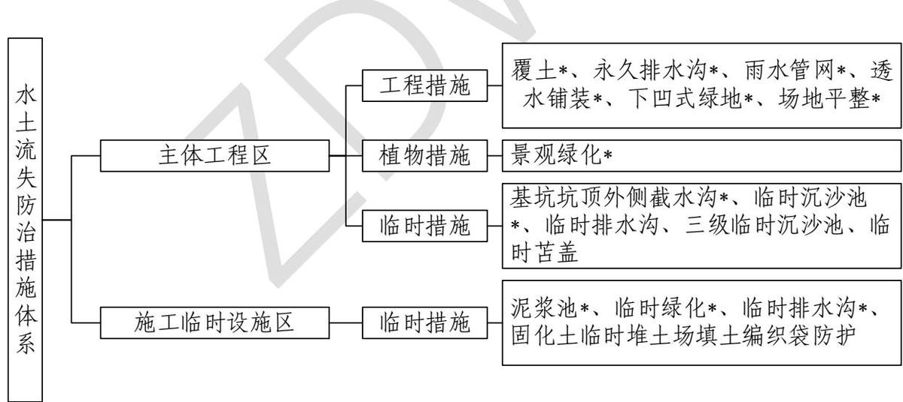  
注：\*为主体设计

水土保持措施防治体系框图

## 5.2.3 水土保持措施设计标准

根据《生产建设项目水土保持技术标准》（GB50433-2018）、《水土保持工程设计规范》（GB51018-2014）、《防洪标准》（GB50201-2014）、《室外排水设计标准》（GB50014-2021）、《建筑与小区雨水控制及利用工程技术规范》（GB50400-2016）、《民用建筑雨水控制与利用设计规程》（DB33/T 1167-2019）、《城市绿地设计规范》（GB20420-2007）（2016年版）、《城市绿化工程施工及验收规范》（CJJ/T 82-2012）、《杭州市海绵城市建设低影响开发雨水系统技术导则》等相关规定执行，水土保持措施设计标准汇总详见表5.2-1。

## 1）主体工程区

## ① 工程措施

覆土：参照《城市绿化工程施工及验收规范》（CJJ/T 82-2012），绿化栽植土壤有效土层厚度要求为草坪、花卉、草本地被≥30cm，小灌木、宿根花卉、小藤本≥40cm，大、中灌木≥90cm，乔木（胸径＜20cm）≥150cm（深根），乔木（胸径＜20cm）≥100cm（浅根）。

排水系统：根据《室外排水设计标准》（GB50014-2021），永久排水沟、雨水管网设计标准按5年一遇10min降雨历时。

海绵城市设计：根据《杭州市海绵城市建设管理办法》、《杭州市海绵城市建设低影响开发雨水系统技术导则（试行）》等要求，本工程年径流总量控制率达到81.06%，对应设计降雨量为26.37mm，综合径流系数达到≤0.6，SS去除控制率61%。本项目海绵城市设计通过设置透水铺装、下凹绿地等。

## ② 植物措施

根据《水土保持工程设计规范》（GB 51018-2014），本项目植被恢复与建设工程级别为 1级。

## ③ 临时措施

基坑外侧截水沟、临时排水沟：排水设计标准按 3 年一遇 10min 短历时设计暴雨。

临时沉沙池：基坑外侧截水沟每 30m 设置临时沉沙池，场地排水出口接三级沉沙池。

## 2）施工临时设施区

钻渣泥浆处置：根据《杭州市人民政府办公厅关于印发杭州市工程渣土管理实施办法的通知》（杭政办函〔2016〕51号），本项目执行“占地规模 20亩（含）以上或建筑体量 10 万方（含）以上的建设工地应在工地内设置泥浆固化处理设备，实现泥浆就地处理”。本项目采用泥浆固化设备+泥浆池处置桩基施工产生的钻渣泥浆。

临时绿化：根据《杭州市建设工程文明施工管理规定》（杭州市人民政府令第 278号）第十六条，房屋建筑工程施工现场其他空旷场地应当进行绿化布置或者采用其他形式固化，参照《水土保持工程设计规范》（GB 51018-2014），本项目植被恢复与建设工程级别为 3级。

表5.2-1  
水土保持措施设计标准一览
<table><tr><td rowspan=1 colspan=1>序号</td><td rowspan=1 colspan=1>分区</td><td rowspan=1 colspan=1>措施类别</td><td rowspan=1 colspan=1>措施名称</td><td rowspan=1 colspan=1>11  措施设计标准</td></tr><tr><td rowspan=1 colspan=1>1</td><td rowspan=10 colspan=1>主体工程区</td><td rowspan=5 colspan=1>工程措施</td><td rowspan=1 colspan=1>绿化覆土</td><td rowspan=1 colspan=1>参照《城市绿化工程施工及验收规范》（CJJ/T82-2012）X               栽植土壤有效土层厚度要求</td></tr><tr><td rowspan=1 colspan=1>2</td><td rowspan=1 colspan=1>永久排水沟</td><td rowspan=2 colspan=1>《室外排水设计标准》（GB50014-2021），排水设计标准       1 按5年一遇10min降雨历时</td></tr><tr><td rowspan=1 colspan=1>3</td><td rowspan=1 colspan=1>排水管网</td></tr><tr><td rowspan=1 colspan=1>4</td><td rowspan=1 colspan=1>场地平整</td><td rowspan=1 colspan=1>景观绿化区域</td></tr><tr><td rowspan=1 colspan=1>5</td><td rowspan=1 colspan=1>海绵城市设计</td><td rowspan=1 colspan=1>根据《杭州市海绵城市建设低影响开发雨水系统技术导则》，本项目海绵城市设计控制指标为年径流总量控制率达到81.06%，对应设计降雨量为26.37mm，综合径流系数达到≤0.6，SS 去除控制率 61%</td></tr><tr><td rowspan=1 colspan=1>6</td><td rowspan=1 colspan=1>植物措施</td><td rowspan=1 colspan=1></td><td rowspan=1 colspan=1>根据《水土保持工程设计规范》（GB51018-2014)，本项目植被恢复与建设工程级别为1级</td></tr><tr><td rowspan=1 colspan=1>7</td><td rowspan=4 colspan=1>临时措施</td><td rowspan=1 colspan=1>基坑外侧截水沟</td><td rowspan=2 colspan=1>排水设计标准按3年一遇10min短历时设计暴雨</td></tr><tr><td rowspan=1 colspan=1>8</td><td rowspan=1 colspan=1>临时排水沟</td></tr><tr><td rowspan=1 colspan=1>9</td><td rowspan=1 colspan=1>临时沉沙池</td><td rowspan=1 colspan=1>基坑外侧截水沟每30m设置临时沉沙池，场地排水出口接三级沉沙池</td></tr><tr><td rowspan=1 colspan=1>10</td><td rowspan=1 colspan=1>临时苫盖</td><td rowspan=1 colspan=1>施工裸露区域采用临时苫盖</td></tr><tr><td rowspan=1 colspan=1>11</td><td rowspan=4 colspan=1>施工临时设施区</td><td rowspan=4 colspan=1>临时措施</td><td rowspan=1 colspan=1>临时绿化</td><td rowspan=1 colspan=1>根据《杭州市建设工程文明施工管理规定》（杭州市人民政府令第278号）第十六条，房屋建筑工程施工现场其他空旷场地应当进行绿化布置或者采用其他形式固化</td></tr><tr><td rowspan=1 colspan=1>12</td><td rowspan=1 colspan=1>临时排水沟</td><td rowspan=1 colspan=1>排水设计标准按3年一遇10min短历时设计暴雨</td></tr><tr><td rowspan=1 colspan=1>13</td><td rowspan=1 colspan=1>钻渣泥浆处置</td><td rowspan=1 colspan=1>采用泥浆固化设备+泥浆池处置桩基施工产生的钻渣泥浆</td></tr><tr><td rowspan=1 colspan=1>14</td><td rowspan=1 colspan=1>固化土临时堆土场</td><td rowspan=1 colspan=1>固化土临时堆土场填土编织袋防护</td></tr></table>

## 5.3 分区措施布设

## 5.3.1 主体工程区

本区主要范围包括建构筑物、道路及其他配套设施、绿化区。

1）工程措施

①绿化覆土（主体设计）

施工后期，对项目绿化区域进行覆土，覆土范围包括地面绿化区域和屋面绿化区域。本区覆土面积共17625m2，其中由本项目实施的包括组团绿地 $1 1 3 0 6 \mathrm { m } ^ { 2 }$ 、基础交叉大楼普通地面绿化区 $4 0 6 0 \mathrm { m } ^ { 2 }$ 、基础交叉大楼下凹绿地绿化区 $2 0 1 7 \mathrm { m } ^ { 2 }$ 、基础交叉大楼屋顶绿化区242m2。

参照《城市绿化工程施工及验收规范》（CJJ/T82-2012），绿化栽植土壤有效土层厚木>90cm，乔本（胸径<20cm）>150cm（深根），乔本（胸径<20cm）>100cm（浅根）。结合本项目初步设计报告中景观工程要求，绿化区域覆土厚度详见表5.3-1。

表5.3-1  
绿化覆土汇总
<table><tr><td rowspan=1 colspan=1>序号</td><td rowspan=1 colspan=1>区域   </td><td rowspan=1 colspan=1>覆土面积 ${ \bigl ( } \mathbf { m } ^ { 2 } { \bigr ) }$ </td><td rowspan=1 colspan=1>平均覆土厚度（m）</td><td rowspan=1 colspan=1>覆土量 $( \mathrm { ~ \mathcal { F } ~ m } ^ { 3 } )$ </td></tr><tr><td rowspan=1 colspan=1>1</td><td rowspan=1 colspan=1>普通地面绿化</td><td rowspan=1 colspan=1>4060</td><td rowspan=1 colspan=1>80</td><td rowspan=1 colspan=1>0.32</td></tr><tr><td rowspan=1 colspan=1>2</td><td rowspan=1 colspan=1>下凹绿地</td><td rowspan=1 colspan=1>2017</td><td rowspan=1 colspan=1>30</td><td rowspan=1 colspan=1>0.06</td></tr><tr><td rowspan=1 colspan=1>3</td><td rowspan=1 colspan=1>屋顶绿化</td><td rowspan=1 colspan=1>242</td><td rowspan=1 colspan=1>50</td><td rowspan=1 colspan=1>0.01</td></tr><tr><td rowspan=1 colspan=1>4</td><td rowspan=1 colspan=1>组团绿地</td><td rowspan=1 colspan=1>11306</td><td rowspan=1 colspan=1>80</td><td rowspan=1 colspan=1>0.90</td></tr><tr><td rowspan=1 colspan=2>合计</td><td rowspan=1 colspan=1>17625</td><td rowspan=1 colspan=1></td><td rowspan=1 colspan=1>1.29</td></tr></table>

本区覆土平均厚度73cm，覆土量为1.29万m3，本工程场地原地表均为杂填土，无表土可剥离利用，因此本工程绿化覆土通过杭州市西湖区综合行政执法局统一调配。

②永久排水沟（主体设计）

根据《杭州市海绵城市建设低影响开发雨水系统技术导则》，本项目通过海绵城市设计，包括设置透水铺装、下凹绿地等，雨水口以溢流形式排放超过雨水径流控制要求的降雨溢流排入市政雨水管渠。在排入市政雨水管渠前，雨水先通过永久排水沟或排水管网，最后接入项目区周围校区道路预留的雨水管接口。

本项目区块内现状南北向七号路设有D400\~D600雨水管并预留1处D500雨水管接口（接口标高2.489m）；北侧六号路设有D1000雨水管并在预留1处D500雨水管接口（接口标高2.368m）；东侧华家池路设有D400\~D600雨水管并在地块内预留1处D500雨水管接口（接口标高2.175m）；南侧宜山环路设有D400\~D600雨水管并在地块内预留1处D400雨水管接口（接口标高2.517m）。

永久排水沟、雨水管网设计标准按5年一遇10min降雨历时。

室外排水沟采用C25钢筋砼结构，上带不锈钢缝隙式盖板，矩形断面，底宽25cm，沟深40cm，衬砌厚度为10cm，底部采用10cm厚的C20素混凝土垫层，共492m。

本方案对排水沟规模进行复核。根据规范《生产建设项目水土保持技术标准国家标准》（GB50433-2018）和《水土保持工程设计规范》（GB51018-2014），计算排水沟的水力要素。排水沟尺寸及过流能力按下式复核计算：

$$
V = \frac { 1 } { n } R ^ { 2 / 3 } i ^ { 1 / 2 }
$$

（式5-1）

式中：

V——流速，m/s；

R——水力半径，m， $\mathrm { R } = b + 2 h \sqrt { 1 + m ^ { 2 } }$

i——沟道比降，i=0.01

n——沟道糙率，钢混排水沟n=0.015；

h——沟深，m；

b——底宽，m；

m——排水沟边坡比。

计算得出，永久排水沟过水能力为0.139m3/s，流速为1.39m/s，满足不冲（不大于不冲流速3.50m/s \~6.00m/s）且不淤(不小于0.40m/s \~0.60m/s)流速的要求。

根据《浙江省暴雨强度计算标准》（DB33/T1191-2020），参考杭州市的暴雨强度公

式为

$$
q = \frac { 1 4 5 5 . 5 5 0 \times ( 1 + 0 . 9 5 8 1 \mathrm { g } P ) } { \left( t + 5 . 8 6 1 \right) ^ { 0 . 6 7 4 } }\tag{式5-2}
$$

注：q为暴雨强度 $\left( \mathrm { L } / \mathrm { s } \cdot \mathrm { h m } ^ { 2 } \right)$ ），P为设计降雨重现期（a），t为降雨历时（min）；i为暴雨强度（mm/min），q=167i。

其中P=5a，t=10min，则 $\mathrm { q } { = } 3 7 7 . 2 4 2 \mathrm { L } / \mathrm { s } \cdot \mathrm { h m } ^ { 2 }$ ，i=2.26mm/min。根据式5-2计算出项目所在地5年一遇10min降雨强度i=2.26mm/min。

排水沟设计流量计算公式如下：

Q=16.67ψqF

（式5-3）

式中：Q——设计流量 $( \mathrm { m } ^ { 3 } / \mathrm { s } ) ;$

q——设计重现期和降雨历时内平均降雨强度（mm/min）；

ψ——径流系数；根据初步设计中，海绵城市设计综合径流系数，ψ取0.53；

F——汇水面积 $\left( \mathrm { k m } ^ { 2 } \right)$ ）。

根据主体设计和图5.3-1，场地排水分为4个排水区，排水沟最大汇水面积0.0065km2。

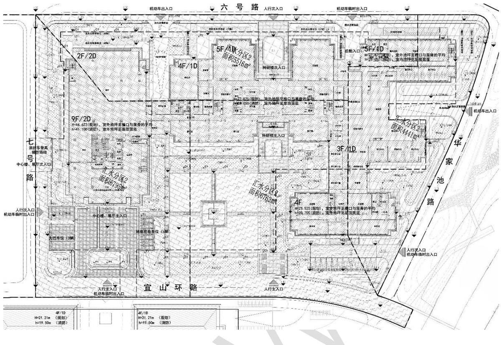  
图5.3-1  
分区汇水图

根据式5-3，计算得出设计流量为0.13m3/s。永久排水沟过水能力0.139m3/s大于设计流量，因此永久排水沟断面尺寸满足排水要求。

永久排水沟工程量汇总详见表5.3-2。

表5.3-2  
永久排水沟工程量汇总
<table><tr><td rowspan=2 colspan=1>序号</td><td rowspan=2 colspan=1>区域</td><td rowspan=2 colspan=1>长度（m）</td><td rowspan=1 colspan=2>工程量（m³）</td></tr><tr><td rowspan=1 colspan=1>C25 钢筋砼</td><td rowspan=1 colspan=1>C20 素混凝土</td></tr><tr><td rowspan=1 colspan=1>1</td><td rowspan=1 colspan=1>基础交叉研究大楼</td><td rowspan=1 colspan=1>492</td><td rowspan=1 colspan=1>65</td><td rowspan=1 colspan=1>34</td></tr><tr><td rowspan=1 colspan=2>合计</td><td rowspan=1 colspan=1>492</td><td rowspan=1 colspan=1>65</td><td rowspan=1 colspan=1>34</td></tr></table>

③ 排水管网（主体设计）

场地内设置雨水溢流口、排水沟等，收集雨水排入地块排水管道，最终排至市政雨水管网。雨水管道采用重力流，按满管流设计。本项目排水管网采用 PE 缠绕结构壁

管，管径 DN150\~DN500，总长为 1858m，其中 DN150 长 623m，DN300 长 1095m，DN400 长 120m，DN500 长 20m。

## ④海绵城市设计（主体设计）

根据《杭州市海绵城市建设低影响开发雨水系统技术导则》，本项目海绵城市设计控制指标为年径流总量控制率达到 81.06%，对应设计降雨量为 26.37mm，综合径流系数达到≤0.6，SS去除控制率 61%。本项目海绵城市设计包括设置透水铺装、下凹绿地等。

## a、透水铺装（主体设计）

透水铺装采用透水沥青、透水混凝土等，能够使雨水迅速渗入地表，有效地补充地下水，同时雨水在透水材料中的下渗过程，使得悬浮物过滤并截留，可有效去除雨水径流中的SS悬浮污染物，根据园区道路采用人车分流行车较少的特点，硬化地面尽量采用透水铺装，透水铺装面积约为5661m2，有效降低场地径流系数。

## b、下凹绿地（主体设计）

下凹绿地是低于周边铺砌地面或道路在200mm以内的绿地，利用植被截流和土壤径流的生态型雨水渗透设施。下凹式绿地设计应满足《杭州市海绵城市建设低影响开发雨水系统技术导则（试行）》中的相关要求；滤料层的渗透系数不应小于 $1 . 0 \times 1 0 ^ { - 4 } \mathrm { c m / s } ;$ 植物的耐淹时间宜为1d \~3d；涉及行人安全处必须设置相应的警示标识。

根据景观设计设置下凹绿地，本工程设置下凹绿地下凹深度15cm，有效蓄水深度10cm。下凹绿地内设置溢流口，溢流口顶面标高于周边绿地100mm，通过调整硬化地面的坡向，使径流雨水可以自然漫流至低势绿地中下渗净化，减少水土流失，多余的雨水通过溢流管排入原有雨水井。本工程设置下凹绿地共计2017m2。下凹绿地采用铺设10cm砂土层+无纺土工布 $( 2 5 0 \mathrm { g } / \mathrm { m } ^ { 2 }$ ），最上层覆耕植土30cm，溢流井周边采用卵石（粒径3cm \~5cm）覆盖，仅露出溢水口。

## ⑤ 场地平整（主体设计）

在地面绿化、屋面绿化区域通过地形平整施工，创造出符合设计要求的地形地貌，

为后续园林绿化工程施工提供良好的基础条件。场地平整 $1 7 6 2 5 \mathrm { m } ^ { 2 }$

表5.3-3  
场地平整分布一览
<table><tr><td rowspan=1 colspan=1>序号</td><td rowspan=1 colspan=1>区域</td><td rowspan=1 colspan=1>场地平整 ${ \bigl ( } \mathbf { m } ^ { 2 } { \bigr ) }$ </td><td rowspan=1 colspan=1>位置</td></tr><tr><td rowspan=1 colspan=1>1</td><td rowspan=1 colspan=1>普通地面绿化</td><td rowspan=1 colspan=1>4060</td><td rowspan=1 colspan=1>基础交叉研究大楼四周</td></tr><tr><td rowspan=1 colspan=1>2</td><td rowspan=1 colspan=1>下凹绿地</td><td rowspan=1 colspan=1>2017</td><td rowspan=1 colspan=1>基础交叉研究大楼四周绿化内并结合雨水溢流口布置</td></tr><tr><td rowspan=1 colspan=1>3</td><td rowspan=1 colspan=1>屋顶绿化</td><td rowspan=1 colspan=1>242</td><td rowspan=1 colspan=1>基础交叉研究大楼2#楼建筑4层露台</td></tr><tr><td rowspan=1 colspan=1>4</td><td rowspan=1 colspan=1>组团绿地</td><td rowspan=1 colspan=1>11306</td><td rowspan=1 colspan=1>基础交叉研究大楼区域七号路以西组团绿地</td></tr><tr><td rowspan=1 colspan=2>合计</td><td rowspan=1 colspan=1>17625</td><td rowspan=1 colspan=1></td></tr></table>

## 2）植物措施（主体设计）

植物设计延续校园整体风貌，遵循“适地适树、简洁大气、自然生态、四季有色”的策略，注意常绿与落叶、速生与慢生、乔灌木与地被相结合， 构成稳定的生态群落，同时兼顾滞尘、降噪、净化空气、美化环境的作用。在 化品种择取上以生态化为原则，充分结合杭州当地绿化特点，采用 护的本地树种，降低种植和养护成本，并结合海绵城市设计要求， 因需选树。主要乔木品种有香樟、沙朴、红枫、桂花、胡柚、 二乔玉兰、乐昌含笑、红豆杉等，主要地被品种有金叶石菖蒲、 鹃、 青、金森女贞、茶梅、金边六月雪、南天竹、海桐、大叶栀子、洒金珊 、红叶石楠等。绿化面积 $1 9 0 4 1 \mathrm m ^ { 2 }$ ，其中由本项目实施的包括组团绿地 $1 1 3 0 6 \mathrm { m } ^ { 2 }$ 基础交叉大楼普通地面绿化区 $4 0 6 0 \mathrm { m } ^ { 2 }$ 、基础交叉大楼下m凹绿地绿化区 $2 0 1 7 \mathrm { m } ^ { 2 }$ 、基础交叉大楼屋顶绿化区 $2 4 2 \mathrm { m } ^ { 2 } ;$ ；与在建学科交叉创新大楼项目交叉区域的组团绿地区域 $3 2 5 \mathrm { m } ^ { 2 }$ 是由学科交叉创新大楼项目代建；规划区域 1、2 绿化面积共 $1 0 9 1 \mathrm { m } ^ { 2 }$ ，维持现状。

因此本区绿化面积共 $1 7 6 2 5 \mathrm { m } ^ { 2 }$ ，其中由本项目实施的包括组团绿地 $1 1 3 0 6 \mathrm { m } ^ { 2 }$ 、基础交叉研究大楼普通地面绿化区 $4 0 6 0 \mathrm { m } ^ { 2 }$ 、基础交叉研究大楼下凹绿地绿化区 $2 0 1 7 \mathrm { m } ^ { 2 }$ 、基础交叉研究大楼屋顶绿化 $\textstyle \sum 2 4 2 \mathrm { m } ^ { 2 }$ 。主体设计在绿化费用中已考虑抚育的内容，本方案中不另外罗列。

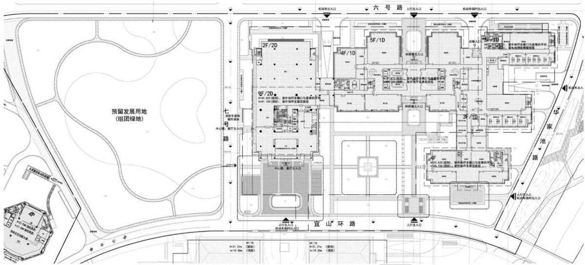  
注：图中标注“PA”的位置为景观绿化区域。  
景观总布置图

图5.3-2

表5.3-4  
基础交叉研究大楼地面绿化上木乔木表
<table><tr><td rowspan=2 colspan=1>序号</td><td rowspan=2 colspan=1>名称</td><td rowspan=1 colspan=3>规格</td><td rowspan=2 colspan=1>备注</td></tr><tr><td rowspan=1 colspan=1>胸(地)径(cm)</td><td rowspan=1 colspan=1>高度(m)</td><td rowspan=1 colspan=1>冠幅(m)</td></tr><tr><td rowspan=1 colspan=1>1</td><td rowspan=1 colspan=1>特选沙朴A</td><td rowspan=1 colspan=1>30-32</td><td rowspan=1 colspan=1>10-11</td><td rowspan=1 colspan=1>6-6.5</td><td rowspan=1 colspan=1>特选，五级分枝以上，全冠移栽苗，枝叶舒展饱满</td></tr><tr><td rowspan=1 colspan=1>2</td><td rowspan=1 colspan=1>沙朴B</td><td rowspan=1 colspan=1>24-26</td><td rowspan=1 colspan=1>9-9.5</td><td rowspan=1 colspan=1>5.5-6</td><td rowspan=1 colspan=1>四级分枝以上，全冠移栽苗，枝叶舒展饱满</td></tr><tr><td rowspan=1 colspan=1>3</td><td rowspan=1 colspan=1>沙朴C</td><td rowspan=1 colspan=1>18-18.9</td><td rowspan=1 colspan=1>8-8.5</td><td rowspan=1 colspan=1>4.5-5</td><td rowspan=1 colspan=1>四级分枝以上，分支点2.2m，全冠移栽苗，枝叶舒展饱满</td></tr><tr><td rowspan=1 colspan=1>4</td><td rowspan=1 colspan=1>特选造型黑松</td><td rowspan=1 colspan=1>D24-26</td><td rowspan=1 colspan=1>3-3.5</td><td rowspan=1 colspan=1>≥4.5</td><td rowspan=1 colspan=1>特选造型树，造型优美</td></tr><tr><td rowspan=1 colspan=1>5</td><td rowspan=1 colspan=1>特选香樟S</td><td rowspan=1 colspan=1>38-40</td><td rowspan=1 colspan=1>10-11</td><td rowspan=1 colspan=1>6.5-7</td><td rowspan=1 colspan=1>特选，五级分枝以上，全冠移栽苗，枝叶舒展饱满</td></tr><tr><td rowspan=1 colspan=1>6</td><td rowspan=1 colspan=1>香樟A</td><td rowspan=1 colspan=1>28-30</td><td rowspan=1 colspan=1>8.5-9</td><td rowspan=1 colspan=1>5.5-6</td><td rowspan=1 colspan=1>四级分枝以上，全冠移栽苗，枝叶舒展饱满</td></tr><tr><td rowspan=1 colspan=1>7</td><td rowspan=1 colspan=1>香樟B</td><td rowspan=1 colspan=1>20-22</td><td rowspan=1 colspan=1>7.5-8</td><td rowspan=1 colspan=1>4.5-5</td><td rowspan=1 colspan=1>四级分枝以上，全冠移栽苗，枝叶舒展饱满</td></tr><tr><td rowspan=1 colspan=1>8</td><td rowspan=1 colspan=1>南方红豆杉</td><td rowspan=1 colspan=1>D15-15.9</td><td rowspan=1 colspan=1>4.5-4.8</td><td rowspan=1 colspan=1>3-3.5</td><td rowspan=1 colspan=1>主杆通直，全冠移栽苗，枝叶舒展饱满</td></tr><tr><td rowspan=1 colspan=1>9</td><td rowspan=1 colspan=1>特选娜塔栎</td><td rowspan=1 colspan=1>22-24</td><td rowspan=1 colspan=1>9-9.5</td><td rowspan=1 colspan=1>5-5.5</td><td rowspan=1 colspan=1>特选，五级分枝以上，全冠移栽苗，枝叶舒展饱满</td></tr><tr><td rowspan=1 colspan=1>10</td><td rowspan=1 colspan=1>乐昌含笑B</td><td rowspan=1 colspan=1>20-20.9</td><td rowspan=1 colspan=1>7.5-8</td><td rowspan=1 colspan=1>4-4.5</td><td rowspan=1 colspan=1>四级分枝以上，全冠移栽苗，枝叶舒展饱满</td></tr><tr><td rowspan=1 colspan=1>11</td><td rowspan=1 colspan=1>乐昌含笑C</td><td rowspan=1 colspan=1>16-16.9</td><td rowspan=1 colspan=1>5.5-6</td><td rowspan=1 colspan=1>3-3.5</td><td rowspan=1 colspan=1>四级分枝以上，全冠移栽苗，枝叶舒展饱满</td></tr><tr><td rowspan=1 colspan=1>12</td><td rowspan=1 colspan=1>多杆胡柚A</td><td rowspan=1 colspan=1>1</td><td rowspan=1 colspan=1>4-4.5</td><td rowspan=1 colspan=1>4-4.5</td><td rowspan=1 colspan=1>丛生，全冠移栽苗，枝叶舒展饱满</td></tr><tr><td rowspan=1 colspan=1>13</td><td rowspan=1 colspan=1>多杆胡柚B</td><td rowspan=1 colspan=1>1</td><td rowspan=1 colspan=1>3-3.5</td><td rowspan=1 colspan=1>3-3.5</td><td rowspan=1 colspan=1>丛生，全冠移栽苗，枝叶舒展饱满</td></tr><tr><td rowspan=1 colspan=1>14</td><td rowspan=1 colspan=1>特选宫粉梅</td><td rowspan=1 colspan=1>D18-18.9</td><td rowspan=1 colspan=1>4-4.5</td><td rowspan=1 colspan=1>4.5-5</td><td rowspan=1 colspan=1>特选，三级分枝以上，全冠移栽苗，枝叶舒展饱满</td></tr><tr><td rowspan=1 colspan=1>15</td><td rowspan=1 colspan=1>宫粉梅A</td><td rowspan=1 colspan=1>D15-15.9.9</td><td rowspan=1 colspan=1>3.5-4</td><td rowspan=1 colspan=1>3.5-4</td><td rowspan=1 colspan=1>三级分枝以上，全冠移栽苗，枝叶舒展饱满</td></tr><tr><td rowspan=1 colspan=1>16</td><td rowspan=1 colspan=1>宫粉梅B</td><td rowspan=1 colspan=1>D12-12.9</td><td rowspan=1 colspan=1>2.5-3</td><td rowspan=1 colspan=1>2.5-3</td><td rowspan=1 colspan=1>三级分枝以上，全冠移栽苗，枝叶舒展饱满</td></tr><tr><td rowspan=1 colspan=1>17</td><td rowspan=1 colspan=1>绿萼梅</td><td rowspan=1 colspan=1>D12-12.9</td><td rowspan=1 colspan=1>3-3.5</td><td rowspan=1 colspan=1>3-3.5</td><td rowspan=1 colspan=1>三级分枝以上，全冠移栽苗，枝叶舒展饱满</td></tr><tr><td rowspan=1 colspan=1>18</td><td rowspan=1 colspan=1>山茶B</td><td rowspan=1 colspan=1>1</td><td rowspan=1 colspan=1>1.8</td><td rowspan=1 colspan=1>1.5</td><td rowspan=1 colspan=1>三级分枝以上，全冠移栽苗，枝叶舒展饱满</td></tr><tr><td rowspan=1 colspan=1>19</td><td rowspan=1 colspan=1>金桂B</td><td rowspan=1 colspan=1>1</td><td rowspan=1 colspan=1>5-5.5</td><td rowspan=1 colspan=1>4.5-5</td><td rowspan=1 colspan=1>丛生金桂，全冠移栽苗，枝叶舒展饱满</td></tr><tr><td rowspan=1 colspan=1>20</td><td rowspan=1 colspan=1>金桂C</td><td rowspan=1 colspan=1>1</td><td rowspan=1 colspan=1>4-4.5</td><td rowspan=1 colspan=1>4-4.4</td><td rowspan=1 colspan=1>丛生金桂，全冠移栽苗，枝叶舒展饱满</td></tr><tr><td rowspan=1 colspan=1>21</td><td rowspan=1 colspan=1>金桂D</td><td rowspan=1 colspan=1>1</td><td rowspan=1 colspan=1>3-3.5</td><td rowspan=1 colspan=1>3-3.4</td><td rowspan=1 colspan=1>丛生金桂，全冠移栽苗，枝叶舒展饱满</td></tr><tr><td rowspan=1 colspan=1>22</td><td rowspan=1 colspan=1>杨梅C</td><td rowspan=1 colspan=1>D15-15.9</td><td rowspan=1 colspan=1>3.5-4</td><td rowspan=1 colspan=1>3.5-4</td><td rowspan=1 colspan=1>分枝点&lt;50cm，全冠移栽苗，枝叶舒展饱满</td></tr><tr><td rowspan=1 colspan=1>23</td><td rowspan=1 colspan=1>杨梅D</td><td rowspan=1 colspan=1>D12-12.9</td><td rowspan=1 colspan=1>2.5-3</td><td rowspan=1 colspan=1>2.5-3</td><td rowspan=1 colspan=1>分枝点&lt;30cm，全冠移栽苗，枝叶舒展饱满</td></tr><tr><td rowspan=1 colspan=1>24</td><td rowspan=1 colspan=1>腊梅A</td><td rowspan=1 colspan=1>1</td><td rowspan=1 colspan=1>3-3.5</td><td rowspan=1 colspan=1>2.5-2.8</td><td rowspan=1 colspan=1>丛生，不少于10杆，每杆杆径4-6cm，全冠移栽苗，枝叶舒展饱满</td></tr><tr><td rowspan=1 colspan=1>25</td><td rowspan=1 colspan=1>鸡爪槭S</td><td rowspan=1 colspan=1>D18-18.9</td><td rowspan=1 colspan=1>4.5-5</td><td rowspan=1 colspan=1>4-4.5</td><td rowspan=1 colspan=1>三级分枝以上，全冠移栽苗，枝叶舒展饱满</td></tr><tr><td rowspan=1 colspan=1>26</td><td rowspan=1 colspan=1>鸡爪槭A</td><td rowspan=1 colspan=1>D13-13.9</td><td rowspan=1 colspan=1>3.5-4</td><td rowspan=1 colspan=1>3.5-4</td><td rowspan=1 colspan=1>三级分枝以上，全冠移栽苗，枝叶舒展饱满</td></tr><tr><td rowspan=1 colspan=1>27</td><td rowspan=1 colspan=1>鸡爪槭B</td><td rowspan=1 colspan=1>D10-10.9</td><td rowspan=1 colspan=1>2.5-3</td><td rowspan=1 colspan=1>3</td><td rowspan=1 colspan=1>三级分枝以上，全冠移栽苗，枝叶舒展饱满</td></tr><tr><td rowspan=1 colspan=1>28</td><td rowspan=1 colspan=1>芭蕉</td><td rowspan=1 colspan=1></td><td rowspan=1 colspan=1>2.5-3</td><td rowspan=1 colspan=1>2-2.2</td><td rowspan=1 colspan=1>全冠移栽苗，枝叶舒展饱满</td></tr><tr><td rowspan=1 colspan=1>29</td><td rowspan=1 colspan=1>紫玉兰</td><td rowspan=1 colspan=1>D12-12.9</td><td rowspan=1 colspan=1>4.5-4.8</td><td rowspan=1 colspan=1>3-3.5</td><td rowspan=1 colspan=1>三级分枝以上，全冠移栽苗，枝叶舒展饱满</td></tr></table>

表5.3-5  
基础交叉研究大楼地面绿化上木灌木表
<table><tr><td rowspan=1 colspan=1>序号</td><td rowspan=1 colspan=1>名称</td><td rowspan=1 colspan=1>地径(cm)</td><td rowspan=1 colspan=1>高度(m)</td><td rowspan=1 colspan=1>冠幅(m)</td><td rowspan=1 colspan=1>备注</td></tr><tr><td rowspan=1 colspan=1>1</td><td rowspan=1 colspan=1>海桐A</td><td rowspan=1 colspan=1></td><td rowspan=1 colspan=1>2-2.2</td><td rowspan=1 colspan=1>2.5</td><td rowspan=1 colspan=1>全冠移栽苗，球形饱满圆整，不脱脚</td></tr><tr><td rowspan=1 colspan=1>2</td><td rowspan=1 colspan=1>海桐B</td><td rowspan=1 colspan=1></td><td rowspan=1 colspan=1>1.6-1.8</td><td rowspan=1 colspan=1>2</td><td rowspan=1 colspan=1>全冠移栽苗，球形饱满圆整，不脱脚</td></tr><tr><td rowspan=1 colspan=1>3</td><td rowspan=1 colspan=1>大叶黄杨A</td><td rowspan=1 colspan=1></td><td rowspan=1 colspan=1>1.6-1.8</td><td rowspan=1 colspan=1>2</td><td rowspan=1 colspan=1>全冠移栽苗，球形饱满圆整，不脱脚</td></tr><tr><td rowspan=1 colspan=1>4</td><td rowspan=1 colspan=1>无刺构骨A</td><td rowspan=1 colspan=1></td><td rowspan=1 colspan=1>1.6-1.8</td><td rowspan=1 colspan=1>2</td><td rowspan=1 colspan=1>全冠移栽苗，球形饱满圆整，不脱脚</td></tr><tr><td rowspan=1 colspan=1>5</td><td rowspan=1 colspan=1>无刺枸骨B</td><td rowspan=1 colspan=1></td><td rowspan=1 colspan=1>1.2-1.3</td><td rowspan=1 colspan=1>1.5</td><td rowspan=1 colspan=1>全冠移栽苗，球形饱满圆整，不脱脚全</td></tr><tr><td rowspan=1 colspan=1>6</td><td rowspan=1 colspan=1>金冠女贞A</td><td rowspan=1 colspan=1></td><td rowspan=1 colspan=1>1.5-1.6</td><td rowspan=1 colspan=1>1.8</td><td rowspan=1 colspan=1>全冠移栽苗，球形饱满圆整，不脱脚</td></tr><tr><td rowspan=1 colspan=1>7</td><td rowspan=1 colspan=1>金冠女贞B</td><td rowspan=1 colspan=1></td><td rowspan=1 colspan=1>1-1.2</td><td rowspan=1 colspan=1>1.3</td><td rowspan=1 colspan=1>全冠移栽苗，球形饱满圆整，不脱脚</td></tr><tr><td rowspan=1 colspan=1>8</td><td rowspan=1 colspan=1>龟甲冬青A</td><td rowspan=1 colspan=1></td><td rowspan=1 colspan=1>1.5-1.6</td><td rowspan=1 colspan=1>1.8</td><td rowspan=1 colspan=1>全冠移栽苗，球形饱满圆整，不脱脚</td></tr><tr><td rowspan=1 colspan=1>9</td><td rowspan=1 colspan=1>龟甲冬青B</td><td rowspan=1 colspan=1></td><td rowspan=1 colspan=1>1-1.2</td><td rowspan=1 colspan=1>1.3</td><td rowspan=1 colspan=1>全冠移栽苗，球形饱满圆整，不脱脚</td></tr><tr><td rowspan=1 colspan=1>10</td><td rowspan=1 colspan=1>结香</td><td rowspan=1 colspan=1></td><td rowspan=1 colspan=1>1.5</td><td rowspan=1 colspan=1>1.5</td><td rowspan=1 colspan=1>不少于10杆/丛，全冠移栽苗，冠幅舒展</td></tr><tr><td rowspan=1 colspan=1>11</td><td rowspan=1 colspan=1>亮晶女贞</td><td rowspan=1 colspan=1></td><td rowspan=1 colspan=1>1.2-1.3</td><td rowspan=1 colspan=1>1.5</td><td rowspan=1 colspan=1>全冠移栽苗，球形饱满圆整，不脱脚</td></tr><tr><td rowspan=1 colspan=1>12</td><td rowspan=1 colspan=1>茶梅球</td><td rowspan=1 colspan=1></td><td rowspan=1 colspan=1>1-1.2</td><td rowspan=1 colspan=1>1.3</td><td rowspan=1 colspan=1>全冠移栽苗，球形饱满圆整，不脱脚</td></tr></table>

表5.3-6  
基础交叉研究大楼地面绿化下木灌木地被表
<table><tr><td rowspan=2 colspan=1>序号</td><td rowspan=2 colspan=1>名称</td><td rowspan=1 colspan=2>规格</td><td rowspan=2 colspan=1>密度单</td><td rowspan=2 colspan=1>位</td><td rowspan=2 colspan=1></td></tr><tr><td rowspan=1 colspan=1>高度(cm)</td><td rowspan=1 colspan=1>冠幅(cm)</td></tr><tr><td rowspan=1 colspan=1>1</td><td rowspan=1 colspan=1>北海道黄杨柱绿篱B</td><td rowspan=1 colspan=1>110-120</td><td rowspan=1 colspan=1>30-35</td><td rowspan=1 colspan=1></td><td rowspan=1 colspan=1>m</td><td rowspan=1 colspan=1>10株/m，双排种植，植株健壮，满铺种植不露土</td></tr><tr><td rowspan=1 colspan=1>2</td><td rowspan=1 colspan=1>南天竹</td><td rowspan=1 colspan=1>55-60</td><td rowspan=1 colspan=1>40-45</td><td rowspan=1 colspan=1>25</td><td rowspan=1 colspan=1>m2</td><td rowspan=1 colspan=1>毛球，植株健壮，满铺种植不露土</td></tr><tr><td rowspan=1 colspan=1>3</td><td rowspan=1 colspan=1>大叶黄杨</td><td rowspan=1 colspan=1>55-60</td><td rowspan=1 colspan=1>40-45</td><td rowspan=1 colspan=1>25</td><td rowspan=1 colspan=1>m2</td><td rowspan=1 colspan=1>毛球，植株健壮，满铺种植不露土</td></tr><tr><td rowspan=1 colspan=1>4</td><td rowspan=1 colspan=1>金山棕</td><td rowspan=1 colspan=1>55-60</td><td rowspan=1 colspan=1>40-45</td><td rowspan=1 colspan=1>25</td><td rowspan=1 colspan=1>m2</td><td rowspan=1 colspan=1>毛球，植株健壮，满铺种植不露土</td></tr><tr><td rowspan=1 colspan=1>5</td><td rowspan=1 colspan=1>洒金珊瑚</td><td rowspan=1 colspan=1>50-55</td><td rowspan=1 colspan=1>40-45</td><td rowspan=1 colspan=1>25</td><td rowspan=1 colspan=1>m2</td><td rowspan=1 colspan=1>毛球，植株健壮，满铺种植不露土</td></tr><tr><td rowspan=1 colspan=1>6</td><td rowspan=1 colspan=1>细叶十大功劳</td><td rowspan=1 colspan=1>50-55</td><td rowspan=1 colspan=1>40-45</td><td rowspan=1 colspan=1>25</td><td rowspan=1 colspan=1>m2</td><td rowspan=1 colspan=1>毛球，植株健壮，满铺种植不露土</td></tr><tr><td rowspan=1 colspan=1>7</td><td rowspan=1 colspan=1>大叶栀子</td><td rowspan=1 colspan=1>50-55</td><td rowspan=1 colspan=1>40-45</td><td rowspan=1 colspan=1>25</td><td rowspan=1 colspan=1>m2</td><td rowspan=1 colspan=1>毛球，植株健壮，满铺种植不露土</td></tr><tr><td rowspan=1 colspan=1>8</td><td rowspan=1 colspan=1>金禾女贞</td><td rowspan=1 colspan=1>40-45</td><td rowspan=1 colspan=1>35-40</td><td rowspan=1 colspan=1>36</td><td rowspan=1 colspan=1>m2</td><td rowspan=1 colspan=1>毛球，植株健壮，满铺种植不露土</td></tr><tr><td rowspan=1 colspan=1>9</td><td rowspan=1 colspan=1>银姬小蜡</td><td rowspan=1 colspan=1>40-45</td><td rowspan=1 colspan=1>35-40</td><td rowspan=1 colspan=1>36</td><td rowspan=1 colspan=1>m2</td><td rowspan=1 colspan=1>毛球，植株健壮，满铺种植不露土</td></tr><tr><td rowspan=1 colspan=1>10</td><td rowspan=1 colspan=1>无刺构骨</td><td rowspan=1 colspan=1>40-45</td><td rowspan=1 colspan=1>35-40</td><td rowspan=1 colspan=1>36</td><td rowspan=1 colspan=1> $\overline { { \mathbf { m } ^ { 2 } } }$ </td><td rowspan=1 colspan=1>毛球，植株健壮，满铺种植不露土</td></tr><tr><td rowspan=1 colspan=1>11</td><td rowspan=1 colspan=1>金丝桃</td><td rowspan=1 colspan=1>40-45</td><td rowspan=1 colspan=1>35-40</td><td rowspan=1 colspan=1>36</td><td rowspan=1 colspan=1>m2</td><td rowspan=1 colspan=1>毛球，植株健壮，满铺种植不露土</td></tr><tr><td rowspan=1 colspan=1>12</td><td rowspan=1 colspan=1>金森女贞</td><td rowspan=1 colspan=1>35-40</td><td rowspan=1 colspan=1>35-40</td><td rowspan=1 colspan=1>49</td><td rowspan=1 colspan=1>m2</td><td rowspan=1 colspan=1>毛球，植株健壮，满铺种植不露土</td></tr><tr><td rowspan=1 colspan=1>13</td><td rowspan=1 colspan=1>肾蕨</td><td rowspan=1 colspan=1>35-40</td><td rowspan=1 colspan=1>25-30</td><td rowspan=1 colspan=1>64</td><td rowspan=1 colspan=1>m2</td><td rowspan=1 colspan=1>满铺种植不露土</td></tr><tr><td rowspan=1 colspan=1>14</td><td rowspan=1 colspan=1>瓜子黄杨</td><td rowspan=1 colspan=1>35-40</td><td rowspan=1 colspan=1>25-30</td><td rowspan=1 colspan=1>64</td><td rowspan=1 colspan=1>m2</td><td rowspan=1 colspan=1>毛球，植株健壮，满铺种植不露土</td></tr><tr><td rowspan=1 colspan=1>15</td><td rowspan=1 colspan=1>水果兰</td><td rowspan=1 colspan=1>35-40</td><td rowspan=1 colspan=1>30-35</td><td rowspan=1 colspan=1>49</td><td rowspan=1 colspan=1>m2</td><td rowspan=1 colspan=1>毛球，植株健壮，满铺种植不露土</td></tr><tr><td rowspan=1 colspan=1>16</td><td rowspan=1 colspan=1>亮晶女贞</td><td rowspan=1 colspan=1>35-40</td><td rowspan=1 colspan=1>30-35</td><td rowspan=1 colspan=1>49</td><td rowspan=1 colspan=1>m2</td><td rowspan=1 colspan=1>毛球，植株健壮，满铺种植不露土</td></tr><tr><td rowspan=1 colspan=1>17</td><td rowspan=1 colspan=1>常绿萱草</td><td rowspan=1 colspan=1>35-40</td><td rowspan=1 colspan=1>30-35</td><td rowspan=1 colspan=1>64</td><td rowspan=1 colspan=1>m2</td><td rowspan=1 colspan=1>丛生状，3芽/丛，满铺种植不露土</td></tr><tr><td rowspan=1 colspan=1>18</td><td rowspan=1 colspan=1>春鹃</td><td rowspan=1 colspan=1>30-35</td><td rowspan=1 colspan=1>30-35</td><td rowspan=1 colspan=1>49</td><td rowspan=1 colspan=1>m²</td><td rowspan=1 colspan=1>毛球，植株健壮，满铺种植不露土</td></tr><tr><td rowspan=1 colspan=1>19</td><td rowspan=1 colspan=1>龟甲冬青</td><td rowspan=1 colspan=1>30-35</td><td rowspan=1 colspan=1>30-35</td><td rowspan=1 colspan=1>64</td><td rowspan=1 colspan=1>m²</td><td rowspan=1 colspan=1>毛球，植株健壮，满铺种植不露土</td></tr><tr><td rowspan=1 colspan=1>20</td><td rowspan=1 colspan=1>金叶石菖蒲</td><td rowspan=1 colspan=1>25-30</td><td rowspan=1 colspan=1>25-30</td><td rowspan=1 colspan=1>64</td><td rowspan=1 colspan=1>m2</td><td rowspan=1 colspan=1>满铺种植不露土</td></tr><tr><td rowspan=1 colspan=1>21</td><td rowspan=1 colspan=1>小叶栀子</td><td rowspan=1 colspan=1>25-30</td><td rowspan=1 colspan=1>25-30</td><td rowspan=1 colspan=1>64</td><td rowspan=1 colspan=1>m2</td><td rowspan=1 colspan=1>毛球，植株健壮，满铺种植不露土</td></tr><tr><td rowspan=1 colspan=1>22</td><td rowspan=1 colspan=1>夏鹏</td><td rowspan=1 colspan=1>25-30</td><td rowspan=1 colspan=1>25-30</td><td rowspan=1 colspan=1>64</td><td rowspan=1 colspan=1>m2</td><td rowspan=1 colspan=1>毛球，植株健壮，满铺种植不露土</td></tr><tr><td rowspan=1 colspan=1>23</td><td rowspan=1 colspan=1>金边阔叶麦冬</td><td rowspan=1 colspan=1>25-30</td><td rowspan=1 colspan=1>20-25</td><td rowspan=1 colspan=1>81</td><td rowspan=1 colspan=1> $\mathrm { m } ^ { 2 }$ </td><td rowspan=1 colspan=1>丛生状，不少于6芽/丛，满铺种植不露土</td></tr><tr><td rowspan=1 colspan=1>24</td><td rowspan=1 colspan=1>吉祥草</td><td rowspan=1 colspan=1>20-30</td><td rowspan=1 colspan=1>20-25</td><td rowspan=1 colspan=1>81</td><td rowspan=1 colspan=1>m²</td><td rowspan=1 colspan=1>丛生状，不少于6芽/丛，满铺种植不露土</td></tr><tr><td rowspan=1 colspan=1>25</td><td rowspan=1 colspan=1>大吴风草</td><td rowspan=1 colspan=1>20-30</td><td rowspan=1 colspan=1>20-30</td><td rowspan=1 colspan=1>64</td><td rowspan=1 colspan=1> $\mathrm { m } ^ { 2 }$ </td><td rowspan=1 colspan=1>满铺种植不露土</td></tr><tr><td rowspan=1 colspan=1>26</td><td rowspan=1 colspan=1>草坪</td><td rowspan=1 colspan=1>/</td><td rowspan=1 colspan=1>/</td><td rowspan=1 colspan=1>1</td><td rowspan=1 colspan=1> $\mathrm { m } ^ { 2 }$ </td><td rowspan=1 colspan=1>百慕大与黑麦草混种，90cm×30cm草卷满铺，秋季追播黑麦草草籽 $2 0 \mathrm { g } / \mathrm { m } ^ { 2 }$ </td></tr></table>

表5.3-7  
屋顶绿化上木表
<table><tr><td rowspan=2 colspan=1>序号</td><td rowspan=2 colspan=1>名称</td><td rowspan=1 colspan=3>规格</td><td rowspan=2 colspan=1>备注</td></tr><tr><td rowspan=1 colspan=1>胸(地)径(cm)</td><td rowspan=1 colspan=1>高度(m)</td><td rowspan=1 colspan=1>冠幅(m)</td></tr><tr><td rowspan=1 colspan=1>1</td><td rowspan=1 colspan=1>金桂D</td><td rowspan=1 colspan=1>/</td><td rowspan=1 colspan=1>3-3.5</td><td rowspan=1 colspan=1>3-3.4</td><td rowspan=1 colspan=1>丛生金桂，全冠移栽苗，枝叶舒展饱满</td></tr><tr><td rowspan=1 colspan=1>2</td><td rowspan=1 colspan=1>早樱A</td><td rowspan=1 colspan=1>D13-13.9</td><td rowspan=1 colspan=1>3.5-4</td><td rowspan=1 colspan=1>3-3.5</td><td rowspan=1 colspan=1>染井吉野樱，全冠移栽苗，球形饱满圆整，不脱脚</td></tr><tr><td rowspan=1 colspan=1>3</td><td rowspan=1 colspan=1>大叶黄杨A</td><td rowspan=1 colspan=1></td><td rowspan=1 colspan=1>1.6-1.8</td><td rowspan=1 colspan=1>2</td><td rowspan=1 colspan=1>全冠移栽苗，球形饱满圆整，不脱脚</td></tr><tr><td rowspan=1 colspan=1>4</td><td rowspan=1 colspan=1>大叶黄杨B</td><td rowspan=1 colspan=1></td><td rowspan=1 colspan=1>1.2-1.3</td><td rowspan=1 colspan=1>1.5</td><td rowspan=1 colspan=1>全冠移栽苗，球形饱满圆整，不脱脚</td></tr><tr><td rowspan=1 colspan=1>5</td><td rowspan=1 colspan=1>龟甲冬青A</td><td rowspan=1 colspan=1></td><td rowspan=1 colspan=1>1.5-1.6</td><td rowspan=1 colspan=1>1.8</td><td rowspan=1 colspan=1>全冠移栽苗，球形饱满圆整，不脱脚</td></tr><tr><td rowspan=1 colspan=1>6</td><td rowspan=1 colspan=1>龟甲冬青B</td><td rowspan=1 colspan=1></td><td rowspan=1 colspan=1>1-1.2</td><td rowspan=1 colspan=1>1.3</td><td rowspan=1 colspan=1>全冠移栽苗，球形饱满圆整，不脱脚</td></tr><tr><td rowspan=1 colspan=1>7</td><td rowspan=1 colspan=1>结香</td><td rowspan=1 colspan=1></td><td rowspan=1 colspan=1>1.5</td><td rowspan=1 colspan=1>1.5</td><td rowspan=1 colspan=1>不少于10杆/丛，全冠移栽苗，冠幅舒展</td></tr><tr><td rowspan=1 colspan=1>8</td><td rowspan=1 colspan=1>水果兰</td><td rowspan=1 colspan=1></td><td rowspan=1 colspan=1>0.8-1</td><td rowspan=1 colspan=1>1</td><td rowspan=1 colspan=1>全冠移栽苗，姿态优美</td></tr><tr><td rowspan=1 colspan=1>9</td><td rowspan=1 colspan=1>安坪十大功劳</td><td rowspan=1 colspan=1></td><td rowspan=1 colspan=1>0.8</td><td rowspan=1 colspan=1>0.8</td><td rowspan=1 colspan=1>   全冠移栽苗，姿态优美</td></tr></table>

表5.3-8  
屋顶绿化下木表
<table><tr><td rowspan=2 colspan=1>序号</td><td rowspan=2 colspan=1>名称</td><td rowspan=1 colspan=2>规格</td><td rowspan=2 colspan=1>密度单</td><td rowspan=2 colspan=1>位</td><td rowspan=2 colspan=1>          1      备注</td></tr><tr><td rowspan=1 colspan=1>高度(cm)</td><td rowspan=1 colspan=1>冠幅(cm)</td></tr><tr><td rowspan=1 colspan=1>1</td><td rowspan=1 colspan=1>狐尾天门冬</td><td rowspan=1 colspan=1>45-50</td><td rowspan=1 colspan=1>40-45</td><td rowspan=1 colspan=1>9</td><td rowspan=1 colspan=1>m2</td><td rowspan=1 colspan=1>5加仑，满铺种植不露土</td></tr><tr><td rowspan=1 colspan=1>2</td><td rowspan=1 colspan=1>金禾女贞</td><td rowspan=1 colspan=1>40-45</td><td rowspan=1 colspan=1>35-40</td><td rowspan=1 colspan=1>36</td><td rowspan=1 colspan=1>m2</td><td rowspan=1 colspan=1>毛球，植株健壮，满铺种植不露土</td></tr><tr><td rowspan=1 colspan=1>3</td><td rowspan=1 colspan=1>水果兰</td><td rowspan=1 colspan=1>35-40</td><td rowspan=1 colspan=1>30-35</td><td rowspan=1 colspan=1>49</td><td rowspan=1 colspan=1>m2</td><td rowspan=1 colspan=1>毛球，植株健壮，满铺种植不露土</td></tr><tr><td rowspan=1 colspan=1>4</td><td rowspan=1 colspan=1>金森女贞</td><td rowspan=1 colspan=1>35-40</td><td rowspan=1 colspan=1>35-40</td><td rowspan=1 colspan=1>49</td><td rowspan=1 colspan=1>m2</td><td rowspan=1 colspan=1>毛球，植株健壮，满铺种植不露土</td></tr><tr><td rowspan=1 colspan=1>5</td><td rowspan=1 colspan=1>春鹃</td><td rowspan=1 colspan=1>30-35</td><td rowspan=1 colspan=1>30-35</td><td rowspan=1 colspan=1>49</td><td rowspan=1 colspan=1>m2</td><td rowspan=1 colspan=1>毛球，植株健壮，满铺种植不露土</td></tr><tr><td rowspan=1 colspan=1>6</td><td rowspan=1 colspan=1>金叶大花六道木</td><td rowspan=1 colspan=1>30-35</td><td rowspan=1 colspan=1>30-35</td><td rowspan=1 colspan=1>64</td><td rowspan=1 colspan=1>m2</td><td rowspan=1 colspan=1>毛球，植株健壮，满铺种植不露土</td></tr><tr><td rowspan=1 colspan=1>7</td><td rowspan=1 colspan=1>夏鹏</td><td rowspan=1 colspan=1>25-30</td><td rowspan=1 colspan=1>25-30</td><td rowspan=1 colspan=1>64</td><td rowspan=1 colspan=1>m²</td><td rowspan=1 colspan=1>毛球，植株健壮，满铺种植不露土</td></tr><tr><td rowspan=1 colspan=1>8</td><td rowspan=1 colspan=1>紫娇花</td><td rowspan=1 colspan=1>25-30</td><td rowspan=1 colspan=1>20-25</td><td rowspan=1 colspan=1>64</td><td rowspan=1 colspan=1>m2</td><td rowspan=1 colspan=1>丛生状，不少于10芽/丛，满铺种植不露土</td></tr><tr><td rowspan=1 colspan=1>9</td><td rowspan=1 colspan=1>草坪</td><td rowspan=1 colspan=1>/</td><td rowspan=1 colspan=1>1</td><td rowspan=1 colspan=1></td><td rowspan=1 colspan=1>m²</td><td rowspan=1 colspan=1>百慕大与黑麦草混种，90cm×30cm草卷满铺，秋季追播黑麦草草籽 20g/m²</td></tr></table>

表5.3-9  
组团绿地上木表
<table><tr><td rowspan=2 colspan=1>序号</td><td rowspan=2 colspan=1>名称</td><td rowspan=1 colspan=3>规格</td><td rowspan=2 colspan=1>备注</td></tr><tr><td rowspan=1 colspan=1>胸(地)径(cm)</td><td rowspan=1 colspan=1>高度(m)</td><td rowspan=1 colspan=1>冠幅(m)</td></tr><tr><td rowspan=1 colspan=1>1</td><td rowspan=1 colspan=1>香樟C</td><td rowspan=1 colspan=1>16-18</td><td rowspan=1 colspan=1>7-7.5</td><td rowspan=1 colspan=1>4-4.5</td><td rowspan=1 colspan=1>四级分枝以上，全冠移栽苗，枝叶舒展饱满</td></tr><tr><td rowspan=1 colspan=1>2</td><td rowspan=1 colspan=1>沙朴C</td><td rowspan=1 colspan=1>16-16.9</td><td rowspan=1 colspan=1>8-8.5</td><td rowspan=1 colspan=1>4.5-5</td><td rowspan=1 colspan=1>四级分枝以上，分支点2.2m，全冠移栽苗，枝叶舒展饱满</td></tr></table>

表5.3-10  
组团绿地灌木地被表
<table><tr><td rowspan=2 colspan=1>序号</td><td rowspan=2 colspan=1>名称</td><td rowspan=1 colspan=2>规格</td><td rowspan=2 colspan=1>密度</td><td rowspan=2 colspan=1>备注</td></tr><tr><td rowspan=1 colspan=1>高度(cm)</td><td rowspan=1 colspan=1>冠幅(cm)</td></tr><tr><td rowspan=1 colspan=1>1</td><td rowspan=1 colspan=1>草坪</td><td rowspan=1 colspan=1>1</td><td rowspan=1 colspan=1>1</td><td rowspan=1 colspan=1>1</td><td rowspan=1 colspan=1>百慕大与黑麦草混种，90cm×30cm草卷满铺，秋季追播黑麦草草籽 20g/m²</td></tr><tr><td rowspan=1 colspan=1>2</td><td rowspan=1 colspan=1>柳叶马鞭草籽播</td><td rowspan=1 colspan=1>1</td><td rowspan=1 colspan=1>1</td><td rowspan=1 colspan=1>1</td><td rowspan=1 colspan=1>籽播，5g/m²。消苗后籽播喜林草+虞美人，喜林草10g/m²。虞美人籽播3g/m²。喜林草：虞美人=3：1。一年两季。</td></tr><tr><td rowspan=1 colspan=1>3</td><td rowspan=1 colspan=1>波斯菊籽播</td><td rowspan=1 colspan=1>1</td><td rowspan=1 colspan=1>/</td><td rowspan=1 colspan=1>1</td><td rowspan=1 colspan=1>籽播，10g/m²。消苗后籽播喜林草+虞美人，喜林草10g/m²，虞美人籽播3g/m²。喜林草：虞美人=3：1。一年两季。</td></tr></table>

## 3）临时措施

## ①基坑外侧截水沟（主体设计）

施工期间为防止项目区可能产生的水土流失对周边区域的影响，主体设计已考虑置截水沟长600m。排水标准采用3年一遇10min降雨历时。利用式5-2计算，P=3a，t=10min，得出 $\mathrm { q } { = } 3 2 9 . 2 2 \mathrm { L } / \mathrm { s } \cdot \mathrm { h m } ^ { 2 } , ~ \mathrm { i } { = } 1 . 9 7 \mathrm { m m } / \mathrm { m i n }$

根据式5-3，本项目施工期排水汇水去向分为4处，施工期临时接入四周预留的市政雨水排水口，因此临时截水沟最大汇水面积0.007km2，由于地下室开挖期间地面裸露，径流系数取0.60，计算得出设计流量为0.138m3/s。

根据规范《生产建设项目水土保持技术标准国家标准》（GB50433-2018）和《水土保持工程设计规范》（GB51018-2014），利用式5-1和式5-4设计临时截水沟规模。

## Q=AV

（式5-4）

式中：

Q——最大洪峰流量， $\mathrm { m } ^ { 3 } / \mathrm { s }$ ；

A——过水断面面积， $\mathrm { m } ^ { 2 } , ~ \mathrm { A } { = } \mathrm { b } \mathrm { h } { + } \mathrm { m } \mathrm { h } ^ { 2 }$ ；

V——流速，m/s；

临时截水沟采用侧壁矩形砖砌结构，砌筑壁厚为12cm，底部为10cm厚C20混凝土护底，内表面采用2cm厚1：2水泥砂浆抹面，粗糙系数取0.015，底宽30cm，沟深40cm，底坡为0.01。计算得出临时截水沟的过水能力为 $0 . 2 7 8 \mathrm { m } ^ { 3 } / \mathrm { s } > 0 . 1 3 8 \mathrm { m } ^ { 3 } / \mathrm { s }$ （设计流量），过水断面尺寸符合排水要求。临时截水沟水流汇入场地周边临时排水沟。

临时截水沟措施共计开挖土方约 $2 4 9 \mathrm { m } ^ { 3 }$ ，回填土方249m3，砖砌体为60m3，C20砼护底34m3，砂浆抹面504m2。

②基坑外侧沉沙池（集水井）（主体设计）

主体设计已考虑沿截水沟每30m处设置一个沉沙池，沉沙池采用矩形断面砖砌结构，尺寸（底长×宽×深）采用1.0m×1.0m×0.8m，砌筑厚度24cm，基础采用10cm厚C20混凝土垫层，内表面采用2cm厚1：2水泥砂浆抹面。共设置20个临时沉沙池，共计开挖土方约100m3，回填土方100m3，砖砌体为23m3，C20砼垫层5m3，砂浆抹面88m2。

另外，遇台风暴雨期间，施工区应配备抽排水设备放置在易积水区域附近。施工单位应及时检查并清理施工现场的集水井、排水沟等排水设施，保证排水通畅。

③临时排水沟（方案新增）

工程施工开挖后的土方较为松散，在雨季容易流失到周边，为减少施工期间因降雨、径流等条件下对周边环境造成影响，施工单位应在施工时根据地形条件布设临时排水沉沙措施，施工作业范围内雨水经临时排水沟收集后排入附近管网，同时利用排水沟开挖土方，沿临时排水沟边缘做成挡土坎，以减少对周边的影响。临时排水沟末端设置三级临时沉沙池。

临时排水沟设计排水标准采用3年一遇10min，利用式5-2计算，P=3a，t=10min，得出 $\mathrm { q } { = } 3 2 9 . 2 2 \mathrm { L } / \mathrm { s } \cdot \mathrm { h m } ^ { 2 } , ~ \mathrm { i } { = } 1 . 9 7 \mathrm { m m } / \mathrm { m i n }$

根据式5-3，考虑施工期排水去向分4处，因此临时截水沟最大汇水面积0.007km2，径流系数取0.7（考虑主体结构工程完成后局部场地径流系数增大），计算得出设计流量为 $0 . 1 6 1 \mathrm { m } ^ { 3 } / \mathrm { s }$ o

利用式5-1和式5-4设计临时排水沟规模，采用侧壁矩形砖砌结构，底部为10cm厚C20混凝土护底，内表面采用2cm厚1：2水泥砂浆抹面，粗糙系数取0.015，底宽40cm，沟深30cm，底坡为0.01。计算得出临时截水沟的过水能力为 $0 . 1 9 5 \mathrm { { m } ^ { 3 } / \mathrm { { s } } > 0 . 1 6 1 \mathrm { { m } ^ { 3 } / \mathrm { { s } } } }$ （设计流量），过水断面尺寸符合排水要求。临时排水沟共长670m，水流汇入分别排入七号路、六号路、宜山环路、华家池路预留的排水管网。临时排水沟措施共计开挖土方约

$2 3 6 \mathrm { m } ^ { 3 }$ ，回填土方 $2 3 6 \mathrm { m } ^ { 3 }$ ，砖砌体为 $5 1 \mathrm m ^ { 3 }$ ，C20砼护底45m3，砂浆抹面 $4 2 2 \mathrm { m } ^ { 2 }$

④三级临时沉沙池（方案新增）

施工期间，为减少雨水外排时携带的土壤、砂粒的流失，需在排水沟集水排放前设置沉沙池缓流沉沙。根据排水出口，拟设置4处三级沉沙池，沉沙池独立收集排水沟来水，经沉淀后清水排入分别排入项目区四周预留的市政管网。沉沙池采用矩形断面砖砌结构，单格尺寸（底长×宽×深）统一采用 $1 . 0 \mathrm { m } { \times } 2 . 0 \mathrm { m } { \times } 1 . 0 \mathrm { m }$ ，经验算，沉沙池容量为6.0m3。沉沙池旁边需设置明显的安全警示标志，并加强施工期间的管理，避免安全隐患。施工期加强对排水沟及沉沙池的清理，防止泥沙淤积，保证其有足够的容量，尤其是雨后要加强巡查清理，清理出的沉沙回填至地网铺设区。临时沉沙措施共计开挖土方约 $6 3 \mathrm { m } ^ { 3 }$ ，回填土方 $6 3 \mathrm { m } ^ { 3 }$ ，砖砌体为 $2 7 \mathrm m ^ { 3 }$ 砂浆抹面126m2。

施工期间沉沙池旁需设置明显的安全警示标志，并加强施工期间的管理，消除安全隐患。沉沙池启用后，应注意沉沙池的安全使用问题， 并定时采用人工清淤的方式清理、疏通沉沙池，防止淤塞，减小排水出口对周边区域的影响。

表5.3-11  
项目区临时排水沉沙措施工程量表
<table><tr><td rowspan=2 colspan=1>名称</td><td rowspan=1 colspan=2>规格（m）</td><td rowspan=2 colspan=1>长度(m)</td><td rowspan=1 colspan=6>工程量</td></tr><tr><td rowspan=1 colspan=1>底宽</td><td rowspan=1 colspan=1>沟深</td><td rowspan=1 colspan=1>土方 $\left( \mathbf { \lambda } _ { \mathbf { m } } { } ^ { 3 } \mathbf { \Lambda } \right)$ </td><td rowspan=1 colspan=1>回填土方 $\left( \mathbf { \nabla } _ { \mathbf { m } } { } ^ { 3 } \right)$ </td><td rowspan=1 colspan=1>砌砖 $\left( \mathbf { m } ^ { 3 } \right)$ </td><td rowspan=1 colspan=1>C20砼护底 $\left( \mathbf { \nabla } \mathbf { m } ^ { 3 } \right)$ </td><td rowspan=1 colspan=1>C20砼垫层 $\left( \mathbf { m } ^ { 3 } \right)$ </td><td rowspan=1 colspan=1>砂浆抹面 ${ \bigl ( } \mathbf { m } ^ { 2 } { \bigr ) }$ </td></tr><tr><td rowspan=1 colspan=1>临时截水沟</td><td rowspan=1 colspan=1>0.30</td><td rowspan=1 colspan=1>0.40</td><td rowspan=1 colspan=1>600</td><td rowspan=1 colspan=1>249</td><td rowspan=1 colspan=1>249</td><td rowspan=1 colspan=1>60</td><td rowspan=1 colspan=1>34</td><td rowspan=1 colspan=1>1</td><td rowspan=1 colspan=1>504</td></tr><tr><td rowspan=1 colspan=1>临时沉沙池</td><td rowspan=1 colspan=2>1.0m×1.0m×0.8m</td><td rowspan=1 colspan=1>20</td><td rowspan=1 colspan=1>100</td><td rowspan=1 colspan=1>100</td><td rowspan=1 colspan=1>23</td><td rowspan=1 colspan=1>1</td><td rowspan=1 colspan=1>5</td><td rowspan=1 colspan=1>88</td></tr><tr><td rowspan=1 colspan=1>临时排水沟</td><td rowspan=1 colspan=1>0.40</td><td rowspan=1 colspan=1>0.30</td><td rowspan=1 colspan=1>670</td><td rowspan=1 colspan=1>236</td><td rowspan=1 colspan=1>236</td><td rowspan=1 colspan=1>51</td><td rowspan=1 colspan=1>45</td><td rowspan=1 colspan=1>/</td><td rowspan=1 colspan=1>422</td></tr><tr><td rowspan=1 colspan=1>三级沉沙池</td><td rowspan=1 colspan=2>3×1.0m×2.0m×1.0m</td><td rowspan=1 colspan=1>4</td><td rowspan=1 colspan=1>63</td><td rowspan=1 colspan=1>63</td><td rowspan=1 colspan=1>27</td><td rowspan=1 colspan=1>1</td><td rowspan=1 colspan=1>1</td><td rowspan=1 colspan=1>126</td></tr><tr><td rowspan=1 colspan=4>合计</td><td rowspan=1 colspan=1>648</td><td rowspan=1 colspan=1>648</td><td rowspan=1 colspan=1>161</td><td rowspan=1 colspan=1>79</td><td rowspan=1 colspan=1>5</td><td rowspan=1 colspan=1>1140</td></tr></table>

## ⑤临时苫盖（方案新增）

项目施工期间，项目区内存在部分土质裸露面，由于施工期间不可避免跨越雨季，工程建设开挖裸露地表，受降雨冲刷和地表径流的影响，极易产生水土流失。故对项

目区内土质裸露面进行密目网覆盖，避免雨水冲刷带来的水土流失现象。考虑到密目网可重复利用，估算密目网10000m2。

表5.3-12  
主体工程区水土保持措施工程量汇总
<table><tr><td rowspan=1 colspan=1>措施观</td><td rowspan=1 colspan=2>措施内容</td><td rowspan=1 colspan=1>结构形式</td><td rowspan=1 colspan=1>工程量</td><td rowspan=1 colspan=1>布设位置</td><td rowspan=1 colspan=1>布设时间</td><td rowspan=1 colspan=1>备注</td></tr><tr><td rowspan=9 colspan=1>工程措施</td><td rowspan=1 colspan=2>覆土</td><td rowspan=1 colspan=1>平均覆土厚度 73cm</td><td rowspan=1 colspan=1>1.29万m³</td><td rowspan=1 colspan=1>绿化区域</td><td rowspan=1 colspan=1>2028年9月</td><td rowspan=1 colspan=1>主体设计</td></tr><tr><td rowspan=1 colspan=2>永久排水沟</td><td rowspan=1 colspan=1>C20 钢混砌筑10cm，C20砼垫层，矩形断面，宽0.25m深 0.40m，带透水盖板</td><td rowspan=1 colspan=1>492m</td><td rowspan=1 colspan=1>基础交叉研究大楼四周</td><td rowspan=1 colspan=1>2028年7月~9月</td><td rowspan=1 colspan=1>主体设计</td></tr><tr><td rowspan=4 colspan=2>排水管网</td><td rowspan=1 colspan=1>PE缠绕结构壁管DN150</td><td rowspan=1 colspan=1>623</td><td rowspan=4 colspan=1>沿路网进</td><td rowspan=4 colspan=1>2028年3月~6月</td><td rowspan=1 colspan=1>主体设计</td></tr><tr><td rowspan=1 colspan=1>PE缠绕结构壁管DN300</td><td rowspan=1 colspan=1>1095 </td><td rowspan=1 colspan=1>主体设计</td></tr><tr><td rowspan=1 colspan=1>PE缠绕结构壁管DN400</td><td rowspan=1 colspan=1>N120</td><td rowspan=1 colspan=1>主体设计</td></tr><tr><td rowspan=1 colspan=1>PE缠绕结构壁管DN500</td><td rowspan=1 colspan=1></td><td rowspan=1 colspan=1>主体设计</td></tr><tr><td rowspan=2 colspan=1>海市设计</td><td rowspan=1 colspan=1>透水铺装</td><td rowspan=1 colspan=1>透水沥青、透水混凝土等</td><td rowspan=1 colspan=1>5661m²</td><td rowspan=1 colspan=1>硬化地面</td><td rowspan=1 colspan=1>2028年3月~8月</td><td rowspan=1 colspan=1>主体设计</td></tr><tr><td rowspan=1 colspan=1>下出地</td><td rowspan=1 colspan=1>铺设 10cm 砂土层+无妨土工布，溢流井周边采用卵石覆盖</td><td rowspan=1 colspan=1>2017m²</td><td rowspan=1 colspan=1>低势绿地</td><td rowspan=1 colspan=1>2028年9月</td><td rowspan=1 colspan=1>主体设计</td></tr><tr><td rowspan=1 colspan=2>场地平整</td><td rowspan=1 colspan=1>地形平整施工</td><td rowspan=1 colspan=1>17625m²</td><td rowspan=1 colspan=1>绿化区域</td><td rowspan=1 colspan=1>2028年10月</td><td rowspan=1 colspan=1>主体设计</td></tr><tr><td rowspan=1 colspan=1>植物相措施</td><td rowspan=1 colspan=2></td><td rowspan=1 colspan=1>园林绿化</td><td rowspan=1 colspan=1>17625m²</td><td rowspan=1 colspan=1>地面+屋面绿化区域</td><td rowspan=1 colspan=1>2028年10月~11月</td><td rowspan=1 colspan=1>主体设计</td></tr><tr><td rowspan=5 colspan=1>临时措施</td><td rowspan=1 colspan=2>临时截水沟</td><td rowspan=1 colspan=1>沟壁砖砌结构，C20砼护底，内侧砂浆抹面，矩形断面，尺寸为宽0.3m×深 0.4m</td><td rowspan=1 colspan=1>600m</td><td rowspan=1 colspan=1>沿基坑外侧 0.5m范围</td><td rowspan=1 colspan=1>2026年5月</td><td rowspan=1 colspan=1>主体设计</td></tr><tr><td rowspan=1 colspan=2>临时沉沙池</td><td rowspan=1 colspan=1>砖砌结构，内侧砂浆抹面，1.0m×1.0m×0.8m</td><td rowspan=1 colspan=1>20座</td><td rowspan=1 colspan=1>沿截水沟每30m</td><td rowspan=1 colspan=1>2026年5月</td><td rowspan=1 colspan=1>主体设计</td></tr><tr><td rowspan=1 colspan=2>临时排水沟</td><td rowspan=1 colspan=1>沟壁砖砌结构，C20砼护底，内侧砂浆抹面，矩形断面，尺寸为宽0.4m×深 0.3m</td><td rowspan=1 colspan=1>670m</td><td rowspan=1 colspan=1>沿场地四周</td><td rowspan=1 colspan=1>2026年4月~5月</td><td rowspan=1 colspan=1>方案新增</td></tr><tr><td rowspan=1 colspan=2>三级沉沙池</td><td rowspan=1 colspan=1>砖砌结构，内侧砂浆抹面，3×1.0m×2.0m×1.0m</td><td rowspan=1 colspan=1>4座</td><td rowspan=1 colspan=1>排水出口</td><td rowspan=1 colspan=1>2026年4月~5月</td><td rowspan=1 colspan=1>方案新增</td></tr><tr><td rowspan=1 colspan=2>临时苦盖</td><td rowspan=1 colspan=1>密目网</td><td rowspan=1 colspan=1>10000m²</td><td rowspan=1 colspan=1>开挖裸露面</td><td rowspan=1 colspan=1>2026年6月~2026年12月</td><td rowspan=1 colspan=1>方案新增</td></tr></table>

## 5.3.2 施工临时设施区

本区包括施工生产区、施工生活区、泥浆处置区，均布置在永久占地内。

## 1）临时措施

## ① 泥浆池（主体设计）

本工程桩基工程采用钻孔灌注桩，钻孔灌注桩施工产生的泥浆引起的水土流失不能忽视，参照同类工程的施工工艺，由于工程先打桩后开挖基坑，故在项目区基坑开挖范围内设置泥浆池、固化土临时堆土场，布设就近汇集泥浆、方便运输和管理，其规模应根据具体施工实际需要确定，并考虑适当的安全系数，将钻渣泥浆经泥浆中转池汇集沉淀后采用封闭式运输车运出项目区。施工期间，泥浆中转池周围设置安全围栏及明显的警示标志，防止发生安全隐患，要安排专人监管，沉淀后的钻渣要及时运出，泥浆池不得满置。

根据《杭州市建设工程文明施工管理规定》（杭州市人民政府令第278号）第十六条“桩基工程施工作业场地应当坚实稳固，使用路基板（箱）等进行硬化处理；利用泥浆护壁的，应当设置砌体或者钢板成型的泥浆沉淀池。”

泥浆池采用砖砌结构，砌筑厚度为24cm，内壁采用2cm厚的水泥砂浆抹面。在场地内设置1处泥浆池（大）和4处泥浆池（小）。泥浆池（大）的尺寸规格为底长30m，底宽10m，地面以下有效深度为1.0m；泥浆池（小）的尺寸规格为底长10m，底宽10m，地面以下有效深度为1.0m。其中泥浆池（大）结合固化设备布置，位于场地中部，其他泥浆池（小）根据施工需要布置在场地内。

泥浆池外围设置一圈围栏，隔离人员，保障施工安全。桩基工程施工结束后泥浆池拆除。项目区内设1套泥浆干化设备，对桩基产生的泥浆和开挖的淤泥进行干化。

本项目建筑物基础和基坑围护钻孔灌注桩施工产生钻渣2.01万m3，考虑钻渣泥浆总量是钻渣量的三倍，共计需固化处理钻渣泥浆6.03万m³。钻渣泥浆经固化离心设备处理后，分离出的钻渣转入干化土方临时堆土场暂存后，采用专用罐车随多余土方一同外运处理，渣土清运证办理完成后及时清运。考虑固化过程等因素，在固化设备附近设置固化土临时堆土场，中转时间不应大于10天，根据《杭州市城乡建设委员会杭州市城市管理局关于进一步规范建设工程建筑垃圾处置相关事项的通知（杭建工〔2023〕169号）》《杭州市人民政府办公厅关于进一步推进建筑垃圾长效管理的通知（杭政办函〔2024〕41号）》、《杭州市综合行政执法局等四部门关于印发<杭州市建筑垃圾资源化利用支持政策（试行）>的通知》（2025年7月8日）等文件规定和要求，本工程固化土将运至渣土办指定消纳方资源化利用。

表5.3-13  
钻渣泥浆中转池工程量
<table><tr><td rowspan=1 colspan=1>名称</td><td rowspan=1 colspan=1>个数</td><td rowspan=1 colspan=1>规格长×宽×深</td><td rowspan=1 colspan=1>土方开挖 $\left( \mathbf { \nabla } _ { \mathbf { m } } { } ^ { 3 } \right)$ </td><td rowspan=1 colspan=1>砌砖 $\left( \mathbf { \nabla } _ { \mathbf { m } } { } ^ { 3 } \right)$ </td><td rowspan=1 colspan=1>砂浆抹面 ${ \bigl ( } \mathbf { m } ^ { 2 } \mathbf { \bigr ) }$ </td></tr><tr><td rowspan=1 colspan=1>泥浆池（大）</td><td rowspan=1 colspan=1>1</td><td rowspan=1 colspan=1>30m×10m×1.0m</td><td rowspan=1 colspan=1>331</td><td rowspan=1 colspan=1>X  86</td><td rowspan=1 colspan=1>399</td></tr><tr><td rowspan=1 colspan=1>泥浆池（小）</td><td rowspan=1 colspan=1>4</td><td rowspan=1 colspan=1>10m×10m×1.0m</td><td rowspan=1 colspan=1>440</td><td rowspan=1 colspan=1>132</td><td rowspan=1 colspan=1>588</td></tr><tr><td rowspan=1 colspan=3>合计</td><td rowspan=1 colspan=1>771</td><td rowspan=1 colspan=1>218</td><td rowspan=1 colspan=1>987</td></tr></table>

## ② 临时绿化（主体设计）

根据《杭州市建设工程文明施工管理规定》（杭州市人民政府令第278号）第十六条，房屋建筑工程施工现场其他空旷场地应当进行绿化布置或者采用其他形式固化。本工程主体设计已考虑在施工生产生活区布置临时绿化，共500m2，拟栽植植被为龟甲冬青、金森女贞、狗牙根、黑麦草等。

## ③ 施工生活区临时排水（主体设计）

本工程施工生活区面积为8345m2，根据《杭州市建设工程文明施工管理规定》（杭州市人民政府令第278号）的要求，区内地面采用硬化和排水顺畅，主体设计已考虑在场地内需布设临时排水沟，施工生活区周边的临时排水沟尺寸根据式5-1～式5-4计算。临时排水沟设计排水标准采用3年一遇10min，利用式5-2计算，P=3a，t=10min，得出$\mathrm { q } { = } 3 2 9 . 2 2 \mathrm { L } / \mathrm { s } \cdot \mathrm { h m } ^ { 2 } , ~ \mathrm { i } \mathrm { = } 1 . 9 7 \mathrm { m m } / \mathrm { m i n }$

根据式5-3，施工生活区排水去向为七号路预留市政管网，最大汇水面积0.008km2，径流系数取0.9，采用双侧排水，计算得出设计流量为 $0 . 1 2 \mathrm { m } ^ { 3 } / \mathrm { s }$ 。临时排水沟采用侧壁矩形砖砌结构，底部为10cm厚C20混凝土护底，内表面采用2cm厚1：2水泥砂浆抹面，粗糙系数取0.015，经计算，临时排水沟采用矩形砖砌结构，规格宽40cm，深30cm，底坡为0.01。临时排水沟总长460m，共需开挖土方 $1 6 2 \mathrm { m } ^ { 3 }$ ，回填土方 $1 6 2 \mathrm { m } ^ { 3 }$ ，砌砖 $3 5 \mathrm { m } ^ { 3 }$ C20混凝土护底 $3 1 \mathrm m ^ { 3 }$ ，砂浆抹面290m2。

④固化土临时堆土场防护（方案新增）

考虑固化过程等因素，在固化设备附近设置固化土临时堆土场1处，中转时间不应大于10天，面积为 $3 0 0 \mathrm { m } ^ { 2 }$ ，设计容量为 $2 5 0 \mathrm m ^ { 3 }$ ，堆置高度不超过2.5m，堆置边坡坡比应缓于1：2，坡脚四周采用填土编织袋拦挡，填土编织袋顶宽50cm，高度50cm，堆置边坡1:0.5，填土编织袋共 $7 5 \mathrm { m } \ ( \ 3 0 \mathrm { m } ^ { 3 } )$ ），由于堆置期较短，动态清运，因此不考虑临时苫盖措施。

表5.3-14  
施工临时设施区水土保持措施工程量汇总
<table><tr><td rowspan=1 colspan=1>措施类型</td><td rowspan=1 colspan=1>措施内容</td><td rowspan=1 colspan=1>结构形式    V</td><td rowspan=1 colspan=1>工程量</td><td rowspan=1 colspan=1>布设位置</td><td rowspan=1 colspan=1>布设时间</td><td rowspan=1 colspan=1>备注</td></tr><tr><td rowspan=5 colspan=1>临时措施</td><td rowspan=1 colspan=1>泥浆池（大）</td><td rowspan=1 colspan=1>砖砌体30m×10m×1.0m</td><td rowspan=1 colspan=1>1个</td><td rowspan=1 colspan=1>场地中部</td><td rowspan=2 colspan=1>2026年5月~8月</td><td rowspan=1 colspan=1>主体设计</td></tr><tr><td rowspan=1 colspan=1>泥浆池（小）</td><td rowspan=1 colspan=1>砖砌体10m×10m×1.0m</td><td rowspan=1 colspan=1></td><td rowspan=1 colspan=1>场地内</td><td rowspan=1 colspan=1>主体设计</td></tr><tr><td rowspan=1 colspan=1>临时绿化</td><td rowspan=1 colspan=1>灌草措施 </td><td rowspan=1 colspan=1>500m²</td><td rowspan=1 colspan=1>施工生产生活区</td><td rowspan=1 colspan=1>2026年4月</td><td rowspan=1 colspan=1>主体设计</td></tr><tr><td rowspan=1 colspan=1>1</td><td rowspan=1 colspan=1>砖砌结构，内侧砂浆抹面，矩形断面，深 0.3m</td><td rowspan=1 colspan=1>460m</td><td rowspan=1 colspan=1>沿施工生活生产区四周</td><td rowspan=1 colspan=1>2026年4月</td><td rowspan=1 colspan=1>主体设计</td></tr><tr><td rowspan=1 colspan=1>临时堆土场填土编织袋</td><td rowspan=1 colspan=1>顶宽50cm，高度50cm，堆置边坡1:0.5</td><td rowspan=1 colspan=1>30m³</td><td rowspan=1 colspan=1>固化土临时堆土场</td><td rowspan=1 colspan=1>2026年5月~8月</td><td rowspan=1 colspan=1>方案新增</td></tr></table>

## 5.3.3防治措施工程量汇总

## 1）主体工程区

工程措施：覆土（主体设计） $1 . 2 9 \mathcal { F } \mathrm { m } ^ { 3 }$ ，永久排水沟（主体设计）492m，排水管线（主体设计）1858m，透水铺装（主体设计） $5 6 6 1 \mathrm { m } ^ { 2 }$ ，下凹绿地（主体设计）$2 0 1 7 \mathrm { m } ^ { 2 }$ ，场地平整（主体设计） $1 7 6 2 5 \mathrm { m } ^ { 2 }$

植物措施：景观绿化（主体设计） $1 7 6 2 5 \mathrm { m } ^ { 2 }$ （含抚育）。

临时措施：基坑坑顶外侧截水沟（主体设计）600m，临时沉沙池（主体设计）20

座，项目区排水沟（方案新增）670m，三级临时沉沙池（方案新增）4座，临时苫盖（方案新增）10000m2。

## 2）施工临时设施区

临时措施：泥浆池（大）（主体设计）1座，泥浆池（小）（主体设计）4座，临时绿化（主体设计）500m2，临时排水沟（主体设计）460m，临时堆土场填土编织袋拦挡（方案新增）30m3。

本工程的水土保持工程措施、植物措施、临时防护措施工程量详见表5.3-15。

表5.3-15  
水土保持措施工程量汇总
<table><tr><td rowspan=1 colspan=1>防治分区</td><td rowspan=1 colspan=1>措施类型</td><td rowspan=1 colspan=1>措施名称</td><td rowspan=1 colspan=1>具体措施</td><td rowspan=1 colspan=1>单位</td><td rowspan=1 colspan=1>数量</td><td rowspan=1 colspan=1>主体设计</td><td rowspan=1 colspan=1>方案新增</td></tr><tr><td rowspan=31 colspan=2>主体工程区临时措施</td><td rowspan=6 colspan=1></td><td rowspan=1 colspan=3>覆</td><td rowspan=1 colspan=1> $\overline { { \mathcal { H } } } \mathrm { ~ m } ^ { 3 }$ </td><td rowspan=1 colspan=1>1.29</td></tr><tr><td rowspan=1 colspan=2>永久排水沟</td><td rowspan=1 colspan=1>m</td><td rowspan=1 colspan=1>492</td><td rowspan=1 colspan=1>492</td><td rowspan=1 colspan=1>0</td></tr><tr><td rowspan=1 colspan=2>排水管线</td><td rowspan=1 colspan=1>m</td><td rowspan=1 colspan=1>1858</td><td rowspan=1 colspan=1>1858</td><td rowspan=1 colspan=1>0</td></tr><tr><td rowspan=1 colspan=2>透水铺装</td><td rowspan=1 colspan=1> $\mathrm { m } ^ { 2 }$ </td><td rowspan=1 colspan=1>5661</td><td rowspan=1 colspan=1>5661</td><td rowspan=1 colspan=1>0</td></tr><tr><td rowspan=1 colspan=2>下凹绿地</td><td rowspan=1 colspan=1> $\mathrm { m } ^ { 2 }$ </td><td rowspan=1 colspan=1>2017</td><td rowspan=1 colspan=1>2017</td><td rowspan=1 colspan=1>0</td></tr><tr><td rowspan=1 colspan=2>场地平整</td><td rowspan=1 colspan=1> $\overline { { { \bf m } ^ { 2 } } }$ </td><td rowspan=1 colspan=1>17625</td><td rowspan=1 colspan=1>17625</td><td rowspan=1 colspan=1>0</td></tr><tr><td rowspan=1 colspan=1>植物</td><td rowspan=1 colspan=2>景观绿化</td><td rowspan=1 colspan=1> $\mathrm { m } ^ { 2 }$ </td><td rowspan=1 colspan=1>17625</td><td rowspan=1 colspan=1>17625</td><td rowspan=1 colspan=1>0</td></tr><tr><td rowspan=6 colspan=1>基坑坑顶外侧截水沟</td><td rowspan=1 colspan=1>长度</td><td rowspan=1 colspan=1> $\mathbf { m }$ </td><td rowspan=1 colspan=1>600</td><td rowspan=1 colspan=1>600</td><td rowspan=1 colspan=1>0</td></tr><tr><td rowspan=1 colspan=1>土方开挖</td><td rowspan=1 colspan=1> $\overline { { { \bf m } ^ { 3 } } }$ </td><td rowspan=1 colspan=1>249</td><td rowspan=1 colspan=1>249</td><td rowspan=1 colspan=1>0</td></tr><tr><td rowspan=1 colspan=1>土方回填</td><td rowspan=1 colspan=1> $\overline { { { \bf m } ^ { 3 } } }$ </td><td rowspan=1 colspan=1>249</td><td rowspan=1 colspan=1>249</td><td rowspan=1 colspan=1>0</td></tr><tr><td rowspan=1 colspan=1>砌砖</td><td rowspan=1 colspan=1> $\overline { { { \bf m } ^ { 3 } } }$ </td><td rowspan=1 colspan=1>60</td><td rowspan=1 colspan=1>60</td><td rowspan=1 colspan=1>0</td></tr><tr><td rowspan=1 colspan=1>C20 砼护底</td><td rowspan=1 colspan=1> $\mathfrak { m } ^ { 3 }$  X</td><td rowspan=1 colspan=1>34</td><td rowspan=1 colspan=1>34</td><td rowspan=1 colspan=1>0</td></tr><tr><td rowspan=1 colspan=1>水泥砂浆抹面</td><td rowspan=1 colspan=1>K $\mathrm { m } ^ { 2 }$ </td><td rowspan=1 colspan=1>504</td><td rowspan=1 colspan=1>504</td><td rowspan=1 colspan=1>0</td></tr><tr><td rowspan=6 colspan=1>临时沉沙池</td><td rowspan=1 colspan=1>个数</td><td rowspan=1 colspan=1> $\nVDash$ </td><td rowspan=1 colspan=1>20</td><td rowspan=1 colspan=1>20</td><td rowspan=1 colspan=1>0</td></tr><tr><td rowspan=1 colspan=1>土方开挖</td><td rowspan=1 colspan=1> $\mathbf { m } ^ { 3 }$ </td><td rowspan=1 colspan=1>100</td><td rowspan=1 colspan=1>100</td><td rowspan=1 colspan=1>0</td></tr><tr><td rowspan=1 colspan=1>土方回填</td><td rowspan=1 colspan=1> $\mathbf { m } ^ { 3 }$ </td><td rowspan=1 colspan=1>100</td><td rowspan=1 colspan=1>100</td><td rowspan=1 colspan=1>0</td></tr><tr><td rowspan=1 colspan=1>砌砖   </td><td rowspan=1 colspan=1> $\mathbf { m } ^ { 3 }$ V</td><td rowspan=1 colspan=1>23</td><td rowspan=1 colspan=1>23</td><td rowspan=1 colspan=1>0</td></tr><tr><td rowspan=1 colspan=1>C20 砼垫层</td><td rowspan=1 colspan=1> $\overline { { { \bf m } ^ { 3 } } }$ </td><td rowspan=1 colspan=1>5</td><td rowspan=1 colspan=1>5</td><td rowspan=1 colspan=1>0</td></tr><tr><td rowspan=1 colspan=1>砂浆抹面</td><td rowspan=1 colspan=1> $\mathrm { m } ^ { 2 }$ </td><td rowspan=1 colspan=1>88</td><td rowspan=1 colspan=1>88</td><td rowspan=1 colspan=1>0</td></tr><tr><td rowspan=6 colspan=1></td><td rowspan=1 colspan=1>长度</td><td rowspan=1 colspan=1>7 $\mathbf { m }$ </td><td rowspan=1 colspan=1>670</td><td rowspan=1 colspan=1>0</td><td rowspan=1 colspan=1>670</td></tr><tr><td rowspan=1 colspan=1>土方开挖</td><td rowspan=1 colspan=1> $\mathbf { m } ^ { 3 }$ </td><td rowspan=1 colspan=1>236</td><td rowspan=1 colspan=1>0</td><td rowspan=1 colspan=1>236</td></tr><tr><td rowspan=1 colspan=1>土方回填</td><td rowspan=1 colspan=1> $\mathbf { m } ^ { 3 }$ </td><td rowspan=1 colspan=1>236</td><td rowspan=1 colspan=1>0</td><td rowspan=1 colspan=1>236</td></tr><tr><td rowspan=1 colspan=1>砌砖</td><td rowspan=1 colspan=1> $\mathbf { m } ^ { 3 }$ </td><td rowspan=1 colspan=1>51</td><td rowspan=1 colspan=1>0</td><td rowspan=1 colspan=1>51</td></tr><tr><td rowspan=1 colspan=1>C20砼护底</td><td rowspan=1 colspan=1> $\overline { { { \bf m } ^ { 3 } } }$ </td><td rowspan=1 colspan=1>45</td><td rowspan=1 colspan=1>0</td><td rowspan=1 colspan=1>45</td></tr><tr><td rowspan=1 colspan=1>水泥砂浆抹面</td><td rowspan=1 colspan=1> $\mathrm { m } ^ { 2 }$ </td><td rowspan=1 colspan=1>422</td><td rowspan=1 colspan=1>0</td><td rowspan=1 colspan=1>422</td></tr><tr><td rowspan=5 colspan=1></td><td rowspan=1 colspan=1>个数</td><td rowspan=1 colspan=1> $\nvDash \frac { \vartriangle } { \varDelta }$ </td><td rowspan=1 colspan=1>4</td><td rowspan=1 colspan=1>0</td><td rowspan=1 colspan=1>4</td></tr><tr><td rowspan=1 colspan=1>土方开挖</td><td rowspan=1 colspan=1> $\mathbf { m } ^ { 3 }$ </td><td rowspan=1 colspan=1>63</td><td rowspan=1 colspan=1>0</td><td rowspan=1 colspan=1>63</td></tr><tr><td rowspan=1 colspan=1>土方回填</td><td rowspan=1 colspan=1> $\mathbf { m } ^ { 3 }$ </td><td rowspan=1 colspan=1>63</td><td rowspan=1 colspan=1>0</td><td rowspan=1 colspan=1>63</td></tr><tr><td rowspan=1 colspan=1>砌砖</td><td rowspan=1 colspan=1> $\mathbf { m } ^ { 3 }$ </td><td rowspan=1 colspan=1>27</td><td rowspan=1 colspan=1>0</td><td rowspan=1 colspan=1>27</td></tr><tr><td rowspan=1 colspan=1>砂浆抹面</td><td rowspan=1 colspan=1> $\mathrm { m } ^ { 2 }$ </td><td rowspan=1 colspan=1>126</td><td rowspan=1 colspan=1>0</td><td rowspan=1 colspan=1>126</td></tr><tr><td rowspan=1 colspan=1>临时苫盖</td><td rowspan=1 colspan=1>密目网</td><td rowspan=1 colspan=1> $\mathrm { m } ^ { 2 }$ </td><td rowspan=1 colspan=1>10000</td><td rowspan=1 colspan=1>0</td><td rowspan=1 colspan=1>10000</td></tr><tr><td rowspan=10 colspan=1>施工临时设施区</td><td rowspan=10 colspan=1>临时措施</td><td rowspan=3 colspan=1>泥浆池</td><td rowspan=1 colspan=1>土方开挖</td><td rowspan=1 colspan=1> $\mathbf { m } ^ { 3 }$ </td><td rowspan=1 colspan=1>771</td><td rowspan=1 colspan=1>771</td><td rowspan=1 colspan=1>0</td></tr><tr><td rowspan=1 colspan=1>砌砖</td><td rowspan=1 colspan=1> $\mathbf { m } ^ { 3 }$ </td><td rowspan=1 colspan=1>218</td><td rowspan=1 colspan=1>218</td><td rowspan=1 colspan=1>0</td></tr><tr><td rowspan=1 colspan=1>砂浆抹面</td><td rowspan=1 colspan=1> $\mathrm { m } ^ { 2 }$ </td><td rowspan=1 colspan=1>987</td><td rowspan=1 colspan=1>987</td><td rowspan=1 colspan=1>0</td></tr><tr><td rowspan=1 colspan=2>临时绿化</td><td rowspan=1 colspan=1> $\mathrm { m } ^ { 2 }$ </td><td rowspan=1 colspan=1>500</td><td rowspan=1 colspan=1>500</td><td rowspan=1 colspan=1>0</td></tr><tr><td rowspan=5 colspan=1>临时排水沟</td><td rowspan=1 colspan=1>长度</td><td rowspan=1 colspan=1> $\mathbf { m }$ </td><td rowspan=1 colspan=1>460</td><td rowspan=1 colspan=1>460</td><td rowspan=1 colspan=1>0</td></tr><tr><td rowspan=1 colspan=1>土方开挖</td><td rowspan=1 colspan=1> $\mathbf { m } ^ { 3 }$ </td><td rowspan=1 colspan=1>162</td><td rowspan=1 colspan=1>162</td><td rowspan=1 colspan=1>0</td></tr><tr><td rowspan=1 colspan=1>土方回填</td><td rowspan=1 colspan=1> $\mathbf { m } ^ { 3 }$ </td><td rowspan=1 colspan=1>162</td><td rowspan=1 colspan=1>162</td><td rowspan=1 colspan=1>0</td></tr><tr><td rowspan=1 colspan=1>砌砖</td><td rowspan=1 colspan=1> $\mathbf { m } ^ { 3 }$ </td><td rowspan=1 colspan=1>35</td><td rowspan=1 colspan=1>35</td><td rowspan=1 colspan=1>0</td></tr><tr><td rowspan=1 colspan=1>砂浆抹面</td><td rowspan=1 colspan=1> $\mathrm { m } ^ { 2 }$ </td><td rowspan=1 colspan=1>290</td><td rowspan=1 colspan=1>290</td><td rowspan=1 colspan=1>0</td></tr><tr><td rowspan=1 colspan=1>临时堆土场</td><td rowspan=1 colspan=1>填土编织袋</td><td rowspan=1 colspan=1> $\mathbf { m } ^ { 3 }$ </td><td rowspan=1 colspan=1>30</td><td rowspan=1 colspan=1>0</td><td rowspan=1 colspan=1>30</td></tr></table>

## 5.4 施工要求

## 5.4.1 施工组织形式

本方案水土保持措施是对主体工程施工过程中，对可能产生水土流失防治措施不足的补充。水土流失防治措施均纳入主体工程，形成水土保持专章，实行项目法人责任制、招投标制及项目监理制，补充的水土流失防治工程与主体工程一起招标，签订施工合同，按照设计文件及施工合同要求完成防治工程。

## 1）工程措施

本方案水土保持工程的实施均与主体工程配套进行，施工中利用主体工程施工条件和施工设施，施工时根据各防治区具体的工程措施合理安排施工时序，减少或避免各工序间的相互干扰。

## 2）植物措施

本着“因地制宜、适地适树”的原则，所需苗木尽量在本区域附近购买，同时选用有经验的施工队伍进行施工。种植过程中科学使用保水剂、长效肥、微量元素等先进材料和技术，以保证苗木成活。

种植后，按照苗木的成活率检查结果，决定补植（成活率41%\~80%）、重新造林（成活率41%以下）与合格验收（成活率85%以上，且分布均匀）。补植时应根据检查结果拟定补植措施，幼苗补植时需选用同树种的同龄苗。

## 3）临时措施

做好临时排水、沉沙、拦挡等防护措施，施工结束后及时进行场地清理措施。要加强施工组织管理与临时防护措施，严格控制施工用地，严禁随意扩大占压、扰动面积和损坏地貌、植被，开挖土石方及时进行清运，需要堆置的堆置在指定堆场，并采取排水、沉沙、拦挡等防护措施，禁止随意堆放，以严格控制施工中可能造成的水土流失。

## 5.4.2 物资采购

水土保持防护工程所需的水泥、砂石等主要材料在主体工程建设购买材料地采购，所需的苗木、草种等在市场上统一择优采购；耕植土在市场上择优采购；填土编织袋

所需的编织袋、密目网等在市场采购。

## 5.4.3 施工条件

水土流失防治措施是与主体工程同一区域施工，主体工程已考虑了施工生产生活区，满足施工材料运输需要。水土流失防治措施施工用水和用电量相对较小，施工用水、用电可由主体工程供电系统统一供应。

## 5.4.4 施工方法

## 1）工程措施

工程措施主要包括场地平整和绿化覆土。

覆土：采用机械施工，包括运送、集中堆置等施工工序。表土回填施工，待复耕复绿前实施，采用机械运送、推平、人工整平。

场地平整：采用人工配合机械全面平整的方法，对场地进行清理平整。

## 2）植物措施

主要安排在春季或秋季人工种植。应购买适应性、抗性强的苗木，施工现场应采取假植等措施加强对苗木的保护，栽植后浇水一次，在幼年期应对苗木进行抚育，保证苗木成活率。

施工准备主要是做好施工外部条件的协调匹配，首先施工场地做到“三通一平”，养护的水源应当确保，本工程均可依托场区的各项条件实施。

## 苗木种植养护措施如下：

## ①种苗的检验

根据水土保持及林草种选择要求，所选苗木必须生长健壮、根系发达而完整、主根短直，接近根颈一定范围内有较多的侧根和须根，起苗后大根系应无劈裂。

## ②种植密度及方法

造林季节选在春季或秋季以提高成活率，草籽撒播或喷播一般在雨季或墒情较好时。乔木、灌木采用穴植方法，在栽植时应注意其栽植的技术要点，即“三填、两踩、一提苗”，栽植深度一般以超过原根系5cm～10cm为准。草本采用撒播或喷播方法，撒播方法即将草籽均匀撒在整好的地上，然后用耙或耱等方法覆土埋压，覆土厚度一般为0.5cm～1.0cm；喷播方法即将种子、肥料、有机覆盖材料、保水剂、粘合剂、促绿剂等加水搅拌后，用液压喷播机高速喷射在需防护的地面或边坡表面上。

## ③林草抚育养护

定植后应及时浇水，保证苗木成活及正常生长，对缺苗、稀疏或成活率没有达到要求的地方，及时进行补植或补播，成活率低于40%的则需要重新栽植。补植后根据其生长情况应及时浇水、松土、除草、追肥、修枝、防治病虫害等。

## 3）临时措施

## ①土石方开挖

排水沟、沉沙池等基础开挖，采用人工作业。先挂线；然后使用镐锹挖槽，抛土并倒运至沟槽外侧0.5m左右，拍实；最后修整底边，同时拍实。

## ②砌砖

在经人工处理后的基础顶面，弹设砌筑线和控制 砌筑前将砖块湿润，清洗砌筑面、座浆，依次砌筑。砌筑 上，所需标准砖由运输车运至工程区，人工胶轮车运输至施工区，水泥砂浆由小型拌合机械现场拌制。

## ③砂浆抹面

分为冲洗、制浆、抹粉、压光等工序。

## ④填土编织袋

主要为临时堆场周边防护，采用编织袋装土防护的方法。人工装土，封袋并堆筑，土源利用现有的开挖表层土，防护结束之后，拆除填土编织袋并清理场地。

## 4）施工质量要求

水土保持措施实施后，各项治理措施必须符合有关规范规定的质量要求，并经质量验收合格。应符合验收等相关规定：严格按照批复后的水土保持方案进行施工，要求水土保持工程总体布局合理，各项措施符合设计要求，规格、尺寸、质量，使用材料，施工方法符合施工和设计标准。水土保持工程经设计暴雨考验后保存完整。

工程措施所使用的材料的规格、质量应符合设计要求。截排水沟要求能有效地控制上部地表径流，截排水去处有妥善处理，经设计暴雨考验后基本完好，截排水沟及护坡的完好率在90%以上。水土保持种草所选种植地块的立地条件应符合相应草种的要求，种草密度要达到设计要求；采用经济价值高、保土能力强的适生优良草种，当年出苗率与成活率在80%以上，三年保存率在70%以上。

## 5.4.5 水土保持措施进度安排

## 1）进度安排原则

根据水土保持“三同时”制度的要求，按照各分区主体工程施工组织设计，合理安排各防治区的施工进度；植物措施应根据季节安排，在具备条件后尽快实施；植物措施在具备条件后尽快实施。

坚持水土保持工程与主体工程同时设计、同时施工、同时投产使用的制度，根据主体工程施工进度，确定完成全部防治工程的期限和年度安排。具体安排时，首先要安排随时都产生水土流失地段的防治措施。水土保持措施安排一般是先采取临时性措施，其次为工程措施，最后是植物措施，以确保工程建设过程中的新增水土流失得到及时防治。

## 2）方案实施进度安排

根据水土保持措施与主体工程同步实施的原则，参照主体工程施工进度，各项水土保持措施的实施进度与相应的工程进度衔接。水土保持措施实施进度图见表5.4-1。

表 5.4-1

水土保持措施实施进度安排
<table><tr><td rowspan=2 colspan=1>防治分区</td><td rowspan=2 colspan=1>防治措施类型</td><td rowspan=2 colspan=1>防治措施名称</td><td rowspan=1 colspan=4>2026年</td><td rowspan=1 colspan=4>2027年</td><td rowspan=1 colspan=4>2028年</td></tr><tr><td rowspan=1 colspan=1>I</td><td rowspan=1 colspan=1>Ⅱ</td><td rowspan=1 colspan=1>IⅢ</td><td rowspan=1 colspan=1>IV</td><td rowspan=1 colspan=1>I</td><td rowspan=1 colspan=1>ⅡI</td><td rowspan=1 colspan=1>IⅢ</td><td rowspan=1 colspan=1>IV</td><td rowspan=1 colspan=1>I</td><td rowspan=1 colspan=1>ⅡI</td><td rowspan=1 colspan=1>ⅢI</td><td rowspan=1 colspan=1>IV</td></tr><tr><td rowspan=10 colspan=1>主体工程区</td><td rowspan=6 colspan=1>工程措施</td><td rowspan=1 colspan=1>覆土</td><td rowspan=1 colspan=1></td><td rowspan=1 colspan=1></td><td rowspan=1 colspan=1></td><td rowspan=1 colspan=1></td><td rowspan=1 colspan=1></td><td rowspan=1 colspan=1></td><td rowspan=1 colspan=1></td><td rowspan=1 colspan=1></td><td rowspan=1 colspan=1></td><td rowspan=1 colspan=1></td><td rowspan=1 colspan=1></td><td rowspan=1 colspan=1></td></tr><tr><td rowspan=2 colspan=1>永久排水沟、排水管线</td><td rowspan=2 colspan=1></td><td rowspan=2 colspan=1></td><td rowspan=2 colspan=1></td><td rowspan=2 colspan=1></td><td rowspan=2 colspan=1></td><td rowspan=2 colspan=1></td><td rowspan=2 colspan=1></td><td rowspan=2 colspan=1></td><td rowspan=2 colspan=1></td><td rowspan=1 colspan=1></td><td rowspan=1 colspan=1></td><td rowspan=2 colspan=1></td></tr><tr><td rowspan=1 colspan=1></td><td rowspan=1 colspan=1></td></tr><tr><td rowspan=2 colspan=1>透水铺装、下凹绿地</td><td rowspan=2 colspan=1></td><td rowspan=2 colspan=1></td><td rowspan=2 colspan=1></td><td rowspan=2 colspan=1></td><td rowspan=2 colspan=1></td><td rowspan=2 colspan=1></td><td rowspan=2 colspan=1></td><td rowspan=2 colspan=1></td><td rowspan=2 colspan=1></td><td rowspan=2 colspan=1></td><td rowspan=1 colspan=1></td><td rowspan=2 colspan=1></td></tr><tr><td rowspan=1 colspan=1></td></tr><tr><td rowspan=1 colspan=1>场地平整</td><td rowspan=1 colspan=1></td><td rowspan=1 colspan=1></td><td rowspan=1 colspan=1></td><td rowspan=1 colspan=1>X</td><td rowspan=1 colspan=1></td><td rowspan=1 colspan=1>八</td><td rowspan=1 colspan=1></td><td rowspan=1 colspan=1></td><td rowspan=1 colspan=1></td><td rowspan=1 colspan=1></td><td rowspan=1 colspan=1></td><td rowspan=1 colspan=1>-</td></tr><tr><td rowspan=1 colspan=1>植物措施</td><td rowspan=1 colspan=1>景观绿化</td><td rowspan=1 colspan=1></td><td rowspan=1 colspan=1></td><td rowspan=1 colspan=1>1</td><td rowspan=1 colspan=1></td><td rowspan=1 colspan=1></td><td rowspan=1 colspan=1></td><td rowspan=1 colspan=1></td><td rowspan=1 colspan=1></td><td rowspan=1 colspan=1></td><td rowspan=1 colspan=1></td><td rowspan=1 colspan=1></td><td rowspan=1 colspan=1></td></tr><tr><td rowspan=3 colspan=1>临时措施</td><td rowspan=1 colspan=1>基坑坑顶外侧截水沟、临时沉沙池</td><td rowspan=1 colspan=1></td><td rowspan=1 colspan=1></td><td rowspan=1 colspan=1></td><td rowspan=1 colspan=1>V</td><td rowspan=1 colspan=1></td><td rowspan=1 colspan=1></td><td rowspan=1 colspan=1></td><td rowspan=1 colspan=1></td><td rowspan=1 colspan=1></td><td rowspan=1 colspan=1></td><td rowspan=1 colspan=1></td><td rowspan=1 colspan=1></td></tr><tr><td rowspan=1 colspan=1>场地临时排水沟、三级临时沉沙池</td><td rowspan=1 colspan=1></td><td rowspan=1 colspan=1></td><td rowspan=1 colspan=1></td><td rowspan=1 colspan=1></td><td rowspan=1 colspan=1></td><td rowspan=1 colspan=1></td><td rowspan=1 colspan=1></td><td rowspan=1 colspan=1></td><td rowspan=1 colspan=1></td><td rowspan=1 colspan=1></td><td rowspan=1 colspan=1></td><td rowspan=1 colspan=1></td></tr><tr><td rowspan=1 colspan=1>临时苫盖</td><td rowspan=1 colspan=1></td><td rowspan=1 colspan=1></td><td rowspan=1 colspan=1></td><td rowspan=1 colspan=1>7</td><td rowspan=1 colspan=1></td><td rowspan=1 colspan=1></td><td rowspan=1 colspan=1></td><td rowspan=1 colspan=1></td><td rowspan=1 colspan=1></td><td rowspan=1 colspan=1></td><td rowspan=1 colspan=1></td><td rowspan=1 colspan=1></td></tr><tr><td rowspan=4 colspan=1>施工临时设施区</td><td rowspan=4 colspan=1>临时措施</td><td rowspan=1 colspan=1>泥浆池</td><td rowspan=1 colspan=1>7</td><td rowspan=1 colspan=1></td><td rowspan=1 colspan=1>一V</td><td rowspan=1 colspan=1></td><td rowspan=1 colspan=1></td><td rowspan=1 colspan=1></td><td rowspan=1 colspan=1></td><td rowspan=1 colspan=1></td><td rowspan=1 colspan=1></td><td rowspan=1 colspan=1></td><td rowspan=1 colspan=1></td><td rowspan=1 colspan=1></td></tr><tr><td rowspan=1 colspan=1>临时绿化</td><td rowspan=1 colspan=1></td><td rowspan=1 colspan=1></td><td rowspan=1 colspan=1></td><td rowspan=1 colspan=1></td><td rowspan=1 colspan=1></td><td rowspan=1 colspan=1></td><td rowspan=1 colspan=1></td><td rowspan=1 colspan=1></td><td rowspan=1 colspan=1></td><td rowspan=1 colspan=1></td><td rowspan=1 colspan=1></td><td rowspan=1 colspan=1></td></tr><tr><td rowspan=1 colspan=1>临时排水沟</td><td rowspan=1 colspan=1></td><td rowspan=1 colspan=1>L</td><td rowspan=1 colspan=1></td><td rowspan=1 colspan=1></td><td rowspan=1 colspan=1></td><td rowspan=1 colspan=1></td><td rowspan=1 colspan=1></td><td rowspan=1 colspan=1></td><td rowspan=1 colspan=1></td><td rowspan=1 colspan=1></td><td rowspan=1 colspan=1></td><td rowspan=1 colspan=1></td></tr><tr><td rowspan=1 colspan=1>固化土临时堆土场填土编织袋拦挡</td><td rowspan=1 colspan=1></td><td rowspan=1 colspan=1></td><td rowspan=1 colspan=1></td><td rowspan=1 colspan=1></td><td rowspan=1 colspan=1></td><td rowspan=1 colspan=1></td><td rowspan=1 colspan=1></td><td rowspan=1 colspan=1></td><td rowspan=1 colspan=1></td><td rowspan=1 colspan=1></td><td rowspan=1 colspan=1></td><td rowspan=1 colspan=1></td></tr></table>

注：水保措施进度

## 6 水土保持监测

## 6.1 范围和时段

## 1）监测范围

根据《生产建设项目水土保持监测与评价标准》（GBT51240-2018）的规定，水土保持监测范围应包括水土保持方案确定的水土流失防治责任范围，以及项目建设与生产过程中扰动与危害的其他区域。本项目建设过程中无扰动与危害其他区域，因此本项目水土保持监测范围为方案确定的水土流失防治责任范围。

## 2）监测时段

本工程水土保持监测从施工准备期开始至设计水平年结束，即2026年3月至2029年12月，共计46个月。在施工准备期前应开展本底值监测。

## 6.2 内容和方法

## 6.2.1 监测内容

根据《生产建设项目水土保持监测与评价标准》（GBT51240-2018）、《水利部办公厅关于进一步加强生产建设项目水土保持监测工作的通知》（办水保〔2020〕161号），生产建设项目水土保持监测内容应包括项目施工全过程各阶段扰动土地情况、水土流失状况、防治成效及水土流失危害等。

## 1）水土流失影响因素监测

①气象水文、地形地貌、地表组成物质、植被等自然影响因素；

②项目建设对原地表、水土保持设施、植被的占压和损毁情况；

③项目征占地和水土流失防治责任范围变化情况；

④项目弃土（石、渣）量及堆放方式，去向。

## 2）扰动土地情况监测

项目建设对原地表、水土保持设施、植被的占压和损坏情况；项目征占地和水土流失防治责任范围变化情况，重点监测实际发生的永久和临时占地、扰动地表植被面积；永久和临时弃渣量及变化情况。

## 3）水土流失状况监测

水土流失的类型、形式、面积、分布及强度；各监测分区及其重点对象的土壤流失量。重点监测实际造成的水土流失面积、分布、土壤流失量及变化情况等。

本项目土壤流失量是指输出项目建设区的土、石、沙数量；弃土（石、渣）潜在土壤流失量是指项目建设区内未实施防护措施，或者未按水土保持方案实施且未履行变更手续的弃土（石、渣）数量；水土流失危害是指项目建设引起的基础设施和民用设施的损毁，管道淤积、河道阻塞等危害。

## 4）水土保持实施措施及效果监测

植物措施的种类、面积、分布、生长状况、成活率、保存率和林草覆盖率；工程措施的类型、数量、分布和完好程度；临时措项水土保持措施的实施进展情况；水土保持措施对主体工程安全建设和运行发挥的作用；水土保持措施对周边生态环境发挥的作用。

重点监测实际采取水土保持工程、植物和临时措施的位置、数量，以及实施水土保持措施前后的防治效果对比情况等。

## 5）水土流失危害监测

水土流失对主体工程造成危害的方式、数量和程度，水土流失掩埋道路、居民点等的数量、程度；生产建设项目造成的崩塌、滑坡、泥石流等灾害，对江河湖泊的危害，有可能直接进入江河湖泊或产生行洪安全影响的弃土（石、渣）情况。

## 6）三色评价

生产建设项目水土保持监测三色评价是指监测单位依据扰动土地情况、水土流失状况、防治成效及水土流失危害等监测结果，对生产建设项目水土流失防治情况进行评价，在监测季报和总结报告中明确“绿黄红”三色评价结论。三色评价结论是生产建设单位落实参建单位责任、控制施工过程水土流失的重要依据，也是各流域管理机构和地方各级水行政主管部门实施监管的重要依据。

三色评价以水土保持方案确定的防治目标为基础，以监测获取的实际数据为依据，针对不同的监测内容，采取定量评价和定性分析相结合方式进行量化打分。三色评价采用评分法，满分为100分；得分80分及以上的为“绿”色，60分及以上不足80分的为“黄”色，不足60分的为“红”色。监测季报三色评价得分为本季度实际得分，监测总结报告三色评价得分为全部监测季报得分的平均值。

表 6.2-1 生产建设项目水土保持监测三色评价赋分方法
<table><tr><td rowspan=1 colspan=2>评价指标</td><td rowspan=1 colspan=1>分值</td><td rowspan=1 colspan=1>赋分方法</td></tr><tr><td rowspan=3 colspan=1>扰动土地情况</td><td rowspan=1 colspan=1>扰动范围控制</td><td rowspan=1 colspan=1>15</td><td rowspan=1 colspan=1>擅自扩大施工扰动面积达到1000平方米，存在1处扣1分，超过1000平方米的按照其倍数扣分（不足1000平方米的部分不扣分）。扣完为止</td></tr><tr><td rowspan=1 colspan=1>表土剥离保护</td><td rowspan=1 colspan=1>5</td><td rowspan=1 colspan=1>表土剥离保护措施未实施面积达到1000平方米，存在1处扣1分，超过1000平方米的按照其倍数扣分（不足1000平方米的部分不扣分）。扣完为止</td></tr><tr><td rowspan=1 colspan=1>弃土(石、渣）堆放</td><td rowspan=1 colspan=1>15</td><td rowspan=1 colspan=1>在水土保持方案确定的专门存放地外新设弃渣场且未按规定履行手续的，存在1处3级以上弃渣场的扣5分，存在1处3级以下弃渣场的扣3分；乱堆乱弃或者顺坡溜渣，存在1处扣1分。扣完为止</td></tr><tr><td rowspan=1 colspan=2>水土流失状况</td><td rowspan=1 colspan=1>15</td><td rowspan=1 colspan=1>根据土壤流失总量扣分，每100立方米扣1分，不足100立方米的部分不扣分。扣完为止</td></tr><tr><td rowspan=3 colspan=1>水土流失防治成效</td><td rowspan=1 colspan=1>工程措施</td><td rowspan=1 colspan=1>20</td><td rowspan=1 colspan=1>水土保持工程措施（拦挡、截排水、工程护坡、土地整治等）落实不及时、不到位，存在1处扣1分；其中弃渣场“未拦先弃”的，存在1处3级以上弃渣场的扣3分，存在1处3级以下弃渣场的扣2分。                  扣完为止</td></tr><tr><td rowspan=1 colspan=1>植物措施</td><td rowspan=1 colspan=1>15</td><td rowspan=1 colspan=1>植物措施未落实或者已落实的成活率、覆盖率不达标面积达到（不足1000平方米的部分不扣分）。扣完为止</td></tr><tr><td rowspan=1 colspan=1>临时措施</td><td rowspan=1 colspan=1>10</td><td rowspan=1 colspan=1>水土保持临时防护措施（拦挡、排水、苫盖、植草、限定扰动范围等）落实不及时、不到位，存在1处扣1分。扣完为止</td></tr><tr><td rowspan=1 colspan=2>水土流失危害</td><td rowspan=1 colspan=1>5</td><td rowspan=1 colspan=1>一般危害扣5分；严重危害总得分为0</td></tr></table>

注：1.监测季报三色评价得分为各项评价指标得分之和，满分为 100分。  
2.发生严重水土流失危害事件，或者拒不落实水行政主管部门限期整改要求的生产建设项目，实行“一票否决”，三色评价结论为红色，总得分为 0。  
3.上述扣分规则适用超过100公顷的生产建设项目；不超过100公顷的生产建设项目，各项评价指标（除“水土流失危害”）按上述扣分规则的两倍扣分。

## 6.2.2 监测方法

## 1）水土流失影响因素监测

① 水文气象利用周边气象观测站的降雨量实测值，室内分析及计算。根据对日降雨量的统计，计算出月降雨量，年降雨量，暴雨出现雨量、强度等情况。调查工程区的年降雨量、季节分布和暴雨情况。频次为整个监测期每月统计1次。

② 地形地貌调查利用野外调查与室内地形图量算，调查工程区的地形地貌，记录地貌类型区、各施工区地形和地面坡度组成等。频次为整个监测期监测1次。

③ 地表组成物质参考有关文献资料，野外调查与室内分析结合进行，调查工程区的土壤类型及其分布范围、面积，土层厚度、土壤质地等。频次为施工准备期和试运行期各监测1次。

④ 植被状况通过实地调查、资料查询。郁闭度可采用样线法、照相法测定，盖度可采用针刺法、网格法和照相法测定。调查工程区林草植被的分布、质量、植被类型、优势种。监测进场调查1次。

## 2）扰动土地监测

① 扰动地表面积和类型采用实地调查并结合查阅资料的方法进行监测。调查中，室内量算；遥感监测采用高分辨率遥感影像。频次为每月监测 每年不少于1次。

## ② 水土流失防治责任范围

水土流失防治责任范围及面积采用实地调查并结合查阅资料的方法进行监测。通过遥感影像信息在工程 期、 施工期和试运行期分别对扰动土地面积和整治情况进行监测，并通过实地调查对遥感影像监测成果进行核实、细化和补充。遥感宜采用航天影像，在卫星影像无法满足要求时，宜采用无人机影像进行补充。同时利用施工监控视频实现动态监测。频次为每月监测1次。遥感监测每年不少于1次。

## 3）水土流失状况监测

根据项目区现场实际，水土流失状况监测的内容主要包括水土流失类型及形式、水土流失面积、土壤侵蚀强度、重点区域和重点对象不同时段的土壤流失量等。

指标：水土流失类型及形式、水土流失面积、土壤侵蚀强度、土壤流失量。

方法及频次：①水土流失类型及形式在综合分析相关资料的基础上，实地调查确定。监测期每年不应少于1次。②水土流失面积：采用抽样调查法，每季度1次。③土壤侵蚀强度：施工准备期前和监测期末各1次，施工期每年不应少于1次。④土壤流失

量：重点区域和重点对象不同时段的土壤流失量应通过监测点观测获得，在综合分析的基础上，计算项目建设过程中产生的土壤流失量，每月监测1次。

可利用场地周边设置的简易沉沙池，场地流失物沉积于池内，通过定期量测沉积物数量，降水时观测排水含沙量，从而推算水土流失情况。有条件时，暴雨时增加对沉沙池排水的取样及含沙量的测算。

## 4）水土流失防治成效监测

## ①工程措施监测

调查本工程正在实施和工程完工后的水土保持设施数量、质量。指标为水土保持设施分布、数量、运行状况。措施的数量、分布和运行状况在查阅工程设计、监理、况每季度1次。对于措施运行状况，设立监测点进 。

## ②植物措施监测

调查工程区现有的及本工程正在实施和工程完工后的水土保持植物措施数量、质量。指标为植被类型及面积、成活率、保存率及生长状况、郁闭度与盖度、林草覆盖率等。

植物类型及面积应在综合分析相关技术资料的基础上，实地调查确定。每季度调查1次。成活率、保存率及生长状况采用抽样调查的方法确定。在栽植6个月后调查成活率，且每年调查1次保存率及生长状况。乔木的成活率与保存率采用样地或样线调查，灌木的成活率与保存率采用样地调查法。郁闭度与盖度按植被类型选择3个\~5个有代表性的样地，测定林地郁闭度和灌草地盖度，取其计算平均值作为植被郁闭度（或盖度）。每年在植被生长最茂盛的季节监测1次。林草覆盖率在统计林草地面积的基础上分类计算获得。

## ③ 临时措施监测

调查本工程正在实施的水土保持临时措施数量、分布等。指标为水土保持临时措施分布、数量。方法及频次为临时措施在查阅工程施工、监理等资料的基础上，实地调查，并拍摄照片或录像等影像资料。施工期重点区域每月监测1次，整体状况每季度

1次。对于措施运行状况，设立监测点进行定期观测。

## ④措施实施情况监测

水土保持措施实施情况在查阅工程施工、监理等资料的基础上，结合调查询问与实地调查确定。每季度统计1次。水土保持措施对主体工程安全建设和运行发挥的作用应以巡查为主。每年汛期前后及大风、暴雨后进行调查。水土保持措施对周边水土保持生态环境发挥的作用以巡查为主。每年汛期前后及大风、暴雨后进行调查。

## 5）水土流失危害监测

调查工程水土流失对周边及工程本身带来危害的情况。指标为水土流失危害面积、危害程度等。主要包括工程区周边河道泥沙淤积、洪涝灾害， 工程区植被及生态环境、当地社会环境遭受的影响等。水土流失危害的面积可采用实测法、填图法或遥感监测法进行监测。水土流失危害的其它指标和危害可采用实地调查、 量测和询问等方法进行监测。常规监测时巡查；危害发生时，一周内完成监测。

## 6.2.3 监测频次

地面监测频次：至少每月测1次，遇暴雨加测一次。

调查监测频次：正在实施的水土保持措施建设情况至少每月监测记录1次；余方去向监测、扰动地表面积、水土保持工程措施拦挡效果、主体工程建设进度、水土流失影响因子、水土保持植物措施生长情况等至少每1个月监测记录1次。遇暴雨、大风等情况应及时加测。水土流失危害事件发生后1周内完成监测报告。

遥感监测频次：应在施工前开展1次，施工期每年不少于1次。

水土保持监测情况见表6.2-2。

表6.2-2  
水土保持监测内容及方法、频次
<table><tr><td rowspan=1 colspan=3>监测内容</td><td rowspan=1 colspan=1>方法</td><td rowspan=1 colspan=1>监测频次</td></tr><tr><td rowspan=7 colspan=1>水土流失影响因素</td><td rowspan=1 colspan=2>降雨、风力等气象资料</td><td rowspan=1 colspan=1>气象站、雨量站收集</td><td rowspan=1 colspan=1>每月统计，日降水量超过25mm或1小时降水量超过8mm统计降雨历时，风速大于5m/s统计风速、风向和频率</td></tr><tr><td rowspan=1 colspan=2>地形、地貌</td><td rowspan=1 colspan=1>实地调查结合资料查阅</td><td rowspan=1 colspan=1>整个监测期1次</td></tr><tr><td rowspan=1 colspan=2>地表物质组成</td><td rowspan=1 colspan=1>实地调查</td><td rowspan=1 colspan=1>施工准备期前和运行期各1次</td></tr><tr><td rowspan=1 colspan=2>植被状况</td><td rowspan=1 colspan=1>实地调查</td><td rowspan=1 colspan=1>施工准备期前1次</td></tr><tr><td rowspan=1 colspan=2>地表扰动情况</td><td rowspan=1 colspan=1>实地调查结合资料查阅</td><td rowspan=1 colspan=1>每月监测1次</td></tr><tr><td rowspan=1 colspan=2>防治责任范围</td><td rowspan=1 colspan=1>实地调查结合资料查阅</td><td rowspan=1 colspan=1>每月监测1次</td></tr><tr><td rowspan=1 colspan=2>弃方去向</td><td rowspan=1 colspan=1>实地调查结合资料查阅</td><td rowspan=1 colspan=1>每月监测1次</td></tr><tr><td rowspan=2 colspan=1>扰动土地情况</td><td rowspan=1 colspan=2>地表扰动情况</td><td rowspan=2 colspan=1>实地调查结合资料查阅、    人机、遥感    </td><td rowspan=2 colspan=1>施工期全线巡查每季度不应少于1次，典型地段每月监测1次。遥感监测每年不少于1次</td></tr><tr><td rowspan=1 colspan=2>防治责任范围</td></tr><tr><td rowspan=4 colspan=1>水土流失状况</td><td rowspan=1 colspan=2>水土流失类型及形式</td><td rowspan=1 colspan=1>现场调查法、巡查</td><td rowspan=1 colspan=1>V每年不少于1次</td></tr><tr><td rowspan=1 colspan=2>水土流失面积</td><td rowspan=1 colspan=1>现场调查法、巡查、  X资料分析</td><td rowspan=1 colspan=1>每季度不少于1次</td></tr><tr><td rowspan=1 colspan=2>土壤侵蚀强度</td><td rowspan=1 colspan=1>实地调查结合资料查阅</td><td rowspan=1 colspan=1>施工准备期前和监测期末各1次，每年不少于1次</td></tr><tr><td rowspan=1 colspan=2>土壤流失量</td><td rowspan=1 colspan=1>集沙池法</td><td rowspan=1 colspan=1>每月监测1次</td></tr><tr><td rowspan=8 colspan=1>水土保持措施</td><td rowspan=4 colspan=1>植物措施</td><td rowspan=1 colspan=1>植物类型及面积</td><td rowspan=1 colspan=1></td><td rowspan=1 colspan=1>每季度调查1次</td></tr><tr><td rowspan=1 colspan=1>成活率、保存率及生长状况</td><td rowspan=1 colspan=1>抽样调查，乔木采用样地或样线调查法，灌木采用样地调查法</td><td rowspan=1 colspan=1>栽植6个月后调查成活率，每年调查1次保存率及生长状况</td></tr><tr><td rowspan=1 colspan=1>郁闭度及盖度</td><td rowspan=1 colspan=1>样地调查法</td><td rowspan=1 colspan=1>每年在植被生长最繁茂季节监测1次</td></tr><tr><td rowspan=1 colspan=1>林草覆盖率</td><td rowspan=1 colspan=1>统计分析</td><td rowspan=1 colspan=1>每季度调查1次</td></tr><tr><td rowspan=2 colspan=1>工程措施、临时措施</td><td rowspan=1 colspan=1>措施数量及分布、运行状况</td><td rowspan=2 colspan=1>查阅资料、调查询问和全面巡查</td><td rowspan=2 colspan=1>重点区域每月监测1次，整体状况每季度监测1次</td></tr><tr><td rowspan=1 colspan=1>措施实施情况</td></tr><tr><td rowspan=1 colspan=2>对主体工程安全建设和运行发挥的作用</td><td rowspan=1 colspan=1>巡查</td><td rowspan=1 colspan=1>每年汛期前后及大风、暴雨后进行调查</td></tr><tr><td rowspan=1 colspan=2>对周边水土保持生态环境发挥的作用</td><td rowspan=1 colspan=1>巡查</td><td rowspan=1 colspan=1>每年汛期前后及大风、暴雨后进行调查</td></tr><tr><td rowspan=2 colspan=1>水土流失危害</td><td rowspan=1 colspan=2>危害面积</td><td rowspan=1 colspan=1>实测法、填图法、遥感监测法</td><td rowspan=2 colspan=1>危害事件发生后1周内</td></tr><tr><td rowspan=1 colspan=2>危害指标和危害程度</td><td rowspan=1 colspan=1>实地调查、量测和询问等</td></tr></table>

## 6.3 点位布设

根据水土流失影响分析和工程布局，在实地踏勘基础上，结合工程建设水土流失预测结果，针对本项目工程特点、施工布置、水土流失的特点和水土保持措施的布局特征，水土保持监测的重点时段是施工期，根据预测成果建设期水土流失的重点区域为钻孔灌注桩施工区、建筑物区等，应作为本工程重点监测区域。

本工程共设置监测点位7个，水土保持监测点位布置详见表6.3-1及附图10\~11。

1）开挖面：在基坑开挖面设置1处监测点；

2）绿化区：在绿化区设置1个监测点；

3）泥浆处置区：在泥浆池、固化土临时堆土场各设置1个监测点；

4）施工生产区：在施工生产区设置1个监测点；

5）施工生活区：在施工生活区设置1个监测点；

6）水土流失背景值监测：在工程区附近未扰动地区设置1个监测点。

表 6.3-1  
水土保持监测内容和方法
<table><tr><td rowspan=1 colspan=1>编号</td><td rowspan=1 colspan=1>监测分区</td><td rowspan=1 colspan=1>位置</td><td rowspan=1 colspan=1>项目</td><td rowspan=1 colspan=1>方法</td><td rowspan=1 colspan=1>监测点位</td></tr><tr><td rowspan=4 colspan=1>1</td><td rowspan=4 colspan=1>主体工程区</td><td rowspan=2 colspan=1></td><td rowspan=1 colspan=1>水土流失量 </td><td rowspan=1 colspan=1>集沙池法、调查巡查</td><td rowspan=2 colspan=1>1#基坑开挖面</td></tr><tr><td rowspan=1 colspan=1>水土保持设施效果</td><td rowspan=1 colspan=1>现场调查法、巡查</td></tr><tr><td rowspan=2 colspan=1>绿化区</td><td rowspan=1 colspan=1>林草植被生长情况</td><td rowspan=1 colspan=1>现场调查法、巡查</td><td rowspan=2 colspan=1>2#地面绿化</td></tr><tr><td rowspan=1 colspan=1>水土流失量</td><td rowspan=1 colspan=1>调查巡查</td></tr><tr><td rowspan=6 colspan=1>2</td><td rowspan=6 colspan=1>施工临时设施区</td><td rowspan=2 colspan=1>泥浆池</td><td rowspan=1 colspan=1>水土流失量</td><td rowspan=1 colspan=1>巡查</td><td rowspan=2 colspan=1>3#泥浆池（大）</td></tr><tr><td rowspan=1 colspan=1>水土保持设施效果</td><td rowspan=1 colspan=1>现场调查法、巡查</td></tr><tr><td rowspan=2 colspan=1>固化土临时堆土场</td><td rowspan=1 colspan=1>水土流失量</td><td rowspan=1 colspan=1>集沙池法、调查巡查</td><td rowspan=2 colspan=1>4#固化土临时堆土场</td></tr><tr><td rowspan=1 colspan=1>水土保持设施效果</td><td rowspan=1 colspan=1>现场调查法、巡查</td></tr><tr><td rowspan=1 colspan=1>施工生产区</td><td rowspan=1 colspan=1>水土流失量</td><td rowspan=1 colspan=1>集沙池法、巡查</td><td rowspan=1 colspan=1>5#施工生产区</td></tr><tr><td rowspan=1 colspan=1>施工生活区</td><td rowspan=1 colspan=1>水土流失量</td><td rowspan=1 colspan=1>集沙池法、巡查</td><td rowspan=1 colspan=1>6#施工生活区</td></tr><tr><td rowspan=1 colspan=1>3</td><td rowspan=1 colspan=1>对照区</td><td rowspan=1 colspan=1>水土流失背景值监测</td><td rowspan=1 colspan=1>水土流失背景值</td><td rowspan=1 colspan=1>现场调查法、巡查</td><td rowspan=1 colspan=1>7#未扰动地区</td></tr></table>

## 6.4 实施条件和成果

## 6.4.1 实施条件

本工程属于建设类项目，根据《中华人民共和国水土保持法》和本工程的规模特点，生产建设单位应开展水土保持监测工作。每次现场监测调查人员不少于3人。所需监测设备及材料见表6.4-1。

表6.4-1  
水土保持监测人员、材料、设备一览表
<table><tr><td rowspan=1 colspan=1>序号</td><td rowspan=1 colspan=1>项目</td><td rowspan=1 colspan=1>单位</td><td rowspan=1 colspan=1>数量</td></tr><tr><td rowspan=1 colspan=1>一</td><td rowspan=1 colspan=1>监测人员</td><td rowspan=1 colspan=1>1</td><td rowspan=1 colspan=1>一</td></tr><tr><td rowspan=1 colspan=1>1</td><td rowspan=1 colspan=1>人员</td><td rowspan=1 colspan=1>个</td><td rowspan=1 colspan=1>&gt;3</td></tr><tr><td rowspan=1 colspan=1>二</td><td rowspan=1 colspan=1>监测土建设施</td><td rowspan=1 colspan=1></td><td rowspan=1 colspan=1></td></tr><tr><td rowspan=1 colspan=1>2</td><td rowspan=1 colspan=1>沉沙池</td><td rowspan=1 colspan=1></td><td rowspan=1 colspan=1>7            2</td></tr><tr><td rowspan=1 colspan=1>三</td><td rowspan=1 colspan=1>消耗性材料</td><td rowspan=1 colspan=1>7</td><td rowspan=1 colspan=1>1</td></tr><tr><td rowspan=1 colspan=1>1</td><td rowspan=1 colspan=1>取样、试验材料</td><td rowspan=1 colspan=1></td><td rowspan=1 colspan=1>         若干</td></tr><tr><td rowspan=1 colspan=1>2</td><td rowspan=1 colspan=1>标牌等材料</td><td rowspan=1 colspan=1></td><td rowspan=1 colspan=1>若干</td></tr><tr><td rowspan=1 colspan=1>3</td><td rowspan=1 colspan=1>皮尺</td><td rowspan=1 colspan=1>卷</td><td rowspan=1 colspan=1>1</td></tr><tr><td rowspan=1 colspan=1>4</td><td rowspan=1 colspan=1>钢卷尺</td><td rowspan=1 colspan=1>个</td><td rowspan=1 colspan=1>1</td></tr><tr><td rowspan=1 colspan=1>5</td><td rowspan=1 colspan=1>警示带</td><td rowspan=1 colspan=1>卷</td><td rowspan=1 colspan=1>3</td></tr><tr><td rowspan=1 colspan=1>6</td><td rowspan=1 colspan=1>坡度仪</td><td rowspan=1 colspan=1>个</td><td rowspan=1 colspan=1>1</td></tr><tr><td rowspan=1 colspan=1>7</td><td rowspan=1 colspan=1>湿度计</td><td rowspan=1 colspan=1>只</td><td rowspan=1 colspan=1>1</td></tr><tr><td rowspan=1 colspan=1>8</td><td rowspan=1 colspan=1>温度仪</td><td rowspan=1 colspan=1>只</td><td rowspan=1 colspan=1>1</td></tr><tr><td rowspan=1 colspan=1>三</td><td rowspan=1 colspan=1>监测折旧性设备</td><td rowspan=1 colspan=1>1</td><td rowspan=1 colspan=1>1</td></tr><tr><td rowspan=1 colspan=1>1</td><td rowspan=1 colspan=1>烘箱</td><td rowspan=1 colspan=1>个</td><td rowspan=1 colspan=1>1</td></tr><tr><td rowspan=1 colspan=1>2</td><td rowspan=1 colspan=1>电子天平</td><td rowspan=1 colspan=1>台</td><td rowspan=1 colspan=1>1</td></tr><tr><td rowspan=1 colspan=1>3</td><td rowspan=1 colspan=1>手持 GPS</td><td rowspan=1 colspan=1>个</td><td rowspan=1 colspan=1>1</td></tr><tr><td rowspan=1 colspan=1>4</td><td rowspan=1 colspan=1>激光测距仪</td><td rowspan=1 colspan=1>个</td><td rowspan=1 colspan=1>1</td></tr><tr><td rowspan=1 colspan=1>5</td><td rowspan=1 colspan=1>便携式计算机</td><td rowspan=1 colspan=1>台</td><td rowspan=1 colspan=1>3</td></tr><tr><td rowspan=1 colspan=1>6</td><td rowspan=1 colspan=1>商务车</td><td rowspan=1 colspan=1>辆</td><td rowspan=1 colspan=1>1</td></tr><tr><td rowspan=1 colspan=1>7</td><td rowspan=1 colspan=1>无人机</td><td rowspan=1 colspan=1>台</td><td rowspan=1 colspan=1>2</td></tr></table>

## 6.4.2 监测成果

## 1）监测要求

按照《生产建设项目水土保持监测规程（试行）》（办水保〔2015〕139号）和水土保持方案中的要求，编制监测实施方案，并向水行政主管部门报送监测实施方案，地方水行政主管部门对监测工作进行监督、指导，以保证监测工作的顺利进行。

工程建设期间，监测各工程区主要水土流失部位的水土流失面积、水土流失量及水土流失主要影响因子，分析各因子对流失量的作用，分析监测点水土流失量随时间的变化情况，并应于每季度的第一个月10日之前报送上季度的《生产建设项目水土保持监测季度报告》，同时提供重要监测位置的照片等影像资料；对重大水土流失危害事件应作详细说明。

水土保持监测工程完成后，应在3个月内向主管部门报送《生产建设项目水土保持监测总结报告》（以下简称“总结报告”）。本项目报送的《实施方案》、《总结报告》以及所有监测报表均需加盖单位公章，所有监测报表须有项目负责人签字。

根据《水利部办公厅关于进一步加强生产建设项目水土保持监测工作的通知》（办水保〔2020〕161号），依据扰动土地情况、水土流失状况、防治成效及水土流失危害等监测结果，对工程的水土流失防治情况进行评价，在监测季报和总结报告中明确“绿黄红”三色评价结论。

## 2）监测制度

①应按方案要求的监测范围、时段、内容、方法和重点编制监测实施计划，提出切实可行的保障措施。

②监测前对仪器检验调试，合格后方可投入使用。

③ 对监测成果及时统计分析，并报送业主和有关水行政主管部门，报送程序。对于出现的紧急情况应及时通知当地水行政主管部门，以便及时采取补救措施，防治水土流失。

④工程竣工后提交水土保持监测报告，作为水土保持专项验收的依据。

⑤监测中发现问题要及时报告，发生重大问题需向当地水行政部门进行汇报。

⑥建立监测技术档案，主要内容如下：

水土保持监测记录文件；水土保持设施的设计及建设文件；监测仪器设备的校验文件；监测过程影像资料；其他有关的技术文件资料等。

## 3）监测成果

本工程监测工作需制定监测实施方案1份，监测季报15份，监测总结1份。

及时对监测资料和监测成果进行统计、整理和分析，监测工作全部结束后，向主管部门、建设单位提交项目监测成果。本工程应及时开展监测工作，并向有关水行政主管部门报送《生产建设项目水土保持监测实施方案》。项目建设期间，应于每季度的第一个月内报送上季度的《生产建设项目水土保持监测季度报告表》；因降雨或人为原因发生严重水土流失及危害事件的，应于事件发生后1周内报告有关情况。水土保持监测任务完成后，应于3个月内报送《生产建设项目水土保持监测总结报告》。

① 监测结果必须准确可靠，要求每次监测前对监测仪器进行校验，合格后方可投入使用。

② 水土保持监测报告：监测报告包括季度报告表、专项报告和总结报告。

③ 监测季度报告表：反映监测过程中建设项目水土保持工作情况、水土保持措施质量和进度等情况，特别是因项目建设造成的水土流失及其防治情况。

④ 监测数据记录附表：作为监测成果报告的附件，包括监测设备明细表，监测项目、方法、频次设计表，监测数据记录表， 监测成果汇总表。如果数据较多，可作为监测成果报告的附件单独成册。对水土流失危害须附专项调查报告。

⑤ 图件和照片：包括项目区地理位置图、水土流失防治责任范围图、项目建设前项目区水土流失现状图、水土保持设施（措施）布局图、工程竣工后项目区水土流失现状图、监测设施典型设计图和动态监测场景的照片及摄影资料等。

⑥监测附件：包括监测技术服务合同和水土保持方案批复函。

⑦ 监测单位需通过“太湖流域片生产建设项目水土保持信息服务系统”、“浙江省生产建设项目水土保持监测信息管理系统”上报成果，并同时打印、加盖单位公章报送至太湖流域管理局、浙江省水资源管理中心（省水土保持监测中心）和相关水行政主管部门。

⑧监测成果经验证后可作为验收的依据。

## 7 水土保持投资估算及效益分析

## 7.1 投资估算

## 7.1.1 编制原则及依据

## 1）编制原则

① 依据《水利工程设计概（估）算编制规定 水土保持工程》（水总〔2024〕323号），水土保持投资由工程措施费、植物措施费、监测措施费、施工临时工程费、独立费用、预备费和水土保持补偿费构成。

② 本工程投资估算中的价格水平年、人工单价、主要材料价格、施工机械台时费、估算定额、取费项目及费率均与主体工程一致，主体工程估算定额中未明确的采用《水土保持工程概算定额》（2024年12月）。

③ 独立费用按照《水利工程设计概（估）算编制规定 水土保持工程》（水总〔2024〕323号）有关规定进行计算。

④主体工程未计列的材料单价按照当地市场价计列。

## 2）编制依据

① 《水利工程设计概（估）算编制规定 水土保持工程》（水总〔2024〕323号）；

②《水土保持工程概算定额》（水总〔2024〕323号）；

③《水利工程施工机械台时费定额》（水总〔2024〕323号）；

④《浙江省建设工程计价规则》（2018 版）；

⑤《浙江省房屋建筑与装饰工程概算定额》（2018版）；

⑥《浙江省市政工程概算定额》（2018版）；

⑦《浙江省建设工程施工机械台班费用定额》（2018版）；

⑧《建设工程监理与相关服务收费管理规定》（发改价格〔2007〕670号）；

⑨《工程勘察设计收费管理规定》（国家计委、建设部计价格〔2002〕10号）；

⑩《关于印发〈水土保持补偿费征收使用管理办法〉的通知》（财综〔2014〕8号）；

⑪ 其他有关文件规定。

## 7.1.2 编制说明及估算成果

## 1）编制说明

## ①编制计算水平年

价格水平年与主体工程价格水平一致，即2025年5月。

②基础单价

## a、人工预算单价

房屋建筑工程、市政工程、园林工程：根据主体工程，人工费为一类人工140元/工日、二类人工151/工日。

水利行业：按《水利工程设计概（估）算编制规定 水土保持工程》（水总〔2024〕323号）规定，人工预算单价为6.38元/工时。

## b、材料预算价格

主体工程按浙江价格信息和实地调查分析计算，本次根据主体工程材料价格取定。

c、施工用电、水单价

与主体工程取值相同。

施工用电价格采用主体施工单价：0.637元/kW·h；

施工用水价格采用主体施工单价：4.56元/m3。

表7.1-1  
主要材料价格
<table><tr><td rowspan=1 colspan=1>序号</td><td rowspan=1 colspan=1>材料名称</td><td rowspan=1 colspan=1>单位</td><td rowspan=1 colspan=1>单价 $( \bar { \pi } )$ </td><td rowspan=1 colspan=1>主体定额基价（元）</td><td rowspan=1 colspan=1>水保基价 $( \bar { \pi } )$ </td><td rowspan=1 colspan=1>说明</td></tr><tr><td rowspan=1 colspan=1>1</td><td rowspan=1 colspan=1>一类人工</td><td rowspan=1 colspan=1>工日</td><td rowspan=1 colspan=1>140</td><td rowspan=1 colspan=1>125</td><td rowspan=1 colspan=1>1</td><td rowspan=1 colspan=1></td></tr><tr><td rowspan=1 colspan=1>2</td><td rowspan=1 colspan=1>二类人工</td><td rowspan=1 colspan=1>工日</td><td rowspan=1 colspan=1>151</td><td rowspan=1 colspan=1>135</td><td rowspan=1 colspan=1>1</td><td rowspan=1 colspan=1></td></tr><tr><td rowspan=1 colspan=1>3</td><td rowspan=1 colspan=1>柴油</td><td rowspan=1 colspan=1> $\mathrm { k g / t }$ </td><td rowspan=1 colspan=1>6.74/6740</td><td rowspan=1 colspan=1>5.09</td><td rowspan=1 colspan=1>3020</td><td rowspan=1 colspan=1></td></tr><tr><td rowspan=1 colspan=1>4</td><td rowspan=1 colspan=1>水泥 42.5 级</td><td rowspan=1 colspan=1>t</td><td rowspan=1 colspan=1>527</td><td rowspan=1 colspan=1></td><td rowspan=1 colspan=1>260</td><td rowspan=1 colspan=1></td></tr><tr><td rowspan=1 colspan=1>5</td><td rowspan=1 colspan=1>标准砖</td><td rowspan=1 colspan=1>块</td><td rowspan=1 colspan=1>3.88</td><td rowspan=1 colspan=1></td><td rowspan=1 colspan=1></td><td rowspan=1 colspan=1></td></tr><tr><td rowspan=1 colspan=1>6</td><td rowspan=1 colspan=1>水泥砂浆</td><td rowspan=1 colspan=1> $\mathrm { m } ^ { 3 }$ </td><td rowspan=1 colspan=1>413.73</td><td rowspan=1 colspan=1></td><td rowspan=1 colspan=1></td><td rowspan=1 colspan=1></td></tr><tr><td rowspan=1 colspan=1>7</td><td rowspan=1 colspan=1>编织袋 0.5*0.8m</td><td rowspan=1 colspan=1>个</td><td rowspan=1 colspan=1>1.50</td><td rowspan=1 colspan=1></td><td rowspan=1 colspan=1></td><td rowspan=1 colspan=1></td></tr><tr><td rowspan=1 colspan=1>8</td><td rowspan=1 colspan=1>密目网</td><td rowspan=1 colspan=1> $\mathrm { m } ^ { 2 }$ </td><td rowspan=1 colspan=1>3.18</td><td rowspan=1 colspan=1></td><td rowspan=1 colspan=1></td><td rowspan=1 colspan=1></td></tr></table>

## ③费率标准

本项目水土保持工程取费标准与主体工程一致，采用《浙江省建设工程计价规则》（2018 版）和《关于增值税调整后我省建设工程计价依据增值税税率及有关计价调整的通知》（浙建建发〔2019〕92 号）；不能满足要求的部分，选用主体工程估算定额中未明确的采用《水土保持工程概算定额》（2024年12月）进行补充，详见表 7.1-2、7.1-3。

表7.1-2  
主体工程主要费率及计算方法
<table><tr><td rowspan=1 colspan=1>序号</td><td rowspan=1 colspan=2>项目</td><td rowspan=1 colspan=1>计算基础</td><td rowspan=1 colspan=1>费率%</td></tr><tr><td rowspan=1 colspan=1>一</td><td rowspan=1 colspan=2>直接工程费</td><td rowspan=1 colspan=1>人工费+机械费+材料费</td><td rowspan=1 colspan=1></td></tr><tr><td rowspan=1 colspan=1>二</td><td rowspan=1 colspan=2>施工技术措施项目费</td><td rowspan=1 colspan=1>人工费+机械费+材料费</td><td rowspan=1 colspan=1></td></tr><tr><td rowspan=1 colspan=1>三</td><td rowspan=1 colspan=2>综合费用</td><td rowspan=1 colspan=1>1           7</td><td rowspan=1 colspan=1></td></tr><tr><td rowspan=1 colspan=1>1</td><td rowspan=1 colspan=2>企业管理费</td><td rowspan=1 colspan=1>（直接工程费）×费率</td><td rowspan=1 colspan=1>16.57</td></tr><tr><td rowspan=1 colspan=1>2</td><td rowspan=1 colspan=2>利润</td><td rowspan=1 colspan=1>1  （直接工程费）×费率</td><td rowspan=1 colspan=1>8.10</td></tr><tr><td rowspan=3 colspan=1>四</td><td rowspan=3 colspan=1>其他费用</td><td rowspan=1 colspan=1>优质工程预留费</td><td rowspan=1 colspan=1>（直接工程费+施工技术措施项目费+综合费用）×费率</td><td rowspan=1 colspan=1>1.54</td></tr><tr><td rowspan=1 colspan=1>标化工程预留费</td><td rowspan=1 colspan=1>（直接工程费+施工技术措施项目费）×费率</td><td rowspan=1 colspan=1>2.00</td></tr><tr><td rowspan=1 colspan=1>扩大费用</td><td rowspan=1 colspan=1>7 （直接工程费+施工技术措施项目费+综合费用）×费率</td><td rowspan=1 colspan=1>3.00</td></tr><tr><td rowspan=1 colspan=1>五</td><td rowspan=1 colspan=2>税金</td><td rowspan=1 colspan=1>（直接工程费+施工技术措施项目费+综合费用+扩大费用）                   ×费率</td><td rowspan=1 colspan=1>9.00</td></tr></table>

表7.1-3  
水土保持工程费率及计算方法
<table><tr><td rowspan=2 colspan=1>序号</td><td rowspan=2 colspan=1>项目</td><td rowspan=2 colspan=1>计算基础</td><td rowspan=1 colspan=2>费率%</td></tr><tr><td rowspan=1 colspan=1>土方工程</td><td rowspan=1 colspan=1>其他工程</td></tr><tr><td rowspan=1 colspan=1>一</td><td rowspan=1 colspan=1>直接费</td><td rowspan=1 colspan=1>基本直接费+其他直接费</td><td rowspan=1 colspan=1></td><td rowspan=1 colspan=1></td></tr><tr><td rowspan=1 colspan=1>1</td><td rowspan=1 colspan=1>基本直接费</td><td rowspan=1 colspan=1></td><td rowspan=1 colspan=1></td><td rowspan=1 colspan=1></td></tr><tr><td rowspan=1 colspan=1>2</td><td rowspan=1 colspan=1>其他直接费</td><td rowspan=1 colspan=1>基本直接费×费率</td><td rowspan=1 colspan=1>3.3</td><td rowspan=1 colspan=1>3.3</td></tr><tr><td rowspan=1 colspan=1>二</td><td rowspan=1 colspan=1>间接费</td><td rowspan=1 colspan=1>直接费×费率</td><td rowspan=1 colspan=1>5</td><td rowspan=1 colspan=1>7</td></tr><tr><td rowspan=1 colspan=1>三</td><td rowspan=1 colspan=1>利润</td><td rowspan=1 colspan=1>（直接费+间接费）×费率</td><td rowspan=1 colspan=1>7</td><td rowspan=1 colspan=1>7</td></tr><tr><td rowspan=1 colspan=1>四</td><td rowspan=1 colspan=1>材料补差</td><td rowspan=1 colspan=1>（材料预算价格-材料基价）×材料消耗量</td><td rowspan=1 colspan=1>1</td><td rowspan=1 colspan=1>1</td></tr><tr><td rowspan=1 colspan=1>五</td><td rowspan=1 colspan=1>税金</td><td rowspan=1 colspan=1>（直接费+间接费+利润+材料补差）×税率</td><td rowspan=1 colspan=1>9</td><td rowspan=1 colspan=1>9</td></tr></table>

表7.1-4  
单价汇总表
<table><tr><td rowspan=1 colspan=1>序号</td><td rowspan=1 colspan=1>工程名称</td><td rowspan=1 colspan=1>单位</td><td rowspan=1 colspan=1>单价</td><td rowspan=1 colspan=1>备注</td></tr><tr><td rowspan=1 colspan=1>一</td><td rowspan=1 colspan=1>工程措施</td><td rowspan=1 colspan=1></td><td rowspan=1 colspan=1></td><td rowspan=1 colspan=1></td></tr><tr><td rowspan=1 colspan=1>1</td><td rowspan=1 colspan=1>表土回填</td><td rowspan=1 colspan=1> $\mathfrak { m } ^ { 3 }$ </td><td rowspan=1 colspan=1>68.54</td><td rowspan=1 colspan=1>主体设计</td></tr><tr><td rowspan=1 colspan=1>2</td><td rowspan=1 colspan=1>场地平整</td><td rowspan=1 colspan=1> $\mathrm { m } ^ { 2 }$ </td><td rowspan=1 colspan=1>5.39</td><td rowspan=1 colspan=1>主体设计</td></tr><tr><td rowspan=1 colspan=1>3</td><td rowspan=1 colspan=1>永久排水沟</td><td rowspan=1 colspan=1>m</td><td rowspan=1 colspan=1>120</td><td rowspan=1 colspan=1>主体设计</td></tr><tr><td rowspan=1 colspan=1>4</td><td rowspan=1 colspan=1>排水管线</td><td rowspan=1 colspan=1>m</td><td rowspan=1 colspan=1>228.96</td><td rowspan=1 colspan=1>主体设计</td></tr><tr><td rowspan=1 colspan=1>5</td><td rowspan=1 colspan=1>透水铺装</td><td rowspan=1 colspan=1> $\mathrm { m } ^ { 2 }$ </td><td rowspan=1 colspan=1>550</td><td rowspan=1 colspan=1>主体设计</td></tr><tr><td rowspan=1 colspan=1>6</td><td rowspan=1 colspan=1>下凹绿地</td><td rowspan=1 colspan=1> $\mathrm { m } ^ { 2 }$ </td><td rowspan=1 colspan=1>40.78</td><td rowspan=1 colspan=1>主体设计</td></tr><tr><td rowspan=1 colspan=1>二</td><td rowspan=1 colspan=1>植物措施</td><td rowspan=1 colspan=1></td><td rowspan=1 colspan=1></td><td rowspan=1 colspan=1></td></tr><tr><td rowspan=1 colspan=1>1</td><td rowspan=1 colspan=1>景观绿化</td><td rowspan=1 colspan=1> $\mathrm { m } ^ { 2 }$ </td><td rowspan=1 colspan=1>186.33</td><td rowspan=1 colspan=1>主体设计</td></tr><tr><td rowspan=1 colspan=1>三</td><td rowspan=1 colspan=1>临时措施</td><td rowspan=1 colspan=1></td><td rowspan=1 colspan=1></td><td rowspan=1 colspan=1></td></tr><tr><td rowspan=1 colspan=1>1</td><td rowspan=1 colspan=1>土方开挖</td><td rowspan=1 colspan=1> $\mathbf { m } ^ { 3 }$ </td><td rowspan=1 colspan=1>28.55</td><td rowspan=1 colspan=1></td></tr><tr><td rowspan=1 colspan=1>2</td><td rowspan=1 colspan=1>土方回填</td><td rowspan=1 colspan=1> $\mathrm { m } ^ { 3 }$ </td><td rowspan=1 colspan=1>19.64</td><td rowspan=1 colspan=1></td></tr><tr><td rowspan=1 colspan=1>3</td><td rowspan=1 colspan=1>砌砖</td><td rowspan=1 colspan=1> $\mathrm { m } ^ { 3 }$ </td><td rowspan=1 colspan=1>625.34</td><td rowspan=1 colspan=1></td></tr><tr><td rowspan=1 colspan=1>4</td><td rowspan=1 colspan=1>C20 砼护底</td><td rowspan=1 colspan=1> $\mathfrak { m } ^ { 3 }$ </td><td rowspan=1 colspan=1>648.49</td><td rowspan=1 colspan=1>主体设计</td></tr><tr><td rowspan=1 colspan=1>5</td><td rowspan=1 colspan=1>C20 砼垫层</td><td rowspan=1 colspan=1> $\mathrm { m } ^ { 3 }$ X</td><td rowspan=1 colspan=1>648.49</td><td rowspan=1 colspan=1>主体设计</td></tr><tr><td rowspan=1 colspan=1>6</td><td rowspan=1 colspan=1>水泥砂浆抹面</td><td rowspan=1 colspan=1> $\mathrm { m } ^ { 2 }$ </td><td rowspan=1 colspan=1>20.12</td><td rowspan=1 colspan=1>主体设计</td></tr><tr><td rowspan=1 colspan=1>7</td><td rowspan=1 colspan=1>密目网苫盖</td><td rowspan=1 colspan=1> $\mathrm { m } ^ { 2 }$ </td><td rowspan=1 colspan=1>5.5</td><td rowspan=1 colspan=1></td></tr><tr><td rowspan=1 colspan=1>8</td><td rowspan=1 colspan=1>填土编织袋</td><td rowspan=1 colspan=1> $\mathrm { m } ^ { 3 }$ </td><td rowspan=1 colspan=1>147.13</td><td rowspan=1 colspan=1></td></tr><tr><td rowspan=1 colspan=1>9</td><td rowspan=1 colspan=1>临时绿化</td><td rowspan=1 colspan=1> $\mathrm { m } ^ { 2 }$ </td><td rowspan=1 colspan=1>50</td><td rowspan=1 colspan=1>主体设计</td></tr></table>

## 2）计算说明

①工程措施费用：按设计工程量乘以工程单价计算。

②植物措施费用：按设计工程量乘以工程单价计算。

③监测措施费用：

## a、水土保持监测

土建设施及设备按设计工程量及设备清单乘以工程（设备）单价进行编制。

## b、建设期观测费

建设期观测费包括系统运行材料费、维护检修费和常规观测费，可在具体监测范围、监测内容、监测方法及监测时段的基础上分项计算。

④ 施工临时工程

a、临时防护工程

按设计工程量乘以单价计算。

## b、其他临时工程

按一至三部分投资合计的2%计算。

## c、施工安全生产专项

依据现行规定，施工安全生产专项按一至四部分建安工作量（不含设备购置费）之和的2.5%计算。

## ⑤ 独立费用

独立费用包括建设管理费、工程建设监理费、科研勘测设计费等。

## a、建设管理费

项目经常费按一\~四部分投资之和的2.5%计取，其中水土保持竣工验收费按市场调节价计列或实际计算。

技术咨询费按一\~四部分投资之和的1%计取。

## b、工程建设监理费

根据国家发改委建设部《建设工程监理与相关服务收费管理规定》（发改价格〔2007〕670号），并结合工程实际情况计列。

## c、科研勘测设计费

工程勘测设计费：参照《国家计委、建设部关于发布<工程勘察设计收费管理规定>的通知》（计价格〔2002〕10号）计算，水土保持方案编制费根据实际计列。

## ⑥ 预备费

基本预备费按一至五项部分投资合计的5%。

## ⑦水土保持补偿费

根据《水土保持补偿费征收使用管理办法》（财综〔2014〕8 号）第十一条，下列情形免征水土保持补偿费：（一）建设学校、幼儿园、医院、养老服务设施、孤儿院、福利院等公益性工程项目的；……。本工程为学校项目，属于公益性工程，故免征水土保持补偿费。

## 3）估算成果

工程水土保持投资1098.23万元，其中工程措施投资465.95万元，植物措施投资328.41万元，监测措施投资20.12万元，临时措施投资88.65万元，独立费用142.80万元，基本预备费52.30万元，水土保持补偿费免征。

总估算表、工程措施估算表、植物措施估算表、监测措施费用表、临时措施估算表、独立费用估算表、工程单价汇总表见表7.1-5～表7.1-11。

表7.1-5  
水土保持投资总估算表  
单位：万元
<table><tr><td rowspan=1 colspan=1>序号</td><td rowspan=1 colspan=1>工程或费用名称</td><td rowspan=1 colspan=1>建筑安装费</td><td rowspan=1 colspan=1>设备购置费</td><td rowspan=1 colspan=1>独立费用</td><td rowspan=1 colspan=1>合计</td></tr><tr><td rowspan=1 colspan=1>一</td><td rowspan=1 colspan=1>第一部分工程措施</td><td rowspan=1 colspan=1>465.95</td><td rowspan=1 colspan=1></td><td rowspan=1 colspan=1></td><td rowspan=1 colspan=1>465.95</td></tr><tr><td rowspan=1 colspan=1>1</td><td rowspan=1 colspan=1>主体工程区</td><td rowspan=1 colspan=1>465.95</td><td rowspan=1 colspan=1></td><td rowspan=1 colspan=1></td><td rowspan=1 colspan=1>465.95</td></tr><tr><td rowspan=1 colspan=1>2</td><td rowspan=1 colspan=1>施工临时设施区</td><td rowspan=1 colspan=1></td><td rowspan=1 colspan=1></td><td rowspan=1 colspan=1></td><td rowspan=1 colspan=1>0</td></tr><tr><td rowspan=1 colspan=1>二</td><td rowspan=1 colspan=1>第二部分植物措施</td><td rowspan=1 colspan=1>328.41</td><td rowspan=1 colspan=1></td><td rowspan=1 colspan=1></td><td rowspan=1 colspan=1>328.41</td></tr><tr><td rowspan=1 colspan=1>1</td><td rowspan=1 colspan=1>主体工程区</td><td rowspan=1 colspan=1>328.41</td><td rowspan=1 colspan=1></td><td rowspan=1 colspan=1></td><td rowspan=1 colspan=1>328.41</td></tr><tr><td rowspan=1 colspan=1>2</td><td rowspan=1 colspan=1>施工临时设施区</td><td rowspan=1 colspan=1>1</td><td rowspan=1 colspan=1></td><td rowspan=1 colspan=1></td><td rowspan=1 colspan=1>0</td></tr><tr><td rowspan=1 colspan=1>三</td><td rowspan=1 colspan=1>第三部分监测措施</td><td rowspan=1 colspan=1>20.12</td><td rowspan=1 colspan=1></td><td rowspan=1 colspan=1></td><td rowspan=1 colspan=1>20.12</td></tr><tr><td rowspan=1 colspan=1>1</td><td rowspan=1 colspan=1>水土保持监测   </td><td rowspan=1 colspan=1>5.12</td><td rowspan=1 colspan=1></td><td rowspan=1 colspan=1></td><td rowspan=1 colspan=1>5.12</td></tr><tr><td rowspan=1 colspan=1>2</td><td rowspan=1 colspan=1>建设期水土流失观测费</td><td rowspan=1 colspan=1>15.00</td><td rowspan=1 colspan=1></td><td rowspan=1 colspan=1></td><td rowspan=1 colspan=1>15.00</td></tr><tr><td rowspan=1 colspan=1>四</td><td rowspan=1 colspan=1>第四部分施工临时措施</td><td rowspan=1 colspan=1>88.65</td><td rowspan=1 colspan=1></td><td rowspan=1 colspan=1></td><td rowspan=1 colspan=1>88.65</td></tr><tr><td rowspan=1 colspan=1>1</td><td rowspan=1 colspan=1>施工临时措施</td><td rowspan=1 colspan=1>50.73</td><td rowspan=1 colspan=1></td><td rowspan=1 colspan=1></td><td rowspan=1 colspan=1>50.73</td></tr><tr><td rowspan=1 colspan=1>1)</td><td rowspan=1 colspan=1>主体工程区</td><td rowspan=1 colspan=1>26.42</td><td rowspan=1 colspan=1></td><td rowspan=1 colspan=1></td><td rowspan=1 colspan=1>26.42</td></tr><tr><td rowspan=1 colspan=1>2)</td><td rowspan=1 colspan=1>施工临时设施区</td><td rowspan=1 colspan=1>24.31</td><td rowspan=1 colspan=1></td><td rowspan=1 colspan=1></td><td rowspan=1 colspan=1>24.31</td></tr><tr><td rowspan=1 colspan=1>2</td><td rowspan=1 colspan=1>其他临时工程   7</td><td rowspan=1 colspan=1>16.29</td><td rowspan=1 colspan=1></td><td rowspan=1 colspan=1></td><td rowspan=1 colspan=1>16.29</td></tr><tr><td rowspan=1 colspan=1>3</td><td rowspan=1 colspan=1>施工安全生产专项</td><td rowspan=1 colspan=1>21.63</td><td rowspan=1 colspan=1></td><td rowspan=1 colspan=1></td><td rowspan=1 colspan=1>21.63</td></tr><tr><td rowspan=1 colspan=1>五</td><td rowspan=1 colspan=1>第五部分独立费用</td><td rowspan=1 colspan=1></td><td rowspan=1 colspan=1></td><td rowspan=1 colspan=1>142.80</td><td rowspan=1 colspan=1>142.80</td></tr><tr><td rowspan=1 colspan=1>1</td><td rowspan=1 colspan=1>建设管理费</td><td rowspan=1 colspan=1></td><td rowspan=1 colspan=1></td><td rowspan=1 colspan=1>31.61</td><td rowspan=1 colspan=1>31.61</td></tr><tr><td rowspan=1 colspan=1>2</td><td rowspan=1 colspan=1>工程建设监理费</td><td rowspan=1 colspan=1></td><td rowspan=1 colspan=1></td><td rowspan=1 colspan=1>27.47</td><td rowspan=1 colspan=1>27.47</td></tr><tr><td rowspan=1 colspan=1>3</td><td rowspan=1 colspan=1>科研勘测设计费</td><td rowspan=1 colspan=1></td><td rowspan=1 colspan=1></td><td rowspan=1 colspan=1>83.72</td><td rowspan=1 colspan=1>83.72</td></tr><tr><td rowspan=1 colspan=1>六</td><td rowspan=1 colspan=1>一至五部分合计</td><td rowspan=1 colspan=1>903.13</td><td rowspan=1 colspan=1>0</td><td rowspan=1 colspan=1>142.80</td><td rowspan=1 colspan=1>1045.93</td></tr><tr><td rowspan=1 colspan=1>七</td><td rowspan=1 colspan=1>基本预备费</td><td rowspan=1 colspan=1></td><td rowspan=1 colspan=1></td><td rowspan=1 colspan=1></td><td rowspan=1 colspan=1>52.30</td></tr><tr><td rowspan=1 colspan=1>八</td><td rowspan=1 colspan=1>水土保持补偿费</td><td rowspan=1 colspan=1></td><td rowspan=1 colspan=1></td><td rowspan=1 colspan=1></td><td rowspan=1 colspan=1>0</td></tr><tr><td rowspan=1 colspan=1>九</td><td rowspan=1 colspan=1>总投资</td><td rowspan=1 colspan=1>903.13</td><td rowspan=1 colspan=1>0</td><td rowspan=1 colspan=1>142.80</td><td rowspan=1 colspan=1>1098.23</td></tr></table>

表7.1-6  
工程措施投资估算
<table><tr><td rowspan=1 colspan=1>序号</td><td rowspan=1 colspan=1>工程或费用名称</td><td rowspan=1 colspan=1>单位</td><td rowspan=1 colspan=1>数量</td><td rowspan=1 colspan=1>单价（元）</td><td rowspan=1 colspan=1>合计（万元）</td></tr><tr><td rowspan=1 colspan=1></td><td rowspan=1 colspan=1>第一部分工程措施</td><td rowspan=1 colspan=1></td><td rowspan=1 colspan=1></td><td rowspan=1 colspan=1></td><td rowspan=1 colspan=1>465.95</td></tr><tr><td rowspan=1 colspan=1>二</td><td rowspan=1 colspan=1>主体工程区</td><td rowspan=1 colspan=1></td><td rowspan=1 colspan=1></td><td rowspan=1 colspan=1></td><td rowspan=1 colspan=1></td></tr><tr><td rowspan=1 colspan=1>(一)</td><td rowspan=1 colspan=1>表土保护工程</td><td rowspan=1 colspan=1></td><td rowspan=1 colspan=1></td><td rowspan=1 colspan=1></td><td rowspan=1 colspan=1></td></tr><tr><td rowspan=1 colspan=1>1)</td><td rowspan=1 colspan=1>表土回填</td><td rowspan=1 colspan=1> $\mathbf { m } ^ { 3 }$ </td><td rowspan=1 colspan=1>12900</td><td rowspan=1 colspan=1>68.54</td><td rowspan=1 colspan=1>88.42</td></tr><tr><td rowspan=1 colspan=1>(二)</td><td rowspan=1 colspan=1>防洪排导工程</td><td rowspan=1 colspan=1></td><td rowspan=1 colspan=1></td><td rowspan=1 colspan=1></td><td rowspan=1 colspan=1></td></tr><tr><td rowspan=1 colspan=1>1)</td><td rowspan=1 colspan=1>永久排水沟</td><td rowspan=1 colspan=1>m</td><td rowspan=1 colspan=1>492</td><td rowspan=1 colspan=1>120</td><td rowspan=1 colspan=1>5.90</td></tr><tr><td rowspan=1 colspan=1>2)</td><td rowspan=1 colspan=1>排水管线</td><td rowspan=1 colspan=1>m</td><td rowspan=1 colspan=1>1858</td><td rowspan=1 colspan=1>228.96</td><td rowspan=1 colspan=1>42.54</td></tr><tr><td rowspan=1 colspan=1>(三)</td><td rowspan=1 colspan=1>降水蓄渗措施</td><td rowspan=1 colspan=1></td><td rowspan=1 colspan=1></td><td rowspan=1 colspan=1></td><td rowspan=1 colspan=1></td></tr><tr><td rowspan=1 colspan=1>2)</td><td rowspan=1 colspan=1>透水铺装</td><td rowspan=1 colspan=1> $\mathrm { m } ^ { 2 }$ </td><td rowspan=1 colspan=1>5661</td><td rowspan=1 colspan=1>550</td><td rowspan=1 colspan=1>311.36</td></tr><tr><td rowspan=1 colspan=1>3)</td><td rowspan=1 colspan=1>下凹绿地</td><td rowspan=1 colspan=1> $\mathrm { m } ^ { 2 }$ </td><td rowspan=1 colspan=1>2017</td><td rowspan=1 colspan=1>40.78</td><td rowspan=1 colspan=1>8.23</td></tr><tr><td rowspan=1 colspan=1>(四)</td><td rowspan=1 colspan=1>土地整治工程</td><td rowspan=1 colspan=1></td><td rowspan=1 colspan=1></td><td rowspan=1 colspan=1></td><td rowspan=1 colspan=1></td></tr><tr><td rowspan=1 colspan=1>1)</td><td rowspan=1 colspan=1>场地平整</td><td rowspan=1 colspan=1> $\mathrm { m } ^ { 2 }$ 2</td><td rowspan=1 colspan=1>17625</td><td rowspan=1 colspan=1>5.39</td><td rowspan=1 colspan=1>9.50</td></tr></table>

表7.1-7  
植物措施投资估算
<table><tr><td rowspan=1 colspan=1>序号</td><td rowspan=1 colspan=1>工程或费用名称</td><td rowspan=1 colspan=1>单位</td><td rowspan=1 colspan=1>数量</td><td rowspan=1 colspan=1>单价（元）</td><td rowspan=1 colspan=1>合计（万元）</td></tr><tr><td rowspan=1 colspan=1></td><td rowspan=1 colspan=1>第二部分 植物措施</td><td rowspan=1 colspan=1></td><td rowspan=1 colspan=1></td><td rowspan=1 colspan=1></td><td rowspan=1 colspan=1>328.41</td></tr><tr><td rowspan=1 colspan=1>二</td><td rowspan=1 colspan=1>主体工程区</td><td rowspan=1 colspan=1></td><td rowspan=1 colspan=1></td><td rowspan=1 colspan=1></td><td rowspan=1 colspan=1></td></tr><tr><td rowspan=1 colspan=1>(一)</td><td rowspan=1 colspan=1>绿化工程</td><td rowspan=1 colspan=1></td><td rowspan=1 colspan=1></td><td rowspan=1 colspan=1></td><td rowspan=1 colspan=1></td></tr><tr><td rowspan=1 colspan=1>1)</td><td rowspan=1 colspan=1>景观绿化</td><td rowspan=1 colspan=1> $\mathrm { m } ^ { 2 }$ </td><td rowspan=1 colspan=1>17625</td><td rowspan=1 colspan=1>186.33</td><td rowspan=1 colspan=1>328.41</td></tr></table>

表7.1-8  
水土保持监测措施费用估算
<table><tr><td rowspan=1 colspan=1>序号</td><td rowspan=1 colspan=1>费用名称</td><td rowspan=1 colspan=1>单位</td><td rowspan=1 colspan=1>数量</td><td rowspan=1 colspan=1>单价（元）</td><td rowspan=1 colspan=1>费率(%)</td><td rowspan=1 colspan=1>合计（万元）</td><td rowspan=1 colspan=1>备注</td></tr><tr><td rowspan=1 colspan=1>二</td><td rowspan=1 colspan=1>水土保持监测</td><td rowspan=1 colspan=1></td><td rowspan=1 colspan=1></td><td rowspan=1 colspan=1></td><td rowspan=1 colspan=1></td><td rowspan=1 colspan=1></td><td rowspan=1 colspan=1></td></tr><tr><td rowspan=1 colspan=1>1</td><td rowspan=1 colspan=1>土建设施及设备</td><td rowspan=1 colspan=1></td><td rowspan=1 colspan=1></td><td rowspan=1 colspan=1></td><td rowspan=1 colspan=1></td><td rowspan=1 colspan=1></td><td rowspan=1 colspan=1></td></tr><tr><td rowspan=1 colspan=1>1)</td><td rowspan=1 colspan=1>沉沙池</td><td rowspan=1 colspan=1>座</td><td rowspan=1 colspan=1>2</td><td rowspan=1 colspan=1>0</td><td rowspan=1 colspan=1></td><td rowspan=1 colspan=1>0</td><td rowspan=1 colspan=1>利用已有</td></tr><tr><td rowspan=1 colspan=1></td><td rowspan=1 colspan=1>1小计</td><td rowspan=1 colspan=1></td><td rowspan=1 colspan=1></td><td rowspan=1 colspan=1></td><td rowspan=1 colspan=1></td><td rowspan=1 colspan=1>0</td><td rowspan=1 colspan=1></td></tr><tr><td rowspan=1 colspan=1>2</td><td rowspan=1 colspan=1>折旧性设备</td><td rowspan=1 colspan=1></td><td rowspan=1 colspan=1></td><td rowspan=1 colspan=1>年折旧率 20%</td><td rowspan=1 colspan=1></td><td rowspan=1 colspan=1>按监测期计算</td><td rowspan=1 colspan=1></td></tr><tr><td rowspan=1 colspan=1>1)</td><td rowspan=1 colspan=1>烘箱</td><td rowspan=1 colspan=1>个</td><td rowspan=1 colspan=1>1</td><td rowspan=1 colspan=1>200</td><td rowspan=1 colspan=1>20</td><td rowspan=1 colspan=1>0.02</td><td rowspan=1 colspan=1></td></tr><tr><td rowspan=1 colspan=1>2)</td><td rowspan=1 colspan=1>电子天平</td><td rowspan=1 colspan=1>台</td><td rowspan=1 colspan=1>1</td><td rowspan=1 colspan=1>100</td><td rowspan=1 colspan=1>20</td><td rowspan=1 colspan=1>0.01</td><td rowspan=1 colspan=1></td></tr><tr><td rowspan=1 colspan=1>3)</td><td rowspan=1 colspan=1>手持 GPS</td><td rowspan=1 colspan=1>个</td><td rowspan=1 colspan=1>1</td><td rowspan=1 colspan=1>200</td><td rowspan=1 colspan=1></td><td rowspan=1 colspan=1>0.02</td><td rowspan=1 colspan=1></td></tr><tr><td rowspan=1 colspan=1>4)</td><td rowspan=1 colspan=1>激光测距仪</td><td rowspan=1 colspan=1>个</td><td rowspan=1 colspan=1>1</td><td rowspan=1 colspan=1>150</td><td rowspan=1 colspan=1>20</td><td rowspan=1 colspan=1>0.01</td><td rowspan=1 colspan=1></td></tr><tr><td rowspan=1 colspan=1>5)</td><td rowspan=1 colspan=1>便携式计算机</td><td rowspan=1 colspan=1>台</td><td rowspan=1 colspan=1>3</td><td rowspan=1 colspan=1>5000</td><td rowspan=1 colspan=1>&lt;20</td><td rowspan=1 colspan=1>1.15</td><td rowspan=1 colspan=1></td></tr><tr><td rowspan=1 colspan=1>6)</td><td rowspan=1 colspan=1>商务车</td><td rowspan=1 colspan=1>辆</td><td rowspan=1 colspan=1>1</td><td rowspan=1 colspan=1>25000</td><td rowspan=1 colspan=1>20X</td><td rowspan=1 colspan=1>1.92</td><td rowspan=1 colspan=1></td></tr><tr><td rowspan=1 colspan=1>7)</td><td rowspan=1 colspan=1>无人机</td><td rowspan=1 colspan=1>台</td><td rowspan=1 colspan=1>2</td><td rowspan=1 colspan=1>13000</td><td rowspan=1 colspan=1>20</td><td rowspan=1 colspan=1>1.99</td><td rowspan=1 colspan=1></td></tr><tr><td rowspan=1 colspan=1></td><td rowspan=1 colspan=1>2小计</td><td rowspan=1 colspan=1></td><td rowspan=1 colspan=1>1</td><td rowspan=1 colspan=1></td><td rowspan=1 colspan=1></td><td rowspan=1 colspan=1>5.12</td><td rowspan=1 colspan=1></td></tr><tr><td rowspan=1 colspan=1>二</td><td rowspan=1 colspan=1>建设期水土流失观测费</td><td rowspan=1 colspan=1></td><td rowspan=1 colspan=1>项</td><td rowspan=1 colspan=1></td><td rowspan=1 colspan=1></td><td rowspan=1 colspan=1>15.00</td><td rowspan=1 colspan=1></td></tr><tr><td rowspan=1 colspan=6>合计     </td><td rowspan=1 colspan=1>20.12</td><td rowspan=1 colspan=1></td></tr></table>

表7.1-9  
临时措施投资估算
<table><tr><td rowspan=1 colspan=1>序号</td><td rowspan=1 colspan=1>工程或费用名称</td><td rowspan=1 colspan=1>单位</td><td rowspan=1 colspan=1>数量</td><td rowspan=1 colspan=1>单价（元）</td><td rowspan=1 colspan=1>合计（万元）</td></tr><tr><td rowspan=1 colspan=1></td><td rowspan=1 colspan=1>第四部分 施工临时工程</td><td rowspan=1 colspan=1></td><td rowspan=1 colspan=1></td><td rowspan=1 colspan=1></td><td rowspan=1 colspan=1>88.65</td></tr><tr><td rowspan=1 colspan=1>一</td><td rowspan=1 colspan=1>主体工程区</td><td rowspan=1 colspan=1></td><td rowspan=1 colspan=1></td><td rowspan=1 colspan=1></td><td rowspan=1 colspan=1>26.42</td></tr><tr><td rowspan=1 colspan=1>(一)</td><td rowspan=1 colspan=1>临时防护工程</td><td rowspan=1 colspan=1></td><td rowspan=1 colspan=1></td><td rowspan=1 colspan=1></td><td rowspan=1 colspan=1></td></tr><tr><td rowspan=1 colspan=1>1)</td><td rowspan=1 colspan=1>基坑坑顶外侧截水沟</td><td rowspan=1 colspan=1></td><td rowspan=1 colspan=1></td><td rowspan=1 colspan=1></td><td rowspan=1 colspan=1></td></tr><tr><td rowspan=1 colspan=1>1</td><td rowspan=1 colspan=1>土方开挖</td><td rowspan=1 colspan=1> $\mathbf { m } ^ { 3 }$ </td><td rowspan=1 colspan=1>249</td><td rowspan=1 colspan=1>28.55</td><td rowspan=1 colspan=1>0.71</td></tr><tr><td rowspan=1 colspan=1>2</td><td rowspan=1 colspan=1>土方回填</td><td rowspan=1 colspan=1> $\mathfrak { m } ^ { 3 }$ </td><td rowspan=1 colspan=1>249</td><td rowspan=1 colspan=1>19.64</td><td rowspan=1 colspan=1>0.49</td></tr><tr><td rowspan=1 colspan=1>3</td><td rowspan=1 colspan=1>砌砖</td><td rowspan=1 colspan=1> $\mathfrak { m } ^ { 3 }$ </td><td rowspan=1 colspan=1>60</td><td rowspan=1 colspan=1>625.34</td><td rowspan=1 colspan=1>3.75</td></tr><tr><td rowspan=1 colspan=1>4</td><td rowspan=1 colspan=1>C20 砼护底</td><td rowspan=1 colspan=1> $\mathfrak { m } ^ { 3 }$ </td><td rowspan=1 colspan=1>34</td><td rowspan=1 colspan=1>648.49</td><td rowspan=1 colspan=1>2.2</td></tr><tr><td rowspan=1 colspan=1>5</td><td rowspan=1 colspan=1>水泥砂浆抹面</td><td rowspan=1 colspan=1> $\mathrm { m } ^ { 2 }$ </td><td rowspan=1 colspan=1>504</td><td rowspan=1 colspan=1>20.12</td><td rowspan=1 colspan=1>1.01</td></tr><tr><td rowspan=1 colspan=1>2)</td><td rowspan=1 colspan=1>基坑坑顶外侧临时沉沙池</td><td rowspan=1 colspan=1></td><td rowspan=1 colspan=1></td><td rowspan=1 colspan=1></td><td rowspan=1 colspan=1></td></tr><tr><td rowspan=1 colspan=1>1</td><td rowspan=1 colspan=1>土方开挖</td><td rowspan=1 colspan=1> $\mathfrak { m } ^ { 3 }$ </td><td rowspan=1 colspan=1>100</td><td rowspan=1 colspan=1>28.55</td><td rowspan=1 colspan=1>0.29</td></tr><tr><td rowspan=1 colspan=1>2</td><td rowspan=1 colspan=1>土方回填</td><td rowspan=1 colspan=1> $\mathbf { m } ^ { 3 }$ </td><td rowspan=1 colspan=1>100</td><td rowspan=1 colspan=1>19.64</td><td rowspan=1 colspan=1>0.2</td></tr><tr><td rowspan=1 colspan=1>3</td><td rowspan=1 colspan=1>砌砖</td><td rowspan=1 colspan=1> $\mathfrak { m } ^ { 3 }$ </td><td rowspan=1 colspan=1>23</td><td rowspan=1 colspan=1>625.34</td><td rowspan=1 colspan=1>1.44</td></tr><tr><td rowspan=1 colspan=1>4</td><td rowspan=1 colspan=1>C20 砼垫层</td><td rowspan=1 colspan=1> $\mathfrak { m } ^ { 3 }$ </td><td rowspan=1 colspan=1>5</td><td rowspan=1 colspan=1>648.49</td><td rowspan=1 colspan=1>0.32</td></tr><tr><td rowspan=1 colspan=1>5</td><td rowspan=1 colspan=1>砂浆抹面</td><td rowspan=1 colspan=1> $\mathrm { m } ^ { 2 }$ 7</td><td rowspan=1 colspan=1>88</td><td rowspan=1 colspan=1>20.12</td><td rowspan=1 colspan=1>0.18</td></tr><tr><td rowspan=1 colspan=1>3)</td><td rowspan=1 colspan=1>项目区排水沟</td><td rowspan=1 colspan=1></td><td rowspan=1 colspan=1></td><td rowspan=1 colspan=1></td><td rowspan=1 colspan=1></td></tr><tr><td rowspan=1 colspan=1>1</td><td rowspan=1 colspan=1>土方开挖</td><td rowspan=1 colspan=1> $\mathfrak { m } ^ { 3 }$ </td><td rowspan=1 colspan=1>236</td><td rowspan=1 colspan=1>28.55</td><td rowspan=1 colspan=1>0.67</td></tr><tr><td rowspan=1 colspan=1>2</td><td rowspan=1 colspan=1>土方回填</td><td rowspan=1 colspan=1> $\mathrm { m } ^ { 3 }$ 1</td><td rowspan=1 colspan=1>236</td><td rowspan=1 colspan=1>19.64</td><td rowspan=1 colspan=1>0.46</td></tr><tr><td rowspan=1 colspan=1>3</td><td rowspan=1 colspan=1>砌砖</td><td rowspan=1 colspan=1>1 $\mathrm { m } ^ { 3 }$ </td><td rowspan=1 colspan=1>51</td><td rowspan=1 colspan=1>625.34</td><td rowspan=1 colspan=1>3.19</td></tr><tr><td rowspan=1 colspan=1>4</td><td rowspan=1 colspan=1>C20 砼护底</td><td rowspan=1 colspan=1> $\mathrm { m } ^ { 3 }$ </td><td rowspan=1 colspan=1>45</td><td rowspan=1 colspan=1>648.49</td><td rowspan=1 colspan=1>2.92</td></tr><tr><td rowspan=1 colspan=1>5</td><td rowspan=1 colspan=1>水泥砂浆抹面</td><td rowspan=1 colspan=1>C $\mathrm { m } ^ { 2 }$ </td><td rowspan=1 colspan=1>422</td><td rowspan=1 colspan=1>20.12</td><td rowspan=1 colspan=1>0.85</td></tr><tr><td rowspan=1 colspan=1>4)</td><td rowspan=1 colspan=1>三级临时沉沙池</td><td rowspan=1 colspan=1></td><td rowspan=1 colspan=1></td><td rowspan=1 colspan=1></td><td rowspan=1 colspan=1></td></tr><tr><td rowspan=1 colspan=1>1</td><td rowspan=1 colspan=1>土方开挖</td><td rowspan=1 colspan=1> $\mathfrak { m } ^ { 3 }$ </td><td rowspan=1 colspan=1>63</td><td rowspan=1 colspan=1>28.55</td><td rowspan=1 colspan=1>0.18</td></tr><tr><td rowspan=1 colspan=1>2</td><td rowspan=1 colspan=1>土方回填</td><td rowspan=1 colspan=1> $\mathfrak { m } ^ { 3 }$ </td><td rowspan=1 colspan=1>63</td><td rowspan=1 colspan=1>19.64</td><td rowspan=1 colspan=1>0.12</td></tr><tr><td rowspan=1 colspan=1>3</td><td rowspan=1 colspan=1>砌砖</td><td rowspan=1 colspan=1> $\mathfrak { m } ^ { 3 }$ </td><td rowspan=1 colspan=1>27</td><td rowspan=1 colspan=1>625.34</td><td rowspan=1 colspan=1>1.69</td></tr><tr><td rowspan=1 colspan=1>4</td><td rowspan=1 colspan=1>砂浆抹面</td><td rowspan=1 colspan=1> $\mathrm { m } ^ { 2 }$ </td><td rowspan=1 colspan=1>126</td><td rowspan=1 colspan=1>20.12</td><td rowspan=1 colspan=1>0.25</td></tr><tr><td rowspan=1 colspan=1>5)</td><td rowspan=1 colspan=1>苫盖防护</td><td rowspan=1 colspan=1></td><td rowspan=1 colspan=1></td><td rowspan=1 colspan=1></td><td rowspan=1 colspan=1></td></tr><tr><td rowspan=1 colspan=1>1</td><td rowspan=1 colspan=1>密目网    </td><td rowspan=1 colspan=1> $\mathrm { m } ^ { 2 }$ </td><td rowspan=1 colspan=1>10000</td><td rowspan=1 colspan=1>5.5</td><td rowspan=1 colspan=1>5.5</td></tr><tr><td rowspan=1 colspan=1>二</td><td rowspan=1 colspan=1>施工临时设施区</td><td rowspan=1 colspan=1></td><td rowspan=1 colspan=1></td><td rowspan=1 colspan=1></td><td rowspan=1 colspan=1>24.31</td></tr><tr><td rowspan=1 colspan=1>(一)</td><td rowspan=1 colspan=1>临时防护工程</td><td rowspan=1 colspan=1></td><td rowspan=1 colspan=1></td><td rowspan=1 colspan=1></td><td rowspan=1 colspan=1></td></tr><tr><td rowspan=1 colspan=1>1)</td><td rowspan=1 colspan=1>泥浆中转池</td><td rowspan=1 colspan=1></td><td rowspan=1 colspan=1></td><td rowspan=1 colspan=1></td><td rowspan=1 colspan=1></td></tr><tr><td rowspan=1 colspan=1>1</td><td rowspan=1 colspan=1>土方开挖</td><td rowspan=1 colspan=1> $\mathfrak { m } ^ { 3 }$ </td><td rowspan=1 colspan=1>771</td><td rowspan=1 colspan=1>28.55</td><td rowspan=1 colspan=1>2.2</td></tr><tr><td rowspan=1 colspan=1>2</td><td rowspan=1 colspan=1>砌砖</td><td rowspan=1 colspan=1> $\mathbf { m } ^ { 3 }$ </td><td rowspan=1 colspan=1>218</td><td rowspan=1 colspan=1>625.34</td><td rowspan=1 colspan=1>13.63</td></tr><tr><td rowspan=1 colspan=1>3</td><td rowspan=1 colspan=1>砂浆抹面</td><td rowspan=1 colspan=1> $\mathrm { m } ^ { 2 }$ </td><td rowspan=1 colspan=1>987</td><td rowspan=1 colspan=1>20.12</td><td rowspan=1 colspan=1>1.99</td></tr><tr><td rowspan=1 colspan=1>2)</td><td rowspan=1 colspan=1>临时绿化</td><td rowspan=1 colspan=1> $\mathrm { m } ^ { 2 }$ </td><td rowspan=1 colspan=1>500</td><td rowspan=1 colspan=1>50</td><td rowspan=1 colspan=1>2.5</td></tr><tr><td rowspan=1 colspan=1>3)</td><td rowspan=1 colspan=1>临时排水沟</td><td rowspan=1 colspan=1></td><td rowspan=1 colspan=1></td><td rowspan=1 colspan=1></td><td rowspan=1 colspan=1></td></tr><tr><td rowspan=1 colspan=1>1</td><td rowspan=1 colspan=1>土方开挖</td><td rowspan=1 colspan=1> $\mathfrak { m } ^ { 3 }$ </td><td rowspan=1 colspan=1>162</td><td rowspan=1 colspan=1>28.55</td><td rowspan=1 colspan=1>0.46</td></tr><tr><td rowspan=1 colspan=1>2</td><td rowspan=1 colspan=1>土方回填</td><td rowspan=1 colspan=1> $\mathfrak { m } ^ { 3 }$ </td><td rowspan=1 colspan=1>162</td><td rowspan=1 colspan=1>19.64</td><td rowspan=1 colspan=1>0.32</td></tr><tr><td rowspan=1 colspan=1>3</td><td rowspan=1 colspan=1>砌砖</td><td rowspan=1 colspan=1> $\mathfrak { m } ^ { 3 }$ </td><td rowspan=1 colspan=1>35</td><td rowspan=1 colspan=1>625.34</td><td rowspan=1 colspan=1>2.19</td></tr><tr><td rowspan=1 colspan=1>4</td><td rowspan=1 colspan=1>砂浆抹面</td><td rowspan=1 colspan=1> $\mathrm { m } ^ { 2 }$ </td><td rowspan=1 colspan=1>290</td><td rowspan=1 colspan=1>20.12</td><td rowspan=1 colspan=1>0.58</td></tr><tr><td rowspan=1 colspan=1>4)</td><td rowspan=1 colspan=1>临时拦挡工程</td><td rowspan=1 colspan=1></td><td rowspan=1 colspan=1></td><td rowspan=1 colspan=1></td><td rowspan=1 colspan=1></td></tr><tr><td rowspan=1 colspan=1>1</td><td rowspan=1 colspan=1>填土编织袋拦挡</td><td rowspan=1 colspan=1> $\mathfrak { m } ^ { 3 }$ </td><td rowspan=1 colspan=1>30</td><td rowspan=1 colspan=1>147.13</td><td rowspan=1 colspan=1>0.44</td></tr><tr><td rowspan=1 colspan=1>三</td><td rowspan=1 colspan=1>其他临时工程</td><td rowspan=1 colspan=1></td><td rowspan=1 colspan=1>2%</td><td rowspan=1 colspan=1></td><td rowspan=1 colspan=1>16.29</td></tr><tr><td rowspan=1 colspan=1>四</td><td rowspan=1 colspan=1>施工安全生产专项</td><td rowspan=1 colspan=1></td><td rowspan=1 colspan=1>2.50%</td><td rowspan=1 colspan=1></td><td rowspan=1 colspan=1>21.63</td></tr></table>

表7.1-10  
独立费用估算
<table><tr><td rowspan=1 colspan=1>序号</td><td rowspan=1 colspan=1>项目</td><td rowspan=1 colspan=1>费率</td><td rowspan=1 colspan=1>取费</td><td rowspan=1 colspan=1>费用（万元）</td></tr><tr><td rowspan=1 colspan=1>一</td><td rowspan=1 colspan=1>建设管理费</td><td rowspan=1 colspan=1></td><td rowspan=1 colspan=1></td><td rowspan=1 colspan=1>31.61</td></tr><tr><td rowspan=1 colspan=1>1</td><td rowspan=1 colspan=1>项目经常费</td><td rowspan=1 colspan=1>2.5%</td><td rowspan=1 colspan=1>903.13</td><td rowspan=1 colspan=1>22.58</td></tr><tr><td rowspan=1 colspan=1></td><td rowspan=1 colspan=1>其中：水土保持设施验收费</td><td rowspan=1 colspan=2>根据实际计列</td><td rowspan=1 colspan=1>22.31</td></tr><tr><td rowspan=1 colspan=1>2</td><td rowspan=1 colspan=1>技术咨询费</td><td rowspan=1 colspan=1>1%</td><td rowspan=1 colspan=1>903.13</td><td rowspan=1 colspan=1>9.03</td></tr><tr><td rowspan=1 colspan=1>二</td><td rowspan=1 colspan=1>工程建设监理费</td><td rowspan=1 colspan=1></td><td rowspan=1 colspan=1></td><td rowspan=1 colspan=1>27.47</td></tr><tr><td rowspan=1 colspan=1>三</td><td rowspan=1 colspan=1>科研勘测设计费</td><td rowspan=1 colspan=1></td><td rowspan=1 colspan=1></td><td rowspan=1 colspan=1>83.72</td></tr><tr><td rowspan=1 colspan=1>1</td><td rowspan=1 colspan=1>工程勘测设计费</td><td rowspan=1 colspan=1></td><td rowspan=1 colspan=1></td><td rowspan=1 colspan=1>51.85</td></tr><tr><td rowspan=1 colspan=1></td><td rowspan=1 colspan=1>其中：        勘测费</td><td rowspan=1 colspan=1></td><td rowspan=1 colspan=1></td><td rowspan=1 colspan=1>16.52</td></tr><tr><td rowspan=1 colspan=1></td><td rowspan=1 colspan=1>设计费</td><td rowspan=1 colspan=1></td><td rowspan=1 colspan=1></td><td rowspan=1 colspan=1>35.33</td></tr><tr><td rowspan=1 colspan=1>2</td><td rowspan=1 colspan=1>水土保持方案编制费</td><td rowspan=1 colspan=1></td><td rowspan=1 colspan=1></td><td rowspan=1 colspan=1>31.87</td></tr><tr><td rowspan=1 colspan=4>合计</td><td rowspan=1 colspan=1>142.80</td></tr></table>

表7.1-11  
分年度水土保持投资  
单位：万元
<table><tr><td rowspan=2 colspan=1>序号</td><td rowspan=2 colspan=1>工程或费用名称</td><td rowspan=2 colspan=1>合计</td><td rowspan=1 colspan=4>1    建设工期（年）</td></tr><tr><td rowspan=1 colspan=1>2026</td><td rowspan=1 colspan=1>1 2027</td><td rowspan=1 colspan=1>2028</td><td rowspan=1 colspan=1>2029</td></tr><tr><td rowspan=1 colspan=1>一</td><td rowspan=1 colspan=1>第一部分工程措施</td><td rowspan=1 colspan=1>465.95</td><td rowspan=1 colspan=1></td><td rowspan=1 colspan=1>0</td><td rowspan=1 colspan=1>465.95</td><td rowspan=1 colspan=1>0</td></tr><tr><td rowspan=1 colspan=1>1</td><td rowspan=1 colspan=1>主体工程区</td><td rowspan=1 colspan=1>465.95</td><td rowspan=1 colspan=1></td><td rowspan=1 colspan=1>0</td><td rowspan=1 colspan=1>465.95</td><td rowspan=1 colspan=1>0</td></tr><tr><td rowspan=1 colspan=1>2</td><td rowspan=1 colspan=1>施工临时设施区</td><td rowspan=1 colspan=1>0   1</td><td rowspan=1 colspan=1>0</td><td rowspan=1 colspan=1>0</td><td rowspan=1 colspan=1>0</td><td rowspan=1 colspan=1>0</td></tr><tr><td rowspan=1 colspan=1>二</td><td rowspan=1 colspan=1>第二部分植物措施</td><td rowspan=1 colspan=1>328.41</td><td rowspan=1 colspan=1>0</td><td rowspan=1 colspan=1>0</td><td rowspan=1 colspan=1>328.41</td><td rowspan=1 colspan=1>0</td></tr><tr><td rowspan=1 colspan=1>1</td><td rowspan=1 colspan=1>主体工程区</td><td rowspan=1 colspan=1>328.41</td><td rowspan=1 colspan=1>0</td><td rowspan=1 colspan=1>0</td><td rowspan=1 colspan=1>328.41</td><td rowspan=1 colspan=1>0</td></tr><tr><td rowspan=1 colspan=1>2</td><td rowspan=1 colspan=1>施工临时设施区</td><td rowspan=1 colspan=1>0 </td><td rowspan=1 colspan=1>0</td><td rowspan=1 colspan=1>0</td><td rowspan=1 colspan=1>0</td><td rowspan=1 colspan=1>0</td></tr><tr><td rowspan=1 colspan=1>三</td><td rowspan=1 colspan=1>第三部分监测措施</td><td rowspan=1 colspan=1>20.12</td><td rowspan=1 colspan=1>5.29</td><td rowspan=1 colspan=1>5.78</td><td rowspan=1 colspan=1>6.53</td><td rowspan=1 colspan=1>2.52</td></tr><tr><td rowspan=1 colspan=1>1</td><td rowspan=1 colspan=1>水土保持监测</td><td rowspan=1 colspan=1>5.12</td><td rowspan=1 colspan=1>1.54</td><td rowspan=1 colspan=1>1.28</td><td rowspan=1 colspan=1>1.28</td><td rowspan=1 colspan=1>1.02</td></tr><tr><td rowspan=1 colspan=1>2</td><td rowspan=1 colspan=1>建设期水土流失观测费</td><td rowspan=1 colspan=1>15.00</td><td rowspan=1 colspan=1>3.75</td><td rowspan=1 colspan=1>4.5</td><td rowspan=1 colspan=1>5.25</td><td rowspan=1 colspan=1>1.5</td></tr><tr><td rowspan=1 colspan=1>四</td><td rowspan=1 colspan=1>第四部分施工临时措施</td><td rowspan=1 colspan=1>88.65</td><td rowspan=1 colspan=1>52.25</td><td rowspan=1 colspan=1>0.25</td><td rowspan=1 colspan=1>36.04</td><td rowspan=1 colspan=1>0.11</td></tr><tr><td rowspan=1 colspan=1>1</td><td rowspan=1 colspan=1>主体工程区</td><td rowspan=1 colspan=1>26.42</td><td rowspan=1 colspan=1>26.42</td><td rowspan=1 colspan=1>0</td><td rowspan=1 colspan=1>0</td><td rowspan=1 colspan=1>0</td></tr><tr><td rowspan=1 colspan=1>2</td><td rowspan=1 colspan=1>施工临时设施区</td><td rowspan=1 colspan=1>24.31</td><td rowspan=1 colspan=1>24.31</td><td rowspan=1 colspan=1>0</td><td rowspan=1 colspan=1>0</td><td rowspan=1 colspan=1>0</td></tr><tr><td rowspan=1 colspan=1>3</td><td rowspan=1 colspan=1>其他临时工程</td><td rowspan=1 colspan=1>16.29</td><td rowspan=1 colspan=1>0.11</td><td rowspan=1 colspan=1>0.11</td><td rowspan=1 colspan=1>16.02</td><td rowspan=1 colspan=1>0.05</td></tr><tr><td rowspan=1 colspan=1>4</td><td rowspan=1 colspan=1>施工安全生产专项</td><td rowspan=1 colspan=1>21.63</td><td rowspan=1 colspan=1>1.41</td><td rowspan=1 colspan=1>0.14</td><td rowspan=1 colspan=1>20.02</td><td rowspan=1 colspan=1>0.06</td></tr><tr><td rowspan=1 colspan=1>五</td><td rowspan=1 colspan=1>第五部分独立费用</td><td rowspan=1 colspan=1>142.8</td><td rowspan=1 colspan=1>30.68</td><td rowspan=1 colspan=1>36.43</td><td rowspan=1 colspan=1>42.25</td><td rowspan=1 colspan=1>33.44</td></tr><tr><td rowspan=1 colspan=1>1</td><td rowspan=1 colspan=1>建设管理费</td><td rowspan=1 colspan=1>31.61</td><td rowspan=1 colspan=1>2.88</td><td rowspan=1 colspan=1>3.07</td><td rowspan=1 colspan=1>3.34</td><td rowspan=1 colspan=1>22.32</td></tr><tr><td rowspan=1 colspan=1>2</td><td rowspan=1 colspan=1>工程建设监理费</td><td rowspan=1 colspan=1>27.47</td><td rowspan=1 colspan=1>6.87</td><td rowspan=1 colspan=1>8.24</td><td rowspan=1 colspan=1>9.61</td><td rowspan=1 colspan=1>2.75</td></tr><tr><td rowspan=1 colspan=1>3</td><td rowspan=1 colspan=1>科研勘测设计费</td><td rowspan=1 colspan=1>83.72</td><td rowspan=1 colspan=1>20.93</td><td rowspan=1 colspan=1>25.12</td><td rowspan=1 colspan=1>29.3</td><td rowspan=1 colspan=1>8.37</td></tr><tr><td rowspan=1 colspan=1>六</td><td rowspan=1 colspan=1>一至五部分合计</td><td rowspan=1 colspan=1>1045.93</td><td rowspan=1 colspan=1>88.22</td><td rowspan=1 colspan=1>42.46</td><td rowspan=1 colspan=1>879.18</td><td rowspan=1 colspan=1>36.07</td></tr><tr><td rowspan=1 colspan=1>七</td><td rowspan=1 colspan=1>基本预备费</td><td rowspan=1 colspan=1>52.30</td><td rowspan=1 colspan=1>18.31</td><td rowspan=1 colspan=1>17.26</td><td rowspan=1 colspan=1>16.73</td><td rowspan=1 colspan=1>0</td></tr><tr><td rowspan=1 colspan=1>八</td><td rowspan=1 colspan=1>水土保持补偿费</td><td rowspan=1 colspan=1>0</td><td rowspan=1 colspan=1>0</td><td rowspan=1 colspan=1>0</td><td rowspan=1 colspan=1>0</td><td rowspan=1 colspan=1>0</td></tr><tr><td rowspan=1 colspan=1>九</td><td rowspan=1 colspan=1>总投资</td><td rowspan=1 colspan=1>1098.23</td><td rowspan=1 colspan=1>106.53</td><td rowspan=1 colspan=1>59.72</td><td rowspan=1 colspan=1>895.91</td><td rowspan=1 colspan=1>36.07</td></tr></table>

## 7.2 效益分析

本工程水土保持方案中的水土流失防治措施实施后，可减轻或控制工程施工期的水土流失。

## 1）水土流失治理度（水土流失治理达标面积/水土流失总面积）

工程扰动原地表面积4.05hm2，前述各项措施实施后，工程建设所影响的各水土流失区域均得到有效治理和改善。除永久建筑物和硬化以外，由工程建设造成的水土流失得到了有效的治理，水土流失治理度达98%以上。

## 2）土壤流失控制比（项目区容许土壤失量/治理后平均土壤流失量）

采取工程和植物措施后，裸露面得到治理，减少了降雨、地面径流引发的水土流失，有效地控制了防治责任范围内的水土流失， 使工程区平均土壤侵蚀强度逐步恢复到背景值 $3 0 0 \mathrm { t / \Omega } \left( \mathrm { k m } ^ { 2 } { \cdot } \mathrm { a } \right)$ ）以下。至设计水平年及生产期，工程占地范围内以植被覆盖为主，项目区的土壤流失控制比为1.70。

## 3）渣土防护率（实际拦挡的弃渣量/工程总弃渣量）

施工期间，对开挖土方进行临时拦挡、防护，项目剩余土方 17.00 万 m³，由杭州方外运时采用车况良好的自卸汽车，渣土得到有效防护，到设计水平年渣土防护率大于 98%，达到98%的防治目标。

## 4）表土保护率（保护的表土数量/可剥离表土总量）

根据现场调查，项目区内无可剥离表土。

## 5）林草植被恢复率（林草植被的面积/可恢复植被面积）

工程可绿化面积1.88hm2，其中与在建学科交叉创新大楼项目交叉区域的组团绿地区域325m2是由学科交叉创新大楼项目代建，因此在植物措施中扣除该部分面积。本工程共实施植物措施面积为 $1 . 8 5 \mathrm { h m } ^ { 2 }$ ，包括地面绿化 $1 . 7 4 \mathrm { h m } ^ { 2 }$ （已扣除屋顶绿化）和规划用地0.11hm2绿化区域（根据实际情况实施养护措施），至设计水平年，林草植被恢复率达到98％以上。

## 6）林草覆盖率（林草面积/总占地面积）

工程建设过程中，由于工程施工对地表的扰动，使原地表植被遭到破坏。适宜恢

复植被的区域在采取了前述水土保持措施后，全部可得以恢复。至设计水平年，工程林草覆盖率达27%以上，整体来说达到目标值要求。

## 7）水土流失控制程度

工程方案设计中尽量考虑开挖土方的回填利用，并落实了余方的去向。经估算，工程施工期可减少水土流失量达885t。此外，水土保持方案实施以后，减少了水土流失可能造成对周边生态环境等影响。

## 8 水土保持管理

## 8.1 组织管理

## 8.1.1 组织机构

生产建设项目水土保持工作是生态环境保护和建设的重要内容，也是浙江生态省建设的重要内容。建设单位应当高度重视水土保持工作，落实机构、人员，建立水土保持工程目标责任制，并制定详细的水土保持方案实施、检查和验收的具体方法和要求，将水土保持工程列为质量考核的内容之一，并定期向水行政主管部门报告水土流失防治情况。

根据《中华人民共和国水土保持法》，水土保持方案报经水行政主管部门批准后，，由建设单位负责组织实施，协调本方案与主体工程的关系，保证各项水土保持设施与主体工程同时设计、同时施工、同时投 产使用。因此在工程筹建期，建设单位应指定专人负责水土保持方案的编报和实施工作，把水土保持工作列入重要议事日程，在建设期设置水土保持管理机构，协调本方案与主体工程的关系，全力保证该项工程的水土保持工作按计划进行，真正做到责任、措施和投入“三到位”，并自觉接受社会和主管部门的监督。

## 8.1.2 工作职责

认真贯彻、执行“预防为主、保护优先、全面规划、综合治理、因地制宜、突出重点、科学管理、注重效益”的水土保持工作方针。

建立水土保持目标责任制，把水土保持列为工程进度、质量考核的内容之一，按年度向水行政主管部门报告水土流失防治情况，制定水土保持方案的详细实施计划。

工程建设期间，大力加强水土保持的宣传、教育工作，提高施工承包商和各级管理人员的水土保持意识，并加强管理。建设单位负责协调设计、施工、监理、监测单位之间的联系。同时，对工程现场进行定期或不定期的检查，掌握工程建设期和自然恢复期的水土流失及其防治措施的落实状况，以确保各项水土保持措施真正实施到位。

水土保持措施实施后，应定期维护，制定科学的、切实可行的运行规程，发挥防

治效益。

建立、健全各项档案管理制度，不断积累、分析、整编水土保持资料，总结经验，不断改进水土保持管理工作，同时为水土保持工程竣工验收提供相关资料依据。

## 8.1.3 操作程序

严格执行生产建设项目水土保持方案申报和审批制度。

水土保持措施的施工与相应的主体工程一起，参与招、投标工作。

由建设单位按招、投标方式选定工程监理单位（应包括水土保持监理），对方案的实施进行全过程监理。

由建设单位组织工程建设全过程进行水土流失监测。

在实施过程中委托有相应资质的施工单位负责建设，施工单位必须严格按照设计要求施工。

施工完成后，按照设计要求进行验收。

## 8.1.4 日常管理

加强水土保持的宣传、教育工作，提高施工承包商和各级管理人员的水土保持意识。制定详细的水土保持方案实施 ，加强计划管理，以确保各项水土保持措施与主体工程同时设计、 使用。成立专业的技术监督队伍，确保水土保持工程的工程质量，使其能够发挥出最大作用。及时将水土保持工程施工进展情况向当地水行政主管部门报送。建成的水土保持工程应有明确的管理维护制度。

## 8.2 后续设计

本水土保持方案经审批后作为水土保持后续设计的依据。由具有相应工程设计资质的单位完成水土保持工程的施工图设计，其施工图设计应当细化水土保持措施设计。生产建设单位应当将水土保持工作任务和内容纳入施工合同，落实施工、监理单位水土保持责任，在建设过程中同步实施水土保持方案提出的水土保持措施，保证水土保持措施的质量、实施进度和资金投入。

## 8.3 水土保持监测

根据《水利部关于进一步深化“放管服”改革全面加强水土保持监管的意见》（水保〔2019〕160号）和《水利部办公厅关于进一步加强生产建设项目水土保持监测工作的通知》（办水保〔2020〕161号），开展生产建设项目水土保持监测，是生产建设单位应当履行的一项法定义务。生产建设单位应当自行或者委托具备相应技术条件的机构开展水土保持监测工作。

从施工准备期开始，落实和开展水土保持监测工作，水土保持监测工作由具有监测技术能力的单位承担，按批复后的水土保持方案中的监测要求和有关监测技术规范编制监测方案并实施。

在监测工作进行过程中，承担水土保持监测的单位应定期编制监测报告。

①分季度监测报告，监测内容应反映项目实施过程中建设单位、施工单位、监理单位等开展水土保持工作情况、水土保持设施建设情况，以及存在的问题和建议。

②在项目水土保持设施验收前编制水土保持监测总结报告，在全面分析水土保持监测实施方案执行情况的基础上，总结水土流失及控制和水土保持设施建设成效，按规范要求统计、分析各项水土保持控制指标，作为水土保持设施验收工作的依据。

推行水土保持监测“三色”评 即水土保持监测单位根据生产建设项目水土流失及其防治情况，在水土保持 报和总结报告中给予生产建设项目水土保持工作“绿红黄”三个等级评价。 测成果网上上报，推进监测成果公开共享，由生产建设单位在其官方网站或公共信息网络平台公开，接受社会监督。

## 8.4 水土保持监理

根据《水利部关于进一步深化“放管服”改革全面加强水土保持监管的意见》（水保〔2019〕160号），水土保持工程必须纳入监理制度，可与工程监理一并进行。工程水土保持监理工作，应当按照水土保持监理标准和规范开展水土保持工程施工监理。

监理单位应根据国家建设监理、水土保持监理的有关规定和技术规范、批准的水土保持方案及工程设计文件、工程施工合同、监理合同等，开展水土保持监理工作；此外还应对水土保持设施建设的质量、进度和投资进行控制，并对水土保持设施的单元工程、分部工程、单位工程提出质量评定意见，作为水土保持设施验收的依据。监理工作制度主要包括以下几个方面：设计文件的审查和设计交底制度，施工组织设计审核制度，开工申请制度，工程材料检验和复验制度，工序质量检查和技术复核制度，分项（部位）工程中间验收制度，进度监督和报告制度。

监理单位在具体监理工作中，一要对水土保持工程建设的全过程进行投资控制、质量控制、进度控制；二要及时了解、掌握水土保持工程建设的各类信息，并对其进行管理；三要在工程实施过程中，对建设单位与施工单位发生的矛盾和纠纷组织协调。

监理人员在日常工作中应及时整理、归档有关的水土保持资料，定期向水土保持监理单位和建设单位报告现场水土保持工作情况，负责编写水土保持工程监理报告，水土保持竣工验收时需提交水土保持专项监理报告及临时措施的影像资料。

## 8.5 水土保持施工

1）水土保持工程应实施开工告知制度，在施工过程中，建设单位需对施工单位提出具体的水土保持工程施工要求，并要求施工单位对其责任范围内的水土流失负责。

2）施工期间，施工单位应严格按照工程设计图纸和施工技术要求施工，并满足施工进度的要求。

3）施工单位应采取各种有效措施防止在其占用的土地上发生不必要的水土流失，防止其对占用地范围外土地的侵占及植被资源的损坏。

4）各类工程措施、各道工序的质量都应及时进行测定，不符合要求的应及时改正，以确保工程安全及治理效果。

5）植物措施从总体部署、施工设计到工程整地、植物选择、播种栽植等全部完成，各道工序的质量都应及时进行测定，不合要求的应及时更改。此外，还应加强抚育管理，确保其成活率与保存率，以求充分发挥植物措施的水土保持效益。

6）在水土保持施工过程中，如需进行设计变更，施工单位需及时与建设单位、设计单位和监理单位协商，按相关程序要求实施变更或补充设计，并经批准后方可实施。

7）在主体工程施工招标文件和施工合同中应明确水土保持要求。

## 8.6 水土保持方案变更

根据《生产建设项目水土保持方案管理办法》（中华人民共和国水利部令第53号，2023年3月1日起实施）的规定，项目地点、规模发生重大变化或水土保持措施发生重

大变化，生产建设单位应当补充、修改水土保持方案，并报原审批机关重新审批；在水土保持方案定的专门存放地外新设弃渣场的，应当编制弃渣场补充水土保持方案报原审批机关审批。

1）水土保持方案经批准后存在下列情形之一的，生产建设单位应当补充或者修改水土保持方案，报原审批部门审批

①工程扰动新涉及水土流失重点预防区或者重点治理区的；

②水土流失防治责任范围或者开挖填筑土石方总量增加30%以上的；

③线型工程山区、丘陵区部分线路横向位移超过300m的长度累计达到该部分线路长度30%以上的；

④表土剥离量或者植物措施总面积减少30%以上的；

⑤水土保持重要单位工程措施发生变化，可能导致水土保持功能显著降低或者丧失的。

因工程扰动范围减少，相应表土剥离和植物措施数量减少的，不需要补充或者修改水土保持方案。

2）在水土保持方案确定的弃渣场以外新设弃渣场的，或者因弃渣量增加导致弃渣场等级提高的，生产建设单位应当开展弃渣减量化、资源化论证，并在弃渣前编制水土保持方案补充报告，报原审批部门审批。

3）水土保持方案自批准之日起满3年，生产建设项目方开工建设的，其水土保持方案应当报原审批部门重新审核。原审批部门应当自收到生产建设项目水土保持方案之日起10个工作日内，将审核意见书面通知生产建设单位。

## 8.7 水土保持设施验收

水土保持方案经水行政主管部门审查批复后，建设单位应主动与水行政主管部门取得联系，自觉接受水行政主管部门的监督管理。施工过程中及工程建成后，应经常开展水土保持工作的检查，确保水土保持工程安全，充分发挥水土保持工程效益。

根据《水利部办公厅关于贯彻落实<国务院关于取消一批行政许可事项的决定>的通知》（办政法函〔2017〕1277 号）、《水利部关于加强事中事后监管规范生产建设项目水土保持设施自主验收的通知》（水保〔2017〕365 号）和《水利部办公厅关于印发生产建设项目水土保持设施自主验收规程（试行）的通知》（办水保〔2018〕133 号）的规定，项目完工后，建设单位应及时开展水土保持设施自主验收工作，水土保持工程未经验收或验收不合格，主体工程不得投入使用。

根据《生产建设项目水土保持方案管理办法》（水利部令第53号），承担生产建设项目水土保持方案技术评审、水土保持监测、水土保持监理工作的单位不得作为该生产建设项目水土保持设施验收报告编制的第三方机构。根据“办水保〔2019〕172号”、“办水保〔2020〕160号”，应落实生产建设单位主体责任，规范生产建设项目水土保持设施自主验收和报备。

生产建设项目投产使用前，建设单位应当根据水土保持方案及其审批决定等，组织第三方机构编制水土保持设施验收报告，其中承担生产建设项目水土保持方案技术评审、水土保持监测、水土保持监理工作的单位不得作为该生产建设项目水土保持设施验收报告编制的第三方 验收报告编制完成后，生产建设单位应当按照水土保持法律法规 保持方案及其审批决定、水土保持后续设计等，组织水土保持设施验收工 成水土保持设施验收鉴定书，明确水土保持设施验收合格的结论。 保持设施验收合格后，生产建设项目方可通过竣工验收和投产使用。除按照国家规定需要保密的情形外，生产建设单位应当在水土保持设施验收合格后，通过其官方网站或者其他便于公众知悉的方式向社会公开水土保持设施验收鉴定书、水土保持设施验收报告和水土保持监测总结报告。对于公众反映的主要问题和意见，建设单位应当及时给予处理或者回应。建设单位在向社会公开水土保持设施验收材料后、生产建设项目投产使用前，应向水土保持方案审批机关报备水土保持设施验收材料。

水土保持设施验收合格投入运行后，其后续管理和维护由运行单位负责。运行单位应定期或不定期地对水土保持设施进行检查、观测，以便掌握其运行状态，并进行日常养护工作，发现问题及时采取补救措施，消除隐患，防治水土流失，维护工程安全和有效运行。