> **Zone C（应用范例层）使用边界**——仅可用于**写作风格、章节展开方式、表达逻辑、表格设计**的参考。
> **不得**用于合规判断；**不得**引入其项目数据（名称／地点／数字／单位名）；
> **不得**因其"曾经通过审批"而推定其做法在当前标准下仍然合规。
> 与 Zone A 冲突时**一律以 Zone A 为准**；Zone A 未明确规定时输出
> 「**Zone A 未明确规定，以下为参考写法，需人工判断**」。
>
> **坐标系警告**：本范例为**老八章结构**（GB 50433—2018 附录B），与 2026 版 10 章模板**同号不同义**
> （老 `1.5`＝防治目标，新 `1.5`＝水土流失预测结果；老 4→新 6 …偏移 +2；新版第 4/5 章老结构无独立章）。
> 因此 **`chapter_mapping: pending`——不得按章节号挂载**，检索一律走 `topic_tags`。
>
> **待加工**：`topic_tags`（主题标签）、`approval_basis_list`（编制依据逐字清单）、
> `structure_summary`（只提取结构：章节展开顺序／段落功能／表格栏目结构／句式模板／论证链步骤）。

1 综合说明...  
1.1 项目简况...  
1.2 编制依据.....  
1.3 设计水平年...  
1.4 水土流失防治责任范围. ..9  
1.5 防治标准及防治目标... ..9  
1.6 项目水土保持分析评价结论... ...10  
1.7 水土流失预测结果.... ...12  
1.8 水土保持措施布设成果.. ....13  
1.9 水土保持监测方案..... ....13  
1.10 水土保持投资及效益分析.. .....13  
1.11 结论.... ....14  
2 项目概况.... ... 17  
2.1 项目组成及工程布置.... .....17  
2.2 施工组织... ....29  
2.3 工程占地... ....41  
2.4 土石方平衡.... ....42  
2.5 拆迁（移民）安置与专项设施改（迁）建... .... 47  
2.6 施工进度... ... 47  
2.7 自然概况... ... 49  
3 项目水土保持评价... ....53  
3.1 主体工程选址（线）水土保持评价... .... 53  
3.2 建设方案与布局水土保持评价.... .....56  
3.3 主体工程设计中水土保持措施界定.... .....69  
4 水土流失分析与预测... .....75  
4.1水土流失现状... ... 75  
4.2 水土流失影响因素分析... ....75  
4.3土壤流失量预测... .... 77  
4.4 水土流失危害分析... .... 87  
4.5 指导性意见.... .... 88  
5 水土保持措施..... .... 90  
5.1 防治区划分.... .... 90  
5.2 措施总体布局... .... 91  
5.3 分区措施布设.... ..... 94  
5.4 施工要求 ..... ... 111  
6 水土保持监测... ....115  
6.1 范围和时段... ....115  
6.2 内容和方法... ....115  
6.3 点位布设 ...... ....122  
6.4 实施条件和成果... ...123  
7 水土保持投资估算及效益分析... ....126  
7.1 投资估算 ..... ..... 126  
7.2 效益分析.... .... 137  
8 水土保持管理... .....139  
8.1 组织管理... ...139  
8.2 后续设计.... .... 140  
8.3 水土保持监测.... ..... 140  
8.4 水土保持监理.... .... 141  
8.5 水土保持施工.... ..... 141  
8.6 水土保持方案变更... .... 142  
8.7 水土保持设施验收.... .... 142

## 附表：

附表1 防治责任范围拐点坐标表

附表2 措施单价汇总表

附表3 单价分析表

## 附件：

附件A 项目赋码表

附件 B 教育部关于浙江大学工信创新研究大楼项目可行性研究报告的批复

附件 C 教育部关于浙江大学工信创新研究大楼项目初步设计报告的批复

附件 D 《杭州市控制性详细规划局部调整批复》（杭府控规调整[2024]6 号）

附件E 建设项目不动产证（杭西国用（2004）第100001号）

附件 F 建设项目规划条件（规字第 330106202500001 号）

附件G 《杭州市城乡建设委员会 杭州市城市管理局关于进一步规范建设工程建筑垃圾处置相关事项的通知》（杭建工〔2023〕169号）

附件 H 杭州市人民政府办公厅关于进一步推进建筑垃圾长效管理的通知（杭政办函〔2024〕41号）

附件I 《杭州市综合行政执法局等四部门关于印发<杭州市建筑垃圾资源化利用支持政策（试行）>的通知》（2025年7 月8日）

附件J 借方来源同类项目案例

附件K 同类项目余方处置案例

附件L 土方工程承诺函

：（编号顺序按章节段落）  
附图2-1 工程地理位置图  
附图2-2 工程总平面布置图  
附图2-3 项目竖向设计图  
附图2-4 项目区水功能区图  
附图2-5 工程绿化范围图  
附图2-6 屋顶绿化设计图  
附图2-7 施工总布置图  
附图4-1 杭州市水土流失重点防治区图  
附图4-2 工程区土壤侵蚀强度分布图  
附图5-1 水土流失防治责任范围图、防治分区图及监测点位图  
附图5-2 临时排水沟及泥浆池措施布设图  
附图5-3 临时沉沙池防护布设图

## 1 综合说明

## 1.1 项目简况

## 1.1.1项目基本情况

## （1）项目建设的必要性

浙江大学定位为综合型、研究型、创新型大学，《浙江大学“十四五”发展规划》提出“双一流”建设大学作为国家和区域创新体系的重要组成部分，要准确把握时代赋予大学的新功能与新定位，承担好自主创新“国家队”的重要使命，必须把握创新型国家、创新型省份建设的机遇和挑战，着力培养国家和区域急需的拔尖创新人才，加快提升服务国家和区域战略的更高端核心能力，构建完善以健康学术生态为基础、以有效学术治理为保障、以产生一流学术成果和培养一流人才为目标的创新体系，在高水平服务贡献中创建更加卓越的一流大学。

本项目建设的工信创新研究大楼，聚集了光电工程、信息电子和药学等学科，有助于推动学科板块的交叉融合与会聚造峰，谋划建设若干会聚型的新学科、新专业，引领前沿学科领域的学术发展和人才培养，为创新型国家和世界科技强国建设贡献浙大力量。随着学科的快速发展，科研空间紧张已经成为制约学科实力和研究能力进一步提升的关键因素。项目建设是推进浙江大学创新 2030计划，服务创新型国家和世界科技强国建设重要举措，可以有效解决科研场所紧缺，满足学科发展需要，推动浙江大学创建“双一流高校”，培养拔尖创新人才，是服务浙江省共同富裕示范区建设，推进原始创新突破的需要。

因此，项目的建设是必要的。

## （2）项目位置

浙江大学工信创新研究大楼项目位于浙江省杭州市西湖区，浙江大学西溪校区南园东北角，东侧紧邻保俶北路，南侧为浙江大学幼儿园西溪分园，西侧为食堂、宿舍和艺术楼，北侧为后勤服务用房。项目中心位置地理坐标为：东经 $1 2 0 ^ { \circ } 0 8 ^ { \prime } 3 1 . 9 7 3 2 ^ { \prime \prime }$ 北纬 $3 0 ^ { \circ } 1 6 ^ { \prime } 3 3 . 4 8 9 3 ^ { \prime \prime }$

## （3）建设性质、项目规模和组成

本项目属于新建项目，项目类型为社会事业类。

项目总建筑面积74998m2，其中地上建筑面积 49999m2，地下总建筑面积24999m2，建筑密度49.13%，容积率 1.98，绿地率14.63%。建设内容包括科研用房、地下停车场（兼人防工程）及设备用房、市政、景观绿化等。

根据主体工程初步设计报告，本项目用地为学校产权用地，为存量土地，无新增建设用地，浙江大学工信创新研究大楼项目占地面积合计2.72hm2，永久占地2.52hm2，新增临时占地0.20hm2，为施工生活区；施工生产区、临时堆土场、泥浆干化设备、泥浆池等位于永久占地红线范围内，面积为 0.29hm2。

## （4）施工组织

1）施工生活区：本工程设置 1 处施工生活区，为建设范围线外新增临时用地，位于永久占地红线外南侧，主要功能为项目部人员施工办公生活场所，占地面积0.20hm2；

2）施工生产区：施工生产区主要布置综合加工厂、仓库等，沿北侧围墙布设于红线内，占地0.13hm2。项目区中间布设2座泥浆中转池，占地0.03hm2，泥浆干化设备紧邻泥浆中转池，占地0.02hm2。

3）临时堆土场：在桩基工程施工前期，由于桩基施工强度较大，产生的固化土方量较多，为确保工程有序推进，拟在场地中部设置一处固化土临时堆场。该堆土场占地面积约0.11hm2，四周依托现有围墙围合，周边无居民区等环境敏感点，临时中转周期约1个月，采取临时拦挡及苫盖措施。

4）地下基坑：本项目基础采用基坑开挖施工，基坑支护周长约700m，基坑上口开挖面积约 16485m2，基坑开挖深度约为 7.1m\~10.05m。

5）取、弃土场：本项目未设置取土、弃土场。

6）施工用水用电：临时用水采用校内自来水，用水口设置在项目西南角，沿现场四周敷设管径 DN100 的水管并形成环网。施工用电由项目西南角场外高配房内接出。

7）施工通信：施工通讯与当地电信、电讯部门协商，从学校通信网络就近接入。

## （5）工程占地

项目占地面积合计2.72hm2，其中永久占地 2.52hm2，新增临时占地0.20hm2，为施工生活区；施工生产区、临时堆土场、泥浆干化设备、泥浆池等位于永久占地红线范围内，面积为0.29hm2。项目占地类型为教育用地。

## （6）土石方平衡

项目土石方开挖总量18.74万m³，均为土方；填筑总量0.85 万m³，其中表土（种植土）0.24 万 m³，土方 0.61 万 m³；自身利用土方 0.04 万 m³；借方 0.81 万 m³，其中表土（种植土）0.24 万m³，土方0.57万m³，由杭州市西湖区综合行政执法局统一调配利用；余（弃）方18.70万m³，均为土方，由杭州市西湖区综合行政执法局统一调配消纳。

## （7）项目工期及资金来源

本项目计划2026年2 月开工，2029年 1月完工，总工期为36个月。

工程总投资 69474.24万元，其中土建投资 44508.39 万元。建设资金申请国拨资金，不足部分由学校自行筹措解决。

## （8）拆迁（移民）安置与专项设施改（迁）建

项目建设前已完成建筑物拆除及场平工程。工程建设征地范围内不涉及移民安置与专项设施改（迁）建。

## 1.1.2项目前期工作进展情况

## （1）工程设计及项目前期手续情况

1）2020年12月，浙江大学向教育部报送《浙江大学“十四五”基本建设规划》并获得批准；

2）2023 年 10 月，完成《杭州市西溪单元 XH1007-A31/A35-08 等地块选址暨控规局部调整论证报告》；

3）2024年3月，得到《杭州市控制性详细规划局部调整批复》（杭府控规调整[2024]6 号）（详见附件 D）；

4）2024 年4月，浙江大学党委常委会议同意项目立项。本项目用地为学校产权用地，为存量土地，无新增建设用地，不动产证编号杭西国用（2004）第 100001号（详见附件E）。

5）2025年1月8 日，项目取得建设项目规划条件（规字第330106202500001 号）（杭州市规划和自然资源局，2025年 1月8日）（详见附件F）。

6）2024 年7月，浙江大学建筑设计研究院有限公司编制完成了《浙江大学工信创新研究大楼项目可行性研究报告》。2024 年7月26日，中华人民共和国教育部以“教发函[2024]240 号”文对浙江大学工信创新研究大楼项目可行性研究报告进行了

批复（见附录B）。

7）2025 年1月，浙江大学建筑设计研究院有限公司完成《浙江大学工信创新研究大楼项目初步设计报告》。2025年4月17日，中华人民共和国教育部以“教发函[2025]205 号”文对浙江大学工信创新研究大楼项目初步设计报告进行了批复（见附录C）。

## （2）水土保持方案编制情况

根据《中华人民共和国水土保持法》等有关规定，建设单位委托浙江广川工程咨询有限公司承担该工程水土保持方案的编制工作，成立了水土保持专题项目组，对工程设计资料进行了全面分析研究，并进行了现场踏勘，对项目区的自然环境、水土流失及水土保持现状等进行了调查，与建设单位和设计单位进行了充分沟通，依据《生产建设项目水土保持技术标准》（GB 50433-2018）的要求，在充分利用已有的水土流失治理经验的基础上，结合主体工程设计和施工特点，于 2025 年 12 月编制完成《浙江大学工信创新研究大楼水土保持方案报告书》。

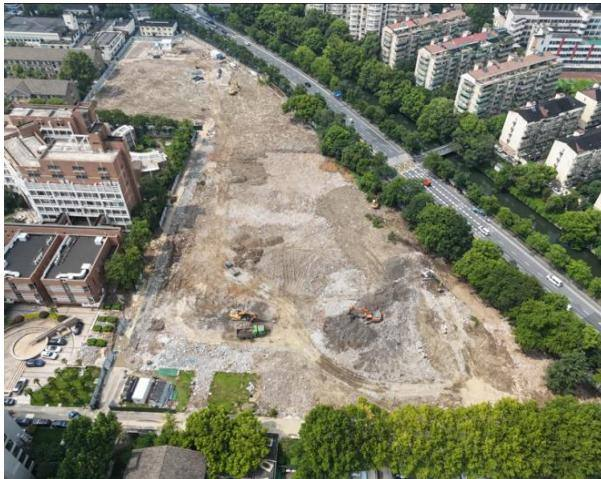  
项目全景

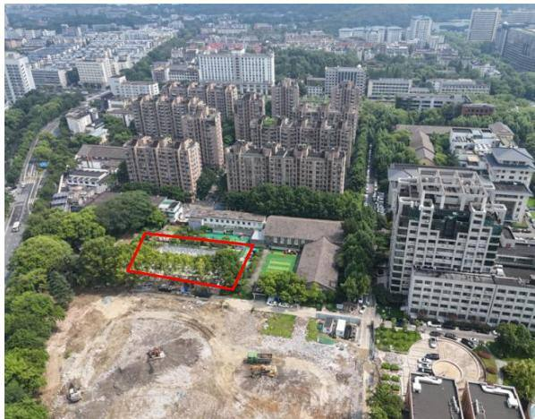

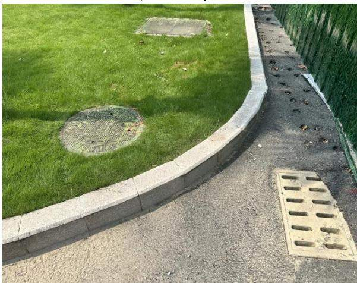  
项目区西侧校内雨水管网

施工生活区位置  
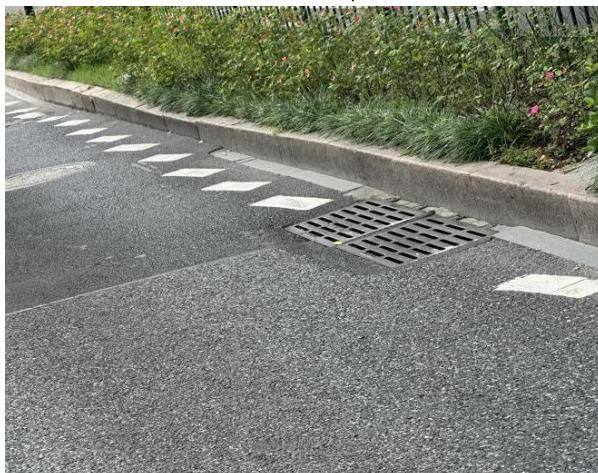  
项目区东侧保俶北路市政管网

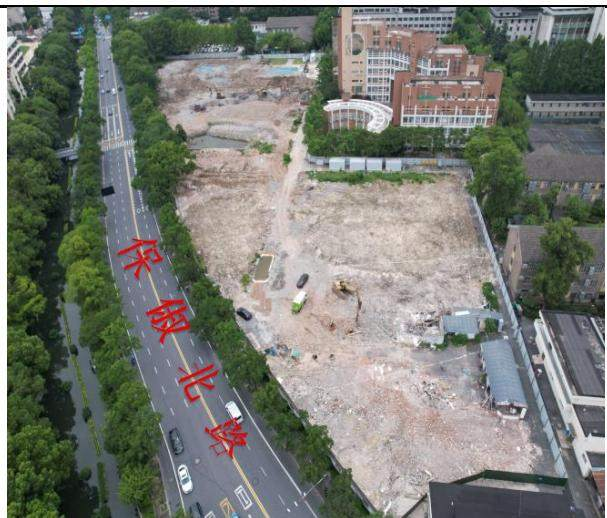  
项目区周边道路

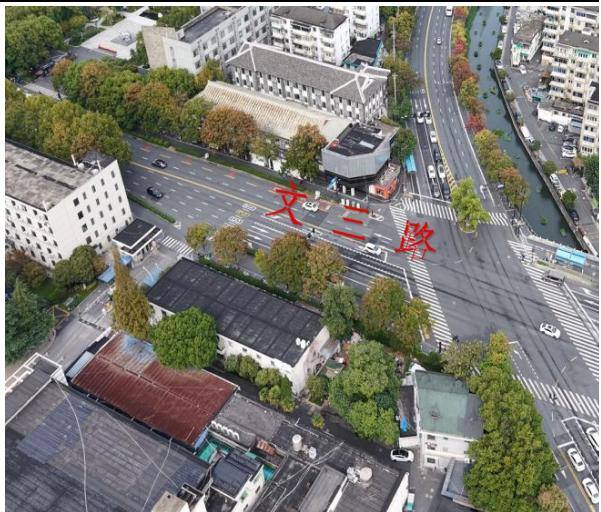  
项目区周边道路

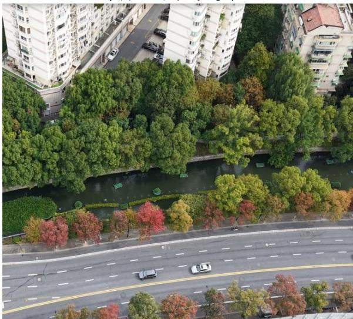  
项目区东北侧西溪河

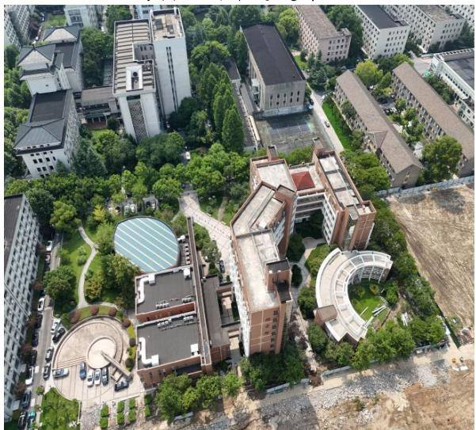  
项目区周边建筑

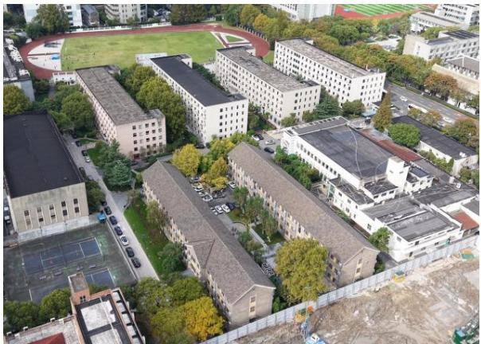  
图 1.1-1  
项目区周边建筑

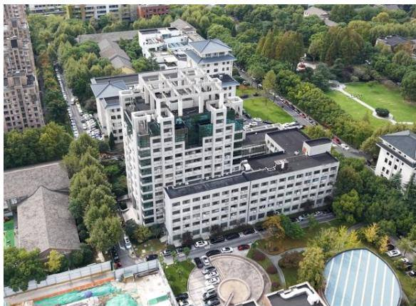  
项目区周边建筑  
项目区现状图片

## 1.1.3 自然简况

项目区地貌属杭嘉湖水乡平原地貌，根据主体工程设计资料，项目区内原始地面高程为 3.97m～4.40m（1985 国家高程，下同），场地平整后平均高程约为 4.05m。

项目区属亚热带季风气候区，冬夏长春秋短，温暖湿润，四季分明，光照充足，雨量充沛。常年平均气温在16.27℃，极端最高气温为40.3℃，极端最低气温为-9.6℃。历年平均降水量1406.8mm，年平均蒸发量1235.3mm，年平均风速2.2m/s，主导风向为NNW。

根据现场勘查，项目所在区域土壤类型属杂填土，无可剥离表土。现状场地无植被覆盖。项目区属于运河水系，根据现场踏勘，项目区内部无河道水系。项目区东北侧约 30m 处为西溪河，河道整体呈西南\~东北走向，全长约3.2km，西溪河临近本项目段河宽约14m\~16m，河道管理范围为 5m，本工程施工不会对其造成不利影响。

根据全国土壤侵蚀类型划分，工程区属以水力侵蚀为主的南方红壤区，工程区现状为微度侵蚀。根据《水利部办公厅关于做好国家级水土流失重点预防区和重点治理区落地上图成果应用的通知》（办水保〔2025〕170号），工程区不属于国家级水土流失重点预防区和重点治理区。根据《关于公布省级水土流失重点预防区和重点治理区的公告》（公告〔2015〕2号），工程区不属于省级水土流失重点预防区和重点治理区。根据《杭州市水土保持“十四五”规划》，工程区不属于杭州市水土流失重点预防区和重点治理区。

根据《浙江省水功能区水环境功能区划分方案》（2015 年），工程区所在水系为运河水系，不涉及饮用水水源保护区，水功能区为西溪河杭州景观娱乐用水区。

工程区不涉及生态保护红线、永久基本农田、生态公益林、饮用水水源保护区、自然保护区、风景名胜区、国家公园、地质公园、森林公园、世界文化和自然遗产地、重要湿地、文物保护单位等水土保持敏感区。

## 1.2 编制依据

## 1.2.1 法律法规

（1）《中华人民共和国水土保持法》（中华人民共和国主席令第39号，2010年12月25日修订，2011年3月1日实施）；

（2）《中华人民共和国环境保护法》（中华人民共和国主席令第22号，2014年4月 24 日修订通过）；

（3）《浙江省水土保持条例》（浙江省第十二届人民代表大会常务委员会公告第 20 号，2020 年 11 月 27 日修订）；

（4）《中华人民共和国固体废物污染环境防治法》（中华人民共和国主席令第

31 号，2016 年 11 月 7 日，2020 年 4 月 29 日修订）。

## 1.2.2 规章

（1）《产业结构调整指导目录（2024年本）》（中华人民共和国国家发展和改革委员会2023年第7号令）；

（2）《生产建设项目水土保持方案管理办法》（水利部令第53 号，2023年1月17日）。

## 1.2.3 规范性文件

（1）《水利部办公厅关于印发生产建设项目水土保持方案审查要点的通知》（办水保〔2023〕177 号）；

（2）《水利部办公厅关于印发生产建设项目水土保持问题分类和责任追究标准的通知》（办水保函〔2020〕564 号）；

（3）《水利部办公厅关于印发生产建设项目水土保持技术文件编写和印制格式规定（试行）的通知》（办水保〔2018〕135号）；

（4）《水利部关于进一步深化“放管服”改革全面加强水土保持监管的意见》（水利部水保〔2019〕160号）；

（5）《水利部办公厅关于实施生产建设项目水土保持信用监管“两单”制度的通知》（办水保〔2020〕157号）；

（6）《关于印发贯彻落实〈关于加强新时代水土保持工作的意见〉实施方案的通知》（水保〔2023〕25号）；

（7）《水利部办公厅关于做好国家级水土流失重点预防区和重点治理区落地上图成果应用的通知》（办水保〔2025〕170号）；

（8）《浙江省水利厅、浙江省发展和改革委员会关于公布省级水土流失重点预防区和重点治理区的公告》（公告〔2015〕2号）；

（9）《水利部办公厅关于印发生产建设项目水土保持监督管理办法的通知》（办水保〔2019〕172 号）；

（10）《水利部关于加强事中事后监管规范生产建设项目水土保持设施自主验收的通知》（水保〔2017〕365号）；

（11）《杭州市人民政府办公厅关于进一步推进建筑垃圾长效管理的通知》（杭政办函〔2024〕41号）；

（12）《杭州市城乡建设委员会杭州市城市管理局关于进一步规范建设工程建筑垃圾处置相关事项的通知》（杭建工〔2023〕169 号）。

## 1.2.4 技术标准

（1）《生产建设项目水土保持技术标准》（GB50433-2018）；

（2）《生产建设项目水土流失防治标准》（GB/T 50434-2018）；

（3）《土壤侵蚀分类分级标准》（SL190-2007）；

（4）《水土保持工程设计规范》（GB51018-2014）；

（5）《水土保持工程调查与勘测标准》（GB/T51297-2018）；

（6）《生产建设项目水土保持监测与评价标准》（GB/T 51240-2018）；

（7）《生产建设项目土壤流失量测算导则》（SL773-2018）；

（8）《水利水电工程制图标准水土保持图》（SL73.6-2015）；

（9）《土地利用现状分类》（GB/T21010-2017）；

（10）《防洪标准》（GB50201-2014）；

（11）《暴雨强度计算标准》（DB33/T1191-2020）；

（12）《水土保持监测技术规范》（SL/T277-2024）；

（13）《水土保持工程质量验收与评价规范》（SL/T 336-2025）。

## 1.2.5 技术文件及相关资料

（1）《浙江省水土保持“十四五”规划》（浙江省水利厅，2021年5月）；

（2）《杭州市水土保持“十四五”规划》（杭州市林业水利局，2021 年7月）；

（3）《浙江大学工信创新研究大楼项目可行性研究报告（报批稿）》（浙江大学建筑设计研究院有限公司，2024年 7月）；

（4）《浙江大学工信创新研究大楼项目初步设计报告（报批稿）》（浙江大学建筑设计研究院有限公司，2025年1月）；

（5）《浙江大学工信创新研究大楼项目岩土工程勘察报告》（信电综合勘察设计研究院有限公司，2025年1月）;

（6）《浙江省水功能区水环境功能区划分方案（2015）》（浙江省水利厅、浙江省环境保护厅，2015年6月）。

## 1.3 设计水平年

根据主体工程的施工进度及本工程的建设特点，工程总工期为36个月。计划2026

年2 月开工，2029年1月完工。故确定方案设计水平年为工程完工后的当年，即2029年。

## 1.4 水土流失防治责任范围

工程水土流失防治责任范围面积为 2.72hm2，其中永久占地 2.52hm2，临时占地0.20hm2。主体工程区包括建构筑物、道路及其他配套设施、绿化区域等；施工临时设施区包括施工生活区、泥浆中转池、泥浆干化设备、施工生产区临时堆土场等。施工生活区占用校内教育用地，为新增临时用地，待施工结束后拆除临建建筑归还学校恢复为篮球场。

表 1.4-1  
水土保持防治分区面积表  
单位：hm2
<table><tr><td rowspan=2 colspan=1>序号</td><td rowspan=2 colspan=1>水土流失防治分区</td><td rowspan=1 colspan=3>项目建设区</td></tr><tr><td rowspan=1 colspan=1>范围</td><td rowspan=1 colspan=1>面积</td><td rowspan=1 colspan=1>永久占地内面积</td></tr><tr><td rowspan=1 colspan=1>1</td><td rowspan=1 colspan=1>I区主体工程区</td><td rowspan=1 colspan=1>建构筑物、道路及其他配套设施、绿化区</td><td rowspan=1 colspan=1>2.52</td><td rowspan=1 colspan=1>1</td></tr><tr><td rowspan=1 colspan=1>2</td><td rowspan=1 colspan=1>Ⅱ区施工临时设施区</td><td rowspan=1 colspan=1>施工生活区、泥浆中转池、泥浆干化设备、施工生产区、临时堆土场</td><td rowspan=1 colspan=1>0.20</td><td rowspan=1 colspan=1>(0.29)</td></tr><tr><td rowspan=1 colspan=3>合计</td><td rowspan=1 colspan=1>2.72</td><td rowspan=1 colspan=1>(0.29)</td></tr></table>

注：Ⅱ区施工临时设施区中“（）”占地面积为利用Ⅰ区主体工程区永久占地布置。

## 1.5 防治标准及防治目标

## 1.5.1 执行标准等级

根据《生产建设项目水土流失防治标准》（GB/T50434-2018），生产建设项目水土流失防治标准等级应根据项目所处地区水土保持敏感程度和水土流失影响程度确定。工程区位于南方红壤区；项目区不在各级人民政府和相关机构确定的水土流失重点预防区和重点治理区、饮用水水源保护区、水功能一级区的保护区和保留区、自然保护区、世界文化和自然遗产地、风景名胜区、地质公园、森林公园等区域；但项目区位于县级以上城市区域，因此应执行南方红壤区水土流失防治一级标准。

## 1.5.2 防治目标

## （1）定性目标

1）项目水土流失防治责任范围内扰动土地应全面整治，新增水土流失应得到有效控制，原有水土流失得到治理；

2）水土保持设施应安全有效；

3）水土资源、林草植被应得到最大限度的保护和恢复。

## （2）定量目标

水土流失治理度、土壤流失控制比、渣土防护率、表土保护率、林草植被恢复率、林草覆盖率六项指标应符合现行国家标准的规定。六项指标按施工期和设计水平年2个时段分别确定。

本工程水土流失防治标准采用建设类项目的一级标准。根据《生产建设项目水土流失防治标准》（GB/T50434-2018）及浙江省实际情况，“土壤流失控制比在轻度侵蚀为主的区域不应小于 1，中度以上侵蚀为主的区域可降低0.1\~0.2”，本工程土壤流失控制比不应小于1，故本方案土壤流失控制比增加0.80；由于项目位于城区，渣土防护率相应提高1%，林草覆盖率应提高1%。根据初步设计报告，主体工程区绿地率为 14.63%，绿地率按校区总体平衡，且临时占地在施工结束后仅拆除上方建筑物并归还学校，无可绿化面积，故本方案林草覆盖率目标值为12%。项目区无表土，故不计表土保护率。

至设计水平年，水土流失治理度98%，土壤流失控制比1.70，渣土防护率98%，林草植被恢复率98%，林草植被覆盖率为 12%。防治标准指标计算详见下表1.5-1。

表 1.5-1  
防治标准指标计算
<table><tr><td rowspan=2 colspan=1>防治指标</td><td rowspan=1 colspan=2>一级标准规定值</td><td rowspan=2 colspan=1>工程实际</td><td rowspan=1 colspan=2>本项目采用标准</td></tr><tr><td rowspan=1 colspan=1>施工期</td><td rowspan=1 colspan=1>设计水平年</td><td rowspan=1 colspan=1>施工期</td><td rowspan=1 colspan=1>设计水平年</td></tr><tr><td rowspan=1 colspan=1>水土流失治理度（%）</td><td rowspan=1 colspan=1>1</td><td rowspan=1 colspan=1>98</td><td rowspan=1 colspan=1>1</td><td rowspan=1 colspan=1>1</td><td rowspan=1 colspan=1>98</td></tr><tr><td rowspan=1 colspan=1>土壤流失控制比</td><td rowspan=1 colspan=1>-</td><td rowspan=1 colspan=1>0.90</td><td rowspan=1 colspan=1>+0.80</td><td rowspan=1 colspan=1>-</td><td rowspan=1 colspan=1>1.70</td></tr><tr><td rowspan=1 colspan=1>渣土防护率（%）</td><td rowspan=1 colspan=1>95</td><td rowspan=1 colspan=1>97</td><td rowspan=1 colspan=1>+1</td><td rowspan=1 colspan=1>96</td><td rowspan=1 colspan=1>98</td></tr><tr><td rowspan=1 colspan=1>表土保护率（%）</td><td rowspan=1 colspan=1>92</td><td rowspan=1 colspan=1>92</td><td rowspan=1 colspan=1>1</td><td rowspan=1 colspan=1>1</td><td rowspan=1 colspan=1>1</td></tr><tr><td rowspan=1 colspan=1>林草植被恢复率（%）</td><td rowspan=1 colspan=1>1</td><td rowspan=1 colspan=1>98</td><td rowspan=1 colspan=1>/</td><td rowspan=1 colspan=1>1</td><td rowspan=1 colspan=1>98</td></tr><tr><td rowspan=1 colspan=1>林草覆盖率（%）</td><td rowspan=1 colspan=1>1</td><td rowspan=1 colspan=1>25</td><td rowspan=1 colspan=1>-13</td><td rowspan=1 colspan=1>1</td><td rowspan=1 colspan=1>12</td></tr></table>

## 1.6 项目水土保持分析评价结论

## 1.6.1 主体工程选址（线）评价

工程沿线不属于泥石流易发区、崩塌滑坡危险区以及易引起严重水土流失和生态恶化地区；工程区不属于生态脆弱区、国家划定的水土流失重点预防区和重点治理成果区；工程区不涉及各级水土流失重点预防区和重点治理区，亦不占用全国水土保持监测网络中的水土保持监测站点、重点试验区及水土保持长期定位观测站。工程区不涉及植物保护带、生态保护红线、永久基本农田、饮用水水源保护区、生态公益林等区域。因此，主体工程不存在重大水土保持限制性制约因素，本工程建设可行。

## 1.6.2 建设方案与布局评价

## （1）建设方案分析评价

## 1）工程平面布置的合理性分析与评价

根据主体平面布置，工程平面布置以节约土地、便于生产管理、美观为原则，合理配置建筑物、道路、硬地及绿地，主体工程尽量将施工临时设施场地布设于工程永久占地范围内，但由于场地有限，将施工生活区布置在红线外的校园篮球场位置，避免土石方大量开挖回填，符合水土保持要求。建设方案满足防洪排涝要求，并根据相关排水规划衔接周边的汇水。施工期间，工程建设区域与外部用围墙隔离，围墙能够保证工程运行的安全，也可保证工程施工在项目占地内进行，避免增加不必要的土方工程量和扰动面积。

## 2）项目竖向设计合理性分析与评价

场地内部高程根据地勘报告结合现场踏勘，本项目现状平均高程约为4.05m。设计室内地坪标高为4.40m，设计地坪标高满足区域防洪、排涝要求，同时设计标高贴近周边道路高程。主体设计的标高尽可能的减少了项目的土石方挖填总量，减少施工过程中的水土流失量，符合水土保持要求。

项目区周边道路中，地块北侧文三路邻近段高程为4.08m\~4.28m，东侧保俶北路现状高程为3.83m\~4.24m，均低于项目区室外设计地坪标高，相邻段室外设计标高与周围道路差异不大，与区外道路衔接采取连续平坡式设计，平缓过渡，避免了高差过大可能产生的边坡问题。

综上所述，结合防洪要求与道路衔接的要求进行评价，本工程标高设计合理。

## （2）工程占地评价

根据主体工程初步设计报告，本项目用地为学校产权用地，为存量土地，无新增建设用地，浙江大学工信创新研究大楼项目占地面积合计 2.72hm2，其中永久占地2.52hm2，新增临时占地 0.20hm2，为施工生活区。另外，施工生产区、临时堆土场、泥浆干化设备、泥浆池等位于永久占地红线范围内，面积为0.29hm2。

项目选址位于西湖区浙江大学西溪校区内，为教育用地，不涉及征地及移民安置、不涉及占用永久基本农田。项目对外交通便利，场地与东侧保俶北路紧邻，不需另设施工道路，可减少施工道路占地。

施工用地主要布置在永久占地红线范围内，主要布设施工生产区、临时堆土场、泥浆干化设备、泥浆池等；新增临时占地在工程建设用地红线范围外南侧，紧邻建设用地地块，为施工生活区。在施工过程中，施工范围实现全围挡，封闭施工，可有效地控制施工活动扰动面积。

工程不设置取土（石、料）场，项目借方中土方由杭州市西湖区综合行政执法局统一调配，所需砂石料即需即购。项目不设置弃土（石、料）场，余方综合利用。

项目建设过程中，开挖、填筑活动频繁，若不重视水土保持工作，将造成项目区内大范围的水土流失，不仅危害主体工程施工安全，而且会影响项目区周边居民区环境。因此在施工过程中，应进一步对项目区进行详细勘察，优化施工工艺，结合工程实施进度，严格按照征地红线范围施工，尽量减少对周边环境的影响，并规范施工，避免各种不必要的破坏土地资源行为。

## （3）土石方平衡及综合利用评价

主体工程设计中，工程土石方主要包括绿化工程、基坑支护工程、地下室工程、场平工程，对以上土石方量进行平衡分析，经统计，综上，项目土石方开挖总量18.74万m³，均为土方；填筑量 0.85 万m³，其中表土（种植土）0.24万 m³，土方 0.61万m³；自身利用土方 0.04万m³；借方0.81万 m³，其中表土（种植土）0.24万m³，土方 0.57万 m³，由杭州市西湖区综合行政执法局统一调配利用；余（弃）方 18.70 万m³，均为土方，由杭州市西湖区综合行政执法局统一调配消纳。

综上分析，项目土石方平衡合理。本方案采取相应水土保持措施后减少了水土流失的可能性，施工方法（工艺）先进合理，有效防止和减少施工过程中产生的水土流失，符合水土保持要求。

综上所述，本工程在建设选址、布局、工程占地、土石方平衡、借方来源、弃方去向、施工方法、水保措施布设等方面无明显的水土保持制约性因素，基本符合水土保持相关法律法规和规范的要求，工程建设是可行的。

## 1.7 水土流失预测结果

本工程建设可能造成的水土流失总量约 566t，其中新增的水土流失总量约 552t。施工期是本工程建设可能产生水土流失最为严重的时期，期间水土流失量占总量的97.53%，建设期水土流失的重点区域为建筑物、泥浆临时中转池。绿化区在工程施工结束后的自然恢复期，也将有一定程度的水土流失发生。各区域要采取相应的防护措施，并确保水土保持措施需与主体工程同时设计、同时实施，相互协调，有序推进。

## 1.8 水土保持措施布设成果

## （1）Ⅰ区（主体工程区）

工程措施：覆土0.24万m3（主体设计），永久排水沟704m（主体设计），排水管线 2641m（主体设计），雨水回用系统网格型 1处（主体设计），雨水收集池10m3（主体设计），透水铺装 9273m2（主体设计），下凹绿地2462m2（主体设计），场地平整4734m2（主体设计）。

植物措施：景观绿化（含抚育）4734m2（主体设计）。

临时措施：基坑坑顶外侧截水沟700m（主体设计），临时排水沟 810m（方案新增），临时沉沙池2座（方案新增），临时苫盖 10000m2（方案新增）。

## （2）Ⅱ区（施工临时设施区）

临时措施：临时绿化300m2（主体设计），泥浆中转池2座（主体设计），临时排水沟220m（主体设计），临时堆土场临时苫盖1100m2（主体设计）、临时拦挡140m（主体设计）。

## 1.9 水土保持监测方案

本项目水土保持监测时段为工程施工期（含施工准备期）至设计水平年，为2026年2 月至2029年12月。本项目监测方法采用巡查和遥感监测、视频监测等动态监测手段。

本项目监测频次中，扰动地表情况和水土流失防治责任范围监测每月1 次；水土流失类型及形式调查每年不少于1次；水土流失面积监测每季度1 次；土壤侵蚀强度施工准备期前和监测期末各1次，施工期每年不应少于1次。植物类型及面积每季度调查 1次，成活率栽植后6 个月后调查，保存率及生长状况、郁闭度与盖度每年监测1次。工程措施及临时措施每季度统计 1次。

本项目共在主体工程开挖面、绿化区、泥浆中转池、施工生产区、施工生活区、未扰动的对比区域等重点监测区域布置 6个监测点。

本项目监测内容包括：水土流失影响因素、扰动土地情况、水土流失状况、水土流失防治成效、水土流失危害。

## 1.10 水土保持投资及效益分析

工程水土保持投资 925.76万元，其中工程措施投资 456.86 万元，植物措施投资

142.02万元，监测措施投资55.0万元，临时措施投资76.93万元，独立费用150.87万元，基本预备费44.08 万元，水土保持补偿费免征。

至设计水平年，水土流失治理度达 98%以上，土壤流失控制比达 1.70 以上，渣土防护率达98%以上，林草植被恢复率达 98%以上，林草覆盖率达 12.92%，防治指标均达到目标值要求。

## 1.11 结论

工程建设符合国家产业政策和规划要求，工程选址不存在水土保持制约因素，工程建设方案和布局较为合理，各防治区通过采取工程措施、植物措施、临时措施和管理措施，符合水土保持法律法规、技术标准的规定，实施水土保持措施后能达到控制水土流失、保护生态环境的目的。在项目下阶段工作中，建议做好以下几方面工作。

## （1）对工程设计的建议

水土保持方案经水行政主管部门批复后，落实水土保持“三同时” 制度，并将本方案提出的水土保持措施纳入后续施工图设计中。后续设计和实施过程中，工程占地、土石方量等变化达到《生产建设项目水土保持方案管理办法》（水利部第 53号令）中规定的条件时，应重新编制水土保持方案，报水利部审批。

## （2）对工程施工的建议

1）严格按照施工合同要求做好水土保持设施的建设和管理工作。本项目土石方开挖量大，水土流失主要发生在施工期间，因此，在工程建设过程中，要特别做好施工期间的临时防护，减少施工期间的水土流失。

2）临时设施应尽量利用永久占地进行布置，设计及施工时可在满足工程建设的前提下，减少临时占用土地的面积。

3）要求施工结束后，抓住绿化有利时机，尽快开展区域植被建设，对适宜的植物种类进行比选、配置，确保植物的成活率，达到绿化质量要求，并加强之后的抚育和管理，及时补植，以确保成活率，并满足水土保持的要求。

## （3）对工程建设管理的建议

1）做好各区域的施工进度衔接工作，根据减量化分析，土石方尽可能减量化利用，从而减少因余方等造成的水土流失。建设单位应督促施工单位按水土保持方案要求保质保量完成工程水土保持措施布设，落实水土保持等工作。

2）应将水土保持措施纳入招投标文件中，并在施工合同中明确承包商的水土流

失防治责任。

3）水土保持方案经批准后，项目建设地点、规模发生重大变化的，应当补充或者修改水土保持方案报水利部审批。水土保持方案实施过程中，植物措施、工程措施等作出重大变更的，应当补充或者修改水土保持方案报水利部审批。

4）积极配合各级水行政主管部门对工程水土保持方案实施的监督检查。工程竣工验收前应完成水土保持设施验收，验收合格后报水行政主管部门备案后方可投入运行。

5）建设单位应根据水土保持“同时设计、同时施工、同时投入使用”的制度，落实水土保持后续设计，开展水土保持监理和水土保持监测工作，确保水土保持措施真正落实到位，并及时开展自查初验工作，在土建工程完工后、主体工程竣工验收前，进行水土保持设施工程竣工验收。

水土保持方案特性表
<table><tr><td rowspan=1 colspan=2>项目名称</td><td rowspan=1 colspan=4>浙江大学工信创新研究大楼</td><td rowspan=1 colspan=4>流域管理机构</td><td rowspan=1 colspan=1>太湖流域管理局</td></tr><tr><td rowspan=1 colspan=2>涉及省（市、区）</td><td rowspan=1 colspan=2>浙江省</td><td rowspan=1 colspan=1>涉及地市或个数</td><td rowspan=1 colspan=1>杭州市</td><td rowspan=1 colspan=4>涉及县或个数</td><td rowspan=1 colspan=1>西湖区</td></tr><tr><td rowspan=1 colspan=2>项目规模</td><td rowspan=1 colspan=3>项目总用地面积27169 m²，永久用地面积25239m²，总建筑面积74998m²</td><td rowspan=1 colspan=1>总投资(万元)</td><td rowspan=1 colspan=3>69474.24</td><td rowspan=1 colspan=1>土建投资(万元)</td><td rowspan=1 colspan=1>44508.39</td></tr><tr><td rowspan=1 colspan=2>开工时间</td><td rowspan=1 colspan=2>2026年2月</td><td rowspan=1 colspan=1>完工时间</td><td rowspan=1 colspan=1>2029年1月</td><td rowspan=1 colspan=4>设计水平年</td><td rowspan=1 colspan=1>2029年</td></tr><tr><td rowspan=1 colspan=2>工程占地（hm²）</td><td rowspan=1 colspan=2>2.72</td><td rowspan=1 colspan=1>永久占地（hm2)</td><td rowspan=1 colspan=1>2.52</td><td rowspan=1 colspan=4>临时占地（hm²）</td><td rowspan=1 colspan=1>0.20</td></tr><tr><td rowspan=1 colspan=4>土石方量（万m³）</td><td rowspan=1 colspan=1>挖方</td><td rowspan=1 colspan=1>填方</td><td rowspan=1 colspan=4>借方</td><td rowspan=1 colspan=1>余 (弃) 方</td></tr><tr><td rowspan=1 colspan=4>绿化工程</td><td rowspan=1 colspan=1>0</td><td rowspan=1 colspan=1>0.24</td><td rowspan=1 colspan=4>0.24</td><td rowspan=1 colspan=1>0</td></tr><tr><td rowspan=1 colspan=4>基坑支护工程</td><td rowspan=1 colspan=1>1.58</td><td rowspan=1 colspan=1>0</td><td rowspan=1 colspan=4>0</td><td rowspan=1 colspan=1>1.58</td></tr><tr><td rowspan=1 colspan=4>地下室工程</td><td rowspan=1 colspan=1>16.97</td><td rowspan=1 colspan=1>0.57</td><td rowspan=1 colspan=4>0.57</td><td rowspan=1 colspan=1>16.97</td></tr><tr><td rowspan=1 colspan=4>场平工程</td><td rowspan=1 colspan=1>0.19</td><td rowspan=1 colspan=1>0.04</td><td rowspan=1 colspan=4>0</td><td rowspan=1 colspan=1>0.15</td></tr><tr><td rowspan=1 colspan=4>合计</td><td rowspan=1 colspan=1>18.74</td><td rowspan=1 colspan=1>0.85</td><td rowspan=1 colspan=4>0.81</td><td rowspan=1 colspan=1>18.70</td></tr><tr><td rowspan=1 colspan=4>重点防治区名称</td><td rowspan=1 colspan=7>不涉及国家级、省、市、县级水土保持重点预防区和重点治理区</td></tr><tr><td rowspan=1 colspan=4>地貌类型</td><td rowspan=1 colspan=1>平原</td><td rowspan=1 colspan=2>水土保持区划</td><td rowspan=1 colspan=4>南方红壤区</td></tr><tr><td rowspan=1 colspan=4>土壤侵蚀类型</td><td rowspan=1 colspan=1>水力侵蚀</td><td rowspan=1 colspan=5>土壤侵蚀强度</td><td rowspan=1 colspan=1>微度</td></tr><tr><td rowspan=1 colspan=2>植被类型</td><td rowspan=1 colspan=3>中亚热带常绿阔叶植被带</td><td rowspan=1 colspan=5>原地貌土壤侵蚀模数[t/（km²·a）]</td><td rowspan=1 colspan=1>300</td></tr><tr><td rowspan=1 colspan=4>防治责任范围面积（hm²）</td><td rowspan=1 colspan=1>2.72</td><td rowspan=1 colspan=5>容许土壤流失量[t/（km²·a）]</td><td rowspan=1 colspan=1>500</td></tr><tr><td rowspan=1 colspan=4>土壤流失预测总量（t）</td><td rowspan=1 colspan=1>566</td><td rowspan=1 colspan=5>新增水土流失量（t）</td><td rowspan=1 colspan=1>552</td></tr><tr><td rowspan=1 colspan=5>水土流失防治标准执行等级</td><td rowspan=1 colspan=5>南方红壤区一级标准</td><td rowspan=1 colspan=1></td></tr><tr><td rowspan=3 colspan=1>防治指标</td><td rowspan=1 colspan=4>水土流失治理度（%）</td><td rowspan=1 colspan=1>98</td><td rowspan=1 colspan=4>土壤流失控制比</td><td rowspan=1 colspan=1>1.70</td></tr><tr><td rowspan=1 colspan=4>渣土防护率（%）</td><td rowspan=1 colspan=1>98</td><td rowspan=1 colspan=4>表土保护率（%）</td><td rowspan=1 colspan=1>/</td></tr><tr><td rowspan=1 colspan=4>林草植被恢复率（%）</td><td rowspan=1 colspan=1>98</td><td rowspan=1 colspan=4>林草覆盖率（%）</td><td rowspan=1 colspan=1>12</td></tr><tr><td rowspan=4 colspan=1>防治措施</td><td rowspan=1 colspan=2>防治分区</td><td rowspan=1 colspan=2>工程措施</td><td rowspan=1 colspan=3>植物措施</td><td rowspan=1 colspan=3>临时措施</td></tr><tr><td rowspan=1 colspan=2>I区主体工程区</td><td rowspan=1 colspan=2>覆土0.24万m³，永久排水沟704m，排水管线2641m，雨水回用系统网格型1处，雨水收集池 10m³，透水铺装 9273m2，下凹绿地2462m²，场地平整 4734m²。</td><td rowspan=1 colspan=3>景观绿化 4734m²（含抚育）</td><td rowspan=1 colspan=3>基坑坑顶外侧截水沟700m，项目区排水沟810m，临时沉沙池2座，临时苫盖10000m2。</td></tr><tr><td rowspan=1 colspan=2>ⅡI区施工临时设施区</td><td rowspan=1 colspan=2>/</td><td rowspan=1 colspan=3>/</td><td rowspan=1 colspan=3>临时绿化300m²，泥浆中转池2座，临时排水沟220m，临时苫盖1100m²，临时拦挡140m。</td></tr><tr><td rowspan=1 colspan=2>投资（万元）</td><td rowspan=1 colspan=2>456.86</td><td rowspan=1 colspan=3>142.02</td><td rowspan=1 colspan=3>76.93</td></tr><tr><td rowspan=1 colspan=4>水土保持总投资（万元）</td><td rowspan=1 colspan=1>925.76</td><td rowspan=1 colspan=5>独立费用（万元）</td><td rowspan=1 colspan=1>150.87</td></tr><tr><td rowspan=1 colspan=3>监理费（万元）</td><td rowspan=1 colspan=1>22.78</td><td rowspan=1 colspan=1>监测费（万元）</td><td rowspan=1 colspan=3>55.0</td><td rowspan=1 colspan=2>补偿费（万元）</td><td rowspan=1 colspan=1>免征</td></tr><tr><td rowspan=1 colspan=2>方案编制单位</td><td rowspan=1 colspan=3>浙江广川工程咨询有限公司</td><td rowspan=1 colspan=3>建设单位</td><td rowspan=1 colspan=3>浙江大学</td></tr><tr><td rowspan=1 colspan=2>法定代表人及电话</td><td rowspan=1 colspan=3>韩海骞/0571-81382801</td><td rowspan=1 colspan=3>法定代表人及电话</td><td rowspan=1 colspan=3>马琰铭</td></tr><tr><td rowspan=1 colspan=2>地址</td><td rowspan=1 colspan=3>浙江省杭州市上城区凤起东路50号</td><td rowspan=1 colspan=3>地址</td><td rowspan=1 colspan=3>浙江省杭州市西湖区余杭塘路866号</td></tr><tr><td rowspan=1 colspan=2>邮编</td><td rowspan=1 colspan=3>310009</td><td rowspan=1 colspan=3>邮编</td><td rowspan=1 colspan=3>310058</td></tr><tr><td rowspan=1 colspan=2>联系人及电话</td><td rowspan=1 colspan=3>石鑫，15167118638</td><td rowspan=1 colspan=3>联系人及电话</td><td rowspan=1 colspan=3>徐懿，13867435615</td></tr><tr><td rowspan=1 colspan=2>传真</td><td rowspan=1 colspan=3>/</td><td rowspan=1 colspan=3>传真</td><td rowspan=1 colspan=3>1</td></tr><tr><td rowspan=1 colspan=2>电子信箱</td><td rowspan=1 colspan=3>1002597154@qq.com</td><td rowspan=1 colspan=3>电子信箱</td><td rowspan=1 colspan=3>1</td></tr></table>

## 2 项目概况

## 2.1 项目组成及工程布置

## 2.1.1 项目基本情况

项目名称：浙江大学工信创新研究大楼

项目类型：社会事业类建设项目

建设单位：浙江大学

建设性质：新建工程

建设地点：浙江大学工信创新研究大楼项目位于浙江省杭州市西湖区，浙江大学西溪校区南园东北角，东侧紧邻保俶北路，南侧为浙江大学幼儿园西溪分园，西侧为食堂、宿舍和艺术楼，北侧为后勤服务用房。

建设规模及内容：建设信电、光电学院、药学院。项目总用地面积2.72hm2，其中永久占地 2.52hm2，临时占地 0.20hm2，拟建总建筑面积 74998m2，其中地上建筑面积49999m2，地下总建筑面积 24999m2，建筑密度 49.13%，容积率 1.98，绿地率 14.63%。建设内容包括科研用房、地下停车场（兼人防工程）及设备用房、市政、景观绿化等。

建设投资：工程总投资69474.24万元，其中土建投资44508.39 万元

建设工期：总工期为 36 个月。2026 年2 月开工，计划2029 年1月完工。

工程特性表见表2.1-1。

表 2.1-1  
工程特性表
<table><tr><td rowspan=1 colspan=10>一、总体概况</td></tr><tr><td rowspan=1 colspan=1>项目名称</td><td rowspan=1 colspan=9>浙江大学工信创新研究大楼</td></tr><tr><td rowspan=1 colspan=1>工程性质</td><td rowspan=1 colspan=9>新建工程</td></tr><tr><td rowspan=1 colspan=1>建设地点</td><td rowspan=1 colspan=9>浙江省杭州市西湖区</td></tr><tr><td rowspan=1 colspan=1>建设单位</td><td rowspan=1 colspan=9>浙江大学</td></tr><tr><td rowspan=1 colspan=1>工程总投资</td><td rowspan=1 colspan=9>工程总投资69474.24万元，其中土建投资44508.39万元。</td></tr><tr><td rowspan=1 colspan=1>工程建设期</td><td rowspan=1 colspan=9>36个月（2026年2月~2029年1月）</td></tr><tr><td rowspan=1 colspan=10>二、项目组成及项目规模</td></tr><tr><td rowspan=1 colspan=3>项目组成</td><td rowspan=1 colspan=2>占地面积 $\left( \mathrm { h m } ^ { 2 } \right)$ </td><td rowspan=1 colspan=2>项目规模</td><td rowspan=1 colspan=2>单位</td><td rowspan=1 colspan=1>数量</td></tr><tr><td rowspan=4 colspan=1>永久占地</td><td rowspan=1 colspan=2>建筑物</td><td rowspan=1 colspan=2>1.24</td><td rowspan=1 colspan=2>总建筑面积</td><td rowspan=1 colspan=2>m²</td><td rowspan=1 colspan=1>74998</td></tr><tr><td rowspan=1 colspan=2>道路及其他配套设施</td><td rowspan=1 colspan=2>0.93</td><td rowspan=1 colspan=2>地上建筑面积</td><td rowspan=1 colspan=2>m²</td><td rowspan=1 colspan=1>49999</td></tr><tr><td rowspan=1 colspan=2>绿化区</td><td rowspan=1 colspan=2>0.35</td><td rowspan=1 colspan=2>地下建筑面积</td><td rowspan=1 colspan=2>m2</td><td rowspan=1 colspan=1>24999</td></tr><tr><td rowspan=1 colspan=2>小计</td><td rowspan=1 colspan=2>2.52</td><td rowspan=1 colspan=2>容积率</td><td rowspan=1 colspan=2>1</td><td rowspan=1 colspan=1>1.98</td></tr><tr><td rowspan=4 colspan=1>施工临时占地</td><td rowspan=1 colspan=2>施工生活区</td><td rowspan=1 colspan=2>0.20</td><td rowspan=1 colspan=2>建筑密度</td><td rowspan=1 colspan=2>%</td><td rowspan=1 colspan=1>49.13</td></tr><tr><td rowspan=1 colspan=2>施工生产区及临时堆土场</td><td rowspan=1 colspan=2>(0.24)</td><td rowspan=1 colspan=2>绿地率</td><td rowspan=1 colspan=2>%</td><td rowspan=1 colspan=1>14.63</td></tr><tr><td rowspan=1 colspan=2>泥浆中转池及干化设备</td><td rowspan=1 colspan=2>(0.05)</td><td rowspan=1 colspan=2>机动车停车位</td><td rowspan=1 colspan=2>个</td><td rowspan=1 colspan=1>600</td></tr><tr><td rowspan=1 colspan=2>小计</td><td rowspan=1 colspan=2>0.20（0.29，位于永久用地内）</td><td rowspan=1 colspan=2>非机动车停车位</td><td rowspan=1 colspan=2>个</td><td rowspan=1 colspan=1>750</td></tr><tr><td rowspan=1 colspan=3>合计</td><td rowspan=1 colspan=2>2.72</td><td rowspan=1 colspan=2></td><td rowspan=1 colspan=2></td><td rowspan=1 colspan=1></td></tr><tr><td rowspan=1 colspan=10>三、工程土石方工程量</td></tr><tr><td rowspan=1 colspan=1>分项内容</td><td rowspan=1 colspan=1>单位</td><td rowspan=1 colspan=2>挖方</td><td rowspan=1 colspan=2>填方</td><td rowspan=1 colspan=2>借方</td><td rowspan=1 colspan=2>弃方</td></tr><tr><td rowspan=1 colspan=1>绿化工程</td><td rowspan=1 colspan=1>万m³</td><td rowspan=1 colspan=2>0</td><td rowspan=1 colspan=2>0.24</td><td rowspan=1 colspan=2>0.24</td><td rowspan=1 colspan=2>0</td></tr><tr><td rowspan=1 colspan=1>基坑支护工程</td><td rowspan=1 colspan=1>万m³</td><td rowspan=1 colspan=2>1.58</td><td rowspan=1 colspan=2>0</td><td rowspan=1 colspan=2>0</td><td rowspan=1 colspan=2>1.58</td></tr><tr><td rowspan=1 colspan=1>地下室工程</td><td rowspan=1 colspan=1>万m³</td><td rowspan=1 colspan=2>16.97</td><td rowspan=1 colspan=2>0.57</td><td rowspan=1 colspan=2>0.57</td><td rowspan=1 colspan=2>16.97</td></tr><tr><td rowspan=1 colspan=1>场平工程</td><td rowspan=1 colspan=1>万m³</td><td rowspan=1 colspan=2>0.19</td><td rowspan=1 colspan=2>0.04</td><td rowspan=1 colspan=2>0</td><td rowspan=1 colspan=2>0.15</td></tr><tr><td rowspan=1 colspan=1>合计</td><td rowspan=1 colspan=1>万m³</td><td rowspan=1 colspan=2>18.74</td><td rowspan=1 colspan=2>0.85</td><td rowspan=1 colspan=2>0.81</td><td rowspan=1 colspan=2>18.70</td></tr></table>

## 2.1.2 项目地理位置

本项目地块位于浙江省杭州市西湖区，浙江大学西溪校区南园东北角，东侧紧邻保俶北路，南侧为浙江大学幼儿园西溪分园，西侧为食堂、宿舍和艺术楼，北侧为后勤

服务用房及文三路。项目中心点坐标为东经 $1 2 0 ^ { \circ } ~ 0 8 ^ { \prime } ~ 3 1 . 9 7 3 2 ^ { \prime \prime }$ ，北纬 $3 0 ^ { \circ } \quad 1 6 ^ { \prime }$ 33.4893″。工程地理位置详见图2-1，项目卫星影像图见图2-2。

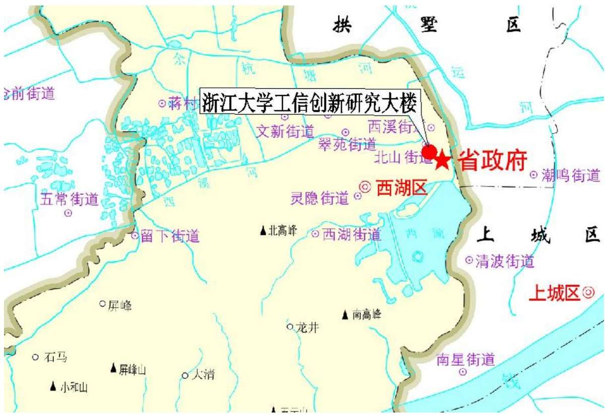

图 2-1  
工程地理位置  
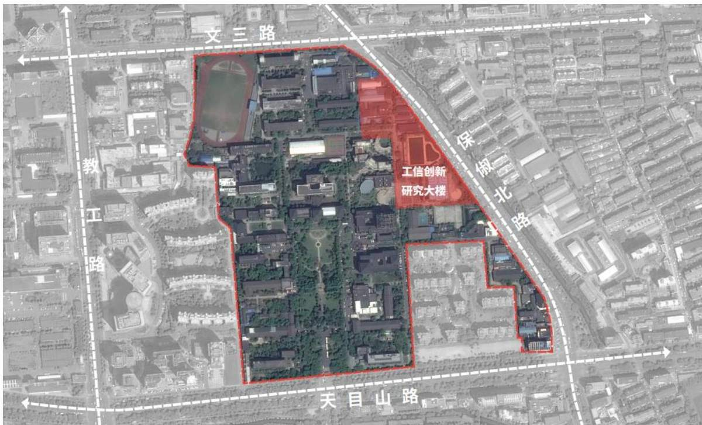  
图 2-2  
项目卫星影像图

## 2.1.3 项目组成

项目用地面积 $2 . 7 2 \mathrm { h m } ^ { 2 }$ ，其中永久占地2.52hm2，施工临时占地 0.20hm2，拟建总建筑面积 $7 4 9 9 8 \mathrm { m } ^ { 2 }$ ，其中地上建筑面积 $4 9 9 9 9 \mathrm { m } ^ { 2 }$ ，地下总建筑面积 $2 4 9 9 9 \mathrm { m } ^ { 2 }$ ，建筑密度49.13%，容积率1.98，绿地率 14.63%。建设内容包括科研用房、地下停车场（兼人防工程）及设备用房、市政建筑、景观绿化等。主要技术经济指标详见下表2.1-2。

表 2.1-2  
总体技术经济指标
<table><tr><td rowspan=1 colspan=1>序号</td><td rowspan=1 colspan=2>项目</td><td rowspan=1 colspan=1>数值</td><td rowspan=1 colspan=1>备注</td></tr><tr><td rowspan=1 colspan=1>1</td><td rowspan=1 colspan=2>规划用地面积</td><td rowspan=1 colspan=1>25239 m²</td><td rowspan=1 colspan=1></td></tr><tr><td rowspan=1 colspan=1>2</td><td rowspan=1 colspan=2>总建筑面积</td><td rowspan=1 colspan=1>74998 m²</td><td rowspan=1 colspan=1></td></tr><tr><td rowspan=1 colspan=1>3</td><td rowspan=1 colspan=2>地上建筑面积</td><td rowspan=1 colspan=1>49999 m²</td><td rowspan=1 colspan=1>其中消控室（87m²）位于1#科研楼一层，垃圾房（95m²）位于1#科研楼一层，三处变电所（共477m²）分别位于1#、2#、3#科研楼一层</td></tr><tr><td rowspan=1 colspan=1>4</td><td rowspan=1 colspan=2>地下建筑面积</td><td rowspan=1 colspan=1>24999m²</td><td rowspan=1 colspan=1>含坡道、地下室夹层等</td></tr><tr><td rowspan=1 colspan=1>5</td><td rowspan=1 colspan=2>建筑占地面积</td><td rowspan=1 colspan=1>12400 m²</td><td rowspan=1 colspan=1></td></tr><tr><td rowspan=1 colspan=1>6</td><td rowspan=1 colspan=2>容积率</td><td rowspan=1 colspan=1>1.98</td><td rowspan=1 colspan=1></td></tr><tr><td rowspan=1 colspan=1>7</td><td rowspan=1 colspan=2>绿地面积</td><td rowspan=1 colspan=1>3692 m²</td><td rowspan=1 colspan=1></td></tr><tr><td rowspan=1 colspan=1>8</td><td rowspan=1 colspan=2>绿地率</td><td rowspan=1 colspan=1>14.63%</td><td rowspan=1 colspan=1></td></tr><tr><td rowspan=1 colspan=1>9</td><td rowspan=1 colspan=2>建筑密度</td><td rowspan=1 colspan=1>49.13%</td><td rowspan=1 colspan=1></td></tr><tr><td rowspan=1 colspan=1>10</td><td rowspan=1 colspan=2>建筑限高</td><td rowspan=1 colspan=1>44.4m</td><td rowspan=1 colspan=1></td></tr><tr><td rowspan=1 colspan=1>11</td><td rowspan=1 colspan=2>机动车停车泊位</td><td rowspan=1 colspan=1>600辆</td><td rowspan=1 colspan=1>项目应配（实配）机动车位600（600）个，含特殊车位：无障碍车位12（12）个，出租车位5（5）个，公共车位100（100）个。另需设置2（2）个装卸车位（不计入配建数）</td></tr><tr><td rowspan=2 colspan=1>12</td><td rowspan=2 colspan=1>其中</td><td rowspan=1 colspan=1>停车泊位（地下车库）</td><td rowspan=1 colspan=1>43辆</td><td rowspan=1 colspan=1></td></tr><tr><td rowspan=1 colspan=1>停车泊位（地面）</td><td rowspan=1 colspan=1>558辆</td><td rowspan=1 colspan=1></td></tr><tr><td rowspan=1 colspan=1>13</td><td rowspan=1 colspan=2>非机动车停车位</td><td rowspan=1 colspan=1>750辆</td><td rowspan=1 colspan=1></td></tr></table>

## 2.1.4 工程总体布置

## 2.1.4.1 工程平面布置

本项目建设用地面积：25239m2，场地北侧部分区域为风貌控制地带，地块建筑限高不超过44.4m。地上拟建3个学院的建筑用房，即沿保俶路从北至南依次布置药学院、光电学院与信电学院，其中药学院建筑面积 $1 6 0 0 5 \mathrm { m } ^ { 2 }$ ，信电学院建筑面积 $1 5 5 8 7 \mathrm { m } ^ { 2 }$ ，光电学院建筑面积 $1 5 6 4 8 \mathrm { m } ^ { 2 }$

## （1）药学院科研楼

药学院科研楼设置在场地北侧，西侧毗邻历史保护建筑，东侧靠近保俶北路，整体为一栋八层的科研办公楼，未来将会引入四个尖峰学科：药物制剂、肿瘤药理、中药制造、人工智能药学以及两个国家级重点实验室：先进药物递释系统全国重点实验室、现代中药创制全国重点实验室。药学院主入口朝南，西侧及东侧均设置次入口。

## （2）光电、信电学院科研楼

光电、信电学院科研楼布置在场地南侧，西侧是艺术与考古学院，东侧靠近保俶北路，南侧为现状幼儿园及篮球活动场地。两个学院分别设立在南北塔楼，共享中央花园和大报告厅。建成以后光电学院将入驻学科复杂环境精准成像技术研究中心、微纳光电子信息技术研究中心、智能光电多维感知技术研究中心、综合创新实践开放实验室等。信电学院将入驻量子电子实验室、国家级康复AI机器人研究中心、电磁空间一体化实验室、未来通信研究中心、未来电磁研究中心、未来量子芯片研究中心、信息+X 多学科交叉研究中心。光电学院主入口朝西，南侧面向庭院设置次入口。信电学院主入口朝南，北侧面向庭院设置次入口。其配套的设备用房至于三层屋顶及地下室相邻区域。光电、信电学院科研楼东侧设置350人报告厅，并配套独立门厅、接待室、卫生间、设备用房。

项目鸟瞰图见图 2-3、项目总平面布置见图2-4，项目总平面布置详图见附图2-2。

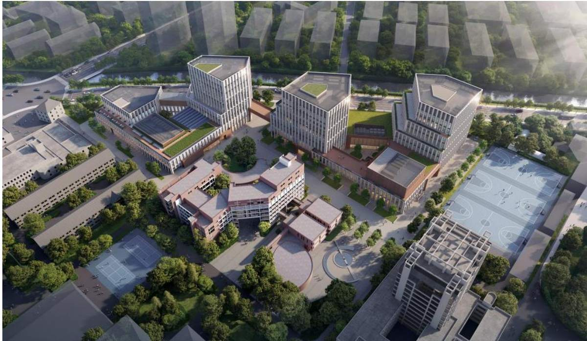  
图 2-3  
项目鸟瞰图

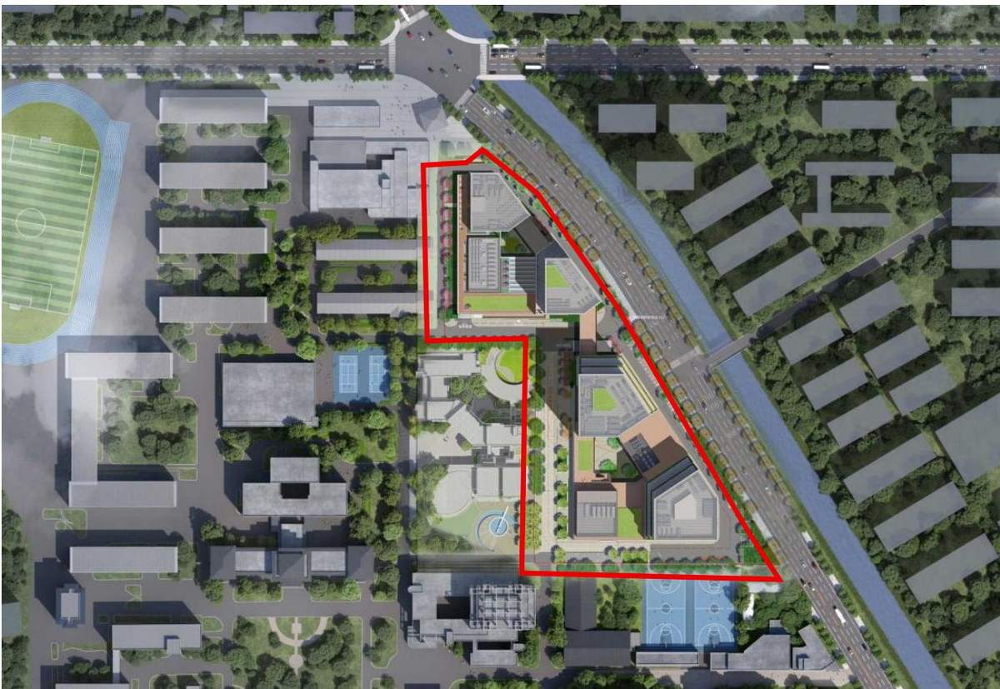  
图 2-4  
项目总平面布置图

## 2.1.4.2 竖向布置

（1）项目区场地平整后平均高程约为4.05m。

（2）周边道路：地块北侧文三路邻近段高程为 4.08m\~4.28m；东侧保俶北路现状高程为3.83m\~4.24m。场地西侧及南侧为现状学校建筑，校内道路标高约3.93m\~4.02m。

（3）项目地块室内设计标高均为4.40m，室外地坪设计标高为 4.30m。项目为2层地下室，地下二层为人民防空地下室。地下室一层底板顶标高-1.4m，底板厚0.30m，地面结构层0.1m，地下室一层层高 5.70m（含顶板厚度0.30m），非建筑物区地下室一层层高为 4.2m；地下室二层底板顶标高-5.40m，底板厚度 0.30m，地面结构层 0.1m，地下室二层层高4.0m（含顶板厚度0.30m）。地下室施工结束后，地下建筑范围线内的绿化区、道路及其配套设施区设有顶板覆土，顶板覆土厚度1.50m。

（4）药学院建筑层高结合实际使用功能，将有大空间需求的特殊实验室和多功能厅放置在建筑一二层，建筑层高分别是6m 及5.4m，三层及以上为标准实验楼层，布置普通实验室及办公教学，层高为 4.8m，屋顶布置设备及相关机房空间。二层屋顶设置设备与屋顶花园，塔楼四层设置屋顶露台。信电学院科研楼，将有大空间需求的特殊实验室和多功能厅放置在建筑一二层，建筑层高分别是 6m 及 5.4m，三层及以上为标准实验楼层，布置普通实验室及办公教学，层高为4.8m，屋顶布置设备及相关机房空间。光电、信电学院科研楼西南角设置高抗震等级的抗微震实验室，共设置三层，一层及三层为光电学院抗微震实验室，二层为信电学院抗微震实验室。该区域层高设定为首层6m，二层 5.4m，三层 5.1m，为保证抗微震等级，下部独立基础，与建筑的其他基础、地下室外墙、管线穿墙处等通过柔性连接彻底断开。不设置地下空间，无基坑开挖。

道路纵断面设计以规划标高为基本控制点，在保证纵断面线型满足规范的前提下，全线均以减少土方量、土方平衡为原则，同时减少线路起伏。

工程地下结构竖向布置见附图2-3。

（5）标高分析：本项目出入口市政道路高程低于本项目室外设计地坪标高，相邻段室外设计标高与周围道路差异不大，与区外道路衔接采取连续平坡式设计，平缓过渡，不会产生较大边坡，避免了高差过大可能产生的边坡问题。

## （6）防洪设计情况

西溪单元属于运河水系，根据《杭州市城市防洪排涝规划》（2021-2035 年）及《杭州市防洪减灾规划》，拱宸桥为该区域内河水位代表站，历史资料统计计算其100年一遇最高洪水位为 4.06m，50 年一遇最高洪水位为 3.85m。浙大西溪校区室外标高为3.93m～4.40m，本工程维持原有标高。

本次室内地坪标高为4.40m，设计地坪标高满足区域防洪、排涝要求，同时设计标高贴近周边道路高程。

项目竖向设计图见附图2-3。

## 2.1.5 建筑物及配套设计

## 2.1.5.1 工程布置

## （1）建筑物

该地块建筑限高不超过44.4m。工信创新大楼三大学院塔楼均为8层，建筑高度均为40.3m，周边裙房为2\~3 层。下设2层地下室，局部1层。项目总用地面积25239m2，拟建总建筑面积74998m2，其中地上建筑面积49999m2，地下总建筑面积24999m2。地上主要功能为科研办公、实验室，地下功能为停车库及设备用房，人防地下室设置在地下二层。北侧为药学院，在3 层通过连廊与南侧光电信电学院相连，连廊南北两侧均设置 100cm 宽抗震缝与主体脱开。南侧地块西南角为防微振等级较高的实验平台，故在其东侧及北侧设置 100cm 宽抗震缝与主体结构脱开。建筑物基础采用桩基础，桩型推荐采用旋挖成孔灌注桩，桩径 600mm\~800mm，桩长 27m\~47m，桩间距 610mm\~950mm。

## 1）地上建筑

地上建筑物占地面积为1.240hm2，建筑由1栋3-8F 药学院科研楼、1栋3-8F 光电、信电学科科研楼、裙楼以及屋顶绿化等组成，建筑面积 $4 9 9 9 9 \mathrm { m } ^ { 2 }$ ，建筑密度 49.13%，容积率1.98。主体于建筑物屋面布设屋顶绿化，面积约 $1 2 2 1 \mathrm { m } ^ { 2 }$

## 2）地下建筑

地下室整体进行考虑，位于药学院与光电、信电学院下部，综合解决楼宇的停车、设备、人防等功能，共设置两层地下室，项目整体布设 1 层地下室，局部设 2 层地下室，2 层地下室主要位于地块南侧光电、信电学科科研楼下方，地下室主要作为机动车库、设备用房以及消防水池。地下建筑物占地面积约 $1 6 4 8 5 ~ \mathrm { m } ^ { 2 }$ ，总建筑面积 24999m2。地下室一层面积 15805m2，地下室一层层高5.70m（含顶板厚度 0.30m），地下室一层底板顶标高-1.40m；地下室二层面积 $8 8 2 6 \mathrm { m } ^ { 2 }$ ，地下室二层层高4.0m（含顶板厚度0.30m），底板顶标高-5.40m。

## （2）道路及其他配套设施

道路及其他配套设施占地面积9134m2，内部道路长764m，为小区级道路，设计采用透水沥青路面，设计轴载按BZZ-100 计，设计车速为不大于20km/h，设计年限沥青砼 10 年，平面圆曲线半径最小按 7m，最小设计纵坡 0.3%，主路分别为 5.0m、7.0m、8.0m、10m 车行道。道路结构为5cmAC-10OGFC 高粘度改性排水沥青砼Ⅰ型+粘层沥青$( \ 0 . 6 \mathrm { L } / \mathrm { m } ^ { 2 } ) \ + 6 \mathrm { c m } \mathrm { A C } - 2 5 \mathrm { C }$ 型粗粒式沥青砼+1cm 稀浆封层+水泥（5%水泥）稳定碎石基层+300 厚塘渣垫层。

道路及其他配套设施主要为道路硬化地面及地面停车位等。地块地下车库出入口设于项目区西侧偏中部，为单行车道，于地块沿红线由南侧向西侧设置若干人行出入口。消防入口位于地块东侧，在建筑物周边设置环形消防车道，于科研楼一侧设置共5处消防登高场地，满足消防登高要求，在主楼和裙房内设置防烟楼梯间，地下室设置封闭楼梯间，疏散满足消防要求。

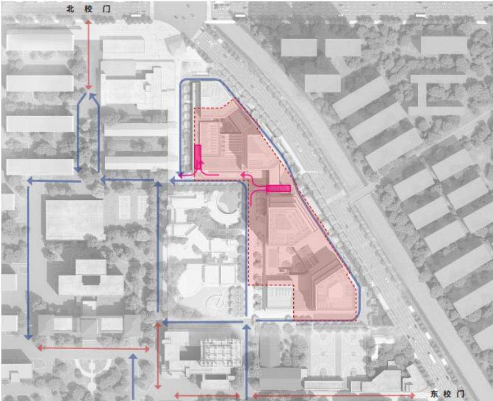

图 2-5  
项目交通组织分析  
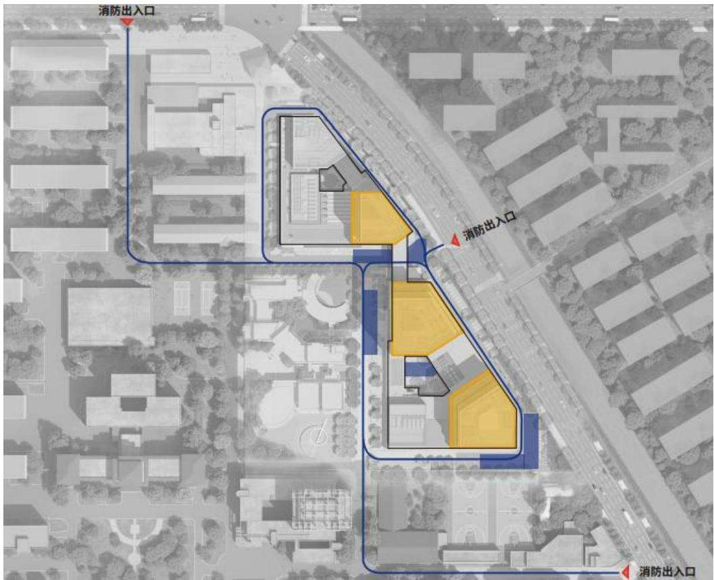  
图 2-6  
项目消防分析

## （3）绿化区

景观设计立足师生切身需求，延续浙大西溪校区校园景观的整体风貌，深入挖掘文化元素与历史记忆，兼顾近期使用及远期规划设计，营造出活力开放、典雅精致的校园景观。场地现状交通流线未进行合理的规划引导，人行与车行动线交叉，存在安全隐患。

在教学楼西侧结合带状绿地设置条形坐凳，形成简洁现代的沿街休闲空间。庭院内以绿岛结合休憩外摆为主。屋顶花园区域景观则作为建筑功能能外延，提供休闲聚餐、户外会议、户外研讨的空间。

植物设计延续校园整体风貌，以生态自然、适地适树为设计理念。线性的沿街空间以列植娜塔栎为主。庭院空间以点植榉树为主。屋顶空间则在满足覆土要求的基础上局部点植小乔木，并使用抗性强、耐贫瘠的植物品种，降低维护成本。场地内绿化面积3513m²（包含下凹绿地面积2462m²），屋顶绿化面积 $1 2 2 1 \mathrm { m } ^ { 2 }$ 。绿地率 14.63%。项目绿化区平面布置见图2-7。

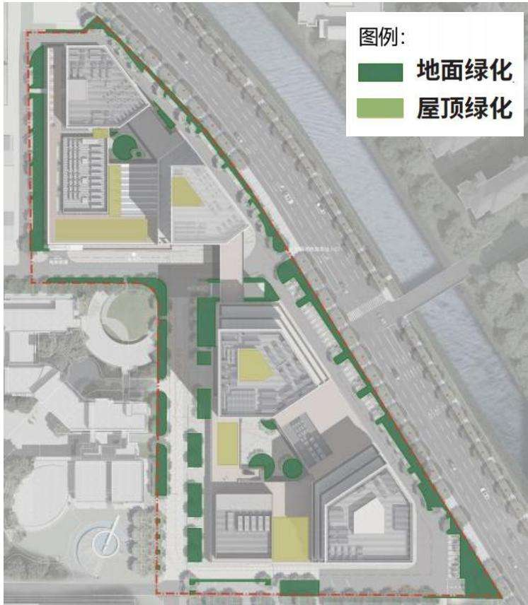  
图 2-7 项目绿化区平面布置图

## 2.1.5.2 项目配套设施建设

## （1）给水工程

水源取自城市自来水，本工程从地块西侧从校园内市政直供给水环状管网接入2根

DN200 给水管（引入管上设低阻力倒流防止器），并在整个项目地下-1F 连成环网，供本工程室内外生活、消防用水。其中消防给水管道 DN150 长 285m，给水管道 DN200长 50m，DN150 长 285m。

## （2）排水工程

室外采用雨、污分流，污、废合流。室内采用生活污水、生活废水、实验废水、雨水分流制。本项目排水管网采用PE 缠绕结构壁管，管径DN150\~DN500，总长为2641m，其中 DN150 长 810m，DN300 长 1490m，DN400 长 260m，DN500 长 81m。本工程排水污水量按生活给水量的100%计。室内污、废分流排至室外。室外污水经化粪池处理达标后与废水汇合排入室外污水管，最终排入市政排水管网。普通实验废水单独排放，集中处理达标后汇入室外污水管网；特殊实验废水及实验浓液应就近收集，集中外运由专业公司处理。

雨水采取有组织排水，就近排入东侧的市政雨水管。

## （3）海绵城市设计

根据《民用建筑雨水控制与利用设计导则》及《杭州市海绵城市低影响开发建设项目管理暂行规定》中的相关规定，由于周边市政雨水管网完善，本工程通过设置透水铺装、下凹绿地、雨水调蓄设施等海绵设置，收集场地优质雨水，多余雨水溢流排入场地雨水管网并就近排入市政雨水管。

项目海绵城市设计控制指标为年径流总量控制率≥75%，年径流污染削减率（以SS计）≥60%，综合雨量径流系数≤0.60。本工程海绵城市设计目标要求为年径流总量控制率75%，对应的设计降雨量为21.1mm；雨水管道排水能力设计重现期按5年设计。

在地下车库顶板、主体建筑侧墙、采光井侧墙、风井侧墙及其他凸出顶板构筑物侧墙等布置网格型雨水回收系统，网格型雨水回收系统1处，面积4525m2，调蓄容量共62.35m3；在药学院科研楼北侧设置雨水收集池，容量共10m3；光电、信电学院科研楼和药学院科研楼场地内人行道路采用透水铺装共9273m2；在绿化区域设置下凹式绿地共2462m2，主要位于项目场地东侧和西侧局部绿化区块。

雨水回收系统采用网格型雨水回收系统，在地下车库顶板、主体建筑侧墙、采光井侧墙、风井侧墙及其他凸出顶板构筑物侧墙等布置排水板、渗透水收集管等，渗透水收集管设计间距根据顶板形状及建筑布局而定，总体呈网格状布置。

透水铺装采用透水沥青、透水混凝土、花岗岩石材等，使雨水迅速渗入地表，有效地补充地下水，同时雨水在透水材料中的下渗过程，使得悬浮物过滤并截留，可有效去除径流中的悬浮污染物，并降低场地径流系数。

为了促进雨水的下渗及净化，充分利用建筑区绿地布置低地势绿地（比周边硬化地面低10cm），通过调整硬化地面的坡向，使地表径流可以自然漫流至低地势绿地中下渗净化，减少水土流失，多余的雨水通过溢流管排入原有雨水井。下凹绿地共计 $2 4 6 2 \mathrm { m } ^ { 2 }$ 有效蓄水深度为8mm，采用铺设10cm砂土层+无纺土工布（ $2 5 0 \mathrm { g } / \mathrm { m } ^ { 2 }$ ），上层覆种植土40cm，溢流井周边采用卵石（粒径3cm\~5cm）覆盖，仅露出溢水口。

本工程沿场地边界设计适当的植被缓冲带，以实现消能及均匀布水的作用，同时，给合室外雨水管网及雨水口的布置设置植草沟，以将经绿地等截污后的多余径流雨水及时引至雨水口排出，防止地面积水。

透水铺装地面结构示意图见图 2-8，雨水收集回用系统原理见图 2-9，下沉式绿地结构见图2-10。

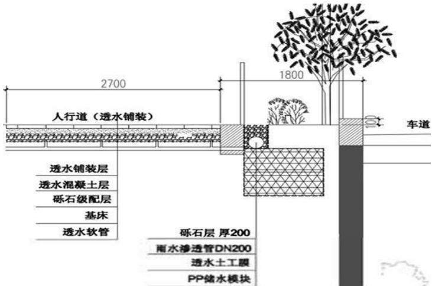  
透水铺装地面结构示意图

图 2-8  
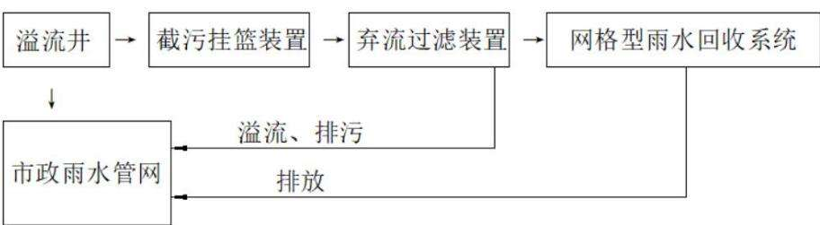  
图 2-9  
雨水收集回用系统原理图

图 2-10  
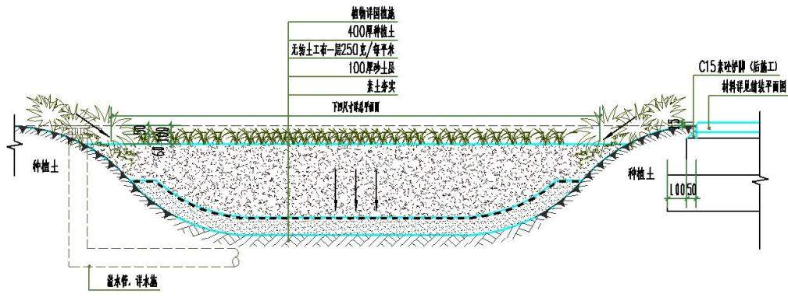  
下沉式绿地结构简易图

## （4）供电工程

供电电压等级10kV。供电电源引自校园已建成总高配房。校园总高配双重10kV进线引自市政110kV变电站高压不同源10kV 侧出线。

## （5）通信工程

本工程沿区内道路铺设电线导管，对于网络光缆等涉及信息系统的所有管线均在管内解决，为方便日后检查维修，要求同管不同井。

## 2.2 施工组织

## 2.2.1 施工交通

本项目位于杭州市西湖区，周边道路系统完善，交通便利，运输条件较好，建筑材料直接运达工地。周边现状道路主要有天目山路、保俶北路、文三路等。施工阶段车辆出入口位于保俶北路，满足施工期运输车辆通行和施工机械通行要求。

## 2.2.2 施工用水

临时用水包括临时消防、施工生产、施工生活用水三部分。用水接自校内自来水管网。其中临时生活用水由管网直接供给；管材为镀锌钢管，丝扣连接。

取水口设置在项目西南角，沿现场四周敷设管径 DN100 的水管并形成环网，可满足施工用水、施工机械用水、生活用水和消防用水。消防用水及施工用水结合考虑，施工和消防用水管在主体结构内垂直向上敷设。

## 2.2.3 施工排水

施工排水分为污水及雨水两个系统，雨水经沉淀处理后，经雨水排水系统排至城市雨水管网系统。生产废水、生活污水先排至就近的隔油池、化粪池，然后经过污水排水

系统排至城市污水管网。采用DN300 双壁波纹管分别埋设污水、雨水排水管道。

## 2.2.4 施工用电

施工用电由项目西南角场外高配房内接出，现场共布置2个400KVA、1个630KVA的变压器，2个400KVA 的变压器设置在项目东南角围墙边、1个 630KVA 的变压器设置在药学院楼西南角围墙边，现场共布置2处总配电室（一级配电）。同时，备用一台燃油发电机。

北区施工用电由2号总配房沿北区围墙布置，南区施工用电、生活区及办公区用电由1号总配房沿南区围墙布置。

## 2.2.5 施工通讯

工程地处经济发达地区，有线通信网络已十分完善，施工通讯可与当地电信、电讯部门协商，从学校通信网络就近接入。同时，工程沿线有移动通信信号覆盖，工程建设可利用现有的移动通信资源，作为有线通信的补充。施工通讯不涉及施工区外土石方挖填。

## 2.2.6 施工总布置

施工总布置本着利于生产、方便生活、快速生产、经济可靠、易于管理的原则进行规划设计。考虑现行建设管理模式和施工机械化水平，合理确定劳动力使用量和生活福利建筑面积，合理布置施工期生活办公区。

## （1）施工生活区

施工生活区为建设范围线外新增临时占地，位于永久占地红线外南侧，主要功能为项目部人员施工办公生活场所，占地面积0.20hm2。

## （2）施工生产区

施工生产区主要布置综合加工厂、仓库等，沿北侧围墙布设于用地红线内，占地0.13hm2。施工过程中，地块施工出入口设置在东侧，对外路顺接保俶北路。

## （3）泥浆临时中转池

项目区中间布设 2 座泥浆中转池，占地 0.03hm2；泥浆干化设备紧邻泥浆中转池，占地 0.02hm2。

## （4）临时堆土场

在桩基工程施工前期，由于桩基施工强度较大，产生的固化土方量较多，为确保工

程有序推进，拟在场地中部设置一处固化土临时堆场。该临时堆土场占地面积约0.11hm2，四周依托现有围墙围合，周边无居民区等环境敏感点，临时中转周期约 1个月，采取填土编织袋进行临时拦挡及临时苫盖措施。

主体工程考虑的施工临时设施布置见表2.2-1。

表 2.2-1  
施工临时设施布置一览表
<table><tr><td rowspan=1 colspan=1>序号</td><td rowspan=1 colspan=1>名称</td><td rowspan=1 colspan=1>占地面积(hm²)</td><td rowspan=1 colspan=1>位置</td><td rowspan=1 colspan=1>用途</td></tr><tr><td rowspan=1 colspan=1>1</td><td rowspan=1 colspan=1>施工生活区</td><td rowspan=1 colspan=1>0.20</td><td rowspan=1 colspan=1>项目区北侧红线外</td><td rowspan=1 colspan=1>项目部人员施工办公场所</td></tr><tr><td rowspan=1 colspan=1>2</td><td rowspan=1 colspan=1>施工生产区</td><td rowspan=1 colspan=1>(0.13)</td><td rowspan=1 colspan=1>沿北侧围墙布设</td><td rowspan=1 colspan=1>布置综合加工厂、仓库</td></tr><tr><td rowspan=1 colspan=1>3</td><td rowspan=1 colspan=1>泥浆临时中转池</td><td rowspan=1 colspan=1>(0.03)</td><td rowspan=1 colspan=1>项目区中部</td><td rowspan=1 colspan=1>桩基础产生的泥浆干化</td></tr><tr><td rowspan=1 colspan=1>4</td><td rowspan=1 colspan=1>泥浆干化设备</td><td rowspan=1 colspan=1>(0.02)</td><td rowspan=1 colspan=1>项目区内中转池东侧</td><td rowspan=1 colspan=1>桩基础产生的泥浆干化</td></tr><tr><td rowspan=1 colspan=1>5</td><td rowspan=1 colspan=1>临时堆土场</td><td rowspan=1 colspan=1>(0.11)</td><td rowspan=1 colspan=1>场地东侧</td><td rowspan=1 colspan=1>临时堆置桩基础产生的土方</td></tr></table>

## 2.2.7 施工工艺

## （1）场地平整

采用履带式单斗推土机挖掘机分层逐片开挖，履带式推土机集土并推至回填部位，利用平地机逐层平整，回填土方采用蛙式打夯机分层夯实。

## （2）基坑支护

本项目基坑支护周长约 700m，基坑上口开挖面积约 16485m2，基坑开挖深度约为7.1m\~10.05m。根据《浙江大学工信创新研究大楼项目岩土工程勘察报告》（信电综合勘察设计研究院有限公司，2025 年 1 月），本工程设 2 层地下室，开挖深度较大，属于二级基坑，需进行基坑专项围护设计工作，围护采用灌注桩+三轴搅拌桩（喷搅一体化水泥土桩）+内支撑形式，局部被动区加固，防微振区域局部采用硬法咬合桩。

钻孔灌注桩桩径 1000mm，桩长 24m，桩间距 850mm\~950mm；三轴搅拌桩桩径600mm\~700mm，桩长 4m\~24m；微扰动喷搅一体水泥土桩桩径 700mm，桩长 10.8m。本项目基坑围护共计灌注桩767根，三轴搅拌桩1862幅，微扰动喷搅一体水泥土桩241根，硬法咬合桩100根。围护桩施工完成后浇筑混凝土梁内支撑。

## ① 钻孔灌注桩

钻孔灌注桩施工前首先需清出工作面，测量放出桩位。一般情况埋置深度宜为2m～4m，特殊情况应加深以保证钻孔和灌注混凝土的顺利进行。钻机就位时，应采取措施保证钻具中心和桩位中心重合，其偏差不应大于20mm。护壁泥浆由水、黏土（或膨润土）按一定比例配制而成，可通过机械在泥浆池、钻孔中搅拌均匀。清孔分两次进行，钻孔深度达到设计要求，符合要求后进行第一次清孔；钢筋骨架、导管安放完毕，混凝土浇筑之前，应进行第二次清孔。灌注水下混凝土采用钢制导管回顶法施工，导管接口之间采用丝扣或法兰连接，连接时必须加垫密封圈或橡胶垫，并上紧丝扣或螺栓。

根据《杭州市工程渣土管理实施办法》（杭政办函〔2016〕51 号）：“占地规模20亩（含）以上或建筑体量 $1 0 \ \overline { { \mathcal { H } } } \ \mathrm { m } ^ { 3 }$ （含）以上的建设工地应在工地内设置泥浆固化处理设备，实现泥浆就地处理”。施工生产区设置一处泥浆固化设备，并设置清水池及泥浆池。钻孔灌注桩循环排渣工艺见图2-12，钻孔灌注桩施工工艺流程见图2-13。

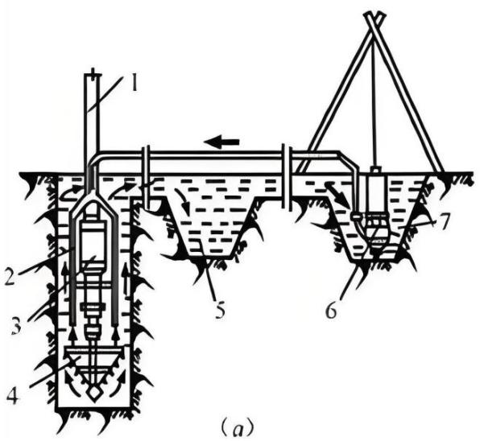

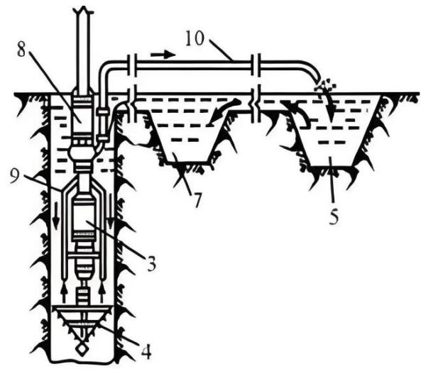  
(6)  
标注说明：（a）正循环排渣：（b）反循环排渣1—钻杆 2—送水管 3—主机 4—钻头 5—沉降池 6—水泥浆系7-泥浆池 8—砂石泵 9—抽流管 10-排液胶管  
图 2-12 钻孔灌注桩循环排渣工艺图

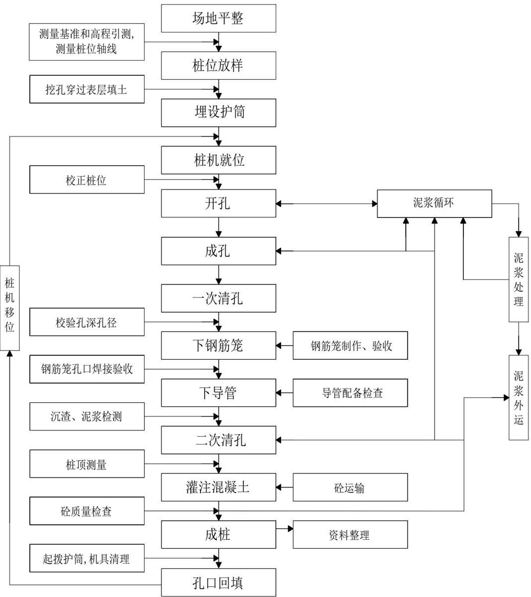  
图 2-13 钻孔灌注桩施工工艺流程

## ②三轴水泥搅拌桩

三轴桩机施工前，必须先进行场地平整，清除施工区域的表层硬物，素土回填夯实场地承受荷载以能行走三轴搅拌桩架为准。

图 2-15 三轴搅拌桩施工工序图  
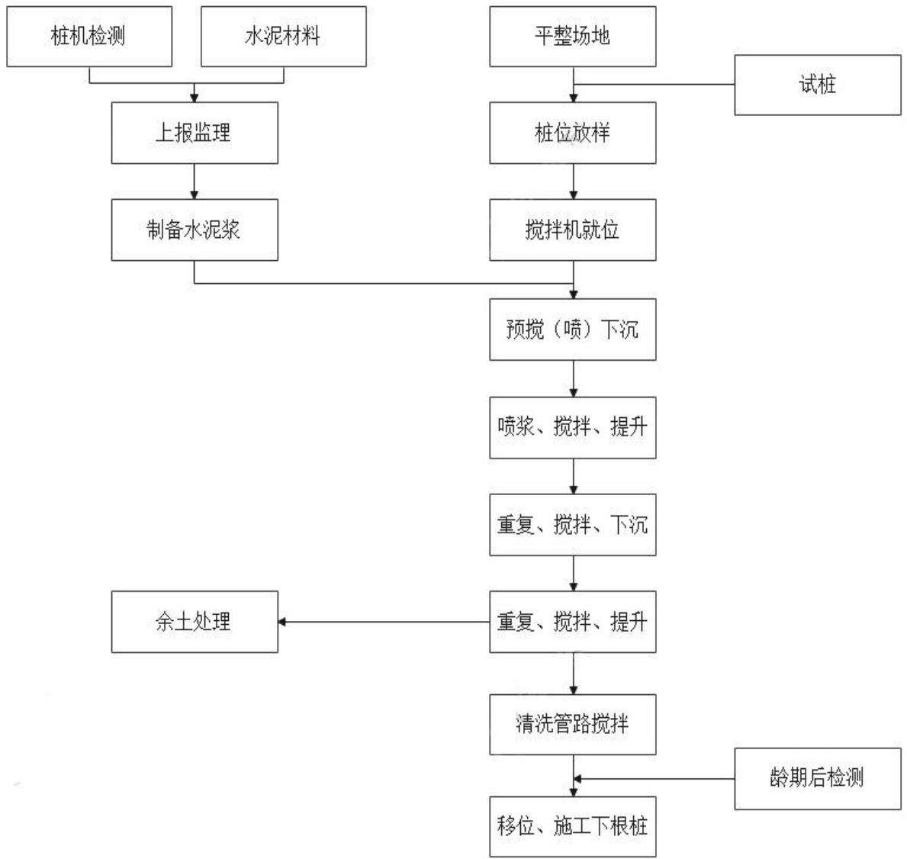  
图 2-14 三轴水泥搅拌桩施工工艺流程

根据基坑围护内边控制线，采用 PC120挖土机开挖沟槽，并清除地下障碍物，开挖沟槽余土应及时处理。三轴搅拌桩施工按下图顺序进行，其中阴影部分为重复套钻，保证墙体的连续性和接头的施工质量，水泥土搅拌桩的搭接以及施工设备的垂直度正是依靠重复套打来保证，以达到止水作用。

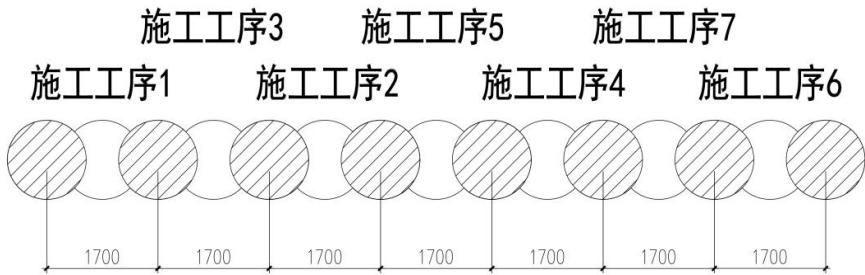

三轴水泥搅拌桩在下沉和提升过程中均应注入水泥浆液，同时严格控制下沉和提升速度。

搅拌机下沉到达设计深度后，开启灰浆泵将水泥浆压入地基中，边喷浆边旋转，使水泥浆和原地基土充分拌和。三轴水泥搅拌桩桩身在下沉和提升采用喷搅搅拌，集料斗中注入适量清水，开启灰浆泵，清洗全部管路中的残存的水泥浆。

## ③微扰动喷搅一体化水泥土桩施工

根据测量基准点和基线进行复测，再据此测出桩位中心，打入定位桩。

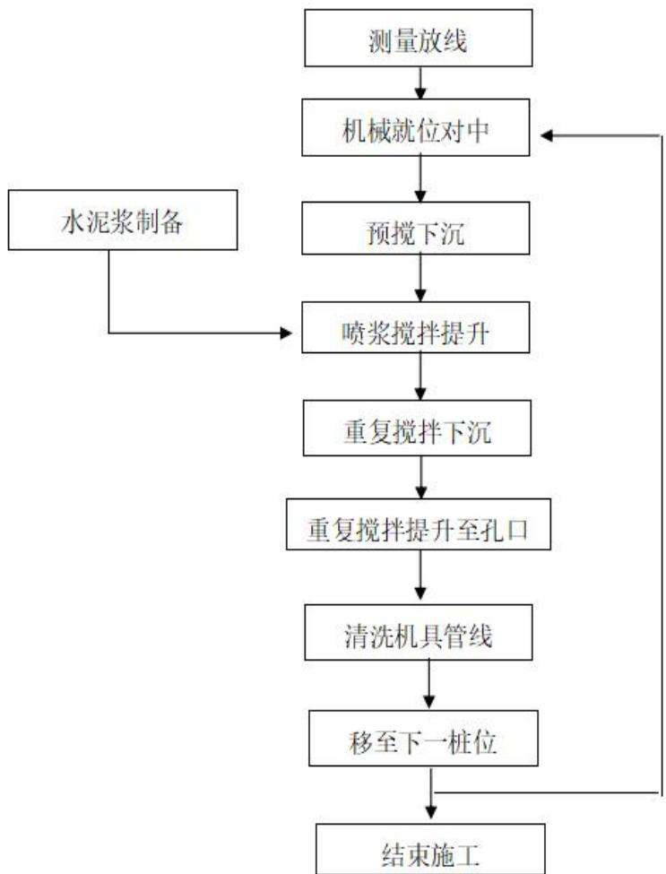  
图 2-16 微扰动喷搅一体化水泥土桩施工工艺流程

移动搅拌机到达指定桩位、对中，待搅拌机的冷却水循环正常后，使搅拌机沿导向架搅拌下沉，下沉至设计深度后喷射清水切削液体化土体，深层搅拌机预搅下沉的同时，后台按设计确定配合比拌制水泥浆液。搅拌机下沉到设计深度后，开启灰浆泵，待浆液到达喷浆口。重复上述步骤进行下一根桩的施工。

施工时在基坑边界设置排水沟，坑内采用抽水泵抽水，基坑采用挖掘机开挖，配自

卸汽车运输进行施工。

④硬法咬合桩施工

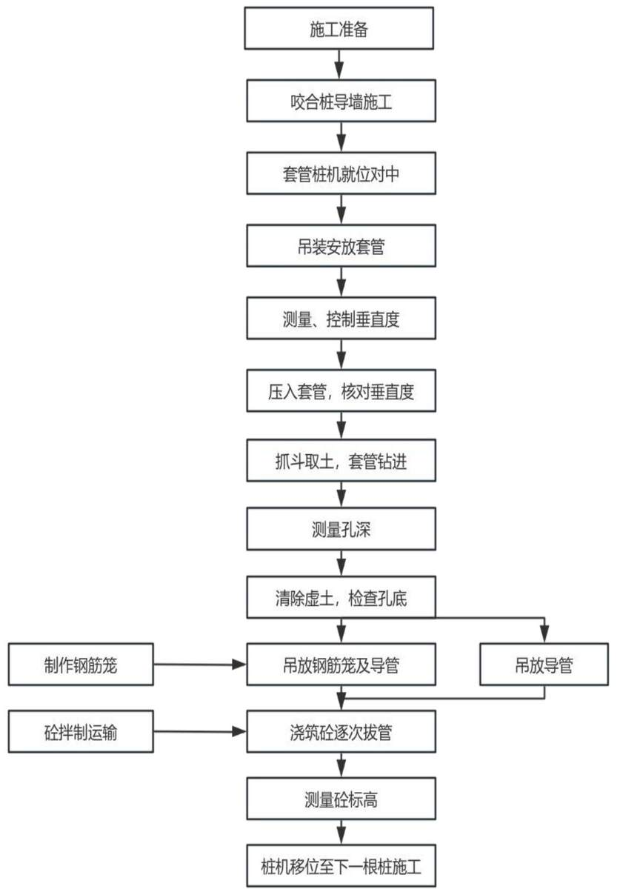  
图 2-17 硬法咬合桩施工工艺流程

施工前首先需清出工作面，并用全站仪测量放出钻孔咬合桩中心轴线，以确定导墙位置。并将测量结果上报监理复核，偏差不得超过规范及设计的要求。测量放出桩位中心轴线，挖设导墙沟槽，导墙基底建于密实的地基上，以保证导墙的稳定性。钻机下压钢套管，由冲抓取土成孔。在钻孔桩成孔过程中，用套管正反扭动加压下切，管内冲击抓斗取土，使套管压入至桩的设计深度，形成套管护壁成孔，桩间相互咬合排列形成围护墙。待导墙验收合格后，将套管钻机就位，使抱管器中心对应在导墙孔位中心，并调整好套管垂直度。压入第一节套管，然后用抓斗从套管内取土，始终保持套管底口超前开挖面2m 以上。

## ⑤基坑排水

本工程基坑采用降水明排形式，集水井底低于排水沟底1000mm，保证潜水泵能全部没入水中。坑内集水井上口内径宽 800mm、坑周集水井上口内径宽 600mm，采用240mm 厚标准砖砌筑，集水井顶部与排水沟侧边顶相平，水流经沉淀后排入市政管网。明排设置集水井和排水沟，一般设在下游位置，基坑排出的水要以水管或水槽引入市政排污管线；集水井比排水沟低 0.5m～1.0m，或深于抽水泵的进水阀的高度以上，并随基坑的挖深而加深，保持水流畅通，地下水位低于开挖基坑底1m。

## （3）建筑基础施工

根据《浙江大学工信创新研究大楼项目岩土工程勘察报告》（信电综合勘察设计研究院有限公司，2025年 1 月），拟建建筑物上部荷载较大，基础底部地基土无法满足主体建筑物对地基土承载力的要求，采用桩基础，桩型推荐采用旋挖成孔灌注桩，桩径600mm\~800mm，桩长 27m\~47m，桩间距 610mm\~950mm。建筑物共计桩基数 1037 根。

本项目采用钢护筒+泥浆护壁成孔的方式，钢护筒周围和护筒底脚应紧密，不透水。钻孔时要及时清运孔口出渣，避免妨碍钻孔施工、污染环境；钻孔达到预定钻孔深度后，提起钻杆，测量孔深及沉渣厚度。钻进到设计深度后，采用旋挖斗清孔。注浆管采用φ32注浆管，壁厚2.5mm，丝扣连接，固定在钢筋笼内侧。注浆花管连接于注浆管底部，插入沉渣层中，端头设单向阀，注浆结束后，需待管中浆液无上返后，方能拆除闸阀灌注结束后。混凝土浇筑完成后，通过汽车吊或挖机拔除护筒。

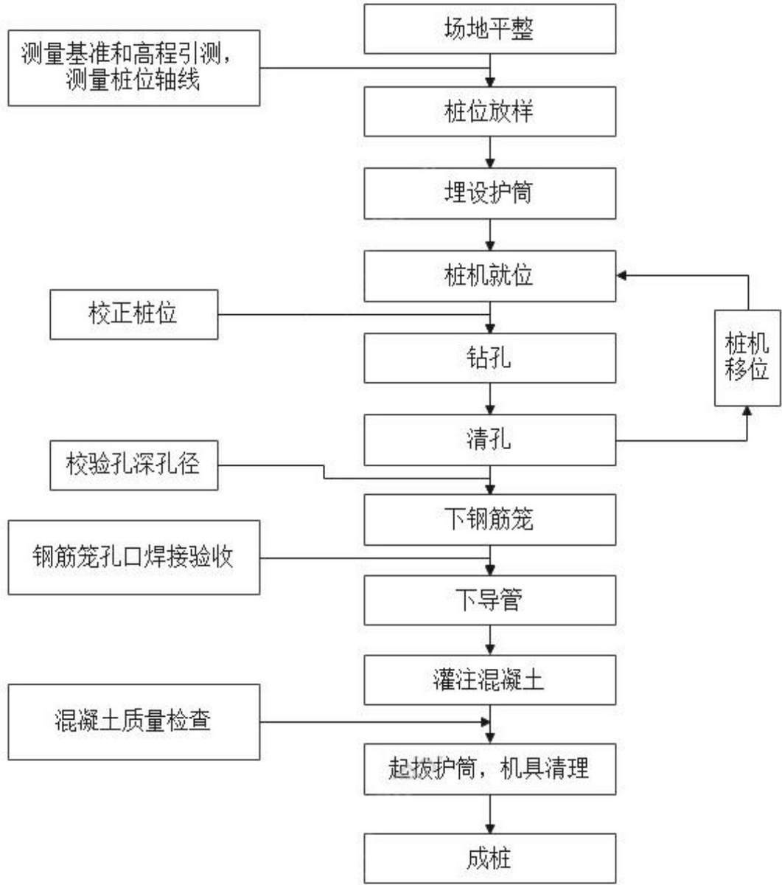  
图 2-11 旋挖成孔灌注桩工艺图

## （4）钻渣固化处置

钻渣、泥浆经过离心设施脱水处理后外运。在桩基础施工过程中，打桩产生的钻渣、泥浆通过专用管道引至调节池后，由专用钻渣固化离心设施分离钻渣、泥浆中的水分，对其进行固化处理。固化离心设施采用卧式沉降螺旋自动卸料节能离心设施。

## （5）基坑开挖

基坑土方开挖时，采取分层、分区进行，严禁一次开挖到底或超挖。挖到设计标高时，应及时封底，严禁暴露时间太长。施工时切忌抢工期超挖等，否则可能会造成围护结构尚未完全稳固形成体系而导致基坑壁位移、开裂甚至坍塌。基坑开挖过程中，应采取措施防止碰撞支护结构、工程桩或扰动基底原状土；如发生异常情况，应立即停止挖土，在查清原因和采取措施后方能继续开挖，基坑边严禁超重堆载，确保基坑边坡的稳定性。

地下室开挖主要采用机械开挖，主要挖土机械为挖土机、铲运机械、自卸汽车等，主要工艺流程为：确定开挖顺序→分段分层开挖→修边和清底。地下室开挖时，需做好基坑围护，利用抽水泵将基坑内汇水抽至项目区排水沟、沉沙池缓流泥沙后排出项目区。施工过程中要严格按照基坑围护及开挖方案，分层分区块施工。

## （6）建筑物施工

项目建筑物施工主要包括钢筋混凝土浇筑、墙体砌筑，人工配合机械施工。

## （7）道路施工

项目区内道路路基填筑施工采用机械施工为主，适当配合人工施工的方案。填筑时配置符合要求的压实机械，严格控制含水量，尤其是梅雨季节，严禁使用超规定含水量填料，做到分层压实，控制有效压实厚度，不得超厚压实，填筑料夯实至路基顶面。路面工程采用配套路面施工机械设备，专业化施工方案，配置少量的人工辅助施工。严格控制材料级配和数量。

## （8）管线施工

项目区内管线较多，主要包括给排水、电力电讯等管线。地下室面积较大，项目各类管线大部分布置在地下室范围内（地下室顶部）。过路的管线与道路施工密切配合，合理安排时间，预先埋设，不妨碍道路及上部结构施工。

雨水管线施工工艺：测量放线→预制检查井井室→沟槽支护→管道基础施工→管道铺设及焊接→管道坞膀（部分潜埋包封处理）→沟槽回填。

污水管线施工工艺：测量放线→基底垫层→混凝土管对口→砼检查井→上部砼→通水试验→土方回填。

其他管线按各自施工标准进行，基本工艺为：施工准备→测量定位→验槽→基础处理→管道安装→管道包封→管槽回填土。

## （9）绿化施工

## 1）草皮营造

采用纵横向后退播种，播种后应轻耙土使种子入土0.2cm。播种后根据天气情况每天或隔天喷水，待幼苗长至3cm～6cm 时可停止喷水，但应经常保持土壤湿润，并要及

时清除杂草。

## 2）灌木栽植

## ①回填底部种植土

拌有基肥的土为底部种植土，在接触根部的地方应铺放一层没有拌肥的干净植土，使沟深与土球高度相符。

## ②排放苗木

将苗木排放到沟内，土球较小的苗木应拆除包装材料再放入沟内；土球较大的苗木，宜先排放沟内，把生长姿势好的一面朝外竖直看齐后垫上固定土球，再剪除包装材料。

## ③填土插实

填入好土至树穴的一半时，用木棍将土球四周的松土插实，然后继续用土填满种植沟并插实。

## ④淋定根水

栽植后，必须在当天对灌木淋透定根水。

## 2.2.8 建筑材料

工程所用建筑材料主要为道路填筑和绿化建设所需种植土、宕渣、砂砾料、水泥、砖、钢筋等；

场地平整等土石方：利用周边其他建设项目余方；

道路填筑料：道路路基填筑碎石、宕渣从附近合法料场商购；

砂砾料及水泥等：从附近市场商购；

种植土：通过商购解决；

砖、钢筋及其他材料：均从市场或厂家直接采购。

## 2.2.9 施工时序

项目按“先土建后安装”、“先主体后装修”、“先室内后室外”的原则安排各工种、各工序，进行立体流水交叉施工作业。

在施工过程中，首先进行临时通水通电，场地平整之后进行水土保持工程措施和临时措施的布设，再进行建筑物基础施工，然后进行道路及其他配套设施的施工，最后根据施工工期及气候条件进行场地清理和绿化。

地下部分：基坑围护→基坑开挖→地下建筑施工。

地上部分：地上建筑→道路及管线等施工→绿化施工。

## 2.3 工程占地

本项目选址于浙江大学西溪校区内，属于自有土地，本次建设不新增用地（国有土地使用证证号为杭西国用（2014）第100001号）。根据主体工程初步设计报告，项目占地面积合计2.72hm2，其中永久占地2.52hm2，施工临时占地0.20hm2，为施工生活区。另外，本工程施工生产区、临时堆土场、泥浆干化设备、泥浆池等位于永久占地红线范围内，面积为0.29hm2。项目占地类型为教育用地。

## （1）永久占地

项目永久占地面积 2.52hm²，包括建筑物占地 1.24hm²，道路及其他配套设施占地0.93m²，绿化区占地 0.35m²。

## （2）施工临时占地

施工生活区布设于永久占地红线外南侧，占地面积0.20hm2；施工生产区主要布置综合加工厂、仓库等，沿北侧围墙布设于红线内，占地0.13hm2；项目区中间布设2座泥浆中转池，占地 0.03hm2，泥浆干化设备紧邻泥浆中转池，占地 0.02hm2；施工前期未及时外运土方临时堆置于场地内，临时堆土场占地约0.11hm2。占地情况见表2.3-1。

表 2.3-1  
项目占地汇总  
单位：hm2
<table><tr><td rowspan=1 colspan=2>项目</td><td rowspan=1 colspan=1>教育用地</td><td rowspan=1 colspan=1>合计</td></tr><tr><td rowspan=4 colspan=1>永久占地</td><td rowspan=1 colspan=1>建筑物</td><td rowspan=1 colspan=1>1.24</td><td rowspan=1 colspan=1>1.24</td></tr><tr><td rowspan=1 colspan=1>道路及其他配套设施</td><td rowspan=1 colspan=1>0.93</td><td rowspan=1 colspan=1>0.93</td></tr><tr><td rowspan=1 colspan=1>绿化区</td><td rowspan=1 colspan=1>0.35</td><td rowspan=1 colspan=1>0.35</td></tr><tr><td rowspan=1 colspan=1>小计</td><td rowspan=1 colspan=1>2.52</td><td rowspan=1 colspan=1>2.52</td></tr><tr><td rowspan=6 colspan=1>临时占地</td><td rowspan=1 colspan=1>施工生活区</td><td rowspan=1 colspan=1>0.20</td><td rowspan=1 colspan=1>0.20</td></tr><tr><td rowspan=1 colspan=1>施工生产区</td><td rowspan=1 colspan=1>(0.13)</td><td rowspan=1 colspan=1>(0.13)</td></tr><tr><td rowspan=1 colspan=1>临时堆土场</td><td rowspan=1 colspan=1>(0.11)</td><td rowspan=1 colspan=1>(0.11)</td></tr><tr><td rowspan=1 colspan=1>泥浆中转池</td><td rowspan=1 colspan=1>(0.03)</td><td rowspan=1 colspan=1>(0.03)</td></tr><tr><td rowspan=1 colspan=1>泥浆干化设备</td><td rowspan=1 colspan=1>(0.02)</td><td rowspan=1 colspan=1>(0.02)</td></tr><tr><td rowspan=1 colspan=1>小计</td><td rowspan=1 colspan=1>0.20(0.29)</td><td rowspan=1 colspan=1>0.20(0.29)</td></tr><tr><td rowspan=1 colspan=2>总计</td><td rowspan=1 colspan=1>2.72</td><td rowspan=1 colspan=1>2.72</td></tr></table>

注：工程施工生产区等布置在永久占地范围内，不计入总占地面积，施工生活区于红线范围外。

## 2.4 土石方平衡

## 2.4.1 土石方平衡原则

土石方平衡时，考虑的主要因素包括：挖填方数量的差别；挖填的先后顺序；挖填地点之间的距离；挖填方材料质量（一般土方，一般石方）；回填土方堆场设置条件等。

土石方平衡按以下步骤进行：首先，在各分项工程内，根据土石方的开挖及回填量，挖填部位的材料质量，分别计算出每一项目多余或不足的土石方数量；其次，考虑材质、施工时序、土方可堆置条件的情况，在经济合理、施工可行的前提下对工程各建设区土石方进行综合平衡。

## 土石方平衡按以下原则进行：

（1）根据主体工程进度，场地平整和桩基础最先实施，然后进行地下室基坑开挖；

（2）土石方回填及调运遵循挖填同时、就近回填的原则，尽量综合利用土石方，减少弃方数量。

## 2.4.2 工程土石方平衡

工程土石方工程主要包括绿化工程、基坑支护工程、地下室工程、场平工程等4个单项工程。

## （1）绿化工程

施工后期，绿化区域进行覆土，覆土范围包括地面绿化区域和屋顶绿化区域。覆土面积共4734m2，其中地面绿化面积 $3 5 1 3 \mathrm { m } ^ { 2 }$ （包含下凹绿地），屋顶绿化面积1221m2。

结合绿化方案，绿化工程覆土平均厚度51cm，覆土量为 $0 . 2 4 \mathcal { F } \mathrm { m } ^ { 3 }$ 。本工程场地原地表均为杂填土，无表土可剥离利用，因此本工程绿化覆土办理相关手续后由杭州市西湖区综合行政执法局统一调配。绿化工程土石方平衡见表2.4-1。

表 2.4-1  
绿化工程土石方平衡
<table><tr><td rowspan=1 colspan=1>序号</td><td rowspan=1 colspan=1>区域</td><td rowspan=1 colspan=1>覆土面积 ${ \bf \Pi } ( { \bf m } ^ { 2 } { \bf \Pi } )$ </td><td rowspan=1 colspan=1>平均覆土厚度（m）</td><td rowspan=1 colspan=1>覆土量 $( \ \mathcal { F } \mathrm { m } ^ { 3 } )$ </td></tr><tr><td rowspan=1 colspan=1>1</td><td rowspan=1 colspan=1>地面绿化(不含下凹绿地)</td><td rowspan=1 colspan=1>1051</td><td rowspan=1 colspan=1>0.70</td><td rowspan=1 colspan=1>0.07</td></tr><tr><td rowspan=1 colspan=1>2</td><td rowspan=1 colspan=1>下凹绿地</td><td rowspan=1 colspan=1>2462</td><td rowspan=1 colspan=1>0.40</td><td rowspan=1 colspan=1>0.10</td></tr><tr><td rowspan=1 colspan=1>3</td><td rowspan=1 colspan=1>屋顶绿化</td><td rowspan=1 colspan=1>1221</td><td rowspan=1 colspan=1>0.60</td><td rowspan=1 colspan=1>0.07</td></tr><tr><td rowspan=1 colspan=2>合计</td><td rowspan=1 colspan=1>4734</td><td rowspan=1 colspan=1>0.51</td><td rowspan=1 colspan=1>0.24</td></tr></table>

## （2）基坑支护工程

围护桩采用钻孔灌注桩、三轴水泥搅拌桩、微扰动喷搅一体水泥土桩、硬法咬合桩等。钻孔灌注桩产生钻渣泥浆 2.46 万 m³，经钻渣中转池固化后土方共计 0.82 万 m³，固化土按当地要求清运，三轴水泥搅拌桩产生土方共计0.19 万m³，微扰动喷搅一体水泥土桩产生土方共计 0.28 万 m³，硬法咬合桩产生土方共计 0.29 万 m³，经估算，共产生弃（余）方1.58万m³，均为土方。基坑支护工程一般土石方平衡见下表2.4-2。

表 2.4-2  
基坑支护工程土石方平衡  
单位：万 m3
<table><tr><td rowspan=2 colspan=1>序号</td><td rowspan=2 colspan=1>分项工程</td><td rowspan=1 colspan=2>挖方</td><td rowspan=2 colspan=1>填方</td><td rowspan=2 colspan=1>借方</td><td rowspan=1 colspan=2>余（弃）方</td></tr><tr><td rowspan=1 colspan=1>土方</td><td rowspan=1 colspan=1>小计</td><td rowspan=1 colspan=1>土方</td><td rowspan=1 colspan=1>小计</td></tr><tr><td rowspan=1 colspan=1>1</td><td rowspan=1 colspan=1>钻孔灌注桩</td><td rowspan=1 colspan=1>0.82</td><td rowspan=1 colspan=1>0.82</td><td rowspan=1 colspan=1>0</td><td rowspan=1 colspan=1>0</td><td rowspan=1 colspan=1>0.82</td><td rowspan=1 colspan=1>0.82</td></tr><tr><td rowspan=1 colspan=1>2</td><td rowspan=1 colspan=1>三轴水泥搅拌桩</td><td rowspan=1 colspan=1>0.19</td><td rowspan=1 colspan=1>0.19</td><td rowspan=1 colspan=1>0</td><td rowspan=1 colspan=1>0</td><td rowspan=1 colspan=1>0.19</td><td rowspan=1 colspan=1>0.19</td></tr><tr><td rowspan=1 colspan=1>3</td><td rowspan=1 colspan=1>微扰动喷搅一体水泥土桩</td><td rowspan=1 colspan=1>0.28</td><td rowspan=1 colspan=1>0.28</td><td rowspan=1 colspan=1>0</td><td rowspan=1 colspan=1>0</td><td rowspan=1 colspan=1>0.28</td><td rowspan=1 colspan=1>0.28</td></tr><tr><td rowspan=1 colspan=1>4</td><td rowspan=1 colspan=1>硬法咬合桩</td><td rowspan=1 colspan=1>0.29</td><td rowspan=1 colspan=1>0.29</td><td rowspan=1 colspan=1>0</td><td rowspan=1 colspan=1>0</td><td rowspan=1 colspan=1>0.29</td><td rowspan=1 colspan=1>0.29</td></tr><tr><td rowspan=1 colspan=2>合计</td><td rowspan=1 colspan=1>1.58</td><td rowspan=1 colspan=1>1.58</td><td rowspan=1 colspan=1>0</td><td rowspan=1 colspan=1>0</td><td rowspan=1 colspan=1>1.58</td><td rowspan=1 colspan=1>1.58</td></tr></table>

## （3）地下室工程

建筑物基础采用旋挖成孔钻孔灌注桩，共产生土方1.97万m³。

项目为整体一层、局部二层地下室。建筑物区地下室一层层高 5.7m（含顶板厚度0.30m），非建筑物区地下室一层层高为4.2m，地面结构层0.1m，地下室一层底板顶标高-1.4m，底板厚0.30m，底板底标高为-1.7m；地下室二层层高4.0m（含顶板厚度0.30m），地面结构层0.1m，底板顶标高-5.4m，底板底标高为-5.7m。场地现状平均高程约4.05m，项目区地下室一层开挖深度约5.75m，开挖面积为15805m2，地下二层开挖深度约4.30m，开挖面积为8826m2。经估算，地下室开挖土方约15.0万m³。

项目竖向设计情况见表2.4-3。

表 2.4-3  
项目竖向设计情况一览表
<table><tr><td rowspan=1 colspan=1>项目</td><td rowspan=1 colspan=1>占地面积(m²)</td><td rowspan=1 colspan=1>建筑物区层高(m)</td><td rowspan=1 colspan=1>顶板顶标高(m)</td><td rowspan=1 colspan=1>地下室底板厚度(m）</td><td rowspan=1 colspan=1>地面结构层(m)</td><td rowspan=1 colspan=1>底板底标高（m）</td><td rowspan=1 colspan=1>非建筑物区层高(m)</td><td rowspan=1 colspan=1>开挖深度(m)</td></tr><tr><td rowspan=1 colspan=1>一层地下室</td><td rowspan=1 colspan=1>15805</td><td rowspan=1 colspan=1>5.7</td><td rowspan=1 colspan=1>-1.4</td><td rowspan=1 colspan=1>0.3</td><td rowspan=1 colspan=1>0.1</td><td rowspan=1 colspan=1>-1.7</td><td rowspan=1 colspan=1>4.2</td><td rowspan=1 colspan=1>5.75</td></tr><tr><td rowspan=1 colspan=1>二层地下室</td><td rowspan=1 colspan=1>8826</td><td rowspan=1 colspan=1>4.0</td><td rowspan=1 colspan=1>-5.4</td><td rowspan=1 colspan=1>0.3</td><td rowspan=1 colspan=1>0.1</td><td rowspan=1 colspan=1>-5.7</td><td rowspan=1 colspan=1>4.0</td><td rowspan=1 colspan=1>4.30</td></tr></table>

地下室施工结束后对建筑物区域外顶板进行覆土，顶板覆土面积约 $3 8 0 4 \mathrm { m } ^ { 2 }$ （扣除地下室范围线内建筑物面积 $1 2 0 0 1 \mathbf { m } ^ { 2 } )$ ），本项目地块室内设计标高均为4.40m，室外地坪设计标高为 4.30m。地下室范围线内覆土情况详见表 2.4-4。另外，基坑开挖需对基坑边坡进行放坡支护，覆土时需回填基坑边坡与建筑之间空隙土方，回填量约 0.02 万$\mathrm { m } ^ { 3 }$ 。经估算，地下室工程顶板覆土约 0.41 万 m3（自然方 0.55万 m3），共计覆土 0.57万 m3 。

表 2.4-4  
项目回填情况一览表
<table><tr><td rowspan=3 colspan=1>项目类型</td><td rowspan=3 colspan=1>建筑物占地面积(m²)</td><td rowspan=1 colspan=7>回填区</td></tr><tr><td rowspan=1 colspan=3>道路及其他配套设施</td><td rowspan=1 colspan=3>绿化区</td><td rowspan=2 colspan=1>回填量合计(万m³)</td></tr><tr><td rowspan=1 colspan=1>回填面积(m²)</td><td rowspan=1 colspan=1>回填厚度(m)</td><td rowspan=1 colspan=1>回填量小计(万m³)</td><td rowspan=1 colspan=1>面积(m2)</td><td rowspan=1 colspan=1>回填厚度(m)</td><td rowspan=1 colspan=1>回填量小计(万m³)</td></tr><tr><td rowspan=1 colspan=1>地下室范围线内</td><td rowspan=1 colspan=1>12001</td><td rowspan=1 colspan=1>3383</td><td rowspan=1 colspan=1>1.10</td><td rowspan=1 colspan=1>0.37</td><td rowspan=1 colspan=1>421</td><td rowspan=1 colspan=1>0.80~1.10</td><td rowspan=1 colspan=1>0.04</td><td rowspan=1 colspan=1>0.41</td></tr></table>

地下室工程挖方共计 16.97 万 m3，均为土方；填方 0.57 万 m³；借方 0.57 万 m³，由杭州市西湖区综合行政执法局统一调配利用；余（弃）方16.97万m3，均为土方，由杭州市西湖区综合行政执法局统一调配消纳。

地下室工程一般土石方平衡见下表2.4-5。

表 2.4-5  
地下室工程一般土石方平衡  
单位：万 m3
<table><tr><td rowspan=2 colspan=1>序号</td><td rowspan=2 colspan=1>分项工程</td><td rowspan=1 colspan=2>挖方</td><td rowspan=1 colspan=2>填方</td><td rowspan=1 colspan=1>借方</td><td rowspan=1 colspan=2>余（弃)方</td></tr><tr><td rowspan=1 colspan=1>土方</td><td rowspan=1 colspan=1>小计</td><td rowspan=1 colspan=1>土方</td><td rowspan=1 colspan=1>小计</td><td rowspan=1 colspan=1>土方</td><td rowspan=1 colspan=1>土方</td><td rowspan=1 colspan=1>小计</td></tr><tr><td rowspan=1 colspan=1>1</td><td rowspan=1 colspan=1>建筑物基础</td><td rowspan=1 colspan=1>1.97</td><td rowspan=1 colspan=1>1.97</td><td rowspan=1 colspan=1>0</td><td rowspan=1 colspan=1>0</td><td rowspan=1 colspan=1>0</td><td rowspan=1 colspan=1>1.97</td><td rowspan=1 colspan=1>1.97</td></tr><tr><td rowspan=1 colspan=1>2</td><td rowspan=1 colspan=1>地下室一层</td><td rowspan=1 colspan=1>10.90</td><td rowspan=1 colspan=1>10.90</td><td rowspan=1 colspan=1>0</td><td rowspan=1 colspan=1>0</td><td rowspan=1 colspan=1>0</td><td rowspan=1 colspan=1>10.90</td><td rowspan=1 colspan=1>10.90</td></tr><tr><td rowspan=1 colspan=1>3</td><td rowspan=1 colspan=1>地下室二层</td><td rowspan=1 colspan=1>4.10</td><td rowspan=1 colspan=1>4.10</td><td rowspan=1 colspan=1>0</td><td rowspan=1 colspan=1>0</td><td rowspan=1 colspan=1>0</td><td rowspan=1 colspan=1>4.10</td><td rowspan=1 colspan=1>4.10</td></tr><tr><td rowspan=1 colspan=1>4</td><td rowspan=1 colspan=1>顶板覆土</td><td rowspan=1 colspan=1>0</td><td rowspan=1 colspan=1>0</td><td rowspan=1 colspan=1>0.55</td><td rowspan=1 colspan=1>0.55</td><td rowspan=1 colspan=1>0.55</td><td rowspan=1 colspan=1>0</td><td rowspan=1 colspan=1>0</td></tr><tr><td rowspan=1 colspan=1>5</td><td rowspan=1 colspan=1>基坑扩挖回填</td><td rowspan=1 colspan=1>0</td><td rowspan=1 colspan=1>0</td><td rowspan=1 colspan=1>0.02</td><td rowspan=1 colspan=1>0.02</td><td rowspan=1 colspan=1>0.02</td><td rowspan=1 colspan=1>0</td><td rowspan=1 colspan=1>0</td></tr><tr><td rowspan=1 colspan=2>合计</td><td rowspan=1 colspan=1>16.97</td><td rowspan=1 colspan=1>16.97</td><td rowspan=1 colspan=1>0.57</td><td rowspan=1 colspan=1>0.57</td><td rowspan=1 colspan=1>0.57</td><td rowspan=1 colspan=1>16.97</td><td rowspan=1 colspan=1>16.97</td></tr></table>

## （4）场地平整工程

项目区室外设计标高4.30m，地下室范围线外建筑物占地面积为337m²，道路及其他配套设施面积为 5943m²，绿化面积为 3092m²，故地下室范围线外场地平整面积为

9372m²。地下室范围线外现状平均地面高程约4.05m\~4.10m，至室外设计标高4.30m 整体需填高约0.20m\~0.25m，其中道路结构厚约40cm，故道路部分需开挖至3.85m\~3.90m。绿化部分表土回填0.4m\~0.7m，故绿化部分需开挖至 3.60m\~3.90m。经估算，土方开挖共 0.19 万 $\mathrm { m } ^ { 3 }$ ，土方回填共计0.04万 $\mathrm { m } ^ { 3 }$ ，回填利用自身开挖，无借方，弃方0.15万 $\mathrm { m } ^ { 3 }$ 场平工程一般土石方平衡见表2.4-6。

图 2.4-1  
表 2.4-6  
场平工程一般土石方平衡  
单位：万 $\mathbf { m } ^ { 3 }$
<table><tr><td rowspan=2 colspan=1>序号</td><td rowspan=2 colspan=1>分项工程</td><td rowspan=1 colspan=2>挖方</td><td rowspan=1 colspan=2>填方</td><td rowspan=1 colspan=2>自身利用</td><td rowspan=1 colspan=2>借方</td><td rowspan=1 colspan=2>余（弃）方</td></tr><tr><td rowspan=1 colspan=1>土方</td><td rowspan=1 colspan=1>小计</td><td rowspan=1 colspan=1>土方</td><td rowspan=1 colspan=1>小计</td><td rowspan=1 colspan=1>土方</td><td rowspan=1 colspan=1>小计</td><td rowspan=1 colspan=1>土方</td><td rowspan=1 colspan=1>小计</td><td rowspan=1 colspan=1>土方</td><td rowspan=1 colspan=1>小计</td></tr><tr><td rowspan=1 colspan=1>1</td><td rowspan=1 colspan=1>建筑物以外场平工程</td><td rowspan=1 colspan=1>0.19</td><td rowspan=1 colspan=1>0.19</td><td rowspan=1 colspan=1>0.04</td><td rowspan=1 colspan=1>0.04</td><td rowspan=1 colspan=1>0.04</td><td rowspan=1 colspan=1>0.04</td><td rowspan=1 colspan=1>0</td><td rowspan=1 colspan=1>0</td><td rowspan=1 colspan=1>0.15</td><td rowspan=1 colspan=1>0.15</td></tr><tr><td rowspan=1 colspan=2>合计</td><td rowspan=1 colspan=1>0.19</td><td rowspan=1 colspan=1>0.19</td><td rowspan=1 colspan=1>0.04</td><td rowspan=1 colspan=1>0.04</td><td rowspan=1 colspan=1>0.04</td><td rowspan=1 colspan=1>0.04</td><td rowspan=1 colspan=1>0</td><td rowspan=1 colspan=1>0</td><td rowspan=1 colspan=1>0.15</td><td rowspan=1 colspan=1>0.15</td></tr></table>

## （5）土石方汇总

综上，项目土石方开挖总量18.74万 $\mathrm { m } ^ { 3 }$ ，均为土方；填筑量0.85万 $\mathrm { m } ^ { 3 }$ ，其中表土（种植土）0.24 万 m³，土方 0.61 万 m³；自身利用土方 0.04 万 m³；借方 0.81 万 m³，其中表土（种植土）0.24万 $\mathbf { m } ^ { 3 } ;$ ，土方0.57万m³，由杭州市西湖区综合行政执法局统一调配利用；余（弃）方 18.70万m³，均为土方，由杭州市西湖区综合行政执法局统一调配消纳。总土石方综合平衡见表2.4-7，土石方流向框图见图2.4-1。

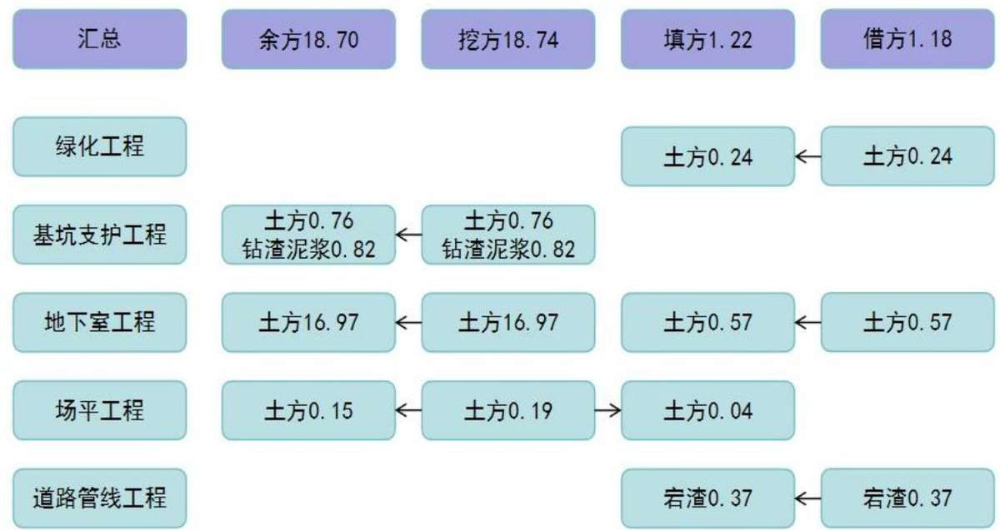  
说明：1.工程余方由杭州市西湖区综合行政执法局统一调配消纳。  
2.工程借方中表土及一般土方杭州市西湖区综合行政执法局统一调配利用。

单位：万 m³

表 2.4-7  
总土石方平衡  
单位：万 m³
<table><tr><td rowspan=2 colspan=1>序号</td><td rowspan=2 colspan=1>分项工程</td><td rowspan=1 colspan=2>挖方</td><td rowspan=1 colspan=3>填方</td><td rowspan=1 colspan=1>自身利用</td><td rowspan=1 colspan=3>借方</td><td rowspan=1 colspan=2>余（弃）方</td></tr><tr><td rowspan=1 colspan=1>土方</td><td rowspan=1 colspan=1>小计</td><td rowspan=1 colspan=1>表土</td><td rowspan=1 colspan=1>土方</td><td rowspan=1 colspan=1>小计</td><td rowspan=1 colspan=1>土方</td><td rowspan=1 colspan=1>表土</td><td rowspan=1 colspan=1>土方</td><td rowspan=1 colspan=1>小计</td><td rowspan=1 colspan=1>土方</td><td rowspan=1 colspan=1>小计</td></tr><tr><td rowspan=1 colspan=1>1</td><td rowspan=1 colspan=1>绿化工程</td><td rowspan=1 colspan=1>0</td><td rowspan=1 colspan=1>0</td><td rowspan=1 colspan=1>0.24</td><td rowspan=1 colspan=1>0</td><td rowspan=1 colspan=1>0.24</td><td rowspan=1 colspan=1>0</td><td rowspan=1 colspan=1>0.24</td><td rowspan=1 colspan=1>0</td><td rowspan=1 colspan=1>0.24</td><td rowspan=1 colspan=1>0</td><td rowspan=1 colspan=1>0</td></tr><tr><td rowspan=1 colspan=1>2</td><td rowspan=1 colspan=1>基坑支护工程</td><td rowspan=1 colspan=1>1.58</td><td rowspan=1 colspan=1>1.58</td><td rowspan=1 colspan=1>0</td><td rowspan=1 colspan=1>0</td><td rowspan=1 colspan=1>0</td><td rowspan=1 colspan=1>0</td><td rowspan=1 colspan=1>0</td><td rowspan=1 colspan=1>0</td><td rowspan=1 colspan=1>0</td><td rowspan=1 colspan=1>1.58</td><td rowspan=1 colspan=1>1.58</td></tr><tr><td rowspan=1 colspan=1>3</td><td rowspan=1 colspan=1>地下室工程</td><td rowspan=1 colspan=1>16.97</td><td rowspan=1 colspan=1>16.97</td><td rowspan=1 colspan=1>0</td><td rowspan=1 colspan=1>0.57</td><td rowspan=1 colspan=1>0.57</td><td rowspan=1 colspan=1>0</td><td rowspan=1 colspan=1>0</td><td rowspan=1 colspan=1>0.57</td><td rowspan=1 colspan=1>0.57</td><td rowspan=1 colspan=1>16.97</td><td rowspan=1 colspan=1>16.97</td></tr><tr><td rowspan=1 colspan=1>4</td><td rowspan=1 colspan=1>场平工程</td><td rowspan=1 colspan=1>0.19</td><td rowspan=1 colspan=1>0.19</td><td rowspan=1 colspan=1>0</td><td rowspan=1 colspan=1>0.04</td><td rowspan=1 colspan=1>0.04</td><td rowspan=1 colspan=1>0.04</td><td rowspan=1 colspan=1>0</td><td rowspan=1 colspan=1>0</td><td rowspan=1 colspan=1>0</td><td rowspan=1 colspan=1>0.15</td><td rowspan=1 colspan=1>0.15</td></tr><tr><td rowspan=1 colspan=1>5</td><td rowspan=1 colspan=1>合计</td><td rowspan=1 colspan=1>18.74</td><td rowspan=1 colspan=1>18.74</td><td rowspan=1 colspan=1>0.24</td><td rowspan=1 colspan=1>0.61</td><td rowspan=1 colspan=1>0.85</td><td rowspan=1 colspan=1>0.04</td><td rowspan=1 colspan=1>0.24</td><td rowspan=1 colspan=1>0.57</td><td rowspan=1 colspan=1>0.81</td><td rowspan=1 colspan=1>18.70</td><td rowspan=1 colspan=1>18.70</td></tr></table>

说明：1.工程余方由杭州市西湖区综合行政执法局统一调配消纳。  
2.工程借方中表土及一般土方由杭州市西湖区综合行政执法局统一调配利用。

## 2.5 拆迁（移民）安置与专项设施改（迁）建

项目建设前已完成建筑物拆除及场平工程。工程建设征地范围内不涉及移民安置与专项设施改（迁）建。

## 2.6 施工进度

项目于2026 年 2月开工，计划 2029 年1月完工，总工期为 36个月。计划进度分别安排如下：

1）2026年2 月\~2026 年5月，完成桩基础施工

2）2026年5 月\~2027 年9月，完成地下室施工；

3）2027年9 月\~2028 年9月，完成主体工程结构及附属工程施工；

4）2028 年 6 月\~2028 年 9 月，完成道路工程

5）2028年6 月\~2028 年9月，完成配套设施；

6）2028 年 8 月\~2028 年 11 月，完成项目绿化；

7）2028 年 12 月\~2029 年 1 月，总体建设完成。

工程施工进度情况见表2.6-1。

表 2.6-1  
工程施工进度情况表
<table><tr><td rowspan=2 colspan=1>序号</td><td rowspan=2 colspan=1>工程项目</td><td rowspan=1 colspan=4>2026年</td><td rowspan=1 colspan=4>2027年</td><td rowspan=1 colspan=4>2028年</td><td rowspan=1 colspan=1>2029年</td></tr><tr><td rowspan=1 colspan=1>I</td><td rowspan=1 colspan=1>Ⅱ</td><td rowspan=1 colspan=1>Ⅲ</td><td rowspan=1 colspan=1>IV</td><td rowspan=1 colspan=1>I</td><td rowspan=1 colspan=1>Ⅱ</td><td rowspan=1 colspan=1>ⅢⅢ</td><td rowspan=1 colspan=1>IV</td><td rowspan=1 colspan=1>I</td><td rowspan=1 colspan=1>ⅡI</td><td rowspan=1 colspan=1>ⅢⅢ</td><td rowspan=1 colspan=1>IV</td><td rowspan=1 colspan=1>I</td></tr><tr><td rowspan=1 colspan=1>1</td><td rowspan=1 colspan=1>桩基础施工</td><td rowspan=1 colspan=1></td><td rowspan=1 colspan=1></td><td rowspan=1 colspan=1></td><td rowspan=1 colspan=1></td><td rowspan=1 colspan=1></td><td rowspan=1 colspan=1></td><td rowspan=1 colspan=1></td><td rowspan=1 colspan=1></td><td rowspan=1 colspan=1></td><td rowspan=1 colspan=1></td><td rowspan=1 colspan=1></td><td rowspan=1 colspan=1></td><td rowspan=1 colspan=1></td></tr><tr><td rowspan=2 colspan=1>2</td><td rowspan=2 colspan=1>地下室施工</td><td rowspan=2 colspan=1></td><td rowspan=2 colspan=1></td><td rowspan=1 colspan=1></td><td rowspan=1 colspan=1></td><td rowspan=1 colspan=1></td><td rowspan=1 colspan=1></td><td rowspan=1 colspan=1></td><td rowspan=1 colspan=1></td><td rowspan=2 colspan=1></td><td rowspan=2 colspan=1></td><td rowspan=2 colspan=1></td><td rowspan=2 colspan=1></td><td rowspan=2 colspan=1></td></tr><tr><td rowspan=1 colspan=1></td><td rowspan=1 colspan=1></td><td rowspan=1 colspan=1></td><td rowspan=1 colspan=1></td><td rowspan=1 colspan=1></td><td rowspan=1 colspan=1></td></tr><tr><td rowspan=2 colspan=1>3</td><td rowspan=2 colspan=1>主体工程结构及附属工程施工</td><td rowspan=2 colspan=1></td><td rowspan=2 colspan=1></td><td rowspan=2 colspan=1></td><td rowspan=2 colspan=1></td><td rowspan=2 colspan=1></td><td rowspan=2 colspan=1></td><td rowspan=1 colspan=1></td><td rowspan=1 colspan=1></td><td rowspan=1 colspan=1></td><td rowspan=1 colspan=1></td><td rowspan=1 colspan=1></td><td rowspan=2 colspan=1></td><td rowspan=2 colspan=1></td></tr><tr><td rowspan=1 colspan=1></td><td rowspan=1 colspan=1></td><td rowspan=1 colspan=1></td><td rowspan=1 colspan=1></td><td rowspan=1 colspan=1></td></tr><tr><td rowspan=1 colspan=1>4</td><td rowspan=1 colspan=1>道路工程</td><td rowspan=1 colspan=1></td><td rowspan=1 colspan=1></td><td rowspan=1 colspan=1></td><td rowspan=1 colspan=1></td><td rowspan=1 colspan=1></td><td rowspan=1 colspan=1></td><td rowspan=1 colspan=1></td><td rowspan=1 colspan=1></td><td rowspan=1 colspan=1></td><td rowspan=1 colspan=1></td><td rowspan=1 colspan=1></td><td rowspan=1 colspan=1></td><td rowspan=1 colspan=1></td></tr><tr><td rowspan=1 colspan=1>5</td><td rowspan=1 colspan=1>配套设施</td><td rowspan=1 colspan=1></td><td rowspan=1 colspan=1></td><td rowspan=1 colspan=1></td><td rowspan=1 colspan=1></td><td rowspan=1 colspan=1></td><td rowspan=1 colspan=1></td><td rowspan=1 colspan=1></td><td rowspan=1 colspan=1></td><td rowspan=1 colspan=1></td><td rowspan=1 colspan=1></td><td rowspan=1 colspan=1></td><td rowspan=1 colspan=1></td><td rowspan=1 colspan=1></td></tr><tr><td rowspan=1 colspan=1>6</td><td rowspan=1 colspan=1>绿化工程</td><td rowspan=1 colspan=1></td><td rowspan=1 colspan=1></td><td rowspan=1 colspan=1></td><td rowspan=1 colspan=1></td><td rowspan=1 colspan=1></td><td rowspan=1 colspan=1></td><td rowspan=1 colspan=1></td><td rowspan=1 colspan=1></td><td rowspan=1 colspan=1></td><td rowspan=1 colspan=1></td><td rowspan=1 colspan=1></td><td rowspan=1 colspan=1></td><td rowspan=1 colspan=1></td></tr><tr><td rowspan=1 colspan=1>7</td><td rowspan=1 colspan=1>完工</td><td rowspan=1 colspan=1></td><td rowspan=1 colspan=1></td><td rowspan=1 colspan=1></td><td rowspan=1 colspan=1></td><td rowspan=1 colspan=1></td><td rowspan=1 colspan=1></td><td rowspan=1 colspan=1></td><td rowspan=1 colspan=1></td><td rowspan=1 colspan=1></td><td rowspan=1 colspan=1></td><td rowspan=1 colspan=1></td><td rowspan=1 colspan=1></td><td rowspan=1 colspan=1></td></tr></table>

工程实施进度：

## 2.7 自然概况

## 2.7.1 地形地貌

项目区所在地为杭州市西湖区，工程所经区域属杭嘉湖平原地貌，根据现场踏勘和主体工程资料，场地现状用地类型为教育用地，场地地势总体较平坦，局部略有起伏，绝对标高在3.97m～4.40m 之间，场地平整后平均高程约为4.05m。

## 2.7.2 地质

## 2.7.2.1 地质构造及地震

工程区属杭嘉湖沉积平原区，其大地构造位置属于扬子准地台钱塘江台褶带的余杭\~嘉兴台陷东北端，新构造运动主要以震荡性升降运动为主，近场区区域（25km半径范围） 断裂中有北东向的湖州—临安、马金—乌镇断裂、萧山—球川深断裂；北西向的孝丰—三门大断裂和前村—瓜沥断裂；东西向的昌化—普陀大断裂，全新统以来都没有活动。

根据《建筑抗震设计规范》（GB 50011-2010）（2016年版）及《中国地震动参数区划图》（GB18306-2015）的划分标准，杭州市西湖区抗震设防烈度为7度，设计地震分组为第一组，设计基本地震加速度值为0.10g。基本地震动峰值加速度反应谱特征周期值为0.45s。

## 2.7.2.2 地质条件

根据《浙江大学工信创新研究大楼项目岩土工程勘察报告》，场地勘探深度范围内岩土层可划分为6个工程地质层，8个工程地质亚层，各岩土层的特征自上而下分述如下：

①层杂填土：杂色、灰褐色，松散，性质不均，主要由碎石、粘性土组成，含大量碎砖、混凝土块等建筑垃圾，存在较多混凝土基础，含生活垃圾。由于其组成物质杂乱，分布缺乏规律性，造成杂填土的性质不均匀，均匀性差，稳定性一般；一般是任意堆填，未经充分压实，故具土质松散，低密实度、高压缩性和低强度等特性。

②层粉质粘土夹粘质粉土：灰色、灰黄色，软可塑，切面较光滑，有光泽，干强度及韧性中等。该层局部夹稍密状粘质粉土薄层，含贝壳碎屑。该层土均匀性一般。

③层淤泥质粉质粘土：灰色，流塑，含少量腐殖质；干强度中等，韧性中等，切面较光滑，稍有光泽；该软土层全场地分布，分布相对较平稳，属（微）超固结土，均匀性较好；结构性对软土工程力学性能影响较大，本场地淤泥质粉质粘土其原状土与其重塑土压缩特性、固结特性、强度特性有明显的差异。该软土层微观结构在受力过程中，从空架结构向片架结构过渡，最后为片架结构；属高灵敏度土，受到振动荷载后（如桩基施工或基坑开挖过程中），易出现土体结构强度降低，易出现土体侧向滑动或土体隆起等不良现象。

⑤层粉质粘土：灰黄色、青灰色，可塑，切面较光滑，有光泽，干强度及韧性中等。该层土均匀性较好。

⑦层含砾粉质粘土：灰黄色，硬可塑，切面较光滑，有光泽，干强度及韧性中等。该层局部夹有大量砾石，砾石含量 20%\~40%，粒径 2mm\~20mm。该层土均匀性一般，取原状土样较困难。

⑩a 层全风化泥质粉砂岩：灰黄色、青灰色、棕红色，母岩成份已完全风化，风化后呈粘土状，硬可塑状，夹强风化碎块。其下局部渐变为强风化，该层土均匀性一般。

⑩b 层强风化泥质粉砂岩：棕红色，稍硬，粉粒结构，原岩结构已基本破坏。裂隙发育，岩芯极破碎，以碎块状为主，岩块质软，遇水易软化。

⑩c 层中等风化泥质粉砂岩：褐红色、棕红色，粉砂质结构，块状构造，原岩结构较清晰，风化程度不高；裂隙发育不完全。岩石单轴天然抗压强度平均值为0.77MPa，属极软岩，岩体较完整，岩体基本质量等级为Ⅴ级；勘察孔深度内未见洞穴、临空面。分布稳定，巨厚层，均匀性较好；该层未揭穿。

上部地下水类型属孔隙潜水，潜水埋藏较浅，主要赋存于场地内的①层杂填土、②粉质粘土夹粘质粉土中。该层潜水主要受大气降水、地下同层侧向径流的补给，以蒸发与侧向径流为主要排泄方式，勘察期间测得地下水位埋深 0.40m～1.70m 左右，相当于高程 1.96m～4.55m，地下水位年变化在 1.0m\~2.0m 之间。

## 2.7.3 气象

工程区属亚热带季风气候，其基本特点是冬冷夏热，四季分明；降水充沛，光照充足；春夏雨热同步，秋冬光温互补；气候垂直变化明显，灾害性天气较多。根据杭州市气象台资料，多年平均气温在16.27℃。历年平均降水量1406.8mm，年最大降水量达 1755.6mm，年最小降水量仅774.4mm，年最大日降雨量191.3mm。年际变化大且年内分配极不均匀，降水主要分布在 4\~10 月，占全年降水的 73.7%，系梅雨和台风雨。年平均蒸发量 1235.3mm，年平均风速2.2m/s，主导风向为NNW。春季暖湿气流开始活跃，天气转暖，常有变化剧烈天气，气温呈波浪式回升。

## 2.7.4 水文

项目区属于运河水系，根据《杭州市城市防洪排涝规划》（2021-2035 年）及《杭州市防洪减灾规划》，拱宸桥为该区域内河水位代表站，历史资料统计计算其100年一遇最高洪水位为4.06m，50年一遇最高洪水位为3.85m。浙大西溪校区室外标高为3.93m～4.40m，本工程维持原有标高。

项目区东北侧约 30m 处为西溪河，是区域内重要的城市生态河道，水文特征兼具自然调节与人工管控属性。其水源主要来自西溪国家湿地公园及周边山体汇水，经五常港、西溪河等支流补充，河道整体呈西南\~东北走向，全长约 3.2km，流域面积涵盖西湖区蒋村、文新等街道部分区域。河道平均河宽15m\~25m，水深1.5m\~2.5m。西溪河临近本项目段河宽约14m\~16m，河道管理范围为5m。

根据《浙江省水功能区水环境功能区划分方案》（浙江省水利厅、浙江省环保厅，2015 年），项目所在区域水功能区属西溪河杭州景观娱乐用水区，水环境功能区属景观娱乐用水区,现状水质为Ⅳ，目标水质Ⅲ,详见表2.7-1。

项目区水系及水功能区详见附图2-4。

表 2.7-1  
工程区水功能区水环境功能区划
<table><tr><td rowspan=2 colspan=1>序号</td><td rowspan=2 colspan=1>水功能区</td><td rowspan=2 colspan=1>水环境功能区</td><td rowspan=2 colspan=1>河流</td><td rowspan=1 colspan=2>范    围</td><td rowspan=2 colspan=1>长度面积(km/km²)</td><td rowspan=2 colspan=1>现状水质</td><td rowspan=2 colspan=1>目标水质</td></tr><tr><td rowspan=1 colspan=1>起始断面</td><td rowspan=1 colspan=1>终止断面</td></tr><tr><td rowspan=1 colspan=1>杭嘉湖3</td><td rowspan=1 colspan=1>西溪河杭州景观娱乐用水区</td><td rowspan=1 colspan=1>景观娱乐用水区</td><td rowspan=1 colspan=1>沿山河—西溪</td><td rowspan=1 colspan=1>留下镇荆山</td><td rowspan=1 colspan=1>打索桥闸</td><td rowspan=1 colspan=1>13</td><td rowspan=1 colspan=1>IV</td><td rowspan=1 colspan=1>ⅢI</td></tr></table>

## 2.7.5 土壤

西湖区地形多样，受成土母质、地形和植被等因素影响，主要土壤类型有红壤、黄壤和水稻土。其中，红壤和黄壤多分布在低山丘陵地区，具有酸性强、养分含量较低等特点；水稻土主要分布在平原和河谷地区，肥力较高，适宜种植水稻等作物。根据《浙江大学工信创新研究大楼项目岩土工程勘察报告》和现场勘查，项目所在区域土壤类型属杂填土，无可剥离表土。

## 2.7.6 植被

项目区植被分区属中亚热带常绿阔叶林地带北部亚地带1 号植被区，随境内地形自东向西逐步抬高，植被的垂直分布明显。杭州市林草覆盖率达63%以上，森林资源位居全省第二。西湖区平原区域（主要集中在东部、北部沿湖平原及西溪湿地周边平原，地势平坦、水网密集，受人为活动影响较深）的植被以人工栽培植被为主、自然次生植被为辅，受人为活动影响，平原区域自然植被留存较少，仅在河道两岸、闲置地块、西溪湿地外围有零星分布，以耐贫瘠、适应性强的草本和灌木为主，除西溪湿地核心区外，多数植被为人工种植（如行道树、公园景观植物、茶园），现状场地无植被覆盖。

## 2.7.7 水土保持敏感区

工程区不涉及工程生态保护红线、永久基本农田、生态公益林、饮用水水源保护区、水功能一级区的保护区和保留区、自然保护区、风景名胜区、国家公园、地质公园、森林公园、世界文化和自然遗产地、重要湿地、文物保护单位等水土保持敏感区。

## 3 项目水土保持评价

## 3.1 主体工程选址（线）水土保持评价

本工程不属于《促进产业结构调整暂行规定》（国发〔2013〕21号）、国家发展和改革委员会发布的《产业结构调整指导目录（2024 年本）》中限制类和淘汰类产业的生产建设项目。

根据《中华人民共和国水土保持法》《生产建设项目水土保持技术标准》（GB50433-2018）、《浙江省水土保持条例》，对工程水土保持制约性因素逐条分析和评价。

（1）工程沿线不涉及国家级、省级、市级、县级水土流失重点预防区和重点治理区。

（2）工程不涉及河流两岸、湖泊和水库周边的植物保护带；工程未涉及生态保护红线、永久基本农田、生态公益林、饮用水水源保护区、自然保护区、风景名胜区、国家公园、地质公园、森林公园、世界文化和自然遗产地、重要湿地、文物保护单位等。

（3）工程未涉及泥石流易发区、崩塌滑坡危险区。

（4）工程未涉及全国水土保持监测网络中的水土保持监测站点、重点试验区、国家确定的水土保持长期定位观测站。

（5）水环境功能区属于景观娱乐用水区，不属于水功能一级区的保护区和保留区内可能严重影响水质的生产建设项目，以及不属于对水功能二级区的饮用水源区水质有影响的生产建设项目。

根据工程设计资料，工程建设所需的种植土，可由杭州市西湖区综合行政执法局统一调配或市场采购的方式解决，故不存在设置自采料场的问题。从水土保持角度分析，综合利用和商购的方式符合当地实际情况。

主体设计在项目区内的道路两侧、空地、屋顶进行绿化设计，增加绿化面积，不仅具有美化景观的效果，同时具保持水土的作用。施工后期，对绿化区域范围进行覆土，提高苗木成活率的同时可降低水土流失危害。此外，主体设计的绿化覆土、永久排水沟、雨水管网、雨水回用系统、透水铺装、下凹式绿地、场地平整、基坑坑顶外侧截水沟、临时占地绿化、临时占地临时排水沟、临时苫盖、临时围挡、钻渣泥浆处置等措施能有效的减少水土流失。

除了上述主体设计的措施外，本方案从水土保持角度提出工程施工过程中的临时排水沉沙、临时苫盖等措施及管理措施要求。

本工程水土保持制约性因素分析评价具体见表3.1-1。

表 3.1-1  
工程水土保持制约性因素分析评价
<table><tr><td rowspan=1 colspan=1>项目</td><td rowspan=1 colspan=1>要求内容</td><td rowspan=1 colspan=1>分析评价</td></tr><tr><td rowspan=6 colspan=1>《中华人民共和国水土保持法》</td><td rowspan=1 colspan=1>（1）禁止在崩塌、滑坡危险区和泥石流易发区从事取土、挖砂、采石等可能造成水土流失的活动。</td><td rowspan=1 colspan=1>均不涉及</td></tr><tr><td rowspan=1 colspan=1>(2)生产建设项目选址、选线应当避让水土流失重点预防区和重点治理区；无法避让的，应当提高防治标准，优化施工工艺，减少地表扰动和植被损坏范围，有效控制可能造成的水土流失。</td><td rowspan=1 colspan=1>工程不涉及国家级、省级、市级、县级水土流失重点预防区和治理区</td></tr><tr><td rowspan=1 colspan=1>(3）在山区、丘陵区、风沙区以及水土保持规划确定的容易发生水土流失的其他区域开办生产建设项目或者从事其他生产建设活动，损坏水土保持设施、地貌植被，不能恢复原有水土保持功能的，应当缴纳水土保持补偿费，专项用于水土流失预防和治理。</td><td rowspan=1 colspan=1>工程为学校项目，属于公益性工程，故免征水土保持补偿费</td></tr><tr><td rowspan=1 colspan=1>(4)水土流失严重、生态脆弱的地区，应当限制或者禁止可能造成水土流失的生产建设活动，严格保护植物、沙壳、结皮、地衣等。</td><td rowspan=1 colspan=1>均不涉及</td></tr><tr><td rowspan=1 colspan=1>(5)依法应当编制水土保持方案的生产建设项目，其生产建设活动中排弃的砂、石、土、矸石、尾矿、废渣等应当综合利用；不能综合利用，确需废弃的，应当堆放在水土保持方案确定的专门存放地，并采取措施保证不产生新的危害。</td><td rowspan=1 colspan=1>余方由杭州市西湖区综合行政执法局统一调配综合利用</td></tr><tr><td rowspan=1 colspan=1>(6)对生产建设活动所占用土地的地表土应当进行分层剥离、保存和利用，做到土石方挖填平衡，减少地表扰动范围；对废弃的砂、石、土、矸石、尾矿、废渣等存放地，应当采取拦挡、坡面防护、防洪排导等措施。生产建设活动结束后，应当及时在取土场、开挖面和存放地的裸露土地上植树种草、恢复植被，对闭库的尾矿库进行复垦。</td><td rowspan=1 colspan=1>项目区现状为杂填土，无可剥离表土</td></tr></table>

续表 3.1-1  
工程水土保持制约性因素分析评价
<table><tr><td rowspan=1 colspan=1>项目</td><td rowspan=1 colspan=1>要求内容</td><td rowspan=1 colspan=1>分析评价</td></tr><tr><td rowspan=6 colspan=1>《生产建设项目水土保持技术标准》(GB50433-2018)对主体工程约束性规定</td><td rowspan=1 colspan=1>（1）主体工程选址（线）应避让水土流失重点预防区和重点治理区；河流两岸、湖泊和水库周边的植物保护带；全国水土保持监测网络中的水土保持监测站点、重点试验区及水土保持长期定位观测站。</td><td rowspan=1 colspan=1>均不涉及</td></tr><tr><td rowspan=1 colspan=1>（2）严禁在崩塌和滑坡危险区、泥石流易发区内设置取土（石、砂）场。</td><td rowspan=1 colspan=1>不涉及</td></tr><tr><td rowspan=1 colspan=1>（3）严禁在对公共设施、基础设施、工业企业、居民点等有重大影响的区域设置弃土(石、渣、灰、矸石、尾矿）场。</td><td rowspan=1 colspan=1>余方由杭州市西湖区综合行政执法局统一调配处置，不涉及弃渣场</td></tr><tr><td rowspan=1 colspan=1>（4）涉及河道的应符合河流防洪规划和治导线的规定，不得设置在河道、湖泊和建成水库管理范围内。</td><td rowspan=1 colspan=1>均不涉及</td></tr><tr><td rowspan=1 colspan=1>（5）应控制施工场地占地，避开植被相对良好的区域和基本农田区。</td><td rowspan=1 colspan=1>项目区为教育用地，不涉及基本农田，施工临时设施场地均布置在永久占地范围内，施工生活区为新增临时占地，布置在校园空闲篮球场并采用围墙围挡，影响较小</td></tr><tr><td rowspan=1 colspan=1>（6）合理安排施工，防止重复开挖和多次倒运，减少裸露时间和范围；裸露地表应及时防护，减少裸露时间；填筑土方应随挖随运、随填、随压。</td><td rowspan=1 colspan=1>不涉及重复挖填倒运；裸露地表苫盖防护，填筑土方根据进度借方回填，临时堆置采取拦挡及苫盖措施防护</td></tr><tr><td rowspan=4 colspan=1>《浙江省水土保持条例》的限制性条文</td><td rowspan=1 colspan=1>1）生产建设项目在法律、法规规定禁止建设的区域的</td><td rowspan=1 colspan=1>不涉及</td></tr><tr><td rowspan=1 colspan=1>2）生产建设项目无法避让水土流失重点预防区和重点治理区，未相应提高水土流失防治标准的</td><td rowspan=1 colspan=1>工程不涉及国家级、省级、市级、县级水土流失重点预防区和治理区</td></tr><tr><td rowspan=1 colspan=1>3）生产建设项目取土场地未落实，或者取土场选址、设置不符合法律、法规规定和水土保持技术标准的</td><td rowspan=1 colspan=1>商购、不涉及取土场</td></tr><tr><td rowspan=1 colspan=1>4）生产建设项目排弃的砂、石、土、矸石、尾矿、废渣等，应当综合利用没有综合利用方案；或者确需排弃没有落实存放地，以及存放地选址、设置不符合法律、法规规定和水土保持技术标准的</td><td rowspan=1 colspan=1>余方由杭州市西湖区综合行政执法局统一调配综合利用</td></tr></table>

综合以上分析，主体工程选址（线）符合《中华人民共和国水土保持法》《浙江省水土保持条例》、《生产建设项目水土保持技术标准》（GB50433-2018）的要求，主体工程选址（线）不存在重大的水土保持制约因素，因此，本工程建设可行。

## 3.2 建设方案与布局水土保持评价

## 3.2.1建设方案评价

本项目主体工程不存在工程选址及建设方案方面的比选，不存在基于主体工程比选方案基础上的水土保持角度的比选内容。

## （1）工程平面布置的合理性分析与评价

本项目不属于《促进产业结构调整暂行规定》（国发〔2013〕21号）、《产业结构调整指导目录（2024年本）》中限制类和淘汰类产业的生产建设项目。本项目选址位于浙江大学西溪已建校区内，属于自有土地，本次建设不新增用地，国有土地使用证证号为杭西国用（2014）第 100001号。项目选址唯一。

项目区内建筑物之间为硬化地面及绿化，增加了彼此的独立性。在建筑物四周布置环形道路及集中绿化等配套设施，最大程度的利用了土地资源，同时增加绿化面积，形成整体的绿化体系，项目区平面布置合理。

工程建设平面布局充分考虑了功能区分，在平面布置上充分利用红线范围内角落区域进行综合绿化，同时增加绿化植被种植，有利于水土保持。

本工程通过设置透水铺装、下凹绿地、雨水调蓄设施等海绵设置，收集场地优质雨水，多余雨水溢流排入场地雨水管网并就近排入市政雨水管。海绵城市通过“渗、滞、蓄、净、用、排” 的综合技术体系，从源头、过程到末端系统性优化水文循环，对水土保持具有多维度、深层次的积极作用。

根据主体平面布置，工程平面布置以节约土地、便于生产管理、美观为原则，合理配置建筑物、道路、硬地及绿地，主体工程施工临时设施场地尽量利用工程永久占地范围，但由于场地有限，施工生活区布置在临近红线外的校园篮球场位置。该区地面平整，待施工结束后拆除地面临建设施归还学校，可以避免场地开挖回填，符合水土保持要求。

## （2）项目竖向设计合理性分析与评价

根据地勘报告，项目区现状地面平均高程约 4.05m。浙大西溪校区室外标高为3.93m～4.40m，本工程维持原有标高。

本项目设计室内标高 4.40m，室外道路和地面标高 4.30m。设计地坪标高满足区域防洪、排涝要求。

主体设计的标高尽可能的减少了项目的土石方挖填总量，减少施工过程中的水土

流失量，符合水土保持要求。

项目区周边道路中，地块北侧文三路邻近段高程为4.08m\~4.28m；东侧保俶北路现状高程为3.83m\~4.24m。低于项目区室外设计地坪标高，相邻段室外设计标高与周围道路差异不大，与区外道路衔接采取连续平坡式设计，平缓过渡，不会产生较大边坡，避免了高差过大可能产生的边坡问题。

综上所述，以防洪要求与道路衔接的原则，本工程标高设计合理。

## 3.2.2 工程占地评价

## （1）占地数量评价

根据主体工程初步设计报告，本项目用地为学校产权用地，为存量土地，无新增建设用地，浙江大学工信创新研究大楼项目占地面积合计 2.72hm2，其中永久占地2.52hm2，临时占地0.20hm2，为施工生活区；另外，施工涉及施工生产区、临时堆土场、泥浆干化设备、泥浆池等位于永久占地红线范围内，面积为0.29hm2。

项目选址位于西湖区浙江大学西溪校区内，为教育用地，不涉及征地及移民安置、不涉及占用永久基本农田。项目对外交通便利，场地与东侧保俶北路紧邻，不需另设施工道路，可减少施工道路占地。施工用电、用水等利用已有设施或就近引接，综合管线设计均埋入地下，基本不占用地上面积。施工后，用地主要被建筑物、道路与配套设施等覆盖。

项目主体工程设计中充分考虑地形条件和场地空间，在满足工程布置的同时，严格控制施工临时设施场地的面积，尽量减少占地。

## （2）节约用地评价

施工临时设施场地布置在永久占地红线范围内，主要布设施工生产区、临时堆土场、泥浆干化设备、泥浆池等。施工临时占地设置在工程建设用地红线范围外南侧，紧邻建设用地地块，为施工生活区，利用校区篮球场布置。各施工区范围在施工过程中能够实现全围挡，封闭施工，可有效地控制施工活动扰动范围。

工程不设置取土（石、料）场，所需砂石料即需即购。项目不设置弃土（石、料）场，余方综合利用。

## （3）临时堆土场评价

在桩基工程施工前期，由于桩基施工强度较大，产生的固化土方量较多，为确保工程有序推进，拟在场地中部设置一处固化土临时堆场。该堆土场占地面积约0.11hm2，四周依托现有围墙围合，周边无居民区等环境敏感点，计划使用时段为 2026 年2月至2026年3月，临时中转周期约1个月。堆体设计容量为 $2 2 5 0 \mathrm { m } ^ { 3 }$ ，堆置高度不超过3.0m，边坡坡比缓于1:2，并在四周设置填土编织袋进行临时拦挡及临时苫盖。

表 3.2-1  
临时堆土场特性表
<table><tr><td rowspan=1 colspan=1>名称</td><td rowspan=1 colspan=1>面积/hm²</td><td rowspan=1 colspan=1>最大堆高/m</td><td rowspan=1 colspan=1>堆置坡比</td><td rowspan=1 colspan=1>最大堆存量/m³</td><td rowspan=1 colspan=1>堆场类型</td><td rowspan=1 colspan=1>堆存时间</td><td rowspan=1 colspan=1>周边是否存在水土保持敏感区域</td><td rowspan=1 colspan=1>防护方式</td><td rowspan=1 colspan=1>备注</td></tr><tr><td rowspan=1 colspan=1>临时堆土场</td><td rowspan=1 colspan=1>0.11</td><td rowspan=1 colspan=1>3.0</td><td rowspan=1 colspan=1>≤1:2</td><td rowspan=1 colspan=1>2250</td><td rowspan=1 colspan=1>平地型</td><td rowspan=1 colspan=1>2026年2月~2026年3月</td><td rowspan=1 colspan=1>无</td><td rowspan=1 colspan=1>临时拦挡及临时苫盖</td><td rowspan=1 colspan=1>上方无来水</td></tr></table>

项目建设过程中，进行开挖、填筑活动，若不重视水土保持工作，将造成项目区内大范围的水土流失，不仅危害主体工程安全运营，而且会影响项目区周边校园及居民区环境。施工过程中应优化施工工艺，严格按照征地红线范围施工，尽量减少对周边环境的影响，并规范施工，避免各种不必要的扰动土地行为。

## 3.2.3 土石方平衡分析评价

## （1）土石方挖填数量评价

主体工程设计中，工程土石方主要包括绿化工程、基坑围护、地下室工程、场平工程。绿化所需表土均表土及一般土方均由杭州市西湖区综合行政执法局统一调配；工程产生的弃方按照相关要求办理外运手续，由杭州市西湖区建设项目渣土均由杭州市西湖区综合行政执法局统一调配消纳；场地平整工程过程中开挖回填量较小，仅产生少量弃方。

方案认为主体土石方调配等基本合理，各工程单元基础及室外总平工程开挖深度设计合理，减少了土石方挖填量，同时根据各个工程单元土石方挖方组成不同和回填需要，对不同工程单元之间的土石方进行了调配利用，有效减少了产生余方，符合水土保持要求。各项土石方挖填数量在满足主体设计和本方案要求的前提下达到最优。

## （2）土石方调运的评价

土石方平衡按以下步骤进行：首先在各单项工程内，根据土石方的开挖及回填量，分别计算出每一项目多余或不足的土石方数量，其次考虑施工时序、土石方材料质量及运距等情况，进行土石方综合平衡。

本项目土石方调运根据主体工程施工工艺和施工工序合理安排，满足节点适宜、时序可行的原则。本工程施工场地有限，不具备开挖方调运并用于本工程顶板覆土的条件，符合项目实际。

## （3）土石方自身利用评价

项目建设需要外借土石方合计0.81万m³，其中表土（种植土）0.24万 $\mathrm { m } ^ { 3 } .$ ，土方$0 . 5 7 \mathrm { ~ \mathscr ~ { ~ H ~ } ~ m ~ } ^ { 3 }$ ，建设产生余方 $1 8 . 7 0 \mathrm { ~ \mathscr ~ { ~ H ~ } ~ m ~ } ^ { 3 }$ ，外借土石方及余方均由杭州市西湖区综合行政执法局统一调配。项目自身开挖的土石方无法完全自身利用，仅场内地下室区域外场地平整可自身利用0.04万m3，主要受制于项目区域范围及周边无满足条件设置临时堆场的用地。

结合现场踏勘情况，在基坑安全控制线以外，征地红线内无法满足大量覆土堆放。项目位于浙江大学西溪校区一隅，周边没有能够满足长期用于土方堆置的土地，若临时借地堆放，需远距离借地，增加了新增临时占地和远距离运输对地表的扰动、对土壤植被的破坏，并有可能引发水土流失危害的发生。

结合杭州市以及周边项目施工情况，城区房产项目施工均具有地下室占地范围大、余方多和施工场地紧张的特点，地下室挖方基本采取全部外运处置，并在施工中即挖即运，渣土开挖施工进度需结合杭州市西湖区综合行政执法局审批的渣土清运手续进行调节。

## 3.2.4 减量化及资源化分析评价

## （1）弃方减量化分析

本项目在初设阶段考虑了挖填平衡，本着保护水土资源，减少水土流失，通过控制场平标高，提高自身开挖方利用率等角度，尽可能减少了土石方外运数量。本项目主要挖方为建筑物拆除、场地平整、基坑支护施工、地下室开挖等。结合本工程建设内容，可采取弃方减量化的设计内容包括：

## 1）竖向设计优化

本项目设计单位根据地形地貌并充分利用与周边市政道路的标高关系，合理确定场地标高，场地平整后平均高程约为4.05m，尽可能利用了工程挖方，减少了渣土外运数量。

在满足停车位配比和功能需求的前提下，合理确定基坑开挖深度，开挖深度定在7.1m\~10.05m。

## 2）地下室与基础方案优化

控制地下室深度，采用节地型支护结构最大可能减少地下室埋深，采用钻孔灌注桩、三轴搅拌桩、硬法咬合桩、基坑混凝土支撑等作为永久结构的一部分，使其在施工阶段作为支护，在使用阶段作为地下室外墙，避免额外拆除方量。工程基坑施工采用大开挖方式，开挖基坑采用放坡喷砼体系，可防止边坡坍塌，相对于裸露无防护边坡，减少土方坍塌扰动量约 $0 . 2 0 \mathrm { ~ \mathscr ~ { ~ H ~ } ~ m ~ } ^ { 3 } .$ 。本工程主体设计已对竖向布设进行优化，地下室采用桩支护，减少了基坑放坡开挖产生的土方约 1.58万m3。灌注桩采用全钢护筒封闭孔壁，避免孔壁水土流失，相对于湿作业成孔，可减少挖方量约0.07万m3。

## 3）土方内部平衡与调运

本项目土石方在开挖与回填过程中注重施工区域与施工时序的衔接。管线开挖土方全部回用至主体室外地面填筑，增加项目自身土方综合利用，减少余方约 0.13 万m3（包含在场平工程中）。

## （2）资源化利用分析

工程产生的土方和干化后的钻渣泥浆全部外运至资源化利用企业或用于其它项目综合利用，降低了环境影响，且有利于水土保持。

本项目开挖产生的多余一般土方可用于场地顶层填筑材料、非承重结构的回填材料、绿化地带基层回填。

## 3.2.5 取土（石、砂）场设置评价

本工程借方 0.81 万 m³，其中表土（种植土）0.24万 m³，土方 0.57 万 m³，由杭州市西湖区综合行政执法局统一调配。不设取土场。

## （1）绿化覆土

## 1）表土（种植土）来源

经调查，杭州市房地产项目绿化土方可利用素土或灰土，根据《杭州市城乡建设委员会杭州市城市管理局关于进一步规范建设工程建筑垃圾处置相关事项的通知（杭建工〔2023〕169号）》（详见附件G）《杭州市人民政府办公厅关于进一步推进建筑垃圾长效管理的通知（杭政办函〔2024〕41号）》（详见附件H）《杭州市综合行政执法局等四部门关于印发<杭州市建筑垃圾资源化利用支持政策（试行）>的通知》（2025 年7月8 日）（详见附件I）等文件规定和要求，表土（种植土）利用已纳入消纳场地管理，建设项目开挖土方中的耕作层和土方已实行分类处置，消纳过程中严格执行耕作层剥离和再利用制度。本工程位于杭州市西湖区，因此，本工程后期绿化时，所需表土由杭州市西湖区综合行政执法局统一调配。其它项目的表土经过土质检测合格后，作为本工程绿化种植土。

## 2）调配管理办法

根据管理流程，利用方在回填施工前，向综合行政执法局提出渣土消纳场地登记申请表（堆填场地、综合利用场地），经主管部门同意后下发办理结果意见书和杭州市工程渣土消纳场地登记证明。通过“工程渣土供需平衡平台”，由杭州市西湖区综合行政执法局确定供方。利用方和供方签订处置合同后、土方运输前，利用方场地应具备相应的摊铺、碾压、除尘、照明等机械和设备，有排水、消防等设施，有健全的环境卫生和安全管理制度并得到有效执行的。利用方在接收土方后出具接收证明或消纳场地接纳回执联，形成清运、接收闭环。

## 3）同类项目案例

根据实际调查，杭州市区项目绿化用土均由综合行政执法局调配，以塘栖 62号地块公租房项目程为例，该项目于 2022 年 9 月 20 日由杭州市临平区农业农村局以“临水保批复〔2022〕第 16 号”出具了关于该项目水土保持方案报告书的批复。项目施工时间2022年8月到2025年8 月。项目在绿化实施期间，办理了意见书和杭州市工程渣土消纳场地登记证明，并在接收绿化用土出具了接收证明（详见附件J）。

## （2）一般土方

由于房地产项目基坑安全控制线以外，征地红线内无法满足大量覆土堆放。且项目周边没有能够满足长期用于土方堆置的土地，故后续覆土无法利用自身开挖土方。工程需一般土方0.57 万m³，项目位于西湖区，目前区域内生产建设项目较多，尤以房地产开发项目居多，房地产项目具有地下室基坑大，基坑开挖余方量多的特点，后期所需土方可利用周边项目余方。按照西湖区渣土管理的要求，工程所需土方通过杭州市西湖区综合行政执法局统一调配。本工程不需设置料场，避免了因设置料场而新增水土流失、扰动地表，符合水土保持要求及项目实际情况。

综上，从水土保持角度认为，本工程取料符合当地的实际情况，同时避免了自行开采料场所增加的对土地植被的破坏以及造成的水土流失。

## 3.2.6 弃土（石、渣、灰、矸石、尾矿）场设置评价

## （1）余（弃）方处置方式及同类项目调查

本项目位于杭州市西湖区，属于杭州城市区域，根据《杭州市城市市容和环境卫生管理条例》《杭州市建设工程渣土管理办法》以及《杭州市城乡建设委员会杭州市城市管理局关于进一步规范建设工程建筑垃圾处置相关事项的通知》《杭州市人民政府办公厅关于进一步推进建筑垃圾长效管理的通知》等法规文件的和规定，杭州市内的工程渣土工作实行统一管理，由杭州市西湖区综合行政执法局调配进行综合利用，本项目不设置弃土（石、渣、灰、矸石、尾矿）场。

本方案编制阶段，对还杭州市西湖区（项目所在地）类似项目的渣土处置情况进行了调查。根据实际调查，西湖区近两年施工项目较多，其中浮山单元 XH2007-G1/S42-15 地块转塘回龙中心公园及地下公共停车库项目于 2024 年 3 月取得水土保持方案报告书批复（杭西水许〔2024〕第15号），项目施工时间为2024年3月\~2025年12月；杭州赛艾孚弘润汽车制动蹄智能制造项目于2025 年7 月取得登记表备案，项目施工时间为 2025 年 7 月\~2027 年 11 月。该项目土方外运情况详见表 3.2-1。同类项目余方处置案例相关支撑材料见附件 H。

表 3.2-1  
同类工程余方综合利用处置调查
<table><tr><td rowspan=1 colspan=1>序号</td><td rowspan=1 colspan=1>项目名称</td><td rowspan=1 colspan=1>行政许可文号</td><td rowspan=1 colspan=1>综合利用项目名称</td><td rowspan=1 colspan=1>审批时间</td><td rowspan=1 colspan=1>申请处置方量(t)</td><td rowspan=1 colspan=1>处置证编号</td></tr><tr><td rowspan=3 colspan=1>1</td><td rowspan=3 colspan=1>浮山单元XH2007-G1/S42-15地块转塘回龙中心公园及地下公共停车库项目</td><td rowspan=1 colspan=1>杭综执西渣许准字〔2024〕第1138号</td><td rowspan=1 colspan=1>双浦单元 XH23-G1/S42-B39 公园及地下停车库项目</td><td rowspan=1 colspan=1>2024.5.21</td><td rowspan=1 colspan=1>5100</td><td rowspan=1 colspan=1>西湖0053-01</td></tr><tr><td rowspan=1 colspan=1>杭综执西渣许准字〔2024〕第419号</td><td rowspan=1 colspan=1>浮山单元 XH2007-04地块12班幼儿园</td><td rowspan=1 colspan=1>2024.10.16</td><td rowspan=1 colspan=1>5100</td><td rowspan=1 colspan=1>西湖0053-02</td></tr><tr><td rowspan=1 colspan=1>杭综执西渣许准字〔2024〕第421号</td><td rowspan=1 colspan=1>中船重工海洋信息装备军民融合产业化项目二期（A区）</td><td rowspan=1 colspan=1>2024.10.16</td><td rowspan=1 colspan=1>17000</td><td rowspan=1 colspan=1>西湖0053-03</td></tr><tr><td rowspan=2 colspan=1>2</td><td rowspan=2 colspan=1>杭州赛艾孚弘润汽车制动蹄智能制造项目</td><td rowspan=1 colspan=1>杭综执西渣许准字〔2025〕第690号</td><td rowspan=1 colspan=1>西湖区三墩镇杭长以南环境综合整治三期</td><td rowspan=1 colspan=1>2025.7.11</td><td rowspan=1 colspan=1>8500</td><td rowspan=1 colspan=1>西湖0134-01</td></tr><tr><td rowspan=1 colspan=1>杭综执西渣许准字〔2025〕第1002号</td><td rowspan=1 colspan=1>富阳区胥口镇平畈渣土消纳场</td><td rowspan=1 colspan=1>2025.9.30</td><td rowspan=1 colspan=1>15000</td><td rowspan=1 colspan=1>西湖0134-04</td></tr></table>

通过同类项目的调查，杭州市西湖区内建设产生的渣土全部需由杭州市西湖区综合行政执法局进行调配利用，不设置弃土（石、渣、灰、矸石、尾矿）场。运输车在运输渣土时，必须做好冲洗及苫盖措施，根据工程场地实际，在工地出入口设置洗车平台，配备洗车设施，确保渣土运输车辆净车出场，严禁超载滥运，运载渣土时，必须加装液压可伸缩顶，车厢底部铺上防漏垫，防止泥土外漏。土方运输过程中做好苫盖或封闭措施，减少运输过程中对周边环境的影响，防止人为水土流失的产生。运输过程中严格按照规定的路线运输。

## （2）余（弃）方处置流程

根据杭州市的相关文件规定，杭州市域内的渣土、泥浆、建筑垃圾等均采用综合调配处置。其流程包括：

①施工招标阶段，建设单位应当在招标文件中对建筑垃圾处置方案提出要求，并列入技术评标内容，投标人应结合工程实际和消纳场地等有关情况，编制建筑垃圾处置方案。

②建设工程施工前，中标的施工单位应当进一步细化完善建筑垃圾处置方案，对工程项目建筑垃圾总量、回填利用量进行全面准确测算，明确出土总量、出土计划及时间、运输方式等具体内容。建筑垃圾处置方案报建设单位，并向项目所在地城管部门进行备案。

③施工时，实行建筑垃圾转移电子联单运行管理，落实出场每车（次）识别，并与接纳场地扫码识别，形成正常转移电子联单后施工单位才能与运输、处置单位结算建筑垃圾运输处置费用。工地和处置场地的车辆出入口安装数字化管控设备，对渣土运输车辆，按照每台运输车辆、每次运输数量落实管理。车辆安装 GPS 定位，严格按照批复运输线路运输。

④渣土外运时，施工单位按期向城管部门报送运渣计划；城管部门通过“工程渣土供需平衡平台”，根据消纳场的容量、地理位置、费用及工地需求，对本辖区所有项目的产渣、需渣情况进行协调、平衡。施工单位收到城管部门下发的杭州市建筑垃圾处置证后，施工单位方可根据处置证中消纳场地及批准方量运送相应数量建筑垃圾。

⑤项目结算时，国有资金投资项目工程结算时，施工单位需提供建筑垃圾去向及实际消纳方量情况；建设单位应对建筑垃圾处置核准证、消纳场地接纳回执联、工程竣工结算清单中建筑垃圾工程量三者进行比对：如实际消纳方量大于（或等于）工程竣工结算清单中建筑垃圾工程量90%的，应按竣工结算清单工程量进行结算；如实际消纳方量小于工程竣工结算清单建筑垃圾工程量 90%的，施工单位应提供情况说明并附以佐证材料，无法提供佐证材料的，应根据消纳场地接纳回执联工程量进行竣工结算。

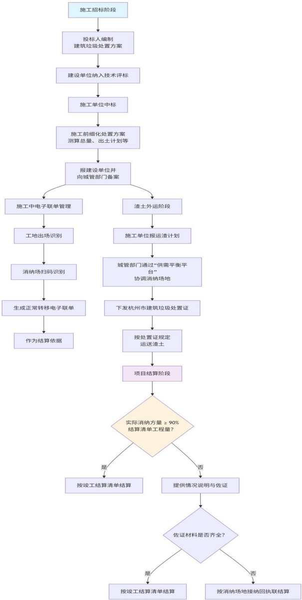  
图 3.2-1 杭州市域渣土消纳流程图

## （3）余（弃）方外运能力需求分析

本项目计划外运的余方总量为 18.70 万 m3，全部为开挖土方。出渣作业计划于2026 年2月开始，至2026 年8月结束，约7个月。预计日均出土量 $8 9 0 \mathrm m ^ { 3 }$ ，高峰期出渣量 3000 m3/d 至 3500 m3/d。

根据杭州市渣土外运及统一调配的要求，项目在正式进行出渣前，施工单位将依据既定的施工进度计划，编制详细的《余方处置方案》，并报送至杭州市西湖区综合行政执法局进行审批。方案中将明确外运土方的总量、外运作业的起止时间、每日及分阶段的出渣计划、运输路线规划以及运输车辆的组织安排等内容。施工单位必须投入足够数量的合规运渣车辆，并制定科学的调度计划，以确保实际运输能力能够满足项目高峰期的出渣强度要求。杭州市西湖区综合行政执法局在收到申报材料后，将结合本市建筑垃圾消纳场的实际容量与调配情况，进行审核，并对符合规定的项目出具《行政许可决定书》及《建筑垃圾处置证》，作为项目合法外运土方的行政许可文件。

## （4）余（弃）方处置转运需求分析

根据对杭州市区同类建设工程的经验，由于城市用地普遍紧张，项目施工红线范围内通常不具备设置临时堆土场的条件。因此，土方外运普遍采用“随挖随装、随装随运”模式。在此模式下，施工单位根据《建筑垃圾处置证》的办理与批复进度，调整和优化基坑开挖的作业面部署与每日施工计划，以实现开挖、装车、外运等环节的高效衔接，避免因证件或运力问题导致窝工。

以地理位置与条件相近的“浮山单元 XH2007-G1/S42-15 地块转塘回龙中心公园及地下公共停车库项目”为例，其建筑垃圾处置的实际情况具有重要参考价值。该项目在施工期间的日运渣处置量介于 $3 5 4 ~ \mathrm { m } ^ { 3 }$ 至 $3 1 8 8 ~ \mathrm { m } ^ { 3 }$ 之间，高峰期处置量的显著提升。同时，该项目同样未在场地内设置临时中转堆场，全程严格执行“随挖随运”原则。

## （5）余（弃）方处置综合分析

综上所述，本项目余方处置方式符合水土保持余方综合利用的要求，同时也结合了杭州市的建筑垃圾管理政策与市场消纳能力，在依法取得行政许可的前提下，通过科学的施工组织可确保土方外运作业的顺利实施。项目在实施阶段，出土量规划、工期安排、运输组织等方面均需经过合理测算，并充分借鉴区域同类项目的成熟经验与管理模式。因此，本项目余方处置具有充分的可行性与可操作性。

## 3.2.7 施工方法与工艺评价

## （1）施工条件的评价

施工交通：项目周边路网交叉纵横，交通条件成熟便利，为施工队伍、机械以及砂石料和外购材料的运输提供了良好的交通条件，无需新建施工便道；但项目施工期间应做好交通疏解，保证周边可绕行道路。从水土保持角度看，避免了因新修施工便道而增加地表扰动面积，有利于水土保持。

建筑材料：工程建设中所需的沙、石料购自当地政府批准的持证合法的采石、采沙场，本项目所需混凝土均采用商品混凝土，砼、钢材等从杭州市持证合法商家购买，相关沙、石料场等的水土流失防治责任由其开采建设单位承担，避免了工程小规模独立采砂、采石、取土而扩大水土流失影响范围。

## （2）施工布置的评价

施工期交通疏解方案：项目在施工期间通过外围诱导方案、施工提示标志和主要节点组织方案 3 个方面的交通疏解措施，基本能保证周边路网的通行条件和通行安全，同时做好水土流失防治工作，基本满足水土保持的要求。

施工期临时排水：项目改造施工过程中将破坏现状排水管道，本方案考虑新增临时排水、沉沙措施用于项目施工期的临时排水，施工期临时排水考虑分段排水，排水经沉沙池沉淀后抽排至周边道路市政管网，施工期临时排水基本满足水土保持的要求。

施工临建区：本项目红线范围外仅布设施工生产办公区，位于浙江大学西溪校区内部；施工所需其他材料均从附近供应场地运来，减少了临时占地，有利于水土保持。

余方综合利用：项目位于杭州市西湖区，借方由杭州市西湖区综合行政执法局统一调配。

临时堆土场：在桩基工程施工前期，由于桩基施工强度较大，产生的固化土方量较多，为确保工程有序推进，拟在场地中部设置一处固化土临时堆场。该临时堆土场占地面积约0.11hm2，四周依托现有围墙围合，周边无居民区等环境敏感点，临时中转周期约1个月，采取临时拦挡及苫盖措施。

## （3）施工时序的评价

项目区土石方工程施工时间主要为 2026 年 2 月\~2027 年 9 月，故本项目需提前做好土石方工程及主体工程雨季施工的防护措施。工程建设时，建设单位需在施工前做好场地排水等防护措施，尽可能将土石方开挖回填施工在雨季前完成，并做好相应

的临时防护措施，从源头上减少水土流失的发生。项目在建设时需按照一定施工时序进行操作，在保障施工安全的基础上，尽量采用先进技术，提高施工效率缩短工期，避免长时间扰动地表产生较大的水土流失。

## （4）施工方法与工艺的评价

本工程建设主要包括场地平整、建筑物工程施工（含地下室施工）、道路管线工程施工及绿化工程施工等部分。

施工时序为：桩基工程—基坑开挖—基础底板垫层—基础底板防水层—基础防水保护层—基础底板—地下室结构—地下室外防水—地下室周边回填—地上部分主体结构—墙体砌筑—专业安装—屋面工程—室内外装修—室外管线及道路广场—屋顶绿化及景观绿化—清理收尾，其主要施工方法工艺评价如下：

## 1）场地平整

场地平整、道路及其他配套设施施工过程中配置压实机，做到分层压实，控制有效的压实厚度，降低了土壤的松散系数，减少土壤颗粒流失的可能。

## 2）土石方开挖和基础施工

本项目地下室基坑和室外道路、管线等土石方开挖活动和各类基础施工，主要采用机械为主的施工方式，大量机械施工能提高施工效率和缩短工期，从而减少地表裸露时间，在同等侵蚀强度下，较大程度减少项目施工产生的土壤流失量。道路管线工程同步实施，分段实施，避免了全面铺开，减小了管线施工周期及扰动地表的裸露时间，施工过程中，尽力缩短回填周期、避开雨日施工，可有效减少水土流失，有利于水土保持。

## 3）基坑支护及基坑排水

根据《浙江大学工信创新研究大楼项目岩土工程勘察报告》，本项目基坑围护采用灌注桩+三轴搅拌桩（喷搅一体化水泥土桩）+内支撑形式方案，基坑支护在有效保证施工安全的同时，减免了基坑开挖边坡的裸露面，减少了基坑施工过程中产生的水土流失。在地下室开挖时，需做好基坑围护，利用抽水泵将基坑内汇水抽至项目区排水沟，通过项目排水沟、沉沙缓流泥沙后排入项目周边已有雨水管网项目区，从而降低基坑施工区域的水土流失。主体考虑将钻渣泥浆经泥浆中转池汇集中转后经泥浆离心机固化处理，采用状况良好的车辆外运至渣土消纳场地，符合水土保持要求。

## 4）硬质铺装

本项目硬质铺装分为透水性和非透水性两种，在减少地表裸露的情况下，本项目主体设计尽量采用透水铺装，透水铺装可以增加地表的降水渗透，符合水土保持要求。

## 5）绿化工程

本项目绿化包括乔灌草园林绿化、屋顶绿化、海绵城市配套绿化，绿化覆土采用人工配合机械方式，保证了土壤的孔隙度，有利于项目区绿化。项目区绿化采用乔、灌、草相结合的形式，提高了对降雨的截留能力，降低了汇流对土壤的冲刷，有利于水土保持。

整个项目施工方法（工艺）较合理，基本符合水土保持要求。但主体的土石方工程施工期间，需要及时地做好临时排水、沉沙等雨水排导工作，以最大限度的控制水土流失对周边区域造成的不良影响。

综上所述，主体工程施工布置、施工组织、施工时序、施工工艺和方法均在满足施工要求的基础上，选择了有利于水土保持的措施和方案，符合水土保持要求。但是主体设计对于施工期间临时防护措施的考虑仍存在不足，本方案将进行补充完善，并针对施工中工程管理和有关注意事项提出建议，以有效减少水土流失的发生。

## 3.2.8 主体工程设计中具有水土保持功能工程的评价

项目主要针对主体工程区、施工生活区、施工生产区、临时堆土场布设的具有水土保持功能的工程进行分析评价。

## （1）施工临时围挡

根据项目施工组织设计，项目正式开工前将在四周设置彩钢板作为施工临时围挡。施工临时围挡能有效防止扰动面人为扩大和施工建设对周边的影响，减缓项目区新增水土流失对项目建设区以外的地区的影响，同时也减少施工过程中水土流失所产生的影响，具有一定的水土保持功能，但不界定为主体具有水保功能的措施。

## （2）地面硬化

施工结束后，场区部分地面最终将被道路、建筑物等占压，构筑物间地面采用固土硬化措施处理，虽然这些措施在客观上具有一定的水土保持功能，能有效防止土壤侵蚀发生，但不界定为主体具有水保功能的措施。

## （3）基坑支护

本项目基坑支护采用灌注桩+三轴搅拌桩（喷搅一体化水泥土桩）+内支撑形式，基坑支护减少了基坑边坡裸露面，一定程度减少了基坑施工过程中的水土流失，虽具

有一定的水土保持作用但其主要功能为保证工程施工安全。

## （4）基坑内临时排水

在基坑内设置临时排水沟及集水井，防止雨水和地下水在基坑内汇集影响施工安全，兼顾沉淀泥沙，有序排水，利于水土保持。

以上措施是主体工程的一部分或是为主体工程安全考虑，虽然对防治水土流失有一定的作用，但不应界定为水土保持工程的措施。

## （5）洗车平台

主体工程在施工区出口处设置车辆冲洗设施，用于冲洗车辆轮胎及外壁等。车辆冲洗设施主要设置洗车平台、洗车池。洗车池废水收集后汇入周边临时排水沟，排水沟接排水出口前的沉沙池，洗车池溢水经临时沉沙池沉淀泥沙后可循环利用。

## 3.3 主体工程设计中水土保持措施界定

## 3.3.1 主体设计中水土保持措施界定原则

根据《生产建设项目水土保持技术标准》（GB50433-2018）中相关规定，纳入水土流失防治措施体系水土保持工程的界定原则为：

（1）以防治水土流失为主要目标的防护工程，应界定为水土保持工程。以主体工程设计功能为主、同时兼有水土保持功能的工程，不纳入水土流失防治措施体系，仅对其进行水土保持分析与评价。当不能满足水土保持要求时，可要求主体设计修改完善，也可提出补充措施（纳入水土流失防治措施体系）。

（2）对主体设计功能和水土保持功能难以区分的防护措施，可按破坏性试验的原则进行界定：假定没有这项防护措施，主体设计仍旧可以发挥作用，但会产生较大的水土流失，该项防护措施应界定为水土保持工程，纳入水土流失防治措施体系。

## 3.3.2 主体工程水土保持措施设计标准

根据《生产建设项目水土保持技术标准》（GB50433-2018）、《水土保持工程设计规范》（GB51018-2014）、《防洪标准》（GB50201-2014）、《室外排水设计标准》（GB50014-2021）、《建筑与小区雨水控制及利用工程技术规范》（GB50400-2016）、《民用建筑雨水控制与利用设计规程》（DB33/T1167-2019）、《城市绿地设计规范》（GB20420-2007）（2016 年版）、《城市绿化工程施工及验收规范》（CJJ/T 82-2012）、《杭州市海绵城市建设低影响开发雨水系统技术导则》等相关规定，本工程水土保持

措施设计标准如下：

## （1）工程措施

排水系统：根据《室外排水设计标准》（GB50014-2021），永久排水沟、雨水管网设计标准按5年一遇10min降雨历时。

海绵城市设计：根据《杭州市海绵城市建设低影响开发雨水系统技术导则》，本项目海绵城市设计控制指标为年径流总量控制率≥75%，年径流污染削减率（以SS计）≥60%，综合雨量径流系数≤0.60。本项目海绵城市设计通过设置透水铺装、下凹绿地、雨水回用系统等。

## （2）植物措施

根据《水土保持工程设计规范》（GB51018-2014），本项目植被恢复与建设工程级别为1级。

## （3）临时措施

基坑外侧截水沟、临时排水沟：排水设计标准按3年一遇10min短历时设计暴雨。  
临时沉沙池：采用三级沉沙池。

钻渣泥浆处置：根据《杭州市人民政府办公厅关于印发杭州市工程渣土管理实施办法的通知》（杭政办函〔2016〕51号），本项目执行“占地规模 20亩（含）以上或建筑体量 10万方（含）以上的建设工地应在工地内设置泥浆固化处理设备，实现泥浆就地处理”。本项目采用泥浆固化设备+泥浆池处置桩基施工产生的钻渣泥浆。

## 3.3.3 主体工程设计中水土保持措施

根据对主体设计资料的分析，主体设计中具有水土保持功能的措施主要有绿化覆土、永久排水沟、雨水管网、雨水回用系统、透水铺装、下凹式绿地、场地平整、景观绿化、基坑坑顶外侧截水沟、临时占地绿化、临时占地临时排水沟、临时苫盖围挡、钻渣泥浆处置等。

## （1）工程措施

## 1）绿化覆土

施工后期，对项目绿化区域进行覆土，覆土范围包括地面绿化区域和屋顶绿化区域。本区覆土面积共4734m2，其中地面绿化面积3513m2（包含下凹绿地），屋顶绿化面积1221m2。

## 2）永久排水沟

本项目通过海绵城市设计，包括设置透水铺装、下凹绿地、雨水回用系统等，雨水口以溢流形式排放超过雨水径流控制要求的降雨溢流排入市政雨水管渠。在排入市政雨水管渠前，雨水先通过永久排水沟，再通过排水管网，最后接入项目区东侧市政雨水管渠（项目东侧保俶北路已预留2处DN500雨水接口）。永久排水沟设计标准按5年一遇10min降雨历时。

永久排水沟共704m，其中药学院科研楼156m，光电、信电学院科研楼548m；采用C25钢筋砼结构，上带透水盖板（砾石+水篦子），矩形断面，底宽40cm，沟深40cm，衬砌厚度为10cm，底部采用10cm厚的C15素混凝土垫层。

## 3）雨水管网

场地内设置海绵设施溢流口、道路及广场雨水口、排水沟等，收集雨水排入地块排水管道，最终排至市政雨水管网。雨水管道采用重力流，按满管流设计。雨水管网设计标准按5年一遇10min降雨历时。本项目排水管网采用PE缠绕结构壁管，管径DN150\~DN500，总长为2641m，其中DN150长810m，DN300长1490m，DN400长260m，DN500长81m。

## 4）雨水回用系统

雨水回收系统采用网格型雨水回收系统，在地下车库顶板、主体建筑侧墙、采光井侧墙、风井侧墙及其他凸出顶板构筑物侧墙等布置排水板、渗透水收集管等，渗透水收集管设计间距根据顶板形状及建筑布局而定，总体呈网格状布置。

## 5）透水铺装

透水铺装采用透水沥青、透水混凝土、花岗岩石材等，能够使雨水迅速渗入地表，有效地补充地下水，同时雨水在透水材料中的下渗过程，使得悬浮物过滤并截留，可有效去除雨水径流中的SS悬浮污染物，根据园区道路采用人车分流行车较少的特点，硬化地面尽量采用透水铺装，透水铺装面积约为9273m2，有效降低场地径流系数。

## 6）下凹式绿地

根据景观设计设置下凹绿地，为了促进雨水的下渗及净化，充分利用建筑区绿地布置低势绿地（比周边硬化地面低10cm），通过调整硬化地面的坡向，使径流雨水可以自然漫流至低势绿地中下渗净化，减少水土流失，多余的雨水通过溢流管排入原有雨水井。本工程设置下凹绿地共计 $2 4 6 2 \mathrm { m } ^ { 2 }$ ，有效蓄水深度为8mm。下凹绿地采用铺设10cm砂土层+无纺土工布（250g/m2），最上层覆耕植土40cm，溢流井周边采用卵石

（粒径3cm \~5cm）覆盖，仅露出溢水口。

## 7）场地平整

在地面绿化、屋顶绿化区域通过地形平整施工，创造出符合设计要求的地形地貌，为后续园林绿化工程施工提供良好的基础条件。场地平整4734m2。

## （2）植物措施

## 1）景观绿化

本区地面绿化面积 3513m2（包含下凹绿地），屋顶绿化面积 1221m2，植物措施费用中已包含抚育管理。主要乔木品种有娜塔栎、榉树、紫薇、早樱、桂花，主要地被品种有细叶芒、金森女贞、毛鹃、小叶栀子、金叶石菖蒲等。绿化措施能起到保护环境、防治污染、维持生态平衡，对于防止降雨引起的裸露地表的击溅侵蚀和面蚀也有着很好效果，具有良好的水土保持功能，满足水土保持要求。

## （3）临时措施

## 1）基坑外侧截水沟

施工期间为防止项目区可能产生的水土流失对周边区域的影响，主体设计施工期临时截水沟，排水标准采用3年一遇10min，沿红线内侧结合基坑外围布设，截水沟长700m。临时截水沟措施共计开挖土方约232m3，回填土方232m3，砖砌体为68m3，C20砼护底46m3，砂浆抹面588m2。

## 2）临时绿化

在施工生活区的绿化池中，栽植灌草，主要植被为红花檵木，狗牙根等，绿化面积为300m2。

## 3）泥浆池

在项目区内设置泥浆临时中转池，布设时考虑就近汇集泥浆、方便运输和管理，其规模应根据具体施工实际需要确定，并考虑适当的安全系数，将废弃的钻渣泥浆经泥浆临时中转池汇集沉淀后采用封闭式运输车运出。施工期间，泥浆临时中转池周围设置安全围栏及明显的警示标志，防止发生安全隐患，要安排专人监管，沉淀后的钻渣要及时运出，泥浆临时中转池不得满置。

布设泥浆临时中转池2处，桩基工程施工结束后拆除。

## 4）施工生活区临时排水

本工程施工生活区面积为0.20hm2。场地内布设临时排水沟，宽30cm，深30cm，

接入校园内雨水管网。排水标准采用3年一遇10min，临时排水沟总长220m，共需开挖土方56m3，回填土方5m3，砌砖30m3，砂浆抹面208m2。

## 5）临时堆土场围挡及苫盖

在桩基工程施工前期，由于桩基施工强度较大，产生的固化土方量较多，为确保工程有序推进，拟在场地中部设置一处固化土临时堆场。该堆土场占地面积约 $1 1 0 0 \mathrm { m } ^ { 2 }$ 四周依托现有围墙围合，周边无居民区等环境敏感点，临时中转周期约1个月。堆体设计容量为2250m3，堆置高度不超过3.0m，边坡坡比缓于1:2。采取临时拦挡及临时苫盖措施，临时拦挡长度140m，临时苫盖1100m2。

综上所述，主体工程设计中具有水土保持功能的工程在完工后标准和数量基本满足水土保持要求，但施工期间的防护措施不满足要求，本方案将予以补充完善。在主体工程的施工中，要充分结合本方案新增的水土保持措施，做到主体工程设计中已有的水土保持措施设计与本方案新增的水土保持措施布设较好的结合，建立起一个防治效果显著、经济可行的水土保持措施体系。主体工程设计中已有的水土保持措施工程量及投资汇总见表3.3-1。

表 3.3-1  
主体工程设计的水土保持工程量及投资
<table><tr><td rowspan=1 colspan=1>序号</td><td rowspan=1 colspan=2>项目</td><td rowspan=1 colspan=1>单位</td><td rowspan=1 colspan=1>工程量</td><td rowspan=1 colspan=1>单价</td><td rowspan=1 colspan=1>投资(万元)</td></tr><tr><td rowspan=1 colspan=1>一</td><td rowspan=1 colspan=2>工程措施</td><td rowspan=1 colspan=1></td><td rowspan=1 colspan=1></td><td rowspan=1 colspan=1></td><td rowspan=1 colspan=1>456.86</td></tr><tr><td rowspan=1 colspan=1>1</td><td rowspan=1 colspan=2>I区（主体工程区）</td><td rowspan=1 colspan=1></td><td rowspan=1 colspan=1></td><td rowspan=1 colspan=1></td><td rowspan=1 colspan=1>456.86</td></tr><tr><td rowspan=1 colspan=1>1)</td><td rowspan=1 colspan=2>绿化覆土</td><td rowspan=1 colspan=1> $\mathrm { m } ^ { 3 }$ </td><td rowspan=1 colspan=1>2400</td><td rowspan=1 colspan=1>68.54</td><td rowspan=1 colspan=1>16.45</td></tr><tr><td rowspan=1 colspan=1>2)</td><td rowspan=1 colspan=2>永久排水沟</td><td rowspan=1 colspan=1>m</td><td rowspan=1 colspan=1>704</td><td rowspan=1 colspan=1>120</td><td rowspan=1 colspan=1>8.45</td></tr><tr><td rowspan=1 colspan=1>3)</td><td rowspan=1 colspan=2>排水管线</td><td rowspan=1 colspan=1>m</td><td rowspan=1 colspan=1>2641</td><td rowspan=1 colspan=1>228.96</td><td rowspan=1 colspan=1>60.47</td></tr><tr><td rowspan=2 colspan=1>4)</td><td rowspan=2 colspan=1>雨水回用系统</td><td rowspan=1 colspan=1>网格雨水回用系统</td><td rowspan=1 colspan=1>处</td><td rowspan=1 colspan=1>1</td><td rowspan=1 colspan=1>500000</td><td rowspan=1 colspan=1>50.00</td></tr><tr><td rowspan=1 colspan=1>雨水收集池</td><td rowspan=1 colspan=1> $\mathrm { m } ^ { 3 }$ </td><td rowspan=1 colspan=1>10</td><td rowspan=1 colspan=1>2500</td><td rowspan=1 colspan=1>2.50</td></tr><tr><td rowspan=1 colspan=1>5)</td><td rowspan=1 colspan=2>透水砖铺设</td><td rowspan=1 colspan=1> $\mathrm { m } ^ { 2 }$ </td><td rowspan=1 colspan=1>9273</td><td rowspan=1 colspan=1>320</td><td rowspan=1 colspan=1>296.74</td></tr><tr><td rowspan=1 colspan=1>6)</td><td rowspan=1 colspan=2>场地平整</td><td rowspan=1 colspan=1> $\mathrm { m } ^ { 2 }$ </td><td rowspan=1 colspan=1>4734</td><td rowspan=1 colspan=1>18.39</td><td rowspan=1 colspan=1>8.71</td></tr><tr><td rowspan=1 colspan=1>7)</td><td rowspan=1 colspan=2>下凹绿地</td><td rowspan=1 colspan=1> $\mathrm { m } ^ { 2 }$ </td><td rowspan=1 colspan=1>2462</td><td rowspan=1 colspan=1>55</td><td rowspan=1 colspan=1>13.54</td></tr><tr><td rowspan=1 colspan=1>二</td><td rowspan=1 colspan=2>植物措施</td><td rowspan=1 colspan=1></td><td rowspan=1 colspan=1></td><td rowspan=1 colspan=1></td><td rowspan=1 colspan=1>142.02</td></tr><tr><td rowspan=1 colspan=1>1</td><td rowspan=1 colspan=2>I区（主体工程区）</td><td rowspan=1 colspan=1></td><td rowspan=1 colspan=1></td><td rowspan=1 colspan=1></td><td rowspan=1 colspan=1>142.02</td></tr><tr><td rowspan=1 colspan=1>1)</td><td rowspan=1 colspan=2>景观绿化</td><td rowspan=1 colspan=1> $\mathrm { m } ^ { 2 }$ </td><td rowspan=1 colspan=1>4734</td><td rowspan=1 colspan=1>300</td><td rowspan=1 colspan=1>142.02</td></tr><tr><td rowspan=1 colspan=1>三</td><td rowspan=1 colspan=2>临时措施</td><td rowspan=1 colspan=1></td><td rowspan=1 colspan=1></td><td rowspan=1 colspan=1></td><td rowspan=1 colspan=1>26.49</td></tr><tr><td rowspan=1 colspan=1>1</td><td rowspan=1 colspan=2>I区（主体工程区）</td><td rowspan=1 colspan=1></td><td rowspan=1 colspan=1></td><td rowspan=1 colspan=1></td><td rowspan=1 colspan=1>10.25</td></tr><tr><td rowspan=5 colspan=1>1)</td><td rowspan=5 colspan=1>基坑坑顶外侧截水沟</td><td rowspan=1 colspan=1>土方开挖</td><td rowspan=1 colspan=1> $\mathrm { m } ^ { 3 }$ </td><td rowspan=1 colspan=1>232</td><td rowspan=1 colspan=1>28.55</td><td rowspan=1 colspan=1>0.66</td></tr><tr><td rowspan=1 colspan=1>土方回填</td><td rowspan=1 colspan=1> $\mathrm { m } ^ { 3 }$ </td><td rowspan=1 colspan=1>232</td><td rowspan=1 colspan=1>19.64</td><td rowspan=1 colspan=1>0.46</td></tr><tr><td rowspan=1 colspan=1>砌砖</td><td rowspan=1 colspan=1> $\mathrm { m } ^ { 3 }$ </td><td rowspan=1 colspan=1>68</td><td rowspan=1 colspan=1>648.49</td><td rowspan=1 colspan=1>4.41</td></tr><tr><td rowspan=1 colspan=1>C20砼护底</td><td rowspan=1 colspan=1> $\mathrm { m } ^ { 3 }$ </td><td rowspan=1 colspan=1>46</td><td rowspan=1 colspan=1>648.49</td><td rowspan=1 colspan=1>2.98</td></tr><tr><td rowspan=1 colspan=1>水泥砂浆抹面</td><td rowspan=1 colspan=1> $\mathrm { m } ^ { 2 }$ </td><td rowspan=1 colspan=1>588</td><td rowspan=1 colspan=1>29.63</td><td rowspan=1 colspan=1>1.74</td></tr><tr><td rowspan=1 colspan=1>2</td><td rowspan=1 colspan=2>Ⅱ区（施工临时设施区）</td><td rowspan=1 colspan=1></td><td rowspan=1 colspan=1></td><td rowspan=1 colspan=1></td><td rowspan=1 colspan=1>16.24</td></tr><tr><td rowspan=1 colspan=1>1)</td><td rowspan=1 colspan=2>临时绿化</td><td rowspan=1 colspan=1> $\mathrm { m } ^ { 2 }$ </td><td rowspan=1 colspan=1>300</td><td rowspan=1 colspan=1>80</td><td rowspan=1 colspan=1>2.40</td></tr><tr><td rowspan=3 colspan=1>2)</td><td rowspan=3 colspan=1>泥浆中转池及干化设备</td><td rowspan=1 colspan=1>土方开挖</td><td rowspan=1 colspan=1> $\mathrm { m } ^ { 3 }$ </td><td rowspan=1 colspan=1>386</td><td rowspan=1 colspan=1>28.55</td><td rowspan=1 colspan=1>1.10</td></tr><tr><td rowspan=1 colspan=1>砌砖</td><td rowspan=1 colspan=1> $\mathrm { m } ^ { 3 }$ </td><td rowspan=1 colspan=1>116</td><td rowspan=1 colspan=1>648.49</td><td rowspan=1 colspan=1>7.52</td></tr><tr><td rowspan=1 colspan=1>水泥砂浆抹面</td><td rowspan=1 colspan=1> $\mathrm { m } ^ { 2 }$ </td><td rowspan=1 colspan=1>483</td><td rowspan=1 colspan=1>29.63</td><td rowspan=1 colspan=1>1.43</td></tr><tr><td rowspan=4 colspan=1>3)</td><td rowspan=4 colspan=1>临时排水沟</td><td rowspan=1 colspan=1>土方开挖</td><td rowspan=1 colspan=1> $\mathrm { m } ^ { 3 }$ </td><td rowspan=1 colspan=1>56</td><td rowspan=1 colspan=1>28.55</td><td rowspan=1 colspan=1>0.16</td></tr><tr><td rowspan=1 colspan=1>土方回填</td><td rowspan=1 colspan=1> $\mathrm { m } ^ { 3 }$ </td><td rowspan=1 colspan=1>5</td><td rowspan=1 colspan=1>19.64</td><td rowspan=1 colspan=1>0.01</td></tr><tr><td rowspan=1 colspan=1>砌砖</td><td rowspan=1 colspan=1> $\mathrm { m } ^ { 3 }$ </td><td rowspan=1 colspan=1>30</td><td rowspan=1 colspan=1>648.49</td><td rowspan=1 colspan=1>1.95</td></tr><tr><td rowspan=1 colspan=1>砂浆抹面</td><td rowspan=1 colspan=1> $\mathrm { m } 2$ </td><td rowspan=1 colspan=1>208</td><td rowspan=1 colspan=1>29.63</td><td rowspan=1 colspan=1>0.62</td></tr><tr><td rowspan=2 colspan=1>4)</td><td rowspan=2 colspan=1>临时堆土场防 $\sharp ^ { \flat }$ </td><td rowspan=1 colspan=1>密目网</td><td rowspan=1 colspan=1> $\mathrm { m } ^ { 2 }$ </td><td rowspan=1 colspan=1>1100</td><td rowspan=1 colspan=1>5.5</td><td rowspan=1 colspan=1>0.61</td></tr><tr><td rowspan=1 colspan=1>填土编织袋</td><td rowspan=1 colspan=1> $\mathrm { m } ^ { 3 }$ </td><td rowspan=1 colspan=1>60</td><td rowspan=1 colspan=1>147.13</td><td rowspan=1 colspan=1>0.44</td></tr><tr><td rowspan=1 colspan=3>合计</td><td rowspan=1 colspan=1></td><td rowspan=1 colspan=1></td><td rowspan=1 colspan=1></td><td rowspan=1 colspan=1>625.37</td></tr></table>

## 4 水土流失分析与预测

## 4.1水土流失现状

根据全国土壤侵蚀类型区划，项目区属于以水力侵蚀为主的南方红壤区，容许土壤流失量500t/km²•a。水土流失的类型主要为水力侵蚀。杭州市水土流失重点防治区图见附图4-1。

根据 2024 年水土流失动态监测成果，工程所在的区域水土流失情况见表 4.1-1。工程区土壤侵蚀强度分布图详见附图 4-3。

表 4.1-1  
工程所涉及区域水土流失面积统计  
单位：km2
<table><tr><td rowspan=2 colspan=1>区域</td><td rowspan=2 colspan=1>土地总面积</td><td rowspan=1 colspan=7>水土流失面积</td></tr><tr><td rowspan=1 colspan=1>轻度</td><td rowspan=1 colspan=1>中度</td><td rowspan=1 colspan=1>强烈</td><td rowspan=1 colspan=1>极强烈</td><td rowspan=1 colspan=1>剧烈</td><td rowspan=1 colspan=1>小计</td><td rowspan=1 colspan=1>水土流失面积占土地总面积的比例（%）</td></tr><tr><td rowspan=1 colspan=1>杭州市</td><td rowspan=1 colspan=1>16596</td><td rowspan=1 colspan=1>858.28</td><td rowspan=1 colspan=1>55.24</td><td rowspan=1 colspan=1>37</td><td rowspan=1 colspan=1>8.32</td><td rowspan=1 colspan=1>0.73</td><td rowspan=1 colspan=1>959.57</td><td rowspan=1 colspan=1>5.78</td></tr><tr><td rowspan=1 colspan=1>西湖区</td><td rowspan=1 colspan=1>309</td><td rowspan=1 colspan=1>7.64</td><td rowspan=1 colspan=1>0.40</td><td rowspan=1 colspan=1>0.24</td><td rowspan=1 colspan=1>0.06</td><td rowspan=1 colspan=1>0.05</td><td rowspan=1 colspan=1>8.39</td><td rowspan=1 colspan=1>2.72</td></tr></table>

《水利部办公厅关于做好国家级水土流失重点预防区和重点治理区落地上图成果应用的通知》（办水保〔2025〕170号）工程区不属于国家级水土流失重点预防区和重点治理区。根据《关于公布省级水土流失重点预防区和重点治理区的公告》（公告〔2015〕2号），本工程不属于省级水土流失重点预防区和重点治理区。根据《杭州市水土保持“十四五”规划》，本工程不属于杭州市水土流失重点预防区和重点治理区。

通过调查，工程位于浙大西溪校区内，项目建设前已完成建筑物拆除及场平工程。根据对项目区的地面坡度、植被、地表覆盖物等水土流失因子调查，项目区土壤侵蚀强度以微度侵蚀为主，工程所在区域土壤侵蚀背景值 $3 0 0 \mathrm { t / k m ^ { 2 } \cdot \mathrm { a } } .$

## 4.2 水土流失影响因素分析

## 4.2.1 水土流失影响因素

根据工程施工的特点，工程可能造成的水土流失主要发生在工程开挖、填筑等地表扰动区域，包括建筑物区、道路及其他配套设施、绿化工程、施工生活区、施工生

产区、临时堆土场等。

本工程的水土流失主要发生在施工期和自然恢复期。工程区内的场地开挖、场地回填会对工程占地范围内产生扰动。施工期间，施工活动将对土壤环境造成直接与间接损害，原有地形地貌受到较大程度的扰动和损坏，使区域内土壤抗侵蚀能力降低，水土流失加剧。施工建设期指开挖、场地填筑以及土建工程大规模施工直至施工结束。此时，由于基坑等的开挖及施工后期场地的填筑等建设活动将会有大量的开挖和填筑裸露面产生，裸露面表层结构疏松，侵蚀强度较大，施工时土石方的搬运和堆置过程中造成的水土流失量也较大。

自然恢复期，由于扰动地表的各项施工活动已基本停止，水土流失量将较施工期明显减少，侵蚀模数逐渐降低，并逐渐达到背景值，但此过程中仍有一定量的水土流失。

在项目建设过程中，若临时防护措施不到位，产生的新增水土流失将给项目区及其周边环境带来危害。因此，科学预测工程建设过程中造成的水土流失及其影响，为尽可能减少工程施工对原地貌的破坏、合理布设防护措施、有效防治新增水土流失、重建和恢复区域生态防护体系提供依据，以保证项目建设的安全施工和运营以及生态环境的良性循环，为当地经济的可持续发展服务。

## 4.2.2 扰动地表及损坏植被面积

工程建设过程中，地面设施的兴建、开挖、填筑等都不同程度、不同形式地扰动了原地貌形态，损坏了地表土体结构和地面植被。根据主体工程设计资料及实地查勘，结合征占地使用范围，对项目建设区开挖扰动地表及损坏植被面积进行测算统计。项目扰动地表面积为2.72hm2。

## 4.2.3 水土保持补偿费计征面积

根据浙价费〔2014〕224 号及浙政办发〔2015〕107 号文件，工程水土保持补偿费计征面积主要由工程征占地引起，按工程征占地计取。本工程总占地面积2.72hm2，同时根据《水土保持补偿费征收使用管理办法》（财综〔2014〕8 号）第十一条，工程为学校项目，属于公益性工程，故免征水土保持补偿费。因此工程水土保持补偿费计征面积为0m2。

## 4.2.4 弃土（石、渣）量

项目土石方开挖总量18.74万m³，均为土方；填筑量0.85 万m³，其中表土（种植土）0.24 万 m³，土方 0.61 万 m³；自身利用土方 0.04 万 m³；借方 0.81 万 m³，其中表土（种植土）0.24万m³，土方0.57万m³；余（弃）方18.70万m³，均为土方。

## 4.3土壤流失量预测

## 4.3.1 计算单元

水土流失预测的目的是为了确定行之有效的水土保持措施总体布局，预测项目建设及运营带来的水土流失总量及分布，分析可能造成的水土流失危害，明确重点防治区。因此根据项目建设的不同情况，依据以下原则进行水土流失预测单元的划分：

1）同一预测单元的地貌、地表的物质组成相同；

2）同一预测单元扰动地表的形成机理与形态相同；

3）同一预测单元土地利用现状基本一致；

4）同一预测单位主要土壤侵蚀因子基本一致。

预测法将项目水土流失扰动单元划分为包括建筑物区、道路及其他配套设施、绿化工程、施工生活区、施工生产区、临时堆土场等6个扰动单元。根据《生产建设项目土壤流失量测算导则》（SL773-2018），考虑扰动方式、扰动后下垫面类型、地表组成物质等相近原则划分一般扰地表、工程开挖面、工程堆积体等二级预测单元，根据人为活动类型及上方有无来水等情况，划分三级预测单元。各区内未采取水土流失防治措施的碾压地表、填压面（填筑面）参照工程开挖面计算水土流失量。

工程水土流失预测单元划分情况详见表4.3-1。施工期预测面积为2.72hm2，自然恢复期预测面积为0.35hm²。

表 4.3-1  
水土流失预测单元划分表  
单位：hm2
<table><tr><td rowspan=2 colspan=1>分区</td><td rowspan=2 colspan=1>预测单元</td><td rowspan=1 colspan=2>面积</td></tr><tr><td rowspan=1 colspan=1>施工期（含施工准备期）</td><td rowspan=1 colspan=1>自然恢复期</td></tr><tr><td rowspan=3 colspan=1>I区（主体工程区）</td><td rowspan=1 colspan=1>建筑物区</td><td rowspan=1 colspan=1>1.00</td><td rowspan=1 colspan=1>0</td></tr><tr><td rowspan=1 colspan=1>道路及配套设施</td><td rowspan=1 colspan=1>0.93</td><td rowspan=1 colspan=1>0</td></tr><tr><td rowspan=1 colspan=1>绿化区</td><td rowspan=1 colspan=1>0.35</td><td rowspan=1 colspan=1>0.35</td></tr><tr><td rowspan=3 colspan=1>Ⅱ区（施工临时设施区）</td><td rowspan=1 colspan=1>施工生活区</td><td rowspan=1 colspan=1>0.20</td><td rowspan=1 colspan=1>0</td></tr><tr><td rowspan=1 colspan=1>施工生产区</td><td rowspan=1 colspan=1>0.13</td><td rowspan=1 colspan=1>0</td></tr><tr><td rowspan=1 colspan=1>临时堆土场</td><td rowspan=1 colspan=1>0.11</td><td rowspan=1 colspan=1>0</td></tr><tr><td rowspan=1 colspan=1></td><td rowspan=1 colspan=1>合计</td><td rowspan=1 colspan=1>2.72</td><td rowspan=1 colspan=1>0.35</td></tr></table>

## 4.3.2 预测时段

## （1）预测时段确定原则

① 预测时段应分施工期（含施工准备期）和自然恢复期。

② 各预测单元施工期和自然恢复期应根据施工进度分别确定；施工期为实际扰动地表时间；自然恢复期为施工扰动结束后，不采取水土保持措施的情况下，土壤侵蚀强度自然恢复到扰动前土壤侵蚀强度所需要的时间，应根据当地自然条件确定，本工程属于湿润区，取2年。

③ 施工期预测时间应按连续12个月为一年计；不足12 个月，但达到一个雨（风）季长度的，按一年计；不足一个雨（风）季长度的，按占雨（风）季长度的比例计算。

## 2）预测时段确定

施工期（含施工准备期）：预测时段为 2026年 2 月至 2028 年 11 月，施工期预测时段为2.83年。

表 4.3-2  
水土流失预测时段表
<table><tr><td rowspan=2 colspan=1>分区</td><td rowspan=2 colspan=1>预测单元</td><td rowspan=2 colspan=1>施工时段</td><td rowspan=1 colspan=2>预测时间（a）</td></tr><tr><td rowspan=1 colspan=1>施工期</td><td rowspan=1 colspan=1>自然恢复期</td></tr><tr><td rowspan=3 colspan=1>I区（主体工程区）</td><td rowspan=1 colspan=1>建筑物区</td><td rowspan=1 colspan=1>2026年2月~2028年9月</td><td rowspan=1 colspan=1>2.67</td><td rowspan=1 colspan=1>0</td></tr><tr><td rowspan=1 colspan=1>道路及配套设施</td><td rowspan=1 colspan=1>2028年6月~2028年9月</td><td rowspan=1 colspan=1>0.33</td><td rowspan=1 colspan=1>0</td></tr><tr><td rowspan=1 colspan=1>绿化区</td><td rowspan=1 colspan=1>2028年8月~2028年11月</td><td rowspan=1 colspan=1>0.33</td><td rowspan=1 colspan=1>2</td></tr><tr><td rowspan=3 colspan=1>Ⅱ区（施工临时设施区）</td><td rowspan=1 colspan=1>施工生活区</td><td rowspan=1 colspan=1>2026年2月~2028年11月</td><td rowspan=1 colspan=1>2.83</td><td rowspan=1 colspan=1>0</td></tr><tr><td rowspan=1 colspan=1>施工生产区</td><td rowspan=1 colspan=1>2026年2月~2028年11月</td><td rowspan=1 colspan=1>2.83</td><td rowspan=1 colspan=1>0</td></tr><tr><td rowspan=1 colspan=1>临时堆土场</td><td rowspan=1 colspan=1>2026年2月~2026年3月</td><td rowspan=1 colspan=1>0.25</td><td rowspan=1 colspan=1>0</td></tr></table>

## 4.3.3 土壤侵蚀模数

根据《生产建设项目土壤流失量测算导则》（SL773-2018），根据工程建设内容及生产建设项目土壤流失类型划分，本工程一级分类属水力作用下的土壤流失，根据工程防治区划分，建筑物二级分类属工程开挖面，三级分类属上方无来水开挖面；道路及配套设施、绿化、施工生活区、施工生产区二级分类属一般扰动地表，三级分类属地表翻扰型一般扰动地表，临时堆土场二级分类属工程堆积体，三级分类属上方无来水开挖面。泥浆采用流弃比计算。

表 4.3-3  
生产建设项目土壤流失类型划分
<table><tr><td rowspan=1 colspan=1>一级分类</td><td rowspan=1 colspan=1>二级分类</td><td rowspan=1 colspan=1>三级分类</td><td rowspan=1 colspan=1>说明</td><td rowspan=1 colspan=1>适用范围</td></tr><tr><td rowspan=3 colspan=1>水力作用下的土壤流失</td><td rowspan=1 colspan=1>一般扰动地表</td><td rowspan=1 colspan=1>地表翻扰型一般扰动地表</td><td rowspan=1 colspan=1>人为活动导致地表土壤翻动，原有植被覆盖明显减少或裸露，维持原有整体地形的扰动地表</td><td rowspan=1 colspan=1>道路及配套设施、绿化区、施工生产区、施工生活区</td></tr><tr><td rowspan=1 colspan=1>工程开挖面</td><td rowspan=1 colspan=1>上方无来水工程开挖面</td><td rowspan=1 colspan=1>工程开挖面上缘已达到或越过分水岭，或在工程开挖面顶部有截排水沟等坡面径流拦截措施，不受上方来水冲刷侵蚀的开挖面</td><td rowspan=1 colspan=1>建筑物区</td></tr><tr><td rowspan=1 colspan=1>工程堆积体</td><td rowspan=1 colspan=1>上方无来水堆积体</td><td rowspan=1 colspan=1>在平地或坡面堆积，不受上方来水冲刷侵蚀的堆积体</td><td rowspan=1 colspan=1>临时堆土场</td></tr></table>

根据查阅相关表格，杭州市年降雨侵蚀力因子为5858.6MJ.mm/（ hm2.h），土壤可蚀性因子为0.0030t.hm2.h/（ hm2.MJ.mm）。根据工程建设内容及扰动单元、计算单元的划分原则，并结合工程实际情况，本工程共划分为6 个计算单元（建筑物单元、道路及配套设施、绿化区、施工生活区、施工生产区、临时堆土场单元）。根据各计算单元所属的扰动类型，分别选取相应的计算公式（如下）。

扰动前计算单元水力作用下的土壤流失量参照公式：

$$
\mathrm { M _ { y z } = R K L _ { y } S _ { y } B E T A }\tag{式4.3-1}
$$

式中：

R——降雨侵蚀力因子，MJ.mm/（ hm2.h）；

K——土壤可蚀性因子， $\mathrm { \Delta t . h m ^ { 2 } . h / \Omega ( \ h m ^ { 2 } . M J . m m ) }$ ；

Ly——坡长因子，无量纲；

Sy——坡度因子，无量纲；

B——植被覆盖因子，无量纲；

E—工程措施因子，无量纲；

T-耕作措施因子，无量纲；

A-计算单元的水平投影面积， $\mathrm { h m } ^ { 2 }$

## （1）地表翻扰型

一般扰动地表计算单元土壤流失量测算按式4.3-2\~式4.3-5计算：

$$
\mathrm { M _ { y d } = R K _ { y d } L _ { y } S _ { y } B E T A }\tag{式4.3-2}
$$

式中：

$\mathrm { M _ { y d } }$ ——地表翻扰型一般扰动地表计算单元土壤流失量，t;

$\mathrm { K _ { y d } }$ —地表翻扰后土壤可蚀性因子， $\mathrm { { t . h m ^ { 2 } . h / \Omega ( \ h m ^ { 2 } . M J . m m ) } }$ ；

$$
{ \mathrm { K } } _ { \mathrm { y d } } { = } \mathrm { N K }\tag{式4.3-3}
$$

式中：

N——地表翻扰后土壤可蚀性因子增大系数，无量纲；（取2.13）

$$
\mathrm { L } _ { \mathrm { y } } { = } \ ( \lambda / 2 0 ) ^ { \mathrm { ~ m ~ } }\tag{式4.3-4}
$$

式中：

λ——计算单元水平投影坡长度，m，对一般扰动地表，水平投影坡长≤100m时按实际值计算，水平投影坡长＞100m按100m计算。

m——坡长指数，其中 $1 \theta { \leq } 1 ^ { \circ }$ 时，m取0.2； $1 ^ { \circ } < \theta { \leq } 3 ^ { \circ }$ 时，m取0.3； $3 ^ { \circ } < \theta { \leq } 5 ^ { \circ }$ 时，m取0.4； $\theta > 5 ^ { \circ }$ 时，m取0.5；

$$
\mathrm { S } _ { \mathrm { y } } { = } { - } 1 . 5 { + } 1 7 / [ 1 { + } \mathrm { e } ^ { ( 2 . 3 { - } 6 . 1 \sin \theta ) } ]
$$

（式4.3-5）

式中：

e——自然对数的底，可取2.72；

根据以上公式，计算得出扰动前道路及配套设施、施工生活区、绿化工程、施工生活区、施工生产区的土壤侵蚀模数背景值为 $0 \mathrm { t / h m } ^ { 2 } .$ a。扰动后道路及配套设施、绿化、施工生活区、施工生产区的土壤侵蚀模数为： $\mathrm { M _ { y d } / A { = } R K _ { y d } L _ { y } S _ { y } B E T }$ ，代入相关的模数计算得出，施工期道路及配套设施、施工生活区、绿化工程、施工生产区的土壤侵蚀模数分别为 $4 8 . 3 0 \mathrm { t } / \mathrm { h m } ^ { 2 } .$ .a、 $6 9 . 0 7 \mathrm { t } / \mathrm { h m } ^ { 2 } .$ a、 $4 6 . 6 1 \mathrm { t } / \mathrm { h m } ^ { 2 } . \mathrm { a }$ $2 6 . 5 4 \mathrm { t / h m } ^ { 2 } . \mathrm { a }$ ，自然恢复期绿化工程的土壤侵蚀模数为 $3 . 3 7 \mathrm { t } / \mathrm { h m } ^ { 2 } .$ .a。

表4.3-4  
地表翻扰型一般扰动地表计算过程一览
<table><tr><td rowspan=2 colspan=1>项目</td><td rowspan=2 colspan=1>单位</td><td rowspan=1 colspan=4>施工期</td><td rowspan=2 colspan=1>自然恢复期</td></tr><tr><td rowspan=1 colspan=1>道路及配套设施</td><td rowspan=1 colspan=1>施工生活区</td><td rowspan=1 colspan=1>施工生产区</td><td rowspan=1 colspan=1>绿化工程</td></tr><tr><td rowspan=1 colspan=1>地表翻扰后土壤可蚀性因子 $\mathrm { K y d }$ </td><td rowspan=1 colspan=1>t.hm².h/(hm².MJ.mm)</td><td rowspan=1 colspan=1>0.0064</td><td rowspan=1 colspan=1>0.0064</td><td rowspan=1 colspan=1>0.0064</td><td rowspan=1 colspan=1>0.0064</td><td rowspan=1 colspan=1>0.0064</td></tr><tr><td rowspan=1 colspan=1>坡长因子Ly</td><td rowspan=1 colspan=1>无量纲</td><td rowspan=1 colspan=1>0.574</td><td rowspan=1 colspan=1>1.196</td><td rowspan=1 colspan=1>0.8098</td><td rowspan=1 colspan=1>3.414</td><td rowspan=1 colspan=1>0.5740</td></tr><tr><td rowspan=1 colspan=1>坡度因子 Sy</td><td rowspan=1 colspan=1>无量纲</td><td rowspan=1 colspan=1>0.304</td><td rowspan=1 colspan=1>2.962</td><td rowspan=1 colspan=1>2.962</td><td rowspan=1 colspan=1>2.965</td><td rowspan=1 colspan=1>0.3038</td></tr><tr><td rowspan=1 colspan=1>植被覆盖因子B</td><td rowspan=1 colspan=1>无量纲</td><td rowspan=1 colspan=1>0.516</td><td rowspan=1 colspan=1>0.516</td><td rowspan=1 colspan=1>0.516</td><td rowspan=1 colspan=1>0.065</td><td rowspan=1 colspan=1>0.516</td></tr><tr><td rowspan=1 colspan=1>工程措施因子E</td><td rowspan=1 colspan=1>无量纲</td><td rowspan=1 colspan=1>1</td><td rowspan=1 colspan=1>1</td><td rowspan=1 colspan=1>1</td><td rowspan=1 colspan=1>1</td><td rowspan=1 colspan=1>1</td></tr><tr><td rowspan=1 colspan=1>耕作措施因子T</td><td rowspan=1 colspan=1>无量纲</td><td rowspan=1 colspan=1>1</td><td rowspan=1 colspan=1>1</td><td rowspan=1 colspan=1>1</td><td rowspan=1 colspan=1>1</td><td rowspan=1 colspan=1>1</td></tr><tr><td rowspan=1 colspan=1>水平投影面积A</td><td rowspan=1 colspan=1> $\mathrm { h m } ^ { 2 }$ </td><td rowspan=1 colspan=1>0.0743</td><td rowspan=1 colspan=1>0.049</td><td rowspan=1 colspan=1>0.0098</td><td rowspan=1 colspan=1>0.1956</td><td rowspan=1 colspan=1>0.0249</td></tr><tr><td rowspan=1 colspan=1>土壤流失量 $\mathbf { M } \mathbf { y } \mathbf { z }$ </td><td rowspan=1 colspan=1>t</td><td rowspan=1 colspan=1>3.588</td><td rowspan=1 colspan=1>3.378</td><td rowspan=1 colspan=1>0.457</td><td rowspan=1 colspan=1>5.191</td><td rowspan=1 colspan=1>0.0084</td></tr><tr><td rowspan=1 colspan=1>侵蚀模数</td><td rowspan=1 colspan=1> $\mathrm { t } / \mathrm { h m } ^ { 2 } \cdot \mathbf { a }$ </td><td rowspan=1 colspan=1>48.30</td><td rowspan=1 colspan=1>69.07</td><td rowspan=1 colspan=1>46.61</td><td rowspan=1 colspan=1>26.54</td><td rowspan=1 colspan=1>3.37</td></tr></table>

## （2）上方无来水工程开挖面

上方无来水工程开挖面土壤流失量按式4.3-6\~式4.3-9计算：

$$
\mathrm { M } _ { \mathrm { k w } } { = } \mathrm { R G } _ { \mathrm { k w } } \mathrm { L } _ { \mathrm { k w } } \mathrm { S } _ { \mathrm { k w } } \mathrm { A }
$$

（式4.3-6）

式中：

$\mathrm { M } _ { \mathrm { k w } }$ ——上方无来水工程开挖面计算单元土壤流失量，t;

$\mathrm { G } _ { \mathrm { k w } }$ 上方无来水工程开挖面土质因子， $\mathrm { { t . h m ^ { 2 } . h / \Omega ( \ h m ^ { 2 } . M J . m m ) } }$ ；

$\mathrm { L } _ { \mathrm { k w } }$ ——上方无来水工程开挖面坡长因子，无量纲；

$\mathrm { S _ { k w } }$ 上方无来水工程开挖面坡度因子，无量纲。

$$
\mathrm { G _ { k w } { = } 0 . 0 0 4 e ^ { 4 . 2 8 5 \mathrm { { I L } \ ^ { ( } 1 \mathrm { { - } C L A ^ { ) } / \rho } } } }\tag{式4.3-7}
$$

式中：

ρ——土体密度， $\mathrm { g } / \mathrm { m } ^ { 3 }$

SIL——粉粒（0.002\~0.05mm）含量，取小数；

CLA——黏粒（<0.002mm）含量，取小数。

$$
\mathrm { L } _ { \mathrm { k w } } = \mathrm { \Omega } \left( \lambda / 5 \right) { } ^ { - 0 . 5 7 }\tag{式4.3- 8}
$$

式中：

λ——计算单元水平投影坡长度，m，对一般扰动地表，水平投影坡长≤100m时按实际值计算，水平投影坡长＞100m按100m计算。

$$
\mathrm { S _ { k w } } = 0 . 8 0 { \sin } { \Theta } + 0 . 3 8\tag{式4.3-9}
$$

式中：

θ——计算单元坡度，（°），取值范围为 $0 ^ { \circ } { \sim } 9 0 ^ { \circ }$

根据以上公式计算得出，扰动前建筑物区的背景土壤侵蚀模数为 $0 \mathrm { t / h m } ^ { 2 } . \mathrm { a } .$ 。扰动后建筑物区的土壤侵蚀模数为： $\mathrm { M _ { k w } / A { = } R G _ { k w } L _ { k w } S _ { k w } }$ ，施工建筑物区的土壤侵蚀模数为 $1 0 8 . 7 5 \mathrm { t / h m } ^ { 2 } . \mathrm { a }$ ，自然恢复期建筑物区的土壤侵蚀模数为 $0 \mathrm { t / k m } ^ { 2 } . \mathrm { a }$

表 4.3-5 上方无来水工程开挖面计算过程一览
<table><tr><td rowspan=1 colspan=1>项目</td><td rowspan=1 colspan=1>单位</td><td rowspan=1 colspan=1>建筑物工程区</td></tr><tr><td rowspan=1 colspan=1>土质因子 Gkw</td><td rowspan=1 colspan=1> $\mathrm { t . h m } ^ { 2 } \mathrm { . h }$ ( $\mathrm { h m } ^ { 2 } . \mathrm { M J . m m } \ )$ </td><td rowspan=1 colspan=1>0.0052</td></tr><tr><td rowspan=1 colspan=1>坡长因子Lkw</td><td rowspan=1 colspan=1>无量纲</td><td rowspan=1 colspan=1>3.074</td></tr><tr><td rowspan=1 colspan=1>坡度因子 Skw</td><td rowspan=1 colspan=1>无量纲</td><td rowspan=1 colspan=1>1.167</td></tr><tr><td rowspan=1 colspan=1>水平投影面积A</td><td rowspan=1 colspan=1> $\mathrm { h m } ^ { 2 }$ </td><td rowspan=1 colspan=1>0.0021</td></tr><tr><td rowspan=1 colspan=1>土壤流失量 Mkw</td><td rowspan=1 colspan=1>t</td><td rowspan=1 colspan=1>0.2275</td></tr><tr><td rowspan=1 colspan=1>侵蚀模数</td><td rowspan=1 colspan=1> $\mathrm { t } / \mathrm { h m } ^ { 2 } \cdot _ { \mathrm { a } }$ </td><td rowspan=1 colspan=1>108.75</td></tr></table>

## （3）上方无来水工程堆积体

上方无来水工程堆积体水土流失量按公式（4.3-10）\~公式（4.3-13）计算：

$$
\mathrm { M } _ { \mathrm { d w } } { = } \mathrm { X R G } _ { \mathrm { d w } } \mathrm { L } _ { \mathrm { d w } } \mathrm { S } _ { \mathrm { d w } } \mathrm { A }\tag{式 4.3-10}
$$

式中：

$\mathrm { M } _ { \mathrm { d w } }$ 上方无来水工程堆积体计算单元土壤流失量，t；

X——工程堆积体形态因子，无量纲；

R——降雨侵蚀力因子， $\mathrm { { M J } { \cdot } \mathrm { { m m } } /  { \mathrm { ~ ( ~ \ h m ^ { 2 } { \cdot } h ) ~ } } }$ ；

$\mathrm { G } _ { \mathrm { d w } }$ ——上方无来水工程堆积体土石质因子， $\mathrm { \Delta t { \cdot h m } ^ { 2 } { \cdot h } / \Omega ( h m ^ { 2 } { \cdot } M J { \cdot } m m ) }$ ；

$\mathrm { L } _ { \mathrm { d w } }$ ——上方无来水工程堆积体坡长因子，无量纲；

$\mathrm { S _ { d w } }$ 上方无来水工程堆积体坡度因子，无量纲。

$$
\mathrm { G } _ { \mathrm { d w } } { = } \mathbf { a } _ { 1 } \mathrm { e } ^ { \mathrm { b } 1 \delta }\tag{式 4.3-11}
$$

式中：

δ——计算单元侵蚀面土体砾石含量，重量百分数，取小数；

a1、b1——上方无来水工程堆积体土石质因子系数。

$$
\mathrm { S } _ { \mathrm { d w } } = \mathrm { \Gamma } \left( { \theta } / { 2 5 } \right) { \mathrm { ~ d 1 ~ } }\tag{式 4.3-12}
$$

式中：

d1——上方无来水工程堆积体坡度因子系数。

$$
\mathrm { L d w } \equiv \left( \lambda / 5 \right) ^ { \mathrm { ~ f 1 ~ } }\tag{式 4.3-13}
$$

式中：

$\mathrm { f _ { I ^ { - } } }$ ——上方无来水工程堆积体坡长因子系数。

施工期，临时堆土场采用上方无来水工程堆积体计算土壤流失量。扰动前临时堆土场的背景土壤侵蚀模数为0t/hm2.a。扰动后临时堆土场的土壤侵蚀模数为107.10t/hm2.a，自然恢复期临时堆土场的土壤侵蚀模数为 $0 \mathrm { t / k m } ^ { 2 } . \mathrm { a }$

上方无来水工程堆积体土壤侵蚀模数计算详见表4.3-6。

表 4.3-6  
上方无来水工程堆积体计算过程一览
<table><tr><td rowspan=1 colspan=1>项目</td><td rowspan=1 colspan=1>单位</td><td rowspan=1 colspan=1>临时堆土场</td></tr><tr><td rowspan=1 colspan=1>工程堆积体形态因子 X</td><td rowspan=1 colspan=1>无量纲</td><td rowspan=1 colspan=1>0.92</td></tr><tr><td rowspan=1 colspan=1>土质因子 Gdw</td><td rowspan=1 colspan=1>t.hm².h/( hm².MJ.mm)</td><td rowspan=1 colspan=1>0.003</td></tr><tr><td rowspan=1 colspan=1>坡长因子Ldw</td><td rowspan=1 colspan=1>无量纲</td><td rowspan=1 colspan=1>2.283</td></tr><tr><td rowspan=1 colspan=1>坡度因子 Sdw</td><td rowspan=1 colspan=1>无量纲</td><td rowspan=1 colspan=1>2.889</td></tr><tr><td rowspan=1 colspan=1>水平投影面积A</td><td rowspan=1 colspan=1> $\mathrm { h m } ^ { 2 }$ </td><td rowspan=1 colspan=1>0.92</td></tr><tr><td rowspan=1 colspan=1>土壤流失量 Mdw</td><td rowspan=1 colspan=1>t</td><td rowspan=1 colspan=1>1.6080</td></tr><tr><td rowspan=1 colspan=1>侵蚀模数</td><td rowspan=1 colspan=1> $\mathrm { t } / \mathrm { h m } ^ { 2 } \cdot _ { \mathrm { a } }$ </td><td rowspan=1 colspan=1>107.10</td></tr></table>

因此各计算单元土壤侵蚀模数见表4.3-7。

表 4.3-7  
本工程各区土壤侵蚀模数取值
<table><tr><td rowspan=2 colspan=1>序号</td><td rowspan=1 colspan=2>水力作用下的土壤流失</td><td rowspan=2 colspan=1>区域</td><td rowspan=1 colspan=3>土壤侵蚀模数  $\left( \mathrm { { t } } / \mathrm { { h m } } ^ { 2 \cdot } \mathbf { a _ { \alpha } } \right)$ </td></tr><tr><td rowspan=1 colspan=1>二级分类</td><td rowspan=1 colspan=1>三级分类</td><td rowspan=1 colspan=1>土壤侵蚀模数背景值</td><td rowspan=1 colspan=1>施工期</td><td rowspan=1 colspan=1>自然恢复期</td></tr><tr><td rowspan=1 colspan=1>1</td><td rowspan=1 colspan=1>工程开挖面</td><td rowspan=1 colspan=1>上方无来水工程开挖面</td><td rowspan=1 colspan=1>建筑物区</td><td rowspan=1 colspan=1>0</td><td rowspan=1 colspan=1>108.75</td><td rowspan=1 colspan=1>0</td></tr><tr><td rowspan=1 colspan=1>2</td><td rowspan=4 colspan=1>一般扰动地表</td><td rowspan=4 colspan=1>地表翻扰型一般扰动地表</td><td rowspan=1 colspan=1>道路及配套设施</td><td rowspan=1 colspan=1>0</td><td rowspan=1 colspan=1>48.30</td><td rowspan=1 colspan=1>0</td></tr><tr><td rowspan=1 colspan=1>3</td><td rowspan=1 colspan=1>绿化区</td><td rowspan=1 colspan=1>0</td><td rowspan=1 colspan=1>26.54</td><td rowspan=1 colspan=1>3.37</td></tr><tr><td rowspan=1 colspan=1>4</td><td rowspan=1 colspan=1>施工生活区</td><td rowspan=1 colspan=1>0</td><td rowspan=1 colspan=1>69.07</td><td rowspan=1 colspan=1>0</td></tr><tr><td rowspan=1 colspan=1>5</td><td rowspan=1 colspan=1>施工生产区</td><td rowspan=1 colspan=1>0</td><td rowspan=1 colspan=1>46.61</td><td rowspan=1 colspan=1>0</td></tr><tr><td rowspan=1 colspan=1>6</td><td rowspan=1 colspan=1>工程堆积体</td><td rowspan=1 colspan=1>上方无来水堆积体</td><td rowspan=1 colspan=1>临时堆土场</td><td rowspan=1 colspan=1>0</td><td rowspan=1 colspan=1>107.10</td><td rowspan=1 colspan=1>0</td></tr><tr><td rowspan=1 colspan=1>7</td><td rowspan=1 colspan=2>其他</td><td rowspan=1 colspan=1>钻渣泥浆</td><td rowspan=1 colspan=1>1</td><td rowspan=1 colspan=1>流弃比0.02</td><td rowspan=1 colspan=1>1</td></tr></table>

## 4.3.4 预测成果

## （1）预测方法

结合本工程实际情况对相关的预测参数进行修正后，根据受扰动地表水土流失量计算公式来计算本工程的水土流失量。

水土流失量按下式计算：

$$
\begin{array} { r c l } { { } } & { { } } & { { \mathrm { \displaystyle ~ w = ~ \sum _ { j = 1 } ^ { 2 } \sum _ { \ell = 1 } ^ { 2 } ~ ( \ F _ { j i } \times \Delta { M _ { j i } } \times T _ { j i } ) ~ } } } \\ { { } } & { { } } & { { \Delta \mathrm { W } { = } \displaystyle \sum _ { j = 1 } ^ { 2 } \sum _ { \ell = 1 } ^ { 2 } ~ ( \mathrm { \small ~ F _ { j i } \times \Delta { M _ { j i } } \times T _ { j i } ) } } } \end{array}\tag{式 4.3-14}
$$

（式 4.3-15）

式中：

W——土壤流失量， $\mathrm { { t } ; \Delta \Delta \Delta W { = } } \sum _ { j = 1 } ^ { 2 } \sum _ { i = 1 } ^ { n } \mathrm { { ( } F _ { j i } { \times } \Delta M _ { j i } { \times } T _ { j i } \mathrm { { ) } } }$

ΔW——新增土壤流失量，t；

$\mathrm { F _ { j i } }$ ——某时段某单元的预测面积， $\mathrm { k m } ^ { 2 }$

$\mathrm { M _ { j i } }$ ——某时段某单元的土壤侵蚀模数， $\mathrm { t } / \mathrm { k m } ^ { 2 } { \cdot } \mathrm { a } ;$

$\Delta \mathrm { M _ { j i } }$ ——某时段某单元的新增土壤侵蚀模数， $\mathrm { t } / \mathrm { k m } ^ { 2 } { \cdot } \mathrm { a } ;$

$$
\Delta \mathbf { M } _ { \mathrm { j i } } \mathrm { \frac { \Gamma } { \Delta \mathbf { M } _ { \mathrm { j i } } \mathrm { - \Gamma } } \frac { ( \mathbf { M } _ { \mathrm { j i } } \mathrm { - \mathbf { M } _ { \mathrm { 0 i } } \mathrm { ) + } \left| \mathbf { M } _ { \mathrm { j i } } \mathrm { - \mathbf { M } _ { \mathrm { 0 i } } } \right| } { 2 } } }\tag{式 4.3-16}
$$

$\mathbf { M } _ { 0 \mathrm { i } }$ ——某单元的土壤侵蚀模数背景值， $\mathrm { t } / \mathrm { k m } ^ { 2 } \cdot \mathbf { a }$ ；

$\mathrm { T _ { j i } }$ ——某时段某单元的预测时间，a；

i——预测单元，i＝1、2、3、…、n；

j——预测时段，j＝1、2，指施工期和自然恢复期。

钻渣泥浆流失量计算公式如下：

$$
\mathrm { W } _ { 2 } { = } \sum _ { i = 1 } ^ { n } \mathrm { ~  ~ \Gamma ~ } ( \mathrm {  ~ S _ { i } { \cdot } a _ { i } ~ } )\tag{式4.3-17}
$$

式中：

$\mathrm { W } _ { 2 } .$ ——泥浆流失量，t；

Si——泥浆量，t；

$\mathrm { a } _ { \mathrm { i } }$ ——流弃比。

## （2）预测结果

根据前面确定的参数，对照各个区域的占地面积，对工程建设可能产生的水土流失情况进行了预测，结果见表4.3-8。

表 4.3-8  
工程水土流失量预测汇总
<table><tr><td rowspan=1 colspan=1>防治分区</td><td rowspan=1 colspan=1>预测单元</td><td rowspan=1 colspan=1>预测时段</td><td rowspan=1 colspan=1>土壤侵蚀背景值t/(hm2.a)</td><td rowspan=1 colspan=1>扰动后侵蚀模数t/(hm2•a)</td><td rowspan=1 colspan=1>侵蚀面积hm2</td><td rowspan=1 colspan=1>侵蚀时间a</td><td rowspan=1 colspan=1>背景流失量t</td><td rowspan=1 colspan=1>预测流失量t</td><td rowspan=1 colspan=1>新增流失量t</td></tr><tr><td rowspan=12 colspan=1>I区（主体工程区）</td><td rowspan=3 colspan=1>建筑物区</td><td rowspan=1 colspan=1>施工期</td><td rowspan=1 colspan=1>3</td><td rowspan=1 colspan=1>108.75</td><td rowspan=1 colspan=1>1.00</td><td rowspan=1 colspan=1>2.67</td><td rowspan=1 colspan=1>8</td><td rowspan=1 colspan=1>290</td><td rowspan=1 colspan=1>282</td></tr><tr><td rowspan=1 colspan=1>自然恢复期</td><td rowspan=1 colspan=1>3</td><td rowspan=1 colspan=1>0</td><td rowspan=1 colspan=1>0</td><td rowspan=1 colspan=1>0.00</td><td rowspan=1 colspan=1>0</td><td rowspan=1 colspan=1>0</td><td rowspan=1 colspan=1>0</td></tr><tr><td rowspan=1 colspan=1>小计</td><td rowspan=1 colspan=1></td><td rowspan=1 colspan=1></td><td rowspan=1 colspan=1></td><td rowspan=1 colspan=1></td><td rowspan=1 colspan=1>8</td><td rowspan=1 colspan=1>290</td><td rowspan=1 colspan=1>282</td></tr><tr><td rowspan=3 colspan=1>道路及配套设施</td><td rowspan=1 colspan=1>施工期</td><td rowspan=1 colspan=1>3</td><td rowspan=1 colspan=1>48.30</td><td rowspan=1 colspan=1>0.93</td><td rowspan=1 colspan=1>0.33</td><td rowspan=1 colspan=1>1</td><td rowspan=1 colspan=1>15</td><td rowspan=1 colspan=1>14</td></tr><tr><td rowspan=1 colspan=1>自然恢复期</td><td rowspan=1 colspan=1>3</td><td rowspan=1 colspan=1>0</td><td rowspan=1 colspan=1>0</td><td rowspan=1 colspan=1>0</td><td rowspan=1 colspan=1>0</td><td rowspan=1 colspan=1>0</td><td rowspan=1 colspan=1>0</td></tr><tr><td rowspan=1 colspan=1>小计</td><td rowspan=1 colspan=1></td><td rowspan=1 colspan=1></td><td rowspan=1 colspan=1></td><td rowspan=1 colspan=1></td><td rowspan=1 colspan=1>1</td><td rowspan=1 colspan=1>15</td><td rowspan=1 colspan=1>14</td></tr><tr><td rowspan=3 colspan=1>绿化区</td><td rowspan=1 colspan=1>施工期</td><td rowspan=1 colspan=1>3</td><td rowspan=1 colspan=1>26.54</td><td rowspan=1 colspan=1>0.35</td><td rowspan=1 colspan=1>0.33</td><td rowspan=1 colspan=1>0</td><td rowspan=1 colspan=1>3</td><td rowspan=1 colspan=1>3</td></tr><tr><td rowspan=1 colspan=1>自然恢复期</td><td rowspan=1 colspan=1>3</td><td rowspan=1 colspan=1>3.37</td><td rowspan=1 colspan=1>0.35</td><td rowspan=1 colspan=1>2</td><td rowspan=1 colspan=1>2</td><td rowspan=1 colspan=1>2</td><td rowspan=1 colspan=1>0</td></tr><tr><td rowspan=1 colspan=1>小计</td><td rowspan=1 colspan=1></td><td rowspan=1 colspan=1></td><td rowspan=1 colspan=1></td><td rowspan=1 colspan=1></td><td rowspan=1 colspan=1>2</td><td rowspan=1 colspan=1>5</td><td rowspan=1 colspan=1>3</td></tr><tr><td rowspan=3 colspan=1>合计</td><td rowspan=1 colspan=1>施工期</td><td rowspan=1 colspan=1></td><td rowspan=1 colspan=1></td><td rowspan=1 colspan=1>2.28</td><td rowspan=1 colspan=1></td><td rowspan=1 colspan=1>9</td><td rowspan=1 colspan=1>308</td><td rowspan=1 colspan=1>299</td></tr><tr><td rowspan=1 colspan=1>自然恢复期</td><td rowspan=1 colspan=1></td><td rowspan=1 colspan=1></td><td rowspan=1 colspan=1>0.35</td><td rowspan=1 colspan=1></td><td rowspan=1 colspan=1>2</td><td rowspan=1 colspan=1>2</td><td rowspan=1 colspan=1>0</td></tr><tr><td rowspan=1 colspan=1>小计</td><td rowspan=1 colspan=1></td><td rowspan=1 colspan=1></td><td rowspan=1 colspan=1></td><td rowspan=1 colspan=1></td><td rowspan=1 colspan=1>11</td><td rowspan=1 colspan=1>310</td><td rowspan=1 colspan=1>299</td></tr><tr><td rowspan=13 colspan=1>Ⅱ区（施工临时设施区）</td><td rowspan=3 colspan=1>施工生活区</td><td rowspan=1 colspan=1>施工期</td><td rowspan=1 colspan=1>3</td><td rowspan=1 colspan=1>69.07</td><td rowspan=1 colspan=1>0.20</td><td rowspan=1 colspan=1>2.83</td><td rowspan=1 colspan=1>2</td><td rowspan=1 colspan=1>39</td><td rowspan=1 colspan=1>37</td></tr><tr><td rowspan=1 colspan=1>自然恢复期</td><td rowspan=1 colspan=1>3</td><td rowspan=1 colspan=1>0</td><td rowspan=1 colspan=1>0</td><td rowspan=1 colspan=1>0</td><td rowspan=1 colspan=1>0</td><td rowspan=1 colspan=1>0</td><td rowspan=1 colspan=1>0</td></tr><tr><td rowspan=1 colspan=1>小计</td><td rowspan=1 colspan=1></td><td rowspan=1 colspan=1></td><td rowspan=1 colspan=1></td><td rowspan=1 colspan=1></td><td rowspan=1 colspan=1>2</td><td rowspan=1 colspan=1>39</td><td rowspan=1 colspan=1>37</td></tr><tr><td rowspan=3 colspan=1>施工生产区</td><td rowspan=1 colspan=1>施工期</td><td rowspan=1 colspan=1>3</td><td rowspan=1 colspan=1>46.61</td><td rowspan=1 colspan=1>0.13</td><td rowspan=1 colspan=1>2.83</td><td rowspan=1 colspan=1>1</td><td rowspan=1 colspan=1>17</td><td rowspan=1 colspan=1>16</td></tr><tr><td rowspan=1 colspan=1>自然恢复期</td><td rowspan=1 colspan=1>3</td><td rowspan=1 colspan=1>0</td><td rowspan=1 colspan=1>0</td><td rowspan=1 colspan=1>0</td><td rowspan=1 colspan=1>0</td><td rowspan=1 colspan=1>0</td><td rowspan=1 colspan=1>0</td></tr><tr><td rowspan=1 colspan=1>小计</td><td rowspan=1 colspan=1></td><td rowspan=1 colspan=1></td><td rowspan=1 colspan=1></td><td rowspan=1 colspan=1></td><td rowspan=1 colspan=1>1</td><td rowspan=1 colspan=1>17</td><td rowspan=1 colspan=1>16</td></tr><tr><td rowspan=3 colspan=1>临时堆土场</td><td rowspan=1 colspan=1>施工期</td><td rowspan=1 colspan=1>3</td><td rowspan=1 colspan=1>107.10</td><td rowspan=1 colspan=1>0.11</td><td rowspan=1 colspan=1>0.25</td><td rowspan=1 colspan=1>0</td><td rowspan=1 colspan=1>3</td><td rowspan=1 colspan=1>3</td></tr><tr><td rowspan=1 colspan=1>自然恢复期</td><td rowspan=1 colspan=1>3</td><td rowspan=1 colspan=1>0</td><td rowspan=1 colspan=1>0</td><td rowspan=1 colspan=1>0</td><td rowspan=1 colspan=1>0</td><td rowspan=1 colspan=1>0</td><td rowspan=1 colspan=1>0</td></tr><tr><td rowspan=1 colspan=1>小计</td><td rowspan=1 colspan=1></td><td rowspan=1 colspan=1></td><td rowspan=1 colspan=1></td><td rowspan=1 colspan=1></td><td rowspan=1 colspan=1>0</td><td rowspan=1 colspan=1>3</td><td rowspan=1 colspan=1>3</td></tr><tr><td rowspan=1 colspan=2>钻渣泥浆</td><td rowspan=1 colspan=5>流弃比0.02</td><td rowspan=1 colspan=1>197</td><td rowspan=1 colspan=1>197</td></tr><tr><td rowspan=3 colspan=1>合计</td><td rowspan=1 colspan=1>施工期</td><td rowspan=1 colspan=1></td><td rowspan=1 colspan=1></td><td rowspan=1 colspan=1>0.44</td><td rowspan=1 colspan=1></td><td rowspan=1 colspan=1>3</td><td rowspan=1 colspan=1>256</td><td rowspan=1 colspan=1>253</td></tr><tr><td rowspan=1 colspan=1>自然恢复期</td><td rowspan=1 colspan=1></td><td rowspan=1 colspan=1></td><td rowspan=1 colspan=1>0.00</td><td rowspan=1 colspan=1></td><td rowspan=1 colspan=1>0</td><td rowspan=1 colspan=1>0</td><td rowspan=1 colspan=1>0</td></tr><tr><td rowspan=1 colspan=1>小计</td><td rowspan=1 colspan=1></td><td rowspan=1 colspan=1></td><td rowspan=1 colspan=1></td><td rowspan=1 colspan=1></td><td rowspan=1 colspan=1>3</td><td rowspan=1 colspan=1>256</td><td rowspan=1 colspan=1>253</td></tr><tr><td rowspan=3 colspan=2>总计</td><td rowspan=1 colspan=1>施工期</td><td rowspan=1 colspan=1></td><td rowspan=1 colspan=1></td><td rowspan=1 colspan=1>2.72</td><td rowspan=1 colspan=1></td><td rowspan=1 colspan=1>12</td><td rowspan=1 colspan=1>564</td><td rowspan=1 colspan=1>552</td></tr><tr><td rowspan=1 colspan=1>自然恢复期</td><td rowspan=1 colspan=1></td><td rowspan=1 colspan=1></td><td rowspan=1 colspan=1>0.35</td><td rowspan=1 colspan=1></td><td rowspan=1 colspan=1>2</td><td rowspan=1 colspan=1>2</td><td rowspan=1 colspan=1>0</td></tr><tr><td rowspan=1 colspan=1>小计</td><td rowspan=1 colspan=1></td><td rowspan=1 colspan=1></td><td rowspan=1 colspan=1></td><td rowspan=1 colspan=1></td><td rowspan=1 colspan=1>14</td><td rowspan=1 colspan=1>566</td><td rowspan=1 colspan=1>552</td></tr></table>

注：钻渣泥浆容重取 1.2t/m3。

综合以上分析，本工程建设可能造成的土壤流失总量约566t，新增的水土流失总量约 552t。施工期是本工程建设可能产生水土流失最为严重的时期，期间水土流失量占总量的 97.53%，建设期水土流失的重点区域为建筑物、泥浆临时中转池。在工程施工结束后的自然恢复期，也将有一定程度的水土流失发生。各区域要采取相应的防护措施加以治理，水保措施需与主体工程同时实施，相互协调，有序进行，并进行水土流失状况监测。

## 4.4 水土流失危害分析

工程建设过程中，一方面扰动地表，破坏植被，使原有水土保持功能降低或丧失；另一方面在施工过程中形成裸露的开挖、填筑面和大量松散的开挖土方，均易造成水土流失，对生态环境造成一定程度影响。根据周边地形、地质、土壤、植被以及施工方式等特点，可能造成的水土流失危害主要表现在以下几个方面：

## （1）降低水土保持功能

因工程开挖而引起表面植被损坏，使裸地在雨水的冲刷下引起水土流失，同时土石方挖填作业破坏土壤的理化性质，降低土壤抗蚀性，水土保持功能下降，水力侵蚀强度增加。

## （2）淤积市政管道，影响城市行洪排涝

项目施工期汇水通过周边市政管道排放，施工过程中，若水土流失防治措施不当，土石方随降水排入市政管网，降低水质，造成管网淤积和阻塞，占用管道排水断面，影响河道排涝。

## （3）对城市景观造成不利影响

项目在工程施工期间，由于植被的破坏，地表裸露，在遇到暴雨的情况下，可能造成比较严重的水土流失，对周边居民小区的环境造成危害。项目周边路网密集，土方运输车辆必然影响道路正常交通秩序，若防护不到位则有可能导致工程建设产生的水土流失对城市景观带来不利影响。

## （4）钻渣泥浆防护不力产生水土流失

钻孔灌注桩施工过程中将产生钻渣泥浆，钻渣泥浆干化后外运处置。如施工现场钻渣泥浆收集及防护措施不到位，极易出现钻渣泥浆随意排放、外溢等不利情况，对周边环境造成污染，同时产生水土流失。

## （5）降低空气质量

工程施工期间挖填、堆置、运输土方造成大量松散土石方，若不采取拦挡、降尘等临时防护，在风力作用下极易产生扬尘，降低空气质量。因此，对本项目建设引起的水土流失区域，必须采取有效的水土保持措施，做到水土保持措施与主体工程同时设计、同时施工、同时投产使用，把建设过程中产生的水土流失降至最低程度。

## 4.5 指导性意见

综上，本工程扰动地表面积共计 $2 . 7 2 \mathrm { h m } ^ { 2 }$ ，水土保持补偿费计征面积 $\mathrm { \Delta } 0 \mathrm { h m } ^ { 2 }$ ，工程建设可能产生的新增水土流失总量为552t，详见表4.5-1。

表4.5-1  
水土流失预测结果汇总
<table><tr><td rowspan=1 colspan=1>序号</td><td rowspan=1 colspan=1>项目</td><td rowspan=1 colspan=1>单位</td><td rowspan=1 colspan=1>数量</td></tr><tr><td rowspan=1 colspan=1>1</td><td rowspan=1 colspan=1>扰动地表面积</td><td rowspan=1 colspan=1> $\mathrm { h m } ^ { 2 }$ </td><td rowspan=1 colspan=1>2.72</td></tr><tr><td rowspan=1 colspan=1>2</td><td rowspan=1 colspan=1>水土保持补偿费计征面积</td><td rowspan=1 colspan=1> $\mathrm { h m } ^ { 2 }$ </td><td rowspan=1 colspan=1>0</td></tr><tr><td rowspan=1 colspan=1>3</td><td rowspan=1 colspan=1>产生余方总量</td><td rowspan=1 colspan=1> $\mathcal { F } \mathrm { m } ^ { 3 }$ </td><td rowspan=1 colspan=1>18.70</td></tr><tr><td rowspan=1 colspan=1>4</td><td rowspan=1 colspan=1>新增水土流失总量</td><td rowspan=1 colspan=1>t</td><td rowspan=1 colspan=1>552</td></tr></table>

施工期是水土流失的重点时段，水土流失的重点区域为建筑物、桩基础施工区。因此，在方案设计中，将重点针对施工期的以上区域进行水土流失防治设计，并且要做好重点区域的水土保持监理、监测工作，以便及时掌握其水土流失状况及防治措施的效果，并及时采取补充措施，从而更加有效地防治工程建设可能产生的水土流失。

## （1）防治措施指导意见

在施工期间，防护采取临时措施为主，结合工程和植物措施。项目区施工期采用临时排水、沉沙措施，施工临时设施区采取临时排水、拦挡、覆盖等临时防护，施工结束后进行土地整治与恢复。

## （2）施工进度安排的意见

根据预测结果，施工期是新增水土流失重点时段，建议在施工中加强主体工程施工进度，紧凑安排，缩短流失时段。如：基坑沟槽开挖和回填应尽量避开雨日，若难以避开时，应加强防护措施。植物措施及迹地恢复措施结合主体工程施工进度的安排，集中实施，及早安排。

## （3）水土保持监测指导意见

根据预测结果，工程施工期的新增水土流失非常突出，施工期的主要监测内容应包括：水土流失量和植被因素及其它水土流失因子的变化、弃方（余方）去向等。

综上所述，工程建设对当地水土流失的影响主要为施工期活动改变、损坏、占压原有地貌，形成地表裸露面，降低土壤抗蚀能力，加剧水土流失。在工程建设过程中，要及时采取相应的水土保持措施，通过有效的防治，把建设过程中产生的水土流失降至最低程度。与此同时，也要做好工程的水土保持监理、监测工作，以便及时掌握水土流失状况及防治措施效果，并及时采取补充措施，从而更加有效地防治工程建设可能产生的水土流失。

## 5 水土保持措施

## 5.1 防治区划分

## 5.1.1 分区依据及原则

根据确定的防治范围，依据主体工程布局、施工扰动特点、建设时序、地貌特征、自然属性、水土流失影响等进行分区，需遵循以下基本原则：

（1）各区之间应具有显著差异性；

（2）同一区内造成水土流失的主导因子和防治措施应相近或相似；

（3）根据项目的繁简程度和项目区自然情况，防治区可划分为一级或多级；

（4）各级分区应层次分明，具有关联性和系统性。

## 5.1.2 防治责任范围及分区

根据《中华人民共和国水土保持法》，按照“谁开发、谁保护，谁造成水土流失、谁负责治理”的原则，根据《生产建设项目水土保持技术标准》（GB50433-2018）要求，水土流失防治责任范围应包括项目永久征地、临时占地（含租赁土地）以及其他使用与管辖区域。

依据项目设计文件，工程水土流失防治责任范围面积为2.72hm2，其中永久占地2.52hm2，临时占地0.20hm2。主体工程区包括建构筑物、道路及其他配套设施、绿化区域等；施工临时设施区包括施工生活区、泥浆中转池、泥浆干化设备、施工生产区临时堆土场等。施工生活区占用校内教育用地，为新增临时用地，待施工结束后拆除临建建筑归还学校恢复为篮球场。

表5.1-1  
水土流失防治分区表  
单位：hm2
<table><tr><td rowspan=2 colspan=1>序号</td><td rowspan=2 colspan=1>水土流失防治分区</td><td rowspan=1 colspan=3>项目建设区</td></tr><tr><td rowspan=1 colspan=1>范围</td><td rowspan=1 colspan=1>面积</td><td rowspan=1 colspan=1>位于永久占地范围内面积</td></tr><tr><td rowspan=1 colspan=1>1</td><td rowspan=1 colspan=1>I区主体工程区</td><td rowspan=1 colspan=1>建构筑物、道路及其他配套设施、绿化区</td><td rowspan=1 colspan=1>2.52</td><td rowspan=1 colspan=1>1</td></tr><tr><td rowspan=1 colspan=1>2</td><td rowspan=1 colspan=1>Ⅱ区施工临时设施区</td><td rowspan=1 colspan=1>施工生活区、泥浆中转池、泥浆干化设备、施工生产区、临时堆土场</td><td rowspan=1 colspan=1>0.20</td><td rowspan=1 colspan=1>(0.29)</td></tr><tr><td rowspan=1 colspan=3>合计</td><td rowspan=1 colspan=1>2.72</td><td rowspan=1 colspan=1>(0.29)</td></tr></table>

注：Ⅱ区施工临时设施区中“（）”占地面积为利用Ⅰ区主体工程区永久占地布置，因此不重复计算面积。

## 5.2 措施总体布局

## 5.2.1 水土流失防治措施布设原则

（1）坚持树立基础设施建设和生态环境保护并重的思想，实施分区防治，以“因地制宜、因害设防、综合防治、科学管理”为原则，采用“点、线、面”相结合，“全面防治”与“重点防治”相结合，通过排水、拦挡等工程措施与植物措施以及临时排水沉沙、临时拦挡等临时措施相结合，形成有效的水土流失防治体系。

（2）在水土保持措施布设上坚持落实“与主体工程同时设计、同时施工、同时投产使用”三同时制度的原则。

（3）注重生态环境保护的原则。工程建设过程中为保护其周边的自然生态环境，在施工期考虑对主体工程施工区域采取临时性防护措施，以便将工程建设的扰动面积尽量控制在征地范围内。

（4）注重借鉴当地水土保持的成功经验。通过对杭州市房建项目水土保持情况的调查，制定本项目的水土流失防治措施，使得提出的措施具有针对性和可操作性。

（5）树立人与自然和谐相处的理念，尊重自然规律，做到与周边景观相协调。水土保持植物措施尽量选择当地的乡土物种。

（6）坚持水土保持设施具有投资省、效益好和可操作性好的原则，以便使各项水土流失防治措施更加符合工程施工的实际情况，便于实际操作，真正达到防治水土流失的目的。

## 5.2.2 水土保持措施总体布局

根据本工程水土流失的特点，将工程措施、植物措施、临时措施有机衔接，做到“点、线、面”结合，形成完整的防护体系。根据不同施工区的特点，建立分区防治措施总体布局。水土流失防治措施布置总体思路是：坚持分区防治、生态优先的原则，同时兼顾生态、经济、社会效益之间的关系，重点突出生态效益。

在具体的防治措施布置上，各项水土保持措施将重点考虑减免工程施工造成的水土流失影响，预防为主，充分利用工程措施的控制性和速效性，同时发挥生物措施的后效性和长效性，生物措施与工程措施结合进行综合防治。采用点、线、面相结合，全面防治与重点防治相结合，并配合主体工程设计中的水土保持设施进行综合规划，建立布局合理、措施组合科学、功能齐全的水土流失防治措施体系，实现方案的总体防治目标。

主体工程区：开工建设前期沿基坑坑顶四周设置临时截水沟，截水沟接入场地临时排水沟；施工过程中在施工场地四周设置临时排水沟，排水末端布置临时沉沙池，沉沙后接入项目周边排水管网，施工裸露区域实施临时苫盖；施工中、后期随着地下工程结束，地上工程开始建设雨水回用系统，地面透水铺装，下凹式绿地；施工后期沿内部道路布设永久排水沟、雨水管网，对场地进行场地平整、覆土，实施乔灌草结合景观绿化。

施工临时设施区：本区利用永久占地区域后期实施措施工程量计入主体工程区。施工过程中，在场地内设置绿化池栽植灌草，在场地四周布置临时排水沟；对临时堆土场进行临时苫盖及临时围挡；施工结束后，拆除地面上临建，恢复原有用地类型。

水土流失防治措施体系见图5.2-1。

图 5.2-1 水土流失防治措施体系  
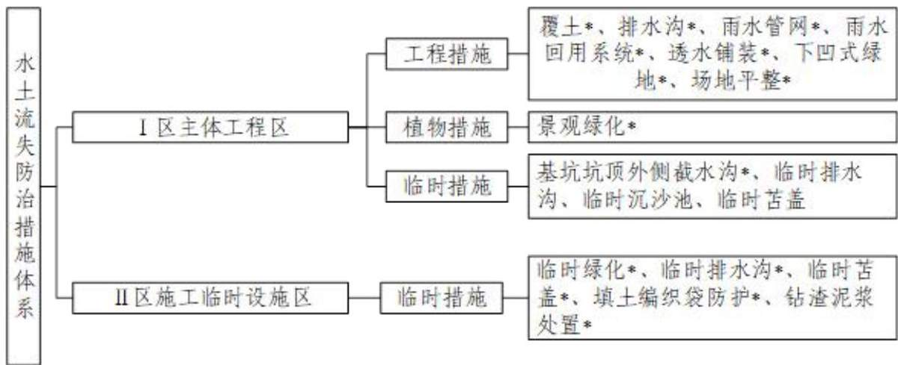  
注：\*为主体已考虑措施

## 5.2.3 水土保持措施设计标准

根据《生产建设项目水土保持技术标准》（GB50433-2018）、《水土保持工程设计规范》（GB51018-2014）、《防洪标准》（GB50201-2014）、《室外排水设计标准》（GB50014-2021）、《建筑与小区雨水控制及利用工程技术规范》（GB50400-2016）、《民用建筑雨水控制与利用设计规程》（DB33/T1167-2019）、《城市绿地设计规范》（GB20420-2007）（2016年版）、《城市绿化工程施工及验收规范》（CJJ/T82-2012）、《杭州市海绵城市建设低影响开发雨水系统技术导则》等相关规定执行，水土保持措施设计标准汇总详见表5.2-1。

## （1）Ⅰ区 主体工程区

## ① 工程措施

排水系统：根据《室外排水设计标准》（GB50014-2021），永久排水沟、雨水管网设计标准按5年一遇10min降雨历时。

海绵城市设计：根据《杭州市海绵城市建设低影响开发雨水系统技术导则》，本项目海绵城市设计控制指标为年径流总量控制率≥75%，年径流污染削减率（以SS计）≥60%，综合雨量径流系数≤0.60。本项目海绵城市设计通过设置透水铺装、下凹绿地、雨水回用系统等。

## ② 植物措施

根据《水土保持工程设计规范》（GB 51018-2014），本项目植被恢复与建设工程级别为1级。

## ③ 临时措施

基坑外侧截水沟、临时排水沟：排水设计标准按3年一遇10min短历时设计暴雨。  
临时沉沙池：采用三级沉沙池。

## （2）Ⅱ区 施工临时设施区

## ①临时措施

钻渣泥浆处置：根据《杭州市人民政府办公厅关于印发杭州市工程渣土管理实施办法的通知》（杭政办函〔2016〕51号），本项目执行“占地规模20亩（含）以上或建筑体量10万方（含）以上的建设工地应在工地内设置泥浆固化处理设备，实现泥浆就地处理”。本项目采用泥浆固化设备+泥浆池处置桩基施工产生的钻渣泥浆。

表5.2-1  
水土保持措施及设计标准一览
<table><tr><td rowspan=1 colspan=1>序号</td><td rowspan=1 colspan=1>分区</td><td rowspan=1 colspan=1>措施类别</td><td rowspan=1 colspan=1>措施名称</td><td rowspan=1 colspan=1>区域及措施设计标准</td></tr><tr><td rowspan=1 colspan=1>1</td><td rowspan=9 colspan=1>I区主体工程区</td><td rowspan=4 colspan=1>工程措施</td><td rowspan=1 colspan=1>场地平整</td><td rowspan=1 colspan=1>景观绿化区域</td></tr><tr><td rowspan=1 colspan=1>2</td><td rowspan=1 colspan=1>永久排水沟</td><td rowspan=2 colspan=1>《室外排水设计标准》（GB50014-2021），排水设计标准按5年一遇10min降雨历时</td></tr><tr><td rowspan=1 colspan=1>3</td><td rowspan=1 colspan=1>排水管网</td></tr><tr><td rowspan=1 colspan=1>4</td><td rowspan=1 colspan=1>海绵城市设计</td><td rowspan=1 colspan=1>根据《杭州市海绵城市建设低影响开发雨水系统技术导则》，本项目海绵城市设计控制指标为年径流总量控制率≥75%，年径流污染削减率（以SS计）≥60%，综合雨量径流系数≤0.60</td></tr><tr><td rowspan=1 colspan=1>5</td><td rowspan=1 colspan=1>植物措施</td><td rowspan=1 colspan=1>景观绿化</td><td rowspan=1 colspan=1>根据《水土保持工程设计规范》（GB51018-2014），本项目植被恢复与建设工程级别为1级</td></tr><tr><td rowspan=1 colspan=1>6</td><td rowspan=4 colspan=1>临时措施</td><td rowspan=1 colspan=1>基坑外侧截水沟</td><td rowspan=2 colspan=1>排水设计标准按3年一遇10min短历时设计暴雨</td></tr><tr><td rowspan=1 colspan=1>7</td><td rowspan=1 colspan=1>临时排水沟</td></tr><tr><td rowspan=1 colspan=1>8</td><td rowspan=1 colspan=1>临时沉沙池</td><td rowspan=1 colspan=1>三级沉沙池</td></tr><tr><td rowspan=1 colspan=1>9</td><td rowspan=1 colspan=1>临时苫盖</td><td rowspan=1 colspan=1>施工裸露区域采用临时苫盖</td></tr><tr><td rowspan=1 colspan=1>10</td><td rowspan=4 colspan=1>Ⅱ区施工临时设施区</td><td rowspan=4 colspan=1>临时措施</td><td rowspan=1 colspan=1>临时排水沟</td><td rowspan=1 colspan=1>排水设计标准按3年一遇10min短历时设计暴雨</td></tr><tr><td rowspan=1 colspan=1>11</td><td rowspan=1 colspan=1>临时苦盖</td><td rowspan=1 colspan=1>临时堆土场采用临时苫盖</td></tr><tr><td rowspan=1 colspan=1>12</td><td rowspan=1 colspan=1>临时围护</td><td rowspan=1 colspan=1>临时堆土场采用临时围护</td></tr><tr><td rowspan=1 colspan=1>13</td><td rowspan=1 colspan=1>钻渣泥浆处置</td><td rowspan=1 colspan=1>采用泥浆固化设备+泥浆池处置桩基施工产生的钻渣泥浆</td></tr></table>

## 5.3 分区措施布设

## 5.3.1 Ⅰ区（主体工程区）

本区主要范围包括建构筑物、道路及其他配套设施、绿化区。

## （1）工程措施

## ① 绿化覆土（主体设计）

施工后期，对项目绿化区域进行覆土，覆土范围包括地面绿化区域和屋顶绿化区域。本区覆土面积共4734m2，其中地面绿化面积3513m2（包含下凹绿地），屋顶绿化面积1221m2。

表5.3-1  
Ⅰ区绿化覆土汇总
<table><tr><td rowspan=1 colspan=1>序号</td><td rowspan=1 colspan=1>区域</td><td rowspan=1 colspan=1>覆土面积 ${ \bf \Pi } ( { \bf m } ^ { 2 } { \bf \Pi } )$ </td><td rowspan=1 colspan=1>平均覆土厚度（m）</td><td rowspan=1 colspan=1>覆土量（万m³）</td></tr><tr><td rowspan=1 colspan=1>1</td><td rowspan=1 colspan=1>地面绿化(不含下凹绿地)</td><td rowspan=1 colspan=1>1051</td><td rowspan=1 colspan=1>0.70</td><td rowspan=1 colspan=1>0.07</td></tr><tr><td rowspan=1 colspan=1>2</td><td rowspan=1 colspan=1>下凹绿地</td><td rowspan=1 colspan=1>2462</td><td rowspan=1 colspan=1>0.40</td><td rowspan=1 colspan=1>0.10</td></tr><tr><td rowspan=1 colspan=1>3</td><td rowspan=1 colspan=1>屋顶绿化</td><td rowspan=1 colspan=1>1221</td><td rowspan=1 colspan=1>0.60</td><td rowspan=1 colspan=1>0.07</td></tr><tr><td rowspan=1 colspan=2>合计</td><td rowspan=1 colspan=1>4734</td><td rowspan=1 colspan=1>0.51</td><td rowspan=1 colspan=1>0.24</td></tr></table>

本区覆土平均厚度51cm，覆土量为0.24万m3。绿化覆土采用商购的形式。

## ② 永久排水沟（主体设计）

根据《杭州市海绵城市建设低影响开发雨水系统技术导则》，本项目采用海绵城市设计，包括设置透水铺装、下凹绿地、雨水回用系统等，雨水口以溢流形式排放超过雨水径流控制要求的降雨溢流排入市政雨水管渠。在排入市政雨水管渠前，雨水先通过永久排水沟，再通过排水管网，最后接入项目区东侧市政雨水管渠（项目东侧保俶北路已预留2处DN500雨水接口）。永久排水沟、雨水管网设计标准按5年一遇10min降雨历时。

永久排水沟共704m，其中药学院科研楼156m，光电、信电学院科研楼548m；采用C25钢筋砼结构，上带透水盖板（砾石+水篦子），矩形断面，底宽40cm，沟深40cm，衬砌厚度为10cm，底部采用10cm厚的C15素混凝土垫层。

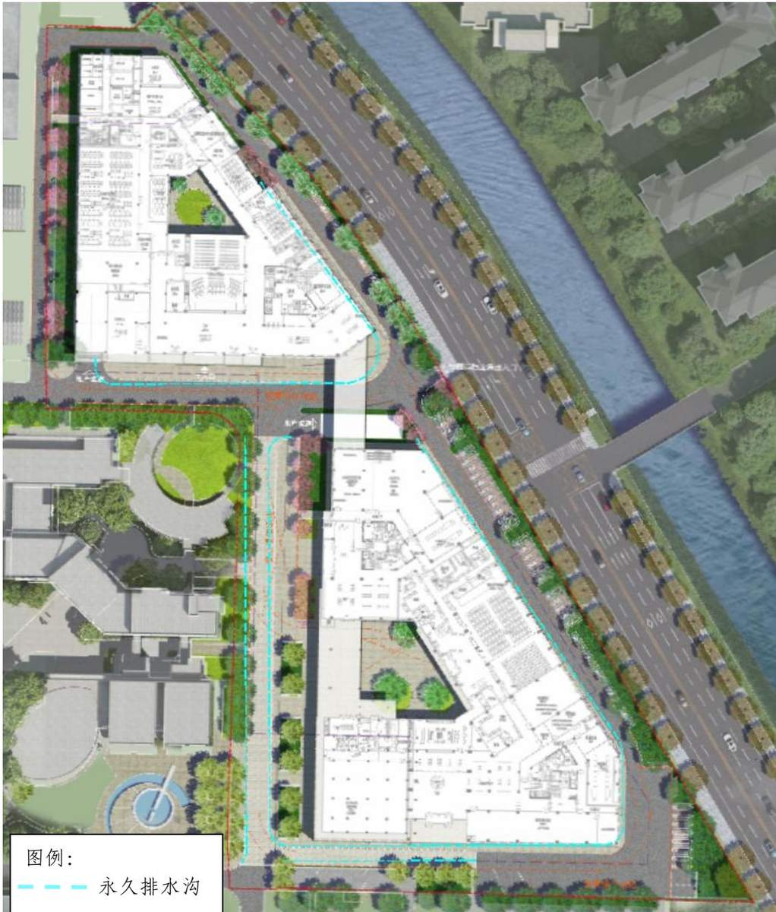  
图5.3-1 永久排水沟布置示意图

本方案对排水沟规模进行复核。根据规范《生产建设项目水土保持技术标准》（GB50433-2018）和《水土保持工程设计规范》（GB51018-2014），计算排水沟的水力要素。排水沟尺寸及过流能力按下式复核计算：

$$
V = \frac { 1 } { n } R ^ { 2 / 3 } i ^ { 1 / 2 }
$$

（式5-1）

式中：

V——流速，m/s；

$$
\mathrm { R } { = } \overline { { b + 2 h \sqrt { 1 + m \vphantom { ) } ^ { 2 } } } } ;
$$

R——水力半径，m，

i——沟道比降，i=0.01；

n——沟道糙率，砼排水沟n=0.015；

h——沟深，m；

b——底宽，m；

m——排水沟边坡比。

计算得出，永久排水沟过水能力为0.278m3/s，流速为1.74m/s，满足不冲（不大于不冲流速3.50m/s \~6.00m/s）且不淤（不小于0.40m/s \~0.60m/s）流速的要求。

根据《浙江省暴雨强度计算标准》（DB33/T1191-2020），参考杭州市的暴雨强度公式为

$$
q = \frac { 1 4 5 5 . 5 5 0 \times ( 1 + 0 . 9 5 8 1 \mathrm { g } P ) } { \left( t + 5 . 8 6 1 \right) ^ { 0 . 6 7 4 } }
$$

（式5-2）

注：q为暴雨强度（L/s·hm2），P为设计降雨重现期（a），t为降雨历时（min）；i为暴雨强度（mm/min），q=167i。

其中P=5a，t=10min，则 $\mathrm { q } { = } 3 7 7 . 2 4 2 \mathrm { L } / \mathrm { s } { \cdot } \mathrm { h m } ^ { 2 }$ ，根据式5-2计算出项目所在地5年一遇10min降雨强度i=2.259mm/min。

排水沟设计流量计算公式如下：

Q=16.67ψqF

（式5-3）

式中：Q——设计流量（m3/s）；

q——设计重现期和降雨历时内平均降雨强度（mm/min）；

ψ——径流系数；根据初步设计中，海绵城市设计综合径流系数，ψ取0.60；

F——汇水面积（km2）。

本工程场地分为两个排水区，排水沟最大汇水面积0.012km²，根据式5-3，计算得出永久排水沟设计流量为0.271m3/s，永久排水沟过水能力0.278m3/s大于设计流量，因此永久排水沟断面尺寸满足排水要求。

永久排水沟工程量汇总详见表5.3-2。

表5.3-2  
永久排水沟工程量汇总
<table><tr><td rowspan=2 colspan=1>序号</td><td rowspan=2 colspan=1>区域</td><td rowspan=2 colspan=1>长度（m）</td><td rowspan=1 colspan=2>工程量（m³）</td></tr><tr><td rowspan=1 colspan=1>C25钢筋砼</td><td rowspan=1 colspan=1>C25素混凝土</td></tr><tr><td rowspan=1 colspan=1>1</td><td rowspan=1 colspan=1>药学院科研楼</td><td rowspan=1 colspan=1>156</td><td rowspan=1 colspan=1>23</td><td rowspan=1 colspan=1>11</td></tr><tr><td rowspan=1 colspan=1>2</td><td rowspan=1 colspan=1>光电、信电学院科研楼</td><td rowspan=1 colspan=1>548</td><td rowspan=1 colspan=1>81</td><td rowspan=1 colspan=1>37</td></tr><tr><td rowspan=1 colspan=2>合计</td><td rowspan=1 colspan=1>704</td><td rowspan=1 colspan=1>104</td><td rowspan=1 colspan=1>48</td></tr></table>

## ③ 排水管网（主体设计）

场地内设置海绵设施溢流口、道路及广场雨水口、排水沟等，收集雨水排入地块排水管道，最终排至市政雨水管网。雨水管道采用重力流，按满管流设计。本项目排水管网采用PE缠绕结构壁管，管径DN150\~DN500，总长为2641m，其中DN150长810m，DN300长1490m，DN400长260m，DN500长81m。

## ④ 海绵城市设计（主体设计）

根据《杭州市海绵城市建设低影响开发雨水系统技术导则》，本项目海绵城市设计控制指标为年径流总量控制率≥75%，年径流污染削减率（以SS计）≥60%，综合雨量径流系数≤0.60。本项目海绵城市设计通过设置透水铺装、下凹绿地、雨水回用系统等。

在地下车库顶板、主体建筑侧墙、采光井侧墙、风井侧墙及其他凸出顶板构筑物侧墙等布置网格型雨水回收系统，网格型雨水回收系统1处，面积4525m2，调蓄容量共62.35m3；在药学院科研楼北侧设置雨水收集池，容量共10m3；光电、信电学院科研楼和药学院科研楼场地内人行道路采用透水铺装共9273m2；在绿化区域设置下凹式绿地共2462m2，主要位于项目场地东侧和西侧局部绿化区块。

## a、雨水回收系统

雨水回收系统采用网格型雨水回收系统，在地下车库顶板、主体建筑侧墙、采光井侧墙、风井侧墙及其他凸出顶板构筑物侧墙等布置排水板、渗透水收集管等，渗透水收集管设计间距根据顶板形状及建筑布局而定，总体呈网格状布置。工艺流程详见图5.3-2。

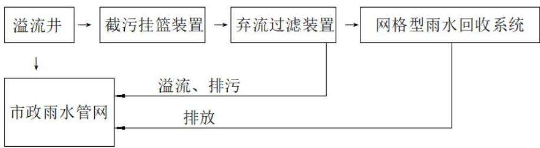  
网格型雨水回收系统工艺流程

在药学院科研楼北侧设置雨水收集池，容量共10m3，设置在室外，配套相应水处理消毒设施。

## b、透水铺装

透水铺装采用透水沥青、透水混凝土、花岗岩石材等，能够使雨水迅速渗入地表，有效地补充地下水，同时雨水在透水材料中的下渗过程，使得悬浮物过滤并截留，可有效去除雨水径流中的SS悬浮污染物，根据园区道路采用人车分流行车较少的特点，硬化地面尽量采用透水铺装，透水铺装面积约为9273m2，有效降低场地径流系数。

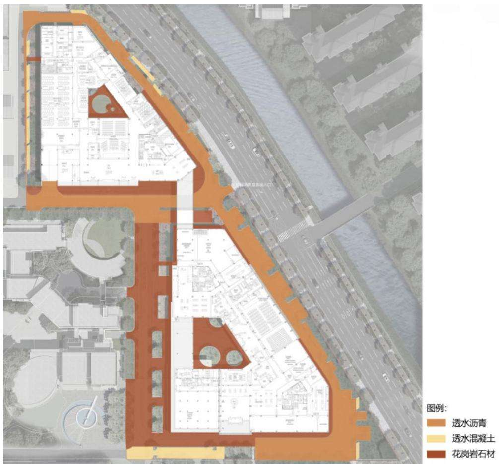  
图5.3-3  
透水铺装布置示意图

## c、下凹绿地

根据景观设计设置下凹绿地，为了促进雨水的下渗及净化，充分利用建筑区绿地布置低势绿地（比周边硬化地面低10cm），通过调整硬化地面的坡向，使径流雨水可以自然漫流至低势绿地中下渗净化，减少水土流失，多余的雨水通过溢流管排入原有雨水井。本工程设置下凹绿地共计2462m2，有效蓄水深度为8mm。下凹绿地采用铺设10cm砂土层+无纺土工布（250g/m2），最上层覆种植土40cm，溢流井周边采用卵石（粒径3cm \~5cm）覆盖，仅露出溢水口。

## ⑤ 场地平整（主体设计）

在地面绿化、屋顶绿化区域通过地形平整施工，创造出符合设计要求的地形地貌，为后续园林绿化工程施工提供良好的基础条件。场地平整4734m2。

## （2）植物措施（主体设计）

本工程植物设计延续校园整体风貌，以生态自然、适地适树为设计理念。结合方案，对校园内原有大乔木能保则保，可移栽的则进行场地内适当移栽，尽可能保留校内原有绿化资源。线性的沿街空间以列植娜塔栎为主，强化空间纵深感，营造秩序典雅的校园氛围。庭院空间以点植榉树为主，开展的大乔木创造防风避晒的小环境。屋顶空间则在满足覆土要求的基础上局部点植小乔木，并使用抗性强、耐贫瘠的植物品种，降低维护成本。场地周围采用精致的植物组团以及简洁的铺装形式，构成丰富的室外景观空间。本区地面绿化面积3513m2（包含下凹绿地），屋顶绿化面积1221m2，植物措施费用中已包含抚育管理。主要乔木品种有娜塔栎、榉树、紫薇、水杉、桂花，主要地被品种有细叶芒、金森女贞、毛鹃、小叶栀子、金叶石菖蒲等。

图5.3-4 景观绿化布置示意图  
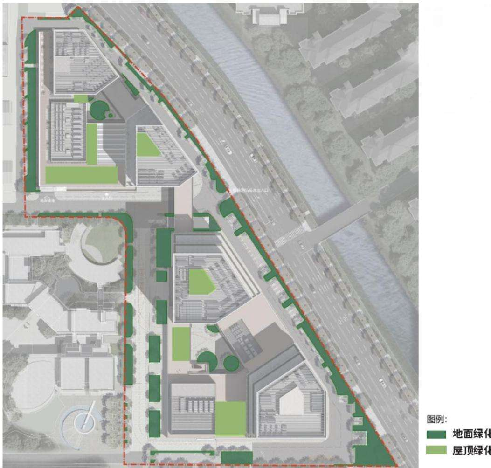

表5.3-3  
地面上木苗木表
<table><tr><td rowspan=2 colspan=1>序号</td><td rowspan=2 colspan=1>苗木名称</td><td rowspan=1 colspan=3>规格</td><td rowspan=2 colspan=1>备注</td></tr><tr><td rowspan=1 colspan=1>胸径cm</td><td rowspan=1 colspan=1>高度m</td><td rowspan=1 colspan=1>冠幅m</td></tr><tr><td rowspan=1 colspan=1>1</td><td rowspan=1 colspan=1>特选沙朴</td><td rowspan=1 colspan=1>40-45.9</td><td rowspan=1 colspan=1>11-12</td><td rowspan=1 colspan=1>5.5-6</td><td rowspan=1 colspan=1>特选低分枝。全冠移栽苗</td></tr><tr><td rowspan=1 colspan=1>2</td><td rowspan=1 colspan=1>榉树</td><td rowspan=1 colspan=1>24-24.9</td><td rowspan=1 colspan=1>9-10</td><td rowspan=1 colspan=1>5.5-6</td><td rowspan=1 colspan=1>特选，5级以上分枝，全冠移栽苗</td></tr><tr><td rowspan=1 colspan=1>3</td><td rowspan=1 colspan=1>娜塔栎</td><td rowspan=1 colspan=1>22-22.9</td><td rowspan=1 colspan=1>9-10</td><td rowspan=1 colspan=1>4.5-5</td><td rowspan=1 colspan=1>特选，主杆通直。5级以上分枝，全冠移栽苗</td></tr><tr><td rowspan=1 colspan=1>4</td><td rowspan=1 colspan=1>香樟</td><td rowspan=1 colspan=1>32-36</td><td rowspan=1 colspan=1>9-10</td><td rowspan=1 colspan=1>5-5.5</td><td rowspan=2 colspan=1>4级以上分枝，全冠移栽苗</td></tr><tr><td rowspan=1 colspan=1>5</td><td rowspan=1 colspan=1>合欢</td><td rowspan=1 colspan=1>26-28</td><td rowspan=1 colspan=1>7.5-8</td><td rowspan=1 colspan=1>4-5</td></tr><tr><td rowspan=1 colspan=1>6</td><td rowspan=1 colspan=1>桂花B</td><td rowspan=1 colspan=1></td><td rowspan=1 colspan=1>5.5-6</td><td rowspan=1 colspan=1>4.5-5</td><td rowspan=1 colspan=1>丛生金桂，4级以上分枝，树形优美</td></tr><tr><td rowspan=1 colspan=1>7</td><td rowspan=1 colspan=1>桂花C</td><td rowspan=1 colspan=1></td><td rowspan=1 colspan=1>4-4.5</td><td rowspan=1 colspan=1>3.5-4</td><td rowspan=3 colspan=1>丛生金桂，分枝点≤40cm，4级以上分枝，树形优美</td></tr><tr><td rowspan=1 colspan=1>8</td><td rowspan=1 colspan=1>桂花D</td><td rowspan=1 colspan=1></td><td rowspan=1 colspan=1>3-3.5</td><td rowspan=1 colspan=1>3-3.5</td></tr><tr><td rowspan=1 colspan=1>9</td><td rowspan=1 colspan=1>桂花E</td><td rowspan=1 colspan=1></td><td rowspan=1 colspan=1>2.5-3</td><td rowspan=1 colspan=1>2.5-3</td></tr><tr><td rowspan=1 colspan=1>10</td><td rowspan=1 colspan=1>柚子树</td><td rowspan=1 colspan=1>3杆-5杆</td><td rowspan=1 colspan=1>3-3.5</td><td rowspan=1 colspan=1>3-3.5</td><td rowspan=1 colspan=1>丛生胡柚，4级以上分枝，树形优美</td></tr><tr><td rowspan=1 colspan=1>11</td><td rowspan=1 colspan=1>水杉</td><td rowspan=1 colspan=1>18-18.9</td><td rowspan=1 colspan=1>9-10</td><td rowspan=1 colspan=1>4-4.5</td><td rowspan=1 colspan=1>3级以上分枝，全冠移栽苗</td></tr><tr><td rowspan=1 colspan=1>12</td><td rowspan=1 colspan=1>丛生紫薇</td><td rowspan=1 colspan=1></td><td rowspan=1 colspan=1>4-4.5</td><td rowspan=1 colspan=1>3.5-4</td><td rowspan=1 colspan=1>特选老紫薇，3级以上分枝，6-8杆，每分枝杆径6-8m，全冠移栽苗</td></tr><tr><td rowspan=1 colspan=1>13</td><td rowspan=1 colspan=1>鸡爪槭A</td><td rowspan=1 colspan=1>d12-12.9</td><td rowspan=1 colspan=1>3.5-4</td><td rowspan=1 colspan=1>3.5-4</td><td rowspan=2 colspan=1>3级以上分枝，全冠移栽苗</td></tr><tr><td rowspan=1 colspan=1>14</td><td rowspan=1 colspan=1>鸡爪槭B</td><td rowspan=1 colspan=1>d8-8.9</td><td rowspan=1 colspan=1>2.5-3</td><td rowspan=1 colspan=1>2.5-3</td></tr><tr><td rowspan=1 colspan=1>15</td><td rowspan=1 colspan=1>原乔木</td><td rowspan=1 colspan=1></td><td rowspan=1 colspan=1></td><td rowspan=1 colspan=1></td><td rowspan=1 colspan=1></td></tr></table>

表5.3-4  
屋顶绿化上木苗木表
<table><tr><td rowspan=2 colspan=1>序号</td><td rowspan=2 colspan=1>苗木名称</td><td rowspan=1 colspan=3>规格</td><td rowspan=2 colspan=1>备注</td></tr><tr><td rowspan=1 colspan=1>胸径cm</td><td rowspan=1 colspan=1>高度m</td><td rowspan=1 colspan=1>冠幅m</td></tr><tr><td rowspan=1 colspan=1>1</td><td rowspan=1 colspan=1>染井吉野樱</td><td rowspan=1 colspan=1>d16-16.9</td><td rowspan=1 colspan=1>4.5-5</td><td rowspan=1 colspan=1>4-4.5</td><td rowspan=1 colspan=1>特选，3级以上分枝，全冠移栽苗</td></tr><tr><td rowspan=1 colspan=1>2</td><td rowspan=1 colspan=1>桂花D</td><td rowspan=1 colspan=1></td><td rowspan=1 colspan=1>3.5-4</td><td rowspan=1 colspan=1>3-3.5</td><td rowspan=1 colspan=1>丛生金桂，分支点≤60cm，4级以上分枝。树形优美</td></tr></table>

表5.3-5  
屋顶灌木球苗木表
<table><tr><td rowspan=2 colspan=1>序号</td><td rowspan=2 colspan=1>苗木名称</td><td rowspan=1 colspan=3>规格</td><td rowspan=2 colspan=1>备注</td></tr><tr><td rowspan=1 colspan=1>地径cm</td><td rowspan=1 colspan=1>高度m</td><td rowspan=1 colspan=1>冠幅m</td></tr><tr><td rowspan=1 colspan=1>1</td><td rowspan=1 colspan=1>北海道黄杨柱绿篱B</td><td rowspan=1 colspan=1></td><td rowspan=1 colspan=1>1.3</td><td rowspan=1 colspan=1>0.3-0.4</td><td rowspan=1 colspan=1>8株/m，双排种植，修剪成矩形绿篱状，高度为修剪后高度</td></tr></table>

表5.3-6  
地面灌木球苗木表
<table><tr><td rowspan=2 colspan=1>序号</td><td rowspan=2 colspan=1>苗木名称</td><td rowspan=1 colspan=3>规格</td><td rowspan=2 colspan=1>备注</td></tr><tr><td rowspan=1 colspan=1>地径cm</td><td rowspan=1 colspan=1>高度m</td><td rowspan=1 colspan=1>冠幅m</td></tr><tr><td rowspan=1 colspan=1>1</td><td rowspan=1 colspan=1>海桐球1</td><td rowspan=1 colspan=1></td><td rowspan=1 colspan=1>1.6</td><td rowspan=1 colspan=1>1.8</td><td rowspan=1 colspan=1>净球，球形饱满，不脱脚</td></tr><tr><td rowspan=1 colspan=1>2</td><td rowspan=1 colspan=1>海桐球2</td><td rowspan=1 colspan=1></td><td rowspan=1 colspan=1>1.3</td><td rowspan=1 colspan=1>1.5</td><td rowspan=1 colspan=1>净球，球形饱满，不脱脚</td></tr><tr><td rowspan=1 colspan=1>3</td><td rowspan=1 colspan=1>无尽夏绣球</td><td rowspan=1 colspan=1></td><td rowspan=1 colspan=1>0.8-1</td><td rowspan=1 colspan=1>0.6-0.8</td><td rowspan=1 colspan=1>丛状，姿态优美，饱满</td></tr><tr><td rowspan=1 colspan=1>4</td><td rowspan=1 colspan=1>水果兰</td><td rowspan=1 colspan=1></td><td rowspan=1 colspan=1>1.3</td><td rowspan=1 colspan=1>1.5</td><td rowspan=1 colspan=1>净球，球形饱满，不脱脚</td></tr><tr><td rowspan=1 colspan=1>5</td><td rowspan=1 colspan=1>北海道黄杨柱绿篱A</td><td rowspan=1 colspan=1></td><td rowspan=1 colspan=1>1.5</td><td rowspan=1 colspan=1>0.3-0.4</td><td rowspan=2 colspan=1>8株/m，双排种植，修剪成矩形绿篱状，高度为修剪后高度</td></tr><tr><td rowspan=1 colspan=1>6</td><td rowspan=1 colspan=1>北海道黄杨柱绿篱B</td><td rowspan=1 colspan=1></td><td rowspan=1 colspan=1>1.3</td><td rowspan=1 colspan=1>0.3-0.4</td></tr></table>

表5.3-7  
地面地被植物一览
<table><tr><td rowspan=2 colspan=1>序号</td><td rowspan=2 colspan=1>苗木名称</td><td rowspan=1 colspan=2>规格</td><td rowspan=2 colspan=1>密度(株/m2)</td><td rowspan=2 colspan=1>备注</td></tr><tr><td rowspan=1 colspan=1>高度cm</td><td rowspan=1 colspan=1>冠幅cm</td></tr><tr><td rowspan=1 colspan=1>1</td><td rowspan=1 colspan=1>细叶芒</td><td rowspan=1 colspan=1>50-60</td><td rowspan=1 colspan=1>50-60</td><td rowspan=1 colspan=1>16</td><td rowspan=1 colspan=1>2加仑苗，密植不露黄土</td></tr><tr><td rowspan=1 colspan=1>2</td><td rowspan=1 colspan=1>细叶十大功劳</td><td rowspan=1 colspan=1>51-55</td><td rowspan=1 colspan=1>41-45</td><td rowspan=1 colspan=1>36</td><td rowspan=1 colspan=1>毛球，满铺种植不露土</td></tr><tr><td rowspan=1 colspan=1>3</td><td rowspan=1 colspan=1>八角金盘</td><td rowspan=1 colspan=1>50-60</td><td rowspan=1 colspan=1>41-45</td><td rowspan=1 colspan=1>25</td><td rowspan=1 colspan=1>散本苗，满铺种植不露土</td></tr><tr><td rowspan=1 colspan=1>4</td><td rowspan=1 colspan=1>红叶石楠</td><td rowspan=1 colspan=1>40-50</td><td rowspan=1 colspan=1>30-40</td><td rowspan=1 colspan=1>36</td><td rowspan=1 colspan=1>火焰红，毛球，密植</td></tr><tr><td rowspan=1 colspan=1>5</td><td rowspan=1 colspan=1>&#x27;无尽夏&#x27;绣球</td><td rowspan=1 colspan=1>41-45</td><td rowspan=1 colspan=1>36-40</td><td rowspan=1 colspan=1>36</td><td rowspan=1 colspan=1>毛球，满铺种植不露土</td></tr><tr><td rowspan=1 colspan=1>6</td><td rowspan=1 colspan=1>金森女贞</td><td rowspan=1 colspan=1>31-35</td><td rowspan=1 colspan=1>31-35</td><td rowspan=1 colspan=1>49</td><td rowspan=1 colspan=1>毛球，满铺种植不露土</td></tr><tr><td rowspan=1 colspan=1>7</td><td rowspan=1 colspan=1>毛鹃</td><td rowspan=1 colspan=1>31-35</td><td rowspan=1 colspan=1>31-35</td><td rowspan=1 colspan=1>64</td><td rowspan=1 colspan=1>毛球。满铺种植不露土</td></tr><tr><td rowspan=1 colspan=1>8</td><td rowspan=1 colspan=1>常绿鸢尾</td><td rowspan=1 colspan=1>31-35</td><td rowspan=1 colspan=1>26-30</td><td rowspan=1 colspan=1>25</td><td rowspan=1 colspan=1>1加仑苗，密植不露黄土</td></tr><tr><td rowspan=1 colspan=1>9</td><td rowspan=1 colspan=1>肾蕨</td><td rowspan=1 colspan=1>31-35</td><td rowspan=1 colspan=1>31-35</td><td rowspan=1 colspan=1>64</td><td rowspan=1 colspan=1>毛球，满铺种植不露土</td></tr><tr><td rowspan=1 colspan=1>10</td><td rowspan=1 colspan=1>大吴风草</td><td rowspan=1 colspan=1>31-35</td><td rowspan=1 colspan=1>31-35</td><td rowspan=1 colspan=1>49</td><td rowspan=1 colspan=1>120#盆苗，满铺种植不露土</td></tr><tr><td rowspan=1 colspan=1>11</td><td rowspan=1 colspan=1>百子莲</td><td rowspan=1 colspan=1>31-35</td><td rowspan=1 colspan=1>31-35</td><td rowspan=1 colspan=1>64</td><td rowspan=1 colspan=1>不少于3芽/丛，满铺种植不露土</td></tr><tr><td rowspan=1 colspan=1>12</td><td rowspan=1 colspan=1>狐尾天门冬</td><td rowspan=1 colspan=1>31-35</td><td rowspan=1 colspan=1>26-30</td><td rowspan=1 colspan=1>25</td><td rowspan=1 colspan=1>1加仑苗，丛/m²密植不露黄土</td></tr><tr><td rowspan=1 colspan=1>13</td><td rowspan=1 colspan=1>小叶栀子</td><td rowspan=1 colspan=1>21-25</td><td rowspan=1 colspan=1>21-25</td><td rowspan=1 colspan=1>64</td><td rowspan=1 colspan=1>毛球，满铺种植不露土</td></tr><tr><td rowspan=1 colspan=1>14</td><td rowspan=1 colspan=1>金边阔叶麦冬</td><td rowspan=1 colspan=1>20-25</td><td rowspan=1 colspan=1>15-20</td><td rowspan=1 colspan=1>64</td><td rowspan=1 colspan=1>3-4芽/丛，密植</td></tr><tr><td rowspan=1 colspan=1>15</td><td rowspan=1 colspan=1>金叶石菖蒲</td><td rowspan=1 colspan=1>15-20</td><td rowspan=1 colspan=1>15-20</td><td rowspan=1 colspan=1>25</td><td rowspan=1 colspan=1>1加仑苗，密植不露黄土</td></tr><tr><td rowspan=1 colspan=1>16</td><td rowspan=1 colspan=1>矮麦冬</td><td rowspan=1 colspan=1>10-15</td><td rowspan=1 colspan=1>10-15</td><td rowspan=1 colspan=1>100</td><td rowspan=1 colspan=1>8-10芽/丛，密植不露黄土</td></tr><tr><td rowspan=1 colspan=1>17</td><td rowspan=1 colspan=1>果岭草</td><td rowspan=1 colspan=1></td><td rowspan=1 colspan=1></td><td rowspan=1 colspan=1></td><td rowspan=1 colspan=1>100×30cm，草卷满铺</td></tr></table>

## 3）临时措施

① 基坑外侧截水沟（主体设计）

施工期间为防止项目区可能产生的水土流失对基坑的影响，主体设计施工期临时截水沟，沿红线内侧结合基坑外围布设，截水沟长700m。排水标准采用3年一遇10min。利用式5-2计算，P=3a，t=10min，得出q=329.22L/s·hm2，i=1.97mm/min。

根据式5-3，由于排水去向分为2处，因此临时截水沟最大汇水面积0.010km²，由于地下室开挖期间地面裸露，径流系数取0.60，计算得出设计流量为0.20m3/s。

根据规范《生产建设项目水土保持技术标准》（GB50433-2018）和《水土保持工程设计规范》（GB51018-2014），利用式5-1和式5-4设计临时截水沟规模。

Q=AV （式5-4）

式中：

Q——最大洪峰流量，m3/s；

A——过水断面面积，m2，A=bh+mh2；

V——流速，m/s；

临时截水沟采用侧壁矩形砖砌结构，底部为10cm厚C20混凝土护底，内表面采用1cm厚1：2水泥砂浆抹面，粗糙系数取0.015，底宽40cm，沟深40cm，底坡比降为0.01。计算得出临时截水沟的过水能力为0.278m3/s＞0.20m3/s（设计流量），过水断面尺寸符合排水要求。临时截水沟水流汇入场地周边临时排水沟。

临时截水沟措施共计开挖土方约232m3，回填土方232m3，砖砌体为68m3，C20砼护底46m3，砂浆抹面588m2。

② 临时排水沟（方案新增）

工程施工开挖后的土方较为松散，在雨季容易流失到周边，为减少施工期间因降雨、径流等条件下对周边环境造成影响，施工单位应在施工时根据地形条件布设沿场地四周布设临时排水沉沙措施，施工作业范围内雨水经临时排水沟收集后排入附近管网。临时排水沟末端设置三级临时沉沙池。

临时排水沟设计排水标准采用3年一遇10min，利用式5-2计算，P=3a，t=10min，得出q=329.22L/s·hm2，i=1.97mm/min。

根据式5-3，考虑施工期排水去向分2处，因此临时排水沟最大汇水面积0.018km2，径流系数取0.70，计算得出设计流量为0.414m3/s。

利用式5-1和式5-4设计临时排水沟规模，采用侧壁矩形砖砌结构，底部为10cm厚

C20混凝土护底，内表面采用1cm厚1：2水泥砂浆抹面，粗糙系数取0.015，底宽50cm，沟深50cm，底坡为0.01。计算得出临时排水沟的过水能力为 $0 . 5 0 5 \mathrm { m } ^ { 3 } / \mathrm { s } > 0 . 4 1 4 \mathrm { m } ^ { 3 } / \mathrm { s }$ （设计流量），过水断面尺寸符合排水要求。临时排水沟共长810m，水流汇入分别排入西北侧校内市政管网和东侧保俶北路市政管网。临时排水沟措施共计开挖土方约 $3 7 4 \mathrm { m } ^ { 3 }$ 回填土方 $3 7 4 \mathrm { m } ^ { 3 }$ ，砖砌体为 $8 5 \mathrm { m } ^ { 3 }$ ，C20砼护底 $6 2 \mathrm { m } ^ { 3 }$ ，砂浆抹面 $8 5 1 \mathrm { m } ^ { 2 }$

## ③ 三级临时沉沙池（方案新增）

施工期间，为减少雨水外排时携带的土壤、砂粒的流失，需在排水沟集水排放前设置沉沙池缓流沉沙。根据排水沟的设置情况及现状地形情况，拟设置2处三级沉沙池，沉沙池独立收集排水沟来水，经沉淀后清水排入分别排入西北侧校内市政管网和东侧保俶北路市政管网。沉沙池采用矩形断面砖砌结构，单格尺寸（底长×宽×深）统一采用 $1 . 5 \mathrm { m } { \times } 1 . 0 \mathrm { m } { \times } 1 . 5 \mathrm { m }$ ，内表面采用1cm厚1：2水泥砂浆抹面，经验算，沉沙池容量为 $6 . 7 5 \mathrm { m } ^ { 3 }$ 。沉沙池旁边需设置明显的安全警示标志，并加强施工期间的管理，避免安全隐患。施工期加强对排水沟及沉沙池的清理，防止泥沙淤积，保证其有足够的容量，尤其是雨后要加强巡查清理，清理出的沉沙同弃方处置。临时沉沙措施共计开挖土方约 $2 5 \mathrm { m } ^ { 3 }$ ，回填土方 $2 5 \mathrm { m } ^ { 3 }$ ，砖砌体为4m3，砂浆抹面 $4 2 \mathrm { m } ^ { 2 }$

施工期间沉沙池旁需设置明显的安全警示标志，并加强施工期间的管理，消除安全隐患。沉沙池启用后，应注意沉沙池的安全使用问题，并定时采用人工清淤的方式清理、疏通沉沙池，防止淤塞，减小排水出口对周边区域的影响。

表5.3-8  
项目区临时排水沉沙措施工程量表
<table><tr><td rowspan=2 colspan=1>名称</td><td rowspan=1 colspan=2>规格（m）</td><td rowspan=2 colspan=1>长度(m)/个数</td><td rowspan=1 colspan=5>工程量</td></tr><tr><td rowspan=1 colspan=1>底宽</td><td rowspan=1 colspan=1>沟深</td><td rowspan=1 colspan=1>开挖土方 $\left( \mathbf { m } ^ { 3 } \right)$ </td><td rowspan=1 colspan=1>回填土方 $\left( \mathbf { m } ^ { 3 } \right)$ </td><td rowspan=1 colspan=1>砌砖 $\left( \mathbf { m } ^ { 3 } \right)$ </td><td rowspan=1 colspan=1>C20砼护底 $\left( \mathbf { m } ^ { 3 } \right)$ </td><td rowspan=1 colspan=1>砂浆抹面 ${ \mathrm { ~ ( ~ m } } ^ { 2 } { \mathrm { ~ ) ~ } }$ </td></tr><tr><td rowspan=1 colspan=1>临时截水沟</td><td rowspan=1 colspan=1>0.40</td><td rowspan=1 colspan=1>0.40</td><td rowspan=1 colspan=1>700</td><td rowspan=1 colspan=1>232</td><td rowspan=1 colspan=1>232</td><td rowspan=1 colspan=1>68</td><td rowspan=1 colspan=1>46</td><td rowspan=1 colspan=1>588</td></tr><tr><td rowspan=1 colspan=1>临时排水沟</td><td rowspan=1 colspan=1>0.50</td><td rowspan=1 colspan=1>0.50</td><td rowspan=1 colspan=1>810</td><td rowspan=1 colspan=1>374</td><td rowspan=1 colspan=1>374</td><td rowspan=1 colspan=1>85</td><td rowspan=1 colspan=1>62</td><td rowspan=1 colspan=1>851</td></tr><tr><td rowspan=1 colspan=1>三级沉沙池</td><td rowspan=1 colspan=2>3×1.5m×1.0m×1.5m</td><td rowspan=1 colspan=1>2</td><td rowspan=1 colspan=1>25</td><td rowspan=1 colspan=1>25</td><td rowspan=1 colspan=1>4</td><td rowspan=1 colspan=1>0</td><td rowspan=1 colspan=1>42</td></tr><tr><td rowspan=1 colspan=4>合计</td><td rowspan=1 colspan=1>631</td><td rowspan=1 colspan=1>631</td><td rowspan=1 colspan=1>157</td><td rowspan=1 colspan=1>108</td><td rowspan=1 colspan=1>1481</td></tr></table>

## ④ 临时苫盖（方案新增）

项目施工期间，项目区内存在地表裸露区域，由于施工期间不可避免跨越雨季，

工程建设开挖裸露地表，受降雨冲刷和地表径流的影响，极易产生水土流失。故对项目区内裸露区域进行密目网覆盖，避免雨水冲刷带来的水土流失。考虑到密目网损耗及可重复利用，估算密目网数量10000m2。

表5.3-9  
主体工程区水土保持措施工程量汇总
<table><tr><td rowspan=1 colspan=1>措施类型</td><td rowspan=1 colspan=2>措施内容</td><td rowspan=1 colspan=1>结构形式</td><td rowspan=1 colspan=1>工程量</td><td rowspan=1 colspan=1>布设位置</td><td rowspan=1 colspan=1>布设时间</td><td rowspan=1 colspan=1>备注</td></tr><tr><td rowspan=10 colspan=1>工程措施</td><td rowspan=1 colspan=2>覆土</td><td rowspan=1 colspan=1>平均覆土厚度51cm</td><td rowspan=1 colspan=1>0.24万m3</td><td rowspan=1 colspan=1>绿化区域</td><td rowspan=1 colspan=1>2028年6月</td><td rowspan=1 colspan=1>主体设计</td></tr><tr><td rowspan=1 colspan=2>永久排水沟</td><td rowspan=1 colspan=1>C20钢混砌筑10cm，C15砼垫层，矩形断面，宽0.40m深0.40m，带透水盖板</td><td rowspan=1 colspan=1>704m</td><td rowspan=1 colspan=1>药学院科研楼南侧，光电、信电院科研楼四周</td><td rowspan=1 colspan=1>2028年6月~7月</td><td rowspan=1 colspan=1>主体设计</td></tr><tr><td rowspan=4 colspan=2>排水管网</td><td rowspan=1 colspan=1>PE缠绕结构壁管DN150</td><td rowspan=1 colspan=1>810</td><td rowspan=4 colspan=1>沿路网进行布设</td><td rowspan=4 colspan=1>2028年6月~7月</td><td rowspan=1 colspan=1>主体设计</td></tr><tr><td rowspan=1 colspan=1>PE缠绕结构壁管DN300</td><td rowspan=1 colspan=1>1490</td><td rowspan=1 colspan=1>主体设计</td></tr><tr><td rowspan=1 colspan=1>PE缠绕结构壁管DN400</td><td rowspan=1 colspan=1>260</td><td rowspan=1 colspan=1>主体设计</td></tr><tr><td rowspan=1 colspan=1>PE缠绕结构壁管DN500</td><td rowspan=1 colspan=1>81</td><td rowspan=1 colspan=1>主体设计</td></tr><tr><td rowspan=3 colspan=1>海绵城市设计</td><td rowspan=1 colspan=1>雨水回收系统</td><td rowspan=1 colspan=1>排水板、透水渗管等+雨水收集池</td><td rowspan=1 colspan=1>1处</td><td rowspan=1 colspan=1>地下室顶板等</td><td rowspan=1 colspan=1>2028年2月~5月</td><td rowspan=1 colspan=1>主体设计</td></tr><tr><td rowspan=1 colspan=1>透水铺装</td><td rowspan=1 colspan=1>透水沥青、透水混凝土、花岗岩石材等</td><td rowspan=1 colspan=1>9273m²</td><td rowspan=1 colspan=1>硬化地面</td><td rowspan=1 colspan=1>2028年3月~5月</td><td rowspan=1 colspan=1>主体设计</td></tr><tr><td rowspan=1 colspan=1>下凹绿地</td><td rowspan=1 colspan=1>铺设10cm砂土层+无纺土工布，溢流井周边采用卵石覆盖</td><td rowspan=1 colspan=1>2462m²</td><td rowspan=1 colspan=1>低势绿地</td><td rowspan=1 colspan=1>2028年3月~5月</td><td rowspan=1 colspan=1>主体设计</td></tr><tr><td rowspan=1 colspan=2>场地平整</td><td rowspan=1 colspan=1>地形平整施工</td><td rowspan=1 colspan=1>4734m²</td><td rowspan=1 colspan=1>绿化区域</td><td rowspan=1 colspan=1>2028年7月</td><td rowspan=1 colspan=1>主体设计</td></tr><tr><td rowspan=1 colspan=1>植物措施</td><td rowspan=1 colspan=2>景观绿化</td><td rowspan=1 colspan=1>园林绿化</td><td rowspan=1 colspan=1>3513m²</td><td rowspan=1 colspan=1>地面+屋顶绿化区域</td><td rowspan=1 colspan=1>2028年8月~11月</td><td rowspan=1 colspan=1>主体设计</td></tr><tr><td rowspan=4 colspan=1>临时措施</td><td rowspan=1 colspan=2>临时截水沟</td><td rowspan=1 colspan=1>沟壁砖砌结构，C20砼护底，内侧砂浆抹面，矩形断面，尺寸为宽0.4m×深0.4m</td><td rowspan=1 colspan=1>700m</td><td rowspan=1 colspan=1>沿基坑外侧5m范围</td><td rowspan=1 colspan=1>2026年5月~6月</td><td rowspan=1 colspan=1>主体设计</td></tr><tr><td rowspan=1 colspan=2>临时排水沟</td><td rowspan=1 colspan=1>沟壁砖砌结构，C20砼护底，内侧砂浆抹面，矩形断面，尺寸为宽0.5m×深0.5m</td><td rowspan=1 colspan=1>810m</td><td rowspan=1 colspan=1>沿场地四周</td><td rowspan=1 colspan=1>2026年2月~3月</td><td rowspan=1 colspan=1>方案新增</td></tr><tr><td rowspan=1 colspan=2>三级沉沙池</td><td rowspan=1 colspan=1>砖砌结构，内侧砂浆抹面，3×1.5m×1.0m×1.5m</td><td rowspan=1 colspan=1>2座</td><td rowspan=1 colspan=1>西北侧校园管网、东侧保俶北路管网接入口</td><td rowspan=1 colspan=1>2026年2月</td><td rowspan=1 colspan=1>方案新增</td></tr><tr><td rowspan=1 colspan=2>临时苫盖</td><td rowspan=1 colspan=1>密目网</td><td rowspan=1 colspan=1>10000m²</td><td rowspan=1 colspan=1>开挖裸露面</td><td rowspan=1 colspan=1>2026年5月~2027年3月</td><td rowspan=1 colspan=1>方案新增</td></tr></table>

## 5.3.2 Ⅱ区（施工临时设施区）

本区包括施工生活区、泥浆中转池、泥浆干化设备、施工生产区、临时堆土场，其中泥浆中转池、泥浆干化设备、施工生产区、临时堆土场均布置在永久占地内。桩基施工阶段，考虑场内固化后的泥饼不能及时清运，需在场地内临时堆置，主体设计在场地内设置临时堆土场，面积共0.11hm2，预计临时中转时间为1个月。四周采用填土编织袋拦挡。

## （1）临时措施

## ① 临时绿化（主体设计）

在施工生活区的绿化池中，栽植灌草，主要植被为红花檵木，狗牙根等，绿化面积为300m2。

## ② 泥浆池（主体设计）

灌注桩施工产生的泥浆引起的水土流失不能忽视，主体考虑在基坑开挖范围内设置泥浆中转池，钻渣泥浆经泥浆中转池汇集沉淀后采用封闭式运输车运出项目区。施工期间，泥浆中转池周围设置安全围栏及明显的警示标志，防止发生安全隐患。

根据《杭州市建设工程文明施工管理应用手册（2016年版）》：“桩基工程施工作业场地应当坚实稳固，使用路基板（箱）等进行硬化处理；利用泥浆护壁的，应当设置砌体或者钢板成型的泥浆中转池。”本工程泥浆中转池采用砖砌，分别布置在场地中部和北侧，中部泥浆池尺寸为底长30m，底宽10m，地面以下开挖深度1.0m，底部采用24cm厚的砖护砌，四周采用24cm的砖护砌，内壁采用2cm厚的水泥砂浆抹面；北侧泥浆池尺寸为底长10m，底宽5m，地面以下开挖深度1.0m，底部采用24cm厚的砖护砌，四周采用24cm的砖护砌，内壁采用2cm厚的水泥砂浆抹面。共布设泥浆中转池2处，桩基工程施工结束后拆除。项目区内设1套泥浆干化设备，对桩基产生的泥浆进行干化。

本项目基坑围护钻孔灌注桩施工产生钻渣0.82万m³，考虑钻渣泥浆总量是钻渣量的三倍，共计需固化处理钻渣泥浆2.46万m³。钻渣泥浆经固化离心设备处理后，分离出的钻渣转入临时堆土场暂存后，采用专用罐车随多余土方一同外运处理，根据《杭州市建筑垃圾资源化利用支持政策（试行）》，本工程固化土将运至渣土办指定地点资源化利用。

表5.3-10  
钻渣泥浆中转池工程量
<table><tr><td rowspan=1 colspan=1>名称</td><td rowspan=1 colspan=1>个数</td><td rowspan=1 colspan=1>规格长×宽×深</td><td rowspan=1 colspan=1>土方开挖 $\left( \mathbf { \nabla } \mathbf { m } ^ { 3 } \right)$ </td><td rowspan=1 colspan=1>砌砖 $\left( \mathbf { m } ^ { 3 } \right)$ </td><td rowspan=1 colspan=1>砂浆抹面 $\left( \mathbf { \Omega } \mathbf { m } ^ { 2 } \right)$ </td></tr><tr><td rowspan=1 colspan=1>中部泥浆池</td><td rowspan=1 colspan=1>1</td><td rowspan=1 colspan=1>30m×10m×1.0m</td><td rowspan=1 colspan=1>331</td><td rowspan=1 colspan=1>96</td><td rowspan=1 colspan=1>399</td></tr><tr><td rowspan=1 colspan=1>北侧泥浆池</td><td rowspan=1 colspan=1>1</td><td rowspan=1 colspan=1>10m×5m×1.0m</td><td rowspan=1 colspan=1>55</td><td rowspan=1 colspan=1>20</td><td rowspan=1 colspan=1>84</td></tr><tr><td rowspan=1 colspan=3>合计</td><td rowspan=1 colspan=1>386</td><td rowspan=1 colspan=1>116</td><td rowspan=1 colspan=1>483</td></tr></table>

## ③ 施工生活区临时排水（主体设计）

本工程施工生活区面积为0.20hm2。场地内需布设临时排水沟，减少场地内汇水对周边地表冲刷。施工生活区临时排水沟尺寸根据式5-1～式5-4复核，临时排水沟采用矩形砖砌结构，底宽30cm，深30cm满足场地排水要求。生产生活区排水沟末端接入校园内雨水管网。临时排水沟总长220m，共需开挖土方56m3，回填土方5m3，砌砖30m3，砂浆抹面208m2。

## ④ 临时堆土场苫盖及围挡（主体设计）

在桩基工程施工前期，由于桩基施工强度较大，产生的固化土方量较多，为确保工程有序推进，拟在场地中部设置一处固化土临时堆场。该堆土场占地面积约0.11hm2，四周依托现有围墙围合，周边无居民区等环境敏感点，临时中转周期约1个月。堆体设计容量为2250m3，堆置高度不超过3.0m，边坡坡比缓于1:2。采取填土编织袋临时拦挡及临时苫盖措施，填土编织袋顶宽50cm，高度50cm，堆置边坡1:0.5，共140m（60m3），临时苫盖采用密目网苫盖1100m2。

表5.3-11  
施工临时设施区水土保持措施工程量汇总
<table><tr><td rowspan=1 colspan=1>措施类型</td><td rowspan=1 colspan=1>措施内容</td><td rowspan=1 colspan=1>结构形式</td><td rowspan=1 colspan=1>工程量</td><td rowspan=1 colspan=1>布设位置</td><td rowspan=1 colspan=1>布设时间</td><td rowspan=1 colspan=1>备注</td></tr><tr><td rowspan=5 colspan=1>临时措施</td><td rowspan=1 colspan=1>临时绿化</td><td rowspan=1 colspan=1>灌草措施</td><td rowspan=1 colspan=1> $3 0 0 \mathrm { m } ^ { 2 }$ </td><td rowspan=1 colspan=1>沿施工生活区</td><td rowspan=1 colspan=1>2026年2月~3月</td><td rowspan=1 colspan=1>主体设计</td></tr><tr><td rowspan=1 colspan=1>泥浆池</td><td rowspan=1 colspan=1>砖砌体30m×10m×1.0m10m×5m×1.0m</td><td rowspan=1 colspan=1>2个</td><td rowspan=1 colspan=1>场地中部场地北侧</td><td rowspan=1 colspan=1>2026年2月~3月</td><td rowspan=1 colspan=1>主体设计</td></tr><tr><td rowspan=1 colspan=1>临时排水沟</td><td rowspan=1 colspan=1>砖砌结构，内侧砂浆抹面，矩形断面，尺寸为宽0.3m×深0.3m</td><td rowspan=1 colspan=1>220m</td><td rowspan=1 colspan=1>沿施工生活区四周</td><td rowspan=1 colspan=1>2026年2月~3月</td><td rowspan=1 colspan=1>主体设计</td></tr><tr><td rowspan=1 colspan=1>临时苫盖</td><td rowspan=1 colspan=1>密目网</td><td rowspan=1 colspan=1> $\begin{array} { c } { { 1 1 0 0 } } \\ { { \mathrm { m } ^ { 2 } } } \end{array}$ </td><td rowspan=2 colspan=1>固化土临时堆场</td><td rowspan=2 colspan=1>2026年2月~2026年3月</td><td rowspan=2 colspan=1>主体设计</td></tr><tr><td rowspan=1 colspan=1>填土编织袋拦挡</td><td rowspan=1 colspan=1>顶宽50cm，高度50cm，堆置边坡1:0.5</td><td rowspan=1 colspan=1> $6 0 \mathrm m ^ { 3 }$ </td></tr></table>

## 5.3.3 防治措施工程量汇总

## （1）Ⅰ区（主体工程区）

工程措施：覆土0.24万m3（主体设计），永久排水沟704m（主体设计），排水管线 2641m（主体设计），雨水回用系统网格型 1处（主体设计），雨水收集池10m（主体设计），透水铺装 9273m2（主体设计），下凹绿地2462m2（主体设计），场地平整4734m2（主体设计）。

植物措施：景观绿化（含抚育）4734m2（主体设计）。

临时措施：基坑坑顶外侧截水沟700m（主体设计），临时排水沟810m（方案新增），临时沉沙池2座（方案新增），临时苫盖 10000m2（方案新增）。

## （2）Ⅱ区（施工临时设施区）

临时措施：临时绿化300m2（主体设计），泥浆中转池2座（主体设计），临时排水沟220m（主体设计），临时堆土场临时苫盖1100m2（主体设计）、临时拦挡140m（主体设计）。

本工程的水土保持工程措施、植物措施、临时防护措施工程量详见表5.3-12。

表5.3-12

水土保持措施工程量汇总
<table><tr><td colspan="1" rowspan="1">分区</td><td colspan="1" rowspan="1">措施类型</td><td colspan="1" rowspan="1">措施名称</td><td colspan="1" rowspan="1">具体措施</td><td colspan="1" rowspan="1">单位</td><td colspan="1" rowspan="1">数量</td><td colspan="1" rowspan="1">主体设计</td><td colspan="1" rowspan="1">方案新增</td></tr><tr><td colspan="1" rowspan="27">I区（主体工程区）</td><td colspan="1" rowspan="8">工程措施</td><td colspan="2" rowspan="1">覆土</td><td colspan="1" rowspan="1">万m³</td><td colspan="1" rowspan="1">0.24</td><td colspan="1" rowspan="1">0.24</td><td colspan="1" rowspan="1">0</td></tr><tr><td colspan="2" rowspan="1">永久排水沟</td><td colspan="1" rowspan="1">m</td><td colspan="1" rowspan="1">704</td><td colspan="1" rowspan="1">704</td><td colspan="1" rowspan="1">0</td></tr><tr><td colspan="2" rowspan="1">排水管线</td><td colspan="1" rowspan="1">m</td><td colspan="1" rowspan="1">2641</td><td colspan="1" rowspan="1">2641</td><td colspan="1" rowspan="1">0</td></tr><tr><td colspan="1" rowspan="2">雨水回用系统</td><td colspan="1" rowspan="1">网格雨水回用系统</td><td colspan="1" rowspan="1">处</td><td colspan="1" rowspan="1">1</td><td colspan="1" rowspan="1">1</td><td colspan="1" rowspan="1">0</td></tr><tr><td colspan="1" rowspan="1">雨水收集池</td><td colspan="1" rowspan="1">m³</td><td colspan="1" rowspan="1">10</td><td colspan="1" rowspan="1">10</td><td colspan="1" rowspan="1">0</td></tr><tr><td colspan="2" rowspan="1">透水铺装</td><td colspan="1" rowspan="1">m²</td><td colspan="1" rowspan="1">9273</td><td colspan="1" rowspan="1">9273</td><td colspan="1" rowspan="1">0</td></tr><tr><td colspan="2" rowspan="1">下凹绿地</td><td colspan="1" rowspan="1">m²</td><td colspan="1" rowspan="1">2462</td><td colspan="1" rowspan="1">2462</td><td colspan="1" rowspan="1">0</td></tr><tr><td colspan="2" rowspan="1">场地平整</td><td colspan="1" rowspan="1">m²</td><td colspan="1" rowspan="1">4734</td><td colspan="1" rowspan="1">4734</td><td colspan="1" rowspan="1">0</td></tr><tr><td colspan="1" rowspan="1">植物措施</td><td colspan="1" rowspan="1">景观绿化</td><td colspan="1" rowspan="1">景观绿化</td><td colspan="1" rowspan="1">m²</td><td colspan="1" rowspan="1">4734</td><td colspan="1" rowspan="1">4734</td><td colspan="1" rowspan="1">0</td></tr><tr><td colspan="1" rowspan="18">临时措施</td><td colspan="1" rowspan="6">基坑坑顶外侧截水沟</td><td colspan="1" rowspan="1">长度</td><td colspan="1" rowspan="1">m</td><td colspan="1" rowspan="1">700</td><td colspan="1" rowspan="1">700</td><td colspan="1" rowspan="1">0</td></tr><tr><td colspan="1" rowspan="1">土方开挖</td><td colspan="1" rowspan="1">m³</td><td colspan="1" rowspan="1">232</td><td colspan="1" rowspan="1">232</td><td colspan="1" rowspan="1">0</td></tr><tr><td colspan="1" rowspan="1">土方回填</td><td colspan="1" rowspan="1">m³</td><td colspan="1" rowspan="1">232</td><td colspan="1" rowspan="1">232</td><td colspan="1" rowspan="1">0</td></tr><tr><td colspan="1" rowspan="1">砌砖</td><td colspan="1" rowspan="1">m³</td><td colspan="1" rowspan="1">68</td><td colspan="1" rowspan="1">68</td><td colspan="1" rowspan="1">0</td></tr><tr><td colspan="1" rowspan="1">C20 砼护底</td><td colspan="1" rowspan="1">m³</td><td colspan="1" rowspan="1">46</td><td colspan="1" rowspan="1">46</td><td colspan="1" rowspan="1">0</td></tr><tr><td colspan="1" rowspan="1">水泥砂浆抹面</td><td colspan="1" rowspan="1">m²</td><td colspan="1" rowspan="1">588</td><td colspan="1" rowspan="1">588</td><td colspan="1" rowspan="1">0</td></tr><tr><td colspan="1" rowspan="6">项目区排水沟</td><td colspan="1" rowspan="1">长度</td><td colspan="1" rowspan="1">m</td><td colspan="1" rowspan="1">810</td><td colspan="1" rowspan="1">0</td><td colspan="1" rowspan="1">810</td></tr><tr><td colspan="1" rowspan="1">土方开挖</td><td colspan="1" rowspan="1">m³</td><td colspan="1" rowspan="1">374</td><td colspan="1" rowspan="1">0</td><td colspan="1" rowspan="1">374</td></tr><tr><td colspan="1" rowspan="1">土方回填</td><td colspan="1" rowspan="1">m³</td><td colspan="1" rowspan="1">374</td><td colspan="1" rowspan="1">0</td><td colspan="1" rowspan="1">374</td></tr><tr><td colspan="1" rowspan="1">砌砖</td><td colspan="1" rowspan="1">m³</td><td colspan="1" rowspan="1">85</td><td colspan="1" rowspan="1">0</td><td colspan="1" rowspan="1">85</td></tr><tr><td colspan="1" rowspan="1">C20 砼护底</td><td colspan="1" rowspan="1">m³</td><td colspan="1" rowspan="1">62</td><td colspan="1" rowspan="1">0</td><td colspan="1" rowspan="1">62</td></tr><tr><td colspan="1" rowspan="1">水泥砂浆抹面</td><td colspan="1" rowspan="1">m²</td><td colspan="1" rowspan="1">851</td><td colspan="1" rowspan="1">0</td><td colspan="1" rowspan="1">851</td></tr><tr><td colspan="1" rowspan="5">临时沉沙池</td><td colspan="1" rowspan="1">个数</td><td colspan="1" rowspan="1">座</td><td colspan="1" rowspan="1">2</td><td colspan="1" rowspan="1">0</td><td colspan="1" rowspan="1">2</td></tr><tr><td colspan="1" rowspan="1">土方开挖</td><td colspan="1" rowspan="1">m³</td><td colspan="1" rowspan="1">25</td><td colspan="1" rowspan="1">0</td><td colspan="1" rowspan="1">25</td></tr><tr><td colspan="1" rowspan="1">土方回填</td><td colspan="1" rowspan="1">m³</td><td colspan="1" rowspan="1">25</td><td colspan="1" rowspan="1">0</td><td colspan="1" rowspan="1">25</td></tr><tr><td colspan="1" rowspan="1">砌砖</td><td colspan="1" rowspan="1">m³</td><td colspan="1" rowspan="1">4</td><td colspan="1" rowspan="1">0</td><td colspan="1" rowspan="1">4</td></tr><tr><td colspan="1" rowspan="1">砂浆抹面</td><td colspan="1" rowspan="1">m²</td><td colspan="1" rowspan="1">42</td><td colspan="1" rowspan="1">0</td><td colspan="1" rowspan="1">42</td></tr><tr><td colspan="1" rowspan="1">临时苫盖</td><td colspan="1" rowspan="1">密目网</td><td colspan="1" rowspan="1">m²</td><td colspan="1" rowspan="1">10000</td><td colspan="1" rowspan="1">0</td><td colspan="1" rowspan="1">10000</td></tr><tr><td colspan="1" rowspan="3">ⅡI区（施工临时设</td><td colspan="1" rowspan="3">临时措施</td><td colspan="2" rowspan="1">临时绿化</td><td colspan="1" rowspan="1">m²</td><td colspan="1" rowspan="1">300</td><td colspan="1" rowspan="1">300</td><td colspan="1" rowspan="1">0</td></tr><tr><td colspan="1" rowspan="2">泥浆中转池</td><td colspan="1" rowspan="1">土方开挖</td><td colspan="1" rowspan="1">m³</td><td colspan="1" rowspan="1">386</td><td colspan="1" rowspan="1">386</td><td colspan="1" rowspan="1">0</td></tr><tr><td colspan="1" rowspan="1">砌砖</td><td colspan="1" rowspan="1">m³</td><td colspan="1" rowspan="1">116</td><td colspan="1" rowspan="1">116</td><td colspan="1" rowspan="1">0</td></tr><tr><td colspan="1" rowspan="8">施区）</td><td colspan="1" rowspan="8"></td><td colspan="1" rowspan="1"></td><td colspan="1" rowspan="1">砂浆抹面</td><td colspan="1" rowspan="1"> $\mathbf { m } ^ { 2 }$ </td><td colspan="1" rowspan="1">483</td><td colspan="1" rowspan="1">483</td><td colspan="1" rowspan="1">0</td></tr><tr><td colspan="1" rowspan="5">临时排水沟</td><td colspan="1" rowspan="1">长度</td><td colspan="1" rowspan="1">m</td><td colspan="1" rowspan="1">220</td><td colspan="1" rowspan="1">220</td><td colspan="1" rowspan="1">0</td></tr><tr><td colspan="1" rowspan="1">土方开挖</td><td colspan="1" rowspan="1"> $\mathrm { m } ^ { 3 }$ </td><td colspan="1" rowspan="1">56</td><td colspan="1" rowspan="1">56</td><td colspan="1" rowspan="1">0</td></tr><tr><td colspan="1" rowspan="1">土方回填</td><td colspan="1" rowspan="1"> $\mathrm { m } ^ { 3 }$ </td><td colspan="1" rowspan="1">5</td><td colspan="1" rowspan="1">5</td><td colspan="1" rowspan="1">0</td></tr><tr><td colspan="1" rowspan="1">砌砖</td><td colspan="1" rowspan="1"> $\mathrm { m } ^ { 3 }$ </td><td colspan="1" rowspan="1">30</td><td colspan="1" rowspan="1">30</td><td colspan="1" rowspan="1">0</td></tr><tr><td colspan="1" rowspan="1">砂浆抹面</td><td colspan="1" rowspan="1"> $\mathbf { m } ^ { 2 }$ </td><td colspan="1" rowspan="1">208</td><td colspan="1" rowspan="1">208</td><td colspan="1" rowspan="1">0</td></tr><tr><td colspan="1" rowspan="2">临时堆土场防护</td><td colspan="1" rowspan="1">密目网</td><td colspan="1" rowspan="1"> $\mathrm { m } ^ { 2 }$ </td><td colspan="1" rowspan="1">1100</td><td colspan="1" rowspan="1">1100</td><td colspan="1" rowspan="1">0</td></tr><tr><td colspan="1" rowspan="1">填土编织袋</td><td colspan="1" rowspan="1"> $\mathrm { m } ^ { 3 }$ </td><td colspan="1" rowspan="1">60</td><td colspan="1" rowspan="1">60</td><td colspan="1" rowspan="1">0</td></tr></table>

## 5.4 施工要求

## 5.4.1 施工组织形式

本方案水土保持措施是对主体工程施工过程中，对可能产生水土流失防治措施不足的补充。水土流失防治措施均纳入主体工程，形成水土保持专章，实行项目法人责任制、招投标制及项目监理制。

## （1）工程措施

本方案水土保持工程的实施均与主体工程配套进行，施工中利用主体工程施工条件和施工设施，施工时根据各防治区具体的工程措施合理安排施工时序，减少或避免各工序间的相互干扰。

## （2）植物措施

本着“因地制宜、适地适树”的原则，所需苗木尽量在本区域附近购买，同时选用有经验的施工队伍进行施工。种植过程中科学使用保水剂、长效肥、微量元素等先进材料和技术，以保证苗木成活。

种植后，按照苗木的成活率检查结果，决定补植（成活率41%\~80%）、重新造林（成活率41%以下）与合格验收（成活率85%以上，且分布均匀）。补植时应根据检查结果拟定补植措施，幼苗补植时需选用同树种的同龄苗。

## （3）临时措施

做好临时排水、沉沙、拦挡等防护措施，施工结束后及时进行场地清理措施。要加强施工组织管理与临时防护措施，严格控制施工用地，严禁随意扩大占压、扰动面

积和损坏地貌、植被，开挖土石方及时进行清运，需要堆置的堆置在指定堆场，并采取排水、沉沙、拦挡等防护措施，禁止随意堆放，以严格控制施工中造成的水土流失。

## 5.4.2 物资采购

水土保持防护工程所需的水泥、砂石等主要材料在主体工程建设材料购买地采购，所需的苗木、草种等在市场上统一择优采购；种植土在市场上择优采购或统一调配。

## 5.4.3 施工条件

水土流失防治措施是与主体工程同一区域施工，主体工程已布置了施工生产区，满足施工材料运输需要。水土流失防治措施施工用水和用电量相对较小，施工用水、用电可由主体工程用水及供电系统统一供应。

## 5.4.4 施工方法

## （1）工程措施

工程措施主要包括场地平整和绿化覆土。

覆土：采用机械施工，包括运送、集中堆置等施工工序。

场地平整：采用人工配合机械全面平整的方法，对场地进行清理平整。

## （2）植物措施

主要安排在夏季人工种植。应购买适应性、抗性强的苗木，施工现场应采取假植等措施加强对苗木的保护，栽植后浇水一次，在幼年期应对苗木进行抚育，保证苗木成活率。

施工准备主要是做好施工外部条件的协调匹配，首先施工场地做到“三通一平”，养护的水源应当确保，本工程均可依托场区的各项条件实施。

苗木种植养护措施如下：

## ①种苗的检验

根据水土保持及林草种选择要求，所选苗木必须生长健壮、根系发达而完整、主根短直，接近根颈一定范围内有较多的侧根和须根，起苗后大根系应无劈裂。

## ②种植密度及方法

造林季节选在夏季以提高成活率，草籽撒播或喷播一般在雨季或墒情较好时。乔木、灌木采用穴植方法，在栽植时应注意其栽植的技术要点，即“三填、两踩、一提苗”。

## ③林草抚育养护

定植后应及时浇水，保证苗木成活及正常生长，对缺苗、稀疏或成活率没有达到要求的地方，及时进行补植或补播，成活率低于40%的则需要重新栽植。补植后根据其生长情况应及时浇水、松土、除草、追肥、修枝、防治病虫害等。林草抚育养护期为1年。

## （3）临时措施

## ①土石方开挖

排水沟、沉沙池等基础开挖，采用人工作业。先挂线；然后使用镐锹挖槽，抛土并倒运至沟槽外侧0.5m左右，拍实；最后修整底边，同时拍实。

## （4）施工质量要求

严格按照批复后的水土保持方案进行施工，要求水土保持工程总体布局合理，各项措施符合设计要求，规格、尺寸、质量，使用材料，施工方法符合施工和设计标准。水土保持工程经设计暴雨考验后保存完整。

实施后，各项治理措施必须符合有关规范、规定的质量要求，并经质量验收合格。

## 5.4.5 水土保持措施进度安排

## （1）进度安排原则

根据水土保持“三同时”制度的要求，按照各分区主体工程施工组织设计，合理安排各防治区的施工进度；植物措施应根据季节安排，在具备条件后尽快实施。

坚持水土保持工程与主体工程同时设计、同时施工、同时投产使用的制度，根据主体工程施工进度，确定完成全部防治工程的期限和年度安排。具体安排时，首先要安排随时都产生水土流失地段的防治措施。水土保持措施安排一般是先采取临时性措施，其次为工程措施，最后是植物措施，以确保工程建设过程中的新增水土流失得到及时防治。

## （2）方案实施进度安排

根据水土保持措施与主体工程同步实施的原则，参照主体工程施工进度，各项水土保持措施的实施进度与相应的工程进度衔接。各防治区内的水土保持措施配合主体工程同时实施，相互协调，有序进行。在措施安排上，工程措施、植物措施、临时措施应根据轻重缓急、统筹考虑。原则上一般以工程措施为先，植物措施可略为滞后，但必须根据植物的生物学特性，合理安排季节实施，并抓住春季植树时机。要求通过合理安排，在总工期内完成所有水土保持措施。水土保持措施实施进度图见表5.4-1。

表 5.4-1  
水土保持措施实施进度
<table><tr><td rowspan=2 colspan=1>防治区</td><td rowspan=2 colspan=1>防治措施类型</td><td rowspan=2 colspan=1>工程名称</td><td rowspan=1 colspan=4>2026</td><td rowspan=1 colspan=4>2027</td><td rowspan=1 colspan=4>2028</td><td rowspan=1 colspan=1>2029</td></tr><tr><td rowspan=1 colspan=1>I</td><td rowspan=1 colspan=1>Ⅱ</td><td rowspan=1 colspan=1>ⅢⅢ</td><td rowspan=1 colspan=1>IV</td><td rowspan=1 colspan=1>I</td><td rowspan=1 colspan=1>Ⅱ</td><td rowspan=1 colspan=1>Ⅲ</td><td rowspan=1 colspan=1>IV</td><td rowspan=1 colspan=1>I</td><td rowspan=1 colspan=1>Ⅱ</td><td rowspan=1 colspan=1>IⅢ</td><td rowspan=1 colspan=1>IV</td><td rowspan=1 colspan=1>I</td></tr><tr><td rowspan=14 colspan=1>区主体工</td><td rowspan=2 colspan=2>主体工程进度</td><td rowspan=2 colspan=1></td><td rowspan=1 colspan=1></td><td rowspan=1 colspan=1></td><td rowspan=1 colspan=1></td><td rowspan=1 colspan=1></td><td rowspan=1 colspan=1></td><td rowspan=1 colspan=1></td><td rowspan=1 colspan=1></td><td rowspan=1 colspan=1></td><td rowspan=1 colspan=1></td><td rowspan=1 colspan=1></td><td rowspan=1 colspan=1></td><td rowspan=2 colspan=1>→</td></tr><tr><td rowspan=1 colspan=1></td><td rowspan=1 colspan=1></td><td rowspan=1 colspan=1></td><td rowspan=1 colspan=1></td><td rowspan=1 colspan=1></td><td rowspan=1 colspan=1></td><td rowspan=1 colspan=1></td><td rowspan=1 colspan=1></td><td rowspan=1 colspan=1></td><td rowspan=1 colspan=1></td><td rowspan=1 colspan=1></td></tr><tr><td rowspan=7 colspan=1>工程措施</td><td rowspan=1 colspan=1>覆土</td><td rowspan=1 colspan=1></td><td rowspan=1 colspan=1></td><td rowspan=1 colspan=1></td><td rowspan=1 colspan=1></td><td rowspan=1 colspan=1></td><td rowspan=1 colspan=1></td><td rowspan=1 colspan=1></td><td rowspan=1 colspan=1></td><td rowspan=1 colspan=1></td><td rowspan=1 colspan=1></td><td rowspan=1 colspan=1></td><td rowspan=1 colspan=1></td><td rowspan=1 colspan=1></td></tr><tr><td rowspan=1 colspan=1>永久排水沟</td><td rowspan=1 colspan=1></td><td rowspan=1 colspan=1></td><td rowspan=1 colspan=1></td><td rowspan=1 colspan=1></td><td rowspan=1 colspan=1></td><td rowspan=1 colspan=1></td><td rowspan=1 colspan=1></td><td rowspan=1 colspan=1></td><td rowspan=1 colspan=1></td><td rowspan=1 colspan=1></td><td rowspan=1 colspan=1></td><td rowspan=1 colspan=1></td><td rowspan=1 colspan=1></td></tr><tr><td rowspan=1 colspan=1>排水管线</td><td rowspan=1 colspan=1></td><td rowspan=1 colspan=1></td><td rowspan=1 colspan=1></td><td rowspan=1 colspan=1></td><td rowspan=1 colspan=1></td><td rowspan=1 colspan=1></td><td rowspan=1 colspan=1></td><td rowspan=1 colspan=1></td><td rowspan=1 colspan=1></td><td rowspan=1 colspan=1></td><td rowspan=1 colspan=1></td><td rowspan=1 colspan=1></td><td rowspan=1 colspan=1></td></tr><tr><td rowspan=1 colspan=1>雨水回用系统</td><td rowspan=1 colspan=1></td><td rowspan=1 colspan=1></td><td rowspan=1 colspan=1></td><td rowspan=1 colspan=1></td><td rowspan=1 colspan=1></td><td rowspan=1 colspan=1></td><td rowspan=1 colspan=1></td><td rowspan=1 colspan=1></td><td rowspan=1 colspan=1></td><td rowspan=1 colspan=1></td><td rowspan=1 colspan=1></td><td rowspan=1 colspan=1></td><td rowspan=1 colspan=1></td></tr><tr><td rowspan=1 colspan=1>透水铺装</td><td rowspan=1 colspan=1></td><td rowspan=1 colspan=1></td><td rowspan=1 colspan=1></td><td rowspan=1 colspan=1></td><td rowspan=1 colspan=1></td><td rowspan=1 colspan=1></td><td rowspan=1 colspan=1></td><td rowspan=1 colspan=1></td><td rowspan=1 colspan=1></td><td rowspan=1 colspan=1></td><td rowspan=1 colspan=1></td><td rowspan=1 colspan=1></td><td rowspan=1 colspan=1></td></tr><tr><td rowspan=1 colspan=1>下凹绿地</td><td rowspan=1 colspan=1></td><td rowspan=1 colspan=1></td><td rowspan=1 colspan=1></td><td rowspan=1 colspan=1></td><td rowspan=1 colspan=1></td><td rowspan=1 colspan=1></td><td rowspan=1 colspan=1></td><td rowspan=1 colspan=1></td><td rowspan=1 colspan=1></td><td rowspan=1 colspan=1></td><td rowspan=1 colspan=1></td><td rowspan=1 colspan=1></td><td rowspan=1 colspan=1></td></tr><tr><td rowspan=1 colspan=1>场地平整</td><td rowspan=1 colspan=1></td><td rowspan=1 colspan=1></td><td rowspan=1 colspan=1></td><td rowspan=1 colspan=1></td><td rowspan=1 colspan=1></td><td rowspan=1 colspan=1></td><td rowspan=1 colspan=1></td><td rowspan=1 colspan=1></td><td rowspan=1 colspan=1></td><td rowspan=1 colspan=1></td><td rowspan=1 colspan=1></td><td rowspan=1 colspan=1></td><td rowspan=1 colspan=1></td></tr><tr><td rowspan=1 colspan=1>植物措施</td><td rowspan=1 colspan=1>景观绿化</td><td rowspan=1 colspan=1></td><td rowspan=1 colspan=1></td><td rowspan=1 colspan=1></td><td rowspan=1 colspan=1></td><td rowspan=1 colspan=1></td><td rowspan=1 colspan=1></td><td rowspan=1 colspan=1></td><td rowspan=1 colspan=1></td><td rowspan=1 colspan=1></td><td rowspan=1 colspan=1></td><td rowspan=1 colspan=1></td><td rowspan=1 colspan=1></td><td rowspan=1 colspan=1></td></tr><tr><td rowspan=4 colspan=1>临时措施</td><td rowspan=1 colspan=1>基坑坑顶外侧截水沟</td><td rowspan=1 colspan=1></td><td rowspan=1 colspan=1></td><td rowspan=1 colspan=1></td><td rowspan=1 colspan=1></td><td rowspan=1 colspan=1></td><td rowspan=1 colspan=1></td><td rowspan=1 colspan=1></td><td rowspan=1 colspan=1></td><td rowspan=1 colspan=1></td><td rowspan=1 colspan=1></td><td rowspan=1 colspan=1></td><td rowspan=1 colspan=1></td><td rowspan=1 colspan=1></td></tr><tr><td rowspan=1 colspan=1>临时排水沟</td><td rowspan=1 colspan=1>--</td><td rowspan=1 colspan=1></td><td rowspan=1 colspan=1></td><td rowspan=1 colspan=1></td><td rowspan=1 colspan=1></td><td rowspan=1 colspan=1></td><td rowspan=1 colspan=1></td><td rowspan=1 colspan=1></td><td rowspan=1 colspan=1></td><td rowspan=1 colspan=1></td><td rowspan=1 colspan=1></td><td rowspan=1 colspan=1></td><td rowspan=1 colspan=1></td></tr><tr><td rowspan=1 colspan=1>临时沉沙池</td><td rowspan=1 colspan=1>■1</td><td rowspan=1 colspan=1></td><td rowspan=1 colspan=1></td><td rowspan=1 colspan=1></td><td rowspan=1 colspan=1></td><td rowspan=1 colspan=1></td><td rowspan=1 colspan=1></td><td rowspan=1 colspan=1></td><td rowspan=1 colspan=1></td><td rowspan=1 colspan=1></td><td rowspan=1 colspan=1></td><td rowspan=1 colspan=1></td><td rowspan=1 colspan=1></td></tr><tr><td rowspan=1 colspan=1>临时苫盖</td><td rowspan=1 colspan=1></td><td rowspan=1 colspan=1>- - --</td><td rowspan=1 colspan=1>- - -</td><td rowspan=1 colspan=1>- - - -</td><td rowspan=1 colspan=1>- -</td><td rowspan=1 colspan=1></td><td rowspan=1 colspan=1></td><td rowspan=1 colspan=1></td><td rowspan=1 colspan=1></td><td rowspan=1 colspan=1></td><td rowspan=1 colspan=1></td><td rowspan=1 colspan=1></td><td rowspan=1 colspan=1></td></tr><tr><td rowspan=5 colspan=1>ⅡI区(施工临时设施区）</td><td rowspan=5 colspan=1>临时措施</td><td rowspan=1 colspan=1>临时绿化</td><td rowspan=1 colspan=1></td><td rowspan=1 colspan=1></td><td rowspan=1 colspan=1></td><td rowspan=1 colspan=1></td><td rowspan=1 colspan=1></td><td rowspan=1 colspan=1></td><td rowspan=1 colspan=1></td><td rowspan=1 colspan=1></td><td rowspan=1 colspan=1></td><td rowspan=1 colspan=1></td><td rowspan=1 colspan=1></td><td rowspan=1 colspan=1></td><td rowspan=1 colspan=1></td></tr><tr><td rowspan=1 colspan=1>泥浆中转池</td><td rowspan=1 colspan=1></td><td rowspan=1 colspan=1></td><td rowspan=1 colspan=1></td><td rowspan=1 colspan=1></td><td rowspan=1 colspan=1></td><td rowspan=1 colspan=1></td><td rowspan=1 colspan=1></td><td rowspan=1 colspan=1></td><td rowspan=1 colspan=1></td><td rowspan=1 colspan=1></td><td rowspan=1 colspan=1></td><td rowspan=1 colspan=1></td><td rowspan=1 colspan=1></td></tr><tr><td rowspan=1 colspan=1>临时排水沟</td><td rowspan=1 colspan=1></td><td rowspan=1 colspan=1></td><td rowspan=1 colspan=1></td><td rowspan=1 colspan=1></td><td rowspan=1 colspan=1></td><td rowspan=1 colspan=1></td><td rowspan=1 colspan=1></td><td rowspan=1 colspan=1></td><td rowspan=1 colspan=1></td><td rowspan=1 colspan=1></td><td rowspan=1 colspan=1></td><td rowspan=1 colspan=1></td><td rowspan=1 colspan=1></td></tr><tr><td rowspan=1 colspan=1>临时苫盖</td><td rowspan=1 colspan=1></td><td rowspan=1 colspan=1>_</td><td rowspan=1 colspan=1></td><td rowspan=1 colspan=1></td><td rowspan=1 colspan=1></td><td rowspan=1 colspan=1></td><td rowspan=1 colspan=1></td><td rowspan=1 colspan=1></td><td rowspan=1 colspan=1></td><td rowspan=1 colspan=1></td><td rowspan=1 colspan=1></td><td rowspan=1 colspan=1></td><td rowspan=1 colspan=1></td></tr><tr><td rowspan=1 colspan=1>临时围挡</td><td rowspan=1 colspan=1></td><td rowspan=1 colspan=1></td><td rowspan=1 colspan=1></td><td rowspan=1 colspan=1></td><td rowspan=1 colspan=1></td><td rowspan=1 colspan=1></td><td rowspan=1 colspan=1></td><td rowspan=1 colspan=1></td><td rowspan=1 colspan=1></td><td rowspan=1 colspan=1></td><td rowspan=1 colspan=1></td><td rowspan=1 colspan=1></td><td rowspan=1 colspan=1></td></tr><tr><td rowspan=1 colspan=16>注：主体工程进度        →        主体工程已有措施实施进度                 方案新增水保措施进度</td></tr></table>

## 6 水土保持监测

## 6.1 范围和时段

## （1）监测范围

根据《生产建设项目水土保持监测与评价标准》（GB/T51240-2018）的规定，水土保持监测范围应包括水土保持方案确定的水土流失防治责任范围，以及项目建设与生产过程中扰动与危害的其他区域。本项目建设过程中无扰动与危害其他区域，因此本项目水土保持监测范围为方案确定的水土流失防治责任范围，面积为2.72hm²。水土保持监测分区与水土流失防治分区一致，即主体工程区、施工临时设施区。根据水土流失预测结果，项目建设区水土保持监测重点区域为主体工程区。

## （2）监测时段

本项目水土保持监测时段为工程施工期（含施工准备期）至设计水平年，为2026年2月至2029年12月。

## 6.2 内容和方法

## 6.2.1 监测内容

根据《生产建设项目水土保持监测与评价标准》（GB/T51240-2018）和《关于进一步加强生产建设项目水土保持监测工作的通知》（办水保〔2020〕161号），结合本工程的实际情况确定监测内容，主要包括水土流失影响因素、扰动土地情况、水土流失状况、水土流失防治成效、水土流失危害等。

## （1）水土流失影响因素监测

监测内容包括：

①气象水文、地形地貌、地表组成物质、植被等自然影响因素。

②项目建设对原地表、水土保持设施、植被的占压和损毁情况。

③项目征占地和水土流失防治责任范围变化情况。

④项目弃土（石、渣）场的占地面积、弃土（石、渣）量及堆放方式，去向。

## （2）扰动土地情况监测

监测内容包括：

①实际发生的永久和临时占地。

②扰动地表植被面积。

③永久和临时弃渣量及变化情况等。

## （3）水土流失状况监测

监测内容包括：

①水土流失面积、分布及强度。

②各监测分区及其重点对象的土壤流失量及变化情况。

## （4）水土流失防治成效监测

监测内容包括：

①植物措施的种类、面积、分布、生长状况、成活率、保存率和林草覆盖率。

②工程措施的类型、数量、分布和完好程度。

③临时措施的类型、数量和分布。

④主体工程和各项水土保持措施的实施进展情况。

⑤水土保持措施对主体工程安全建设和运行发挥的作用。

⑥水土保持措施对周边生态环境发挥的作用。

## （5）水土流失危害监测

监测内容包括：

①水土流失对主体工程造成危害的方式、数量和程度。

②对周边重要设施等造成的影响及危害等。

## （6）三色评价

生产建设项目水土保持监测三色评价是指监测单位依据扰动土地情况、水土流失状况、防治成效及水土流失危害等监测结果，对生产建设项目水土流失防治情况进行评价，在监测季报和总结报告中明确“绿黄红”三色评价结论。三色评价结论是生产建设单位落实参建单位责任、控制施工过程水土流失的重要依据，也是各流域管理机构和地方各级水行政主管部门实施监管的重要依据。

三色评价以水土保持方案确定的防治目标为基础，以监测获取的实际数据为依据，针对不同的监测内容，采取定量评价和定性分析相结合方式进行量化打分。三色评价采用评分法，满分为100分；得分80分及以上的为“绿”色，60分及以上不足80分的为“黄”色，不足60分的为“红”色。监测季报三色评价得分为本季度实际得分，监测总结报告三色评价得分为全部监测季报得分的平均值。

表 6.2-1 生产建设项目水土保持监测三色评价赋分方法
<table><tr><td rowspan=1 colspan=2>评价指标</td><td rowspan=1 colspan=1>分值</td><td rowspan=1 colspan=1>赋分方法</td></tr><tr><td rowspan=3 colspan=1>扰动土地情况</td><td rowspan=1 colspan=1>扰动范围控制</td><td rowspan=1 colspan=1>15</td><td rowspan=1 colspan=1>擅自扩大施工扰动面积达到1000平方米，存在1处扣1分，超过1000平方米的按照其倍数扣分（不足1000平方米的部分不扣分）。扣完为止</td></tr><tr><td rowspan=1 colspan=1>表土剥离保护</td><td rowspan=1 colspan=1>5</td><td rowspan=1 colspan=1>表土剥离保护措施未实施面积达到1000平方米，存在1处扣1分，超过1000平方米的按照其倍数扣分（不足1000平方米的部分不扣分）。扣完为止</td></tr><tr><td rowspan=1 colspan=1>弃土(石、渣）堆放</td><td rowspan=1 colspan=1>15</td><td rowspan=1 colspan=1>在水土保持方案确定的专门存放地外新设弃渣场且未按规定履行手续的，存在1处3级以上弃渣场的扣5分，存在1处3级以下弃渣场的扣3分；乱堆乱弃或者顺坡溜渣，存在1处扣1分。扣完为止</td></tr><tr><td rowspan=1 colspan=2>水土流失状况</td><td rowspan=1 colspan=1>15</td><td rowspan=1 colspan=1>根据土壤流失总量扣分，每100立方米扣1分，不足100立方米的部分不扣分。扣完为止</td></tr><tr><td rowspan=3 colspan=1>水土流失防治成效</td><td rowspan=1 colspan=1>工程措施</td><td rowspan=1 colspan=1>20</td><td rowspan=1 colspan=1>水土保持工程措施（拦挡、截排水、工程护坡、土地整治等）落实不及时、不到位，存在1处扣1分；其中弃渣场“未拦先弃”的，存在1处3级以上弃渣场的扣3分，存在1处3级以下弃渣场的扣2分。扣完为止</td></tr><tr><td rowspan=1 colspan=1>植物措施</td><td rowspan=1 colspan=1>15</td><td rowspan=1 colspan=1>植物措施未落实或者已落实的成活率、覆盖率不达标面积达到1000平方米，存在1处扣1分，超过1000平方米的按照其倍数扣分（不足1000平方米的部分不扣分）。扣完为止</td></tr><tr><td rowspan=1 colspan=1>临时措施</td><td rowspan=1 colspan=1>10</td><td rowspan=1 colspan=1>水土保持临时防护措施（拦挡、排水、苫盖、植草、限定扰动范围等）落实不及时、不到位，存在1处扣1分。扣完为止</td></tr><tr><td rowspan=1 colspan=2>水土流失危害</td><td rowspan=1 colspan=1>5</td><td rowspan=1 colspan=1>一般危害扣5分；严重危害总得分为0</td></tr></table>

## 6.2.2 监测方法和频次

根据《生产建设项目水土保持监测与评价标准》（GB/T51240-2018）、“关于印发《生产建设项目水土保持监测规程（试行）》的通知（办水保〔2015〕139号）”和《水利部办公厅关于进一步加强生产建设项目水土保持监测工作的通知》（办水保〔2020〕161号），项目建设期的监测方法主要采用巡查和遥感监测、视频监测等动态监测手段。

## 6.2.2.1 水土流失自然影响因素

## （1）水文气象

内容：调查工程区的年降雨量、季节分布和暴雨情况。

指标：根据对日降雨量的统计，计算出月降雨量，年降雨量，暴雨出现雨量、强度等情况。

方法：利用周边气象观测站的降雨量实测值，室内分析及计算。

频次：整个监测期每月统计1次。

## （2）地形地貌

内容：调查工程区的地形地貌。

指标：地貌类型区、各施工区地形和地面坡度组成等。

方法：野外调查与室内地形图量算。

频次：整个监测期监测1次。

## （3）地表组成物质

内容：调查工程区的土壤类型及其分布范围、面积。

指标：土层厚度、土壤质地等。

方法：参考有关文献资料，野外调查与室内分析结合进行。

频次：施工准备期和试运行期各监测1次。

## （4）植被状况

内容：调查工程区林草植被的分布、质量、植被类型、优势种。

指标：种类、面积、生长情况、郁闭度、盖度等。

方法：实地调查、资料查询。郁闭度可采用样线法、照相法测定，盖度可采用针刺法、网格法和照相法测定。

频次：监测进场调查1次。

## 6.2.2.2扰动土地

## （1）扰动地类

内容：扰动地表面积和类型。

方法：采用实地调查并结合查阅资料的方法进行监测。调查中，可采用实测法、填图法和遥感监测法。实测法采用测绳法、测尺、全站仪、GPS或其它设施测量；填图法采用大比例尺地形图现场勾绘，并应进行室内量算；遥感监测采用高分辨率遥感影像。

频次：每月监测1次。遥感监测每年不少于1次。

## （2）水土流失防治责任范围

内容：水土流失防治责任范围及面积。

方法：采用实地调查并结合查阅资料的方法进行监测。通过遥感影像信息在工程施工准备期、施工期和试运行期分别对扰动土地面积和整治情况进行监测，并通过实

地调查对遥感影像监测成果进行核实、细化和补充。遥感宜采用航天影像，在卫星影像无法满足要求时，宜采用无人机影像进行补充。同时利用施工监控视频实现动态监测。

频次：每月监测1次。遥感监测每年不少于1次。

## 6.2.2.3水土流失状况监测

根据项目区现场实际，水土流失状况监测的内容主要包括水土流失类型及形式、水土流失面积、土壤侵蚀强度、重点区域和重点对象不同时段的土壤流失量等。

指标：水土流失类型及形式、水土流失面积、土壤侵蚀强度、土壤流失量。

方法及频次：1）水土流失类型及形式在综合分析相关资料的基础上，实地调查确定。监测期每年不应少于1次。2）水土流失面积：采用抽样调查法，每季度1次。3）土壤侵蚀强度：施工准备期前和监测期末各1次，施工期每年不应少于1次。4）土壤流失量：重点区域和重点对象不同时段的土壤流失量应通过监测点观测获得，在综合分析的基础上，计算项目建设过程中产生的土壤流失量，每月监测1次。

## ①侵蚀沟量测法

可适用于暂不扰动的土质开挖面、土质或土与粒径较小的石砾混合物堆垫坡面的土壤流失量监测。对定位测点的挖方边坡侵蚀沟进行量测，以此反映水土流失情况。

## ②集沙池法

利用场地周边设置的简易沉沙池，场地流失物沉积于池内，通过定期量测沉积物数量，降水时观测排水含沙量，从而推算水土流失情况。有条件时，暴雨时增加对沉沙池排水的取样及含沙量的测算。

## 6.2.2.4 水土流失防治成效监测

## （1）植物措施监测

内容：调查工程区的水土保持植物措施数量、质量。

指标：植被类型及面积、成活率、保存率及生长状况、郁闭度与盖度、林草覆盖率等。

方法及频次：①植物类型及面积应在综合分析相关技术资料的基础上，实地调查确定。每季度调查1次。②成活率、保存率及生长状况采用抽样调查的方法确定。在栽植6个月后调查成活率，且每年调查1次保存率及生长状况。乔木的成活率与保存率采用样地或样线调查，灌木的成活率与保存率采用样地调查法。③郁闭度与盖度按植被类型选择3个\~5个有代表性的样地，测定林地郁闭度和灌草地盖度，取其计算平均值作为植被郁闭度（或盖度）。每年在植被生长最茂盛的季节监测1次。④林草覆盖率在统计林草地面积的基础上分类计算获得。

## （2）工程措施监测

内容：调查本工程正在实施和工程完工后的水土保持设施数量、质量。

指标：水土保持设施分布、数量、运行状况。

方法及频次：措施的数量、分布和运行状况在查阅工程设计、监理、施工等资料的基础上，结合实地勘测与全面巡查确定。重点区域每月监测1次，整体状况每季度1次。对于措施运行状况，设立监测点进行定期观测。

## （3）临时措施监测

内容：调查本工程正在实施的水土保持临时措施数量、分布等。

指标：水土保持临时措施分布、数量。

方法及频次：临时措施在查阅工程施工、监理等资料的基础上，实地调查，并拍摄照片或录像等影像资料。施工期重点区域每月监测1次，整体状况每季度1次。对于措施运行状况，设立监测点进行定期观测。

## （4）措施实施情况监测

①水土保持措施实施情况在查阅工程施工、监理等资料的基础上，结合调查询问与实地调查确定。每季度统计1次。

②水土保持措施对主体工程安全建设和运行发挥的作用应以巡查为主。每年汛期前后及大风、暴雨后进行调查。

③水土保持措施对周边水土保持生态环境发挥的作用以巡查为主。每年汛期前后及大风、暴雨后进行调查。

## 6.2.2.5水土流失危害监测

内容：调查工程水土流失对周边及工程本身带来危害的情况。

指标：水土流失危害面积、危害程度等。主要包括工程区周边河道泥沙淤积、洪涝灾害，工程区植被及生态环境、当地社会环境遭受的影响等。

方法：水土流失危害的面积可采用实测法、填图法或遥感监测法进行监测。水土流失危害的其它指标和危害可采用实地调查、量测和询问等方法进行监测。

频次：常规监测时巡查；危害发生时，一周内完成监测。

表6.2-2  
水土保持监测内容及方法、频次
<table><tr><td rowspan=1 colspan=3>监测内容</td><td rowspan=1 colspan=1>方法</td><td rowspan=1 colspan=1>监测频次</td></tr><tr><td rowspan=7 colspan=1>水土流失影响因素</td><td rowspan=1 colspan=2>降雨、风力等气象资料</td><td rowspan=1 colspan=1>气象站、雨量站收集</td><td rowspan=1 colspan=1>每月统计，日降水量超过25mm 或1 小时降水量超过8mm统计降雨历时，风速大于5m/s统计风速、风向和频率</td></tr><tr><td rowspan=1 colspan=2>地形、地貌</td><td rowspan=1 colspan=1>实地调查结合资料查阅</td><td rowspan=1 colspan=1>整个监测期1次</td></tr><tr><td rowspan=1 colspan=2>地表物质组成</td><td rowspan=1 colspan=1>实地调查</td><td rowspan=1 colspan=1>施工准备期前和试运行期各1次</td></tr><tr><td rowspan=1 colspan=2>植被状况</td><td rowspan=1 colspan=1>实地调查、无人机、遥感</td><td rowspan=1 colspan=1>施工准备期前1次</td></tr><tr><td rowspan=1 colspan=2>地表扰动情况</td><td rowspan=1 colspan=1>实地调查结合资料查阅、无人机、遥感</td><td rowspan=1 colspan=1>每月监测1次</td></tr><tr><td rowspan=1 colspan=2>防治责任范围</td><td rowspan=1 colspan=1>实地调查结合资料查阅、无人机、遥感</td><td rowspan=1 colspan=1>每月监测1次</td></tr><tr><td rowspan=1 colspan=2>弃方去向</td><td rowspan=1 colspan=1>实地调查结合资料查阅</td><td rowspan=1 colspan=1>每月监测1次</td></tr><tr><td rowspan=2 colspan=1>扰动土地情况</td><td rowspan=1 colspan=2>地表扰动情况</td><td rowspan=1 colspan=1>实地调查结合资料查阅、无人机、遥感</td><td rowspan=2 colspan=1>施工期全线巡查每季度不应少于1次，典型地段每月监测1次。遥感监测每年不少于1次</td></tr><tr><td rowspan=1 colspan=2>防治责任范围</td><td rowspan=1 colspan=1>实地调查结合资料查阅、无人机、遥感</td></tr><tr><td rowspan=4 colspan=1>水土流失状况</td><td rowspan=1 colspan=2>水土流失类型及形式</td><td rowspan=1 colspan=1>简易坡面量测法、巡查</td><td rowspan=1 colspan=1>每年不少于1次</td></tr><tr><td rowspan=1 colspan=2>水土流失面积</td><td rowspan=1 colspan=1>现场调查法、巡查、资料分析</td><td rowspan=1 colspan=1>每季度不少于1次</td></tr><tr><td rowspan=1 colspan=2>土壤侵蚀强度</td><td rowspan=1 colspan=1>实地调查结合资料查阅</td><td rowspan=1 colspan=1>施工准备期前和监测期末各1次，每年不少于1次</td></tr><tr><td rowspan=1 colspan=2>土壤流失量</td><td rowspan=1 colspan=1>侵蚀沟量测法、集沙池法</td><td rowspan=1 colspan=1>每月监测1次</td></tr><tr><td rowspan=8 colspan=1>水土流失防治成效</td><td rowspan=4 colspan=1>植物措施</td><td rowspan=1 colspan=1>植物类型及面积</td><td rowspan=1 colspan=1>综合分析、实地调查、无人机、遥感</td><td rowspan=1 colspan=1>每季度调查1次</td></tr><tr><td rowspan=1 colspan=1>成活率、保存率及生长状况</td><td rowspan=1 colspan=1>抽样调查，乔木采用样地或样线调查法，灌木采用样地调查法</td><td rowspan=1 colspan=1>栽植6个月后调查成活率，每年调查1次保存率及生长状况</td></tr><tr><td rowspan=1 colspan=1>郁闭度及盖度</td><td rowspan=1 colspan=1>样地调查法</td><td rowspan=1 colspan=1>每年在植被生长最繁茂季节监测1次</td></tr><tr><td rowspan=1 colspan=1>林草覆盖率</td><td rowspan=1 colspan=1>统计计算</td><td rowspan=1 colspan=1>每季度调查1次</td></tr><tr><td rowspan=2 colspan=1>工程临时措施</td><td rowspan=1 colspan=1>措施数量及分布、运行状况</td><td rowspan=1 colspan=1>查阅资料、实地勘测和全面巡查</td><td rowspan=2 colspan=1>重点区域每月监测1次，整体状况每季度监测1次</td></tr><tr><td rowspan=1 colspan=1>措施实施情况</td><td rowspan=1 colspan=1>查阅资料、调查询问和实地调查</td></tr><tr><td rowspan=1 colspan=2>对主体工程安全建设和运行发挥的作用</td><td rowspan=1 colspan=1>巡查、无人机、遥感</td><td rowspan=1 colspan=1>每年汛期前后及大风、暴雨后进行调查</td></tr><tr><td rowspan=1 colspan=2>对周边水土保持生态环境发挥的作用</td><td rowspan=1 colspan=1>巡查</td><td rowspan=1 colspan=1>每年汛期前后及大风、暴雨后进行调查</td></tr><tr><td rowspan=2 colspan=1>水土流失危害</td><td rowspan=1 colspan=2>危害面积</td><td rowspan=1 colspan=1>实测法、填图法、遥感监测法</td><td rowspan=1 colspan=1>危害事件发生后1 周内</td></tr><tr><td rowspan=1 colspan=2>危害指标和危害程度</td><td rowspan=1 colspan=1>实地调查、量测和询问等</td><td rowspan=1 colspan=1>危害事件发生后1 周内</td></tr></table>

## 6.3 点位布设

根据水土流失影响分析和工程布局，在实地踏勘基础上，结合工程建设水土流失预测结果，针对本项目工程特点、施工布置、水土流失的特点和水土保持措施的布局特征，水土保持监测的重点时段是施工期，施工期间水土保持监测的重点区域为主体工程区。

监测点位的布设遵循代表性、方便性、少受干扰的原则，本工程共设置监测点位6个，水土保持监测点位布置详见表6.3-1及附图5-1。

（1）开挖面：在主体工程开挖面设置1处监测点；

（2）绿化区：在绿化区设置1个监测点；

（3）泥浆池：在泥浆池设置1个监测点；

（4）施工生产区：在施工生产区设置1个监测点；

（5）施工生活区：在施工生活区设置1个监测点；

（6）水土流失背景值监测：在工程区附近未扰动地区设置1个监测点。

本工程水土保持监测点位布置见附图5-1。

本工程各重点监测地段的水土保持监测内容、方法详见表6.3-1。

表 6.3-1  
水土保持监测内容和方法
<table><tr><td rowspan=1 colspan=1>编号</td><td rowspan=1 colspan=1>监测分区</td><td rowspan=1 colspan=1>地段</td><td rowspan=1 colspan=1>项目</td><td rowspan=1 colspan=1>方法</td><td rowspan=1 colspan=1>备注</td></tr><tr><td rowspan=3 colspan=1>1</td><td rowspan=3 colspan=1>主体工程区</td><td rowspan=2 colspan=1>开挖面</td><td rowspan=1 colspan=1>水土流失量</td><td rowspan=1 colspan=1>侵蚀沟量测法、巡查</td><td rowspan=2 colspan=1>主体工程开挖面设置1处监测点</td></tr><tr><td rowspan=1 colspan=1>水土保持设施效果</td><td rowspan=1 colspan=1>现场调查法、巡查</td></tr><tr><td rowspan=1 colspan=1>绿化区</td><td rowspan=1 colspan=1>林草植被生长情况</td><td rowspan=1 colspan=1>现场调查法、巡查</td><td rowspan=1 colspan=1>绿化区设置1处监测点</td></tr><tr><td rowspan=6 colspan=1>2</td><td rowspan=6 colspan=1>施工临时设施区</td><td rowspan=2 colspan=1>泥浆池</td><td rowspan=1 colspan=1>水土流失量</td><td rowspan=1 colspan=1>巡查</td><td rowspan=2 colspan=1>泥浆池设置1处监测点</td></tr><tr><td rowspan=1 colspan=1>水土保持设施效果</td><td rowspan=1 colspan=1>现场调查法、巡查</td></tr><tr><td rowspan=2 colspan=1>施工生产区</td><td rowspan=1 colspan=1>水土流失量</td><td rowspan=1 colspan=1>集沙池法、巡查</td><td rowspan=2 colspan=1>施工生产区设置1处监测点</td></tr><tr><td rowspan=1 colspan=1>水土保持设施效果</td><td rowspan=1 colspan=1>现场调查法、巡查</td></tr><tr><td rowspan=2 colspan=1>施工生活区</td><td rowspan=1 colspan=1>水土流失量</td><td rowspan=1 colspan=1>巡查</td><td rowspan=2 colspan=1>施工生活区设置1处监测点</td></tr><tr><td rowspan=1 colspan=1>水土保持设施效果</td><td rowspan=1 colspan=1>现场调查法、巡查</td></tr><tr><td rowspan=1 colspan=1>3</td><td rowspan=1 colspan=1>对照区</td><td rowspan=1 colspan=1>工程区附近未扰动区</td><td rowspan=1 colspan=1>水土流失背景值</td><td rowspan=1 colspan=1>现场调查法、巡查</td><td rowspan=1 colspan=1>工程区附近未扰动地区设置1处监测点</td></tr></table>

## 6.4 实施条件和成果

## 6.4.1 监测设施设备及人员配置

根据《中华人民共和国水土保持法》和本工程的规模特点，生产建设单位应开展水土保持监测工作。每次现场监测调查人员不少于3人，所需监测设备及材料见表6.4-1。

表 6.4-1  
水土保持监测人员、设备一览表
<table><tr><td rowspan=1 colspan=1>序号</td><td rowspan=1 colspan=1>项目</td><td rowspan=1 colspan=1>单位</td><td rowspan=1 colspan=1>数量</td><td rowspan=1 colspan=1>备注</td></tr><tr><td rowspan=1 colspan=1>一</td><td rowspan=1 colspan=1>监测人员</td><td rowspan=1 colspan=1></td><td rowspan=1 colspan=1></td><td rowspan=1 colspan=1></td></tr><tr><td rowspan=1 colspan=1>1</td><td rowspan=1 colspan=1>人员</td><td rowspan=1 colspan=1>个</td><td rowspan=1 colspan=1>3</td><td rowspan=1 colspan=1></td></tr><tr><td rowspan=1 colspan=1>二</td><td rowspan=1 colspan=1>监测土建设施</td><td rowspan=1 colspan=1></td><td rowspan=1 colspan=1></td><td rowspan=1 colspan=1></td></tr><tr><td rowspan=1 colspan=1>2</td><td rowspan=1 colspan=1>沉沙池</td><td rowspan=1 colspan=1>个</td><td rowspan=1 colspan=1>2</td><td rowspan=1 colspan=1>利用已有</td></tr><tr><td rowspan=1 colspan=1>三</td><td rowspan=1 colspan=1>监测消耗性材料</td><td rowspan=1 colspan=1></td><td rowspan=1 colspan=1></td><td rowspan=1 colspan=1></td></tr><tr><td rowspan=1 colspan=1>1</td><td rowspan=1 colspan=1>标牌等材料</td><td rowspan=1 colspan=1>块</td><td rowspan=1 colspan=1>5</td><td rowspan=1 colspan=1></td></tr><tr><td rowspan=1 colspan=1>2</td><td rowspan=1 colspan=1>皮尺</td><td rowspan=1 colspan=1>卷</td><td rowspan=1 colspan=1>3</td><td rowspan=1 colspan=1></td></tr><tr><td rowspan=1 colspan=1>3</td><td rowspan=1 colspan=1>钢卷尺</td><td rowspan=1 colspan=1>个</td><td rowspan=1 colspan=1>3</td><td rowspan=1 colspan=1></td></tr><tr><td rowspan=1 colspan=1>4</td><td rowspan=1 colspan=1>警示带</td><td rowspan=1 colspan=1>卷</td><td rowspan=1 colspan=1>3</td><td rowspan=1 colspan=1></td></tr><tr><td rowspan=1 colspan=1>5</td><td rowspan=1 colspan=1>坡度仪</td><td rowspan=1 colspan=1>个</td><td rowspan=1 colspan=1>3</td><td rowspan=1 colspan=1></td></tr><tr><td rowspan=1 colspan=1>6</td><td rowspan=1 colspan=1>温度计</td><td rowspan=1 colspan=1>只</td><td rowspan=1 colspan=1>1</td><td rowspan=1 colspan=1></td></tr><tr><td rowspan=1 colspan=1>7</td><td rowspan=1 colspan=1>湿度计</td><td rowspan=1 colspan=1>只</td><td rowspan=1 colspan=1>1</td><td rowspan=1 colspan=1></td></tr><tr><td rowspan=1 colspan=1>8</td><td rowspan=1 colspan=1>取样瓶（1000mg，，紧口瓶）</td><td rowspan=1 colspan=1>个</td><td rowspan=1 colspan=1>10</td><td rowspan=1 colspan=1></td></tr><tr><td rowspan=1 colspan=1>9</td><td rowspan=1 colspan=1>取土钻</td><td rowspan=1 colspan=1>件</td><td rowspan=1 colspan=1>2</td><td rowspan=1 colspan=1></td></tr><tr><td rowspan=1 colspan=1>10</td><td rowspan=1 colspan=1>取土环刀</td><td rowspan=1 colspan=1>个</td><td rowspan=1 colspan=1>5</td><td rowspan=1 colspan=1></td></tr><tr><td rowspan=1 colspan=1>11</td><td rowspan=1 colspan=1>土样盒</td><td rowspan=1 colspan=1>个</td><td rowspan=1 colspan=1>5</td><td rowspan=1 colspan=1></td></tr><tr><td rowspan=1 colspan=1>12</td><td rowspan=1 colspan=1>铁铲</td><td rowspan=1 colspan=1>把</td><td rowspan=1 colspan=1>2</td><td rowspan=1 colspan=1></td></tr><tr><td rowspan=1 colspan=1>四</td><td rowspan=1 colspan=1>监测折旧性设备</td><td rowspan=1 colspan=1></td><td rowspan=1 colspan=1></td><td rowspan=1 colspan=1></td></tr><tr><td rowspan=1 colspan=1>1</td><td rowspan=1 colspan=1>烘箱</td><td rowspan=1 colspan=1>个</td><td rowspan=1 colspan=1>1</td><td rowspan=1 colspan=1></td></tr><tr><td rowspan=1 colspan=1>2</td><td rowspan=1 colspan=1>电子天平</td><td rowspan=1 colspan=1>台</td><td rowspan=1 colspan=1>1</td><td rowspan=1 colspan=1></td></tr><tr><td rowspan=1 colspan=1>3</td><td rowspan=1 colspan=1>手持GPS</td><td rowspan=1 colspan=1>个</td><td rowspan=1 colspan=1>1</td><td rowspan=1 colspan=1></td></tr><tr><td rowspan=1 colspan=1>4</td><td rowspan=1 colspan=1>激光测距仪</td><td rowspan=1 colspan=1>个</td><td rowspan=1 colspan=1>1</td><td rowspan=1 colspan=1></td></tr><tr><td rowspan=1 colspan=1>5</td><td rowspan=1 colspan=1>便携式计算机</td><td rowspan=1 colspan=1>台</td><td rowspan=1 colspan=1>3</td><td rowspan=1 colspan=1></td></tr><tr><td rowspan=1 colspan=1>6</td><td rowspan=1 colspan=1>无人机</td><td rowspan=1 colspan=1>台</td><td rowspan=1 colspan=1>1</td><td rowspan=1 colspan=1></td></tr></table>

## 6.4.2 监测成果

监测成果包括水土保持监测实施方案、监测报告、图件、数据表（册）、影像资料等。

## （1）水土保持监测实施方案

监测单位进场后应根据相关技术标准和水土保持方案编制《生产建设项目水土保持监测实施方案》。

## （2）水土保持监测报告

水土保持监测报告包括季度报告表、专项报告和总结报告。监测期间，每季度应编制《生产建设项目水土保持监测季度报告表》。发生严重水土流失灾害事件时，应于时间发生后一周内完成专项报告。监测工作完成后，应编制《生产建设项目水土保持监测总结报告》。

## （3）图件

包括项目区地理位置图、扰动地表分布图、监测分区与监测点分布图、土壤侵蚀强度图、水土保持措施分布图等。

## （4）其它成果

数据表（册）包括原始记录表和汇总分析表。影像资料应包括监测过程中拍摄的反映水土流失动态变化及其治理措施实施情况的照片、录像等。

## （5）监测成果报送

监测成果采用网上报送结合纸质报送的形式。监测单位需通过“太湖流域片生产建设项目水土保持信息服务系统”、“浙江省生产建设项目水土保持监测信息管理系统”上报成果，并同时打印、加盖单位公章报送至太湖流域管理局、浙江省水资源管理中心（省水土保持监测中心）和相关水行政主管部门。

本工程监测工作需制定监测实施方案1份，监测季报15份，监测总结1份。

①监测结果必须准确可靠，能够真正为项目建设服务，要求每次监测前对监测仪器进行校验，合格后方可投入使用。

②水土保持监测实施方案：实施方案应包括综合说明、项目及项目区概况、监测设施布局、监测内容和方法、预期成果和工作组织等。

③监测季度报告表：其内容以监测季度为阶段，应反映监测季度内水土保持工作情况，水土流失防治措施实施及其运行情况、防护工程稳定性、植物措施成活率、保存率及生长情况等内容，特别是因工程建设造成的水土流失和存在的问题及建议。

④监测数据记录附表：作为监测成果报告的附件，包括监测设备明细表，监测项目、方法、频次设计表，监测数据记录表，监测成果汇总表。如果数据较多，可作为监测成果报告的附件单独成册。对水土流失危害须附专项调查报告。

⑤监测总结报告：应包括综合说明、项目及水土流失防治工作概况、监测布局与监测方法、水土流失动态监测结果与分析、水土流失防治效果评价和结论等内容。

⑥图件和照片：包括项目区地理位置图、水土流失防治责任范围图、项目建设前项目区水土流失现状图、水土保持设施（措施）布局图、工程竣工后项目区水土流失现状图、监测设施典型设计图和动态监测场景的照片及摄影资料等。

⑦监测附件：包括监测技术服务合同和水土保持方案批复函。

⑧监测成果应及时上报太湖流域管理局和地方各级水行政主管部门。

⑨监测成果经验证后可作为验收的依据。

## 7 水土保持投资估算及效益分析

## 7.1 投资估算

## 7.1.1 编制原则及依据

## 7.1.1.1 编制原则

（1）依据《水利工程设计概（估）算编制规定 （水土保持工程）》，水土保持投资由工程措施、植物措施、监测措施、临时工程、独立费用、预备费和水土保持补偿费构成。

（2）本工程投资估算中的价格水平年、工程措施、植物措施、临时防护工程的主要材料、机械台班、有关费率均与主体工程一致，不足部分采用浙江省的水土保持有关定额。

（3）独立费用按照水利部的有关规定进行计算。

（4）树、草种单价按照当地市场价计列。

## 7.1.1.2 编制依据

（1）《水利工程设计概（估）算编制规定 水土保持工程》（水总〔2024〕323号）；

（2）《水土保持工程概算定额》（水总〔2024〕323号）；

（3）《水利工程施工机械台时费定额》（水总〔2024〕323号）；

（4）《浙江省建设工程计价规则》（2018 版）

（5）《浙江省市政工程概算定额》（2018年版）；

（6）《建设工程监理与相关服务收费管理规定》（发改价格〔2007〕670号）；

（7）《工程勘察设计收费管理规定》（国家计委、建设部计价格〔2002〕10号）；

（8）《关于印发〈水土保持补偿费征收使用管理办法〉的通知》（财综〔20148号）；

（9）《浙江省物价局浙江省财政厅浙江省水利厅关于水土保持补偿费收费标准的通知》（浙价费﹝2014﹞224号）；

（10）其他有关文件规定。

## 7.1.1.3 编制方法

（1）工程措施、植物措施：可根据前述编制依据分析得各项工程单价，对照相应水土保持措施的工程量，计算得各防治区各项措施投资。

（2）监测措施：土建设施及设备按设计工程量或设备清单乘以工程（设备）单价进行编制；安装费按设备费的百分率计算；建设期观测费包括系统运行材料费、维护检修费和常规观测费，可在具体监测范围、监测内容、监测方法及监测时段的基础上分项计算，或按主体工程土建投资合计为基数，依据《水利工程设计概（估）算编制规定 水土保持工程》中表1.4-4计算建设期观测费。

## 7.1.2 编制方法及计算标准

## 7.1.2.1 编制计算水平年

价格水平年与主体工程价格水平一致，即2025年第二季度。

## 7.1.2.2 基础单价

## （1）人工预算单价

主体工程采用市政工程人工单价标准，人工单价按一类人工125元/工日标准、二类人工135元/工日取定。

## （2）材料预算价格

主要材料价格参照《浙江省建筑安装材料基期价格》（2018版）及市场现行价格。机械台班价格按《浙江省建设工程施工机械台班费用定额》（2018版）。材料预算价格按不含增值税的基础价格计算，超过限价时，按限价计入工程单价参与取费，超过部分以价差形式计算，列入单价表并记取税金。主要材料预算及机械台班价格如下：

表7.1-1  
主要材料预算单价
<table><tr><td rowspan=1 colspan=1>编号</td><td rowspan=1 colspan=1>名称</td><td rowspan=1 colspan=1>单位</td><td rowspan=1 colspan=1>单价（元）</td></tr><tr><td rowspan=1 colspan=1>1</td><td rowspan=1 colspan=1>32.5级散装水泥</td><td rowspan=1 colspan=1>t</td><td rowspan=1 colspan=1>376</td></tr><tr><td rowspan=1 colspan=1>2</td><td rowspan=1 colspan=1>42.5级散装水泥</td><td rowspan=1 colspan=1>t</td><td rowspan=1 colspan=1>527</td></tr><tr><td rowspan=1 colspan=1>3</td><td rowspan=1 colspan=1>柴油</td><td rowspan=1 colspan=1>t</td><td rowspan=1 colspan=1>6740</td></tr><tr><td rowspan=1 colspan=1>4</td><td rowspan=1 colspan=1>汽油</td><td rowspan=1 colspan=1>t</td><td rowspan=1 colspan=1>7090</td></tr><tr><td rowspan=1 colspan=1>5</td><td rowspan=1 colspan=1>砂</td><td rowspan=1 colspan=1> $\mathrm { m } ^ { 3 }$ </td><td rowspan=1 colspan=1>247.50</td></tr><tr><td rowspan=1 colspan=1>6</td><td rowspan=1 colspan=1>碎石</td><td rowspan=1 colspan=1> $\mathrm { m } ^ { 3 }$ </td><td rowspan=1 colspan=1>150.67</td></tr><tr><td rowspan=1 colspan=1>7</td><td rowspan=1 colspan=1>块（片）石</td><td rowspan=1 colspan=1> $\mathrm { m } ^ { 3 }$ </td><td rowspan=1 colspan=1>118.84</td></tr><tr><td rowspan=1 colspan=1>8</td><td rowspan=1 colspan=1>密目网</td><td rowspan=1 colspan=1> $\mathrm { m } ^ { 2 }$ </td><td rowspan=1 colspan=1>3.18</td></tr><tr><td rowspan=1 colspan=1>9</td><td rowspan=1 colspan=1>编织袋</td><td rowspan=1 colspan=1>个</td><td rowspan=1 colspan=1>1.20</td></tr></table>

## （3）水、电预算价格

施工用电价格采用主体施工单价：0.637元/kW·h；

施工用水价格采用主体施工单价：4.56元/m3。

## 7.1.2.3 费率标准

本项目水土保持工程取费标准与主体工程一致，采用《浙江省建设工程计价规则》（2018 版），不能满足要求的部分，选用《水利工程设计概（估）算编制规定 水土保持工程》进行补充。

水土保持工程单价由直接工程费（基本直接费、其它直接费）、间接费、利润、材料补差和税金组成。

（1）直接费

直接费=基本直接费+其他直接费

基本直接费=人工费+材料费+施工机械使用费

其他直接费=基本直接费×其他直接费费率

（2）间接费

间接费=直接费×间接费费率

（3）利润

利润=（直接费+间接费）×利润率

（4）材料补差

材料补差=（材料预算价格-材料基价）×材料消耗量

（5）税金

税金=（直接费+间接费+利润+材料补差）×税率

主体工程单价取费标准见表7.1-2。新增水土保持工程单价取费标准见表7.1-3。

表7.1- 2  
主体工程主要费率
<table><tr><td rowspan=1 colspan=1>序号</td><td rowspan=1 colspan=1>费用名称</td><td rowspan=1 colspan=1>费率%</td></tr><tr><td rowspan=1 colspan=1>1</td><td rowspan=1 colspan=1>单价综合费用含安责险</td><td rowspan=1 colspan=1>24.8</td></tr><tr><td rowspan=1 colspan=1>2</td><td rowspan=1 colspan=1>单价综合费用</td><td rowspan=1 colspan=1>24.67</td></tr><tr><td rowspan=1 colspan=1>3</td><td rowspan=1 colspan=1>安全生产责任保险费</td><td rowspan=1 colspan=1>0.13</td></tr><tr><td rowspan=1 colspan=1>4</td><td rowspan=1 colspan=1>总价综合费用</td><td rowspan=1 colspan=1>37.89</td></tr><tr><td rowspan=1 colspan=1>5</td><td rowspan=1 colspan=1>标化工地预留费</td><td rowspan=1 colspan=1>1.54</td></tr><tr><td rowspan=1 colspan=1>6</td><td rowspan=1 colspan=1>优质工程预留费费率</td><td rowspan=1 colspan=1>0</td></tr><tr><td rowspan=1 colspan=1>7</td><td rowspan=1 colspan=1>增值税</td><td rowspan=1 colspan=1>9</td></tr><tr><td rowspan=1 colspan=1>8</td><td rowspan=1 colspan=1>估算扩大系数</td><td rowspan=1 colspan=1>2</td></tr></table>

表7.1- 3  
新增水土保持措施费率
<table><tr><td rowspan=2 colspan=1>序号</td><td rowspan=2 colspan=1>项目</td><td rowspan=2 colspan=1>单位</td><td rowspan=1 colspan=6>工程措施、监测措施</td><td rowspan=2 colspan=1>植物措施</td></tr><tr><td rowspan=1 colspan=1>土方</td><td rowspan=1 colspan=1>石方</td><td rowspan=1 colspan=1>混凝土工程</td><td rowspan=1 colspan=1>钢筋制安工程</td><td rowspan=1 colspan=1>基础处理工程</td><td rowspan=1 colspan=1>其他工程</td></tr><tr><td rowspan=1 colspan=1>1</td><td rowspan=1 colspan=1>其它直接费</td><td rowspan=1 colspan=1>%</td><td rowspan=1 colspan=1>3.3</td><td rowspan=1 colspan=1>3.3</td><td rowspan=1 colspan=1>3.3</td><td rowspan=1 colspan=1>3.3</td><td rowspan=1 colspan=1>3.3</td><td rowspan=1 colspan=1>3.3</td><td rowspan=1 colspan=1>2</td></tr><tr><td rowspan=1 colspan=1>2</td><td rowspan=1 colspan=1>间接费</td><td rowspan=1 colspan=1>%</td><td rowspan=1 colspan=1>5</td><td rowspan=1 colspan=1>8</td><td rowspan=1 colspan=1>7</td><td rowspan=1 colspan=1>5</td><td rowspan=1 colspan=1>10</td><td rowspan=1 colspan=1>7</td><td rowspan=1 colspan=1>6</td></tr><tr><td rowspan=1 colspan=1>3</td><td rowspan=1 colspan=1>利润</td><td rowspan=1 colspan=1>%</td><td rowspan=1 colspan=1>7</td><td rowspan=1 colspan=1>7</td><td rowspan=1 colspan=1>7</td><td rowspan=1 colspan=1>7</td><td rowspan=1 colspan=1>7</td><td rowspan=1 colspan=1>7</td><td rowspan=1 colspan=1>7</td></tr><tr><td rowspan=1 colspan=1>4</td><td rowspan=1 colspan=1>税金</td><td rowspan=1 colspan=1>%</td><td rowspan=1 colspan=1>9</td><td rowspan=1 colspan=1>9</td><td rowspan=1 colspan=1>9</td><td rowspan=1 colspan=1>9</td><td rowspan=1 colspan=1>9</td><td rowspan=1 colspan=1>9</td><td rowspan=1 colspan=1>9</td></tr></table>

## 7.1.2.4 各部分投资编制

（1）项目划分：第一部分工程措施；第二部分植物措施；第三部分监测措施；第四部分施工临时措施；第五部分独立费用，以及基本预备费和水土保持补偿费。

## （2）费用计算

1）工程措施

按设计工程量乘以工程单价计算。

2）植物措施

按设计工程量乘以工程单价计算。

3）监测措施

①水土保持监测

土建设施及设备按设计工程量及设备清单乘以工程（设备）单价进行编制。

②建设期观测费

按主体工程土建投资4.45亿元为基数，《水利工程设计概（估）算编制规定水土

保持工程》中表1.4-4采用内插法计列建设期观测费。

## 4）施工临时工程

①临时防护工程

按设计工程量乘以单价计算。

②其他临时工程

按一至三部分投资合计的2%计算。

## ③施工安全生产专项

依据现行规定，施工安全生产专项按一至四部分建安工作量（不含设备购置费）之和的2.5%计算。

## 5）独立费用

独立费用包括建设管理费、工程建设监理费、科研勘测设计费等。

## ①建设管理费

项目经常费按一\~四部分投资之和的2%计取。

技术咨询费按一\~四部分投资之和的1%计取。

## ②工程建设监理费

根据国家发改委建设部《建设工程监理与相关服务收费管理规定》（发改价格〔2007〕670号），并结合工程实际情况计列。

## ③科研勘测设计费

工程勘测设计费：参照《国家计委、建设部关于发布<工程勘察设计收费管理规定>的通知》（计价格〔2002〕10号）计算，水土保持方案编制费根据实际计算。

## 6）预备费

基本预备费按一至五项部分投资合计的5%。

## 7）水土保持补偿费

根据《浙江省财政部 浙江省物价局 浙江省水利厅 中国人民银行杭州中心支行转发财政部 国家发展改革委 水利部 中国人民银行关于印发的通知》（浙财综〔201427 号）规定：“在山区、丘陵区、风沙区以及水土保持规划确定的容易发生水土流失的其他区域开办生产建设项目或者从事其他生产建设活动，损坏水土保持设施、地貌植被，不能恢复原有水土保持功能的单位和个人（以下简称缴纳义务人），应当缴纳水土保持补偿费”，“开办一般性生产建设项目的，按照征占用土地面积计征”。 同时根据《水土保持补偿费征收使用管理办法》（财综〔2014〕8 号）第十一条，下列情形免征水土保持补偿费：（一）建设学校、幼儿园、医院、养老服务设施、孤儿院、福利院等公益性工程项目的；……。本工程为学校项目，属于公益性工程，故免征水土保持补偿费。

## 7.1.2.5 总投资及年度安排

工程水土保持投资 925.76 万元，其中工程措施投资 456.86 万元，植物措施投资142.02万元，监测措施投资55.0万元，临时措施投资76.93万元，独立费用150.87万元，基本预备费44.08 万元，水土保持补偿费免征。

总估算表、工程措施、植物措施、监测措施、施工临时工程、独立费用、工程单价汇总表见表7.1-4～表7.1-10。

表 7.1-4  
总估算表  
单位：万元
<table><tr><td rowspan=1 colspan=1>序号</td><td rowspan=1 colspan=1>工程或费用名称</td><td rowspan=1 colspan=1>建筑安装费</td><td rowspan=1 colspan=1>设备购置费</td><td rowspan=1 colspan=1>独立费用</td><td rowspan=1 colspan=1>合计</td></tr><tr><td rowspan=1 colspan=1>一</td><td rowspan=1 colspan=1>第一部分 工程措施</td><td rowspan=1 colspan=1>456.86</td><td rowspan=1 colspan=1></td><td rowspan=1 colspan=1></td><td rowspan=1 colspan=1>456.86</td></tr><tr><td rowspan=1 colspan=1>1</td><td rowspan=1 colspan=1>主体工程区</td><td rowspan=1 colspan=1>456.86</td><td rowspan=1 colspan=1></td><td rowspan=1 colspan=1></td><td rowspan=1 colspan=1>456.86</td></tr><tr><td rowspan=1 colspan=1>2</td><td rowspan=1 colspan=1>施工临时设施区</td><td rowspan=1 colspan=1>0.00</td><td rowspan=1 colspan=1></td><td rowspan=1 colspan=1></td><td rowspan=1 colspan=1>0.00</td></tr><tr><td rowspan=1 colspan=1>二</td><td rowspan=1 colspan=1>第二部分 植物措施</td><td rowspan=1 colspan=1>142.02</td><td rowspan=1 colspan=1></td><td rowspan=1 colspan=1></td><td rowspan=1 colspan=1>142.02</td></tr><tr><td rowspan=1 colspan=1>1</td><td rowspan=1 colspan=1>主体工程区</td><td rowspan=1 colspan=1>142.02</td><td rowspan=1 colspan=1></td><td rowspan=1 colspan=1></td><td rowspan=1 colspan=1>142.02</td></tr><tr><td rowspan=1 colspan=1>2</td><td rowspan=1 colspan=1>施工临时设施区</td><td rowspan=1 colspan=1>0.00</td><td rowspan=1 colspan=1></td><td rowspan=1 colspan=1></td><td rowspan=1 colspan=1>0.00</td></tr><tr><td rowspan=1 colspan=1>三</td><td rowspan=1 colspan=1>第三部分监测措施</td><td rowspan=1 colspan=1>55.00</td><td rowspan=1 colspan=1></td><td rowspan=1 colspan=1></td><td rowspan=1 colspan=1>55.00</td></tr><tr><td rowspan=1 colspan=1>1</td><td rowspan=1 colspan=1>水土保持监测</td><td rowspan=1 colspan=1>0.00</td><td rowspan=1 colspan=1></td><td rowspan=1 colspan=1></td><td rowspan=1 colspan=1>0.00</td></tr><tr><td rowspan=1 colspan=1>2</td><td rowspan=1 colspan=1>建设期水土流失观测费</td><td rowspan=1 colspan=1>55</td><td rowspan=1 colspan=1></td><td rowspan=1 colspan=1></td><td rowspan=1 colspan=1>55.00</td></tr><tr><td rowspan=1 colspan=1>四</td><td rowspan=1 colspan=1>第四部分施工临时措施</td><td rowspan=1 colspan=1>76.93</td><td rowspan=1 colspan=1></td><td rowspan=1 colspan=1></td><td rowspan=1 colspan=1>76.93</td></tr><tr><td rowspan=1 colspan=1>1</td><td rowspan=1 colspan=1>施工临时措施</td><td rowspan=1 colspan=1>46.34</td><td rowspan=1 colspan=1></td><td rowspan=1 colspan=1></td><td rowspan=1 colspan=1>46.34</td></tr><tr><td rowspan=1 colspan=1>1)</td><td rowspan=1 colspan=1>主体工程区</td><td rowspan=1 colspan=1>30.10</td><td rowspan=1 colspan=1></td><td rowspan=1 colspan=1></td><td rowspan=1 colspan=1>30.10</td></tr><tr><td rowspan=1 colspan=1>2)</td><td rowspan=1 colspan=1>施工临时设施区</td><td rowspan=1 colspan=1>16.24</td><td rowspan=1 colspan=1></td><td rowspan=1 colspan=1></td><td rowspan=1 colspan=1>16.24</td></tr><tr><td rowspan=1 colspan=1>3)</td><td rowspan=1 colspan=1>其他临时工程</td><td rowspan=1 colspan=1>13.08</td><td rowspan=1 colspan=1></td><td rowspan=1 colspan=1></td><td rowspan=1 colspan=1>13.08</td></tr><tr><td rowspan=1 colspan=1>4)</td><td rowspan=1 colspan=1>施工安全生产专项</td><td rowspan=1 colspan=1>17.51</td><td rowspan=1 colspan=1></td><td rowspan=1 colspan=1></td><td rowspan=1 colspan=1>17.51</td></tr><tr><td rowspan=1 colspan=1>五</td><td rowspan=1 colspan=1>第五部分 独立费用</td><td rowspan=1 colspan=1></td><td rowspan=1 colspan=1></td><td rowspan=1 colspan=1>150.87</td><td rowspan=1 colspan=1>150.87</td></tr><tr><td rowspan=1 colspan=1>1</td><td rowspan=1 colspan=1>建设管理费</td><td rowspan=1 colspan=1></td><td rowspan=1 colspan=1></td><td rowspan=1 colspan=1>50.87</td><td rowspan=1 colspan=1>50.87</td></tr><tr><td rowspan=1 colspan=1>2</td><td rowspan=1 colspan=1>工程建设监理费</td><td rowspan=1 colspan=1></td><td rowspan=1 colspan=1></td><td rowspan=1 colspan=1>22.78</td><td rowspan=1 colspan=1>22.78</td></tr><tr><td rowspan=1 colspan=1>3</td><td rowspan=1 colspan=1>科研勘测设计费</td><td rowspan=1 colspan=1></td><td rowspan=1 colspan=1></td><td rowspan=1 colspan=1>77.22</td><td rowspan=1 colspan=1>77.22</td></tr><tr><td rowspan=1 colspan=1>I</td><td rowspan=1 colspan=1>一至五部分合计</td><td rowspan=1 colspan=1>730.81</td><td rowspan=1 colspan=1></td><td rowspan=1 colspan=1>150.87</td><td rowspan=1 colspan=1>881.68</td></tr><tr><td rowspan=1 colspan=1>Ⅱ</td><td rowspan=1 colspan=1>预备费</td><td rowspan=1 colspan=1></td><td rowspan=1 colspan=1></td><td rowspan=1 colspan=1></td><td rowspan=1 colspan=1>44.08</td></tr><tr><td rowspan=1 colspan=1>ⅢII</td><td rowspan=1 colspan=1>水土保持补偿费</td><td rowspan=1 colspan=1></td><td rowspan=1 colspan=1></td><td rowspan=1 colspan=1></td><td rowspan=1 colspan=1>0</td></tr><tr><td rowspan=1 colspan=1></td><td rowspan=1 colspan=1>水土保持总投资</td><td rowspan=1 colspan=1></td><td rowspan=1 colspan=1></td><td rowspan=1 colspan=1></td><td rowspan=1 colspan=1>925.76</td></tr></table>

表7.1-5  
工程措施投资表
<table><tr><td rowspan=1 colspan=1>序号</td><td rowspan=1 colspan=1>工程或费用名称</td><td rowspan=1 colspan=1>单位</td><td rowspan=1 colspan=1>数量</td><td rowspan=1 colspan=1>单价（元）</td><td rowspan=1 colspan=1>合计（万元）</td></tr><tr><td rowspan=1 colspan=1></td><td rowspan=1 colspan=1>第一部分 工程措施</td><td rowspan=1 colspan=1></td><td rowspan=1 colspan=1></td><td rowspan=1 colspan=1></td><td rowspan=1 colspan=1>456.86</td></tr><tr><td rowspan=1 colspan=1>二</td><td rowspan=1 colspan=1>主体工程区</td><td rowspan=1 colspan=1></td><td rowspan=1 colspan=1></td><td rowspan=1 colspan=1></td><td rowspan=1 colspan=1>456.86</td></tr><tr><td rowspan=1 colspan=1>(一)</td><td rowspan=1 colspan=1>表土保护工程</td><td rowspan=1 colspan=1></td><td rowspan=1 colspan=1></td><td rowspan=1 colspan=1></td><td rowspan=1 colspan=1>16.45</td></tr><tr><td rowspan=1 colspan=1>1)</td><td rowspan=1 colspan=1>表土回填</td><td rowspan=1 colspan=1> $\mathbf { m } ^ { 3 }$ </td><td rowspan=1 colspan=1>2400</td><td rowspan=1 colspan=1>68.54</td><td rowspan=1 colspan=1>16.45</td></tr><tr><td rowspan=1 colspan=1>(二)</td><td rowspan=1 colspan=1>防洪排导工程</td><td rowspan=1 colspan=1></td><td rowspan=1 colspan=1></td><td rowspan=1 colspan=1></td><td rowspan=1 colspan=1>68.92</td></tr><tr><td rowspan=1 colspan=1>1)</td><td rowspan=1 colspan=1>永久排水沟</td><td rowspan=1 colspan=1>m</td><td rowspan=1 colspan=1>704</td><td rowspan=1 colspan=1>120</td><td rowspan=1 colspan=1>8.45</td></tr><tr><td rowspan=1 colspan=1>2)</td><td rowspan=1 colspan=1>排水管线</td><td rowspan=1 colspan=1>m</td><td rowspan=1 colspan=1>2641</td><td rowspan=1 colspan=1>228.96</td><td rowspan=1 colspan=1>60.47</td></tr><tr><td rowspan=1 colspan=1>(三)</td><td rowspan=1 colspan=1>降水蓄渗措施</td><td rowspan=1 colspan=1></td><td rowspan=1 colspan=1></td><td rowspan=1 colspan=1></td><td rowspan=1 colspan=1>362.78</td></tr><tr><td rowspan=1 colspan=1>1)</td><td rowspan=1 colspan=1>雨水回用系统</td><td rowspan=1 colspan=1></td><td rowspan=1 colspan=1></td><td rowspan=1 colspan=1></td><td rowspan=1 colspan=1>52.50</td></tr><tr><td rowspan=1 colspan=1>1</td><td rowspan=1 colspan=1>网格雨水回用系统</td><td rowspan=1 colspan=1>处</td><td rowspan=1 colspan=1>1</td><td rowspan=1 colspan=1>500000</td><td rowspan=1 colspan=1>50.00</td></tr><tr><td rowspan=1 colspan=1>2</td><td rowspan=1 colspan=1>雨水收集池</td><td rowspan=1 colspan=1> $\mathbf { m } ^ { 3 }$ </td><td rowspan=1 colspan=1>10</td><td rowspan=1 colspan=1>2500</td><td rowspan=1 colspan=1>2.50</td></tr><tr><td rowspan=1 colspan=1>2)</td><td rowspan=1 colspan=1>透水铺装</td><td rowspan=1 colspan=1> $\mathrm { m } ^ { 2 }$ </td><td rowspan=1 colspan=1>9273</td><td rowspan=1 colspan=1>320</td><td rowspan=1 colspan=1>296.74</td></tr><tr><td rowspan=1 colspan=1>3)</td><td rowspan=1 colspan=1>下凹绿地</td><td rowspan=1 colspan=1> $\mathrm { m } ^ { 2 }$ </td><td rowspan=1 colspan=1>2462</td><td rowspan=1 colspan=1>55</td><td rowspan=1 colspan=1>13.54</td></tr><tr><td rowspan=1 colspan=1>(四)</td><td rowspan=1 colspan=1>土地整治工程</td><td rowspan=1 colspan=1></td><td rowspan=1 colspan=1></td><td rowspan=1 colspan=1></td><td rowspan=1 colspan=1>8.71</td></tr><tr><td rowspan=1 colspan=1>1)</td><td rowspan=1 colspan=1>场地平整</td><td rowspan=1 colspan=1> $\mathrm { m } ^ { 2 }$ </td><td rowspan=1 colspan=1>4734</td><td rowspan=1 colspan=1>18.39</td><td rowspan=1 colspan=1>8.71</td></tr></table>

表7.1-6  
植物措施投资表
<table><tr><td rowspan=1 colspan=1>序号</td><td rowspan=1 colspan=1>工程或费用名称</td><td rowspan=1 colspan=1>单位</td><td rowspan=1 colspan=1>数量</td><td rowspan=1 colspan=1>单价（元）</td><td rowspan=1 colspan=1>合计（万元）</td></tr><tr><td rowspan=1 colspan=1></td><td rowspan=1 colspan=1>第二部分 植物措施</td><td rowspan=1 colspan=1></td><td rowspan=1 colspan=1></td><td rowspan=1 colspan=1></td><td rowspan=1 colspan=1>142.02</td></tr><tr><td rowspan=1 colspan=1>一</td><td rowspan=1 colspan=1>主体工程区</td><td rowspan=1 colspan=1></td><td rowspan=1 colspan=1></td><td rowspan=1 colspan=1></td><td rowspan=1 colspan=1>142.02</td></tr><tr><td rowspan=1 colspan=1>(一)</td><td rowspan=1 colspan=1>绿化工程</td><td rowspan=1 colspan=1></td><td rowspan=1 colspan=1></td><td rowspan=1 colspan=1></td><td rowspan=1 colspan=1>142.02</td></tr><tr><td rowspan=1 colspan=1>1)</td><td rowspan=1 colspan=1>景观绿化</td><td rowspan=1 colspan=1> $\mathrm { m } ^ { 2 }$ </td><td rowspan=1 colspan=1>4734</td><td rowspan=1 colspan=1>300</td><td rowspan=1 colspan=1>142.02</td></tr></table>

表7.1-7  
监测措施投资表
<table><tr><td rowspan=1 colspan=1>序号</td><td rowspan=1 colspan=1>设施和设备</td><td rowspan=1 colspan=1>数量</td><td rowspan=1 colspan=1>单价（元）</td><td rowspan=1 colspan=1>合计（万元）</td><td rowspan=1 colspan=1>备注</td></tr><tr><td rowspan=1 colspan=1></td><td rowspan=1 colspan=1>第三部分监测措施</td><td rowspan=1 colspan=1></td><td rowspan=1 colspan=1></td><td rowspan=1 colspan=1>55</td><td rowspan=1 colspan=1></td></tr><tr><td rowspan=1 colspan=1>1</td><td rowspan=1 colspan=1>水土保持监测</td><td rowspan=1 colspan=1></td><td rowspan=1 colspan=1>1</td><td rowspan=1 colspan=1>0</td><td rowspan=1 colspan=1></td></tr><tr><td rowspan=1 colspan=1>其中</td><td rowspan=1 colspan=1>沉沙池</td><td rowspan=1 colspan=1>2</td><td rowspan=1 colspan=1>1</td><td rowspan=1 colspan=1>0</td><td rowspan=1 colspan=1>利用主体设计</td></tr><tr><td rowspan=1 colspan=1>2</td><td rowspan=1 colspan=1>建设期水土流失观测费</td><td rowspan=1 colspan=1>1</td><td rowspan=1 colspan=1>550000</td><td rowspan=1 colspan=1>55</td><td rowspan=1 colspan=1>按观测费标准计列</td></tr></table>

表 7.1-8  
施工临时工程投资表
<table><tr><td rowspan=1 colspan=1>序号</td><td rowspan=1 colspan=1>工程或费用名称</td><td rowspan=1 colspan=1>单位</td><td rowspan=1 colspan=1>数量</td><td rowspan=1 colspan=1>单价（元）</td><td rowspan=1 colspan=1>合计（万元）</td></tr><tr><td rowspan=1 colspan=1></td><td rowspan=1 colspan=1>第四部分 施工临时工程</td><td rowspan=1 colspan=1></td><td rowspan=1 colspan=1></td><td rowspan=1 colspan=1></td><td rowspan=1 colspan=1>76.93</td></tr><tr><td rowspan=1 colspan=1>一</td><td rowspan=1 colspan=1>主体工程区</td><td rowspan=1 colspan=1></td><td rowspan=1 colspan=1></td><td rowspan=1 colspan=1></td><td rowspan=1 colspan=1>30.10</td></tr><tr><td rowspan=1 colspan=1>(一)</td><td rowspan=1 colspan=1>临时防护工程</td><td rowspan=1 colspan=1></td><td rowspan=1 colspan=1></td><td rowspan=1 colspan=1></td><td rowspan=1 colspan=1>30.10</td></tr><tr><td rowspan=1 colspan=1>1)</td><td rowspan=1 colspan=1>基坑坑顶外侧截水沟</td><td rowspan=1 colspan=1></td><td rowspan=1 colspan=1></td><td rowspan=1 colspan=1></td><td rowspan=1 colspan=1>10.25</td></tr><tr><td rowspan=1 colspan=1>1</td><td rowspan=1 colspan=1>土方开挖</td><td rowspan=1 colspan=1> $\mathrm { m } ^ { 3 }$ </td><td rowspan=1 colspan=1>232</td><td rowspan=1 colspan=1>28.55</td><td rowspan=1 colspan=1>0.66</td></tr><tr><td rowspan=1 colspan=1>2</td><td rowspan=1 colspan=1>土方回填</td><td rowspan=1 colspan=1> $\mathrm { m } ^ { 3 }$ </td><td rowspan=1 colspan=1>232</td><td rowspan=1 colspan=1>19.64</td><td rowspan=1 colspan=1>0.46</td></tr><tr><td rowspan=1 colspan=1>3</td><td rowspan=1 colspan=1>砌砖</td><td rowspan=1 colspan=1> $\mathrm { m } ^ { 3 }$ </td><td rowspan=1 colspan=1>68</td><td rowspan=1 colspan=1>648.49</td><td rowspan=1 colspan=1>4.41</td></tr><tr><td rowspan=1 colspan=1>4</td><td rowspan=1 colspan=1>C20 砼护底</td><td rowspan=1 colspan=1> $\mathrm { m } ^ { 3 }$ </td><td rowspan=1 colspan=1>46</td><td rowspan=1 colspan=1>648.49</td><td rowspan=1 colspan=1>2.98</td></tr><tr><td rowspan=1 colspan=1>5</td><td rowspan=1 colspan=1>水泥砂浆抹面</td><td rowspan=1 colspan=1> $\mathrm { m } ^ { 2 }$ </td><td rowspan=1 colspan=1>588</td><td rowspan=1 colspan=1>29.63</td><td rowspan=1 colspan=1>1.74</td></tr><tr><td rowspan=1 colspan=1>2)</td><td rowspan=1 colspan=1>项目区排水沟</td><td rowspan=1 colspan=1></td><td rowspan=1 colspan=1></td><td rowspan=1 colspan=1></td><td rowspan=1 colspan=1>13.85</td></tr><tr><td rowspan=1 colspan=1>1</td><td rowspan=1 colspan=1>土方开挖</td><td rowspan=1 colspan=1> $\mathrm { m } ^ { 3 }$ </td><td rowspan=1 colspan=1>374</td><td rowspan=1 colspan=1>28.55</td><td rowspan=1 colspan=1>1.07</td></tr><tr><td rowspan=1 colspan=1>2</td><td rowspan=1 colspan=1>土方回填</td><td rowspan=1 colspan=1> $\mathrm { m } ^ { 3 }$ </td><td rowspan=1 colspan=1>374</td><td rowspan=1 colspan=1>19.64</td><td rowspan=1 colspan=1>0.73</td></tr><tr><td rowspan=1 colspan=1>3</td><td rowspan=1 colspan=1>砌砖</td><td rowspan=1 colspan=1> $\mathrm { m } ^ { 3 }$ </td><td rowspan=1 colspan=1>85</td><td rowspan=1 colspan=1>648.49</td><td rowspan=1 colspan=1>5.51</td></tr><tr><td rowspan=1 colspan=1>4</td><td rowspan=1 colspan=1>C20 砼护底</td><td rowspan=1 colspan=1> $\mathrm { m } ^ { 3 }$ </td><td rowspan=1 colspan=1>62</td><td rowspan=1 colspan=1>648.49</td><td rowspan=1 colspan=1>4.02</td></tr><tr><td rowspan=1 colspan=1>5</td><td rowspan=1 colspan=1>水泥砂浆抹面</td><td rowspan=1 colspan=1> $\mathrm { m } ^ { 2 }$ </td><td rowspan=1 colspan=1>851</td><td rowspan=1 colspan=1>29.63</td><td rowspan=1 colspan=1>2.52</td></tr><tr><td rowspan=1 colspan=1>3)</td><td rowspan=1 colspan=1>临时沉沙池</td><td rowspan=1 colspan=1></td><td rowspan=1 colspan=1></td><td rowspan=1 colspan=1></td><td rowspan=1 colspan=1>0.50</td></tr><tr><td rowspan=1 colspan=1>1</td><td rowspan=1 colspan=1>土方开挖</td><td rowspan=1 colspan=1> $\mathrm { m } ^ { 3 }$ </td><td rowspan=1 colspan=1>25</td><td rowspan=1 colspan=1>28.55</td><td rowspan=1 colspan=1>0.07</td></tr><tr><td rowspan=1 colspan=1>2</td><td rowspan=1 colspan=1>土方回填</td><td rowspan=1 colspan=1> $\mathrm { m } ^ { 3 }$ </td><td rowspan=1 colspan=1>25</td><td rowspan=1 colspan=1>19.64</td><td rowspan=1 colspan=1>0.05</td></tr><tr><td rowspan=1 colspan=1>3</td><td rowspan=1 colspan=1>砌砖</td><td rowspan=1 colspan=1> $\mathrm { m } ^ { 3 }$ </td><td rowspan=1 colspan=1>4</td><td rowspan=1 colspan=1>648.49</td><td rowspan=1 colspan=1>0.26</td></tr><tr><td rowspan=1 colspan=1>4</td><td rowspan=1 colspan=1>水泥砂浆抹面</td><td rowspan=1 colspan=1> $\mathrm { m } ^ { 2 }$ </td><td rowspan=1 colspan=1>42</td><td rowspan=1 colspan=1>29.63</td><td rowspan=1 colspan=1>0.12</td></tr><tr><td rowspan=1 colspan=1>4)</td><td rowspan=1 colspan=1>苫盖防护</td><td rowspan=1 colspan=1></td><td rowspan=1 colspan=1></td><td rowspan=1 colspan=1></td><td rowspan=1 colspan=1>5.50</td></tr><tr><td rowspan=1 colspan=1>1</td><td rowspan=1 colspan=1>密目网</td><td rowspan=1 colspan=1> $\mathrm { m } ^ { 2 }$ </td><td rowspan=1 colspan=1>10000</td><td rowspan=1 colspan=1>5.50</td><td rowspan=1 colspan=1>5.50</td></tr><tr><td rowspan=1 colspan=1>二</td><td rowspan=1 colspan=1>施工临时设施区</td><td rowspan=1 colspan=1></td><td rowspan=1 colspan=1></td><td rowspan=1 colspan=1></td><td rowspan=1 colspan=1>16.24</td></tr><tr><td rowspan=1 colspan=1>(一)</td><td rowspan=1 colspan=1>临时防护工程</td><td rowspan=1 colspan=1></td><td rowspan=1 colspan=1></td><td rowspan=1 colspan=1></td><td rowspan=1 colspan=1>16.24</td></tr><tr><td rowspan=1 colspan=1>1)</td><td rowspan=1 colspan=1>临时绿化</td><td rowspan=1 colspan=1> $\mathrm { m } ^ { 2 }$ </td><td rowspan=1 colspan=1>300</td><td rowspan=1 colspan=1>80.00</td><td rowspan=1 colspan=1>2.40</td></tr><tr><td rowspan=1 colspan=1>2)</td><td rowspan=1 colspan=1>泥浆中转池</td><td rowspan=1 colspan=1></td><td rowspan=1 colspan=1></td><td rowspan=1 colspan=1></td><td rowspan=1 colspan=1>10.05</td></tr><tr><td rowspan=1 colspan=1>1</td><td rowspan=1 colspan=1>土方开挖</td><td rowspan=1 colspan=1> $\mathrm { m } ^ { 3 }$ </td><td rowspan=1 colspan=1>386</td><td rowspan=1 colspan=1>28.55</td><td rowspan=1 colspan=1>1.10</td></tr><tr><td rowspan=1 colspan=1>2</td><td rowspan=1 colspan=1>砌砖</td><td rowspan=1 colspan=1> $\mathrm { m } ^ { 3 }$ </td><td rowspan=1 colspan=1>116</td><td rowspan=1 colspan=1>648.49</td><td rowspan=1 colspan=1>7.52</td></tr><tr><td rowspan=1 colspan=1>3</td><td rowspan=1 colspan=1>砂浆抹面</td><td rowspan=1 colspan=1> $\mathrm { m } ^ { 2 }$ </td><td rowspan=1 colspan=1>483</td><td rowspan=1 colspan=1>29.63</td><td rowspan=1 colspan=1>1.43</td></tr><tr><td rowspan=1 colspan=1>3)</td><td rowspan=1 colspan=1>临时排水沟</td><td rowspan=1 colspan=1></td><td rowspan=1 colspan=1></td><td rowspan=1 colspan=1></td><td rowspan=1 colspan=1>2.74</td></tr><tr><td rowspan=1 colspan=1>1</td><td rowspan=1 colspan=1>土方开挖</td><td rowspan=1 colspan=1> $\mathrm { m } ^ { 3 }$ </td><td rowspan=1 colspan=1>56</td><td rowspan=1 colspan=1>28.55</td><td rowspan=1 colspan=1>0.16</td></tr><tr><td rowspan=1 colspan=1>2</td><td rowspan=1 colspan=1>土方回填</td><td rowspan=1 colspan=1> $\mathrm { m } ^ { 3 }$ </td><td rowspan=1 colspan=1>5</td><td rowspan=1 colspan=1>19.64</td><td rowspan=1 colspan=1>0.01</td></tr><tr><td rowspan=1 colspan=1>3</td><td rowspan=1 colspan=1>砌砖</td><td rowspan=1 colspan=1> $\mathrm { m } ^ { 3 }$ </td><td rowspan=1 colspan=1>30</td><td rowspan=1 colspan=1>648.49</td><td rowspan=1 colspan=1>1.95</td></tr><tr><td rowspan=1 colspan=1>4</td><td rowspan=1 colspan=1>砂浆抹面</td><td rowspan=1 colspan=1> $\mathrm { m } ^ { 2 }$ </td><td rowspan=1 colspan=1>208</td><td rowspan=1 colspan=1>29.63</td><td rowspan=1 colspan=1>0.62</td></tr><tr><td rowspan=1 colspan=1>4)</td><td rowspan=1 colspan=1>苫盖防护</td><td rowspan=1 colspan=1></td><td rowspan=1 colspan=1></td><td rowspan=1 colspan=1></td><td rowspan=1 colspan=1>0.61</td></tr><tr><td rowspan=1 colspan=1>1</td><td rowspan=1 colspan=1>密目网</td><td rowspan=1 colspan=1> $\mathrm { m } ^ { 2 }$ </td><td rowspan=1 colspan=1>1100</td><td rowspan=1 colspan=1>5.50</td><td rowspan=1 colspan=1>0.61</td></tr><tr><td rowspan=1 colspan=1>5)</td><td rowspan=1 colspan=1>临时拦挡工程</td><td rowspan=1 colspan=1></td><td rowspan=1 colspan=1></td><td rowspan=1 colspan=1></td><td rowspan=1 colspan=1>0.44</td></tr><tr><td rowspan=1 colspan=1>1</td><td rowspan=1 colspan=1>填土编织袋拦挡</td><td rowspan=1 colspan=1> $\mathrm { m } ^ { 3 }$ </td><td rowspan=1 colspan=1>60</td><td rowspan=1 colspan=1>147.13</td><td rowspan=1 colspan=1>0.44</td></tr><tr><td rowspan=1 colspan=1>二</td><td rowspan=1 colspan=1>其他临时工程</td><td rowspan=1 colspan=1>2%</td><td rowspan=1 colspan=1></td><td rowspan=1 colspan=1></td><td rowspan=1 colspan=1>13.08</td></tr><tr><td rowspan=1 colspan=1>三</td><td rowspan=1 colspan=1>施工安全生产专项</td><td rowspan=1 colspan=1>2.50%</td><td rowspan=1 colspan=1></td><td rowspan=1 colspan=1></td><td rowspan=1 colspan=1>17.51</td></tr></table>

表 7.1-9  
独立费用投资表
<table><tr><td rowspan=1 colspan=1>序号</td><td rowspan=1 colspan=1>工程或费用名称</td><td rowspan=1 colspan=1>数量</td><td rowspan=1 colspan=1>单价（万元）</td><td rowspan=1 colspan=1>合计（万元）</td></tr><tr><td rowspan=1 colspan=1></td><td rowspan=1 colspan=1>第五部分 独立费用</td><td rowspan=1 colspan=1></td><td rowspan=1 colspan=1></td><td rowspan=1 colspan=1>150.87</td></tr><tr><td rowspan=1 colspan=1>二</td><td rowspan=1 colspan=1>建设管理费</td><td rowspan=1 colspan=1></td><td rowspan=1 colspan=1></td><td rowspan=1 colspan=1>50.87</td></tr><tr><td rowspan=1 colspan=1>1</td><td rowspan=1 colspan=1>项目经常费</td><td rowspan=1 colspan=1></td><td rowspan=1 colspan=1></td><td rowspan=1 colspan=1>42.83</td></tr><tr><td rowspan=1 colspan=1>其中</td><td rowspan=1 colspan=1>水土保持设施验收费</td><td rowspan=1 colspan=2>根据实际计算</td><td rowspan=1 colspan=1>24.56</td></tr><tr><td rowspan=1 colspan=1>2</td><td rowspan=1 colspan=1>技术咨询费</td><td rowspan=1 colspan=1>1.10%</td><td rowspan=1 colspan=1>730.81</td><td rowspan=1 colspan=1>8.04</td></tr><tr><td rowspan=1 colspan=1>二</td><td rowspan=1 colspan=1>工程建设监理费</td><td rowspan=1 colspan=1></td><td rowspan=1 colspan=1></td><td rowspan=1 colspan=1>22.78</td></tr><tr><td rowspan=1 colspan=1>三</td><td rowspan=1 colspan=1>科研勘测设计费</td><td rowspan=1 colspan=1></td><td rowspan=1 colspan=1></td><td rowspan=1 colspan=1>77.22</td></tr><tr><td rowspan=1 colspan=1>1</td><td rowspan=1 colspan=1>工程勘测设计费</td><td rowspan=1 colspan=1></td><td rowspan=1 colspan=1></td><td rowspan=1 colspan=1>77.22</td></tr><tr><td rowspan=1 colspan=1>1)</td><td rowspan=1 colspan=1>勘测费</td><td rowspan=1 colspan=1></td><td rowspan=1 colspan=1></td><td rowspan=1 colspan=1>14.95</td></tr><tr><td rowspan=1 colspan=1>2)</td><td rowspan=1 colspan=1>设计费</td><td rowspan=1 colspan=1></td><td rowspan=1 colspan=1></td><td rowspan=1 colspan=1>27.19</td></tr><tr><td rowspan=1 colspan=1>3)</td><td rowspan=1 colspan=1>水土保持方案编制费</td><td rowspan=1 colspan=1></td><td rowspan=1 colspan=1></td><td rowspan=1 colspan=1>35.08</td></tr></table>

表 7.1-10  
分年度投资表  
单位：万元
<table><tr><td rowspan=2 colspan=1>序号</td><td rowspan=2 colspan=1>工程或费用名称</td><td rowspan=2 colspan=1>合计</td><td rowspan=1 colspan=4>建设工期（年）</td></tr><tr><td rowspan=1 colspan=1>2026</td><td rowspan=1 colspan=1>2027</td><td rowspan=1 colspan=1>2028</td><td rowspan=1 colspan=1>2029</td></tr><tr><td rowspan=1 colspan=1>一</td><td rowspan=1 colspan=1>工程措施</td><td rowspan=1 colspan=1>456.86</td><td rowspan=1 colspan=1>251.27</td><td rowspan=1 colspan=1>159.80</td><td rowspan=1 colspan=1>31.63</td><td rowspan=1 colspan=1>14.16</td></tr><tr><td rowspan=1 colspan=1>1</td><td rowspan=1 colspan=1>主体工程区</td><td rowspan=1 colspan=1>456.86</td><td rowspan=1 colspan=1>251.27</td><td rowspan=1 colspan=1>159.80</td><td rowspan=1 colspan=1>31.63</td><td rowspan=1 colspan=1>14.16</td></tr><tr><td rowspan=1 colspan=1>2</td><td rowspan=1 colspan=1>施工临时设施区</td><td rowspan=1 colspan=1>0.00</td><td rowspan=1 colspan=1>0</td><td rowspan=1 colspan=1>0.00</td><td rowspan=1 colspan=1>0.00</td><td rowspan=1 colspan=1>0.0</td></tr><tr><td rowspan=1 colspan=1>二</td><td rowspan=1 colspan=1>植物措施</td><td rowspan=1 colspan=1>142.02</td><td rowspan=1 colspan=1>0</td><td rowspan=1 colspan=1>0</td><td rowspan=1 colspan=1>142.02</td><td rowspan=1 colspan=1>0.00</td></tr><tr><td rowspan=1 colspan=1>1</td><td rowspan=1 colspan=1>主体工程区</td><td rowspan=1 colspan=1>142.02</td><td rowspan=1 colspan=1>0</td><td rowspan=1 colspan=1>0</td><td rowspan=1 colspan=1>142.02</td><td rowspan=1 colspan=1>0</td></tr><tr><td rowspan=1 colspan=1>2</td><td rowspan=1 colspan=1>施工临时设施区</td><td rowspan=1 colspan=1>0.00</td><td rowspan=1 colspan=1>0</td><td rowspan=1 colspan=1>0</td><td rowspan=1 colspan=1>0</td><td rowspan=1 colspan=1>0.00</td></tr><tr><td rowspan=1 colspan=1>三</td><td rowspan=1 colspan=1>监测措施</td><td rowspan=1 colspan=1>55.00</td><td rowspan=1 colspan=1>16.50</td><td rowspan=1 colspan=1>14.30</td><td rowspan=1 colspan=1>14.85</td><td rowspan=1 colspan=1>9.35</td></tr><tr><td rowspan=1 colspan=1>1</td><td rowspan=1 colspan=1>水土保持监测</td><td rowspan=1 colspan=1>0.00</td><td rowspan=1 colspan=1>0.00</td><td rowspan=1 colspan=1>0.00</td><td rowspan=1 colspan=1>0.00</td><td rowspan=1 colspan=1>0.00</td></tr><tr><td rowspan=1 colspan=1>2</td><td rowspan=1 colspan=1>建设期水土流失观测费</td><td rowspan=1 colspan=1>55.00</td><td rowspan=1 colspan=1>16.50</td><td rowspan=1 colspan=1>14.30</td><td rowspan=1 colspan=1>14.85</td><td rowspan=1 colspan=1>9.35</td></tr><tr><td rowspan=1 colspan=1>四</td><td rowspan=1 colspan=1>施工临时工程</td><td rowspan=1 colspan=1>76.93</td><td rowspan=1 colspan=1>37.88</td><td rowspan=1 colspan=1>14.62</td><td rowspan=1 colspan=1>13.02</td><td rowspan=1 colspan=1>11.41</td></tr><tr><td rowspan=1 colspan=1>1</td><td rowspan=1 colspan=1>主体工程区</td><td rowspan=1 colspan=1>30.10</td><td rowspan=1 colspan=1>10.54</td><td rowspan=1 colspan=1>6.98</td><td rowspan=1 colspan=1>5.05</td><td rowspan=1 colspan=1>7.53</td></tr><tr><td rowspan=1 colspan=1>2</td><td rowspan=1 colspan=1>施工临时设施区</td><td rowspan=1 colspan=1>16.24</td><td rowspan=1 colspan=1>16.24</td><td rowspan=1 colspan=1>0</td><td rowspan=1 colspan=1>0</td><td rowspan=1 colspan=1>0.00</td></tr><tr><td rowspan=1 colspan=1>3</td><td rowspan=1 colspan=1>其他临时工程</td><td rowspan=1 colspan=1>13.08</td><td rowspan=1 colspan=1>5.36</td><td rowspan=1 colspan=1>3.48</td><td rowspan=1 colspan=1>3.77</td><td rowspan=1 colspan=1>0.47</td></tr><tr><td rowspan=1 colspan=1>4</td><td rowspan=1 colspan=1>施工安全生产专项</td><td rowspan=1 colspan=1>17.51</td><td rowspan=1 colspan=1>5.74</td><td rowspan=1 colspan=1>4.16</td><td rowspan=1 colspan=1>4.20</td><td rowspan=1 colspan=1>3.41</td></tr><tr><td rowspan=1 colspan=1>五</td><td rowspan=1 colspan=1>独立费用</td><td rowspan=1 colspan=1>150.87</td><td rowspan=1 colspan=1>150.87</td><td rowspan=1 colspan=1>0</td><td rowspan=1 colspan=1>0</td><td rowspan=1 colspan=1>0</td></tr><tr><td rowspan=1 colspan=1>1</td><td rowspan=1 colspan=1>建设管理费</td><td rowspan=1 colspan=1>50.87</td><td rowspan=1 colspan=1>50.87</td><td rowspan=1 colspan=1>0</td><td rowspan=1 colspan=1>0</td><td rowspan=1 colspan=1>0</td></tr><tr><td rowspan=1 colspan=1>2</td><td rowspan=1 colspan=1>工程建设监理费</td><td rowspan=1 colspan=1>22.78</td><td rowspan=1 colspan=1>22.78</td><td rowspan=1 colspan=1>0</td><td rowspan=1 colspan=1>0</td><td rowspan=1 colspan=1>0</td></tr><tr><td rowspan=1 colspan=1>3</td><td rowspan=1 colspan=1>科研勘测设计费</td><td rowspan=1 colspan=1>77.22</td><td rowspan=1 colspan=1>77.22</td><td rowspan=1 colspan=1>0</td><td rowspan=1 colspan=1>0</td><td rowspan=1 colspan=1>0</td></tr><tr><td rowspan=1 colspan=1>六</td><td rowspan=1 colspan=1>一至五部分合计</td><td rowspan=1 colspan=1>881.68</td><td rowspan=1 colspan=1>305.65</td><td rowspan=1 colspan=1>188.72</td><td rowspan=1 colspan=1>201.52</td><td rowspan=1 colspan=1>185.79</td></tr><tr><td rowspan=1 colspan=1>七</td><td rowspan=1 colspan=1>预备费</td><td rowspan=1 colspan=1>44.08</td><td rowspan=1 colspan=1>0</td><td rowspan=1 colspan=1>0</td><td rowspan=1 colspan=1>0</td><td rowspan=1 colspan=1>44.08</td></tr><tr><td rowspan=1 colspan=1>八</td><td rowspan=1 colspan=1>水土保持补偿费</td><td rowspan=1 colspan=1>0</td><td rowspan=1 colspan=1>0</td><td rowspan=1 colspan=1>0</td><td rowspan=1 colspan=1>0</td><td rowspan=1 colspan=1>0</td></tr><tr><td rowspan=1 colspan=1>九</td><td rowspan=1 colspan=1>水土保持总投资</td><td rowspan=1 colspan=1>925.76</td><td rowspan=1 colspan=1>305.65</td><td rowspan=1 colspan=1>188.72</td><td rowspan=1 colspan=1>201.52</td><td rowspan=1 colspan=1>229.87</td></tr></table>

## 7.2 效益分析

水土保持方案中的各项水土保持措施实施以后，预期能够达到的防治效果如下：

## （1）水土流失治理度（水土流失治理达标面积/水土流失总面积）

工程防治责任范围为2.72hm2，前述各项措施实施后，工程建设所影响的各水土流失区域均得到有效治理和改善。除永久建筑物和硬化以外，由工程建设造成的水土流失得到了有效的治理，水土流失治理度达98%以上。

## （2）土壤流失控制比（项目区容许土壤失量/治理后平均土壤流失量）

采取工程和植物措施后，裸露面得到治理，减少了地面径流对裸露面的冲刷，有效地控制了防治责任范围内的水土流失，使工程区土壤侵蚀强度逐步恢复到300t/km2·a 以下，土壤流失控制比大于 1.70。

## （3）渣土防护率（实际拦挡的弃渣量/工程总弃渣量）

施工期间，对开挖土方进行临时拦挡、防护，项目剩余土方 17.88万 m³，由杭州市西湖区综合行政执法局统一调配消纳。余方外运时采用车况良好的自卸汽车，渣土得到有效防护，到设计水平年渣土防护率大于98%，达到98%的防治目标。

## （4）表土保护率（保护的表土数量/可剥离表土总量）

根据现场调查，项目区内无可剥离表土。

## （5）林草植被恢复率（林草植被的面积/可恢复植被面积）

工程可绿化面积3513m2，至设计水平年，实施植物措施面积为 $3 5 1 3 \mathrm { m } ^ { 2 }$ ，林草植被恢复率达到98%以上。

## （6）林草覆盖率（林草面积/总占地面积）

工程建设过程中，由于工程施工对地表的扰动，使原地表植被遭到破坏。适宜恢复植被的区域在采取了前述水土保持措施后，全部可得以恢复。至设计水平年，工程林草覆盖率达 12.92%，整体来说达到目标值要求。

## （7）总结

综上，本方案各项水土保持措施实施后，水土流失防治六项指标均达到或超过了目标值，满足防治目标要求，详见表7.2-5。

表 7.2-5  
水土流失防治六项指标结果汇总
<table><tr><td rowspan=1 colspan=1>指标</td><td rowspan=1 colspan=1>目标值</td><td rowspan=1 colspan=1>计算值</td><td rowspan=1 colspan=1>达标情况</td></tr><tr><td rowspan=1 colspan=1>水土流失治理度（%）</td><td rowspan=1 colspan=1>98</td><td rowspan=1 colspan=1>&gt;98</td><td rowspan=1 colspan=1>达标</td></tr><tr><td rowspan=1 colspan=1>土壤流失控制比</td><td rowspan=1 colspan=1>1.70</td><td rowspan=1 colspan=1>&gt;1.70</td><td rowspan=1 colspan=1>达标</td></tr><tr><td rowspan=1 colspan=1>渣土防护率（%）</td><td rowspan=1 colspan=1>98</td><td rowspan=1 colspan=1>&gt;98</td><td rowspan=1 colspan=1>达标</td></tr><tr><td rowspan=1 colspan=1>表土保护率（%）</td><td rowspan=1 colspan=1>1</td><td rowspan=1 colspan=1>1</td><td rowspan=1 colspan=1>1</td></tr><tr><td rowspan=1 colspan=1>林草植被恢复率（%）</td><td rowspan=1 colspan=1>98</td><td rowspan=1 colspan=1>&gt;98</td><td rowspan=1 colspan=1>达标</td></tr><tr><td rowspan=1 colspan=1>林草覆盖率（%）</td><td rowspan=1 colspan=1>12</td><td rowspan=1 colspan=1>12.92</td><td rowspan=1 colspan=1>达标</td></tr></table>

## 7.2.2 水土流失控制程度

工程方案设计中尽量考虑开挖土方的回填利用，并落实了余方的去向。经估算，工程施工期可减少水土流失量达515t。此外，水土保持方案实施以后，减少了水土流失可能造成对周边生态环境等影响，确保了工程运行安全，减少了日常维护费用。

## 8 水土保持管理

## 8.1 组织管理

## 8.1.1 组织机构

建设和运行管理单位应充分重视由于工程的兴建和运行可能给该地区带来的水土流失危害，为保证水土保持各项措施的顺利实施，建立强有力的组织领导是十分必要的。

根据《中华人民共和国水土保持法》，水土保持方案报经水行政主管部门批准后，由建设和运行管理单位成立专职机构进行管理、负责组织实施，协调本方案与主体工程的关系，保证各项水土保持设施与主体工程同时设计、同时施工、同时投产使用。

## 8.1.2 工作职责

认真贯彻、执行“预防为主、保护优先、全面规划、综合治理、因地制宜、突出重点、科学管理、注重效益”的水土保持工作方针。

建立水土保持目标责任制，把水土保持列为工程进度、质量考核的内容之一，按年度向水行政主管部门报告水土流失防治情况，制定水土保持方案的详细实施计划。

工程建设期间，负责与设计、施工、监理、监测单位保持联系，协调好水保方案与主体工程的关系，确保水保工程的正常开展和顺利进行，并保证水土保持工程按时竣工，最大限度地减少本项目建设可能造成的水土流失和对生态环境的破坏。

工程运行期间，为保证工程的安全和正常运行，充分发挥工程的效益，必须制定科学的、切实可行的运行规程。

建立、健全各项档案，积累、分析整编资料，总结经验，不断改进水土保持管理工作。

加强管理人员的培训和工作业绩考核，使工程能够发挥最佳的经济效益和生态、环境效益。

## 8.1.3 操作程序

由建设单位按招、投标方式选定工程监理单位（应包括水土保持监理），对方案的实施进行全过程监理。

建立健全水保管理规章制度。督促施工单位必须严格按照设计要求施工。

施工完成后，按照设计要求进行验收。

## 8.1.4 日常管理

水土保持措施是生态建设的重要内容，建设单位要把水土保持工作列入重要议事日程，切实加强领导，真正做到责任、措施和投入“三到位”，认真组织方案的实施，施工中加强管理、文明施工、定期检查，并接受社会监督。

加强水土保持的宣传、教育工作，提高施工承包商和各级管理人员的水土保持意识。

制定详细的水土保持方案实施进度，加强计划管理，以确保各项水土保持措施与主体工程同时设计、同时施工、同时投产使用。

成立专业的技术监督队伍，确保水土保持工程的工程质量，使其能够发挥出最大作用。

及时将水土保持工程施工进展情况向当地水行政主管部门报送。

建成的水土保持工程应有明确的管理维护制度。

## 8.2 后续设计

本水土保持方案经审批后作为水土保持后续设计的依据。方案批复后由具有相应工程设计资质的单位完成水土保持工程的施工图设计，将方案制定的防治措施内容和投资纳入主体工程设计文件，并编制单册或专章。水土保持方案批复后，水土保持工程设计如有变更，也应按规定将报批手续报相应水行政主管部门批准。

## 8.3 水土保持监测

根据《水利部关于进一步深化“放管服”改革全面加强水土保持监管的意见》（水保〔2019〕160号）和《水利部办公厅关于进一步加强生产建设项目水土保持监测工作的通知》（办水保〔2020〕161号），开展生产建设项目水土保持监测，是生产建设单位应当履行的一项法定义务。生产建设单位应当自行或者委托具备相应技术条件的机构开展水土保持监测工作。

从施工准备期开始，落实和开展水土保持监测工作，水土保持监测工作由具有监测技术能力的单位承担，按批复后的水土保持方案中的监测要求和有关监测技术规范编制监测方案并实施。在监测工作进行过程中，监测单位应及时将监测资料进行整理，并提出有关的分析整理成果，并定期向有关水行政主管部门报送，水土保持设施竣工验收时提交水土保持监测总结报告。

推行水土保持监测“三色”评价制度，即水土保持监测单位根据生产建设项目水土流失及其防治情况，在水土保持监测季报和总结报告中给予生产建设项目水土保持工作“绿红黄”三个等级评价。全面推行监测成果网上上报，推进监测成果公开共享，由生产建设单位在其官方网站或公共信息网络平台公开，接受社会监督。

## 8.4 水土保持监理

根据《水利部关于进一步深化“放管服”改革全面加强水土保持监管的意见》（水保［2019］160 号），水土保持工程必须纳入监理制度，可与工程监理一并进行。工程水土保持监理工作，应当按照水土保持监理标准和规范开展水土保持工程施工监理。

监理单位在具体监理工作中，一要对水土保持工程建设的全过程进行投资控制、质量控制、进度控制；二要及时了解、掌握水土保持工程建设的各类信息，并对其进行管理；三要在工程实施过程中，对建设单位与施工单位发生的矛盾和纠纷组织协调。

监理人员在日常工作中应及时整理、归档有关的水土保持资料，定期向水土保持监理单位和建设单位报告现场水土保持工作情况，负责编写水土保持工程监理报告，水土保持竣工验收时需提交水土保持专项监理报告及临时措施的影像资料。

## 8.5 水土保持施工

由具有相应资质的设计单位依据批复后的水土保持方案完成施工图设计。

水土保持工程施工过程中，建设单位需对施工单位提出具体的水土保持工程施工要求，并要求施工单位对其责任范围内的水土流失负责。

施工期间，施工单位应严格按照工程设计图纸和施工技术要求施工，并满足施工进度的要求。

施工过程中，应采取各种有效措施防止在其占用的土地上发生不必要的水土流失，防止其对占用地范围外土地的侵占及植被资源的损坏，严格控制和管理车辆机械的运行范围，防止扩大对地表的扰动。设立保护地表和植被的警示牌，施工过程中应注重保护表土和植被。注意施工及生活用火的安全，防止火灾烧毁地表植被。

各类工程措施，从总体部署、施工设计到备料、开挖、填筑、砌石等各道工序的质量都应及时进行测定，不合要求的应及时改正，以确保工程安全及治理效果。

植物措施从总体部署、施工设计到工程整地、植物选择、播种栽植等全部完成，各道工序的质量都应及时进行测定，不合要求的应及时更改。此外，还应加强植物的后期抚育工作，做好草皮抚育和管护，确保其成活率与保存率，以求尽早发挥植物措施的水土保持效益。

在水土保持施工过程中，如需进行设计变更，施工单位需及时与建设单位、设计单位和监理单位协商，按相关程序要求实施变更或补充设计，并经批准后方可实施。

## 8.6 水土保持方案变更

根据《生产建设项目水土保持方案管理办法》（中华人民共和国水利部令第53号，2023年 3月 1日起实施）的规定，项目地点、规模发生重大变化或水土保持措施发生重大变化，生产建设单位应当补充、修改水土保持方案，并报原审批机关重新审批；在水土保持方案确定的专门存放地外新设弃渣场的，应当编制弃渣场补充水土保持方案报原审批机关审批。

（一）水土保持方案经批准后存在下列情形之一的，生产建设单位应当补充或者修改水土保持方案，报原审批部门审批

①工程扰动新涉及水土流失重点预防区或者重点治理区的；

②水土流失防治责任范围或者开挖填筑土石方总量增加30%以上的；

③表土剥离量或者植物措施总面积减少30%以上的；

④水土保持重要单位工程措施发生变化，可能导致水土保持功能显著降低或者丧失的。

因工程扰动范围减少，相应表土剥离和植物措施数量减少的，不需要补充或者修改水土保持方案。

（二）在水土保持方案确定的弃渣场以外新设弃渣场的，或者因弃渣量增加导致弃渣场等级提高的，生产建设单位应当开展弃渣减量化、资源化论证，并在弃渣前编制水土保持方案补充报告，报原审批部门审批。

## 8.7 水土保持设施验收

水土保持方案经水行政主管部门审查批复后，建设单位应主动与水行政主管部门取得联系，自觉接受水行政主管部门的监督管理。施工过程中及工程建成后，应经常开展水土保持工作的检查，确保水土保持工程安全，充分发挥水土保持工程效益。

根据《水利部办公厅关于贯彻落实<国务院关于取消一批行政许可事项的决定>的通知》（办政法函〔2017〕1277 号）、《水利部关于加强事中事后监管规范生产建设项目水土保持设施自主验收的通知》（水保〔2017〕365 号）和《水利部办公厅关于印发生产建设项目水土保持设施自主验收规程（试行）的通知》（办水保〔2018133 号）的规定，项目完工后，建设单位应及时开展水土保持设施自主验收工作，水土保持工程未经验收或验收不合格，主体工程不得投入使用。

水土保持工程验收后，应由项目法人负责对项目建设区的水土保持设施进行后续管理与维修，运行管护维修费用从生产运行费中列支。