> **Zone C（应用范例层）使用边界**——仅可用于**写作风格、章节展开方式、表达逻辑、表格设计**的参考。
> **不得**用于合规判断；**不得**引入其项目数据（名称／地点／数字／单位名）；
> **不得**因其"曾经通过审批"而推定其做法在当前标准下仍然合规。
> 与 Zone A 冲突时**一律以 Zone A 为准**；Zone A 未明确规定时输出
> 「**Zone A 未明确规定，以下为参考写法，需人工判断**」。
>
> **坐标系警告**：本范例为**老八章结构**（GB 50433—2018 附录B），与 2026 版 10 章模板**同号不同义**
> （老 `1.5`＝防治目标，新 `1.5`＝水土流失预测结果；老 4→新 6 …偏移 +2；新版第 4/5 章老结构无独立章）。
> 因此 **`chapter_mapping: pending`——不得按章节号挂载**，检索一律走 `topic_tags`。
>
> **待加工**：`topic_tags`（主题标签）、`approval_basis_list`（编制依据逐字清单）、
> `structure_summary`（只提取结构：章节展开顺序／段落功能／表格栏目结构／句式模板／论证链步骤）。

1 综合说明...  
1.1 项目简况...  
1.2 编制依据... .6  
1.3 设计水平年... .. 8  
1.4水土流失防治责任范围.. .9  
1.5 水土流失防治目标..... .. 9  
1.6项目水土保持评价结论... ..11  
1.7水土流失预测结果.... ... 12  
1.8水土保持措施布设成果.. ... 13  
1.9水土保持监测方案.... .... 15  
1.10水土保持投资及效益分析成果.... .... 16  
1.11 结论.... ... 16  
2 项目概况..... .... 20  
2.1项目组成及工程布置.. ... 20  
2.2 施工组织... ... 31  
2.3 工程占地... ... 37  
2.4 土石方平衡..... ... 38  
2.5拆迁（移民）安置与专项设施改（迁）建........ ..... 46  
2.6 施工进度.... ... 46  
2.7 自然概况..... ... 46  
3项目水土保持评价... ... 52  
3.1主体工程选址水土保持评价.. ... 52  
3.2建设方案与布局水土保持评价.. ... 54  
3.3主体工程设计中水土保持措施界定..... .... 65  
3.4 评价结论...... ... 68  
4水土流失分析及预测... ... 70  
4.1 水土流失现状... ... 70  
4.2水土流失影响因素分析... ... 71  
4.3水土流失量调查及预测.. ... 72  
4.4 水土流失危害分析..... .... 82  
4.5 指导性意见.... .... 82  
5 水土保持措施...... .... 85  
5.1 防治分区划分.... ..... 85  
5.2 措施总体布局... .... 86  
5.3分区措施布设. .... 91  
5.4 施工要求.... ...103  
6 水土保持监测.... .... 106  
6.1 范围和时段.... .... 106  
6.2 内容和方法.... .... 106  
6.3 点位布设.... ...109  
6.4实施条件和成果.. ...110  
6.5 监测成果...... ...111  
7水土保持投资估算及效益分析.... .... 112  
7.1 水土保持投资.... .... 112  
7.2 效益分析.... .... 130  
8 水土保持管理.... ...133  
8.1 组织管理.... ..... 133  
8.2 后续设计.... .... 134  
8.3水土保持监测.. ...135  
8.4水土保持监理.. ...136  
8.5 水土保持施工..... ...136  
8.6 水土保持设施验收..... ..... 137  
附表:

附表：单价分析表；

## 附件：

附件 1：水土保持方案编制委托书；

附件 2：《教育部关于西南交通大学犀浦校区0 号教学楼项目可行性研究报告的批复》；

附件 3：本项目《建设工程规划许可证》；

附件 4：用地权属证明（本项目所在区域）；

附件 5：项目所属地块规划条件

附件 6：建设用地规划许可证（西南交通大学郫县新校区）；

附件 7：本项目《余方处置利用协议》及相关资料；

附件 8：砂石回收协议及相关附件。

## 附图：

附图 1：项目地理位置图；

附图 2：项目区水系图；

附图 3：项目区土壤侵蚀强度分布图；

附图 4：成都市水土流失重点防治区划分图；

附图 5：项目区表土分布及利用图；

附图 6：项目总平面图（主体设计施工图）；

附图 7：景观绿化平面图（主体设计施工图）；

附图 8：室外排水图（主体设计施工图）；

附图 9：雨水回用系统设计图（主体设计施工图）；

附图 10：基坑支护平面图（主体设计施工图）；

附图 11：基坑支护剖面图（主体设计施工图）；

附图 12：基坑顶部截排水沟、沉沙池大样图（主体设计施工图）；

附图 13：施工总平面布置图（主体施工单位提供）；

附图 14：防治责任范围及监测点位布设图；

附图 15：分区防治措施总体布局图（主体工程区）；

附图 16：分区防治措施总体布局图（施工办公生活区）；

附图 17：分区防治措施总体布局图（临时堆土区）；

附图 18：临时堆土区典型措施设计图；

附图 19：临时排水、沉沙措施设计图；

附图 20：土地整治措施设计图。

## 1 综合说明

在落实《中华人民共和国国民经济和社会发展第十四个五年规划和 2035 年远景目标纲要》、《西南交通大学“十四五”基本建设规划》背景下，西南交通大学本着“尊重历史、立足现实、放眼未来；优化结构、统筹规划、整体布局；一校四区、多区并重、同步发展”的思路，紧紧围绕有利于一流大学建设、有利于一流人才培养、有利于优化现有资源配置、有利于学校长远发展的原则，制定多校区功能布局方案，提升方案的科学性、系统性、可操作性，合理统筹配置各个校区资源，将校区布局优化与功能完善工作有序推进、全面落实，加快校园建设，全面实施大数据治理赋能、校园管理智慧服务创新、校园网络安全固本、校园新基建信息化设施提升专项行动。推进“空间革命”，逐步做好教室、园区、食堂等基础设施条件改造，创建美丽校园。

进一步满足学校发展的需要随着学校的学生结构的调整，原本学生教室不足的问题更突出，按照“十四五”末犀浦校区学位数39200 人测算，学生教室人均建筑面积 2.95m²/生，则学生所需教室建筑面积如下：39200\*2.95=115640m²。根据学校资实处提供的高基报表上的数据，犀浦校区已建教室建筑面积为 89565m²，则缺额面积为 115640-89565=26075m。补充教学区教学设施，全面提升校园功能与教学质量的需要本项目的建设，是对西南交通大学教学设施的重要补充，西南交通大学犀浦校区0号教学楼（以下简称“本项目”或“本工程”）建成后可缓解教学设施的紧张状况、满足大学日益增长的教学需求、完善校园布局，优化资源配置。这一举措不仅体现了学校对教育事业的高度重视和投入，也为学生们创造了一个更加美好、更加有利于成长和发展的学习环境。

本项目实施旨在解决犀浦校区教室紧缺问题，通过增设学习空间，不仅满足学校持续发展的需求，也契合新时代大学生对优质学习环境的期望。为犀浦校区功能完善提供了坚实支撑，确保校区教育资源与办学规模同步增长，实现教学条件的全面升级，助力学校长远发展。因此，本项目的建设十分必要。

## 1.1 项目简况

## 1.1.1 项目基本情况

## 1.1.1.1工程占地

本项目总占地 2.36h ㎡，永久占地 1.04h ㎡，临时占地 1.32h ㎡，占地类型为教育用地，原地貌占地类型主要为草地（校园绿化草地）、铺装及预留后期建设的空闲地，项目区行政区划归属四川省成都市郫都区。其中，主体工程区占地1.20h㎡（永久占地 1.04h ㎡，临时占地0.16h㎡），施工办公生活区0.27h㎡（临时占地），临时堆土区 0.89h㎡（临时占地）。主体工程区临时用地为项目永久用地外侧的既有道路、硬化区域，施工办公生活区、临时堆土区临时占地均利用校区预留的未来建设发展用地（空地、长有杂草）布置。

## 1.1.1.2项目位置

本项目位于四川省成都市郫都区，西南交通大学犀浦校区内，地块东侧为已建校园景观步道及7号教学楼，南侧为校园道路精勤路，项目东南角是精勤路与承唐路的平面交叉路口，西侧为已有校园步道，北侧为已建校园步道及1号教学楼，项目区整体交通极为方便。项目区中心坐标为东经 103°59'24.2507″，北纬 30°45'42.9691″。

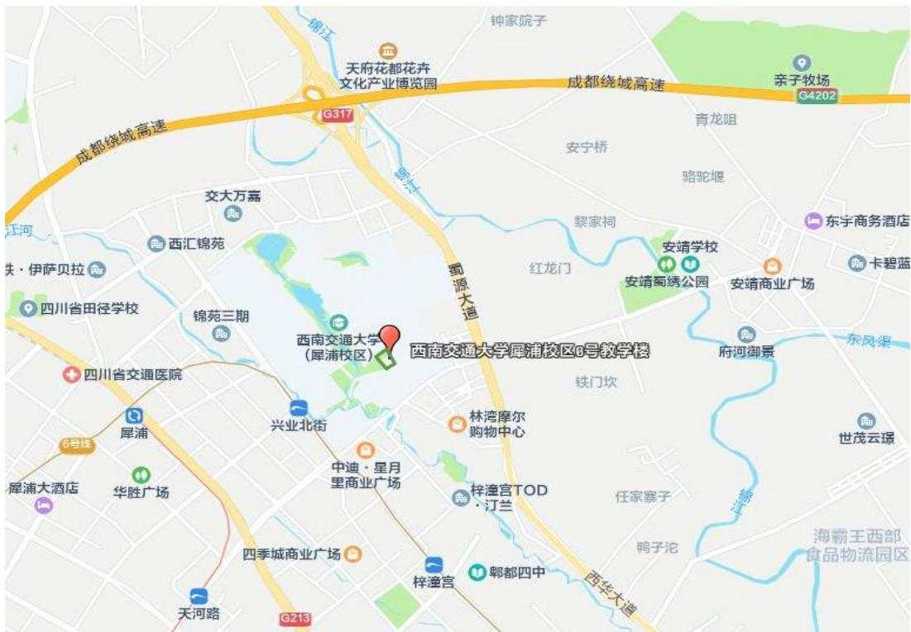  
图1.1-1项目区位交通示意图  
四川京华畅工程管理有限公司

## 1.1.1.3建设性质及规模

本项目属于新建建设类项目，为西南交通大学犀浦校区规划建设内容，校区总体规划用地面积约 179.10h㎡，本期规划用地面积为 1.04h ㎡，主要建设内容为修建1栋5层教学楼，设 1层地下室，配套建设道路及铺装硬化、景观绿化、其他附属设施等。

本项目总建筑面积 26760.45 ㎡，其中地上建筑面积20648.49㎡，地下建筑面积 6111.96 ㎡。建筑基底面积 5639.84 ㎡，道路及硬化铺装面积 3676.27 ㎡，景观绿化面积 1058 ㎡。场地设计±0.00 标高524.50m，地下室基底标高 517.40m，地下室层高 5.1m。

## 1.1.1.4施工组织

为满足施工要求，在主体工程区内布置了施工生产设施（施工生产设施用地根据主体工程进度有所调整），并单独布置了1 处施工办公生活区、1处临时堆土区（该区域根据堆土内容不同，分为三个临时堆存场：1处表土堆存场、1 处一般土石方堆存场、1处砂石堆存场）。

主体工程区：建设所需的建筑材料均采取商购方式解决，本项目在主体基坑四周布设了现场会议、办公室、库房、临时材料堆放场、钢筋、木材等加工房等施工必要设施，建筑材料运至施工区域需分类有序堆存，均考虑就近、合理布置。1.20h ㎡（永久占地 1.04h ㎡，临时占地 0.16h ㎡）

施工办公生活区：施工办公生活区布置于校园空闲地内，位于主体工程区东向直线距离 127.5m 处即西南交通大学机车博物院东侧，用于施工单位办公、生活使用，施工办公生活区占地面积约0.27h㎡。

临时堆土区：本项目主体工程区及施工办公区占地内有表土需要保护，在基坑回填阶段需要一定数量的土方及砂石进行回填。本项目建设单位在学校校园东侧空闲区域为本项目提供了临时堆土区。

临时堆土区总占地面积为0.89h㎡。该区包含了三个临时堆存场。其中：1、本项目表土堆存场，堆存表土量约 0.13 万 m³，堆高约 4.5m，边坡比 1:1.5，占地面积约 0.07h ㎡，堆存时间 2026 年6月\~2027 年 9月；2、砂石堆存场，本项目基坑开挖出的用于项目回填砂卵石约0.96 万m³，堆高约4.5m，边坡比 1:1.5，占地约 0.46h ㎡，堆存时间 2026 年 6\~12 月；3、本项目基坑开挖出的用于本项目回填的一般土石方堆存场，堆放量约 0.58 万 $\mathrm { m } ^ { 3 }$ ，堆高约 4.5m，坡比 1:1.5，占地约0.36h ㎡，堆存时间2026 年6\~12 月。本项目剥离的表土只能堆存于表土堆存场。堆土期间，建设单位组织主体施工单位对堆土区域进行苫盖、拦挡、截排水、沉沙防护。

施工用水、用电：周边市政供水管网、电网均已铺设至园区内，施工用水就近从南侧校园道路精勤路预留给水接入点处引至施工办公生活区，施工用电就近从南侧校园道路精勤路电网配电箱接引至施工办公生活区配电箱。

## 1.1.1.5工程土石方量

本项目土石方总挖方量约 5.76 万 $\mathrm { m } ^ { 3 }$ （其中：表土约 0.13 万 $\mathrm { m } ^ { 3 }$ ，一般土石方约 4.15 万 $\mathrm { m } ^ { 3 }$ ，砂石约 1.48 万 $\mathrm { m } ^ { 3 } \ .$ ），填方总量约 1.67 万 $\mathrm { m } ^ { 3 }$ （其中表土 0.13万 $\mathrm { m } ^ { 3 }$ ，砂石 0.96 万 $\mathrm { m } ^ { 3 } .$ ，一般土石方 0.58 万 $\mathrm { m } ^ { 3 }$ ）；内部调运总量约 1.67 万 $\mathrm { m } ^ { 3 }$ （其中，表土0.13万 $\mathrm { m } ^ { 3 }$ ，施工前对工程施工占地区域进行表土剥离，在校内的临时堆土区集中存放，后期调入绿化工程区进行表土回覆；砂石0.96 万 $\mathrm { m } ^ { 3 }$ ，基坑开挖阶段将需要回填的砂石量运至本项目临时堆土区存放，在回填施工阶段，根据工程进度回填；一般土石方 0.58 万 $\mathrm { m } ^ { 3 }$ ）；无借方，余方约 4.09 万 $\mathrm { m } ^ { 3 }$ （其中：一般土石方3.57 万 $\mathrm { m } ^ { 3 }$ ，全部运至正兴田家寺公共停车场及配套公服设施项目回填利用；砂石约0.52万 $\mathrm { m } ^ { 3 }$ ，砂石由成都蜀源港泰新型建材有限公司回收、利用）。

## 1.1.1.6项目工期及投资

根据建设单位施工进度安排，项目计划于 2026 年 6 月开工，于 2027 年 9月完工，建设总工期16 个月。

本项目工程总投资20418万元，其中土建投资16199.6 万元，资金来源通过申请中央投资和自筹解决。

项目建设不涉及拆迁安置及专项设施改建。

## 1.1.2 项目前期工作进展及方案编制情况

## 1.1.2.1主体设计情况

2024 年12月，项目取得《教育部关于西南交通大学犀浦校区0 号教学楼项目可行性研究报告的批复》（教发函〔2024〕430 号）；

2025 年 8 月，四川省蜀通勘察基础工程有限责任公司完成了《西南交通大学犀浦校区0号教学楼岩土工程勘察报告》；

2025 年 9 月，重庆大学建筑规划设计研究总院有限公司完成本项目《基坑支护工程施工图设计》。

2025 年 9 月，项目取得成都市郫都区规划和自然资源局颁发的《建设工程规划许可证》。

2025 年 9 月，重庆大学建筑规划设计研究总院有限公司完成本项目《施工设计文件》；本项目取得《施工审查合格书》；

## 1.1.2.1水土保持方案编制情况

2025 年11月，西南交通大学委托四川京华畅工程管理有限公司（以下简称“我公司”）编制本项目水土保持方案工作（详见附件1）。在接受编制任务后，我公司成立项目组，组织相关技术人员对主体工程设计资料进行了全面分析研究，并进行了现场踏勘，对项目现场及附近的自然、生态环境、水土流失及水土保持现状、工程进展等进行了调查，与建设单位、设计单位等相关单位进行了充分沟通，结合主体工程设计和施工特点的基础上，于 2026年4 月编制完成了本项目水土保持方案报告书。

## 1.1.3 自然简况

本项目位于成都市郫都区西南交通大学犀浦校区内，交通便利，场地地势平坦，地貌上属于场地地貌单元属于岷江水系Ⅰ级阶地，属平原地貌，场地平坦，原始地面高程介于 524.48～524.77m，高差 0.29m。第四系全新统人工填土层(Q4)素填土；第四系全新统冲洪积层 $( \mathsf { Q a } ^ { 1 } { + } \mathsf { p } ^ { 1 } )$ 粉土、细砂、中砂和卵石组成。抗震设防烈度为Ⅶ度。

项目区属亚热带湿润季风气候区，多年平均气温 $1 6 . 2 \mathrm { { ^ { \circ } C } }$ ，多年平均降水量为 988.50mm，多年平均蒸发量 1465.10mm，多年平均风速 1.35m/s，多年平均干燥度为 0.3\~0.5，属湿润地区，项目区降雨侵蚀力因子（R）为 5083.4，土壤可蚀性因子（K）为 0.0083。拟建项目距离较远的河流为场区以北的锦江，直线距离约2.80km。距离最近的河流为场区西南的沱江河，直线距离约为0.5km。锦江属都江堰柏条河水系，其多年平均流量分别为70.5m³/s。沱江河属都江堰走马河水系，多年平均流量分别为22.3m³/s。本项目建设基本不受上述河流洪水影响；

上述河流均切割砂砾卵石层，河水和地下水水力联系密切，主体工程设计已考虑基坑降水及地下室抗浮措施。

项目所在区域土壤主要为黄壤土，场址原状为校园内待建空地及校内临时停车场，局部存在可以剥离表土，可剥离表土厚度约 20cm 左右。项目所在区域植被以亚热带常绿阔叶林为主，项目场址地表覆盖有杂草、校园草坪及少量乔灌木。

根据《全国水土保持规划（2015-2030 年）》，项目区所在地郫都区在全国水土保持区划中属于西南紫色土区，土壤侵蚀类型区以水力侵蚀为主，区域容许土壤流失量为 500t/k㎡·a，项目建设场地水土流失以微度侵蚀为主，平均土壤侵蚀模数背景值约为300t/k㎡·a。

本项目不涉及饮用水水源保护区、水功能一级区的保护区和保留区、自然保护区、世界文化和自然遗产地、风景名胜区、地质公园、森林公园、重要湿地等。工程建设区不涉及全国水土保持监测网络中的水土保持监测站点、重点试验区，未占用国家确定的水土保持长期定位观测站，未占用生态保护红线。

## 1.2 编制依据

## 1.2.1 法律法规及部委规章

（1）《中华人民共和国水土保持法》（中华人民共和国主席令第39号，1991年6月29日通过，2010年12月 25 日修订，2011年3月 1日施行）；

（2）《四川省〈中华人民共和国水土保持法〉实施办法》（四川省人大常委会，1993 年 12 月 15 日通过，1997 年 10 月 17 日修正，2012 年 9 月 21日修订）；

（3）《生产建设项目水土保持方案管理办法》（中华人民共和国水利部令第53 号，2023年 1月17日发布，2023年3月1日起施行）。

## 1.2.2 规范性文件

（1）《水利部办公厅关于印发〈全国水土保持规划国家级水土流失重点预防区和重点治理区复核划分成果〉的通知》（办水保〔2013〕188号，2013年8月 12 日）；

（2）《水利部关于加强事中事后监管规范生产建设项目水土保持设施自主验收的通知》（水保〔2017〕365 号）；

（3）《四川省水利厅关于印发〈四川省省级水土流失重点预防区和重点治理区划分成果〉的通知》（川水函〔2017〕482 号）；

（4）《四川省水利厅转发水利部关于加强事中事后监管规范生产建设项目水土保持设施自主验收的通知》（川水函〔2018〕887号）；

（5）《水利部办公厅关于印发生产建设项目水土保持技术文件编写和印制格式规定（试行）的通知》（办水保〔2018〕135 号）；

（6）《水利部办公厅关于印发〈生产建设项目水土保持监督管理办法〉的通知》（办水保〔2019〕172号）；

（7）《水利部关于进一步深化“放管服”改革全面加强水土保持监管的意见》（水保〔2019〕160号）；

（8）《水利部办公厅关于实施生产建设项目水土保持信用监管“两单”制度的通知》（办水保〔2020〕157 号）；

（9）《水利部办公厅关于进一步加强生产建设项目水土保持监测工作的通知》（办水保〔2020〕161 号）；

（10）《水利部水土保持监测中心文件关于印发生产建设项目水土保持方案技术审查要点的通知》（水保监〔2020〕63号）；

（11）《水利部办公厅关于印发〈生产建设项目水土保持方案技术审查要点的通知》（办水保〔2023〕177号）；

（12）《关于加强新时代水土保持工作的意见》（中共中央办公厅、国务院办公厅，2023年1月印发）；

（13）《水利部贯彻落实〈关于加强新时代水土保持工作的意见〉实施方案》（水保〔2023〕25号）；

（14）《水利部办公厅关于生产建设项目水土保持方案管理工作有关衔接事项的通知》（办水保函〔2023〕109号）；

（15）《水利部关于实施水土保持信用评价的意见》（水保〔2023〕359号）；

（16）《水利部办公厅关于进一步加强部批项目水土保持监管工作的通知》（办水保〔2024〕57号）。

## 1.2.3 技术规范及标准

（1）《水利工程设计概（估）算编制规定》（水总〔2024〕323号）；

（2）《土壤侵蚀分类分级标准》（SL190-2007）；

（3）《城市绿地设计规范》（GB50420-2007）；

（4）《水土保持工程设计规范》（GB51018-2014）；

（5）《水利水电工程制图标准水土保持图》（SL73.6-2015）；

（6）《土地利用现状分类》（GB/T21010-2017）；

（7）《生产建设项目水土保持技术标准》（GB50433-2018）；

（8）《生产建设项目水土流失防治标准》（GB/T50434-2018）；

（9）《生产建设项目水土保持监测与评价标准》（GB/T51240-2018）；

（10）《生产建设项目土壤流失量测算导则》（SL773-2018）；

（11）《室外排水设计规范》（GB50014-2021）；

（12）《水土保持监理规范》（SL/T523-2024）。

## 1.2.4 技术文件及资料

（1）《西南交通大学犀浦校区0号教学楼岩土工程勘察报告》（详细勘察）（四川省蜀通勘察基础工程有限责任公司，2025年8 月）；

（2）《西南交通大学犀浦校区 0 号教学楼方案设计》（重庆大学建筑规划设计研究总院有限公司，2025年7月）；

（3）《西南交通大学犀浦校区 0 号教学楼施工图设计》（重庆大学建筑规划设计研究总院有限公司，2025年9月）

（4）《成都市水土保持规划（2015-2030 年）》；

（5）项目区地质、水文、土壤、水土流失等基础资料。

## 1.3 设计水平年

按照《生产建设项目水土保持技术标准》（GB50433-2018），本项目为新建建设类项目，属于点型工程，项目计划于2026年6月开工，2027年9月完工，建设总工期16个月，水土保持方案设计水平年为工程完工后当年，即2027年。

## 1.4 水土流失防治责任范围

水土流失防治责任范围为生产建设单位依法应承担水土流失防治义务的区域，水土流失防治责任范围为项目永久占地面积 1.04hm²及项目永久占地以外施工临时占地面积 1.32hm²，共计 2.36hm²。本项目永久及临时占地均位于西南交通大学犀浦校区权属范围内，无其他使用与管辖区域。因此本项目水土流失防治责任范围共计 2.36hm²，行政区划均属四川省成都市郫都区管辖。

本项目水土流失防治分区划分为 3 个分区：其中主体工程区 1.20hm²（永久占地 1.04hm²，临时占地 0.16hm²），施工办公生活区临时占地 0.27hm²，临时堆土区临时占地 0.89hm²。项目临时占地位于校园空地内。

## 1.5 水土流失防治目标

## 1.5.1 执行标准等级

根据《水利部办公厅关于印发〈全国水土保持规划国家级水土流失重点预防区和重点治理区复核划分成果〉的通知》（办水保〔2013〕188号）、《四川省水利厅关于印发〈四川省省级水土流失重点预防区和重点治理区划分成果〉的通知》（川水函〔2017〕482 号）、《成都市水土保持规划（2015-2030 年）》规定，项目所处的成都市郫都区不在国家级、省级、市级划分的水土流失重点预防区和重点治理区范围内，位于西南紫色土区，结合《生产建设项目水土流失防治标准》（GB/T50434-2018）规定，鉴于工程区位属于县级以上城市区域，本工程水土流失防治标准采用西南紫色土区一级防治标准。

## 1.5.2 防治目标

根据本项目的建设特点，工程区环境现状等，明确本工程水土流失防治的基本目标为：

（1）项目建设范围内新增水土流失得到有效控制，原有水土流失得到治理；

（2）项目建设区内各项水土保持设施安全有效；

（3）项目建设区内水土资源、林草植被得到最大限度的保护与恢复；

（4）各项水土流失防治指标达到《生产建设项目水土流失防治标准》（GB/T50434-2018）的要求。

根据本项目水土流失防治责任范围内气候、地貌、侵蚀强度以及行业限制规定对防治目标进行修正后确定最终的防治目标。

本项防治目标值根据项目区地形地貌、多年降雨量、气候类型等进行修正。其修正原则如下：

（1）干旱程度修正值：项目区多年平均干燥度为 0.3\~0.5，项目区为湿润地区，因此，按照《生产建设项目水土流失防治标准》（GB/T50434-2018）第 4.0.6条的规定，水土流失治理度、林草植被恢复率、林草覆盖率不修正；

（2）土壤侵蚀强度修正：该项目涉及区域内土壤侵蚀为微度侵蚀，按照《生产建设项目水土流失防治标准》（GB/T50434-2018）第4.0.7条的规定，土壤流失控制比不应小于1，土壤流失控制比调整为1.0；

（3）地形地貌修正值：本项目地貌单元为平原地貌。项目在试运行过程中产生的水土流失，通过布设水保措施后，能实现有效防护，渣土防护率不修正；

（4）位于城市区修正：本项目位于郫都区城区范围内，渣土防护率、林草覆盖率提高2%。

本项目水土流失防治应达到下列基本目标：项目建设范围内的新增水土流失应得到有效控制，原有水土流失得到治理；水土保持设施应安全有效；水土资源、林草植被应得到最大限度的保护与恢复。修正后的六项防治目标值为：水土流失治理度97%、土壤流失控制比 1.0、渣土防护率94%，表土保护率92%，林草植被恢复率97%，林草覆盖率25%。见表1.5-1。

表 1.5-1 西南紫色土区一级防治标准水土流失防治目标值
<table><tr><td rowspan=2 colspan=1>项目</td><td rowspan=1 colspan=2>规范标准</td><td rowspan=2 colspan=1>按年干燥度修正</td><td rowspan=2 colspan=1>按土壤侵蚀强度修正</td><td rowspan=2 colspan=1>按陆地地貌类型修正</td><td rowspan=2 colspan=1>按城市区修正</td><td rowspan=2 colspan=1>按重点防治区修正</td><td rowspan=1 colspan=2>采用标准</td></tr><tr><td rowspan=1 colspan=1>施工期</td><td rowspan=1 colspan=1>设计水平年</td><td rowspan=1 colspan=1>施工期</td><td rowspan=1 colspan=1>设计水平年</td></tr><tr><td rowspan=1 colspan=1>水土流失治理度(%)</td><td rowspan=1 colspan=1>一</td><td rowspan=1 colspan=1>97</td><td rowspan=1 colspan=1>一</td><td rowspan=1 colspan=1>一</td><td rowspan=1 colspan=1>一</td><td rowspan=1 colspan=1>一</td><td rowspan=1 colspan=1>一</td><td rowspan=1 colspan=1>一</td><td rowspan=1 colspan=1>97</td></tr><tr><td rowspan=1 colspan=1>土壤流失控制比</td><td rowspan=1 colspan=1>一</td><td rowspan=1 colspan=1>0.85</td><td rowspan=1 colspan=1>一</td><td rowspan=1 colspan=1>+0.15</td><td rowspan=1 colspan=1>一</td><td rowspan=1 colspan=1>一</td><td rowspan=1 colspan=1>一</td><td rowspan=1 colspan=1>一</td><td rowspan=1 colspan=1>1.0</td></tr><tr><td rowspan=1 colspan=1>渣土防护率（%）</td><td rowspan=1 colspan=1>90</td><td rowspan=1 colspan=1>92</td><td rowspan=1 colspan=1>一</td><td rowspan=1 colspan=1>一</td><td rowspan=1 colspan=1>一</td><td rowspan=1 colspan=1>+2</td><td rowspan=1 colspan=1>一</td><td rowspan=1 colspan=1>92</td><td rowspan=1 colspan=1>94</td></tr><tr><td rowspan=1 colspan=1>表土保护率（%）</td><td rowspan=1 colspan=1>92</td><td rowspan=1 colspan=1>92</td><td rowspan=1 colspan=1>一</td><td rowspan=1 colspan=1>一</td><td rowspan=1 colspan=1>二</td><td rowspan=1 colspan=1>二</td><td rowspan=1 colspan=1>一</td><td rowspan=1 colspan=1>92</td><td rowspan=1 colspan=1>92</td></tr><tr><td rowspan=1 colspan=1>林草植被恢复率(%)</td><td rowspan=1 colspan=1>一</td><td rowspan=1 colspan=1>97</td><td rowspan=1 colspan=1>一</td><td rowspan=1 colspan=1>二</td><td rowspan=1 colspan=1>一</td><td rowspan=1 colspan=1>一</td><td rowspan=1 colspan=1>一</td><td rowspan=1 colspan=1>一</td><td rowspan=1 colspan=1>97</td></tr><tr><td rowspan=1 colspan=1>林草覆盖率（%）</td><td rowspan=1 colspan=1>一</td><td rowspan=1 colspan=1>23</td><td rowspan=1 colspan=1>一</td><td rowspan=1 colspan=1>一</td><td rowspan=1 colspan=1>一</td><td rowspan=1 colspan=1>+2</td><td rowspan=1 colspan=1>一</td><td rowspan=1 colspan=1>一</td><td rowspan=1 colspan=1>25%</td></tr></table>

## 1.6 项目水土保持评价结论

## 1.6.1 主体工程选址（线）评价

项目建设符合国家产业政策的要求，符合当地城市建设总体规划。

按照《中华人民共和国水土保持法》、《生产建设项目水土保持技术标准》（GB50433-2018）的规定，对主体工程水土保持制约性因素逐一进行了分析与评价，分析评价可知：本项目位于四川省成都市郫都区，项目区未涉及国家级、省级及市级水土流失重点治理区范围，不属于水土流失严重、生态脆弱地区；未涉及河流两岸、湖泊和水库周边的植物保护带范围内，未涉及全国水土保持监测网路中的水土保持监测站点、重点试验区及国家确定的水土保持长期定位观测站，未涉及国家及地方自然保护区、饮用水水源保护区、水功能区一级区的保护区及保留区、自然保护区、风景名胜区、重要湿地、地质灾害易发区等限制性区域。从水土保持角度评价，本工程选址无水土保持制约性因素。

## 1.6.2 建设方案与布局评价

根据《生产建设项目水土保持技术标准》（GB50433-2018）相关规定从水土保持角度对建设方案、工程占地、土石方平衡、取土（石、砂）场设置、弃土场设置、施工方法与工艺、具有水土保持功能的工程进行评价。

## 1.6.2.1 建设方案评价

主体设计按“海绵城市”要求设置了透水铺装、排水沟及雨洪集蓄措施，增加降水入渗及利用；项目建成后按照园林标准实施绿化美化措施，与周边校园达到协调一致的景观效果。项目建设落实雨水调蓄池、透水铺装等工程措施，景观绿化等植物措施可起到固水保土的水土保持效果。综上所述，主体工程布局符合水土保持要求。

## 1.6.2.2 工程占地评价

项目在工程占地方面，主体建筑设计综合考虑现状地形地势，充分利用竖向空间，集约化使用土地。另外，在施工期设置基坑开挖放坡区、施工办公生活区、临时堆土区等临时用地，工程占地合理，符合水土保持的规定和要求，能满足项目施工要求。

## 1.6.2.3 工程土石方平衡评价

本项目合理进行土石方开挖，并且优化土方开挖及回填工艺，将用于开挖后的合格回填土堆放于本项目临时堆土区，多余土方运至合法第三方进行资源化利用。本项目最大限度地合理利用土方，土石方挖填量符合最优化原则，临时堆土集中堆放进行苫盖、拦挡、截排水、沉沙保护，避免造成水土流失。总体上，主体工程土石方流向、平衡基本合理，满足土方调配利用的要求。

## 1.6.2.4 取、弃土场设置评价

本项目不设置取土场，不设单独的弃土场，不存在水土保持制约性因素。

## 1.6.2.5施工方法与工艺分析评价

本项目主体工程施工活动均控制在设计的场地内，未超出防治责任范围。施工现场布设彩钢板拦挡，对裸露地表及时进行苫盖、现场布置临时洒水车进行降尘、施工出入口车辆清洗、渣土车封闭运输等。填筑土方时采取随挖、随运、随填、随压方式施工。本项目主体工程设计的施工时序、施工方法及工艺科学合理，工期安排紧凑，可降低因人为扰动诱发的水土流失危害，符合水土保持的要求。

## 1.6.2.6主体工程设计中具有水土保持功能评价

主体工程中设计已列的雨水排水系统、景观绿化、透水铺装、临时排水系统等措施位置基本合理，设计采用的标准恰当，数量充足，具有良好的水土保持功能并纳入水土保持投资，本方案将进一步完善施工前表土剥离，施工期临时防护措施及施工结束后的迹地恢复措施，以形成完善的水土保持措施体系。

## 1.6.2.6项目水土保持评价结论

综上所述，通过本方案合理优化占地及土石方，优化防治标准，在主体设计的水土保持措施基础上，本方案进行补充设计后形成完整的水土保持措施体系，将有效控制后续建设造成的新增水土流失量。

## 1.7 水土流失预测结果

根据工程建设特点，结合项目区自然条件，确定工程建设水土流失类型为水力侵蚀。

经预测，本项目总占地面积 2.36h㎡，工程建设扰动地表面积2.36h ㎡，损毁植被面积 1.40h ㎡。项目建设可造成土壤流失总量为 153.47 t，其中新增土壤流失量137.65t。主体工程区、临时堆土区新增土壤流失量为37.93t、99.45t，分

别占新增流失总量的 27.56%、72.25%，临时堆土区、主体工程区为本项目水土流失的重点区域。施工期新增土壤流失量 135.53t，占新增土壤流失总量的98.46%，因此，施工期是本项目水土流失的重点时段。

## 1.8 水土保持措施布设成果

根据地形地貌特征、施工扰动特点、建设时序和水土流失影响条件划分，将项目区划分为主体工程区、施工办公生活区、临时堆土区共3个水土流失防治分区。各防治分区水土保持措施布设和工程量如下（斜体加粗为本方案新增措施）：

## 1.8.1 主体工程区

施工前对主体工程占地区域内可剥离表土进行剥离，剥离的表土运至临时堆土区集中堆放，后期用于景观绿化区回填；施工准备阶段，在施工主入口（工程渣土出土大门处）设置车辆冲洗设施及三级沉沙池，土方施工过程中，在基坑顶部四周围栏内侧设置截水沟，截水沟转折处适当设置集水坑，基坑内外的汇水经截排水沟汇入三级沉沙池，三级沉沙池出口接入校园市政管雨水网，沉淀后的水排入周边市政管网。针对基坑开挖裸露边坡、坑底临时堆土、管沟开挖临时堆土及工程区裸露地表等施工区域进行密目网苫盖；施工后期，沿道路一侧或硬化铺装区域地埋布设雨水排水管，地表径流经雨水口汇入雨水管网，再经雨水调蓄池调节水量后有组织地排入市政管网，广场等低荷载区域设置透水砖、透水混凝土等铺装，对景观绿化区进行表土回覆及土地整治，并采用乔灌草相结合进行景观绿化。

工程措施：表土剥离0.05 万m³ （措施实施时段为2026 年6 月， 本措施为，坡道截水沟15.73m（措施实施时段为2027 年1\~9 月）、永久排水沟约937.21m、雨排水管网34.81m、雨水调蓄排放系统一套（雨水调蓄池169.5m³）（措施实施时段为2027年1\~9 月）、透水铺装约3197 ㎡（措施实施时段为2027 年 8\~9 月）、表土回覆约0.05 万m³ （措施实施时段为2027年8 月， 本措施为方案新增）。

植物措施：土地整治0.11h ㎡ （措施实施时段为2027年8 月 本措施为方、乔灌草绿化 1058㎡（措施实施时段为2027年8\~9 月）。

临时措施：基坑顶部截排水沟 238.38m（措施实施时段为 2026 年 6 月）、集水坑4个（措施实施时间为2026 年6月）、沉沙池1座（措施实施时段为2026年6月）、洗车设施一套（四周布设截排水沟，并与沉沙池连接，措施实施时间为 2026 年 6 月）、密目网苫盖8180 ㎡ （措施实施时段为 2026 年6\~7 月 2027年1\~9月，本措施为方案新增）。

## 1.8.2 施工办公生活区

本施工区域为校园空闲地，施工前应进行表土剥离并运至临时堆土区集中保护。本区域打围后地面场平并进行混凝土临时硬化，搭建板房四周设置截排水沟，并于该区域内现有雨水井连接，保证区域内雨水汇入截排水沟后排入校园雨水系统。新建混凝土临时施工便道与校园已有道路连接处设置移动式洗车设施，该设施也用于清洗主体工程区至临时堆土区的运土车辆，避免车辆带土至校园道路上导致的水土流失。在该区域施工过程中，对裸露的土壤进行临时苫盖。主体项目完工后，对该区域进行拆除，对占地区域采取土地整治、进行表土回覆，撒播草籽恢复原地貌。

工程措施：表土剥离0.08 万m³ （措施实施时段为2026 年6 月， 本措施为方案新增），表土回覆0.08万m³（措施实施时段为2027年9月，本措施为方案新增）。

植物措施：土地整治0.27h ㎡ （措施实施时段为2027年9 月 本措施为方案新增）、乔灌草绿化0.27hm²（措施实施时段为2027年9月，本措施为方案新增）。

临时措施：移动式车辆冲洗设施 1套（措施实施时段为2026 年6月），截排水沟 166m（措施实施时段为 2026 年 6 月），沉沙池 1 座（措施实施时段为2026年 6 月），密目网苫盖500 ㎡ （措施实施时段为2026 年6 月 本措施为方案新增）。

## 1.8.3 临时堆土区

考虑到该区域为临时堆土，大部分临时堆土堆放时间不长，对临时堆土区不进行表土剥离。表土堆放时间跨越整个工期，时间和状态相对固定，因此仅对表土堆存场四周采取编织土袋挡墙进行临时拦挡，临时堆土表面采取密目网遮盖并撒播少量草籽进行固土且保持土壤活力，编织土袋挡墙外侧布设临时排水沟，在排水最低点附近布设临时沉沙池，临时排水出口连接沉沙池。一般土石方堆放时间较短，采用全面苫盖的方式进行保护，区域内堆土根据施工工序，及时进行回填运走。施工结束后，对临时堆土区扰动区域进行全面土地整治，撒播草籽进行植草绿化，将场地恢复为原地貌。

植物措施：土地整治0.89h ㎡ （措施实施时段为2027年9 月 本措施为方案新增）、撒播草籽0.89hm²（措施实施时段为2027年9月，本措施为方案新。

临时措施：临时排水沟105.76m （措施实施时段为2026 年6 月 本措施为方案新增），土袋拦挡75m³（措施实施时段为2026年6月，本措施为方案新增），沉沙池1座（措施实施时段为2026年6月，本措施为方案新增），密目网苫盖8900 ㎡ （措施实施时段为2026 年6 月\~2027年9 月， 本措施为方案新增） 。

## 1.9 水土保持监测方案

本项目水土保持监测工作与主体工程同步开展。根据《生产建设项目水土保持技术标准》（GB50433-2018）、《生产建设项目水土保持监测与评价标准》（GB/T51240-2018）和《水利部办公厅关于进一步加强生产建设项目水土保持监测工作的通知》（办水保〔2020〕161号），本项目为建设类项目，监测时段从施工准备期开始至设计水平年结束。

（1）监测内容：水土流失影响因素、水土流失状况、水土流失危害和水土保持措施等。

（2）监测时段：2026 年6月开始至设计水平年2027年结束。

（3）监测方法：调查监测法、地面观测法。

（4）监测点位：共设置监测点位3个。

（5）监测频次：开工前应开展 1 次全面的现状监测，摸清项目区背景情况，即水土流失影响因子及水土流失状况等。扰动土地情况监测频次不少于每月 1次，土壤流失面积每月 1次，水土流失量每月1 次，正在实施的水土保持措施建设情况每月监测1次，水土保持工程措施拦挡效果每月监测记录1次，主体工程建设进程、水土流失影响因子、水土保持植物措施生长情况每月监测记录1次，遇暴雨（日降雨量≥50mm 或1小时降雨量≥25mm）加测1次。

## 1.10 水土保持投资及效益分析成果

本项目水土保持措施总投资 238.70 万元，其中主体已列水土保持措施投资179.58万元，方案新增水土保持措施投资59.12 万元。水土保持措施总投资中，工程措施投资 126.11 万元，植物措施投资 39.67 万元，监测费 6.10 万元，临时措施投资 35.27 万元，独立费用 20.18 万元（其中：建设管理费 10.18 万元，工程建设监理费 0 万元，科研勘测费 10 万元），基本预备费 11.37 万元，水土保持补偿费 3.068 万元。

本项目为公益性学校建设项目，属《水土保持补偿费征收使用管理实施办法》（财综〔2014〕8号）及《四川省水土保持补偿费征收使用管理实施办法》（川财综〔2014〕6号）规定的免征水土保持补偿费情形，故可申请免征水土保持补偿费。故本项目水土保持费未计入水土保持投资。

各项水土保持措施实施后，项目建设区内水土流失治理达标面积 2.36hm2，林草植被建设面积 1.26hm2，减少土壤流失量 135.53t。至方案设计水平年，各项防治指标均能达到水土保持方案确定的目标值。与此同时，完善的措施体系对于控制和减轻因项目建设产生的水土流失具有较好的效果，表土的有效利用也充分体现了水土资源的保护及合理利用，植物措施实施后对区域生态环境有一定的恢复和改善，且能防止水土流失破坏生态环境，具有较好的社会效益及生态效益。

## 1.11 结论

本项目选址无水土保持制约性因素，项目工程布局与建设方案符合绿色设计要求，主体设计按“海绵城市”要求设置了透水铺装及雨洪集蓄措施，施工布置基本合理，对施工临时占地考虑比较周全，无缺项漏项，满足施工需求。场内土石方随挖随运、随填随压，表土与回填土分类分区进行堆放，土石方调配合理。

为确保本水土保持方案的落实，提出如下建议：

（1）本项目水土流失治理由建设单位负责，施工单位实施的方式，建设单位在施工招标时应将本方案新增的水土保持措施纳入施工招标合同中，将水土保持措施落到实处，项目施工单位应切实履行施工合同，将水土保持措施保质保量完成。

（2）建设单位应组织施工、监理等参建各方严把质量关，严格控制施工进度，及时实施好水土保持方案设计的各项水土流失防治措施。

（3）本项目竣工验收时，应当验收水土保持设施，组织第三方机构编制水土保持设施验收报告，水土保持设施未经验收，项目不得投产使用。

1综合说明  
水土保持方案特性表
<table><tr><td rowspan=1 colspan=2>项目名称</td><td rowspan=1 colspan=4>西南交通大学犀浦校区0号教学楼</td><td rowspan=1 colspan=2>流域管理机构</td><td rowspan=1 colspan=4>长江水利委员会</td></tr><tr><td rowspan=1 colspan=2>涉及省区</td><td rowspan=1 colspan=2>四川省</td><td rowspan=1 colspan=2>涉及地市或个数</td><td rowspan=1 colspan=2>成都市</td><td rowspan=1 colspan=3>涉及县或个数</td><td rowspan=1 colspan=1>郫都区</td></tr><tr><td rowspan=1 colspan=2>项目规模</td><td rowspan=1 colspan=2>修建1栋教学楼（5层），设1层地下室，10374.11m²，总建筑面积26760.45m²，其中地上建筑面积20648.49m²，地下建筑面积6111.96²</td><td rowspan=1 colspan=2>总投资（万元）</td><td rowspan=1 colspan=2>20418</td><td rowspan=1 colspan=3>土建投资（万元）</td><td rowspan=1 colspan=1>16199.6</td></tr><tr><td rowspan=1 colspan=2>动工时间</td><td rowspan=1 colspan=2>2026年6月</td><td rowspan=1 colspan=2>完工时间</td><td rowspan=1 colspan=2>2027年9月</td><td rowspan=1 colspan=3>设计水平年</td><td rowspan=1 colspan=1>2027年</td></tr><tr><td rowspan=1 colspan=2>工程占地(hm²)</td><td rowspan=1 colspan=2>2.36</td><td rowspan=1 colspan=2>永久占地（hm²）</td><td rowspan=1 colspan=2>1.04</td><td rowspan=1 colspan=3>临时占地（hm²）</td><td rowspan=1 colspan=1>1.32</td></tr><tr><td rowspan=2 colspan=4>土石方量（万m³）</td><td rowspan=1 colspan=2>挖方</td><td rowspan=1 colspan=2>填方</td><td rowspan=1 colspan=3>借方</td><td rowspan=1 colspan=1>余方</td></tr><tr><td rowspan=1 colspan=2>5.76</td><td rowspan=1 colspan=2>1.67</td><td rowspan=1 colspan=3>1</td><td rowspan=1 colspan=1>4.09</td></tr><tr><td rowspan=1 colspan=4>重点防治区名称</td><td rowspan=1 colspan=8>不属于国家级、省级及市级水土流失重点预防区和重点治理区</td></tr><tr><td rowspan=1 colspan=2>地貌类型</td><td rowspan=1 colspan=3>平原地貌</td><td rowspan=1 colspan=5>水土保持区划</td><td rowspan=1 colspan=2>西南紫色土区</td></tr><tr><td rowspan=1 colspan=2>土壤侵蚀类型</td><td rowspan=1 colspan=3>水力侵蚀</td><td rowspan=1 colspan=5>土壤侵蚀强度</td><td rowspan=1 colspan=2>微度</td></tr><tr><td rowspan=1 colspan=3>防治责任范围面积（hm²）</td><td rowspan=1 colspan=2>2.36</td><td rowspan=1 colspan=5>容许土壤流失量[t/(km²·a)]</td><td rowspan=1 colspan=2>500</td></tr><tr><td rowspan=1 colspan=3>土壤流失预测总量（t）</td><td rowspan=1 colspan=2>153.47</td><td rowspan=1 colspan=5>新增土壤流失量（t）</td><td rowspan=1 colspan=2>137.65</td></tr><tr><td rowspan=1 colspan=3>水土流失防治标准执行等级</td><td rowspan=1 colspan=7>西南紫色土区一级标准</td><td rowspan=1 colspan=2></td></tr><tr><td rowspan=3 colspan=1>防治目标</td><td rowspan=1 colspan=2>水土流失治理度（%）</td><td rowspan=1 colspan=2>97</td><td rowspan=1 colspan=5>土壤流失控制比</td><td rowspan=1 colspan=2>1.0</td></tr><tr><td rowspan=1 colspan=2>渣土防护率（%）</td><td rowspan=1 colspan=2>94</td><td rowspan=1 colspan=5>表土保护率（%）</td><td rowspan=1 colspan=2>92</td></tr><tr><td rowspan=1 colspan=2>林草植被恢复率（%）</td><td rowspan=1 colspan=2>97</td><td rowspan=1 colspan=5>林草覆盖率（%）</td><td rowspan=1 colspan=2>25</td></tr><tr><td rowspan=4 colspan=1>防治措施及工程量</td><td rowspan=1 colspan=2>防治分区</td><td rowspan=1 colspan=2>工程措施</td><td rowspan=1 colspan=4>植物措施</td><td rowspan=1 colspan=3>临时措施</td></tr><tr><td rowspan=1 colspan=2>主体工程区</td><td rowspan=1 colspan=2>表土剥离约0.05万m³、永久排水沟约937.21m、雨水排水管网34.81m、雨水调蓄排放系统一套(雨水调蓄池169.5m³)、透水铺装约3197m²、表土回覆约0.05万m³</td><td rowspan=1 colspan=4>土地整治0.11hm²、乔灌草绿化1058m²</td><td rowspan=1 colspan=3>基坑顶部截排水沟238.38m、集水坑4个、三级沉沙池1座、车辆冲洗设备1套密目网苫盖8180m²</td></tr><tr><td rowspan=1 colspan=2>施工办公生活区</td><td rowspan=1 colspan=2>土剥离约0.08万m³、表土回覆约0.08万m³</td><td rowspan=1 colspan=4>土地整治0.27hm²、撒播草籽0.27hm²</td><td rowspan=1 colspan=3>移动式车辆冲洗设施1套、截排水沟166m、沉沙池1座、密目网苫盖500m²</td></tr><tr><td rowspan=1 colspan=2>临时堆土区</td><td rowspan=1 colspan=2>1</td><td rowspan=1 colspan=4>土地整治0.89hm²、撒播草籽0.89hm²</td><td rowspan=1 colspan=3>临时排水沟105.76m、土袋拦挡75m³、沉沙池1座、密目网苫盖8900m²</td></tr><tr><td rowspan=1 colspan=3>投资（万元）</td><td rowspan=1 colspan=2>126.11</td><td rowspan=1 colspan=4>39.67</td><td rowspan=1 colspan=3>35.27</td></tr><tr><td rowspan=1 colspan=3>水土保持总投资（万元）</td><td rowspan=1 colspan=2>238.70</td><td rowspan=1 colspan=4>独立费用（万元）</td><td rowspan=1 colspan=3>20.18</td></tr><tr><td rowspan=1 colspan=3>监理费（万元）</td><td rowspan=1 colspan=2>0</td><td rowspan=1 colspan=2>监测费（万元）</td><td rowspan=1 colspan=2>6.1</td><td rowspan=1 colspan=3>补偿费（万元）3.0680</td></tr><tr><td rowspan=1 colspan=2>分省措施费（万元）</td><td rowspan=1 colspan=3>/</td><td rowspan=1 colspan=2>分省补偿费（万元）</td><td rowspan=1 colspan=5>/</td></tr><tr><td rowspan=1 colspan=2>方案编制单位</td><td rowspan=1 colspan=3>四川京华畅工程管理有限公司</td><td rowspan=1 colspan=2>建设单位</td><td rowspan=1 colspan=5>西南交通大学</td></tr><tr><td rowspan=1 colspan=2>法定代表人</td><td rowspan=1 colspan=3>徐建</td><td rowspan=1 colspan=2>法定代表人</td><td rowspan=1 colspan=5>闫学东</td></tr><tr><td rowspan=1 colspan=2>地址</td><td rowspan=1 colspan=3>成都市武侯区智领大厦</td><td rowspan=1 colspan=2>地址</td><td rowspan=1 colspan=5>成都市郫都区犀安路999号</td></tr><tr><td rowspan=1 colspan=2>邮编</td><td rowspan=1 colspan=3>610000</td><td rowspan=1 colspan=2>邮编</td><td rowspan=1 colspan=5>611756</td></tr><tr><td rowspan=1 colspan=2>联系人及电话</td><td rowspan=1 colspan=3>谭志明/13708176966</td><td rowspan=1 colspan=2>联系人及电话</td><td rowspan=1 colspan=5>李睿/13980048693</td></tr></table>

1综合说明
<table><tr><td rowspan=1 colspan=1>传真</td><td rowspan=1 colspan=1>1</td><td rowspan=1 colspan=1>传真</td><td rowspan=1 colspan=1>1</td></tr><tr><td rowspan=1 colspan=1>电子信箱</td><td rowspan=1 colspan=1>ilwinvm@qq.com</td><td rowspan=1 colspan=1>电子信箱</td><td rowspan=1 colspan=1>452935148@qq.com</td></tr></table>

注：措施中，斜体加粗为本方案新增

## 2 项目概况

## 2.1 项目组成及工程布置

## 2.1.1 项目基本情况

## 2.1.1.1 项目工程特性

项目名称：西南交通大学犀浦校区0号教学楼；

建设单位：西南交通大学

建设地点：项目位于四川省成都市郫都区犀安路999号，四川省成都市郫都区西南交大犀浦校区，本项目位于西南交通大学犀浦校区校园南侧地块内（项目中心地理位置坐标：东经 103°59'24.2507"，北纬 $3 0 ^ { \circ } 4 5 ^ { \prime } 4 2 . 9 6 9 1 " \ ,$ ），西北侧为一号教学楼，东南为校园球场，东北侧为校园绿化主轴（承唐路）。如图 2.1-1所示。

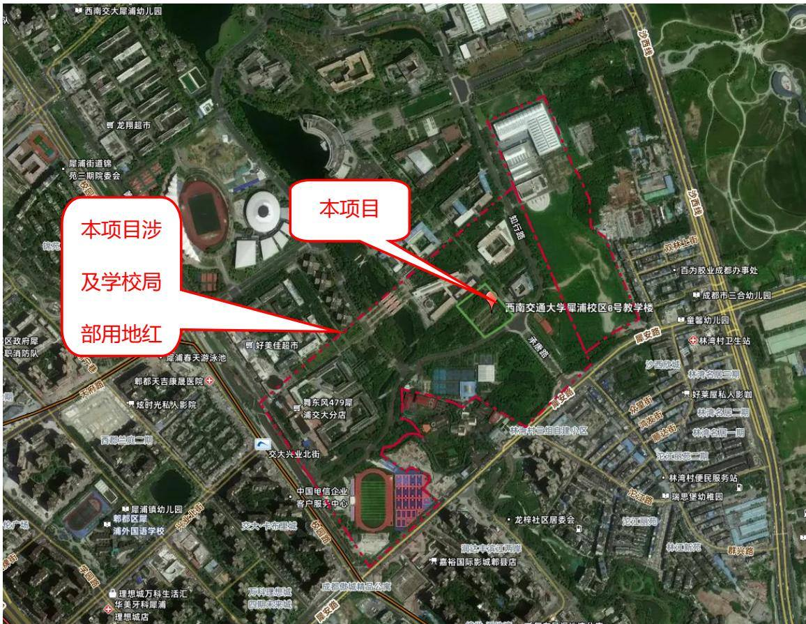  
图2.1-1 项目区地理位置示意图  
项目类型：社会事业类项目  
建设性质：新建，建设类四川京华畅工程管理有限公司

所属流域：长江流域

建设内容：修建教学楼一栋（地上 5 层，地下 1 层），主要建设内容为教室、设备用房、人防及地下车库，配套建设道路、室内外综合管网、总平绿化等附属设施。

建设规模：规划用地面积 10374.11 ㎡，总建筑面积 26760.45 ㎡，其中地上建筑面积 20648.49 ㎡，地下建筑面积 6111.96 ㎡。建筑基底面积 5639.84 ㎡，道路及硬化铺装面积3676.27㎡，景观绿化面积1058 ㎡。

项目总投资：本项目工程总投资20418 万元，其中土建投资16199.6万元，资金来源通过申请中央投资和自筹解决。

建设总工期：总工期16个月，计划于2026 年6月开工，2027年9月完工。  
项目组成及主体工程特性表见表2.1-1。

表 2.1-1项目组成及主体工程特性表
<table><tr><td rowspan=1 colspan=8>一、项目基本情况</td></tr><tr><td rowspan=1 colspan=1>1</td><td rowspan=1 colspan=2>项目名称</td><td rowspan=1 colspan=5>西南交通大学犀浦校区0号教学楼</td></tr><tr><td rowspan=1 colspan=1>2</td><td rowspan=1 colspan=2>建设地点</td><td rowspan=1 colspan=3>成都市郫都区</td><td rowspan=1 colspan=1>所在流域</td><td rowspan=1 colspan=1>长江流域</td></tr><tr><td rowspan=1 colspan=1>3</td><td rowspan=1 colspan=2>工程性质</td><td rowspan=1 colspan=3>建设类、新建项目</td><td rowspan=1 colspan=1>建设单位</td><td rowspan=1 colspan=1>西南交通大学</td></tr><tr><td rowspan=1 colspan=1>4</td><td rowspan=1 colspan=2>建设规模</td><td rowspan=1 colspan=5>规划用地面积10374.11m²，总建筑面积26760.45m²，其中地上建筑面积20648.49m²，地下建筑面积6111.96m²，建筑基底面积5639.84m²，道路及硬化铺装面积3676.27m²，景观绿化面积1058m²。建设内容：修建教学楼一栋(地上5层，地下1层），主要建设内容为教室、设备用房、人防及地下车库，配套建设道路、室内外综合管网、总平绿化等附属设施。</td></tr><tr><td rowspan=1 colspan=1>5</td><td rowspan=1 colspan=2>建设期</td><td rowspan=1 colspan=5>总工期16个月，计划于2026年6月开工，2027年9月完工</td></tr><tr><td rowspan=1 colspan=1>6</td><td rowspan=1 colspan=2>总投资</td><td rowspan=1 colspan=3>20418万元</td><td rowspan=1 colspan=1>土建投资</td><td rowspan=1 colspan=1>16199.6万元</td></tr><tr><td rowspan=1 colspan=1></td><td rowspan=1 colspan=7>二、项目组成</td></tr><tr><td rowspan=4 colspan=1>1</td><td rowspan=4 colspan=1>主体工程</td><td rowspan=1 colspan=1>建构筑物工程</td><td rowspan=1 colspan=5>修建0号教学楼，设1层地下室，总建筑面积26760.45m²，其中地上建筑面积20648.49m²，地下建筑面积6111.96m²，建筑基底面积5639.84m²。地下室主要为地下车库及设备用房、人防地下室，地下室层高5.1m，基坑开挖深度为6.1m。基坑上口开挖面积约8336.90m²。</td></tr><tr><td rowspan=1 colspan=1>道路及硬化工程</td><td rowspan=1 colspan=5>沿建筑物周边布置场内道路及硬化铺装，占地面积3676.27m²，道路沿场区四周和建筑物之间环绕布置，与周边市政道路相连，其中设置透水铺装约3197m2。</td></tr><tr><td rowspan=1 colspan=1>景观绿化工程</td><td rowspan=1 colspan=5>在各建构筑物周边与硬化及道路周边布置乔灌草结合的景观绿化，景观绿化面积1058m²。</td></tr><tr><td rowspan=1 colspan=1>附属工程</td><td rowspan=1 colspan=5>给排水、供配电、海绵城市设施等。</td></tr><tr><td rowspan=1 colspan=1>2</td><td rowspan=1 colspan=2>施工办公生活区</td><td rowspan=1 colspan=5>本项目施工生产区布置于项目主体建筑物基坑四周，红线内占地为0.27hm²，红线外占地为0.14hm²。本工程区内所有设施均可吊装移动，并根据施工阶段进行合理调整。红线外占地为校园已有道路及硬化铺装，在使用过程中如有损坏及时按原样进行修复。工人生活就近租用民房，不新增占地。</td></tr><tr><td rowspan=1 colspan=1>3</td><td rowspan=1 colspan=2>临时堆土区</td><td rowspan=1 colspan=5>为保护本项目内表土资源，以及加强本项目一般土石方直接在本项目回填利用，在校园内闲置空地内设置临时堆土区，占地0.89hm²。</td></tr><tr><td rowspan=1 colspan=8>三、主要技术指标</td></tr><tr><td rowspan=2 colspan=3>项目组成</td><td rowspan=1 colspan=3>占地面积（hm²）</td><td rowspan=2 colspan=2>技术指标及规模</td></tr><tr><td rowspan=1 colspan=1>合计</td><td rowspan=1 colspan=1>永久占地</td><td rowspan=1 colspan=1>临时占地</td></tr></table>

四川京华畅工程管理有限公司

<table><tr><td rowspan=4 colspan=1>1</td><td rowspan=4 colspan=1>主体工程</td><td rowspan=1 colspan=1>建构筑物工程</td><td rowspan=1 colspan=2>0.72</td><td rowspan=1 colspan=2>0.56</td><td rowspan=1 colspan=2>0.16</td><td rowspan=1 colspan=3>总项目规划用地面积10374.11m²。总建筑面积26760.45m²，其中地上建筑面积20648.49m²，地下建筑面积6111.96m²，建筑基底面积5639.84m²，道路及硬化铺装面积3676.27m²，景观绿化面积1058m²。地上5层，主要功能为教室，地下1层，主要功能为设备用房、人防及地下车库。地下室层高5.1m，基坑开挖深度为6.1m。永久占地为地上主体建构筑物占地面积。临时占地为地下室开挖、放坡新增的临时占地，为本项目施工临时占用的本项目红线外的校园道路及硬化，计入本项目防治范围，项目建成后原状恢复。</td></tr><tr><td rowspan=1 colspan=1>道路及硬化工程</td><td rowspan=1 colspan=2>0.37</td><td rowspan=1 colspan=2>0.37</td><td rowspan=1 colspan=2></td><td rowspan=1 colspan=3>占地面积3676.27m²，其中透水铺装面积约3197m²。</td></tr><tr><td rowspan=1 colspan=1>景观绿化工程</td><td rowspan=1 colspan=2>0.11</td><td rowspan=1 colspan=2>0.11</td><td rowspan=1 colspan=2></td><td rowspan=1 colspan=3>乔灌草绿化面积1058m²。</td></tr><tr><td rowspan=1 colspan=1>小计</td><td rowspan=1 colspan=2>1.20</td><td rowspan=1 colspan=2>1.04</td><td rowspan=1 colspan=2>0.16</td><td rowspan=1 colspan=3></td></tr><tr><td rowspan=1 colspan=1>2</td><td rowspan=1 colspan=2>施工办公生活区</td><td rowspan=1 colspan=2>0.27</td><td rowspan=1 colspan=2></td><td rowspan=1 colspan=2>0.27</td><td rowspan=1 colspan=3>该区域为校园内空闲建设用地，本项目竣工前拆除板房等临时设施，播撒草籽做临时绿化恢复。</td></tr><tr><td rowspan=1 colspan=1>3</td><td rowspan=1 colspan=2>临时堆土区</td><td rowspan=1 colspan=2>0.89</td><td rowspan=1 colspan=2></td><td rowspan=1 colspan=2>0.89</td><td rowspan=1 colspan=3>在校园内闲置空地内设置临时堆土区，用于临时堆存前期剥离的表土，堆存表土量约0.13万m³，用于项目回填砂石及一般土石方1.54万m³。</td></tr><tr><td rowspan=1 colspan=1>4</td><td rowspan=1 colspan=2>合计</td><td rowspan=1 colspan=2>2.36</td><td rowspan=1 colspan=2>1.04</td><td rowspan=1 colspan=2>1.32</td><td rowspan=1 colspan=3></td></tr><tr><td rowspan=1 colspan=12>四、项目土石方挖填工程量（自然方、万m³）</td></tr><tr><td rowspan=1 colspan=1></td><td rowspan=1 colspan=2>项目组成</td><td rowspan=1 colspan=1>挖方</td><td rowspan=1 colspan=1>填方</td><td rowspan=1 colspan=1>调入</td><td rowspan=1 colspan=2>调出</td><td rowspan=1 colspan=2>借方</td><td rowspan=1 colspan=1>余方</td><td rowspan=1 colspan=1>说明</td></tr><tr><td rowspan=1 colspan=1>1</td><td rowspan=1 colspan=2>场地平整</td><td rowspan=1 colspan=1>0.13</td><td rowspan=1 colspan=1>1</td><td rowspan=1 colspan=1>1</td><td rowspan=1 colspan=2>0.13</td><td rowspan=1 colspan=2>/</td><td rowspan=1 colspan=1>1</td><td rowspan=7 colspan=1>般土石方3.57万m³，全部运至正兴田家寺公共停车场及配套公服设施项目回填利用；砂石约0.52万m³，砂石由成都蜀源港泰新型建材有限公司回收、利用。</td></tr><tr><td rowspan=1 colspan=1>2</td><td rowspan=1 colspan=2>基坑工程</td><td rowspan=1 colspan=1>5.47</td><td rowspan=1 colspan=1>1.38</td><td rowspan=1 colspan=1>1.38</td><td rowspan=1 colspan=2>1.38</td><td rowspan=1 colspan=2>1</td><td rowspan=1 colspan=1>4.09</td></tr><tr><td rowspan=1 colspan=1>3</td><td rowspan=1 colspan=2>总平土建工程</td><td rowspan=1 colspan=1>0.03</td><td rowspan=1 colspan=1>0.03</td><td rowspan=1 colspan=1>0.03</td><td rowspan=1 colspan=2>0.03</td><td rowspan=1 colspan=2>1</td><td rowspan=1 colspan=1>1</td></tr><tr><td rowspan=1 colspan=1>4</td><td rowspan=1 colspan=2>总平管网工程(强弱电、给排水等)</td><td rowspan=1 colspan=1>0.13</td><td rowspan=1 colspan=1>0.13</td><td rowspan=1 colspan=1>0.13</td><td rowspan=1 colspan=2>0.13</td><td rowspan=1 colspan=2>/</td><td rowspan=1 colspan=1>1</td></tr><tr><td rowspan=1 colspan=1>5</td><td rowspan=1 colspan=2>总平绿化工程及生产生活区临时绿化回复前的表土回覆</td><td rowspan=1 colspan=1></td><td rowspan=1 colspan=1>0.13</td><td rowspan=1 colspan=1>0.13</td><td rowspan=1 colspan=2>1</td><td rowspan=1 colspan=2>/</td><td rowspan=1 colspan=1>/</td></tr><tr><td rowspan=1 colspan=1>6</td><td rowspan=1 colspan=2>临时堆土区</td><td rowspan=1 colspan=1>1</td><td rowspan=1 colspan=1>1</td><td rowspan=1 colspan=1>1.67</td><td rowspan=1 colspan=2>1.67</td><td rowspan=1 colspan=2>/</td><td rowspan=1 colspan=1>/</td></tr><tr><td rowspan=1 colspan=1></td><td rowspan=1 colspan=2>合计</td><td rowspan=1 colspan=1>5.76</td><td rowspan=1 colspan=1>1.67</td><td rowspan=1 colspan=1>3.34</td><td rowspan=1 colspan=2>3.34</td><td rowspan=1 colspan=2>1</td><td rowspan=1 colspan=1>4.09</td></tr></table>

## 2.1.1.2本项目与西南交通大学犀浦校区校园的依托关系

西南交通大学位于四川成都，是教育部直属全国重点大学，办学格局为“一校、两地、三校区”。其中，西南交通大学犀浦校区位于四川省成都市郫都区，于 2002 年建设，总占地面积约为 $1 6 0 \mathrm { h } \mathrm { ~ m } ^ { 2 }$ ，学校南侧为犀安路，东侧为蜀源大道，北侧居住区及成都绕城高速，西南侧为校园路。校区内各项目建设已落实水土保持工作。

本项目位于西南交通大学犀浦校区南侧。西北侧为一号教学楼，东南为校园球场，东北侧为校园绿化主轴（承唐路）。如图2.1-2 所示。

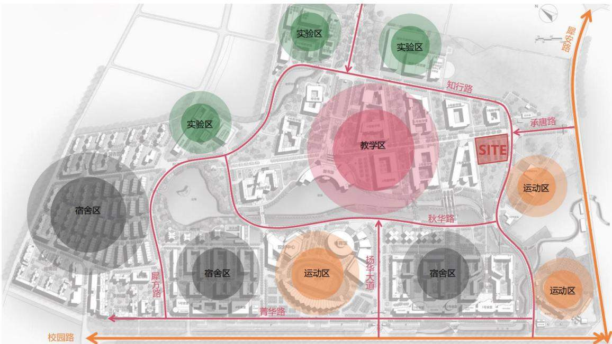  
项目用地位于西南交通大学犀浦校区内，教学区南侧地块上。地块南侧紧邻校园道路知行路，交通成熟

图2.1-2 本项目与校园的依托关系图

## 2.1.1.3 项目区现状

根据现场踏勘，校园内目前已有的水保措施主要包括排水沟、雨水管网、场内绿化等。建筑物周边布设永久性排水沟，排水沟为矩形结构，深度和宽度为30～50cm\*30～50cm，材质采用砖砌筑或混凝土现浇，排水沟通过雨水口或检查井排入雨水管网内。在校园各区域布置了雨水管网，管径在 300～600mm之间。校园内建构筑周边及道路两侧有乔灌草结合的绿化。根据现场踏勘情况，校园内现有排水沟及雨水管多年运行良好，满足排水要求，现状植物措施较为完善，无水土保持问题存在。

本项目用地为校园内预留建设用地（已划拨为教育科研用地），其中一部分被临时用作校内停车场。地表覆盖有绿化及硬质铺装，场地平坦，平均高程524.48\~524.77m，高差 0.29m。项目区整体交通极为方便。项目周边道路、电力、给排水等基础设施基本完备，满足本项目的施工要求。

## 2.1.2 项目组成和总体布置

## 2.1.2.1 项目组成

本项目由主体工程和临建设施组成，具体建设内容和规模如下：

（1）主体工程：项目规划用地面积10374.11 ㎡。总建筑面积26760.45㎡，其中地上建筑面积20648.49㎡，地下建筑面积6111.96㎡，建筑基底面积5639.84㎡，道路及硬化铺装面积 3676.27 ㎡，景观绿化面积 1058 ㎡。地上 5 层，主要功能为教室，地下 1 层，主要功能为设备用房、人防及地下车库。地下室层高5.1m，基坑开挖深度为6.1m。

（2）临建工程：主要包括 1处施工办公生活区占地0.27h㎡、1处临时堆土区占地0.89h㎡，以及布置于项目主体建筑物基坑四周红线外占地0.16h㎡（该区域占地根据主体施工进度要求，在总平施工前作为施工现场材料堆放区、库房、现场办公等功能；总平施工时，对相应区域予以拆除，及时按原状恢复）。

本项目建设所需的建筑材料均采取商购方式解决。

项目组成详见表2.1-2。

表2.1-2项目组成一览表
<table><tr><td rowspan=1 colspan=2>项目</td><td rowspan=1 colspan=1>建设内容</td><td rowspan=1 colspan=1>备注</td></tr><tr><td rowspan=3 colspan=1>主体工程</td><td rowspan=1 colspan=1>建构筑物工程</td><td rowspan=1 colspan=1>项目规划用地面积10374.11m²。总建筑面积26760.45m²，其中地上建筑面积20648.49m²，地下建筑面积6111.96m²，建筑基底面积5639.84m²，道路及硬化铺装面积3676.27m²，景观绿化面积1058m²。地上5层，主要功能为教室，地地下1层，主要功能为设备用房、人防及地下车库。地下室层高6.1m，基坑开挖深度为6.1m。</td><td rowspan=3 colspan=1>施工阶段，红线外基坑区域红线外占面积约0.16hm²，一并计入主体工程区防治区占地。</td></tr><tr><td rowspan=1 colspan=1>道路及硬化工程</td><td rowspan=1 colspan=1>占地面积3676.27m²，其中透水铺装面积约3197m²。</td></tr><tr><td rowspan=1 colspan=1>景观绿化工程</td><td rowspan=1 colspan=1>景观绿化面积1058m²。</td></tr><tr><td rowspan=2 colspan=1>临建工程</td><td rowspan=1 colspan=1>施工办公生活区</td><td rowspan=1 colspan=1>本项目施工生产区布置于校园内东侧空地，占地面积为0.27hm²，主要建设供施工生产用的临时板房等配套设施</td><td rowspan=1 colspan=1>用后做临时绿化地貌恢复。</td></tr><tr><td rowspan=1 colspan=1>临时堆土区</td><td rowspan=1 colspan=1>在校园东侧闲置空地内设置临时堆土区，用于集中堆存前期剥离的表土、在基坑开挖时可用于项目回填的合格一般土。堆土高度不超过3.5m，坡比1:1.5，并采取苫盖、拦挡、截排水、沉沙措施。</td><td rowspan=1 colspan=1>占地0.89hm²，使用后做临时绿化地貌恢复。</td></tr></table>

## 2.1.2.2 平面布置

项目为1栋5层教学楼，多层公共建筑，1层地下室。本项目为开放式教学楼，全方位开设出入口，四周均能进入教学楼。地上主入口位于建筑西北角，同时建筑四面均设置了次出入口（建筑每侧均有3个出入口）。主体建筑平面采用回字形布置，每层建筑环绕挑空中庭布置。地下室出入口位于地块西南角。

场地景观绿化结合道路及建构筑物分散布置，与建构筑物和硬化道路沿线的景观绿化形成点、线、面交织的网状景观绿化体系。

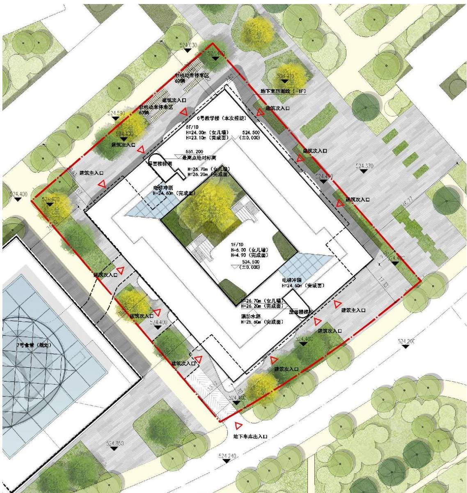  
图2.1-3 项目总平面图

主要建筑工程特性详见表2.1-3：

表2.1-3 主要建筑物工程特性表
<table><tr><td rowspan=1 colspan=2>一、规划总建筑面积</td><td rowspan=1 colspan=2>26760.45</td><td rowspan=1 colspan=1>m²</td></tr><tr><td rowspan=1 colspan=2>（一）总计容建筑面积</td><td rowspan=1 colspan=2>18712.64</td><td rowspan=1 colspan=1>m²</td></tr><tr><td rowspan=1 colspan=2>（二）地上建筑面积</td><td rowspan=1 colspan=2>20648.49</td><td rowspan=1 colspan=1>m²</td></tr><tr><td rowspan=2 colspan=1>其中</td><td rowspan=1 colspan=1>首层架空（不计容）</td><td rowspan=1 colspan=2>1935.85</td><td rowspan=1 colspan=1>m²</td></tr><tr><td rowspan=1 colspan=1>教室及配套用房</td><td rowspan=1 colspan=2>18712.64</td><td rowspan=1 colspan=1>m²</td></tr><tr><td rowspan=1 colspan=2>（三）地下室建筑面积及层数</td><td rowspan=1 colspan=1>6111.96</td><td rowspan=1 colspan=1>1层</td><td rowspan=1 colspan=1>m²</td></tr></table>

四川京华畅工程管理有限公司

<table><tr><td rowspan=3 colspan=1>其中</td><td rowspan=1 colspan=1>车库</td><td rowspan=1 colspan=1>5433.02</td><td rowspan=1 colspan=1>m²</td></tr><tr><td rowspan=1 colspan=1>设备用房</td><td rowspan=1 colspan=1>462.94</td><td rowspan=1 colspan=1>m</td></tr><tr><td rowspan=1 colspan=1>与7食堂连接道</td><td rowspan=1 colspan=1>216.00</td><td rowspan=1 colspan=1>m</td></tr><tr><td rowspan=1 colspan=2>二、基底建筑面积</td><td rowspan=1 colspan=1>5639.84</td><td rowspan=1 colspan=1>m²</td></tr><tr><td rowspan=1 colspan=2>三、机动车停车位</td><td rowspan=1 colspan=1>166</td><td rowspan=1 colspan=1>个</td></tr><tr><td rowspan=2 colspan=1>其中</td><td rowspan=1 colspan=1>地上机动车停车位</td><td rowspan=1 colspan=1>0</td><td rowspan=1 colspan=1>个</td></tr><tr><td rowspan=1 colspan=1>地下机动车停车位</td><td rowspan=1 colspan=1>166</td><td rowspan=1 colspan=1>个</td></tr></table>

## 2.1.2.3 竖向布置

本项目竖向布置充分考虑项目区现有地势，同时结合主体建构筑物和周围管线、道路的联系以及地表雨水排放的要求。场地平整结束后，与周边场地持平，不形成挖填边坡。

本项目原地貌高程在 524.48\~524.77 之间，高差 0.29m，整体地势平坦，建筑物设计±0.00高程为 524.50m，场地内道路及硬化地面设计标高在 524.40m，项目周边校园道路现状高程 524.20m-524.40m。项目建设充分考虑建筑、道路、景观及室内外高差关系，项目建成后，建设用地内地势平坦，室外设计标高将与周边现状道路持平。项目区利用设置于建筑四周及中庭四周的永久截水沟收集建筑屋面及总平面的雨水，雨水经外雨水管网收集后通过雨水调蓄池有组织地排入市政道路雨水管网。

本项目建筑物采用筏板基础及柱下独立基础，基础施工采用整体开挖基坑施工，基坑开挖深度为-6.1m，筏板基础底标高为-6.1m，柱下独立基础底标高为-7.30m，场地后期回填高度 6.1m（平均回填高度约 5.9m），地下室顶板（中庭区域）覆土厚度0.9m。

## 2.1.3 主体工程

## 2.1.3.1 建构筑物工程

项目主体工程总建筑面积 26760.45㎡，其中地上建筑面积 20648.49 ㎡，地下建筑面积6111.96㎡，建筑基底面积5639.84㎡。地上5层，主要功能为教室，地下 1 层，主要功能为设备用房、人防及地下车库。地下室层高 5.1m，基坑开挖深度为6.1m，红线外基坑区域占地面积约98.79㎡。包括地上建筑及地下室等内容。

地上建筑采用回字形，中间设置挑空中庭，各层教室围绕中庭布置。地下室基础采用整体基坑开挖。基坑上口开挖面积约8336.90㎡，基坑下口开挖面积约6660.69 ㎡。

建筑安全等级为一级，抗震设防等级为 7 度。结构使用年限50年。建构筑物基本情况详见下表。

表2.1-4建构筑物情况统计表
<table><tr><td rowspan=1 colspan=1>项目</td><td rowspan=1 colspan=1>层数</td><td rowspan=1 colspan=1>建筑面积(m²)</td><td rowspan=1 colspan=1>占地面积(m²)</td><td rowspan=1 colspan=1>设计±0绝对标高（m）</td><td rowspan=1 colspan=1>建筑高度(m)</td><td rowspan=1 colspan=1>结构类型</td><td rowspan=1 colspan=1>用基础情况</td></tr><tr><td rowspan=1 colspan=1>0号教学楼</td><td rowspan=1 colspan=1>5</td><td rowspan=1 colspan=1>20648.49</td><td rowspan=1 colspan=1>5639.84</td><td rowspan=1 colspan=1>524.50</td><td rowspan=1 colspan=1>24</td><td rowspan=1 colspan=1>框架结构</td><td rowspan=1 colspan=1>独立基础</td></tr><tr><td rowspan=1 colspan=1>地下室</td><td rowspan=1 colspan=1>-1</td><td rowspan=1 colspan=1>6111.96</td><td rowspan=1 colspan=1>1</td><td rowspan=1 colspan=1>519.40</td><td rowspan=1 colspan=1>-5.1</td><td rowspan=1 colspan=1>框架结构</td><td rowspan=1 colspan=1>筏板基础</td></tr><tr><td rowspan=1 colspan=1>小计</td><td rowspan=1 colspan=1></td><td rowspan=1 colspan=1>26760.45</td><td rowspan=1 colspan=1></td><td rowspan=1 colspan=1></td><td rowspan=1 colspan=1></td><td rowspan=1 colspan=1></td><td rowspan=1 colspan=1></td></tr></table>

## 2.1.3.2 道路及铺装工程

道路及铺装工程占地面积 3676.27 ㎡，其中透水铺装面积约 3197 ㎡，主要为布置建筑四周铺装硬化地面，联系本栋建筑主、次出口及建筑四周校园道路。

本工程管道沿建筑四周，布置在道路及铺装区域下方，采取埋地敷设方式，管沟开挖断面为梯形，开挖深度1.0-1.8m，管沟开挖土石方就近临时堆放于管沟两侧并采取临时防护措施，平均堆高不超过1m，埋管后及时回填。

## 2.1.3.3 景观绿化工程

本项目景观绿化分布于各建构筑物周边，绿化植物采用乔+灌+草的形式，达到美化的效果。景观绿化选择具有代表性的植物品种，同时注重景观植物呈现的及时性和成本控制的经济性。开发设施内植物根据水分条件、水质等，选择耐盐、耐淹、耐污等能力较强的乡土植物。其他植物配置选择适合本地生长的乡土植物，乡土植物适应性强，具有较强的去污能力，同时能彰显地方景观特色并考虑旱季雨季的乔灌搭配。

乔灌木类可供选择品种：朴树、蓝花楹、银杏、鸡爪槭、红枫、元宝枫、桂花、小叶香樟、红叶石楠、金禾女贞、红花继木、小叶黄杨等。草坪可

地被植物供选择品种：红叶石楠、大叶黄杨、红继木、金禾女贞、墨西哥鼠尾草、毛鹃、红花满天星、玉簪、熊猫堇、凤凰绿苔草、小兔子狼尾草、细叶芒、台湾二号草坪。

查阅主体设计图纸，本项目景观绿化面积约1058㎡。

## 2.1.3.4 附属工程

附属工程包括给水排水、供配电、海绵城市设计等，均埋置于地下，占地包括在道路硬化及景观绿化区之内。

## （1）给水系统

项目区内室外布置DN100 给水管线，管线长为226m，管线平均埋深1.0m。本项目给水由周边道路提供，从东侧道路市政给水管及南侧道路的校区市政给水管各引入1根给水管，在建筑周围形成环状管网，地下层至地上二层用水由市政给水管网供给，市政水压0.25MPa，管道系统工作压力按0.35MPa，三层及以上由地下生活泵房内的生活水箱、变频调速供水泵及气压水罐联合加压供水，系统工作压力 0.65MPa。

## （2）排水系统

## a.污水管线

项目区内室外布置DN300 污水管线，管线长为892m，管线埋深 1.0\~1.8m。本项目地上层生活污废水，设管道收集后重力排至室外污水检查井，从项目用地东南及西南角排至校园市政污水管网。室外排水管道采用高密度聚乙烯（HDPE）DN300 双壁波纹管，环刚度SN8，橡胶圈密封承插口连接。

## b.雨水排水系统

项目区内采用雨、污分流制，屋面雨水经雨水管道系统排至环绕建筑四周的永久排水沟（排水沟在项目永久用地内布置三道，由内至外，中庭四周布置一道排水沟起点深 0.3m，宽 0.3m；沿建筑四周布置一道，排水沟起点深 0.3m，宽0.5m；沿用地四周布置一道，排水沟起点深0.3m，宽0.4m。总长度 937.21m），汇集墙面、地面雨水一起纳入周边校区道路雨水系统。在道路交汇处和最低点、雨落管附近、绿地低洼点设置单箅雨水口、线性排水沟，雨水口低于周围地面30～40mm。场地内排水以建构筑物为中心向四周分散，排水坡度不小于0.4%，雨水管采用 DN300\~DN500UPVC 双壁波纹管，总长 34.81m，经雨水调蓄池调蓄后，有组织地排入市政道路雨水管网。雨水管网主要铺设在道路及硬化区下方，管道埋深1.0～1.8m，管道基础采用中粗砂垫层。

## （3）消防管道

本项目消防用水由室外给水管网（DN150）和消防水池供给，布设消防管道46.41m，平均埋深 1.0m。室外给水管网设有两路 DN200市政供水，系统为低压制系统（系统工作压力不小于0.60MPa），供水环网管道与生活给水管道分设，从红线内室外消防供水环网上接出室外地上式消火栓，沿道路布置室外消火栓。

## （4）供配电系统

本工程由校园 10kV 开闭站引来两路 10kV 电源至位于地下一层的变电站，变电站装机容量为 2X2000kVA。

高压系统接线：为确保本建筑供电安全需要，10/0.4kV变电站高压侧引入两路10kV电源，可以满足供电一级负荷的供电需求。两路电源平时同时运行各承

担50%负荷，故障时每路电源均可承担全部负荷供电，10kV电气主接线为单母线带母联。

低压系统主接线：对建筑内一、二级负荷供电时，低压系统主接线采用变压器成对互为备用的接线方式，即两台变压器低压母线间设有低压母联开关。当一台变压器故障时，低压母联开关可以手动投入或自动投入，由另一台变压器供电。低压母联开关与高压母联开关的动作要有配合，实行高压优先。当变压器低压侧因短路或过载分闸时，不允许低压母联开关闭合。当一路10kV 电源及一台变压器故障时，另一台变压器能带本段母线的全部负荷及另一段母线的一级负荷，通过切换，可供全部一、二级负荷。

本工程的应急供电系统由蓄电池静止型不间断供电装置（UPS）组成，作为应急照明以及部分不允许断电的科研设备的保障电源。

一、二级负荷供电均采用双电源供电末端互投，一般互投时间在0.5s 以内，可保证消防用电设备及重要设备的运行，应急照明及有需求的科研设备还采用集中式蓄电池作为备用电源，恢复供电时间在10ms 以内，基本不产生断电影响。

## （5）海绵城市

本项目通过采用以“渗、滞、蓄、净、用、排”等源头低影响开发建设的综合措施（LID）来达到海绵城市建设目标。其中，“渗”是利用各种路面、屋面、地面、绿地，从源头收集雨水。“滞”，是降低雨水汇集速度，既留住了雨水，又降低了灾害风险；“蓄”，是降低峰值流量，调节时空分布，为雨水利用创造条件；“净”，是通过一定过滤措施减少雨水污染，改善城市水环境；“用”，是将收集的雨水净化或污水处理之后再利用；“排”，是利用城市竖向与工程设施相结合，排水防涝设施与天然水系河道相结合，地面排水与地下雨水管渠相结合的方式来实现一般排放和超标雨水的排放，避免内涝等灾害。

本项目主要采用透水铺装、雨水调蓄池等措施来实现雨水控制的目的。

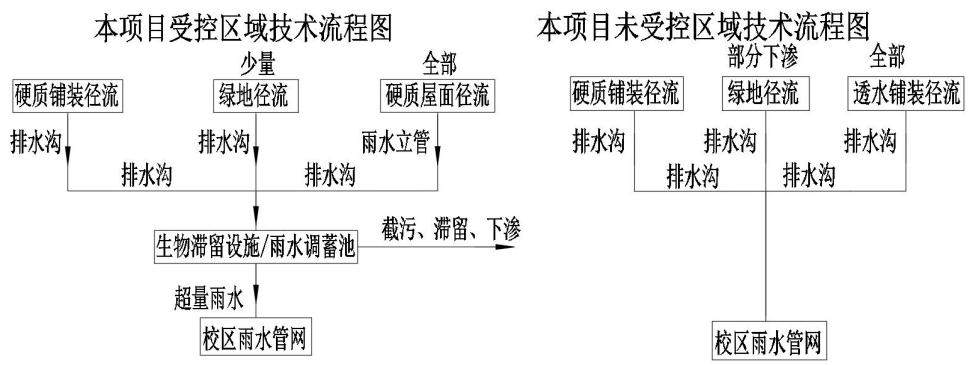  
图2.1-4雨水流向示意图

## 透水铺装

主体设计采用透水铺装代替传统硬化路面，在保持原有功能的前提下，促进雨水下渗，削减雨水径流。透水铺装主要考虑铺设于非消防登高面和消防车道的位置，如消防车道和广场等低荷载区域设置透水砖、透水混凝土等铺装，减小场地径流系数的同时补充、净化地下水。透水铺装面积共计 3197 ㎡。透水铺装构造示意图详见附图。

## 雨水调蓄池

场内雨水管网末端接入调蓄池，在水池前端设置雨水预处理系统，经截污后雨水进入雨水调蓄池、集水池，后经调蓄排放泵排放至下游雨水井中，用于调节雨水峰值等。调蓄池人孔的设置高度大于室外地坪标高，溢流管设置在室外，溢流管水位标高应大于进水管 0.30m；当达到溢流水位时，同时启动排污泵排水，排水泵应在 12小时内排空蓄水池；当遇到市政排水不畅、室外被淹的时候，为避免室外雨水通过进水管、溢流管倒灌，应在雨水进水管和溢流管安装阀门备用，紧急情况下可以关闭。

主体设计在场地西南角布置 1 套雨水调蓄排放系统，雨水调蓄池容量为169.5m³。雨水回用系统几何尺寸：23.60m（长）\*6m（宽）\*2.5m（深）。雨水调蓄池构造示意见附图。

## 2.2 施工组织

## 2.2.1 施工布置

## 2.2.1.1 交通运输条件

本项目占地南侧为校园机动车道路，项目整体交通极为方便。施工入口从项目南侧的校园道路进入本项目区内。

## 2.2.1.2 主要建筑材料来源

本工程建设所需的钢材、水泥、木材、沥青、片块石等建筑材料均采用商购解决。建筑材料运至施工区域需分类有序堆存，钢筋、木材等加工房均布置于红线内。

## 2.2.1.3 供电条件

项目周边的供电系统较为完善，施工用电自精勤路北侧既有室外施工箱变西侧市政电网配电箱接引入主体工程区施工总配电箱，以满足施工需要。

## 2.2.1.4 供、排水条件

项目区周边供水管网较为完善，施工用水生产、生活用水从周边校园市政管网接入，现有供水能力和供水水质能满足项目施工用水需求。

主体工程区内的雨水及基坑排水通过设置的截排水沟汇入三级沉淀池后，就近接入东南角主入口附近的既有雨水井。

项目现场设置了临时厕所，污水通过在项目占地内临时敷设的污水管就近接入主体工程区西南角的污水井。

## 2.2.1.5 施工办公生活区

本项目根据施工需，在校园内东侧空地布置了独立的施工办公生活区，占地0.27h㎡，场地内单设板房、场地硬化，用于满足施工人员的办公和生活需求。该区供电、供水就近从校园引入，雨、污水分别就近接入已有的雨、污水井。

## 2.2.1.6 临时堆土区

考虑到该区域为临时堆存本项目的表土、用于回填的一般土石方与砂石，临时堆放时间不长，对该区域不进行表土剥离。本区临时堆土分为表土和用于项目回填的合格一般土、砂石。本项目占地内可剥离保护的表土运至该区进行集中堆存保护，由于表土堆放时间跨越整个工期，对表土堆存场四周采取编织土袋挡墙进行临时拦挡，堆土表面采取密目网遮盖并撒播少量草籽进行固土且保持土壤活力，编织土袋挡墙外侧布设临时排水沟，在排水最低点附近布设临时沉沙池，临时排水出口顺接沉沙池。本项目用于回填的一般土石方及砂石堆放时间较短，采用全面苫盖的方式进行保护，区域内堆土根据施工工序，及时进行回填运走。各类型堆土设置标志牌，土方堆放高度控制在4.5m 以下，边坡比 1:1.5，土堆距离占地边线预留 4米车辆通行空间，苫盖要密不漏土，材料搭接宽度不小于0.2m，并用土中大石块压实。施工结束后对临时堆土区扰动区域进行全面土地整治，撒播草籽植草绿化，将场地恢复为原地貌。各堆存场布置情况详见下表2.2-1。

表2.2-1 临时堆土区布置情况一览表
<table><tr><td rowspan=2 colspan=1>防治分区名称</td><td rowspan=2 colspan=1>位置</td><td rowspan=2 colspan=1>场布名称</td><td rowspan=1 colspan=2>堆土量(万m3)</td><td rowspan=2 colspan=1>堆土高度(m)</td><td rowspan=2 colspan=1>占地面积(h )</td><td rowspan=2 colspan=1>边坡比</td><td rowspan=2 colspan=1>堆存时间</td><td rowspan=2 colspan=1>备注</td></tr><tr><td rowspan=1 colspan=1>自然方</td><td rowspan=1 colspan=1>松方</td></tr><tr><td rowspan=4 colspan=1>临时堆土区</td><td rowspan=3 colspan=1>校园东侧空闲地</td><td rowspan=1 colspan=1>表土堆0存场</td><td rowspan=1 colspan=1>.130</td><td rowspan=1 colspan=1>.15</td><td rowspan=1 colspan=1>≤4.5</td><td rowspan=1 colspan=1>0.07</td><td rowspan=1 colspan=1>1:1.5</td><td rowspan=1 colspan=1>2026年 51月~2027年9月</td><td rowspan=3 colspan=1>. 本项目表土应严格与砂石及一般土石方分开堆放，并设置“表土堆存场”标牌；2.土堆四周设置苫盖、拦挡、截水、沉沙设施；3.四周设置维护及运输道路；4.苫盖要求：苫盖要密不漏土，材料搭接宽度不小于0.2m，并用土中大石块压实；5.施工结束后，对临时堆土区扰动区域进行全面土地整治，撒播草籽、植草绿化，将场地恢复为原地貌。</td></tr><tr><td rowspan=1 colspan=1>砂石堆存场</td><td rowspan=1 colspan=1>0.961</td><td rowspan=1 colspan=1>.12</td><td rowspan=1 colspan=1>≤4.5</td><td rowspan=1 colspan=1>0.46</td><td rowspan=1 colspan=1>1:1.5</td><td rowspan=1 colspan=1>2026年5~12月</td></tr><tr><td rowspan=1 colspan=1>一般土石方堆0存场</td><td rowspan=1 colspan=1>.580</td><td rowspan=1 colspan=1>.68</td><td rowspan=1 colspan=1>≤4.5</td><td rowspan=1 colspan=1>0.36</td><td rowspan=1 colspan=1>1:1.5</td><td rowspan=1 colspan=1>2026年5~12月</td></tr><tr><td rowspan=1 colspan=2>合计</td><td rowspan=1 colspan=1>1.671</td><td rowspan=1 colspan=1>.95</td><td rowspan=1 colspan=1>/</td><td rowspan=1 colspan=1>0.89</td><td rowspan=1 colspan=1>/</td><td rowspan=1 colspan=1>1</td><td rowspan=1 colspan=1></td></tr></table>

注：本项目松方系数按1.17。

## 2.2.1.7 洗车系统

根据主体设计资料，施工过程实行封闭式施工。为了最大限度减少水土流失、降低对周边城市环境造成的影响，在施工车辆出入口设置冲洗平台、截水沟，配合PVC排水管排入附近三级沉沙池内。

## 2.2.2 施工工艺

本项目为新建项目，根据项目区地形条件，主体工程施工期，涉及基坑开挖，土方回填，道路及管线铺设，绿化景观等；建设后期施工生产区临建拆除，进行平整后按照主体设计进行施工。

## 2.2.2.1 场地平整

场平主要是指在开工前场地进行清理后，对凌乱的场地进行平整，满足施工使用要求。

## 2.2.2.2建筑物工程的施工工艺

建筑物基础施工工艺流程：现场清理→放线定位→机械挖土至相应标高→人工铲除边坡松土→边坡支护→人工清坑、验坑→混凝土垫层浇筑、养护→抄平、放线→基础底板钢筋绑扎、支模板→相关专业施工（如避雷接地施工）→钢筋、模板质量检查，清理→基础混凝土浇筑→混凝土养护→拆模。

## 2.2.2.3 基坑支护及排水

## （1）基坑支护

本项目地下室基础采用整体基坑开挖。基坑支护周长约380.60m，基坑开挖深度为6.1m，基坑上口开挖面积约 8336.90㎡，基坑下口开挖面积约6660.69㎡，红线外基坑区域占地面积约 98.79 ㎡。主要采用土钉墙支护及排桩支护形式进行分段支护，具体如下：

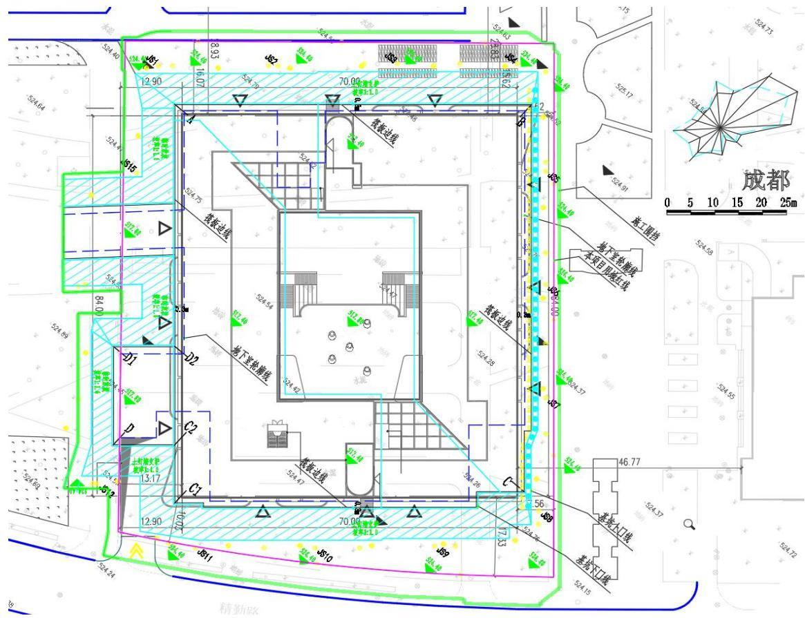  
图2.2-1 基坑开挖图  
四川京华畅工程管理有限公司

## 1）AB、AD2D1D、C2C1C 段边坡

土钉墙支护段。坡率缓于1:1.0，土钉上三排为1 根 25（HRB400），第四排为 1 根 22（HRB400），长度依次为 8.0m、7.0m、6.0m、5.0m；钻孔直径及锚固段直径 110mm，锚杆水平间距 1.5m，竖向间距 1.5m（三四排间距 1.4m），锚杆与水平方向夹角 25°。边坡面侧设置喷射面板，面板厚100mm，用C25混凝土喷射。

## 2）BC 段边坡

排桩A 型支护段。A型桩（A1-A14）桩间距2.2m，桩尺寸为 1.0m，锚固段长度 7.0m。边坡面侧设置喷射面板，面板厚100mm，用C25混凝土喷射。顶梁高800mm，桩及顶梁均采用C30砼现浇。

## 3）其余段边坡

其余段较矮，具有放坡空间时，采用放坡处理，素填土放坡坡率为 1:2.0，粉土放坡坡率为 1:1.5，细砂1:1.75，松散卵石1:1.25。坡顶截、排水沟的设置须与道路、房屋排水系统协调，由现场情况具体确定。

## （2）基坑截排水

在基坑顶部四周设置截水明沟，30\*30cm，截水沟接入三级沉沙池，经沉淀后最终排入周边校园市政雨水管网。

## 3.基坑降水

基坑降水设计采用管井降水。降水井通过降水管道经施工入口处的三级沉沙池沉淀后排入周边校园市政雨水管网。

工艺流程：设计→定位→成孔→下管→回填→洗井→试抽→正式抽降→停降。

## 2.2.2.4 土方开挖及回填

## （1）土方开挖

施工程序：测放旋挖成孔桩桩位，开始进行旋挖成孔桩施工——待旋挖成孔桩灌注完毕——施工桩顶梁并设置变形观测点——土方向下分层开挖（分层厚度不得大于 1.5m），施工桩间挡土板，喷射混凝土——土方挖至锚索标高位置以下500mm 施工锚索，施加预应力——施工桩间挡土板，喷射混凝土。土方向下分层开挖（分层厚度不得大于 1.5m），施工桩间挡土板，喷射混凝土——土方继续向下分层开挖并施工桩间挡土板，喷射混凝土直至设计标高。

桩间护壁施工：土方开挖应分段分层开挖，及时支护；每层开挖高度 1.5m（遇砂层时开挖高度≤1.0m），严禁超挖。

## （2）土方回填

第一步主要回填区域为基坑肥槽回填，将肥槽回填至原始地面标高，采用人工夯填。第二步顶板与基坑外场地回填至项目设计标高，采用机械夯填，分层回填，避免高陡边坡的产生。

## 2.2.2.5 管道工程

管道施工按以下程序进行：测量放线→沟槽开挖→管基敷设→管道安装→附属设施安装→沟槽回填分层夯实。

## （1）管沟开挖

本工程管道采用埋地敷设方式，因此管沟开挖断面为梯形。施工采用机械化施工为主、人工为辅；管沟开挖土石方就近堆放，埋管后及时回填。

沟槽开挖程序：计算开挖宽度→现场定出开挖边线→机械开挖→人工捡底。

管沟应按设计图确定的平面位置和标高开挖，根据不同管径，机械开挖至槽底，预留20cm 的土层由人工清底找平至设计槽底高程；沟槽严禁超挖、欠挖。

## （3）管道敷设

管道敷设时，先将地基夯实后，在基础上铺中、粗砂，厚度为100\~200mm，压实系数 0.95。

## （4）沟槽回填

沟槽回填关系到管道强度、性能的发挥，是管道长久运行的可靠度保证。管底至管顶以上 500mm 范围内的区域需要仔细夯实，夯实密度都应满足要求。

## 2.2.2.6 道路及硬化铺装工程

## （1）道路

道路工程施工主要包括场地清理（含清基）、路基开挖和填筑、基础压实和路面铺装等环节。

## 1）路基开挖和填筑

道路路基土石方填筑采用水平分层填筑法施工，按照横断面全宽逐层向上填筑，如地面不平，则由最低处分层填筑，每层经过压实符合规定要求后，再填筑下一层，尤其是位于地库顶板的道路回填时，务必将土方压实，在通常的情况下，路基填筑料必须压实到规定密度且必须稳定，在路基面以下0\~80cm 的压实度要求达到90%。

## 2）路面工程

车行路面采用混凝土面层，施工工艺流程为：清扫基层→洒透层→撒主层矿料→碾压→撒封层料→碾压→初期养护。人行道路面采用生态透水砖铺装，施工工艺流程为：清扫基层→基层铺设→压实→缓冲层铺设→找平层铺设→压实→道路雨水口施工→面层铺设→初期养护。

## （2）透水铺装

1）测量放样及冲筋：按照设计轴线，划分方格网，使用全站仪将方格网精确投射于基层上，并使用墨斗弹线。根据现场弹好的线，将方格网4 角位置的标高，各按图纸要求，铺装一块透水砖，冲筋。

2）填筑基层及粘结层：清理基层，按从下到上为 15cm 厚垫层、15cm 厚C25混凝土、3cm 厚中砂的顺序分层填筑和浇筑基层及粘结层。

3）透水砖铺装：在方格网已定好的四角挂线，并每米一道，铺设方格网四周的透水砖。四周透水砖铺设后，以透水砖的横向为铺设方向，每米一道线，挂在纵向透水砖位置，分仓铺设。

4）养护：透水砖铺装24h 后洒水养护2～3 天，期间不得扰动已铺装的透水砖，撒细、中砂扫缝，扫缝砂必须是干砂，含泥量在1%以下。需要多次扫缝，每次扫完后，随即洒水，确保使砂能灌满缝隙，直到洒水后砂子不再下沉为止。

5）成品保护：铺装完成后2～3天内，禁止人员及施工机械车辆通行，以及放置设备、材料，以免造成透水砖松动和污染。

## 2.2.2.7 附属工程

附属工程包括给排水、供配电、通信等工程项目，主要包括管道施工、埋地电（光）缆等内容，采用以人工施工为主，机械施工为辅的常规施工方法。

## 2.2.2.8 景观绿化工程

在主要建构筑物、道路硬化施工完成后，进行绿化工作。对规划绿化地进行场地清理和微地形平整后，乔灌木和草分层搭配种植，其中，乔灌木采用穴植方式，草采用植草皮方式，树草种尽量选用本地适生树种和景观树种。绿化以植被造景为主，绿化工程需选择当地树草种，以利于植物的成活和生长。

施工程序：场地清理、平整→植物种植→浇水养护

场地清理、平整：清除绿化区域的建筑垃圾，平整土地。

种植材料和播种材料：种植材料应根系发达，生长茁壮，无病虫害，规格及形态应符合设计要求。

种植土壤处理：种植土的渗透系数不应小于 2\*10-5m/s；种植或播种前对该地区的土壤理化性质进行检验分析，采取相应的消毒、施肥和表土等措施。

植物种植：根据绿化设计进行植物栽植，灌木采用穴植方式进行种植，草籽采用撒播方式进行种植。

养护：植物种植后，定期进行养护，包括浇水、施肥及病虫害防治等。

## 2.3 工程占地

本方案在主体设计资料及用地文件的基础上，根据施工组织设计补充完善，最终复核后，本项目共计占用土地2.36h㎡（永久占地 $1 . 0 4 \mathrm { h } \mathrm { ~ m } ^ { 2 }$ ，临时占地 1.32h㎡）。其中，主体工程区占地1.20h㎡（永久占地 $1 . 0 4 \mathrm { h } \mathrm { ~ m } ^ { 2 }$ ，临时占地0.16h㎡），施工办公生活区0.27h ㎡（临时占地），临时堆土区 0.89h㎡（临时占地）。主体工程区临时用地为项目永久用地外侧的既有道路、硬化区域，施工办公生活区、临时堆土区临时占地均利用校区预留的未来建设发展用地（空地、长有杂草）布置。

原地貌占地类型主要为草地（校园绿化）和铺装硬化、长有杂草的未来建设发展用地。校区内全部为教育用地，项目区占地范围均属四川省成都市郫都区管辖。项目区占地情况详见表2-11。

表2.3-1 工程占地类型及面积一览表
<table><tr><td rowspan=2 colspan=2>工程单元</td><td rowspan=1 colspan=1>原始占地类型及面积 $\left( \textbf { h m } ^ { 2 } \right)$ </td><td rowspan=1 colspan=3>占地性质及面积（hm²）</td><td rowspan=1 colspan=1>行政区划</td></tr><tr><td rowspan=1 colspan=1>科教用地</td><td rowspan=1 colspan=1>永久占地</td><td rowspan=1 colspan=1>临时占地</td><td rowspan=1 colspan=1>小计</td><td rowspan=8 colspan=1>四川省成都市郫都区</td></tr><tr><td rowspan=4 colspan=1>主体工程区</td><td rowspan=1 colspan=1>建（构）筑工程区</td><td rowspan=1 colspan=1>0.72</td><td rowspan=1 colspan=1>0.56</td><td rowspan=1 colspan=1>0.16</td><td rowspan=1 colspan=1>0.72</td></tr><tr><td rowspan=1 colspan=1>道路及铺装工程区</td><td rowspan=1 colspan=1>0.37</td><td rowspan=1 colspan=1>0.37</td><td rowspan=1 colspan=1></td><td rowspan=1 colspan=1>0.37</td></tr><tr><td rowspan=1 colspan=1>绿化工程区</td><td rowspan=1 colspan=1>0.11</td><td rowspan=1 colspan=1>0.11</td><td rowspan=1 colspan=1></td><td rowspan=1 colspan=1>0.11</td></tr><tr><td rowspan=1 colspan=1>小计</td><td rowspan=1 colspan=1>1.20</td><td rowspan=1 colspan=1>1.04</td><td rowspan=1 colspan=1>0.16</td><td rowspan=1 colspan=1>1.20</td></tr><tr><td rowspan=1 colspan=2>施工办公生活区</td><td rowspan=1 colspan=1>0.27</td><td rowspan=1 colspan=1></td><td rowspan=1 colspan=1>0.27</td><td rowspan=1 colspan=1>0.27</td></tr><tr><td rowspan=1 colspan=2>临时堆土区</td><td rowspan=1 colspan=1>0.89</td><td rowspan=1 colspan=1></td><td rowspan=1 colspan=1>0.89</td><td rowspan=1 colspan=1>0.89</td></tr><tr><td rowspan=1 colspan=2>合计</td><td rowspan=1 colspan=1>2.36</td><td rowspan=1 colspan=1>1.04</td><td rowspan=1 colspan=1>1.32</td><td rowspan=1 colspan=1>2.36</td></tr></table>

## 2.4 土石方平衡

## 2.4.1 表土及表土平衡

## 2.4.1.1 表土剥离与保护

通过现场踏勘，项目占地区域内，可剥离表土面积0.51h ㎡（植被面积0.51h㎡），平均剥离厚度约 0.10\~0.30m，项目区可剥离表土约0.13 万 $\mathrm { m } ^ { 3 } .$ 。其中，本项目主体工程区场地现状主要为校园绿化草地及校内临时停车场，根据主体设计资料中的地形测绘图及现场测量，可剥离表土面积 $0 . 2 4 \mathrm { h } \mathrm { ~ m } ^ { 2 }$ ，剥离表土厚度0.2m，剥离表土量约 0.05 万 $\mathrm { m } ^ { 3 }$ ；施工办公生活区可剥离表土面积 $0 . 2 7 \mathrm { h } \mathrm { ~ m } ^ { 2 }$ ，剥离表土厚度 0.3m，剥离表土量约0.08万 $\mathrm { m } ^ { 3 } .$ 。后的表土存放于校园内的临时堆土区，进行集中苫盖保护。

表2.4-1表土资源调查成果表
<table><tr><td rowspan=1 colspan=1>名称</td><td rowspan=1 colspan=1>土壤类型</td><td rowspan=1 colspan=1>分布情况</td><td rowspan=1 colspan=1>表土层厚度（cm）</td><td rowspan=1 colspan=1>可剥离范围</td><td rowspan=1 colspan=1>可剥离面积(h m²)</td><td rowspan=1 colspan=1>利用途径</td></tr><tr><td rowspan=1 colspan=1>项目区</td><td rowspan=1 colspan=1>紫色土</td><td rowspan=1 colspan=1>表层主要以绿化土为主，地表覆盖有草坪</td><td rowspan=1 colspan=1>10~30</td><td rowspan=1 colspan=1>项目占地范围内</td><td rowspan=1 colspan=1>0.51</td><td rowspan=1 colspan=1>用于后期绿化覆土</td></tr></table>

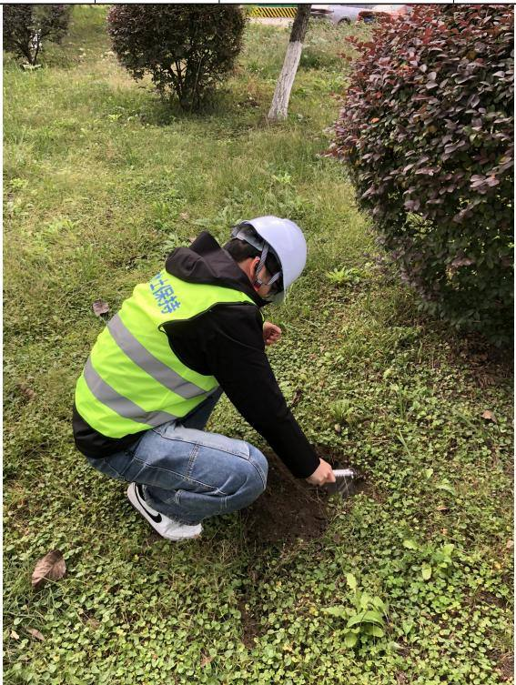  
可剥离表土区域原始地貌照片

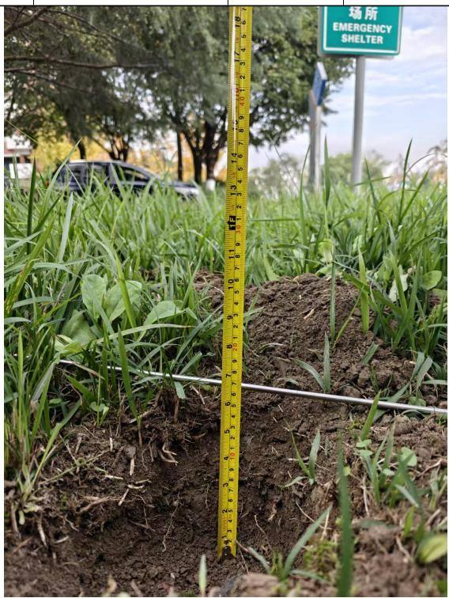  
表土平均厚度约20cm

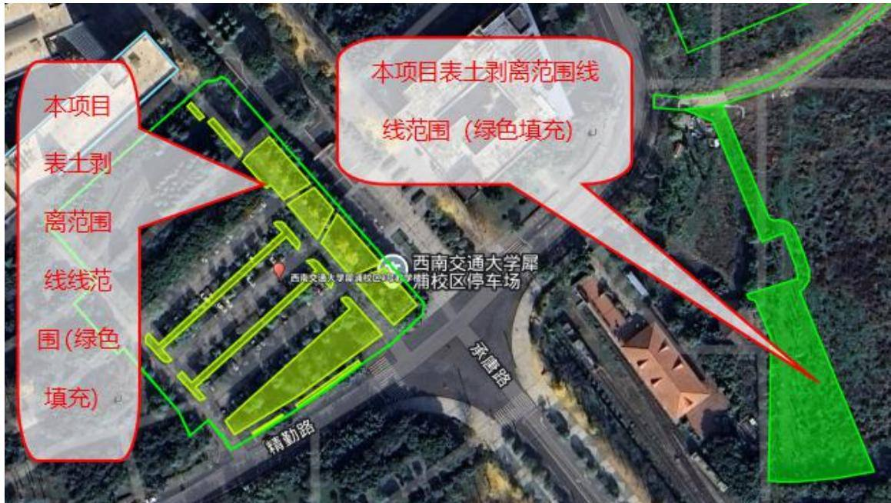  
可剥离表土范围（现场调查后的示意图）

## 2.4.1.1 表土回覆与表土平衡

本项目剥离后的表土堆放于校园内指定堆土区，在本项目总平施工阶段的绿化区域用作植物生长土壤进行表土回覆，经统计，回覆面积0.37h ㎡（本项目永久绿化区0.11h㎡，临时堆土区临时占地绿化恢复面积0.27㎡）。表土回覆时，主体工程区按景观设计要求对不同的植物采取相应的覆土厚度，平均覆土厚度0.5m；临时堆土区临时绿化恢复覆土厚度 0.3m。工程表土剥离及覆土量平衡见下表：

表2.4-2 表土平衡表
<table><tr><td rowspan=3 colspan=1>水土保持防治分区</td><td rowspan=1 colspan=3>表土剥离</td><td rowspan=1 colspan=3>表土覆量</td></tr><tr><td rowspan=1 colspan=2>草地（校园绿化）</td><td rowspan=2 colspan=1>表土剥离量(万m³)</td><td rowspan=2 colspan=1>绿化面积(h)</td><td rowspan=2 colspan=1>覆土厚度(m)</td><td rowspan=2 colspan=1>覆土量(万m3)</td></tr><tr><td rowspan=1 colspan=1>可剥离面积(hm)</td><td rowspan=1 colspan=1>剥离厚度(m)</td></tr><tr><td rowspan=1 colspan=1>主体工程区</td><td rowspan=1 colspan=1>0.24</td><td rowspan=1 colspan=1>0.20</td><td rowspan=1 colspan=1>0.05</td><td rowspan=1 colspan=1>0.11</td><td rowspan=1 colspan=1>0.5</td><td rowspan=1 colspan=1>0.05</td></tr><tr><td rowspan=1 colspan=1>施工办公生活区</td><td rowspan=1 colspan=1>0.27</td><td rowspan=1 colspan=1>0.30</td><td rowspan=1 colspan=1>0.08</td><td rowspan=1 colspan=1>0.27</td><td rowspan=1 colspan=1>0.3</td><td rowspan=1 colspan=1>0.08</td></tr><tr><td rowspan=1 colspan=1>合计</td><td rowspan=1 colspan=1>0.51</td><td rowspan=1 colspan=1>/</td><td rowspan=1 colspan=1>0.13</td><td rowspan=1 colspan=1>0.38</td><td rowspan=1 colspan=1>/</td><td rowspan=1 colspan=1>0.13</td></tr></table>

## 2.4.2 一般土石方及土石方平衡

本工程属于建设类项目，土石方均产生于建设期，根据项目特点及工程区地形地貌等条件，工程建设过程中土石方主要来源于基坑工程、总平管网工程（强弱电、给排水等）、绿化工程（含永久绿化阶段的表土回覆）等。

## （1）场地平整工程

根据项目主体资料及现场踏勘，本项目原地貌高程在524.48\~524.77 之间，高差 0.29m，整体地势平坦，建筑物设计±0.00高程为524.50m，场地内道路及硬化地面设计标高在524.40m。场平阶段，仅需对占地内可剥离表土区域进行表土剥离集中堆存保护。根据主体设计及方案复核，本项目场平工程开挖土石方方量0.13万m³（自然方，下同，其中主体工程区剥离表土0.05 万m³，施工办公生活区剥离表土0.08万 m³），剥离表土已运至临时堆土区集中存放，后期总平施工阶段用于绿化覆土。

## （2）基坑工程

根据主体设计资料，建构筑物工程采用柱下独立基础、筏板基础，筏板基础埋深约6.1m，柱下独立基础埋深7.3m，采用整体开挖施工。本项目建构筑物工程基坑开挖土石方开挖约5.47万m³（其中：一般土石方约3.99万m³；砂石约1.48万m³），由于本项目设置了临时堆土区，在开挖阶段，将后期用于回填的合格土石方约 1.38万 $\mathrm { m } ^ { 3 }$ （其中，合格一般土石方约0.42万 $\mathrm { m } ^ { 3 }$ ，砂石约0.96万m³）运至临时堆土区暂时存放，用于主体地下室工程施工完成达到回填条件后，进行回填；无借方；余方约 4.09万 $\mathrm { m } ^ { 3 }$ （其中：一般土石方约3.57万m³，余方运至正兴田家寺公共停车场及配套公服设施项目回填利用，详附件7；砂石约0.52万m³，砂石由成都蜀源港泰新型建材有限公司回收、利用，详见附件8）。

## （3）总平土建工程

根据主体设计资料，本项目总平土建工程的土方工程主要内容为台阶基础、总平永久截排水沟、雕塑小品基础开挖、回填施工等。经统计，总平土建工程土方开挖约0.03万m³，回填约0.03万m³，挖填方均为一般土石方。

## （2）总平管网工程

本项目总平管网施工包含给排水、强电、弱电等综合管网的沟槽开挖及铺设完毕通过验收后的沟槽回填。管线沟槽开挖为线性开挖，开挖土堆放根据现场条件，有两种方式：1、堆置于沟槽边线1m 以外，堆高不超过1.5m，并及时进行临时苫盖，达到回填条件后按设计要求进行回填；2、场地受限，为保证其他工序作业面正常施工，可将开挖沟槽产生的挖方，运至临时堆土区临时存放，做好苫盖防护。具体施工时，施工单位根据实际情况及工期安排选择堆土方式。根据主体设计资料，经统计，总平管网工程共开挖约0.13 万m³，回填0.13万m³，挖填方均为一般土石方。

对于（2）（3）内容补充说明：总平的土石方工程（除了绿化工程及施工办公生活区临时绿化的表土回覆）是基坑肥槽及总平回填的基础上进行的，因此，该区域土方施工挖填自身平衡，无余方。在总平回填前，拆除施工期间的地表临时硬化：按基坑以外全部硬化考虑，硬化面积约2300平米，硬化厚度0.08m，拆除临时硬化 184m³，量相对较少，按建筑垃圾进行处理。

## （3）绿化工程

本项目进入总平施工阶段，由于施工阶段占用绿化区域进行施工场地布设，对绿化区域进行了局部硬化，需要对硬化区域进行挖除，该区域按主体设计要求完成土地整平后进行表土回覆、土地整治。根据主体设计资料，经计算，本项目永久绿化及施工办公生活区的临时绿化区域需要进行表土回覆0.13万m（³ 其中，主体工程区共回覆表土约0.05万 $\mathrm { m } ^ { 3 }$ ，施工办公生活区共回覆表土0.08万 $\mathrm { m } ^ { 3 }$ ）全部从本项目临时堆土区的表土堆放区运回，本项目表土资源得到了充分保护与利用。

## 2.4.2.3 临时堆土区

临时堆土区主要用于存放从其他工程区调入的土石方（表土、一般土石方中的合格回填土、本项目基坑开挖的砂石用于本项目回填的部分）。本项目开工时对占地区域剥离的表土约0.13万 $\mathrm { m } ^ { 3 }$ ，总平绿化施工阶段，运回绿化区域表土约0.05 万 $\mathrm { m } ^ { 3 }$ 进行回覆，施工办公生活区拆除恢复原状时，将约0.08万 $\mathrm { m } ^ { 3 }$ 的表土运至该区域进行表土回覆。基坑开挖时，将可用来后期基坑及总平回填的一般土石方约 0.42 万 $\mathrm { m } ^ { 3 }$ 、砂石约0.96万m³运至该区暂时存放，达到基坑回填及总平回填阶段，从该区域运土回填。总平管沟开挖阶段，考虑现场占地较小，沟槽两侧无足够堆土空间，可将开挖土运至该临时堆土区暂时存放，管线敷设完毕，达到回填要求后及时运土回填，总计土方量约为0.16 万 $\mathrm { m } ^ { 3 }$ 。综上，本区内在项目施工过程中，临时调入该区临时存放土石方约1.67万 $\mathrm { m } ^ { 3 }$ （其中表土约0.13万 $\mathrm { m } ^ { 3 }$ ，一般土石方约 0.58，砂石约 0.96万m³）。

## 2.4.2.4 土石方平衡

综上，本项目土石方开挖总量约 5.76 万 $\mathrm { m } ^ { 3 }$ （其中：表土约 0.13 万 $\mathrm { m } ^ { 3 }$ ，一般土石方约 4.15 万 $\mathrm { m } ^ { 3 }$ ，砂石约1.48万 $\mathrm { m } ^ { 3 } \mathrm { ~ , ~ }$ ），填方总量约1.67 万 $\mathrm { m } ^ { 3 }$ （其中表土0.13 万 $\mathrm { m } ^ { 3 }$ ，砂石 0.96 万 $\mathrm { m } ^ { 3 }$ ，一般土石方约 0.58 万 $\mathrm { m } ^ { 3 }$ ），内部调运总量约3.34万 $\mathrm { m } ^ { 3 }$ （调入、调出总量，表土0.26万 $\mathrm { m } ^ { 3 }$ ，砂石及一般土石方共3.08 万 $\mathrm { m } ^ { 3 } \mathrm { ~ , ~ }$ ），无借方，余方约 4.09 万 $\mathrm { m } ^ { 3 }$ （其中：一般土石方 3.57 万 $\mathrm { m } ^ { 3 }$ ，全部运至正兴田家寺公共停车场及配套公服设施项目回填利用；砂石约0.52 万 $\mathrm { m } ^ { 3 }$ ，砂石由成都蜀源港泰新型建材有限公司回收、利用）。

本项目建设期间土石方量平衡详见表2.4-3，项目土石方流向见图2.4-1。

表2.4-3土石方平衡分析表单位：万 m³
<table><tr><td rowspan=2 colspan=1>项目组成</td><td rowspan=2 colspan=1>序号</td><td rowspan=1 colspan=4>挖方（万m³）</td><td rowspan=1 colspan=4>填方（万m³）</td><td rowspan=1 colspan=5>调入（万m³）</td><td rowspan=1 colspan=5>调出（万m³）</td><td rowspan=1 colspan=5>余方（万m³）</td></tr><tr><td rowspan=1 colspan=1>小计</td><td rowspan=1 colspan=1>一般土石方</td><td rowspan=1 colspan=1>砂石</td><td rowspan=1 colspan=1>表土</td><td rowspan=1 colspan=1>小计</td><td rowspan=1 colspan=1>一般土石方</td><td rowspan=1 colspan=1>砂石</td><td rowspan=1 colspan=1>表土</td><td rowspan=1 colspan=1>小计</td><td rowspan=1 colspan=1>土石方</td><td rowspan=1 colspan=1>来源</td><td rowspan=1 colspan=1>表土</td><td rowspan=1 colspan=1>来源</td><td rowspan=1 colspan=1>小计</td><td rowspan=1 colspan=1>土石方</td><td rowspan=1 colspan=1>去向</td><td rowspan=1 colspan=1>表土</td><td rowspan=1 colspan=1>去向</td><td rowspan=1 colspan=1>小计</td><td rowspan=1 colspan=1>一般土石方</td><td rowspan=1 colspan=1>砂石</td><td rowspan=1 colspan=1>表土</td><td rowspan=1 colspan=1>去向</td></tr><tr><td rowspan=1 colspan=1>场地平整</td><td rowspan=1 colspan=1>①</td><td rowspan=1 colspan=1>0.13</td><td rowspan=1 colspan=1>/</td><td rowspan=1 colspan=1>/</td><td rowspan=1 colspan=1>0.13</td><td rowspan=1 colspan=1>/</td><td rowspan=1 colspan=1>/</td><td rowspan=1 colspan=1>/</td><td rowspan=1 colspan=1>/</td><td rowspan=1 colspan=1>/</td><td rowspan=1 colspan=1>1</td><td rowspan=1 colspan=1>1</td><td rowspan=1 colspan=1>/</td><td rowspan=1 colspan=1>/</td><td rowspan=1 colspan=1>0.13</td><td rowspan=1 colspan=1>1</td><td rowspan=1 colspan=1>/</td><td rowspan=1 colspan=1>0.13</td><td rowspan=1 colspan=1>⑥</td><td rowspan=1 colspan=1>/</td><td rowspan=1 colspan=1>/</td><td rowspan=1 colspan=1>/</td><td rowspan=1 colspan=1>1</td><td rowspan=1 colspan=1>一般土石方4.15万</td></tr><tr><td rowspan=1 colspan=1>基坑工程</td><td rowspan=1 colspan=1>②</td><td rowspan=1 colspan=1>5.47</td><td rowspan=1 colspan=1>3.99</td><td rowspan=1 colspan=1>1.48</td><td rowspan=1 colspan=1>/</td><td rowspan=1 colspan=1>1.38</td><td rowspan=1 colspan=1>0.42</td><td rowspan=1 colspan=1>0.96</td><td rowspan=1 colspan=1>/</td><td rowspan=1 colspan=1>1.38</td><td rowspan=1 colspan=1>1.38</td><td rowspan=1 colspan=1>⑥</td><td rowspan=1 colspan=1>1</td><td rowspan=1 colspan=1>/</td><td rowspan=1 colspan=1>1.38</td><td rowspan=1 colspan=1>1.38</td><td rowspan=1 colspan=1>⑥</td><td rowspan=1 colspan=1>/</td><td rowspan=1 colspan=1>/</td><td rowspan=1 colspan=1>4.09</td><td rowspan=1 colspan=1>3.57</td><td rowspan=1 colspan=1>0.52</td><td rowspan=1 colspan=1>/</td><td rowspan=1 colspan=1>m³，全部运至正兴</td></tr><tr><td rowspan=1 colspan=1>总平土建工程</td><td rowspan=1 colspan=1>③</td><td rowspan=1 colspan=1>0.03</td><td rowspan=1 colspan=1>0.03</td><td rowspan=1 colspan=1>/</td><td rowspan=1 colspan=1>/</td><td rowspan=1 colspan=1>0.03</td><td rowspan=1 colspan=1>0.03</td><td rowspan=1 colspan=1>/</td><td rowspan=1 colspan=1>/</td><td rowspan=1 colspan=1>0.03</td><td rowspan=1 colspan=1>0.03</td><td rowspan=1 colspan=1>⑥</td><td rowspan=1 colspan=1>1</td><td rowspan=1 colspan=1>/</td><td rowspan=1 colspan=1>0.03</td><td rowspan=1 colspan=1>0.03</td><td rowspan=1 colspan=1>⑥</td><td rowspan=1 colspan=1>/</td><td rowspan=1 colspan=1>1</td><td rowspan=1 colspan=1>1</td><td rowspan=1 colspan=1>/</td><td rowspan=1 colspan=1>/</td><td rowspan=1 colspan=1>/</td><td rowspan=1 colspan=1>田家寺公共停车场及配套公服设施项</td></tr><tr><td rowspan=1 colspan=1>总平管网工程</td><td rowspan=1 colspan=1>④</td><td rowspan=1 colspan=1>0.13</td><td rowspan=1 colspan=1>0.13</td><td rowspan=1 colspan=1>/</td><td rowspan=1 colspan=1>/</td><td rowspan=1 colspan=1>0.13</td><td rowspan=1 colspan=1>0.13</td><td rowspan=1 colspan=1>/</td><td rowspan=1 colspan=1>/</td><td rowspan=1 colspan=1>0.13</td><td rowspan=1 colspan=1>0.13</td><td rowspan=1 colspan=1>⑥</td><td rowspan=1 colspan=1>一</td><td rowspan=1 colspan=1>/</td><td rowspan=1 colspan=1>0.13</td><td rowspan=1 colspan=1>0.13</td><td rowspan=1 colspan=1>⑥</td><td rowspan=1 colspan=1>/</td><td rowspan=1 colspan=1>1</td><td rowspan=1 colspan=1>/</td><td rowspan=1 colspan=1>/</td><td rowspan=1 colspan=1>/</td><td rowspan=1 colspan=1>7</td><td rowspan=1 colspan=1>目回填利用；砂石约 0.52 万</td></tr><tr><td rowspan=1 colspan=1>绿化工程</td><td rowspan=1 colspan=1>⑤</td><td rowspan=1 colspan=1>/</td><td rowspan=1 colspan=1>/</td><td rowspan=1 colspan=1>1</td><td rowspan=1 colspan=1>/</td><td rowspan=1 colspan=1>0.13</td><td rowspan=1 colspan=1>/</td><td rowspan=1 colspan=1>/</td><td rowspan=1 colspan=1>0.13</td><td rowspan=1 colspan=1>0.13</td><td rowspan=1 colspan=1>/</td><td rowspan=1 colspan=1>/</td><td rowspan=1 colspan=1>0.13</td><td rowspan=1 colspan=1>⑥</td><td rowspan=1 colspan=1>/</td><td rowspan=1 colspan=1>/</td><td rowspan=1 colspan=1>/</td><td rowspan=1 colspan=1>/</td><td rowspan=1 colspan=1>/</td><td rowspan=1 colspan=1>/</td><td rowspan=1 colspan=1>/</td><td rowspan=1 colspan=1>/</td><td rowspan=1 colspan=1>/</td><td rowspan=1 colspan=1>m³，砂石由成都蜀源港泰新</td></tr><tr><td rowspan=1 colspan=1>临时堆土区</td><td rowspan=1 colspan=1>⑥</td><td rowspan=1 colspan=1>/</td><td rowspan=1 colspan=1>/</td><td rowspan=1 colspan=1>/</td><td rowspan=1 colspan=1>/</td><td rowspan=1 colspan=1>/</td><td rowspan=1 colspan=1>1</td><td rowspan=1 colspan=1>/</td><td rowspan=1 colspan=1>/</td><td rowspan=1 colspan=1>1.67</td><td rowspan=1 colspan=1>1.54</td><td rowspan=1 colspan=1>②③④</td><td rowspan=1 colspan=1>0.13</td><td rowspan=1 colspan=1>①</td><td rowspan=1 colspan=1>1.67</td><td rowspan=1 colspan=1>1.54</td><td rowspan=1 colspan=1>②③④</td><td rowspan=1 colspan=1>0.13</td><td rowspan=1 colspan=1>⑤</td><td rowspan=1 colspan=1>/</td><td rowspan=1 colspan=1>/</td><td rowspan=1 colspan=1>/</td><td rowspan=1 colspan=1>/</td><td rowspan=1 colspan=1>型建材有限公司回收、利用。</td></tr><tr><td rowspan=1 colspan=2>合 计</td><td rowspan=1 colspan=1>5.76</td><td rowspan=1 colspan=1>4.15</td><td rowspan=1 colspan=1>1.48</td><td rowspan=1 colspan=1>0.13</td><td rowspan=1 colspan=1>1.67</td><td rowspan=1 colspan=1>0.58</td><td rowspan=1 colspan=1>0.96</td><td rowspan=1 colspan=1>0.13</td><td rowspan=1 colspan=1>3.34</td><td rowspan=1 colspan=1>3.08</td><td rowspan=1 colspan=1></td><td rowspan=1 colspan=1>0.26</td><td rowspan=1 colspan=1></td><td rowspan=1 colspan=1>3.34</td><td rowspan=1 colspan=1>3.08</td><td rowspan=1 colspan=1></td><td rowspan=1 colspan=1>0.26</td><td rowspan=1 colspan=1></td><td rowspan=1 colspan=1>4.09</td><td rowspan=1 colspan=1>3.57</td><td rowspan=1 colspan=1>0.52</td><td rowspan=1 colspan=1>/</td><td rowspan=1 colspan=1></td></tr></table>

注。表中：1、土石方均为自然方；2、合计土方按“挖方+调入+外借=填方+调出+余方”进行校核。3、本项目无借方。

图 2.4-1土石方流向框图  
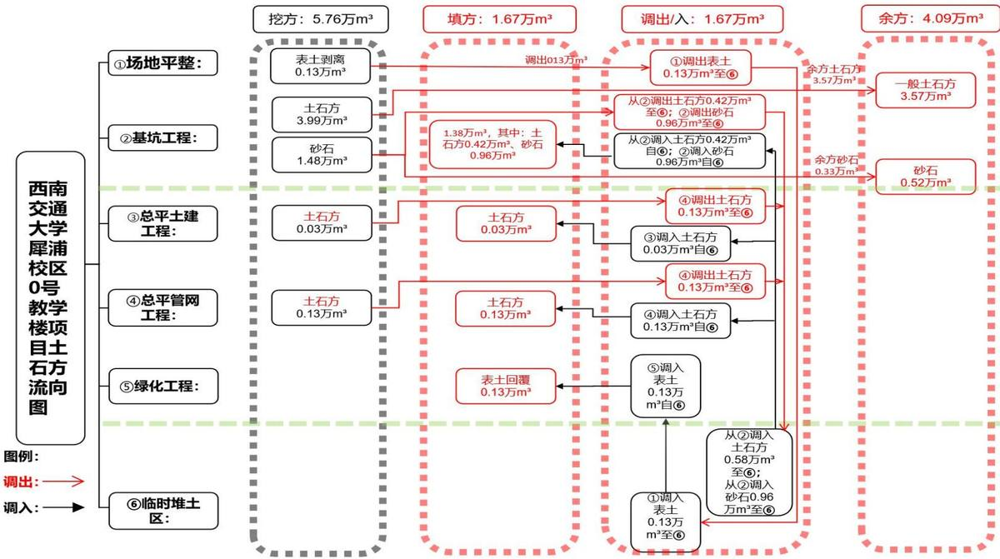

## 2.4.2.5 余方处置方案

本项目余方中的一般土石方运至正兴田家寺公共停车场及配套公服设施项目利用。相关协议详见附件7；本项目余方中的砂石由成都蜀源港泰新型建材有限公司回收、利用。避免了水土流失。具体详见附件8。

正兴田家寺公共停车场及配套公服设施项目于 2023年7 月取得《四川天府新区发展和经济运行局关于正兴田家寺公共停车场及配套公服设施项目可行性研究报告（代项目建议书）的批复》（川天经审批〔2023〕232号）（详见附件7-3），于 2025 年 11 月取得《四川天府新区智慧城市运行局关于正兴田家寺公共停车场及配套公服设施项目水土保持方案的批复》（川天审批水保〔2025〕109号）（详见附件 7-4），该项目需要借方 5.14 万 m³，有能力接纳本项目余方，且土方回填施工与本项目土方施工时间匹配（查阅本项目及余方接纳项目的施工组织计划，本项目土方开挖施工与土方接纳项目的土方回填均在 2026 年5 月底\~6 月，详见附件 7-5、6）。本项目主体施工单位与正兴田家寺公共停车场及配套公服设施项目施工单位签订了土方协议（详见附件7），将本项目余方中的一般土石方3.57万m³（自然方）运至正兴田家寺公共停车场及配套公服设施项目回填利用。本项目余方至消纳项目（正兴田家寺公共停车场及配套公服设施项目）运距 50公里左右，在本项目建设单位组织下，明确了水土保持责任：土方离开本项目前由本项目建设单位负责；土方运输过程中由余方运输单位负责；土方到达接纳项目后，运输方严格按接纳方施工单位要求卸土，并由接纳项目负责相应水土保持防治责任。本项目建设单位组织监理单位监督施工单位制定系统的土方工程专项施工组织设计。本项目土方运输采用专用渣土运输车，全程封闭运输，车辆出场（包括余土项目及接纳项目）前进行车身、车轮、车底盘全面清洗，确保不带土离场；运输过程严格按施工组织制定的运输路线，避开城市交通高峰期，遵守城市渣土安全运输管理规定。

本项目余方中砂约0.52 万m³（自然方），为国有资源，由项目属地指定的国有全资企业成都蜀源港泰新型建材有限公司回收（协议详见附件8），该公司经营范围包含砂石加工、销售。本项目砂石开挖、运输由本项目主体施工单位承担，采用专用渣土运输车，全程封闭运输，车辆出场（包括余土项目及接纳项目）

前进行车身、车轮、车底盘全面清洗，确保不带土离场；严格按施工组织制定的运输路线组织运输。

## 2.5 拆迁（移民）安置与专项设施改（迁）建

本项目建设不涉及拆迁（移民）安置与专项设施改（迁）建。

## 2.6 施工进度

本项目建设总工期（含施工准备期）为16个月，项目计划2026年6月开工，2027年9 月完工。主体工程施工进度详见表 2.6-1。

表 2.6-1 主体工程施工进度表
<table><tr><td rowspan=1 colspan=1>任务名称</td><td rowspan=1 colspan=1>工期</td><td rowspan=1 colspan=1>开始时间</td><td rowspan=1 colspan=2>完成时间</td><td rowspan=1 colspan=1>二〇二六年Q1     Q2     Q3     Q4</td><td rowspan=1 colspan=1>二〇二七年Q1     Q2     Q3</td></tr><tr><td rowspan=1 colspan=1>实际开工</td><td rowspan=1 colspan=1>1个工作日</td><td rowspan=1 colspan=1>2026年6月1日</td><td rowspan=1 colspan=2>2026年6月1日</td><td rowspan=22 colspan=2></td></tr><tr><td rowspan=1 colspan=1>基坑工程</td><td rowspan=1 colspan=1>102个工作日2</td><td rowspan=1 colspan=1>026年6月2日</td><td rowspan=1 colspan=2>2026年9月11日</td></tr><tr><td rowspan=1 colspan=1>地下室结构施工</td><td rowspan=1 colspan=1>37</td><td rowspan=1 colspan=1>2026年10月4日个工作日2</td><td rowspan=1 colspan=2>026年11月9日</td></tr><tr><td rowspan=1 colspan=1>地上主体结构施工</td><td rowspan=1 colspan=1>75 个工作日</td><td rowspan=1 colspan=1>2026年11月10日2</td><td rowspan=1 colspan=2>027年1月23日</td></tr><tr><td rowspan=1 colspan=1>施工升降机安装</td><td rowspan=1 colspan=1>7个工作日</td><td rowspan=1 colspan=1>2026年12月25日2</td><td rowspan=1 colspan=2>026年12月31日</td></tr><tr><td rowspan=1 colspan=1>屋面钢结构施工</td><td rowspan=1 colspan=1>50 个工作日</td><td rowspan=1 colspan=1>2027年1月24日2</td><td rowspan=1 colspan=2>027年3月14日</td></tr><tr><td rowspan=1 colspan=1>屋面工程</td><td rowspan=1 colspan=1>60 个工作日</td><td rowspan=1 colspan=1>2027年1月24日</td><td rowspan=1 colspan=2>2027年3月24日</td></tr><tr><td rowspan=1 colspan=1>塔吊拆除</td><td rowspan=1 colspan=1>2 个工作日</td><td rowspan=1 colspan=1>2027年3月25日2</td><td rowspan=1 colspan=2>027年3月26日</td></tr><tr><td rowspan=1 colspan=1>二次结构施工</td><td rowspan=1 colspan=1>95 个工作日</td><td rowspan=1 colspan=1>2026年11月10日2</td><td rowspan=1 colspan=2>027年2月12日</td></tr><tr><td rowspan=1 colspan=1>主体结构验收</td><td rowspan=1 colspan=1>1 个工作日</td><td rowspan=1 colspan=1>2027年2月13日2</td><td rowspan=1 colspan=2>027年2月13日</td></tr><tr><td rowspan=1 colspan=1>室内初装修</td><td rowspan=1 colspan=1>30 个工作日</td><td rowspan=1 colspan=1>2027年2月14日</td><td rowspan=1 colspan=2>2027年3月15日</td></tr><tr><td rowspan=1 colspan=1>强电工程</td><td rowspan=1 colspan=1>210个工作日</td><td rowspan=1 colspan=1>2026年9月4日</td><td rowspan=1 colspan=2>2027年4月1日</td></tr><tr><td rowspan=1 colspan=1>给排水工程</td><td rowspan=1 colspan=1>210个工作日2</td><td rowspan=1 colspan=1>027年2月13日2</td><td rowspan=1 colspan=2>027年9月10日</td></tr><tr><td rowspan=1 colspan=1>消防工程</td><td rowspan=1 colspan=1>210个工作日2</td><td rowspan=1 colspan=1>027年2月13日2</td><td rowspan=1 colspan=2>027年9月10日</td></tr><tr><td rowspan=1 colspan=1>暖通工程</td><td rowspan=1 colspan=1>210个工作日2</td><td rowspan=1 colspan=1>026年12月15日2</td><td rowspan=1 colspan=2>027年7月12日</td></tr><tr><td rowspan=1 colspan=1>室内装饰装修</td><td rowspan=1 colspan=1>180个工作日2</td><td rowspan=1 colspan=1>027年3月16日2</td><td rowspan=1 colspan=2>027年9月11日</td></tr><tr><td rowspan=1 colspan=1>外墙装修工程</td><td rowspan=1 colspan=1>135个工作日2</td><td rowspan=1 colspan=1>027年3月16日2</td><td rowspan=1 colspan=2>027年7月28日</td></tr><tr><td rowspan=1 colspan=1>外脚手架拆除</td><td rowspan=1 colspan=1>12个工作日2</td><td rowspan=1 colspan=1>027年7月29日</td><td rowspan=1 colspan=2>2027年8月9日</td></tr><tr><td rowspan=1 colspan=1>施工升降机拆除</td><td rowspan=1 colspan=1>2 个工作日</td><td rowspan=1 colspan=1>2027年8月10日2</td><td rowspan=1 colspan=2>027年8月11日</td></tr><tr><td rowspan=1 colspan=2>室外工程          30 个工作日</td><td rowspan=1 colspan=1>2027年8月10日2</td><td rowspan=1 colspan=1>027年9月</td><td rowspan=1 colspan=1>8日</td></tr><tr><td rowspan=1 colspan=2>整改消缺          14 个工作日</td><td rowspan=1 colspan=1>2027年9月9日</td><td rowspan=1 colspan=1>2027年9月</td><td rowspan=1 colspan=1>22日</td></tr><tr><td rowspan=1 colspan=2>竣工验收          1 个工作日</td><td rowspan=1 colspan=1>2027年9月23日2</td><td rowspan=1 colspan=1>027年9月</td><td rowspan=1 colspan=1>23日</td></tr></table>

## 2.7 自然概况

## 2.7.1 地形地貌

本项目位于成都市郫都区西南交通大学犀浦校区内。根据本项目地勘资料及现场踏勘，场地总体地势较开阔，场地地貌单元属成都平原岷江水系I级阶地，地貌单一。场地平坦，勘探点孔口高程介于524.48～524.77m，高差0.29m。

## 2.7.2 地质

## 2.7.2.1 地质构造及稳定性

该区域构造属新华夏系第三沉降带四川盆地西部，成都坳陷中部东侧，处于北东走向的龙门山褶断带和龙泉山褶断带之间。由于受喜马拉雅造山运动的影响，造成东西两侧尤以西部龙门山区域大规模剧烈隆升并伴随强烈断裂活动，而夹持在东西两侧隆起的地带则相对坳陷、沉降，堆积了大量不等厚的第四系冰水堆积层和冲、洪积层，并迭覆于下伏白垩统之上，构成现今地壳稳定、呈N-NE向平行展布的川西成都平原景观。

依据国家地震单位及四川省相关地质、地震单位多年对构造地震活动监测及研究证实：现今地震活动强烈的华夏系龙门山褶断带内的松（潘）平（武）、青川、芦山、茂县、迭溪、北川、汶川一带极强烈的地震均波及至川西成都平原，所波及的地震烈度一般在5-6 级以下。同时，成都平原下伏基岩内存在北东走向的蒲江一新津隐伏断裂次生断裂，但除蒲江一新津断裂在第四纪无明显活动表征，本项目10km 范围内无发震断裂带，可不考虑近场效应对设计地震动参数的影响。

总体来说，成都地区所处地壳为一稳定核块，区内断裂构造和地震活动较微弱，历史上从未发生过强烈地震，2008年5月12日，处于龙门山断裂带上的汶川发生8级大地震，成都市区虽有强烈震感，但根据成都市已有的地震地质研究成果和场地工程地质总体特征而言，成都平原地质结构稳定，独特的地质构造决定周围的地震不会对其造成大的破坏，区域稳定性良好。

根据《中国地震动参数区划图》（GB18306-2015），拟建场地地震基本烈度为 V度区。

根据工程区的地质构造背景及工程地质条件综合判定，拟建场地附近10km范围内无全新世活动断裂，属相对稳定区域，稳定性好，区内未发现不良地质作用。

综上所述：从地壳稳定性来看本建设场地属基本稳定区，场地属基本稳定场地，适宜工程建设。

## 2.7.2.2 地层岩性

据现有揭露钻孔深度范围内的资料，场地上覆第四系人工填土 $( { \bf Q } _ { 4 } ^ { \mathrm { m l } } { } ^ { \mathrm { ) } }$ 、其下由第四系全新统冲洪积 $\left( \mathsf { Q 4 } ^ { \mathsf { a l + p l } } \right)$ ）成因的粉土、细砂、中砂、卵石组成。现将岩土分布及结构特征分述如下：

（1）第四系全新统人工层 $\bf ( Q 4 ^ { m l } )$

①素填土：素填土：褐色、灰褐色，松散，稍湿。主要由粉土、粉质黏土和部分卵石组成，部分钻孔表层为砼地面，厚约 30cm，大多数钻孔底部为灰褐色粉质黏土。该层均匀性差，强度低，压缩性高，欠固结，分布于整个场地内，回

填时无碾压，空隙率高，在浸水后会产生较强的湿陷，为新近堆积而成，堆填年限大于5年。整个场地均有分布，揭露层厚1.80～3.40m。

## （2）第四系更新统冲、洪积层 $\bf ( \nabla Q 4 ^ { a l + p l } )$

②粉土：褐灰色、褐黄色，稍密，湿，含少量铁、锰质结核，无光泽反应，摇振反应不明显，韧性低，干强度低，局部地段夹薄层灰褐色软塑粉质黏土或透镜状细砂团块。整个场地均有分布，揭露层厚1.00～2.60m。

③细砂：细砂：青灰色、褐黄色，松散，矿物成分以石英、长石为主，摇振反应中等，局部夹少量卵石。揭露层厚0.50～1.70m。

④中砂：青灰～褐灰色，松散，很湿。由石英、云母及长石等构成，局部含有少量卵石。以透镜体形式分布在卵石层中间。本次仅在 ZK5 号钻孔中揭露，层厚 2.5m。

⑤卵石：杂色，湿\~饱和，卵石成分以花岗岩和砂岩为主，多为中等风化，少量强风化，磨圆度较好，多呈亚圆形，粒径一般为2～20cm，最径工是1)cm：郭6,5m 左右为泥夹卵石，下部夹杂漂石及薄层中砂，隙间充填细中砂、圆砾等。全场地均有分布，厚度较大。根据密实度可分为松散、稍密、中密和密实四个亚层。

⑤1松散卵石：N120≤4 击/dm，卵石含量小于 55%，排列十分混乱，绝大部分不接触，场区内主要分布于卵石层顶部，其次以透镜体状存在于卵石层中。

⑤₂稍密卵石：N120=4～7 击/dm，卵石含量55～60%，排列混乱，大部分不接触。

⑤3 中密卵石：N120=7～10 击/dm，卵石含量 60～70%，呈交错排列，大部分接触。

⑤4密实卵石：N120>10 击/dm，卵石含量大于 70%，呈交错排列，连续接触。

## 2.7.2.3 水文地质

地表水：勘察期间拟建场地范围内未见地表水，场地东侧存在一砌体结构水池，水池内水深约0.8m。

地下水：场地范围内地下水主要类型为上层滞水和孔隙潜水。

第四系上层滞水含水层主要为填土层，无统一地下水位，水量不丰富，容易明排疏干，主要受大气降水补给及周边暂时性流水渗漏补给。水量、水位变化大，且不稳定，无统一地下水位线，水量小，对基坑影响较小。其下粉土为相对隔水层。

孔隙水赋存于第四系冲洪积层卵石土层中，其基本特征是与大气水和地表水的联系密切，具微承压性。主要由大气降水和地下径流补给，受大气降水影响较大，并以地下径流、人工开采等方式排泄。地下水位随季节变化，年变化幅度约1.0～3.0m 左右。

勘察期间为平水期，测得地下水位埋深在 4.90～6.50m，水位高程在518.03～519.71m。

## 2.7.2.4 地震与不良地质

根据《建筑抗震设计规范》（GB50011-2010）（2016年版）和《中国地震动参数区划图》（GB18306-2015），拟建场地抗震设防烈度为Ⅶ度，设计地震分组为第三组，设计基本地震加速度为 0.10g，设计特征周期值为0.45s。根据《建筑工程抗震设防分类标准》（GB50223-2008）划分，本工程拟建物教学楼抗震分类为乙类（重点设防类），地震作用按7 度计算，抗震措施按8度采用。

根据区域地质资料，结合现场地工程地质调查、测绘和钻探揭露表明，拟建场地层位稳定，场地内无活动断层、构造破碎带、泥石流、滑坡、崩塌等不良地质现象。

## 2.7.3 气象

郫都区属亚热带季风性气候，其主要特点是四季分明、气候温和、雨量充沛、夏无酷暑、冬少冰雪。根据成都地区气象台观测资料，其气候特征如下：项目区年平均气温16.2°C，极端最高气温39.30°C，极端最低气温-5.9°C，昼夜温差最大 12°C；雨季集中在 5～9 月份，多年均降雨量 988.50mm，最大日降雨量207.5mm，最大时降雨量 28.1mm；蒸发量：多年平均为 1465.10mm；相对湿度：多年平均为82%；多年平均干燥度指数（K）远小于1.0，具体范围约为 0.3\~0.5，属于湿润区；多年平均日照为 1228.3小时；最大积雪厚度40mm；多年平均风速为1.35m/s，最大风速（10分钟平均最大风速）为14.8m/s，瞬间极大风速为 27.4m/s（1961年6月2 日），全年主导风向为NNE 风，出现频率为11％。

气象特征值见表2.7-1，暴雨统计参数见表2.7-2。

表 2.7-1 项目所在区域气象特征值表
<table><tr><td rowspan=1 colspan=2>气象要素</td><td rowspan=1 colspan=1>单位</td><td rowspan=1 colspan=1>数量</td></tr><tr><td rowspan=4 colspan=1>气温</td><td rowspan=1 colspan=1>年均温</td><td rowspan=1 colspan=1>℃</td><td rowspan=1 colspan=1>16.2</td></tr><tr><td rowspan=1 colspan=1>极端最高</td><td rowspan=1 colspan=1>℃</td><td rowspan=1 colspan=1>39.30</td></tr><tr><td rowspan=1 colspan=1>极端最低</td><td rowspan=1 colspan=1>℃</td><td rowspan=1 colspan=1>-5.90</td></tr><tr><td rowspan=1 colspan=1>≥10℃积温</td><td rowspan=1 colspan=1>℃</td><td rowspan=1 colspan=1>5380</td></tr><tr><td rowspan=3 colspan=1>降雨量</td><td rowspan=1 colspan=1>年均降雨量</td><td rowspan=1 colspan=1>mm</td><td rowspan=1 colspan=1>988.50</td></tr><tr><td rowspan=1 colspan=1>1h最大降雨量（P=20%）</td><td rowspan=1 colspan=1>mm</td><td rowspan=1 colspan=1>54.80</td></tr><tr><td rowspan=1 colspan=1>1h最大降雨量（P=10%）</td><td rowspan=1 colspan=1>mm</td><td rowspan=1 colspan=1>67.10</td></tr><tr><td rowspan=1 colspan=1>蒸发量</td><td rowspan=1 colspan=1>年均蒸发量</td><td rowspan=1 colspan=1>mm</td><td rowspan=1 colspan=1>1465.10</td></tr><tr><td rowspan=2 colspan=1>风</td><td rowspan=1 colspan=1>多年平均风速</td><td rowspan=1 colspan=1>m/s</td><td rowspan=1 colspan=1>1.35</td></tr><tr><td rowspan=1 colspan=1>主导风向</td><td rowspan=1 colspan=1></td><td rowspan=1 colspan=1>NNE</td></tr><tr><td rowspan=1 colspan=2>年均日照时数</td><td rowspan=1 colspan=1>h</td><td rowspan=1 colspan=1>1228.3</td></tr></table>

表 2.7-2 区域暴雨统计参数成果表
<table><tr><td rowspan=2 colspan=1>时段（h）</td><td rowspan=2 colspan=1>均值（mm）</td><td rowspan=2 colspan=1>Cv</td><td rowspan=2 colspan=1> $\mathrm { C s / C v }$ </td><td rowspan=1 colspan=4>各频率暴雨强度值（mm）</td></tr><tr><td rowspan=1 colspan=1>P=3.3%</td><td rowspan=1 colspan=1>P=5%</td><td rowspan=1 colspan=1>P=10%</td><td rowspan=1 colspan=1>P=20%</td></tr><tr><td rowspan=1 colspan=1>1/6</td><td rowspan=1 colspan=1>16.0</td><td rowspan=1 colspan=1>0.31</td><td rowspan=1 colspan=1>3.50</td><td rowspan=1 colspan=1>28.5</td><td rowspan=1 colspan=1>26.7</td><td rowspan=1 colspan=1>23.5</td><td rowspan=1 colspan=1>20.1</td></tr><tr><td rowspan=1 colspan=1>1</td><td rowspan=1 colspan=1>45.0</td><td rowspan=1 colspan=1>0.40</td><td rowspan=1 colspan=1>3.50</td><td rowspan=1 colspan=1>85.9</td><td rowspan=1 colspan=1>79.0</td><td rowspan=1 colspan=1>67.1</td><td rowspan=1 colspan=1>54.8</td></tr><tr><td rowspan=1 colspan=1>6</td><td rowspan=1 colspan=1>70.0</td><td rowspan=1 colspan=1>0.45</td><td rowspan=1 colspan=1>3.50</td><td rowspan=1 colspan=1>152.5</td><td rowspan=1 colspan=1>139.2</td><td rowspan=1 colspan=1>116.2</td><td rowspan=1 colspan=1>92.8</td></tr><tr><td rowspan=1 colspan=1>24</td><td rowspan=1 colspan=1>110.00</td><td rowspan=1 colspan=1>0.58</td><td rowspan=1 colspan=1>3.50</td><td rowspan=1 colspan=1>223.3</td><td rowspan=1 colspan=1>203.1</td><td rowspan=1 colspan=1>168.4</td><td rowspan=1 colspan=1>133.3</td></tr></table>

## 2.7.4 水文

本项目位于郫都区，流经郫都区境内的水系为都江堰水利枢纽灌区，主要的河流由北向南分别是徐堰河、府河、沱江河和清水河。本项目所在地内毛渠和排管沟纵横，或分或合，均属都江堰灌区内江灌溉渠系，源于岷江水系，主要河流有清水河、摸底河、红光支渠、金牛支渠等，连同众多毛渠共同形成密如蛛网的农田自流灌溉体系。随着成都高新西区开发建设，区内原有的斗渠、毛渠已丧失农灌功能，大多数已被填埋消失或断流，剩下来的改作为泄洪渠道。

拟建项目距离较远的河流为场区以北的锦江，直线距离约 2.80km。距离最近的河流为场区西南的沱江河，直线距离约为0.5km。锦江属都江堰柏条河水系，其多年平均流量分别为 70.5m³/s。沱江河属都江堰走马河水系，多年平均流量分别为 22.3m³/s。上述河流均切割砂砾卵石层，河水和地下水水力联系密切。

项目区水系详见附图2。

## 2.7.5 土壤

郫都区岩石主要为侏罗纪的砂岩和页岩，成土母质由这些岩石和风化物、河溪冲（洪）积物以及第四系冰碛物形成。主要土类有黄壤土、紫色土、新积土、黑色石灰土、水稻土5 个土壤类，9个亚类，33个土属，89个土种。

根据主体设计资料及现场踏勘，工程区表层土壤主要为素填土，工程开工前为学校内绿化空地及校内临时停车场，工程开工前对场地内具有表土资源的区域进行表土剥离，平均厚度0.1\~0.3m。

## 2.7.6 植被

郫都区属亚热带常绿阔叶林带，气候温和，雨量充沛，适宜多种林木生长。由于海拔高差悬殊不大，地形多为平原地区，森林植物种类、群落组成等有相对的稳定性，其森林植被主要有阔树林、竹林、灌木林等。从用途上看，森林植物以用材林为主；经济林树种丰富，主要有油桐林、油茶林、柑橘林，其他还有落叶果林，如梨、苹果、桃、李、杏、樱桃、葡萄以及桑林、茶林、油橄榄、棕榈、核桃、白蜡等经济林木。成都市森林覆盖率约40.5%，成都市郫都区植被覆盖率约 20%。

根据现场调查，项目区植被主要为人工栽植的校区景观植被。主要为草坪、行道树及杂草，区域内林草植被覆盖率约22.95%。

## 2.7.7 项目与水土保持敏感区的关系

根据水利部办公厅关于印发《全国水土保持规划国家级水土流失重点预防区和重点治理区复核划分成果》的通知（办水保〔2013〕188号）和四川省水利厅关于印发《四川省省级水土流失重点预防区和重点治理区划分成果》的通知（川水函〔2017〕482号），本项目所在地郫都区不属于国家级、省级和市级水土流失重点预防区和水土流失重点治理区。

本项目地处城市规划区，不涉及四川省生态保护红线。项目占地不涉及饮用水水源保护区、水功能一级区的保护区和保留区、自然保护区、世界文化和自然遗产地、风景名胜区、地质公园、森林公园、重要湿地等。本项目建设区域不在县级以上地方人民政府划定的崩塌、滑坡危险区和泥石流易发区内，不属于水土流失严重、生态脆弱的地区。

## 3项目水土保持评价

## 3.1 主体工程选址水土保持评价

## 3.1.1 与产业政策及区域规划的符合性分析

根据国家发展改革委令第 7 号《产业结构调整指导目录（2024 年本）》，本项目属于鼓励类建设项目，工程的建设符合国家产业政策。

本项目已于 2024 年 4月取得了《教育部关于西南交通大学犀浦校区 0 号教学楼项目可行性研究报告的批复》（教发函〔2024〕430 号）。本项目的建设符合现行国家产业政策和地方产业政策。

## 3.1.2 工程选址制约性因素分析与评价

## （1）与水土保持法的符合性分析

对照《中华人民共和国水土保持法》和《生产建设项目水土保持技术标准》（GB50433-2018）规定，对选址（线）制约性因素进行分析，详见表3.1-1。

表 3.1-1 选址制约性因素符合性分析对照表
<table><tr><td colspan="1" rowspan="1">《中华人民共和国水土保持法》第三章预防规定</td><td colspan="1" rowspan="1">相符性分析</td><td colspan="1" rowspan="1">分析结果</td></tr><tr><td colspan="1" rowspan="1">第十七条：地方各级人民政府应当加强对取土、挖砂、采石等活动的管理，预防和减轻水土流失。禁止在崩塌、滑坡危险区和泥石流易发区从事取土、挖砂、采石等可能造成水土流失的活动。崩塌、滑坡危险区和泥石流易发区的范围，由县级以上地方人民政府划定并公告。崩塌、滑坡危险区和泥石流易发区的划定，应当与地质灾害防治规划确定的地质灾害易发区、重点防治区相衔接。</td><td colspan="1" rowspan="1">①本项目不设取土场、取砂场和石料场，无“取土、挖砂、采石等”活动②本项目区不属于崩塌、滑坡及泥石流等地质灾害易发区。</td><td colspan="1" rowspan="1">符合</td></tr><tr><td colspan="1" rowspan="1">第十八条：水土流失严重、生态脆弱的地区，应当限制或者禁止可能造成水土流失的生产建设活动，严格保护植物、沙壳、结皮、地衣等</td><td colspan="1" rowspan="1">本工程不属于水土流失严重、生态脆弱地区。</td><td colspan="1" rowspan="1">符合</td></tr><tr><td colspan="1" rowspan="1">第二十四条：生产建设项目选址、选线应当避让水土流失重点预防区和治理区；无法避让的，应当提高防治标准，优化施工工艺，减少地表扰动和植被损坏范围，有效控制可能造成的水土流失。</td><td colspan="1" rowspan="1">项目所在郫都区不属于国家级、省级及市级水土流失重点预防区和治理区。</td><td colspan="1" rowspan="1">符合</td></tr><tr><td colspan="1" rowspan="1">第二十八条依法应当编制水土保持方案的生产建设项目，其生产建设活动中排弃的砂、石、土、矸石、尾矿、废渣等应当综合利用；不能综合利用，确需废弃的，应当堆放在水土保持方案确定的专门存放地，并采取措施保证不产生新的危害。</td><td colspan="1" rowspan="1">建设单位已委托四川京华畅工程管理有限公司编制本项目水土保持方案报告书，本项目余土运至合法第三方进行综合利用。</td><td colspan="1" rowspan="1">符合</td></tr><tr><td>第三十八条：对生产建设活动所占用土地的地表土应当 进行分层剥离、保存和利用，做到土石方挖填平衡，减少 地表扰动范围；对废弃的砂、石、土、矸石、尾矿、废渣 等存放地，应当采取拦挡、坡面防护、防洪排导等措施。 生产建设活动结束后应当及时在取土场、开挖面和存放地 的裸露土地上种树植草、恢复植被。</td><td>①主体工程提出了土石方平衡及 植被恢复等方面要求，本方案在此 基础上进行了补充完善和分析评 价。 ②本方案对表土临时堆土进行 苫盖等水土流失防治措施。</td><td>符合</td></tr></table>

## （2）与国标 GB50433-2018 的符合性分析

对本项目进行与国标 GB50433-2018 符合性的对照分析，本项目符合生产建设项目水土保持技术标准要求，详见表3.1-2。

表 3.1-2 与《生产建设项目水土保持技术标准》（GB50433-2018）  
的符合性分析
<table><tr><td rowspan=1 colspan=1>《生产建设项目水土保持技术标准》(GB50433-2018)选址选线约束性规定</td><td rowspan=1 colspan=1>相符性分析</td><td rowspan=1 colspan=1>分析结果</td></tr><tr><td rowspan=1 colspan=1>1.选址应避让水土流失重点预防区和重点治理区。</td><td rowspan=1 colspan=1>本项目选址不涉及水土流失重点预防区和重点治理区。</td><td rowspan=1 colspan=1>符合</td></tr><tr><td rowspan=1 colspan=1>2.选址应避河流两岸、湖泊和水库周边的植物保护带o</td><td rowspan=1 colspan=1>本项目选址不涉及河流两岸、湖泊和水库周边的植物保护带。</td><td rowspan=1 colspan=1>符合</td></tr><tr><td rowspan=1 colspan=1>3.选址（线）应避开全国水土保持网络中的水土保项持监测站点、重点实验区，不得占用国家确定的水土保持长期定位观测站。</td><td rowspan=1 colspan=1>目区未涉及全国水土保持监测网络中的水土保持监测站点、重点试验区，未占用国家确定的水土保持长期定位观测站。</td><td rowspan=1 colspan=1>符合</td></tr><tr><td rowspan=1 colspan=1>4.严禁在崩塌和滑坡危险区、泥石流易发区内设置取土（石、砂）场。</td><td rowspan=1 colspan=1>本项目不设置取土场。</td><td rowspan=1 colspan=1>符合</td></tr><tr><td rowspan=1 colspan=1>5.严禁在对公共设施、基础设施、工业企业、居民点等有重大影响的区域设置弃土（石、渣、灰、砰石、尾矿）场。</td><td rowspan=1 colspan=1>本项目不设置弃土场。</td><td rowspan=1 colspan=1>符合</td></tr></table>

## （3）主体工程选址（线）水土保持评价结论

本项目建设符合国家和地方规划产业政策。通过逐条对照《中华人民共和国水土保持法》（2011 年3 月1 日实施）和《生产建设项目水土保持技术标准》（GB50433-2018）的分析评价，工程选址未占用基本农田等基础设施，不涉及国家确定的水土保持长期定位观测站、重点试验区国家确定的水土保持长期定位观测站。建设场地及周边不涉及滑坡、崩塌、泥石流等不良地质地段，不占用基本农田，工程选线不涉及饮用水水源保护区、水功能一级区的保护区和保留区、自然保护区、世界文化和自然遗产地、风景名胜区、地质公园、森林公园以及重要湿地等水土保持敏感区，也不属于国家级、省级等各级水土流失重点预防区和重点治理区工程建设选址无制约因素，从水土保持角度分析，本工程建设符合《中华人民共和国水土保持法》、《生产建设项目水土保持技术标准》等规定和要求，选址无水土保持制约性因素。

## 3.2 建设方案与布局水土保持评价

## 3.2.1 建设方案评价

根据《生产建设项目水土保持技术标准》（GB50433-2018）约束性规定，对照分析本项目的符合性，见表3-3。

表3.2-1工程建设方案水土保持相关约束性规定的符合性对照分析
<table><tr><td colspan="1" rowspan="1">《生产建设项目水土保持技术标准》（GB50433-2018）约束性规定</td><td colspan="1" rowspan="1">相符性分析</td><td colspan="1" rowspan="1">分析结果</td></tr><tr><td colspan="1" rowspan="1">1.城镇区的建设项目应提高植被建设标准，注重景观效果，配套建设灌溉、排水和雨水利用设施。</td><td colspan="1" rowspan="1">主体工程区按园林标准绿化美化，采取乔灌草相结合，配套设置下凹式绿地及雨水花园，通过雨水调蓄池调控后，排入校内雨水管网。</td><td colspan="1" rowspan="1">符合</td></tr><tr><td colspan="1" rowspan="1">2.对无法避让水土流失重点预防区和重点治理区的生产建设项目，建设方案应符合下列规定：（1）应优化方案，减少工程占地和土石方量；（2）截排水工程、拦挡工程的工程等级和防洪标准应提高一级；（3）宜布设雨洪集蓄、沉沙设施；（4）提高植物措施标准，林草覆盖率应提高1个~2个百分点。</td><td colspan="1" rowspan="1">本项目不涉及。</td><td colspan="1" rowspan="1">符合</td></tr><tr><td colspan="1" rowspan="1">3.是否涉及饮用水水源保护区、自然保护区、世界文化和自然遗产地、风景名胜区、地质公园、森林公园以及重要湿地等敏感区。</td><td colspan="1" rowspan="1">本项目不涉及。</td><td colspan="1" rowspan="1">符合</td></tr><tr><td colspan="1" rowspan="1">4.西南紫色土区应符合下列规定：（1）弃土（石、渣）场应注重防洪排水、拦挡措施;(2)江河上游水源涵养区应采取水源涵养措施</td><td colspan="1" rowspan="1">本项目不设弃土场，不涉及江河上游水源涵养区。</td><td colspan="1" rowspan="1">符合</td></tr><tr><td colspan="1" rowspan="1">5.平原地区应符合下列规定：（1）应保存和利用耕作层土壤；（2）应采取沉沙措施，防止河渠淤积；（3）取土（石、砂）场宜以宽浅式为主，注重取土后的恢复利用措施;（4）应优化场地、路面设计标高，或采取其他措施，减少外借土石方量；</td><td colspan="1" rowspan="1">（1）本工程施工前要求进行表土剥离，剥离的表土用于绿化覆土；（2）布设了沉沙池，基坑降水及地表径流经沉沙后排入周边雨水管网;（3）本项目不设置取土场；（4）主体设计充分考虑场地周边标高关系，从设计方案上减少外借土方量；</td><td colspan="1" rowspan="1">符合</td></tr><tr><td colspan="1" rowspan="1">6.城市区域项目应符合下列规定：（1）应采用下凹式绿地和透水材料铺装地面等措施，增加降水入渗；（2）应综合利用地表径流。设置蓄水池等雨洪利用和调蓄设施;（3）临时堆土（料）应采取拦挡、苫盖、排水、沉沙等措施，运输渣、土的车辆车厢应遮盖，车轮应冲洗，防止产生扬尘和泥沙进入市政管网；（4）取土（石、砂）、余方（石、渣）处置，宜与其他建设项目统筹考虑。</td><td colspan="1" rowspan="1">（1）本项目主体设计按“海绵城市”要求设置了透水铺装，增加降水入渗；(2）主体设计设置了1座雨水调蓄池；（3）本项目单独设置有表土堆存场，并设计了较为完善的临时拦挡、苫盖、排水、沉沙措施，校内土石方运输均要求采取遮盖防护，施工入口处设置有洗车系统，并布设三级沉沙池等措施，达到“晴无尘，雨无浆”的标准。（4）本项目不设置取土场。</td><td colspan="1" rowspan="1">符合</td></tr></table>

## 3.2.2 建设方案与布局评价结论

工程区所在地郫都区属于城镇规划区，工程设计中最大限度地优化方案，减少工程占地和土石方量；防洪标准提高一级，本项目为校园内空地上新建教学楼项目，绿地率满足总体用地规划指标要求，本项目主体设计绿地率根据使用面积、形状和建筑功能确定为9%，项目建设方案通过了主管部门审查，项目建成后排水系统完善，配套建设有雨水管和雨水蓄水池。主体工程布局按照根据建设场地原有地形地貌及周边已建市政道路合理进行布局，避免了土方的大量开挖，减少了土壤侵蚀面积，从源头上减少了水土流失。所以综上所述，主体工程布局符合综上，本项目建设方案符合《生产建设项目水土保持技术标准》（GB50433-2018）的相关规定，符合绿色设计要求，满足水土保持要求。

## 3.2.2 工程占地评价

工程用地均位于校区规划用地红线范围内，属于规划的教育用地，已获得《规划条件通知书》和《不动产权证书》，工程用地符合当地土地利用规划。

本工程总占地面积 2.36hm²，其中永久占地为 1.04h㎡（教学楼、总平道路及永久绿化），临时占地面积为 1.32h㎡（其中主体工程区临时占地 0.16h ㎡，施工办公生活区0.27h ㎡，临时堆土区 0.89h㎡）。永久占地原始占地类型为校园内其他土地（空闲地），土地用途为公共管理与公共服务用地（公共管理与公共服务用地/教育科研用地）。没有占用基本农田，符合土地政策。

表3.2-2工程占地评价分析表
<table><tr><td colspan="1" rowspan="1">序号</td><td colspan="1" rowspan="1">评价内容</td><td colspan="1" rowspan="1">本工程情况</td><td colspan="1" rowspan="1">评价结果</td></tr><tr><td colspan="1" rowspan="1">1</td><td colspan="1" rowspan="1">工程占地应符合节约用地和减少扰动的要求。</td><td colspan="1" rowspan="1">材料加工场地均利用红线内的场地，减少了占地范围。基坑外至围挡之间建设场地有限，故施工办公生活区、临时堆土区利用校区预留空地布置，施工结束后临时撒播草籽临时绿化。</td><td colspan="1" rowspan="1">符合</td></tr><tr><td colspan="1" rowspan="1">2</td><td colspan="1" rowspan="1">临时占地应满足施工要求。</td><td colspan="1" rowspan="1">1）施工办公生活区占地满足施工人员办公生活需要，材料堆放、加工等利用主体工程四周的空地综合布置；2）临时堆土区四周设置临时拦挡，场地容量满足土石方临时周转需要。</td><td colspan="1" rowspan="1">满足</td></tr><tr><td colspan="1" rowspan="1">3</td><td colspan="1" rowspan="1">工程占地是否存在漏项。</td><td colspan="1" rowspan="1">工程占地充分考虑了红线外基坑放坡区域、施工办公生活区、临时堆土区等，满足工程建设需要，无漏项o</td><td colspan="1" rowspan="1">无漏项，符合o</td></tr><tr><td colspan="1" rowspan="1">4</td><td colspan="1" rowspan="1">永久占地以用地预审或行业用地指标为衡量标准0</td><td colspan="1" rowspan="1">永久占地在学校批复的用地红线内，用地指标由学校统筹，并通过当地规划管理部门许可。</td><td colspan="1" rowspan="1">符合</td></tr></table>

从水土保持角度分析，本工程建设占地对水土流失影响有限，占地类型符合水土保持的相关规定，占地规划基本可行，通过布设合理的水土保持措施，工程建设造成的水土流失不利影响可降到最低。

## 3.2.3 土石方平衡评价

## 3.2.3.1土石方平衡分析

本项目建设单位委托专业咨询公司进行了工程量清单编制，系统地计算了本项目各分项土方工程量。经复核，土石方量基本合理。本项目土石方总挖方量约5.76 万 $\mathrm { m } ^ { 3 }$ （其中：表土约 $0 . 1 3 \mathrm { ~ } \mathcal { F } \mathrm { ~ m ~ } ^ { 3 }$ ，一般土石方约 4.15万 $\mathrm { m } ^ { 3 }$ ，砂石约1.48万$\mathrm { m } ^ { 3 } )$ ，填方总量约 1.67 万 $\mathrm { m } ^ { 3 }$ （其中表土 0.13万 $\mathrm { m } ^ { 3 }$ ，一般土石方 0.58万m³，砂石 $0 . 9 6 \ \mathcal { F } \ \mathrm { m } ^ { 3 } )$ ；内部调运总量约1.67 万 $\mathrm { m } ^ { 3 }$ （表 $\pm 0 . 1 3 \mathcal { \pi } \mathrm { ~ m } ^ { 3 }$ ，施工前对工程施工占地区域进行表土剥离，在校内的临时堆土区集中存放，后期调入绿化工程区进行表土回覆；一般土石方 0.58、砂石0.96万 $\mathrm { m } ^ { 3 }$ ，基坑开挖阶段将需要回填的合格一般回填土石方、砂石量运至本项目临时堆土区存放，在回填施工阶段，根据工程进度回填。）；无借方，余方约4.09万 $\mathrm { m } ^ { 3 }$ （其中：一般土石方3.57 万m³，全部运至正兴田家寺公共停车场及配套公服设施项目回填利用；砂石约 0.52万 $\mathrm { m } ^ { 3 }$ ，砂石由成都蜀源港泰新型建材有限公司回收、利用）。

表3.2-3土石方平衡分析评价表
<table><tr><td rowspan=1 colspan=1>序号</td><td rowspan=1 colspan=1>评价内容</td><td rowspan=1 colspan=1>本工程情况</td><td rowspan=1 colspan=1>评价结果</td></tr><tr><td rowspan=1 colspan=1>1</td><td rowspan=1 colspan=1>土石方挖填数量应符合最优化原则</td><td rowspan=1 colspan=1>本项目主体设计已充分考虑挖填工程量的最优设计，尽量控制地下室面积不超过建筑外轮廓，以减少挖方量，在场地允许的情况下，才进行放坡，空间受限区域采用了排桩支护，合理的设计既减少挖方也减少了填方，符合最优化原则。</td><td rowspan=1 colspan=1>符合</td></tr><tr><td rowspan=1 colspan=1>2</td><td rowspan=1 colspan=1>土石方调运应符合节点适宜、时序可行、运距合理原则</td><td rowspan=1 colspan=1>场内土石方随挖随运、随填随压，表土与回填土分类分区进行堆放，就近设置堆放场地并设置标牌。</td><td rowspan=1 colspan=1>符合</td></tr><tr><td rowspan=1 colspan=1>3</td><td rowspan=1 colspan=1>余方应首先考虑综合利用</td><td rowspan=1 colspan=1>余方全部运至合法第三方进行综合利用。</td><td rowspan=1 colspan=1>符合</td></tr></table>

四川京华畅工程管理有限公司

<table><tr><td rowspan=1 colspan=1>4</td><td rowspan=1 colspan=1>外借土石方应优先考虑利用其他工程弃方，外购土（石、料）应选择合规的料场</td><td rowspan=1 colspan=1>本项目回填土全部来源于本项目开挖，无外借土方o</td><td rowspan=1 colspan=1>符合</td></tr><tr><td rowspan=1 colspan=1>5</td><td rowspan=1 colspan=1>工程标段划分应考虑合理调配土石方，减少取土（石）方、弃土（石、渣）和临时占地数量</td><td rowspan=1 colspan=1>本项目不涉及标段划分。</td><td rowspan=1 colspan=1>符合</td></tr></table>

## 3.2.3.2表土平衡分析

根据现场调查，场地为校园内的空闲地及校内临时停车场，表层主要以素填土为主，覆盖有草坪、铺装硬化、杂草，局部区域具备表土剥离条件，可剥离区域主要为项目区南侧及西侧区域、施工办公生活区，可剥离的表土层厚度约0.1\~0.3m 左右（主体工程占地范围剥离表土厚度 0.2m，施工办公生活区占地范围表土剥离厚度0.3m），可剥离表土面积为 $0 . 5 1 \mathrm { h } \mathrm { ~ m } ^ { 2 }$ （其中，主体工程占地区域可剥离表土面积约 $0 . 2 4 \mathrm { h } \mathrm { ~ m } ^ { 2 }$ ，施工办公生活区可剥离表土面积 0.27h㎡），剥离表土量约 0.13 万 $\mathrm { m } ^ { 3 }$ （自然方），剥离表土集中运至设置的表土堆存场并做好临时防护措施。根据场地绿化覆土需求，景观绿化覆土厚度约 0.3-0.9m，平均覆土厚度按0.45m 计，主体工程区内绿化工程区占地面积 $0 . 1 1 \mathrm { h } \mathrm { ~ m } ^ { 2 }$ ，共计表土回覆量$0 . 0 5 \mathrm { ~ \mathscr ~ { ~ H ~ } ~ m ~ } ^ { 3 } .$ 。施工办公生活区临时绿化覆土按 0.3m 计，需要表土回覆0.08万m³。综上，前期剥离堆存的表土后期全部用于绿化覆土使用，剥离量满足回填量。表土平衡分析评价详见下表。

表3.2-4表土平衡分析评价表
<table><tr><td rowspan=1 colspan=1>序号</td><td rowspan=1 colspan=1>评价内容</td><td rowspan=1 colspan=1>本工程情况</td><td rowspan=1 colspan=1>评价结果</td></tr><tr><td rowspan=1 colspan=1>1</td><td rowspan=1 colspan=1>涉及土石方挖填确需进行表土剥离的，应开展表土资源调查，表土资源调查成果应包含土壤类型及分布情况、项目占地范围内表层土厚度、可剥离范围及面积、利用途径等。</td><td rowspan=1 colspan=1>根据地勘资料并结合现场，对表土资源进行了调查，表层主要以素填土为主，覆盖有草坪、铺装硬化、杂草，局部区域具备表土剥离条件，可剥离区域主要为项目区南侧及西侧区域、施工办公生活区，可剥离的表土层厚度约0.2~0.3m左右，可剥离表土面积为0.51hm²，剥离表土量约0.13万m³（自然方）。后期用于景观绿化、施工办公生活区绿化使用。</td><td rowspan=1 colspan=1>符合</td></tr><tr><td rowspan=1 colspan=1>2</td><td rowspan=1 colspan=1>严格控制地表扰动和植被损坏范围，表土保护措施应全面有效，后期利用方向明确可行0</td><td rowspan=1 colspan=1>主体工程区与施工区域全部进行了施工围界，严格控制了地表扰动范围。表土集中临时堆放并做指示标牌，临时堆土区四周设置临时拦挡，堆土前对该区域也进行了表土剥离保护，土袋挡墙外侧设置临时截排水、沉沙、临时苫盖等措施。施工结束后全面整地覆土，进行植被恢复。</td><td rowspan=1 colspan=1>符合</td></tr><tr><td rowspan=1 colspan=1>3</td><td rowspan=1 colspan=1>表土资源不足的，应明确表土来源或提出土壤改良方案。</td><td rowspan=1 colspan=1>本项目剥离表土资源满足本项目绿化需求，前期剥离表土时应筛捡可能夹杂的碎石等。</td><td rowspan=1 colspan=1>符合</td></tr></table>

## 3.2.4 取土（石、砂）场设置评价

本项目不设取土（石、砂）场。

## 3.2.5 余方处置合理性评价评价

## 3.2.5.1 余方（一般土石方）综合利用点情况

根据现场调查及余方管理单位提供的资料可知，正兴田家寺公共停车场及配套公服设施项目（此处简称为该项目）位于成都市天府新区正兴街道广东街东侧，场地对外交通便利，余方用于该项目地下室顶板覆土及基坑四周回填利用，该场地能够容纳土石方量约 5.14万 m³，占地面积 2.37hm2，该项目水土保持批复工期为 2025 年6月开工，计划于2026年8 月竣工。根据该项目施工单位提供的工期变更资料显示，该项目于2026年9月竣工，土石方回填工期为2026年5月下旬至 6月中旬，本项目土石方开挖工期为2026 年6月（一般土石方施工时间在6月上旬至6 月中旬），施工时序合理衔接，该项目共计需要回填土石方约5.14万m³（其中一般土石方约4.43万m³），能够接纳本项目约3.57万m³土方。

2025 年11月，该项目取得了《四川天府新区智慧城市运行局关于正兴田家寺公共停车场及配套公服设施项目水土保持方案的批复》（川天审批水保〔2025〕109 号），据该项目水土保持方案，工程土石方开挖总量29.74 万m³，回填5.29万 m³，借方 5.14 万 m³，余方 29.59 万 m³。

## 3.2.5.2 余方（杂填土）综合利用点现状

正兴田家寺公共停车场及配套公服设施项目（此处简称为该项目）现状的主体责任单位为代理业主（建设单位）：成都天府新区投资集团有限公司，根据调查，该项目地下室主体工程已完成，目前正在进行地下室侧壁及顶板防水施工，场内临时排水设施运行良好，未发现有损毁、堵塞、淤积的现象，现状无水土保持遗留问题，施工期间未发生因水土流失产生的投诉及纠纷。

## 3.2.5.3余方综合利用点水土保持责任落实情况

正兴田家寺公共停车场及配套公服设施项目由项目业主：四川天府新区政府投资项目管理中心实施运营和管护。施工期间，代理业主（建设单位）：成都天府新区投资集团有限公司组织本项目施工单位均采用随运、随填，未在场地内临时堆放。运输土石方的车辆车顶采取了覆盖等预防保护措施，防止沿途散溢，施工结束后，车辆离开施工区域时对车辆进行冲洗，排水出口处布设沉沙池。根据调查施工期间无水土保持相关遗留问题。

## 3.2.5.4 运输条件

本项目距正兴田家寺公共停车场及配套公服设施项目约50km，交通便利

## 3.2.5.5 合法性分析

余方全部运至中建三局集团有限公司建设的正兴田家寺公共停车场及配套公服设施项目（此处简称为该项目）进行综合利用，本项目施工单位与该项目施工单位签订了余方处置利用协议，本项目余方处置方案合法（详见附件7）。

## 3.2.5.6 合规性分析

余方运至正兴田家寺公共停车场及配套公服设施项目进行综合利用，可实现余方全部资源化利用，避免了永久性弃方产生。项目余方去向明确，符合弃渣减量化设计及资源化综合利用要求，余方处置已出具支撑性附件，符合《关于印发〈生产建设项目水土保持方案技术审查要点〉的通知》（水保监〔2020〕63号）、《水利部办公厅关于印发生产建设项目水土保持方案审查要点的通知》（办水保〔2023〕177 号）等水土保持规范性文件要求。

## 3.2.5.7 可行性分析

余方运至正兴田家寺公共停车场及配套公服设施项目（此处简称为该项目）进行回填利用，该项目于2025年6月开工，计划2026年9 月完工。项目工程土石方开挖总量 $2 9 . 7 4 \mathrm { ~ } \overline { { \mathrm { ~ / ~ } } } \mathrm { ~ m } ^ { 3 } .$ ，回填 $5 . 2 9 \mathrm { ~ \textmu ~ m } ^ { 3 }$ ，借方 $5 . 1 4 ~ \mathrm { \mathcal { H } } ~ \mathrm { m } ^ { 3 } .$ ，余方 $2 9 . 5 9 \mathrm { ~ \textbar { / } ~ m } ^ { 3 } .$ 借方 5.14 万 $\mathrm { m } ^ { 3 }$ （含表土 $0 . 5 9 \mathrm { ~ ‰ ~ }$ ，砂砾 $\overline { { \mathscr { A } } } 0 . 1 2 \overline { { \mathscr { A } } } \mathrm { ~ m } ^ { 3 } \mathrm { ~ ) ~ }$ ），借方除砂砾石来源于市场购买外，表土、一般土石方均来源于科学城北路（科慧路-科诚路）项目。由于科学城北路（科慧路-科诚路）项目施工进度安排与该项目存在时间差，无法按该项目既定施工节点提供所需土方，若继续沿用原方案，将直接影响该项目建设进度。经协调与沟通，最终与本项目达成一致，从本项目外借土石方用于该项目土方回填作业（详附件 7-7）。因此该项目具备接收本项目全部余方的能力与资质。综合运距 50km，运输成本可控（双方已达成协议）。从余方处置消纳能力、处置种类、施工时序及运距等方面分析，余方处置方案合理可行。

## 3.2.5.8 余方综合利用水土保持效果分析

在土石方转运过程中，所有土石方均采用运渣车进行运输，驶出工地前对车轮、车身夹带的泥土进行清理，车辆运输过程采取专用渣土运输车全封闭和湿法结合的方式，减少扬尘和防止沿途散溢，车辆运营期间配备专人做好路面保洁及环境卫生工作，避免出现渣土污染。余方运抵指定场地后，由接管单位负责后续调配利用，并承担相应的水土流失防治责任通过严格落实水土保持法律法规要求，本项目余方综合利用可取得较好的水土保持效果。

综上，本项目余方处置方案合理可行。

## 3.2.6 施工方法与工艺评价

## 3.2.6.1施工方法（工艺）的水土保持评价

本项目主要的单项工程包括场地平整、地下室建设、开挖回填、管道沟槽开挖回填、道路及硬化施工等，主体工程施工以机械为主、人工为辅进行，采用的施工工艺和技术方法成熟、规范，当前在国内普遍使用，能够确保施工进度按时完成，减少施工占地和影响范围，缩短了施工作业周期，减少了地表裸露时间。施工组织设计以“绿色施工，安全文明施工”为标准，符合水土保持要求。施工方法与工艺评价详见下表。

表3.2-5施工方法与工艺评价表
<table><tr><td colspan="1" rowspan="1">序号</td><td colspan="1" rowspan="1">评价内容</td><td colspan="1" rowspan="1">本工程情况</td><td colspan="1" rowspan="1">评价结果</td></tr><tr><td colspan="1" rowspan="1">1</td><td colspan="1" rowspan="1">施工方法是否符合减少水土流失的要求</td><td colspan="1" rowspan="1">1）土石方工程分片施工、机械挖填、土方随挖随运随填随压，有利于水土保持;2）基础采用机械及人工结合开挖、人工清理的方式，待浇筑基础前再清余土。基坑支护采用放坡明挖、坡面喷砼防护，有利于边坡稳定、缩短了工期，同时能大幅度减少裸露面，防止降雨对边坡冲刷，整体上符合水土保持要求；3）基础全部采用独立基础，施工不产生泥浆；4）后期道路、管线统一规划，综合布设。管线同步建设，避免重复开挖、敷设，以减少地表扰动</td><td colspan="1" rowspan="1">符合</td></tr><tr><td colspan="1" rowspan="1">2</td><td colspan="1" rowspan="1">施工生产生活区是否避开植被相对良好的区域和基本农田区</td><td colspan="1" rowspan="1">施工办公生活区、临时堆土区均利用校园预留空地布置。</td><td colspan="1" rowspan="1">符合</td></tr><tr><td colspan="1" rowspan="1">3</td><td colspan="1" rowspan="1">在河岸陡坡开挖土石方，以及开挖边坡下方有河渠、公路、铁路、居民点和其他重要基础设施时，是否设计渣石渡槽、溜渣洞等专门导渣或防护设施</td><td colspan="1" rowspan="1">本项目不涉及</td><td colspan="1" rowspan="1">符合</td></tr><tr><td colspan="1" rowspan="1">4</td><td colspan="1" rowspan="1">大型料场宜分台阶开采，控制开挖深度。爆破开挖应控制装药量和爆本破范围</td><td colspan="1" rowspan="1">项目不涉及</td><td colspan="1" rowspan="1">符合</td></tr><tr><td colspan="1" rowspan="1">5</td><td colspan="1" rowspan="1">土石方运输是否采取防止沿途散溢等保护措施</td><td colspan="1" rowspan="1">土石方进出场地前需经过洗车平台进行冲洗，运输过程中采用帆布遮盖或采用封闭式车厢。</td><td colspan="1" rowspan="1">符合</td></tr><tr><td colspan="1" rowspan="1">6</td><td colspan="1" rowspan="1">是否采取表土剥离或保护措施及具体施工方法</td><td colspan="1" rowspan="1">扰动范围内的表土前期清表阶段进行全面剥离，施工方法采用机械施工为主，人工为辅，剥离表土集中运至设置的临时堆土区进行临时防护，用于后期绿化。</td><td colspan="1" rowspan="1">符合</td></tr><tr><td colspan="1" rowspan="1">7</td><td colspan="1" rowspan="1">裸露地表是否及时采取防护措施，填筑土石是否做到随挖、随运、随填、随压</td><td colspan="1" rowspan="1">裸露地表按照生态绿色施工要求全部苫盖；填方随挖、随运、随填、随压。</td><td colspan="1" rowspan="1">符合</td></tr><tr><td colspan="1" rowspan="1">8</td><td colspan="1" rowspan="1">临时堆土应集中堆放，并采取临时拦挡、苫盖、排水、沉沙等措施</td><td colspan="1" rowspan="1">利用校园预留空地设置临时堆土区1处，用于堆存场地回填土，临时堆土区四周设置临时拦挡，堆土前对该区域也进行了表土剥离保护，土袋挡墙外侧设置临时截排水、沉沙、临时苫盖等措施。施工结束后全面整地覆土，进行植被恢复。</td><td colspan="1" rowspan="1">符合</td></tr><tr><td colspan="1" rowspan="1">9</td><td colspan="1" rowspan="1">施工产生的泥浆是否设置泥浆沉淀池，泥浆沉淀后的处置措施是否明确</td><td colspan="1" rowspan="1">本项目不涉及。</td><td colspan="1" rowspan="1">符合</td></tr><tr><td colspan="1" rowspan="1">10</td><td colspan="1" rowspan="1">围堰填筑、拆除是否采取减少流失的有效措施</td><td colspan="1" rowspan="1">本项目不涉及。</td><td colspan="1" rowspan="1">符合</td></tr><tr><td colspan="1" rowspan="1">11</td><td colspan="1" rowspan="1">弃渣场是否满足“先拦后弃”原则</td><td colspan="1" rowspan="1">本项目不设置弃渣场。</td><td colspan="1" rowspan="1">符合</td></tr><tr><td colspan="1" rowspan="1">12</td><td colspan="1" rowspan="1">取土场开挖前是否按要求设置截（排、挡）水、沉沙等措施</td><td colspan="1" rowspan="1">本项目不设置取土场。</td><td colspan="1" rowspan="1">符合</td></tr></table>

## 3.2.7 主体工程设计中具有水土保持功能工程的评价

本项目主体工程设计从自身功能和安全角度考虑，布置了部分具有水土保持功能的设施（措施），在充分满足主体工程自身建设需要的同时，也有效地发挥了水土流失防 治作用，主体工程设计中具有水土保持功能的设施（措施）基本合理。从水土保持角度分析，主体工程设计的打围施工，表土剥离、回覆，基坑支护、排水，道路广场地面硬化，景观绿化美化，雨水排水系统，节水灌溉设施（蓄水池），海绵城市设计（透水铺 装、生态停车场），施工车辆冲洗设施，施工临时苫盖措施等具有水土保持功能的设施（措施）总体可行。

主体工程设计中具有水土保持功能的设施（措施）技术标准：雨（污）水排水系统以《建筑给水排水设计标准》（GB 50015-2019）、《室外排水设计标准》（GB50014-2021）为设计标准，永久排水以5年一遇10 分钟短历时设计暴雨为设计标准；景观绿化美化以《城市绿地设计规范》（GB50420-2007）（2016版）为设计标准；海绵城市设计（透水铺装）以《成都市海绵城市规划建设管理技术规定》《成都市海绵城市导则技术》为设计标准；节水灌溉设施以《节水灌溉工程技术标准》（GB/T50363-2018）为设计标准；施工临时排水以5年一遇10 分钟短历时设计暴雨为设计标准；三级沉淀池以《沉淀池、隔油池、洗车池工艺标准》（Q/PJAY10704-2005）为设计标准。上述主体工程设计中具有水土保持功能的设施（措施）技术标准均满足《水土保持工程设计规范》（GB51018-2014）的相关要求。

## 1.施工打围

本项目根据施工管理规定，沿施工用地外围设置施工彩钢板，隔离项目施工区和外 界非施工区域，严格控制超范围施工新增水土流失可能。但施工打围主要是为了安全文明施工，兼具有一定的水土保持功能，故不界定为水土保持措施。

## 2.地面硬化

主体设计在建构筑物周边及出入口硬化及地面进行硬化，可有效排导地表积水，防止地面长期受雨水浸渍导致地面损坏，对于维护道路及周边建构筑物区域生态环境发挥了重要作用。但地面硬化主要目的是维护主体运行期间的安全，且为主体工程的重要组成，故不纳入水土流失防治体系。

## 3.基坑降水与支护

地下室开挖工程中，主体设计的基坑支护和降水措施对基坑安全稳定起到至关重要的作用，具有一定的水土保持功能，但基坑支护和降水措施以服务主体安全为主，保证了基坑开挖工程的顺利实施，故不纳入水土流失防治体系。

## 4.雨排水管网及雨水调蓄池

项目区内采用雨、污分流制，屋面雨水经雨水管道系统排至环绕建筑四周的永久排水沟（排水沟在项目永久用地内布置三道，由内至外，中庭四周布置一道排水沟起点深 0.3m，宽 0.3m；沿建筑四周布置一道，排水沟起点深0.3m，宽0.5m；沿用地四周布置一道，排水沟起点深 0.3m，宽0.4m。总长度937.21m），汇集墙面、地面雨水一起纳入周边校区道路雨水系统。在道路交汇处和最低点、雨落管附近、绿地低洼点设置单箅雨水口、线性排水沟，雨水口低于周围地面30～40mm。场地内排水以建构筑物为中心向四周分散，排水坡度不小于0.4%，雨水管采用 DN300\~DN500UPVC 双壁波纹管，总长 34.81m，雨水经外雨水管网收集后通过雨水调蓄池有组织地排入市政道路雨水管网。主体设计在场地西南角布置 1套雨水调蓄排放系统，雨水调蓄池容量为169.5m³。雨水回用系统几何尺寸：23.60m（长）\*6m（宽）\*2.5m（深）。

主体工程设计中布设的雨水管网及雨水调蓄池数量充足，措施选择合理，针对性强，符合水土保持的要求。雨水管网可有效防止雨水对地表的冲刷，雨水调蓄池可有效调节雨水峰值，具有良好的水土保持功能，将其纳入水土流失防治体系。

## 5.透水铺装

主体工程设计透水铺装主要铺设于非消防登高面和消防车道的位置，如消防车道和广场等低荷载区域设置透水砖、透水混凝土等铺装，透水面厚度约60-80mm，透水铺装面积约3197㎡。主体采用透水铺装代替硬化路面的设计，使其在保持原有功能的前提下，促进雨水下渗，削减雨水径流，具有良好的水土保持功能，将其纳入水土流失防治体系。

## 6.景观绿化

主体设计在各建构筑物周边与硬化及道路周边布置景观绿化，场地绿化分散设置下凹式绿地和雨水花园等生物滞留设施，绿化植物采用乔+灌+草的形式，达到美化的作用。乔灌草景观绿化面积 $1 0 5 8 ~ \mathrm { m } ^ { 2 }$ 。主体设计的景观绿化措施到位、数量及布置合理，既美化了环境，又起到了保水固土作用，搭配生物滞留设施能降低一部分雨水的径流污染负荷，同时发挥调蓄作用，具有良好的水土保持功能，将其纳入水土流失防治体系。

## 7.临时截水沟及三级沉沙池

## （1）措施设置

主体设计在基坑顶部四周围栏内侧设置截水沟，坑顶截水沟采用砖砌砂浆抹面（砖砌截水沟尺寸为0.5m\*0.4m，采用底10cm 厚C15 砼浇筑，侧壁采用24cm厚砖砌，沟内抹1:3水泥砂浆厚20mm），截水沟接入北侧三级沉沙池，经沉淀后排入周边沟渠。基坑顶部周边实施了截水沟 238.38m。主体工程设计的基坑临时截排水沟数量充足，针对性强，在施工过程中可有效减轻径流及雨水对开挖裸露面的冲刷，在防护基坑安全的同时能满足水土保持要求，使工程对周围环境带来的水土流失影响降低，具有良好的水土保持功能，将其纳入水土流失防治体系。

主体设计在主体工程基坑各布置了三级沉沙池，沉沙池出口接入周边校园市政管网及沟渠。三级沉沙池净空尺寸 $3 . 0 ^ { * } 2 . 0 ^ { * } 1 . 2 \mathrm { m } \left( \mathrm { L } ^ { * } \mathrm { B } ^ { * } \mathrm { H } \right)$ ，两侧边壁为24cm厚M7.5 砖砌筑，中间使用12cm 厚M7.5 砖砌筑隔断为三级，一、二、三级沉沙池长均为1.0m，池底采用10cm 厚C15混凝土现浇。主体工程设计的临时沉沙措施位置合理，数量充足，有效排导地表径流的同时能满足水土保持要求，起到了防治水土流失的作用，具有良好的水土保持功能，将其纳入水土流失防治体系。

## （2）排水沟过流能力复核

## ①基坑坡面汇水设计洪峰流量的确定

基坑坡面汇水设计洪峰流量确定采用《水土保持工程设计规范》

（GB51018-2014）中的永久排水工程设计流量公式计算。根据工程等级和建筑物设计标准，本项目基坑排水沟的排水设计标准采用5年一遇10min短历时设计暴雨。水文计算采用《水土保持工程设计规范》（GB51018-2014）

A.4.1-1 公式进行计算：Qm=16.67φqF

式中： $Q _ { \mathrm { m } } .$ ——设计径流量（m³/s）。

ϕ——径流系数。

q——设计重现期和降雨历时内的平均降雨强度（mm/min）。

F——坡面集水面积（km2）。

其中ϕ：项目施工场地局部进行了硬化，取0.7。

q：根据设计规范，通过查询标准降雨强度等值线图并进行转换计算后确定。项目施工场地采用5年一遇短历时标准暴雨强度10min 设计平均暴雨强度为2.1mm/min。

F：根据地形图对项目施工场地周边坡面进行测量（取基坑最大坡面汇水面积为代表进行核算），取F=0.000459km2。

经计算可得，计算得 $Q _ { \mathrm { m } } { = } 0 . 1 0 4 4 \mathrm { m } ^ { 3 } / \mathrm { s } .$

②基坑周界排水沟排水能力复核

基坑周界排水沟排水能力根据《水土保持工程设计规范》（GB51018-2014）按明渠均匀流复核。明渠均匀流计算公式如下：

$$
Q = { \frac { 1 } { n } } R ^ { 2 / 3 } I ^ { 1 / 2 } A
$$

式中： Q——流量， $\mathrm { m } ^ { 3 } / \mathrm { s } ;$

A——排水沟过水断面面积， $\mathbf { m } ^ { 2 } ;$

R——水力半径，m；

## I——沟底比降；

n——糙率，根据《水土保持工程设计规范》，水泥混凝土明沟为0.015。

基坑周界排水沟纵向比降为2‰，取糙率0.015，采用明渠均匀流公式复核，基坑周界排水沟的排水能力成果见表3.2-6。

表3.2-6 基坑周界排水沟排水能力核算表
<table><tr><td>名称</td><td>基坑坡面 汇水面 积 (km²)</td><td>基坑坡 面汇水 设计洪 峰流量 (m³/s)</td><td>周界排水 沟设计尺 寸（m）</td><td>超高（m）</td><td>周界排水沟 水力计算 参数</td><td>基坑周界 排水沟最 大过流能 力（m³/s）</td><td>是否满足排 泄基坑周界 坡面汇水要 求</td></tr><tr><td>基坑 周界 排水 沟</td><td>0.00459</td><td>0.1044</td><td>顶宽0.5 底宽0.5 高度0.4</td><td>0.1</td><td>过流面积：0.15m² 湿周：1.1m 水力半径：0.14m 糙率：0.015 沟底比降：2%0</td><td>0.1206大 于0.1044</td><td>满足排泄 基坑周界 坡面汇水 要求</td></tr></table>

校核计算，临时排水沟最大过水量 Q=0.1206m³/s≥洪峰流量 Qm=0.1044m³/s，过水能力满足要求。

## 8.施工入口处的车辆冲洗设施、临时排水沟、沉沙池

施工布置方案中，在施工主入口处设置车辆冲洗设施 1套、临时排水沟26m、沉沙池1座。车辆冲洗设施可以在出场前把工程车辆轮子及车身沾挂的泥土冲洗干净，泥水通过洗车设施的临时截排水沟排入沉沙池，泥沙通过沉淀得以留存，并定时清理。施工期间的车辆冲洗设施、临时排水沟、沉沙池具有良好的水土保持功能，将其纳入水土流失防治体系。

## 3.3 主体工程设计中水土保持措施界定

## 3.3.1 水土保持工程的界定原则

根据《生产建设项目水土保持技术标准》，水土保持工程的界定原则为：

## （1）主导功能原则

以防治水土流失为目标的防护工程，应界定为水土保持工程。以主体工程设计功能为主、同时兼有水土保持功能的工程，不纳入水土流失防治措施体系，仅对其进行水土保持分析与评价；当不能满足水土保持要求时，可要求主体设计修改完善。

## （2）责任区分原则

对建设过程中的临时征地、临时占地，因施工结束后需归还当地群众或政府，水土流失防治责任将发生转移，须通过水土保持验收予以确认，各项防护措施均应界定为水土保持工程，纳入水土流失防治措施体系。

## （3）试验排除原则

对永久占地区内主体设计功能和水土保持功能难以区分的防护措施，可按破坏性试验的原则进行排除：假定没有这项措施，主体设计功能仍旧可以发挥作用，但会产生较大的水土流失，该项防护措施应界定为水土保持工程，纳入水土流失防治措施体系。

## 3.3.2 主体工程设计的水土保持措施统计

根据《生产建设项目水土保持技术标准》（GB50433-2018）要求，对主体工程设计的水土保持措施进行界定，主体工程设计的雨排水措施、景观绿化、透水铺装、临时排水等以防治水土流失为主要目的的措施，均界定为水土保持措施，纳入水土保持防护措施体系并计列投资。

主体设计中界定为水土保持措施的工程量详见表3.3-1。

表3.3-1 主体工程中具有水保功能的水土保持措施工程量及投资表
<table><tr><td colspan="1" rowspan="2">项目</td><td colspan="1" rowspan="2">措施类型</td><td colspan="3" rowspan="1">措施规模</td><td colspan="3" rowspan="1">措施工程量</td><td colspan="1" rowspan="1">单价</td><td colspan="1" rowspan="1">投资</td></tr><tr><td colspan="1" rowspan="1">措施名称</td><td colspan="1" rowspan="1">单位</td><td colspan="1" rowspan="1">数量</td><td colspan="1" rowspan="1">措施内容</td><td colspan="1" rowspan="1">单位</td><td colspan="1" rowspan="1">数量</td><td colspan="1" rowspan="1">(元)</td><td colspan="1" rowspan="1">(万元）</td></tr><tr><td colspan="1" rowspan="12">主体工程区</td><td colspan="1" rowspan="12">工程措施</td><td colspan="1" rowspan="10">雨水管网系统</td><td colspan="1" rowspan="10">m</td><td colspan="1" rowspan="10">1127.2</td><td colspan="1" rowspan="1">坡道截水沟</td><td colspan="1" rowspan="1">m</td><td colspan="1" rowspan="1">15.73</td><td colspan="1" rowspan="1">241.33</td><td colspan="1" rowspan="1">0.38</td></tr><tr><td colspan="1" rowspan="1">暗地沟</td><td colspan="1" rowspan="1">m</td><td colspan="1" rowspan="1">776.14</td><td colspan="1" rowspan="1">201.83</td><td colspan="1" rowspan="1">15.66</td></tr><tr><td colspan="1" rowspan="1">天井排水沟</td><td colspan="1" rowspan="1">m</td><td colspan="1" rowspan="1">161.7</td><td colspan="1" rowspan="1">117.7</td><td colspan="1" rowspan="1">1.90</td></tr><tr><td colspan="1" rowspan="1">成品线性排水沟</td><td colspan="1" rowspan="1">m</td><td colspan="1" rowspan="1">139.45</td><td colspan="1" rowspan="1">792.81</td><td colspan="1" rowspan="1">11.06</td></tr><tr><td colspan="1" rowspan="1">地漏</td><td colspan="1" rowspan="1">个</td><td colspan="1" rowspan="1">6</td><td colspan="1" rowspan="1">140.85</td><td colspan="1" rowspan="1">0.08</td></tr><tr><td colspan="1" rowspan="1">单算雨水口</td><td colspan="1" rowspan="1">座</td><td colspan="1" rowspan="1">12</td><td colspan="1" rowspan="1">287.69</td><td colspan="1" rowspan="1">0.35</td></tr><tr><td colspan="1" rowspan="1">雨水检查井</td><td colspan="1" rowspan="1">座</td><td colspan="1" rowspan="1">4</td><td colspan="1" rowspan="1">1140.3</td><td colspan="1" rowspan="1">0.46</td></tr><tr><td colspan="1" rowspan="1">雨水管 DN300</td><td colspan="1" rowspan="1">m</td><td colspan="1" rowspan="1">16.39</td><td colspan="1" rowspan="1">143.8</td><td colspan="1" rowspan="1">0.24</td></tr><tr><td colspan="1" rowspan="1">雨水管 DN400</td><td colspan="1" rowspan="1">m</td><td colspan="1" rowspan="1">4</td><td colspan="1" rowspan="1">189.8</td><td colspan="1" rowspan="1">0.08</td></tr><tr><td colspan="1" rowspan="1">雨水管 DN500</td><td colspan="1" rowspan="1">m</td><td colspan="1" rowspan="1">14.42</td><td colspan="1" rowspan="1">289.01</td><td colspan="1" rowspan="1">0.42</td></tr><tr><td colspan="1" rowspan="2">雨水调蓄系统</td><td colspan="1" rowspan="2">套</td><td colspan="1" rowspan="2">1</td><td colspan="1" rowspan="1">雨水回用系统</td><td colspan="1" rowspan="1">套</td><td colspan="1" rowspan="1">1</td><td colspan="1" rowspan="1">225767.85</td><td colspan="1" rowspan="1">22.58</td></tr><tr><td colspan="1" rowspan="1">透水铺装</td><td colspan="1" rowspan="1">m²</td><td colspan="1" rowspan="1">3197</td><td colspan="1" rowspan="1">224.34</td><td colspan="1" rowspan="1">71.72</td></tr><tr><td colspan="1" rowspan="5"></td><td colspan="1" rowspan="1">植物措施</td><td colspan="1" rowspan="1">点片状植物措施</td><td colspan="1" rowspan="1">m²</td><td colspan="1" rowspan="1">1058</td><td colspan="1" rowspan="1">乔灌草绿化</td><td colspan="1" rowspan="1">m²</td><td colspan="1" rowspan="1">1058</td><td colspan="1" rowspan="1">363.1</td><td colspan="1" rowspan="1">38.42</td></tr><tr><td colspan="1" rowspan="4">临时措施</td><td colspan="1" rowspan="1">基坑顶部截排水沟</td><td colspan="1" rowspan="1">m</td><td colspan="1" rowspan="1">233.38</td><td colspan="1" rowspan="1">基坑顶部截排水沟</td><td colspan="1" rowspan="1">m</td><td colspan="1" rowspan="1">233.38</td><td colspan="1" rowspan="1">224.34</td><td colspan="1" rowspan="1">5.24</td></tr><tr><td colspan="1" rowspan="1">集水坑</td><td colspan="1" rowspan="1">个</td><td colspan="1" rowspan="1">4</td><td colspan="1" rowspan="1">集水坑</td><td colspan="1" rowspan="1">个</td><td colspan="1" rowspan="1">4</td><td colspan="1" rowspan="1">1500</td><td colspan="1" rowspan="1">0.60</td></tr><tr><td colspan="1" rowspan="1">三级沉沙池</td><td colspan="1" rowspan="1">座</td><td colspan="1" rowspan="1">1</td><td colspan="1" rowspan="1">三级沉沙池</td><td colspan="1" rowspan="1">座</td><td colspan="1" rowspan="1">1</td><td colspan="1" rowspan="1">3425</td><td colspan="1" rowspan="1">0.34</td></tr><tr><td colspan="1" rowspan="1">车辆冲洗设施</td><td colspan="1" rowspan="1">套</td><td colspan="1" rowspan="1">1</td><td colspan="1" rowspan="1">车辆冲洗设施</td><td colspan="1" rowspan="1">套</td><td colspan="1" rowspan="1">1</td><td colspan="1" rowspan="1">30000</td><td colspan="1" rowspan="1">3.00</td></tr><tr><td colspan="1" rowspan="3">施工办公生活区</td><td colspan="1" rowspan="3">临时措施</td><td colspan="1" rowspan="1">移动式车辆冲洗设施</td><td colspan="1" rowspan="1">套</td><td colspan="1" rowspan="1">1</td><td colspan="1" rowspan="1">移动式车辆冲洗设施</td><td colspan="1" rowspan="1">套</td><td colspan="1" rowspan="1">1</td><td colspan="1" rowspan="1">30000</td><td colspan="1" rowspan="1">3.00</td></tr><tr><td colspan="1" rowspan="1">截排水沟</td><td colspan="1" rowspan="1">m</td><td colspan="1" rowspan="1">166.00</td><td colspan="1" rowspan="1">截排水沟</td><td colspan="1" rowspan="1">m</td><td colspan="1" rowspan="1">166.00</td><td colspan="1" rowspan="1">220</td><td colspan="1" rowspan="1">3.65</td></tr><tr><td colspan="1" rowspan="1">沉沙池</td><td colspan="1" rowspan="1">座</td><td colspan="1" rowspan="1">1</td><td colspan="1" rowspan="1">沉沙池</td><td colspan="1" rowspan="1">座</td><td colspan="1" rowspan="1">1</td><td colspan="1" rowspan="1">3425</td><td colspan="1" rowspan="1">0.34</td></tr></table>

本方案将根据工程施工过程中的水土流失部位和特点，按照水土保持相关要求，并结合主体工程设计思路，从水土保持角度尚需补充完善以下措施：

（1）主体工程区、施工办公生活区补充表土剥离。

（2）主体工程区补充布置施工过程中基坑、管沟开挖临时堆土的临时遮盖。

（3）施工办公生活区补充前期施工及后期拆除的裸露区域的临时遮盖。

（3）临时堆土区补充临时拦挡、临时遮盖、临时排水和临时沉沙等措施。

（4）施工过程中拆除的密目网尽可能回收再利用，避免资源浪费的同时不得丢弃污染环境。

（5）施工结束后，对主体工程景观绿化区域进行表土回覆、土地整治，对施工办公生活区临时占地区域进行表土回覆、全面土地整治、撒播草籽地貌恢复，对临时堆土区临时占地区域进行全面土地整治、撒播草籽地貌恢复。

表3-9主体工程设计的水土保持评价分析汇总表
<table><tr><td rowspan=2 colspan=1>建设区</td><td rowspan=1 colspan=2>防治措施</td><td rowspan=2 colspan=1>备注</td></tr><tr><td rowspan=1 colspan=1>主体工程设计</td><td rowspan=1 colspan=1>本方案补充措施</td></tr><tr><td rowspan=1 colspan=1>主体工程区</td><td rowspan=1 colspan=1>雨排水管、雨水调蓄池、透水铺装、景观绿化、临时截水沟、三级沉沙池</td><td rowspan=1 colspan=1>表土剥离、土地整治、表土的回覆、密目网苫盖</td><td rowspan=1 colspan=1>合理利用表土资源，创造植物生长立地条件，提出抚育管理要求，对整地后未及时绿化的区域可利用前期拆除密目网进行苫盖。</td></tr><tr><td rowspan=1 colspan=1>施工办公生活区</td><td rowspan=1 colspan=1>洗车系统、临时排水沟、三级沉沙池</td><td rowspan=1 colspan=1>表土剥离、土地整治、表土施回覆、撒播草籽、临用时苦盖</td><td rowspan=1 colspan=1>工结束后，场地恢复为原地貌，于校区远期建设。</td></tr><tr><td rowspan=1 colspan=1>临时堆土区</td><td rowspan=1 colspan=1></td><td rowspan=1 colspan=1>土地整治、撒播草籽、临时排水沟、密目网苫盖、编织施土袋挡墙、临时沉沙池</td><td rowspan=1 colspan=1>工结束后，场地恢复为原地貌，用于校区远期建设。</td></tr></table>

## 3.4 评价结论

（1）项目区未涉及国家级、省级及市级水土流失重点治理区范围，不属于水土流失严重、生态脆弱地区；未涉及河流两岸、湖泊和水库周边的植物保护带范围内，未涉及全国水土保持监测网路中的水土保持监测站点、重点试验区及国家确定的水土保持长期定位观测站，未涉及国家及地方自然保护区、饮用水水源保护区、水功能区一级区的保护区及保留区、自然保护区、风景名胜区、重要湿地、地质灾害易发区等限制性区域，从水土保持角度分析，本工程建设符合《中华人民共和国水土保持法》、《生产建设项目水土保持技术标准》等规定和要求，选址无水土保持制约性因素。

（2）项目的施工布置基本合理，施工时序符合水土保持技术规范的要求。在工程平面布局上，工程占地区属于规划的教育用地，对周围的生态环境影响较小，主体工程完工后，地表除被永久建构筑物覆盖及硬化外，其他均采取景观绿化或植草绿化措施。施工办公生活区、临时堆土区全部利用校区预留空地，施工结束后恢复原地貌，由校区统筹规划建设使用。综上，本项目建设方案符合《生产建设项目水土保持技术标准》（GB50433-2018）的相关规定，满足水土保持要求。

（3）主体工程设计考虑了较为完善的透水铺装、雨水排导系统及景观绿化等措施，同时考虑了临时排水、临时沉沙等措施，措施位置基本合理，数量充足，具有良好的水土保持功能，起到了防治水土流失的作用，符合水土保持的要求。但主体工程设计中对表土剥离保护、临时堆土防护、用后绿化恢复等考虑不足，本方案将予以补充完善，以形成完整的水土保持措施体系，将工程建设过程中造成的水土流失降到最低。

## 4水土流失分析及预测

## 4.1 水土流失现状

## 4.1.1 项目区所处水土流失重点防治区

项目区属于《全国水土保持区划（试行）》划定的西南紫色土区，根据《土壤侵蚀分类分级标准》（SL190-2007），项目区土壤侵蚀类型以水力侵蚀为主，容许土壤流失量为 500t/k㎡•a。

项目区位于四川省成都市郫都区，根据《全国水土保持规划国家级水土流失重点预防区和重点治理区复核划分成果》、《四川省水利厅关于印发〈四川省省级水土流失重点预防区和重点治理区划分成果〉的通知》（川水函〔2017〕482号）和《成都市水土保持规划（2015-2030 年）》本项目不属于国家级、省级和市级水土流失重点治理区、水土流失重点预防区，但位于城市区，执行水土流失防治一级标准。

## 4.1.2 项目所属区域水土流失现状

根据《四川省水土保持公报（2023 年）》中所列郫都区水土流失动态监测成果数据，郫都区土地总面积 438.00k㎡，水土流失总面积为1.33k㎡，其中，轻度水土流失面积1.28k ㎡，中度水土流失面积 0.05k ㎡。项目区水土流失主要以水力侵蚀为主，形态主要有土壤结构的破坏面蚀、沟蚀等。区域水土流失现状见表 4.1-1。

表4.1-1郫都区土壤侵蚀现状统计表
<table><tr><td rowspan=1 colspan=2>行政区划</td><td rowspan=1 colspan=1>郫都区</td></tr><tr><td rowspan=1 colspan=2>土地总面积km²</td><td rowspan=1 colspan=1>438.00</td></tr><tr><td rowspan=2 colspan=1>水土流失</td><td rowspan=1 colspan=1>面积 k m²</td><td rowspan=1 colspan=1>1.33</td></tr><tr><td rowspan=1 colspan=1>占土地总面积比例%</td><td rowspan=1 colspan=1>0.30</td></tr><tr><td rowspan=2 colspan=1>轻度侵蚀</td><td rowspan=1 colspan=1>面积 k m²</td><td rowspan=1 colspan=1>1.28</td></tr><tr><td rowspan=1 colspan=1>占土地总面积比例%</td><td rowspan=1 colspan=1>95.52</td></tr><tr><td rowspan=2 colspan=1>中度侵蚀</td><td rowspan=1 colspan=1>面积 k m²</td><td rowspan=1 colspan=1>0.05</td></tr><tr><td rowspan=1 colspan=1>占水土流失面积的比例%</td><td rowspan=1 colspan=1>3.76</td></tr><tr><td rowspan=2 colspan=1>强烈侵蚀</td><td rowspan=1 colspan=1>面积 k m²</td><td rowspan=1 colspan=1>0</td></tr><tr><td rowspan=1 colspan=1>占水土流失面积的比例%</td><td rowspan=1 colspan=1>0</td></tr><tr><td rowspan=1 colspan=1></td><td rowspan=1 colspan=1>面积 k m²</td><td rowspan=1 colspan=1>0</td></tr></table>

四川京华畅工程管理有限公司

<table><tr><td rowspan=1 colspan=1></td><td rowspan=1 colspan=1>占水土流失面积的比例%</td><td rowspan=1 colspan=1>0</td></tr><tr><td rowspan=2 colspan=1>剧烈侵蚀</td><td rowspan=1 colspan=1>面积 k m²</td><td rowspan=1 colspan=1>0</td></tr><tr><td rowspan=1 colspan=1>占水土流失面积的比例%</td><td rowspan=1 colspan=1>0</td></tr></table>

## 4.1.2 项目建设区水土流失现状

按照《土壤侵蚀分类分级标准》（SL190-2007）中土壤侵蚀等级划分标准，结合土壤侵蚀强度分布图，对项目区坡度、植被盖度、土地利用等水土流失因子进行现场踏勘，利用遥感影像综合分析评判场地土壤侵蚀强度和土壤侵蚀模数背景值，土壤侵蚀以微度水力侵蚀为主，土壤侵蚀模数背景值取300t/k㎡•a。

## 4.2 水土流失影响因素分析

## 4.2.1 工程建设对水土流失的影响分析

本项目水土流失主要是人为因素造成，自然因素为次要因素。结合项目区自然条件、工程施工特点等，本项目建设对区域水土流失影响主要表现在：因项目施工造成裸露开挖面及松散的临时堆土，在降雨过程中，因雨水冲刷会造成土壤流失，泥沙被雨水冲刷随水进入周边市政管网、雨水井内，造成淤积。从景观角度出发，工程建设破坏了项目占地范围内地表原有植物形态，破坏了区域原地表景观。

## 4.2.2 扰动地表面积

根据主体工程设计资料，并结合项目扰动情况统计分析，本项目实际扰动地表面积共计2.36h㎡，损毁植被面积共计0.51h㎡，详见表4.2-1。

表4.2-1扰动地表面积统计表
<table><tr><td rowspan=1 colspan=2>项目名称</td><td rowspan=1 colspan=1>扰动地表面积(hm)</td><td rowspan=1 colspan=1>损毁植被面积(hm)</td><td rowspan=1 colspan=1>备注</td></tr><tr><td rowspan=3 colspan=1>主体工程区</td><td rowspan=1 colspan=1>建构筑物工程</td><td rowspan=1 colspan=1>0.72</td><td rowspan=3 colspan=1>0.24</td><td rowspan=5 colspan=1>损毁植被面积不包含耕地面积</td></tr><tr><td rowspan=1 colspan=1>道路及硬化工程</td><td rowspan=1 colspan=1>0.37</td></tr><tr><td rowspan=1 colspan=1>景观绿化工程</td><td rowspan=1 colspan=1>0.11</td></tr><tr><td rowspan=1 colspan=2>施工办公生活区</td><td rowspan=1 colspan=1>0.27（主体工程区域重合，不重复统计面积）</td><td rowspan=1 colspan=1>0.27</td></tr><tr><td rowspan=1 colspan=2>临时堆土区</td><td rowspan=1 colspan=1>0.89</td><td rowspan=1 colspan=1>1</td></tr><tr><td rowspan=1 colspan=2>合计</td><td rowspan=1 colspan=1>2.36</td><td rowspan=1 colspan=1>0.51</td><td rowspan=1 colspan=1>/</td></tr></table>

本项目各施工阶段（基础施工、总平施工阶段）及自然恢复期占地面积组成情况详见表4.2-2。

表4.2-2 项目各施工阶段（基础施工、总平施工阶段）及  
自然恢复期占地面积组成表
<table><tr><td rowspan=2 colspan=2>预测单元</td><td rowspan=1 colspan=1>基坑开挖施工阶段</td><td rowspan=1 colspan=1>总平施工阶段</td><td rowspan=1 colspan=1>自然恢复</td></tr><tr><td rowspan=1 colspan=1>占地面积 $\overline { { ( \textbf { h m } ^ { 2 } ) } }$ </td><td rowspan=1 colspan=1>占地面积（hm²）</td><td rowspan=1 colspan=1>占地面积（hm²）</td></tr><tr><td rowspan=3 colspan=1>主体工程区</td><td rowspan=1 colspan=1>建（构）筑工程区</td><td rowspan=1 colspan=1>1.20</td><td rowspan=1 colspan=1>0.16</td><td rowspan=1 colspan=1></td></tr><tr><td rowspan=1 colspan=1>道路及铺装工程区</td><td rowspan=1 colspan=1></td><td rowspan=1 colspan=1>0.37</td><td rowspan=1 colspan=1></td></tr><tr><td rowspan=1 colspan=1>绿化工程区</td><td rowspan=1 colspan=1></td><td rowspan=1 colspan=1>0.11</td><td rowspan=1 colspan=1>0.11</td></tr><tr><td rowspan=1 colspan=2>施工办公生活区</td><td rowspan=1 colspan=1>0.27</td><td rowspan=1 colspan=1>0.27</td><td rowspan=1 colspan=1>0.27</td></tr><tr><td rowspan=1 colspan=2>临时堆土区</td><td rowspan=1 colspan=1>0.89</td><td rowspan=1 colspan=1>0.89</td><td rowspan=1 colspan=1>0.89</td></tr><tr><td rowspan=1 colspan=2>合计</td><td rowspan=1 colspan=1>2.36</td><td rowspan=1 colspan=1>1.80</td><td rowspan=1 colspan=1>1.27</td></tr></table>

## 4.2.3 废弃土石方量

本项目土石方开挖总量为 5.76 万 $\mathrm { m } ^ { 3 }$ （含表土剥离 0.13 万 m³），回填总量为 1.67 万 $\mathrm { m } ^ { 3 }$ （含绿化覆 $\pm 0 . 1 3 \ \mathcal { F } \ \mathrm { m } ^ { 3 } )$ ，无借方，余方约4.09万 $\mathrm { m } ^ { 3 }$ （其中：一般土石方 3.57 万 $\mathrm { m } ^ { 3 } ;$ ，全部运至正兴田家寺公共停车场及配套公服设施项目回填利用；砂石约0.52 万 $\mathrm { m } ^ { 3 }$ ，砂石由成都蜀源港泰新型建材有限公司回收、利用）。

## 4.3 水土流失量调查及预测

## 4.3.1 预测单元

根据地形地貌、扰动方式、扰动后地表的物质组成、气象特征等相近的原则，将本项目水土流失预测划分为主体工程区-基坑开挖区、主体工程区-景观绿化区、主体工程区-道路及硬化区、施工办公生活区、临时堆土区 5 个预测单元。具体详见表 4.3-1。

表 4.3-1 水土流失预测单元表
<table><tr><td>预测单元</td><td>所处项目阶段</td></tr></table>

<table><tr><td rowspan=4 colspan=2>单元名称</td><td rowspan=4 colspan=1>土壤流失类型</td><td></td><td></td><td></td></tr><tr><td rowspan=1 colspan=2>施工期</td><td rowspan=2 colspan=1>自然恢复期</td></tr><tr><td rowspan=1 colspan=1>基坑开挖阶段</td><td rowspan=1 colspan=1>总平施工阶段</td></tr><tr><td rowspan=1 colspan=1>扰动面积(hm)</td><td rowspan=1 colspan=1>扰动面积(hm)</td><td rowspan=1 colspan=1>扰动面积(hm)</td></tr><tr><td rowspan=4 colspan=1>主体工程区</td><td rowspan=1 colspan=1>建筑物工程区</td><td rowspan=1 colspan=1>上方无来水工程开挖面</td><td rowspan=1 colspan=1>1.20</td><td rowspan=1 colspan=1>0.16</td><td rowspan=1 colspan=1></td></tr><tr><td rowspan=1 colspan=1>道路及铺装工程区</td><td rowspan=1 colspan=1>地表翻扰型一般扰动地表</td><td rowspan=1 colspan=1></td><td rowspan=1 colspan=1>0.37</td><td rowspan=1 colspan=1></td></tr><tr><td rowspan=1 colspan=1>绿化工程区</td><td rowspan=1 colspan=1>地表翻扰型一般扰动地表</td><td rowspan=1 colspan=1></td><td rowspan=1 colspan=1>0.11</td><td rowspan=1 colspan=1></td></tr><tr><td rowspan=1 colspan=1>绿化工程区</td><td rowspan=1 colspan=1>植被破坏型一般扰动地表</td><td rowspan=1 colspan=1></td><td rowspan=1 colspan=1></td><td rowspan=1 colspan=1>0.11</td></tr><tr><td rowspan=1 colspan=2>施工办公生活区</td><td rowspan=1 colspan=1>地表翻扰型一般扰动地表</td><td rowspan=1 colspan=1>0.27</td><td rowspan=1 colspan=1>0.27</td><td rowspan=1 colspan=1>0.27</td></tr><tr><td rowspan=1 colspan=2>临时堆土区</td><td rowspan=1 colspan=1>上方无来水工程堆积体</td><td rowspan=1 colspan=1>0.89</td><td rowspan=1 colspan=1>0.89</td><td rowspan=1 colspan=1>0.89</td></tr><tr><td rowspan=1 colspan=2>临时堆土区</td><td rowspan=1 colspan=1>植被破坏型一般扰动地表</td><td rowspan=1 colspan=1></td><td rowspan=1 colspan=1></td><td rowspan=1 colspan=1>0.89</td></tr><tr><td rowspan=1 colspan=3>合计</td><td rowspan=1 colspan=1>2.36</td><td rowspan=1 colspan=1>1.80</td><td rowspan=1 colspan=1>1.27</td></tr></table>

## 4.3.2 预测时段

根据《生产建设项目水土保持技术标准》（GB50433-2018）规定结合本工程实际情况，将水土流失预测时段划分为施工期和自然恢复期。根据各单元的施工扰动时间，结合产生水土流失的季节，按最不利的条件（施工期超过雨季长度不足一年的按全年计算，未超过雨季长度的按占雨季长度的比例计算）确定。成都市雨季为5\~10月。

本项目施工期为2026年6 月\~2027 年9月，总工期16个月。

## （1）后续施工预测时段

本项目施工期水土流失预测期为 2026 年 6 月\~2027 年 9 月。各预测单元根据扰动情况不同预测时段有所不同。其中：

主体工程区中建构筑物区水土流失主要发生在基坑开挖至基础回填完成，预测时段为 2026 年 6 月\~2027 年 12 月；

道路及硬化工程水土流失主要发生在基坑回填后至场地硬化前，预测时段为2026 年 1 月\~2027 年 8 月；

景观绿化工程水土流从基坑回填至绿化施工完毕，预测时段为2027 年1 月\~2027 年 8 月；

施工办公生活区场地水土流失主要发生在场地硬化前，随着该区域内临时混凝土硬化完成，直到场地拆除前无水土流失，主体工程竣工验收后，对临时设施拆除，此过程中出现地表扰动，如不采取本方案水保措施将导致水土流失，预测时段为 2026 年 6 月、2027 年 9 月；

临时堆土区水土流失一直持续到该区域临时绿化完成，进入自然恢复期，预测时段为 2026 年 6 月\~2027 年 9 月。

## （2）自然恢复期预测时段

本项目位于湿润区，自然恢复期预测时间为2.0 年，水土流失预测范围、单元及时段详见表4.3-5。

表4.3-2 水土流失预测时段、范围一览表
<table><tr><td rowspan=4 colspan=2>预测单元</td><td rowspan=1 colspan=4>施工期</td><td rowspan=2 colspan=2>自然恢复期</td></tr><tr><td rowspan=1 colspan=2>基坑开挖施工阶段</td><td rowspan=1 colspan=2>总平施工阶段</td></tr><tr><td rowspan=1 colspan=1>预测时段</td><td rowspan=1 colspan=1>预测面积</td><td rowspan=1 colspan=1>预测时段</td><td rowspan=1 colspan=1>预测面积</td><td rowspan=1 colspan=1>预测时段</td><td rowspan=1 colspan=1>预测面积</td></tr><tr><td rowspan=1 colspan=1>(年)</td><td rowspan=1 colspan=1>(h m²)</td><td rowspan=1 colspan=1>(年)</td><td rowspan=1 colspan=1>(h m³)</td><td rowspan=1 colspan=1>(年)</td><td rowspan=1 colspan=1>(h m³)</td></tr><tr><td rowspan=3 colspan=1>主体工程区</td><td rowspan=1 colspan=1>建筑物工程区</td><td rowspan=1 colspan=1>1.00</td><td rowspan=1 colspan=1>1.20</td><td rowspan=1 colspan=1>/</td><td rowspan=1 colspan=1>/</td><td rowspan=1 colspan=1>/</td><td rowspan=1 colspan=1>/</td></tr><tr><td rowspan=1 colspan=1>道路及铺装工程区</td><td rowspan=1 colspan=1>/</td><td rowspan=1 colspan=1>/</td><td rowspan=1 colspan=1>0.83</td><td rowspan=1 colspan=1>0.37</td><td rowspan=1 colspan=1>1</td><td rowspan=1 colspan=1>/</td></tr><tr><td rowspan=1 colspan=1>绿化工程区</td><td rowspan=1 colspan=1>1</td><td rowspan=1 colspan=1>1</td><td rowspan=1 colspan=1>0.83</td><td rowspan=1 colspan=1>0.11</td><td rowspan=1 colspan=1>2</td><td rowspan=1 colspan=1>0.11</td></tr><tr><td rowspan=1 colspan=2>施工办公生活区</td><td rowspan=1 colspan=1>0.17</td><td rowspan=1 colspan=1>0.27</td><td rowspan=1 colspan=1>0.17</td><td rowspan=1 colspan=1>0.27</td><td rowspan=1 colspan=1>2</td><td rowspan=1 colspan=1>0.27</td></tr><tr><td rowspan=1 colspan=2>临时堆土区</td><td rowspan=1 colspan=1>1.00</td><td rowspan=1 colspan=1>0.89</td><td rowspan=1 colspan=1>0.83</td><td rowspan=1 colspan=1>0.89</td><td rowspan=1 colspan=1>2</td><td rowspan=1 colspan=1>0.89</td></tr><tr><td rowspan=1 colspan=2>合计</td><td rowspan=1 colspan=1>1</td><td rowspan=1 colspan=1>2.36</td><td rowspan=1 colspan=1>1</td><td rowspan=1 colspan=1>1.64</td><td rowspan=1 colspan=1>/</td><td rowspan=1 colspan=1>1.27</td></tr></table>

## 4.3.3 土壤侵蚀模数

## 一、土壤侵蚀模数背景值

项目区水土流失现状是在工程区地形地貌条件、土壤植被等影响水土流失的自然因素调查和现场测量基础上，根据《土壤侵蚀分类分级标准》中侵蚀等级划分，结合项目区地形地貌条件、土壤、植被等影响水土流失的自然因素，确定工程区平均土壤侵蚀模数为300t/km²a，侵蚀强度为微度。

## 二、扰动后预测土壤侵蚀模数

本项目水土流失量预测按《生产建设项目土壤流失量测算导则》（SL773-2018）的公式进行计算。施工期按上方无来水工程开挖面（主体工程基坑开挖）、一般扰动地表地表翻扰型一般扰动地表（道路及铺装工程区、绿化工程区、施工办公生活区）、上方无来水工程堆积体（临时堆土区）计算单元土壤流失量测算公式计算；自然恢复期按植被破坏性一般扰动地表计算单元土壤流失量测算。公式如下：

（1）地表翻扰型一般扰动地表计算单元土壤流失量测算公式如下：

$$
M _ { y d } { = } R K _ { y } d L _ { y } S _ { y } B E T A
$$

$$
\mathrm { K _ { y d } = N K }
$$

式中： $\mathrm { M _ { y d } } .$ ——地表翻扰型一般扰动地表计算单元土壤流失量，t；

R——降雨侵蚀力因子， $\mathbf { M J \cdot m m / ( h \ m ^ { 2 } \cdot h ) }$ ；

K——土壤可蚀性因子， $\mathrm { \ t ^ { \bullet } h \ m ^ { 2 } { \bullet } h ( h \ m ^ { 2 } { \bullet } M J { \bullet } m m ) }$ ；

N——地表翻扰后土壤可蚀性因子增大系数，无量纲，取2.13；

Ly——坡长因子，无量纲， $\mathrm { L y } = \textnormal { ( } \lambda / 2 0 \textnormal { ) } \textnormal { m } ;$

Sy——坡度因子，无量纲， $\operatorname { S y } [ 1 . 5 + 1 7 / \ [ 1 + \mathbf { e } ^ { \ ( 2 . 3 - 6 . 1 \sin \theta ) } \ ]$ ；

B——植被覆盖因子，无量纲；

E——工程措施因子，无量纲，取1：

T——耕作措施因子，无量纲，取1；

A——计算单元的水平投影面积，h ㎡。

（2）植被破坏型一般扰动地表计算单元土壤流失量测算公式如下：

$$
M _ { y z } = R K L _ { y } S _ { y } B E T A
$$

式中： $\mathrm { M } _ { \mathrm { y z } }$ ——植被破坏型一般扰动地表计算单元土壤流失量，t；

R——降雨侵蚀力因子， $\mathrm { M J } { \cdot } \mathrm { m m } / ( \mathrm { h } \ \mathrm { m } ^ { 2 } { \cdot } \mathrm { h } \ )$ ；

K——土壤可蚀性因子， $\mathrm { \ t ^ { \bullet } h \ m ^ { 2 } { \bullet } h ( h \ m ^ { 2 } { \bullet } M J { \bullet } m m ) }$ ；

$\mathrm { L _ { y } }$ ——坡长因子，无量纲， $\mathrm { L y } = \textnormal { ( } \lambda / 2 0 \textnormal { ) } \stackrel { \mathrm { m . } } { , }$

Sy——坡度因子，无量纲， $\operatorname { S y } ^ { - - 1 . 5 + 1 7 / \ [ } 1 + \mathrm { e } ^ { \ ^ { ( 2 . 3 - 6 . 1 \sin \theta ) } \ } ]$ ；

B——植被覆盖因子，无量纲；

E——工程措施因子，无量纲，取1；

T——耕作措施因子，无量纲，取1；

A——计算单元的水平投影面积，h ㎡。

（3）上方无水工程开挖面土壤流失量测算公式：

$$
M _ { k w } { = } R G _ { k w } L _ { k w } S _ { k w } A
$$

式中： $\mathrm { M } _ { \mathrm { k w } }$ ——上方无来水工程开挖面计算单元土壤流失量，t；

$\mathrm { G } _ { \mathrm { k w } }$ ——上方无来水工程开挖面土质因子， $\mathrm { t } \bullet \mathrm { h m } ^ { 2 } / ( \mathrm { h m } ^ { 2 } \bullet \mathrm { M J } )$ ；

$\mathrm { L } _ { \mathrm { k w } }$ ——上方无来水工程开挖面坡长因子，无量纲；

$\mathrm { S k w }$ ——上方无来水工程开挖面坡度因子，无量纲；

A——计算单元的水平投影面积， $\operatorname { h m } ^ { 2 }$

（4）上方无来水工程堆积体土壤流失量测算公式如下：

$$
M _ { d w } = X R G _ { d w } L _ { d w } S _ { d w } A
$$

式中： $\mathrm { M } _ { \mathrm { d w } }$ ——上方无来水工程堆积体计算单元土壤流失量，t；

X——工程堆积体降雨形态因子，无量纲；

R——降雨侵蚀力因子， $\mathrm { M J } { \cdot } \mathrm { m m } / ( \mathrm { h } \ \mathrm { m } ^ { 2 } { \cdot } \mathrm { h } )$

$\mathrm { G } _ { \mathrm { d w } } .$ ——上方无来水工程堆积体土石质因子，

$$
\mathrm { \bf t \bullet h ~ m ^ { 2 } \bullet h ( h ~ m ^ { 2 } \bullet M J \bullet m m ) ; }
$$

$\mathrm { L } _ { \mathrm { d w } }$ ——上方无来水工程堆积体坡长因子，无量纲；

$\mathrm { S _ { d w } }$ ——上方无来水工程堆积体坡度因子，无量纲；

A——计算单元的水平投影面积， $\textrm { h m } ^ { 2 }$

（4）植被破坏型一般扰动地表土壤流失量测算公式如下：

$$
\mathrm { M _ { y z } = R K L _ { y } S _ { y } B E T A }
$$

式中：Myz——植被破坏型一般扰动地表计算单元土壤流失量，t；

R——降雨侵蚀力因子， $\mathrm { M J } { \cdot } \mathrm { m m } / ( \mathrm { h } \ \mathrm { m } ^ { 2 } { \cdot } \mathrm { h } \ )$ ；

K——土壤可蚀性因子， $\mathrm { \bf t \bullet h ~ m ^ { 2 } \bullet h ( h ~ m ^ { 2 } \bullet M J \bullet _ { m m } ) }$ ；

$\mathrm { L _ { y } }$ ——坡长因子，无量纲；

$\mathrm { S _ { y } }$ ——坡度因子，无量纲；

B——植被覆盖因子，无量纲；

E——工程措施因子，无量纲：

T——耕作措施因子，无量纲；

A——计算单元的水平投影面积，h ㎡。

## 4.3.4 预测结果

根据预测时段、各单元年土壤流失量、水土流失面积等，对施工期、自然恢复期土壤流失量分别进行定量计算。计算结果详见表4.3-3\~8。

表4.3-3预测单元扰动后土壤侵蚀模数计算表（上方无来水工程开挖面）
<table><tr><td rowspan=2 colspan=2>预测单元</td><td rowspan=1 colspan=1>Mkw</td><td rowspan=1 colspan=1>R</td><td rowspan=1 colspan=1>Gkw</td><td rowspan=1 colspan=1>Lkw</td><td rowspan=1 colspan=1>Skw</td><td rowspan=1 colspan=1>A</td><td rowspan=1 colspan=1>Mji</td></tr><tr><td rowspan=1 colspan=1>(t)</td><td rowspan=1 colspan=1>MJ·mm/(h m²h)</td><td rowspan=1 colspan=1>t·h m·h/(h m²·MJ·mm)</td><td rowspan=1 colspan=1></td><td rowspan=1 colspan=1></td><td rowspan=1 colspan=1>h m²</td><td rowspan=1 colspan=1>t/(k·a)</td></tr><tr><td rowspan=1 colspan=1>主体工程区</td><td rowspan=1 colspan=1>建（构）筑工程区</td><td rowspan=1 colspan=1>40.68</td><td rowspan=1 colspan=1>5083</td><td rowspan=1 colspan=1>0.0076</td><td rowspan=1 colspan=1>0.9280</td><td rowspan=1 colspan=1>0.9457</td><td rowspan=1 colspan=1>1.20</td><td rowspan=1 colspan=1>3390</td></tr></table>

表4.3-4 预测单元扰动后土壤侵蚀模数计算表（地表翻扰型）
<table><tr><td rowspan=2 colspan=2>预测单元</td><td rowspan=1 colspan=1>Myd</td><td rowspan=1 colspan=1>R</td><td rowspan=1 colspan=1>Kyd</td><td rowspan=1 colspan=1></td><td rowspan=2 colspan=1>Sy</td><td rowspan=2 colspan=1>B</td><td rowspan=2 colspan=1>E</td><td rowspan=2 colspan=1>T</td><td rowspan=1 colspan=1>A</td><td rowspan=1 colspan=1>Mji</td></tr><tr><td rowspan=1 colspan=1>(t)</td><td rowspan=1 colspan=1>MJ·mm/(h·h)</td><td rowspan=1 colspan=1>t·h m²·h/(h m²·MJ·mm)</td><td rowspan=1 colspan=1>Ly</td><td rowspan=1 colspan=1>hm²</td><td rowspan=1 colspan=1>t/(h m²a)</td></tr><tr><td rowspan=1 colspan=1>主体工程区</td><td rowspan=1 colspan=1>道路及铺装工程区</td><td rowspan=1 colspan=1>1.57</td><td rowspan=1 colspan=1>5083</td><td rowspan=1 colspan=1>0.0177</td><td rowspan=1 colspan=1>0.9898</td><td rowspan=1 colspan=1>0.0926</td><td rowspan=1 colspan=1>0.516</td><td rowspan=1 colspan=1>1</td><td rowspan=1 colspan=1>1</td><td rowspan=1 colspan=1>0.37</td><td rowspan=1 colspan=1>424</td></tr><tr><td rowspan=1 colspan=1>主体工程区</td><td rowspan=1 colspan=1>绿化工程区</td><td rowspan=1 colspan=1>0.82</td><td rowspan=1 colspan=1>5083</td><td rowspan=1 colspan=1>0.0177</td><td rowspan=1 colspan=1>0.7860</td><td rowspan=1 colspan=1>0.2035</td><td rowspan=1 colspan=1>0.516</td><td rowspan=1 colspan=1>1</td><td rowspan=1 colspan=1>1</td><td rowspan=1 colspan=1>0.11</td><td rowspan=1 colspan=1>745</td></tr><tr><td rowspan=1 colspan=2>施工办公生活区</td><td rowspan=1 colspan=1>2.41</td><td rowspan=1 colspan=1>5083</td><td rowspan=1 colspan=1>0.0177</td><td rowspan=1 colspan=1>0.9439</td><td rowspan=1 colspan=1>0.2035</td><td rowspan=1 colspan=1>0.516</td><td rowspan=1 colspan=1>1</td><td rowspan=1 colspan=1>1</td><td rowspan=1 colspan=1>0.27</td><td rowspan=1 colspan=1>893</td></tr></table>

表4.3-5 预测单元扰动后土壤侵蚀模数计算表（上方无来水工程堆积体）
<table><tr><td rowspan=2 colspan=1>预测单元</td><td rowspan=1 colspan=1> $\mathbf { M } _ { \mathbf { d w } }$ </td><td rowspan=1 colspan=1>R</td><td rowspan=1 colspan=1> $\mathbf { G } _ { \mathbf { d w } }$ </td><td rowspan=1 colspan=1> $\mathbf { L } _ { \mathbf { d } ^ { \mathbf { w } } }$ </td><td rowspan=1 colspan=1> $\mathbf { S _ { d } w }$ </td><td rowspan=1 colspan=1>X</td><td rowspan=1 colspan=1>A</td><td rowspan=1 colspan=1>Mii</td></tr><tr><td rowspan=1 colspan=1>(t)</td><td rowspan=1 colspan=1>MJ·mm/(h·h)</td><td rowspan=1 colspan=1> $\mathbf { t } \mathbf { \cdot h } \ \mathbf { m } ^ { 2 } \mathbf { \cdot h } / \ \left( \mathbf { h } \ \mathbf { m } ^ { 2 } \mathbf { \cdot M J } \mathbf { \cdot m m } \right)$ </td><td rowspan=1 colspan=1></td><td rowspan=1 colspan=1></td><td rowspan=1 colspan=1></td><td rowspan=1 colspan=1> $ { \mathbf { h } }  { \boldsymbol { \mathrm { ~ m } } } ^ { 2 }$ </td><td rowspan=1 colspan=1> $\mathbf { t } / ( \mathbf { h } \mathbf { \ m } ^ { 2 } { \cdot } \mathbf { a } )$ </td></tr><tr><td rowspan=1 colspan=1>临时堆土区</td><td rowspan=1 colspan=1>55.89</td><td rowspan=1 colspan=1>5083</td><td rowspan=1 colspan=1>0.0119</td><td rowspan=1 colspan=1>0.4994</td><td rowspan=1 colspan=1>2.0788</td><td rowspan=1 colspan=1>1</td><td rowspan=1 colspan=1>0.89</td><td rowspan=1 colspan=1>6280</td></tr></table>

表4.3-6 预测单元自然恢复期土壤侵蚀模数计算表（植被破坏型一般扰动地表）
<table><tr><td rowspan=2 colspan=1>预测时段</td><td rowspan=2 colspan=2>预测单元</td><td rowspan=1 colspan=1> $\mathbf { M } \mathbf { y } \mathbf { z }$ </td><td rowspan=1 colspan=1>R</td><td rowspan=1 colspan=1>K</td><td rowspan=1 colspan=1></td><td rowspan=1 colspan=1></td><td rowspan=1 colspan=1></td><td rowspan=1 colspan=1></td><td rowspan=1 colspan=1></td><td rowspan=1 colspan=1>A</td><td rowspan=1 colspan=1>Miji</td></tr><tr><td rowspan=1 colspan=1>(t)</td><td rowspan=1 colspan=1>MJ·mm/(h m²·h)</td><td rowspan=1 colspan=1>t·h m²·h/(h m²·MJ·mm)</td><td rowspan=1 colspan=1> $\mathbf { L } \mathbf { y }$ </td><td rowspan=1 colspan=1> $\mathbf { S } \mathbf { y }$ </td><td rowspan=1 colspan=1>B</td><td rowspan=1 colspan=1>E</td><td rowspan=1 colspan=1>T</td><td rowspan=1 colspan=1>h m</td><td rowspan=1 colspan=1>t/(h ·a)</td></tr><tr><td rowspan=3 colspan=1>第一年</td><td rowspan=1 colspan=1>主体工程区</td><td rowspan=1 colspan=1>绿化工程区</td><td rowspan=1 colspan=1>0.37</td><td rowspan=1 colspan=1>5083</td><td rowspan=1 colspan=1>0.0083</td><td rowspan=1 colspan=1>0.7860</td><td rowspan=1 colspan=1>0.2035</td><td rowspan=1 colspan=1>0.5</td><td rowspan=1 colspan=1>1</td><td rowspan=1 colspan=1>1</td><td rowspan=1 colspan=1>0.11</td><td rowspan=1 colspan=1>336</td></tr><tr><td rowspan=1 colspan=2>施工办公生活区</td><td rowspan=1 colspan=1>0.69</td><td rowspan=1 colspan=1>5083</td><td rowspan=1 colspan=1>0.0083</td><td rowspan=1 colspan=1>0.9439</td><td rowspan=1 colspan=1>0.1236</td><td rowspan=1 colspan=1>0.516</td><td rowspan=1 colspan=1>1</td><td rowspan=1 colspan=1>1</td><td rowspan=1 colspan=1>0.27</td><td rowspan=1 colspan=1>256</td></tr><tr><td rowspan=1 colspan=2>临时堆土区</td><td rowspan=1 colspan=1>3.78</td><td rowspan=1 colspan=1>5083</td><td rowspan=1 colspan=1>0.0083</td><td rowspan=1 colspan=1>1.1544</td><td rowspan=1 colspan=1>0.2035</td><td rowspan=1 colspan=1>0.428</td><td rowspan=1 colspan=1>1</td><td rowspan=1 colspan=1>1</td><td rowspan=1 colspan=1>0.89</td><td rowspan=1 colspan=1>425</td></tr><tr><td rowspan=3 colspan=1>第二年</td><td rowspan=1 colspan=1>主体工程区</td><td rowspan=1 colspan=1>绿化工程区</td><td rowspan=1 colspan=1>0.35</td><td rowspan=1 colspan=1>5083</td><td rowspan=1 colspan=1>0.0083</td><td rowspan=1 colspan=1>0.7860</td><td rowspan=1 colspan=1>0.2035</td><td rowspan=1 colspan=1>0.465</td><td rowspan=1 colspan=1>1</td><td rowspan=1 colspan=1>1</td><td rowspan=1 colspan=1>0.11</td><td rowspan=1 colspan=1>318</td></tr><tr><td rowspan=1 colspan=2>施工办公生活区</td><td rowspan=1 colspan=1>0.56</td><td rowspan=1 colspan=1>5083</td><td rowspan=1 colspan=1>0.0083</td><td rowspan=1 colspan=1>0.9439</td><td rowspan=1 colspan=1>0.1236</td><td rowspan=1 colspan=1>0.418</td><td rowspan=1 colspan=1>1</td><td rowspan=1 colspan=1>1</td><td rowspan=1 colspan=1>0.27</td><td rowspan=1 colspan=1>207</td></tr><tr><td rowspan=1 colspan=2>临时堆土区</td><td rowspan=1 colspan=1>3.62</td><td rowspan=1 colspan=1>5083</td><td rowspan=1 colspan=1>0.0083</td><td rowspan=1 colspan=1>1.1544</td><td rowspan=1 colspan=1>0.2035</td><td rowspan=1 colspan=1>0.410</td><td rowspan=1 colspan=1>1</td><td rowspan=1 colspan=1>1</td><td rowspan=1 colspan=1>0.89</td><td rowspan=1 colspan=1>407</td></tr></table>

表4.3-7 各预测单元水土流失量计算表
<table><tr><td rowspan=1 colspan=2>预测单元及分区名称</td><td rowspan=1 colspan=4>施工期</td><td rowspan=1 colspan=4>自然恢复期</td><td rowspan=2 colspan=1>合计(t)</td></tr><tr><td rowspan=1 colspan=1>单元编号</td><td rowspan=1 colspan=1>分区名称</td><td rowspan=1 colspan=1>预测面积(hm）</td><td rowspan=1 colspan=1>预测时段(年)</td><td rowspan=1 colspan=1>年水土流失量（t）</td><td rowspan=1 colspan=1>侵蚀量(t)</td><td rowspan=1 colspan=1>预测面积(h)</td><td rowspan=1 colspan=1>预测时段(年）</td><td rowspan=1 colspan=1>年水土流失量(t)</td><td rowspan=1 colspan=1>侵蚀量(t)</td></tr><tr><td rowspan=3 colspan=1>主体工程区</td><td rowspan=1 colspan=1>建（构）筑工程区</td><td rowspan=1 colspan=1>1.20</td><td rowspan=1 colspan=1>1.00</td><td rowspan=1 colspan=1>40.68</td><td rowspan=1 colspan=1>40.68</td><td rowspan=1 colspan=1></td><td rowspan=1 colspan=1></td><td rowspan=1 colspan=1></td><td rowspan=1 colspan=1></td><td rowspan=1 colspan=1>40.68</td></tr><tr><td rowspan=1 colspan=1>道路及铺装工程区</td><td rowspan=1 colspan=1>0.37</td><td rowspan=1 colspan=1>0.83</td><td rowspan=1 colspan=1>1.57</td><td rowspan=1 colspan=1>1.30</td><td rowspan=1 colspan=1></td><td rowspan=1 colspan=1></td><td rowspan=1 colspan=1></td><td rowspan=1 colspan=1></td><td rowspan=1 colspan=1>1.30</td></tr><tr><td rowspan=1 colspan=1>绿化工程区</td><td rowspan=1 colspan=1>0.11</td><td rowspan=1 colspan=1>0.83</td><td rowspan=1 colspan=1>0.82</td><td rowspan=1 colspan=1>0.68</td><td rowspan=1 colspan=1>0.11</td><td rowspan=1 colspan=1>2.00</td><td rowspan=1 colspan=1>0.36</td><td rowspan=1 colspan=1>0.72</td><td rowspan=1 colspan=1>1.40</td></tr><tr><td rowspan=1 colspan=2>施工办公生活区</td><td rowspan=1 colspan=1>0.27</td><td rowspan=1 colspan=1>0.17</td><td rowspan=1 colspan=1>2.41</td><td rowspan=1 colspan=1>0.41</td><td rowspan=1 colspan=1></td><td rowspan=1 colspan=1></td><td rowspan=1 colspan=1></td><td rowspan=1 colspan=1></td><td rowspan=1 colspan=1>0.41</td></tr><tr><td rowspan=1 colspan=2>临时堆土区</td><td rowspan=1 colspan=1>0.89</td><td rowspan=1 colspan=1>1.83</td><td rowspan=1 colspan=1>55.89</td><td rowspan=1 colspan=1>102.28</td><td rowspan=1 colspan=1>0.89</td><td rowspan=1 colspan=1>2.00</td><td rowspan=1 colspan=1>3.70</td><td rowspan=1 colspan=1>7.40</td><td rowspan=1 colspan=1>109.68</td></tr><tr><td rowspan=1 colspan=2>合计</td><td rowspan=1 colspan=1>2.36</td><td rowspan=1 colspan=1></td><td rowspan=1 colspan=1>101.37</td><td rowspan=1 colspan=1>145.35</td><td rowspan=1 colspan=1></td><td rowspan=1 colspan=1></td><td rowspan=1 colspan=1>4.06</td><td rowspan=1 colspan=1>8.12</td><td rowspan=1 colspan=1>153.47</td></tr></table>

表4.3-8 水土流失预测量汇总统计表
<table><tr><td rowspan=2 colspan=2>分区名称</td><td rowspan=1 colspan=3>水土流失量（t）</td><td rowspan=1 colspan=3>原始地表水土流失量（t）</td><td rowspan=1 colspan=3>新增水土流失量（t）</td><td rowspan=2 colspan=1>占新增水土流失量%</td></tr><tr><td rowspan=1 colspan=1>施工期</td><td rowspan=1 colspan=1>自然恢复期</td><td rowspan=1 colspan=1>小计</td><td rowspan=1 colspan=1>施工期</td><td rowspan=1 colspan=1>自然恢复期</td><td rowspan=1 colspan=1>小计</td><td rowspan=1 colspan=1>施工期</td><td rowspan=1 colspan=1>自然恢复期</td><td rowspan=1 colspan=1>小计</td></tr><tr><td rowspan=2 colspan=1>主体工程区</td><td rowspan=1 colspan=1>建（构）筑工程区</td><td rowspan=1 colspan=1>40.68</td><td rowspan=1 colspan=1>0.00</td><td rowspan=1 colspan=1>40.68</td><td rowspan=1 colspan=1>3.60</td><td rowspan=1 colspan=1></td><td rowspan=1 colspan=1>3.60</td><td rowspan=1 colspan=1>37.08</td><td rowspan=1 colspan=1></td><td rowspan=1 colspan=1>37.08</td><td rowspan=1 colspan=1>26.94%</td></tr><tr><td rowspan=1 colspan=1>道路及铺装工程区</td><td rowspan=1 colspan=1>1.30</td><td rowspan=1 colspan=1>0.00</td><td rowspan=1 colspan=1>1.30</td><td rowspan=1 colspan=1>0.92</td><td rowspan=1 colspan=1></td><td rowspan=1 colspan=1>0.92</td><td rowspan=1 colspan=1>0.38</td><td rowspan=1 colspan=1></td><td rowspan=1 colspan=1>0.38</td><td rowspan=1 colspan=1>0.28%</td></tr></table>

四川京华畅工程管理有限公司

<table><tr><td rowspan=1 colspan=1></td><td rowspan=1 colspan=1>绿化工程区</td><td rowspan=1 colspan=1>0.68</td><td rowspan=1 colspan=1>0.72</td><td rowspan=1 colspan=1>1.40</td><td rowspan=1 colspan=1>0.27</td><td rowspan=1 colspan=1>0.66</td><td rowspan=1 colspan=1>0.93</td><td rowspan=1 colspan=1>0.41</td><td rowspan=1 colspan=1>0.06</td><td rowspan=1 colspan=1>0.47</td><td rowspan=1 colspan=1>0.34%</td></tr><tr><td rowspan=1 colspan=2>施工办公生活区</td><td rowspan=1 colspan=1>0.41</td><td rowspan=1 colspan=1>0.00</td><td rowspan=1 colspan=1>0.41</td><td rowspan=1 colspan=1>0.14</td><td rowspan=1 colspan=1></td><td rowspan=1 colspan=1>0.14</td><td rowspan=1 colspan=1>0.27</td><td rowspan=1 colspan=1></td><td rowspan=1 colspan=1>0.27</td><td rowspan=1 colspan=1>0.20%</td></tr><tr><td rowspan=1 colspan=2>临时堆土区</td><td rowspan=1 colspan=1>102.28</td><td rowspan=1 colspan=1>7.40</td><td rowspan=1 colspan=1>109.68</td><td rowspan=1 colspan=1>4.89</td><td rowspan=1 colspan=1>5.34</td><td rowspan=1 colspan=1>10.23</td><td rowspan=1 colspan=1>97.39</td><td rowspan=1 colspan=1>2.06</td><td rowspan=1 colspan=1>99.45</td><td rowspan=1 colspan=1>72.25%</td></tr><tr><td rowspan=1 colspan=2>合计</td><td rowspan=1 colspan=1>145.35</td><td rowspan=1 colspan=1>8.12</td><td rowspan=1 colspan=1>153.47</td><td rowspan=1 colspan=1>9.82</td><td rowspan=1 colspan=1>6.00</td><td rowspan=1 colspan=1>15.82</td><td rowspan=1 colspan=1>135.53</td><td rowspan=1 colspan=1>2.12</td><td rowspan=1 colspan=1>137.65</td><td rowspan=1 colspan=1>100%</td></tr></table>

表4.3-9 各防治分区土壤流失预测汇总
<table><tr><td rowspan=2 colspan=1>预测分区</td><td rowspan=1 colspan=1>原始地表流失量</td><td rowspan=1 colspan=1>水土流失总量</td><td rowspan=1 colspan=1>新增水土流失量</td><td rowspan=1 colspan=1>新增量百分率</td></tr><tr><td rowspan=1 colspan=1>(t)</td><td rowspan=1 colspan=1>(t)</td><td rowspan=1 colspan=1>(t)</td><td rowspan=1 colspan=1>(%)</td></tr><tr><td rowspan=1 colspan=1>主体工程区</td><td rowspan=1 colspan=1>5.45</td><td rowspan=1 colspan=1>43.38</td><td rowspan=1 colspan=1>37.93</td><td rowspan=1 colspan=1>27.56%</td></tr><tr><td rowspan=1 colspan=1>施工办公生活区</td><td rowspan=1 colspan=1>0.14</td><td rowspan=1 colspan=1>0.41</td><td rowspan=1 colspan=1>0.27</td><td rowspan=1 colspan=1>0.20%</td></tr><tr><td rowspan=1 colspan=1>临时堆土区</td><td rowspan=1 colspan=1>10.23</td><td rowspan=1 colspan=1>109.68</td><td rowspan=1 colspan=1>99.45</td><td rowspan=1 colspan=1>72.25%</td></tr><tr><td rowspan=1 colspan=1>合计</td><td rowspan=1 colspan=1>15.82</td><td rowspan=1 colspan=1>153.47</td><td rowspan=1 colspan=1>137.65</td><td rowspan=1 colspan=1>100%</td></tr></table>

预测结果表明，项目区在施工期和自然恢复期的土壤流失总量为153.47 t，其中新增土壤流失量137.65t。

## 4.4 水土流失危害分析

工程施工将形成部分裸露面并产生临时堆土，在降雨和重力作用下，易造成水土流失。可能造成的水土流失危害主要集中在以下几个方面：

## （一）对周边生态环境的影响

工程建设过程中，大量的地表受到扰动，原生植被受到破坏，使地表抗侵蚀能力急剧下降，加之施工期间的土方临时堆放，为水土流失提供了松散物质源，施工期间若不注重水土保持，将在整个区域内形成严重的水土流失，破坏区域内生态环境。

## （二）土壤流失量增加

由于工程建设中的开挖，破坏了原来的地表形态，使这一地区土壤侵蚀强度增加，从而增加了水土流失量。

## 4.5 指导性意见

## 4.5.1 综合分析

经预测，本项目总占地面积2.36h㎡，工程建设扰动地表面积工程扰动地表面积 2.36h㎡，损毁植被面积0.51h㎡。项目建设可造成土壤流失总量为153.47 t，其中新增土壤流失量137.65 t（施工期 135.53t，自然恢复期 2.12t）。

## 4.5.1.1水土流失重点区域分析

本方案结合土壤流失量预测结果，对工程建设的重点区域进行了分析，主体工程区、临时堆土区新增土壤流失量为 27.56t、99.45t，分别占新增流失总量的27.56%、72.25%。因此，临时堆土区、主体工程区为本项目水土流失的重点区域。具体见图 4.5-1 项目各分区土壤流失量占比图。

## 4.5.1.2水土流失重点时段分析

本工程建设时段分为施工期（含施工准备期）和自然恢复期，经预测，在新增土壤流失量中，施工期新增土壤流失量 135.53t，占新增土壤流失总量的98.46%；自然恢复期新增土壤流失量 2.12t，占新增土壤流失总量的 1.54%，因

项目预测时段新增土壤流失量占比图

此，施工期是本项目水土流失的重点时段。具体见图4.5-2 项目预测时段土壤流失量占比图。

项目各预测分区新增土壤流失量占比

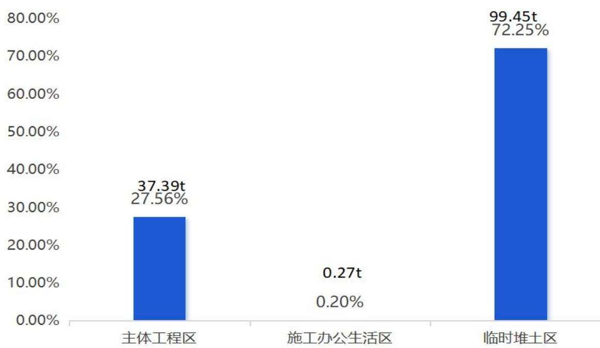  
图4.5-1 项目各分区新增土壤流失量占比图

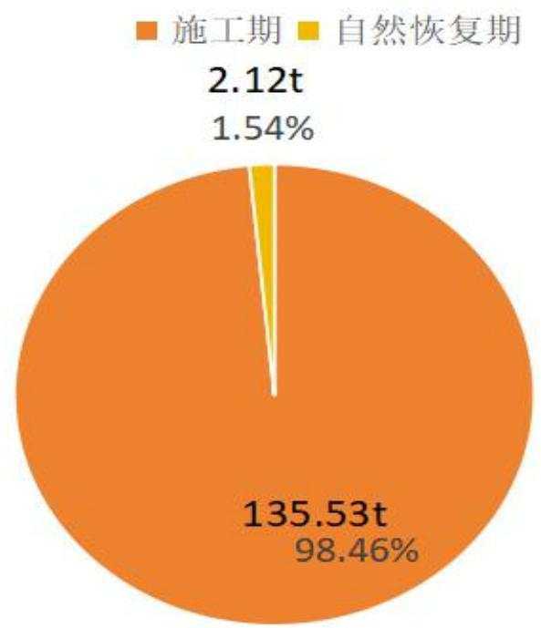  
图4.5-2 项目预测时段新增土壤流失量占比图

## 4.5.2 指导意见

预测结果是在未采取有效防护措施时可能的流失结果。产生水土流失的因素较多，其中地面坡度、降雨强度是影响水土流失的主要因素，而采取综合性的水土流失防护措施将对水土流失起到抑制作用。

（1）项目区处于城镇区，工程施工要做到“文明施工”和“生态绿色施工”，加强对施工人员的管理教育，减轻对项目区生态环境的破坏。

（2）加强水土保持管理工作，切实落实主体设计及方案新增的各项防护措施，确保项目建设与水土保持协调开展，做到施工高峰期尽量减少新增水土流失量。

（3）根据水土流失预测结果，施工期是水土流失防治和监测的重点时段，临时堆土区、主体工程区是水土流失防治和监测的重点区域，考虑进行重点防治和监测，同时不应忽视对其他工程区的水土流失的防治和监测。在监测过程中，要依据各区域水土流失特点，布置典型的监测设施，拟定具体的监测时段、频次和方法，通过水土保持监测工作为水保方案实施落地和工程施工、运行管理服务。

## 5 水土保持措施

## 5.1 防治分区划分

## 5.1.1 防治分区的原则

## （1）分区的依据

依据工程布局范围的地貌特征、施工扰动特点、建设时序、水土流失影响进行水土流失防治分区。

## （2）分区的原则

1）各防治区之间具有明显的差异性；

2）各级分区应层次分明，具有关联性和系统性；

3）相同分区内地貌类型特征相似、施工扰动特点相近、造成水土流失的主导因子相似；

4）分区的结果应对防治措施的总体布局和水土流失监测具有分类指导的作用，有利于分类实施各项防治措施，有利于水土流失监测。

## （3）分区方法

主要采取实地调查、资料收集与数据分析相结合的方法进行分区。

## 5.1.2 防治分区

根据《生产建设项目水土保持技术标准》（GB50433-2018）等相关技术规范、标准规定，按上述分区规定及原则，将本项目划分为主体工程区、施工办公生活区、临时堆土区共3个水土流失防治分区。防治分区表见表5.1-1。

表 5.1-1 水土流失防治分区表
<table><tr><td colspan="2" rowspan="2">工程单元</td><td colspan="1" rowspan="1">原始占地类型及面积（h $\pmb { \mathfrak { m } } ^ { 2 } )$ </td><td colspan="3" rowspan="1">占地性质及面积(hm)</td></tr><tr><td colspan="1" rowspan="1">教育用地</td><td colspan="1" rowspan="1">永久占地</td><td colspan="1" rowspan="1">临时占地</td><td colspan="1" rowspan="1">小计</td></tr><tr><td colspan="1" rowspan="3">主体工程区</td><td colspan="1" rowspan="1">建（构）筑工程区</td><td colspan="1" rowspan="1">0.72</td><td colspan="1" rowspan="1">0.56</td><td colspan="1" rowspan="1">0.16</td><td colspan="1" rowspan="1">0.72</td></tr><tr><td colspan="1" rowspan="1">道路及铺装工程区</td><td colspan="1" rowspan="1">0.37</td><td colspan="1" rowspan="1">0.37</td><td colspan="1" rowspan="1"></td><td colspan="1" rowspan="1">0.37</td></tr><tr><td colspan="1" rowspan="1">绿化工程区</td><td colspan="1" rowspan="1">0.11</td><td colspan="1" rowspan="1">0.11</td><td colspan="1" rowspan="1"></td><td colspan="1" rowspan="1">0.11</td></tr><tr><td colspan="1" rowspan="1">施工办公生活区</td><td colspan="1" rowspan="1">1.20</td><td colspan="1" rowspan="1">1.04</td><td colspan="1" rowspan="1">0.16</td><td colspan="1" rowspan="1"></td></tr><tr><td colspan="1" rowspan="1">临时堆土区</td><td colspan="1" rowspan="1">0.27</td><td colspan="1" rowspan="1"></td><td colspan="1" rowspan="1">0.27</td><td colspan="1" rowspan="1">0.27</td></tr><tr><td colspan="1" rowspan="1">合计</td><td colspan="1" rowspan="1">0.89</td><td colspan="1" rowspan="1"></td><td colspan="1" rowspan="1">0.89</td><td colspan="1" rowspan="1">0.89</td></tr></table>

## 5.2 措施总体布局

## 5.2.1 水土保持措施布设原则

（1）预防为主、保护优先、防治相结合的原则：尽量减少地表扰动破坏面积，合理布设临时堆土区，重点预防工程建设可能造成的水土流失；

（2）因地制宜、因害设防、科学配置的原则：因地制宜，因害设防，临时措施、植物措施、工程措施科学配置；

（3）全面规划、统筹兼顾、综合治理的原则：全面规划，各种措施合理配置，统筹兼顾，形成完整的综合防治体系。

（4）经济合理、生态优先、注重效益的原则：技术可靠，经济合理，生态优先，科学管理，注重效益。

## 5.2.2 水土保持措施体系

根据项目工程特点和水土流失特征，项目区水土保持措施布置的总体思路是：以临时堆土区、主体工程区为重点区域，以施工期为重点时段，配合主体工程中已有的水土保持措施，综合规划布设水土流失防治措施体系，做到临时措施与工程措施相结合，“点、线、面”相结合，形成完整的防护体系。水土保持措施体系图见图 5.2-1。

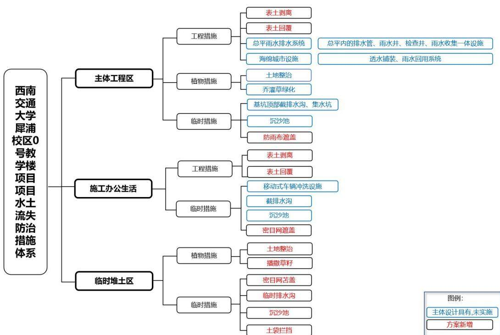  
图5.2-1 项目水土流失防治措施体系

## 5.2.3 水土保持措施总体布局

针对项目建设过程中新增水土流失特征，在综合分析评价主体工程设计中具有水土保持功能工程项目的基础上，将主体工程区、临时堆土区作为水土流失防治的重点区域，同时不能忽视对其他区域的水土流失防治，施工过程中注重临时防护措施的布置，建立以水土保持工程措施、植物措施和临时措施相结合的生态恢复体系，最大限度减少水土流失量。

## （1）主体工程区

施工前对主体工程占地区域内可剥离表土进行剥离，剥离的表土运至临时堆土区集中堆放，后期用于景观绿化区回填；在施工主入口布设车辆冲洗设施，洗车台四周布设盖板截排水沟，并与三级沉沙池连接；施工过程中，在基坑顶部四周围栏内侧设置截水沟，在场地基坑外侧布置三级沉沙池，基坑内外的汇水经三级沉沙池，三级沉沙池出口接入校园市政管雨水网，沉淀后的水排入周边市政管网。针对基坑开挖裸露边坡、坑底临时堆土、管沟开挖临时堆土及工程区裸露地表等施工区域进行密目网苫盖；施工后期，沿道路一侧或硬化铺装区域地埋布设雨水排水管，地表径流经雨水口汇入雨水管网，再经雨水调蓄池调节水量后有组织地排入市政管网，广场等低荷载区域设置透水砖、透水混凝土等铺装，对景观绿化区进行表土回覆及土地整治，并采用乔灌草相结合进行景观绿化。

## （2）施工办公生活区

完成施工区域围挡打围及施工单位布设期间，先对项目区内可剥离地表土进行剥离并运至临时堆土区进行集中保护堆存；在施工便道与学校已有道路连接处布设移动式车辆冲洗设施，在车辆冲洗设施附近布设三级沉砂池，做法参照主体设计的基坑的三级沉沙池及截排水沟（增设承重型盖板）。三级沉沙池出口接入校园市政管雨水网，沉淀后的水排入周边校园市政管网；本工程区内的两栋主要临时板房四周不是截排水沟，用来汇集该区域内的雨水，并在西北角接入已有校园雨水井；在施工临时设施施工过程中裸露土壤区域进行密目网临时苫盖。该区域施工完毕后，占地区域地表基本被施工设施及临时浇筑的混凝土地坪覆盖，无土壤流失产生。直至主体工程完成验收阶段，该区域的功能结束，拆除所有新增的临时设施，将存放于临时堆土区的表土运回进行回覆，全面进行土地整治后进行撒播草籽绿化恢复。

## （3）临时堆土区

考虑表土在此区域堆存时间较长，几乎跨整个施工工期，对临时堆土区四周采取编织土袋挡墙进行临时拦挡，临时堆土表面采取密目网遮盖并少量撒播草籽固土保持土壤活力，编织土袋挡墙外侧布设临时排水沟，在排水最低点附近布设临时沉沙池，临时排水出口顺接沉沙池；对于堆放于本区的用于主体工程回填的临时堆土，由于堆土时间相对较短，对堆土进行全面苫盖，密不漏土；主体施工结束后对临时堆土区扰动区域全面土地整治、植草绿化将场地恢复为原地貌。

水土保持措施总体布局详见表5.2-1。

表5.2-1水土流失防治措施总体布局
<table><tr><td colspan="1" rowspan="1">分区</td><td colspan="1" rowspan="1">措施类型</td><td colspan="1" rowspan="1">水土保持措施</td><td colspan="1" rowspan="1">实施部位</td><td colspan="1" rowspan="1">实施时段</td><td colspan="1" rowspan="1">投资属性及实施情况</td></tr><tr><td colspan="1" rowspan="19">主体工程区</td><td colspan="1" rowspan="14">工程措施</td><td colspan="1" rowspan="1">表土剥离</td><td colspan="1" rowspan="1">项目区内可剥离表土</td><td colspan="1" rowspan="1">2026年6月</td><td colspan="1" rowspan="1">方案新增</td></tr><tr><td colspan="1" rowspan="1">表土回覆</td><td colspan="1" rowspan="1">该区域植被覆盖区域</td><td colspan="1" rowspan="1">2027年8月</td><td colspan="1" rowspan="1">方案新增</td></tr><tr><td colspan="1" rowspan="1">坡道截水沟</td><td colspan="1" rowspan="1">地下室坡道起点、终点</td><td colspan="1" rowspan="1">2027年1月~9月</td><td colspan="1" rowspan="1">主体具有</td></tr><tr><td colspan="1" rowspan="1">暗地沟</td><td colspan="1" rowspan="1">建筑四周、占地边缘</td><td colspan="1" rowspan="1">2027年1月~9月</td><td colspan="1" rowspan="1">主体具有</td></tr><tr><td colspan="1" rowspan="1">天井排水沟</td><td colspan="1" rowspan="1">天井四周</td><td colspan="1" rowspan="1">2027年1月~9月</td><td colspan="1" rowspan="1">主体具有</td></tr><tr><td colspan="1" rowspan="1">透水铺装</td><td colspan="1" rowspan="1">该区域硬化覆盖区域</td><td colspan="1" rowspan="1">2027年8月~9月</td><td colspan="1" rowspan="1">主体具有</td></tr><tr><td colspan="1" rowspan="1">成品线性排水沟</td><td colspan="1" rowspan="1">总平铺装边坡处</td><td colspan="1" rowspan="1">2027年1月~9月</td><td colspan="1" rowspan="1">主体具有</td></tr><tr><td colspan="1" rowspan="1">地漏</td><td colspan="1" rowspan="1">总平铺装低点</td><td colspan="1" rowspan="1">2027年1月~9月</td><td colspan="1" rowspan="1">主体具有</td></tr><tr><td colspan="1" rowspan="1">单算雨水口</td><td colspan="1" rowspan="1">总平铺装区域</td><td colspan="1" rowspan="1">2027年8月~9月</td><td colspan="1" rowspan="1">主体具有</td></tr><tr><td colspan="1" rowspan="1">雨水检查井</td><td colspan="1" rowspan="1">总平铺装区域</td><td colspan="1" rowspan="1">2027年1月~9月</td><td colspan="1" rowspan="1">主体具有</td></tr><tr><td colspan="1" rowspan="1">雨水管DN300</td><td colspan="1" rowspan="1">本区域内及地下</td><td colspan="1" rowspan="1">2027年1月~9月</td><td colspan="1" rowspan="1">主体具有</td></tr><tr><td colspan="1" rowspan="1">雨水管DN400</td><td colspan="1" rowspan="1">本区域内及地下</td><td colspan="1" rowspan="1">2027年1月~9月</td><td colspan="1" rowspan="1">主体具有</td></tr><tr><td colspan="1" rowspan="1">雨水管DN500</td><td colspan="1" rowspan="1">本区域内及地下</td><td colspan="1" rowspan="1">2027年1月~9月</td><td colspan="1" rowspan="1">主体具有</td></tr><tr><td colspan="1" rowspan="1">土地整治</td><td colspan="1" rowspan="1">永久绿化工程区域</td><td colspan="1" rowspan="1">2027年8月</td><td colspan="1" rowspan="1">方案新增</td></tr><tr><td colspan="1" rowspan="1">植物措施</td><td colspan="1" rowspan="1">乔灌草绿化</td><td colspan="1" rowspan="1">永久绿化工程区域</td><td colspan="1" rowspan="1">2027年8~9月</td><td colspan="1" rowspan="1">主体具有</td></tr><tr><td colspan="1" rowspan="4">施工临时工程</td><td colspan="1" rowspan="1">基坑顶部截排水沟</td><td colspan="1" rowspan="1">基坑四周</td><td colspan="1" rowspan="1">2026年6月</td><td colspan="1" rowspan="1">主体具有</td></tr><tr><td colspan="1" rowspan="1">集水坑</td><td colspan="1" rowspan="1">基坑四周</td><td colspan="1" rowspan="1">2026年6月</td><td colspan="1" rowspan="1">主体具有</td></tr><tr><td colspan="1" rowspan="1">三级沉沙池</td><td colspan="1" rowspan="1">基坑附近</td><td colspan="1" rowspan="1">2026年6月</td><td colspan="1" rowspan="1">主体具有</td></tr><tr><td colspan="1" rowspan="1">车辆冲洗设施</td><td colspan="1" rowspan="1">施工主入口</td><td colspan="1" rowspan="1">2026年6月</td><td colspan="1" rowspan="1">主体具有</td></tr><tr><td colspan="1" rowspan="1"></td><td colspan="1" rowspan="1"></td><td colspan="1" rowspan="1">密目网苫盖</td><td colspan="1" rowspan="1">裸露土壤区域</td><td colspan="1" rowspan="1">2026年6月~2027年8月</td><td colspan="1" rowspan="1">方案新增</td></tr><tr><td colspan="1" rowspan="8">施工办公生活区</td><td colspan="1" rowspan="3">工程措施</td><td colspan="1" rowspan="1">表土剥离</td><td colspan="1" rowspan="1">项目区内可剥离表土</td><td colspan="1" rowspan="1">2026年6月</td><td colspan="1" rowspan="1">方案新增</td></tr><tr><td colspan="1" rowspan="1">表土回覆</td><td colspan="1" rowspan="1">项目区内绿化恢复区域</td><td colspan="1" rowspan="1">2027年9月</td><td colspan="1" rowspan="1">方案新增</td></tr><tr><td colspan="1" rowspan="1">土地整治</td><td colspan="1" rowspan="1">项目区内绿化恢复区域</td><td colspan="1" rowspan="1">2027年9月</td><td colspan="1" rowspan="1">方案新增</td></tr><tr><td colspan="1" rowspan="1">植物措施</td><td colspan="1" rowspan="1">播撒草籽</td><td colspan="1" rowspan="1">项目区内绿化恢复区域</td><td colspan="1" rowspan="1">2027年9月</td><td colspan="1" rowspan="1">方案新增</td></tr><tr><td colspan="1" rowspan="4">施工临时工程</td><td colspan="1" rowspan="1">密目网苫盖</td><td colspan="1" rowspan="1">该区临时占地范围内植被覆盖区域</td><td colspan="1" rowspan="1">2026年6月，2027年9月拆除</td><td colspan="1" rowspan="1">方案新增</td></tr><tr><td colspan="1" rowspan="1">移动式车辆冲洗设施</td><td colspan="1" rowspan="1">施工主入口</td><td colspan="1" rowspan="1">2026年6月，2027年9月拆除</td><td colspan="1" rowspan="1">主体具有</td></tr><tr><td colspan="1" rowspan="1">截排水沟</td><td colspan="1" rowspan="1">洗车台四周，并连接至三级沉砂池</td><td colspan="1" rowspan="1">2026年6月，2027年9月拆除</td><td colspan="1" rowspan="1">主体具有</td></tr><tr><td colspan="1" rowspan="1">沉沙池</td><td colspan="1" rowspan="1">车辆洗车设施附近</td><td colspan="1" rowspan="1">2026年6月，2027年9月拆除</td><td colspan="1" rowspan="1">主体具有</td></tr><tr><td colspan="1" rowspan="6">临时堆土区</td><td colspan="1" rowspan="1">工程措施</td><td colspan="1" rowspan="1">土地整治</td><td colspan="1" rowspan="1">该区临时占地范围内</td><td colspan="1" rowspan="1">2027年9月</td><td colspan="1" rowspan="1">方案新增</td></tr><tr><td colspan="1" rowspan="1">植物措施</td><td colspan="1" rowspan="1">播撒草籽</td><td colspan="1" rowspan="1">该区临时占地范围内</td><td colspan="1" rowspan="1">2027年9月</td><td colspan="1" rowspan="1">方案新增</td></tr><tr><td colspan="1" rowspan="4">施工临时工程</td><td colspan="1" rowspan="1">密目网苫盖</td><td colspan="1" rowspan="1">表土堆表面</td><td colspan="1" rowspan="1">2026年6月~2027年8月，2027年9月拆除</td><td colspan="1" rowspan="1">方案新增</td></tr><tr><td colspan="1" rowspan="1">临时排水沟</td><td colspan="1" rowspan="1">表土堆四周</td><td colspan="1" rowspan="1">2026年6月，2027年9月拆除</td><td colspan="1" rowspan="1">方案新增</td></tr><tr><td colspan="1" rowspan="1">沉沙池</td><td colspan="1" rowspan="1">临时排水沟最低点附近</td><td colspan="1" rowspan="1">2026年6月，2027年9月拆除</td><td colspan="1" rowspan="1">方案新增</td></tr><tr><td colspan="1" rowspan="1">土袋拦挡</td><td colspan="1" rowspan="1">表土堆存场四周</td><td colspan="1" rowspan="1">2026年6月，2027年9月拆除</td><td colspan="1" rowspan="1">方案新增</td></tr></table>

## 5.3 分区措施布设

## 5.3.1 水土保持工程设计标准及原则

根据《生产建设项目水土保持技术标准》（GB50433-2018）、《水土保持工程设计规范》（GB51018-2014）、《防洪标准》（GB50201-2014）、《室外排水设计规范》（GB50014-2021）中相关规定执行。

## 5.3.1.1工程措施设计标准

（1）排水工程：参照《室外排水设计规范》（GB50014-2021），雨水排水管按暴雨重现期5年一遇10min 暴雨强度设计。

（2）土地整治工程：参照《水土保持工程设计规范》（GB51018-2014），根据原占地类型、立地条件及环境绿化等需要，景观绿化区土地整治后表土回覆厚度按50cm 左右的标准，表土施临时堆土区按20cm 左右的标准。

## 5.3.1.2植物措施设计标准

（1）参照《水土保持工程设计规范》（GB51018-2014），本项目景观绿化区植被恢复与建设工程级别为1级，满足景观、游憩、环境保护和生态防护等多种功能要求、执行园林绿化标准；

（2）施工办公生活区、临时堆土区考虑校区预留空地，后期用于校园建设，按3级标准建设。

## 5.3.1.3临时防护措施设计标准

（1）考虑项目区降雨量大、多短历时暴雨等实际情况，临时截排水设计标准按5年一遇10min暴雨强度设计。

（2）施工建设中，临时堆土必须集中堆放，并采取拦挡、苫盖等措施；

（3）施工中的裸露地，在遇暴雨、大风时应布设防护措施；

（4）施工对下游及周边造成影响的，必须采取相应的防护措施。

## 5.3.2 主体工程区措施布设

## 5.3.2.1工程措施

## （1）表土剥离（方案新增）

施工前，施工单位对本占地范围内可剥离表土区域进行表土剥离，剥离厚度0.20m 左右，可剥离表土面积 0.24h ㎡，剥离表土 0.05 万 m³，剥离表土堆放于

校内临时堆土区的表土堆存场进行集中存放。后期用于绿化覆土使用。措施实施时段为2026年6月。

## （2）雨排水管网及雨水调蓄池（主体具有）

主体工程设计沿道路一侧或硬化铺装区域地埋布设雨水排水管，地表径流经雨水口汇入雨水管网，再经雨水调蓄池调节水量后有组织地排入校内雨水管网。

项目区内环绕建筑四周的永久排水沟（排水沟在项目永久用地内布置三道，由内至外，中庭四周布置一道排水沟起点深0.3m，宽0.3m；沿建筑四周布置一道，排水沟起点深0.3m，宽0.5m；沿用地四周布置一道，排水沟起点深0.3m，宽0.4m。总长度937.21m），雨水管总长34.81m，雨水经外雨水管网收集后通过雨水调蓄池有组织地排入市政道路雨水管网。主体设计在场地西南角布置1套雨水调蓄排放系统，雨水调蓄池容量为169.5m³。雨水回用系统几何尺寸：23.60m（长）\*6m（宽）\*2.5m（深）。措施实施时段为2027年1\~9 月。主体工程设计的永久排水沟、排水管网根据《室外排水设计标准》（GB50014-2021）设计，排水设计标准采用四川省成都市雨水暴雨强度公式计算，按5年一遇10min降雨历时。

## （3）透水铺装（主体具有）

主体工程设计透水铺装主要铺设于非消防登高面和消防车道的位置，如消防车道和广场等低荷载区域设置透水砖、透水混凝土等铺装，透水面厚度约60-80mm，透水铺装面积约3197㎡。措施实施时段为2027 年8\~9月。

## （4）表土回覆

景观绿化区生土层平整后需进行表土层回覆以备绿化，根据设计标高及覆土要求，平均覆土厚度约 0.50m，共布设覆土面积0.11h㎡，表土回覆量0.05 万m³，覆土来源于前期剥离保存的表土。措施实施时段为2027年8月。

## （5）土地整治（方案新增）

施工结束后，对绿化区进行土地整治，为植物生长创造立地条件。土地整治内容主要包括翻松固结土壤，施加肥料进行土壤改良等。经计算，景观绿化区土地整治面积为 0.11h㎡。措施实施时段为2027年8月。

## 5.3.2.2植物措施

## （1）乔灌草绿化（主体具有）

主体设计在各建构筑物周边与硬化及道路周边布置景观绿化，场地绿化分散设置下凹式绿地和雨水花园等生物滞留设施，绿化植物采用乔+灌+草的形式，达到美化的作用。景观绿化配合校园景观总体规划布置。主体设计乔灌草景观绿化面积共计1058㎡。措施实施时段为2027 年8\~9 月。

景观绿化工程施工主要包括平场、造景、植物栽植。因此本方案就景观绿化区施工及后期抚育管理提出水土保持要求。

1）在施工过程中，应及时对场地平整、造景土石方挖填等产生扬尘较大的作业面定期洒水，以减小扬尘对周围环境的影响。

2）绿化措施在条件成熟后尽早实施，缩短地表裸露时间。

3）绿化工程区造景应积极贯彻落实“海绵城市”思想，以蓄为主排为辅，尽量做成凹地形景观区，有利于保水保土。

4）种植技术要求：

①整地：穴状整地，采用圆形坑穴，穴面与原地面持平，乔木穴径≥100cm、深≥50cm，灌木穴径 40cm、深 40cm。

@栽植：在春季进行植树，避免旱季种植。采用穴植，边整地边定植。栽植时应将树苗扶正、栽直。穴植的技术要求是“三填、两踩、一提苗”，把苗木放入穴中央，再填一些湿润熟土于根底，用脚踩实一次，将苗木稍向上轻轻提一下，使苗根舒展与土壤密接，再将生土填入踩实，种植深度一般超过原根系5cm\~10cm。

③抚育管理：幼林抚育管理是促进林木生长的重要措施。加强抚育管理工作，抚育措施包括锄耕灌水、间伐抚育等管理措施。苗木定植成活后，严防人畜践踏。第二年对死亡植株进行补植，注意病虫害防治，管护一年。

## 5.3.2.3临时措施

（1）临时截水沟（主体具有）

主体设计在基坑顶部四周围栏内侧设置截水沟，坑顶截水沟采用砖砌砂浆抹面（砖砌截水沟尺寸为0.3m\*0.3m，采用底10cm 厚C15 砼浇筑，侧壁采用12cm厚砖砌，沟内抹1:3水泥砂浆厚20mm），截水沟最低处接入附近三级沉沙池，经沉淀后就近排入周边校园市政管网。经统计基坑顶部周边实施了截水沟380。措施实施时段为2026年5月。查阅主体设计资料，基坑顶部截排水为临时性措施，主体工程设计的该基坑排水根据《室外排水设计标准》（GB50014-2021）设计，雨水量采用四川成都雨水暴雨强度公式计算、设计，排水设计标准按5年一遇10min 短历时设计。

## （2）集水坑（主体具有）

在基坑顶部截水沟转角处，为保证排水、汇水顺畅，设置了集水坑4个，净空尺寸 1.0\*1.0\*0.5m（L\*B\*H），侧壁为 24cm 厚 M7.5 砖砌筑，底部 10cm 厚C15砼浇筑，内抹1:3 水泥砂浆厚20mm。措施实施时段为2026年6月。

## （3）三级沉沙池（主体具有）

主体设计在主体工程北侧及南侧各布置1座三级沉沙池，共布设2座，沉沙池出口接入周边校园市政雨水管网。三级沉沙池净空尺寸3.0\*2.0\*1.2m（L\*B\*H），两侧边壁为24cm 厚 M7.5 砖砌筑，中间使用12cm 厚M7.5 砖砌筑，隔断为三级，一、二、三级沉沙池长均为1.0m，池底采用10cm 厚C15混凝土现浇。措施实施时段为2026年6月。

## （4）密目网苫盖（方案新增）

施工过程中针对基坑开挖裸露边坡、坑底临时堆土、管沟开挖临时堆土及工程区裸露地表等施工区域分阶段进行密目网苫盖，可有效减少因工程建设造成的水土流失。经统计共计实施密目网临时苫盖约8180㎡。措施实施时段为2026年6月\~7月、2027年1\~9月，过程中的密目网苫盖措用后可以根据完好情况进行回收再利用，在项目收尾阶段用后及时拆除，减少对环境的不利影响。

## （5）车辆冲洗设施（主体具有）

在完成施工区域围挡打围及施工单位布设期间，在施工主入口布设车辆冲洗设施 1套，包含高压水枪、洗车台（洗车池）等。措施实施时间为2026年6月。

主体工程区水土保持措施规模及工程量见表5.3-3。

表5.3-3主体工程区水土保持措施规模及工程量汇总表
<table><tr><td rowspan=1 colspan=1>分区</td><td rowspan=1 colspan=1>措施类型</td><td rowspan=1 colspan=1>水土保持措施</td><td rowspan=1 colspan=1>单位</td><td rowspan=1 colspan=1>工程量</td><td rowspan=1 colspan=1>实施时段</td><td rowspan=1 colspan=1>备注</td></tr><tr><td rowspan=20 colspan=2>工程措施主体工程区</td><td rowspan=1 colspan=1>表土剥离</td><td rowspan=1 colspan=1>万m³</td><td rowspan=1 colspan=1>0.05</td><td rowspan=1 colspan=1>2026年6月</td><td rowspan=1 colspan=1>方案新增</td></tr><tr><td rowspan=1 colspan=1>表土回覆</td><td rowspan=1 colspan=1>m</td><td rowspan=1 colspan=1>0.05</td><td rowspan=1 colspan=1>2027年8月</td><td rowspan=1 colspan=1>方案新增</td></tr><tr><td rowspan=1 colspan=1>坡道截水沟</td><td rowspan=1 colspan=1>m</td><td rowspan=1 colspan=1>15.73</td><td rowspan=1 colspan=1>2027年1~9月</td><td rowspan=1 colspan=1>主体具有</td></tr><tr><td rowspan=1 colspan=1>暗地沟</td><td rowspan=1 colspan=1>m</td><td rowspan=1 colspan=1>776.14</td><td rowspan=1 colspan=1>2027年1~9月</td><td rowspan=1 colspan=1>主体具有</td></tr><tr><td rowspan=1 colspan=1>天井排水沟</td><td rowspan=1 colspan=1>m</td><td rowspan=1 colspan=1>161.07</td><td rowspan=1 colspan=1>2027年1~9月</td><td rowspan=1 colspan=1>主体具有</td></tr><tr><td rowspan=1 colspan=1>透水铺装</td><td rowspan=1 colspan=1>m²</td><td rowspan=1 colspan=1>3197.00</td><td rowspan=1 colspan=1>2027年8~9月</td><td rowspan=1 colspan=1>主体具有</td></tr><tr><td rowspan=1 colspan=1>成品线性排水沟</td><td rowspan=1 colspan=1>m</td><td rowspan=1 colspan=1>139.45</td><td rowspan=1 colspan=1>2027年1~9月</td><td rowspan=1 colspan=1>主体具有</td></tr><tr><td rowspan=1 colspan=1>地漏</td><td rowspan=1 colspan=1>个</td><td rowspan=1 colspan=1>6</td><td rowspan=1 colspan=1>2027年1~9月</td><td rowspan=1 colspan=1>主体具有</td></tr><tr><td rowspan=1 colspan=1>单算雨水口</td><td rowspan=1 colspan=1>座</td><td rowspan=1 colspan=1>12</td><td rowspan=1 colspan=1>2027年1~9月</td><td rowspan=1 colspan=1>主体具有</td></tr><tr><td rowspan=1 colspan=1>雨水检查井</td><td rowspan=1 colspan=1>座</td><td rowspan=1 colspan=1>4</td><td rowspan=1 colspan=1>2027年1~9月</td><td rowspan=1 colspan=1>主体具有</td></tr><tr><td rowspan=1 colspan=1>雨水管 DN300</td><td rowspan=1 colspan=1>m</td><td rowspan=1 colspan=1>16.39</td><td rowspan=1 colspan=1>2027年1~9月</td><td rowspan=1 colspan=1>主体具有</td></tr><tr><td rowspan=1 colspan=1>雨水管 DN400</td><td rowspan=1 colspan=1>m</td><td rowspan=1 colspan=1>4.00</td><td rowspan=1 colspan=1>2027年1~9月</td><td rowspan=1 colspan=1>主体具有</td></tr><tr><td rowspan=1 colspan=1>雨水管 DN500</td><td rowspan=1 colspan=1>m</td><td rowspan=1 colspan=1>14.42</td><td rowspan=1 colspan=1>2027年1~9月</td><td rowspan=1 colspan=1>主体具有</td></tr><tr><td rowspan=1 colspan=1>土地整治</td><td rowspan=1 colspan=1>hm²</td><td rowspan=1 colspan=1>0.11</td><td rowspan=1 colspan=1>2027年8月</td><td rowspan=1 colspan=1>方案新增</td></tr><tr><td rowspan=1 colspan=1></td><td rowspan=1 colspan=1>乔灌草绿化</td><td rowspan=1 colspan=1>m²</td><td rowspan=1 colspan=1>1058.00</td><td rowspan=1 colspan=1>2027年8~9月</td><td rowspan=1 colspan=1>主体具有</td></tr><tr><td rowspan=5 colspan=1></td><td rowspan=1 colspan=1>基坑顶部截排水沟</td><td rowspan=1 colspan=1>m</td><td rowspan=1 colspan=1>233.38</td><td rowspan=1 colspan=1>2026年6月</td><td rowspan=1 colspan=1>主体具有</td></tr><tr><td rowspan=1 colspan=1>集水坑</td><td rowspan=1 colspan=1>座</td><td rowspan=1 colspan=1>4</td><td rowspan=1 colspan=1>2026年6月</td><td rowspan=1 colspan=1>主体具有</td></tr><tr><td rowspan=1 colspan=1>三级沉沙池</td><td rowspan=1 colspan=1>个</td><td rowspan=1 colspan=1>1</td><td rowspan=1 colspan=1>2026年6月</td><td rowspan=1 colspan=1>主体具有</td></tr><tr><td rowspan=1 colspan=1>车辆冲洗设施</td><td rowspan=1 colspan=1>套</td><td rowspan=1 colspan=1>1</td><td rowspan=1 colspan=1>2026年6月</td><td rowspan=1 colspan=1>主体具有</td></tr><tr><td rowspan=1 colspan=1>密目网苫盖</td><td rowspan=1 colspan=1>m²</td><td rowspan=1 colspan=1>8180.00</td><td rowspan=1 colspan=1>2026年6~7月，2027年1~9月，用后拆除</td><td rowspan=1 colspan=1>方案新增</td></tr></table>

## 5.3.3 施工办公生活区措施布设

## 5.3.3.1 工程措施

四川京华畅工程管理有限公司 95

## （1）表土剥离（方案新增）

施工前，施工单位对本占地范围内可剥离表土区域进行表土剥离，剥离厚度0.30m 左右，可剥离表土面积 0.27h ㎡，剥离表土 0.08 万 m³，剥离表土堆放于校内临时堆土区的表土堆存场进行集中存放。后期用于绿化覆土使用。措施实施时段为2026年6月。

## （2）表土回覆（方案新增）

景观绿化区生土层平整后需进行表土层回覆以备绿化，根据设计标高及覆土要求，平均覆土厚度约 0.30m，共布设覆土面积0.27h㎡，表土回覆量0.08 万m³，覆土来源于前期剥离保存的表土。措施实施时段为2027年9月。

## （3）土地整治（方案新增）

施工结束后，对绿化区进行土地整治，为植物生长创造立地条件。土地整治内容主要包括翻松固结土壤，施加肥料进行土壤改良等。经计算，景观绿化区土地整治面积为 0.27h㎡。措施实施时段为2027年9月。

## 5.3.3.2 植物措施

## （1）撒播草籽（方案新增）

场地疏松平整后，采取撒播草籽的方式进行绿化恢复，恢复场地原貌。草种选择根系发达、抗逆性强，保土性好，生长迅速的黑麦草、三叶草按1:1 比例进行混播，撒播密度为 8g/m2。共计植草绿化面积为0.27hm2。措施实施时段为2027年 9 月。

## 5.3.3.3 临时措施

## （1）移动车辆冲洗设施（主体具有）

在完成施工区域围挡打围及施工单位布设期间，在施工便道与校园已有道路衔接处布设移动车辆冲洗设施1套，包含高压水枪、洗车台（洗车池）等。措施实施时间为2026年6月。

## （2）截排水沟（主体具有）

在施工便道与校园已有道路衔接处，设置临时截排水沟，做法参照主体设计的基坑截排水沟（增设承重型盖板），长度约 26m。措施实施时间为 2026 年 6月。

## （3）沉沙池（主体具有）

在车辆冲洗设施附近布设三级沉沙池，1座。做法参照主体设计的基坑的三级沉沙池。措施实施时间为 2026年6 月。

## （4）密目网苫盖（方案新增）

本工程区在施工前期场地临时硬化施工前，以及工程竣工后所有临时硬化拆除过程中本方案新增了防雨布苫盖施工临时工程，经统计，共需要临时苫盖500㎡。措施实施时间为2026年6 月，2027 年8月拆除。

本工程区水土保持措施汇总详见表5.3-4 分区水土保持措施工程量表。

表5.3-4 施工办公生活区水土保持措施规模及工程量汇总表
<table><tr><td rowspan=1 colspan=1>分区</td><td rowspan=1 colspan=1>措施类型</td><td rowspan=1 colspan=1>水土保持措施</td><td rowspan=1 colspan=1>单位</td><td rowspan=1 colspan=1>工程量</td><td rowspan=1 colspan=1>实施时段</td><td rowspan=1 colspan=1>备注</td></tr><tr><td rowspan=8 colspan=1>施工办公生活区</td><td rowspan=3 colspan=1>工程措施</td><td rowspan=1 colspan=1>表土剥离</td><td rowspan=1 colspan=1>万m³</td><td rowspan=1 colspan=1>0.08</td><td rowspan=1 colspan=1>2026年6月</td><td rowspan=1 colspan=1>方案新增</td></tr><tr><td rowspan=1 colspan=1>表土回覆</td><td rowspan=1 colspan=1>万m³</td><td rowspan=1 colspan=1>0.08</td><td rowspan=1 colspan=1>2027年9月</td><td rowspan=1 colspan=1>方案新增</td></tr><tr><td rowspan=1 colspan=1>土地整治</td><td rowspan=1 colspan=1>hm²</td><td rowspan=1 colspan=1>0.27</td><td rowspan=1 colspan=1>2027年9月</td><td rowspan=1 colspan=1>方案新增</td></tr><tr><td rowspan=1 colspan=1>植物措施</td><td rowspan=1 colspan=1>播撒草籽</td><td rowspan=1 colspan=1>hm²</td><td rowspan=1 colspan=1>0.27</td><td rowspan=1 colspan=1>2027年9月</td><td rowspan=1 colspan=1>方案新增</td></tr><tr><td rowspan=4 colspan=1>施工临时工程</td><td rowspan=1 colspan=1>密目网苫盖</td><td rowspan=1 colspan=1>m²</td><td rowspan=1 colspan=1>500.00</td><td rowspan=1 colspan=1>2026年6月，2027年9月拆除</td><td rowspan=1 colspan=1>方案新增</td></tr><tr><td rowspan=1 colspan=1>移动式车辆冲洗设施</td><td rowspan=1 colspan=1>套</td><td rowspan=1 colspan=1>1</td><td rowspan=1 colspan=1>2026年6月，2027年9月拆除</td><td rowspan=1 colspan=1>主体具有</td></tr><tr><td rowspan=1 colspan=1>截排水沟</td><td rowspan=1 colspan=1>m</td><td rowspan=1 colspan=1>166.00</td><td rowspan=1 colspan=1>2026年6月，2027年9月拆除</td><td rowspan=1 colspan=1>主体具有</td></tr><tr><td rowspan=1 colspan=1>沉沙池</td><td rowspan=1 colspan=1>座</td><td rowspan=1 colspan=1>1</td><td rowspan=1 colspan=1>2026年6月，2027年9月拆除</td><td rowspan=1 colspan=1>主体具有</td></tr></table>

## 5.3.4 临时堆土区措施布设

## 5.3.4.1工程措施

## （1）土地整治（方案新增）

施工结束后，对临时堆土区清运后的场地进行土地整治，土地整治内容主要包括翻松固结土壤，施加肥料进行土壤改良等。共计实施土地整治措施0.89hm2。措施实施时段为2027年9月。

## 5.3.4.2植物措施

## （1）植草绿化（方案新增）

场地疏松平整后，采取撒播草籽的方式进行绿化恢复，恢复场地原貌。草种选择根系发达、抗逆性强，保土性好，生长迅速的黑麦草、三叶草按1:1 的比例进行混播，撒播密度为 8g/m2。共计植草绿化面积为 0.89hm2。措施实施时段为2027 年 9 月。

临时堆土区，根据实际情况，当除表土外的其他堆土运走后，施工单位可及时实施土地整治与植草绿化措施，减少土壤流失。

## 5.3.4.2临时措施

（1）编织土袋挡墙（方案新增）

对临时堆土区四周设置编织土袋挡墙，控制扰动范围，保证堆土边坡稳定。编织土袋挡墙采用梯形结构，高 1m，上底厚 1m，下底厚 0.5m，土袋按“一丁两顺”搭放，就地取土装袋。土方回填阶段拆除编织土袋挡墙。经统计，共布设75m³土袋拦挡，措施实施时段为2026年6 月。

## （2）临时排水沟（方案新增）

在堆场四周挡墙外侧设置临时排水沟，雨季及时排导地表径流，保证堆土稳定性。临时排水沟采用土质沟体，内壁夯实，水泥砂浆抹灰，底宽0.3m，深0.3m，边坡1:0.5，排水沟接入该区域临时三级沉沙池，共布设临时排水沟105.76m，措施实施时段为2026年6月。

排水沟过流能力复核：

①坡面汇水设计洪峰流量的确定

坡面汇水设计洪峰流量确定采用《水土保持工程设计规范》（GB51018-2014）中的永久排水工程设计流量公式计算。根据工程等级和建筑物设计标准，本项目基坑排水沟的排水设计标准采用5年一遇 10min短历时设计暴雨。水文计算采用《水土保持工程设计规范》（GB51018-2014）A.4.1-1 公式进行计算：Qm=16.67φqF

式中：Qm——设计径流量（m³/s）。

## ϕ——径流系数。

q——设计重现期和降雨历时内的平均降雨强度（mm/min）。四川京华畅工程管理有限公司 98

F——坡面集水面积 $\left( \mathrm { k m } ^ { 2 } \right)$ ）。

其中ϕ：项目为临时堆土，按细粒土坡面，取0.45。

q：根据设计规范，通过查询标准降雨强度等值线图并进行转换计算后确定。项目施工场地采用5年一遇 10min 短历时标准暴雨强度2.1mm/min设计。

F：根据地形图对项目施工场地周边坡面进行测量（取基坑最大坡面汇水面积为代表进行核算），取 F=0.002314km2。

经计算可得，计算得 $\mathrm { Q m } { = } 0 . 0 3 6 5 \mathrm { m } ^ { 3 } / \mathrm { s }$ o

②基坑周界排水沟排水能力复核

基坑周界排水沟排水能力根据《水土保持工程设计规范》（GB51018-2014）按明渠均匀流复核。明渠均匀流计算公式如下：

$$
Q = { \frac { 1 } { n } } R ^ { 2 / 3 } I ^ { 1 / 2 } A
$$

式中： Q——流量，m³/s；

A——排水沟过水断面面积，m2；

R——水力半径，m；

I——沟底比降；

n——糙率，根据《水土保持工程设计规范》，水泥砂浆抹面参照混凝土明沟（抹面）为 0.015。

排水沟纵向比降为 2‰，取糙率 0.015，采用明渠均匀流公式复核，排水能力成果见下表 5.3-5。

表 5.3-5 表土堆存场四周排水沟排水能力核算表
<table><tr><td rowspan=1 colspan=1>名称</td><td rowspan=1 colspan=1>基坑坡面汇水面积 $\left( \mathrm { k m } ^ { 2 } \right)$ </td><td rowspan=1 colspan=1>基坑坡面汇水设计洪峰流量(m³/s)</td><td rowspan=1 colspan=1>周界排水沟设计尺寸（m）</td><td rowspan=1 colspan=1>超高(m)</td><td rowspan=1 colspan=1>周界排水沟水力计算参数</td><td rowspan=1 colspan=1>基坑周界排水沟最大过流能力（m³/s）</td><td rowspan=1 colspan=1>是否满足排泄基坑周界坡面汇水要求</td></tr><tr><td rowspan=1 colspan=1>基坑周界排水沟</td><td rowspan=1 colspan=1>0.002314</td><td rowspan=1 colspan=1>0.0365</td><td rowspan=1 colspan=1>顶宽 0.6底宽 0.3高度 0.3</td><td rowspan=1 colspan=1>0.1</td><td rowspan=1 colspan=1>过流面积：0.08m²湿周：0.75m水力半径：0.11m糙率：0.015沟底比降：2%o</td><td rowspan=1 colspan=1>0.0548 大于0.0365</td><td rowspan=1 colspan=1>满足排泄基坑周界坡面汇水要求</td></tr></table>

校核计算，临时排水沟最大过水量 Q=0.0548m³/s≥洪峰流量 Qm=0.0365m³/s，过水能力满足要求。

## （3）临时沉沙池（方案新增）

在本工程区表土堆存场外四周布设的截排水沟最低点附近布设临时沉沙池1座。该沉沙池为三级沉沙池，有效容积为 $4 . 5 \mathrm { m } ^ { 3 } \ \left( \ 3 \mathrm { m } ^ { * } 1 . 5 \mathrm { m } ^ { * } \mathrm { l m } \right)$ ，做法参照主体基坑外侧的沉沙池。措施实施时间为2026年6月。

## （4）临时苫盖（方案新增）

本工程区在整个主体施工期间，土壤一直处于裸露状态，为避免本工程区出现土壤流失，本方案新增了防雨布苫盖施工临时工程，经统计，共需要临时苫盖8900㎡，措施实施时间为 2026 年6月\~2027年9 月，该区域用于回填的土石方运走后，不再进行堆土的区域，应及时进行全面整地，撒播草籽恢复绿化。

本工程区水土保持措施汇总详见表5.3-6分区水土保持措施工程量表。

5.3-6 临时堆土区水土保持措施规模及工程量汇总表
<table><tr><td rowspan=1 colspan=1>分区</td><td rowspan=1 colspan=1>措施类型</td><td rowspan=1 colspan=1>水土保持措施</td><td rowspan=1 colspan=1>单位</td><td rowspan=1 colspan=1>工程量</td><td rowspan=1 colspan=1>实施时段</td><td rowspan=1 colspan=1>备注</td></tr><tr><td rowspan=6 colspan=1>临时堆土区</td><td rowspan=1 colspan=1>工程措施</td><td rowspan=1 colspan=1>土地整治</td><td rowspan=1 colspan=1> $\textrm { h m } ^ { 2 }$ </td><td rowspan=1 colspan=1>0.89</td><td rowspan=1 colspan=1>2027年9月</td><td rowspan=1 colspan=1>方案新增</td></tr><tr><td rowspan=1 colspan=1>植物措施</td><td rowspan=1 colspan=1>播撒草籽</td><td rowspan=1 colspan=1> $\textrm { h m } ^ { 2 }$ </td><td rowspan=1 colspan=1>0.89</td><td rowspan=1 colspan=1>2027年9月</td><td rowspan=1 colspan=1>方案新增</td></tr><tr><td rowspan=4 colspan=1>施工临时工程</td><td rowspan=1 colspan=1>密目网苫盖</td><td rowspan=1 colspan=1> ${ \mathfrak { m } } ^ { 2 }$ </td><td rowspan=1 colspan=1>8900.00</td><td rowspan=1 colspan=1>2026年6月~2027年9月，2027年9月拆除</td><td rowspan=1 colspan=1>方案新增</td></tr><tr><td rowspan=1 colspan=1>临时排水沟</td><td rowspan=1 colspan=1>m</td><td rowspan=1 colspan=1>105.76</td><td rowspan=1 colspan=1>2026年6月，2027年9月拆除</td><td rowspan=1 colspan=1>方案新增</td></tr><tr><td rowspan=1 colspan=1>沉沙池</td><td rowspan=1 colspan=1>座</td><td rowspan=1 colspan=1>1</td><td rowspan=1 colspan=1>2026年6月，2027年9月拆除</td><td rowspan=1 colspan=1>方案新增</td></tr><tr><td rowspan=1 colspan=1>土袋拦挡</td><td rowspan=1 colspan=1> $\mathrm { m } ^ { 3 }$ </td><td rowspan=1 colspan=1>75.00</td><td rowspan=1 colspan=1>2026年6月，2027年9月拆除</td><td rowspan=1 colspan=1>方案新增</td></tr></table>

## 5.3.5 水土保持措施工程量

各防治分区水土保持措施工程量汇总见表5.3-7。

5.3-7 本项目水土保持措施布设情况一览表
<table><tr><td colspan="1" rowspan="1">分区</td><td colspan="1" rowspan="1">措施类型</td><td colspan="1" rowspan="1">水土保持措施</td><td colspan="1" rowspan="1">单位</td><td colspan="1" rowspan="1">工程量</td><td colspan="1" rowspan="1">实施时段</td><td colspan="1" rowspan="1">备注</td></tr><tr><td colspan="1" rowspan="7">主体工程区</td><td colspan="1" rowspan="7">工程措施</td><td colspan="1" rowspan="1">表土剥离</td><td colspan="1" rowspan="1"> $\mathcal { F } \mathrm { ~ m } ^ { 3 }$ </td><td colspan="1" rowspan="1">0.05</td><td colspan="1" rowspan="1">2026年6月</td><td colspan="1" rowspan="1">方案新增</td></tr><tr><td colspan="1" rowspan="1">表土回覆</td><td colspan="1" rowspan="1">m</td><td colspan="1" rowspan="1">0.05</td><td colspan="1" rowspan="1">2027年8月</td><td colspan="1" rowspan="1">方案新增</td></tr><tr><td colspan="1" rowspan="1">坡道截水沟</td><td colspan="1" rowspan="1">m</td><td colspan="1" rowspan="1">15.73</td><td colspan="1" rowspan="1">2027年1~9月</td><td colspan="1" rowspan="1">主体具有</td></tr><tr><td colspan="1" rowspan="1">暗地沟</td><td colspan="1" rowspan="1">m</td><td colspan="1" rowspan="1">776.14</td><td colspan="1" rowspan="1">2027年1~9月</td><td colspan="1" rowspan="1">主体具有</td></tr><tr><td colspan="1" rowspan="1">天井排水沟</td><td colspan="1" rowspan="1">m</td><td colspan="1" rowspan="1">161.07</td><td colspan="1" rowspan="1">2027年1~9月</td><td colspan="1" rowspan="1">主体具有</td></tr><tr><td colspan="1" rowspan="1">透水铺装</td><td colspan="1" rowspan="1"> ${ \mathfrak { m } } ^ { 2 }$ </td><td colspan="1" rowspan="1">3197.00</td><td colspan="1" rowspan="1">2027年8~9月</td><td colspan="1" rowspan="1">主体具有</td></tr><tr><td colspan="1" rowspan="1">成品线性排水沟</td><td colspan="1" rowspan="1">m</td><td colspan="1" rowspan="1">139.45</td><td colspan="1" rowspan="1">2027年1~9月</td><td colspan="1" rowspan="1">主体具有</td></tr><tr><td colspan="1" rowspan="13"></td><td colspan="1" rowspan="7"></td><td colspan="1" rowspan="1">地漏</td><td colspan="1" rowspan="1">个</td><td colspan="1" rowspan="1">6</td><td colspan="1" rowspan="1">2027年1~9月</td><td colspan="1" rowspan="1">主体具有</td></tr><tr><td colspan="1" rowspan="1">单算雨水口</td><td colspan="1" rowspan="1">座</td><td colspan="1" rowspan="1">12</td><td colspan="1" rowspan="1">2027年1~9月</td><td colspan="1" rowspan="1">主体具有</td></tr><tr><td colspan="1" rowspan="1">雨水检查井</td><td colspan="1" rowspan="1">座</td><td colspan="1" rowspan="1">4</td><td colspan="1" rowspan="1">2027年1~9月</td><td colspan="1" rowspan="1">主体具有</td></tr><tr><td colspan="1" rowspan="1">雨水管 DN300</td><td colspan="1" rowspan="1">m</td><td colspan="1" rowspan="1">16.39</td><td colspan="1" rowspan="1">2027年1~9月</td><td colspan="1" rowspan="1">主体具有</td></tr><tr><td colspan="1" rowspan="1">雨水管 DN400</td><td colspan="1" rowspan="1">m</td><td colspan="1" rowspan="1">4.00</td><td colspan="1" rowspan="1">2027年1~9月</td><td colspan="1" rowspan="1">主体具有</td></tr><tr><td colspan="1" rowspan="1">雨水管 DN500</td><td colspan="1" rowspan="1">m</td><td colspan="1" rowspan="1">14.42</td><td colspan="1" rowspan="1">2027年1~9月</td><td colspan="1" rowspan="1">主体具有</td></tr><tr><td colspan="1" rowspan="1">土地整治</td><td colspan="1" rowspan="1">h m²</td><td colspan="1" rowspan="1">0.11</td><td colspan="1" rowspan="1">2027年8月</td><td colspan="1" rowspan="1">主体具有</td></tr><tr><td colspan="1" rowspan="1">植物措施</td><td colspan="1" rowspan="1">乔灌草绿化</td><td colspan="1" rowspan="1">m²</td><td colspan="1" rowspan="1">1058.00</td><td colspan="1" rowspan="1">2027年8~9月</td><td colspan="1" rowspan="1">主体具有</td></tr><tr><td colspan="1" rowspan="5"></td><td colspan="1" rowspan="1">基坑顶部截排水沟</td><td colspan="1" rowspan="1">m</td><td colspan="1" rowspan="1">233.38</td><td colspan="1" rowspan="1">2026年6月</td><td colspan="1" rowspan="1">主体具有</td></tr><tr><td colspan="1" rowspan="1">集水坑</td><td colspan="1" rowspan="1">座</td><td colspan="1" rowspan="1">1</td><td colspan="1" rowspan="1">2026年6月</td><td colspan="1" rowspan="1">主体具有</td></tr><tr><td colspan="1" rowspan="1">三级沉沙池</td><td colspan="1" rowspan="1">个</td><td colspan="1" rowspan="1">4</td><td colspan="1" rowspan="1">2026年6月</td><td colspan="1" rowspan="1">主体具有</td></tr><tr><td colspan="1" rowspan="1">车辆冲洗设施</td><td colspan="1" rowspan="1">套</td><td colspan="1" rowspan="1">1</td><td colspan="1" rowspan="1">2026年6月</td><td colspan="1" rowspan="1">主体具有</td></tr><tr><td colspan="1" rowspan="1">密目网苫盖</td><td colspan="1" rowspan="1">m²</td><td colspan="1" rowspan="1">8180.00</td><td colspan="1" rowspan="1">2026年6月~7月，2027年1~9月</td><td colspan="1" rowspan="1">方案新增</td></tr><tr><td colspan="1" rowspan="8">施工办公生活区</td><td colspan="1" rowspan="3">工程措施</td><td colspan="1" rowspan="1">表土剥离</td><td colspan="1" rowspan="1">万m³</td><td colspan="1" rowspan="1">0.08</td><td colspan="1" rowspan="1">2026年6月</td><td colspan="1" rowspan="1">方案新增</td></tr><tr><td colspan="1" rowspan="1">表土回覆</td><td colspan="1" rowspan="1">万m³</td><td colspan="1" rowspan="1">0.08</td><td colspan="1" rowspan="1">2027年9月</td><td colspan="1" rowspan="1">方案新增</td></tr><tr><td colspan="1" rowspan="1">土地整治</td><td colspan="1" rowspan="1">hm²</td><td colspan="1" rowspan="1">0.27</td><td colspan="1" rowspan="1">2027年9月</td><td colspan="1" rowspan="1">方案新增</td></tr><tr><td colspan="1" rowspan="1">植物措施</td><td colspan="1" rowspan="1">播撒草籽</td><td colspan="1" rowspan="1">h m²</td><td colspan="1" rowspan="1">0.27</td><td colspan="1" rowspan="1">2027年9月</td><td colspan="1" rowspan="1">方案新增</td></tr><tr><td colspan="1" rowspan="4">施工临时工程</td><td colspan="1" rowspan="1">密目网苫盖</td><td colspan="1" rowspan="1">m²</td><td colspan="1" rowspan="1">500.00</td><td colspan="1" rowspan="1">2026年6月，2027年9月拆除</td><td colspan="1" rowspan="1">方案新增</td></tr><tr><td colspan="1" rowspan="1">移动式车辆冲洗设施</td><td colspan="1" rowspan="1">套</td><td colspan="1" rowspan="1">1</td><td colspan="1" rowspan="1">2026年6月，2027年9月拆除</td><td colspan="1" rowspan="1">主体具有</td></tr><tr><td colspan="1" rowspan="1">截排水沟</td><td colspan="1" rowspan="1">m</td><td colspan="1" rowspan="1">166.00</td><td colspan="1" rowspan="1">2026年6月，2027年9月拆除</td><td colspan="1" rowspan="1">主体具有</td></tr><tr><td colspan="1" rowspan="1">沉沙池</td><td colspan="1" rowspan="1">座</td><td colspan="1" rowspan="1">1</td><td colspan="1" rowspan="1">2026年6月，2027</td><td colspan="1" rowspan="1">主体具有</td></tr><tr><td colspan="1" rowspan="1"></td><td colspan="1" rowspan="1"></td><td colspan="1" rowspan="1"></td><td colspan="1" rowspan="1"></td><td colspan="1" rowspan="1"></td><td colspan="1" rowspan="1">年9月拆除</td><td colspan="1" rowspan="1"></td></tr><tr><td colspan="1" rowspan="6">临时堆土区</td><td colspan="1" rowspan="1">工程措施</td><td colspan="1" rowspan="1">土地整治</td><td colspan="1" rowspan="1"> $\textrm { h m } ^ { 2 }$ </td><td colspan="1" rowspan="1">0.89</td><td colspan="1" rowspan="1">2027年9月</td><td colspan="1" rowspan="1">方案新增</td></tr><tr><td colspan="1" rowspan="1">植物措施</td><td colspan="1" rowspan="1">播撒草籽</td><td colspan="1" rowspan="1">h m²</td><td colspan="1" rowspan="1">0.89</td><td colspan="1" rowspan="1">2027年9月</td><td colspan="1" rowspan="1">方案新增</td></tr><tr><td colspan="1" rowspan="4">施工临时工程</td><td colspan="1" rowspan="1">密目网苫盖</td><td colspan="1" rowspan="1"> ${ \mathfrak { m } } ^ { 2 }$ </td><td colspan="1" rowspan="1">8900.00</td><td colspan="1" rowspan="1">2026年6月~2027年9月，2027年9月拆除</td><td colspan="1" rowspan="1">方案新增</td></tr><tr><td colspan="1" rowspan="1">临时排水沟</td><td colspan="1" rowspan="1">m</td><td colspan="1" rowspan="1">105.76</td><td colspan="1" rowspan="1">2026年6月，2027年9月拆除</td><td colspan="1" rowspan="1">方案新增</td></tr><tr><td colspan="1" rowspan="1">沉沙池</td><td colspan="1" rowspan="1">座</td><td colspan="1" rowspan="1">1</td><td colspan="1" rowspan="1">2026年6月，2027年9月拆除</td><td colspan="1" rowspan="1">方案新增</td></tr><tr><td colspan="1" rowspan="1">土袋拦挡</td><td colspan="1" rowspan="1"> $\mathrm { m } ^ { 3 }$ </td><td colspan="1" rowspan="1">75.00</td><td colspan="1" rowspan="1">2026年6月，2027年9月拆除</td><td colspan="1" rowspan="1">方案新增</td></tr></table>

## 5.4 施工要求

## 5.4.1 基本原则

（1）根据工程总进度安排，合理安排措施实施进度；

（2）以尽量减少水土流失为原则；

（3）植物措施实施计划应充分考虑植物对季节的要求。

## 5.4.2 施工条件

（1）施工可依托主体工程的交通、水电、道路和机械等施工条件；

（2）施工材料纳入主体工程材料供应体系，种子在当地采购；

## 5.4.3 施工方法

本工程水土保持措施相对简单、工程量较小，施工点相对集中的特点，施工方式以机械作业为主，人工作业为辅。

（1）工程措施主要包括表土剥离、表土回覆、土地整治、透水铺装、雨水排放措施和地下雨水蓄水池，以机械施工为主（自卸汽车、拖式铲运机、小型挖掘机、手推车等），辅以人工作业；

（2）植物措施为室外景观绿化、撒播草籽、自然恢复期的抚育管理以人工作业为主；

（3）临时措施主要包括临时苫盖、临时拦挡等。临时苫盖材料选择密目网，人工铺设，搭接宽度不小于 30cm，搭接处及四周块石、袋装土等压脚。编织袋挡墙的填筑、拆除也采用人工作业，土袋按“一丁两顺”搭放，就地取土装袋。

## 5.4.4 水土保持措施进度安排

本项目计划于2026 年6月开工，2027年9 月完工，建设总工期16个月。

根据主体工程的施工安排，各项水土保持措施的实施进度与主体工程相互衔接，互相协调，有序进行。水土保持措施进度表详见表5.4-1主体工程与水土保持工程施工进度横道图。

图5.4-1主体工程与水土保持工程施工进度双横道线图  
表5.4-1主体工程与水土保持工程实施选度双横道图
<table><tr><td rowspan=3 colspan=2>防治分区</td><td rowspan=2 colspan=1>插施类型</td><td rowspan=2 colspan=1>括施名称</td><td rowspan=2 colspan=1>实施时段</td><td></td><td></td><td></td><td></td><td></td><td></td><td></td><td></td><td></td><td></td><td></td><td></td><td></td><td></td><td></td><td></td><td></td></tr><tr><td rowspan=1 colspan=1>6月</td><td rowspan=1 colspan=1>7月</td><td rowspan=1 colspan=1>8月</td><td rowspan=1 colspan=1>9月</td><td rowspan=1 colspan=1>10月</td><td rowspan=1 colspan=1>11月</td><td rowspan=1 colspan=1>12月</td><td rowspan=1 colspan=1>1月</td><td rowspan=1 colspan=1>2月</td><td rowspan=1 colspan=1>3月</td><td rowspan=1 colspan=1>4月</td><td rowspan=1 colspan=1>5月</td><td rowspan=1 colspan=2>6月</td><td rowspan=1 colspan=1>7月</td><td rowspan=1 colspan=1>8月</td><td rowspan=1 colspan=1>9月</td></tr><tr><td rowspan=1 colspan=1>主体工</td><td rowspan=1 colspan=1>程</td><td rowspan=1 colspan=1>2026年5月~2027年9月</td><td rowspan=1 colspan=1>_</td><td rowspan=1 colspan=1>_</td><td rowspan=1 colspan=1>_</td><td rowspan=1 colspan=1>_</td><td rowspan=1 colspan=1>_</td><td rowspan=1 colspan=1>_</td><td rowspan=1 colspan=1>_</td><td rowspan=1 colspan=1>_</td><td rowspan=1 colspan=1>_</td><td rowspan=1 colspan=1></td><td rowspan=1 colspan=1>_</td><td rowspan=1 colspan=1>_</td><td rowspan=1 colspan=2>_</td><td></td><td rowspan=1 colspan=1>_</td><td rowspan=1 colspan=1></td></tr><tr><td rowspan=19 colspan=1>主体工程区</td><td rowspan=8 colspan=1>建（构）筑工程区</td><td rowspan=3 colspan=1>工程措施</td><td rowspan=1 colspan=1>表土剥离坡道截水沟</td><td rowspan=1 colspan=1>2026年5月2027年1~9月</td><td rowspan=1 colspan=1>1</td><td rowspan=1 colspan=1></td><td rowspan=1 colspan=1></td><td rowspan=1 colspan=1></td><td rowspan=1 colspan=1></td><td rowspan=1 colspan=1></td><td rowspan=1 colspan=1></td><td rowspan=1 colspan=1></td><td rowspan=1 colspan=1></td><td rowspan=1 colspan=1></td><td rowspan=1 colspan=1></td><td rowspan=1 colspan=1></td><td rowspan=1 colspan=2></td><td rowspan=1 colspan=1></td><td rowspan=1 colspan=1></td><td rowspan=1 colspan=1></td></tr><tr><td rowspan=1 colspan=1>暗地沟</td><td rowspan=1 colspan=1>2027年1~9月</td><td rowspan=1 colspan=1></td><td rowspan=1 colspan=1></td><td rowspan=1 colspan=1></td><td rowspan=1 colspan=1></td><td rowspan=1 colspan=1></td><td rowspan=1 colspan=1></td><td rowspan=1 colspan=1></td><td rowspan=1 colspan=1>_</td><td rowspan=1 colspan=1>_</td><td rowspan=1 colspan=1>_</td><td rowspan=1 colspan=1>_</td><td rowspan=1 colspan=1>_</td><td rowspan=1 colspan=2></td><td rowspan=1 colspan=1>_</td><td rowspan=1 colspan=1>_</td><td rowspan=1 colspan=1></td></tr><tr><td rowspan=1 colspan=1>天井排水沟</td><td rowspan=1 colspan=1>2027年1~9月</td><td rowspan=1 colspan=1></td><td rowspan=1 colspan=1></td><td rowspan=1 colspan=1></td><td rowspan=1 colspan=1></td><td rowspan=1 colspan=1>拆除</td><td rowspan=1 colspan=1></td><td rowspan=1 colspan=1></td><td rowspan=1 colspan=1>_</td><td rowspan=1 colspan=1>_</td><td rowspan=1 colspan=1>_</td><td rowspan=1 colspan=1>_</td><td rowspan=1 colspan=1>_</td><td rowspan=1 colspan=2>_</td><td rowspan=1 colspan=1>_</td><td rowspan=1 colspan=1>_</td><td rowspan=1 colspan=1></td></tr><tr><td rowspan=5 colspan=1>施工临时工程措施</td><td rowspan=1 colspan=1>基坑顶部截排水沟</td><td rowspan=1 colspan=1>2026年5月</td><td rowspan=1 colspan=1></td><td rowspan=1 colspan=1></td><td rowspan=1 colspan=1></td><td rowspan=1 colspan=1></td><td rowspan=1 colspan=1></td><td rowspan=1 colspan=1></td><td rowspan=1 colspan=1></td><td rowspan=1 colspan=1></td><td rowspan=1 colspan=1></td><td rowspan=1 colspan=1></td><td rowspan=1 colspan=1></td><td rowspan=1 colspan=1></td><td rowspan=1 colspan=2></td><td rowspan=1 colspan=1></td><td rowspan=1 colspan=1></td><td rowspan=1 colspan=1></td></tr><tr><td rowspan=1 colspan=1>集水坑</td><td rowspan=1 colspan=1>2026年5月</td><td rowspan=1 colspan=1></td><td rowspan=1 colspan=1></td><td rowspan=1 colspan=1></td><td rowspan=1 colspan=1></td><td rowspan=1 colspan=1>拆染</td><td rowspan=1 colspan=1></td><td rowspan=1 colspan=1></td><td rowspan=1 colspan=1></td><td rowspan=1 colspan=1></td><td rowspan=1 colspan=1></td><td rowspan=1 colspan=1></td><td rowspan=1 colspan=1></td><td rowspan=1 colspan=2></td><td rowspan=1 colspan=1></td><td rowspan=1 colspan=1></td><td rowspan=1 colspan=1></td></tr><tr><td rowspan=1 colspan=1>三级沉沙池</td><td rowspan=1 colspan=1>2026年5月</td><td rowspan=1 colspan=1>_</td><td rowspan=1 colspan=1></td><td rowspan=1 colspan=1></td><td rowspan=1 colspan=1></td><td rowspan=1 colspan=1></td><td rowspan=1 colspan=1></td><td rowspan=1 colspan=1></td><td rowspan=1 colspan=1></td><td rowspan=1 colspan=1></td><td rowspan=1 colspan=1></td><td rowspan=1 colspan=1></td><td rowspan=1 colspan=1></td><td rowspan=1 colspan=2></td><td rowspan=1 colspan=1></td><td rowspan=1 colspan=1></td><td rowspan=1 colspan=1></td></tr><tr><td rowspan=1 colspan=1>车辆冲洗设施</td><td rowspan=1 colspan=1>2026年5月</td><td rowspan=1 colspan=1></td><td rowspan=1 colspan=1></td><td rowspan=1 colspan=1></td><td rowspan=1 colspan=1></td><td rowspan=1 colspan=1></td><td rowspan=1 colspan=1></td><td rowspan=1 colspan=1></td><td rowspan=1 colspan=1></td><td rowspan=1 colspan=1></td><td rowspan=1 colspan=1></td><td rowspan=1 colspan=1></td><td rowspan=1 colspan=1></td><td rowspan=1 colspan=2></td><td rowspan=1 colspan=1></td><td rowspan=1 colspan=1></td><td rowspan=1 colspan=1></td></tr><tr><td rowspan=1 colspan=1>密日网苦盖</td><td rowspan=1 colspan=1>2026年5~7月</td><td rowspan=1 colspan=1></td><td rowspan=1 colspan=1></td><td rowspan=1 colspan=1></td><td rowspan=1 colspan=1></td><td rowspan=1 colspan=1></td><td rowspan=1 colspan=1>5</td><td rowspan=1 colspan=1></td><td rowspan=1 colspan=1></td><td rowspan=1 colspan=1></td><td rowspan=1 colspan=1></td><td rowspan=1 colspan=1></td><td rowspan=1 colspan=1></td><td rowspan=1 colspan=2></td><td rowspan=1 colspan=1></td><td rowspan=1 colspan=1></td><td rowspan=1 colspan=1></td></tr><tr><td rowspan=5 colspan=1>道路及铺装工程区</td><td rowspan=5 colspan=1>工程措施</td><td rowspan=1 colspan=1>透水铺装</td><td rowspan=1 colspan=1>2027年8~9月</td><td rowspan=1 colspan=1></td><td rowspan=1 colspan=1></td><td rowspan=1 colspan=1></td><td rowspan=1 colspan=1></td><td rowspan=1 colspan=1></td><td rowspan=1 colspan=1></td><td rowspan=1 colspan=1></td><td rowspan=1 colspan=1></td><td rowspan=1 colspan=1></td><td rowspan=1 colspan=1></td><td rowspan=1 colspan=1></td><td rowspan=1 colspan=1></td><td rowspan=1 colspan=2></td><td rowspan=1 colspan=1></td><td rowspan=1 colspan=1>_</td><td rowspan=1 colspan=1></td></tr><tr><td rowspan=1 colspan=1>成品线性排水沟</td><td rowspan=1 colspan=1>2027年1~9月</td><td rowspan=1 colspan=1></td><td rowspan=1 colspan=1></td><td rowspan=1 colspan=1></td><td rowspan=1 colspan=1></td><td rowspan=1 colspan=1></td><td rowspan=1 colspan=1></td><td rowspan=1 colspan=1></td><td rowspan=1 colspan=1>_</td><td rowspan=1 colspan=1>_</td><td rowspan=1 colspan=1>_</td><td rowspan=1 colspan=1>_</td><td rowspan=1 colspan=1>_</td><td rowspan=1 colspan=2>_</td><td rowspan=1 colspan=1>_</td><td rowspan=1 colspan=1>_</td><td rowspan=1 colspan=1></td></tr><tr><td rowspan=1 colspan=1>地漏</td><td rowspan=1 colspan=1>2027年1~9月</td><td rowspan=1 colspan=1></td><td rowspan=1 colspan=1></td><td rowspan=1 colspan=1></td><td rowspan=1 colspan=1></td><td rowspan=1 colspan=1></td><td rowspan=1 colspan=1></td><td rowspan=1 colspan=1></td><td rowspan=1 colspan=1></td><td rowspan=1 colspan=1>_</td><td rowspan=1 colspan=1>_</td><td rowspan=1 colspan=1>_</td><td rowspan=1 colspan=1>_</td><td rowspan=1 colspan=2>_</td><td rowspan=1 colspan=1></td><td rowspan=1 colspan=1>_</td><td rowspan=1 colspan=1></td></tr><tr><td rowspan=1 colspan=1>单算雨水口雨水检查井</td><td rowspan=1 colspan=1>2027年1~9月2027年1~9月</td><td rowspan=1 colspan=1></td><td rowspan=1 colspan=1></td><td rowspan=1 colspan=1></td><td rowspan=1 colspan=1></td><td rowspan=1 colspan=1></td><td rowspan=1 colspan=1></td><td rowspan=1 colspan=1></td><td rowspan=1 colspan=1></td><td rowspan=1 colspan=1></td><td rowspan=1 colspan=1></td><td rowspan=1 colspan=1></td><td rowspan=1 colspan=1></td><td rowspan=1 colspan=2></td><td rowspan=1 colspan=1></td><td rowspan=1 colspan=1></td><td rowspan=1 colspan=1>二</td></tr><tr><td rowspan=1 colspan=1>雨水管DN300雨水管DN400雨水管DN500</td><td rowspan=1 colspan=1>2027年1~9月2027年1~9月2027年1~9月</td><td rowspan=1 colspan=1></td><td rowspan=1 colspan=1></td><td rowspan=1 colspan=1></td><td rowspan=1 colspan=1></td><td rowspan=1 colspan=1></td><td rowspan=1 colspan=1></td><td rowspan=1 colspan=1></td><td rowspan=1 colspan=1></td><td rowspan=1 colspan=1></td><td rowspan=1 colspan=1></td><td rowspan=1 colspan=1></td><td rowspan=1 colspan=1></td><td rowspan=1 colspan=2></td><td rowspan=1 colspan=1></td><td rowspan=1 colspan=1></td><td rowspan=1 colspan=1>三</td></tr><tr><td rowspan=6 colspan=1>绿化工程区</td><td rowspan=3 colspan=1>施工临时工程措施工程措施</td><td rowspan=1 colspan=1>密日网苦盖表土回覆</td><td rowspan=1 colspan=1>2027年1~8月，用后拆除2027年8月</td><td rowspan=1 colspan=1></td><td rowspan=1 colspan=1></td><td rowspan=1 colspan=1></td><td rowspan=1 colspan=1></td><td rowspan=1 colspan=1></td><td rowspan=1 colspan=1></td><td rowspan=1 colspan=1></td><td rowspan=1 colspan=1></td><td rowspan=1 colspan=1></td><td rowspan=1 colspan=1></td><td rowspan=1 colspan=1></td><td rowspan=1 colspan=1></td><td rowspan=1 colspan=2></td><td rowspan=1 colspan=1></td><td rowspan=1 colspan=1>1</td><td rowspan=1 colspan=1></td></tr><tr><td rowspan=1 colspan=1>土地整治</td><td rowspan=1 colspan=1>2027年8月</td><td rowspan=1 colspan=1></td><td rowspan=1 colspan=1></td><td rowspan=1 colspan=1></td><td rowspan=1 colspan=1></td><td rowspan=1 colspan=1></td><td rowspan=1 colspan=1></td><td rowspan=1 colspan=1></td><td rowspan=1 colspan=1></td><td rowspan=1 colspan=1></td><td rowspan=1 colspan=1></td><td rowspan=1 colspan=1></td><td rowspan=1 colspan=1></td><td rowspan=1 colspan=2></td><td rowspan=1 colspan=1></td><td rowspan=1 colspan=1></td><td rowspan=1 colspan=1></td></tr><tr><td rowspan=1 colspan=1>雨水回用系统</td><td rowspan=1 colspan=1>2027年1~9月</td><td rowspan=1 colspan=1></td><td rowspan=1 colspan=1></td><td rowspan=1 colspan=1></td><td rowspan=1 colspan=1></td><td rowspan=1 colspan=1></td><td rowspan=1 colspan=1></td><td rowspan=1 colspan=1></td><td rowspan=1 colspan=1></td><td rowspan=1 colspan=1></td><td rowspan=1 colspan=1></td><td rowspan=1 colspan=1></td><td rowspan=1 colspan=1></td><td rowspan=1 colspan=2></td><td rowspan=1 colspan=1></td><td rowspan=1 colspan=1></td><td rowspan=1 colspan=1></td></tr><tr><td rowspan=1 colspan=1>植物措施</td><td rowspan=1 colspan=1>乔灌草绿化</td><td rowspan=1 colspan=1>2027年8~9月</td><td rowspan=1 colspan=1></td><td rowspan=1 colspan=1></td><td rowspan=1 colspan=1></td><td rowspan=1 colspan=1></td><td rowspan=1 colspan=1></td><td rowspan=1 colspan=1></td><td rowspan=1 colspan=1></td><td rowspan=1 colspan=1></td><td rowspan=1 colspan=1></td><td rowspan=1 colspan=1></td><td rowspan=1 colspan=1></td><td rowspan=1 colspan=1></td><td rowspan=1 colspan=2></td><td rowspan=1 colspan=1></td><td rowspan=1 colspan=1>_</td><td rowspan=1 colspan=1></td></tr><tr><td rowspan=2 colspan=1>施工临时工程</td><td rowspan=2 colspan=1>密日网苦盖</td><td rowspan=2 colspan=1>2027年7月~8月，用后拆除</td><td rowspan=2 colspan=1></td><td rowspan=2 colspan=1></td><td rowspan=2 colspan=1></td><td rowspan=2 colspan=1></td><td rowspan=2 colspan=1></td><td rowspan=2 colspan=1></td><td rowspan=2 colspan=1></td><td rowspan=2 colspan=1></td><td rowspan=2 colspan=1></td><td rowspan=2 colspan=1></td><td rowspan=2 colspan=1></td><td rowspan=2 colspan=1></td><td rowspan=2 colspan=2></td><td rowspan=2 colspan=1></td><td rowspan=1 colspan=1></td><td rowspan=2 colspan=1></td></tr><tr><td rowspan=1 colspan=1></td></tr><tr><td rowspan=8 colspan=2>施工办公生活区</td><td rowspan=2 colspan=1>工程措施</td><td rowspan=1 colspan=1>表土剥离</td><td rowspan=1 colspan=1>2026年5月</td><td rowspan=1 colspan=1>1</td><td rowspan=1 colspan=1></td><td rowspan=1 colspan=1></td><td rowspan=1 colspan=1></td><td rowspan=1 colspan=1></td><td rowspan=1 colspan=1></td><td rowspan=1 colspan=1></td><td rowspan=1 colspan=1></td><td rowspan=1 colspan=1></td><td rowspan=1 colspan=1></td><td rowspan=1 colspan=1></td><td rowspan=1 colspan=1></td><td rowspan=1 colspan=2></td><td rowspan=1 colspan=1>拆桑</td><td rowspan=1 colspan=1></td><td rowspan=1 colspan=1></td></tr><tr><td rowspan=1 colspan=1>表土回覆</td><td rowspan=1 colspan=1>2027年9月</td><td rowspan=1 colspan=1></td><td rowspan=1 colspan=1></td><td rowspan=1 colspan=1></td><td rowspan=1 colspan=1></td><td rowspan=1 colspan=1></td><td rowspan=1 colspan=1></td><td rowspan=1 colspan=1></td><td rowspan=1 colspan=1></td><td rowspan=1 colspan=1></td><td rowspan=1 colspan=1></td><td rowspan=1 colspan=1></td><td rowspan=1 colspan=1></td><td rowspan=1 colspan=2></td><td rowspan=1 colspan=1></td><td rowspan=1 colspan=1></td><td rowspan=1 colspan=1></td></tr><tr><td rowspan=2 colspan=1>植物措施</td><td rowspan=1 colspan=1>土地整治</td><td rowspan=1 colspan=1>2027年9月</td><td rowspan=1 colspan=1></td><td rowspan=1 colspan=1></td><td rowspan=1 colspan=1></td><td rowspan=1 colspan=1></td><td rowspan=1 colspan=1></td><td rowspan=1 colspan=1></td><td rowspan=1 colspan=1></td><td rowspan=1 colspan=1></td><td rowspan=1 colspan=1></td><td rowspan=1 colspan=1></td><td rowspan=1 colspan=1></td><td rowspan=1 colspan=1></td><td rowspan=1 colspan=2></td><td rowspan=1 colspan=1></td><td rowspan=1 colspan=1></td><td rowspan=1 colspan=1></td></tr><tr><td rowspan=1 colspan=1>播撒草籽</td><td rowspan=1 colspan=1>2027年9月</td><td rowspan=1 colspan=1></td><td rowspan=1 colspan=1></td><td rowspan=1 colspan=1></td><td rowspan=1 colspan=1></td><td rowspan=1 colspan=1></td><td rowspan=1 colspan=1></td><td rowspan=1 colspan=1></td><td rowspan=1 colspan=1></td><td rowspan=1 colspan=1></td><td rowspan=1 colspan=1></td><td rowspan=1 colspan=1></td><td rowspan=1 colspan=1></td><td rowspan=1 colspan=2></td><td rowspan=1 colspan=1></td><td rowspan=1 colspan=1></td><td rowspan=1 colspan=1></td></tr><tr><td rowspan=4 colspan=1>施工临时工程措施</td><td rowspan=1 colspan=1>密目网苦盖</td><td rowspan=1 colspan=1>2026年5月，2027年9月拆降</td><td rowspan=1 colspan=1>_</td><td rowspan=1 colspan=1></td><td rowspan=1 colspan=1></td><td rowspan=1 colspan=1></td><td rowspan=1 colspan=1></td><td rowspan=1 colspan=1></td><td rowspan=1 colspan=1></td><td rowspan=1 colspan=1></td><td rowspan=1 colspan=1></td><td rowspan=1 colspan=1></td><td rowspan=1 colspan=1></td><td rowspan=1 colspan=1></td><td rowspan=1 colspan=2>拆</td><td rowspan=1 colspan=1></td><td rowspan=1 colspan=1></td><td rowspan=1 colspan=1></td></tr><tr><td rowspan=1 colspan=1>移动式车辆冲洗</td><td rowspan=1 colspan=1>0026年5月。2027年9月拆</td><td rowspan=1 colspan=1></td><td rowspan=1 colspan=1></td><td rowspan=1 colspan=1></td><td rowspan=1 colspan=1></td><td rowspan=1 colspan=1></td><td rowspan=1 colspan=1></td><td rowspan=1 colspan=1></td><td rowspan=1 colspan=1></td><td rowspan=1 colspan=1></td><td rowspan=1 colspan=1></td><td rowspan=1 colspan=1></td><td rowspan=1 colspan=1></td><td rowspan=1 colspan=2></td><td rowspan=1 colspan=1></td><td rowspan=1 colspan=1></td><td rowspan=1 colspan=1></td></tr><tr><td rowspan=1 colspan=1>截排水沟</td><td rowspan=1 colspan=1>2026年5月，2027年9月拆陈</td><td rowspan=1 colspan=1>_</td><td rowspan=1 colspan=1></td><td rowspan=1 colspan=1></td><td rowspan=1 colspan=1></td><td rowspan=1 colspan=1></td><td rowspan=1 colspan=1></td><td rowspan=1 colspan=1></td><td rowspan=1 colspan=1></td><td rowspan=1 colspan=1></td><td rowspan=1 colspan=1></td><td rowspan=1 colspan=1></td><td rowspan=1 colspan=1></td><td rowspan=1 colspan=2></td><td rowspan=1 colspan=1></td><td rowspan=1 colspan=1>_</td><td rowspan=1 colspan=1></td></tr><tr><td rowspan=1 colspan=1>沉沙池</td><td rowspan=1 colspan=1>2026年5月，2027年9月拆除</td><td rowspan=1 colspan=1>_</td><td rowspan=1 colspan=1></td><td rowspan=1 colspan=1></td><td rowspan=1 colspan=1></td><td rowspan=1 colspan=1></td><td rowspan=1 colspan=1></td><td rowspan=1 colspan=1></td><td rowspan=1 colspan=1></td><td rowspan=1 colspan=1></td><td rowspan=1 colspan=1></td><td rowspan=1 colspan=1></td><td rowspan=1 colspan=1></td><td rowspan=1 colspan=2>拆踪</td><td rowspan=1 colspan=1>_</td><td rowspan=1 colspan=1>__</td><td rowspan=1 colspan=1>_</td></tr><tr><td rowspan=7 colspan=2>临时堆土区</td><td rowspan=2 colspan=1>植物措施</td><td rowspan=1 colspan=1>土地整治</td><td rowspan=1 colspan=1>2027年9月</td><td rowspan=1 colspan=1></td><td rowspan=1 colspan=1></td><td rowspan=1 colspan=1></td><td rowspan=1 colspan=1></td><td rowspan=1 colspan=1></td><td rowspan=1 colspan=1></td><td rowspan=1 colspan=1></td><td rowspan=1 colspan=1></td><td rowspan=1 colspan=1></td><td rowspan=1 colspan=1></td><td rowspan=1 colspan=1></td><td rowspan=1 colspan=1></td><td rowspan=1 colspan=2></td><td rowspan=1 colspan=1></td><td rowspan=1 colspan=1></td><td rowspan=1 colspan=1></td></tr><tr><td rowspan=1 colspan=1>播撒草籽</td><td rowspan=1 colspan=1>2027年9月</td><td rowspan=1 colspan=1></td><td rowspan=1 colspan=1></td><td rowspan=1 colspan=1></td><td rowspan=1 colspan=1></td><td rowspan=1 colspan=1></td><td rowspan=1 colspan=1></td><td rowspan=1 colspan=1></td><td rowspan=1 colspan=1></td><td rowspan=1 colspan=1></td><td rowspan=1 colspan=1></td><td rowspan=1 colspan=1></td><td rowspan=1 colspan=1></td><td rowspan=1 colspan=2></td><td rowspan=1 colspan=1></td><td rowspan=1 colspan=1></td><td rowspan=1 colspan=1></td></tr><tr><td rowspan=5 colspan=1>施工临时工程</td><td rowspan=2 colspan=1>密目网苦盖</td><td rowspan=1 colspan=1></td><td rowspan=1 colspan=1></td><td rowspan=1 colspan=1></td><td rowspan=1 colspan=1></td><td rowspan=1 colspan=1></td><td rowspan=1 colspan=1></td><td rowspan=1 colspan=1></td><td rowspan=1 colspan=1></td><td rowspan=1 colspan=1></td><td rowspan=1 colspan=1></td><td rowspan=1 colspan=1></td><td rowspan=1 colspan=1></td><td rowspan=1 colspan=1></td><td rowspan=1 colspan=2></td><td rowspan=1 colspan=1>_</td><td rowspan=1 colspan=1></td><td rowspan=1 colspan=1></td></tr><tr><td></td><td></td><td></td><td rowspan=1 colspan=1></td><td rowspan=1 colspan=1></td><td rowspan=1 colspan=1></td><td rowspan=1 colspan=1></td><td rowspan=1 colspan=1></td><td rowspan=1 colspan=1></td><td rowspan=1 colspan=1></td><td rowspan=1 colspan=1></td><td rowspan=1 colspan=1></td><td rowspan=1 colspan=1></td><td rowspan=1 colspan=2></td><td rowspan=1 colspan=1></td><td rowspan=1 colspan=1></td><td rowspan=1 colspan=1></td></tr><tr><td rowspan=1 colspan=1>临时排水沟</td><td rowspan=1 colspan=1>2026年5月。2027年9月拆限</td><td rowspan=1 colspan=1></td><td rowspan=1 colspan=1></td><td rowspan=1 colspan=1></td><td rowspan=1 colspan=1></td><td rowspan=1 colspan=1></td><td rowspan=1 colspan=1></td><td rowspan=1 colspan=1></td><td rowspan=1 colspan=1></td><td rowspan=1 colspan=1></td><td rowspan=1 colspan=1></td><td rowspan=1 colspan=1></td><td rowspan=1 colspan=1></td><td rowspan=1 colspan=1></td><td rowspan=1 colspan=1>3</td><td rowspan=1 colspan=1></td><td rowspan=1 colspan=1>_</td><td rowspan=1 colspan=1></td></tr><tr><td rowspan=1 colspan=1>沉沙池</td><td rowspan=1 colspan=1>2026年5月，2027年9月拆</td><td rowspan=1 colspan=1></td><td rowspan=1 colspan=1></td><td rowspan=1 colspan=1></td><td rowspan=1 colspan=1></td><td rowspan=1 colspan=1></td><td rowspan=1 colspan=1></td><td rowspan=1 colspan=1></td><td rowspan=1 colspan=1></td><td rowspan=1 colspan=1></td><td rowspan=1 colspan=1></td><td rowspan=1 colspan=1></td><td rowspan=1 colspan=1></td><td rowspan=1 colspan=1></td><td rowspan=1 colspan=1></td><td rowspan=1 colspan=1></td><td rowspan=1 colspan=1>_</td><td rowspan=1 colspan=1></td></tr><tr><td rowspan=1 colspan=1>土袋拦挡</td><td rowspan=1 colspan=1>2026年5月，2027年9月拆降</td><td rowspan=1 colspan=1></td><td rowspan=1 colspan=1></td><td rowspan=1 colspan=1></td><td rowspan=1 colspan=1></td><td rowspan=1 colspan=1></td><td rowspan=1 colspan=1></td><td rowspan=1 colspan=1></td><td rowspan=1 colspan=1></td><td rowspan=1 colspan=1></td><td rowspan=1 colspan=1></td><td rowspan=1 colspan=1></td><td rowspan=1 colspan=1></td><td rowspan=1 colspan=1></td><td rowspan=1 colspan=2></td><td rowspan=1 colspan=1>_</td><td rowspan=1 colspan=1></td></tr><tr><td rowspan=1 colspan=22>拆桑临时措         方案新增图例：主体工程进度：工程措施：植物措施：(点划施：线）：</td></tr></table>

## 6 水土保持监测

## 6.1 范围和时段

## 6.1.1 监测范围及分区

根据工程建设实际情况，本项目水土保持监测区域为水土流失防治责任范围，即项目建设区面积2.36hm2。

依据项目区总体布局、水土流失防治责任范围及水土流失预测结果，将水土保持监测区分为主体工程区、施工办公生活区、临时堆土区等3个监测分区。以主体工程区、临时堆土区为重点监测区域，对各监测区分别选取具有代表性的地段布置水土流失监测点位，全面进行水土流失监测。

## 6.1.2 监测时段

本项目属于建设类项目，根据《生产建设项目水土保持监测规程（试行）》（办水保〔2015〕139 号）及《生产建设项目水土保持监测与评价标准》（GB/T51240-2018）的相关要求，本工程监测时段自施工准备期至设计水平年结束，即 2026年 6 月至 2027 年 12 月，共计21个月。

## 6.2 内容和方法

## 6.2.1 监测内容

根据《生产建设项目水土保持监测与评价标准》（GB/T51240-2018）、《生产建设项目水土保持监测规程（试行）的通知》（办水保〔2015〕139 号）的规定，本项目水土保持监测内容如下：

（1）水土流失影响因素监测：包括气象水文、地形地貌、地表组成物质、植被等自然影响因素；项目建设对原地表、水土保持设施、植被的占压和损毁情况；项目征占地和水土流失防治责任范围变化情况。

（2）水土流失状况监测：包括水土流失的类型、形式、面积、分布及强度；各监测分区及重点监测对象的土壤流失量。

（3）水土流失危害监测：包括水土流失对主体工程造成危害的方式、数量和程度；水土流失掩埋冲毁农田、道路、居民点等的数量、程度。

（4）水土保持措施监测：包括植物措施的种类、面积、分布、生长状况、成活率、保存率和林草覆盖率；工程措施的类型、数量、分布和完好程度；临时措施的类型、数量和分布；主体工程和各项水土保持措施的实施进展情况；水土保持措施对主体工程安全建设和运行发挥的作用；水土保持措施对周边生态环境发挥的作用。

表6-1 水土保持监测内容和方法
<table><tr><td rowspan=1 colspan=1>监测内容</td><td rowspan=1 colspan=1>监测指标</td><td rowspan=1 colspan=1>监测方法</td></tr><tr><td rowspan=3 colspan=1>水土流失影响因素</td><td rowspan=1 colspan=1>气象水文、地形地貌、地表组成物质、植被等自然影响因素</td><td rowspan=3 colspan=1>实地调查 /查阅资料</td></tr><tr><td rowspan=1 colspan=1>项目建设对原地表、水土保持设施、植被的占压和损毁情况</td></tr><tr><td rowspan=1 colspan=1>项目征占地和水土流失防治责任范围变化情况</td></tr><tr><td rowspan=2 colspan=1>水土流失状况</td><td rowspan=1 colspan=1>水土流失的类型、形式、面积、分布及强度</td><td rowspan=2 colspan=1>实地调查/监测点观察</td></tr><tr><td rowspan=1 colspan=1>各监测分区及其重点监测对象的土壤流失量</td></tr><tr><td rowspan=2 colspan=1>水土流失危害</td><td rowspan=1 colspan=1>水土流失对主体工程造成危害的方式、数量和程度</td><td rowspan=2 colspan=1>实地调查</td></tr><tr><td rowspan=1 colspan=1>水土流失掩埋冲毁农田、道路、居民点等的数量、程度</td></tr><tr><td rowspan=6 colspan=1>水土保持措施</td><td rowspan=1 colspan=1>植物措施的种类、面积、分布、生长状况、成活率、保存率和林草覆盖率</td><td rowspan=6 colspan=1>实地调查/抽样调查 / 查阅资料</td></tr><tr><td rowspan=1 colspan=1>工程措施的类型、数量、分布和完好程度</td></tr><tr><td rowspan=1 colspan=1>临时措施的类型、数量和分布</td></tr><tr><td rowspan=1 colspan=1>主体工程和各项水土保持措施的实施进展情况</td></tr><tr><td rowspan=1 colspan=1>水土保持措施对主体工程安全建设和运行发挥的作用</td></tr><tr><td rowspan=1 colspan=1>水土保持措施对周边生态环境发挥的作用</td></tr></table>

## 6.2.2 监测方法

结合工程实际情况，监测方法主要采用调查监测法（资料收集、实地量测、现场巡查等）及地面观测法等。

## （1）调查监测法

①资料收集分析：对与项目区背景值有关的指标，通过查阅主体工程设计资料，收集气象、水文、土壤、土地利用等资料进行分析，结合实地调查分析对各指标赋值；对水土流失危害监测涉及的指标主要通过对项目区重点地段进行典型调查和对周边居民进行访谈调查，获取监测数据。

②实地量测：对防治责任范围、扰动地表面积、损坏水土保持设施面积定期采取全线路调查的方式，通过现场实地调查测试，采用GPS定位仪结合地形图、照相机、标杆、尺子等工具，按标段测定不同工程和标段的地表扰动类型和不同类型的面积。填表记录每个扰动类型区的基本特征（特别是开挖面坡长、坡度、岩土类型）及水土保持措施（拦挡工程、土地整治等）实施情况。

③现场巡查：针对本项目建设过程中的施工特点，采取巡查观测以监测其扰动地表面积以及水土流失的发生、发展情况。通过对本项目试运行期水土保持设施效益的监测，在对各项水土流失监测成果的基础上，综合分析评定各类防治措施的效果、控制水土流失、改善生态环境的作用。

## （2）地面观测法

根据项目建设区实际情况设置定位观测点，主要采用沉沙池法监测。

1）沉沙池观测法：利用项目区排水沟末端已建沉沙池，测沉沙池泥沙厚度，并测算泥沙密度，计算沉沙池汇水区域的土壤侵蚀量。计算公式如下：

$$
S _ { 1 } = \frac { h _ { 1 } + h _ { 2 } + h _ { 3 } + h _ { 4 } + h _ { 3 } } { 5 } \mathbf { S } \rho _ { 1 } \times 1 0 ^ { 4 }
$$

式中：ST——汇水区土壤流失量（g）；

hi——集沙池四角和中心点的泥沙厚度（cm）；

S——集沙池底面面积（㎡）；

ρS——泥沙密度（g/cm³）。

## 2）测钎法（水蚀）

适用于开挖、填筑和堆弃形成的、以土质为主的稳定坡面土壤流失量简易监测。按照设计频次观测顶帽距地面的高度变化，土壤流失量可采用下列计算公式。监测时，首先采用手持式 GPS 定位，按分区类型记录调查点名称、工程名称、扰动类型和监测数据编号。

$$
S _ { { r } } = \gamma _ { s } { S L } \mathrm { c o s } \theta { \times } 1 0 ^ { 3 }
$$

式中：ST—土壤流失量（g）；

Ys—土壤容重（g/cm³）；

S—观测区坡面面积（㎡）；

L—平均土壤流失厚度（mm）；

θ—观测区坡面坡度（°）。

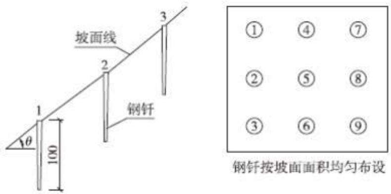  
图6.2-1 标桩法示意图

## 6.3 点位布设

## 6.3.1 监测频次

根据项目区实际情况，水土流失以水力侵蚀为主，降水和施工活动是主要影响因素，本项目水土保持监测频次具体如下：

（1）开工前应开展一次全面的现状监测；

（2）扰动土地情况监测、土壤流失面积监测每季度1 次；

（3）土石方开挖情况至少每月监测记录1 次；

（4）水土保持工程措施及防治效果至少每月监测记录1次；

（5）其余监测指标至少每季度监测记录1 次；

（6）遇暴雨（12h降雨量≥50mm）情况应及时加测。

## 6.3.2 监测点位布设

## 6.3.2.1布设原则

监测点布设要求能有效、完整地监测水土流失状况、危害以及各类水保措施的防治效果为主，重点监测区和其他区相结合。具体原则如下：

（1）监测点的分布应反映项目所在区域的水土流失特征；

（2）监测点布设应统筹考虑监测内容，尽量布设综合监测点；

（3）监测点应相对稳定，满足持续监测要求。

## 6.3.2.2监测点位

根据工程实际情况，施工期水土流失以现场监测为主，采用调查监测法及地面观测法相结合，监测范围内共设3 个监测点位，布设情况见表6.3-1。

表6.3-1 水土保持监测点位布置表
<table><tr><td rowspan=2 colspan=1>监测时段</td><td rowspan=2 colspan=1>监测单元</td><td rowspan=1 colspan=2>监测点位</td><td rowspan=1 colspan=2>主要监测内容</td></tr><tr><td rowspan=1 colspan=1>编号</td><td rowspan=1 colspan=1>位置</td><td rowspan=1 colspan=1>施工期</td><td rowspan=1 colspan=1>自然恢复期</td></tr><tr><td rowspan=3 colspan=1>2026年6月至2027年12月</td><td rowspan=1 colspan=1>主体工程区</td><td rowspan=1 colspan=1>1#</td><td rowspan=1 colspan=1>施工主入口，沉沙池附近</td><td rowspan=3 colspan=1>（1）降雨量、降雨强度等；（2）防治责任范围面积、扰动地表面积及程度等；（3）水土流失分布、面积及水土流失量；（4）挖方、填方量；（5）土石方调运；（6）植被恢复。</td><td rowspan=3 colspan=1>（1）降雨量、降雨强度、风力风向等；（2）水土流失量及变化；（3）林草生长、成活率、覆盖面积及防治水土流失效果；（4）水土保持措施运行效果、水保措施种类及面积。</td></tr><tr><td rowspan=1 colspan=1>施工办公生活区</td><td rowspan=1 colspan=1>2#</td><td rowspan=1 colspan=1>该区西北角，截水沟最低点</td></tr><tr><td rowspan=1 colspan=1>临时堆土区</td><td rowspan=1 colspan=1>3#</td><td rowspan=1 colspan=1>表土堆场沉沙池附近</td></tr></table>

## 6.4 实施条件和成果

## 6.4.1 监测设施设备

为准确获取各项地面观测及调查数据，生产建设单位应自行或委托具备水土保持监测能力的机构，对生产活动造成的水土流失进行监测，水土保持监测必须采取现代技术与传统手段相结合的方法，借助一定的先进仪器设备，使监测方法更科学，监测结果更合理，监测仪器设备主要由监测单位提供。

表 6.4-1 水土保持监测设备表
<table><tr><td rowspan=1 colspan=1>序号</td><td rowspan=1 colspan=1>设备名称</td><td rowspan=1 colspan=1>单位</td><td rowspan=1 colspan=1>数量</td></tr><tr><td rowspan=1 colspan=1>1</td><td rowspan=1 colspan=1>手持 GPS 定位仪</td><td rowspan=1 colspan=1>套</td><td rowspan=1 colspan=1>1</td></tr><tr><td rowspan=1 colspan=1>2</td><td rowspan=1 colspan=1>摄像机</td><td rowspan=1 colspan=1>台</td><td rowspan=1 colspan=1>1</td></tr><tr><td rowspan=1 colspan=1>3</td><td rowspan=1 colspan=1>数码照相机</td><td rowspan=1 colspan=1>台</td><td rowspan=1 colspan=1>1</td></tr><tr><td rowspan=1 colspan=1>4</td><td rowspan=1 colspan=1>笔记本电脑</td><td rowspan=1 colspan=1>台</td><td rowspan=1 colspan=1>2</td></tr><tr><td rowspan=1 colspan=1>5</td><td rowspan=1 colspan=1>50m皮尺</td><td rowspan=1 colspan=1>卷</td><td rowspan=1 colspan=1>2</td></tr><tr><td rowspan=1 colspan=1>6</td><td rowspan=1 colspan=1>钢卷尺</td><td rowspan=1 colspan=1>个</td><td rowspan=1 colspan=1>2</td></tr><tr><td rowspan=1 colspan=1>7</td><td rowspan=1 colspan=1>量筒</td><td rowspan=1 colspan=1>个</td><td rowspan=1 colspan=1>5</td></tr><tr><td rowspan=1 colspan=1>8</td><td rowspan=1 colspan=1>烘箱</td><td rowspan=1 colspan=1>台</td><td rowspan=1 colspan=1>1</td></tr><tr><td rowspan=1 colspan=1>9</td><td rowspan=1 colspan=1>铁锤</td><td rowspan=1 colspan=1>把</td><td rowspan=1 colspan=1>3</td></tr><tr><td rowspan=1 colspan=1>10</td><td rowspan=1 colspan=1>监测标志牌</td><td rowspan=1 colspan=1>个</td><td rowspan=1 colspan=1>4</td></tr></table>

## 6.4.2 监测人员配备

建设单位委托监测机构进行监测工作，承担监测任务的单位应具备相应技术条件和能力，监测人员须经过水土保持监测培训，成绩合格，具有水土保持监测能力。根据《水利部办公厅关于印发生产建设项目水土保持监测规程的通知》办

水保〔2015〕139号，监测项目部人员应不少于3 名，本方案建议配置3名水保监测人员，包括1名总监测工程师、1名监测工程师、1名监测员。

## 6.5 监测成果

监测成果包括《生产建设项目水土保持监测实施方案》、《生产建设项目水土保持监测季度报告表》、《生产建设项目水土保持监测总结报告》以及记录表、意见书、汇报材料、图件、影像资料等，监测季报和总结报告中有“绿黄红”三色评价结论。

生产建设项目水土保持监测三色评价是指监测单位依据扰动土地情况、水土流失状况、防治成效及水土流失危害等监测结果，对生产建设项目水土流失防治情况进行评价，在监测季报和总结报告中明确“绿黄红”三色评价结论。三色评价结论是生产建设单位落实参建单位责任、控制施工过程水土流失的重要依据，也是各流域管理机构和地方各级水行政主管部门实施监管的重要依据。三色评价采用评分法，满分为 100 分；得分 80 分及以上的为“绿”色，60 分及以上不足 80分的为“黄”色，不足60分的为“红”色。

监测成果应及时报送有关水行政主管部门，并上传全国水土保持信息管理系统。监测单位进场后，需及时对监测成果进行整理、统计、分析和归档，在水土保持方案批复后尽快报送《监测实施方案》，监测期间每季度第1个月报送上一季度的《监测季度报告表》、水土流失危害事件发生后一周内报送专项报告，监测工作完成后 3个月内报送《水土保持监测总结报告》。如发现违规弃渣造成防洪安全隐患、不合理施工造成严重水土流失等问题，需及时报告有关水行政主管部门。

## 7 水土保持投资估算及效益分析

## 7.1 水土保持投资

## 7.1.1编制原则及依据

## 7.1.1.1编制原则

（1）遵循国家和地方颁布的有关水土保持政策法规；

（2）凡治理因工程建设造成的水土流失所采取的措施和所需费用，均列入主体工程投资中。投资估算包括新增水土保持工程投资和主体工程中已有的具有水土保持功能工程的投资；

（3）价格水平年与主体工程一致；

（4）投资估算的预算单价与主体工程一致，未明确规定的按水利部〔2024323 号文《水利工程设计概（估）算编制规定》（水土保持工程）、《水土保持工程概算定额》或其他行业、地方标准和当地现行市场价格计算；

（5）水土保持投资费用构成按《水利工程设计概（估）算编制规定》（水土保持工程）执行；

（6）本项目水土保持投资估算，作为主体工程投资组成部分，计入总投资中。建设期的水土保持投资从基建费中列支。

## 7.1.2.2编制依据

（1）《〈水利工程设计概（估）算编制规定〉及水利工程系列定额的通知》（水总〔2024〕323号）；

（2）《财政部、国家发展改革委、水利部、中国人民银行关于印发〈水土保持补偿征收使用管理实施办法〉的通知》（财综〔2014〕8 号）；

（3）《四川省财政厅、四川省发展和改革委员会、四川省水利厅、中国人民银行成都分行关于印发〈四川省水土保持补偿征收使用管理实施办法〉的通知》（川财综〔2014〕6号）；

（4）《四川省水利厅关于发布〈四川省水利水电工程概（估）算编制规定的通知》（川水发〔2015〕9号）；

（5）四川省发展和改革委员会、四川省财政厅、四川省水利厅《关于制定水土保持补偿费收费标准的通知》（川发改价格〔2017〕347号）。

## 7.1.2 编制说明与估算成果

## 7.1.2.1编制说明

根据水利部《水利工程设计概（估）算编制规定》（水土保持工程）的要求，本方案水土保持投资由工程措施费、植物措施费、监测措施费、施工临时工程费、独立费用五部分及预备费、水土保持设施补偿费构成，各项费用计算方法为：

## （一）估算编制

（1）工程措施费=工程量\*单价；

（2）植物措施费=工程量\*单价（苗木、草、种子等材料费+种植费）；

（3）监测措施费：根据具体监测范围、监测内容、监测方法及监测时段的基础上分项计算进行计算。

（4）施工临时工程费=临时工程量\*单价+其他临时工程费+施工安全生产专项；

（5）独立费用：包括建设管理费、工程建设监理费、科研勘测设计费等 3项费用；

（6）预备费：（第一部分～第五部分之和）\*费率；

（7）水土保持补偿费：按《四川省发展和改革委员会、四川省财政厅、四川省水利厅关于制定水土保持补偿费收费标准的通知》（川发改价格〔2017〕347号）计取。

## （二）基础单价

## （1）人工单价

人工单价与主体工程一致，根据 2025年下半年《四川省建设工程造价总站关于对成都市等18个市（州）2015年《四川省建设工程工程量清单计价定额》人工费调整的批复》（川建价发〔2024〕43号），成都市郫都区人工单价为184元/天，故本工程人工预算单价取23元/工时。

## （2）主要材料单价

主要材料价格采用主体工程材料价格，本方案新增的密目网、编织袋等价格采用“材料价格=（材料原价+运杂费）\*（1+采购及保管费率）+运输保险费”的计算方式计入单价。

苗木、草、种子的价格以苗圃或当地市场价格加运杂费和采购及保管费计算。苗木、草、种子的采购及保管费率按运到工地价格的 0.55%～1.1%计算。苗木、草、种子基价分别为15 元/株、10元/㎡和 60元/kg。当计算的预算价格超过基价时，应按基价计入工程单价参加取费，超过部分以价差形式计算，列入单价表并计取税金。

## （3）风、水、电单价

根据主体设计提供资料结合《四川省水利水电工程概（估）算编制规定》中的公式计算，电预算价为 1.50元/kW.h，水预算价为2.00 元/m³，风预算价格为0.18 元/m³。

## （4）施工机械台班费

施工机械台时按《水土保持工程概算定额》附录中的施工机械台时费定额计算。

## （5）砂石料单价

工程用砂石料全部为外购，砂石料单价采用附近砂石料场成交价格加采购地点至工地的运杂费计算。

## （6）混凝土材料单价

根据设计确定的不同工程部位的混凝土标号、级配和龄期，分别计算出每立方米混凝土材料单价（包括水泥、掺和料、砂石料、外加剂和水），计入相应的混凝土工程单价内。其混凝土配合比的各项材料用量，应根据工程试验提供的资料计算；无试验资料时，可参照《水土保持工程概算定额》附录中的混凝土材料配合比表计算。

## 2.工程措施、植物措施单价

水土保持投资概（估）算的编制依据、价格水平年、工程主要材料价格、机械台时费、主要工程单价及单价中的有关费率与主体工程相一致（计算标准同主体工程）。主体工程概（估）算中未明确的，查当地造价信息确定，或参照相关行业标准。参照《水利工程设计概（估）算编制规定》（水土保持工程）、《水利工程施工机械台时费定额》、《四川省水利水电工程设计概（估）算编制规定》计取。

## （1）费用构成及计算方法

工程措施和植物措施单价由直接工程费、间接费、企业利润、税金、扩大费组成，费用构成及计算方法详见表7.1-1。

表7.1-1工程措施、植物措施单价费用构成及计算方法
<table><tr><td rowspan=1 colspan=1>序号</td><td rowspan=1 colspan=1>费用项目</td><td rowspan=1 colspan=1>计算方法</td></tr><tr><td rowspan=1 colspan=1>二</td><td rowspan=1 colspan=1>直接工程费</td><td rowspan=1 colspan=1>直接费+其他直接费</td></tr><tr><td rowspan=1 colspan=1>1</td><td rowspan=1 colspan=1>直接费</td><td rowspan=1 colspan=1>人工费+材料费+施工机械使用费</td></tr><tr><td rowspan=1 colspan=1>(1)</td><td rowspan=1 colspan=1>人工费</td><td rowspan=1 colspan=1>定额劳动量（工时）*人工预算单价（元/工时）</td></tr><tr><td rowspan=1 colspan=1>(2)</td><td rowspan=1 colspan=1>材料费</td><td rowspan=1 colspan=1>定额材料用量（不含苗木、草及种子费）*材料预算单价</td></tr><tr><td rowspan=1 colspan=1>(3)</td><td rowspan=1 colspan=1>机械使用费</td><td rowspan=1 colspan=1>定额机械使用量（台时）*施工机械台时费</td></tr><tr><td rowspan=1 colspan=1>2</td><td rowspan=1 colspan=1>其他直接费</td><td rowspan=1 colspan=1>直接费*其他直接费费率</td></tr><tr><td rowspan=1 colspan=1>二</td><td rowspan=1 colspan=1>间接费</td><td rowspan=1 colspan=1>直接工程费*间接费率</td></tr><tr><td rowspan=1 colspan=1>三</td><td rowspan=1 colspan=1>企业利润</td><td rowspan=1 colspan=1>（直接工程费+间接费）*企业利润率</td></tr><tr><td rowspan=1 colspan=1>四</td><td rowspan=1 colspan=1>税金</td><td rowspan=1 colspan=1>（直接工程费+间接费+企业利润）*费率</td></tr><tr><td rowspan=1 colspan=1>五</td><td rowspan=1 colspan=1>扩大费</td><td rowspan=1 colspan=1>(直接工程费+间接费+企业利润+税金）*扩大费费率</td></tr><tr><td rowspan=1 colspan=1>六</td><td rowspan=1 colspan=1>措施单价</td><td rowspan=1 colspan=1>直接工程费+间接费+企业利润+税金+扩大费</td></tr></table>

## （2）工程单价费率

水土保持工程措施、植物措施和临时措施费率参考主体工程设计并根据《四川省水利厅关于发布〈四川省水利水电工程概（估）算编制规定〉》（川水发〔2015〕9号）和《四川省水利厅关于印发《增值税税率调整后〈四川省水利水电工程设计概（估）算编制规定〉相应调整办法》的通知（川水函〔2019〕610号文）调整。见表7-2。

表7.1-2投资估算费率表单位：%
<table><tr><td rowspan=1 colspan=1>序号</td><td rowspan=1 colspan=1>工程类别</td><td rowspan=1 colspan=1>其他直接费</td><td rowspan=1 colspan=1>间接费</td><td rowspan=1 colspan=1>企业利润</td><td rowspan=1 colspan=1>税金</td><td rowspan=1 colspan=1>扩大系数</td></tr><tr><td rowspan=1 colspan=1>二</td><td rowspan=1 colspan=1>工程措施</td><td rowspan=1 colspan=1></td><td rowspan=1 colspan=1></td><td rowspan=1 colspan=1></td><td rowspan=1 colspan=1></td><td rowspan=1 colspan=1></td></tr><tr><td rowspan=1 colspan=1>1</td><td rowspan=1 colspan=1>土方工程</td><td rowspan=1 colspan=1>3.30</td><td rowspan=1 colspan=1>5.00</td><td rowspan=1 colspan=1>7.00</td><td rowspan=1 colspan=1>9.00</td><td rowspan=1 colspan=1>10.00</td></tr><tr><td rowspan=1 colspan=1>2</td><td rowspan=1 colspan=1>石方工程</td><td rowspan=1 colspan=1>3.30</td><td rowspan=1 colspan=1>8.00</td><td rowspan=1 colspan=1>7.00</td><td rowspan=1 colspan=1>9.00</td><td rowspan=1 colspan=1>10.00</td></tr><tr><td rowspan=1 colspan=1>3</td><td rowspan=1 colspan=1>混凝土工程</td><td rowspan=1 colspan=1>3.30</td><td rowspan=1 colspan=1>7.00</td><td rowspan=1 colspan=1>7.00</td><td rowspan=1 colspan=1>9.00</td><td rowspan=1 colspan=1>10.00</td></tr><tr><td rowspan=1 colspan=1>4</td><td rowspan=1 colspan=1>钢筋制安工程</td><td rowspan=1 colspan=1>3.30</td><td rowspan=1 colspan=1>5.00</td><td rowspan=1 colspan=1>7.00</td><td rowspan=1 colspan=1>9.00</td><td rowspan=1 colspan=1>5.00</td></tr><tr><td rowspan=1 colspan=1>5</td><td rowspan=1 colspan=1>基础处理工程</td><td rowspan=1 colspan=1>3.30</td><td rowspan=1 colspan=1>10.00</td><td rowspan=1 colspan=1>7.00</td><td rowspan=1 colspan=1>9.00</td><td rowspan=1 colspan=1>10.00</td></tr><tr><td rowspan=1 colspan=1>6</td><td rowspan=1 colspan=1>其他工程</td><td rowspan=1 colspan=1>3.30</td><td rowspan=1 colspan=1>7.00</td><td rowspan=1 colspan=1>7.00</td><td rowspan=1 colspan=1>9.00</td><td rowspan=1 colspan=1>10.00</td></tr></table>

四川京华畅工程管理有限公司

<table><tr><td rowspan=1 colspan=1>二</td><td rowspan=1 colspan=1>植物措施</td><td rowspan=1 colspan=1>2.30</td><td rowspan=1 colspan=1>6.00</td><td rowspan=1 colspan=1>7.00</td><td rowspan=1 colspan=1>9.00</td><td rowspan=1 colspan=1>10.00</td></tr></table>

注：工程措施（固沙及土地整治工程）其他直接费费率为2.30%。

## 3.水土保持工程估算编制

## （1）工程措施

按照设计工程量乘以工程单价进行编制。

## （2）植物措施

植物措施费按工程量乘以工程单价进行编制，同时种苗按限价计入单价，超出部分计入价差及税金

（3）监测措施：监测措施费包括水土保持监测、弃渣场稳定监测和建设期观测费。

1）水土保持监测费：土建设施及设备按设计工程量或设备清单乘以工程（设备）单价进行编制；安装费按设备费的百分率进行计算。

2）弃渣场稳定监测费：按照弃渣场稳定监测需要，按照弃渣场稳定监测方案有关监测内容、设施设备等进行编制。本项目不含弃渣场稳定监测。

3）建设期观测费：包括系统运行材料费、维护检修费和常规观测费。本工程结合具体监测范围、监测内容、监测方法及监测时段，进行分项计算。

（4）施工临时工程：包括临时防护工程、其他临时工程和施工安全生产专项。

1）临时防护工程按设计方案的工程量\*单价编制；

2）其他临时工程按一至三部分投资合计的 1.0%～2.0%计列，本工程按照  
2.0%计算。  
3）施工安全生产专项按一至四部分建安工作量（不含设备购置费）之和的  
2.5%计算。

（5）独立费用：由建设管理费、工程建设监理费、科研勘测设计费三项组成。

1）建设管理费：主要包括项目经常费和技术咨询费。参照《水利工程设计概（估）算编制规定》（2025 年版），项目经常费按新增水土保持投资中第一至第四部分投资之和的 0.6%～2.5%计，本工程按照1.0%计算。技术咨询费按新增水土保持投资中第一至第四部分投资之和的 0.4%～1.5%计，本工程按照1.5%计算。

2）工程建设监理费：根据《四川省水利水电工程设计概（估）算编制规定》计取，参照国家发展改革委、建设部关于印发《建设工程监理与相关服务收费管理规定》的通知（发改价格〔2007〕670号）相关规定，并根据实际情况，本项目水土保持专项监理工作纳入主体工程监理工作中，不再单独进行计列。

3）科研勘测设计费：前期工作阶段（项目建议书、可行性研究阶段）的工程勘测设计费按照批复费用计列。初步设计、招标设计及施工图设计阶段的工程勘测费、设计费参照《国家计委、建设部关于发布〈工程勘察设计收费管理规定的通知》（计价格〔2002〕10号）计算。水土保持方案编制费根据实际按10万元计算。

## （6）基本预备费

预备费按一至五部分合计的10%计列。

## （7）水土保持补偿费

根据《四川省发展和改革委员会、四川省财政厅、四川省水利厅关于制定水土保持补偿费收费标准的通知》（川发改价格〔2017〕347 号），水土保持补偿费征收标准为 1.30 元/㎡，本工程征占地面积为 2.36hm2，计算得到水土保持补偿费共计 3.068 万元。

根据《水土保持补偿征收使用管理实施办法》（财综〔2014〕8号）及《四川省财政厅、四川省发展和改革委员会、四川省水利厅、中国人民银行成都分行关于印发〈四川省水土保持补偿费征收使用管理实施办法〉的通知》（川财综〔2014〕6号），本项目属于公益性学校建设项目，符合规定的免征情形，建议建设单位向水行政主管部门申请免征水土保持补偿费。

## 7.1.2.2估算成果

本项目水土保持措施总投资 238.70 万元，其中主体已列水土保持措施投资179.58万元，方案新增水土保持措施投资59.12 万元。水土保持措施总投资中，工程措施投资 126.11 万元，植物措施投资 39.67 万元，监测费 6.10 万元，临时措施投资 35.27 万元，独立费用 20.18 万元（其中：建设管理费 10.18 万元，工程建设监理费 0 万元，科研勘测费 10 万元），基本预备费 11.37 万元，水土保持补偿费3.068万元可依规申请免征。

详细投资成果见投资估算表：

（1）投资总估算表（见表7.1-3）；

（2）分部措施投资表（见表7.1-4）；

（3）分年度投资估算表（见表7.1-5）；

（4）独立费用计算表（见表7.1-6）；

（5）水土保持补偿费计算表（见表7.1-7）；

（6）施工机械台时费汇总表单位（见表7.1-8）；

（7）主要材料价格表（见表7.1-9）；

（8）工程单价汇总表（见表7.1-10）；

（9）单价分析表（见附表1）

表7.1-3 水土保持投资总估算表 单位：万元
<table><tr><td colspan="1" rowspan="1">序号</td><td colspan="1" rowspan="1">工程或费用名称</td><td colspan="1" rowspan="1">建安工程费</td><td colspan="1" rowspan="1">设备购置费</td><td colspan="1" rowspan="1">独立费用</td><td colspan="1" rowspan="1">合计</td><td colspan="1" rowspan="3">主体工程具有的水保投资</td><td colspan="1" rowspan="1">方案新增</td></tr><tr><td colspan="1" rowspan="1"></td><td colspan="1" rowspan="1"></td><td colspan="1" rowspan="1"></td><td colspan="1" rowspan="1"></td><td colspan="1" rowspan="1"></td><td colspan="1" rowspan="1"></td><td colspan="1" rowspan="1"></td></tr><tr><td colspan="1" rowspan="1"></td><td colspan="1" rowspan="1"></td><td colspan="1" rowspan="1"></td><td colspan="1" rowspan="1"></td><td colspan="1" rowspan="1"></td><td colspan="1" rowspan="1"></td><td colspan="1" rowspan="1"></td></tr><tr><td colspan="1" rowspan="1"></td><td colspan="1" rowspan="1">第一部分 工程措施</td><td colspan="1" rowspan="1">126.11</td><td colspan="1" rowspan="1"></td><td colspan="1" rowspan="1"></td><td colspan="1" rowspan="1">126.11</td><td colspan="1" rowspan="1">124.93</td><td colspan="1" rowspan="1">1.18</td></tr><tr><td colspan="1" rowspan="1">1</td><td colspan="1" rowspan="1">主体工程区</td><td colspan="1" rowspan="1">125.39</td><td colspan="1" rowspan="1"></td><td colspan="1" rowspan="1"></td><td colspan="1" rowspan="1">125.39</td><td colspan="1" rowspan="1">124.93</td><td colspan="1" rowspan="1">0.46</td></tr><tr><td colspan="1" rowspan="1">二</td><td colspan="1" rowspan="1">施工办公生活区</td><td colspan="1" rowspan="1">0.72</td><td colspan="1" rowspan="1"></td><td colspan="1" rowspan="1"></td><td colspan="1" rowspan="1">0.72</td><td colspan="1" rowspan="1">0.00</td><td colspan="1" rowspan="1">0.72</td></tr><tr><td colspan="1" rowspan="1"></td><td colspan="1" rowspan="1">第二部分植物措施</td><td colspan="1" rowspan="1">39.67</td><td colspan="1" rowspan="1"></td><td colspan="1" rowspan="1"></td><td colspan="1" rowspan="1">39.67</td><td colspan="1" rowspan="1">38.48</td><td colspan="1" rowspan="1">1.19</td></tr><tr><td colspan="1" rowspan="1">一</td><td colspan="1" rowspan="1">主体工程区</td><td colspan="1" rowspan="1">38.76</td><td colspan="1" rowspan="1"></td><td colspan="1" rowspan="1"></td><td colspan="1" rowspan="1">38.76</td><td colspan="1" rowspan="1">38.48</td><td colspan="1" rowspan="1">0.28</td></tr><tr><td colspan="1" rowspan="1">二</td><td colspan="1" rowspan="1">施工办公生活区</td><td colspan="1" rowspan="1">0.91</td><td colspan="1" rowspan="1"></td><td colspan="1" rowspan="1"></td><td colspan="1" rowspan="1">0.91</td><td colspan="1" rowspan="1">0.00</td><td colspan="1" rowspan="1">0.91</td></tr><tr><td colspan="1" rowspan="1"></td><td colspan="1" rowspan="1">第三部分 监测措施</td><td colspan="1" rowspan="1">4.23</td><td colspan="1" rowspan="1">1.87</td><td colspan="1" rowspan="1"></td><td colspan="1" rowspan="1">6.10</td><td colspan="1" rowspan="1">0.00</td><td colspan="1" rowspan="1">6.10</td></tr><tr><td colspan="1" rowspan="1"></td><td colspan="1" rowspan="1">水土保持监测费</td><td colspan="1" rowspan="1"></td><td colspan="1" rowspan="1">1.87</td><td colspan="1" rowspan="1"></td><td colspan="1" rowspan="1">1.87</td><td colspan="1" rowspan="1"></td><td colspan="1" rowspan="1">1.87</td></tr><tr><td colspan="1" rowspan="1">二</td><td colspan="1" rowspan="1">建设期观测费</td><td colspan="1" rowspan="1">4.23</td><td colspan="1" rowspan="1"></td><td colspan="1" rowspan="1"></td><td colspan="1" rowspan="1">4.23</td><td colspan="1" rowspan="1"></td><td colspan="1" rowspan="1">4.23</td></tr><tr><td colspan="1" rowspan="1"></td><td colspan="1" rowspan="1">第四部分 施工临时工程</td><td colspan="1" rowspan="1">27.05</td><td colspan="1" rowspan="1"></td><td colspan="1" rowspan="1"></td><td colspan="1" rowspan="1">35.27</td><td colspan="1" rowspan="1">16.17</td><td colspan="1" rowspan="1">19.10</td></tr><tr><td colspan="1" rowspan="1">一</td><td colspan="1" rowspan="1">临时防护工程</td><td colspan="1" rowspan="1">27.05</td><td colspan="1" rowspan="1"></td><td colspan="1" rowspan="1"></td><td colspan="1" rowspan="1">27.05</td><td colspan="1" rowspan="1">16.17</td><td colspan="1" rowspan="1">10.88</td></tr><tr><td colspan="1" rowspan="1">(一）</td><td colspan="1" rowspan="1">主体工程区</td><td colspan="1" rowspan="1">12.12</td><td colspan="1" rowspan="1"></td><td colspan="1" rowspan="1"></td><td colspan="1" rowspan="1">12.12</td><td colspan="1" rowspan="1">9.18</td><td colspan="1" rowspan="1">2.94</td></tr><tr><td colspan="1" rowspan="1">一二）</td><td colspan="1" rowspan="1">施工办公生活区</td><td colspan="1" rowspan="1">7.17</td><td colspan="1" rowspan="1"></td><td colspan="1" rowspan="1"></td><td colspan="1" rowspan="1">7.17</td><td colspan="1" rowspan="1">6.99</td><td colspan="1" rowspan="1">0.18</td></tr><tr><td colspan="1" rowspan="1">(三）</td><td colspan="1" rowspan="1">临时堆土区</td><td colspan="1" rowspan="1">7.76</td><td colspan="1" rowspan="1"></td><td colspan="1" rowspan="1"></td><td colspan="1" rowspan="1">7.76</td><td colspan="1" rowspan="1">0.00</td><td colspan="1" rowspan="1">7.76</td></tr><tr><td colspan="1" rowspan="1">二</td><td colspan="1" rowspan="1">其他临时工程</td><td colspan="1" rowspan="1"></td><td colspan="1" rowspan="1"></td><td colspan="1" rowspan="1"></td><td colspan="1" rowspan="1">3.32</td><td colspan="1" rowspan="1"></td><td colspan="1" rowspan="1">3.32</td></tr><tr><td colspan="1" rowspan="1">三</td><td colspan="1" rowspan="1">施工安全生产专项</td><td colspan="1" rowspan="1"></td><td colspan="1" rowspan="1"></td><td colspan="1" rowspan="1"></td><td colspan="1" rowspan="1">4.90</td><td colspan="1" rowspan="1"></td><td colspan="1" rowspan="1">4.90</td></tr><tr><td colspan="1" rowspan="1"></td><td colspan="1" rowspan="1">第五部分 独立费用</td><td colspan="1" rowspan="1"></td><td colspan="1" rowspan="1"></td><td colspan="1" rowspan="1">20.18</td><td colspan="1" rowspan="1">20.18</td><td colspan="1" rowspan="1"></td><td colspan="1" rowspan="1">20.18</td></tr><tr><td colspan="1" rowspan="1"></td><td colspan="1" rowspan="1">建设管理费</td><td colspan="1" rowspan="1"></td><td colspan="1" rowspan="1"></td><td colspan="1" rowspan="1">10.18</td><td colspan="1" rowspan="1">10.18</td><td colspan="1" rowspan="1"></td><td colspan="1" rowspan="1">10.18</td></tr><tr><td colspan="1" rowspan="1">1</td><td colspan="1" rowspan="1">项目经常费</td><td colspan="1" rowspan="1"></td><td colspan="1" rowspan="1"></td><td colspan="1" rowspan="1">7.07</td><td colspan="1" rowspan="1">7.07</td><td colspan="1" rowspan="1"></td><td colspan="1" rowspan="1">7.07</td></tr><tr><td colspan="1" rowspan="1">2</td><td colspan="1" rowspan="1">技术咨询费</td><td colspan="1" rowspan="1"></td><td colspan="1" rowspan="1"></td><td colspan="1" rowspan="1">3.11</td><td colspan="1" rowspan="1">3.11</td><td colspan="1" rowspan="1"></td><td colspan="1" rowspan="1">3.11</td></tr><tr><td colspan="1" rowspan="1">二</td><td colspan="1" rowspan="1">工程建设监理费</td><td colspan="1" rowspan="1"></td><td colspan="1" rowspan="1"></td><td colspan="1" rowspan="1">0</td><td colspan="1" rowspan="1">0</td><td colspan="1" rowspan="1"></td><td colspan="1" rowspan="1">0</td></tr><tr><td colspan="1" rowspan="1">三</td><td colspan="1" rowspan="1">科研勘测设计费</td><td colspan="1" rowspan="1"></td><td colspan="1" rowspan="1"></td><td colspan="1" rowspan="1">10.00</td><td colspan="1" rowspan="1">10.00</td><td colspan="1" rowspan="1"></td><td colspan="1" rowspan="1">10.00</td></tr><tr><td colspan="1" rowspan="1">I</td><td colspan="1" rowspan="1">第一至五部分合计</td><td colspan="1" rowspan="1">197.06</td><td colspan="1" rowspan="1">1.87</td><td colspan="1" rowspan="1">20.18</td><td colspan="1" rowspan="1">227.33</td><td colspan="1" rowspan="1">179.58</td><td colspan="1" rowspan="1">47.75</td></tr><tr><td colspan="1" rowspan="1">ⅡI</td><td colspan="1" rowspan="1">预备费</td><td colspan="3" rowspan="1"></td><td colspan="1" rowspan="1">11.37</td><td colspan="1" rowspan="1"></td><td colspan="1" rowspan="1">11.37</td></tr><tr><td colspan="1" rowspan="1">1</td><td colspan="1" rowspan="1">基本预备费</td><td colspan="3" rowspan="1">按新增一至五部分投资合计的 5%计算</td><td colspan="1" rowspan="1">11.37</td><td colspan="1" rowspan="1"></td><td colspan="1" rowspan="1">11.37</td></tr><tr><td colspan="1" rowspan="1">ⅢII</td><td colspan="1" rowspan="1">水土保持补偿费</td><td colspan="3" rowspan="1"></td><td colspan="1" rowspan="1">免征</td><td colspan="1" rowspan="1"></td><td colspan="1" rowspan="1">3.068（免征）</td></tr><tr><td colspan="5" rowspan="1">总投资（I+II+III）</td><td colspan="1" rowspan="1">238.70</td><td colspan="1" rowspan="1">179.58</td><td colspan="1" rowspan="1">59.12</td></tr></table>

表7.1-4 分部措施投资表  
（工程措施、植物措施、监测措施、施工临时工程、独立费用）
<table><tr><td colspan="1" rowspan="1">序号</td><td colspan="1" rowspan="1">工程或费用名称</td><td colspan="1" rowspan="1">单位</td><td colspan="1" rowspan="1">数量</td><td colspan="1" rowspan="1">单价（元）</td><td colspan="1" rowspan="1">合计（万元）</td><td colspan="1" rowspan="1">主体已列(万元)</td><td colspan="1" rowspan="1">方案新增(万元)</td></tr><tr><td colspan="1" rowspan="1">一</td><td colspan="1" rowspan="1">第一部分 工程措施</td><td colspan="1" rowspan="1"></td><td colspan="1" rowspan="1"></td><td colspan="1" rowspan="1"></td><td colspan="1" rowspan="1">126.11</td><td colspan="1" rowspan="1">124.93</td><td colspan="1" rowspan="1">1.18</td></tr><tr><td colspan="1" rowspan="1">(一)</td><td colspan="1" rowspan="1">主体工程区</td><td colspan="1" rowspan="1"></td><td colspan="1" rowspan="1"></td><td colspan="1" rowspan="1"></td><td colspan="1" rowspan="1">125.39</td><td colspan="1" rowspan="1">124.93</td><td colspan="1" rowspan="1">0.46</td></tr><tr><td colspan="1" rowspan="1">1</td><td colspan="1" rowspan="1">表土保护工程</td><td colspan="1" rowspan="1"></td><td colspan="1" rowspan="1"></td><td colspan="1" rowspan="1"></td><td colspan="1" rowspan="1">0.46</td><td colspan="1" rowspan="1">0.00</td><td colspan="1" rowspan="1">0.46</td></tr><tr><td colspan="1" rowspan="1">(1)</td><td colspan="1" rowspan="1">表土剥离</td><td colspan="1" rowspan="1">万m³</td><td colspan="1" rowspan="1">0.05</td><td colspan="1" rowspan="1">15178.00</td><td colspan="1" rowspan="1">0.08</td><td colspan="1" rowspan="1"></td><td colspan="1" rowspan="1">0.08</td></tr><tr><td colspan="1" rowspan="1">(2)</td><td colspan="1" rowspan="1">表土回覆</td><td colspan="1" rowspan="1">万m³</td><td colspan="1" rowspan="1">0.05</td><td colspan="1" rowspan="1">75162.00</td><td colspan="1" rowspan="1">0.38</td><td colspan="1" rowspan="1"></td><td colspan="1" rowspan="1">0.38</td></tr><tr><td colspan="1" rowspan="1">2</td><td colspan="1" rowspan="1">防洪排导工程</td><td colspan="1" rowspan="1"></td><td colspan="1" rowspan="1"></td><td colspan="1" rowspan="1"></td><td colspan="1" rowspan="1">30.63</td><td colspan="1" rowspan="1">30.63</td><td colspan="1" rowspan="1"></td></tr><tr><td colspan="1" rowspan="1">(1)</td><td colspan="1" rowspan="1">坡道截水沟</td><td colspan="1" rowspan="1">m</td><td colspan="1" rowspan="1">15.73</td><td colspan="1" rowspan="1">241.33</td><td colspan="1" rowspan="1">0.38</td><td colspan="1" rowspan="1">0.38</td><td colspan="1" rowspan="1"></td></tr><tr><td colspan="1" rowspan="1">(2)</td><td colspan="1" rowspan="1">暗地沟</td><td colspan="1" rowspan="1">m</td><td colspan="1" rowspan="1">776.14</td><td colspan="1" rowspan="1">201.83</td><td colspan="1" rowspan="1">15.66</td><td colspan="1" rowspan="1">15.66</td><td colspan="1" rowspan="1"></td></tr><tr><td colspan="1" rowspan="1">(3)</td><td colspan="1" rowspan="1">天井排水沟</td><td colspan="1" rowspan="1">m</td><td colspan="1" rowspan="1">161.07</td><td colspan="1" rowspan="1">117.70</td><td colspan="1" rowspan="1">1.48</td><td colspan="1" rowspan="1">1.48</td><td colspan="1" rowspan="1"></td></tr><tr><td colspan="1" rowspan="1">(4)</td><td colspan="1" rowspan="1">成品线性排水沟</td><td colspan="1" rowspan="1">m</td><td colspan="1" rowspan="1">139.45</td><td colspan="1" rowspan="1">792.81</td><td colspan="1" rowspan="1">11.06</td><td colspan="1" rowspan="1">11.06</td><td colspan="1" rowspan="1"></td></tr><tr><td colspan="1" rowspan="1">(5)</td><td colspan="1" rowspan="1">地漏</td><td colspan="1" rowspan="1">个</td><td colspan="1" rowspan="1">6.00</td><td colspan="1" rowspan="1">140.85</td><td colspan="1" rowspan="1">0.08</td><td colspan="1" rowspan="1">0.08</td><td colspan="1" rowspan="1"></td></tr><tr><td colspan="1" rowspan="1">(6)</td><td colspan="1" rowspan="1">单算雨水口</td><td colspan="1" rowspan="1">座</td><td colspan="1" rowspan="1">12.00</td><td colspan="1" rowspan="1">287.69</td><td colspan="1" rowspan="1">0.35</td><td colspan="1" rowspan="1">0.35</td><td colspan="1" rowspan="1"></td></tr><tr><td colspan="1" rowspan="1">(7)</td><td colspan="1" rowspan="1">雨水检查井</td><td colspan="1" rowspan="1">座</td><td colspan="1" rowspan="1">4.00</td><td colspan="1" rowspan="1">1140.30</td><td colspan="1" rowspan="1">0.46</td><td colspan="1" rowspan="1">0.46</td><td colspan="1" rowspan="1"></td></tr><tr><td colspan="1" rowspan="1">(8)</td><td colspan="1" rowspan="1">雨水管 DN300</td><td colspan="1" rowspan="1">m</td><td colspan="1" rowspan="1">16.39</td><td colspan="1" rowspan="1">143.80</td><td colspan="1" rowspan="1">0.24</td><td colspan="1" rowspan="1">0.24</td><td colspan="1" rowspan="1"></td></tr><tr><td colspan="1" rowspan="1">(9)</td><td colspan="1" rowspan="1">雨水管 DN400</td><td colspan="1" rowspan="1">m</td><td colspan="1" rowspan="1">4.00</td><td colspan="1" rowspan="1">189.80</td><td colspan="1" rowspan="1">0.08</td><td colspan="1" rowspan="1">0.08</td><td colspan="1" rowspan="1"></td></tr><tr><td colspan="1" rowspan="1">(10)</td><td colspan="1" rowspan="1">雨水管 DN500</td><td colspan="1" rowspan="1">m</td><td colspan="1" rowspan="1">14.42</td><td colspan="1" rowspan="1">289.01</td><td colspan="1" rowspan="1">0.42</td><td colspan="1" rowspan="1">0.42</td><td colspan="1" rowspan="1"></td></tr><tr><td colspan="1" rowspan="1">3</td><td colspan="1" rowspan="1">降水蓄渗工程</td><td colspan="1" rowspan="1"></td><td colspan="1" rowspan="1"></td><td colspan="1" rowspan="1"></td><td colspan="1" rowspan="1">94.30</td><td colspan="1" rowspan="1">94.30</td><td colspan="1" rowspan="1"></td></tr><tr><td colspan="1" rowspan="1">(1)</td><td colspan="1" rowspan="1">透水铺装</td><td colspan="1" rowspan="1">m²</td><td colspan="1" rowspan="1">3197.00</td><td colspan="1" rowspan="1">224.34</td><td colspan="1" rowspan="1">71.72</td><td colspan="1" rowspan="1">71.72</td><td colspan="1" rowspan="1"></td></tr><tr><td colspan="1" rowspan="1">(2)</td><td colspan="1" rowspan="1">雨水回用系统</td><td colspan="1" rowspan="1">座</td><td colspan="1" rowspan="1">1.00</td><td colspan="1" rowspan="1">225767.85</td><td colspan="1" rowspan="1">22.58</td><td colspan="1" rowspan="1">22.58</td><td colspan="1" rowspan="1"></td></tr><tr><td colspan="1" rowspan="1">(二)</td><td colspan="1" rowspan="1">施工办公生活区</td><td colspan="1" rowspan="1"></td><td colspan="1" rowspan="1"></td><td colspan="1" rowspan="1"></td><td colspan="1" rowspan="1">0.72</td><td colspan="1" rowspan="1">0.00</td><td colspan="1" rowspan="1">0.72</td></tr><tr><td colspan="1" rowspan="1">1</td><td colspan="1" rowspan="1">表土保护工程</td><td colspan="1" rowspan="1"></td><td colspan="1" rowspan="1"></td><td colspan="1" rowspan="1"></td><td colspan="1" rowspan="1">0.72</td><td colspan="1" rowspan="1"></td><td colspan="1" rowspan="1">0.72</td></tr><tr><td colspan="1" rowspan="1">(1)</td><td colspan="1" rowspan="1">表土剥离</td><td colspan="1" rowspan="1">万m³</td><td colspan="1" rowspan="1">0.08</td><td colspan="1" rowspan="1">15178.00</td><td colspan="1" rowspan="1">0.12</td><td colspan="1" rowspan="1"></td><td colspan="1" rowspan="1">0.12</td></tr><tr><td colspan="1" rowspan="1">(2)</td><td colspan="1" rowspan="1">表土回覆</td><td colspan="1" rowspan="1">万m³</td><td colspan="1" rowspan="1">0.08</td><td colspan="1" rowspan="1">75162.00</td><td colspan="1" rowspan="1">0.60</td><td colspan="1" rowspan="1"></td><td colspan="1" rowspan="1">0.60</td></tr><tr><td colspan="1" rowspan="1"></td><td colspan="1" rowspan="1">第二部分 植物措施</td><td colspan="1" rowspan="1"></td><td colspan="1" rowspan="1"></td><td colspan="1" rowspan="1"></td><td colspan="1" rowspan="1">39.67</td><td colspan="1" rowspan="1">38.48</td><td colspan="1" rowspan="1">1.19</td></tr><tr><td colspan="1" rowspan="1">一</td><td colspan="1" rowspan="1">主体工程区</td><td colspan="1" rowspan="1">万m³</td><td colspan="1" rowspan="1"></td><td colspan="1" rowspan="1"></td><td colspan="1" rowspan="1">38.48</td><td colspan="1" rowspan="1">38.48</td><td colspan="1" rowspan="1">0.00</td></tr><tr><td colspan="1" rowspan="1">1</td><td colspan="1" rowspan="1">绿化工程</td><td colspan="1" rowspan="1"></td><td colspan="1" rowspan="1"></td><td colspan="1" rowspan="1"></td><td colspan="1" rowspan="1">38.48</td><td colspan="1" rowspan="1">38.48</td><td colspan="1" rowspan="1">0.00</td></tr><tr><td colspan="1" rowspan="1">(1)</td><td colspan="1" rowspan="1">土地整治</td><td colspan="1" rowspan="1">hm²</td><td colspan="1" rowspan="1">0.11</td><td colspan="1" rowspan="1">5863.90</td><td colspan="1" rowspan="1">0.06</td><td colspan="1" rowspan="1">0.06</td><td colspan="1" rowspan="1"></td></tr><tr><td colspan="1" rowspan="1">(2)</td><td colspan="1" rowspan="1">乔灌草绿化</td><td colspan="1" rowspan="1">m²</td><td colspan="1" rowspan="1">1058.00</td><td colspan="1" rowspan="1">363.10</td><td colspan="1" rowspan="1">38.42</td><td colspan="1" rowspan="1">38.42</td><td colspan="1" rowspan="1"></td></tr><tr><td colspan="1" rowspan="1">二</td><td colspan="1" rowspan="1">施工办公生活区</td><td colspan="1" rowspan="1"></td><td colspan="1" rowspan="1"></td><td colspan="1" rowspan="1"></td><td colspan="1" rowspan="1">0.28</td><td colspan="1" rowspan="1"></td><td colspan="1" rowspan="1">0.28</td></tr><tr><td colspan="1" rowspan="1">1</td><td colspan="1" rowspan="1">植被恢复与建设工程</td><td colspan="1" rowspan="1"></td><td colspan="1" rowspan="1"></td><td colspan="1" rowspan="1"></td><td colspan="1" rowspan="1">0.28</td><td colspan="1" rowspan="1"></td><td colspan="1" rowspan="1">0.28</td></tr><tr><td colspan="1" rowspan="1">(1)</td><td colspan="1" rowspan="1">土地整治</td><td colspan="1" rowspan="1">hm²</td><td colspan="1" rowspan="1">0.27</td><td colspan="1" rowspan="1">5863.90</td><td colspan="1" rowspan="1">0.16</td><td colspan="1" rowspan="1"></td><td colspan="1" rowspan="1">0.16</td></tr><tr><td colspan="1" rowspan="1">(2)</td><td colspan="1" rowspan="1">播撒草籽</td><td colspan="1" rowspan="1">hm²</td><td colspan="1" rowspan="1">0.27</td><td colspan="1" rowspan="1">4406.28</td><td colspan="1" rowspan="1">0.12</td><td colspan="1" rowspan="1"></td><td colspan="1" rowspan="1">0.12</td></tr><tr><td colspan="1" rowspan="1">三</td><td colspan="1" rowspan="1">临时堆土区</td><td colspan="1" rowspan="1"></td><td colspan="1" rowspan="1"></td><td colspan="1" rowspan="1"></td><td colspan="1" rowspan="1">0.91</td><td colspan="1" rowspan="1"></td><td colspan="1" rowspan="1">0.91</td></tr><tr><td colspan="1" rowspan="1">1</td><td colspan="1" rowspan="1">植被恢复与建</td><td colspan="1" rowspan="1"></td><td colspan="1" rowspan="1"></td><td colspan="1" rowspan="1"></td><td colspan="1" rowspan="1">0.91</td><td colspan="1" rowspan="1"></td><td colspan="1" rowspan="1">0.91</td></tr><tr><td colspan="1" rowspan="1"></td><td colspan="1" rowspan="1">设工程</td><td colspan="1" rowspan="1"></td><td colspan="1" rowspan="1"></td><td colspan="1" rowspan="1"></td><td colspan="1" rowspan="1"></td><td colspan="1" rowspan="1"></td><td colspan="1" rowspan="1"></td></tr><tr><td colspan="1" rowspan="1">(1)</td><td colspan="1" rowspan="1">土地整治</td><td colspan="1" rowspan="1">hm²</td><td colspan="1" rowspan="1">0.89</td><td colspan="1" rowspan="1">5863.90</td><td colspan="1" rowspan="1">0.52</td><td colspan="1" rowspan="1"></td><td colspan="1" rowspan="1">0.52</td></tr><tr><td colspan="1" rowspan="1">(2)</td><td colspan="1" rowspan="1">播撒草籽</td><td colspan="1" rowspan="1">hm²</td><td colspan="1" rowspan="1">0.89</td><td colspan="1" rowspan="1">4406.28</td><td colspan="1" rowspan="1">0.39</td><td colspan="1" rowspan="1"></td><td colspan="1" rowspan="1">0.39</td></tr><tr><td colspan="1" rowspan="1"></td><td colspan="1" rowspan="1">第三部分 监测措施</td><td colspan="1" rowspan="1"></td><td colspan="1" rowspan="1"></td><td colspan="1" rowspan="1"></td><td colspan="1" rowspan="1">6.10</td><td colspan="1" rowspan="1"></td><td colspan="1" rowspan="1">6.10</td></tr><tr><td colspan="1" rowspan="1">一</td><td colspan="1" rowspan="1">水土保持监测</td><td colspan="1" rowspan="1"></td><td colspan="1" rowspan="1"></td><td colspan="1" rowspan="1"></td><td colspan="1" rowspan="1">1.87</td><td colspan="1" rowspan="1"></td><td colspan="1" rowspan="1">1.87</td></tr><tr><td colspan="1" rowspan="1">(一)</td><td colspan="1" rowspan="1">土建设施</td><td colspan="1" rowspan="1"></td><td colspan="1" rowspan="1"></td><td colspan="1" rowspan="1"></td><td colspan="1" rowspan="1"></td><td colspan="1" rowspan="1"></td><td colspan="1" rowspan="1"></td></tr><tr><td colspan="1" rowspan="1">(二)</td><td colspan="1" rowspan="1">设备及安装</td><td colspan="1" rowspan="1"></td><td colspan="1" rowspan="1"></td><td colspan="1" rowspan="1"></td><td colspan="1" rowspan="1">1.23</td><td colspan="1" rowspan="1"></td><td colspan="1" rowspan="1">1.23</td></tr><tr><td colspan="1" rowspan="1">1</td><td colspan="1" rowspan="1">监测设备、仪表</td><td colspan="1" rowspan="1"></td><td colspan="1" rowspan="1"></td><td colspan="1" rowspan="1"></td><td colspan="1" rowspan="1">1.17</td><td colspan="1" rowspan="1"></td><td colspan="1" rowspan="1">1.17</td></tr><tr><td colspan="1" rowspan="1">(1)</td><td colspan="1" rowspan="1">手持 GPS 定位仪(设备已按折旧费计算）</td><td colspan="1" rowspan="1">套</td><td colspan="1" rowspan="1">1</td><td colspan="1" rowspan="1">2400</td><td colspan="1" rowspan="1">0.24</td><td colspan="1" rowspan="1"></td><td colspan="1" rowspan="1">0.24</td></tr><tr><td colspan="1" rowspan="1">(2)</td><td colspan="1" rowspan="1">摄像机(设备已按折旧费计算）</td><td colspan="1" rowspan="1">台</td><td colspan="1" rowspan="1">1</td><td colspan="1" rowspan="1">2400</td><td colspan="1" rowspan="1">0.24</td><td colspan="1" rowspan="1"></td><td colspan="1" rowspan="1">0.24</td></tr><tr><td colspan="1" rowspan="1">(3)</td><td colspan="1" rowspan="1">数码照相机(设备已按折旧费计算）</td><td colspan="1" rowspan="1">台</td><td colspan="1" rowspan="1">1</td><td colspan="1" rowspan="1">1600</td><td colspan="1" rowspan="1">0.16</td><td colspan="1" rowspan="1"></td><td colspan="1" rowspan="1">0.16</td></tr><tr><td colspan="1" rowspan="1">(4)</td><td colspan="1" rowspan="1">笔记本电脑(设备已按折旧费计算）</td><td colspan="1" rowspan="1">台</td><td colspan="1" rowspan="1">2</td><td colspan="1" rowspan="1">2640</td><td colspan="1" rowspan="1">0.53</td><td colspan="1" rowspan="1"></td><td colspan="1" rowspan="1">0.53</td></tr><tr><td colspan="1" rowspan="1">2</td><td colspan="1" rowspan="1">安装费</td><td colspan="1" rowspan="1">%</td><td colspan="1" rowspan="1">5</td><td colspan="1" rowspan="1">11700</td><td colspan="1" rowspan="1">0.06</td><td colspan="1" rowspan="1"></td><td colspan="1" rowspan="1">0.06</td></tr><tr><td colspan="1" rowspan="1">(三）</td><td colspan="1" rowspan="1">资料费</td><td colspan="1" rowspan="1"></td><td colspan="1" rowspan="1"></td><td colspan="1" rowspan="1"></td><td colspan="1" rowspan="1">0.64</td><td colspan="1" rowspan="1"></td><td colspan="1" rowspan="1">0.64</td></tr><tr><td colspan="1" rowspan="1">1</td><td colspan="1" rowspan="1">印刷费</td><td colspan="1" rowspan="1">项</td><td colspan="1" rowspan="1">1</td><td colspan="1" rowspan="1">3000</td><td colspan="1" rowspan="1">0.30</td><td colspan="1" rowspan="1"></td><td colspan="1" rowspan="1">0.30</td></tr><tr><td colspan="1" rowspan="1">2</td><td colspan="1" rowspan="1">监测耗材费</td><td colspan="1" rowspan="1"></td><td colspan="1" rowspan="1"></td><td colspan="1" rowspan="1"></td><td colspan="1" rowspan="1">0.34</td><td colspan="1" rowspan="1"></td><td colspan="1" rowspan="1">0.34</td></tr><tr><td colspan="1" rowspan="1">(1)</td><td colspan="1" rowspan="1">50m 皮尺</td><td colspan="1" rowspan="1">卷</td><td colspan="1" rowspan="1">2</td><td colspan="1" rowspan="1">15</td><td colspan="1" rowspan="1">0.00</td><td colspan="1" rowspan="1"></td><td colspan="1" rowspan="1">0.00</td></tr><tr><td colspan="1" rowspan="1">(2)</td><td colspan="1" rowspan="1">钢卷尺</td><td colspan="1" rowspan="1">个</td><td colspan="1" rowspan="1">2</td><td colspan="1" rowspan="1">9</td><td colspan="1" rowspan="1">0.00</td><td colspan="1" rowspan="1"></td><td colspan="1" rowspan="1">0.00</td></tr><tr><td colspan="1" rowspan="1">(3)</td><td colspan="1" rowspan="1">量筒</td><td colspan="1" rowspan="1">个</td><td colspan="1" rowspan="1">5</td><td colspan="1" rowspan="1">10</td><td colspan="1" rowspan="1">0.01</td><td colspan="1" rowspan="1"></td><td colspan="1" rowspan="1">0.01</td></tr><tr><td colspan="1" rowspan="1">(4)</td><td colspan="1" rowspan="1">烘箱</td><td colspan="1" rowspan="1">台</td><td colspan="1" rowspan="1">1</td><td colspan="1" rowspan="1">3000</td><td colspan="1" rowspan="1">0.30</td><td colspan="1" rowspan="1"></td><td colspan="1" rowspan="1">0.30</td></tr><tr><td colspan="1" rowspan="1">(5)</td><td colspan="1" rowspan="1">铁锤</td><td colspan="1" rowspan="1">把</td><td colspan="1" rowspan="1">3</td><td colspan="1" rowspan="1">30</td><td colspan="1" rowspan="1">0.01</td><td colspan="1" rowspan="1"></td><td colspan="1" rowspan="1">0.01</td></tr><tr><td colspan="1" rowspan="1">(6)</td><td colspan="1" rowspan="1">监测标志牌</td><td colspan="1" rowspan="1">个</td><td colspan="1" rowspan="1">8</td><td colspan="1" rowspan="1">25</td><td colspan="1" rowspan="1">0.02</td><td colspan="1" rowspan="1"></td><td colspan="1" rowspan="1">0.02</td></tr><tr><td colspan="1" rowspan="1">二</td><td colspan="1" rowspan="1">弃渣场稳定监测</td><td colspan="1" rowspan="1">项</td><td colspan="1" rowspan="1"></td><td colspan="1" rowspan="1"></td><td colspan="1" rowspan="1"></td><td colspan="1" rowspan="1"></td><td colspan="1" rowspan="1"></td></tr><tr><td colspan="1" rowspan="1">三</td><td colspan="1" rowspan="1">建设期观测费</td><td colspan="1" rowspan="1">项</td><td colspan="1" rowspan="1">1</td><td colspan="1" rowspan="1">42269.84</td><td colspan="1" rowspan="1">4.23</td><td colspan="1" rowspan="1"></td><td colspan="1" rowspan="1">4.23</td></tr><tr><td colspan="1" rowspan="1"></td><td colspan="1" rowspan="1">第四部分 施工临时工程</td><td colspan="1" rowspan="1"></td><td colspan="1" rowspan="1"></td><td colspan="1" rowspan="1"></td><td colspan="1" rowspan="1">35.27</td><td colspan="1" rowspan="1">16.17</td><td colspan="1" rowspan="1">19.10</td></tr><tr><td colspan="1" rowspan="1">一</td><td colspan="1" rowspan="1">临时防护工程</td><td colspan="1" rowspan="1"></td><td colspan="1" rowspan="1"></td><td colspan="1" rowspan="1"></td><td colspan="1" rowspan="1">27.05</td><td colspan="1" rowspan="1">16.17</td><td colspan="1" rowspan="1">10.88</td></tr><tr><td colspan="1" rowspan="1">(一)</td><td colspan="1" rowspan="1">主体工程区</td><td colspan="1" rowspan="1"></td><td colspan="1" rowspan="1"></td><td colspan="1" rowspan="1"></td><td colspan="1" rowspan="1">12.12</td><td colspan="1" rowspan="1">9.18</td><td colspan="1" rowspan="1">2.94</td></tr><tr><td colspan="1" rowspan="1">1</td><td colspan="1" rowspan="1">苫盖防护</td><td colspan="1" rowspan="1"></td><td colspan="1" rowspan="1"></td><td colspan="1" rowspan="1"></td><td colspan="1" rowspan="1">2.94</td><td colspan="1" rowspan="1"></td><td colspan="1" rowspan="1">2.94</td></tr><tr><td colspan="1" rowspan="1">(1)</td><td colspan="1" rowspan="1">密目网苫盖(含拆除）</td><td colspan="1" rowspan="1">m²</td><td colspan="1" rowspan="1">8180.00</td><td colspan="1" rowspan="1">3.60</td><td colspan="1" rowspan="1">2.94</td><td colspan="1" rowspan="1"></td><td colspan="1" rowspan="1">2.94</td></tr><tr><td colspan="1" rowspan="1">2</td><td colspan="1" rowspan="1">基坑顶部截排水沟</td><td colspan="1" rowspan="1">m</td><td colspan="1" rowspan="1">233.38</td><td colspan="1" rowspan="1">224.34</td><td colspan="1" rowspan="1">5.24</td><td colspan="1" rowspan="1">5.24</td><td colspan="1" rowspan="1"></td></tr><tr><td colspan="1" rowspan="1">3</td><td colspan="1" rowspan="1">集水坑</td><td colspan="1" rowspan="1">个</td><td colspan="1" rowspan="1">4</td><td colspan="1" rowspan="1">1500.00</td><td colspan="1" rowspan="1">0.60</td><td colspan="1" rowspan="1">0.60</td><td colspan="1" rowspan="1"></td></tr><tr><td colspan="1" rowspan="1">4</td><td colspan="1" rowspan="1">三级沉沙池</td><td colspan="1" rowspan="1">座</td><td colspan="1" rowspan="1">1</td><td colspan="1" rowspan="1">3425.00</td><td colspan="1" rowspan="1">0.34</td><td colspan="1" rowspan="1">0.34</td><td colspan="1" rowspan="1"></td></tr><tr><td colspan="1" rowspan="1">5</td><td colspan="1" rowspan="1">车辆冲洗设施</td><td colspan="1" rowspan="1">套</td><td colspan="1" rowspan="1">1</td><td colspan="1" rowspan="1">30000.00</td><td colspan="1" rowspan="1">3.00</td><td colspan="1" rowspan="1">3.00</td><td colspan="1" rowspan="1"></td></tr><tr><td colspan="1" rowspan="1">(二)</td><td colspan="1" rowspan="1">施工办公生活区</td><td colspan="1" rowspan="1"></td><td colspan="1" rowspan="1"></td><td colspan="1" rowspan="1"></td><td colspan="1" rowspan="1">7.17</td><td colspan="1" rowspan="1">6.99</td><td colspan="1" rowspan="1">0.18</td></tr><tr><td colspan="1" rowspan="1">1</td><td colspan="1" rowspan="1">苫盖防护</td><td colspan="1" rowspan="1"></td><td colspan="1" rowspan="1"></td><td colspan="1" rowspan="1"></td><td colspan="1" rowspan="1">0.18</td><td colspan="1" rowspan="1"></td><td colspan="1" rowspan="1">0.18</td></tr><tr><td colspan="1" rowspan="1">(1)</td><td colspan="1" rowspan="1">密目网苫盖(含拆除）</td><td colspan="1" rowspan="1">m²</td><td colspan="1" rowspan="1">500.00</td><td colspan="1" rowspan="1">3.60</td><td colspan="1" rowspan="1">0.18</td><td colspan="1" rowspan="1"></td><td colspan="1" rowspan="1">0.18</td></tr><tr><td colspan="1" rowspan="1">2</td><td colspan="1" rowspan="1">移动式车辆冲洗设施</td><td colspan="1" rowspan="1">套</td><td colspan="1" rowspan="1">1</td><td colspan="1" rowspan="1">30000.00</td><td colspan="1" rowspan="1">3.00</td><td colspan="1" rowspan="1">3.00</td><td colspan="1" rowspan="1"></td></tr><tr><td colspan="1" rowspan="1">3</td><td colspan="1" rowspan="1">截排水沟</td><td colspan="1" rowspan="1">m</td><td colspan="1" rowspan="1">166.00</td><td colspan="1" rowspan="1">220.00</td><td colspan="1" rowspan="1">3.65</td><td colspan="1" rowspan="1">3.65</td><td colspan="1" rowspan="1"></td></tr><tr><td colspan="1" rowspan="1">4</td><td colspan="1" rowspan="1">沉沙池</td><td colspan="1" rowspan="1">座</td><td colspan="1" rowspan="1">1</td><td colspan="1" rowspan="1">3425.00</td><td colspan="1" rowspan="1">0.34</td><td colspan="1" rowspan="1">0.34</td><td colspan="1" rowspan="1"></td></tr><tr><td colspan="1" rowspan="1">(三)</td><td colspan="1" rowspan="1">临时堆土区</td><td colspan="1" rowspan="1"></td><td colspan="1" rowspan="1"></td><td colspan="1" rowspan="1"></td><td colspan="1" rowspan="1">7.76</td><td colspan="1" rowspan="1">0.00</td><td colspan="1" rowspan="1">7.76</td></tr><tr><td colspan="1" rowspan="1">1</td><td colspan="1" rowspan="1">苫盖防护</td><td colspan="1" rowspan="1"></td><td colspan="1" rowspan="1"></td><td colspan="1" rowspan="1"></td><td colspan="1" rowspan="1">3.20</td><td colspan="1" rowspan="1"></td><td colspan="1" rowspan="1">3.20</td></tr><tr><td colspan="1" rowspan="1">(1)</td><td colspan="1" rowspan="1">密目网苫盖(含拆除）</td><td colspan="1" rowspan="1"> $\mathrm { m } ^ { 2 }$ </td><td colspan="1" rowspan="1">8900.00</td><td colspan="1" rowspan="1">3.60</td><td colspan="1" rowspan="1">3.20</td><td colspan="1" rowspan="1"></td><td colspan="1" rowspan="1">3.20</td></tr><tr><td colspan="1" rowspan="1">2</td><td colspan="1" rowspan="1">临时排水沟</td><td colspan="1" rowspan="1">m</td><td colspan="1" rowspan="1">105.76</td><td colspan="1" rowspan="1"></td><td colspan="1" rowspan="1">0.66</td><td colspan="1" rowspan="1"></td><td colspan="1" rowspan="1">0.66</td></tr><tr><td colspan="1" rowspan="1">(1)</td><td colspan="1" rowspan="1">人工挖排水沟、截水沟</td><td colspan="1" rowspan="1"> $\mathrm { m } ^ { 3 }$ </td><td colspan="1" rowspan="1">85.54</td><td colspan="1" rowspan="1">32.93</td><td colspan="1" rowspan="1">0.28</td><td colspan="1" rowspan="1"></td><td colspan="1" rowspan="1">0.28</td></tr><tr><td colspan="1" rowspan="1">(2)</td><td colspan="1" rowspan="1">水泥砂浆抹面</td><td colspan="1" rowspan="1"> $\mathrm { m } ^ { 2 }$ </td><td colspan="1" rowspan="1">111.20</td><td colspan="1" rowspan="1">33.81</td><td colspan="1" rowspan="1">0.38</td><td colspan="1" rowspan="1"></td><td colspan="1" rowspan="1">0.38</td></tr><tr><td colspan="1" rowspan="1">3</td><td colspan="1" rowspan="1">沉沙池</td><td colspan="1" rowspan="1">座</td><td colspan="1" rowspan="1">1</td><td colspan="1" rowspan="1">3390.78</td><td colspan="1" rowspan="1">0.34</td><td colspan="1" rowspan="1"></td><td colspan="1" rowspan="1">0.34</td></tr><tr><td colspan="1" rowspan="1">4</td><td colspan="1" rowspan="1">土袋拦挡</td><td colspan="1" rowspan="1"> $\mathrm { m } ^ { 3 }$ </td><td colspan="1" rowspan="1">75.00</td><td colspan="1" rowspan="1"></td><td colspan="1" rowspan="1">3.56</td><td colspan="1" rowspan="1"></td><td colspan="1" rowspan="1">3.56</td></tr><tr><td colspan="1" rowspan="1">(1)</td><td colspan="1" rowspan="1">编织土袋砌筑</td><td colspan="1" rowspan="1"> $\mathrm { m } ^ { 3 }$ </td><td colspan="1" rowspan="1">75.00</td><td colspan="1" rowspan="1">418.28</td><td colspan="1" rowspan="1">3.14</td><td colspan="1" rowspan="1"></td><td colspan="1" rowspan="1">3.14</td></tr><tr><td colspan="1" rowspan="1">(2)</td><td colspan="1" rowspan="1">编织土袋拆除</td><td colspan="1" rowspan="1"> $\mathrm { m } ^ { 3 }$ </td><td colspan="1" rowspan="1">75.00</td><td colspan="1" rowspan="1">55.38</td><td colspan="1" rowspan="1">0.42</td><td colspan="1" rowspan="1"></td><td colspan="1" rowspan="1">0.42</td></tr><tr><td colspan="1" rowspan="1">二</td><td colspan="1" rowspan="1">其他临时工程</td><td colspan="1" rowspan="1">%</td><td colspan="1" rowspan="1">2.00</td><td colspan="1" rowspan="1">1657800.00</td><td colspan="1" rowspan="1">3.32</td><td colspan="1" rowspan="1"></td><td colspan="1" rowspan="1">3.32</td></tr><tr><td colspan="1" rowspan="1">三</td><td colspan="1" rowspan="1">施工安全生产专项</td><td colspan="1" rowspan="1">%</td><td colspan="1" rowspan="1">2.50</td><td colspan="1" rowspan="1">1961500.00</td><td colspan="1" rowspan="1">4.90</td><td colspan="1" rowspan="1"></td><td colspan="1" rowspan="1">4.90</td></tr><tr><td colspan="1" rowspan="1"></td><td colspan="1" rowspan="1">第五部分 独立费用</td><td colspan="1" rowspan="1"></td><td colspan="1" rowspan="1"></td><td colspan="1" rowspan="1"></td><td colspan="1" rowspan="1">20.18</td><td colspan="1" rowspan="1"></td><td colspan="1" rowspan="1">20.18</td></tr><tr><td colspan="1" rowspan="1">一</td><td colspan="1" rowspan="1">建设管理费</td><td colspan="1" rowspan="1"></td><td colspan="1" rowspan="1"></td><td colspan="1" rowspan="1"></td><td colspan="1" rowspan="1">10.18</td><td colspan="1" rowspan="1"></td><td colspan="1" rowspan="1">10.18</td></tr><tr><td colspan="1" rowspan="1">1</td><td colspan="1" rowspan="1">项目经常费</td><td colspan="1" rowspan="1"></td><td colspan="1" rowspan="1"></td><td colspan="1" rowspan="1"></td><td colspan="1" rowspan="1">7.07</td><td colspan="1" rowspan="1"></td><td colspan="1" rowspan="1">7.07</td></tr><tr><td colspan="1" rowspan="1">(1)</td><td colspan="1" rowspan="1">管理、会议、差旅、办公、业务、印花税、审计等费用</td><td colspan="1" rowspan="1"> $\%$ </td><td colspan="1" rowspan="1">1.0</td><td colspan="1" rowspan="1">2071500.00</td><td colspan="1" rowspan="1">2.07</td><td colspan="1" rowspan="1"></td><td colspan="1" rowspan="1">2.07</td></tr><tr><td colspan="1" rowspan="1">(2)</td><td colspan="1" rowspan="1">水土保持竣工验收费</td><td colspan="1" rowspan="1">项</td><td colspan="1" rowspan="1">1</td><td colspan="1" rowspan="1">50000.00</td><td colspan="1" rowspan="1">5.00</td><td colspan="1" rowspan="1"></td><td colspan="1" rowspan="1">5.00</td></tr><tr><td colspan="1" rowspan="1">2</td><td colspan="1" rowspan="1">技术咨询费</td><td colspan="1" rowspan="1">%</td><td colspan="1" rowspan="1">1.50</td><td colspan="1" rowspan="1">2071500.00</td><td colspan="1" rowspan="1">3.11</td><td colspan="1" rowspan="1"></td><td colspan="1" rowspan="1">3.11</td></tr><tr><td colspan="1" rowspan="1">二</td><td colspan="1" rowspan="1">水土保持工程监理费</td><td colspan="1" rowspan="1">项</td><td colspan="1" rowspan="1">1</td><td colspan="1" rowspan="1">0.00</td><td colspan="1" rowspan="1">0.00</td><td colspan="1" rowspan="1"></td><td colspan="1" rowspan="1">0.00</td></tr><tr><td colspan="1" rowspan="1">三</td><td colspan="1" rowspan="1">科研勘测设计费</td><td colspan="1" rowspan="1"></td><td colspan="1" rowspan="1">1</td><td colspan="1" rowspan="1"></td><td colspan="1" rowspan="1">10.00</td><td colspan="1" rowspan="1"></td><td colspan="1" rowspan="1">10.00</td></tr><tr><td colspan="1" rowspan="1">1</td><td colspan="1" rowspan="1">工程科学研究试验费</td><td colspan="1" rowspan="1">项</td><td colspan="1" rowspan="1">1</td><td colspan="1" rowspan="1">40000.00</td><td colspan="1" rowspan="1">4.00</td><td colspan="1" rowspan="1"></td><td colspan="1" rowspan="1">4.00</td></tr><tr><td colspan="1" rowspan="1">2</td><td colspan="1" rowspan="1">工程勘测设计费</td><td colspan="1" rowspan="1">项</td><td colspan="1" rowspan="1">1</td><td colspan="1" rowspan="1">60000.00</td><td colspan="1" rowspan="1">6.00</td><td colspan="1" rowspan="1"></td><td colspan="1" rowspan="1">6.00</td></tr><tr><td colspan="1" rowspan="1"></td><td colspan="1" rowspan="1">一至五部分合计</td><td colspan="1" rowspan="1"></td><td colspan="1" rowspan="1"></td><td colspan="1" rowspan="1"></td><td colspan="1" rowspan="1">227.33</td><td colspan="1" rowspan="1">179.58</td><td colspan="1" rowspan="1">47.75</td></tr></table>

表7.1-5 分年度投资估算表单位：万元
<table><tr><td colspan="1" rowspan="1">序号</td><td colspan="1" rowspan="1">工程及费用名称</td><td colspan="1" rowspan="1">合计</td><td colspan="1" rowspan="1">2026年</td><td colspan="1" rowspan="1">2027年</td></tr><tr><td colspan="1" rowspan="1"></td><td colspan="1" rowspan="1">第一部分工程措施</td><td colspan="1" rowspan="1">126.11</td><td colspan="1" rowspan="1">0.20</td><td colspan="1" rowspan="1">125.91</td></tr><tr><td colspan="1" rowspan="1">一</td><td colspan="1" rowspan="1">主体工程区</td><td colspan="1" rowspan="1">125.39</td><td colspan="1" rowspan="1">0.08</td><td colspan="1" rowspan="1">125.31</td></tr><tr><td colspan="1" rowspan="1">二</td><td colspan="1" rowspan="1">施工办公生活区</td><td colspan="1" rowspan="1">0.72</td><td colspan="1" rowspan="1">0.12</td><td colspan="1" rowspan="1">0.60</td></tr><tr><td colspan="1" rowspan="1"></td><td colspan="1" rowspan="1">第二部分植物措施</td><td colspan="1" rowspan="1">39.67</td><td colspan="1" rowspan="1">0</td><td colspan="1" rowspan="1">39.67</td></tr><tr><td colspan="1" rowspan="1">一</td><td colspan="1" rowspan="1">主体工程区</td><td colspan="1" rowspan="1">38.48</td><td colspan="1" rowspan="1"></td><td colspan="1" rowspan="1">38.48</td></tr><tr><td colspan="1" rowspan="1">二</td><td colspan="1" rowspan="1">施工办公生活区</td><td colspan="1" rowspan="1">0.28</td><td colspan="1" rowspan="1"></td><td colspan="1" rowspan="1">0.28</td></tr><tr><td colspan="1" rowspan="1"></td><td colspan="1" rowspan="1">临时堆土区</td><td colspan="1" rowspan="1">0.91</td><td colspan="1" rowspan="1"></td><td colspan="1" rowspan="1">0.91</td></tr><tr><td colspan="1" rowspan="1"></td><td colspan="1" rowspan="1">第三部分监测措施</td><td colspan="1" rowspan="1">6.10</td><td colspan="1" rowspan="1">3.39</td><td colspan="1" rowspan="1">2.71</td></tr><tr><td colspan="1" rowspan="1">一</td><td colspan="1" rowspan="1">水土保持监测费</td><td colspan="1" rowspan="1">1.87</td><td colspan="1" rowspan="1">1.04</td><td colspan="1" rowspan="1">0.83</td></tr><tr><td colspan="1" rowspan="1">二</td><td colspan="1" rowspan="1">建设期观测费</td><td colspan="1" rowspan="1">4.23</td><td colspan="1" rowspan="1">2.35</td><td colspan="1" rowspan="1">1.88</td></tr><tr><td colspan="1" rowspan="1"></td><td colspan="1" rowspan="1">第四部分施工临时工程</td><td colspan="1" rowspan="1">35.27</td><td colspan="1" rowspan="1">23.53</td><td colspan="1" rowspan="1">11.74</td></tr><tr><td colspan="1" rowspan="1">一</td><td colspan="1" rowspan="1">临时防护工程</td><td colspan="1" rowspan="1">27.05</td><td colspan="1" rowspan="1">18.60</td><td colspan="1" rowspan="1">8.45</td></tr><tr><td colspan="1" rowspan="1">(一)</td><td colspan="1" rowspan="1">主体工程区</td><td colspan="1" rowspan="1">12.12</td><td colspan="1" rowspan="1">9.70</td><td colspan="1" rowspan="1">2.42</td></tr><tr><td colspan="1" rowspan="1">(二)</td><td colspan="1" rowspan="1">施工办公生活区</td><td colspan="1" rowspan="1">7.17</td><td colspan="1" rowspan="1">5.02</td><td colspan="1" rowspan="1">2.15</td></tr><tr><td colspan="1" rowspan="1">(三)</td><td colspan="1" rowspan="1">临时堆土区</td><td colspan="1" rowspan="1">7.76</td><td colspan="1" rowspan="1">3.88</td><td colspan="1" rowspan="1">3.88</td></tr><tr><td colspan="1" rowspan="1">二</td><td colspan="1" rowspan="1">其他临时措施</td><td colspan="1" rowspan="1">3.32</td><td colspan="1" rowspan="1">1.99</td><td colspan="1" rowspan="1">1.33</td></tr><tr><td colspan="1" rowspan="1">三</td><td colspan="1" rowspan="1">施工安全生产专项</td><td colspan="1" rowspan="1">4.90</td><td colspan="1" rowspan="1">2.94</td><td colspan="1" rowspan="1">1.96</td></tr><tr><td colspan="1" rowspan="1"></td><td colspan="1" rowspan="1">第五部分独立费用</td><td colspan="1" rowspan="1">20.18</td><td colspan="1" rowspan="1">16.11</td><td colspan="1" rowspan="1">4.07</td></tr><tr><td colspan="1" rowspan="1">一</td><td colspan="1" rowspan="1">建设管理费</td><td colspan="1" rowspan="1">10.18</td><td colspan="1" rowspan="1">6.11</td><td colspan="1" rowspan="1">4.07</td></tr><tr><td colspan="1" rowspan="1">1</td><td colspan="1" rowspan="1">项目经常费</td><td colspan="1" rowspan="1">7.07</td><td colspan="1" rowspan="1">4.24</td><td colspan="1" rowspan="1">2.83</td></tr><tr><td colspan="1" rowspan="1">2</td><td colspan="1" rowspan="1">技术咨询费</td><td colspan="1" rowspan="1">3.11</td><td colspan="1" rowspan="1">1.87</td><td colspan="1" rowspan="1">1.24</td></tr><tr><td colspan="1" rowspan="1">二</td><td colspan="1" rowspan="1">工程建设监理费</td><td colspan="1" rowspan="1">0</td><td colspan="1" rowspan="1">0</td><td colspan="1" rowspan="1">0</td></tr><tr><td colspan="1" rowspan="1">三</td><td colspan="1" rowspan="1">科研勘测设计费</td><td colspan="1" rowspan="1">10.00</td><td colspan="1" rowspan="1">10.00</td><td colspan="1" rowspan="1"></td></tr><tr><td colspan="1" rowspan="1">I</td><td colspan="1" rowspan="1">第一至五部分合计</td><td colspan="1" rowspan="1">227.33</td><td colspan="1" rowspan="1">43.23</td><td colspan="1" rowspan="1">184.10</td></tr><tr><td colspan="1" rowspan="1">ⅡI</td><td colspan="1" rowspan="1">预备费</td><td colspan="1" rowspan="1">11.37</td><td colspan="1" rowspan="1">6.82</td><td colspan="1" rowspan="1">4.55</td></tr><tr><td colspan="1" rowspan="1">1</td><td colspan="1" rowspan="1">基本预备费</td><td colspan="1" rowspan="1">11.37</td><td colspan="1" rowspan="1">6.82</td><td colspan="1" rowspan="1">4.55</td></tr><tr><td colspan="1" rowspan="1">ⅢⅢI</td><td colspan="1" rowspan="1">水土保持补偿费</td><td colspan="1" rowspan="1">免征</td><td colspan="1" rowspan="1"></td><td colspan="1" rowspan="1"></td></tr><tr><td colspan="1" rowspan="1"></td><td colspan="1" rowspan="1">总投资（I+ⅡI+III）</td><td colspan="1" rowspan="1">238.70</td><td colspan="1" rowspan="1">50.05</td><td colspan="1" rowspan="1">188.65</td></tr></table>

表7.1-6 独立费用计算表单位：万元
<table><tr><td rowspan=1 colspan=1>序号</td><td rowspan=1 colspan=1>工程或费用名称</td><td rowspan=1 colspan=1>计算结果</td><td rowspan=1 colspan=1>计算方法及依据</td></tr><tr><td rowspan=1 colspan=2>第五部分独立费用</td><td rowspan=1 colspan=1>19.9</td><td rowspan=1 colspan=1>/</td></tr><tr><td rowspan=1 colspan=1>一</td><td rowspan=1 colspan=1>建设管理费</td><td rowspan=1 colspan=1>10.18</td><td rowspan=5 colspan=1>根据《水利工程设计概（估）算编制规定》及水利工程系列定额的通知（水总〔2024〕323号），再结合本项目实际情况概算</td></tr><tr><td rowspan=1 colspan=1>1</td><td rowspan=1 colspan=1>项目经常费</td><td rowspan=1 colspan=1>7.07</td></tr><tr><td rowspan=1 colspan=1>2</td><td rowspan=1 colspan=1>技术咨询费</td><td rowspan=1 colspan=1>3.11</td></tr><tr><td rowspan=1 colspan=1>二</td><td rowspan=1 colspan=1>工程建设监理费</td><td rowspan=1 colspan=1>0</td></tr><tr><td rowspan=1 colspan=1>三</td><td rowspan=1 colspan=1>科研勘测设计费</td><td rowspan=1 colspan=1>10.00</td></tr></table>

表7.1-7 水土保持补偿费计算表
<table><tr><td rowspan=1 colspan=1>费用名称</td><td rowspan=1 colspan=1>征占用土地面积  $\left( \mathbf { \hat { h } m ^ { 2 } } \right)$ </td><td rowspan=1 colspan=1>水土保持补偿费收费标准（元 $/ \mathbf { m } ^ { 2 } )$ </td><td rowspan=1 colspan=1>合计（万元）</td></tr><tr><td rowspan=1 colspan=1>水土保持补偿费</td><td rowspan=1 colspan=1>2.36</td><td rowspan=1 colspan=1>1.3</td><td rowspan=1 colspan=1>3.068</td></tr></table>

表7-8施工机械台时费汇总表单位：元
<table><tr><td colspan="1" rowspan="2">序号</td><td colspan="1" rowspan="2">名称及规格</td><td colspan="1" rowspan="2">台时费</td><td colspan="5" rowspan="1">其中</td></tr><tr><td colspan="1" rowspan="1">折旧费</td><td colspan="1" rowspan="1">修理及替换</td><td colspan="1" rowspan="1">安装拆卸费</td><td colspan="1" rowspan="1">人工</td><td colspan="1" rowspan="1">动力燃</td></tr><tr><td colspan="1" rowspan="1"></td><td colspan="1" rowspan="1"></td><td colspan="1" rowspan="1"></td><td colspan="1" rowspan="1"></td><td colspan="1" rowspan="1">设备费</td><td colspan="1" rowspan="1"></td><td colspan="1" rowspan="1">费</td><td colspan="1" rowspan="1">料费</td></tr><tr><td colspan="1" rowspan="1">1</td><td colspan="1" rowspan="1">拖式铲运机6~ $8 \mathrm { m } ^ { 3 }$ </td><td colspan="1" rowspan="1">14.01</td><td colspan="1" rowspan="1">6.94</td><td colspan="1" rowspan="1">6.19</td><td colspan="1" rowspan="1">0.88</td><td colspan="1" rowspan="1"></td><td colspan="1" rowspan="1"></td></tr><tr><td colspan="1" rowspan="1">2</td><td colspan="1" rowspan="1">推土机 59kW</td><td colspan="1" rowspan="1">159.59</td><td colspan="1" rowspan="1">9.17</td><td colspan="1" rowspan="1">12.36</td><td colspan="1" rowspan="1">0.47</td><td colspan="1" rowspan="1">48.30</td><td colspan="1" rowspan="1">89.29</td></tr><tr><td colspan="1" rowspan="1">3</td><td colspan="1" rowspan="1">推土机 74kW</td><td colspan="1" rowspan="1">198.18</td><td colspan="1" rowspan="1">16.81</td><td colspan="1" rowspan="1">20.92</td><td colspan="1" rowspan="1">0.86</td><td colspan="1" rowspan="1">48.30</td><td colspan="1" rowspan="1">111.29</td></tr><tr><td colspan="1" rowspan="1">4</td><td colspan="1" rowspan="1">拖拉机 37kW</td><td colspan="1" rowspan="1">90.71</td><td colspan="1" rowspan="1">3.19</td><td colspan="1" rowspan="1">2.78</td><td colspan="1" rowspan="1">0.20</td><td colspan="1" rowspan="1">27.60</td><td colspan="1" rowspan="1">56.94</td></tr><tr><td colspan="1" rowspan="1">5</td><td colspan="1" rowspan="1">拖拉机 74kW</td><td colspan="1" rowspan="1">192.06</td><td colspan="1" rowspan="1">14.89</td><td colspan="1" rowspan="1">12.74</td><td colspan="1" rowspan="1">0.95</td><td colspan="1" rowspan="1">48.30</td><td colspan="1" rowspan="1">115.18</td></tr><tr><td colspan="1" rowspan="1">6</td><td colspan="1" rowspan="1">蛙式夯实机2.8kW</td><td colspan="1" rowspan="1">74.75</td><td colspan="1" rowspan="1">0.14</td><td colspan="1" rowspan="1">0.86</td><td colspan="1" rowspan="1"></td><td colspan="1" rowspan="1">41.40</td><td colspan="1" rowspan="1">32.35</td></tr></table>

表7-9 主要材料价格表单位：元
<table><tr><td rowspan=1 colspan=1>序号</td><td rowspan=1 colspan=1>名称及规格</td><td rowspan=1 colspan=1>单位</td><td rowspan=1 colspan=1>预算价（元）</td><td rowspan=1 colspan=1>备注</td></tr><tr><td rowspan=1 colspan=1>1</td><td rowspan=1 colspan=1>水泥32.5</td><td rowspan=1 colspan=1>t</td><td rowspan=1 colspan=1>380.00</td><td rowspan=1 colspan=1>主体预算价格</td></tr><tr><td rowspan=1 colspan=1>2</td><td rowspan=1 colspan=1>卵石 80mm</td><td rowspan=1 colspan=1> $\mathrm { m } ^ { 3 }$ </td><td rowspan=1 colspan=1>150.00</td><td rowspan=1 colspan=1>主体预算价格</td></tr><tr><td rowspan=1 colspan=1>3</td><td rowspan=1 colspan=1>块（片）石</td><td rowspan=1 colspan=1> $\mathrm { m } ^ { 3 }$ </td><td rowspan=1 colspan=1>93.47</td><td rowspan=1 colspan=1>主体预算价格</td></tr><tr><td rowspan=1 colspan=1>4</td><td rowspan=1 colspan=1>砂</td><td rowspan=1 colspan=1> $\mathrm { m } ^ { 3 }$ </td><td rowspan=1 colspan=1>135.12</td><td rowspan=1 colspan=1>主体预算价格</td></tr><tr><td rowspan=1 colspan=1>5</td><td rowspan=1 colspan=1>水</td><td rowspan=1 colspan=1> $\mathrm { m } ^ { 3 }$ </td><td rowspan=1 colspan=1>2.00</td><td rowspan=1 colspan=1>主体预算价格</td></tr><tr><td rowspan=1 colspan=1>6</td><td rowspan=1 colspan=1>电</td><td rowspan=1 colspan=1>kwh</td><td rowspan=1 colspan=1>1.50</td><td rowspan=1 colspan=1>主体预算价格</td></tr><tr><td rowspan=1 colspan=1>7</td><td rowspan=1 colspan=1>密目网</td><td rowspan=1 colspan=1> $\mathrm { m } ^ { 2 }$ </td><td rowspan=1 colspan=1>0.25</td><td rowspan=1 colspan=1>市场价格</td></tr><tr><td rowspan=1 colspan=1>8</td><td rowspan=1 colspan=1>草籽</td><td rowspan=1 colspan=1>kg</td><td rowspan=1 colspan=1>60.00</td><td rowspan=1 colspan=1>市场价格</td></tr><tr><td rowspan=1 colspan=1>9</td><td rowspan=1 colspan=1>编织袋</td><td rowspan=1 colspan=1>个</td><td rowspan=1 colspan=1>1.00</td><td rowspan=1 colspan=1>市场价格</td></tr></table>

表7.1-10工程单价汇总表
<table><tr><td colspan="1" rowspan="2">编号</td><td colspan="1" rowspan="2">工程名称</td><td colspan="1" rowspan="2">单位</td><td colspan="1" rowspan="2">单价(元)</td><td colspan="9" rowspan="1">其中</td></tr><tr><td colspan="1" rowspan="1">人工费</td><td colspan="1" rowspan="1">材料费</td><td colspan="1" rowspan="1">机械使用费</td><td colspan="1" rowspan="1">其他直接费</td><td colspan="1" rowspan="1">间接费</td><td colspan="1" rowspan="1">利润</td><td colspan="1" rowspan="1">材料补差</td><td colspan="1" rowspan="1">税金</td><td colspan="1" rowspan="1">扩大</td></tr><tr><td colspan="1" rowspan="1">1</td><td colspan="1" rowspan="1">表土剥离（机械）</td><td colspan="1" rowspan="1">100m³</td><td colspan="1" rowspan="1">151.78</td><td colspan="1" rowspan="1">16.10</td><td colspan="1" rowspan="1">15.68</td><td colspan="1" rowspan="1">77.30</td><td colspan="1" rowspan="1">3.60</td><td colspan="1" rowspan="1">5.63</td><td colspan="1" rowspan="1">8.28</td><td colspan="1" rowspan="1"></td><td colspan="1" rowspan="1">11.39</td><td colspan="1" rowspan="1">13.8</td></tr><tr><td colspan="1" rowspan="1">2</td><td colspan="1" rowspan="1">表土回覆（机械）</td><td colspan="1" rowspan="1">100m³</td><td colspan="1" rowspan="1">751.62</td><td colspan="1" rowspan="1">184.00</td><td colspan="1" rowspan="1">20.24</td><td colspan="1" rowspan="1">335.90</td><td colspan="1" rowspan="1">17.82</td><td colspan="1" rowspan="1">27.90</td><td colspan="1" rowspan="1">41.01</td><td colspan="1" rowspan="1"></td><td colspan="1" rowspan="1">55.70</td><td colspan="1" rowspan="1">68.33</td></tr><tr><td colspan="1" rowspan="1">3</td><td colspan="1" rowspan="1">临时苫盖（密目网）</td><td colspan="1" rowspan="1">100 m²</td><td colspan="1" rowspan="1">359.74</td><td colspan="1" rowspan="1">230.00</td><td colspan="1" rowspan="1">28.53</td><td colspan="1" rowspan="1"></td><td colspan="1" rowspan="1">8.53</td><td colspan="1" rowspan="1">13.35</td><td colspan="1" rowspan="1">19.63</td><td colspan="1" rowspan="1"></td><td colspan="1" rowspan="1">27.00</td><td colspan="1" rowspan="1">32.7</td></tr><tr><td colspan="1" rowspan="1">4</td><td colspan="1" rowspan="1">人工挖排水沟、截水沟</td><td colspan="1" rowspan="1">100m³</td><td colspan="1" rowspan="1">3293.25</td><td colspan="1" rowspan="1">2297.70</td><td colspan="1" rowspan="1">68.93</td><td colspan="1" rowspan="1"></td><td colspan="1" rowspan="1">78.10</td><td colspan="1" rowspan="1">122.24</td><td colspan="1" rowspan="1">179.69</td><td colspan="1" rowspan="1"></td><td colspan="1" rowspan="1">247.20</td><td colspan="1" rowspan="1">299.39</td></tr><tr><td colspan="1" rowspan="1">5</td><td colspan="1" rowspan="1">水泥砂浆抹面</td><td colspan="1" rowspan="1">100 m²</td><td colspan="1" rowspan="1">3380.93</td><td colspan="1" rowspan="1">1934.30</td><td colspan="1" rowspan="1">345.92</td><td colspan="1" rowspan="1">21.20</td><td colspan="1" rowspan="1">75.95</td><td colspan="1" rowspan="1">118.87</td><td colspan="1" rowspan="1">174.74</td><td colspan="1" rowspan="1">162.20</td><td colspan="1" rowspan="1">240.39</td><td colspan="1" rowspan="1">307.36</td></tr><tr><td colspan="1" rowspan="1">6</td><td colspan="1" rowspan="1">沉沙池矩形3m*1.5m*1m（容积4.5m³)</td><td colspan="1" rowspan="1">1座</td><td colspan="1" rowspan="1">3390.78</td><td colspan="1" rowspan="1">1915.90</td><td colspan="1" rowspan="1">520.83</td><td colspan="1" rowspan="1"></td><td colspan="1" rowspan="1">80.41</td><td colspan="1" rowspan="1">125.86</td><td colspan="1" rowspan="1">185.01</td><td colspan="1" rowspan="1"></td><td colspan="1" rowspan="1">254.52</td><td colspan="1" rowspan="1">308.25</td></tr><tr><td colspan="1" rowspan="1">7</td><td colspan="1" rowspan="1">编织袋填筑</td><td colspan="1" rowspan="1">100m³堰体方</td><td colspan="1" rowspan="1">41828.0</td><td colspan="1" rowspan="1">26726.0</td><td colspan="1" rowspan="1">3333.0</td><td colspan="1" rowspan="1"></td><td colspan="1" rowspan="1">991.95</td><td colspan="1" rowspan="1">1552.6</td><td colspan="1" rowspan="1">2282.25</td><td colspan="1" rowspan="1"></td><td colspan="1" rowspan="1">3139.7</td><td colspan="1" rowspan="1">3802.5</td></tr><tr><td colspan="1" rowspan="1">8</td><td colspan="1" rowspan="1">编织袋拆除</td><td colspan="1" rowspan="1">100m³堰体方</td><td colspan="1" rowspan="1">5538.18</td><td colspan="1" rowspan="1">3864.00</td><td colspan="1" rowspan="1">115.92</td><td colspan="1" rowspan="1"></td><td colspan="1" rowspan="1">131.34</td><td colspan="1" rowspan="1">205.56</td><td colspan="1" rowspan="1">302.18</td><td colspan="1" rowspan="1"></td><td colspan="1" rowspan="1">415.71</td><td colspan="1" rowspan="1">503.47</td></tr><tr><td colspan="1" rowspan="1">9</td><td colspan="1" rowspan="1">全面整地</td><td colspan="1" rowspan="1">1h m²</td><td colspan="1" rowspan="1">5863.90</td><td colspan="1" rowspan="1">437.00</td><td colspan="1" rowspan="1">3051.0</td><td colspan="1" rowspan="1">726.00</td><td colspan="1" rowspan="1">139.06</td><td colspan="1" rowspan="1">217.65</td><td colspan="1" rowspan="1">319.95</td><td colspan="1" rowspan="1"></td><td colspan="1" rowspan="1">440.16</td><td colspan="1" rowspan="1">533.08</td></tr><tr><td colspan="1" rowspan="1">10</td><td colspan="1" rowspan="1">直播种草（撒播）</td><td colspan="1" rowspan="1">1h m²</td><td colspan="1" rowspan="1">4406.28</td><td colspan="1" rowspan="1">1276.50</td><td colspan="1" rowspan="1">1890.0</td><td colspan="1" rowspan="1"></td><td colspan="1" rowspan="1">104.49</td><td colspan="1" rowspan="1">163.55</td><td colspan="1" rowspan="1">240.42</td><td colspan="1" rowspan="1"></td><td colspan="1" rowspan="1">330.75</td><td colspan="1" rowspan="1">400.57</td></tr><tr><td colspan="1" rowspan="1">11</td><td colspan="1" rowspan="1">坡道截水沟</td><td colspan="1" rowspan="1">m</td><td colspan="1" rowspan="1">241.33</td><td colspan="9" rowspan="2">主体工程价格主体工程价格</td></tr><tr><td colspan="1" rowspan="1">12</td><td colspan="1" rowspan="1">暗地沟</td><td colspan="1" rowspan="1">m</td><td colspan="1" rowspan="1">201.83</td></tr><tr><td colspan="1" rowspan="1">13</td><td colspan="1" rowspan="1">天井排水沟</td><td colspan="1" rowspan="1">m</td><td colspan="1" rowspan="1">117.70</td><td colspan="9" rowspan="1">主体工程价格</td></tr><tr><td colspan="1" rowspan="1">14</td><td colspan="1" rowspan="1">基坑顶部截排水沟</td><td colspan="1" rowspan="1">m</td><td colspan="1" rowspan="1">220.00</td><td colspan="9" rowspan="1">主体工程价格</td></tr><tr><td colspan="1" rowspan="1">15</td><td colspan="1" rowspan="1">沉沙池</td><td colspan="1" rowspan="1">座</td><td colspan="1" rowspan="1">3425.00</td><td colspan="9" rowspan="1">主体工程价格</td></tr><tr><td colspan="1" rowspan="1">16</td><td colspan="1" rowspan="1">透水铺装</td><td colspan="1" rowspan="1">m²</td><td colspan="1" rowspan="1">224.34</td><td colspan="9" rowspan="1">主体工程价格</td></tr><tr><td colspan="1" rowspan="1">17</td><td colspan="1" rowspan="1">成品线性排水沟</td><td colspan="1" rowspan="1">m</td><td colspan="1" rowspan="1">792.81</td><td colspan="9" rowspan="1">主体工程价格</td></tr><tr><td colspan="1" rowspan="1">18</td><td colspan="1" rowspan="1">地漏</td><td colspan="1" rowspan="1">个</td><td colspan="1" rowspan="1">140.85</td><td colspan="9" rowspan="1">主体工程价格</td></tr><tr><td colspan="1" rowspan="1">19</td><td colspan="1" rowspan="1">单算雨水口</td><td colspan="1" rowspan="1">座</td><td colspan="1" rowspan="1">287.69</td><td colspan="9" rowspan="1">主体工程价格</td></tr><tr><td colspan="1" rowspan="1">20</td><td colspan="1" rowspan="1">雨水检查井</td><td colspan="1" rowspan="1">座</td><td colspan="1" rowspan="1">1140.30</td><td colspan="9" rowspan="1">主体工程价格</td></tr><tr><td colspan="1" rowspan="1">21</td><td colspan="1" rowspan="1">雨水管 DN300</td><td colspan="1" rowspan="1">m</td><td colspan="1" rowspan="1">143.80</td><td colspan="9" rowspan="1">主体工程价格</td></tr><tr><td colspan="1" rowspan="1">22</td><td colspan="1" rowspan="1">雨水管 DN400</td><td colspan="1" rowspan="1">m</td><td colspan="1" rowspan="1">189.80</td><td colspan="9" rowspan="1">主体工程价格</td></tr><tr><td colspan="1" rowspan="1">23</td><td colspan="1" rowspan="1">雨水管 DN500</td><td colspan="1" rowspan="1">m</td><td colspan="1" rowspan="1">289.01</td><td colspan="9" rowspan="1">主体工程价格</td></tr><tr><td colspan="1" rowspan="1">24</td><td colspan="1" rowspan="1">雨水回用系统</td><td colspan="1" rowspan="1">座</td><td colspan="1" rowspan="1">225767.85</td><td colspan="9" rowspan="1">主体工程价格</td></tr><tr><td colspan="1" rowspan="1">25</td><td colspan="1" rowspan="1">乔灌草绿化</td><td colspan="1" rowspan="1">m²</td><td colspan="1" rowspan="1">363.10</td><td colspan="9" rowspan="1">主体工程价格</td></tr><tr><td colspan="1" rowspan="1">26</td><td colspan="1" rowspan="1">车辆冲洗设施</td><td colspan="1" rowspan="1">套</td><td colspan="1" rowspan="1">30000</td><td colspan="9" rowspan="1">主体工程价格</td></tr><tr><td colspan="1" rowspan="1">27</td><td colspan="1" rowspan="1">集水坑</td><td colspan="1" rowspan="1">个</td><td colspan="1" rowspan="1">1500</td><td colspan="9" rowspan="1">主体工程价格</td></tr></table>

## 7.2 效益分析

## 7.2.1 水土保持基础效益

效益分析主要指生态效益分析，包括水土保持方案实施后，水土流失影响的控制程度，水土资源保护、恢复和合理利用情况、生态环境保护、恢复和改善情况。

根据《生产建设项目水土保持技术标准》和《生产建设项目水土流失防治标准》，对照方案确定的水土流失防治目标进行防治效果预测，定量计算并分析采取治理措施后预期达到的各项目标值：

## （1）水土流失治理度

根据《生产建设项目水土流失防治标准》（GB/T50434-2018），水土流失治理度=项目水土流失防治责任范围内水土流失治理达标面积/建设区水土流失总面积。其中，水土流失面积包括因生产建设活动导致或诱发的水土流失面积，以及防治责任范围内尚未达到容许土壤流失量的未扰动地表面积。水土流失治理达标面积是指对水土流失区域采取水土保持措施，使土壤流失量达到容许土壤流失量或以下的面积，以及建立良好排水体系，并不对周边产生冲刷的地面硬化面积和永久建筑物占用地面积。

本方案对工程建设所涉及扰动部位均采取相应的防治措施，至设计水平年水土流失治理度能达到98%，超过防治目标值97%。

## （2）土壤流失控制比

根据《生产建设项目水土流失防治标准》（GB/T50434-2018），土壤流失控制比=项目防治责任范围内容许土壤流失量/治理后每公里年平均土壤流失量。项目区容许土壤侵蚀模数为 $3 0 0 \mathrm { t / k m ^ { 2 } \bullet a }$ ，根据施工期和设计水平年各防治分区内布设的水土流失防治措施为参考依据，确定相应的土壤侵蚀模数，并以面积加权计算项目区设计水平年内的平均土壤侵蚀模数，至设计水平年土壤流失控制比能达到 1.67，超过防治目标值 1.0。

## （3）渣土防护率

渣土防护率=项目水土流失防治责任范围内采取措施实际挡护的永久弃渣、临时堆土数量/永久弃渣和临时堆土总量。本项目施工过程中对余方运输采用全封闭专用运输车运至消纳处回收利用，出场前对车身、车轮清洗干净，运输过程中不会出现洒落现象，无水土流失现象，对剥离的表土进行集中临时堆置，临时堆土区设置有土工布铺垫、编织土袋挡墙及密目网遮盖，故在此基础上，至设计水平年渣土防护率能达到95%，超过防治目标值94%。

## （4）表土保护率

表土保护率=项目水土流失防治责任范围内保护的表土数量/可剥离表总量。根据表土资源调查及现状分析，本项目清表阶段剥离的表土集中堆放于临时堆土区。表土堆放过程中采取临时拦挡、临时排水、临时苫盖、临时绿化等措施进行防护，能较好地控制表土的流失，剥离的表土后期全部用于本项目覆土绿化使用。至设计水平年表土保护率能达到100%，超过防治目标值92%。

## （5）林草植被恢复率

根据《生产建设项目水土流失防治标准》（GB/T50434-2018），林草植被恢复率=项目水土流失防治责任范围内林草类植被面积/可恢复林草植被面积。至设计水平年林草植被恢复率能达到99%，超过防治目标值97%。

## （6）林草覆盖率

根据《生产建设项目水土流失防治标准》（GB/T0434-2018），林草覆盖率=项目水土流失防治责任范围内林草类植被面积/项目建设区面积。至设计水平年林草覆盖率能达53%，超过防治目标值25%。

通过全面实施本方案中各项水土保持措施后，项目建设区内水土流失治理达标面积 2.36hm2，林草植被建设面积 $1 . 2 6 \mathrm { h m } ^ { 2 }$ ，减少土壤流失量 135.53t。至方案设计水平年，各项防治指标均能达到水土保持方案确定的目标值。

## 7.2.2 生态效益

## 1.水土流失影响的控制程度

根据主体设计及本方案新增措施实施后至设计水平年，对于控制和减轻因项目建设产生的水土流失具有较好的效果，项目区的水土流失得到了最大程度的控制。

## 2.水土资源保护、恢复和合理利用情况

项目在建设过程中，表土集中堆存于设置的临时堆土区并做好防护措施，全部用于后期覆土绿化使用。

## 四川京华畅工程管理有限公司

## 3.生态环境保护、恢复和改善情况

本项目植物措施实施后对区域生态环境有一定的恢复和改善，且能防止水土流失破坏生态环境。

## 7.2.3 效益分析结论

通过效益分析可知，工程项目水土保持措施带来的效益较明显，基础效益、生态效益和社会效益好，它对于防治项目区水土流失起着十分重要的作用，因此水土保持的植物措施、工程措施是可行的和必要的。

## 8 水土保持管理

为保证本项目水土保持方案的顺利实施，新增水土流失得到有效控制，项目区及周边生态环境得到良性发展，确保按时保质保量实施批准的水土保持方案，实现方案确定的防治目标，使水土保持措施发挥最大效益，建设单位及相关参建单位应健全水土保持的组织协调、机构，落实方案实施的技术手段和资金来源，严格资金管理，实行全方位管理，确保水土保持方案顺利实施。

## 8.1 组织管理

## 8.1.1 组织领导

根据国家有关法律规定，水土保持方案报水土保持主管部门批准后，建设单位应成立单独或与环境保护相结合的水土保持方案实施管理机构，并设专人负责水土保持工作，协调好水土保持方案与主体工程的关系，负责组织实施审批的水土保持方案，开展水土保持方案的实施检查，全力保证水土保持工作按年度、按计划进行，并主动与当地水保主管部门密切配合，自觉接受各级水保与水土保持主管部门的监督检查。水土保持实施管理机构主要工作职责如下：

（1）认真贯彻、执行“预防为主、保护优先、全面规划、综合治理、因地制宜、突出重点、科学管理、注重效益”的水土保持方针，确保水保工程安全，充分发挥水保工程效益。

（2）建立水土保持目标责任制，把水土保持列为工程进度、质量考核的内容之一，按季度向当地水行政主管部门报告水土流失治理情况，并制定水土保持方案详细实施计划。

（3）工程施工期间，负责与设计、施工、监理单位保持联系，协调好水土保持方案与主体工程的关系，确保水保工程的正常开展和顺利进行，并按时竣工，最大限度减少人为造成的水土流失和生态环境的破坏。

（4）深入工程现场进行检查和观测，掌握工程施工和运行期间的水土流失状况及防治措施落实状况，为有关部门决策提供基础资料。

（5）建立、健全各项档案，积累、分析整编资料，为水土保持工程验收提供相关资料。

（6）水土保持工程建成后，为保证工程安全和正常运行，充分发挥工程效益，建设单位必须对征地范围内的水土保持设施进行维护和管理。

## 8.1.2 管理措施

在日常管理中，建设单位主要采取以下管理措施：

（1）水土保持措施是生态建设的重要内容，建设单位要把水土保持工作列入重要议事日程，切实加强领导，真正做到责任、措施和投入“三到位”，认真组织方案的实施管理，定期检查，接受社会监督。

（2）加强水土保持的宣传、教育工作，提高施工人员和各级管理人员以及工程附近群众的水土保持意识。

（3）制定详细的水土保持方案实施进度，加强计划管理，以确保各项水土保持措施与主体工程同步实施，同步完成，同步验收。

（4）水土保持工程验收后，应由项目法人（业主）负责对项目建设区的水土保持设施后续管护与维修，运行管护维修费用从生产成本中列支。

## 8.2 后续设计

根据《中华人民共和国水土保持法》（2011 年 3 月 1 日起实施），《水利部关于进一步深化“放管服”改革全面加强水土保持监管的意见》（水保〔2019160 号），《生产建设项目水土保持方案管理办法》（水利部令第 53 号），建设单位将依据批准的水土保持方案将新增的水土保持防治措施纳入主体工程设计中，本工程水土保持方案批复后，建设单位将要求主体设计单位进行相应阶段的水土保持施工图优化，以便使水土保持措施能够按设计要求顺利实施，并按有关规定实施验收。

根据设计资料，主体设计已将部分水土保持工程纳入设计中，后续将方案新增的水土保持措施纳入主体工程施工图设计中，按照《生产建设项目水土保持方案管理办法》（水利部令第 53号）文件要求，水土保持方案经批准后存在下列情形之一的，生产建设单位应当补充或者修改水土保持方案，报原审批部门审批：

（一）工程扰动新涉及水土流失重点预防区或者重点治理区的；

（二）水土流失防治责任范围或者开挖填筑土石方总量增加30%以上的；

（三）线型工程山区、丘陵区部分线路横向位移超过300米的长度累计达到该部分线路长度30%以上的；

（四）表土剥离量或者植物措施总面积减少30%以上的；

（五）水土保持重要单位工程措施发生变化，可能导致水土保持功能显著降低或者丧失的。

因工程扰动范围减小，相应表土剥离和植物措施数量减少的，不需要补充或者修改水土保持方案。

## 8.3 水土保持监测

根据《水利部关于进一步深化“放管服”改革全面加强水土保持监管的意见》（水保〔2019〕160号），编制水土保持方案报告书的项目，应当依法开展水土保持监测工作。

建设单位委托有关机构开展，完成本项目的水土保持监测工作。监测单位按照本项目批复的水土保持方案中规定的监测要求编制水土保持监测计划，开展监测工作，监测成果定期向建设单位及相应的水行政主管部门报告，并在水土保持设施竣工验收时提交监测总结报告。监测内容包括：水土保持防治责任范围，工程建设扰动面积，水土流失面积、分布状况和流失程度，水土流失危害及发展趋势，以及水土保持工作开展情况与效益等。

水土保持监测实行“绿黄红”三色评价，水土保持监测单位根据监测情况，在监测季报和总结报告等监测成果中提出“绿黄红”三色评价结论。生产建设单位应当在工程建设期间将水土保持监测季报在其官方网站公开，同时在业主项目部和施工项目部公开。水行政主管部门对监测评价结论为“红”色的项目，纳入重点监管对象。

监测单位的主要职责如下：

（1）分时段制定监测计划，开展水土保持监测，监测成果定期向水行政主管部门报告。

（2）分析整理监测数据，监测检查水土保持设施运行情况，确定水土保持措施后，水土流失控制效果是否满足生产建设项目水土流失防治要求。

（3）竣工验收时提交监测专项报告，作为工程水土保持设施验收的依据。

## 8.4 水土保持监理

生产建设项目的水土保持监理，应当按照水利工程建设监理的规定和水土保持监理规范执行，明确落实水土保持监理的要求。

根据《水利部关于进一步深化“放管服”改革全面加强水土保持监管的意见》水保〔2019〕160号文的要求，凡主体工程开展监理工作的项目，应当按照水土保持监理标准和规范开展水土保持施工监理。其中，征占地面积在 20 公顷以上或者挖填土石方总量在20万m³以上的项目，应当配备具有水土保持专业监理资格的工程师；征占地面积在 200公顷以上或者挖填土石方总量在 200 万 m³以上的项目，应当由具有水土保持工程施工监理专业资质的单位承担监理任务。

本项目征占地面积为 2.36hm2（小于20hm2），挖填土石方总量为 7.30万m³（小于20万m³），可由主体监理单位开展本项目的水土保持监理工作。

依据《水土保持监理规范》（SL/T523-2024），生产建设项目水土保持监理单位应根据合同约定，建立有效的水土保持监理工作管理制度，督促参建各方全面、及时、有效落实各项水土流失防治任务，强化对水土保持临时措施实施的监督和管理。水土保持监理工作应强化对涉及水土保持相关工程的事前预控，并应将水土流失的预防控制贯彻到工程建设的全过程。水土保持监理单位应组织或参与水土保持工程项目的划分，参与涉及水土保持分部工程、单位工程的验收和水土保持设施的验收工作，对水土保持设施的单元工程，分部工程、单位工程提出质量评定意见，水土保持设施验收期间，应协助建设单位做好与编制水土保持设施验收报告的第三方机构的对接和沟通工作，以及与验收相关的其他事宜。水土保持监理单位在工程建设期间将定期向建设单位提交水土保持工程监理报告，重要水土保持措施施工期间将进行质量监督，隐蔽水土保持工程建成后将进行质量验收，水土保持工程完工后监理工程师将组织预验收工作，并在施工结束后编制水土保持监理总结报告，作为建设项目水土保持设施验收基础和水土保持验收的依据。

## 8.5 水土保持施工

根据《水利部关于进一步深化“放管服”改革全面加强水土保持监管的意见》（水保〔2019〕160号），生产建设单位应当依据批准的水土保持方案与主体工程同步开展水土保持初步设计和施工图设计，按程序与主体工程设计一并报经有关部门审核，作为水土保持措施实施的依据。弃渣场等重要防护对象应当开展点对点勘察与设计。无设计的水土保持措施，不得通过水土保持设施自主验收。

严格控制施工扰动范围，禁止随意占压破坏地表植被。生产建设单位应当加强对施工单位的管理，在招投标文件和施工合同中明确施工单位的水土保持责任，强化奖惩制度，规范施工行为。

水土保持方案实施过程中应采取“三制”质量保证措施，即实行项目法人责任制、工程招标投标制和工程建设监理制，以保证水土保持方案的顺利实施，并达到预期的设计目标。水土保持工程施工过程中，应加强已建成水土保持工程的管理维护工作，要及时进行工程措施的维护、修复以及植物措施的抚育、补植和更新工作。确保水土保持设施正常运行及发挥效益。

## 8.6 水土保持设施验收

按照《生产建设项目水土保持方案管理办法》（水利部令第53号）文件要求，生产建设项目投产使用前，建设单位应当按照水利部规定的标准和要求，开展水土保持设施自主验收，验收结果向社会公开并报审批水土保持方案的水行政主管部门备案。水行政主管部门应当出具备案回执。其中，编制水土保持方案报告书的，生产建设单位组织第三方机构编制水土保持设施验收报告。承担生产建设项目水土保持方案技术评审、水土保持监测、水土保持监理工作的单位不得作为该生产建设项目水土保持设施验收报告编制的第三方机构。

水土保持设施未经验收或者验收不合格的，生产建设项目不得投产使用。存在下列情形之一的，水土保持设施验收结论应当为不合格：

（一）未依法依规履行水土保持方案编报审批程序或者开展水土保持监测、监理的；

（二）弃土弃渣未堆放在经批准的水土保持方案确定的专门存放地的；

（三）水土保持措施体系、等级和标准或者水土流失防治指标未按照水土保持方案批复要求落实的；

（四）存在水土流失风险隐患的；

（五）水土保持设施验收材料明显不实、内容存在重大缺项、遗漏的；

（六）存在法律法规和技术标准规定不得通过水土保持设施验收的其他情形的。

本项目在生产建设项目投产使用前将开展水土保持设施验收工作，生产建设单位是生产建设项目水土保持设施验收的责任主体，一般按照编制验收报告、组织竣工验收、公开验收情况、报备验收材料的程序开展，未向水利部报备水土保持设施验收报告的生产建设项目不得投产使用。

## （1）验收程序及相关要求

1）依法编制水土保持方案的生产建设项目，生产建设单位将组织第三方机构编制水土保持设施验收报告，按照《水利部办公厅关于印发生产建设项目水土保持设施自主验收规程（试行）的通知》（办水保〔2018〕133号）以及《水利部关于加强事中事后监管规范生产建设项目水土保持设施自主验收的通知》（水保〔2017〕365号）要求编制，水土保持设施验收报告编制时将依据批复的水土保持方案报告书、设计文件的内容和工程量，明确是否具备验收条件。

2）水土保持设施验收报告编制完成后，生产建设单位将按照水土保持法律法规、标准规范、水土保持方案及其审批决定、水土保持后续设计等，组织水土保持设施验收工作，形成水土保持设施验收鉴定书，明确水土保持设施验收合格结论。

3）生产建设单位将在水土保持设施验收合格后，及时在其官方网站或者其他公众知悉的网站公示水土保持设施验收材料，对于公众反映的主要问题和意见，生产建设单位将及时给予处理或者回应，公示期不得少于 20个工作日。

4）生产建设单位将在水土保持设施验收通过后，生产建设项目投产使用前，向水利部报备水土保持设施验收材料。水土保持设施自主验收报备应当提交水土保持设施验收鉴定书、水土保持设施验收报告和水土保持监测总结报告。

## （2）验收后水土保持管理要求

水土保持设施验收后由项目运营管理单位负责后期的管理及维护，为落实有关水土保持的管理职责，维持水土保持设施的正常运行。运营管理单位将成立专门的管理养护机构，并设专人（专职或兼职）负责水土保持工作，建立明确的管理制度，自觉接受地方各级水行政主管部门的监督、检查，对水土保持措施实施的质量、数量进行跟踪调查，对水土保持设施进行管护，确保水土保持设施的正常使用和运行，以最大限度地发挥水土保持工程的效益。具体管理措施如下：

1）由专人负责水土保持工作的档案管理工作。对各种资料、文本，包括水土保持方案及批复、初步设计及审批文件，专项设计、施工资料、监理资料、监测资料等其他基础资料，进行整理、存档，妥善保管。

2）由专人负责对各项水土保持设施进行定期、不定期巡查，巡查内容包括排水沉沙设施的完好程度和运行情况、各防治分区植物措施成活及生长状况，并做好巡查记录，记录与水土保持工作有关的事项，发现特殊情况及时上报处理。定期对水土保持设施运行情况进行总结，以便吸取经验和教训，并将总结资料作为档案文件予以保存。

3）及时维护，如发现工程设施遭到破坏，及时进行维护、加固和改造，以确保工程安全，防止水土流失。对于未成活的苗木及植被覆盖率低的场地，及时进行补植，加强抚育管理。