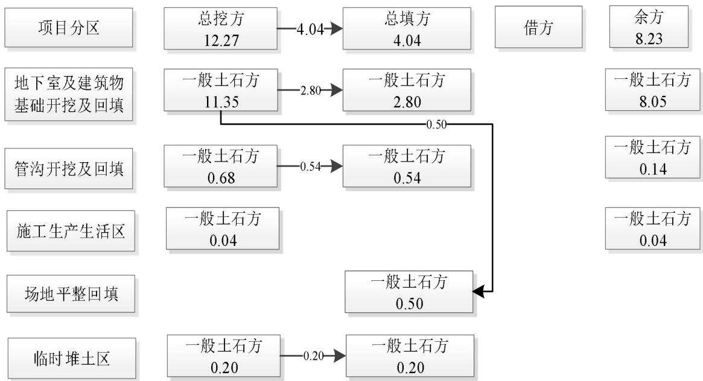
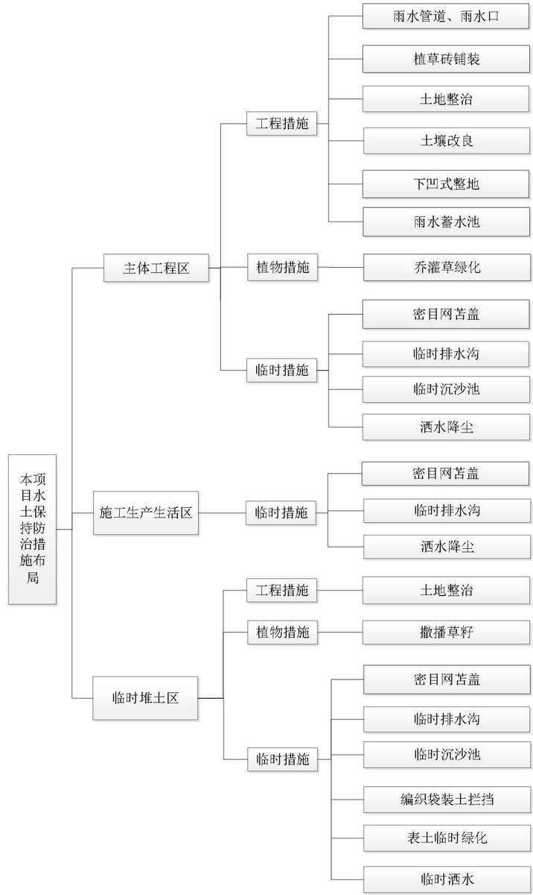

> **Zone C（应用范例层）使用边界**——仅可用于**写作风格、章节展开方式、表达逻辑、表格设计**的参考。
> **不得**用于合规判断；**不得**引入其项目数据（名称／地点／数字／单位名）；
> **不得**因其"曾经通过审批"而推定其做法在当前标准下仍然合规。
> 与 Zone A 冲突时**一律以 Zone A 为准**；Zone A 未明确规定时输出
> 「**Zone A 未明确规定，以下为参考写法，需人工判断**」。
>
> **坐标系警告**：本范例为**老八章结构**（GB 50433—2018 附录B），与 2026 版 10 章模板**同号不同义**
> （老 `1.5`＝防治目标，新 `1.5`＝水土流失预测结果；老 4→新 6 …偏移 +2；新版第 4/5 章老结构无独立章）。
> 因此 **`chapter_mapping: pending`——不得按章节号挂载**，检索一律走 `topic_tags`。
>
> **待加工**：`topic_tags`（主题标签）、`approval_basis_list`（编制依据逐字清单）、
> `structure_summary`（只提取结构：章节展开顺序／段落功能／表格栏目结构／句式模板／论证链步骤）。

1 综合说明...  
1.1 项目简况.  
1.2 编制依据.... .. 5  
1.3 设计水平年... ... 6  
1.4水土流失防治责任范围. ...6  
1.5水土流失防治目标.... ....6  
1.6项目水土保持评价结论.. ....8  
1.7水土流失预测结果.... ...11  
1.8水土保持措施布设成果... ....11  
1.9 水土保持监测方案...... ....14  
1.10水土保持投资及效益分析成果..... .... 15  
1.11 结论... ... 15  
2 项目概况.... ... 18  
2.1项目组成及工程布置.. ....18  
2.2 施工组织.. ... 30  
2.3 工程占地.... ... 36  
2.4 土石方平衡... ... 37  
2.5拆迁（移民）安置与专项设施改（迁）建...... ..... 43  
2.6 施工进度.... .... 43  
2.7 自然概况.. ... 44  
3项目水土保持评价..... .... 48  
3.1主体工程选址（线）水土保持评价.... ... 48  
3.2建设方案与布局水土保持评价..... .... 49  
3.3主体工程设计中水土保持措施界定... .... 59  
4 水土流失分析与预测. ..63  
4.1水土流失现状.. .... 63  
4.2水土流失影响因素分析... .....63  
4.3 土壤流失量预测.... ..... 65  
4.4水土流失危害分析.... .....74  
4.5 指导性意见... .... 75  
5 水土保持措施..... .... 77  
5.1 防治区划分... ..... 77  
5.2 措施总体布局... .... 77  
5.3 分区措施布设.... ..... 85  
5.4 施工要求 ..... .... 95  
6 水土保持监测..... ..... 102  
6.1 范围和时段.. .... 102  
6.2 内容和方法.... .... 102  
6.3 点位布设 ..... ..... 106  
6.4 实施条件和成果.... .....107  
7水土保持投资估算及效益分析........ ......111  
7.1 投资估算.... ..... 111  
7.2 效益分析.... .... 121  
8 水土保持管理... ..... 124  
8.1 组织管理.... .... 124  
8.2 后续设计 ...... .... 125  
8.3 水土保持监测... ...125  
8.4 水土保持监理.... ...126  
8.5水土保持施工.. .... 127  
8.6 水土保持设施验收....... .......128

## 1 综合说明

## 1.1项目简况

## 1.1.1项目基本情况

## （1）项目建设背景

中国西部科技创新港位于西咸新区沣西新城，是教育部和陕西省人民政府共同建设的国家级项目，是陕西省和西安交通大学落实共建“一带一路”倡议、创新驱动发展和西部大开发等国家战略的重要平台。依据西安交通大学“十五五”规划，“十五五”末西安交通大学创新港校区办学规模将达到 33750人，其中含本科生 3700人，硕士生15250人，博士生12800人，留学生2000人，学校现有的住宿环境及房间数量难以满足大量在校生的基本需求，西安交通大学创新港校区计划进行学生生活E区建设，根据规划，西安交通大学创新港校区学生生活E区共建设 4 个地块（E、F、I、J 地块）；分为 1 期（E、F 地块）、2 期（I、J地块）两期同时建设，本项目为学生生活E区 1期项目，本项目的建设，能够满足创新港校区学生的住宿需求，为学生提供良好的生活环境；能够实现校园规划，完善新校区办学条件的需要；是推动学校跃升发展的基础保障。因此本项目建设是十分必要的。

## （2）项目位置

本项目为点状工程，位于陕西省西咸新区沣西新城创新港片区常乐路以南、西樱花路以西、勤政路以北、西栾华路以东。项目区中心地理坐标：E108°38′41.33″，N34°15′23.81″。目前项目区四周市政道路均已建成，具备通行条件，车辆可直达项目区，项目建设场地周边交通便利。

## （3）建设性质、规模

建设性质：新建建设类

建设规模：总建筑面积 90095.40m2（其中：地上建筑面积 71075.20m2，地下建筑面积 19020.20m2），建筑密度 26.08%，容积率 1.96。

## （4）项目组成及建设内容

项目组成：本项目建设包含 2个地块，分别为E地块、F 地块，主要由建构筑物工程、道路及场地硬化、景观绿化及给排水等附属工程组成。

建设内容：E地块包括E1#宿舍楼1栋、E2#宿舍楼1 栋、E3#宿舍楼1栋、

地下车库、道路及硬化、景观绿化及给排水等附属工程；F地块包括F1#宿舍楼1 栋、F2#宿舍楼1栋、F3#宿舍楼1栋、地下车库、道路及硬化、景观绿化及给排水等附属工程。

## （5）拆迁（移民）安置与专项设施改（迁）建

目前项目区地表存在少量周边工程建设过程中搭建的施工临建设施，本项目开工前，由政府部门统一组织进行清理，本工程建设不占压村庄、居民点等建筑物，不涉及拆迁（移民）安置与专项设施改（迁）建。

## （6）项目投资及建设工期

项目投资：总投资 61060万元，其中土建投资51954万元。资金来源为申请中央投资和自筹。

建设工期：本项目计划于2026年2月开工，预计于2027 年6月完工，总工期 17个月。

## （7）项目征占地情况

本项目总用地面积4.62hm2，其中：永久占地面积3.63hm2，临时占地面积0.99hm2（临时堆土区用地），占地类型为教育用地，无代征用地。项目永久占地位于项目征地范围内；临时用地为临时堆土区用地，同属教育用地，位于西安交通大学创新港校区征地范围内，目前该地块正处于前期规划阶段，现状为空闲状态。

原地表情况：根据现场勘查，本项目用地在前期周边工程建设过程中，被用于施工临时用地，目前项目用地处于空闲状态，地表存在少量活动板房等施工临建设施，正处于清理拆除阶段，场地内大部分区域被临时硬化及杂草所覆盖。

## （8）土石方及其平衡情况

本项目挖填方总量为16.31 万m3，其中挖方12.27 万m3，填方4.04万m3，余方8.23万m3，无借方。目前本项目尚未开工，项目施工单位处于招标阶段，暂时无法明确弃方地点，我校承诺待施工单位确定后，及时监督施工单位根据《西安市建筑垃圾管理条例》申请建筑垃圾处置（排放）证，运至西咸新区合法的消纳地点。

## （9）取土场和弃土场设置情况

本项目无取土场和弃土场设置。

## （10）施工组织情况

根据主体设计，结合项目施工需求，本项目建设布设施工生产生活区2处（E地块一处、F 地块一处共2000m2，分别位于各地块内部），临时堆土区1处（位于项目区北侧红线外临时占地区域，面积0.99hm2）；项目四周均为已建成市政道路，可直达施工现场，施工期供电、给排水设施均可就近由市政管道接入，无需额外占地新建临时施工道路、给排水及供电设施，商购等施工材料可由当地合法料场或商品砼生产企业购买，项目区施工条件良好。

## 1.1.2项目前期工作进展情况

## 1.1.2.1项目工程设计情况

（1）2018 年12月24日，建设单位西安交通大学取得不动产权证书，不动产占地 203125.71m2，包括西咸新区沣西新城临渭路以南，樱花西路以西，林西路以东，车站东路以北的所有占地区域；

（2）2025 年 2 月 20 日，建设单位取得中华人民共和国教育部关于西安交通大学创新港校区学生生活E 区1期项目可行性研究报告的批复（教发函〔2025〕46 号）；

（3）2025年5月 9日，本项目取得了陕西工程勘察研究院有限公司出具的沣西新城用地红线放样成果表；

（4）2025年6月 5日，本项目E地块取得了中华人民共和国建设用地规划许可证（地字第 611204202520006 号）；

（5）2025年6月5日，本项目F 地块取得了中华人民共和国建设用地规划许可证（地字第 611204202520007 号）；

（6）2025 年 7 月 18 日，本项目取得了中华人民共和国建设工程规划许可证（西咸规建字第 611204202530017 号）；

（7）2025 年6月，西北综合勘察设计研究院完成了《西安交通大学创新港校区学生生活E区2期项目岩土工程勘察报告》；

（8）2025年7月，中国建筑西北设计研究院有限公司完成了本项目报建总平面布置图设计；

（9）2025年8月，中国建筑西北设计研究院有限公司完成了本项目施工图设计并通过审查。

## 1.1.2.2项目建设进展情况

目前项目尚未开工建设，各项前期手续正在积极办理。

## 1.1.2.3水土保持方案编制情况

根据《中华人民共和国水土保持法》、《陕西省水土保持条例》等相关法律法规的规定，西安交通大学于2025 年11 月委托陕西江源生态工程有限公司（以下简称“我公司”）承担本项目水土保持方案的编制工作。

接受委托后，我公司及时成立“西安交通大学创新港校区学生生活 E区 1期项目”项目组，对工程设计资料进行了全面分析研究，收集了项目所在地的水土流失状况、生态红线划定、水土流失重点防治区划分等各项资料。结合本项目建设特点和可能造成水土流失的情况，按照《生产建设项目水土保持技术标准》（GB50433-2018）及相关技术规范的要求，我公司于 2025 年 12 月完成了《西安交通大学创新港校区学生生活E区1期项目水土保持方案报告书》的编制工作。

## 1.1.3 自然简况

项目区位于陕西省西咸新区沣西新城，场地地貌单元为渭河南岸一级阶地，总体地形较平坦，分为 E 地块和 F 地块两个地块，E 地块自然地面标高介于390.68m～391.66m，相对高差 0.99m；F 地块自然地面标高介于 390.27m～391.58m，相对高差 1.31m。

项目区土壤现状主要分布为杂填土，项目区属暖温带落叶阔叶林带，项目区植被主要为荒草，部分地表裸露。

项目区属暖温带半湿润大陆性季风气候，项目区多年平均降水量 757mm，年平均蒸发量 905.7mm，多年平均气温 13.8～15.6℃，极端最低气温为-21.2℃（1991 年12月28日），极端最高气温为 42.9℃（2006年6月 17 日），年平均风速1.8m/s，最大冻土深度45cm，全年盛行风向为东北风，无霜期208～230 天。

项目区附近主要为新河、涝峪河、渭河。工程建设地点距河流（渭河）最近点约 1.15km，不涉及河道管理范围。现状场内无地表水系，场内无洪水冲刷痕迹，附近无季节性冲沟和沟壑分布，基本不受雨水冲刷影响。

根据水利部办公厅《关于做好国家级水土流失重点预防区和重点治理区落地上图成果应用的通知》（办水保〔2025〕170号），经国家级水土流失重点预防区和重点治理区查询系统查询，项目区不属于国家级水土流失重点预防区和重点治理区；根据《陕西省水土保持规划（2016-2030 年）》，项目区属陕西省水土流失重点预防区（关中阶地、台塬基本农田重点预防区）；根据《西咸新区水土保持规划（2021-2030 年）》，本项目所在地属于西咸新区水土流失重点预防区（泾渭川道重点预防区）。项目区域土壤侵蚀类型为水力侵蚀，侵蚀强度为微度侵蚀，土壤侵蚀模数背景值为 200t/km2·a。根据《土壤侵蚀分类分级标准》（SL190-2007），项目区位于西北黄土高原区，项目区容许土壤流失量为1000t/km2·a。项目不涉及饮用水源保护区、水功能一级区的保护区和保留区、自然保护区、世界文化和自然遗产地、风景名胜区、地质公园、森林公园及重要湿地等其他水土保持敏感区。

## 1.2编制依据

## 1.2.1 法律法规

（1）《中华人民共和国水土保持法》（全国人大常委会，2010年12月25修订，2011年 3月1日施行）；

（2）《陕西省水土保持条例》（2013 年 7 月 26 日，陕西省人民代表大会常务委员会通过；2018 年5月31日，陕西省人民代表大会常务委员会修改并公布施行，2024年5月30 日修改）。

## 1.2.2 规范性文件

（1）《水利部办公厅关于印发生产建设项目水土保持技术文件编写和印制格式规定（试行）的通知》（水利部办公厅，办水保〔2018〕135号）；

（2）《生产建设项目水土保持方案管理办法》（2023 年 1 月 17 日水利部令第53 号发布，自2023年3月1 日起施行）。

## 1.2.3 技术标准

（1）《生产建设项目水土保持技术标准》（GB50433-2018）；

（2）《生产建设项目水土流失防治标准》（GB/T50434-2018）；

（3）《生产建设项目水土保持监测与评价标准》（GB/T51240-2018）；

（4）《生产建设项目水土流失量预算导则》（SL773-2018）；

（5）《造林技术规程》（GB/T15776-2016）；

（6）《土壤侵蚀分类分级标准》（SL190-2007）；

（7）《水利水电工程制图标准-水土保持图》（SL73.6-2015）；

（8）《土地利用现状分类》（GB/T21010-2017）；

（9）《水土保持工程设计规范》（GB51018-2014）；

（10）《水土保持监理规范》（SL/T523-2024）；

（11）《水利工程设计概（估）算编制规定》（水总〔2024〕323号）；

（12）《水土保持监测技术规范》（SL/T 277-2024）；

（13）《室外排水设计规范》（GB50014-2021）；

（14）《水土保持工程质量验收与评价规范》（SL/T336-2025）。

## 1.2.4技术文件与相关资料

（1）《陕西省水土保持规划（2016-2030 年）》；

（2）《西咸新区水土保持规划（2021-2030年）》；

（3）《西安交通大学创新港校区学生生活E区1 期项目岩土工程勘察报告》（西北综合勘察设计研究院，2025年6月）；

（4）“项目总平面布置图、室外工程图”等施工图设计；

（5）项目其他相关设计资料及建设单位提供的资料。

## 1.3设计水平年

根据项目建设特点，该项目为新建建设类项目，依据《生产建设项目水土保持技术标准》（GB50433-2018）的规定，设计水平年应为主体工程完工后的当年或后一年，届时方案确定的各项防治措施均应布设到位，能初步发挥水土保持功能，达到方案确定的防治目标，满足水土保持专项设施验收的要求。工程计划于 2026 年2月开工，计划于2027年6 月完工。因此，方案确定设计水平年为水土保持措施实施完毕并初步发挥效益的年份，即2027 年。

## 1.4水土流失防治责任范围

水土流失防治责任范围包括完整项目的永久征地、临时占地（含租赁土地）以及其他使用与管辖区域。

本项目总用地面积 4.62hm2，其中永久占地面积 3.63hm2，临时占地面积0.99hm2。本项目水土流失防治责任范围为项目总用地范围，面积为4.62hm2。

## 1.5水土流失防治目标

## 1.5.1执行标准等级

根据水利部办公厅《关于做好国家级水土流失重点预防区和重点治理区落地上图成果应用的通知》（办水保〔2025〕170号），经国家级水土流失重点预防区和重点治理区查询系统查询，项目区不属于国家级水土流失重点预防区和重点治理区；根据《陕西省水土保持规划（2016-2030 年）》，项目区属陕西省水土流失重点预防区（关中阶地、台塬基本农田重点预防区）；根据《西咸新区水土保持规划（2021-2030 年）》，本项目所在地属于西咸新区水土流失重点预防区（泾渭川道重点预防区）。根据《生产建设项目水土流失防治标准》（GB/T50434-2018），本工程水土流失防治标准执行等级为西北黄土高原区水土流失防治一级标准。

## 1.5.2 防治目标

## （1）基本防治目标

通过方案实施，使项目建设范围内的新增水土流失应得到有效控制，原有水土流失得到治理；水土保持设施应安全有效；水土资源、林草植被应得到最大限度的保护与恢复；六项指标应符合现行国家标准的规定。

## （2）定量防治目标

按照《生产建设项目水土流失防治标准》（GB/T50434-2018），确定本项目水土流失防治标准执行西北黄土高原区一级标准。其水土流失防治指标基准值如下：水土流失治理度 93%，土壤流失控制比 0.80，渣土防护率 92%，表土保护率 90%，林草植被恢复率95%，林草覆盖率22%。

另外，根据《生产建设项目水土流失防治标准》（GB/T50434-2018），按照干旱程度、土壤侵蚀强度、地形地貌和是否位于城市区及对林草植被有限制情况等，调整防治目标值。目标值调整如下：

①按干旱程度：项目区位于半湿润区，水土流失治理度、林草植被恢复率、林草覆盖率不作调整。

②按土壤侵蚀强度：项目区原地貌土壤侵蚀强度以微度侵蚀为主，土壤流失控制比应不小于1.0，本方案确定土壤流失控制比1.0。

③按地形地貌：项目区位于渭河平原区，渣土防护率不作调整。

④按是否位于城市区：项目区位于西咸新区沣西新城，属于城市区，渣土防护率提高 2%，林草覆盖率提高2%。

⑤按地表情况：项目区地表已无表土，该项指标不再涉及。

本方案根据规定进行修正后的防治目标为：水土流失治理度93%，土壤流失控制比 1.0，渣土防护率94%，表土保护率不涉及，林草植被恢复率95%，林草覆盖率 24%。水土流失防治目标指标值详见表 1.5-1。

表1.5-1 水土流失防治目标指标值
<table><tr><td rowspan=2 colspan=1>序号</td><td rowspan=2 colspan=1>指标</td><td rowspan=1 colspan=2>一级标准</td><td rowspan=1 colspan=2>修正</td><td rowspan=1 colspan=2>本项目采用目标值</td></tr><tr><td rowspan=1 colspan=1>施工期设</td><td rowspan=1 colspan=1>计水平年</td><td rowspan=1 colspan=1>城市区</td><td rowspan=1 colspan=1>土壤侵蚀强度</td><td rowspan=1 colspan=1>施工期</td><td rowspan=1 colspan=1>设计水平年</td></tr><tr><td rowspan=1 colspan=1>1</td><td rowspan=1 colspan=1>水土流失治理度（%）</td><td rowspan=1 colspan=1></td><td rowspan=1 colspan=1>93</td><td rowspan=1 colspan=1></td><td rowspan=1 colspan=1></td><td rowspan=1 colspan=1></td><td rowspan=1 colspan=1>93</td></tr><tr><td rowspan=1 colspan=1>2</td><td rowspan=1 colspan=1>土壤流失控制比</td><td rowspan=1 colspan=1></td><td rowspan=1 colspan=1>0.80</td><td rowspan=1 colspan=1></td><td rowspan=1 colspan=1>+0.2</td><td rowspan=1 colspan=1></td><td rowspan=1 colspan=1>1.0</td></tr><tr><td rowspan=1 colspan=1>3</td><td rowspan=1 colspan=1>渣土防护率（%）</td><td rowspan=1 colspan=1>90</td><td rowspan=1 colspan=1>92</td><td rowspan=1 colspan=1>+2</td><td rowspan=1 colspan=1></td><td rowspan=1 colspan=1>90</td><td rowspan=1 colspan=1>94</td></tr><tr><td rowspan=1 colspan=1>4</td><td rowspan=1 colspan=1>表土保护率（%）</td><td rowspan=1 colspan=1>90</td><td rowspan=1 colspan=1>90</td><td rowspan=1 colspan=1></td><td rowspan=1 colspan=1></td><td rowspan=1 colspan=1>1</td><td rowspan=1 colspan=1>1</td></tr><tr><td rowspan=1 colspan=1>5</td><td rowspan=1 colspan=1>林草植被恢复率（%）</td><td rowspan=1 colspan=1></td><td rowspan=1 colspan=1>95</td><td rowspan=1 colspan=1></td><td rowspan=1 colspan=1></td><td rowspan=1 colspan=1></td><td rowspan=1 colspan=1>95</td></tr><tr><td rowspan=1 colspan=1>6</td><td rowspan=1 colspan=1>林草覆盖率（%）</td><td rowspan=1 colspan=1></td><td rowspan=1 colspan=1>22</td><td rowspan=1 colspan=1>+2</td><td rowspan=1 colspan=1></td><td rowspan=1 colspan=1></td><td rowspan=1 colspan=1>24</td></tr></table>

## 1.6 项目水土保持评价结论

## 1.6.1 主体工程选址（线）评价

从水土保持角度综合分析，本项目符合《生产建设项目水土保持技术标准》（GB50433-2018）及《中华人民共和国水土保持法》法律法规的要求，工程布局合理，本项目选址不涉及全国水土保持监测网络中的水土保持监测站点、重点试验区及国家确定的水土保持长期定位观测站，本项目占地距河道（渭河）最近距离为 1.15km，现状场内无地表水系，本项目占地不占用河流两岸、湖泊和水库周边的植物保护带，项目周边无泥石流易发区、崩塌滑坡危险区以及易引起严重水土流失和生态恶化的地区，项目用地位于西咸新区城市建设区内，不涉及生态保护红线；但项目区位于陕西省水土流失重点预防区（关中阶地、台塬基本农田重点预防区）及西咸新区水土流失重点预防区（泾渭川道重点预防区），无法避让。因此，主体工程施工严格控制地表扰动和植被破坏范围，减少工程占地，加强工程管理，优化施工工艺，将工程施工对水土流失的影响降到最低程度。对于项目建设对当地生态环境造成的破坏通过加强防护措施，提高各项防治标准进行治理。施工结束后通过相应的工程措施和植物措施可有效恢复地表植被，控制水土流失，本项目选址符合水土保持要求。

## 1.6.2建设方案与布局评价

## 1.6.2.1建设方案水土保持分析与评价结论

本项目总平面布置紧凑合理，施工过程中场外交通利用现状道路，施工生产生活区布置在红线内，严格控制工程扰动，以减少工程占地。竖向布置在考虑现状标高、现状地形地势以及周边地形和排水的要求下、在满足各种工程规范要求的基础上，以减少土石方的挖填量进行设计。同时主体通过优化施工工艺及施工方法，进一步减少土方开挖和工程占地。项目绿化景观按园林绿化标准设计，景观效果与周边市政景观协调，下凹式绿地、植草砖铺装等配套蓄渗设施，可提高绿化成活率，减少地表径流，主体配套建设的雨水管道及雨水蓄水池，能有效收集、排放项目区积水；项目区无法避让陕西省水土流失重点预防区（关中阶地、台塬基本农田重点预防区）及西咸新区水土流失重点预防区（泾渭川道重点预防区），排水工程、防洪标准、植被建设标准提高。以上要求及措施一一落实之后，项目建设符合水土保持要求。

## 1.6.2.2工程占地水土保持分析评价结论

本项目总用地面积 4.62hm2，其中：永久占地面积 3.63hm2，临时占地面积0.99hm2。

从占地类型方面分析，西安交通大学创新港校区学生生活 E区1期项目用地经国家发展和改革委员会批复，取得了陕西省西咸新区沣西新城管理委员会颁发的建设用地规划许可证等用地手续。本项目建设符合陕西省西咸新区城市发展规划。

从占地恢复方面分析，施工结束后，项目区永久占地被建构筑物、硬化铺装及道路、景观绿化覆盖；临时占地迹地恢复治理后，由景观绿化覆盖，土壤不再裸露，项目区抗蚀性增强。

综上所述，本工程在占地数量、占地类型和占地可恢复性等方面对水土保持而言无制约性因素，符合水土保持要求；本项目平面布置紧凑合理，减少了对地表的扰动范围；通过合理的水土保持措施，工程建设造成的水土流失不利影响得到了控制，符合水土保持要求。

## 1.6.2.3工程土石方水土保持分析评价结论

## （1）表土资源保护和利用评价

根据现状调查和项目岩土工程勘察报告，项目原地表为临时建筑设施，统一拆迁后，项目区域均为拆迁后的迹地，表层主要为杂填土和素填土，含有大量的混凝土块、砖渣、碎石等建筑垃圾，无表土可剥离。本项目建设过程中不再进行表土剥离，后期项目主体工程建设过程中，对绿化区域土壤进行土地整治及土壤改良后，可满足植被生长要求，无须额外外借表土，符合水土保持要求。

## （2）一般土方平衡评价

本项目挖填方总量为16.31 万m3，其中挖方12.27 万m3，填方4.04万m3，余方 8.23 万 m3，无借方，通过设置临时堆土区实现内部调运 3.34 万 m3，无借方。受制于项目场地占地红线的限制，施工现场不具备将挖方全部临时堆放的条件，项目区产生的土方大部分须外运处理，产生的多余土方随工程进度安排“随挖随运”，及时进行外运处理的做法合理，符合水土保持要求；余方运送至政府指定的建筑垃圾消纳点进行消纳，并由消纳单位负责余方的水土保持防治责任，余方处置合理，符合水土保持要求。项目区设置临时堆土区，将开挖土方中留约3.34万 m3临时堆置在北侧临时堆土区用于后期肥槽回填和地下室顶板覆土，增加了土石方利用率，施工过程中就近利用的土方及时回填，并对临时堆土区采用临时拦挡、苫盖、撒播草籽等措施增加覆盖，集中堆放避免土方多次搬运，抑制扬尘的产生，减少水土流失，符合水土保持要求。车辆在出入过程中，对车辆严格管理，做到出入100%冲洗、100%遮盖。以上防护措施有效的控制了施工期水土流失，符合水土保持要求。

## 1.6.2.4施工方法与工艺水土保持分析评价结论

本项目施工过程中加强施工组织管理，采用先进的施工方法与工艺。施工过程中采用机械施工与人工施工相结合的方法，统筹、合理、科学安排施工工序，避免重复施工，施工组织中增加水土保持要求，施工单位严格按照施工组织施工。

主体工程采取机械为主、人工为辅的施工方法，采用多机组、分班次、立体交叉连续作业，做到充分利用空间和时间，同时减少裸露时间，从而减少施工过程中造成的水土流失。主体施工组织中严格要求，施工材料在运输中采取密目网苫盖防护，临时堆土做好防护措施。本项目不涉及河岸陡坡开挖，开挖边坡下方不涉及河渠、公路、铁路、居民点和其它重要基础设施，不涉及渣石渡槽、溜渣洞等专门导渣或防护设施；不涉及料场、取土场、弃渣场；不涉及施工泥浆；不涉及围堰。

总体来说，本项目施工方法与工艺符合水土保持要求。

## 1.6.2.5主体工程设计中具有水土保持功能的分析与评价结论

主体设计充分考虑了水土保持因素，施工组织方案设计了密目网苫盖、临时排水沟、临时沉沙池、洒水降尘、编织袋装土拦挡、堆土表面临时绿化等防护工程；主体设计中，在有条件的区域采取植草砖铺装替代传统硬质铺装，采取雨水管道排导项目区雨水进入市政雨水管道，绿化采取园林景观绿化标准，排水工程、防洪标准按照城市防洪标准，主体设计标准均高于《水土保持工程设计规范》（GB51018-2014）中相对应的标准等级。这些主体设计不仅提高施工效率，美化项目区环境、还可以控制项目区水土流失，符合水土保持要求。

## 1.7水土流失预测结果

工程建设造成的水土流失主要类型为水力侵蚀。水土流失预测的重点时段主要为项目施工期，项目区总占地面积为4.62hm2，工程建设扰动原地貌、损坏土地面积为 4.62hm2，造成水土流失面积为 4.62hm2。在工程水土流失预测期内，项目建设可能产生水土流失预测总量为184.34t，新增水土流失量为158.55t。

项目建设产生的水土流失危害主要表现为：①施工时车辆的来回碾压及土方运输过程中产生的浮尘，对周边环境可能造成影响；②遇大风天气，施工造成的裸露地面尘土弥漫，对周边环境产生影响；③遇大雨天气，会对挖填边坡造成冲刷，给主体工程的建设带来危害。④工程建设过程中，造成地表扰动，大面积裸露，雨季时场内的土壤随径流流失。

由预测结果可知，主体工程区和临时堆土区的水土流失总量和新增水土流失量较大，为本工程的水土流失重点防治区域。

## 1.8水土保持措施布设成果

根据水土流失特点将项目建设区分为主体工程区、施工生产生活区、临时堆土区共 3个防治分区。

根据水土流失防治分区，在水土流失预测结果及主体工程设计具有水土保持功能的措施分析评价的基础上，针对工程建设过程及试运行过程中可能引发水土流失的特点和造成的危害程度，采取有效的水土流失防治措施。本项目水土流失防治将以植物措施与工程措施相结合、永久措施与临时防护措施相结合，并把主体工程中具有水土保持功能的措施纳入水土流失防治体系中，建立完整、有效、可行的水土保持措施体系。

项目雨水管道按设计标准为5 年一遇10min短历时暴雨强度，乔灌草绿化执行Ⅰ级标准，临时排水沟设计标准参照主体设计，按 5年一遇 10min 暴雨强度设计，其他土地整治、土壤改良等措施按照《生产建设项目水土保持技术标准》（GB50433-2018）中相关规定执行；植草砖铺装、下凹式整地、雨水蓄水池等措施按照《建筑与小区雨水利用工程技术规范》（GB50400-2016）、《陕西省海绵城市规划设计导则》（DBJ61/T 126-2017）中相关规定执行。

水土保持措施工程量汇总如下：

工程措施：雨水管道1563.73m（主体已列），雨水口32 座（主体已列），植草砖铺装 1759.19m2（主体已列），土地整治 2.26hm2（主体已列），土壤改良 1.27hm2（主体已列），下凹式整地520.70m2（主体已列），雨水蓄水池2座（主体已列）。

植物措施：乔灌草绿化 1.27hm2（主体已列），撒播草籽 0.99hm2（主体已列）。

临时措施：密目网苫盖4.92hm2（主体已列），临时排水沟2970m（主体已列），临时沉沙池 10 座（主体已列），洒水降尘750.42台时（主体已列），编织袋装土拦挡400m（主体已列），堆土表面绿化1.09hm2（主体已列）。

## 1.8.1 主体工程区

主体工程区水土保持措施主要是施工期间采取密目网苫盖、临时排水沟、临时沉沙池、洒水降尘等进行防护；施工后期实施雨水管道、雨水口、植草砖铺装、土地整治、土壤改良、下凹式整地、雨水蓄水池及乔灌草绿化等措施。

1、工程措施：雨水管道1563.73m（主体已列），雨水口32座（主体已列），植草砖铺装 1759.19m2（主体已列），土地整治 1.27hm2（主体已列），土壤改良 1.27hm2（主体已列），下凹式整地520.70m2（主体已列），雨水蓄水池2座（主体已列）。

2、植物措施：乔灌草绿化1.27hm2（主体已列）。

3、临时措施：密目网苫盖3.63hm2（主体已列），临时排水沟2375m（主体已列），临时沉沙池8座（主体已列），洒水降尘535.08台时（主体已列）。

表1.8-1 主体工程区水土保持措施布设成果
<table><tr><td colspan="1" rowspan="1">措施类型</td><td colspan="1" rowspan="1">措施名称</td><td colspan="1" rowspan="1">结构形式/植物类型</td><td colspan="1" rowspan="1">单位</td><td colspan="1" rowspan="1">数量</td><td colspan="1" rowspan="1">布设位置</td><td colspan="1" rowspan="1">实施时段</td><td colspan="1" rowspan="1">备注</td></tr><tr><td colspan="1" rowspan="3">工程措施</td><td colspan="1" rowspan="1">雨水管道</td><td colspan="1" rowspan="1">地埋式 HDPE 塑钢缠绕排水管</td><td colspan="1" rowspan="1">m</td><td colspan="1" rowspan="1">1563.73</td><td colspan="1" rowspan="1">沿道路地埋</td><td colspan="1" rowspan="1">2026年12月-2027年3月</td><td colspan="1" rowspan="1">主体已列</td></tr><tr><td colspan="1" rowspan="1">雨水口</td><td colspan="1" rowspan="1">混凝土预制</td><td colspan="1" rowspan="1">座</td><td colspan="1" rowspan="1">32</td><td colspan="1" rowspan="1">沿路边及低洼处</td><td colspan="1" rowspan="1">2026年12月-2027年3月</td><td colspan="1" rowspan="1">主体已列</td></tr><tr><td colspan="1" rowspan="1">植草砖铺装</td><td colspan="1" rowspan="1">规格为40cm×40cm×8cm</td><td colspan="1" rowspan="1">m²</td><td colspan="1" rowspan="1">1759.19</td><td colspan="1" rowspan="1">主要布设在非机动车停车位</td><td colspan="1" rowspan="1">2027年4月-2027年5月</td><td colspan="1" rowspan="1">主体已列</td></tr><tr><td colspan="1" rowspan="4"></td><td colspan="1" rowspan="1">土地整治</td><td colspan="1" rowspan="1">翻土深度应&gt;25cm</td><td colspan="1" rowspan="1">hm²</td><td colspan="1" rowspan="1">1.27</td><td colspan="1" rowspan="1">绿化区域</td><td colspan="1" rowspan="1">2027年4月</td><td colspan="1" rowspan="1">主体已列</td></tr><tr><td colspan="1" rowspan="1">土壤改良</td><td colspan="1" rowspan="1">施有机肥</td><td colspan="1" rowspan="1">hm²</td><td colspan="1" rowspan="1">1.27</td><td colspan="1" rowspan="1">绿化区域</td><td colspan="1" rowspan="1">2027年4月</td><td colspan="1" rowspan="1">主体已列</td></tr><tr><td colspan="1" rowspan="1">下凹式整地</td><td colspan="1" rowspan="1">下凹深度10cm</td><td colspan="1" rowspan="1">m²</td><td colspan="1" rowspan="1">520.7</td><td colspan="1" rowspan="1">较集中绿化区域</td><td colspan="1" rowspan="1">2027年4月</td><td colspan="1" rowspan="1">主体已列</td></tr><tr><td colspan="1" rowspan="1">雨水蓄水池</td><td colspan="1" rowspan="1">PP蓄水模块</td><td colspan="1" rowspan="1">座</td><td colspan="1" rowspan="1">2</td><td colspan="1" rowspan="1">项目区南侧地下</td><td colspan="1" rowspan="1">2027年2月</td><td colspan="1" rowspan="1">主体已列</td></tr><tr><td colspan="1" rowspan="1">植物措施</td><td colspan="1" rowspan="1">乔灌草绿化</td><td colspan="1" rowspan="1">乔灌草搭配</td><td colspan="1" rowspan="1">hm²</td><td colspan="1" rowspan="1">1.27</td><td colspan="1" rowspan="1">建筑物周边及道路旁侧和空地区域</td><td colspan="1" rowspan="1">2027年4月-2027年6月</td><td colspan="1" rowspan="1">主体已列</td></tr><tr><td colspan="1" rowspan="4">临时措施</td><td colspan="1" rowspan="1">密目网苫盖</td><td colspan="1" rowspan="1">密目网</td><td colspan="1" rowspan="1">hm²</td><td colspan="1" rowspan="1">3.63</td><td colspan="1" rowspan="1">扰动裸露区域</td><td colspan="1" rowspan="1">2026年2月-2026年5月、2026年12月-2027年4月</td><td colspan="1" rowspan="1">主体已列</td></tr><tr><td colspan="1" rowspan="1">临时排水沟</td><td colspan="1" rowspan="1">底宽 0.4m，深0.4m，矩形砖砌结构</td><td colspan="1" rowspan="1">m</td><td colspan="1" rowspan="1">2375</td><td colspan="1" rowspan="1">施工围墙内侧、基坑开挖线外侧</td><td colspan="1" rowspan="1">2026年2月-2026年3月</td><td colspan="1" rowspan="1">主体已列</td></tr><tr><td colspan="1" rowspan="1">临时沉沙池</td><td colspan="1" rowspan="1">砖砌结构，长2.0m，宽1.0m，深1.0m</td><td colspan="1" rowspan="1">座</td><td colspan="1" rowspan="1">8</td><td colspan="1" rowspan="1">排水沟末端及排水沟交汇处</td><td colspan="1" rowspan="1">2026年2月-2026年3月</td><td colspan="1" rowspan="1">主体已列</td></tr><tr><td colspan="1" rowspan="1">洒水降尘</td><td colspan="1" rowspan="1">洒水量每次按0.3 台时/hm²次</td><td colspan="1" rowspan="1">台时</td><td colspan="1" rowspan="1">535.88</td><td colspan="1" rowspan="1">扰动区域</td><td colspan="1" rowspan="1">2026年2月-2027年5月</td><td colspan="1" rowspan="1">主体已列</td></tr></table>

## 1.8.2施工生产生活区

施工生产生活区位于主体工程区内，使用结束后拆除清理后，根据主体平面布置设计，分别进行植被绿化及地面硬化，施工生产生活区主要是施工期间采取密目网苫盖、临时排水沟、洒水降尘等进行防护。

1、临时措施：密目网苫盖 2000m2（主体已列）；临时排水沟 195m（主体已列）；洒水降尘31.20 台时（主体已列）。

表1.8-2 施工生产生活区水土保持措施布设成果
<table><tr><td rowspan=1 colspan=1>措施类型</td><td rowspan=1 colspan=1>措施名称</td><td rowspan=1 colspan=1>结构形式/植物类型</td><td rowspan=1 colspan=1>单位</td><td rowspan=1 colspan=1>数量</td><td rowspan=1 colspan=1>布设位置</td><td rowspan=1 colspan=1>实施时段</td><td rowspan=1 colspan=1>备注</td></tr><tr><td rowspan=3 colspan=1>临时措施</td><td rowspan=1 colspan=1>密目网苫盖</td><td rowspan=1 colspan=1>密目网</td><td rowspan=1 colspan=1>m²</td><td rowspan=1 colspan=1>2000</td><td rowspan=1 colspan=1>扰动裸露区域</td><td rowspan=1 colspan=1>2027年5月</td><td rowspan=1 colspan=1>主体已列</td></tr><tr><td rowspan=1 colspan=1>临时排水沟</td><td rowspan=1 colspan=1>底宽0.4m，深0.4m，矩形砖砌结构</td><td rowspan=1 colspan=1>m</td><td rowspan=1 colspan=1>195</td><td rowspan=1 colspan=1>施工生产生活区外侧</td><td rowspan=1 colspan=1>2026年2月-2026年3月</td><td rowspan=1 colspan=1>主体已列</td></tr><tr><td rowspan=1 colspan=1>洒水降尘</td><td rowspan=1 colspan=1>洒水量每次按0.3台时/hm²次</td><td rowspan=1 colspan=1>台时</td><td rowspan=1 colspan=1>31.20</td><td rowspan=1 colspan=1>扰动区域</td><td rowspan=1 colspan=1>2026年2月-2027年5月</td><td rowspan=1 colspan=1>主体已列</td></tr></table>

## 1.8.3 临时堆土区

临时堆土区位于E地块以北外，其水土保持措施主要是施工期间采取密目网苫盖、洒水降尘、编织袋装土拦挡、临时排水沟及临时绿化等；施工便道沿项目区内规划永久道路布设。

1、工程措施：土地整治0.99hm2（主体已列）。

2、植物措施：撒播草籽绿化0.99hm2（主体已列）。

3、临时措施：密目网苫盖1.09hm2（主体已列），临时排水沟400m（主体已列），临时沉沙池 2座（主体已列），编织袋装土拦挡 400m（主体已列），堆土表面绿化1.09hm2（主体已列），临时洒水184.14 台时（主体已列）。

表1.8-3 临时堆土区水土保持措施布设成果
<table><tr><td rowspan=1 colspan=1>措施类型</td><td rowspan=1 colspan=1>措施名称</td><td rowspan=1 colspan=1>结构形式/植物类型</td><td rowspan=1 colspan=1>单位</td><td rowspan=1 colspan=1>数量</td><td rowspan=1 colspan=1>布设位置</td><td rowspan=1 colspan=1>实施时段</td><td rowspan=1 colspan=1>备注</td></tr><tr><td rowspan=1 colspan=1>工程措施</td><td rowspan=1 colspan=1>土地整治</td><td rowspan=1 colspan=1>翻土深度应&gt;25cm</td><td rowspan=1 colspan=1>hm²</td><td rowspan=1 colspan=1>0.99</td><td rowspan=1 colspan=1>临时堆土占地区域</td><td rowspan=1 colspan=1>2027年5月</td><td rowspan=1 colspan=1>主体已列</td></tr><tr><td rowspan=1 colspan=1>植物措施</td><td rowspan=1 colspan=1>撒播草籽</td><td rowspan=1 colspan=1>撒播量为80kg/hm²</td><td rowspan=1 colspan=1>hm²</td><td rowspan=1 colspan=1>0.99</td><td rowspan=1 colspan=1>临时堆土占地区域</td><td rowspan=1 colspan=1>2027年6月</td><td rowspan=1 colspan=1>主体已列</td></tr><tr><td rowspan=5 colspan=1>临时措施</td><td rowspan=1 colspan=1>密目网苫盖</td><td rowspan=1 colspan=1>密目网</td><td rowspan=1 colspan=1>hm²</td><td rowspan=1 colspan=1>1.09</td><td rowspan=1 colspan=1>堆土表面</td><td rowspan=1 colspan=1>2026年3月和2027年5月-2027年6月</td><td rowspan=1 colspan=1>主体已列</td></tr><tr><td rowspan=1 colspan=1>临时排水沟</td><td rowspan=1 colspan=1>底宽 0.4m，深0.4m，矩形砖砌结构</td><td rowspan=1 colspan=1>m</td><td rowspan=1 colspan=1>400</td><td rowspan=1 colspan=1>临时堆土外侧四周</td><td rowspan=1 colspan=1>2026年2月-2026年3月</td><td rowspan=1 colspan=1>主体已列</td></tr><tr><td rowspan=1 colspan=1>临时沉沙池</td><td rowspan=1 colspan=1>砖砌结构，长2.0m，宽 1.0m，深1.0m</td><td rowspan=1 colspan=1>座</td><td rowspan=1 colspan=1>2</td><td rowspan=1 colspan=1>排水沟末端及排水沟交汇处</td><td rowspan=1 colspan=1>2026年2月-2026年3月</td><td rowspan=1 colspan=1>主体已列</td></tr><tr><td rowspan=1 colspan=1>编织袋装土拦挡</td><td rowspan=1 colspan=1>梯形断面，顶宽30cm，底宽120cm，高为80cm</td><td rowspan=1 colspan=1>m</td><td rowspan=1 colspan=1>400</td><td rowspan=1 colspan=1>临时堆土外围</td><td rowspan=1 colspan=1>2026年2月-2026年3月</td><td rowspan=1 colspan=1>主体已列</td></tr><tr><td rowspan=1 colspan=1>堆土表面绿化</td><td rowspan=1 colspan=1>撒播量为80kg/hm²</td><td rowspan=1 colspan=1>hm²</td><td rowspan=1 colspan=1>1.09</td><td rowspan=1 colspan=1>临时堆土表面</td><td rowspan=1 colspan=1>2026年4月-2026年5月</td><td rowspan=1 colspan=1>主体已列</td></tr><tr><td rowspan=1 colspan=1></td><td rowspan=1 colspan=1>洒水降尘</td><td rowspan=1 colspan=1>洒水量每次按0.3 台时/hm²次</td><td rowspan=1 colspan=1>台时</td><td rowspan=1 colspan=1>184.14</td><td rowspan=1 colspan=1>扰动区域</td><td rowspan=1 colspan=1>2026年2月-2027年5月</td><td rowspan=1 colspan=1>主体已列</td></tr></table>

## 1.9水土保持监测方案

项目水土保持监测范围为水土流失防治责任范围，面积为4.62hm2。工程水土保持监测时段为施工期至设计水平年，即2026年2 月至设计水平年2027年。

本项目按照工程总平面布置情况及水土流失特点分为主体工程区、施工生产

生活区、临时堆土区3个监测分区。

水土保持监测的重点内容主要有扰动土地情况监测、水土流失状况监测、水土保持措施及防治成效监测、水土流失危害监测。

监测方法采取资料分析、实地量测、实地调查、无人机航拍监测、巡查监测等方法。

本项目总共布设了 6 个监测点，主体工程区（4 处）、施工生产生活区（1处）、临时堆土区（1处），其中主体工程区、临时堆土区为重点监测区域。

## 1.10 水土保持投资及效益分析成果

本方案水土保持总投资 544.58 万元，其中工程措施费 102.41 万元，植物措施费 153.18 万元，监测措施费 60.27 万元，施工临时工程费 152.85 万元，独立费用 49.94 万元（其中建设管理费 18.44 万元，工程建设监理费 16.50 万元，科研勘测设计费15.00万元），基本预备费25.93万元；水土保持补偿费免征。

通过水土保持方案的实施，防治责任范围内可能造成的水土流失基本得到控制。水土保持措施实施后，可治理水土流失面积 4.62hm2，项目林草植被建设面积达到 2.26hm2。预测可减少水土流失量142.70t。至方案设计水平年，除表土保护率受地表状况限制不涉及外，其余各项防治指标均能达到水土保持方案确定的目标值。随着林草的逐年生长，植被郁闭度将不断提高，植物根系也逐渐发达，使项目区内的原生及新增水土流失从根本上得到有效控制。

## 1.11 结论

## 1.11.1 结论

（1）该项目符合国家行业产业政策，工程选址符合水土保持有关要求，无限制性因素，主体工程设计从工程布局的实际出发，充分考虑了对项目区生态环境的保护，工程占地合理、余方处置合规，工程施工组织及施工工艺可有效减少项目因建设而产生新的水土流失，主体设计的水土保持措施布设合理，能够起到防治水土流失的作用，方案实施完成后，到设计水平年各项防治目标值均达到防治标准目标值。能够达到控制水土流失、保护生态环境的目的。

（2）从水土保持角度分析，该项目建设无限制性影响因素。落实水土保持措施后，可有效防治新增及原有水土流失，项目的建设是可行的。

## 1.11.2 建议

根据工程建设区水土流失现状分析，为避免工程建设对项目区及周边水土流失的不利影响，并落实本方案设计中的水土流失防治措施，提出以下建议：

（1）生产建设单位应当依据批准的水土保持方案开展水土保持初步设计和施工图设计，并报水行政主管部门备案。

（2）本方案批复后，应及时开展本项目水土保持监理工作，监理单位应对水土保持措施的实施进度、质量和资金进行监督管理，保证工程质量。监理工程师应该做好监理记录，建立水土保持监理档案，为水土保持工程专项验收做好准备。

（3）本方案批复后，应及时开展本项目水土保持监测工作，监测成果应定期向水行政主管部门提交成果并备案，同时建设单位存档。项目建设完成后监测成果供项目竣工验收时备查，水土保持监测单位根据监测情况，进行“绿黄红”三色评价结论，监测成果应当公开。

（4）建设单位在本项目建设过程中应对施工单位要严格要求，确保本项目各项水土保持措施落实到实际施工中，以减少本项目施工期的水土流失。

（5）本项目完工后，建设单位应及时开展水土保持设施自主验收工作，并将自主验收材料及时向水行政主管部门报备。承担本项目水土保持方案技术评审、水土保持监测、水土保持监理工作的单位不得作为本项目水土保持设施验收报告编制的第三方机构。

（6）水土保持设施验收合格后加强对水土保持工程措施的管护，确保正常运行。

水土保持方案特性表
<table><tr><td rowspan=1 colspan=2>项目名称</td><td rowspan=1 colspan=5>西安交通大学创新港校区学生生活E区1期项目</td><td rowspan=1 colspan=4>流域管理机构</td><td rowspan=1 colspan=1>黄河水利委员会</td></tr><tr><td rowspan=1 colspan=2>涉及省</td><td rowspan=1 colspan=2>陕西省</td><td rowspan=1 colspan=3>涉及地市或个数</td><td rowspan=1 colspan=1>西咸新区</td><td rowspan=1 colspan=3>涉及县或个数</td><td rowspan=1 colspan=1>沣西新城</td></tr><tr><td rowspan=1 colspan=2>项目规模</td><td rowspan=1 colspan=4>总建筑面积90095.40m²（其中：地上建筑面积71075.20m²，地下建筑面积19020.20m²)</td><td rowspan=1 colspan=1>总投资（万元）</td><td rowspan=1 colspan=1>61060</td><td rowspan=1 colspan=3>土建投资（万元）</td><td rowspan=1 colspan=1>51954</td></tr><tr><td rowspan=1 colspan=2>动工时间</td><td rowspan=1 colspan=4>2026年2月</td><td rowspan=1 colspan=1>完工时间</td><td rowspan=1 colspan=1>2027年6月</td><td rowspan=1 colspan=3>设计水平年</td><td rowspan=1 colspan=1>2027年</td></tr><tr><td rowspan=1 colspan=2>工程占地（hm²）</td><td rowspan=1 colspan=4>4.62</td><td rowspan=1 colspan=1>永久占地（hm²）</td><td rowspan=1 colspan=1>3.63</td><td rowspan=1 colspan=3>临时占地（hm²）</td><td rowspan=1 colspan=1>0.99</td></tr><tr><td rowspan=2 colspan=6>土石方量（万m³）</td><td rowspan=1 colspan=1>挖方</td><td rowspan=1 colspan=1>填方</td><td rowspan=1 colspan=3>借方</td><td rowspan=1 colspan=1>余（弃）方</td></tr><tr><td rowspan=1 colspan=1>12.27</td><td rowspan=1 colspan=1>4.04</td><td rowspan=1 colspan=3>1</td><td rowspan=1 colspan=1>8.23</td></tr><tr><td rowspan=1 colspan=4>重点防治区名称</td><td rowspan=1 colspan=8>陕西省水土流失重点预防区（关中阶地、台塬基本农田重点预防区）西咸新区水土流失重点预防区（泾渭川道重点预防区）</td></tr><tr><td rowspan=1 colspan=4>地貌类型</td><td rowspan=1 colspan=3>渭河南岸一级阶地</td><td rowspan=1 colspan=4>水土保持区划</td><td rowspan=1 colspan=1>西北黄土高原区</td></tr><tr><td rowspan=1 colspan=4>土壤侵蚀类型</td><td rowspan=1 colspan=3>水力侵蚀</td><td rowspan=1 colspan=4>土壤侵蚀强度</td><td rowspan=1 colspan=1>微度</td></tr><tr><td rowspan=1 colspan=4>防治责任范围面积（hm²）</td><td rowspan=1 colspan=3>4.62</td><td rowspan=1 colspan=4>容许土壤流失量[t/(km².a)]</td><td rowspan=1 colspan=1>1000</td></tr><tr><td rowspan=1 colspan=4>土壤流失预测总量（t）</td><td rowspan=1 colspan=3>184.34</td><td rowspan=1 colspan=4>新增土壤流失量（t）</td><td rowspan=1 colspan=1>158.55</td></tr><tr><td rowspan=1 colspan=7>水土流失防治标准执行等级</td><td rowspan=1 colspan=5>西北黄土高原区一级标准</td></tr><tr><td rowspan=3 colspan=1>防治目标</td><td rowspan=1 colspan=4>水土流失治理度（%）</td><td rowspan=1 colspan=2>93</td><td rowspan=1 colspan=4>土壤流失控制比</td><td rowspan=1 colspan=1>1.0</td></tr><tr><td rowspan=1 colspan=4>渣土防护率（%）</td><td rowspan=1 colspan=2>94</td><td rowspan=1 colspan=4>表土保护率（%）</td><td rowspan=1 colspan=1>1</td></tr><tr><td rowspan=1 colspan=4>林草植被恢复率（%）</td><td rowspan=1 colspan=2>95</td><td rowspan=1 colspan=4>林草覆盖率（%）</td><td rowspan=1 colspan=1>24</td></tr><tr><td rowspan=5 colspan=1>防治措施及工程量</td><td rowspan=1 colspan=2>防治分区</td><td rowspan=1 colspan=4>工程措施</td><td rowspan=1 colspan=3>植物措施</td><td rowspan=1 colspan=2>临时措施</td></tr><tr><td rowspan=1 colspan=2>主体工程区</td><td rowspan=1 colspan=4>雨水管道1563.73m，雨水口32座，植草砖铺装1759.19m²，土地整治1.27hm²，土壤改良乔1.27hm²，下凹式整地520.70m²，雨水蓄水池2座</td><td rowspan=1 colspan=3>灌草绿化1.27hm²</td><td rowspan=1 colspan=2>密目网苫盖3.63hm²，临时排水沟2375m，临时沉沙池8座，洒水降尘535.08 台时</td></tr><tr><td rowspan=1 colspan=2>施工生产生活区</td><td rowspan=1 colspan=4></td><td rowspan=1 colspan=3></td><td rowspan=1 colspan=2>密目网苫盖0.20hm²，临时排水沟195m；洒水降尘31.20 台时</td></tr><tr><td rowspan=1 colspan=2>临时堆土区</td><td rowspan=1 colspan=4>土地整治 0.99hm²</td><td rowspan=1 colspan=3>撒播草籽 0.99hm²</td><td rowspan=1 colspan=2>密目网苫盖1.09hm²，临时排水沟400m，临时沉沙池2座，洒水降尘503.88台时，编织袋装土拦挡400m，堆土表面绿化1.09hm²，洒水降尘184.14台时</td></tr><tr><td rowspan=1 colspan=2>投资（万元）</td><td rowspan=1 colspan=4>102.41</td><td rowspan=1 colspan=3>153.18</td><td rowspan=1 colspan=2>152.85</td></tr><tr><td rowspan=1 colspan=5>水土保持总投资（万元）</td><td rowspan=1 colspan=2>544.58</td><td rowspan=1 colspan=4>独立费用（万元）</td><td rowspan=1 colspan=1>49.94</td></tr><tr><td rowspan=1 colspan=3>监理费（万元）</td><td rowspan=1 colspan=2>16.50</td><td rowspan=1 colspan=2>监测费（万元）</td><td rowspan=1 colspan=2>60.27</td><td rowspan=1 colspan=2>补偿费（元）</td><td rowspan=1 colspan=1>/</td></tr><tr><td rowspan=1 colspan=3>分省措施费（万元）</td><td rowspan=1 colspan=4>1</td><td rowspan=1 colspan=2>分省补偿费(万元)</td><td rowspan=1 colspan=3>/</td></tr><tr><td rowspan=1 colspan=3>方案编制单位</td><td rowspan=1 colspan=4>陕西江源生态工程有限公司</td><td rowspan=1 colspan=2>建设单位</td><td rowspan=1 colspan=3>西安交通大学</td></tr><tr><td rowspan=1 colspan=3>法定代表人及电话</td><td rowspan=1 colspan=4>杨波/02984115127</td><td rowspan=1 colspan=2>法定代表人及电话</td><td rowspan=1 colspan=3>张立群/02983399106</td></tr><tr><td rowspan=1 colspan=3>地址</td><td rowspan=1 colspan=4>陕西省西安市莲湖区南二环西段西部国际广场 B座 2603号</td><td rowspan=1 colspan=2>地址</td><td rowspan=1 colspan=3>陕西省西安市咸宁西路28号</td></tr><tr><td rowspan=1 colspan=3>邮编</td><td rowspan=1 colspan=4>710000</td><td rowspan=1 colspan=2>邮编</td><td rowspan=1 colspan=3>710049</td></tr><tr><td rowspan=1 colspan=3>联系人及电话</td><td rowspan=1 colspan=4>联系人/【已脱敏】</td><td rowspan=1 colspan=2>联系人及电话</td><td rowspan=1 colspan=3>联系人/【已脱敏】</td></tr><tr><td rowspan=1 colspan=3>传真</td><td rowspan=1 colspan=4></td><td rowspan=1 colspan=2>传真</td><td rowspan=1 colspan=3>/</td></tr><tr><td rowspan=1 colspan=3>电子信箱</td><td rowspan=1 colspan=4>【已脱敏邮箱】</td><td rowspan=1 colspan=2>电子信箱</td><td rowspan=1 colspan=3>/</td></tr></table>

## 2 项目概况

## 2.1项目组成及工程布置

## 2.1.1项目基本情况

## 2.1.1.1 项目地理位置

本项目为点状工程，位于陕西省西咸新区沣西新城创新港片区常乐路以南、西樱花路以西、勤政路以北、西栾华路以东。项目区中心地理坐标：E108°38′41.70″，N34°15′24.05″。项目被南北向的西银杏路市政道路分为E、F两个地块，整体用地规整，地块四周市政道路均已建成，车辆可直达项目区，项目建设场地周边交通便利，建设条件良好。

项目区E地块中心地理坐标：E108°38′38.47″，N34°15′23.22″，项目区F地块中心地理坐标：E108°38′44.77″，N34°15′24.74″。目前项目区周边道路已建成，具备通行条件，车辆可直达项目区，交通较为便利。

项目用地包含约16个拐点。拐点坐标见表2.1-1。

表2.1-1 项目场址坐标表
<table><tr><td rowspan=1 colspan=1>地块</td><td rowspan=1 colspan=1>序号</td><td rowspan=1 colspan=1>X</td><td rowspan=1 colspan=1>Y</td></tr><tr><td rowspan=8 colspan=1>E地块</td><td rowspan=1 colspan=1>1</td><td rowspan=1 colspan=1>3792398.589</td><td rowspan=1 colspan=1>482488.360</td></tr><tr><td rowspan=1 colspan=1>2</td><td rowspan=1 colspan=1>3792405.638</td><td rowspan=1 colspan=1>482491.647</td></tr><tr><td rowspan=1 colspan=1>3</td><td rowspan=1 colspan=1>3792448.391</td><td rowspan=1 colspan=1>482609.109</td></tr><tr><td rowspan=1 colspan=1>4</td><td rowspan=1 colspan=1>3792444.761</td><td rowspan=1 colspan=1>482615.218</td></tr><tr><td rowspan=1 colspan=1>5</td><td rowspan=1 colspan=1>3792330.119</td><td rowspan=1 colspan=1>482656.945</td></tr><tr><td rowspan=1 colspan=1>6</td><td rowspan=1 colspan=1>3792320.506</td><td rowspan=1 colspan=1>482652.462</td></tr><tr><td rowspan=1 colspan=1>7</td><td rowspan=1 colspan=1>3792278.780</td><td rowspan=1 colspan=1>482537.820</td></tr><tr><td rowspan=1 colspan=1>8</td><td rowspan=1 colspan=1>3792281.127</td><td rowspan=1 colspan=1>482531.112</td></tr><tr><td rowspan=8 colspan=1>F地块</td><td rowspan=1 colspan=1>9</td><td rowspan=1 colspan=1>3792451.602</td><td rowspan=1 colspan=1>482634.012</td></tr><tr><td rowspan=1 colspan=1>10</td><td rowspan=1 colspan=1>3792458.309</td><td rowspan=1 colspan=1>482636.360</td></tr><tr><td rowspan=1 colspan=1>11</td><td rowspan=1 colspan=1>3792501.062</td><td rowspan=1 colspan=1>482753.821</td></tr><tr><td rowspan=1 colspan=1>12</td><td rowspan=1 colspan=1>3792497.775</td><td rowspan=1 colspan=1>482760.871</td></tr><tr><td rowspan=1 colspan=1>13</td><td rowspan=1 colspan=1>3792380.313</td><td rowspan=1 colspan=1>482803.623</td></tr><tr><td rowspan=1 colspan=1>14</td><td rowspan=1 colspan=1>3792374.203</td><td rowspan=1 colspan=1>482799.994</td></tr><tr><td rowspan=1 colspan=1>15</td><td rowspan=1 colspan=1>3792332.477</td><td rowspan=1 colspan=1>482685.351</td></tr><tr><td rowspan=1 colspan=1>16</td><td rowspan=1 colspan=1>3792336.959</td><td rowspan=1 colspan=1>482675.739</td></tr></table>

项目区地理位置图见附图1。

## 2.1.1.2 项目规模与特性

建设性质：该项目为新建建设项目。

占地面积、类型及性质：本项目征占地面积为4.62hm2。其中永久占地面积3.63hm2，临时占地面积0.99hm2。项目用地在前期周边工程建设过程中，被用于施工临时用地，目前项目用地处于空闲状态，地表存在少量活动板房等施工临建设施，正处于清理拆除阶段，场地内大部分区域被临时硬化及杂草所覆盖。

根据西安交通大学创新港校区学生生活 E 区 1 期 E 地块建设用地规划许可证》（地字第 611204202520006 号）和西安交通大学创新港校区学生生活E区1 期F地块建设用地规划许可证》（地字第611204202520007号），本项目用地3.63hm2属于教育用地（高等院校用地）根据项目地块规划条件书，本项目位于XXFX-CXG01-77-E 地块和 XXFX-CXG01-77-F 地块，占地面积均为 18157m2，进一步明确占地类型为教育用地（高等院校用地）。

根据项目地块规划条件书，本项目施工过程中的时堆土区位于XXFX-CXG01-77-C 地块，占地面积为 9869m2，占地类型同样为教育用地（高等院校用地），根据附件7 项目不动产权证书，该地块与本项目两个地块同属西安交通大学所有。

建设规模：本项目总建筑面积 90095.40m2，其中地上建筑面积71075.20m2，地下建筑面积 19020.20m2，容积率 1.96，建筑密度 26.08%，机动车停车位 416个，非机动停车位738个。

项目总占地面积 36314.00m2，分为 E 地块和 F 地块两个地块，占地面积均为 18157.00m2，其中 E 地块总建筑面积 45665.96m2，包括地上建筑面积35567.83m2，地下建筑面积 10098.13m2，容积率 1.96，建筑密度 26.08%，绿地率 35.01%，机动车停车位255 个，非机动停车位369个。

F 地块总用地面积 18157m2，总建筑面积 44429.44m2，包括地上建筑面积35507.37m2，地下建筑面积 8922.07m2，容积率 1.96，建筑密度 26.08%，绿地率35.02%，机动车停车位161 个，非机动停车位 369个。

表 2.1-2 项目分地块经济技术指标表
<table><tr><td colspan="1" rowspan="1">编号</td><td colspan="1" rowspan="1">项目</td><td colspan="1" rowspan="1">单位</td><td colspan="1" rowspan="1">E区1期数值</td><td colspan="1" rowspan="1">E区1期E地块</td><td colspan="1" rowspan="1">E区1期F地块</td></tr><tr><td colspan="1" rowspan="1">一</td><td colspan="1" rowspan="1">规划净用地面积</td><td colspan="1" rowspan="1"> $\mathrm { m } ^ { 2 }$ </td><td colspan="1" rowspan="1">36314</td><td colspan="1" rowspan="1">18157</td><td colspan="1" rowspan="1">18157</td></tr><tr><td colspan="1" rowspan="1">二</td><td colspan="1" rowspan="1">总建筑面积</td><td colspan="1" rowspan="1"> $\mathrm { m } ^ { 2 }$ </td><td colspan="1" rowspan="1">90095.4</td><td colspan="1" rowspan="1">45665.96</td><td colspan="1" rowspan="1">44429.44</td></tr><tr><td colspan="1" rowspan="1">(一)</td><td colspan="1" rowspan="1">地上建筑面积</td><td colspan="1" rowspan="1"> $\mathrm { m } ^ { 2 }$ </td><td colspan="1" rowspan="1">71075.2</td><td colspan="1" rowspan="1">35567.83</td><td colspan="1" rowspan="1">35507.37</td></tr><tr><td colspan="1" rowspan="1">(二)</td><td colspan="1" rowspan="1">地下建筑面积</td><td colspan="1" rowspan="1">m²</td><td colspan="1" rowspan="1">19020.2</td><td colspan="1" rowspan="1">10098.13</td><td colspan="1" rowspan="1">8922.07</td></tr><tr><td colspan="1" rowspan="1">三</td><td colspan="1" rowspan="1">建筑基底面积</td><td colspan="1" rowspan="1"> $\mathrm { m } ^ { 2 }$ </td><td colspan="1" rowspan="1">9472.04</td><td colspan="1" rowspan="1">4736.02</td><td colspan="1" rowspan="1">4736.02</td></tr><tr><td colspan="1" rowspan="1">四</td><td colspan="1" rowspan="1">容积率</td><td colspan="1" rowspan="1"></td><td colspan="1" rowspan="1">1.96</td><td colspan="1" rowspan="1">1.96</td><td colspan="1" rowspan="1">1.96</td></tr><tr><td colspan="1" rowspan="1">五</td><td colspan="1" rowspan="1">建筑密度</td><td colspan="1" rowspan="1"> $\%$ </td><td colspan="1" rowspan="1">26.08</td><td colspan="1" rowspan="1">26.08</td><td colspan="1" rowspan="1">26.08</td></tr><tr><td colspan="1" rowspan="1">六</td><td colspan="1" rowspan="1">绿地率</td><td colspan="1" rowspan="1"> $\%$ </td><td colspan="1" rowspan="1">35.01</td><td colspan="1" rowspan="1">35.01</td><td colspan="1" rowspan="1">35.02</td></tr><tr><td colspan="1" rowspan="1">七</td><td colspan="1" rowspan="1">绿地面积</td><td colspan="1" rowspan="1"> $\mathrm { m } ^ { 2 }$ </td><td colspan="1" rowspan="1">12713.91</td><td colspan="1" rowspan="1">6356.15</td><td colspan="1" rowspan="1">6357.76</td></tr><tr><td colspan="1" rowspan="1">八</td><td colspan="1" rowspan="1">机动车停车位</td><td colspan="1" rowspan="1">辆</td><td colspan="1" rowspan="1">416</td><td colspan="1" rowspan="1">255</td><td colspan="1" rowspan="1">161</td></tr><tr><td colspan="1" rowspan="1">九</td><td colspan="1" rowspan="1">非机动车停车位</td><td colspan="1" rowspan="1">辆</td><td colspan="1" rowspan="1">738</td><td colspan="1" rowspan="1">369</td><td colspan="1" rowspan="1">369</td></tr></table>

## 2.1.1.3项目组成及主要技术指标

项目组成及主要技术指标详见表2.1-3。

表 2.1-3 项目组成及主要技术指标表
<table><tr><td rowspan=1 colspan=9>一、项目基本情况</td></tr><tr><td rowspan=1 colspan=2>项目名称</td><td rowspan=1 colspan=7>西安交通大学创新港校区学生生活E区1期项目</td></tr><tr><td rowspan=1 colspan=2>建设地点</td><td rowspan=1 colspan=7>陕西省西咸新区沣西新城高桥街道</td></tr><tr><td rowspan=1 colspan=2>所在流域</td><td rowspan=1 colspan=7>黄河流域</td></tr><tr><td rowspan=1 colspan=2>建设单位</td><td rowspan=1 colspan=7>西安交通大学</td></tr><tr><td rowspan=1 colspan=2>工程性质</td><td rowspan=1 colspan=7>新建建设类</td></tr><tr><td rowspan=1 colspan=2>工程总投资</td><td rowspan=1 colspan=3>61060万元</td><td rowspan=1 colspan=2>土建投资</td><td rowspan=1 colspan=2>51954万元</td></tr><tr><td rowspan=1 colspan=2>建设工期</td><td rowspan=1 colspan=2>开工日期</td><td rowspan=1 colspan=2>2026年2月</td><td rowspan=1 colspan=2>完工日期</td><td rowspan=1 colspan=1>2027年6月</td></tr><tr><td rowspan=1 colspan=9> $= ,$ 主要技术指标</td></tr><tr><td rowspan=1 colspan=1>序号</td><td rowspan=1 colspan=1>指标</td><td rowspan=1 colspan=1>单位</td><td rowspan=1 colspan=2>数量</td><td rowspan=1 colspan=1>序号</td><td rowspan=1 colspan=1>指标</td><td rowspan=1 colspan=1>单位</td><td rowspan=1 colspan=1>数量</td></tr><tr><td rowspan=1 colspan=1>1</td><td rowspan=1 colspan=1>总占地面积</td><td rowspan=1 colspan=1> $\mathrm { m } ^ { 2 }$ </td><td rowspan=1 colspan=2>36314.00</td><td rowspan=1 colspan=1>4</td><td rowspan=1 colspan=1>容积率</td><td rowspan=1 colspan=1></td><td rowspan=1 colspan=1>1.96</td></tr><tr><td rowspan=1 colspan=1>2</td><td rowspan=1 colspan=1>总建筑面积</td><td rowspan=1 colspan=1> $\mathrm { m } ^ { 2 }$ </td><td rowspan=1 colspan=2>90095.40</td><td rowspan=1 colspan=1>5</td><td rowspan=1 colspan=1>建筑密度</td><td rowspan=1 colspan=1>%</td><td rowspan=1 colspan=1>26.08</td></tr><tr><td rowspan=1 colspan=1>2.1</td><td rowspan=1 colspan=1>地上建筑面积</td><td rowspan=1 colspan=1> $\mathrm { m } ^ { 2 }$ </td><td rowspan=1 colspan=2>71075.20</td><td rowspan=1 colspan=1>6</td><td rowspan=1 colspan=1>机动车停车位</td><td rowspan=1 colspan=1>个</td><td rowspan=1 colspan=1>416</td></tr><tr><td rowspan=1 colspan=1>2.2</td><td rowspan=1 colspan=1>地下建筑面积</td><td rowspan=1 colspan=1> $\mathrm { m } ^ { 2 }$ </td><td rowspan=1 colspan=2>19020.20</td><td rowspan=1 colspan=1>7</td><td rowspan=1 colspan=1>非机动车停车位</td><td rowspan=1 colspan=1>个</td><td rowspan=1 colspan=1>738</td></tr><tr><td rowspan=1 colspan=1>3</td><td rowspan=1 colspan=1>基底面积</td><td rowspan=1 colspan=1> $\mathrm { m } ^ { 2 }$ </td><td rowspan=1 colspan=2>9472.04</td><td rowspan=1 colspan=1></td><td rowspan=1 colspan=1></td><td rowspan=1 colspan=1></td><td rowspan=1 colspan=1></td></tr><tr><td rowspan=1 colspan=9>三、工程占地</td></tr><tr><td rowspan=2 colspan=2>项目组成</td><td rowspan=2 colspan=1>单位</td><td rowspan=2 colspan=2>永久占地</td><td rowspan=2 colspan=2>临时占地</td><td rowspan=2 colspan=1>小计</td><td rowspan=1 colspan=1>占地类型</td></tr><tr><td rowspan=1 colspan=1>教育用地</td></tr><tr><td rowspan=3 colspan=1>主体工程区</td><td rowspan=1 colspan=1>E地块</td><td rowspan=1 colspan=1> $\mathrm { h m } ^ { 2 }$ </td><td rowspan=1 colspan=2>1.816</td><td rowspan=1 colspan=2></td><td rowspan=1 colspan=1>1.816</td><td rowspan=1 colspan=1>1.816</td></tr><tr><td rowspan=1 colspan=1>F地块</td><td rowspan=1 colspan=1> $\mathrm { h m } ^ { 2 }$ </td><td rowspan=1 colspan=2>1.816</td><td rowspan=1 colspan=2></td><td rowspan=1 colspan=1>1.816</td><td rowspan=1 colspan=1>1.816</td></tr><tr><td rowspan=1 colspan=1>小计</td><td rowspan=1 colspan=1> $\mathrm { h m } ^ { 2 }$ </td><td rowspan=1 colspan=2>3.63</td><td rowspan=1 colspan=2></td><td rowspan=1 colspan=1>3.63</td><td rowspan=1 colspan=1>3.63</td></tr><tr><td rowspan=3 colspan=1>施工生产生活区</td><td rowspan=1 colspan=1>E地块</td><td rowspan=1 colspan=1> $\mathrm { h m } ^ { 2 }$ </td><td rowspan=1 colspan=2>(0.10)</td><td rowspan=1 colspan=2></td><td rowspan=1 colspan=1>(0.10)</td><td rowspan=1 colspan=1>(0.10)</td></tr><tr><td rowspan=1 colspan=1>F地块</td><td rowspan=1 colspan=1> $\mathrm { h m } ^ { 2 }$ </td><td rowspan=1 colspan=2>(0.10)</td><td rowspan=1 colspan=2></td><td rowspan=1 colspan=1>(0.10)</td><td rowspan=1 colspan=1>(0.10)</td></tr><tr><td rowspan=1 colspan=1>小计</td><td rowspan=1 colspan=1> $\mathrm { h m } ^ { 2 }$ </td><td rowspan=1 colspan=2>(0.20)</td><td rowspan=1 colspan=2></td><td rowspan=1 colspan=1>(0.20)</td><td rowspan=1 colspan=1>(0.20)</td></tr><tr><td rowspan=1 colspan=2>临时堆土区</td><td rowspan=1 colspan=1> $\mathrm { h m } ^ { 2 }$ </td><td rowspan=1 colspan=2></td><td rowspan=1 colspan=2>0.99</td><td rowspan=1 colspan=1>0.99</td><td rowspan=1 colspan=1>0.99</td></tr><tr><td rowspan=1 colspan=2>合计</td><td rowspan=1 colspan=1> $\mathrm { h m } ^ { 2 }$ </td><td rowspan=1 colspan=2>3.63</td><td rowspan=1 colspan=2>0.99</td><td rowspan=1 colspan=1>4.62</td><td rowspan=1 colspan=1>4.62</td></tr></table>

<table><tr><td rowspan=1 colspan=8>四、项目土石方平衡情况     单位：万m³</td></tr><tr><td rowspan=1 colspan=1>项目组成</td><td rowspan=1 colspan=1>挖填方总量</td><td rowspan=1 colspan=1>挖方</td><td rowspan=1 colspan=1>填方</td><td rowspan=1 colspan=1>调入</td><td rowspan=1 colspan=1>调出</td><td rowspan=1 colspan=1>借方</td><td rowspan=1 colspan=1>弃方</td></tr><tr><td rowspan=1 colspan=1>地下室及建筑基础</td><td rowspan=1 colspan=1>14.90</td><td rowspan=1 colspan=1>12.10</td><td rowspan=1 colspan=1>2.80</td><td rowspan=1 colspan=1></td><td rowspan=1 colspan=1>0.50</td><td rowspan=1 colspan=1></td><td rowspan=1 colspan=1>8.80</td></tr><tr><td rowspan=1 colspan=1>管沟开挖及回填</td><td rowspan=1 colspan=1>1.22</td><td rowspan=1 colspan=1>0.68</td><td rowspan=1 colspan=1>0.54</td><td rowspan=1 colspan=1></td><td rowspan=1 colspan=1></td><td rowspan=1 colspan=1></td><td rowspan=1 colspan=1>0.14</td></tr><tr><td rowspan=1 colspan=1>场地平整</td><td rowspan=1 colspan=1>0.50</td><td rowspan=1 colspan=1>0.00</td><td rowspan=1 colspan=1>0.50</td><td rowspan=1 colspan=1>0.50</td><td rowspan=1 colspan=1></td><td rowspan=1 colspan=1></td><td rowspan=1 colspan=1></td></tr><tr><td rowspan=1 colspan=1>施工生产生活区</td><td rowspan=1 colspan=1>0.04</td><td rowspan=1 colspan=1>0.04</td><td rowspan=1 colspan=1>0.00</td><td rowspan=1 colspan=1></td><td rowspan=1 colspan=1></td><td rowspan=1 colspan=1></td><td rowspan=1 colspan=1>0.04</td></tr><tr><td rowspan=1 colspan=1>临时堆土区</td><td rowspan=1 colspan=1>0.40</td><td rowspan=1 colspan=1>0.20</td><td rowspan=1 colspan=1>0.20</td><td rowspan=1 colspan=1></td><td rowspan=1 colspan=1></td><td rowspan=1 colspan=1></td><td rowspan=1 colspan=1></td></tr><tr><td rowspan=1 colspan=1>合计</td><td rowspan=1 colspan=1>16.31</td><td rowspan=1 colspan=1>12.27</td><td rowspan=1 colspan=1>4.04</td><td rowspan=1 colspan=1>0.50</td><td rowspan=1 colspan=1>0.50</td><td rowspan=1 colspan=1></td><td rowspan=1 colspan=1>8.23</td></tr></table>

## 2.1.1.4 项目依托工程

本项目四周市政道路，包括常乐路、西樱花路、勤政路、西栾华路等目前已基本全部建设完成并通车，施工期间可经现有市政道路直达项目建设现场。

项目建成后，用水主要为生产和生活用水及绿化用水等，E、F 地块分别从勤政路、西银杏路各引入一路给水管，引入管管径DN200，市政水压0.20MPa，能够满足要求；E地块、F 地块雨水在场地南侧勤政路上有一处总排水口，排出口管径 DN500，连接市政雨水管道检查井，市政雨水管道干管管径为DN500-DN800，满足场地雨水排水需求。

项目施工期供电电源由南侧勤政路现有市政变电装置就近接入，本项目电源 满足施工供电要求。

本项目北侧（常乐路以北）为西安交通大学创新港校区征地范围，目前该地块正处于前期规划阶段，现状为空闲状态。本项目施工过程中，考虑施工便利性，在该项目占地内布设临时堆土区1处，本项目施工完成后，及时进行整地及撒播草籽绿化。

综上所述，项目建设区域施工条件良好，无需额外占地新建临时施工道路、给排水及供电设施。

## 2.1.2项目组成与布置

## 2.1.2.1 项目组成

本项目建设内容主要由建构筑物工程、道路及场地硬化工程、景观绿化工程及给排水等附属工程组成。

分述如下：

## 1、建构筑物工程

项目分为 E 地块和 F 地块两个地块，建设内容主要包括：新建 6 栋宿舍楼

并配套地下车库。具体介绍如下：

## （1）E 地块

## ①E1#宿舍楼

E1#宿舍楼为地上 7层，建筑高度27.90m，基础类型为筏板基础，结构形式为钢筋混凝土剪力墙结构，耐火等级为二级，基底面积 856.20m2，建筑面积6065.97m2。

## ②E2#宿舍楼

E2#宿舍楼为地上 8层、地下一层，建筑高度31.50m，基础类型为筏板基础，结构形式为钢筋混凝土剪力墙结构，耐火等级为地上二级、地下一级，基底面积1939.91m2，建筑面积 14714.70m2（仅地上建筑面积）。

## ③E3#宿舍楼

E3#宿舍楼为地上 8层、地下一层，建筑高度31.50m，基础类型为筏板基础，结构形式为钢筋混凝土剪力墙结构，耐火等级为地上二级、地下一级，基底面积1939.91m2，建筑面积 14764.21m2（仅地上建筑面积）。

## ④E 地下车库

E 地下车库为地下1层，建筑层高3.90m，基础类型为独立基础，结构形式为钢筋混凝土框架结构，耐火等级为一级，建筑面积10120.99m2，其中地上建筑面积 22.95m2，地下建筑面积 10098.13m2。

## （2）F地块

## ①F1#宿舍楼

F1#宿舍楼为地上7层，建筑高度27.90m，基础类型为筏板基础，结构形式为钢筋混凝土剪力墙结构，耐火等级为二级，基底面积 856.20m2，建筑面积6065.97m2。

## ②F2#宿舍楼

F2#宿舍楼为地上8层、地下一层，建筑高度31.50m，基础类型为筏板基础，结构形式为钢筋混凝土剪力墙结构，耐火等级为地上二级、地下一级，基底面积1939.91m2，建筑面积 14714.70m2（仅地上建筑面积）。

## ③F3#宿舍楼

F3#宿舍楼为地上8层、地下一层，建筑高度31.50m，基础类型为筏板基础，结构形式为钢筋混凝土剪力墙结构，耐火等级为地上二级、地下一级，基底面积

$1 9 3 9 . 9 1 \mathrm { m } ^ { 2 }$ ，建筑面积14714.70m2（仅地上建筑面积）。

## ④F地下车库

F地下车库为地下 1 层，建筑层高 3.90m，基础类型为独立基础，结构形式为钢筋混凝土框架结构，耐火等级为一级，建筑面积 8934.07m2，其中地上建筑面积 12.0m2，地下建筑面积 8922.07m2。

建筑物特征一览表见表2.1-4。

表 2.1-4 主要建构筑物特征一览表
<table><tr><td rowspan=2 colspan=1>地块</td><td rowspan=2 colspan=1>名称</td><td rowspan=2 colspan=1>建筑功能</td><td rowspan=2 colspan=1>结构形式</td><td rowspan=1 colspan=1>数层</td><td rowspan=1 colspan=2>层高（m）</td><td rowspan=1 colspan=2>建筑高度（m）</td><td rowspan=2 colspan=1>基底面积（m²）</td><td rowspan=2 colspan=1>一层建筑面积(m2)</td><td rowspan=2 colspan=1>地上建筑面(m2)</td><td rowspan=2 colspan=1>地下建筑面(m2)</td><td rowspan=2 colspan=1>总建筑面积（m²）</td></tr><tr><td rowspan=1 colspan=1>地上/地下</td><td rowspan=1 colspan=1>一层</td><td rowspan=1 colspan=1>标准层</td><td rowspan=1 colspan=1>规划高度</td><td rowspan=1 colspan=1>消防高度</td></tr><tr><td rowspan=5 colspan=1>E地块</td><td rowspan=1 colspan=1>E1#宿舍楼</td><td rowspan=1 colspan=1>宿舍</td><td rowspan=1 colspan=1>剪力墙</td><td rowspan=1 colspan=1>7F</td><td rowspan=1 colspan=1>3.9</td><td rowspan=1 colspan=1>3.6</td><td rowspan=1 colspan=1>27.9</td><td rowspan=1 colspan=1>26.6</td><td rowspan=1 colspan=1>856.2</td><td rowspan=1 colspan=1>852.55</td><td rowspan=1 colspan=1>6065.97</td><td rowspan=1 colspan=1></td><td rowspan=1 colspan=1>6065.97</td></tr><tr><td rowspan=1 colspan=1>E2#宿舍楼</td><td rowspan=1 colspan=1>宿舍</td><td rowspan=1 colspan=1>剪力墙</td><td rowspan=1 colspan=1>8F/1D</td><td rowspan=1 colspan=1>3.9</td><td rowspan=1 colspan=1>3.6</td><td rowspan=1 colspan=1>31.5</td><td rowspan=1 colspan=1>30.2</td><td rowspan=1 colspan=1>1939.91</td><td rowspan=1 colspan=1>1919.11</td><td rowspan=1 colspan=1>14714.7</td><td rowspan=1 colspan=1>划为地库面积</td><td rowspan=1 colspan=1>14714.7</td></tr><tr><td rowspan=1 colspan=1>E3#宿舍楼</td><td rowspan=1 colspan=1>宿舍</td><td rowspan=1 colspan=1>剪力墙</td><td rowspan=1 colspan=1>8F/1D</td><td rowspan=1 colspan=1>3.9</td><td rowspan=1 colspan=1>3.6</td><td rowspan=1 colspan=1>31.5</td><td rowspan=1 colspan=1>30.2</td><td rowspan=1 colspan=1>1939.91</td><td rowspan=1 colspan=1>1919.11</td><td rowspan=1 colspan=1>14764.21</td><td rowspan=1 colspan=1>划为地库面积</td><td rowspan=1 colspan=1>14764.21</td></tr><tr><td rowspan=1 colspan=1>E地下车库</td><td rowspan=1 colspan=1>车库/设备用房</td><td rowspan=1 colspan=1>框架</td><td rowspan=1 colspan=1>地下一层</td><td rowspan=1 colspan=1>3.9</td><td rowspan=1 colspan=1></td><td rowspan=1 colspan=1></td><td rowspan=1 colspan=1></td><td rowspan=1 colspan=1></td><td rowspan=1 colspan=1></td><td rowspan=1 colspan=1>22.95</td><td rowspan=1 colspan=1>10098.13</td><td rowspan=1 colspan=1>10120.99</td></tr><tr><td rowspan=1 colspan=1>小计</td><td rowspan=1 colspan=1></td><td rowspan=1 colspan=1></td><td rowspan=1 colspan=1></td><td rowspan=1 colspan=1></td><td rowspan=1 colspan=1></td><td rowspan=1 colspan=1></td><td rowspan=1 colspan=1></td><td rowspan=1 colspan=1>4736.02</td><td rowspan=1 colspan=1>4690.77</td><td rowspan=1 colspan=1>35567.83</td><td rowspan=1 colspan=1>10098.13</td><td rowspan=1 colspan=1>45665.96</td></tr><tr><td rowspan=5 colspan=1>F地块</td><td rowspan=1 colspan=1>F1#宿舍楼</td><td rowspan=1 colspan=1>宿舍</td><td rowspan=1 colspan=1>力剪力墙</td><td rowspan=1 colspan=1>7F</td><td rowspan=1 colspan=1>3.9</td><td rowspan=1 colspan=1>3.6</td><td rowspan=1 colspan=1>27.9</td><td rowspan=1 colspan=1>26.6</td><td rowspan=1 colspan=1>856.2</td><td rowspan=1 colspan=1>852.55</td><td rowspan=1 colspan=1>6065.97</td><td rowspan=1 colspan=1></td><td rowspan=1 colspan=1>6065.97</td></tr><tr><td rowspan=1 colspan=1>F2#宿舍楼</td><td rowspan=1 colspan=1>宿舍</td><td rowspan=1 colspan=1>剪力墙</td><td rowspan=1 colspan=1>8F/1D</td><td rowspan=1 colspan=1>3.9</td><td rowspan=1 colspan=1>3.6</td><td rowspan=1 colspan=1>31.5</td><td rowspan=1 colspan=1>30.2</td><td rowspan=1 colspan=1>1939.91</td><td rowspan=1 colspan=1>1919.11</td><td rowspan=1 colspan=1>14714.7</td><td rowspan=1 colspan=1>划为地库面积</td><td rowspan=1 colspan=1>14714.7</td></tr><tr><td rowspan=1 colspan=1>F3#宿舍楼</td><td rowspan=1 colspan=1>宿舍</td><td rowspan=1 colspan=1>剪力墙</td><td rowspan=1 colspan=1>8F/1D</td><td rowspan=1 colspan=1>3.9</td><td rowspan=1 colspan=1>3.6</td><td rowspan=1 colspan=1>31.5</td><td rowspan=1 colspan=1>30.2</td><td rowspan=1 colspan=1>1939.91</td><td rowspan=1 colspan=1>1919.11</td><td rowspan=1 colspan=1>14714.7</td><td rowspan=1 colspan=1>划为地库面积</td><td rowspan=1 colspan=1>14714.7</td></tr><tr><td rowspan=1 colspan=1>F地下车库</td><td rowspan=1 colspan=1>车库/设备用房/学生配套用房</td><td rowspan=1 colspan=1>框架</td><td rowspan=1 colspan=1>地下一层</td><td rowspan=1 colspan=1>3.9</td><td rowspan=1 colspan=1></td><td rowspan=1 colspan=1></td><td rowspan=1 colspan=1></td><td rowspan=1 colspan=1></td><td rowspan=1 colspan=1></td><td rowspan=1 colspan=1>12</td><td rowspan=1 colspan=1>8922.07</td><td rowspan=1 colspan=1>8934.07</td></tr><tr><td rowspan=1 colspan=1>小计</td><td rowspan=1 colspan=1></td><td rowspan=1 colspan=1></td><td rowspan=1 colspan=1></td><td rowspan=1 colspan=1></td><td rowspan=1 colspan=1></td><td rowspan=1 colspan=1></td><td rowspan=1 colspan=1></td><td rowspan=1 colspan=1>4736.02</td><td rowspan=1 colspan=1>4690.77</td><td rowspan=1 colspan=1>35507.37</td><td rowspan=1 colspan=1>8922.07</td><td rowspan=1 colspan=1>44429.44</td></tr><tr><td rowspan=1 colspan=2>合计</td><td rowspan=1 colspan=1></td><td rowspan=1 colspan=1></td><td rowspan=1 colspan=1></td><td rowspan=1 colspan=1></td><td rowspan=1 colspan=1></td><td rowspan=1 colspan=1></td><td rowspan=1 colspan=1></td><td rowspan=1 colspan=1>9472.04</td><td rowspan=1 colspan=1>9381.54</td><td rowspan=1 colspan=1>71075.2</td><td rowspan=1 colspan=1>19020.2</td><td rowspan=1 colspan=1>90095.4</td></tr></table>

## 2、道路及场地硬化工程

## （1）E 地块

项目道路广场占地面积共计7064.83m2（即0.71hm2），包括道路、广场等，道路穿插于各建筑物前后，贯穿整个项目区。在地块的西侧及北侧各设计了1处出入口，将地块内部车行道路设计为环形衔接出入口，以方便车辆在地块内部不拥堵。为了更有效的增加雨水下渗，避免雨水集中汇流，发生城市内涝，主体设计将非机动车停车位做成植草砖铺装，主体设计植草砖总面积为816.86m2；其余道路均为硬化道路。

## （2）F地块

项目道路广场占地面积共计7063.22m2（即0.71hm2），包括道路、广场等，道路穿插于各建筑物前后，贯穿整个项目区。在地块的东侧及北侧各设计了1处出入口，将地块内部车行道路设计为环形衔接出入口，以方便车辆在地块内部不拥堵。为了更有效的增加雨水下渗，避免雨水集中汇流，发生城市内涝，主体设计将非机动车停车位做成植草砖铺装，主体设计植草砖总面积为942.33m2；其余道路均为硬化道路。

## 3、景观绿化工程

本项目景观绿化区主要为乔灌草绿化，主体设计 E 地块和 F 地块的地面景观绿化占地面积分别为 6356.15m2 和 6357.76m2，合计 12713.91m2。景观绿化由建设单位委托绿化设计单位开展专项设计。

本项目以城市景观绿化设计为主，在不影响地面交通的情况下，建筑物周边进行美化绿地。绿化总体采用现代园林设计手法，简洁明快，整洁而富有序列感。

1）注重绿地的生态效益，做到乔、灌、草相结合，以乔木为主，常绿树种和落叶树种相结合，使得园内四季常青，四季有花。

2）植物造景设计中注意韵律，做到小中见大，步移景异。

3）植物配置在不影响绿化功能和景观的前提下，树种选择上尽可能选择适合本地生长的树种。绿化上以常绿植物为主基调，点缀色叶乔木，穿插四季花卉，力求树木高低错落有致、达到绿化、美化、净化、亮化、香化和静化，从而产生一种安静优雅的绿化格调。

## （4）附属工程

排水系统：本项目采用雨污分流制，项目建成后运行期间污水由项目区内化粪池处理后排入南侧勤政路市政污水管道；场地内雨水经雨水管道汇集后排入勤政路市政雨水管道。

本项目施工完成后，南侧有市政雨水管道，允许本工程雨水排入。根据主体设计图纸，项目分别在两个地块雨水管道设计一套雨水回用系统，由专业厂家配合设计施工，在E地块西南侧设 1处雨水蓄水设施，容积为80m3。在F 地块东南侧设 1 处雨水蓄水设施，容积同样为 80m3。室外适当位置设置雨水口，收集道路，人行道及屋面雨水。

给水水源：本项目建成后，用水主要为生产和生活用水及绿化用水等，E、F地块分别从勤政路、西银杏路各引入一路给水管，引入管管径DN200，能够满足要求。

供电设施：本项目供电电源由 A 区宿舍开闭所（兴咸变）沿勤政路东侧引来一路 10kV高压电源作为主电源供普通负荷用电。由智慧输变电项目配电室慧输变电项目配电室 22 段高压母线（宝港变）沿勤政路西侧引来一路 10kV 高压电源作为高可靠电源供一、二级负荷用电，本项目电源满足双重电源供电要求。

通信系统：本项目所在区域通讯光缆网络齐全，手机信号全覆盖，通信条件优越，不涉及临时占地。

本项目给排水系统、供电系统、通信系统等配套设施均位于项目区红线范围内，不涉及临时占地，无场外新增占地。

## 2.1.2.2 平面布置

项目被南北向的西银杏路市政道路分为E、F两个地块，两个地块用地面积相同，两个地块的总平面大致呈矩形，南北长约134m，东西宽约135m，位于常乐路（已建成）以南、西樱花路（已建成）以西、勤政路（已建成）以北、西栾华路（已建成）以东。项目总平面的布局中建筑物、道路、广场、绿化的布置既考虑到满足使用的要求，同时考虑到平面构图的关系，建筑物布置的间距满足日照、通风和消防要求。并且力求布局紧凑合理，能够最大限度的节约用地，节省投资，利于生产，方便生活。

本项目主要建设6栋宿舍楼（E地块和F 地块分别建设3 栋）并配套地下车库、道路及场地硬化、景观绿化及给排水等附属工程。

E 地块E1#宿舍楼位于该地块西北角，采用“L”字型布局，E2#宿舍楼和E3#宿舍楼分别位于地块东北侧和南侧区域，采用“风车型”布局，地块东南角设置口袋公园；F 地块F1#宿舍楼位于该地块东北角，采用“L”字型布局，F2#宿舍楼和F3#宿舍楼分别位于地块东北侧和南侧区域，采用“风车型”布局，地块西南角设置下沉庭院；道路、绿化围绕建构筑物布置。总平面设计选择当地适宜方向作为建筑朝向，建筑综合考虑日照、通风与采光，有利于避开冬季主导风向，夏季利于通风，使师生获得良好的休息生活场所。

采用人车分流的交通方式。E 地块和 F 地块地下车库分别设置两个车行出入口。车行出入口正对地下车库坡道，车辆从场地外驶入场地内部后，直接进入地下车库。有效避免车行流线在场地内与人行流线的交汇。E 地块主要人行出入口位于东南角口袋公园处，两处车行出入口兼做人行出入口使用。F 地块主要人行出入口位于地块西南角小广场处，两处车行输入口兼做人行出入口使用。主要人行出入口与车行出入口位置较远，尽最大可能避免人车混行。

项目总平面布置图见附图6。

## 2.1.2.3 竖向布置

## （1）竖向设计原则

①依据现状地势及标高来确定地块内的高程变化，根据四周定点坐标和标高来确定与外围市政道路的衔接；②满足项目区污水、雨水的排放要求；③合理确定竖向标高，减少工程土石方量。

## （2）项目竖向设计

## ①E 地块

E 地块地基基础采用一次全面开挖的方式，地下建筑设计为地下一层，根据前述介绍，项目进场前场地原地貌北高南低，西高东低，自然地面标高介于390.68m～391.66m 之间，平均高程为 391.17m。建筑正负零设计高程 392.85m，高于室外设计高程0.95m。

地基基础采用桩筏基础框架结构，地库顶板平均设计标高390.36m，地下一层底板设计平均标高 385.97m（开挖标高），则 E 地块地下一层平均挖深391.17m-385.97m=5.20m。

E 地块设计室外道路广场和一般绿地的高程介于 391.70m～392.10m 之间，平均高程为 391.90m，高差 0.40m。地下室顶板平均标高介于 390.59m～391.03m之间，平均高程为 390.81m，则顶板平均覆土厚度为 391.90-390.81=1.09m。

E 地块中E1#宿舍楼为地上 7层，无地下室，根据设计资料，该建筑物区域自然地面平均标高 391.10m，建筑物基础开挖底标高为 388.00m，平均基础开挖深为3.10m；开挖完成后进行基础垫层施工，基础垫层厚度为 1.5m，垫层施工完成后，标高为389.80m，然后回填至建筑物基准标高392.85m。

## ②F 地块

F地块地基基础采用一次全面开挖的方式，地下建筑设计为地下一层，根据前述介绍，项目进场前场地原地貌北高南低，西高东低，自然地面标高介于390.27m～391.58m 之间，平均高程为 390.93m。建筑正负零设计高程 392.25m，高于室外设计高程0.59m。

地基基础采用桩筏基础框架结构，地库顶板平均设计标高390.59m，地下一层底板设计平均标高 385.78m（开挖标高），则 F 地块地下一层平均挖深390.93m-385.78m=5.15m。

F 地块设计室外道路广场和一般绿地的高程介于 391.33m～392.00m 之间，平均高程为 391.67m，高差 0.67m。地下室顶板平均标高介于 390.34m～390.84m之间，平均高程为 390.59m，则顶板平均覆土厚度为 391.67-390.59=1.08m。

F地块中 F1#宿舍楼为地上 7层，无地下室，根据设计资料，该建筑物区域自然地面平均标高 390.95m，建筑物基础开挖底标高为 388.00m，平均基础开挖深为2.95m；开挖完成后进行基础垫层施工，基础垫层厚度为 1.5m，垫层施工完成后，标高为389.20m，然后回填至建筑物基准标高392.25m。

项目建成后，两个地块项目区内道路横坡比一般为 2%，便于路面雨水向两侧雨水口汇流，道路纵坡控制在0.50%-0.80%之间，使得排水管道的雨水可以汇集到项目出水口，最终排入南侧市政雨水管道。

## 2.2施工组织

根据主体设计，结合项目施工需求，本项目建设布设施工生产生活区2处（E地块一处、F 地块一处，分别位于各地块项目区内部，不重复计算占地），临时堆土区 1处（位于项目区北侧红线外临时占地区域）；项目建设不涉及取土场及弃土场。

## 2.2.1施工生产生活区

根据施工需求，项目施工过程中，计划在E地块、F 地块红线内北侧分别设置施工生产生活区，作为施工生产、材料和设备等堆放用地和施工期间项目管理

及施工人员的办公生活用房。

施工生产生活区整体基本呈矩形，分别占地面积1000m2，总占地2000m2。施工临建房采用可重复利用的集装箱和活动板房，活动板拆除后全部回收利用。施工结束后对施工临建进行拆除。临建集装箱房后期可重复使用，不产生拆除垃圾。

施工结束后，拆除活动板房和硬化场地，场平后交由后续硬化、绿化工程一并处理。

## 2.2.2 施工道路

## （1）场外交通

本项目位于常乐路（已建成）以南、西樱花路（已建成）以西、勤政路（已建成）以北、西栾华路（已建成）以东。目前四周所有市政道路均已具备通行条件，施工车辆可直达项目区，交通较为便利。场外交通满足施工要求，无需修建临时施工道路。

## （2）场内交通

结合场外交通情况，施工期间，在场地南侧设置施工出入口，与现状已建成的勤政路相接，因本项目基坑采用全面开挖的方式，项目在土方施工过程和后续基坑下垫面施工工程中，施工道路均位于基坑内部，均属于项目主体工程区永久范围。

## 2.2.3 临时堆土区

本项目基坑施工采用全面开挖，因本项目建设用地面积较小，在综合考虑用地条件、城市环境影响、施工便捷性及节约投资等因素后，项目施工过程中，布设临时堆土区1处，在项目区红线外北侧（常乐路以北），用于堆放项目回填用土，堆土区面积 $0 . 9 9 \mathrm { h m } ^ { 2 }$ ，紧邻常乐路布置，将基坑开挖土方中留约 3.34 万 m3临时堆置在北侧临时堆土区用于后期肥槽回填和地下室顶板覆土，在地基建设完成后，及时进行土方回填，堆土区面积 $9 8 6 9 \mathrm { m } ^ { 2 }$ ，最大临时堆土堆高约3.91m，坡比为1:1.8，最大堆土量约3.34万m3。主体设计对堆土进行临时苫盖、临时拦挡、临时排水及洒水降尘措施，同时考虑到临时堆土堆放时间较长，对堆土区布设临时绿化措施。

表 2.2-1 临时堆土区布置情况一览表
<table><tr><td rowspan=1 colspan=1>名称</td><td rowspan=1 colspan=1>位置</td><td rowspan=1 colspan=1>占地面积(hm²)</td><td rowspan=1 colspan=1>堆土量(万m³)</td><td rowspan=1 colspan=1>堆高(m)</td><td rowspan=1 colspan=1>边坡比</td><td rowspan=1 colspan=1>备注</td></tr><tr><td rowspan=1 colspan=1>回填土堆放区</td><td rowspan=1 colspan=1>项目区红线外北侧（常乐路以北）E108°38′36.00″,N34°15′25.52″</td><td rowspan=1 colspan=1>0.99</td><td rowspan=1 colspan=1>3.34</td><td rowspan=1 colspan=1>3.91</td><td rowspan=1 colspan=1>1:1.8</td><td rowspan=1 colspan=1>回填土堆置时间计划为2026年2月至2027年4月，施工期主要采用编织袋装土拦挡、周边布设临时排水沟、沉沙池、堆土表面临时苫盖、绿化措施进行防护。施工结束后堆土区域地表及时进行土地整治及撒播草籽绿化。</td></tr></table>

## 2.2.4 施工条件

## （1）施工用水、排水

本项目用水主要为生产、生活用水及绿化用水等，E、F 地块分别从勤政路、西银杏路各引入一路给水管，引入管管径DN200。

## （2）施工排水

本项目施工过程中，沿主体工程占地外围修建施工围挡，进行封闭作业，项目地下车库施工前，沿着地库基坑坡顶的修建临时排水沟，汇集施工过程中降水产生的地表汇水，临时排水沟末端及拐点顺接项目临时沉沙池，在基坑基础施工期间，在开挖基坑底布设集水设施，汇集降雨产生的汇水后，抽排至基坑顶临时排水沟内，经排水沟汇集至各沉沙池沉淀。

本项目施工过程中，降雨产生的汇水，经沉淀后，主要用于场地内临时洒水，多余汇水可接入周边已建成的市政雨水管道排放。

## （3）施工用电

工程用电主要为施工照明用电和施工机械用电，电源可从周边电网接入。

## （4）施工材料

工程施工建筑材料从当地合法料场或商品砼生产企业商购，料场等工矿企业生产过程中产生的水土流失由材料供应商负责防治，建筑材料运输及在工程区临时堆放产生的水土流失防治责任由建设单位承担。

## （5）通讯

项目区通讯信号稳定，可为用户提供电话传真、电传、无线通讯，通讯可配备手机、对讲机等通讯设施。

本工程的施工场地交通便利。施工所需水源、电源、通讯以及工程所需建材，当地可以满足供应。

## 2.2.5主要施工工艺和方法

项目建设主要可分为建构筑物工程、道路广场工程、绿化工程等几大类，各类工程施工工艺如下：

## 2.2.5.1建筑土方与地基施工

土方开挖施工测量，标高误差和平整度均严格按规范标准执行，测量仪器配备一台水准仪、一台全站仪，测量人员3 人。

机械挖土接近坑底时，由现场专职测量员用水平仪将水准标高引测至坑底。然后随着挖土机逐步向前推进，将水平仪置于坑底，每隔4-6m 设置一标高控制点，纵横向组成标高控制网，以准确控制基坑标高。基坑平面位置定位采用全站仪按坐标精准定位。

基坑尺寸的控制由放线人员根据上口控制线随时将开挖线用灰线修复，以确保基坑尺寸。开挖完成后将控制桩引入基坑内，放出定位轴线并用灰线撒出每栋单体的外扩线。

坡度的控制采取在基坑上边沿悬吊线坠进行控制，在带刻度的木杆端头绑好线坠，由两人配合测量，一人在上边依据放坡尺寸安放木尺，垂吊线坠，一人在坡底观察，随时指挥挖掘机司机准确无误的进行边坡开挖。

在土方开挖过程中，依照由低到高，由内到外的原则进行组织开挖，对于标高的测定，采用随挖随测的方法，在基坑壁上打入钢筋头，依次引入基坑设计标高。

基坑平整度的测定，用水准仪配合，采用机械挖土为主，人工配合清土。基坑开挖采用一次放坡开挖；开挖完成后，待人工清理至设计标高后，用石灰撒上白点，依次类推，作为清槽人员施工的依据。

回填土从场地最低部分开始，由内向外，自下而上分层铺填。每层虚铺厚度，用打夯机械夯实时不大于30cm。

回填各区深浅坑（槽）相连时，先填深坑槽，相平后与浅坑全面分层填夯。墙基与管道部分回填采用在两侧用细土同时均匀回填、夯实，以防止墙基及管道中心线位移。

采用自卸式车运输土料。回填土较少部分采用人工填土，用手推车送土，以人工用铁锹、耙、锄等工具进行回填土。在夯实或压实后，对每层回填土的质量检查检验。

采用小轻便触控仪直接通过锤击数来检验干密度和密实度，或采用环刀法取样测定土的干密度，求出土的密实度。

## 2.2.5.2道路广场工程施工

道路路基土石方填筑采用水平分层填筑法施工，按照横断面全宽逐层向上填筑，如原地面不平，则由最低处分层填筑，每层经过压实符合规定要求后，再填筑下一层。在通常情况下，路基填筑料必须压实到规定密度且必须稳定，在路基面以下 0～80cm 的压实度要求达到93%。主要施工流程为：清扫下底层-摊铺底基层-基层喷洒乳化沥青-摊铺下面层-砌筑路缘石-乳化沥青粘层-摊铺上面层。

路基填筑前进行管线工程的埋设。包括雨水、污水、给水、中水及热力管线工程。管线铺设采取分段开挖、分层施工，开挖土方临时堆在道路一侧，堆高控制在1.5m以内。路基沉降稳定后即进行路面分层填筑和路面铺装施工。

施工场地的主要道路应铺设厚度为30cm 的混凝土路面，场地内其它地面应进行硬化处理。土方开挖阶段，应对施工现场的车行道路进行简易硬化。并辅以洒水等降尘措施。

## 2.2.5.3 绿化工程施工

地面绿地采用人工整理绿化用地后进行植被栽植或撒播种草。

整地与定点、放线：由机械和人工配合，清理一切障碍物和杂物、砖石等，在景观绿化区附近准备好水源，对要求准确定位的树木提前进行测量放线。

绿化覆土：利用项目自身回填用土，采用机械及人工铺土，经土壤改良后满足绿化要求。

草皮营造：采用纵横向后退播种，播种后应轻耙土使种子入土0.2cm。播种后根据天气情况每天或隔天喷水，待幼苗长至3cm～6cm 时可停止喷水，但应经常保持土壤湿润，并要及时清除杂草。

乔木栽植：

①回填底部植土：以拌有基肥的土为树坑底部植土，使穴深与土球高度相符；尽量避免深度不符来回搬动。

②摆放苗木：将苗木土球放到穴内，土球较小的苗木应拆除包装材料再放穴内；土球较大的苗木，宜先放穴内，把生长势好的一面朝外，竖直看齐后垫土固定土球，再剪除包装材料。行列树从粗到细、从高到低排列。

③填土插实：在接触根部的地方铺放一层没有拌肥的干净植土，填入好土至

树穴的一半时，用木棍将土球四周的松土插实，然后继续用土填满种植沟并插实。

④淋定根水、立支架：栽植后，必须在当天淋透定根水。

⑤支柱保护：乔木必须要求每株支柱保护，支柱材料以长度为2m～3m 的竹竿、杉杆为主，采用三角支撑，并捆绑拧紧，随时注意加固，同时，对绿地边沿要设置围栏，加强围护。

灌木栽植：

①回填底部植土：拌有基肥的土为底部植土，在接触根部的地方应铺放一层没有拌肥的干净植土，使沟深与土球高度相符。

②排放苗木：将苗木排放到沟内，土球较小的苗木应拆除包装材料再放入沟内；土球较大的苗木，宜先排放沟内，把生长姿势好的一面朝外竖直看齐后垫上固定土球，再剪除包装材料。

③填土插实：填入好土至树穴的一半时，用木棍将土球四周的松土插实，然后继续用土填满种植沟并插实。

④淋定根水：栽植后，必须在当天对灌木淋透定根水。

草坪养护管理：

①科学浇水：按照草坪草生长发育需水规律和土壤水分状况，适时合理灌溉，培养发育健壮、整洁、美观的草坪。

②合理修剪：根据不同的季节确定修剪频率，采用不同的修剪方式，同时不断变换修剪方向，防止草坪退化和“纹理现象”。

③追施卫生肥料：补充营养，结合灌水，全年进行3\~5 次的追施专用肥、卫生肥料等补充草坪培肥，保障其正常生长发育和营养平衡。

④病虫防治与杂草防治：在观察调查的基础上，适时进行喷药防病、治虫、 除草，确保草坪草不受虫害。

⑤认真做好草坪草的安全越冬、越夏管理和卫生保洁工作，保证草坪清洁美观。夏季草坪草胁迫期，应采取特殊管理技术措施，强化修剪、喷水、灌水降温，追施肥料补充营养，耧耙梳理，增加通透性，确保安全越夏。封冻前期，进行浇灌一次解冻水，延长绿期，确保越冬安全。

⑥春季解冻时要浇灌一次解冻水，并在每年 4 月\~5 月对草坪梳理、打孔和施肥，确保草坪生长良好。

⑦做好对草坪秃斑进行补种、补栽，确保草坪覆盖率98%以上。

⑧认真做好草坪冬、春的防火防灾工作，确保草坪不受危害。

## 2.3工程占地

根据建设单位提供的项目总平面布置图、建设用地规划许可证、地块规划条件书等用地文件并结合方案调查情况，确定项目总占地面积为 4.62hm2，其中3.63hm2为永久占地，0.99hm2（临时堆土区）为临时占地。本项目无代征用地。

本项目征占地面积为 4.62hm2。其中永久占地面积 3.63hm2，临时占地面积0.99hm2。本项目早期占地主要由临时建筑组成，政府部门完成征地工作后，根据现场调查，目前临建基本拆除清理完毕。根据西安交通大学创新港校区学生生活 E区1期E地块建设用地规划许可证》（地字第 611204202520006 号）和西安交通大学创新港校区学生生活 E 区1 期F 地块建设用地规划许可证》（地字第 611204202520007号），本项目用地3.63hm2属于教育用地（高等院校用地）根 据 项 目 地 块 规 划 条 件 书 ， 本 项 目 位 于 XXFX-CXG01-77-E 地 块 和XXFX-CXG01-77-F 地块，占地面积均为 18157m2，进一步明确占地类型为教育用地（高等院校用地）。

根据项目地块规划条件书，本项目施工过程中的临时堆土区位于XXFX-CXG01-77-C 地块，占地面积为 9869m2，占地类型同样为教育用地（高等院校用地），根据附件7 项目不动产权证书，该地块与本项目两个地块同属西安交通大学所有。

工程占地主要包括主体工程区永久占地占地面积 3.63hm2，临时堆土区临时占地 0.99hm2，施工生产生活区占地面积 0.20hm2（位于主体工程内，不重复计算占地）。

工程占地情况表详见表2.3-1。

表2.3-1 工程占地情况表 单位：hm2
<table><tr><td colspan="2" rowspan="2">项目区域</td><td colspan="1" rowspan="2">永久占地</td><td colspan="1" rowspan="2">临时占地</td><td colspan="1" rowspan="2">总占地</td><td colspan="1" rowspan="1">占地类型</td></tr><tr><td colspan="1" rowspan="1">教育用地</td></tr><tr><td colspan="1" rowspan="3">主体工程区</td><td colspan="1" rowspan="1">E地块</td><td colspan="1" rowspan="1">1.816</td><td colspan="1" rowspan="1"></td><td colspan="1" rowspan="1">1.816</td><td colspan="1" rowspan="1">1.816</td></tr><tr><td colspan="1" rowspan="1">F地块</td><td colspan="1" rowspan="1">1.816</td><td colspan="1" rowspan="1"></td><td colspan="1" rowspan="1">1.816</td><td colspan="1" rowspan="1">1.816</td></tr><tr><td colspan="1" rowspan="1">小计</td><td colspan="1" rowspan="1">3.63</td><td colspan="1" rowspan="1"></td><td colspan="1" rowspan="1">3.63</td><td colspan="1" rowspan="1">3.63</td></tr><tr><td colspan="1" rowspan="3">施工生产生活区</td><td colspan="1" rowspan="1">E地块</td><td colspan="1" rowspan="1">(0.10)</td><td colspan="1" rowspan="1"></td><td colspan="1" rowspan="1">(0.10)</td><td colspan="1" rowspan="1">(0.10)</td></tr><tr><td colspan="1" rowspan="1">F地块</td><td colspan="1" rowspan="1">(0.10)</td><td colspan="1" rowspan="1"></td><td colspan="1" rowspan="1">(0.10)</td><td colspan="1" rowspan="1">(0.10)</td></tr><tr><td colspan="1" rowspan="1">小计</td><td colspan="1" rowspan="1">(0.20)</td><td colspan="1" rowspan="1"></td><td colspan="1" rowspan="1">(0.20)</td><td colspan="1" rowspan="1">(0.20)</td></tr><tr><td colspan="2" rowspan="1">临时堆土区</td><td colspan="1" rowspan="1"></td><td colspan="1" rowspan="1">0.99</td><td colspan="1" rowspan="1"></td><td colspan="1" rowspan="1">0.99</td></tr><tr><td colspan="2" rowspan="1">合计</td><td colspan="1" rowspan="1">3.63</td><td colspan="1" rowspan="1">0.99</td><td colspan="1" rowspan="1">4.62</td><td colspan="1" rowspan="1">4.62</td></tr></table>

注：施工生产生活区位于主体工程区内，面积不重复计算。

## 2.4土石方平衡

## 2.4.1 表土工程

根据不同时段项目区历史遥感影像，在项目区周边项目建设过程中，本项目用地已被多次用于周边建设项目的施工临时用地，进行搭建临时活动板房、地表硬化等；根据现状调查，目前项目地表仍存在少量临时建筑及地面硬化，相关单位及公司正在进行临建拆除工作，因此本项目施工进场前，项目区域（包括临时堆土区）将均为临建拆除后的迹地，结合项目岩土工程勘察报告，项目区表层主要为杂填土和素填土，含有大量的混凝土块、砖渣、碎石等建筑垃圾，已无表土可剥离。本项目建设过程中将不再进行表土剥离。

## 2.4.2一般土石方工程

本项目建设一般土石方挖方主要来源于地下室基坑开挖、建筑物基础开挖、场地平整及管沟开挖。填方主要为基坑肥槽回填、地下室顶板上部覆土回填、建筑物基础回填、场地平整回填及管沟回填。

（1）地下室及建筑物基础开挖

①E 地块地下室及建筑物基础开挖

本地块建筑物为E1#宿舍楼1栋、E2#宿舍楼1 栋、E3#宿舍楼1栋及配套地 下车库，其中 E1#宿舍楼为地上建筑，无地下室，E2#宿舍楼1栋、E3#宿舍楼均 位于地下车库上方；

根据主体设计，E地块地下建筑均为地下一层，面积为10098m2，根据地下建筑开挖图，基坑开挖整体边坡坡比均为1:0.75，E地块地下一层建筑基坑开挖面积为 11108m2。E 地块自然地面标高介于 390.68m～391.66m 之间，平均高程为 391.17m；地下一层底板设计平均标高385.97m（开挖标高），则E地块地下一层平均挖深 $3 9 1 . 1 7 \mathrm { m } { - 3 8 5 . 9 7 \mathrm { m } { = } } 5 . 2 0 \mathrm { m }$ 。因此 E地块地下室开挖量为 $5 7 7 6 1 \mathrm { m } ^ { 3 } ;$

E1#宿舍楼为地上结构，建筑物基底面积为 $8 5 6 . 2 0 \mathrm { m } ^ { 2 } .$ ，自然地面平均高程为391.10m，建筑物基础开挖底标高为 388.00m，开挖深度为 $3 . 1 0 \mathrm { m } ^ { 2 }$ ，开挖量为$2 6 5 4 \mathrm { { m } } ^ { 3 } ;$ ；

经统计E地块建构筑物及地下室工程，共计开挖土方60415m3。

## ②F地块建筑物基础开挖

本地块建筑物为F1#宿舍楼1 栋、F2#宿舍楼1 栋、F3#宿舍楼1栋及配套地 下车库，其中F1#宿舍楼为地上建筑，无地下室，F2#宿舍楼1栋、F3#宿舍楼均 位于地下车库上方；

根据主体设计，F 地块地下建筑均为地下一层，面积为 8922m2，根据地下建筑开挖图，基坑开挖整体边坡坡比均为1:0.75，E地块地下一层建筑基坑开挖面积为 $9 8 1 4 \mathrm { m } ^ { 2 }$ 。F地块自然地面标高介于390.27m～391.58m 之间，平均高程为390.93m，地下一层底板设计平均标高 385.78m（开挖标高），则 F 地块地下一层平均挖深 390.93m-385.78m=5.15m。因此 F 地块地下室开挖量为 50542m3；

F1#宿舍楼为地上结构，建筑物基底面积为856.20m2，自然地面平均高程为389.20m，建筑物基础开挖底标高为388.00m，开挖深度为2.95m，开挖量为2526m3；经统计F地块建构筑物及地下室工程，共计开挖土方53068m3。

综上所述，E地块、F地块建构筑物及地下室工程，共计开挖土方113483m3（11.35万m3）。

## （2）地下室及建筑物基础回填

## ①E 地块地下室及建筑物基础回填

本地块回填工程主要包括基坑肥槽回填、地下室顶板覆土、建筑物基础回填三部分。

基坑肥槽回填：回填面积为实际开挖面积去除地库建筑垂直投影面积的部分，根据第一部分基础开挖中建筑垂直投影面积和实际开挖面积数据，计算得到 E地块、基坑肥槽回填面积为 1009.80m2，填土厚度为 5.20m，计算需要回填土5251m3，肥槽回填土方来源于项目区前期开挖的临时堆置在堆土区的土方，无需外借土方。

地下室顶板覆土：E 地块设计室外道路广场和一般绿地的高程介于391.70m～392.10m 之间，平均高程为 391.90m。地下室顶板平均标高为 390.81m，顶板平均覆土厚度为 391.90-390.81=1.09m，地下室封顶后，对于上部无建筑物区域，需进行顶板覆土，总覆土面积为基坑面积去除建筑基底面积，计算为$6 2 1 8 \mathrm { m } ^ { 2 }$ 。景观绿化区平均回填厚度为 1.09m，因此计算地下室顶板覆土量为6778m3。地下室顶板覆土来源于项目区前期开挖的临时堆置在堆土区的土方，无

需外借土方。

建筑物基础回填：E1#宿舍楼为地上 7层，无地下室，该建筑物区域自然地面平均标高 391.10m，建筑物基础开挖底标高为 388.00m，平均基础开挖深为3.10m；开挖完成后进行基础垫层施工，基础垫层厚度为1.5m，垫层施工完成后，标高为 389.80m，然后回填至建筑物基准标高 392.85m，需回填 3.05m，建筑物基底面积为 856.20m2，回填量为 2611m3，回填土来源于项目区前期开挖的临时堆置在堆土区的土方，无需外借土方。

经统计E地块建构筑物及地下室工程，共计回填土方14640m3。

## ②F 地块地下室及建筑物基础回填

本地块回填工程主要包括基坑肥槽回填、地下室顶板覆土、建筑物基础回填三部分。

基坑肥槽回填：回填面积为实际开挖面积去除地库建筑垂直投影面积的部分，根据第一部分基础开挖中建筑垂直投影面积和实际开挖面积数据，计算得到 E地块、基坑肥槽回填面积为 1024.20m2，填土厚度为 5.15m，计算需要回填土5275m3，肥槽回填土方来源于项目区前期开挖的临时堆置在堆土区的土方，无需外借土方。

地下室顶板覆土：F 地块设计室外道路广场和一般绿地的高程介于391.33m～392.00m 之间，平均高程为 391.67m。地下室顶板平均标高为 390.59m，顶板平均覆土厚度为 391.67-390.59=1.08m，地下室封顶后，对于上部无建筑物区域，需进行顶板覆土，总覆土面积为基坑面积去除建筑基底面积，计算为5042m2。景观绿化区平均回填厚度为 1.08m，因此计算地下室顶板覆土量为5445m3。地下室顶板覆土来源于项目区前期开挖的临时堆置在堆土区的土方，无需外借土方。

## 建筑物基础回填：

F1#宿舍楼为地上 7层，无地下室，根据设计资料，该建筑物区域自然地面平均标高390.95m，建筑物基础开挖底标高为388.00m，平均基础开挖深为2.95m；开挖完成后进行基础垫层施工，基础垫层厚度为 1.5m，垫层施工完成后，标高为 389.20m，然后回填至建筑物基准标高 392.25m，需回填 3.05m，建筑物基底面积为 856.20m2，回填量为 2611m3，回填土来源于项目区前期开挖的临时堆置在堆土区的土方，无需外借土方。

经统计F地块建构筑物及地下室工程，共计回填土方13331m3。

综上所述，E地块、F地块建构筑物及地下室工程基础回填共计27971m3（2.80万m3）。

## （3）管沟开挖及回填

本项目管沟铺设采用开挖明沟铺设的方法，各类管道管沟土建施工均采用倒梯形断面形式，开挖断面采用倒梯形断面，由于管沟施工时序较短，在施工过程中管沟开挖的临时一般堆土堆置在管沟开挖基础一侧或两侧，以满足施工方便为宜，距离管沟开挖线大于1m，堆置高度不超过1.5m，堆土边坡坡比不大于1:1，以自然堆放为主，在施工过程中做好临时苫盖措施。管沟敷设完成后及时回填。经统计，管沟开挖共计 6788m3（0.68 万 m3），回填 $5 4 3 0 \mathrm { m } ^ { 3 } \textrm { ( 0 . 5 4 ) } \overline { { \mathcal { H } } } \textrm { m } ^ { 3 } \textrm { ) }$ ，余方 1358m3（0.14万m3），余方进行外运处理。

表 2.4-1 管沟开挖及回填土方量估算表
<table><tr><td rowspan=2 colspan=1>序号</td><td rowspan=2 colspan=1>管道工程</td><td rowspan=1 colspan=3>长度（m）</td><td rowspan=2 colspan=1>管径(mm)</td><td rowspan=2 colspan=1>平均埋深(m)</td><td rowspan=2 colspan=1>沟槽断面(m2)</td><td rowspan=2 colspan=1>挖方(m³)</td><td rowspan=2 colspan=1>填方(m³)</td><td rowspan=2 colspan=1>余方(m³)</td></tr><tr><td rowspan=1 colspan=1>E地块</td><td rowspan=1 colspan=1>F地块</td><td rowspan=1 colspan=1>小计</td></tr><tr><td rowspan=1 colspan=1>1</td><td rowspan=1 colspan=1>给水管道</td><td rowspan=1 colspan=1>586</td><td rowspan=1 colspan=1>592</td><td rowspan=1 colspan=1>1178</td><td rowspan=1 colspan=1>DN32、DN40、DN50、DN65、DN100、DN150</td><td rowspan=1 colspan=1>1</td><td rowspan=1 colspan=1>0.79</td><td rowspan=1 colspan=1>931</td><td rowspan=1 colspan=1>745</td><td rowspan=1 colspan=1>186</td></tr><tr><td rowspan=1 colspan=1>2</td><td rowspan=1 colspan=1>消防管道</td><td rowspan=1 colspan=1>318</td><td rowspan=1 colspan=1>325</td><td rowspan=1 colspan=1>643</td><td rowspan=1 colspan=1>DN150</td><td rowspan=1 colspan=1>0.8</td><td rowspan=1 colspan=1>0.6</td><td rowspan=1 colspan=1>386</td><td rowspan=1 colspan=1>309</td><td rowspan=1 colspan=1>77</td></tr><tr><td rowspan=1 colspan=1>3</td><td rowspan=1 colspan=1>污水管道</td><td rowspan=1 colspan=1>372</td><td rowspan=1 colspan=1>371</td><td rowspan=1 colspan=1>743</td><td rowspan=1 colspan=1>DN200、DN300</td><td rowspan=1 colspan=1>1</td><td rowspan=1 colspan=1>1.16</td><td rowspan=1 colspan=1>862</td><td rowspan=1 colspan=1>690</td><td rowspan=1 colspan=1>172</td></tr><tr><td rowspan=1 colspan=1>4</td><td rowspan=1 colspan=1>雨水管道</td><td rowspan=1 colspan=1>767</td><td rowspan=1 colspan=1>796</td><td rowspan=1 colspan=1>1564</td><td rowspan=1 colspan=1>N100、DN150、N200</td><td rowspan=1 colspan=1>0.85</td><td rowspan=1 colspan=1>1.88</td><td rowspan=1 colspan=1>2940</td><td rowspan=1 colspan=1>2352</td><td rowspan=1 colspan=1>588</td></tr><tr><td rowspan=1 colspan=1>5</td><td rowspan=1 colspan=1>中水管道</td><td rowspan=1 colspan=1>295</td><td rowspan=1 colspan=1>294</td><td rowspan=1 colspan=1>589</td><td rowspan=1 colspan=1>DN40</td><td rowspan=1 colspan=1>0.8</td><td rowspan=1 colspan=1>0.6</td><td rowspan=1 colspan=1>353</td><td rowspan=1 colspan=1>283</td><td rowspan=1 colspan=1>71</td></tr><tr><td rowspan=1 colspan=1>6</td><td rowspan=1 colspan=1>供电管道</td><td rowspan=1 colspan=1>829</td><td rowspan=1 colspan=1>837</td><td rowspan=1 colspan=1>1666</td><td rowspan=1 colspan=1>SC40、SC50、SC65、SC80、SC150、SC200</td><td rowspan=1 colspan=1>1</td><td rowspan=1 colspan=1>0.79</td><td rowspan=1 colspan=1>1316</td><td rowspan=1 colspan=1>1053</td><td rowspan=1 colspan=1>263</td></tr><tr><td rowspan=1 colspan=2>合计</td><td rowspan=1 colspan=1>3167</td><td rowspan=1 colspan=1>3216</td><td rowspan=1 colspan=1>6383</td><td rowspan=1 colspan=1></td><td rowspan=1 colspan=1></td><td rowspan=1 colspan=1></td><td rowspan=1 colspan=1>6788</td><td rowspan=1 colspan=1>5430</td><td rowspan=1 colspan=1>1358</td></tr></table>

在施工过程中的临时一般堆土堆置在管沟开挖基础一侧或两侧，以满足施工方便为宜，距离管沟开挖线大于1m，堆置高度不超过1.5m，堆土边坡坡比不大于 1:1，以自然堆放为主，在施工过程中做好临时苫盖措施，无需设置专门的临时堆土区。

## （4）施工生产生活区

在施工后期，对施工生产生活区进行拆除后的建筑垃圾进行外运处理，经前文介绍，施工生产生活区占地 $0 . 2 0 \mathrm { h m } ^ { 2 }$ ，E地块和F 地块占地分别为0.10hm2，拆除地面厚度为20cm，则总开挖拆除建筑垃圾为0.04万 $\mathrm { m } ^ { 3 }$ 。建筑垃圾全部外运处理。

## （5）场地平整回填（建筑物基础及地下室基坑施工区域外）

根据主体设计，本项目局部坑洼区域需进行回填，以满足项目室外设计标高要求，本项目施工生产生活区位于主体工程施工范围内，因此，场地平整与主体工程统一进行，回填深度为 0.2m-0.5m，回填量为 0.50 万 $\mathrm { m } ^ { 3 }$ ，采用建构物基础施工余方中余方进行平整回填。

## （6）临时堆土区

本项目临时堆土区位于项目区北侧，临时堆土区堆土完成回填后，需要进行场地平整。场地平整基本为以挖作填，临时堆土区占地面积为0.99hm2，平均挖深为0.20m。经估算，临时堆土区挖方量为0.20万 $\mathrm { m } ^ { 3 }$ ，填方量为 $0 . 2 0 \mathrm { ~ } \mathcal { F } \mathrm { ~ m ~ } ^ { 3 }$

## 2.4.3 土石方汇总

经方案计算，本项目挖填方总量为 16.31 万 $\mathrm { m } ^ { 3 }$ ，其中挖方 12.27 万 $\mathrm { m } ^ { 3 }$ ，填方 4.04 万 $\mathrm { m } ^ { 3 }$ ，余方 8.23 万 $\mathrm { m } ^ { 3 }$ ，无借方。目前本项目尚未开工，项目施工单位处于招标阶段，暂时无法明确弃方地点，我校承诺待施工单位确定后，及时监督施工单位根据《西安市建筑垃圾管理条例》申请建筑垃圾处置（排放）证，运至西咸新区合法的消纳地点。承诺书见附件8。

土石方平衡详见表 2.4-2，土石方流向详见图2.4-1。

表2.4-2 土石方平衡及流向表
<table><tr><td rowspan=1 colspan=1>序号</td><td rowspan=1 colspan=2>项目区域</td><td rowspan=1 colspan=1>挖方</td><td rowspan=1 colspan=1>填方</td><td rowspan=1 colspan=2>调入及来源</td><td rowspan=1 colspan=2>调出及去向</td><td rowspan=1 colspan=2>余方及去向</td><td rowspan=1 colspan=2>借方及来源</td></tr><tr><td rowspan=3 colspan=1>①</td><td rowspan=3 colspan=1>地下室及建筑物基础开挖及回填</td><td rowspan=1 colspan=1>表土</td><td rowspan=1 colspan=1>1</td><td rowspan=1 colspan=1>1</td><td rowspan=1 colspan=1></td><td rowspan=1 colspan=1></td><td rowspan=1 colspan=1></td><td rowspan=1 colspan=1></td><td rowspan=1 colspan=1></td><td rowspan=1 colspan=1></td><td rowspan=1 colspan=1></td><td rowspan=1 colspan=1></td></tr><tr><td rowspan=1 colspan=1>一般土石方</td><td rowspan=1 colspan=1>11.35</td><td rowspan=1 colspan=1>2.80</td><td rowspan=1 colspan=1></td><td rowspan=1 colspan=1></td><td rowspan=1 colspan=1>0.50</td><td rowspan=1 colspan=1>④</td><td rowspan=1 colspan=1>8.05</td><td rowspan=1 colspan=1></td><td rowspan=1 colspan=1></td><td rowspan=1 colspan=1></td></tr><tr><td rowspan=1 colspan=1>小计</td><td rowspan=1 colspan=1>11.35</td><td rowspan=1 colspan=1>2.80</td><td rowspan=1 colspan=1></td><td rowspan=1 colspan=1></td><td rowspan=1 colspan=1>0.50</td><td rowspan=1 colspan=1>④</td><td rowspan=1 colspan=1>8.05</td><td rowspan=1 colspan=1></td><td rowspan=1 colspan=1></td><td rowspan=1 colspan=1></td></tr><tr><td rowspan=3 colspan=1>②</td><td rowspan=3 colspan=1>管沟开挖及回填</td><td rowspan=1 colspan=1>表土</td><td rowspan=1 colspan=1>1</td><td rowspan=1 colspan=1>1</td><td rowspan=1 colspan=1></td><td rowspan=1 colspan=1></td><td rowspan=1 colspan=1></td><td rowspan=1 colspan=1></td><td rowspan=1 colspan=1></td><td rowspan=1 colspan=1></td><td rowspan=1 colspan=1></td><td rowspan=1 colspan=1></td></tr><tr><td rowspan=1 colspan=1>一般土石方</td><td rowspan=1 colspan=1>0.68</td><td rowspan=1 colspan=1>0.54</td><td rowspan=1 colspan=1></td><td rowspan=1 colspan=1></td><td rowspan=1 colspan=1></td><td rowspan=1 colspan=1></td><td rowspan=1 colspan=1>0.14</td><td rowspan=1 colspan=1></td><td rowspan=1 colspan=1></td><td rowspan=1 colspan=1></td></tr><tr><td rowspan=1 colspan=1>小计</td><td rowspan=1 colspan=1>0.68</td><td rowspan=1 colspan=1>0.54</td><td rowspan=1 colspan=1></td><td rowspan=1 colspan=1></td><td rowspan=1 colspan=1></td><td rowspan=1 colspan=1></td><td rowspan=1 colspan=1>0.14</td><td rowspan=1 colspan=1></td><td rowspan=1 colspan=1></td><td rowspan=1 colspan=1></td></tr><tr><td rowspan=3 colspan=1>③</td><td rowspan=3 colspan=1>施工生产生活区</td><td rowspan=1 colspan=1>表土</td><td rowspan=1 colspan=1>1</td><td rowspan=1 colspan=1>1</td><td rowspan=1 colspan=1></td><td rowspan=1 colspan=1></td><td rowspan=1 colspan=1></td><td rowspan=1 colspan=1></td><td rowspan=1 colspan=1></td><td rowspan=1 colspan=1></td><td rowspan=1 colspan=1></td><td rowspan=1 colspan=1></td></tr><tr><td rowspan=1 colspan=1>一般土石方</td><td rowspan=1 colspan=1>0.04</td><td rowspan=1 colspan=1>1</td><td rowspan=1 colspan=1></td><td rowspan=1 colspan=1></td><td rowspan=1 colspan=1></td><td rowspan=1 colspan=1></td><td rowspan=1 colspan=1>0.04</td><td rowspan=1 colspan=1></td><td rowspan=1 colspan=1></td><td rowspan=1 colspan=1></td></tr><tr><td rowspan=1 colspan=1>小计</td><td rowspan=1 colspan=1>0.04</td><td rowspan=1 colspan=1>1</td><td rowspan=1 colspan=1></td><td rowspan=1 colspan=1></td><td rowspan=1 colspan=1></td><td rowspan=1 colspan=1></td><td rowspan=1 colspan=1>0.04</td><td rowspan=1 colspan=1></td><td rowspan=1 colspan=1></td><td rowspan=1 colspan=1></td></tr><tr><td rowspan=3 colspan=1>④</td><td rowspan=3 colspan=1>场地平整回填</td><td rowspan=1 colspan=1>表土</td><td rowspan=1 colspan=1>1</td><td rowspan=1 colspan=1>1</td><td rowspan=1 colspan=1></td><td rowspan=1 colspan=1></td><td rowspan=1 colspan=1></td><td rowspan=1 colspan=1></td><td rowspan=1 colspan=1></td><td rowspan=1 colspan=1></td><td rowspan=1 colspan=1></td><td rowspan=1 colspan=1></td></tr><tr><td rowspan=1 colspan=1>一般土石方</td><td rowspan=1 colspan=1>1</td><td rowspan=1 colspan=1>0.50</td><td rowspan=1 colspan=1>0.50</td><td rowspan=1 colspan=1>①</td><td rowspan=1 colspan=1></td><td rowspan=1 colspan=1></td><td rowspan=1 colspan=1></td><td rowspan=1 colspan=1></td><td rowspan=1 colspan=1></td><td rowspan=1 colspan=1></td></tr><tr><td rowspan=1 colspan=1>小计</td><td rowspan=1 colspan=1>1</td><td rowspan=1 colspan=1>0.50</td><td rowspan=1 colspan=1>0.50</td><td rowspan=1 colspan=1>①</td><td rowspan=1 colspan=1></td><td rowspan=1 colspan=1></td><td rowspan=1 colspan=1></td><td rowspan=1 colspan=1></td><td rowspan=1 colspan=1></td><td rowspan=1 colspan=1></td></tr><tr><td rowspan=3 colspan=1>⑤</td><td rowspan=3 colspan=1>临时堆土区</td><td rowspan=1 colspan=1>表土</td><td rowspan=1 colspan=1></td><td rowspan=1 colspan=1></td><td rowspan=1 colspan=1></td><td rowspan=1 colspan=1></td><td rowspan=1 colspan=1></td><td rowspan=1 colspan=1></td><td rowspan=1 colspan=1></td><td rowspan=1 colspan=1></td><td rowspan=1 colspan=1></td><td rowspan=1 colspan=1></td></tr><tr><td rowspan=1 colspan=1>一般土石方</td><td rowspan=1 colspan=1>0.20</td><td rowspan=1 colspan=1>0.20</td><td rowspan=1 colspan=1></td><td rowspan=1 colspan=1></td><td rowspan=1 colspan=1></td><td rowspan=1 colspan=1></td><td rowspan=1 colspan=1></td><td rowspan=1 colspan=1></td><td rowspan=1 colspan=1></td><td rowspan=1 colspan=1></td></tr><tr><td rowspan=1 colspan=1>小计</td><td rowspan=1 colspan=1>0.20</td><td rowspan=1 colspan=1>0.20</td><td rowspan=1 colspan=1></td><td rowspan=1 colspan=1></td><td rowspan=1 colspan=1></td><td rowspan=1 colspan=1></td><td rowspan=1 colspan=1></td><td rowspan=1 colspan=1></td><td rowspan=1 colspan=1></td><td rowspan=1 colspan=1></td></tr><tr><td rowspan=3 colspan=2>西安交通大学创新港校区学生生活E 区1期项目</td><td rowspan=1 colspan=1>表土</td><td rowspan=1 colspan=1>1</td><td rowspan=1 colspan=1>1</td><td rowspan=1 colspan=1></td><td rowspan=1 colspan=1></td><td rowspan=1 colspan=1></td><td rowspan=1 colspan=1></td><td rowspan=1 colspan=1></td><td rowspan=1 colspan=1></td><td rowspan=1 colspan=1></td><td rowspan=1 colspan=1></td></tr><tr><td rowspan=1 colspan=1>一般土石方</td><td rowspan=1 colspan=1>12.27</td><td rowspan=1 colspan=1>4.04</td><td rowspan=1 colspan=1></td><td rowspan=1 colspan=1></td><td rowspan=1 colspan=1></td><td rowspan=1 colspan=1></td><td rowspan=1 colspan=1>8.23</td><td rowspan=1 colspan=1></td><td rowspan=1 colspan=1></td><td rowspan=1 colspan=1></td></tr><tr><td rowspan=1 colspan=1>合计</td><td rowspan=1 colspan=1>12.27</td><td rowspan=1 colspan=1>4.04</td><td rowspan=1 colspan=1></td><td rowspan=1 colspan=1></td><td rowspan=1 colspan=1></td><td rowspan=1 colspan=1></td><td rowspan=1 colspan=1>8.23</td><td rowspan=1 colspan=1></td><td rowspan=1 colspan=1></td><td rowspan=1 colspan=1></td></tr></table>

  
图2.4-1 工程土石方流向框图 单位：万 m3

## 2.5拆迁（移民）安置与专项设施改（迁）建

目前本项目区地表存在少量周边工程建设过程中搭建的施工临建设施，本项目开工前，由政府部门统一组织进行清理，本工程建设不占压村庄、居民点等建筑物，不涉及拆迁（移民）安置与专项设施改（迁）建。

## 2.6施工进度

本工程遵循既要坚持工程建设程序，又要加快建设速度的原则，合理安排工程工期，项目计划于2026年2月开工，计划于2027年6月完工，总工期为17个月。详细施工进度安排见表2.6-1。

表2.6-1 施工总进度表
<table><tr><td rowspan=2 colspan=1>工程项目</td><td rowspan=1 colspan=11>2026年</td><td rowspan=1 colspan=6>2027年</td></tr><tr><td rowspan=1 colspan=1>2月3</td><td rowspan=1 colspan=1>月4</td><td rowspan=1 colspan=1>月5</td><td rowspan=1 colspan=1>月6</td><td rowspan=1 colspan=1>月7</td><td rowspan=1 colspan=1>月8</td><td rowspan=1 colspan=1>月9</td><td rowspan=1 colspan=1>月</td><td rowspan=1 colspan=1>10月</td><td rowspan=1 colspan=1>11月</td><td rowspan=1 colspan=1>12月</td><td rowspan=1 colspan=1>1月2</td><td rowspan=1 colspan=1>月3</td><td rowspan=1 colspan=1>月4</td><td rowspan=1 colspan=1>月5</td><td rowspan=1 colspan=1>月6</td><td rowspan=1 colspan=1>月</td></tr><tr><td rowspan=1 colspan=1>施工准备</td><td rowspan=1 colspan=1></td><td rowspan=1 colspan=1></td><td rowspan=1 colspan=1></td><td rowspan=1 colspan=1></td><td rowspan=1 colspan=1></td><td rowspan=1 colspan=1></td><td rowspan=1 colspan=1></td><td rowspan=1 colspan=1></td><td rowspan=1 colspan=1></td><td rowspan=1 colspan=1></td><td rowspan=1 colspan=1></td><td rowspan=1 colspan=1></td><td rowspan=1 colspan=1></td><td rowspan=1 colspan=1></td><td rowspan=1 colspan=1></td><td rowspan=1 colspan=1></td><td rowspan=1 colspan=1></td></tr><tr><td rowspan=2 colspan=1>土方工程</td><td rowspan=2 colspan=1></td><td rowspan=1 colspan=1></td><td rowspan=1 colspan=1></td><td rowspan=1 colspan=1></td><td rowspan=1 colspan=1></td><td rowspan=1 colspan=1></td><td rowspan=1 colspan=1></td><td rowspan=1 colspan=1></td><td rowspan=1 colspan=1></td><td rowspan=2 colspan=1>→</td><td rowspan=2 colspan=1></td><td rowspan=2 colspan=1></td><td rowspan=2 colspan=1></td><td rowspan=2 colspan=1></td><td rowspan=2 colspan=1></td><td rowspan=2 colspan=1></td><td rowspan=2 colspan=1></td></tr><tr><td rowspan=1 colspan=1></td><td rowspan=1 colspan=1></td><td rowspan=1 colspan=1></td><td rowspan=1 colspan=1></td><td rowspan=1 colspan=1></td><td rowspan=1 colspan=1></td><td rowspan=1 colspan=1></td><td rowspan=1 colspan=1></td></tr><tr><td rowspan=2 colspan=1>主体工程建构筑物施工</td><td rowspan=2 colspan=1></td><td rowspan=2 colspan=1></td><td rowspan=1 colspan=1></td><td rowspan=1 colspan=1></td><td rowspan=1 colspan=1></td><td rowspan=1 colspan=1></td><td rowspan=1 colspan=1></td><td rowspan=1 colspan=1></td><td rowspan=1 colspan=1></td><td rowspan=1 colspan=1></td><td rowspan=1 colspan=1></td><td rowspan=1 colspan=1></td><td rowspan=2 colspan=1>一</td><td rowspan=2 colspan=1></td><td rowspan=2 colspan=1></td><td rowspan=2 colspan=1></td><td rowspan=2 colspan=1></td></tr><tr><td rowspan=1 colspan=1></td><td rowspan=1 colspan=1></td><td rowspan=1 colspan=1></td><td rowspan=1 colspan=1></td><td rowspan=1 colspan=1></td><td rowspan=1 colspan=1></td><td rowspan=1 colspan=1></td><td rowspan=1 colspan=1></td><td rowspan=1 colspan=1></td><td rowspan=1 colspan=1></td></tr><tr><td rowspan=2 colspan=1>室外场地及道路铺装</td><td rowspan=2 colspan=1></td><td rowspan=2 colspan=1></td><td rowspan=2 colspan=1></td><td rowspan=2 colspan=1></td><td rowspan=2 colspan=1></td><td rowspan=2 colspan=1></td><td rowspan=2 colspan=1></td><td rowspan=2 colspan=1></td><td rowspan=2 colspan=1></td><td rowspan=2 colspan=1></td><td rowspan=1 colspan=1></td><td rowspan=1 colspan=1></td><td rowspan=2 colspan=1></td><td rowspan=2 colspan=1></td><td rowspan=2 colspan=1>→</td><td rowspan=2 colspan=1></td><td rowspan=2 colspan=1></td></tr><tr><td rowspan=1 colspan=1></td><td rowspan=1 colspan=1></td></tr><tr><td rowspan=2 colspan=1>绿化工程</td><td rowspan=2 colspan=1></td><td rowspan=2 colspan=1></td><td rowspan=2 colspan=1></td><td rowspan=2 colspan=1></td><td rowspan=2 colspan=1></td><td rowspan=2 colspan=1></td><td rowspan=2 colspan=1></td><td rowspan=2 colspan=1></td><td rowspan=2 colspan=1></td><td rowspan=2 colspan=1></td><td rowspan=2 colspan=1></td><td rowspan=2 colspan=1></td><td rowspan=2 colspan=1></td><td rowspan=1 colspan=1></td><td rowspan=1 colspan=1></td><td rowspan=1 colspan=1></td><td rowspan=2 colspan=1></td></tr><tr><td rowspan=1 colspan=1>_</td><td rowspan=1 colspan=1>_</td><td rowspan=1 colspan=1></td></tr><tr><td rowspan=1 colspan=1>验收</td><td rowspan=1 colspan=1></td><td rowspan=1 colspan=1></td><td rowspan=1 colspan=1></td><td rowspan=1 colspan=1></td><td rowspan=1 colspan=1></td><td rowspan=1 colspan=1></td><td rowspan=1 colspan=1></td><td rowspan=1 colspan=1></td><td rowspan=1 colspan=1></td><td rowspan=1 colspan=1></td><td rowspan=1 colspan=1></td><td rowspan=1 colspan=1></td><td rowspan=1 colspan=1></td><td rowspan=1 colspan=1></td><td rowspan=1 colspan=1></td><td rowspan=1 colspan=1></td><td rowspan=1 colspan=1>→</td></tr></table>

## 2.7自然概况

## 2.7.1 地形地貌

项目区位于陕西省西咸新区沣西新城，场地地貌单元为渭河南岸一级阶地，总体地形较平坦，分为 E 地块和 F 地块两个地块，E 地块自然地面标高介于390.68～391.66m，相对高差 0.99m；F 地块自然地面标高介于 390.27～391.58m，相对高差 1.31m。

## 2.7.2 地质概况

根据区域地质资料，拟建场地地处汾渭断陷盆地之关中盆地中部，盆地内断裂构造较为发育，以近东西向断裂为主。拟建场地10km 范围内分布的主要拟建场地断裂活动带为渭河断裂（草滩以西）。

渭河断裂西起宝鸡，东至渭南，长度约320km，是一条隐伏的古老活动断裂。分南北两支，渭河北断裂从咸阳市区二级阶地后缘通过。该断裂近东西走向，为一高角度正断层，断裂深达基底，形成于前震旦纪，第四纪以来仍有明显活动，历史上该断裂发生过中强地震，活动性东强西弱，属于发震断裂。该断裂分布在场地以北约 7.7km 处，按规范 GB55002-2021，应考虑近场效应对设计地震动参数的影响。场地内未发现不良地质作用及地质灾害，场地稳定，适宜建筑。

## （2）地层岩性

据本次勘探揭露，场地地层由人工填土、第四纪全新世冲洪积黄土状土、冲积粉质粘土和砂土、第四纪晚更新世冲积粉质黏土和砂土组成，地层结构简单，分布规律明显，现按层序分述如下：

①-素填土 $\mathbf { Q 4 } ^ { \mathrm { m l . } }$ ：杂色\~黄褐色，土质不均，结构松散，以粉土为主，含少量砖块及灰渣等。稍湿，松散。本层厚度为0.70\~2.20m，层底标高为388.48\~390.35m。

①-1-杂填土 $\mathbf { Q 4 } ^ { \mathrm { m l } } \mathbf { ; }$ ：褐黄\~黄褐色，土质不均，成分杂乱，结构松散，含较多建筑垃圾和少量生活垃圾。本层厚度为 0.60\~2.70m，层底标高为 388.22\~390.13m。

②-黄土状土 $\mathrm { Q 4 ^ { a l + p l } } \mathrm { : }$ ：浅灰\~黄褐色，土质不均，结构松散，含植物根系。粉粒含量大。可塑，个别土样呈硬塑，属中压缩性土。本层厚度为0.40\~1.80m，层底标高为 388.33\~389.28m，层底埋深为 1.50\~2.60m。

③-细砂 $\mathrm { O } _ { 4 } \mathrm { ^ { a l } } ;$ ：灰黄\~灰褐色，矿物成份以石英、长石为主，云母及暗色矿物次之。稍湿，松散\~稍密。级配不良。本层厚度为 2.90\~5.70m，层底标高为

384.08\~385.68m，层底埋深为 5.00\~6.60m。

④-中砂 $\mathrm { O } _ { 4 } \mathrm { ^ { a l } } ;$ ：灰黄\~灰色，矿物成份以石英、长石为主，云母及暗色 $\bar { \mu } \dot { J } ^ { \dot { } }$ 物次之。含砾砂及圆砾，局部夹薄层粉质粘土。级配不良。湿\~饱和，中密。本层厚度为 5.40\~8.00m，层底标高为 377.01\~378.72m，层底埋深为 12.40\~13.60m。

④-1-粉质粘土 $\mathrm { Q } _ { 3 } \mathrm { ^ { a l } } \mathrm { : }$ ： 浅灰\~灰褐色，土质较均匀，含少量氧化铁、锰质斑点、碳酸钙、蜗牛壳碎片及少量钙质结核。可塑，属中压缩性土。本层以透镜体状分布于④-中砂层中。本层厚度 0.30\~0.90m，层底标高 380.32\~381.29m，层底深度9.70\~10.60m。

⑤-粗砂 $\mathrm { Q } _ { 4 } \mathrm { ^ { a l } ; }$ ：灰黄\~灰色，矿物成份以石英、长石为主，云母及暗色矿物次之。含砾砂及圆砾，局部夹薄层粉质粘土。级配良好。饱和，密实。本层厚度为5.70\~7.90m，层底标高为 370.42\~371.80m，层底埋深为 19.20\~20.50m。

⑥-中砂 $\mathrm { Q } _ { 3 } \mathrm { ^ { a l } }$ ：灰色，矿物成份以石英、长石为主，云母及暗色矿物次之。含少量粗砾砂及圆砾颗粒，局部夹薄层粉质粘土。级配不良，饱和，密实。本层厚度为 6.70\~8.10m，层底标高为 363.16\~364.53m，层底埋深为 26.40\~27.50m。

⑦-粉质粘土 $\mathrm { Q } _ { 3 } \mathrm { ^ { a l } } \mathrm { ; }$ ：浅灰\~灰褐色，土质较均匀，含少量氧化铁、锰质斑点、碳酸钙、蜗牛壳碎片及少量钙质结核。硬塑～可塑，属中压缩性土。本层未穿透，揭露厚度为 2.50\~3.60m，相应标高为 360.61\~361.18m。

## 2.7.3 气象

项目区属暖温带半湿润大陆性季风气候，冷暖干湿四季分明。项目区多年平均降水量757mm（1981～2023年），年最大降水量1066.7mm（2021年），年最小降水量386.7mm（1995年），降水年际变化很大。多年平均气温13.8～ $1 5 . 6 \mathrm { { } ^ { \circ } C }$ 极端最低气温为-21.2℃（1991年12月28日），极端最高气温为42.9℃（2006年6月17日），最大冻土深度45cm，年平均蒸发量905.7mm。

全年以7月最热，月平均气温26.1～26.3℃，月最高气温32℃左右，1月最冷，月平均气温-0.3～-1.3℃，月最低气温-4℃左右，年较差达26～27℃。年平均相对湿度70%左右。年平均风速1.8m/s，全年盛行风向为东北风。全年日照时间1700小时左右，无霜期208～230天。项目区年内降水量分配不均匀，主要集中在夏秋两季，汛期为6-9月。

## 2.7.4 水文

项目区现状场内无地表水系，场内无洪水冲刷痕迹，项目区东侧约 1.51km处为新河，西侧约2.73km处为涝峪河，西北侧约1.15km 处为渭河。

（1）渭河：是一条自西向东流经西安市的最大过境河流，境内流长26km，河床宽 200～2000m，河流曲折，迂回摆动，以侧蚀北岸为主。据咸阳水文站资料，年平均流量为 $1 5 6 . 9 8 \mathrm { m } ^ { 3 } / \mathrm { s }$ ，年平均流量为 153.14m3/s。

（2）涝峪河：发源于秦岭山梁的静峪脑，全长 75.8km，总落差 780m，流域面积 $4 4 1 \mathrm { k m } ^ { 2 }$ ，山区汇水面积 $3 4 6 \mathrm { k m } ^ { 2 }$ ，年流量 $1 3 4 0 0 \times 1 0 4 \mathrm { m } ^ { 3 }$ 。到平川后，最高洪水量 $9 0 4 \mathrm { m } ^ { 3 } / \mathrm { s } ,$ 。涝峪河出山后又汇纳了西至白马河，东至暴峪的12个山峪内的小河流，北流进入黄河一级支流渭河。

（3）新河：其上游的主河分别是曲峪河和栗峪河，分别发源于秦岭山脉北坡的郭家山和玛瑙山。新河全长37km，流域面积 $8 7 \mathrm { k m } ^ { 2 } ;$ ，山区汇水面积 $3 7 . 7 6 \mathrm { k m } ^ { 2 }$ 曲峪河及栗峪河在山区沟长约10km左右，汇水面积也均为 $1 0 \mathrm { k m } ^ { 2 }$ 左右，年平均径流量分别为 $3 2 5 { \times } 1 0 4 \mathrm { m } ^ { 3 }$ $3 8 7 \times 1 0 4 \mathrm { m } ^ { 3 }$ 。新河为沣河支流。

项目区水系图见附图2。

## 2.7.5 植被

项目区属暖温带落叶阔叶林带，工程周边大部分已由农业用地转变为城市用地，区域主要为荒草，没有天然林、珍稀树种、自然保护区。项目区范围内没有国家及省级珍稀保护的植物物种。

## 2.7.6 土壤

项目区土壤主要分布为塿土，该土种母质为次生黄土，所处地势低平，土体深厚，疏松，质地砂粘适中，宜耕期长，耕性好，保水保肥能力较强。适宜种植一年二熟或二年三熟作物。

根据现状调查和项目岩土工程勘察报告，项目区用地在周边其他项目建设过程中，已被用于施工临时用地，地表主要为临时建筑及硬化地面，目前政府正在组织相关单位进行拆除，拆迁完毕后，项目区表层主要为杂填土和素填土，含有大量的混凝土块、砖渣、碎石等建筑垃圾，已不具备表土剥离条件。后期土方回填工程完毕后，对绿化区域土壤使用土壤改良剂调节pH值、施用有机肥等方式，进行土壤改良，可满足绿化植被生长需求。

## 2.7.7 其它

本项目不涉及饮用水源保护区、水功能一级区的保护区和保留区、自然保护区、世界文化和自然遗产地、风景名胜区、地质公园、森林公园、重要湿地等。

根据水利部办公厅《关于做好国家级水土流失重点预防区和重点治理区落地上图成果应用的通知》（办水保〔2025〕170号），经国家级水土流失重点预防区和重点治理区查询系统查询，项目区不属于国家级水土流失重点预防区和重点治理区；根据《陕西省水土保持规划（2016-2030 年）》，项目区属陕西省水土流失重点预防区（关中阶地、台塬基本农田重点预防区）；根据《西咸新区水土保持规划（2021-2030 年）》，本项目所在地属于西咸新区水土流失重点预防区（泾渭川道重点预防区），项目区不涉及生态保护红线、河道管理范围。

## 3 项目水土保持评价

## 3.1主体工程选址（线）水土保持评价

本方案对照《中华人民共和国水土保持法》、《生产建设项目水土保持技术标准》（GB50433-2018）等相关规范性文件中关于工程选址（线）水土保持制约性和约束性规定进行分析，并提出相应要求，具体详见表3.1-1、3.1-2。

## （1）《中华人民共和国水土保持法》制约性因素分析

表3.1-1 与《中华人民共和国水土保持法》的符合性对照分析表
<table><tr><td rowspan=1 colspan=1>法律条款</td><td rowspan=1 colspan=1>条款内容</td><td rowspan=1 colspan=1>本项目情况</td><td rowspan=1 colspan=1>分析结果</td></tr><tr><td rowspan=1 colspan=1>第十七条</td><td rowspan=1 colspan=1>禁止在崩塌、滑坡危险区和泥石流易发区从事取土、挖砂、采石等可能造成水土流失的活动。</td><td rowspan=1 colspan=1>本项目不涉及崩塌、滑坡危险区和泥石流易发区。</td><td rowspan=1 colspan=1>符合要求，无制约因素</td></tr><tr><td rowspan=1 colspan=1>第十八条</td><td rowspan=1 colspan=1>水土流失严重、生态脆弱的地区，应当限制或者禁止可能造成水土流失的生产建设活动，严格保护植物、沙壳、结皮、地衣等。</td><td rowspan=1 colspan=1>本项目区域不属于水土流失严重、生态脆弱地区。</td><td rowspan=1 colspan=1>符合要求，无制约因素</td></tr><tr><td rowspan=1 colspan=1>第二十四条</td><td rowspan=1 colspan=1>生产建设项目选址、选线应当避让水土流失重点预防区和重点治理区；无法避让的，应当提高防治标准，优化施工工艺，减少地表扰动和植被损坏范围，有效控制可能造成的水土流失。</td><td rowspan=1 colspan=1>本项目无法避让陕西省水土流失重点预防区（关中阶地、台塬基本农田重点预防区）、西咸新区水土流失重点预防区(泾渭川道重点预防区）。</td><td rowspan=1 colspan=1>存在制约因素，应减少地表扰动和植被损坏范围；排水工程防洪标准提高；植被建设标准提高；提高渣土防护率和林草覆盖率等防治目标，以上要求一一落实之后，符合要求，本项目选址符合要求。</td></tr></table>

（2）与《生产建设项目水土保持技术标准》的符合性分析

表3.1-2 本项目与《生产建设项目水土保持技术标准》的制约性因素分析表
<table><tr><td colspan="1" rowspan="1">序号</td><td colspan="1" rowspan="1">约束性条件</td><td colspan="1" rowspan="1">相符性分析</td><td colspan="1" rowspan="1">分析结果</td></tr><tr><td colspan="1" rowspan="1">1</td><td colspan="1" rowspan="1">选址应避让水土流失重点预防区和重点治理区。</td><td colspan="1" rowspan="1">本项目无法避让陕西省水土流失重点预防区（关中阶地、台塬基本农田重点预防区）、西咸新区水土流失重点预防区（泾渭川道重点预防区）。</td><td colspan="1" rowspan="1">存在制约因素，应减少地表扰动和植被损坏范围；排水工程防洪标准提高；植被建设标准提高；提高渣土防护率和林草覆盖率等防治目标，以上要求一一落实之后，符合要求。</td></tr><tr><td colspan="1" rowspan="1">2</td><td colspan="1" rowspan="1">选址应避让河流两岸、湖泊和水库周边的植物保护带。</td><td colspan="1" rowspan="1">本项目选址不涉及河流两岸、湖泊和水库周边的植物保护带。</td><td colspan="1" rowspan="1">符合要求</td></tr><tr><td>3</td><td>选址应避开全国水土保持监 测网络中的水土保持监测站 点、重点试验区，不得占用 国家确定的水土保持长期定 位观测站。</td><td>本项目选址不涉及全国水土 保持监测网络中的水土保持 监测站点、重点试验区及国 家确定的水土保持长期定位 观测站。</td><td>符合要求</td></tr></table>

综上所述，本项目选址不涉及河流两岸、湖泊和水库周边的植物保护带；不涉及全国水土保持监测网络中的水土保持监测站点、重点试验区及国家确定的水土保持长期定位观测站；不涉及重要江河、湖泊以及水功能一级区的保护区和保留区；不涉及泥石流易发区、崩塌滑坡危险区以及易引起严重水土流失和生态恶化的地区。项目区无法避让陕西省水土流失重点预防区（关中阶地、台塬基本农田重点预防区）、西咸新区水土流失重点预防区（泾渭川道重点预防区），存在水土保持制约因素，本方案提出了减少地表扰动和植被损坏范围；排水工程、防洪标准提高一级；提高渣土防护率和林草覆盖率等防治目标等要求，一一落实之后，本项目选址符合水土保持要求。

## 3.2建设方案与布局水土保持评价

## 3.2.1建设方案评价

根据《生产建设项目水土保持技术标准》（GB50433-2018）对项目的要求，从水土保持技术方面对本项目建设方案合理性进行了对比分析，详见表3.2-1。

表 3.2-1 建设方案与布局合理性分析表
<table><tr><td colspan="1" rowspan="1">序号</td><td colspan="1" rowspan="1">生产建设项目水土保持技术标准（GB50433-2018）3.2.2 条规定</td><td colspan="1" rowspan="1">分析情况</td><td colspan="1" rowspan="1">结论</td></tr><tr><td colspan="1" rowspan="1">1</td><td colspan="1" rowspan="1">公路、铁路工程在高填深挖路段，应采用加大桥隧比例的方案，减少大填大挖；填高大于20m，挖深大于30m的，应进行桥隧代替方案论证；路堤、路堑在保证边坡稳定的基础上，应采用植物防护或工程与植物防护相结合的设计方案。</td><td colspan="1" rowspan="1">本项目不属于公路、铁路工程。</td><td colspan="1" rowspan="1">符合要求</td></tr><tr><td colspan="1" rowspan="1">2</td><td colspan="1" rowspan="1">城镇区的建设项目应提高植被建设标准，注重景观效果，配套建设灌溉、排水和雨水利用设施。</td><td colspan="1" rowspan="1">项目区位于西咸新区沣西新城，属于城镇区。</td><td colspan="1" rowspan="1">植被建设标准提高</td></tr><tr><td colspan="1" rowspan="1">3</td><td colspan="1" rowspan="1">山丘区输电工程塔基应采用不等高基础，经过林区的应采用加高杆塔跨越方式。</td><td colspan="1" rowspan="1">本项目不属于输电工程。</td><td colspan="1" rowspan="1">符合要求</td></tr><tr><td colspan="1" rowspan="1">4</td><td colspan="1" rowspan="1">对无法避让水土流失重点治理区的生产建设项目，建设方案应符合下列规定：1）应优化方案，减少工程占地和土石方量；公路、铁路等项目填高大于8m宜采用桥梁方案；管道工程穿越宜采用隧道、定向钻、顶管等方式；山丘区工业场地宜采取阶梯式布置。2）截排水工程、拦挡工程的工程等级和防洪标准应提高一级。3）宜布设雨洪集蓄、沉沙设施。4）提高植物措施标准，林草覆盖率应提高1 个~2 个百分点。</td><td colspan="1" rowspan="1">本项目无法避让陕西省水土流失重点预防区(关中阶地、台塬基本农田重点预防区）、西咸新区水土流失重点预防区(泾渭川道重点预防区）。施工期布设临时排水、沉沙等雨洪集蓄设施；项目建成后布设排水管道及雨水集蓄设施，与市政管道连通。</td><td colspan="1" rowspan="1">主体设计通过优化施工方案，减少占地和土石方量；方案设计截排水工程、拦挡工程的工程等级和防洪标准提高；提高渣土防护率和林草覆盖率防治目标。——落实之后，符合要求。</td></tr></table>

本项目总平面布置紧凑合理，施工过程中场外交通利用现状道路，施工生产生活区布置在红线范围内，严格控制工程扰动，以减少工程占地。竖向采取平坡式布置，在考虑现状标高、现状地形地势以及周边地形和排水的要求下、在满足各种工程规范要求的基础上，以减少土石方的挖填量进行设计。同时主体通过优化施工工艺、施工时序等施工方法，进一步减少土方开挖和工程占地。项目区无法避让陕西省水土流失重点预防区（关中阶地、台塬基本农田重点预防区）、西咸新区水土流失重点预防区（泾渭川道重点预防区），提高截排水工程、拦挡工程的工程、防洪标准、植被建设标准；提高渣土防护率和林草覆盖率防治目标；并布设临时沉沙、排水沟设施、雨水管道等排水设施，排导雨水。以上要求一一落实之后，符合水土保持要求。

## 3.2.2工程占地评价

本项目总用地面积 4.62hm2，其中：永久占地面积 3.63hm2；临时占地面积0.99hm2。工程建设不涉及基本农田，不占用基本农田、居民点等设施。

临时占地主要为临时堆土用地，占地类型同样为教育用地（高等院校用地），根据附件7项目不动产权证书，该地块与本项目两个地块同属西安交通大学所有，该地块属于西安交通大学大后期征地范围内，目前该地块正处于前期规划阶段。

从占地类型方面分析，西安交通大学创新港校区学生生活 E区1期项目用地经中华人民共和国教育部批复，取得了陕西省西咸新区沣西新城管理委员会颁发的建设用地规划许可证等用地手续。本项目建设符合陕西省西咸新区城市发展规

划。

从占地恢复方面分析，施工结束后，项目区永久占地被建构筑物、硬化铺装及道路、景观绿化覆盖；临时占地迹地恢复治理后，由绿化覆盖，土壤不再裸露，项目区抗蚀性增强。

综上所述，本工程在占地数量、占地类型和占地可恢复性等方面对水土保持而言无制约性因素，符合水土保持要求；本项目平面布置紧凑合理，减少了对地表的扰动范围；通过合理的水土保持措施，工程建设造成的水土流失不利影响得到了控制，符合水土保持要求。

## 3.2.3土石方平衡评价

本项目挖填方总量为16.31 万m3，其中挖方 $1 2 . 2 7 \ \overline { { \mathcal { H } } } \ \mathrm { m } ^ { 3 }$ ，填方 4.04 万 m3，余方8.23万m3，无借方。工程建设产生的弃土由建设单位出资，委托渣土清运公司将其运送至政府制定的合法的建筑垃圾消纳场进行综合利用。

## （1）表土资源保护和利用评价

根据项目岩土工程勘察报告、结合查阅历史卫星影像及现场调查，项目地面表层主要为杂填土和素填土，混杂着混凝土块、砖渣、碎石等建筑垃圾，已无表土剥离条件。后期项目绿化过程中，对绿化区域土壤使用土壤改良剂调节pH值、施用有机肥等方式，进行土壤改良，可满足植被生长需求，符合水土保持要求。

## （2）一般土方平衡评价

本项目主体在考虑现状标高、现状地形地势以及周边地形和排水的要求下、在满足各种工程规范要求的基础上，以减少土石方的挖填量进行设计，同时通过优化施工工艺，进一步减少土方开挖量。

本工程回填土方主要来源于开挖土方。项目区设置临时堆土区，将回填用土$3 . 3 4 ~ \mathcal { F } ~ \mathrm { m } ^ { 3 }$ 临时堆置在北侧临时堆土区（位于北侧项目红线外）内，用于后期回填用土，土方就近利用、及时回填提高了土石方利用率，剩余约8.23万m3土方随工程进度安排进行及时外运综合处理。

本项目位于西咸新区，预计产生多余土方约 8.23 万m3，根据《西安市建筑垃圾管理条例》第十六条、十九条的有关规定，建筑垃圾运输人应当向城市管理部门提交相关材料，申请办理《西安市建筑垃圾处置（排放）证》；并按照规定时间、速度和行使路线，运输至经批准的消纳、综合利用场地；同时运输过程中实行分类运输、保持车辆整洁，采取相应的密闭或防止泄露、遗撒措施。现阶段我校正在积极推进施工总承包招标、渣土运输处置招标及前期报批报建各项工作，尚不具备办理建筑垃圾处置（排放）证条件。

根据同属西咸新区范围已获得水土保持方案准予许可的康璟馨苑安置项目，该项目建设单位根据《西安市建筑垃圾管理条例》相关要求，在土方工程开工前，向西咸新区城市管理部门提交了相关申请材料，取得了该项目的建筑垃圾处置（排放）证，并在土方清运过程中，依照执法部门定期颁发的建筑垃圾清运登记卡所规定消纳点、渣土运输路线，将渣土清运至合法消纳点。

本项目建设过程中，亦将效仿康璟馨苑安置项目，在土方工程开工前，向西咸新区城市管理部门提交申请材料，依规办理本项目建筑垃圾处置（排放）证，项目建设预计产生多余土方约 8.23万m3，施工过程中，将严格按照规定的运输路线，外运至指定渣土消纳点进行消纳，土方运输过程中，水土流失防治责任由建设单位负责，到达消纳点后由消纳点接收单位负责，余方处置合理，符合水土保持要求。

## （3）临时堆土区评价

本项目施工过程中，临时堆土集中堆放于E地块北侧红线外临时占地区域，临时堆土区地势平坦，场地内无地表水系，距项目区最近水系为 1.15km 以外的渭河，临时堆土区东侧为西银杏路、西侧为西栾华路、南侧为常乐路、北侧为临渭路，均为已建成的现状道路；在施工过程中，临时堆土高度控制在3.91m 以内，坡比为 1：1.8，坡面角度约为29°，小于自然安息角，边坡处于基本稳定状态。在施工期间对临时堆土区采用临时拦挡、苫盖、临时绿化、排水、沉沙等措施，保证在强降雨的极端天气情况下，减少对临时堆土的冲刷，避免造成市政管道堵塞；对临时堆土进行苫盖和洒水措施，避免堆土表面干燥引发扬尘污染空气，影响周边人居环境；对完成回填后的临时堆土区进行土地整治和植被恢复，避免地表裸露导致的水土流失情况，符合水土保持要求。

后期基坑肥槽回填、地下室顶板覆土等回填土采用“随到随填”自外向内推进式填土，减少在场地内临时堆置时间，符合水土保持要求。

管道土方施工内容较为分散，施工安排较为紧凑，项目土建施工过程中，根据现场的情况及实际需要临时堆置在开挖基础周边，以满足施工方便为宜，采用临时苫盖等措施进行防护，后期全部回填夯实至管道施工区域，实现部分土方的内部调运，最大程度的利用项目开挖土方，符合水土保持要求。

车辆在出入过程中，对车辆严格管理，做到出入100%冲洗、100%遮盖。以上防护措施有效的控制了施工期水土流失，符合水土保持要求。

因此，主体工程土石方调配合理，余方外运方案可行，满足水土保持要求。建设单位在建设过程中应重视环境保护，按照方案设计的各项水保措施进行防护，可有效防止项目建设土方开挖回填产生大的水土流失危害，避免对周边区域造成负面影响，保障周边群众利益，从而符合水土保持要求。

表 3.2-2 土石方平衡水土保持分析与评价
<table><tr><td rowspan=1 colspan=1>限制行为性质</td><td rowspan=1 colspan=1>要求内容</td><td rowspan=1 colspan=1>实施情况</td><td rowspan=1 colspan=1>符合情况或解决方案</td></tr><tr><td rowspan=3 colspan=1>严格限制行为与要求</td><td rowspan=1 colspan=1>（1）充分考虑弃土、石的综合利用，尽量就地利用，减少排弃量。</td><td rowspan=1 colspan=1>本项目回填土方全部来源于工程开挖方，最大限度的利用工程开挖方。</td><td rowspan=1 colspan=1>符合要求。</td></tr><tr><td rowspan=1 colspan=1>（2）应充分利用取料场（坑）作为弃土(石、渣)场，减少弃土(石、渣）占地和水土流失。</td><td rowspan=1 colspan=1>本项目不设取料场和弃土场，余方运往政府指定的建筑垃圾消纳点进行消纳。</td><td rowspan=1 colspan=1>符合要求。</td></tr><tr><td rowspan=1 colspan=1>（3）开挖、排弃和堆土场地应采取拦挡、苫盖、护坡等防治措施。</td><td rowspan=1 colspan=1>本项目基坑采取了边坡防护，施工裸露面采用密目网进行苫盖，临时堆土区采用了拦挡苫盖等防治措施。</td><td rowspan=1 colspan=1>符合要求。</td></tr><tr><td rowspan=2 colspan=1>普遍要求行为</td><td rowspan=1 colspan=1>（1）充分考虑调运，以挖作填，尽量做到挖、填平衡，不借，不弃。</td><td rowspan=2 colspan=1>本项目基础回填土方全部利用开挖方，但无法做到挖填平衡。多余土石方和建筑垃圾外运至政府指定的建筑垃圾消纳点进行消纳。</td><td rowspan=2 colspan=1>符合要求。</td></tr><tr><td rowspan=1 colspan=1>（2）尽量缩短调运距离，减少调运程序。</td></tr></table>

## 3.2.4取土（石、砂）场设置评价

本项目土石方以挖作填，无取土（石、砂）场设置。

## 3.2.5弃土（石、渣、灰、矸石、尾矿）场设置评价

本项目土石方以挖作填，余方外运综合利用，不设置弃渣场。

## 3.2.6施工方法与工艺评价

本项目施工过程中加强施工组织管理，采用先进的施工方法与工艺。施工过程中采用机械施工与人工施工相结合的方法，统筹、合理、科学安排施工工序，避免重复施工，施工组织中增加水土保持要求，施工单位严格按照施工组织施工。

施工条件方面，项目区对外交通较为便利，可以满足本项目所需材料、设备、机械等的运输需求；施工用水、用电条件成熟，均满足施工要求。

施工布置方面，施工营地采用活动板房，施工结束后，拆除活动板房和硬化场地，并对该处占地进行平整后交由后续工程；临时堆土区在土方回填结束后，对该区域进行土地整治后，撒播草籽进行绿化，降低施工对周边环境的影响，从水土保持的角度分析，布置较为合理。

施工时序方面，各个区域紧密安排，本项目工序为主体建设→室外管线、道路硬化→绿化区绿化。各单元紧密安排，减少了施工作业面裸露时间，合理统筹，节约成本。

项目施工均采用较为先进的施工工艺，施工采取以机械施工为主，适当配合人力施工，并考虑以专业化、机械化的施工队伍为主，施工过程对环境的破坏较小，基坑土方开挖严格遵循了“分层开挖，先撑后挖”的原则进行分层开挖，主体工程施工中，合理安排施工进度和时序，可防止重复开挖和土石方多次倒运，缩小裸露面积和减少裸露时间，从而减少施工过程中造成的水土流失。本项目土方及地基基础施工分批次开挖施工，土方及时回填；缩短了临时堆土量，同时施工过程中，采用各项先进施工工艺，缩短工期，减少地表裸露和临时堆土堆置时间；有利于生态环境保护及防治水土流失危害，满足环境及水土保持要求。

施工临时防护方面，施工场地按照文明施工要求四周实体围蔽、裸露地表全部苫盖、出入口设置洗车池和冲洗设施，并安排专人清洁地面，运输过程中车厢全封闭，可减少水土流失，符合要求。但临时排水、沉沙、拦挡等临时防护措施并不是十分系统，方案对此进行补充完善。

综上所述，主体工程施工布置合理，施工工艺先进，方案通过补充完善施工过程中的临时防护措施，进一步减少施工过程中的水土流失，使得项目施工组织符合水土保持要求。主体工程施工方法（工艺）基本符合水土保持要求，详见表3.2-2。

表3.2-2 施工方法与工艺评价
<table><tr><td colspan="1" rowspan="1">序号</td><td colspan="1" rowspan="1">技术规范相关要求</td><td colspan="1" rowspan="1">主体工程情况分析</td><td colspan="1" rowspan="1">符合性</td></tr><tr><td colspan="1" rowspan="1">1</td><td colspan="1" rowspan="1">施工方法是否符合减少水土流失的要求。</td><td colspan="1" rowspan="1">主体设计优化施工方案，减少土方开挖量，符合减少水土流失要求。</td><td colspan="1" rowspan="1">符合要求</td></tr><tr><td colspan="1" rowspan="1">2</td><td colspan="1" rowspan="1">施工场地是否避开植被相对良好的区域和基本农田区。</td><td colspan="1" rowspan="1">占地类型为教育用地，不占用良好植被区域和基本农田区。</td><td colspan="1" rowspan="1">符合要求</td></tr><tr><td colspan="1" rowspan="1">3</td><td colspan="1" rowspan="1">在河岸陡坡开挖土石方，以及开挖边坡下方有河渠、公路、铁路、居民点和其它重要基础设施时，是否设计渣石渡槽、溜渣洞等专门导渣或防护措施。</td><td colspan="1" rowspan="1">本项目不涉及。</td><td colspan="1" rowspan="1">符合要求</td></tr><tr><td colspan="1" rowspan="1">4</td><td colspan="1" rowspan="1">大型料场宜分台阶开采，控制开挖深度。爆破开挖应控制装药量和爆破范围。</td><td colspan="1" rowspan="1">本项目不涉及料场。</td><td colspan="1" rowspan="1">符合要求</td></tr><tr><td colspan="1" rowspan="1">5</td><td colspan="1" rowspan="1">土石方在运输是否采取防止沿途散溢等保护措施。</td><td colspan="1" rowspan="1">土方在运输中采用苫盖等措施防止散溢措施。</td><td colspan="1" rowspan="1">符合要求</td></tr><tr><td colspan="1" rowspan="1">6</td><td colspan="1" rowspan="1">是否采取表土剥离或保护措施及具体施工方法。</td><td colspan="1" rowspan="1">本项目建设范围无表土可剥离，后期回填土进行土地整治增加培肥后进行植被建设。</td><td colspan="1" rowspan="1">符合要求</td></tr><tr><td colspan="1" rowspan="1">7</td><td colspan="1" rowspan="1">裸露地表是否及时采取防护措施，填筑土方是否做到随挖、随运、随填、随压。</td><td colspan="1" rowspan="1">裸露地表采取密目网苫盖等措施，填筑土方随挖、随运、随填、随压。</td><td colspan="1" rowspan="1">符合要求</td></tr><tr><td colspan="1" rowspan="1">8</td><td colspan="1" rowspan="1">临时堆土应集中堆放，并采取临时拦挡、苫盖、排水、沉沙等措施。</td><td colspan="1" rowspan="1">方案设计了一般土方临时堆土区进行集中堆放，并采取拦挡、苫盖、排水及沉沙等防护措施。</td><td colspan="1" rowspan="1">符合要求</td></tr><tr><td colspan="1" rowspan="1">9</td><td colspan="1" rowspan="1">施工生产的泥浆是否设置泥浆沉淀池，泥浆沉淀后的处置措施是否明确。</td><td colspan="1" rowspan="1">无泥浆</td><td colspan="1" rowspan="1">符合要求</td></tr><tr><td colspan="1" rowspan="1">10</td><td colspan="1" rowspan="1">围堰填筑、拆除是否采取减少流失的有效措施。</td><td colspan="1" rowspan="1">无围堰</td><td colspan="1" rowspan="1">符合要求</td></tr><tr><td colspan="1" rowspan="1">11</td><td colspan="1" rowspan="1">弃渣场是否满足“先拦后弃”原则。</td><td colspan="1" rowspan="1">无弃渣场</td><td colspan="1" rowspan="1">符合要求</td></tr><tr><td colspan="1" rowspan="1">12</td><td colspan="1" rowspan="1">取土场开挖前是否按照要求设置截（排、挡）水、沉沙等措施。</td><td colspan="1" rowspan="1">无取土场</td><td colspan="1" rowspan="1">符合要求</td></tr></table>

## 3.2.7 主体工程设计中具有水土保持功能工程的评价

## 3.2.7.1主体工程设计中具有水土保持功能工程

基于主体工程施工、安全、环保等方面考虑，在主体设计中已包括一些具有一定水土保持功能的工程，包括雨水管道、雨水口、植草砖铺装、土地整治、土壤改良、下凹式整地、雨水蓄水池、乔灌草绿化、密目网苫盖、临时排水沟、临时沉沙池、洒水降尘、编织袋装土拦挡、临时绿化等工程，上述各项工程在满足主体设计需要的同时，具有一定的水土保持功能。分述如下：

## （1）雨水管道及雨水口

根据主体资料，地面工程雨水主要通过雨水口进入雨水管道，雨水口用于收集项目区的路面硬化区域及绿地等各类汇流面地表径流，然后进入地下雨水管道，雨水管道总体由北向南敷设，最终向南侧接入勤政路市政雨水管道。

根据主体设计资料，本项目雨水管道主要根据《室外排水设计规范》（GB50014-2021）、《城乡排水工程项目规范》（GB55027-2022）、《建筑与小区雨水利用工程技术规范》（GB50400-2016）及相关资料采用 5 年一遇短历时 10min 最大降雨强度进行设计，本项目雨水管道按暴雨重现期5 年设计。主体设计在项目建设区设置雨水口并埋设雨水管，雨水管道采用地埋式HDPE 塑钢缠绕排水管，承插式连接，埋深大于0.85m，管道坡度0.003\~0.005。主体设计共采用三种不同管径的波纹管，据统计，共设置混凝土预制雨水口32 座，雨水管1563.73m（其中 E 地块 767.37m、F 地块 796.36m），包括 DN300 管道 929.31m、DN400管道 268.52m、DN500 管道 365.90m。

分析评价：雨水管道可以有效地解决地面积水，保证项目区内排水畅通，避免雨水冲蚀，具有水土保持功能。经调查分析，本项目雨水管道布置、数量及规格等符合相关规范要求，能有效的组织项目区雨水排放，符合水土保持要求。

## （2）植草砖铺装

根据《陕西省海绵城市规划设计导则》（DBJ61/T 126-2017），主体设计将非机动车停车位和部分消防扑救场地做成植草砖铺装，主体设计植草砖总面积为1759.19m2（其中 E 地块 816.86m2、F 地块 942.33m2）。

分析评价：植草砖铺装可以有效的增加雨水下渗，避免雨水集中汇流，发生城市内涝，具有水土保持功能，符合水土保持要求。

## （3）土地整治

为提高土地生产力，主体设计土地整治措施，土地整治翻土深度应>25cm，主体设计项目建设区土地整治面积 1.272hm2（其中 E 地块 0.636hm2、F 地块0.636hm2），临时堆土区完成堆土回填后土地整治面积0.99hm2，合计2.26hm2。

分析评价：乔灌草绿化前，通过翻地、碎土及平整，改善土壤理化性质，给植物生长尤其是根的发育创造适宜的土壤条件，土地整治措施具有水土保持功能，符合水土保持要求。

## （4）土壤改良

主体已列在地面植被建设前对景观绿化区域进行全面整地，对绿化区域土壤，采用土壤改良剂调节 pH 值、施有机肥等方式，进行土壤改良，土壤改良面积1.272hm2（其中 E 地块 0.636hm2、F 地块 0.636hm2）。

分析评价：土壤改良措施能够满足绿化植被生长需求，具有水土保持功能，符合水土保持要求。

## （5）下凹式整地

为响应“海绵城市”建设的有关要求，根据《建筑与小区雨水利用工程技术规范》（GB50400-2016）、《陕西省海绵城市规划设计导则》（DBJ61/T 126-2017），主体在绿化区相宜的集中绿地位置择地布置下凹式绿地，主体设计下凹式整地520.70m2（其中 E 地块 260.50m2、F 地块 260.20m2）。

分析评价：下凹式整地通过低洼的设计收集雨水，减少内涝，可以减轻城市排水系统的压力，同时补充地下水，具有水土保持功能，符合水土保持要求。

## （6）雨水蓄水池

根据《建筑与小区雨水利用工程技术规范》（GB50400-2016）、《陕西省海绵城市规划设计导则》（DBJ61/T 126-2017）项目共设置2座雨水蓄水池，雨水蓄水池容积均为80m3，雨水蓄水池采用PP模块组合水池。

分析评价：雨水蓄水池可以进一步增加项目区雨水积蓄利用，减少雨水外排对市政管道造成的压力，集蓄的项目区雨水可以用作项目区植被养护和道路冲洗。

## （7）乔灌草绿化

根据统计，本项目主体设计项目建设区乔灌草景观绿化1.272hm2（其中E地块0.636hm2、F地块0.636hm2），建设过程中，建设单位将委托专业绿化公司对项目进行绿化设计，绿化采用集中和普通相结合的原则，根据实际情况主要布设在建筑物周边及道路旁侧和空地区域，临时堆土区使用结束后，进行迹地恢复治理，采取种草绿化。采用人工撒播黑麦草，撒播面积0.99hm2。

分析评价：绿化不仅可以美化环境，还可以减少地表径流、改良土壤结构，具有水土保持功能。主体设计的乔灌草绿化符合相关规范要求，植物树种、绿化覆盖率等符合水土保持要求。

## （8）密目网苫盖

根据水土保持和环境保护的要求，为防止项目区地面裸露产生土壤流失，施工过程中对裸露地表及临时堆土区域采取密目网苫盖，总苫盖面积 4.92hm2（含地表及临时堆土）。

分析评价：密目网苫盖符合水土保持和环境保护的要求，可防止施工过程中裸露面及松散土方受雨水冲刷及大风吹蚀产生水土流失具有水土保持功能。项目区裸露面基本100%覆盖，符合水土保持的要求。

## （9）临时排水沟

为方便排水，在E、F 地块内布设临时排水设施，临时排水设计参照主体设计排水标准，按5年一遇10min暴雨强度设计，沿施工围墙内侧、施工期主干道、施工生产生活区外侧、临时堆土区四周等区域布设临时排水沟，收集排导临时堆土区范围内雨水。共设计临时排水沟2970m。

分析评价：临时排水沟能够引导雨水顺利外排，避免流入基坑，减少堆土冲

刷、利于减少水土流失，具有水土保持功能，符合水土保持要求。

## （10）临时沉沙池

主体已列在排水沟末端及排水沟交汇处设置沉沙池，沉沙池与排水沟配套使用。雨水经沉沙池沉淀后，用于施工场地洗车等使用，多余雨水抽排至周边雨水管道。共设计临时沉沙池10 座。

分析评价：临时沉沙池能够过滤径流中泥沙，减少泥沙外排，降低市政雨水管道淤积风险，增加施工过程中的雨水回用量，具有水土保持功能，符合水土保持要求。

## （11）洒水降尘

为减少工程施工过程中扰动区域产生的扬尘，主体已列对扰动区域、临时堆土区采取洒水降尘措施。共设计洒水降尘750.42台时。

分析评价：洒水降尘措施能够有效减少施工过程中扰动区域产生的扬尘，具有水土保持功能，符合水土保持要求。

## （12）编织袋装土拦挡

主体已列在临时堆土外围修建临时挡墙，防止土体滑塌造成流失的同时影响工作面。共设计编织袋装土拦挡400m。

分析评价：编织袋装土拦挡能够防护临时堆土，减少降雨对土壤的侵蚀面积，防止土体滑塌造成流失，减少水土流失，具有水土保持功能，符合水土保持要求。

## （13）临时绿化

由于本项目堆土堆存时间超过3个月，根据水土保持的要求，主体设计临时堆土表面的临时绿化措施，临时绿化面积1.09hm2。

分析评价：临时绿化能减少扬尘，还能减少降雨对土壤的击溅侵蚀，具有水土保持功能，符合水土保持要求。

## （14）施工围挡

经现场调查，主体对施工区域进行了围墙围挡，以明确建设范围，严格控制在征地红线内施工。

分析评价：施工围挡可避免扰动征地外区域，严格控制了扰动范围，具有水土保持功能，但该措施以主体设计功能为主。

## （15）路面硬化

经现场调查，主体设计对出入口道路实施了硬化，满足车辆和人通行要求的

同时利于水土保持。

分析评价：路面硬化使地表固化，土壤不再裸露，从而避免雨水冲刷及风力吹蚀，具有水土保持功能，但地表固化使地表径流无法下渗，造成水资源流失、增加市政排水压力及面源污染等危害。

## （16）洗车池

按照文明施工要求，施工出入口设洗车池，车辆清洁后出场，本项目设洗车池 2处，平台式，专人冲洗。

从水土保持角度分析，洗车池对运输渣土的车辆进行冲洗，避免车辆带泥上路，减少土方运输过程中将项目区内渣土带出项目区，降低对城市道路及环境的污染。具有一定的水土保持功能。但该措施主要功能是服务于主体工程，保证车辆清洁。

## 3.2.7.2主体工程设计中具有水土保持功能工程评价

主体设计充分考虑了水土保持因素，施工组织方案设计了密目网苫盖、临时排水沟、临时沉沙池、洒水降尘、编织袋装土拦挡、堆土表面临时绿化等防护工程；主体设计中，在有条件的区域采取植草砖铺装替代传统硬质铺装，采取雨水管道排导项目区雨水进入市政雨水管道，绿化采取园林景观绿化标准，排水工程、防洪标准按照城市防洪标准，主体设计标准均高于《水土保持工程设计规范》（GB51018-2014）中相对应的标准等级。这些主体设计不仅提高施工效率，美化项目区环境、还可以控制项目区水土流失，符合水土保持要求。

## 3.3主体工程设计中水土保持措施界定

## 3.3.1水土保持工程的界定原则

按照《生产建设项目水土保持技术标准》（GB50433-2018），水土方案中水土保持工程的界定应符合下列原则：

（1）主导功能原则：以防治水土流失为目标的工程为水土保持工程；以主体设计功能为主，同时具有水土保持功能的工程，不作为水土保持工程。

（2）责任区分原则：对建设项目临时征、占地范围内的各项防护工程均作为水土保持工程。

（3）试验排除原则：难以区分以主体设计功能为主或以水土保持功能为主的工程，主体设计功能仍旧可以发挥作用，但会产生较大的水土流失，此类工程

应作为水土保持工程。

## 3.3.2界定为水土保持工程的措施

根据水土保持措施界定原则，结合《生产建设项目水土保持技术标准》（GB50433-2018）“附录D.0.1 生产建设项目拦挡和排水措施界定表”，本项目主体设计中雨水管道、雨水口、植草砖铺装、土地整治、土壤改良、下凹式整地、雨水蓄水池、乔灌草绿化、密目网苫盖、临时排水沟、临时沉沙池、洒水降尘、编织袋装土拦挡、临时绿化等工程界定为水土保持措施。

主体工程设计中具有水土保持功能的措施界定详见表3.3-1。

表3.3-1 主体工程设计的水土保持工程分析与评价
<table><tr><td rowspan=1 colspan=1>序号</td><td rowspan=1 colspan=1>措施类型</td><td rowspan=1 colspan=1>主体工程界定为水土保持工程的措施</td><td rowspan=1 colspan=1>主体工程不界定为水土保持工程的措施</td><td rowspan=1 colspan=1>方案新增措施</td></tr><tr><td rowspan=1 colspan=1>1</td><td rowspan=1 colspan=1>工程措施</td><td rowspan=1 colspan=1>雨水管道、雨水口、植草砖铺装、土地整治、土壤改良下凹式整地、雨水蓄水池</td><td rowspan=1 colspan=1>路面硬化</td><td rowspan=1 colspan=1>/</td></tr><tr><td rowspan=1 colspan=1>2</td><td rowspan=1 colspan=1>植物措施</td><td rowspan=1 colspan=1>乔灌草绿化、撒播草籽绿化</td><td rowspan=1 colspan=1>1</td><td rowspan=1 colspan=1>1</td></tr><tr><td rowspan=1 colspan=1>3</td><td rowspan=1 colspan=1>临时措施</td><td rowspan=1 colspan=1>密目网苫盖、临时排水沟、临时沉沙池、洒水降尘、编织袋装土拦挡、堆土表面绿化</td><td rowspan=1 colspan=1>施工围挡、洗车池、路面硬化</td><td rowspan=1 colspan=1>/</td></tr></table>

主体已有并纳入水土保持措施体系的措施工程量及投资详见表3.3-2。

表3.3-2 主体已有并纳入水土保持措施体系的措施工程量及投资表
<table><tr><td colspan="1" rowspan="1">序号</td><td colspan="1" rowspan="1">工程或费用名称</td><td colspan="1" rowspan="1">单位</td><td colspan="1" rowspan="1">数量</td><td colspan="1" rowspan="1">单价（元）</td><td colspan="1" rowspan="1">合计（万元）</td></tr><tr><td colspan="2" rowspan="1">第一部分 工程措施</td><td colspan="1" rowspan="1"></td><td colspan="1" rowspan="1"></td><td colspan="1" rowspan="1"></td><td colspan="1" rowspan="1">102.41</td></tr><tr><td colspan="1" rowspan="1">二</td><td colspan="1" rowspan="1">主体工程区</td><td colspan="1" rowspan="1"></td><td colspan="1" rowspan="1"></td><td colspan="1" rowspan="1"></td><td colspan="1" rowspan="1">101.89</td></tr><tr><td colspan="1" rowspan="1">1</td><td colspan="1" rowspan="1">雨水管道及雨水口</td><td colspan="1" rowspan="1">m</td><td colspan="1" rowspan="1">1563.7</td><td colspan="1" rowspan="1"></td><td colspan="1" rowspan="1">48.84</td></tr><tr><td colspan="1" rowspan="1">1.1</td><td colspan="1" rowspan="1">DN300</td><td colspan="1" rowspan="1">m</td><td colspan="1" rowspan="1">929.3</td><td colspan="1" rowspan="1">260</td><td colspan="1" rowspan="1">24.16</td></tr><tr><td colspan="1" rowspan="1">1.2</td><td colspan="1" rowspan="1">DN400</td><td colspan="1" rowspan="1">m</td><td colspan="1" rowspan="1">268.5</td><td colspan="1" rowspan="1">340</td><td colspan="1" rowspan="1">9.13</td></tr><tr><td colspan="1" rowspan="1">1.3</td><td colspan="1" rowspan="1">DN500</td><td colspan="1" rowspan="1">m</td><td colspan="1" rowspan="1">365.9</td><td colspan="1" rowspan="1">410</td><td colspan="1" rowspan="1">15.00</td></tr><tr><td colspan="1" rowspan="1">1.4</td><td colspan="1" rowspan="1">雨水口</td><td colspan="1" rowspan="1">座</td><td colspan="1" rowspan="1">32</td><td colspan="1" rowspan="1">170</td><td colspan="1" rowspan="1">0.54</td></tr><tr><td colspan="1" rowspan="1">2</td><td colspan="1" rowspan="1">植草砖铺装</td><td colspan="1" rowspan="1"> $\mathcal { F } \mathrm { ~ m } ^ { 3 }$ </td><td colspan="1" rowspan="1">1759.19</td><td colspan="1" rowspan="1">200.00</td><td colspan="1" rowspan="1">35.18</td></tr><tr><td colspan="1" rowspan="1">3</td><td colspan="1" rowspan="1">土地整治</td><td colspan="1" rowspan="1"> $\mathrm { h m } ^ { 2 }$ </td><td colspan="1" rowspan="1">1.27</td><td colspan="1" rowspan="1">5276.71</td><td colspan="1" rowspan="1">0.67</td></tr><tr><td colspan="1" rowspan="1">4</td><td colspan="1" rowspan="1">土壤改良</td><td colspan="1" rowspan="1"> $\mathrm { h m } ^ { 2 }$ </td><td colspan="1" rowspan="1">1.27</td><td colspan="1" rowspan="1">5665.00</td><td colspan="1" rowspan="1">0.72</td></tr><tr><td colspan="1" rowspan="1">5</td><td colspan="1" rowspan="1">下凹式整地</td><td colspan="1" rowspan="1"> $\mathrm { m } ^ { 2 }$ </td><td colspan="1" rowspan="1">520.7</td><td colspan="1" rowspan="1">0.53</td><td colspan="1" rowspan="1">0.48</td></tr><tr><td colspan="1" rowspan="1">6</td><td colspan="1" rowspan="1">雨水蓄水池</td><td colspan="1" rowspan="1">座</td><td colspan="1" rowspan="1">2</td><td colspan="1" rowspan="1">80000</td><td colspan="1" rowspan="1">16.00</td></tr><tr><td colspan="1" rowspan="1">二</td><td colspan="1" rowspan="1">临时堆土区</td><td colspan="1" rowspan="1"></td><td colspan="1" rowspan="1"></td><td colspan="1" rowspan="1"></td><td colspan="1" rowspan="1">0.52</td></tr><tr><td colspan="1" rowspan="1">1</td><td colspan="1" rowspan="1">土地整治</td><td colspan="1" rowspan="1"> $\mathrm { h m } ^ { 2 }$ </td><td colspan="1" rowspan="1">0.99</td><td colspan="1" rowspan="1">5276.71</td><td colspan="1" rowspan="1">0.52</td></tr><tr><td colspan="2" rowspan="1">第二部分 植物措施</td><td colspan="1" rowspan="1"></td><td colspan="1" rowspan="1"></td><td colspan="1" rowspan="1"></td><td colspan="1" rowspan="1">153.18</td></tr><tr><td colspan="1" rowspan="1">二</td><td colspan="1" rowspan="1">主体工程区</td><td colspan="1" rowspan="1"></td><td colspan="1" rowspan="1"></td><td colspan="1" rowspan="1"></td><td colspan="1" rowspan="1">152.57</td></tr><tr><td colspan="1" rowspan="1">1</td><td colspan="1" rowspan="1">地面乔灌草绿化</td><td colspan="1" rowspan="1"> $\mathrm { h m } ^ { 2 }$ </td><td colspan="1" rowspan="1">1.27</td><td colspan="1" rowspan="1">1200000</td><td colspan="1" rowspan="1">152.57</td></tr><tr><td colspan="1" rowspan="1">二</td><td colspan="1" rowspan="1">临时堆土区</td><td colspan="1" rowspan="1"></td><td colspan="1" rowspan="1"></td><td colspan="1" rowspan="1"></td><td colspan="1" rowspan="1">0.61</td></tr><tr><td colspan="1" rowspan="1"></td><td colspan="1" rowspan="1">撒播草籽</td><td colspan="1" rowspan="1"> $\mathrm { h m } ^ { 2 }$ </td><td colspan="1" rowspan="1">0.99</td><td colspan="1" rowspan="1">6180.97</td><td colspan="1" rowspan="1">0.61</td></tr><tr><td colspan="2" rowspan="1">第三部分 施工临时工程</td><td colspan="1" rowspan="1"></td><td colspan="1" rowspan="1"></td><td colspan="1" rowspan="1"></td><td colspan="1" rowspan="1">137.90</td></tr><tr><td colspan="1" rowspan="1">一</td><td colspan="1" rowspan="1">临时防护工程</td><td colspan="1" rowspan="1"></td><td colspan="1" rowspan="1"></td><td colspan="1" rowspan="1"></td><td colspan="1" rowspan="1">137.90</td></tr><tr><td colspan="1" rowspan="1">(一)</td><td colspan="1" rowspan="1">主体工程区</td><td colspan="1" rowspan="1"></td><td colspan="1" rowspan="1"></td><td colspan="1" rowspan="1"></td><td colspan="1" rowspan="1">101.36</td></tr><tr><td colspan="1" rowspan="1">1</td><td colspan="1" rowspan="1">密目网苫盖</td><td colspan="1" rowspan="1"> $\mathrm { m } ^ { 2 }$ </td><td colspan="1" rowspan="1">36314</td><td colspan="1" rowspan="1">11.73</td><td colspan="1" rowspan="1">42.59</td></tr><tr><td colspan="1" rowspan="1">2</td><td colspan="1" rowspan="1">临时排水沟</td><td colspan="1" rowspan="1">m</td><td colspan="1" rowspan="1">2375</td><td colspan="1" rowspan="1"></td><td colspan="1" rowspan="1">53.20</td></tr><tr><td colspan="1" rowspan="1">2.1</td><td colspan="1" rowspan="1">土方开挖</td><td colspan="1" rowspan="1"> $\mathrm { m } ^ { 3 }$ </td><td colspan="1" rowspan="1">831.25</td><td colspan="1" rowspan="1">44.52</td><td colspan="1" rowspan="1">3.70</td></tr><tr><td colspan="1" rowspan="1">2.2</td><td colspan="1" rowspan="1">土方回填</td><td colspan="1" rowspan="1"> $\mathrm { m } ^ { 3 }$ </td><td colspan="1" rowspan="1">831.25</td><td colspan="1" rowspan="1">33.72</td><td colspan="1" rowspan="1">2.80</td></tr><tr><td colspan="1" rowspan="1">2.3</td><td colspan="1" rowspan="1">砌砖</td><td colspan="1" rowspan="1"> $\mathrm { m } ^ { 3 }$ </td><td colspan="1" rowspan="1">285.00</td><td colspan="1" rowspan="1">756.74</td><td colspan="1" rowspan="1">21.57</td></tr><tr><td colspan="1" rowspan="1">2.4</td><td colspan="1" rowspan="1">C20 混凝土底板</td><td colspan="1" rowspan="1"> $\mathrm { m } ^ { 3 }$ </td><td colspan="1" rowspan="1">166.25</td><td colspan="1" rowspan="1">923.68</td><td colspan="1" rowspan="1">15.36</td></tr><tr><td colspan="1" rowspan="1">2.5</td><td colspan="1" rowspan="1">砂浆抹面</td><td colspan="1" rowspan="1"> $\mathrm { m } ^ { 2 }$ </td><td colspan="1" rowspan="1">2850.00</td><td colspan="1" rowspan="1">34.28</td><td colspan="1" rowspan="1">9.77</td></tr><tr><td colspan="1" rowspan="1">3</td><td colspan="1" rowspan="1">临时沉沙池</td><td colspan="1" rowspan="1">座</td><td colspan="1" rowspan="1">8</td><td colspan="1" rowspan="1"></td><td colspan="1" rowspan="1">1.56</td></tr><tr><td colspan="1" rowspan="1">3.1</td><td colspan="1" rowspan="1">土方开挖</td><td colspan="1" rowspan="1"> $\mathrm { m } ^ { 3 }$ </td><td colspan="1" rowspan="1">39.60</td><td colspan="1" rowspan="1">4.59</td><td colspan="1" rowspan="1">0.02</td></tr><tr><td colspan="1" rowspan="1">3.2</td><td colspan="1" rowspan="1">土方回填</td><td colspan="1" rowspan="1"> $\mathrm { m } ^ { 3 }$ </td><td colspan="1" rowspan="1">39.60</td><td colspan="1" rowspan="1">33.72</td><td colspan="1" rowspan="1">0.13</td></tr><tr><td colspan="1" rowspan="1">3.3</td><td colspan="1" rowspan="1">砌砖</td><td colspan="1" rowspan="1"> $\mathrm { m } ^ { 3 }$ </td><td colspan="1" rowspan="1">11.52</td><td colspan="1" rowspan="1">756.74</td><td colspan="1" rowspan="1">0.87</td></tr><tr><td colspan="1" rowspan="1">3.4</td><td colspan="1" rowspan="1">水泥砂浆抹面</td><td colspan="1" rowspan="1"> $\mathrm { m } ^ { 2 }$ </td><td colspan="1" rowspan="1">59.52</td><td colspan="1" rowspan="1">34.28</td><td colspan="1" rowspan="1">0.20</td></tr><tr><td colspan="1" rowspan="1">3.5</td><td colspan="1" rowspan="1">C20 混凝土垫层</td><td colspan="1" rowspan="1"> $\mathrm { m } ^ { 3 }$ </td><td colspan="1" rowspan="1">3.60</td><td colspan="1" rowspan="1">926.68</td><td colspan="1" rowspan="1">0.33</td></tr><tr><td colspan="1" rowspan="1">4</td><td colspan="1" rowspan="1">洒水降尘</td><td colspan="1" rowspan="1">台时</td><td colspan="1" rowspan="1">535.08</td><td colspan="1" rowspan="1">75.00</td><td colspan="1" rowspan="1">4.01</td></tr><tr><td colspan="1" rowspan="1">(二)</td><td colspan="1" rowspan="1">施工生产生活区</td><td colspan="1" rowspan="1"></td><td colspan="1" rowspan="1"></td><td colspan="1" rowspan="1"></td><td colspan="1" rowspan="1">6.95</td></tr><tr><td colspan="1" rowspan="1">1</td><td colspan="1" rowspan="1">密目网苫盖</td><td colspan="1" rowspan="1"> $\mathrm { m } ^ { 2 }$ </td><td colspan="1" rowspan="1">2000</td><td colspan="1" rowspan="1">11.73</td><td colspan="1" rowspan="1">2.35</td></tr><tr><td colspan="1" rowspan="1">2</td><td colspan="1" rowspan="1">临时排水沟</td><td colspan="1" rowspan="1">m</td><td colspan="1" rowspan="1">195</td><td colspan="1" rowspan="1"></td><td colspan="1" rowspan="1">4.37</td></tr><tr><td colspan="1" rowspan="1">2.1</td><td colspan="1" rowspan="1">土方开挖</td><td colspan="1" rowspan="1"> $\mathrm { m } ^ { 3 }$ </td><td colspan="1" rowspan="1">68.25</td><td colspan="1" rowspan="1">44.52</td><td colspan="1" rowspan="1">0.30</td></tr><tr><td colspan="1" rowspan="1">2.2</td><td colspan="1" rowspan="1">土方回填</td><td colspan="1" rowspan="1"> $\mathrm { m } ^ { 3 }$ </td><td colspan="1" rowspan="1">68.25</td><td colspan="1" rowspan="1">33.72</td><td colspan="1" rowspan="1">0.23</td></tr><tr><td colspan="1" rowspan="1">2.3</td><td colspan="1" rowspan="1">砌砖</td><td colspan="1" rowspan="1"> $\mathrm { m } ^ { 3 }$ </td><td colspan="1" rowspan="1">23.40</td><td colspan="1" rowspan="1">756.74</td><td colspan="1" rowspan="1">1.77</td></tr><tr><td colspan="1" rowspan="1">2.4</td><td colspan="1" rowspan="1">C20 混凝土底板</td><td colspan="1" rowspan="1"> $\mathrm { m } ^ { 3 }$ </td><td colspan="1" rowspan="1">13.65</td><td colspan="1" rowspan="1">923.68</td><td colspan="1" rowspan="1">1.26</td></tr><tr><td colspan="1" rowspan="1">2.5</td><td colspan="1" rowspan="1">砂浆抹面</td><td colspan="1" rowspan="1"> $\mathrm { m } ^ { 2 }$ </td><td colspan="1" rowspan="1">234.00</td><td colspan="1" rowspan="1">34.28</td><td colspan="1" rowspan="1">0.80</td></tr><tr><td colspan="1" rowspan="1">3</td><td colspan="1" rowspan="1">洒水降尘</td><td colspan="1" rowspan="1"> $\widehat { \sf E } \bot$ </td><td colspan="1" rowspan="1">31.20</td><td colspan="1" rowspan="1">75.00</td><td colspan="1" rowspan="1">0.23</td></tr><tr><td colspan="1" rowspan="1">（三）</td><td colspan="1" rowspan="1">临时堆土区</td><td colspan="1" rowspan="1"></td><td colspan="1" rowspan="1"></td><td colspan="1" rowspan="1"></td><td colspan="1" rowspan="1">29.59</td></tr><tr><td colspan="1" rowspan="1">1</td><td colspan="1" rowspan="1">密目网苫盖</td><td colspan="1" rowspan="1"> $\mathrm { m } ^ { 2 }$ </td><td colspan="1" rowspan="1">10856</td><td colspan="1" rowspan="1">11.73</td><td colspan="1" rowspan="1">12.73</td></tr><tr><td colspan="1" rowspan="1">2</td><td colspan="1" rowspan="1">临时排水沟</td><td colspan="1" rowspan="1"> $\mathbf { m }$ </td><td colspan="1" rowspan="1">400</td><td colspan="1" rowspan="1"></td><td colspan="1" rowspan="1">8.95</td></tr><tr><td colspan="1" rowspan="1">2.1</td><td colspan="1" rowspan="1">土方开挖</td><td colspan="1" rowspan="1"> $\mathrm { m } ^ { 3 }$ </td><td colspan="1" rowspan="1">139.92</td><td colspan="1" rowspan="1">44.52</td><td colspan="1" rowspan="1">0.62</td></tr><tr><td colspan="1" rowspan="1">2.2</td><td colspan="1" rowspan="1">土方回填</td><td colspan="1" rowspan="1"> $\mathrm { m } ^ { 3 }$ </td><td colspan="1" rowspan="1">139.92</td><td colspan="1" rowspan="1">33.72</td><td colspan="1" rowspan="1">0.47</td></tr><tr><td colspan="1" rowspan="1">2.3</td><td colspan="1" rowspan="1">砌砖</td><td colspan="1" rowspan="1"> $\mathrm { m } ^ { 3 }$ </td><td colspan="1" rowspan="1">47.97</td><td colspan="1" rowspan="1">756.74</td><td colspan="1" rowspan="1">3.63</td></tr><tr><td colspan="1" rowspan="1">2.4</td><td colspan="1" rowspan="1">C20 混凝土底板</td><td colspan="1" rowspan="1"> $\mathrm { m } ^ { 3 }$ </td><td colspan="1" rowspan="1">27.98</td><td colspan="1" rowspan="1">923.68</td><td colspan="1" rowspan="1">2.58</td></tr><tr><td colspan="1" rowspan="1">2.5</td><td colspan="1" rowspan="1">砂浆抹面</td><td colspan="1" rowspan="1"> $\mathrm { m } ^ { 2 }$ </td><td colspan="1" rowspan="1">479.73</td><td colspan="1" rowspan="1">34.28</td><td colspan="1" rowspan="1">1.64</td></tr><tr><td colspan="1" rowspan="1">3</td><td colspan="1" rowspan="1">临时沉沙池</td><td colspan="1" rowspan="1"> $\nvDash \varXi$ </td><td colspan="1" rowspan="1">2</td><td colspan="1" rowspan="1"></td><td colspan="1" rowspan="1">0.39</td></tr><tr><td colspan="1" rowspan="1">3.1</td><td colspan="1" rowspan="1">土方开挖</td><td colspan="1" rowspan="1"> $\mathrm { m } ^ { 3 }$ </td><td colspan="1" rowspan="1">9.90</td><td colspan="1" rowspan="1">4.59</td><td colspan="1" rowspan="1">0.00</td></tr><tr><td colspan="1" rowspan="1">3.2</td><td colspan="1" rowspan="1">土方回填</td><td colspan="1" rowspan="1"> $\mathrm { m } ^ { 3 }$ </td><td colspan="1" rowspan="1">9.90</td><td colspan="1" rowspan="1">33.72</td><td colspan="1" rowspan="1">0.03</td></tr><tr><td colspan="1" rowspan="1">3.3</td><td colspan="1" rowspan="1">砌砖</td><td colspan="1" rowspan="1"> $\mathrm { m } ^ { 3 }$ </td><td colspan="1" rowspan="1">2.88</td><td colspan="1" rowspan="1">756.74</td><td colspan="1" rowspan="1">0.22</td></tr><tr><td colspan="1" rowspan="1">3.4</td><td colspan="1" rowspan="1">水泥砂浆抹面</td><td colspan="1" rowspan="1"> $\mathrm { m } ^ { 2 }$ </td><td colspan="1" rowspan="1">14.88</td><td colspan="1" rowspan="1">34.28</td><td colspan="1" rowspan="1">0.05</td></tr><tr><td colspan="1" rowspan="1">3.5</td><td colspan="1" rowspan="1">C20 混凝土垫层</td><td colspan="1" rowspan="1"> $\mathrm { m } ^ { 3 }$ </td><td colspan="1" rowspan="1">0.90</td><td colspan="1" rowspan="1">926.68</td><td colspan="1" rowspan="1">0.08</td></tr><tr><td colspan="1" rowspan="1">4</td><td colspan="1" rowspan="1">临时拦挡</td><td colspan="1" rowspan="1"></td><td colspan="1" rowspan="1">400</td><td colspan="1" rowspan="1"></td><td colspan="1" rowspan="1">5.46</td></tr><tr><td colspan="1" rowspan="1">4.1</td><td colspan="1" rowspan="1">编织袋装土</td><td colspan="1" rowspan="1"> $\mathrm { m } ^ { 3 }$ </td><td colspan="1" rowspan="1">240</td><td colspan="1" rowspan="1">197.54</td><td colspan="1" rowspan="1">4.74</td></tr><tr><td colspan="1" rowspan="1">4.2</td><td colspan="1" rowspan="1">编织袋土拆除</td><td colspan="1" rowspan="1"> $\mathrm { m } ^ { 3 }$ </td><td colspan="1" rowspan="1">240</td><td colspan="1" rowspan="1">30.09</td><td colspan="1" rowspan="1">0.72</td></tr><tr><td colspan="1" rowspan="1">5</td><td colspan="1" rowspan="1">堆土表面绿化</td><td colspan="1" rowspan="1"> $\mathrm { h m } ^ { 2 }$ </td><td colspan="1" rowspan="1">1.09</td><td colspan="1" rowspan="1">6180.97</td><td colspan="1" rowspan="1">0.67</td></tr><tr><td colspan="1" rowspan="1">6</td><td colspan="1" rowspan="1">洒水降尘</td><td colspan="1" rowspan="1">台时</td><td colspan="1" rowspan="1">184.14</td><td colspan="1" rowspan="1">75.00</td><td colspan="1" rowspan="1">1.38</td></tr><tr><td colspan="1" rowspan="1">合计</td><td colspan="1" rowspan="1"></td><td colspan="1" rowspan="1"></td><td colspan="1" rowspan="1"></td><td colspan="1" rowspan="1"></td><td colspan="1" rowspan="1">393.49</td></tr></table>

## 4 水土流失分析与预测

## 4.1水土流失现状

项目区位于陕西省西咸新区沣西新城，区域内气候温和，雨量适中，暴雨多集中在 6月～9月，项目区水土流失类型以水力侵蚀为主，水土流失侵蚀强度以微度为主。

根据水利部办公厅《关于做好国家级水土流失重点预防区和重点治理区落地上图成果应用的通知》（办水保〔2025〕170号），经国家级水土流失重点预防区和重点治理区查询系统查询，项目区不属于国家级水土流失重点预防区和重点治理区；根据《陕西省水土保持规划（2016-2030 年）》，项目区属陕西省水土流失重点预防区（关中阶地、台塬基本农田重点预防区）；根据《西咸新区水土保持规划（2021-2030 年）》，本项目所在地属于西咸新区水土流失重点预防区（泾渭川道重点预防区）。

根据《土壤侵蚀分类分级标准》（SL190-2007），项目区位于西北黄土高原区，项目区容许土壤流失量为 $1 0 0 0 \mathrm { t / k m ^ { 2 } { \cdot } a }$ o

根据《西咸新区水土保持规划（2021-2030 年）》中西咸新区土壤侵蚀模数图，项目区位于微度侵蚀区，土壤侵蚀模数在 $2 0 0 \mathrm { t / k m } ^ { 2 } { \cdot } \mathbf { a }$ 以下，通过对施工占地范围内土地现状调查，项目区地表为拆除后的迹地，基本无植被覆盖，项目区现状场内无地表水系，场内无洪水冲刷痕迹，确定项目占地范围内原生平均土壤侵蚀模数为 $2 0 0 \mathrm { t / k m ^ { 2 } { \cdot } a }$ 0

## 4.2水土流失影响因素分析

## 4.2.1工程建设与生产对水土流失的影响

土壤侵蚀和气候及降雨因子、土壤可蚀性因子、地形因子、植被因子、管理措施因子等相关，均为正相关；其中气候及降雨因子和降雨量、降雨强度、降雨历时、前期降雨等相关，土壤可蚀性和土壤中水稳定团聚体数量、有机质含量、表面粗糙度等相关，地形因子和坡度、坡长等相关，植被因子和自然植被覆盖度、冠层结构、枯枝落叶层厚度等相关，管理措施因子主要为人为建设活动及各项水土保持措施实施情况。

本工程扰动地表面积4.62hm2。

工程建设虽然扰动土地，改变下垫面形态，但反馈到气候层面，对大气降水影响甚微；就本项目而言，原地貌植被被破坏，可能改变的因子有土壤可蚀性因子、地形因子和管理措施因子。

## （1）土壤可蚀性因子

场地受机械开挖，形成表层松散土壤，降低了表层土抗冲的能力，增大降雨形成地面径流的可能性；同时表土损失殆尽，母质裸露，土壤有机质含量、水稳定团聚体数量等急剧下降（相对于原地貌）。

工程建设使土壤的可蚀性值增大。

## （2）地形因子

地形因子包括坡度和坡长两方面，土壤侵蚀量随坡长的增长而增加。工程建设过程中土方开挖，一般使地面坡度增加，土壤流失量随之增加。同时改变原有的径流路径，原坡面雨水集中汇集在开挖边坡上，新形成的平台雨水汇集在裸露边坡上，增加了土壤侵蚀量。

工程建设使地形因子值增加。

## （3）管理因子

管理因子包括各项水土保持措施，施工组织、工艺和管理等。

工程建设过程中不可避免的使土壤可蚀性、地形、植被等因子值增加，如果管理措施落实不到位，人为活动将各项土壤侵蚀因子相互叠加，在降雨情况下极易发生强度甚至剧烈的土壤流失，影响周边环境；如果管理措施落实到位，尤其是落实临时防护措施，虽然局部坡面可能发生一定强度的水土流失，但流失的泥沙淤积在拦挡范围内，减少对项目区外的影响。

本项目主要土建施工未避开雨季，主体工程设计中考虑了建成后绿化及排水等措施，本方案进一步优化和补充施工期间的水土保持措施。综合分析，工程建设过程中按照本方案的要求采取相关水土保持措施，基本不会发生较严重的水土流失，建成后的水土流失可恢复到新的稳定状态。

本项目的建设对水土流失的影响按水土流失产生部位、水土流失特点及水土流失影响因素可分为施工期（含施工准备期）和自然恢复期2 个阶段。

## 4.2.2扰动地表、损毁植被面积

工程建设过程中，土方开挖、填筑以及临时堆土的占压等都不同程度、不同形式地扰动了原地貌形态，损坏了地表土体结构和地面林草植被。工程施工建设占压土地、扰动原地表面积共4.62hm2，造成水土流失面积为4.62hm2。

## 4.2.3 废弃土量

本项目挖填方总量为16.31 万 $\mathrm { m } ^ { 3 }$ ，其中挖方12.27 万 $\mathrm { m } ^ { 3 }$ ，填方 4.04 万 $\mathrm { m } ^ { 3 }$ ，余方 8.23 万 $\mathrm { m } ^ { 3 }$ ，无借方。

## 4.3土壤流失量预测

## 4.3.1 预测单元

本项目水土流失主要产生在施工准备期和施工期，同时自然恢复期间也会产生一定程度的水土流失。在实际施工过程中，施工准备期和施工期之间衔接较紧密，从施工时序上不易将这两个时段分开，由于引起水土流失的因素亦基本相同，强度基本一致，因此，将施工准备期和施工期合并为施工期进行预测。

根据工程施工中各区域的施工特点，结合土地利用和侵蚀类型，将预测单元分为主体工程区、施工生产生活区及临时堆土区3 个预测单元。本项目施工期土壤流失面积为4.62hm2，自然恢复期土壤流失面积为2.26hm2。

表4.3-1 预测单元划分一览表
<table><tr><td rowspan=1 colspan=1>预测单元</td><td rowspan=1 colspan=1>一级分类</td><td rowspan=1 colspan=1>二级分类</td><td rowspan=1 colspan=1>三级分类</td><td rowspan=1 colspan=1>扰动情况说明</td></tr><tr><td rowspan=1 colspan=1>主体工程区</td><td rowspan=3 colspan=1>水力作用下的土壤流失</td><td rowspan=1 colspan=1>工程开挖面</td><td rowspan=1 colspan=1>上方无来水工程开挖面</td><td rowspan=1 colspan=1>工程开挖面为中小规模，主要是前期基坑开挖和基础施工阶段，施工前期存在边坡开挖面，基坑形成以后，基础施工位于地下基坑内，基本无水土流失产生。</td></tr><tr><td rowspan=1 colspan=1>施工生产生活区</td><td rowspan=1 colspan=1>一般扰动地表</td><td rowspan=1 colspan=1>地表翻扰型一般扰动地表</td><td rowspan=1 colspan=1>一般地表扰动为中等规模，道路开挖、管线施工、硬化广场铺装存在地表扰动。</td></tr><tr><td rowspan=1 colspan=1>临时堆土区</td><td rowspan=1 colspan=1>工程堆积体</td><td rowspan=1 colspan=1>上方无来水工程堆积体</td><td rowspan=1 colspan=1>施工期主要为土方临时堆存，为容易产生水土流失的堆积体，堆场周边地势平缓，无上方汇水面。</td></tr></table>

## 4.3.2 预测时段

根据主体工程设计资料及实地勘测资料，按水土流失预测要求和主体工程进度安排，确定该工程水土流失预测的时段分为施工期（含施工准备期）和自然恢复期。在施工期，由于场地清表、基坑开挖、管沟开挖等施工活动，扰动地表、破坏原地貌植被，是水土流失的高发期。施工期各预测单元的预测时间根据各单元的施工进度安排、雨季长度及各单元土石方工程持续时间，并按最不利的情况来确定：按连续 12 个月为一年计：不足12个月，但达到一个雨（风）季长度的，按一年计；不足一个雨（风）季长度的，按占雨（风）季长度的比例计算。

根据工期安排，本项目计划于2026年2月开工，预计于 2027年6月完工，总工期 17 个月。项目区雨季时段为6～9月份，根据施工进度，预测单元预测时

段计算如下：

（1）主体工程土方工程预计于 2026 年 3 月开挖、2026 年 5 月底完成；建构筑物施工预计于 2026 年 4 月初开工、2026 年 12 月底完成；室外铺装及景观绿化施工预计于2026年 12 月初开工、2027年3月底完成；绿化工程预计于2027年 3 月初开工、2027 年 6 月完工，按最不利因素考虑，主体工程施工跨越 1 个雨季但实际施工时长为 1.42a，其预测时段取1.42a。

（2）施工生产生活区计划于2026年2月初开工并于3月初完成，未跨越预计，按照 1个月考虑，即0.08年。

（3）临时堆土区计划于 2026 年 2 月初开始堆土、2027 年 4 月底临时堆土全部完成回填利用。按最不利因素考虑，临时堆土区跨越1 个雨季但实际施工时间 15个月（1.25a），其预测时段取1.25a。

项目区多年年均降雨量为757mm，介于400mm\~800mm之间，为半湿润区。根据《生产建设项目水土保持技术标准》（GB50433-2018）对自然恢复期的相关规定，“湿润区取2年，半湿润区取3年，干旱半干旱区取5 年”，本项目自然恢复期取 3年。各预测单元水土流失预测范围及时段划分结果见表4.3-2。

表 4.3-2 各分区水土流失预测时段表
<table><tr><td rowspan=2 colspan=1>预测单元</td><td rowspan=1 colspan=2>施工期（含施工准备期）</td><td rowspan=1 colspan=2>自然恢复期</td></tr><tr><td rowspan=1 colspan=1>面积（hm²）</td><td rowspan=1 colspan=1>时段（a）</td><td rowspan=1 colspan=1>面积（hm²）</td><td rowspan=1 colspan=1>时段（a）</td></tr><tr><td rowspan=1 colspan=1>主体工程区</td><td rowspan=1 colspan=1>3.63</td><td rowspan=1 colspan=1>1.42</td><td rowspan=1 colspan=1>1.27</td><td rowspan=1 colspan=1>3.0</td></tr><tr><td rowspan=1 colspan=1>施工生产生活区</td><td rowspan=1 colspan=1>(0.20)</td><td rowspan=1 colspan=1>0.08</td><td rowspan=1 colspan=1></td><td rowspan=1 colspan=1></td></tr><tr><td rowspan=1 colspan=1>临时堆土区</td><td rowspan=1 colspan=1>0.99</td><td rowspan=1 colspan=1>1.25</td><td rowspan=1 colspan=1>0.99</td><td rowspan=1 colspan=1>3.0</td></tr><tr><td rowspan=1 colspan=1>小计</td><td rowspan=1 colspan=1>4.62</td><td rowspan=1 colspan=1></td><td rowspan=1 colspan=1>2.26</td><td rowspan=1 colspan=1></td></tr></table>

注：施工生产生活区占地面积 0.20hm2 ，位于主体工程区内，面积不重复计算。

## 4.3.3土壤侵蚀模数

影响水土流失的主要因素除气象条件外，项目区的地形条件、植被状况以及工程的施工方法和工艺对水土流失状况的影响也较大。根据《生产建设项目水土保持技术标准》，施工扰动后土壤侵蚀模数宜采用数字模型、试验观测等方案确定。本方案采用《生产建设项目土壤流失量测算导则》（SL773-2018）中推荐的数字模型的计算方式估算施工扰动后的土壤侵蚀模数。

## 4.3.3.1 划分扰动单元

水土流失扰动单元及计算单元根据生产建设活动扰动形成的扰动方式相同、

扰动强度相仿、土壤类型和质地相近、气象条件相似以及空间上连续的扰动地表区划方法划分预测单元。具体划分要求如下：

（1）按年降雨量的不同区间将不同年降雨量的区域划分为不同的扰动单元；

（2）砂土、壤土、黏土等不同土壤地质划分为不同的扰动单元；

（3）水力作用及风力作用不同主导外营力作用的扰动地表划分为不同的扰动单元；

（4）同一外应力作用下，一般扰动地表、工程开挖面。工程堆积体等不同类型划分为不同的扰动单元；

（5）工程不同防治分区划分为不同的扰动单元。

根据本项目实际情况，将本项目扰动单元划分为主体工程区、施工生产生活区及临时堆土区3个预测单元。

## 4.3.3.2确定典型扰动单元

因本项目扰动单元小于20个，故全部扰动单元均确定为典型扰动单元。

## 4.3.3.3 现场查勘

对确定的扰动单元应进行现场测量、取样和调查，主要包括：

（1）长度、宽度、坡度，主要采用皮尺、测距仪、坡度测定仪等。

（2）植物类型、郁闭度、覆盖度、水土保持措施状况、砾石盖度，主要采用照相法及目估法等。

（3）物质组成及形状，有条件采用实验法确定，无实验条件采用手测法确定。

（4）典型扰动单元上方汇水面积，测算采用皮尺、测距仪、GPS量测。

（5）典型扰动单元所在区域的气象资料，采用项目安装的雨量计、风速仪等监测资料，采用项目最近的气象站资料等。

施工期的扰动数据，如开挖面的尺寸、气象等数据通过查阅设计资料来获得，对于植物类型、覆盖度、水土保持措施状况等进行现场查勘来获得相关数据。

## 4.3.3.4扰动后土壤侵蚀模数

根据本项目划分的土壤流失扰动方式，本项目土壤流失类型主要有3 种，分别是：地表翻扰型一般扰动地表土壤流失、上方无来水工程开挖面土壤流失和上方无来水工程堆积体土壤流失。具体测算方法如下：

1、地表翻扰型一般扰动地表扰动后土壤侵蚀模数

根据各调查和预测单元土壤流失类型划分，地表翻扰型一般扰动地表扰动后土壤侵蚀模数推求涉及的调查和预测单元施工生产生活区和施工便道。地表翻扰型一般扰动地表计算单元土壤流失量公式如下：

$$
\begin{array} { r } { \mathbf { M } _ { \mathrm { y d } } { = } \mathbf { R } \mathbf { K } _ { \mathrm { y d } } \mathbf { L } _ { \mathrm { y } } \mathbf { S } _ { \mathrm { y } } \mathbf { B } \mathbf { E } \mathrm { T A } } \\ { \mathbf { K } _ { \mathrm { y d } } { = } \mathbf { N K } } \end{array}
$$

式中：

$\mathrm { M y d }$ —地表翻扰型一般扰动地表计算单元土壤流失量，t；

R—降雨侵蚀力因子， $\mathbf { M J } \cdot \mathbf { m m } / \mathbf { \beta } ( \mathbf { h m } ^ { 2 } \cdot \mathbf { h \alpha } )$

$\mathrm { K } _ { \mathrm { y d } } .$ —地表翻扰后土壤可蚀性因子， $\mathbf { t } \cdot \mathbf { h } \mathbf { m } ^ { 2 } \cdot \mathbf { h } / \textrm { ( } \mathbf { h } \mathbf { m } ^ { 2 } \cdot \mathbf { M } \mathbf { J } \cdot \mathbf { m } \mathbf { m } \textrm { ) }$ ；

$\mathrm { L _ { y ^ { - } } }$ —坡长因子，无量纲；

$\mathrm { S _ { y } }$ —坡度因子，无量纲；

B—植被覆盖因子，无量纲；

E—工程措施因子，无量纲；

T—耕作措施因子，无量纲；

A—计算单元的水平投影面积， $\mathrm { h m } ^ { 2 }$

N—地表翻扰后土壤可蚀性因子增大系数，无量纲；

K—土壤可蚀性因子， $\mathbf { t } \cdot \mathbf { h } \mathbf { m } ^ { 2 } \cdot \mathbf { h } / \textrm { ( } \mathbf { h } \mathbf { m } ^ { 2 } \cdot \mathbf { M } \mathbf { J } \cdot \mathbf { m } \mathbf { m } \textrm { ) }$

各调查和预测单元均按照多年平均这一时间尺度计算地表翻扰型一般扰动地表计算单元土壤流失量，经整理分析，扰动后土壤侵蚀模数计算成果见表4.3-3。

表4.3-3 地表翻扰型一般扰动地表扰动后土壤侵蚀模数计算成果表
<table><tr><td rowspan=3 colspan=1>预测单元</td><td rowspan=1 colspan=9>地表翻扰型一般扰动地表土壤流失量测算过程</td><td rowspan=3 colspan=1>扰动后土壤侵蚀模数 t/ $( \mathbf { k } \mathbf { m } ^ { 2 } \cdot \mathbf { a } )$ </td></tr><tr><td rowspan=1 colspan=1>R</td><td rowspan=1 colspan=1> $\bf { K } _ { \bf { y d } }$ </td><td rowspan=1 colspan=1> $\mathbf { L _ { y } }$ </td><td rowspan=1 colspan=1> $\bf { S _ { y } ( \% ) }$ </td><td rowspan=1 colspan=1>B(查表5)</td><td rowspan=1 colspan=1>E(查表6)</td><td rowspan=1 colspan=1>T</td><td rowspan=1 colspan=1>A</td><td rowspan=1 colspan=1> $\mathbf { M } _ { \mathbf { y } \mathbf { d } }$ </td></tr><tr><td rowspan=1 colspan=1> $\mathbf { M J \cdot m m } / ( \mathbf { h m } ^ { 2 } \cdot \mathbf { h } )$ </td><td rowspan=1 colspan=1> $\mathbf { t } \cdot \mathbf { h } \mathbf { m } ^ { 2 } \cdot \mathbf { h } / ( \mathbf { h } \mathbf { m } ^ { 2 } \cdot \mathbf { M } \mathbf { J } \cdot \mathbf { m } \mathbf { m } )$ </td><td rowspan=1 colspan=1></td><td rowspan=1 colspan=1></td><td rowspan=1 colspan=1></td><td rowspan=1 colspan=1></td><td rowspan=1 colspan=1></td><td rowspan=1 colspan=1> $\mathbf { h } \mathbf { m } ^ { 2 }$ </td><td rowspan=1 colspan=1>t</td></tr><tr><td rowspan=1 colspan=1>施工生产生活区</td><td rowspan=1 colspan=1>2512.60</td><td rowspan=1 colspan=1>0.0241</td><td rowspan=1 colspan=1>1.57</td><td rowspan=1 colspan=1>0.29</td><td rowspan=1 colspan=1>0.45</td><td rowspan=1 colspan=1>1</td><td rowspan=1 colspan=1>1</td><td rowspan=1 colspan=1>0.20</td><td rowspan=1 colspan=1>2.45</td><td rowspan=1 colspan=1>1226.00</td></tr></table>

## 2、上方无来水工程开挖面扰动后土壤侵蚀模数

根据各调查和预测单元土壤流失类型划分，上方无来水工程开挖面扰动后土壤侵蚀模数推求涉及的调查和预测单元包括主体工程区。上方无来水工程开挖面计算单元土壤流失量测算公式如下：

$$
\scriptstyle \mathrm { M _ { k w } = R G _ { k w } L _ { k w } S _ { k w } A }
$$

式中：

$\mathrm { M } _ { \mathrm { k w } }$ —上方无来水工程开挖面计算单元土壤流失量，t；

R— 降雨侵蚀力因子， $\mathbf { M J } \cdot \mathbf { m m } / \mathbf { \beta } ( \mathbf { h m } ^ { 2 } \cdot \mathbf { h } )$

$\mathrm { G } _ { \mathrm { k w } }$ —上方无来水工程开挖面土质因子， $\mathbf { t } \cdot \mathbf { h } \mathbf { m } ^ { 2 } \cdot \mathbf { h } / \textrm { ( } \mathbf { h } \mathbf { m } ^ { 2 } \cdot \mathbf { M } \mathbf { J } \cdot \mathbf { m } \mathbf { m } \textrm { ) }$

$\mathrm { L } _ { \mathrm { k w } }$ —上方无来水工程开挖面坡长因子，无量纲；

$\mathbf { S } _ { \mathrm { k w } }$ —上方无来水工程开挖面坡度因子，无量纲；

A—计算单元的水平投影面积， $\mathrm { h m } ^ { 2 }$

各调查和预测单元均按照多年平均这一时间尺度计算上方无来水工程开挖面土壤流失量，经整理分析扰动后土壤侵蚀模数计算成果见表 4.3-4。

表4.3-4 上方无来水工程开挖面扰动后土壤侵蚀模数计算成果表
<table><tr><td rowspan=3 colspan=1>预测单元</td><td rowspan=1 colspan=6>上方无来水工程开挖面土壤流失量测算过程</td><td rowspan=2 colspan=1>扰动后</td></tr><tr><td rowspan=1 colspan=1>R</td><td rowspan=1 colspan=1>Gkw</td><td rowspan=1 colspan=1> $\mathbf { L k w }$ </td><td rowspan=1 colspan=1>Skw</td><td rowspan=1 colspan=1>A</td><td rowspan=1 colspan=1>Mkw</td><td rowspan=2 colspan=1> $\mathbf { t } / ( \mathbf { k } \mathbf { m } ^ { 2 } { \cdot } \mathbf { a } )$ </td></tr><tr><td rowspan=1 colspan=1> $\mathbf { M J } \cdot \mathbf { m m }$  $/ ( \mathbf { h } \mathbf { m } ^ { 2 } \cdot \mathbf { h } )$ </td><td rowspan=1 colspan=1> $\mathbf { t } { \cdot } \mathbf { h } \mathbf { m } ^ { 2 } { \cdot } \mathbf { h } /$  $\left( \mathbf { h } \mathbf { m } ^ { 2 } { \cdot } \mathbf { M } \mathbf { J } { \cdot } \mathbf { m } \mathbf { m } \right)$ </td><td rowspan=1 colspan=1></td><td rowspan=1 colspan=1></td><td rowspan=1 colspan=1> $\mathbf { h } \mathbf { m } ^ { 2 }$ </td><td rowspan=1 colspan=1>t</td></tr><tr><td rowspan=1 colspan=1>主体工程区</td><td rowspan=1 colspan=1>2512.60</td><td rowspan=1 colspan=1>0.0222</td><td rowspan=1 colspan=1>0.60</td><td rowspan=1 colspan=1>0.65</td><td rowspan=1 colspan=1>3.43</td><td rowspan=1 colspan=1>74.98</td><td rowspan=1 colspan=1>2186.07</td></tr></table>

## 3、上方无来水工程堆积体扰动后土壤侵蚀模数

根据各调查和预测单元土壤流失类型划分，上方无来水工程堆积体扰动后土壤侵蚀模数推求涉及的调查和预测单元包括施工期临时堆土区区域。上方无来水工程堆积体土壤流失量按公式如下：

$$
\scriptstyle \mathrm { M d w } = \mathrm { X R G d w L d w S d w A }
$$

式中：

Mdw—上方无来水工程堆积体计算单元土壤流失量，t；

X—工程堆积体形态因子，无量纲；

R— 降雨侵蚀力因子， $\mathbf { M J } \cdot \mathbf { m m } / \mathbf { \beta } ( \mathbf { h m } ^ { 2 } \cdot \mathbf { h \alpha } )$ ；

$\mathrm { G d w }$ —上方无来水工程堆积体土石质因子， $\mathbf { t } \cdot \mathbf { h } \mathbf { m } ^ { 2 } \cdot \mathbf { h } / \textrm { ( } \mathbf { h } \mathbf { m } ^ { 2 } { \cdot } \mathbf { M } \mathbf { J } \cdot \mathbf { m } \mathbf { m } \textrm { ) }$

$\mathrm { L d w ^ { - } }$ —上方无来水工程堆积体坡长因子，无量纲；

Sdw—上方无来水工程堆积体坡度因子，无量纲；

A—计算单元的水平投影面积， $\mathrm { h m } ^ { 2 }$

各调查和预测单元均按照多年平均这一时间尺度计算上方无来水工程堆积体土壤流失量，经整理分析，扰动后土壤侵蚀模数计算成果见表4.3-5。

表4.3-5 上方无来水工程堆积体扰动后土壤侵蚀模数计算成果表
<table><tr><td rowspan=3 colspan=1>预测单元</td><td rowspan=1 colspan=7>上方无来水工程堆积体土壤流失量测算过程</td><td rowspan=3 colspan=1>扰动后土壤侵蚀模数 $\mathbf { t } / ( \mathbf { k } \mathbf { m } ^ { 2 } \cdot \mathbf { a } )$ </td></tr><tr><td rowspan=1 colspan=1>X</td><td rowspan=1 colspan=1>R</td><td rowspan=1 colspan=1>Gdw</td><td rowspan=1 colspan=1>Ldy</td><td rowspan=1 colspan=1>Sdw</td><td rowspan=1 colspan=1>A</td><td rowspan=1 colspan=1>Mdw</td></tr><tr><td rowspan=1 colspan=1>形态因子(无量纲）</td><td rowspan=1 colspan=1> $\begin{array} { c } { \mathbf { M J \cdot m m } } \\ { / ( \mathbf { h m } ^ { 2 } \cdot \mathbf { h } ) } \end{array}$ </td><td rowspan=1 colspan=1> $\mathbf { t } { \cdot } \mathbf { h } \mathbf { m } ^ { 2 } { \cdot } \mathbf { h } /$  $( \mathbf { h } \mathbf { m } ^ { 2 } { \cdot } \mathbf { M } \mathbf { J } { \cdot } \mathbf { m }$ m)</td><td rowspan=1 colspan=1></td><td rowspan=1 colspan=1></td><td rowspan=1 colspan=1>hm²</td><td rowspan=1 colspan=1>t</td></tr><tr><td rowspan=1 colspan=1>临时堆土区</td><td rowspan=1 colspan=1>1</td><td rowspan=1 colspan=1>2512.60</td><td rowspan=1 colspan=1>0.020</td><td rowspan=1 colspan=1>0.68</td><td rowspan=1 colspan=1>0.85</td><td rowspan=1 colspan=1>0.99</td><td rowspan=1 colspan=1>28.39</td><td rowspan=1 colspan=1>2867.69</td></tr></table>

## 4.3.3.5自然恢复期侵蚀模数

根据《生产建设项目土壤流失量测算导则》，自然恢复期按照地表翻扰型一般扰动地表计算各预测单元的侵蚀模数，经综合考虑项目区所在地的降雨量、土壤类别、坡长、坡度等因子，根据植被破坏型一般扰动地表的相关参数公式，计算得出项目区各分区自然恢复期的土壤侵蚀模数。自然恢复期土壤侵蚀模数计算详见表 4.3-6。

表 4.3-6 自然恢复期土壤侵蚀模数计算表
<table><tr><td rowspan=1 colspan=1>项目</td><td rowspan=1 colspan=1>因子</td><td rowspan=1 colspan=1>单位</td><td rowspan=1 colspan=1>公式</td><td rowspan=1 colspan=1>第1年</td><td rowspan=1 colspan=1>第2年</td><td rowspan=1 colspan=1>第3年</td></tr><tr><td rowspan=1 colspan=1>植被破坏型一般扰动地表</td><td rowspan=1 colspan=1>Myz</td><td rowspan=1 colspan=1>t</td><td rowspan=1 colspan=1>Myz=RKLySyBETA</td><td rowspan=1 colspan=1>16.69</td><td rowspan=1 colspan=1>6.80</td><td rowspan=1 colspan=1>2.32</td></tr><tr><td rowspan=1 colspan=1>降雨侵蚀力因子</td><td rowspan=1 colspan=1>R</td><td rowspan=1 colspan=1>MJ·mm $/ ( \mathrm { h m } ^ { 2 } \cdot \mathrm { h } )$ </td><td rowspan=1 colspan=1>查表</td><td rowspan=1 colspan=1>2512.6</td><td rowspan=1 colspan=1>2512.6</td><td rowspan=1 colspan=1>2512.6</td></tr><tr><td rowspan=1 colspan=1>土壤可蚀性因子</td><td rowspan=1 colspan=1>K</td><td rowspan=1 colspan=1> $\overline { { { \mathrm { t } } { \cdot } { \mathrm { h m } } ^ { 2 } { \cdot } { \mathrm { h } } / } }$  $\left( \mathrm { h m } ^ { 2 } { \cdot } \mathrm { M J } { \cdot } \mathrm { m m } \right)$ </td><td rowspan=1 colspan=1>查表</td><td rowspan=1 colspan=1>0.0113</td><td rowspan=1 colspan=1>0.0113</td><td rowspan=1 colspan=1>0.0113</td></tr><tr><td rowspan=1 colspan=1>坡长因子</td><td rowspan=1 colspan=1>Ly</td><td rowspan=1 colspan=1></td><td rowspan=1 colspan=1>Ly=(λ/20)m</td><td rowspan=1 colspan=1>1.82</td><td rowspan=1 colspan=1>1.82</td><td rowspan=1 colspan=1>1.82</td></tr><tr><td rowspan=1 colspan=1>计算单元坡度</td><td rowspan=1 colspan=1>0</td><td rowspan=1 colspan=1>o</td><td rowspan=1 colspan=1></td><td rowspan=1 colspan=1>3</td><td rowspan=1 colspan=1>3</td><td rowspan=1 colspan=1>3</td></tr><tr><td rowspan=1 colspan=1>计算单元水平投影长度</td><td rowspan=1 colspan=1>λ</td><td rowspan=1 colspan=1>m</td><td rowspan=1 colspan=1>λ=λxcosθ</td><td rowspan=1 colspan=1>89.88</td><td rowspan=1 colspan=1>89.88</td><td rowspan=1 colspan=1>89.88</td></tr><tr><td rowspan=1 colspan=1>坡长</td><td rowspan=1 colspan=1>λx</td><td rowspan=1 colspan=1>m</td><td rowspan=1 colspan=1></td><td rowspan=1 colspan=1>90</td><td rowspan=1 colspan=1>90</td><td rowspan=1 colspan=1>90</td></tr><tr><td rowspan=1 colspan=1>坡度因子</td><td rowspan=1 colspan=1>Sy</td><td rowspan=1 colspan=1>1</td><td rowspan=1 colspan=1>Sy=-1.5+17/[1+2.72(2.3-6.1sinθ) ]</td><td rowspan=1 colspan=1>0.56</td><td rowspan=1 colspan=1>0.56</td><td rowspan=1 colspan=1>0.56</td></tr><tr><td rowspan=1 colspan=1>植被覆盖度因子</td><td rowspan=1 colspan=1>B</td><td rowspan=1 colspan=1>1</td><td rowspan=1 colspan=1></td><td rowspan=1 colspan=1>0.418</td><td rowspan=1 colspan=1>0.17</td><td rowspan=1 colspan=1>0.058</td></tr><tr><td rowspan=1 colspan=1>工程措施因子</td><td rowspan=1 colspan=1>E</td><td rowspan=1 colspan=1>1</td><td rowspan=1 colspan=1>1</td><td rowspan=1 colspan=1>1</td><td rowspan=1 colspan=1>1</td><td rowspan=1 colspan=1>1</td></tr><tr><td rowspan=1 colspan=1>耕作措施因子</td><td rowspan=1 colspan=1>T</td><td rowspan=1 colspan=1>1</td><td rowspan=1 colspan=1>1</td><td rowspan=1 colspan=1>1</td><td rowspan=1 colspan=1>1</td><td rowspan=1 colspan=1>1</td></tr><tr><td rowspan=1 colspan=1>计算单元水平投影面积</td><td rowspan=1 colspan=1>A</td><td rowspan=1 colspan=1> $\mathrm { h m } ^ { 2 }$ </td><td rowspan=1 colspan=1></td><td rowspan=1 colspan=1>1.38</td><td rowspan=1 colspan=1>1.38</td><td rowspan=1 colspan=1>1.38</td></tr><tr><td rowspan=1 colspan=1>施工期土壤侵蚀模数</td><td rowspan=1 colspan=1>M</td><td rowspan=1 colspan=1>hm²</td><td rowspan=1 colspan=1>M=Myz/A*100</td><td rowspan=1 colspan=1>1209.70</td><td rowspan=1 colspan=1>493.04</td><td rowspan=1 colspan=1>168.21</td></tr></table>

## 4.3.4 预测结果

## 4.3.4.1施工期土壤流失量

## 1、扰动区域土壤流失量计算

施工期对占地区造成扰动破坏，在无水土保持措施防治的情况下，项目区内因施工扰动产生土壤流失量 142.09t，其中新增土壤流失量 129.85t。具体计算详见下表。

表 4.3-7 施工期扰动地表土壤流失量表
<table><tr><td rowspan=1 colspan=1>项目分区</td><td rowspan=1 colspan=1>侵蚀面积(hm2)</td><td rowspan=1 colspan=1>背景值 $\left( { \bf { t } } / { \bf { k } } { \bf { m } } ^ { 2 } . { \bf { a } } \right)$ </td><td rowspan=1 colspan=1>扰动后侵蚀模数 $\left( { \bf { t } } / { \bf { k m } } ^ { 2 } . { \bf { a } } \right)$ </td><td rowspan=1 colspan=1>侵蚀年限(a)</td><td rowspan=1 colspan=1>产生土壤流失量（t）</td><td rowspan=1 colspan=1>原地面土壤流失量（t）</td><td rowspan=1 colspan=1>新增土壤流失量(t)</td></tr><tr><td rowspan=1 colspan=1>主体工程区</td><td rowspan=1 colspan=1>3.43</td><td rowspan=1 colspan=1>200</td><td rowspan=1 colspan=1>2186.07</td><td rowspan=1 colspan=1>1.42</td><td rowspan=1 colspan=1>106.52</td><td rowspan=1 colspan=1>9.75</td><td rowspan=1 colspan=1>96.77</td></tr><tr><td rowspan=1 colspan=1>施工生产生活区</td><td rowspan=1 colspan=1>0.20</td><td rowspan=1 colspan=1>200</td><td rowspan=1 colspan=1>1226.00</td><td rowspan=1 colspan=1>0.08</td><td rowspan=1 colspan=1>0.20</td><td rowspan=1 colspan=1>0.03</td><td rowspan=1 colspan=1>0.16</td></tr><tr><td rowspan=1 colspan=1>临时堆土区</td><td rowspan=1 colspan=1>0.99</td><td rowspan=1 colspan=1>200</td><td rowspan=1 colspan=1>2867.69</td><td rowspan=1 colspan=1>1.25</td><td rowspan=1 colspan=1>35.38</td><td rowspan=1 colspan=1>2.47</td><td rowspan=1 colspan=1>32.91</td></tr><tr><td rowspan=1 colspan=1>合计</td><td rowspan=1 colspan=1>4.62</td><td rowspan=1 colspan=1></td><td rowspan=1 colspan=1></td><td rowspan=1 colspan=1></td><td rowspan=1 colspan=1>142.09</td><td rowspan=1 colspan=1>12.24</td><td rowspan=1 colspan=1>129.85</td></tr></table>

## 4.3.4.2自然恢复期土壤流失量

自然恢复初期植物根系扎根较浅，还不具备较强的固土能力，仍有一定量的水土流失存在。经计算，自然恢复期可能产生的土壤流失量为42.25t，其中新增土壤流失量28.70t。具体计算详见表4.3-8。

表4.3-8 自然恢复期土壤流失量预测表
<table><tr><td rowspan=3 colspan=1>序号</td><td rowspan=3 colspan=1>预测单元</td><td rowspan=1 colspan=11>水力侵蚀下自然恢复期土壤侵蚀量</td><td rowspan=3 colspan=1>新增侵蚀量(t)</td></tr><tr><td rowspan=2 colspan=1>预测时段(a)</td><td rowspan=2 colspan=1>侵蚀面积(hm2)</td><td rowspan=2 colspan=1>土壤侵蚀模数背景值(t/km2.a)</td><td rowspan=1 colspan=3>侵蚀模数(t/km².a)</td><td rowspan=1 colspan=1>背景侵</td><td rowspan=1 colspan=4>预测侵蚀量(t)</td></tr><tr><td rowspan=1 colspan=1>第1年</td><td rowspan=1 colspan=1>第2年</td><td rowspan=1 colspan=1>第3年</td><td rowspan=1 colspan=1>蚀量(t)</td><td rowspan=1 colspan=1>第1年</td><td rowspan=1 colspan=1>第2年</td><td rowspan=1 colspan=1>第3年</td><td rowspan=1 colspan=1>小计</td></tr><tr><td rowspan=1 colspan=1>1</td><td rowspan=1 colspan=1>主体工程区</td><td rowspan=1 colspan=1>3</td><td rowspan=1 colspan=1>1.27</td><td rowspan=1 colspan=1>200</td><td rowspan=1 colspan=1>1209.7</td><td rowspan=1 colspan=1>493.04</td><td rowspan=1 colspan=1>168.21</td><td rowspan=1 colspan=1>7.63</td><td rowspan=1 colspan=1>15.38</td><td rowspan=1 colspan=1>6.27</td><td rowspan=1 colspan=1>2.14</td><td rowspan=1 colspan=1>23.79</td><td rowspan=1 colspan=1>16.16</td></tr><tr><td rowspan=1 colspan=1>2</td><td rowspan=1 colspan=1>临时堆土区</td><td rowspan=1 colspan=1>3</td><td rowspan=1 colspan=1>0.99</td><td rowspan=1 colspan=1>200</td><td rowspan=1 colspan=1>1209.7</td><td rowspan=1 colspan=1>493.04</td><td rowspan=1 colspan=1>168.21</td><td rowspan=1 colspan=1>5.92</td><td rowspan=1 colspan=1>11.94</td><td rowspan=1 colspan=1>4.87</td><td rowspan=1 colspan=1>1.66</td><td rowspan=1 colspan=1>18.46</td><td rowspan=1 colspan=1>12.54</td></tr><tr><td rowspan=1 colspan=3>合计</td><td rowspan=1 colspan=1>2.26</td><td rowspan=1 colspan=1></td><td rowspan=1 colspan=1></td><td rowspan=1 colspan=1></td><td rowspan=1 colspan=1></td><td rowspan=1 colspan=1>13.55</td><td rowspan=1 colspan=1>27.32</td><td rowspan=1 colspan=1>11.13</td><td rowspan=1 colspan=1>3.80</td><td rowspan=1 colspan=1>42.25</td><td rowspan=1 colspan=1>28.70</td></tr></table>

## 4.3.4.3 总水土流失量

本项目在建设过程中，项目建设区内的地被将遭受不同程度的扰动、破坏，局部地貌将发生较大的改变，如不采取任何防治措施，后期施工过程中及自然恢复期可能产生水土流失总量为184.34（t 其中施工期142.09t；自然恢复期42.25t），新增水土流失量为 158.55t（其中施工期 129.85t；自然恢复期 28.70t）。从预测结果看，主体工程区和临时堆土区可能新增的水土流失量较大，分别占工程建设新增水土流失量的71.23%和28.67%，是水土流失防治和监测的重点区域。从预测时段来看，施工期新增的水土流失量最大，施工期新增土壤流失量占土壤流失总量的 81.90%，是水土流失防治和监测的重点时段。

表 4.3-9 土壤流失量预测结果汇总表
<table><tr><td rowspan=2 colspan=1>序号</td><td rowspan=2 colspan=1>预测单元</td><td rowspan=2 colspan=1>背景侵蚀量（t）</td><td rowspan=1 colspan=3>扰动后流失量（t）</td><td rowspan=2 colspan=1>新增流失量(t)</td><td rowspan=2 colspan=1>新增流失量的比例(%)</td></tr><tr><td rowspan=1 colspan=1>施工期</td><td rowspan=1 colspan=1>自然恢复期</td><td rowspan=1 colspan=1>小计</td></tr><tr><td rowspan=1 colspan=1>1</td><td rowspan=1 colspan=1>主体工程区</td><td rowspan=1 colspan=1>17.37</td><td rowspan=1 colspan=1>106.52</td><td rowspan=1 colspan=1>23.79</td><td rowspan=1 colspan=1>130.31</td><td rowspan=1 colspan=1>112.93</td><td rowspan=1 colspan=1>71.23</td></tr><tr><td rowspan=1 colspan=1>2</td><td rowspan=1 colspan=1>施工生产生活区</td><td rowspan=1 colspan=1>0.03</td><td rowspan=1 colspan=1>0.20</td><td rowspan=1 colspan=1></td><td rowspan=1 colspan=1>0.20</td><td rowspan=1 colspan=1>0.16</td><td rowspan=1 colspan=1>0.10</td></tr><tr><td rowspan=1 colspan=1>3</td><td rowspan=1 colspan=1>临时堆土区</td><td rowspan=1 colspan=1>8.39</td><td rowspan=1 colspan=1>35.38</td><td rowspan=1 colspan=1>18.46</td><td rowspan=1 colspan=1>53.84</td><td rowspan=1 colspan=1>45.45</td><td rowspan=1 colspan=1>28.67</td></tr><tr><td rowspan=1 colspan=1>合计</td><td rowspan=1 colspan=1></td><td rowspan=1 colspan=1>25.79</td><td rowspan=1 colspan=1>142.09</td><td rowspan=1 colspan=1>42.25</td><td rowspan=1 colspan=1>184.34</td><td rowspan=1 colspan=1>158.55</td><td rowspan=1 colspan=1>100.00</td></tr></table>

表4.3-10 不同时段土壤流失总量表
<table><tr><td rowspan=1 colspan=1>时段</td><td rowspan=1 colspan=1>水土流失面积(hm²)</td><td rowspan=1 colspan=1>土壤流失总量(t)</td><td rowspan=1 colspan=1>新增土壤流失量(t)</td><td rowspan=1 colspan=1>占新增土壤流失量（%）</td></tr><tr><td rowspan=1 colspan=1>施工期</td><td rowspan=1 colspan=1>4.62</td><td rowspan=1 colspan=1>142.09</td><td rowspan=1 colspan=1>129.85</td><td rowspan=1 colspan=1>81.90</td></tr><tr><td rowspan=1 colspan=1>自然恢复期</td><td rowspan=1 colspan=1>2.26</td><td rowspan=1 colspan=1>42.25</td><td rowspan=1 colspan=1>28.70</td><td rowspan=1 colspan=1>18.10</td></tr><tr><td rowspan=1 colspan=1>合计</td><td rowspan=1 colspan=1></td><td rowspan=1 colspan=1>184.34</td><td rowspan=1 colspan=1>158.55</td><td rowspan=1 colspan=1>100.00</td></tr></table>

## 4.4水土流失危害分析

本项目建设破坏原地表植被、土壤结皮等水土保持设施，土方工程的施工使大量松散土壤裸露，遇大风及降雨天气极易造成水土流失。如果不采取及时、合理的防治措施，将会对主体工程及周边区域产生严重的影响和危害。主要体现在以下几方面：

（1）工程建设中开挖填筑土石方，将扰动损坏地表植被，使土壤失去抗蚀作用，在受到大风和暴雨时容易产生水土流失，对此如果不采取有效防治措施，将导致地表土壤抗蚀能力降低。

（2）本工程施工现场在进行土方作业、建筑材料装运、水泥混凝土拌和时，除施工机械本身产生的废气和烟尘外，还会产生大量的粉尘污染环境。应尽可能地缩短施工工期，增加集中拌和；对施工过程中易造成大气污染的建筑材料采取集中堆放和调运，并加盖密目网和篷布。

（3）工程建设损坏原地貌等水保设施，使扰动区域地表疏松，土壤结构遭到破坏，有机质流失，土壤肥力下降，地力衰退，使土地生产力降低。

## （4）对周边区域危害

本项目施工过程中的场地清表、基坑开挖、施工场地占压等活动，产生新的水土流失源，如若防治措施不到位，在降雨冲刷下，易流入到周边项目范围内，在造成水土流失的同时，造成环境污染等问题，同时，泥沙等汇入市政管道，易造成管道淤积，影响城市排水能力。

## 4.5指导性意见

## （1）防治重点时段与部位

根据预测结果，施工期是水土流失的重点时段；主体工程区及临时堆土区是产生水土流失的重点单元，对此要采取重点防治，这对控制本工程造成的水土流失具有关键的作用。

## （2）防治措施布设的指导性意见

上述预测结果是在防护措施未完善时可能产生的水土流失量。项目区土壤侵蚀类型为水力侵蚀，下垫面物质组成和降雨强度是造成水土流失的自然因素，水土保持防护措施布置本着改善区域水土流失自然条件为原则，尽可能地减小地面坡度，增加临时措施布设。对水土流失重点防治区采取工程措施、临时措施和植物措施相结合的防治措施，工程措施以排水工程为主，临时措施以排水、苫盖为主，植物措施包括栽植乔灌木。

## （3）施工进度安排的指导性意见

从水土流失预测结果来看，主体工程区及临时堆土区是本项目水土流失的主要来源，主要原因是其扰动程度深、扰动范围大、临时堆土表面松散，因此应合理安排主体工程施工时段，避免雨季高强度施工，雨季来临前应及时对裸露区域进行防护，以减小水土流失，避免水土流失危害的发生。为控制施工中发生大规模水土流失，主体工程和水土保持方案中用于控制水土流失发生的各项水保措施

应按照水土保持方案要求落实。

## （4）水土保持监测工作的指导性意见

从水土流失预测结果来看，主体工程区可能新增的水土流失量较大，是新增水土流失的主要来源，不仅水土保持措施主要针对该区域开展，而且水土保持监测也应以这些区域为重点，并兼顾其它水土流失区域。

综上所述，工程建设对当地的水土流失影响主要在施工期的施工活动改变、损坏或压埋原有地貌及植被，形成地表裸露，降低原有地貌与植被的固土、抗蚀能力，加剧水土流失。从水土流失预测的结果可以看出，项目建设过程中水土流失主要发生在施工期，主体工程区及临时堆土区是对地面扰动范围较大的区域，可能造成的水土流失量也较大，水土流失类型主要为水力侵蚀，因此这些区域需采取工程措施、植物措施及临时措施，构成行之有效的防治体系，遏制新增水土流失的发生和发展。

## 5 水土保持措施

## 5.1防治区划分

## 5.1.1 分区原则

防治分区根据项目建设区的气候特点、地形地貌类型、新增水土流失的特点及项目主体工程布局及建设时序进行划分。同时，分区的划定遵循以下原则：

（1）各区之间具有显著差异性；

（2）同一区内造成水土流失的主导因子和防治措施应相近或相似；

（3）根据项目的繁简程度和项目区自然情况，防治区可划分为一级或多级；

（4）一级区应具有控制性、整体性、全局性；

（5）各级分区应层次分明，具有关联性和系统性。

## 5.1.2 分区结果

根据确定的分区原则，结合项目主体工程施工特点、施工工期等因素，将本项目水土流失防治分区划分为主体工程区、施工生产生活区、临时堆土区3个一级防治分区，E地块、F地块2个二级防治分区。详见表5.1-1。

表5.1-1 水土流失防治分区一览表
<table><tr><td rowspan=2 colspan=1>序号</td><td rowspan=2 colspan=2>防治分区</td><td rowspan=1 colspan=3>防治责任范围（hm²）</td><td rowspan=2 colspan=1>备注</td></tr><tr><td rowspan=1 colspan=1>永久占地</td><td rowspan=1 colspan=1>临时占地</td><td rowspan=1 colspan=1>小计</td></tr><tr><td rowspan=1 colspan=1>1</td><td rowspan=3 colspan=1>主体工程区</td><td rowspan=1 colspan=1>E地块</td><td rowspan=1 colspan=1>1.816</td><td rowspan=1 colspan=1></td><td rowspan=1 colspan=1>1.816</td><td rowspan=3 colspan=1>包括宿舍楼、地下车库、地面硬化、景观绿化及给排水等附属工程。</td></tr><tr><td rowspan=1 colspan=1>2</td><td rowspan=1 colspan=1>F地块</td><td rowspan=1 colspan=1>1.816</td><td rowspan=1 colspan=1></td><td rowspan=1 colspan=1>1.816</td></tr><tr><td rowspan=1 colspan=1>3</td><td rowspan=1 colspan=1>小计</td><td rowspan=1 colspan=1>3.63</td><td rowspan=1 colspan=1></td><td rowspan=1 colspan=1>3.63</td></tr><tr><td rowspan=1 colspan=1>4</td><td rowspan=3 colspan=1>施工生产生活区</td><td rowspan=1 colspan=1>E地块</td><td rowspan=1 colspan=1>(0.10)</td><td rowspan=1 colspan=1></td><td rowspan=1 colspan=1>(0.10)</td><td rowspan=3 colspan=1>包括与施工生产、生活及管理相关的占地。</td></tr><tr><td rowspan=1 colspan=1>5</td><td rowspan=1 colspan=1>F地块</td><td rowspan=1 colspan=1>(0.10)</td><td rowspan=1 colspan=1></td><td rowspan=1 colspan=1>(0.10)</td></tr><tr><td rowspan=1 colspan=1>6</td><td rowspan=1 colspan=1>小计</td><td rowspan=1 colspan=1>(0.20)</td><td rowspan=1 colspan=1></td><td rowspan=1 colspan=1>(0.20)</td></tr><tr><td rowspan=1 colspan=1>7</td><td rowspan=1 colspan=2>临时堆土区</td><td rowspan=1 colspan=1></td><td rowspan=1 colspan=1>0.99</td><td rowspan=1 colspan=1>0.99</td><td rowspan=1 colspan=1>临时堆放土方区域的场外占地</td></tr><tr><td rowspan=1 colspan=2>合计</td><td rowspan=1 colspan=1></td><td rowspan=1 colspan=1>3.63</td><td rowspan=1 colspan=1>0.99</td><td rowspan=1 colspan=1>4.62</td><td rowspan=1 colspan=1></td></tr></table>

注：施工生产生活区占地面积 0.20hm2 ，位于主体工程区内，面积不重复计算。

## 5.2措施总体布局

## 5.2.1措施布局原则

措施总体布局应结合工程实际和项目区水土流失特点，全面贯彻“预防为主、保护优先、全面规划、综合治理、因地制宜、突出重点、科学管理、注重效益”

等水土保持方针的前提下，突出以下防治原则：

## （1）明确防治责任范围、落实防治责任的原则

按照“谁开发，谁保护，谁造成土壤流失谁负责治理”及实施水保方案“三同时”的原则要求，在方案中根据施工实际，明确业主的防治责任范围，落实其防治责任，确保新增侵蚀得到及时有效的防治。

## （2）高标准、高质量、高效益原则

由于工程建设破坏了项目区生态环境，工程建设的水土保持生态建设意义重大。水土保持防治方案必须体现设计的高标准、施工的高质量以及防护的高效益，以实现主体工程建设的良好生态理念。

## （3）因地制宜、因害设防、科学配置的原则

根据扰动地区地形地质条件、土地利用现状及防治要求和周边道路景观要求，因地制宜地布设水保措施，注重效益。以工程措施、植物措施及临时措施相结合，建立全面、科学的措施体系。

（4）永久性防治措施与临时性防治措施相结合的原则

结合工程实际和项目区水土流失现状，水土流失防治措施以工程措施和植物措施为主，辅以必要的临时措施。本项目施工环境总体较好，施工队伍和设备易于展开，但施工过程中仍需加强临时排水、拦挡、苫盖，并加强其他临时防护措施的实施，最大限度地控制因工程建设造成的水土流失。

## （5）突出重点原则

本项目防治重点是项目区施工期建构筑物基础施工过程中的临时防护、裸露地面及临时堆放的松散土方，相应的防治方案和综合治理措施以上述内容为重点。

## （6）与主体工程防治体系紧密结合的原则

本方案防治措施应与主体工程防治体系紧密结合，对主体防治措施进行补充完善；防治措施既有利于主体工程安全，又要兼顾生态环境的保护和恢复，有利于项目区生态环境和社会经济的可持续发展。

## 5.2.2防治措施总体布局

根据水土流失防治分区，在水土流失预测结果及主体工程设计具有水土保持功能的措施分析评价的基础上，针对工程建设过程及试运行过程中可能引发水土流失的特点和造成的危害程度，采取有效的水土流失防治措施。本项目水土流失防治将以植物措施与工程措施相结合、永久措施与临时防护措施相结合，并把主体工程中具有水土保持功能的措施纳入水土流失防治体系中，建立完整有效的水土保持防护体系，合理确定水土保持方案总体布局，以形成完整的、可行的水土保持措施防治体系。

各防治分区措施布局如下：

（1）主体工程区水土保持措施主要是施工期间采取密目网苫盖、临时排水沟、临时沉沙池、洒水降尘等进行防护；施工后期实施土地整治、土壤改良、雨水管道、雨水口、植草砖铺装、下凹式整地、雨水蓄水池及乔灌草绿化等措施。

（2）施工生产生活区主要是施工期间采取密目网苫盖、临时排水沟、洒水降尘等进行防护。

（3）临时堆土区主要是施工期间采取密目网苫盖、临时排水沟、临时沉沙池、编织袋装土拦挡、堆土表面临时绿化、洒水降尘等进行防护；施工后期实施进行土地整治及撒播草籽绿化等措施。

水土流失防治措施体系表见表5.2-1，水土流失防治措施体系框图见图5-1。

表5.2-1 水土流失防治措施体系表
<table><tr><td colspan="1" rowspan="1">防治分区</td><td colspan="1" rowspan="1">措施类型</td><td colspan="1" rowspan="1">防治措施</td><td colspan="1" rowspan="1">备注</td></tr><tr><td colspan="1" rowspan="11">主体工程区</td><td colspan="1" rowspan="6">工程措施</td><td colspan="1" rowspan="1">雨水口及雨水管道</td><td colspan="1" rowspan="1">主体已列</td></tr><tr><td colspan="1" rowspan="1">植草砖铺装</td><td colspan="1" rowspan="1">主体已列</td></tr><tr><td colspan="1" rowspan="1">土地整治</td><td colspan="1" rowspan="1">主体已列</td></tr><tr><td colspan="1" rowspan="1">土壤改良</td><td colspan="1" rowspan="1">主体已列</td></tr><tr><td colspan="1" rowspan="1">下凹式整地</td><td colspan="1" rowspan="1">主体已列</td></tr><tr><td colspan="1" rowspan="1">雨水蓄水池</td><td colspan="1" rowspan="1">主体已列</td></tr><tr><td colspan="1" rowspan="1">植物措施</td><td colspan="1" rowspan="1">地面乔灌草绿化</td><td colspan="1" rowspan="1">主体已列</td></tr><tr><td colspan="1" rowspan="4">临时措施</td><td colspan="1" rowspan="1">临时苫盖</td><td colspan="1" rowspan="1">主体已列</td></tr><tr><td colspan="1" rowspan="1">临时排水沟</td><td colspan="1" rowspan="1">主体已列</td></tr><tr><td colspan="1" rowspan="1">临时沉沙池</td><td colspan="1" rowspan="1">主体已列</td></tr><tr><td colspan="1" rowspan="1">洒水降尘</td><td colspan="1" rowspan="1">主体已列</td></tr><tr><td colspan="1" rowspan="3">施工生产生活区</td><td colspan="1" rowspan="3">临时措施</td><td colspan="1" rowspan="1">临时苫盖</td><td colspan="1" rowspan="1">主体已列</td></tr><tr><td colspan="1" rowspan="1">临时排水沟</td><td colspan="1" rowspan="1">主体已列</td></tr><tr><td colspan="1" rowspan="1">洒水降尘</td><td colspan="1" rowspan="1">主体已列</td></tr><tr><td colspan="1" rowspan="5">临时堆土区</td><td colspan="1" rowspan="1">工程措施</td><td colspan="1" rowspan="1">土地整治</td><td colspan="1" rowspan="1">主体已列</td></tr><tr><td colspan="1" rowspan="1">植物措施</td><td colspan="1" rowspan="1">撒播草籽绿化</td><td colspan="1" rowspan="1">主体已列</td></tr><tr><td colspan="1" rowspan="3">临时措施</td><td colspan="1" rowspan="1">临时苫盖</td><td colspan="1" rowspan="1">主体已列</td></tr><tr><td colspan="1" rowspan="1">临时排水沟</td><td colspan="1" rowspan="1">主体已列</td></tr><tr><td colspan="1" rowspan="1">临时沉沙池</td><td colspan="1" rowspan="1">主体已列</td></tr><tr><td colspan="1" rowspan="3"></td><td colspan="1" rowspan="3"></td><td colspan="1" rowspan="1">临时堆土拦挡</td><td colspan="1" rowspan="1">主体已列</td></tr><tr><td colspan="1" rowspan="1">堆土表面临时绿化</td><td colspan="1" rowspan="1">主体已列</td></tr><tr><td colspan="1" rowspan="1">洒水降尘</td><td colspan="1" rowspan="1">主体已列</td></tr></table>

  
注：本方案水土保持措施均为主体工程设计措施

图5-1 水土流失防治措施体系框图

## 5.2.3水土流失防治措施设计标准

## 5.2.3.1工程措施设计标准

项目区无法避让陕西省水土流失重点预防区（关中阶地、台塬基本农田重点预防区）、西咸新区水土流失重点预防区（泾渭川道重点预防区），提高截排水工程、拦挡工程的工程等级，提高防洪标准。

## （1）排水工程

根据主体设计资料，本项目雨水管道按照《室外排水设计规范》（GB50014-2021）、《城乡排水工程项目规范》（GB55027-2022）、《建筑与小区雨水利用工程技术规范》（GB50400-2016）及相关资料设计，设计标准为 5年一遇 10min短历时暴雨强度。雨水管道管径主要为DN300、DN400、DN500地埋式HDPE塑钢缠绕排水管，本方案对其排水能力进行复核。

结合项目主体设计情况分析，确定雨水管道设计防洪标准为5年一遇10min暴雨强度。

## 1、洪峰流量计算：

$$
\scriptstyle \mathrm { Q } _ { \mathrm { m } } = 1 6 . 6 7 \varphi q F
$$

式中： $\mathrm { Q } _ { \mathrm { m } }$ ——洪峰流量（m³/s）；

φ——径流系数，项目建成后，项目区主要由硬化、绿化及建筑物组成，径流系数取0.70；

F——集水面积（0.0015km2），根据雨水口分部情况，以区域最大可能汇水面积计算；

q——设计重现期和降雨历时内的平均降雨强度，mm/min，取1.60；

表 5.2-2 排水口最大洪峰流量计算表
<table><tr><td rowspan=2 colspan=1>项目</td><td rowspan=2 colspan=1>系数</td><td rowspan=1 colspan=1>径流系数</td><td rowspan=1 colspan=1>汇水面积</td><td rowspan=1 colspan=1>5年一遇10min降水强度</td><td rowspan=1 colspan=1>最大洪峰流量 Qm</td></tr><tr><td rowspan=1 colspan=1>φ</td><td rowspan=1 colspan=1>F (km²)</td><td rowspan=1 colspan=1>(mm/min)</td><td rowspan=1 colspan=1>(m³/s)</td></tr><tr><td rowspan=1 colspan=1>雨水管道</td><td rowspan=1 colspan=1>16.67</td><td rowspan=1 colspan=1>0.70</td><td rowspan=1 colspan=1>0.0015</td><td rowspan=1 colspan=1>1.60</td><td rowspan=1 colspan=1>0.028</td></tr></table>

经计算，5年一遇最大洪峰流量 $\mathrm { Q m } { = } 0 . 0 2 8 \mathrm { m } ^ { 3 } / \mathrm { s } { = } 1 0 0 . 8 \mathrm { m } ^ { 3 } / \mathrm { h }$ o

2、雨水管道过流能力计算：

## （1）设计参数确定

管径（d）：本项目雨水管道最小管径为DN300mm，内径d为0.3m。

坡度（i）：管道坡度取0.003。

粗糙系数（n）：HDPE 管内壁光滑，取 $\mathrm { \ n { = } } 0 . 0 1 0$

流态：雨水排水通常按满管流计算其最大通过能力。

## （2）计算水力半径（R）

对于满管流，水力半径R是过流断面面积A与湿周P 的比值：

断面面积 $\mathrm { A } { = } \pi \mathrm { r } ^ { 2 } { = } 3 . 1 4 1 5 9 \times 0 . 1 5 ^ { 2 } { = } 0 . 0 7 0 6 8 \mathrm { m } ^ { 2 } ;$

湿周 $\mathrm { P } \mathrm { = } \pi \mathrm { d } \mathrm { = } 3 . 1 4 1 5 9 \times 0 . 3 \mathrm { = } 0 . 9 4 2 4 8 \mathrm { m } ;$

水利半径 $\scriptstyle \mathrm { R = A / P = 0 . 0 7 5 m } .$

## （3）计算流速（V）

根据曼宁公式：

$$
V = { \frac { 1 } { n } } \cdot R ^ { 2 / 3 } { \cdot } i ^ { 1 / 2 }
$$

代入数值：

$$
\textcircled { 1 } R ^ { 2 / 3 } { = } 0 . 0 7 5 ^ { 2 / 3 } { = } 0 . 1 7 7 8
$$

$$
\textcircled { 2 } i ^ { 1 / 2 } { = } 0 . 0 0 3 ^ { 1 / 2 } { = } 0 . 0 5 4 7 7
$$

$$
\textcircled { 3 } \mathrm { V } { = } \frac { 1 } { 0 . 0 1 0 } \times 0 . 1 7 7 8 \times 0 . 0 5 4 7 7 { = } 0 . 9 7 3 8 \mathrm { m / s }
$$

## （4）计算流量（Q）

$$
\scriptstyle { \mathrm { Q = A } } \times \mathrm { V }
$$

代入数值：

$$
\mathrm { Q { = } 0 . 0 7 0 6 8 \times 0 . 9 7 3 8 { = } 0 . 0 6 8 8 m ^ { 3 } / s }
$$

（5）单位换算（换算为小时流量）

$$
\mathrm { Q _ { h o u r } { = } 0 . 0 6 8 8 \mathrm { m } ^ { 3 } / \mathrm { s } \times 3 6 0 0 \mathrm { s } { = } 2 4 7 . 7 \mathrm { m } ^ { 3 } / \mathrm { h } }
$$

本项目 DN300 管道满管流量为 $2 4 7 . 7 \mathrm { m } ^ { 3 } / \mathrm { h }$ ，半管流量为 123.9m3/h，均大于洪峰流量 100.8m3/h；经复核，主体设计的雨水管道系统，可满足本项目区雨水排放需求。

## （2）其他工程措施

土地整治、土壤改良等措施按照《生产建设项目水土保持技术标准》（GB50433-2018）中相关规定执行；植草砖铺装、下凹式整地、雨水蓄水池等措施按照《建筑与小区雨水利用工程技术规范》（GB50400-2016）、《陕西省海绵城市规划设计导则》（DBJ61/T126-2017）中相关规定执行。

## 5.2.3.2林草工程设计标准

## （1）设计原则

①依据“适地适树、适地适草、对位配置和本地树种优先”的原则。

②不同功能分区、不同措施防护功能与环境美化要求相协调的原则。

③针对项目区环境，选用抗逆性较强、消声除尘作用好、具有一定观赏价值的园林树木，且耐寒、耐干旱、根系发达、抗病虫害的树种，以及具有草层紧密、耐践踏等特点，同时具有固土作用强的树种草种，或者在当地绿化中已推广使用的植物，确定合理树种、草种配置。

④水土保持种苗选用一级种和一级苗，并且要有“一签、三证”，即要有标签、生产经营许可证、质量合格证和植物检疫证。

## （2）植被恢复与建设工程执行标准

根据《水土保持工程设计规范》（GB51018-2014），植被恢复与建设工程的级别和设计标准按照主体工程所处的气候条件、立地条件、征地范围、绿化要求综合确定，本项目乔灌草绿化执行Ⅰ级标准。

## 5.2.3.3临时工程设计标准

根据项目施工期临时排水需要，本项目在各分区内均新增布设临时排水设施，因本项目占地面积较小，考虑到施工便利、排水需求及各区临时排水沟衔接等因素，本项目各区新增临时排水沟采用统一规格，集水面积等设计标准按区域内最大值计算。同时考虑项目区降雨量大、多短历时暴雨等实际情况，临时截排水设计参照主体设计排水标准，按5年一遇10min暴雨强度设计。

根据项目区及周边地区已有项目经验拟定尺寸，本项目临时排水沟采用0.4m×0.4m矩形砖砌排水沟，采用M10砂浆抹面，排水沟壁厚为0.15m，底厚为0.10m。本方案对其排水能力进行复核计算。

结合项目主体设计实际情况分析，确定临时排水沟设计防洪标准为5年一遇10min 暴雨强度。

1、洪峰流量计算：

$$
\scriptstyle \mathrm { Q } _ { \mathrm { m } } = 1 6 . 6 7 \varphi q F
$$

式中： $\mathrm { Q } _ { \mathrm { m } }$ ——洪峰流量（m³/s）；

φ— 径流系数，本项目区取0.52；

F——集水面积（0.006km2），以东侧区域最大可能汇水面积计算；

q——设计重现期和降雨历时内的平均降雨强度，mm/min（查阅《水土保持工程设计规范》（GB51018-2014），取 1.60）；

表 5.2-3 排水沟最大洪峰流量计算表
<table><tr><td rowspan=2 colspan=1>项目</td><td rowspan=2 colspan=1>系数</td><td rowspan=1 colspan=1>径流系数</td><td rowspan=1 colspan=1>汇水面积</td><td rowspan=1 colspan=1>5年一遇10min降水强度</td><td rowspan=1 colspan=1>最大洪峰流量Qm</td></tr><tr><td rowspan=1 colspan=1>φ</td><td rowspan=1 colspan=1>F (km²)</td><td rowspan=1 colspan=1>(mm/min)</td><td rowspan=1 colspan=1> $\bf ( \ m ^ { 3 } / s )$ </td></tr><tr><td rowspan=1 colspan=1>临时排水沟</td><td rowspan=1 colspan=1>16.67</td><td rowspan=1 colspan=1>0.52</td><td rowspan=1 colspan=1>0.006</td><td rowspan=1 colspan=1>1.60</td><td rowspan=1 colspan=1>0.0832</td></tr></table>

排水沟过水断面的形式为矩形，按明渠均匀流设计过水断面，根据以下公式试算其过水量，以确定其断面：

$$
\scriptstyle \mathrm { Q = C A } { \sqrt { \mathrm { R i } } }
$$

式中：A——过水断面面积，m²，A=（b+mh）h；

$$
R = { \frac { A } { x } } = { \frac { ( b + m h ) h } { b + 2 h { \sqrt { 1 + m ^ { 2 } } } } }
$$

R——水力半径，m；

C——谢才系数，m³/s ，C= 1/nR1/6；

i——排水沟沟底坡降，i=1/200；

n——沟道糙率，n=0.015；

h——渠道正常水深，m；

b——底宽，m；

m——排水沟边坡系数，m=0。

排水沟断面尺寸详见表5.2-4。

表 5.2-4 矩形排水沟断面尺寸一览表
<table><tr><td rowspan=1 colspan=1>沟深</td><td rowspan=1 colspan=1>沟底宽</td><td rowspan=1 colspan=1>水深</td><td rowspan=1 colspan=1>比降</td><td rowspan=1 colspan=1>糙率</td><td rowspan=1 colspan=1>边坡系过数</td><td rowspan=1 colspan=1>水断面面积</td><td rowspan=1 colspan=1>湿周</td><td rowspan=1 colspan=1>水力半径</td><td rowspan=1 colspan=1>谢才系数</td><td rowspan=1 colspan=1>过水流量洪</td><td rowspan=1 colspan=1>峰流量</td><td rowspan=2 colspan=1>△Q</td></tr><tr><td rowspan=1 colspan=1>H(m)</td><td rowspan=1 colspan=1>B(m)</td><td rowspan=1 colspan=1>h(m)</td><td rowspan=1 colspan=1>i</td><td rowspan=1 colspan=1>n</td><td rowspan=1 colspan=1>m</td><td rowspan=1 colspan=1>A（m²)</td><td rowspan=1 colspan=1>X(m)</td><td rowspan=1 colspan=1>R(m）</td><td rowspan=1 colspan=1>C</td><td rowspan=1 colspan=1>Q排(m³/s)</td><td rowspan=1 colspan=1>Q洪(m³/s)</td></tr><tr><td rowspan=1 colspan=1>0.4</td><td rowspan=1 colspan=1>0.4</td><td rowspan=1 colspan=1>0.3</td><td rowspan=1 colspan=1>0.005</td><td rowspan=1 colspan=1>0.015</td><td rowspan=1 colspan=1>0</td><td rowspan=1 colspan=1>0.12</td><td rowspan=1 colspan=1>1.0</td><td rowspan=1 colspan=1>0.12</td><td rowspan=1 colspan=1>46.82</td><td rowspan=1 colspan=1>0.1376</td><td rowspan=1 colspan=1>0.0832</td><td rowspan=1 colspan=1>0.0544</td></tr></table>

注：①为考虑安全超高，计算时水深采用 0.3m，安全超高 0.1m。

②表中排水沟底宽和深表示内沟尺寸，未包含壁厚部分。

从上述计算结果分析可知，底宽0.4m，深0.4m 的矩形临时排水沟过流能力0.1376m³/s 大于设计洪峰流量 0.0832m³/s，因此临时排水沟尺寸能够满足排水需要。排水沟采用砖砌结构，厚度15cm，并使用M10 水泥沙浆抹面，底板为10cm厚 C20混凝土。

## 5.3分区措施布设

## 5.3.1 主体工程区

## 1、工程措施

## （1）雨水管道及雨水口（主体已列）

主体设计雨水工程包括雨水口、雨水管道等。根据主体资料，地面工程雨水主要通过雨水口进入雨水管道，雨水口用于收集项目区的路面硬化区域及绿地等各类汇流面地表径流，然后进入地下雨水管道，雨水管道总体由北向南敷设，最终向南侧接入勤政路市政雨水管道。

主体设计在E地块、F 地块项目建设区设置雨水口并埋设雨水管，雨水管道采用地埋式HDPE 塑钢缠绕排水管，承插式连接，埋深大于0.85m，管道坡度0.003\~0.005。主体设计共采用三种不同管径的波纹管，据统计，共设置混凝土预制雨水口 32座（其中E地块16座、F 地块16 座），雨水管道1563.73m（其中E 地块 767.37m、F 地块 796.36m），包括 DN300 管道 929.31m（其中 E 地块 456.33m、F 地块 472.98m）、DN400 管道 268.52m（其中 E 地块 106.95m、F 地块161.57m）、DN500 管道 365.90m（其中 E 地块 204.09m、F 地块 161.81m）。雨水管道及雨水口平面布置见附图9。

## （2）植草砖铺装（主体已列）

为了更有效的增加雨水下渗，避免雨水集中汇流，发生城市内涝，主体设计将非机动车停车位做成植草砖铺装，主体设计植草砖总面积为 1759.19m2（其中E 地块 816.86m2、F 地块 942.33m2）。植草砖采用素混凝土压塑，规格为 40cm×40cm×8cm，植草砖内部镂空为5个正方体，正方体规格为9cm×9cm×8cm。主体设计对植草砖进行绿化，植草砖绿化栽植草种一般选择马尼拉、狗牙根草种混播，二者均属于低矮型草本植物，根系发达，狗牙根最高可达 30cm，马尼拉草最高可达 20cm，满足植草砖绿化长势好、耐踩、高度低、利于管理等要求。植草砖铺装典型设计图见附图 10。

## （3）土地整治（主体已列）

为提高土地生产力，主体设计土地整治措施。乔灌草绿化前，通过翻地、碎土及平整，改善土壤理化性质，给植物生长尤其是根的发育创造适宜的土壤条件。土地整治翻土深度应>25cm，共计土地整治 1.27hm2（其中 E 地块 0.636hm2，F

地块 0.636hm2）。

## （4）土壤改良（主体已列）

主体已列在地面植被建设前对景观绿化区域进行全面整地，对绿化区域土壤使用土壤改良剂调节pH值、施用有机肥等方式，进行土壤改良，可满足绿化植被生长需求。土壤改良面积为 1.27hm（2 其中 E 地块 0.636hm2，F 地块 0.636hm2）。

## （5）下凹式整地（主体已列）

为响应“海绵城市”建设的有关要求，主体在绿化区相宜的集中绿地位置择地布置下凹式绿地，主体设计下凹式整地 520.7m2（其中 E 地块 260.5m2，F 地块260.2m2）。

下凹式绿地根据降雨量和汇水方向布置在项目硬化场地之间的绿地，绿地低沉底面距地面高度10cm 以上，其设计满足以下要求：

①下凹深度应根据植物性能和土壤渗透性能确定，本项目选定下凹深度为100mm。

②一般应设置溢流口，保证暴雨时径流的溢流排放，溢流口顶部标高一般应高于绿地 80mm。

③项目区每块下凹式绿地溢流口与绿地周边雨水管采用溢流管连接。下凹式绿地典型设计图详见附图13。

## （6）雨水蓄水池（主体已列）

为进一步增加项目区雨水积蓄利用，减少雨水外排对市政管道造成的压力，主体设计在E地块、F 地块南侧地下建设雨水蓄水池，集蓄项目区雨水，用作项目区植被养护和道路冲洗。雨水蓄水池采用PP模块组合水池，每块单体尺寸为1200mm×600mm×600mm，承压≥0.40N/m2，层间采用承插圆管进行连接，列间采用连接卡进行连接。储水池外面包裹一层防渗膜，采用 0.8mm 厚的 HDPE 防渗膜，防渗膜内外两侧采用土工布保护，土工布采用265g/m2。雨水管道末端与雨水箱相接，直接将雨水排入雨水蓄水池。共设置2座雨水蓄水池（其中E地块1 座，F 地块 1 座），雨水蓄水池容积均为 80m3。PP 模块雨水蓄水池典型设计图见附图 12。

## 2、植物措施

## （1）乔灌草绿化（主体已列）

本项目主体设计方案对项目区进行绿化美化设计，对绿化带宽度、树种选用、

搭配形式等都进行了考虑，具有保持水土增加入渗的作用。

根据统计，本项目主体设计景观绿化 1.27hm2（其中E地块0.636hm2，F 地块 0.636hm2）。建设过程中，建设单位将委托专业绿化公司对项目进行绿化设计，绿化采用集中和普通相结合的原则，根据实际情况主要布设在建筑物周边及道路旁侧和空地区域。绿化内容以草坪及观赏常绿树种为主，布置一些花坛及小品。在有地下管沟的地段选用浅根性草皮、灌木植物，在项目区的建筑物之间，用绿化带来协调和连接。单位面积绿化投资为120万元/hm2。

鉴于绿化将委托有园林设计资质的单位进行专门设计，本方案仅从水土保持角度，结合项目区实际情况，提出原则性的要求，建设单位在后续设计中，可根据人居环境和涵养水土要求深化设计。

本方案建议项目内部绿化景观充分考虑乔、灌、草有机结合，提高绿地的空间利用率。在植物品种的选择上，建议植物种类主要选择广玉兰、大叶女贞、大石楠、桂花、红枫、红叶李、紫薇、西府海棠、金边黄杨、金叶女贞、鸢尾、麦冬等多种植物。大乔木株距为 6m，小乔木株距为4m；灌木栽植方式为丛植，草本栽植方式为丛植，栽植密度为25株/m2。方案推荐的具体的苗木生物及生态学特性见表 5.3-1。

表 5.3-1 方案推荐的苗木生物及生态学特性表
<table><tr><td colspan="1" rowspan="1">序号</td><td colspan="1" rowspan="1">种类</td><td colspan="1" rowspan="1">特性</td></tr><tr><td colspan="1" rowspan="1">1</td><td colspan="1" rowspan="1">广玉兰</td><td colspan="1" rowspan="1">常绿乔木，生长喜光，而幼时稍耐阴。喜温湿气候，有一定抗寒能力。</td></tr><tr><td colspan="1" rowspan="1">2</td><td colspan="1" rowspan="1">大叶女贞</td><td colspan="1" rowspan="1">灌木或小乔木，半常绿。适应性强，喜光，稍耐阴。</td></tr><tr><td colspan="1" rowspan="1">3</td><td colspan="1" rowspan="1">国槐</td><td colspan="1" rowspan="1">性耐寒，喜阳光，稍耐阴，不耐阴湿而抗旱。</td></tr><tr><td colspan="1" rowspan="1">4</td><td colspan="1" rowspan="1">栾树</td><td colspan="1" rowspan="1">喜光，稍耐半荫的植物，不耐水淹，耐干旱和瘠薄，对环境的适应性强。</td></tr><tr><td colspan="1" rowspan="1">5</td><td colspan="1" rowspan="1">合欢</td><td colspan="1" rowspan="1">喜温暖湿润和阳光充足环境，对气候和土壤适应性强。</td></tr><tr><td colspan="1" rowspan="1">6</td><td colspan="1" rowspan="1">法桐</td><td colspan="1" rowspan="1">喜湿润温暖气候，较耐寒。适生于微酸性或中性、排水良好的土壤。</td></tr><tr><td colspan="1" rowspan="1">7</td><td colspan="1" rowspan="1">大石楠</td><td colspan="1" rowspan="1">常绿灌木或中型乔木，高3-6m，喜温暖、湿润气候，萌芽力强，耐修剪。</td></tr><tr><td colspan="1" rowspan="1">8</td><td colspan="1" rowspan="1">桂花</td><td colspan="1" rowspan="1">常绿乔木或灌木，高3-5m，桂花喜温暖，抗逆性强，既耐高温，也较耐寒o</td></tr><tr><td colspan="1" rowspan="1">9</td><td colspan="1" rowspan="1">红枫</td><td colspan="1" rowspan="1">落叶小乔木。适合温暖湿润气候，较耐寒，稍耐旱，不耐涝。</td></tr><tr><td colspan="1" rowspan="1">10</td><td colspan="1" rowspan="1">红叶李</td><td colspan="1" rowspan="1">灌木或小乔木，高可达8m；不耐干旱，较耐水湿，不耐碱。</td></tr><tr><td colspan="1" rowspan="1">11</td><td colspan="1" rowspan="1">紫薇</td><td colspan="1" rowspan="1">落叶灌木或小乔木，高可达7m；性喜温暖，而能抗寒，萌蘖性强。</td></tr><tr><td colspan="1" rowspan="1">12</td><td colspan="1" rowspan="1">西府海棠</td><td colspan="1" rowspan="1">小乔木，树枝直立性强；喜光，耐寒，忌水涝，较耐干旱。</td></tr><tr><td colspan="1" rowspan="1">13</td><td colspan="1" rowspan="1">金边黄杨</td><td colspan="1" rowspan="1">常绿灌木或小乔木。喜欢温暖湿润的环境，能耐干旱，耐寒性强，栽培简单。</td></tr><tr><td colspan="1" rowspan="1">14</td><td colspan="1" rowspan="1">金叶女贞</td><td colspan="1" rowspan="1">半落叶小灌木，性喜光，耐阴性较差，耐寒力中等，适应性强。</td></tr><tr><td colspan="1" rowspan="1">15</td><td colspan="1" rowspan="1">鸢尾</td><td colspan="1" rowspan="1">多年生草本，喜水湿、微酸性土壤、耐半阴或喜半阴。</td></tr><tr><td colspan="1" rowspan="1">16</td><td colspan="1" rowspan="1">麦冬</td><td colspan="1" rowspan="1">多年生常绿草本，喜温暖湿润的环境。</td></tr></table>

植被在栽植前先进行全面整地，乔木和灌木采用穴植方法，草本采用撒播方 法。

## 3、临时措施

## （1）密目网苫盖（主体已列）

根据水土保持和环境保护的要求，为防止施工过程中施工裸露面及松散土方受风力作用产生土壤流失和沙尘天气，主体施工过程中对开挖裸露区域和松散土方采取密目网苫盖，密目网苫盖面积 3.63hm2（其中 E 地块 1.816hm2，F 地块1.816hm2）。

## （2）临时排水沟（主体已列）

为方便排水，在E 地块、F 地块内，主体已列沿施工围墙内侧、地下室基坑外侧布设临时排水沟，汇集施工过程中降水产生的地表汇水，临时排水沟末端及拐点顺接项目临时沉沙池，项目区施工过程中汇集的雨水经沉沙池沉淀，可用于施工临时用水及洒水降尘等。

根据 5.2.3.3章节计算结果，临时排水沟为砖砌，矩形断面，规格0.40m×0.40m，采用15cm 厚砖砌及20mm厚M10 砂浆抹面结构，底板为10cm 厚C20 混凝土。根据统计，主体工程区共修建临时排水沟 2375m（其中 E 地块 1220m，F 地块1155m），纵坡比降为 3‰，土方开挖 831.25m3，土方回填 831.35m3，砌砖 285.00m3，C20混凝土底板 166.25m3，砂浆抹面2850.00m2。临时排水沟、沉沙池典型设计图详见附图14。

## （3）临时沉沙池（主体已列）

主体已列在排水沟末端及排水沟交汇处设置沉沙池，沉沙池与排水沟配套使用。雨水经沉沙池沉淀后，用于施工场地洗车等使用，多余雨水抽排至周边雨水管道。

沉沙池设计为矩形结构，规格为长2.0m，宽1.0m，深1.0m，采用砖砌，厚度 24cm，并使用M10 水泥沙浆抹面，底板为 10cm 厚C20混凝土，沉沙池进出水口与临时排水沟相接，断面与临时排水沟一致。E地块主体工程区共布设临时沉沙池4座（其中E地块4座，F地块4座），土方开挖39.60m3，土方回填39.60m3，砌砖 $1 1 . 5 2 \mathrm { m } ^ { 3 }$ ，水泥砂浆抹面 $5 9 . 5 2 \mathrm { m } ^ { 2 }$ ，C20 混凝土垫层 $3 . 6 0 \mathrm { m } ^ { 3 }$ 。临时排水沟、沉沙池典型设计图详见附图14。

## （4）洒水降尘（主体已列）

为减少工程施工过程中扰动区域产生的扬尘，主体已列对扰动区域采取临时降尘洒水措施。根据周边同类项目经验，洒水主要在气候干旱易产生扬尘的1\~5月及 10\~12 月进行，洒水量每次按 0.3 台时/hm2 次，每月洒水 40 次计量，每次洒水面积按 $1 . 7 1 5 \mathrm { h m } ^ { 2 }$ 计（扣除施工生产生活区）。2026 年 2 月-2026 年 5 月和2026 年 10 月-2026 年 12 月共 8 个月，需洒水 164.64 台时，其余 10 个月的施工月份洒水量减半约102.90台时，主体工程区共计洒水535.08台时（其中E地块267.54台时，F地块267.54台时）。届时可根据当地实际天气情况具体调整洒水次数。

表5.3-2 主体工程区水土保持措施工程量表
<table><tr><td colspan="3" rowspan="1">措施类型</td><td colspan="1" rowspan="1">单位</td><td colspan="1" rowspan="1">工程量</td><td colspan="1" rowspan="1">备注</td></tr><tr><td colspan="1" rowspan="10">工程措施</td><td colspan="1" rowspan="4">雨水管道</td><td colspan="1" rowspan="1">DN300</td><td colspan="1" rowspan="1">m</td><td colspan="1" rowspan="1">929.31</td><td colspan="1" rowspan="4">主体已列</td></tr><tr><td colspan="1" rowspan="1">DN400</td><td colspan="1" rowspan="1">m</td><td colspan="1" rowspan="1">268.52</td></tr><tr><td colspan="1" rowspan="1">DN500</td><td colspan="1" rowspan="1">m</td><td colspan="1" rowspan="1">365.90</td></tr><tr><td colspan="1" rowspan="1">小计</td><td colspan="1" rowspan="1">m</td><td colspan="1" rowspan="1">1563.73</td></tr><tr><td colspan="2" rowspan="1">雨水口</td><td colspan="1" rowspan="1">座</td><td colspan="1" rowspan="1">32</td><td colspan="1" rowspan="1">主体已列</td></tr><tr><td colspan="2" rowspan="1">植草砖铺装</td><td colspan="1" rowspan="1"> $\mathrm { m } ^ { 2 }$ </td><td colspan="1" rowspan="1">1759.19</td><td colspan="1" rowspan="1">主体已列</td></tr><tr><td colspan="2" rowspan="1">土地整治</td><td colspan="1" rowspan="1"> $\mathrm { h m } ^ { 2 }$ </td><td colspan="1" rowspan="1">1.27</td><td colspan="1" rowspan="1">主体已列</td></tr><tr><td colspan="2" rowspan="1">土壤改良</td><td colspan="1" rowspan="1"> $\mathrm { h m } ^ { 2 }$ </td><td colspan="1" rowspan="1">1.27</td><td colspan="1" rowspan="1">主体已列</td></tr><tr><td colspan="2" rowspan="1">下凹式整地</td><td colspan="1" rowspan="1"> $\mathrm { m } ^ { 2 }$ </td><td colspan="1" rowspan="1">520.7</td><td colspan="1" rowspan="1">主体已列</td></tr><tr><td colspan="2" rowspan="1">雨水蓄水池</td><td colspan="1" rowspan="1">座</td><td colspan="1" rowspan="1">2</td><td colspan="1" rowspan="1">主体已列</td></tr><tr><td colspan="1" rowspan="1">植物措施</td><td colspan="2" rowspan="1">乔灌草绿化</td><td colspan="1" rowspan="1"> $\mathrm { h m } ^ { 2 }$ </td><td colspan="1" rowspan="1">1.27</td><td colspan="1" rowspan="1">主体已列</td></tr><tr><td colspan="1" rowspan="8">临时措施</td><td colspan="2" rowspan="1">密目网苫盖</td><td colspan="1" rowspan="1"> $\mathrm { h m } ^ { 2 }$ </td><td colspan="1" rowspan="1">3.63</td><td colspan="1" rowspan="1">主体已列</td></tr><tr><td colspan="1" rowspan="6">临时排水沟</td><td colspan="1" rowspan="1">长度</td><td colspan="1" rowspan="1">m</td><td colspan="1" rowspan="1">2375</td><td colspan="1" rowspan="6">主体已列</td></tr><tr><td colspan="1" rowspan="1">土方开挖</td><td colspan="1" rowspan="1"> $\mathrm { m } ^ { 3 }$ </td><td colspan="1" rowspan="1">831.25</td></tr><tr><td colspan="1" rowspan="1">土方回填</td><td colspan="1" rowspan="1"> $\mathrm { m } ^ { 3 }$ </td><td colspan="1" rowspan="1">831.25</td></tr><tr><td colspan="1" rowspan="1">砌砖</td><td colspan="1" rowspan="1"> $\mathrm { m } ^ { 3 }$ </td><td colspan="1" rowspan="1">285.00</td></tr><tr><td colspan="1" rowspan="1">C20 混凝土底板</td><td colspan="1" rowspan="1"> $\mathrm { m } ^ { 3 }$ </td><td colspan="1" rowspan="1">166.25</td></tr><tr><td colspan="1" rowspan="1">砂浆抹面</td><td colspan="1" rowspan="1"> $\mathrm { m } ^ { 2 }$ </td><td colspan="1" rowspan="1">2850.00</td></tr><tr><td colspan="1" rowspan="1">临时沉沙池</td><td colspan="1" rowspan="1">个数</td><td colspan="1" rowspan="1">座</td><td colspan="1" rowspan="1">8</td><td colspan="1" rowspan="1">主体已列</td></tr><tr><td colspan="1" rowspan="6"></td><td colspan="1" rowspan="5"></td><td colspan="1" rowspan="1">土方开挖</td><td colspan="1" rowspan="1"> $\mathrm { m } ^ { 3 }$ </td><td colspan="1" rowspan="1">39.60</td><td colspan="1" rowspan="5"></td></tr><tr><td colspan="1" rowspan="1">土方回填</td><td colspan="1" rowspan="1"> $\mathrm { m } ^ { 3 }$ </td><td colspan="1" rowspan="1">39.60</td></tr><tr><td colspan="1" rowspan="1">砌砖</td><td colspan="1" rowspan="1"> $\mathrm { m } ^ { 3 }$ </td><td colspan="1" rowspan="1">11.52</td></tr><tr><td colspan="1" rowspan="1">水泥砂浆抹面</td><td colspan="1" rowspan="1"> $\mathrm { m } ^ { 2 }$ </td><td colspan="1" rowspan="1">59.52</td></tr><tr><td colspan="1" rowspan="1">C20 混凝土垫层</td><td colspan="1" rowspan="1"> $\mathrm { m } ^ { 3 }$ </td><td colspan="1" rowspan="1">3.60</td></tr><tr><td colspan="2" rowspan="1">洒水降尘</td><td colspan="1" rowspan="1">台时</td><td colspan="1" rowspan="1">535.08</td><td colspan="1" rowspan="1">主体已列</td></tr></table>

## 5.3.2施工生产生活区

## 1、临时措施

## （1）密目网苫盖（主体已列）

根据水土保持和环境保护的要求，为防止该区域地面裸露产生土壤流失，施工生产生活区在安装和拆除的施工过程中对裸露区域采取密目网全面苫盖，密目网苫盖面积 0.20hm2（其中 E 地块 0.10hm2，F 地块 0.10hm2）。

## （2）临时排水沟（主体已列）

为加强施工生产生活区的排水能力，防止雨水、泥沙等进入造成积水，主体在施工生产生活区外侧布置了临时排水沟，排导施工生产生活区雨水至主体工程区沉淀池经沉淀后可用于临时洒水等施工用水。临时排水沟为砖砌，矩形断面，规格 0.40m×0.40m，采用 15cm 厚砖砌及 20mm 厚 M10 砂浆抹面结构，底板为10cm 厚 C20混凝土。共修建临时排水沟 195m（其中 E 地块 100m，F 地块 95m），土方开挖 68.25m3，土方回填 68.25m3，砌砖 23.40m3，砂浆抹面 234.00m3，C20混凝土底板 13.65m3。

## （3）洒水降尘（主体已列）

为减少工程施工过程中扰动区域产生的扬尘，主体已列对扰动区域采取临时降尘洒水措施。根据周边同类项目经验，洒水主要在气候干旱易产生扬尘的1\~5月及 10\~12 月进行，洒水量每次按 0.3 台时/hm2 次，每月洒水 40 次计量，每次洒水面积按 0.40hm2 计。2026 年 2 月-2026 年 5 月和 2026 年 10 月-2026 年 12 月共 8个月，需洒水9.6 台时，其余10个月的施工月份洒水量减半约6.0台时，共计洒水 31.20 台时（其中 E 地块 15.60 台时，F 地块 15.60 台时）。届时可根据当地实际天气情况具体调整洒水次数。

表5.3-3 施工生产生活区水土保持措施工程量汇总表
<table><tr><td rowspan=1 colspan=3>措施类型</td><td rowspan=1 colspan=1>单位</td><td rowspan=1 colspan=1>工程量</td><td rowspan=1 colspan=1>备注</td></tr><tr><td rowspan=8 colspan=1>临时措施</td><td rowspan=1 colspan=2>密目网苫盖</td><td rowspan=1 colspan=1> $\mathrm { m } ^ { 2 }$ </td><td rowspan=1 colspan=1>2000</td><td rowspan=1 colspan=1>主体已列</td></tr><tr><td rowspan=6 colspan=1>临时排水沟</td><td rowspan=1 colspan=1>长度</td><td rowspan=1 colspan=1>m</td><td rowspan=1 colspan=1>195</td><td rowspan=6 colspan=1>主体已列</td></tr><tr><td rowspan=1 colspan=1>土方开挖</td><td rowspan=1 colspan=1> $\mathrm { m } ^ { 3 }$ </td><td rowspan=1 colspan=1>68.25</td></tr><tr><td rowspan=1 colspan=1>土方回填</td><td rowspan=1 colspan=1> $\mathrm { m } ^ { 3 }$ </td><td rowspan=1 colspan=1>68.25</td></tr><tr><td rowspan=1 colspan=1>砌砖</td><td rowspan=1 colspan=1> $\mathrm { m } ^ { 3 }$ </td><td rowspan=1 colspan=1>23.40</td></tr><tr><td rowspan=1 colspan=1>C20 混凝土底板</td><td rowspan=1 colspan=1> $\mathrm { m } ^ { 3 }$ </td><td rowspan=1 colspan=1>13.65</td></tr><tr><td rowspan=1 colspan=1>砂浆抹面</td><td rowspan=1 colspan=1> $\mathrm { m } ^ { 2 }$ </td><td rowspan=1 colspan=1>234.00</td></tr><tr><td rowspan=1 colspan=2>洒水降尘</td><td rowspan=1 colspan=1>台时</td><td rowspan=1 colspan=1>31.2</td><td rowspan=1 colspan=1>主体已列</td></tr></table>

## 5.3.3 临时堆土区

## 1、工程措施

## （1）土地整治（主体已列）

临时堆土区土方回填后，临时占地使用结束后，进行恢复治理，采取种草绿化。为提高土地生产力，主体已列土地整治措施。撒播草籽前，通过翻地、碎土及平整，改善土壤理化性质，给草本植物生长尤其是根的发育创造适宜的土壤条件。土地整治翻土深度应>25cm，共计土地整治0.99hm2。

## 2、植物措施

## （1）撒播草籽（主体已列）

临时堆土区使用结束后，进行迹地恢复治理，采取种草绿化。采用人工撒播黑麦草，撒播量为80kg/hm2，撒播面积0.99hm2，需黑麦草草籽79.2kg。

## 3、临时措施

## （1）密目网苫盖（主体已列）

根据水土保持和环境保护的要求，为防止临时堆土地面裸露产生土壤流失，临时堆土区在土方堆放和调运施工过程中对裸露区域采取密目网全面苫盖，总苫盖面积 1.09hm2（堆放土方表面积）。

## （2）临时排水沟（主体已列）

因土方堆放经过雨季，为方便土方区域排水，减少水土流失，主体已列沿临时堆土区四周布设一圈临时排水沟，汇集施工过程中降水产生的地表汇水。临时排水沟末端及拐点顺接项目临时沉沙池，项目区施工过程中汇集的雨水经沉沙池沉淀，可用于施工临时用水及洒水降尘等。

根据 5.2.3.3章节计算结果，临时排水沟为砖砌，矩形断面，规格0.40m×0.40m，采用15cm 厚砖砌及20mm厚M10 砂浆抹面结构，底板为10cm 厚C20 混凝土。根据统计，临时堆土区共修建临时排水沟 400m，纵坡比降为 3‰，土方开挖139.92m3，土方回填 139.92m3，砌砖 47.97m3，C20 混凝土底板 27.98m3，砂浆抹面 479.73m2。临时排水沟、沉沙池典型设计图详见附图14。

## （3）临时沉沙池（主体已列）

主体已列在排水沟末端及排水沟交汇处设置沉沙池，沉沙池与排水沟配套使用。雨水经沉沙池沉淀后，用于施工场地洗车等使用，多余雨水抽排至周边雨水管道。

沉沙池设计为矩形结构，规格为长2.0m，宽1.0m，深1.0m，采用砖砌，厚度 24cm，并使用M10 水泥沙浆抹面，底板为 10cm 厚C20混凝土，沉沙池进出水口与临时排水沟相接，断面与临时排水沟一致。共布设临时沉沙池2座，土方开挖 9.90m3，土方回填 9.90m3，砌砖 2.88m3，水泥砂浆抹面 14.88m2，C20 混凝土垫层 0.90m3。临时排水沟、沉沙池典型设计图详见附图14。

## （4）编织袋装土拦挡（主体已列）

主体已列在在临时堆土外围修建临时挡墙，防止土体滑塌造成流失的同时影响工作面。挡墙为梯形断面，采用编织袋装土堆筑，顶宽30cm，底宽120cm，高为80cm。装土来源于临时堆土，后期拆除后进行利用。经估算，该区域共需修建临时挡墙约400m，编织袋装土239.87m3，编织袋土拆除239.87m3。

## （5）临时绿化（主体已列）

由于本项目临时堆土堆存时间超过3 个月，根据水土保持的要求，主体设计在临时堆土表面的临时绿化措施。临时绿化采用人工撒播黑麦草，撒播量为80kg/hm2，撒播面积 1.09hm2，需黑麦草草籽 79.20kg。

## （6）洒水降尘（主体已列）

为减少工程施工过程中临时堆土在堆放、转运及大风天气等情况下产生的扬尘，主体已列对临时堆土区采取洒水降尘措施。根据周边同类项目经验，洒水主要在气候干旱易产生扬尘的1\~5月及10\~12 月进行，洒水量每次按0.3台时/hm2次，每月洒水40次计量，其余施工月份洒水量减半，按每月20次计量，临时堆土区每次洒水面积按0.99hm2计。项目施工期内，临时堆土区需洒水184.14台时，届时可根据当地实际天气情况具体调整洒水次数。

表5.3-4 临时堆土区水土保持措施工程量表
<table><tr><td rowspan=1 colspan=3>措施类型</td><td rowspan=1 colspan=1>单位</td><td rowspan=1 colspan=1>工程量</td><td rowspan=1 colspan=1>备注</td></tr><tr><td rowspan=1 colspan=1>工程措施</td><td rowspan=1 colspan=2>土地整治</td><td rowspan=1 colspan=1> $\mathrm { h m } ^ { 2 }$ </td><td rowspan=1 colspan=1>0.99</td><td rowspan=1 colspan=1>主体已列</td></tr><tr><td rowspan=1 colspan=1>植物措施</td><td rowspan=1 colspan=2>撒播草籽</td><td rowspan=1 colspan=1> $\mathrm { h m } ^ { 2 }$ </td><td rowspan=1 colspan=1>0.99</td><td rowspan=1 colspan=1>主体已列</td></tr><tr><td rowspan=18 colspan=1>临时措施</td><td rowspan=1 colspan=2>密目网苫盖</td><td rowspan=1 colspan=1> $\mathrm { h m } ^ { 2 }$ </td><td rowspan=1 colspan=1>1.21</td><td rowspan=1 colspan=1>主体已列</td></tr><tr><td rowspan=6 colspan=1>临时排水沟</td><td rowspan=1 colspan=1>长度</td><td rowspan=1 colspan=1> $\mathbf { m }$ </td><td rowspan=1 colspan=1>400</td><td rowspan=6 colspan=1>主体已列</td></tr><tr><td rowspan=1 colspan=1>土方开挖</td><td rowspan=1 colspan=1> $\mathrm { m } ^ { 3 }$ </td><td rowspan=1 colspan=1>139.92</td></tr><tr><td rowspan=1 colspan=1>土方回填</td><td rowspan=1 colspan=1> $\mathrm { m } ^ { 3 }$ </td><td rowspan=1 colspan=1>139.92</td></tr><tr><td rowspan=1 colspan=1>砌砖</td><td rowspan=1 colspan=1> $\mathrm { m } ^ { 3 }$ </td><td rowspan=1 colspan=1>47.97</td></tr><tr><td rowspan=1 colspan=1>C20 混凝土底板</td><td rowspan=1 colspan=1> $\mathrm { m } ^ { 3 }$ </td><td rowspan=1 colspan=1>27.98</td></tr><tr><td rowspan=1 colspan=1>砂浆抹面</td><td rowspan=1 colspan=1> $\mathrm { m } ^ { 2 }$ </td><td rowspan=1 colspan=1>479.73</td></tr><tr><td rowspan=6 colspan=1>临时沉沙池</td><td rowspan=1 colspan=1>个数</td><td rowspan=1 colspan=1>座</td><td rowspan=1 colspan=1>2</td><td rowspan=6 colspan=1>主体已列</td></tr><tr><td rowspan=1 colspan=1>土方开挖</td><td rowspan=1 colspan=1> $\mathrm { m } ^ { 3 }$ </td><td rowspan=1 colspan=1>9.9</td></tr><tr><td rowspan=1 colspan=1>土方回填</td><td rowspan=1 colspan=1> $\mathrm { m } ^ { 3 }$ </td><td rowspan=1 colspan=1>9.9</td></tr><tr><td rowspan=1 colspan=1>砌砖</td><td rowspan=1 colspan=1> $\mathrm { m } ^ { 3 }$ </td><td rowspan=1 colspan=1>2.88</td></tr><tr><td rowspan=1 colspan=1>水泥砂浆抹面</td><td rowspan=1 colspan=1> $\mathrm { m } ^ { 2 }$ </td><td rowspan=1 colspan=1>14.88</td></tr><tr><td rowspan=1 colspan=1>C20 混凝土垫层</td><td rowspan=1 colspan=1> $\mathrm { m } ^ { 3 }$ </td><td rowspan=1 colspan=1>0.9</td></tr><tr><td rowspan=3 colspan=1>编织袋装土拦挡</td><td rowspan=1 colspan=1>长度</td><td rowspan=1 colspan=1>m</td><td rowspan=1 colspan=1>400</td><td rowspan=3 colspan=1>主体已列</td></tr><tr><td rowspan=1 colspan=1>编织袋装土</td><td rowspan=1 colspan=1> $\mathrm { m } ^ { 3 }$ </td><td rowspan=1 colspan=1>239.87</td></tr><tr><td rowspan=1 colspan=1>编织袋土拆除</td><td rowspan=1 colspan=1> $\mathrm { m } ^ { 3 }$ </td><td rowspan=1 colspan=1>239.87</td></tr><tr><td rowspan=1 colspan=2>堆土表面绿化</td><td rowspan=1 colspan=1> $\mathrm { h m } ^ { 2 }$ </td><td rowspan=1 colspan=1>1.09</td><td rowspan=1 colspan=1>主体已列</td></tr><tr><td rowspan=1 colspan=2>洒水降尘</td><td rowspan=1 colspan=1>台时</td><td rowspan=1 colspan=1>184.14</td><td rowspan=1 colspan=1>主体已列</td></tr></table>

## 5.3.4防治措施工程量汇总

各防治分区水土保持措施工程量汇总情况见表5.3-5。

表5.3-5 各防治区水土保持措施工程量汇总表
<table><tr><td colspan="1" rowspan="1">防治分区</td><td colspan="3" rowspan="1">措施类型</td><td colspan="1" rowspan="1">单位</td><td colspan="1" rowspan="1">工程量</td><td colspan="1" rowspan="1">备注</td></tr><tr><td colspan="1" rowspan="7">主体工程区</td><td colspan="1" rowspan="7">工程措施</td><td colspan="1" rowspan="4">雨水管道</td><td colspan="1" rowspan="1">DN300</td><td colspan="1" rowspan="1">m</td><td colspan="1" rowspan="1">929.31</td><td colspan="1" rowspan="4">主体已列</td></tr><tr><td colspan="1" rowspan="1">DN400</td><td colspan="1" rowspan="1">m</td><td colspan="1" rowspan="1">268.52</td></tr><tr><td colspan="1" rowspan="1">DN500</td><td colspan="1" rowspan="1">m</td><td colspan="1" rowspan="1">365.9</td></tr><tr><td colspan="1" rowspan="1">小计</td><td colspan="1" rowspan="1">m</td><td colspan="1" rowspan="1">1563.73</td></tr><tr><td colspan="2" rowspan="1">雨水口</td><td colspan="1" rowspan="1">座</td><td colspan="1" rowspan="1">32</td><td colspan="1" rowspan="1">主体已列</td></tr><tr><td colspan="2" rowspan="1">植草砖铺装</td><td colspan="1" rowspan="1"> $\mathrm { m } ^ { 2 }$ </td><td colspan="1" rowspan="1">1759.19</td><td colspan="1" rowspan="1">主体已列</td></tr><tr><td colspan="2" rowspan="1">土地整治</td><td colspan="1" rowspan="1"> $\mathrm { h m } ^ { 2 }$ </td><td colspan="1" rowspan="1">1.27</td><td colspan="1" rowspan="1">主体已列</td></tr><tr><td colspan="1" rowspan="18"></td><td colspan="1" rowspan="3"></td><td colspan="2" rowspan="1">土壤改良</td><td colspan="1" rowspan="1"> $\mathrm { h m } ^ { 2 }$ </td><td colspan="1" rowspan="1">1.27</td><td colspan="1" rowspan="1">主体已列</td></tr><tr><td colspan="2" rowspan="1">下凹式整地</td><td colspan="1" rowspan="1"> $\mathrm { m } ^ { 2 }$ </td><td colspan="1" rowspan="1">520.7</td><td colspan="1" rowspan="1">主体已列</td></tr><tr><td colspan="2" rowspan="1">雨水蓄水池</td><td colspan="1" rowspan="1">座</td><td colspan="1" rowspan="1">2</td><td colspan="1" rowspan="1">主体已列</td></tr><tr><td colspan="1" rowspan="1">植物措施</td><td colspan="2" rowspan="1">乔灌草绿化</td><td colspan="1" rowspan="1"> $\mathrm { h m } ^ { 2 }$ </td><td colspan="1" rowspan="1">1.27</td><td colspan="1" rowspan="1">主体已列</td></tr><tr><td colspan="1" rowspan="14">临时措施</td><td colspan="2" rowspan="1">密目网苫盖</td><td colspan="1" rowspan="1"> $\mathrm { h m } ^ { 2 }$ </td><td colspan="1" rowspan="1">3.63</td><td colspan="1" rowspan="1">主体已列</td></tr><tr><td colspan="1" rowspan="6">临时排水沟</td><td colspan="1" rowspan="1">长度</td><td colspan="1" rowspan="1">m</td><td colspan="1" rowspan="1">2375</td><td colspan="1" rowspan="6">主体已列</td></tr><tr><td colspan="1" rowspan="1">土方开挖</td><td colspan="1" rowspan="1"> $\mathrm { m } ^ { 3 }$ </td><td colspan="1" rowspan="1">831.25</td></tr><tr><td colspan="1" rowspan="1">土方回填</td><td colspan="1" rowspan="1"> $\mathrm { m } ^ { 3 }$ </td><td colspan="1" rowspan="1">831.25</td></tr><tr><td colspan="1" rowspan="1">砌砖</td><td colspan="1" rowspan="1"> $\mathrm { m } ^ { 3 }$ </td><td colspan="1" rowspan="1">285.00</td></tr><tr><td colspan="1" rowspan="1">C20 混凝土底板</td><td colspan="1" rowspan="1"> $\mathrm { m } ^ { 3 }$ </td><td colspan="1" rowspan="1">166.25</td></tr><tr><td colspan="1" rowspan="1">砂浆抹面</td><td colspan="1" rowspan="1"> $\mathrm { m } ^ { 2 }$ </td><td colspan="1" rowspan="1">2850.00</td></tr><tr><td colspan="1" rowspan="6">临时沉沙池</td><td colspan="1" rowspan="1">个数</td><td colspan="1" rowspan="1">座</td><td colspan="1" rowspan="1">8</td><td colspan="1" rowspan="6">主体已列</td></tr><tr><td colspan="1" rowspan="1">土方开挖</td><td colspan="1" rowspan="1"> $\mathrm { m } ^ { 3 }$ </td><td colspan="1" rowspan="1">39.60</td></tr><tr><td colspan="1" rowspan="1">土方回填</td><td colspan="1" rowspan="1"> $\mathrm { m } ^ { 3 }$ </td><td colspan="1" rowspan="1">39.60</td></tr><tr><td colspan="1" rowspan="1">砌砖</td><td colspan="1" rowspan="1"> $\mathrm { m } ^ { 3 }$ </td><td colspan="1" rowspan="1">11.52</td></tr><tr><td colspan="1" rowspan="1">水泥砂浆抹面</td><td colspan="1" rowspan="1"> $\mathrm { m } ^ { 2 }$ </td><td colspan="1" rowspan="1">59.52</td></tr><tr><td colspan="1" rowspan="1">C20 混凝土垫层</td><td colspan="1" rowspan="1"> $\mathrm { m } ^ { 3 }$ </td><td colspan="1" rowspan="1">3.60</td></tr><tr><td colspan="2" rowspan="1">洒水降尘</td><td colspan="1" rowspan="1">台时</td><td colspan="1" rowspan="1">535.08</td><td colspan="1" rowspan="1">主体已列</td></tr><tr><td colspan="1" rowspan="8">施工生产生活区</td><td colspan="1" rowspan="8">临时措施</td><td colspan="2" rowspan="1">密目网苫盖</td><td colspan="1" rowspan="1"> $\mathrm { m } ^ { 2 }$ </td><td colspan="1" rowspan="1">2000</td><td colspan="1" rowspan="1">主体已列</td></tr><tr><td colspan="1" rowspan="6">临时排水沟</td><td colspan="1" rowspan="1">长度</td><td colspan="1" rowspan="1">m</td><td colspan="1" rowspan="1">195</td><td colspan="1" rowspan="6">主体已列</td></tr><tr><td colspan="1" rowspan="1">土方开挖</td><td colspan="1" rowspan="1"> $\mathrm { m } ^ { 3 }$ </td><td colspan="1" rowspan="1">68.25</td></tr><tr><td colspan="1" rowspan="1">土方回填</td><td colspan="1" rowspan="1"> $\mathrm { m } ^ { 3 }$ </td><td colspan="1" rowspan="1">68.25</td></tr><tr><td colspan="1" rowspan="1">砌砖</td><td colspan="1" rowspan="1"> $\mathrm { m } ^ { 3 }$ </td><td colspan="1" rowspan="1">23.40</td></tr><tr><td colspan="1" rowspan="1">C20 混凝土底板</td><td colspan="1" rowspan="1"> $\mathrm { m } ^ { 3 }$ </td><td colspan="1" rowspan="1">13.65</td></tr><tr><td colspan="1" rowspan="1">砂浆抹面</td><td colspan="1" rowspan="1"> $\mathrm { m } ^ { 2 }$ </td><td colspan="1" rowspan="1">234.00</td></tr><tr><td colspan="2" rowspan="1">洒水降尘</td><td colspan="1" rowspan="1"> $\widehat { \sf E } \bot$ </td><td colspan="1" rowspan="1">31.2</td><td colspan="1" rowspan="1">主体已列</td></tr><tr><td colspan="1" rowspan="6">临时堆土区</td><td colspan="1" rowspan="1">工程措施</td><td colspan="2" rowspan="1">土地整治</td><td colspan="1" rowspan="1"> $\mathrm { h m } ^ { 2 }$ </td><td colspan="1" rowspan="1">0.99</td><td colspan="1" rowspan="1">主体已列</td></tr><tr><td colspan="1" rowspan="1">植物措施</td><td colspan="2" rowspan="1">撒播草籽</td><td colspan="1" rowspan="1"> $\mathrm { h m } ^ { 2 }$ </td><td colspan="1" rowspan="1">0.99</td><td colspan="1" rowspan="1">主体已列</td></tr><tr><td colspan="1" rowspan="4">临时措施</td><td colspan="2" rowspan="1">密目网苫盖</td><td colspan="1" rowspan="1"> $\mathrm { h m } ^ { 2 }$ </td><td colspan="1" rowspan="1">1.09</td><td colspan="1" rowspan="1">主体已列</td></tr><tr><td colspan="1" rowspan="3">临时排水沟</td><td colspan="1" rowspan="1">长度</td><td colspan="1" rowspan="1">m</td><td colspan="1" rowspan="1">400</td><td colspan="1" rowspan="3">主体已列</td></tr><tr><td colspan="1" rowspan="1">土方开挖</td><td colspan="1" rowspan="1"> $\mathrm { m } ^ { 3 }$ </td><td colspan="1" rowspan="1">139.92</td></tr><tr><td colspan="1" rowspan="1">土方回填</td><td colspan="1" rowspan="1"> $\mathrm { m } ^ { 3 }$ </td><td colspan="1" rowspan="1">139.92</td></tr><tr><td colspan="1" rowspan="14"></td><td colspan="1" rowspan="14"></td><td colspan="1" rowspan="3"></td><td colspan="1" rowspan="1">砌砖</td><td colspan="1" rowspan="1"> $\mathrm { m } ^ { 3 }$ </td><td colspan="1" rowspan="1">47.97</td><td colspan="1" rowspan="3"></td></tr><tr><td colspan="1" rowspan="1">C20 混凝土底板</td><td colspan="1" rowspan="1"> $\mathrm { m } ^ { 3 }$ </td><td colspan="1" rowspan="1">27.98</td></tr><tr><td colspan="1" rowspan="1">砂浆抹面</td><td colspan="1" rowspan="1"> $\mathrm { m } ^ { 2 }$ </td><td colspan="1" rowspan="1">479.73</td></tr><tr><td colspan="1" rowspan="6">临时沉沙池</td><td colspan="1" rowspan="1">个数</td><td colspan="1" rowspan="1">座</td><td colspan="1" rowspan="1">2</td><td colspan="1" rowspan="6">主体已列</td></tr><tr><td colspan="1" rowspan="1">土方开挖</td><td colspan="1" rowspan="1"> $\mathrm { m } ^ { 3 }$ </td><td colspan="1" rowspan="1">9.9</td></tr><tr><td colspan="1" rowspan="1">土方回填</td><td colspan="1" rowspan="1"> $\mathrm { m } ^ { 3 }$ </td><td colspan="1" rowspan="1">9.9</td></tr><tr><td colspan="1" rowspan="1">砌砖</td><td colspan="1" rowspan="1"> $\mathrm { m } ^ { 3 }$ </td><td colspan="1" rowspan="1">2.88</td></tr><tr><td colspan="1" rowspan="1">水泥砂浆抹面</td><td colspan="1" rowspan="1"> $\mathrm { m } ^ { 2 }$ </td><td colspan="1" rowspan="1">14.88</td></tr><tr><td colspan="1" rowspan="1">C20 混凝土垫层</td><td colspan="1" rowspan="1"> $\mathrm { m } ^ { 3 }$ </td><td colspan="1" rowspan="1">0.9</td></tr><tr><td colspan="1" rowspan="3">编织袋装土拦挡</td><td colspan="1" rowspan="1">长度</td><td colspan="1" rowspan="1"> $\mathbf { m }$ </td><td colspan="1" rowspan="1">400</td><td colspan="1" rowspan="3">主体已列</td></tr><tr><td colspan="1" rowspan="1">编织袋装土</td><td colspan="1" rowspan="1"> $\mathrm { m } ^ { 3 }$ </td><td colspan="1" rowspan="1">239.87</td></tr><tr><td colspan="1" rowspan="1">编织袋土拆除</td><td colspan="1" rowspan="1"> $\mathrm { m } ^ { 3 }$ </td><td colspan="1" rowspan="1">239.87</td></tr><tr><td colspan="2" rowspan="1">临时绿化</td><td colspan="1" rowspan="1"> $\mathrm { h m } ^ { 2 }$ </td><td colspan="1" rowspan="1">1.09</td><td colspan="1" rowspan="1">主体已列</td></tr><tr><td colspan="2" rowspan="1">洒水降尘</td><td colspan="1" rowspan="1">台时</td><td colspan="1" rowspan="1">184.14</td><td colspan="1" rowspan="1">主体已列</td></tr></table>

## 5.4施工要求

## 5.4.1施工组织形式

水土保持措施实施交付给主体施工单位，与主体工程统一施工，统一规范化管理，根据项目管理规范化运作的需要，设立项目经理部，代表公司进驻工地组织施工。公司总部将作为项目经理部的坚强后盾，在人员、设备、资金上给予充分的保证，全力支持项目经理的工作，确保工程如期、优质完成。

## 5.4.2 施工条件

## （1）施工交通条件

水土保持工程交通与主体工程交通保持一致，利用主体工程的交通条件，主要利用现有的周边道路。

施工场内各项水土保持工程施工优先利用主体工程场内交通，施工道路标准已满足水土保持工程施工需要。

## （2）施工材料来源

本方案水土保持工程所需要主要材料为农家肥等，材料全部纳入主体工程材料采购计划，就近购买。施工中需要的交通、水、电以及机械等条件纳入主体工程中同步解决。

## （3）施工用水、电

水土保持工程施工用电和工程措施施工用水同主体工程一致，植物措施施工用水，场内道路直接可到达绿化现场的采用洒水车运输即可，不能直接到达绿化现场的则采用洒水车运输配以人工挑抬，水源与主体工程保持一致。

## 5.4.3 施工方法

## （1）土地整治及土壤改良

具体施工流程为：场地清理→测量放样→短驳土方堆地形→地形修整（结合下凹式整地）→土地整治、深翻疏松土壤、土壤改良→准备绿化种植。

为了保证工程对土质的要求，先平整原有地坪，将表面杂物堆积成若干堆，绿地内地形为满足设计思想和要求用于整个场内的地形。土方初步造型结束后，应适当改良土壤，提高土壤营养成分以利于苗木的正常生长，一般用含磷、钾、氮的复合肥作基肥使用。基肥的施用方法多采用全层施肥。首先把基肥均匀地撒在地表上，然后结合翻耕和整地，将肥埋入耕作层中。基肥的施用量主要根据土壤的肥瘦和苗木的数量、品种等因素来确定，一般施 10g/m2复合肥（N：P：K为 15：15：15），或者施用腐熟有机肥。

## （2）下凹式整地

施工流程为：道路土方路基施工完成→测量放线、准备工作→基槽开挖、使绿地高程低于道路高程约10cm→溢流式雨水口施工→两侧碎石过滤槽施工。

下凹式整地在全面整地的地形修整阶段进行。

根据设计位置放出下凹式绿地两侧边线，直线段每 20m 放一点，曲线段每10m放一点。放完后做好控制桩的保护工作，必要时做好引桩。用白灰洒出开挖边线，并根据设计沟槽底标高做好开挖深度交底工作。沟槽开挖采用人工配合机械。在设计沟槽底标高以上预留 5～10cm 土层不挖，采用人工挖至设计沟槽底标高，避免出现超挖，扰动原状土。

为保证土方开挖的顺利进行，在进行坑底排水的同时，为防止地表水的进入，在基坑开挖时，坑顶设一道排水明沟，阻断外界流水进入坑内。

## （3）撒播草籽

撒播草籽施工方法主要包括以下：

①清理场地，清除杂草、垃圾等，确保场地干净整洁。配置草籽与肥料，按照一定的比例混合均匀，搅拌成适宜的稠度。

②撒播草籽，根据施工方案，进行草籽的撒播工作，确保草籽均匀分布。

③覆盖土壤，使用适量的土壤覆盖草籽，避免风吹散或被鸟类啄食。

## （4）临时排水沟

开工前做好施工资料的准备工作，组织技术人员认真熟悉施工图纸，做好技术交底，制定施工方案，准备落实施工人员、材料及机具；预测施工中可能会出现的情况，制定相应的应急方案。场地清理后，测量放出排水沟上边缘的两边边线，用白石灰撒出排水沟的开口线。根据撒好的排水沟边线，挖掘机配合人工开挖，从下游开始，以便降雨时水能排走。人工修整至设计尺寸，不能扰动沟底及坡面原土层，开挖后保证边沟沟底的顺向纵坡度，不得超挖。基地要平整，保证无浮土，若遇到周边环境较差不适合机械开挖的断面，采用人工进行开挖。

开挖后如不能立即进行下一道工序，应保留10～20cm 的深度不挖，待下道工序施工前修整为设计沟底高程。基坑开挖好以后，人工进行清底整平，采用蛙式打夯机对沟底进行整平夯实，基底承载力应符合施工规范要求。基坑夯实后，人工采用铁锹等工具进行边坡修整，以保证排水沟基底平整、线型平顺。

排水沟的线型平顺，尽可能采用直线形，转弯处宜做成弧形，不符合要求，坚决返工。总之施工过程中，坚决保证质量，精益求精。自检合格后报验监理工程师进行验收。

## （5）沉沙池

本工程沉沙池由于土方量和工作面均不大，尽量采用机械化施工，开挖时采用反铲挖土机开挖，人工配合修平，尽量不超挖，根据反铲性能，可一次挖到设计标高以上 200mm，以后用人工挖除至设计标高。回填时用人工推平，机械打夯，局部边角用人工配合打夯。

## （6）编织袋装土拦挡

①查看项目区场地情况，选定取土场地、准备好编织袋及其他材料。

②根据现场实际情况、图纸、基槽开挖放坡程度及工作面等进行测量放样，确定出挡土墙位置。

③编织袋装土为袋容量的50%～75%左右，并用麻绳或绑扎丝缝好袋口。土袋码放前尽可能清基槽底上的块石、树根、杂草等，以减少不稳定的情况；码放生态袋时应采用顺坡滑溜或人抬放的方式，并要求上下层互相错缝，且尽可能错台堆码整齐，错台在6～10cm，以增强挡土墙的整体稳固性。

编织袋堆码到一定长度时，要注意及时用粘土填筑麻袋之间的缝隙，防止室内在雨季时产生水土流失，造成室内土方下沉。在回填土时不得直接向编织袋挡土墙倒土，而应将土倒在挡土墙1m 外，采用人工倒土方式，回填夯实挡土墙1m内土，为此在回填土时，应同步进行夯实，以减少渗漏，加强挡土墙强度和稳定性。

④加固及保护：施工过程中为保证挡土墙结构的稳定性、安全性，应派专人对挡土墙随时进行观察、测量，发现问题及时采取加固措施。

⑤编织袋填筑应采用松散的粘性土，不得含有石块、垃圾、木料等杂物，冬季施工时不得使用冻土；编织袋码筑施工过程中，对挡土墙应随时进行观察、测量，如发生滑坡、渗漏、淘刷等现象时，应分析原因，及时采取加固措施；生态袋码筑要求平放，上、下及内外均要搭接错缝，用脚踩踏平实，按设计坡度进行内外码砌，特别注意靠内侧粘土平稳、整齐。

## （7）其它

各项措施的实施，必须严格实施布局和施工方法。工程施工应符合上述要求外，还应符合现行法律规范的要求，以保证工程质量。同时，应做好施工记录，及时整理施工数据，为工程的验收提供有效数据。

## 5.4.4施工质量要求

水土保持工程实施后，各项治理措施必须符合相关质量要求，并经规定的质量检测方法确定后，才能作为治理成果进行数量统计。

水土保持工程质量应符合《水土保持综合治理-验收规范》（GB/T15773-2008）、《水土保持工程质量验收与评价规范》（SL/T336-2025）及《水利部办公厅关于印发生产建设项目水土保持监督管理办法的通知》（办水保〔2019〕172 号）等相关规定；水土保持各项治理措施的基本要求为总体布局合理，各项措施位置符合规划要求，规格、尺寸、施工材料、施工方法符合施工和设计标准，经暴雨考验后基本完好。植物措施种草成活率要达到80%以上。

## 5.4.5预防管理措施

本项目水土流失防治，关键在于预防，在于减小工程扰动面积，本着“预防为主，保护优先”的原则，设计中将提出以下要求：

（1）施工准备阶段，工程建设指挥部应会同设计、监理、建设等单位，在

现场调查的基础上，统一规划布设小型临时便道、施工生产生活区的位置、范围并备案，作为监督管理的依据。

（2）施工阶段，工程挖填产生的裸露坡面，应及时进行防护，避免裸露坡面长时间暴露而形成水蚀，施工便道及物料运输采取洒水和加盖密目网措施，抑制扬尘。

（3）施工结束后，及时平整、清理、拆除临时工程，拆除垃圾实行分类收集，分类管理，废包装材料等出售综合利用。生活垃圾分类收集后由环卫部门统一清运。

## 5.4.6施工进度安排

## 5.4.6.1实施进度安排原则

（1）与主体工程相互配合、协调，在不影响主体工程施工的前提下，尽可能利用主体工程创造的水、电、交通等施工条件。

（2）按照“三同时”的原则，水土保持实施进度与主体工程建设进度相适应，及时防治新增水土流失。

（3）施工进度安排坚持“保护优先、先拦后弃、科学合理”的原则，临时堆土先采取拦挡措施，临建工程施工完毕后，按原占地类型及时进行恢复，植物措施在土地整治的基础上尽快实施。

（4）水保工程措施施工应尽量避开雨天；植物措施实施计划应充分考虑植物对季节的要求。

（5）将永久性防护措施和临时性防护措施相结合，以节约时间和劳动量，从而提高水土流失的防治效果。

## 5.4.6.2 实施进度

水土保持措施实施进度见表5.4-1。具体实施时段介绍如下：

## 1、主体工程区

工程措施：雨水管道 1563.73m（2026 年 12 月-2027 年 3 月）；雨水口 32座（2026 年 12 月-2027 年 3 月）；植草砖铺装 1759.19m2（2027 年 4 月-2027 年5 月）；土地整治及土壤改良 1.27hm2（2027 年 4 月）；下凹式整地 520.70m（2 2027年 4月）；雨水蓄水池 2座（2027年2月）；

植物措施：乔灌草绿化 1.27hm2（2027 年 4 月-2027 年 6 月）；

临时措施：密目网苫盖 3.63hm（2 2026 年 2 月-2026 年 5 月、2026 年 12 月-2027年 4月）；临时排水沟2375m（2026年2 月-2026 年3月）；临时沉沙池8座（2026年 2 月-2026 年 3 月）；洒水降尘 535.08 台时（2026 年 2 月-2027 年 6 月）；

## 2、施工生产生活区

临时措施：密目网苫盖 2000m2（2027 年 5 月）；临时排水沟 195m（2026年 2 月-2026 年 3 月）；洒水降尘 31.20 台时（2026 年 2 月-2027 年 5 月）。

## 3、临时堆土区

工程措施：土地整治0.99hm2（2027年 5月）；

植物措施：撒播草籽0.99hm2（2027年 5月）；

临时措施：密目网苫盖 1.09hm2（2026 年 3 月和 2027 年 5 月-2027 年 6 月）；临时排水沟 400m（2026 年 2 月-2026 年 3 月）；临时沉沙池 2 座（2026 年 2 月-2026 年3月）；编织袋装土拦挡400m（2026 年2月-2026 年 3月）；堆土表面绿化 1.09hm2（2026 年 4 月-2026 年 5 月），洒水降尘 184.14 台时（2026 年 2 月-2027 年 5 月）。

表 5.4-1 水土保持工程实施进度安排表
<table><tr><td rowspan=2 colspan=2>防治分区</td><td rowspan=1 colspan=11>2026年</td><td rowspan=1 colspan=6>2027年</td></tr><tr><td rowspan=1 colspan=1>2月</td><td rowspan=1 colspan=1>3月</td><td rowspan=1 colspan=1>4月</td><td rowspan=1 colspan=1>5月</td><td rowspan=1 colspan=1>6月</td><td rowspan=1 colspan=1>7月</td><td rowspan=1 colspan=1>8月</td><td rowspan=1 colspan=1>9月</td><td rowspan=1 colspan=1>10月</td><td rowspan=1 colspan=1>11月</td><td rowspan=1 colspan=1>12月</td><td rowspan=1 colspan=1>1月</td><td rowspan=1 colspan=1>2月</td><td rowspan=1 colspan=1>3月</td><td rowspan=1 colspan=1>4月</td><td rowspan=1 colspan=1>5月</td><td rowspan=1 colspan=1>6月</td></tr><tr><td rowspan=14 colspan=1>主体工程区</td><td rowspan=2 colspan=1>雨水管道、雨水口</td><td rowspan=2 colspan=1></td><td rowspan=2 colspan=1></td><td rowspan=2 colspan=1></td><td rowspan=2 colspan=1></td><td rowspan=2 colspan=1></td><td rowspan=2 colspan=1></td><td rowspan=2 colspan=1></td><td rowspan=2 colspan=1></td><td rowspan=2 colspan=1></td><td rowspan=2 colspan=1></td><td rowspan=1 colspan=1></td><td rowspan=1 colspan=1></td><td rowspan=1 colspan=1></td><td rowspan=1 colspan=1></td><td rowspan=2 colspan=1></td><td rowspan=2 colspan=1></td><td rowspan=2 colspan=1></td></tr><tr><td rowspan=1 colspan=1></td><td rowspan=1 colspan=1></td><td rowspan=1 colspan=1></td><td rowspan=1 colspan=1></td></tr><tr><td rowspan=2 colspan=1>植草砖铺装</td><td rowspan=2 colspan=1></td><td rowspan=2 colspan=1></td><td rowspan=2 colspan=1></td><td rowspan=2 colspan=1></td><td rowspan=2 colspan=1></td><td rowspan=2 colspan=1></td><td rowspan=2 colspan=1></td><td rowspan=2 colspan=1></td><td rowspan=2 colspan=1></td><td rowspan=2 colspan=1></td><td rowspan=2 colspan=1></td><td rowspan=2 colspan=1></td><td rowspan=2 colspan=1></td><td rowspan=2 colspan=1></td><td rowspan=1 colspan=1></td><td rowspan=1 colspan=1></td><td rowspan=2 colspan=1></td></tr><tr><td rowspan=1 colspan=1></td><td rowspan=1 colspan=1></td></tr><tr><td rowspan=2 colspan=1>土地整治及土壤改良</td><td rowspan=2 colspan=1></td><td rowspan=2 colspan=1></td><td rowspan=2 colspan=1></td><td rowspan=2 colspan=1></td><td rowspan=2 colspan=1></td><td rowspan=2 colspan=1></td><td rowspan=2 colspan=1></td><td rowspan=2 colspan=1></td><td rowspan=2 colspan=1></td><td rowspan=2 colspan=1></td><td rowspan=2 colspan=1></td><td rowspan=2 colspan=1></td><td rowspan=2 colspan=1></td><td rowspan=2 colspan=1></td><td rowspan=1 colspan=1></td><td rowspan=2 colspan=1></td><td rowspan=2 colspan=1></td></tr><tr><td rowspan=1 colspan=1></td></tr><tr><td rowspan=1 colspan=1>下凹式整地</td><td rowspan=1 colspan=1></td><td rowspan=1 colspan=1></td><td rowspan=1 colspan=1></td><td rowspan=1 colspan=1></td><td rowspan=1 colspan=1></td><td rowspan=1 colspan=1></td><td rowspan=1 colspan=1></td><td rowspan=1 colspan=1></td><td rowspan=1 colspan=1></td><td rowspan=1 colspan=1></td><td rowspan=1 colspan=1></td><td rowspan=1 colspan=1></td><td rowspan=1 colspan=1></td><td rowspan=1 colspan=1></td><td rowspan=1 colspan=1>_</td><td rowspan=1 colspan=1></td><td rowspan=1 colspan=1></td></tr><tr><td rowspan=1 colspan=1>雨水蓄水池</td><td rowspan=1 colspan=1></td><td rowspan=1 colspan=1></td><td rowspan=1 colspan=1></td><td rowspan=1 colspan=1></td><td rowspan=1 colspan=1></td><td rowspan=1 colspan=1></td><td rowspan=1 colspan=1></td><td rowspan=1 colspan=1></td><td rowspan=1 colspan=1></td><td rowspan=1 colspan=1></td><td rowspan=1 colspan=1></td><td rowspan=1 colspan=1></td><td rowspan=1 colspan=1>_</td><td rowspan=1 colspan=1></td><td rowspan=1 colspan=1></td><td rowspan=1 colspan=1></td><td rowspan=1 colspan=1></td></tr><tr><td rowspan=2 colspan=1>乔灌草绿化</td><td rowspan=2 colspan=1></td><td rowspan=2 colspan=1></td><td rowspan=2 colspan=1></td><td rowspan=2 colspan=1></td><td rowspan=2 colspan=1></td><td rowspan=2 colspan=1></td><td rowspan=2 colspan=1></td><td rowspan=2 colspan=1></td><td rowspan=2 colspan=1></td><td rowspan=2 colspan=1></td><td rowspan=2 colspan=1></td><td rowspan=2 colspan=1></td><td rowspan=2 colspan=1></td><td rowspan=2 colspan=1></td><td rowspan=1 colspan=1></td><td rowspan=1 colspan=1></td><td rowspan=1 colspan=1></td></tr><tr><td rowspan=1 colspan=1></td><td rowspan=1 colspan=1></td><td rowspan=1 colspan=1></td></tr><tr><td rowspan=1 colspan=1>密目网苫盖</td><td rowspan=1 colspan=1></td><td rowspan=1 colspan=1></td><td rowspan=1 colspan=1></td><td rowspan=1 colspan=1></td><td rowspan=1 colspan=1></td><td rowspan=1 colspan=1></td><td rowspan=1 colspan=1></td><td rowspan=1 colspan=1></td><td rowspan=1 colspan=1></td><td rowspan=1 colspan=1></td><td rowspan=1 colspan=1></td><td rowspan=1 colspan=1></td><td rowspan=1 colspan=1></td><td rowspan=1 colspan=1></td><td rowspan=1 colspan=1></td><td rowspan=1 colspan=1></td><td rowspan=1 colspan=1></td></tr><tr><td rowspan=1 colspan=1>临时排水沟</td><td rowspan=1 colspan=1></td><td rowspan=1 colspan=1></td><td rowspan=1 colspan=1></td><td rowspan=1 colspan=1></td><td rowspan=1 colspan=1></td><td rowspan=1 colspan=1></td><td rowspan=1 colspan=1></td><td rowspan=1 colspan=1></td><td rowspan=1 colspan=1></td><td rowspan=1 colspan=1></td><td rowspan=1 colspan=1></td><td rowspan=1 colspan=1></td><td rowspan=1 colspan=1></td><td rowspan=1 colspan=1></td><td rowspan=1 colspan=1></td><td rowspan=1 colspan=1></td><td rowspan=1 colspan=1></td></tr><tr><td rowspan=1 colspan=1>临时沉沙池</td><td rowspan=1 colspan=1></td><td rowspan=1 colspan=1></td><td rowspan=1 colspan=1></td><td rowspan=1 colspan=1></td><td rowspan=1 colspan=1></td><td rowspan=1 colspan=1></td><td rowspan=1 colspan=1></td><td rowspan=1 colspan=1></td><td rowspan=1 colspan=1></td><td rowspan=1 colspan=1></td><td rowspan=1 colspan=1></td><td rowspan=1 colspan=1></td><td rowspan=1 colspan=1></td><td rowspan=1 colspan=1></td><td rowspan=1 colspan=1></td><td rowspan=1 colspan=1></td><td rowspan=1 colspan=1></td></tr><tr><td rowspan=1 colspan=1>洒水降尘</td><td rowspan=1 colspan=1></td><td rowspan=1 colspan=1></td><td rowspan=1 colspan=1></td><td rowspan=1 colspan=1></td><td rowspan=1 colspan=1></td><td rowspan=1 colspan=1></td><td rowspan=1 colspan=1></td><td rowspan=1 colspan=1></td><td rowspan=1 colspan=1></td><td rowspan=1 colspan=1></td><td rowspan=1 colspan=1></td><td rowspan=1 colspan=1></td><td rowspan=1 colspan=1></td><td rowspan=1 colspan=1></td><td rowspan=1 colspan=1></td><td rowspan=1 colspan=1></td><td rowspan=1 colspan=1></td></tr><tr><td rowspan=3 colspan=1>施工生产生活区</td><td rowspan=1 colspan=1>密目网苫盖</td><td rowspan=1 colspan=1></td><td rowspan=1 colspan=1></td><td rowspan=1 colspan=1></td><td rowspan=1 colspan=1></td><td rowspan=1 colspan=1></td><td rowspan=1 colspan=1></td><td rowspan=1 colspan=1></td><td rowspan=1 colspan=1></td><td rowspan=1 colspan=1></td><td rowspan=1 colspan=1></td><td rowspan=1 colspan=1></td><td rowspan=1 colspan=1></td><td rowspan=1 colspan=1></td><td rowspan=1 colspan=1></td><td rowspan=1 colspan=1></td><td rowspan=1 colspan=1></td><td rowspan=1 colspan=1></td></tr><tr><td rowspan=1 colspan=1>临时排水沟</td><td rowspan=1 colspan=1></td><td rowspan=1 colspan=1></td><td rowspan=1 colspan=1></td><td rowspan=1 colspan=1></td><td rowspan=1 colspan=1></td><td rowspan=1 colspan=1></td><td rowspan=1 colspan=1></td><td rowspan=1 colspan=1></td><td rowspan=1 colspan=1></td><td rowspan=1 colspan=1></td><td rowspan=1 colspan=1></td><td rowspan=1 colspan=1></td><td rowspan=1 colspan=1></td><td rowspan=1 colspan=1></td><td rowspan=1 colspan=1></td><td rowspan=1 colspan=1></td><td rowspan=1 colspan=1></td></tr><tr><td rowspan=1 colspan=1>洒水降尘</td><td rowspan=1 colspan=1></td><td rowspan=1 colspan=1></td><td rowspan=1 colspan=1></td><td rowspan=1 colspan=1></td><td rowspan=1 colspan=1></td><td rowspan=1 colspan=1></td><td rowspan=1 colspan=1></td><td rowspan=1 colspan=1></td><td rowspan=1 colspan=1></td><td rowspan=1 colspan=1></td><td rowspan=1 colspan=1></td><td rowspan=1 colspan=1></td><td rowspan=1 colspan=1></td><td rowspan=1 colspan=1></td><td rowspan=1 colspan=1></td><td rowspan=1 colspan=1></td><td rowspan=1 colspan=1></td></tr><tr><td rowspan=9 colspan=1>临时堆土区</td><td rowspan=2 colspan=1>土地整治</td><td rowspan=2 colspan=1></td><td rowspan=2 colspan=1></td><td rowspan=2 colspan=1></td><td rowspan=2 colspan=1></td><td rowspan=2 colspan=1></td><td rowspan=2 colspan=1></td><td rowspan=2 colspan=1></td><td rowspan=2 colspan=1></td><td rowspan=2 colspan=1></td><td rowspan=2 colspan=1></td><td rowspan=2 colspan=1></td><td rowspan=2 colspan=1></td><td rowspan=2 colspan=1></td><td rowspan=2 colspan=1></td><td rowspan=2 colspan=1></td><td rowspan=1 colspan=1></td><td rowspan=2 colspan=1></td></tr><tr><td rowspan=1 colspan=1></td></tr><tr><td rowspan=1 colspan=1>撒播草籽</td><td rowspan=1 colspan=1></td><td rowspan=1 colspan=1></td><td rowspan=1 colspan=1></td><td rowspan=1 colspan=1></td><td rowspan=1 colspan=1></td><td rowspan=1 colspan=1></td><td rowspan=1 colspan=1></td><td rowspan=1 colspan=1></td><td rowspan=1 colspan=1></td><td rowspan=1 colspan=1></td><td rowspan=1 colspan=1></td><td rowspan=1 colspan=1></td><td rowspan=1 colspan=1></td><td rowspan=1 colspan=1></td><td rowspan=1 colspan=1></td><td rowspan=1 colspan=1></td><td rowspan=1 colspan=1>_</td></tr><tr><td rowspan=1 colspan=1>密目网苫盖</td><td rowspan=1 colspan=1></td><td rowspan=1 colspan=1></td><td rowspan=1 colspan=1></td><td rowspan=1 colspan=1></td><td rowspan=1 colspan=1></td><td rowspan=1 colspan=1></td><td rowspan=1 colspan=1></td><td rowspan=1 colspan=1></td><td rowspan=1 colspan=1></td><td rowspan=1 colspan=1></td><td rowspan=1 colspan=1></td><td rowspan=1 colspan=1></td><td rowspan=1 colspan=1></td><td rowspan=1 colspan=1></td><td rowspan=1 colspan=1></td><td rowspan=1 colspan=1></td><td rowspan=1 colspan=1></td></tr><tr><td rowspan=1 colspan=1>临时排水沟</td><td rowspan=1 colspan=1></td><td rowspan=1 colspan=1></td><td rowspan=1 colspan=1></td><td rowspan=1 colspan=1></td><td rowspan=1 colspan=1></td><td rowspan=1 colspan=1></td><td rowspan=1 colspan=1></td><td rowspan=1 colspan=1></td><td rowspan=1 colspan=1></td><td rowspan=1 colspan=1></td><td rowspan=1 colspan=1></td><td rowspan=1 colspan=1></td><td rowspan=1 colspan=1></td><td rowspan=1 colspan=1></td><td rowspan=1 colspan=1></td><td rowspan=1 colspan=1></td><td rowspan=1 colspan=1></td></tr><tr><td rowspan=1 colspan=1>临时沉沙池</td><td rowspan=1 colspan=1></td><td rowspan=1 colspan=1></td><td rowspan=1 colspan=1></td><td rowspan=1 colspan=1></td><td rowspan=1 colspan=1></td><td rowspan=1 colspan=1></td><td rowspan=1 colspan=1></td><td rowspan=1 colspan=1></td><td rowspan=1 colspan=1></td><td rowspan=1 colspan=1></td><td rowspan=1 colspan=1></td><td rowspan=1 colspan=1></td><td rowspan=1 colspan=1></td><td rowspan=1 colspan=1></td><td rowspan=1 colspan=1></td><td rowspan=1 colspan=1></td><td rowspan=1 colspan=1></td></tr><tr><td rowspan=1 colspan=1>编织袋装土拦挡</td><td rowspan=1 colspan=1></td><td rowspan=1 colspan=1></td><td rowspan=1 colspan=1></td><td rowspan=1 colspan=1></td><td rowspan=1 colspan=1></td><td rowspan=1 colspan=1></td><td rowspan=1 colspan=1></td><td rowspan=1 colspan=1></td><td rowspan=1 colspan=1></td><td rowspan=1 colspan=1></td><td rowspan=1 colspan=1></td><td rowspan=1 colspan=1></td><td rowspan=1 colspan=1></td><td rowspan=1 colspan=1></td><td rowspan=1 colspan=1></td><td rowspan=1 colspan=1></td><td rowspan=1 colspan=1></td></tr><tr><td rowspan=1 colspan=1>堆土表面绿化</td><td rowspan=1 colspan=1></td><td rowspan=1 colspan=1></td><td rowspan=1 colspan=1></td><td rowspan=1 colspan=1></td><td rowspan=1 colspan=1></td><td rowspan=1 colspan=1></td><td rowspan=1 colspan=1></td><td rowspan=1 colspan=1></td><td rowspan=1 colspan=1></td><td rowspan=1 colspan=1></td><td rowspan=1 colspan=1></td><td rowspan=1 colspan=1></td><td rowspan=1 colspan=1></td><td rowspan=1 colspan=1></td><td rowspan=1 colspan=1></td><td rowspan=1 colspan=1></td><td rowspan=1 colspan=1></td></tr><tr><td rowspan=1 colspan=1>洒水降尘</td><td rowspan=1 colspan=1></td><td rowspan=1 colspan=1></td><td rowspan=1 colspan=1></td><td rowspan=1 colspan=1></td><td rowspan=1 colspan=1></td><td rowspan=1 colspan=1></td><td rowspan=1 colspan=1></td><td rowspan=1 colspan=1></td><td rowspan=1 colspan=1></td><td rowspan=1 colspan=1></td><td rowspan=1 colspan=1></td><td rowspan=1 colspan=1></td><td rowspan=1 colspan=1></td><td rowspan=1 colspan=1></td><td rowspan=1 colspan=1></td><td rowspan=1 colspan=1></td><td rowspan=1 colspan=1></td></tr><tr><td rowspan=1 colspan=19>工程措施：                                           植物措施：                                            临时措施：</td></tr></table>

## 6 水土保持监测

根据《生产建设项目水土保持监测与评价标准》（GB/T51240-2018）、《水利部关于加强水土保持监测工作的通知》（水保〔2017〕36 号）和《水利部办公厅关于进一步加强生产建设项目水土保持监测工作的通知》（水保〔2020〕161号）的要求，对编制水土保持方案报告书的生产建设项目，生产建设单位应当自行或者委托相应技术条件的机构开展水土保持监测工作。

## 6.1范围和时段

## 6.1.1 监测范围

根据《生产建设项目水土保持技术标准》（GB50433-2018）和《生产建设项目水土保持监测与评价标准》（GB/T51240-2018）的规定，本项目水土保持监测范围为水土流失防治责任范围，为4.62hm2。

根据生产建设项目监测有关技术规范，水土保持监测应在防治责任范围分区进行，监测分区原则上应与工程项目水土流失防治分区一致。根据不同工程对地表扰动特点不同，按照工程类型将项目区分为主体工程区、施工生产生活区、临时堆土区 3个监测分区。

## 6.1.2 监测时段

根据《生产建设项目水土保持技术标准》（GB50433-2018）和《生产建设项目水土保持监测与评价标准》（GB/T51240-2018）的规定和要求结合工程实际情况，为保证监测的实时、快速、准确性，本项目水土保持监测时段从施工准备期至设计水平年结束。

本项目计划于2026年2 月开工，预计于2027 年6月完工。本方案设计水平年为工程完工后的当年，即2027年。因此，本项目监测时段为2026年2月开始至 2027 年结束。

## 6.2内容和方法

## 6.2.1 监测内容

结合本项目实际情况，根据《生产建设项目水土保持监测与评价标准》（GB/T51240-2018）、《水利部关于加强水土保持监测工作的通知》（水保〔201736 号）和《水利部办公厅关于进一步加强生产建设项目水土保持监测工作的通

知》（水保〔2020〕161号）的要求，结合项目特点，本项目监测内容主要包括：项目施工全过程各阶段扰动土地情况、水土流失状况、水土保持措施实施情况及效果等方面。

## （1）扰动土地情况监测

主要包括：扰动范围、面积、土地利用类型及其变化情况等内容进行监测。应重点监测实际发生的永久和临时占地、扰动地表植被面积、永久和临时弃渣量及变化情况等。

## （2）水土流失状况监测

主要包括：土壤流失面积、土壤流失量、临时堆土潜在土壤流失量和水土流失危害等内容进行监测。应重点监测实际造成的水土流失面积、分布、土壤流失量及变化情况等。

## （3）水土保持措施及防治成效监测

对工程措施、植物措施和临时措施进行全面监测，监测内容包括措施类型、开（完）工日期、位置、规格、尺寸、数量、林草覆盖度、防治效果、运行状况等，采取实地量测和资料分析的方法。在对防治措施进行全面调查的基础上，主要通过定位观测水土保持措施的运行情况、林草措施布置和生长情况，防护工程自身的稳定性、运行情况，防护对象的稳定性，来进行水土保持措施前后的防治效果对比情况。

## （4）水土流失危害监测

主要包括：水土流失对主体工程造成危害的方式、数量和强度；对主体工程、周边重要设施等造成的影响及危害等。应重点监测水土流失对主体工程、周边重要设施等造成的影响及危害等。

## 6.2.2 监测方法

依据《生产建设项目水土保持技术标准》（GB 50433-2018）、《生产建设项目水土保持监测与评价标准》（GB/T 51240-2018）、《关于印发<生产建设项目水土保持监测规程（试行）>的通知》（办水保〔2015〕139 号）同时结合本项目的实际情况，本方案主要采取资料分析、实地量测、实地调查、无人机航拍监测、巡查监测等相结合的方法。

## 1、资料分析

扰动土地情况（包括扰动范围、面积、土地利用类型及其变化情况等）、水土流失情况（包括土壤流失面积、土壤流失量、潜在土壤流失量、水土流失危害等）、水土保持措施（包括措施类型、开竣工日期、位置、规格、尺寸、数量、林草覆盖度、郁闭度、防治效果、运行状况等）均可通过收集与工程相关的资料，通过资料分析结合实地量测等进行监测。

## 2、实地量测

对地形、地貌、植被的变化情况、建设项目占用土地面积、扰动地表面积情况、工程挖方、填方数量；工程建设对项目区及周边地区可能造成的水土流失危害的评价采用实地调查结合实地量测等方法进行；对防治措施的数量和质量、林草成活率、保存率、生长情况及覆盖度、防护工程的稳定性、完好程度和运行情况及各项防治措施的拦渣保土效果等项目监测采用实地量测结合地面观测的方法进行。

## ①面积监测

面积监测采用手持式GPS定位仪进行。首先对调查区按扰动类型进行分区，如开挖面等，同时记录调查点名称、工程名称、扰动类型和监测数据编号等。然后沿各分区边界走一圈，在GPS手簿上就可记录所测区域的形状（边界坐标），最后将监测结果转入计算机，通过计算机软件显示监测区域的图形和面积（如果是实时差分技术的GPS接收仪，当场即可显示面积）。

## ②植被样方监测

选有代表性的地块作为标准地，标准地的面积为投影面积，分别取标准地进行观测并计算林地郁闭度、草地盖度和类型区林草的植被覆盖度。计算公式为：

$$
\mathrm { D { = } f _ { d } / \Delta f _ { e } \qquad } \mathrm { C { = } f / F }
$$

式中：D—林地的郁闭度（或草地的盖度）；

C—林（或草）植被覆盖度（%）；

$\mathrm { f _ { d } }$ —样方内树冠（草冠）垂直投影面积（m²）；

$\mathrm { f _ { e ^ { - } } }$ —样方面积（m²）；

f—林地（或草地）面积（hm²）；

F—类型区总面积（hm²）。

## ③沉沙池法

利用水土保持措施中布置在出水口处的沉沙池，每次暴雨后和汛期终了以及

时段末，对沉沙池内泥沙进行观测，测量水土流失量，在雨季降雨时连续进行监测。

## 3、实地调查监测

主要用于水土流失相关因子监测，包括地形地貌与气象、植被因子、工程建设占用土地面积、扰动地表面积、挖、填方及堆占地面积、防治措施的数量和质量防治效果监测等。

①地形地貌、土地利用变化监测：实地调查，资料收集分析。

②气象因子监测：包括降雨量、降雨强度、时间等，可选用雨量筒记录降雨量变化情况或购买气象资料。

③面积、体积监测：采用皮尺、测距仪或手持GPS定位仪进行。

④植被监测：每年 10月进行一次植被生长发育及覆盖率状况抽样调查，主要调查树高、胸径、地径、郁闭度及密闭度等，同时调查植被成活率、密度等生长情况。

⑤土石方开挖与回填量监测：实地调查并结合监理资料分析计算。

⑥防治措施监测：包括各项防治措施的面积、数量、质量、施工进度，工程措施的稳定性、完好程度和运行情况、采用重点调查、实地量测方法，并结合设计、监理等相关资料进行监测。

## 4、无人机航拍监测

利用无人机航拍监测技术对项目区的扰动土地情况（包括扰动范围、面积、土地利用情况及其变化情况等）、水土保持措施的实施情况、植被覆盖度、植被生长状况等进行的监测。

## 5、巡查监测

工程施工期，对施工区施工方式、临时水土保持措施、道路、水土流失危害等进行现场巡查，雨季加强巡视次数，并做好记录，掌握各种可能出现的水土流失问题，及时处理，消除隐患。

## 6.2.3 监测频次

（1）建设项目在整个建设期（含施工准备期）内必须全程开展监测，主体工程区重点监测基础土方施工阶段。

（2）扰动土地情况至少每月监测 1次。

（3）正在实施的水土保持措施建设情况至少每10天监测记录一次。

（4）扰动地表面积、水土保持措施拦挡效果等至少每1个月监测记录一次。对工程土石方集中挖填、堆放等重点区段进行加测。

（5）水土流失状况至少每月监测 1次，发生强降水等情况后应及时加测。其中土壤流失量结合拦挡、排水等措施，设置必要的控制站，进行定量监测。

（6）主体工程建设进度、水土流失影响因子、水土保持植物措施生长情况等至少每 3个月监测记录一次。

（7）水土流失防治成效应至少每季度监测 1 次，其中临时措施应至少每月监测1次。

（8）水蚀的定位监测频次为雨季每月至少一次，一年7-8次为宜，遇暴雨、大风等情况应及时加测。

（9）植物措施每年 4-5 月、9-10 月进行监测。

（10）无人机监测在施工前开展1次，施工期每年不少1 次。

（11）水土流失危害结合上述监测内容一并开展。

## 6.3点位布设

## （1）监测点位选取原则

水土保持监测包括定位观测和调查两种方法，其中定位观测需根据水土流失预测和分析确定具体的点位，并遵循以下原则：

1）代表性原则。所布设的监测点位和监测内容，必须能足够代表监测范围内水土流失的状况，而且又不致造成过大的经济消耗。

2）全面性原则。所布设的监测点位和监测内容应充分考虑区域特征和工程特点，不仅能反映建设项目水土流失共性，还能获取不同工程项目水土流失的个性信息。

3）充分考虑自然环境特征原则。点位和内容设计还必须考虑监测范围内的自然环境特征及各种环境条件对水土流失的作用的区别。

4）可行性原则。进行点位布设和内容设计时还必须充分考虑实施的可行性。

## （2）定位监测点布设

根据《生产建设项目水土保持监测与评价标准》（GB/T51240-2018）和《关于印发<生产建设项目水土保持监测规程（试行）>的通知》（办水保〔2015〕139号）的要求，结合本项目扰动地表的面积、水土流失类型、扰动开挖和堆积形态、

水土保持措施及其布局，以及交通、通信、监测重点区域等条件，分别选择具代表性的地段和场地布设不同的监测点，进行定点、定位监测。

## （1）主体工程区

主体工程区共布设定位监测点4个，分别布置于E地块E2 宿舍楼西北侧基坑、F地块F2 宿舍楼西北侧基坑、E 地块南侧沉沙池、F 地块南侧沉沙池。采用实地调查量测法、资料分析法，监测主体工程区扰动土地情况、水土保持措施实施情况和防治效果、水土流失情况等。

## （2）施工生产生活区

本区共布设定位监测点1个，位于E地块施工生产生活区。采用地面观测、实地调查量测法，监测施工生产生活区水土保持措施和水土流失情况等。

## （3）临时堆土区

本区共布设定位监测点1个，位于位于临时堆土区。采用地面观测、实地调查量测法，监测临时堆土区水土保持措施和水土流失情况等。

各分区水土保持监测点布置情况见表6.3-1 和附图8。

表6.3-1 监测点位布设情况表
<table><tr><td rowspan=1 colspan=1>序号</td><td rowspan=1 colspan=1>监测分区</td><td rowspan=1 colspan=1>监测点位个数</td><td rowspan=1 colspan=1>位置</td><td rowspan=1 colspan=1>监测方法</td><td rowspan=1 colspan=1>监测内容</td></tr><tr><td rowspan=4 colspan=1>1</td><td rowspan=4 colspan=1>主体工程区</td><td rowspan=1 colspan=1>1</td><td rowspan=1 colspan=1>位于E地块E2宿舍楼西北侧基坑</td><td rowspan=4 colspan=1>实地调查量测法、资料分析法</td><td rowspan=4 colspan=1>扰动土地情况、水土保持措施实施情况和防治效果、水土流失情况等</td></tr><tr><td rowspan=1 colspan=1>1</td><td rowspan=1 colspan=1>位于F地块F2宿舍楼西北侧基坑</td></tr><tr><td rowspan=1 colspan=1>1</td><td rowspan=1 colspan=1>位于E地块南侧沉沙池</td></tr><tr><td rowspan=1 colspan=1>1</td><td rowspan=1 colspan=1>位于F地块南侧沉沙池</td></tr><tr><td rowspan=1 colspan=1>2</td><td rowspan=1 colspan=1>施工生产生活区</td><td rowspan=1 colspan=1>1</td><td rowspan=1 colspan=1>E地块施工生产生活区</td><td rowspan=2 colspan=1>实地调查量测法</td><td rowspan=2 colspan=1>水土保持措施实施情况、防治效果等</td></tr><tr><td rowspan=1 colspan=1>3</td><td rowspan=1 colspan=1>临时堆土区</td><td rowspan=1 colspan=1>1</td><td rowspan=1 colspan=1>位于北侧临时堆土区</td></tr><tr><td rowspan=1 colspan=1>合计</td><td rowspan=1 colspan=1></td><td rowspan=1 colspan=1>6</td><td rowspan=1 colspan=1></td><td rowspan=1 colspan=1></td><td rowspan=1 colspan=1></td></tr></table>

## 6.4实施条件和成果

## 6.4.1监测实施条件

## 6.4.1.1 监测机构

根据《水利部办公厅关于进一步加强生产建设项目水土保持监测工作的通知》（办水保〔2020〕161 号）文，建设单位已委托陕西江源生态工程有限公司承担本项目水土保持监测工作。监测单位应及时成立项目监测领导小组，分现场监测

组、数据处理组和质量监督组，严格管理，各负其责。

## 6.4.1.2 人员配备

根据同类项目经验，监测单位应设立监测项目部，本项目监测项目部配备2名人员，其中：总监测工程师1人、监测工程师1 人。监测项目部设总监测工程师、监测工程师、监测员等岗位，各岗位职责为：

（1）总监测工程师为项目部负责人，全面负责项目监测工作的组织、协调、实施和监测成果质量。

（2）监测工程师负责监测数据的采集、整理、汇总、校核，编制监测实施方案、监测季度报告、监测总结报告等。

## 6.4.2 监测成果

## 6.4.2.1 监测结果分析

通过实施监测，根据工程建设的实际情况，分析确定建设项目水土流失防治责任范围、工程建设扰动土地情况，统计和计算水土保持治理面积、林草植被覆盖面积、区域内可实施植物措施面积，结合土壤流失量的定位监测及分析计算，评价水土流失控制情况和水土保持治理效果，最后计算出水土保持方案的水土流失治理度、土壤流失控制比、渣土防护率、表土保护率、林草植被恢复率、林草覆盖率等 6项防治目标的达到值。

## 6.4.2.2 监测程序

监测单位在监测工作开展前要制定监测实施方案；在监测期间要做好监测记录和数据整编，按季度编制监测报告；在水土保持设施验收前应编制监测总结报告。监测实施方案、日常监测记录和数据、监测意见、监测季报和总结报告，应及时提交生产建设单位。

监测单位应在监测季报和总结报告中明确“绿黄红”三色评价结论，三色评价以水土保持方案确定的防治目标为基础，以监测获取的实际数据为依据，针对不同的监测内容，采取定量评价和定性分析相结合的方式进行量化打分。三色评价采用评分法，满分为100 分；得分 80 分及以上的为“绿”色，60分及以上不足80分的为“黄”色，不足 60 分的为“红”色。监测季报三色评价得分为本季度实际得分，监测总结报告三色评价得分为全部监测季报得分的平均值。

生产建设单位要根据水土保持监测成果和三色评价结论，不断优化水土保持设计，加强施工组织管理，对监测发现的问题建立台账，及时组织有关参建单位采取整改措施，有效控制新增水土流失，对监测总结报告三色评价结论为“红”色的，务必整改措施到位并发挥效益后，方可通过水土保持设施自主验收。

## 6.4.2.3 成果相关文件

水土保持监测的成果主要是监测实施方案、记录表、水土保持监测意见、水土保 持监测季度报告、监测年度报告、监测汇报材料、监测总结报告及相关表格、图件、影像资料和附件。水土保持监测单位根据监测情况，在监测季报和总结报告等监测成果中提出“绿黄红”三色评价结论，水土保持监测结论作为水土保持设施验收重要依据之一。

（1）监测实施方案，包括：①建设项目及项目区概况；②水土保持监测布局；③监测内容和方法；④预期成果及形式；⑤监测工作组织及质量保证等。

## （2）水土保持监测季报

建设单位应在每季度第一个月底前向水行政主管部门报送上一季度水土保持监测季度报告。监测季报主要内容包括：①各防治分区重点部位水土流失动态监测结果；②水土保持工程进度；③存在问题与建议；④现场照片。

（3）监测表格：主要是监测过程中填写完成的表格。

（4）水土保持监测意见：监测单位每次现场监测后，应向建设单位及时提出水土保持监测意见。监测意见分为意见和监测照片两个部分。

（5）水土保持监测年度报告，监测年度报告宜与第四季度报告结合上报。年度报告主要内容包括：①建设项目及水土保持工作概况；②重点部位水土流失动态监测结果；③水土流失防治措施监测结果；④土壤流失情况动态监测；⑤存在问题与建议；⑥下一年工作计划等。

（6）水土保持监测总结报告，监测工作完成后 3 个月内报送水土保持监测总结报告。监测总结报告主要内容包括：①建设项目及水土保持工作概况；②监测内容与方法；③重点部位水土流失动态监测；④水土流失防治措施监测结果；⑤土壤流失情况监测；⑥水土流失防治效果监测结果；⑦结论；⑧附图附件附表。

（7）监测图件：主要包括工程地理位置图、水土流失防治责任范围图、监测分区及监测点布设图等。

（8）影像资料，包括照片集和影音资料。照片集应包含监测项目部和监测点照片。 同一监测点每次监测应拍摄同一位置、角度照片不少于 3 张，照片应标注拍摄时间。

（9）附件：包括监测技术服务合同和水土保持方案批复函等。

## 7 水土保持投资估算及效益分析

## 7.1投资估算

## 7.1.1编制原则及依据

## 1、编制原则

（1）本工程水土保持方案作为工程建设的一个重要内容，费用估算的编制依据、价格水平年等尽可能与主体工程一致，不能满足要求的部分，按水利部水总〔2024〕323号颁布的《水利工程设计概（估）算编制规定》补充计算；

（2）主体工程已有材料价格及工程措施单价与主体工程一致；

（3）苗木、种子、草的估算价格，按市场价格加运输和保管费用计算；

（4）人工单价与主体工程一致；

（5）未采用主体工程的材料及单价的，其价格水平年为 2025年第三季度；

（6）水土保持补偿费用单独计列；

（7）水土保持投资由工程基本建设投资中列支。

## 2、编制依据

（1）《水利工程设计概（估）算编制规定》（水利部 水总〔2024〕323号）；

（2）《水土保持工程概（估）算定额》（水利部 水总〔2024〕323号）；

（3）《水利工程施工机械台时费定额》（水利部 水总〔2024〕323号）；

（4）《陕西省物价局、陕西省财政厅转发国家发展改革委、财政部关于降低电信网码号资源占用费等部分行政事业性收费标准的通知》（陕价费发〔201775 号）；

（5）《国家发展和改革委员会 财政部关于降低电信网码号资源占用费等部分行政事业性收费标准的通知》（发改价格〔2017〕1186号）；

（6）《财政部 税务总局关于调整增值税税率的通知》（财税〔2018〕32号）；

（7）《陕西省财政厅等五部门关于明确水土保持补偿费征收问题的通知》（陕财办税〔2020〕9号）；

（8）《关于水土保持补偿费等四项非税收入划转税务部门征收的通知》（财税〔2020〕58 号）；

（9）《陕西省住房和城乡建设厅关于调整房屋建筑和市政基础设施工程工

程量清单计价综合人工单价的通知》（陕建发〔2021〕1097号）；

（10）当地植物苗木、林草价格。

## 7.1.2编制说明与估算成果

## 7.1.2.1 基础单价

## 一、人工预算单价

根据《水利工程设计概（估）算编制规定》（水利部 水总〔2024〕323号），本项目所处地区为一般地区，人工预算单价 6.38元/工时；定额人工单价实行动态管理，具体调整办法以行业归口管理的定额站颁发的文件为依据。根据《陕西省住房和城乡建设厅关于调整房屋建筑和市政基础设施工程工程量清单计价综合人工单价的通知》（陕建发〔2021〕1097 号），本项目水土保持人工预算单价采用 136元/工日计算，17元/工时。

## 二、主要材料估算单价

主要材料价格采用主体工程估算单价，不足部分按（水利部 水总〔2024〕323 号文）补充，工程措施材料采购及保管费费率为2.3%。

苗木、种子的估算价格按当地市场价格加运杂费及采购及保管费计算，采购及保管费率按运到工地价的1.1%计算。

施工电价：施工电价与主体工程一致，按1.02 元/度计算。

施工水价：施工水价与主体工程一致，按4.09 元/m3计算。

施工机械使用费：按照水利部水总〔2024〕323号文《水利工程施工机械台时费定额》、“水利部办公厅关于印发《水利工程营业税改征增值税计价依据调整办法》的通知（办水总〔2016〕132 号）”及《水利部办公厅关于调整水利工程计价依据增值税计算标准的通知》（办财务函〔2019〕448 号）进行计算。

## 三、工程单价编制

工程措施和植物措施单价由直接费、间接费、利润和税金组成。

## 1、直接费

直接费由基本直接费、其他直接费组成。

## （1）基本直接费

基本直接费包括人工费、材料费和机械使用费，套用《水利工程设计概（估）算编制规定》（水利部水总〔2024〕323号），人工费按定额劳动量乘以人工预算单价计算，材料费按定额材料用量乘以材料预算单价计算，机械使用费按定额

机械使用量乘以施工机械台时费计算。

## （2）其他直接费

包括冬雨季施工增加费、夜间施工增加费、临时设施费和其他，以基本直接费为基础取费计算。

## ①冬雨季施工增加费

计算方法：根据不同地区，按基本直接费的百分率计算。

a、西南区、中南区、华东区0.5%\~0.8%。

b、华北区 0.8%\~1.5% 。

c、西北区、东北区 1.5%\~2.5% 。

d、西藏自治区 2.0%\~4.0% 。

西南区、中南区、华东区中，按规定不计冬季施工增加费的地区取小值，计算冬季施工增加费的地区可取大值；华北区中的内蒙古等较严寒地区可取大值，其他地区取中值或小值；西北区、东北区中的陕西、甘肃等取小值，其他地区可取中值或大值，本项目位于陕西省，按1.5%取值。

注：工程措施（固沙及土地整治工程）、植物措施取下限。

②夜间施工增加费

该费按基本直接费的0.3%计算。

注：工程措施（固沙及土地整治工程）、植物措施不计此项费用。

## ③临时设施费

该费按基本直接费的百分率计算。

工程措施（除固沙及土地整治工程）、监测措施：按基本直接费的 2.0%计算。

工程措施（固沙及土地整治工程）、植物措施：按基本直接费的1.0%计算。

## ④其他

其他按基本直接费的0.5%计算。

## 2、间接费

间接费指施工企业为完成建筑安装工程施工而组织施工生产和进行经营管理所发生的各项费用。包括规费和企业管理费。间接费=直接费×间接费费率。

表7.1-1 间接费费率表
<table><tr><td rowspan=1 colspan=1>项目</td><td rowspan=1 colspan=1>措施</td><td rowspan=1 colspan=1>计算基础</td><td rowspan=1 colspan=1>费率（%）</td></tr><tr><td rowspan=7 colspan=1>间接费费率</td><td rowspan=1 colspan=1>土方工程</td><td rowspan=1 colspan=1>直接费</td><td rowspan=1 colspan=1>5</td></tr><tr><td rowspan=1 colspan=1>石方工程</td><td rowspan=1 colspan=1>直接费</td><td rowspan=1 colspan=1>8</td></tr><tr><td rowspan=1 colspan=1>混凝土工程</td><td rowspan=1 colspan=1>直接费</td><td rowspan=1 colspan=1>7</td></tr><tr><td rowspan=1 colspan=1>钢筋制安工程</td><td rowspan=1 colspan=1>直接费</td><td rowspan=1 colspan=1>5</td></tr><tr><td rowspan=1 colspan=1>基础处理工程</td><td rowspan=1 colspan=1>直接费</td><td rowspan=1 colspan=1>10</td></tr><tr><td rowspan=1 colspan=1>其他工程</td><td rowspan=1 colspan=1>直接费</td><td rowspan=1 colspan=1>7</td></tr><tr><td rowspan=1 colspan=1>植物措施</td><td rowspan=1 colspan=1>直接费</td><td rowspan=1 colspan=1>6</td></tr></table>

## 3、利润

按直接费和间接费之和的7%计取。

## 4、税金

税金按直接费、间接费、利润、材料补差之和的9%计算。

## 5、扩大

扩大按照直接费+间接费+利润+税金之和的10%计取。

## 四、水土保持措施投资估算编制

## 1、工程措施投资

工程措施概算按设计工程量乘以工程单价进行编制。

## 2、植物措施投资

植物措施费由苗木、草、种子等材料费及种植费组成。植物措施材料费由苗木、草、种子的预算价格乘以数量进行编制；种植费按种植工程量乘以种植工作单价计算。

## 3、监测措施投资

## （1）水土保持监测

水土保持监测费包括土建设施费、设备及安装费等两部分，本项目不涉及土建设施费。水土保持监测费主要为设备费共计3.71 万元。

## （2）建设期观测费

建设期观测费包括系统运行材料费、维护检修费和常规观测费，按主体工程土建投资合计为基数，主体工程土建投资为 5 亿元，建设期观测费取 55万元，主体工程土建投资为 6亿元，建设期观测费取 63 万元。本项目主体工程土建投资为5.1954亿元，采用内插法计算，本项目建设期观测费为56.56万元。

## 4、施工临时工程投资

施工临时工程投资包括临时防护工程、其他临时工程和施工安全生产专项三部分。临时防护工程指施工期为防治水土流失采取的临时防护措施，按设计工程量乘以单价编制；其他临时工程费按工程措施和植物措施投资的1.0%\~2.0%计列，本工程取 2.0%；依据现行规定，施工安全生产专项按一至四部分建安工作量之和的2.5%计算。

## 5、独立费用投资

独立费用主要包括建设管理费、工程建设监理费、科研勘测设计费三部分。

## （1）建设管理费

建设管理费指建设单位从工程项目筹建到竣工期间进行水土保持建设管理工作发生的各项费用。包括项目经常费和技术咨询费。

1）项目经常费：指建设单位在水土保持工程筹建、建设、竣工验收、总结等工作中发生的管理费用，按一至四部分投资合计的0.6%\~2.5%计算，本项目取1.0%。另外，水土保持竣工验收费单独计列10.00万元。

2）技术咨询费：根据工作内容，按一至四部分投资合计的0.4%\~1.5%计算，本项目取 0.8%。

## （2）工程建设监理费

水土保持工程监理按2 名监理人员设计。监理工程师按6.5万元/年取费，监理员按 4.5 万元/年，按实际工作时间约 1.5 年计算得工程建设监理费用为 16.50万元。

## （3）科研勘测设计费

科研勘测设计费指生产建设项目水土保持工程中所发生的科研、勘测设计及水土保持方案编制等费用。

1）工程科学研究试验费。遇大型、特殊工程，经论证确需开展有关科学研究试验的可列此项费用，一般按一至四部分投资合计的0.2%\~0.5%计列，也可根据工程实际需求经方案论证后计列。本项目不属于大型、特殊工程，故不计列此项费用。

2）工程勘测设计费。指工程从项目建议书（或可行性研究）阶段开始至以后各设计阶段发生的勘测费、设计费，以及水土保持方案编制费用。参照国家相关主管部门和有关行业的计费标准，按15万元计列。

## 6、预备费

（1）基本预备费：按一至五部分投资合计的3%\~5%计算。投资规模大的工程取中值或小值，反之取大值，本项目按5%计取。

（2）价差预备费：不计列。

## 7、水土保持补偿费

根据《关于水土保持补偿费收费标准（试行）的通知》发改价格〔2014〕886号、《陕西省财政厅、陕西省物价局、陕西省水利厅、陕西省地税局中国人民银行西安分行关于印发<陕西省水土保持补偿费征收使用管理实施办法>的通知》（陕财办综〔2015〕38 号）及《陕西省物价局、陕西省财政厅转发国家发展改革委、财政部关于降低电信网码号资源占用费等部分行政事业性收费标准的通知》（陕价费发〔2017〕75号），水土保持补偿费按照征占用土地面积 1.7元/m2计征（不足 1m2按1m2计）。

本项目永久占地面积36314m2，临时占地面积 9869m2，总用地面积46183m2，水土保持补偿费计征面积 46183m2，按 1.7 元/m2 计征，经计算，应缴纳水土保持补偿费 78511.10 元。

根据《陕西省水土保持补偿费征收使用管理实施办法》（陕财办综〔2015〕38 号）第九条第一款“建设学校、幼儿园、医院、养老服务和残疾人福利设施、孤儿院、福利院等公益性工程项目的”属于免征水土保持补偿费。本项目属于西安交通大学学校宿舍楼，符合免征情形，可减免水土保持补偿费。

## 7.1.2.2水土保持方案总投资

本方案水土保持总投资 544.58 万元，其中工程措施费 102.41 万元，植物措施费 153.18 万元，监测措施费 60.27 万元，施工临时工程费 152.85 万元，独立费用 49.94 万元（其中建设管理费 18.44 万元，工程建设监理费 16.50 万元，科研勘测设计费15.00万元），基本预备费25.93万元；水土保持补偿费免征。

表7.1-2 水土保持投资总估算表  
单位：万元
<table><tr><td colspan="1" rowspan="1">序号</td><td colspan="1" rowspan="1">工程或费用名称</td><td colspan="1" rowspan="1">建安工程费</td><td colspan="1" rowspan="1">独立费用</td><td colspan="1" rowspan="1">主体已列</td><td colspan="1" rowspan="1">方案新增</td><td colspan="1" rowspan="1">合计</td></tr><tr><td colspan="2" rowspan="1">第一部分 工程措施</td><td colspan="1" rowspan="1">102.41</td><td colspan="1" rowspan="1"></td><td colspan="1" rowspan="1">102.41</td><td colspan="1" rowspan="1"></td><td colspan="1" rowspan="1">102.41</td></tr><tr><td colspan="1" rowspan="1">二</td><td colspan="1" rowspan="1">主体工程区</td><td colspan="1" rowspan="1">101.89</td><td colspan="1" rowspan="1"></td><td colspan="1" rowspan="1">101.89</td><td colspan="1" rowspan="1"></td><td colspan="1" rowspan="1">101.89</td></tr><tr><td colspan="1" rowspan="1">二</td><td colspan="1" rowspan="1">临时堆土区</td><td colspan="1" rowspan="1">0.52</td><td colspan="1" rowspan="1"></td><td colspan="1" rowspan="1">0.52</td><td colspan="1" rowspan="1"></td><td colspan="1" rowspan="1">0.52</td></tr><tr><td colspan="2" rowspan="1">第二部分 植物措施</td><td colspan="1" rowspan="1">153.18</td><td colspan="1" rowspan="1"></td><td colspan="1" rowspan="1">153.18</td><td colspan="1" rowspan="1"></td><td colspan="1" rowspan="1">153.18</td></tr><tr><td colspan="1" rowspan="1">一</td><td colspan="1" rowspan="1">主体工程区</td><td colspan="1" rowspan="1">152.57</td><td colspan="1" rowspan="1"></td><td colspan="1" rowspan="1">152.57</td><td colspan="1" rowspan="1"></td><td colspan="1" rowspan="1">152.57</td></tr><tr><td colspan="1" rowspan="1">二</td><td colspan="1" rowspan="1">临时堆土区</td><td colspan="1" rowspan="1">0.61</td><td colspan="1" rowspan="1"></td><td colspan="1" rowspan="1">0.61</td><td colspan="1" rowspan="1"></td><td colspan="1" rowspan="1">0.61</td></tr><tr><td colspan="2" rowspan="1">第三部分 监测措施</td><td colspan="1" rowspan="1">60.27</td><td colspan="1" rowspan="1"></td><td colspan="1" rowspan="1"></td><td colspan="1" rowspan="1">60.27</td><td colspan="1" rowspan="1">60.27</td></tr><tr><td colspan="1" rowspan="1">一</td><td colspan="1" rowspan="1">水土保持监测费</td><td colspan="1" rowspan="1">3.71</td><td colspan="1" rowspan="1"></td><td colspan="1" rowspan="1"></td><td colspan="1" rowspan="1">3.71</td><td colspan="1" rowspan="1">3.71</td></tr><tr><td colspan="1" rowspan="1">二</td><td colspan="1" rowspan="1">建设期观测费</td><td colspan="1" rowspan="1">56.56</td><td colspan="1" rowspan="1"></td><td colspan="1" rowspan="1"></td><td colspan="1" rowspan="1">56.56</td><td colspan="1" rowspan="1">56.56</td></tr><tr><td colspan="2" rowspan="1">第四部分  施工临时工程</td><td colspan="1" rowspan="1">152.85</td><td colspan="1" rowspan="1"></td><td colspan="1" rowspan="1">152.85</td><td colspan="1" rowspan="1"></td><td colspan="1" rowspan="1">152.85</td></tr><tr><td colspan="1" rowspan="1">一</td><td colspan="1" rowspan="1">临时防护工程</td><td colspan="1" rowspan="1">137.90</td><td colspan="1" rowspan="1"></td><td colspan="1" rowspan="1">137.90</td><td colspan="1" rowspan="1"></td><td colspan="1" rowspan="1">137.90</td></tr><tr><td colspan="1" rowspan="1">(一)</td><td colspan="1" rowspan="1">主体工程区</td><td colspan="1" rowspan="1">101.36</td><td colspan="1" rowspan="1"></td><td colspan="1" rowspan="1">101.36</td><td colspan="1" rowspan="1"></td><td colspan="1" rowspan="1">101.36</td></tr><tr><td colspan="1" rowspan="1">(二）</td><td colspan="1" rowspan="1">施工生产生活区</td><td colspan="1" rowspan="1">6.95</td><td colspan="1" rowspan="1"></td><td colspan="1" rowspan="1">6.95</td><td colspan="1" rowspan="1"></td><td colspan="1" rowspan="1">6.95</td></tr><tr><td colspan="1" rowspan="1">（三）</td><td colspan="1" rowspan="1">临时堆土区</td><td colspan="1" rowspan="1">29.59</td><td colspan="1" rowspan="1"></td><td colspan="1" rowspan="1">29.59</td><td colspan="1" rowspan="1"></td><td colspan="1" rowspan="1">29.59</td></tr><tr><td colspan="1" rowspan="1">二</td><td colspan="1" rowspan="1">其他临时工程</td><td colspan="1" rowspan="1">5.11</td><td colspan="1" rowspan="1"></td><td colspan="1" rowspan="1">5.11</td><td colspan="1" rowspan="1"></td><td colspan="1" rowspan="1">5.11</td></tr><tr><td colspan="1" rowspan="1">三</td><td colspan="1" rowspan="1">施工安全生产专项</td><td colspan="1" rowspan="1">9.84</td><td colspan="1" rowspan="1"></td><td colspan="1" rowspan="1">9.84</td><td colspan="1" rowspan="1"></td><td colspan="1" rowspan="1">9.84</td></tr><tr><td colspan="2" rowspan="1">一至四部分合计</td><td colspan="1" rowspan="1">468.71</td><td colspan="1" rowspan="1">0.00</td><td colspan="1" rowspan="1">408.43</td><td colspan="1" rowspan="1">60.27</td><td colspan="1" rowspan="1">468.71</td></tr><tr><td colspan="2" rowspan="1">第五部分 独立费用</td><td colspan="1" rowspan="1"></td><td colspan="1" rowspan="1">49.94</td><td colspan="1" rowspan="1">49.94</td><td colspan="1" rowspan="1"></td><td colspan="1" rowspan="1">49.94</td></tr><tr><td colspan="1" rowspan="1">一</td><td colspan="1" rowspan="1">建设管理费</td><td colspan="1" rowspan="1"></td><td colspan="1" rowspan="1">18.44</td><td colspan="1" rowspan="1">18.44</td><td colspan="1" rowspan="1"></td><td colspan="1" rowspan="1">18.44</td></tr><tr><td colspan="1" rowspan="1">二</td><td colspan="1" rowspan="1">工程建设监理费</td><td colspan="1" rowspan="1"></td><td colspan="1" rowspan="1">16.50</td><td colspan="1" rowspan="1">16.50</td><td colspan="1" rowspan="1"></td><td colspan="1" rowspan="1">16.50</td></tr><tr><td colspan="1" rowspan="1">三</td><td colspan="1" rowspan="1">科研勘测设计费</td><td colspan="1" rowspan="1"></td><td colspan="1" rowspan="1">15.00</td><td colspan="1" rowspan="1">15.00</td><td colspan="1" rowspan="1"></td><td colspan="1" rowspan="1">15.00</td></tr><tr><td colspan="2" rowspan="1">一至五部分合计</td><td colspan="1" rowspan="1">468.71</td><td colspan="1" rowspan="1">49.94</td><td colspan="1" rowspan="1">458.37</td><td colspan="1" rowspan="1">60.27</td><td colspan="1" rowspan="1">518.64</td></tr><tr><td colspan="2" rowspan="1">基本预备费（5%）</td><td colspan="1" rowspan="1"></td><td colspan="1" rowspan="1">25.93</td><td colspan="1" rowspan="1">25.93</td><td colspan="1" rowspan="1"></td><td colspan="1" rowspan="1">25.93</td></tr><tr><td colspan="2" rowspan="1">水土保持补偿费</td><td colspan="1" rowspan="1"></td><td colspan="1" rowspan="1">0.00</td><td colspan="1" rowspan="1">0.00</td><td colspan="1" rowspan="1"></td><td colspan="1" rowspan="1">0.00</td></tr><tr><td colspan="2" rowspan="1">水土保持工程总投资</td><td colspan="1" rowspan="1">468.71</td><td colspan="1" rowspan="1">75.87</td><td colspan="1" rowspan="1">484.30</td><td colspan="1" rowspan="1">60.27</td><td colspan="1" rowspan="1">544.58</td></tr></table>

表7.1-3 水土保持措施投资估算表
<table><tr><td colspan="1" rowspan="1">序号</td><td colspan="1" rowspan="1">工程或费用名称</td><td colspan="1" rowspan="1">单位</td><td colspan="1" rowspan="1">数量</td><td colspan="1" rowspan="1">单价（元）</td><td colspan="1" rowspan="1">合计（万元）</td></tr><tr><td colspan="2" rowspan="1">第一部分 工程措施</td><td colspan="1" rowspan="1"></td><td colspan="1" rowspan="1"></td><td colspan="1" rowspan="1"></td><td colspan="1" rowspan="1">102.41</td></tr><tr><td colspan="1" rowspan="1">二</td><td colspan="1" rowspan="1">主体工程区</td><td colspan="1" rowspan="1"></td><td colspan="1" rowspan="1"></td><td colspan="1" rowspan="1"></td><td colspan="1" rowspan="1">101.89</td></tr><tr><td colspan="1" rowspan="1">1</td><td colspan="1" rowspan="1">雨水管网及雨水口</td><td colspan="1" rowspan="1">m</td><td colspan="1" rowspan="1">1563.7</td><td colspan="1" rowspan="1"></td><td colspan="1" rowspan="1">48.84</td></tr><tr><td colspan="1" rowspan="1">1.1</td><td colspan="1" rowspan="1">DN300</td><td colspan="1" rowspan="1">m</td><td colspan="1" rowspan="1">929.3</td><td colspan="1" rowspan="1">260</td><td colspan="1" rowspan="1">24.16</td></tr><tr><td colspan="1" rowspan="1">1.2</td><td colspan="1" rowspan="1">DN400</td><td colspan="1" rowspan="1">m</td><td colspan="1" rowspan="1">268.5</td><td colspan="1" rowspan="1">340</td><td colspan="1" rowspan="1">9.13</td></tr><tr><td colspan="1" rowspan="1">1.3</td><td colspan="1" rowspan="1">DN500</td><td colspan="1" rowspan="1">m</td><td colspan="1" rowspan="1">365.9</td><td colspan="1" rowspan="1">410</td><td colspan="1" rowspan="1">15.00</td></tr><tr><td colspan="1" rowspan="1">1.4</td><td colspan="1" rowspan="1">雨水口</td><td colspan="1" rowspan="1">座</td><td colspan="1" rowspan="1">32</td><td colspan="1" rowspan="1">170</td><td colspan="1" rowspan="1">0.54</td></tr><tr><td colspan="1" rowspan="1">2</td><td colspan="1" rowspan="1">植草砖铺装</td><td colspan="1" rowspan="1">万m³</td><td colspan="1" rowspan="1">1759.19</td><td colspan="1" rowspan="1">200.00</td><td colspan="1" rowspan="1">35.18</td></tr><tr><td colspan="1" rowspan="1">3</td><td colspan="1" rowspan="1">土地整治</td><td colspan="1" rowspan="1">hm²</td><td colspan="1" rowspan="1">1.27</td><td colspan="1" rowspan="1">5276.71</td><td colspan="1" rowspan="1">0.67</td></tr><tr><td colspan="1" rowspan="1">4</td><td colspan="1" rowspan="1">土壤改良</td><td colspan="1" rowspan="1">hm²</td><td colspan="1" rowspan="1">1.27</td><td colspan="1" rowspan="1">5665.00</td><td colspan="1" rowspan="1">0.72</td></tr><tr><td colspan="1" rowspan="1">5</td><td colspan="1" rowspan="1">下凹式整地</td><td colspan="1" rowspan="1"> $\mathrm { m } ^ { 2 }$ </td><td colspan="1" rowspan="1">520.7</td><td colspan="1" rowspan="1">0.53</td><td colspan="1" rowspan="1">0.48</td></tr><tr><td colspan="1" rowspan="1">6</td><td colspan="1" rowspan="1">雨水蓄水池</td><td colspan="1" rowspan="1">座</td><td colspan="1" rowspan="1">2</td><td colspan="1" rowspan="1">80000</td><td colspan="1" rowspan="1">16.00</td></tr><tr><td colspan="1" rowspan="1">二</td><td colspan="1" rowspan="1">临时堆土区</td><td colspan="1" rowspan="1"></td><td colspan="1" rowspan="1"></td><td colspan="1" rowspan="1"></td><td colspan="1" rowspan="1">0.52</td></tr><tr><td colspan="1" rowspan="1">1</td><td colspan="1" rowspan="1">土地整治</td><td colspan="1" rowspan="1"> $\mathrm { h m } ^ { 2 }$ </td><td colspan="1" rowspan="1">0.99</td><td colspan="1" rowspan="1">5276.71</td><td colspan="1" rowspan="1">0.52</td></tr><tr><td colspan="2" rowspan="1">第二部分 植物措施</td><td colspan="1" rowspan="1"></td><td colspan="1" rowspan="1"></td><td colspan="1" rowspan="1"></td><td colspan="1" rowspan="1">153.18</td></tr><tr><td colspan="1" rowspan="1">一</td><td colspan="1" rowspan="1">主体工程区</td><td colspan="1" rowspan="1"></td><td colspan="1" rowspan="1"></td><td colspan="1" rowspan="1"></td><td colspan="1" rowspan="1">152.57</td></tr><tr><td colspan="1" rowspan="1">1</td><td colspan="1" rowspan="1">地面乔灌草绿化</td><td colspan="1" rowspan="1"> $\mathrm { h m } ^ { 2 }$ </td><td colspan="1" rowspan="1">1.27</td><td colspan="1" rowspan="1">1200000</td><td colspan="1" rowspan="1">152.57</td></tr><tr><td colspan="1" rowspan="1">二</td><td colspan="1" rowspan="1">临时堆土区</td><td colspan="1" rowspan="1"></td><td colspan="1" rowspan="1"></td><td colspan="1" rowspan="1"></td><td colspan="1" rowspan="1">0.61</td></tr><tr><td colspan="1" rowspan="1"></td><td colspan="1" rowspan="1">撒播草籽</td><td colspan="1" rowspan="1">hm²</td><td colspan="1" rowspan="1">0.99</td><td colspan="1" rowspan="1">6180.97</td><td colspan="1" rowspan="1">0.61</td></tr><tr><td colspan="2" rowspan="1">第三部分 监测措施</td><td colspan="1" rowspan="1"></td><td colspan="1" rowspan="1"></td><td colspan="1" rowspan="1"></td><td colspan="1" rowspan="1">60.27</td></tr><tr><td colspan="1" rowspan="1">一</td><td colspan="1" rowspan="1">水土保持监测费</td><td colspan="1" rowspan="1"></td><td colspan="1" rowspan="1"></td><td colspan="1" rowspan="1"></td><td colspan="1" rowspan="1">3.71</td></tr><tr><td colspan="1" rowspan="1">1</td><td colspan="1" rowspan="1">坡度仪</td><td colspan="1" rowspan="1">个</td><td colspan="1" rowspan="1">1</td><td colspan="1" rowspan="1">70</td><td colspan="1" rowspan="1">0.01</td></tr><tr><td colspan="1" rowspan="1">2</td><td colspan="1" rowspan="1">雨量计</td><td colspan="1" rowspan="1">个</td><td colspan="1" rowspan="1">1</td><td colspan="1" rowspan="1">580</td><td colspan="1" rowspan="1">0.06</td></tr><tr><td colspan="1" rowspan="1">3</td><td colspan="1" rowspan="1">50m 卷尺</td><td colspan="1" rowspan="1">个</td><td colspan="1" rowspan="1">2</td><td colspan="1" rowspan="1">50</td><td colspan="1" rowspan="1">0.01</td></tr><tr><td colspan="1" rowspan="1">4</td><td colspan="1" rowspan="1">5m 钢卷尺</td><td colspan="1" rowspan="1">个</td><td colspan="1" rowspan="1">2</td><td colspan="1" rowspan="1">30</td><td colspan="1" rowspan="1">0.01</td></tr><tr><td colspan="1" rowspan="1">5</td><td colspan="1" rowspan="1">游标卡尺</td><td colspan="1" rowspan="1">把</td><td colspan="1" rowspan="1">2</td><td colspan="1" rowspan="1">210</td><td colspan="1" rowspan="1">0.04</td></tr><tr><td colspan="1" rowspan="1">6</td><td colspan="1" rowspan="1">标志绳</td><td colspan="1" rowspan="1">m</td><td colspan="1" rowspan="1">200</td><td colspan="1" rowspan="1">3.5</td><td colspan="1" rowspan="1">0.07</td></tr><tr><td colspan="1" rowspan="1">7</td><td colspan="1" rowspan="1">标志牌</td><td colspan="1" rowspan="1">个</td><td colspan="1" rowspan="1">10</td><td colspan="1" rowspan="1">100</td><td colspan="1" rowspan="1">0.10</td></tr><tr><td colspan="1" rowspan="1">8</td><td colspan="1" rowspan="1">无人机</td><td colspan="1" rowspan="1">台</td><td colspan="1" rowspan="1">1</td><td colspan="1" rowspan="1">12000</td><td colspan="1" rowspan="1">1.20</td></tr><tr><td colspan="1" rowspan="1">9</td><td colspan="1" rowspan="1">样方或样地</td><td colspan="1" rowspan="1">个</td><td colspan="1" rowspan="1">4</td><td colspan="1" rowspan="1">250</td><td colspan="1" rowspan="1">0.10</td></tr><tr><td colspan="1" rowspan="1">10</td><td colspan="1" rowspan="1">计算机</td><td colspan="1" rowspan="1">台</td><td colspan="1" rowspan="1">1</td><td colspan="1" rowspan="1">5000</td><td colspan="1" rowspan="1">0.50</td></tr><tr><td colspan="1" rowspan="1">11</td><td colspan="1" rowspan="1">摄像机</td><td colspan="1" rowspan="1">部</td><td colspan="1" rowspan="1">1</td><td colspan="1" rowspan="1">6000</td><td colspan="1" rowspan="1">0.60</td></tr><tr><td colspan="1" rowspan="1">12</td><td colspan="1" rowspan="1">电子天平</td><td colspan="1" rowspan="1">台</td><td colspan="1" rowspan="1">1</td><td colspan="1" rowspan="1">8500</td><td colspan="1" rowspan="1">0.85</td></tr><tr><td colspan="1" rowspan="1">13</td><td colspan="1" rowspan="1">手持式 GPS 定位仪</td><td colspan="1" rowspan="1">台</td><td colspan="1" rowspan="1">1</td><td colspan="1" rowspan="1">1000</td><td colspan="1" rowspan="1">0.10</td></tr><tr><td colspan="1" rowspan="1">14</td><td colspan="1" rowspan="1">土壤筛</td><td colspan="1" rowspan="1">套</td><td colspan="1" rowspan="1">1</td><td colspan="1" rowspan="1">650</td><td colspan="1" rowspan="1">0.07</td></tr><tr><td colspan="1" rowspan="1">二</td><td colspan="1" rowspan="1">建设期观测费</td><td colspan="1" rowspan="1"></td><td colspan="1" rowspan="1"></td><td colspan="1" rowspan="1"></td><td colspan="1" rowspan="1">56.56</td></tr><tr><td colspan="2" rowspan="1">第四部分 施工临时工程</td><td colspan="1" rowspan="1"></td><td colspan="1" rowspan="1"></td><td colspan="1" rowspan="1"></td><td colspan="1" rowspan="1">152.85</td></tr><tr><td colspan="1" rowspan="1">一</td><td colspan="1" rowspan="1">临时防护工程</td><td colspan="1" rowspan="1"></td><td colspan="1" rowspan="1"></td><td colspan="1" rowspan="1"></td><td colspan="1" rowspan="1">137.90</td></tr><tr><td colspan="1" rowspan="1">(一)</td><td colspan="1" rowspan="1">主体工程区</td><td colspan="1" rowspan="1"></td><td colspan="1" rowspan="1"></td><td colspan="1" rowspan="1"></td><td colspan="1" rowspan="1">101.36</td></tr><tr><td colspan="1" rowspan="1">1</td><td colspan="1" rowspan="1">密目网苫盖</td><td colspan="1" rowspan="1"> $\mathrm { m } ^ { 2 }$ </td><td colspan="1" rowspan="1">36314</td><td colspan="1" rowspan="1">11.73</td><td colspan="1" rowspan="1">42.59</td></tr><tr><td colspan="1" rowspan="1">2</td><td colspan="1" rowspan="1">临时排水沟</td><td colspan="1" rowspan="1">m</td><td colspan="1" rowspan="1">2375</td><td colspan="1" rowspan="1"></td><td colspan="1" rowspan="1">53.20</td></tr><tr><td colspan="1" rowspan="1">2.1</td><td colspan="1" rowspan="1">土方开挖</td><td colspan="1" rowspan="1"> $\mathrm { m } ^ { 3 }$ </td><td colspan="1" rowspan="1">831.25</td><td colspan="1" rowspan="1">44.52</td><td colspan="1" rowspan="1">3.70</td></tr><tr><td colspan="1" rowspan="1">2.2</td><td colspan="1" rowspan="1">土方回填</td><td colspan="1" rowspan="1"> $\mathrm { m } ^ { 3 }$ </td><td colspan="1" rowspan="1">831.25</td><td colspan="1" rowspan="1">33.72</td><td colspan="1" rowspan="1">2.80</td></tr><tr><td colspan="1" rowspan="1">2.3</td><td colspan="1" rowspan="1">砌砖</td><td colspan="1" rowspan="1"> $\mathrm { m } ^ { 3 }$ </td><td colspan="1" rowspan="1">285.00</td><td colspan="1" rowspan="1">756.74</td><td colspan="1" rowspan="1">21.57</td></tr><tr><td colspan="1" rowspan="1">2.4</td><td colspan="1" rowspan="1">C20 混凝土底板</td><td colspan="1" rowspan="1"> $\mathrm { m } ^ { 3 }$ </td><td colspan="1" rowspan="1">166.25</td><td colspan="1" rowspan="1">923.68</td><td colspan="1" rowspan="1">15.36</td></tr><tr><td colspan="1" rowspan="1">2.5</td><td colspan="1" rowspan="1">砂浆抹面</td><td colspan="1" rowspan="1"> $\mathrm { m } ^ { 2 }$ </td><td colspan="1" rowspan="1">2850.00</td><td colspan="1" rowspan="1">34.28</td><td colspan="1" rowspan="1">9.77</td></tr><tr><td colspan="1" rowspan="1">3</td><td colspan="1" rowspan="1">临时沉砂池</td><td colspan="1" rowspan="1">座</td><td colspan="1" rowspan="1">8</td><td colspan="1" rowspan="1"></td><td colspan="1" rowspan="1">1.56</td></tr><tr><td colspan="1" rowspan="1">3.1</td><td colspan="1" rowspan="1">土方开挖</td><td colspan="1" rowspan="1"> $\mathrm { m } ^ { 3 }$ </td><td colspan="1" rowspan="1">39.60</td><td colspan="1" rowspan="1">4.59</td><td colspan="1" rowspan="1">0.02</td></tr><tr><td colspan="1" rowspan="1">3.2</td><td colspan="1" rowspan="1">土方回填</td><td colspan="1" rowspan="1"> $\mathrm { m } ^ { 3 }$ </td><td colspan="1" rowspan="1">39.60</td><td colspan="1" rowspan="1">33.72</td><td colspan="1" rowspan="1">0.13</td></tr><tr><td colspan="1" rowspan="1">3.3</td><td colspan="1" rowspan="1">砌砖</td><td colspan="1" rowspan="1"> $\mathrm { m } ^ { 3 }$ </td><td colspan="1" rowspan="1">11.52</td><td colspan="1" rowspan="1">756.74</td><td colspan="1" rowspan="1">0.87</td></tr><tr><td colspan="1" rowspan="1">3.4</td><td colspan="1" rowspan="1">水泥砂浆抹面</td><td colspan="1" rowspan="1"> $\mathrm { m } ^ { 2 }$ </td><td colspan="1" rowspan="1">59.52</td><td colspan="1" rowspan="1">34.28</td><td colspan="1" rowspan="1">0.20</td></tr><tr><td colspan="1" rowspan="1">3.5</td><td colspan="1" rowspan="1">C20 混凝土垫层</td><td colspan="1" rowspan="1"> $\mathrm { m } ^ { 3 }$ </td><td colspan="1" rowspan="1">3.60</td><td colspan="1" rowspan="1">926.68</td><td colspan="1" rowspan="1">0.33</td></tr><tr><td colspan="1" rowspan="1">4</td><td colspan="1" rowspan="1">洒水降尘</td><td colspan="1" rowspan="1">台时</td><td colspan="1" rowspan="1">535.08</td><td colspan="1" rowspan="1">75.00</td><td colspan="1" rowspan="1">4.01</td></tr><tr><td colspan="1" rowspan="1">(二)</td><td colspan="1" rowspan="1">施工生产生活区</td><td colspan="1" rowspan="1"></td><td colspan="1" rowspan="1"></td><td colspan="1" rowspan="1"></td><td colspan="1" rowspan="1">6.95</td></tr><tr><td colspan="1" rowspan="1">1</td><td colspan="1" rowspan="1">密目网苫盖</td><td colspan="1" rowspan="1"> $\mathrm { m } ^ { 2 }$ </td><td colspan="1" rowspan="1">2000</td><td colspan="1" rowspan="1">11.73</td><td colspan="1" rowspan="1">2.35</td></tr><tr><td colspan="1" rowspan="1">2</td><td colspan="1" rowspan="1">临时排水沟</td><td colspan="1" rowspan="1">m</td><td colspan="1" rowspan="1">195</td><td colspan="1" rowspan="1"></td><td colspan="1" rowspan="1">4.37</td></tr><tr><td colspan="1" rowspan="1">2.1</td><td colspan="1" rowspan="1">土方开挖</td><td colspan="1" rowspan="1"> $\mathrm { m } ^ { 3 }$ </td><td colspan="1" rowspan="1">68.25</td><td colspan="1" rowspan="1">44.52</td><td colspan="1" rowspan="1">0.30</td></tr><tr><td colspan="1" rowspan="1">2.2</td><td colspan="1" rowspan="1">土方回填</td><td colspan="1" rowspan="1"> $\mathrm { m } ^ { 3 }$ </td><td colspan="1" rowspan="1">68.25</td><td colspan="1" rowspan="1">33.72</td><td colspan="1" rowspan="1">0.23</td></tr><tr><td colspan="1" rowspan="1">2.3</td><td colspan="1" rowspan="1">砌砖</td><td colspan="1" rowspan="1"> $\mathrm { m } ^ { 3 }$ </td><td colspan="1" rowspan="1">23.40</td><td colspan="1" rowspan="1">756.74</td><td colspan="1" rowspan="1">1.77</td></tr><tr><td colspan="1" rowspan="1">2.4</td><td colspan="1" rowspan="1">C20 混凝土底板</td><td colspan="1" rowspan="1"> $\mathrm { m } ^ { 3 }$ </td><td colspan="1" rowspan="1">13.65</td><td colspan="1" rowspan="1">923.68</td><td colspan="1" rowspan="1">1.26</td></tr><tr><td colspan="1" rowspan="1">2.5</td><td colspan="1" rowspan="1">砂浆抹面</td><td colspan="1" rowspan="1"> $\mathrm { m } ^ { 2 }$ </td><td colspan="1" rowspan="1">234.00</td><td colspan="1" rowspan="1">34.28</td><td colspan="1" rowspan="1">0.80</td></tr><tr><td colspan="1" rowspan="1">3</td><td colspan="1" rowspan="1">洒水降尘</td><td colspan="1" rowspan="1">台时</td><td colspan="1" rowspan="1">31.20</td><td colspan="1" rowspan="1">75.00</td><td colspan="1" rowspan="1">0.23</td></tr><tr><td colspan="1" rowspan="1">(三)</td><td colspan="1" rowspan="1">临时堆土区</td><td colspan="1" rowspan="1"></td><td colspan="1" rowspan="1"></td><td colspan="1" rowspan="1"></td><td colspan="1" rowspan="1">29.59</td></tr><tr><td colspan="1" rowspan="1">1</td><td colspan="1" rowspan="1">密目网苫盖</td><td colspan="1" rowspan="1"> $\mathrm { m } ^ { 2 }$ </td><td colspan="1" rowspan="1">10856</td><td colspan="1" rowspan="1">11.73</td><td colspan="1" rowspan="1">12.73</td></tr><tr><td colspan="1" rowspan="1">2</td><td colspan="1" rowspan="1">临时排水沟</td><td colspan="1" rowspan="1">m</td><td colspan="1" rowspan="1">400</td><td colspan="1" rowspan="1"></td><td colspan="1" rowspan="1">8.95</td></tr><tr><td colspan="1" rowspan="1">2.1</td><td colspan="1" rowspan="1">土方开挖</td><td colspan="1" rowspan="1"> $\mathrm { m } ^ { 3 }$ </td><td colspan="1" rowspan="1">139.92</td><td colspan="1" rowspan="1">44.52</td><td colspan="1" rowspan="1">0.62</td></tr><tr><td colspan="1" rowspan="1">2.2</td><td colspan="1" rowspan="1">土方回填</td><td colspan="1" rowspan="1"> $\mathrm { m } ^ { 3 }$ </td><td colspan="1" rowspan="1">139.92</td><td colspan="1" rowspan="1">33.72</td><td colspan="1" rowspan="1">0.47</td></tr><tr><td colspan="1" rowspan="1">2.3</td><td colspan="1" rowspan="1">砌砖</td><td colspan="1" rowspan="1"> $\mathrm { m } ^ { 3 }$ </td><td colspan="1" rowspan="1">47.97</td><td colspan="1" rowspan="1">756.74</td><td colspan="1" rowspan="1">3.63</td></tr><tr><td colspan="1" rowspan="1">2.4</td><td colspan="1" rowspan="1">C20 混凝土底板</td><td colspan="1" rowspan="1"> $\mathrm { m } ^ { 3 }$ </td><td colspan="1" rowspan="1">27.98</td><td colspan="1" rowspan="1">923.68</td><td colspan="1" rowspan="1">2.58</td></tr><tr><td colspan="1" rowspan="1">2.5</td><td colspan="1" rowspan="1">砂浆抹面</td><td colspan="1" rowspan="1"> $\mathrm { m } ^ { 2 }$ </td><td colspan="1" rowspan="1">479.73</td><td colspan="1" rowspan="1">34.28</td><td colspan="1" rowspan="1">1.64</td></tr><tr><td colspan="1" rowspan="1">3</td><td colspan="1" rowspan="1">临时沉砂池</td><td colspan="1" rowspan="1">座</td><td colspan="1" rowspan="1">2</td><td colspan="1" rowspan="1"></td><td colspan="1" rowspan="1">0.39</td></tr><tr><td colspan="1" rowspan="1">3.1</td><td colspan="1" rowspan="1">土方开挖</td><td colspan="1" rowspan="1"> $\mathrm { m } ^ { 3 }$ </td><td colspan="1" rowspan="1">9.90</td><td colspan="1" rowspan="1">4.59</td><td colspan="1" rowspan="1">0.00</td></tr><tr><td colspan="1" rowspan="1">3.2</td><td colspan="1" rowspan="1">土方回填</td><td colspan="1" rowspan="1"> $\mathrm { m } ^ { 3 }$ </td><td colspan="1" rowspan="1">9.90</td><td colspan="1" rowspan="1">33.72</td><td colspan="1" rowspan="1">0.03</td></tr><tr><td colspan="1" rowspan="1">3.3</td><td colspan="1" rowspan="1">砌砖</td><td colspan="1" rowspan="1"> $\mathrm { m } ^ { 3 }$ </td><td colspan="1" rowspan="1">2.88</td><td colspan="1" rowspan="1">756.74</td><td colspan="1" rowspan="1">0.22</td></tr><tr><td colspan="1" rowspan="1">3.4</td><td colspan="1" rowspan="1">水泥砂浆抹面</td><td colspan="1" rowspan="1"> $\mathrm { m } ^ { 2 }$ </td><td colspan="1" rowspan="1">14.88</td><td colspan="1" rowspan="1">34.28</td><td colspan="1" rowspan="1">0.05</td></tr><tr><td colspan="1" rowspan="1">3.5</td><td colspan="1" rowspan="1">C20 混凝土垫层</td><td colspan="1" rowspan="1"> $\mathrm { m } ^ { 3 }$ </td><td colspan="1" rowspan="1">0.90</td><td colspan="1" rowspan="1">926.68</td><td colspan="1" rowspan="1">0.08</td></tr><tr><td colspan="1" rowspan="1">4</td><td colspan="1" rowspan="1">临时拦挡</td><td colspan="1" rowspan="1"></td><td colspan="1" rowspan="1">400</td><td colspan="1" rowspan="1"></td><td colspan="1" rowspan="1">5.46</td></tr><tr><td colspan="1" rowspan="1">4.1</td><td colspan="1" rowspan="1">编织袋装土</td><td colspan="1" rowspan="1">m³</td><td colspan="1" rowspan="1">240</td><td colspan="1" rowspan="1">197.54</td><td colspan="1" rowspan="1">4.74</td></tr><tr><td colspan="1" rowspan="1">4.2</td><td colspan="1" rowspan="1">编织袋土拆除</td><td colspan="1" rowspan="1">m³</td><td colspan="1" rowspan="1">240</td><td colspan="1" rowspan="1">30.09</td><td colspan="1" rowspan="1">0.72</td></tr><tr><td colspan="1" rowspan="1">5</td><td colspan="1" rowspan="1">堆土表面绿化</td><td colspan="1" rowspan="1">hm²</td><td colspan="1" rowspan="1">1.09</td><td colspan="1" rowspan="1">6180.97</td><td colspan="1" rowspan="1">0.67</td></tr><tr><td colspan="1" rowspan="1">6</td><td colspan="1" rowspan="1">临时洒水</td><td colspan="1" rowspan="1">台时</td><td colspan="1" rowspan="1">184.14</td><td colspan="1" rowspan="1">75.00</td><td colspan="1" rowspan="1">1.38</td></tr><tr><td colspan="1" rowspan="1">二</td><td colspan="1" rowspan="1">其他临时工程</td><td colspan="1" rowspan="1">%</td><td colspan="1" rowspan="1">2</td><td colspan="1" rowspan="1">255.59</td><td colspan="1" rowspan="1">5.11</td></tr><tr><td colspan="1" rowspan="1">三</td><td colspan="1" rowspan="1">施工安全生产专项</td><td colspan="1" rowspan="1">%</td><td colspan="1" rowspan="1">2.5</td><td colspan="1" rowspan="1">393.49</td><td colspan="1" rowspan="1">9.84</td></tr><tr><td colspan="2" rowspan="1">一至四部分之和</td><td colspan="1" rowspan="1"></td><td colspan="1" rowspan="1"></td><td colspan="1" rowspan="1"></td><td colspan="1" rowspan="1">468.71</td></tr><tr><td colspan="2" rowspan="1">第五部分 独立费用</td><td colspan="1" rowspan="1"></td><td colspan="1" rowspan="1"></td><td colspan="1" rowspan="1"></td><td colspan="1" rowspan="1">49.94</td></tr><tr><td colspan="1" rowspan="1">—</td><td colspan="1" rowspan="1">建设管理费</td><td colspan="1" rowspan="1"></td><td colspan="1" rowspan="1"></td><td colspan="1" rowspan="1"></td><td colspan="1" rowspan="1">18.44</td></tr><tr><td colspan="1" rowspan="1">1</td><td colspan="1" rowspan="1">项目经常费</td><td colspan="1" rowspan="1"></td><td colspan="1" rowspan="1"></td><td colspan="1" rowspan="1"></td><td colspan="1" rowspan="1">14.69</td></tr><tr><td colspan="1" rowspan="1"></td><td colspan="1" rowspan="1">水土保持竣工验收费</td><td colspan="1" rowspan="1"></td><td colspan="1" rowspan="1"></td><td colspan="1" rowspan="1"></td><td colspan="1" rowspan="1">10.00</td></tr><tr><td colspan="1" rowspan="1"></td><td colspan="1" rowspan="1">其他</td><td colspan="1" rowspan="1">%</td><td colspan="1" rowspan="1">1.00</td><td colspan="1" rowspan="1">468.71</td><td colspan="1" rowspan="1">4.69</td></tr><tr><td colspan="1" rowspan="1">2</td><td colspan="1" rowspan="1">技术咨询费</td><td colspan="1" rowspan="1">%</td><td colspan="1" rowspan="1">0.80</td><td colspan="1" rowspan="1">468.71</td><td colspan="1" rowspan="1">3.75</td></tr><tr><td colspan="1" rowspan="1">二</td><td colspan="1" rowspan="1">工程建设监理费</td><td colspan="1" rowspan="1"></td><td colspan="1" rowspan="1"></td><td colspan="1" rowspan="1"></td><td colspan="1" rowspan="1">16.50</td></tr><tr><td colspan="1" rowspan="1">三</td><td colspan="1" rowspan="1">科研勘测设计费</td><td colspan="1" rowspan="1"></td><td colspan="1" rowspan="1"></td><td colspan="1" rowspan="1"></td><td colspan="1" rowspan="1">15.00</td></tr><tr><td colspan="1" rowspan="1">1</td><td colspan="1" rowspan="1">工程勘测设计费</td><td colspan="1" rowspan="1"></td><td colspan="1" rowspan="1"></td><td colspan="1" rowspan="1"></td><td colspan="1" rowspan="1">15.00</td></tr><tr><td colspan="2" rowspan="1">合计</td><td colspan="1" rowspan="1"></td><td colspan="1" rowspan="1"></td><td colspan="1" rowspan="1"></td><td colspan="1" rowspan="1">518.64</td></tr></table>

表7.1-4 水土保持分年度投资估算表  
单位：万元
<table><tr><td colspan="1" rowspan="2">序号</td><td colspan="1" rowspan="2">工程或费用名称</td><td colspan="2" rowspan="1">分年度投资</td><td colspan="1" rowspan="2">合计</td></tr><tr><td colspan="1" rowspan="1">2026年</td><td colspan="1" rowspan="1">2027年</td></tr><tr><td colspan="2" rowspan="1">第一部分 工程措施</td><td colspan="1" rowspan="1">12.21</td><td colspan="1" rowspan="1">90.20</td><td colspan="1" rowspan="1">102.41</td></tr><tr><td colspan="1" rowspan="1">二</td><td colspan="1" rowspan="1">主体工程区</td><td colspan="1" rowspan="1">12.21</td><td colspan="1" rowspan="1">89.68</td><td colspan="1" rowspan="1">101.89</td></tr><tr><td colspan="1" rowspan="1">二</td><td colspan="1" rowspan="1">临时堆土区</td><td colspan="1" rowspan="1"></td><td colspan="1" rowspan="1">0.52</td><td colspan="1" rowspan="1">0.52</td></tr><tr><td colspan="2" rowspan="1">第二部分 植物措施</td><td colspan="1" rowspan="1"></td><td colspan="1" rowspan="1">153.18</td><td colspan="1" rowspan="1">153.18</td></tr><tr><td colspan="1" rowspan="1">二</td><td colspan="1" rowspan="1">主体工程区</td><td colspan="1" rowspan="1"></td><td colspan="1" rowspan="1">152.57</td><td colspan="1" rowspan="1">152.57</td></tr><tr><td colspan="1" rowspan="1">二</td><td colspan="1" rowspan="1">临时堆土区</td><td colspan="1" rowspan="1"></td><td colspan="1" rowspan="1">0.61</td><td colspan="1" rowspan="1">0.61</td></tr><tr><td colspan="2" rowspan="1">第三部分 监测措施</td><td colspan="1" rowspan="1">40.18</td><td colspan="1" rowspan="1">20.09</td><td colspan="1" rowspan="1">60.27</td></tr><tr><td colspan="1" rowspan="1">一</td><td colspan="1" rowspan="1">水土保持监测费</td><td colspan="1" rowspan="1">2.47</td><td colspan="1" rowspan="1">1.24</td><td colspan="1" rowspan="1">3.71</td></tr><tr><td colspan="1" rowspan="1">二</td><td colspan="1" rowspan="1">建设期观测费</td><td colspan="1" rowspan="1">37.71</td><td colspan="1" rowspan="1">18.85</td><td colspan="1" rowspan="1">56.56</td></tr><tr><td colspan="2" rowspan="1">第四部分施工临时工程</td><td colspan="1" rowspan="1">119.86</td><td colspan="1" rowspan="1">32.99</td><td colspan="1" rowspan="1">152.85</td></tr><tr><td colspan="1" rowspan="1">一</td><td colspan="1" rowspan="1">临时防护工程</td><td colspan="1" rowspan="1">112.17</td><td colspan="1" rowspan="1">25.73</td><td colspan="1" rowspan="1">137.90</td></tr><tr><td colspan="1" rowspan="1">(一)</td><td colspan="1" rowspan="1">主体工程区</td><td colspan="1" rowspan="1">78.06</td><td colspan="1" rowspan="1">23.30</td><td colspan="1" rowspan="1">101.36</td></tr><tr><td colspan="1" rowspan="1">(二)</td><td colspan="1" rowspan="1">施工生产生活区</td><td colspan="1" rowspan="1">4.52</td><td colspan="1" rowspan="1">2.42</td><td colspan="1" rowspan="1">6.95</td></tr><tr><td colspan="1" rowspan="1">(三)</td><td colspan="1" rowspan="1">临时堆土区</td><td colspan="1" rowspan="1">29.59</td><td colspan="1" rowspan="1">0.00</td><td colspan="1" rowspan="1">29.59</td></tr><tr><td colspan="1" rowspan="1">二</td><td colspan="1" rowspan="1">其他临时工程</td><td colspan="1" rowspan="1">3.75</td><td colspan="1" rowspan="1">1.36</td><td colspan="1" rowspan="1">5.11</td></tr><tr><td colspan="1" rowspan="1">三</td><td colspan="1" rowspan="1">施工安全生产专项</td><td colspan="1" rowspan="1">3.93</td><td colspan="1" rowspan="1">5.90</td><td colspan="1" rowspan="1">9.84</td></tr><tr><td colspan="2" rowspan="1">一至四部分合计</td><td colspan="1" rowspan="1">172.25</td><td colspan="1" rowspan="1">296.46</td><td colspan="1" rowspan="1">468.71</td></tr><tr><td colspan="2" rowspan="1">第五部分 独立费用</td><td colspan="1" rowspan="1">31.62</td><td colspan="1" rowspan="1">18.31</td><td colspan="1" rowspan="1">49.94</td></tr><tr><td colspan="1" rowspan="1">—</td><td colspan="1" rowspan="1">建设管理费</td><td colspan="1" rowspan="1">5.62</td><td colspan="1" rowspan="1">12.81</td><td colspan="1" rowspan="1">18.44</td></tr><tr><td colspan="1" rowspan="1">二</td><td colspan="1" rowspan="1">工程建设监理费</td><td colspan="1" rowspan="1">11.00</td><td colspan="1" rowspan="1">5.50</td><td colspan="1" rowspan="1">16.50</td></tr><tr><td colspan="1" rowspan="1">三</td><td colspan="1" rowspan="1">科研勘测设计费</td><td colspan="1" rowspan="1">15.00</td><td colspan="1" rowspan="1"></td><td colspan="1" rowspan="1">15.00</td></tr><tr><td colspan="2" rowspan="1">一至五部分合计</td><td colspan="1" rowspan="1">203.87</td><td colspan="1" rowspan="1">314.77</td><td colspan="1" rowspan="1">518.64</td></tr><tr><td colspan="2" rowspan="1">基本预备费（5%）</td><td colspan="1" rowspan="1">10.19</td><td colspan="1" rowspan="1">15.74</td><td colspan="1" rowspan="1">25.93</td></tr><tr><td colspan="2" rowspan="1">水土保持补偿费</td><td colspan="1" rowspan="1">0.00</td><td colspan="1" rowspan="1"></td><td colspan="1" rowspan="1">0.00</td></tr><tr><td colspan="2" rowspan="1">水土保持工程总投资</td><td colspan="1" rowspan="1">214.07</td><td colspan="1" rowspan="1">330.51</td><td colspan="1" rowspan="1">544.58</td></tr></table>

## 7.2效益分析

效益分析主要指生态效益分析，包括水土保持方案实施后，水土流失影响的控制程度，水土资源保护、恢复和合理利用情况、生态环境保护、恢复和改善情况。

根据《生产建设项目水土保持技术标准》和《生产建设项目水土流失防治标准》，对照方案确定的水土流失防治目标进行防治效果预测，定量计算并分析采取治理措施后预期达到的各项目标值。

生态效益用水土流失治理度、土壤流失控制比、渣土防护率、表土保护率、林草植被恢复率、林草覆盖率六项指标反映。

## 7.2.1防治目标达标情况

## 1、水土流失治理度

根据《生产建设项目水土流失防治标准》（GB/T50434-2018），水土流失治理度＝项目水土流失防治责任范围内水土流失治理达标面积/建设区水土流失总面积。其中，水土流失面积包括因生产建设活动导致或诱发的水土流失面积，以及防治责任范围内尚未达到容许土壤流失量的未扰动地表面积。水土流失治理达标面积是指对水土流失区域采取水土保持措施，使土壤流失量达到容许土壤流失量或以下的面积，以及建立良好排水体系，并不对周边产生冲刷的地面硬化面积和永久建筑物占用地面积。

本方案对工程建设所涉及扰动部位均采取相应的防治措施，至设计水平年水土流失治理度能达到防治目标93%的要求。

## 2、土壤流失控制比

根据《生产建设项目水土流失防治标准》(GB/T50434-2018)，土壤流失控制比＝项目防治责任范围内容许土壤流失量/治理后每公里年平均土壤流失量。项目区容许土壤侵蚀模数为 1000t/km²·a，根据施工期和设计水平年各防治分区内布设的水土流失防治措施为参考依据，确定相应的土壤侵蚀模数，并以面积加权计算项目区设计水平年内的平均土壤侵蚀模数，至设计水平年土壤流失控制比能达到防治目标1.0的要求。

## 3、渣土防护率

渣土防护率＝项目水土流失防治责任范围内采取措施实际挡护的永久弃渣、临时堆土数量/永久弃渣和临时堆土总量。本项目施工过程中对场地回填土进行临时堆置，临时堆土设置有密目网苫盖、临时拦挡、临时排水、临时绿化等措施，故在此基础上，至设计水平年渣土防护率能达到防治目标94%的要求。

## 4、表土保护率

表土保护率＝项目水土流失防治责任范围内保护的表土数量/可剥离表总量。根据表土资源调查及现状分析，本项目原地表全部为临建设施，地表为政府统一进行拆除后的迹地，无表土可剥离，该项指标不涉及。

## 5、林草植被恢复率

根据《生产建设项目水土流失防治标准》（GB/T50434-2018），林草植被恢复率＝项目水土流失防治责任范围内林草类植被面积/可恢复林草植被面积。根据主体设计文件，至设计水平年林草植被恢复率能达到防治目标95%的要求。

## 6、林草覆盖率

根据《生产建设项目水土流失防治标准》（GB/T50434-2018），林草覆盖率＝项目水土流失防治责任范围内林草类植被面积/项目总面积。至设计水平年林草覆盖率能达到防治目标24%的要求。

通过全面实施本方案中各项水土保持措施后，项目建设区内水土流失治理达标面积 4.62hm2，林草植被建设面积2.26hm2（永久占地绿化面积1.27hm2，临时堆土区绿化面积0.99hm2），减少土壤流失量142.70t。至方案设计水平年，除表土保护率受地表状况限制不涉及外，其余各项防治指标均能达到水土保持方案确定的目标值。

## 7.2.2 效益分析

根据工程区自然环境现状，结合工程建设及造成新增水土流失的特点，本方案在工程现状基础上实施各项水土保持工程措施、临时措施，其根本目的在于控制工程现状下存在水土流失的区域，在维护工程安全运行的同时，绿化、美化环境，恢复改善工程占地区因占压、挖损、扰动破坏的土地。效益主要体现在基础效益、生态（环境）效益和社会效益等几方面。

## 7.2.2.1 基础效益

水土保持措施产生的基础效益主要是保水保土效益。本工程水土保持措施得到全面实施后，将基本控制因工程建设造成的水土流失，在保证工程施工建设和运行安全与稳定的同时，通过改变微地形，减轻土壤侵蚀，将产生明显的保水保土效益，防止因水土流失引起的损失。通过各项治理措施后，整个工程涉及区域的水土流失将明显减小。

## 7.2.2.2 水土保持功能

通过各项水土保持措施的综合防治，至设计水平年，预计项目建设区土壤侵蚀模数达到200t/km²·a以下，达到本方案拟定的水土流失防治目标拟定值。

## 8 水土保持管理

为保证本项目水土保持方案顺利实施，使后续施工过程中新增水土流失得到有效控制，项目周边生态环境得到良性发展，工程建设单位应在水土保持工程的组织领导与管理、后续设计、水土保持监理、水土保持监测、施工管理、检查与验收、资金来源及使用管理等方面制定切实可行的方案，实施保证措施。

## 8.1组织管理

## （1）组织机构及职责

根据《中华人民共和国水土保持法》，本方案经中华人民共和国水利部批准后，由建设和运行管理单位成立专职机构进行管理、负责组织实施。水土保持管理机构应制定水土保持相关管理制度，协调水土保持工程与主体工程的关系，负责组织实施水土保持措施，进行水土保持相关工作管理，督促施工单位做好施工期间临时防护工程，全力保证该项工程的水土保持工作顺利进行，并主动与水行政主管部门对接，自觉接受地方各级水行政主管部门的监督检查。

## （2）水土保持工作要求

①建设单位应尽快成立水土保持管理机构，配备专职工作人员，负责协调组织设计单位、施工单位、监理单位等，开展各项水土保持工作，全面落实水土保持方案。

②制定并组织实施水土保持方案计划。检查本项目水土保持措施落实情况，注重积累并整理水土保持资料，特别是质量评定的原始资料和临时防护措施的影像资料。

③定期向监督部门报告水土保持工程的实施进度情况，主动接受各级水行政主管部门的监督检查，对检查发现的问题提出具体的改进和补救措施，确保水土保持工程的全面完成。

④加强水土保持方案实施管理，协调好水土保持方案与主体工程的关系，确保水土保持设施的正常建设，最大限度减少人为水土流失与生态环境的破坏；及时收集各项水土保持资料，规范水土保持档案管理，为水土保持工程验收提供相关资料。

⑤工程完工后，按照《陕西省水土保持条例》和《生产建设项目水土保持设施验收技术规程》的规定，及时开展水保设施验收工作。

## 8.2 后续设计

建设单位要按照《陕西省水土保持条例》第二十六条的规定和《水利部关于进一步深化“放管服”改革全面加强水土保持监管的意见》（水土保持〔2019〕160号）的要求，依据批准的水土保持方案开展水土保持初步设计，作为水土保持措施实施的依据。

水土保持方案经批准后存在下列情形之一的，生产建设单位应当补充或者修改水土保持方案，报水利部审批：

（一）工程扰动新涉及水土流失重点预防区或者重点治理区的；

（二）水土流失防治责任范围或者开挖填筑土石方总量增加30%以上的；

（三）线型工程山区、丘陵区部分线路横向位移超过300米的长度累计达到该部分线路长度30%以上的；

（四）表土剥离量或者植物措施总面积减少30%以上的；

（五）水土保持重要单位工程措施发生变化，可能导致水土保持功能显著降低或者丧失的。

因工程扰动范围减少，相应表土剥离和植物措施数量减少的，不需要补充或者修改水土保持方案。

如果水土保持方案和工程设计出现较大变更时，应按规定重新报批和备案。

## 8.3水土保持监测

本方案批复后，建设单位应当立即自行或委托具备水土保持监测技术条件的机构根据《水利部办公厅关于进一步加强生产建设项目水土保持监测工作的通知》（办水保〔2020〕161号）要求，开展本项目水土保持监测工作。

监测成果按水利部办公厅关于印发《生产建设项目水土保持监测规程（试行）的通知》（办水保〔2015〕139 号）和《生产建设项目水土保持监测与评价标准》（GB/T51240-2018）的要求编制，主要包括监测实施方案、记录表、水土保持监测意见、监测季度报告、监测汇报材料、监测总结报告及相关图件、影像资料等。通过对监测成果的统计和对比分析，作出简要评价。监测成果定期报送水行政主管部门；在水土保持工程竣工验收时，提交竣工验收监测专题报告。

监测单位在监测工作开展前要制定《水土保持监测实施方案》；在监测期间要做好监测记录和数据整编，按季度编制监测报告（以下简称监测季报）；在水土保持设施验收前应编制《水土保持监测总结报告》。水土保持监测单位根据监测情况，在监测季报和总结报告等监测成果中提出“绿黄红”三色评价结论。监测成果应当公开，生产建设单位应当在工程建设期间将水土保持监测季报在其官方网站公开，同时在业主项目部和施工项目部公开。

监测单位应当在每季度第一个月向水行政主管部门报送上一季度的监测季报。监测单位依据扰动土地情况、水土流失状况、防治成效及水土流失危害等监测结果，对生产建设项目水土流失防治情况进行评价，在监测季报和总结报告中明确“绿黄红”三色评价结论。

## 8.4水土保持监理

本项目征占地面积在20hm2以下，土石方挖填总量在20 万 m3以下，根据《水利部关于进一步深化“放管服”改革全面加强水土保持监管的意见》（水保〔2019160 号）等相关规范要求，按照要求尽快委托开展水土保持监理工作，本项目水土保持监理工作可由主体监理单位承担，也可由具备相应资质的单位承担。

水土保持监理应当按照《水土保持监理规范》（SL/T523-2024）和《水土保持工程质量验收与评价规范》（SL/T336-2025）等规范和标准开展监理工作。同时以本方案作为监理的主要依据之一，以施工期所采取的水土保持措施的实施的情况作为重点监理对象。水土保持监理主要任务有：

（1）根据有关法律、法规及工程承包合同中的水土保持要求，对施工单位的水土保持工作采取巡视检验、现场记录和旁站监理等方式进行现场监督检查，监理工程建设的各项施工活动的水土保持措施是否与工程建设同步、同时投产使用、同时验收等，并提出要求限期完成的有关水土保持措施工作；

（2）在施工的各个阶段随时进行质量监督，提交监理日志、监理月报和年度报告，及时向建设单位汇报施工各个环节中出现的问题；

（3）依据有关法律、法规及工程承包合同，协助有关管理部门处理工程影响区的各种水土流失防治责任范围内的纠纷事件；

（4）编制水土保持监理工作报告（季报、年报），作为生产建设项目水土保持设施验收的基础和水土保持验收报告必备的专项报告，对水土保持监理工作进行总结，提出存在的重大水土保持问题和解决问题的建议，以及水土保持监理工作计划安排和工作重点，定期归档监理成果；

（5）监理单位在监理合同期满前向建设单位提交监理工作总结报告，在工程竣工验收后整理并移交有关资料；

（6）建立施工过程中监理影像资料，主要包括反映项目建设过程中水土流失状况、水土保持措施实施情况等的图片和录像等资料。

## 8.5水土保持施工

在水土保持工程招标过程中，在招标文件中需将本方案的各项水土保持工程列入，并明确承包商的水土流失防治责任范围、水土保持施工要求、工程量、各项参数和费用计量支付办法等内容。

（1）建设单位应把水土保持、环境保护工程实施，作为招投标承诺内容，并纳入有关合同条款，以便监督和管理建设项目的水土保持措施的实施。建设单位在工程发包时，发包标书中应有水土保持技术要求，应包括批复的水土保持方案和水土保持后续设计确定的全部工程内容和管理、质量、进度等要求，并将其列入招标合同，明确承包商防治水土流失的责任。

（2）施工期间，施工单位应严格按照工程设计图纸和施工技术要求施工，并满足施工进度的要求。

（3）施工单位应采取各种有效措施防止在其占用的土地上发生不必要的水土流失，防止其对占用地范围外土地的侵占及植被资源的损坏。施工过程中应注重保护表土和植被。

（4）施工期间，应对截（排）水设施进行经常性检查维护，保证排水通畅。

（5）各类工程措施，从总体部署、施工设计到清基、备料、开挖、填筑、砌石等全部完成，各道工序的质量都应及时进行测定，不符合要求的应及时改正，以确保工程安全及治理效果。

（6）植物措施从总体部署、施工设计到工程整地、植物选择、播种栽植等全部完成，各道工序的质量都应及时进行测定，不合要求的应及时更改。此外，还应加强抚育管理，确保其成活率与保存率，以求充分发挥植物措施的水土保持效益。

（7）在水土保持施工过程中，如需进行设计变更，施工单位需及时与建设单位、设计单位和监理单位协商，按相关程序要求实施变更或补充设计，并经批准后方可实施。

## 8.6水土保持设施验收

按照《中华人民共和国水土保持法》第二十七条的规定，生产建设项目竣工验收，应当验收水土保持设施；水土保持设施未经验收或者验收不合格的，生产建设项目不得投产使用。

根据《水利部关于加强事中事后监管规范生产建设项目水土保持设施自主验收的通知》（水土保持〔2017〕365号文）和《水利部办公厅关于印发生产建设项目水土保持设施自主验收规程（试行）的通知》（办水土保持〔2018〕133号）：生产建设项目水土保持设施采取自主验收，水土保持设施自主验收（以下简称自主验收）包括水土保持设施验收报告编制和竣工验收两个阶段，具体如下：

项目使用或者竣工验收前，建设单位作为水土保持设施验收的责任主体，应当自主开展水土保持设施验收，完成报备并取得报备回执。建设单位应当根据水土保持方案及其批复文件，组织第三方机构编制水土保持设施验收报告。第三方编制的水土保持设施验收报告，应符合水土保持设施验收报告示范文本的格式要求，对项目法人法定义务履行情况、水土流失防治任务完成情况、防治效果情况和组织管理情况等进行评价，作出水土保持设施是否符合验收合格条件的结论，并对结论负责。水土保持设施验收报告结论为具备验收条件的，生产建设单位组织开展水土保持设施竣工验收，形成的水土保持设施验收鉴定书，并应当明确水土保持设施验收合格与否的结论。竣工验收应由项目法人组织，一般包括现场查看、资料查阅、验收会议等环节；竣工验收应成立验收组，验收组由项目法人和水土保持设施验收报告编制、水土保持监测、监理、方案编制、施工等有关单位代表组成。项目法人可根据生产建设项目的规模、性质、复杂程度等情况邀请水土保持专家参加验收组；验收结论应经 2/3 以上验收组成员同意；验收组应从水土保持设施竣工图中选择有代表性、典型性的水土保持设施进行查看，有重要防护对象的应重点查看；验收组应对验收资料进行重点抽查，并对抽查资料的完整性、合规性提出意见。验收组查阅内容参见水土保持设施验收应提供的资料清单。

根据《生产建设项目水土保持方案管理办法》（水利部令第53 号），承担本项目水土保持方案技术评审、水土保持监测、水土保持监理工作的单位不得作为该生产建设项目水土保持设施验收报告编制的第三方机构。建设单位在委托编制水土保持设施验收报告的第三方机构时，需注意不可委托承担本项目的水土保持方案技术评审、水土保持监测、水土保持监理工作的单位。

生产建设单位应当在水土保持设施验收合格后，及时通过其官方网站或者其他便于公众知悉的方式向社会公开水土保持设施验收鉴定书、水土保持设施验收报告和水土保持监测总结报告。公示时间不得少于 20个工作日。对于公众反映的主要问题和意见，生产建设单位应当及时给予处理或者回应。

生产建设单位应当在水土保持设施验收通过 3 个月内，向水行政主管部门报备水土保持设施验收材料。报备材料包括水土保持设施验收鉴定书、水土保持设施验收报告和水土保持监测总结报告。生产建设单位、第三方机构和水土保持监测机构分别对水土保持设施验收鉴定书、水土保持设施验收报告和水土保持监测总结报告等材料的真实性负责。

《生产建设项目水土保持方案管理办法》（水利部令第 53 号）“第二十三条”规定，水土保持设施未经验收或者验收不合格的，生产建设项目不得投产使用。存在下列情形之一的，水土保持设施验收结论应当为不合格：

（一）未依法依规履行水土保持方案编报审批程序或者开展水土保持监测、监理的；

（二）弃土弃渣未堆放在经批准的水土保持方案确定的专门存放地的；

（三）水土保持措施体系、等级和标准或者水土流失防治指标未按照水土保持方案批复要求落实的；

（四）存在水土流失风险隐患的；

（五）水土保持设施验收材料明显不实、内容存在重大缺项、遗漏的；

（六）存在法律法规和技术标准规定不得通过水土保持设施验收的其他情形的。

水土保持设施验收合格投入运行后，其后续管理和维护由建设单位负责。建设单位应定期或不定期地对水土保持设施进行检查、观测，以便掌握其运行状态，并进行日常养护工作，发现问题及时采取补救措施，消除隐患，防治水土流失，维护工程安全和有效运行。