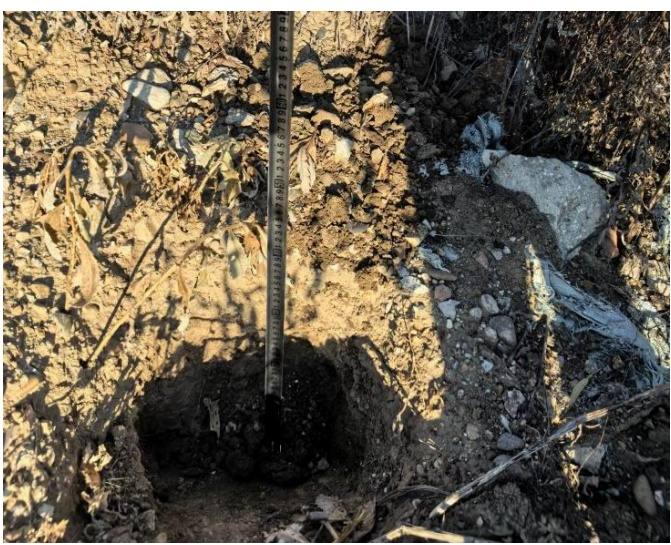
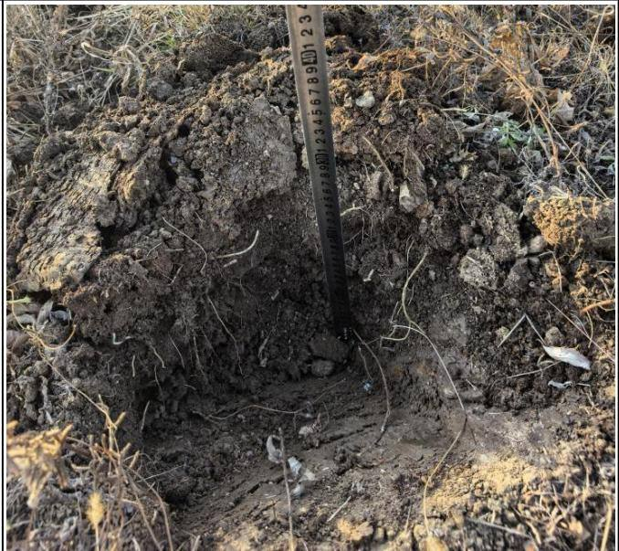
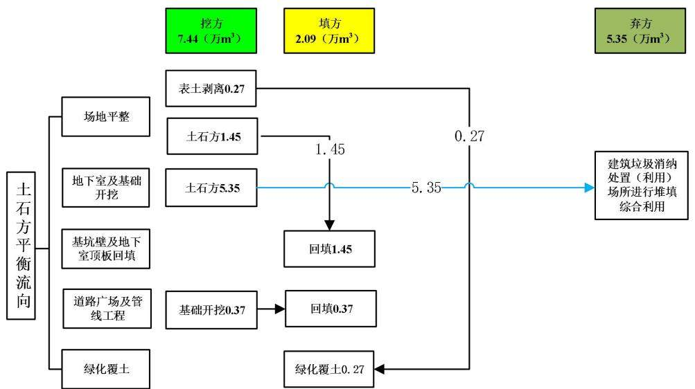
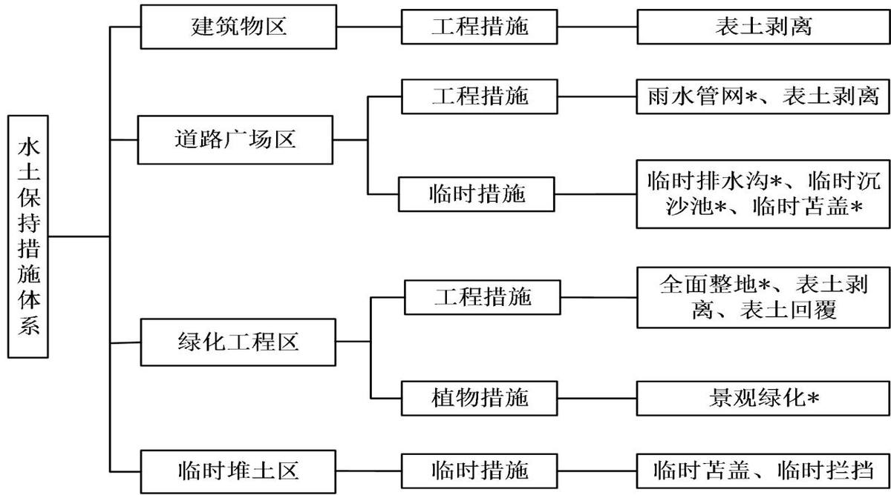

> **Zone C（应用范例层）使用边界**——仅可用于**写作风格、章节展开方式、表达逻辑、表格设计**的参考。
> **不得**用于合规判断；**不得**引入其项目数据（名称／地点／数字／单位名）；
> **不得**因其"曾经通过审批"而推定其做法在当前标准下仍然合规。
> 与 Zone A 冲突时**一律以 Zone A 为准**；Zone A 未明确规定时输出
> 「**Zone A 未明确规定，以下为参考写法，需人工判断**」。
>
> **坐标系警告**：本范例为**老八章结构**（GB 50433—2018 附录B），与 2026 版 10 章模板**同号不同义**
> （老 `1.5`＝防治目标，新 `1.5`＝水土流失预测结果；老 4→新 6 …偏移 +2；新版第 4/5 章老结构无独立章）。
> 因此 **`chapter_mapping: pending`——不得按章节号挂载**，检索一律走 `topic_tags`。
>
> **待加工**：`topic_tags`（主题标签）、`approval_basis_list`（编制依据逐字清单）、
> `structure_summary`（只提取结构：章节展开顺序／段落功能／表格栏目结构／句式模板／论证链步骤）。

目 录 .....  
1 综合说明 ......  
1.1 项目简况...  
1.2 编制依据...  
1.3 设计水平年...  
1.4 水土流失防治责任范围.  
1.5 水土流失防治目标.....  
1.6 项目水土保持评价结论.  
1.7 水土流失预测结果.....  
1.8 水土保持措施布设成果...  
1.9 水土保持监测方案.....  
1.10 水土保持投资及效益分析成果..  
1.11 结论 .... . 10  
2 项目概况... ...12  
2.1 项目组成及工程布置. . 12  
2.2 施工组织... .. 19  
2.3 工程占地... .. 23  
2.4 土石方平衡... ... 23  
2.5 拆迁（移民）安置与专项设施改（迁）建.... ... 30  
2.6 施工进度... ... 30  
2.7 自然概况... ... 32  
3 项目水土保持评价....... .... 36  
3.1 主体工程选址（线）水土保持评价.. ... 36  
3.2 建设方案与布局水土保持评价... .. 38  
3.3 主体工程设计中水土保持措施界定. . 43  
4 水土流失分析与预测...... .... 45  
4.1 水土流失现状... . 45  
4.2 水土流失影响因素分析... . 45  
4.3 土壤流失量预测... .. 47  
4.4 水土流失危害分析... .. 55  
4.5 指导性意见.... .. 56  
5 水土保持措施..... ...57  
5.1 防治区划分. .. 57  
5.2 措施总体布局... .. 57  
5.3 分区措施布设.... .. 61  
5.4 施工要求... .. 67  
6 水土保持监测..... ....72  
6.1 范围和时段. .. 72  
6.2 内容和方法.. ... 72  
6.3 点位布设 ...... .... 75  
6.4 实施条件和成果... ... 76  
7 水土保持投资估算及效益分析..... ..... 80  
7.1 投资估算.. ... 80  
7.2 效益分析.. ... 89  
8 水土保持管理.... ....93  
8.1 组织管理... .. 93  
8.2 后续设计... .. 94  
8.3 水土保持监测... .. 95  
8.4 水土保持监理... ... 96  
8.5 水土保持施工.. ... 96  
8.6 水土保持设施验收.. ... 97  
附 表 ..... ... 99  
附 件 ..... .... 106

## 附表：

附表1、水土保持措施单价汇总表附表2、工程单价分析表

## 附件：

附件1、方案编制委托书  
附件2、国家移民管理局文件《关于黑龙江出入境边防检查总站黑河片区戍边公寓建  
设项目可行性研究报告的批复》（国移民后〔2023〕731号）  
附件3、国家移民管理局文件《关于黑龙江出入境边防检查总站黑河片区戍边公寓建  
设项目初步设计和投资概算的批复》（国移民后〔2024〕1356号）  
附件4、建设用地规划许可证  
附件5、建设工程规划许可证  
附件6、关于黑龙江出入境边防检查总站黑河片区戍边公寓建设项目(一期)配电室面  
积调整的规划意见  
附件7、关于黑龙江出入境边防检查总站黑河片区戍边公寓建设项目施工设计方案调  
整的情况说明  
附件8、建设单位与施工单位合同  
附件9、施工单位与土方工程分包单位情况说明  
附件10、城市建筑垃圾处置许可证及建筑垃圾处置服务合同  
附件11、《黑河市城市建筑垃圾管理办法（暂行）》（黑市建规发（2025）1号）

## 附图：

附图1、项目地理位置图  
附图2、项目区水系图  
附图3、本项目与国家级重点预防区级和重点治理区位置示意图  
附图4、黑龙江省水土流失重点防治区划分图  
附图5、黑河市土壤侵蚀强度分布图  
附图6、项目总平面图  
附图7、分区防治措施总体布局图

附图8、临时苫盖典型设计图

附图9、编织袋装土挡护典型设计图

## 1 综合说明

## 1.1 项目简况

## 1.1.1 项目基本情况

## 1、项目建设必要性

戍边公寓建设项目是国家移民管理局以全面提升戍边民警住房保障水平为出发点和落脚点，激发戍边民警长久守边护边工作热情，号召更多年轻人到边疆卫国戍边，吸引戍边民警家人前往团聚，实现稳边固边的大战略。黑河边境管理支队、黑河出入境边防检查站其任务重点打击走私、贩毒等违法犯罪活动，维护边防辖区治安秩序，维护国家边防安全。维护国家主权，保障开放口岸和边境地区的安全，服务对外开放基本政策和边境地区经济建设。我国地域辽阔，无论边防线还是海防线都十分长，黑河边境管理支队、黑河出入境边防检查站位于大兴安岭北麓，冰冻期长，无霜期短，工作环境比较艰苦。2018年3月，中共中央印发《深化党和国家机构改革方案》，明确提出公安边防部队改制。公安边防部队不再列武警部队序列，全部退出现役。转隶后民警住房很难得到保障，项目的建设能全面提升边疆地区民警住房保障水平，进一步改善民警工作和生活条件，提高民警归属感，增强队伍的战斗力、凝聚力。因此，项目的建设是非常必要的。

黑龙江出入境边防检查总站黑河片区戍边公寓建设项目（以下简称本项目）由中华人民共和国黑河出入境边防检查站投资开发建设。

本项目位于黑河市城区西部，金山街西侧，江天路北侧，项目中心点地理坐标为东经：$1 2 7 ^ { \circ } 2 7 ^ { \prime } 5 3 . 3 1 ^ { \prime \prime }$ ，北纬： $5 0 ^ { \circ } 1 4 ^ { \prime } 4 3 . 7 5 "$ 。项目主要建设内容包括建筑物、道路及配套设施和绿化等，其中：建筑物包括地上建筑物和地下建筑物，地上建筑物主要为4栋9\~11层住宅（1#\~4#楼）、1栋1 层配电室及大门，地下建筑物主要为一层地下车库及设备用房；道路及配套设施包括区内道路、硬地、儿童、老年人活动场地和非机动车停车场等；绿化主要为区内地面绿化。

用地红线面积 $1 . 9 0 \mathrm { h m } ^ { 2 }$ ，总建筑面积 $3 6 8 2 2 . 2 8 \mathrm { m } ^ { 2 }$ ，其中地上建筑面积 $2 6 8 9 7 . 8 2 \mathrm { m } ^ { 2 }$ ，地下建筑面积 $9 9 2 4 . 4 6 \mathrm { m } ^ { 2 }$ ，建筑密度15.99%，绿地率35.10%，容积率1.41。

项目总投资16419万元，其中土建投资14723.78 万元。工程于2026年8月开工，计划于2027 年12 月完工，总工期17个月。

工程总占地面积 $1 . 9 0 \mathrm { h m } ^ { 2 }$ ，全部为永久占地，占地类型为城镇住宅用地。项目用地政府预留用地，不涉及拆迁（移民）安置与专项设施改（迁）建工程。

本项目土石方挖填总量为9.53万 $\mathrm { m } ^ { 3 }$ ，其中挖方7.44万m（3 包含表土剥离0.27万 $\mathbf { m } ^ { 3 } \mathbf { \Gamma } ,$ ），土石方回填2.09万 $\mathrm { m } ^ { 3 }$ （包含表土回覆0.27万 $\mathrm { m } ^ { 3 }$ ），内部调运土石方1.72万 $\mathrm { m } ^ { 3 }$ ，无借方，余方 5.35 万 $\mathrm { m } ^ { 3 }$ ，余方运往兴边路331号设置的建筑垃圾消纳处置（利用）场所进行堆填综合利用。

## 1.1.3 项目前期工作情况

## （1）主体工程设计情况

建设单位委托黑龙江国源工程咨询有限公司于2022年7 月编制完成《黑龙江出入境边防检查总站黑河片区戍边公寓建设项目可行性研究报告》，2023年5月5日，取得了国家移民管理局文件《关于黑龙江出入境边防检查总站黑河片区戍边公寓建设项目可行性研究报告的批复》，文号：国移民后〔2023〕731号。

建设单位委托哈尔滨工业大学建筑设计研究院有限公司于2024年3 月编制完成《黑龙江出入境边防检查总站黑河片区戍边公寓建设项目初步设计》，2025年6 月25 日，取得了国家移民管理局文件《关于黑龙江出入境边防检查总站黑河片区戍边公寓建设项目初步设计和投资概算的批复》，文号：国移民后〔2024〕1356 号。

建设单位委托哈尔滨中建岩土工程勘察有限公司于2025 年8月编制完成《黑龙江出入境边防检查总站黑河片区戍边公寓建设项目岩土工程勘察报告（详勘阶段）》。

## （2）水土保持方案编制情况

2025年 10月，中华人民共和国黑河出入境边防检查站根据《中华人民共和国水土保持法》及有关法律法规规定，委托黑龙江华益工程管理有限公司开展本项目的水土保持方案报告书编制工作。接到工作任务后，编制单位随即成立了项目组，方案编制人员通过外业查勘、收集、分析有关资料，针对该项目建设特点和可能造成的水土流失情况，于2026年5月编制完成《黑龙江出入境边防检查总站黑河片区戍边公寓建设项目水土保持方案报告书》。

## 1.1.4 自然简况

本工程位于黑河市爱辉区境内，项目区地貌为平原区，地势起伏不大，较为平坦。黑河市属中温带大陆性季风气候，跨三、四、五、六共四个积温带。春季高温多风，夏季雨热同期，秋季降温急骤，冬季寒冷干燥，冬长夏短，四季分明。近5年全市年平均气温1.62℃，年均降水量447.32毫米，作物生长季有效积温在2201.1℃之间。日照时数2329.3小时，年均蒸发量1045 毫米，无霜期122 天，年平均风速2.2 米/秒。观测记录以来历史极端最高气温40℃，极端最低气温-48.1℃。项目区土壤主要为草甸土，植被类型以天然兴安落叶松林、各类白桦林及软阔叶混交林为主，同时兼具丰富的灌木与草甸类型。

根据《黑龙江省水土保持规划》（2015—2030年）及《水利部办公厅关于做好国家级水土流失重点预防区和重点治理区落地上图成果应用的通知》（办水保〔2025〕170 号），项目建设区不属于省级和国家级水土流失重点预防区和重点治理区。黑河市在国家级水土保持区划一级区中的东北黑土区、省级水土保持区划中属于小兴安岭山地丘陵生态维护保土区。项目区域水土流失类型为水力侵蚀，侵蚀强度为轻度，土壤侵蚀模数为600t/km2·a；项目区处于东北黑土区，容许土壤流失量 200t/km2·a。

项目区不涉及生态保护红线、河湖管理范围、饮用水水源保护区、水功能一级区的保护区和保留区、自然保护区、世界文化和自然遗产地、风景名胜区、地质公园、森林公园、重要湿地等水土保持敏感区。

## 1.2 编制依据

## 1.2.1 法律法规

（1）《中华人民共和国水土保持法》（1991.6.25 颁布，2010.12.25 修订，2011.3.1施行）；

（2）《黑龙江省水土保持条例》（2018.3.1施行）；

（3）《中华人民共和国土地管理法》（2019.8.26 修改）；

（4）《生产建设项目水土保持方案管理办法》（2023年1 月17日水利部令第53 号发布）。

## 1.2.2 规范性文件

（1）《水利部办公厅关于印发<全国水土保持规划国家级水土流失重点预防区和重点治理区复核划分成果>的通知》（办水保〔2013〕188号）；

（2）《水利部关于加强事中事后监管规范生产建设项目水土保持设施自主验收的通知》（水保〔2017〕365 号，2017 年 11 月 13 日）；

（3）《水利部办公厅关于进一步加强生产建设项目水土保持监测工作的通知》（办

水保〔2020〕161 号）；

（4）《水利部办公厅关于印发生产建设项目水土保持问题分类和责任追究标准的通知》（办水保函〔2020〕564号）；

（5）《水利部办公厅关于实施生产建设项目水土保持信用监管“两单”制度的通知》（办水保〔2020〕157号）；

（6）《水利部办公厅关于印发生产建设项目水土保持方案审查要点的通知》（办水保〔2023〕177 号）；

（7）《水利部办公厅关于进一步加强部批项目水土保持监管工作的通知》（办水保〔2024〕57 号）；

（8）《黑龙江省水利厅关于实行生产建设项目水土保持方案审批承诺制管理的通知》（黑水规发〔2020〕6号）；

（9）《水利部办公厅关于做好国家级水土流失重点预防区和重点治理区落地上图成果应用的通知》（办水保〔2025〕170号）。

## 1.2.3 技术标准

（1）《生产建设项目水土保持技术标准》（GB50433-2018）；

（2）《生产建设项目水土流失防治标准》（GB/T50434-2018）；

（3）《生产建设项目水土保持监测与评价标准》（GB/T51240-2018）；

（4）《水土保持工程调查与勘测标准》（GB/T51297-2018）；

（5）《土壤侵蚀分类分级标准》（SL190-2007）；

（6）《土地利用现状分类》（GB/T21010-2017）；

（7）《水土保持工程设计规范》（GB51018-2014）；

（8）《水利水电工程制图标准水土保持图》（SL73.6-2015）；

（9）《表土剥离及其再利用技术要求》（GBT45107-2024）；

（10）《水土保持监测技术规范》（SL/T277—2024）；

（11）《水土保持监理规范》（SL/T523-2024）。

## 1.2.4 技术资料

（1）《黑龙江省水土保持公报（2024年）》；

（2）《黑龙江省水土保持规划》（2015—2030年）（黑龙江省水利厅，2016.6）；

（3）《黑河市水土保持规划》（2019—2030年）；

（4）《黑龙江出入境边防检查总站黑河片区戍边公寓建设项目初步设计说明》（2024年3月）。

## 1.3 设计水平年

根据《生产建设项目水土保持技术标准》（GB50433-2018），设计水平年应为主体工程完工后的当年或后一年，根据主体工程完工时间和水土保持措施实施进度安排等综合确定。本项目主体工程于 2026年8月开工，计划2027 年12 月完工，方案设计水平年确定为主体工程完工后一年，即2028年。

## 1.4 水土流失防治责任范围

根据《生产建设项目水土保持技术标准》（GB50433-2018），生产建设项目水土流失防治责任范围应包括项目永久征地、临时占地以及其他使用与管辖区域。本项目水土流失防治责任范围面积为1.90hm2，划分为建筑物区、道路广场区、绿化区3个水土流失防治区。

表1.4-1 水土流失防治责任范围

单位：hm2

<table><tr><td rowspan=2 colspan=1>行政区划</td><td rowspan=2 colspan=1>分区名称</td><td rowspan=1 colspan=1>占地类型</td><td rowspan=2 colspan=1>占地性质</td></tr><tr><td rowspan=1 colspan=1>城镇住宅用地</td></tr><tr><td rowspan=3 colspan=1>黑河市</td><td rowspan=1 colspan=1>建筑物区</td><td rowspan=1 colspan=1>0.30</td><td rowspan=1 colspan=1>永久</td></tr><tr><td rowspan=1 colspan=1>道路广场区</td><td rowspan=1 colspan=1>0.93</td><td rowspan=1 colspan=1>永久</td></tr><tr><td rowspan=1 colspan=1>绿化区</td><td rowspan=1 colspan=1>0.67</td><td rowspan=1 colspan=1>永久</td></tr><tr><td rowspan=1 colspan=2>合计</td><td rowspan=1 colspan=1>1.90</td><td rowspan=1 colspan=1>永久</td></tr></table>

## 1.5 水土流失防治目标

## 1.5.1 执行标准等级

本项目位于黑河市，根据《黑龙江省水土保持规划（2015-2030 年）》及《黑河市水土保持规划（2019-2030 年）》，水土保持区划为东北黑土区，按照《生产建设项目水土流失防治标准》的规定，本项目采用东北黑土区水土流失防治一级标准。

## 1.5.2 防治目标

## （1）水土流失防治标准定性指标

本项目水土流失防治不仅要对项目区内新增水土流失进行防护，还需结合所在区域水土保持发展要求，对原有水土流失也要进行综合治理。按照“预防为主、保护优先、全面规划、综合治理、因地制宜、突出重点、科学管理、注重效益”的工作方针，合理布设各项防治措施，建立分区正确、布局合理、功能齐全、效果显著的水土流失综合防治体系，促进当地水土资源可持续利用和生态系统的良性循环。本项目水土流失防治定性目标如下：

①项目建设范围内的新增水土流失应得到有效控制，原有水土流失得到治理；

②水土保持设施应安全有效；

③水土资源、林草植被应得到最大限度的保护与恢复。

## （2）水土流失防治标准定量指标

根据《黑龙江省水土保持规划》（2015—2030 年）及《水利部办公厅关于做好国家级水土流失重点预防区和重点治理区落地上图成果应用的通知》（办水保〔2025〕170 号），项目建设区不属于省级和国家级水土流失重点预防区和重点治理区，根据《生产建设项目水土流失防治标准》（GB/T50434-2018），本项目位于黑河市爱辉区，属于城市区域，水土流失防治执行一级标准，按一级标准确定设计水平年的防治目标。水土流失治理度、土壤流失控制比、渣土防护率、表土保护率、林草植被恢复率、林草覆盖率六项指标应符合《生产建设项目水土流失防治标准》（GB/T50434-2018）的规定。

结合本工程所在土壤侵蚀强度、项目区位等因素，需对水土流失防治目标值进行修正，确定本工程水土流失防治目标。本工程所在地黑河市市区水土流失以轻度水蚀为主，根据相关规定，土壤流失控制比提高0.10。根据《中华人民共和国水土保持法》中“生产建设项目选址、选线应当避让水土流失重点预防区和重点治理区；无法避让的，应当提高防治标准，优化施工工艺，减少地表扰动和植被损坏范围，有效控制可能造成的水土流失”的规定及《生产建设项目水土保持技术标准》（GB50433-2018）3.2.2 条规定第4款规定，“对无法避让水土流失重点预防区和重点治理区的生产建设项目，建设方案应提高植物措施标准，林草覆盖率应提高1个-2个百分点。”根据《生产建设项目水土流失防治标准》（GB/T50434-2018）“4.0.9 位于城市区的项目，渣土防护率和林草覆盖率可提高1%-2%”。因此根据本工程实际施工及布置情况，林草覆盖率调整至27%，渣土防护率调整至98%。

设计水平年各防治区的水土流失防治目标详见表1.5-1。

表1.5-1 工程总体防治目标
<table><tr><td rowspan=2 colspan=1>防治指标</td><td rowspan=1 colspan=2>一级标准</td><td rowspan=1 colspan=2>修正值</td><td rowspan=1 colspan=2>采用值</td><td rowspan=2 colspan=1>修正说明</td></tr><tr><td rowspan=1 colspan=1>施工期</td><td rowspan=1 colspan=1>设计水平年</td><td rowspan=1 colspan=1>按侵蚀强度</td><td rowspan=1 colspan=1>按是否位于城市区域</td><td rowspan=1 colspan=1>施工期</td><td rowspan=1 colspan=1>设计水平年</td></tr><tr><td rowspan=1 colspan=1>水土流失治理度(%)</td><td rowspan=1 colspan=1>1</td><td rowspan=1 colspan=1>97</td><td rowspan=1 colspan=1></td><td rowspan=1 colspan=1></td><td rowspan=1 colspan=1>-</td><td rowspan=1 colspan=1>97</td><td rowspan=1 colspan=1></td></tr><tr><td rowspan=1 colspan=1>土壤流失控制比</td><td rowspan=1 colspan=1>-</td><td rowspan=1 colspan=1>0.9</td><td rowspan=1 colspan=1>+0.10</td><td rowspan=1 colspan=1></td><td rowspan=1 colspan=1>1</td><td rowspan=1 colspan=1>1.0</td><td rowspan=1 colspan=1>轻度侵蚀为主的区域不应小于1.0</td></tr><tr><td rowspan=1 colspan=1>渣土防护率（%）</td><td rowspan=1 colspan=1>95</td><td rowspan=1 colspan=1>97</td><td rowspan=1 colspan=1></td><td rowspan=1 colspan=1>+1</td><td rowspan=1 colspan=1>96</td><td rowspan=1 colspan=1>98</td><td rowspan=1 colspan=1></td></tr><tr><td rowspan=1 colspan=1>表土保护率（%）</td><td rowspan=1 colspan=1>98</td><td rowspan=1 colspan=1>98</td><td rowspan=1 colspan=1></td><td rowspan=1 colspan=1></td><td rowspan=1 colspan=1>98</td><td rowspan=1 colspan=1>98</td><td rowspan=1 colspan=1></td></tr><tr><td rowspan=1 colspan=1>林草植被恢复率(%)</td><td rowspan=1 colspan=1>-</td><td rowspan=1 colspan=1>98</td><td rowspan=1 colspan=1></td><td rowspan=1 colspan=1></td><td rowspan=1 colspan=1>1</td><td rowspan=1 colspan=1>98</td><td rowspan=1 colspan=1></td></tr><tr><td rowspan=1 colspan=1>林草覆盖率（%）</td><td rowspan=1 colspan=1>-</td><td rowspan=1 colspan=1>25</td><td rowspan=1 colspan=1></td><td rowspan=1 colspan=1>+2</td><td rowspan=1 colspan=1>-</td><td rowspan=1 colspan=1>27</td><td rowspan=1 colspan=1></td></tr></table>

## 1.6 项目水土保持评价结论

## 1.6.1 主体工程选址（线）评价

本工程建设地点位于黑河市，附近水、电及交通条件较好，满足工程施工管理要求。

厂址占地区域不涉及生态保护红线、河湖管理范围、饮用水水源保护区、水功能一级区保护区和保留区，不涉及自然保护区、世界文化和自然遗产地、风景名胜区、地质公园、森林公园、重要湿地等。项目区不涉及河流两岸、湖泊和水库周边的植物保护带。不涉及全国水土保持监测网络中的水土保持监测站点、重点试验区及国家确定的水土保持长期定位观测站。根据《黑龙江省水土保持规划》（2015—2030 年）、《黑河市水土保持规划（2019-2030 年）》及《水利部办公厅关于做好国家级水土流失重点预防区和重点治理区落地上图成果应用的通知》（办水保〔2025〕170号），项目选址不属于省级和国家级水土流失重点预防区和重点治理区。因此，本项目无重大水土保持制约因素，从水土保持角度分析本项目建设基本可行。

综上所述，从水土保持角度分析本项目选址合理。

## 1.6.2 建设方案与布局评价

工程平面布置安全合理，竖向布置能够满足场地排水和城市防洪要求，施工布置充分利用现有道路和场地。从水土保持角度考虑，工程建设方案是合理的。

工程确定的占地布局总体上较为合理，对施工临时设施占地考虑较周全，工程占地不存在水土保持制约性因素，符合水土保持要求。

工程土石方挖填数量符合最优化原则，严格控制挖填总量；工程建设产生余方外运进行综合利用，后期建设外借土方综合利用其他工程产生的余土，土方的运输、处置结合项目施工时序进行综合调配，土石方挖填调运方案合理可行，满足水土保持对生产建设项目的建设要求。

工程不自设取土（石、砂）场，所需的砂石料及回填土（绿化土）均采用合法料场商购的方式解决，避免了自设取土（石、砂）场造成水土流失；工程建设产生余方外运进行综合利用，避免了自设弃土（石、渣）场造成水土流失。

工程施工方法与工艺除了有利于各工序间的交叉衔接外，同时满足工程建设进度需要，保证施工安全，减少地面重复开挖扰动，有利于水土保持。从水土保持角度分析，主体工程采用的施工方法与工艺合理可行。

主体工程设计的水土保持措施基本合理，从水土保持角度看，主体工程设计的雨水管网、景观绿化等措施总体可行。主体工程设计中，只注重了本体防护，而对水土流失对周边环境的影响面考虑的较少，不能形成有效的防护体系。因此，本方案在分析评价主体工程中具有水土保持功能工程的基础上，补充增加必要的水土保持措施设计，并将其一并纳入方案的水土保持措施体系中，使方案水土保持措施形成一个完整、严密、科学的防护体系。

## 1.7 水土流失预测结果

本项目水土流失总量为262.98t，背景水土流失量为49.92t，新增水土流失量213.06t。水土流失重点时段为施工期；水土流失重点区域为绿化区，也是工程水土保持监测和防治的重点区域，在项目建设期间，首先需重点做好施工防护措施，防止在降雨径流作用下泥沙漫流，以减少对周边道路交通安全、防洪安全、居民生产生活造成的不良影响。项目建设过程中，建设单位应切实做好防护措施，严禁随意扩大用地面积，尽可能将项目建设对沿线敏感区域影响降到最小。

## 1.8 水土保持措施布设成果

## 1.8.1 防治区划分

根据防治区划分依据和原则，本项目的水土流失防治区划分为4个防治分区，分别为建筑物防治区、道路广场防治区、绿化防治区和临时堆土防治区。

## 1.8.2 主要工程量

## （1）建构物区

工程措施：施工前，方案新增对可剥离表土区域实施表土剥离0.05 万 $\mathrm { m } ^ { 3 }$ ，剥离面积

0.14hm2；

## （2）道路广场区

工程措施：施工前，方案新增对可剥离表土区域实施表土剥离0.13 万m3，剥离面积0.44hm2；施工过程中，主体设计对项目区场地布设雨水管网1560m；

临时措施：施工过程中，施工前期主体设计针对项目区布设场地临时排水沟1500m，排水出口设置沉淀池1座；施工过程中，对项目区施工扰动区域进行密目网临时苫盖5000m2。

## （3）景观绿化区

工程措施：施工前，方案新增对可剥离表土区域实施表土剥离0.09 万m3，剥离面积0.31hm2；施工后期，主体设计绿化区域土地整治0.67hm2，方案新增表土回覆0.27万m3；

植物措施：施工后期，主体设计景观绿化 0.67hm2；

## （4）临时堆土区

临时措施：施工过程中，方案新增对临时堆土区表土与转存土分开堆存，堆土四周均采用编织袋装土拦挡，编织袋装土临时拦挡390m、临时苫盖4000m2。

## 1.9 水土保持监测方案

本项目水土保持监测范围是以水土流失防治责任范围为准，至设计水平年项目的水土流失防治责任范围面积1.90hm2。监测内容包括：水土流失影响因素、水土流失状况、水土流失危害和水土保持措施等。监测方法采用资料分析、实地调查监测、地面观测、巡查监测相结合的方式进行水土保持监测。

根据项目特点及施工总体布局，结合各分区特点布置监测点进行监测，项目建设期共布置4个监测点，其中建构筑物区1个、道路广场区1 个、绿化区1个和临时堆土区1个。

根据《生产建设项目水土保持监测与评价标准》（GB/T51240－2018），建设类项目监测时段应从施工准备期开始，至设计水平年结束，监测时段从2026年8月～2028月 12月。

## 1.10 水土保持投资及效益分析成果

本工程水土保持总投资244.54万元，其中列入主体工程投资183.90 万元，本方案新增投资60.64万元。其中工程措施费28.41万元，植物措施费140.70万元，监测措施费30.37

万元，施工临时工程费33.15万元，独立费用31.93 万元（其中建设管理费10.93 万元、工程建设监理费8.00 万元、科研勘测设计费13.00万元），基本预备费8.07万元，水土保持补偿费 2.28 万元（22840.8 元）。

通过对各防治区采取工程措施、植物措施、临时措施和施工期管理措施后，到设计水平年，水土流失治理度达99.47%，土壤流失控制比达到1.00，渣土防护率达99.52%，表土保护率100%，林草植被恢复率达98.51%，林草覆盖率达35%。

## 1.11 结论

本项目工程选址、建设方案、总体布局、水土流失防治等方面符合水土保持法律法规、技术标准的规定，在实施本方案确定的水土保持综合防治措施后，能有效防治工程建设期间可能造成的水土流失，改善项目区生态环境。从水土保持角度对工程设计、施工和建设管理提出以下要求。

（1）工程设计：后续施工图设计应将方案新增的水土保持措施纳入主体工程设计，按照《生产建设项目水土保持方案管理办法》（水利部令第53号，2023年1月17日）文件要求，如设计或施工过程中水土保持措施发生重大变更的，应重新编制项目水土保持方案，报水利部进行审批。

（2）施工：本项目水土流失治理由建设单位负责，施工单位实施的方式，建设单位在施工招标时拟将本方案新增的水土保持措施纳入施工招标合同中，将水土保持措施落到实处，项目施工单位应切实履行施工合同，将水土保持措施保质保量完成。

（3）建设管理：建设单位将组织施工、监理等参建各方严把质量关，严格控制施工进度，及时实施好水土保持方案设计的各项水土流失防治措施。本项目竣工验收时，应当验收水土保持设施，组织第三方机构编制水土保持设施验收报告并报备，水土保持设施未经验收或者验收不合格的，项目不得投产使用。

水土保持方案特性表
<table><tr><td rowspan=1 colspan=2>项目名称</td><td rowspan=1 colspan=2>黑龙江出入境边防检查总站黑河片区戍边公寓建设项目</td><td rowspan=1 colspan=1>流域管理机构</td><td rowspan=1 colspan=2>松辽水利委员会</td></tr><tr><td rowspan=1 colspan=2>涉及省（市、区）</td><td rowspan=1 colspan=1>黑龙江省</td><td rowspan=1 colspan=1>涉及地市/个数</td><td rowspan=1 colspan=1>黑河市</td><td rowspan=1 colspan=1>涉及县/个数</td><td rowspan=1 colspan=1>爱辉区</td></tr><tr><td rowspan=1 colspan=2>项目规模</td><td rowspan=1 colspan=1>规划用地红线面积1.90hm²，总建筑面积 36822.28m²。</td><td rowspan=1 colspan=1>总投资（万元）</td><td rowspan=1 colspan=1>16419</td><td rowspan=1 colspan=1>土建投资（万元）</td><td rowspan=1 colspan=1>14723.78</td></tr><tr><td rowspan=1 colspan=2>动工时间</td><td rowspan=1 colspan=1>2026.8</td><td rowspan=1 colspan=1>完工时间</td><td rowspan=1 colspan=1>2027.12</td><td rowspan=1 colspan=1>设计水平年</td><td rowspan=1 colspan=1>2028年</td></tr><tr><td rowspan=1 colspan=2>工程占地（hm²）</td><td rowspan=1 colspan=1>1.90</td><td rowspan=1 colspan=1>永久占地（hm²）</td><td rowspan=1 colspan=1>1.90</td><td rowspan=1 colspan=1>临时占地（hm²）</td><td rowspan=1 colspan=1>0</td></tr><tr><td rowspan=2 colspan=3>土石方量（万m³）</td><td rowspan=1 colspan=1>挖方</td><td rowspan=1 colspan=1>填方</td><td rowspan=1 colspan=1>借方</td><td rowspan=1 colspan=1>余（弃）方</td></tr><tr><td rowspan=1 colspan=1>7.44</td><td rowspan=1 colspan=1>2.09</td><td rowspan=1 colspan=1>0</td><td rowspan=1 colspan=1>5.35</td></tr><tr><td rowspan=1 colspan=3>重点防治区名称</td><td rowspan=1 colspan=4>不属于省级和国家级水土流失重点预防区和重点治理区</td></tr><tr><td rowspan=1 colspan=3>地貌类型</td><td rowspan=1 colspan=1>平原地貌</td><td rowspan=1 colspan=2>水土保持区划</td><td rowspan=1 colspan=1>东北黑土区</td></tr><tr><td rowspan=1 colspan=3>土壤侵蚀类型</td><td rowspan=1 colspan=1>水力侵蚀</td><td rowspan=1 colspan=2>土壤侵蚀强度</td><td rowspan=1 colspan=1>轻度</td></tr><tr><td rowspan=1 colspan=3>防治责任范围面积（hm²）</td><td rowspan=1 colspan=1>1.90</td><td rowspan=1 colspan=2>容许土壤侵蚀模数[t/(km²·a)]</td><td rowspan=1 colspan=1>200</td></tr><tr><td rowspan=1 colspan=3>水土流失预测总量（t）</td><td rowspan=1 colspan=1>262.98</td><td rowspan=1 colspan=2>新增土壤流失量（t）</td><td rowspan=1 colspan=1>213.06</td></tr><tr><td rowspan=1 colspan=3>水土流失防治标准执行等级</td><td rowspan=1 colspan=4>东北黑土区一级标准</td></tr><tr><td rowspan=3 colspan=1>防治指标</td><td rowspan=1 colspan=2>水土流失治理度（%）</td><td rowspan=1 colspan=1>97</td><td rowspan=1 colspan=1>土壤流失控制比</td><td rowspan=1 colspan=2>1.0</td></tr><tr><td rowspan=1 colspan=2>渣土防护率（%）</td><td rowspan=1 colspan=1>98</td><td rowspan=1 colspan=1>表土保护率（%）</td><td rowspan=1 colspan=2>98</td></tr><tr><td rowspan=1 colspan=2>林草植被恢复率（%）</td><td rowspan=1 colspan=1>98</td><td rowspan=1 colspan=1>林草覆盖率（%）</td><td rowspan=1 colspan=2>27</td></tr><tr><td rowspan=5 colspan=1>防治措施及工程量</td><td rowspan=1 colspan=2>防治分区</td><td rowspan=1 colspan=1>工程措施</td><td rowspan=1 colspan=1>植物措施</td><td rowspan=1 colspan=2>临时措施</td></tr><tr><td rowspan=1 colspan=2>建筑物防治区</td><td rowspan=1 colspan=1>表土剥离 0.14hm²</td><td rowspan=1 colspan=1></td><td rowspan=1 colspan=2></td></tr><tr><td rowspan=1 colspan=2>道路广场防治区</td><td rowspan=1 colspan=1>雨水管网 1560m表土剥离 0.44hm²</td><td rowspan=1 colspan=1></td><td rowspan=1 colspan=2>临时排水沟1500m、沉沙池1座、临时苫盖 5000m²</td></tr><tr><td rowspan=1 colspan=2>绿化防治区</td><td rowspan=1 colspan=1>土地整治 2.03hm²表土剥离 0.31hm²表土回覆 0.27万 m³</td><td rowspan=1 colspan=1>景观绿化 0.67hm²</td><td rowspan=1 colspan=2></td></tr><tr><td rowspan=1 colspan=2>临时堆土防治区</td><td rowspan=1 colspan=1></td><td rowspan=1 colspan=1></td><td rowspan=1 colspan=2>临时拦挡331.50m³、临时苫盖4000m²</td></tr><tr><td rowspan=1 colspan=3>投资（万元）</td><td rowspan=1 colspan=1>28.41</td><td rowspan=1 colspan=1>140.70</td><td rowspan=1 colspan=2>33.15</td></tr><tr><td rowspan=1 colspan=3>水土保持总投资（万元）</td><td rowspan=1 colspan=1>244.54</td><td rowspan=1 colspan=1>独立费用（万元）</td><td rowspan=1 colspan=2>31.93</td></tr><tr><td rowspan=1 colspan=2>监理费（万元）</td><td rowspan=1 colspan=1>8</td><td rowspan=1 colspan=1>监测费（万元）</td><td rowspan=1 colspan=1>30.37</td><td rowspan=1 colspan=1>补偿费（元）</td><td rowspan=1 colspan=1>22840.8</td></tr><tr><td rowspan=1 colspan=2>方案编制单位</td><td rowspan=1 colspan=2>黑龙江华益工程管理有限公司</td><td rowspan=1 colspan=1>建设单位</td><td rowspan=1 colspan=2>中华人民共和国黑河出入境边防检查站</td></tr><tr><td rowspan=1 colspan=2>法定代表人</td><td rowspan=1 colspan=2>闫桂香</td><td rowspan=1 colspan=1>法定代表人</td><td rowspan=1 colspan=2>贾树森</td></tr><tr><td rowspan=1 colspan=2>地址</td><td rowspan=1 colspan=2>黑龙江省哈尔滨市高新技术产业开发区科技创新城创新创业广场19号楼</td><td rowspan=1 colspan=1>地址</td><td rowspan=1 colspan=2>黑河市龙源路59号黑河出入境边防检查站</td></tr><tr><td rowspan=1 colspan=2>邮编</td><td rowspan=1 colspan=2>150000</td><td rowspan=1 colspan=1>邮编</td><td rowspan=1 colspan=2>164300</td></tr><tr><td rowspan=1 colspan=2>联系人及电话</td><td rowspan=1 colspan=2>车传博18724628660</td><td rowspan=1 colspan=1>联系人及电话</td><td rowspan=1 colspan=2>胡思雨18545647700</td></tr><tr><td rowspan=1 colspan=2>传真</td><td rowspan=1 colspan=2>1</td><td rowspan=1 colspan=1>传真</td><td rowspan=1 colspan=2>1</td></tr><tr><td rowspan=1 colspan=2>电子信箱</td><td rowspan=1 colspan=2>/</td><td rowspan=1 colspan=1>电子信箱</td><td rowspan=1 colspan=2>/</td></tr></table>

## 2 项目概况

## 2.1 项目组成及工程布置

## 2.1.1 项目基本情况

项目名称：黑龙江出入境边防检查总站黑河片区戍边公寓建设项目；

建设单位：中华人民共和国黑河出入境边防检查站；

建设地点：项目位于黑河市城区西部，金山街西侧，江天路北侧，项目中心点地理坐标为东经：127°27′53.31″，北纬：50°14′43.75″；

建设性质：新建建设类项目；

流 域：松辽流域；

建设内容：主要建设内容包括建筑物、道路及配套设施和绿化等，其中：建筑物包括地上建筑物和地下建筑物，地上建筑物主要为4栋9\~11层住宅（1#\~4#楼）、1栋1层配电室及大门，地下建筑物主要为一层地下车库及设备用房；道路及配套设施包括区内道路、硬地、儿童、老年人活动场地和非机动车停车场等；绿化主要为区内地面绿化。

建设规模：用地红线面积1.90hm2，总建筑面积36822.28m2，其中地上建筑面积26897.82m2，地下建筑面积9924.46m2，建筑密度15.99%，绿地率35.10%，容积率1.41；

工程投资：总投资16419万元，其中土建投资14723.78万元；

建设工期：17个月（即2026年8月至2027年12月）。

## 2.1.2 项目地理位置

项目位于黑河市城区西部，金山街西侧，江天路北侧，项目中心点地理坐标为东经： $1 2 7 ^ { \circ }$ $2 7 ^ { \prime } 5 3 . 3 1 ^ { \prime \prime }$ ，北纬： $5 0 ^ { \circ } 1 4 ^ { \prime } 4 3 . 7 5 ^ { \prime \prime }$ 。对外交通道路主要依托S211（环城西路）及G202（机场路、环城南路），市政配套设施齐全，交通十分便利。

项目区地理位置见图2.1-1。

  
图2.1-1 工程地理位置示意图

## 2.1.3 项目建设内容及规模

本项目主要建设内容包括建筑物、道路及配套设施和绿化等，其中：建筑物包括地上建筑物和地下建筑物，地上建筑物主要为4栋9\~11层住宅（1#\~4#楼）、1栋1层配电室及大门，地下建筑物主要为一层地下车库及设备用房；道路及配套设施包括区内道路、硬地、儿童、老年人活动场地和非机动车停车场等；绿化主要为区内地面绿化。项目用地红线面积1.90hm2，总建筑面积 36822.28m2，其中地上建筑面积 26897.82m2，地下建筑面积 9924.46m2，建筑密度15.99%，绿地率 35.10%，容积率 1.41；

具体经济技术指标详见表2.1-1。

表2.1-1 项目经济技术指标表

<table><tr><td rowspan=1 colspan=1>序号</td><td rowspan=1 colspan=3>项目</td><td rowspan=1 colspan=1>数量</td><td rowspan=1 colspan=1>单位</td><td rowspan=1 colspan=1>备注</td></tr><tr><td rowspan=1 colspan=1>1</td><td rowspan=1 colspan=3>总规划用地面积</td><td rowspan=1 colspan=1> $\mathbf { m } ^ { 2 }$ </td><td rowspan=1 colspan=1>19034</td><td rowspan=1 colspan=1></td></tr><tr><td rowspan=1 colspan=1>2</td><td rowspan=1 colspan=3>总建筑面积</td><td rowspan=1 colspan=1> $\mathbf { m } ^ { 2 }$ </td><td rowspan=1 colspan=1>36822.28</td><td rowspan=1 colspan=1></td></tr><tr><td rowspan=10 colspan=1>3</td><td rowspan=1 colspan=3>地上建筑面积</td><td rowspan=1 colspan=1> $\mathbf { m } ^ { 2 }$ </td><td rowspan=1 colspan=1>26897.82</td><td rowspan=1 colspan=1></td></tr><tr><td rowspan=9 colspan=1>地上</td><td rowspan=2 colspan=1>1#</td><td rowspan=1 colspan=1>住宅</td><td rowspan=1 colspan=1> $\mathbf { m } ^ { 2 }$ </td><td rowspan=1 colspan=1>7265.46</td><td rowspan=2 colspan=1>11层/33m</td></tr><tr><td rowspan=1 colspan=1>便利店</td><td rowspan=1 colspan=1> $\mathbf { m } ^ { 2 }$ </td><td rowspan=1 colspan=1>70.09</td></tr><tr><td rowspan=2 colspan=1>2#</td><td rowspan=1 colspan=1>住宅</td><td rowspan=1 colspan=1> $\mathbf { m } ^ { 2 }$ </td><td rowspan=1 colspan=1>7273.78</td><td rowspan=2 colspan=1>11层/33m</td></tr><tr><td rowspan=1 colspan=1>物业管理与服务用房</td><td rowspan=1 colspan=1> $\mathbf { m } ^ { 2 }$ </td><td rowspan=1 colspan=1>126.72</td></tr><tr><td rowspan=1 colspan=1>3#</td><td rowspan=1 colspan=1>住宅</td><td rowspan=1 colspan=1> $\mathbf { m } ^ { 2 }$ </td><td rowspan=1 colspan=1>5955.45</td><td rowspan=1 colspan=1>9层/27.5m</td></tr><tr><td rowspan=2 colspan=1>4#</td><td rowspan=1 colspan=1>住宅</td><td rowspan=1 colspan=1> $\mathbf { m } ^ { 2 }$ </td><td rowspan=1 colspan=1>5885.36</td><td rowspan=2 colspan=1>9层/27.5m</td></tr><tr><td rowspan=1 colspan=1>物业管理与服务用房</td><td rowspan=1 colspan=1> $\mathbf { m } ^ { 2 }$ </td><td rowspan=1 colspan=1>70.09</td></tr><tr><td rowspan=1 colspan=2>大门</td><td rowspan=1 colspan=1> $\mathbf { m } ^ { 2 }$ </td><td rowspan=1 colspan=1>25.44</td><td rowspan=1 colspan=1>1层/5.1m</td></tr><tr><td rowspan=1 colspan=2>配电室</td><td rowspan=1 colspan=1></td><td rowspan=1 colspan=1>255.43</td><td rowspan=1 colspan=1>1层/5.7m</td></tr><tr><td rowspan=4 colspan=1>4</td><td rowspan=1 colspan=3>地下建筑面积</td><td rowspan=1 colspan=1> $\mathbf { m } ^ { 2 }$ </td><td rowspan=1 colspan=1>9924.46</td><td rowspan=1 colspan=1>4.5m</td></tr><tr><td rowspan=3 colspan=1>其中</td><td rowspan=1 colspan=2>人防</td><td rowspan=1 colspan=1> $\mathbf { m } ^ { 2 }$ </td><td rowspan=1 colspan=1>2817.57</td><td rowspan=1 colspan=1></td></tr><tr><td rowspan=1 colspan=2>停车场</td><td rowspan=1 colspan=1> $\mathbf { m } ^ { 2 }$ </td><td rowspan=1 colspan=1>6274.40</td><td rowspan=1 colspan=1></td></tr><tr><td rowspan=1 colspan=2>设备用房</td><td rowspan=1 colspan=1> $\mathbf { m } ^ { 2 }$ </td><td rowspan=1 colspan=1>832.49</td><td rowspan=1 colspan=1></td></tr><tr><td rowspan=1 colspan=1>5</td><td rowspan=1 colspan=3>地下停车泊位</td><td rowspan=1 colspan=1>辆</td><td rowspan=1 colspan=1>251</td><td rowspan=1 colspan=1>0.8车位/户</td></tr><tr><td rowspan=1 colspan=1>6</td><td rowspan=1 colspan=3>非机动车停车位</td><td rowspan=1 colspan=1>辆</td><td rowspan=1 colspan=1>63</td><td rowspan=1 colspan=1></td></tr><tr><td rowspan=1 colspan=1>7</td><td rowspan=1 colspan=3>容积率</td><td rowspan=1 colspan=1>二</td><td rowspan=1 colspan=1>1.41</td><td rowspan=1 colspan=1>容积率≤1.8</td></tr><tr><td rowspan=1 colspan=1>8</td><td rowspan=1 colspan=3>建筑密度</td><td rowspan=1 colspan=1>%</td><td rowspan=1 colspan=1>15.99</td><td rowspan=1 colspan=1>建筑密度≤20%</td></tr><tr><td rowspan=1 colspan=1>9</td><td rowspan=1 colspan=3>绿地率</td><td rowspan=1 colspan=1>%</td><td rowspan=1 colspan=1>35.1</td><td rowspan=1 colspan=1>绿地率≥35</td></tr><tr><td rowspan=1 colspan=1>10</td><td rowspan=1 colspan=3>绿地面积</td><td rowspan=1 colspan=1> $\mathbf { m } ^ { 2 }$ </td><td rowspan=1 colspan=1>6680.93</td><td rowspan=1 colspan=1></td></tr><tr><td rowspan=1 colspan=1>11</td><td rowspan=1 colspan=3>项目总投资</td><td rowspan=1 colspan=1>万元</td><td rowspan=1 colspan=1>16419</td><td rowspan=1 colspan=1>申请国家发展改革委安排中央预算内资金</td></tr><tr><td rowspan=1 colspan=1>12</td><td rowspan=1 colspan=3>土建投资</td><td rowspan=1 colspan=1>万元</td><td rowspan=1 colspan=1>14723.78</td><td rowspan=1 colspan=1></td></tr><tr><td rowspan=1 colspan=1>13</td><td rowspan=1 colspan=3>建设工期</td><td rowspan=1 colspan=1>年</td><td rowspan=1 colspan=1></td><td rowspan=1 colspan=1>2026年8月—2027年12月</td></tr></table>

## 2.1.4 工程布置

## 2.1.4.1 项目平面布置

项目区大体为矩形，南北长约117m，东西长约 154m。本项目共建设4栋高层公寓楼，1#楼、2#楼布置于南侧，3#楼位于西北侧，4#楼位于东北侧，场内道路呈环状环绕于建筑四周，形成顺畅的交通系统；建筑物空隙和道路两侧集中设置园林景观绿化和广场绿化等，形成景观视觉廊道。

项目区南侧江天路规划设置两个出入口，人行主出入口位于中部，人次出入口位于东侧，西南侧设置车行出入口。出入口的设置既能与四周的道路相连，又能将外部环境引入项目区。项目区配有大面积的绿化，建筑布局以点线结合为主围合中心绿化，平面上的错动与高度的变化形成错落有序变化丰富的建筑空间格局和开阔的视线通廊。

## 2.1.4.2 项目竖向布置

## （1）原始地形

根据现场踏勘结合地形图分析，项目区总体地势起伏不大，场地地势北高南低，地面高程在165.47\~167.71m 之间，最大相对高差2.24m。

## （2）项目场地内竖向设计

根据初步设计，项目竖向设计依原地形进行布置，考虑到南侧高层建筑与道路的衔接及场地排水、土方平衡等因素，整个场地竖向设计以北高南低，坡度0.30%\~0.55%并略高于城市道路为原则进行控制。项目区场地内大致分两台布置，北侧室外场地设计标高在165.20\~165.79m，布置3#楼设计建筑±0.00标高166.10m，布置4#楼设计建筑±0.00标高165.70m；布置配电室设计建筑±0.00标高165.90m；南侧室外场地设计标高在165.38\~166.25m，布置1#楼设计建筑±0.00标高166.10m，布置2#楼设计建筑±0.00标高166.00m；项目建成后，项目区内场地存在局部高差，高差通过绿化、广场、道路等缓坡顺接。

## （3）项目竖向设计与周边衔接

项目区南侧紧邻江天路，北侧为爱辉区边境管理大队，西侧现状为空地，东侧紧邻金山街，周边衔接如下：

①项目区南侧场地设计标高165.38\~166.25m，南侧临江天路相邻段道路设计标高为165.37m～166.18m，项目区与道路高差介于+0.01m～+0.07m 之间，通过绿地缓坡及围墙衔接。

②项目区东侧场地设计标高165.26\~165.38m，东侧临金山街相邻段道路设计标高为165.09m～165.67m，项目区与道路高差介于+0.17m～+0.29m 之间，通过绿地及缓坡及围墙衔接。

③项目区北侧场地设计标高165.20\~165.79m，西侧爱辉区边境管理大队场地标高为  
165.17\~165.58m，项目区与外围高差介于+0.02m～+0.12m，通过绿地及缓坡及围墙衔接。

④项目区西侧场地设计标高165.79m～166.25m，西侧空地场地标高为165.47m～

166.13m，项目区与外围高差介于+0.32m～+0.12m，通过围墙以及原地貌进行衔接

## （4）地下室竖向布置

项目设置地下室一层，地下室范围轮廓面积9924.46m2，根据《基坑支护设计方案》，地下室底板标高159.30\~160.30m，地下室深度5.6m，基坑底标高为159.00～160.00m，基坑开挖深度为4.90\~5.90m。地下室层高4.5m，基坑顶板室外场地回填土平均高度1.3\~1.50m。

## 2.1.5 项目组成

根据工程建设内容的水土流失特点、施工工艺、施工时序的不同，将本项目划分为建筑物区、道路广场区和绿化区3个部分。

## 2.1.5.1 建筑物区

## （1）地上建筑物

地上建筑物：主要建设4栋高层公寓楼，建筑面积26646.95m2，1#楼、2#楼11F/33m，3#楼、4#楼 9F/27.5m，共 313 套公寓房（ $9 0 \mathrm m ^ { 2 }$ 和 $7 0 \mathrm { m } ^ { 2 }$ 两个户型）。在 1#、2#、4#高层住宅一层均设置住宅配套用房，包括物业管理与服务用房、便利店等设施。1 栋配电室1F/5.7m，建筑面积 255.43m2。小区大门 1F/5.1m，建筑面积 $2 5 . 4 4 \mathrm { m } ^ { 2 }$ 。1#住宅楼、2#住宅楼为二类高层民用建筑，耐火等级为二级；3#住宅楼、4#住宅楼、大门为单、多层民用建筑，耐火等级为二级。建筑的设计使用年限为 50 年，抗震设防烈度为6 度。地上住宅结构型式以剪力墙结构形式为主，大门为框架结构。

## （2）地下建筑物

地下建筑物为地下停车场，地下 1 层，层高 4.5m，地下停车泊位 251 辆，地下总建筑面积为9924.46m2。主要功能为地下停车，包含设备用房、停车场及地下人防，其中地下人防面积 2817.57m2，设备用房 832.49m2，停车场 6274.40m2；地下建筑耐火等级为一级，设计使用年限为50 年，抗震设防烈度为6度，结构形式为框架结构，地下室屋面防水等级为一级。

表 2.1-2 建筑主要特征表
<table><tr><td rowspan=1 colspan=1>建筑名称</td><td rowspan=1 colspan=1>基底面积(m)</td><td rowspan=1 colspan=1>建筑面积（m²）</td><td rowspan=1 colspan=1>层数</td><td rowspan=1 colspan=1>规划高度（m）</td><td rowspan=1 colspan=1>结构形式</td><td rowspan=1 colspan=1>基础形式</td></tr><tr><td rowspan=1 colspan=1>1#公寓（11F）</td><td rowspan=1 colspan=1>690.66</td><td rowspan=1 colspan=1>7335.55</td><td rowspan=1 colspan=1>11</td><td rowspan=1 colspan=1>33</td><td rowspan=1 colspan=1>剪力墙结构</td><td rowspan=1 colspan=1>桩基础</td></tr><tr><td rowspan=1 colspan=1>2#公寓（11F）</td><td rowspan=1 colspan=1>690.66</td><td rowspan=1 colspan=1>7400.50</td><td rowspan=1 colspan=1>11</td><td rowspan=1 colspan=1>33</td><td rowspan=1 colspan=1>剪力墙结构</td><td rowspan=1 colspan=1>桩基础</td></tr><tr><td rowspan=1 colspan=1>3#公寓（9F）</td><td rowspan=1 colspan=1>690.67</td><td rowspan=1 colspan=1>5955.45</td><td rowspan=1 colspan=1>9</td><td rowspan=1 colspan=1>27.5</td><td rowspan=1 colspan=1>剪力墙结构</td><td rowspan=1 colspan=1>桩基础</td></tr><tr><td rowspan=1 colspan=1>4#公寓（9F）</td><td rowspan=1 colspan=1>690.67</td><td rowspan=1 colspan=1>5955.45</td><td rowspan=1 colspan=1>9</td><td rowspan=1 colspan=1>27.5</td><td rowspan=1 colspan=1>剪力墙结构</td><td rowspan=1 colspan=1>桩基础</td></tr><tr><td rowspan=1 colspan=1>小区大门（1F）</td><td rowspan=1 colspan=1>25.44</td><td rowspan=1 colspan=1>25.44</td><td rowspan=1 colspan=1>1</td><td rowspan=1 colspan=1>5.1</td><td rowspan=1 colspan=1>框架结构</td><td rowspan=1 colspan=1>独立基础</td></tr><tr><td rowspan=1 colspan=1>配电室（1F）</td><td rowspan=1 colspan=1>255.43</td><td rowspan=1 colspan=1>255.43</td><td rowspan=1 colspan=1>1</td><td rowspan=1 colspan=1>5.7</td><td rowspan=1 colspan=1>框架结构</td><td rowspan=1 colspan=1>独立基础</td></tr><tr><td rowspan=1 colspan=1>地下室</td><td rowspan=1 colspan=1>9924.46</td><td rowspan=1 colspan=1>9924.46</td><td rowspan=1 colspan=1>1</td><td rowspan=1 colspan=1>4.5</td><td rowspan=1 colspan=1>框架结构</td><td rowspan=1 colspan=1>独立基础和条形基础</td></tr></table>

## 2.1.5.2 道路及广场区

道路及广场区建设内容主要为区内道路、硬地、儿童、老年人活动场地和非机动车停车场等。道路及广场区占地面积为0.93hm2；项目区内道路主要为环形主干道，通过各出入口连接项目外道路，形成完善通畅的道路系统，其中项目区设置3个出入口，布设于西南侧、南侧和东侧连接现有道路。道路总长450m，道路宽4m，转弯半径不小于9m，满足消防要求。车辆从西南侧进入小区地下室，内部道路仅供消防车使用，形成人车分流，保证交通安全便捷。

## 2.1.5.3 绿化区

本项目主体设计单位对景观绿化工程进行了初步规划，项目区外围以高大乔木结合花冠、绿篱，规整种植，形成外围防护圈，尽可能隔绝噪音等干扰；项目区内部采用群落型自然种植的形式，营造中心花园柔美的氛围，增加人视点变换性和植物观赏性，并尽可能采用丛生乔木、穿插针叶植物，来更好的划分空间，保障冬季落叶效果。花灌木植物在重要视觉位置的穿插，使得基地在花期时节，增添了更多色彩和活力。沿塑胶跑道区域，分散设计宿根型花卉，在漫步时，增加趣味性。骨架植物有：白桦、蒙古栎、山槐、水曲柳、丛生五角枫、拧筋槭、青扦云杉、暴马丁香、丛生茶条槭、王族海棠、稠李、山杏、锦带、紫丁香、珍珠梅、金银忍冬、重瓣榆叶梅等。草坪区采用成品草卷；林下区域采用白花三叶草，降低后期养护成本。绿化区面积0.67hm2，绿地率35.10%。

## 2.1.6项目配套工程

## 2.1.6.1供电系统

本项目设置一座变配电室（3台630kVA变压器），由金山街引入一路10kV市政电源，本项目建设供电系统采取地埋敷设。地下区域拟设置自启动柴油发电机组作为二级负荷、消防负荷的备用电源。

## 2.1.6.2给水系统

## （1）生活给水水源

根据主体设计，本工程最大日生活用水量40.37m³/d，最大时用水量3.64m³/h，从北门路西南侧江天路市政给水管网接驳，管径 DN150，水压0.20MPa。在本工程基地内形成DN100的生活环状管网作为本工程的生活水源。

## （2）热水供应系统

每栋住宅中各户供应热水，热水供应采用屋顶集中太阳能辅助户内分户燃气热水器系统供应热水。供水方式为上行下给。太阳能集热器、供热水箱设于屋顶。太阳能集中热水系统均采用机械循环方式，热水供水温度为60℃，回水温度为50℃。

## （3）绿化给水系统

本项目绿化浇灌用水、道路广场浇洒用水及车库地面冲洗用水由市政中水供给，最高日中水用水量为0.50m³/d。浇灌方式采用微灌、滴灌等高效节水的自动浇灌方式。

## （4）消防系统

根据现行国家消防规范，本工程各单体均需设置室外消火栓系统、灭火器，其中地下室、高层住宅需设置室内消火栓系统；地下室需设置自动喷水灭火系统；地下室变配电房需设置气体灭火系统。消防用水以自来水为给水水源，地下室设置一座储水量为350m3埋地消防水池。

## 2.1.6.2排水系统

本项目的排水对象主要为生活污水、屋面及室外场地的雨水。设计上采用雨、污分流的排水体制。

## （1）污水排水系统

生活污水经化粪池处理后，于场地西南侧排入江天路市政污水管网，再统一送至市政污水处理厂处理。根据主体设计，本项目最高日污水排水量为40.37m3/d，设置钢筋混凝土化粪池1座，型号 G10-400SQF。

## （2）雨水排水系统

本工程收集屋面以及道路面的雨水，经室外雨水管网收集后，排至回用设备。地下车库的坡道处设雨水沟截留，排至雨水集水坑，用潜水泵将集水坑之水加压排至室外雨水管网，每个集水坑潜水泵设二台，一用一备，交替运行。雨水通过雨水管排至江天路市政雨水管网。排水管采用HDPE双壁缠绕排水管，管径为DN300\~DN500。

## 2.1.6.3照明系统

本项目内的消防控制室、柴油发电机房、配电间、消防水泵房、防烟及排烟机房设备用照明；项目内的疏散楼梯间、防烟楼梯间前室、消防电梯间及其前室、合用前室、公共建筑的疏散走道，并在其场所的各安全出口处和疏散走道分别设置安全出口标志和疏散走道标志，采用灯光标志灯。本项目照明光源以高效节能荧光灯、节能灯为主，尽量在满足照明指标前提下，减少单位能耗。

## 2.1.6.4通讯系统

通讯线路由周边已有的通讯系统接入，不涉及占地情况，可以满足通讯要求。

## 2.2 施工组织

## 2.2.1 施工布置

## （1）施工生产生活区布设

为方便施工及管理，根据主体工程建设安排，在项目建设过程中，建设单位拟在项目区南侧布设施工生产生活区1处，占地面积约 1500m2，施工生产生活区主要包括单层板房，用于项目区建设过程中临时办公、施工人员生活、临时施工材料堆放区域，属规划的红线范围内，占用道路广场区，占地面积 0.10hm2，占用绿化区，占地面积0.05hm2，占地已计入各分区中不再重复计列；施工结束后拆除硬化，恢复道路广场区及绿化区建设。

## （2）土石方临时堆存

根据施工组织设计及施工时序安排，前期进行施工基坑支护开挖土石方，后续进行基坑肥槽及地下室顶板回填需要回填土石方，后期基坑顶板回填土无法做到即挖即填。本方案于项目红线范围内项目区西北侧布设2处临时堆土区，1处临时堆土场用于临时堆放后期基坑肥槽及地下室顶板回填土；1处表土堆存场用于堆存表土，并做好临时防护措施，前期剥离堆存的表土后期全部用于绿化覆土使用。

## （3）施工道路布设

根据现场调查，项目区南侧为江天路，东侧为金山街，可以直通施工场地，施工期间

项目区外无需布设专门施工道路。项目区内临时施工道路布置与永久道路设计相结合，施工结束后在临时施工道路基础上，进行路面拓宽和硬化路面铺设。

## （4）施工用水用电

施工期用水为自来水，来源于周边市政供水管网；施工期用电为市政临时用电，来源于周边市政电网接引，同时自备小型发电装置；施工用水用电没有设置专门线路有效减少对地表的扰动。

## （5）施工通讯

工程所在区域有线网络较为完善，施工通讯可与当地电信部门协商由当地通讯网络就近接入，同时工程区域已被移动通讯信号覆盖，所以也可以利用移动通讯的已有资源，作为有线通讯的补充，项目无需设置专门通讯线路及设备。

## （6）施工期排水

生活污水排至自建化粪池，定期清掏。施工期雨水、基坑积水主体考虑采取截水明排的措施控制地下水，在项目基坑底部设置排水盲沟、集水井，基坑顶部设置截水沟，并在排水出口设置五级沉淀池，沉淀后回用，余量排至项目区东南角金山街的市政管网和污水管网检查井。

## （7）施工主要材料来源

工程建设所需要的水泥、钢筋、砂石、块石、砖等均采用外购的方式，水泥、钢筋可直接在黑河市购买，砂石料及砖等必须选择附近合法的料场进行购买，料场和砖厂的水土流失防治责任属于料场方和砖厂方。

根据主体设计，本工程建设所需混凝土采用商品砼，由黑河市采购供应。

## 2.2.2 施工时序

表土收集→场地平整→施工止水帷幕、开挖至设计桩顶标高施工支护桩→做好场地四周的防护围栏→土方开挖坚持分层、分段、分区、对称进行开挖；同时开挖应根据施工标高综合考虑分层高度，依次支护依次开挖，严禁超挖；顺序开挖及施工支护结构直至地下室开挖底标高→进行桩基施工→按先深后浅的顺序施工地下室主体结构→回填基坑→进行地上主体结构施工→绿化及场地道路施工。

## 2.2.3 施工工艺

本项目施工涉及表土收集、场地平整、地下室开挖回填、基坑支护、建筑物基础施工、道路工程施工、绿化等多个施工内容，施工工艺具体如下：

## （1）表土剥离及回覆

表土剥离前，清除土层中较大的树根、石块及建筑垃圾等地表异物，表土剥离按分区及单元进行剥离，尽量将土壤类型、质地相同的表土分开剥离和堆存，表土剥离采用小吨位的反铲挖掘机和翻斗车等机械施工，地面起伏较大，土层相对较薄的区域采用人工剥离施工，项目区表土剥离厚度为30cm。施工前剥离的表土集中堆存于临时转存场区南侧，表土与转存土分开堆放，之间采用编织袋装土拦挡并隔离，并采取临时拦挡、临时苫盖、撒草进行临时防护。

工程完工后，将表土均匀摊铺于平整后的地块表层，按照项目地表设计标高进行回覆，注意控制回覆厚度，回覆完成后进行耙松处理。

## （2）场地平整

按照设计施工要求，对地表清杂平整，使场地达到施工条件。施工方法主要为人、机（推土机、挖掘机等）结合。

## （3）基坑支护及开挖回填

## 1）基坑设计安全等级及安全系数选取

根据《基坑支护设计方案》，本基坑开挖深度超过5m，项目基坑安全等级为三级，侧壁重要性系数0.9，基坑支护工程设计使用年限为1年。

## 2）基坑支护设计方案

基坑开挖支护高度5.9m，桩长11.5\~13m，本基坑采用“桩锚、悬臂桩、放坡”进行支护。放坡坡比为1：0.5，具体为采用长螺旋钻孔灌注桩+冠梁+1排预应力锚索+钢筋网6@150×150喷射 C20砼厚80mm 进行基坑支护。

## 3）主要施工时序及施工要点

①本项目基坑施工顺序建议为：先按设计清平至各剖面坑顶高程，再进行1#和2#地下室外围从北至南进行东侧及南侧剖面方向开挖和支护施工。最后进行外围西侧剖面及两个地下室中间剖面开挖和支护施工。最后再进设备间地下室施工，同时做好场地周边的截排水措施；

②进行本项目基坑支护长螺旋灌注桩、冠梁施工，锚索设在冠梁区域的进行锚索施工及张拉锁定。

③按要求进行分层、分段基坑开挖，开挖至预应力锚索位置时及时进行预应力锚索及腰梁施工，腰梁强度达到要求，预应力锚索张拉完毕后方可进行下一阶段土方开挖。

④开挖至距基坑底0.3m时，为避免机械开挖对基底土层的扰动，应采用人工进行清理。开挖到位后及时施工砼垫层施工，随挖随浇，即垫层必须在见底后24小时内浇筑完成。

⑤土方开挖应分段分片进行，沿基坑边长，每开挖10延米的土方，立即进行相应范围的挂钢筋、钢筋网、喷砼护坡施工，防止长时间曝晒或淋雨。

⑥坡道区域待出土坡道功能结束后，采用挖机转至基坑外侧后及时运走。

⑦本基坑在地下结构施工完毕后，应及时按设计要求完成基坑肥槽回填。

## 4）基坑排水方案

场地基坑开挖侧壁以杂填土、黏土、粉质黏土为主，基坑排水方案采用坑顶截水沟(300x300mm)、坑底集水井、排水盲沟(300x300mm)相结合的截排水措施；同时在支护桩中间及放坡坡面上设计Φ100mmPVC 泄水孔，保证土体内的水体能及时排出。

## （5）道路广场施工工艺

施工内容主要为道路路面及广场铺砌施工。施工过程中采用机械施工和人工施工。道路修建时对原地面清除表层软土，然后平整压实，可形成砂石路路基，再铺设路表层碎石，可满足施工期材料运输的要求，施工结束后铺设水泥路面。水泥路路基施工以机械施工为主，适当配合人工施工，在路基压实中注意控制路基填土最佳含水量，确保路基压实度符合规范要求。路基施工结合项目区内供水供电工程及排水工程施工，路面工程施工以采用大型机械专业化施工为主，以少量人工操作小型机械施工为辅。水泥路面底基层、基层、面层，均采用购买成品、机械摊铺法进行施工。

## （4）管沟施工工艺

项目区内各种管线统一规划，综合布设，主要结合路网规划进行。本工程规划管线主要分为给水、雨水、污水、电力、通信等专业的管线，尽量同步建设，避免重复开挖、敷设，减少地表扰动，加快施工进度。管沟开挖采用挖掘机开挖，各种工程管线之间的水平、垂直净距应符合《城市工程管线综合规划规范》（GB50289-98）中的规定。管线开挖的土方先堆于管沟一侧，管道敷设结束后，多余土方在项目场地内就地平整回填。管沟开挖一般采用分段施工，上一段建设结束才开展下一段的施工，减少一次性开挖量。管线施工易产生水土流失的环节为管槽开挖、临时堆土、管槽覆土等，施工中尤其在雨季极易产生水土流失，因此工期尽量安排在非雨季，最大程度避免水土流失的发生。

## （5）绿化施工工艺

待主体工程中建构筑物施工进入后期，对绿化景观区域进行绿化建设，绿化建设可以分为：覆土、种植、养护等，绿化的各个区域根据种植的植被和规划的景观覆土厚度不同，如：草坪覆土厚度在15～20cm，灌木30～40cm，乔木50～60cm 等，为提高成活率，造林之前用1.0m3挖掘机挖装，74kW 推土机进行覆土平整，临时堆存于划定的各表土堆场的绿化覆土，采用5t自卸汽车运输土料。覆土应控制厚度，主体工程覆土考虑15～60cm，覆土时应适当压实，增加与边坡粘合力，避免覆土滑移；表土回填及整地过程中应地面与周边地形相协调，应避免出现中间低四周高，以避免雨天造成洼地积水；临时占地利用完毕后应先铲除地表泥结石层，然后回填表土进行土地整治，土地整治后地面高度应与周边相一致，以利于植被恢复。

绿化工程施工基本为人力施工。植物种植完成后，按植物生长特点做好管护工作。

## 2.3 工程占地

根据主体工程设计资料及相关用地文件，结合项目区土地利用现状统计及现场调查分析，项目占地总面积为1.90hm2，全部为永久占地。建筑物区占地面积0.30hm2，道路广场区占地面积0.93hm2，绿化区占地面积 0.67hm2。根据现场踏查，结合土地利用现状分类标准（GB/T21010-2017），工程用地规划类型为城镇住宅用地。

根据工程永久占地和临时占地面积及类型确定结果，工程总占地面积为1.90hm2，占地类型为住宅用地。详见表2.3-1。

表2.3-1 工程占地情况表
<table><tr><td rowspan=1 colspan=1>项目组成</td><td rowspan=1 colspan=1>占地面积（hm²）</td><td rowspan=1 colspan=1>占地性质</td><td rowspan=1 colspan=1>占地类型</td></tr><tr><td rowspan=1 colspan=1>建筑物区</td><td rowspan=1 colspan=1>0.30</td><td rowspan=3 colspan=1>永久占地</td><td rowspan=3 colspan=1>城镇住宅用地</td></tr><tr><td rowspan=1 colspan=1>道路广场区</td><td rowspan=1 colspan=1>0.93</td></tr><tr><td rowspan=1 colspan=1>绿化区</td><td rowspan=1 colspan=1>0.67</td></tr><tr><td rowspan=1 colspan=1>合计</td><td rowspan=1 colspan=1>1.90</td><td rowspan=1 colspan=1></td><td rowspan=1 colspan=1></td></tr></table>

## 2.4 土石方及平衡分析

## 2.4.1 表土平衡分析

## 1、表土资源调查

根据查阅工程《岩土工程勘察报告》钻孔等相关资料，并结合实地调查，对工程现场表土及可利用土壤资源现状分布进行调查，遵循施工扰动区“应剥尽剥”的原则，工程区

表层土工程量能满足后期覆土需要。为充分了解项目区实际表土资源状况，我单位对工程征占地范围内表层土资源及可利用土壤资源现状进行调查。

## 2、表土调查点位布设

为充分了解项目区实际表土资源状况，我单位对工程征占地范围内表层土资源及可利用土壤资源现状进行调查。点位布设结合采样现场的实际情况，充分考虑项目区周边环境、交通条件以及安全性等，同时最大限度节约采样成本、人力物力资源，兼顾经济、安全与操作可行性原则，按现状地类，设置实测调查点和利用地勘钻孔揭露的地层资料，选取表土调查点位3个。

表2.4-1 项目区表土调查点位一览表
<table><tr><td rowspan=1 colspan=1>序号</td><td rowspan=1 colspan=2>项目</td><td rowspan=1 colspan=1>1#表土调查点</td><td rowspan=1 colspan=1>2#表土调查点</td><td rowspan=1 colspan=1>3#表土调查点</td></tr><tr><td rowspan=3 colspan=1>1</td><td rowspan=3 colspan=1>土源位置及定位</td><td rowspan=1 colspan=1>项目位置</td><td rowspan=1 colspan=1>场地西侧</td><td rowspan=1 colspan=1>场地中部</td><td rowspan=1 colspan=1>场地东南侧</td></tr><tr><td rowspan=1 colspan=1>地理坐标</td><td rowspan=1 colspan=1>E127°28′15.77&quot;, N50°14&#x27;50.62&quot;</td><td rowspan=1 colspan=1>E127°28′19.12&quot;, N50°14&#x27;49.81″</td><td rowspan=1 colspan=1>E127°28′22.45″, N50°14&#x27;50.03″</td></tr><tr><td rowspan=1 colspan=1>海拔高程（m）</td><td rowspan=1 colspan=1>166.75</td><td rowspan=1 colspan=1>166.13</td><td rowspan=1 colspan=1>165.38</td></tr><tr><td rowspan=1 colspan=1>2</td><td rowspan=1 colspan=2>地面平整度</td><td rowspan=1 colspan=1>平地</td><td rowspan=1 colspan=1>缓坡地</td><td rowspan=1 colspan=1>平地</td></tr><tr><td rowspan=1 colspan=1>3</td><td rowspan=1 colspan=2>土地地类</td><td rowspan=1 colspan=1>政府预留用地</td><td rowspan=1 colspan=1>政府预留用地</td><td rowspan=1 colspan=1>政府预留用地</td></tr><tr><td rowspan=1 colspan=1>4</td><td rowspan=1 colspan=2>现有土地利用形式</td><td rowspan=1 colspan=1>自然生长草地</td><td rowspan=1 colspan=1>自然生长草地</td><td rowspan=1 colspan=1>自然生长草地</td></tr><tr><td rowspan=1 colspan=1>5</td><td rowspan=1 colspan=2>地形坡度</td><td rowspan=1 colspan=1>0-5°</td><td rowspan=1 colspan=1>5-10°</td><td rowspan=1 colspan=1>0-5°</td></tr><tr><td rowspan=2 colspan=1>6</td><td rowspan=2 colspan=1>地表概况</td><td rowspan=1 colspan=1>植物长势</td><td rowspan=1 colspan=1>较好</td><td rowspan=1 colspan=1>较好</td><td rowspan=1 colspan=1>较好</td></tr><tr><td rowspan=1 colspan=1>地表水</td><td rowspan=1 colspan=1>无</td><td rowspan=1 colspan=1>无</td><td rowspan=1 colspan=1>无</td></tr><tr><td rowspan=1 colspan=1>7</td><td rowspan=1 colspan=2>地下水是否出露</td><td rowspan=1 colspan=1>无</td><td rowspan=1 colspan=1>无</td><td rowspan=1 colspan=1>无</td></tr><tr><td rowspan=1 colspan=1>8</td><td rowspan=1 colspan=2>可视杂物</td><td rowspan=1 colspan=1>根系</td><td rowspan=1 colspan=1>石块</td><td rowspan=1 colspan=1>根系</td></tr><tr><td rowspan=1 colspan=1>9</td><td rowspan=1 colspan=2>其它</td><td rowspan=1 colspan=1>无</td><td rowspan=1 colspan=1>无</td><td rowspan=1 colspan=1>无</td></tr></table>

## 3、外业调查

根据土壤类型、植被、地貌、质地、成土母质等情况，确定土壤剖面单元。表土调查选择了全线较具代表性区域，测量了各地类表土厚度。

（1）确定布点方法（梅花法、棋盘法、蛇形法）及土壤断面位置。

（2）土壤断面开挖：表土层（有机质、腐殖质）、心土层、底土层，最少挖到心土层。

（3）土壤断面测量：确定土层厚度、表土层厚度。

（4）土壤采样：表土层、心土层。

调查成果及照片详见下表。

表 2.4-2 表土调查成果表
<table><tr><td rowspan=1 colspan=1>调查点位</td><td rowspan=1 colspan=1>地表现状</td><td rowspan=1 colspan=1>土壤类型</td><td rowspan=1 colspan=1>表土层厚度(cm)</td><td rowspan=1 colspan=1>剖面照片</td></tr><tr><td rowspan=1 colspan=1>1#</td><td rowspan=1 colspan=1>自然生长草地</td><td rowspan=1 colspan=1>黏性土</td><td rowspan=1 colspan=1>25</td><td rowspan=1 colspan=1></td></tr><tr><td rowspan=1 colspan=1>2#</td><td rowspan=1 colspan=1>自然生长草地</td><td rowspan=1 colspan=1>黏性土，含碎砖头、砂土</td><td rowspan=1 colspan=1>&lt;5</td><td rowspan=1 colspan=1></td></tr></table>

根据《岩土工程勘察报告》，项目区场地表层土为杂填土① $\left( { \bf Q } { \bf 4 } ^ { \mathrm { m l } } \right)$ ），主要由黏性土混强风化泥质粉砂岩组成，层厚0.60\~3.80m，平均厚度1.80m。表土资源分布于此杂填土地层中，结合现场实地调查量测，项目区的土壤类型主要为草甸土。2#表土调查点土层下有碎砖头、砂土，表土分布厚度＜5cm，不具备剥离条件，本方案规划不对此区域进行表土剥离；1#表土调查点、3#表土调查点区域表土分布厚度在30cm 左右，宜进行表土剥离。经统计，本项目可剥离表土分布面积为 $0 . 8 9 \mathrm { h m } ^ { 2 }$ ，表土厚度分布约为25\~35cm，可剥离表土厚度30cm，总计可剥离表土资源量为0.27万 $\mathrm { m } ^ { 3 }$

## 4、表土资源量计算

本项目表土资源量计算公式见如下公式：

$$
\mathbf { M } = \sum _ { i = 1 } ^ { n } \mathbf { S _ { i } } \mathbf { D _ { j } } \times ( 1 - L )
$$

式中：M-表土赋存量；S-项目分区面积；D-表土厚度；L-砾石含量（%）。

表土剥离遵循以下原则：

1）先剥离土质良好、肥力高的区域，后剥离贫瘠、肥力较低的区域；

2）先剥离土层厚的区域，后剥离土层薄的区域；

3）先剥离易操作的区域，后剥离难度较大的区域。

## 5、表土利用分析

经分析，施工结束后，本项目前期剥离表土全部用于项目景观绿化区绿化覆土。根据主体设计，绿化覆土厚度 15\~60cm，经综合分析，项目表土利用量（自然方）为0.27 万$\mathrm { m } ^ { 3 }$

## 6、表土平衡分析

经分析，本项目可剥离表土总量为0.27万 $\mathbf { m } ^ { 3 } ;$ ，项目景观绿化区覆土表土需求量为0.27万m3，工程建设剥离的表土可满足后期绿化需求。表土平衡见下表。

表 2.4-3 土平衡及流向表  
单位：万 m3
<table><tr><td rowspan=2 colspan=1>序号</td><td rowspan=2 colspan=1>分区</td><td rowspan=2 colspan=1>可剥离表土面积（hm²</td><td rowspan=2 colspan=1>表土剥离量）（万m）</td><td rowspan=2 colspan=1>覆土面积绿 $\left( \mathrm { { h m } } ^ { 2 } \right)$ </td><td rowspan=2 colspan=1>化覆土量 $( ~ \overline { { \mathcal { H } } } \mathbf { m } ^ { 3 } )$ </td><td rowspan=1 colspan=2>调入</td><td rowspan=1 colspan=2>调出</td></tr><tr><td rowspan=1 colspan=1>数量</td><td rowspan=1 colspan=1>来源</td><td rowspan=1 colspan=1>数量</td><td rowspan=1 colspan=1>去向</td></tr><tr><td rowspan=1 colspan=1>1</td><td rowspan=1 colspan=1>建筑物区</td><td rowspan=1 colspan=1>0.14</td><td rowspan=1 colspan=1>0.05</td><td rowspan=1 colspan=1></td><td rowspan=1 colspan=1></td><td rowspan=1 colspan=1></td><td rowspan=1 colspan=1></td><td rowspan=1 colspan=1>0.05</td><td rowspan=1 colspan=1>绿化区</td></tr><tr><td rowspan=1 colspan=1>2</td><td rowspan=1 colspan=1>道路广场区</td><td rowspan=1 colspan=1>0.44</td><td rowspan=1 colspan=1>0.13</td><td rowspan=1 colspan=1></td><td rowspan=1 colspan=1></td><td rowspan=1 colspan=1></td><td rowspan=1 colspan=1></td><td rowspan=1 colspan=1>0.13</td><td rowspan=1 colspan=1>绿化区</td></tr><tr><td rowspan=1 colspan=1>3</td><td rowspan=1 colspan=1>绿化区</td><td rowspan=1 colspan=1>0.31</td><td rowspan=1 colspan=1>0.09</td><td rowspan=1 colspan=1>0.67</td><td rowspan=1 colspan=1>0.27</td><td rowspan=1 colspan=1>0.31</td><td rowspan=1 colspan=1>建筑物区、道路广场区</td><td rowspan=1 colspan=1></td><td rowspan=1 colspan=1></td></tr><tr><td rowspan=1 colspan=2>合计</td><td rowspan=1 colspan=1>0.89</td><td rowspan=1 colspan=1>0.27</td><td rowspan=1 colspan=1>0.43</td><td rowspan=1 colspan=1>0.27</td><td rowspan=1 colspan=1>0.31</td><td rowspan=1 colspan=1></td><td rowspan=1 colspan=1>0.18</td><td rowspan=1 colspan=1></td></tr></table>

## 7、表土堆存规划

根据临时堆土场规划，临时堆存场区堆存表土以及基坑壁、地下室顶板回填转存土，表土与临时堆存土分开堆放，设置1处临时堆土场和1 处表土堆存场，间距1m，临时堆土场土方堆存于东北侧，表土堆存场于西北侧。总占地面积0.45hm2，其中临时堆存场面积 0.30hm2，堆存土方量 1.45 万 m3；表土堆存场面积 0.15hm2，表土堆存量 0.27 万 m3。临时堆存场边坡坡比按 1:2 设置，临时堆土堆高分两级堆置，第一级堆高 3m，第二级堆高2.5m，最大堆高5.5m，平台宽度2m。表土堆存场边坡坡比按1:2设置，表土堆存场堆高3m。临时堆存土堆存时间为2026年10月\~2027 年6 月，堆存时间约0.75年；表土堆存时间为 2026 年 8 月\~2027 年 9 月，堆存时间约 1.5 年。堆土过程中，堆土四周采用编织袋装土拦挡，堆土表面采用密目网苫盖防护；堆土结束后，场地清理恢复其占地，形成完善的水土流失防治措施体系。

## 2.4.2 土石方平衡分析

根据《初步设计》，本项目土石方工程根据设计标高，采用10×10m方格网计算。

## （1）场地平整

场地原始地形高程 165.47\~167.71m，场地平整标高 164.90\~165.90m，主体设计采用$1 0 \times 1 0 \mathrm { m }$ 方格网计算场地平整土石方，挖深0.05\~1.76m。经统计，场地平整阶段表土剥离 0.27 万 $\mathrm { m } ^ { 3 }$ ，开挖一般土石方 $1 . 4 5 \mathrm { ~ ‰ ~ }$ ；调出土石方 $1 . 7 2 \mathrm { ~ } \mathcal { F } \mathrm { ~ m } ^ { 3 }$ （包含表土剥离 0.27万 $\mathrm { m } ^ { 3 }$ ，一般土石方1.45 万m3）用于后期基坑壁及地下室顶板回填以及绿化覆土。

## （2）地下室及基础开挖

地下室范围轮廓面积 9924.46m2，基坑底标高为159.00～160.00m，基坑开挖深度为4.90\~5.90m，经统计，地下室及基础开挖土石方5.35万 $\mathrm { m } ^ { 3 }$ ，全部运往黑河公路大桥口岸划拔用地进行回填综合利用。

## （3）基坑壁及地下室顶板回填

基坑顶板室外场地回填土高度1.3\~1.50m，扣除建构筑物区后需回填面积约0.85hm2，经统计，基坑壁及地下室顶板回填土石方1.45万 $\mathrm { m } ^ { 3 }$ ，回填土来源为场地平整开挖土石方。

## （4）道路广场及管线工程

道路广场及管线土石方开挖回填预计时段为2027年9月至10 月，开挖土方堆放在管槽一侧，随铺随填，开挖土方全部就地回填。经统计，道路广场及管线工程开挖一般土石方 0.37 万 $\mathrm { m } ^ { 3 }$ ，回填土石方0.37万 $\mathrm { m } ^ { 3 }$ ，不产生余方。

## （5）绿化覆土

经统计，绿化区绿化覆土量0.27万m3，绿化覆土来源于前期场地平整剥离表土。

综上，根据主体设计资料，分析、统计工程土石方挖填总量为9.53万 $\mathrm { m } ^ { 3 }$ ，其中挖方7.44 万 $\mathrm { m } ^ { 3 }$ （包含表土剥离 0.27万 m3），土石方回填2.09万 $\mathrm { m } ^ { 3 }$ （包含表土回覆0.27万$\mathbf { m } ^ { 3 } )$ ，内部调运土石方1.72万 $\mathrm { m } ^ { 3 }$ ，无借方，余方5.35万 $\mathrm { m } ^ { 3 }$ ，余方运往兴边路331号设置的建筑垃圾消纳处置（利用）场所进行堆填综合利用。

工程土石方平衡分析结果见表2-9，工程土石方流向框图，见图2.4-4 。

表2.4-4 工程土石方平衡表  
单位：万 m3
<table><tr><td rowspan=2 colspan=1>序号</td><td rowspan=2 colspan=1>项目施工阶段</td><td rowspan=1 colspan=3>开挖</td><td rowspan=1 colspan=3>回填</td><td rowspan=1 colspan=2>调入</td><td rowspan=1 colspan=2>调出</td><td rowspan=1 colspan=2>外借</td><td rowspan=1 colspan=2>余方</td></tr><tr><td rowspan=1 colspan=1>表土剥离</td><td rowspan=1 colspan=1>土石方</td><td rowspan=1 colspan=1>小计</td><td rowspan=1 colspan=1>绿化覆土</td><td rowspan=1 colspan=1>一般回填</td><td rowspan=1 colspan=1>小计</td><td rowspan=1 colspan=1>数量</td><td rowspan=1 colspan=1>来源</td><td rowspan=1 colspan=1>数量</td><td rowspan=1 colspan=1>去向</td><td rowspan=1 colspan=1>数量</td><td rowspan=1 colspan=1>来源</td><td rowspan=1 colspan=1>数量</td><td rowspan=1 colspan=1>去向</td></tr><tr><td rowspan=1 colspan=1>1</td><td rowspan=1 colspan=1>场地平整</td><td rowspan=1 colspan=1>0.27</td><td rowspan=1 colspan=1>1.45</td><td rowspan=1 colspan=1>1.72</td><td rowspan=1 colspan=1></td><td rowspan=1 colspan=1></td><td rowspan=1 colspan=1></td><td rowspan=1 colspan=1></td><td rowspan=1 colspan=1></td><td rowspan=1 colspan=1>1.72</td><td rowspan=1 colspan=1>基坑壁及地下室顶板回填、绿化覆土</td><td rowspan=1 colspan=1></td><td rowspan=1 colspan=1></td><td rowspan=1 colspan=1></td><td rowspan=1 colspan=1></td></tr><tr><td rowspan=1 colspan=1>2</td><td rowspan=1 colspan=1>地下室及基础开挖</td><td rowspan=1 colspan=1></td><td rowspan=1 colspan=1>5.35</td><td rowspan=1 colspan=1>5.35</td><td rowspan=1 colspan=1></td><td rowspan=1 colspan=1></td><td rowspan=1 colspan=1></td><td rowspan=1 colspan=1></td><td rowspan=1 colspan=1></td><td rowspan=1 colspan=1></td><td rowspan=1 colspan=1></td><td rowspan=1 colspan=1></td><td rowspan=1 colspan=1></td><td rowspan=1 colspan=1>5.35</td><td rowspan=1 colspan=1>建筑垃圾消纳处置（利用）场所进行堆填综合利用</td></tr><tr><td rowspan=1 colspan=1>3</td><td rowspan=1 colspan=1>基坑壁及地下室顶板回填</td><td rowspan=1 colspan=1></td><td rowspan=1 colspan=1></td><td rowspan=1 colspan=1></td><td rowspan=1 colspan=1></td><td rowspan=1 colspan=1>1.45</td><td rowspan=1 colspan=1>1.45</td><td rowspan=1 colspan=1>1.45</td><td rowspan=1 colspan=1>场地平整开挖土方</td><td rowspan=1 colspan=1></td><td rowspan=1 colspan=1></td><td rowspan=1 colspan=1></td><td rowspan=1 colspan=1></td><td rowspan=1 colspan=1></td><td rowspan=1 colspan=1></td></tr><tr><td rowspan=1 colspan=1>4</td><td rowspan=1 colspan=1>道路广场及管线工程</td><td rowspan=1 colspan=1></td><td rowspan=1 colspan=1>0.37</td><td rowspan=1 colspan=1>0.37</td><td rowspan=1 colspan=1></td><td rowspan=1 colspan=1>0.37</td><td rowspan=1 colspan=1>0.37</td><td rowspan=1 colspan=1></td><td rowspan=1 colspan=1></td><td rowspan=1 colspan=1></td><td rowspan=1 colspan=1></td><td rowspan=1 colspan=1></td><td rowspan=1 colspan=1></td><td rowspan=1 colspan=1></td><td rowspan=1 colspan=1></td></tr><tr><td rowspan=1 colspan=1>5</td><td rowspan=1 colspan=1>绿化覆土</td><td rowspan=1 colspan=1></td><td rowspan=1 colspan=1></td><td rowspan=1 colspan=1>0</td><td rowspan=1 colspan=1>0.27</td><td rowspan=1 colspan=1></td><td rowspan=1 colspan=1>0.27</td><td rowspan=1 colspan=1>0.27</td><td rowspan=1 colspan=1>场地平整剥离表土</td><td rowspan=1 colspan=1></td><td rowspan=1 colspan=1></td><td rowspan=1 colspan=1></td><td rowspan=1 colspan=1></td><td rowspan=1 colspan=1></td><td rowspan=1 colspan=1></td></tr><tr><td rowspan=1 colspan=1></td><td rowspan=1 colspan=1>合计</td><td rowspan=1 colspan=1>0.27</td><td rowspan=1 colspan=1>7.17</td><td rowspan=1 colspan=1>7.44</td><td rowspan=1 colspan=1>0.27</td><td rowspan=1 colspan=1>1.82</td><td rowspan=1 colspan=1>2.09</td><td rowspan=1 colspan=1>1.72</td><td rowspan=1 colspan=1></td><td rowspan=1 colspan=1>1.72</td><td rowspan=1 colspan=1></td><td rowspan=1 colspan=1></td><td rowspan=1 colspan=1></td><td rowspan=1 colspan=1>5.35</td><td rowspan=1 colspan=1></td></tr></table>

说 明： 1、土方均为自然方；  
2、挖方（7.44 万 m3）+借方（0 万 m3）+调入（1.72 万 m3）=填方（2.09 万 m3）+余方（5.35 万 m3）+调出（1.72 万 m3）。

  
图2.4-1 工程土石方流向框图  
单位：万m3

## 2.5 拆迁（移民）安置与专项设施改（迁）建

项目用地为净地出让拍卖地块，工程建设不涉及拆迁（移民）安置与专项设施改（迁）建工程。

## 2.6 施工进度

根据项目进展情况和施工组织安排，工程于2026 年8月底开工，计划于2027年12 月完工，建设工期17 个月，施工进度安排见表2-10。本项目施工进度安排如下：

（1）2026年8月，施工准备工作；

（2）2026年9月\~2026年10月，完成桩基础施工；

（3）2026 年 10 月\~2026 年 11 月，完成基坑支护；

（4）2026 年 11 月\~2026 年 12 月，完成基坑开挖；

（5）2027年1月\~2027年6月，进行主体工程施工；

（6）2027年7月\~2027年8月，完成基坑回填；

（9）2027年9月\~2027年10月，完成道路广场及配套设施施工。

（10）2027年9 月\~2027年10月，完成景观绿化施工。

（11）2027 年 11 月\~2027 年 12 月，竣备验收。

工程施工进度情况见表2.6-1。

表2.6-1 施工进度安排表
<table><tr><td rowspan=2 colspan=1>项目</td><td rowspan=1 colspan=5>2026</td><td rowspan=1 colspan=12>2027</td></tr><tr><td rowspan=1 colspan=1>8</td><td rowspan=1 colspan=1>9</td><td rowspan=1 colspan=1>10</td><td rowspan=1 colspan=1>11</td><td rowspan=1 colspan=1>12</td><td rowspan=1 colspan=1>1</td><td rowspan=1 colspan=1>2</td><td rowspan=1 colspan=1>3</td><td rowspan=1 colspan=1>4</td><td rowspan=1 colspan=1>5</td><td rowspan=1 colspan=1>6</td><td rowspan=1 colspan=1>7</td><td rowspan=1 colspan=1>8</td><td rowspan=1 colspan=1>9</td><td rowspan=1 colspan=1>10</td><td rowspan=1 colspan=1>11</td><td rowspan=1 colspan=1>12</td></tr><tr><td rowspan=2 colspan=1>施工准备</td><td rowspan=1 colspan=1></td><td rowspan=2 colspan=1></td><td rowspan=2 colspan=1></td><td rowspan=2 colspan=1></td><td rowspan=2 colspan=1></td><td rowspan=2 colspan=1></td><td rowspan=2 colspan=1></td><td rowspan=2 colspan=1></td><td rowspan=2 colspan=1></td><td rowspan=2 colspan=1></td><td rowspan=2 colspan=1></td><td rowspan=2 colspan=1></td><td rowspan=2 colspan=1></td><td rowspan=2 colspan=1></td><td rowspan=2 colspan=1></td><td rowspan=2 colspan=1></td><td rowspan=2 colspan=1></td></tr><tr><td rowspan=1 colspan=1></td></tr><tr><td rowspan=2 colspan=1>桩基础施工</td><td rowspan=2 colspan=1></td><td rowspan=1 colspan=1></td><td rowspan=1 colspan=1></td><td rowspan=2 colspan=1></td><td rowspan=2 colspan=1></td><td rowspan=2 colspan=1></td><td rowspan=2 colspan=1></td><td rowspan=2 colspan=1></td><td rowspan=2 colspan=1></td><td rowspan=2 colspan=1></td><td rowspan=2 colspan=1></td><td rowspan=2 colspan=1></td><td rowspan=2 colspan=1></td><td rowspan=2 colspan=1></td><td rowspan=2 colspan=1></td><td rowspan=2 colspan=1></td><td rowspan=2 colspan=1></td></tr><tr><td rowspan=1 colspan=1></td><td rowspan=1 colspan=1></td></tr><tr><td rowspan=2 colspan=1>基坑支护</td><td rowspan=2 colspan=1></td><td rowspan=2 colspan=1></td><td rowspan=1 colspan=1></td><td rowspan=1 colspan=1></td><td rowspan=2 colspan=1></td><td rowspan=2 colspan=1></td><td rowspan=2 colspan=1></td><td rowspan=2 colspan=1></td><td rowspan=2 colspan=1></td><td rowspan=2 colspan=1></td><td rowspan=2 colspan=1></td><td rowspan=2 colspan=1></td><td rowspan=2 colspan=1></td><td rowspan=2 colspan=1></td><td rowspan=2 colspan=1></td><td rowspan=2 colspan=1></td><td rowspan=2 colspan=1></td></tr><tr><td rowspan=1 colspan=1></td><td rowspan=1 colspan=1></td></tr><tr><td rowspan=2 colspan=1>基坑开挖</td><td rowspan=2 colspan=1></td><td rowspan=2 colspan=1></td><td rowspan=2 colspan=1></td><td rowspan=1 colspan=1></td><td rowspan=1 colspan=1></td><td rowspan=2 colspan=1></td><td rowspan=2 colspan=1></td><td rowspan=2 colspan=1></td><td rowspan=2 colspan=1></td><td rowspan=2 colspan=1></td><td rowspan=2 colspan=1></td><td rowspan=2 colspan=1></td><td rowspan=2 colspan=1></td><td rowspan=2 colspan=1></td><td rowspan=2 colspan=1></td><td rowspan=2 colspan=1></td><td rowspan=2 colspan=1></td></tr><tr><td rowspan=1 colspan=1></td><td rowspan=1 colspan=1></td></tr><tr><td rowspan=2 colspan=1>主体工程施工</td><td rowspan=2 colspan=1></td><td rowspan=2 colspan=1></td><td rowspan=2 colspan=1></td><td rowspan=2 colspan=1></td><td rowspan=2 colspan=1></td><td rowspan=1 colspan=1></td><td rowspan=1 colspan=1></td><td rowspan=1 colspan=1></td><td rowspan=1 colspan=1></td><td rowspan=1 colspan=1></td><td rowspan=1 colspan=1></td><td rowspan=2 colspan=1></td><td rowspan=2 colspan=1></td><td rowspan=2 colspan=1></td><td rowspan=2 colspan=1></td><td rowspan=2 colspan=1></td><td rowspan=2 colspan=1></td></tr><tr><td rowspan=1 colspan=1></td><td rowspan=1 colspan=1></td><td rowspan=1 colspan=1></td><td rowspan=1 colspan=1></td><td rowspan=1 colspan=1></td><td rowspan=1 colspan=1></td></tr><tr><td rowspan=2 colspan=1>基坑边坡回填</td><td rowspan=2 colspan=1></td><td rowspan=2 colspan=1></td><td rowspan=2 colspan=1></td><td rowspan=2 colspan=1></td><td rowspan=2 colspan=1></td><td rowspan=2 colspan=1></td><td rowspan=2 colspan=1></td><td rowspan=2 colspan=1></td><td rowspan=2 colspan=1></td><td rowspan=2 colspan=1></td><td rowspan=2 colspan=1></td><td rowspan=1 colspan=1></td><td rowspan=1 colspan=1></td><td rowspan=2 colspan=1></td><td rowspan=2 colspan=1></td><td rowspan=2 colspan=1></td><td rowspan=2 colspan=1></td></tr><tr><td rowspan=1 colspan=1></td><td rowspan=1 colspan=1></td></tr><tr><td rowspan=2 colspan=1>道路广场、管线及配套施工</td><td rowspan=2 colspan=1></td><td rowspan=2 colspan=1></td><td rowspan=2 colspan=1></td><td rowspan=2 colspan=1></td><td rowspan=2 colspan=1></td><td rowspan=2 colspan=1></td><td rowspan=2 colspan=1></td><td rowspan=2 colspan=1></td><td rowspan=2 colspan=1></td><td rowspan=2 colspan=1></td><td rowspan=2 colspan=1></td><td rowspan=2 colspan=1></td><td rowspan=2 colspan=1></td><td rowspan=1 colspan=1></td><td rowspan=1 colspan=1></td><td rowspan=2 colspan=1></td><td rowspan=2 colspan=1></td></tr><tr><td rowspan=1 colspan=1></td><td rowspan=1 colspan=1></td></tr><tr><td rowspan=2 colspan=1>景观绿化</td><td rowspan=2 colspan=1></td><td rowspan=2 colspan=1></td><td rowspan=2 colspan=1></td><td rowspan=2 colspan=1></td><td rowspan=2 colspan=1></td><td rowspan=2 colspan=1></td><td rowspan=2 colspan=1></td><td rowspan=2 colspan=1></td><td rowspan=2 colspan=1></td><td rowspan=2 colspan=1></td><td rowspan=2 colspan=1></td><td rowspan=2 colspan=1></td><td rowspan=2 colspan=1></td><td rowspan=1 colspan=1></td><td rowspan=1 colspan=1></td><td rowspan=2 colspan=1></td><td rowspan=2 colspan=1></td></tr><tr><td rowspan=1 colspan=1></td><td rowspan=1 colspan=1></td></tr><tr><td rowspan=2 colspan=1>竣备验收</td><td rowspan=2 colspan=1></td><td rowspan=2 colspan=1></td><td rowspan=2 colspan=1></td><td rowspan=2 colspan=1></td><td rowspan=2 colspan=1></td><td rowspan=2 colspan=1></td><td rowspan=2 colspan=1></td><td rowspan=2 colspan=1></td><td rowspan=2 colspan=1></td><td rowspan=2 colspan=1></td><td rowspan=2 colspan=1></td><td rowspan=2 colspan=1></td><td rowspan=2 colspan=1></td><td rowspan=2 colspan=1></td><td rowspan=2 colspan=1></td><td rowspan=1 colspan=1></td><td rowspan=1 colspan=1></td></tr><tr><td rowspan=1 colspan=1></td><td rowspan=1 colspan=1></td></tr></table>

表示工程施工进度

## 2.7 自然概况

## 2.7.1 地形地貌

黑河市地处大兴安岭东端，小兴安岭北部。境内群山连绵起伏，沟谷纵横，地势西北部高，向东南逐渐降低。由于地质构造变动和物理风化作用，形成了剥蚀地形、侵蚀堆积地表、堆积地形和火山岩地形，并构成低山、丘陵、火山熔岩台地、盆地、平原和河谷地貌特征。全市地貌呈北西至南东走向。境内西部为低山丘陵，东部为丘陵和盆地，最高山峰为大黑山，海拔 867m。

项目区位于黑河市爱辉区，拟建场地地貌类型为沿江平原区域。根项目区总体地势起伏不大，场地地势北高南低，地面高程在165.47\~167.71m之间，最大相对高差 2.24m。

## 2.7.2 地质

## 1、区域地质

黑河市地处黑龙江省的北部，地层分布属于兴凯湖—布列亚山地层区，张广才岭—太平岭分区，瑚布图河小区。大地结构单元归属兴凯湖—布列亚山地块区，老爷岭地块（V），张广才岭—太平岭边缘隆起带（V1），老黑山断陷（V13）。地层前四系由中生界侏罗系中下统天桥岭组和中上统屯田营组组成，为一套火山—沉积岩相地层。中生界侏罗系下统天桥组分布于宽沟至北寒西北部山区，由流纹岩及其凝灰岩、砂岩、凝灰砾岩组成。

## 2、工程地质

拟建场地表层为第四系全新统人工堆积层(Q4ml)杂填土，其下地层为第四纪更新统阶地(Qp3al)冲积作用下形成的黏性土和砂类土地层,下伏地层为第三系 $\left( \mathrm { E } _ { 3 } – \mathrm { N } _ { 2 } \mathrm { S } \right)$ 砂质泥岩。根据野外钻探，原位测试，室内试验等项工作的结果，对所揭露的地层按照岩土成因，结构，工程特性综合划分地层，共划分主要地层4层，亚层3层，现对场地地层结构及特征描述如下：

第①层杂填土：色，主要为黏性土，含生活垃圾及碎砖头、砂土等建筑垃圾，结构松散，欠压密，0.5m以上呈冻结状态，层底埋深0.60\~3.80m。

第②层粉质黏土：黄褐色、灰褐色，可塑，中压缩性，土质均匀，含氧化铁及砂砾，该层底部夹粉细砂及黏土薄层，稍有光泽，干强度中等，韧性中等，无摇振反应，层状分布，层底埋深 2.40\~18.20m，层厚 0.50\~10.80m。

第③层圆砾：黄褐色、灰褐色，中密，湿，充填粗砾砂、黏性土，含卵石，颗粒级配较好，颗粒形状为亚圆形，不均匀，主要矿物成份以石英、长石为主，含少量暗色矿物，母岩成分较复杂，主要为花岗岩类，一般粒径5\~10mm，最大粒径可达65mm，层底埋深 19.60\~23.50m，层厚 3.40\~7.50m。

第④层砂质泥岩：灰色，全风化，原岩结构构造不可辨识，岩芯呈土柱状，局部为砂岩，手掰易碎。

## 3、不良地质

工程场地不存在液化土层，未发现滑坡、泥石流、崩塌等不良地质作用。

根据《中国地震动参数区划图》（GBl8306—2015），本工程建设场地地震动峰值加速度小于0.05g，地震动反应谱特征周期0.35s，地震动峰值加速度分区与地震动基本烈度对照小于Ⅵ度。

## 2.7.3 气象

黑河市属中温带大陆性季风气候，跨三、四、五、六共四个积温带。春季高温多风，夏季雨热同期，秋季降温急骤，冬季寒冷干燥，冬长夏短，四季分明。近5年全市年平均气温1.62℃，年均降水量447.32毫米，作物生长季有效积温在2201.1℃之间。日照时数2329.3小时，年均蒸发量1045毫米，无霜期122天，年平均风速2.2米/秒。观测记录以来历史极端最高气温40℃，极端最低气温-48.1℃。统计各气候特征值指标见表2.7-1。

表2.7-1 项目区气象要素特征表
<table><tr><td rowspan=1 colspan=2>项目</td><td rowspan=1 colspan=1>单位</td><td rowspan=1 colspan=1>数量</td></tr><tr><td rowspan=4 colspan=1>气温</td><td rowspan=1 colspan=1>多年年均气温</td><td rowspan=1 colspan=1> $^ \circ \mathrm { C }$ </td><td rowspan=1 colspan=1>1.62</td></tr><tr><td rowspan=1 colspan=1>极端高气温</td><td rowspan=1 colspan=1> $^ \circ \mathrm { C }$ </td><td rowspan=1 colspan=1>40.0</td></tr><tr><td rowspan=1 colspan=1>极端低气温</td><td rowspan=1 colspan=1> $^ \circ \mathrm { C }$ </td><td rowspan=1 colspan=1>-48.1</td></tr><tr><td rowspan=1 colspan=1>≥10℃活动积温</td><td rowspan=1 colspan=1> $^ \circ \mathrm { C }$ </td><td rowspan=1 colspan=1>2201.1</td></tr><tr><td rowspan=1 colspan=1>降水量</td><td rowspan=1 colspan=1>多年平均降水量</td><td rowspan=1 colspan=1>mm</td><td rowspan=1 colspan=1>456.21</td></tr><tr><td rowspan=1 colspan=2>全年日照时数</td><td rowspan=1 colspan=1>h</td><td rowspan=1 colspan=1>2329.3</td></tr><tr><td rowspan=1 colspan=2>无霜期</td><td rowspan=1 colspan=1>d</td><td rowspan=1 colspan=1>122</td></tr><tr><td rowspan=1 colspan=2>最大冻土深度</td><td rowspan=1 colspan=1>m</td><td rowspan=1 colspan=1>2.3</td></tr><tr><td rowspan=1 colspan=2>年平均风速</td><td rowspan=1 colspan=1> $\mathrm { m } / \mathrm { s }$ </td><td rowspan=1 colspan=1>2.2~3.2</td></tr><tr><td rowspan=1 colspan=4>注：采用黑河市人民政府网2025年3月26日。</td></tr></table>

## 2.7.4 水文

纵贯黑河地区南北的小兴安岭，将境内河流分为黑龙江、江两大水系。黑龙江位于黑河地区北部，是中国与俄罗斯联邦的界江，江位于本区西部，是黑河地区与内蒙古自治区的界江。

黑龙江流经大兴安岭地区后，在黑河市小新屯处流入区内，又在逊克县下道干村处流入伊春地区，流经黑河地区境内长约355km，属上中游境内江面宽900-1300m，水深3-4.5m。河床由砂砾石组成，江道内岛汉较多，江岸滩地平坦，且多为第四系阶地或洪积砂砾，个别江段有花岗岩或花岗杂岩裸露。黑龙江水源以雨水补给为主，季节融雪补给为辅。

嫩江流经大兴安岭地区后，流入区内嫩江县，然后又流入齐齐哈尔市境内。流经黑河地区境内的江段长 404km，处于嫩江上游，流域面积4.1万km2。江面宽140-400m，水深2-5m。河床由细砂、卵石组成。江水源以雨水补给为主，季节性融雪补给为辅。

## 2.7.5 土壤

黑河市土壤分为暗棕壤、白浆土、草甸土、泥炭土、泛滥土、沼泽土、水稻土等七大类型，十二个亚类型。山地多为暗壤。主要分布在黑河市东西部中低山区，土层厚度一般为10\~20cm，表层有机质含量为5\~10%，植被多为森林植被。丘陵、漫岗地区多为白浆土，土层厚度一般为10\~30cm，表层有机质含量为2.5\~6.1%，植被多为旱作农作物。平地多为草甸土，主要分布在河谷、盆地的低洼地区，土层厚度一般为20\~40cm，表层有机质含量为3.3\~8.9%，植被多为水生植物，是水田主要耕作区。

根据现场查勘并结合相关基础资料，项目区内土壤主要为草甸土。草甸土质地以壤土为主，其水分、养分均较丰富，土质疏松，通气透水性良好，抗蚀性较好。本项目可剥离表土分布面积为0.89hm2，表土厚度分布约为25\~35cm，可剥离表土厚度30cm，总计可剥离表土资源量为0.27万m3。

## 2.7.6 植被

黑河市植物资源丰富，种类繁多，具有分布集中、经济价值高的特点，植被类型以天然兴安落叶松林、各类白桦林及软阔叶混交林为主，同时兼具丰富的灌木与草甸类型。药用植物中，名贵药材有山参、黄柏、地龙、苦参、狼毒、黄芪、五味子、刺五加、党参、茯苓、满山红（红萍）等。草原植物以“东北三宝”之一的小叶樟和饲用碱草为主。野生食用植物有蕨菜、薇菜、猴腿菜、管伸菜、刺嫩芽、明叶菜、枪头菜、猫爪等10余种，还有大量的猴头蘑、榛蘑、元蘑、木耳等食用菌。野生油料有松子、榛子。野生花卉有130 余种，其中具有观赏价值的有小细叶百合、渥丹百合、山丹百合、燕子花、紫花鸢尾、长瓣睡莲等20余种。具有经济价值的水生植物主要有芡实（鸡头米）、睡莲、东北金鱼藻、菱角、菖蒲、芦苇、鸟拉草。山野果子有杏、李子、山桃、梨、山葡萄等。项目所在区域林草覆盖率约为15%。

## 2.7.7 周边敏感区

本项目不涉及生态保护红线、河湖管理范围、饮用水源保护区、水功能一级区保护区和保留区、自然保护区、世界文化和自然遗产、风景名胜区、地质公园、森林公园、重要湿地等水土保持生态敏感区。根据《黑龙江省水土保持规划》（2015—2030年），项目建设区不属于省级水土流失重点预防区和重点治理区，根据《水利部办公厅关于做好国家级水土流失重点预防区和重点治理区落地上图成果应用的通知》（办水保〔2025〕170号），项目建设区不属于国家级水土流失重点预防区和重点治理区。

## 3 项目水土保持评价

针对工程建设对水土流失的影响及工程区水土流失现状，从水土保持、生态景观的角度出发，分析论证主体工程设计是否存在水土保持制约因素，建设方案的各项水土保持指标是否合理，主体工程有哪些工程具有水土保持功能，然后提出具有针对性的水土保持方案。

## 3.1 主体工程选址（线）水土保持评价

## （1）水土保持法限制性规定评价

根据《中华人民共和国水土保持法》（2010 年12 月25 日修订版）对生产建设项目选址（线）的限制性规定，对本项目主体工程选址进行分析评价，见表3.1-1。

表 3.1-1 《中华人民共和国水土保持法》限制性规定评价
<table><tr><td rowspan=1 colspan=1>序号</td><td rowspan=1 colspan=1>要求内容</td><td rowspan=1 colspan=1>本项目情况</td><td rowspan=1 colspan=1>结论</td></tr><tr><td rowspan=1 colspan=1>1</td><td rowspan=1 colspan=1>第十七条：禁止在崩塌、滑坡危险区和泥石流易发区从事取土、挖砂、采石等可能造成水土流失的活动。</td><td rowspan=1 colspan=1>本项目不涉及崩塌、滑坡危险区和泥石流易发区。</td><td rowspan=1 colspan=1>符合</td></tr><tr><td rowspan=1 colspan=1>2</td><td rowspan=1 colspan=1>第十八条：水土流失严重、生态脆弱的地区，应当限制或者禁止可能造成水土流失的生产建设活动，严格保护植物、沙壳、结皮、地衣等。</td><td rowspan=1 colspan=1>本项目不在水土流失严重、生态脆弱的地区。</td><td rowspan=1 colspan=1>符合</td></tr><tr><td rowspan=1 colspan=1>3</td><td rowspan=1 colspan=1>第二十四条：生产建设项目选址、选线应当避让水土流失重点预防区和重点治理区；无法避让的，应当提高防治标准，优化施工工艺，减少地表扰动和植被损坏范围，有效控制可能造成的水土流失。</td><td rowspan=1 colspan=1>项目区不属于省级和国家级水土流失重点预防区和重点治理区。</td><td rowspan=1 colspan=1>符合</td></tr></table>

## （2）水土保持技术标准约束性规定评价

根据《生产建设项目水土保持技术标准》（GB50433-2018）对生产建设项目选址（线）的约束性规定，对本项目主体工程选址进行分析评价，见表3.1-2。

表3.1-2 《生产建设项目水土保持技术标准》约束性规定评价
<table><tr><td rowspan=1 colspan=1>类别</td><td rowspan=1 colspan=2>序号</td><td rowspan=1 colspan=1>要求内容</td><td rowspan=1 colspan=1>本项目情况</td><td rowspan=1 colspan=1>结论</td></tr><tr><td rowspan=5 colspan=1>约束性规定</td><td rowspan=3 colspan=1>123</td><td rowspan=3 colspan=1>3.2.1</td><td rowspan=1 colspan=1>是否避让了水土流失重点预防区和重点治理区。对无法避让的重要基础设施建设、重要民生工程、国防工程等项目，应提出提高防治标准、严格控制扰动地表和植被损坏范围、减少工程占地、加强工程管理、优化施工工艺等要求；</td><td rowspan=1 colspan=1>项目区不属于省级和国家级水土流失重点预防区和重点治理区。</td><td rowspan=1 colspan=1>符合</td></tr><tr><td rowspan=1 colspan=1>是否处于河流两岸、湖泊和水库周边的植物保护带地区。根据法律的限制性规定，当无法避让时，应参照上一条提出水土保持要求；</td><td rowspan=1 colspan=1>主体工程选址不涉及河流两岸、湖泊和水库周边的植物保护带。</td><td rowspan=1 colspan=1>符合</td></tr><tr><td rowspan=1 colspan=1>是否避开了全国水土保持监测网络中的水土保持监测站点、重点试验区，是否占用了国家确定的水土保持长期定位观测站。</td><td rowspan=1 colspan=1>主体工程选址不涉及水土保持监测网络中的水土保持监测站点、重点试验区及国家确定的水土保持长期定位观测站，符合要求。</td><td rowspan=1 colspan=1>符合</td></tr><tr><td rowspan=1 colspan=1>1</td><td rowspan=1 colspan=1>3.2.3</td><td rowspan=1 colspan=1>严禁在崩塌和滑坡危险区、泥石流易发区内设置取土（石、砂）场。</td><td rowspan=1 colspan=1>本项目不自设取土场。</td><td rowspan=1 colspan=1>符合</td></tr><tr><td rowspan=1 colspan=1>1</td><td rowspan=1 colspan=1>3.2.5</td><td rowspan=1 colspan=1>严禁在对公共设施、基础设施、工业企业、居民点等有重大影响的区域设置弃土（石、渣、灰、矸石、尾矿）场。</td><td rowspan=1 colspan=1>本项目不自设弃土（石、渣、灰、矸石、尾矿）场。</td><td rowspan=1 colspan=1>符合</td></tr></table>

（3）黑龙江省水土保持条例制约性条款评价  
根据《黑龙江省水土保持条例》（2018.3.1施行）对本项目主体工程选址进行水土保持制约性因素分析，见表3.1-3。

表3.1-3 《黑龙江省水土保持条例》制约性条款评价
<table><tr><td rowspan=1 colspan=1>序号</td><td rowspan=1 colspan=1>要求内容</td><td rowspan=1 colspan=1>本项目情况</td><td rowspan=1 colspan=1>结论</td></tr><tr><td rowspan=1 colspan=1>第二十三条</td><td rowspan=1 colspan=1>生产建设项目选址、选线应当避让水土流失重点预防区和重点治理区；无法避让的，应当提高防治标准，严格控制工程占地面积，优化施工工艺，减少地表扰动和植被损坏范围，缩短地表裸露时间，有效控制可能造成的水土流失。</td><td rowspan=1 colspan=1>项目区不属于省级和国家级水土流失重点预防区和重点治理区。</td><td rowspan=1 colspan=1>符合</td></tr></table>

## （4）主体工程选址（线）水土保持评价结论

项目区占地区域不涉及生态保护红线、河湖管理范围、饮用水水源保护区、水功能一级区保护区和保留区，不涉及自然保护区、世界文化和自然遗产地、风景名胜区、地质公园、森林公园、重要湿地等。项目区不涉及河流两岸、湖泊和水库周边的植物保护带。不涉及全国水土保持监测网络中的水土保持监测站点、重点试验区及国家确定的水土保持长期定位观测站。

根据根据《黑龙江省水土保持规划》（2015—2030 年）及《水利部办公厅关于做好国家级水土流失重点预防区和重点治理区落地上图成果应用的通知》（办水保〔2025〕170号）以及《黑河市水土保持规划（2019-2030 年）》，项目选址不在省级和国家级水土流失重点预防区和重点治理区。

综上所述，从水土保持角度分析本项目选址合理。。

## 3.2 建设方案与布局水土保持评价

## 3.2.1 建设方案评价

本次新建项目总平面布置合理，交通方便。纵向布置在满足水文地质和工程地质的前提下充分结合地形考虑，尽量减少对土地的占用，减少土石方工程量。项目水电设施均利用市政水电系统，节约了建设投资，厂区内建筑物布局紧凑，节约用地。从主体工程的布局看，充分考虑了项目所在区域的地形、地质、水文、气象、植被、土地利用等环境要素，最大限度地减少了土地占用和破坏。从工程施工角度看，优化了工程方案、调整了施工时序，尽量做到土石方的移挖作填，减少土石方的多次倒运，在施工条件允许的情况下尽量减少土石方的开挖量。施工布置最大程度的考虑了施工临建设施和临时堆土等集中堆放，均布置在项目区占地内，减少了工程建设扰动土地面积，未发生浪费土地资源的现象。

从水土保持角度分析，项目总体布局紧凑，尽量减少对原地貌的占用和破坏，减少对周边生态环境的影响，可使项目区的水土流失降至最低。因此，工程建设方案与布局符合水土保持的要求。

## 3.2.2 工程占地评价

本项目总占地面积为 1.90hm2，占地类型为城镇住宅用地，占地性质为永久地，包括建筑物区、道路广场区和绿化区，均为永久占地。未占用基本农田，本项目占地满足施工要求，符合相关设计标准，占地严格控制在征用土地范围内，不会对周边人民生活造成较大影响，认为项目的占地是合理的。

经复核，本方案认为各区占地数量满足主体工程布置和施工要求，占地数量不存在征地不足情况，具体分析评价如下：

## （1）建筑物区

建筑物区占地面积0.30hm2，最大限度地减少了占地面积，在施工时严格按照设计施工，该区征占地满足水土保持要求。

## （2）道路广场区

道路广场区占地面积 0.93hm2，主体工程设计的道路、硬化地面及广场区占地满足水保要求，由于地面硬化减少了场地的水土流失，为生产生活提供了便利，从而减少了对周边环境的影响，此分区占地满足水土保持要求。

## （3）绿化区

绿化区占地面积0.67hm2，主体工程设计绿化工程减少了场地的水土流失，从而减少了对周边环境的影响，此分区占地满足水土保持要求。

## （4）临时堆土场区

共布设临时堆土区1 处，占地面积0.35hm2，位于项目区北侧绿化区占地范围内，不重复统计。本次方案新增对临时堆土区的密目网苫盖、编织袋拦挡及拆除措施，因此本方案认为临时占地布置合理，考虑周全，符合要求并予以认可。

## （5）施工生活生产区

共布施工生活生产区 1处，占地面积 1500m2，位于道路广场区占地范围内，不重复统计。施工结束后，施工生活生产区占地完成地面硬化措施。因此本方案认为临时占地布置合理，考虑周全，符合要求并予以认可。

从水土保持角度分析，该项目在整体布局上的布设不仅最大限度地减少了建筑区占地的面积，同时也避免了工程施工临时占地的征用，降低了在占地方面的投资，减少了因工程建设而占用当地的土地资源，避免因施工造成新的水土流失。

## 3.2.3 土石方平衡评价

## （1）土石方平衡分析评价

根据主体设计资料，分析、统计工程土石方挖填总量为9.53万m3，其中挖方7.44万m3（包含表土剥离0.27万m3），土石方回填2.09 万m3（包含表土回覆0.27万m3），内部调运土石方1.72 万m3，无借方，余方5.35万m3，余方运往兴边路331号设置的建筑垃圾消纳处置（利用）场所进行堆填综合利用。

本方案分析认为，经方案优化完善后，项目土石方数量完整，包含了项目建设过程中各土建部分的数量，工程土方主要来源为建设工程的场地平整、地下室及基础开挖、基坑及地下室顶板回填、道路广场及管线工程开挖及回填及绿化覆土，不存在缺

项和漏项。

综上，从水土保持角度分析，本项目土石方平衡合理。

## （2）表土平衡分析

根据地勘资料及现场调查，项目区现状占地类型为城镇住宅用地，表层主要以杂填土为主，具备表土剥离条件，但根据表土调查分析，部分区域可剥离的表土层厚度约25-35cm，可剥离表土面积为0.89hm2，平均剥离厚度约0.30m，剥离表土量约0.27万m3（自然方），剥离表土集中运至设置的表土堆放场并做好临时防护措施。根据场地绿化覆土需求，绿化覆土厚度约15-60cm，共计表土回覆量0.27万m3。综上，前期剥离堆存的表土后期全部用于绿化覆土使用，剥离量基本满足回填量。

## （3）临时堆土可行性分析评价

根据临时堆土场规划，临时堆存场区堆存表土以及基坑壁、地下室顶板回填转存土，表土与临时堆存土分开堆放，设置1处临时堆土场和1处表土堆存场，间距1m，临时堆土场土方堆存于东北侧，表土堆存场于西北侧。总占地面积 0.45hm2，其中临时堆存场面积0.30hm2，堆存土方量 1.45万m3；表土堆存场面积 0.15hm2，表土堆存量 0.27 万 m3。临时堆存场边坡坡比按 1:2 设置，临时堆土堆高分两级堆置，第一级堆高3m，第二级堆高2.5m，最大堆高 5.5m，平台宽度2m。表土堆存场边坡坡比按1:2设置，表土堆存场堆高 3m。临时堆存土堆存时间为 2026 年 10月\~2027 年6月，堆存时间约0.75年；表土堆存时间为2026年8月\~2027年9 月，堆存时间约1.2 年。

临时堆土场有效的调配了工程自身土石方开挖回填，避免出现重复开挖和多次倒运的情况，堆存期间采取了有效的防护措施，有效减少堆存期间水土流失，表土堆存、临时转存土堆存符合水土保持要求。

## （4）余方综合利用调查分析评价

本项目建设将产生剩余土石方5.35万m3，本工程余方运往兴边路331号设置的建筑垃圾消纳处置（利用）场所进行堆填综合利用。详见（《城市建筑垃圾处置许可证及建筑垃圾处置服务合同》（附件8））。

根据《黑河市城市建筑垃圾管理办法（暂行）》（黑市建规发（2025）1号）第十一条的有关规定，建筑垃圾排放单位，应当编制建筑垃圾处理方案，并在工程开工前向市容环境卫生行政主管部门提出建筑垃圾排放申请，经核准取得《建筑垃圾排放证》后，方可排放；并按照规定时间、速度和行使路线，运输至经批准的消纳、综合利用场地；同时运输过程中实行分类运输、保持车辆整洁，采取相应的密闭或防止泄露、遗撒措施。现阶段建设单位委托的施工单位黑龙江牡安建设集团有限公司已取得《城市建筑垃圾处置许可证》（编号CSJZLJCSSR20260002），并与经黑河市住房和城乡建设局备案设立的建筑垃圾处置场所的专业服务单位黑河市建源建材有限公司签订建筑垃圾处置服务合同，本项目产生余方运往兴边路331 号设置的建筑垃圾消纳处置（利用）场所进行堆填综合利用，建筑垃圾消纳处置（利用）场所位于兴边路331号东侧，中心地理坐标：东经127.53582514，北纬50.18422331，距离本项目区直线距离约 8.5km（运输距离约 11km）占地面积2.20hm2，可收纳土石方约5.90 万 m3，经江天路-环城西路-环城南路-铁路街-202 国道-和路-兴边路331号到达，交通便利，施工过程中，将严格按照规定的运输路线，外运至指定渣土消纳点进行消纳，土方运输过程中，水土流失防治责任由建设单位负责，到达消纳点后由消纳点接收单位负责，余方处置合理，符合水土保持要求。

## 3.2.4 取土（石、砂）场设置评价

本项目未设置取土（石、砂）场。

## 3.2.5 弃土（石、渣）场设置评价

本项目余方全部进行综合利用，本项目不设置弃渣场。

## 3.2.6 施工方法与工艺评价

## （1）施工组织设计分析评价

根据主体工程施工组织设计资料，本项目在施工前做好施工准备工作，从工程管理、技术人员、施工生产生活区及工程用水、用电和材料供应、施工机械等方面提出要求，科学的安排施工及技术人员，采购施工仪器和机械设备、材料等方面的组织，以保证项目高质量按期实施完成，可有效的减少项目的施工时间，一定程度上减少了施工期水土流失危害；同时工程施工所需砂石料、商品砼等选择合法正规的单位进行采购，符合水土保持要求。

## （2）施工方法与工艺评价

主体施工前，先对项目区表土剥离保护并集中堆存保护，后期回覆利用，项目区表土资源得到保护及再利用。主体基坑开挖采用机械开挖、人工配合修理相结合的方式。机械一次性挖到距持力层以上 30\~50cm 时，采用人工清除至设计标高。机械施工加快了施工进度、减少了扰动时间；人工清除在防止基坑超挖的同时减少了挖填量。

主体基坑采取支护方案，减少放坡的同时减少扰动范围、减少土石方挖填量。基坑前期开挖土方随挖随外运，后期开挖土方预留回填用土，土方及时外运避免在现场堆放，从而避免水土流失产生。以上施工工艺及方法有利于水土保持，符合水土保持要求。

## 3.2.7 主体工程设计中具有水土保持功能工程的评价

通过对主体工程布局及施工布置等进行分析，在主体工程设计中，为工程建设运行的安全以及环境美化等方面的需要，提出的部分防护措施，具备一定的水土保持功能。本方案将对该部分措施给予分析评价，界定其中纳入本方案投资的水土保持措施。

## 1、道路广场区

## （1）工程措施

## 1）雨水管网

项目采用雨、污分流排水系统。雨水管道沿道路敷设，充分利用自然地形。雨水经雨水管网排入江天路市政雨水管网。根据主体资料，雨水管采用HDPE 排水管，管径为 DN200\~DN500，共埋设雨水管 1560m。

水土保持评价：雨水管网能降雨汇集，降低或消除地表径流对地表的冲刷，可以避免因径流对地表冲刷造成新的水土流失，具有水土保持功能。场地排水工程体系完善，布设位置合理，符合水土保持要求。

## （2）临时措施

## 1）临时排水沟

施工过程中，完善场地临时排水措施，临时排水沟布置尽量利用排水管网位置，“永临结合”的方式修建临时排水沟，内部铺设土工膜，梯形断面，底宽30cm、深40cm，坡比为1:0.5，排水沟边坡需拍实，共布设临时排水沟1500m。

## 2）沉淀池

为了满足沉沙的需求，主体设计在道路广场区设置 1处沉淀池。沉沙池确定为三级沉沙池，尺寸为5.46m×2.48m×1.65m（长×宽×深），底部采用15cm 厚的混凝土，四周采用24cm 的砖护砌，表面采用2cm 厚的水泥砂浆抹面，单池有效尺寸为长×宽×高 $\dot { \phantom { 5 } } { = } 2 . 0 \mathrm { m } { \times } 1 . 5 \mathrm { m } { \times } 1 . 5 \mathrm { m }$ ，沉沙池有效容积为 13.5m3。

水土保持评价：临时排水沟可以拦截周边汇水，防止周边汇水进入基坑，在减少区域内的水土流失同时，保证基坑施工期间的安全。截水工程体系完善，布设位置合理，符合水土保持要求。

## 2、绿化区

## （1）工程措施

## 1）土地整治

主体设计在施工后期对绿化区域实施土地整治，用于后期的绿化工程建设，土地整治面积 0.67hm2。

水土保持评价：土地整治措施能有效减少可能造成的水土流失，有利于水土保持，符合水土保持要求。

## （2）植物措施

## 1）综合绿化

主体工程设计沿道路、建筑物四周采用乔灌草结合绿化，绿化面积0.67hm2。

水土保持评价：项目区内的景观绿化不但能达到绿化、美化项目区的目的，为人们创造一个幽雅、舒适的环境，同时树木和草地同时能够起到涵养水源、保持水土的目的。

## 3.3 主体工程设计中水土保持措施界定

1、本方案纳入水土保持工程的措施如下：

## （1）建筑区

施工期前期进行的场地平整，利于水土保持，但其以主体设计功能为主，不界定为水土保持工程。

## （2）道路广场防治区

雨水管网可以将项目区降雨排至市政雨水管网，防止降雨冲刷地表和洪涝灾害，具有水土保持功能，界定为水土保持工程；施工场地临时排水沟、沉砂池可以有效的排导雨水，界定为水土保持工程；道路硬化工程虽可防止地面溅蚀，但其主要设计功能为交通、休闲，不界定为水土保持工程；围墙虽可防止泥水往项目区外漫溢，但其主要功能为防止外部人员进入项目区内，不界定为水土保持工程。

## （3）绿化防治区

土地整治是保证植物生长的基础，经过翻松土壤更能涵养水分，应界定为水土保持工程；绿化防治区的景观绿化有效减少地表水土流失，涵养水土，界定为水土保持工程。

## （4）临时堆土防治区

临时苫盖、临时拦挡措施能够有效保护场区的环境，减少地表水土流失，涵养水土，界定为水土保持工程。

根据以上原则，主体工程设计的雨水管网、土地整治、沉淀池、临时排水、景观绿化等措施属于水土保持措施，纳入工程水土流失防治措施体系和水土保持投资。

主体工程设计中水土保持措施工程量及投资汇总表，见下表3.3-1，表3.3-2。

表3.3-1 水土保持界定表
<table><tr><td rowspan=1 colspan=1>序号</td><td rowspan=1 colspan=1>防治分区</td><td rowspan=1 colspan=1>界定为水土保持措施</td><td rowspan=1 colspan=1>不界定为水土保持措施</td></tr><tr><td rowspan=1 colspan=1>(一)</td><td rowspan=1 colspan=1>工程措施</td><td rowspan=1 colspan=1>雨水管网、土地整治</td><td rowspan=1 colspan=1></td></tr><tr><td rowspan=1 colspan=1>(二)</td><td rowspan=1 colspan=1>植物措施</td><td rowspan=1 colspan=1>景观绿化</td><td rowspan=1 colspan=1></td></tr><tr><td rowspan=1 colspan=1>(三)</td><td rowspan=1 colspan=1>临时措施</td><td rowspan=1 colspan=1>临时排水沟、沉淀池</td><td rowspan=1 colspan=1>道路硬化、施工围墙</td></tr></table>

表3.3-2 主体工程设计中水土保持措施工程量及投资汇总表
<table><tr><td rowspan=2 colspan=1>项目组成</td><td rowspan=2 colspan=2>措施类型</td><td rowspan=2 colspan=1>单位</td><td rowspan=2 colspan=1>数量</td><td rowspan=1 colspan=1>综合单价</td><td rowspan=1 colspan=1>投资</td></tr><tr><td rowspan=1 colspan=1>(元)</td><td rowspan=1 colspan=1>(万元)</td></tr><tr><td rowspan=3 colspan=1>道路广场区</td><td rowspan=1 colspan=1>工程措施</td><td rowspan=1 colspan=1>雨水管网</td><td rowspan=1 colspan=1>m</td><td rowspan=1 colspan=1>1560</td><td rowspan=1 colspan=1>168.56</td><td rowspan=1 colspan=1>26.30</td></tr><tr><td rowspan=2 colspan=1>临时措施</td><td rowspan=1 colspan=1>临时水沟</td><td rowspan=1 colspan=1>m</td><td rowspan=1 colspan=1>1500</td><td rowspan=1 colspan=1>98.5</td><td rowspan=1 colspan=1>14.78</td></tr><tr><td rowspan=1 colspan=1>沉淀池</td><td rowspan=1 colspan=1>座</td><td rowspan=1 colspan=1>1</td><td rowspan=1 colspan=1>18000</td><td rowspan=1 colspan=1>1.80</td></tr><tr><td rowspan=2 colspan=1>绿化区</td><td rowspan=1 colspan=1>工程措施</td><td rowspan=1 colspan=1>土地整治</td><td rowspan=1 colspan=1> $\mathrm { h m } ^ { 2 }$ </td><td rowspan=1 colspan=1>0.67</td><td rowspan=1 colspan=1>4883.32</td><td rowspan=1 colspan=1>0.33</td></tr><tr><td rowspan=1 colspan=1>植物措施</td><td rowspan=1 colspan=1>景观绿化</td><td rowspan=1 colspan=1> $\mathrm { h m } ^ { 2 }$ </td><td rowspan=1 colspan=1>0.67</td><td rowspan=1 colspan=1>2100000</td><td rowspan=1 colspan=1>140.70</td></tr><tr><td rowspan=1 colspan=3>合计</td><td rowspan=1 colspan=1></td><td rowspan=1 colspan=1></td><td rowspan=1 colspan=1></td><td rowspan=1 colspan=1>183.90</td></tr></table>

## 4 水土流失分析与预测

## 4.1 水土流失现状

根据《黑龙江省水土保持公报（2024年）》，黑河市市区水土流失以水力侵蚀为主，黑河市爱辉区水土流失面积 $1 3 2 7 . 3 1 \mathrm { k m } ^ { 2 }$ ，占总面积的9.9%。侵蚀类型以水力侵蚀为主。按侵蚀强度划分，轻度侵蚀面积 $1 2 1 2 . 4 4 \mathrm { k m } ^ { 2 }$ ，占总流失面积的91.35%，中度侵蚀面积 $9 7 . 4 8 \mathrm { k m } ^ { 2 }$ ，占总流失面积的7.34%，强烈侵蚀面积 $1 3 . 2 3 \mathrm { k m } ^ { 2 }$ ，占总流失面积的1.00%，极强烈侵蚀面积 $3 . 8 2 \mathrm { k m } ^ { 2 }$ ，占总流失面积的0.29%，剧烈侵蚀面积 $0 . 3 4 \mathrm { k m } ^ { 2 }$ ，占总流失面积的0.02%，爱辉区水土流失情况详见表4.1-1。

表 4.1-1 所在行政区水土流失现状统计表
<table><tr><td rowspan=2 colspan=1>侵蚀强度</td><td rowspan=1 colspan=2>水力侵蚀</td></tr><tr><td rowspan=1 colspan=1>侵蚀面积 $\left( \mathrm { k m } ^ { 2 } \right)$ </td><td rowspan=1 colspan=1>比例（%）</td></tr><tr><td rowspan=1 colspan=1>轻度侵蚀</td><td rowspan=1 colspan=1>1212.44</td><td rowspan=1 colspan=1>91.35</td></tr><tr><td rowspan=1 colspan=1>中度侵蚀</td><td rowspan=1 colspan=1>97.48</td><td rowspan=1 colspan=1>7.34</td></tr><tr><td rowspan=1 colspan=1>强烈侵蚀</td><td rowspan=1 colspan=1>13.23</td><td rowspan=1 colspan=1>1.00</td></tr><tr><td rowspan=1 colspan=1>极强烈侵蚀</td><td rowspan=1 colspan=1>3.82</td><td rowspan=1 colspan=1>0.29</td></tr><tr><td rowspan=1 colspan=1>剧烈侵蚀</td><td rowspan=1 colspan=1>0.34</td><td rowspan=1 colspan=1>0.02</td></tr><tr><td rowspan=1 colspan=1>合计</td><td rowspan=1 colspan=1>1327.31</td><td rowspan=1 colspan=1>100.00</td></tr></table>

项目区占用地类为城镇住宅用地。根据工程区踏勘、测量及综合分析，确定本工程区的气象、地表组成、植被覆盖度等自然环境状况，确定项目区土壤侵蚀类型以水蚀为主，土壤侵蚀强度为轻度，根据根据《黑龙江省水土保持规划》（2015—2030年）、《水利部办公厅关于做好国家级水土流失重点预防区和重点治理区落地上图成果应用的通知》（办水保〔2025〕170 号）及《黑河市水土保持规划（2019-2030 年）》，项目区所在位置不属于省级和国家级水土流失重点预防区和重点治理区，本项目容许土壤流失量确定为 $2 0 0 0 ! / \mathrm { k m } ^ { 2 } \cdot \mathrm { a }$ 。按照《生产建设项目水土流失防治标准》的规定，确定水土流失防治标准等级东北黑土区一级标准。结合现场调查，确定项目区土壤侵蚀模数背景值为 $6 0 0 \mathrm { t / k m } ^ { 2 }$ ·a。项目地存在裸露地表为水土流失隐患部位。。

## 4.2 水土流失影响因素分析

## 4.2.1 水土流失影响因素

## （1）水土流失成因分析

项目因工程建设引起水土流失的形式有面蚀、沟蚀、重力侵蚀等，水土流失主要是在工程建设期由于工程挖损破坏及占压地表、使其地貌、植被、土壤发生变化而引起的，属典型的人为因素引起的水土流失。

项目建设造成的水土流失工作面有项目区内地下室开挖、基础开挖、回填、场内道路及其他设施建设等。

## （2）水土流失特点分析

项目在建设过程中水土流失主要发生在项目建设区的场地平整、建筑物基础开挖回填等，由于施工期开挖扰动原地貌，占压土地，破坏原有植被，造成土体结构疏松，使其水土保持功能降低或丧失，加剧了区域内水土流失的发生和发展。本项目建设过程中产生的新增水土流失其主要特点如下：

## ①扰动区域水土流失以水力侵蚀为主

按照全国土壤侵蚀类型区划标准，项目区属以水力侵蚀为主的东北黑土区类型区，容许土壤流失量为 $2 0 0 \mathrm { t } / \ \left( \mathrm { k m } ^ { 2 } \cdot \mathrm { ~ a ~ } \right)$ ，项目区内的水土流失以水力侵蚀为主。

## ②扰动区域相对集中且呈片状分布

本工程所扰动地表面积较其它项目相对集中，扰动区域集中在项目建设区内，扰动区域面状分布。

## ③水土流失主要集中在施工期

项目施工期由于土石方开挖及回填形成较大面积的裸露地表，填土面土壤和堆土结构较松散，易形成水土流失；自然恢复期由于地面硬化和绿化恢复水土流失将减少。

## 4.2.2 扰动地表、损毁植被面积及余方量

项目建设扰动地表面积即工程总占地面积为1.90hm2；项目区土地利用类型为城镇住宅用地，项目建设损毁植被面积为 $0 . 8 9 \mathrm { h m } ^ { 2 }$ ，损毁植被类型为草地。项目建设总扰动地表、损毁植被面积见表4.2-1。

表4.2-1 扰动地表、损毁植被面积及余方量情况表
<table><tr><td rowspan=1 colspan=1>防治分区</td><td rowspan=1 colspan=1>扰动地表面积  $\left( \mathrm { h m } ^ { 2 } \right)$ </td><td rowspan=1 colspan=1>损毁植被面积 $\left( \mathrm { h m } ^ { 2 } \right)$ </td></tr><tr><td rowspan=1 colspan=1>建筑物区</td><td rowspan=1 colspan=1>0.30</td><td rowspan=1 colspan=1>0.14</td></tr><tr><td rowspan=1 colspan=1>道路广场区</td><td rowspan=1 colspan=1>0.93</td><td rowspan=1 colspan=1>0.44</td></tr><tr><td rowspan=1 colspan=1>绿化区</td><td rowspan=1 colspan=1>0.67</td><td rowspan=1 colspan=1>0.31</td></tr><tr><td rowspan=1 colspan=1>合计</td><td rowspan=1 colspan=1>1.90</td><td rowspan=1 colspan=1>0.89</td></tr></table>

## 4.2.3 废弃土（石、渣、灰、矸石、尾矿）量

本项目工程建设期间，土石方挖填总量为9.53 万m3，其中挖方7.44万 $\mathrm { m } ^ { 3 }$ （包含表土剥离0.27万m3），土石方回填2.09 万m3（包含表土回覆0.27万m3），内部调运土石方1.72万m3，无借方，余方5.35万m3，余方运往兴边路 331号设置的建筑垃圾消纳处置（利用）场所进行堆填综合利用。

## 4.3 土壤流失量预测

## 4.3.1 预测单元

根据施工特点和占地组成来进行水土流失的预测，其中扰动地表面积根据占地组成划分各预测单元，水土流失量的预测根据占地组成类型进行合并后划分预测单元。

根据地形地貌、扰动方式、扰动后地表的物质组成和气象特征等相近原则，本方案施工期分为建筑物区、道路广场区和绿化区共3个预测单元，施工期间预测面积按项目区内扰动未硬化区域计算，自然恢复期预测面积扣除建（构）筑物占地、地面硬化面积，仅为绿化区。

表 4.3-1 项目区水土流失预测单元及单元面积统计表  
单位：hm2
<table><tr><td rowspan=2 colspan=1>序号</td><td rowspan=2 colspan=1>项目分区</td><td rowspan=2 colspan=1>占地面积</td><td rowspan=1 colspan=2>预测单元面积</td></tr><tr><td rowspan=1 colspan=1>施工期</td><td rowspan=1 colspan=1>自然恢复期</td></tr><tr><td rowspan=1 colspan=1>1</td><td rowspan=1 colspan=1>建筑物区</td><td rowspan=1 colspan=1>0.30</td><td rowspan=1 colspan=1>0.30</td><td rowspan=1 colspan=1></td></tr><tr><td rowspan=1 colspan=1>2</td><td rowspan=1 colspan=1>道路广场区</td><td rowspan=1 colspan=1>0.93</td><td rowspan=1 colspan=1>0.93</td><td rowspan=1 colspan=1></td></tr><tr><td rowspan=1 colspan=1>3</td><td rowspan=1 colspan=1>绿化区</td><td rowspan=1 colspan=1>0.67</td><td rowspan=1 colspan=1>0.67</td><td rowspan=1 colspan=1>0.67</td></tr><tr><td rowspan=1 colspan=2>小计</td><td rowspan=1 colspan=1>1.90</td><td rowspan=1 colspan=1>1.90</td><td rowspan=1 colspan=1>1.90</td></tr></table>

## 4.3.2 预测时段

根据本工程施工建设的特点以及工程进度安排计划，结合项目区降雨季节等划分水土流失预测时段。按照《生产建设项目水土保持技术标准》（GB50433-2018）规定，水土流失预测时段应分为施工期和自然恢复期两个时段。

## （1）施工期

本项目拟于2026年8月开工建设，2027年12月建设完成，工期17个月，此阶段扰动程度高，水土流失显著，是重点预测时段。按照《生产建设项目水土保持技术标准》（GB50433-2018）要求中相关规定：施工期预测时间应连续12个月为一年计：不足12个月但达到一个雨（风）季长度的，按一年计；不足一个雨（风）季长度的，按占雨（风）季的比例计算。项目区所在地黑河市降水集中在6、7、8月份，因此施工期水土流失预测时段定为2年。

## （2）自然恢复期

工程施工结束后，绿化工程基本建设完工，处于自然恢复期。依据《中国气候区划名称与代码气候带和气候大区》（GB/T17297-1998），项目区为中温带湿润性气候大区，依据《生产建设项目水土保持技术标准》（GB 50433-2018），需经2年的时间才能接近背景值，因此确定自然恢复期预测时段为2年。

## 4.3.3 土壤侵蚀模数

## （1）土壤流失类型划分

根据《生产建设项目土壤流失量测算导则》（SL773-2018），各调查和预测单元依据侵蚀外营力、下垫面工程扰动形态、扰动程度及上方有无来水等因素，进行土壤流失类型划分，见表4.3-2。

表4.3-2  
水土流失预测时段及预测范围表
<table><tr><td rowspan=2 colspan=1>一级预测单元</td><td rowspan=2 colspan=1>二级预测单元</td><td rowspan=2 colspan=1>三级预测单元</td><td rowspan=1 colspan=2>施工期</td><td rowspan=1 colspan=2>自然恢复期</td></tr><tr><td rowspan=1 colspan=1>预测面积(hm2)</td><td rowspan=1 colspan=1>预测时段（a）</td><td rowspan=1 colspan=1>预测面积(hm2)</td><td rowspan=1 colspan=1>预测时段(a)</td></tr><tr><td rowspan=2 colspan=1>建筑物区</td><td rowspan=1 colspan=1>一般扰动地表</td><td rowspan=1 colspan=1>地表翻扰型</td><td rowspan=1 colspan=1>0.30</td><td rowspan=1 colspan=1>2</td><td rowspan=1 colspan=1></td><td rowspan=1 colspan=1></td></tr><tr><td rowspan=1 colspan=1>工程开挖</td><td rowspan=1 colspan=1>上方无来水</td><td rowspan=1 colspan=1>0.14</td><td rowspan=1 colspan=1>2</td><td rowspan=1 colspan=1></td><td rowspan=1 colspan=1></td></tr><tr><td rowspan=3 colspan=1>道路广场区</td><td rowspan=1 colspan=1>一般扰动地表</td><td rowspan=1 colspan=1>地表翻扰型</td><td rowspan=1 colspan=1>0.93</td><td rowspan=1 colspan=1>2</td><td rowspan=1 colspan=1></td><td rowspan=1 colspan=1></td></tr><tr><td rowspan=1 colspan=1>工程开挖</td><td rowspan=1 colspan=1>上方无来水</td><td rowspan=1 colspan=1>0.48</td><td rowspan=1 colspan=1>2</td><td rowspan=1 colspan=1></td><td rowspan=1 colspan=1></td></tr><tr><td rowspan=1 colspan=1>工程堆积体</td><td rowspan=1 colspan=1>上方无来水</td><td rowspan=1 colspan=1>0.40</td><td rowspan=1 colspan=1>2</td><td rowspan=1 colspan=1></td><td rowspan=1 colspan=1></td></tr><tr><td rowspan=3 colspan=1>绿化区</td><td rowspan=1 colspan=1>一般扰动地表</td><td rowspan=1 colspan=1>地表翻扰型</td><td rowspan=1 colspan=1>0.67</td><td rowspan=1 colspan=1>2</td><td rowspan=1 colspan=1>0.67</td><td rowspan=1 colspan=1>2</td></tr><tr><td rowspan=1 colspan=1>工程开挖</td><td rowspan=1 colspan=1>上方无来水</td><td rowspan=1 colspan=1>0.37</td><td rowspan=1 colspan=1>2</td><td rowspan=1 colspan=1></td><td rowspan=1 colspan=1></td></tr><tr><td rowspan=1 colspan=1>工程堆积体</td><td rowspan=1 colspan=1>上方无来水</td><td rowspan=1 colspan=1>0.20</td><td rowspan=1 colspan=1>2</td><td rowspan=1 colspan=1></td><td rowspan=1 colspan=1></td></tr></table>

## （2）扰动后土壤侵蚀模数

本工程扰动后的土壤侵蚀模数采用数学模型法确定。根据《生产 建 设 项 目 土 壤 流 失 量 测 算导则》（SL773-2018），扰动后各侵蚀

单元的计算如下：

1）一般扰动地表

①一般扰动地表地表翻扰型土壤侵蚀模数计算公式如下：

Myd=100RKydLySyBET

Kyd=NK

式中：

Myd—地表翻扰型一般扰动地表计算单元土壤侵蚀模数， $\mathbf { t } / \ \left( \mathrm { k m } ^ { 2 } \cdot \mathrm { a } \right)$

R—年降雨量侵蚀因子， $\mathbf { M J } \cdot \mathbf { m m } / \textrm { ( h m ^ { 2 } \cdot h ) }$ ，R 为 1420.8

p—年降雨量，mm，456.2

Kyd—地表翻扰后土壤可蚀性因子， $\mathrm { t \cdot h m ^ { 2 } \cdot h / ( h m ^ { 2 } \cdot M J \cdot m m ) }$ ，黑河市 k 为 0.0366

N—地表翻扰后土壤可蚀性因子增大系数，无量纲，取2.13

Ly—坡长因子，无量纲，坡长取 100m

Sy—坡度因子，无量纲，坡度取 2

B—植被覆盖因子，无量纲，取0.516

E—工程措施因子，无量纲，取1

T—耕作措施因子，无量纲，取1

表 4.3-3 一般扰动地表地表翻扰型土壤侵蚀模数计算表
<table><tr><td rowspan=1 colspan=1>序号</td><td rowspan=1 colspan=1>项目</td><td rowspan=1 colspan=1>因子</td><td rowspan=1 colspan=1>建筑物建设扰道动</td><td rowspan=1 colspan=1>路广场建设扰动</td><td rowspan=1 colspan=1>绿化建设扰动</td></tr><tr><td rowspan=1 colspan=1>1.0</td><td rowspan=1 colspan=1>地表翻扰型</td><td rowspan=1 colspan=1>Myd</td><td rowspan=1 colspan=1>3085</td><td rowspan=1 colspan=1>3085</td><td rowspan=1 colspan=1>3085</td></tr><tr><td rowspan=1 colspan=1>1.1</td><td rowspan=1 colspan=1>降雨侵蚀力因子</td><td rowspan=1 colspan=1>R</td><td rowspan=1 colspan=1>1420.8</td><td rowspan=1 colspan=1>1420.8</td><td rowspan=1 colspan=1>1420.8</td></tr><tr><td rowspan=1 colspan=1>1.2</td><td rowspan=1 colspan=1>地表翻扰后土壤可蚀性因子</td><td rowspan=1 colspan=1>Kyd</td><td rowspan=1 colspan=1>0.08</td><td rowspan=1 colspan=1>0.08</td><td rowspan=1 colspan=1>0.08</td></tr><tr><td rowspan=1 colspan=1>1.3</td><td rowspan=1 colspan=1>一般扰动地表坡长因子</td><td rowspan=1 colspan=1>Ly</td><td rowspan=1 colspan=1>1.62</td><td rowspan=1 colspan=1>1.62</td><td rowspan=1 colspan=1>1.62</td></tr><tr><td rowspan=1 colspan=1>1.4</td><td rowspan=1 colspan=1>一般扰动地表坡度因子</td><td rowspan=1 colspan=1>Sy</td><td rowspan=1 colspan=1>0.325</td><td rowspan=1 colspan=1>0.325</td><td rowspan=1 colspan=1>0.325</td></tr><tr><td rowspan=1 colspan=1>1.5</td><td rowspan=1 colspan=1>植被覆盖因子</td><td rowspan=1 colspan=1>B</td><td rowspan=1 colspan=1>0.516</td><td rowspan=1 colspan=1>0.516</td><td rowspan=1 colspan=1>0.516</td></tr><tr><td rowspan=1 colspan=1>1.6</td><td rowspan=1 colspan=1>工程措施因子</td><td rowspan=1 colspan=1>E</td><td rowspan=1 colspan=1>1</td><td rowspan=1 colspan=1>1</td><td rowspan=1 colspan=1>1</td></tr><tr><td rowspan=1 colspan=1>1.7</td><td rowspan=1 colspan=1>耕作措施因子</td><td rowspan=1 colspan=1>T</td><td rowspan=1 colspan=1>1</td><td rowspan=1 colspan=1>1</td><td rowspan=1 colspan=1>1</td></tr></table>

## 2）工程开挖面

根据《生产建设项目土壤流失量测算导则》（SL773-2018），确定项目区扰动后水力作用下上方无来水工程开挖面土壤侵蚀模数公式为：

$$
\mathrm { M _ { k w } { = } 1 0 0 R G k w L k w S k w }
$$

式中： $\mathrm { M } _ { \mathrm { k w } }$ ——上方无来水工程开挖面测算单元土壤侵蚀模数， $\mathbf { t } / \mathbf { \Gamma } \left( \mathbf { k m } ^ { 2 } { \cdot } \mathbf { a } \right)$

$\mathrm { G } _ { \mathrm { k w } }$ ——上方无来水工程堆积体土质因子， $\mathbf { t \cdot h m } ^ { 2 } \mathbf { \cdot h } / \left( \mathbf { \tau h m } ^ { 2 } \mathbf { \cdot M J \cdot m m } \right)$ ；计算公式为$\mathrm { G _ { k w } { = } 0 . 0 0 4 e ^ { 4 . 2 8 S I L ( 1 - C L A ) / \rho } }$ ，SIL 为粉粒（0.002\~0.05mm）含量；CLA 为黏粒 $( \mathbf { \nabla } < 0 . 0 0 2 \mathrm { m m } )$ 含量；ρ为土体密度。

$\operatorname { L } _ { \mathrm { k w } }$ ——上方无来水工程开挖面坡长因子，无量纲；计算公式为：

$\mathrm { L } _ { \mathrm { k w } } = \mathrm { ~ ( ~ } \lambda / 5 \mathrm { ~ ) ~ } ^ { - 0 . 5 7 }$ ，λ为计算单元水平投影长度，m；

$\mathbf { S } _ { \mathrm { k w } }$ ——上方无来水工程开挖面坡度因子，无量纲；计算公式为：

$\mathrm { S _ { k w } } { = } 0 . 8 \mathrm { s i n } \Theta { + } 0 . 3 8$ ，θ为计算单元坡度，（°）

上方无来水工程开挖面水力侵蚀模数计算结果见表4.3-4。

表4.3-4 扰动后上方无来水工程开挖面水力侵蚀模数计算表 单位： $\mathbf { t } / \ \left( \mathbf { k m } ^ { 2 } { \cdot } \mathbf { a } \ \right)$
<table><tr><td rowspan=1 colspan=1>序号</td><td rowspan=1 colspan=1>项目</td><td rowspan=1 colspan=1>因子</td><td rowspan=1 colspan=1>公式</td><td rowspan=1 colspan=1>建筑物堆场工程区</td></tr><tr><td rowspan=1 colspan=1>1</td><td rowspan=1 colspan=1>工程开挖面</td><td rowspan=1 colspan=1> $\mathbf { M } _ { \mathrm { k w } }$ </td><td rowspan=1 colspan=1> $\mathrm { M _ { k w } { = } 1 0 0 R G _ { k w } L _ { k w } S _ { k w } }$ </td><td rowspan=1 colspan=1>3451</td></tr><tr><td rowspan=1 colspan=1>2</td><td rowspan=1 colspan=1>降雨侵蚀力因子</td><td rowspan=1 colspan=1>R</td><td rowspan=1 colspan=1>Rd=0.067pd1.627</td><td rowspan=1 colspan=1>1420.8</td></tr><tr><td rowspan=1 colspan=1></td><td rowspan=1 colspan=1>年降水量</td><td rowspan=1 colspan=1> $\mathsf { p d }$ </td><td rowspan=1 colspan=1></td><td rowspan=1 colspan=1>456.2</td></tr><tr><td rowspan=1 colspan=1>3</td><td rowspan=1 colspan=1>工程开挖面土质因子</td><td rowspan=1 colspan=1>Gkw</td><td rowspan=1 colspan=1>Gkw=0.004e4.28SIL(1-CLA)/ρ</td><td rowspan=1 colspan=1>0.0071</td></tr><tr><td rowspan=1 colspan=1></td><td rowspan=1 colspan=1>土体密度</td><td rowspan=1 colspan=1>ρ</td><td rowspan=1 colspan=1></td><td rowspan=1 colspan=1>1.7</td></tr><tr><td rowspan=1 colspan=1></td><td rowspan=1 colspan=1>粉粒（0.002~0.05mm）含量</td><td rowspan=1 colspan=1>SIL</td><td rowspan=1 colspan=1>查《导则》附录B结合项目区土壤实际</td><td rowspan=1 colspan=1>0.35</td></tr><tr><td rowspan=1 colspan=1></td><td rowspan=1 colspan=1>黏粒（&lt;0.002mm）含量</td><td rowspan=1 colspan=1>CLA</td><td rowspan=1 colspan=1>查《导则》附录B结合项目区土壤实际</td><td rowspan=1 colspan=1>0.35</td></tr><tr><td rowspan=1 colspan=1>4</td><td rowspan=1 colspan=1>开挖面坡长因子</td><td rowspan=1 colspan=1>Lkw</td><td rowspan=1 colspan=1>Lkw=（λ/5）-0.57</td><td rowspan=1 colspan=1>3.20</td></tr><tr><td rowspan=1 colspan=1></td><td rowspan=1 colspan=1>坡长（m）</td><td rowspan=1 colspan=1>λ</td><td rowspan=1 colspan=1>λ=λxcosθ</td><td rowspan=1 colspan=1>0.65</td></tr><tr><td rowspan=1 colspan=1>5</td><td rowspan=1 colspan=1>开挖面坡度因子</td><td rowspan=1 colspan=1>Skw</td><td rowspan=1 colspan=1>Skw=0.8sinθ+0.38</td><td rowspan=1 colspan=1>1.07</td></tr><tr><td rowspan=1 colspan=1></td><td rowspan=1 colspan=1>坡度（°)</td><td rowspan=1 colspan=1>θ</td><td rowspan=1 colspan=1>开挖工程面为基坑开挖，坡度60°</td><td rowspan=1 colspan=1>60</td></tr></table>

## 3）工程堆积体

临时堆土场可按照工程堆积体上方无来水土壤侵蚀模数公式计算；工程堆积体上方无来水土壤流失量公式如下：

$$
\mathrm { M d w } { = } 1 0 0 \mathrm { X R G _ { \mathrm { d w } } L _ { \mathrm { d w } } } \mathrm { S _ { \mathrm { d w } } }
$$

式中：

Mdw—上方无来水工程堆积体测算单元土壤侵蚀模数， $\mathbf { t } / \mathbf { \Gamma } \left( \mathbf { k m } ^ { 2 } { \cdot } \mathbf { a } \right)$

X—工程堆积体形态因子，无量纲；

R—降雨侵蚀力因子， $\mathbf { M J \cdot m m } / ( \mathbf { h m } ^ { 2 } { \cdot } \mathbf { h } )$

Gdw—上方无来水工程堆积体土石质因子， $\mathrm { t \cdot h m ^ { 2 } \cdot h / ( h m ^ { 2 } \cdot M J \cdot m m ) }$

Ldw—上方无来水工程堆积体坡长因子，无量纲；

Sdw—上方无来水工程堆积体坡度因子，无量纲。

表 4.3-5 上方无来水工程堆积体土壤侵蚀模数计算表
<table><tr><td rowspan=1 colspan=1>序号</td><td rowspan=1 colspan=1>项目</td><td rowspan=1 colspan=1>因子</td><td rowspan=1 colspan=1>公式</td><td rowspan=1 colspan=1>临时堆土区</td></tr><tr><td rowspan=1 colspan=1>1</td><td rowspan=1 colspan=1>上方无来水工程堆积面水蚀土壤侵蚀模数 $\mathbf { t } / ( \mathrm { k m } ^ { 2 } { \cdot } \mathbf { a } )$ </td><td rowspan=1 colspan=1>mdw</td><td rowspan=1 colspan=1> $\scriptstyle \mathrm { m d w = X R G } _ { \mathrm { d w } } \mathrm { L } _ { \mathrm { d w } } \mathrm { S } _ { \mathrm { d w } }$ </td><td rowspan=1 colspan=1>5409</td></tr><tr><td rowspan=1 colspan=1>2</td><td rowspan=1 colspan=1>工程堆积体形态因子</td><td rowspan=1 colspan=1>X</td><td rowspan=1 colspan=1></td><td rowspan=1 colspan=1>0.92</td></tr><tr><td rowspan=1 colspan=1>3</td><td rowspan=1 colspan=1>降雨侵蚀力因子</td><td rowspan=1 colspan=1>R</td><td rowspan=1 colspan=1></td><td rowspan=1 colspan=1>1420.8</td></tr><tr><td rowspan=1 colspan=1>4</td><td rowspan=1 colspan=1>工程开挖面土质因子</td><td rowspan=1 colspan=1>Gdw</td><td rowspan=1 colspan=1> $\mathrm { { G d w } = a l e ^ { b l \delta } }$ </td><td rowspan=1 colspan=1>0.028</td></tr><tr><td rowspan=1 colspan=1></td><td rowspan=1 colspan=1>土体砾石含量</td><td rowspan=1 colspan=1>8</td><td rowspan=1 colspan=1></td><td rowspan=1 colspan=1>0.2</td></tr><tr><td rowspan=2 colspan=1></td><td rowspan=2 colspan=1>土石质因子系数</td><td rowspan=1 colspan=1>al</td><td rowspan=1 colspan=1></td><td rowspan=1 colspan=1>0.046</td></tr><tr><td rowspan=1 colspan=1>b1</td><td rowspan=1 colspan=1></td><td rowspan=1 colspan=1>-3.379</td></tr><tr><td rowspan=1 colspan=1>5</td><td rowspan=1 colspan=1>堆积体坡长因子</td><td rowspan=1 colspan=1>Ldw</td><td rowspan=1 colspan=1>Ldw=(λ/5)f1</td><td rowspan=1 colspan=1>0.72</td></tr><tr><td rowspan=3 colspan=1></td><td rowspan=1 colspan=1>水平投影坡坡长（m)</td><td rowspan=1 colspan=1>λ</td><td rowspan=1 colspan=1>λ=λxcosθ</td><td rowspan=1 colspan=1>2.982</td></tr><tr><td rowspan=1 colspan=1>斜坡长度（m)</td><td rowspan=1 colspan=1>λx</td><td rowspan=1 colspan=1></td><td rowspan=1 colspan=1>4.2</td></tr><tr><td rowspan=1 colspan=1>坡长因子系数</td><td rowspan=1 colspan=1>f1</td><td rowspan=1 colspan=1></td><td rowspan=1 colspan=1>0.632</td></tr><tr><td rowspan=1 colspan=1>6</td><td rowspan=1 colspan=1>堆积体坡度因子</td><td rowspan=1 colspan=1>Sdw</td><td rowspan=1 colspan=1>Sdw=(θ/25)d1</td><td rowspan=1 colspan=1>2.08</td></tr><tr><td rowspan=2 colspan=1></td><td rowspan=1 colspan=1>坡度（°）</td><td rowspan=1 colspan=1>0</td><td rowspan=1 colspan=1></td><td rowspan=1 colspan=1>45</td></tr><tr><td rowspan=1 colspan=1>坡度因子系数</td><td rowspan=1 colspan=1>d1</td><td rowspan=1 colspan=1></td><td rowspan=1 colspan=1>1.245</td></tr></table>

自然恢复期土壤流失量参照植被破坏型一般扰动地表土壤侵蚀模数计算， 公式如下：

Myz=100RKLySyBET

式中：

Myz—植被破坏型一般扰动地表计算单元土壤侵蚀模数， $\mathbf { t } / \mathbf { \Gamma } ( \mathrm { k m } ^ { 2 } { \cdot } \mathbf { a } )$

R—降雨侵蚀力因子， $\mathbf { M J \cdot m m } / \ ( \mathbf { \ h m ^ { 2 } \cdot h } )$

K—土壤可蚀性因子， $\mathbf { t \cdot h m } ^ { 2 } \mathbf { \cdot h } / \textrm { ( h m } ^ { 2 } \mathbf { \cdot M J \cdot m m ) }$

Ly—坡长因子，无量纲

Sy—坡度因子，无量纲

B—植被覆盖因子，无量纲

E—工程措施因子，无量纲

T—耕作措施因子，无量纲

表 4.3-6 植被破坏型一般扰动地表土壤侵蚀模数计算表
<table><tr><td rowspan=3 colspan=1>序号</td><td rowspan=3 colspan=1>项目</td><td rowspan=3 colspan=1>因子</td><td rowspan=1 colspan=2>自然恢复期</td></tr><tr><td rowspan=1 colspan=2>植被恢复区域</td></tr><tr><td rowspan=1 colspan=1>第一年</td><td rowspan=1 colspan=1>第二年</td></tr><tr><td rowspan=1 colspan=1>1</td><td rowspan=1 colspan=1>植被破坏型</td><td rowspan=1 colspan=1>Myz</td><td rowspan=1 colspan=1>1144</td><td rowspan=1 colspan=1>723</td></tr><tr><td rowspan=1 colspan=1>1.1</td><td rowspan=1 colspan=1>降雨侵蚀力因子</td><td rowspan=1 colspan=1>R</td><td rowspan=1 colspan=1>1420.8</td><td rowspan=1 colspan=1>1420.8</td></tr><tr><td rowspan=1 colspan=1>1.2</td><td rowspan=1 colspan=1>土壤可蚀性因子</td><td rowspan=1 colspan=1>K</td><td rowspan=1 colspan=1>0.0366</td><td rowspan=1 colspan=1>0.0366</td></tr><tr><td rowspan=1 colspan=1>1.3</td><td rowspan=1 colspan=1>坡长因子</td><td rowspan=1 colspan=1>Ly</td><td rowspan=1 colspan=1>1.62</td><td rowspan=1 colspan=1>1.62</td></tr><tr><td rowspan=1 colspan=1>1.4</td><td rowspan=1 colspan=1>坡度因子</td><td rowspan=1 colspan=1>Sy</td><td rowspan=1 colspan=1>0.325</td><td rowspan=1 colspan=1>0.325</td></tr><tr><td rowspan=1 colspan=1>1.5</td><td rowspan=1 colspan=1>植被覆盖因子</td><td rowspan=1 colspan=1>B</td><td rowspan=1 colspan=1>0.418</td><td rowspan=1 colspan=1>0.310</td></tr><tr><td rowspan=1 colspan=1>1.6</td><td rowspan=1 colspan=1>工程措施因子</td><td rowspan=1 colspan=1>E</td><td rowspan=1 colspan=1>1</td><td rowspan=1 colspan=1>1</td></tr><tr><td rowspan=1 colspan=1>1.7</td><td rowspan=1 colspan=1>耕作措施因子</td><td rowspan=1 colspan=1>T</td><td rowspan=1 colspan=1>1</td><td rowspan=1 colspan=1>1</td></tr></table>

4.3-7 水蚀土壤侵蚀模数统计表
<table><tr><td rowspan=3 colspan=2>预测单元</td><td rowspan=1 colspan=3>侵蚀模数（t/km²·a）</td></tr><tr><td rowspan=2 colspan=1>施工期</td><td rowspan=1 colspan=2>自然恢复期</td></tr><tr><td rowspan=1 colspan=1>第一年</td><td rowspan=1 colspan=1>第二年</td></tr><tr><td rowspan=2 colspan=1>建筑物区</td><td rowspan=1 colspan=1>一般土地扰动</td><td rowspan=1 colspan=1>3085</td><td rowspan=1 colspan=1>1</td><td rowspan=1 colspan=1>1</td></tr><tr><td rowspan=1 colspan=1>工程开挖面</td><td rowspan=1 colspan=1>3451</td><td rowspan=1 colspan=1>/</td><td rowspan=1 colspan=1>1</td></tr><tr><td rowspan=3 colspan=1>道路广场区</td><td rowspan=1 colspan=1>一般土地扰动</td><td rowspan=1 colspan=1>3085</td><td rowspan=1 colspan=1>1</td><td rowspan=1 colspan=1>1</td></tr><tr><td rowspan=1 colspan=1>工程开挖面</td><td rowspan=1 colspan=1>3451</td><td rowspan=1 colspan=1></td><td rowspan=1 colspan=1></td></tr><tr><td rowspan=1 colspan=1>临时堆土区</td><td rowspan=1 colspan=1>5409</td><td rowspan=1 colspan=1>1</td><td rowspan=1 colspan=1>1</td></tr><tr><td rowspan=3 colspan=1>绿化区</td><td rowspan=1 colspan=1>一般土地扰动</td><td rowspan=1 colspan=1>3085</td><td rowspan=1 colspan=1>1144</td><td rowspan=1 colspan=1>723</td></tr><tr><td rowspan=1 colspan=1>工程开挖面</td><td rowspan=1 colspan=1>3451</td><td rowspan=1 colspan=1>1</td><td rowspan=1 colspan=1>1</td></tr><tr><td rowspan=1 colspan=1>临时堆土区</td><td rowspan=1 colspan=1>5409</td><td rowspan=1 colspan=1>/</td><td rowspan=1 colspan=1>/</td></tr></table>

## 4.3.4预测结果

## 1）预测方法

本项目水土流失量的预测采用《生产建设项目土壤流失量测算导则》。

水土流失量计算公式如下：

$$
W { = } \sum _ { i = 1 } ^ { n } \sum _ { k = 1 } ^ { 3 } F _ { i } { \times } M _ { i k } { \times } T _ { i k }
$$

新增土壤流失量按下列公式计算：

$$
\Delta W { = } \sum _ { i = 1 } ^ { n } \sum _ { k = 1 } ^ { 3 } F _ { i } { \times } \Delta M _ { i k } { \times } T _ { i k }
$$

$$
\Delta M _ { i k } = \frac { ( M _ { i k } - M _ { i 0 } ) + \left| M _ { i k } - M _ { i 0 } \right| } { 2 }
$$

式中：W——扰动地表土壤流失量，t；

ΔW——扰动地表新增土壤流失量，t；

i——预测单 $\bar { \pi }$ ，1，2，3，……n；

K——预测时段，1，2，指施工期和自然恢复期；

$\operatorname { F } _ { \mathrm { i ^ { - } } }$ ——第i 个预测单元的面积， $\tan ^ { 2 } ;$

$\operatorname { M } _ { \mathrm { i K } } .$ ——扰动后不同预测单元不同时段土壤侵蚀模数， $\mathbf { t } / \mathrm { h m } ^ { 2 } { \cdot } \mathbf { a }$ ；

$\Delta \mathbf { M } _ { \mathrm { i K } } .$ ——不同预测单元各时段新增土壤侵蚀模数， $\mathrm { t } / \mathrm { h m } ^ { 2 } \cdot \mathbf { a }$ ；

$\mathbf { M } _ { \mathrm { i o } ^ { - } }$ ——扰动前不同预测单元土壤侵蚀模数， $\mathrm { t } / \mathrm { h m } ^ { 2 } { \cdot } _ { \mathrm { a } }$

Ti——预测时段，a。

## （2）工程各预测单元产生的水土流失量

根据前面确定的侵蚀模数，对照各个区域的扰动面积，对工程施工期及自然恢复期可能产生的水土流失量进行预测，预测结果见表4.3-8。

表 4.3-8  
水土流失量预测结果表
<table><tr><td rowspan=1 colspan=1>序号</td><td rowspan=1 colspan=2>预测单元</td><td rowspan=1 colspan=1>侵蚀时段</td><td rowspan=1 colspan=1>侵蚀模数背景值(t/hm²·a)</td><td rowspan=1 colspan=1>平均土壤侵蚀模数(t/hm²·a)</td><td rowspan=1 colspan=1>扰动面积(hm²)</td><td rowspan=1 colspan=1>预测时段(a)</td><td rowspan=1 colspan=1>预测水土流失量(t)</td><td rowspan=1 colspan=1>背景水土流失量(t)</td><td rowspan=1 colspan=1>新增水土流失量（t)</td></tr><tr><td rowspan=3 colspan=1>1</td><td rowspan=3 colspan=1>建筑物区</td><td rowspan=1 colspan=1>一般土地扰动</td><td rowspan=1 colspan=1>施工期</td><td rowspan=1 colspan=1>600</td><td rowspan=1 colspan=1>3085</td><td rowspan=1 colspan=1>0.3</td><td rowspan=1 colspan=1>2</td><td rowspan=1 colspan=1>18.51</td><td rowspan=1 colspan=1>3.60</td><td rowspan=1 colspan=1>14.91</td></tr><tr><td rowspan=1 colspan=1>工程开挖面</td><td rowspan=1 colspan=1>施工期</td><td rowspan=1 colspan=1>600</td><td rowspan=1 colspan=1>3451</td><td rowspan=1 colspan=1>0.14</td><td rowspan=1 colspan=1>2</td><td rowspan=1 colspan=1>9.66</td><td rowspan=1 colspan=1>1.68</td><td rowspan=1 colspan=1>7.98</td></tr><tr><td rowspan=1 colspan=1>1</td><td rowspan=1 colspan=1>小计</td><td rowspan=1 colspan=1></td><td rowspan=1 colspan=1></td><td rowspan=1 colspan=1></td><td rowspan=1 colspan=1></td><td rowspan=1 colspan=1>28.17</td><td rowspan=1 colspan=1>5.28</td><td rowspan=1 colspan=1>22.89</td></tr><tr><td rowspan=4 colspan=1>2</td><td rowspan=4 colspan=1>道路广场区</td><td rowspan=1 colspan=1>一般土地扰动</td><td rowspan=1 colspan=1>施工期</td><td rowspan=1 colspan=1>600</td><td rowspan=1 colspan=1>3085</td><td rowspan=1 colspan=1>0.93</td><td rowspan=1 colspan=1>2</td><td rowspan=1 colspan=1>57.38</td><td rowspan=1 colspan=1>11.16</td><td rowspan=1 colspan=1>46.22</td></tr><tr><td rowspan=1 colspan=1>工程开挖面</td><td rowspan=1 colspan=1>施工期</td><td rowspan=1 colspan=1>600</td><td rowspan=1 colspan=1>3451</td><td rowspan=1 colspan=1>0.48</td><td rowspan=1 colspan=1>2</td><td rowspan=1 colspan=1>33.13</td><td rowspan=1 colspan=1>5.76</td><td rowspan=1 colspan=1>27.37</td></tr><tr><td rowspan=1 colspan=1>临时堆土区</td><td rowspan=1 colspan=1>施工期</td><td rowspan=1 colspan=1>600</td><td rowspan=1 colspan=1>5409</td><td rowspan=1 colspan=1>0.4</td><td rowspan=1 colspan=1>2</td><td rowspan=1 colspan=1>43.27</td><td rowspan=1 colspan=1>4.80</td><td rowspan=1 colspan=1>38.47</td></tr><tr><td rowspan=1 colspan=1>1</td><td rowspan=1 colspan=1>小计</td><td rowspan=1 colspan=1></td><td rowspan=1 colspan=1></td><td rowspan=1 colspan=1></td><td rowspan=1 colspan=1></td><td rowspan=1 colspan=1>133.78</td><td rowspan=1 colspan=1>21.72</td><td rowspan=1 colspan=1>112.06</td></tr><tr><td rowspan=6 colspan=1>3</td><td rowspan=6 colspan=1>绿化区</td><td rowspan=1 colspan=1>一般土地扰动</td><td rowspan=1 colspan=1>施工期</td><td rowspan=1 colspan=1>600</td><td rowspan=1 colspan=1>3085</td><td rowspan=1 colspan=1>0.67</td><td rowspan=1 colspan=1>2</td><td rowspan=1 colspan=1>41.34</td><td rowspan=1 colspan=1>8.04</td><td rowspan=1 colspan=1>33.30</td></tr><tr><td rowspan=1 colspan=1>工程开挖面</td><td rowspan=1 colspan=1>施工期</td><td rowspan=1 colspan=1>600</td><td rowspan=1 colspan=1>3451</td><td rowspan=1 colspan=1>0.37</td><td rowspan=1 colspan=1>2</td><td rowspan=1 colspan=1>25.54</td><td rowspan=1 colspan=1>4.44</td><td rowspan=1 colspan=1>21.10</td></tr><tr><td rowspan=1 colspan=1>临时堆土区</td><td rowspan=1 colspan=1>施工期</td><td rowspan=1 colspan=1>600</td><td rowspan=1 colspan=1>5409</td><td rowspan=1 colspan=1>0.2</td><td rowspan=1 colspan=1>2</td><td rowspan=1 colspan=1>21.64</td><td rowspan=1 colspan=1>2.40</td><td rowspan=1 colspan=1>19.24</td></tr><tr><td rowspan=2 colspan=1>一般土地扰动</td><td rowspan=1 colspan=1>自然恢复期（第一年）</td><td rowspan=1 colspan=1>600</td><td rowspan=1 colspan=1>1144</td><td rowspan=1 colspan=1>0.67</td><td rowspan=1 colspan=1>1</td><td rowspan=1 colspan=1>7.66</td><td rowspan=1 colspan=1>4.02</td><td rowspan=1 colspan=1>3.64</td></tr><tr><td rowspan=1 colspan=1>自然恢复期（第二年）</td><td rowspan=1 colspan=1>600</td><td rowspan=1 colspan=1>723</td><td rowspan=1 colspan=1>0.67</td><td rowspan=1 colspan=1>1</td><td rowspan=1 colspan=1>4.84</td><td rowspan=1 colspan=1>4.02</td><td rowspan=1 colspan=1>0.82</td></tr><tr><td rowspan=1 colspan=1>1</td><td rowspan=1 colspan=1>小计</td><td rowspan=1 colspan=1></td><td rowspan=1 colspan=1></td><td rowspan=1 colspan=1></td><td rowspan=1 colspan=1></td><td rowspan=1 colspan=1>101.02</td><td rowspan=1 colspan=1>22.92</td><td rowspan=1 colspan=1>78.10</td></tr><tr><td rowspan=2 colspan=3>合计</td><td rowspan=1 colspan=1>施工期</td><td rowspan=1 colspan=1></td><td rowspan=1 colspan=1></td><td rowspan=1 colspan=1></td><td rowspan=1 colspan=1></td><td rowspan=1 colspan=1>250.47</td><td rowspan=1 colspan=1>41.88</td><td rowspan=1 colspan=1>208.59</td></tr><tr><td rowspan=1 colspan=1>自然恢复期</td><td rowspan=1 colspan=1></td><td rowspan=1 colspan=1></td><td rowspan=1 colspan=1></td><td rowspan=1 colspan=1></td><td rowspan=1 colspan=1>12.51</td><td rowspan=1 colspan=1>8.04</td><td rowspan=1 colspan=1>4.47</td></tr><tr><td rowspan=1 colspan=4>总计</td><td rowspan=1 colspan=1></td><td rowspan=1 colspan=1></td><td rowspan=1 colspan=1></td><td rowspan=1 colspan=1></td><td rowspan=1 colspan=1>262.98</td><td rowspan=1 colspan=1>49.92</td><td rowspan=1 colspan=1>213.06</td></tr></table>

从上表可知：本项目水土流失总量为262.98t，背景水土流失量为49.92t，新增水土流失量213.06t。水土流失重点时段为施工期；水土流失重点区域为绿化区。

## 4.3.5 预测结果分析

根据上述预测成果可知，本项目现状水土流失量为49.92t，预测土壤流失总量262.98t，经计算，确定本项目可能造成的新增水土流失量为213.06t。本项目水土流失

主要集中在道路广场区，主要表现为施工期产生的新增水土流失，若不能及时治理，将对周边环境造成影响，因此该区为本项目的水土流失重点防治区域，也是水土流失重点监测区域。

表 4.3-9 新增水土流失量统计表
<table><tr><td rowspan=3 colspan=1>预测分区</td><td rowspan=1 colspan=4>水土流失量（t）</td><td rowspan=3 colspan=1>新增水土流失量（t）</td><td rowspan=3 colspan=1>比例（%）</td></tr><tr><td rowspan=2 colspan=1>背景水土流失量</td><td rowspan=1 colspan=3>项目建设水土流失量</td></tr><tr><td rowspan=1 colspan=1>小计</td><td rowspan=1 colspan=1>施工期</td><td rowspan=1 colspan=1>自然恢复期</td></tr><tr><td rowspan=1 colspan=1>建筑物区</td><td rowspan=1 colspan=1>5.28</td><td rowspan=1 colspan=1>28.17</td><td rowspan=1 colspan=1>28.17</td><td rowspan=1 colspan=1>0.00</td><td rowspan=1 colspan=1>22.89</td><td rowspan=1 colspan=1>10.74</td></tr><tr><td rowspan=1 colspan=1>道路广场区</td><td rowspan=1 colspan=1>21.72</td><td rowspan=1 colspan=1>133.78</td><td rowspan=1 colspan=1>133.78</td><td rowspan=1 colspan=1>0.00</td><td rowspan=1 colspan=1>112.06</td><td rowspan=1 colspan=1>52.60</td></tr><tr><td rowspan=1 colspan=1>绿化区</td><td rowspan=1 colspan=1>22.92</td><td rowspan=1 colspan=1>101.02</td><td rowspan=1 colspan=1>88.51</td><td rowspan=1 colspan=1>12.51</td><td rowspan=1 colspan=1>78.10</td><td rowspan=1 colspan=1>36.66</td></tr><tr><td rowspan=1 colspan=1>小计</td><td rowspan=1 colspan=1>49.92</td><td rowspan=1 colspan=1>262.98</td><td rowspan=1 colspan=1>250.47</td><td rowspan=1 colspan=1>12.51</td><td rowspan=1 colspan=1>213.06</td><td rowspan=1 colspan=1>100.00</td></tr></table>

## 4.4 水土流失危害分析

本项目在建设过程中，工程建设区及影响范围内的地表将遭受不同程度的扰动、破坏，局部地貌将发生较大的改变，同时产生部分临时堆土，如不采取任何防治措施，容易造成严重的水土流失，加剧区内的水土流失，对周边地区构成危害，也将对该区域的水土资源及生态环境带来不利影响，其可能产生的危害有以下几个方面：

## （1）对本项目的施工建设和运行的影响

项目地下室开挖、建筑物基础开挖、填筑等施工过程严重影响了这些单元土层的稳定性，为水土流失的加剧创造了条件。工程建设导致的水土流失与工程本身的安全息息相关。工程建设扰动地表，造成水土流失将严重影响施工进度，以及工程的安全运行，也对企业的今后的运营安全会造成一定影响。

## （2）对周边市政管网影响

根据施工排水规划，施工过程中临时汇水经汇集后外排至周边市政管网内，项目施工过程中地表松散，地表汇水将携带有大量松散泥沙，若不加强对地表径流进行沉淀处理，将有大量泥沙被带入市政管网，造成管网堵塞，影响城市管网行洪。

## （3）对周边区域景观和生态环境的影响

工程施工中需开挖、运输大量土方，土方装卸运输过程中易产生粉尘，在风力作用下，也易引起风蚀，并产生大气粉尘污染，对局部区域生态环境可能造成不良影响。

总的来说，在工程施工过程中如果不进行防护，工程建设将对周边环境带来一些不利影响。经现场踏勘调查，未发现明显水土流失危害现象，本项目的建设对周边环境影响轻微。本工程的水土流失主要发生在防治责任范围内，施工单位按照主体工程设计的施工时序组织，以及方案中的水土保持设计进行施工，加强施工期的水土保持管理工作，工程建设造成的水土流失危害得到减轻和避免。

## 4.5 指导性意见

（1）水土流失特点分析：项目建设过程中，在不采取任何防治措施的情况下，项目防治责任范围内可能产生的水土流失因不同施工区域的施工方式不同而强度各异。从侵蚀强度看，项目区道路广场区可能造成的水土流失量较大，也是水土流失监测的重点区域。

（2）防治措施布置：上述水土流失预测结果，是在防护措施未完善的情况下可能造成的水土流失结果。项目建设区域土壤侵蚀类型以水力侵蚀为主，降雨强度是水土流失的主要自然因素，水土保持防护措施的布置应本着减少项目区水土流失。

## （3）防治措施的指导性意见

根据以上分析结果和项目区水土流失类型进行综合分析。工程区土壤侵蚀类型以水力侵蚀为主，本工程在主体设计中考虑了绿化等具有水土保持功能的设施，本方案在充分分析主体设计具有水土保持功能措施分析的基础上，补充完善工程的水土保持措施设计。

## 5 水土保持措施

## 5.1 防治区划分

## 5.1.1 分区原则

本方案按照《生产建设项目水土保持技术标准》（GB50433-2018）的规定，结合现场调查结果，依据主体工程布局、施工扰动特点、建设时序、地貌特征、自然属性、水土流失影响等因素，进行水土流失防治分区。防治分区划分依次遵循以下原则：

（1）各区之间应具有显著差异性；

（2）同一区内造成水土流失的主导因子和防治措施应相近或相似；

（3）根据项目的繁简程度和项目区自然情况，防治区可划分为一级或多级；

（4）各区应具有控制性、整体性、全局性，点型工程应按土壤侵蚀类型、地形地貌、气候类型等因素划分一级区，二级区及其以下分区应结合工程布局、项目组成、占地性质和扰动特点进行逐级分区；

（5）各级分区应层次分明，具有关联性和系统性。

## 5.1.2 防治区划分结果

根据主体工程平面布置、施工工艺、各项工程建设生产特点和新增水土流失类型、侵蚀强度、危害程度、范围及治理的难易程度，结合工程新增水土流失方式、侵蚀强度分析调查结果和治理措施的一致性，将本项目的水土流失防治区划分为3个防治分区，即建筑物防治区、道路广场防治区和绿化防治区。

工程水土流失防治区划分见表5-1。

表5.1-1 水土流失防治区划分表
<table><tr><td rowspan=1 colspan=1>防治分区</td><td rowspan=1 colspan=1>防治分区面积（hm²）</td></tr><tr><td rowspan=1 colspan=1>建筑物防治区</td><td rowspan=1 colspan=1>0.30</td></tr><tr><td rowspan=1 colspan=1>道路广场防治区</td><td rowspan=1 colspan=1>0.93</td></tr><tr><td rowspan=1 colspan=1>绿化防治区</td><td rowspan=1 colspan=1>0.67</td></tr><tr><td rowspan=1 colspan=1>合计</td><td rowspan=1 colspan=1>1.90</td></tr></table>

## 5.2 措施总体布局

## 5.2.1 指导思想

根据《中华人民共和国水土保持法》以及《生产建设项目水土保持技术标准》和有关技术规范要求，结合本工程特点及所在区域的自然条件，提出本方案的指导思想为：尽快完善水土保持工程设计；以预防和保护为主，开发建设与防治并重，边建设边防治，以防治保障开发建设；采取必要的工程措施、植物措施以及临时防护措施；因地制宜，因害设防，合理布局，以防治新增人为水土流失，保障安全施工，恢复和改善区域生态环境为目标。结合项目建设特点及所在区域的自然环境状况，提出本方案的指导思想如下：

1、从水土保持、生态环境保护角度出发，在论证主体工程设计合理性的基础上，提出优化方案。

2、全面贯彻国家和地方有关法律法规，以及服务于项目区建设为基本出发点，解决好工程建设与环境保护之间的关系，防止项目区建设新增水土流失并保障主体工程安全运行，促进项目建设与自然环境的和谐发展。

3、针对该工程建设可能造成的水土流失量和重点流失区域，结合工程区水土流失现状，遵循防治结合、因害设防、因地制宜的原则和坚持全局观点，采用水土保持措施与主体工程建设及其它环保措施相结合的方法，使水土保持措施与工程安全及环境保护紧密协调、互为裨益。

## 5.2.2 布设原则

项目区水土保持建设以防治新增水土流失为目标，促进项目建设与周边环境的协调发展。在遵守水土保持法律法规、水土保持技术标准以及环境保护总体要求原则的同时，针对项目特点确定措施的布设原则如下：

1、结合工程实际和项目区水土流失现状，因地制宜，因害设防、防治结合、全面布局、科学配置；

2、项目建设过程中应注重生态环境保护，设置临时性防护措施，减少施工过程中造成的人为扰动及产生的废弃土石方；

3、注重吸收当地水土保持的成功经验，借鉴国内外先进技术；

4、树立人与自然和谐相处的理念，尊重自然规律，注重与周边景观相协调；

5、工程措施、植物措施、临时措施合理配置、统筹兼顾，形成综合的防护体系；

6、工程措施要尽量选用当地材料，做到技术上可靠、经济上合理；

7、植物措施要尽量选用适合当地的品种，并考虑绿化美化效果；

8、防治措施布设要与主体工程密切配合，相互协调，形成整体。

## 5.2.3 水土流失防治措施体系及总体布局

水土流失防治措施布局贯彻“预防为主、因地制宜、综合防治”的原则，通过不同措施的配置形成以工程促植物，以植物保工程，临时预防与永久防治并重的综合防治体系。水土流失防治措施由工程措施、植物措施和临时措施组成。并把主体工程中具有水土保持功能的设施纳入水土流失防治体系中，建立完整有效的水土保持防护体系。主体设计有排水管网、景观绿化等一系列具体有水保功能的措施，这些措施一定程度上保障了工程施工和运营安全，并有效的防治了水土流失，根据实地踏勘，结合项目建设情况分析，方案针对项目的施工情况，还存在问题在水土保持方案中进一步补充和完善：

（1）建构筑物区：施工前，对可剥离表土区域实施表土剥离；

（2）道路广场区：施工前，对可剥离表土区域实施表土剥离；施工过程中，项目区施工扰动区域进行临时苫盖；施工后期完善场地临时排水措施，排水出口设置沉淀措施；对项目区场地布设雨水管网；

（3）绿化区：施工前，对可剥离表土区域实施表土剥离；施工后期，进行土地整治、表土回覆以及景观绿化措施；

（4）临时堆土区：施工过程中，临时堆土堆存于项目区西北侧，进行临时拦挡、临时苫盖。

工程水土流失防治措施体系见表5.2-1，总体布局见图5.2-1。

表 5.2-1 工程水土流失防治措施体系表
<table><tr><td rowspan=2 colspan=1>防治分区</td><td rowspan=2 colspan=1>措施类型</td><td rowspan=1 colspan=2>水土保持防治措施</td></tr><tr><td rowspan=1 colspan=1>主体设计</td><td rowspan=1 colspan=1>方案新增</td></tr><tr><td rowspan=1 colspan=1>建筑物防治区</td><td rowspan=1 colspan=1>工程措施</td><td rowspan=1 colspan=1></td><td rowspan=1 colspan=1>1）表土剥离</td></tr><tr><td rowspan=2 colspan=1>道路广场防治区</td><td rowspan=1 colspan=1>工程措施</td><td rowspan=1 colspan=1>1）雨水管网</td><td rowspan=1 colspan=1>1）表土剥离</td></tr><tr><td rowspan=1 colspan=1>临时措施</td><td rowspan=1 colspan=1>1）临时排水沟2）临时沉沙池3）临时苫盖</td><td rowspan=1 colspan=1></td></tr><tr><td rowspan=2 colspan=1>绿化防治区</td><td rowspan=1 colspan=1>工程措施</td><td rowspan=1 colspan=1>1）土地整治</td><td rowspan=1 colspan=1>1）表土剥离2）表土回覆</td></tr><tr><td rowspan=1 colspan=1>植物措施</td><td rowspan=1 colspan=1>1）景观绿化</td><td rowspan=1 colspan=1></td></tr><tr><td rowspan=1 colspan=1>临时堆土防治区</td><td rowspan=1 colspan=1>临时措施</td><td rowspan=1 colspan=1></td><td rowspan=1 colspan=1>1）临时苫盖2）临时拦挡</td></tr></table>

  
注：\*为主体设计措施

图5.2-1 水土流失防治措施体系框图

## 5.3 分区措施布设、

## 5.3.1 设计原则

## 1、工程措施设计

水土保持工程措施布设应遵循“环保、稳定、经济、实用”的原则，结合本工程区的地形地貌等条件，本方案设计原则如下：

（1）全面规划，合理布局，以防为主，防治结合。

（2）对于主体工程具有水土保持功能的工程，在方案编制中不重新设计。对其中达不到水土保持方案设计深度和要求的工程，应在原设计基础上加深细化。

（3）截排水系统的设计应满足设计洪水的要求。

（4）与当地土地利用相结合，因地制宜、综合利用，减少拦挡、排水工程的工程量，做到工程安全可靠、经济合理，工程量省，具有可操作性。

## 2、植物措施设计

## 1、植物措施设计原则

## （1）适地适树原则

适地适树、适地适草、因地制宜地选择水土保持优良树种和草种，尤其是树种的生态学和生物学特性与造林的立地条件相适应，以提高栽植成活率，获得稳定的林分环境、改善立地质量为目标，恢复林草植被，控制水土流失。

## （2）乡土树种优先原则

由于乡土树种生产、管理水平较低，生产苗木容易，苗木来源丰富，成本较低，利用后还可以形成地方特色。

## （3）造林技术适应性原则

根据当地自然环境条件和项目情况，参考当地水土保持造林经验，以立地条件为依据，选用可行的、先进的造林技术进行设计。初植密度的确定应以造林目的、树种特性、立地条件等为依据，按照《水土保持综合治理技术规范》和《造林技术规程》确定造林树种及初植密度。

## （4）统筹兼顾原则

植物措施和工程措施相结合，兼顾防护和绿化美化的要求，同时考虑生态效益和经济效益，充分发挥各种立地条件的土地生产力，以获得最大的水土保持效益，提高工程项目

并取得生态环境改善。

## 5.3.2 工程级别及设计标准

## 1、工程措施设计等级及设计标准

（1）表土剥离、表土回覆：参照《水土保持工程设计规范》（GB51018-2014），根据原占地类型、立地条件及环境绿化等需要，表土剥离厚度为30cm，土地整治后表土回覆厚度 15\~60m。

（2）雨水管网工程：按照主体设计标准执行，为排水能力不小于5 年重现期降雨流量。

## 2、植物措施设计标准

（1）景观绿化区：根据项目区气候、土壤条件以及工程建设要求，参照《水土保持工程设计规范》（GB51018-2014）林草工程相关标准，景观绿化工程执行景观绿化工程标准，按照1级植被建设工程设计。

## 3、临时措施设计标准

临时措施主要包括临时拦挡、排水措施和沉沙、苫盖等。临时排水设计标准采用5年一遇10min短历时暴雨的排水标准，临时拦挡、临时苫盖等参考同类设计，随主体施工进度布设。

## 5.3.3 建筑物防治区

## 一、工程措施

## （1）表土剥离（方案新增）

为保护珍贵的表土资源，施工前，对项目现场现状可剥离表土区域进行表土剥离，剥离厚度25\~35cm，剥离面积0.14hm2，表土剥离量0.05万m3，剥离的表土堆存至项目区西北侧，措施实施时间：2026年8月。

表5.3-1 建筑物防治区工程量表
<table><tr><td rowspan=1 colspan=1>分区</td><td rowspan=1 colspan=1>措施类型</td><td rowspan=1 colspan=1>措施名称</td><td rowspan=1 colspan=1>单位</td><td rowspan=1 colspan=1>工程量</td><td rowspan=1 colspan=1>布设时间</td></tr><tr><td rowspan=1 colspan=1>建筑物防治区</td><td rowspan=1 colspan=1>工程措施</td><td rowspan=1 colspan=1>表土剥离</td><td rowspan=1 colspan=1>hm²</td><td rowspan=1 colspan=1>0.14</td><td rowspan=1 colspan=1>2026年8月</td></tr></table>

## 5.3.2 道路广场防治区

## 一、工程措施

（1）雨水管网（主体设计）

项目采用雨、污分流排水系统。雨水管道沿道路敷设，充分利用自然地形。雨水经雨水管网排入江天路市政雨水管网。根据主体资料，雨水管采用HDPE排水管，管径为DN300\~ DN500，共埋设雨水管 1560m。措施实施时间：2027 年 8 月\~12 月。

## （3）表土剥离（方案新增）

为保护珍贵的表土资源，施工前，对项目现场现状可剥离表土区域进行表土剥离，剥离厚度25\~35cm，剥离面积 $0 . 4 4 \mathrm { h m } ^ { 2 }$ ，表土剥离量0.13万m3，剥离的表土堆存至项目区西北侧，措施实施时间：2026年8月。

## 二、临时措施

（1）临时排水沟（主体设计）

施工过程中，完善场地临时排水措施，临时排水沟布置尽量利用排水管网位置，“永临结合”的方式修建临时排水沟，内部铺设土工膜，梯形断面，底宽30cm、深40cm，坡比为1:0.5，排水沟边坡需拍实。单位工程量为：土石方开挖0.20m3，铺设土工膜1.56m2。经统计，共布设临时排水沟1500m；工程量为：土石方开挖300m3，铺设土工膜2340.00m2。措施实施时间：2026 年8月\~9月。

过流能力复核如下：

## A、设计标准

根据《水土保持工程设计规范》（GB51018-2014）坡面截排水工程设计标准，按 5年一遇10min短历时暴雨进行设计。

## B、洪峰流量计算

坡面洪峰流量按《水土保持工程设计规范》（GB51018-2014）：

$$
\scriptstyle \mathrm { Q = 1 6 . 6 7 4 4 } \scriptstyle \mathrm { ( } \lambda \neq \frac { } { } 5 - 1 \mathrm { ~ ) }
$$

式中：Q――最大洪峰流量，m3/s；

ψ――径流系数，根据实际地形坡度和植被情况取值，（径流系数φ参考值根据《水土保持工程设计规范》（GB51018-2014）确定）；

F――最大汇流面积， $\mathrm { k m } ^ { 2 } ;$

q――设计重现期和降雨历时内的平均降雨强度，mm/min；

$$
\mathsf { q { = } C p C t q { = } } \mathsf { T } , \mathsf { 1 0 }
$$

（公式5-2）

式中：Cp——重现期转换系数，为设计重现期降雨强度qp 同标准重现期降雨强度5的比值(qp／q5)，按工程所在地区，根据《水土保持工程设计规范》（GB51018-2014）表

## A.4.1-2 确定，查得本项目 Cp=1.00；

Ct—降雨历时转换系数，为降雨历时t 的降雨强度qt 同10min降雨历时的降雨强度${ \tt q } 1 0$ 的比值 $\left( \mathsf { q t } / \mathsf { q } 1 0 \right)$ ，按工程所在地区的60min转换系数(C60)，根据《水土保持工程设计规范》（GB51018-2014）表 A.4.1-3 查取，C60 可由图 A.4.1-2 查取，查得本项目 Ct=1.0；

q5,10—5年重现期和 10min降雨历时的标准降雨强度(mm/min)，根据《水土保持工程设计规范》（GB51018-2014）图 A.4.1-1 确定，查得本项目 $\mathsf { q 5 }$ ，10=1.5。

表5.3-2 排水设施洪峰流量计算成果表
<table><tr><td rowspan=1 colspan=1>项目区</td><td rowspan=1 colspan=1>最大汇流面积 $\left( \mathrm { K m } ^ { 2 } \right)$ </td><td rowspan=1 colspan=1>径流系数φ</td><td rowspan=1 colspan=1>重现期转换系数 $\mathrm { C _ { p } }$ </td><td rowspan=1 colspan=1>降雨历时转换系数Ct</td><td rowspan=1 colspan=1>5年一遇10min短历时降雨 ${ \bf q } 5 , 1 0$ (mm/min)</td><td rowspan=1 colspan=1>平均降雨强度q</td><td rowspan=1 colspan=1>最大洪峰流量 $\mathrm { Q } _ { \mathrm { m } } \ \mathrm { ( } \ m ^ { 3 } / \mathrm { s } \ )$ </td></tr><tr><td rowspan=1 colspan=1>道路广场区</td><td rowspan=1 colspan=1>0.019</td><td rowspan=1 colspan=1>0.4</td><td rowspan=1 colspan=1>1</td><td rowspan=1 colspan=1>1</td><td rowspan=1 colspan=1>1.5</td><td rowspan=1 colspan=1>1.5</td><td rowspan=1 colspan=1>0.002</td></tr></table>

## C、过流能力复核

排水沟过流能力复核采用谢才公式（公式 5-3）进行计算。

$$
\scriptstyle { \mathrm { Q = A C } } { \sqrt { R i } }
$$

（公式 5-3）

式中：A—过水面积， $\mathbf { m } ^ { 2 } ;$ ；

C—谢才系数，用公式C=R1/6/n计算；

R—水力半径，m

表 5.3-3 排水设施过流能力计算成果表
<table><tr><td rowspan=2 colspan=1>项目区</td><td rowspan=2 colspan=1>形式</td><td rowspan=1 colspan=1>底宽(m)</td><td rowspan=1 colspan=1>水深(m)</td><td rowspan=1 colspan=1>边坡系数</td><td rowspan=1 colspan=1>湿周(m)</td><td rowspan=1 colspan=1>断面面 $\$ 1$ </td><td rowspan=1 colspan=1>水力半径（m）</td><td rowspan=1 colspan=1>底面糙率</td><td rowspan=1 colspan=1>谢才系数</td><td rowspan=1 colspan=1>比降</td><td rowspan=1 colspan=1>设计过水流量</td></tr><tr><td rowspan=1 colspan=1>b</td><td rowspan=1 colspan=1>h</td><td rowspan=1 colspan=1>m</td><td rowspan=1 colspan=1>x</td><td rowspan=1 colspan=1>A</td><td rowspan=1 colspan=1>R</td><td rowspan=1 colspan=1>n</td><td rowspan=1 colspan=1>C</td><td rowspan=1 colspan=1>i</td><td rowspan=1 colspan=1>Q设</td></tr><tr><td rowspan=1 colspan=1>道路广场区</td><td rowspan=1 colspan=1>梯形</td><td rowspan=1 colspan=1>0.3</td><td rowspan=1 colspan=1>0.2</td><td rowspan=1 colspan=1>1</td><td rowspan=1 colspan=1>0.87</td><td rowspan=1 colspan=1>0.1</td><td rowspan=1 colspan=1>0.12</td><td rowspan=1 colspan=1>0.03</td><td rowspan=1 colspan=1>23.26</td><td rowspan=1 colspan=1>0.004</td><td rowspan=1 colspan=1>0.05</td></tr></table>

经计算， $\mathrm { \Delta } Q _ { i \mathrm { \acute { \propto } } } { > } \mathrm { \Delta } Q$ 洪，故设计排水沟过流能力能满足排水要求。

## （2）临时沉沙池

临时排水设施能有效地减少场内水土流失，但排水时泥沙将随排水设施排至项目区外，造成水土流失。为了减少水土流失对周边环境的影响，方案计划在临时排水沟集水排出项目区前设置沉沙池，沉沙池设置在项目永久占地范围内。沉沙池进水口与排水沟相连，项目区内排水经沉沙达到标准后排入南侧江天路市政雨水管网。

经现场勘察，项目区地形平坦，本项目汇水面积只需考虑项目区用地面积。本项目最大汇水面积 $1 . 9 0 \times 1 0 ^ { - 2 } \mathrm { k m } ^ { 2 }$ 。根据计算公式，得出集水流量 $\mathrm { Q } _ { \mathrm { m a x } }$ 为 $0 . 1 8 \mathrm { m } ^ { 3 } / \mathrm { s }$ 。沉沙池设计沉淀时间60s，因此沉淀池最小容量为10.80m3。

为了满足沉沙的需求，主体设计在道路广场区设置1处沉淀池。沉沙池确定为三级沉沙池，尺寸为5.46m×2.48m×1.65m（长×宽×深），底部采用15cm 厚的混凝土，四周采用24cm 的砖护砌，表面采用2cm 厚的水泥砂浆抹面，单池有效尺寸为长×宽×高=2.0m×$1 . 5 \mathrm { m } \times 1 . 5 \mathrm { m }$ ，沉沙池有效容积为13.5m3。

施工期间沉沙池旁需设置明显的安全警示标志，并加强施工期间的管理，消除安全隐患，并定期清理沉沙池，疏通排水沟，防治淤塞，减少排水出口对市政管网的影响。

## （3）临时苫盖（方案新增）

施工过程中，方案设计对道路广场区施工扰动区域采用密目网进行临时苫盖，密目网可重复利用，经统计，共需密目网5000m2。措施实施时间：2026年8月\~2027年9月。

表5.3-4 道路广场防治区工程量表
<table><tr><td rowspan=1 colspan=1>分区</td><td rowspan=1 colspan=1>措施类型</td><td rowspan=1 colspan=1>措施名称</td><td rowspan=1 colspan=1>单位</td><td rowspan=1 colspan=1>工程量</td><td rowspan=1 colspan=1>布设时间</td></tr><tr><td rowspan=5 colspan=1>道路广场防治区</td><td rowspan=2 colspan=1>工程措施</td><td rowspan=1 colspan=1>雨水管网</td><td rowspan=1 colspan=1>m</td><td rowspan=1 colspan=1>1560</td><td rowspan=1 colspan=1>2027年8月至2027年12月</td></tr><tr><td rowspan=1 colspan=1>表土剥离</td><td rowspan=1 colspan=1> $\mathrm { h m } ^ { 2 }$ </td><td rowspan=1 colspan=1>0.44</td><td rowspan=1 colspan=1>2026年8月</td></tr><tr><td rowspan=3 colspan=1>临时措施</td><td rowspan=1 colspan=1>临时排水沟</td><td rowspan=1 colspan=1>m</td><td rowspan=1 colspan=1>1500</td><td rowspan=1 colspan=1>2026年8至2026年9月</td></tr><tr><td rowspan=1 colspan=1>临时沉淀池</td><td rowspan=1 colspan=1>座</td><td rowspan=1 colspan=1>1</td><td rowspan=1 colspan=1>2026年8月至2026年9月</td></tr><tr><td rowspan=1 colspan=1>临时苫盖</td><td rowspan=1 colspan=1>m²</td><td rowspan=1 colspan=1>5000</td><td rowspan=1 colspan=1>2026年8月~2027年9月</td></tr></table>

## 5.3.3 绿化防治区

## 一、工程措施

## （1）表土剥离（方案新增）

为保护珍贵的表土资源，施工前，对项目现场现状可剥离表土区域进行表土剥离，剥离厚度25\~35cm，剥离面积0.31hm2，表土剥离量0.09万 m3，剥离的表土堆存至项目区西北侧，措施实施时间：2026年8月。

## （2）土地整治（主体设计）

项目区景观绿化施工前需进行土地整治，土地整治面积为0.67hm2。措施实施时间：2027年8月\~2027年9月。

## （3）表土回覆（方案新增）

项目区景观绿化施工前需进行表土回覆，绿化覆土厚度为15cm\~60cm，覆土量为0.27万m3。措施实施时间：2027年8月\~2027年9月。

## 二、植物措施

## （1）景观绿化（主体设计）

主体工程设计沿道路、建筑物四周采用乔灌草结合绿化，绿化面积0.67hm2，施工草、树种植等绿化植物的选择，以因地制宜，适地适树（草），优先选用乡土树（草）为原则，实施时间2027年9月\~2027年10月。

表5.3-5 绿化防治区工程量表
<table><tr><td rowspan=1 colspan=1>分区</td><td rowspan=1 colspan=1>措施类型</td><td rowspan=1 colspan=1>措施名称</td><td rowspan=1 colspan=1>单位</td><td rowspan=1 colspan=1>工程量</td><td rowspan=1 colspan=1>布设时间</td></tr><tr><td rowspan=4 colspan=1>绿化防治区</td><td rowspan=3 colspan=1>工程措施</td><td rowspan=1 colspan=1>土地整治</td><td rowspan=1 colspan=1> $\mathrm { h m } ^ { 2 }$ </td><td rowspan=1 colspan=1>0.67</td><td rowspan=1 colspan=1>2027年8月至2027年9月</td></tr><tr><td rowspan=1 colspan=1>表土剥离</td><td rowspan=1 colspan=1> $\mathrm { h m } ^ { 2 }$ </td><td rowspan=1 colspan=1>0.31</td><td rowspan=1 colspan=1>2026年8月</td></tr><tr><td rowspan=1 colspan=1>表土回覆</td><td rowspan=1 colspan=1>万m³</td><td rowspan=1 colspan=1>0.27</td><td rowspan=1 colspan=1>2027年8月至2027年9月</td></tr><tr><td rowspan=1 colspan=1>植物措施</td><td rowspan=1 colspan=1>景观绿化</td><td rowspan=1 colspan=1>hm²</td><td rowspan=1 colspan=1>0.67</td><td rowspan=1 colspan=1>2027年9月至2027年10月</td></tr></table>

## 5.3.4 临时堆土防治区

## 一、临时措施

## （1）临时拦挡（方案新增）

施工过程中，完善场地堆料及开挖回填过程中堆土临时拦挡措施，临时拦挡采用编织袋装土，设计编织袋挡墙高1m，底宽1.2m，顶宽0.5m，边坡比1:0.35。经统计，共需编织袋装土拦挡390m，工程量331.5m3。措施实施时间：2026年8月\~2027年9月。

## （1）临时苫盖（方案新增）

施工过程中，方案设计在临时堆土区和临时表土堆场上方采用密目网进行临时苫盖，密目网可重复利用，经统计，共需密目网4000m2。措施实施时间：2026年8月\~2027年9月。

表5.3-6 临时堆土防治区工程量表
<table><tr><td rowspan=1 colspan=1>分区</td><td rowspan=1 colspan=1>措施类型</td><td rowspan=1 colspan=1>措施名称</td><td rowspan=1 colspan=1>单位</td><td rowspan=1 colspan=1>工程量</td><td rowspan=1 colspan=1>布设时间</td></tr><tr><td rowspan=2 colspan=1>临时堆土防治区</td><td rowspan=2 colspan=1>临时措施</td><td rowspan=1 colspan=1>临时拦挡</td><td rowspan=1 colspan=1> $\mathrm { m } ^ { 3 }$ </td><td rowspan=1 colspan=1>331.50</td><td rowspan=1 colspan=1>2026年8月至2027年9月</td></tr><tr><td rowspan=1 colspan=1>临时苫盖</td><td rowspan=1 colspan=1> $\mathrm { m } ^ { 2 }$ </td><td rowspan=1 colspan=1>4000</td><td rowspan=1 colspan=1>2026年8月~2027年9月</td></tr></table>

## 5.3.5 防治措施工程量汇总

表5.3-7 项目水土流失防治措施工程量汇总表
<table><tr><td rowspan=1 colspan=1>分区</td><td rowspan=1 colspan=1>措施类型</td><td rowspan=1 colspan=1>措施名称</td><td rowspan=1 colspan=1>单位</td><td rowspan=1 colspan=1>工程量</td><td rowspan=1 colspan=1>布设时间</td></tr><tr><td rowspan=1 colspan=1>建筑物防治区</td><td rowspan=1 colspan=1>工程措施</td><td rowspan=1 colspan=1>表土剥离</td><td rowspan=1 colspan=1> $\mathrm { h m } ^ { 2 }$ </td><td rowspan=1 colspan=1>0.14</td><td rowspan=1 colspan=1>2026年8月</td></tr><tr><td rowspan=5 colspan=1>道路广场防治区</td><td rowspan=2 colspan=1>工程措施</td><td rowspan=1 colspan=1>雨水管网*</td><td rowspan=1 colspan=1>m</td><td rowspan=1 colspan=1>1560</td><td rowspan=1 colspan=1>2027年8月至2027年12月</td></tr><tr><td rowspan=1 colspan=1>表土剥离</td><td rowspan=1 colspan=1> $\mathrm { h m } ^ { 2 }$ </td><td rowspan=1 colspan=1>0.44</td><td rowspan=1 colspan=1>2026年8月</td></tr><tr><td rowspan=3 colspan=1>临时措施</td><td rowspan=1 colspan=1>临时排水沟*</td><td rowspan=1 colspan=1>m</td><td rowspan=1 colspan=1>1500</td><td rowspan=1 colspan=1>2026年8月至2026年9月</td></tr><tr><td rowspan=1 colspan=1>临时沉淀池*</td><td rowspan=1 colspan=1> $\boxed { \frac { \sqrt { \underline { { A } } } } { \underline { { A } } } }$ </td><td rowspan=1 colspan=1>1</td><td rowspan=1 colspan=1>2026年8月至2026年9月</td></tr><tr><td rowspan=1 colspan=1>临时苫盖*</td><td rowspan=1 colspan=1> $\mathrm { m } ^ { 2 }$ </td><td rowspan=1 colspan=1>5000</td><td rowspan=1 colspan=1>2026年8月~2027年9月</td></tr><tr><td rowspan=4 colspan=1>绿化防治区</td><td rowspan=3 colspan=1>工程措施</td><td rowspan=1 colspan=1>土地整治*</td><td rowspan=1 colspan=1> $\mathrm { h m } ^ { 2 }$ </td><td rowspan=1 colspan=1>0.67</td><td rowspan=1 colspan=1>2027年8月至2027年9月</td></tr><tr><td rowspan=1 colspan=1>表土剥离</td><td rowspan=1 colspan=1> $\mathrm { h m } ^ { 2 }$ </td><td rowspan=1 colspan=1>0.31</td><td rowspan=1 colspan=1>2026年8月</td></tr><tr><td rowspan=1 colspan=1>表土回覆</td><td rowspan=1 colspan=1> $\mathcal { F } \mathrm { ~ m } ^ { 3 }$ </td><td rowspan=1 colspan=1>0.27</td><td rowspan=1 colspan=1>2027年8月至2027年9月</td></tr><tr><td rowspan=1 colspan=1>植物措施</td><td rowspan=1 colspan=1>景观绿化*</td><td rowspan=1 colspan=1> $\mathrm { h m } ^ { 2 }$ </td><td rowspan=1 colspan=1>0.67</td><td rowspan=1 colspan=1>2027年9月至2027年10月</td></tr><tr><td rowspan=2 colspan=1>临时堆土防治区</td><td rowspan=2 colspan=1>临时措施</td><td rowspan=1 colspan=1>临时拦挡</td><td rowspan=1 colspan=1> $\mathrm { m } ^ { 3 }$ </td><td rowspan=1 colspan=1>331.50</td><td rowspan=1 colspan=1>2026年8月至2027年9月</td></tr><tr><td rowspan=1 colspan=1>临时苫盖</td><td rowspan=1 colspan=1> $\mathrm { m } ^ { 2 }$ </td><td rowspan=1 colspan=1>4000</td><td rowspan=1 colspan=1>2026年8月~2027年9月</td></tr></table>

注：带“\*”表示主体工程设计的水土保持措施。

## 5.4 施工要求

## 5.4.1 施工条件

本项目建设区场内外交通便利。水土保持措施所需的外来建设材料，包括水泥、商品砼等物资供应与主体工程施工相同。项目建设中外部道路主要周边市政道路，可以满足工程建设交通需要，交通较为便利。

## （2）施工生产区

水土保持工程规模相对较小，主体工程布设的施工场地，可以满足本工程水土保持工程施工需要。

## （3）施工用水、用电

水土保持工程施工用电利用主体工程施工用电条件。

## （4）主要材料供应

水土保持措施施工所需的水、电、路等尽可能利用主体工程已有的施工条件。

## 5.4.2 施工组织形式

新增的水土保持工程主要为临时防护工程，临时措施根据需要及时实施。工程在施工过程中，应该尽快把水土保持工程纳入施工总平面布置中，并考虑交通条件、材料供应、施工力量等进行综合规划。

## 5.4.3 施工方法

方案对主要的水土保持措施施工提出施工要求，主要施工方法如下：

## （一）工程措施

## （1）表土剥离

表土剥离采用59.0kW 推土机按设计剥离厚度，铲除剥离区域的表层土，装袋并采用10t 自卸汽车运输至临时堆放点。

## （2）表土回覆

施工后期用于绿化区植被恢复覆土，覆土厚度为0.150m\~0.6m 左右，采用以0.5m3挖掘机等施工机械为主、人工为辅的施工形式，表土回覆完成后在未及时进行苗木栽植的情况下应及时进行苫盖。

## （二）植物措施

## （1）施工准备

现场踏勘，了解施工部位或现场环境条件，包括土壤、水源、运输和天然肥源等，熟悉各施工场地施工状况。

对工程中使用的各类苗木，应进行实地考察，了解苗木数量、质量和运输条件，做好挖掘、包装和运输的最佳方案。

## （2）整地

整地前进行杂物清理，挑出土壤中不利于植物生长的碎石、建筑垃圾等杂物，并进行粗平，对临时转存场区场地清理翻松进行土地整治。整平后，按设计要求人工用石灰标出单棵树的位置。

对带土球的乔灌木，采用挖穴方式种植，根据树种的类型、根系的大小，确定挖穴的尺寸及间距，穴状采用圆形，整地规格50cm×50cm（穴径×坑深）。

## （3）栽植

乔木、灌木采用植苗，在栽植时应注意其栽植的技术要点，即“三填、两踩、一提苗”。种植工序为：放线定位～挖坑\~ 树坑消毒～回填表土～栽植～回填～浇水～踩实；苗木定植时苗干要竖直，根系要舒展，深浅要适当；填土一半后需提苗踩实，最后覆上表土。

草本采用人工撒播的方法，将草籽按设计的撒播密度均匀撒在整好的地上，然后用耙或耱等方法覆土埋压，覆土厚度一般为1～2cm，撒播后喷水湿润种植区。草籽在撒播前应先在水中浸泡24h 左右，以利种子充分吸收水分，提高种子的发芽率。

## （三）临时措施

## （1）临时工程措施

临时工程措施主要为临时拦挡措施和临时排水措施。临时拦挡措施主要为装土编织袋临时防护，用编织土袋堆筑成挡墙形式，临时挡墙在施工或堆土前修筑完成。

临时排水工程措施主要为在施工过程中场地内开挖土质排水沟，排水沟基础采用人工开挖，开挖的土石方就近堆放并平整，临时排水措施应在场地投入使用前修筑完成。

## 5.4.4 水土保持管理要求

根据水土流失预测结果分析，本项目水土流失主要发生在施工期，除采取工程措施、植物措施和临时措施防治外，还应从工程管理等方面提高要求，因为水土流失是人为造成的，管理得当、到位，也可以控制水土流失。本方案就从工程建设管理方面提出以下要求和建议：

（1）加强水土保持工程施工管理，严格按照本方案工程设计及施工进度计划进行施工，施工时应随时跟气象部门联系，事先了解降雨的时间和特点，在雨季前将工程施工中填铺的松土压实，减少地表裸露时间，并做好防护措施，尽量避免在雨季进行各种土石方工程。

（2）合理选择施工工序，开挖的土石方应及时投入使用，尽量缩短土石方的堆放时间，避免产生新增的水土流失。

（3）水土保持工程中的土石方归入主体工程土石方进行统一处理，工程用水需经沉沙池沉降后方能排放，以防止泥沙造成对周边区域的危害。

（4）对于水土保持工程的基础回填，要做到及时分层压实，临时堆放的土石方、砂石尽量避免过高，应缩短堆放周期。对建设阶段剥离出来的表土要单独存放，用于后期绿化覆土。

（5）建设单位在水土保持工程建设过程中应派专人对各项排水、拦挡措施及其防护效果进行定期检查，对出现问题的措施应及时整改和补救。

（6）场地平整应安排在旱季施工，主要基础开挖应避开降水天气，从而减少水土流失的可能性。

（7）加强工程施工管理，倡导文明施工。开挖土石方必须临时堆放时，须堆于指定地点，严禁随处乱堆乱放。

（8）每完成一道工序的施工，立即对施工场地进行清理，注意地表水疏导和畅通，完善排水设施，减少水土流失。

（9）在施工期间，工程建设单位应有专职的环境保护和水土保持管理机构，明确水土保持职责，落实施工过程水土保持责任。

（10）施工期间，应及时清理沉沙池内的淤积物，保证沉沙池的正常运行。

（11）在项目建设过程中，项目区内原有沟道必须保持畅顺，以保证项目区集水及周边来水的正常排泄。

## 5.4.5 施工质量要求

为确保水土保持措施按时保质完成，建议建设单位聘请专职水土保持监理工程师对各项措施进行监理。每项措施施工前，承包商应依据相关设计提出施工技术报告或要求，经监理工程师审批后方可施工。并在施工过程中接受业主和监理工程师的管理。

水土保持工程实施后，各项治理措施必须符合规定的质量要求，并经规定的质量测定方法确定后，才能作为治理成果进行数量统计。

根据水土保持自主验收的相关文件及相关规定，水土保持各项治理措施的基本要求是总体布局合理，各项措施位置符合规划要求，规格、尺寸、质量、使用材料、施工方法符合施工和设计标准，经暴雨考验后基本完好，满足验收。

## 5.4.2 水土保持措施进度安排及要求

根据水土保持设施与主体工程建设“三同时”的原则，合理安排措施实施进度，水土保持工程的实施与相应主体工程实施同步进行，既保证重点又考虑点面结合；优先考虑生态效益特别是保水保土效益；年度投资平衡和工程量平衡要综合考虑，合理安排措施实施进度。水土保持工程的实施与相应主体工程实施同步进行，并同时验收。

本工程计划于2026年8月开工，计划2027年12月完工，方案实施进度根据主体工程实际进行安排，见表5.4-1。

表 5.4-1 水土保持措施实施进度安排表
<table><tr><td rowspan=2 colspan=1>防治分区</td><td rowspan=2 colspan=2>主体工程及水土保持工程</td><td rowspan=1 colspan=2>2026</td><td rowspan=1 colspan=4>2027</td></tr><tr><td rowspan=1 colspan=1>3季度</td><td rowspan=1 colspan=1>4季度</td><td rowspan=1 colspan=1>1季度</td><td rowspan=1 colspan=1>2季度</td><td rowspan=1 colspan=1>3季度</td><td rowspan=1 colspan=1>4季度</td></tr><tr><td rowspan=3 colspan=1>建筑物防治区</td><td rowspan=2 colspan=2>主体工程</td><td rowspan=1 colspan=1></td><td rowspan=1 colspan=1></td><td rowspan=1 colspan=1></td><td rowspan=1 colspan=1></td><td rowspan=1 colspan=1></td><td rowspan=1 colspan=1></td></tr><tr><td rowspan=1 colspan=1></td><td rowspan=1 colspan=1></td><td rowspan=1 colspan=1></td><td rowspan=1 colspan=1></td><td rowspan=1 colspan=1></td><td rowspan=1 colspan=1></td></tr><tr><td rowspan=1 colspan=1>工程措施</td><td rowspan=1 colspan=1>表土剥离</td><td rowspan=1 colspan=1>…</td><td rowspan=1 colspan=1></td><td rowspan=1 colspan=1></td><td rowspan=1 colspan=1></td><td rowspan=1 colspan=1></td><td rowspan=1 colspan=1></td></tr><tr><td rowspan=6 colspan=1>道路广场防治区</td><td rowspan=2 colspan=1></td><td rowspan=2 colspan=1>主体工程</td><td rowspan=2 colspan=1></td><td rowspan=2 colspan=1></td><td rowspan=2 colspan=1></td><td rowspan=1 colspan=1></td><td rowspan=1 colspan=1></td><td rowspan=1 colspan=1></td></tr><tr><td rowspan=1 colspan=1></td><td rowspan=1 colspan=1></td><td rowspan=1 colspan=1></td></tr><tr><td rowspan=2 colspan=1>工程措施</td><td rowspan=1 colspan=1>表土剥离</td><td rowspan=1 colspan=1></td><td rowspan=1 colspan=1></td><td rowspan=1 colspan=1></td><td rowspan=1 colspan=1></td><td rowspan=1 colspan=1></td><td rowspan=1 colspan=1></td></tr><tr><td rowspan=1 colspan=1>雨水管网</td><td rowspan=1 colspan=1></td><td rowspan=1 colspan=1></td><td rowspan=1 colspan=1></td><td rowspan=1 colspan=1></td><td rowspan=1 colspan=1></td><td rowspan=1 colspan=1>m</td></tr><tr><td rowspan=2 colspan=1>临时措施</td><td rowspan=1 colspan=1>沉淀池</td><td rowspan=1 colspan=1></td><td rowspan=1 colspan=1>….</td><td rowspan=1 colspan=1></td><td rowspan=1 colspan=1></td><td rowspan=1 colspan=1></td><td rowspan=1 colspan=1></td></tr><tr><td rowspan=1 colspan=1>临时排水沟</td><td rowspan=1 colspan=1></td><td rowspan=1 colspan=1></td><td rowspan=1 colspan=1></td><td rowspan=1 colspan=1></td><td rowspan=1 colspan=1></td><td rowspan=1 colspan=1></td></tr><tr><td rowspan=5 colspan=1>绿化防治区</td><td rowspan=2 colspan=1></td><td rowspan=2 colspan=1>主体工程</td><td rowspan=2 colspan=1></td><td rowspan=2 colspan=1></td><td rowspan=2 colspan=1></td><td rowspan=2 colspan=1></td><td rowspan=1 colspan=1></td><td rowspan=1 colspan=1></td></tr><tr><td rowspan=1 colspan=1></td><td rowspan=1 colspan=1></td></tr><tr><td rowspan=2 colspan=1>工程措施</td><td rowspan=1 colspan=1>表土剥离</td><td rowspan=1 colspan=1></td><td rowspan=1 colspan=1></td><td rowspan=1 colspan=1></td><td rowspan=1 colspan=1></td><td rowspan=1 colspan=1></td><td rowspan=1 colspan=1></td></tr><tr><td rowspan=1 colspan=1>土地整治、表土回覆</td><td rowspan=1 colspan=1></td><td rowspan=1 colspan=1></td><td rowspan=1 colspan=1></td><td rowspan=1 colspan=1></td><td rowspan=1 colspan=1>……</td><td rowspan=1 colspan=1></td></tr><tr><td rowspan=1 colspan=1>植物措施</td><td rowspan=1 colspan=1>景观绿化</td><td rowspan=1 colspan=1></td><td rowspan=1 colspan=1></td><td rowspan=1 colspan=1></td><td rowspan=1 colspan=1></td><td rowspan=1 colspan=1></td><td rowspan=1 colspan=1></td></tr><tr><td rowspan=2 colspan=1>临时堆土防治区</td><td rowspan=2 colspan=1>临时措施</td><td rowspan=1 colspan=1>临时拦挡</td><td rowspan=1 colspan=1>……</td><td rowspan=1 colspan=1>…</td><td rowspan=1 colspan=1>…</td><td rowspan=1 colspan=1></td><td rowspan=1 colspan=1></td><td rowspan=1 colspan=1></td></tr><tr><td rowspan=1 colspan=1>临时苫盖</td><td rowspan=1 colspan=1>…</td><td rowspan=1 colspan=1>…</td><td rowspan=1 colspan=1>…</td><td rowspan=1 colspan=1>…</td><td rowspan=1 colspan=1>…</td><td rowspan=1 colspan=1></td></tr></table>

注： 代表主体工程进度； 代表水保措施进度。

## 6 水土保持监测

## 6.1 范围和时段

## 6.1.1 监测范围

根据《生产建设项目水土保持技术标准》（GB50433-2018），生产建设项目水土保持监测范围应包括水土保持方案确定的水土流失防治责任范围，以及项目建设与生产过程中扰动和危害的其他区域。据此，本项目水土保持监测范围包括项目建设区和扰动区，包括建筑物区、道路广场区、绿化区和临时堆土区，本项目区防治责任范围面积为1.90hm2。

## 6.1.2 监测时段

根据《生产建设项目水土保持监测与评价标准》（GBT51240-2018），建设类项目水土保持监测应从施工准备期开始至设计水平年结束。本项目水土保持监测时段从施工准备期开始至设计水平年结束，工程监测期为29个月，即2026年8月至2028年12月。

## 6.2 内容和方法

## 6.2.1监测内容

根据《生产建设项目水土保持监测与评价标准》（GB/T51240-2018）要求，结合本工程施工特点，确定水土保持监测内容为：水土流失影响因素、水土流失状况、水土流失危害和水土保持措施等。其中：

根据《生产建设项目水土保持技术标准》（GBT 50433-2018），生产建设项目水土保持监测内容应包括水土流失影响因素、水土流失状况、水土流失危害和水土保持措施等。具体内容如下：

（1）水土流失影响因素监测应包括下列内容：

①气象水文、地形地貌、地表组成物质、植被等自然影响因素；

②项目建设对原地表、水土保持设施、植被的占压和损毁情况；

③项目征占地和水土流失防治责任范围变化情况；

（2）水土流失状况监测应包括下列内容：

①水土流失的类型、形式、面积、分布及强度；

②各监测分区及其重点对象的土壤流失量。

（3）水土流失危害监测应包括下列内容：

①水土流失对主体工程造成危害的方式、数量和程度；

②水土流失掩埋冲毁农田、道路、居民点等的数量和程度；

（4）水土保持措施监测应包括下列内容：

①植物措施的种类、面积、分布、生长状况、成活率、保存率、林草覆盖率；

②工程措施的类型、数量、分布和完好程度；

③临时措施的类型、数量和分布；

④主体工程和各项水土保持措施的实施进展情况；

⑤水土保持措施对主体工程安全建设和运行发挥的作用；

⑥水土保持措施对周边生态环境发挥的作用。

## 6.2.2监测方法

根据《生产建设项目水土保持监测与评价标准》（GB/T51240-2018），《水利部办公厅关于进一步加强生产建设项目水土保持监测工作的通知》（办水保〔2020〕161号）的要求，本项目采用资料分析、实地调查监测、地面观测、巡查监测相结合的方式进行监测。

## （1）资料分析

资料分析法主要用于项目所经区域地形地貌、地面物质组成、植被、土壤、降雨及水土流失现状等内容。

降水量、降雨强度、气温（采用专用温度计）、湿度（采用干湿球法）等，以收集工程区内或临近区域已知气象站的气象观测资料数据为主。径流量、泥沙量等，可收集邻近区域观测资料数据，也可以利用沉沙池、标准取样器，取出浑浊水样，经过滤烘干后，求得水量和泥量。

## （2）实地调查量测

调查法是监测中最常用的方法，适用于各项监测内容。

扰动土地情况监测：点型扰动全面量测；本项目为点型工程，故采用全面测量的方式进行扰动土地情况监测。

土方调配监测：对工程挖方、填方数量，表土剥离、表土回填等防治措施落实情

况等采用实地量测、调查结合设计资料分析的方法进行。

水土流失情况监测：对土壤流失面积、水土流失危害等采用调查方法。

水土保持措施监测：对防治措施的数量和质量、林草成活率、生长情况及覆盖度、防护工程的稳定性、完好程度和运行情况及各项措施的拦渣保土效果等进行调查监测。

①植被状况监测：在水保方案实施前和实施期末各观测一次。主要监测指标包括植物种类、植被类型、林草生长量、林草植被覆盖度。

②防护措施效果及稳定性监测：采取巡视和观察法，并结合定点测量法进行测算。扰动土地面积及治理情况、减少水土流失量、水土流失面积治理情况、渣土防护率、林草措施的覆盖度等效益通过调查监测法进行。

## （3）地面观测

地面观测方法主要根据监测部位实际情况选择沉沙池法。

沉沙池法：利用排水沟末端设置的沉沙池进行水土流失量观测。施工期布设了临时沉沙池，可以用于观测水土流失量，测算土壤侵蚀模数。

## （4）巡查监测。

对生产建设的各个环节进行巡视，从而全面把握进程，及时发现建设过程中的问题，需要巡视者对施工方法和施工时序十分清楚。

## 6.2.3 监测频次

## （1）水土流失自然影响因素

地形地貌状况：整个监测期监测1次；地表物质：施工准备期和设计水平年各监测1次；植被状况：施工准备期前测定1次；气象因子：每月1次。

## （2）扰动土地

地表扰动情况：本工程为点型项目，全线巡查每季度不少于 1次、典型地段每月1次。

## （3）水土流失状况

水土流失状况至少每月监测1次，发生强降水等情况后及时加测。

## （4）水土流失防治成效

至少每季度监测1次，其中临时措施至少每月监测1 次。

## （5）水土流失危害

结合上述监测内容与水土流失状况一并开展，灾害发生后1周内完成监测。

实地量测监测频次应不少于每季度1次。无人机及遥感监测应在施工前开展1次，施工期每年不少于1次。

## 6.3 点位布设

## 1、监测点布设原则

1）根据工程总体布置情况和各水土流失防治区内的水土保持重点监测内容，分区分时段布设水土保持监测点；

2）在整个项目区内监测点布设统一规划，选取新增水土流失量较大，具有代表性的项目和区域；

3）根据水土流失防治重点区的类型、监测的具体目标，合理确定监测点；

4）监测点布设在水土流失危害较大的施工单元；

5）加强对临时占地所引起水土流失和植物措施成活率、保存率的监测。

## 2、监测点布设

由预测结果可知，新增水土流失主要产生区域为绿化区区，是本方案设计中水土保持监测的重点区域。

本工程为点型工程，为了方便、准确、及时地掌握项目区水土流失变化动态，预防水土流失的发生，减轻突发性水土流失危害程度，根据主体工程建设过程中可能会造成严重水土流失的部位，发生水土流失对工程建设本身以及周边道路、河道等构成严重威胁的地段。

结合项目目前现状，初步拟定在已下区域布设4个监测点：

1#监测点：建筑物防治区、2#监测点：道路广场防治区、3#监测点：绿化防治区；4#监测点：临时堆土防治区。相应监测方案见表6.3-1。

表6.3-1 拟定水土保持初步监测方案表
<table><tr><td colspan="1" rowspan="1">监测时段</td><td colspan="1" rowspan="1">监测分区</td><td colspan="1" rowspan="1">监测点位</td><td colspan="1" rowspan="1">监测内容</td><td colspan="1" rowspan="1">监测方法</td><td colspan="1" rowspan="1">监测频次及要求</td></tr><tr><td colspan="1" rowspan="5">施工期</td><td colspan="1" rowspan="3">建筑物区</td><td colspan="1" rowspan="3">1#监测点</td><td colspan="1" rowspan="1">水土流失影响因素</td><td colspan="1" rowspan="1">资料分析调查巡查</td><td colspan="1" rowspan="3">1、水土流失影响因素资料分析每年1次；2、水土流失危害调查每季度1次；3、临时措施实地量测每月1次。</td></tr><tr><td colspan="1" rowspan="1">水土流失危害</td><td colspan="1" rowspan="1">资料分析调查巡查</td></tr><tr><td colspan="1" rowspan="1">水土保持措施（临时措施）</td><td colspan="1" rowspan="1">抽样调查</td></tr><tr><td colspan="1" rowspan="2">道路广场区2</td><td colspan="1" rowspan="2">#监测点</td><td colspan="1" rowspan="1">水土流失影响因素</td><td colspan="1" rowspan="1">资料分析调查巡查</td><td colspan="1" rowspan="2">1、水土流失影响因素资料分析每年1次；2、土壤流失量沉沙池观测每</td></tr><tr><td colspan="1" rowspan="1">水土流失状况（土壤流失量）</td><td colspan="1" rowspan="1">沉沙池法</td></tr><tr><td colspan="1" rowspan="8"></td><td colspan="1" rowspan="2"></td><td colspan="1" rowspan="2"></td><td colspan="1" rowspan="1">水土流失危害</td><td colspan="1" rowspan="1">资料分析月调查巡查</td><td colspan="1" rowspan="2">1次，降雨后加测1次；3、水土流失危害调查每季度1次；4、工程措施实地量测每月1次。</td></tr><tr><td colspan="1" rowspan="1">水土保持措施（工程措施）</td><td colspan="1" rowspan="1">资料分析调查巡查</td></tr><tr><td colspan="1" rowspan="4">绿化区</td><td colspan="1" rowspan="4">3#监测点</td><td colspan="1" rowspan="1">水土流失影响因素</td><td colspan="1" rowspan="1">资料分析调查巡查</td><td colspan="1" rowspan="4">1、水土流失影响因素资料分析每年1次；2、水土流失危害调查每季度1次；3、植物措施实地量测每月1次。</td></tr><tr><td colspan="1" rowspan="1">水土流失状况（土壤流失量）</td><td colspan="1" rowspan="1">沉沙池法</td></tr><tr><td colspan="1" rowspan="1">水土流失危害</td><td colspan="1" rowspan="1">资料分析调查巡查</td></tr><tr><td colspan="1" rowspan="1">水土保持措施（植物措施）</td><td colspan="1" rowspan="1">资料分析调查巡查</td></tr><tr><td colspan="1" rowspan="2">临时堆土区4</td><td colspan="1" rowspan="2">#监测点</td><td colspan="1" rowspan="1">水土流失危害</td><td colspan="1" rowspan="1">资料分析调查巡查测</td><td colspan="1" rowspan="2">1、土壤流失量沉沙池观每月1次，降雨后加测1次；2、水土流失危害调查每季度1次；3、临时措施实地量测每月1次。</td></tr><tr><td colspan="1" rowspan="1">水土保持措施（临时措施）</td><td colspan="1" rowspan="1">资料分析调查巡查</td></tr><tr><td colspan="1" rowspan="1">自然恢复期</td><td colspan="1" rowspan="1">整个项目区</td><td colspan="1" rowspan="1">1#~4#监测点</td><td colspan="1" rowspan="1">水土流失防治效果</td><td colspan="1" rowspan="1">调查巡查</td><td colspan="1" rowspan="1">每季度1次。</td></tr></table>

## 6.4 实施条件和成果

## 6.4.1 监测实施条件

## （1）监测人员配备

监测人员要求每次安排3人，包括项目负责人1人，实地监测人员及试验分析人员2人。

## （2）监测设施设备

本项目水土保持监测拟采用的监测设施设备见表6.4-1。

表6.4-1 水土保持监测拟用设施、设备明细表
<table><tr><td colspan="1" rowspan="1">序号</td><td colspan="1" rowspan="1">监测设施、设备名称</td><td colspan="1" rowspan="1">单位</td><td colspan="1" rowspan="1">数量</td></tr><tr><td colspan="1" rowspan="1">一</td><td colspan="1" rowspan="1">土建设施</td><td colspan="1" rowspan="1"></td><td colspan="1" rowspan="1"></td></tr><tr><td colspan="1" rowspan="1">1</td><td colspan="1" rowspan="1">沉沙池观测场</td><td colspan="1" rowspan="1">处</td><td colspan="1" rowspan="1">2</td></tr><tr><td colspan="1" rowspan="1">2</td><td colspan="1" rowspan="1">植被样方观测场</td><td colspan="1" rowspan="1">处</td><td colspan="1" rowspan="1">1</td></tr><tr><td colspan="1" rowspan="1">二</td><td colspan="1" rowspan="1">消耗性材料</td><td colspan="1" rowspan="1"></td><td colspan="1" rowspan="1"></td></tr><tr><td colspan="1" rowspan="1">1</td><td colspan="1" rowspan="1">测绳、测尺</td><td colspan="1" rowspan="1">套</td><td colspan="1" rowspan="1">2</td></tr><tr><td colspan="1" rowspan="1">2</td><td colspan="1" rowspan="1">标志牌、标志绳</td><td colspan="1" rowspan="1">套</td><td colspan="1" rowspan="1">8</td></tr><tr><td colspan="1" rowspan="1">3</td><td colspan="1" rowspan="1">采样器、采样桶、集水桶</td><td colspan="1" rowspan="1">套</td><td colspan="1" rowspan="1">3</td></tr><tr><td colspan="1" rowspan="1">三</td><td colspan="1" rowspan="1">损耗性设备</td><td colspan="1" rowspan="1"></td><td colspan="1" rowspan="1">折旧率 10%</td></tr><tr><td colspan="1" rowspan="1">1</td><td colspan="1" rowspan="1">烘箱</td><td colspan="1" rowspan="1">台</td><td colspan="1" rowspan="1">1</td></tr><tr><td colspan="1" rowspan="1">2</td><td colspan="1" rowspan="1">电子秤</td><td colspan="1" rowspan="1">台</td><td colspan="1" rowspan="1">1</td></tr><tr><td colspan="1" rowspan="1">3</td><td colspan="1" rowspan="1">GPS</td><td colspan="1" rowspan="1">个</td><td colspan="1" rowspan="1">1</td></tr><tr><td colspan="1" rowspan="1">4</td><td colspan="1" rowspan="1">数码照相机</td><td colspan="1" rowspan="1">个</td><td colspan="1" rowspan="1">1</td></tr><tr><td colspan="1" rowspan="1">5</td><td colspan="1" rowspan="1">计算机</td><td colspan="1" rowspan="1">台</td><td colspan="1" rowspan="1">1</td></tr><tr><td colspan="1" rowspan="1">6</td><td colspan="1" rowspan="1">无人机</td><td colspan="1" rowspan="1">台</td><td colspan="1" rowspan="1">1</td></tr></table>

本工程的监测设施主要采用水土保持方案及主体工程布置的设施，监测设施的布置要求如下：

①监测场地应适当集中，不同监测项目宜相互结合；

②监测设施宜避免人为活动的干扰；

③应布设于交通方便，便于监测管理的区域；

④应根据开发建设项目可能造成的侵蚀部位布设监测设施；

⑤主要设施应与区内水文、泥沙及其动力特性相适应。

## 6.4.2 监测成果要求

## （1）一般规定

①水土保持监测任务完成后，整理、分析监测季度报告和监测年度报告，分析评价土壤流失情况和水土流失防治效果，编制监测总结报告。

②对防治责任范围、扰动土地情况、取土（石、料）弃土（石、渣）情况、水土流失情况、水土保持措施效果等重点评价。

## （2）“三色评价”要求

根据《水利部办公厅关于进一步加强生产建设项目水土保持监测工作的通知》（办水保[2020]161号）文件要求，监测单位应在监测季报和总结报告中明确“绿黄红”三色评价结论。色评价采用评分法，满分为100分，得分80分以上的为“绿”色，60分及以上不足80分的为“黄”色，不足60分的为“红”色。三色评价以水土保持方案确定的防治目标为基础，以监测获取的实际数据为依据，针对不同的监测内容，采取定量评价和定性分析相结合方式进行量化打分。监测季报三色评价得分为本季度实际得分，监测总结报告三色评价得分为全部监测季报得分的平均值。

## （3）总结报告要求

①监测总结报告应内容全面、语言简明、数据真实、重点突出、结论客观。

②监测总结报告应包含水土保持监测特性表、防治责任范围表、水土保持措施监测表、土壤流失量统计表、扰动土地整治率等六项指标计算及达标情况表。

③监测总结报告应附照片集。监测点照片应包含施工前、施工期和施工后三个时期同一位置、角度的对比。

④监测总结报告附图应包含项目区地理位置图、水土保持监测点分布图、防治责任范围图、取土（石、料）场、弃土（石、渣）场分布图等。附图应按相关制图规范编制。

## （4）强化监测成果应用

生产建设单位要根据水土保持监测成果和三色评价结论，不断优化水土保持设计，加强施工组织管理，对监测发现的问题建立台账，及时组织有关参建单位采取整改措施，有效控制新增水土流失。对监测总结报告三色评价结论为“红”色的，务必整改措施到位并发挥效益后，方可通过水土保持设施自主验收。

## （5）成果要求

①监测成果包括监测实施方案、记录表、水土保持监测意见、监测季度报告、监测年度报告、监测汇报材料、监测总结报告及相关图件、影像资料等。

②影像资料包括照片集和影音资料。照片集应包含监测项目部和监测点照片。同一监测点每次监测应拍摄同一位置、角度照片不少于三张。照片应标注拍摄时间。

③水土保持设施竣工验收和检查时应提交的监测成果清单见表6-3。

④生产建设项目水土保持监测成果应按照档案管理相关规定建立档案。

表6-3 生产建设项目水土保持监测成果资料清单
<table><tr><td rowspan=1 colspan=1>序号</td><td rowspan=1 colspan=1>资料名称</td><td rowspan=1 colspan=1>检查</td><td rowspan=1 colspan=1>水土保持设施竣工验收</td></tr><tr><td rowspan=1 colspan=1>1</td><td rowspan=1 colspan=1>监测委托合同</td><td rowspan=1 colspan=1>*</td><td rowspan=1 colspan=1>√</td></tr><tr><td rowspan=1 colspan=1>2</td><td rowspan=1 colspan=1>监测实施方案</td><td rowspan=1 colspan=1> $\surd$ </td><td rowspan=1 colspan=1> $\surd$ </td></tr><tr><td rowspan=1 colspan=1>3</td><td rowspan=1 colspan=1>原始监测记录表</td><td rowspan=1 colspan=1> $\surd$ </td><td rowspan=1 colspan=1> $\surd$ </td></tr><tr><td rowspan=1 colspan=1>4</td><td rowspan=1 colspan=1>监测季度报告表</td><td rowspan=1 colspan=1> $\surd$ </td><td rowspan=1 colspan=1>√</td></tr><tr><td rowspan=1 colspan=1>5</td><td rowspan=1 colspan=1>监测年度报告</td><td rowspan=1 colspan=1>√</td><td rowspan=1 colspan=1>√</td></tr><tr><td rowspan=1 colspan=1>6</td><td rowspan=1 colspan=1>水土保持监测意见</td><td rowspan=1 colspan=1> $\surd$ </td><td rowspan=1 colspan=1>√</td></tr><tr><td rowspan=1 colspan=1>7</td><td rowspan=1 colspan=1>检查汇报材料</td><td rowspan=1 colspan=1>√</td><td rowspan=1 colspan=1>√</td></tr><tr><td rowspan=1 colspan=1>8</td><td rowspan=1 colspan=1>监测总结报告</td><td rowspan=1 colspan=1></td><td rowspan=1 colspan=1>√</td></tr><tr><td rowspan=1 colspan=1>9</td><td rowspan=1 colspan=1>监测照片集</td><td rowspan=1 colspan=1>*</td><td rowspan=1 colspan=1>√</td></tr><tr><td rowspan=1 colspan=1>10</td><td rowspan=1 colspan=1>其他有关监测成果</td><td rowspan=1 colspan=1>*</td><td rowspan=1 colspan=1>*</td></tr><tr><td rowspan=1 colspan=4>注：1、符号“√”表示应提供；符号“*”表示宜提供。</td></tr></table>

生产建设项目水土保持监测三色评价指标及赋分表
<table><tr><td rowspan=1 colspan=2>项目名称</td><td rowspan=1 colspan=3></td></tr><tr><td rowspan=1 colspan=2>监测时段和防治责任范围</td><td rowspan=1 colspan=3>年第       季度，              公顷</td></tr><tr><td rowspan=1 colspan=2>三色评价结论(勾选)</td><td rowspan=1 colspan=3>绿色□      黄色□     红色□</td></tr><tr><td rowspan=1 colspan=2>评价指标</td><td rowspan=1 colspan=1>分值</td><td rowspan=1 colspan=1>得分</td><td rowspan=1 colspan=1>赋分说明</td></tr><tr><td rowspan=3 colspan=1>扰动土地情况</td><td rowspan=1 colspan=1>扰动范围控制</td><td rowspan=1 colspan=1>15</td><td rowspan=1 colspan=1></td><td rowspan=1 colspan=1></td></tr><tr><td rowspan=1 colspan=1>表土剥离保护</td><td rowspan=1 colspan=1>5</td><td rowspan=1 colspan=1></td><td rowspan=1 colspan=1></td></tr><tr><td rowspan=1 colspan=1>弃土（石、渣）堆放</td><td rowspan=1 colspan=1>15</td><td rowspan=1 colspan=1></td><td rowspan=1 colspan=1></td></tr><tr><td rowspan=1 colspan=2>水土流失状况</td><td rowspan=1 colspan=1>15</td><td rowspan=1 colspan=1></td><td rowspan=1 colspan=1></td></tr><tr><td rowspan=3 colspan=1>水土流失防治成效</td><td rowspan=1 colspan=1>工程措施</td><td rowspan=1 colspan=1>20</td><td rowspan=1 colspan=1></td><td rowspan=1 colspan=1></td></tr><tr><td rowspan=1 colspan=1>植物措施</td><td rowspan=1 colspan=1>15</td><td rowspan=1 colspan=1></td><td rowspan=1 colspan=1></td></tr><tr><td rowspan=1 colspan=1>临时措施</td><td rowspan=1 colspan=1>10</td><td rowspan=1 colspan=1></td><td rowspan=1 colspan=1></td></tr><tr><td rowspan=1 colspan=2>水土流失危害</td><td rowspan=1 colspan=1>5</td><td rowspan=1 colspan=1></td><td rowspan=1 colspan=1></td></tr><tr><td rowspan=1 colspan=2>合计</td><td rowspan=1 colspan=1>100</td><td rowspan=1 colspan=1></td><td rowspan=1 colspan=1></td></tr></table>

## 7 水土保持投资估算及效益分析

## 7.1 投资估算

## 7.1.1 编制原则及依据

## 7.1.1.1 编制原则

（1）为了和主体工程概（估）算编制保持一致，工程水土流失防治投资概算编制采用主体工程概算的编制依据、原则和方法，不足部分按水利部水总〔2024〕323 号文发布的《水利工程设计概（估）算编制规定》（水土保持工程）进行补充；

（2）主要材料价格按照主体工程的材料概算价格计入；

（3）水土保持工程设施的施工方法按常规施工组织考虑；

（4）本方案价格水平年采取2026 年第一季度。

## 7.1.1.2 编制依据

水土保持投资估算的编制依据除各种相关的概、预算定额、编制规定及编制方法外，同时也根据各种相关的工程设计资料进行；在无相关定额时，主要依据为主体工程的概预算单价、市场调研结果和相似工程单价等。本方案所采用的主要依据有：

（1）《水利工程设计概（估）算编制规定》（水土保持工程）（水利部水总〔2024323号文）；

（2）《水土保持工程概算定额》（水利部水总〔2024〕323号文）；

（3）《水利工程施工机械台时费定额》（水利部水总〔2024〕323号文）；

（4）《水利工程营业税改征增值税计价依据调整办法》的通知（办水总〔2016132号）；

（5）《省财政厅等四部门关于印发〈黑龙江省水土保持补偿费征收使用管理实施办法〉的通知》（黑财综〔2016〕21号）；

（6）黑龙江省物价监督管理局黑龙江省财政厅关于转发<国家发展改革委财政部关于降低电信网码号资源占用费等部分行政事业性收费标准的通知>的通知》（黑价联〔2017〕23号）；

（7）《关于印发〈黑龙江省汽车运价规则〉的通知》（黑价联字〔1998〕第280号）；

（8）《黑龙江省交通厅、黑龙江省物价局关于整顿装卸、搬运价格的通知》(黑交发〔1996〕26号)；

（9）《国家发展改革委关于进一步放开建设项目专业服务价格的通知》（发改价格〔2015〕299号）；

（10）《水利部办公厅关于调整水利工程计价依据增值税计算标准的通知》（办财务函〔2019〕448号）。

## 7.1.2 编制说明与估算成果

## 7.1.2.1 编制说明

根据水利部《水利工程设计概（估）算编制规定·水土保持工程·》（水总〔2024323 号）的要求，本方案水土保持投资划分为工程措施费、植物措施费、监测措施费、施工临时工程费、独立费用五部分及预备费、水土保持补偿费构成。

## （一）费用组成

水土保持工程投资费用构成如下：工程措施费、植物措施费、监测措施费、施工临时工程费、独立费用、预备费及水土保持补偿费组成。

（1）工程措施费、植物措施费、监测措施费、施工临时工程费的工程费由直接工程费（包括直接费、其他直接费和现场经费）、间接费、计划利润和税金组成；

（2）独立费用由建设管理费、科研勘测设计费、水土保持监测费、水土保持监理费、水土保持验收费组成。

（3）预备费按水土保持投资一至四部分之和的5%计算，价差预备费用不计。

## （二）编制方法

根据水利部《水利工程设计概（估）算编制规定·水土保持工程·》（水总〔2024323 号）的要求，本方案水土保持投资由工程措施费、植物措施费、监测措施费、施工临时措施费、独立费、预备费、水土保持补偿费等部分组成。各项工程单价计算方法为：

## （1）基础单价的编制

## 1）人工预算单价

人工预算单价：人工预算单价采用主体工程初步设计人工单价102元/工日，即12.75元/工时计。

## 2）主要材料预算价格

主要材料预算价格与主体一致。草种等根据市场调查价格。开发建设项目：工程措施材料采购及保管费费率调整为2.3%，植物措施材料采购及保管费费率调整为1.1%。

当计算的材料除税预算价格超过规定的限制价格（材料基价）时，应按基价计入工程单价参加取费，超过部分以材料补差形式计算，列入单价表并计取税金。主要材料基价见《水利工程设计概（估）算编制规定水土保持工程》表1.4-2。

## 3）施工用水、用电价格

本工程用水、用电、柴油价格等与主体工程一致，施工用水为3.2元/m3，用电价格为1.6元/kwh，柴油为6.57元/kg。

## 4）施工机械台时费

按照《水土保持施工机械台时费定额》（水总〔2024〕323号）执行。

## （2）工程单价的编制

建筑工程单价由直接工程费、间接费、利润、材料补差和税金组成，直接工程费包括基本直接费和其他直接费。基本直接费包括人工费、材料费和施工机械使用费。水土保持投资估算单价乘以10%的扩大系数。

## （三）取费标准

本工程取费执行《水利工程设计概（估）算编制规定·水土保持工程·》（水总〔2024323 号）。

（1）其他直接费：计算基础为基本直接费，其中建筑工程按费率计算见表7.1-1。

表 7.1-1 其他直接费费率表
<table><tr><td rowspan=1 colspan=2>费用名称</td><td rowspan=1 colspan=1>费率（%）</td><td rowspan=1 colspan=1>其他直接费采用费率（%）</td><td rowspan=1 colspan=1>计算基础</td></tr><tr><td rowspan=4 colspan=1>工程措施（除固沙、土地整治）</td><td rowspan=1 colspan=1>冬季施工增加费</td><td rowspan=1 colspan=1>2.5</td><td rowspan=4 colspan=1>5.3</td><td rowspan=4 colspan=1>基本直接费</td></tr><tr><td rowspan=1 colspan=1>夜间施工增加费</td><td rowspan=1 colspan=1>0.3</td></tr><tr><td rowspan=1 colspan=1>临时设施费</td><td rowspan=1 colspan=1>2.0</td></tr><tr><td rowspan=1 colspan=1>其他</td><td rowspan=1 colspan=1>0.5</td></tr><tr><td rowspan=4 colspan=1>植物措施</td><td rowspan=1 colspan=1>冬季施工增加费</td><td rowspan=1 colspan=1>1.5</td><td rowspan=4 colspan=1>3</td><td rowspan=4 colspan=1>基本直接费</td></tr><tr><td rowspan=1 colspan=1>夜间施工增加费</td><td rowspan=1 colspan=1>1</td></tr><tr><td rowspan=1 colspan=1>临时设施费</td><td rowspan=1 colspan=1>1.0</td></tr><tr><td rowspan=1 colspan=1>其他</td><td rowspan=1 colspan=1>0.5</td></tr><tr><td rowspan=4 colspan=1>临时措施</td><td rowspan=1 colspan=1>冬季施工增加费</td><td rowspan=1 colspan=1>2.5</td><td rowspan=4 colspan=1>5.3</td><td rowspan=4 colspan=1>基本直接费</td></tr><tr><td rowspan=1 colspan=1>夜间施工增加费</td><td rowspan=1 colspan=1>0.3</td></tr><tr><td rowspan=1 colspan=1>临时设施费</td><td rowspan=1 colspan=1>2.0</td></tr><tr><td rowspan=1 colspan=1>其他</td><td rowspan=1 colspan=1>0.5</td></tr></table>

（2）间接费：建筑工程间接费费率见表 7.1-2。

表 7.1-2 间接费费率表
<table><tr><td rowspan=1 colspan=1>序号</td><td rowspan=1 colspan=1>工程类别</td><td rowspan=1 colspan=1>计算基础</td><td rowspan=1 colspan=1>间接费费率（%）</td></tr><tr><td rowspan=1 colspan=1>二</td><td rowspan=1 colspan=1>工程措施、监测措施</td><td rowspan=1 colspan=1>直接费</td><td rowspan=1 colspan=1>基本直接费</td></tr><tr><td rowspan=1 colspan=1>1</td><td rowspan=1 colspan=1>土方工程</td><td rowspan=1 colspan=1>直接费</td><td rowspan=1 colspan=1>5</td></tr><tr><td rowspan=1 colspan=1>2</td><td rowspan=1 colspan=1>其他工程</td><td rowspan=1 colspan=1>直接费</td><td rowspan=1 colspan=1>7</td></tr><tr><td rowspan=1 colspan=1>二</td><td rowspan=1 colspan=1>植物工程</td><td rowspan=1 colspan=1>直接费</td><td rowspan=1 colspan=1>6</td></tr></table>

（3）利润

（直接费+间接费）×7％。

（4）材料补差

材料补差=（材料预算价格-材料基价）×材料消耗量

（5）税金

（直接费+间接费+利润+材料补差）×9%。

（四）水土保持工程估算编制

（1）工程措施

工程措施估算按设计工程量乘以工程单价进行编制。

## （2）植物措施

植物措施费按设计工程量乘以工程单价进行编制。

## （3）监测措施

监测措施投资包括水土保持监测和弃渣场稳定监测。

①水土保持监测包括项目建设期间为观测水土流失的发生、发展、危害及水土保持效益而开展的监测土建设施修筑、设备仪器购置及安装，以及建设期的水土流失观测工作。本项目利用沉沙池等现有设施开展水土保持监测，不计列土建设施、设备等费用。

②弃渣场稳定监测指对弃渣场布设监测设施设备，并开展建设期间弃渣场变形、滑移和渗流等情况的观测工作。本项目无弃渣场，无需开展。

本项目土建投资14723.78万元，通过“建设期观测费标准”取值内插法计列，建设期观测费取30.37万元。本项目不涉及弃渣场稳定监测。

## （4）施工临时工程

①临时防护工程：按设计工程量乘以单价编制。

②其他临时工程：按一至三部分投资之和的2.0%计取。

③施工安全生产专项：按一至四部分建安工作量（不含设备购置费）之和的2.5%计算。

## （5）独立费用

①建设管理费：包括项目经常费和技术咨询费。

项目经常费按一至四部分投资合计的2.5%计算；本项目水土保持竣工验收费根据实际计算。

技术咨询费按一至四部分投资合计的1.5%计算。

②工程建设监理费：主体工程监理代为水保监理，参考《建设工程监理及相关服务收费管理规定》（发改价格〔2007〕670号文），结合市场调节价按4.00万元/年计列，本项目建设工期2年，工程水土保持建设监理费为8.00万元。

③科研勘测设计费：按合同额计列。

## （6）预备费

预备费包括基本预备费和价差预备费。

①基本预备费：可研估算阶段按一至五部分和的10%计算，初设阶段按一至五部分

和的5%计算，本项目按5%计算。

②价差预备费：生产建设项目水土保持工程不单独计列价差预备费。

## （7）水土保持补偿费。

水土保持补偿费计算方法按《黑龙江省物价监督管理局和黑龙江省财政厅印发关于转发〈国家发展改革委财政部关于降低电信网码号资源占用费等部分行政事业性收费标准的通知〉的通知》（黑价联〔2017〕23号）计算，对一般性生产建设项目，按照征占用土地面积一次性计征，按照1.2元/m2（不足1m2的按1m2计）。

本项目占地面积19034m2，因此水土保持补偿费为22840.8元（计费面积19034m2）。

## 7.1.2.2 估算成果

## （1）工程水土保持投资

本工程水土保持总投资 244.54万元，其中列入主体工程投资183.90 万元，本方案新增投资 60.64 万元。其中工程措施费28.41万元，植物措施费140.70万元，监测措施费 30.37 万元，施工临时工程费33.15万元，独立费用31.93万元（其中建设管理费10.93万元、工程建设监理费8.00万元、科研勘测设计费13.00万元），基本预备费8.07万元，水土保持补偿费2.28万元（22840.8元）。

工程水土保持投资情况见表7.1-3\~表7.1-9。

表7.1-3 水土保持总投资估算表  
单位：万元
<table><tr><td rowspan=2 colspan=1>序号</td><td rowspan=2 colspan=1>工程或费用名称</td><td rowspan=1 colspan=2>建筑安装工程费</td><td rowspan=2 colspan=1>设备购置费</td><td rowspan=2 colspan=1>独立费用</td><td rowspan=2 colspan=1>合计</td></tr><tr><td rowspan=1 colspan=1>主体投资</td><td rowspan=1 colspan=1>新增投资</td></tr><tr><td rowspan=1 colspan=1></td><td rowspan=1 colspan=1>第一部分 工程措施</td><td rowspan=1 colspan=1>26.63</td><td rowspan=1 colspan=1>1.79</td><td rowspan=1 colspan=1></td><td rowspan=1 colspan=1></td><td rowspan=1 colspan=1>28.41</td></tr><tr><td rowspan=1 colspan=1>一</td><td rowspan=1 colspan=1>建构筑物区</td><td rowspan=1 colspan=1></td><td rowspan=1 colspan=1>0.12</td><td rowspan=1 colspan=1></td><td rowspan=1 colspan=1></td><td rowspan=1 colspan=1>0.12</td></tr><tr><td rowspan=1 colspan=1>(一)</td><td rowspan=1 colspan=1>表土保护工程</td><td rowspan=1 colspan=1></td><td rowspan=1 colspan=1>0.12</td><td rowspan=1 colspan=1></td><td rowspan=1 colspan=1></td><td rowspan=1 colspan=1>0.12</td></tr><tr><td rowspan=1 colspan=1>二</td><td rowspan=1 colspan=1>道路广场区</td><td rowspan=1 colspan=1>26.30</td><td rowspan=1 colspan=1>0.38</td><td rowspan=1 colspan=1></td><td rowspan=1 colspan=1></td><td rowspan=1 colspan=1>26.67</td></tr><tr><td rowspan=1 colspan=1>(一)</td><td rowspan=1 colspan=1>表土保护工程</td><td rowspan=1 colspan=1></td><td rowspan=1 colspan=1>0.38</td><td rowspan=1 colspan=1></td><td rowspan=1 colspan=1></td><td rowspan=1 colspan=1>0.38</td></tr><tr><td rowspan=1 colspan=1>(二)</td><td rowspan=1 colspan=1>防洪排导工程</td><td rowspan=1 colspan=1>26.30</td><td rowspan=1 colspan=1></td><td rowspan=1 colspan=1></td><td rowspan=1 colspan=1></td><td rowspan=1 colspan=1>26.30</td></tr><tr><td rowspan=1 colspan=1>三</td><td rowspan=1 colspan=1>绿化区</td><td rowspan=1 colspan=1>0.33</td><td rowspan=1 colspan=1>1.29</td><td rowspan=1 colspan=1></td><td rowspan=1 colspan=1></td><td rowspan=1 colspan=1>1.62</td></tr><tr><td rowspan=1 colspan=1>(一)</td><td rowspan=1 colspan=1>表土保护工程</td><td rowspan=1 colspan=1></td><td rowspan=1 colspan=1>1.29</td><td rowspan=1 colspan=1></td><td rowspan=1 colspan=1></td><td rowspan=1 colspan=1>1.29</td></tr><tr><td rowspan=1 colspan=1>(二)</td><td rowspan=1 colspan=1>土地整治工程</td><td rowspan=1 colspan=1>0.33</td><td rowspan=1 colspan=1></td><td rowspan=1 colspan=1></td><td rowspan=1 colspan=1></td><td rowspan=1 colspan=1>0.33</td></tr><tr><td rowspan=1 colspan=1></td><td rowspan=1 colspan=1>第二部分 植物措施</td><td rowspan=1 colspan=1>140.70</td><td rowspan=1 colspan=1></td><td rowspan=1 colspan=1></td><td rowspan=1 colspan=1></td><td rowspan=1 colspan=1>140.70</td></tr><tr><td rowspan=1 colspan=1>一</td><td rowspan=1 colspan=1>绿化区</td><td rowspan=1 colspan=1>140.70</td><td rowspan=1 colspan=1></td><td rowspan=1 colspan=1></td><td rowspan=1 colspan=1></td><td rowspan=1 colspan=1>140.70</td></tr><tr><td rowspan=1 colspan=1>(一)</td><td rowspan=1 colspan=1>绿化工程</td><td rowspan=1 colspan=1>140.70</td><td rowspan=1 colspan=1></td><td rowspan=1 colspan=1></td><td rowspan=1 colspan=1></td><td rowspan=1 colspan=1>140.70</td></tr><tr><td rowspan=1 colspan=1></td><td rowspan=1 colspan=1>第三部分 监测措施</td><td rowspan=1 colspan=1></td><td rowspan=1 colspan=1>30.37</td><td rowspan=1 colspan=1></td><td rowspan=1 colspan=1></td><td rowspan=1 colspan=1>30.37</td></tr><tr><td rowspan=1 colspan=1>一</td><td rowspan=1 colspan=1>水土保持监测</td><td rowspan=1 colspan=1></td><td rowspan=1 colspan=1>0.00</td><td rowspan=1 colspan=1></td><td rowspan=1 colspan=1></td><td rowspan=1 colspan=1>0.00</td></tr><tr><td rowspan=1 colspan=1>二</td><td rowspan=1 colspan=1>建设期观测费</td><td rowspan=1 colspan=1></td><td rowspan=1 colspan=1>30.37</td><td rowspan=1 colspan=1></td><td rowspan=1 colspan=1></td><td rowspan=1 colspan=1>30.37</td></tr><tr><td rowspan=1 colspan=1></td><td rowspan=1 colspan=1>第四部分 施工临时工程</td><td rowspan=1 colspan=1>16.58</td><td rowspan=1 colspan=1>16.57</td><td rowspan=1 colspan=1></td><td rowspan=1 colspan=1></td><td rowspan=1 colspan=1>33.15</td></tr><tr><td rowspan=1 colspan=1>一</td><td rowspan=1 colspan=1>临时防护工程</td><td rowspan=1 colspan=1>16.58</td><td rowspan=1 colspan=1>14.84</td><td rowspan=1 colspan=1></td><td rowspan=1 colspan=1></td><td rowspan=1 colspan=1>31.41</td></tr><tr><td rowspan=1 colspan=1>(一)</td><td rowspan=1 colspan=1>建构筑物区</td><td rowspan=1 colspan=1></td><td rowspan=1 colspan=1></td><td rowspan=1 colspan=1></td><td rowspan=1 colspan=1></td><td rowspan=1 colspan=1>0.00</td></tr><tr><td rowspan=1 colspan=1>(二)</td><td rowspan=1 colspan=1>道路广场区</td><td rowspan=1 colspan=1>16.58</td><td rowspan=1 colspan=1>3.34</td><td rowspan=1 colspan=1></td><td rowspan=1 colspan=1></td><td rowspan=1 colspan=1>19.91</td></tr><tr><td rowspan=1 colspan=1>（三）</td><td rowspan=1 colspan=1>绿化区</td><td rowspan=1 colspan=1></td><td rowspan=1 colspan=1></td><td rowspan=1 colspan=1></td><td rowspan=1 colspan=1></td><td rowspan=1 colspan=1>0.00</td></tr><tr><td rowspan=1 colspan=1>(四)</td><td rowspan=1 colspan=1>临时堆土区</td><td rowspan=1 colspan=1></td><td rowspan=1 colspan=1>11.50</td><td rowspan=1 colspan=1></td><td rowspan=1 colspan=1></td><td rowspan=1 colspan=1>11.50</td></tr><tr><td rowspan=1 colspan=1>二</td><td rowspan=1 colspan=1>其他临时工程</td><td rowspan=1 colspan=1></td><td rowspan=1 colspan=1>0.64</td><td rowspan=1 colspan=1></td><td rowspan=1 colspan=1></td><td rowspan=1 colspan=1>0.64</td></tr><tr><td rowspan=1 colspan=1>三</td><td rowspan=1 colspan=1>施工安全生产专项</td><td rowspan=1 colspan=1></td><td rowspan=1 colspan=1>1.09</td><td rowspan=1 colspan=1></td><td rowspan=1 colspan=1></td><td rowspan=1 colspan=1>1.09</td></tr><tr><td rowspan=1 colspan=1></td><td rowspan=1 colspan=1>第五部分 独立费用</td><td rowspan=1 colspan=1></td><td rowspan=1 colspan=1></td><td rowspan=1 colspan=1></td><td rowspan=1 colspan=1>31.93</td><td rowspan=1 colspan=1>31.93</td></tr><tr><td rowspan=1 colspan=1>二</td><td rowspan=1 colspan=1>建设管理费</td><td rowspan=1 colspan=1></td><td rowspan=1 colspan=1></td><td rowspan=1 colspan=1></td><td rowspan=1 colspan=1>10.93</td><td rowspan=1 colspan=1>10.93</td></tr><tr><td rowspan=1 colspan=1>二</td><td rowspan=1 colspan=1>工程建设监理费</td><td rowspan=1 colspan=1></td><td rowspan=1 colspan=1></td><td rowspan=1 colspan=1></td><td rowspan=1 colspan=1>8</td><td rowspan=1 colspan=1>8.00</td></tr><tr><td rowspan=1 colspan=1>三</td><td rowspan=1 colspan=1>科研勘测设计费</td><td rowspan=1 colspan=1></td><td rowspan=1 colspan=1></td><td rowspan=1 colspan=1></td><td rowspan=1 colspan=1>13</td><td rowspan=1 colspan=1>13.00</td></tr><tr><td rowspan=1 colspan=1>I</td><td rowspan=1 colspan=1>一至五部分合计</td><td rowspan=1 colspan=1>183.90</td><td rowspan=1 colspan=1>18.36</td><td rowspan=1 colspan=1>0</td><td rowspan=1 colspan=1>31.93</td><td rowspan=1 colspan=1>234.19</td></tr><tr><td rowspan=1 colspan=1>II</td><td rowspan=1 colspan=1>预备费</td><td rowspan=1 colspan=1></td><td rowspan=1 colspan=1></td><td rowspan=1 colspan=1></td><td rowspan=1 colspan=1>8.07</td><td rowspan=1 colspan=1>8.07</td></tr><tr><td rowspan=1 colspan=1>III</td><td rowspan=1 colspan=1>水土保持补偿费</td><td rowspan=1 colspan=1></td><td rowspan=1 colspan=1></td><td rowspan=1 colspan=1></td><td rowspan=1 colspan=1>2.28</td><td rowspan=1 colspan=1>2.28</td></tr><tr><td rowspan=1 colspan=1></td><td rowspan=1 colspan=1>水土保持总投资(I+II+III)</td><td rowspan=1 colspan=1>183.90</td><td rowspan=1 colspan=1>18.36</td><td rowspan=1 colspan=1>0</td><td rowspan=1 colspan=1>42.28</td><td rowspan=1 colspan=1>244.54</td></tr></table>

表7.1-4 主体工程设计纳入水土保持投资汇总表  
单位：万元
<table><tr><td rowspan=2 colspan=1>项目组成</td><td rowspan=2 colspan=2>措施类型</td><td rowspan=2 colspan=1>单位</td><td rowspan=2 colspan=1>数量</td><td rowspan=1 colspan=1>综合单价</td><td rowspan=1 colspan=1>投资</td></tr><tr><td rowspan=1 colspan=1>(元)</td><td rowspan=1 colspan=1>(万元)</td></tr><tr><td rowspan=3 colspan=1>道路广场区</td><td rowspan=1 colspan=1>工程措施</td><td rowspan=1 colspan=1>雨水管网</td><td rowspan=1 colspan=1>m</td><td rowspan=1 colspan=1>1560</td><td rowspan=1 colspan=1>168.56</td><td rowspan=1 colspan=1>26.30</td></tr><tr><td rowspan=2 colspan=1>临时措施</td><td rowspan=1 colspan=1>临时水沟</td><td rowspan=1 colspan=1>m</td><td rowspan=1 colspan=1>1500</td><td rowspan=1 colspan=1>98.5</td><td rowspan=1 colspan=1>14.78</td></tr><tr><td rowspan=1 colspan=1>沉淀池</td><td rowspan=1 colspan=1>座</td><td rowspan=1 colspan=1>1</td><td rowspan=1 colspan=1>18000</td><td rowspan=1 colspan=1>1.80</td></tr><tr><td rowspan=2 colspan=1>绿化区</td><td rowspan=1 colspan=1>工程措施</td><td rowspan=1 colspan=1>土地整治</td><td rowspan=1 colspan=1> $\mathrm { h m } ^ { 2 }$ </td><td rowspan=1 colspan=1>0.67</td><td rowspan=1 colspan=1>4883.32</td><td rowspan=1 colspan=1>0.33</td></tr><tr><td rowspan=1 colspan=1>植物措施</td><td rowspan=1 colspan=1>景观绿化</td><td rowspan=1 colspan=1> $\mathrm { h m } ^ { 2 }$ </td><td rowspan=1 colspan=1>0.67</td><td rowspan=1 colspan=1>2100000</td><td rowspan=1 colspan=1>140.70</td></tr><tr><td rowspan=1 colspan=3>小计</td><td rowspan=1 colspan=1></td><td rowspan=1 colspan=1></td><td rowspan=1 colspan=1></td><td rowspan=1 colspan=1>183.90</td></tr></table>

表 7.1-5 分部估算表  
单位：万元
<table><tr><td colspan="1" rowspan="1">序号</td><td colspan="1" rowspan="1">工程或费用名称</td><td colspan="1" rowspan="1">单位</td><td colspan="1" rowspan="1">数量</td><td colspan="1" rowspan="1">单价（元）</td><td colspan="1" rowspan="1">合计（万元</td></tr><tr><td colspan="1" rowspan="1"></td><td colspan="1" rowspan="1">第一部分 工程措施</td><td colspan="1" rowspan="1"></td><td colspan="1" rowspan="1"></td><td colspan="1" rowspan="1"></td><td colspan="1" rowspan="1">1.79</td></tr><tr><td colspan="1" rowspan="1">一</td><td colspan="1" rowspan="1">建筑物区</td><td colspan="1" rowspan="1"></td><td colspan="1" rowspan="1"></td><td colspan="1" rowspan="1"></td><td colspan="1" rowspan="1">0.12</td></tr><tr><td colspan="1" rowspan="1">(一)</td><td colspan="1" rowspan="1">表土保护工程</td><td colspan="1" rowspan="1"></td><td colspan="1" rowspan="1"></td><td colspan="1" rowspan="1"></td><td colspan="1" rowspan="1">0.12</td></tr><tr><td colspan="1" rowspan="1"></td><td colspan="1" rowspan="1">表土剥离</td><td colspan="1" rowspan="1"> $\mathrm { h m } ^ { 2 }$ </td><td colspan="1" rowspan="1">0.14</td><td colspan="1" rowspan="1">8559.59</td><td colspan="1" rowspan="1">0.12</td></tr><tr><td colspan="1" rowspan="1">二</td><td colspan="1" rowspan="1">道路广场区</td><td colspan="1" rowspan="1"></td><td colspan="1" rowspan="1"></td><td colspan="1" rowspan="1"></td><td colspan="1" rowspan="1">0.38</td></tr><tr><td colspan="1" rowspan="1">(一)</td><td colspan="1" rowspan="1">表土保护工程</td><td colspan="1" rowspan="1"></td><td colspan="1" rowspan="1"></td><td colspan="1" rowspan="1"></td><td colspan="1" rowspan="1">0.38</td></tr><tr><td colspan="1" rowspan="1"></td><td colspan="1" rowspan="1">表土剥离</td><td colspan="1" rowspan="1"> $\mathrm { h m } ^ { 2 }$ </td><td colspan="1" rowspan="1">0.44</td><td colspan="1" rowspan="1">8559.59</td><td colspan="1" rowspan="1">0.38</td></tr><tr><td colspan="1" rowspan="1">三</td><td colspan="1" rowspan="1">绿化区</td><td colspan="1" rowspan="1"></td><td colspan="1" rowspan="1"></td><td colspan="1" rowspan="1"></td><td colspan="1" rowspan="1">1.29</td></tr><tr><td colspan="1" rowspan="1">(一)</td><td colspan="1" rowspan="1">表土保护工程</td><td colspan="1" rowspan="1"></td><td colspan="1" rowspan="1"></td><td colspan="1" rowspan="1"></td><td colspan="1" rowspan="1">1.29</td></tr><tr><td colspan="1" rowspan="1"></td><td colspan="1" rowspan="1">表土剥离</td><td colspan="1" rowspan="1"> $\mathrm { h m } ^ { 2 }$ </td><td colspan="1" rowspan="1">0.31</td><td colspan="1" rowspan="1">8559.59</td><td colspan="1" rowspan="1">0.27</td></tr><tr><td colspan="1" rowspan="1"></td><td colspan="1" rowspan="1">表土回覆</td><td colspan="1" rowspan="1"> $\mathcal { F } \mathrm { ~ m } ^ { 3 }$ </td><td colspan="1" rowspan="1">0.27</td><td colspan="1" rowspan="1">37988.58</td><td colspan="1" rowspan="1">1.03</td></tr><tr><td colspan="1" rowspan="1"></td><td colspan="1" rowspan="1">第二部分 植物措施</td><td colspan="1" rowspan="1"></td><td colspan="1" rowspan="1"></td><td colspan="1" rowspan="1"></td><td colspan="1" rowspan="1"></td></tr><tr><td colspan="1" rowspan="1"></td><td colspan="1" rowspan="1">第三部分 监测措施</td><td colspan="1" rowspan="1"></td><td colspan="1" rowspan="1"></td><td colspan="1" rowspan="1"></td><td colspan="1" rowspan="1">30.37</td></tr><tr><td colspan="1" rowspan="1">一</td><td colspan="1" rowspan="1">水土保持监测</td><td colspan="1" rowspan="1"></td><td colspan="1" rowspan="1"></td><td colspan="1" rowspan="1"></td><td colspan="1" rowspan="1">0</td></tr><tr><td colspan="1" rowspan="1">(一)</td><td colspan="1" rowspan="1">土建设施</td><td colspan="1" rowspan="1"></td><td colspan="1" rowspan="1"></td><td colspan="1" rowspan="1"></td><td colspan="1" rowspan="1">0</td></tr><tr><td colspan="1" rowspan="1"></td><td colspan="1" rowspan="1">利用现有设施（沉砂池等）</td><td colspan="1" rowspan="1"></td><td colspan="1" rowspan="1"></td><td colspan="1" rowspan="1"></td><td colspan="1" rowspan="1">1</td></tr><tr><td colspan="1" rowspan="1">(二)</td><td colspan="1" rowspan="1">设备及安装</td><td colspan="1" rowspan="1"></td><td colspan="1" rowspan="1"></td><td colspan="1" rowspan="1"></td><td colspan="1" rowspan="1">1</td></tr><tr><td colspan="1" rowspan="1">二</td><td colspan="1" rowspan="1">弃渣场稳定监测</td><td colspan="1" rowspan="1"></td><td colspan="1" rowspan="1"></td><td colspan="1" rowspan="1"></td><td colspan="1" rowspan="1">1</td></tr><tr><td colspan="1" rowspan="1">三</td><td colspan="1" rowspan="1">建设期观测费</td><td colspan="1" rowspan="1"></td><td colspan="1" rowspan="1"></td><td colspan="1" rowspan="1"></td><td colspan="1" rowspan="1">30.37</td></tr><tr><td colspan="1" rowspan="1"></td><td colspan="1" rowspan="1">第四部分 施工临时工程</td><td colspan="1" rowspan="1"></td><td colspan="1" rowspan="1"></td><td colspan="1" rowspan="1"></td><td colspan="1" rowspan="1">16.57</td></tr><tr><td colspan="1" rowspan="1">一</td><td colspan="1" rowspan="1">临时防护工程</td><td colspan="1" rowspan="1"></td><td colspan="1" rowspan="1"></td><td colspan="1" rowspan="1"></td><td colspan="1" rowspan="1">14.84</td></tr><tr><td colspan="1" rowspan="1">(一)</td><td colspan="1" rowspan="1">道路广场区</td><td colspan="1" rowspan="1"></td><td colspan="1" rowspan="1"></td><td colspan="1" rowspan="1"></td><td colspan="1" rowspan="1">3.34</td></tr><tr><td colspan="1" rowspan="1">1</td><td colspan="1" rowspan="1">临时苫盖</td><td colspan="1" rowspan="1"></td><td colspan="1" rowspan="1"></td><td colspan="1" rowspan="1"></td><td colspan="1" rowspan="1">3.34</td></tr><tr><td colspan="1" rowspan="1"></td><td colspan="1" rowspan="1">密目网</td><td colspan="1" rowspan="1"> $\mathrm { m } ^ { 2 }$ </td><td colspan="1" rowspan="1">5000</td><td colspan="1" rowspan="1">6.68</td><td colspan="1" rowspan="1">3.34</td></tr><tr><td colspan="1" rowspan="1">(二)</td><td colspan="1" rowspan="1">临时堆土区</td><td colspan="1" rowspan="1"></td><td colspan="1" rowspan="1"></td><td colspan="1" rowspan="1"></td><td colspan="1" rowspan="1">11.50</td></tr><tr><td colspan="1" rowspan="1">1</td><td colspan="1" rowspan="1">临时苫盖</td><td colspan="1" rowspan="1"></td><td colspan="1" rowspan="1"></td><td colspan="1" rowspan="1"></td><td colspan="1" rowspan="1">2.67</td></tr><tr><td colspan="1" rowspan="1"></td><td colspan="1" rowspan="1">密目网</td><td colspan="1" rowspan="1"> $\mathrm { m } ^ { 2 }$ </td><td colspan="1" rowspan="1">4000</td><td colspan="1" rowspan="1">6.68</td><td colspan="1" rowspan="1">2.67</td></tr><tr><td colspan="1" rowspan="1">2</td><td colspan="1" rowspan="1">临时挡护</td><td colspan="1" rowspan="1"></td><td colspan="1" rowspan="1"></td><td colspan="1" rowspan="1"></td><td colspan="1" rowspan="1">8.83</td></tr><tr><td colspan="1" rowspan="1"></td><td colspan="1" rowspan="1">编织袋填筑</td><td colspan="1" rowspan="1"> $\mathrm { m } ^ { 3 }$ </td><td colspan="1" rowspan="1">331.5</td><td colspan="1" rowspan="1">235.45</td><td colspan="1" rowspan="1">7.81</td></tr><tr><td colspan="1" rowspan="1"></td><td colspan="1" rowspan="1">编织袋拆除</td><td colspan="1" rowspan="1"> $\mathrm { m } ^ { 3 }$ </td><td colspan="1" rowspan="1">331.5</td><td colspan="1" rowspan="1">30.89</td><td colspan="1" rowspan="1">1.02</td></tr><tr><td colspan="1" rowspan="1">二</td><td colspan="1" rowspan="1">其他临时工程</td><td colspan="1" rowspan="1"> $\%$ </td><td colspan="1" rowspan="1">2</td><td colspan="1" rowspan="1">321574.95</td><td colspan="1" rowspan="1">0.64</td></tr><tr><td colspan="1" rowspan="1">三</td><td colspan="1" rowspan="1">施工安全生产专项</td><td colspan="1" rowspan="1"> $\%$ </td><td colspan="1" rowspan="1">2.5</td><td colspan="1" rowspan="1">436573.20</td><td colspan="1" rowspan="1">1.09</td></tr><tr><td colspan="1" rowspan="1"></td><td colspan="1" rowspan="1">第五部分独立费用</td><td colspan="1" rowspan="1"></td><td colspan="1" rowspan="1"></td><td colspan="1" rowspan="1"></td><td colspan="1" rowspan="1">31.93</td></tr><tr><td colspan="1" rowspan="1">二</td><td colspan="1" rowspan="1">建设管理费</td><td colspan="1" rowspan="1"></td><td colspan="1" rowspan="1"></td><td colspan="1" rowspan="1"></td><td colspan="1" rowspan="1">10.93</td></tr><tr><td colspan="1" rowspan="1">1</td><td colspan="1" rowspan="1">项目经常费</td><td colspan="1" rowspan="1">%</td><td colspan="1" rowspan="1">1.5</td><td colspan="1" rowspan="1">487303.05</td><td colspan="1" rowspan="1">0.73</td></tr><tr><td colspan="1" rowspan="1">2</td><td colspan="1" rowspan="1">水土保持竣工验收费</td><td colspan="1" rowspan="1">项</td><td colspan="1" rowspan="1">1</td><td colspan="1" rowspan="1">100000</td><td colspan="1" rowspan="1">10.00</td></tr><tr><td colspan="1" rowspan="1">3</td><td colspan="1" rowspan="1">技术咨询费</td><td colspan="1" rowspan="1">%</td><td colspan="1" rowspan="1">0.4</td><td colspan="1" rowspan="1">487303.05</td><td colspan="1" rowspan="1">0.19</td></tr><tr><td colspan="1" rowspan="1">二</td><td colspan="1" rowspan="1">工程建设监理费</td><td colspan="1" rowspan="1"></td><td colspan="1" rowspan="1"></td><td colspan="1" rowspan="1"></td><td colspan="1" rowspan="1">8</td></tr><tr><td colspan="1" rowspan="1">三</td><td colspan="1" rowspan="1">科研勘测设计费</td><td colspan="1" rowspan="1"></td><td colspan="1" rowspan="1"></td><td colspan="1" rowspan="1"></td><td colspan="1" rowspan="1">13</td></tr><tr><td colspan="1" rowspan="1">1</td><td colspan="1" rowspan="1">工程科学研究试验费</td><td colspan="1" rowspan="1"> $\%$ </td><td colspan="2" rowspan="1">不考虑本费用</td><td colspan="1" rowspan="1"></td></tr><tr><td colspan="1" rowspan="1">2</td><td colspan="1" rowspan="1">工程勘测设计费</td><td colspan="1" rowspan="1"></td><td colspan="1" rowspan="1"></td><td colspan="1" rowspan="1"></td><td colspan="1" rowspan="1">13</td></tr><tr><td colspan="1" rowspan="1"></td><td colspan="1" rowspan="1">水土保持方案编制费</td><td colspan="1" rowspan="1">项</td><td colspan="1" rowspan="1">1</td><td colspan="1" rowspan="1">130000</td><td colspan="1" rowspan="1">13</td></tr><tr><td colspan="1" rowspan="1">I</td><td colspan="1" rowspan="1">一至五部分合计</td><td colspan="1" rowspan="1"></td><td colspan="1" rowspan="1"></td><td colspan="1" rowspan="1"></td><td colspan="1" rowspan="1">80.66</td></tr><tr><td colspan="1" rowspan="1">II</td><td colspan="1" rowspan="1">预备费</td><td colspan="1" rowspan="1">%</td><td colspan="1" rowspan="1">10</td><td colspan="1" rowspan="1">806561.81</td><td colspan="1" rowspan="1">8.07</td></tr><tr><td colspan="1" rowspan="1">III</td><td colspan="1" rowspan="1">水土保持补偿费</td><td colspan="1" rowspan="1"></td><td colspan="1" rowspan="1"></td><td colspan="1" rowspan="1"></td><td colspan="1" rowspan="1">2.28</td></tr><tr><td colspan="1" rowspan="1"></td><td colspan="1" rowspan="1">计征面积</td><td colspan="1" rowspan="1"> $\mathrm { m } ^ { 2 }$ </td><td colspan="1" rowspan="1">19034</td><td colspan="1" rowspan="1">1.2</td><td colspan="1" rowspan="1">2.28</td></tr><tr><td colspan="1" rowspan="2"></td><td colspan="1" rowspan="1">水土保持总投资</td><td colspan="1" rowspan="2"></td><td colspan="1" rowspan="2"></td><td colspan="1" rowspan="2"></td><td colspan="1" rowspan="2">91.01</td></tr><tr><td colspan="1" rowspan="1">(I+II+III)</td></tr></table>

表7.1-6 分年度水土保持投资表 单位：万元
<table><tr><td colspan="1" rowspan="2">序号</td><td colspan="1" rowspan="2">工程或费用名称</td><td colspan="1" rowspan="2">总投资</td><td colspan="2" rowspan="1">分年度</td></tr><tr><td colspan="1" rowspan="1">2026年</td><td colspan="1" rowspan="1">2027年</td></tr><tr><td colspan="1" rowspan="1"></td><td colspan="1" rowspan="1">第一部分 工程措施</td><td colspan="1" rowspan="1">28.41</td><td colspan="1" rowspan="1">1.79</td><td colspan="1" rowspan="1">26.63</td></tr><tr><td colspan="1" rowspan="1">二</td><td colspan="1" rowspan="1">建构筑物区</td><td colspan="1" rowspan="1">0.12</td><td colspan="1" rowspan="1">0.12</td><td colspan="1" rowspan="1"></td></tr><tr><td colspan="1" rowspan="1">(一)</td><td colspan="1" rowspan="1">表土保护工程</td><td colspan="1" rowspan="1">0.12</td><td colspan="1" rowspan="1">0.12</td><td colspan="1" rowspan="1"></td></tr><tr><td colspan="1" rowspan="1">二</td><td colspan="1" rowspan="1">道路广场区</td><td colspan="1" rowspan="1">26.67</td><td colspan="1" rowspan="1">0.38</td><td colspan="1" rowspan="1">26.30</td></tr><tr><td colspan="1" rowspan="1">(一)</td><td colspan="1" rowspan="1">表土保护工程</td><td colspan="1" rowspan="1">0.38</td><td colspan="1" rowspan="1">0.38</td><td colspan="1" rowspan="1"></td></tr><tr><td colspan="1" rowspan="1">(二)</td><td colspan="1" rowspan="1">防洪排导工程</td><td colspan="1" rowspan="1">26.30</td><td colspan="1" rowspan="1"></td><td colspan="1" rowspan="1">26.30</td></tr><tr><td colspan="1" rowspan="1">三</td><td colspan="1" rowspan="1">绿化区</td><td colspan="1" rowspan="1">1.62</td><td colspan="1" rowspan="1">1.29</td><td colspan="1" rowspan="1">0.33</td></tr><tr><td colspan="1" rowspan="1">(一)</td><td colspan="1" rowspan="1">表土保护工程</td><td colspan="1" rowspan="1">1.29</td><td colspan="1" rowspan="1">1.29</td><td colspan="1" rowspan="1"></td></tr><tr><td colspan="1" rowspan="1">(二)</td><td colspan="1" rowspan="1">土地整治工程</td><td colspan="1" rowspan="1">0.33</td><td colspan="1" rowspan="1"></td><td colspan="1" rowspan="1">0.33</td></tr><tr><td colspan="1" rowspan="1"></td><td colspan="1" rowspan="1">第二部分 植物措施</td><td colspan="1" rowspan="1">140.70</td><td colspan="1" rowspan="1"></td><td colspan="1" rowspan="1">140.70</td></tr><tr><td colspan="1" rowspan="1">一</td><td colspan="1" rowspan="1">绿化区</td><td colspan="1" rowspan="1">140.70</td><td colspan="1" rowspan="1"></td><td colspan="1" rowspan="1">140.70</td></tr><tr><td colspan="1" rowspan="1">(一)</td><td colspan="1" rowspan="1">绿化工程</td><td colspan="1" rowspan="1">140.70</td><td colspan="1" rowspan="1"></td><td colspan="1" rowspan="1">140.70</td></tr><tr><td colspan="1" rowspan="1"></td><td colspan="1" rowspan="1">第三部分 监测措施</td><td colspan="1" rowspan="1">30.37</td><td colspan="1" rowspan="1">13.02</td><td colspan="1" rowspan="1">17.35</td></tr><tr><td colspan="1" rowspan="1">二</td><td colspan="1" rowspan="1">水土保持监测</td><td colspan="1" rowspan="1">0.00</td><td colspan="1" rowspan="1">0.00</td><td colspan="1" rowspan="1">0.00</td></tr><tr><td colspan="1" rowspan="1">二</td><td colspan="1" rowspan="1">建设期观测费</td><td colspan="1" rowspan="1">30.37</td><td colspan="1" rowspan="1">13.02</td><td colspan="1" rowspan="1">17.35</td></tr><tr><td colspan="1" rowspan="1"></td><td colspan="1" rowspan="1">第四部分 施工临时工程</td><td colspan="1" rowspan="1">33.15</td><td colspan="1" rowspan="1">14.21</td><td colspan="1" rowspan="1">18.94</td></tr><tr><td colspan="1" rowspan="1">一</td><td colspan="1" rowspan="1">临时防护工程</td><td colspan="1" rowspan="1">31.41</td><td colspan="1" rowspan="1">13.46</td><td colspan="1" rowspan="1">17.95</td></tr><tr><td colspan="1" rowspan="1">(一)</td><td colspan="1" rowspan="1">建构筑物区</td><td colspan="1" rowspan="1">0.00</td><td colspan="1" rowspan="1"></td><td colspan="1" rowspan="1"></td></tr><tr><td colspan="1" rowspan="1">(二)</td><td colspan="1" rowspan="1">道路广场区</td><td colspan="1" rowspan="1">19.91</td><td colspan="1" rowspan="1">8.53</td><td colspan="1" rowspan="1">11.38</td></tr><tr><td colspan="1" rowspan="1">(三)</td><td colspan="1" rowspan="1">绿化区</td><td colspan="1" rowspan="1">0.00</td><td colspan="1" rowspan="1">0.00</td><td colspan="1" rowspan="1">0.00</td></tr><tr><td colspan="1" rowspan="1">(四)</td><td colspan="1" rowspan="1">临时堆土区</td><td colspan="1" rowspan="1">11.50</td><td colspan="1" rowspan="1">4.93</td><td colspan="1" rowspan="1">6.57</td></tr><tr><td colspan="1" rowspan="1">二</td><td colspan="1" rowspan="1">其他临时工程</td><td colspan="1" rowspan="1">0.64</td><td colspan="1" rowspan="1">0.28</td><td colspan="1" rowspan="1">0.37</td></tr><tr><td colspan="1" rowspan="1">三</td><td colspan="1" rowspan="1">施工安全生产专项</td><td colspan="1" rowspan="1">1.09</td><td colspan="1" rowspan="1">0.47</td><td colspan="1" rowspan="1">0.62</td></tr><tr><td colspan="1" rowspan="1"></td><td colspan="1" rowspan="1">第五部分 独立费用</td><td colspan="1" rowspan="1">31.93</td><td colspan="1" rowspan="1">17.35</td><td colspan="1" rowspan="1">14.57</td></tr><tr><td colspan="1" rowspan="1">二</td><td colspan="1" rowspan="1">建设管理费</td><td colspan="1" rowspan="1">10.93</td><td colspan="1" rowspan="1">0.93</td><td colspan="1" rowspan="1">10.00</td></tr><tr><td colspan="1" rowspan="1">二</td><td colspan="1" rowspan="1">工程建设监理费</td><td colspan="1" rowspan="1">8.00</td><td colspan="1" rowspan="1">3.43</td><td colspan="1" rowspan="1">4.57</td></tr><tr><td colspan="1" rowspan="1">三</td><td colspan="1" rowspan="1">科研勘测设计费</td><td colspan="1" rowspan="1">13.00</td><td colspan="1" rowspan="1">13.00</td><td colspan="1" rowspan="1"></td></tr><tr><td colspan="1" rowspan="1">I</td><td colspan="1" rowspan="1">一至五部分合计</td><td colspan="1" rowspan="1">234.19</td><td colspan="1" rowspan="1">33.35</td><td colspan="1" rowspan="1">200.84</td></tr><tr><td colspan="1" rowspan="1">II</td><td colspan="1" rowspan="1">预备费</td><td colspan="1" rowspan="1">8.07</td><td colspan="1" rowspan="1">3.46</td><td colspan="1" rowspan="1">4.61</td></tr><tr><td colspan="1" rowspan="1">III</td><td colspan="1" rowspan="1">水土保持补偿费</td><td colspan="1" rowspan="1">2.28</td><td colspan="1" rowspan="1">2.28</td><td colspan="1" rowspan="1"></td></tr><tr><td colspan="1" rowspan="1"></td><td colspan="1" rowspan="1">水土保持总投资(I+II+III)</td><td colspan="1" rowspan="1">244.54</td><td colspan="1" rowspan="1">39.09</td><td colspan="1" rowspan="1">205.45</td></tr></table>

表 7.1- 7工程机械台时费汇总表  
单位：元
<table><tr><td rowspan=2 colspan=1>编号</td><td rowspan=2 colspan=1>名称及规格</td><td rowspan=2 colspan=1>台时费</td><td rowspan=1 colspan=5>其中</td></tr><tr><td rowspan=1 colspan=1>折旧费</td><td rowspan=1 colspan=1>修理及替换设备费</td><td rowspan=1 colspan=1>安装拆卸费</td><td rowspan=1 colspan=1>人工费</td><td rowspan=1 colspan=1>动力燃料费</td></tr><tr><td rowspan=1 colspan=1>01053</td><td rowspan=1 colspan=1>推土机 59kW</td><td rowspan=1 colspan=1>69.61</td><td rowspan=1 colspan=1>9.17</td><td rowspan=1 colspan=1>12.36</td><td rowspan=1 colspan=1>0.47</td><td rowspan=1 colspan=1>26.78</td><td rowspan=1 colspan=1>20.84</td></tr><tr><td rowspan=1 colspan=1>01001</td><td rowspan=1 colspan=1>挖掘机 0.5m³</td><td rowspan=1 colspan=1>101.42</td><td rowspan=1 colspan=1>21.28</td><td rowspan=1 colspan=1>20.55</td><td rowspan=1 colspan=1>0</td><td rowspan=1 colspan=1>30.60</td><td rowspan=1 colspan=1>28.99</td></tr></table>

表 7.1-8主要材料价格汇总表  
单位：元
<table><tr><td rowspan=1 colspan=1>编号</td><td rowspan=1 colspan=1>名称及规格</td><td rowspan=1 colspan=1>单位</td><td rowspan=1 colspan=1>估算价格</td><td rowspan=1 colspan=1>备注</td></tr><tr><td rowspan=1 colspan=1>1</td><td rowspan=1 colspan=1>柴油 0#</td><td rowspan=1 colspan=1>kg</td><td rowspan=1 colspan=1>8.3</td><td rowspan=1 colspan=1>主体价格</td></tr><tr><td rowspan=1 colspan=1>2</td><td rowspan=1 colspan=1>标准砖</td><td rowspan=1 colspan=1>千块</td><td rowspan=1 colspan=1>310</td><td rowspan=1 colspan=1>主体价格</td></tr><tr><td rowspan=1 colspan=1>3</td><td rowspan=1 colspan=1>中砂</td><td rowspan=1 colspan=1>m3</td><td rowspan=1 colspan=1>90</td><td rowspan=1 colspan=1>主体价格</td></tr><tr><td rowspan=1 colspan=1>4</td><td rowspan=1 colspan=1>碎石</td><td rowspan=1 colspan=1>m3</td><td rowspan=1 colspan=1>100</td><td rowspan=1 colspan=1>主体价格</td></tr><tr><td rowspan=1 colspan=1>5</td><td rowspan=1 colspan=1>水泥</td><td rowspan=1 colspan=1>t</td><td rowspan=1 colspan=1>376.36</td><td rowspan=1 colspan=1>主体价格</td></tr><tr><td rowspan=1 colspan=1>6</td><td rowspan=1 colspan=1>编织袋</td><td rowspan=1 colspan=1>个</td><td rowspan=1 colspan=1>0.6</td><td rowspan=1 colspan=1>市场询价</td></tr><tr><td rowspan=1 colspan=1>7</td><td rowspan=1 colspan=1>密目网</td><td rowspan=1 colspan=1>m2</td><td rowspan=1 colspan=1>2.5</td><td rowspan=1 colspan=1>市场询价</td></tr></table>

表 7.1-9水土保持措施单价分析汇总表  
单位：元
<table><tr><td rowspan=2 colspan=1>序号</td><td rowspan=2 colspan=1>编号</td><td rowspan=2 colspan=1>工程名称</td><td rowspan=2 colspan=1>单位</td><td rowspan=2 colspan=1>单价</td><td rowspan=1 colspan=8>其中</td><td rowspan=1 colspan=1></td></tr><tr><td rowspan=1 colspan=1>人工费</td><td rowspan=1 colspan=1>材料费</td><td rowspan=1 colspan=1>机械使用费</td><td rowspan=1 colspan=1>其他直接费</td><td rowspan=1 colspan=1>间接费</td><td rowspan=1 colspan=1>利润</td><td rowspan=1 colspan=1>材料补差</td><td rowspan=1 colspan=1>税金</td><td rowspan=1 colspan=1>估算扩大</td></tr><tr><td rowspan=1 colspan=1>1</td><td rowspan=1 colspan=1>1163</td><td rowspan=1 colspan=1>机械剥离表层腐殖土</td><td rowspan=1 colspan=1>100m²</td><td rowspan=1 colspan=1>85.60</td><td rowspan=1 colspan=1>8.93</td><td rowspan=1 colspan=1>1.52</td><td rowspan=1 colspan=1>39.68</td><td rowspan=1 colspan=1>1.00</td><td rowspan=1 colspan=1>2.56</td><td rowspan=1 colspan=1>3.76</td><td rowspan=1 colspan=1>13.95</td><td rowspan=1 colspan=1>6.43</td><td rowspan=1 colspan=1>7.78</td></tr><tr><td rowspan=1 colspan=1>2</td><td rowspan=1 colspan=1>1166</td><td rowspan=1 colspan=1>挖掘机边坡覆土</td><td rowspan=1 colspan=1>100m³</td><td rowspan=1 colspan=1>379.89</td><td rowspan=1 colspan=1>63.75</td><td rowspan=1 colspan=1>14.66</td><td rowspan=1 colspan=1>153.15</td><td rowspan=1 colspan=1>4.63</td><td rowspan=1 colspan=1>11.81</td><td rowspan=1 colspan=1>17.36</td><td rowspan=1 colspan=1>51.48</td><td rowspan=1 colspan=1>28.52</td><td rowspan=1 colspan=1>34.54</td></tr><tr><td rowspan=1 colspan=1>3</td><td rowspan=1 colspan=1>03003参</td><td rowspan=1 colspan=1>铺密目网</td><td rowspan=1 colspan=1>100m²</td><td rowspan=1 colspan=1>667.68</td><td rowspan=1 colspan=1>204.00</td><td rowspan=1 colspan=1>272.85</td><td rowspan=1 colspan=1></td><td rowspan=1 colspan=1>9.54</td><td rowspan=1 colspan=1>34.05</td><td rowspan=1 colspan=1>36.43</td><td rowspan=1 colspan=1></td><td rowspan=1 colspan=1>50.12</td><td rowspan=1 colspan=1>60.70</td></tr><tr><td rowspan=1 colspan=1>4</td><td rowspan=1 colspan=1>3056</td><td rowspan=1 colspan=1>编织袋填筑/土</td><td rowspan=1 colspan=1>100m³</td><td rowspan=1 colspan=1>23544.61</td><td rowspan=1 colspan=1>14815.50</td><td rowspan=1 colspan=1>1999.80</td><td rowspan=1 colspan=1></td><td rowspan=1 colspan=1>336.31</td><td rowspan=1 colspan=1>1200.61</td><td rowspan=1 colspan=1>1284.66</td><td rowspan=1 colspan=1></td><td rowspan=1 colspan=1>1767.32</td><td rowspan=1 colspan=1>2140.42</td></tr><tr><td rowspan=1 colspan=1>5</td><td rowspan=1 colspan=1>3057</td><td rowspan=1 colspan=1>编织袋拆除</td><td rowspan=1 colspan=1>100m³</td><td rowspan=1 colspan=1>3089.18</td><td rowspan=1 colspan=1>2142.00</td><td rowspan=1 colspan=1>64.26</td><td rowspan=1 colspan=1></td><td rowspan=1 colspan=1>44.13</td><td rowspan=1 colspan=1>157.53</td><td rowspan=1 colspan=1>168.55</td><td rowspan=1 colspan=1></td><td rowspan=1 colspan=1>231.88</td><td rowspan=1 colspan=1>280.83</td></tr><tr><td rowspan=1 colspan=1>6</td><td rowspan=1 colspan=1>1</td><td rowspan=1 colspan=1>土地整治</td><td rowspan=1 colspan=1>100m²</td><td rowspan=1 colspan=1>48.83</td><td rowspan=5 colspan=9>主体工程措施单价</td></tr><tr><td rowspan=1 colspan=1>7</td><td rowspan=1 colspan=1>1</td><td rowspan=1 colspan=1>临时排水沟</td><td rowspan=1 colspan=1>m</td><td rowspan=1 colspan=1>98.50</td></tr><tr><td rowspan=1 colspan=1>8</td><td rowspan=1 colspan=1>1</td><td rowspan=1 colspan=1>沉淀池</td><td rowspan=1 colspan=1>座</td><td rowspan=1 colspan=1>18000.00</td></tr><tr><td rowspan=1 colspan=1>9</td><td rowspan=1 colspan=1>1</td><td rowspan=1 colspan=1>景观绿化</td><td rowspan=1 colspan=1>m²</td><td rowspan=1 colspan=1>210.00</td></tr><tr><td rowspan=1 colspan=1>10</td><td rowspan=1 colspan=1>1</td><td rowspan=1 colspan=1>雨水管网</td><td rowspan=1 colspan=1>m</td><td rowspan=1 colspan=1>168.56</td></tr></table>

## 7.2 效益分析

## 7.2.1效益定性分析

在项目建设及运行过程中实施水土保持措施的目的是控制项目建设造成的新增水土流失，维护工程的运行安全，绿化、美化环境，恢复项目区生态环境，其效益主要表现为保水效益、保土效益、生态效益、经济效益和社会效益五个方面。项目区绿化创造了良好的生态环境和人文环境，可以提升当地的整体形象。

## 7.2.2效益定量分析

水土保持方案中的各项水土保持措施实施以后，到设计水平年，各区水土保持措施效益情况及防治目标达标情况详见表7.2-1、表7.2-2。

表7.2-1 至设计水平年方案水土保持措施效益统计表 单位：（hm2）
<table><tr><td rowspan=1 colspan=1>防治分区防治目标</td><td rowspan=1 colspan=1>建筑物防治区</td><td rowspan=1 colspan=1>道路广场防治区</td><td rowspan=1 colspan=1>绿化防治区</td><td rowspan=1 colspan=1>合计</td></tr><tr><td rowspan=1 colspan=1>项目区总面积 $\left( \mathrm { h m } ^ { 2 } \right)$ </td><td rowspan=1 colspan=1>0.30</td><td rowspan=1 colspan=1>0.93</td><td rowspan=1 colspan=1>0.67</td><td rowspan=1 colspan=1>1.90</td></tr><tr><td rowspan=1 colspan=1>水土流失总面积 $\left( \mathrm { ~ h m } ^ { 2 } \right)$ </td><td rowspan=1 colspan=1>0.30</td><td rowspan=1 colspan=1>0.93</td><td rowspan=1 colspan=1>0.67</td><td rowspan=1 colspan=1>1.90</td></tr><tr><td rowspan=1 colspan=1>水土流失治理达标面积（hm²）</td><td rowspan=1 colspan=1>0.30</td><td rowspan=1 colspan=1>0.93</td><td rowspan=1 colspan=1>0.66</td><td rowspan=1 colspan=1>1.89</td></tr><tr><td rowspan=1 colspan=1>林草植被面积（hm²）</td><td rowspan=1 colspan=1></td><td rowspan=1 colspan=1></td><td rowspan=1 colspan=1>0.66</td><td rowspan=1 colspan=1>0.66</td></tr><tr><td rowspan=1 colspan=1>可恢复林草植被面积（hm²）</td><td rowspan=1 colspan=1></td><td rowspan=1 colspan=1></td><td rowspan=1 colspan=1>0.67</td><td rowspan=1 colspan=1>0.67</td></tr></table>

表7.2-2 至设计水平年方案水土流失防治目标达标情况分析表
<table><tr><td rowspan=1 colspan=1>项目指标</td><td rowspan=1 colspan=1>目标值</td><td rowspan=1 colspan=1>计算依据</td><td rowspan=1 colspan=1>单位</td><td rowspan=1 colspan=1>数量</td><td rowspan=1 colspan=1>达标值</td><td rowspan=1 colspan=1>达标情况</td></tr><tr><td rowspan=2 colspan=1>水土流失治理度</td><td rowspan=2 colspan=1>97%</td><td rowspan=1 colspan=1>水土流失治理达标面积</td><td rowspan=1 colspan=1> $\mathrm { h m } ^ { 2 }$ </td><td rowspan=1 colspan=1>1.89</td><td rowspan=2 colspan=1>99.47%</td><td rowspan=2 colspan=1>达标</td></tr><tr><td rowspan=1 colspan=1>水土流失总面积</td><td rowspan=1 colspan=1> $\mathrm { h m } ^ { 2 }$ </td><td rowspan=1 colspan=1>1.90</td></tr><tr><td rowspan=2 colspan=1>土壤流失控制比</td><td rowspan=2 colspan=1>1.0</td><td rowspan=1 colspan=1>项目区容许土壤流失量</td><td rowspan=1 colspan=1> $\mathbf { t } / \mathbf { \Gamma } ( \mathrm { k m } ^ { 2 } { \cdot } \mathbf { a } )$ </td><td rowspan=1 colspan=1>200</td><td rowspan=2 colspan=1>1</td><td rowspan=2 colspan=1>达标</td></tr><tr><td rowspan=1 colspan=1>方案实施后土壤侵蚀强度</td><td rowspan=1 colspan=1> $\mathbf { t } / \mathbf { \Gamma } ( \mathrm { k m } ^ { 2 } { \cdot } \mathbf { a } )$ </td><td rowspan=1 colspan=1>200</td></tr><tr><td rowspan=2 colspan=1>渣土防护率</td><td rowspan=2 colspan=1>98%</td><td rowspan=1 colspan=1>采取措施实际拦挡的永久弃渣和临时堆土量</td><td rowspan=1 colspan=1> $\mathcal { F } \mathrm { ~ m } ^ { 3 }$ </td><td rowspan=1 colspan=1>2.08</td><td rowspan=2 colspan=1>99.52%</td><td rowspan=2 colspan=1>达标</td></tr><tr><td rowspan=1 colspan=1>永久弃渣和临时堆土总量</td><td rowspan=1 colspan=1> $\mathcal { F } \mathrm { ~ m } ^ { 3 }$ </td><td rowspan=1 colspan=1>2.09</td></tr><tr><td rowspan=2 colspan=1>表土保护率</td><td rowspan=2 colspan=1>98%</td><td rowspan=1 colspan=1>保护的表土数量</td><td rowspan=1 colspan=1> $\mathcal { F } \mathrm { ~ m } ^ { 3 }$ </td><td rowspan=1 colspan=1>0.27</td><td rowspan=2 colspan=1>100%</td><td rowspan=2 colspan=1>达标</td></tr><tr><td rowspan=1 colspan=1>可剥离表土总量</td><td rowspan=1 colspan=1> $\mathcal { F } \mathrm { ~ m } ^ { 3 }$ </td><td rowspan=1 colspan=1>0.27</td></tr><tr><td rowspan=2 colspan=1>林草植被恢复率</td><td rowspan=2 colspan=1>98%</td><td rowspan=1 colspan=1>林草植被面积</td><td rowspan=1 colspan=1> $\mathrm { h m } ^ { 2 }$ </td><td rowspan=1 colspan=1>0.66</td><td rowspan=2 colspan=1>98.51%</td><td rowspan=2 colspan=1>达标</td></tr><tr><td rowspan=1 colspan=1>可恢复林草植被面积</td><td rowspan=1 colspan=1> $\mathrm { h m } ^ { 2 }$ </td><td rowspan=1 colspan=1>0.67</td></tr><tr><td rowspan=2 colspan=1>林草覆盖率</td><td rowspan=2 colspan=1>27%</td><td rowspan=1 colspan=1>林草植被面积</td><td rowspan=1 colspan=1> $\mathrm { h m } ^ { 2 }$ </td><td rowspan=1 colspan=1>0.66</td><td rowspan=2 colspan=1>35%</td><td rowspan=2 colspan=1>达标</td></tr><tr><td rowspan=1 colspan=1>项目区总面积</td><td rowspan=1 colspan=1> $\mathrm { h m } ^ { 2 }$ </td><td rowspan=1 colspan=1>1.90</td></tr></table>

水土保持方案实施后，项目建设区内形成的综合防护体系起到了防治水土流失，保护生态环境的作用，将有效恢复和重塑因工程建设而破坏的植被和原生地貌。改善工程建设区及周边地区的生产和生活环境。设计水平年六项指标均达到了预期的防治目标，方案实施后效果显著。可减少水土流失量211.93t，水土流失将得到有效控制，项目区水土保持生态将更趋稳定。

## 8 水土保持管理

## 8.1 组织管理

水土保持是我国的一项基本国策。为预防和治理水土流失，保护和合理利用水土资源，减少自然灾害，改善生态环境，发展生产，使项目影响区域可持续发展，需要各级领导高度重视项目水土流失的防治工作，建立、健全领导协调组织、专职机构，明确建设单位水土保持管理机构与人员、管理制度等，实行目标责任制，真正把水土保持的各项措施落到实处。

## 8.1.1 组织领导

（1）根据《中华人民共和国水土保持法》，水土保持方案报经水行政主管部门批准后，由建设单位负责组织实施，协调本方案与主体工程的关系，保证各项水土保持设施与主体工程同时设计、同时施工、同时投产使用。

（2）根据《中华人民共和国水土保持法》中“谁造成水土流失，谁负责治理”的原则，水土保持方案报经水行政主管部门批准后，由建设单位负责实施落实。

（3）认真贯彻、执行“预防为主、保护优先、全面规划、综合治理、因地制宜、突出重点、科学管理、注重效益”的水土保持工作方针。

（4）建立水土保持目标责任制，把水土保持列为工程进度、质量考核的内容之一，按年度向水行政主管部门报告水土流失治理情况，并制定水土保持方案详细实施计划。

（5）工程施工期间，负责与设计、施工、监理单位保持联系，协调好水土保持方案与主体工程的关系，确保水土保持工程的正常开展和顺利进行，并按时竣工，最大限度减少人为造成的水土流失和生态环境的破坏。

（6）由建设单位或具有相应能力的单位进行水土流失监测及水土保持设施验收报告的编制工作，在水土保持设施验收时，建设单位需提交水土保持设施验收报告、水土保持监测总结报告及水土保持监理总结报告等。

（7）经常深入工程现场进行检查和观测，掌握工程施工和运行期间的水土流失状况及其防治措施落实情况，为有关部门决策提供第一手资料。

（8）建立、健全各项档案，积累、分析整编资料，总结经验，不断改进水土保持

管理工作。

（9）加强管理人员的业务培训和工作业绩考核，必要时委托相关单位或独自开展科学研究和技术革新工作，使工程发挥最佳的经济效益、生态效益和社会效益。

## 8.1.2 管理制度

在日常管理工作中，建设单位主要采取以下管理措施：

（1）水土保持措施是生态建设的重要内容，建设单位要把水土保持工作列入重要议事日程，切实加强领导，真正做到责任、措施和投入“三到位”，认真组织方案的实施和管理，定期检查，接受社会监督。

（2）加强水土保持的宣传、教育工作，提高施工承包商和各级管理人员的水土保持意识。

（3）制定详细的水土保持方案实施进度，加强计划管理，以确保各项水土保持措施与主体工程同步实施，同时完成。

（4）成立专业的水土保持技术监督队伍，确保水土保持工程质量，并使其发挥出最大效益。

（5）参建各方应明确质量负责人，制定工程质量管理制度，建立质量管理网络，制定专项检查、验收、考核制度，将水土保持措施的施工材料采购、供应及施工单位招标程序纳入主体工程管理程序中，实行“项目法人负责、监理单位控制、承包商保证、政府监督”的质量管理体系。

## 8.2 后续设计

一、为了切实做好工程的水土保持工作，主体工程在施工图设计阶段应同步开展水土保持施工图设计，确保本方案提出的各项水土流失防治措施特别是新增防治措施落实到项目建设中，切实发挥方案设计的水土保持各项措施的防护效用，并要求主体工程设计单位核定该工程水土保持投资，纳入主体工程总投资中。

二、水土保持方案经批准后，生产建设项目地点、规模发生重大变化，有下列情形之一，生产建设单位应当补充或者修改水土保持方案，报水行政主管部门审批。

（一）工程扰动新涉及水土流失重点预防区或者重点治理区的；

（二）水土流失防治责任范围或者开挖填筑土石方总量增加30%以上的；

（三）线型工程山区、丘陵区部分线路横向位移超过300 米的长度累计达到该部分线路长度30%以上的；

（四）表土剥离量或者植物措施总面积减少30%以上的；

（五）水土保持重要单位工程措施发生变化，可能导致水土保持功能显著降低或者丧失的。

在水土保持方案确定的弃渣场以外新设弃渣场的，或者因弃渣量增加导致弃渣场等级提高的，生产建设单位应当开展弃渣减量化、资源化论证，并在弃渣前编制水土保持方案补充报告，报原审批部门审批。

水土保持方案自批准之日起满3年，生产建设项目方开工建设的，其水土保持方案应当报原审批部门重新审核。

## 8.3 水土保持监测

根据《水利部关于进一步深化“放管服”改革全面加强水土保持监管的意见》（水保〔2019〕160 号），本项目应当依法开展水土保持监测工作。实行水土保持监测“绿黄红”三色评价，水土保持监测单位根据监测情况，在监测季报和总结报告等监测成果中提出“绿黄红”三色评价结论。监测成果应当公开，生产建设单位应当在工程建设期间将水土保持监测季报在其官方网站公开，同时在业主项目部和施工项目部公开。水行政主管部门要将监测评价结论为“红”色的项目，纳入重点监管对象。

根据水利部办公厅《关于印发生产建设项目水土保持监测规程（试行）》的通知（办水保〔2015〕139号）开展工作，同时，监测单位将监测成果定期向业主报告，并对监测成果进行综合分析，验证水土保持措施的合理性、科学性。建设单位及时向松辽水利委员会、黑龙江省水利厅、黑河市市水务局、爱辉区水务局等水行政主管部门报送监测实施方案、季报和监测年度报告。水土保持设施验收前编制水土保持监测总报告，作为水土保持设施竣工验收的依据。

工程建设期间，将于每季度及每年度的第一个月报送上季度的水土保持监测季度报告或上年度水土保持监测年度报告，报送同时提供照片、影像资料。因降雨、大风或人为原因发生严重水土流失及危害事件的，将于事件发生后1 周内报告有关情况。水土保持监测任务完成后，将于3个月内报送水土保持监测总结报告，并附监测过程中的影像资料。

## 8.4 水土保持监理

根据《水利部关于进一步深化“放管服”改革全面加强水土保持监管的意见》（水保〔2019〕160 号），开展本工程水土保持监理工作。其中，征占地面积在20 公顷以上或者挖填土石方量在20 万立方米以上的项目，应当配备具有水土保持专业监理资格的工程师；征占地面积在200公顷以上或者挖填土石方总量在200万立方米以上的项目，应当由具有水土保持工程施工监理专业资质的单位承担监理任务。

本项目征占地面积小于 20公顷，挖填土石方量小于20 万立方米，水土保持监理可纳入主体监理工作。

水土保持监理工程师要按照《水土保持监理规范》（SL/T523-2024）和《水土保持工程质量评定规程》（SL336-2006）等规范和标准开展监理工作，做好水土保持工程项目划分和质量评定，编制分部工程验收签证和单位工程验收鉴定书，形成完整的监理资料且要成果可靠。

## 8.5 水土保持施工

水土保持工程可单独进行招投标，也可分别落实到主体工程各标段内。招标文件明确承包商的水土流失防治责任范围、水土保持要求、工程量、设计参数和费用计量支付办法等内容。对参与项目投标的施工单位，进行严格的资质审查，确保施工队伍的技术素质。

（1）水土保持工程施工过程中，建设单位须对施工单位提出具体的水土保持施工要求，并要求施工单位对其施工责任范围内的水土流失负责。

（2）施工期间，施工单位应严格按照工程设计图纸和施工技术要求施工，并满足施工进度的要求。

（3）施工期间，应对防洪设施进行经常性检查维护，保证其防洪效果和通畅，防止工程施工开挖料和其他土石方在沟渠淤积。

（4）植物措施实施时应注意整个施工过程的质量，及时测定每道工序，不合要求的及时整改，同时还需加强乔、灌、草栽植后的抚育管理工作，做好养护，确保其成活率和保存率，以求尽快发挥植物措施的保土保水功能。

（5）水土保持方案经批准后，主动与审批部门取得联系，自觉接受各级水行政主管部门的监督检查。在水土保持施工过程中，如需进行设计变更，施工单位须及时与建设单位、设计单位和监理单位协商，按相关程序要求实施变更或补充设计，并经批准后方可实施。

（6）要求施工单位制定详细的水土保持方案实施进度计划，加强水土保持工程的计划管理，以确保各项水土保持设施与主体工程同时同时施工和同时竣工验收投产使用。加强对工程建设的监督管理，成立专业的技术监督队伍，预防人为活动造成新的水土流失，并及时对开发建设活动造成的水土流失进行治理，确保水土保持工程质量。

## 8.6 水土保持设施验收

项目完工后，建设单位应当按《水利部办公厅关.于印发生产建设项目水土保持监督管理办法的通知》(办水保〔2019〕172号)、《水利部关于加强事中事后监管规范生产建设项目水土保持设施自主验收的通知》(水保〔2017〕365号文)要求开展验收工作。

编制水土保持方案报告书的生产建设项目，其生产建设单位应当组织第三方机构编制水土保持设施验收报告。水土保持设施验收报告结论为具备验收条件的，生产建设单位组织开展水土保持设施竣工验收，形成的水土保持设施验收鉴定书应当明确水土保持设施验收合格与否的结论。

根据水土保持“三同时”制度的要求。在主体工程竣工验收时，应同时验收水土保持设施，水土保持设施验收合格后，主体工程方可正式投入使用，验收不合格，主体工程不得投入运行。水土保持设施验收报告编制完成后，生产建设单位按照水土保持法律法规、标准规范、水土保持方案及其审批决定、水土保持后续设计等，组织验收工作，形成验收鉴定书，明确验收结论。

验收会议应当在项目所在地召开，生产建设单位、水土保持方案编制单位、设计单位、施工单位、监理单位、监测单位应当参加验收会议。验收合格意见应当经三分之二以上验收组成员同意并签字。

生产建设单位、第三方机构和水土保持监测机构分别对水土保持设施验收鉴定书、验收报告和监测总结报告等材料的真实性负责；各种材料要加盖单位公章，并经相关责任人员签字。生产建设项目水土保持设施未经验收或者验收不合格的，生产建设项目不得投产使用。

根据《水利部办公厅关于印发生产建设项目水土保持监督管理办法的通知》(办水保〔2019〕172号)，生产建设单位应当在水土保持设施验收合格后，及时在其官方网站或者其他公众知悉的网站公示水土保持设施验收材料，公示时间不得少于20个工作日。对于公众反映的主要问题和意见，生产建设单位应当及时给予处理或者回应。生产建设单位在向社会公开水土保持设施验收材料后、生产建设项目投产使用前，向水土保持方案审批机关报备验收材料。