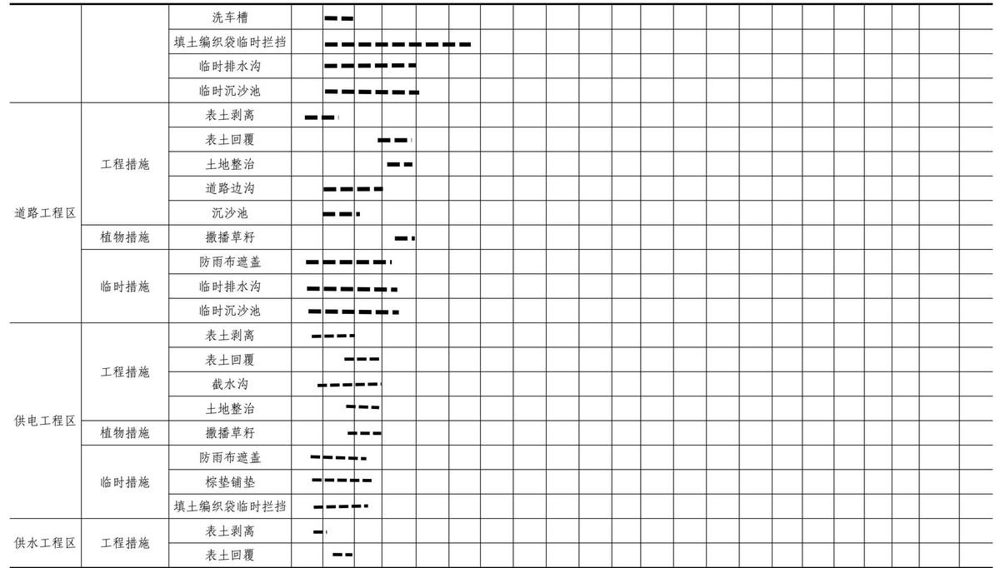

> **Zone C（应用范例层）使用边界**——仅可用于**写作风格、章节展开方式、表达逻辑、表格设计**的参考。
> **不得**用于合规判断；**不得**引入其项目数据（名称／地点／数字／单位名）；
> **不得**因其"曾经通过审批"而推定其做法在当前标准下仍然合规。
> 与 Zone A 冲突时**一律以 Zone A 为准**；Zone A 未明确规定时输出
> 「**Zone A 未明确规定，以下为参考写法，需人工判断**」。
>
> **坐标系警告**：本范例为**老八章结构**（GB 50433—2018 附录B），与 2026 版 10 章模板**同号不同义**
> （老 `1.5`＝防治目标，新 `1.5`＝水土流失预测结果；老 4→新 6 …偏移 +2；新版第 4/5 章老结构无独立章）。
> 因此 **`chapter_mapping: pending`——不得按章节号挂载**，检索一律走 `topic_tags`。
>
> **待加工**：`topic_tags`（主题标签）、`approval_basis_list`（编制依据逐字清单）、
> `structure_summary`（只提取结构：章节展开顺序／段落功能／表格栏目结构／句式模板／论证链步骤）。

<!-- 本文件由原方案 PDF 分段转换后拼接：共 2 段，原 263 页（MinerU 云单文件上限 200 页） -->

1综合说明..  
1.1 项目简况.  
1.2 编制依据... ... 10  
1.3 设计水平年.. ... 12  
1.4水土流失防治责任范围.. .....13  
1.5水土流失防治目标... ....13  
1.6项目水土保持评价结论. ....15  
1.7水土流失预测结果.. ....17  
1.8水土保持措施布设成果... ...17  
1.9水土保持监测方案.... ....27  
1.10水土保持投资及效益分析成果.. ... 27  
1.11 结论... ... 28  
水土保持方案特性表.. ....29  
2 项目概况... .... 31  
2.1项目组成及工程布置.. ....31  
2.2 施工组织. ... 68  
2.3 工程占地.. .... 87  
2.4 土石方平衡.... ..91  
2.5拆迁（移民）安置与专项设施改（迁）建... .... 102  
2.6 施工进度. ...103  
2.7 自然概况... ...105  
3项目水土保持评价... ...112  
3.1主体工程选址水土保持评价. ...112  
3.2建设方案与布局水土保持评价... ...113  
3.3主体工程设计中水土保持措施界定.. .... 145  
4水土流失分析与预测.. ...150  
4.1水土流失现状. ...150  
4.2水土流失影响因素分析.. ...152  
4.3水土流失量预测.. ...153  
4.4水土流失危害分析... ...163  
4.5 指导性意见.. ...163  
5水土保持措施布置. ...165  
5.1 防治区划分... ...165  
5.2措施总体布局.. ...166  
5.3分区措施布设. .... 173  
5.4 施工要求... ...202  
6水土保持监测.. ....215  
6.1 范围和时段... .... 215  
6.2内容和方法. ...215  
6.3 点位布设... .... 220  
6.4实施条件和成果.. ....221  
7水土保持投资概算及效益分析.. .. 226  
7.1 投资概算.... ..226  
7.2 效益分析.... ...243  
8水土保持管理.. ..247  
8.1 组织管理... ...247  
8.2 后续设计.. ...250  
8.3水土保持监测.. .... 252  
8.4水土保持监理. ..252  
8.5 水土保持施工... ..253  
8.6水土保持设施验收.... ...254

附表：

1.单价分析表

附件：

附件1.任务委托书

附件2.国家发展改革委关于四川省古叙矿区总体规划的批复

附件3.用地预审与选址意见书

附件 4.川矿评储（2024）19 号古蔺桑木坝井田勘探报告评审意见书

及复函

附件5.四川省发展改革委关于转发《国家能源局关于四川古叙矿区桑

木坝煤矿项目核准的批复》的通知

附件6.古蔺县水务局兴农村镇供水总站关于《古叙矿区大村煤矿、桑

木坝煤矿有关生活区用水事宜的复函》

附件7.国网四川省电力公司古蔺县供电分公司出具《关于大村片区供

电保障能力有关事宜的复函》

附件8.关于《古叙矿区大村选煤厂项目建设占用耕地耕作层土壤剥离

再利用实施方案》等3 个土壤剥离再利用实施方案的审查意见

附件9.桑木坝煤矿项目TBM施工临时用地选址的征求意见表

附件10-1.新华砂石厂-掘进矸石骨料综合利用资料

附件10-2.火焱建材-煤矸石综合利用资料

附件10-3.鸿益建材-煤矸石综合利用资料

附件10-4.鑫鑫建材-煤矸石综合利用资料

附件11.四川省应急管理厅古叙矿区桑木坝煤矿初步设计的批复

附件 12.四川省发展和改革委员会关于转发《国家能源局关于四川古

叙矿区大村煤矿项目核准的批复》的通知

附件13.古叙矿区大村选煤厂项目-备案证明表

附件14.大村选煤厂表土堆放场选址的征求意见表

附件15.表土堆放场水土流失防治责任情况说明

附件16.表土堆放场余方综合利用协议

附件 17.四川省自然资源厅《关于广安市邻水县高滩镇全域土地综合

整治等20个实施方案的批复》

附件 18.泸州市自然资源和规划局关于印发《泸州市古蔺县东新镇全

域土地综合整治实施方案》审查意见的通知

附件19.商品混凝土、砂浆意向性合同

附件20.古蔺大村井田煤炭开发项目合作协议

附件21.古叙矿区大村选煤厂水土保持方案审批准予行政许可决定书

附件22.古蔺县大村镇猫猫窝采石场闭矿文件

附图

附图1-地理位置图

附图2-项目区水系

附图3-土壤侵蚀强度分布图

附图4-土地利用现状图

附图5-1桑木坝煤矿总体布置图

附图5-2.井上下对照图

附图5-3桑木坝煤柱图（4张）

附图5-4桑木坝煤矿采区巷道布置剖面图（2 张）

附图5-5矿井工业场地总平面布置图

附图5-6大山风井及瓦斯抽采场地总平面布置图

附图5-7金鸡寺风井场地总平面布置图

附图5-8供电工程线路路径方案图

附图5-9桑木坝运煤通道（跨河段平面、立面、剖面布置图）

附图5-10工业场地九溪河河段边坡设计平面布置图（2 张）

附图5-11工业场地九溪河河段边坡设计剖面图（5 张）

附图5-12路基标准横断面图（2 张）

附图5-13矿井工业场地辅助生产区和行政生活区进场道路纵断面图

附图5-14井下水处理站进场道路平面图

附图 5-15 井下水处理站进场道路纵断面图（2 张）

附图5-16大山风井及瓦斯抽采场地进场道路平面图

附图5-17大山风井及瓦斯抽采场地进场道路纵断面图

附图5-18金鸡寺风井场地进场道路平面图

附图5-19金鸡寺风井场地进场道路纵断面图

附图6-1矿井工业场地水土流失防治责任范围图

附图6-2大山风井及瓦斯抽采场地水土流失防治责任范围图

附图6-3金鸡寺风井场地水土流失防治责任范围图

附图6-4供电工程水土流失防治责任范围图

附图6-6施工措施井场地水土流失防治责任范围图

附图7-1矿井工业场地分区防治措施总体布局及监测点位图

附图7-2大山风井及瓦斯抽采场地分区防治措施总体布局及监测点位

## 图

附图7-3金鸡寺风井场地分区防治措施总体布局及监测点位图

附图7-4供电工程分区防治措施总体布局及监测点位图

附图7-5施工措施井场地分区防治措施总体布局及监测点位图

附图8-1-1.工业场地水土保持措施典型设计图

附图8-1-2.工业场地水土保持措施典型设计图

附图8-2.道路工程水土保持措施典型设计图

附图8-3-1.供电工程塔基防护图

附图8-3-2.供电工程平坡段塔基水土保持措施典型设计图

附图8-3-3.供电工程陡坡段塔基水土保持措施典型设计图

附图8-4-1.供水工程平缓段水土保持措施典型设计图

附图8-4-2.供水工程横坡段水土保持措施典型设计图

附图8-4-3.供水工程顺坡段水土保持措施典型设计图

附图8-5.施工生产生活区水土保持措施典型设计图

附图8-6.工业场地区和道路工程区临时排水沟典型设计图

## 1 综合说明

## 1.1 项目简况

## 1.1.1项目基本情况

## 1、项目建设必要性

古蔺大地矿业有限责任公司古叙矿区桑木坝煤矿项目（以下简称：本项目、本工程）是国家“十四五”煤炭产能规划重点项目和 2025 年四川省级重大项目，是服务成渝地区双城经济圈建设的重大能源项目，也是古蔺县打造百亿级能源产业链的重大牵引性工程。该项目紧扣成渝双城经济圈建设战略，项目以高起点规划开发方案，实施绿色智慧矿山建设，探索5G+智能开采技术保障煤炭回采率，同步构建“煤-电-化-材”循环产业链延伸资源价值，谋划推进煤层气综合利用工程，确保“绿色开发、生态开发、智慧开发”，全力打造全省能源产能接续基地和能源安全稳定供应示范基地。项目规划年产能 120万t，达产后将有效缓解川南区域电煤供应问题，切实增强四川能源供应的韧性和弹性。

项目的建设符合《国家发展改革委、国家能源局“十四五”现代能源体系规划》《四川省“十四五”煤炭清洁开发与利用规划》《四川省古叙矿区总体规划》，为保障四川省煤炭稳定供应，优化煤炭产业结构，推动古蔺经济社会高质量发展、服务区域重大战略具有重要意义。项目的建设是必要的。

## 2、项目位置

本项目位于四川省泸州市古蔺县境内，其中矿井工业场地位于井田中北段西侧约 2.5km 外的大村镇桑木村（东经 106°10'57"，北纬 28°00'44"）；大山风井及瓦斯抽采场地位于井田中北段东部边界的大村镇大山村（原大山公社）西南侧（东经106°13'29"，北纬28°00'04"）；金鸡寺风井场位于井田北段东部边界楠木村的金鸡寺（东经 106°14'15"，北纬 28°01'18"）。

## 3、项目建设性质、建设规模与等级

建设性质：新建建设生产类项目

项目规模：设计生产能力120万t/a矿井

工程等级：大型矿井工程

## 4、地质储量、首采区位置

井田面积约 21.29km²，煤炭总资源量 20878.2 万 t，设计可采储量 9942.6 万t。

井田共划分为 9 个采区，均为上山采区，其中+676 水平，即为平硐水平划分为 2采区；+340 水平划分为4个采区；±0水平划分为3个采区。矿井首采区为平硐上山采区，即为+676 水平一采区及二采区。

## 5、服务年限、生产期年排矸量

服务年限为57a。按矿井能力、生产工艺计算，生产期本矿井每年排矸量为10.8 万 t/a，矸石容重按 1.80t/m³计算，年排矸量为 6 万 m³。

## 6、项目组成

项目由井巷工程、工业场地、道路工程、供电工程、供水工程区和施工生产生活区等组成。项目建设内容如下：

（1）井巷工程：本项目井巷工程新建5条井筒（即主平硐、大山进风斜井、大山回风斜井、金鸡寺进风斜井、金鸡寺回风斜井）及井底车场、硐室等，井巷工程量为 56613m。井口面积计入各工业场地。

（2）工业场地：本项目共新建 3 处工业场地，总占地面积为 21.07hm²，包括桑木坝矿井工业场地（占地 14.97hm²）、大山井风及瓦斯抽采场地（占地5.25hm²）、金鸡寺风井场地（占地 0.85hm²）。

①新建矿井工业场地位于井田中北段西侧约2.5km外的大村镇桑木村，作为本矿井的主工业场地，采用分台阶、分功能布置生产区、辅助生产区、行政生活区（含矿山救护队）及井下水处理站，配套运煤隧道；②新建大山风井及瓦斯抽采场地位于井田中北段东部边界的大村镇大山村（原大山公社）西南侧，平坡式布置进风斜井、回风斜井、风机房、配电室、35kV 变电所、瓦斯抽采场地并预留瓦斯发电场地；③新建金鸡寺风井场位于井田北段东部边界楠木村的金鸡寺，布置进风斜井、回风斜井、风机房、配电室、倒班房和井口人车棚。

（3）道路工程：新建 5条进场道路（总长978.32m，占地面积1.69hm²），均为沥青混凝土路面。具体如下：①新建矿井工业场地行政生活区进场公路，长22m，路基宽度 7.5m，占地 0.04hm²，由既有 X199 县道接至场地，为主进场公路，主要供行人进出；②新建矿井工业场地辅助生产区进场公路，长12m，路基宽度 7.5m，占地0.02hm²，由既有 X199 县道接至场地，为主进场公路，主要供材料设备进出；③新建井下水处理站进场公路，长614.32m，路基宽度4.5m，占地1.19hm²，由行政生活区东南角矿山救护队场内道路出发，沿着行政生活区东侧坡脚向北布线，在井下水处理站东北角连接场内道路，主要供设备材料和人员的进出；④新建大山风井及瓦斯抽采场进场公路，长100m，路基宽度4.5m，占地 0.12hm²，由既有 X199 县道接至场地，为辅助进场公路，主要供设备材料和人员的进出；⑤新建金鸡寺风井场地进场道路，长230m，路基宽度4.5m，占地0.32hm²，由既有X199 县道接至场地，为辅助进场公路，主要供设备材料和人员的进出。

（4）供电工程区：新建 5 条场外施工及生产用电输电线路（施工准备期先行建设施工用电，后期作为永久生产用电），总占地10.69hm²，其中塔基永久占地0.22hm²，塔基施工场地临时占地3.45hm²，牵张场临时占地0.70hm²，施工便道临时占地6.32hm²。具体如下：

①35kV 矛溪至大山输电线路长 19.77km，引自矛溪 110kV变电站接至大山工业场地新建35kV变电所，采用铁塔方式架设，架设铁塔70 基，牵张场5 个，占地 8.32hm²（其中塔基永久占地0.14hm²，塔基施工场地临时占地2.66hm²，牵张场临时占地0.50hm²，施工便道临时5.02hm²）；②35kV沙田至大山输电线路长 5.85km，引自沙田 110kV 变电站接至大山工业场地新建 35kV 变电所，采用铁塔方式架设，架设铁塔21基，牵张场2个，占地2.34hm²（其中塔基永久占地0.05hm²，塔基施工场地临时占地 0.79hm²，牵张场临时占地 0.20hm²，施工便道临时 1.30hm²）；③10kV 大山至桑木坝输电线路双回线长度为 4.993km+4.948km，引自大山工业场地新建35kV变电所接至桑木坝矿井工业场地新建10kV配电室，采用杆塔架设，共布置杆塔151基，占地0.015hm²，均为杆基永久占地；④10kV大山风井及瓦斯抽 采场地施工及生产用电输电线路双回线 长度 为2.745km+2.716km，引自大山工业场地新建 35kV 变电所接至金鸡寺风井场地新建 10kV 配电室，采用杆塔架设，共布置杆塔 85 基，总占地 0.008hm²，均为杆基永久占地；⑤10kV 施工措施井场地施工及生产用电输电线路单回线长度为

2.807km，引自大山工业场地新建 35kV变电所接至施工措施井场地新建10kV 配电室，采用杆塔架设，共布置杆塔 39 基，总占地 0.004hm²，均为杆基永久占地（由于该线路较短，占地面积小，因此后续设计中将该线路的占地、土石方、措施及投资等统一归入10kV大山至矿井工业场地输电线路）。

（5）供水工程区：新建3处高位水池及4条供输水管线，共计493m，总占地面积 0.64hm²，其中高位水池永久占地面积为 0.29hm²，供输水管线施工作业带临时占地 0.35hm²。

①大村镇桑木坝市政给水管开口处接至矿井工业场地，新建直埋+顶管DN100 施工和生活用水输水管线 15m，管道埋地敷设，施工作业带宽 7.1m，其中临时堆土宽2m，管沟开挖宽 2.1m，机械作业带宽3m。管沟开挖断面为梯形，尺寸为 0.7m×2.1m×1m（下底×上底×深）。管道施工作业带临时占地 0.01hm²。

②新建矿井工业场地至+780m高位水池输水管道203m及+780m高位水池一处，管沟共同沟 2根DN200 及2根DN250 管道，管道埋地敷设，顶管穿越X199道路 6m/1处。管道施工作业带宽7.6m，其中临时堆土带2m，管沟开挖宽2.6m，施工作业带宽 3m。管沟开挖断面为梯形，尺寸为 1.2m×2.6m×1m（下底×上底×深）。+780m 高位水池永久占地0.10hm²，管道施工作业带临时占地0.14hm²。

③新建大山风井及瓦斯抽采场地至+1150m 高位水池输水管道 105m 及+1150m 高位水池一处，管沟共同沟 2根 DN200 及2 根 DN250 管道，管道埋地敷设。施工作业带宽 7.6m，其中临时堆土带2m，管沟开挖宽2.6m，施工作业带宽 3m。管沟开挖断面为梯形，尺寸为 1.2m×2.6m×1m（下底×上底×深）。+1150m高位水池永久占地0.13hm²，管道施工作业带临时占地0.08hm²。

④新建金鸡寺风采场地至+1040m高位水池输水管道170m及+1040mm高位水池一处，管沟共同沟2根DN250 管道，管道埋地敷设。施工作业带宽7.1m，其中临时堆土带 2m，管沟开挖宽 2.1m，施工作业带宽 3m。管沟开挖断面为梯形，尺寸为 0.7m×2.1m×1m（下底×上底×深）。+1040m 高位水池永久占地 0.06hm²，管道施工作业带临时占地0.12hm²。

（6）施工生产生活区：布设 6 处施工生产生活区，其中 5 处位于永久占地范围内，1处为新增临时占地，总占地面积共2..76hm²。

①布置在永久占地范围内施工生产生活区：总占地面积共 0.97hm²，分别位于矿井工业场地（3处）、大山风井及瓦斯抽采场地和金鸡寺风井场地永久占地范围内。其中矿井工业场地施工生产生活区占地面积 0.62hm²，大山风井及瓦斯抽采场地施工生产生活区占地面积 0.23hm²，金鸡寺风井场地施工生产生活区占地面积0.12hm²。施工生产生活区内主要设置生活区、综合仓库、综合加工厂、施工机械停放场等设施。

②在大村镇大山村一采区设置施工措施井施工场地1处，占地面积1.79hm²，为新增临时占地，预计施工时间2.5a。施工场地内设置施工管理房、材料堆放及加工场。

## 7、拆迁（移民）安置与专项设施改（迁）建

本项目不涉及拆迁安置，民房拆迁安置及迁建电力设施由古蔺县政府统一规划，完成后净地交付建设单位，拆迁安置及迁建电力设施水土流失责任由古蔺县政府统一负责（详见附件20）。

## 8、施工进度

本项目计划于 2026 年 7 月进入施工准备，2031 年 11 月建成投运，总工期65 个月。

## 9、总投资与土建投资

项目总投资 384190.25万元，其中土建工程 181968.46万元，资金来源为企业自筹。

## 10、工程占地

本工程总占地面积为 35.88hm²，其中永久占地 23.27hm²，临时占地 12.61hm²。永久占地包括工业场地区、道路工程区、供电工程塔基占地、供水工程区高位水池占地，临时占地主要为供电工程的塔基施工场地、牵张场和施工便道，供水工程的供水管道占地，布置在永久占地范围内的施工生产生活区。按占地类型划分为耕地、草地、林地、住宅用地和交通运输用地。占地区域属古蔺县管辖。

## 10、土石方情况

项目建设期土石方量：项目建设期内共开挖土石方138.94万m³（含表土剥离10.25 万m³），回填土石方83.66万m³（含表土回覆4.79万 m³），无借方，余方 55.28万m³（包含表土5.46万m³，一般土石方49.82万m³），剩余的表土临时堆放于大村选煤厂项目设置的表土堆放场（详见附件15），目前建设单位已与古蔺县自然资源及规划局签订表土堆放场余方综合利用协议，计划将表土余方运至古蔺县东新镇全域土地综合整治项目利用（见附件16）；剩余的土石方加工后用于古蔺县东新乡新华砂石厂的生产原料，建设单位已和古蔺县东新乡新华砂石厂签订矸石购销协议，新华砂石厂将根据本项目土石方产生情况及其生产能力，合理安排自带矿山的开采量。（详见附件10-1）。

生产期，煤巷矸石同原煤一起运往选煤厂洗选，产生的矸石由选煤厂负责。生产期矿井产生掘进矸石量为 10.8 万 t/a，矸石容重按 1.80t/m³计算，年排矸量为 6 万m³。其主要成分为茅口组的石灰岩，硬度较高、成分简单，可就地加工成石粉等建材骨料用于矿井井巷工程的施工使用或通过运煤隧道运往大村煤矿骨料加工场加工后运往当地建材公司、砖厂等综合利用消纳。

## 12、依托工程和共用工程

大村选煤厂项目和大村煤矿项目 2 个建设项目与本项目存在衔接和依托关系，建设单位与本项目一致，同为古蔺大地矿业有限责任公司，大村选煤厂为大村煤矿和桑木坝煤矿提供原煤的洗选和矸石加工。

大村选煤厂项目、大村煤矿项目以及本项目共用一处表土堆放场，该表土堆放场位于古蔺县大村镇大村街社区坳上村，根据施工时序及运距综合考虑，将表土堆放场的水土流失防治责任范围纳入大村选煤厂项目（详见附件 15），大村选煤厂项目水土保持方案报告书已通过古蔺县水务局行政审批，并取得行政许可决定书（详见附件21）。

桑木坝运煤隧道入口洞口位于地面原煤仓附近，九溪河对岸，地形较陡。运煤隧道出口位于大村煤矿项目矿井工业场地中部南侧，工程计划从出口往入口处施工，桑木坝运煤隧道施工场地布设于大村煤矿项目矿井工业场地内，其防治责任范围归入大村煤矿项目。

①古蔺大地矿业有限责任公司古叙矿区大村煤矿项目

大村煤矿项目位于泸州市古蔺县大村镇，工程规模为 120万 t/a大型矿井，于2024年 9月 8日取得国家能源局关于四川古叙矿区大村煤矿项目核准的批复（国能发煤炭〔2024】71 号）。建设内容包含：井巷工程、工业场地、道路工程、供电工程、供水工程和施工生产生活区。大村煤矿总占地面积为30.40hm²，其中永久占地 $2 3 . 3 6 \mathrm { h m } ^ { 2 }$ ，临时占地7.04hm²。项目基建期土石方挖方95.14万 $\mathrm { m } ^ { 3 }$ （表土剥离9.69万 $\mathrm { m } ^ { 3 }$ ，一般土石方85.45 万m3），回填利用土石方70.06万 $\mathrm { m } ^ { 3 }$ （表土回覆3.48万m3，一般土石方66.58万m3），余方25.08万m3（其中表土6.21万 m3，一般土石方 18.87万 m3）全部综合利用，无弃方。余方表土堆存于大村选煤厂表土堆放场，目前建设单位已与古蔺县自然资源及规划局签订表土堆放场余方综合利用协议，计划将表土余方运至古蔺县东新镇全域土地综合整治项目利用。计划工期为2026年7月-2031年9月。

②古叙矿区大村选煤厂项目

大村选煤厂项目位于泸州市古蔺县大村镇，紧邻大村煤矿矿井工业场地。为群矿型选煤厂，入选大村煤矿及桑木坝煤矿原煤，建设规模240万t/a，于2024年 12 月 取 得 古 蔺 县 发 展 和 改 革 局 备 案 文 件 ， 备 案 号 ： 川 投 资 备【2403-510525-04-01-417417】FGQB-0032 号（详见附件 06）。建设内容包含新建原煤储存仓、主厂房、车间、产品仓、办公化验楼、电器楼等。工程用地面积7.95hm²，其中永久占地 6.14hm²，临时占地 1.81hm²。本项目总挖方 3.61 万 $\mathrm { m } ^ { 3 }$ （其中，表土剥离2.30万m³），填方 21.48万 $\mathrm { m } ^ { 3 }$ （其中表土回覆1.3万m³），借方 18.87 万 m³（来源于大村煤矿项目），余方 1.0 万 m³（均为表土），无弃方，余方临时堆存于表土堆放场。计划工期为 2026 年7月-2031 年11月。大村选煤厂项目水土保持方案报告书已通过古蔺县水务局行政审批，并取得行政许可决定书（详见附件21）。

## 1.1.2项目前期工作进展情况

（1）2010 年 8 月 14 日，国家发展改革委《关于四川省古叙矿区总体规划的批复》（发改能源〔2010〕1843号）；

（2）2024 年 1 月 10 日，四川省自然资源厅完成了本项目用地预审，出具了《古叙矿区桑木 坝煤矿项目用地预 审与选址意见书》（用字 第510525-2024-00014 号）；

（3）2024 年4月，四川省能源地质调查研究所提交了《四川省古蔺县大村勘查区桑木坝井田煤炭勘探报告》，该报告经四川省矿产资源储量评审中心进行了评审，以“川矿评储〔2024〕19号”文出具了评审意见书；2024年8 月28 日，经四川省自然资源厅备案（川自然资储备函〔2024〕80号）；

（4）2024 年8月，中煤科工重庆设计研究院（集团）有限公司编制完成了《古蔺大地矿业有限责任公司古叙矿区桑木坝煤矿可行性研究报告》，该报告于2024 年 9 月 5 日通过古蔺大地矿业有限责任公司组织专家审查。并形成《中国国际工程咨询有限公司古蔺大地矿业有限责任公司古叙矿区桑木坝煤矿可行性研究报告的评审报告》；

（5）2024 年9月8 日，国家能源局以《关于四川古叙矿区桑木坝煤矿项目核准的批复的通知》（国能发煤炭〔2024〕73 号）予以批复项目核准事项；

（6）2024 年 9 月 21 日，《四川省发展和改革委员会关于转发《国家能源局关于四川古叙矿区桑木坝煤矿项目核准的批复》的通知》（川发改能源〔2024478号）同意开展前期手续；

（7）2025 年7月，四川省冶金地质勘查局测绘工程大队编制完成了《四川古叙矿区桑木坝煤矿项目建设占用耕地耕作层土壤剥离再利用实施方案》；

（8）2025 年7月，四川省应急管理厅以《关于古叙矿区桑木坝煤矿初步设计的批复》（川应急审批〔2025〕152号）对项目初步设计予以审批；

（9）与本项目相关的桑木坝煤矿建设项目工业场地行洪论证与河势稳定性评价报告已于2026年4月 25 日在泸州市古蔺县召开技术审查会，并通过评审，待修改后报批，项目行洪论证报告审查结果对工程建设方案无调整要求；环境影响评价报告正在编制中。

（10）2025 年 4 月，建设单位委托四川省自然资源投资集团物探勘查院有限公司（以下简称“我公司”），开展本项目的水土保持方案报告书的编制工作。我公司立即组织水土保持专业人员对项目区的自然环境、社会环境、生态环境及水土保持现状进行了现场调查和踏勘。结合《四川古叙矿区桑木坝煤矿项目建设占用耕地耕作层土壤剥离再利用实施方案》，开展了项目表土资源分布调查，细化了表土剥离厚度，补充了表土剥离区域；并积极与主体设计单位沟通，针对项目余方减量化提出了相关建议意见；针对项目余方资源化利用去向展开调查，走访了古蔺县7家建材公司及砖厂，确定了4家作为本项目余方资源化利用去向。结合了本工程的实际情况及主体工程设计等相关文件，在土壤流失预测的基础上，制定了相应的水土保持措施，在此基础上，我公司严格按照《生产建设项目水土保持技术标准》（GB50433-2018）的要求，编制完成《古蔺大地矿业有限责任公司古叙矿区桑木坝煤矿项目水土保持方案报告书》。

## 1.1.3 自然简况

地貌类型：项目区为喀斯特低中山地貌。总体地势由南东向北西倾斜，沟谷纵横，山峦叠嶂。最高点为井田南部大山顶，海拔1270.5m，最低点在大苕塆，海拔 726.5m，最大相对高差 544.0m，一般相对高差 200～400m。

气候类型与主要气象要素：项目区气候类型为亚热带季风性湿润气候。多年年平均气温为 17.8℃，多年年平均降雨量 752.7mm，降雨集中在 5\~9 月份，年均蒸发量 1278.5mm，≥10℃积温 5629.6℃，多年平均雾日 1.7 天；无霜期 361.3天；常年无稳定冻土，多年平均日照1147.4h，年平均风速1.3m/s，主导风向为N。

土壤：本项目土壤构成主要是山地黄壤土、紫色土。项目占地类型为耕地、林地、交通运输用地和其他用地，其中耕地、林地可剥离表土，剥离厚度为20-50cm。

植被：项目区植被属于亚热带常绿阔叶林区，川东盆地偏湿性常绿阔叶林带，自然植被以偏湿性的常绿阔叶林为主，项目区林草覆盖率约为31%。

水土保持区划及容许土壤流失量：根据《水利部办公厅关于印发<全国水土保持区划（试行）>的通知》（办水保〔2012〕512 号），项目区属西南岩溶区（云贵高原区）滇黔桂山地丘陵区Ⅶ-滇黔桂山地丘陵区Ⅶ-1-滇黔川高原山地保土蓄水区Ⅶ-1-2tx；根据《土壤侵蚀分类分级标准》（SL190-2007），项目区处于西南土石山区，容许土壤流失量500t/（km²·a）。

土壤侵蚀类型及强度：根据《土壤侵蚀分类分级标准》（SL190-2007），项目区处于水力侵蚀区的西南土石山区，土壤侵蚀类型以水力侵蚀为主；根据泸州市 2025 年水土流失动态监测成果，项目区所处的古蔺县水土流失面积2579.99km²，其中其中微度流失面积 604.01km²，轻度流失面积 435.46km²，中度流失面积 69.95km²，强烈流失面积 49.35km²，极强烈流失面积 40.17km²，剧烈流失面积 9.08km²。土壤侵蚀强度以轻度为主占比 72.10%；项目区原地貌土壤侵蚀模数 1111t/（km²·a）。

水土流失重点防治区：根据《水利部办公厅关于做好国家级水土流失重点预防区和重点治理区落地上图成果应用的通知》（办水保〔2025〕170号），查询国家级水土流失重点预防区和重点治理区查询系统，查询结果可知，项目红线范围不涉及国家级水土流失重点治理区及预防区；根据《四川省水利厅关于印发<四川省省级水土流失重点预防区和重点治理区划分成果>的通知》（川水函〔2017482号），项目红线范围不涉及省级水土流失重点治理区及预防区；根据《泸州市水务局关于印发<泸州市市级水土流失重点预防区和重点治理区划分成果>的通知》（泸市水函〔2018〕93 号），项目所在地古蔺县大村镇属于泸州市水土流失重点治理区。

水土保持敏感区：本项目建设范围不涉及河流两岸、湖泊和水库周边的植物保护带，不涉及全国水土保持监测网络中的水土保持监测站点、重点试验区及国家确定的水土保持长期定位观测站，不涉及饮用水水源保护区、水功能一级区的保护区和保留区、自然保护区、世界文化和自然遗产地、风景名胜区、地质公园、森林公园、重要湿地等生态敏感区域。

## 1.2 编制依据

## 1.2.1法律法规规章

（1）《中华人民共和国水土保持法》（1991年6月29日颁布，2010年12月25 日修订，2011年 3月1日起施行）；

（2）《四川省<中华人民共和国水土保持法>实施办法》（1993 年 12 月发布，1997 年修订，2012 年 9 月 21 日修订，2012 年 12 月 1 日施行）；

（3）《中华人民共和国长江保护法》（2020年12月26日第十三届全国人民代表大会常务委员会第二十四次会议通过，2021年3月1 日起施行）；

（4）《生产建设项目水土保持方案管理办法》（水利部令第 53 号，2023年3月1 日实施）。

## 1.2.2 规范性文件

（1）《关于印发生产建设项目水土保持监测规程（试行）》（办水保〔2015139号）；

（2）《关于印发生产建设项目水土保持设施自主验收规程（试行）的通知》（办水保〔2018〕133号）；

（3）《水利部办公厅关于印发生产建设项目水土保持技术文件编写和印制格式规定（试行）的通知》（办水保〔2018〕135号）；

（4）《水利部关于进一步深化“放管服”改革全面加强水土保持监管的意见》（水保〔2019〕160号）；

（5）《水利部办公厅关于印发生产建设项目水土保持监督管理办法的通知》（办水保〔2019〕172号）；

（6）《水利部办公厅关于实施生产建设项目水土保持信用监管“两单”制度的通知》（办水保〔2020〕157号）；

（7）《水利部办公厅关于进一步加强生产建设项目水土保持监测工作的通知》（办水保〔2020〕161 号）；

（8）《水利部办公厅关于印发生产建设项目水土保持方案审查要点的通知》（办水保〔2023〕177号）；

（9）《水利部办公厅关于进一步加强部批项目水土保持监管工作的通知》（办水保函〔2024〕57号）；

（10）《水利部关于发布<水利工程设计概（估）算编制规定>及水利工程系列定额的通知》（水总〔2024〕323号）；

（11）《水利部办公厅关于做好国家级水土流失重点预防区和重点治理区落地上图成果应用的通知》（办水保〔2025〕170号）；

（12）《四川省水利厅关于印发<四川省省级水土流失重点预防区和重点治理区划分成果>的通知》（川水函〔2017〕482号）；

（13）《泸州市水务局关于印发<泸州市市级水土流失重点预防区和重点治理区划分成果>的通知》（泸市水函〔2018〕93 号）。

## 1.2.2 技术标准

（1）《生产建设项目水土保持技术标准》(GB50433—2018)；

（2）《生产建设项目水土流失防治标准》(GB/T50434—2018)；

（3）《生产建设项目水土保持监测与评价标准》（GB/T51240-2018)；

（4）《土壤侵蚀分类分级标准》(SL190—2007)；

（5）《水土保持工程设计规范》（GB51018—2014）；

（6）《防洪标准》（GB50201－2014）；

（7）《土地利用现状分类》(GB/T21010—2017)；

（8）《水利水电工程制图标准水土保持图》（SL73.6—2015）；

（9）《生产建设项目土壤流失量测算导则》（SL773-2018）；

（10）《水土保持工程调查与勘测标准》（GB/T51297-2018）；

（11）《表土剥离及其再利用技术要求》（GB/T45107-2024）；

（12）《水土保持监测技术规范》（SL/T277—2024）；.

（13）《水土保持工程概算定额》（水总〔2024〕323号）；

（14）《水土保持工程质量验收与评价规范》（SL-T336-2025）；

（15）《水土保持监理规范》（SL/T523-2024）；

（16）《煤矿工业矿井设计规范》（GB50215-2015）；

（17）《煤炭行业绿色矿山建设规范》（DZ/T0315-2018）。

## 1.2.4相关技术资料

（1）《古蔺大地矿业有限责任公司古叙矿区桑木坝煤矿可行性研究报告（审定稿）》（中煤科工重庆设计研究院（集团）有限公司，2024年8月）；

（2）《四川省古蔺县大村勘查区桑木坝井田煤炭勘探报告》；

（3）《四川古叙矿区桑木坝煤矿项目建设占用耕地耕作层土壤剥离再利用实施方案》；

（4）《古蔺大地矿业有限责任公司古叙矿区桑木坝煤矿初步设计》（中煤科工重庆设计研究院（集团）有限公司，2025 年12 月）；

（5）项目业主提供的相关资料。

## 1.3 设计水平年

本项目计划于2026年 7月开工建设，于2031 年11月完工，总工期65 个月。根据《生产建设项目水土保持技术标准》（GB50433-2018）中“设计水平年应为主体工程完工后的当年或后一年”，结合工程地理位置，自然环境条件及工程工期等因素，确定本方案的设计水平年为主体完工后一年，即2032年。

## 1.4 水土流失防治责任范围

根据《生产建设项目水土保持技术标准》（GB50433－2018）规定，生产建设项目水土流失防治责任范围应包括项目永久征地、临时占地（含租赁土地）以及其他使用与管辖区域。结合本工程总体布局及项目特点，确定本工程防治责任范围面积共计 35.88hm²，其中永久占地 23.27hm²，临时占地 12.61hm²，均位于泸州市古蔺县境内。

本工程防治责任范围面积统计表  
表 1.4-1
<table><tr><td rowspan=2 colspan=2></td><td rowspan=1 colspan=3>防治责任范围（hm²）</td></tr><tr><td rowspan=1 colspan=1>永久占地</td><td rowspan=1 colspan=1>临时占地</td><td rowspan=1 colspan=1>小计</td></tr><tr><td rowspan=1 colspan=2>工业场地</td><td rowspan=1 colspan=1>21.07</td><td rowspan=1 colspan=1></td><td rowspan=1 colspan=1>21.07</td></tr><tr><td rowspan=1 colspan=2>道路工程</td><td rowspan=1 colspan=1>1.69</td><td rowspan=1 colspan=1></td><td rowspan=1 colspan=1>1.69</td></tr><tr><td rowspan=1 colspan=2>供电工程</td><td rowspan=1 colspan=1>0.22</td><td rowspan=1 colspan=1>10.47</td><td rowspan=1 colspan=1>10.69</td></tr><tr><td rowspan=1 colspan=2>供水工程</td><td rowspan=1 colspan=1>0.29</td><td rowspan=1 colspan=1>0.35</td><td rowspan=1 colspan=1>0.64</td></tr><tr><td rowspan=3 colspan=1>施工生产生活区</td><td rowspan=1 colspan=1>施工措施井场地</td><td rowspan=1 colspan=1></td><td rowspan=1 colspan=1>1.79</td><td rowspan=1 colspan=1>1.79</td></tr><tr><td rowspan=1 colspan=1>永久占地范围内施工生产生活区*</td><td rowspan=1 colspan=1>0.97</td><td rowspan=1 colspan=1></td><td rowspan=1 colspan=1>0.97</td></tr><tr><td rowspan=1 colspan=1>小计</td><td rowspan=1 colspan=1>0.97</td><td rowspan=1 colspan=1>1.79</td><td rowspan=1 colspan=1>2.76</td></tr><tr><td rowspan=1 colspan=2>合计</td><td rowspan=1 colspan=1>23.27</td><td rowspan=1 colspan=1>12.61</td><td rowspan=1 colspan=1>35.88</td></tr></table>

注：永久占地范围内施工生产生活区\*，不重复计列面积。

## 1.5 水土流失防治目标

## 1.5.1执行标准等级

根据《水利部办公厅关于做好国家级水土流失重点预防区和重点治理区落地上图成果应用的通知》（办水保〔2025〕170号），查询国家级水土流失重点预防区和重点治理区查询系统，项目红线范围不涉及国家级水土流失重点治理区及预防区；根据《四川省水利厅关于印发<四川省省级水土流失重点预防区和重点治理区划分成果>的通知》（川水函〔2017〕482 号），项目红线范围不涉及省级水土流失重点治理区及预防区；根据《泸州市水务局关于印发<泸州市市级水土流失重点预防区和重点治理区划分成果>的通知》（泸市水函〔2018〕93号），古蔺县大村镇属于泸州市水土流失重点治理区。根据《生产建设项目水土流失防治标准》（GB/T50434-2018）4.0.1 条第 2 款的规定，本项目执行西南岩溶区一级标准。

## 1.5.2 防治目标

## （1）基本目标

根据《生产建设项目水土保持技术标准》（GB50433-2018），生产建设项目水土流失防治应达到的基本目标，一是项目建设范围内的新增水土流失应得到有效控制，原有水土流失得到治理；二是水土保持设施应安全有效；三是水土资源、林草植被应得到最大限度的保护与恢复。

## （2）定量目标

水土流失治理度、土壤流失控制比、渣土防护率、表土保护率、林草植被恢复率、林草覆盖率六项指标应符合现行国家标准《生产建设项目水土流失防治标准》（GB/T 50434-2018）的规定。

本项目执行西南岩溶区一级标准，设计水平年目标值为：水土流失治理度为97%、土壤流失控制比为0.85、渣土防护率为92%、表土保护率为95%、林草植被恢复率为96%、林草覆盖率为21%。

根据《生产建设项目水土流失防治标准》（GB/T50434－2018），条款4.0.7，土壤流失控制比在轻度侵蚀为主的区域不应小于 1.0，项目区所处的古蔺县水土流失总面积 628.27km²，其中轻度水土流失面积 449.02km²，水土流失总面积628.27km²的71.47%，土壤侵蚀强度以轻度为主，土壤流失控制比指标值调整为1.0。

项目不涉及国家级、省级水土流失重点预防区和重点治理区，在泸州市水土流失重点治理区，提高植物措施标准，林草覆盖率应提高1\~2 个百分点。本项目林草覆盖率提高2 个百分点，调整为23%。

其余条款不涉及修正。本工程采用的防治目标详见表1.5-1。

本工程水土流失防治目标  
表 1.5-1
<table><tr><td rowspan=2 colspan=1>序号</td><td rowspan=2 colspan=1>指标</td><td rowspan=1 colspan=2>一级标准</td><td rowspan=1 colspan=1>修正值</td><td rowspan=1 colspan=2>执行指标</td></tr><tr><td rowspan=1 colspan=1>施工期</td><td rowspan=1 colspan=1>设计水平年</td><td rowspan=1 colspan=1>土壤侵蚀强度</td><td rowspan=1 colspan=1>施工期</td><td rowspan=1 colspan=1>设计水平年</td></tr><tr><td rowspan=1 colspan=1>1</td><td rowspan=1 colspan=1>水土流失治理度（%）</td><td rowspan=1 colspan=1>1</td><td rowspan=1 colspan=1>97</td><td rowspan=1 colspan=1></td><td rowspan=1 colspan=1>1</td><td rowspan=1 colspan=1>97</td></tr><tr><td rowspan=1 colspan=1>2</td><td rowspan=1 colspan=1>土壤流失控制比</td><td rowspan=1 colspan=1>-</td><td rowspan=1 colspan=1>0.85</td><td rowspan=1 colspan=1>+0.1.5</td><td rowspan=1 colspan=1>-</td><td rowspan=1 colspan=1>1.0</td></tr><tr><td rowspan=1 colspan=1>3</td><td rowspan=1 colspan=1>渣土防护率（%）</td><td rowspan=1 colspan=1>90</td><td rowspan=1 colspan=1>92</td><td rowspan=1 colspan=1></td><td rowspan=1 colspan=1>90</td><td rowspan=1 colspan=1>92</td></tr><tr><td rowspan=1 colspan=1>4</td><td rowspan=1 colspan=1>表土保护率（%）</td><td rowspan=1 colspan=1>95</td><td rowspan=1 colspan=1>95</td><td rowspan=1 colspan=1></td><td rowspan=1 colspan=1>95</td><td rowspan=1 colspan=1>95</td></tr><tr><td rowspan=1 colspan=1>5</td><td rowspan=1 colspan=1>林草植被恢复率（%）</td><td rowspan=1 colspan=1>1</td><td rowspan=1 colspan=1>96</td><td rowspan=1 colspan=1></td><td rowspan=1 colspan=1>1</td><td rowspan=1 colspan=1>96</td></tr><tr><td rowspan=1 colspan=1>6</td><td rowspan=1 colspan=1>林草覆盖率（%）</td><td rowspan=1 colspan=1>-</td><td rowspan=1 colspan=1>21</td><td rowspan=1 colspan=1>+2</td><td rowspan=1 colspan=1>1</td><td rowspan=1 colspan=1>23</td></tr></table>

## 1.6 项目水土保持评价结论

## 1.6.1主体工程选址（线）评价

根据《生产建设项目水土保持技术标准》（GB50433－2018）中规定，项目建设应满足规范要求的强制性条款，项目避开了河道管理范围，避开了河流两岸、湖泊和水库周边的植物保护带，避开了全国水土保持监测网络中的水土保持监测站点、重点试验区，未占用国家确定的水土保持长期地面观测站，项目不单独设置取土（石、料）场和弃土（石、渣、灰、矸石、尾矿）场，不会对公共设施、基础设施、工业企业、居民点等产生重大影响，项目除无法避让泸州市水土流失重点预防区和重点治理区外，不存在制约性因素，基本符合生产建设项目水土保持技术标准要求。

## 1.6.2建设方案与布局评价

## 1.6.2.1建设方案分析与评价结论

本项目选址无法避让泸州市水土流失重点治理区。主体设计优化建设方案，进场道路经过比选后，增加了回填量，减少弃方；供水管线通过压缩作业带宽度，穿越通村公路采用顶管穿越，减少了占地和土石方量；工业场地依据地形采用了阶梯式布置，减少大挖大填；提高截排水工程、拦挡工程的级别和防洪标准，场地内布设雨水沉淀池和沉沙池，并提高植物标准，提高林草覆盖率，最大限度的保护现有土地和植被，减少新增流失。从水土保持角度分析，工程建设方案与布局基本可行。

## 1.6.2.2 工程占地评价

本工程总占地面积为 35.88hm²，其中永久占地 23.27hm²，临时占地 12.61hm²。工程占地统计完整，无缺项漏项；永久占地面积未超过行业标准，主体设计优化布局及完善设计内容，较用地预审增加1.76hm²（项目初步设计阶段，优化了工业场地布局，工业场地依据现行消防、安全应急相关规范及场地配套需求，补充设置了消防、应急专项、矿山救援等功能分区；在供电工程区域新增了塔基的永久占地），新增用地具有必要性和合理性。施工生产生活区及供水供电等必要的临时占地施工结束后尽快恢复，减少裸露时间，减小水土流失；其他施工生产生活区布置在永久占地范围，减少临时占地。基本符合水土保持要求。

## 1.6.2.3 土石方平衡评价

项目建设期内共开挖土石方138.94 万m³（含表土剥离10.25万m³），回填土石方83.66万 m³（含表土回覆4.79万m³），无借方，余55.28万m³（包含表土5.46万m³，一般土石方49.82万m³），剩余的表土临时堆放于大村选煤厂项目设置的表土堆放场，目前建设单位已与古蔺县自然资源及规划局签订表土堆放场余方综合利用协议，计划将表土余方运至古蔺县东新镇全域土地综合整治项目利用（见附件16）；剩余的土石方加工后用于古蔺县东新乡新华砂石厂的生产原料，建设单位已和古蔺县东新乡新华砂石厂签订矸石购销协议（详见附件10-1）。

项目表土剥离、堆存及利用方向合理，能有效保护表土资源；土石方量合理，挖填时序、流向合理，操作可行；土石方随挖随填，部分确需临时堆存的土方，布设了临时防护措施保护；经多次设计优化后减少余方68.54万 m³；项目余方进行资源化利用，不外弃（详见附件16）。符合水土保持要求。

## 1.6.2.4取土（石、砂）场设置评价

项目所需砂石料全部从合法合规的供应单位外购，本项目不设置专用取土（石、料），建筑材料等的水土流失防治责任范围属供应方。符合水土保持要求。

## 1.6.2.5弃土（石、渣）场设置评价

项目无弃方，不设置弃渣场。符合水土保持要求。

## 1.6.2.6施工方法与工艺评价

本项目建设施工工艺结合了当地地形、环境等特点，均采用机械和人工配合

下进行联合施工作业完成。井筒施工均采用较为成熟先进的施工方法，避免大开挖施工，减少土石方量；施工方法及施工工艺成熟、合理。符合水土保持要求。

## 1.7 水土流失预测结果

根据水土流失预测结果，工程建设占地面积共计 35.88hm²，扰动地表面积35.88hm²，损毁植被面积 11.76hm²；工程开挖土石方回填利用后，余 55.28 万m³（包含表土5.46万m³，一般土石方49.82万m³），剩余的表土临时堆放于大村选煤厂项目设置的表土堆放场，目前建设单位已与古蔺县自然资源及规划局签订表土堆放场余方综合利用协议，计划将表土余方运至古蔺县东新镇全域土地综合整治项目利用（见附件 16）；剩余的土石方通过运煤隧道运往大村煤矿骨料加工场加工后全部外售至古蔺县东新乡新华砂石厂作为生产原料，建设单位已和古蔺县东新乡新华砂石厂签订矸石购销协议。

在预测时段内，不采取任何水土保持措施的前提下，可能产生的水土流失总量为 6351.81t，新增流失量 4582.23t。从预测结果看，施工期是土壤流失的重点时段，产生水土流失的重点部位为工业场地区，也是水土流失防治和水土保持监测的重点区域。由于扰动和破坏了原地貌，加剧了项目区水土流失，对项目区的水土资源及周边环境带来了不利影响，项目建设的危害主要表现在破坏周边生态环境、增加土壤流失量等方面。

## 1.8 水土保持措施布设成果

## 1.8.1水土流失防治分区与布局

根据项目总体布局和水土流失特点等，将防治责任范围划分为工业场地防治区、道路工程防治区、供电工程防治区、供水工程防治区和施工生产生活防治区共5个防治区。

1、工业场地防治区：施工前期剥离施工区域表土，统一运输至大村选煤厂设置的表土堆放场堆存。施工过程中在矿井工业场地西北侧布设初级雨水沉淀池，用于场地雨水的收集利用；在场内各边坡处设置浆砌片石骨架+铺草皮护坡，减少降雨对边坡的冲刷；在场地四周及边坡坡顶设置临时截排水沟，以汇集排出雨水，施工后期改为永久截排水沟；在临时截排水沟末端及转角处布设临时沉沙池，沉降雨水的泥沙等杂物，施工后期改为永久沉沙池，场内的积水经沉沙池沉淀后排入九溪河及周边现状水沟；在场内停车场区域进行植草砖铺砌，沉降雨水，减少对场地的浸泡；在场地出入口设置洗车槽，防止施工车辆带出泥土；对场内裸露区域及临时堆土表面设置防雨布遮盖，堆土坡脚设置填土编织袋临时拦挡；在场内表土临时堆放场表面采用防雨布遮盖措施，坡脚填土编织袋临时拦挡，挡墙外设临时排水沟，与场地周边截排水沟相连。施工后期，对绿化区域进行表土回覆，再土地整治后进行景观绿化。

2、道路工程防治区：施工前期剥离施工区域表土，统一运输至大村选煤厂项目设置的表土堆放场堆存。施工过程中在道路旁侧临时排水沟，以汇集排出雨水，施工后期改为永久道路边沟；在临时排水沟末端及转角处布设临时沉沙池，沉降雨水的泥沙等杂物，施工后期改为永久沉沙池，雨水经沉沙池沉淀后排入周边排水系统；对场内裸露区域及边坡设置防雨布遮盖。施工后期，对道路边坡进行表土回覆，再土地整治后进行撒播草籽绿化。

3、供电工程防治区：施工前期剥离塔基永久占地区域及施工便道区域表土，表土运至塔基施工区域临时堆存。施工期在高陡边坡的塔基上方设置截水沟，在较缓地形的边坡外设置填土编织袋拦挡；在表土堆存坡脚设置填土编织袋临时拦挡措施，堆土表面设置防雨布遮盖，以保护表土。施工便道及牵张场采用棕垫铺垫。施工后期，对临时占用的塔基施工区域，塔基永久占地的空闲区域进行表土回覆，对除塔基基础外的全部区域进行土地整治后原占用耕地的区域移交给农民复耕，原占地类型为林草地的区域进行乔灌草绿化。

4、供水工程防治区：施工前期剥离高位水池占地区域及供水管线管沟开挖区域表土，表土就近堆存于供水管线施工作业带一侧。在表土堆存坡脚设置填土编织袋临时拦挡措施，堆土表面设置防雨布遮盖，以保护表土。机械作业带采用棕垫铺垫，陡坡区域在临时拦挡外设土质排水沟；在高位水池边坡外设置填土编织袋临时拦挡，拦挡外设置土质排水沟。施工后期，对管线施工作业带进行表土回覆，再进行土地整治后撒播草籽绿化。

5、施工生产生活防治区：

①布设在永久占地范围内的施工生产生活区：施工时在场地四周设置临时排水沟，临时排水沟末端设置临时沉沙池，以排出场内雨水，沉降泥沙；对场内裸露区域及临时堆放的建材等设置防雨布遮盖。

②施工措施井场地：施工前对场地占用耕地进行表土剥离，统一运输至大村选煤厂项目设置的表土堆放场堆存。然后在场地周边布设临时截排水沟，拐角及末端设置临时沉沙池。施工过程中在临时堆料表面采取防雨布遮盖措施；在场地临时堆土坡脚处设置填土编织袋拦挡，表面防雨布遮盖。施工后期对场地进行表土回覆及土地整治。

## 1.8.2水土保持措施工程量

根据本工程施工特点及区域的自然环境、生态环境、水土流失特点等因素综合考虑，将工程分为工业场地区、道路工程区、供电工程区、供水工程区和施工生产生活区共 5 个防治区。方案根据实际情况补充完善项目的水土保持措施如下：

表 1.8-1  
水土保持措施工程量汇总表
<table><tr><td colspan="2" rowspan="1">防治分区</td><td colspan="1" rowspan="1">措施类型</td><td colspan="1" rowspan="1">措施名称</td><td colspan="1" rowspan="1">结构形式</td><td colspan="1" rowspan="1">布设位置</td><td colspan="1" rowspan="1">实施时段</td><td colspan="1" rowspan="1">单位</td><td colspan="1" rowspan="1">数量</td><td colspan="1" rowspan="1">备注</td></tr><tr><td colspan="1" rowspan="15">工业场地防治区</td><td colspan="1" rowspan="15">矿井工业场地</td><td colspan="1" rowspan="10">工程措施</td><td colspan="1" rowspan="1">初期雨水沉淀池</td><td colspan="1" rowspan="1">一级沉淀池容积400m³，尺寸长×宽×深=11m×6m×3.5m，壁厚0.5m，浆砌片石砌筑，埋深4.0m；二级沉淀池容积200m³，尺寸长×宽×深=5.6m×5.6m×3.5m，壁厚0.5m，浆砌片石砌筑，埋深 4.0m。</td><td colspan="1" rowspan="1">桑木坝矿井工业场地西北角</td><td colspan="1" rowspan="1">2027.3-2027.4</td><td colspan="1" rowspan="1">处</td><td colspan="1" rowspan="1">1</td><td colspan="1" rowspan="1">主体设计</td></tr><tr><td colspan="1" rowspan="1">表土剥离</td><td colspan="1" rowspan="1">剥离厚度 20-50cm</td><td colspan="1" rowspan="1">占用的耕地、林地、草地</td><td colspan="1" rowspan="1">2026.8-2027.2</td><td colspan="1" rowspan="1">万m³</td><td colspan="1" rowspan="1">5.59</td><td colspan="1" rowspan="1">主体设计</td></tr><tr><td colspan="1" rowspan="1">表土回覆</td><td colspan="1" rowspan="1">回铺厚度 30-50cm</td><td colspan="1" rowspan="1">景观绿化区域</td><td colspan="1" rowspan="1">2031.3-2031.5</td><td colspan="1" rowspan="1">万m³</td><td colspan="1" rowspan="1">1.46</td><td colspan="1" rowspan="1">主体设计</td></tr><tr><td colspan="1" rowspan="1">浆砌片石骨架+铺草皮护坡</td><td colspan="1" rowspan="1">挖方边坡按1：1.25放坡，填方按1：2放坡，浆砌片石护坡采用 M7.5 水泥砂浆砌筑MU30片石，护底 30cm厚，护坡30cm厚，护顶 50cm宽</td><td colspan="1" rowspan="1">挖填边坡</td><td colspan="1" rowspan="1">2027.6-2027.12</td><td colspan="1" rowspan="1">m²</td><td colspan="1" rowspan="1">11930</td><td colspan="1" rowspan="1">主体设计</td></tr><tr><td colspan="1" rowspan="1">排水沟</td><td colspan="1" rowspan="1">矩形断面 0.6m×0.9 m，壁厚 0.3m，M7.5 浆砌片石</td><td colspan="1" rowspan="1">围墙内及道路</td><td colspan="1" rowspan="1">2027.3-2027.8</td><td colspan="1" rowspan="1">m</td><td colspan="1" rowspan="1">4470</td><td colspan="1" rowspan="1">主体设计</td></tr><tr><td colspan="1" rowspan="1">截水沟</td><td colspan="1" rowspan="1">矩形断面0.7m×1.0m或 0.8m×1.0m，壁厚 0.3m，浆砌片石砌筑</td><td colspan="1" rowspan="1">挖方边坡顶部</td><td colspan="1" rowspan="1">2027.3-2027.8</td><td colspan="1" rowspan="1">m</td><td colspan="1" rowspan="1">1610</td><td colspan="1" rowspan="1">主体设计</td></tr><tr><td colspan="1" rowspan="1">雨水管网</td><td colspan="1" rowspan="1">DN600 HDPE 双壁波纹雨水管</td><td colspan="1" rowspan="1">行政生活区内</td><td colspan="1" rowspan="1">2030.12-2031.2</td><td colspan="1" rowspan="1">m</td><td colspan="1" rowspan="1">873</td><td colspan="1" rowspan="1">主体设计</td></tr><tr><td colspan="1" rowspan="1">植草砖铺砌</td><td colspan="1" rowspan="1">1</td><td colspan="1" rowspan="1">室外停车场</td><td colspan="1" rowspan="1">2030.12-2031.2</td><td colspan="1" rowspan="1">m²</td><td colspan="1" rowspan="1">2500</td><td colspan="1" rowspan="1">主体设计</td></tr><tr><td colspan="1" rowspan="1">土地整治</td><td colspan="1" rowspan="1">平整、翻松表土</td><td colspan="1" rowspan="1">景观绿化区域</td><td colspan="1" rowspan="1">2031.3-2031.5</td><td colspan="1" rowspan="1">hm²</td><td colspan="1" rowspan="1">2.43</td><td colspan="1" rowspan="1">方案新增</td></tr><tr><td colspan="1" rowspan="1">沉沙池</td><td colspan="1" rowspan="1">1.8m×1.0m×1.0m(长×宽×高)，砖结构，壁厚0.3m底板厚0.20m，池底及池壁采用砂浆抹面2cm</td><td colspan="1" rowspan="1">截、排水沟转角及末端</td><td colspan="1" rowspan="1">2027.3-2027.8</td><td colspan="1" rowspan="1">座</td><td colspan="1" rowspan="1">14</td><td colspan="1" rowspan="1">方案新增</td></tr><tr><td colspan="1" rowspan="1">植物措施</td><td colspan="1" rowspan="1">景观绿化</td><td colspan="1" rowspan="1">乔灌草结合的方式进行</td><td colspan="1" rowspan="1">景观绿化区域</td><td colspan="1" rowspan="1">2031.3-2031.5</td><td colspan="1" rowspan="1">hm²</td><td colspan="1" rowspan="1">2.43</td><td colspan="1" rowspan="1">主体设计</td></tr><tr><td colspan="1" rowspan="4">临时措施</td><td colspan="1" rowspan="1">防雨布遮盖</td><td colspan="1" rowspan="1">/</td><td colspan="1" rowspan="1">临时堆土及裸露区域</td><td colspan="1" rowspan="1">2026.9-2031.2</td><td colspan="1" rowspan="1">m2</td><td colspan="1" rowspan="1">21000</td><td colspan="1" rowspan="1">方案新增</td></tr><tr><td colspan="1" rowspan="1">洗车槽</td><td colspan="1" rowspan="1">12.00m×6.00m，厚度30cm，排水坡度为5%</td><td colspan="1" rowspan="1">车辆出入口</td><td colspan="1" rowspan="1">2026.9-2026.11</td><td colspan="1" rowspan="1">座</td><td colspan="1" rowspan="1">2</td><td colspan="1" rowspan="1">方案新增</td></tr><tr><td colspan="1" rowspan="1">填土编织袋临时拦挡</td><td colspan="1" rowspan="1">1.6m×0.6m×1.0m（下底×上底×高），梯形断面</td><td colspan="1" rowspan="1">基坑临时堆土坡脚</td><td colspan="1" rowspan="1">2026.9-2027.11</td><td colspan="1" rowspan="1">m³</td><td colspan="1" rowspan="1">249</td><td colspan="1" rowspan="1">方案新增</td></tr><tr><td colspan="1" rowspan="1">临时排水沟</td><td colspan="1" rowspan="1">土质，梯形断面，尺寸为0.6m×1.5×0.9m（底宽×顶宽×深），内坡比为1:0.5</td><td colspan="1" rowspan="1">场地四周截排水沟处</td><td colspan="1" rowspan="1">2026.9-2027.5</td><td colspan="1" rowspan="1">m</td><td colspan="1" rowspan="1">6080</td><td colspan="1" rowspan="1">方案新增</td></tr><tr><td colspan="1" rowspan="21"></td><td colspan="1" rowspan="1"></td><td colspan="1" rowspan="1"></td><td colspan="1" rowspan="1">临时沉沙池</td><td colspan="1" rowspan="1">土质、1.8m×1.0m×1.0m（长×宽×高）</td><td colspan="1" rowspan="1">临时排水沟转角及末端</td><td colspan="1" rowspan="1">2026.9-2027.5</td><td colspan="1" rowspan="1">座</td><td colspan="1" rowspan="1">14</td><td colspan="1" rowspan="1">方案新增</td></tr><tr><td colspan="1" rowspan="15">大山风井及瓦斯抽采场地</td><td colspan="1" rowspan="8">工程措施</td><td colspan="1" rowspan="1">表土剥离</td><td colspan="1" rowspan="1">剥离厚度 20-50cm</td><td colspan="1" rowspan="1">占用的耕地、林地、草地</td><td colspan="1" rowspan="1">2026.8-2027.2</td><td colspan="1" rowspan="1">万m³</td><td colspan="1" rowspan="1">1.44</td><td colspan="1" rowspan="1">主体设计</td></tr><tr><td colspan="1" rowspan="1">表土回覆</td><td colspan="1" rowspan="1">回铺厚度 30-50cm</td><td colspan="1" rowspan="1">景观绿化区域</td><td colspan="1" rowspan="1">2028.12-2029.2</td><td colspan="1" rowspan="1">万m³</td><td colspan="1" rowspan="1">0.46</td><td colspan="1" rowspan="1">主体设计</td></tr><tr><td colspan="1" rowspan="1">浆砌片石骨架+铺草皮护坡</td><td colspan="1" rowspan="1">挖方边坡按1：1.25放坡，填方按1：2放坡，浆砌片石护坡采用 M7.5 水泥砂浆砌筑 MU30 片石，护底 30cm厚，护坡30cm厚，护顶 50cm宽</td><td colspan="1" rowspan="1">挖填边坡</td><td colspan="1" rowspan="1">2027.6-2027.11</td><td colspan="1" rowspan="1">m²</td><td colspan="1" rowspan="1">5400</td><td colspan="1" rowspan="1">主体设计</td></tr><tr><td colspan="1" rowspan="1">排水沟</td><td colspan="1" rowspan="1">矩形断面 0.5m×0.8m，壁厚0.3m，M7.5浆砌片石</td><td colspan="1" rowspan="1">围墙内及道路</td><td colspan="1" rowspan="1">2027.3-2027.8</td><td colspan="1" rowspan="1">m</td><td colspan="1" rowspan="1">2900</td><td colspan="1" rowspan="1">主体设计</td></tr><tr><td colspan="1" rowspan="1">截水沟</td><td colspan="1" rowspan="1">矩形断面 0.6m×0.8m壁厚0.3m，浆砌片石砌筑</td><td colspan="1" rowspan="1">挖方边坡顶部</td><td colspan="1" rowspan="1">2027.3-2027.8</td><td colspan="1" rowspan="1">m</td><td colspan="1" rowspan="1">1070</td><td colspan="1" rowspan="1">主体设计</td></tr><tr><td colspan="1" rowspan="1">植草砖铺砌</td><td colspan="1" rowspan="1">/</td><td colspan="1" rowspan="1">室外停车场</td><td colspan="1" rowspan="1">2028.9-2028.11</td><td colspan="1" rowspan="1">m2</td><td colspan="1" rowspan="1">800</td><td colspan="1" rowspan="1">主体设计</td></tr><tr><td colspan="1" rowspan="1">土地整治</td><td colspan="1" rowspan="1">平整、翻松表土</td><td colspan="1" rowspan="1">景观绿化区域</td><td colspan="1" rowspan="1">2028.12-2029.2</td><td colspan="1" rowspan="1"></td><td colspan="1" rowspan="1">0.70</td><td colspan="1" rowspan="1">方案新增</td></tr><tr><td colspan="1" rowspan="1">沉沙池</td><td colspan="1" rowspan="1">1.8m×1.0m×1.0m(长×宽×高)，砖结构，壁厚0.3m，底板厚0.20m，池底及池壁采用砂浆抹面2cm</td><td colspan="1" rowspan="1">截、排水沟转角及末端</td><td colspan="1" rowspan="1">2027.3-2027.8</td><td colspan="1" rowspan="1">座</td><td colspan="1" rowspan="1">4</td><td colspan="1" rowspan="1">方案新增</td></tr><tr><td colspan="1" rowspan="1">植物措施</td><td colspan="1" rowspan="1">景观绿化</td><td colspan="1" rowspan="1">乔灌草结合的方式进行</td><td colspan="1" rowspan="1">景观绿化区域</td><td colspan="1" rowspan="1">2029.2-2029.3</td><td colspan="1" rowspan="1">hm²</td><td colspan="1" rowspan="1">0.70</td><td colspan="1" rowspan="1">主体设计</td></tr><tr><td colspan="1" rowspan="6">临时措施</td><td colspan="1" rowspan="1">防雨布遮盖</td><td colspan="1" rowspan="1">/</td><td colspan="1" rowspan="1">临时堆土及裸露区域</td><td colspan="1" rowspan="1">2026.8-2027.2</td><td colspan="1" rowspan="1">m2</td><td colspan="1" rowspan="1">500</td><td colspan="1" rowspan="1">方案新增</td></tr><tr><td colspan="1" rowspan="1">洗车槽</td><td colspan="1" rowspan="1">12.00m×6.00m，厚度30cm，排水坡度为5%</td><td colspan="1" rowspan="1">车辆出入口</td><td colspan="1" rowspan="1">2026.8-2026.9</td><td colspan="1" rowspan="1">座</td><td colspan="1" rowspan="1">1</td><td colspan="1" rowspan="1">方案新增</td></tr><tr><td colspan="1" rowspan="1">填土编织袋临时拦挡</td><td colspan="1" rowspan="1">1.6m×0.6m×1.0m（下底×上底×高），梯形断面</td><td colspan="1" rowspan="1">基坑临时堆土坡脚</td><td colspan="1" rowspan="1">2026.8-2027.2</td><td colspan="1" rowspan="1">m³</td><td colspan="1" rowspan="1">176</td><td colspan="1" rowspan="1">方案新增</td></tr><tr><td colspan="1" rowspan="1">临时排水沟</td><td colspan="1" rowspan="1">土质，梯形断面，尺寸为0.5m×1.3×0.8m（底宽×顶宽×深），内坡比为1:0.5</td><td colspan="1" rowspan="1">场地四周截排水沟处</td><td colspan="1" rowspan="1">2026.8-2027.2</td><td colspan="1" rowspan="1">m</td><td colspan="1" rowspan="1">3970</td><td colspan="1" rowspan="1">方案新增</td></tr><tr><td colspan="1" rowspan="1">临时砖砌排水沟</td><td colspan="1" rowspan="1">砖结构，矩形断面，断面尺寸为：底宽30cm，深50cm；壁厚 12cm</td><td colspan="1" rowspan="1">场地内表土临时堆放场外围</td><td colspan="1" rowspan="1">2026.8-2029.3</td><td colspan="1" rowspan="1">m</td><td colspan="1" rowspan="1">178</td><td colspan="1" rowspan="1">方案新增</td></tr><tr><td colspan="1" rowspan="1">临时沉沙池</td><td colspan="1" rowspan="1">土质、1.8m×1.0m×1.0m（长×宽×高）</td><td colspan="1" rowspan="1">临时排水沟转角及末端</td><td colspan="1" rowspan="1">2026.8-2027.2</td><td colspan="1" rowspan="1">座</td><td colspan="1" rowspan="1">4</td><td colspan="1" rowspan="1">方案新增</td></tr><tr><td colspan="1" rowspan="5">金鸡寺风井场地</td><td colspan="1" rowspan="5">工程措施</td><td colspan="1" rowspan="1">表土剥离</td><td colspan="1" rowspan="1">剥离厚度 20-40cm</td><td colspan="1" rowspan="1">占用的耕地、草地</td><td colspan="1" rowspan="1">2026.8-2026.11</td><td colspan="1" rowspan="1">万m³</td><td colspan="1" rowspan="1">0.30</td><td colspan="1" rowspan="1">主体设计</td></tr><tr><td colspan="1" rowspan="1">表土回覆</td><td colspan="1" rowspan="1">回铺厚度 50cm</td><td colspan="1" rowspan="1">景观绿化区域</td><td colspan="1" rowspan="1">2027.12-2028.2</td><td colspan="1" rowspan="1">万m³</td><td colspan="1" rowspan="1">0.07</td><td colspan="1" rowspan="1">主体设计</td></tr><tr><td colspan="1" rowspan="1">排水沟</td><td colspan="1" rowspan="1">矩形断面 0.5m×0.7 m，壁厚 0.3m，M7.5 浆砌片石</td><td colspan="1" rowspan="1">围墙内及道路</td><td colspan="1" rowspan="1">2026.12-2027.2</td><td colspan="1" rowspan="1">m</td><td colspan="1" rowspan="1">380</td><td colspan="1" rowspan="1">主体设计</td></tr><tr><td colspan="1" rowspan="1">截水沟</td><td colspan="1" rowspan="1">矩形断面0.6m×0.9m壁厚 0.3m，浆砌片石砌筑</td><td colspan="1" rowspan="1">挖方边坡顶部</td><td colspan="1" rowspan="1">2026.12-2027.2</td><td colspan="1" rowspan="1">m</td><td colspan="1" rowspan="1">590</td><td colspan="1" rowspan="1">主体设计</td></tr><tr><td colspan="1" rowspan="1">土地整治</td><td colspan="1" rowspan="1">平整、翻松表土</td><td colspan="1" rowspan="1">景观绿化区域</td><td colspan="1" rowspan="1">2027.12-2028.2</td><td colspan="1" rowspan="1">hm²</td><td colspan="1" rowspan="1">0.14</td><td colspan="1" rowspan="1">方案新增</td></tr><tr><td colspan="1" rowspan="8"></td><td colspan="1" rowspan="8"></td><td colspan="1" rowspan="1"></td><td colspan="1" rowspan="1">沉沙池</td><td colspan="1" rowspan="1">1.8m×1.0m×1.0m(长×宽×高)，砖结构，壁厚0.3m，底板厚0.20m，池底及池壁采用砂浆抹面2cm</td><td colspan="1" rowspan="1">截、排水沟转角及末端</td><td colspan="1" rowspan="1">2026.12-2027.2</td><td colspan="1" rowspan="1">座</td><td colspan="1" rowspan="1">1</td><td colspan="1" rowspan="1">方案新增</td></tr><tr><td colspan="1" rowspan="1">植物措施</td><td colspan="1" rowspan="1">景观绿化</td><td colspan="1" rowspan="1">乔灌草结合的方式进行</td><td colspan="1" rowspan="1">景观绿化区域</td><td colspan="1" rowspan="1">2028.1-2028.3</td><td colspan="1" rowspan="1">hm²</td><td colspan="1" rowspan="1">0.14</td><td colspan="1" rowspan="1">主体设计</td></tr><tr><td colspan="1" rowspan="6">临时措施</td><td colspan="1" rowspan="1">防雨布遮盖</td><td colspan="1" rowspan="1">1</td><td colspan="1" rowspan="1">临时堆土及裸露区域</td><td colspan="1" rowspan="1">2026.9-2027.11</td><td colspan="1" rowspan="1">m2</td><td colspan="1" rowspan="1">600</td><td colspan="1" rowspan="1">方案新增</td></tr><tr><td colspan="1" rowspan="1">洗车槽</td><td colspan="1" rowspan="1">12.00m×6.00m，厚度 30cm，排水坡度为 5%</td><td colspan="1" rowspan="1">车辆出入口</td><td colspan="1" rowspan="1">2026.9-2026.10</td><td colspan="1" rowspan="1">座</td><td colspan="1" rowspan="1">1</td><td colspan="1" rowspan="1">方案新增</td></tr><tr><td colspan="1" rowspan="1">填土编织袋临时拦挡</td><td colspan="1" rowspan="1">1.6m×0.6m×1.0m（下底×上底×高），梯形断面</td><td colspan="1" rowspan="1">基坑临时堆土坡脚</td><td colspan="1" rowspan="1">2026.9-2027.2</td><td colspan="1" rowspan="1">m³</td><td colspan="1" rowspan="1">138</td><td colspan="1" rowspan="1">方案新增</td></tr><tr><td colspan="1" rowspan="1">临时排水沟</td><td colspan="1" rowspan="1">土质，梯形断面，尺寸为0.5m×1.2×0.7m（底宽×顶宽×深），内坡比为1:0.5</td><td colspan="1" rowspan="1">场地四周截排水沟处</td><td colspan="1" rowspan="1">2026.9-2026.11</td><td colspan="1" rowspan="1">m</td><td colspan="1" rowspan="1">970</td><td colspan="1" rowspan="1">方案新增</td></tr><tr><td colspan="1" rowspan="1">临时砖砌排水沟</td><td colspan="1" rowspan="1">砖结构，矩形断面，断面尺寸为：底宽30cm，深50cm；壁厚 12cm</td><td colspan="1" rowspan="1">场地内表土临时堆放场外围</td><td colspan="1" rowspan="1">2026.8-2029.3</td><td colspan="1" rowspan="1">m</td><td colspan="1" rowspan="1">101</td><td colspan="1" rowspan="1">方案新增</td></tr><tr><td colspan="1" rowspan="1">临时沉沙池</td><td colspan="1" rowspan="1">土质、1.8m×1.0m×1.0m（长×宽×高）</td><td colspan="1" rowspan="1">临时排水沟转角及末端</td><td colspan="1" rowspan="1">2026.9-2026.11</td><td colspan="1" rowspan="1">座</td><td colspan="1" rowspan="1">1</td><td colspan="1" rowspan="1">方案新增</td></tr><tr><td colspan="1" rowspan="11">道路工程区</td><td colspan="1" rowspan="10">矿井工业场地进场公路</td><td colspan="1" rowspan="6">工程措施</td><td colspan="1" rowspan="1">表土剥离</td><td colspan="1" rowspan="1">剥离厚度36cm</td><td colspan="1" rowspan="1">占用的耕地、林地</td><td colspan="1" rowspan="1">2026.8-2026.9</td><td colspan="1" rowspan="1">万m³</td><td colspan="1" rowspan="1">0.36</td><td colspan="1" rowspan="1">主体设计</td></tr><tr><td colspan="1" rowspan="1">表土回覆</td><td colspan="1" rowspan="1">回铺厚度 25cm</td><td colspan="1" rowspan="1">道路边坡区域</td><td colspan="1" rowspan="1">2027.2-2027.3</td><td colspan="1" rowspan="1">万m³</td><td colspan="1" rowspan="1">0.24</td><td colspan="1" rowspan="1">主体设计</td></tr><tr><td colspan="1" rowspan="1">道路边沟</td><td colspan="1" rowspan="1">矩形断面为0.5m×0.6m，M7.5浆砌片石</td><td colspan="1" rowspan="1">道路两侧</td><td colspan="1" rowspan="1">2026.8-2026.10</td><td colspan="1" rowspan="1">m</td><td colspan="1" rowspan="1">1205</td><td colspan="1" rowspan="1">主体设计</td></tr><tr><td colspan="1" rowspan="1">浆砌片石骨架+铺草皮护坡</td><td colspan="1" rowspan="1">挖方边坡按1：1.25放坡，填方按1：2放坡，浆砌片石护坡采用 M7.5 水泥砂浆砌筑 MU30 片石，护底30cm厚，护坡 30cm厚，护顶50cm宽</td><td colspan="1" rowspan="1">挖填边坡</td><td colspan="1" rowspan="1">2027.2-2027.3</td><td colspan="1" rowspan="1">m²</td><td colspan="1" rowspan="1">8721</td><td colspan="1" rowspan="1">主体设计</td></tr><tr><td colspan="1" rowspan="1">土地整治</td><td colspan="1" rowspan="1">/</td><td colspan="1" rowspan="1">道路边坡区域</td><td colspan="1" rowspan="1">2027.2-2027.3</td><td colspan="1" rowspan="1">hm²</td><td colspan="1" rowspan="1">0.95</td><td colspan="1" rowspan="1">方案新增</td></tr><tr><td colspan="1" rowspan="1">沉沙池</td><td colspan="1" rowspan="1">1.8m×1.0m×1.0m（长×宽×高），砖结构，壁厚0.3m，底板厚0.20m，池底及池壁采用砂浆抹面2cm</td><td colspan="1" rowspan="1">道路边沟末端</td><td colspan="1" rowspan="1">2026.8-2026.10</td><td colspan="1" rowspan="1">座</td><td colspan="1" rowspan="1">2</td><td colspan="1" rowspan="1">方案新增</td></tr><tr><td colspan="1" rowspan="1">植物措施</td><td colspan="1" rowspan="1">撒播种草</td><td colspan="1" rowspan="1">狗牙根、白花三叶草和芨芨草，撒播密度60kg/hm²</td><td colspan="1" rowspan="1">道路边坡区域</td><td colspan="1" rowspan="1">2027.2-2027.3</td><td colspan="1" rowspan="1">hm²</td><td colspan="1" rowspan="1">0.08</td><td colspan="1" rowspan="1">方案新增</td></tr><tr><td colspan="1" rowspan="3">临时措施</td><td colspan="1" rowspan="1">防雨布遮盖</td><td colspan="1" rowspan="1">1</td><td colspan="1" rowspan="1">临时堆土及裸露区域</td><td colspan="1" rowspan="1">2026.8-2027.3</td><td colspan="1" rowspan="1">m²</td><td colspan="1" rowspan="1">10000</td><td colspan="1" rowspan="1">方案新增</td></tr><tr><td colspan="1" rowspan="1">临时排水沟</td><td colspan="1" rowspan="1">土质，梯形断面，尺寸为0.4m×1.0×0.6m（底宽×顶宽×深），内坡比为1:0.5</td><td colspan="1" rowspan="1">道路两侧</td><td colspan="1" rowspan="1">2026.8-2027.3</td><td colspan="1" rowspan="1">m</td><td colspan="1" rowspan="1">1205</td><td colspan="1" rowspan="1">方案新增</td></tr><tr><td colspan="1" rowspan="1">临时沉沙池</td><td colspan="1" rowspan="1">土质、1.8m×1.0m×1.0m（长×宽×高）</td><td colspan="1" rowspan="1">临时排水沟末端</td><td colspan="1" rowspan="1">2026.8-2027.3</td><td colspan="1" rowspan="1">座</td><td colspan="1" rowspan="1">2</td><td colspan="1" rowspan="1">方案新增</td></tr><tr><td colspan="1" rowspan="1">大山风井及</td><td colspan="1" rowspan="1">工程措施</td><td colspan="1" rowspan="1">道路边沟</td><td colspan="1" rowspan="1">矩形断面 0.4m×0.6m，M7.5浆砌片石</td><td colspan="1" rowspan="1">道路两侧</td><td colspan="1" rowspan="1">2026.8-2026.12</td><td colspan="1" rowspan="1">m</td><td colspan="1" rowspan="1">200</td><td colspan="1" rowspan="1">主体设计</td></tr><tr><td colspan="1" rowspan="13"></td><td colspan="1" rowspan="4">瓦斯抽采场地进场公路</td><td colspan="1" rowspan="1"></td><td colspan="1" rowspan="1">沉沙池</td><td colspan="1" rowspan="1">1.8m×1.0m×1.0m（长×宽×高），砖结构，壁厚0.3m，底板厚0.20m，池底及池壁采用砂浆抹面2cm</td><td colspan="1" rowspan="1">道路边沟末端</td><td colspan="1" rowspan="1">2026.8-2026.10</td><td colspan="1" rowspan="1">座</td><td colspan="1" rowspan="1">1</td><td colspan="1" rowspan="1">方案新增</td></tr><tr><td colspan="1" rowspan="3">临时措施</td><td colspan="1" rowspan="1">防雨布遮盖</td><td colspan="1" rowspan="1">/</td><td colspan="1" rowspan="1">临时堆土及裸露区域</td><td colspan="1" rowspan="1">2026.8-2026.12</td><td colspan="1" rowspan="1">m²</td><td colspan="1" rowspan="1">200</td><td colspan="1" rowspan="1">方案新增</td></tr><tr><td colspan="1" rowspan="1">临时排水沟</td><td colspan="1" rowspan="1">土质，梯形断面，尺寸为0.4m×1.0×0.6m（底宽×顶宽×深），内坡比为1:0.5</td><td colspan="1" rowspan="1">道路两侧</td><td colspan="1" rowspan="1">2026.8-2026.10</td><td colspan="1" rowspan="1">m</td><td colspan="1" rowspan="1">200</td><td colspan="1" rowspan="1">方案新增</td></tr><tr><td colspan="1" rowspan="1">临时沉沙池</td><td colspan="1" rowspan="1">土质、1.8m×1.0m×1.0m（长×宽×高）</td><td colspan="1" rowspan="1">临时排水沟末端</td><td colspan="1" rowspan="1">2026.8-2026.10</td><td colspan="1" rowspan="1">座</td><td colspan="1" rowspan="1">1</td><td colspan="1" rowspan="1">方案新增</td></tr><tr><td colspan="1" rowspan="9">金鸡寺风井场地进场公路</td><td colspan="1" rowspan="5">工程措施</td><td colspan="1" rowspan="1">表土剥离</td><td colspan="1" rowspan="1">剥离厚度31cm</td><td colspan="1" rowspan="1">占用的耕地</td><td colspan="1" rowspan="1">2026.8-2026.9</td><td colspan="1" rowspan="1">万m³</td><td colspan="1" rowspan="1">0.07</td><td colspan="1" rowspan="1">主体设计</td></tr><tr><td colspan="1" rowspan="1">表土回覆</td><td colspan="1" rowspan="1">回铺厚度 30cm</td><td colspan="1" rowspan="1">道路边坡区域</td><td colspan="1" rowspan="1">2026.11-2026.12</td><td colspan="1" rowspan="1">万m³</td><td colspan="1" rowspan="1">0.07</td><td colspan="1" rowspan="1">主体设计</td></tr><tr><td colspan="1" rowspan="1">道路边沟</td><td colspan="1" rowspan="1">矩形断面 0.5m×0.6m，M7.5浆砌片石</td><td colspan="1" rowspan="1">道路两侧</td><td colspan="1" rowspan="1">2026.10-2026.11</td><td colspan="1" rowspan="1">m</td><td colspan="1" rowspan="1">460</td><td colspan="1" rowspan="1">主体设计</td></tr><tr><td colspan="1" rowspan="1">土地整治</td><td colspan="1" rowspan="1">1</td><td colspan="1" rowspan="1">道路边坡区域</td><td colspan="1" rowspan="1">2026.11-2026.12</td><td colspan="1" rowspan="1">hm2</td><td colspan="1" rowspan="1">0.24</td><td colspan="1" rowspan="1">方案新增</td></tr><tr><td colspan="1" rowspan="1">沉沙池</td><td colspan="1" rowspan="1">1.8m×1.0m×1.0m（长×宽×高），砖结构，壁厚0.3m，底板厚0.20m，池底及池壁采用砂浆抹面2cm</td><td colspan="1" rowspan="1">道路边沟末端</td><td colspan="1" rowspan="1">2026.10-2026.11</td><td colspan="1" rowspan="1">座</td><td colspan="1" rowspan="1">1</td><td colspan="1" rowspan="1">方案新增</td></tr><tr><td colspan="1" rowspan="1">植物措施</td><td colspan="1" rowspan="1">撒播种草</td><td colspan="1" rowspan="1">狗牙根、白花三叶草和芨芨草，撒播密度60kg/hm²</td><td colspan="1" rowspan="1">道路边坡区域</td><td colspan="1" rowspan="1">2026.11-2026.12</td><td colspan="1" rowspan="1">hm2</td><td colspan="1" rowspan="1">0.24</td><td colspan="1" rowspan="1">方案新增</td></tr><tr><td colspan="1" rowspan="3">临时措施</td><td colspan="1" rowspan="1">防雨布遮盖</td><td colspan="1" rowspan="1">/</td><td colspan="1" rowspan="1">临时堆土及裸露区域</td><td colspan="1" rowspan="1">2026.8-2026.11</td><td colspan="1" rowspan="1">m2</td><td colspan="1" rowspan="1">2400</td><td colspan="1" rowspan="1">方案新增</td></tr><tr><td colspan="1" rowspan="1">临时排水沟</td><td colspan="1" rowspan="1">土质，梯形断面，尺寸为0.4m×1.0×0.6m（底宽×顶宽×深），内坡比为1:0.5</td><td colspan="1" rowspan="1">道路两侧</td><td colspan="1" rowspan="1">2026.8-2026.9</td><td colspan="1" rowspan="1">m</td><td colspan="1" rowspan="1">460</td><td colspan="1" rowspan="1">方案新增</td></tr><tr><td colspan="1" rowspan="1">临时沉沙池</td><td colspan="1" rowspan="1">土质、1.8m×1.0m×1.0m（长×宽×高）</td><td colspan="1" rowspan="1">临时排水沟末端</td><td colspan="1" rowspan="1">2026.8-2026.9</td><td colspan="1" rowspan="1">座</td><td colspan="1" rowspan="1">1</td><td colspan="1" rowspan="1">方案新增</td></tr><tr><td colspan="1" rowspan="5">供电工程区</td><td colspan="1" rowspan="5">35kV茅溪至大山输电线路</td><td colspan="1" rowspan="4">工程措施</td><td colspan="1" rowspan="1">表土剥离</td><td colspan="1" rowspan="1">剥离厚度 20-40cm</td><td colspan="1" rowspan="1">塔基永久占地及施工便道区域</td><td colspan="1" rowspan="1">2026.8-2027.1</td><td colspan="1" rowspan="1">万m³</td><td colspan="1" rowspan="1">0.27</td><td colspan="1" rowspan="1">主体设计</td></tr><tr><td colspan="1" rowspan="1">表土回覆</td><td colspan="1" rowspan="1">回铺厚度 24cm</td><td colspan="1" rowspan="1">塔基占地空闲及施工便道区域</td><td colspan="1" rowspan="1">2026.10-2027.3</td><td colspan="1" rowspan="1">万m³</td><td colspan="1" rowspan="1">0.27</td><td colspan="1" rowspan="1">主体设计</td></tr><tr><td colspan="1" rowspan="1">截水沟</td><td colspan="1" rowspan="1">浆砌块石壁厚0.2m，矩形断面0.5m×0.6m；梯形断面底宽0.5m，顶宽1.2m，深1m</td><td colspan="1" rowspan="1">高陡边坡的塔基上方</td><td colspan="1" rowspan="1">2026.9-2027.3</td><td colspan="1" rowspan="1">m</td><td colspan="1" rowspan="1">1360</td><td colspan="1" rowspan="1">主体设计</td></tr><tr><td colspan="1" rowspan="1">土地整治</td><td colspan="1" rowspan="1">1</td><td colspan="1" rowspan="1">临时占地及塔基占地空闲区域</td><td colspan="1" rowspan="1">2026.10-2027.3</td><td colspan="1" rowspan="1">hm²</td><td colspan="1" rowspan="1">6.37</td><td colspan="1" rowspan="1">方案新增</td></tr><tr><td colspan="1" rowspan="1">植物措施</td><td colspan="1" rowspan="1">乔灌草绿化</td><td colspan="1" rowspan="1">乔灌木均采用穴状整地方式。乔木种植密度1000株/hm²（3m×3m）；灌木种植密度 2500株/hm²</td><td colspan="1" rowspan="1">临时占地及塔基占地空闲区域</td><td colspan="1" rowspan="1">2026.10-2027.3</td><td colspan="1" rowspan="1">hm²</td><td colspan="1" rowspan="1">5.41</td><td colspan="1" rowspan="1">方案新增</td></tr><tr><td colspan="1" rowspan="14"></td><td colspan="1" rowspan="4"></td><td colspan="1" rowspan="1"></td><td colspan="1" rowspan="1"></td><td colspan="1" rowspan="1">（2m×2m）；草本为全面撒播，60kg/hm²</td><td colspan="1" rowspan="1"></td><td colspan="1" rowspan="1"></td><td colspan="1" rowspan="1"></td><td colspan="1" rowspan="1"></td><td colspan="1" rowspan="1"></td></tr><tr><td colspan="1" rowspan="3">临时措施</td><td colspan="1" rowspan="1">防雨布遮盖</td><td colspan="1" rowspan="1">1</td><td colspan="1" rowspan="1">裸露地表及临时堆土表面</td><td colspan="1" rowspan="1">2026.8-2027.2</td><td colspan="1" rowspan="1">m²</td><td colspan="1" rowspan="1">5000</td><td colspan="1" rowspan="1">方案新增</td></tr><tr><td colspan="1" rowspan="1">棕垫铺设</td><td colspan="1" rowspan="1">/</td><td colspan="1" rowspan="1">施工便道及牵张场</td><td colspan="1" rowspan="1">2026.8-2027.2</td><td colspan="1" rowspan="1">m2</td><td colspan="1" rowspan="1">3000</td><td colspan="1" rowspan="1">方案新增</td></tr><tr><td colspan="1" rowspan="1">填土编织袋临时拦挡</td><td colspan="1" rowspan="1">梯形断面，0.3m×0.6m×0.6m（上底×下底×高）</td><td colspan="1" rowspan="1">临时堆土坡脚</td><td colspan="1" rowspan="1">2026.8-2027.2</td><td colspan="1" rowspan="1">m³</td><td colspan="1" rowspan="1">378</td><td colspan="1" rowspan="1">方案新增</td></tr><tr><td colspan="1" rowspan="8">35kV沙田至大山输电线路</td><td colspan="1" rowspan="4">工程措施</td><td colspan="1" rowspan="1">表土剥离</td><td colspan="1" rowspan="1">剥离厚度 20-40cm</td><td colspan="1" rowspan="1">塔基永久占地及施工便道区域</td><td colspan="1" rowspan="1">2026.8-2027.1</td><td colspan="1" rowspan="1">万m³</td><td colspan="1" rowspan="1">0.08</td><td colspan="1" rowspan="1">主体设计</td></tr><tr><td colspan="1" rowspan="1">表土回覆</td><td colspan="1" rowspan="1">回铺厚度19cm</td><td colspan="1" rowspan="1">塔基占地空闲及施工便道区域</td><td colspan="1" rowspan="1">2026.10-2027.3</td><td colspan="1" rowspan="1">万m³</td><td colspan="1" rowspan="1">0.08</td><td colspan="1" rowspan="1">主体设计</td></tr><tr><td colspan="1" rowspan="1">截水沟</td><td colspan="1" rowspan="1">浆砌块石壁厚0.2m，矩形断面0.5m×0.6m；梯形断面底宽0.5m，顶宽1.2m，深1m</td><td colspan="1" rowspan="1">高陡边坡的塔基上方</td><td colspan="1" rowspan="1">2026.9-2027.3</td><td colspan="1" rowspan="1">m</td><td colspan="1" rowspan="1">403</td><td colspan="1" rowspan="1">主体设计</td></tr><tr><td colspan="1" rowspan="1">土地整治</td><td colspan="1" rowspan="1">/</td><td colspan="1" rowspan="1">临时占地及塔基占地空闲区域</td><td colspan="1" rowspan="1">2026.10-2027.3</td><td colspan="1" rowspan="1">hm²</td><td colspan="1" rowspan="1">1.46</td><td colspan="1" rowspan="1">方案新增</td></tr><tr><td colspan="1" rowspan="1">植物措施</td><td colspan="1" rowspan="1">乔灌草绿化</td><td colspan="1" rowspan="1">乔灌木均采用穴状整地方式。乔木种植密度1000株/hm²（3m×3m）；灌木种植密度2500株/hm²（2m×2m）；草本为全面撒播，60kg/hm²。</td><td colspan="1" rowspan="1">临时占地及塔基占地空闲区域</td><td colspan="1" rowspan="1">2026.10-2027.3</td><td colspan="1" rowspan="1">hm²</td><td colspan="1" rowspan="1">1.24</td><td colspan="1" rowspan="1">方案新增</td></tr><tr><td colspan="1" rowspan="3">临时措施</td><td colspan="1" rowspan="1">防雨布遮盖</td><td colspan="1" rowspan="1">1</td><td colspan="1" rowspan="1">裸露地表及临时堆土表面</td><td colspan="1" rowspan="1">2026.8-2027.2</td><td colspan="1" rowspan="1">m²</td><td colspan="1" rowspan="1">2500</td><td colspan="1" rowspan="1">方案新增</td></tr><tr><td colspan="1" rowspan="1">棕垫铺设</td><td colspan="1" rowspan="1">1</td><td colspan="1" rowspan="1">施工便道及牵张场</td><td colspan="1" rowspan="1">2026.8-2027.2</td><td colspan="1" rowspan="1">m2</td><td colspan="1" rowspan="1">1500</td><td colspan="1" rowspan="1">方案新增</td></tr><tr><td colspan="1" rowspan="1">填土编织袋临时拦挡</td><td colspan="1" rowspan="1">梯形断面，0.3m×0.6m×0.6m（上底×下底×高）</td><td colspan="1" rowspan="1">临时堆土坡脚</td><td colspan="1" rowspan="1">2026.8-2027.2</td><td colspan="1" rowspan="1">m³</td><td colspan="1" rowspan="1">113.4</td><td colspan="1" rowspan="1">方案新增</td></tr><tr><td colspan="1" rowspan="1">10kV大山至桑木坝矿井工业场地输电线路</td><td colspan="1" rowspan="1">临时措施</td><td colspan="1" rowspan="1">防雨布遮盖</td><td colspan="1" rowspan="1">/</td><td colspan="1" rowspan="1">裸露地表及临时堆土表面</td><td colspan="1" rowspan="1">2026.10-2027.1</td><td colspan="1" rowspan="1">m²</td><td colspan="1" rowspan="1">100</td><td colspan="1" rowspan="1">方案新增</td></tr><tr><td colspan="1" rowspan="1">10kV大山至金鸡寺风井场地输电线路</td><td colspan="1" rowspan="1">临时措施</td><td colspan="1" rowspan="1">防雨布遮盖</td><td colspan="1" rowspan="1">/</td><td colspan="1" rowspan="1">裸露地表及临时堆土表面</td><td colspan="1" rowspan="1">2026.10-2027.1</td><td colspan="1" rowspan="1">m²</td><td colspan="1" rowspan="1">100</td><td colspan="1" rowspan="1">方案新增</td></tr><tr><td colspan="1" rowspan="1">供水工程区矿</td><td colspan="1" rowspan="1">井工业场</td><td colspan="1" rowspan="1">工程措施</td><td colspan="1" rowspan="1">表土剥离</td><td colspan="1" rowspan="1">剥离厚度 20cm</td><td colspan="1" rowspan="1">高位水池及管沟开挖区</td><td colspan="1" rowspan="1">2026.8-2026.9</td><td colspan="1" rowspan="1">万m³</td><td colspan="1" rowspan="1">0.03</td><td colspan="1" rowspan="1">主体设计</td></tr><tr><td colspan="1" rowspan="21"></td><td colspan="1" rowspan="8">地供水</td><td colspan="1" rowspan="3"></td><td colspan="1" rowspan="1"></td><td colspan="1" rowspan="1"></td><td colspan="1" rowspan="1">域</td><td colspan="1" rowspan="1"></td><td colspan="1" rowspan="1"></td><td colspan="1" rowspan="1"></td><td colspan="1" rowspan="1"></td></tr><tr><td colspan="1" rowspan="1">表土回覆</td><td colspan="1" rowspan="1">回铺厚度 43cm</td><td colspan="1" rowspan="1">管线作业带</td><td colspan="1" rowspan="1">2026.10-2026.11</td><td colspan="1" rowspan="1">万m³</td><td colspan="1" rowspan="1">0.03</td><td colspan="1" rowspan="1">主体设计</td></tr><tr><td colspan="1" rowspan="1">土地整治</td><td colspan="1" rowspan="1">/</td><td colspan="1" rowspan="1">管线作业带</td><td colspan="1" rowspan="1">2026.10-2026.11</td><td colspan="1" rowspan="1">hm²</td><td colspan="1" rowspan="1">0.07</td><td colspan="1" rowspan="1">方案新增</td></tr><tr><td colspan="1" rowspan="1">植物措施</td><td colspan="1" rowspan="1">撒播种草</td><td colspan="1" rowspan="1">狗牙根、白花三叶草和芨芨草，撒播密度60kg/hm²</td><td colspan="1" rowspan="1">管线作业带</td><td colspan="1" rowspan="1">2026.10-2026.11</td><td colspan="1" rowspan="1">hm²</td><td colspan="1" rowspan="1">0.07</td><td colspan="1" rowspan="1">方案新增</td></tr><tr><td colspan="1" rowspan="4">临时措施</td><td colspan="1" rowspan="1">防雨布遮盖</td><td colspan="1" rowspan="1">/</td><td colspan="1" rowspan="1">临时堆土表面</td><td colspan="1" rowspan="1">2026.8-2026.10</td><td colspan="1" rowspan="1">m²</td><td colspan="1" rowspan="1">800</td><td colspan="1" rowspan="1">方案新增</td></tr><tr><td colspan="1" rowspan="1">棕垫铺设</td><td colspan="1" rowspan="1">1</td><td colspan="1" rowspan="1">机械作业带</td><td colspan="1" rowspan="1">2026.8-2026.10</td><td colspan="1" rowspan="1">m2</td><td colspan="1" rowspan="1">844</td><td colspan="1" rowspan="1">方案新增</td></tr><tr><td colspan="1" rowspan="1">填土编织袋临时拦挡</td><td colspan="1" rowspan="1">梯形断面，0.3m×0.6m×0.6m（上底×下底×高）</td><td colspan="1" rowspan="1">临时堆土坡脚</td><td colspan="1" rowspan="1">2026.8-2026.10</td><td colspan="1" rowspan="1">m³</td><td colspan="1" rowspan="1">65.39</td><td colspan="1" rowspan="1">方案新增</td></tr><tr><td colspan="1" rowspan="1">土质排水沟</td><td colspan="1" rowspan="1">土质，梯形，底宽0.3m，开口宽0.6m，高0.3m</td><td colspan="1" rowspan="1">高位水池及陡坡管线临时拦挡外</td><td colspan="1" rowspan="1">2026.8-2026.10</td><td colspan="1" rowspan="1">m</td><td colspan="1" rowspan="1">312</td><td colspan="1" rowspan="1">方案新增</td></tr><tr><td colspan="1" rowspan="8">大山风井及瓦斯抽采场地进场供水</td><td colspan="1" rowspan="3">工程措施</td><td colspan="1" rowspan="1">表土剥离</td><td colspan="1" rowspan="1">剥离厚度 20cm</td><td colspan="1" rowspan="1">高位水池及管沟开挖区域</td><td colspan="1" rowspan="1">2026.8-2026.9</td><td colspan="1" rowspan="1">万m³</td><td colspan="1" rowspan="1">0.03</td><td colspan="1" rowspan="1">主体设计</td></tr><tr><td colspan="1" rowspan="1">表土回覆</td><td colspan="1" rowspan="1">回铺厚度 75cm</td><td colspan="1" rowspan="1">管线作业带</td><td colspan="1" rowspan="1">2026.10-2026.11</td><td colspan="1" rowspan="1">万m³</td><td colspan="1" rowspan="1">0.03</td><td colspan="1" rowspan="1">主体设计</td></tr><tr><td colspan="1" rowspan="1">土地整治</td><td colspan="1" rowspan="1">1</td><td colspan="1" rowspan="1">管线作业带</td><td colspan="1" rowspan="1">2026.10-2026.11</td><td colspan="1" rowspan="1">hm²</td><td colspan="1" rowspan="1">0.04</td><td colspan="1" rowspan="1">方案新增</td></tr><tr><td colspan="1" rowspan="1">植物措施</td><td colspan="1" rowspan="1">撒播种草</td><td colspan="1" rowspan="1">狗牙根、白花三叶草和芨芨草，撒播密度60kg/hm²</td><td colspan="1" rowspan="1">管线作业带</td><td colspan="1" rowspan="1">2026.10-2026.11</td><td colspan="1" rowspan="1">hm²</td><td colspan="1" rowspan="1">0.04</td><td colspan="1" rowspan="1">方案新增</td></tr><tr><td colspan="1" rowspan="4">临时措施</td><td colspan="1" rowspan="1">防雨布遮盖</td><td colspan="1" rowspan="1">1</td><td colspan="1" rowspan="1">临时堆土表面</td><td colspan="1" rowspan="1">2026.8-2026.10</td><td colspan="1" rowspan="1">m2</td><td colspan="1" rowspan="1">500</td><td colspan="1" rowspan="1">方案新增</td></tr><tr><td colspan="1" rowspan="1">棕垫铺设</td><td colspan="1" rowspan="1">1</td><td colspan="1" rowspan="1">机械作业带</td><td colspan="1" rowspan="1">2026.8-2026.10</td><td colspan="1" rowspan="1">m2</td><td colspan="1" rowspan="1">423</td><td colspan="1" rowspan="1">方案新增</td></tr><tr><td colspan="1" rowspan="1">填土编织袋临时拦挡</td><td colspan="1" rowspan="1">梯形断面，0.3m×0.6m×0.6m（上底×下底×高）</td><td colspan="1" rowspan="1">临时堆土坡脚</td><td colspan="1" rowspan="1">2026.8-2026.10</td><td colspan="1" rowspan="1">m³</td><td colspan="1" rowspan="1">37.25</td><td colspan="1" rowspan="1">方案新增</td></tr><tr><td colspan="1" rowspan="1">土质排水沟</td><td colspan="1" rowspan="1">土质，梯形，底宽0.3m，开口宽0.6m，高0.3m</td><td colspan="1" rowspan="1">高位水池及陡坡管线临时拦挡外</td><td colspan="1" rowspan="1">2026.8-2026.10</td><td colspan="1" rowspan="1">m</td><td colspan="1" rowspan="1">174</td><td colspan="1" rowspan="1">方案新增</td></tr><tr><td colspan="1" rowspan="5">金鸡寺风井场地供水</td><td colspan="1" rowspan="3">工程措施</td><td colspan="1" rowspan="1">表土剥离</td><td colspan="1" rowspan="1">剥离厚度 20cm</td><td colspan="1" rowspan="1">高位水池及管沟开挖区域</td><td colspan="1" rowspan="1">2026.8-2026.9</td><td colspan="1" rowspan="1">万m³</td><td colspan="1" rowspan="1">0.02</td><td colspan="1" rowspan="1">主体设计</td></tr><tr><td colspan="1" rowspan="1">表土回覆</td><td colspan="1" rowspan="1">回铺厚度 50cm</td><td colspan="1" rowspan="1">管线作业带</td><td colspan="1" rowspan="1">2026.10-2026.11</td><td colspan="1" rowspan="1">万m³</td><td colspan="1" rowspan="1">0.02</td><td colspan="1" rowspan="1">主体设计</td></tr><tr><td colspan="1" rowspan="1">土地整治</td><td colspan="1" rowspan="1">1</td><td colspan="1" rowspan="1">管线作业带</td><td colspan="1" rowspan="1">2026.10-2026.11</td><td colspan="1" rowspan="1">hm²</td><td colspan="1" rowspan="1">0.04</td><td colspan="1" rowspan="1">方案新增</td></tr><tr><td colspan="1" rowspan="1">植物措施</td><td colspan="1" rowspan="1">撒播种草</td><td colspan="1" rowspan="1">狗牙根、白花三叶草和芨芨草，撒播密度60kg/hm²</td><td colspan="1" rowspan="1">管线作业带</td><td colspan="1" rowspan="1">2026.10-2026.11</td><td colspan="1" rowspan="1">hm²</td><td colspan="1" rowspan="1">0.04</td><td colspan="1" rowspan="1">方案新增</td></tr><tr><td colspan="1" rowspan="1">临时措施</td><td colspan="1" rowspan="1">防雨布遮盖</td><td colspan="1" rowspan="1">/</td><td colspan="1" rowspan="1">临时堆土表面</td><td colspan="1" rowspan="1">2026.8-2026.10</td><td colspan="1" rowspan="1">m2</td><td colspan="1" rowspan="1">550</td><td colspan="1" rowspan="1">方案新增</td></tr><tr><td colspan="1" rowspan="3"></td><td colspan="1" rowspan="3"></td><td colspan="1" rowspan="3"></td><td colspan="1" rowspan="1">棕垫铺设</td><td colspan="1" rowspan="1">1</td><td colspan="1" rowspan="1">机械作业带</td><td colspan="1" rowspan="1">2026.8-2026.10</td><td colspan="1" rowspan="1">m²</td><td colspan="1" rowspan="1">586</td><td colspan="1" rowspan="1">方案新增</td></tr><tr><td colspan="1" rowspan="1">填土编织袋临时拦挡</td><td colspan="1" rowspan="1">梯形断面，0.3m×0.6m×0.6m（上底×下底×高）</td><td colspan="1" rowspan="1">临时堆土坡脚</td><td colspan="1" rowspan="1">2026.8-2026.10</td><td colspan="1" rowspan="1">m³</td><td colspan="1" rowspan="1">46.89</td><td colspan="1" rowspan="1">方案新增</td></tr><tr><td colspan="1" rowspan="1">土质排水沟</td><td colspan="1" rowspan="1">土质，梯形，底宽0.3m，开口宽0.6m，高0.3m</td><td colspan="1" rowspan="1">高位水池及陡坡管线临时拦挡外</td><td colspan="1" rowspan="1">2026.8-2026.10</td><td colspan="1" rowspan="1">m</td><td colspan="1" rowspan="1">197</td><td colspan="1" rowspan="1">方案新增</td></tr><tr><td colspan="1" rowspan="15">施工生产生活区</td><td colspan="1" rowspan="3">矿井工业场地施工生产生活区</td><td colspan="1" rowspan="3">临时措施</td><td colspan="1" rowspan="1">防雨布遮盖</td><td colspan="1" rowspan="1">/</td><td colspan="1" rowspan="1">临时堆料、裸露地表</td><td colspan="1" rowspan="1">2026.9-2031.2</td><td colspan="1" rowspan="1">m²</td><td colspan="1" rowspan="1">3000</td><td colspan="1" rowspan="1">方案新增</td></tr><tr><td colspan="1" rowspan="1">临时排水沟</td><td colspan="1" rowspan="1">矩形断面，底宽0.4m，深0.5m，壁厚12cm，砖结构</td><td colspan="1" rowspan="1">场地周边</td><td colspan="1" rowspan="1">2026.9-2027.2</td><td colspan="1" rowspan="1">m</td><td colspan="1" rowspan="1">687</td><td colspan="1" rowspan="1">方案新增</td></tr><tr><td colspan="1" rowspan="1">临时沉沙池</td><td colspan="1" rowspan="1">长1.8m，宽1.0m，高1.0m，壁厚12cm，砖结构</td><td colspan="1" rowspan="1">排水沟末端</td><td colspan="1" rowspan="1">2026.9-2027.2</td><td colspan="1" rowspan="1">座</td><td colspan="1" rowspan="1">3</td><td colspan="1" rowspan="1">方案新增</td></tr><tr><td colspan="1" rowspan="3">大山风井及瓦斯抽采场地施工生产生活区</td><td colspan="1" rowspan="3">临时措施</td><td colspan="1" rowspan="1">防雨布遮盖</td><td colspan="1" rowspan="1">/</td><td colspan="1" rowspan="1">临时堆料、裸露地表</td><td colspan="1" rowspan="1">2026.9-2028.12</td><td colspan="1" rowspan="1">m2</td><td colspan="1" rowspan="1">1800</td><td colspan="1" rowspan="1">方案新增</td></tr><tr><td colspan="1" rowspan="1">临时排水沟</td><td colspan="1" rowspan="1">矩形断面，底宽 0.4m，深 0.5m，壁厚12cm，砖结构</td><td colspan="1" rowspan="1">场地周边</td><td colspan="1" rowspan="1">2026.9-2026.11</td><td colspan="1" rowspan="1">m</td><td colspan="1" rowspan="1">398</td><td colspan="1" rowspan="1">方案新增</td></tr><tr><td colspan="1" rowspan="1">临时沉沙池</td><td colspan="1" rowspan="1">长1.8m，宽1.0m，高1.0m，壁厚12cm，砖结构</td><td colspan="1" rowspan="1">排水沟末端</td><td colspan="1" rowspan="1">2026.9-2026.11</td><td colspan="1" rowspan="1">座</td><td colspan="1" rowspan="1">1</td><td colspan="1" rowspan="1">方案新增</td></tr><tr><td colspan="1" rowspan="3">金鸡寺风井场地施工生产生活区</td><td colspan="1" rowspan="3">临时措施</td><td colspan="1" rowspan="1">防雨布遮盖</td><td colspan="1" rowspan="1">/</td><td colspan="1" rowspan="1">临时堆料、裸露地表</td><td colspan="1" rowspan="1">2026.9-2027.12</td><td colspan="1" rowspan="1">m²</td><td colspan="1" rowspan="1">500</td><td colspan="1" rowspan="1">方案新增</td></tr><tr><td colspan="1" rowspan="1">临时排水沟</td><td colspan="1" rowspan="1">矩形断面，底宽0.4m，深0.5m，壁厚12cm，砖结构</td><td colspan="1" rowspan="1">场地周边</td><td colspan="1" rowspan="1">2026.9-2026.11</td><td colspan="1" rowspan="1">m</td><td colspan="1" rowspan="1">156</td><td colspan="1" rowspan="1">方案新增</td></tr><tr><td colspan="1" rowspan="1">临时沉沙池</td><td colspan="1" rowspan="1">长1.8m，宽1.0m，高1.0m，壁厚12cm，砖结构</td><td colspan="1" rowspan="1">排水沟末端</td><td colspan="1" rowspan="1">2026.9-2026.11</td><td colspan="1" rowspan="1">座</td><td colspan="1" rowspan="1">1</td><td colspan="1" rowspan="1">方案新增</td></tr><tr><td colspan="1" rowspan="6">施工措施井场地</td><td colspan="1" rowspan="3">工程措施</td><td colspan="1" rowspan="1">表土剥离</td><td colspan="1" rowspan="1">剥离厚度 20-40cm</td><td colspan="1" rowspan="1">开挖区域</td><td colspan="1" rowspan="1">2026.9-2026.11</td><td colspan="1" rowspan="1">万m³</td><td colspan="1" rowspan="1">0.54</td><td colspan="1" rowspan="1">主体设计</td></tr><tr><td colspan="1" rowspan="1">表土回覆</td><td colspan="1" rowspan="1">回铺厚度 30cm</td><td colspan="1" rowspan="1">整个扰动区域</td><td colspan="1" rowspan="1">2028.9-2028.11</td><td colspan="1" rowspan="1">万m³</td><td colspan="1" rowspan="1">0.54</td><td colspan="1" rowspan="1">主体设计</td></tr><tr><td colspan="1" rowspan="1">土地整治</td><td colspan="1" rowspan="1">/</td><td colspan="1" rowspan="1">整个扰动区域</td><td colspan="1" rowspan="1">2028.9-2028.11</td><td colspan="1" rowspan="1">hm2</td><td colspan="1" rowspan="1">1.79</td><td colspan="1" rowspan="1">方案新增</td></tr><tr><td colspan="1" rowspan="3">临时措施</td><td colspan="1" rowspan="1">防雨布遮盖</td><td colspan="1" rowspan="1">1</td><td colspan="1" rowspan="1">临时堆土及堆料表面</td><td colspan="1" rowspan="1">2026.9-2028.8</td><td colspan="1" rowspan="1">m²</td><td colspan="1" rowspan="1">3000</td><td colspan="1" rowspan="1">方案新增</td></tr><tr><td colspan="1" rowspan="1">临时截排水沟</td><td colspan="1" rowspan="1">矩形断面，砖结构，尺寸为0.5m×0.7m（底×高），水泥砂浆抹面</td><td colspan="1" rowspan="1">场地周边</td><td colspan="1" rowspan="1">2026.9-2026.11</td><td colspan="1" rowspan="1">m</td><td colspan="1" rowspan="1">910</td><td colspan="1" rowspan="1">方案新增</td></tr><tr><td colspan="1" rowspan="1">临时沉沙池</td><td colspan="1" rowspan="1">1.8m×1.0m×1.0m（长×宽×高），池底及池壁采用砂浆抹面 2cm</td><td colspan="1" rowspan="1">排水沟转角及末端</td><td colspan="1" rowspan="1">2026.9-2026.11</td><td colspan="1" rowspan="1">座</td><td colspan="1" rowspan="1">3</td><td colspan="1" rowspan="1">方案新增</td></tr></table>

## 1.9 水土保持监测方案

监测内容：水土流失影响因素、水土流失状况、水土流失危害、水土保持措施。

监测时段：施工准备期开始至设计水平年结束，本项目计划 2026 年7月动工，2031 年11月结束，因此监测时段为从2026年7月开始监测，至2032年11月底结束，共 77个月。生产期监测由建设单位另行委托，本方案不计列生产期监测费用。

监测方法：主要采取地面监测、调查巡查监测、遥感监测相结合的方法。

监测点位布设：本工程共布设 10 个监测点位：其中工业场地布设 5个监测点，矿井工业场地三个地块各布置1个，大山风井及瓦斯抽采工业场地和金鸡寺风井场地各布置1 个；道路工程区在井下水处理站进场道路边坡处布置1个监测点；供电工程区在典型铁塔处布置1个监测点；供水工程区在矿井工业场地高位水池处布置 1 个监测点；施工生产生活区在矿井工业场地-辅助生产区的施工生产生活区沉沙池和施工措施井场地的边坡各布置1个监测点。

## 1.10 水土保持投资及效益分析成果

本工程水土保持总投资为 2881.88 万元，其中，主体工程已列投资 1812.59万元，水土保持方案新增投资为 1069.29 万元。水土保持投资中工程措施为1592.87 万元，植物措施 310.83 万元，监测措施 152.76 万元，施工临时工程为317.62万元，独立费用为412.46万元（建设管理费 72.46 万元，监理费246万元，科研勘测设计费94万元），预备费为48.7万元，建设期水土保持补偿费 46.644万元（生产期按照开采量0.3元/m³计列水土保持补偿费，本报告不计列）。

方案的实施后治理水土流失面积 35.88hm²，植被建设面积 12.98hm²，减少水土流失量6458.10t，方案各项水土保持措施实施并发挥效益后，防治责任范围内可能造成的水土流失基本得到有效控制，水土流失治理度达到 99.55%，土壤流失控制比 1.0，渣土防护率 97.36%，表土保护率 99.89%，林草植被恢复率99.62%，林草覆盖率 36.18%。各项指标均可达到方案设计的目标值，植物种类得以改善，项目区水土保持生态将更趋稳定。

## 1.11 结论

根据《中华人民共和国水土保持法》、《四川省实施<中华人民共和国水土保持法>办法》、《生产建设项目水土保持技术标准》（GB50433－2018）的相关要求，工程施工过程中不可避免地扰动原地貌、损坏土地和植被，造成一定程度的水土流失，但本工程通过各项水土保持措施的实施，能有效地控制水土流失，达到经济发展和环境建设协调发展。因此，本项目不存在水土保持制约性因素，项目建设是可行的。

主体工程设计单位在下阶段设计应对照本方案对主体工程的水土保持分析评价，进一步完善施工组织设计内容，减少土石方工程量。施工单位应选择手续齐全的砂石料场来进行砂石料的外购，并在签订外购砂、石料的合同中明确水土流失防治责任；施工合理安排工期，尽量避开雨天。严格实施水土保持监测报告制 度，尽可能地将水土流失控制在最低程度。

下阶段工作提出以下建议：

（1）本项目水土保持方案经水行政主管部门批复后，建设单位应将水土保持设计纳入主体工程后续设计中，并及时实施施工期水土保持措施；

（2）建设单位应保证水土保持资金投入。对设计的水土保持措施加以落实，选择具备水土保持施工能力的单位保质保量地完成水土保持各项措施；

（3）建设单位应加强施工管理，通过监理、监测等手段对施工进行监督，发现问题及时解决，最终能够达到水土保持设施验收的要求；督促水土保持监测单位、监理单位，及时上报相应成果。

水土保持方案特性表
<table><tr><td rowspan=1 colspan=4>项目名称</td><td rowspan=1 colspan=7>古蔺大地矿业有限责任公司古叙矿区桑木坝煤矿项目</td><td rowspan=1 colspan=4>流域管理机构</td><td rowspan=1 colspan=1>长江水利委员会</td></tr><tr><td rowspan=1 colspan=4>涉及省（市、区）</td><td rowspan=1 colspan=4>四川省</td><td rowspan=1 colspan=3>涉及地市或个数</td><td rowspan=1 colspan=1>泸州市</td><td rowspan=1 colspan=3>涉及县或个数</td><td rowspan=1 colspan=1>古蔺县</td></tr><tr><td rowspan=1 colspan=2>项目规模</td><td rowspan=1 colspan=5>120万t/a</td><td rowspan=1 colspan=4>总投资（万元）</td><td rowspan=1 colspan=3>384190.25</td><td rowspan=1 colspan=1>土建投资（万元）</td><td rowspan=1 colspan=1>181968.46</td></tr><tr><td rowspan=1 colspan=4>动工时间</td><td rowspan=1 colspan=5>2026年7月</td><td rowspan=1 colspan=2>完工时间</td><td rowspan=1 colspan=3>2031年11月</td><td rowspan=1 colspan=1>设计水平年</td><td rowspan=1 colspan=1>2032年</td></tr><tr><td rowspan=1 colspan=4>工程占地（hm²）</td><td rowspan=1 colspan=2>35.88</td><td rowspan=1 colspan=5>永久占地（hm²）</td><td rowspan=1 colspan=1>23.27</td><td rowspan=1 colspan=3>临时占地（hm²）</td><td rowspan=1 colspan=1>12.61</td></tr><tr><td rowspan=8 colspan=3>土石方量（万m³）</td><td rowspan=1 colspan=3>项目组成</td><td rowspan=1 colspan=4>挖方</td><td rowspan=1 colspan=1>填方</td><td rowspan=1 colspan=2>借方</td><td rowspan=1 colspan=2>余（弃）方</td><td rowspan=1 colspan=1>去向</td></tr><tr><td rowspan=1 colspan=3>井巷工程</td><td rowspan=1 colspan=4>73.61</td><td rowspan=1 colspan=1></td><td rowspan=1 colspan=2></td><td rowspan=1 colspan=2>44.89</td><td rowspan=7 colspan=1>表土全部运往大村选煤厂项目设置的表土堆放场暂存，之后运至古蔺县东新镇全域土地综合整治项目利用；一般土石方经加工后运往砂石厂作为生产原料。</td></tr><tr><td rowspan=1 colspan=3>工业场地区</td><td rowspan=1 colspan=4>47.75</td><td rowspan=1 colspan=1>65.79</td><td rowspan=1 colspan=2></td><td rowspan=1 colspan=2>5.34</td></tr><tr><td rowspan=1 colspan=3>道路工程区</td><td rowspan=1 colspan=4>1.97</td><td rowspan=1 colspan=1>7.19</td><td rowspan=1 colspan=2></td><td rowspan=1 colspan=2>0.12</td></tr><tr><td rowspan=1 colspan=3>供电工程</td><td rowspan=1 colspan=4>3.16</td><td rowspan=1 colspan=1>3.16</td><td rowspan=1 colspan=2></td><td rowspan=1 colspan=2></td></tr><tr><td rowspan=1 colspan=3>供水工程</td><td rowspan=1 colspan=4>0.37</td><td rowspan=1 colspan=1>0.37</td><td rowspan=1 colspan=2></td><td rowspan=1 colspan=2></td></tr><tr><td rowspan=1 colspan=3>施工生产生活区</td><td rowspan=1 colspan=4>12.08</td><td rowspan=1 colspan=1>7.15</td><td rowspan=1 colspan=2></td><td rowspan=1 colspan=2>4.93</td></tr><tr><td rowspan=1 colspan=3>合计</td><td rowspan=1 colspan=4>138.94</td><td rowspan=1 colspan=1>83.66</td><td rowspan=1 colspan=2></td><td rowspan=1 colspan=2>55.28</td></tr><tr><td rowspan=1 colspan=6>重点防治区名称</td><td rowspan=1 colspan=10>泸州市水土流失重点治理区</td></tr><tr><td rowspan=1 colspan=5>地貌类型</td><td rowspan=1 colspan=6>低中山地貌</td><td rowspan=1 colspan=4>水土保持区划</td><td rowspan=1 colspan=1>西南岩溶区</td></tr><tr><td rowspan=1 colspan=5>土壤侵蚀类型</td><td rowspan=1 colspan=6>水力侵蚀</td><td rowspan=1 colspan=4>土壤侵蚀强度</td><td rowspan=1 colspan=1>轻度</td></tr><tr><td rowspan=1 colspan=5>防治责任范围面积（hm²）</td><td rowspan=1 colspan=6>35.88</td><td rowspan=1 colspan=4>容许土壤流失量[t/(km²·a)]</td><td rowspan=1 colspan=1>500</td></tr><tr><td rowspan=1 colspan=5>土壤流失预测总量（t）</td><td rowspan=1 colspan=6>6351.81</td><td rowspan=1 colspan=4>新增土壤流失量（t）</td><td rowspan=1 colspan=1>4582.23</td></tr><tr><td rowspan=1 colspan=9>水土流失防治标准执行等级</td><td rowspan=1 colspan=6>西南岩溶区一级标准</td><td rowspan=1 colspan=1></td></tr><tr><td rowspan=3 colspan=1>防治标准</td><td rowspan=1 colspan=9>水土流失治理度（%）</td><td rowspan=1 colspan=2>97</td><td rowspan=1 colspan=3>土壤流失控制比</td><td rowspan=1 colspan=1>1.0</td></tr><tr><td rowspan=1 colspan=9>渣土防护率（%）</td><td rowspan=1 colspan=2>92</td><td rowspan=1 colspan=3>表土保护率（%）</td><td rowspan=1 colspan=1>95</td></tr><tr><td rowspan=1 colspan=9>林草植被恢复率（%）</td><td rowspan=1 colspan=2>96</td><td rowspan=1 colspan=3>林草覆盖率（%）</td><td rowspan=1 colspan=1>23</td></tr><tr><td rowspan=5 colspan=1>防治措施及工程量(加粗为主体工程已列措施）</td><td rowspan=1 colspan=4>分区</td><td rowspan=1 colspan=6>工程措施</td><td rowspan=1 colspan=4>植物措施</td><td rowspan=1 colspan=1>临时措施</td></tr><tr><td rowspan=1 colspan=4>工业场地区</td><td rowspan=1 colspan=6>初期雨水沉淀池1处，表土剥离7.33万m³，表土回覆1.99万m³，浆砌片石骨架+铺草皮护坡17330m²，排水沟7750m，截水沟3270m，雨水管网 873m，植草砖铺砌3300m²，土地整治 3.27hm²，沉沙池 19 座</td><td rowspan=1 colspan=4>景观绿化 3.27hm²</td><td rowspan=1 colspan=1>防雨布遮盖 22100m²，洗车槽4座，填土编织袋临时拦挡387m³，临时排水沟11020m，临时沉沙池 19 座</td></tr><tr><td rowspan=1 colspan=4>道路工程区</td><td rowspan=1 colspan=6>表土剥离0.43万m³，表土回覆0.31万m³，道路边沟1865m，浆砌片石骨架+铺草皮护坡8721m²，土地整治1.19hm²，沉沙池4座</td><td rowspan=1 colspan=4>撒播草籽 0.31hm²</td><td rowspan=1 colspan=1>防雨布遮盖12600m²，临时排水沟1865m，临时沉沙池4座</td></tr><tr><td rowspan=1 colspan=4>供电工程</td><td rowspan=1 colspan=6>表土剥离0.35万m³，表土回覆0.35万m³，截水沟1763m，土地整治 7.83hm²</td><td rowspan=1 colspan=4>乔灌草绿化 6.65hm²</td><td rowspan=1 colspan=1>防雨布遮盖 7700m2，棕垫铺垫4500m²，填土编织袋临时拦挡491.4m³</td></tr><tr><td rowspan=1 colspan=4>供水工程</td><td rowspan=1 colspan=6>表土剥离0.08万m³，表土回覆0.08万m³，土地整治0.15hm²</td><td rowspan=1 colspan=4>撒播草籽 0.15hm²</td><td rowspan=1 colspan=1>防雨布遮盖1850m²，棕垫铺垫1853m²，填土编织袋临时拦挡149.53m³，土质排水沟</td></tr></table>

1 综合说明
<table><tr><td rowspan=3 colspan=1></td><td rowspan=1 colspan=2></td><td rowspan=1 colspan=2></td><td rowspan=1 colspan=2></td><td rowspan=1 colspan=2>683m</td></tr><tr><td rowspan=2 colspan=1>施工生产生活区</td><td rowspan=1 colspan=1>施工措施井场地</td><td rowspan=1 colspan=2>表土剥离0.54万m³，表土回覆 0.54万m³，土地整治1.79hm²</td><td rowspan=1 colspan=2>/</td><td rowspan=1 colspan=2>防雨布遮盖 3000m²，临时截排水沟910m，临时沉沙池3座</td></tr><tr><td rowspan=1 colspan=1>永久占地范围内施工生产生活区</td><td rowspan=1 colspan=2>/</td><td rowspan=1 colspan=2>/</td><td rowspan=1 colspan=2>防雨布遮盖 5300m²、临时排水沟1241m、临时沉沙池 5 座</td></tr><tr><td rowspan=1 colspan=3>投资（万元）</td><td rowspan=1 colspan=2>1592.87</td><td rowspan=1 colspan=2>310.83</td><td rowspan=1 colspan=2>317.62</td></tr><tr><td rowspan=1 colspan=3>水土保持总投资（万元）</td><td rowspan=1 colspan=2>2881.88</td><td rowspan=1 colspan=2>独立费用（万元）</td><td rowspan=1 colspan=2>412.46</td></tr><tr><td rowspan=1 colspan=3>监理费（万元）</td><td rowspan=1 colspan=1>246</td><td rowspan=1 colspan=1>监测费（万元）</td><td rowspan=1 colspan=1>152.76</td><td rowspan=1 colspan=2>补偿费（万元）</td><td rowspan=1 colspan=1>46.644</td></tr><tr><td rowspan=1 colspan=3>方案编制单位</td><td rowspan=1 colspan=2>四川省自然资源投资集团物探勘查院有限公司</td><td rowspan=1 colspan=2>建设单位</td><td rowspan=1 colspan=2>古蔺大地矿业有限责任公司</td></tr><tr><td rowspan=1 colspan=3>法定代表人</td><td rowspan=1 colspan=2>余长恒</td><td rowspan=1 colspan=2>法定代表人</td><td rowspan=1 colspan=2>柯军</td></tr><tr><td rowspan=1 colspan=3>地址</td><td rowspan=1 colspan=2>成都市青羊区青华路39号</td><td rowspan=1 colspan=2>地址</td><td rowspan=1 colspan=2>四川省泸州市古蔺县大村镇大村街社区府前路141号附16号</td></tr><tr><td rowspan=1 colspan=3>邮编</td><td rowspan=1 colspan=2>610072</td><td rowspan=1 colspan=2>邮编</td><td rowspan=1 colspan=2>646500</td></tr><tr><td rowspan=1 colspan=3>联系人及电话</td><td rowspan=1 colspan=2>联系人/【已脱敏】</td><td rowspan=1 colspan=2>联系人及电话</td><td rowspan=1 colspan=2>联系人/【已脱敏】</td></tr><tr><td rowspan=1 colspan=3>电子邮箱</td><td rowspan=1 colspan=2>【已脱敏邮箱】</td><td rowspan=1 colspan=2>电子信箱</td><td rowspan=1 colspan=2>/</td></tr></table>

## 2 项目概况

## 2.1 项目组成及工程布置

## 2.1.1项目地理位置及交通条件

本项目位于泸州市古蔺县境内，隶属古蔺县大村镇管辖，工业场地主要位于大村镇的桑木村、大山村和楠木村。拟建矿井工业场地中心地理坐标为N28°00'39"，E106°10'55"，拟建大山风井场地中心地理坐标为 N28°00'03"，E106°13'28"，拟建金鸡寺风井场地中心地理坐标为 N28°01'17"，E106°14'15"。现场有 X199 公路经过工业场地，经县道与古宜高速、G352（古习路）连接，南与省道S312相通，至古蔺县城公路里程70km，至叙永144km，至泸州256km，至习水县公路里程42km，至仁怀市 73km，至遵义 165km。隆（昌）黄（桶）铁路泸州-叙永段已建成通车，叙（永）大（村）铁路也已建成，并在大村设有装车站。根据矿区规划，大村矿段集中在大村铁路装车站旁设置群矿型选煤厂（位于大村煤矿工业场地附近），本矿井煤炭需运至选煤厂洗选后，通过铁路装车外运。年运量可达17.42Mt（古叙矿区批复规模15.45Mt/a），交通较为便利。

## 2.1.2项目基本情况

项目名称：古蔺大地矿业有限责任公司古叙矿区桑木坝煤矿项目。

地理位置：泸州市古蔺县大村镇，坐标范围：东经 106°08′27″～106°10′42″，北纬 27°57′39″～28°03′30″。

建设性质：新建建设生产类项目

建设单位：古蔺大地矿业有限责任公司

工程规模：规模为 120 万t/a

工程等级：大型矿井

总投资及土建投资：项目总投资 384190.25 万元，其中土建工程：181968.46万元，资金来源为企业筹。

建设工期：计划于 2026年 7月\~2031 年11月实施，总工期65个月。

项目特性一览表

表 2.1-1

一、项目简介
<table><tr><td rowspan=1 colspan=2>项目名称</td><td rowspan=1 colspan=1>古蔺大地矿业有限责任公司古叙矿区桑木坝煤矿项目</td></tr><tr><td rowspan=1 colspan=2>建设单位</td><td rowspan=1 colspan=1>古蔺大地矿业有限责任公司</td></tr><tr><td rowspan=1 colspan=2>建设地点</td><td rowspan=1 colspan=1>泸州市古蔺县大村镇</td></tr><tr><td rowspan=1 colspan=2>项目规模</td><td rowspan=1 colspan=1>120万t/a</td></tr><tr><td rowspan=1 colspan=2>工程性质及等级</td><td rowspan=1 colspan=1>新建、建设生产类，大型矿井</td></tr><tr><td rowspan=1 colspan=2>服务年限</td><td rowspan=1 colspan=1>57a</td></tr><tr><td rowspan=1 colspan=2>工程投资</td><td rowspan=1 colspan=1>总投资：384190.25万元，其中土建工程：181968.46万元</td></tr><tr><td rowspan=1 colspan=2>工程施工期</td><td rowspan=1 colspan=1>65个月（2026年7月-2031年11月）</td></tr><tr><td rowspan=3 colspan=1>井田概况</td><td rowspan=1 colspan=1>井田面积</td><td rowspan=1 colspan=1>21.29km²</td></tr><tr><td rowspan=1 colspan=1>储量</td><td rowspan=1 colspan=1>煤炭总资源量 20878.2万t，设计可采储量9942.6万t</td></tr><tr><td rowspan=1 colspan=1>煤层划分</td><td rowspan=1 colspan=1>桑木坝煤矿可采煤层共7层，由上而下编号为C13、C14、C16、C17、C23、C24、C25。</td></tr><tr><td rowspan=4 colspan=1>井巷工程</td><td rowspan=1 colspan=1>首采区</td><td rowspan=1 colspan=1>矿井首采区为平硐上山采区，即为+676水平一采区及二采区</td></tr><tr><td rowspan=1 colspan=1>开采工艺</td><td rowspan=1 colspan=1>采用走向长壁采煤法，智能综合机械化采煤工艺，</td></tr><tr><td rowspan=1 colspan=1>开拓方式</td><td rowspan=1 colspan=1>平硐开拓</td></tr><tr><td rowspan=1 colspan=1>建设内容</td><td rowspan=1 colspan=1>新建5条井筒（即主平硐、大山进风斜井、大山回风斜井、金鸡寺进风斜井、金鸡寺回风斜井）及井底车场、硐室等，井巷工程量为56613m。</td></tr><tr><td rowspan=3 colspan=1>工业场地</td><td rowspan=1 colspan=1>矿井工业场地</td><td rowspan=1 colspan=1>矿井工业场地包含矿井辅助生产区、矿井行政生活区、井下水处理站、运煤隧道</td></tr><tr><td rowspan=1 colspan=1>大山风井及瓦斯抽采场地</td><td rowspan=1 colspan=1>布置一采区风井场地、矿井瓦斯抽采站、压风及制氮机房和35kV变电所，并预留瓦斯发电场地。</td></tr><tr><td rowspan=1 colspan=1>金鸡寺风井场地</td><td rowspan=1 colspan=1>布置进斜井、回风斜井及其风机房、配电室和倒班房</td></tr><tr><td rowspan=1 colspan=2>道路工程</td><td rowspan=1 colspan=1>修建5条进场道路连接工业场地，供行人及材料设备进出，全长约978.32m，面积约 1.69hm²</td></tr><tr><td rowspan=1 colspan=2>运煤隧道</td><td rowspan=1 colspan=1>用于将桑木坝矿井生产的原煤和煤巷矸石运往大村选煤厂的专用运煤隧道，隧道全长为3798m，隧道内铺设两条带式输送机。</td></tr><tr><td rowspan=1 colspan=2>供电工程</td><td rowspan=1 colspan=1>新建 35kV 线路 25.62km，10kV 线路 18.209km</td></tr><tr><td rowspan=1 colspan=2>供水工程</td><td rowspan=1 colspan=1>新建高位水池3处，供水管道483km，供水管道埋地敷设</td></tr><tr><td rowspan=1 colspan=2>施工生产生活区</td><td rowspan=1 colspan=1>本项目共布设6处施工生产生活区，其中5处位于永久占地范围内，1处位于新增临时占地内，总占地面积共2..76hm²。</td></tr></table>

二、项目组成及占地情况
<table><tr><td rowspan=1 colspan=2>项目</td><td rowspan=1 colspan=1>单位</td><td rowspan=1 colspan=1>永久占地</td><td rowspan=1 colspan=1>临时占地</td><td rowspan=1 colspan=1>小计</td><td rowspan=1 colspan=1>备注</td></tr><tr><td rowspan=1 colspan=2>工业场地区</td><td rowspan=1 colspan=1>hm²</td><td rowspan=1 colspan=1>21.07</td><td rowspan=1 colspan=1></td><td rowspan=1 colspan=1>21.07</td><td rowspan=1 colspan=1></td></tr><tr><td rowspan=1 colspan=2>道路工程区</td><td rowspan=1 colspan=1>hm2</td><td rowspan=1 colspan=1>1.69</td><td rowspan=1 colspan=1></td><td rowspan=1 colspan=1>1.69</td><td rowspan=1 colspan=1></td></tr><tr><td rowspan=1 colspan=2>供电工程</td><td rowspan=1 colspan=1>hm²</td><td rowspan=1 colspan=1>0.22</td><td rowspan=1 colspan=1>10.47</td><td rowspan=1 colspan=1>10.69</td><td rowspan=1 colspan=1></td></tr><tr><td rowspan=1 colspan=2>供水工程</td><td rowspan=1 colspan=1>hm2</td><td rowspan=1 colspan=1>0.29</td><td rowspan=1 colspan=1>0.35</td><td rowspan=1 colspan=1>0.64</td><td rowspan=1 colspan=1></td></tr><tr><td rowspan=3 colspan=1>施工生产生活区</td><td rowspan=1 colspan=1>施工措施井场地</td><td rowspan=1 colspan=1>hm²</td><td rowspan=1 colspan=1></td><td rowspan=1 colspan=1>1.79</td><td rowspan=1 colspan=1>1.79</td><td rowspan=1 colspan=1>新增临时占地</td></tr><tr><td rowspan=1 colspan=1>永久占地范围内施工生产生活区*</td><td rowspan=1 colspan=1>hm²</td><td rowspan=1 colspan=1></td><td rowspan=1 colspan=1>0.97</td><td rowspan=1 colspan=1>0.97</td><td rowspan=1 colspan=1>布置在各工业场地内</td></tr><tr><td rowspan=1 colspan=1>小计</td><td rowspan=1 colspan=1>hm²</td><td rowspan=1 colspan=1></td><td rowspan=1 colspan=1>2.76</td><td rowspan=1 colspan=1>2.76</td><td rowspan=1 colspan=1></td></tr><tr><td rowspan=1 colspan=2>合计</td><td rowspan=1 colspan=1>hm²</td><td rowspan=1 colspan=1>23.27</td><td rowspan=1 colspan=1>12.61</td><td rowspan=1 colspan=1>35.88</td><td rowspan=1 colspan=1></td></tr></table>

三、项目土石方量
<table><tr><td colspan="1" rowspan="2">项目</td><td colspan="1" rowspan="2">单位</td><td colspan="5" rowspan="1">土石方工程量（自然方）</td></tr><tr><td colspan="1" rowspan="1">挖方</td><td colspan="1" rowspan="1">填方</td><td colspan="1" rowspan="1">借方</td><td colspan="1" rowspan="1">余方</td><td colspan="1" rowspan="1">备注</td></tr><tr><td colspan="1" rowspan="1">井巷工程</td><td colspan="1" rowspan="1">万m³</td><td colspan="1" rowspan="1">73.61</td><td colspan="1" rowspan="1"></td><td colspan="1" rowspan="1"></td><td colspan="1" rowspan="1">44.89</td><td colspan="1" rowspan="1">表土全部运往大村选煤厂项</td></tr><tr><td colspan="1" rowspan="1">工业场地区</td><td colspan="1" rowspan="1">万m³</td><td colspan="1" rowspan="1">47.75</td><td colspan="1" rowspan="1">65.79</td><td colspan="1" rowspan="1"></td><td colspan="1" rowspan="1">5.34</td><td colspan="1" rowspan="4">目设置的表土堆放场暂存，之后运至古蔺县东新镇全域土地综合整治项目利用；一般土石方经加工后运往砂石厂作为生产原料。</td></tr><tr><td colspan="1" rowspan="1">道路工程区</td><td colspan="1" rowspan="1">万m³</td><td colspan="1" rowspan="1">1.97</td><td colspan="1" rowspan="1">7.19</td><td colspan="1" rowspan="1"></td><td colspan="1" rowspan="1">0.12</td></tr><tr><td colspan="1" rowspan="1">供电工程</td><td colspan="1" rowspan="1">万m³</td><td colspan="1" rowspan="1">3.16</td><td colspan="1" rowspan="1">3.16</td><td colspan="1" rowspan="1"></td><td colspan="1" rowspan="1"></td></tr><tr><td colspan="1" rowspan="1">供水工程</td><td colspan="1" rowspan="1">万m³</td><td colspan="1" rowspan="1">0.37</td><td colspan="1" rowspan="1">0.37</td><td colspan="1" rowspan="1"></td><td colspan="1" rowspan="1"></td></tr><tr><td colspan="1" rowspan="1">施工生产生活区</td><td colspan="1" rowspan="1">施工措施井场地</td><td colspan="1" rowspan="1">万m³</td><td colspan="1" rowspan="1">12.08</td><td colspan="1" rowspan="1">7.15</td><td colspan="1" rowspan="1"></td><td colspan="1" rowspan="1">4.93</td></tr><tr><td colspan="2" rowspan="1">合计</td><td colspan="1" rowspan="1">万m³</td><td colspan="1" rowspan="1">138.94</td><td colspan="1" rowspan="1">83.66</td><td colspan="1" rowspan="1"></td><td colspan="1" rowspan="1">55.28</td></tr></table>

注：本项目施工用砂、石料均外购自合法砂石料场，水土流失责任由供货商承担。

## 2.1.3项目组成及布置

## 2.1.3.1矿山建设基本情况

## （一）矿井设计生产能力及服务年限

## （1）资源和储量

根据 2024年4月四川省能源地质调查研究所提交的《四川省古蔺县大村勘查区桑木坝井田煤炭勘探报告》以及评审备案证明“川自然资储备函〔2024〕80号”，截止 2024 年 3 月 31 日，桑木坝井田评审备案的煤炭资源量（探明+控制+推断）共计 20878.2万吨，其中探明资源量 3746.9 万吨，控制资源量 7529.7 万吨，推断资源量9601.6万吨；（探明+控制）资源量共计11276.6万吨，占全井田的54.0%。

## （2）矿井设计生产能力及服务年限

桑木坝煤矿设计生产能力 120万t/a，与“国能发煤炭〔2024〕73号”文项目核准的生产规模一致，矿井服务年限为57a。

## （二）井田开拓与开采

## 1、井田范围

桑木坝煤矿位于大村矿段二郎坝向斜的东翼南段，走向长12km，倾斜宽1.76～1.85km，由 35 个拐点坐标圈定，面积为 21.2866km²。

设计井田范围拐点坐标表  
表 2.1-2
<table><tr><td colspan="1" rowspan="2">拐点</td><td colspan="2" rowspan="1">1954 北京坐标系</td><td colspan="2" rowspan="1">1980西安坐标系</td><td colspan="2" rowspan="1">2000国家大地坐标系</td></tr><tr><td colspan="1" rowspan="1">X</td><td colspan="1" rowspan="1">Y</td><td colspan="1" rowspan="1">X</td><td colspan="1" rowspan="1">Y</td><td colspan="1" rowspan="1">X</td><td colspan="1" rowspan="1">Y</td></tr><tr><td colspan="1" rowspan="1">1</td><td colspan="1" rowspan="1">3095000</td><td colspan="1" rowspan="1">35615765</td><td colspan="1" rowspan="1">3094942</td><td colspan="1" rowspan="1">35615686</td><td colspan="1" rowspan="1">3094948.206</td><td colspan="1" rowspan="1">35615799.011</td></tr><tr><td colspan="1" rowspan="1">2</td><td colspan="1" rowspan="1">3094594</td><td colspan="1" rowspan="1">35615070</td><td colspan="1" rowspan="1">3094536</td><td colspan="1" rowspan="1">35614991</td><td colspan="1" rowspan="1">3094542.206</td><td colspan="1" rowspan="1">35615104.011</td></tr><tr><td colspan="1" rowspan="1">3</td><td colspan="1" rowspan="1">3093854</td><td colspan="1" rowspan="1">35615525</td><td colspan="1" rowspan="1">3093796</td><td colspan="1" rowspan="1">35615446</td><td colspan="1" rowspan="1">3093802.206</td><td colspan="1" rowspan="1">35615559.011</td></tr><tr><td colspan="1" rowspan="1">4</td><td colspan="1" rowspan="1">3092284</td><td colspan="1" rowspan="1">35615274</td><td colspan="1" rowspan="1">3092226</td><td colspan="1" rowspan="1">35615195</td><td colspan="1" rowspan="1">3092232.206</td><td colspan="1" rowspan="1">35615308.011</td></tr><tr><td colspan="1" rowspan="1">5</td><td colspan="1" rowspan="1">3091709</td><td colspan="1" rowspan="1">35615476</td><td colspan="1" rowspan="1">3091651</td><td colspan="1" rowspan="1">35615397</td><td colspan="1" rowspan="1">3091657.206</td><td colspan="1" rowspan="1">35615510.011</td></tr><tr><td colspan="1" rowspan="1">6</td><td colspan="1" rowspan="1">3091899</td><td colspan="1" rowspan="1">35615991</td><td colspan="1" rowspan="1">3091841</td><td colspan="1" rowspan="1">35615912</td><td colspan="1" rowspan="1">3091847.206</td><td colspan="1" rowspan="1">35616025.011</td></tr><tr><td colspan="1" rowspan="1">7</td><td colspan="1" rowspan="1">3092327</td><td colspan="1" rowspan="1">35616367</td><td colspan="1" rowspan="1">3092269</td><td colspan="1" rowspan="1">35616288</td><td colspan="1" rowspan="1">3092275.206</td><td colspan="1" rowspan="1">35616401.011</td></tr><tr><td colspan="1" rowspan="1">8</td><td colspan="1" rowspan="1">3092462</td><td colspan="1" rowspan="1">35616723</td><td colspan="1" rowspan="1">3092404</td><td colspan="1" rowspan="1">35616644</td><td colspan="1" rowspan="1">3092410.206</td><td colspan="1" rowspan="1">35616757.011</td></tr><tr><td colspan="1" rowspan="1">9</td><td colspan="1" rowspan="1">3093402</td><td colspan="1" rowspan="1">35617601</td><td colspan="1" rowspan="1">3093344</td><td colspan="1" rowspan="1">35617522</td><td colspan="1" rowspan="1">3093350.206</td><td colspan="1" rowspan="1">35617635.011</td></tr><tr><td colspan="1" rowspan="1">10</td><td colspan="1" rowspan="1">3093260</td><td colspan="1" rowspan="1">35617743</td><td colspan="1" rowspan="1">3093202</td><td colspan="1" rowspan="1">35617664</td><td colspan="1" rowspan="1">3093208.206</td><td colspan="1" rowspan="1">35617777.011</td></tr><tr><td colspan="1" rowspan="1">11</td><td colspan="1" rowspan="1">3093169</td><td colspan="1" rowspan="1">35617835</td><td colspan="1" rowspan="1">3093111</td><td colspan="1" rowspan="1">35617756</td><td colspan="1" rowspan="1">3093117.206</td><td colspan="1" rowspan="1">35617869.011</td></tr><tr><td colspan="1" rowspan="1">12</td><td colspan="1" rowspan="1">3093932</td><td colspan="1" rowspan="1">35618477</td><td colspan="1" rowspan="1">3093874</td><td colspan="1" rowspan="1">35618398</td><td colspan="1" rowspan="1">3093880.206</td><td colspan="1" rowspan="1">35618511.011</td></tr><tr><td colspan="1" rowspan="1">13</td><td colspan="1" rowspan="1">3094289</td><td colspan="1" rowspan="1">35618500</td><td colspan="1" rowspan="1">3094231</td><td colspan="1" rowspan="1">35618421</td><td colspan="1" rowspan="1">3094237.206</td><td colspan="1" rowspan="1">35618534.011</td></tr><tr><td colspan="1" rowspan="1">14</td><td colspan="1" rowspan="1">3094310</td><td colspan="1" rowspan="1">35618300</td><td colspan="1" rowspan="1">3094252</td><td colspan="1" rowspan="1">35618221</td><td colspan="1" rowspan="1">3094258.206</td><td colspan="1" rowspan="1">35618334.011</td></tr><tr><td colspan="1" rowspan="1">15</td><td colspan="1" rowspan="1">3095434</td><td colspan="1" rowspan="1">35618425</td><td colspan="1" rowspan="1">3095376</td><td colspan="1" rowspan="1">35618346</td><td colspan="1" rowspan="1">3095382.206</td><td colspan="1" rowspan="1">35618459.011</td></tr><tr><td colspan="1" rowspan="1">16</td><td colspan="1" rowspan="1">3095631</td><td colspan="1" rowspan="1">35618193</td><td colspan="1" rowspan="1">3095573</td><td colspan="1" rowspan="1">35618114</td><td colspan="1" rowspan="1">3095579.206</td><td colspan="1" rowspan="1">35618227.011</td></tr><tr><td colspan="1" rowspan="1">17</td><td colspan="1" rowspan="1">3095701</td><td colspan="1" rowspan="1">35618107</td><td colspan="1" rowspan="1">3095643</td><td colspan="1" rowspan="1">35618028</td><td colspan="1" rowspan="1">3095649.206</td><td colspan="1" rowspan="1">35618141.011</td></tr><tr><td colspan="1" rowspan="1">18</td><td colspan="1" rowspan="1">3096986</td><td colspan="1" rowspan="1">35618272</td><td colspan="1" rowspan="1">3096928</td><td colspan="1" rowspan="1">35618193</td><td colspan="1" rowspan="1">3096934.206</td><td colspan="1" rowspan="1">35618306.011</td></tr><tr><td colspan="1" rowspan="1">19</td><td colspan="1" rowspan="1">3097523</td><td colspan="1" rowspan="1">35618493</td><td colspan="1" rowspan="1">3097465</td><td colspan="1" rowspan="1">35618414</td><td colspan="1" rowspan="1">3097471.206</td><td colspan="1" rowspan="1">35618527.011</td></tr><tr><td colspan="1" rowspan="1">20</td><td colspan="1" rowspan="1">3097487</td><td colspan="1" rowspan="1">35618705</td><td colspan="1" rowspan="1">3097429</td><td colspan="1" rowspan="1">35618626</td><td colspan="1" rowspan="1">3097435.206</td><td colspan="1" rowspan="1">35618739.011</td></tr><tr><td colspan="1" rowspan="1">21</td><td colspan="1" rowspan="1">3099187</td><td colspan="1" rowspan="1">35619830</td><td colspan="1" rowspan="1">3099129</td><td colspan="1" rowspan="1">35619751</td><td colspan="1" rowspan="1">3099135.206</td><td colspan="1" rowspan="1">35619864.011</td></tr><tr><td colspan="1" rowspan="1">22</td><td colspan="1" rowspan="1">3099798</td><td colspan="1" rowspan="1">35620405</td><td colspan="1" rowspan="1">3099740</td><td colspan="1" rowspan="1">35620326</td><td colspan="1" rowspan="1">3099746.206</td><td colspan="1" rowspan="1">35620439.011</td></tr><tr><td colspan="1" rowspan="1">23</td><td colspan="1" rowspan="1">3099900</td><td colspan="1" rowspan="1">35620301</td><td colspan="1" rowspan="1">3099842</td><td colspan="1" rowspan="1">35620222</td><td colspan="1" rowspan="1">3099848.206</td><td colspan="1" rowspan="1">35620335.011</td></tr><tr><td colspan="1" rowspan="1">24</td><td colspan="1" rowspan="1">3101148</td><td colspan="1" rowspan="1">35621127</td><td colspan="1" rowspan="1">3101090</td><td colspan="1" rowspan="1">35621048</td><td colspan="1" rowspan="1">3101096.206</td><td colspan="1" rowspan="1">35621161.011</td></tr><tr><td colspan="1" rowspan="1">25</td><td colspan="1" rowspan="1">3101781</td><td colspan="1" rowspan="1">35621335</td><td colspan="1" rowspan="1">3101723</td><td colspan="1" rowspan="1">35621256</td><td colspan="1" rowspan="1">3101729.206</td><td colspan="1" rowspan="1">35621369.011</td></tr><tr><td colspan="1" rowspan="1">26</td><td colspan="1" rowspan="1">3101873</td><td colspan="1" rowspan="1">35621449</td><td colspan="1" rowspan="1">3101815</td><td colspan="1" rowspan="1">35621370</td><td colspan="1" rowspan="1">3101821.206</td><td colspan="1" rowspan="1">35621483.011</td></tr><tr><td colspan="1" rowspan="1">27</td><td colspan="1" rowspan="1">3102033</td><td colspan="1" rowspan="1">35621474</td><td colspan="1" rowspan="1">3101975</td><td colspan="1" rowspan="1">35621395</td><td colspan="1" rowspan="1">3101981.206</td><td colspan="1" rowspan="1">35621508.011</td></tr><tr><td colspan="1" rowspan="1">28</td><td colspan="1" rowspan="1">3102048</td><td colspan="1" rowspan="1">35621423</td><td colspan="1" rowspan="1">3101990</td><td colspan="1" rowspan="1">35621344</td><td colspan="1" rowspan="1">3101996.206</td><td colspan="1" rowspan="1">35621457.011</td></tr><tr><td colspan="1" rowspan="1">29</td><td colspan="1" rowspan="1">3102372</td><td colspan="1" rowspan="1">35621530</td><td colspan="1" rowspan="1">3102314</td><td colspan="1" rowspan="1">35621451</td><td colspan="1" rowspan="1">3102320.206</td><td colspan="1" rowspan="1">35621564.011</td></tr><tr><td colspan="1" rowspan="1">30</td><td colspan="1" rowspan="1">3103025</td><td colspan="1" rowspan="1">35620643</td><td colspan="1" rowspan="1">3102967</td><td colspan="1" rowspan="1">35620564</td><td colspan="1" rowspan="1">3102973.206</td><td colspan="1" rowspan="1">35620677.011</td></tr><tr><td colspan="1" rowspan="1">31</td><td colspan="1" rowspan="1">3099479</td><td colspan="1" rowspan="1">35618247</td><td colspan="1" rowspan="1">3099421</td><td colspan="1" rowspan="1">35618168</td><td colspan="1" rowspan="1">3099427.206</td><td colspan="1" rowspan="1">35618281.011</td></tr><tr><td colspan="1" rowspan="1">32</td><td colspan="1" rowspan="1">3100782</td><td colspan="1" rowspan="1">35615991</td><td colspan="1" rowspan="1">3100724</td><td colspan="1" rowspan="1">35615912</td><td colspan="1" rowspan="1">3100730.206</td><td colspan="1" rowspan="1">35616025.011</td></tr><tr><td colspan="1" rowspan="1">33</td><td colspan="1" rowspan="1">3100522</td><td colspan="1" rowspan="1">35615841</td><td colspan="1" rowspan="1">3100464</td><td colspan="1" rowspan="1">35615762</td><td colspan="1" rowspan="1">3100470.206</td><td colspan="1" rowspan="1">35615875.011</td></tr><tr><td colspan="1" rowspan="1">34</td><td colspan="1" rowspan="1">3099230</td><td colspan="1" rowspan="1">35618078</td><td colspan="1" rowspan="1">3099172</td><td colspan="1" rowspan="1">35617999</td><td colspan="1" rowspan="1">3099178.206</td><td colspan="1" rowspan="1">35618112.011</td></tr><tr><td colspan="1" rowspan="1">35</td><td colspan="1" rowspan="1">3098455</td><td colspan="1" rowspan="1">35617555</td><td colspan="1" rowspan="1">3098397</td><td colspan="1" rowspan="1">35617476</td><td colspan="1" rowspan="1">3098403.206</td><td colspan="1" rowspan="1">35617589.011</td></tr></table>

## 2、井田煤层

桑木坝煤矿可采煤层共7层，由上而下编号为 $\mathrm { C } _ { 1 3 }$ 、C14、C16、 $\mathbf { C } _ { 1 7 } .$ 、C23、C24、$\mathrm { C } _ { 2 5 }$ 。根据《四川省矿产资源总体规划（2021—2025 年）》， $\mathrm { C } _ { 2 5 }$ 煤层为高硫煤，属于禁止开采矿种。

采区内各煤层开采顺序采用下行式开采，即为从上而下逐层开采，首先开采最上部的 $\mathrm { C } _ { 1 3 }$ 号煤层作为保护层，然后待被保护层卸压充分，且瓦斯治理达标后再依次开采 C14、C16、C17、C23、C24号煤层。

矿井可采煤层特征表  
表 2.1-3
<table><tr><td colspan="1" rowspan="3">煤层编号</td><td colspan="1" rowspan="1">煤层厚度(m)</td><td colspan="1" rowspan="1">可采厚度(m)</td><td colspan="1" rowspan="1">间距(m)</td><td colspan="1" rowspan="3">煤层埋深(m)两极值</td><td colspan="1" rowspan="3">夹矸层数平均厚度(m)</td><td colspan="1" rowspan="3">稳定程度</td><td colspan="1" rowspan="3">可采程度</td><td colspan="1" rowspan="3">煤层容重 $\left( \mathrm { { t } } / \mathrm { { m } } ^ { 3 } \right)$ </td></tr><tr><td colspan="1" rowspan="1">两极值</td><td colspan="1" rowspan="1">两极值</td><td colspan="1" rowspan="1">两极值</td></tr><tr><td colspan="1" rowspan="1">平均值(点数)</td><td colspan="1" rowspan="1">平均值(点数)</td><td colspan="1" rowspan="1">平均值(点数)</td></tr><tr><td colspan="1" rowspan="1">P3c</td><td colspan="1" rowspan="1"></td><td colspan="1" rowspan="1"></td><td colspan="1" rowspan="1">7.59~37.03</td><td colspan="1" rowspan="1"></td><td colspan="1" rowspan="1"></td><td colspan="1" rowspan="1"></td><td colspan="1" rowspan="1"></td><td colspan="1" rowspan="1"></td></tr><tr><td colspan="1" rowspan="1">C13</td><td colspan="1" rowspan="1">0.40~3.77</td><td colspan="1" rowspan="1">0.61~3.21</td><td colspan="1" rowspan="1">17.16(48)</td><td colspan="1" rowspan="1">0~1104</td><td colspan="1" rowspan="1">0~2</td><td colspan="1" rowspan="1">较稳定</td><td colspan="1" rowspan="1">全区</td><td colspan="1" rowspan="1">1.57</td></tr><tr><td colspan="1" rowspan="1"></td><td colspan="1" rowspan="1">1.55(46)</td><td colspan="1" rowspan="1">1.38(45)</td><td colspan="1" rowspan="1">1.96~14.93</td><td colspan="1" rowspan="1"></td><td colspan="1" rowspan="1">0.34</td><td colspan="1" rowspan="1"></td><td colspan="1" rowspan="1"></td><td colspan="1" rowspan="1"></td></tr><tr><td colspan="1" rowspan="2"> $\mathrm { C } _ { 1 4 }$ </td><td colspan="1" rowspan="1">0.35~4.53</td><td colspan="1" rowspan="1">0.61~3.52</td><td colspan="1" rowspan="1">8.59(46)</td><td colspan="1" rowspan="2">0~1113</td><td colspan="1" rowspan="1">0~1</td><td colspan="1" rowspan="2">较稳定</td><td colspan="1" rowspan="2">全区</td><td colspan="1" rowspan="2">1.55</td></tr><tr><td colspan="1" rowspan="1">1.46(47)</td><td colspan="1" rowspan="1">1.36(45)</td><td colspan="1" rowspan="1">1.32~20.02</td><td colspan="1" rowspan="1">0.36</td></tr><tr><td colspan="1" rowspan="2"> $\mathrm { C } _ { 1 6 }$ </td><td colspan="1" rowspan="1">0.00 ~ 2.68</td><td colspan="1" rowspan="1">0.50~2.68</td><td colspan="1" rowspan="1">8.59(45)</td><td colspan="1" rowspan="2">0~1121</td><td colspan="1" rowspan="1">0~2</td><td colspan="1" rowspan="2">较稳定</td><td colspan="1" rowspan="2">大部</td><td colspan="1" rowspan="2">1.55</td></tr><tr><td colspan="1" rowspan="1">0.92(43)</td><td colspan="1" rowspan="1">0.95(37)</td><td colspan="1" rowspan="1">1.90~15.51</td><td colspan="1" rowspan="1">0.20</td></tr><tr><td colspan="1" rowspan="2">C17</td><td colspan="1" rowspan="1">0.63~3.33</td><td colspan="1" rowspan="1">0.63~3.02</td><td colspan="1" rowspan="1">7.57(47)</td><td colspan="1" rowspan="2">0~1133</td><td colspan="1" rowspan="1">0~1</td><td colspan="1" rowspan="2">较稳定</td><td colspan="1" rowspan="2">全区</td><td colspan="1" rowspan="2">1.52</td></tr><tr><td colspan="1" rowspan="1">1.64(48)</td><td colspan="1" rowspan="1">1.51(48)</td><td colspan="1" rowspan="1">6.17~24.34</td><td colspan="1" rowspan="1">0.34</td></tr><tr><td colspan="1" rowspan="2">C23</td><td colspan="1" rowspan="1">0.32~2.80</td><td colspan="1" rowspan="1">0.54~2.71</td><td colspan="1" rowspan="1">14.27(47)</td><td colspan="1" rowspan="2">0~1147</td><td colspan="1" rowspan="1">0~1</td><td colspan="1" rowspan="2">较稳定</td><td colspan="1" rowspan="2">全区</td><td colspan="1" rowspan="2">1.55</td></tr><tr><td colspan="1" rowspan="1">1.05(46)</td><td colspan="1" rowspan="1">1.03(45)</td><td colspan="1" rowspan="1">0.62~ 12.21</td><td colspan="1" rowspan="1">0.12</td></tr><tr><td colspan="1" rowspan="2"> $\mathrm { C } _ { 2 4 }$ </td><td colspan="1" rowspan="1">0.45~3.12</td><td colspan="1" rowspan="1">0.54~2.66</td><td colspan="1" rowspan="1">4.91(47)</td><td colspan="1" rowspan="2">0~1150</td><td colspan="1" rowspan="1">0~1</td><td colspan="1" rowspan="2">较稳定</td><td colspan="1" rowspan="2">全区</td><td colspan="1" rowspan="2">1.55</td></tr><tr><td colspan="1" rowspan="1">1.33(47)</td><td colspan="1" rowspan="1">1.32(46)</td><td colspan="1" rowspan="1">6.72~19.55</td><td colspan="1" rowspan="1">0.20</td></tr><tr><td colspan="1" rowspan="2"> $\mathrm { C } _ { 2 5 }$ </td><td colspan="1" rowspan="1">0.64~7.88</td><td colspan="1" rowspan="1">0.64~7.55</td><td colspan="1" rowspan="1">10.74(47)</td><td colspan="1" rowspan="2">0~1161</td><td colspan="1" rowspan="1">0~1</td><td colspan="1" rowspan="2">较稳定</td><td colspan="1" rowspan="2">全区</td><td colspan="1" rowspan="2">1.52</td></tr><tr><td colspan="1" rowspan="1">2.58(49)</td><td colspan="1" rowspan="1">2.50(49)</td><td colspan="1" rowspan="1">0.21~6.05</td><td colspan="1" rowspan="1">0.16</td></tr><tr><td colspan="1" rowspan="1">P2m</td><td colspan="1" rowspan="1"></td><td colspan="1" rowspan="1"></td><td colspan="1" rowspan="1">3.33(49)</td><td colspan="1" rowspan="1"></td><td colspan="1" rowspan="1"></td><td colspan="1" rowspan="1"></td><td colspan="1" rowspan="1"></td><td colspan="1" rowspan="1"></td></tr></table>

根据开拓部分的开拓布置及煤层开采顺序，矿井首先开采最上部的 $\mathrm { C } _ { 1 3 }$ 号煤层作为保护层，然后待被保护层卸压充分，且瓦斯治理达标后再依次开采 $\mathrm { C } _ { 1 4 }$ 、C16、C17、C23、 $\mathrm { C } _ { 2 4 }$ 号煤层。采区内各煤层开采顺序采用下行式开采，即为从上而下逐层开采，首先开采上保护层 $\mathrm { C } _ { 1 3 }$ 号煤层，沿倾斜方向的开采顺序是先采上区段、后采下区段。

3、井田开拓方式与井口位置：矿井采用平硐开拓，工业场地位于井田中部西侧的桑木村附近，场地内布置有主平硐；矿井初期分别在井田东翼边界的金鸡寺附近及大山村附近设置 2 处风井场地，每个风井场地均布置有 1 个进风斜井和 1个回风斜井。

4、水平划分：井田划分3个水平开采，分别为+676 水平、+340 水平及±0水平，各水平均采用上山开采方式。

5、大巷布置：初期投产水平为+676水平，在 $\mathrm { C } _ { 2 5 }$ 煤层底板的茅口灰岩中布置一条+676 水平运输大巷。

6、采区划分及首采区位置：结合矿井开拓布署，井田共划分为9个采区，均为上山采区，其中+676水平、即为平硐水平划分为 2 采区，分别为一采区和二采区；+340 水平划分为 4 个采区，从北到南依次为三采区、四采区、五采区、六采区；±0水平划分为 3个采区，从北到南依次为七采区、八采区、九采区。

首采区为+676 水平的一采区和二采区。煤层走向长约 5.4km，采煤工作面走

向长度按 1\~1.5km考虑，以地面公路、16勘探线为界。采区接替顺序：

一采区→四采区→五采区→七采区；

二采区→三采区→六采区→八采区→九采区。

一采区：位于井田中央浅部，采区北以16 勘探线为界，与二采区相邻；东、南以井田边界为界；西以+676m 煤层底板等高线为界。南北走向长约 3250m，东西倾斜宽约 500m，面积约 1.45km²。采区上界开采标高为+980m，下界开采标高为+676m，共划分为3个区段。对采区开采有影响的地质灾害主要为：采区北部东翼边界的 1处不稳定斜坡（XP05）、中部的1处岩溶塌陷（YR02）及西翼边界的1 处滑坡（KH01），设计采取了对受地灾影响的居民点采取搬迁及监测监控措施。

二采区：位于井田北翼浅部区域，采区北以井田边界为界，与马岩滩井田探矿权相邻；南以16勘探线为界，与一采区相邻；东以井田边界为界；西以+676m煤层底板等高线为界。南北走向长约2300m，东西倾斜宽约400m，面积约0.93km²。采区上界开采标高为+910m，下界开采标高为+676m，共划分为2个区段。对采区开采有影响的地质灾害主要为：采区北部的 1 处不稳定斜坡（XP01）及西翼边界的1 处不稳定斜坡（XP01），设计采取了对受地灾影响的居民点采取搬迁及监测监控措施。

7、采煤方法：采用走向长壁采煤法，智能综合机械化采煤工艺。

矿井投产时，在一、二采区分别布置 1 个 C13 号煤层综采工作面，矿井综采工作面长度为150m，采高为1.3\~2.5m。瓦斯经瓦斯抽采系统抽采后回采工作面配备 1 条运输巷、1 条回风巷，采用 U 形通风，便能够满足通风、运输等需要。一采区 111301 采煤工作面产量为 727kt/a、二采区 121301 采煤工作面产量为 467kt/a。根据生产接替，掘进煤按布置2个煤巷综掘工作面计算，掘进速度为250m/月，掘进断面为 18.4m²，断面中煤占 5.7m²，因此年掘进出煤量为：掘进煤=2×250×12×5.7×1.57=54kt/a，则矿井年产煤量为 1248kt/a，满足设计生产能力1200kt/a 的要求。

达到设计生产能力时工作面特征表  
表 2.1-3
<table><tr><td colspan="1" rowspan="2">序号</td><td colspan="1" rowspan="2">采区</td><td colspan="1" rowspan="2">工作面编号</td><td colspan="1" rowspan="2">采煤工艺</td><td colspan="5" rowspan="1">工作面参数</td><td colspan="1" rowspan="2">年生产能力（kt/a）</td><td colspan="1" rowspan="2">备注</td></tr><tr><td colspan="1" rowspan="1">面长(m)</td><td colspan="1" rowspan="1">平均采高(m)</td><td colspan="1" rowspan="1">年推进度(m)</td><td colspan="1" rowspan="1">容重(t/m³)</td><td colspan="1" rowspan="1">回采率(%)</td></tr><tr><td colspan="1" rowspan="1">1</td><td colspan="1" rowspan="1">一采区</td><td colspan="1" rowspan="1">111301</td><td colspan="1" rowspan="1">综采</td><td colspan="1" rowspan="1">150</td><td colspan="1" rowspan="1">1.97</td><td colspan="1" rowspan="1">1650</td><td colspan="1" rowspan="1">1.57</td><td colspan="1" rowspan="1">0.95</td><td colspan="1" rowspan="1">727</td><td colspan="1" rowspan="1"></td></tr><tr><td colspan="1" rowspan="1">2</td><td colspan="1" rowspan="1">二采区</td><td colspan="1" rowspan="1">121301</td><td colspan="1" rowspan="1">综采</td><td colspan="1" rowspan="1">150</td><td colspan="1" rowspan="1">1.30</td><td colspan="1" rowspan="1">1650</td><td colspan="1" rowspan="1">1.57</td><td colspan="1" rowspan="1">0.97</td><td colspan="1" rowspan="1">467</td><td colspan="1" rowspan="1"></td></tr><tr><td colspan="1" rowspan="1">3</td><td colspan="1" rowspan="1">掘进煤</td><td colspan="1" rowspan="1"></td><td colspan="1" rowspan="1"></td><td colspan="1" rowspan="1"></td><td colspan="1" rowspan="1"></td><td colspan="1" rowspan="1"></td><td colspan="1" rowspan="1"></td><td colspan="1" rowspan="1"></td><td colspan="1" rowspan="1">54</td><td colspan="1" rowspan="1"></td></tr><tr><td colspan="1" rowspan="1">4</td><td colspan="1" rowspan="1">矿井</td><td colspan="1" rowspan="1"></td><td colspan="1" rowspan="1"></td><td colspan="1" rowspan="1"></td><td colspan="1" rowspan="1"></td><td colspan="1" rowspan="1"></td><td colspan="1" rowspan="1"></td><td colspan="1" rowspan="1"></td><td colspan="1" rowspan="1">1248</td><td colspan="1" rowspan="1"></td></tr></table>

本矿井考虑在111301及121301两个工作面各设置一套综采自动化控制系统，系统由顺槽监控中心、采煤机子系统、液压支架控制子系统、工作面语音通讯子系统、泵站控制系统、皮带机保护子系统、转载机自移系统、皮带自移系统、三机数据监测系统、工作面以太网、工作面视频子系统、地面监控子系统等十三部分组成。

8、井下运输：井下煤炭及矸石采用带式输送机定时分运方式运输；井下除矸石外的辅助运输采用蓄电池机车+锂电池单轨吊运输方式运输。

## （三）矿井通风与安全

矿井通风方式为分区通风，通风方法为抽出式。本矿井投产初期开采+676 水平一、二采区，共布置 5 个井筒，其中进风井 3 个，回风井 2 个，主平硐位于井田走向中部西北侧，服务于全矿井；大山进风斜井和大山回风斜井位于一采区中部煤层露头附近，主要服务于一采区；金鸡寺进风斜井和金鸡寺回风斜井位于二采区中部煤层露头附近，主要服务于二采区。一、二采区通风系统相对独立，矿井通风方式为分区式。

矿井按照煤与瓦斯突出矿井设计，矿井采用地面和井下瓦斯抽采、开采保护层等瓦斯治理措施，地面建有高低负压抽采系统，设计还采取了预防井下煤尘爆炸、火灾、突水、粉尘、冒顶等为重点的灾害防治措施，并配备“六大系统”、救护队等。

## （四）煤的洗选加工

本矿井开采无烟煤三号，煤炭通过运煤隧道带式输送机系统运至位于大村工业场地的群矿选煤厂进行洗选，选煤厂采用原煤300-50mm 块原煤智能分选机预先排矸，50（80）-1.0mm 混原煤重介旋流器分选，1.0-0.25mm 粗煤泥 TBS+螺旋分选机联合分选，-0.25mm细煤泥粗选+精选两次浮选工艺。

该选煤厂已另外立项（备案文件见附件），计划与本项目同期施工、投产，该选煤厂项目水土保持方案报告书已通过古蔺县水务局行政审批，并取得行政许可决定书（详见附件21）。

## （五）地面运输

## 1、地面煤炭、矸石运输

本矿井煤炭需运至选煤厂洗选，选煤厂位于大村矿工业场地，距桑木坝煤矿直线距离约3.7km。桑木坝煤矿工业场地煤炭运输系统由4条带式输送机和一座煤仓组成。主平硐运出的毛煤经地面带式输送机运至原煤仓，再通过运煤隧道带式输送机系统运至大村选煤厂。

对于煤巷和半煤巷的掘进矸石，进入矿井煤流系统，运至在井下矸石仓暂存后，就近充填井下废弃巷道，不出井。掘进灰岩矸石出井后，运至地面矸石仓，经仓下闸门装入汽车外运，或运至矿井石粉加工区处理。

## 2、地面设备、材料、人员运输

矿井工业场地、大山风井及瓦斯抽采场地、金鸡寺风井场地等三个场地外部均有现有乡村公路相通，路基宽为5\~8.0m，可满足各场地生产生活运输需求。

## （六）矸石充填方案

本项目生产期产生的原矿在选煤厂洗选后，产生洗选矸石15万t/a，运至本项目矸石充填站采用低位注浆充填工艺，充填井下采空区综合利用。主体设计在大山风井及瓦斯抽采场地南侧外规划预留矸石充填站，充填站制成的膏体材料通过管路进入井下充填工作面，完成充填作业。

矸石充填站位于大山风井及瓦斯抽采场地西南侧，场地为山谷凹地，现状为耕地，占地面积约 2.06hm²。该用地为远期规划用地，在用地红线外，不在本次建设范围内，待地下空间开采到一定程度后再行立项建设。

根据主体设计资料，采空区最小可充填容积为 13.4 万m³/a。每立方米消化矸石约1.2t，计算得可消化矸石16万t/a，可满足设计 15 万t/a洗选矸石充填需求。

## （七）生产期排矸

生产期产生的掘进矸石为 10.8万t/a，矸石容重按1.80t/m³计算，年排矸量为6万m³。其主要成分为茅口组的石灰岩，硬度较高、成分简单，3.6万t/a 可就地加工成石粉等建材骨料用于矿井井巷工程的施工使用，7.2万t/a通过当地建材公司、砖厂等综合利用消纳。古蔺大地矿业公司已与4 家公司签订矸石供销意向协议（详见附件 10-1 至 10-4）

## 2.1.3.2 总平面布置

本矿井采用平硐开拓、分区通风、集中出煤的开拓方式。设矿井工业场地、大山风井及瓦斯抽采场地、金鸡寺风井场地共三处场地。

矿井工业场地选择在井田中北段西侧约 2.5km 外的桑木坝。作为本矿井的矿井工业场地，布置辅助生产区、行政生活区（含矿山救护队）及井下水处理站，县道X199 经场址南侧通过，向西约7.0km 至大村，向东约10km 可至大山村（原大山公社）及土城（原土城公社）。

大山风井及瓦斯抽采场地（矿井一采区风井场地）选择在井田中北段东部边界的大山村（原大山公社）西南侧，除布置一采区进、回风井场地外，还集中布置矿井瓦斯抽采站、压风及制氮机房和 35kV变电所，并预留瓦斯发电场地。县道X199 经场址东侧通过，经 X199 向北西约 10km 可至桑木坝，向南可至丹桂镇、石宝镇、白泥镇等地。

金鸡寺风井场地（矿井二采区风井场地）选择在井田北段东部边界的金鸡寺，该场地除担负二采区进、回风任务外，还作为二采区人员出、入井场地，布置倒班房、风机房及其配电室。现有通村道路经场址南、东、西侧通过，向北西约2km可至土城，向南约3km可至大山村，至矿井工业场地公路运距约9.5km。

矿井用电：本矿井采用35kV电压等级供电，在大山风井及瓦斯抽采场地新建一座 35kV 变电所（主变容量为 2×20000kVA），双回 35kV 电源线其中一回引自茅溪 110kV变电站 35kV 母线段，导线采用 LGJ-185/30 钢芯铝绞线，线路路径长度约 19.77km；另一回引自沙田 110kV 变电站 35kV 母线段，导线采用 LGJ-185/30钢芯铝绞线，线路路径长度约 5.85km。

矿井用水：矿井生活用水就近取自当地供水管网，生产消防用水采用处理后的井下排水，设置高位水池储存。

根据当地市场及用地条件并征询业主方意见，不单建矿井地面爆破器材库。本矿生产所需爆破器材均由当地民爆器材公司统一配送供应，并在井下设置满足矿井三天生产需求的爆破器材库发放硐室。

## 2.1.3.3 项目组成

本项目包含地下开采工程、工业场地（包括矿井工业场地、大山风井及瓦斯抽采场地、风井场地）、道路工程、供电工程、供水工程等。

古蔺大地矿业有限责任公司古叙矿区桑木坝煤矿项目组成表  
表 2.1-4
<table><tr><td rowspan=1 colspan=2>项目组成</td><td rowspan=1 colspan=1>建设内容及主要特征指标</td></tr><tr><td rowspan=1 colspan=2>井巷工程</td><td rowspan=1 colspan=1>设计采用平硐开拓，走向长壁采煤法，智能综合机械化采煤工艺，新建5条井筒（即主平硐、大山进风斜井、大山回风斜井、金鸡寺进风斜井、金鸡寺回风斜井）及井底车场、硐室等，井巷工程量为56613m。</td></tr><tr><td rowspan=3 colspan=1>工业场地</td><td rowspan=1 colspan=1>矿井工业场地</td><td rowspan=1 colspan=1>矿井工业场地包含矿井辅助生产区、矿井行政生活区、井下水处理站、运煤隧道</td></tr><tr><td rowspan=1 colspan=1>大山风井及瓦斯抽采场地</td><td rowspan=1 colspan=1>布置一采区风井场地、矿井瓦斯抽采站、压风及制氮机房和35kV变电所，并预留瓦斯发电场地。</td></tr><tr><td rowspan=1 colspan=1>金鸡寺风井场地</td><td rowspan=1 colspan=1>井田北段东部边界的金鸡寺，场地内布置进斜井、回风斜井及其风机房、配电室和倒班房，还因施工及通风需要，采区轨道上山亦在本场地通出地面</td></tr><tr><td rowspan=1 colspan=2>道路工程</td><td rowspan=1 colspan=1>新建进场道路5条，共计978.32m</td></tr><tr><td rowspan=1 colspan=2>供电工程</td><td rowspan=1 colspan=1>新建 35kV 线路 25.62km，10kV 线路 18.209km</td></tr><tr><td rowspan=1 colspan=2>供水工程</td><td rowspan=1 colspan=1>新建高位水池3处，供水管道483km，供水管道埋地敷设</td></tr></table>

## 2.1.3.3.1 井巷工程

矿井设计采用平硐开拓，走向长壁采煤法，智能综合机械化采煤工艺，新建5条井筒（即主平硐、大山进风斜井、大山回风斜井、金鸡寺进风斜井、金鸡寺回风斜井）、井底车场硐室等，井巷工程量为56613m。

## 1、井巷工程量

矿井移交生产时井巷工程量为 56613m，其中岩巷 49987m，占总工程量的88.2%，煤及半煤岩巷6626m，占总工程量的11.8%。基建掘进率为472m/万t。

井巷工程量表  
表 2.1-5
<table><tr><td rowspan=2 colspan=1>序号</td><td rowspan=2 colspan=1>项目名称</td><td rowspan=1 colspan=3>巷道长度（m）</td><td rowspan=1 colspan=3>掘进体积（m³）</td></tr><tr><td rowspan=1 colspan=1>岩巷</td><td rowspan=1 colspan=1>煤及半煤</td><td rowspan=1 colspan=1>小计</td><td rowspan=1 colspan=1>岩石</td><td rowspan=1 colspan=1>煤</td><td rowspan=1 colspan=1>小计</td></tr><tr><td rowspan=1 colspan=1>1</td><td rowspan=1 colspan=1>井筒</td><td rowspan=1 colspan=1>7609</td><td rowspan=1 colspan=1></td><td rowspan=1 colspan=1>7609</td><td rowspan=1 colspan=1>79579</td><td rowspan=1 colspan=1></td><td rowspan=1 colspan=1>79579</td></tr><tr><td rowspan=1 colspan=1>2</td><td rowspan=1 colspan=1>井底车场及硐室</td><td rowspan=1 colspan=1>1123</td><td rowspan=1 colspan=1></td><td rowspan=1 colspan=1>1123</td><td rowspan=1 colspan=1>21090</td><td rowspan=1 colspan=1></td><td rowspan=1 colspan=1>21090</td></tr><tr><td rowspan=1 colspan=1>3</td><td rowspan=1 colspan=1>主要运输巷及回风巷</td><td rowspan=1 colspan=1>3410</td><td rowspan=1 colspan=1></td><td rowspan=1 colspan=1>3410</td><td rowspan=1 colspan=1>21090</td><td rowspan=1 colspan=1></td><td rowspan=1 colspan=1>21090</td></tr><tr><td rowspan=1 colspan=1>4</td><td rowspan=1 colspan=1>采区</td><td rowspan=1 colspan=1>37845</td><td rowspan=1 colspan=1>6626</td><td rowspan=1 colspan=1>44471</td><td rowspan=1 colspan=1>614358</td><td rowspan=1 colspan=1>59358</td><td rowspan=1 colspan=1>673716</td></tr><tr><td rowspan=1 colspan=1>5</td><td rowspan=1 colspan=1>合计</td><td rowspan=1 colspan=1>49987</td><td rowspan=1 colspan=1>6626</td><td rowspan=1 colspan=1>56613</td><td rowspan=1 colspan=1>736116</td><td rowspan=1 colspan=1>59358</td><td rowspan=1 colspan=1>795474</td></tr></table>

## 2、大巷布置

矿井初期布置有+676 运输大巷，长度 3210m，坡度 5‰，采用机轨合一布置方式，一侧装备一条1000mm 钢绳芯带式输送机，担负+676 水平煤炭、矸石出井任务，另一侧铺设 900mm 轨距、30kg/m 钢轨，采用 8t 防爆特殊型蓄电池电机车牵引矿车担负+676 水平担负矿井材料、设备、人员运输任务，大巷铺轨采用固定道床铺设，断面布置预留为矿井将来采用无轨胶轮车创造条件。同时大巷内设置排水沟，+676 水平涌水通过大巷水沟经主平硐自流至地面井下水处理站。为利于矿井应急排水，断面采用高低道布置方式，即为带式输送机底板高出轨道底板500mm。

+676 水平运输大巷布置在煤层底板的茅口灰岩中，围岩条件较好，为提高断面利用率，大巷采用三心拱断面，净宽6.5m，净高3.697m，净断面积21.7m²，大巷正常段采用喷浆支护，局部锚索地段采用锚网（索）喷或砌碹支护。

## 3、井筒

根据确定的矿井井口及工业场地位置方案，矿井工业场地选择在井田中部西侧桑木坝村附近，投产时共布置 5 个井筒，分别为主平硐、大山进、回风斜井及金鸡寺进、回风斜井，其中主平硐井口位于工业场地内，大山进、回风斜井井口位于大山风井场地内，金鸡寺进、回风斜井位于金鸡寺风井场地内。

图 2.1-6  
井筒特征表
<table><tr><td rowspan=2 colspan=1>序号</td><td rowspan=2 colspan=2>井筒特征</td><td rowspan=1 colspan=5>井筒名称</td><td rowspan=2 colspan=1>备注</td></tr><tr><td rowspan=1 colspan=1>主平硐</td><td rowspan=1 colspan=1>大山进风斜井</td><td rowspan=1 colspan=1>大山回风斜井</td><td rowspan=1 colspan=1>金鸡寺进风斜井</td><td rowspan=1 colspan=1>金鸡寺回风斜井</td></tr><tr><td rowspan=2 colspan=1>1</td><td rowspan=2 colspan=1>井筒名称</td><td rowspan=1 colspan=1>纬距（X）</td><td rowspan=1 colspan=1>3100579.413</td><td rowspan=1 colspan=1>3099708.730</td><td rowspan=1 colspan=1>3099405.000</td><td rowspan=1 colspan=1>3101919.906</td><td rowspan=1 colspan=1>3101818.106</td><td rowspan=1 colspan=1></td></tr><tr><td rowspan=1 colspan=1>经距（Y）</td><td rowspan=1 colspan=1>35615988.701</td><td rowspan=1 colspan=1>35620218.820</td><td rowspan=1 colspan=1>35620050.600</td><td rowspan=1 colspan=1>35621416.511</td><td rowspan=1 colspan=1>35621343.511</td><td rowspan=1 colspan=1></td></tr><tr><td rowspan=1 colspan=1>2</td><td rowspan=1 colspan=2>井口标高（m）</td><td rowspan=1 colspan=1>+676.5</td><td rowspan=1 colspan=1>+1093</td><td rowspan=1 colspan=1>+1075</td><td rowspan=1 colspan=1>+1008</td><td rowspan=1 colspan=1>+1009</td><td rowspan=1 colspan=1></td></tr><tr><td rowspan=1 colspan=1>3</td><td rowspan=1 colspan=2>落平标高（m）</td><td rowspan=1 colspan=1>+695</td><td rowspan=1 colspan=1>+975</td><td rowspan=1 colspan=1>+992</td><td rowspan=1 colspan=1>+910</td><td rowspan=1 colspan=1>+922</td><td rowspan=1 colspan=1></td></tr><tr><td rowspan=1 colspan=1>4</td><td rowspan=1 colspan=2>倾角(°)</td><td rowspan=1 colspan=1>5%</td><td rowspan=1 colspan=1>26</td><td rowspan=1 colspan=1>25~0~18.5</td><td rowspan=1 colspan=1>17~0~16.5</td><td rowspan=1 colspan=1>13~26.5</td><td rowspan=1 colspan=1></td></tr><tr><td rowspan=1 colspan=1>5</td><td rowspan=1 colspan=2>方位角（°）</td><td rowspan=1 colspan=1>300</td><td rowspan=1 colspan=1>51</td><td rowspan=1 colspan=1>57.5</td><td rowspan=1 colspan=1>344</td><td rowspan=1 colspan=1>51</td><td rowspan=1 colspan=1></td></tr><tr><td rowspan=1 colspan=1>6</td><td rowspan=1 colspan=2>井筒长度（m）</td><td rowspan=1 colspan=1>3720</td><td rowspan=1 colspan=1>270</td><td rowspan=1 colspan=1>323</td><td rowspan=1 colspan=1>366</td><td rowspan=1 colspan=1>234</td><td rowspan=1 colspan=1></td></tr><tr><td rowspan=2 colspan=1>7</td><td rowspan=2 colspan=1>井筒宽度(m)</td><td rowspan=1 colspan=1>净</td><td rowspan=1 colspan=1>4.5/6.5</td><td rowspan=1 colspan=1>5.5</td><td rowspan=1 colspan=1>6.6</td><td rowspan=1 colspan=1>5.5</td><td rowspan=1 colspan=1>6.6</td><td rowspan=1 colspan=1></td></tr><tr><td rowspan=1 colspan=1>掘进（表土/基岩）</td><td rowspan=1 colspan=1>5.2/6.74</td><td rowspan=1 colspan=1>6.3/5.6</td><td rowspan=1 colspan=1>7.6/6.7</td><td rowspan=1 colspan=1>6.3/5.6</td><td rowspan=1 colspan=1>7.6/6.7</td><td rowspan=1 colspan=1></td></tr><tr><td rowspan=2 colspan=1>8</td><td rowspan=2 colspan=1>井筒断面(m²)</td><td rowspan=1 colspan=1>净</td><td rowspan=1 colspan=1>12/27.2</td><td rowspan=1 colspan=1>17.8</td><td rowspan=1 colspan=1>29.6</td><td rowspan=1 colspan=1>17.8</td><td rowspan=1 colspan=1>29.6</td><td rowspan=1 colspan=1></td></tr><tr><td rowspan=1 colspan=1>掘进（表土/基岩）</td><td rowspan=1 colspan=1>15.8/30.1</td><td rowspan=1 colspan=1>22.3/18.3</td><td rowspan=1 colspan=1>37.1/30.4</td><td rowspan=1 colspan=1>22.3/18.3</td><td rowspan=1 colspan=1>37.1/30.4</td><td rowspan=1 colspan=1></td></tr><tr><td rowspan=1 colspan=1>9</td><td rowspan=1 colspan=2>井筒装备</td><td rowspan=1 colspan=1>带式输送机 900mm 轨距 30kg/钢轨</td><td rowspan=1 colspan=1>台阶、扶手、动力电缆、台压风、制氮管路</td><td rowspan=1 colspan=1>阶、扶手、瓦斯抽采管路</td><td rowspan=1 colspan=1>台阶、扶手</td><td rowspan=1 colspan=1>台阶、扶手</td><td rowspan=1 colspan=1></td></tr><tr><td rowspan=1 colspan=1>10</td><td rowspan=1 colspan=2>用途</td><td rowspan=1 colspan=1>煤炭、矸石运输，材料、设备、人员运输，进风、安全出口</td><td rowspan=1 colspan=1>一采区进风、安全出口</td><td rowspan=1 colspan=1>一采区回风、安全出口</td><td rowspan=1 colspan=1>架空乘人装置二采区进风、安全出口</td><td rowspan=1 colspan=1>二采区回风、安全出口</td><td rowspan=1 colspan=1></td></tr></table>

## ①主平硐

主平硐井口段净宽 4.5m，净高3.15m，净断面积12m²，轨道出口段净宽4.5m，净高3.15m，净断面积12m²，主平硐正常段净宽6.5m，净高5.05m，净断面积27.2m²。

## ②大山进风斜井

大山进风斜井采用直墙三心拱形断面，净宽5.5m，净高3.633m，净断面积17.8m²，作为一采区进风井及安全出口之一。

## ③金鸡寺进风斜井

金鸡寺进风斜井采用直墙三心拱形断面，净宽5.5m，净高 3.633m，净断面积17.8m²，井筒内铺设架空乘人装置，作为二采区人员出、入井，进风及作为矿井安全出口之一。

## ④大山回风斜井

大山回风斜井净宽 6.6m，净高5.2m，直墙半圆拱形断面，净断面积29.6m²，铺设有一、二采区的瓦斯抽采管路，并担负一采区的专用回风任务。

## ⑤金鸡寺回风斜井

金鸡寺回风斜井倾角13°\~26.5°，总斜长234m，井筒净宽6.6m，净高5.2m，直墙半圆拱形断面，净断面积 29.6m²，担负二采区的专用回风任务。

## 4、井底车场及硐室

## ①井底车场

本矿井采用平硐开拓，主平硐井底车场与一采区下部车场联合考虑，车场主要以辅助运输为主。根据主平硐、+676 运输大巷及一采区上山巷道相互位置关系，经分析比较确定井底车场形式采用环形式。

## ②主要硐室

根据矿井开拓布置，主平硐井底车场与一采区下部车场联合考虑，井底车场有消防材料库、一采区变电所、一采区永久避难硐室、一采区单轨吊充电硐室、一采区单轨吊换装站、爆破材料发放硐室、一采区矸石仓及一采区煤仓，初期矿井采用平硐上山开采，矿井涌水经主平硐水沟自流出地面，井底车场不设置水仓、水泵房。

## 2.1.3.3.2 工业场地

本矿井采用平硐开拓、分区通风、集中出煤的开拓方式。设矿井工业场地、

大山风井及瓦斯抽采场地、金鸡寺风井场地共三处场地，共计占地22.43hm²。

## 1、矿井工业场地

矿井工业场地所选场址位于井田中北段西侧、距井田深部边界约 2.5km 外的桑木坝。采采用分台阶、分功能布置生产区、辅助生产区、行政生活区（含矿山救护队）及井下水处理站，配套运煤隧道。

表 2.1-8  
矿井工业场地主要技术经济指标
<table><tr><td rowspan=1 colspan=1>序号</td><td rowspan=1 colspan=1>名     称</td><td rowspan=1 colspan=1>单位</td><td rowspan=1 colspan=1>数量</td><td rowspan=1 colspan=1>备     注</td></tr><tr><td rowspan=1 colspan=1>1</td><td rowspan=1 colspan=1>工业场地用地总面积</td><td rowspan=1 colspan=1>hm²</td><td rowspan=1 colspan=1>14.79</td><td rowspan=1 colspan=1></td></tr><tr><td rowspan=1 colspan=1>2</td><td rowspan=1 colspan=1>运煤隧道用地面积</td><td rowspan=1 colspan=1>hm²</td><td rowspan=1 colspan=1>0.18</td><td rowspan=1 colspan=1>起点段</td></tr><tr><td rowspan=1 colspan=1>3</td><td rowspan=1 colspan=1>工业场地围墙内用地面积</td><td rowspan=1 colspan=1>hm2</td><td rowspan=1 colspan=1>13.38</td><td rowspan=1 colspan=1></td></tr><tr><td rowspan=1 colspan=1></td><td rowspan=1 colspan=1>其中含：单身宿舍用地面积</td><td rowspan=1 colspan=1>hm2</td><td rowspan=1 colspan=1>0.9</td><td rowspan=1 colspan=1></td></tr><tr><td rowspan=1 colspan=1></td><td rowspan=1 colspan=1>救护中队用地面积</td><td rowspan=1 colspan=1>hm²</td><td rowspan=1 colspan=1>0.5</td><td rowspan=1 colspan=1></td></tr><tr><td rowspan=1 colspan=1></td><td rowspan=1 colspan=1>消防站用地面积</td><td rowspan=1 colspan=1>hm²</td><td rowspan=1 colspan=1>0.3</td><td rowspan=1 colspan=1></td></tr><tr><td rowspan=1 colspan=1>4</td><td rowspan=1 colspan=1>建（构）筑物占地面积</td><td rowspan=1 colspan=1>hm²</td><td rowspan=1 colspan=1>2.33</td><td rowspan=1 colspan=1></td></tr><tr><td rowspan=1 colspan=1>5</td><td rowspan=1 colspan=1>建筑系数</td><td rowspan=1 colspan=1>%</td><td rowspan=1 colspan=1>17.4</td><td rowspan=1 colspan=1></td></tr><tr><td rowspan=1 colspan=1>6</td><td rowspan=1 colspan=1>道路及回车场地用地面积</td><td rowspan=1 colspan=1>hm²</td><td rowspan=1 colspan=1>3.09</td><td rowspan=1 colspan=1></td></tr><tr><td rowspan=1 colspan=1>7</td><td rowspan=1 colspan=1>室外停车场</td><td rowspan=1 colspan=1>hm²</td><td rowspan=1 colspan=1>0.25</td><td rowspan=1 colspan=1>植草砖铺砌</td></tr><tr><td rowspan=1 colspan=1>8</td><td rowspan=1 colspan=1>窄轨铁路铺轨长度</td><td rowspan=1 colspan=1>m</td><td rowspan=1 colspan=1>1380</td><td rowspan=1 colspan=1>900mm 轨距，30kg/m 钢轨</td></tr><tr><td rowspan=1 colspan=1>9</td><td rowspan=1 colspan=1>窄轨铁路占地</td><td rowspan=1 colspan=1>hm²</td><td rowspan=1 colspan=1>0.31</td><td rowspan=1 colspan=1></td></tr><tr><td rowspan=1 colspan=1>10</td><td rowspan=1 colspan=1>专用场地用地面积</td><td rowspan=1 colspan=1>hm²</td><td rowspan=1 colspan=1>1.91</td><td rowspan=1 colspan=1></td></tr><tr><td rowspan=1 colspan=1>11</td><td rowspan=1 colspan=1>排水沟用地面积</td><td rowspan=1 colspan=1>hm²</td><td rowspan=1 colspan=1>1.1</td><td rowspan=1 colspan=1></td></tr><tr><td rowspan=1 colspan=1>12</td><td rowspan=1 colspan=1>雨水排水沟长度</td><td rowspan=1 colspan=1>m</td><td rowspan=1 colspan=1>4470</td><td rowspan=1 colspan=1>0.6*0.9m浆砌片石矩形，其中带重型盖板210m</td></tr><tr><td rowspan=1 colspan=1>13</td><td rowspan=1 colspan=1>雨水管网</td><td rowspan=1 colspan=1>m</td><td rowspan=1 colspan=1>873</td><td rowspan=1 colspan=1>DN600 HDPE 双壁波纹</td></tr><tr><td rowspan=1 colspan=1>14</td><td rowspan=1 colspan=1>山坡截水沟长度</td><td rowspan=1 colspan=1>m</td><td rowspan=1 colspan=1>1610</td><td rowspan=1 colspan=1>0.7*1.0m浆砌片石矩形</td></tr><tr><td rowspan=1 colspan=1>15</td><td rowspan=1 colspan=1>井下水排水沟长度</td><td rowspan=1 colspan=1>m</td><td rowspan=1 colspan=1>535</td><td rowspan=1 colspan=1>1.2*1.2m混凝土矩形，带轻型盖板</td></tr><tr><td rowspan=1 colspan=1>16</td><td rowspan=1 colspan=1>重力式挡土墙</td><td rowspan=1 colspan=1>m3</td><td rowspan=1 colspan=1>7905</td><td rowspan=1 colspan=1>C20 毛石混凝土</td></tr><tr><td rowspan=1 colspan=1>17</td><td rowspan=1 colspan=1>锚杆挡墙</td><td rowspan=1 colspan=1>m2</td><td rowspan=1 colspan=1>300</td><td rowspan=1 colspan=1>钢筋混凝土板肋式</td></tr><tr><td rowspan=1 colspan=1>18</td><td rowspan=1 colspan=1>护坡</td><td rowspan=1 colspan=1>m2</td><td rowspan=1 colspan=1>11930</td><td rowspan=1 colspan=1>浆砌片石骨架铺草皮护坡</td></tr><tr><td rowspan=1 colspan=1>19</td><td rowspan=1 colspan=1>陡坡防护网</td><td rowspan=1 colspan=1>m</td><td rowspan=1 colspan=1>873</td><td rowspan=1 colspan=1></td></tr><tr><td rowspan=1 colspan=1></td><td rowspan=1 colspan=1>（1）陡坡坡面主动防护网</td><td rowspan=1 colspan=1>m2</td><td rowspan=1 colspan=1>7380</td><td rowspan=1 colspan=1></td></tr><tr><td rowspan=1 colspan=1></td><td rowspan=1 colspan=1>(2）陡坡坡脚被动防护网</td><td rowspan=1 colspan=1>m</td><td rowspan=1 colspan=1>990</td><td rowspan=1 colspan=1></td></tr><tr><td rowspan=1 colspan=1>20</td><td rowspan=1 colspan=1>小型崩塌危岩清除</td><td rowspan=1 colspan=1>m3</td><td rowspan=1 colspan=1>12500</td><td rowspan=1 colspan=1></td></tr><tr><td rowspan=1 colspan=1>21</td><td rowspan=1 colspan=1>围墙</td><td rowspan=1 colspan=1></td><td rowspan=1 colspan=1></td><td rowspan=1 colspan=1></td></tr><tr><td rowspan=1 colspan=1></td><td rowspan=1 colspan=1>（1）混凝土砌块围墙</td><td rowspan=1 colspan=1>m</td><td rowspan=1 colspan=1>2245</td><td rowspan=1 colspan=1></td></tr><tr><td rowspan=1 colspan=1></td><td rowspan=1 colspan=1>(2) 铁艺围栏</td><td rowspan=1 colspan=1>m</td><td rowspan=1 colspan=1>1080</td><td rowspan=1 colspan=1></td></tr></table>

2项目概况
<table><tr><td rowspan=1 colspan=1>22</td><td rowspan=1 colspan=1>护栏</td><td rowspan=1 colspan=1>m</td><td rowspan=1 colspan=1>770</td><td rowspan=1 colspan=1>不锈钢护栏，h=1.2m</td></tr><tr><td rowspan=1 colspan=1>23</td><td rowspan=1 colspan=1>绿化面积</td><td rowspan=1 colspan=1>hm2</td><td rowspan=1 colspan=1>2.43</td><td rowspan=1 colspan=1></td></tr><tr><td rowspan=1 colspan=1>24</td><td rowspan=1 colspan=1>绿地率</td><td rowspan=1 colspan=1>%</td><td rowspan=1 colspan=1>18.2</td><td rowspan=1 colspan=1></td></tr><tr><td rowspan=1 colspan=1>25</td><td rowspan=1 colspan=1>场地利用系数</td><td rowspan=1 colspan=1>%</td><td rowspan=1 colspan=1>65.3</td><td rowspan=1 colspan=1></td></tr><tr><td rowspan=1 colspan=1>26</td><td rowspan=1 colspan=1>场地平整土石方工程量</td><td rowspan=1 colspan=1></td><td rowspan=1 colspan=1></td><td rowspan=1 colspan=1></td></tr><tr><td rowspan=1 colspan=1></td><td rowspan=1 colspan=1>填方</td><td rowspan=1 colspan=1>万m³</td><td rowspan=1 colspan=1>50.18</td><td rowspan=1 colspan=1></td></tr><tr><td rowspan=1 colspan=1></td><td rowspan=1 colspan=1>挖方</td><td rowspan=1 colspan=1>万m³</td><td rowspan=1 colspan=1>31.21</td><td rowspan=1 colspan=1></td></tr></table>

## （1）平面布置

## ①场地布置

1）辅助生产区：将主平硐井口、主生产区、辅助生产区布置在工业场地的西南侧，场地地势较低，场地标高+675.50m，布置有原煤（矸石）带式输送机栈桥、地面原煤仓及地面矸石仓，机电设备修理车间、器材库、器材棚、综采设备中转库、电机车充电变流室及油脂库等。

2）井下水处理站：井下水处理站布置在工业场地北侧+667.5m 标高，自南向北依次布置有生活污水处理站、井下水调节沉沙池、中和沉淀池、加药消毒房、曝气池、高密度迷宫斜板净水器、反冲洗水池、二级中间水池、一级中间水池、上清液回流池、污泥调节池、综合楼、生产清水池、浓缩设备、压滤车间。

3）行政生活区：行政生活区布置在工业场地中部东侧，场地标高+710m 左右，布置有汽车库、消防站、矿山救护队、联合建筑、办公楼、单身公寓、食堂、探亲房及职工活动中心、10kV变电所等。

## 4）运煤隧道

运煤隧道入口位于地面原煤仓及地面矸石仓附近，九溪河对岸，出口位于大村煤矿项目矿井工业场地内（不重复计算面积）。

桑木坝矿井生产的煤炭运往大村选煤厂采用两条带式输送机（301、302）折线布置，主平硐煤炭出井后，设置专用运煤隧道，隧道内铺设带式输送机，在大村矿井工业广场穿出地面，最终接入选煤厂原煤运输系统。

运煤通道以高跨胶带运输机栈桥结构形式跨越盐井河，除桥墩支架外，胶带运输机栈桥均高于工业场地标高，跨河段跨度约 60m，跨河宽度约 4.5m；支架长宽约为6m×6m,支架高度约20m，结构形式采用钢架混凝土框架结构；跨河后支架墩脚最低设计地面高程为668.37。

桑木坝运煤隧道开口位置位于地面原煤仓附近，开口标高+690m，隧道大致由东向西布置在煤层底板的茅口灰岩中，隧道长度为 3784m，采用半园拱断面，净宽4.5m，净断面积12m²，隧道内铺设两条1.0m 带宽带式输送机。

对于表土层和破碎带，围岩强度低，完整性较差，设计采用钢筋混凝土砌碹支护，对于一般基岩段因其围岩较稳定，一般采用锚网喷支护，局部可加锚索。

本项目矿井工业场地为临河工程，运煤隧道为跨河工程，矿井工业场地位于九溪河（盐井河）右岸，场地实施填高处理，临河侧设置最大高度7m 的直立式格宾挡墙，且挡墙布置于河道管理范围线外；运煤通道以高跨形式跨越九溪河，不占用河道管理范围内土地。参照《水利水电工程等级划分及洪水标准》（SL252-2017）相关规定，结合本工程建设规模及重要性，确定拟建运煤通道防洪标准采用100 年一遇。

## ②排水工程

室外排水体制采用雨、污分流制。工业场地内新建排水明沟和雨水管网进行排水。

矿井工业场地四周及场内道路新建排水沟4470m，在挖方边坡坡顶上新建截水沟1610m，场地西北角的初期雨水沉淀池收集场内雨水，处理后供场地生产重复利用。排水沟均为浆砌片石矩形排水沟，断面为0.6m×0.9m，壁厚0.3m，场内道路排水沟加设盖板，便于车辆通行。截水沟采用浆砌片石砌筑，矩形断面为0.7m×1.0m，壁厚 0.3m。行政生活区场内设置 DN600 HDPE 双壁波纹雨水管 873m，雨水管东南侧通往井下水处理站，最终排入九溪河。

井下排水主要为矿井井下涌水，矿井井下水主要受井下人员活动及开采过程的污染，水中含有一定的煤粉，岩粉及轻度的有机污染。统一汇集至井下水处理站，经处理后可以用作生产、消防用水水源。

污、废水处理：井下水处理站规模为1200m³/h。

主体设计生活污、废水采用“生物氧化处理工艺”。生活区污水经场地室外污水管网收集至小型污水处理站（处理规模30m³/h）处理后，可复用场地绿化与道路浇洒用水等。含油废水须先采用隔油池处理后排入场地管网。生活污、废水不外排。

## （2）竖向布置及边坡防护

## ①竖向布置

矿井工业场地自然地形标高在+658m～+732m 之间，系自然形成基本独立的三大地块。

其中，辅助生产区系九溪河右岸河滩及一级台地，自然地形标高+665-675m（绝大部分低于+670m），主要采用平坡式竖向布置，其设计标高受九溪河百年一遇洪水位标高 672.80m（已考虑壅水及风浪袭击高度0.5m）控制，拟定为+674.7-675.5m，几乎全为填方，临河处采取格宾挡墙支护，东北侧靠近山体区域采取重力式挡墙支护，南侧拐角处挖方边坡采取浆砌片石骨架铺草皮护坡，坡比1:1。主体设计确定的主平硐硐口中心标高为676.50m，主平硐轨道出口中心标高为676.00m（轨面），与其位置相对应的九溪河河底标高665.70m、估算百年一遇洪水位标高672.80m（已考虑壅水及风浪袭击高度0.5m）、估算300年一遇校核洪水位标高673.63m（已考虑壅水及风浪袭击高度0.5m），主平硐轨道出口中心标高高出百年一遇洪水位标高3.2m、高出300年一遇校核洪水位标高2.37m，满足防洪标准要求。

井下水处理站同样为九溪河右岸河滩及一级台地，自然地形标高+658-670m（绝大部分低于+665m），采用台阶式竖向布置方式，其场地最低设计标高同样受九溪河百年一遇洪水位标高663.69m（已考虑壅水及风浪袭击高度0.5m）控制。场地按功能共分 3 级台阶，设计高程为 665.2m\~667.5m、669.0m、669.7m，台阶之间采取重力式挡墙支护，场内道路衔接；临河侧采取格宾挡墙支护，靠近山体侧与山体自然衔接。

行政生活区自然地形标高+687-732m 左右，整体地形为西南高东北低，连接场地进出口的X199 道路标高为+710，因此设计根据自然地形及对外交通条件结合总平面布置方案要求，场地大部分区域设计标高确定为+710m，将西南侧原有小山堡削平至设计标高。东侧最大高差27m，为减小填方边坡，将东北侧分台阶布置，高处填至设计标高+710m，低处填至+700.00m，台阶之间采取浆砌片石骨架铺草皮护坡，坡比 1:1.5；场地东北侧填方边坡采取浆砌片石骨架铺草皮护坡，坡比1:1.5；东南侧挖方边坡采取浆砌片石骨架铺草皮护坡，坡比1:1。

②边坡防护

## 1）格宾挡墙

## a、地形地貌

拟建桑木坝工业场地主要位于盐井河（盐井河）右岸缓坡地带，自然地形标高较低平缓，河流西侧及场地东侧为山地，全场地主要为河流堆积区及构造侵蚀、剥蚀成因的中低山地貌区，整体地势起伏较大，西高南高，整个场地被中部大致呈南北向展布的山脊一分为二，山脊西侧多呈陡崖状，东侧为斜坡地形为主，场地地势整体呈中部高，东西两侧低，东侧高于西侧的趋势。现状地面标高介于657m～813m，高差约 156m。

场地西侧微地貌为沟谷、山间凹地，西侧边界沿盐井河延伸，该区现状主要为耕地，地势整体平缓，总体呈南高北低，高差约10m，地形坡度一般5°-15°，局部为陡坎、岸坡高度一般小于2m。盐井河西岸为斜坡地形，斜坡坡度25°-40°，局部为陡坎。根据调查，场地内斜坡、岸坡坡体物质组成主要为粉质黏土、粉土、碎石土，第四系覆盖层厚度较大，局部岸坡可见基岩出露，岩性为三叠系须家河组砂泥岩。

中部山脊大致呈南北向展布，贯穿整个场地，山脊现状主要为林地，植被较发育，覆盖率达70%左右，主要为乔木、灌木。山脊西侧多为陡崖，最大高差约65m，陡崖上可见基岩出露，岩性为三叠系上统须家河组砂泥岩。山脊东侧多呈斜坡状，局部为基岩陡坎，该侧斜坡坡度一般25°-35°，斜坡物质组成主要为残坡积粉质黏土、碎石土，覆盖层厚度较小，下伏基岩为三叠系须家河组砂泥岩。

场地东侧微地貌为斜坡及梯田，现状主要为耕地，南侧分布较多房屋建筑。该区地形坡度一般20°-30°，田坎分布较多，高度一般1-2.5m，地势总体呈南高北低，斜坡坡向335°-35°，斜坡覆盖层为残坡积粉质黏土、碎石土，局部水田底部发育薄层软塑黏性土，第四系覆盖层厚度一般较大。

## b、挡墙结构

矿井工业场地辅助生产区自然地形标高+665-675m（绝大部分低于+670m），设计标高 674.7m\~675.5m；井下水处理站自然地形标高+658-670m（绝大部分低于+665m），设计分 3 级平台，标高为 665.2m\~667.5m、669.0m、669.7m，临河最高填方高度将达6-8m。根据地形地质、水文条件以及工矿场地保护对象重要性，临河护坡采用直立式格宾挡墙，挡墙最大高度7m，布置在河道管理范围线外侧，每个格宾尺寸为 $\mathrm { l m } ^ { * } \mathrm { l m }$ ，挡墙基础置于砂卵石层或块石换填基础之上，若挡墙基础下部河床为砂卵石时则将挡墙基础直接置于砂卵石层，若挡墙基础下部河床为粉土（砂土）时，采用块石换填厚1m，换填基础承载力特征值不小于200KPa，挡墙埋深为 2.0m。格宾挡墙顶部设置3m 宽C20 砼防汛抢险道路，挡墙后方堤体采用块石料回填。

格宾笼内块石采用弱风化灰岩或砂岩料，单轴饱和抗压强度标准值不小于25MPa。格宾网所采用的格宾，是以低碳钢丝为原料，经机械编织形成双绞合六边形金属网格后组合而成的工程构件；将其内部填筑石料，即可构成主要用于支挡与防护的工程结构。箱内填装块石，块径100mm—300mm。格宾网面为直径12.7mm的镀高尔凡钢丝，边端为直径 13.4mm的镀高尔凡钢丝，钢丝表面覆塑。

单个格宾笼规格为（长\*宽\*高）：1000\*1000\*1000，钢丝镀高尔凡防腐处理，长度、宽度、高度公差为±5％；网孔规格为 8×10。护坡工程防洪标准为 100年一遇洪水标准。

格宾挡墙尺寸表(块石碾压换填基础)  
表 2.1-9  
(单位：m)
<table><tr><td rowspan=1 colspan=1>挡墙总高度 H(m)</td><td rowspan=1 colspan=1>B(m)</td><td rowspan=1 colspan=1>D(m)</td></tr><tr><td rowspan=1 colspan=1>6</td><td rowspan=1 colspan=1>1.0</td><td rowspan=1 colspan=1>6</td></tr><tr><td rowspan=1 colspan=1>7</td><td rowspan=1 colspan=1>1.0</td><td rowspan=1 colspan=1>8</td></tr></table>

本次主体建筑物为格宾挡墙，工程在11 月～次年3 月施工，其建基面高程较施工期水位最大低约2m。由于格宾挡墙可满足浅水施工条件，施工阶段无需修建挡水围堰。

## 2）浆砌片石骨架铺草皮护坡

行政生活区场地东北侧与场外最大高差为23m，主体设计拟在最大高差处分阶布置，在设计标高+700 处设置救护消防训练场，台阶之间采取浆砌片石骨架铺草皮护坡，坡比为1:1.5；填方边坡分级防护，每8m 一级，浆砌片石骨架铺草皮护坡，坡比为1:1.5。

## 2、大山风井及瓦斯抽采场地

大山风井及瓦斯抽采场地选择在井田中北段东部边界的大山村（原大山公社）

西南侧，该场地为一宽约 40\~120m、总长约460m 的带状地块，自然地形呈向西南开口的冲沟缓坡地貌，其纵向平均坡度 7.5%左右。县道 X199 经场址东北端及东侧 30\~100 外通过，经 X199 向北西约 10km 可至桑木坝，向南可至丹桂镇、石宝镇、白泥镇等地。

该场地布置有 1 个进风井井口及 1 个回风井井口，除布置风机房及其配电室外，还集中布置矿井瓦斯抽采及发电站、压风及制氮机房和35kV 变电所，并预留瓦斯发电场地。

大山风井及瓦斯抽采场地主要技术经济指标及工程量表  
表 2.1-9
<table><tr><td rowspan=1 colspan=1>序号</td><td rowspan=1 colspan=1>项目名称</td><td rowspan=1 colspan=1>单位</td><td rowspan=1 colspan=1>数量</td><td rowspan=1 colspan=1>备注</td></tr><tr><td rowspan=1 colspan=1>1</td><td rowspan=1 colspan=1>场地用地总面积</td><td rowspan=1 colspan=1> $\mathrm { h m } ^ { 2 }$ </td><td rowspan=1 colspan=1>5.25</td><td rowspan=1 colspan=1>含围墙外边坡及截水沟等</td></tr><tr><td rowspan=1 colspan=1>2</td><td rowspan=1 colspan=1>场地围墙内用地面积</td><td rowspan=1 colspan=1> $\mathrm { h m } ^ { 2 }$ </td><td rowspan=1 colspan=1>4.22</td><td rowspan=1 colspan=1></td></tr><tr><td rowspan=1 colspan=1></td><td rowspan=1 colspan=1>其中：建（构）筑物占地面积</td><td rowspan=1 colspan=1> $\mathrm { h m } ^ { 2 }$ </td><td rowspan=1 colspan=1>1.1</td><td rowspan=1 colspan=1></td></tr><tr><td rowspan=1 colspan=1></td><td rowspan=1 colspan=1>道路及广场用地面积</td><td rowspan=1 colspan=1> $\mathrm { h m } ^ { 2 }$ </td><td rowspan=1 colspan=1>0.81</td><td rowspan=1 colspan=1></td></tr><tr><td rowspan=1 colspan=1></td><td rowspan=1 colspan=1>排水沟用地面积</td><td rowspan=1 colspan=1> $\mathrm { h m } ^ { 2 }$ </td><td rowspan=1 colspan=1>0.58</td><td rowspan=1 colspan=1></td></tr><tr><td rowspan=1 colspan=1></td><td rowspan=1 colspan=1>绿化用地面积</td><td rowspan=1 colspan=1> $\mathrm { h m } ^ { 2 }$ </td><td rowspan=1 colspan=1>0.7</td><td rowspan=1 colspan=1></td></tr><tr><td rowspan=1 colspan=1>3</td><td rowspan=1 colspan=1>道路及回车场地面积</td><td rowspan=1 colspan=1> $\mathrm { m } ^ { 2 }$ </td><td rowspan=1 colspan=1>5150</td><td rowspan=1 colspan=1>沥青混凝土路面</td></tr><tr><td rowspan=1 colspan=1>4</td><td rowspan=1 colspan=1>人行道及铺砌场地面积</td><td rowspan=1 colspan=1> $\mathrm { m } ^ { 2 }$ </td><td rowspan=1 colspan=1>2160</td><td rowspan=1 colspan=1>预制混凝土块铺砌</td></tr><tr><td rowspan=1 colspan=1>5</td><td rowspan=1 colspan=1>室外停车场面积</td><td rowspan=1 colspan=1> $\mathrm { m } ^ { 2 }$ </td><td rowspan=1 colspan=1>800</td><td rowspan=1 colspan=1>植草砖铺砌</td></tr><tr><td rowspan=1 colspan=1>6</td><td rowspan=1 colspan=1>雨水排水明沟</td><td rowspan=1 colspan=1>m</td><td rowspan=1 colspan=1>2900</td><td rowspan=1 colspan=1>0.5*0.8m浆砌片石矩形，其中 110m 带盖板</td></tr><tr><td rowspan=1 colspan=1>7</td><td rowspan=1 colspan=1>截水沟</td><td rowspan=1 colspan=1>m</td><td rowspan=1 colspan=1>1070</td><td rowspan=1 colspan=1>0.6*0.8m浆砌片石矩形</td></tr><tr><td rowspan=1 colspan=1>8</td><td rowspan=1 colspan=1>挡土墙</td><td rowspan=1 colspan=1></td><td rowspan=1 colspan=1></td><td rowspan=1 colspan=1></td></tr><tr><td rowspan=1 colspan=1></td><td rowspan=1 colspan=1>（1）重力式</td><td rowspan=1 colspan=1>m³</td><td rowspan=1 colspan=1>7110</td><td rowspan=1 colspan=1>C20 毛石混凝土</td></tr><tr><td rowspan=1 colspan=1></td><td rowspan=1 colspan=1>（2）锚杆挡墙</td><td rowspan=1 colspan=1> $\mathrm { m } ^ { 2 }$ </td><td rowspan=1 colspan=1>1900</td><td rowspan=1 colspan=1>钢筋混凝土板肋式</td></tr><tr><td rowspan=1 colspan=1>9</td><td rowspan=1 colspan=1>护坡</td><td rowspan=1 colspan=1> $\mathrm { m } ^ { 2 }$ </td><td rowspan=1 colspan=1>5400</td><td rowspan=1 colspan=1>浆砌片石骨架铺草皮护坡</td></tr><tr><td rowspan=1 colspan=1>10</td><td rowspan=1 colspan=1>建筑系数</td><td rowspan=1 colspan=1>%</td><td rowspan=1 colspan=1>26.1</td><td rowspan=1 colspan=1></td></tr><tr><td rowspan=1 colspan=1>11</td><td rowspan=1 colspan=1>场地利用系数</td><td rowspan=1 colspan=1>%</td><td rowspan=1 colspan=1>59.0</td><td rowspan=1 colspan=1></td></tr><tr><td rowspan=1 colspan=1>12</td><td rowspan=1 colspan=1>绿地率</td><td rowspan=1 colspan=1>%</td><td rowspan=1 colspan=1>16.6</td><td rowspan=1 colspan=1></td></tr><tr><td rowspan=1 colspan=1>13</td><td rowspan=1 colspan=1>场地平整土石方工程量</td><td rowspan=1 colspan=1></td><td rowspan=1 colspan=1></td><td rowspan=1 colspan=1></td></tr><tr><td rowspan=1 colspan=1></td><td rowspan=1 colspan=1>填方</td><td rowspan=1 colspan=1>万m³</td><td rowspan=1 colspan=1>11.59</td><td rowspan=1 colspan=1></td></tr><tr><td rowspan=1 colspan=1></td><td rowspan=1 colspan=1>挖方</td><td rowspan=1 colspan=1>万m³</td><td rowspan=1 colspan=1>3.23</td><td rowspan=1 colspan=1></td></tr></table>

（1）平面布置

①地面布置

场区主入口设在场地东北端，进场公路由100m 外的X199 公路引入，场内主干道沿纵向贯穿各功能区，采取台阶式竖向布置方式，全场按地形条件及各功能区要求，共设六个平台。从入口沿着主干道往西南方向，西侧依次布置有进风斜井、35kV变电所和预留瓦斯发电场，东侧依次布置有压风及制氮机房和配电房、瓦斯抽采场地、风井场地和回风斜井。

在回风斜井西南侧规划预留了矿井后期矸石充填站场地位置（暂不征地）。

本矿井采用35kV电压等级供电，在本工业场地新建一座35kV变电所（主变容量前期为2×20000kVA，后期根据排水负荷适时更换主变），双回35kV电源线其中一回引自茅溪110kV变电站35kV母线段（扩建间隔），距离约19.77km；另一回引自沙田110kV变电站35kV母线段（扩建间隔），距离约 5.85km。

由于承担的功能较多，大山风井及瓦斯抽采场地总占地面积达5.25hm²。

②排水工程

大山风井及瓦斯抽场地排水采用明沟方式。四周及场内道路新建排水沟2900m，在挖方边坡坡顶上新建截水沟1070m，截排水沟末端设置沉沙池顺接至周边自然沟道。排水沟均为浆砌片石矩形排水沟，断面为 0.5m×0.8m，壁厚 0.3m，场内道路排水沟加设盖板，便于车辆通行；截水沟采用浆砌片石砌筑，矩形断面为 0.6m×0.8m，壁厚 0.3m。

生产、生活用水处理：大山风井及瓦斯抽采场地设有瓦斯抽采、瓦斯发电厂生产用水车间，生产用水采用循环用水，生产用水不外排。

大山风井场地日常工作人员约6人，产生的污、废水量较小，设计考虑大山风井场地设置一座12m³LGDCN-05-Ⅱ玻璃钢化粪池，收集日常生活污、废水，定期运至井下水处理站生活污水处理站，达标处理回用，生活污、废水不外排。

（3）竖向布置

场内成长条形，自然地形+1053.8m\~+1115.6m，东侧和东北侧较平缓，西侧较高，南侧较两侧较陡，整体西北高，东南侧低。根据现场地形，为了减少大挖大填，场内采用台阶式竖向布置，共设6个台阶，设计标高从东北--西南分别一台阶1092m-1093m、二台阶 1088.3m、三台阶 1085m、四台阶 1096m-1097m、五台阶1080m、六台阶1075m（详见下图），各台阶之间场内道路连接，最大坡降8.2。一台阶南北两侧挡墙支护；东、西两侧与周边自然衔接；西南侧与二台阶之间高差2m，采用挡墙支护。二台阶东北侧与一台阶之间挡墙支护；西侧和四台阶高差8.2m，挖方边坡采用浆砌片石骨架铺草皮护坡，坡比为1:1；南侧和西南侧与三台阶高差3.3m，挡墙支护；东侧与场内道路直接采用挡墙支护。三台阶西北侧和四台阶相差 10.5m，挖方边坡采用浆砌片石骨架铺草皮护坡，坡比为1:1；西侧和台阶四相差 11m，采用挡墙支护；西南侧与五台阶相差5m，采用挡墙支护；南侧与六台阶相差9.5m，挖方采用浆砌片石骨架铺草皮护坡，坡比为 1:1.5；东侧与场外采用挡墙支护。四台阶东南侧与二台阶相差8.2m，与三台阶相差10.5m，挖方边坡均采用浆砌片石骨架铺草皮护坡，坡比为1:1；南侧与三台阶相差11m，采用挡墙支护；西、北两侧与场外最大高差达 16.6m，采用分级护坡，每8m为一级，挖方边坡采用浆砌片石骨架铺草皮护坡，坡比为1：1；南侧、东南侧与三台阶相差11m，采用挡墙支护。五平台东北侧与三平台相差5m，采用挡墙支护；西北侧与场外高差为5-7m，采用挡墙支护；东、南两侧与六台阶相差5m，采用挡墙支护。六台阶北侧与五台阶相差5m，采用挡墙支护；东北侧与三台阶相差9.5m，采用分级护坡，每8m为一级，挖方边坡采用浆砌片石骨架铺草皮护坡，坡比为1：1.5；西侧和西北侧与场外存在10-12m 的高差，采用锚杆挡墙支护；南侧和东南侧与场外最大高差为24.8m，采用分级护坡，每8m 为一级，填方边坡采用浆砌片石骨架铺草皮护坡，坡比为1：2；东侧和东南侧与场外最大高差为10.4m，采用分级护坡，每8m为一级，挖方边坡采用浆砌片石骨架铺草皮护坡，坡比为1：1.5。

## 3、金鸡寺风井场地

金鸡寺风井场地布置在井田北段东部边界的金鸡寺，该场地系宽约20-50m、总长约210m的带状地块，自然地形为一向北东向开口的天然冲沟缓坡地貌，其纵向平均坡度3-4%，周围自然地形亦较陡（局部达45°）。现有通村道路经场址南、东、西侧 40\~100外通过，向北西约2km 可至土城，向南约3km 可至大山村，至矿井工业场地公路运距约9.5 km。

该场地布置有 1 个进风井井口及 1 个回风井井口，并集中布置倒班房和井口人车棚，并设有配电室。

金鸡寺风井场地主要技术经济指标及工程量表  
表 2.1-10
<table><tr><td rowspan=1 colspan=1>序号</td><td rowspan=1 colspan=1>项目名称</td><td rowspan=1 colspan=1>单位</td><td rowspan=1 colspan=1>数量</td><td rowspan=1 colspan=1>备注</td></tr><tr><td rowspan=1 colspan=1>1</td><td rowspan=1 colspan=1>场地用地总面积</td><td rowspan=1 colspan=1>hm²</td><td rowspan=1 colspan=1>0.85</td><td rowspan=1 colspan=1>含围墙外边坡、截水沟等</td></tr><tr><td rowspan=1 colspan=1>2</td><td rowspan=1 colspan=1>场地围墙内用地面积</td><td rowspan=1 colspan=1>hm²</td><td rowspan=1 colspan=1>0.78</td><td rowspan=1 colspan=1></td></tr><tr><td rowspan=1 colspan=1></td><td rowspan=1 colspan=1>其中：建（构）筑物占地面积</td><td rowspan=1 colspan=1>hm²</td><td rowspan=1 colspan=1>0.15</td><td rowspan=1 colspan=1></td></tr><tr><td rowspan=1 colspan=1></td><td rowspan=1 colspan=1>道路及广场用地面积</td><td rowspan=1 colspan=1>hm2</td><td rowspan=1 colspan=1>0.19</td><td rowspan=1 colspan=1></td></tr><tr><td rowspan=1 colspan=1></td><td rowspan=1 colspan=1>排水沟用地面积</td><td rowspan=1 colspan=1>hm2</td><td rowspan=1 colspan=1>0.07</td><td rowspan=1 colspan=1></td></tr><tr><td rowspan=1 colspan=1></td><td rowspan=1 colspan=1>绿化用地面积</td><td rowspan=1 colspan=1>hm2</td><td rowspan=1 colspan=1>0.14</td><td rowspan=1 colspan=1></td></tr><tr><td rowspan=1 colspan=1>3</td><td rowspan=1 colspan=1>道路及回车场地面积</td><td rowspan=1 colspan=1>m2</td><td rowspan=1 colspan=1>1340</td><td rowspan=1 colspan=1>沥青混凝土路面</td></tr><tr><td rowspan=1 colspan=1>4</td><td rowspan=1 colspan=1>人行道及铺砌场地面积</td><td rowspan=1 colspan=1>m2</td><td rowspan=1 colspan=1>560</td><td rowspan=1 colspan=1>预制混凝土块铺砌</td></tr><tr><td rowspan=1 colspan=1>5</td><td rowspan=1 colspan=1>雨水排水明沟</td><td rowspan=1 colspan=1>m</td><td rowspan=1 colspan=1>380</td><td rowspan=1 colspan=1>0.5*0.7m浆砌片石矩形，其中110m带盖板</td></tr><tr><td rowspan=1 colspan=1>6</td><td rowspan=1 colspan=1>截水沟</td><td rowspan=1 colspan=1>m</td><td rowspan=1 colspan=1>590</td><td rowspan=1 colspan=1>0.6*0.9m浆砌片石矩形</td></tr><tr><td rowspan=1 colspan=1>7</td><td rowspan=1 colspan=1>挡土墙</td><td rowspan=1 colspan=1></td><td rowspan=1 colspan=1>350</td><td rowspan=1 colspan=1>重力式，C20毛石混凝土</td></tr><tr><td rowspan=1 colspan=1>8</td><td rowspan=1 colspan=1>建筑系数</td><td rowspan=1 colspan=1>%</td><td rowspan=1 colspan=1>19.2</td><td rowspan=1 colspan=1></td></tr><tr><td rowspan=1 colspan=1>9</td><td rowspan=1 colspan=1>场地利用系数</td><td rowspan=1 colspan=1>%</td><td rowspan=1 colspan=1>52.5</td><td rowspan=1 colspan=1></td></tr><tr><td rowspan=1 colspan=1>11</td><td rowspan=1 colspan=1>绿地率</td><td rowspan=1 colspan=1>%</td><td rowspan=1 colspan=1>18.5</td><td rowspan=1 colspan=1></td></tr><tr><td rowspan=1 colspan=1>12</td><td rowspan=1 colspan=1>场地平整土石方工程量</td><td rowspan=1 colspan=1></td><td rowspan=1 colspan=1></td><td rowspan=1 colspan=1></td></tr><tr><td rowspan=1 colspan=1></td><td rowspan=1 colspan=1>填方</td><td rowspan=1 colspan=1>万m³</td><td rowspan=1 colspan=1>1.41</td><td rowspan=1 colspan=1></td></tr><tr><td rowspan=1 colspan=1></td><td rowspan=1 colspan=1>挖方</td><td rowspan=1 colspan=1>万m³</td><td rowspan=1 colspan=1>0.10</td><td rowspan=1 colspan=1></td></tr></table>

## （1）平面布置

## ①场地布置

金鸡寺风井场地除担负二采区进、回风任务外，还在其进风斜井安装了架空人车，作为二采区人员上、下井的出入口（采用通勤车解决下井人员与矿井工业场地联合建筑间的交通问题），故不仅布置通风机及其配电室，还设倒班房（含检身、等候、公厕等）及井口人车棚。根据生产工艺要求并结合地形条件，设计将风井场地地面生产、消防高位水池（350m³）布置在回风斜井井口西南侧约180m的缓坡上，设计池底标高+1059.00m，以满足生产、消防需要。

生活用水处理：金鸡寺风井场地只设风机房，日常工作人员约2人，产生的污、废水量较小，设计考虑大山风井场地设置一座4m³LGDCN-02-Ⅱ玻璃钢化粪池，收集日常生活污、废水，定期运至主场地生活污水处理站，达标处理回用，生活污、废水不外排。

## ②排水工程

金鸡寺风井场地四周及场内道路新建排水沟380m，在挖方边坡坡顶上新建截水沟590m，截排水沟末端设置沉沙池顺接至自然沟道。排水沟均为浆砌片石矩形排水沟，断面为0.5m×0.7m，壁厚0.3m，场内道路排水沟加设盖板，便于车辆通行；截水沟采用浆砌片石砌筑，矩形断面为0.6m×0.9m，壁厚0.3m。

## （3）竖向布置

场内自然地形+1004.5m \~+1016.4m，场地整体较平缓。场内采用台阶式竖向布置，共设 2 个台阶，设计标高为一台阶 1004.5m-1005m、二台阶 1005m-1009.5m（详见下图），各台阶之间场内道路连接，最大坡降7.6。一台阶西、北侧与场外采用挡墙支护，东侧与场外自然顺接，南侧与二台阶存在3m 的高差，采用挡墙支护。二台阶北侧与一台阶存在3m 的高差，采用挡墙支护；西南角与场外采用挡墙支护，其他区域与场外自然顺接。

## 2.1.3.3.3 道路工程

根据本项目需求，共设置5条进场道路连接现状道路与各工业场地（地块），以满足设备材料和人员的进出，全长978.32m。

公路主要技术指标表  
表 2.1-11
<table><tr><td rowspan=1 colspan=2>公路名称</td><td rowspan=1 colspan=1>等级</td><td rowspan=1 colspan=1>长度(m)</td><td rowspan=1 colspan=1>路基宽(m)</td><td rowspan=1 colspan=1>路面宽(m)</td><td rowspan=1 colspan=1>占地面积(hm²)</td><td rowspan=1 colspan=1>路面结构</td></tr><tr><td rowspan=3 colspan=1>矿井工业场地</td><td rowspan=1 colspan=1>行政生活区进场公路</td><td rowspan=1 colspan=1>厂矿三级</td><td rowspan=1 colspan=1>22</td><td rowspan=1 colspan=1>7.5</td><td rowspan=1 colspan=1>6.5</td><td rowspan=1 colspan=1>0.04</td><td rowspan=1 colspan=1>沥青混凝土</td></tr><tr><td rowspan=1 colspan=1>辅助生产区进场公路</td><td rowspan=1 colspan=1>厂矿三级</td><td rowspan=1 colspan=1>12</td><td rowspan=1 colspan=1>7.5</td><td rowspan=1 colspan=1>6.5</td><td rowspan=1 colspan=1>0.02</td><td rowspan=1 colspan=1>沥青混凝土</td></tr><tr><td rowspan=1 colspan=1>井下水处理站进场公路</td><td rowspan=1 colspan=1>厂矿辅助道路</td><td rowspan=1 colspan=1>614.32</td><td rowspan=1 colspan=1>4.5</td><td rowspan=1 colspan=1>3.5</td><td rowspan=1 colspan=1>1.19</td><td rowspan=1 colspan=1>沥青混凝土</td></tr><tr><td rowspan=1 colspan=2>大山风井及瓦斯抽采场地进场公路</td><td rowspan=1 colspan=1>厂矿辅助道路</td><td rowspan=1 colspan=1>100</td><td rowspan=1 colspan=1>4.5</td><td rowspan=1 colspan=1>3.5</td><td rowspan=1 colspan=1>0.12</td><td rowspan=1 colspan=1>沥青混凝土</td></tr><tr><td rowspan=1 colspan=2>金鸡寺风井场地进场公路</td><td rowspan=1 colspan=1>厂矿辅助道路</td><td rowspan=1 colspan=1>230</td><td rowspan=1 colspan=1>4.5</td><td rowspan=1 colspan=1>3.5</td><td rowspan=1 colspan=1>0.32</td><td rowspan=1 colspan=1>沥青混凝土</td></tr><tr><td rowspan=1 colspan=2>合计</td><td rowspan=1 colspan=1></td><td rowspan=1 colspan=1>978.32</td><td rowspan=1 colspan=1></td><td rowspan=1 colspan=1></td><td rowspan=1 colspan=1>1.69</td><td rowspan=1 colspan=1></td></tr></table>

## （一）矿井工业场地

## 1、辅助生产区进场公路

辅助生产区进场公路起于桑木坝矿井工业场地西侧支护场地大门，向西连接县道X199，全长约12m。根据《厂矿道路设计规范》（GBJ22-87）结合《公路路线设计规范》（JTGD20-2017）按厂矿三级公路标准设计，路基宽7.5m，路面宽6.5m，沥青混凝土路面。公路平面为一直线，纵坡坡度6.7%。

## 2、行政生活区进场公路

行政生活区进场公路起于桑木坝矿井工业场地大门，向南布线，在桑木小学大门口东侧连接县道X199，全长约22m。

根据《厂矿道路设计规范》（GBJ22-87）结合《公路路线设计规范》（JTGD20-2017）按厂矿三级公路标准设计，路基宽7.5m，路面宽6.5m，沥青混凝土路面。公路设置一半径为 500m的平曲线，公路纵坡1.3%。

## 3、井下水处理站进场公路

井下水处理站进场公路起于行政生活区东南角矿山救护队门前场内道路，沿着行政生活区东侧坡脚向北布线，在井下水处理站东北角连接场内道路，全长约614.32m。

根据《厂矿道路设计规范》（GBJ22-87）结合《公路路线设计规范》（JTGD20-2017）按厂矿辅助道路标准设计，路基宽4.5m，路面宽3.5m，沥青混凝土路面。公路设置一半径为 500m的平曲线，纵坡2.29%-10%。

## （二）大山风井及瓦斯抽采场地进场公路

为方便工人、材料及设备进出大山风井及瓦斯抽采场地，需修建一条进场公路，连接大山风井及瓦斯抽采场地大门至场外大山村处的县道X199，全长约100m。

根据《厂矿道路设计规范》（GBJ22-87）结合《公路路线设计规范》（JTGD20-2017）按厂矿辅助道路标准设计，路基宽4.5m，路面宽3.5m，沥青混凝土路面。公路设置一半径为 100m的平曲线，纵坡2.2%。

## （三）金鸡寺风井场地进场公路

为方便工人、材料及设备进出金鸡寺风井场地，需修建一条进场公路，起于金鸡寺风井场地大门，连接金文村至铁龙村的通村公路，全长约230m。

根据《厂矿道路设计规范》（GBJ22-87）结合《公路路线设计规范》（JTGD20-2017）按厂矿辅助道路标准设计，路基宽4.5m，路面宽3.5m，沥青混凝土路面。公路最小平曲线半径100m（除起终点直接相连外），最大纵坡10%。

## （四）道路排水

各条进场道路旁侧均设置道路边沟，收集道路两侧及路面的雨水，道路边沟顺接至自然沟道或工业场地排水系统。排水沟采用浆砌片石筑砌，矩形排水沟，

断面为0.4m×0.4m，壁厚 0.3m。共计布设道路边沟730m，其中矿井工业场地进场公路设置道路边沟87m，大山风井及瓦斯抽采场地进场公路设置道路边沟234m，金鸡寺风井场地进场公路设置道路边沟428m。

## （五）道路边坡

本项目矿井工业场地临近既有县道，两条进场道路长分别为 12m 和22m，只存在少量边坡，边坡按 1:1.25-1:1.5 放坡；井下水处理站进场道路位于行政生活区东北侧，场地起伏较大，道路 K0+000-K0+420 段全部为填方，最大填高24m，采用分级护坡，每8m为一级，填方边坡采用浆砌片石骨架铺草皮护坡，坡比为1：1，坡底挡墙支护；K0+420-终点全部为挖方，最大挖高 22m，采用分级护坡，每8m为一级，挖方边坡采用浆砌片石骨架铺草皮护坡，坡比为1：1。

大山风井及瓦斯抽采场地进场道路为改扩建道路，两侧为居民楼，因此不存在道路边坡。

金鸡寺风井场地进场道路西侧为低洼耕地和规划工业场地，存在最高4m 的填方边坡，1:1.5 放坡，撒播草籽护坡；东侧临近山坡，存在最高 7m 的挖方边坡，边坡按1:1放坡，撒播草籽护坡。

## 2.1.3.3.4 供水工程

## 1、供水水源

## （1）矿井工业场地生活饮用水供水

矿井工业场地靠近桑木坝村，大村镇及周边村庄已设置市政给水管网。水源可靠，供水有保障。从市政给水管引入DN100 输水管至矿井工业场地生活转输水池。

## （2）矿井生产、消防供水

根据地质报告提供的数据，本矿井先期开采地段井下正常涌水量16405m³/d，最大涌水量约为49215m³/d。矿井井下生产洒水渗出部分按井下生产用水量的30%进行估算为580m³/d，井下正常涌水总量为16985m³/d。按正常涌水量的70%可靠利用率计算，可利用水量为11890m³/d。

本矿井井下排水量较大，经处理后能满足井下消防洒水、地面生产用水等要求，所以本次设计矿井生产、消防、防尘用水均采用经处理后的矿井井下排水作为水源，以节约水资源及能耗。

## （3）施工用水

矿井建设期间的施工用水可选用永久性供水水源或临近工业场地的九溪河设置临时取水水源。

## 2、供水工程

矿井生活给水及矿井生产、消防及绿化用水采用分质供水。矿井生活给水水源为大村镇市政给水供水。矿井生产、消防及绿化采用处理后的井下涌水。

## （1）矿井工业场地生活用水供水系统

该系统用水量为476.42m³/d。该系统供水水质应符合现行国家标准《生活饮用水卫生标准》GB5749-2022 的要求。

以大村镇市政给水为供水水源，于临近工业场地东南侧的市政给水管开口接15mDN100 管引至矿井工业场地内传输水池，管道埋地敷设，埋设深度为0.7～1.0m。消毒后的生活水通过 DN100 输水管经加压泵MD25-30 提升至矿井工业场地生活高位水池（有效容积 200m³，池底标高为+780m），静压满足矿井工业场地生活用水（供水最低标高为+675.5m，最高标高为+730.5m）。

管道施工作业带宽 7.1m，其中临时堆土宽 2m，管沟开挖宽 2.1m，机械作业带宽3m。管沟开挖断面为梯形，尺寸为 0.7m×2.1m×1m（下底×上底×深）。管沟同沟敷设 2根DN100管道，分别为矿井工业场地生活、施工用水供水，管道间距10cm，管道与开挖边坡预留20cm 用于下管。占地面积为0.01hm²。

## （2）矿井工业场地生产、消防供水系统

矿井工业场地地面生产用水量：90m³/d，地面消防用水量：648m³/次。

该供水系统以处理后的井下涌水为水源。处理达标的井下水经加压泵送至矿井工业场地生产、消防高位水池（有效容积2×400m³，池底标高+780m），占地面积约0.10hm²，静压满足矿井工业场地地面生产、消防用水要求。

+780m 高位水池至桑木坝矿井工业场地管道长203m，管道埋地敷设，顶管穿越X199 道路 6m/1处。施工作业带宽7.6m，其中临时堆土带2m，管沟开挖宽2.6m，施工作业带宽3m。管沟开挖断面为梯形，尺寸为1.2m×2.6m×1m（下底×上底×深）。管沟同沟敷设4 根管道，包括生产、消防供水系统DN200管道 2根，井下生产、消防给水系统DN250管道2根，管道间距10cm，管道与管沟边预留20cm 便于下管。+780m 高位水池占地 0.10hm²，供水管线占地 0.14hm²。

## （3）大山风井及瓦斯抽采场地生产、消防供水系统

大山风井场地地面生产用水量：2164.7m³/d，地面消防用水量：540m³/次。

该供水系统以处理后的井下涌水为水源。处理达标的井下水经井下水处理站内D155-43×3 加压泵通过DN200 输水管道输送至大山风井场地及井下生产、消防高位水池（有效容积2×500m³，池底标高+1150m），静压满足大山风井场地地面生产、消防用水要求。

+1150m 高位水池至大山风井及瓦斯抽采场地管道长 105m，管道埋地敷设。施工作业带宽7.6m，其中临时堆土带2m，管沟开挖宽2.6m，施工作业带宽3m。管沟开挖断面为梯形，尺寸为1.2m×2.6m×1m（下底×上底×深）。管沟同沟敷设4根管道，包括生产、消防供水系统DN200管道2根，井下生产、消防给水系统DN250管道 2 根。+1150m 高位水池占地 0.13hm²，供水管线占地 0.08hm²。

由于大山风井场地只有少量值班人员，场地内生活给水采用桶装水供给。

## （4）金鸡寺风井场地消防供水系统

金鸡寺风井场地地面消防用水量：216m³/次。

该供水系统以处理后的井下涌水为水源。处理达标的井下水经井下水处理站内D155-43×3 加压泵通过DN200 输水管道输送至金鸡寺风井场地消防高位水池（有效容积300m³，池底标高+1040m），静压满足金鸡寺风井场地地面消防用水要求。

+1040m 高位水池至金鸡寺风井场地管道长 170m，管道埋地敷设。施工作业带宽7.1m，其中临时堆土带2m，管沟开挖宽2.1m，施工作业带宽3m。管沟开挖断面为梯形，尺寸为0.7m×2.1m×1m（下底×上底×深）。管沟同沟敷设2根管道，包括工业场地消防供水系统 DN200 管道 1 根，井下消防给水系统 DN250 管道 1根。+1040m 高位水池占地 0.06hm²，供水管线占地 0.12hm²。

由于金鸡寺风井场地只有少量值班人员，场地内生活给水采用桶装水供给。

## （5）水量平衡

矿井先期开采一、二采区正常涌水量为8708m³/d（362.8m³/h），再加上井下用水的渗出量580m³/d来进行设计，即正常涌水量9288m³/d（387m³/h），（其可靠利用量取70%），每日可提供水量为 6501.6m³/d，能满足矿井的生产、消防用水需求量。

本矿井生活污、废水量为475.16m³/d，处理达标后用于场地绿化、道路浇洒用水，富余部分排至大山风井场地瓦斯抽采、矸石充填站作生产用水，矿井生活污、废水全部回用，不外排。矿井井下水处理达标可利用水量为6501.6m³/d，回用于大山风井场地地面生产用水量2330.29m³/d（去除井下乳化液泵站补充水和生活污水回用于瓦斯发电、矸石充填用水量）；井下生产、防尘用水量1953.59m³/d，井下水总回用水量为4318.38m³/d，井下水处理站产生的煤泥运至大村选煤厂参入煤中外卖。井下水回用率为46.5%。井下涌水处理达标后回用，回用后剩余水量达标排至九溪河（盐井河）。

## （6）项目实施对赤水河的影响分析及保护要求

桑木坝煤矿井田距离赤水河的最近距离约为5km，工业场地距离赤水河的最近距离约为10km，井下煤炭开采不会对赤水河造成影响。

根据古叙矿区规划环评审查意见“环审〔2008〕264号”的要求，矿井应加强水资源的综合利用，矿区内各矿井不得将污废水排入赤水河。根据《关于进一步加强煤炭资源开发环境影响评价管理的通知》（环环评〔2020〕63号）要求，桑木坝煤矿生活污水处理后全部综合利用，不外排；矿井水处理达标后优先回用，剩余矿井水处理达到III 类水环境质量标准且含盐量不超过 1000mg/L 后，排入盐井河，矿井水排放口距离盐井河汇入赤水河的汇入口约27km。盐井河为III 类水域功能，盐井河为III 类水域功能，本项目排放的矿井处理水出水水质满足盐井河水质标准要求，再经过27km 长盐井河段的进一步降解、稀释后，可有效避免对矿井处理后出水对赤水河干线产生水质污染影响。另外，建设单位应制定突发环境事件风险应急预案并备案，定期实施应急演练，确保无污废水未经处理排入盐井河；发生突发环境事件时，确保在本项目场地内或盐井河内消除污染影响，避免对赤水河产生污染影响。

## 2.1.3.3.5 供电工程

## 一、供电电源

本矿井前期最大计算负荷：有功功率16348kW，无功功率 5019kvar，视在功率 17102kVA，功率因数 0.96。

本矿井35kV架空线路及变电站考虑一次建成，建设期间施工用电取自该35kV变电站。

为进一步加强供电可靠性，根据当地电业部门的规定，在矿井35kV变电站新建柴油发电机房一座，考虑到矿井的一级负荷，在柴油发电机房布置3套常载功率为3000kW常用输出电压为10.5kV的柴油发电机组为矿井的保安负荷供电。

## 二、接入系统供电线路情况

## 1、桑木坝煤矿备供电源35kV线路

线路起于沙田110kV变电站，止于桑木坝煤矿大山变电站，线路路径长度约6.4km，按单回架设，导线采用 JL/G1A-185/30，地线采用 1 根 OPGW-24 芯复合光缆。

线路自沙田110kV变电站出线后向东走线，沿线主要途经向东北方向走线，经沙田坳、经龙井跨盐井河、沙坝、厂头等地至土城镇大山村，然后从西侧进入桑木坝煤矿变电站。沿线地形以山地为主，海拔高度为400m-1100m，其35kV 线路初步规划走向如下图：

## 2、桑木坝煤矿主供电源35kV线路

线路起于茅溪110kV变电站，止于桑木坝煤矿大山变电站，线路路径长度约18.91km，按单回架设，导线采用 JL/G1A-185/30,地线采用 1 根 OPGW-24 芯复合光缆。线路自茅溪110kV变电站出线后向西北方向走线，经中坪村、龙洞沟水库水源保护区后，在环山左转至上寨右转后，在桂阳村附近跨越古仁高速后，经大院子牛青山、麻柳杠、老鹰山等地，最后在大山村附近接入桑木坝煤矿35kV变电站。沿线地形以山地为主高山为辅，海拔高度为700m-1400m，其35kV 线路初步规划走向如下图：

## 3、交叉跨越

①交叉跨越情况

导线对地及交叉跨越的最小距离按《66kV及以下架空电力线路设计规范》（GB50061-2025）要求执行。

茅溪～桑木坝 35kV 线路工程主交叉跨越  
表 2.1-12
<table><tr><td rowspan=1 colspan=1>序号</td><td rowspan=1 colspan=1>跨越对象</td><td rowspan=1 colspan=1>线路部分</td><td rowspan=1 colspan=1>备注</td></tr><tr><td rowspan=1 colspan=1>1</td><td rowspan=1 colspan=1>10kV 电力线</td><td rowspan=1 colspan=1>14</td><td rowspan=1 colspan=1>电缆转供12次，其余封网带电跨越</td></tr><tr><td rowspan=1 colspan=1>2</td><td rowspan=1 colspan=1>公路</td><td rowspan=1 colspan=1>32</td><td rowspan=1 colspan=1></td></tr><tr><td rowspan=1 colspan=1>3</td><td rowspan=1 colspan=1>低压线（380V/220V）</td><td rowspan=1 colspan=1>21</td><td rowspan=1 colspan=1></td></tr><tr><td rowspan=1 colspan=1>4</td><td rowspan=1 colspan=1>通信线</td><td rowspan=1 colspan=1>24</td><td rowspan=1 colspan=1></td></tr><tr><td rowspan=1 colspan=1>5</td><td rowspan=1 colspan=1>高速公路</td><td rowspan=1 colspan=1>1</td><td rowspan=1 colspan=1>拟建古仁高速</td></tr></table>

沙田～桑木坝 35kV 线路工程主交叉跨越

表 2.1-13
<table><tr><td rowspan=1 colspan=1>序号</td><td rowspan=1 colspan=1>跨越对象</td><td rowspan=1 colspan=1>线路部分</td><td rowspan=1 colspan=1>备注</td></tr><tr><td rowspan=1 colspan=1>1</td><td rowspan=1 colspan=1>10kV 电力线</td><td rowspan=1 colspan=1>4</td><td rowspan=1 colspan=1>电缆转供3次，其余封网带电跨越</td></tr><tr><td rowspan=1 colspan=1>2</td><td rowspan=1 colspan=1>公路</td><td rowspan=1 colspan=1>16</td><td rowspan=1 colspan=1></td></tr><tr><td rowspan=1 colspan=1>3</td><td rowspan=1 colspan=1>低压线（380V/220V）</td><td rowspan=1 colspan=1>10</td><td rowspan=1 colspan=1></td></tr><tr><td rowspan=1 colspan=1>4</td><td rowspan=1 colspan=1>通信线</td><td rowspan=1 colspan=1>10</td><td rowspan=1 colspan=1></td></tr><tr><td rowspan=1 colspan=1>5</td><td rowspan=1 colspan=1>河流</td><td rowspan=1 colspan=1>1</td><td rowspan=1 colspan=1>盐井河</td></tr></table>

②本工程“三跨”情况

本工程需跨越拟建古仁高速1次，本次设计阶段按“三跨”考虑。

根据【国家电网有限公司关于印发架空输电线路“三跨”反事故措施的通知】国家电网设备〔2020〕444号 的文件要求，跨越高速公路、铁路按照三跨要求进行设计。

越拟建古仁高速：受地形因素影响，线路跨越古仁高速跨越档距为641 米，其最低垂点距公路路面净空距离大于25米。新建N49#塔距最近的高速边缘水平距离约300米，N50#塔距最近的主线高速公路边缘水平距离约为315米，三跨段按照独立耐张段设计，三跨耐张段长度为1225 米，跨越角度56 度，导线按80℃设计时。跨越耐张段采用“耐-直-直-耐”方式，跨越档的悬垂绝缘子采用独立双串，耐张绝缘子采用双联形式耐张串。

十八项反措“三跨”执行情况表  
表 2.1-14
<table><tr><td rowspan=1 colspan=1>线路</td><td rowspan=1 colspan=2>茅溪-桑木坝煤矿 35kV 线路工程</td></tr><tr><td rowspan=1 colspan=1>序号</td><td rowspan=1 colspan=1>国家电网公司十八项电网重大反事故措施</td><td rowspan=1 colspan=1>执行情况</td></tr></table>

2项目概况
<table><tr><td rowspan=1 colspan=1></td><td rowspan=1 colspan=1></td><td rowspan=1 colspan=1>古仁高速</td></tr><tr><td rowspan=1 colspan=1>1</td><td rowspan=1 colspan=1>6.8.1.1线路路径选择时，宜减少“三跨”数量，且不宜连续跨越；跨越重要输电通道时，不宜在一档中跨越3条及以上输电线路，且不宜在杆塔顶部跨越。</td><td rowspan=1 colspan=1>已执行：跨越档内均只有1处“三跨”</td></tr><tr><td rowspan=1 colspan=1>2</td><td rowspan=1 colspan=1>6.8.1.1“三跨”线路与高铁交叉角不宜小于45°，困难情况下不宜小于30°，且不应在铁路车站出站信号机以内跨越；与高速公路交叉角一般不应小于45°；与重要输电通道交叉角不宜小于30°。线路改造路径受限时，可按原路径设计。</td><td rowspan=1 colspan=1>56°</td></tr><tr><td rowspan=1 colspan=1>3</td><td rowspan=1 colspan=1>6.8.1.3“三跨”应尽量避免出现大档距和大高差的情况，跨越塔两侧档距之比不宜超过2:1。</td><td rowspan=1 colspan=1>已执行</td></tr><tr><td rowspan=1 colspan=1>4</td><td rowspan=1 colspan=1>6.8.1.4“三跨”线路跨越点宜避开2级及3级舞动区，无法避开时以舞动区域分布图为依据，结合附近舞动发展情况，应适当提高防舞设防水平。</td><td rowspan=1 colspan=1>已执行：本工程全线位于0级舞动区</td></tr><tr><td rowspan=1 colspan=1>5</td><td rowspan=1 colspan=1>6.8.1.5“三跨”应采用独立耐张段跨越，杆塔结构重要性系数应不低于1.1，杆塔除防盗措施外，还应采用全塔防松措施；当跨越重要输电通道时，跨越线路设计标准应不低于被跨越线路。</td><td rowspan=1 colspan=1>已执行“三跨”均采用耐-直-直-耐方式，杆塔结构重要系数不低于1.1，杆塔除防盗措施外，还应采用全塔防松措施。因防松增加的螺栓重量已计入塔重。</td></tr><tr><td rowspan=1 colspan=1>6</td><td rowspan=1 colspan=1>6.8.1.6“三跨”线路跨越点宜避开重冰区。对15mm及以上冰区的特高压“三跨”和5mm及以上冰区的其他电压等级“三跨”，导线最大设计验算覆冰厚度应比同区域常规线路增加10mm，地线设计验算覆冰厚度增加15mm；对历史上曾出现过超设计覆冰的地区，还应按稀有覆冰条件进行验算。</td><td rowspan=1 colspan=1>已执行：本工程“三跨”段按要求进行覆冰验算</td></tr><tr><td rowspan=1 colspan=1>7</td><td rowspan=1 colspan=1>6.8.1.7易舞动区域防舞装置（不含线夹回转式间隔棒）安装位置应避开被跨越物。</td><td rowspan=1 colspan=1>不涉及</td></tr><tr><td rowspan=1 colspan=1>8</td><td rowspan=1 colspan=1>6.8.1.8500kV及以下“三跨”线路的悬垂绝缘子串应采用独立双串设计，对于山区高差大、连续上下山的线路可采用单挂点双联，耐张绝缘子应采用双联及以上结构形式，单联强度应满足正常运行状态下受力要求。“三跨”地线悬垂串应采用独立双串设计，耐张串连接金具应提高一个强度等级。</td><td rowspan=1 colspan=1>已执行：“三跨”耐张段内，导线悬垂绝缘子采用独立双串、耐张串采用双联串；地线悬垂串应采用独立双串、耐张串连接金具提高一个强度等级</td></tr><tr><td rowspan=1 colspan=1>9</td><td rowspan=1 colspan=1>6.8.1.9“三跨”区段宜选用预绞丝防振锤。风振严重区、易舞动区“三跨”的导地线应采用耐磨型连接金具。</td><td rowspan=1 colspan=1>已执行：“三跨”段采用预绞式防振锤</td></tr><tr><td rowspan=1 colspan=1>10</td><td rowspan=1 colspan=1>6.8.1.11“三跨”地线宜采用铝包钢绞线，光缆宜选用全铝包钢结构的 OPGW 光缆。</td><td rowspan=1 colspan=1>已执行：本工程新建段地线采用2根全铝包钢结构 24 芯的 OPGW-50 光缆</td></tr><tr><td rowspan=1 colspan=1>11</td><td rowspan=1 colspan=1>6.8.1.12对特高压线路“三跨”，跨越档内导地线不应有接头；对其他电压等级“三跨”，耐张段内导地线不应有接头。</td><td rowspan=1 colspan=1>已执行：“三跨”耐张段内导地线禁止接头</td></tr><tr><td rowspan=1 colspan=1>12</td><td rowspan=1 colspan=1>6.8.1.13750kV及以下电压等级输电线路“三跨”金具应按照施工验收规定逐一检查压接质量，并按照“三跨”段内耐张线夹总数10%的比例开展X射线无损检测。</td><td rowspan=1 colspan=1>已执行：“三跨”段内金具应按照施工验收规定逐一检查压接质量，并开展X射线无损检测</td></tr></table>

根据《电力通信网规划设计技术导则》（Q/GDW 11358-2019）要求，考虑跨越档地线均采用24芯OPGW光缆，耐张线夹开展X射线无损检测。

## ③导线对地和交叉跨越距离

本工程全线对地和交叉跨越距离按规程取值，同时按环境温度 $4 0 \mathrm { { ^ \circ C } }$ 、导线温$7 0 \mathrm { { ^ { \circ } C } }$ （跨越拟建高速路时按 $8 0 ^ { \circ } \mathrm { C } \ ,$ ）校核对地安全距离，按导线温度 $8 0 \mathrm { { ^ \circ C } }$ 校核交叉跨越安全距离。

导线对地距离及交叉跨越距离  
表 2.1-15
<table><tr><td rowspan=1 colspan=1>交叉跨越物名称</td><td rowspan=1 colspan=1>对地和交叉跨越物距离(米)</td><td rowspan=1 colspan=1>导地线在跨越档内接头</td></tr><tr><td rowspan=1 colspan=1>居民区</td><td rowspan=1 colspan=1>7.0</td><td rowspan=1 colspan=1></td></tr><tr><td rowspan=1 colspan=1>非居民区</td><td rowspan=1 colspan=1>6.0</td><td rowspan=1 colspan=1></td></tr><tr><td rowspan=1 colspan=1>交通困难地区（车辆、农业机械不能到达地区）</td><td rowspan=1 colspan=1>5.0</td><td rowspan=1 colspan=1></td></tr><tr><td rowspan=1 colspan=1>步行可以到达的山坡（最大风偏后净空）</td><td rowspan=1 colspan=1>5.0</td><td rowspan=1 colspan=1></td></tr><tr><td rowspan=1 colspan=1>步行不可到达的山坡、峭壁和岩石（最大风偏后净空）</td><td rowspan=1 colspan=1>3.0</td><td rowspan=1 colspan=1></td></tr><tr><td rowspan=1 colspan=1>建筑物（垂直/最大风偏后净空）</td><td rowspan=1 colspan=1>4.0/3.0</td><td rowspan=1 colspan=1></td></tr><tr><td rowspan=1 colspan=1>建筑物（无风时边导线与建筑物之间的水平距离）</td><td rowspan=1 colspan=1>1.5</td><td rowspan=1 colspan=1></td></tr><tr><td rowspan=1 colspan=1>导线与树木（考虑自然生长高度）之间最小垂直距离</td><td rowspan=1 colspan=1>4.0</td><td rowspan=1 colspan=1></td></tr><tr><td rowspan=1 colspan=1>导线与公园、绿化区、防护林带及街道行道树木之间的最小垂直距离（最大风偏情况下）</td><td rowspan=1 colspan=1>3.5</td><td rowspan=1 colspan=1></td></tr><tr><td rowspan=1 colspan=1>导线与果树、经济作物、城市绿化灌木及街道行道树之间的最小垂直距离</td><td rowspan=1 colspan=1>3.0</td><td rowspan=1 colspan=1></td></tr><tr><td rowspan=1 colspan=1>高速公路、国道、省道及简易公路</td><td rowspan=1 colspan=1>7.0</td><td rowspan=1 colspan=1>高速公路和一、二级公路及城市一、二级道路：不得接头；其他不限制</td></tr><tr><td rowspan=1 colspan=1>铁路窄轨/铁路标准轨/铁路电气轨</td><td rowspan=1 colspan=1>7.5/7.5/11.5</td><td rowspan=1 colspan=1>标准轨、窄轨不得接头</td></tr><tr><td rowspan=1 colspan=1>电车道(至路面/至承力索或接触线)</td><td rowspan=1 colspan=1>10.0/3.0</td><td rowspan=1 colspan=1>不得接头</td></tr><tr><td rowspan=1 colspan=1>通航河流(至常年高水位)</td><td rowspan=1 colspan=1>6.0</td><td rowspan=2 colspan=1>不得接头</td></tr><tr><td rowspan=1 colspan=1>通航河流(至最高航行水位的最高船桅顶)</td><td rowspan=1 colspan=1>2.0</td></tr><tr><td rowspan=1 colspan=1>不通航河流(至最高洪水位)</td><td rowspan=1 colspan=1>3.0</td><td rowspan=1 colspan=1>不限制</td></tr><tr><td rowspan=1 colspan=1>不通航河流(冬季至冰面)</td><td rowspan=1 colspan=1>5.0</td><td rowspan=1 colspan=1>不限制</td></tr><tr><td rowspan=1 colspan=1>电力线路</td><td rowspan=1 colspan=1>3.0</td><td rowspan=1 colspan=1>35kV及以上不得接头;10kV及以下不限制</td></tr><tr><td rowspan=1 colspan=1>弱电线路(至被跨越物)</td><td rowspan=1 colspan=1>3.0</td><td rowspan=1 colspan=1>不限制</td></tr><tr><td rowspan=1 colspan=1>特殊管道(至管道任何部分)</td><td rowspan=1 colspan=1>4.0</td><td rowspan=1 colspan=1>不得接头</td></tr><tr><td rowspan=1 colspan=1>一般管道、索道(至管道任何部分)</td><td rowspan=1 colspan=1>3.0</td><td rowspan=1 colspan=1>不得接头</td></tr></table>

3、塔形塔基

根据输电线路沿线地形地貌等因素，设计选择塔形塔基如下表：

35kV 塔形塔基汇总表  
表 2.1-16
<table><tr><td rowspan=2 colspan=1>编号</td><td rowspan=2 colspan=1>塔型</td><td rowspan=2 colspan=1>定位呼高（m）</td><td rowspan=2 colspan=1>单位</td><td rowspan=1 colspan=2>数量</td><td rowspan=2 colspan=1>基础根开</td><td rowspan=1 colspan=2>永久占地（hm²）</td></tr><tr><td rowspan=1 colspan=1>110kV茅溪至大山</td><td rowspan=1 colspan=1>110kV 沙田至大山</td><td rowspan=1 colspan=1>110kV茅溪至大山</td><td rowspan=1 colspan=1>110kV沙田至大山</td></tr><tr><td rowspan=1 colspan=1>1</td><td rowspan=1 colspan=1>35-CD22D-Z1</td><td rowspan=1 colspan=1>24</td><td rowspan=1 colspan=1>基</td><td rowspan=1 colspan=1>1</td><td rowspan=1 colspan=1></td><td rowspan=1 colspan=1>3.321</td><td rowspan=1 colspan=1>0.001</td><td rowspan=1 colspan=1></td></tr><tr><td rowspan=1 colspan=1>2</td><td rowspan=1 colspan=1></td><td rowspan=1 colspan=1>30</td><td rowspan=1 colspan=1>基</td><td rowspan=1 colspan=1>2</td><td rowspan=1 colspan=1></td><td rowspan=1 colspan=1>3.894</td><td rowspan=1 colspan=1>0.003</td><td rowspan=1 colspan=1></td></tr><tr><td rowspan=1 colspan=1>3</td><td rowspan=2 colspan=1>35-CD22D-Z2</td><td rowspan=1 colspan=1>30</td><td rowspan=1 colspan=1>基</td><td rowspan=1 colspan=1>4</td><td rowspan=1 colspan=1>2</td><td rowspan=1 colspan=1>4.090</td><td rowspan=1 colspan=1>0.007</td><td rowspan=1 colspan=1>0.003</td></tr><tr><td rowspan=1 colspan=1>4</td><td rowspan=1 colspan=1>36</td><td rowspan=1 colspan=1>基</td><td rowspan=1 colspan=1>6</td><td rowspan=1 colspan=1>3</td><td rowspan=1 colspan=1>4.670</td><td rowspan=1 colspan=1>0.013</td><td rowspan=1 colspan=1>0.007</td></tr><tr><td rowspan=1 colspan=1>5</td><td rowspan=2 colspan=1>35-CD22D-Z3</td><td rowspan=1 colspan=1>30</td><td rowspan=1 colspan=1>基</td><td rowspan=1 colspan=1>1</td><td rowspan=1 colspan=1>2</td><td rowspan=1 colspan=1>4.483</td><td rowspan=1 colspan=1>0.002</td><td rowspan=1 colspan=1>0.004</td></tr><tr><td rowspan=1 colspan=1>6</td><td rowspan=1 colspan=1>36</td><td rowspan=1 colspan=1>基</td><td rowspan=1 colspan=1>2</td><td rowspan=1 colspan=1>3</td><td rowspan=1 colspan=1>5.100</td><td rowspan=1 colspan=1>0.005</td><td rowspan=1 colspan=1>0.008</td></tr><tr><td rowspan=1 colspan=1>7</td><td rowspan=2 colspan=1>35-CD22D-J1</td><td rowspan=1 colspan=1>21</td><td rowspan=1 colspan=1>基</td><td rowspan=1 colspan=1>5</td><td rowspan=1 colspan=1>2</td><td rowspan=1 colspan=1>4.520</td><td rowspan=1 colspan=1>0.01</td><td rowspan=1 colspan=1>0.004</td></tr><tr><td rowspan=1 colspan=1>8</td><td rowspan=1 colspan=1>24</td><td rowspan=1 colspan=1>基</td><td rowspan=1 colspan=1>7</td><td rowspan=1 colspan=1>2</td><td rowspan=1 colspan=1>4.964</td><td rowspan=1 colspan=1>0.017</td><td rowspan=1 colspan=1>0.005</td></tr><tr><td rowspan=1 colspan=1>9</td><td rowspan=2 colspan=1>35-CD22D-J2</td><td rowspan=1 colspan=1>21</td><td rowspan=1 colspan=1>基</td><td rowspan=1 colspan=1>1</td><td rowspan=1 colspan=1>2</td><td rowspan=1 colspan=1>4.543</td><td rowspan=1 colspan=1>0.002</td><td rowspan=1 colspan=1>0.004</td></tr><tr><td rowspan=1 colspan=1>10</td><td rowspan=1 colspan=1>24</td><td rowspan=1 colspan=1>基</td><td rowspan=1 colspan=1>1</td><td rowspan=1 colspan=1>3</td><td rowspan=1 colspan=1>4.990</td><td rowspan=1 colspan=1>0.002</td><td rowspan=1 colspan=1>0.007</td></tr><tr><td rowspan=1 colspan=1>11</td><td rowspan=1 colspan=1>35-CD22D-J3</td><td rowspan=1 colspan=1>21</td><td rowspan=1 colspan=1>基</td><td rowspan=1 colspan=1>1</td><td rowspan=1 colspan=1></td><td rowspan=1 colspan=1>4.600</td><td rowspan=1 colspan=1>0.002</td><td rowspan=1 colspan=1>0</td></tr><tr><td rowspan=1 colspan=1>12</td><td rowspan=1 colspan=1></td><td rowspan=1 colspan=1>24</td><td rowspan=1 colspan=1>基</td><td rowspan=1 colspan=1>1</td><td rowspan=1 colspan=1></td><td rowspan=1 colspan=1>5.050</td><td rowspan=1 colspan=1>0.003</td><td rowspan=1 colspan=1>0</td></tr><tr><td rowspan=1 colspan=1>13</td><td rowspan=2 colspan=1>35-CD22D-J4</td><td rowspan=1 colspan=1>21</td><td rowspan=1 colspan=1>基</td><td rowspan=1 colspan=1></td><td rowspan=1 colspan=1></td><td rowspan=1 colspan=1>4.984</td><td rowspan=1 colspan=1>0</td><td rowspan=1 colspan=1>0</td></tr><tr><td rowspan=1 colspan=1>14</td><td rowspan=1 colspan=1>24</td><td rowspan=1 colspan=1>基</td><td rowspan=1 colspan=1>1</td><td rowspan=1 colspan=1>2</td><td rowspan=1 colspan=1>5.464</td><td rowspan=1 colspan=1>0.003</td><td rowspan=1 colspan=1>0.006</td></tr><tr><td rowspan=1 colspan=1>15</td><td rowspan=2 colspan=1>35-CD32D-Z1</td><td rowspan=1 colspan=1>24</td><td rowspan=1 colspan=1>基</td><td rowspan=1 colspan=1>2</td><td rowspan=1 colspan=1></td><td rowspan=1 colspan=1>3.076</td><td rowspan=1 colspan=1>0.002</td><td rowspan=1 colspan=1></td></tr><tr><td rowspan=1 colspan=1>16</td><td rowspan=1 colspan=1>30</td><td rowspan=1 colspan=1>基</td><td rowspan=1 colspan=1>3</td><td rowspan=1 colspan=1></td><td rowspan=1 colspan=1>3.616</td><td rowspan=1 colspan=1>0.004</td><td rowspan=1 colspan=1></td></tr><tr><td rowspan=1 colspan=1>17</td><td rowspan=2 colspan=1>35-CD32D-Z2</td><td rowspan=1 colspan=1>30</td><td rowspan=1 colspan=1>基</td><td rowspan=1 colspan=1>5</td><td rowspan=1 colspan=1></td><td rowspan=1 colspan=1>3.634</td><td rowspan=1 colspan=1>0.007</td><td rowspan=1 colspan=1></td></tr><tr><td rowspan=1 colspan=1>18</td><td rowspan=1 colspan=1>36</td><td rowspan=1 colspan=1>基</td><td rowspan=1 colspan=1>5</td><td rowspan=1 colspan=1></td><td rowspan=1 colspan=1>4.174</td><td rowspan=1 colspan=1>0.009</td><td rowspan=1 colspan=1></td></tr><tr><td rowspan=1 colspan=1>19</td><td rowspan=2 colspan=1>35-CD32D-Z3</td><td rowspan=1 colspan=1>30</td><td rowspan=1 colspan=1>基</td><td rowspan=1 colspan=1>1</td><td rowspan=1 colspan=1></td><td rowspan=1 colspan=1>4.060</td><td rowspan=1 colspan=1>0.002</td><td rowspan=1 colspan=1></td></tr><tr><td rowspan=1 colspan=1>20</td><td rowspan=1 colspan=1>36</td><td rowspan=1 colspan=1>基</td><td rowspan=1 colspan=1>2</td><td rowspan=1 colspan=1></td><td rowspan=1 colspan=1>4.650</td><td rowspan=1 colspan=1>0.004</td><td rowspan=1 colspan=1></td></tr><tr><td rowspan=1 colspan=1>21</td><td rowspan=2 colspan=1>35-CD32D-J1</td><td rowspan=1 colspan=1>21</td><td rowspan=1 colspan=1>基</td><td rowspan=1 colspan=1>5</td><td rowspan=1 colspan=1></td><td rowspan=1 colspan=1>4.312</td><td rowspan=1 colspan=1>0.009</td><td rowspan=1 colspan=1></td></tr><tr><td rowspan=1 colspan=1>22</td><td rowspan=1 colspan=1>24</td><td rowspan=1 colspan=1>基</td><td rowspan=1 colspan=1>7</td><td rowspan=1 colspan=1></td><td rowspan=1 colspan=1>4.732</td><td rowspan=1 colspan=1>0.016</td><td rowspan=1 colspan=1></td></tr><tr><td rowspan=1 colspan=1>23</td><td rowspan=2 colspan=1>35-CD32D-J2</td><td rowspan=1 colspan=1>21</td><td rowspan=1 colspan=1>基</td><td rowspan=1 colspan=1>3</td><td rowspan=1 colspan=1></td><td rowspan=1 colspan=1>4.312</td><td rowspan=1 colspan=1>0.006</td><td rowspan=1 colspan=1></td></tr><tr><td rowspan=1 colspan=1>24</td><td rowspan=1 colspan=1>24</td><td rowspan=1 colspan=1>基</td><td rowspan=1 colspan=1>3</td><td rowspan=1 colspan=1></td><td rowspan=1 colspan=1>4.732</td><td rowspan=1 colspan=1>0.007</td><td rowspan=1 colspan=1></td></tr><tr><td rowspan=1 colspan=1>25</td><td rowspan=2 colspan=1>35-CD32D-J3</td><td rowspan=1 colspan=1>21</td><td rowspan=1 colspan=1>基</td><td rowspan=1 colspan=1></td><td rowspan=1 colspan=1></td><td rowspan=1 colspan=1>4.590</td><td rowspan=1 colspan=1>0</td><td rowspan=1 colspan=1></td></tr><tr><td rowspan=1 colspan=1>26</td><td rowspan=1 colspan=1>24</td><td rowspan=1 colspan=1>基</td><td rowspan=1 colspan=1></td><td rowspan=1 colspan=1></td><td rowspan=1 colspan=1>5.040</td><td rowspan=1 colspan=1>0</td><td rowspan=1 colspan=1></td></tr><tr><td rowspan=1 colspan=1>27</td><td rowspan=2 colspan=1>35-CD32D-J4</td><td rowspan=1 colspan=1>21</td><td rowspan=1 colspan=1>基</td><td rowspan=1 colspan=1></td><td rowspan=1 colspan=1></td><td rowspan=1 colspan=1>5.248</td><td rowspan=1 colspan=1>0</td><td rowspan=1 colspan=1></td></tr><tr><td rowspan=1 colspan=1>28</td><td rowspan=1 colspan=1>24</td><td rowspan=1 colspan=1>基</td><td rowspan=1 colspan=1>1</td><td rowspan=1 colspan=1></td><td rowspan=1 colspan=1>5.758</td><td rowspan=1 colspan=1>0.003</td><td rowspan=1 colspan=1></td></tr><tr><td rowspan=1 colspan=1></td><td rowspan=1 colspan=1>小计</td><td rowspan=1 colspan=1></td><td rowspan=1 colspan=1>基</td><td rowspan=1 colspan=1>70</td><td rowspan=1 colspan=1>21</td><td rowspan=1 colspan=1></td><td rowspan=1 colspan=1>0.14</td><td rowspan=1 colspan=1>0.05</td></tr></table>

## 三、地面供配电系统

在大山风井及瓦斯抽采场地设一座35kV变电所，前期（平硐开采）主变容量为2×20000kVA（后期根据排水负荷适时更换主变），负责矿井的所有供电。地面负荷主要分布在4 个场地，分别为矿井工业场地、大山风井及瓦斯抽采场地、金鸡寺风井场地和施工措施井场地。矿井工业场地 10kV配电所、大山风井及瓦斯抽采场地（通风机10kV配电室、瓦斯抽采泵站10kV配电室、空气压缩机站10kV配电室）、金鸡寺风井场地、施工措施井场地通风机10kV 配电室由35kV变电所采用10kV直接供电。矿井工业场地井下水处理站10kV配电室由该场地10kV配电所供电。

① 矿井工业场地10kV配电所（场地10/0.4kV变电所设于其中）

负责矿井工业场地所有负荷供电。双回10kV电源采用LGJ-240 型架空线引自矿井 35kV 变电所，双回线路长 4.993km、4.948km，导线均采 JKLGYJ-10kV-240/30型架空绝缘线。新建 190\*15 米单杆 51 基，190\*18 米单杆 96 基，300\*15 米终端杆4 基。室内设KYN28A-12 型高压开关柜16台、为矿井工业场地提供10kV电源；另设1250kVA 变压器2台，为办公楼、灯房浴室联合建筑、食堂、单身宿舍、救护队等提供低压电源。场地内部采用地下管廊布线。

② 井下水处理站10kV配电室

井下水处理站 10kV 配电室的两回 10kV 电源采用 ZR-YJV22-8.7/10kV3×95mm²电缆引自场地 10kV 配电所。室内设 KYN28A-12 型高压开关柜 10 台、SCB18-1600/10，10/0.4kV，1600kVA 变压器 2 台、GCS 型低压抽屉柜 11 台，负责井下水处理站、生活污水处理站配电。场地内部采用地下管廊布线。

③ 大山风井及瓦斯抽采场地通风机10kV配电室

大山风井及瓦斯抽采场地通风机10kV配电室的双回10kV电源采用MYJV22-8.7/10kV 3×50mm²电缆引自 35kV 变电所。室内设 KYN28A-12 型高压开关柜12台、换向柜2 台、成套变频装置2套，对通风机（560kW 10kV，一用一备）配电、控制。场地内部采用地下管廊布线。

④ 大山风井及瓦斯抽采场地瓦斯抽采泵站10kV配电室

一二采区瓦斯抽采泵站10kV配电室联建的4回10kV电源采用MYJV22-8.7/10kV 3×120mm²电缆引自 35kV 变电所。一采区瓦斯泵高压系统设12 台 KYN28A-12 型高压开关柜、4 套 10kV 成套变频装置、SCB18-400/10，10/0.4kV，400kVA 变压器2 台、GCS 型低压抽屉柜3 台；二采区瓦斯泵高压系统设10 台KYN28A-12 型高压开关柜、4套10kV成套变频装置。负责瓦斯泵站（一、二采区分别设置高负压系统瓦斯泵、低负压系统瓦斯泵，各系统抽采泵均为900kW10kV，一用一备）供电。场地内部采用地下管廊布线。

⑤大山风井及瓦斯抽采场地空气压缩机站10kV配电室

空气压缩机站 10kV 配电室的双回 10kV 电源采用 ZR-YJV22-8.7/10kV3×120mm²电缆引自 35kV 变电所。室内设 KYN28A-12 型高压开关柜 16 台、10kV成套变频装置1 套，对空气压缩机（355kW 10kV 七用一备）配电、控制。场地内部采用地下管廊布线。

⑥ 金鸡寺风井场地通风机10kV配电室

金鸡寺风井场地设置通风机10kV配电室，双回10kV电源采用LGJ-50型架空线引自矿井35kV变电所，双回线路长2.745km、2.716km，导线均采用JKLGYJ-10kV-120/20 型架空绝缘线。新建 190\*15 米单杆 44 基，190\*18 米单杆37基，300\*15米终端杆4基。室内设KYN28A-12型高压开关柜12台、换向柜2台，成套变频装置2套，对通风机（560kW10kV，一用一备）配电、控制。场地内部采用地下管廊布线。

在综采设备中转库设1套 ZDS-2-2500-3 型多电压试验电源成套装置（变压器容量 2500kVA ，试验电压为 0.7kV、1.2kV、3.45kV)，供井下综采工作面采煤机、刮板机等采掘设备单机调试试车用，单回10kV电源采用ZR-YJV22-8.7/10kV，3×95mm²电缆由矿井工业场地10kV配电所引至。

## ⑦ 施工措施井场地10kV配电室

从新建35kV桑木坝变电站新建1条10kV线路至沙坝头临时施工用电高压配电室，路径长度约 2.807km，导线采用 JKLGYJ-10kV-120/20 型架空绝缘线。新建190\*15 米单杆 15 基，190\*18 米单杆 22 基，300\*15 米终端杆 2 基。

10kV 线路杆塔汇总表  
表 2.1-17
<table><tr><td colspan="1" rowspan="2">序号</td><td colspan="1" rowspan="2">电杆型号</td><td colspan="3" rowspan="1">杆塔数量（根）</td><td colspan="3" rowspan="1">占地（m²)</td></tr><tr><td colspan="1" rowspan="1">10kV 大山至矿井工业场地</td><td colspan="1" rowspan="1">10kV 大山至金鸡寺风井场地</td><td colspan="1" rowspan="1">10kV大山至施工措施井场地</td><td colspan="1" rowspan="1">10kV 大山至矿井工业场地</td><td colspan="1" rowspan="1">10kV 大山至金鸡寺风井场地</td><td colspan="1" rowspan="1">10kV 大山至施工措施井场地</td></tr><tr><td colspan="1" rowspan="1">1</td><td colspan="1" rowspan="1">Φ190×15</td><td colspan="1" rowspan="1">51</td><td colspan="1" rowspan="1">44</td><td colspan="1" rowspan="1">15</td><td colspan="1" rowspan="1">51</td><td colspan="1" rowspan="1">44</td><td colspan="1" rowspan="1">15</td></tr><tr><td colspan="1" rowspan="1">2</td><td colspan="1" rowspan="1">Φ190×18</td><td colspan="1" rowspan="1">96</td><td colspan="1" rowspan="1">37</td><td colspan="1" rowspan="1">22</td><td colspan="1" rowspan="1">96</td><td colspan="1" rowspan="1">37</td><td colspan="1" rowspan="1">22</td></tr><tr><td colspan="1" rowspan="1">3</td><td colspan="1" rowspan="1">Φ300×15</td><td colspan="1" rowspan="1">4</td><td colspan="1" rowspan="1">4</td><td colspan="1" rowspan="1">2</td><td colspan="1" rowspan="1">4</td><td colspan="1" rowspan="1">4</td><td colspan="1" rowspan="1">2</td></tr><tr><td colspan="1" rowspan="1">合计</td><td colspan="1" rowspan="1"></td><td colspan="1" rowspan="1">151</td><td colspan="1" rowspan="1">85</td><td colspan="1" rowspan="1">39</td><td colspan="1" rowspan="1">151</td><td colspan="1" rowspan="1">85</td><td colspan="1" rowspan="1">39</td></tr></table>

## 四、井下配电

采用 10kV直接下井，井下供配电系统采用10kV、1140V、660V供电电压。

深入负荷中心设置变电所。根据采区巷道布置及机械设备配备，井下分两部分供电。在两个采区分别设置采区变电所，负责一采区、二采区供电。

## 五、供电工程占地

(1)35kV矛溪至大山输电线路长度为19.77km，采用铁塔方式架设，按照主体设计，共布置铁塔70基，总占地8.32hm²，其中塔基永久占地0.14hm²，临时占地8.18hm²。

临时占地包括：塔基周围布设20×20m 施工场地，临时占地面积2.66hm²；线路设置5处牵张场地，场地按 20m×50m计，牵张场总占地面积0.50hm²；线路沿线有乡村道路可用作材料运输，部分不可到达区域设置施工便道进行材料运输，共计布设施工便道12.55km，便道宽度按4m 计，施工便道占地面积5.02hm²。

（2）35kV沙田至大山输电线路长度为 5.85km，采用铁塔方式架设，按照主体设计，共布置铁塔21 基，总占地2.34hm²，其中塔基永久占地 0.05hm²，临时占地 2.29hm²。

临时占地包括：塔基周围布设20×20m 施工场地，临时占地面积0.79hm²；线路设置2处牵张场地，场地按20m×50m 计，牵张场总占地面积 0.2hm²；线路沿线有乡村道路可用作材料运输，部分不可到达区域设置施工便道进行材料运输，共计布设施工便道3.25km，便道宽度按4m 计，施工便道占地面积1.30hm²。

（3）10kV大山至矿井工业场地输电线路双回线长度为4.993+4.948km，采用杆塔架设，共布置杆塔 151基，杆塔施工总占地0.02hm²。

（4）10kV大山至金鸡寺风井场地输电线路双回线长度为 2.745+2.716km，采用杆塔架设，共布置杆塔85基，杆塔施工总占地0.01hm²。

（5）10kV大山至施工措施井场地输电线路长度为2.807km，采用杆塔架设，共布置杆塔39基，杆塔施工总占地0.004hm²。（由于该线路较短，占地面积小，因此后续设计中将该线路的占地、土石方、措施及投资等统一归入10kV大山至矿井工业场地输电线路）

综上分析，供电工程总占地10.69hm²，其中塔基永久占地0.22hm²，施工场地、牵张场及施工便道等临时占地 10.47hm²。

供电工程占地汇总表  
表 2.1-18
<table><tr><td rowspan=2 colspan=1>项目</td><td rowspan=2 colspan=1>线路长度(km)</td><td rowspan=1 colspan=3>杆塔</td><td rowspan=1 colspan=2>牵张场</td><td rowspan=1 colspan=2>施工便道</td></tr><tr><td rowspan=1 colspan=1>杆塔数(基)</td><td rowspan=1 colspan=1>塔基永久占地(hm²)</td><td rowspan=1 colspan=1>塔基施工临时占地(hm²)</td><td rowspan=1 colspan=1>牵张场数量(个)</td><td rowspan=1 colspan=1>牵张场临时占地(hm²)</td><td rowspan=1 colspan=1>施工便道长度(km)</td><td rowspan=1 colspan=1>施工便道临时占地(hm²)</td></tr><tr><td rowspan=1 colspan=1>35kV茅溪至大山输电线路</td><td rowspan=1 colspan=1>19.77</td><td rowspan=1 colspan=1>70</td><td rowspan=1 colspan=1>0.14</td><td rowspan=1 colspan=1>2.66</td><td rowspan=1 colspan=1>5</td><td rowspan=1 colspan=1>0.5</td><td rowspan=1 colspan=1>12.55</td><td rowspan=1 colspan=1>5.02</td></tr><tr><td rowspan=1 colspan=1>35kV沙田至大山输电线路</td><td rowspan=1 colspan=1>5.85</td><td rowspan=1 colspan=1>21</td><td rowspan=1 colspan=1>0.05</td><td rowspan=1 colspan=1>0.79</td><td rowspan=1 colspan=1>2</td><td rowspan=1 colspan=1>0.2</td><td rowspan=1 colspan=1>3.25</td><td rowspan=1 colspan=1>1.3</td></tr><tr><td rowspan=1 colspan=1>10kV大山至桑木坝矿井工业场地输电线路</td><td rowspan=1 colspan=1>9.941</td><td rowspan=1 colspan=1>151</td><td rowspan=1 colspan=1>0.02</td><td rowspan=1 colspan=1></td><td rowspan=1 colspan=1></td><td rowspan=1 colspan=1></td><td rowspan=1 colspan=1></td><td rowspan=1 colspan=1></td></tr><tr><td rowspan=1 colspan=1>10kV大山至金鸡寺风井场地输电线路</td><td rowspan=1 colspan=1>5.461</td><td rowspan=1 colspan=1>85</td><td rowspan=1 colspan=1>0.01</td><td rowspan=1 colspan=1></td><td rowspan=1 colspan=1></td><td rowspan=1 colspan=1></td><td rowspan=1 colspan=1></td><td rowspan=1 colspan=1></td></tr><tr><td rowspan=1 colspan=1>10kV大山至施工措施井场地输电线路</td><td rowspan=1 colspan=1>2.807</td><td rowspan=1 colspan=1>39</td><td rowspan=1 colspan=1></td><td rowspan=1 colspan=1></td><td rowspan=1 colspan=1></td><td rowspan=1 colspan=1></td><td rowspan=1 colspan=1></td><td rowspan=1 colspan=1></td></tr><tr><td rowspan=1 colspan=1>合计</td><td rowspan=1 colspan=1>41.022</td><td rowspan=1 colspan=1>168</td><td rowspan=1 colspan=1>0.22</td><td rowspan=1 colspan=1>3.45</td><td rowspan=1 colspan=1>7</td><td rowspan=1 colspan=1>0.7</td><td rowspan=1 colspan=1>15.8</td><td rowspan=1 colspan=1>6.32</td></tr></table>

## 五、塔基区域防护

在塔基防护方面，基面开挖力求使四个塔腿与原地形吻合，避免大开挖；基坑开挖以坑壁代模，减少土石方量，陡峭或地质差地段禁止爆破、采用人工开挖。塔基排水恢复自然斜面，对易形成汇水面的塔位修建浆砌块石截排水沟并接入自然排水系统。边坡保护上，对易风化、剥落的上边坡采用浆砌块石护坡，下边坡采用浆砌块石保坎或挡墙，禁止干砌，坡顶设截水沟、坡底设排水沟；对较好岩石边坡按地质情况放坡；陡坡处基坑弃土严禁顺坡倾倒，必须运至塔位外分散堆放，防止滑坡。对于强风化、破碎岩体表面，采用M7.5砂浆抹面防护。

在山区采用全方位高低腿杆塔，遇到斜坡时长腿在下坡、短腿在上坡，贴合地形；遇到台阶或陡坎时用不同腿长加基础主柱升降平衡高差。高低腿杆塔能避免大开挖导致边坡失稳，提升基础安全；减少地表扰动，保护植被，缩短工期。

## 2.2 施工组织

## 2.2.1 交通运输

## 1、项目外交通运输

桑木坝煤矿地处古叙矿区大村矿段二郎坝向斜东翼南段，位于泸州市古蔺县境内，拟建矿井工业场地在古蔺县大村镇桑木村附近。工业场地西距叙（永）大（村）铁路大村车站约4km、距古蔺县城约40km，北距贵州省习水县县城32km，南东距贵州省仁怀市市区35km。

公路：从大村镇经桑木村至大山村、土城街区社区的X199 公路从工业场地旁通过，经县道（正在建设一条S317）北与古宜高速、G352（古习路）连接，南与省道S312相通，另在井田，至古蔺县城公路里程 70km，至叙永144km，至泸州256km，至习水县公路里程 42km，至仁怀市73km，至遵义165km，交通较为便利。

铁路：隆（昌）黄（桶）铁路泸州-叙永段已建成通车，叙（永）大（村）铁路也已建成，并在大村设有装车站，该铁路主要承担古叙矿区煤炭外运任务，年运量可达 17.42Mt（古叙矿区批复规模 15.45Mt/a）。

## 2、施工便道

主体设计在矿井工业场地的辅助生产区与行政生活区两处各修建一条进场公路，主要供设备材料和人员的进出。另外金鸡寺风井场地与大山风井场地各需修建一条进场公路，以满足设备材料和人员的进出。矿井工业场地共修建进场道路648.32m，金鸡寺风井场地修建进场公路230m，大山风井及瓦斯抽采场地修建进场公路100m。根据本项目需求，采用永临结合的方式修建5 条场外道路，总长978.32m，兼做工业场地施工便道。进场道路采用永临结合的形式，不新增施工便道。

35kV沙田至大山输电线路沿线有乡村道路可用作材料运输，部分不可到达区域设置施工便道进行材料运输，共计布设施工便道3.25km，便道宽度按4m 计，施工便道占地面积1.30hm²，面积统一计入该供电线路占地范围内，不重复计列。

35kV矛溪至大山输电线路沿线有乡村道路可用作材料运输，部分不可到达区域设置施工便道进行材料运输，共计布设施工便道12.55km，便道宽度按4m 计，施工便道占地面积5.02hm²，面积统一计入该供电线路占地范围内，不重复计列。

主体设计在施工措施井处设置临时施工场地，并布置一条长约103m 的施工便道与既有村道相连，宽4m，占地面积0.23hm²，面积统一计入该临时施工场地内，不重复计列。

施工便道统计表  
表 2.2-1
<table><tr><td rowspan=1 colspan=1>项目</td><td rowspan=1 colspan=1>长（km）</td><td rowspan=1 colspan=1>宽（m）</td><td rowspan=1 colspan=1>占地面积(hm²)</td><td rowspan=1 colspan=1>备注</td></tr><tr><td rowspan=1 colspan=1>35kV沙田至大山输电线路施工便道</td><td rowspan=1 colspan=1>3.25</td><td rowspan=1 colspan=1>4</td><td rowspan=1 colspan=1>1.30</td><td rowspan=1 colspan=1></td></tr><tr><td rowspan=1 colspan=1>35kV矛溪至大山输电线路施工便道</td><td rowspan=1 colspan=1>12.55</td><td rowspan=1 colspan=1>4</td><td rowspan=1 colspan=1>5.02</td><td rowspan=1 colspan=1></td></tr><tr><td rowspan=1 colspan=1>施工措施井场地施工便道</td><td rowspan=1 colspan=1>0.10</td><td rowspan=1 colspan=1>4</td><td rowspan=1 colspan=1>0.23</td><td rowspan=1 colspan=1></td></tr><tr><td rowspan=1 colspan=1>合计</td><td rowspan=1 colspan=1></td><td rowspan=1 colspan=1></td><td rowspan=1 colspan=1>6.55</td><td rowspan=1 colspan=1></td></tr></table>

## 2.2.2施工生产生活区

本项目共布设6处施工生产生活区，其中5处位于永久占地范围内，1处位于新增临时占地内，总占地面积共2.55hm²。

表 2.2-2  
施工生产生活区占地情况统计表
<table><tr><td rowspan=1 colspan=3>项目区</td><td rowspan=1 colspan=1>占地面积</td><td rowspan=1 colspan=2>占地类型</td></tr><tr><td rowspan=1 colspan=3>施工生产生活区</td><td rowspan=1 colspan=1>(hm²)</td><td rowspan=1 colspan=1>耕地(hm²)</td><td rowspan=1 colspan=1>住宅用地(hm²)</td></tr><tr><td rowspan=7 colspan=1>永久占地范围内施工生产生活区</td><td rowspan=4 colspan=1>矿井工业场地施工生产生活区</td><td rowspan=1 colspan=1>辅助生产区</td><td rowspan=1 colspan=1>0.23</td><td rowspan=1 colspan=1>0.23</td><td rowspan=1 colspan=1></td></tr><tr><td rowspan=1 colspan=1>行政生活区</td><td rowspan=1 colspan=1>0.26</td><td rowspan=1 colspan=1>0.26</td><td rowspan=1 colspan=1></td></tr><tr><td rowspan=1 colspan=1>井下水处理站</td><td rowspan=1 colspan=1>0.13</td><td rowspan=1 colspan=1></td><td rowspan=1 colspan=1>0.13</td></tr><tr><td rowspan=1 colspan=1>小计</td><td rowspan=1 colspan=1>0.62</td><td rowspan=1 colspan=1>0.31</td><td rowspan=1 colspan=1>0.21</td></tr><tr><td rowspan=1 colspan=2>大山风井及瓦斯抽采场地施工生产生活区</td><td rowspan=1 colspan=1>0.23</td><td rowspan=1 colspan=1>0.23</td><td rowspan=1 colspan=1></td></tr><tr><td rowspan=1 colspan=2>金鸡寺风井场地施工生产生活区</td><td rowspan=1 colspan=1>0.12</td><td rowspan=1 colspan=1>0.12</td><td rowspan=1 colspan=1></td></tr><tr><td rowspan=1 colspan=2>小计</td><td rowspan=1 colspan=1>0.97</td><td rowspan=1 colspan=1>0.76</td><td rowspan=1 colspan=1>0.21</td></tr><tr><td rowspan=1 colspan=1>施工措施井场地</td><td rowspan=1 colspan=2>施工措施井场地</td><td rowspan=1 colspan=1>1.79</td><td rowspan=1 colspan=1>1.79</td><td rowspan=1 colspan=1></td></tr><tr><td rowspan=1 colspan=3>合计</td><td rowspan=1 colspan=1>2.76</td><td rowspan=1 colspan=1>2.55</td><td rowspan=1 colspan=1>0.21</td></tr></table>

## 2.2.2.1位于永久占地范围内施工生产生活区

本区总占地面积共 0.97hm²，分别位于矿井工业场地（3处）、大山风井及瓦斯抽采场地和金鸡寺风井场地永久占地范围内。其中矿井工业场地施工生产生活区占地面积 0.62hm²，大山风井及瓦斯抽采场地施工生产生活区占地面积 0.23hm²，金鸡寺风井场地施工生产生活区占地面积 0.12hm²。施工生产生活区内主要设置生活区、综合仓库、综合加工厂、施工机械停放场等设施。

## 2.2.2.2位于新增临时占地范围内施工场地

主体设计在大村镇大山村一采区南翼端头沙坝头附近+955m 标高施工措施井处设置临时施工场地，并布置一条长约 103m 的施工便道与既有村道相连，至矿井工业场地公路运距约 4.1km。场地总占地面积约 1.79hm²，其中施工场地面积1.58hm²，施工便道面积0.21hm²，占地类型为耕地，预计施工时间为2.5a。施工场地内设置施工措施井施工场、施工管理房、材料堆放及加工场和施工便道。

因本矿井属煤与瓦斯突出矿井，为了加快矿井建设，提前施工一、二采区底板瓦斯抽采巷，对首采工作面提前进行瓦斯治理，在一采区南翼端头沙坝头附近+955m 标高处设施工措施井，下部落平处与111302 底板瓦斯抽采巷1相连，施工措施井在采区投产前密闭。施工措施井封堵分别在落平处，中段及井口采用三段密闭墙进行三段封堵。

采用 1 台直径φ4.53mTBM，施工 111302 底板瓦斯抽采巷 1、111301 底板瓦斯抽采巷1、121302 底板瓦斯抽采巷1、121301底板瓦斯抽采巷1，工程量约5350m。从施工措施井在地面设置出发井，从措施斜井巷→111302 底板瓦斯抽采巷1→111301底板瓦斯抽采巷1→联络巷→121302底板瓦斯抽采巷1→121301底板瓦斯抽采巷 1，整个线路TBM 无需二次重新出发，基本为一直线施工，可连续施工，实现快速、不间断掘进，能尽早形成抽采系统，开始大面积、大范围的瓦斯治理工作，保障投产工作面能按计划安全高效准备和回采。

## 2.2.2.3运煤隧道施工场地

桑木坝运煤隧道洞口位于地面原煤仓附近，九溪河对岸，地形较陡；运煤隧道出口位于大村煤矿项目矿井工业场地中部南侧，工程计划从出口往入口处施工，桑木坝运煤隧道施工场地布设于大村煤矿项目矿井工业场地内，其防治责任范围归入大村煤矿项目。本项目在隧道入口处不设置施工场地和施工便道，不新增临时占地，符合水土保持要求。

## 2.2.3施工材料来源

本工程所需的主要材料为砂石料、水泥、钢材等。主要建筑材料来源充足，砂石料、水泥和钢材可从古蔺县购买，通过公路运至施工现场。同时，由于场址距离古蔺县较近，高速公路及乡道周边大型加油站等基础设施较为完善，在汽、柴油的供应上能满足本项目开发建设的需要。

目前建设单位已与古蔺酱香酒谷新材料有限公司签订《商品混凝土、砂浆意向性合同》（见附件 19），古蔺酱香酒谷新材料有限公司主要经营水泥制品、建筑材料的制造、销售。距桑木坝约41km，能够保障本项目施工材料的来源。

## 2.2.4施工供水、供电

矿井建设期间的施工用水采用大村镇市政供水水源。

供电工程永临结合建设，施工用电先期建设，施工结束后作为永久供电。

本矿井采用35kV电压等级供电，在大山风井及瓦斯抽采场地新建一座35kV变电所（主变容量前期为 2×20000kVA，后期根据排水负荷适时更换主变），双回35kV 电源线其中一回引自茅溪 110kV 变电站 35kV 母线段，导线采用 LGJ-185/30钢芯铝绞线，地线采用 1根OPGW-24芯复合光缆，距离约22km；另一回引自沙田110kV变电站 35kV母线段，导线采用LGJ-185/30钢芯铝绞线，地线采用1根OPGW-24 芯复合光缆，距离约 6.5km。

## 2.2.5 临时堆土场

本项目的临时堆土有表土、运行期矸石、构建筑物基础临时堆土、供水工程管线开挖堆土和供电工程塔基作业堆土。各临时堆土区情况汇总如下表。

临时堆土情况汇总表  
表 2.2-3
<table><tr><td rowspan=1 colspan=1>序号</td><td rowspan=1 colspan=1>临时堆土场名称</td><td rowspan=1 colspan=1>临时堆土位置</td><td rowspan=1 colspan=1>堆存内容</td><td rowspan=1 colspan=1>堆存时间</td><td rowspan=1 colspan=1>面积(m²)</td><td rowspan=1 colspan=1>堆存量(m³)</td><td rowspan=1 colspan=1>最大堆高(m)</td><td rowspan=1 colspan=1>坡比</td></tr><tr><td rowspan=1 colspan=1>1</td><td rowspan=1 colspan=1>矿井工业场地临时堆土场</td><td rowspan=1 colspan=1>行政生活区中心广场内</td><td rowspan=1 colspan=1>建筑物基础开挖</td><td rowspan=1 colspan=1>2028.11-2029.4</td><td rowspan=1 colspan=1>1391</td><td rowspan=1 colspan=1>3980</td><td rowspan=1 colspan=1>4</td><td rowspan=1 colspan=1>1:2</td></tr><tr><td rowspan=1 colspan=1>2</td><td rowspan=1 colspan=1>大山风井及瓦斯抽采场地临时堆土场</td><td rowspan=1 colspan=1>大山风井及瓦斯抽采场地预留拟建循环水池及泵房内</td><td rowspan=1 colspan=1>建筑物基础开挖</td><td rowspan=1 colspan=1>2029.2-2029.5</td><td rowspan=1 colspan=1>560</td><td rowspan=1 colspan=1>1850</td><td rowspan=1 colspan=1>4</td><td rowspan=1 colspan=1>1:1.5</td></tr><tr><td rowspan=1 colspan=1>3</td><td rowspan=1 colspan=1>大山风井及瓦斯抽采场地表土临时堆放场</td><td rowspan=1 colspan=1>大山风井及瓦斯抽采场地预留拟建预留瓦斯气柜内</td><td rowspan=1 colspan=1>表土</td><td rowspan=1 colspan=1>2027.11-2029.7</td><td rowspan=1 colspan=1>2140</td><td rowspan=1 colspan=1>4580</td><td rowspan=1 colspan=1>2.5</td><td rowspan=1 colspan=1>1:1</td></tr><tr><td rowspan=1 colspan=1>4</td><td rowspan=1 colspan=1>金鸡寺风井场地临时堆土场</td><td rowspan=1 colspan=1>金鸡寺风井场地拟建通风机东侧绿化用地内</td><td rowspan=1 colspan=1>建筑物基础开挖</td><td rowspan=1 colspan=1>2027.5-2027.6</td><td rowspan=1 colspan=1>180</td><td rowspan=1 colspan=1>285</td><td rowspan=1 colspan=1>3</td><td rowspan=1 colspan=1>1:1.5</td></tr><tr><td rowspan=1 colspan=1>5</td><td rowspan=1 colspan=1>金鸡寺风井场地表土临时堆放场</td><td rowspan=1 colspan=1>金鸡寺风井场地最北侧人车棚旁</td><td rowspan=1 colspan=1>表土</td><td rowspan=1 colspan=1>2026.11-2027.9</td><td rowspan=1 colspan=1>640</td><td rowspan=1 colspan=1>1430</td><td rowspan=1 colspan=1>2.5</td><td rowspan=1 colspan=1>1:1</td></tr><tr><td rowspan=1 colspan=1>6</td><td rowspan=1 colspan=1>大村煤矿项目矸石中转场</td><td rowspan=1 colspan=1>大村煤矿矿井工业场地预留矿井填充站处</td><td rowspan=1 colspan=1>矸石</td><td rowspan=1 colspan=1>运行期临时中转最大堆存时间70天</td><td rowspan=1 colspan=1>9022</td><td rowspan=1 colspan=1>16000(最大)</td><td rowspan=1 colspan=1>2</td><td rowspan=1 colspan=1>1:2</td></tr></table>

## 2.2.5.1 表土堆存

## 一、集中堆存

工业场地、道路工程剥离表土位置相对集中，共计剥离表土 7.76万m³，其中0.60 万m³临时堆放在工业场地内用于后期绿化覆土，余方表土 7.16万m³运往大村选煤厂项目设置的表土堆放场储存，水土流失防治责任纳入大村选煤厂负责（详见附件15），大村选煤厂项目水土保持方案报告书已通过古蔺县水务局行政审批，并取得行政许可决定书（详见附件21）。目前建设单位已与古蔺县自然资源及规划局签订表土堆放场余方综合利用协议，计划将表土余方运至古蔺县东新镇全域土地综合整治项目利用（见附件16）。

该表土堆放场位于古蔺县大村镇大村街社区坳上村，总用地面积1.81hm²，现状为古蔺县大村镇猫猫窝采石场2014 年废弃的矿坑（闭矿文件见附件22），占地类型为工矿仓储用地。表土堆放场设计高程923.67m，与矿坑周边最低高程齐平，矿坑底部高程908.01m，最大堆放高度15.66m，设计容量为26.65万m³，表土堆放场等级为5级，类型为填凹型，汇水面积为0.04km²。

本项目与表土堆放场最远距离约18.33km，但两区之间交通运输条件良好，可通过农村道路连接，表土采用汽车运输。

## 二、就地堆存

大山风井及瓦斯抽采场地离大村选煤厂项目设置的表土堆放场运输道路距离15.04km，运输距离较远；金鸡寺风井场地和进场道路离大村选煤厂项目设置的表土堆放场运输道路距离 18.33km，运输距离较远，因此，本方案设计将以上两个工业场地及配套进场道路后期绿化回覆的表土临时堆放在工业场地内，剩余的表土全部运往大村选煤厂项目设置的表土堆放场。

大山风井及瓦斯抽采场地表土堆放场设于用地红线内的预留瓦斯气柜用地内，共临时堆放表土0.46万m³，面积 0.21hm²，堆高2.5m，场地西、北和西南侧均为挖方边坡，坡顶设有截水沟，方案设计在堆土东、南侧设填土编织袋临时拦挡，外设临时排水沟，与场地内排水系统相连，堆土表面防雨布遮盖。

金鸡寺风井场地表土堆放场设于用地红线内最北侧人车棚旁，共临时堆放表土0.14万m³，面积0.06hm²，堆高2.5m，沿堆土外设填土编织袋临时拦挡，堆土东、西、北侧设有截排水沟，方案设计在南侧设临时排水沟，与场地内排水系统相连，堆土表面防雨布遮盖。

## 2.2.5.2构建筑物基坑临时堆土

工业场地构建筑物基础开挖产生土石方，其中一部分开挖后随挖随填用于工业场地回填，剩余用于基础回填。构建筑物基础施工时，此部分回填土石方需临时堆存。堆土坡脚设置填土编织袋临时拦挡，堆土表面采用防雨布遮盖防护。

基坑施工工艺成熟，施工时间较短，临时堆土时间较短，因此基础临时堆土区域不单独分区计列，占地面积及防护措施计入工业场地区。

其中，①矿井工业场地临时堆土堆放于行政生活区用地红线内的中心广场内，堆土场地尺寸为35m×40m，场地面积1391m²，共计堆土3980m³，堆土最大堆高4m，坡比1：2。

②大山风井及瓦斯抽采场地临时堆土堆放于用地红线内的预留拟建循环水池及泵房内，堆土场地尺寸为25m×20m，场地面积560m²，共计堆土1850m³，堆土最大堆高 4m，坡比1：1.5。

③金鸡寺风井场地临时堆土堆放于用地红线内的拟建通风机东侧绿化用地内，堆土场地尺寸为12m×15m，场地面积180m²，共计堆土285m³，堆土最大堆高 3m，坡比 1：1.5。

## 2.2.5.3 矸石临时堆放场

生产期，矿井矸石分类进行综合利用。掘进矸石 3.6 万t/a用于矿井井巷工程的施工，7.2万t/a通过当地建材公司、砖厂等综合利用消纳。

生产期产生的矸石通过原煤运输系统运至大村选煤厂项目矸石仓中临时储存，后续通过用于矿井井巷工程的施工使用或当地建材公司综合利用消纳。如遇特殊工况，不能及时利用的矸石，可在矿井工业场地西侧预留矿井充填站处临时堆放应急周转，后续及时利用。预留矿井充填站面积0.90hm²，按堆高2m 计，坡比1：2，最大可临时堆放1.6 万m³矸石。能满足大村煤矿和桑木坝煤矿运行期70天的临时堆存需求，能起到应急周转的作用。本方案建议30 个自然日内及时外运利用，避免堆存过多，影响周边建筑、道路等。大村煤矿预留井下充填站临时矸石堆放场为两个煤矿共用矸石堆放场，水土流失防治责任计入大村煤矿项目。

## 2.2.6取土（石、渣）场

本项目所需的水泥、钢筋、砂石等建筑材料均由施工单位从附近合法运营商购买，并在供料合同中明确水土流失防治责任属于卖方。本工程不新增设置取土

场。

## 2.2.7弃土（石、渣）场

本项目不设置弃土场。

## 2.2.8 施工工艺

本工程的主要施工内容包括矿井、大巷、工业场地、道路工程等的施工，与水土保持相关的施工工艺主要为土建工程。土建工程中的土方工程采用机械为主、人工配合施工，砌筑工程采取人工为主、机械配合施工。

## 2.2.8.1 矿井

本项目进、回风斜井倾角均大于18°，采用钻爆法施工方式；主平硐需掘突出煤层，采用综掘施工方法；本矿井属煤与瓦斯突出矿井，瓦斯治理是影响矿井建设工期非常重要的因素，而底板瓦斯抽采巷是矿井治理瓦斯的关键工程，为尽早的施工底板瓦斯抽采巷，特别是对首采工作面瓦斯治理（底板穿层钻孔预抽）留出充足抽采时间，对矿井投产也较为有利，因此，通过对比，设计首采工作面底板瓦斯抽采巷采用TBM。

1、钻爆法，是利用炸药爆炸的能量来破碎岩石，从而实现隧道开挖。它是一个循环进行的作业过程，每一个循环都包含一系列严格的步骤。其工艺流程：施工准备→测量布孔→钻眼→装药与堵塞→起爆通风→危石处理→出渣→初期支护→二次衬砌\*

①钻爆前使用全站仪等测量仪器，在开挖工作面上准确标出隧道的中线、腰线，并画出开挖轮廓线和每个炮孔的位置。

②使用凿岩台车（自动化程度高、效率高）或手持式凿岩机（灵活，用于小断面或辅助作业）在预定位置钻出用于装炸药的炮孔，要求钻孔的精度、深度和角度直接影响爆破效果和隧道轮廓的质量。

③按照爆破设计，将一定量的炸药和雷管装入炮孔中；常用的炸药有乳化炸药、水胶炸药等；起爆网络通常采用非电导爆管雷管或电子雷管，以实现精确延时起爆。装药后，用炮泥等材料将炮孔剩余部分严密堵塞，以防止爆炸气体逸出，提高爆破效率。

④所有人员和设备撤离到安全区域后，由专人起爆。通过合理的起爆顺序（掏槽眼→辅助眼→周边眼→底板眼），实现分阶段破碎岩石，并形成符合设计轮廓的隧道。 爆破后会产生大量有害气体和粉尘，必须立即开启通风系统，将污浊空气排出，并将新鲜空气送入，为后续作业提供安全环境。

⑤使用挖掘机的破碎锤或人工使用长撬棍清除爆破后悬在工作面上方不稳定的危石，确保作业面安全。使用侧卸式装载机、挖掘机装载渣石用自卸汽车（出碴车）、梭式矿车或皮带输送机将爆破下来的碎石（碴）运出洞外。

⑥爆破完以后立即在开挖面上喷射一层混凝土，封闭岩面；将锚杆打入岩体内部，将松动的岩块串联起来，形成整体承载体；在围岩条件较差时，用钢拱架格栅钢架与喷射混凝土结合使用，提供强力支撑。及时控制围岩变形，防止坍塌，确保施工安全。

⑦在初期支护稳定后，且隧道开挖推进一定距离后使用模板台车进行模筑混凝土施工，形成最终的隧道衬砌结构，提供永久性支护，保证隧道长期的稳定、耐久和美观，并起到防水等作用。在此期间同时进行防水层、排水沟、电缆槽、路面、照明、通风等附属设施的施工。

2、综掘工艺的核心是利用综掘机（部分断面掘进机）对巷道断面进行循环破碎，并配套机械化运输和支护设备，形成一个高效的、连续的生产线。综掘施工是一个多工序、协作性强的循环作业，其标准流程如下：

①在施工前首先做好各项检查工作，首先进行瓦斯检查确保工作面瓦斯浓度不超限；再对综掘机、运输机、支护设备等进行全面检查，确保其处于良好状态；最后检查工作面顶板、支护情况，排除安全隐患。

②综掘机切割与装载：司机操作综掘机，使其截割头移动到工作面煤壁或岩壁上，按照预定断面形状进行循环切割，截割头破碎下来的煤岩，通过综掘机头部的星轮装载机构扒取到机身的刮板输送机上。

③综掘机身上的刮板输送机将物料转运至机尾，卸到后部的可伸缩带式输送机（俗称“二运”）或梭车上，通过这套连续的运输系统，将物料运出巷道，直至地面或主运输系统。

④在综掘机后方一定安全距离外，利用它自带的机载支护系统或独立的锚杆钻车，同时进行支护作业。常用的支护方式为安装锚杆、挂金属网，然后喷射混凝土；在在压力大、围岩破碎时使用架棚支护。

⑤贯穿过程中采用压入式局部通风机和风筒，持续向工作面供给新鲜风流，稀释和排出瓦斯、粉尘。采用内外喷雾系统（在截割头上和机身前方喷水降尘）和配套的除尘风机，将含尘空气吸入并进行净化处理，极大地改善工作环境。

⑥当掘进一定距离后，铺设轨道/道路，为材料运输设备提供通道。并配备排水系统排出工作面积水。

3、TBM 施工是一种集掘进、出渣、支护于一体的高度机械化、自动化的隧道施工方法。TBM 施工是一个循环往复的连续过程，其核心工艺流程如下：

工作原理：由撑靴撑紧在岩面上，在推进油缸的推力作用下，主驱动带动刀盘刀具对岩石进行滚压，岩石达到破裂极限，逐步开裂剥落成“片状岩渣”，掉落到刀盘下部，再由刀盘铲斗将岩渣铲起装入皮带机中，转运到连续皮带机“运送”到洞外，同时，TBM 的支护系统完成巷道的初期支护工作，后配套喷浆系统完成二次喷浆支护；待一个循环完成后，放下后支撑，收回撑靴换步，进行下一个循环。在推进过程中，利用两侧撑靴实现左右方向的姿态调整，利用下支撑实现上下方向的姿态调整。该工法掘进、出渣基本采用全封闭作业，岩石切割完后通过封闭式喷雾降尘进入落渣斗，除尘风机直接接入刀仓，几乎不产生风尘及噪音；截割的岩渣颗粒大小均匀，通过皮带机运出洞外，不产生泥浆及废水。

## 2.2.8.2 工业场地

## （1）场平工程施工

项目扰动区域内植被条件较好，项目正式场平前需将项目区内可剥离的表土全部进行剥离，表土剥离以机械施工为主，采用分层剥离的方式进行，剥离过程中需注意保存表土中的草根、种子等，剥离的表土需集中堆放于大村选煤厂项目设置的表土临时堆场内。

场地平整采用平坡式平整方式，移挖作填，挖高垫低。场地平整时，填方地段应分层压实，填方每层填土厚度为200\~300mm。粘性土的填方压实系数为：建筑地段不应小于0.9；硬化区域不应小于0.85。后期绿化区域应充分预留表土回覆所需的填方高度。工业场地平整以挖掘机、推土机、压实机联合作业为主，人工配合机械对零星场地或边角区进行平整。

本项目场地场平施工扰动时间较短，场地平整避开雨季，有利于控制场平施工过程产生水土流失。

## （2）地表设施施工

主平硐井口房及其配电室、矸石仓、原煤仓、综采设备中转库、器材库（消防器材及岩粉库）、器材棚、机电设备修理车间、压风、制氮机房及其配电室、基础采用钢筋混凝土桩基础；综合楼（含配电室）、各种水池基础采用钢筋混凝土筏板基础；剩余建构筑物基础采用钢筋混凝土独立基础。

地面建筑工程施工顺序为场地平整，基坑开挖，土料存放，基础浇筑，土方回填，地面压实，进料、砼搅拌、输送等。地面建筑、机电安装工程施工作业量相对较大，采取联合作业，交叉施工。施工过程中地基开挖，以及大型机械对地表的剧烈扰动，将使土壤的理化性质发生一定的变化，部分裸露的地表容易受到雨水溅蚀和面蚀，建设期水土流失量明显增加。

## 2.2.8.3 道路工程施工

## （1）一般路基施工

项目路基土石方工程量大，采用机械化施工为主、人工为辅。施工时首先将原地表土剥离，集中堆放在指定地点，作为施工后期路基边坡绿化、复耕用土。

在路基挖方路段可布置多个作业面，以推土机或挖掘机作业，配以铲运机、装载机和自卸翻斗车转运至填方路段或弃渣场；填方路段以装载机械或推土机伴以人工平整，分层碾压密实。路基防护工程及排水工程基本采用砌石圬工。作业中根据具体情况，调整各种机械的配套。路基等土石方作业按照“随挖随运，移挖作填”的原则，并结合弃渣场布设，能够避免布设临时堆土场或转运场。

填筑路基采用水平分层填筑施工，即按照横断面全宽分成水平层次逐层向上填筑。如原地面不平，应由最低处分层填起，每填一层，经过压实并符合压实度规定要求后，再填上一层。填筑过程中，每层完成应形成4%的横坡以便排水良好。

若填方路基分几个作业阶段施工，不在同一时间填筑，则先填地段应按坡度分成台阶；若两个地段同时填筑，则应分层相互交叠衔接，其衔接长度不得小于

2m。高填方地段应严格控制填方速度，当日沉降量在中心处大于3cm，在路基边缘处大于 1.5cm 时，应放缓填土速度或停止施工，待稳定后再继续施工。

路堑边坡开挖以爆破和机械开挖为主，边坡防护以人工为主，为确保边坡的稳定和防护达到预期的效果，开挖方式应从上而下进行，边开挖边防护。设有挡墙的挖方边坡应进行跳槽施工，即采用间隔开挖，间隔施工挡墙，以免造成滑坡或坍塌。

## （2）防护及排水工程

路基工程施工完毕后尽快进行防护工程施工，砌筑用片石采用坚硬的石质材料，以人工砌筑为主；排水工程结合横纵向排水要求和涵洞、通道工程综合考虑，通过设置边沟、截排水沟等形成完整的排水系统。

路基主要防护工程施工工艺大致为：

①骨架护坡工程：施工准备——坡面修整——测量放样——镶边石安装——片石砌筑骨架——勾缝养护；

②挡土墙工程：测量放线——开挖基坑——基底处理——砌筑基础——预留泄水孔——砌筑墙体——勾缝养护。

路基主要排水工程施工工艺为：

①路堑边沟：测量放样——基础开挖——铺砌浆砌片石——现浇砼——安装预制盖板；

②路堤边沟：测量放样——基础开挖——铺砌浆砌片石；

③急流槽和急流管：测量放线——基槽开挖——急流槽砌筑——勾缝养护。

## （3）路面施工

路面施工采用半幅通车半幅施工的施工方案，施工时需要做好临时交通设施，保证施工期间的交通通行和施工安全。

在正式路面施工前，先铺筑一段试验段，以验证配合比组成设计和施工工艺的合理性，取得施工所需的压实机械组合、碾压遍数、松铺厚度等技术参数，报监理工程师批准，用以指导下一步路面的施工。

水泥稳定碎石基层和沥青混合料均要求在拌和场集中拌制，用拌和机拌和，再用汽车分运至施工现场由人工摊铺。为确保基层质量，在施工过程中着重抓好混合料的拌和，摊铺，碾压三个环节。

路面各结构层的施工必须由专业队伍承担，底基层、基层均应以机械拌合，摊铺机分层摊铺，压路机压实；各面层采用洒布机喷洒透层油，摊铺机配以自卸车连续摊铺沥青砼拌合料，压路机碾压密实成型，拌合料由所设置的集中拌合场提供。

## 2.2.8.4 供水工程施工

供水管线敷设形式为地埋式，施工以机械施工为主，人工施工为辅。

## 1.一般线路段敷设

一般管线施工流程如下：

测量定线——清除障碍物——平整工作带——钢管防腐绝缘——防腐钢管运输——布管、组装焊接——无损探伤——补口及防腐检漏——管沟开挖——钢管下沟——管道焊接——分段试压——站间连接——阴极保护——竣工验收。

## （1）施工作业带清理

管道施工作业带包括管沟开挖区、一侧堆放挖方土石、一侧为伴行道路。施工作业带在便于施工运输、布管的同时应尽量减小场地宽度，避免对地貌影响范围过大。本工程管道施工作业带宽度为7.1-7.6m。

管道施工作业带临时性占用土地，施工完毕后应立即进行迹地恢复。

本项目管道在林区和地区受限制地段采用沟下焊，一般地段采取沟上焊，并尽量采用机械布管，避免人工抬管，以提高施工功效，降低劳动强度，保证工程质量，为实现安全施工和保护防腐层创造有利条件。

施工前，应组织对施工作业带内地上、地下各种建（构）筑物和植（作）物、林木等进行清点造册，施工作业带清理应在放线并办理好征（占）地手续后进行。

施工作业带清理、平整应遵循保护植被及配套设施，减少或防止产生水土流失的原则。

施工作业带范围内，对于影响施工机具通行或施工作业的石块、杂草、树木、构筑物等应适当清理，沟、坎应予平整，有积水的地势低洼地段应排水填平。

施工完毕之后，要注意施工作业带的恢复工作，使土地回到有用状态。

## （2）管沟开挖

在管沟开挖前，施工前施工单位应用仪器和人工开挖等手段小心探明和核实施工地段内其它埋地管线、强弱电缆线、建构筑物等，作好标识和保护措施，并应与权属单位联系，征得权属单位同意并采取切实可行的保护措施后方可施工，凡存在与其他地下管线、电缆、光缆、建构筑物交叉及相邻敷设的地段，施工中严禁机械开挖，不得损坏已建天然气管道、光缆、电缆及其他建构筑物。

为确保管道安全运行，不受外力破坏，管道应有足够的埋设深度，管道最小 埋设深度（管顶至地面）不低于1m。

对于地势平坦、土质松软且能连续施工的地段，应尽量采用轮斗挖掘机，除此之外则用单斗挖掘机，管沟开挖工序宜滞后管道组对工序，二者距离相隔宜为1.5km。有地下设施或石方地段宜先开挖管沟，管沟开挖应与管道组对、焊接、下沟、回填紧密结合，开挖一段，完成一段，每段长度不宜超过1.5km，每段回填后应及时进行水工保护施工。

石方、卵石段管沟深度应超挖200mm，以便铺垫层保护管道防腐层，管沟沟壁不得有欲坠的石头。

施工机械在纵坡上挖沟，必须根据坡度的大小、土壤的类别、性质及状态计算施工机械的稳定性，并采取相应的措施，确保安全操作。

## （3）管道下沟

管道组装完毕，应及时分段下沟。管道下沟时沟壁应考虑草袋等填垫物，平缓下沟，避免损伤绝缘层和使管道受力不均。管道下沟后，管道应与沟底表面贴实且放到管沟中心位置。如出现管底局部悬空应用细土填塞，不得出现浅埋。

## （4）管沟回填

管道焊接、检验合格后除预留段外应及时进行管沟回填。雨季施工、易冲刷、高水位、人口稠密居住区及交通、生产等需要及时平整区段均应立即回填。管沟应分层回填并夯实，应将剥离表土置于最上层。

管道回填之前直管段每隔 15m设置1处沙袋隔离、限位措施；采用沙袋隔离应充分夯实，每处设置隔离措施的长度不小于2m。

管沟回填前宜将阴极保护测试线焊好并引出，待管沟回填后安装测试桩。管道穿越地下电缆、管道、构筑物处的保护处理，应在管沟回填前按设计的要求配合管沟回填施工。

回填前，如管沟内有积水，应排除，并立即回填。地下水位较高时，如沟内积水无法完全排除，应制定保证管道埋深的稳管措施。

严禁用机械设备在管沟回填时平整浅埋时的管顶覆土和在管顶覆土上扭转设备。

管沟回填土应高出地面300mm以上，用来弥补土层沉降的需要。覆土要与管沟中心线一致，其宽度为管沟上开口宽度，并应做成梯形或弧形。沿线施工时破坏的地面设施回填后应按原貌恢复。对于回填后可能遭受洪水冲刷或浸泡的管沟，应按设计要求采取分层压实回填、引流或压砂袋等防冲刷和防管道漂浮的措施。管沟回填土自然沉降密实后，一般地段自然沉降宜30d后，地下水位高的地段自然沉降宜 7d后，应用雷迪寻管仪对管道防腐层进行地面检漏，符合设计规定为合格。

## 2.顺坡敷设

顺坡敷设是管道通过地形起伏地区时，管线走向与地形等高线交叉的一种敷设方式。

## （1）施工作业带布置

对于坡度较缓（25º以下）的地段，可采用沟下焊接，作业带布置方式与平地段基本相同，只是设备单车道通行，不再考虑错车道。管沟土石方堆放于管沟一侧，并进行拦挡。

对于坡度较陡的山坡（25º\~40º)的地段，管沟一侧堆土，另一侧挖机设备通行。当遇到陡坎堆土困难时，应考虑在作业带附近修建堆土平台，每10m～15m 修建一级，并采用袋装土进行临时拦挡。坡脚处应设管沟土支挡，防止溜滑。管道采用沟下焊接，使用卷扬机或运管小车进行沟下布管。吊管机等设备无法停放的斜坡采用整体预制吊装法、牵引法等。

## （2）管道埋深

管道埋深以扫线后的地面高程为准，不小于1m。

## （3）管沟回填

对于坡度大于25°的段落，管沟回填要求如下：

A.土方管沟，采用编织袋装原土回填至管顶0.3m，然后回填原土；

B.石方、碎石、卵砾石管沟，在沟下布管前应首先铺垫300mm 厚的袋装细土，袋装细土应压实、平整，管道两侧及管顶以上0.3m范围内均采用袋装细土回填。然后回填原土；

C.回填用的原土石方，石块的最大粒径不得超过250mm。

## 3.横坡敷设

管道在丘陵区敷设时，当谷底和山脊均不具备敷设条件时，往往需要沿着侧坡平行等高线敷设，即横坡敷设。

## （1）施工作业带布置

本工程作业带布置严格控制宽度，应根据劈方边坡顶边缘、填方边坡坡脚进行。应放出作业带边界线、管道中线、劈方边坡坡脚线等。

在斜向、顺向坡段敷设时，应分段敷设。切忌连续不间断开挖，以避免造成斜坡大范围变形、滑动；沿半山斜坡地带敷设，在土层较厚、斜坡坡度较大情况下，管线顺坡或切坡开挖成沟时，破坏了斜坡的平衡状态，尤其在降雨作用下，易诱发产生滑坡与崩塌等地质灾害，需要采取固坡或水工保护措施，特别要做到快速施工回填，保证安全。另外在雨季时，为保证施工期间边坡施工稳定，对管沟边坡和堆土采用大型、厚型的塑料防雨布进行覆盖，防止雨水冲淋边坡造成塌方。

## （2）管道埋深控制

管道埋深以扫线后的地面高程为准，不小于1.2m。

## 4、顶管穿越

本项目穿越通村道路道路主要采用顶管穿越方式，兼顾一次大开挖穿越，并采用钢筋混凝土套管加以保护，套管顶距离地面的埋深≥1.2m。套管两端伸出公路坡脚或排水沟的长度不小于2m。套管内的天然气管道宜设置绝缘支撑，并不得损坏管道外防腐涂层。套管两端宜采用柔性材料进行端部密封，套管接口应采用密封处理。

顶管穿越施工设置 DRCPIII1200×2000（IC/T640-2010 钢筋混凝土套管）保护管道，套管顶距路面埋深不小于 1.0m；大开挖穿越施工设置RCPIII1200×2000（IC/T640-2010 钢筋混凝土套管）保护管道，套管顶距路面埋深不小于1.0m。

## 2.2.8.5 供电工程施工

供电工程施工主要有：施工准备、基础施工、组装铁塔、导地线安装及调整几个阶段。对水土流失影响较大的是施工准备及基础施工两个阶段。

## 1、施工准备

施工准备阶段主要有准备建筑材料，设置施工便道等。

部分坡地设置施工便道采取半挖半填的方式，尽量少扰动原有地貌；地形条件较好的区域，只少量的需要进行局部修整，尽量减少对原地貌的扰动。

## 2、基础施工

## （1）一般基础施工

塔腿小平台开挖：位于斜坡的塔基表面应回填成斜面，恢复自然排水。

开挖塔腿基础坑。凡能开挖成形的基坑，均采用以“坑壁”代替基础底模板方式开挖，尽可能减少开挖量。

开挖接地槽，地沟开挖可不形成封闭环形(允许开断一点)，以避免沿垂直方向开挖接地沟从而形成冲沟危及塔位边坡的安全。

模板安装、绑扎钢筋、浇注塔腿基础混凝土，埋接地线材。

基坑回填，余土处置。基坑回填时采取“先粗后细”方式，方便地表迹地恢复。降基面及基坑开挖的余土置于塔位范围内。

## （2）机械化基础施工

本线路机械化施工基础为挖孔桩基础，施工机械为旋挖钻机，旋挖钻机能实现挖孔自动取土、自动扩底等功能，其具有装机功率大、输出扭矩大、轴向压力大、机动灵活，施工效率高及多功能特点。目前，旋挖钻机已被广泛应用于各种工程。施工时，根据不同的土壤、地质条件按下列规定选择不同的钻头：短螺旋钻具，适用于地下水位以上的粘性土、粉土、填土、中等密实以上的砂土、风化岩层；岩心螺旋钻头，适用于碎石土、中等硬度的岩石及风化岩层；岩心回转斗，适用于风化岩层及有裂纹的岩石。基础施工时，根据基础的桩径、埋深、地质条件等选择合适的机械型号。

## ②基础浇筑及振捣机械化施工

基础混凝土在进场道路满足要求的情况下采用商混罐车+天（地）泵的方式进行浇筑，道路无法直达塔位时可采用混凝土泵送一体机进行浇筑。

用拌和好的混凝土浇筑构件时，必须排除其中气泡，进行捣固，使混凝土密实结合，消除混凝土的蜂窝麻面等现象，以提高其强度，保证混凝土构件的质量。本工程基础施工阶段全面采用混凝土振捣装置，即振捣棒。

## ③不等高基础

林区等地形条件苛刻的区域，采用不等高基础，单腿设独立小平台，按边坡稳定控制点标高施工；短腿以内侧、长腿以外侧为基准；严禁超挖，尽量少扰动原生边坡。开挖顺序为先深腿、后浅腿，深腿回填稳定后再挖浅腿，避免边坡滑移。对高陡边坡及时采用挡土墙等防护，坡顶设置截水沟，避免雨水冲刷，

## 3、组塔

当塔基基础混凝土强度达到设计值的 70%以上后，便可在塔位上组装铁塔组件成塔。本阶段在塔基区仅存在从加工厂运来的铁塔组件的堆放、组装，在搬运过程中对地面略有扰动，造成的水土流失轻微。

## 4、架线施工

## （1）架线方案

根据本工程沿线交通、地形、交叉跨越分布等情况，综合考虑放线效率及施工安全、质量控制等因素，本工程采用无人机展放初级导引绳。

架线施工的主要流程：施工准备（包括通道清理）——放线——紧线——附件及金具安装。架线主要采取张力放线的方式，首先将导线穿过铁塔挂线处，然后用牵张机进行张力牵放方法牵张。

## （2）牵张场

本工程设计时，对牵张场地进行了初步确定，选择在地势平坦的区域，且满足牵引机、张力机能尽量直接运到位的要求。

在确保张牵场所应满足的备件外，还应保证牵引绳索对带电线路的安全距离。张牵引场地尽量避免转向，最好顺线布置；转向场尽量避免下穿带电线路，如无法避开，在选场时，在确保张牵场所应满足的条件外，还应保证牵引绳索对带电线路的安全距离。

牵张场使用时间多在 10\~15 天，布设在场地平整工作量小、费用低的地方，相应对水土流失的影响也较小。

## （3）无人机架线

地形条件不良时也可考虑采用无人机架线。选取能见度高，风速低的天气作为施工日，禁止夜间、大雾作业。由无人机无人机携带轻质高强度初导绳，跨越

档距将绳挂至铁塔滑车，再通过 “一级绳→二级绳→钢丝绳→导线” 逐级牵引，完成架线。

## 2.2.8.6 格宾挡墙施工

本项目临河护坡工程采用格宾挡墙，施工核心是柔性网箱组装、分层填石、错缝叠砌、整体绑扎，具有工艺简单、适应性强的特点，尤其适合浅水、软基等工况。施工遵循“基础开挖与处理-格宾网箱组装-网箱安装与砌筑-填充石料-封盖与整体连接-墙后回填与排水”的基本逻辑。临河护坡工程最好选择枯水期进行施工，由于格宾挡墙可满足浅水施工条件，施工阶段无需修建挡水围堰。

## 1、基础开挖与处理

基坑开挖：采用机械+人工配合，分层开挖（每层≤1.5m），自上而下施工。严格控制基底标高，严禁超挖；超挖部分用级配碎石或C15混凝土回填找平。基坑边坡按 1:1.5放坡，确保稳定。

基底处理：若基底为岩质地基，则需清除松动岩块与风化层，表面凿毛；若基底为软土地基，需先挖除软土（深度≥1m），换填级配砂石/碎石，分层（20\~30cm）压实，压实度≥93%；若基底为浅水/水下基底：可采用抛石挤淤（块石粒径≥30cm），挤密后整平。待基底平整度、承载力、高程、轴线复核合格后，方可下道工序。

## 2、格宾网箱组装

将折叠的网箱平铺展开，校正形状，确保尺寸准确、无扭曲（长宽高偏差≤±3cm），按设计间距（1\~1.5m）安装内部隔板，与网身垂直连接。采用同材质双股绑扎丝，连接点缠绕3\~4 圈，牢固绞紧，边、角、隔板连接处间距≤15cm，拐角加强，相邻网箱间，水平间距 50cm，垂直间距30cm，连成整体。

## 3、网箱安装与砌筑

将组装好的网箱按放线位置安放，从一端向另一端逐组推进。网箱间紧密靠拢，底部可垫少量砂石找平。多层施工时，上下层网箱错缝（丁字形）砌筑，严禁通缝，上层相对下层向内收分10cm，形成台阶，增强稳定。挂线控制墙面垂直度、平整度、线形顺直，轴线≤50mm，高程≤30mm。

## 4、填充石料（关键工序）

采用分层填充，分2\~3 层投料，每层30\~50cm，同步填充相邻网箱，高差≤30cm。大块石置边角，小块石填中部，确保嵌挤紧密、无空洞。每层填充后，人工/小型

机械捣实，空隙率≤35%，顶面向内微倾（2%\~3%），利于排水。外露面选用规整、色泽一致的块石，人工码砌整齐，填充至距箱顶10\~15cm 时准备封盖。

## 5、封盖与整体连接

整理顶面石料，盖上盖板，与网箱边框双股绑扎，间距≤15cm。上下层网箱间、墙身与反滤层间牢固绑扎，形成柔性整体。

## 6、墙后回填与排水

墙背铺设土工布+砂砾石反滤层（厚度≥30cm），防止土颗粒流失、保证透水。选用透水性好的砂性土/砂砾，分层（20\~30cm）回填压实，压实度≥90%。该步骤与挡墙施工同步进行，严禁单侧高填，防止网箱变形。

## 2.3 工程占地

本工程总占地面积为 35.88hm²，其中永久占地 23.27hm²，临时占地 12.61hm²。永久占地包括工业场地区、道路工程区、供电工程塔基占地、供水工程区高位水池占地，临时占地主要为施工生产生活区。按占地类型划分为耕地、草地、林地、住宅用地和交通运输用地。占地区域属古蔺县管辖。

工程占地面积及占地类型详见表2.3-7。

表 2.3-1  
项目占地面积及类型统计表（单位：hm²）
<table><tr><td colspan="3" rowspan="2">项目组成</td><td colspan="6" rowspan="1">占地类型</td><td colspan="2" rowspan="1">占地性质</td></tr><tr><td colspan="1" rowspan="1">耕地</td><td colspan="1" rowspan="1">草地</td><td colspan="1" rowspan="1">林地</td><td colspan="1" rowspan="1">住宅用地</td><td colspan="1" rowspan="1">交通运输用地</td><td colspan="1" rowspan="1">合计</td><td colspan="1" rowspan="1">永久占地</td><td colspan="1" rowspan="1">临时占地</td></tr><tr><td colspan="1" rowspan="17">工业场地</td><td colspan="1" rowspan="6">矿井工业场地</td><td colspan="1" rowspan="1">建构筑物区</td><td colspan="1" rowspan="1">2.04</td><td colspan="1" rowspan="1">0.16</td><td colspan="1" rowspan="1">0.13</td><td colspan="1" rowspan="1"></td><td colspan="1" rowspan="1"></td><td colspan="1" rowspan="1">2.33</td><td colspan="1" rowspan="1">2.33</td><td colspan="1" rowspan="1"></td></tr><tr><td colspan="1" rowspan="1">道路及硬化区</td><td colspan="1" rowspan="1">6.54</td><td colspan="1" rowspan="1">0.24</td><td colspan="1" rowspan="1">0.53</td><td colspan="1" rowspan="1">0.38</td><td colspan="1" rowspan="1">0.19</td><td colspan="1" rowspan="1">7.88</td><td colspan="1" rowspan="1">7.88</td><td colspan="1" rowspan="1"></td></tr><tr><td colspan="1" rowspan="1">绿化区</td><td colspan="1" rowspan="1">1.82</td><td colspan="1" rowspan="1">0.18</td><td colspan="1" rowspan="1">0.25</td><td colspan="1" rowspan="1">0.14</td><td colspan="1" rowspan="1">0.04</td><td colspan="1" rowspan="1">2.43</td><td colspan="1" rowspan="1">2.43</td><td colspan="1" rowspan="1"></td></tr><tr><td colspan="1" rowspan="1">围墙外占地</td><td colspan="1" rowspan="1">1.44</td><td colspan="1" rowspan="1">0.21</td><td colspan="1" rowspan="1">0.14</td><td colspan="1" rowspan="1">0.36</td><td colspan="1" rowspan="1"></td><td colspan="1" rowspan="1">2.15</td><td colspan="1" rowspan="1">2.15</td><td colspan="1" rowspan="1"></td></tr><tr><td colspan="1" rowspan="1">运煤通道</td><td colspan="1" rowspan="1">0.18</td><td colspan="1" rowspan="1"></td><td colspan="1" rowspan="1"></td><td colspan="1" rowspan="1"></td><td colspan="1" rowspan="1"></td><td colspan="1" rowspan="1">0.18</td><td colspan="1" rowspan="1">0.18</td><td colspan="1" rowspan="1"></td></tr><tr><td colspan="1" rowspan="1">小计</td><td colspan="1" rowspan="1">12.02</td><td colspan="1" rowspan="1">0.79</td><td colspan="1" rowspan="1">1.05</td><td colspan="1" rowspan="1">0.88</td><td colspan="1" rowspan="1">0.23</td><td colspan="1" rowspan="1">14.97</td><td colspan="1" rowspan="1">14.97</td><td colspan="1" rowspan="1"></td></tr><tr><td colspan="1" rowspan="5">大山风井及瓦斯抽采场地</td><td colspan="1" rowspan="1">建构筑物区</td><td colspan="1" rowspan="1">0.66</td><td colspan="1" rowspan="1"></td><td colspan="1" rowspan="1">0.06</td><td colspan="1" rowspan="1"></td><td colspan="1" rowspan="1">0.38</td><td colspan="1" rowspan="1">1.10</td><td colspan="1" rowspan="1">1.1</td><td colspan="1" rowspan="1"></td></tr><tr><td colspan="1" rowspan="1">道路及硬化区</td><td colspan="1" rowspan="1">1.23</td><td colspan="1" rowspan="1">0.10</td><td colspan="1" rowspan="1">0.07</td><td colspan="1" rowspan="1"></td><td colspan="1" rowspan="1">1.02</td><td colspan="1" rowspan="1">2.42</td><td colspan="1" rowspan="1">2.42</td><td colspan="1" rowspan="1"></td></tr><tr><td colspan="1" rowspan="1">绿化区</td><td colspan="1" rowspan="1">0.53</td><td colspan="1" rowspan="1">0.05</td><td colspan="1" rowspan="1"></td><td colspan="1" rowspan="1"></td><td colspan="1" rowspan="1">0.12</td><td colspan="1" rowspan="1">0.70</td><td colspan="1" rowspan="1">0.7</td><td colspan="1" rowspan="1"></td></tr><tr><td colspan="1" rowspan="1">围墙外占地</td><td colspan="1" rowspan="1">0.80</td><td colspan="1" rowspan="1">0.23</td><td colspan="1" rowspan="1"></td><td colspan="1" rowspan="1"></td><td colspan="1" rowspan="1"></td><td colspan="1" rowspan="1">1.03</td><td colspan="1" rowspan="1">1.03</td><td colspan="1" rowspan="1"></td></tr><tr><td colspan="1" rowspan="1">小计</td><td colspan="1" rowspan="1">3.22</td><td colspan="1" rowspan="1">0.38</td><td colspan="1" rowspan="1">0.13</td><td colspan="1" rowspan="1"></td><td colspan="1" rowspan="1">1.52</td><td colspan="1" rowspan="1">5.25</td><td colspan="1" rowspan="1">5.25</td><td colspan="1" rowspan="1"></td></tr><tr><td colspan="1" rowspan="5">金鸡寺风井场地</td><td colspan="1" rowspan="1">建构筑物区</td><td colspan="1" rowspan="1">0.15</td><td colspan="1" rowspan="1"></td><td colspan="1" rowspan="1"></td><td colspan="1" rowspan="1"></td><td colspan="1" rowspan="1"></td><td colspan="1" rowspan="1">0.15</td><td colspan="1" rowspan="1">0.15</td><td colspan="1" rowspan="1"></td></tr><tr><td colspan="1" rowspan="1">道路及硬化区</td><td colspan="1" rowspan="1">0.30</td><td colspan="1" rowspan="1">0.11</td><td colspan="1" rowspan="1"></td><td colspan="1" rowspan="1"></td><td colspan="1" rowspan="1"></td><td colspan="1" rowspan="1">0.41</td><td colspan="1" rowspan="1">0.41</td><td colspan="1" rowspan="1"></td></tr><tr><td colspan="1" rowspan="1">绿化区</td><td colspan="1" rowspan="1">0.09</td><td colspan="1" rowspan="1">0.05</td><td colspan="1" rowspan="1"></td><td colspan="1" rowspan="1"></td><td colspan="1" rowspan="1"></td><td colspan="1" rowspan="1">0.14</td><td colspan="1" rowspan="1">0.14</td><td colspan="1" rowspan="1"></td></tr><tr><td colspan="1" rowspan="1">围墙外占地</td><td colspan="1" rowspan="1">0.15</td><td colspan="1" rowspan="1"></td><td colspan="1" rowspan="1"></td><td colspan="1" rowspan="1"></td><td colspan="1" rowspan="1"></td><td colspan="1" rowspan="1">0.15</td><td colspan="1" rowspan="1">0.15</td><td colspan="1" rowspan="1"></td></tr><tr><td colspan="1" rowspan="1">小计</td><td colspan="1" rowspan="1">0.69</td><td colspan="1" rowspan="1">0.16</td><td colspan="1" rowspan="1"></td><td colspan="1" rowspan="1"></td><td colspan="1" rowspan="1"></td><td colspan="1" rowspan="1">0.85</td><td colspan="1" rowspan="1">0.85</td><td colspan="1" rowspan="1"></td></tr><tr><td colspan="2" rowspan="1">小计</td><td colspan="1" rowspan="1">15.93</td><td colspan="1" rowspan="1">1.33</td><td colspan="1" rowspan="1">1.18</td><td colspan="1" rowspan="1">0.88</td><td colspan="1" rowspan="1">1.75</td><td colspan="1" rowspan="1">21.07</td><td colspan="1" rowspan="1">21.07</td><td colspan="1" rowspan="1"></td></tr><tr><td colspan="1" rowspan="3">道路工程</td><td colspan="2" rowspan="1">矿井工业场地进场公路</td><td colspan="1" rowspan="1">1.03</td><td colspan="1" rowspan="1"></td><td colspan="1" rowspan="1">0.21</td><td colspan="1" rowspan="1"></td><td colspan="1" rowspan="1">0.01</td><td colspan="1" rowspan="1">1.25</td><td colspan="1" rowspan="1">1.25</td><td colspan="1" rowspan="1"></td></tr><tr><td colspan="2" rowspan="1">大山风井及瓦斯抽采场地进场公路</td><td colspan="1" rowspan="1">0.00</td><td colspan="1" rowspan="1"></td><td colspan="1" rowspan="1"></td><td colspan="1" rowspan="1"></td><td colspan="1" rowspan="1">0.12</td><td colspan="1" rowspan="1">0.12</td><td colspan="1" rowspan="1">0.12</td><td colspan="1" rowspan="1"></td></tr><tr><td colspan="2" rowspan="1">金鸡寺风井场地进场公路</td><td colspan="1" rowspan="1">0.21</td><td colspan="1" rowspan="1"></td><td colspan="1" rowspan="1"></td><td colspan="1" rowspan="1"></td><td colspan="1" rowspan="1">0.11</td><td colspan="1" rowspan="1">0.32</td><td colspan="1" rowspan="1">0.32</td><td colspan="1" rowspan="1"></td></tr><tr><td colspan="1" rowspan="1"></td><td colspan="2" rowspan="1">小计</td><td colspan="1" rowspan="1">1.24</td><td colspan="1" rowspan="1"></td><td colspan="1" rowspan="1">0.21</td><td colspan="1" rowspan="1"></td><td colspan="1" rowspan="1">0.24</td><td colspan="1" rowspan="1">1.69</td><td colspan="1" rowspan="1">1.69</td><td colspan="1" rowspan="1"></td></tr><tr><td colspan="1" rowspan="13">供电工程</td><td colspan="1" rowspan="5">35kV茅溪至大山输电线路</td><td colspan="1" rowspan="1">塔基</td><td colspan="1" rowspan="1">0.04</td><td colspan="1" rowspan="1"></td><td colspan="1" rowspan="1">0.10</td><td colspan="1" rowspan="1"></td><td colspan="1" rowspan="1"></td><td colspan="1" rowspan="1">0.14</td><td colspan="1" rowspan="1">0.14</td><td colspan="1" rowspan="1"></td></tr><tr><td colspan="1" rowspan="1">塔基施工场地</td><td colspan="1" rowspan="1">0.36</td><td colspan="1" rowspan="1"></td><td colspan="1" rowspan="1">2.30</td><td colspan="1" rowspan="1"></td><td colspan="1" rowspan="1"></td><td colspan="1" rowspan="1">2.66</td><td colspan="1" rowspan="1"></td><td colspan="1" rowspan="1">2.66</td></tr><tr><td colspan="1" rowspan="1">牵张场</td><td colspan="1" rowspan="1">0.32</td><td colspan="1" rowspan="1">0.18</td><td colspan="1" rowspan="1"></td><td colspan="1" rowspan="1"></td><td colspan="1" rowspan="1"></td><td colspan="1" rowspan="1">0.50</td><td colspan="1" rowspan="1"></td><td colspan="1" rowspan="1">0.50</td></tr><tr><td colspan="1" rowspan="1">施工便道</td><td colspan="1" rowspan="1">1.04</td><td colspan="1" rowspan="1"></td><td colspan="1" rowspan="1">3.98</td><td colspan="1" rowspan="1"></td><td colspan="1" rowspan="1"></td><td colspan="1" rowspan="1">5.02</td><td colspan="1" rowspan="1"></td><td colspan="1" rowspan="1">5.02</td></tr><tr><td colspan="1" rowspan="1">小计</td><td colspan="1" rowspan="1">1.76</td><td colspan="1" rowspan="1">0.18</td><td colspan="1" rowspan="1">6.38</td><td colspan="1" rowspan="1"></td><td colspan="1" rowspan="1"></td><td colspan="1" rowspan="1">8.32</td><td colspan="1" rowspan="1">0.14</td><td colspan="1" rowspan="1">8.18</td></tr><tr><td colspan="1" rowspan="5">35kV沙田至大山输电线路</td><td colspan="1" rowspan="1">塔基</td><td colspan="1" rowspan="1">0.01</td><td colspan="1" rowspan="1"></td><td colspan="1" rowspan="1">0.04</td><td colspan="1" rowspan="1"></td><td colspan="1" rowspan="1"></td><td colspan="1" rowspan="1">0.05</td><td colspan="1" rowspan="1">0.05</td><td colspan="1" rowspan="1"></td></tr><tr><td colspan="1" rowspan="1">塔基施工场地</td><td colspan="1" rowspan="1">0.09</td><td colspan="1" rowspan="1"></td><td colspan="1" rowspan="1">0.70</td><td colspan="1" rowspan="1"></td><td colspan="1" rowspan="1"></td><td colspan="1" rowspan="1">0.79</td><td colspan="1" rowspan="1"></td><td colspan="1" rowspan="1">0.79</td></tr><tr><td colspan="1" rowspan="1">牵张场</td><td colspan="1" rowspan="1">0.14</td><td colspan="1" rowspan="1">0.06</td><td colspan="1" rowspan="1"></td><td colspan="1" rowspan="1"></td><td colspan="1" rowspan="1"></td><td colspan="1" rowspan="1">0.20</td><td colspan="1" rowspan="1"></td><td colspan="1" rowspan="1">0.20</td></tr><tr><td colspan="1" rowspan="1">施工便道</td><td colspan="1" rowspan="1">0.25</td><td colspan="1" rowspan="1"></td><td colspan="1" rowspan="1">1.05</td><td colspan="1" rowspan="1"></td><td colspan="1" rowspan="1"></td><td colspan="1" rowspan="1">1.30</td><td colspan="1" rowspan="1"></td><td colspan="1" rowspan="1">1.30</td></tr><tr><td colspan="1" rowspan="1">小计</td><td colspan="1" rowspan="1">0.49</td><td colspan="1" rowspan="1">0.06</td><td colspan="1" rowspan="1">1.79</td><td colspan="1" rowspan="1"></td><td colspan="1" rowspan="1"></td><td colspan="1" rowspan="1">2.34</td><td colspan="1" rowspan="1">0.05</td><td colspan="1" rowspan="1">2.29</td></tr><tr><td colspan="1" rowspan="1">10kV大山至桑木坝矿井工业场地输电线路</td><td colspan="1" rowspan="1">杆基</td><td colspan="1" rowspan="1">0.02</td><td colspan="1" rowspan="1"></td><td colspan="1" rowspan="1"></td><td colspan="1" rowspan="1"></td><td colspan="1" rowspan="1"></td><td colspan="1" rowspan="1">0.02</td><td colspan="1" rowspan="1">0.02</td><td colspan="1" rowspan="1"></td></tr><tr><td colspan="1" rowspan="1">10kV大山至金鸡寺风井场地输电线路</td><td colspan="1" rowspan="1">杆基</td><td colspan="1" rowspan="1">0.01</td><td colspan="1" rowspan="1"></td><td colspan="1" rowspan="1"></td><td colspan="1" rowspan="1"></td><td colspan="1" rowspan="1"></td><td colspan="1" rowspan="1">0.01</td><td colspan="1" rowspan="1">0.01</td><td colspan="1" rowspan="1"></td></tr><tr><td colspan="1" rowspan="1"></td><td colspan="1" rowspan="1">小计</td><td colspan="1" rowspan="1">2.28</td><td colspan="1" rowspan="1">0.24</td><td colspan="1" rowspan="1">8.17</td><td colspan="1" rowspan="1"></td><td colspan="1" rowspan="1"></td><td colspan="1" rowspan="1">10.69</td><td colspan="1" rowspan="1">0.22</td><td colspan="1" rowspan="1">10.47</td></tr><tr><td colspan="1" rowspan="9">供水工程</td><td colspan="1" rowspan="3">矿井工业场地供水</td><td colspan="1" rowspan="1">高位水池</td><td colspan="1" rowspan="1"></td><td colspan="1" rowspan="1"></td><td colspan="1" rowspan="1">0.10</td><td colspan="1" rowspan="1"></td><td colspan="1" rowspan="1"></td><td colspan="1" rowspan="1">0.10</td><td colspan="1" rowspan="1">0.10</td><td colspan="1" rowspan="1"></td></tr><tr><td colspan="1" rowspan="1">输水管线</td><td colspan="1" rowspan="1"></td><td colspan="1" rowspan="1"></td><td colspan="1" rowspan="1">0.14</td><td colspan="1" rowspan="1"></td><td colspan="1" rowspan="1">0.01</td><td colspan="1" rowspan="1">0.15</td><td colspan="1" rowspan="1"></td><td colspan="1" rowspan="1">0.15</td></tr><tr><td colspan="1" rowspan="1">小计</td><td colspan="1" rowspan="1"></td><td colspan="1" rowspan="1"></td><td colspan="1" rowspan="1">0.24</td><td colspan="1" rowspan="1"></td><td colspan="1" rowspan="1">0.01</td><td colspan="1" rowspan="1">0.25</td><td colspan="1" rowspan="1">0.10</td><td colspan="1" rowspan="1">0.15</td></tr><tr><td colspan="1" rowspan="3">大山风井及瓦斯抽采场地供水</td><td colspan="1" rowspan="1">高位水池</td><td colspan="1" rowspan="1"></td><td colspan="1" rowspan="1"></td><td colspan="1" rowspan="1">0.13</td><td colspan="1" rowspan="1"></td><td colspan="1" rowspan="1"></td><td colspan="1" rowspan="1">0.13</td><td colspan="1" rowspan="1">0.13</td><td colspan="1" rowspan="1"></td></tr><tr><td colspan="1" rowspan="1">输水管线</td><td colspan="1" rowspan="1"></td><td colspan="1" rowspan="1"></td><td colspan="1" rowspan="1">0.08</td><td colspan="1" rowspan="1"></td><td colspan="1" rowspan="1"></td><td colspan="1" rowspan="1">0.08</td><td colspan="1" rowspan="1"></td><td colspan="1" rowspan="1">0.08</td></tr><tr><td colspan="1" rowspan="1">小计</td><td colspan="1" rowspan="1"></td><td colspan="1" rowspan="1"></td><td colspan="1" rowspan="1">0.21</td><td colspan="1" rowspan="1"></td><td colspan="1" rowspan="1"></td><td colspan="1" rowspan="1">0.21</td><td colspan="1" rowspan="1">0.13</td><td colspan="1" rowspan="1">0.08</td></tr><tr><td colspan="1" rowspan="3">金鸡寺风井场地供水</td><td colspan="1" rowspan="1">高位水池</td><td colspan="1" rowspan="1"></td><td colspan="1" rowspan="1"></td><td colspan="1" rowspan="1">0.06</td><td colspan="1" rowspan="1"></td><td colspan="1" rowspan="1"></td><td colspan="1" rowspan="1">0.06</td><td colspan="1" rowspan="1">0.06</td><td colspan="1" rowspan="1"></td></tr><tr><td colspan="1" rowspan="1">输水管线</td><td colspan="1" rowspan="1"></td><td colspan="1" rowspan="1"></td><td colspan="1" rowspan="1">0.12</td><td colspan="1" rowspan="1"></td><td colspan="1" rowspan="1"></td><td colspan="1" rowspan="1">0.12</td><td colspan="1" rowspan="1"></td><td colspan="1" rowspan="1">0.12</td></tr><tr><td colspan="1" rowspan="1">小计</td><td colspan="1" rowspan="1"></td><td colspan="1" rowspan="1"></td><td colspan="1" rowspan="1">0.18</td><td colspan="1" rowspan="1"></td><td colspan="1" rowspan="1"></td><td colspan="1" rowspan="1">0.18</td><td colspan="1" rowspan="1">0.06</td><td colspan="1" rowspan="1">0.12</td></tr><tr><td colspan="1" rowspan="1"></td><td colspan="2" rowspan="1">小计</td><td colspan="1" rowspan="1"></td><td colspan="1" rowspan="1"></td><td colspan="1" rowspan="1">0.63</td><td colspan="1" rowspan="1"></td><td colspan="1" rowspan="1">0.01</td><td colspan="1" rowspan="1">0.64</td><td colspan="1" rowspan="1">0.29</td><td colspan="1" rowspan="1">0.35</td></tr><tr><td colspan="1" rowspan="6">施工生产生活区</td><td colspan="1" rowspan="4">永久占地范围内施工生产生活区*</td><td colspan="1" rowspan="1">矿井工业场地施工生产生活区</td><td colspan="1" rowspan="1">0.52</td><td colspan="1" rowspan="1"></td><td colspan="1" rowspan="1"></td><td colspan="1" rowspan="1"></td><td colspan="1" rowspan="1"></td><td colspan="1" rowspan="1">0.52</td><td colspan="1" rowspan="1">0.52</td><td colspan="1" rowspan="1"></td></tr><tr><td colspan="1" rowspan="1">大山风井及瓦斯抽采场地施工生产生活区</td><td colspan="1" rowspan="1">0.24</td><td colspan="1" rowspan="1">0.09</td><td colspan="1" rowspan="1"></td><td colspan="1" rowspan="1"></td><td colspan="1" rowspan="1"></td><td colspan="1" rowspan="1">0.33</td><td colspan="1" rowspan="1">0.33</td><td colspan="1" rowspan="1"></td></tr><tr><td colspan="1" rowspan="1">金鸡寺风井场地施工生产生活区</td><td colspan="1" rowspan="1"></td><td colspan="1" rowspan="1">0.12</td><td colspan="1" rowspan="1"></td><td colspan="1" rowspan="1"></td><td colspan="1" rowspan="1"></td><td colspan="1" rowspan="1">0.12</td><td colspan="1" rowspan="1">0.12</td><td colspan="1" rowspan="1"></td></tr><tr><td colspan="1" rowspan="1">小计</td><td colspan="1" rowspan="1">0.76</td><td colspan="1" rowspan="1">0.21</td><td colspan="1" rowspan="1"></td><td colspan="1" rowspan="1"></td><td colspan="1" rowspan="1"></td><td colspan="1" rowspan="1">0.97</td><td colspan="1" rowspan="1">0.97</td><td colspan="1" rowspan="1"></td></tr><tr><td colspan="2" rowspan="1">施工措施井场地</td><td colspan="1" rowspan="1">1.79</td><td colspan="1" rowspan="1"></td><td colspan="1" rowspan="1"></td><td colspan="1" rowspan="1"></td><td colspan="1" rowspan="1"></td><td colspan="1" rowspan="1">1.79</td><td colspan="1" rowspan="1"></td><td colspan="1" rowspan="1">1.79</td></tr><tr><td colspan="2" rowspan="1">小计</td><td colspan="1" rowspan="1">2.55</td><td colspan="1" rowspan="1">0.21</td><td colspan="1" rowspan="1"></td><td colspan="1" rowspan="1"></td><td colspan="1" rowspan="1"></td><td colspan="1" rowspan="1">2.76</td><td colspan="1" rowspan="1">0.97</td><td colspan="1" rowspan="1">1.79</td></tr><tr><td colspan="3" rowspan="1">合计</td><td colspan="1" rowspan="1">21.24</td><td colspan="1" rowspan="1">1.57</td><td colspan="1" rowspan="1">10.19</td><td colspan="1" rowspan="1">0.88</td><td colspan="1" rowspan="1">2.00</td><td colspan="1" rowspan="1">35.88</td><td colspan="1" rowspan="1">23.27</td><td colspan="1" rowspan="1">12.61</td></tr></table>

注：\*永久占地范围内施工生产生活区位于工业场地内，不重复计列面积。

## 2.4 土石方平衡

项目建设期内共开挖土石方138.94万m³，回填土石方83.66万m³，无借方，余 55.28 万 m³，详见下表 2.4-1。

土石方平衡及流向表  
表 2.4-1  
单位：万 m³
<table><tr><td rowspan=2 colspan=1>项目区</td><td rowspan=1 colspan=3>挖方</td><td rowspan=1 colspan=3>填方</td><td rowspan=1 colspan=3>余方</td><td rowspan=2 colspan=1>备注</td></tr><tr><td rowspan=1 colspan=1>表土</td><td rowspan=1 colspan=1>一般土石方</td><td rowspan=1 colspan=1>小计</td><td rowspan=1 colspan=1>表土</td><td rowspan=1 colspan=1>一般土石方</td><td rowspan=1 colspan=1>小计</td><td rowspan=1 colspan=1>表土</td><td rowspan=1 colspan=1>一般土石方</td><td rowspan=1 colspan=1>小计</td></tr><tr><td rowspan=1 colspan=1>井巷工程</td><td rowspan=1 colspan=1></td><td rowspan=1 colspan=1>73.61</td><td rowspan=1 colspan=1>73.61</td><td rowspan=1 colspan=1></td><td rowspan=1 colspan=1></td><td rowspan=1 colspan=1></td><td rowspan=1 colspan=1></td><td rowspan=1 colspan=1>44.89</td><td rowspan=1 colspan=1>44.89</td><td rowspan=7 colspan=1>表土全部运往大村选煤厂项目设置的表土堆放场暂存，之后运至古蔺县东新镇全域土地综合整治项目利用；一般土石方经加工后运往砂石厂作为生产原料。</td></tr><tr><td rowspan=1 colspan=1>工业场地</td><td rowspan=1 colspan=1>7.33</td><td rowspan=1 colspan=1>40.42</td><td rowspan=1 colspan=1>47.75</td><td rowspan=1 colspan=1>1.99</td><td rowspan=1 colspan=1>63.80</td><td rowspan=1 colspan=1>65.79</td><td rowspan=1 colspan=1>5.34</td><td rowspan=1 colspan=1></td><td rowspan=1 colspan=1>5.34</td></tr><tr><td rowspan=1 colspan=1>道路工程</td><td rowspan=1 colspan=1>0.43</td><td rowspan=1 colspan=1>1.54</td><td rowspan=1 colspan=1>1.97</td><td rowspan=1 colspan=1>0.31</td><td rowspan=1 colspan=1>6.88</td><td rowspan=1 colspan=1>7.19</td><td rowspan=1 colspan=1>0.12</td><td rowspan=1 colspan=1></td><td rowspan=1 colspan=1>0.12</td></tr><tr><td rowspan=1 colspan=1>供电工程</td><td rowspan=1 colspan=1>1.87</td><td rowspan=1 colspan=1>1.29</td><td rowspan=1 colspan=1>3.16</td><td rowspan=1 colspan=1>1.87</td><td rowspan=1 colspan=1>1.29</td><td rowspan=1 colspan=1>3.16</td><td rowspan=1 colspan=1></td><td rowspan=1 colspan=1></td><td rowspan=1 colspan=1></td></tr><tr><td rowspan=1 colspan=1>供水工程</td><td rowspan=1 colspan=1>0.08</td><td rowspan=1 colspan=1>0.29</td><td rowspan=1 colspan=1>0.37</td><td rowspan=1 colspan=1>0.08</td><td rowspan=1 colspan=1>0.29</td><td rowspan=1 colspan=1>0.37</td><td rowspan=1 colspan=1></td><td rowspan=1 colspan=1></td><td rowspan=1 colspan=1></td></tr><tr><td rowspan=1 colspan=1>施工生产生活区</td><td rowspan=1 colspan=1>0.54</td><td rowspan=1 colspan=1>11.54</td><td rowspan=1 colspan=1>12.08</td><td rowspan=1 colspan=1>0.54</td><td rowspan=1 colspan=1>6.61</td><td rowspan=1 colspan=1>7.15</td><td rowspan=1 colspan=1></td><td rowspan=1 colspan=1>4.93</td><td rowspan=1 colspan=1>4.93</td></tr><tr><td rowspan=1 colspan=1>合计</td><td rowspan=1 colspan=1>10.25</td><td rowspan=1 colspan=1>128.69</td><td rowspan=1 colspan=1>138.94</td><td rowspan=1 colspan=1>4.79</td><td rowspan=1 colspan=1>78.87</td><td rowspan=1 colspan=1>83.66</td><td rowspan=1 colspan=1>5.46</td><td rowspan=1 colspan=1>49.82</td><td rowspan=1 colspan=1>55.28</td></tr></table>

## 2.4.1表土平衡分析

## 2.4.1.1可剥离表土量调查

2025年4 月-9月，项目组 3次到项目区开展表土调查，根据《表土剥离机器再利用技术要求》（GB/T45107-2024）全面选取了各分区、各类占地类型样点共计66 个，对表土质量、表土资源分布范围、可剥离厚度、剥离范围等情况做了详尽调查。

根据现场调查及土壤类型矢量图和土地利用现状图，项目区占用耕地、林地及草地具有可剥离表土，本次共计设置66个调查点位，其中工业场地设置调查点位39 个，道路工程3个，供电工程 10 个，供水工程3 个，施工生产生活区4 个。调查面积共计33hm²。

表土分布情况统计表  
表 2.4-3
<table><tr><td colspan="2" rowspan="2">项目</td><td colspan="1" rowspan="2">取样点数量</td><td colspan="3" rowspan="1">表土分布</td><td colspan="1" rowspan="2">保护措施</td></tr><tr><td colspan="1" rowspan="1">占地类型</td><td colspan="1" rowspan="1">面积 hm²</td><td colspan="1" rowspan="1">平均厚度m</td></tr><tr><td colspan="1" rowspan="5">工业场地</td><td colspan="1" rowspan="3">矿井工业场地</td><td colspan="1" rowspan="1">21</td><td colspan="1" rowspan="1">耕地</td><td colspan="1" rowspan="1">12.02</td><td colspan="1" rowspan="1">0.43</td><td colspan="1" rowspan="5">表土剥离</td></tr><tr><td colspan="1" rowspan="1">2</td><td colspan="1" rowspan="1">草地</td><td colspan="1" rowspan="1">0.79</td><td colspan="1" rowspan="1">0.25</td></tr><tr><td colspan="1" rowspan="1">2</td><td colspan="1" rowspan="1">林地</td><td colspan="1" rowspan="1">1.05</td><td colspan="1" rowspan="1">0.2</td></tr><tr><td colspan="1" rowspan="2">大山风井及瓦斯抽采场地</td><td colspan="1" rowspan="1">7</td><td colspan="1" rowspan="1">耕地</td><td colspan="1" rowspan="1">3.22</td><td colspan="1" rowspan="1">0.41</td></tr><tr><td colspan="1" rowspan="1">1</td><td colspan="1" rowspan="1">草地</td><td colspan="1" rowspan="1">0.38</td><td colspan="1" rowspan="1">0.24</td></tr><tr><td colspan="1" rowspan="4"></td><td colspan="1" rowspan="1"></td><td colspan="1" rowspan="1">1</td><td colspan="1" rowspan="1">林地</td><td colspan="1" rowspan="1">0.13</td><td colspan="1" rowspan="1">0.2</td><td colspan="1" rowspan="8"></td></tr><tr><td colspan="1" rowspan="2">金鸡寺风井场地</td><td colspan="1" rowspan="1">2</td><td colspan="1" rowspan="1">耕地</td><td colspan="1" rowspan="1">0.69</td><td colspan="1" rowspan="1">0.37</td></tr><tr><td colspan="1" rowspan="1">1</td><td colspan="1" rowspan="1">草地</td><td colspan="1" rowspan="1">0.16</td><td colspan="1" rowspan="1">0.23</td></tr><tr><td colspan="1" rowspan="1">小计</td><td colspan="1" rowspan="1">39</td><td colspan="1" rowspan="1"></td><td colspan="1" rowspan="1">18.44</td><td colspan="1" rowspan="1"></td></tr><tr><td colspan="1" rowspan="4">道路工程</td><td colspan="1" rowspan="2">矿井工业场地进场道路</td><td colspan="1" rowspan="1">1</td><td colspan="1" rowspan="1">耕地</td><td colspan="1" rowspan="1">1.03</td><td colspan="1" rowspan="1">0.31</td></tr><tr><td colspan="1" rowspan="1">1</td><td colspan="1" rowspan="1">林地</td><td colspan="1" rowspan="1">0.21</td><td colspan="1" rowspan="1">0.2</td></tr><tr><td colspan="1" rowspan="1">金鸡寺风井场地进场道路</td><td colspan="1" rowspan="1">1</td><td colspan="1" rowspan="1">耕地</td><td colspan="1" rowspan="1">0.21</td><td colspan="1" rowspan="1">0.31</td></tr><tr><td colspan="1" rowspan="1">小计</td><td colspan="1" rowspan="1">3</td><td colspan="1" rowspan="1"></td><td colspan="1" rowspan="1">1.45</td><td colspan="1" rowspan="1"></td></tr><tr><td colspan="1" rowspan="9">供电工程</td><td colspan="1" rowspan="3">35kV茅溪至大山输电线路</td><td colspan="1" rowspan="1">1</td><td colspan="1" rowspan="1">耕地</td><td colspan="1" rowspan="1">1.76</td><td colspan="1" rowspan="1">0.4</td><td colspan="1" rowspan="9">表土剥离+棕垫铺垫</td></tr><tr><td colspan="1" rowspan="1">3</td><td colspan="1" rowspan="1">林地</td><td colspan="1" rowspan="1">6.38</td><td colspan="1" rowspan="1">0.21</td></tr><tr><td colspan="1" rowspan="1">1</td><td colspan="1" rowspan="1">草地</td><td colspan="1" rowspan="1">0.18</td><td colspan="1" rowspan="1"></td></tr><tr><td colspan="1" rowspan="3">35kV沙田至大山输电线路</td><td colspan="1" rowspan="1">1</td><td colspan="1" rowspan="1">耕地</td><td colspan="1" rowspan="1">0.49</td><td colspan="1" rowspan="1">0.4</td></tr><tr><td colspan="1" rowspan="1">1</td><td colspan="1" rowspan="1">林地</td><td colspan="1" rowspan="1">1.79</td><td colspan="1" rowspan="1">0.21</td></tr><tr><td colspan="1" rowspan="1">1</td><td colspan="1" rowspan="1">草地</td><td colspan="1" rowspan="1">0.06</td><td colspan="1" rowspan="1"></td></tr><tr><td colspan="1" rowspan="1">10kV 大山至桑木坝矿井工业场地输电线路</td><td colspan="1" rowspan="1">1</td><td colspan="1" rowspan="1">耕地</td><td colspan="1" rowspan="1">0.02</td><td colspan="1" rowspan="1">0.35</td></tr><tr><td colspan="1" rowspan="1">10kV 大山至金鸡寺输电线路</td><td colspan="1" rowspan="1">1</td><td colspan="1" rowspan="1">耕地</td><td colspan="1" rowspan="1">0.01</td><td colspan="1" rowspan="1">0.35</td></tr><tr><td colspan="1" rowspan="1">小计</td><td colspan="1" rowspan="1">10</td><td colspan="1" rowspan="1"></td><td colspan="1" rowspan="1">10.69</td><td colspan="1" rowspan="1"></td></tr><tr><td colspan="1" rowspan="4">供水工程</td><td colspan="1" rowspan="1">矿井工业场地供水</td><td colspan="1" rowspan="1">1</td><td colspan="1" rowspan="1">林地</td><td colspan="1" rowspan="1">0.24</td><td colspan="1" rowspan="1">0.2</td><td colspan="1" rowspan="4">表土剥离+棕垫铺垫</td></tr><tr><td colspan="1" rowspan="1">大山风井及瓦斯抽采场地供水</td><td colspan="1" rowspan="1">1</td><td colspan="1" rowspan="1">林地</td><td colspan="1" rowspan="1">0.21</td><td colspan="1" rowspan="1">0.2</td></tr><tr><td colspan="1" rowspan="1">金鸡寺风井场地供水</td><td colspan="1" rowspan="1">1</td><td colspan="1" rowspan="1">林地</td><td colspan="1" rowspan="1">0.18</td><td colspan="1" rowspan="1">0.2</td></tr><tr><td colspan="1" rowspan="1">小计</td><td colspan="1" rowspan="1">3</td><td colspan="1" rowspan="1"></td><td colspan="1" rowspan="1">0.63</td><td colspan="1" rowspan="1"></td></tr><tr><td colspan="1" rowspan="1">施工生产生活区</td><td colspan="1" rowspan="1">施工措施井场地</td><td colspan="1" rowspan="1">4</td><td colspan="1" rowspan="1">耕地</td><td colspan="1" rowspan="1">1.79</td><td colspan="1" rowspan="1">0.30</td><td colspan="1" rowspan="1">表土剥离</td></tr><tr><td colspan="2" rowspan="1">合计</td><td colspan="1" rowspan="1">66</td><td colspan="1" rowspan="1"></td><td colspan="1" rowspan="1">33.00</td><td colspan="1" rowspan="1"></td><td colspan="1" rowspan="1"></td></tr></table>

## 2.4.1.2表土剥离实施方案

四川省冶金地质勘查局测绘工程大队于2025 年7月完成了《四川古叙矿区桑木坝煤矿项目建设占用耕地耕作层土壤剥离再利用实施方案》（以下简称：表土剥离实施方案）。

根据表土剥离实施方案，仅对耕地质量等级 3 等以上的耕地及农田进行表土剥离，共计剥离表土面积 16.56hm²，平均剥离厚度 40cm，剥离量 6.62 万 m³。本水保方案补充其他可剥离耕地、林地、草地剥离保护措施，做到应剥尽剥。

## 2.4.1.3 表土质量调查

四川省冶金地质勘查局测绘工程大队对桑木坝煤矿项目项目区进行表土采样，共采集12个表土样品，送至四川省鑫陆零伍检验检测有限公司对土壤PH值、有机质、土壤质地，土壤重金属等8项指标进行检测。

调查取样土壤检测结果较好，其中：土壤PH值为1 级（6.5-7.5）、2级（5.5-6.5，7.5-8.0）和 3 级（4.5-5.5，8.0-8.5）；土壤含盐量指标为 1 级（＜1.2mS/cm）和 2级（1.2-1.5mS/cm）、3 级（1.5-1.8mS/cm）；有机质含量为 1 级（≥30g/kg）和 2级（30-20g/kg）、3 级（20-10g/kg）；土壤质地方面为壤质黏土、粉（砂）质黏土、砂质壤土和砂质黏壤土；耕作层表土可剥离厚度全部为2级（50-25 厘米）；土壤清洁程度高，砾石含量全部小于2%；地形坡度状况良好，全部为1～3级地形坡度。

## 2.4.1.4 表土剥离

根据现场表土调查，项目区占用耕地、林地和草地均具备剥离条件，因此设计施工前对扰动程度较大区域（工业场地，道路工程，供水工程高位水池、管沟开挖区域，供电工程塔基、施工便道等）进行表土剥离保护；对扰动较轻区域（供水工程管线堆土区域、机械作业带，供电工程塔基施工区域、牵张场）进行棕垫铺垫保护。

项目共计保护表土面积 32.97hm²，其中表土剥离面积 29.95hm²，铺垫保护面积3.02hm²；剥离及保护表土量 $1 1 . 0 9 \mathrm { ~ \mathscr { H } ~ m ^ { 3 } }$ ，其中表土剥离10.25万m3，铺垫保护$0 . 8 4 \mathrm { ~ } \mathcal { F } \mathrm { ~ m } ^ { 3 }$ 。供电工程10kV杆塔占地过于分散，总计面积为 $0 . 0 3 \mathrm { h m } ^ { 2 } ; \quad$ ，且单个面积不足1m²，单个杆塔表土量过少，施工结束后将此部分表土就地回铺于杆塔周边，不计入水保措施。

表土防护统计表  
表 2.4-4
<table><tr><td colspan="2" rowspan="2">项目</td><td colspan="1" rowspan="2">占地类型</td><td colspan="2" rowspan="1">表土剥离</td><td colspan="2" rowspan="1">表土保护</td></tr><tr><td colspan="1" rowspan="1">剥离面积(hm²)</td><td colspan="1" rowspan="1">剥离量(万m³)</td><td colspan="1" rowspan="1">保护面积(hm²)</td><td colspan="1" rowspan="1">保护量(万m³)</td></tr><tr><td colspan="1" rowspan="8">工业场地</td><td colspan="1" rowspan="4">矿井工业场地</td><td colspan="1" rowspan="1">耕地</td><td colspan="1" rowspan="1">12.02</td><td colspan="1" rowspan="1">5.17</td><td colspan="1" rowspan="1"></td><td colspan="1" rowspan="1"></td></tr><tr><td colspan="1" rowspan="1">草地</td><td colspan="1" rowspan="1">0.79</td><td colspan="1" rowspan="1">0.21</td><td colspan="1" rowspan="1"></td><td colspan="1" rowspan="1"></td></tr><tr><td colspan="1" rowspan="1">林地</td><td colspan="1" rowspan="1">1.05</td><td colspan="1" rowspan="1">0.21</td><td colspan="1" rowspan="1"></td><td colspan="1" rowspan="1"></td></tr><tr><td colspan="1" rowspan="1">小计</td><td colspan="1" rowspan="1">13.86</td><td colspan="1" rowspan="1">5.59</td><td colspan="1" rowspan="1"></td><td colspan="1" rowspan="1"></td></tr><tr><td colspan="1" rowspan="4">大山风井及瓦斯抽采场地</td><td colspan="1" rowspan="1">耕地</td><td colspan="1" rowspan="1">3.22</td><td colspan="1" rowspan="1">1.32</td><td colspan="1" rowspan="1"></td><td colspan="1" rowspan="1"></td></tr><tr><td colspan="1" rowspan="1">草地</td><td colspan="1" rowspan="1">0.38</td><td colspan="1" rowspan="1">0.09</td><td colspan="1" rowspan="1"></td><td colspan="1" rowspan="1"></td></tr><tr><td colspan="1" rowspan="1">林地</td><td colspan="1" rowspan="1">0.13</td><td colspan="1" rowspan="1">0.03</td><td colspan="1" rowspan="1"></td><td colspan="1" rowspan="1"></td></tr><tr><td colspan="1" rowspan="1">小计</td><td colspan="1" rowspan="1">3.73</td><td colspan="1" rowspan="1">1.44</td><td colspan="1" rowspan="1"></td><td colspan="1" rowspan="1"></td></tr><tr><td colspan="1" rowspan="4"></td><td colspan="1" rowspan="3">金鸡寺风井场地</td><td colspan="1" rowspan="1">耕地</td><td colspan="1" rowspan="1">0.69</td><td colspan="1" rowspan="1">0.26</td><td colspan="1" rowspan="1"></td><td colspan="1" rowspan="1"></td></tr><tr><td colspan="1" rowspan="1">草地</td><td colspan="1" rowspan="1">0.16</td><td colspan="1" rowspan="1">0.04</td><td colspan="1" rowspan="1"></td><td colspan="1" rowspan="1"></td></tr><tr><td colspan="1" rowspan="1">小计</td><td colspan="1" rowspan="1">0.85</td><td colspan="1" rowspan="1">0.30</td><td colspan="1" rowspan="1"></td><td colspan="1" rowspan="1"></td></tr><tr><td colspan="2" rowspan="1">小计</td><td colspan="1" rowspan="1">18.44</td><td colspan="1" rowspan="1">7.33</td><td colspan="1" rowspan="1"></td><td colspan="1" rowspan="1"></td></tr><tr><td colspan="1" rowspan="5">道路工程</td><td colspan="1" rowspan="3">矿井工业场地进场道路</td><td colspan="1" rowspan="1">耕地</td><td colspan="1" rowspan="1">1.03</td><td colspan="1" rowspan="1">0.32</td><td colspan="1" rowspan="1"></td><td colspan="1" rowspan="1"></td></tr><tr><td colspan="1" rowspan="1">林地</td><td colspan="1" rowspan="1">0.21</td><td colspan="1" rowspan="1">0.04</td><td colspan="1" rowspan="1"></td><td colspan="1" rowspan="1"></td></tr><tr><td colspan="1" rowspan="1">小计</td><td colspan="1" rowspan="1">1.24</td><td colspan="1" rowspan="1">0.36</td><td colspan="1" rowspan="1"></td><td colspan="1" rowspan="1"></td></tr><tr><td colspan="1" rowspan="1">金鸡寺风井场地进场道路</td><td colspan="1" rowspan="1">耕地</td><td colspan="1" rowspan="1">0.21</td><td colspan="1" rowspan="1">0.07</td><td colspan="1" rowspan="1"></td><td colspan="1" rowspan="1"></td></tr><tr><td colspan="2" rowspan="1">小计</td><td colspan="1" rowspan="1">1.45</td><td colspan="1" rowspan="1">0.43</td><td colspan="1" rowspan="1"></td><td colspan="1" rowspan="1"></td></tr><tr><td colspan="1" rowspan="9">供电工程</td><td colspan="1" rowspan="4">35kV茅溪至大山输电线路</td><td colspan="1" rowspan="1">耕地</td><td colspan="1" rowspan="1">0.96</td><td colspan="1" rowspan="1">0.38</td><td colspan="1" rowspan="1">0.8</td><td colspan="1" rowspan="1">0.32</td></tr><tr><td colspan="1" rowspan="1">林地</td><td colspan="1" rowspan="1">5.41</td><td colspan="1" rowspan="1">1.14</td><td colspan="1" rowspan="1">0.97</td><td colspan="1" rowspan="1">0.2</td></tr><tr><td colspan="1" rowspan="1">草地</td><td colspan="1" rowspan="1">0.00</td><td colspan="1" rowspan="1">0.00</td><td colspan="1" rowspan="1">0.18</td><td colspan="1" rowspan="1">0.04</td></tr><tr><td colspan="1" rowspan="1">小计</td><td colspan="1" rowspan="1">6.37</td><td colspan="1" rowspan="1">1.52</td><td colspan="1" rowspan="1">1.95</td><td colspan="1" rowspan="1">0.56</td></tr><tr><td colspan="1" rowspan="4">35kV沙田至大山输电线路</td><td colspan="1" rowspan="1">耕地</td><td colspan="1" rowspan="1">0.22</td><td colspan="1" rowspan="1">0.09</td><td colspan="1" rowspan="1">0.27</td><td colspan="1" rowspan="1">0.11</td></tr><tr><td colspan="1" rowspan="1">林地</td><td colspan="1" rowspan="1">1.24</td><td colspan="1" rowspan="1">0.26</td><td colspan="1" rowspan="1">0.55</td><td colspan="1" rowspan="1">0.12</td></tr><tr><td colspan="1" rowspan="1">地草地</td><td colspan="1" rowspan="1">0.00</td><td colspan="1" rowspan="1">0.00</td><td colspan="1" rowspan="1">0.06</td><td colspan="1" rowspan="1">0.01</td></tr><tr><td colspan="1" rowspan="1">小计</td><td colspan="1" rowspan="1">1.46</td><td colspan="1" rowspan="1">0.35</td><td colspan="1" rowspan="1">0.88</td><td colspan="1" rowspan="1">0.24</td></tr><tr><td colspan="2" rowspan="1">小计</td><td colspan="1" rowspan="1">7.83</td><td colspan="1" rowspan="1">1.87</td><td colspan="1" rowspan="1">2.83</td><td colspan="1" rowspan="1">0.8</td></tr><tr><td colspan="1" rowspan="4">供水工程</td><td colspan="1" rowspan="1">矿井工业场地供水</td><td colspan="1" rowspan="1">林地</td><td colspan="1" rowspan="1">0.17</td><td colspan="1" rowspan="1">0.03</td><td colspan="1" rowspan="1">0.07</td><td colspan="1" rowspan="1">0.01</td></tr><tr><td colspan="1" rowspan="1">大山风井及瓦斯抽采场地供水</td><td colspan="1" rowspan="1">林地</td><td colspan="1" rowspan="1">0.17</td><td colspan="1" rowspan="1">0.03</td><td colspan="1" rowspan="1">0.04</td><td colspan="1" rowspan="1">0.01</td></tr><tr><td colspan="1" rowspan="1">金鸡寺风井场地供水</td><td colspan="1" rowspan="1">林地</td><td colspan="1" rowspan="1">0.10</td><td colspan="1" rowspan="1">0.02</td><td colspan="1" rowspan="1">0.08</td><td colspan="1" rowspan="1">0.02</td></tr><tr><td colspan="2" rowspan="1">小计</td><td colspan="1" rowspan="1">0.44</td><td colspan="1" rowspan="1">0.08</td><td colspan="1" rowspan="1">0.19</td><td colspan="1" rowspan="1">0.04</td></tr><tr><td colspan="1" rowspan="1">施工生产生活区</td><td colspan="1" rowspan="1">施工措施井场地</td><td colspan="1" rowspan="1">耕地</td><td colspan="1" rowspan="1">1.79</td><td colspan="1" rowspan="1">0.54</td><td colspan="1" rowspan="1"></td><td colspan="1" rowspan="1"></td></tr><tr><td colspan="2" rowspan="1">合计</td><td colspan="1" rowspan="1"></td><td colspan="1" rowspan="1">29.95</td><td colspan="1" rowspan="1">10.25</td><td colspan="1" rowspan="1">3.02</td><td colspan="1" rowspan="1">0.84</td></tr></table>

## 2.4.1.5 表土临时堆放

工业场地、道路工程剥离的表土剩下的堆放于古叙矿区桑木坝煤矿项目设置的表土堆放场，该区水土流失防治责任主体为大村选煤厂项目。供水及供电工程为线型分布，施工工期较短，剥离的表土就地堆存保护，便于施工结束后立即进行表土回覆。

根据《古蔺县 2025年度建设占用耕地耕作层土壤剥离再利用年度工作计划》，四川古叙矿区桑木坝项目剥离土壤无法即剥即用，临时堆放至项目设置的表土堆放场进行堆放，后续根据项目实施进度和古蔺县土地整治、复垦等项目安排进行合理利用，目前建设单位已与古蔺县自然资源及规划局签订表土堆放场余方综合利用协议，计划将表土余方运至古蔺县东新镇全域土地综合整治项目利用（见附件16）。

经过现场踏勘，与相关部门对接初步确定表土堆放场位于古蔺县大村镇大村街社区、坳上村，场地为废弃矿坑，凹地地形。剥离区与表土堆放场最远距离约18km，两区之间交通运输条件良好，可通过农村道路连接。

该表土堆放场堆存的表土主要来源于四川古叙矿区大村选煤厂项目、古蔺大地矿业有限责任公司古叙矿区大村煤矿项目、古蔺大地矿业有限责任公司古叙矿区桑木坝煤矿项目三个项目剥离的表土，共堆放表土19.39万m³，其中桑木坝煤矿堆放表土7.70万m³，大村煤矿堆放表土 9.39 万m³，大村选煤厂堆放表土2.3万m³。该表土堆放场总用地面积1.81hm³，全部为工矿仓储用地（场内有2个待拆除的废弃厂房），设计高程923.67m，与矿坑周边最低高程齐平，矿坑底部高程908.01m，最大堆放高度 15.66m，设计容量为26.65万m³，表土堆放场等级为5级，类型为填凹型，汇水面积为0.04km²，能满足3个项目剥离的表土堆存需求。

该区防治责任主体为大村选煤厂项目，其占地、土石方、水土保持措施布设及投资等相关水土保持内容由该项目统一负责（详见附件15），大村选煤厂项目水土保持方案报告书已通过古蔺县水务局行政审批，并取得行政许可决定书（详见附件21）。

## 2.4.1.6 表土回覆

矿井工业场地及进场道路工程施工结束后，将大村选煤厂项目设置的表土堆放场的表土按计划的量运回工业场地和道路工程各绿化区域进行回覆。其中矿井工业场地覆土面积3.62hm²，回覆表土 1.46万m³；矿井工业场地进场道路覆土面积0.94hm²，回覆表土0.24万m³。共计从大村选煤厂项目设置的表土堆放场调出表土 1.70 万 m³。

大山风井及瓦斯抽采场地和金鸡寺风井场地及进场道路施工结束后，将临时堆放在工业场地的表土运往各自绿化区域进行回覆。大山风井及瓦斯抽采场地表土回覆面积1.24hm²，表土回覆0.46万m³；金鸡寺风井场地表土回覆面积0.14hm²，表土回覆 0.07万m³；金鸡寺风井场地进场道路表土回覆面积0.24hm²，表土回覆0.07 万 m³。

供电和供水工程施工结束后，将就地堆存的表土在各自绿化区域进行回覆。其中供电工程对塔基永久占地空闲区域及施工便道进行覆土，覆土面积7.83hm²，回覆表土 1.87 万 m³；供水工程区对管沟开挖区域进行覆土，覆土面积0.15hm²，回覆表土 0.08 万 m³。

综上项目共计覆土面积20.81hm²，回覆表土4.79万m³。

## 2.4.1.7 表土平衡情况

项目共剥离表土 10.25 万 m³，回覆表土 4.79 万 m³，剩余表土 5.46 万 m³，剩余的表土临时堆放于大村选煤厂项目设置的表土堆放场。

根据项目调查，古蔺县计划实施的有《泸州市古蔺县皇华镇全域土地综合整治项目实施方案》2026年4月取得了四川省自然资源厅批复（见附件17）；《泸州市古蔺县东新镇全域土地综合整治实施方案》2026 年2 月已取得了泸州市审查意见（见附件 18），已报送至自然资源厅等待批复。两个项目表土需求量大，与本项目表土剥离工期匹配，可以用于本项目表土余方利用。目前建设单位已与古蔺县自然资源及规划局签订表土堆放场余方综合利用协议（见附件 16），计划将表土余方运至古蔺县东新镇全域土地综合整治项目利用。表土资源综合利用，满足水土保持要求。

表 2.4-4  
表土平衡分析表
<table><tr><td rowspan=2 colspan=2>项目</td><td rowspan=2 colspan=1>占地类型</td><td rowspan=1 colspan=3>表土剥离</td><td rowspan=1 colspan=3>表土回覆</td><td rowspan=1 colspan=1>余方</td></tr><tr><td rowspan=1 colspan=1>剥离面积hm²</td><td rowspan=1 colspan=1>剥离厚度m</td><td rowspan=1 colspan=1>剥离量万m³</td><td rowspan=1 colspan=1>覆土面积 hm2</td><td rowspan=1 colspan=1>平均覆土厚度m</td><td rowspan=1 colspan=1>覆土量万m3</td><td rowspan=1 colspan=1>万m³</td></tr><tr><td rowspan=12 colspan=1>工业场地</td><td rowspan=4 colspan=1>矿井工业场地</td><td rowspan=1 colspan=1>耕地</td><td rowspan=1 colspan=1>12.02</td><td rowspan=1 colspan=1>0.43</td><td rowspan=1 colspan=1>5.17</td><td rowspan=1 colspan=1>1.19</td><td rowspan=1 colspan=1>0.2</td><td rowspan=1 colspan=1>0.24</td><td rowspan=3 colspan=1></td></tr><tr><td rowspan=1 colspan=1>草地</td><td rowspan=1 colspan=1>0.79</td><td rowspan=1 colspan=1>0.25</td><td rowspan=1 colspan=1>0.21</td><td rowspan=2 colspan=1>2.43</td><td rowspan=2 colspan=1>0.5</td><td rowspan=2 colspan=1>1.22</td></tr><tr><td rowspan=1 colspan=1>林地</td><td rowspan=1 colspan=1>1.05</td><td rowspan=1 colspan=1>0.2</td><td rowspan=1 colspan=1>0.21</td></tr><tr><td rowspan=1 colspan=1>小计</td><td rowspan=1 colspan=1>13.86</td><td rowspan=1 colspan=1></td><td rowspan=1 colspan=1>5.59</td><td rowspan=1 colspan=1>3.62</td><td rowspan=1 colspan=1></td><td rowspan=1 colspan=1>1.46</td><td rowspan=1 colspan=1>4.13</td></tr><tr><td rowspan=4 colspan=1>大山风井及瓦斯抽采场地</td><td rowspan=1 colspan=1>耕地</td><td rowspan=1 colspan=1>3.22</td><td rowspan=1 colspan=1>0.41</td><td rowspan=1 colspan=1>1.32</td><td rowspan=1 colspan=1>0.54</td><td rowspan=1 colspan=1>0.2</td><td rowspan=1 colspan=1>0.11</td><td rowspan=3 colspan=1></td></tr><tr><td rowspan=1 colspan=1>草地</td><td rowspan=1 colspan=1>0.38</td><td rowspan=1 colspan=1>0.24</td><td rowspan=1 colspan=1>0.09</td><td rowspan=2 colspan=1>0.70</td><td rowspan=2 colspan=1>0.5</td><td rowspan=2 colspan=1>0.35</td></tr><tr><td rowspan=1 colspan=1>林地</td><td rowspan=1 colspan=1>0.13</td><td rowspan=1 colspan=1>0.2</td><td rowspan=1 colspan=1>0.03</td></tr><tr><td rowspan=1 colspan=1>小计</td><td rowspan=1 colspan=1>3.73</td><td rowspan=1 colspan=1></td><td rowspan=1 colspan=1>1.44</td><td rowspan=1 colspan=1>1.24</td><td rowspan=1 colspan=1></td><td rowspan=1 colspan=1>0.46</td><td rowspan=1 colspan=1>0.98</td></tr><tr><td rowspan=3 colspan=1>金鸡寺风井场地</td><td rowspan=1 colspan=1>耕地</td><td rowspan=1 colspan=1>0.69</td><td rowspan=1 colspan=1>0.37</td><td rowspan=1 colspan=1>0.26</td><td rowspan=2 colspan=1>0.14</td><td rowspan=2 colspan=1>0.5</td><td rowspan=2 colspan=1>0.07</td><td rowspan=2 colspan=1></td></tr><tr><td rowspan=1 colspan=1>草地</td><td rowspan=1 colspan=1>0.16</td><td rowspan=1 colspan=1>0.23</td><td rowspan=1 colspan=1>0.04</td></tr><tr><td rowspan=1 colspan=1>小计</td><td rowspan=1 colspan=1>0.85</td><td rowspan=1 colspan=1></td><td rowspan=1 colspan=1>0.30</td><td rowspan=1 colspan=1></td><td rowspan=1 colspan=1></td><td rowspan=1 colspan=1>0.07</td><td rowspan=1 colspan=1>0.23</td></tr><tr><td rowspan=1 colspan=1>小计</td><td rowspan=1 colspan=1></td><td rowspan=1 colspan=1>18.44</td><td rowspan=1 colspan=1></td><td rowspan=1 colspan=1>7.33</td><td rowspan=1 colspan=1>9.86</td><td rowspan=1 colspan=1></td><td rowspan=1 colspan=1>1.99</td><td rowspan=1 colspan=1>5.34</td></tr><tr><td rowspan=5 colspan=1>道路工程</td><td rowspan=3 colspan=1>矿井工业场地进场道路</td><td rowspan=1 colspan=1>耕地</td><td rowspan=1 colspan=1>1.03</td><td rowspan=1 colspan=1>0.31</td><td rowspan=1 colspan=1>0.32</td><td rowspan=2 colspan=1>0.95</td><td rowspan=2 colspan=1>0.25</td><td rowspan=2 colspan=1>0.24</td><td rowspan=2 colspan=1></td></tr><tr><td rowspan=1 colspan=1>林地</td><td rowspan=1 colspan=1>0.21</td><td rowspan=1 colspan=1>0.2</td><td rowspan=1 colspan=1>0.04</td></tr><tr><td rowspan=1 colspan=1>小计</td><td rowspan=1 colspan=1>1.24</td><td rowspan=1 colspan=1>0.51</td><td rowspan=1 colspan=1>0.36</td><td rowspan=1 colspan=1></td><td rowspan=1 colspan=1></td><td rowspan=1 colspan=1>0.24</td><td rowspan=1 colspan=1>0.12</td></tr><tr><td rowspan=1 colspan=1>金鸡寺风井场地进场道路</td><td rowspan=1 colspan=1>耕地</td><td rowspan=1 colspan=1>0.21</td><td rowspan=1 colspan=1>0.31</td><td rowspan=1 colspan=1>0.07</td><td rowspan=1 colspan=1>0.24</td><td rowspan=1 colspan=1>0.3</td><td rowspan=1 colspan=1>0.07</td><td rowspan=1 colspan=1></td></tr><tr><td rowspan=1 colspan=1>小计</td><td rowspan=1 colspan=1></td><td rowspan=1 colspan=1>1.45</td><td rowspan=1 colspan=1></td><td rowspan=1 colspan=1>0.43</td><td rowspan=1 colspan=1>1.19</td><td rowspan=1 colspan=1></td><td rowspan=1 colspan=1>0.31</td><td rowspan=1 colspan=1>0.12</td></tr><tr><td rowspan=9 colspan=1>供电工程</td><td rowspan=4 colspan=1>35kV茅溪至大山输电线路</td><td rowspan=1 colspan=1>耕地</td><td rowspan=1 colspan=1>0.96</td><td rowspan=1 colspan=1>0.4</td><td rowspan=1 colspan=1>0.38</td><td rowspan=2 colspan=1>6.37</td><td rowspan=2 colspan=1>0.24</td><td rowspan=2 colspan=1>1.52</td><td rowspan=2 colspan=1>0</td></tr><tr><td rowspan=1 colspan=1>林地</td><td rowspan=1 colspan=1>5.41</td><td rowspan=1 colspan=1>0.21</td><td rowspan=1 colspan=1>1.14</td></tr><tr><td rowspan=1 colspan=1></td><td rowspan=1 colspan=1>0.00</td><td rowspan=1 colspan=1>0.23</td><td rowspan=1 colspan=1>0.00</td><td rowspan=1 colspan=1></td><td rowspan=1 colspan=1></td><td rowspan=1 colspan=1></td><td rowspan=1 colspan=1></td></tr><tr><td rowspan=1 colspan=1>小计</td><td rowspan=1 colspan=1>6.37</td><td rowspan=1 colspan=1></td><td rowspan=1 colspan=1>1.52</td><td rowspan=1 colspan=1>6.37</td><td rowspan=1 colspan=1></td><td rowspan=1 colspan=1>1.52</td><td rowspan=1 colspan=1>0</td></tr><tr><td rowspan=4 colspan=1>35kV沙田至大山输电线路</td><td rowspan=1 colspan=1>耕地</td><td rowspan=1 colspan=1>0.22</td><td rowspan=1 colspan=1>0.4</td><td rowspan=1 colspan=1>0.09</td><td rowspan=2 colspan=1>1.46</td><td rowspan=2 colspan=1>0.19</td><td rowspan=2 colspan=1>0.35</td><td rowspan=2 colspan=1>0</td></tr><tr><td rowspan=1 colspan=1>林地</td><td rowspan=1 colspan=1>1.24</td><td rowspan=1 colspan=1>0.21</td><td rowspan=1 colspan=1>0.26</td></tr><tr><td rowspan=1 colspan=1></td><td rowspan=1 colspan=1>0.00</td><td rowspan=1 colspan=1>0.23</td><td rowspan=1 colspan=1>0.00</td><td rowspan=1 colspan=1></td><td rowspan=1 colspan=1></td><td rowspan=1 colspan=1></td><td rowspan=1 colspan=1></td></tr><tr><td rowspan=1 colspan=1>小计</td><td rowspan=1 colspan=1>1.46</td><td rowspan=1 colspan=1></td><td rowspan=1 colspan=1>0.35</td><td rowspan=1 colspan=1>1.46</td><td rowspan=1 colspan=1></td><td rowspan=1 colspan=1>0.35</td><td rowspan=1 colspan=1>0</td></tr><tr><td rowspan=1 colspan=2>小计</td><td rowspan=1 colspan=1>7.83</td><td rowspan=1 colspan=1></td><td rowspan=1 colspan=1>1.87</td><td rowspan=1 colspan=1>7.83</td><td rowspan=1 colspan=1></td><td rowspan=1 colspan=1>1.87</td><td rowspan=1 colspan=1></td></tr><tr><td rowspan=4 colspan=1>供水工程</td><td rowspan=1 colspan=1>矿井工业场地供水</td><td rowspan=1 colspan=1>林地</td><td rowspan=1 colspan=1>0.17</td><td rowspan=1 colspan=1>0.2</td><td rowspan=1 colspan=1>0.03</td><td rowspan=1 colspan=1>0.07</td><td rowspan=1 colspan=1>0.43</td><td rowspan=1 colspan=1>0.03</td><td rowspan=1 colspan=1>0</td></tr><tr><td rowspan=1 colspan=1>大山风井及瓦斯抽采场地供水</td><td rowspan=1 colspan=1>林地</td><td rowspan=1 colspan=1>0.17</td><td rowspan=1 colspan=1>0.2</td><td rowspan=1 colspan=1>0.03</td><td rowspan=1 colspan=1>0.04</td><td rowspan=1 colspan=1>0.75</td><td rowspan=1 colspan=1>0.03</td><td rowspan=1 colspan=1>0</td></tr><tr><td rowspan=1 colspan=1>金鸡寺风井场地供水</td><td rowspan=1 colspan=1>林地</td><td rowspan=1 colspan=1>0.10</td><td rowspan=1 colspan=1>0.2</td><td rowspan=1 colspan=1>0.02</td><td rowspan=1 colspan=1>0.04</td><td rowspan=1 colspan=1>0.5</td><td rowspan=1 colspan=1>0.02</td><td rowspan=1 colspan=1>0</td></tr><tr><td rowspan=1 colspan=1>小计</td><td rowspan=1 colspan=1></td><td rowspan=1 colspan=1>0.44</td><td rowspan=1 colspan=1></td><td rowspan=1 colspan=1>0.08</td><td rowspan=1 colspan=1>0.15</td><td rowspan=1 colspan=1></td><td rowspan=1 colspan=1>0.08</td><td rowspan=1 colspan=1>0</td></tr><tr><td rowspan=1 colspan=1>施工生产生活区</td><td rowspan=1 colspan=1>施工措施井场地</td><td rowspan=1 colspan=1>耕地</td><td rowspan=1 colspan=1>1.79</td><td rowspan=1 colspan=1>0.30</td><td rowspan=1 colspan=1>0.54</td><td rowspan=1 colspan=1>1.79</td><td rowspan=1 colspan=1>0.30</td><td rowspan=1 colspan=1>0.54</td><td rowspan=1 colspan=1>0</td></tr><tr><td rowspan=1 colspan=3>合计</td><td rowspan=1 colspan=1>29.95</td><td rowspan=1 colspan=1></td><td rowspan=1 colspan=1>10.25</td><td rowspan=1 colspan=1>20.81</td><td rowspan=1 colspan=1></td><td rowspan=1 colspan=1>4.79</td><td rowspan=1 colspan=1>5.46</td></tr></table>

## 2.4.2一般土石方平衡分析

## 1、建设期

项目建设期内共开挖土石方128.69万m³，回填土石方78.87万m³，无借方，余49.82 万m³，余方加工后用于古蔺县东新乡新华砂石厂的生产原料，建设单位已和古蔺县东新乡新华砂石厂签订矸石购销协议（详见附件10-1）。

## （1）井巷工程

井巷工程土石方主要为井巷的开挖，矿井移交时井巷工程量为56613m，其中岩巷49987m，煤及半煤岩巷6626m。项目井巷工程共产生掘进矸石73.61万m³，调出28.72万m³掘进矸石用于工业场地平整，剩余44.89万m³掘进矸石。根据主体设计，余方通过运煤隧道运往大村煤矿骨料加工场加工后全部外售至古蔺县东新乡新华砂石厂作为生产原料，建设单位已和古蔺县东新乡新华砂石厂签订矸石购销协议（详见附件10-1）。

## （2）工业场地

根据主体设计资料及现场踏勘，本项目工业场地区土石方工程包含场地平整、建构筑物和运煤隧道。工业场地区共产生挖方40.42 万m³，填方63.80万m³，调入 28.64 万 m³，调出 5.26 万 m³。

## （3）道路工程

路基工程：根据主体设计，矿井工业场地在辅助生产区、行政生活区和井下水处理站各修建一条进场公路，主要供行人及材料设备进出。另外金鸡寺风井场地与大山风井场地各需修建一条进场公路，以满足设备材料和人员的进出。道路工程总挖方1.54万m³，填方6.88 万m³，从井巷工程调入土方 5.34万m³。

## （4）供电工程

供电工程土石方包括塔基基础和施工便道，牵张场及塔基施工区原地貌利用不进行土石方挖填。共计挖方 1.29万m³，填方1.29万m³，土石方内部平衡。

## （5）供水工程

供水工程土石方包括高位水池及供水管线，共计挖方 0.29 万 m³，填方 0.29万m³，土石方内部平衡。

## （6）施工措施井场地

施工措施井场地土石方主要为场地平整和井巷工程，共产生挖方11.54万m³，填方 6.61 万 m³，余方4.93 万m³，余方运往大村煤矿骨料加工场加工后全部外售至古蔺县东新乡新华砂石厂作为生产原料，建设单位已和古蔺县东新乡新华砂石厂签订矸石购销协议（详见附件10-1）。

①井巷工程：施工措施井井巷工程长约5350m，掘进断面为16.1m²，产生掘进矸石8.61万m³掘进矸石，其中3.68万m³用于场地平整，余方 4.93万m³。根据主体设计，余方运往大村煤矿骨料加工场加工后全部外售至古蔺县东新乡新华砂石厂作为生产原料。

②场地平整：施工措施井场地平整共产生挖方 2.93 万 m³，填方 6.61 万 m³，场地平整过程中从本场地的井巷工程调入3.68万m³矸石。

工程一般土石方平衡见表 2.4-4。

一般土石方平衡及流向表

表 2.4-5

单位：万 m³

<table><tr><td colspan="3" rowspan="2">项目</td><td colspan="1" rowspan="2">挖方</td><td colspan="1" rowspan="2">填方</td><td colspan="2" rowspan="1">调入</td><td colspan="2" rowspan="1">调出</td><td colspan="1" rowspan="1">余方</td></tr><tr><td colspan="1" rowspan="1">数量</td><td colspan="1" rowspan="1">来源</td><td colspan="1" rowspan="1">数量</td><td colspan="1" rowspan="1">去向</td><td colspan="1" rowspan="1">去向</td></tr><tr><td colspan="3" rowspan="1">1 井巷工程</td><td colspan="1" rowspan="1">73.61</td><td colspan="1" rowspan="1"></td><td colspan="1" rowspan="1"></td><td colspan="1" rowspan="1"></td><td colspan="1" rowspan="1">28.72</td><td colspan="1" rowspan="1">2.5.7.9.10.11</td><td colspan="1" rowspan="1">44.89</td></tr><tr><td colspan="1" rowspan="11">工业场地区</td><td colspan="1" rowspan="4">矿井工业场地</td><td colspan="1" rowspan="1">2 场地平整</td><td colspan="1" rowspan="1">31.21</td><td colspan="1" rowspan="1">50.18</td><td colspan="1" rowspan="1">18.97</td><td colspan="1" rowspan="1">1.3.4</td><td colspan="1" rowspan="1"></td><td colspan="1" rowspan="1"></td><td colspan="1" rowspan="1"></td></tr><tr><td colspan="1" rowspan="1">3 建构筑物</td><td colspan="1" rowspan="1">0.82</td><td colspan="1" rowspan="1">0.40</td><td colspan="1" rowspan="1"></td><td colspan="1" rowspan="1"></td><td colspan="1" rowspan="1">0.42</td><td colspan="1" rowspan="1">2</td><td colspan="1" rowspan="1"></td></tr><tr><td colspan="1" rowspan="1">4运煤隧道</td><td colspan="1" rowspan="1">4.63</td><td colspan="1" rowspan="1">0.00</td><td colspan="1" rowspan="1"></td><td colspan="1" rowspan="1"></td><td colspan="1" rowspan="1">4.63</td><td colspan="1" rowspan="1">2</td><td colspan="1" rowspan="1"></td></tr><tr><td colspan="1" rowspan="1">小计</td><td colspan="1" rowspan="1">36.66</td><td colspan="1" rowspan="1">50.58</td><td colspan="1" rowspan="1">18.97</td><td colspan="1" rowspan="1"></td><td colspan="1" rowspan="1">5.05</td><td colspan="1" rowspan="1"></td><td colspan="1" rowspan="1"></td></tr><tr><td colspan="1" rowspan="3">大山风井及瓦斯抽采场地</td><td colspan="1" rowspan="1">5 场地平整</td><td colspan="1" rowspan="1">3.23</td><td colspan="1" rowspan="1">11.59</td><td colspan="1" rowspan="1">8.36</td><td colspan="1" rowspan="1">1.6</td><td colspan="1" rowspan="1"></td><td colspan="1" rowspan="1"></td><td colspan="1" rowspan="1"></td></tr><tr><td colspan="1" rowspan="1">6 建构筑物</td><td colspan="1" rowspan="1">0.38</td><td colspan="1" rowspan="1">0.19</td><td colspan="1" rowspan="1"></td><td colspan="1" rowspan="1"></td><td colspan="1" rowspan="1">0.19</td><td colspan="1" rowspan="1">5</td><td colspan="1" rowspan="1"></td></tr><tr><td colspan="1" rowspan="1">小计</td><td colspan="1" rowspan="1">3.61</td><td colspan="1" rowspan="1">11.78</td><td colspan="1" rowspan="1">8.36</td><td colspan="1" rowspan="1"></td><td colspan="1" rowspan="1">0.19</td><td colspan="1" rowspan="1"></td><td colspan="1" rowspan="1"></td></tr><tr><td colspan="1" rowspan="3">金鸡寺风井场地</td><td colspan="1" rowspan="1">7场地平整</td><td colspan="1" rowspan="1">0.10</td><td colspan="1" rowspan="1">1.41</td><td colspan="1" rowspan="1">1.31</td><td colspan="1" rowspan="1">1.7</td><td colspan="1" rowspan="1"></td><td colspan="1" rowspan="1"></td><td colspan="1" rowspan="1"></td></tr><tr><td colspan="1" rowspan="1">8建构筑物</td><td colspan="1" rowspan="1">0.05</td><td colspan="1" rowspan="1">0.03</td><td colspan="1" rowspan="1"></td><td colspan="1" rowspan="1"></td><td colspan="1" rowspan="1">0.02</td><td colspan="1" rowspan="1">7</td><td colspan="1" rowspan="1"></td></tr><tr><td colspan="1" rowspan="1">小计</td><td colspan="1" rowspan="1">0.15</td><td colspan="1" rowspan="1">1.44</td><td colspan="1" rowspan="1">1.31</td><td colspan="1" rowspan="1"></td><td colspan="1" rowspan="1">0.02</td><td colspan="1" rowspan="1"></td><td colspan="1" rowspan="1"></td></tr><tr><td colspan="2" rowspan="1">小计</td><td colspan="1" rowspan="1">40.42</td><td colspan="1" rowspan="1">63.80</td><td colspan="1" rowspan="1">28.64</td><td colspan="1" rowspan="1"></td><td colspan="1" rowspan="1">5.26</td><td colspan="1" rowspan="1"></td><td colspan="1" rowspan="1"></td></tr><tr><td colspan="1" rowspan="4">道路工程</td><td colspan="2" rowspan="1">9 矿山工业场地道路</td><td colspan="1" rowspan="1">0.98</td><td colspan="1" rowspan="1">3.52</td><td colspan="1" rowspan="1">2.54</td><td colspan="1" rowspan="1">1</td><td colspan="1" rowspan="1"></td><td colspan="1" rowspan="1"></td><td colspan="1" rowspan="1"></td></tr><tr><td colspan="2" rowspan="1">10大山工业场地道路</td><td colspan="1" rowspan="1">0.02</td><td colspan="1" rowspan="1">1.22</td><td colspan="1" rowspan="1">1.20</td><td colspan="1" rowspan="1">1</td><td colspan="1" rowspan="1"></td><td colspan="1" rowspan="1"></td><td colspan="1" rowspan="1"></td></tr><tr><td colspan="2" rowspan="1">11 金鸡寺工业场地道路</td><td colspan="1" rowspan="1">0.54</td><td colspan="1" rowspan="1">2.14</td><td colspan="1" rowspan="1">1.60</td><td colspan="1" rowspan="1">1</td><td colspan="1" rowspan="1"></td><td colspan="1" rowspan="1"></td><td colspan="1" rowspan="1"></td></tr><tr><td colspan="2" rowspan="1">小计</td><td colspan="1" rowspan="1">1.54</td><td colspan="1" rowspan="1">6.88</td><td colspan="1" rowspan="1">5.34</td><td colspan="1" rowspan="1"></td><td colspan="1" rowspan="1"></td><td colspan="1" rowspan="1"></td><td colspan="1" rowspan="1"></td></tr><tr><td colspan="1" rowspan="3">供电工程</td><td colspan="2" rowspan="1">12 塔基及施工场地</td><td colspan="1" rowspan="1">0.76</td><td colspan="1" rowspan="1">0.76</td><td colspan="1" rowspan="1"></td><td colspan="1" rowspan="1"></td><td colspan="1" rowspan="1"></td><td colspan="1" rowspan="1"></td><td colspan="1" rowspan="1"></td></tr><tr><td colspan="2" rowspan="1">13施工便道</td><td colspan="1" rowspan="1">0.53</td><td colspan="1" rowspan="1">0.53</td><td colspan="1" rowspan="1"></td><td colspan="1" rowspan="1"></td><td colspan="1" rowspan="1"></td><td colspan="1" rowspan="1"></td><td colspan="1" rowspan="1"></td></tr><tr><td colspan="2" rowspan="1">小计</td><td colspan="1" rowspan="1">1.29</td><td colspan="1" rowspan="1">1.29</td><td colspan="1" rowspan="1"></td><td colspan="1" rowspan="1"></td><td colspan="1" rowspan="1"></td><td colspan="1" rowspan="1"></td><td colspan="1" rowspan="1"></td></tr><tr><td colspan="1" rowspan="1">供水工程</td><td colspan="2" rowspan="1">14 高位水池</td><td colspan="1" rowspan="1">0.16</td><td colspan="1" rowspan="1">0.16</td><td colspan="1" rowspan="1"></td><td colspan="1" rowspan="1"></td><td colspan="1" rowspan="1"></td><td colspan="1" rowspan="1"></td><td colspan="1" rowspan="1"></td></tr><tr><td colspan="1" rowspan="2"></td><td colspan="1" rowspan="1">15 供水管线</td><td colspan="1" rowspan="1">0.13</td><td colspan="1" rowspan="1">0.13</td><td colspan="1" rowspan="1"></td><td colspan="1" rowspan="1"></td><td colspan="1" rowspan="1"></td><td colspan="1" rowspan="1"></td><td colspan="1" rowspan="1"></td><td colspan="1" rowspan="4"></td></tr><tr><td colspan="1" rowspan="1">小计</td><td colspan="1" rowspan="1">0.29</td><td colspan="1" rowspan="1">0.29</td><td colspan="1" rowspan="1"></td><td colspan="1" rowspan="1"></td><td colspan="1" rowspan="1"></td><td colspan="1" rowspan="1"></td><td colspan="1" rowspan="1"></td></tr><tr><td colspan="1" rowspan="1">施工生产生活区</td><td colspan="1" rowspan="1">16 施工措施井场地</td><td colspan="1" rowspan="1">11.54</td><td colspan="1" rowspan="1">6.61</td><td colspan="1" rowspan="1"></td><td colspan="1" rowspan="1"></td><td colspan="1" rowspan="1"></td><td colspan="1" rowspan="1"></td><td colspan="1" rowspan="1">4.93</td></tr><tr><td colspan="2" rowspan="1">合计</td><td colspan="1" rowspan="1">128.69</td><td colspan="1" rowspan="1">78.87</td><td colspan="1" rowspan="1">33.98</td><td colspan="1" rowspan="1"></td><td colspan="1" rowspan="1">33.98</td><td colspan="1" rowspan="1"></td><td colspan="1" rowspan="1">49.82</td></tr></table>

## 2、生产期

生产期，煤巷矸石同原煤一起运往选煤厂洗选，产生的矸石由选煤厂负责。生产期矿井产生掘进矸石量为 10.8万t/a，矸石容重按1.80t/m³计算，年排矸量为6万m³。其主要成分为茅口组的石灰岩，硬度较高、成分简单，可就地加工成石粉等建材骨料用于矿井井巷工程的施工使用或通过运煤隧道运往大村煤矿骨料加工场加工后运往当地建材公司、砖厂等综合利用消纳。

2025年4月，水保项目组走访调查了古蔺县共计7 家建材公司、砖厂等，调查其经营情况、平均运距，消纳条件、堆存场地容纳规模及水土保持方案编制情况，其中古蔺县火焱建筑材料有限责任公司、古蔺县鸿益建材销售有限公司、古蔺县鑫鑫煤矸石建材厂及古蔺县东新乡新华砂石厂等4 家企业经营状况良好，手续完备，可消纳本项目矸石。目前，古蔺大地矿业公司已与上述4 家公司签订煤矸石供销意向协议（详见附件 10-1 至10-4）。

矸石供销公司情况汇总表  
表 2.4-6
<table><tr><td rowspan=1 colspan=1>供销公司名称</td><td rowspan=1 colspan=1>原料类型</td><td rowspan=1 colspan=1>生产规模</td><td rowspan=1 colspan=1>平均运距（km）</td><td rowspan=1 colspan=1>水土保持方案批复</td></tr><tr><td rowspan=1 colspan=1>古蔺县东新乡新华砂石厂</td><td rowspan=1 colspan=1>煤矸石</td><td rowspan=1 colspan=1>预计年消耗 51 万t</td><td rowspan=1 colspan=1>20</td><td rowspan=1 colspan=1>古水函〔2019〕181号</td></tr><tr><td rowspan=1 colspan=1>古蔺县火焱建筑材料有限责任公司</td><td rowspan=1 colspan=1>煤矸石</td><td rowspan=1 colspan=1>预计年消耗 20 万 t</td><td rowspan=1 colspan=1>54</td><td rowspan=1 colspan=1>古水函〔2020〕208号</td></tr><tr><td rowspan=1 colspan=1>古蔺县鸿益建材销售有限公司</td><td rowspan=1 colspan=1>煤矸石</td><td rowspan=1 colspan=1>预计年消耗 10 万 t</td><td rowspan=1 colspan=1>46</td><td rowspan=1 colspan=1>古水函〔2018〕273号</td></tr><tr><td rowspan=1 colspan=1>古蔺县鑫鑫煤矸石建材厂</td><td rowspan=1 colspan=1>煤矸石</td><td rowspan=1 colspan=1>预计年消耗 3万t</td><td rowspan=1 colspan=1>37</td><td rowspan=1 colspan=1>古水函〔2016〕127号</td></tr></table>

根据对上述公司生产规模的调查，项目运行期产生的矸石10.8 万t/a远小于总的现有生产线生产规模 84 万t/a，矸石消纳能力、矸石堆存能力有保障，能被完全利用。

生产期产生的矸石通过原煤运输系统运至大村选煤厂项目矸石仓中临时储存，后续通过用于矿井井巷工程的施工使用或当地建材公司综合利用消纳。如遇特殊工况，不能及时利用的矸石，可在矿井工业场地西侧预留矿井充填站处临时堆放应急周转，后续及时利用。预留矿井充填站面积0.90hm²，按堆高2m 计，坡比1：2，最大可临时堆放1.6 万m³矸石。能满足大村煤矿和桑木坝煤矿运行期70天的临时堆存需求，能起到应急周转的作用。大村煤矿预留井下充填站临时矸石堆放场为两个煤矿共用矸石堆放场，水土流失防治责任计入大村煤矿项目。

## 2.5 拆迁（移民）安置与专项设施改（迁）建

本项目不涉及拆迁安置，民房拆迁安置及迁建电力设施由古蔺县政府统一规划，完成后净地交付建设单位，拆迁安置及迁建电力设施水土流失责任由古蔺县政府统一负责（详见附件20）。

## 2.6 施工进度

本项目属于新建项目，计划 2026 年 7 月开工，2031 年 11 月完工，建设总工期65 个月，包含3个月施工准备期和3个月试运行期。工程施工进度见表2.6-1。

表 2.6-1  
主体工程施工总进度表
<table><tr><td rowspan=2 colspan=1>项目组成</td><td rowspan=1 colspan=2>2026</td><td rowspan=1 colspan=4>2027</td><td rowspan=1 colspan=4>2028</td><td rowspan=1 colspan=4>2029</td><td rowspan=1 colspan=4>2030</td><td rowspan=1 colspan=4>2031</td></tr><tr><td rowspan=1 colspan=1>3季度</td><td rowspan=1 colspan=1>4季度</td><td rowspan=1 colspan=1>1季度</td><td rowspan=1 colspan=1>2季度</td><td rowspan=1 colspan=1>3季度</td><td rowspan=1 colspan=1>4季度</td><td rowspan=1 colspan=1>1季度</td><td rowspan=1 colspan=1>2季度</td><td rowspan=1 colspan=1>3季度</td><td rowspan=1 colspan=1>4季度</td><td rowspan=1 colspan=1>1季度</td><td rowspan=1 colspan=1>2季度</td><td rowspan=1 colspan=1>3季度</td><td rowspan=1 colspan=1>4季度</td><td rowspan=1 colspan=1>1季度</td><td rowspan=1 colspan=1>2季度</td><td rowspan=1 colspan=1>3季度</td><td rowspan=1 colspan=1>4季度</td><td rowspan=1 colspan=1>1季度</td><td rowspan=1 colspan=1>2季度</td><td rowspan=1 colspan=1>3季度</td><td rowspan=1 colspan=1>4季度</td></tr><tr><td rowspan=1 colspan=1>施工准备</td><td rowspan=1 colspan=1></td><td rowspan=1 colspan=1></td><td rowspan=1 colspan=1></td><td rowspan=1 colspan=1></td><td rowspan=1 colspan=1></td><td rowspan=1 colspan=1></td><td rowspan=1 colspan=1></td><td rowspan=1 colspan=1></td><td rowspan=1 colspan=1></td><td rowspan=1 colspan=1></td><td rowspan=1 colspan=1></td><td rowspan=1 colspan=1></td><td rowspan=1 colspan=1></td><td rowspan=1 colspan=1></td><td rowspan=1 colspan=1></td><td rowspan=1 colspan=1></td><td rowspan=1 colspan=1></td><td rowspan=1 colspan=1></td><td rowspan=1 colspan=1></td><td rowspan=1 colspan=1></td><td rowspan=1 colspan=1></td><td rowspan=1 colspan=1></td></tr><tr><td rowspan=2 colspan=1>道路工程</td><td rowspan=2 colspan=1></td><td rowspan=1 colspan=1></td><td rowspan=1 colspan=1></td><td rowspan=2 colspan=1></td><td rowspan=2 colspan=1></td><td rowspan=2 colspan=1></td><td rowspan=2 colspan=1></td><td rowspan=2 colspan=1></td><td rowspan=2 colspan=1></td><td rowspan=2 colspan=1></td><td rowspan=2 colspan=1></td><td rowspan=2 colspan=1></td><td rowspan=2 colspan=1></td><td rowspan=2 colspan=1></td><td rowspan=2 colspan=1></td><td rowspan=2 colspan=1></td><td rowspan=2 colspan=1></td><td rowspan=2 colspan=1></td><td rowspan=2 colspan=1></td><td rowspan=2 colspan=1></td><td rowspan=2 colspan=1></td><td rowspan=2 colspan=1></td></tr><tr><td rowspan=1 colspan=1></td><td rowspan=1 colspan=1></td></tr><tr><td rowspan=2 colspan=1>工业场地</td><td rowspan=2 colspan=1></td><td rowspan=1 colspan=1></td><td rowspan=1 colspan=1></td><td rowspan=1 colspan=1></td><td rowspan=1 colspan=1></td><td rowspan=1 colspan=1></td><td rowspan=1 colspan=1></td><td rowspan=1 colspan=1></td><td rowspan=1 colspan=1></td><td rowspan=1 colspan=1></td><td rowspan=1 colspan=1></td><td rowspan=1 colspan=1></td><td rowspan=1 colspan=1></td><td rowspan=1 colspan=1></td><td rowspan=1 colspan=1></td><td rowspan=1 colspan=1></td><td rowspan=1 colspan=1></td><td rowspan=1 colspan=1></td><td rowspan=1 colspan=1></td><td rowspan=1 colspan=1></td><td rowspan=1 colspan=1></td><td rowspan=2 colspan=1></td></tr><tr><td rowspan=1 colspan=1></td><td rowspan=1 colspan=1></td><td rowspan=1 colspan=1></td><td rowspan=1 colspan=1></td><td rowspan=1 colspan=1></td><td rowspan=1 colspan=1></td><td rowspan=1 colspan=1></td><td rowspan=1 colspan=1></td><td rowspan=1 colspan=1></td><td rowspan=1 colspan=1></td><td rowspan=1 colspan=1></td><td rowspan=1 colspan=1></td><td rowspan=1 colspan=1></td><td rowspan=1 colspan=1></td><td rowspan=1 colspan=1></td><td rowspan=1 colspan=1></td><td rowspan=1 colspan=1></td><td rowspan=1 colspan=1></td><td rowspan=1 colspan=1></td><td rowspan=1 colspan=1></td></tr><tr><td rowspan=2 colspan=1>供电工程</td><td rowspan=2 colspan=1></td><td rowspan=1 colspan=1></td><td rowspan=1 colspan=1></td><td rowspan=1 colspan=1></td><td rowspan=1 colspan=1></td><td rowspan=2 colspan=1></td><td rowspan=2 colspan=1></td><td rowspan=2 colspan=1></td><td rowspan=2 colspan=1></td><td rowspan=2 colspan=1></td><td rowspan=2 colspan=1></td><td rowspan=2 colspan=1></td><td rowspan=2 colspan=1></td><td rowspan=2 colspan=1></td><td rowspan=2 colspan=1></td><td rowspan=2 colspan=1></td><td rowspan=2 colspan=1></td><td rowspan=2 colspan=1></td><td rowspan=2 colspan=1></td><td rowspan=2 colspan=1></td><td rowspan=2 colspan=1></td><td rowspan=2 colspan=1></td></tr><tr><td rowspan=1 colspan=1></td><td rowspan=1 colspan=1></td><td rowspan=1 colspan=1></td><td rowspan=1 colspan=1></td></tr><tr><td rowspan=1 colspan=1>供水工程</td><td rowspan=1 colspan=1></td><td rowspan=1 colspan=1>_</td><td rowspan=1 colspan=1></td><td rowspan=1 colspan=1></td><td rowspan=1 colspan=1></td><td rowspan=1 colspan=1></td><td rowspan=1 colspan=1></td><td rowspan=1 colspan=1></td><td rowspan=1 colspan=1></td><td rowspan=1 colspan=1></td><td rowspan=1 colspan=1></td><td rowspan=1 colspan=1></td><td rowspan=1 colspan=1></td><td rowspan=1 colspan=1></td><td rowspan=1 colspan=1></td><td rowspan=1 colspan=1></td><td rowspan=1 colspan=1></td><td rowspan=1 colspan=1></td><td rowspan=1 colspan=1></td><td rowspan=1 colspan=1></td><td rowspan=1 colspan=1></td><td rowspan=1 colspan=1></td></tr><tr><td rowspan=2 colspan=1>施工措施井</td><td rowspan=2 colspan=1></td><td rowspan=1 colspan=1></td><td rowspan=1 colspan=1></td><td rowspan=1 colspan=1></td><td rowspan=1 colspan=1></td><td rowspan=1 colspan=1></td><td rowspan=1 colspan=1></td><td rowspan=1 colspan=1></td><td rowspan=1 colspan=1></td><td rowspan=1 colspan=1></td><td rowspan=1 colspan=1></td><td rowspan=2 colspan=1></td><td rowspan=2 colspan=1></td><td rowspan=2 colspan=1></td><td rowspan=2 colspan=1></td><td rowspan=2 colspan=1></td><td rowspan=2 colspan=1></td><td rowspan=2 colspan=1></td><td rowspan=2 colspan=1></td><td rowspan=2 colspan=1></td><td rowspan=2 colspan=1></td><td rowspan=2 colspan=1></td></tr><tr><td rowspan=1 colspan=1></td><td rowspan=1 colspan=1></td><td rowspan=1 colspan=1></td><td rowspan=1 colspan=1></td><td rowspan=1 colspan=1></td><td rowspan=1 colspan=1></td><td rowspan=1 colspan=1></td><td rowspan=1 colspan=1></td><td rowspan=1 colspan=1></td><td rowspan=1 colspan=1></td></tr><tr><td rowspan=4 colspan=1>矿井</td><td rowspan=4 colspan=1></td><td rowspan=4 colspan=1></td><td rowspan=1 colspan=1></td><td rowspan=1 colspan=1></td><td rowspan=1 colspan=1></td><td rowspan=1 colspan=1></td><td rowspan=1 colspan=1></td><td rowspan=1 colspan=1></td><td rowspan=1 colspan=1></td><td rowspan=1 colspan=1></td><td rowspan=1 colspan=1></td><td rowspan=1 colspan=1></td><td rowspan=1 colspan=1></td><td rowspan=1 colspan=1></td><td rowspan=1 colspan=1></td><td rowspan=1 colspan=1></td><td rowspan=1 colspan=1></td><td rowspan=1 colspan=1></td><td rowspan=1 colspan=1></td><td rowspan=1 colspan=1></td><td rowspan=1 colspan=1></td><td></td></tr><tr><td></td><td></td><td></td><td></td><td></td><td></td><td></td><td></td><td></td><td></td><td></td><td></td><td></td><td rowspan=3 colspan=1></td><td rowspan=3 colspan=1></td><td rowspan=3 colspan=1></td><td rowspan=3 colspan=1></td><td rowspan=3 colspan=1></td><td rowspan=3 colspan=1></td><td></td></tr><tr><td></td><td></td><td></td><td></td><td></td><td></td><td></td><td></td><td></td><td></td><td></td><td></td><td></td><td rowspan=2 colspan=1></td></tr><tr><td rowspan=1 colspan=1></td><td rowspan=1 colspan=1></td><td rowspan=1 colspan=1></td><td rowspan=1 colspan=1></td><td rowspan=1 colspan=1></td><td rowspan=1 colspan=1></td><td rowspan=1 colspan=1></td><td rowspan=1 colspan=1></td><td rowspan=1 colspan=1></td><td rowspan=1 colspan=1></td><td rowspan=1 colspan=1></td><td rowspan=1 colspan=1></td><td rowspan=1 colspan=1></td></tr><tr><td rowspan=1 colspan=1>试运行期</td><td rowspan=1 colspan=1></td><td rowspan=1 colspan=1></td><td rowspan=1 colspan=1></td><td rowspan=1 colspan=1></td><td rowspan=1 colspan=1></td><td rowspan=1 colspan=1></td><td rowspan=1 colspan=1></td><td rowspan=1 colspan=1></td><td rowspan=1 colspan=1></td><td rowspan=1 colspan=1></td><td rowspan=1 colspan=1></td><td rowspan=1 colspan=1></td><td rowspan=1 colspan=1></td><td rowspan=1 colspan=1></td><td rowspan=1 colspan=1></td><td rowspan=1 colspan=1></td><td rowspan=1 colspan=1></td><td rowspan=1 colspan=1></td><td rowspan=1 colspan=1></td><td rowspan=1 colspan=1></td><td rowspan=1 colspan=1></td><td rowspan=1 colspan=1>_</td></tr></table>

## 2.7 自然概况

## 2.7.1 地形地貌

井田地貌形态受地质构造的控制，山岭走向与构造迹线基本一致，总体地势由南东向北西倾斜，沟谷纵横，山峦叠嶂。植被不甚发育，有利于地表径流。最高点为井田南部大山顶，海拔 1270.5m，最低点在大苕塆，海拔 726.5m，最大相对高差544.0m，一般相对高差200～400m，为中山-低中山地貌。

矿井工业场地中部是一呈南北向（南北长约400m 左右、东西宽约100m 左右）的小山包，其南段为桑木小学，西侧是紧邻九溪河的陡崖，东侧为大仕沟左岸缓坡，西南端是官田坝（拟建矿井工业场地辅助生产区），为九溪河右岸一级台地，长约210m、宽约170m，较为平缓，北端是麻柳坝（拟建矿井工业场地井下水处理站），同样为九溪河右岸一级台地，长近300m、宽约35\~80m，较为平缓。X199公路经场址西南侧及南侧通过，除经桑木小学及陡坡段外，其余两侧均为密集的民居。

大山风井及瓦斯抽采场地为一宽约40\~120m、总长约460m的带状地块，自然地形呈向西南开口的冲沟缓坡地貌，其纵向平均坡度7.5%左右，左侧有两个纵向间距约80\~90m、每个直径达40\~50m 的天然溶洞（漏斗，落水洞），右侧自然地形渐高渐陡（局部达45°）。

金鸡寺风井场地系宽约20-50m、总长约210m的带状地块，自然地形为一向北东向开口的天然冲沟缓坡地貌，其纵向平均坡度3-4%，周围自然地形亦较陡（局部达45°）。

## 2.7.2 地质

## 1、区域构造

勘查区处于扬子准地台，上扬子台坳，川东南陷褶束，筠连凹褶束之东段的二郎坝向斜。勘查区位于筠连凹褶束东部，以北东向横排褶皱构造为主，构造形态常受南北向构造制约，且有东西向构造阻挡，使区内北东向构造与之复合联接，褶皱形态平面上常发生“S”形。区内褶皱一般背斜展布较宽，核部产状平缓，次级构造发育，构造较为复杂，形态多呈复式背斜；向斜展布较狭窄，核部产状较陡立，次级构造较稀少，向斜形态较完整。褶曲轴部常有走向逆冲断层发育，其次为斜交的扭性断层和垂直的纵张、横张断层。

勘查区主体构造为二郎坝向斜，其西为古蔺复背斜，其东为马跃水背斜，向南西有断层相隔的石宝向斜。

## 2、井田构造

（1）地质构造特征井田构造形态为北段呈单斜构造，南段呈向斜构造。北段岩层倾向为自北向南由 $N 5 5 ^ { \circ } \mathrm { W }$ 转为近西向，倾角为 $2 2 ^ { \circ } { \sim } 4 5 ^ { \circ }$ ；南段呈向斜，其东翼岩层自北向南由近西向逐渐向西偏转为 $\mathrm { N } 2 0 { \sim } 4 5 ^ { \circ } \mathrm { W }$ ，岩层倾角为 $2 4 ^ { \circ } { \sim } 3 5 ^ { \circ }$ ，西翼岩层倾向自南向北由 $\mathrm { S 7 5 ^ { \circ } E }$ 偏转为 $\mathrm { N } 5 0 ^ { \circ } \mathrm { E }$ ，地层倾角为 $2 0 ^ { \circ } { \sim } 8 5 ^ { \circ }$ ，局部岩层倒转。

井田构造复杂程度总体属中等。

## （2）褶曲

桑木坝井田主要褶曲为主体构造的大村向斜 $\big ( \mathrm { S } _ { 1 } \big )$ ，南边界的海螺沟背斜 $\left( \ \mathrm { S } _ { 5 5 } \right)$ ）。

①二郎坝向斜 $\big ( \mathrm { S } _ { 1 } \big )$ 二郎坝向斜南西起于金台坝的小河边杉木林，有海螺沟背斜 $\left( \ \mathbf { S } _ { 5 5 } \right)$ 、小河逆断层 $\left( \mathrm { { F } } _ { 2 2 9 } \right)$ ）将石宝向斜与本向斜阻隔，向北东经包硐岩、水田寨、桑木坝、烂泥寨、到赤水河进入贵州省境内，区内轴线长 24km。向斜轴部最新地层为侏罗系中统沙溪庙组，两翼依次为三叠系、二叠系、志留系。向斜轴走向从南西向北东，杉木林到包硐岩呈 $\mathrm { N } 2 0 \sim 3 0 ^ { \circ } \mathrm { E }$ ，包硐岩到桑木坝一段轴向总体呈南北向，但轴部在不停的弯转，轴向在 $\mathrm { N } 2 0 \sim 4 5 ^ { \circ } \mathrm { W }$ 到 $\mathrm { N } 1 0 \sim 2 5 ^ { \circ } \mathrm { E }$ 之间进行了4次转弯，从桑木坝到赤水河段轴向总体为北东向，由 $\mathrm { N } 3 0 ^ { \circ } \mathrm { E }$ ，逐步转到 $\mathrm { N } 5 5 ^ { \circ } \mathrm { E }$ 轴线平面上呈北东向的“S”形展布。向斜轴枢纽向北东倾伏，向南西扬起，扬起角$8 ^ { \circ } \sim 1 8 ^ { \circ }$ 。向斜两翼岩层产状不对称，南西段（杉木林～水田寨）西翼陡，倾角在$6 0 \sim 8 5 ^ { \circ }$ 之间，局部直立、倒转，东翼缓 $3 0 ^ { \circ } \sim 4 5 ^ { \circ }$ ，向斜轴面西倾；中段（水田寨～烂泥寨）比较对称，两翼倾角 $3 0 ^ { \circ } \sim 5 0 ^ { \circ }$ ，向斜轴面较直立；北段（烂泥寨～赤水河），北西翼缓 $3 0 ^ { \circ } \sim 4 5 ^ { \circ }$ ，南东翼陡 $5 0 ^ { \circ } \sim 8 0 ^ { \circ }$ ，向斜轴面东倾，向斜轴面呈“S”形扭曲，南西、北东两端为斜歪向斜。

②海螺沟背斜 $\left( \ \mathbf { S } _ { 5 5 } \ \right)$ ）位于大村向斜南西端西侧，背斜轴大部都在志留系以老地层中，为不对称复式箱状背斜，区内轴部多被小河断层 $\left( \mathrm { { F } } _ { 2 2 9 } \right)$ 破坏，两翼二叠系、三叠系地层折转，背斜形态明显。背斜轴由东向西偏转弯曲，轴向由 $\mathrm { N W } 1 0 ^ { \circ }$ 逐步到NW75°，轴线平面上呈向东弯曲的弧形，枢纽向南东倾伏，区内背斜长约2km。背斜北东翼岩层走向由近南北向转折为北西向，倾角 50～85°，背斜南西翼岩层走向近东西向，倾角 $6 0 ^ { \circ } \sim 8 5 ^ { \circ }$ ，局部倒转。海螺沟背斜为区域上的东西向横跨的隐性构造，该隐性构造带东西向隆起，形成一系列地层高点，北东向的大村向斜、石宝向斜受东西向隆起构造阻隔，两向斜在该区域扬起。海螺沟背斜和小河断层阻隔了大村向斜向南西延伸，成为大村向斜南西构造边界，亦为本次勘查的南边界。

## （3）断层

井田内断裂构造较发育，其中落差＞20m 的且切割煤系、煤层的断层有共计4条，这些断层是在背斜倾伏端、向斜扬起端岩层受力集中区形成，都分布在主要大断裂周围。断层走向以北东向为主，次为南北向，少量北西向、东西向断层。断层与向斜轴线方向一致的多为走向逆冲断层，亦有顺褶曲发育的纵张正断层，横向的多为拉张滑动正断层，亦有压扭的平移断层。区内断层倾角较陡，一般为55°～75°，呈直线状、舒缓波状延伸，断层破碎带较窄，一般宽 0.3m～2m，由挤压角砾岩、糜棱岩、部份岩石透镜体及大量网状方解石脉组成，断层两盘 3～5m内见有牵引褶曲。

## 3、地下水

根据矿区水文特征，不同标高及不同的构造部位，矿坑充水方式及强弱程度是不同的。未来矿井充水水源主要有顶板长兴灰岩水和飞仙关组一段泥灰岩水，底板茅口灰岩水，老窑积水、断层带水、地表水及大气降水。

（1）顶板 $( \mathrm { T } _ { 1 } \mathrm { f } _ { 1 } , \ \mathrm { P } _ { 3 \mathrm { c } } )$ 岩溶地下水煤组顶板长兴组和飞仙关组一段岩溶地下水，主要接受大气降水补给，含水层地表出露面积小，补给条件差。含水层富水性弱\~中等，地下水以岩溶裂隙水为主，具有一定的承压性；其岩溶裂隙发育程度随着标高的降低与埋深的增大而逐渐减弱，对矿井的充水影响亦逐渐减小。顶板（T1f1、P3c）岩溶、裂隙含水层作为煤层顶板直接充水含水层，在煤层开采后形成的冒落带和导水裂隙带直接导通该含水层，直接对矿井充水。

## （2）底板 $\left( \mathrm { \bf ~ P } _ { 2 \mathrm { m } } \right)$ 岩溶地下水

茅口组灰岩含水层上距 C25煤层底板仅 0.21～5.33m，平均 2.82m，之间为富含黄铁矿的粘土岩隔水层，是煤系地层底板直接充水含水层。由于茅口组地下水具有承压性，在隔水层薄弱区域具有底板突水危险性。

据井田内钻孔观测成果，茅口组 $\left( \mathrm { \bf ~ P } _ { 2 \mathrm { m } } \right)$ 含水层水位标高 889.66～1101.76m，平均 997.00m；静水压力 0.70～4.72MPa，平均 2.49MPa。 $\mathrm { C } _ { 2 5 }$ 煤层底板突水系数0.17～6.15MPa/m，平均 1.94MPa/m，大于 0.10MPa/m，具有突水危险。茅口组岩溶地下水是未来矿井开采底板充水主要水源。各煤层突水系数见图 1-3-20～1-3-23。

据物探成果：在茅口组中上部，特别是在煤系地层与茅口灰岩含水层接合带附近，沿地层走向分布有地下暗河和9 个异常岩溶发育地段，对矿井充水威胁大。由于该含水层岩溶发育不均一性，富水性也随之不均一，且岩溶有随埋深增加而减弱的特点，一般在最低侵蚀基准面之下（深部）水压虽高，富水性也随之减弱，对矿井威胁亦将逐渐减小。

## （3）相邻关闭矿井及老窑采空区积水

①相邻关闭矿井积水井田内现有两处关闭小煤矿，即文兴煤矿和土城煤矿。文兴煤矿位于井田南部东侧，开采标高为+895\~+800m，主要开采 C25煤层，生产规模为 3万吨/年，采用斜井开拓，走向长壁式采煤法采煤。据调查及资料收集，该矿为基岩裂隙、岩溶裂隙充水矿床，主要充水水源为大气降水，矿坑排水量丰水期约 150m³/d，枯水期约 100m³/d，矿井于 2013 年关闭，采空平面积约 0.13km²。

土城煤矿位于桑木坝井田中部东侧，开采标高为+1025～+800m，主要开采C14、C17、C24 煤层，生产规模 6 万吨/a，采用平硐开拓，走向长壁式采煤法采煤。据调查及资料收集，该矿为基岩裂隙、岩溶裂隙充水矿床，主要充水水源为大气降水、煤系砂岩裂隙水、煤系顶底板岩溶水及以往老窑积水，矿坑排水量丰水期约 70m³/d，枯水期约 20m³/d，矿井于 2015 年关闭，采空平面约 0.047km²。据物探成果，其采空范围深部内有低阻异常显示，推测积水导致。

（3）地震

根据《中国地震动参数区划图》（GB18306-2015），古蔺及本区的抗震设防烈度为Ⅵ度，设计基本地震加速度值为0.05g。

## （4）不良地质情况

根据现场勘察结果，井田内目前无大型滑坡、崩塌、泥石流、地面塌陷、地裂缝等地质灾害，仅在首采区外围零星分布有个别小规模滑坡，地质灾害现状不发育。

## 2.7.3 气象

古蔺县地形地貌自西北\~东南-东北逐渐降低， 西北面的笋子山、窗竹运线的大山构成了天然屏障，加上古蔺河、赤水河河谷切割很深，形成了古蔺县从北、南向中部河谷地带降雨逐渐减少的趋势。据古蔺国家基本气象站实测资料统计:多年平的气温 $1 7 . 8 ^ { \circ } \mathrm { C }$ ，极端最高气温 $4 3 . 2 ^ { \circ } \mathrm { C }$ (2022 年 8 月 19 日)，极端最低气温-3.0°C(1968 年 2 月 4 日)。冬季长三个半月左右，夏季长五个月以上。多年平均降水量752.7mm，5\~9月为雨季。冬少霜雪，春末夏初多雨，盛夏多连晴高温伏早。县域内降水量年内分配极不均匀，5\~9月雨多，强度大，约占全年降水量的75.9%。多年平均相对湿度77%；历年平均风速 1.3m/s；极大风速23.3m/s，相应风向N；多年平均雾日 1.7 天；无霜期 361.3 天；常年无稳定冻土。多年平均日照 1147.4h。项目区气象特征值统计见表2.7-1。

项目所在区域气象特征值表  
表 2.7-1
<table><tr><td rowspan=1 colspan=1>项目</td><td rowspan=1 colspan=1>单位</td><td rowspan=1 colspan=1>古蔺县</td><td rowspan=1 colspan=1>项目</td><td rowspan=1 colspan=1>单位</td><td rowspan=1 colspan=1>古蔺县</td></tr><tr><td rowspan=1 colspan=1>多年平均气温</td><td rowspan=1 colspan=1>℃</td><td rowspan=1 colspan=1>17.8</td><td rowspan=1 colspan=1>3年一遇1/6h最大降水量</td><td rowspan=1 colspan=1>mm</td><td rowspan=1 colspan=1>15.2</td></tr><tr><td rowspan=1 colspan=1>极端最高气温</td><td rowspan=1 colspan=1>℃</td><td rowspan=1 colspan=1>43.2</td><td rowspan=1 colspan=1>3年一遇1h最大降水量</td><td rowspan=1 colspan=1>mm</td><td rowspan=1 colspan=1>39.5</td></tr><tr><td rowspan=1 colspan=1>极端最低气温</td><td rowspan=1 colspan=1>℃</td><td rowspan=1 colspan=1>-3.0</td><td rowspan=1 colspan=1>3年一遇24h最大降水量</td><td rowspan=1 colspan=1>mm</td><td rowspan=1 colspan=1>92.6</td></tr><tr><td rowspan=1 colspan=1>≥10℃积温</td><td rowspan=1 colspan=1>℃</td><td rowspan=1 colspan=1>5629.6</td><td rowspan=1 colspan=1>5年一遇 1/6h 最大降水量</td><td rowspan=1 colspan=1>mm</td><td rowspan=1 colspan=1>18.1</td></tr><tr><td rowspan=1 colspan=1>多年平均风速</td><td rowspan=1 colspan=1>m/s</td><td rowspan=1 colspan=1>1.3</td><td rowspan=1 colspan=1>5年一遇1h最大降水量</td><td rowspan=1 colspan=1>mm</td><td rowspan=1 colspan=1>48.0</td></tr><tr><td rowspan=1 colspan=1>主导风向</td><td rowspan=1 colspan=1></td><td rowspan=1 colspan=1>N</td><td rowspan=1 colspan=1>5年一遇24h最大降水量</td><td rowspan=1 colspan=1>mm</td><td rowspan=1 colspan=1>111.0</td></tr><tr><td rowspan=1 colspan=1>年均日照数</td><td rowspan=1 colspan=1>h</td><td rowspan=1 colspan=1>1147.4</td><td rowspan=1 colspan=1>10年一遇1/6h最大降水量</td><td rowspan=1 colspan=1>mm</td><td rowspan=1 colspan=1>20.4</td></tr><tr><td rowspan=1 colspan=1>年均无霜期</td><td rowspan=1 colspan=1>d</td><td rowspan=1 colspan=1>361.3</td><td rowspan=1 colspan=1>10年一遇1h最大降水量</td><td rowspan=1 colspan=1>mm</td><td rowspan=1 colspan=1>56.16</td></tr><tr><td rowspan=1 colspan=1>多年平均蒸发量</td><td rowspan=1 colspan=1>mm</td><td rowspan=1 colspan=1>1278.5</td><td rowspan=1 colspan=1>10年一遇24h最大降水量</td><td rowspan=1 colspan=1>mm</td><td rowspan=1 colspan=1>127.4</td></tr><tr><td rowspan=1 colspan=1>多年平均降雨量</td><td rowspan=1 colspan=1>mm</td><td rowspan=1 colspan=1>752.7</td><td rowspan=1 colspan=1></td><td rowspan=1 colspan=1></td><td rowspan=1 colspan=1></td></tr></table>

注：数据来源古蔺国家基本气象站实测资料

## 2.7.4 水文

区内水文网较为发育，河流、溪沟密布，呈树枝状展布，属长江流域赤水河水系，均属青壮年期水系，主要河流为九溪河。

境内有古蔺河、九溪河（盐井河）、白沙河、马蹄河、菜板河等小河21条，

小溪225条。境内地势高峻，河谷深切，石灰岩地貌区溶洞水、冷泉水溢出。

九溪河为赤水河左岸支流，自山脊发源的横向冲沟与河流汇集，平面上呈不对称树枝状，向源侵蚀南部强于北部。该河发源于丹桂镇附近的马跃水，流经葫芦寨、桑木坝、水边、风岩，于九溪口汇入赤水河，全长约49km，流域面积约50km²，区内长约 3km；据李家寨长观站观测成果，九溪河较大流量17.79m³/s，较小流量0.41m³/s，一般流量 3.96m³/s。

河流的水位、水量变化明显受大气降水控制，具有来势猛，径流快，易涨易落等特点。洪枯流量相差甚为悬殊，丰水期为5～8月，其流量占全年径流量的60～80%以上；枯水期为12～2月，其流量占全年径流量的10～15%。

根据《四川资源集团古蔺大地矿业有限责任公司桑木坝煤矿建设项目工业场地行洪论证与河势稳定评价报告》结论，本次拟建护岸处布置基本保持了原有河谷、河床地层的组成与结构，没有改变河流地质地貌。工业场地属于高填方场地，临河侧采用格宾挡墙，增加了河道抗冲能力和岸坡稳定性，在不发生较大地质运动的情况下，工程河段总体河势将保持较为稳定的状态。本项目建设对河段水网规划、防洪规划、采砂规划等相关规划无不利影响。建设项目设防标准满足防洪要求、满足技术规范要求，对河道行洪和河势稳定影响较小，对第三方合法水事权益人影响较小，对防汛抢险无负面影响。

## 2.7.5 土壤

项目区土壤构成主要是山地黄壤土、紫色土。山地黄壤土土层厚度约 0.2～0.9m，土壤 PH 值 4.6～5.02，有机质含量 0.96～2.86%。

山地黄壤：主要分布于海拔 1700m 以下的中、低山地区其特征主要表现为富铝化作用明显，土壤通体呈酸性反应，矿质养分含量较低，岩基饱和度小，剖面以黄色为主，表层有机质含量较高，土壤肥力较高，土壤抗蚀性较差。

紫色土：该类土壤的成土过程以物理风化为主，风化成土速度快。土壤基本保持其母质性质，因母质风化度浅，含矿物质养分丰富，自然肥力高。

## 2.7.6 植被

项目区植被属于亚热带常绿阔叶林区，川东盆地偏湿性常绿阔叶林带，自然植被以偏湿性的常绿阔叶林最为普遍，海拔 800～1000m 主要分布栲树林和桢楠林；海拔 1000～1500m 主要分布刺果米槠、四川大头茶和大苞木荷林，层次结构复杂；1500m 以上为常绿阔叶林和落叶阔叶混交林，常见树种有峨眉栲、长尾槭、水青杠等。林下灌木以柃木属和茶属植物占优势。除黄荆老林区保存较完整的常绿阔叶林外，县内森林大部分被人工林所代替，主要有杉木林、马尾松林、柏木林、柳杉林、华山松林、楠竹林等。

项目区植被以松、柏、杉、泡桐、桦树、冬青、杜鹃、刺槐、黄荆、青杠、杂竹、狗牙根、黑麦草为主。人工栽植农作物有水稻、烤烟、玉米、高梁等。经济作物有橘、桃、李、梨、板栗、核桃、石榴等。

项目区场地植被主要为耕地，局部为灌木林，项目区林草覆盖率约为31%。

## 2.7.7水土保持敏感区调查

根据环评报告，本项目建设范围不涉及饮用水水源保护区、水功能一级区的保护区和保留区、自然保护区、世界文化和自然遗产地、风景名胜区、地质公园、森林公园、重要湿地等生态敏感区域。

## 3 项目水土保持评价

## 3.1 主体工程选址（线）水土保持评价

## 3.1.1与产业政策的符合性分析

根据《产业结构调整指导目录（2024 年本）》，本项目不属于限制类和淘汰类项目，项目建设符合国家现行产业政策。

## 3.1.2主体工程水土保持制约性因素

对照《中华人民共和国水土保持法》、《生产建设项目水土保持技术标准》（GB50433-2018）和规范性文件关于工程选址（线）水土保持限制和约束性规定，逐条进行分析，对项目选址的合理性进行分析评价。

## （1）与水土保持法的符合性分析

按照《中华人民共和国水土保持法》的相关条文，对主体工程选址方案中涉及水土保持制约因素的内容进行对照分析评价，详见表3.1-1。

《中华人民共和国水土保持法》预防和治理规定的符合性对照分析表

表 3.1-1
<table><tr><td colspan="1" rowspan="1">《中华人民共和国水土保持法》第三、四章预防与治理规定</td><td colspan="1" rowspan="1">本项目情况</td><td colspan="1" rowspan="1">相符性分析</td></tr><tr><td colspan="1" rowspan="1">第十七条：禁止在崩塌、滑坡危险区和泥石流易发区从事取土、挖沙、采石等可能造成水土流失的活动。</td><td colspan="1" rowspan="1">本项目不在崩塌、滑坡危险区和泥石流易发区取土、挖砂、采石。</td><td colspan="1" rowspan="1">符合要求</td></tr><tr><td colspan="1" rowspan="1">第十八条：水土流失严重、生态脆弱的地区，应当限制或者禁止可能造成水土流失的生产建设活动，严格保护植物、沙壳、结皮、地衣等。</td><td colspan="1" rowspan="1">项目水土流失强度为轻度，不属于水土流失严重区及生态脆弱区。施工前对表土进行剥离保护，便于后期植被恢复。</td><td colspan="1" rowspan="1">符合要求</td></tr><tr><td colspan="1" rowspan="1">第二十四条：生产建设项目选址、选线应当避让水土流失重点预防区和重点治理区；无法避让的，应当提高防治标准，优化施工工艺减少地表扰动和植被损坏范围，有效控制可能造成的水土流失。</td><td colspan="1" rowspan="1">不涉及国家级、省级水土流失重点预防区和重点治理区。项目所在的大村镇位于泸州市重点治理区；为有效控制可能造成的水土流失，项目水土流失防治标准执行西南岩溶区一级标准，施工期间严格控制扰动区域，减少地表扰动和植被损坏范围，并优化施工工艺。</td><td colspan="1" rowspan="1">符合要求</td></tr><tr><td colspan="1" rowspan="1">第二十五条：在山区、丘陵区、风沙区以及水土保持规划确定的容易发生水土流失的其他区域开办可能造成水土流失的生产建设项目，生产建设单位应当编制水土保持方案，报县级以上人民政府水行政主管部门审批，并按照经批准的水土保持方案，采取水土流失预防和治理措施。没有能力编制水土保持方案的，应当委托具备相应技术条件的机构编制。</td><td colspan="1" rowspan="1">建设单位已委托四川省自然资源投资集团物探勘查院有限公司编制水土保持方案。</td><td colspan="1" rowspan="1">符合要求</td></tr><tr><td colspan="1" rowspan="1">第二十八条：依法应当编制水土保持方案的生产建设项目，其生产建设活动中排弃的沙、石、土、矸石、尾矿、废渣等应当综合利用；不能综合利用，确需废弃的，应当堆放在水土保持方案确定的专门存放地，并采取措施保证不产</td><td colspan="1" rowspan="1">本项目建设活动中产生的矸石分类综合利用。对于矿井掘进矸石产生后临时存放在矸石仓内，部分加工成石粉等建材骨料用于矿井井巷工程的施</td><td colspan="1" rowspan="1">符合要求</td></tr><tr><td colspan="1" rowspan="1">生新的危害。</td><td colspan="1" rowspan="1">工，剩下的运往当地建材公司、砖厂等综合利用消纳。</td><td colspan="1" rowspan="1"></td></tr><tr><td colspan="1" rowspan="1">第三十二条：在山区、丘陵区、风沙区以及水土保持规划确定的容易发生水土流失的其他区域开办可能造成水土流失的生产建设项目或从事其他生产建设活动，损坏水土保持设施、地貌植被，不能恢复原有水土保持功能的，应依法缴纳水土保持补偿费。</td><td colspan="1" rowspan="1">本方案通过后建设单位应依法全额缴纳水土保持补偿费。</td><td colspan="1" rowspan="1"></td></tr><tr><td colspan="1" rowspan="1">第三十八条：对生产建设活动所占用土地的地表土应当进行分层剥离、保存和利用，做到土石方挖填平衡，减少地表扰动范围；对废弃的沙、石、土、矸石、尾矿、废渣等存放地，应当采取拦挡、坡面防护、防洪排导等措施。生产建设活动结束后应当及时在取土场、开挖面和存放地的裸露土地上种树植草、恢复植被。</td><td colspan="1" rowspan="1">对本项目扰动范围内可保护的表土全部进行保护，并用于后期绿化工程；本项目产生的矸石部分加工成石粉等建材骨料用于矿井井巷工程的施工，剩下的运往当地建材公司、砖厂等综合利用消纳；工程结束后在开挖面和存放地的裸露地面上实施绿化措施。</td><td colspan="1" rowspan="1">符合要求</td></tr></table>

（2）与《生产建设项目水土保持技术标准》（GB50433-2018）的符合性对照分析

表 3.1-2
<table><tr><td rowspan=1 colspan=1>序号</td><td rowspan=1 colspan=1>《生产建设项目水土保持技术标准》规定</td><td rowspan=1 colspan=1>本工程情况</td><td rowspan=1 colspan=1>相符性分析</td></tr><tr><td rowspan=1 colspan=1>1</td><td rowspan=1 colspan=1>3.2.1第一条：应避让水土流失重点防治区和重点治理区</td><td rowspan=1 colspan=1>不涉及国家级、省级水土流失重点预防区和重点治理区。项目所在的大村镇位于泸州市重点治理区项目水土流失防治标准执行西南岩溶区一级标准</td><td rowspan=1 colspan=1>基本符合</td></tr><tr><td rowspan=1 colspan=1>2</td><td rowspan=1 colspan=1>3.2.1第二条：应避让河流两岸、湖泊和水库周边的植物保护带</td><td rowspan=1 colspan=1>本项目不涉及植物保护带</td><td rowspan=1 colspan=1>符合要求</td></tr><tr><td rowspan=1 colspan=1>3</td><td rowspan=1 colspan=1>3.2.1第三条：应避让全国水土保持监测网络中的水土保持监测站点、重点试验区及国家确定的水土保持长期定位观测站。</td><td rowspan=1 colspan=1>不涉及。</td><td rowspan=1 colspan=1>符合要求</td></tr></table>

根据《生产建设项目水土保持技术标准》（GB50433－2018）中规定，项目建设应满足规范要求的强制性条款，项目避开了河道管理范围，避开了河流两岸、湖泊和水库周边的植物保护带，避开了全国水土保持监测网络中的水土保持监测站点、重点试验区，未占用国家确定的水土保持长期地面观测站，项目不单独设置取土（石、料）场和弃土（石、渣、灰、矸石、尾矿）场，不会对公共设施、基础设施、工业企业、居民点等产生重大影响，除项目无法避让泸州市水土流失重点预防区和重点治理区外，不存在制约性因素，基本符合生产建设项目水土保持技术标准要求。

## 3.2 建设方案与布局水土保持评价

## 3.2.1建设方案评价

本项目建设方案与《生产建设项目水土保持技术标准》（GB50433-2018）

中相关条款相符性分析，分析结果见下表：

表 3.2-1  
建设方案水土保持评价表
<table><tr><td rowspan=1 colspan=1>序号</td><td rowspan=1 colspan=1>《生产建设项目水土保持技术标准》规定</td><td rowspan=1 colspan=1>本工程情况</td><td rowspan=1 colspan=1>相符性分析</td></tr><tr><td rowspan=1 colspan=1>1</td><td rowspan=1 colspan=1>3.2.2第一条：公路、铁路工程在高填深挖路段，应采用加大桥隧比例的方案，减少大填大挖；填高大于20m，挖深大于30m的，应进行桥隧替代方案论证；路堤、路堑在保证边坡稳定的基础上，应采用植物防护或工程与植物防护相结合的设计方案</td><td rowspan=1 colspan=1>场外公路无填高大于20m的路堤和挖深大于30m的路堑。边坡采用植草防护</td><td rowspan=1 colspan=1>符合要求</td></tr><tr><td rowspan=1 colspan=1>2</td><td rowspan=1 colspan=1>3.2.2第二条：城镇区的建设项目应提高植被建设标准，注重景观效果，配套建设灌溉、排水和雨水利用设施</td><td rowspan=1 colspan=1>本项目建设地点不属于城镇区</td><td rowspan=1 colspan=1>符合要求</td></tr><tr><td rowspan=1 colspan=1>3</td><td rowspan=1 colspan=1>3.2.2第三条：山丘区输电工程塔基应采用不等高基础，经过林区的应采用加高杆塔跨越方式</td><td rowspan=1 colspan=1>塔基采用不等高基础，经过林区的采用加高杆塔跨越方式</td><td rowspan=1 colspan=1>符合要求</td></tr><tr><td rowspan=1 colspan=1>4</td><td rowspan=1 colspan=1>3.2.2第四条：对无法避让水土流失重点预防区和重点治理区的生产建设项目，建设方案应符合下列规定：</td><td rowspan=1 colspan=1>项目不涉及国家级、省级水土流失重点预防区和重点治理区，无法避让泸州市水土流失重点治理区</td><td rowspan=1 colspan=1></td></tr><tr><td rowspan=1 colspan=1>4.1</td><td rowspan=1 colspan=1>应优化方案，减少工程占地和土石方量。公路、铁路等项目填高大于8m宜采用桥梁方案；管道工程应压缩作业带宽度，穿越宜采用隧道、定向钻、顶管等方式；山丘区工业场地宜优先采取阶梯式布置。</td><td rowspan=1 colspan=1>优化了建设方案，减少了占地和土石方量；进场道路经过比选后，为增加回填量，减少弃方，采用了回填方案；供水管线作业带宽度压缩控制在7.1m-7.6m之间，穿越通村公路采用了顶管穿越；工业场地依据地形采用了阶梯式布置</td><td rowspan=1 colspan=1>符合要求</td></tr><tr><td rowspan=1 colspan=1>4.2</td><td rowspan=1 colspan=1>截排水工程、拦挡工程的工程级别和防洪标准应提高一级。</td><td rowspan=1 colspan=1>截排水工程、拦挡工程的级别和防洪标准提高了一级</td><td rowspan=1 colspan=1>符合要求</td></tr><tr><td rowspan=1 colspan=1>4.3</td><td rowspan=1 colspan=1>宜布设雨洪集蓄、沉沙设施。</td><td rowspan=1 colspan=1>主体设计了雨水沉淀池，方案补充了截排水沟末端的沉沙池</td><td rowspan=1 colspan=1>符合要求</td></tr><tr><td rowspan=1 colspan=1>4.4</td><td rowspan=1 colspan=1>提高植物措施标准，林草覆盖率应提高1~2个百分点。</td><td rowspan=1 colspan=1>提高了植物措施标准，林草覆盖率提高至 23%</td><td rowspan=1 colspan=1>符合要求</td></tr></table>

由上表分析可知，工程建设与布局合理，不存在绝对限制工程建设制约性因素。

本项目设计过程中采取了优化占地及土石方、优化施工工艺、布设雨洪集蓄、沉沙设施、余方综合利用等措施，最大限度的保护现有土地和植被，减少水土流失。具体措施如下：

1、优化占地：优化工业场地场内布置，在满足生产工艺流程需求前提下，合理布置场内道路，减少交叉干扰，做到功能分区明确，布局紧凑，节约用地面积；合理利用现有乡村道路，减少新建道路长度，在满足运输需求的前提下，控制道路宽度，减少占地；供水工程控制管道作业带布置，在保证临时堆土稳定和机械施工足够的情况下，缩减作业带宽度，减小施工扰动，穿越道路采用顶管穿越；供电工程优化线路设计，减少塔基数，塔基施工区域一侧用于临时堆放表土及开挖土石方，不新增堆土场，减少占地；永临结合建设项目道路、供电、供水等设施，减少新建施工用水用电等的重复扰动，减少临时占地；项目区属于低中山地貌，工业场地采用阶梯式竖向布置，减少场地大挖大填。

2、优化土石方：矿井工业场地和大山风井及瓦斯抽采场地竖向布置依据原始地形采用阶梯布置，减少土石方挖填；道路工程移挖做填，合理利用开挖土石方用于道路回填，减少余方产生及调运；优化选择供水管线线路走向，减少经过陡坡区域的比例，穿越道路采用顶管穿越，减少土石方开挖；供电工程塔基采用不等高基础，减少土石方开挖；井巷工程开挖土石方用于工业场地及道路工程回填使用，全部外售至古蔺县东新乡新华砂石厂作为生产原料，建设单位已和古蔺县东新乡新华砂石厂签订矸石购销协议（详见附件10-1）。

3、优化施工工艺：项目首采工作面底板瓦斯抽采巷及+676m 运输大巷施工采用成熟先进的TBM 施工工艺，能有效减少断面面积，减少开挖土石方量，有效缩短施工工期；道路施工通过优化施工时序，充分利用基建期开挖土石方作为路基土源，避免设置取土场，符合减少取土的水土保持理念；对项目区的表土资源采取剥离保护或棕垫铺垫的保护措施，符合保护表土的水土保持理念。

4、布设雨洪收集设施：主体在矿井工业场地西北角布设了初级雨水沉淀池，方案新增在截排水沟末端处设置沉沙池。

5、提高植物措施标准及林草覆盖率。提高道路工程植被恢复工程等级至2级，按按生态公益林标准执行，其他临时占地区域植被恢复工程等级至2级，按生态公益林标准执行；林草覆盖率提高至23%。

6、余方综合利用：项目施工过程中加强施工组织管理，采用先进的施工方法与工艺，统筹、合理、科学地安排施工工序，避免重复施工和土方乱堆乱放。对项目建设开挖的土石方进行了综合调配利用，回填土料首先利用本项目开挖土料，井巷矸石用于工业场地回填利用，剩下的运往当地建材公司、砖厂等综合利用消纳，余方利用率达100%，不产生弃方。

## 3.2.2工程占地评价

## 1、占地类型分析评价

本工程总占地面积为35.88hm²，其中永久占地23.27hm²，临时占地 $1 2 . 6 1 \mathrm { h m } ^ { 2 }$ 其中永久占地包括工业场地区、道路工程区、供电工程塔基占地、供水工程区高位水池占地，临时占地主要为施工生产生活区，供电工程的塔基施工场地、施工便道和牵张场，供水工程的管线作业带。按占地类型划分为耕地、草地、林地、住宅用地和交通运输用地。占地区域属古蔺县管辖。

本项目占用耕地面积21.24hm²，其中永久基本农田面积9.96hm²，位于泸州市古蔺县大村镇，地块土壤类型以山地黄壤土、紫色土为主，耕作层厚度30-50cm，土壤肥力较高，保水保土能力较强，区域地貌属中山-低中山地貌，多年平均降水量752.7mm，土壤侵蚀类型以水力侵蚀为主，背景侵蚀强度为轻度，属西南岩溶区，区域不涉及水土流失重点治理区及预防区。

本项目作为省级重点能源战略项目，建设方案经多方案科学比选、充分论证，确需占用永久基本农田，占用范围、面积已通过用地预设审批（见附件3）。并已落实基本农田占补平衡要求，补划地块数量、质量均达到“双平衡”标准，符合《水土保持法》《基本农田保护条例》《生产建设项目水土保持技术标准》（GB50433-2018）及《永久基本农田保护红线管理办法》相关规定。后续施工过程中需严格落实各项水土保持措施，加强施工监管和后期管护，确保达到既定防治目标，实现基本农田保护与项目建设的协调发展。

根据占地面积统计分析，本方案认为主体工程在占地类型、面积和占地性质上具有可行性，有利于控制施工建设过程中的水土流失。

综上所述，本项目占地类型合理符合《生产建设项目水土保持技术标准》（GB50433-2018）的相关规定。

2、行业标准永久占地合理性分析与评价

（1）根据《煤炭工程项目建设用地指标—矿井、选煤厂、筛选厂及矿区辅助设施部分》（建标〔2008〕233号）、《消防站建设标准》。

矿井工厂场地占地面积 16.33hm²（围墙内占地 13.38hm²），包含单身公寓0.9hm²、矿山救护队0.5hm²、消防站0.3hm²；大山风井及瓦斯抽采场地占地面积5.25（围墙内占地 4.22hm²）；金鸡寺风井场地占地面积 0.85hm²（围墙内占地0.78hm²）。

根据《煤炭工程项目建设用地指标一矿井、选煤厂、筛选厂及矿区辅助设施部分》的规定，120万吨/年矿井工业场地围墙内用地指标值为 10.00hm²，风井场地用地指标 0.70hm²，救护中队用地指标 0.50hm²，单身宿舍用地指标 0.85hm²（1.0178hm²÷1.2），瓦斯抽采站用地 0.50hm²，瓦斯综合利用电厂用地 1.15hm²（实际量取值），项目考虑 1.20 的地形坡度调整系数，则矿井工业场地围墙内占地面积应为 $1 3 . 6 2 \mathrm { { h m ^ { 2 } } = \left( \ 1 0 . 0 0 \mathrm { { + 0 . 5 0 \mathrm { { + 0 . 8 5 } } }  \times 1 . 2 0 } }\right)$ ，大山风井场地围墙内占地面积应为 $4 . 4 0 \mathrm { h m } ^ { 2 } = \left( \ 0 . 7 0 { \times } 3 { + } 0 . 5 0 \ \right) { \times } 1 . 2 5 { + } 1 . 1 5$ ，金鸡寺风井场地围墙内占地面积应为 $2 . 5 2 \mathrm { h m } ^ { 2 } \mathrm { = } \mathrm { ~ ( ~ } 0 . 7 0 \times 3 \mathrm { ~ ) ~ } \times 1 . 2 0$ 。因此，矿井工业场地围墙内 13.38hm²、大山风井场地围墙内 4.22hm²、金鸡寺风井场地围墙内 0.85hm²的占地规模均小于用地指标，项目占地合理。

## （2）根据《厂矿道路设计规范》有关规定

厂矿三级道路路基宽度控制为7.5m，实际路基宽度为7.5m，符合用地指标。行业标准永久占地合理性分析与评价

表 3.2-2
<table><tr><td rowspan=1 colspan=1>编号</td><td rowspan=1 colspan=1>名称</td><td rowspan=1 colspan=1>工程等级</td><td rowspan=1 colspan=1>单位</td><td rowspan=1 colspan=1>主体设计指标</td><td rowspan=1 colspan=1>控制指标</td><td rowspan=1 colspan=1>合理性</td><td rowspan=1 colspan=1>评价标准</td></tr><tr><td rowspan=1 colspan=1>1</td><td rowspan=1 colspan=1>矿井工业场地区</td><td rowspan=1 colspan=1>大型（1.2Mt）</td><td rowspan=1 colspan=1>hm²</td><td rowspan=1 colspan=1>13.38</td><td rowspan=1 colspan=1>13.62</td><td rowspan=1 colspan=1>符合</td><td rowspan=3 colspan=1>《煤炭工程项目建设用地指标—矿井、选煤厂、筛选厂及矿区辅助设施部分》（建标〔2008〕233号）</td></tr><tr><td rowspan=1 colspan=1>2</td><td rowspan=1 colspan=1>大山风井及瓦斯抽采场地</td><td rowspan=1 colspan=1>瓦斯突出井、大型井风井场地</td><td rowspan=1 colspan=1>hm²</td><td rowspan=1 colspan=1>4.22</td><td rowspan=1 colspan=1>4.40</td><td rowspan=1 colspan=1>符合</td></tr><tr><td rowspan=1 colspan=1>3</td><td rowspan=1 colspan=1>金鸡寺风井场地</td><td rowspan=1 colspan=1>大型井风井场地</td><td rowspan=1 colspan=1>hm²</td><td rowspan=1 colspan=1>0.93</td><td rowspan=1 colspan=1>2.52</td><td rowspan=1 colspan=1>符合</td></tr><tr><td rowspan=1 colspan=1>4</td><td rowspan=1 colspan=1>进场道路</td><td rowspan=1 colspan=1>厂矿三级</td><td rowspan=1 colspan=1>m</td><td rowspan=1 colspan=1>路基宽4.5-7.5</td><td rowspan=1 colspan=1>路基宽7.5</td><td rowspan=1 colspan=1>符合</td><td rowspan=1 colspan=1>《厂矿道路设计规范》</td></tr></table>

经对比分析，本工程建筑布局紧凑，设计思路严谨，工业场地和道路工程占地面积均符合行业用地指标的要求，不存在超标准用地的情况。

## （3）与用地预审文件分析

2024年1月10日，四川省自然资源厅发布建设项目用地预审与选址意见书（用字第 510525-2024-00014 号），项目拟用地面积为 21.51hm²，包含了工业场地、道路工程及高位水池占地。项目初步设计阶段，优化了工业场地布局，工业场地依据现行消防、安全应急相关规范及场地配套需求，补充设置了消防、应急专项、矿山救援等功能分区，由此产生新增用地占地面积 1.25hm²；在供电工程区域新增了塔基的永久占地，占地面积0.22hm²，新增用地具有必要性和合理性。经统计，项目永久占地面积为23.27hm²，在下阶段办理征地手续时要将超出部分一并办理。

## 3、临时占地合理性评价

本项目临时占地主要包括供电工程的塔基施工占地、牵张场、施工便道，供水工程的管线作业带和施工生产生活区。

供水、供电工程、施工措施井场地临时占地为满足施工需要必要占地，施工后期会及时进行迹地恢复，减少水土流失产生；施工生产生活区布设在工业场地内的规划硬化或绿化区域内，未新增临时用地，符合节约用地要求。临时占地主要为耕地、草地和林地，施工后期，全部进行土地整治，迹地恢复。基本满足水土保持要求。

桑木坝运煤隧道洞口位于地面原煤仓附近，九溪河对岸，地形较陡；运煤隧道出口位于大村煤矿矿井工业场地中部南侧，工程计划从出口往入口处进行施工，施工场地布设于该工业场地内，因此本项目在隧道入口处不重复设置施工场地和施工便道，减少临时占地，符合水土保持要求。

临时占地全部为耕地、林地和草地，施工结束后土地整治，迹地恢复。

## 4、综合分析

综上所述，从水土保持角度分析，主体设计尽量从减少占地和扰动角度出发，严格控制占地面积，但用地统计不全面，本方案核实后增加了部分用地。核实后工程永久用地基本满足工程用地要求，且符合相关行业用地标准。临时用地满足施工的要求，并且在施工后期，通过工程措施、植物措施对施工扰动区域进行了恢复，基本符合水土保持要求。

## 3.2.3土石方平衡评价

## 3.2.3.1 表土剥离的分析与评价

## 1、表土剥离

项目前期开展表土资源调查，从各个分区各个地类共计选取了66个调查点，能全面的代表本项目表土分布情况，覆盖了全部地类。

从保护表土资源角度出发，根据工程占地、以及现场调查立地条件情况，综合确定项目建设区剥离表土量。经现场调查，项目区以耕地、草地和林地为主，占有少量住宅用地、交通运输用地及其他土地，本项目占用耕地区域土壤养分含量相对较高，有利于植被恢复，此类表土基本覆盖大部分建设区，其中耕地表土分布厚度在 0.2-0.5m 左右，草地和林地表土分布厚度为 0.15m-0.4m，其他区域

无可剥离的表土。

施工前对扰动深度大于10cm 区域(工业场地、道路工程，供水工程见池、管沟开挖区域、供电工程塔基、施工便道等)进行表土剥离保护;对扰动深度小于10cm 区域(供水工程管线堆土区域、机械作业带，供电工程塔基域、牵张场)进行棕垫铺垫保护。剥离区面积共计29.98hm²，共计剥离表土10.25万m³。

## 2、表土堆存

施工前对扰动程度较大区域（工业场地、道路工程、供水工程高位水池和管沟开挖区域、供电工程塔基和部分需扰动施工便道、施工措施井场地等）进行表土剥离保护；对扰动较轻区域（供水工程管线堆土区域和机械作业带，供电工程塔基施工区域、牵张场和部分不需扰动的施工便道）进行棕垫铺垫保护。

大山风井及瓦斯抽采场地和金鸡寺风井场地距大村选煤厂项目设置的表土堆放场较远，项目计划将工业场地及配套进场道路后期绿化所需表土临时堆放在工业场地内，并设置完善的水土保持措施，待工程完工后直接覆土绿化。多余的表土和矿井工业场地及配套进场道路、施工措施经场地剥离的表土一起运往大村选煤厂项目设置的表土堆放场，大村选煤厂水保方案对该区域设计了完善的水土保持措施体系；供水及供电工程为线型分布，施工工期较短，剥离的表土就地堆存保护，施工后期立即进行表土回覆。

## 3、表土利用

项目共剥离表土 10.25 万 m³，回覆表土 4.79 万 m³，剩余表土 5.46 万 m³，堆放于大村选煤厂设置的表土堆放场内。根据项目调查，古蔺县计划实施的有《泸州市古蔺县皇华镇全域土地综合整治项目实施方案》2026 年 4 月取得了四川省自然资源厅批复（见附件 17）；《泸州市古蔺县东新镇全域土地综合整治实施方案》2026年 2月已取得了泸州市审查意见（见附件 18），已报送至自然资源厅等待批复。两个项目表土需求量大，与本项目表土剥离工期匹配，可以用于本项目表土余方利用。目前建设单位已与古蔺县自然资源及规划局签订表土堆放场余方综合利用协议（见附件 16），计划将表土余方运至古蔺县东新镇全域土地综合整治项目利用。

从水土保持角度考虑，表土剥离做到应剥尽剥，表土运距合理，临时堆放、

保护与利用程序合理可行，为后期植被恢复创造先行条件，符合水土保持要求。

## 3.2.3.2主体工程土石方平衡分析与评价

项目建设期内共开挖土石方138.94 万m³（含表土剥离10.25万m³），回填土石方83.66万 m³（含表土回覆4.79万m³），无借方，余55.28万m³（包含表土5.46万m³，一般土石方49.82万m³），剩余的表土临时堆放于大村选煤厂项目设置的表土堆放场，目前建设单位已与古蔺县自然资源及规划局签订表土堆放场余方综合利用协议，计划将表土余方运至古蔺县东新镇全域土地综合整治项目利用（见附件 16）；剩余的土石方加工后用于古蔺县东新乡新华砂石厂的生产原料，建设单位已和古蔺县东新乡新华砂石厂签订矸石购销协议（详见附件10-1）。

运行期内，本项目每年产生掘进矸石10.8万t/a，矸石容重按1.80t/m³计算，年排矸量为 6 万 m³。其中，3.6 万t/a 用于矿井井巷工程的施工，7.2 万 t/a 通过当地建材公司、砖厂等综合利用消纳。项目矸石为茅口组的石灰岩，硬度较高、成分简单，岩性能满足建材加工使用和井下填充要求。

根据收集的安全生产许可等资料结合现场踏勘，选取的4家建材公司的生产规模能远大于项目运行期的矸石产量，能够消纳本项目矸石。

项目基建期及运行期土石方调运合理，余方利用去向明确，运距较合理，符合水土保持要求。

主体工程在统计各单项工程土石方量时，均根据基础稳定性及各工程断面设计进行确定，在土石方平衡中考虑了纵向和横向平衡，开挖土方全部回填。主体工程的土石方挖填时序、流向合理，操作可行，工程土石方平衡基本合理，本方案予以认可。

在工程土石方开挖中，工业场地区以场地平整、平硐开挖、建(构)筑物地基开挖等施工活动为主；道路以路基开挖为主。建(构)筑物基础开挖以保证承载力为原则，场地平整开挖以移挖作填为原则，尽量减少了开挖量，以减少对地面的扰动和植被的破坏。

工程土石方回填量主要包括工业场地平整、建(构)筑物基础回填、道路的路基回填及平整。工业场地平整填筑土料充分利用了井巷工程开挖土石方，这样既减少了工程开挖带来的弃渣量，又减少了填筑材料的外借量，从总体上控制了土石方的开挖、回填量，减少了土壤流失物质源。

从工程土石方总体平衡来看，工业场地虽有余方，但是场地平整已经充分利用了平硐开挖产生的土石方。产生的余方全部运往建材公司作为建材原料，建设单位已与该公司签订矸石购销协议。项目不设置弃渣场。从本土保持的角度分析，工程挖方得到了充分利用，符合水土保持的要求。

## 3.2.3.3临时堆土分析评价

项目建设期土石方随挖随填，仅有部分土石方需要临时堆置，主要包含剥离表土、构建筑物基础回填土方、供水管线开挖土方、供电工程塔基开挖土石方等。

表土分为工业场地、道路工程、施工措施井场地的点型区域剥离表土和供电工程、供水工程的线型区域剥离表土。矿井工业场地及配套进场道路、施工措施井场地剥离的表土统一运往大村选煤厂项目设置的表土堆放场统一堆存保护；大山风井及瓦斯抽采场地及配套进场道路剥离的表土，后期自身绿化需要的表土临时堆放在预留拟建预留瓦斯气柜处，多余的表土运往大村选煤厂项目设置的表土堆放场；金鸡寺风井场地及配套进场道路剥离的表土，后期自身绿化需要的表土临时堆放在最北侧人车棚旁，多余的表土运往大村选煤厂项目设置的表土堆放场；供电工程剥离表土堆存于塔基施工区域；供水工程剥离表土与管线开挖土石方一同堆存于管线施工作业带一侧。

建构筑物基础回填土方分别在矿井工业场地行政生活区中心广场内、大山风井及瓦斯抽采场地预留拟建循环水池及泵房内、金鸡寺风井场地拟建通风机东侧绿化用地内设置临时堆土场。

运行期产生的掘进矸石出井后，一部分就地加工成石粉等建材骨料用于矿井井巷工程的施工，剩下的通过运煤隧道运往大村煤矿骨料加工场加工后运往当地建材公司、砖厂等综合利用消纳。运行期如遇特殊工况不能及时外运的矸石，运至大村煤矿预留井下充填站临时堆存，后续及时利用。场地占地0.90hm²，计划按1：2坡比堆置，最大堆高2m，预计最大堆存量 1.6 万m³，坡脚设置干砌石挡渣墙。临时堆土坡脚距项目红线约5m，因此不会影响红线外设施，堆土周围不存在敏感点。矸石中转场选址合理。

## 临时堆土情况汇总表

表 3.2-3
<table><tr><td rowspan=1 colspan=1>序号</td><td rowspan=1 colspan=1>临时堆土位置</td><td rowspan=1 colspan=1>堆存内容</td><td rowspan=1 colspan=1>面积 $\left( \mathrm { m } ^ { 2 } \right)$ </td><td rowspan=1 colspan=1>堆存量 $\left( \mathrm { m } ^ { 3 } \right)$ </td><td rowspan=1 colspan=1>最大堆高 $\mathrm { ~ ( ~ m ~ ) ~ }$ </td><td rowspan=1 colspan=1>坡比</td></tr><tr><td rowspan=1 colspan=1>1</td><td rowspan=1 colspan=1>行政生活区中心广场内</td><td rowspan=1 colspan=1>建筑物基础开挖</td><td rowspan=1 colspan=1>1391</td><td rowspan=1 colspan=1>3980</td><td rowspan=1 colspan=1>4</td><td rowspan=1 colspan=1>1:2</td></tr><tr><td rowspan=1 colspan=1>2</td><td rowspan=1 colspan=1>大山风井及瓦斯抽采场地预留拟建循环水池及泵房内</td><td rowspan=1 colspan=1>建筑物基础开挖</td><td rowspan=1 colspan=1>560</td><td rowspan=1 colspan=1>1850</td><td rowspan=1 colspan=1>4</td><td rowspan=1 colspan=1>1: 1.5</td></tr><tr><td rowspan=1 colspan=1>3</td><td rowspan=1 colspan=1>大山风井及瓦斯抽采场地预留拟建预留瓦斯气柜内</td><td rowspan=1 colspan=1>表土</td><td rowspan=1 colspan=1>2140</td><td rowspan=1 colspan=1>4580</td><td rowspan=1 colspan=1>2.5</td><td rowspan=1 colspan=1>1:1</td></tr><tr><td rowspan=1 colspan=1>4</td><td rowspan=1 colspan=1>金鸡寺风井场地拟建通风机东侧绿化用地内</td><td rowspan=1 colspan=1>建筑物基础开挖</td><td rowspan=1 colspan=1>180</td><td rowspan=1 colspan=1>285</td><td rowspan=1 colspan=1>3</td><td rowspan=1 colspan=1>1: 1.5</td></tr><tr><td rowspan=1 colspan=1>5</td><td rowspan=1 colspan=1>金鸡寺风井场地最北侧人车棚旁</td><td rowspan=1 colspan=1>表土</td><td rowspan=1 colspan=1>640</td><td rowspan=1 colspan=1>1430</td><td rowspan=1 colspan=1>2.5</td><td rowspan=1 colspan=1>1:1</td></tr><tr><td rowspan=1 colspan=1>6</td><td rowspan=1 colspan=1>大村煤矿矿井工业场地预留矿井填充站处</td><td rowspan=1 colspan=1>矸石</td><td rowspan=1 colspan=1>9022</td><td rowspan=1 colspan=1>16000(最大)</td><td rowspan=1 colspan=1>2</td><td rowspan=1 colspan=1>1:1.5</td></tr></table>

各临时堆土区域面积能满足堆土需要，运距较短，设计堆高、坡比合理，并采取了临时措施进行防护，能有效减少水土流失。各工程施工后期，立即回填回覆临时堆土，管线作业带和塔基施工区进行迹地恢复，工业场地堆土区域后续进行硬化或景观绿化。满足水土保持要求。

## 3.2.3.4弃土弃渣减量化分析

本工程建设过程中挖方多，移挖作填，项目区内可实现充分调配利用，符合水土保持要求。主要表现在以下方面：

①优化设计标高，可研报告中主体设计确定的矿井辅助生产区西南角护坡工程设计标高674.70m，原煤仓处护坡工程设计标高673.60m，井下水处理站地块最北段护坡工程设计标高为664.60m，均满足防洪要求。为了减少弃方，初设阶段报告编制过程中结合护坡工程设计标高及周边道路现状标高，经过各方的讨论将矿井辅助生产区设计标高从 673.60\~674.70 提高至 674.0\~675.5m，土石方回填增加约 4.04 万 $\mathrm { m } ^ { 3 }$ 。矿井行政生活区出入口，原桑木小学外县道现状标高为708.28m，结合周边现状道路标高，经过各方讨论将位于地势较高的桑木小学北侧的小山包及其东侧（大仕沟左岸）缓坡地带，削平整个小山堡至710m标高，土石方开挖减少约3.91万m³；将地块东南侧缓坡地带填高至710m 标高，土石方回填增加约6.34万 $\mathrm { m } ^ { 3 }$ 。结合护坡工程设计标高，经过各方的讨论将井下水处理站地块设计标高由 664.60\~669m 提高至 665\~670m，土石方回填增加约 1.27 万$\mathrm { m } ^ { 3 }$

设计标高调整以后，矿井工业场地整体挖方减少3.91万m³，填方增加11.65万 m³。

辅助生产区受硐口设计标高控制，已无法再提高场地标高，消纳更多土石方；本项目为平硐开拓，井下水通过设置的排水沟自然流到井下水处理站处理，因此受高差影响，井下水处理站已无法再提高场地标高，消纳更多土石方；行政生活区东侧最大高差已达27m，且设计标高受东南侧县道标高限制，已无法再提高场地标高，消纳更多土石方。

②工业场地建构筑物基础工程挖方约3.24 万m³，回填土石方 1.94万m³，为了减少土石方外运，剩余土石方用于场地平整。

③桑木坝运煤隧道洞口位于地面原煤仓附近，九溪河对岸，地形较陡；运煤隧道出口位于大村煤矿矿井工业场地中部南侧，工程计划从出口往入口处进行施工，施工场地布设于该工业场地内，因此本项目在通道入口处不重复设置施工场地和施工便道，减少临时占地，减少土石方挖、填。

桑木坝运煤隧道挖方约4.56 万m³，产生的土石方运至矿井辅助生产区内回填。

④项目可研阶段井巷工程量为62983m，工程投产时预计共产生掘进矸石及一般土方 82.69 万m³。经过各方讨论，初设阶段取消副平硐，井巷工程量减小为56613m，工程投产时预计共产生掘进矸石及一般土方73.61 万 m³，减少掘进矸石及一般土方9.08万m³。井巷工程产生的掘进矸石及一般土方中，28.72万m³用作工业场地和道路工程回填，剩余的44.89万m³矸石经过骨料加工厂加工后全部外售至古蔺县东新乡新华砂石厂作为生产原料。

⑤施工措施井采用TBM 施工，相对其他施工方法减小土石方挖填。

目前，矿井工业场地标高受平硐洞口标高限制，再提高标高，井下水控无法顺利流出，已无提高可能性；施工措施井场地标高受措施井口标高影响，无法提高标高消纳土石方。

## 3.2.3.5弃土弃渣资源化利用分析

项目建设期产生余方余方55.28万m（³ 包含表土5.46万m³，一般土石方49.82万m³），表土临时堆放于大村选煤厂项目设置的表土堆放场，目前建设单位已与古蔺县自然资源及规划局签订表土堆放场余方综合利用协议，计划将表土余方运至古蔺县东新镇全域土地综合整治项目利用（见附件16）；剩余的土石方通过运煤隧道运往大村煤矿骨料加工场加工后全部外售至古蔺县东新乡新华砂石厂作为生产原料，建设单位已和古蔺县东新乡新华砂石厂签订矸石购销协议（详见附件10-1）。

生产期，煤巷矸石同原煤一起运往选煤厂洗选，产生的矸石由选煤厂负责。生产期矿井产生掘进矸石量为 10.8 万 t/a，矸石容重按 1.80t/m³计算，年排矸量为 6 万m³。其主要成分为茅口组的石灰岩，硬度较高、成分简单，可就地加工成石粉等建材骨料用于矿井井巷工程的施工使用或通过运煤隧道运往大村煤矿骨料加工场加工后运往当地建材公司、砖厂等综合利用消纳。

2025年4月，水保项目组走访调查了古蔺县共计7家建材公司、砖厂等，调查其经营情况、平均运距，消纳条件及水土保持方案编制情况，其中古蔺县火焱建筑材料有限责任公司、古蔺县鸿益建材销售有限公司、古蔺县鑫鑫煤矸石建材厂及古蔺县东新乡新华砂石厂等4 家企业经营状况良好，手续完备，可消纳本项目矸石。目前，古蔺大地矿业公司已与上述4家公司签订煤矸石供销意向协议（详见附件 10-1 至 10-4）。

矸石供销公司情况汇总表  
表 3.2-4
<table><tr><td rowspan=1 colspan=1>供销公司名称</td><td rowspan=1 colspan=1>原料类型</td><td rowspan=1 colspan=1>生产规模</td><td rowspan=1 colspan=1>平均运距(km)</td><td rowspan=1 colspan=1>水土保持方案批复</td></tr><tr><td rowspan=1 colspan=1>古蔺县东新乡新华砂石厂</td><td rowspan=1 colspan=1>煤矸石</td><td rowspan=1 colspan=1>预计年消耗 51万t</td><td rowspan=1 colspan=1>20</td><td rowspan=1 colspan=1>古水函〔2019〕181号</td></tr><tr><td rowspan=1 colspan=1>古蔺县火焱建筑材料有限责任公司</td><td rowspan=1 colspan=1>煤矸石</td><td rowspan=1 colspan=1>预计年消耗20万 t</td><td rowspan=1 colspan=1>54</td><td rowspan=1 colspan=1>古水函〔2020〕208号</td></tr><tr><td rowspan=1 colspan=1>古蔺县鸿益建材销售有限公司</td><td rowspan=1 colspan=1>煤矸石</td><td rowspan=1 colspan=1>预计年消耗 10 万 t</td><td rowspan=1 colspan=1>46</td><td rowspan=1 colspan=1>古水函〔2018〕273号</td></tr><tr><td rowspan=1 colspan=1>古蔺县鑫鑫煤矸石建材厂</td><td rowspan=1 colspan=1>煤矸石</td><td rowspan=1 colspan=1>预计年消耗 3万t</td><td rowspan=1 colspan=1>37</td><td rowspan=1 colspan=1>古水函〔2016〕127号</td></tr></table>

根据对上述公司生产规模的调查，项目运行期产生的矸石 10.8万t/a远小于总的现有生产线生产规模84万t/a，矸石消纳能力、矸石堆存能力有保障，能被完全利用。

从水土保持角度分析，建设期本项目通过优化工业场地竖向设计、利用矸石回填工业场地和道路，对矸石进行综合利用，场地内无法消纳的剩余部分运至古蔺县东新乡新华砂石厂作为生产原料；运行期掘进矸石部分就地加工后用于自身巷道施工使用，剩下的通过运煤隧道运往骨料加工场加工后运往建材公司、砖厂等综合利用，不产生弃方。临时矸石堆放场设置在大村煤矿预留井下充填站内，能满足两个项目70天的排矸需求，能有效调节矸石消纳能力。符合水土保持要求。

## 3.2.4取土（石、砂）场设置评价

本工程所需建筑材料均由施工单位根据施工时序外购进入施工场地，在购买合同中明确建筑材料开采的水土保持防治责任，不单独设置取土（石、砂）场。该方案既满足了工程建设的需要，又尽量减少了工程扰动范围，减少了可能引起的水土流失，因此从水土保持和主体工程角度分析，料源方案可行。

## 3.2.5弃土（石、渣）场设置评价

项目建设期内共开挖土石方138.94 万m³（含表土剥离10.25万m³），回填土石方83.66万 m³（含表土回覆4.79万m³），无借方，余55.28万m³（包含表土5.46万m³，一般土石方49.82万m³），剩余的表土临时堆放于大村选煤厂项目设置的表土堆放场，目前建设单位已与古蔺县自然资源及规划局签订表土堆放场余方综合利用协议，计划将表土余方运至古蔺县东新镇全域土地综合整治项目利用（见附件 16）；剩余的土石方加工后用于古蔺县东新乡新华砂石厂的生产原料，建设单位已和古蔺县东新乡新华砂石厂签订矸石购销协议（详见附件10-1）。

因此，本项目不设置弃土场。

## 3.2.6施工方法与工艺评价

工程施工方法和布置以满足施工要求为宜，尽量考虑减少占地和扰动，严格控制范围，减少水土流失。

井巷工程主要位于地下，基本不产生水土流失，仅在矸石出井，回填利用的过程中，会产生少量水土流失。

工业场地是水土流失重点区域，场地平整大量利用井下矸石，有利于减少外运，有利于水土保持；施工以机械为主，人工为辅，对裸露区域采用临时遮盖防护；施工时做到随挖随填，仅有少量基础回填土石方需要临时堆存，方案设计了临时堆土区堆存此部分土方，并布设了临时遮盖与拦挡措施；施工结束后大部分区域会硬化，大大减少水土流失；边角零星区域将进行景观绿化，有利于减少水土流失。

道路工程兼做进场施工便道，减少重复扰动，有利于水土保持；施工时按照地形与设计标高，移挖做填，减少了临时堆土与转运；路基填筑采用分层碾压工艺，可提高土壤密实度，减少雨水下渗和坡面冲刷，符合水土保持工程措施的基本要求；边坡修整采用分级放坡，搭配护坡、挡墙等防护措施，能有效控制边坡水土流失，避免边坡溜渣；排水系统同步施工，可及时排出路面及边坡雨水，减少雨水对路基和周边地表的冲刷；路面硬化后水土流失将大大减小。

供电工程为线性分布，单个塔基占地面积小，施工快，有利于水土保持；水土流失主要产生于塔基基础与边坡施工，基础施工采用小型机械开挖，减少扰动面积；林区塔基将采用不等高基础，减小对林区的扰动，缩短植被恢复时间；基础开挖余方就地铺平处理，减少土石方外运时产生的水土流失；陡坡地段的塔基还在塔基下侧设置了挡土墙，上侧边坡设置截水沟，减少雨水对塔基的冲刷；施工结束后对除塔基基础外的所有占地均进行迹地恢复工作，减少水土流失。

供水工程为线性分布，主要水土流失来源于管沟开挖及堆土，但本项目管道较短，施工时间段，有利于水土保持；施工时严格控制作业带宽度，减少对原始地貌的扰动；横坡及顺坡施工时，均在堆土下侧设置了临时拦挡措施，避免顺坡溜渣；，穿越乡村道路采用顶管施工，能有效缩短工期，并减少开挖面产生的水土流失；施工结束后余土在作业带范围内铺平处理，后续及时进行迹地恢复工作。

施工生产生活区布设于工业场地内，可有效节约占地面积，减少临时占地同时满足项目施工需要，有利于水土保持。

各项工程施工方法及施工工艺水土保持分析及水土流失影响评价见表3.2-6。从工程施工工艺、方法分析，项目建设采取通常施工工艺，挖掘主要以机械施工为主，平整场地以机械为主配合人工施工。施工方法基本合理，符合水土保持的要求。

## 施工工艺、方法水土流失分析

表 3.2-6
<table><tr><td rowspan=1 colspan=1>施工单元</td><td rowspan=1 colspan=1>施工工艺</td><td rowspan=1 colspan=1>水土保持分析评价</td></tr><tr><td rowspan=1 colspan=1>工业场地</td><td rowspan=1 colspan=1>依地形采用移挖作填方式平整，平整以机械为主，人工配合机械对零星场地或边角区进行平整。施工时</td><td rowspan=1 colspan=1>工业场地建筑物基础开挖和场地平整施工同步进行，场地挖方用于工业场地平整，减少了开挖土方堆置裸露时间，减少了水土流失量。</td></tr></table>

3项目水土保持评价
<table><tr><td rowspan=1 colspan=2></td><td rowspan=1 colspan=1>随挖、随运即碾压。</td><td rowspan=1 colspan=1></td></tr><tr><td rowspan=1 colspan=2>道路工程</td><td rowspan=1 colspan=1>路基填筑、防护措施、路面铺设、边坡绿化。</td><td rowspan=1 colspan=1>道路产生水土流失的主要原因是施工期间破坏原地表植被，土壤裸露，造成水土流失增加。施工后期道路路面硬化使裸露面减少，从而控制了土壤流失量。</td></tr><tr><td rowspan=1 colspan=2>供电工程</td><td rowspan=1 colspan=1>施工便道、开挖基坑、临时堆土、立杆、回填土、碾压等。施工开挖对土壤的深层扰动较大，呈点状破坏，线型分布。</td><td rowspan=1 colspan=1>供电线路施工产生水土流失的主要原因为基坑开挖形成松散堆体和施工便道的修筑</td></tr><tr><td rowspan=1 colspan=2>供水工程</td><td rowspan=1 colspan=1>高位水池挖填、管沟开挖、临时堆土、管沟回填。</td><td rowspan=1 colspan=1>管沟开挖形成裸露面，易产生水土流失，管沟开挖的临时堆土在风水蚀作用下产生侵蚀，管沟回填后，植被自然恢复，水土流失减少。</td></tr><tr><td rowspan=1 colspan=1></td><td rowspan=1 colspan=1>施工措施井场地</td><td rowspan=1 colspan=1>依地形采用移挖作填方式平整，平整以机械为主，人工配合机械对零星场地或边角区进行平整。施工时随挖、随运即碾压。</td><td rowspan=1 colspan=1>场地措施井开挖和场地平整施工同步进行，场地挖方用于工业场地平整，减少了开挖土方堆置裸露时间，减少了水土流失量。</td></tr><tr><td rowspan=1 colspan=1></td><td rowspan=1 colspan=1>永久占地范围内施工生产生活区</td><td rowspan=1 colspan=1>场地平整、建材堆放。</td><td rowspan=1 colspan=1>场地平整过程中易产生水土流失，硬化后场内流失大大减少，对临时堆放建材采取遮盖减少裸露。</td></tr></table>

根据《生产建设项目水土保持技术标准》（GB 50433-2018），对主体工程施工组织设计、施工方法和工艺进行全面分析，见表3.2-7。

与生产建设项目水土保持技术标准对比分析  
表 3.2-7
<table><tr><td rowspan=1 colspan=1>序号</td><td rowspan=1 colspan=1>《生产建设项目水土保持技术标准》规定</td><td rowspan=1 colspan=1>本工程情况</td><td rowspan=1 colspan=1>相符性分析</td></tr><tr><td rowspan=1 colspan=1></td><td rowspan=1 colspan=1>3.2.7施工组织设计应符合下列规定</td><td rowspan=1 colspan=1></td><td rowspan=1 colspan=1></td></tr><tr><td rowspan=1 colspan=1>1</td><td rowspan=1 colspan=1>应控制施工场地占地，避开植被相对良好的区域和基本农田区。</td><td rowspan=1 colspan=1>工业场地的施工场地布置在工业场地永久占地范围内；新增临时占地范围施工场地占地类型为耕地。</td><td rowspan=1 colspan=1>符合要求</td></tr><tr><td rowspan=1 colspan=1>2</td><td rowspan=1 colspan=1>应合理安排工期，防止重复开挖和多次倒运，减少裸露时间和范围。</td><td rowspan=1 colspan=1>合理安排施工时序，工程施工土石方随运随填，不存在重复开挖及多次倒运情况。</td><td rowspan=1 colspan=1>符合要求</td></tr><tr><td rowspan=1 colspan=1>3</td><td rowspan=1 colspan=1>在河岸陡坡开挖土石方，以及开挖边坡下方有河渠、公路、铁路、居民点和其他重要基础设施时，宜设计扎实渡槽、溜渣洞等专门设施，将开挖的土石导出。</td><td rowspan=1 colspan=1>本项目采用格宾挡墙，既能在浅水施工，又能拦挡土石方</td><td rowspan=1 colspan=1>符合要求</td></tr><tr><td rowspan=1 colspan=1>4</td><td rowspan=1 colspan=1>弃土、弃石、弃渣应分类堆放</td><td rowspan=1 colspan=1>余方全部利用，无永久弃土。</td><td rowspan=1 colspan=1>符合要求</td></tr><tr><td rowspan=1 colspan=1>5</td><td rowspan=1 colspan=1>外借土石方应优先考虑利用其他工程废弃的土（石、渣），外购土（石、料）应选择合规的料场。</td><td rowspan=1 colspan=1>工业场地和道路工程缺少的填方全部采用井巷工程矸石，减少余方产生。</td><td rowspan=1 colspan=1>符合要求</td></tr><tr><td rowspan=1 colspan=1>6</td><td rowspan=1 colspan=1>大型料场宜分台阶开采，控制开挖深度。爆破开挖应控制装药量和爆破范围。</td><td rowspan=1 colspan=1>不涉及</td><td rowspan=1 colspan=1>/</td></tr><tr><td rowspan=1 colspan=1>7</td><td rowspan=1 colspan=1>工程标段划分应考虑合理调配土石方，减少取土（石）方，弃土（石、渣）方和临时占地数量。</td><td rowspan=1 colspan=1>主体工程设计考虑了土石方调配，矿井工程矸石用于工业场地场地和道路工程平整，多余土石方加工后运往砂石厂综合利用。表土作为重要的资源，运往大村选煤厂项目设置的表土堆放场临时堆放，后续根据施工进度和古蔺县土地整治、复垦等项目综合利用。矸石作为重要的资源，加工后运往砂石厂和砖厂进行资源化利用。</td><td rowspan=1 colspan=1>符合要求</td></tr></table>

3项目水土保持评价
<table><tr><td rowspan=1 colspan=1></td><td rowspan=1 colspan=1>3.2.8工程施工应符合下列规定</td><td rowspan=1 colspan=1></td><td rowspan=1 colspan=1></td></tr><tr><td rowspan=1 colspan=1>1</td><td rowspan=1 colspan=1>施工活动应控制在设计的施工道路、施工场地内。</td><td rowspan=1 colspan=1>严格控制施工范围，不超红线施工</td><td rowspan=1 colspan=1>符合要求</td></tr><tr><td rowspan=1 colspan=1>2</td><td rowspan=1 colspan=1>施工开始时应首先对表土进行剥离或保护，剥离的表土应集中堆放，并采取防护措施。</td><td rowspan=1 colspan=1>主体设计及方案补充了完善的表土剥离措施，考虑了表土堆存场地及防护措施</td><td rowspan=1 colspan=1>符合要求</td></tr><tr><td rowspan=1 colspan=1>3</td><td rowspan=1 colspan=1>裸露地表应及时防护，减少裸露时间；填筑土方时应随挖、随运、随填、随压。</td><td rowspan=1 colspan=1>各区均设计了临时遮盖措施，可有效减少施工裸露，土石方做到随挖、随运、随填、随压</td><td rowspan=1 colspan=1>符合要求</td></tr><tr><td rowspan=1 colspan=1>4</td><td rowspan=1 colspan=1>临时堆土(石、渣)应集中堆放，并采取临时拦挡、苫盖、排水、沉沙等措施。</td><td rowspan=1 colspan=1>各临时堆土均采取了临时拦挡、苫盖、排水、沉沙等措施</td><td rowspan=1 colspan=1>符合要求</td></tr><tr><td rowspan=1 colspan=1>5</td><td rowspan=1 colspan=1>施工产生的泥浆应先通过泥浆沉淀池沉淀，再采取其他处置措施。</td><td rowspan=1 colspan=1>TBM施工不产生泥浆</td><td rowspan=1 colspan=1>符合要求</td></tr><tr><td rowspan=1 colspan=1>6</td><td rowspan=1 colspan=1>围堰填筑、拆除应采取减少流失的有效措施。</td><td rowspan=1 colspan=1>不涉及</td><td rowspan=1 colspan=1>1</td></tr><tr><td rowspan=1 colspan=1>7</td><td rowspan=1 colspan=1>弃土(石、渣)场地应事先设置拦挡措施，弃土(石、渣)应有序堆放。</td><td rowspan=1 colspan=1>不涉及</td><td rowspan=1 colspan=1>1</td></tr><tr><td rowspan=1 colspan=1>8</td><td rowspan=1 colspan=1>取土(石、砂)场开挖前应设置截(排)水、沉沙等措施。</td><td rowspan=1 colspan=1>不涉及</td><td rowspan=1 colspan=1>/</td></tr><tr><td rowspan=1 colspan=1>9</td><td rowspan=1 colspan=1>土(石、料、渣、矸石)方在运输过程中应采取保护措施，防止沿途散溢。</td><td rowspan=1 colspan=1>土方运输采取了保护措施</td><td rowspan=1 colspan=1>符合要求</td></tr><tr><td rowspan=1 colspan=1></td><td rowspan=1 colspan=1>西南岩溶区规定</td><td rowspan=1 colspan=1></td><td rowspan=1 colspan=1></td></tr><tr><td rowspan=1 colspan=1>1</td><td rowspan=1 colspan=1>应保存和综合利用土壤资源</td><td rowspan=1 colspan=1>设计了完善的表土保护及利用措施</td><td rowspan=1 colspan=1>符合要求</td></tr><tr><td rowspan=1 colspan=1>2</td><td rowspan=1 colspan=1>应避免破坏地下暗河和溶洞等地下水系</td><td rowspan=1 colspan=1>施工不涉及地下暗河和溶洞</td><td rowspan=1 colspan=1>符合要求</td></tr></table>

综上所述，本项目施工方法符合有关水土保持要求，但在后期应进一步优化施工工艺、方法和时序。易产生水土流失的施工环节土方开挖回填、临时堆放。从水土保持角度分析认为：施工方法和工艺基本可行，可保持边坡的稳定，及土体表面不受扰动，从而避免扩大开挖周边的扰动面积，对工程安全和水土保持都具有积极作用。从总体上看，各项施工组织设计上符合本项目的实际情况，可操作、易实施，只要在施工过程中加强组织和管理，可有效防止水土流失的发生。

## 3.2.7主体工程设计中具有水土保持功能工程的评价

主体工程在设计理念上贯穿了水土流失防治意识，同时也符合水土保持对生产建设项目保护环境的要求。从水土保持角度评价，建设期主体工程设计中的部分措施在发挥主体工程所应有的功能的同时具有良好的水土保持功能。项目工业场地区主体工程设计了表土剥离、表土回覆、雨水收集池、浆砌片石骨架+铺草皮护坡、排水沟、截水沟、景观绿化，道路工程区主体工程设计了表土剥离、表土回覆等具有水土保持功能的措施，这些措施设计布局合理，能够起到防治水土流失的目的。

## 3.2.7.1 工业场地区

## 1、矿井工业场地

## （1）初期雨水沉淀池

主体设计考虑桑木坝矿井工业场地主要及辅助生产区的初期雨水采用明沟收集排至位于辅助生产区北角的初期雨水沉淀池，包含2座一级沉淀池和2座二级沉淀池，池内配置潜水泵，将水池内的初期雨水就近排至矿井水处理站统一处理。一级沉淀池为总有效容积均为400m³的钢筋混凝土矩形水池，尺寸长×宽×深=11m×6m×3.5m，壁厚0.5m，浆砌片石砌筑，埋深4.0m；二级沉淀池为总有效容积均为200m³的钢筋混凝土矩形水池，尺寸长×宽×深=5.6m×5.6m×3.5m，壁厚0.5m，C30混个凝土砌筑，埋深4.0m。

分析评价：初期雨水沉淀池能有效拦截因雨水冲刷随地表径流而来的泥沙，减小水土流失，具有良好的水土保持效果，根据《生产建设项目水土保持技术标准》（GB50433-2018）附录D的相关要求，初期雨水沉淀池措施应被界定为水土保持措施。

## （2）表土剥离及表土回覆

主体设计在项目施工前，对本项目占压的耕地、草地和林地区域进行表土剥离保护，剥离表土面积13.86hm²，剥离厚度20-50cm，共剥离表土5.59万m³，剥离的表土运往大村选煤厂项目设置的表土堆放场统一堆放。施工后期，对实施绿化区域进行表土回覆再进行景观绿化，共表土回覆1.46 万m³。

分析评价：表土是不可再生的、生态价值重要的稀缺性基础资源，是生产建设项目区土地生产能力的保障，是迹地植被恢复与复耕的基础。因此表土的剥离保护和后期绿化的覆土有利于后期植被生长，具有良好的水土保持效果，根据《生产建设项目水土保持技术标准》（GB50433-2018）附录D的相关要求，表土剥离及回覆措施应被界定为水土保持措施。

## （3）浆砌片石骨架+铺草皮护坡

主体设计对工业场地场平后形成的边坡（围墙外，红线内）采用浆砌片石骨架护坡，护坡面积11930m²，骨架内铺草皮。沿坡面贴坡砌筑浆砌石，挖方边坡按1：1.25放坡，填方按1：2放坡，浆砌片石护坡采用M7.5水泥砂浆砌筑MU30片石（块厚宜大于10cm），护底30cm 厚，护坡30cm 厚，护顶50cm 宽。每隔15m设宽 2cm 的伸缩缝一道，缝内用沥青麻筋填塞，表面用水泥砂浆抹平。

分析评价：浆砌片石骨架+铺草皮护坡为工程护坡与植物护坡相结合的护坡方式，能够避免地表裸露，减少降雨对地面的冲刷，截留一部分降雨，延缓汇流过程。具有良好的水土保持功能，同时能够美化环境。根据《生产建设项目水土保持技术标准》（GB50433-2018）附录D的相关要求，浆砌片石骨架+铺草皮护坡措施应被界定为水土保持措施。

## （4）排水沟

主体设计在工业场地区内沿着围墙及道路布设雨水排水沟，均为浆砌片石矩形排水沟，断面为0.6m×0.9m，壁厚0.3m，在场内道路两侧设盖板排水沟。共布设排水沟4470m，顺接至场外九溪河内。

分析评价：排水沟能有效汇集雨水，减少地表径流，具有良好的水土保持效果，根据《生产建设项目水土保持技术标准》（GB50433-2018）附录D的相关要求，场地雨水排水设施应被界定为水土保持措施。

## （5）截水沟

根据主体设计，为防止雨季洪水冲刷工业场地，设计在工业场地外围挖方边坡坡顶上设置矩形截水沟，截水沟至场地挖方边坡坡顶距离不宜小于5m。截水沟采用浆砌片石砌筑，断面为0.7m×1.0m，壁厚0.3m。共布设截水沟1610m。

分析评价：截水沟能有效汇集雨水，减少地表径流，具有良好的水土保持效果，根据《生产建设项目水土保持技术标准》（GB50433-2018）附录D的相关要求，场地雨水排水设施应被界定为水土保持措施。

## （6）雨水管网

主体设计在矿井工业场地内净区沿道路及建构物走向由行政生活区向井下水处理站敷设DN600 HDPE 双壁波纹雨水管873m，用于排除场内雨水，避免场地积水，最后排入九溪河。

分析评价：雨水管能有效汇集雨水，减少地表径流，具有良好的水土保持效果，根据《生产建设项目水土保持技术标准》（GB50433-2018）附录D的相关要求，场地雨水排水设施应被界定为水土保持措施。

排水沟、截水沟过流能力验算如下：

结合本项目工程规模和保护对象的重要程度，主体设计根据《煤炭工业矿井设计规范》（GB50215-2015）和《煤炭企业总图运输设计标准》（GB51276-2018）

关于工业场地防洪排涝和场地排雨水的要求，工业场地截水沟的排水标准为 25年一遇 30min 短历时，排水沟、雨水管采用 5 年一遇 15min 短历时。截排水沟流量根据主体设计资料及《水土保持工程设计规范》（GB51018-2014）推荐公式进行计算：

$$
\mathrm { Q s } { = } 1 6 . 6 7 \varphi \mathrm { q F }
$$

式中：Qs―洪峰流量，m³/s；

φ—径流系数；根据《水土保持工程设计规范》，考虑到工程区地形地貌、植被类型的不同。

q—设计重现期和降雨历时内的平均降雨强度，mm/min。

F—根据地形图对工程区周边地形进行测量，取汇流面积最大进行计算，km²。（矿井工业场地辅助生活区面积约 5.34hm²，场地平坡式布置，共设置 2处排水出口，根据地形坡向及汇水分区，采用均分原则，单个排水出口汇水面积取 2.66hm²；井下水处理站占地面积约 2.27hm²，因此矿井工业场地最大汇水面积为辅助生产区的 2.66hm²。截水沟最大汇水面积为为辅助生产区东南侧约17.27hm²。雨水管最大汇水面积为行政生活区+710m 台阶的占地面积2.83hm²。）

根据该项目区场地内给排水设计，流量设计计算公式：

$$
\mathrm { Q \mathrm { - } V A ; ~ \Delta V \mathrm { = } 1 / n ^ { * } R ^ { 2 / 3 * } I ^ { 1 / 2 } ; ~ \mathrm { R \mathrm { = } A / X } }
$$

式中：R—水力半径m；

I—水力坡降；

n—粗糙系数；

A—水流断面m²；

X—过水断面湿周m。

截排水设施重现期洪峰流量计算参数取值和计算流量表  
表 3.2-8
<table><tr><td rowspan=1 colspan=1>项目区</td><td rowspan=1 colspan=1>项目</td><td rowspan=1 colspan=1>布设位置</td><td rowspan=1 colspan=1>洪峰流量(m³/s)</td><td rowspan=1 colspan=1>地表综合径流系数(φ)</td><td rowspan=1 colspan=1>25年一遇30min 短历时暴雨强度mm/min</td><td rowspan=1 colspan=1>汇水面积(km²)</td></tr><tr><td rowspan=1 colspan=1>矿井工业场地区</td><td rowspan=1 colspan=1>截水沟</td><td rowspan=1 colspan=1>挖边坡顶部</td><td rowspan=1 colspan=1>1.693</td><td rowspan=1 colspan=1>0.3</td><td rowspan=1 colspan=1>1.96</td><td rowspan=1 colspan=1>0.173</td></tr></table>

## 截排水设施重现期洪峰流量计算参数取值和计算流量表

表 3.2-9
<table><tr><td colspan="1" rowspan="1">项目区</td><td colspan="1" rowspan="1">项目</td><td colspan="1" rowspan="1">布设位置</td><td colspan="1" rowspan="1">洪峰流量(m³/s)</td><td colspan="1" rowspan="1">地表综合径流系数(φ)</td><td colspan="1" rowspan="1">5年一遇15min 短历时暴雨强度</td><td colspan="1" rowspan="1">汇水面积(km²)</td></tr><tr><td colspan="1" rowspan="1"></td><td colspan="1" rowspan="1"></td><td colspan="1" rowspan="1"></td><td colspan="1" rowspan="1"></td><td colspan="1" rowspan="1"></td><td colspan="1" rowspan="1">mm/min</td><td colspan="1" rowspan="1"></td></tr><tr><td colspan="1" rowspan="1">矿井工业场地区</td><td colspan="1" rowspan="1">排水沟</td><td colspan="1" rowspan="1">围墙内及场内道路侧</td><td colspan="1" rowspan="1">0.521</td><td colspan="1" rowspan="1">0.7</td><td colspan="1" rowspan="1">1.68</td><td colspan="1" rowspan="1">0.0266</td></tr><tr><td colspan="1" rowspan="1">矿井工业场地区</td><td colspan="1" rowspan="1">雨水管</td><td colspan="1" rowspan="1">行政生活区场地内</td><td colspan="1" rowspan="1">0.549</td><td colspan="1" rowspan="1">0.7</td><td colspan="1" rowspan="1">1.68</td><td colspan="1" rowspan="1">0.028</td></tr></table>

截排水设施过水流量计算参数取值和计算流量表  
表 3.2-10
<table><tr><td rowspan=2 colspan=1>项目</td><td rowspan=1 colspan=4>尺寸（m）</td><td rowspan=2 colspan=1>过水断面面积A（m2）</td><td rowspan=2 colspan=1>湿周X(m)</td><td rowspan=2 colspan=1>水力半径R(m）</td><td rowspan=2 colspan=1>糙率n</td><td rowspan=2 colspan=1>纵坡比降i</td><td rowspan=2 colspan=1>过流能力Q（m³/s)</td></tr><tr><td rowspan=1 colspan=1>底宽</td><td rowspan=1 colspan=1>顶宽</td><td rowspan=1 colspan=1>深</td><td rowspan=1 colspan=1>超高</td></tr><tr><td rowspan=1 colspan=1>排水沟</td><td rowspan=1 colspan=1>0.6</td><td rowspan=1 colspan=1>0.6</td><td rowspan=1 colspan=1>0.9</td><td rowspan=1 colspan=1>0.2</td><td rowspan=1 colspan=1>0.420</td><td rowspan=1 colspan=1>2</td><td rowspan=1 colspan=1>0.21</td><td rowspan=1 colspan=1>0.02</td><td rowspan=1 colspan=1>0.005</td><td rowspan=1 colspan=1>0.525</td></tr><tr><td rowspan=1 colspan=1>截水沟</td><td rowspan=1 colspan=1>0.7</td><td rowspan=1 colspan=1>0.7</td><td rowspan=1 colspan=1>1.0</td><td rowspan=1 colspan=1>0.3</td><td rowspan=1 colspan=1>0.490</td><td rowspan=1 colspan=1>2.1</td><td rowspan=1 colspan=1>0.23</td><td rowspan=1 colspan=1>0.02</td><td rowspan=1 colspan=1>0.035</td><td rowspan=1 colspan=1>1.721</td></tr><tr><td rowspan=1 colspan=1>雨水管</td><td rowspan=1 colspan=4>0.6</td><td rowspan=1 colspan=1>0.28</td><td rowspan=1 colspan=1>1.88</td><td rowspan=1 colspan=1>0.15</td><td rowspan=1 colspan=1>0.01</td><td rowspan=1 colspan=1>0.01</td><td rowspan=1 colspan=1>0.787</td></tr></table>

由表 3.2-10核算可知，本项目矿井工业场地截水沟、排水沟和雨水管排水能力满足周边汇水要求，排水措施安全可行，根据《水土保持工程设计规范》（GB51018-2014）中的界定原则，该项措施界定为水土保持措施。

## （7）植草砖铺砌

根据主体设计，工业场地内室外停车场采用植草砖铺砌，便于雨水的吸收下渗。共计实施植草砖铺砌2500m²。

分析评价：主体设计的植草砖铺砌，能让雨水吸收下渗，减小径流的产生，防止水土流失，具有水土保持功能。根据《生产建设项目水土保持技术标准》（GB50433-2018）附录 D的相关要求，植草砖铺砌应被界定为水土保持措施。

## （8）景观绿化

根据主体设计，工业场地围墙内新建景观绿化面积为 2.43hm²，主体设计采用树灌草结合的方式进行，乔木穴径0.6m、穴深 0.6m，种植点布置按景观设计要求进行布置，原则上种植密度每公顷不超过200株；灌木穴径 0.4m、穴深0.4m，种植点布置按景观设计要求进行布置，原则上种植密度每公顷不超过 1500株；植草应进行全面整地，根据景观要求进行种植，种草时种籽与保水剂、有机肥等混合后撒播，种籽 10g/m²。乔木主要有香樟、桂花、樱花、紫叶李、银杏等；灌木主要为女贞、小叶女贞、海桐、大红紫薇、万年青、红叶石楠等；草本植物主要为披碱草、早熟禾、高羊茅、紫花苜蓿、狗牙根、黑麦草等常见草种。

分析评价：主体设计的绿化工程，满足水土保持要求，具有水土保持功能，属于水土保持措施。采用《水土保持工程设计规范》（GB51018-2014）中绿化工程 1级标准。

## 2、大山风井及瓦斯抽采场地

## （1）表土剥离及表土回覆

主体设计在项目施工前，对本项目占压的耕地、草地和林地区域进行表土剥离保护，剥离表土面积3.73hm²，剥离厚度20-40cm，共剥离表土1.44万m³，剥离的表土运往大村选煤厂项目设置的表土堆放场统一堆放。施工后期，对实施绿化区域进行表土回覆再进行景观绿化，共表土回覆0.46万m³。

分析评价：表土是不可再生的、生态价值重要的稀缺性基础资源，是生产建设项目区土地生产能力的保障，是迹地植被恢复与复耕的基础。因此表土的剥离保护和后期绿化的覆土有利于后期植被生长，具有良好的水土保持效果，根据《生产建设项目水土保持技术标准》（GB50433-2018）附录D的相关要求，表土剥离及回覆措施应被界定为水土保持措施。

## （2）浆砌片石骨架+铺草皮护坡

主体设计对工业场地场平后形成的边坡（围墙外，红线内）采用浆砌片石骨架护坡，护坡面积5400m²，骨架内铺草皮。沿坡面贴坡砌筑浆砌石，挖方边坡按1：1.25放坡，填方按1：2放坡，浆砌片石护坡采用 $\mathbf { M } _ { 7 . 5 }$ 水泥砂浆砌筑MU30片石（块厚宜大于10cm），护底30cm 厚，护坡30cm 厚，护顶50cm 宽。每隔15m设宽 2cm 的伸缩缝一道，缝内用沥青麻筋填塞，表面用水泥砂浆抹平。

分析评价：浆砌片石骨架+铺草皮护坡为工程护坡与植物护坡相结合的护坡方式，能够避免地表裸露，减少降雨对地面的冲刷，截留一部分降雨，延缓汇流过程。具有良好的水土保持功能，同时能够美化环境。根据《生产建设项目水土保持技术标准》（GB50433-2018）附录D的相关要求，浆砌片石骨架+铺草皮护坡措施应被界定为水土保持措施。

## （3）排水沟

主体设计在工业场地区内沿着围墙及道路布设雨水排水沟，均为浆砌片石矩形排水沟，断面为0.5m×0.8m，壁厚0.3m，在场内道路两侧设盖板排水沟。共布设排水沟2900m，顺接至场外自然排水沟内。

分析评价：排水沟能有效汇集雨水，减少地表径流，具有良好的水土保持效果，根据《生产建设项目水土保持技术标准》（GB50433-2018）附录D的相关要求，场地雨水排水设施应被界定为水土保持措施。

## （4）截水沟

根据主体设计，为防止雨季洪水冲刷工业场地，设计在工业场地外围挖方边坡坡顶上设置矩形截水沟，截水沟至场地挖方边坡坡顶距离不宜小于5m。截水沟采用浆砌片石砌筑，断面为 $0 . 6 \mathrm { m } { \times } 0 . 8 \mathrm { m }$ ，壁厚0.3m。共布设截水沟1070m。

分析评价：截水沟能有效汇集雨水，减少地表径流，具有良好的水土保持效果，根据《生产建设项目水土保持技术标准》（GB50433-2018）附录D的相关要求，场地雨水排水设施应被界定为水土保持措施。

排水沟、截水沟过流能力验算如下：

结合本项目工程规模和保护对象的重要程度，主体设计根据《煤炭工业矿井设计规范》（GB50215-2015）和《煤炭企业总图运输设计标准》（GB51276-2018）关于工业场地防洪排涝和场地排雨水的要求，工业场地截水沟的排水标准为 25年一遇 30min 短历时，排水沟采用 5 年一遇 15min 短历时。截排水沟流量根据主体设计资料及《水土保持工程设计规范》（GB51018-2014）推荐公式进行计算：

$$
\mathrm { Q s } { = } 1 6 . 6 7 \varphi \mathrm { q F }
$$

式中：Qs―洪峰流量，m³/s；

φ—径流系数；根据《水土保持工程设计规范》，考虑到工程区地形地貌、植被类型的不同。

q—设计重现期和降雨历时内的平均降雨强度，mm/min。

F—根据地形图对工程区周边地形进行测量，取汇流面积最大进行计算，km²。（大山风井及瓦斯抽采场地面积约 5.25hm²，场地台阶式布置，设置 4 处排水出口，根据地形坡向及汇水分区，排水沟汇水面积选择单个排水出口最大汇水面积取 2.44hm²。截水沟最大汇水面积为场地西北侧约4.76hm²。）

根据该项目区场地内给排水设计，流量设计计算公式：

$$
\mathrm { Q \mathrm { - } V A ; ~ \Delta V \mathrm { = } 1 / n ^ { * } R ^ { 2 / 3 * } I ^ { 1 / 2 } ; ~ \mathrm { R \mathrm { = } A / X } }
$$

式中：R—水力半径m；

I—水力坡降；

n—粗糙系数；

A—水流断面m²；

## X—过水断面湿周m。

截排水设施重现期洪峰流量计算参数取值和计算流量表  
表 3.2-11
<table><tr><td rowspan=1 colspan=1>项目区</td><td rowspan=1 colspan=1>项目</td><td rowspan=1 colspan=1>布设位置</td><td rowspan=1 colspan=1>洪峰流量(m³/s)</td><td rowspan=1 colspan=1>地表综合径流系数(φ)</td><td rowspan=1 colspan=1>25年一遇30min 短历时暴雨强度mm/min</td><td rowspan=1 colspan=1>汇水面积(km²)</td></tr><tr><td rowspan=1 colspan=1>大山工业场地区</td><td rowspan=1 colspan=1>截水沟</td><td rowspan=1 colspan=1>挖方边坡顶部</td><td rowspan=1 colspan=1>0.470</td><td rowspan=1 colspan=1>0.3</td><td rowspan=1 colspan=1>1.96</td><td rowspan=1 colspan=1>0.048</td></tr></table>

截排水设施重现期洪峰流量计算参数取值和计算流量表  
表 3.2-12
<table><tr><td rowspan=1 colspan=1>项目区</td><td rowspan=1 colspan=1>项目</td><td rowspan=1 colspan=1>布设位置</td><td rowspan=1 colspan=1>洪峰流量(m³/s)</td><td rowspan=1 colspan=1>地表综合径流系数(φ)</td><td rowspan=1 colspan=1>5年一遇15min 短历时暴雨强度mm/min</td><td rowspan=1 colspan=1>汇水面积(km²)</td></tr><tr><td rowspan=1 colspan=1>大山工业场地区</td><td rowspan=1 colspan=1>排水沟</td><td rowspan=1 colspan=1>围墙内及场内道路侧</td><td rowspan=1 colspan=1>0.470</td><td rowspan=1 colspan=1>0.7</td><td rowspan=1 colspan=1>1.68</td><td rowspan=1 colspan=1>0.024</td></tr></table>

排水设施过水流量计算参数取值和计算流量表  
表 3.2-13
<table><tr><td rowspan=2 colspan=1>项目</td><td rowspan=1 colspan=4>尺寸（m）</td><td rowspan=2 colspan=1>过水断面面积A（m²）</td><td rowspan=2 colspan=1>湿周X（m)</td><td rowspan=2 colspan=1>水力半径R(m)</td><td rowspan=2 colspan=1>糙率n</td><td rowspan=2 colspan=1>纵坡比降i</td><td rowspan=2 colspan=1>过流能力Q（m³/s)</td></tr><tr><td rowspan=1 colspan=1>底宽</td><td rowspan=1 colspan=1>顶宽</td><td rowspan=1 colspan=1>深</td><td rowspan=1 colspan=1>超高</td></tr><tr><td rowspan=1 colspan=1>排水沟</td><td rowspan=1 colspan=1>0.5</td><td rowspan=1 colspan=1>0.5</td><td rowspan=1 colspan=1>0.8</td><td rowspan=1 colspan=1>0.2</td><td rowspan=1 colspan=1>0.300</td><td rowspan=1 colspan=1>1.7</td><td rowspan=1 colspan=1>0.18</td><td rowspan=1 colspan=1>0.02</td><td rowspan=1 colspan=1>0.01</td><td rowspan=1 colspan=1>0.478</td></tr><tr><td rowspan=1 colspan=1>截水沟</td><td rowspan=1 colspan=1>0.6</td><td rowspan=1 colspan=1>0.6</td><td rowspan=1 colspan=1>0.8</td><td rowspan=1 colspan=1>0.3</td><td rowspan=1 colspan=1>0.300</td><td rowspan=1 colspan=1>1.6</td><td rowspan=1 colspan=1>0.19</td><td rowspan=1 colspan=1>0.02</td><td rowspan=1 colspan=1>0.012</td><td rowspan=1 colspan=1>0.543</td></tr></table>

由表 3.2-13核算可知，本项目大山风井及瓦斯抽采场地截水沟和排水沟的排水能力满足周边汇水要求，排水措施安全可行，根据《水土保持工程设计规范》（GB51018-2014）中的界定原则，该项措施界定为水土保持措施。

## （5）植草砖铺砌

根据主体设计，工业场地内室外停车场采用植草砖铺砌，便于雨水的吸收下渗。共计实施植草砖铺砌800m²。

分析评价：主体设计的植草砖铺砌，能让雨水吸收下渗，减小径流的产生，防止水土流失，具有水土保持功能。根据《生产建设项目水土保持技术标准》（GB50433-2018）附录 D的相关要求，植草砖铺砌应被界定为水土保持措施。

## （6）景观绿化

根据主体设计，工业场地围墙内新建景观绿化面积为 0.70hm²，主体设计采用树灌草结合的方式进行。乔木穴径0.6m、穴深 0.6m，种植点布置按景观设计要求进行布置，原则上种植密度每公顷不超过200株；灌木穴径 0.4m、穴深0.4m，种植点布置按景观设计要求进行布置，原则上种植密度每公顷不超过 1500株；植草应进行全面整地，根据景观要求进行种植，种草时种籽与保水剂、有机肥等混合后撒播，种籽 10g/m²。乔木主要有香樟、桂花、樱花、紫叶李、银杏等；灌木主要为女贞、小叶女贞、海桐、大红紫薇、万年青、红叶石楠等；草本植物主要为披碱草、早熟禾、高羊茅、紫花苜蓿、狗牙根、黑麦草等常见草种。

分析评价：主体设计的绿化工程，满足水土保持要求，具有水土保持功能，属于水土保持措施。采用《水土保持工程设计规范》（GB51018-2014）中绿化工程 1级标准。

## 3、金鸡寺风井场地

## （1）表土剥离及表土回覆

主体设计在项目施工前，对本项目占压的耕地、草地和林地区域进行表土剥离保护，剥离表土面积0.85hm²，剥离厚度20-40cm，共剥离表土0.30万m³，剥离的表土运往大村选煤厂项目设置的表土堆放场统一堆放。施工后期，对实施绿化区域进行表土回覆再进行景观绿化，共表土回覆0.07万m³。

分析评价：表土是不可再生的、生态价值重要的稀缺性基础资源，是生产建设项目区土地生产能力的保障，是迹地植被恢复与复耕的基础。因此表土的剥离保护和后期绿化的覆土有利于后期植被生长，具有良好的水土保持效果，根据《生产建设项目水土保持技术标准》（GB50433-2018）附录D的相关要求，表土剥离及回覆措施应被界定为水土保持措施。

## （2）排水沟

主体设计在工业场地区内沿着围墙及道路布设雨水排水沟，均为浆砌片石矩形排水沟，断面为0.5m×0.7m，壁厚0.3m，在场内道路两侧设盖板排水沟。共布设排水沟380m，顺接至场外自然沟道内。

分析评价：排水沟能有效汇集雨水，减少地表径流，具有良好的水土保持效果，根据《生产建设项目水土保持技术标准》（GB50433-2018）附录D的相关要求，场地雨水排水设施应被界定为水土保持措施。

## （3）截水沟

根据主体设计，为防止雨季洪水冲刷工业场地，设计在工业场地外围挖方边坡坡顶上设置矩形截水沟，截水沟至场地挖方边坡坡顶距离不宜小于5m。截水沟采用浆砌片石砌筑，断面为0.6m×0.9m，壁厚0.3m。共布设截水沟590m。

分析评价：截水沟能有效汇集雨水，减少地表径流，具有良好的水土保持效果，根据《生产建设项目水土保持技术标准》（GB50433-2018）附录D的相关要求，场地雨水排水设施应被界定为水土保持措施。

结合本项目工程规模和保护对象的重要程度，主体设计根据《煤炭工业矿井设计规范》（GB50215-2015）和《煤炭企业总图运输设计标准》（GB51276-2018）关于工业场地防洪排涝和场地排雨水的要求，工业场地截水沟的排水标准为 25年一遇 30min 短历时，排水沟采用 5 年一遇 15min 短历时。截排水沟流量根据主体设计资料及《水土保持工程设计规范》（GB51018-2014）推荐公式进行计算：

$$
\mathrm { Q s } { = } 1 6 . 6 7 \varphi \mathrm { q F }
$$

式中：Qs―洪峰流量，m³/s；

φ—径流系数；根据《水土保持工程设计规范》，考虑到工程区地形地貌、植被类型的不同。

q—设计重现期和降雨历时内的平均降雨强度，mm/min。

F—根据地形图对工程区周边地形进行测量，取汇流面积最大进行计算，km²。（金鸡寺风井场地面积约0.85hm²，场地台阶式布置，设置1处排水出口，因此，排水沟汇水面积为0.85hm²。截水沟最大汇水面积为场地南侧约8.14hm²。）

根据该项目区场地内给排水设计，流量设计计算公式：

$$
\mathrm { Q \mathrm { - } V A ; ~ \Delta V \mathrm { = } 1 / n ^ { * } R ^ { 2 / 3 * } I ^ { 1 / 2 } ; ~ \mathrm { R \mathrm { = } A / X } }
$$

式中：R—水力半径m；

I—水力坡降；

n—粗糙系数；

A—水流断面m²；

X—过水断面湿周m。

排水设施重现期洪峰流量计算参数取值和计算流量表  
表 3.2-14
<table><tr><td rowspan=1 colspan=1>项目区</td><td rowspan=1 colspan=1>项目</td><td rowspan=1 colspan=1>布设位置</td><td rowspan=1 colspan=1>洪峰流量 $( \mathrm { m } ^ { 3 } / \mathrm { s } )$ </td><td rowspan=1 colspan=1>地表综合径流系数(φ)</td><td rowspan=1 colspan=1>25年一遇30min 短历时暴雨强度mm/min</td><td rowspan=1 colspan=1>汇水面积 $\left( \mathrm { { k m } } ^ { 2 } \right)$ </td></tr><tr><td rowspan=1 colspan=1>金鸡寺工业场地区</td><td rowspan=1 colspan=1>截水沟</td><td rowspan=1 colspan=1>挖方边坡顶部</td><td rowspan=1 colspan=1>0.794</td><td rowspan=1 colspan=1>0.3</td><td rowspan=1 colspan=1>1.96</td><td rowspan=1 colspan=1>0.081</td></tr></table>

## 排水设施重现期洪峰流量计算参数取值和计算流量表

表 3.2-15
<table><tr><td rowspan=1 colspan=1>项目区</td><td rowspan=1 colspan=1>项目</td><td rowspan=1 colspan=1>布设位置</td><td rowspan=1 colspan=1>洪峰流量(m³/s)</td><td rowspan=1 colspan=1>地表综合径流系数(φ)</td><td rowspan=1 colspan=1>5年一遇15min 短历时暴雨强度mm/min</td><td rowspan=1 colspan=1>汇水面积(km²)</td></tr><tr><td rowspan=1 colspan=1>金鸡寺工业场地区</td><td rowspan=1 colspan=1>排水沟</td><td rowspan=1 colspan=1>围墙内及场内道路侧</td><td rowspan=1 colspan=1>0.176</td><td rowspan=1 colspan=1>0.7</td><td rowspan=1 colspan=1>1.68</td><td rowspan=1 colspan=1>0.009</td></tr></table>

排水设施过水流量计算参数取值和计算流量表  
表 3.2-16
<table><tr><td rowspan=2 colspan=1>项目</td><td rowspan=1 colspan=4>尺寸（m）</td><td rowspan=2 colspan=1>过水断面面积 $\textbf { A } ( \textbf { m } ^ { 2 } )$ </td><td rowspan=2 colspan=1>湿周X(m)</td><td rowspan=2 colspan=1>水力半径R(m)</td><td rowspan=2 colspan=1>糙率n</td><td rowspan=2 colspan=1>纵坡比降i</td><td rowspan=2 colspan=1>过流能力Q(m³/s)</td></tr><tr><td rowspan=1 colspan=1>底宽</td><td rowspan=1 colspan=1>顶宽</td><td rowspan=1 colspan=1>深</td><td rowspan=1 colspan=1>超高</td></tr><tr><td rowspan=1 colspan=1>排水沟</td><td rowspan=1 colspan=1>0.5</td><td rowspan=1 colspan=1>0.5</td><td rowspan=1 colspan=1>0.7</td><td rowspan=1 colspan=1>0.2</td><td rowspan=1 colspan=1>0.250</td><td rowspan=1 colspan=1>1.5</td><td rowspan=1 colspan=1>0.17</td><td rowspan=1 colspan=1>0.02</td><td rowspan=1 colspan=1>0.005</td><td rowspan=1 colspan=1>0.271</td></tr><tr><td rowspan=1 colspan=1>截水沟</td><td rowspan=1 colspan=1>0.6</td><td rowspan=1 colspan=1>0.6</td><td rowspan=1 colspan=1>0.9</td><td rowspan=1 colspan=1>0.3</td><td rowspan=1 colspan=1>0.420</td><td rowspan=1 colspan=1>2</td><td rowspan=1 colspan=1>0.21</td><td rowspan=1 colspan=1>0.02</td><td rowspan=1 colspan=1>0.02</td><td rowspan=1 colspan=1>0.871</td></tr></table>

由表 3.2-16核算可知，本项目金鸡寺风井场地截水沟和排水沟的排水能力满足周边汇水要求，排水措施安全可行，根据《水土保持工程设计规范》（GB51018-2014）中的界定原则，该项措施界定为水土保持措施。

## （4）景观绿化

根据主体设计，工业场地围墙内新建景观绿化面积为 0.14hm²，主体设计采用树灌草结合的方式进行，树种株行距为 4.00m，灌木株行距为 2.00m，草种撒播密度为 60kg/hm²，选用狗牙根、白花三叶草和芨芨草，1:1:1 混种。

分析评价：主体设计的绿化工程，满足水土保持要求，具有水土保持功能，属于水土保持措施。采用《水土保持工程设计规范》（GB51018-2014）中绿化工程 1级标准。

## 3.2.7.2 道路工程区

## 1、矿井工业场地进场公路

## （1）表土剥离及表土回覆

主体设计在项目施工前，对本项目占压的耕地和林地区域进行表土剥离保护，剥离表土面积 1.24hm²，剥离厚度 20cm-40cm，共剥离表土 0.36 万 m³，剥离的表土运往大村选煤厂项目设置的表土堆放场统一堆放。施工后期，对实施绿化区域进行表土回覆再进行景观绿化，共表土回覆0.24万m³。

分析评价：表土是不可再生的、生态价值重要的稀缺性基础资源，是生产建设项目区土地生产能力的保障，是迹地植被恢复与复耕的基础。因此表土的剥离保护和后期绿化的覆土有利于后期植被生长，具有良好的水土保持效果，根据《生产建设项目水土保持技术标准》（GB50433-2018）附录 D 的相关要求，雨水收

集池措施应被界定为水土保持措施。

## （2）道路边沟

道路路面排水采用散排方式，主体设计在道路两侧设置道路边沟，将路面雨水散排至新建道路边沟内，均为浆砌片石矩形排水沟，断面为 $0 . 5 \mathrm { m } \times 0 . 6 \mathrm { m }$ ，壁厚0.3m，进场道路布设排水沟1205m。

分析评价：排水沟能有效汇集雨水，减少地表径流，具有良好的水土保持效果，根据《生产建设项目水土保持技术标准》（GB50433-2018）附录D的相关要求，雨水排水设施应被界定为水土保持措施。

## （3）浆砌片石骨架+铺草皮护坡

主体设计对工业场地场平后形成的边坡采用浆砌片石骨架护坡，护坡面积$8 7 2 1 \mathrm { m } ^ { 2 }$ ，骨架内铺草皮。沿坡面贴坡砌筑浆砌石，挖方边坡按 1：1.25 放坡，填方按 1：2放坡，浆砌片石护坡采用 $\mathbf { M } _ { 7 . 5 }$ 水泥砂浆砌筑 $\mathrm { M U } _ { 3 0 }$ 片石（块厚宜大于10cm），护底 30cm 厚，护坡 30cm 厚，护顶 50cm 宽。每隔 15m 设宽 2cm 的伸缩缝一道，缝内用沥青麻筋填塞，表面用水泥砂浆抹平。

分析评价：浆砌片石骨架+铺草皮护坡为工程护坡与植物护坡相结合的护坡方式，能够避免地表裸露，减少降雨对地面的冲刷，截留一部分降雨，延缓汇流过程。具有良好的水土保持功能，同时能够美化环境。根据《生产建设项目水土保持技术标准》（GB50433-2018）附录D的相关要求，浆砌片石骨架+铺草皮护坡措施应被界定为水土保持措施。

## 2、大山风井及瓦斯抽采场地进场公路

## （1）道路边沟

道路路面排水采用散排方式，主体设计在道路两侧设置道路边沟，将路面雨水散排至新建道路边沟内，均为浆砌片石矩形排水沟，断面为断面为 $0 . 4 \mathrm { m } { \times } 0 . 6 \mathrm { m }$ 壁厚 0.3m，进场道路布设排水沟234m。

分析评价：排水沟能有效汇集雨水，减少地表径流，具有良好的水土保持效果，根据《生产建设项目水土保持技术标准》（GB50433-2018）附录D的相关要求，雨水排水设施应被界定为水土保持措施。

## 3、金鸡寺风井场地进场公路

## （1）表土剥离及表土回覆

主体设计在项目施工前，对本项目占压的耕地区域进行表土剥离保护，剥离表土面积 0.21hm²，剥离厚度31cm，共剥离表土0.07万m³，剥离的表土运往大村选煤厂项目设置的表土堆放场统一堆放。施工后期，对道路两侧绿化区域进行表土回覆再进行撒播草籽绿化，共表土回覆0.07 万m³。

分析评价：表土是不可再生的、生态价值重要的稀缺性基础资源，是生产建设项目区土地生产能力的保障，是迹地植被恢复与复耕的基础。因此表土的剥离保护和后期绿化的覆土有利于后期植被生长，具有良好的水土保持效果，根据《生产建设项目水土保持技术标准》（GB50433-2018）附录 D 的相关要求，雨水收集池措施应被界定为水土保持措施。

## （2）道路边沟

道路路面排水采用散排方式，主体设计在道路两侧设置道路边沟，将路面雨水散排至新建道路边沟内，均为浆砌片石矩形排水沟，断面为断面为 0.5m×0.6m，壁厚 0.3m，进场道路布设排水沟 428m。

分析评价：排水沟能有效汇集雨水，减少地表径流，具有良好的水土保持效果，根据《生产建设项目水土保持技术标准》（GB50433-2018）附录D的相关要求，雨水排水设施应被界定为水土保持措施。

结合本项目工程规模和保护对象的重要程度，主体设计根据《公路排水设计规范》（JTG/TD33—2012）二级及以下公路的要求，道路边沟的排水标准为10年一遇10min短历时。截排水沟流量根据主体设计资料及《水土保持工程设计规范》（GB51018-2014）推荐公式进行计算：

$$
\mathrm { Q s } { = } 1 6 . 6 7 \varphi \mathrm { q F }
$$

式中：Qs―洪峰流量，m³/s；

φ—径流系数；根据《水土保持工程设计规范》，考虑到工程区地形地貌、植被类型的不同。

q—设计重现期和降雨历时内的平均降雨强度，mm/min。

F—根据地形图对工程区周边地形进行测量，取汇流面积最大进行计算，km²。

根据该项目区场地内给排水设计，流量设计计算公式：

$$
\mathrm { Q \mathrm { - } V A ; ~ \Delta V \mathrm { = } 1 / n ^ { * } R ^ { 2 / 3 * } I ^ { 1 / 2 } ; ~ \mathrm { R \mathrm { = } A / X } }
$$

式中：R—水力半径m；

I—水力坡降；

n—粗糙系数；

A—水流断面m²；

X—过水断面湿周m。

排水设施重现期洪峰流量计算参数取值和计算流量表  
表 3.2-17
<table><tr><td rowspan=1 colspan=1>项目区</td><td rowspan=1 colspan=1>项目</td><td rowspan=1 colspan=1>布设位置</td><td rowspan=1 colspan=1>洪峰流量(m³/s)</td><td rowspan=1 colspan=1>地表综合径流系数(φ)</td><td rowspan=1 colspan=1>10年一遇10min 短历时暴雨强度mm/min</td><td rowspan=1 colspan=1>汇水面积(km²)</td></tr><tr><td rowspan=1 colspan=1>矿井工业场地地区</td><td rowspan=1 colspan=1>道路边沟</td><td rowspan=1 colspan=1>道路两侧</td><td rowspan=1 colspan=1>0.35</td><td rowspan=1 colspan=1>0.7</td><td rowspan=1 colspan=1>2.50</td><td rowspan=1 colspan=1>0.012</td></tr><tr><td rowspan=1 colspan=1>大山风井场地区</td><td rowspan=1 colspan=1>道路边沟</td><td rowspan=1 colspan=1>道路两侧</td><td rowspan=1 colspan=1>0.058</td><td rowspan=1 colspan=1>0.7</td><td rowspan=1 colspan=1>2.50</td><td rowspan=1 colspan=1>0.002</td></tr><tr><td rowspan=1 colspan=1>金鸡寺风井场地区</td><td rowspan=1 colspan=1>道路边沟</td><td rowspan=1 colspan=1>道路两侧</td><td rowspan=1 colspan=1>0.204</td><td rowspan=1 colspan=1>0.7</td><td rowspan=1 colspan=1>2.50</td><td rowspan=1 colspan=1>0.007</td></tr></table>

排水设施过水流量计算参数取值和计算流量表  
表 3.2-18
<table><tr><td rowspan=2 colspan=1>项目</td><td rowspan=1 colspan=4>尺寸（m）</td><td rowspan=2 colspan=1>过水断面面积A(m²)</td><td rowspan=2 colspan=1>湿周X(m)</td><td rowspan=2 colspan=1>水力半径R（m）</td><td rowspan=2 colspan=1>糙率n</td><td rowspan=2 colspan=1>纵坡比降i</td><td rowspan=2 colspan=1>过流能力Q(m³/s)</td></tr><tr><td rowspan=1 colspan=1>底宽</td><td rowspan=1 colspan=1>顶宽</td><td rowspan=1 colspan=1>深</td><td rowspan=1 colspan=1>超高</td></tr><tr><td rowspan=1 colspan=1>道路边沟</td><td rowspan=1 colspan=1>0.5</td><td rowspan=1 colspan=1>0.5</td><td rowspan=1 colspan=1>0.6</td><td rowspan=1 colspan=1>0.2</td><td rowspan=1 colspan=1>0.200</td><td rowspan=1 colspan=1>1.3</td><td rowspan=1 colspan=1>0.15</td><td rowspan=1 colspan=1>0.025</td><td rowspan=1 colspan=1>0.05</td><td rowspan=1 colspan=1>0.452</td></tr><tr><td rowspan=1 colspan=1>道路边沟</td><td rowspan=1 colspan=1>0.4</td><td rowspan=1 colspan=1>0.4</td><td rowspan=1 colspan=1>0.6</td><td rowspan=1 colspan=1>0.2</td><td rowspan=1 colspan=1>0.200</td><td rowspan=1 colspan=1>1.3</td><td rowspan=1 colspan=1>0.15</td><td rowspan=1 colspan=1>0.025</td><td rowspan=1 colspan=1>0.005</td><td rowspan=1 colspan=1>0.116</td></tr><tr><td rowspan=1 colspan=1>道路边沟</td><td rowspan=1 colspan=1>0.5</td><td rowspan=1 colspan=1>0.5</td><td rowspan=1 colspan=1>0.6</td><td rowspan=1 colspan=1>0.2</td><td rowspan=1 colspan=1>0.200</td><td rowspan=1 colspan=1>1.3</td><td rowspan=1 colspan=1>0.15</td><td rowspan=1 colspan=1>0.025</td><td rowspan=1 colspan=1>0.01</td><td rowspan=1 colspan=1>0.226</td></tr></table>

综上，三个工业场地的进场道路边沟排水能力满足周边汇水要求，排水措施安全可行，根据《水土保持工程设计规范》（GB51018-2014）中的界定原则，该项措施界定为水土保持措施。

## 3.2.7.4 供电工程

## 1、35kV茅溪至大山输电线路

## （1）表土剥离及表土回覆

主体设计在项目施工前，对本区扰动区域占压为耕地和林地的区域进行表土剥离保护，剥离表土面积1.25hm²，剥离厚度20-40cm，共剥离表土0.27 万m³，塔基及需场平的塔基施工区剥离的表土临时堆放于塔基施工区临时占地内；需场平的施工便道剥离的表土堆存于施工便道一侧。主体设计施工后期，对扰动的区域进行表土回覆，覆土面积1.25hm²，覆土厚度24cm，共表土回覆0.27万m³。

分析评价：表土是不可再生的、生态价值重要的稀缺性基础资源，是生产建设项目区土地生产能力的保障，是迹地植被恢复与复耕的基础。因此表土的剥离保护和后期绿化的覆土有利于后期植被生长，具有良好的水土保持效果，根据《生产建设项目水土保持技术标准》（GB50433-2018）附录 D 的相关要求，雨水收集池措施应被界定为水土保持措施。

## （2）截水沟

主体设计在陡坡地形的塔基上方设置截水沟，保护塔基不受雨水冲刷，填方或挖方边坡、易滑塌段、塔基周边设置挡墙拦挡。截水沟采用浆砌块石筑砌，壁厚20cm，土质边坡采用梯形断面，底宽0.5m，开口1.2m，深 1m；岩质边坡采用矩形段，底宽0.5m，深0.6m，靠近山体一侧向山体侧顺接。共计布设截水沟1360m。

分析评价：截水沟沟能有效汇集雨水，减少雨水对塔基的冲刷，具有良好的水土保持效果，根据《生产建设项目水土保持技术标准》（GB50433-2018）附录D的相关要求，截水沟应被界定为水土保持措施。

## 2、35kV沙田至大山输电线路

## （1）表土剥离及表土回覆

主体设计在项目施工前，对本区扰动区域占压为耕地和林地的区域进行表土剥离保护，剥离表土面积0.37hm²，剥离厚度20-40cm，共剥离表土0.08 万m³，塔基及需场平的塔基施工区剥离的表土临时堆放于塔基施工区临时占地内；需场平的施工便道剥离的表土堆存于施工便道一侧。主体设计施工后期，对扰动的区域进行表土回覆，覆土面积0.37hm²，覆土厚度19cm，共表土回覆0.08万m³。

分析评价：表土是不可再生的、生态价值重要的稀缺性基础资源，是生产建设项目区土地生产能力的保障，是迹地植被恢复与复耕的基础。因此表土的剥离保护和后期绿化的覆土有利于后期植被生长，具有良好的水土保持效果，根据《生产建设项目水土保持技术标准》（GB50433-2018）附录 D 的相关要求，雨水收集池措施应被界定为水土保持措施。

## （2）截水沟

主体设计在陡坡地形的塔基上方设置截水沟，保护塔基不受雨水冲刷，填方或挖方边坡、易滑塌段、塔基周边设置挡墙拦挡。截水沟采用浆砌块石筑砌，壁厚20cm，土质边坡采用梯形断面，底宽0.5m，开口1.2m，深 1m；岩质边坡采用矩形段，底宽0.5m，深0.6m，靠近山体一侧向山体侧顺接。共计布设截水沟403m。

分析评价：截水沟沟能有效汇集雨水，减少雨水对塔基的冲刷，具有良好的水土保持效果，根据《生产建设项目水土保持技术标准》（GB50433-2018）附录D的相关要求，截水沟应被界定为水土保持措施。

结合本项目工程规模和保护对象的重要程度，主体设计根据《输变电项目水土保持技术规范》（SL640-2013）输电线路塔基外侧截水沟的要求，截水沟的排水标准为 5年一遇10min短历时。截排水沟流量根据主体设计资料及《水土保持工程设计规范》（GB51018-2014）推荐公式进行计算：

$$
\mathrm { Q s } { = } 1 6 . 6 7 \varphi \mathrm { q F }
$$

式中：Qs―洪峰流量，m³/s；

φ—径流系数；根据《水土保持工程设计规范》，考虑到工程区地形地貌、植被类型的不同。

q—设计重现期和降雨历时内的平均降雨强度，mm/min。

F—根据地形图对工程区周边地形进行测量，取汇流面积最大进行计算，km²。

根据该项目区场地内给排水设计，流量设计计算公式：

$$
\mathrm { Q \mathrm { - } V A ; ~ \Delta V \mathrm { = } 1 / n ^ { * } R ^ { 2 / 3 * } I ^ { 1 / 2 } ; ~ \mathrm { R \mathrm { = } A / X } }
$$

式中：R—水力半径m；

I—水力坡降；

n—粗糙系数；

A—水流断面m²；

X—过水断面湿周m。

截水沟设施重现期洪峰流量计算参数取值和计算流量表  
表 3.2-19
<table><tr><td rowspan=1 colspan=1>项目区</td><td rowspan=1 colspan=1>项目</td><td rowspan=1 colspan=1>布设位置</td><td rowspan=1 colspan=1>洪峰流量(m³/s)</td><td rowspan=1 colspan=1>地表综合径流系数(φ)</td><td rowspan=1 colspan=1>5年一遇10min短历时平均降雨强度(q)</td><td rowspan=1 colspan=1>汇水面积(km²)</td></tr><tr><td rowspan=1 colspan=1>供电工程区</td><td rowspan=1 colspan=1>截水沟</td><td rowspan=1 colspan=1>塔基边坡坡顶</td><td rowspan=1 colspan=1>0.383</td><td rowspan=1 colspan=1>0.7</td><td rowspan=1 colspan=1>2.05</td><td rowspan=1 colspan=1>0.016</td></tr></table>

排水设施过水流量计算参数取值和计算流量表

表 3.2-20
<table><tr><td rowspan=1 colspan=1>项目</td><td rowspan=1 colspan=1>尺寸（m）</td><td rowspan=1 colspan=1>过水断面面积</td><td rowspan=1 colspan=1>湿周</td><td rowspan=1 colspan=1>水力半径</td><td rowspan=1 colspan=1>糙率</td><td rowspan=1 colspan=1>纵坡比</td><td rowspan=1 colspan=1>过流能力</td></tr></table>

<table><tr><td rowspan=1 colspan=1></td><td rowspan=1 colspan=1>底宽</td><td rowspan=1 colspan=1>顶宽</td><td rowspan=1 colspan=1>深</td><td rowspan=1 colspan=1>超高</td><td rowspan=1 colspan=1>A（m2）</td><td rowspan=1 colspan=1>X（m)</td><td rowspan=1 colspan=1>R（m)</td><td rowspan=1 colspan=1>n</td><td rowspan=1 colspan=1>降i</td><td rowspan=1 colspan=1>Q（m³/s)</td></tr><tr><td rowspan=1 colspan=1>塔基截水沟</td><td rowspan=1 colspan=1>0.5</td><td rowspan=1 colspan=1>0.5</td><td rowspan=1 colspan=1>0.6</td><td rowspan=1 colspan=1>0.2</td><td rowspan=1 colspan=1>0.200</td><td rowspan=1 colspan=1>1.3</td><td rowspan=1 colspan=1>0.15</td><td rowspan=1 colspan=1>0.02</td><td rowspan=1 colspan=1>0.02</td><td rowspan=1 colspan=1>0.399</td></tr></table>

综上，供电工程截水沟排水能力满足周边汇水要求，排水措施安全可行。

## 3.2.7.4 供水工程

## 1、矿井工业场地供水

## （1）表土剥离及表土回覆

主体设计在项目施工前，对本区高位水池、管道开挖区域及需要场平的管道作业带占压的耕地和林地进行表土剥离保护，剥离表土面积0.17hm²，剥离厚度20cm，共剥离表土0.03万m³，剥离的表土堆存于管线作业带一侧。施工后期，对实施绿化区域进行表土回覆再进行绿化，共表土回覆0.03 万 m³。

分析评价：表土是不可再生的、生态价值重要的稀缺性基础资源，是生产建设项目区土地生产能力的保障，是迹地植被恢复与复耕的基础。因此表土的剥离保护和后期绿化的覆土有利于后期植被生长，具有良好的水土保持效果，根据《生产建设项目水土保持技术标准》（GB50433-2018）附录 D 的相关要求，雨水收集池措施应被界定为水土保持措施。

## 2、大山风井及瓦斯抽采场地供水

## （1）表土剥离

主体设计在项目施工前，对本区高位水池、管道开挖区域及需要场平的管道作业带占压的耕地和林地进行表土剥离保护，剥离表土面积0.17hm²，剥离厚度20cm，共剥离表土0.03万m³，剥离的表土堆存于管线作业带一侧。施工后期，对实施绿化区域进行表土回覆再进行绿化，共表土回覆0.03 万 m³。

分析评价：表土是不可再生的、生态价值重要的稀缺性基础资源，是生产建设项目区土地生产能力的保障，是迹地植被恢复与复耕的基础。因此表土的剥离保护和后期绿化的覆土有利于后期植被生长，具有良好的水土保持效果，根据《生产建设项目水土保持技术标准》（GB50433-2018）附录 D 的相关要求，表土剥离保护应被界定为水土保持措施。

## 3、金鸡寺风井场地供水

## （1）表土剥离

主体设计在项目施工前，对本区高位水池、管道开挖区域及需要场平的管道作业带占压的耕地和林地进行表土剥离保护，剥离表土面积0.10hm²，剥离厚度20cm，共剥离表土0.02万m³，剥离的表土堆存于管线作业带一侧。施工后期，对实施绿化区域进行表土回覆再进行景观绿化，共表土回覆0.02万m³。

分析评价：表土是不可再生的、生态价值重要的稀缺性基础资源，是生产建设项目区土地生产能力的保障，是迹地植被恢复与复耕的基础。因此表土的剥离保护和后期绿化的覆土有利于后期植被生长，具有良好的水土保持效果，根据《生产建设项目水土保持技术标准》（GB50433-2018）附录 D 的相关要求，表土剥离保护应被界定为水土保持措施。

## 3.2.7.5 施工措施井场地

主体设计在项目施工前，对本项目占压的耕地、草地和林地区域进行表土剥离保护，剥离表土面积 1.79hm²，剥离厚度30cm，共剥离表土 0.54万m³，剥离的表土运往大村选煤厂项目设置的表土堆放场统一堆放。施工后期，对场地进行表土回覆再进行复耕，共表土回覆0.54 万m³。

分析评价：表土是不可再生的、生态价值重要的稀缺性基础资源，是生产建设项目区土地生产能力的保障，是迹地植被恢复与复耕的基础。因此表土的剥离保护和后期绿化的覆土有利于后期植被生长，具有良好的水土保持效果，根据《生产建设项目水土保持技术标准》（GB50433-2018）附录D的相关要求，表土剥离及回覆措施应被界定为水土保持措施。

## 3.2.7.6 主体工程中不足与需补充完善措施

主体设计了工业场地区的表土剥离、表土回覆、雨水沉淀池、浆砌片石骨架+铺草皮护坡、排水沟、截水沟、雨水管网、景观绿化，道路工程区的表土剥离、表土回覆、浆砌片石骨架+铺草皮护坡及道路边沟，供电工程区的表土剥离及回覆、截水沟，供水工程区的表土剥离和回覆，施工措施井场地的表土剥离和回覆。但主体设计对项目区施工扰动后的土地整治措施和项目施工过程中临时防护措施等考虑不足，本方案补充完善，以形成完整的措施体系。

## 3.3 主体工程设计中水土保持措施界定

从水土保持角度分析评价主体工程中具有水保功能的工程，有利于充分利用

主体工程中具有水土保持功能工程的防护作用，并在此基础上确定水土保持方案新增措施的类型和数量，不仅可避免措施的重复设计，也有利于布设与主体工程相衔接的完整防治体系。

## 3.3.1 界定原则

（1）以防治水土流失为主要目标的防护工程，应界定为水土保持工程。以主体工程设计功能为主、同时具有水土保持功能的工程，不纳入水土流失防治措施体系，仅对其进行水土保持分析与评价；当不能满足水土保持要求时，可要求主体设计修改完善，也可提出的补充措施，并纳入水土流失防治措施体系。

（2）对建设过程中的临时征地、临时占地，因施工结束后需归还当地群众或政府，水土流失防治责任将发生转移，须通过水土保持验收予以确认，各项防护措施均应界定为水土保持工程，纳入水土流失防治措施体系。

（3）对永久占地区内主体设计功能和水土保持功能难以直观区分的防护措施，可按破坏性试验的原则进行排除，假定没有这项防护措施，主体设计功能仍旧可以发挥作用，但会产生较大的水土流失，该项防护措施应界定为水土保持工程，纳入水土流失防治措施体系。

（4）各类植物措施均应界定为水土保持工程。

## 3.3.2主体已有水土保持功能措施工程量及投资

根据对主体工程中具有水保功能的措施分析及水土保持工程界定原则，本方案将界定为主体已有水土保持功能工程的措施纳入水土保持防治措施体系，其主要工程量及投资见表3.3-1。

主体工程中具有水保功能措施工程量及投资表  
表 3.3-1
<table><tr><td colspan="2" rowspan="1">项目区</td><td colspan="1" rowspan="1">措施类型</td><td colspan="1" rowspan="1">项目</td><td colspan="1" rowspan="1">单位</td><td colspan="1" rowspan="1">数量</td><td colspan="1" rowspan="1">单价（元）</td><td colspan="1" rowspan="1">投资（万元）</td></tr><tr><td colspan="1" rowspan="7">工业场地</td><td colspan="1" rowspan="7">矿井工业场地</td><td colspan="1" rowspan="7">工程措施</td><td colspan="1" rowspan="1">初期雨水沉淀池</td><td colspan="1" rowspan="1">处</td><td colspan="1" rowspan="1">1</td><td colspan="1" rowspan="1">813800.00</td><td colspan="1" rowspan="1">81.38</td></tr><tr><td colspan="1" rowspan="1">表土剥离</td><td colspan="1" rowspan="1"> $\mathcal { F } \mathrm { ~ m } ^ { 3 }$ </td><td colspan="1" rowspan="1">5.59</td><td colspan="1" rowspan="1">116700</td><td colspan="1" rowspan="1">65.24</td></tr><tr><td colspan="1" rowspan="1">表土回覆</td><td colspan="1" rowspan="1"> $\mathcal { F } \mathrm { ~ m } ^ { 3 }$ </td><td colspan="1" rowspan="1">1.46</td><td colspan="1" rowspan="1">97400.00</td><td colspan="1" rowspan="1">14.22</td></tr><tr><td colspan="1" rowspan="1">浆砌片石骨架+铺草皮护坡</td><td colspan="1" rowspan="1"> $\mathrm { m } ^ { 2 }$ </td><td colspan="1" rowspan="1">11930</td><td colspan="1" rowspan="1">18.07</td><td colspan="1" rowspan="1">21.56</td></tr><tr><td colspan="1" rowspan="1">排水沟</td><td colspan="1" rowspan="1">m</td><td colspan="1" rowspan="1">4470</td><td colspan="1" rowspan="1">1090.31</td><td colspan="1" rowspan="1">487.37</td></tr><tr><td colspan="1" rowspan="1">截水沟</td><td colspan="1" rowspan="1">m</td><td colspan="1" rowspan="1">1610</td><td colspan="1" rowspan="1">336.01</td><td colspan="1" rowspan="1">54.1</td></tr><tr><td colspan="1" rowspan="1">雨水管网</td><td colspan="1" rowspan="1">m</td><td colspan="1" rowspan="1">873</td><td colspan="1" rowspan="1">223</td><td colspan="1" rowspan="1">19.47</td></tr><tr><td colspan="1" rowspan="14"></td><td colspan="1" rowspan="2"></td><td colspan="1" rowspan="1"></td><td colspan="1" rowspan="1">植草砖铺砌</td><td colspan="1" rowspan="1"> $\mathrm { m } ^ { 2 }$ </td><td colspan="1" rowspan="1">2500</td><td colspan="1" rowspan="1">231.71</td><td colspan="1" rowspan="1">57.93</td></tr><tr><td colspan="1" rowspan="1">植物措施</td><td colspan="1" rowspan="1">景观绿化</td><td colspan="1" rowspan="1"> $\mathrm { h m } ^ { 2 }$ </td><td colspan="1" rowspan="1">2.43</td><td colspan="1" rowspan="1">750000.00</td><td colspan="1" rowspan="1">182.25</td></tr><tr><td colspan="1" rowspan="7">大山风井及瓦斯抽采场地</td><td colspan="1" rowspan="6">工程措施</td><td colspan="1" rowspan="1">表土剥离</td><td colspan="1" rowspan="1">万m³</td><td colspan="1" rowspan="1">1.44</td><td colspan="1" rowspan="1">116700.00</td><td colspan="1" rowspan="1">16.8</td></tr><tr><td colspan="1" rowspan="1">表土回覆</td><td colspan="1" rowspan="1">万m³</td><td colspan="1" rowspan="1">0.46</td><td colspan="1" rowspan="1">97400.00</td><td colspan="1" rowspan="1">4.48</td></tr><tr><td colspan="1" rowspan="1">浆砌片石骨架+铺草皮护坡</td><td colspan="1" rowspan="1"> $\mathrm { m } ^ { 2 }$ </td><td colspan="1" rowspan="1">5400</td><td colspan="1" rowspan="1">18.07</td><td colspan="1" rowspan="1">9.76</td></tr><tr><td colspan="1" rowspan="1">排水沟</td><td colspan="1" rowspan="1">m</td><td colspan="1" rowspan="1">2900</td><td colspan="1" rowspan="1">1090.31</td><td colspan="1" rowspan="1">316.19</td></tr><tr><td colspan="1" rowspan="1">截水沟</td><td colspan="1" rowspan="1">m</td><td colspan="1" rowspan="1">1070</td><td colspan="1" rowspan="1">336.01</td><td colspan="1" rowspan="1">35.95</td></tr><tr><td colspan="1" rowspan="1">植草砖铺砌</td><td colspan="1" rowspan="1"> $\mathrm { m } ^ { 2 }$ </td><td colspan="1" rowspan="1">800</td><td colspan="1" rowspan="1">231.71</td><td colspan="1" rowspan="1">18.54</td></tr><tr><td colspan="1" rowspan="1">植物措施</td><td colspan="1" rowspan="1">景观绿化</td><td colspan="1" rowspan="1">hm²</td><td colspan="1" rowspan="1">0.70</td><td colspan="1" rowspan="1">750000.00</td><td colspan="1" rowspan="1">52.5</td></tr><tr><td colspan="1" rowspan="5">金鸡寺风井场地</td><td colspan="1" rowspan="4">工程措施</td><td colspan="1" rowspan="1">表土剥离</td><td colspan="1" rowspan="1">万m³</td><td colspan="1" rowspan="1">0.30</td><td colspan="1" rowspan="1">116700.00</td><td colspan="1" rowspan="1">3.5</td></tr><tr><td colspan="1" rowspan="1">表土回覆</td><td colspan="1" rowspan="1">万m³</td><td colspan="1" rowspan="1">0.07</td><td colspan="1" rowspan="1">97400.00</td><td colspan="1" rowspan="1">0.68</td></tr><tr><td colspan="1" rowspan="1">排水沟</td><td colspan="1" rowspan="1">m</td><td colspan="1" rowspan="1">380</td><td colspan="1" rowspan="1">1090.31</td><td colspan="1" rowspan="1">41.43</td></tr><tr><td colspan="1" rowspan="1">截水沟</td><td colspan="1" rowspan="1">m</td><td colspan="1" rowspan="1">590</td><td colspan="1" rowspan="1">336.01</td><td colspan="1" rowspan="1">19.82</td></tr><tr><td colspan="1" rowspan="1">植物措施</td><td colspan="1" rowspan="1">景观绿化</td><td colspan="1" rowspan="1">hm²</td><td colspan="1" rowspan="1">0.14</td><td colspan="1" rowspan="1">750000.00</td><td colspan="1" rowspan="1">10.5</td></tr><tr><td colspan="1" rowspan="8">道路工程</td><td colspan="1" rowspan="4">矿井工业场地进场公路</td><td colspan="1" rowspan="4">工程措施</td><td colspan="1" rowspan="1">表土剥离</td><td colspan="1" rowspan="1">万m³</td><td colspan="1" rowspan="1">0.36</td><td colspan="1" rowspan="1">116700</td><td colspan="1" rowspan="1">4.2</td></tr><tr><td colspan="1" rowspan="1">表土回覆</td><td colspan="1" rowspan="1">万m³</td><td colspan="1" rowspan="1">0.24</td><td colspan="1" rowspan="1">97400</td><td colspan="1" rowspan="1">2.34</td></tr><tr><td colspan="1" rowspan="1">道路边沟</td><td colspan="1" rowspan="1">m</td><td colspan="1" rowspan="1">1205</td><td colspan="1" rowspan="1">840.02</td><td colspan="1" rowspan="1">101.22</td></tr><tr><td colspan="1" rowspan="1">浆砌片石骨架+铺草皮护坡</td><td colspan="1" rowspan="1">m²</td><td colspan="1" rowspan="1">8721</td><td colspan="1" rowspan="1">18.07</td><td colspan="1" rowspan="1">15.76</td></tr><tr><td colspan="1" rowspan="1">大山风井及瓦斯抽采场地进场公路</td><td colspan="1" rowspan="1">工程措施</td><td colspan="1" rowspan="1">道路边沟</td><td colspan="1" rowspan="1">m</td><td colspan="1" rowspan="1">234</td><td colspan="1" rowspan="1">840.02</td><td colspan="1" rowspan="1">16.8</td></tr><tr><td colspan="1" rowspan="3">金鸡寺风井场地进场公路</td><td colspan="1" rowspan="3">工程措施</td><td colspan="1" rowspan="1">表土剥离</td><td colspan="1" rowspan="1">万m³</td><td colspan="1" rowspan="1">0.07</td><td colspan="1" rowspan="1">116700.00</td><td colspan="1" rowspan="1">0.82</td></tr><tr><td colspan="1" rowspan="1">表土回覆</td><td colspan="1" rowspan="1">万m³</td><td colspan="1" rowspan="1">0.07</td><td colspan="1" rowspan="1">97400.00</td><td colspan="1" rowspan="1">0.68</td></tr><tr><td colspan="1" rowspan="1">道路边沟</td><td colspan="1" rowspan="1">m</td><td colspan="1" rowspan="1">428</td><td colspan="1" rowspan="1">840.02</td><td colspan="1" rowspan="1">38.64</td></tr><tr><td colspan="1" rowspan="6">供电工程</td><td colspan="1" rowspan="3">35kV 茅溪至大山输电线路</td><td colspan="1" rowspan="3">工程措施</td><td colspan="1" rowspan="1">表土剥离</td><td colspan="1" rowspan="1">万m³</td><td colspan="1" rowspan="1">0.27</td><td colspan="1" rowspan="1">116700.00</td><td colspan="1" rowspan="1">3.15</td></tr><tr><td colspan="1" rowspan="1">表土回覆</td><td colspan="1" rowspan="1">万m³</td><td colspan="1" rowspan="1">0.27</td><td colspan="1" rowspan="1">97400.00</td><td colspan="1" rowspan="1">2.63</td></tr><tr><td colspan="1" rowspan="1">截水沟</td><td colspan="1" rowspan="1">m</td><td colspan="1" rowspan="1">1360</td><td colspan="1" rowspan="1">369.61</td><td colspan="1" rowspan="1">50.27</td></tr><tr><td colspan="1" rowspan="3">35kV沙田至大山输电线路</td><td colspan="1" rowspan="3">工程措施</td><td colspan="1" rowspan="1">表土剥离</td><td colspan="1" rowspan="1">万m³</td><td colspan="1" rowspan="1">0.08</td><td colspan="1" rowspan="1">116700.00</td><td colspan="1" rowspan="1">4.08</td></tr><tr><td colspan="1" rowspan="1">表土回覆</td><td colspan="1" rowspan="1">万m³</td><td colspan="1" rowspan="1">0.08</td><td colspan="1" rowspan="1">97400.00</td><td colspan="1" rowspan="1">3.41</td></tr><tr><td colspan="1" rowspan="1">截水沟</td><td colspan="1" rowspan="1">m</td><td colspan="1" rowspan="1">403</td><td colspan="1" rowspan="1">369.61</td><td colspan="1" rowspan="1">14.9</td></tr><tr><td colspan="1" rowspan="6">供水工程</td><td colspan="1" rowspan="2">矿井工业场地供水</td><td colspan="1" rowspan="2">工程措施</td><td colspan="1" rowspan="1">表土剥离</td><td colspan="1" rowspan="1">万m³</td><td colspan="1" rowspan="1">0.03</td><td colspan="1" rowspan="1">116700.00</td><td colspan="1" rowspan="1">0.35</td></tr><tr><td colspan="1" rowspan="1">表土回覆</td><td colspan="1" rowspan="1">万m³</td><td colspan="1" rowspan="1">0.03</td><td colspan="1" rowspan="1">97400.00</td><td colspan="1" rowspan="1">0.29</td></tr><tr><td colspan="1" rowspan="2">大山风井及瓦斯抽采场地进场供水</td><td colspan="1" rowspan="2">工程措施</td><td colspan="1" rowspan="1">表土剥离</td><td colspan="1" rowspan="1">万m³</td><td colspan="1" rowspan="1">0.03</td><td colspan="1" rowspan="1">116700.00</td><td colspan="1" rowspan="1">0.35</td></tr><tr><td colspan="1" rowspan="1">表土回覆</td><td colspan="1" rowspan="1">万m³</td><td colspan="1" rowspan="1">0.03</td><td colspan="1" rowspan="1">97400.00</td><td colspan="1" rowspan="1">0.29</td></tr><tr><td colspan="1" rowspan="2">金鸡寺风井场地供水</td><td colspan="1" rowspan="2">工程措施</td><td colspan="1" rowspan="1">表土剥离</td><td colspan="1" rowspan="1">万m³</td><td colspan="1" rowspan="1">0.02</td><td colspan="1" rowspan="1">116700.00</td><td colspan="1" rowspan="1">0.23</td></tr><tr><td colspan="1" rowspan="1">表土回覆</td><td colspan="1" rowspan="1">万m³</td><td colspan="1" rowspan="1">0.02</td><td colspan="1" rowspan="1">97400.00</td><td colspan="1" rowspan="1">0.19</td></tr><tr><td colspan="1" rowspan="1">施工</td><td colspan="1" rowspan="1">施工措施井</td><td colspan="1" rowspan="1">工程措施</td><td colspan="1" rowspan="1">表土剥离</td><td colspan="1" rowspan="1">万m³</td><td colspan="1" rowspan="1">0.54</td><td colspan="1" rowspan="1">116700.00</td><td colspan="1" rowspan="1">6.3</td></tr><tr><td colspan="1" rowspan="1">生产生活区</td><td colspan="1" rowspan="1">场地</td><td colspan="1" rowspan="1"></td><td colspan="1" rowspan="1">表土回覆</td><td colspan="1" rowspan="1">万m³</td><td colspan="1" rowspan="1">0.54</td><td colspan="1" rowspan="1">97400.00</td><td colspan="1" rowspan="1">5.26</td></tr><tr><td colspan="4" rowspan="1">合计</td><td colspan="1" rowspan="1"></td><td colspan="1" rowspan="1"></td><td colspan="1" rowspan="1"></td><td colspan="1" rowspan="1">1812.59</td></tr></table>

本方案将根据工程施工过程中的水土流失部位和特点，以及结合主体工程实际情况，按照水土保持相关要求，并结合主体工程设计思路，从水土保持角度补充完善表土剥离回覆、临时隔离压盖、临时拦挡、临时排水、土地整治、植被恢复等水土保持措施，详见表3.3-2。

主体工程设计的水土保持评价分析汇总表  
表 3.3-2
<table><tr><td rowspan=2 colspan=2>建设区</td><td rowspan=1 colspan=2>防治措施</td></tr><tr><td rowspan=1 colspan=1>主体工程设计</td><td rowspan=1 colspan=1>方案补充措施</td></tr><tr><td rowspan=1 colspan=2>工业场地区</td><td rowspan=1 colspan=1>初期雨水沉淀池、表土剥离、表土回覆、浆砌片石骨架+铺草皮护坡、排水沟、截水沟、雨水管网、植草砖铺砌、景观绿化</td><td rowspan=1 colspan=1>土地整治、沉沙池、防雨布遮盖、填土编织袋临时拦挡、洗车槽、临时排水沟、临时沉沙池</td></tr><tr><td rowspan=1 colspan=2>道路工程</td><td rowspan=1 colspan=1>表土剥离、表土回覆、道路边沟、浆砌片石骨架+铺草皮护坡</td><td rowspan=1 colspan=1>土地整治、撒播草籽、防雨布遮盖、临时排水沟、临时沉沙池</td></tr><tr><td rowspan=1 colspan=2>供电工程</td><td rowspan=1 colspan=1>表土剥离、表土回覆、截水沟</td><td rowspan=1 colspan=1>土地整治、撒播草籽、防雨布遮盖、填土编织袋临时拦挡</td></tr><tr><td rowspan=1 colspan=2>供水工程</td><td rowspan=1 colspan=1>表土剥离、表土回覆</td><td rowspan=1 colspan=1>土地整治、撒播草籽、防雨布遮盖、填土编织袋临时拦挡、临时排水沟</td></tr><tr><td rowspan=2 colspan=1>施工生产生活区</td><td rowspan=1 colspan=1>施工措施井场地</td><td rowspan=1 colspan=1>表土剥离、表土回覆</td><td rowspan=1 colspan=1>土地整治、临时排水沟、临时沉沙池、防雨布遮盖、填土编织袋临时拦挡</td></tr><tr><td rowspan=1 colspan=1>永久占地内施工生产生活区</td><td rowspan=1 colspan=1>/</td><td rowspan=1 colspan=1>防雨布遮盖、临时排水沟、临时沉沙池</td></tr></table>

结论：

（1）经对比分析本工程与《生产建设项目水土保持技术标准》（GB50433－2018）中的强制性约束条文的符合情况认为，工程区不存在大的制约本工程建设的水土保持因素，各条文均可通过主体工程设计和本方案补充设计能够基本满足。

（2）工程选址较合理，符合水土保持要求。

（3）工程施工布置、施工工艺合理可行，能有效减轻水土流失。

（4）主体工程设计中已经采取了一些水土保持措施，但还不足以控制工程施工期间的水土流失，需根据工程建设扰动土地特点，针对造成水土流失的重点部位和环节及时补充布设水土保持措施，以工程措施、植物措施和临时措施相结合，建立水土流失防治体系。临时排水、沉沙及遮盖措施、植被恢复措施方面主体设计比较薄弱，几乎没有涉及，本方案将进行补充设计。

（5）划分水土流失防治区，分别布设水土流失防治措施。

## 4 水土流失分析与预测

## 4.1 水土流失现状

## 4.1.1区域水土流失现状

本项目位于四川省泸州市古蔺县境内，根据泸州市 2025 年水土流失动态监测成果，古蔺县土地总面积 3184km²，水土流失面积 2579.99km²，占总面积的81.03%；其中微度流失面积 604.01km²，占流失面积的 18.97%。轻度流失面积435.46km²，占流失面积的 72.10%。中度流失面积 69.95km²，占流失面积的11.58%。强烈流失面积 49.35km²，占流失面积的 8.17%。极强烈流失面积40.17km²，占流失面积的 6.65%。剧烈流失面积 9.08km²，占流失面积的 1.50%。古蔺县区水土流失现状见表4.1-1。

古蔺县土壤侵蚀面积统计表  
表 4.1-1
<table><tr><td rowspan=1 colspan=3>项目</td><td rowspan=1 colspan=1>古蔺县</td></tr><tr><td rowspan=1 colspan=3>幅员面积(km²)</td><td rowspan=1 colspan=1>3184</td></tr><tr><td rowspan=2 colspan=2>水土流失面积</td><td rowspan=1 colspan=1>面积(km²)</td><td rowspan=1 colspan=1>2579.99</td></tr><tr><td rowspan=1 colspan=1>占幅员面积（%）</td><td rowspan=1 colspan=1>81.03</td></tr><tr><td rowspan=12 colspan=1>各级强度水土流失</td><td rowspan=2 colspan=1>微度</td><td rowspan=1 colspan=1>面积(km²)</td><td rowspan=1 colspan=1>604.01</td></tr><tr><td rowspan=1 colspan=1>占水土流失面积（%）</td><td rowspan=1 colspan=1>18.97</td></tr><tr><td rowspan=2 colspan=1>轻度</td><td rowspan=1 colspan=1>面积(km²)</td><td rowspan=1 colspan=1>435.46</td></tr><tr><td rowspan=1 colspan=1>占水土流失面积（%）</td><td rowspan=1 colspan=1>72.10</td></tr><tr><td rowspan=2 colspan=1>中度</td><td rowspan=1 colspan=1>面积(km²)</td><td rowspan=1 colspan=1>69.95</td></tr><tr><td rowspan=1 colspan=1>占水土流失面积（%）</td><td rowspan=1 colspan=1>11.58</td></tr><tr><td rowspan=2 colspan=1>强烈</td><td rowspan=1 colspan=1>面积(km²)</td><td rowspan=1 colspan=1>49.35</td></tr><tr><td rowspan=1 colspan=1>占水土流失面积（%）</td><td rowspan=1 colspan=1>8.17</td></tr><tr><td rowspan=2 colspan=1>极强烈</td><td rowspan=1 colspan=1>面积(km²)</td><td rowspan=1 colspan=1>40.17</td></tr><tr><td rowspan=1 colspan=1>占水土流失面积（%）</td><td rowspan=1 colspan=1>6.65</td></tr><tr><td rowspan=2 colspan=1>剧烈</td><td rowspan=1 colspan=1>面积(km²)</td><td rowspan=1 colspan=1>9.08</td></tr><tr><td rowspan=1 colspan=1>占水土流失面积（%）</td><td rowspan=1 colspan=1>1.50</td></tr></table>

## 4.1.2工程区水土流失背景值

根据本项目所在地区土壤侵蚀分布图，结合地形分析，并经现场踏勘调查土地利用状况、地形坡度和植被覆盖率等，同时结合项目区地貌、土壤和气候特征确定项目区土壤侵蚀背景值。

根据《土壤侵蚀分类分级标准》（SL190-2007），项目区属于西南土石山区，容许土壤流失量为 $5 0 0 \mathrm { t } / ( \mathrm { k m } ^ { 2 } { \cdot } \mathrm { a } )$ ，土壤侵蚀类型以水力侵蚀为主，侵蚀强度为轻度，结合项目区地形植被等现场情况确定项目区土壤侵蚀模数背景值为$1 1 1 1 \mathrm { t } / ( \mathrm { k m } ^ { 2 } { \cdot } \mathrm { a } )$

项目区水土流失背景值确定表见表4.1-2。

项目区水土流失背景值分析表  
表 4.1-2
<table><tr><td rowspan=1 colspan=2>项目区</td><td rowspan=1 colspan=1>地类</td><td rowspan=1 colspan=1>面积(hm²)</td><td rowspan=1 colspan=1>地形坡度（°)</td><td rowspan=1 colspan=1>植被覆盖度(%)</td><td rowspan=1 colspan=1>侵蚀强度</td><td rowspan=1 colspan=1>平均侵蚀模数(t/km²·a)</td><td rowspan=1 colspan=1>年流失量(t/a)</td></tr><tr><td rowspan=7 colspan=2>桑木坝矿井工业场地</td><td rowspan=1 colspan=1>耕地</td><td rowspan=1 colspan=1>10.16</td><td rowspan=1 colspan=1>0~5</td><td rowspan=1 colspan=1>/</td><td rowspan=1 colspan=1>轻度</td><td rowspan=1 colspan=1>1200</td><td rowspan=1 colspan=1>121.92</td></tr><tr><td rowspan=1 colspan=1>耕地</td><td rowspan=1 colspan=1>1.86</td><td rowspan=1 colspan=1>5~8</td><td rowspan=1 colspan=1>1</td><td rowspan=1 colspan=1>轻度</td><td rowspan=1 colspan=1>1800</td><td rowspan=1 colspan=1>33.48</td></tr><tr><td rowspan=1 colspan=1>草地</td><td rowspan=1 colspan=1>0.79</td><td rowspan=1 colspan=1>0~5</td><td rowspan=1 colspan=1>45-60</td><td rowspan=1 colspan=1>轻度</td><td rowspan=1 colspan=1>1300</td><td rowspan=1 colspan=1>10.27</td></tr><tr><td rowspan=1 colspan=1>林地</td><td rowspan=1 colspan=1>1.05</td><td rowspan=1 colspan=1>5~8</td><td rowspan=1 colspan=1>60~75</td><td rowspan=1 colspan=1>轻度</td><td rowspan=1 colspan=1>1800</td><td rowspan=1 colspan=1>18.90</td></tr><tr><td rowspan=1 colspan=1>住宅用地</td><td rowspan=1 colspan=1>0.88</td><td rowspan=1 colspan=1>/</td><td rowspan=1 colspan=1>/</td><td rowspan=1 colspan=1>微度</td><td rowspan=1 colspan=1>300</td><td rowspan=1 colspan=1>2.64</td></tr><tr><td rowspan=1 colspan=1>交通运输用地</td><td rowspan=1 colspan=1>0.23</td><td rowspan=1 colspan=1>1</td><td rowspan=1 colspan=1>1</td><td rowspan=1 colspan=1>微度</td><td rowspan=1 colspan=1>300</td><td rowspan=1 colspan=1>0.69</td></tr><tr><td rowspan=1 colspan=1>小计</td><td rowspan=1 colspan=1>14.97</td><td rowspan=1 colspan=1></td><td rowspan=1 colspan=1></td><td rowspan=1 colspan=1></td><td rowspan=1 colspan=1>1255</td><td rowspan=1 colspan=1>187.90</td></tr><tr><td rowspan=6 colspan=2>大山风井及瓦斯抽采场地工业场地</td><td rowspan=1 colspan=1>耕地</td><td rowspan=1 colspan=1>2.86</td><td rowspan=1 colspan=1>0~5</td><td rowspan=1 colspan=1>/</td><td rowspan=1 colspan=1>轻度</td><td rowspan=1 colspan=1>1200</td><td rowspan=1 colspan=1>34.32</td></tr><tr><td rowspan=1 colspan=1>耕地</td><td rowspan=1 colspan=1>0.36</td><td rowspan=1 colspan=1>5~8</td><td rowspan=1 colspan=1>1</td><td rowspan=1 colspan=1>轻度</td><td rowspan=1 colspan=1>1800</td><td rowspan=1 colspan=1>6.48</td></tr><tr><td rowspan=1 colspan=1>草地</td><td rowspan=1 colspan=1>0.38</td><td rowspan=1 colspan=1>0~5</td><td rowspan=1 colspan=1>45-60</td><td rowspan=1 colspan=1>轻度</td><td rowspan=1 colspan=1>1300</td><td rowspan=1 colspan=1>4.94</td></tr><tr><td rowspan=1 colspan=1>林地</td><td rowspan=1 colspan=1>0.13</td><td rowspan=1 colspan=1>5~8</td><td rowspan=1 colspan=1>45</td><td rowspan=1 colspan=1>轻度</td><td rowspan=1 colspan=1>1800</td><td rowspan=1 colspan=1>2.34</td></tr><tr><td rowspan=1 colspan=1>交通运输用地</td><td rowspan=1 colspan=1>1.52</td><td rowspan=1 colspan=1>1</td><td rowspan=1 colspan=1>1</td><td rowspan=1 colspan=1>微度</td><td rowspan=1 colspan=1>300</td><td rowspan=1 colspan=1>4.56</td></tr><tr><td rowspan=1 colspan=1>小计</td><td rowspan=1 colspan=1>5.25</td><td rowspan=1 colspan=1></td><td rowspan=1 colspan=1></td><td rowspan=1 colspan=1></td><td rowspan=1 colspan=1>1003</td><td rowspan=1 colspan=1>52.64</td></tr><tr><td rowspan=3 colspan=2>金鸡寺风井场地</td><td rowspan=1 colspan=1>耕地</td><td rowspan=1 colspan=1>0.69</td><td rowspan=1 colspan=1>0~5</td><td rowspan=1 colspan=1>1</td><td rowspan=1 colspan=1>轻度</td><td rowspan=1 colspan=1>1200</td><td rowspan=1 colspan=1>8.28</td></tr><tr><td rowspan=1 colspan=1>草地</td><td rowspan=1 colspan=1>0.16</td><td rowspan=1 colspan=1>0~5</td><td rowspan=1 colspan=1>45-60</td><td rowspan=1 colspan=1>轻度</td><td rowspan=1 colspan=1>1300</td><td rowspan=1 colspan=1>2.08</td></tr><tr><td rowspan=1 colspan=1>小计</td><td rowspan=1 colspan=1>0.85</td><td rowspan=1 colspan=1></td><td rowspan=1 colspan=1></td><td rowspan=1 colspan=1></td><td rowspan=1 colspan=1>1219</td><td rowspan=1 colspan=1>10.36</td></tr><tr><td rowspan=1 colspan=3>小计</td><td rowspan=1 colspan=1>22.43</td><td rowspan=1 colspan=1></td><td rowspan=1 colspan=1></td><td rowspan=1 colspan=1></td><td rowspan=1 colspan=1>1191</td><td rowspan=1 colspan=1>250.90</td></tr><tr><td rowspan=4 colspan=2>道路工程区</td><td rowspan=1 colspan=1>耕地</td><td rowspan=1 colspan=1>1.24</td><td rowspan=1 colspan=1>0~5</td><td rowspan=1 colspan=1>/</td><td rowspan=1 colspan=1>轻度</td><td rowspan=1 colspan=1>1200</td><td rowspan=1 colspan=1>14.88</td></tr><tr><td rowspan=1 colspan=1>林地</td><td rowspan=1 colspan=1>0.21</td><td rowspan=1 colspan=1>5~8</td><td rowspan=1 colspan=1>60~75</td><td rowspan=1 colspan=1>轻度</td><td rowspan=1 colspan=1>1800</td><td rowspan=1 colspan=1>3.78</td></tr><tr><td rowspan=1 colspan=1>交通运输用地</td><td rowspan=1 colspan=1>0.24</td><td rowspan=1 colspan=1>1</td><td rowspan=1 colspan=1>1</td><td rowspan=1 colspan=1>微度</td><td rowspan=1 colspan=1>300</td><td rowspan=1 colspan=1>0.72</td></tr><tr><td rowspan=1 colspan=1>小计</td><td rowspan=1 colspan=1>1.69</td><td rowspan=1 colspan=1></td><td rowspan=1 colspan=1></td><td rowspan=1 colspan=1></td><td rowspan=1 colspan=1>1147</td><td rowspan=1 colspan=1>19.38</td></tr><tr><td rowspan=5 colspan=2>供电工程</td><td rowspan=1 colspan=1>耕地</td><td rowspan=1 colspan=1>2.28</td><td rowspan=1 colspan=1>0~5</td><td rowspan=1 colspan=1></td><td rowspan=1 colspan=1>轻度</td><td rowspan=1 colspan=1>1200</td><td rowspan=1 colspan=1>27.36</td></tr><tr><td rowspan=1 colspan=1>草地</td><td rowspan=1 colspan=1>0.24</td><td rowspan=1 colspan=1>0~5</td><td rowspan=1 colspan=1>45-60</td><td rowspan=1 colspan=1>轻度</td><td rowspan=1 colspan=1>1300</td><td rowspan=1 colspan=1>3.12</td></tr><tr><td rowspan=1 colspan=1>林地</td><td rowspan=1 colspan=1>2.76</td><td rowspan=1 colspan=1>8~15</td><td rowspan=1 colspan=1>60~75</td><td rowspan=1 colspan=1>轻度</td><td rowspan=1 colspan=1>1300</td><td rowspan=1 colspan=1>35.88</td></tr><tr><td rowspan=1 colspan=1>林地</td><td rowspan=1 colspan=1>5.41</td><td rowspan=1 colspan=1>5~8</td><td rowspan=1 colspan=1>60~75</td><td rowspan=1 colspan=1>轻度</td><td rowspan=1 colspan=1>600</td><td rowspan=1 colspan=1>32.46</td></tr><tr><td rowspan=1 colspan=1>小计</td><td rowspan=1 colspan=1>10.69</td><td rowspan=1 colspan=1></td><td rowspan=1 colspan=1></td><td rowspan=1 colspan=1></td><td rowspan=1 colspan=1>924.00</td><td rowspan=1 colspan=1>98.82</td></tr><tr><td rowspan=4 colspan=2>供水工程</td><td rowspan=1 colspan=1>林地</td><td rowspan=1 colspan=1>0.31</td><td rowspan=1 colspan=1>8~15</td><td rowspan=1 colspan=1>60~75</td><td rowspan=1 colspan=1>轻度</td><td rowspan=1 colspan=1>1200</td><td rowspan=1 colspan=1>3.72</td></tr><tr><td rowspan=1 colspan=1>林地</td><td rowspan=1 colspan=1>0.23</td><td rowspan=1 colspan=1>15~25</td><td rowspan=1 colspan=1>60~75</td><td rowspan=1 colspan=1>轻度</td><td rowspan=1 colspan=1>1800</td><td rowspan=1 colspan=1>4.14</td></tr><tr><td rowspan=1 colspan=1>交通运输用地</td><td rowspan=1 colspan=1>0.01</td><td rowspan=1 colspan=1>1</td><td rowspan=1 colspan=1>/</td><td rowspan=1 colspan=1>微度</td><td rowspan=1 colspan=1>300</td><td rowspan=1 colspan=1>0.03</td></tr><tr><td rowspan=1 colspan=1>小计</td><td rowspan=1 colspan=1>0.64</td><td rowspan=1 colspan=1></td><td rowspan=1 colspan=1></td><td rowspan=1 colspan=1></td><td rowspan=1 colspan=1>1233.00</td><td rowspan=1 colspan=1>7.89</td></tr><tr><td rowspan=1 colspan=1>施工生产生活区</td><td rowspan=1 colspan=1>施工措施井场地</td><td rowspan=1 colspan=1>耕地</td><td rowspan=1 colspan=1>1.79</td><td rowspan=1 colspan=1>0~5</td><td rowspan=1 colspan=1></td><td rowspan=1 colspan=1>轻度</td><td rowspan=1 colspan=1>1200.00</td><td rowspan=1 colspan=1>21.48</td></tr><tr><td rowspan=1 colspan=3>合计</td><td rowspan=1 colspan=1>35.88</td><td rowspan=1 colspan=1></td><td rowspan=1 colspan=1></td><td rowspan=1 colspan=1></td><td rowspan=1 colspan=1>1111</td><td rowspan=1 colspan=1>398.47</td></tr></table>

## 4.2 水土流失影响因素分析

## 4.2.1水土流失成因分析

矿区开发建设，特别是井巷掘进、场地平整、建筑物基础开挖，将排弃大量土、石渣废弃物，施工期人为扰动地面、构筑各类人工平台、边坡而造成水土资源的损坏和土地生产力的下降，同时在降雨和大风的作用下，诱发、加剧了新的水土流失，因而造成矿区水土流失的原因既有自然因素，又有人为因素。

## （1）自然因素

自然因素是引起水土流失的潜在因素，包括风力、降雨、地形、地表物质组成、植被以及土壤抗蚀性和抗冲性。本项目建设区年均降雨752.7mm，且降水集中在 5-9月，强降雨时极易发生水蚀，冲击土壤结构，产生水土流失。

## （2）工程因素

人为因素包括土方开挖回填、场地平整，路基填筑，临时堆土等因素，是造成新增水土流失的主导因素。基础开挖回填、场地平整，沟槽开挖回填等建设，产生土方开挖及堆放等施工活动，扰动了土地和原地貌，形成大面积的裸露地表及松散堆积物，不仅抗冲抗蚀性差，而且为水土流失的发生提供了物质来源，加剧了水土流失。

基建完成后，地面设施建造完成，在施工结束后部分扰动区域被永久构筑物覆盖，部分扰动地表通过植被措施进行水土流失防治和生态恢复，自然植被 2年时间才能逐渐恢复，水土流失将逐渐减少。

根据工程的建设特点，由于人为施工建设活动主要从以下几方面促使形成新增水土流失：

## ①地表受到扰动破坏

场地平整时的扰动破坏使得具有水土保持功能的地表和植被层严重损坏，地表裸露，使其覆盖保护作用丧失殆尽。

## ②土方开挖、机械碾压使土壤表层松散性加大

土壤是侵蚀过程中被侵蚀的对象。项目区土壤主要为山地黄壤土、紫色土，由于煤矿的建设，大量的松散表土发生运移和重新堆积，地表层被损坏，土体原结构被破坏，土壤水分大量散失，土体的机械组成混杂不一，丧失了原地表土壤

的抗蚀力。

## ③土石方开挖回填使地形、地貌发生变化

本项目地面设施占地区原生状态下水蚀微弱。施工期建（构）筑物基础开挖与道路路基开挖、堆垫等形成表土疏松裸露、坡度较大的人工堆垫坡面和陡立的挖方边坡，增加了发生水蚀的可能。

## 4.2.2扰动地表、损毁植被面积

通过主体工程设计资料，结合现场调查、自然资源专业图、地理信息数据综合分析，对项目建设施工中开挖、占压土地、破坏林草植被的种类、数量、程度与面积进行分类预测。经统计，工程建设占地面积共计35.88hm²，扰动地表面积35.88hm²，损毁植被面积 11.76hm²，详见表 4.2-1。

项目区扰动地表、损毁植被面积汇总表  
表 4.2-1
<table><tr><td rowspan=1 colspan=1>序号</td><td rowspan=1 colspan=2>项目名称</td><td rowspan=1 colspan=1>工程占地(hm2)</td><td rowspan=1 colspan=1>扰动地表面积(hm2)</td><td rowspan=1 colspan=1>损坏植被面积 $\left( \ \mathrm { h m } ^ { 2 } \right)$ </td></tr><tr><td rowspan=1 colspan=1>1</td><td rowspan=1 colspan=2>工业场地区</td><td rowspan=1 colspan=1>21.07</td><td rowspan=1 colspan=1>21.07</td><td rowspan=1 colspan=1>2.51</td></tr><tr><td rowspan=1 colspan=1>2</td><td rowspan=1 colspan=2>道路工程区</td><td rowspan=1 colspan=1>1.69</td><td rowspan=1 colspan=1>1.69</td><td rowspan=1 colspan=1>0.21</td></tr><tr><td rowspan=1 colspan=1>3</td><td rowspan=1 colspan=2>供电工程区</td><td rowspan=1 colspan=1>10.69</td><td rowspan=1 colspan=1>10.69</td><td rowspan=1 colspan=1>8.41</td></tr><tr><td rowspan=1 colspan=1>4</td><td rowspan=1 colspan=2>供水工程区</td><td rowspan=1 colspan=1>0.64</td><td rowspan=1 colspan=1>0.64</td><td rowspan=1 colspan=1>0.63</td></tr><tr><td rowspan=3 colspan=1>5</td><td rowspan=3 colspan=1>施工生产生活区</td><td rowspan=1 colspan=1>永久占地范围内施工生产生活区*</td><td rowspan=1 colspan=1>0.97</td><td rowspan=1 colspan=1>0.97</td><td rowspan=1 colspan=1>0</td></tr><tr><td rowspan=1 colspan=1>施工措施井场地</td><td rowspan=1 colspan=1>1.79</td><td rowspan=1 colspan=1>1.79</td><td rowspan=1 colspan=1>0</td></tr><tr><td rowspan=1 colspan=1>小计</td><td rowspan=1 colspan=1>2.76</td><td rowspan=1 colspan=1>2.76</td><td rowspan=1 colspan=1>0</td></tr><tr><td rowspan=1 colspan=3>小计</td><td rowspan=1 colspan=1>35.88</td><td rowspan=1 colspan=1>35.88</td><td rowspan=1 colspan=1>11.76</td></tr></table>

注：供电工程牵张场地面棕垫铺垫，不损坏植被面积；永久占地范围内施工生产生活区面积不重复统计。

## 4.2.3 弃渣量预测

项目建设期内共开挖土石方138.94 万 $\mathrm { m } ^ { 3 }$ （含表土剥离10.25万 $\mathbf { m } ^ { 3 } )$ ，回填土石方 83.66 万 $\mathrm { m } ^ { 3 }$ （含表土回覆4.79万 $\mathrm { m } ^ { 3 } \mathrm { ~ . ~ }$ ），无借方，余55.28万 $\mathrm { m } ^ { 3 }$ （包含表土 5.46 万 $\mathrm { m } ^ { 3 }$ ，一般土石方49.82万m³），剩余的表土临时堆放于大村选煤厂项目设置的表土堆放场，目前建设单位已与古蔺县自然资源及规划局签订表土堆放场余方综合利用协议，计划将表土余方运至古蔺县东新镇全域土地综合整治项目利用（见附件 16）；剩余的土石方加工后用于古蔺县东新乡新华砂石厂的生产原料，建设单位已和古蔺县东新乡新华砂石厂签订矸石购销协议（详见附件

10-1）。

生产期，煤巷矸石同原煤一起运往选煤厂洗选，产生的矸石由选煤厂负责。生产期矿井产生掘进矸石量为 10.8 万 t/a，矸石容重按 1.80t/m³计算，年排矸量为 6 万m³。其主要成分为茅口组的石灰岩，硬度较高、成分简单，可就地加工成石粉等建材骨料用于矿井井巷工程的施工使用或通过运煤隧道运往大村煤矿骨料加工场加工后运往当地建材公司、砖厂等综合利用消纳。

## 4.3 水土流失量预测

## 4.3.1 预测单元

根据《生产建设项目水土保持技术标准》（GB50433—2018），预测单元确定应按地形地貌、扰动方式、扰动后地表的物质组成等相近的原则划分。

根据主体工程布局和建设特点以及预测单元划分原则，将项目区划工业场地区、道路工程区、供电工程区、供水工程区和施工生产生活区 5个预测单元。预测单元划分详见表4.3-1。

## 4.3.2 预测时段

本项目为新建项目，根据项目建设与水土流失的相关性分析，水土流失主要发生在施工准备期、施工期和自然恢复期。

鉴于工程各分区预测时段的起止时间有一定差异，水土流失预测时段按总体保持与主体施工总进度一致，各分区按自身特点调整进行划分。

施工准备期：根据施工进度安排，在施工准备期主要施工准备工作，由于施工准备期时间短，可将施工准备期一并纳入施工期进行预测。

施工期：根据主体工程的施工进度安排，结合产生水土流失的季节，以最不利的时段合理确定各单项工程的预测时段，由于当地水土流失的主要类型以风蚀为主，根据《生产建设项目水土保持技术标准》（GB50433-2018）的相关规定，“施工期预测时间应连续 12个月为一年计；不足 12个月，但达到一个雨（风）季长度的，按一年计；不足一个雨（风）季长度的，按占雨（风）季长度的比例计算”。本项目施工工期为 2026 年7 月到 2031 年 11 月，共 65 个月，根据主体工程施工进度安排，工业场地工期安排为2026 年3季度至2031年 3季度，因此将工业场地、施工生产生活区预测时段确定为 5.2 年；道路工程区工期安排为2026 年3季度-4季度，按占雨季长度确定预测时段为0.4 年；供电工程工期安排为2026年3季度-4季度，预测时段为0.4 年；供水工程工期安排为2026年7月-9月，预测时段为0.5 年；施工措施井场地工期安排为2026 年4季度至2029年1季度，预测时段为2.5年。

自然恢复期：根据《生产建设项目水土保持技术标准》（GB50433-2018）的相关规定，工程区年平均降水量752.7mm，属于湿润区，因此本项目各单元自然恢复期按2年计算。

各个水土流失预测单元施工期和自然恢复期预测时间详见表4.3-2。

预测单元划分及预测时段表  
表 4.3-1
<table><tr><td rowspan=2 colspan=1>序号</td><td rowspan=2 colspan=2>预测单元</td><td rowspan=1 colspan=2>施工期</td><td rowspan=1 colspan=2>自然恢复期</td></tr><tr><td rowspan=1 colspan=1>预测时段（年）</td><td rowspan=1 colspan=1>预测面积（hm²）</td><td rowspan=1 colspan=1>预测时段（年）</td><td rowspan=1 colspan=1>预测面积（hm²）</td></tr><tr><td rowspan=1 colspan=1>1</td><td rowspan=1 colspan=2>工业场地区</td><td rowspan=1 colspan=1>5.2</td><td rowspan=1 colspan=1>21.07</td><td rowspan=1 colspan=1>2</td><td rowspan=1 colspan=1>5.00</td></tr><tr><td rowspan=1 colspan=1>2</td><td rowspan=1 colspan=2>道路工程区</td><td rowspan=1 colspan=1>0.4</td><td rowspan=1 colspan=1>1.69</td><td rowspan=1 colspan=1>2</td><td rowspan=1 colspan=1>1.19</td></tr><tr><td rowspan=1 colspan=1>3</td><td rowspan=1 colspan=2>供电工程区</td><td rowspan=1 colspan=1>0.4</td><td rowspan=1 colspan=1>10.69</td><td rowspan=1 colspan=1>2</td><td rowspan=1 colspan=1>6.65</td></tr><tr><td rowspan=1 colspan=1>4</td><td rowspan=1 colspan=2>供水工程区</td><td rowspan=1 colspan=1>0.5</td><td rowspan=1 colspan=1>0.64</td><td rowspan=1 colspan=1>2</td><td rowspan=1 colspan=1>0.15</td></tr><tr><td rowspan=2 colspan=1>5</td><td rowspan=2 colspan=1>施工生产生活区</td><td rowspan=1 colspan=1>施工措施井场地</td><td rowspan=1 colspan=1>2.5</td><td rowspan=1 colspan=1>1.79</td><td rowspan=1 colspan=1>0</td><td rowspan=1 colspan=1>0</td></tr><tr><td rowspan=1 colspan=1>永久占地范围内施工生产生活区*</td><td rowspan=1 colspan=1>5.2</td><td rowspan=1 colspan=1>0.97</td><td rowspan=1 colspan=1>0</td><td rowspan=1 colspan=1>0</td></tr><tr><td rowspan=1 colspan=1></td><td rowspan=1 colspan=2>合计</td><td rowspan=1 colspan=1></td><td rowspan=1 colspan=1>35.88</td><td rowspan=1 colspan=1></td><td rowspan=1 colspan=1>12.98</td></tr></table>

注：永久占地范围内施工生产生活区设置在工业场地内，不重复计列面积。

## 4.3.3土壤侵蚀模数

1、项目区土壤侵蚀模数背景值确定根据现场查勘，同时结合四川水土流失重点防治分布图，项目区土壤侵蚀类型以轻度水力侵蚀为主，根据对项目区水土流失特点分析和区域现状调查，根据《生产建设项目土壤流失量测算导则》（SL773－2018）第10.3.2条规定，扰动前计算单元水力作用下的土壤流失量参照“植被破坏型一般扰动地表土壤流失量测算”公式计算以及《生产建设项目水土流失防治标准》（GB/T50434－2018）等相关规程规范，结合区域地理位置、地形地貌、地表植被及土壤等水土流失因子进行综合分析，确定工程占地范围内水土流失背景值 $1 1 1 1 \mathrm { t } / ( \mathrm { k m } ^ { 2 } { \cdot } \mathrm { a } )$ ，详见表 4.1-2。

## 2、施工期和自然恢复期土壤侵蚀模数的确定

（1）生产建设项目土壤流失类型本项目区土壤侵蚀外营力主要是在水力作用下的土壤流失，根据《生产建设项目土壤流失量测算导则》（SL773－2018），水力作用下生产建设项目土壤流失可按一般扰动地表、工程开挖面、工程堆积体3种下垫面类型进行计算，生产建设项目土壤流失类型划分见表4.3-2。

生产建设项目土壤流失类型划分表  
表 4.3-2
<table><tr><td rowspan=1 colspan=1>一级分类</td><td rowspan=1 colspan=1>二级分类</td><td rowspan=1 colspan=1>三级分类</td><td rowspan=1 colspan=1>说明</td></tr><tr><td rowspan=6 colspan=1>水力作用下的土壤流失</td><td rowspan=2 colspan=1>一般扰动地表</td><td rowspan=1 colspan=1>植被破坏型一般扰动地表</td><td rowspan=1 colspan=1>人为活动导致原有林草植被遭受破坏，地表植被覆盖减少或裸露，未扰动地表土壤，维持原有整体地形的扰动地表</td></tr><tr><td rowspan=1 colspan=1>地表翻扰型一般扰动地表</td><td rowspan=1 colspan=1>人为活动导致地表土壤翻动，原有植被覆盖明显减少或裸露，维持原有整体地形的扰动地表</td></tr><tr><td rowspan=2 colspan=1>工程开挖面</td><td rowspan=1 colspan=1>上方无来水工程开挖面</td><td rowspan=1 colspan=1>工程开挖面上缘已达到或越过分水岭，或在工程开挖面顶部有截排水沟等坡面径流拦截措施，不受上方来水侵蚀的开挖面</td></tr><tr><td rowspan=1 colspan=1>上方有来水工程开挖面</td><td rowspan=1 colspan=1>工程开挖面上缘未达到分水岭，且在工程开挖面顶部无截排水沟等坡面径流拦截措施，受上方来水侵蚀的开挖面</td></tr><tr><td rowspan=2 colspan=1>工程堆积体</td><td rowspan=1 colspan=1>上方无来水工程堆积体</td><td rowspan=1 colspan=1>在平地或坡面堆积，不受上方来水冲刷侵蚀的堆积体</td></tr><tr><td rowspan=1 colspan=1>上方有来水工程堆积体</td><td rowspan=1 colspan=1>在沟坡堆积或在平地堆积但顶部有较大平台，受降水和堆积体顶部以上来水共同侵蚀的堆积体</td></tr></table>

## （2）预测单元土壤流失类型划分

根据各项工程水土流失分布、施工特点和对土地的扰动强度，将项目区划分为工业场地区、道路工程区、供电工程区、供水工程区和施工生产生活区5个预测单元，根据《生产建设项目土壤流失量测算导则》（SL773－2018）土壤流失类型划分，对施工期各预测单元划分为上方无来水工程开挖面、地表翻扰型一般扰动地表等，自然恢复期各预测单元划分为植被破坏型一般扰动地表。预测单元土壤流失类型划分详见表4.3-3。

项目预测单元土壤流失类型划分表  
表 4.3-3
<table><tr><td colspan="1" rowspan="1">序号</td><td colspan="1" rowspan="1">预测单元</td><td colspan="1" rowspan="1">一级分类</td><td colspan="1" rowspan="1">二级分类</td><td colspan="1" rowspan="1">三级分类</td><td colspan="1" rowspan="1">预测面积(hm²)</td></tr><tr><td colspan="1" rowspan="1">1</td><td colspan="1" rowspan="1">工业场地区</td><td colspan="1" rowspan="7">水力作用下的土壤流失</td><td colspan="1" rowspan="1">工程开挖面</td><td colspan="1" rowspan="1">上方无来水工程开挖面</td><td colspan="1" rowspan="1">2107</td></tr><tr><td colspan="1" rowspan="1">2</td><td colspan="1" rowspan="1">施工措施井场地</td><td colspan="1" rowspan="1">工程开挖面</td><td colspan="1" rowspan="1">上方有来水工程开挖面</td><td colspan="1" rowspan="1">1.79</td></tr><tr><td colspan="1" rowspan="1">3</td><td colspan="1" rowspan="1">道路工程区</td><td colspan="1" rowspan="1">工程开挖面</td><td colspan="1" rowspan="1">上方有来水工程开挖面</td><td colspan="1" rowspan="1">1.69</td></tr><tr><td colspan="1" rowspan="1">4</td><td colspan="1" rowspan="1">供电工程-塔基施工区、牵张场、施工便道</td><td colspan="1" rowspan="1">工程开挖面</td><td colspan="1" rowspan="1">植被破坏型一般扰动地表非农地</td><td colspan="1" rowspan="1">5.59</td></tr><tr><td colspan="1" rowspan="1">5</td><td colspan="1" rowspan="1">供电工程-塔基区域</td><td colspan="1" rowspan="1">工程开挖面</td><td colspan="1" rowspan="1">上方有来水工程开挖面</td><td colspan="1" rowspan="1">0.07</td></tr><tr><td colspan="1" rowspan="1">6</td><td colspan="1" rowspan="1">供水工程-机械施工区域</td><td colspan="1" rowspan="1">工程开挖面</td><td colspan="1" rowspan="1">地表翻扰型一般扰动地表非农地</td><td colspan="1" rowspan="1">0.18</td></tr><tr><td colspan="1" rowspan="1">7</td><td colspan="1" rowspan="1">供水工程-管沟开挖及高位水池区域</td><td colspan="1" rowspan="1">工程开挖面</td><td colspan="1" rowspan="1">上方无来水工程开挖面</td><td colspan="1" rowspan="1">0.43</td></tr><tr><td colspan="1" rowspan="1">序号</td><td colspan="1" rowspan="1">预测单元</td><td colspan="1" rowspan="1">一级分类</td><td colspan="1" rowspan="1">二级分类</td><td colspan="1" rowspan="1">三级分类</td><td colspan="1" rowspan="1">预测面积 $\left( \ \mathrm { h m } ^ { 2 } \right)$ </td></tr><tr><td colspan="1" rowspan="1">8</td><td colspan="1" rowspan="1">供水工程-临时堆土</td><td colspan="1" rowspan="2"></td><td colspan="1" rowspan="1">工程开挖面</td><td colspan="1" rowspan="1">上方无来水工程堆积体</td><td colspan="1" rowspan="1">0.13</td></tr><tr><td colspan="1" rowspan="1">9</td><td colspan="1" rowspan="1">施工生产生活区*</td><td colspan="1" rowspan="1">一般扰动地表</td><td colspan="1" rowspan="1">地表翻扰型一般扰动地表</td><td colspan="1" rowspan="1">0.97</td></tr></table>

## （3）土壤流失量计算

## 1）计算方法

①植被破坏型一般扰动地表

$$
\mathrm { M _ { y z } = R K L _ { y } S _ { y } B E T A }
$$

式中：

$\mathrm { M } _ { \mathrm { y z } }$ ——植被破坏型一般扰动地表计算单元土壤流失量，t；

R——降雨侵蚀力因子， $\mathbf { M J \cdot m m } / \mathbf { \lambda } ( \mathbf { h m } ^ { 2 } { \cdot } \mathbf { h } )$ ；

K——土壤可蚀性因子， $\mathrm { t \cdot h m ^ { 2 } \cdot h / ( h m ^ { 2 } \cdot M J \cdot m m ) }$ ；

$\mathrm { L _ { y } }$ ——坡长因子，无量纲；

$\mathrm { S _ { y } }$ ——坡度因子，无量纲；

B——植被覆盖因子，无量纲；

E——工程措施因子，无量纲；

T——耕作措施因子，无量纲；

A——计算单元的水平投影面积， $\mathrm { h m } ^ { 2 }$

②地表翻扰型一般扰动地表

$$
\mathrm { M _ { y d } { = } R K _ { y d } L _ { y } S _ { y } B E T A }
$$

$$
\mathrm { K _ { y d } = N K }
$$

式中：

$\mathrm { M _ { y d } }$ ——地表翻扰型一般扰动地表计算单元土壤流失量，t；

$\mathrm { K _ { y d } } .$ ——地表翻扰后土壤可蚀性因子， $\mathrm { t \cdot h m ^ { 2 } \cdot h / ( h m ^ { 2 } \cdot M J \cdot m m ) }$

N——地表翻扰后土壤可蚀性因子增大系数，无量纲。

③上方无来水工程开挖面

$$
\mathrm { M } _ { \mathrm { k w } } { = } \mathrm { R G } _ { \mathrm { k w } } \mathrm { L } _ { \mathrm { k w } } \mathrm { S } _ { \mathrm { k w } } \mathrm { A }
$$

式中：

$\mathrm { M } _ { \mathrm { k w } }$ ——上方无来水工程开挖面计算单元土壤流失量，t；

$\mathrm { G } _ { \mathrm { k w } }$ ——上方无来水工程开挖面土质因子， $\mathrm { t \cdot h m ^ { 2 } \cdot h / ( h m ^ { 2 } \cdot M J \cdot m m ) }$

$\operatorname { L } _ { \mathrm { k w } }$ 上方无来水工程开挖面坡长因子，无量纲；

$\mathbf { S } _ { \mathrm { k w } }$ ——上方无来水工程开挖面坡度因子，无量纲。

④上方有来水工程开挖面

$$
\mathrm { M _ { k y } = F _ { k y } G _ { k y } L _ { k y } S _ { k y } A + M _ { k w } }
$$

式中：

$\mathrm { M } _ { \mathrm { k y } }$ ——上方有来水工程开挖面计算单元土壤流失量，t；

$\mathrm { F _ { k y } }$ ——上方有来水工程开挖面径流冲刷力因子， $\mathrm { M J } { \cdot } \mathrm { m m } ;$

$\mathrm { G } _ { \mathrm { k y } }$ ——上方有来水工程开挖面土质因子， $\mathrm { t \cdot h m ^ { 2 } \cdot h / ( h m ^ { 2 } \cdot M J \cdot m m ) }$ ；

$\mathrm { L _ { k y } }$ ——上方有来水工程开挖面坡长因子，无量纲； $\operatorname { S k y }$ ——上方有来水工程开挖面坡度因子，无量纲。

④工程堆积体土壤流失采用公式:

$$
M _ { d w } { = } X R G _ { d w } L _ { d w } S _ { d w } A
$$

$$
M _ { d y = } F _ { d y } G _ { d y } L _ { d y } S _ { d y } A + M _ { d w } ;
$$

$M _ { d w }$ ——上方无来水工程堆积体计算单元土攘流失量，t；

X——工程堆织体形态因子，无量纲， ${ \mathrm { X } } { = } 1$

R——降雨侵蚀力因子， $\mathbf { M J \cdot m m } / ( \mathrm { h m } ^ { 2 } \cdot \mathrm { h } )$ ；

A——计算单元的水平投影面积， $\mathrm { h m } ^ { 2 }$ ；

$G _ { d w }$ ——上方无来水工程堆积体土石质因子， $\mathrm { t \cdot h m ^ { 2 } \cdot h / ( h m ^ { 2 } \cdot M J \cdot m m ) }$ ;

$L _ { d u }$ ——上方无来水工程堆积体坡长因子，无量纲；

$S _ { d w }$ ——上方无来水工程堆积体坡度因子，无量纲；

$M _ { d y }$ ——上方有来水工程堆积体计算单元土攘流失量，t；

$F _ { d y }$ ——上方有来水工程堆积体径流冲蚀力因子， $\operatorname { M J } / \operatorname { h m } ^ { 2 } ;$

$G _ { d y }$ ——上方有来水工程堆积体土石质因子， $\mathrm { t \cdot h m ^ { 2 } \cdot h / ( h m ^ { 2 } \cdot M J \cdot m m ) }$

$L _ { d y }$ ——上方有来水工程堆积体坡长因子，无量纲；

$S _ { d y }$ ——上方有来水工程堆积体坡度因子，无量纲；

## （5）施工期土壤侵蚀模数的确定

一般扰动型土壤侵蚀模数计算表  
表 4.3.-2
<table><tr><td rowspan=2 colspan=1>序号</td><td rowspan=2 colspan=2>预测单元</td><td rowspan=2 colspan=1>计算方法</td><td rowspan=1 colspan=1>R</td><td rowspan=1 colspan=1> $\bf { K } _ { \bf { y d } }$ </td><td rowspan=1 colspan=1> $\mathbf { L _ { y } }$ </td><td rowspan=1 colspan=1> $\mathbf { S _ { y } }$ </td><td rowspan=1 colspan=1>B</td><td rowspan=1 colspan=1>E</td><td rowspan=1 colspan=1>T</td><td rowspan=1 colspan=1>A</td><td rowspan=1 colspan=1> $\mathbf { M } _ { \mathbf { y } \mathbf { z } }$ </td><td rowspan=1 colspan=1>土壤侵蚀模数</td></tr><tr><td rowspan=1 colspan=1>MJ·mm/(hm²·h)</td><td rowspan=1 colspan=1>t·hm²·h/(hm²·MJ·mm)</td><td rowspan=1 colspan=1>1</td><td rowspan=1 colspan=1>1</td><td rowspan=1 colspan=1>1</td><td rowspan=1 colspan=1>1</td><td rowspan=1 colspan=1>1</td><td rowspan=1 colspan=1>hm²</td><td rowspan=1 colspan=1>t</td><td rowspan=1 colspan=1>t/km²·a</td></tr><tr><td rowspan=1 colspan=1>1</td><td rowspan=1 colspan=1>施工期</td><td rowspan=1 colspan=1>供电工程-塔基施工区、牵张场</td><td rowspan=1 colspan=1>植被破坏型一般扰动地表非农地</td><td rowspan=1 colspan=1>4073.5</td><td rowspan=1 colspan=1>0.0055</td><td rowspan=1 colspan=1>1.44</td><td rowspan=1 colspan=1>0.56</td><td rowspan=1 colspan=1>0.516</td><td rowspan=1 colspan=1>1</td><td rowspan=1 colspan=1>1</td><td rowspan=1 colspan=1>0.100</td><td rowspan=1 colspan=1>0.9</td><td rowspan=1 colspan=1>867</td></tr><tr><td rowspan=1 colspan=1>2</td><td rowspan=1 colspan=1>施工期</td><td rowspan=1 colspan=1>供水工程-机械施工区域</td><td rowspan=1 colspan=1>地表翻扰型一般扰动地表非农地</td><td rowspan=1 colspan=1>4073.5</td><td rowspan=1 colspan=1>0.0117</td><td rowspan=1 colspan=1>2.23</td><td rowspan=1 colspan=1>0.98</td><td rowspan=1 colspan=1>0.516</td><td rowspan=1 colspan=1>1</td><td rowspan=1 colspan=1>1</td><td rowspan=1 colspan=1>0.040</td><td rowspan=1 colspan=1>2.1</td><td rowspan=1 colspan=1>522</td></tr><tr><td rowspan=1 colspan=1>3</td><td rowspan=1 colspan=1>施工期</td><td rowspan=1 colspan=1>施工生产生活区</td><td rowspan=1 colspan=1>地表翻扰型一般扰动地表农地</td><td rowspan=1 colspan=1>4073.5</td><td rowspan=1 colspan=1>0.0117</td><td rowspan=1 colspan=1>1.17</td><td rowspan=1 colspan=1>0.76</td><td rowspan=1 colspan=1>1</td><td rowspan=1 colspan=1>1</td><td rowspan=1 colspan=1>0.42</td><td rowspan=1 colspan=1>0.215</td><td rowspan=1 colspan=1>3.9</td><td rowspan=1 colspan=1>3425</td></tr></table>

工程开挖面土壤侵蚀模数计算表

表 4.3-3
<table><tr><td rowspan=2 colspan=1>序号</td><td rowspan=2 colspan=2>预测单元</td><td rowspan=2 colspan=1>计算方法</td><td rowspan=1 colspan=1>R</td><td rowspan=1 colspan=1> $\mathrm { F k y }$ </td><td rowspan=1 colspan=1> $\mathrm { G k y }$ </td><td rowspan=1 colspan=1> $\mathrm { L k y }$ </td><td rowspan=1 colspan=1> $\operatorname { S k y }$ </td><td rowspan=1 colspan=1>A</td><td rowspan=1 colspan=1>Mky</td><td rowspan=1 colspan=1>土壤侵蚀模数</td></tr><tr><td rowspan=1 colspan=1>MJ·mm/(hm²·h)</td><td rowspan=1 colspan=1>MJ/hm²</td><td rowspan=1 colspan=1>t·hm²·h/(hm²·MJ·mm)</td><td rowspan=1 colspan=1>1</td><td rowspan=1 colspan=1>1</td><td rowspan=1 colspan=1>hm²</td><td rowspan=1 colspan=1>t</td><td rowspan=1 colspan=1>t/km²·a</td></tr><tr><td rowspan=1 colspan=1>1</td><td rowspan=1 colspan=1>施工期</td><td rowspan=1 colspan=1>工业场地</td><td rowspan=1 colspan=1>上方无来水工程开挖面</td><td rowspan=1 colspan=1>4073.5</td><td rowspan=1 colspan=1>1</td><td rowspan=1 colspan=1>0.007</td><td rowspan=1 colspan=1>0.58</td><td rowspan=1 colspan=1>0.52</td><td rowspan=1 colspan=1>0.985</td><td rowspan=1 colspan=1>2.55</td><td rowspan=1 colspan=1>4864</td></tr><tr><td rowspan=1 colspan=1>2</td><td rowspan=1 colspan=1>施工期</td><td rowspan=1 colspan=1>施工措施井场地</td><td rowspan=1 colspan=1>上方有来水工程开挖面</td><td rowspan=1 colspan=1>5356.3</td><td rowspan=1 colspan=1>28396.52</td><td rowspan=1 colspan=1>0.005</td><td rowspan=1 colspan=1>0.61</td><td rowspan=1 colspan=1>0.26</td><td rowspan=1 colspan=1>0.121</td><td rowspan=1 colspan=1>3.24</td><td rowspan=1 colspan=1>5638</td></tr><tr><td rowspan=1 colspan=1>3</td><td rowspan=1 colspan=1>施工期</td><td rowspan=1 colspan=1>道路工程</td><td rowspan=1 colspan=1>上方有来水工程开挖面</td><td rowspan=1 colspan=1>5356.3</td><td rowspan=1 colspan=1>28396.52</td><td rowspan=1 colspan=1>0.005</td><td rowspan=1 colspan=1>0.61</td><td rowspan=1 colspan=1>0.26</td><td rowspan=1 colspan=1>0.099</td><td rowspan=1 colspan=1>3.13</td><td rowspan=1 colspan=1>5232</td></tr><tr><td rowspan=1 colspan=1>4</td><td rowspan=1 colspan=1>施工期</td><td rowspan=1 colspan=1>供水工程-管沟开挖区域</td><td rowspan=1 colspan=1>上方无来水工程开挖面</td><td rowspan=1 colspan=1>4073.5</td><td rowspan=1 colspan=1>1</td><td rowspan=1 colspan=1>0.008</td><td rowspan=1 colspan=1>0.36</td><td rowspan=1 colspan=1>0.49</td><td rowspan=1 colspan=1>0.010</td><td rowspan=1 colspan=1>0.13</td><td rowspan=1 colspan=1>4896</td></tr><tr><td rowspan=1 colspan=1>5</td><td rowspan=1 colspan=1>施工期</td><td rowspan=1 colspan=1>供电工程-塔基区域</td><td rowspan=1 colspan=1>上方有来水工程开挖面</td><td rowspan=1 colspan=1>4073.5</td><td rowspan=1 colspan=1>46134.04</td><td rowspan=1 colspan=1>0.007</td><td rowspan=1 colspan=1>0.18</td><td rowspan=1 colspan=1>0.30</td><td rowspan=1 colspan=1>0.026</td><td rowspan=1 colspan=1>0.54</td><td rowspan=1 colspan=1>5165</td></tr></table>

工程堆积体土壤侵蚀模数计算表  
表 4.3-4
<table><tr><td rowspan=2 colspan=1>序号</td><td rowspan=2 colspan=2>预测单元</td><td rowspan=2 colspan=1>计算方法</td><td rowspan=1 colspan=1>R</td><td rowspan=1 colspan=1>X</td><td rowspan=1 colspan=1>Gdw</td><td rowspan=1 colspan=1>Ldw</td><td rowspan=1 colspan=1>Sdw</td><td rowspan=1 colspan=1>A</td><td rowspan=1 colspan=1>Mdw</td><td rowspan=1 colspan=1>土壤侵蚀模数</td></tr><tr><td rowspan=1 colspan=1>MJ·mm/(hm²·h)</td><td rowspan=1 colspan=1>1</td><td rowspan=1 colspan=1>t·hm²·h/(hm²·MJ·mm)</td><td rowspan=1 colspan=1>1</td><td rowspan=1 colspan=1>1</td><td rowspan=1 colspan=1>hm²</td><td rowspan=1 colspan=1>t</td><td rowspan=1 colspan=1>t/km²·a</td></tr><tr><td rowspan=1 colspan=1>1</td><td rowspan=1 colspan=1>施工期</td><td rowspan=1 colspan=1>供水工程-临时堆土</td><td rowspan=1 colspan=1>上方无来水工程堆积体</td><td rowspan=1 colspan=1>4073.5</td><td rowspan=1 colspan=1>1.00</td><td rowspan=1 colspan=1>0.048</td><td rowspan=1 colspan=1>5.02</td><td rowspan=1 colspan=1>0.005</td><td rowspan=1 colspan=1>0.01</td><td rowspan=1 colspan=1>0.03</td><td rowspan=1 colspan=1>2546</td></tr></table>

## （6）自然恢复期土壤侵蚀模数

根据本项目位置，参照《生产建设项目土壤流失量测算导则》（SL773-2018）中各参数取值。工程沿线区域为湿润区，因此取2年自然恢复期。计算结果见表4.3.5。

自然恢复期土壤侵蚀模数计算表  
表 4.3-5
<table><tr><td rowspan=2 colspan=2>预测单元</td><td rowspan=1 colspan=3>自然恢复期土壤侵蚀模数 $\mathbf { t } / \mathbf { \Gamma } \left( \mathbf { k } \mathbf { m } ^ { 2 } { \cdot } \mathbf { a } \right)$ </td></tr><tr><td rowspan=1 colspan=1>第一年</td><td rowspan=1 colspan=1> $\tilde { \frac { } { } \varepsilon } = \tilde { \varepsilon }$ </td><td rowspan=1 colspan=1>平均</td></tr><tr><td rowspan=1 colspan=2>工业场地</td><td rowspan=1 colspan=1>1856</td><td rowspan=1 colspan=1>993</td><td rowspan=1 colspan=1>1425</td></tr><tr><td rowspan=1 colspan=2>道路工程</td><td rowspan=1 colspan=1>1243</td><td rowspan=1 colspan=1>768</td><td rowspan=1 colspan=1>1006</td></tr><tr><td rowspan=1 colspan=2>供电工程</td><td rowspan=1 colspan=1>1387</td><td rowspan=1 colspan=1>864</td><td rowspan=1 colspan=1>1126</td></tr><tr><td rowspan=1 colspan=2>供水工程</td><td rowspan=1 colspan=1>1667</td><td rowspan=1 colspan=1>841</td><td rowspan=1 colspan=1>1254</td></tr><tr><td rowspan=1 colspan=1>施工生产生活</td><td rowspan=1 colspan=1>施工措施井场地</td><td rowspan=1 colspan=1>1</td><td rowspan=1 colspan=1>1</td><td rowspan=1 colspan=1>1</td></tr><tr><td rowspan=1 colspan=1>区</td><td rowspan=1 colspan=1>永久占地范围内施工生产生活区*</td><td rowspan=1 colspan=1>1</td><td rowspan=1 colspan=1>1</td><td rowspan=1 colspan=1>1</td></tr></table>

## （7）土壤侵蚀模数汇总

本方案编制前，对本工程周边在建类似项目进行了现场调查、现场调查测量并对当地群众进行了调查访问，结合现场调查数据并通过数字模型计算法计算类比本工程扰动后各扰动单元土壤侵蚀模数，并结合专家咨询数据综合确定本工程各扰动单元的土壤侵蚀模数。本工程建设期及自然恢复期各调查单元侵蚀模数见表 4.3-6。

土壤侵蚀模数汇总表  
表 4.3-6
<table><tr><td rowspan=1 colspan=1>预测单元</td><td rowspan=1 colspan=1>施工期侵蚀模数 $\left( { \bf { \ t } } / { \bf { k } } { \bf { m } } ^ { 2 } . { \bf { a } } \right)$ </td><td rowspan=1 colspan=1>自然恢复期侵蚀模数 $\left( { \bf { \ t } } / { \bf { k } } { \bf { m } } ^ { 2 } . { \bf { a } } \right)$ </td></tr><tr><td rowspan=1 colspan=1>工业场地</td><td rowspan=1 colspan=1>4864</td><td rowspan=1 colspan=1>1425</td></tr><tr><td rowspan=1 colspan=1>道路工程</td><td rowspan=1 colspan=1>5232</td><td rowspan=1 colspan=1>1006</td></tr><tr><td rowspan=1 colspan=1>供电工程</td><td rowspan=1 colspan=1>5165</td><td rowspan=1 colspan=1>1126</td></tr><tr><td rowspan=1 colspan=1>供水工程</td><td rowspan=1 colspan=1>4896</td><td rowspan=1 colspan=1>1254</td></tr><tr><td rowspan=1 colspan=1>施工措施井场地</td><td rowspan=1 colspan=1>5638</td><td rowspan=1 colspan=1>1</td></tr><tr><td rowspan=1 colspan=1>施工生产生活区*</td><td rowspan=1 colspan=1>3425</td><td rowspan=1 colspan=1>1</td></tr></table>

## 4.3.4 预测结果

## 4.3.4.1 预测方法

水土流失量计算公式如下：

$$
W = \sum _ { i = k } ^ { n } \sum _ { k = 1 } ^ { 2 } F _ { i } \times M _ { i k } \times T _ { i k } \wedge W = \sum _ { i ~ k } ^ { n } \sum _ { k ~ ! } ^ { 2 } F _ { i } \times \Lambda M _ { i k } \times T _ { i k }
$$

式中：W——扰动地表土壤流失量，t

W——扰动地表新增土壤流失量，t

i——预测单元，1，2，……，n

k——预测时段，1，2，指施工期和自然恢复期

$F _ { i }$ ——第 i 个预测单元的水土流失面积， $\mathrm { k m } ^ { 2 }$

$M _ { i k }$ ——扰动后不同预测单元不同时段土壤侵蚀模数， $\mathrm { t } / ( \mathrm { k m } ^ { 2 } \cdot \mathbf { a } )$

$M _ { i k }$ ——不同单元各时段新增土壤侵蚀模数， $\mathrm { t } / ( \mathrm { k } \mathrm { m } ^ { 2 } { \cdot } \mathbf { a } )$ ，只计正值，负值按0 计

$M _ { i 0 }$ ——不同预测单元土壤侵蚀模数背景值， $\mathrm { t } / ( \mathrm { k } \mathrm { m } ^ { 2 } { \cdot } \mathbf { a } )$

$T _ { i }$ ——预测时段（扰动时段），a

## 4.3.4.2可能产生的水土流失量预测

根据预测时段、土壤侵蚀模数、水土流失面积等，对施工期和自然恢复期土壤侵蚀量、水土流失预测总量及新增侵蚀量分别进行定量计算，计算结果详见表4.3-9。

表 4.3-9  
水土流失量预测表
<table><tr><td colspan="1" rowspan="1">预测时段</td><td colspan="1" rowspan="1">预测单元</td><td colspan="1" rowspan="1">预测面积 $\left( \ \mathrm { h m } ^ { 2 } \right)$ </td><td colspan="1" rowspan="1">背景侵蚀模数t/(km2·a)</td><td colspan="1" rowspan="1">扰动后侵蚀模数t/(km2·a)</td><td colspan="1" rowspan="1">预测时段(a)</td><td colspan="1" rowspan="1">背景水土流失(t)</td><td colspan="1" rowspan="1">扰动后水土流失(t)</td><td colspan="1" rowspan="1">新增水土流失(t)</td></tr><tr><td colspan="1" rowspan="7">施工期</td><td colspan="1" rowspan="1">工业场地</td><td colspan="1" rowspan="1">21.07</td><td colspan="1" rowspan="1">1191</td><td colspan="1" rowspan="1">4864</td><td colspan="1" rowspan="1">5.2</td><td colspan="1" rowspan="1">1304.91</td><td colspan="1" rowspan="1">5329.19</td><td colspan="1" rowspan="1">4024.28</td></tr><tr><td colspan="1" rowspan="1">道路工程</td><td colspan="1" rowspan="1">1.69</td><td colspan="1" rowspan="1">1147</td><td colspan="1" rowspan="1">5232</td><td colspan="1" rowspan="1">0.4</td><td colspan="1" rowspan="1">7.75</td><td colspan="1" rowspan="1">35.37</td><td colspan="1" rowspan="1">27.62</td></tr><tr><td colspan="1" rowspan="1">供电工程</td><td colspan="1" rowspan="1">10.69</td><td colspan="1" rowspan="1">924</td><td colspan="1" rowspan="1">5165</td><td colspan="1" rowspan="1">0.4</td><td colspan="1" rowspan="1">39.51</td><td colspan="1" rowspan="1">220.86</td><td colspan="1" rowspan="1">181.35</td></tr><tr><td colspan="1" rowspan="1">供水工程</td><td colspan="1" rowspan="1">0.64</td><td colspan="1" rowspan="1">1233</td><td colspan="1" rowspan="1">4896</td><td colspan="1" rowspan="1">0.5</td><td colspan="1" rowspan="1">3.95</td><td colspan="1" rowspan="1">15.67</td><td colspan="1" rowspan="1">11.72</td></tr><tr><td colspan="1" rowspan="1">施工措施井场地</td><td colspan="1" rowspan="1">1.79</td><td colspan="1" rowspan="1">1200</td><td colspan="1" rowspan="1">5638</td><td colspan="1" rowspan="1">2.5</td><td colspan="1" rowspan="1">53.7</td><td colspan="1" rowspan="1">252.3</td><td colspan="1" rowspan="1">198.6</td></tr><tr><td colspan="1" rowspan="1">永久占地范围内施工生产生活区</td><td colspan="1" rowspan="1">0.97</td><td colspan="1" rowspan="1">1191</td><td colspan="1" rowspan="1">3425</td><td colspan="1" rowspan="1">5.2</td><td colspan="1" rowspan="1">60.07</td><td colspan="1" rowspan="1">172.76</td><td colspan="1" rowspan="1">112.69</td></tr><tr><td colspan="1" rowspan="1">小计</td><td colspan="1" rowspan="1">35.88</td><td colspan="1" rowspan="1"></td><td colspan="1" rowspan="1"></td><td colspan="1" rowspan="1"></td><td colspan="1" rowspan="1">1469.89</td><td colspan="1" rowspan="1">6026.15</td><td colspan="1" rowspan="1">4556.26</td></tr><tr><td colspan="1" rowspan="5">自然恢复期</td><td colspan="1" rowspan="1">工业场地</td><td colspan="1" rowspan="1">5</td><td colspan="1" rowspan="1">1191</td><td colspan="1" rowspan="1">1425</td><td colspan="1" rowspan="1">2</td><td colspan="1" rowspan="1">119.1</td><td colspan="1" rowspan="1">142.5</td><td colspan="1" rowspan="1">23.4</td></tr><tr><td colspan="1" rowspan="1">道路工程</td><td colspan="1" rowspan="1">1.18</td><td colspan="1" rowspan="1">1147</td><td colspan="1" rowspan="1">1256</td><td colspan="1" rowspan="1">2</td><td colspan="1" rowspan="1">27.07</td><td colspan="1" rowspan="1">29.64</td><td colspan="1" rowspan="1">2.57</td></tr><tr><td colspan="1" rowspan="1">供电工程</td><td colspan="1" rowspan="1">6.65</td><td colspan="1" rowspan="1">924</td><td colspan="1" rowspan="1">1126</td><td colspan="1" rowspan="1">2</td><td colspan="1" rowspan="1">122.89</td><td colspan="1" rowspan="1">149.76</td><td colspan="1" rowspan="1">0</td></tr><tr><td colspan="1" rowspan="1">供水工程</td><td colspan="1" rowspan="1">0.15</td><td colspan="1" rowspan="1">1233</td><td colspan="1" rowspan="1">1254</td><td colspan="1" rowspan="1">2</td><td colspan="1" rowspan="1">3.7</td><td colspan="1" rowspan="1">3.76</td><td colspan="1" rowspan="1">0</td></tr><tr><td colspan="1" rowspan="1">小计</td><td colspan="1" rowspan="1">12.98</td><td colspan="1" rowspan="1"></td><td colspan="1" rowspan="1"></td><td colspan="1" rowspan="1"></td><td colspan="1" rowspan="1">272.76</td><td colspan="1" rowspan="1">325.66</td><td colspan="1" rowspan="1">25.97</td></tr><tr><td colspan="1" rowspan="4">项目区</td><td colspan="1" rowspan="1">工业场地</td><td colspan="1" rowspan="1"></td><td colspan="1" rowspan="1"></td><td colspan="1" rowspan="1"></td><td colspan="1" rowspan="1"></td><td colspan="1" rowspan="1">1424.01</td><td colspan="1" rowspan="1">5471.69</td><td colspan="1" rowspan="1">4047.68</td></tr><tr><td colspan="1" rowspan="1">道路工程</td><td colspan="1" rowspan="1"></td><td colspan="1" rowspan="1"></td><td colspan="1" rowspan="1"></td><td colspan="1" rowspan="1"></td><td colspan="1" rowspan="1">34.82</td><td colspan="1" rowspan="1">65.01</td><td colspan="1" rowspan="1">30.19</td></tr><tr><td colspan="1" rowspan="1">供电工程</td><td colspan="1" rowspan="1"></td><td colspan="1" rowspan="1"></td><td colspan="1" rowspan="1"></td><td colspan="1" rowspan="1"></td><td colspan="1" rowspan="1">162.4</td><td colspan="1" rowspan="1">370.62</td><td colspan="1" rowspan="1">181.35</td></tr><tr><td colspan="1" rowspan="1">供水工程</td><td colspan="1" rowspan="1"></td><td colspan="1" rowspan="1"></td><td colspan="1" rowspan="1"></td><td colspan="1" rowspan="1"></td><td colspan="1" rowspan="1">7.65</td><td colspan="1" rowspan="1">19.43</td><td colspan="1" rowspan="1">11.72</td></tr><tr><td colspan="1" rowspan="1">预测时段</td><td colspan="1" rowspan="1">预测单元</td><td colspan="1" rowspan="1">预测面积(hm²)</td><td colspan="1" rowspan="1">背景侵蚀模数 $\underline { { \mathbf { t } / ( \mathrm { k m } ^ { 2 \cdot } \mathbf { a } ) } }$ </td><td colspan="1" rowspan="1">扰动后侵蚀模数 $\underline { { \mathbf { t } / ( \mathrm { k m } ^ { 2 \cdot } \mathbf { a } ) } }$ </td><td colspan="1" rowspan="1">预测时段(a)</td><td colspan="1" rowspan="1">背景水土流失(t)</td><td colspan="1" rowspan="1">扰动后水土流失(t)</td><td colspan="1" rowspan="1">新增水土流失(t)</td></tr><tr><td colspan="1" rowspan="3"></td><td colspan="1" rowspan="1">施工措施井场地</td><td colspan="1" rowspan="1"></td><td colspan="1" rowspan="1"></td><td colspan="1" rowspan="1"></td><td colspan="1" rowspan="1"></td><td colspan="1" rowspan="1">53.7</td><td colspan="1" rowspan="1">252.3</td><td colspan="1" rowspan="1">198.6</td></tr><tr><td colspan="1" rowspan="1">永久占地范围内施工生产生活区</td><td colspan="1" rowspan="1"></td><td colspan="1" rowspan="1"></td><td colspan="1" rowspan="1"></td><td colspan="1" rowspan="1"></td><td colspan="1" rowspan="1">60.07</td><td colspan="1" rowspan="1">172.76</td><td colspan="1" rowspan="1">112.69</td></tr><tr><td colspan="1" rowspan="1">合计</td><td colspan="1" rowspan="1"></td><td colspan="1" rowspan="1"></td><td colspan="1" rowspan="1"></td><td colspan="1" rowspan="1"></td><td colspan="1" rowspan="1">1742.65</td><td colspan="1" rowspan="1">6351.81</td><td colspan="1" rowspan="1">4582.23</td></tr></table>

从表中可以看出，在不采取水土保持措施的情况下，项目建设扰动后土壤流失总量为6351.81t，新增流失量 4582.23t。本工程水土流失防治和水土保持监测重点区域是工业场地区，重点时段为施工期。

1）工程建设新增水土流失量4582.23t，施工期新增水土流失量4556.26t，占新增水土流失量的 99.43%，因此将施工期作为水土流失防治和水土保持监测的重点时段。

2）工业场地区是该项目水土流失的重要来源，其扰动面大、侵蚀量大，新增水土流失量 4047.68t，占新增水土流失量的 88.33%，列为水土流失的重点防治和监测区域。

3）道路工程区、供电工程区、供水工程区和施工生产生活区产生的水土流失相对较小，但施工造成的水土流失也不可忽视，也应加以防治和监测。

## 4.4 水土流失危害分析

1、工程建设过程，工程场地内将形成裸露开挖面，在降雨作用下，水土流失将成倍增加，泥沙将进入场地下方的自然排水沟道，顺山坡而下，可能对山坡下游造成影响。

2、工程生产对当地水土流失的影响主要表现为生产过程中对原地面的扰动，在定程度上改变、破坏了原有地面的土壤结构，不同程度上对原有水土保持功能造成了损坏，导致土层松散、地表裸露，使土壤降低了原有的固土能力，从而引发水土流失。项目在生产过程中扰动原地貌、占压土地等活动，将会减弱地表的抗蚀抗冲能力，致使水土流失急剧增加，环境抗逆能力下降。

3、项目建设产生较大水土流失时，将影响本项目的正常运行，使项目运行过程中的生产效率降低。

## 4.5 指导性意见

综合分析造成新增水土流失的特点和原因，提出如下指导性意见：

1、将施工期列为本项目水土保持防治和监测的重要时段，将工业场地列为本项目水土流失防治和监测的重点区域，进行水土保持重点防治和监测，同时重视对道路工程、施工生产生活区和矸石综合利用场地产生的水土流失的防治和监测。

2、工业场地水土流失主要发生在场地场平过程中，应重点加强对扰动面与挖填边坡的防护，采取临时堆土保护、临时拦挡、配套完善的边坡防护、截排水、土地整治和植被建设等措施，对工程施工可能造成的水土流失进行综合防治。

3、建议加强主体工程施工进度，紧凑安排，有效缩短施工时段，减少地表裸露面积和裸露时间。合理安排土石方调运工作，减少土石方临时堆放时间。

## 5 水土保持措施布置

## 5.1 防治区划分

## 5.1.1防治分区的原则和依据

## 1、分区的依据

依据主体工程布局、施工扰动特点、建设时序、地貌特征、自然属性、水土流失影响等进行分区。

## 2、分区的原则

（1）各区之间具有显著的差异性；

（2）同一区内造成水土流失的主导因子和防治措施应相近或相似；

（3）根据项目的繁简程度和项目区自然情况，防治分区可划分为一级和多级；

（4）一级区应具有控制性、整体性、全局性，线型工程应按土壤侵蚀类型、地形地貌、气候类型等因素划分一级区，二级区及其以下分区结合工程布局、项目组成、占地性质和扰动特点进行逐级分区；

（5）各级分区应层次分明，具有关联性和系统性。

## 3、分区方法

主要采取调查勘测、资料收集和数据分析相结合的方法进行分区。

## 5.1.2 防治分区

根据以上分区原则，将本项目的防治责任范围分为工业场地区、道路工程区、供电工程区、供水工程区和施工生产生活区等 5个一级防治区。详见表5.1-1。

项目区水土保持防治分区表  
表 5.1-1
<table><tr><td rowspan=1 colspan=1>序号</td><td rowspan=1 colspan=3>防治区</td><td rowspan=1 colspan=1>工程特点</td><td rowspan=1 colspan=1>建设内容</td><td rowspan=1 colspan=1>水土流失特征</td><td rowspan=1 colspan=1>防治责任范围面积(hm²)</td></tr><tr><td rowspan=1 colspan=1>1</td><td rowspan=3 colspan=2>工业场地区</td><td rowspan=1 colspan=1>矿井工业场地</td><td rowspan=3 colspan=1>地形平坦，修建各类建构筑物等</td><td rowspan=3 colspan=1>包含围墙内外占地、如建构筑物、道路、硬化场地、绿化、排水沟及围墙等</td><td rowspan=3 colspan=1>场地施工、施工机械和人员踩压地表，侵蚀形式以溅蚀、细沟侵蚀等水力侵蚀为主</td><td rowspan=1 colspan=1>14.97</td></tr><tr><td rowspan=1 colspan=1>2</td><td rowspan=1 colspan=1>大山风井及瓦斯抽采场地</td><td rowspan=1 colspan=1>5.25</td></tr><tr><td rowspan=1 colspan=1>3</td><td rowspan=1 colspan=1>金鸡寺风井场地</td><td rowspan=1 colspan=1>0.85</td></tr><tr><td rowspan=1 colspan=1>4</td><td rowspan=3 colspan=2>道路工程区</td><td rowspan=1 colspan=1>矿井工业场地进场公路</td><td rowspan=3 colspan=1>地形有一定坡度，路基开挖填筑，运输车辆碾压扰动</td><td rowspan=3 colspan=1>新建进场道路共计364m</td><td rowspan=3 colspan=1>路基开挖填筑施工面，侵蚀形式以溅蚀、细沟侵蚀等水力侵蚀为主</td><td rowspan=1 colspan=1>1.25</td></tr><tr><td rowspan=1 colspan=1>8</td><td rowspan=1 colspan=1>大山风井及瓦斯抽采场地进场公路</td><td rowspan=1 colspan=1>0.12</td></tr><tr><td rowspan=1 colspan=1>9</td><td rowspan=1 colspan=1>金鸡寺风井场地进场公路</td><td rowspan=1 colspan=1>0.32</td></tr><tr><td rowspan=1 colspan=1>10</td><td rowspan=4 colspan=2>供电工程区</td><td rowspan=1 colspan=1>35kV茅溪至大山输电线路</td><td rowspan=4 colspan=1>扰动区域较为分散，施工便道修筑、塔基施工产生扰动</td><td rowspan=4 colspan=1>新建35kV输电线路 18.6km，10kV输电线路8.16km</td><td rowspan=4 colspan=1>水土流失主要发生在塔基施工开挖面，侵蚀形式以坡面侵蚀、沟蚀等水力侵蚀为主</td><td rowspan=1 colspan=1>8.32</td></tr><tr><td rowspan=1 colspan=1>11</td><td rowspan=1 colspan=1>35kV沙田至大山输电线路</td><td rowspan=1 colspan=1>2.34</td></tr><tr><td rowspan=1 colspan=1>12</td><td rowspan=1 colspan=1>10kV 大山至桑木坝矿井工业场地输电线路</td><td rowspan=1 colspan=1>0.02</td></tr><tr><td rowspan=1 colspan=1>13</td><td rowspan=1 colspan=1>10kV大山至金鸡寺风井场地输电线路</td><td rowspan=1 colspan=1>0.01</td></tr><tr><td rowspan=1 colspan=1>14</td><td rowspan=3 colspan=2>供水工程区</td><td rowspan=1 colspan=1>矿井工业场地供水</td><td rowspan=3 colspan=1>地形有一定坡度，高位水池挖填，管沟开挖扰动</td><td rowspan=3 colspan=1>高位水池及供水管线</td><td rowspan=3 colspan=1>水土流失主要来源于管沟开挖及临时堆土，侵蚀形式以坡面侵蚀、细沟侵蚀等水力侵蚀为主</td><td rowspan=1 colspan=1>0.25</td></tr><tr><td rowspan=1 colspan=1>15</td><td rowspan=1 colspan=1>大山风井及瓦斯抽采场地供水</td><td rowspan=1 colspan=1>0.21</td></tr><tr><td rowspan=1 colspan=1>16</td><td rowspan=1 colspan=1>金鸡寺风井场地供水</td><td rowspan=1 colspan=1>0.18</td></tr><tr><td rowspan=1 colspan=1>17</td><td rowspan=3 colspan=1>施工生产生活</td><td rowspan=3 colspan=1>永久占地范围内施工生产生活区*</td><td rowspan=1 colspan=1>矿井工业场地施工生产生活区</td><td rowspan=3 colspan=1>地形平坦，场地平整，人员活动。</td><td rowspan=3 colspan=1>设3 处施工生产生活区，设置生活区、综合仓库、综合加工厂、施工机械停放场等设施</td><td rowspan=3 colspan=1>水土流失主要发生场地平整，建材的临时堆放，侵蚀形式以坡面侵蚀、细沟侵蚀等水力侵蚀为主</td><td rowspan=1 colspan=1>(0.52)</td></tr><tr><td rowspan=1 colspan=1>18</td><td rowspan=1 colspan=1>大山风井及瓦斯抽采场地施工生产生活区</td><td rowspan=1 colspan=1>(0.33)</td></tr><tr><td rowspan=1 colspan=1>19</td><td rowspan=1 colspan=1>金鸡寺风井场地施工生产生活区</td><td rowspan=1 colspan=1>(0.12)</td></tr><tr><td rowspan=1 colspan=1>20</td><td rowspan=1 colspan=1>区</td><td rowspan=1 colspan=2>施工措施井场地</td><td rowspan=1 colspan=1>地形平坦，场地平整，人员活动。</td><td rowspan=1 colspan=1>设置生活区、综合仓库、综合加工厂、施工机械停放场等设施</td><td rowspan=1 colspan=1>场地施工、施工机械和人员踩压地表，侵蚀形式以溅蚀、细沟侵蚀等水力侵蚀为主</td><td rowspan=1 colspan=1>1.79</td></tr><tr><td rowspan=1 colspan=1></td><td rowspan=1 colspan=3>合计</td><td rowspan=1 colspan=1></td><td rowspan=1 colspan=1></td><td rowspan=1 colspan=1></td><td rowspan=1 colspan=1>35.88</td></tr></table>

注：永久占地范围内施工生产生活区\*位于工业场地内，不重复计列。

## 5.2 措施总体布局

## 5.2.1防治措施布设原则

1.生态优先、绿色发展

水土流失防治措施布设应在满足主体工程安全的前提下，措施设计应践行生态优先、绿色发展的理念。

## 2.贯彻落实“三同时”制度

水土保持设施的设计与主体工程设计相协调，设计深度与主体工程相一致，并与主体工程同时实施、同时投产使用。

## 3.永久性防治措施与临时性防治措施相结合综合治理

结合工程实际和项目区水土流失现状，水土流失防治措施以工程措施和植物措施为主，辅以必要的临时措施。本项目施工环境总体较好，施工队伍和设备易于展开，但施工过程中仍需加强临时排水、拦挡、苫盖，并加强其他临时防护措施的实施，最大限度地控制因工程建设造成的水土流失。

## 4.与主体工程相衔接的原则

在充分论证主体设计中已布设的具有水土保持功能措施基础上，与主体工程设计相协调，避免重复，同时合理地安排主体工程和水土保持工程的实施进度和施工工序。并将主体工程设计中已有水土保持工程与本方案新增的水土保持措施一并纳入水土保持措施总体布局中，统一协调施工。

## 5.分区防治、因地制宜

根据水土流失防治区的划分，各防治区布设相应的防治措施。按照工程施工时序、工程布局，因地制宜、因害设防，全面合理地配置各项防治措施。

## 6.突出重点

本项目防治重点是项目区表土保护及利用、施工期裸露地面及临时堆放的松散土方相应的防治方案和综合治理措施。

## 8.经济合理

通过对主体工程中已有水土保持功能的措施分析和评价，确定补充完善的水土保持措施，提出经济及合理减少水土流失的设计方案。

## 5.2.2水土保持工程设计标准及要求

## 5.2.2.1工程措施设计标准

1、根据主体设计资料，工业场地截水沟排水标准为25 年一遇30min 短历时设计标准，工业场地排水沟、雨水管排水标准为5一遇15min短历时设计标准，场外道路道路边沟满足排水标准 10年一遇 10min 短历时设计标准，供电工程截水沟排水标准为5 年一遇10min短历时设计标准。

2、土地整治覆土厚度根据《水土保持工程设计规范》（GB51018－2014）

标准：草地≥0.1m，林地为0.2m～0.4m，本工程表土资源丰富，后期采用乔灌木相结合的方式绿化，因此，工程恢复绿化覆土厚度采用不低于0.10m，灌木林地附土厚度不低于0.20m。

## 5.2.2.2植物措施设计标准

1、植被建设工程级别根据《水土保持工程设计规范》（GB51018－2014），大型矿山工业场地植被恢复工程等级为1级，执行园林绿化工程标准；二级及以下公路路基两侧绿化带植被恢复工程等级为3 级，按生态公益林标准执行；输变电塔基植被恢复工程等级为2 级，设计标准在生态公益林标准基础上适度提高；其他临时占地区域植被恢复工程等级为3级，按生态公益林标准执行。

2、植物措施在布设上应遵循以下原则

①因地制宜，因害设防的原则；

②“适地适草”原则。根据立地条件选择适宜的草种，根据草种的生物学及生态学特性选择相应的立地类型；

③优先考虑本地草种，注重绿化、美化相结合的绿化模式；

④坚持高标准整地，科学栽植，提高造林成活率和保存率；

⑤调查项目区内同类工程植被恢复采取的草种。

本方案植物措施拟选用植物种一览表  
表 5.2-1
<table><tr><td colspan="1" rowspan="2">序号</td><td colspan="1" rowspan="2">类型</td><td colspan="2" rowspan="1">名称</td><td colspan="1" rowspan="2">生态习性</td></tr><tr><td colspan="1" rowspan="1">中文名</td><td colspan="1" rowspan="1">拉丁名</td></tr><tr><td colspan="1" rowspan="1">1</td><td colspan="1" rowspan="1"></td><td colspan="1" rowspan="1">香樟</td><td colspan="1" rowspan="1">Cinnamomumcamphora(Linn)Presl</td><td colspan="1" rowspan="1">樟科樟属；喜光，稍耐阴；喜温暖湿润气候，耐寒性不强。适生于深厚肥沃的酸性或中性砂壤土，根系发达，深根性，抗倒能力强。</td></tr><tr><td colspan="1" rowspan="1">2</td><td colspan="1" rowspan="1"></td><td colspan="1" rowspan="1">桂花</td><td colspan="1" rowspan="1">Osmanthussp.</td><td colspan="1" rowspan="1">木犀科木犀属；常绿乔木，高3-5米，最高可达18米；树皮灰褐色。小枝黄褐色，无毛，弱阳性，喜温暖湿润气候，花期9-10月上旬。</td></tr><tr><td colspan="1" rowspan="1">3</td><td colspan="1" rowspan="1"></td><td colspan="1" rowspan="1">樱花</td><td colspan="1" rowspan="1">Cerasuscerasoides(D.Don)Sok.var.rubea(C.Ingram)YüetLi</td><td colspan="1" rowspan="1">蔷薇科樱属；落叶乔木，高3-10米。喜光喜温暖湿润的气候，喜排水良好的酸性土，忌积水在昆明可露地越冬。</td></tr><tr><td colspan="1" rowspan="1">4</td><td colspan="1" rowspan="1">乔木</td><td colspan="1" rowspan="1">紫叶李</td><td colspan="1" rowspan="1">Prunuscerasiferacv.Atropurpurea</td><td colspan="1" rowspan="1">蔷薇科李属；喜温暖湿润气候，耐寒李不强。喜光，稍耐荫。具有一定的抗旱能力。</td></tr><tr><td colspan="1" rowspan="1">5</td><td colspan="1" rowspan="1"></td><td colspan="1" rowspan="1">紫薇</td><td colspan="1" rowspan="1">Lagerstroemia indica</td><td colspan="1" rowspan="1">喜光稍耐阴，喜温暖，耐旱、耐贫瘠；浅根，萌蘖强，耐修剪；落叶小乔木，高3-7m，抗污染、固土护坡</td></tr><tr><td colspan="1" rowspan="1">6</td><td colspan="1" rowspan="1"></td><td colspan="1" rowspan="1">鸡爪槭</td><td colspan="1" rowspan="1">Acer palmatum</td><td colspan="1" rowspan="1">喜半阴、忌暴晒，喜温暖湿润，耐寒；浅根，喜湿润肥沃微酸性土；落叶小乔木，高5-6m，固土能力较好。</td></tr><tr><td colspan="1" rowspan="1">7</td><td colspan="1" rowspan="1"></td><td colspan="1" rowspan="1">枇杷</td><td colspan="1" rowspan="1">Eriobotrya japonica</td><td colspan="1" rowspan="1">喜光稍耐阴，喜温暖湿润，稍耐寒；浅根，喜排水好的酸性土；常绿小乔木，高4-6m，耐旱、适应性强。</td></tr><tr><td colspan="1" rowspan="1">8</td><td colspan="1" rowspan="1"></td><td colspan="1" rowspan="1">银杏</td><td colspan="1" rowspan="1">Ginkgobiloba</td><td colspan="1" rowspan="1">银杏科、银杏属；落叶乔木，阳性树种，耐寒性颇强，慢生树种。喜适当湿润而又排水良好的深厚砂质土壤，在酸性、石灰性土中均可生长良好</td></tr><tr><td colspan="1" rowspan="1">9</td><td colspan="1" rowspan="1"></td><td colspan="1" rowspan="1">女贞</td><td colspan="1" rowspan="1">Ligustrumlucidum</td><td colspan="1" rowspan="1">木犀科女贞属；耐寒性好，耐水湿，喜温暖湿润气候，喜光耐荫。为深根性树种，须根发达，生长快，萌芽力强，耐修剪，但不耐瘠薄。对大气污染的抗性较强。</td></tr><tr><td colspan="1" rowspan="1">10</td><td colspan="1" rowspan="1"></td><td colspan="1" rowspan="1">大红紫薇</td><td colspan="1" rowspan="1">CommomCrapemyrtle</td><td colspan="1" rowspan="1">千屈菜科紫薇属；落叶小乔木或灌木，喜阳光和石灰性肥沃土壤，耐旱怕涝。扦插、播种繁殖</td></tr><tr><td colspan="1" rowspan="1">11</td><td colspan="1" rowspan="1"></td><td colspan="1" rowspan="1">红叶石楠</td><td colspan="1" rowspan="1">Photiniaserrulata</td><td colspan="1" rowspan="1">蔷薇科石楠属；为常绿小乔木，株高4-6米。有很强的适应性，耐低温，耐土壤瘠薄，有一定的耐盐碱性和耐干旱能力。</td></tr><tr><td colspan="1" rowspan="1">12</td><td colspan="1" rowspan="1"></td><td colspan="1" rowspan="1">海桐</td><td colspan="1" rowspan="1">Pittosporumtobira</td><td colspan="1" rowspan="1">海桐科海桐花属；为中性树种，在阳光下及半阴处均能良好生长。适应性强，有一定的抗旱、抗寒力，喜温暖、湿润气候。耐盐碱，对土壤的要求不严。</td></tr><tr><td colspan="1" rowspan="1">13</td><td colspan="1" rowspan="1">灌木</td><td colspan="1" rowspan="1">万年青</td><td colspan="1" rowspan="1">Rohdeajaponica(Thunb.）Roth</td><td colspan="1" rowspan="1">天门冬科万年青属；多年生常绿植物。喜高温、高湿、半荫或蔽荫环境。不耐寒，忌强光直射，要求疏松、肥沃、排水良好的沙质壤土</td></tr><tr><td colspan="1" rowspan="1">14</td><td colspan="1" rowspan="1"></td><td colspan="1" rowspan="1">火棘</td><td colspan="1" rowspan="1">Pyracantha fortuneana</td><td colspan="1" rowspan="1">喜光稍耐阴，喜温暖湿润，耐旱、耐贫瘠；浅根，萌芽力强，耐修剪；常绿灌木，高≤3m，防火、固土能力强</td></tr><tr><td colspan="1" rowspan="1">15</td><td colspan="1" rowspan="1"></td><td colspan="1" rowspan="1">胡枝子</td><td colspan="1" rowspan="1">Lespedeza bicolor</td><td colspan="1" rowspan="1">喜光稍耐阴，耐寒、耐旱、耐水湿、耐盐碱；浅根，具根瘤固氮，萌蘖强；落叶灌木，高1-3m，水土保持优良。</td></tr><tr><td colspan="1" rowspan="1">16</td><td colspan="1" rowspan="1"></td><td colspan="1" rowspan="1">荆条</td><td colspan="1" rowspan="1">Vitex negundo var.heterophylla</td><td colspan="1" rowspan="1">强喜光，极耐寒、耐旱、耐盐碱、耐贫瘠；浅根，主根深，固土能力强；落叶灌木，高1-2.5m，荒山先锋树种。</td></tr><tr><td colspan="1" rowspan="1">17</td><td colspan="1" rowspan="1"></td><td colspan="1" rowspan="1">小叶女贞</td><td colspan="1" rowspan="1">LigustrumquihouiCarr.</td><td colspan="1" rowspan="1">木犀科女贞属；常绿小灌木。生沟边、路旁或河边灌丛中、山坡，海拔100-2500m。喜光照、稍耐荫，较耐寒。抗二氧化硫、氯等多种有毒气体</td></tr><tr><td colspan="1" rowspan="1">18</td><td colspan="1" rowspan="1"></td><td colspan="1" rowspan="1">紫花苜蓿</td><td colspan="1" rowspan="1">MedicagosativaL.</td><td colspan="1" rowspan="1">豆科苜蓿属；多年生草本植物，高0.6-1.2m。发芽迅速，在华东华南地区一年四季都可播种。耐旱耐寒，表现优良。</td></tr><tr><td colspan="1" rowspan="1">19</td><td colspan="1" rowspan="1"></td><td colspan="1" rowspan="1">黑麦草</td><td colspan="1" rowspan="1">LoliummultiflorumLamk.</td><td colspan="1" rowspan="1">禾本科牧草；喜温润气候，耐低温，10℃左右生长良好，20℃以上最适宜，耐盐碱，在含盐量0.25%以下的土壤中生长良好。</td></tr><tr><td colspan="1" rowspan="1">20</td><td colspan="1" rowspan="1">草本</td><td colspan="1" rowspan="1">狗牙根</td><td colspan="1" rowspan="1">Cynodondactylon(L.)Pers.</td><td colspan="1" rowspan="1">禾本科牧草；多生长于村庄附近、道旁河岸、荒地山坡。其根茎蔓延力很强，广铺地面，为良好的固堤保土植物，常用以铺建草坪或球场。</td></tr><tr><td colspan="1" rowspan="1">21</td><td colspan="1" rowspan="1"></td><td colspan="1" rowspan="1">披碱草</td><td colspan="1" rowspan="1">ElymusdahuricusTurcz</td><td colspan="1" rowspan="1">禾本科牧草；分布于中国东北、内蒙古、河北、河南、山西、陕西、青海、四川、新疆、西藏等省区。多生于山坡草地或路边。</td></tr><tr><td colspan="1" rowspan="1">22</td><td colspan="1" rowspan="1"></td><td colspan="1" rowspan="1">早熟禾</td><td colspan="1" rowspan="1">PoaannuaL</td><td colspan="1" rowspan="1">禾本科牧草；分布于中国南北各省。生长在海拔100-4800m的平原和丘陵的路旁草地、田野水沟或阴蔽荒坡湿地。</td></tr><tr><td colspan="1" rowspan="1">23</td><td colspan="1" rowspan="1"></td><td colspan="1" rowspan="1">高羊茅</td><td colspan="1" rowspan="1">FestucaelataKengexE.Alexeev</td><td colspan="1" rowspan="1">禾本科牧草；不耐高温；喜光，耐半阴，对肥料反应敏感，抗逆性强，耐酸、耐瘠薄，抗病性强。</td></tr></table>

## 5.2.2.3临时措施设计标准

根据《水土保持工程设计规范》（GB51018－2014），施工生产生活区临时排水沟工程级别为3级，本项目涉及两区，临时排水沟工程级别提高至2级，排水设计标准为5年一遇10min短历时。

## 5.2.3防治措施体系和总体布局

## 1、工业场地区

工业场地区包含矿井工业场地、大山风井及瓦斯抽采场地和金鸡寺风井场地，水土流失主要来源于建构筑物修建的开挖回填，以及施工过程中的机械碾压和施工生产活动，针对其水土流失特点布设水土保持措施。

工程措施：主体工程在本区内设计的工程措施有施工前的表土剥离，施工过程中的在矿井工业场地东北修建雨水沉淀池，沉淀后的水优先排入雨水收集池，旱季用于绿化养护、冲洗地面。在行政生活区布设雨水管网，排出场内雨水；在工业场地高陡边坡设置浆砌片石骨架+铺草皮护坡，低矮边坡采用撒播草籽绿化；在工业场地四周设置排水沟，边坡顶处设置截水沟；施工后期对工业场地绿化区实施表土回覆。方案新增截排水沟出口处修建沉沙池，场内的积水经沉沙池沉淀后排入九溪河及周边现状水沟；施工后的绿化区进行土地整治。

植物措施：主体工程在本区内设计水土保持植物措施有景观绿化。

临时措施：主体设计在本区内未设计水土保持措施。方案新增在建设过程中，在工业场地四周设置临时排水沟、沉沙池，永临结合布设，施工后期将临时排水沟沉沙池改为永久排水沟沉沙池。

在场地出入口设置洗车槽及冲水设施，并对裸露地表布设及临时堆土采用防雨布遮盖措施，在临时堆土坡脚设置填土编织袋临时拦挡；在场内表土临时堆放场表面采用防雨布遮盖措施，坡脚填土编织袋临时拦挡，挡墙外设临时排水沟，与场地周边截排水沟相连。

## 2、道路工程区

道路工程区包含矿井工业场地进场公路、大山风井及瓦斯抽采场地进场公路和金鸡寺风井场地进场公路，水土流失主要来源于路基开挖回填，以及使用过程中的机械碾压和施工生产活动，针对其水土流失特点布设水土保持措施。

工程措施：主体设计有施工前的对道路占用耕地进行表土剥离。施工过程中在道路旁侧设置道路边沟，施工后期对道路边坡进行表土回覆。在工业场地高陡边坡设置浆砌片石骨架+铺草皮护坡，低矮边坡采用撒播草籽绿化。本方案新增施工过程中在道路边沟末端设置沉沙池，雨水经沉沙池沉淀后排入周边排水系统，施工后对边坡进行土地整治便于后期绿化。

植物措施：主体设计未在本区设计水土保持植物措施。结合主体设计及项目区自然概况，本方案新增施工后期在道路边坡区域的撒播植草护坡措施。

临时措施：主体设计未在本区内设计水土保持临时措施。本方案新增在施工过程中，对道路边坡、裸露地表和临时堆土进行防雨布遮盖；在道路旁侧设置临时排水沟、沉沙池，永临结合布设，施工后期将临时排水沟、沉沙池改为永久道路边沟、沉沙池。

## 3、供电工程区

供电工程水包括 35kV 茅溪至大山输电线路、35kV 沙田至大山输电线路、10kV大山至桑木坝矿井工业场地输电线路、10kV 大山至金鸡寺风井场地输电线路，土流失主要来源于施工便道的修建与塔基开挖回填，以及塔基施工场地临时堆土，针对其水土流失特点布设水土保持措施。

工程措施：主体设计未在本区内设计水土保持工程措施。施工前在塔基永久占地及施工便道扰动区域进行表土剥离，施工后对扰动进行表土回覆，对高陡开挖边坡顶设置截水沟。本方案新增完工后对所有临时扰动区域进行土地整治。

植物措施：主体设计未在本区内设计水土保持植物措施。结合主体设计及项目区自然概况，本方案新增施工后期在所有临时扰动区域及塔基空闲区域进行迹地恢复，对原耕地区域进行复耕，对原林草地进行乔灌草绿化。

临时措施：主体设计在本区内未设计水土保持临时措施。本方案新增在较缓地形的边坡外设置填土编织袋拦挡。施工过程中，对塔基施工区进行防雨布铺垫，进场前对牵张场防雨布铺垫；对塔基施工区堆存土石方区域堆土前防雨布铺垫，堆土周边采用填土编织袋临时拦挡，表面防雨布遮盖；对施工便道区域采用棕垫铺垫。

## 4、供水工程区

供水工程包括矿井工业场地供水、大山风井及瓦斯抽采场地供水和金鸡寺风井场地供水，水土流失主要来源于供水管线的开挖回填，以及高位水池的开挖，针对其水土流失特点布设水土保持措施。

工程措施：主体设计施工前对高位水池、管沟开挖处和局部需场平的施工机械作业带进行表土剥离，堆放在管沟开挖区一侧，施工后对扰动区域进行表土回覆。本方案新增施工后对扰动区域进行土地整治。

植物措施：主体设计未在本区内设计水土保持植物措施。结合主体设计及项目区自然概况，本方案新增在扰动区域实施撒播草籽措施。

临时措施：主体设计在本区内未设计水土保持临时措施。本方案新增在施工过程中，对堆土及未扰动机械作业带底部进行防雨布铺垫，对临时堆放的土石方外围采用填土编织袋临时拦挡及表面防雨布遮盖，陡坡区域在临时拦挡外设土质排水沟；在高位水池边坡外设置填土编织袋临时拦挡，拦挡外设置土质排水沟。

## 5、施工生产生活区

本工程建设共布设6处施工生产生活区，其中5处位于永久占地范围内，1处为新增临时占地施工场地。水土流失主要来源于场地平整、砂砾料堆放及施工扰动产生的水土流失，针对其水土流失特点布设水土保持措施。

## （1）永久占地范围内施工生产生活区

临时措施：主体工程在本区内未设计相关水土保持措施，本方案新增在建设过程中，在本区周边布设临时排水沟，临时排水沟末端设置临时沉沙池，在临时堆料表面采取防雨布遮盖措施。

## （2）施工措施井场地

工程措施：主体设计施工前对场地占用耕地进行表土剥离，施工后期对场地进行表土回覆。方案新增施工完毕后对场地进行土地整治。

临时措施：主体工程在本区内未设计相关水土保持措施，本方案新增在场地周边布设临时截排水沟，拐角及末端设置临时沉沙池；在临时堆料表面采取防雨布遮盖措施；在场地临时堆土坡脚处设置填土编织袋拦挡，表面防雨布遮盖。

本项目水土流失防治工程总体布局详见表 5.2-1。

水土流失防治体系总体布局表  
表 5.2-2
<table><tr><td colspan="1" rowspan="2">防治分区</td><td colspan="3" rowspan="1">防治措施体系</td><td colspan="2" rowspan="2">备注</td></tr><tr><td colspan="1" rowspan="1">工程措施</td><td colspan="1" rowspan="1">植物措施</td><td colspan="2" rowspan="1">临时措施</td></tr><tr><td colspan="2" rowspan="1">工业场地区</td><td colspan="1" rowspan="1">表土剥离、表土回覆、初期雨水沉淀池、浆砌片石骨架+铺草皮护坡、表土回覆、截水沟、排水沟、雨水管网、植草砖铺砌</td><td colspan="1" rowspan="1">景观绿化</td><td colspan="1" rowspan="1">/</td><td colspan="1" rowspan="1">主体设计</td></tr><tr><td colspan="2" rowspan="1"></td><td colspan="1" rowspan="1">土地整治、沉沙池</td><td colspan="1" rowspan="1">/</td><td colspan="1" rowspan="1">洗车槽、防雨布遮盖、填土编织袋临时拦挡、临时排水沟、临时砖砌排水沟临时沉沙池</td><td colspan="1" rowspan="1">方案新增</td></tr><tr><td colspan="2" rowspan="2">道路工程区</td><td colspan="1" rowspan="1">表土剥离、表土回覆、道路边沟、浆砌片石骨架+铺草皮护坡</td><td colspan="1" rowspan="1">1</td><td colspan="1" rowspan="1">1</td><td colspan="1" rowspan="1">主体设计</td></tr><tr><td colspan="1" rowspan="1">土地整治、沉沙池</td><td colspan="1" rowspan="1">撒播草籽</td><td colspan="1" rowspan="1">防雨布遮盖、临时排水沟、临时沉沙池</td><td colspan="1" rowspan="1">方案新增</td></tr><tr><td colspan="2" rowspan="2">供电工程区</td><td colspan="1" rowspan="1">表土剥离、表土回覆、截水沟</td><td colspan="1" rowspan="1">1</td><td colspan="1" rowspan="1">1</td><td colspan="1" rowspan="1">主体设计</td></tr><tr><td colspan="1" rowspan="1">土地整治</td><td colspan="1" rowspan="1">乔灌草绿化</td><td colspan="1" rowspan="1">防雨布遮盖、棕垫铺垫、填土编织袋临时拦挡</td><td colspan="1" rowspan="1">方案新增</td></tr><tr><td colspan="2" rowspan="2">供水工程区</td><td colspan="1" rowspan="1">表土剥离、表土回覆</td><td colspan="1" rowspan="1">1</td><td colspan="1" rowspan="1">/</td><td colspan="1" rowspan="1">主体设计</td></tr><tr><td colspan="1" rowspan="1">土地整治</td><td colspan="1" rowspan="1">撒播草籽</td><td colspan="1" rowspan="1">防雨布遮盖、填土编织袋临时拦挡、土质排水沟</td><td colspan="1" rowspan="1">方案新增</td></tr><tr><td colspan="1" rowspan="3">施工生产生活区</td><td colspan="1" rowspan="2">施工措施井场地</td><td colspan="1" rowspan="1">表土剥离、表土回覆</td><td colspan="1" rowspan="1">1</td><td colspan="1" rowspan="1">1</td><td colspan="1" rowspan="1">主体设计</td></tr><tr><td colspan="1" rowspan="1">土地整治</td><td colspan="1" rowspan="1">1</td><td colspan="1" rowspan="1">防雨布遮盖、填土编织袋临时拦挡、临时截排水沟、沉沙池</td><td colspan="1" rowspan="1">方案新增</td></tr><tr><td colspan="1" rowspan="1">永久占地范围内施工生产生活区</td><td colspan="1" rowspan="1">/</td><td colspan="1" rowspan="1">/</td><td colspan="1" rowspan="1">防雨布遮盖、临时排水沟、临时沉沙池</td><td colspan="1" rowspan="1">方案新增</td></tr></table>

## 5.3 分区措施布设

## 5.3.1工业场地区水土保持措施设计

## 5.3.1.1 矿井工业场地

## 1、工程措施

## （1）初期雨水沉淀池

主体设计考虑桑木坝矿井工业场地主要及辅助生产区的初期雨水采用明沟收集排至位于辅助生产区北角的初期雨水沉淀池，包含2座一级沉淀池和2座二级沉淀池，池内配置潜水泵，将水池内的初期雨水就近排至矿井水处理站统一处理。一级沉淀池为总有效容积均为400m³的钢筋混凝土矩形水池，尺寸长×宽×深=11m×6m×3.5m，壁厚0.5m，浆砌片石砌筑，埋深4.0m；二级沉淀池为总有效容积均为200m³的钢筋混凝土矩形水池，尺寸长×宽×深=5.6m×5.6m×3.5m，壁厚0.5m，浆砌片石砌筑，埋深4.0m。

## （2）表土剥离及表土回覆

主体设计在项目施工前，对本项目占压的耕地、草地和林地区域进行表土剥离保护，剥离表土面积13.86hm²，剥离厚度20-50cm，共剥离表土5.59万m³，剥离的表土运往大村选煤厂项目设置的表土堆放场统一堆放。施工后期，对实施绿化区域进行表土回覆再进行景观绿化，共表土回覆1.46 万m³。

## （3）浆砌片石骨架+铺草皮护坡

主体设计对工业场地场平后形成的边坡（围墙外，红线内）采用浆砌片石骨架护坡，护坡面积11930m²，骨架内铺草皮。沿坡面贴坡砌筑浆砌石，挖方边坡按1：1.25放坡，填方按1：2放坡，浆砌片石护坡采用M7.5水泥砂浆砌筑MU30片石（块厚宜大于10cm），护底30cm 厚，护坡30cm 厚，护顶50cm 宽。每隔15m设宽 2cm 的伸缩缝一道，缝内用沥青麻筋填塞，表面用水泥砂浆抹平。

## （4）排水沟

主体设计在工业场地区内沿着围墙及道路布设雨水排水沟，均为浆砌片石矩形排水沟，断面为0.6m×0.9m，壁厚0.3m，在场内道路两侧设盖板排水沟。共布设排水沟4470m，顺接至场外九溪河内。

## （5）截水沟

根据主体设计，为防止雨季洪水冲刷工业场地，设计在工业场地外围挖方边坡坡顶上设置矩形截水沟，截水沟至场地挖方边坡坡顶距离不宜小于5m。截水沟采用浆砌片石砌筑，断面为0.7m×1.0m，壁厚0.3m。共布设截水沟1610m。

## （6）雨水管网

主体设计在矿井工业场地内净区沿道路及建构物走向由行政生活区向井下水处理站敷设DN600 HDPE 双壁波纹雨水管873m，用于排除场内雨水，避免场地积水，最后排入九溪河。

## （7）植草砖铺砌

根据主体设计，工业场地内室外停车场采用植草砖铺砌，便于雨水的吸收下渗。共计实施植草砖铺砌2500m²。

## （8）土地整治

本方案新增在施工后期，对绿化区域进行土地整治，平整方式以机械整地为主，辅以人工整地，共土地整治面积2.43hm²。

## （9）沉沙池

本方案新增施工过程中，在截、排水沟末端及转角设置沉沙池，场内的积水经沉沙池沉淀后排 入九溪河及周边现 状水沟。沉沙 池断面尺寸为1.8m×1.0m×1.0m（长×宽×高），边墙及底板均采用砖砌，壁厚 0.3m，底板厚 0.20m，池底及池壁采用砂浆抹面2cm。矿井工业场地区共设置沉沙池 14座。

## 2、植物措施

## （1）景观绿化

根据主体设计，施工后期矿井工业场地绿化区进行景观绿化，采用乔灌草结合的方式进行。共计实施景观绿化 2.43hm²。为满足绿化及植物生长要求，景观绿化区域需回铺表土，覆土厚度≮30cm。乔木主要有香樟、桂花、樱花、紫叶李、银杏等；灌木主要为女贞、小叶女贞、海桐、大红紫薇、万年青、红叶石楠等；草本植物主要为披碱草、早熟禾、高羊茅、紫花苜蓿、狗牙根、黑麦草等常见草种。

为保证种植质量，从水土保持角度，本方案提出如下种植要求：

1）覆土：为保证绿化要求，将临时堆存的土壤资源回铺到绿化迹地中，覆表土厚度≥30cm。

2）绿化整地：乔灌木均采用穴状整地方式。乔木穴径0.6m、穴深0.6m，种植点布置按景观设计要求进行布置。原则上种植密度每公顷不超过 200株；灌木穴径 0.4m、穴深0.4m，种植点布置按景观设计要求进行布置，原则上种植密度每公顷不超过1500株；植草应进行全面整地，根据景观要求进行种植，种草时种籽与保水剂、有机肥等混合后撒播，种籽10g/m²。

3）苗木规格：本项目工业场地植被恢复工程等级为1级，执行园林绿化工程标准，景观绿化要求较高，根据同类项目的经验，乔木要求用胸径10cm 以上，灌木要求冠幅50cm 以上。

4）栽植时间：本项目乔灌草栽植应在春夏季水热条件较好，利于生根发芽、生长时节，土壤温度稳定在3℃以上、土壤墒情较好时。

5）栽植技术：穴植的技术要求是“三填、两踩、一提苗”，即一填表土于坑底，把苗木放入穴中央，再填一些湿润熟土于根底，用脚踩实一次，将苗木稍向上轻轻提一下，使苗根舒展与土壤密接，再将生土填入踩实，种植深度一般以超过原根系 5cm-10cm 为准。

6）洒水：根据土壤情况，对栽植的乔灌草进行洒水，一次要灌足水，直至根部均能吸收为止，隔一周再浇灌一次，保证苗木的成活率。

7）施肥：在苗木栽植一个月后，进行施肥，每穴施复合肥 0.5kg。

8）抚育管理：后期抚育主要包括除草、除虫、施肥、补植等。

## 3、临时措施

## （1）防雨布遮盖

本方案新增在施工过程中，对裸露扰动地表及临时堆土采用防雨布进行苫盖，考虑到防雨布可以重复利用，本方案新增防雨布遮盖21000m²。

## （2）洗车槽

本方案新增施工过程中，在车辆出入口设置车辆冲洗槽，施工车辆必须经过冲洗后才能进入周边道路，防止施工车辆将泥沙携带出场污染环境。

车辆冲洗槽尺寸为 12.00m×6.00m，厚度 30cm，排水坡度为 5%。工程共设洗车槽2 座。

## （3）填土编织袋临时拦挡

本方案新增施工过程中，在场内基坑临时堆土坡脚布设填土编织袋临时拦挡，编织袋品字形摆放，采用临时堆土填充，使用结束后拆除，装土回填使用。临时拦挡采用梯形断面，尺寸为 1.6 m×0.6 m×1m（下底×上底×高）。方案新增填土编织袋临时拦挡249m³。

## （4）临时排水沟、沉沙池

本方案新增施工过程中，前期在矿井工业场地周边排水沟处设置临时土质排水沟及临时沉沙池，采用永临结合的方式布设，后期改为永久排水沟及沉沙池。临时排水沟为梯形断面，尺寸为0.6m×1.5×0.9m（底宽×顶宽×深），内坡比为1:0.5，临时沉沙池尺寸为 1.8m×1.0m×1.0m（长×宽×高），共计布设临时土质排水沟6080m，临时沉沙池 14 座。

## 5.3.1.2大山风井及瓦斯抽采场地

## 1、工程措施

## （1）表土剥离及表土回覆

主体设计在项目施工前，对本项目占压的耕地、草地和林地区域进行表土剥离保护，剥离表土面积3.73hm²，剥离厚度20-40cm，共剥离表土1.44万m³，剥离的表土运往大村选煤厂项目设置的表土堆放场统一堆放。施工后期，对实施绿化区域进行表土回覆再进行景观绿化，共表土回覆0.46万m³。

## （2）浆砌片石骨架+铺草皮护坡

主体设计对工业场地场平后形成的边坡（围墙外，红线内）采用浆砌片石骨架护坡，护坡面积5400m²，骨架内铺草皮。沿坡面贴坡砌筑浆砌石，挖方边坡按1：1.25放坡，填方按1：2放坡，浆砌片石护坡采用M7.5水泥砂浆砌筑MU30片石（块厚宜大于10cm），护底30cm 厚，护坡30cm 厚，护顶50cm 宽。每隔15m设宽 2cm 的伸缩缝一道，缝内用沥青麻筋填塞，表面用水泥砂浆抹平。

## （3）排水沟

主体设计在工业场地区内沿着围墙及道路布设雨水排水沟，均为浆砌片石矩形排水沟，断面为0.5m×0.8m，壁厚0.3m，在场内道路两侧设盖板排水沟。共布设排水沟2900m，顺接至场外自然排水沟内。

## （4）截水沟

根据主体设计，为防止雨季洪水冲刷工业场地，设计在工业场地外围挖方边坡坡顶上设置矩形截水沟，截水沟至场地挖方边坡坡顶距离不宜小于5m。截水沟采用浆砌片石砌筑，断面为0.6m×0.8m，壁厚0.3m。共布设截水沟1070m。

## （5）植草砖铺砌

根据主体设计，工业场地内室外停车场采用植草砖铺砌，便于雨水的吸收下渗。共计实施植草砖铺砌800m²。

## （6）土地整治

本方案新增在施工后期，对绿化区域进行土地整治，平整方式以机械整地为主，辅以人工整地，共土地整治面积0.70hm²。

## （7）沉沙池

本方案新增施工过程中，在截、排水沟末端及转角设置沉沙池，场内的积水经沉沙池沉淀后排入南侧及东南侧低洼处。沉沙池断面尺寸为 1.8m×1.0m×1.0m（长×宽×高），边墙及底板均采用砖砌，壁厚 0.3m，底板厚 0.20m，池底及池壁采用砂浆抹面2cm。共设置沉沙池4 座。

## 2、植物措施

## （1）景观绿化

根据主体设计，施工后期矿井工业场地绿化区进行景观绿化，采用树灌草结合的方式进行，共计实施景观绿化 0.70hm²。为满足绿化及植物生长要求，景观绿化区域需回铺表土，覆土厚度≮30cm。乔木主要有香樟、桂花、樱花、紫叶李、银杏等；灌木主要为女贞、小叶女贞、海桐、大红紫薇、万年青、红叶石楠等；草本植物主要为披碱草、早熟禾、高羊茅、紫花苜蓿、狗牙根、黑麦草等常见草种。

为保证种植质量，从水土保持角度，本方案提出如下种植要求：

1）覆土：为保证绿化要求，将临时堆存的土壤资源回铺到绿化迹地中，覆表土厚度≥30cm。

2）绿化整地：乔灌木均采用穴状整地方式。乔木穴径0.6m、穴深0.6m，种植点布置按景观设计要求进行布置。原则上种植密度每公顷不超过 200株；灌木穴径 0.4m、穴深0.4m，种植点布置按景观设计要求进行布置，原则上种植密度每公顷不超过1500株；植草应进行全面整地，根据景观要求进行种植，种草时种籽与保水剂、有机肥等混合后撒播，种籽10g/m²。

3）苗木规格：本项目工业场地植被恢复工程等级为1级，执行园林绿化工程标准，景观绿化要求较高，根据同类项目的经验，乔木要求用胸径10cm 以上，灌木要求冠幅50cm 以上。

4）栽植时间：本项目乔灌草栽植应在春夏季水热条件较好，利于生根发芽、生长时节，土壤温度稳定在3℃以上、土壤墒情较好时。

5）栽植技术：穴植的技术要求是“三填、两踩、一提苗”，即一填表土于坑底，把苗木放入穴中央，再填一些湿润熟土于根底，用脚踩实一次，将苗木稍向上轻轻提一下，使苗根舒展与土壤密接，再将生土填入踩实，种植深度一般以超过原根系 5cm-10cm 为准。

6）洒水：根据土壤情况，对栽植的乔灌草进行洒水，一次要灌足水，直至根部均能吸收为止，隔一周再浇灌一次，保证苗木的成活率。

7）施肥：在苗木栽植一个月后，进行施肥，每穴施复合肥 0.5kg。

8）抚育管理：后期抚育主要包括除草、除虫、施肥、补植等。

## 3、临时措施

## （1）防雨布遮盖

本方案新增在施工过程中，对裸露扰动地表、临时堆土和场内表土临时堆放

场采用防雨布进行苫盖，考虑到防雨布可以重复利用，本方案新增防雨布遮盖5000m²。

## （2）洗车槽

本方案新增施工过程中，在车辆出入口设置车辆冲洗槽，施工车辆必须经过冲洗后才能进入周边道路，防止施工车辆将泥沙携带出场污染环境。

车辆冲洗槽尺寸为 12.00m×6.00m，厚度 30cm，排水坡度为 5%。工程共设洗车槽1 座。

## （3）填土编织袋临时拦挡

本方案新增施工过程中，在场内建构筑物基础施工产生的临时堆土和场内临时表土堆放场坡脚布设填土编织袋临时拦挡，编织袋品字形摆放，采用临时堆土填充，使用结束后拆除，装土回填使用；临时拦挡采用梯形断面，尺寸为1.6m×0.6m×1m（下底×上底×高）。方案新增填土编织袋临时拦挡176m³。

## （4）临时排水沟、沉沙池

本方案新增施工过程中，前期在矿井工业场地周边排水沟处设置临时土质排水沟及临时沉沙池，采用永临结合的方式布设，后期改为永久排水沟及沉沙池。临时排水沟为梯形断面，尺寸为0.5m×1.3×0.8m（底宽×顶宽×深），内坡比为1:0.5，临时沉沙池尺寸为 1.8m×1.0m×1.0m（长×宽×高），共计布设临时土质排水沟3970m，临时沉沙池 4 座。

施工期间在场内表土临时堆放场周边布设临时排水沟，与场地周边截排水沟相连，排水沟收集的雨水通过场地周边截排水沟排出场外，临时排水沟为砖结构，矩形断面，断面尺寸为：底宽 30cm，深 50cm；壁厚 12cm。经统计，砖砌排水沟长 178m。

## 5.3.1.3 金鸡寺风井场地

## 1、工程措施

## （1）表土剥离及表土回覆

主体设计在项目施工前，对本项目占压的耕地、草地和林地区域进行表土剥离保护，剥离表土面积0.85hm²，剥离厚度20-40cm，共剥离表土0.30万m³，剥

离的表土运往大村选煤厂项目设置的表土堆放场统一堆放。施工后期，对实施绿化区域进行表土回覆再进行景观绿化，共表土回覆0.07万m³。

## （2）排水沟

主体设计在工业场地区内沿着围墙及道路布设雨水排水沟，均为浆砌片石矩形排水沟，断面为0.5m×0.7m，壁厚0.3m，在场内道路两侧设盖板排水沟。共布设排水沟380m，顺接至场外自然沟道内。

## （3）截水沟

根据主体设计，为防止雨季洪水冲刷工业场地，设计在工业场地外围挖方边坡坡顶上设置矩形截水沟，截水沟至场地挖方边坡坡顶距离不宜小于5m。截水沟采用浆砌片石砌筑，断面为0.6m×0.9m，壁厚0.3m。共布设截水沟590m。

## （4）土地整治

本方案新增在施工后期，对绿化区域进行土地整治，平整方式以机械整地为主，辅以人工整地，共土地整治面积0.14hm²。

## （5）沉沙池

本方案新增施工过程中，在截、排水沟末端及转角设置沉沙池，场内的积水经沉沙池沉淀后排入东北侧低洼处。沉沙池断面尺寸为 1.8m×1.0m×1.0m（长×宽×高），边墙及底板均采用砖砌，壁厚0.3m，底板厚0.20m，池底及池壁采用砂浆抹面 2cm。共设置沉沙池1 座。

## 2、植物措施

## （1）景观绿化

根据主体设计，施工后期矿井工业场地绿化区进行景观绿化，采用树灌草结合的方式进行，共计实施景观绿化 0.14hm²。为满足绿化及植物生长要求，景观绿化区域需回铺表土，覆土厚度≮30cm。乔木主要有香樟、桂花、樱花、紫叶李、银杏等；灌木主要为女贞、小叶女贞、海桐、大红紫薇、万年青、红叶石楠等；草本植物主要为披碱草、早熟禾、高羊茅、紫花苜蓿、狗牙根、黑麦草等常见草种。

为保证种植质量，从水土保持角度，本方案提出如下种植要求：

1）覆土：为保证绿化要求，将临时堆存的土壤资源回铺到绿化迹地中，覆表土厚度≥30cm。

2）绿化整地：乔灌木均采用穴状整地方式。乔木穴径0.6m、穴深0.6m，种植点布置按景观设计要求进行布置。原则上种植密度每公顷不超过 200株；灌木穴径 0.4m、穴深0.4m，种植点布置按景观设计要求进行布置，原则上种植密度每公顷不超过1500株；植草应进行全面整地，根据景观要求进行种植，种草时种籽与保水剂、有机肥等混合后撒播，种籽10g/m²。

3）苗木规格：本项目工业场地植被恢复工程等级为1级，执行园林绿化工程标准，景观绿化要求较高，根据同类项目的经验，乔木要求用胸径10cm 以上，灌木要求冠幅50cm 以上。

4）栽植时间：本项目乔灌草栽植应在春夏季水热条件较好，利于生根发芽、生长时节，土壤温度稳定在3℃以上、土壤墒情较好时。

5）栽植技术：穴植的技术要求是“三填、两踩、一提苗”，即一填表土于坑底，把苗木放入穴中央，再填一些湿润熟土于根底，用脚踩实一次，将苗木稍向上轻轻提一下，使苗根舒展与土壤密接，再将生土填入踩实，种植深度一般以超过原根系 5cm-10cm 为准。

6）洒水：根据土壤情况，对栽植的乔灌草进行洒水，一次要灌足水，直至根部均能吸收为止，隔一周再浇灌一次，保证苗木的成活率。

7）施肥：在苗木栽植一个月后，进行施肥，每穴施复合肥 0.5kg。

8）抚育管理：后期抚育主要包括除草、除虫、施肥、补植等。

## 3、临时措施

## （1）防雨布遮盖

本方案新增在施工过程中，对裸露扰动地表及临时堆土采用防雨布进行苫盖，考虑到防雨布可以重复利用，本方案新增防雨布遮盖600m²。

## （2）洗车槽

本方案新增施工过程中，在车辆出入口设置车辆冲洗槽，施工车辆必须经过冲洗后才能进入周边道路，防止施工车辆将泥沙携带出场污染环境。

车辆冲洗槽尺寸为 12.00m×6.00m，厚度 30cm，排水坡度为 5%。工程共设

洗车槽1 座。

## （3）填土编织袋临时拦挡

本方案新增施工过程中，在场内建构筑物基础施工产生的临时堆土和场内临时表土堆放场坡脚布设填土编织袋临时拦挡，编织袋品字形摆放，采用临时堆土填充，使用结束后拆除，装土回填使用；临时拦挡采用梯形断面，尺寸为1.6m×0.6m×1m（下底×上底×高）。方案新增填土编织袋临时拦挡138m³。

## （4）临时排水沟、沉沙池

本方案新增施工过程中，前期在矿井工业场地截排水沟处设置临时土质排水沟及临时沉沙池，采用永临结合的方式布设，后期改为永久排水沟及沉沙池。临时排水沟为梯形断面，尺寸为0.5m×1.2×0.7m（底宽×顶宽×深），内坡比为1:0.5，临时沉沙池尺寸为 1.8m×1.0m×1.0m（长×宽×高），共计布设临时土质排水沟970m，临时沉沙池 1座。

施工期间在场内表土临时堆放场周边布设临时排水沟，与场地周边截排水沟相连，排水沟收集的雨水通过场地周边截排水沟排出场外，临时排水沟为砖结构，矩形断面，断面尺寸为：底宽 30cm，深 50cm；壁厚 12cm。经统计，砖砌排水沟长 101m。

临时排水沟过流能力验算如下：

结合本项目工程规模和保护对象的重要程度，排水设计标准为 5 年一遇10min短历时，临时排水沟和主体设计排水沟采用永临结合，因此，各工业场地周边临时排水沟汇水面积参照对应工业场地排水沟的汇水面积，临时砖砌排水沟汇水面积参照表土临时堆放场面积。截排水沟流量根据《水土保持工程设计规范》（GB51018-2014）推荐公式进行计算：

$$
\mathrm { Q s } { = } 1 6 . 6 7 \varphi \mathrm { q F }
$$

式中：Qs―洪峰流量，m³/s；

φ—径流系数；根据《水土保持工程设计规范》，考虑到工程区地形地貌、植被类型的不同。

q—设计重现期和降雨历时内的平均降雨强度，mm/min。

F—根据地形图对工程区周边地形进行测量，取汇流面积最大进行计算，km²。

根据该项目区场地内给排水设计，流量设计计算公式：

$$
\mathrm { Q \mathrm { - } V A ; ~ \Delta V \mathrm { = } 1 / n ^ { * } R ^ { 2 / 3 * } I ^ { 1 / 2 } ; ~ \mathrm { R \mathrm { = } A / X } }
$$

式中：R—水力半径m；

I—水力坡降；

n—粗糙系数；

A—水流断面m²；

X—过水断面湿周m。

排水设施重现期洪峰流量计算参数取值和计算流量表  
表 5.3-1
<table><tr><td rowspan=1 colspan=1>项目区</td><td rowspan=1 colspan=1>项目</td><td rowspan=1 colspan=1>布设位置</td><td rowspan=1 colspan=1>洪峰流量(m³/s)</td><td rowspan=1 colspan=1>地表综合径流系数(φ)</td><td rowspan=1 colspan=1>5年一遇10min短历时平均降雨强度 $\underline { { ( \mathfrak { q } ) } }$ </td><td rowspan=1 colspan=1>汇水面积 $\left( \mathrm { { k m } } ^ { 2 } \right)$ </td></tr><tr><td rowspan=2 colspan=1>矿井工业场地</td><td rowspan=1 colspan=1>临时排水沟</td><td rowspan=1 colspan=1>辅助生产区和井下水处理站周边</td><td rowspan=1 colspan=1>0.636</td><td rowspan=1 colspan=1>0.7</td><td rowspan=1 colspan=1>2.05</td><td rowspan=1 colspan=1>0.0266</td></tr><tr><td rowspan=1 colspan=1>临时排水沟</td><td rowspan=1 colspan=1>行政生活区场地周边</td><td rowspan=1 colspan=1>0.67</td><td rowspan=1 colspan=1>0.7</td><td rowspan=1 colspan=1>2.05</td><td rowspan=1 colspan=1>0.028</td></tr><tr><td rowspan=2 colspan=1>大山工业场地</td><td rowspan=1 colspan=1>临时排水沟</td><td rowspan=1 colspan=1>场地周边</td><td rowspan=1 colspan=1>0.574</td><td rowspan=1 colspan=1>0.7</td><td rowspan=1 colspan=1>2.05</td><td rowspan=1 colspan=1>0.024</td></tr><tr><td rowspan=1 colspan=1>临时砖砌排水沟</td><td rowspan=1 colspan=1>表土临时堆放场周边</td><td rowspan=1 colspan=1>0.05</td><td rowspan=1 colspan=1>0.7</td><td rowspan=1 colspan=1>2.05</td><td rowspan=1 colspan=1>0.0021</td></tr><tr><td rowspan=2 colspan=1>金鸡寺工业场地</td><td rowspan=1 colspan=1>临时排水沟</td><td rowspan=1 colspan=1>场地周边</td><td rowspan=1 colspan=1>0.215</td><td rowspan=1 colspan=1>0.7</td><td rowspan=1 colspan=1>2.05</td><td rowspan=1 colspan=1>0.009</td></tr><tr><td rowspan=1 colspan=1>临时砖砌排水沟</td><td rowspan=1 colspan=1>表土临时堆放场周边</td><td rowspan=1 colspan=1>0.014</td><td rowspan=1 colspan=1>0.7</td><td rowspan=1 colspan=1>2.05</td><td rowspan=1 colspan=1>0.0006</td></tr></table>

排水设施过水流量计算参数取值和计算流量表  
表 5.3-2
<table><tr><td rowspan=2 colspan=1>项目</td><td rowspan=1 colspan=5>尺寸（m）</td><td rowspan=2 colspan=1>过水断面面积A（m²）</td><td rowspan=2 colspan=1>湿周X(m)</td><td rowspan=2 colspan=1>水力半径R（m)</td><td rowspan=2 colspan=1>糙率n</td><td rowspan=2 colspan=1>纵坡比降i</td><td rowspan=2 colspan=1>过流能力Q(m³/s)</td></tr><tr><td rowspan=1 colspan=1>底宽</td><td rowspan=1 colspan=1>顶宽</td><td rowspan=1 colspan=1>坡比</td><td rowspan=1 colspan=1>深</td><td rowspan=1 colspan=1>超高</td></tr><tr><td rowspan=1 colspan=1>临时排水沟</td><td rowspan=1 colspan=1>0.6</td><td rowspan=1 colspan=1>1.5</td><td rowspan=1 colspan=1>1:0.5</td><td rowspan=1 colspan=1>0.9</td><td rowspan=1 colspan=1>0.2</td><td rowspan=1 colspan=1>0.910</td><td rowspan=1 colspan=1>2</td><td rowspan=1 colspan=1>0.46</td><td rowspan=1 colspan=1>0.025</td><td rowspan=1 colspan=1>0.005</td><td rowspan=1 colspan=1>0.923</td></tr><tr><td rowspan=1 colspan=1>临时排水沟</td><td rowspan=1 colspan=1>0.6</td><td rowspan=1 colspan=1>1.5</td><td rowspan=1 colspan=1>1:0.5</td><td rowspan=1 colspan=1>0.9</td><td rowspan=1 colspan=1>0.2</td><td rowspan=1 colspan=1>0.910</td><td rowspan=1 colspan=1>2</td><td rowspan=1 colspan=1>0.46</td><td rowspan=1 colspan=1>0.025</td><td rowspan=1 colspan=1>0.005</td><td rowspan=1 colspan=1>0.923</td></tr><tr><td rowspan=1 colspan=1>临时排水沟</td><td rowspan=1 colspan=1>0.5</td><td rowspan=1 colspan=1>1.3</td><td rowspan=1 colspan=1>1:0.5</td><td rowspan=1 colspan=1>0.8</td><td rowspan=1 colspan=1>0.2</td><td rowspan=1 colspan=1>0.660</td><td rowspan=1 colspan=1>1.7</td><td rowspan=1 colspan=1>0.39</td><td rowspan=1 colspan=1>0.025</td><td rowspan=1 colspan=1>0.01</td><td rowspan=1 colspan=1>0.822</td></tr><tr><td rowspan=1 colspan=1>临时砖砌排水沟</td><td rowspan=1 colspan=1>0.3</td><td rowspan=1 colspan=1>0.3</td><td rowspan=1 colspan=1>1</td><td rowspan=1 colspan=1>0.5</td><td rowspan=1 colspan=1>0.2</td><td rowspan=1 colspan=1>0.090</td><td rowspan=1 colspan=1>0.9</td><td rowspan=1 colspan=1>0.1</td><td rowspan=1 colspan=1>0.025</td><td rowspan=1 colspan=1>0.005</td><td rowspan=1 colspan=1>0.055</td></tr><tr><td rowspan=1 colspan=1>临时排水沟</td><td rowspan=1 colspan=1>0.5</td><td rowspan=1 colspan=1>1.2</td><td rowspan=1 colspan=1>1:0.5</td><td rowspan=1 colspan=1>0.7</td><td rowspan=1 colspan=1>0.2</td><td rowspan=1 colspan=1>0.500</td><td rowspan=1 colspan=1>1.5</td><td rowspan=1 colspan=1>0.33</td><td rowspan=1 colspan=1>0.025</td><td rowspan=1 colspan=1>0.005</td><td rowspan=1 colspan=1>0.427</td></tr><tr><td rowspan=1 colspan=1>临时砖砌排水沟</td><td rowspan=1 colspan=1>0.3</td><td rowspan=1 colspan=1>0.3</td><td rowspan=1 colspan=1>1</td><td rowspan=1 colspan=1>0.5</td><td rowspan=1 colspan=1>0.2</td><td rowspan=1 colspan=1>0.090</td><td rowspan=1 colspan=1>0.9</td><td rowspan=1 colspan=1>0.1</td><td rowspan=1 colspan=1>0.025</td><td rowspan=1 colspan=1>0.005</td><td rowspan=1 colspan=1>0.055</td></tr></table>

综上，三个工业场地周边的临时排水沟和表土临时堆放场周边的临时砖砌排水沟排水能力满足周边汇水要求，排水措施安全可行。

## 5.3.1.4 工程量汇总

工业场地区水土保持措施及工程量见表5.3-3。

工业场地区水土保持措施及工程量汇总表  
表 5.3-3
<table><tr><td rowspan=1 colspan=1>项目分区</td><td rowspan=1 colspan=1>措施类型</td><td rowspan=1 colspan=1>工程项目</td><td rowspan=1 colspan=1>单位</td><td rowspan=1 colspan=1>数量</td><td rowspan=1 colspan=1>备注</td></tr></table>

5水土保持措施布置
<table><tr><td rowspan=44 colspan=2>矿井工业场地工业场地区</td><td rowspan=10 colspan=1>工程措施</td><td rowspan=1 colspan=1>初期雨水沉淀池</td><td rowspan=1 colspan=1>处</td><td rowspan=1 colspan=1>1</td><td rowspan=1 colspan=1>主体设计</td></tr><tr><td rowspan=1 colspan=1>表土剥离</td><td rowspan=1 colspan=1>万m³</td><td rowspan=1 colspan=1>5.59</td><td rowspan=1 colspan=1>主体设计</td></tr><tr><td rowspan=1 colspan=1>表土回覆</td><td rowspan=1 colspan=1>万m³</td><td rowspan=1 colspan=1>1.46</td><td rowspan=1 colspan=1>主体设计</td></tr><tr><td rowspan=1 colspan=1>浆砌片石骨架+铺草皮护坡</td><td rowspan=1 colspan=1>m²</td><td rowspan=1 colspan=1>11930</td><td rowspan=1 colspan=1>主体设计</td></tr><tr><td rowspan=1 colspan=1>排水沟</td><td rowspan=1 colspan=1>m</td><td rowspan=1 colspan=1>4470</td><td rowspan=1 colspan=1>主体设计</td></tr><tr><td rowspan=1 colspan=1>截水沟</td><td rowspan=1 colspan=1>m</td><td rowspan=1 colspan=1>1610</td><td rowspan=1 colspan=1>主体设计</td></tr><tr><td rowspan=1 colspan=1>雨水管网</td><td rowspan=1 colspan=1>m</td><td rowspan=1 colspan=1>873</td><td rowspan=1 colspan=1>主体设计</td></tr><tr><td rowspan=1 colspan=1>植草砖铺砌</td><td rowspan=1 colspan=1>m²</td><td rowspan=1 colspan=1>2500</td><td rowspan=1 colspan=1>主体设计</td></tr><tr><td rowspan=1 colspan=1>土地整治</td><td rowspan=1 colspan=1>hm²</td><td rowspan=1 colspan=1>2.43</td><td rowspan=1 colspan=1>方案新增</td></tr><tr><td rowspan=1 colspan=1>沉沙池</td><td rowspan=1 colspan=1>座</td><td rowspan=1 colspan=1>14</td><td rowspan=1 colspan=1>方案新增</td></tr><tr><td rowspan=1 colspan=1>植物措施</td><td rowspan=1 colspan=1>景观绿化</td><td rowspan=1 colspan=1>hm²</td><td rowspan=1 colspan=1>2.43</td><td rowspan=1 colspan=1>主体设计</td></tr><tr><td rowspan=5 colspan=1>临时措施</td><td rowspan=1 colspan=1>防雨布遮盖</td><td rowspan=1 colspan=1>m2</td><td rowspan=1 colspan=1>21000</td><td rowspan=1 colspan=1>方案新增</td></tr><tr><td rowspan=1 colspan=1>洗车槽</td><td rowspan=1 colspan=1>座</td><td rowspan=1 colspan=1>2</td><td rowspan=1 colspan=1>方案新增</td></tr><tr><td rowspan=1 colspan=1>填土编织袋临时拦挡</td><td rowspan=1 colspan=1>m³</td><td rowspan=1 colspan=1>249</td><td rowspan=1 colspan=1>方案新增</td></tr><tr><td rowspan=1 colspan=1>临时排水沟</td><td rowspan=1 colspan=1>m</td><td rowspan=1 colspan=1>6080</td><td rowspan=1 colspan=1>方案新增</td></tr><tr><td rowspan=1 colspan=1>临时沉沙池</td><td rowspan=1 colspan=1>座</td><td rowspan=1 colspan=1>14</td><td rowspan=1 colspan=1>方案新增</td></tr><tr><td rowspan=15 colspan=1></td><td rowspan=8 colspan=1>工程措施</td><td rowspan=1 colspan=1>表土剥离</td><td rowspan=1 colspan=1>万m³</td><td rowspan=1 colspan=1>1.44</td><td rowspan=1 colspan=1>主体设计</td></tr><tr><td rowspan=1 colspan=1>表土回覆</td><td rowspan=1 colspan=1>万m³</td><td rowspan=1 colspan=1>0.46</td><td rowspan=1 colspan=1>主体设计</td></tr><tr><td rowspan=1 colspan=1>浆砌片石骨架+铺草皮护坡</td><td rowspan=1 colspan=1>m2</td><td rowspan=1 colspan=1>5400</td><td rowspan=1 colspan=1>主体设计</td></tr><tr><td rowspan=1 colspan=1>排水沟</td><td rowspan=1 colspan=1>m</td><td rowspan=1 colspan=1>2900</td><td rowspan=1 colspan=1>主体设计</td></tr><tr><td rowspan=1 colspan=1>截水沟</td><td rowspan=1 colspan=1>m</td><td rowspan=1 colspan=1>1070</td><td rowspan=1 colspan=1>主体设计</td></tr><tr><td rowspan=1 colspan=1>植草砖铺砌</td><td rowspan=1 colspan=1>m²</td><td rowspan=1 colspan=1>800</td><td rowspan=1 colspan=1>主体设计</td></tr><tr><td rowspan=1 colspan=1>土地整治</td><td rowspan=1 colspan=1>hm²</td><td rowspan=1 colspan=1>0.70</td><td rowspan=1 colspan=1>方案新增</td></tr><tr><td rowspan=1 colspan=1>沉沙池</td><td rowspan=1 colspan=1>座</td><td rowspan=1 colspan=1>4</td><td rowspan=1 colspan=1>方案新增</td></tr><tr><td rowspan=1 colspan=1>植物措施</td><td rowspan=1 colspan=1>景观绿化</td><td rowspan=1 colspan=1>hm²</td><td rowspan=1 colspan=1>0.70</td><td rowspan=1 colspan=1>主体设计</td></tr><tr><td rowspan=6 colspan=1>临时措施</td><td rowspan=1 colspan=1>防雨布遮盖</td><td rowspan=1 colspan=1>m2</td><td rowspan=1 colspan=1>500</td><td rowspan=1 colspan=1>方案新增</td></tr><tr><td rowspan=1 colspan=1>洗车槽</td><td rowspan=1 colspan=1>座</td><td rowspan=1 colspan=1>1</td><td rowspan=1 colspan=1>方案新增</td></tr><tr><td rowspan=1 colspan=1>填土编织袋临时拦挡</td><td rowspan=1 colspan=1>m³</td><td rowspan=1 colspan=1>176</td><td rowspan=1 colspan=1>方案新增</td></tr><tr><td rowspan=1 colspan=1>临时排水沟</td><td rowspan=1 colspan=1>m</td><td rowspan=1 colspan=1>3970</td><td rowspan=1 colspan=1>方案新增</td></tr><tr><td rowspan=1 colspan=1>临时砖砌排水沟</td><td rowspan=1 colspan=1>m</td><td rowspan=1 colspan=1>178</td><td rowspan=1 colspan=1>方案新增</td></tr><tr><td rowspan=1 colspan=1>临时沉沙池</td><td rowspan=1 colspan=1>座</td><td rowspan=1 colspan=1>4</td><td rowspan=1 colspan=1>方案新增</td></tr><tr><td rowspan=13 colspan=1></td><td rowspan=6 colspan=1>工程措施</td><td rowspan=1 colspan=1>表土剥离</td><td rowspan=1 colspan=1>万m³</td><td rowspan=1 colspan=1>0.30</td><td rowspan=1 colspan=1>主体设计</td></tr><tr><td rowspan=1 colspan=1>表土回覆</td><td rowspan=1 colspan=1>万m³</td><td rowspan=1 colspan=1>0.07</td><td rowspan=1 colspan=1>主体设计</td></tr><tr><td rowspan=1 colspan=1>排水沟</td><td rowspan=1 colspan=1>m</td><td rowspan=1 colspan=1>380</td><td rowspan=1 colspan=1>主体设计</td></tr><tr><td rowspan=1 colspan=1>截水沟</td><td rowspan=1 colspan=1>m</td><td rowspan=1 colspan=1>590</td><td rowspan=1 colspan=1>主体设计</td></tr><tr><td rowspan=1 colspan=1>土地整治</td><td rowspan=1 colspan=1>hm²</td><td rowspan=1 colspan=1>0.14</td><td rowspan=1 colspan=1>方案新增</td></tr><tr><td rowspan=1 colspan=1>沉沙池</td><td rowspan=1 colspan=1>座</td><td rowspan=1 colspan=1>1</td><td rowspan=1 colspan=1>方案新增</td></tr><tr><td rowspan=1 colspan=1>植物措施</td><td rowspan=1 colspan=1>景观绿化</td><td rowspan=1 colspan=1>hm2</td><td rowspan=1 colspan=1>0.14</td><td rowspan=1 colspan=1>主体设计</td></tr><tr><td rowspan=6 colspan=1>临时措施</td><td rowspan=1 colspan=1>防雨布遮盖</td><td rowspan=1 colspan=1>m²</td><td rowspan=1 colspan=1>600</td><td rowspan=1 colspan=1>方案新增</td></tr><tr><td rowspan=1 colspan=1>洗车槽</td><td rowspan=1 colspan=1>座</td><td rowspan=1 colspan=1>1</td><td rowspan=1 colspan=1>方案新增</td></tr><tr><td rowspan=1 colspan=1>填土编织袋临时拦挡</td><td rowspan=1 colspan=1>m³</td><td rowspan=1 colspan=1>138</td><td rowspan=1 colspan=1>方案新增</td></tr><tr><td rowspan=1 colspan=1>临时排水沟</td><td rowspan=1 colspan=1>m</td><td rowspan=1 colspan=1>970</td><td rowspan=1 colspan=1>方案新增</td></tr><tr><td rowspan=1 colspan=1>临时砖砌排水沟</td><td rowspan=1 colspan=1>m</td><td rowspan=1 colspan=1>101</td><td rowspan=1 colspan=1>方案新增</td></tr><tr><td rowspan=1 colspan=1>临时沉沙池</td><td rowspan=1 colspan=1>座</td><td rowspan=1 colspan=1>1</td><td rowspan=1 colspan=1>方案新增</td></tr></table>

## 5.3.2道路工程区水土保持措施设计

## 5.3.2.1矿井工业场地进场道路

## 1、工程措施

## （1）表土剥离及表土回覆

主体设计在项目施工前，对本项目占压的耕地和林地区域进行表土剥离保护，剥离表土面积 1.24hm²，剥离厚度 20cm-40cm，共剥离表土 0.36 万 m³，剥离的表土运往大村选煤厂项目设置的表土堆放场统一堆放。施工后期，对实施绿化区域进行表土回覆再进行景观绿化，共表土回覆0.24万m³。

## （2）道路边沟

道路路面排水采用散排方式，主体设计在道路两侧设置道路边沟，将路面雨水散排至新建道路边沟内，均为浆砌片石矩形排水沟，断面为断面为 0.5m×0.6m，壁厚 0.3m，进场道路布设排水沟 1205m。

## （3）土地整治

本方案新增施工后期，对道路两侧绿化区域进行土地整治，平整方式以机械整地为主，辅以人工整地，共土地整治面积0.95hm²。

## （4）浆砌片石骨架+铺草皮护坡

主体设计对道路工程挖、填方边坡采用浆砌片石骨架护坡，护坡面积8721m²，骨架内铺草皮。沿坡面贴坡砌筑浆砌石，挖方边坡按 1：1.25 放坡，填方按 1：2放坡，浆砌片石护坡采用 $\mathbf { M } _ { 7 . 5 }$ 水泥砂浆砌筑 $\mathrm { M U } _ { 3 0 }$ 片石（块厚宜大于10cm），护底 30cm 厚，护坡 30cm 厚，护顶 50cm 宽。每隔 15m 设宽 2cm 的伸缩缝一道，缝内用沥青麻筋填塞，表面用水泥砂浆抹平。

## （5）沉沙池

本方案新增施工过程中，在道路边沟末端设置沉沙池，收集的雨水经沉沙池沉淀后排入东侧现状水沟。沉沙池断面尺寸为 $1 . 8 \mathrm { m } \times 1 . 0 \mathrm { m } \times 1 . 0 \mathrm { m }$ （长×宽×高），边墙及底板均采用砖砌，壁厚0.3m，底板厚0.20m，池底及池壁采用砂浆抹面2cm。共计布设沉沙池 2座。

## 2、植物措施

## （1）撒播草籽

本方案新增对进场道路两侧未进行浆砌片石骨架+铺草皮护坡的区域采用撒播草籽绿化，绿化面积0.08hm²。草种撒播密度为60kg/hm²，选用狗牙根、白花三叶草和芨芨草，1:1:1混种。

## 3、临时措施

## （1）防雨布遮盖

本方案新增在施工过程中，对裸露的扰动地表、临时堆土及边坡采用防雨布进行苫盖，本方案新增防雨布10000m²。

## （2）临时排水沟、沉沙池

本方案新增在施工过程中，道路边沟处布设临时土质排水沟及临时沉沙池，采用永临结合的方式布设，后期改为永久排水沟沉沙池。临时排水沟为梯形断面，尺寸为 0.4m×1.0×0.6m（底宽×顶宽×深），内坡比为 1:0.5，临时沉沙池尺寸为$1 . 8 \mathrm { m } \times 1 . 0 \mathrm { m } \times 1 . 0 \mathrm { m }$ （长×宽×高），共计布设临时土质排水沟 1205m，临时沉沙池2座。

## 5.3.2.2大山风井及瓦斯抽采场地进场公路

## 1、工程措施

## （1）道路边沟

道路路面排水采用散排方式，主体设计在道路两侧设置道路边沟，将路面雨水散排至新建道路边沟内，均为浆砌片石矩形排水沟，断面为断面为0.4m×0.6m，壁厚 0.3m，进场道路布设排水沟200m。

## （2）沉沙池

本方案新增施工过程中，在道路边沟末端设置沉沙池，收集的雨水经沉沙池沉淀后排入东侧低洼处。沉沙池断面尺寸为1.8m×1.0m×1.0m（长×宽×高），边墙及底板均采用砖砌，壁厚0.3m，底板厚0.20m，池底及池壁采用砂浆抹面2cm。共计布设沉沙池 1座。

## 2、临时措施

## （1）防雨布遮盖

本方案新增在施工过程中，对裸露的扰动地表、临时堆土及边坡采用防雨布进行苫盖，本方案新增防雨布200m²。

## （2）临时排水沟、沉沙池

本方案新增在施工过程中，道路边沟处布设临时土质排水沟及临时沉沙池，采用永临结合的方式布设，后期改为永久排水沟沉沙池。临时排水沟为梯形断面，尺寸为 $0 . 4 \mathrm { m } { \times } 1 . 0 { \times } 0 . 6 \mathrm { m }$ （底宽×顶宽×深），内坡比为 1:0.5，临时沉沙池尺寸为$1 . 8 \mathrm { m } \times 1 . 0 \mathrm { m } \times 1 . 0 \mathrm { m }$ （长×宽×高），共计布设临时土质排水沟200m，临时沉沙池1座。

## 5.3.2.3金鸡寺风井场地进场公路

## 1、工程措施

## （1）表土剥离及表土回覆

主体设计在项目施工前，对本项目占压的耕地区域进行表土剥离保护，剥离表土面积 0.21hm²，剥离厚度31cm，共剥离表土0.07万m³，剥离的表土运往大村选煤厂项目设置的表土堆放场统一堆放。施工后期，对道路两侧绿化区域进行表土回覆再进行撒播草籽绿化，共表土回覆0.07 万m³。

## （2）道路边沟

道路路面排水采用散排方式，主体设计在道路两侧设置道路边沟，将路面雨水散排至新建道路边沟内，均为浆砌片石矩形排水沟，断面为断面为 0.5m×0.6m，壁厚 0.3m，进场道路布设排水沟 460m。

## （3）土地整治

本方案新增施工后期，对道路两侧挖填方边坡进行土地整治，平整方式以机械整地为主，辅以人工整地，共土地整治面积 0.24hm²。

## （4）沉沙池

本方案新增施工过程中，在道路边沟末端设置沉沙池，收集的雨水经沉沙池沉淀后排入东北侧低洼处。沉沙池断面尺寸为 $1 . 8 \mathrm { m } \times 1 . 0 \mathrm { m } \times 1 . 0 \mathrm { m }$ （长×宽×高），边墙及底板均采用砖砌，壁厚0.3m，底板厚0.20m，池底及池壁采用砂浆抹面2cm。共计布设沉沙池 1座。

## 2、植物措施

## （1）撒播草籽

本方案新增对进场道路两侧挖填边坡采用撒播草籽绿化，绿化面积 $0 . 2 4 \mathrm { h m } ^ { 2 }$ o

草种撒播密度为60kg/hm²，选用狗牙根、白花三叶草和芨芨草，1:1:1 混种。

## 3、临时措施

## （1）防雨布遮盖

本方案新增在施工过程中，对裸露的扰动地表、临时堆土及边坡采用防雨布进行苫盖，本方案新增防雨布2400m²。

## （2）临时排水沟、沉沙池

本方案新增在施工过程中，道路边沟处布设临时土质排水沟及临时沉沙池，采用永临结合的方式布设，后期改为永久排水沟沉沙池。临时排水沟为梯形断面，尺寸为 0.4m×1.0×0.6m（底宽×顶宽×深），内坡比为 1:0.5，临时沉沙池尺寸为$1 . 8 \mathrm { m } \times 1 . 0 \mathrm { m } \times 1 . 0 \mathrm { m }$ （长×宽×高），共计布设临时土质排水沟460m，临时沉沙池1座。

## 临时排水沟过流能力验算如下：

结合本项目工程规模和保护对象的重要程度，排水设计标准为 5 年一遇10min短历时，汇水面积参照对应进场道路的道路边沟汇水面积。截排水沟流量根据《水土保持工程设计规范》（GB51018-2014）推荐公式进行计算：

$$
\mathrm { Q s } { = } 1 6 . 6 7 \varphi \mathrm { q F }
$$

式中：Qs―洪峰流量，m³/s；

φ—径流系数；根据《水土保持工程设计规范》，考虑到工程区地形地貌、植被类型的不同。

q—设计重现期和降雨历时内的平均降雨强度，mm/min。

F—根据地形图对工程区周边地形进行测量，取汇流面积最大进行计算，km²。

根据该项目区场地内给排水设计，流量设计计算公式：

$$
\mathrm { Q \mathrm { - } V A ; ~ \Delta V { = } 1 / n ^ { * } R ^ { 2 / 3 * } I ^ { 1 / 2 } ; ~ \mathrm { R { = } A / X } }
$$

式中：R—水力半径m；

I—水力坡降；

n—粗糙系数；

A—水流断面m²；

X—过水断面湿周m。

排水设施重现期洪峰流量计算参数取值和计算流量表  
表 5.3-4
<table><tr><td rowspan=1 colspan=1>项目区</td><td rowspan=1 colspan=1>项目</td><td rowspan=1 colspan=1>布设位置</td><td rowspan=1 colspan=1>洪峰流量(m³/s)</td><td rowspan=1 colspan=1>地表综合径流系数(φ)</td><td rowspan=1 colspan=1>5年一遇10min短历时平均降雨强度 $\underline { { ( \mathfrak { q } ) } }$ </td><td rowspan=1 colspan=1>汇水面积 $\left( \mathrm { { k m } } ^ { 2 } \right)$ </td></tr><tr><td rowspan=1 colspan=1>矿井工业场地进场道路</td><td rowspan=1 colspan=1>临时排水沟</td><td rowspan=1 colspan=1>井下水处理站进场道路周边</td><td rowspan=1 colspan=1>0.287</td><td rowspan=1 colspan=1>0.7</td><td rowspan=1 colspan=1>2.05</td><td rowspan=1 colspan=1>0.012</td></tr><tr><td rowspan=1 colspan=1>大山工业场地进场道路</td><td rowspan=1 colspan=1>临时排水沟</td><td rowspan=1 colspan=1>道路周边</td><td rowspan=1 colspan=1>0.048</td><td rowspan=1 colspan=1>0.7</td><td rowspan=1 colspan=1>2.05</td><td rowspan=1 colspan=1>0.002</td></tr><tr><td rowspan=1 colspan=1>金鸡寺工业场地进场道路</td><td rowspan=1 colspan=1>临时排水沟</td><td rowspan=1 colspan=1>道路周边</td><td rowspan=1 colspan=1>0.167</td><td rowspan=1 colspan=1>0.7</td><td rowspan=1 colspan=1>2.05</td><td rowspan=1 colspan=1>0.007</td></tr></table>

排水设施过水流量计算参数取值和计算流量表  
表 5.3-5
<table><tr><td rowspan=2 colspan=1>项目</td><td rowspan=1 colspan=5>尺寸（m）</td><td rowspan=2 colspan=1>过水断面面积A（m²）</td><td rowspan=2 colspan=1>湿周X(m)</td><td rowspan=2 colspan=1>水力半径R(m)</td><td rowspan=2 colspan=1>糙率n</td><td rowspan=2 colspan=1>纵坡比降i</td><td rowspan=2 colspan=1>过流能力Q(m³/s)</td></tr><tr><td rowspan=1 colspan=1>底宽</td><td rowspan=1 colspan=1>顶宽</td><td rowspan=1 colspan=1>坡比</td><td rowspan=1 colspan=1>深</td><td rowspan=1 colspan=1>超高</td></tr><tr><td rowspan=1 colspan=1>临时排水沟</td><td rowspan=1 colspan=1>0.4</td><td rowspan=1 colspan=1>1.0</td><td rowspan=1 colspan=1>1:0.5</td><td rowspan=1 colspan=1>0.6</td><td rowspan=1 colspan=1>0.2</td><td rowspan=1 colspan=1>0.280</td><td rowspan=1 colspan=1>1.2</td><td rowspan=1 colspan=1>0.23</td><td rowspan=1 colspan=1>0.025</td><td rowspan=1 colspan=1>0.04</td><td rowspan=1 colspan=1>0.841</td></tr><tr><td rowspan=1 colspan=1>临时排水沟</td><td rowspan=1 colspan=1>0.4</td><td rowspan=1 colspan=1>1.0</td><td rowspan=1 colspan=1>1:0.5</td><td rowspan=1 colspan=1>0.6</td><td rowspan=1 colspan=1>0.2</td><td rowspan=1 colspan=1>0.280</td><td rowspan=1 colspan=1>1.2</td><td rowspan=1 colspan=1>0.23</td><td rowspan=1 colspan=1>0.025</td><td rowspan=1 colspan=1>0.005</td><td rowspan=1 colspan=1>0.297</td></tr><tr><td rowspan=1 colspan=1>临时排水沟</td><td rowspan=1 colspan=1>0.4</td><td rowspan=1 colspan=1>1.0</td><td rowspan=1 colspan=1>1:0.5</td><td rowspan=1 colspan=1>0.6</td><td rowspan=1 colspan=1>0.2</td><td rowspan=1 colspan=1>0.280</td><td rowspan=1 colspan=1>1.2</td><td rowspan=1 colspan=1>0.23</td><td rowspan=1 colspan=1>0.025</td><td rowspan=1 colspan=1>0.01</td><td rowspan=1 colspan=1>0.42</td></tr></table>

综上，三个工业场地进场道路周边的临时排水沟排水能力满足周边汇水要求，排水措施安全可行。

## 5.3.2.4 工程量汇总

道路工程区水土保持措施及工程量见表5.3-6。

道路工程区水土保持措施及工程量汇总表  
表 5.3-6
<table><tr><td colspan="2" rowspan="1">项目分区</td><td colspan="1" rowspan="1">措施类型</td><td colspan="1" rowspan="1">工程项目</td><td colspan="1" rowspan="1">单位</td><td colspan="1" rowspan="1">数量</td><td colspan="1" rowspan="1">备注</td></tr><tr><td colspan="1" rowspan="18">道路工程区</td><td colspan="1" rowspan="10">矿井工业场地进场公路</td><td colspan="1" rowspan="6">工程措施</td><td colspan="1" rowspan="1">表土剥离</td><td colspan="1" rowspan="1"> $\mathcal { F } \mathrm { ~ m } ^ { 3 }$ </td><td colspan="1" rowspan="1">0.36</td><td colspan="1" rowspan="1">主体设计</td></tr><tr><td colspan="1" rowspan="1">表土回覆</td><td colspan="1" rowspan="1"> $\mathcal { F } \mathrm { ~ m } ^ { 3 }$ </td><td colspan="1" rowspan="1">0.24</td><td colspan="1" rowspan="1">主体设计</td></tr><tr><td colspan="1" rowspan="1">道路边沟</td><td colspan="1" rowspan="1">m</td><td colspan="1" rowspan="1">1205</td><td colspan="1" rowspan="1">主体设计</td></tr><tr><td colspan="1" rowspan="1">浆砌片石骨架+铺草皮护坡</td><td colspan="1" rowspan="1"> $\mathrm { m } ^ { 2 }$ </td><td colspan="1" rowspan="1">8721</td><td colspan="1" rowspan="1">主体设计</td></tr><tr><td colspan="1" rowspan="1">土地整治</td><td colspan="1" rowspan="1"> $\mathrm { h m } ^ { 2 }$ </td><td colspan="1" rowspan="1">0.95</td><td colspan="1" rowspan="1">方案新增</td></tr><tr><td colspan="1" rowspan="1">沉沙池</td><td colspan="1" rowspan="1">座</td><td colspan="1" rowspan="1">2</td><td colspan="1" rowspan="1">方案新增</td></tr><tr><td colspan="1" rowspan="1">植物措施</td><td colspan="1" rowspan="1">撒播草籽</td><td colspan="1" rowspan="1"> $\mathrm { h m } ^ { 2 }$ </td><td colspan="1" rowspan="1">0.08</td><td colspan="1" rowspan="1">方案新增</td></tr><tr><td colspan="1" rowspan="3">临时措施</td><td colspan="1" rowspan="1">防雨布遮盖</td><td colspan="1" rowspan="1"> $\mathrm { m } ^ { 2 }$ </td><td colspan="1" rowspan="1">10000</td><td colspan="1" rowspan="1">方案新增</td></tr><tr><td colspan="1" rowspan="1">临时排水沟</td><td colspan="1" rowspan="1">m</td><td colspan="1" rowspan="1">1205</td><td colspan="1" rowspan="1">方案新增</td></tr><tr><td colspan="1" rowspan="1">临时沉沙池</td><td colspan="1" rowspan="1">座</td><td colspan="1" rowspan="1">2</td><td colspan="1" rowspan="1">方案新增</td></tr><tr><td colspan="1" rowspan="5">大山风井及瓦斯抽采场地进场公路</td><td colspan="1" rowspan="2">工程措施</td><td colspan="1" rowspan="1">道路边沟</td><td colspan="1" rowspan="1">m</td><td colspan="1" rowspan="1">200</td><td colspan="1" rowspan="1">主体设计</td></tr><tr><td colspan="1" rowspan="1">沉沙池</td><td colspan="1" rowspan="1">座</td><td colspan="1" rowspan="1">1</td><td colspan="1" rowspan="1">方案新增</td></tr><tr><td colspan="1" rowspan="3">临时措施</td><td colspan="1" rowspan="1">防雨布遮盖</td><td colspan="1" rowspan="1"> $\mathrm { m } ^ { 2 }$ </td><td colspan="1" rowspan="1">200</td><td colspan="1" rowspan="1">方案新增</td></tr><tr><td colspan="1" rowspan="1">临时排水沟</td><td colspan="1" rowspan="1">m</td><td colspan="1" rowspan="1">200</td><td colspan="1" rowspan="1">方案新增</td></tr><tr><td colspan="1" rowspan="1">临时沉沙池</td><td colspan="1" rowspan="1">座</td><td colspan="1" rowspan="1">1</td><td colspan="1" rowspan="1">方案新增</td></tr><tr><td colspan="1" rowspan="3">金鸡寺风井场地进场</td><td colspan="1" rowspan="3">工程措施</td><td colspan="1" rowspan="1">表土剥离</td><td colspan="1" rowspan="1"> $\mathcal { F } \mathrm { ~ m } ^ { 3 }$ </td><td colspan="1" rowspan="1">0.07</td><td colspan="1" rowspan="1">主体设计</td></tr><tr><td colspan="1" rowspan="1">表土回覆</td><td colspan="1" rowspan="1"> $\mathcal { F } \mathrm { ~ m } ^ { 3 }$ </td><td colspan="1" rowspan="1">0.07</td><td colspan="1" rowspan="1">主体设计</td></tr><tr><td colspan="1" rowspan="1">道路边沟</td><td colspan="1" rowspan="1">m</td><td colspan="1" rowspan="1">460</td><td colspan="1" rowspan="1">主体设计</td></tr><tr><td colspan="1" rowspan="6"></td><td colspan="1" rowspan="6">公路</td><td colspan="1" rowspan="2"></td><td colspan="1" rowspan="1">土地整治</td><td colspan="1" rowspan="1">hm²</td><td colspan="1" rowspan="1">0.24</td><td colspan="1" rowspan="1">方案新增</td></tr><tr><td colspan="1" rowspan="1">沉沙池</td><td colspan="1" rowspan="1">座</td><td colspan="1" rowspan="1">1</td><td colspan="1" rowspan="1">方案新增</td></tr><tr><td colspan="1" rowspan="1">植物措施</td><td colspan="1" rowspan="1">撒播草籽</td><td colspan="1" rowspan="1"> $\mathrm { h m } ^ { 2 }$ </td><td colspan="1" rowspan="1">0.24</td><td colspan="1" rowspan="1">方案新增</td></tr><tr><td colspan="1" rowspan="3">临时措施</td><td colspan="1" rowspan="1">防雨布遮盖</td><td colspan="1" rowspan="1">m2</td><td colspan="1" rowspan="1">2400</td><td colspan="1" rowspan="1">方案新增</td></tr><tr><td colspan="1" rowspan="1">临时排水沟</td><td colspan="1" rowspan="1">m</td><td colspan="1" rowspan="1">460</td><td colspan="1" rowspan="1">方案新增</td></tr><tr><td colspan="1" rowspan="1">临时沉沙池</td><td colspan="1" rowspan="1">座</td><td colspan="1" rowspan="1">1</td><td colspan="1" rowspan="1">方案新增</td></tr></table>

## 5.3.3供电工程水土保持措施设计

## 5.3.3.1 35kV 茅溪至大山输电线路

## 1、工程措施

## （1）表土剥离及表土回覆

主体设计在项目施工前，对本区扰动区域占压为耕地和林地的区域进行表土剥离保护，剥离表土面积1.25hm²，剥离厚度20-40cm，共剥离表土0.27 万m³，塔基及需场平的塔基施工区剥离的表土临时堆放于塔基施工区临时占地内；需场平的施工便道剥离的表土堆存于施工便道一侧。主体设计施工后期，对扰动的区域进行表土回覆，覆土面积1.25hm²，覆土厚度24cm，共表土回覆0.27万m³。

## （2）截水沟

主体设计在陡坡地形的塔基上方设置截水沟，保护塔基不受雨水冲刷，填方或挖方边坡、易滑塌段、塔基周边设置挡墙拦挡。截水沟采用浆砌块石筑砌，壁厚20cm，土质边坡采用梯形断面，底宽0.5m，开口1.2m，深 1m；岩质边坡采用矩形段，底宽0.5m，深0.6m，靠近山体一侧向山体侧顺接。共计布设截水沟1360m。

## （3）土地整治

本方案新增施工后期，在扰动的临时占地区域及塔基永久占地空闲区域进行土地整治，平整方式以机械整地为主，辅以人工整地，共土地整治面积6.37hm²。土地整治后对原占地类型为耕地的区域移交给当地农民复耕，对原占地类型为林草地的区域进行乔灌草绿化。

## 2、植物措施

## （1）乔灌草绿化

施工结束后，为不影响基础与接地网，对塔基施工区进行撒播草籽绿化，对施工便道及牵张场区域采用乔灌草绿化，共绿化面积5.41hm²。栽种乔灌木时应避开导线正下方，乔木选浅根、窄冠、乡土种。草本：狗牙根、白三叶、黑麦草、早熟禾、紫花苜蓿（固土快、耐贫瘠）；灌木（≤1.5m、浅根、防火）：小叶女贞、女贞、火棘、绣线菊、胡枝子、荆条、木荷、石楠等；小乔木（保护区外、成年≤6m、浅根）：桂花、紫薇、樱花、鸡爪槭、枇杷（小）。乔灌木均采用穴状整地方式。乔木种植密度 1000株/hm²（3m×3m）；灌木种植密度 2500株/hm²（2m×2m）；草本为全面撒播，60kg/hm²。

## 3、临时措施

## （1）防雨布遮盖

本方案新增在施工过程中，对裸露地表及临时堆土表面用防雨布进行遮盖，本方案新增防雨布5000m²。

## （2）棕垫铺垫

本方案新增在施工工程中，对施工便道和牵张场铺设棕垫，减小施工器械进出对占地产生的扰动，供电线路分段施工，棕垫可重复利用，共计布设棕垫3000m²。

## （3）填土编织袋临时拦挡

本方案新增在施工工程中，在较缓地形的边坡外设置填土编织袋拦挡，在临时堆土坡脚采用编织袋填土填筑临时拦挡，编织袋品字形摆放，拦挡断面成梯形，尺寸为0.3m×0.6m×0.6 m（上底×下底×高），使用结束后拆除临时拦挡，填土在塔基处平铺处理。共计设置填土编织袋临时拦挡378m³。

## 5.3.3.2 35kV 沙田至大山输电线路

## 1、工程措施

## （1）表土剥离及表土回覆

主体设计在项目施工前，对本区扰动区域占压为耕地和林地的区域进行表土剥离保护，剥离表土面积0.37hm²，剥离厚度20-40cm，共剥离表土0.08 万m³，塔基及需场平的塔基施工区剥离的表土临时堆放于塔基施工区临时占地内；需场平的施工便道剥离的表土堆存于施工便道一侧。主体设计施工后期，对扰动的区域进行表土回覆，覆土面积0.37hm²，覆土厚度19cm，共表土回覆0.08万m³。

## （2）截水沟

主体设计在陡坡地形的塔基上方设置截水沟，保护塔基不受雨水冲刷，填方或挖方边坡、易滑塌段、塔基周边设置挡墙拦挡。截水沟采用浆砌块石筑砌，壁厚20cm，土质边坡采用梯形断面，底宽0.5m，开口1.2m，深 1m；岩质边坡采用矩形段，底宽0.5m，深0.6m，靠近山体一侧向山体侧顺接。共计布设截水沟403m。

## （3）土地整治

本方案新增施工后期，在绿化覆土前对临时占地区域及塔基永久占地空闲区域进行土地整治，平整方式以机械整地为主，辅以人工整地，共土地整治面积1.46hm²。土地整治后对原占地类型为耕地的区域移交给当地农民复耕，对原占地类型为林草地的区域进行乔灌草绿化。

## 2、植物措施

## （1）乔灌草绿化

施工结束后，为不影响基础与接地网，对塔基施工区进行撒播草籽绿化，对施工便道及牵张场区域采用乔灌草绿化，共绿化面积1.24hm²。栽种乔灌木时应避开导线正下方，乔木选浅根、窄冠、乡土种，草本：狗牙根、白三叶、黑麦草、早熟禾、紫花苜蓿（固土快、耐贫瘠）；灌木（≤1.5m、浅根、防火）：小叶女贞、金叶女贞、火棘、绣线菊、胡枝子、荆条、木荷、石楠；小乔木（保护区外、成年≤6m、浅根）：桂花、紫薇、海棠、樱花、鸡爪槭、枇杷（小）。乔灌木均采用穴状整地方式。乔木种植密度 1000 株/hm²（3m×3m）；灌木种植密度2500 株/hm²（2m×2m）；草本为全面撒播，60kg/hm²。

## 3、临时措施

## （1）防雨布遮盖

本方案新增在施工过程中，对裸露地表及临时堆土表面用防雨布进行遮盖，本方案新增防雨布2500m²。

## （2）棕垫铺垫

本方案新增在施工工程中，对施工便道和牵张场铺设棕垫，减小施工器械进出对占地产生的扰动，供电线路分段施工，棕垫可重复利用，共计布设棕垫

1500m²。

## （3）填土编织袋临时拦挡

本方案新增在施工工程中，在较缓地形的边坡外设置填土编织袋拦挡，在临时堆土坡脚采用编织袋填土填筑临时拦挡，编织袋品字形摆放，拦挡断面成梯形，尺寸为0.3m×0.6m×0.6 m（上底×下底×高），使用结束后拆除临时拦挡，填土在塔基处平铺处理。共计设置填土编织袋临时拦挡113.4m³。

## 5.3.3.3 10kV大山至矿井工业场地输电线路

## 1、临时措施

## （1）防雨布遮盖

本方案新增在施工过程中，对杆塔施工区域用防雨布进行遮盖，本方案新增防雨布 100m²。

## 5.3.3.4 10kV大山至金鸡寺风井场地输电线路

## 1、临时措施

## （1）防雨布遮盖

本方案新增在施工过程中，对杆塔施工区域用防雨布进行遮盖，本方案新增防雨布 100m²。

## 5.3.3.5 工程量汇总

供电工程区水土保持措施及工程量见表5.3-7。

供电工程区水土保持措施及工程量汇总表  
表 5.3-7
<table><tr><td colspan="2" rowspan="1">项目分区</td><td colspan="1" rowspan="1">措施类型</td><td colspan="1" rowspan="1">工程项目</td><td colspan="1" rowspan="1">单位</td><td colspan="1" rowspan="1">数量</td><td colspan="1" rowspan="1">备注</td></tr><tr><td colspan="1" rowspan="13">供电工程区</td><td colspan="1" rowspan="8">35kV 茅溪至大山输电线路</td><td colspan="1" rowspan="4">工程措施</td><td colspan="1" rowspan="1">表土剥离</td><td colspan="1" rowspan="1"> $\mathcal { F } \mathrm { ~ m } ^ { 3 }$ </td><td colspan="1" rowspan="1">0.27</td><td colspan="1" rowspan="1">主体设计</td></tr><tr><td colspan="1" rowspan="1">表土回覆</td><td colspan="1" rowspan="1"> $\mathcal { F } \mathrm { ~ m } ^ { 3 }$ </td><td colspan="1" rowspan="1">0.27</td><td colspan="1" rowspan="1">主体设计</td></tr><tr><td colspan="1" rowspan="1">截水沟</td><td colspan="1" rowspan="1">m</td><td colspan="1" rowspan="1">1360</td><td colspan="1" rowspan="1">主体设计</td></tr><tr><td colspan="1" rowspan="1">土地整治</td><td colspan="1" rowspan="1"> $\mathrm { h m } ^ { 2 }$ </td><td colspan="1" rowspan="1">6.37</td><td colspan="1" rowspan="1">方案新增</td></tr><tr><td colspan="1" rowspan="1">植物措施</td><td colspan="1" rowspan="1">乔灌草绿化</td><td colspan="1" rowspan="1"> $\mathrm { h m } ^ { 2 }$ </td><td colspan="1" rowspan="1">5.41</td><td colspan="1" rowspan="1">方案新增</td></tr><tr><td colspan="1" rowspan="3">临时措施</td><td colspan="1" rowspan="1">防雨布遮盖</td><td colspan="1" rowspan="1"> $\mathrm { m } ^ { 2 }$ </td><td colspan="1" rowspan="1">5000</td><td colspan="1" rowspan="1">方案新增</td></tr><tr><td colspan="1" rowspan="1">棕垫铺垫</td><td colspan="1" rowspan="1"> $\mathrm { m } ^ { 2 }$ </td><td colspan="1" rowspan="1">3000</td><td colspan="1" rowspan="1">方案新增</td></tr><tr><td colspan="1" rowspan="1">填土编织袋临时拦挡</td><td colspan="1" rowspan="1"> $\mathrm { m } ^ { 3 }$ </td><td colspan="1" rowspan="1">378</td><td colspan="1" rowspan="1">方案新增</td></tr><tr><td colspan="1" rowspan="5">35kV沙田至大山输电线路</td><td colspan="1" rowspan="4">工程措施</td><td colspan="1" rowspan="1">表土剥离</td><td colspan="1" rowspan="1"> $\mathcal { F } \mathrm { ~ m } ^ { 3 }$ </td><td colspan="1" rowspan="1">0.08</td><td colspan="1" rowspan="1">主体设计</td></tr><tr><td colspan="1" rowspan="1">表土回覆</td><td colspan="1" rowspan="1"> $\mathcal { F } \mathrm { ~ m } ^ { 3 }$ </td><td colspan="1" rowspan="1">0.08</td><td colspan="1" rowspan="1">主体设计</td></tr><tr><td colspan="1" rowspan="1">截水沟</td><td colspan="1" rowspan="1">m</td><td colspan="1" rowspan="1">403</td><td colspan="1" rowspan="1">主体设计</td></tr><tr><td colspan="1" rowspan="1">土地整治</td><td colspan="1" rowspan="1">hm²</td><td colspan="1" rowspan="1">1.46</td><td colspan="1" rowspan="1">方案新增</td></tr><tr><td colspan="1" rowspan="1">植物措施</td><td colspan="1" rowspan="1">乔灌草绿化</td><td colspan="1" rowspan="1">hm²</td><td colspan="1" rowspan="1">1.24</td><td colspan="1" rowspan="1">方案新增</td></tr><tr><td colspan="1" rowspan="5"></td><td colspan="1" rowspan="3"></td><td colspan="1" rowspan="3">临时措施</td><td colspan="1" rowspan="1">防雨布遮盖</td><td colspan="1" rowspan="1"> $\mathrm { m } ^ { 2 }$ </td><td colspan="1" rowspan="1">2500</td><td colspan="1" rowspan="1">方案新增</td></tr><tr><td colspan="1" rowspan="1">棕垫铺垫</td><td colspan="1" rowspan="1"> $\mathrm { m } ^ { 2 }$ </td><td colspan="1" rowspan="1">1500</td><td colspan="1" rowspan="1">方案新增</td></tr><tr><td colspan="1" rowspan="1">填土编织袋临时拦挡</td><td colspan="1" rowspan="1"> $\mathrm { m } ^ { 3 }$ </td><td colspan="1" rowspan="1">113.4</td><td colspan="1" rowspan="1">方案新增</td></tr><tr><td colspan="1" rowspan="1">10kV 大山至桑木坝矿井工业场地输电线路</td><td colspan="1" rowspan="1">临时措施</td><td colspan="1" rowspan="1">防雨布遮盖</td><td colspan="1" rowspan="1"> $\mathrm { m } ^ { 2 }$ </td><td colspan="1" rowspan="1">100</td><td colspan="1" rowspan="1">方案新增</td></tr><tr><td colspan="1" rowspan="1">10kV大山至金鸡寺风井场地输电线路</td><td colspan="1" rowspan="1">临时措施</td><td colspan="1" rowspan="1">防雨布遮盖</td><td colspan="1" rowspan="1">m²</td><td colspan="1" rowspan="1">100</td><td colspan="1" rowspan="1">方案新增</td></tr></table>

## 5.3.4供水工程水土保持措施设计

## 5.3.4.3矿井工业场地供水

## （1）表土剥离及表土回覆

主体设计在项目施工前，对本区高位水池、管道开挖区域及需要场平的管道作业带占压的耕地和林地进行表土剥离保护，剥离表土面积0.17hm²，剥离厚度20cm，共剥离表土0.03万m³，剥离的表土堆存于管线作业带一侧。施工后期，对实施绿化区域进行表土回覆再进行绿化，共表土回覆0.03 万 m³。

## （2）土地整治

本方案新增施工后期，对管沟开挖区域进行土地整治，平整方式以机械整地为主，辅以人工整地，共土地整治面积0.07hm²。

## 2、植物措施

## （1）撒播草籽

根据供水管线运行要求，避免植物根系影响管道使用，管道附近禁止种植深根性植物，因此本方案新增施工结束后，仅对对管线施工作业带采用撒播草籽绿化，绿化面积0.07hm²。草种撒播密度为60kg/hm²，选用狗牙根、白花三叶草和芨芨草，1:1:1混种。

## 3、临时措施

## （1）防雨布遮盖

本方案新增在施工过程中，对裸露施工作业区及临时堆土用防雨布进行遮盖，本方案新增防雨布800m²。

## （2）棕垫铺垫

本方案新增在施工工程中，对机械作业带铺设棕垫，减小施工器械进出对占地产生的扰动。共计布设棕垫844m²。

## （3）填土编织袋临时拦挡

本方案新增在施工工程中，在高位水池边坡外采用填土编织袋拦挡；管道作业带一侧临时堆土外设置填土编织袋拦挡，编织袋品字形摆放，拦挡断面成梯形，尺寸为0.3m×0.6m×0.6 m（上底×下底×高），使用结束后拆除临时拦挡，填土在塔基处平铺处理。共计设置填土编织袋临时拦挡65.39m³。

## （4）土质排水沟

本方案新增在施工过程中，在高位水池填土编织袋拦挡外围设临时排水沟，陡坡区域在管道作业带一侧的临时堆土外设土质排水沟，梯形断面，底宽0.3m，开口宽 0.6m，高 0.3m，长约 312m。

## 5.3.4.3大山风井及瓦斯抽采场地供水

## （1）表土剥离

主体设计在项目施工前，对本区高位水池、管道开挖区域及需要场平的管道作业带占压的耕地和林地进行表土剥离保护，剥离表土面积0.17hm²，剥离厚度20cm，共剥离表土0.03万m³，剥离的表土堆存于管线作业带一侧。施工后期，对实施绿化区域进行表土回覆再进行绿化，共表土回覆0.03 万 m³。

## （2）土地整治

本方案新增施工后期，对管沟开挖区域进行土地整治，平整方式以机械整地为主，辅以人工整地，共土地整治面积0.04hm²。

## 2、植物措施

## （1）撒播草籽

根据供水管线运行要求，避免植物根系影响管道使用，管道附近禁止种植深根性植物，因此本方案新增施工结束后，仅对对管线施工作业带采用撒播草籽绿化，绿化面积0.04hm²。草种撒播密度为60kg/hm²，选用狗牙根、白花三叶草和芨芨草，1:1:1混种。

## 3、临时措施

## （1）防雨布遮盖

本方案新增在施工过程中，对施工作业区及临时堆土用防雨布进行遮盖，本方案新增防雨布500m²。

## （2）棕垫铺垫

本方案新增在施工工程中，对机械作业带铺设棕垫，减小施工器械进出对占地产生的扰动。共计布设棕垫423m²。

## （3）填土编织袋临时拦挡

本方案新增在施工工程中，在高位水池边坡外采用填土编织袋拦挡；管道作业带一侧临时堆土外设置填土编织袋拦挡，编织袋品字形摆放，拦挡断面成梯形，尺寸为0.3m×0.6m×0.6 m（上底×下底×高），使用结束后拆除临时拦挡，填土在塔基处平铺处理。共计设置填土编织袋临时拦挡37.25m³。

## （4）土质排水沟

本方案新增在施工过程中，在高位水池填土编织袋拦挡外围设临时排水沟，陡坡区域在管道作业带一侧的临时堆土外设土质排水沟，梯形断面，底宽0.3m，开口宽 0.6m，高 0.3m，长约 174m。

## 5.3.4.3金鸡寺风井场地供水

## 1、工程措施

## （1）表土剥离

主体设计在项目施工前，对本区高位水池、管道开挖区域及需要场平的管道作业带占压的耕地和林地进行表土剥离保护，剥离表土面积0.10hm²，剥离厚度20cm，共剥离表土0.02万m³，剥离的表土堆存于管线作业带一侧。施工后期，对实施绿化区域进行表土回覆再进行景观绿化，共表土回覆0.02万m³。

## （2）土地整治

本方案新增施工后期，对管沟开挖区域进行土地整治，平整方式以机械整地为主，辅以人工整地，共土地整治面积0.04hm²。

## 2、植物措施

## （1）撒播草籽

根据供水管线运行要求，避免植物根系影响管道使用，管道附近禁止种植深根性植物，因此本方案新增施工结束后，仅对对管线施工作业带采用撒播草籽绿化，绿化面积0.04hm²。草种撒播密度为60kg/hm²，选用狗牙根、白花三叶草和芨芨草，1:1:1混种。

## 3、临时措施

## （1）防雨布遮盖

本方案新增在施工过程中，对施工作业区及临时堆土用防雨布进行遮盖，本方案新增防雨布550m²。

## （2）棕垫铺垫

本方案新增在施工工程中，对机械作业带铺设棕垫，减小施工器械进出对占地产生的扰动。共计布设棕垫586m²。

## （3）填土编织袋临时拦挡

本方案新增在施工工程中，在高位水池边坡外采用填土编织袋拦挡；管道作业带一侧临时堆土外设置填土编织袋拦挡，编织袋品字形摆放，拦挡断面成梯形，尺寸为0.3m×0.6m×0.6 m（上底×下底×高），使用结束后拆除临时拦挡，填土在塔基处平铺处理。共计设置填土编织袋临时拦挡46.89m³。

## （4）土质排水沟

本方案新增在施工过程中，在高位水池填土编织袋拦挡外围设临时排水沟，陡坡区域在管道作业带一侧的临时堆土外设土质排水沟，梯形断面，底宽0.3m，开口宽 0.6m，高 0.3m，长约 197m。

## 5.3.4.3 工程量汇总

供水工程区水土保持措施及工程量见表5.3-8。

供水工程区水土保持措施及工程量汇总表  
表 5.3-8
<table><tr><td colspan="2" rowspan="1">项目分区</td><td colspan="1" rowspan="1">措施类型</td><td colspan="1" rowspan="1">工程项目</td><td colspan="1" rowspan="1">单位</td><td colspan="1" rowspan="1">数量</td><td colspan="1" rowspan="1">备注</td></tr><tr><td colspan="1" rowspan="12">供水工程区</td><td colspan="1" rowspan="8">矿井工业场地供水</td><td colspan="1" rowspan="3">工程措施</td><td colspan="1" rowspan="1">表土剥离</td><td colspan="1" rowspan="1"> $\mathcal { F } \mathrm { ~ m } ^ { 3 }$ </td><td colspan="1" rowspan="1">0.03</td><td colspan="1" rowspan="1">主体设计</td></tr><tr><td colspan="1" rowspan="1">表土回覆</td><td colspan="1" rowspan="1">万 $\mathrm { m } ^ { 3 }$ </td><td colspan="1" rowspan="1">0.03</td><td colspan="1" rowspan="1">主体设计</td></tr><tr><td colspan="1" rowspan="1">土地整治</td><td colspan="1" rowspan="1"> $\mathrm { h m } ^ { 2 }$ </td><td colspan="1" rowspan="1">0.07</td><td colspan="1" rowspan="1">方案新增</td></tr><tr><td colspan="1" rowspan="1">植物措施</td><td colspan="1" rowspan="1">撒播草籽</td><td colspan="1" rowspan="1"> $\mathrm { h m } ^ { 2 }$ </td><td colspan="1" rowspan="1">0.07</td><td colspan="1" rowspan="1">方案新增</td></tr><tr><td colspan="1" rowspan="4">临时措施</td><td colspan="1" rowspan="1">防雨布遮盖</td><td colspan="1" rowspan="1"> $\mathrm { m } ^ { 2 }$ </td><td colspan="1" rowspan="1">800</td><td colspan="1" rowspan="1">方案新增</td></tr><tr><td colspan="1" rowspan="1">棕垫铺垫</td><td colspan="1" rowspan="1"> $\mathrm { m } ^ { 2 }$ </td><td colspan="1" rowspan="1">844</td><td colspan="1" rowspan="1">方案新增</td></tr><tr><td colspan="1" rowspan="1">填土编织袋临时拦挡</td><td colspan="1" rowspan="1"> $\mathrm { m } ^ { 3 }$ </td><td colspan="1" rowspan="1">65.39</td><td colspan="1" rowspan="1">方案新增</td></tr><tr><td colspan="1" rowspan="1">土质排水沟</td><td colspan="1" rowspan="1"> $\mathbf { m }$ </td><td colspan="1" rowspan="1">312</td><td colspan="1" rowspan="1">方案新增</td></tr><tr><td colspan="1" rowspan="4">大山风井及瓦斯抽采场地进场供水</td><td colspan="1" rowspan="3">工程措施</td><td colspan="1" rowspan="1">表土剥离</td><td colspan="1" rowspan="1"> $\mathcal { F } \mathrm { ~ m } ^ { 3 }$ </td><td colspan="1" rowspan="1">0.03</td><td colspan="1" rowspan="1">主体设计</td></tr><tr><td colspan="1" rowspan="1">表土回覆</td><td colspan="1" rowspan="1"> $\mathcal { F } \mathrm { ~ m } ^ { 3 }$ </td><td colspan="1" rowspan="1">0.03</td><td colspan="1" rowspan="1">主体设计</td></tr><tr><td colspan="1" rowspan="1">土地整治</td><td colspan="1" rowspan="1">hm²</td><td colspan="1" rowspan="1">0.04</td><td colspan="1" rowspan="1">方案新增</td></tr><tr><td colspan="1" rowspan="1">植物措施</td><td colspan="1" rowspan="1">撒播草籽</td><td colspan="1" rowspan="1">hm²</td><td colspan="1" rowspan="1">0.04</td><td colspan="1" rowspan="1">方案新增</td></tr><tr><td colspan="1" rowspan="12"></td><td colspan="1" rowspan="4"></td><td colspan="1" rowspan="4">临时措施</td><td colspan="1" rowspan="1">防雨布遮盖</td><td colspan="1" rowspan="1"> $\mathrm { m } ^ { 2 }$ </td><td colspan="1" rowspan="1">500</td><td colspan="1" rowspan="1">方案新增</td></tr><tr><td colspan="1" rowspan="1">棕垫铺垫</td><td colspan="1" rowspan="1"> $\mathrm { m } ^ { 2 }$ </td><td colspan="1" rowspan="1">423</td><td colspan="1" rowspan="1">方案新增</td></tr><tr><td colspan="1" rowspan="1">填土编织袋临时拦挡</td><td colspan="1" rowspan="1"> $\mathrm { m } ^ { 3 }$ </td><td colspan="1" rowspan="1">37.25</td><td colspan="1" rowspan="1">方案新增</td></tr><tr><td colspan="1" rowspan="1">土质排水沟</td><td colspan="1" rowspan="1"> $\mathbf { m }$ </td><td colspan="1" rowspan="1">174</td><td colspan="1" rowspan="1">方案新增</td></tr><tr><td colspan="1" rowspan="8">金鸡寺风井场地供水</td><td colspan="1" rowspan="3">工程措施</td><td colspan="1" rowspan="1">表土剥离</td><td colspan="1" rowspan="1"> $\mathcal { F } \mathrm { ~ m } ^ { 3 }$ </td><td colspan="1" rowspan="1">0.02</td><td colspan="1" rowspan="1">主体设计</td></tr><tr><td colspan="1" rowspan="1">表土回覆</td><td colspan="1" rowspan="1"> $\mathcal { F } \mathrm { ~ m } ^ { 3 }$ </td><td colspan="1" rowspan="1">0.02</td><td colspan="1" rowspan="1">主体设计</td></tr><tr><td colspan="1" rowspan="1">土地整治</td><td colspan="1" rowspan="1"> $\mathrm { h m } ^ { 2 }$ </td><td colspan="1" rowspan="1">0.04</td><td colspan="1" rowspan="1">方案新增</td></tr><tr><td colspan="1" rowspan="1">植物措施</td><td colspan="1" rowspan="1">撒播草籽</td><td colspan="1" rowspan="1"> $\mathrm { h m } ^ { 2 }$ </td><td colspan="1" rowspan="1">0.04</td><td colspan="1" rowspan="1">方案新增</td></tr><tr><td colspan="1" rowspan="4">临时措施</td><td colspan="1" rowspan="1">防雨布遮盖</td><td colspan="1" rowspan="1"> $\mathrm { m } ^ { 2 }$ </td><td colspan="1" rowspan="1">550</td><td colspan="1" rowspan="1">方案新增</td></tr><tr><td colspan="1" rowspan="1">棕垫铺垫</td><td colspan="1" rowspan="1"> $\mathrm { m } ^ { 2 }$ </td><td colspan="1" rowspan="1">586</td><td colspan="1" rowspan="1">方案新增</td></tr><tr><td colspan="1" rowspan="1">填土编织袋临时拦挡</td><td colspan="1" rowspan="1"> $\mathrm { m } ^ { 3 }$ </td><td colspan="1" rowspan="1">46.89</td><td colspan="1" rowspan="1">方案新增</td></tr><tr><td colspan="1" rowspan="1">土质排水沟</td><td colspan="1" rowspan="1">m</td><td colspan="1" rowspan="1">197</td><td colspan="1" rowspan="1">方案新增</td></tr></table>

## 5.3.5施工生产生活区水土保持措施设计

## 5.3.5.1矿井工业场地施工生产生活区

## 1、临时措施

## （1）防雨布遮盖

施工期间为防止降雨冲刷，方案新增于施工生产生活区临时堆料、裸露地表等采用防雨布临时遮盖，共计防雨布遮盖3000m²。

## （2）临时排水沟、临时沉沙池

方案新增在施工生产生活区四周布设临时排水沟，排导地表径流，减少表土坡面径流对周边区域的冲刷，同时拦截周边来水。排水沟出水口处设沉沙池沉淀泥沙，再排入场地周边截排水沟。

临时排水沟为砖结构，矩形断面，断面尺寸为：底宽40cm，深50cm；壁厚12cm。临时沉沙池采用砖结构，尺寸为： $1 . 8 \mathrm { m } \times 1 . 0 \mathrm { m } \times 1 . 0 \mathrm { m }$ （长×宽×高），壁厚 12cm。经统计，砖砌临时排水沟687m，临时沉沙池3座。

## 5.3.5.2大山风井及瓦斯抽采场地施工生产生活区

## 1、临时措施

## （1）防雨布遮盖

施工期间为防止降雨冲刷，方案新增于施工生产生活区临时堆料、裸露地表等采用防雨布临时遮盖，共计防雨布遮盖1800m²。

## （2）临时排水沟、临时沉沙池

方案新增在施工生产生活区四周布设临时排水沟，排导地表径流，减少表土坡面径流对周边区域的冲刷，同时拦截周边来水。排水沟出水口处设沉沙池沉淀泥沙。

临时排水沟为砖结构，矩形断面，断面尺寸为：底宽40cm，深50cm；壁厚12cm。临时沉沙池采用砖结构，尺寸为： $1 . 8 \mathrm { m } \times 1 . 0 \mathrm { m } \times 1 . 0 \mathrm { m }$ （长×宽×高），壁厚 12cm。经统计，砖砌临时排水沟398m，临时沉沙池1座。

## 5.3.5.3 金鸡寺风井场地施工生产生活区

## 1、临时措施

## （1）防雨布遮盖

施工期间为防止降雨冲刷，方案新增于施工生产生活区临时堆料、裸露地表等采用防雨布临时遮盖，共计防雨布遮盖500m²。

## （2）临时排水沟、临时沉沙池

方案新增在施工生产生活区四周布设临时排水沟，排导地表径流，减少表土坡面径流对周边区域的冲刷，同时拦截周边来水。排水沟出水口处设沉沙池沉淀泥沙。

临时排水沟为砖结构，矩形断面，断面尺寸为：底宽40cm，深50cm；壁厚12cm。临时沉沙池采用砖结构，尺寸为： $1 . 8 \mathrm { m } \times 1 . 0 \mathrm { m } \times 1 . 0 \mathrm { m }$ （长×宽×高），壁厚 12cm。经统计，砖砌临时排水沟156m，临时沉沙池1座。

## 5.3.5.4 施工措施井场地

## 1、工程措施

## （1）表土剥离及回覆

主体设计在项目施工前，对本项目占压的耕地、草地和林地区域进行表土剥离保护，剥离表土面积 1.79hm²，剥离厚度30cm，共剥离表土 0.54万m³，剥离的表土运往大村选煤厂项目设置的表土堆放场统一堆放。施工后期，对场地进行表土回覆再进行复耕，共表土回覆0.54 万m³。

## （2）土地整治

方案设计场地施工后期对场地进行土地整治，平整方式以机械整地为主，辅以人工整地，为植被恢复创造条件，土地整治完后交于当地农民复耕。土地整治1.79hm²。

## 2、临时措施

## （1）防雨布遮盖

方案设计施工期，在堆料和临时堆土表面雨前进行防雨布遮盖，防雨布遮盖3000m²。

## （2）临时截排水沟、临时沉沙池

方案设计在场地周边布设临时截排水沟，截排水沟每隔一定距离及末端设置一个沉沙池。临时截排水沟矩形断面，尺寸为0.5m×0.7m，壁厚24cm，砖结构，水泥砂浆抹面；沉沙池尺寸为 1.0m×1.0m×1.0m（长×宽×高），共计布设临时截排水沟910m，临时沉沙池3座。

排水沟、截水沟过流能力验算如下：

结合本项目工程规模和保护对象的重要程度，排水设计标准为 5 年一遇10min短历时。截排水沟流量根据《水土保持工程设计规范》（GB51018-2014）推荐公式进行计算：

$$
\mathrm { Q s } { = } 1 6 . 6 7 \varphi \mathrm { q F }
$$

式中：Qs―洪峰流量，m³/s；

φ—径流系数；根据《水土保持工程设计规范》，考虑到工程区地形地貌、植被类型的不同。

q—设计重现期和降雨历时内的平均降雨强度，mm/min。

F—根据地形图对工程区周边地形进行测量，取汇流面积最大进行计算，km²。

根据该项目区场地内给排水设计，流量设计计算公式：

$$
\mathrm { Q \mathrm { - } V A ; ~ \Delta V { = } 1 / n ^ { * } R ^ { 2 / 3 * } I ^ { 1 / 2 } ; ~ \mathrm { R { = } A / X } }
$$

式中：R—水力半径m；

I—水力坡降；

n—粗糙系数；

A—水流断面m²；

X—过水断面湿周m。

排水设施重现期洪峰流量计算参数取值和计算流量表  
表 5.3-9
<table><tr><td colspan="1" rowspan="1">项目区</td><td colspan="1" rowspan="1">项目</td><td colspan="1" rowspan="1">布设位置</td><td colspan="1" rowspan="1">洪峰流量(m³/s)</td><td colspan="1" rowspan="1">地表综合径流系数(φ)</td><td colspan="1" rowspan="1">5年一遇10min短历时平均降</td><td colspan="1" rowspan="1">汇水面积(km²)</td></tr><tr><td colspan="1" rowspan="1"></td><td colspan="1" rowspan="1"></td><td colspan="1" rowspan="1"></td><td colspan="1" rowspan="1"></td><td colspan="1" rowspan="1"></td><td colspan="1" rowspan="1">雨强度（q）</td><td colspan="1" rowspan="1"></td></tr><tr><td colspan="1" rowspan="1">用地红线内施工生产生活区</td><td colspan="1" rowspan="1">排水沟</td><td colspan="1" rowspan="1">围墙内及场内道路侧</td><td colspan="1" rowspan="1">0.072</td><td colspan="1" rowspan="1">0.7</td><td colspan="1" rowspan="1">2.05</td><td colspan="1" rowspan="1">0.003</td></tr><tr><td colspan="1" rowspan="1">施工措施井场地</td><td colspan="1" rowspan="1">截排水沟</td><td colspan="1" rowspan="1">场地周边</td><td colspan="1" rowspan="1">0.431</td><td colspan="1" rowspan="1">0.7</td><td colspan="1" rowspan="1">2.05</td><td colspan="1" rowspan="1">0.018</td></tr></table>

排水设施过水流量计算参数取值和计算流量表  
表 5.3-9
<table><tr><td rowspan=2 colspan=1>项目</td><td rowspan=1 colspan=4>尺寸 $\mathrm { ~ ( ~ m ~ ) ~ }$ </td><td rowspan=2 colspan=1>过水断面面积A $\left( \mathrm { m } ^ { 2 } \right)$ </td><td rowspan=2 colspan=1>湿周X(m)</td><td rowspan=2 colspan=1>水力半径R(m）</td><td rowspan=2 colspan=1>糙率n</td><td rowspan=2 colspan=1>纵坡比降i</td><td rowspan=2 colspan=1>过流能力Q（m³/s)</td></tr><tr><td rowspan=1 colspan=1>底宽</td><td rowspan=1 colspan=1>顶宽</td><td rowspan=1 colspan=1>深</td><td rowspan=1 colspan=1>超高</td></tr><tr><td rowspan=1 colspan=1>排水沟</td><td rowspan=1 colspan=1>0.4</td><td rowspan=1 colspan=1>0.4</td><td rowspan=1 colspan=1>0.5</td><td rowspan=1 colspan=1>0.2</td><td rowspan=1 colspan=1>0.120</td><td rowspan=1 colspan=1>1</td><td rowspan=1 colspan=1>0.12</td><td rowspan=1 colspan=1>0.025</td><td rowspan=1 colspan=1>0.005</td><td rowspan=1 colspan=1>0.083</td></tr><tr><td rowspan=1 colspan=1>截排水沟</td><td rowspan=1 colspan=1>0.5</td><td rowspan=1 colspan=1>0.5</td><td rowspan=1 colspan=1>0.7</td><td rowspan=1 colspan=1>0.2</td><td rowspan=1 colspan=1>0.250</td><td rowspan=1 colspan=1>1.5</td><td rowspan=1 colspan=1>0.17</td><td rowspan=1 colspan=1>0.025</td><td rowspan=1 colspan=1>0.02</td><td rowspan=1 colspan=1>0.434</td></tr></table>

综上，用地红线内施工生产生活区和施工措施井场地的截排水沟排水能力满足周边汇水要求，排水措施安全可行

## 5.3.5.4 工程量汇总

施工生产生活区水土保持措施及工程量见表5.3-10。

施工生产生活区水土保持措施及工程量汇总表  
表 5.3-10
<table><tr><td rowspan=1 colspan=2>项目分区</td><td rowspan=1 colspan=1>措施类型</td><td rowspan=1 colspan=1>工程项目</td><td rowspan=1 colspan=1>单位</td><td rowspan=1 colspan=1>数量</td><td rowspan=1 colspan=1>备注</td></tr><tr><td rowspan=15 colspan=1>施工生产生活区</td><td rowspan=3 colspan=1>矿井工业场地施工生产生活区</td><td rowspan=3 colspan=1>临时措施</td><td rowspan=1 colspan=1>防雨布遮盖</td><td rowspan=1 colspan=1> $\mathrm { m } ^ { 2 }$ </td><td rowspan=1 colspan=1>3000</td><td rowspan=1 colspan=1>方案新增</td></tr><tr><td rowspan=1 colspan=1>临时排水沟</td><td rowspan=1 colspan=1>m</td><td rowspan=1 colspan=1>687</td><td rowspan=1 colspan=1>方案新增</td></tr><tr><td rowspan=1 colspan=1>临时沉沙池</td><td rowspan=1 colspan=1>座</td><td rowspan=1 colspan=1>3</td><td rowspan=1 colspan=1>方案新增</td></tr><tr><td rowspan=3 colspan=1>大山风井及瓦斯抽采场地施工生产生活区</td><td rowspan=3 colspan=1>临时措施</td><td rowspan=1 colspan=1>防雨布遮盖</td><td rowspan=1 colspan=1> $\mathrm { m } ^ { 2 }$ </td><td rowspan=1 colspan=1>1800</td><td rowspan=1 colspan=1>方案新增</td></tr><tr><td rowspan=1 colspan=1>临时排水沟</td><td rowspan=1 colspan=1>m</td><td rowspan=1 colspan=1>398</td><td rowspan=1 colspan=1>方案新增</td></tr><tr><td rowspan=1 colspan=1>临时沉沙池</td><td rowspan=1 colspan=1>座</td><td rowspan=1 colspan=1>1</td><td rowspan=1 colspan=1>方案新增</td></tr><tr><td rowspan=3 colspan=1>金鸡寺风井场地施工生产生活区</td><td rowspan=3 colspan=1>临时措施</td><td rowspan=1 colspan=1>防雨布遮盖</td><td rowspan=1 colspan=1>m2</td><td rowspan=1 colspan=1>500</td><td rowspan=1 colspan=1>方案新增</td></tr><tr><td rowspan=1 colspan=1>临时排水沟</td><td rowspan=1 colspan=1>m</td><td rowspan=1 colspan=1>156</td><td rowspan=1 colspan=1>方案新增</td></tr><tr><td rowspan=1 colspan=1>临时沉沙池</td><td rowspan=1 colspan=1>座</td><td rowspan=1 colspan=1>1</td><td rowspan=1 colspan=1>方案新增</td></tr><tr><td rowspan=6 colspan=1>新增临时范围内施工场地</td><td rowspan=3 colspan=1>工程措施</td><td rowspan=1 colspan=1>表土剥离</td><td rowspan=1 colspan=1>万m³</td><td rowspan=1 colspan=1>0.54</td><td rowspan=1 colspan=1>主体设计</td></tr><tr><td rowspan=1 colspan=1>表土回覆</td><td rowspan=1 colspan=1>万m³</td><td rowspan=1 colspan=1>0.54</td><td rowspan=1 colspan=1>主体设计</td></tr><tr><td rowspan=1 colspan=1>土地平整</td><td rowspan=1 colspan=1> $\mathrm { h m } ^ { 2 }$ </td><td rowspan=1 colspan=1>1.79</td><td rowspan=1 colspan=1>方案新增</td></tr><tr><td rowspan=3 colspan=1>临时措施</td><td rowspan=1 colspan=1>防雨布遮盖</td><td rowspan=1 colspan=1> $\mathrm { m } ^ { 2 }$ </td><td rowspan=1 colspan=1>3000</td><td rowspan=1 colspan=1>方案新增</td></tr><tr><td rowspan=1 colspan=1>临时截排水沟</td><td rowspan=1 colspan=1>m</td><td rowspan=1 colspan=1>910</td><td rowspan=1 colspan=1>方案新增</td></tr><tr><td rowspan=1 colspan=1>临时沉沙池</td><td rowspan=1 colspan=1>座</td><td rowspan=1 colspan=1>3</td><td rowspan=1 colspan=1>方案新增</td></tr></table>

## 5.3.6水土保持措施工程量

本工程水土保持方案设计，通过采取各种工程措\施、植物措施、临时措施等综合防治措施，既保证了工程本身的安全建设和运行，又恢复了项目区的植被、合理利用了水土资源、保护了生态环境，最大可能的防止了新增及原有水土流失的产生。水土保持措施工程量见表5.3-11所示。

表 5.3-11  
水土保持措施工程量汇总表
<table><tr><td colspan="2" rowspan="1">防治分区</td><td colspan="1" rowspan="1">措施类型</td><td colspan="1" rowspan="1">措施名称</td><td colspan="1" rowspan="1">结构形式</td><td colspan="1" rowspan="1">布设位置</td><td colspan="1" rowspan="1">实施时段</td><td colspan="1" rowspan="1">单位</td><td colspan="1" rowspan="1">数量</td><td colspan="1" rowspan="1">备注</td></tr><tr><td colspan="1" rowspan="15">工业场地防治区</td><td colspan="1" rowspan="15">矿井工业场地</td><td colspan="1" rowspan="10">工程措施</td><td colspan="1" rowspan="1">初期雨水沉淀池</td><td colspan="1" rowspan="1">一级沉淀池容积400m³，尺寸长×宽×深=11m×6m×3.5m，壁厚0.5m，浆砌片石砌筑，埋深4.0m；二级沉淀池容积200m³，尺寸长×宽×深=5.6m×5.6m×3.5m，壁厚0.5m，浆砌片石砌筑，埋深 4.0m。</td><td colspan="1" rowspan="1">桑木坝矿井工业场地西北角</td><td colspan="1" rowspan="1">2027.3-2027.4</td><td colspan="1" rowspan="1">处</td><td colspan="1" rowspan="1">1</td><td colspan="1" rowspan="1">主体设计</td></tr><tr><td colspan="1" rowspan="1">表土剥离</td><td colspan="1" rowspan="1">剥离厚度 20-50cm</td><td colspan="1" rowspan="1">占用的耕地、林地、草地</td><td colspan="1" rowspan="1">2026.8-2027.2</td><td colspan="1" rowspan="1">万m³</td><td colspan="1" rowspan="1">5.59</td><td colspan="1" rowspan="1">主体设计</td></tr><tr><td colspan="1" rowspan="1">表土回覆</td><td colspan="1" rowspan="1">回铺厚度 30-50cm</td><td colspan="1" rowspan="1">景观绿化区域</td><td colspan="1" rowspan="1">2031.3-2031.5</td><td colspan="1" rowspan="1">万m³</td><td colspan="1" rowspan="1">1.46</td><td colspan="1" rowspan="1">主体设计</td></tr><tr><td colspan="1" rowspan="1">浆砌片石骨架+铺草皮护坡</td><td colspan="1" rowspan="1">挖方边坡按1：1.25放坡，填方按1：2放坡，浆砌片石护坡采用M7.5 水泥砂浆砌筑MU30片石，护底 30cm厚，护坡30cm厚，护顶 50cm宽</td><td colspan="1" rowspan="1">挖填边坡</td><td colspan="1" rowspan="1">2027.6-2027.12</td><td colspan="1" rowspan="1">m²</td><td colspan="1" rowspan="1">11930</td><td colspan="1" rowspan="1">主体设计</td></tr><tr><td colspan="1" rowspan="1">排水沟</td><td colspan="1" rowspan="1">矩形断面 0.6m×0.9m，壁厚 0.3m，M7.5 浆砌片石</td><td colspan="1" rowspan="1">围墙内及道路</td><td colspan="1" rowspan="1">2027.3-2027.8</td><td colspan="1" rowspan="1">m</td><td colspan="1" rowspan="1">4470</td><td colspan="1" rowspan="1">主体设计</td></tr><tr><td colspan="1" rowspan="1">截水沟</td><td colspan="1" rowspan="1">矩形断面0.7m×1.0m或 0.8m×1.0m，壁厚 0.3m，浆砌片石砌筑</td><td colspan="1" rowspan="1">挖方边坡顶部</td><td colspan="1" rowspan="1">2027.3-2027.8</td><td colspan="1" rowspan="1">m</td><td colspan="1" rowspan="1">1610</td><td colspan="1" rowspan="1">主体设计</td></tr><tr><td colspan="1" rowspan="1">雨水管网</td><td colspan="1" rowspan="1">DN600 HDPE 双壁波纹雨水管</td><td colspan="1" rowspan="1">行政生活区内</td><td colspan="1" rowspan="1">2030.12-2031.2</td><td colspan="1" rowspan="1">m</td><td colspan="1" rowspan="1">873</td><td colspan="1" rowspan="1">主体设计</td></tr><tr><td colspan="1" rowspan="1">植草砖铺砌</td><td colspan="1" rowspan="1">1</td><td colspan="1" rowspan="1">室外停车场</td><td colspan="1" rowspan="1">2030.12-2031.2</td><td colspan="1" rowspan="1">m²</td><td colspan="1" rowspan="1">2500</td><td colspan="1" rowspan="1">主体设计</td></tr><tr><td colspan="1" rowspan="1">土地整治</td><td colspan="1" rowspan="1">平整、翻松表土</td><td colspan="1" rowspan="1">景观绿化区域</td><td colspan="1" rowspan="1">2031.3-2031.5</td><td colspan="1" rowspan="1">hm²</td><td colspan="1" rowspan="1">2.43</td><td colspan="1" rowspan="1">方案新增</td></tr><tr><td colspan="1" rowspan="1">沉沙池</td><td colspan="1" rowspan="1">1.8m×1.0m×1.0m(长×宽×高)，砖结构，壁厚0.3m底板厚0.20m，池底及池壁采用砂浆抹面2cm</td><td colspan="1" rowspan="1">截、排水沟转角及末端</td><td colspan="1" rowspan="1">2027.3-2027.8</td><td colspan="1" rowspan="1">座</td><td colspan="1" rowspan="1">14</td><td colspan="1" rowspan="1">方案新增</td></tr><tr><td colspan="1" rowspan="1">植物措施</td><td colspan="1" rowspan="1">景观绿化</td><td colspan="1" rowspan="1">乔灌草结合的方式进行</td><td colspan="1" rowspan="1">景观绿化区域</td><td colspan="1" rowspan="1">2031.3-2031.5</td><td colspan="1" rowspan="1">hm²</td><td colspan="1" rowspan="1">2.43</td><td colspan="1" rowspan="1">主体设计</td></tr><tr><td colspan="1" rowspan="4">临时措施</td><td colspan="1" rowspan="1">防雨布遮盖</td><td colspan="1" rowspan="1">/</td><td colspan="1" rowspan="1">临时堆土及裸露区域</td><td colspan="1" rowspan="1">2026.9-2031.2</td><td colspan="1" rowspan="1">m2</td><td colspan="1" rowspan="1">21000</td><td colspan="1" rowspan="1">方案新增</td></tr><tr><td colspan="1" rowspan="1">洗车槽</td><td colspan="1" rowspan="1">12.00m×6.00m，厚度30cm，排水坡度为 5%</td><td colspan="1" rowspan="1">车辆出入口</td><td colspan="1" rowspan="1">2026.9-2026.11</td><td colspan="1" rowspan="1">座</td><td colspan="1" rowspan="1">2</td><td colspan="1" rowspan="1">方案新增</td></tr><tr><td colspan="1" rowspan="1">填土编织袋临时拦挡</td><td colspan="1" rowspan="1">1.6m×0.6m×1.0m（下底×上底×高），梯形断面</td><td colspan="1" rowspan="1">基坑临时堆土坡脚</td><td colspan="1" rowspan="1">2026.9-2027.11</td><td colspan="1" rowspan="1">m³</td><td colspan="1" rowspan="1">249</td><td colspan="1" rowspan="1">方案新增</td></tr><tr><td colspan="1" rowspan="1">临时排水沟</td><td colspan="1" rowspan="1">土质，梯形断面，尺寸为0.6m×1.5×0.9m（底宽×顶宽×深），内坡比为1:0.5</td><td colspan="1" rowspan="1">场地四周截排水沟处</td><td colspan="1" rowspan="1">2026.9-2027.5</td><td colspan="1" rowspan="1">m</td><td colspan="1" rowspan="1">6080</td><td colspan="1" rowspan="1">方案新增</td></tr><tr><td colspan="1" rowspan="21"></td><td colspan="1" rowspan="1"></td><td colspan="1" rowspan="1"></td><td colspan="1" rowspan="1">临时沉沙池</td><td colspan="1" rowspan="1">土质、1.8m×1.0m×1.0m（长×宽×高）</td><td colspan="1" rowspan="1">临时排水沟转角及末端</td><td colspan="1" rowspan="1">2026.9-2027.5</td><td colspan="1" rowspan="1">座</td><td colspan="1" rowspan="1">14</td><td colspan="1" rowspan="1">方案新增</td></tr><tr><td colspan="1" rowspan="15">大山风井及瓦斯抽采场地</td><td colspan="1" rowspan="8">工程措施</td><td colspan="1" rowspan="1">表土剥离</td><td colspan="1" rowspan="1">剥离厚度 20-50cm</td><td colspan="1" rowspan="1">占用的耕地、林地、草地</td><td colspan="1" rowspan="1">2026.8-2027.2</td><td colspan="1" rowspan="1">万m³</td><td colspan="1" rowspan="1">1.44</td><td colspan="1" rowspan="1">主体设计</td></tr><tr><td colspan="1" rowspan="1">表土回覆</td><td colspan="1" rowspan="1">回铺厚度 30-50cm</td><td colspan="1" rowspan="1">景观绿化区域</td><td colspan="1" rowspan="1">2028.12-2029.2</td><td colspan="1" rowspan="1">万m³</td><td colspan="1" rowspan="1">0.46</td><td colspan="1" rowspan="1">主体设计</td></tr><tr><td colspan="1" rowspan="1">浆砌片石骨架+铺草皮护坡</td><td colspan="1" rowspan="1">挖方边坡按1：1.25放坡，填方按1：2放坡，浆砌片石护坡采用 M7.5 水泥砂浆砌筑 MU30 片石，护底 30cm厚，护坡30cm厚，护顶 50cm宽</td><td colspan="1" rowspan="1">挖填边坡</td><td colspan="1" rowspan="1">2027.6-2027.11</td><td colspan="1" rowspan="1">m²</td><td colspan="1" rowspan="1">5400</td><td colspan="1" rowspan="1">主体设计</td></tr><tr><td colspan="1" rowspan="1">排水沟</td><td colspan="1" rowspan="1">矩形断面 0.5m×0.8m，壁厚0.3m，M7.5浆砌片石</td><td colspan="1" rowspan="1">围墙内及道路</td><td colspan="1" rowspan="1">2027.3-2027.8</td><td colspan="1" rowspan="1">m</td><td colspan="1" rowspan="1">2900</td><td colspan="1" rowspan="1">主体设计</td></tr><tr><td colspan="1" rowspan="1">截水沟</td><td colspan="1" rowspan="1">矩形断面 0.6m×0.8m壁厚0.3m，浆砌片石砌筑</td><td colspan="1" rowspan="1">挖方边坡顶部</td><td colspan="1" rowspan="1">2027.3-2027.8</td><td colspan="1" rowspan="1">m</td><td colspan="1" rowspan="1">1070</td><td colspan="1" rowspan="1">主体设计</td></tr><tr><td colspan="1" rowspan="1">植草砖铺砌</td><td colspan="1" rowspan="1">/</td><td colspan="1" rowspan="1">室外停车场</td><td colspan="1" rowspan="1">2028.9-2028.11</td><td colspan="1" rowspan="1">m2</td><td colspan="1" rowspan="1">800</td><td colspan="1" rowspan="1">主体设计</td></tr><tr><td colspan="1" rowspan="1">土地整治</td><td colspan="1" rowspan="1">平整、翻松表土</td><td colspan="1" rowspan="1">景观绿化区域</td><td colspan="1" rowspan="1">2028.12-2029.2</td><td colspan="1" rowspan="1"></td><td colspan="1" rowspan="1">0.70</td><td colspan="1" rowspan="1">方案新增</td></tr><tr><td colspan="1" rowspan="1">沉沙池</td><td colspan="1" rowspan="1">1.8m×1.0m×1.0m(长×宽×高)，砖结构，壁厚0.3m，底板厚0.20m，池底及池壁采用砂浆抹面2cm</td><td colspan="1" rowspan="1">截、排水沟转角及末端</td><td colspan="1" rowspan="1">2027.3-2027.8</td><td colspan="1" rowspan="1">座</td><td colspan="1" rowspan="1">4</td><td colspan="1" rowspan="1">方案新增</td></tr><tr><td colspan="1" rowspan="1">植物措施</td><td colspan="1" rowspan="1">景观绿化</td><td colspan="1" rowspan="1">乔灌草结合的方式进行</td><td colspan="1" rowspan="1">景观绿化区域</td><td colspan="1" rowspan="1">2029.2-2029.3</td><td colspan="1" rowspan="1">hm²</td><td colspan="1" rowspan="1">0.70</td><td colspan="1" rowspan="1">主体设计</td></tr><tr><td colspan="1" rowspan="6">临时措施</td><td colspan="1" rowspan="1">防雨布遮盖</td><td colspan="1" rowspan="1">/</td><td colspan="1" rowspan="1">临时堆土及裸露区域</td><td colspan="1" rowspan="1">2026.8-2027.2</td><td colspan="1" rowspan="1">m2</td><td colspan="1" rowspan="1">500</td><td colspan="1" rowspan="1">方案新增</td></tr><tr><td colspan="1" rowspan="1">洗车槽</td><td colspan="1" rowspan="1">12.00m×6.00m，厚度30cm，排水坡度为5%</td><td colspan="1" rowspan="1">车辆出入口</td><td colspan="1" rowspan="1">2026.8-2026.9</td><td colspan="1" rowspan="1">座</td><td colspan="1" rowspan="1">1</td><td colspan="1" rowspan="1">方案新增</td></tr><tr><td colspan="1" rowspan="1">填土编织袋临时拦挡</td><td colspan="1" rowspan="1">1.6m×0.6m×1.0m（下底×上底×高），梯形断面</td><td colspan="1" rowspan="1">基坑临时堆土坡脚</td><td colspan="1" rowspan="1">2026.8-2027.2</td><td colspan="1" rowspan="1">m³</td><td colspan="1" rowspan="1">176</td><td colspan="1" rowspan="1">方案新增</td></tr><tr><td colspan="1" rowspan="1">临时排水沟</td><td colspan="1" rowspan="1">土质，梯形断面，尺寸为0.5m×1.3×0.8m（底宽×顶宽×深），内坡比为1:0.5</td><td colspan="1" rowspan="1">场地四周截排水沟处</td><td colspan="1" rowspan="1">2026.8-2027.2</td><td colspan="1" rowspan="1">m</td><td colspan="1" rowspan="1">3970</td><td colspan="1" rowspan="1">方案新增</td></tr><tr><td colspan="1" rowspan="1">临时砖砌排水沟</td><td colspan="1" rowspan="1">砖结构，矩形断面，断面尺寸为：底宽30cm，深50cm；壁厚 12cm</td><td colspan="1" rowspan="1">场地内表土临时堆放场外围</td><td colspan="1" rowspan="1">2026.8-2029.3</td><td colspan="1" rowspan="1">m</td><td colspan="1" rowspan="1">178</td><td colspan="1" rowspan="1">方案新增</td></tr><tr><td colspan="1" rowspan="1">临时沉沙池</td><td colspan="1" rowspan="1">土质、1.8m×1.0m×1.0m（长×宽×高）</td><td colspan="1" rowspan="1">临时排水沟转角及末端</td><td colspan="1" rowspan="1">2026.8-2027.2</td><td colspan="1" rowspan="1">座</td><td colspan="1" rowspan="1">4</td><td colspan="1" rowspan="1">方案新增</td></tr><tr><td colspan="1" rowspan="5">金鸡寺风井场地</td><td colspan="1" rowspan="5">工程措施</td><td colspan="1" rowspan="1">表土剥离</td><td colspan="1" rowspan="1">剥离厚度 20-40cm</td><td colspan="1" rowspan="1">占用的耕地、草地</td><td colspan="1" rowspan="1">2026.8-2026.11</td><td colspan="1" rowspan="1">万m³</td><td colspan="1" rowspan="1">0.30</td><td colspan="1" rowspan="1">主体设计</td></tr><tr><td colspan="1" rowspan="1">表土回覆</td><td colspan="1" rowspan="1">回铺厚度 50cm</td><td colspan="1" rowspan="1">景观绿化区域</td><td colspan="1" rowspan="1">2027.12-2028.2</td><td colspan="1" rowspan="1">万m³</td><td colspan="1" rowspan="1">0.07</td><td colspan="1" rowspan="1">主体设计</td></tr><tr><td colspan="1" rowspan="1">排水沟</td><td colspan="1" rowspan="1">矩形断面 0.5m×0.7 m，壁厚 0.3m，M7.5 浆砌片石</td><td colspan="1" rowspan="1">围墙内及道路</td><td colspan="1" rowspan="1">2026.12-2027.2</td><td colspan="1" rowspan="1">m</td><td colspan="1" rowspan="1">380</td><td colspan="1" rowspan="1">主体设计</td></tr><tr><td colspan="1" rowspan="1">截水沟</td><td colspan="1" rowspan="1">矩形断面 0.6m×0.9m壁厚 0.3m，浆砌片石砌筑</td><td colspan="1" rowspan="1">挖方边坡顶部</td><td colspan="1" rowspan="1">2026.12-2027.2</td><td colspan="1" rowspan="1">m</td><td colspan="1" rowspan="1">590</td><td colspan="1" rowspan="1">主体设计</td></tr><tr><td colspan="1" rowspan="1">土地整治</td><td colspan="1" rowspan="1">平整、翻松表土</td><td colspan="1" rowspan="1">景观绿化区域</td><td colspan="1" rowspan="1">2027.12-2028.2</td><td colspan="1" rowspan="1">hm²</td><td colspan="1" rowspan="1">0.14</td><td colspan="1" rowspan="1">方案新增</td></tr><tr><td colspan="1" rowspan="8"></td><td colspan="1" rowspan="8"></td><td colspan="1" rowspan="1"></td><td colspan="1" rowspan="1">沉沙池</td><td colspan="1" rowspan="1">1.8m×1.0m×1.0m(长×宽×高)，砖结构，壁厚0.3m；底板厚0.20m，池底及池壁采用砂浆抹面2cm</td><td colspan="1" rowspan="1">截、排水沟转角及末端</td><td colspan="1" rowspan="1">2026.12-2027.2</td><td colspan="1" rowspan="1">座</td><td colspan="1" rowspan="1">1</td><td colspan="1" rowspan="1">方案新增</td></tr><tr><td colspan="1" rowspan="1">植物措施</td><td colspan="1" rowspan="1">景观绿化</td><td colspan="1" rowspan="1">乔灌草结合的方式进行</td><td colspan="1" rowspan="1">景观绿化区域</td><td colspan="1" rowspan="1">2028.1-2028.3</td><td colspan="1" rowspan="1">hm²</td><td colspan="1" rowspan="1">0.14</td><td colspan="1" rowspan="1">主体设计</td></tr><tr><td colspan="1" rowspan="6">临时措施</td><td colspan="1" rowspan="1">防雨布遮盖</td><td colspan="1" rowspan="1">1</td><td colspan="1" rowspan="1">临时堆土及裸露区域</td><td colspan="1" rowspan="1">2026.9-2027.11</td><td colspan="1" rowspan="1">m2</td><td colspan="1" rowspan="1">600</td><td colspan="1" rowspan="1">方案新增</td></tr><tr><td colspan="1" rowspan="1">洗车槽</td><td colspan="1" rowspan="1">12.00m×6.00m，厚度30cm，排水坡度为 5%</td><td colspan="1" rowspan="1">车辆出入口</td><td colspan="1" rowspan="1">2026.9-2026.10</td><td colspan="1" rowspan="1">座</td><td colspan="1" rowspan="1">1</td><td colspan="1" rowspan="1">方案新增</td></tr><tr><td colspan="1" rowspan="1">填土编织袋临时拦挡</td><td colspan="1" rowspan="1">1.6m×0.6m×1.0m（下底×上底×高），梯形断面</td><td colspan="1" rowspan="1">基坑临时堆土坡脚</td><td colspan="1" rowspan="1">2026.9-2027.2</td><td colspan="1" rowspan="1">m³</td><td colspan="1" rowspan="1">138</td><td colspan="1" rowspan="1">方案新增</td></tr><tr><td colspan="1" rowspan="1">临时排水沟</td><td colspan="1" rowspan="1">土质，梯形断面，尺寸为0.5m×1.2×0.7m（底宽×顶宽×深），内坡比为1:0.5</td><td colspan="1" rowspan="1">场地四周截排水沟处</td><td colspan="1" rowspan="1">2026.9-2026.11</td><td colspan="1" rowspan="1">m</td><td colspan="1" rowspan="1">970</td><td colspan="1" rowspan="1">方案新增</td></tr><tr><td colspan="1" rowspan="1">临时砖砌排水沟</td><td colspan="1" rowspan="1">砖结构，矩形断面，断面尺寸为：底宽30cm，深50cm；壁厚 12cm</td><td colspan="1" rowspan="1">场地内表土临时堆放场外围</td><td colspan="1" rowspan="1">2026.8-2029.3</td><td colspan="1" rowspan="1">m</td><td colspan="1" rowspan="1">101</td><td colspan="1" rowspan="1">方案新增</td></tr><tr><td colspan="1" rowspan="1">临时沉沙池</td><td colspan="1" rowspan="1">土质、1.8m×1.0m×1.0m（长×宽×高）</td><td colspan="1" rowspan="1">临时排水沟转角及末端</td><td colspan="1" rowspan="1">2026.9-2026.11</td><td colspan="1" rowspan="1">座</td><td colspan="1" rowspan="1">1</td><td colspan="1" rowspan="1">方案新增</td></tr><tr><td colspan="1" rowspan="11">道路工程区</td><td colspan="1" rowspan="10">矿井工业场地进场公路</td><td colspan="1" rowspan="6">工程措施</td><td colspan="1" rowspan="1">表土剥离</td><td colspan="1" rowspan="1">剥离厚度36cm</td><td colspan="1" rowspan="1">占用的耕地、林地</td><td colspan="1" rowspan="1">2026.8-2026.9</td><td colspan="1" rowspan="1">万m³</td><td colspan="1" rowspan="1">0.36</td><td colspan="1" rowspan="1">主体设计</td></tr><tr><td colspan="1" rowspan="1">表土回覆</td><td colspan="1" rowspan="1">回铺厚度 25cm</td><td colspan="1" rowspan="1">道路边坡区域</td><td colspan="1" rowspan="1">2027.2-2027.3</td><td colspan="1" rowspan="1">万m³</td><td colspan="1" rowspan="1">0.24</td><td colspan="1" rowspan="1">主体设计</td></tr><tr><td colspan="1" rowspan="1">道路边沟</td><td colspan="1" rowspan="1">矩形断面为0.5m×0.6m，M7.5浆砌片石</td><td colspan="1" rowspan="1">道路两侧</td><td colspan="1" rowspan="1">2026.8-2026.10</td><td colspan="1" rowspan="1">m</td><td colspan="1" rowspan="1">1205</td><td colspan="1" rowspan="1">主体设计</td></tr><tr><td colspan="1" rowspan="1">浆砌片石骨架+铺草皮护坡</td><td colspan="1" rowspan="1">挖方边坡按1：1.25放坡，填方按1：2放坡，浆砌片石护坡采用 M7.5 水泥砂浆砌筑 MU30 片石，护底30cm厚，护坡 30cm厚，护顶50cm宽</td><td colspan="1" rowspan="1">挖填边坡</td><td colspan="1" rowspan="1">2027.2-2027.3</td><td colspan="1" rowspan="1">m²</td><td colspan="1" rowspan="1">8721</td><td colspan="1" rowspan="1">主体设计</td></tr><tr><td colspan="1" rowspan="1">土地整治</td><td colspan="1" rowspan="1">/</td><td colspan="1" rowspan="1">道路边坡区域</td><td colspan="1" rowspan="1">2027.2-2027.3</td><td colspan="1" rowspan="1">hm²</td><td colspan="1" rowspan="1">0.95</td><td colspan="1" rowspan="1">方案新增</td></tr><tr><td colspan="1" rowspan="1">沉沙池</td><td colspan="1" rowspan="1">1.8m×1.0m×1.0m（长×宽×高），砖结构，壁厚0.3m，底板厚0.20m，池底及池壁采用砂浆抹面2cm</td><td colspan="1" rowspan="1">道路边沟末端</td><td colspan="1" rowspan="1">2026.8-2026.10</td><td colspan="1" rowspan="1">座</td><td colspan="1" rowspan="1">2</td><td colspan="1" rowspan="1">方案新增</td></tr><tr><td colspan="1" rowspan="1">植物措施</td><td colspan="1" rowspan="1">撒播种草</td><td colspan="1" rowspan="1">狗牙根、白花三叶草和芨芨草，撒播密度60kg/hm²</td><td colspan="1" rowspan="1">道路边坡区域</td><td colspan="1" rowspan="1">2027.2-2027.3</td><td colspan="1" rowspan="1">hm²</td><td colspan="1" rowspan="1">0.08</td><td colspan="1" rowspan="1">方案新增</td></tr><tr><td colspan="1" rowspan="3">临时措施</td><td colspan="1" rowspan="1">防雨布遮盖</td><td colspan="1" rowspan="1">1</td><td colspan="1" rowspan="1">临时堆土及裸露区域</td><td colspan="1" rowspan="1">2026.8-2027.3</td><td colspan="1" rowspan="1">m²</td><td colspan="1" rowspan="1">10000</td><td colspan="1" rowspan="1">方案新增</td></tr><tr><td colspan="1" rowspan="1">临时排水沟</td><td colspan="1" rowspan="1">土质，梯形断面，尺寸为0.4m×1.0×0.6m（底宽×顶宽×深），内坡比为1:0.5</td><td colspan="1" rowspan="1">道路两侧</td><td colspan="1" rowspan="1">2026.8-2027.3</td><td colspan="1" rowspan="1">m</td><td colspan="1" rowspan="1">1205</td><td colspan="1" rowspan="1">方案新增</td></tr><tr><td colspan="1" rowspan="1">临时沉沙池</td><td colspan="1" rowspan="1">土质、1.8m×1.0m×1.0m（长×宽×高）</td><td colspan="1" rowspan="1">临时排水沟末端</td><td colspan="1" rowspan="1">2026.8-2027.3</td><td colspan="1" rowspan="1">座</td><td colspan="1" rowspan="1">2</td><td colspan="1" rowspan="1">方案新增</td></tr><tr><td colspan="1" rowspan="1">大山风井及</td><td colspan="1" rowspan="1">工程措施</td><td colspan="1" rowspan="1">道路边沟</td><td colspan="1" rowspan="1">矩形断面 0.4m×0.6m，M7.5 浆砌片石</td><td colspan="1" rowspan="1">道路两侧</td><td colspan="1" rowspan="1">2026.8-2026.12</td><td colspan="1" rowspan="1">m</td><td colspan="1" rowspan="1">200</td><td colspan="1" rowspan="1">主体设计</td></tr><tr><td colspan="1" rowspan="13"></td><td colspan="1" rowspan="4">瓦斯抽采场地进场公路</td><td colspan="1" rowspan="1"></td><td colspan="1" rowspan="1">沉沙池</td><td colspan="1" rowspan="1">1.8m×1.0m×1.0m（长×宽×高），砖结构，壁厚0.3m，底板厚0.20m，池底及池壁采用砂浆抹面2cm</td><td colspan="1" rowspan="1">道路边沟末端</td><td colspan="1" rowspan="1">2026.8-2026.10</td><td colspan="1" rowspan="1">座</td><td colspan="1" rowspan="1">1</td><td colspan="1" rowspan="1">方案新增</td></tr><tr><td colspan="1" rowspan="3">临时措施</td><td colspan="1" rowspan="1">防雨布遮盖</td><td colspan="1" rowspan="1">/</td><td colspan="1" rowspan="1">临时堆土及裸露区域</td><td colspan="1" rowspan="1">2026.8-2026.12</td><td colspan="1" rowspan="1">m²</td><td colspan="1" rowspan="1">200</td><td colspan="1" rowspan="1">方案新增</td></tr><tr><td colspan="1" rowspan="1">临时排水沟</td><td colspan="1" rowspan="1">土质，梯形断面，尺寸为0.4m×1.0×0.6m（底宽×顶宽×深），内坡比为1:0.5</td><td colspan="1" rowspan="1">道路两侧</td><td colspan="1" rowspan="1">2026.8-2026.10</td><td colspan="1" rowspan="1">m</td><td colspan="1" rowspan="1">200</td><td colspan="1" rowspan="1">方案新增</td></tr><tr><td colspan="1" rowspan="1">临时沉沙池</td><td colspan="1" rowspan="1">土质、1.8m×1.0m×1.0m（长×宽×高）</td><td colspan="1" rowspan="1">临时排水沟末端</td><td colspan="1" rowspan="1">2026.8-2026.10</td><td colspan="1" rowspan="1">座</td><td colspan="1" rowspan="1">1</td><td colspan="1" rowspan="1">方案新增</td></tr><tr><td colspan="1" rowspan="9">金鸡寺风井场地进场公路</td><td colspan="1" rowspan="5">工程措施</td><td colspan="1" rowspan="1">表土剥离</td><td colspan="1" rowspan="1">剥离厚度31cm</td><td colspan="1" rowspan="1">占用的耕地</td><td colspan="1" rowspan="1">2026.8-2026.9</td><td colspan="1" rowspan="1">万m³</td><td colspan="1" rowspan="1">0.07</td><td colspan="1" rowspan="1">主体设计</td></tr><tr><td colspan="1" rowspan="1">表土回覆</td><td colspan="1" rowspan="1">回铺厚度 30cm</td><td colspan="1" rowspan="1">道路边坡区域</td><td colspan="1" rowspan="1">2026.11-2026.12</td><td colspan="1" rowspan="1">万m³</td><td colspan="1" rowspan="1">0.07</td><td colspan="1" rowspan="1">主体设计</td></tr><tr><td colspan="1" rowspan="1">道路边沟</td><td colspan="1" rowspan="1">矩形断面 0.5m×0.6m，M7.5浆砌片石</td><td colspan="1" rowspan="1">道路两侧</td><td colspan="1" rowspan="1">2026.10-2026.11</td><td colspan="1" rowspan="1">m</td><td colspan="1" rowspan="1">460</td><td colspan="1" rowspan="1">主体设计</td></tr><tr><td colspan="1" rowspan="1">土地整治</td><td colspan="1" rowspan="1">1</td><td colspan="1" rowspan="1">道路边坡区域</td><td colspan="1" rowspan="1">2026.11-2026.12</td><td colspan="1" rowspan="1">hm2</td><td colspan="1" rowspan="1">0.24</td><td colspan="1" rowspan="1">方案新增</td></tr><tr><td colspan="1" rowspan="1">沉沙池</td><td colspan="1" rowspan="1">1.8m×1.0m×1.0m（长×宽×高），砖结构，壁厚0.3m，底板厚0.20m，池底及池壁采用砂浆抹面2cm</td><td colspan="1" rowspan="1">道路边沟末端</td><td colspan="1" rowspan="1">2026.10-2026.11</td><td colspan="1" rowspan="1">座</td><td colspan="1" rowspan="1">1</td><td colspan="1" rowspan="1">方案新增</td></tr><tr><td colspan="1" rowspan="1">植物措施</td><td colspan="1" rowspan="1">撒播种草</td><td colspan="1" rowspan="1">狗牙根、白花三叶草和芨芨草，撒播密度60kg/hm²</td><td colspan="1" rowspan="1">道路边坡区域</td><td colspan="1" rowspan="1">2026.11-2026.12</td><td colspan="1" rowspan="1">hm2</td><td colspan="1" rowspan="1">0.24</td><td colspan="1" rowspan="1">方案新增</td></tr><tr><td colspan="1" rowspan="3">临时措施</td><td colspan="1" rowspan="1">防雨布遮盖</td><td colspan="1" rowspan="1">/</td><td colspan="1" rowspan="1">临时堆土及裸露区域</td><td colspan="1" rowspan="1">2026.8-2026.11</td><td colspan="1" rowspan="1">m2</td><td colspan="1" rowspan="1">2400</td><td colspan="1" rowspan="1">方案新增</td></tr><tr><td colspan="1" rowspan="1">临时排水沟</td><td colspan="1" rowspan="1">土质，梯形断面，尺寸为0.4m×1.0×0.6m（底宽×顶宽×深），内坡比为1:0.5</td><td colspan="1" rowspan="1">道路两侧</td><td colspan="1" rowspan="1">2026.8-2026.9</td><td colspan="1" rowspan="1">m</td><td colspan="1" rowspan="1">460</td><td colspan="1" rowspan="1">方案新增</td></tr><tr><td colspan="1" rowspan="1">临时沉沙池</td><td colspan="1" rowspan="1">土质、1.8m×1.0m×1.0m（长×宽×高）</td><td colspan="1" rowspan="1">临时排水沟末端</td><td colspan="1" rowspan="1">2026.8-2026.9</td><td colspan="1" rowspan="1">座</td><td colspan="1" rowspan="1">1</td><td colspan="1" rowspan="1">方案新增</td></tr><tr><td colspan="1" rowspan="5">供电工程区</td><td colspan="1" rowspan="5">35kV茅溪至大山输电线路</td><td colspan="1" rowspan="4">工程措施</td><td colspan="1" rowspan="1">表土剥离</td><td colspan="1" rowspan="1">剥离厚度 20-40cm</td><td colspan="1" rowspan="1">塔基永久占地及施工便道区域</td><td colspan="1" rowspan="1">2026.8-2027.1</td><td colspan="1" rowspan="1">万m³</td><td colspan="1" rowspan="1">0.27</td><td colspan="1" rowspan="1">主体设计</td></tr><tr><td colspan="1" rowspan="1">表土回覆</td><td colspan="1" rowspan="1">回铺厚度 24cm</td><td colspan="1" rowspan="1">塔基占地空闲及施工便道区域</td><td colspan="1" rowspan="1">2026.10-2027.3</td><td colspan="1" rowspan="1">万m³</td><td colspan="1" rowspan="1">0.27</td><td colspan="1" rowspan="1">主体设计</td></tr><tr><td colspan="1" rowspan="1">截水沟</td><td colspan="1" rowspan="1">浆砌块石壁厚0.2m，矩形断面0.5m×0.6m；梯形断面底宽0.5m，顶宽1.2m，深1m</td><td colspan="1" rowspan="1">高陡边坡的塔基上方</td><td colspan="1" rowspan="1">2026.9-2027.3</td><td colspan="1" rowspan="1">m</td><td colspan="1" rowspan="1">1360</td><td colspan="1" rowspan="1">主体设计</td></tr><tr><td colspan="1" rowspan="1">土地整治</td><td colspan="1" rowspan="1">1</td><td colspan="1" rowspan="1">临时占地及塔基占地空闲区域</td><td colspan="1" rowspan="1">2026.10-2027.3</td><td colspan="1" rowspan="1">hm²</td><td colspan="1" rowspan="1">6.37</td><td colspan="1" rowspan="1">方案新增</td></tr><tr><td colspan="1" rowspan="1">植物措施</td><td colspan="1" rowspan="1">乔灌草绿化</td><td colspan="1" rowspan="1">乔灌木均采用穴状整地方式。乔木种植密度1000株/hm²（3m×3m）；灌木种植密度 2500株/hm²</td><td colspan="1" rowspan="1">临时占地及塔基占地空闲区域</td><td colspan="1" rowspan="1">2026.10-2027.3</td><td colspan="1" rowspan="1">hm²</td><td colspan="1" rowspan="1">5.41</td><td colspan="1" rowspan="1">方案新增</td></tr><tr><td colspan="1" rowspan="14"></td><td colspan="1" rowspan="4"></td><td colspan="1" rowspan="1"></td><td colspan="1" rowspan="1"></td><td colspan="1" rowspan="1">（2m×2m）；草本为全面撒播，60kg/hm²</td><td colspan="1" rowspan="1"></td><td colspan="1" rowspan="1"></td><td colspan="1" rowspan="1"></td><td colspan="1" rowspan="1"></td><td colspan="1" rowspan="1"></td></tr><tr><td colspan="1" rowspan="3">临时措施</td><td colspan="1" rowspan="1">防雨布遮盖</td><td colspan="1" rowspan="1">1</td><td colspan="1" rowspan="1">裸露地表及临时堆土表面</td><td colspan="1" rowspan="1">2026.8-2027.2</td><td colspan="1" rowspan="1">m²</td><td colspan="1" rowspan="1">5000</td><td colspan="1" rowspan="1">方案新增</td></tr><tr><td colspan="1" rowspan="1">棕垫铺设</td><td colspan="1" rowspan="1">/</td><td colspan="1" rowspan="1">施工便道及牵张场</td><td colspan="1" rowspan="1">2026.8-2027.2</td><td colspan="1" rowspan="1">m2</td><td colspan="1" rowspan="1">3000</td><td colspan="1" rowspan="1">方案新增</td></tr><tr><td colspan="1" rowspan="1">填土编织袋临时拦挡</td><td colspan="1" rowspan="1">梯形断面，0.3m×0.6m×0.6m（上底×下底×高）</td><td colspan="1" rowspan="1">临时堆土坡脚</td><td colspan="1" rowspan="1">2026.8-2027.2</td><td colspan="1" rowspan="1">m³</td><td colspan="1" rowspan="1">378</td><td colspan="1" rowspan="1">方案新增</td></tr><tr><td colspan="1" rowspan="8">35kV沙田至大山输电线路</td><td colspan="1" rowspan="4">工程措施</td><td colspan="1" rowspan="1">表土剥离</td><td colspan="1" rowspan="1">剥离厚度 20-40cm</td><td colspan="1" rowspan="1">塔基永久占地及施工便道区域</td><td colspan="1" rowspan="1">2026.8-2027.1</td><td colspan="1" rowspan="1">万m³</td><td colspan="1" rowspan="1">0.08</td><td colspan="1" rowspan="1">主体设计</td></tr><tr><td colspan="1" rowspan="1">表土回覆</td><td colspan="1" rowspan="1">回铺厚度19cm</td><td colspan="1" rowspan="1">塔基占地空闲及施工便道区域</td><td colspan="1" rowspan="1">2026.10-2027.3</td><td colspan="1" rowspan="1">万m³</td><td colspan="1" rowspan="1">0.08</td><td colspan="1" rowspan="1">主体设计</td></tr><tr><td colspan="1" rowspan="1">截水沟</td><td colspan="1" rowspan="1">浆砌块石壁厚0.2m，矩形断面0.5m×0.6m；梯形断面底宽0.5m，顶宽1.2m，深1m</td><td colspan="1" rowspan="1">高陡边坡的塔基上方</td><td colspan="1" rowspan="1">2026.9-2027.3</td><td colspan="1" rowspan="1">m</td><td colspan="1" rowspan="1">403</td><td colspan="1" rowspan="1">主体设计</td></tr><tr><td colspan="1" rowspan="1">土地整治</td><td colspan="1" rowspan="1">/</td><td colspan="1" rowspan="1">临时占地及塔基占地空闲区域</td><td colspan="1" rowspan="1">2026.10-2027.3</td><td colspan="1" rowspan="1">hm²</td><td colspan="1" rowspan="1">1.46</td><td colspan="1" rowspan="1">方案新增</td></tr><tr><td colspan="1" rowspan="1">植物措施</td><td colspan="1" rowspan="1">乔灌草绿化</td><td colspan="1" rowspan="1">乔灌木均采用穴状整地方式。乔木种植密度1000株/hm²（3m×3m）；灌木种植密度2500株/hm²（2m×2m）；草本为全面撒播，60kg/hm²。</td><td colspan="1" rowspan="1">临时占地及塔基占地空闲区域</td><td colspan="1" rowspan="1">2026.10-2027.3</td><td colspan="1" rowspan="1">hm²</td><td colspan="1" rowspan="1">1.24</td><td colspan="1" rowspan="1">方案新增</td></tr><tr><td colspan="1" rowspan="3">临时措施</td><td colspan="1" rowspan="1">防雨布遮盖</td><td colspan="1" rowspan="1">1</td><td colspan="1" rowspan="1">裸露地表及临时堆土表面</td><td colspan="1" rowspan="1">2026.8-2027.2</td><td colspan="1" rowspan="1">m²</td><td colspan="1" rowspan="1">2500</td><td colspan="1" rowspan="1">方案新增</td></tr><tr><td colspan="1" rowspan="1">棕垫铺设</td><td colspan="1" rowspan="1">1</td><td colspan="1" rowspan="1">施工便道及牵张场</td><td colspan="1" rowspan="1">2026.8-2027.2</td><td colspan="1" rowspan="1">m2</td><td colspan="1" rowspan="1">1500</td><td colspan="1" rowspan="1">方案新增</td></tr><tr><td colspan="1" rowspan="1">填土编织袋临时拦挡</td><td colspan="1" rowspan="1">梯形断面，0.3m×0.6m×0.6m（上底×下底×高）</td><td colspan="1" rowspan="1">临时堆土坡脚</td><td colspan="1" rowspan="1">2026.8-2027.2</td><td colspan="1" rowspan="1">m³</td><td colspan="1" rowspan="1">113.4</td><td colspan="1" rowspan="1">方案新增</td></tr><tr><td colspan="1" rowspan="1">10kV大山至桑木坝矿井工业场地输电线路</td><td colspan="1" rowspan="1">临时措施</td><td colspan="1" rowspan="1">防雨布遮盖</td><td colspan="1" rowspan="1">/</td><td colspan="1" rowspan="1">裸露地表及临时堆土表面</td><td colspan="1" rowspan="1">2026.10-2027.1</td><td colspan="1" rowspan="1">m²</td><td colspan="1" rowspan="1">100</td><td colspan="1" rowspan="1">方案新增</td></tr><tr><td colspan="1" rowspan="1">10kV大山至金鸡寺风井场地输电线路</td><td colspan="1" rowspan="1">临时措施</td><td colspan="1" rowspan="1">防雨布遮盖</td><td colspan="1" rowspan="1">/</td><td colspan="1" rowspan="1">裸露地表及临时堆土表面</td><td colspan="1" rowspan="1">2026.10-2027.1</td><td colspan="1" rowspan="1">m²</td><td colspan="1" rowspan="1">100</td><td colspan="1" rowspan="1">方案新增</td></tr><tr><td colspan="1" rowspan="1">供水工程区矿</td><td colspan="1" rowspan="1">井工业场</td><td colspan="1" rowspan="1">工程措施</td><td colspan="1" rowspan="1">表土剥离</td><td colspan="1" rowspan="1">剥离厚度 20cm</td><td colspan="1" rowspan="1">高位水池及管沟开挖区</td><td colspan="1" rowspan="1">2026.8-2026.9</td><td colspan="1" rowspan="1">万m³</td><td colspan="1" rowspan="1">0.03</td><td colspan="1" rowspan="1">主体设计</td></tr><tr><td colspan="1" rowspan="21"></td><td colspan="1" rowspan="8">地供水</td><td colspan="1" rowspan="3"></td><td colspan="1" rowspan="1"></td><td colspan="1" rowspan="1"></td><td colspan="1" rowspan="1">域</td><td colspan="1" rowspan="1"></td><td colspan="1" rowspan="1"></td><td colspan="1" rowspan="1"></td><td colspan="1" rowspan="1"></td></tr><tr><td colspan="1" rowspan="1">表土回覆</td><td colspan="1" rowspan="1">回铺厚度 43cm</td><td colspan="1" rowspan="1">管线作业带</td><td colspan="1" rowspan="1">2026.10-2026.11</td><td colspan="1" rowspan="1">万m³</td><td colspan="1" rowspan="1">0.03</td><td colspan="1" rowspan="1">主体设计</td></tr><tr><td colspan="1" rowspan="1">土地整治</td><td colspan="1" rowspan="1">/</td><td colspan="1" rowspan="1">管线作业带</td><td colspan="1" rowspan="1">2026.10-2026.11</td><td colspan="1" rowspan="1">hm²</td><td colspan="1" rowspan="1">0.07</td><td colspan="1" rowspan="1">方案新增</td></tr><tr><td colspan="1" rowspan="1">植物措施</td><td colspan="1" rowspan="1">撒播种草</td><td colspan="1" rowspan="1">狗牙根、白花三叶草和芨芨草，撒播密度60kg/hm²</td><td colspan="1" rowspan="1">管线作业带</td><td colspan="1" rowspan="1">2026.10-2026.11</td><td colspan="1" rowspan="1">hm²</td><td colspan="1" rowspan="1">0.07</td><td colspan="1" rowspan="1">方案新增</td></tr><tr><td colspan="1" rowspan="4">临时措施</td><td colspan="1" rowspan="1">防雨布遮盖</td><td colspan="1" rowspan="1">1</td><td colspan="1" rowspan="1">临时堆土表面</td><td colspan="1" rowspan="1">2026.8-2026.10</td><td colspan="1" rowspan="1">m²</td><td colspan="1" rowspan="1">800</td><td colspan="1" rowspan="1">方案新增</td></tr><tr><td colspan="1" rowspan="1">棕垫铺设</td><td colspan="1" rowspan="1">1</td><td colspan="1" rowspan="1">机械作业带</td><td colspan="1" rowspan="1">2026.8-2026.10</td><td colspan="1" rowspan="1">m²</td><td colspan="1" rowspan="1">844</td><td colspan="1" rowspan="1">方案新增</td></tr><tr><td colspan="1" rowspan="1">填土编织袋临时拦挡</td><td colspan="1" rowspan="1">梯形断面，0.3m×0.6m×0.6m（上底×下底×高）</td><td colspan="1" rowspan="1">临时堆土坡脚</td><td colspan="1" rowspan="1">2026.8-2026.10</td><td colspan="1" rowspan="1">m³</td><td colspan="1" rowspan="1">65.39</td><td colspan="1" rowspan="1">方案新增</td></tr><tr><td colspan="1" rowspan="1">土质排水沟</td><td colspan="1" rowspan="1">土质，梯形，底宽0.3m，开口宽0.6m，高0.3m</td><td colspan="1" rowspan="1">高位水池及陡坡管线临时拦挡外</td><td colspan="1" rowspan="1">2026.8-2026.10</td><td colspan="1" rowspan="1">m</td><td colspan="1" rowspan="1">312</td><td colspan="1" rowspan="1">方案新增</td></tr><tr><td colspan="1" rowspan="8">大山风井及瓦斯抽采场地进场供水</td><td colspan="1" rowspan="3">工程措施</td><td colspan="1" rowspan="1">表土剥离</td><td colspan="1" rowspan="1">剥离厚度 20cm</td><td colspan="1" rowspan="1">高位水池及管沟开挖区域</td><td colspan="1" rowspan="1">2026.8-2026.9</td><td colspan="1" rowspan="1">万m³</td><td colspan="1" rowspan="1">0.03</td><td colspan="1" rowspan="1">主体设计</td></tr><tr><td colspan="1" rowspan="1">表土回覆</td><td colspan="1" rowspan="1">回铺厚度 75cm</td><td colspan="1" rowspan="1">管线作业带</td><td colspan="1" rowspan="1">2026.10-2026.11</td><td colspan="1" rowspan="1">万m³</td><td colspan="1" rowspan="1">0.03</td><td colspan="1" rowspan="1">主体设计</td></tr><tr><td colspan="1" rowspan="1">土地整治</td><td colspan="1" rowspan="1">1</td><td colspan="1" rowspan="1">管线作业带</td><td colspan="1" rowspan="1">2026.10-2026.11</td><td colspan="1" rowspan="1">hm²</td><td colspan="1" rowspan="1">0.04</td><td colspan="1" rowspan="1">方案新增</td></tr><tr><td colspan="1" rowspan="1">植物措施</td><td colspan="1" rowspan="1">撒播种草</td><td colspan="1" rowspan="1">狗牙根、白花三叶草和芨芨草，撒播密度60kg/hm²</td><td colspan="1" rowspan="1">管线作业带</td><td colspan="1" rowspan="1">2026.10-2026.11</td><td colspan="1" rowspan="1">hm²</td><td colspan="1" rowspan="1">0.04</td><td colspan="1" rowspan="1">方案新增</td></tr><tr><td colspan="1" rowspan="4">临时措施</td><td colspan="1" rowspan="1">防雨布遮盖</td><td colspan="1" rowspan="1">1</td><td colspan="1" rowspan="1">临时堆土表面</td><td colspan="1" rowspan="1">2026.8-2026.10</td><td colspan="1" rowspan="1">m²</td><td colspan="1" rowspan="1">500</td><td colspan="1" rowspan="1">方案新增</td></tr><tr><td colspan="1" rowspan="1">棕垫铺设</td><td colspan="1" rowspan="1">1</td><td colspan="1" rowspan="1">机械作业带</td><td colspan="1" rowspan="1">2026.8-2026.10</td><td colspan="1" rowspan="1">m²</td><td colspan="1" rowspan="1">423</td><td colspan="1" rowspan="1">方案新增</td></tr><tr><td colspan="1" rowspan="1">填土编织袋临时拦挡</td><td colspan="1" rowspan="1">梯形断面，0.3m×0.6m×0.6m（上底×下底×高）</td><td colspan="1" rowspan="1">临时堆土坡脚</td><td colspan="1" rowspan="1">2026.8-2026.10</td><td colspan="1" rowspan="1">m³</td><td colspan="1" rowspan="1">37.25</td><td colspan="1" rowspan="1">方案新增</td></tr><tr><td colspan="1" rowspan="1">土质排水沟</td><td colspan="1" rowspan="1">土质，梯形，底宽0.3m，开口宽0.6m，高0.3m</td><td colspan="1" rowspan="1">高位水池及陡坡管线临时拦挡外</td><td colspan="1" rowspan="1">2026.8-2026.10</td><td colspan="1" rowspan="1">m</td><td colspan="1" rowspan="1">174</td><td colspan="1" rowspan="1">方案新增</td></tr><tr><td colspan="1" rowspan="5">金鸡寺风井场地供水</td><td colspan="1" rowspan="3">工程措施</td><td colspan="1" rowspan="1">表土剥离</td><td colspan="1" rowspan="1">剥离厚度 20cm</td><td colspan="1" rowspan="1">高位水池及管沟开挖区域</td><td colspan="1" rowspan="1">2026.8-2026.9</td><td colspan="1" rowspan="1">万m³</td><td colspan="1" rowspan="1">0.02</td><td colspan="1" rowspan="1">主体设计</td></tr><tr><td colspan="1" rowspan="1">表土回覆</td><td colspan="1" rowspan="1">回铺厚度 50cm</td><td colspan="1" rowspan="1">管线作业带</td><td colspan="1" rowspan="1">2026.10-2026.11</td><td colspan="1" rowspan="1">万m³</td><td colspan="1" rowspan="1">0.02</td><td colspan="1" rowspan="1">主体设计</td></tr><tr><td colspan="1" rowspan="1">土地整治</td><td colspan="1" rowspan="1">/</td><td colspan="1" rowspan="1">管线作业带</td><td colspan="1" rowspan="1">2026.10-2026.11</td><td colspan="1" rowspan="1">hm²</td><td colspan="1" rowspan="1">0.04</td><td colspan="1" rowspan="1">方案新增</td></tr><tr><td colspan="1" rowspan="1">植物措施</td><td colspan="1" rowspan="1">撒播种草</td><td colspan="1" rowspan="1">狗牙根、白花三叶草和芨芨草，撒播密度60kg/hm²</td><td colspan="1" rowspan="1">管线作业带</td><td colspan="1" rowspan="1">2026.10-2026.11</td><td colspan="1" rowspan="1">hm²</td><td colspan="1" rowspan="1">0.04</td><td colspan="1" rowspan="1">方案新增</td></tr><tr><td colspan="1" rowspan="1">临时措施</td><td colspan="1" rowspan="1">防雨布遮盖</td><td colspan="1" rowspan="1">/</td><td colspan="1" rowspan="1">临时堆土表面</td><td colspan="1" rowspan="1">2026.8-2026.10</td><td colspan="1" rowspan="1">m²</td><td colspan="1" rowspan="1">550</td><td colspan="1" rowspan="1">方案新增</td></tr><tr><td colspan="1" rowspan="3"></td><td colspan="1" rowspan="3"></td><td colspan="1" rowspan="3"></td><td colspan="1" rowspan="1">棕垫铺设</td><td colspan="1" rowspan="1">/</td><td colspan="1" rowspan="1">机械作业带</td><td colspan="1" rowspan="1">2026.8-2026.10</td><td colspan="1" rowspan="1">m²</td><td colspan="1" rowspan="1">586</td><td colspan="1" rowspan="1">方案新增</td></tr><tr><td colspan="1" rowspan="1">填土编织袋临时拦挡</td><td colspan="1" rowspan="1">梯形断面，0.3m×0.6m×0.6m（上底×下底×高）</td><td colspan="1" rowspan="1">临时堆土坡脚</td><td colspan="1" rowspan="1">2026.8-2026.10</td><td colspan="1" rowspan="1">m³</td><td colspan="1" rowspan="1">46.89</td><td colspan="1" rowspan="1">方案新增</td></tr><tr><td colspan="1" rowspan="1">土质排水沟</td><td colspan="1" rowspan="1">土质，梯形，底宽0.3m，开口宽0.6m，高0.3m</td><td colspan="1" rowspan="1">高位水池及陡坡管线临时拦挡外</td><td colspan="1" rowspan="1">2026.8-2026.10</td><td colspan="1" rowspan="1">m</td><td colspan="1" rowspan="1">197</td><td colspan="1" rowspan="1">方案新增</td></tr><tr><td colspan="1" rowspan="15">施工生产生活区</td><td colspan="1" rowspan="3">矿井工业场地施工生产生活区</td><td colspan="1" rowspan="3">临时措施</td><td colspan="1" rowspan="1">防雨布遮盖</td><td colspan="1" rowspan="1">/</td><td colspan="1" rowspan="1">临时堆料、裸露地表</td><td colspan="1" rowspan="1">2026.9-2031.2</td><td colspan="1" rowspan="1">m²</td><td colspan="1" rowspan="1">3000</td><td colspan="1" rowspan="1">方案新增</td></tr><tr><td colspan="1" rowspan="1">临时排水沟</td><td colspan="1" rowspan="1">矩形断面，底宽0.4m，深0.5m，壁厚12cm，砖结构</td><td colspan="1" rowspan="1">场地周边</td><td colspan="1" rowspan="1">2026.9-2027.2</td><td colspan="1" rowspan="1">m</td><td colspan="1" rowspan="1">687</td><td colspan="1" rowspan="1">方案新增</td></tr><tr><td colspan="1" rowspan="1">临时沉沙池</td><td colspan="1" rowspan="1">长1.8m，宽1.0m，高1.0m，壁厚12cm，砖结构</td><td colspan="1" rowspan="1">排水沟末端</td><td colspan="1" rowspan="1">2026.9-2027.2</td><td colspan="1" rowspan="1">座</td><td colspan="1" rowspan="1">3</td><td colspan="1" rowspan="1">方案新增</td></tr><tr><td colspan="1" rowspan="3">大山风井及瓦斯抽采场地施工生产生活区</td><td colspan="1" rowspan="3">临时措施</td><td colspan="1" rowspan="1">防雨布遮盖</td><td colspan="1" rowspan="1">/</td><td colspan="1" rowspan="1">临时堆料、裸露地表</td><td colspan="1" rowspan="1">2026.9-2028.12</td><td colspan="1" rowspan="1">m2</td><td colspan="1" rowspan="1">1800</td><td colspan="1" rowspan="1">方案新增</td></tr><tr><td colspan="1" rowspan="1">临时排水沟</td><td colspan="1" rowspan="1">矩形断面，底宽 0.4m，深 0.5m，壁厚12cm，砖结构</td><td colspan="1" rowspan="1">场地周边</td><td colspan="1" rowspan="1">2026.9-2026.11</td><td colspan="1" rowspan="1">m</td><td colspan="1" rowspan="1">398</td><td colspan="1" rowspan="1">方案新增</td></tr><tr><td colspan="1" rowspan="1">临时沉沙池</td><td colspan="1" rowspan="1">长1.8m，宽1.0m，高1.0m，壁厚12cm，砖结构</td><td colspan="1" rowspan="1">排水沟末端</td><td colspan="1" rowspan="1">2026.9-2026.11</td><td colspan="1" rowspan="1">座</td><td colspan="1" rowspan="1">1</td><td colspan="1" rowspan="1">方案新增</td></tr><tr><td colspan="1" rowspan="3">金鸡寺风井场地施工生产生活区</td><td colspan="1" rowspan="3">临时措施</td><td colspan="1" rowspan="1">防雨布遮盖</td><td colspan="1" rowspan="1">/</td><td colspan="1" rowspan="1">临时堆料、裸露地表</td><td colspan="1" rowspan="1">2026.9-2027.12</td><td colspan="1" rowspan="1">m2</td><td colspan="1" rowspan="1">500</td><td colspan="1" rowspan="1">方案新增</td></tr><tr><td colspan="1" rowspan="1">临时排水沟</td><td colspan="1" rowspan="1">矩形断面，底宽0.4m，深0.5m，壁厚12cm，砖结构</td><td colspan="1" rowspan="1">场地周边</td><td colspan="1" rowspan="1">2026.9-2026.11</td><td colspan="1" rowspan="1">m</td><td colspan="1" rowspan="1">156</td><td colspan="1" rowspan="1">方案新增</td></tr><tr><td colspan="1" rowspan="1">临时沉沙池</td><td colspan="1" rowspan="1">长1.8m，宽1.0m，高1.0m，壁厚12cm，砖结构</td><td colspan="1" rowspan="1">排水沟末端</td><td colspan="1" rowspan="1">2026.9-2026.11</td><td colspan="1" rowspan="1">座</td><td colspan="1" rowspan="1">1</td><td colspan="1" rowspan="1">方案新增</td></tr><tr><td colspan="1" rowspan="6">施工措施井场地</td><td colspan="1" rowspan="3">工程措施</td><td colspan="1" rowspan="1">表土剥离</td><td colspan="1" rowspan="1">剥离厚度 20-40cm</td><td colspan="1" rowspan="1">开挖区域</td><td colspan="1" rowspan="1">2026.9-2026.11</td><td colspan="1" rowspan="1">万m³</td><td colspan="1" rowspan="1">0.54</td><td colspan="1" rowspan="1">主体设计</td></tr><tr><td colspan="1" rowspan="1">表土回覆</td><td colspan="1" rowspan="1">回铺厚度 30cm</td><td colspan="1" rowspan="1">整个扰动区域</td><td colspan="1" rowspan="1">2028.9-2028.11</td><td colspan="1" rowspan="1">万m³</td><td colspan="1" rowspan="1">0.54</td><td colspan="1" rowspan="1">主体设计</td></tr><tr><td colspan="1" rowspan="1">土地整治</td><td colspan="1" rowspan="1">1</td><td colspan="1" rowspan="1">整个扰动区域</td><td colspan="1" rowspan="1">2028.9-2028.11</td><td colspan="1" rowspan="1">hm²</td><td colspan="1" rowspan="1">1.79</td><td colspan="1" rowspan="1">方案新增</td></tr><tr><td colspan="1" rowspan="3">临时措施</td><td colspan="1" rowspan="1">防雨布遮盖</td><td colspan="1" rowspan="1">1</td><td colspan="1" rowspan="1">临时堆土及堆料表面</td><td colspan="1" rowspan="1">2026.9-2028.8</td><td colspan="1" rowspan="1">m2</td><td colspan="1" rowspan="1">3000</td><td colspan="1" rowspan="1">方案新增</td></tr><tr><td colspan="1" rowspan="1">临时截排水沟</td><td colspan="1" rowspan="1">矩形断面，砖结构，尺寸为0.5m×0.7m（底×高），水泥砂浆抹面</td><td colspan="1" rowspan="1">场地周边</td><td colspan="1" rowspan="1">2026.9-2026.11</td><td colspan="1" rowspan="1">m</td><td colspan="1" rowspan="1">910</td><td colspan="1" rowspan="1">方案新增</td></tr><tr><td colspan="1" rowspan="1">临时沉沙池</td><td colspan="1" rowspan="1">1.8m×1.0m×1.0m（长×宽×高），池底及池壁采用砂浆抹面 2cm</td><td colspan="1" rowspan="1">排水沟转角及末端</td><td colspan="1" rowspan="1">2026.9-2026.11</td><td colspan="1" rowspan="1">座</td><td colspan="1" rowspan="1">3</td><td colspan="1" rowspan="1">方案新增</td></tr></table>

## 5.4 施工要求

## 5.4.1施工方法及工艺

## 1、表土剥离及回覆

表土剥离及回覆主要采用机械作业结合人工完成，用推土机结合人工将表层熟土剥离，剥离厚度为耕地28-45cm、林地18-23cm，表土剥离后集中堆放，待工程建设后期场地绿化覆土利用。堆放场地应设临时拦挡设施，堆土坡面应用防雨布覆盖、坡脚设置土袋挡墙。施工后期，用推土机或人工将表土回铺到植被恢复区域。

## 2、土石开挖及回填

土石开挖采用人工开挖，部分沟槽可采用小型机械开挖。

土石回填采用推土机推土回填，施工迹地后期将恢复植被，回填顺序为：粗颗粒弃渣—细颗粒弃渣—腐殖土，保证植物生长所需的立地条件。

## 3、砖砌体施工

采用人工施工，工序为：放线→人工基础开挖→基底清理→机砖砌筑→砂浆抹面。

## 4、土地整治

使用完毕后清理场地，平整方式以机械整地为主，辅以人工整地。

## 5、沉沙池

沉沙池施工时序为池体开挖→修型筑底→土方回填。

## 6、撒播草籽

采用撒播，经整地后全面撒播种草，播种深度考虑到项目区土壤比较粘重及草籽的种类，一般在 2cm-3cm 最佳，播种后需要压土。当年出苗率与成活率在90％以上。

## 7、乔灌草绿化

为保证种植质量，从水土保持角度，本方案提出如下种植要求：

1）覆土：利用前期剥离的表土平均回覆到绿化区域内。

2）绿化整地：乔灌木均采用穴状整地方式。乔木种植密度1000株 $/ \mathrm { h m } ^ { 2 }$ （3m×3m）；灌木种植密度2500株 $\cdot / \mathrm { h m } ^ { 2 } \ ( \ 2 \mathrm { m } \times 2 \mathrm { m } )$ ；草本为全面撒播， $6 0 \mathrm { k g } / \mathrm { h m } ^ { 2 }$

3）苗木规格：本项目供电工程植被恢复工程等级为2级，执行生态公益林标准，乔木胸径 2cm-3cm，灌木冠丛高 20cm-30cm。

4）栽植时间：本项目乔灌草栽植应在春季或雨季施工，条件较好，利于生根发芽、生长时节，土壤温度稳定在3℃以上、土壤墒情较好时。

5）栽植技术：土球苗应保持土球完整，不解草绳；裸根苗需修剪烂根，ABT生根粉浸泡1–2小时。穴植的技术要求是“三填、两踩、一提苗”，即一填表土于坑底，把苗木放入穴中央，再填一些湿润熟土于根底，用脚踩实一次，将苗木稍向上轻轻提一下，使苗根舒展与土壤密接，再将生土填入踩实，种植深度一般以超过原根系 5cm-10cm 为准。

6）洒水：栽后立即浇透定根水，3 天内复浇1次，保证苗木的成活率。

7）施肥：在苗木栽植一个月后，进行施肥，每穴施复合肥 0.5kg。

8）抚育管理：后期抚育主要包括除草、除虫、施肥、补植（乔灌木按 2%考虑）等。

## 8、铺防雨布

场内运输，人工裁切、铺垫。

9、填土编织袋临时拦挡（拆除）

人工用开挖土方填装编织袋，编织袋按品字形堆放，放置于需临时拦挡的堆土坡脚。使用结束后，用铁锨铲破编织袋，土方利用。

## 10、洗车槽

采用机械施工、人工辅助，施工顺序为：放线→基础开挖→基础砌筑→排水坡度修筑→砂浆抹面

11、铺设棕垫

场内运输、铺垫。

12、土质临时排水沟、沉沙池

人工施工，施工顺序为：放线→基础开挖→表面夯实

13、砖砌临时排水沟、沉沙池

人工施工，施工顺序为：放线→基础开挖→砖砌筑→砂浆抹面

## 5.4.2施工进度安排

根据主体工程施工进度安排，主体工程建设期为65 个月，计划从2026年7月开始施工，2031 年11月完工。根据防治水土流失的实际需要，与主体工程同步实施，植物措施安排在春季，水土保持措施施工进度见表5.4-1。

主体工程与水土保持工程实施进度双横道图  
表 5.4-1
<table><tr><td rowspan=3 colspan=3>项目组成</td><td rowspan=1 colspan=2>2026年</td><td rowspan=1 colspan=4>2027年</td><td rowspan=1 colspan=4>2028年</td><td rowspan=1 colspan=4>2029年</td><td rowspan=1 colspan=4>2030年</td><td rowspan=1 colspan=4>2031年</td></tr><tr><td rowspan=1 colspan=1>3季度</td><td rowspan=1 colspan=1>4季度</td><td rowspan=1 colspan=1>1季度</td><td rowspan=1 colspan=1>2季度</td><td rowspan=1 colspan=1>3季度</td><td rowspan=1 colspan=1>4季度</td><td rowspan=1 colspan=1>1季度</td><td rowspan=1 colspan=1>2季度</td><td rowspan=1 colspan=1>3季度</td><td rowspan=1 colspan=1>4季度</td><td rowspan=1 colspan=1>1季度</td><td rowspan=1 colspan=1>2季度</td><td rowspan=1 colspan=1>3季度</td><td rowspan=1 colspan=1>4季度</td><td rowspan=2 colspan=1>1季度</td><td rowspan=2 colspan=1>2季度</td><td rowspan=2 colspan=1>3季度</td><td rowspan=2 colspan=1>4季度</td><td rowspan=2 colspan=1>1季度</td><td rowspan=2 colspan=1>2季度</td><td rowspan=2 colspan=1>3季度</td><td rowspan=2 colspan=1>4季度</td></tr><tr><td rowspan=1 colspan=1>度</td><td rowspan=1 colspan=1>度</td><td rowspan=1 colspan=1>度</td><td rowspan=1 colspan=1>度</td><td rowspan=1 colspan=1>度</td><td rowspan=1 colspan=1>度</td><td rowspan=1 colspan=1>度</td><td rowspan=1 colspan=1>度</td><td rowspan=1 colspan=1>度</td><td rowspan=1 colspan=1>度</td><td rowspan=1 colspan=1>度</td><td rowspan=1 colspan=1>度</td><td rowspan=1 colspan=1>度</td><td rowspan=1 colspan=1>度</td></tr><tr><td rowspan=2 colspan=3>施工准备</td><td rowspan=2 colspan=1></td><td rowspan=1 colspan=1></td><td rowspan=2 colspan=1></td><td rowspan=2 colspan=1></td><td rowspan=2 colspan=1></td><td rowspan=2 colspan=1></td><td rowspan=2 colspan=1></td><td rowspan=2 colspan=1></td><td rowspan=2 colspan=1></td><td rowspan=2 colspan=1></td><td rowspan=2 colspan=1></td><td rowspan=2 colspan=1></td><td rowspan=2 colspan=1></td><td rowspan=2 colspan=1></td><td rowspan=2 colspan=1></td><td rowspan=2 colspan=1></td><td rowspan=2 colspan=1></td><td rowspan=2 colspan=1></td><td rowspan=2 colspan=1></td><td rowspan=2 colspan=1></td><td rowspan=2 colspan=1></td><td rowspan=2 colspan=1></td></tr><tr><td rowspan=1 colspan=1></td></tr><tr><td rowspan=2 colspan=3>道路工程</td><td rowspan=1 colspan=1></td><td rowspan=1 colspan=1></td><td rowspan=1 colspan=1></td><td rowspan=2 colspan=1></td><td rowspan=2 colspan=1></td><td rowspan=2 colspan=1></td><td rowspan=2 colspan=1></td><td rowspan=2 colspan=1></td><td rowspan=2 colspan=1></td><td rowspan=2 colspan=1></td><td rowspan=2 colspan=1></td><td rowspan=2 colspan=1></td><td rowspan=2 colspan=1></td><td rowspan=2 colspan=1></td><td rowspan=2 colspan=1></td><td rowspan=2 colspan=1></td><td rowspan=2 colspan=1></td><td rowspan=2 colspan=1></td><td rowspan=2 colspan=1></td><td rowspan=2 colspan=1></td><td rowspan=2 colspan=1></td><td rowspan=2 colspan=1></td></tr><tr><td rowspan=1 colspan=1></td><td rowspan=1 colspan=1></td><td rowspan=1 colspan=1></td></tr><tr><td rowspan=2 colspan=3>工业场地</td><td rowspan=2 colspan=1></td><td rowspan=1 colspan=1></td><td rowspan=1 colspan=1></td><td rowspan=1 colspan=1></td><td rowspan=1 colspan=1></td><td rowspan=1 colspan=1></td><td rowspan=1 colspan=1></td><td rowspan=1 colspan=1></td><td rowspan=1 colspan=1></td><td rowspan=1 colspan=1></td><td rowspan=1 colspan=1></td><td rowspan=1 colspan=1></td><td rowspan=1 colspan=1></td><td rowspan=1 colspan=1></td><td rowspan=1 colspan=1></td><td rowspan=1 colspan=1></td><td rowspan=1 colspan=1></td><td rowspan=1 colspan=1></td><td rowspan=1 colspan=1></td><td rowspan=1 colspan=1></td><td rowspan=1 colspan=1></td><td rowspan=2 colspan=1></td></tr><tr><td rowspan=1 colspan=1></td><td rowspan=1 colspan=1></td><td rowspan=1 colspan=1></td><td rowspan=1 colspan=1></td><td rowspan=1 colspan=1></td><td rowspan=1 colspan=1></td><td rowspan=1 colspan=1></td><td rowspan=1 colspan=1></td><td rowspan=1 colspan=1></td><td rowspan=1 colspan=1></td><td rowspan=1 colspan=1></td><td rowspan=1 colspan=1></td><td rowspan=1 colspan=1></td><td rowspan=1 colspan=1></td><td rowspan=1 colspan=1></td><td rowspan=1 colspan=1></td><td rowspan=1 colspan=1></td><td rowspan=1 colspan=1></td><td rowspan=1 colspan=1></td><td rowspan=1 colspan=1></td></tr><tr><td rowspan=2 colspan=3>供电工程</td><td rowspan=2 colspan=1></td><td rowspan=1 colspan=1></td><td rowspan=1 colspan=1></td><td rowspan=2 colspan=1></td><td rowspan=2 colspan=1></td><td rowspan=2 colspan=1></td><td rowspan=2 colspan=1></td><td rowspan=2 colspan=1></td><td rowspan=2 colspan=1></td><td rowspan=2 colspan=1></td><td rowspan=2 colspan=1></td><td rowspan=2 colspan=1></td><td rowspan=2 colspan=1></td><td rowspan=2 colspan=1></td><td rowspan=2 colspan=1></td><td rowspan=2 colspan=1></td><td rowspan=2 colspan=1></td><td rowspan=2 colspan=1></td><td rowspan=2 colspan=1></td><td rowspan=2 colspan=1></td><td rowspan=2 colspan=1></td><td rowspan=2 colspan=1></td></tr><tr><td rowspan=1 colspan=1></td><td rowspan=1 colspan=1></td></tr><tr><td rowspan=1 colspan=3>供水工程</td><td rowspan=1 colspan=1></td><td rowspan=1 colspan=1></td><td rowspan=1 colspan=1></td><td rowspan=1 colspan=1></td><td rowspan=1 colspan=1></td><td rowspan=1 colspan=1></td><td rowspan=1 colspan=1></td><td rowspan=1 colspan=1></td><td rowspan=1 colspan=1></td><td rowspan=1 colspan=1></td><td rowspan=1 colspan=1></td><td rowspan=1 colspan=1></td><td rowspan=1 colspan=1></td><td rowspan=1 colspan=1></td><td rowspan=1 colspan=1></td><td rowspan=1 colspan=1></td><td rowspan=1 colspan=1></td><td rowspan=1 colspan=1></td><td rowspan=1 colspan=1></td><td rowspan=1 colspan=1></td><td rowspan=1 colspan=1></td><td rowspan=1 colspan=1></td></tr><tr><td rowspan=2 colspan=3>施工措施井</td><td rowspan=2 colspan=1></td><td rowspan=1 colspan=1></td><td rowspan=1 colspan=1></td><td rowspan=1 colspan=1></td><td rowspan=1 colspan=1></td><td rowspan=1 colspan=1></td><td rowspan=1 colspan=1></td><td rowspan=1 colspan=1></td><td rowspan=1 colspan=1></td><td rowspan=1 colspan=1></td><td rowspan=1 colspan=1></td><td rowspan=2 colspan=1></td><td rowspan=2 colspan=1></td><td rowspan=2 colspan=1></td><td rowspan=2 colspan=1></td><td rowspan=2 colspan=1></td><td rowspan=2 colspan=1></td><td rowspan=2 colspan=1></td><td rowspan=2 colspan=1></td><td rowspan=2 colspan=1></td><td rowspan=2 colspan=1></td><td rowspan=2 colspan=1></td></tr><tr><td rowspan=1 colspan=1></td><td rowspan=1 colspan=1></td><td rowspan=1 colspan=1></td><td rowspan=1 colspan=1></td><td rowspan=1 colspan=1></td><td rowspan=1 colspan=1></td><td rowspan=1 colspan=1></td><td rowspan=1 colspan=1></td><td rowspan=1 colspan=1></td><td rowspan=1 colspan=1></td></tr><tr><td rowspan=2 colspan=3>矿井</td><td rowspan=2 colspan=1></td><td rowspan=1 colspan=1></td><td rowspan=1 colspan=1></td><td rowspan=1 colspan=1></td><td rowspan=1 colspan=1></td><td rowspan=1 colspan=1></td><td rowspan=1 colspan=1></td><td rowspan=1 colspan=1></td><td rowspan=1 colspan=1></td><td rowspan=1 colspan=1></td><td rowspan=1 colspan=1></td><td rowspan=1 colspan=1></td><td rowspan=1 colspan=1></td><td rowspan=1 colspan=1></td><td rowspan=1 colspan=1></td><td rowspan=1 colspan=1></td><td rowspan=1 colspan=1></td><td rowspan=1 colspan=1></td><td rowspan=1 colspan=1></td><td rowspan=1 colspan=1></td><td rowspan=1 colspan=1></td><td rowspan=2 colspan=1></td></tr><tr><td rowspan=1 colspan=1></td><td rowspan=1 colspan=1></td><td rowspan=1 colspan=1></td><td rowspan=1 colspan=1></td><td rowspan=1 colspan=1></td><td rowspan=1 colspan=1></td><td rowspan=1 colspan=1></td><td rowspan=1 colspan=1></td><td rowspan=1 colspan=1></td><td rowspan=1 colspan=1></td><td rowspan=1 colspan=1></td><td rowspan=1 colspan=1></td><td rowspan=1 colspan=1></td><td rowspan=1 colspan=1></td><td rowspan=1 colspan=1></td><td rowspan=1 colspan=1></td><td rowspan=1 colspan=1></td><td rowspan=1 colspan=1></td><td rowspan=1 colspan=1></td><td rowspan=1 colspan=1></td><td rowspan=1 colspan=1></td></tr><tr><td rowspan=2 colspan=3>试运行期</td><td rowspan=2 colspan=1></td><td rowspan=2 colspan=1></td><td rowspan=2 colspan=1></td><td rowspan=2 colspan=1></td><td rowspan=2 colspan=1></td><td rowspan=2 colspan=1></td><td rowspan=2 colspan=1></td><td rowspan=2 colspan=1></td><td rowspan=2 colspan=1></td><td rowspan=2 colspan=1></td><td rowspan=2 colspan=1></td><td rowspan=2 colspan=1></td><td rowspan=2 colspan=1></td><td rowspan=2 colspan=1></td><td rowspan=2 colspan=1></td><td rowspan=2 colspan=1></td><td rowspan=2 colspan=1></td><td rowspan=2 colspan=1></td><td rowspan=2 colspan=1></td><td rowspan=2 colspan=1></td><td rowspan=2 colspan=1></td><td rowspan=1 colspan=1></td></tr><tr><td rowspan=1 colspan=1></td></tr><tr><td rowspan=11 colspan=1>工业场地区</td><td rowspan=8 colspan=1>工程措施</td><td rowspan=1 colspan=1>表土剥离</td><td rowspan=1 colspan=1></td><td rowspan=1 colspan=1>--</td><td rowspan=1 colspan=1></td><td rowspan=1 colspan=1></td><td rowspan=1 colspan=1></td><td rowspan=1 colspan=1></td><td rowspan=1 colspan=1></td><td rowspan=1 colspan=1></td><td rowspan=1 colspan=1></td><td rowspan=1 colspan=1></td><td rowspan=1 colspan=1></td><td rowspan=1 colspan=1></td><td rowspan=1 colspan=1></td><td rowspan=1 colspan=1></td><td rowspan=1 colspan=1></td><td rowspan=1 colspan=1></td><td rowspan=1 colspan=1></td><td rowspan=1 colspan=1></td><td rowspan=1 colspan=1></td><td rowspan=1 colspan=1></td><td rowspan=1 colspan=1></td><td rowspan=1 colspan=1></td></tr><tr><td rowspan=1 colspan=1>表土回覆</td><td rowspan=1 colspan=1></td><td rowspan=1 colspan=1></td><td rowspan=1 colspan=1></td><td rowspan=1 colspan=1></td><td rowspan=1 colspan=1></td><td rowspan=1 colspan=1></td><td rowspan=1 colspan=1></td><td rowspan=1 colspan=1></td><td rowspan=1 colspan=1></td><td rowspan=1 colspan=1></td><td rowspan=1 colspan=1></td><td rowspan=1 colspan=1></td><td rowspan=1 colspan=1></td><td rowspan=1 colspan=1></td><td rowspan=1 colspan=1></td><td rowspan=1 colspan=1></td><td rowspan=1 colspan=1></td><td rowspan=1 colspan=1></td><td rowspan=1 colspan=1></td><td rowspan=1 colspan=1></td><td rowspan=1 colspan=1></td><td rowspan=1 colspan=1></td></tr><tr><td rowspan=1 colspan=1>初期雨水沉淀池</td><td rowspan=1 colspan=1></td><td rowspan=1 colspan=1>■</td><td rowspan=1 colspan=1></td><td rowspan=1 colspan=1></td><td rowspan=1 colspan=1></td><td rowspan=1 colspan=1></td><td rowspan=1 colspan=1></td><td rowspan=1 colspan=1></td><td rowspan=1 colspan=1></td><td rowspan=1 colspan=1></td><td rowspan=1 colspan=1></td><td rowspan=1 colspan=1></td><td rowspan=1 colspan=1></td><td rowspan=1 colspan=1></td><td rowspan=1 colspan=1></td><td rowspan=1 colspan=1></td><td rowspan=1 colspan=1></td><td rowspan=1 colspan=1></td><td rowspan=1 colspan=1></td><td rowspan=1 colspan=1></td><td rowspan=1 colspan=1></td><td rowspan=1 colspan=1></td></tr><tr><td rowspan=1 colspan=1>浆砌片石骨架+铺草皮护坡</td><td rowspan=1 colspan=1></td><td rowspan=1 colspan=1></td><td rowspan=1 colspan=1></td><td rowspan=1 colspan=1></td><td rowspan=1 colspan=1></td><td rowspan=1 colspan=1></td><td rowspan=1 colspan=1></td><td rowspan=1 colspan=1></td><td rowspan=1 colspan=1></td><td rowspan=1 colspan=1></td><td rowspan=1 colspan=1></td><td rowspan=1 colspan=1></td><td rowspan=1 colspan=1></td><td rowspan=1 colspan=1></td><td rowspan=1 colspan=1></td><td rowspan=1 colspan=1></td><td rowspan=1 colspan=1></td><td rowspan=1 colspan=1></td><td rowspan=1 colspan=1></td><td rowspan=1 colspan=1></td><td rowspan=1 colspan=1></td><td rowspan=1 colspan=1></td></tr><tr><td rowspan=1 colspan=1>排水沟</td><td rowspan=1 colspan=1></td><td rowspan=1 colspan=1></td><td rowspan=1 colspan=1></td><td rowspan=1 colspan=1></td><td rowspan=1 colspan=1>_</td><td rowspan=1 colspan=1></td><td rowspan=1 colspan=1></td><td rowspan=1 colspan=1></td><td rowspan=1 colspan=1></td><td rowspan=1 colspan=1></td><td rowspan=1 colspan=1></td><td rowspan=1 colspan=1></td><td rowspan=1 colspan=1></td><td rowspan=1 colspan=1></td><td rowspan=1 colspan=1></td><td rowspan=1 colspan=1></td><td rowspan=1 colspan=1></td><td rowspan=1 colspan=1></td><td rowspan=1 colspan=1></td><td rowspan=1 colspan=1></td><td rowspan=1 colspan=1></td><td rowspan=1 colspan=1></td></tr><tr><td rowspan=1 colspan=1>截水沟</td><td rowspan=1 colspan=1></td><td rowspan=1 colspan=1></td><td rowspan=1 colspan=1></td><td rowspan=1 colspan=1></td><td rowspan=1 colspan=1>_</td><td rowspan=1 colspan=1></td><td rowspan=1 colspan=1></td><td rowspan=1 colspan=1></td><td rowspan=1 colspan=1></td><td rowspan=1 colspan=1></td><td rowspan=1 colspan=1></td><td rowspan=1 colspan=1></td><td rowspan=1 colspan=1></td><td rowspan=1 colspan=1></td><td rowspan=1 colspan=1></td><td rowspan=1 colspan=1></td><td rowspan=1 colspan=1></td><td rowspan=1 colspan=1></td><td rowspan=1 colspan=1></td><td rowspan=1 colspan=1></td><td rowspan=1 colspan=1></td><td rowspan=1 colspan=1></td></tr><tr><td rowspan=1 colspan=1>土地整治</td><td rowspan=1 colspan=1></td><td rowspan=1 colspan=1></td><td rowspan=1 colspan=1></td><td rowspan=1 colspan=1></td><td rowspan=1 colspan=1></td><td rowspan=1 colspan=1></td><td rowspan=1 colspan=1></td><td rowspan=1 colspan=1></td><td rowspan=1 colspan=1></td><td rowspan=1 colspan=1></td><td rowspan=1 colspan=1></td><td rowspan=1 colspan=1></td><td rowspan=1 colspan=1></td><td rowspan=1 colspan=1></td><td rowspan=1 colspan=1></td><td rowspan=1 colspan=1></td><td rowspan=1 colspan=1></td><td rowspan=1 colspan=1></td><td rowspan=1 colspan=1></td><td rowspan=1 colspan=1>■</td><td rowspan=1 colspan=1></td><td rowspan=1 colspan=1></td></tr><tr><td rowspan=1 colspan=1>沉沙池</td><td rowspan=1 colspan=1></td><td rowspan=1 colspan=1></td><td rowspan=1 colspan=1>H</td><td rowspan=1 colspan=1>-</td><td rowspan=1 colspan=1></td><td rowspan=1 colspan=1></td><td rowspan=1 colspan=1></td><td rowspan=1 colspan=1></td><td rowspan=1 colspan=1></td><td rowspan=1 colspan=1></td><td rowspan=1 colspan=1></td><td rowspan=1 colspan=1></td><td rowspan=1 colspan=1></td><td rowspan=1 colspan=1></td><td rowspan=1 colspan=1></td><td rowspan=1 colspan=1></td><td rowspan=1 colspan=1></td><td rowspan=1 colspan=1></td><td rowspan=1 colspan=1></td><td rowspan=1 colspan=1></td><td rowspan=1 colspan=1></td><td rowspan=1 colspan=1></td></tr><tr><td rowspan=1 colspan=1>植物措施</td><td rowspan=1 colspan=1>景观绿化</td><td rowspan=1 colspan=1></td><td rowspan=1 colspan=1></td><td rowspan=1 colspan=1></td><td rowspan=1 colspan=1></td><td rowspan=1 colspan=1></td><td rowspan=1 colspan=1></td><td rowspan=1 colspan=1></td><td rowspan=1 colspan=1></td><td rowspan=1 colspan=1></td><td rowspan=1 colspan=1></td><td rowspan=1 colspan=1></td><td rowspan=1 colspan=1></td><td rowspan=1 colspan=1></td><td rowspan=1 colspan=1></td><td rowspan=1 colspan=1></td><td rowspan=1 colspan=1></td><td rowspan=1 colspan=1></td><td rowspan=1 colspan=1></td><td rowspan=1 colspan=1></td><td rowspan=1 colspan=1></td><td rowspan=1 colspan=1>_</td><td rowspan=1 colspan=1></td></tr><tr><td rowspan=2 colspan=1>临时措施</td><td rowspan=2 colspan=1>防雨布遮盖</td><td rowspan=2 colspan=1></td><td rowspan=2 colspan=1></td><td rowspan=1 colspan=1></td><td rowspan=1 colspan=1></td><td rowspan=1 colspan=1></td><td rowspan=1 colspan=1></td><td rowspan=1 colspan=1></td><td rowspan=1 colspan=1></td><td rowspan=1 colspan=1></td><td rowspan=1 colspan=1></td><td rowspan=1 colspan=1></td><td rowspan=1 colspan=1></td><td rowspan=1 colspan=1></td><td rowspan=1 colspan=1></td><td rowspan=1 colspan=1></td><td rowspan=1 colspan=1></td><td rowspan=2 colspan=1></td><td rowspan=2 colspan=1></td><td rowspan=1 colspan=1></td><td rowspan=2 colspan=1></td><td rowspan=2 colspan=1></td><td rowspan=2 colspan=1></td></tr><tr><td rowspan=1 colspan=1></td><td rowspan=1 colspan=1></td><td rowspan=1 colspan=1></td><td rowspan=1 colspan=1></td><td rowspan=1 colspan=1></td><td rowspan=1 colspan=1></td><td rowspan=1 colspan=1></td><td rowspan=1 colspan=1></td><td rowspan=1 colspan=1></td><td rowspan=1 colspan=1></td><td rowspan=1 colspan=1></td><td rowspan=1 colspan=1></td><td rowspan=1 colspan=1></td><td rowspan=1 colspan=1></td><td rowspan=1 colspan=1></td></tr></table>

<table><tr><td rowspan=5 colspan=2></td><td rowspan=1 colspan=1></td><td rowspan=1 colspan=1>土地整治</td><td rowspan=1 colspan=1></td><td rowspan=1 colspan=1>--</td><td rowspan=1 colspan=1></td><td rowspan=1 colspan=1></td><td rowspan=1 colspan=1></td><td rowspan=1 colspan=1></td><td rowspan=1 colspan=1></td><td rowspan=1 colspan=1></td><td rowspan=1 colspan=1></td><td rowspan=1 colspan=1></td><td rowspan=1 colspan=1></td><td rowspan=1 colspan=1></td><td rowspan=1 colspan=1></td><td rowspan=1 colspan=1></td><td rowspan=1 colspan=1></td><td rowspan=1 colspan=1></td><td rowspan=1 colspan=1></td><td rowspan=1 colspan=1></td><td rowspan=1 colspan=1></td><td rowspan=1 colspan=1></td><td rowspan=1 colspan=1></td><td rowspan=1 colspan=1></td></tr><tr><td rowspan=1 colspan=1>植物措施</td><td rowspan=1 colspan=1>撒播草籽</td><td rowspan=1 colspan=1></td><td rowspan=1 colspan=1>-</td><td rowspan=1 colspan=1></td><td rowspan=1 colspan=1></td><td rowspan=1 colspan=1></td><td rowspan=1 colspan=1></td><td rowspan=1 colspan=1></td><td rowspan=1 colspan=1></td><td rowspan=1 colspan=1></td><td rowspan=1 colspan=1></td><td rowspan=1 colspan=1></td><td rowspan=1 colspan=1></td><td rowspan=1 colspan=1></td><td rowspan=1 colspan=1></td><td rowspan=1 colspan=1></td><td rowspan=1 colspan=1></td><td rowspan=1 colspan=1></td><td rowspan=1 colspan=1></td><td rowspan=1 colspan=1></td><td rowspan=1 colspan=1></td><td rowspan=1 colspan=1></td><td rowspan=1 colspan=1></td></tr><tr><td rowspan=3 colspan=1>临时措施</td><td rowspan=1 colspan=1>防雨布遮盖</td><td rowspan=1 colspan=1>-</td><td rowspan=1 colspan=1>-</td><td rowspan=1 colspan=1></td><td rowspan=1 colspan=1></td><td rowspan=1 colspan=1></td><td rowspan=1 colspan=1></td><td rowspan=1 colspan=1></td><td rowspan=1 colspan=1></td><td rowspan=1 colspan=1></td><td rowspan=1 colspan=1></td><td rowspan=1 colspan=1></td><td rowspan=1 colspan=1></td><td rowspan=1 colspan=1></td><td rowspan=1 colspan=1></td><td rowspan=1 colspan=1></td><td rowspan=1 colspan=1></td><td rowspan=1 colspan=1></td><td rowspan=1 colspan=1></td><td rowspan=1 colspan=1></td><td rowspan=1 colspan=1></td><td rowspan=1 colspan=1></td><td rowspan=1 colspan=1></td></tr><tr><td rowspan=1 colspan=1>棕垫铺垫</td><td rowspan=1 colspan=1>--</td><td rowspan=1 colspan=1>-</td><td rowspan=1 colspan=1></td><td rowspan=1 colspan=1></td><td rowspan=1 colspan=1></td><td rowspan=1 colspan=1></td><td rowspan=1 colspan=1></td><td rowspan=1 colspan=1></td><td rowspan=1 colspan=1></td><td rowspan=1 colspan=1></td><td rowspan=1 colspan=1></td><td rowspan=1 colspan=1></td><td rowspan=1 colspan=1></td><td rowspan=1 colspan=1></td><td rowspan=1 colspan=1></td><td rowspan=1 colspan=1></td><td rowspan=1 colspan=1></td><td rowspan=1 colspan=1></td><td rowspan=1 colspan=1></td><td rowspan=1 colspan=1></td><td rowspan=1 colspan=1></td><td rowspan=1 colspan=1></td></tr><tr><td rowspan=1 colspan=1>填土编织袋临时拦挡</td><td rowspan=1 colspan=1>-</td><td rowspan=1 colspan=1>-</td><td rowspan=1 colspan=1></td><td rowspan=1 colspan=1></td><td rowspan=1 colspan=1></td><td rowspan=1 colspan=1></td><td rowspan=1 colspan=1></td><td rowspan=1 colspan=1></td><td rowspan=1 colspan=1></td><td rowspan=1 colspan=1></td><td rowspan=1 colspan=1></td><td rowspan=1 colspan=1></td><td rowspan=1 colspan=1></td><td rowspan=1 colspan=1></td><td rowspan=1 colspan=1></td><td rowspan=1 colspan=1></td><td rowspan=1 colspan=1></td><td rowspan=1 colspan=1></td><td rowspan=1 colspan=1></td><td rowspan=1 colspan=1></td><td rowspan=1 colspan=1></td><td rowspan=1 colspan=1></td></tr><tr><td rowspan=8 colspan=1>施工生产生活区</td><td rowspan=6 colspan=1>施工措</td><td rowspan=3 colspan=1>工程措施</td><td rowspan=1 colspan=1>表土剥离</td><td rowspan=1 colspan=1></td><td rowspan=1 colspan=1>---</td><td rowspan=1 colspan=1></td><td rowspan=1 colspan=1></td><td rowspan=1 colspan=1></td><td rowspan=1 colspan=1></td><td rowspan=1 colspan=1></td><td rowspan=1 colspan=1></td><td rowspan=1 colspan=1></td><td rowspan=1 colspan=1></td><td rowspan=1 colspan=1></td><td rowspan=1 colspan=1></td><td rowspan=1 colspan=1></td><td rowspan=1 colspan=1></td><td rowspan=1 colspan=1></td><td rowspan=1 colspan=1></td><td rowspan=1 colspan=1></td><td rowspan=1 colspan=1></td><td rowspan=1 colspan=1></td><td rowspan=1 colspan=1></td><td rowspan=1 colspan=1></td><td rowspan=1 colspan=1></td></tr><tr><td rowspan=1 colspan=1>表土回覆</td><td rowspan=1 colspan=1></td><td rowspan=1 colspan=1></td><td rowspan=1 colspan=1></td><td rowspan=1 colspan=1></td><td rowspan=1 colspan=1></td><td rowspan=1 colspan=1></td><td rowspan=1 colspan=1></td><td rowspan=1 colspan=1></td><td rowspan=1 colspan=1></td><td rowspan=1 colspan=1>---</td><td rowspan=1 colspan=1></td><td rowspan=1 colspan=1></td><td rowspan=1 colspan=1></td><td rowspan=1 colspan=1></td><td rowspan=1 colspan=1></td><td rowspan=1 colspan=1></td><td rowspan=1 colspan=1></td><td rowspan=1 colspan=1></td><td rowspan=1 colspan=1></td><td rowspan=1 colspan=1></td><td rowspan=1 colspan=1></td><td rowspan=1 colspan=1></td></tr><tr><td rowspan=1 colspan=1>土地整治</td><td rowspan=1 colspan=1></td><td rowspan=1 colspan=1></td><td rowspan=1 colspan=1></td><td rowspan=1 colspan=1></td><td rowspan=1 colspan=1></td><td rowspan=1 colspan=1></td><td rowspan=1 colspan=1></td><td rowspan=1 colspan=1></td><td rowspan=1 colspan=1></td><td rowspan=1 colspan=1>-</td><td rowspan=1 colspan=1></td><td rowspan=1 colspan=1></td><td rowspan=1 colspan=1></td><td rowspan=1 colspan=1></td><td rowspan=1 colspan=1></td><td rowspan=1 colspan=1></td><td rowspan=1 colspan=1></td><td rowspan=1 colspan=1></td><td rowspan=1 colspan=1></td><td rowspan=1 colspan=1></td><td rowspan=1 colspan=1></td><td rowspan=1 colspan=1></td></tr><tr><td rowspan=3 colspan=1>临时措施</td><td rowspan=1 colspan=1>防雨布遮盖</td><td rowspan=1 colspan=1></td><td rowspan=1 colspan=1></td><td rowspan=1 colspan=1>-</td><td rowspan=1 colspan=1>--</td><td rowspan=1 colspan=1>-</td><td rowspan=1 colspan=1></td><td rowspan=1 colspan=1></td><td rowspan=1 colspan=1>-</td><td rowspan=1 colspan=1></td><td rowspan=1 colspan=1></td><td rowspan=1 colspan=1></td><td rowspan=1 colspan=1></td><td rowspan=1 colspan=1></td><td rowspan=1 colspan=1></td><td rowspan=1 colspan=1></td><td rowspan=1 colspan=1></td><td rowspan=1 colspan=1></td><td rowspan=1 colspan=1></td><td rowspan=1 colspan=1></td><td rowspan=1 colspan=1></td><td rowspan=1 colspan=1></td><td rowspan=1 colspan=1></td></tr><tr><td rowspan=1 colspan=1>临时截排水沟</td><td rowspan=1 colspan=1></td><td rowspan=1 colspan=1>+:</td><td rowspan=1 colspan=1>..</td><td rowspan=1 colspan=1></td><td rowspan=1 colspan=1></td><td rowspan=1 colspan=1></td><td rowspan=1 colspan=1></td><td rowspan=1 colspan=1></td><td rowspan=1 colspan=1></td><td rowspan=1 colspan=1></td><td rowspan=1 colspan=1></td><td rowspan=1 colspan=1></td><td rowspan=1 colspan=1></td><td rowspan=1 colspan=1></td><td rowspan=1 colspan=1></td><td rowspan=1 colspan=1></td><td rowspan=1 colspan=1></td><td rowspan=1 colspan=1></td><td rowspan=1 colspan=1></td><td rowspan=1 colspan=1></td><td rowspan=1 colspan=1></td><td rowspan=1 colspan=1></td></tr><tr><td rowspan=1 colspan=1>临时沉沙池</td><td rowspan=1 colspan=1></td><td rowspan=1 colspan=1>F-+</td><td rowspan=1 colspan=1>:</td><td rowspan=1 colspan=1></td><td rowspan=1 colspan=1></td><td rowspan=1 colspan=1></td><td rowspan=1 colspan=1></td><td rowspan=1 colspan=1></td><td rowspan=1 colspan=1></td><td rowspan=1 colspan=1></td><td rowspan=1 colspan=1></td><td rowspan=1 colspan=1></td><td rowspan=1 colspan=1></td><td rowspan=1 colspan=1></td><td rowspan=1 colspan=1></td><td rowspan=1 colspan=1></td><td rowspan=1 colspan=1></td><td rowspan=1 colspan=1></td><td rowspan=1 colspan=1></td><td rowspan=1 colspan=1></td><td rowspan=1 colspan=1></td><td rowspan=1 colspan=1></td></tr><tr><td rowspan=2 colspan=1>永久占地范围内施工生产生活区</td><td rowspan=2 colspan=1>临时措施</td><td rowspan=1 colspan=1>防雨布遮盖</td><td rowspan=1 colspan=1></td><td rowspan=1 colspan=1>_</td><td rowspan=1 colspan=1></td><td rowspan=1 colspan=1></td><td rowspan=1 colspan=1></td><td rowspan=1 colspan=1></td><td rowspan=1 colspan=1></td><td rowspan=1 colspan=1></td><td rowspan=1 colspan=1>_</td><td rowspan=1 colspan=1>_</td><td rowspan=1 colspan=1></td><td rowspan=1 colspan=1>_</td><td rowspan=1 colspan=1>_</td><td rowspan=1 colspan=1></td><td rowspan=1 colspan=1></td><td rowspan=1 colspan=1></td><td rowspan=1 colspan=1></td><td rowspan=1 colspan=1></td><td rowspan=1 colspan=1></td><td rowspan=1 colspan=1></td><td rowspan=1 colspan=1></td><td rowspan=1 colspan=1></td></tr><tr><td rowspan=1 colspan=1>临时排水沟</td><td rowspan=1 colspan=1></td><td rowspan=1 colspan=1>-</td><td rowspan=1 colspan=1>-</td><td rowspan=1 colspan=1></td><td rowspan=1 colspan=1></td><td rowspan=1 colspan=1></td><td rowspan=1 colspan=1></td><td rowspan=1 colspan=1></td><td rowspan=1 colspan=1></td><td rowspan=1 colspan=1></td><td rowspan=1 colspan=1></td><td rowspan=1 colspan=1></td><td rowspan=1 colspan=1></td><td rowspan=1 colspan=1></td><td rowspan=1 colspan=1></td><td rowspan=1 colspan=1></td><td rowspan=1 colspan=1></td><td rowspan=1 colspan=1></td><td rowspan=1 colspan=1></td><td rowspan=1 colspan=1></td><td rowspan=1 colspan=1></td><td rowspan=1 colspan=1></td></tr><tr><td rowspan=1 colspan=2></td><td rowspan=1 colspan=1></td><td rowspan=1 colspan=1>临时沉沙池</td><td rowspan=1 colspan=1></td><td rowspan=1 colspan=1>_</td><td rowspan=1 colspan=1></td><td rowspan=1 colspan=1></td><td rowspan=1 colspan=1></td><td rowspan=1 colspan=1></td><td rowspan=1 colspan=1></td><td rowspan=1 colspan=1></td><td rowspan=1 colspan=1></td><td rowspan=1 colspan=1></td><td rowspan=1 colspan=1></td><td rowspan=1 colspan=1></td><td rowspan=1 colspan=1></td><td rowspan=1 colspan=1></td><td rowspan=1 colspan=1></td><td rowspan=1 colspan=1></td><td rowspan=1 colspan=1></td><td rowspan=1 colspan=1></td><td rowspan=1 colspan=1></td><td rowspan=1 colspan=1></td><td rowspan=1 colspan=1></td><td rowspan=1 colspan=1></td></tr></table>

主体工程进度： 水保工程进度：

## 6水土保持监测

## 6.1 范围和时段

## 6.1.1 监测范围

水土保持监测范围包括工程建设征占、使用和其他扰动区域，即为水土保持方案确定的水土流失防治责任范围。本工程水土流失防治责任范围为35.88hm²，水土保持监测范围为35.88hm²。根据项目防治责任范围、重点防治区域的划分和水土流失特征，结合项目建设特点和新增水土流失预测结果，本工程监测分区与水土流失防治分区一致，共分5个监测区：工业场地监测区、道路工程监测区、供电工程监测区、供水工程监测区和施工生产生活区监测区。

## 6.1.2 监测时段

根据《生产建设项目水土保持监测与评价标准》（GB/T51240-2018）规定，建设生产类项目水土保持监测应从施工准备期开始至运行期结束。监测时段可分为建设期和生产运行期，其中建设期可分为施工准备期、施工期与试运行期。各区域动工之前，对项目建设区的水土流失现状和水土保持状况进行监测，以地面监测和巡查监测方式进行，以校正和补充本《方案》提出的水土流失及防治措施的本底值。根据项目施工进度安排，建设期水土保持监测应从施工准备期开始至设计水平年结束，本项目计划 2026 年7月动工，施工准备期为 3 个月，矿井施工期为62个月（包含3个月联合试运转工期），矿井建设工期为65 个月，因此项目预计于 2031 年 11 月结束，故本项目建设期水土保持监测时段从 2026 年 7月开始至 2032年11月结束，共77个月。

生产期监测由建设单位另行委托，本方案不涉及生产期水土保持监测，不计列生产期水土保持监测费用。

## 6.2 内容和方法

## 6.2.1 监测内容

根据《生产建设项目水土保持监测与评价标准》（GB/T51240-2018）规定，生产建设项目水土保持监测内容应包括水土流失影响因素、水土流失状况、水土

流失危害和水土保持措施。

## 1、水土流失影响因素监测

本项目水土流失影响因素包括气象水文、地形地貌、地表组成物质、植被等自然影响因素；项目建设对原地表、水土保持设施、植被的占压和损毁情况；项目征占地和水土流失防治责任范围变化情况；项目弃渣场的占地面积、弃渣量及堆放方式。

## 2、水土流失状况监测

水土流失状况监测主要包括水土流失的类型、形式、面积、分布及强度；各监测分区及其重点监测对象的土壤流失面积、土壤流失强度、土壤流失量等内容。

## 3、水土流失危害监测

水土流失危害主要包括水土流失对主体工程造成危害的方式、数量和程度；水土流失掩埋冲毁农田、道路、居民点等的数量、程度；项目建设造成的崩塌、滑坡、泥石流等灾害。

## 4、水土保持措施监测

水土保持措施监测包括植物措施的种类、面积、分布、生长状况、成活率、保存率和林草覆盖率；工程措施的类型、数量、分布和完好程度；临时措施的类型、数量和分布；主体工程和各项水土保持措施的实施进展情况；水土保持措施对主体工程安全建设和运行发挥的作用；水土保持措施对周边生态环境发挥的作用。

## 6.2.2监测方法和频次

## 6.2.2.1 监测方法

根据《生产建设项目水土保持监测与评价标准》（GB/T51240-2018)、《水利部办公厅关于印发<生产建设项目水土保持监测规程（试行）>的通知》（办水保[2015]139号），对本项目水土流失监测主要采取调查监测和定位观测相结合的方法。

## 1、水土流失影响因素

## （1）气象

降雨和风等资料可通过监测范围内或附近条件类似的气象站和水文站收集。

## （2）地形地貌

地形地貌可通过实地调查结合项目区勘探资料进行收集。

## （3）地表组成物质

地表组成物质可通过实地调查获得。

## （4）植被生长情况

通过实地调查，应按照植被类型选择3\~5个有代表性样地，测定林地郁闭度和灌草地盖度，取其平均值作为郁闭度（盖度）。郁闭度采用样线法和照相法确定，盖度采用网格法和照相法测定。

## （5）扰动范围

通过实地调查结合项目查阅资料的方法进行监测，实地测量采用测绳、测尺、全站仪、GPS等。

## （6）防治责任范围

通过实地调查结合施工资料确定，并对资料进行现场测量核对。

## 2、水土流失状况监测

## （1）水土流失面积监测

本项目为点型项目，水土流失面积通过普查法获得，每季度不应少于1次。

## （2）土壤侵蚀强度监测

土壤侵蚀强度根据《土壤侵蚀分类分级标准》SL190-2007确定。

## （3）土壤流失量监测

土壤侵蚀量通过定点监测获得，定点监测包括径流小区法、测钎法、侵蚀沟量测法、沉沙池法、控制站发和微地形测量法。本项目根据施工特点，选择径流小区法、测钎法、集沙池法进行定点监测。

## ①径流小区法

径流小区观测法适用于对于地形平缓，区域开阔，便于管理的区域布设标准径流小区。可选择在工业场地布设径流小区进行水土流失的监测。径流小区设计：坡面为矩形，宽度取5m，方向与等高线平行；水平投影长度为20m。在径流小区底端设置集流槽，矩形断面；集流槽上缘与径流小区下缘同高，宽度12cm；集流槽底设不小于2%的比降向集水池方向倾斜；集流槽表面光滑。通过凹槽将水和泥沙引入集水池。集水池和分流池采用砖砌，尺寸根据当地的降雨及产流情况确定为3m×1.2m×1m，底部开孔。在径流小区边界设边墙，高30cm，埋深30cm，采用砖砌。每次暴雨后，测量径流池内的泥沙含量，并记录。测量泥沙含量的同时，通过自动雨量测量装置记录相应雨量。通过泥沙含量和自动计量的雨量，进一步推算出整个区域一次暴雨的侵蚀量，再进一步统计出整个区域年侵蚀量，计算公式采用：

$$
\scriptstyle \mathrm { W = L P } / \mathrm { S } \times 1 0 ^ { 3 }
$$

式中：W—土壤侵蚀量，t/km²

L—径流池总水量，m³

P—水样含沙量，g/l

S—径流小区面积，m²。

②测签法

对于分散的土状堆积物及不便于设置径流小区的土状堆积物坡面，可设简易观测场进行监测。将直径0.5～1.0cm，长50～100cm的钢钎或竹签（应经过油漆防腐处理），根据坡面面积，按一定距离分5排，共22根布设，钢钎或竹签应沿铅垂方向打入坡面。每次降雨后观测记录，依据钢钎或竹签顶部露出坡面的距离计算土壤侵蚀量，计算公式采用：

$$
\scriptstyle \mathbf { A } = \ p \ ( \ Z \mathbf { S } / 1 0 0 0 \cos \theta )
$$

式中：A—土壤侵蚀量，t；

ρ—小区土样容重，t/m³；

Z—土壤侵蚀厚度，mm；

S—小区斜坡面积，m²；

θ—小区坡面坡度，°。

③集沙池法

集沙池法适用于径流冲刷物颗粒较大、汇水面积不大、有几种出口汇水区的土壤流失监测。按照设计频次观测集沙池中的泥沙厚度。宜在集沙池四角及中心量测泥沙厚度，并计算泥沙密度。土壤流失量可采用下式计算。

$$
S _ { \mathrm { T } } = { \frac { h _ { 1 } + h _ { 2 } + h _ { 3 } + h _ { 4 } + h _ { 5 } } { 5 } } S \rho _ { \mathrm { S } } { \times } 1 0 ^ { 4 }
$$

式中：ST—汇水区土壤流失量（g）；

hi—集沙池四角和中心点的泥沙厚度（cm）；

S—集沙池底面面积（m²）；

$\rho _ { \mathrm { { s } ^ { - } } }$ —泥沙密度 $\left( { \bf { g } } / { \bf { c m } } ^ { 3 } \right)$ o

## ④侵蚀沟量测法

选择能够存放一定时间的开挖面或堆垫面设量测场地，面积根据坡面情况确定，宜在坡面的上中下均匀布设或从坡顶至坡底全面量测。首先量测坡面形成初期的坡度、坡长、地面组成物质、容重等。记录造成侵蚀沟的次降雨。每次降雨或多次降雨后，对坡面上的侵蚀沟数量及断面形状进行统计，每条沟测定沟长和上、中上、中、中下、下各部位的沟顶宽、底宽、沟深，最终推算其流失量。

## 3、水土流失危害监测

水土流失危害监测采用实测法、调查法、问询法进行监测。

## 4、水土保持措施监测

（1）工程措施监测

工程措施采用实地调查结合设计资料、监理资料、施工资料进行监测。

## （2）植物措施监测

植物措施类型、面积、成活率在综合分析相关技术资料基础上，实地调查确定。

郁闭度与盖度采用样地调查法进行预测。

林草覆盖率在统计林草地面积基础上分析得出。

## （3）临时措施

临时措施采用实地调查结合合计资料、监理资料、施工资料，同时结合问询等方法进行监测，并拍照或摄制影像资料。

同时，随着工程施工进度变化，场地水土流失存在的问题和隐患也在不断的变化，因此，监测中总有死角存在，应按照一定的频率，对本方案防治责任范围内的角角落落进行全面调查，对分析水土流失防治成效及其存在问题、落实水土保持措施提供技术数据和建议。

## 6.2.2.2 监测频次

根据《生产建设项目水土保持技术标准》（GB50433-2018）、《生产建设项目水土保持监测与评价标准》（GB/T51240-2018）、《水利部办公厅关于进一步加强生产建设项目水土保持监测工作的通知》（办水保[2020]161 号）的规定，水土保持监测频次如下：

## （1）水土流失自然影响因素

地形地貌状况：整个监测期监测1次；

地表物质：施工准备期和设计水平年各监测1次；

植被状况：施工准备期前监测定1次；

气象因子：每月1 次。

## （2）扰动土地

地表扰动情况：点式项目每月监测1 次，其中正在使用的取土弃渣场至少每两周监测 1次；线型项目全线巡查每季度不少于1 次，典型地段每月1次。本项目属于点式项目，应每月监测1次。

## （3）水土流失状况

水土流失状况应至少每月监测1 次，发生强降水等情况后及时加测。

## （4）水土流失防治成效

至少每季度监测1 次，其中临时措施至少每月监测1次。

## （5）水土流失危害

结合上述监测内容与水土流失状况一并开展，灾害事件发生后1周内完成监测。

## 6.3 点位布设

结合工程实际情况，本工程共布设 10个监测点位：其中工业场地布设 5 个监测点，矿井工业场地三个地块各布置1 个，大山风井及瓦斯抽采工业场地和金鸡寺风井场地各布置1 个；道路工程区在金鸡寺风井场地进场道路边坡处布置1个监测点；供电工程区在典型铁塔处布置1个监测点；供水工程区在矿井工业场地高位水池处布置 1 个监测点；施工生产生活区在矿井工业场地-辅助生产区的施工生产生活区沉沙池和施工措施井场地的边坡各布置1个监测点。选取的监测点位分布全面，各分区均至少布设1个监测点，同时工业场地作为施工重点区域，每个场地均分别布设1 个，保证了施工重点区域的监测质量。详见表6.3-1。

水土保持定位监测点位布置表  
表 6.3-1
<table><tr><td rowspan=2 colspan=1>编号</td><td rowspan=2 colspan=1>监测分区</td><td rowspan=1 colspan=2>监测点位</td><td rowspan=2 colspan=1>监测时段</td><td rowspan=2 colspan=1>监测内容</td><td rowspan=2 colspan=1>监测方法</td></tr><tr><td rowspan=1 colspan=1>监测点位置</td><td rowspan=1 colspan=1>数量(个)</td></tr><tr><td rowspan=1 colspan=1>1#</td><td rowspan=5 colspan=1>工业场地区</td><td rowspan=1 colspan=1>矿井工业场地辅助生产区沉沙池出口</td><td rowspan=1 colspan=1>1</td><td rowspan=1 colspan=1>2026年7月至2032年11月</td><td rowspan=1 colspan=1>水土流失影响因素、水土流失状况、水土流失危害、水土保持措施</td><td rowspan=1 colspan=1>无人机遥感、地面观测、沉沙池法实地调查量测</td></tr><tr><td rowspan=1 colspan=1>2#</td><td rowspan=1 colspan=1>矿井工业场地行政生活区填方边坡</td><td rowspan=1 colspan=1>1</td><td rowspan=1 colspan=1>2026年7月至2032年11月</td><td rowspan=1 colspan=1>水土流失影响因素、水土流失状况、水土流失危害、水土保持措施</td><td rowspan=1 colspan=1>无人机遥感、地面观测、钢钎法、实地调查量测</td></tr><tr><td rowspan=1 colspan=1>3#</td><td rowspan=1 colspan=1>矿井工业场地井下水处理站出口沉沙池</td><td rowspan=1 colspan=1>1</td><td rowspan=1 colspan=1>2026年7月至2032年11月</td><td rowspan=1 colspan=1>水土流失影响因素、水土流失状况、水土流失危害、水土保持措施</td><td rowspan=1 colspan=1>无人机遥感、地面观测、沉沙池法实地调查量测</td></tr><tr><td rowspan=1 colspan=1>4#</td><td rowspan=1 colspan=1>大山风井及瓦斯抽采场地填方边坡</td><td rowspan=1 colspan=1>1</td><td rowspan=1 colspan=1>2026年7月至2032年11月</td><td rowspan=1 colspan=1>水土流失影响因素、水土流失状况、水土流失危害、水土保持措施</td><td rowspan=1 colspan=1>无人机遥感、地面观测、钢钎法、实地调查量测</td></tr><tr><td rowspan=1 colspan=1>5#</td><td rowspan=1 colspan=1>金鸡寺风井场地沉沙池出口沉沙池</td><td rowspan=1 colspan=1>1</td><td rowspan=1 colspan=1>2026年7月至2032年11月</td><td rowspan=1 colspan=1>水土流失影响因素、水土流失状况、水土流失危害、水土保持措施</td><td rowspan=1 colspan=1>无人机遥感、地面观测、沉沙池法实地调查量测</td></tr><tr><td rowspan=1 colspan=1>6#</td><td rowspan=1 colspan=1>道路工程区</td><td rowspan=1 colspan=1>井下水处理站道路填方边坡</td><td rowspan=1 colspan=1>1</td><td rowspan=1 colspan=1>2026年7月至2032年11月</td><td rowspan=1 colspan=1>水土流失影响因素、水土流失状况、水土流失危害、水土保持措施</td><td rowspan=1 colspan=1>无人机遥感、地面观测、钢钎法、实地调查量测</td></tr><tr><td rowspan=1 colspan=1>7#</td><td rowspan=1 colspan=1>供电工程区</td><td rowspan=1 colspan=1>典型铁塔处</td><td rowspan=1 colspan=1>1</td><td rowspan=1 colspan=1>2026年7月至2032年11月</td><td rowspan=1 colspan=1>水土流失影响因素、水土流失状况、水土流失危害、水土保持措施</td><td rowspan=1 colspan=1>无人机遥感、地面观测、钢钎法、实地调查量测</td></tr><tr><td rowspan=1 colspan=1>8#</td><td rowspan=1 colspan=1>供水工程区</td><td rowspan=1 colspan=1>矿井工业场地高位水池</td><td rowspan=1 colspan=1>1</td><td rowspan=1 colspan=1>2026年7月至2032年11月</td><td rowspan=1 colspan=1>水土流失影响因素、水土流失状况、水土流失危害、水土保持措施</td><td rowspan=1 colspan=1>无人机遥感、地面观测、钢钎法、实地调查量测</td></tr><tr><td rowspan=1 colspan=1>9#</td><td rowspan=1 colspan=1>施工措施井场地</td><td rowspan=1 colspan=1>施工措施井场地边坡</td><td rowspan=1 colspan=1>1</td><td rowspan=1 colspan=1>2026年9月至2032年11月</td><td rowspan=1 colspan=1>水土流失影响因素、水土流失状况、水土流失危害、水土保持措施</td><td rowspan=1 colspan=1>无人机遥感、地面观测、钢钎法、实地调查量测</td></tr><tr><td rowspan=1 colspan=1>10#</td><td rowspan=1 colspan=1>永久占地范围内施工生产生活区</td><td rowspan=1 colspan=1>矿井工业场地施工生产生活区沉沙池</td><td rowspan=1 colspan=1>1</td><td rowspan=1 colspan=1>2026年7月至2032年11月</td><td rowspan=1 colspan=1>水土流失影响因素、水土流失状况、水土流失危害、水土保持措施</td><td rowspan=1 colspan=1>无人机遥感、地面观测、沉沙池法、实地调查量测</td></tr></table>

## 6.4 实施条件和成果

## 6.4.1监测人员配备

由于进行水土流失监测需要观测或调查人员、记录人员及校核人员，所以本

方案计划配备3名监测人员。监测项目部人员包括监测工程师和监测员两类。

其中监测工程师1 名，作为项目部负责人，并负责整个监测过程数据的汇总、校核，并编制相应的监测报告等；监测员2名，负责整个监测过程数据的采集和整理。监测人员要定期进行水土保持监测工作。监测人员主要工作内容就是使用不同的调查方法获得监测数据，根据获得的监测数据编报监测季报和监测报告。

## 6.4.2监测设施设备

参照同类工程设备和耗材费用预估17.08 万元，水土保持监测设施及仪器设备详见表 6.4-1。

调查监测仪器与设备配置表  
表 6.4-1
<table><tr><td rowspan=1 colspan=1>项目</td><td rowspan=1 colspan=1>仪器名称</td><td rowspan=1 colspan=1>单位</td><td rowspan=1 colspan=1>数量</td><td rowspan=1 colspan=1>单价（元）</td><td rowspan=1 colspan=1>合计（元）</td><td rowspan=1 colspan=1>计费方式</td></tr><tr><td rowspan=2 colspan=1>监测设施</td><td rowspan=1 colspan=1>径流小区</td><td rowspan=1 colspan=1>处</td><td rowspan=1 colspan=1>1</td><td rowspan=1 colspan=1>20000</td><td rowspan=1 colspan=1>20000</td><td rowspan=1 colspan=1>土建</td></tr><tr><td rowspan=1 colspan=1>沉沙池</td><td rowspan=1 colspan=1>座</td><td rowspan=1 colspan=1>18</td><td rowspan=1 colspan=1>1</td><td rowspan=1 colspan=1></td><td rowspan=1 colspan=1>利用水保设施</td></tr><tr><td rowspan=9 colspan=1>土壤流失量监测设备</td><td rowspan=1 colspan=1>土壤筛（粒径0.01mm）</td><td rowspan=1 colspan=1>个</td><td rowspan=1 colspan=1>20</td><td rowspan=1 colspan=1>100</td><td rowspan=1 colspan=1>2000</td><td rowspan=1 colspan=1>年折旧率 20%</td></tr><tr><td rowspan=1 colspan=1>土壤水分快速测定仪</td><td rowspan=1 colspan=1>台</td><td rowspan=1 colspan=1>10</td><td rowspan=1 colspan=1>800</td><td rowspan=1 colspan=1>8000</td><td rowspan=1 colspan=1>年折旧率 20%</td></tr><tr><td rowspan=1 colspan=1>坡度仪</td><td rowspan=1 colspan=1>台</td><td rowspan=1 colspan=1>10</td><td rowspan=1 colspan=1>100</td><td rowspan=1 colspan=1>1000</td><td rowspan=1 colspan=1>年折旧率 20%</td></tr><tr><td rowspan=1 colspan=1>风向风速仪</td><td rowspan=1 colspan=1>台</td><td rowspan=1 colspan=1>8</td><td rowspan=1 colspan=1>100</td><td rowspan=1 colspan=1>800</td><td rowspan=1 colspan=1>年折旧率 20%</td></tr><tr><td rowspan=1 colspan=1>自计雨量计</td><td rowspan=1 colspan=1>台</td><td rowspan=1 colspan=1>10</td><td rowspan=1 colspan=1>600</td><td rowspan=1 colspan=1>6000</td><td rowspan=1 colspan=1>年折旧率 20%</td></tr><tr><td rowspan=1 colspan=1>GPS 定位仪</td><td rowspan=1 colspan=1>台</td><td rowspan=1 colspan=1>8</td><td rowspan=1 colspan=1>1200</td><td rowspan=1 colspan=1>9600</td><td rowspan=1 colspan=1>年折旧率 20%</td></tr><tr><td rowspan=1 colspan=1>烘箱</td><td rowspan=1 colspan=1>个</td><td rowspan=1 colspan=1>5</td><td rowspan=1 colspan=1>1600</td><td rowspan=1 colspan=1>8000</td><td rowspan=1 colspan=1>年折旧率 20%</td></tr><tr><td rowspan=1 colspan=1>全站仪</td><td rowspan=1 colspan=1>台</td><td rowspan=1 colspan=1>3</td><td rowspan=1 colspan=1>8000</td><td rowspan=1 colspan=1>24000</td><td rowspan=1 colspan=1>年折旧率 20%</td></tr><tr><td rowspan=1 colspan=1>测钎</td><td rowspan=1 colspan=1>套</td><td rowspan=1 colspan=1>10</td><td rowspan=1 colspan=1>20</td><td rowspan=1 colspan=1>200</td><td rowspan=1 colspan=1>消耗品</td></tr><tr><td rowspan=3 colspan=1>植被及水土保持设施样方调查设备</td><td rowspan=1 colspan=1>游标卡尺</td><td rowspan=1 colspan=1>把</td><td rowspan=1 colspan=1>10</td><td rowspan=1 colspan=1>100</td><td rowspan=1 colspan=1>1000</td><td rowspan=1 colspan=1>年折旧率 20%</td></tr><tr><td rowspan=1 colspan=1>探针</td><td rowspan=1 colspan=1>只</td><td rowspan=1 colspan=1>100</td><td rowspan=1 colspan=1>1</td><td rowspan=1 colspan=1>100</td><td rowspan=1 colspan=1>年折旧率 20%</td></tr><tr><td rowspan=1 colspan=1>皮尺</td><td rowspan=1 colspan=1>个</td><td rowspan=1 colspan=1>20</td><td rowspan=1 colspan=1>5</td><td rowspan=1 colspan=1>100</td><td rowspan=1 colspan=1>年折旧率 20%</td></tr><tr><td rowspan=4 colspan=1>其他</td><td rowspan=1 colspan=1>办公材料</td><td rowspan=1 colspan=1>年</td><td rowspan=1 colspan=1>6</td><td rowspan=1 colspan=1>5000</td><td rowspan=1 colspan=1>30000</td><td rowspan=1 colspan=1>消耗品</td></tr><tr><td rowspan=1 colspan=1>实验材料</td><td rowspan=1 colspan=1>年</td><td rowspan=1 colspan=1>6</td><td rowspan=1 colspan=1>5000</td><td rowspan=1 colspan=1>30000</td><td rowspan=1 colspan=1>消耗品</td></tr><tr><td rowspan=1 colspan=1>取样材料</td><td rowspan=1 colspan=1>年</td><td rowspan=1 colspan=1>6</td><td rowspan=1 colspan=1>3000</td><td rowspan=1 colspan=1>18000</td><td rowspan=1 colspan=1>消耗品</td></tr><tr><td rowspan=1 colspan=1>其它工具</td><td rowspan=1 colspan=1>年</td><td rowspan=1 colspan=1>6</td><td rowspan=1 colspan=1>2000</td><td rowspan=1 colspan=1>12000</td><td rowspan=1 colspan=1>消耗品</td></tr><tr><td rowspan=1 colspan=2>合计</td><td rowspan=1 colspan=1></td><td rowspan=1 colspan=1></td><td rowspan=1 colspan=1></td><td rowspan=1 colspan=1>170800</td><td rowspan=1 colspan=1></td></tr></table>

## 6.4.3 监测机构

根据《水利部办公厅关于进一步加强生产建设项目水土保持监测工作的通知》（办水保[2020]161 号）第二条，生产建设单位应当自行或者委托具备相应技术条件的机构开展水土保持监测工作。

## 6.4.4 监测制度

1.监测实施前需按《生产建设项目水土保持监测与评价标准》（GB/T51240-2018），编制监测方案

2.监测单位必须严格按照编制的监测计划进行监测；

3.为使监测结果准确可靠，要求每次监测前对监测仪器进行校验，合格后方可投入使用；

4.监测数据表格签名要齐备；

5.对监测结果要及时统计分析，认真对比，作出简要评价，编写监测报告，并及时与建设单位沟通，以便对工程建设和运行进行监督管理。

## 6.4.5监测报告及重大水土流失事件报告制度

1. 工程建设期间，应于每季度的第一个月内报送上季度的《生产建设项目水土保持监测季度报告表》。

2.项目工期超过 3 年，监测单位还应于每年 1 月 31 日前，报送上一年度的《生产建设项目水土保持监测监测年报》。

3.在因降雨或人为原因等发生严重水土流失及危害事件的，应于事件发生后1周内向当地水行政主管部门报告有关情况，并应在1周内完成监测，监测完成后向水行政主管部门提交《重大水土流失事件监测报告》。

4.水土保持监测任务完成后，应于3个月内报送《生产建设项目水土保持监测总结报告》，作为本水土保持方案分析评估和验收达标的重要依据。水土保持竣工验收时需提交水土保持监测报告、临时点位和影像资料。

## 6.4.6 监测成果

在本方案批复后，依据《水利部办公厅关于进一步加强生产建设项目水土保持监测工作的通知》（办水保〔2020〕161号）要求，项目建设单位应依法开展

水土保持监测工作，及时确定项目水土保持监测单位，编制项目监测实施方案。

## 1.监测要求

水土保持监测单位应当按照有关技术标准，依据批复的水土保持方案、水土保持初步设计等开展监测工作，及时、准确掌握生产建设项目水土流失状况和防治效果，开展水土保持监测三色评价。

水土保持监测单位应当在每季度第一个月内报送上一季度水土保持监测季度报告，同时提供排土场的重要防护对象防治情况、影像资料等。发生严重水土流失危害事件时，应当在1周内报送水土流失危害事件报告。

水土保持监测成果应当向水行政主管部门报送。水土保持监测成果推行网上报送，也可采用纸质或电子文档形式报送。

监测期间，水土保持监测单位应当在其官方网站或者其他公众知悉的网站公开监测季度报告。

建设单位应在水土保持监测工作完成后 3 个月内报送水土保持监测总结报告，且报送的《实施方案》、《监测总结报告》以及所有监测报表均需加盖单位公章，所有监测报表须有水土保持监测单位的项目负责人签字，并在验收时与水土保持设施验收报告一并公示备案。

## 2.监测要求

（1）受委托的监测单位应按方案要求的监测范围、时段、内容、方法和重点编制监测实施计划，提出切实可行的保障措施。

（2）生产建设项目水土保持监测三色评价采用评分法，满分为 100分。得分 80 分以上的为“绿”色，60 分以上 80 分以下的为“黄”色，60 分以下的为“红”色。

（3）监测季度报告三色评价得分为该季度实际得分，监测总结报告三色评价得分为全部监测季度报告得分的平均值。

（4）发生严重水土流失危害事件的生产建设项目，以及拒不执行水行政主管部门限期整改要求的，其监测三色评价结论“红”色。

（5）对监测成果及时统计分析，并报送业主和有关水行政主管部门，报送程序，按《水利部办公厅关于进一步加强生产建设项目水土保持监测工作的通知》（办水保〔2020〕161 号）规定执行。对于出现的紧急情况应及时通知业主和当地水行政主管部门，以便及时采取补救措施，防治水土流失。

（6）工程竣工后提交水土保持监测总结报告，作为水土保持专项验收的依据。

（7）监测中发现问题要及时向业主报告，发生重大问题需向当地水行政部门进行汇报。

（8）水土保持监测成果应按照档案管理相关规定建立档案。

3.监测成果及要求

（1）监测成果应包括水土保持监测实施方案、监测报告、图件、数据表（册）、影像资料等。

（2）在施工准备期之前应进行现场查勘和调查，并应根据相关技术标准和水土保持方案编制《生产建设项目水土保持监测实施方案》。

（3）水土保持监测报告应包括季度报告表、年度报告、专项报告和总结报告。监测期间，应编制《生产建设项目水土保持监测季度报告表》。发生严重水土流失灾害事件时，应于事件发生后一周内完成专项报告。监测工作完成后，应编制《生产建设项目水土保持监测总结报告》。

（4）本项目为点型项目，图件应包括项目区地理位置图、扰功地表分布图、监测分区与监测点分布图、土壤侵蚀强度图、水土保持措施分布图等。

（5）数据表（册）应包括原始记录表和汇总分析表。

（6）影像资料包括监测过程中拍摄的反映水土流失动态变化及其治理措施实施情况的照片、录像等。

（7）监测成果应采用纸质和电子版形式保存，做好数据备份。

## 7 水土保持投资概算及效益分析

## 7.1 投资概算

## 7.1.1编制原则及依据

## 7.1.1.1 编制原则

（1）水土保持方案作为工程建设的一项重要内容，其价格水平年与主体工程一致，不足部分按《水土保持概（估）算编制规定》、相关行业标准和当地现行价计列；

（2）本方案水土保持投资包括主体工程中具有水土保持功能工程的投资和水保方案新增投资两部分，对已计入主体工程具有水土保持功能的措施费用，计入本方案水保总投资中；

（3）主要材料价格与主体工程一致，植物工程单价依据当地价格水平确定；

（4）本工程水土保持设施的投资概算水平年确定为2026年第4 季度。

## 7.1.1.2 编制依据

（1）《水土保持工程概（估）算定额》（水总〔2024〕323号）；

（2）《水利工程设计概（估）算编制规定（水土保持工程）》（水总造函〔2025〕107 号）。

（3）四川省发展和改革委员会、四川省财政厅、四川省水利厅《关于制定水土保持补偿费收费标准的通知》（川发改价格[2017]347号）；

（4）主体工程投资概算资料。

## 7.1.1.3 编制方法

## （1）项目划分

本方案费用概算分为以下几个部分：第一部分工程措施；第二部分植物措施；第三部分监测措施；第四部分施工临时工程，第五部分独立费用；第六部分预备费；第七部分水土保持补偿费。

## （2）投资计算

①工程措施投资＝工程措施单价×工程量

工程措施单价=直接工程费+间接费+企业利润+税率+扩大系数

②植物措施投资＝植物措施单价×工程量

植物措施单价=直接工程费+间接费+企业利润+税率+扩大系数

③监测措施费=水土保持监测+弃渣场稳定监测+建设期观测费

④施工临时工程投资＝临时防护工程投资+其它临时工程投资+施工安全生产专项。其中临时措施投资＝工程量×单价，其它临时工程投资＝(工程措施投资+植物措施投资+监测措施费)×2%，施工安全生产专项=(工程措施投资+植物措施投资+监测措施费+施工临时工程)建安工作量×2.5%

⑤独立费用＝建设管理费+工程建设监理费+科研勘测设计费。

其中建设管理费=项目经常费+技术咨询费，项目经常费=(工程措施投资+植物措施投资+监测措施费+施工临时工程)×2.5%+水土保持竣工验收费，技术咨询费=(工程措施投资+植物措施投资+监测措施费+施工临时工程)×1.5%；

工程建设监理费参照《建设工程监理与相关服务收费管理规定》（发改价格〔2007〕670号）规定，按相关服务工作所需工日和《建设工程监理相关服务人员人工日费用标准》的规定收费计算。

科研勘测设计费不计列，工程勘测设计费按实际批复费用计列；

⑥预备费=预备费+价差预备费

其中预备费＝(工程措施投资+植物措施投资+监测措施费+施工临时工程)×5%；差价预备费按《水土保持工程概（估）算定额》（水总〔2024〕323号）规定，生产建设项目水土保持工程不单独计列。

⑦水土保持补偿费＝占地面积×补偿标准。

## 7.1.2 编制说明与概算成果

本工程项目的水土保持工程费用概算分为第一部分工程措施、第二部分植物措施、第三部分监测措施、第四部分施工临时工程、第五部分独立费用。另外，还有预备费和水土保持补偿费等。水土保持工程为主体工程的重要组成部分，投资概算所采用的价格水平年及工程措施投资的基础单价、编制依据、方法和主体工程设计概算一致。

## 7.1.2.1 编制说明

## 1、编制方法

本方案水土保持工程投资概算以主体工程投资概算编制办法为主要依据，并根据国家有关水土保持工程的规程、规范、相关标准，结合项目工程的具体情况进行编制。水土保持工程总投资分为工程静态投资和水土保持补偿费两大部分。其中，工程静态投资分为水土保持工程费用和预备费。水土保持工程费用组成为水土保持工程措施、植物措施、临时工程和独立费用（含监测措施）等4部分。

## 2、基础单价

（1）人工预算单价：人工预算单价采用主体设计的人工单价，人工工资预算单价 25.875 元/工时。

（2）主要材料预算价格：主要材料预算价格：与主体工程一致，不足部分参考古蔺县近期同类工程价格及2026年1 季度市场价格。

## （3）次要材料预算价格

与主体工程一致，不足部分参考古蔺县近期同类工程价格及2026年1 季度市场价格。

## （4）施工用电、风、水价格

与主体工程一致，施工用电综合预算价格为0.75 元/kW·h，施工用风价0.18元/m³，施工用水2 元/m³。

（5）植物价格：调查地方市场价。

## （6）施工机械台班费

按水利部水总〔2024〕323号文《水土保持工程估算定额》中附录《施工机械台时费定额》计列。

## 3、取费标准

工程单价费率根据《水土保持工程概（估）算编制规定》及《水利工程营业税改征增值税计价依据调整办法》计取：

（1）其它直接费：以直接费为计费基础，土方工程、石方工程、混凝土工程钢筋制安工程、基础处理工程、其他工程、土地整治工程按3.3％计，植物措施工程为 2％。

（2）间接费：以直接费为计算基础：土方工程、钢筋安制工程5%，石方工程8%，混凝土工程、其它工程7%，基础处理工程10%，植物措施为6％。

（3）企业利润：以直接费与间接费之和为计费基数，利润率7％。

（4）税金：税金按增值税税率9%计算。

取费标准表  
表 7.1-1
<table><tr><td rowspan=1 colspan=1>编号</td><td rowspan=1 colspan=1>费用名称</td><td rowspan=1 colspan=1>计费基础</td><td rowspan=1 colspan=1>土方工程</td><td rowspan=1 colspan=1>石方工程</td><td rowspan=1 colspan=1>混凝土工程</td><td rowspan=1 colspan=1>钢筋制安基工程</td><td rowspan=1 colspan=1>础处理工程</td><td rowspan=1 colspan=1>其他工程</td><td rowspan=1 colspan=1>植物工程</td><td rowspan=1 colspan=1>土地整治</td></tr><tr><td rowspan=1 colspan=1>1</td><td rowspan=1 colspan=1>其他直接费</td><td rowspan=1 colspan=1>直接费</td><td rowspan=1 colspan=1>3.3</td><td rowspan=1 colspan=1>3.3</td><td rowspan=1 colspan=1>3.3</td><td rowspan=1 colspan=1>3.3</td><td rowspan=1 colspan=1>3.3</td><td rowspan=1 colspan=1>3.3</td><td rowspan=1 colspan=1>2</td><td rowspan=1 colspan=1>3.3</td></tr><tr><td rowspan=1 colspan=1>2</td><td rowspan=1 colspan=1>间接费</td><td rowspan=1 colspan=1>直接费</td><td rowspan=1 colspan=1>5</td><td rowspan=1 colspan=1>8</td><td rowspan=1 colspan=1>7</td><td rowspan=1 colspan=1>5</td><td rowspan=1 colspan=1>10</td><td rowspan=1 colspan=1>7</td><td rowspan=1 colspan=1>6</td><td rowspan=1 colspan=1>5</td></tr><tr><td rowspan=1 colspan=1>3</td><td rowspan=1 colspan=1>利润</td><td rowspan=1 colspan=1>直接费+间接费</td><td rowspan=1 colspan=1>7</td><td rowspan=1 colspan=1>7</td><td rowspan=1 colspan=1>7</td><td rowspan=1 colspan=1>7</td><td rowspan=1 colspan=1>7</td><td rowspan=1 colspan=1>7</td><td rowspan=1 colspan=1>7</td><td rowspan=1 colspan=1>7</td></tr><tr><td rowspan=1 colspan=1>4</td><td rowspan=1 colspan=1>税金</td><td rowspan=1 colspan=1>直接费+间接费+利润</td><td rowspan=1 colspan=1>9</td><td rowspan=1 colspan=1>9</td><td rowspan=1 colspan=1>9</td><td rowspan=1 colspan=1>9</td><td rowspan=1 colspan=1>9</td><td rowspan=1 colspan=1>9</td><td rowspan=1 colspan=1>9</td><td rowspan=1 colspan=1>9</td></tr></table>

4、计算方法

（1）工程措施：按方案提供的工程量乘以相应的工程单价计算。

（2）植物措施：植物措施材料费由苗木和种子等材料费及种植费组成。材料费由苗木和种子的预算价格乘以数量进行编制；种植费按《水土保持工程概算定额》进行编制。

工程措施、植物措施单价费用构成及计算方法表

## 7.1-2

<table><tr><td rowspan=1 colspan=1>序号</td><td rowspan=1 colspan=1>费用项目</td><td rowspan=1 colspan=1>计算方法</td></tr><tr><td rowspan=1 colspan=1>一</td><td rowspan=1 colspan=1>直接费</td><td rowspan=1 colspan=1>基本直接费+其它直接费</td></tr><tr><td rowspan=1 colspan=1>1</td><td rowspan=1 colspan=1>基本直接费</td><td rowspan=1 colspan=1>人工费+材料费+机械使用费</td></tr><tr><td rowspan=1 colspan=1>(1)</td><td rowspan=1 colspan=1>人工费</td><td rowspan=1 colspan=1>定额劳动量（工时）×人工预算单价（元/工时）</td></tr><tr><td rowspan=1 colspan=1>(2)</td><td rowspan=1 colspan=1>材料费</td><td rowspan=1 colspan=1>定额材料用量（不含苗木、草及种子费）×材料预算单价</td></tr><tr><td rowspan=1 colspan=1>(3)</td><td rowspan=1 colspan=1>机械使用费</td><td rowspan=1 colspan=1>定额机械使用量（台时）×调整系数×施工机械台时费</td></tr><tr><td rowspan=1 colspan=1>2</td><td rowspan=1 colspan=1>其它直接费</td><td rowspan=1 colspan=1>直接费×其它直接费费率</td></tr><tr><td rowspan=1 colspan=1>二</td><td rowspan=1 colspan=1>间接费</td><td rowspan=1 colspan=1>直接费×间接费率</td></tr><tr><td rowspan=1 colspan=1>三</td><td rowspan=1 colspan=1>企业利润</td><td rowspan=1 colspan=1>（直接费+间接费）×企业利润率</td></tr><tr><td rowspan=1 colspan=1>四</td><td rowspan=1 colspan=1>税金</td><td rowspan=1 colspan=1>（直接费+间接费+企业利润）×费率</td></tr><tr><td rowspan=1 colspan=1>五</td><td rowspan=1 colspan=1>措施单价</td><td rowspan=1 colspan=1>直接工程费+间接费+企业利润+税金</td></tr></table>

（3）施工临时工程：临时防护工程按工程量乘以工程单价计算。其它施工临时工程按第一至三部分投资的2％计。施工安全生产专项按第一至四部分建安工作量的 2.5％计。

（4）独立费用：

①建设管理费=项目经常费+技术咨询费，项目经常费=(工程措施投资+植物措施投资+监测措施费+施工临时工程) ×2.5%，技术咨询费=(工程措施投资+植物措施投资+监测措施费+施工临时工程)×1.5%。

②水土保持监理费：执行国家发展改革委、建设部［2007］发改价格670号文发布的《建设工程监理与相关服务收费管理规定》，按基价规定计算。

③科研勘测设计费：科研勘测设计费由工程科学研究试验费、工程勘测设计费2部分组成，本工程不属于大型、特殊水土保持工程，故本工程科学研究试验费不计列，工程勘测设计费按实际批复费用计列。

（5）预备费：按水土保持新增工程措施、植物措施、监测措施、临时措施、独立费用之和的5％计取。价差预备费不计列

（6）水土保持补偿费

根据《四川省发展和改革委员会四川省财政厅关于制定水土保持补偿费收费标准的通知》（川发改价格[2017]347号），第二条“（一）对一般性生产建设项目，按照征占用土地面积每平方米1.3元一次性计征。（二）开采矿产资源的，建设期间，按照征占用土地面积一次性计征，具体收费标准按照本条第一款执行。开采期间，石油、天然气以外的矿产资源按照开采量(采掘、采剥总量)每立方米0.3元计征。

本项目煤炭生产能力120 万t/a，服务年限57a，生产期按照开采量0.3元/m³计列水土保持补偿费，项目生产期水土保持补偿费每季度按照开采规模缴纳（不计列在本报告内）。

## 7.1.2.2 概算成果

本工程水土保持总投资为 2881.88 万元，其中，主体工程已列投资 1812.59万元，水土保持方案新增投资为 1069.29 万元。水土保持投资中工程措施为1592.87 万元，植物措施 310.83 万元，监测措施 152.76 万元，施工临时工程为317.62万元，独立费用为412.46万元（建设管理费 72.46 万元，监理费246万元，科研勘测设计费94万元），预备费为48.7万元，建设期水土保持补偿费 46.644万元（生产期按照开采量0.3元/m³计列水土保持补偿费，本报告不计列）。

本工程水土保持工程总概算表详见表7.1-3\~表7.1-9。

水土保持工程总概算表

表 7.1-3

单位：万元

<table><tr><td colspan="1" rowspan="2">序号</td><td colspan="1" rowspan="2">工程或费用名称</td><td colspan="4" rowspan="1">新增水土保持投资</td><td colspan="1" rowspan="2">主体已列投资</td><td colspan="1" rowspan="2">合计</td></tr><tr><td colspan="1" rowspan="1">建筑安装工程费</td><td colspan="1" rowspan="1">设备购置费</td><td colspan="1" rowspan="1">独立费用</td><td colspan="1" rowspan="1">小计</td></tr><tr><td colspan="1" rowspan="1"></td><td colspan="1" rowspan="1">第一部分 工程措施</td><td colspan="1" rowspan="1">25.53</td><td colspan="1" rowspan="1"></td><td colspan="1" rowspan="1"></td><td colspan="1" rowspan="1">25.53</td><td colspan="1" rowspan="1">1567.34</td><td colspan="1" rowspan="1">1592.87</td></tr><tr><td colspan="1" rowspan="1">1</td><td colspan="1" rowspan="1">工业场地区</td><td colspan="1" rowspan="1">6.34</td><td colspan="1" rowspan="1"></td><td colspan="1" rowspan="1"></td><td colspan="1" rowspan="1">6.34</td><td colspan="1" rowspan="1">1268.42</td><td colspan="1" rowspan="1">1274.76</td></tr><tr><td colspan="1" rowspan="1">1.1</td><td colspan="1" rowspan="1">矿井工业场地</td><td colspan="1" rowspan="1">4.71</td><td colspan="1" rowspan="1"></td><td colspan="1" rowspan="1"></td><td colspan="1" rowspan="1">4.71</td><td colspan="1" rowspan="1">801.27</td><td colspan="1" rowspan="1">805.98</td></tr><tr><td colspan="1" rowspan="1">1.2</td><td colspan="1" rowspan="1">大山风井及瓦斯抽采场地</td><td colspan="1" rowspan="1">1.36</td><td colspan="1" rowspan="1"></td><td colspan="1" rowspan="1"></td><td colspan="1" rowspan="1">1.36</td><td colspan="1" rowspan="1">401.72</td><td colspan="1" rowspan="1">403.08</td></tr><tr><td colspan="1" rowspan="1">1.3</td><td colspan="1" rowspan="1">金鸡寺风井场地</td><td colspan="1" rowspan="1">0.28</td><td colspan="1" rowspan="1"></td><td colspan="1" rowspan="1"></td><td colspan="1" rowspan="1">0.28</td><td colspan="1" rowspan="1">65.43</td><td colspan="1" rowspan="1">65.71</td></tr><tr><td colspan="1" rowspan="1">2</td><td colspan="1" rowspan="1">道路工程区</td><td colspan="1" rowspan="1">2.19</td><td colspan="1" rowspan="1"></td><td colspan="1" rowspan="1"></td><td colspan="1" rowspan="1">2.19</td><td colspan="1" rowspan="1">180.46</td><td colspan="1" rowspan="1">182.65</td></tr><tr><td colspan="1" rowspan="1">2.1</td><td colspan="1" rowspan="1">矿井工业场地进场公路</td><td colspan="1" rowspan="1">1.7</td><td colspan="1" rowspan="1"></td><td colspan="1" rowspan="1"></td><td colspan="1" rowspan="1">1.7</td><td colspan="1" rowspan="1">123.52</td><td colspan="1" rowspan="1">125.22</td></tr><tr><td colspan="1" rowspan="1">2.2</td><td colspan="1" rowspan="1">大山风井及瓦斯抽采场地进场公路</td><td colspan="1" rowspan="1">0.03</td><td colspan="1" rowspan="1"></td><td colspan="1" rowspan="1"></td><td colspan="1" rowspan="1">0.03</td><td colspan="1" rowspan="1">16.8</td><td colspan="1" rowspan="1">16.83</td></tr><tr><td colspan="1" rowspan="1">2.3</td><td colspan="1" rowspan="1">金鸡寺风井场地进场公路</td><td colspan="1" rowspan="1">0.45</td><td colspan="1" rowspan="1"></td><td colspan="1" rowspan="1"></td><td colspan="1" rowspan="1">0.45</td><td colspan="1" rowspan="1">40.14</td><td colspan="1" rowspan="1">40.59</td></tr><tr><td colspan="1" rowspan="1">3</td><td colspan="1" rowspan="1">供电工程</td><td colspan="1" rowspan="1">13.62</td><td colspan="1" rowspan="1"></td><td colspan="1" rowspan="1"></td><td colspan="1" rowspan="1">13.62</td><td colspan="1" rowspan="1">105.2</td><td colspan="1" rowspan="1">118.82</td></tr><tr><td colspan="1" rowspan="1">3.1</td><td colspan="1" rowspan="1">35kV茅溪至大山输电线路</td><td colspan="1" rowspan="1">11.08</td><td colspan="1" rowspan="1"></td><td colspan="1" rowspan="1"></td><td colspan="1" rowspan="1">11.08</td><td colspan="1" rowspan="1">82.81</td><td colspan="1" rowspan="1">93.89</td></tr><tr><td colspan="1" rowspan="1">3.2</td><td colspan="1" rowspan="1">35kV沙田至大山输电线路</td><td colspan="1" rowspan="1">2.54</td><td colspan="1" rowspan="1"></td><td colspan="1" rowspan="1"></td><td colspan="1" rowspan="1">2.54</td><td colspan="1" rowspan="1">22.39</td><td colspan="1" rowspan="1">24.93</td></tr><tr><td colspan="1" rowspan="1">4</td><td colspan="1" rowspan="1">供水工程</td><td colspan="1" rowspan="1">0.26</td><td colspan="1" rowspan="1"></td><td colspan="1" rowspan="1"></td><td colspan="1" rowspan="1">0.26</td><td colspan="1" rowspan="1">1.7</td><td colspan="1" rowspan="1">1.96</td></tr><tr><td colspan="1" rowspan="1">4.1</td><td colspan="1" rowspan="1">矿井工业场地供水</td><td colspan="1" rowspan="1">0.12</td><td colspan="1" rowspan="1"></td><td colspan="1" rowspan="1"></td><td colspan="1" rowspan="1">0.12</td><td colspan="1" rowspan="1">0.64</td><td colspan="1" rowspan="1">0.76</td></tr><tr><td colspan="1" rowspan="1">4.2</td><td colspan="1" rowspan="1">大山风井及瓦斯抽采场地进场供水</td><td colspan="1" rowspan="1">0.07</td><td colspan="1" rowspan="1"></td><td colspan="1" rowspan="1"></td><td colspan="1" rowspan="1">0.07</td><td colspan="1" rowspan="1">0.64</td><td colspan="1" rowspan="1">0.71</td></tr><tr><td colspan="1" rowspan="1">4.3</td><td colspan="1" rowspan="1">金鸡寺风井场地供水</td><td colspan="1" rowspan="1">0.07</td><td colspan="1" rowspan="1"></td><td colspan="1" rowspan="1"></td><td colspan="1" rowspan="1">0.07</td><td colspan="1" rowspan="1">0.42</td><td colspan="1" rowspan="1">0.49</td></tr><tr><td colspan="1" rowspan="1">5</td><td colspan="1" rowspan="1">施工措施井场地</td><td colspan="1" rowspan="1">3.11</td><td colspan="1" rowspan="1"></td><td colspan="1" rowspan="1"></td><td colspan="1" rowspan="1">3.11</td><td colspan="1" rowspan="1">11.56</td><td colspan="1" rowspan="1">14.67</td></tr><tr><td colspan="1" rowspan="1">5.1</td><td colspan="1" rowspan="1">土地整治</td><td colspan="1" rowspan="1">3.11</td><td colspan="1" rowspan="1"></td><td colspan="1" rowspan="1"></td><td colspan="1" rowspan="1">3.11</td><td colspan="1" rowspan="1">11.56</td><td colspan="1" rowspan="1">14.67</td></tr><tr><td colspan="1" rowspan="1"></td><td colspan="1" rowspan="1">第二部分植物措施</td><td colspan="1" rowspan="1">5.81</td><td colspan="1" rowspan="1"></td><td colspan="1" rowspan="1"></td><td colspan="1" rowspan="1">5.81</td><td colspan="1" rowspan="1">245.25</td><td colspan="1" rowspan="1">251.06</td></tr><tr><td colspan="1" rowspan="1">一</td><td colspan="1" rowspan="1">工业场地区</td><td colspan="1" rowspan="1"></td><td colspan="1" rowspan="1"></td><td colspan="1" rowspan="1"></td><td colspan="1" rowspan="1"></td><td colspan="1" rowspan="1">245.25</td><td colspan="1" rowspan="1">245.25</td></tr><tr><td colspan="1" rowspan="1">1.1</td><td colspan="1" rowspan="1">矿井工业场地</td><td colspan="1" rowspan="1"></td><td colspan="1" rowspan="1"></td><td colspan="1" rowspan="1"></td><td colspan="1" rowspan="1"></td><td colspan="1" rowspan="1">182.25</td><td colspan="1" rowspan="1">182.25</td></tr><tr><td colspan="1" rowspan="1">1.2</td><td colspan="1" rowspan="1">大山风井及瓦斯抽采场地</td><td colspan="1" rowspan="1"></td><td colspan="1" rowspan="1"></td><td colspan="1" rowspan="1"></td><td colspan="1" rowspan="1"></td><td colspan="1" rowspan="1">52.5</td><td colspan="1" rowspan="1">52.5</td></tr><tr><td colspan="1" rowspan="1">1.3</td><td colspan="1" rowspan="1">金鸡寺风井场地</td><td colspan="1" rowspan="1"></td><td colspan="1" rowspan="1"></td><td colspan="1" rowspan="1"></td><td colspan="1" rowspan="1"></td><td colspan="1" rowspan="1">10.5</td><td colspan="1" rowspan="1">10.5</td></tr><tr><td colspan="1" rowspan="1">二</td><td colspan="1" rowspan="1">道路工程区</td><td colspan="1" rowspan="1">0.25</td><td colspan="1" rowspan="1"></td><td colspan="1" rowspan="1"></td><td colspan="1" rowspan="1">0.25</td><td colspan="1" rowspan="1"></td><td colspan="1" rowspan="1">0.25</td></tr><tr><td colspan="1" rowspan="1">2.1</td><td colspan="1" rowspan="1">矿井工业场地进场道路</td><td colspan="1" rowspan="1">0.06</td><td colspan="1" rowspan="1"></td><td colspan="1" rowspan="1"></td><td colspan="1" rowspan="1">0.06</td><td colspan="1" rowspan="1"></td><td colspan="1" rowspan="1">0.06</td></tr><tr><td colspan="1" rowspan="1">2.2</td><td colspan="1" rowspan="1">金鸡寺风井场地进场道路</td><td colspan="1" rowspan="1">0.2</td><td colspan="1" rowspan="1"></td><td colspan="1" rowspan="1"></td><td colspan="1" rowspan="1">0.2</td><td colspan="1" rowspan="1"></td><td colspan="1" rowspan="1">0.2</td></tr><tr><td colspan="1" rowspan="1">三</td><td colspan="1" rowspan="1">供电工程区</td><td colspan="1" rowspan="1">65.2</td><td colspan="1" rowspan="1"></td><td colspan="1" rowspan="1"></td><td colspan="1" rowspan="1">65.2</td><td colspan="1" rowspan="1"></td><td colspan="1" rowspan="1">65.2</td></tr><tr><td colspan="1" rowspan="1">3.1</td><td colspan="1" rowspan="1">35kV茅溪至大山输电线路</td><td colspan="1" rowspan="1">53.04</td><td colspan="1" rowspan="1"></td><td colspan="1" rowspan="1"></td><td colspan="1" rowspan="1">53.04</td><td colspan="1" rowspan="1"></td><td colspan="1" rowspan="1">53.04</td></tr><tr><td colspan="1" rowspan="1">3.2</td><td colspan="1" rowspan="1">35kV沙田至大山输电线路</td><td colspan="1" rowspan="1">12.16</td><td colspan="1" rowspan="1"></td><td colspan="1" rowspan="1"></td><td colspan="1" rowspan="1">12.16</td><td colspan="1" rowspan="1"></td><td colspan="1" rowspan="1">12.16</td></tr><tr><td colspan="1" rowspan="1">四</td><td colspan="1" rowspan="1">供水工程区</td><td colspan="1" rowspan="1">0.12</td><td colspan="1" rowspan="1"></td><td colspan="1" rowspan="1"></td><td colspan="1" rowspan="1">0.12</td><td colspan="1" rowspan="1"></td><td colspan="1" rowspan="1">0.12</td></tr><tr><td colspan="1" rowspan="1">4.1</td><td colspan="1" rowspan="1">矿井工业场地供水</td><td colspan="1" rowspan="1">0.06</td><td colspan="1" rowspan="1"></td><td colspan="1" rowspan="1"></td><td colspan="1" rowspan="1">0.06</td><td colspan="1" rowspan="1"></td><td colspan="1" rowspan="1">0.06</td></tr><tr><td colspan="1" rowspan="1">4.2</td><td colspan="1" rowspan="1">大山风井及瓦斯抽采场地进场供水</td><td colspan="1" rowspan="1">0.03</td><td colspan="1" rowspan="1"></td><td colspan="1" rowspan="1"></td><td colspan="1" rowspan="1">0.03</td><td colspan="1" rowspan="1"></td><td colspan="1" rowspan="1">0.03</td></tr><tr><td colspan="1" rowspan="1">4.3</td><td colspan="1" rowspan="1">金鸡寺风井场地供水</td><td colspan="1" rowspan="1">0.03</td><td colspan="1" rowspan="1"></td><td colspan="1" rowspan="1"></td><td colspan="1" rowspan="1">0.03</td><td colspan="1" rowspan="1"></td><td colspan="1" rowspan="1">0.03</td></tr><tr><td colspan="1" rowspan="1"></td><td colspan="1" rowspan="1">第三部分 监测措施</td><td colspan="1" rowspan="1">135.68</td><td colspan="1" rowspan="1">17.08</td><td colspan="1" rowspan="1"></td><td colspan="1" rowspan="1">152.76</td><td colspan="1" rowspan="1"></td><td colspan="1" rowspan="1">152.76</td></tr><tr><td colspan="1" rowspan="1">1</td><td colspan="1" rowspan="1">水土保持监测</td><td colspan="1" rowspan="1"></td><td colspan="1" rowspan="1">17.08</td><td colspan="1" rowspan="1"></td><td colspan="1" rowspan="1">17.08</td><td colspan="1" rowspan="1"></td><td colspan="1" rowspan="1">17.08</td></tr><tr><td colspan="1" rowspan="1">2</td><td colspan="1" rowspan="1">弃渣场稳定监测</td><td colspan="1" rowspan="1"></td><td colspan="1" rowspan="1"></td><td colspan="1" rowspan="1"></td><td colspan="1" rowspan="1"></td><td colspan="1" rowspan="1"></td><td colspan="1" rowspan="1">0</td></tr><tr><td colspan="1" rowspan="1">3</td><td colspan="1" rowspan="1">建设期观测费</td><td colspan="1" rowspan="1">135.68</td><td colspan="1" rowspan="1"></td><td colspan="1" rowspan="1"></td><td colspan="1" rowspan="1">135.68</td><td colspan="1" rowspan="1"></td><td colspan="1" rowspan="1">135.68</td></tr><tr><td colspan="1" rowspan="1"></td><td colspan="1" rowspan="1">第四部分 施工临时工程</td><td colspan="1" rowspan="1">314.9</td><td colspan="1" rowspan="1"></td><td colspan="1" rowspan="1"></td><td colspan="1" rowspan="1">317.62</td><td colspan="1" rowspan="1"></td><td colspan="1" rowspan="1">317.62</td></tr><tr><td colspan="1" rowspan="1">一</td><td colspan="1" rowspan="1">临时防护工程</td><td colspan="1" rowspan="1">299.6</td><td colspan="1" rowspan="1"></td><td colspan="1" rowspan="1"></td><td colspan="1" rowspan="1">299.6</td><td colspan="1" rowspan="1"></td><td colspan="1" rowspan="1">299.6</td></tr><tr><td colspan="1" rowspan="1">1</td><td colspan="1" rowspan="1">工业场地区</td><td colspan="1" rowspan="1">86.6</td><td colspan="1" rowspan="1"></td><td colspan="1" rowspan="1"></td><td colspan="1" rowspan="1">86.6</td><td colspan="1" rowspan="1"></td><td colspan="1" rowspan="1">86.6</td></tr><tr><td colspan="1" rowspan="1">1.1</td><td colspan="1" rowspan="1">矿井工业场地</td><td colspan="1" rowspan="1">53.06</td><td colspan="1" rowspan="1"></td><td colspan="1" rowspan="1"></td><td colspan="1" rowspan="1">53.06</td><td colspan="1" rowspan="1"></td><td colspan="1" rowspan="1">53.06</td></tr><tr><td colspan="1" rowspan="1">1.2</td><td colspan="1" rowspan="1">大山风井及瓦斯抽采场地</td><td colspan="1" rowspan="1">26.17</td><td colspan="1" rowspan="1"></td><td colspan="1" rowspan="1"></td><td colspan="1" rowspan="1">26.17</td><td colspan="1" rowspan="1"></td><td colspan="1" rowspan="1">26.17</td></tr><tr><td colspan="1" rowspan="1">1.3</td><td colspan="1" rowspan="1">金鸡寺风井场地</td><td colspan="1" rowspan="1">7.37</td><td colspan="1" rowspan="1"></td><td colspan="1" rowspan="1"></td><td colspan="1" rowspan="1">7.37</td><td colspan="1" rowspan="1"></td><td colspan="1" rowspan="1">7.37</td></tr><tr><td colspan="1" rowspan="1">2</td><td colspan="1" rowspan="1">道路工程区</td><td colspan="1" rowspan="1">22.78</td><td colspan="1" rowspan="1"></td><td colspan="1" rowspan="1"></td><td colspan="1" rowspan="1">22.78</td><td colspan="1" rowspan="1"></td><td colspan="1" rowspan="1">22.78</td></tr><tr><td colspan="1" rowspan="1">2.1</td><td colspan="1" rowspan="1">矿井工业场地进场公路</td><td colspan="1" rowspan="1">17.33</td><td colspan="1" rowspan="1"></td><td colspan="1" rowspan="1"></td><td colspan="1" rowspan="1">17.33</td><td colspan="1" rowspan="1"></td><td colspan="1" rowspan="1">17.33</td></tr><tr><td colspan="1" rowspan="1">2.2</td><td colspan="1" rowspan="1">大山风井及瓦斯抽采场地进场公路</td><td colspan="1" rowspan="1">0.83</td><td colspan="1" rowspan="1"></td><td colspan="1" rowspan="1"></td><td colspan="1" rowspan="1">0.83</td><td colspan="1" rowspan="1"></td><td colspan="1" rowspan="1">0.83</td></tr><tr><td colspan="1" rowspan="1">2.3</td><td colspan="1" rowspan="1">金鸡寺风井场地进场公路</td><td colspan="1" rowspan="1">4.63</td><td colspan="1" rowspan="1"></td><td colspan="1" rowspan="1"></td><td colspan="1" rowspan="1">4.63</td><td colspan="1" rowspan="1"></td><td colspan="1" rowspan="1">4.63</td></tr><tr><td colspan="1" rowspan="1">3</td><td colspan="1" rowspan="1">供电工程</td><td colspan="1" rowspan="1">37.11</td><td colspan="1" rowspan="1"></td><td colspan="1" rowspan="1"></td><td colspan="1" rowspan="1">37.11</td><td colspan="1" rowspan="1"></td><td colspan="1" rowspan="1">37.11</td></tr><tr><td colspan="1" rowspan="1">3.1</td><td colspan="1" rowspan="1">35kV茅溪至大山输电线路</td><td colspan="1" rowspan="1">27.05</td><td colspan="1" rowspan="1"></td><td colspan="1" rowspan="1"></td><td colspan="1" rowspan="1">27.05</td><td colspan="1" rowspan="1"></td><td colspan="1" rowspan="1">27.05</td></tr><tr><td colspan="1" rowspan="1">3.2</td><td colspan="1" rowspan="1">35kV沙田至大山输电线路</td><td colspan="1" rowspan="1">9.78</td><td colspan="1" rowspan="1"></td><td colspan="1" rowspan="1"></td><td colspan="1" rowspan="1">9.78</td><td colspan="1" rowspan="1"></td><td colspan="1" rowspan="1">9.78</td></tr><tr><td colspan="1" rowspan="1">3.3</td><td colspan="1" rowspan="1">10kV大山至桑木坝矿井工业场地输电线路</td><td colspan="1" rowspan="1">0.14</td><td colspan="1" rowspan="1"></td><td colspan="1" rowspan="1"></td><td colspan="1" rowspan="1">0.14</td><td colspan="1" rowspan="1"></td><td colspan="1" rowspan="1">0.14</td></tr><tr><td colspan="1" rowspan="1">3.4</td><td colspan="1" rowspan="1">10kV大山至金鸡寺风井场地输电线路</td><td colspan="1" rowspan="1">0.14</td><td colspan="1" rowspan="1"></td><td colspan="1" rowspan="1"></td><td colspan="1" rowspan="1">0.14</td><td colspan="1" rowspan="1"></td><td colspan="1" rowspan="1">0.14</td></tr><tr><td colspan="1" rowspan="1">4</td><td colspan="1" rowspan="1">供水工程</td><td colspan="1" rowspan="1">11.12</td><td colspan="1" rowspan="1"></td><td colspan="1" rowspan="1"></td><td colspan="1" rowspan="1">11.12</td><td colspan="1" rowspan="1"></td><td colspan="1" rowspan="1">11.12</td></tr><tr><td colspan="1" rowspan="1">4.1</td><td colspan="1" rowspan="1">矿井工业场地供水工程</td><td colspan="1" rowspan="1">4.87</td><td colspan="1" rowspan="1"></td><td colspan="1" rowspan="1"></td><td colspan="1" rowspan="1">4.87</td><td colspan="1" rowspan="1"></td><td colspan="1" rowspan="1">4.87</td></tr><tr><td colspan="1" rowspan="1">4.2</td><td colspan="1" rowspan="1">大山风井及瓦斯抽采场</td><td colspan="1" rowspan="1">2.81</td><td colspan="1" rowspan="1"></td><td colspan="1" rowspan="1"></td><td colspan="1" rowspan="1">2.81</td><td colspan="1" rowspan="1"></td><td colspan="1" rowspan="1">2.81</td></tr><tr><td colspan="1" rowspan="1"></td><td colspan="1" rowspan="1">地进场供水工程</td><td colspan="1" rowspan="1"></td><td colspan="1" rowspan="1"></td><td colspan="1" rowspan="1"></td><td colspan="1" rowspan="1"></td><td colspan="1" rowspan="1"></td><td colspan="1" rowspan="1"></td></tr><tr><td colspan="1" rowspan="1">4.3</td><td colspan="1" rowspan="1">金鸡寺风井场地供水工程</td><td colspan="1" rowspan="1">3.44</td><td colspan="1" rowspan="1"></td><td colspan="1" rowspan="1"></td><td colspan="1" rowspan="1">3.44</td><td colspan="1" rowspan="1"></td><td colspan="1" rowspan="1">3.44</td></tr><tr><td colspan="1" rowspan="1">5</td><td colspan="1" rowspan="1">施工生产生活区</td><td colspan="1" rowspan="1">141.99</td><td colspan="1" rowspan="1"></td><td colspan="1" rowspan="1"></td><td colspan="1" rowspan="1">141.99</td><td colspan="1" rowspan="1"></td><td colspan="1" rowspan="1">141.99</td></tr><tr><td colspan="1" rowspan="1">5.1</td><td colspan="1" rowspan="1">永久占地范围内施工生产生活区</td><td colspan="1" rowspan="1">82.87</td><td colspan="1" rowspan="1"></td><td colspan="1" rowspan="1"></td><td colspan="1" rowspan="1">82.87</td><td colspan="1" rowspan="1"></td><td colspan="1" rowspan="1">82.87</td></tr><tr><td colspan="1" rowspan="1">5.2</td><td colspan="1" rowspan="1">施工措施井场地</td><td colspan="1" rowspan="1">59.12</td><td colspan="1" rowspan="1"></td><td colspan="1" rowspan="1"></td><td colspan="1" rowspan="1">59.12</td><td colspan="1" rowspan="1"></td><td colspan="1" rowspan="1">59.12</td></tr><tr><td colspan="1" rowspan="1">二</td><td colspan="1" rowspan="1">其他临时工程</td><td colspan="1" rowspan="1">4.81</td><td colspan="1" rowspan="1"></td><td colspan="1" rowspan="1"></td><td colspan="1" rowspan="1">4.81</td><td colspan="1" rowspan="1"></td><td colspan="1" rowspan="1">4.81</td></tr><tr><td colspan="1" rowspan="1">三</td><td colspan="1" rowspan="1">施工安全生产专项</td><td colspan="1" rowspan="1">13.2</td><td colspan="1" rowspan="1"></td><td colspan="1" rowspan="1"></td><td colspan="1" rowspan="1">13.2</td><td colspan="1" rowspan="1"></td><td colspan="1" rowspan="1">13.2</td></tr><tr><td colspan="1" rowspan="1"></td><td colspan="1" rowspan="1">第五部分 独立费用</td><td colspan="1" rowspan="1"></td><td colspan="1" rowspan="1"></td><td colspan="1" rowspan="1">412.46</td><td colspan="1" rowspan="1">412.46</td><td colspan="1" rowspan="1"></td><td colspan="1" rowspan="1">412.46</td></tr><tr><td colspan="1" rowspan="1">一</td><td colspan="1" rowspan="1">建设管理费</td><td colspan="1" rowspan="1"></td><td colspan="1" rowspan="1"></td><td colspan="1" rowspan="1">72.46</td><td colspan="1" rowspan="1">72.46</td><td colspan="1" rowspan="1"></td><td colspan="1" rowspan="1">72.46</td></tr><tr><td colspan="1" rowspan="1">二</td><td colspan="1" rowspan="1">工程建设监理费</td><td colspan="1" rowspan="1"></td><td colspan="1" rowspan="1"></td><td colspan="1" rowspan="1">246</td><td colspan="1" rowspan="1">246</td><td colspan="1" rowspan="1"></td><td colspan="1" rowspan="1">246</td></tr><tr><td colspan="1" rowspan="1">三</td><td colspan="1" rowspan="1">科研勘测设计费</td><td colspan="1" rowspan="1"></td><td colspan="1" rowspan="1"></td><td colspan="1" rowspan="1">94</td><td colspan="1" rowspan="1">94</td><td colspan="1" rowspan="1"></td><td colspan="1" rowspan="1">94</td></tr><tr><td colspan="1" rowspan="1">I</td><td colspan="1" rowspan="1">第一至五部分合计</td><td colspan="1" rowspan="1">544.40</td><td colspan="1" rowspan="1">17.08</td><td colspan="1" rowspan="1">412.46</td><td colspan="1" rowspan="1">973.95</td><td colspan="1" rowspan="1">1812.59</td><td colspan="1" rowspan="1">2786.54</td></tr><tr><td colspan="1" rowspan="1">ⅡI</td><td colspan="1" rowspan="1">预备费</td><td colspan="1" rowspan="1"></td><td colspan="1" rowspan="1"></td><td colspan="1" rowspan="1"></td><td colspan="1" rowspan="1">48.7</td><td colspan="1" rowspan="1"></td><td colspan="1" rowspan="1">48.7</td></tr><tr><td colspan="1" rowspan="1">ⅢⅢ</td><td colspan="1" rowspan="1">水土保持补偿费</td><td colspan="1" rowspan="1">46.64</td><td colspan="1" rowspan="1"></td><td colspan="1" rowspan="1"></td><td colspan="1" rowspan="1">46.64</td><td colspan="1" rowspan="1"></td><td colspan="1" rowspan="1">46.64</td></tr><tr><td colspan="1" rowspan="1"></td><td colspan="1" rowspan="1">水土保持总投资(I+II+III)</td><td colspan="1" rowspan="1"></td><td colspan="1" rowspan="1"></td><td colspan="1" rowspan="1"></td><td colspan="1" rowspan="1">1069.29</td><td colspan="1" rowspan="1">1812.59</td><td colspan="1" rowspan="1">2881.88</td></tr></table>

主体工程中具有水保功能措施工程量及投资表

表 7.1-4
<table><tr><td colspan="2" rowspan="1">项目区</td><td colspan="1" rowspan="1">措施类型</td><td colspan="1" rowspan="1">项目</td><td colspan="1" rowspan="1">单位</td><td colspan="1" rowspan="1">数量</td><td colspan="1" rowspan="1">单价（元）</td><td colspan="1" rowspan="1">投资（万元）</td></tr><tr><td colspan="1" rowspan="17">工业场地</td><td colspan="1" rowspan="9">矿井工业场地</td><td colspan="1" rowspan="8">工程措施</td><td colspan="1" rowspan="1">初期雨水沉淀池</td><td colspan="1" rowspan="1">处</td><td colspan="1" rowspan="1">1</td><td colspan="1" rowspan="1">813800.00</td><td colspan="1" rowspan="1">81.38</td></tr><tr><td colspan="1" rowspan="1">表土剥离</td><td colspan="1" rowspan="1">万m³</td><td colspan="1" rowspan="1">5.59</td><td colspan="1" rowspan="1">116700</td><td colspan="1" rowspan="1">65.24</td></tr><tr><td colspan="1" rowspan="1">表土回覆</td><td colspan="1" rowspan="1">万m³</td><td colspan="1" rowspan="1">1.46</td><td colspan="1" rowspan="1">97400.00</td><td colspan="1" rowspan="1">14.22</td></tr><tr><td colspan="1" rowspan="1">浆砌片石骨架+铺草皮护坡</td><td colspan="1" rowspan="1">m²</td><td colspan="1" rowspan="1">11930</td><td colspan="1" rowspan="1">18.07</td><td colspan="1" rowspan="1">21.56</td></tr><tr><td colspan="1" rowspan="1">排水沟</td><td colspan="1" rowspan="1">m</td><td colspan="1" rowspan="1">4470</td><td colspan="1" rowspan="1">1090.31</td><td colspan="1" rowspan="1">487.37</td></tr><tr><td colspan="1" rowspan="1">截水沟</td><td colspan="1" rowspan="1">m</td><td colspan="1" rowspan="1">1610</td><td colspan="1" rowspan="1">336.01</td><td colspan="1" rowspan="1">54.1</td></tr><tr><td colspan="1" rowspan="1">雨水管网</td><td colspan="1" rowspan="1">m</td><td colspan="1" rowspan="1">873</td><td colspan="1" rowspan="1">223</td><td colspan="1" rowspan="1">19.47</td></tr><tr><td colspan="1" rowspan="1">植草砖铺砌</td><td colspan="1" rowspan="1">m²</td><td colspan="1" rowspan="1">2500</td><td colspan="1" rowspan="1">231.71</td><td colspan="1" rowspan="1">57.93</td></tr><tr><td colspan="1" rowspan="1">植物措施</td><td colspan="1" rowspan="1">景观绿化</td><td colspan="1" rowspan="1">hm²</td><td colspan="1" rowspan="1">2.43</td><td colspan="1" rowspan="1">750000.00</td><td colspan="1" rowspan="1">182.25</td></tr><tr><td colspan="1" rowspan="7">大山风井及瓦斯抽采场地</td><td colspan="1" rowspan="6">工程措施</td><td colspan="1" rowspan="1">表土剥离</td><td colspan="1" rowspan="1">万m³</td><td colspan="1" rowspan="1">1.44</td><td colspan="1" rowspan="1">116700.00</td><td colspan="1" rowspan="1">16.8</td></tr><tr><td colspan="1" rowspan="1">表土回覆</td><td colspan="1" rowspan="1">万m³</td><td colspan="1" rowspan="1">0.46</td><td colspan="1" rowspan="1">97400.00</td><td colspan="1" rowspan="1">4.48</td></tr><tr><td colspan="1" rowspan="1">浆砌片石骨架+铺草皮护坡</td><td colspan="1" rowspan="1">m²</td><td colspan="1" rowspan="1">5400</td><td colspan="1" rowspan="1">18.07</td><td colspan="1" rowspan="1">9.76</td></tr><tr><td colspan="1" rowspan="1">排水沟</td><td colspan="1" rowspan="1">m</td><td colspan="1" rowspan="1">2900</td><td colspan="1" rowspan="1">1090.31</td><td colspan="1" rowspan="1">316.19</td></tr><tr><td colspan="1" rowspan="1">截水沟</td><td colspan="1" rowspan="1">m</td><td colspan="1" rowspan="1">1070</td><td colspan="1" rowspan="1">336.01</td><td colspan="1" rowspan="1">35.95</td></tr><tr><td colspan="1" rowspan="1">植草砖铺砌</td><td colspan="1" rowspan="1">m²</td><td colspan="1" rowspan="1">800</td><td colspan="1" rowspan="1">231.71</td><td colspan="1" rowspan="1">18.54</td></tr><tr><td colspan="1" rowspan="1">植物措施</td><td colspan="1" rowspan="1">景观绿化</td><td colspan="1" rowspan="1">hm²</td><td colspan="1" rowspan="1">0.70</td><td colspan="1" rowspan="1">750000.00</td><td colspan="1" rowspan="1">52.5</td></tr><tr><td colspan="1" rowspan="1">金鸡寺风井</td><td colspan="1" rowspan="1">工程措施</td><td colspan="1" rowspan="1">表土剥离</td><td colspan="1" rowspan="1">万m³</td><td colspan="1" rowspan="1">0.30</td><td colspan="1" rowspan="1">116700.00</td><td colspan="1" rowspan="1">3.5</td></tr><tr><td colspan="1" rowspan="4"></td><td colspan="1" rowspan="4">场地</td><td colspan="1" rowspan="3"></td><td colspan="1" rowspan="1">表土回覆</td><td colspan="1" rowspan="1">万m3</td><td colspan="1" rowspan="1">0.07</td><td colspan="1" rowspan="1">97400.00</td><td colspan="1" rowspan="1">0.68</td></tr><tr><td colspan="1" rowspan="1">排水沟</td><td colspan="1" rowspan="1">m</td><td colspan="1" rowspan="1">380</td><td colspan="1" rowspan="1">1090.31</td><td colspan="1" rowspan="1">41.43</td></tr><tr><td colspan="1" rowspan="1">截水沟</td><td colspan="1" rowspan="1">m</td><td colspan="1" rowspan="1">590</td><td colspan="1" rowspan="1">336.01</td><td colspan="1" rowspan="1">19.82</td></tr><tr><td colspan="1" rowspan="1">植物措施</td><td colspan="1" rowspan="1">景观绿化</td><td colspan="1" rowspan="1">hm2</td><td colspan="1" rowspan="1">0.14</td><td colspan="1" rowspan="1">750000.00</td><td colspan="1" rowspan="1">10.5</td></tr><tr><td colspan="1" rowspan="8">道路工程</td><td colspan="1" rowspan="4">矿井工业场地进场公路</td><td colspan="1" rowspan="4">工程措施</td><td colspan="1" rowspan="1">表土剥离</td><td colspan="1" rowspan="1">万m³</td><td colspan="1" rowspan="1">0.36</td><td colspan="1" rowspan="1">116700</td><td colspan="1" rowspan="1">4.2</td></tr><tr><td colspan="1" rowspan="1">表土回覆</td><td colspan="1" rowspan="1">万m³</td><td colspan="1" rowspan="1">0.24</td><td colspan="1" rowspan="1">97400</td><td colspan="1" rowspan="1">2.34</td></tr><tr><td colspan="1" rowspan="1">道路边沟</td><td colspan="1" rowspan="1">m</td><td colspan="1" rowspan="1">1205</td><td colspan="1" rowspan="1">840.02</td><td colspan="1" rowspan="1">101.22</td></tr><tr><td colspan="1" rowspan="1">浆砌片石骨架+铺草皮护坡</td><td colspan="1" rowspan="1">m²</td><td colspan="1" rowspan="1">8721</td><td colspan="1" rowspan="1">18.07</td><td colspan="1" rowspan="1">15.76</td></tr><tr><td colspan="1" rowspan="1">大山风井及瓦斯抽采场地进场公路</td><td colspan="1" rowspan="1">工程措施</td><td colspan="1" rowspan="1">道路边沟</td><td colspan="1" rowspan="1">m</td><td colspan="1" rowspan="1">234</td><td colspan="1" rowspan="1">840.02</td><td colspan="1" rowspan="1">16.8</td></tr><tr><td colspan="1" rowspan="3">金鸡寺风井场地进场公路</td><td colspan="1" rowspan="3">工程措施</td><td colspan="1" rowspan="1">表土剥离</td><td colspan="1" rowspan="1">万m³</td><td colspan="1" rowspan="1">0.07</td><td colspan="1" rowspan="1">116700.00</td><td colspan="1" rowspan="1">0.82</td></tr><tr><td colspan="1" rowspan="1">表土回覆</td><td colspan="1" rowspan="1">万m³</td><td colspan="1" rowspan="1">0.07</td><td colspan="1" rowspan="1">97400.00</td><td colspan="1" rowspan="1">0.68</td></tr><tr><td colspan="1" rowspan="1">道路边沟</td><td colspan="1" rowspan="1">m</td><td colspan="1" rowspan="1">428</td><td colspan="1" rowspan="1">840.02</td><td colspan="1" rowspan="1">38.64</td></tr><tr><td colspan="1" rowspan="6">供电工程</td><td colspan="1" rowspan="3">35kV 茅溪至大山输电线路</td><td colspan="1" rowspan="3">工程措施</td><td colspan="1" rowspan="1">表土剥离</td><td colspan="1" rowspan="1">万m³</td><td colspan="1" rowspan="1">0.27</td><td colspan="1" rowspan="1">116700.00</td><td colspan="1" rowspan="1">3.15</td></tr><tr><td colspan="1" rowspan="1">表土回覆</td><td colspan="1" rowspan="1">万m³</td><td colspan="1" rowspan="1">0.27</td><td colspan="1" rowspan="1">97400.00</td><td colspan="1" rowspan="1">2.63</td></tr><tr><td colspan="1" rowspan="1">截水沟</td><td colspan="1" rowspan="1">m</td><td colspan="1" rowspan="1">1360</td><td colspan="1" rowspan="1">369.61</td><td colspan="1" rowspan="1">50.27</td></tr><tr><td colspan="1" rowspan="3">35kV沙田至大山输电线路</td><td colspan="1" rowspan="3">工程措施</td><td colspan="1" rowspan="1">表土剥离</td><td colspan="1" rowspan="1">万m³</td><td colspan="1" rowspan="1">0.08</td><td colspan="1" rowspan="1">116700.00</td><td colspan="1" rowspan="1">4.08</td></tr><tr><td colspan="1" rowspan="1">表土回覆</td><td colspan="1" rowspan="1">万m³</td><td colspan="1" rowspan="1">0.08</td><td colspan="1" rowspan="1">97400.00</td><td colspan="1" rowspan="1">3.41</td></tr><tr><td colspan="1" rowspan="1">截水沟</td><td colspan="1" rowspan="1">m</td><td colspan="1" rowspan="1">403</td><td colspan="1" rowspan="1">369.61</td><td colspan="1" rowspan="1">14.9</td></tr><tr><td colspan="1" rowspan="6">供水工程</td><td colspan="1" rowspan="2">矿井工业场地供水</td><td colspan="1" rowspan="2">工程措施</td><td colspan="1" rowspan="1">表土剥离</td><td colspan="1" rowspan="1">万m³</td><td colspan="1" rowspan="1">0.03</td><td colspan="1" rowspan="1">116700.00</td><td colspan="1" rowspan="1">0.35</td></tr><tr><td colspan="1" rowspan="1">表土回覆</td><td colspan="1" rowspan="1">万m³</td><td colspan="1" rowspan="1">0.03</td><td colspan="1" rowspan="1">97400.00</td><td colspan="1" rowspan="1">0.29</td></tr><tr><td colspan="1" rowspan="2">大山风井及瓦斯抽采场地进场供水</td><td colspan="1" rowspan="2">工程措施</td><td colspan="1" rowspan="1">表土剥离</td><td colspan="1" rowspan="1">万m³</td><td colspan="1" rowspan="1">0.03</td><td colspan="1" rowspan="1">116700.00</td><td colspan="1" rowspan="1">0.35</td></tr><tr><td colspan="1" rowspan="1">表土回覆</td><td colspan="1" rowspan="1">万m³</td><td colspan="1" rowspan="1">0.03</td><td colspan="1" rowspan="1">97400.00</td><td colspan="1" rowspan="1">0.29</td></tr><tr><td colspan="1" rowspan="2">金鸡寺风井场地供水</td><td colspan="1" rowspan="2">工程措施</td><td colspan="1" rowspan="1">表土剥离</td><td colspan="1" rowspan="1">万m³</td><td colspan="1" rowspan="1">0.02</td><td colspan="1" rowspan="1">116700.00</td><td colspan="1" rowspan="1">0.23</td></tr><tr><td colspan="1" rowspan="1">表土回覆</td><td colspan="1" rowspan="1">万m³</td><td colspan="1" rowspan="1">0.02</td><td colspan="1" rowspan="1">97400.00</td><td colspan="1" rowspan="1">0.19</td></tr><tr><td colspan="1" rowspan="2">施工生产生活区</td><td colspan="1" rowspan="2">施工措施井场地</td><td colspan="1" rowspan="2">工程措施</td><td colspan="1" rowspan="1">表土剥离</td><td colspan="1" rowspan="1">万m³</td><td colspan="1" rowspan="1">0.54</td><td colspan="1" rowspan="1">116700.00</td><td colspan="1" rowspan="1">6.3</td></tr><tr><td colspan="1" rowspan="1">表土回覆</td><td colspan="1" rowspan="1">万m³</td><td colspan="1" rowspan="1">0.54</td><td colspan="1" rowspan="1">97400.00</td><td colspan="1" rowspan="1">5.26</td></tr><tr><td colspan="4" rowspan="1">合计</td><td colspan="1" rowspan="1"></td><td colspan="1" rowspan="1"></td><td colspan="1" rowspan="1"></td><td colspan="1" rowspan="1">1812.59</td></tr></table>

单位：万元

方案新增水土保持措施分部投资表

表 7.1-4

<table><tr><td colspan="1" rowspan="1">序号</td><td colspan="1" rowspan="1">工程或费用名称</td><td colspan="1" rowspan="1">单位</td><td colspan="1" rowspan="1">数量</td><td colspan="1" rowspan="1">单价（元）</td><td colspan="1" rowspan="1">合计（万元）</td></tr><tr><td colspan="1" rowspan="1"></td><td colspan="1" rowspan="1">第一部分 工程措施</td><td colspan="1" rowspan="1"></td><td colspan="1" rowspan="1"></td><td colspan="1" rowspan="1"></td><td colspan="1" rowspan="1">25.53</td></tr><tr><td colspan="1" rowspan="1">1</td><td colspan="1" rowspan="1">工业场地区</td><td colspan="1" rowspan="1"></td><td colspan="1" rowspan="1"></td><td colspan="1" rowspan="1"></td><td colspan="1" rowspan="1">6.34</td></tr><tr><td colspan="1" rowspan="1">1.1</td><td colspan="1" rowspan="1">矿井工业场地</td><td colspan="1" rowspan="1"></td><td colspan="1" rowspan="1"></td><td colspan="1" rowspan="1"></td><td colspan="1" rowspan="1">4.71</td></tr><tr><td colspan="1" rowspan="1">1.1.1</td><td colspan="1" rowspan="1">土地整治</td><td colspan="1" rowspan="1">hm2</td><td colspan="1" rowspan="1">2.43</td><td colspan="1" rowspan="1">17396.83</td><td colspan="1" rowspan="1">4.23</td></tr><tr><td colspan="1" rowspan="1">1.1.2</td><td colspan="1" rowspan="1">沉沙池</td><td colspan="1" rowspan="1">座</td><td colspan="1" rowspan="1">14.00</td><td colspan="1" rowspan="1">343.42</td><td colspan="1" rowspan="1">0.48</td></tr><tr><td colspan="1" rowspan="1">1.2</td><td colspan="1" rowspan="1">大山风井及瓦斯抽采场地</td><td colspan="1" rowspan="1"></td><td colspan="1" rowspan="1"></td><td colspan="1" rowspan="1"></td><td colspan="1" rowspan="1">1.36</td></tr><tr><td colspan="1" rowspan="1">1.2.1</td><td colspan="1" rowspan="1">土地整治</td><td colspan="1" rowspan="1">hm²</td><td colspan="1" rowspan="1">0.70</td><td colspan="1" rowspan="1">17396.83</td><td colspan="1" rowspan="1">1.22</td></tr><tr><td colspan="1" rowspan="1">1.2.2</td><td colspan="1" rowspan="1">沉沙池</td><td colspan="1" rowspan="1">座</td><td colspan="1" rowspan="1">4.00</td><td colspan="1" rowspan="1">343.42</td><td colspan="1" rowspan="1">0.14</td></tr><tr><td colspan="1" rowspan="1">1.3</td><td colspan="1" rowspan="1">金鸡寺风井场地</td><td colspan="1" rowspan="1"></td><td colspan="1" rowspan="1"></td><td colspan="1" rowspan="1"></td><td colspan="1" rowspan="1">0.28</td></tr><tr><td colspan="1" rowspan="1">1.3.1</td><td colspan="1" rowspan="1">土地整治</td><td colspan="1" rowspan="1">hm²</td><td colspan="1" rowspan="1">0.14</td><td colspan="1" rowspan="1">17396.86</td><td colspan="1" rowspan="1">0.24</td></tr><tr><td colspan="1" rowspan="1">1.3.2</td><td colspan="1" rowspan="1">沉沙池</td><td colspan="1" rowspan="1">座</td><td colspan="1" rowspan="1">1.00</td><td colspan="1" rowspan="1">343.42</td><td colspan="1" rowspan="1">0.03</td></tr><tr><td colspan="1" rowspan="1">2</td><td colspan="1" rowspan="1">道路工程区</td><td colspan="1" rowspan="1"></td><td colspan="1" rowspan="1"></td><td colspan="1" rowspan="1"></td><td colspan="1" rowspan="1">2.19</td></tr><tr><td colspan="1" rowspan="1">2.1</td><td colspan="1" rowspan="1">矿井工业场地进场公路</td><td colspan="1" rowspan="1"></td><td colspan="1" rowspan="1"></td><td colspan="1" rowspan="1"></td><td colspan="1" rowspan="1">1.70</td></tr><tr><td colspan="1" rowspan="1">2.1.1</td><td colspan="1" rowspan="1">土地整治</td><td colspan="1" rowspan="1">hm²</td><td colspan="1" rowspan="1">0.94</td><td colspan="1" rowspan="1">17396.83</td><td colspan="1" rowspan="1">1.64</td></tr><tr><td colspan="1" rowspan="1">2.1.2</td><td colspan="1" rowspan="1">沉沙池</td><td colspan="1" rowspan="1">座</td><td colspan="1" rowspan="1">2.00</td><td colspan="1" rowspan="1">343.42</td><td colspan="1" rowspan="1">0.07</td></tr><tr><td colspan="1" rowspan="1">2.2</td><td colspan="1" rowspan="1">大山风井及瓦斯抽采场地进场公路</td><td colspan="1" rowspan="1"></td><td colspan="1" rowspan="1"></td><td colspan="1" rowspan="1"></td><td colspan="1" rowspan="1">0.03</td></tr><tr><td colspan="1" rowspan="1">2.2.1</td><td colspan="1" rowspan="1">沉沙池</td><td colspan="1" rowspan="1">座</td><td colspan="1" rowspan="1">1.00</td><td colspan="1" rowspan="1">343.42</td><td colspan="1" rowspan="1">0.03</td></tr><tr><td colspan="1" rowspan="1">2.3</td><td colspan="1" rowspan="1">金鸡寺风井场地进场公路</td><td colspan="1" rowspan="1"></td><td colspan="1" rowspan="1"></td><td colspan="1" rowspan="1"></td><td colspan="1" rowspan="1">0.45</td></tr><tr><td colspan="1" rowspan="1">2.3.1</td><td colspan="1" rowspan="1">土地整治</td><td colspan="1" rowspan="1">hm²</td><td colspan="1" rowspan="1">0.24</td><td colspan="1" rowspan="1">17396.83</td><td colspan="1" rowspan="1">0.42</td></tr><tr><td colspan="1" rowspan="1">2.3.2</td><td colspan="1" rowspan="1">沉沙池</td><td colspan="1" rowspan="1">座</td><td colspan="1" rowspan="1">1.00</td><td colspan="1" rowspan="1">343.42</td><td colspan="1" rowspan="1">0.03</td></tr><tr><td colspan="1" rowspan="1">3</td><td colspan="1" rowspan="1">供电工程</td><td colspan="1" rowspan="1"></td><td colspan="1" rowspan="1"></td><td colspan="1" rowspan="1"></td><td colspan="1" rowspan="1">13.62</td></tr><tr><td colspan="1" rowspan="1">3.1</td><td colspan="1" rowspan="1">35kV茅溪至大山输电线路</td><td colspan="1" rowspan="1"></td><td colspan="1" rowspan="1"></td><td colspan="1" rowspan="1"></td><td colspan="1" rowspan="1">11.08</td></tr><tr><td colspan="1" rowspan="1">3.1.1</td><td colspan="1" rowspan="1">土地整治</td><td colspan="1" rowspan="1">hm²</td><td colspan="1" rowspan="1">6.37</td><td colspan="1" rowspan="1">17396.83</td><td colspan="1" rowspan="1">11.08</td></tr><tr><td colspan="1" rowspan="1">3.2</td><td colspan="1" rowspan="1">35kV沙田至大山输电线路</td><td colspan="1" rowspan="1"></td><td colspan="1" rowspan="1"></td><td colspan="1" rowspan="1"></td><td colspan="1" rowspan="1">2.54</td></tr><tr><td colspan="1" rowspan="1">3.2.1</td><td colspan="1" rowspan="1">土地整治</td><td colspan="1" rowspan="1">hm²</td><td colspan="1" rowspan="1">1.46</td><td colspan="1" rowspan="1">17396.83</td><td colspan="1" rowspan="1">2.54</td></tr><tr><td colspan="1" rowspan="1">4</td><td colspan="1" rowspan="1">供水工程</td><td colspan="1" rowspan="1"></td><td colspan="1" rowspan="1"></td><td colspan="1" rowspan="1"></td><td colspan="1" rowspan="1">0.26</td></tr><tr><td colspan="1" rowspan="1">4.1</td><td colspan="1" rowspan="1">矿井工业场地供水</td><td colspan="1" rowspan="1"></td><td colspan="1" rowspan="1"></td><td colspan="1" rowspan="1"></td><td colspan="1" rowspan="1">0.12</td></tr><tr><td colspan="1" rowspan="1">4.1.1</td><td colspan="1" rowspan="1">土地整治</td><td colspan="1" rowspan="1">hm²</td><td colspan="1" rowspan="1">0.07</td><td colspan="1" rowspan="1">17396.86</td><td colspan="1" rowspan="1">0.12</td></tr><tr><td colspan="1" rowspan="1">4.2</td><td colspan="1" rowspan="1">大山风井及瓦斯抽采场地进场供水</td><td colspan="1" rowspan="1"></td><td colspan="1" rowspan="1"></td><td colspan="1" rowspan="1"></td><td colspan="1" rowspan="1">0.07</td></tr><tr><td colspan="1" rowspan="1">4.2.1</td><td colspan="1" rowspan="1">土地整治</td><td colspan="1" rowspan="1">hm²</td><td colspan="1" rowspan="1">0.04</td><td colspan="1" rowspan="1">17396.75</td><td colspan="1" rowspan="1">0.07</td></tr><tr><td colspan="1" rowspan="1">4.3</td><td colspan="1" rowspan="1">金鸡寺风井场地供水</td><td colspan="1" rowspan="1"></td><td colspan="1" rowspan="1"></td><td colspan="1" rowspan="1"></td><td colspan="1" rowspan="1">0.07</td></tr><tr><td colspan="1" rowspan="1">4.3.1</td><td colspan="1" rowspan="1">土地整治</td><td colspan="1" rowspan="1">hm²</td><td colspan="1" rowspan="1">0.04</td><td colspan="1" rowspan="1">17396.75</td><td colspan="1" rowspan="1">0.07</td></tr><tr><td colspan="1" rowspan="1">5</td><td colspan="1" rowspan="1">施工措施井场地</td><td colspan="1" rowspan="1"></td><td colspan="1" rowspan="1"></td><td colspan="1" rowspan="1"></td><td colspan="1" rowspan="1">3.11</td></tr><tr><td colspan="1" rowspan="1">5.1</td><td colspan="1" rowspan="1">土地整治</td><td colspan="1" rowspan="1">hm²</td><td colspan="1" rowspan="1">1.79</td><td colspan="1" rowspan="1">17396.83</td><td colspan="1" rowspan="1">3.11</td></tr><tr><td colspan="1" rowspan="1"></td><td colspan="1" rowspan="1">第二部分植物措施</td><td colspan="1" rowspan="1"></td><td colspan="1" rowspan="1"></td><td colspan="1" rowspan="1"></td><td colspan="1" rowspan="1">65.58</td></tr><tr><td colspan="1" rowspan="1">1</td><td colspan="1" rowspan="1">道路工程区</td><td colspan="1" rowspan="1"></td><td colspan="1" rowspan="1"></td><td colspan="1" rowspan="1"></td><td colspan="1" rowspan="1">0.25</td></tr><tr><td colspan="1" rowspan="1">1.1</td><td colspan="1" rowspan="1">矿井工业场地进场公路</td><td colspan="1" rowspan="1"></td><td colspan="1" rowspan="1"></td><td colspan="1" rowspan="1"></td><td colspan="1" rowspan="1">0.06</td></tr><tr><td colspan="1" rowspan="1">1.1.1</td><td colspan="1" rowspan="1">撒播草籽</td><td colspan="1" rowspan="1">hm²</td><td colspan="1" rowspan="1">0.07</td><td colspan="1" rowspan="1">8166.29</td><td colspan="1" rowspan="1">0.06</td></tr><tr><td colspan="1" rowspan="1">1.2</td><td colspan="1" rowspan="1">金鸡寺风井场地进场公路</td><td colspan="1" rowspan="1"></td><td colspan="1" rowspan="1"></td><td colspan="1" rowspan="1"></td><td colspan="1" rowspan="1">0.20</td></tr><tr><td colspan="1" rowspan="1">1.2.1</td><td colspan="1" rowspan="1">撒播草籽</td><td colspan="1" rowspan="1">hm²</td><td colspan="1" rowspan="1">0.24</td><td colspan="1" rowspan="1">8166.33</td><td colspan="1" rowspan="1">0.20</td></tr><tr><td colspan="1" rowspan="1">2</td><td colspan="1" rowspan="1">供电工程区</td><td colspan="1" rowspan="1"></td><td colspan="1" rowspan="1"></td><td colspan="1" rowspan="1"></td><td colspan="1" rowspan="1">65.2</td></tr><tr><td colspan="1" rowspan="1">2.1</td><td colspan="1" rowspan="1">35kV茅溪至大山输电线路</td><td colspan="1" rowspan="1"></td><td colspan="1" rowspan="1"></td><td colspan="1" rowspan="1"></td><td colspan="1" rowspan="1">53.04</td></tr><tr><td colspan="1" rowspan="1">2.1.1</td><td colspan="1" rowspan="1">乔灌草绿化</td><td colspan="1" rowspan="1">hm²</td><td colspan="1" rowspan="1">5.41</td><td colspan="1" rowspan="1">98044.47</td><td colspan="1" rowspan="1">53.04</td></tr><tr><td colspan="1" rowspan="1">2.2</td><td colspan="1" rowspan="1">35kV沙田至大山输电线路</td><td colspan="1" rowspan="1"></td><td colspan="1" rowspan="1"></td><td colspan="1" rowspan="1"></td><td colspan="1" rowspan="1">12.16</td></tr><tr><td colspan="1" rowspan="1">2.2.1</td><td colspan="1" rowspan="1">乔灌草绿化</td><td colspan="1" rowspan="1">hm2</td><td colspan="1" rowspan="1">1.24</td><td colspan="1" rowspan="1">98044.47</td><td colspan="1" rowspan="1">12.16</td></tr><tr><td colspan="1" rowspan="1">3</td><td colspan="1" rowspan="1">供水工程区</td><td colspan="1" rowspan="1"></td><td colspan="1" rowspan="1"></td><td colspan="1" rowspan="1"></td><td colspan="1" rowspan="1">0.12</td></tr><tr><td colspan="1" rowspan="1">3.1</td><td colspan="1" rowspan="1">矿井工业场地供水</td><td colspan="1" rowspan="1"></td><td colspan="1" rowspan="1"></td><td colspan="1" rowspan="1"></td><td colspan="1" rowspan="1">0.06</td></tr><tr><td colspan="1" rowspan="1">3.1.1</td><td colspan="1" rowspan="1">撒播草籽</td><td colspan="1" rowspan="1">hm²</td><td colspan="1" rowspan="1">0.07</td><td colspan="1" rowspan="1">8166.29</td><td colspan="1" rowspan="1">0.06</td></tr><tr><td colspan="1" rowspan="1">3.2</td><td colspan="1" rowspan="1">大山风井及瓦斯抽采场地进场供水</td><td colspan="1" rowspan="1"></td><td colspan="1" rowspan="1"></td><td colspan="1" rowspan="1"></td><td colspan="1" rowspan="1">0.03</td></tr><tr><td colspan="1" rowspan="1">3.2.1</td><td colspan="1" rowspan="1">撒播草籽</td><td colspan="1" rowspan="1">hm²</td><td colspan="1" rowspan="1">0.04</td><td colspan="1" rowspan="1">8166.25</td><td colspan="1" rowspan="1">0.03</td></tr><tr><td colspan="1" rowspan="1">3.3</td><td colspan="1" rowspan="1">金鸡寺风井场地供水</td><td colspan="1" rowspan="1"></td><td colspan="1" rowspan="1"></td><td colspan="1" rowspan="1"></td><td colspan="1" rowspan="1">0.03</td></tr><tr><td colspan="1" rowspan="1">3.3.1</td><td colspan="1" rowspan="1">撒播草籽</td><td colspan="1" rowspan="1">hm²</td><td colspan="1" rowspan="1">0.04</td><td colspan="1" rowspan="1">8166.25</td><td colspan="1" rowspan="1">0.03</td></tr><tr><td colspan="1" rowspan="1"></td><td colspan="1" rowspan="1">第三部分 监测措施</td><td colspan="1" rowspan="1"></td><td colspan="1" rowspan="1"></td><td colspan="1" rowspan="1"></td><td colspan="1" rowspan="1">152.76</td></tr><tr><td colspan="1" rowspan="1">一</td><td colspan="1" rowspan="1">水土保持监测</td><td colspan="1" rowspan="1"></td><td colspan="1" rowspan="1"></td><td colspan="1" rowspan="1"></td><td colspan="1" rowspan="1">17.08</td></tr><tr><td colspan="1" rowspan="1">(一)</td><td colspan="1" rowspan="1">土建设施</td><td colspan="1" rowspan="1"></td><td colspan="1" rowspan="1"></td><td colspan="1" rowspan="1"></td><td colspan="1" rowspan="1"></td></tr><tr><td colspan="1" rowspan="1">(二)</td><td colspan="1" rowspan="1">设备及安装</td><td colspan="1" rowspan="1"></td><td colspan="1" rowspan="1">1.00</td><td colspan="1" rowspan="1">170800.00</td><td colspan="1" rowspan="1">17.08</td></tr><tr><td colspan="1" rowspan="1">二</td><td colspan="1" rowspan="1">弃渣场稳定监测</td><td colspan="1" rowspan="1"></td><td colspan="1" rowspan="1"></td><td colspan="1" rowspan="1"></td><td colspan="1" rowspan="1"></td></tr><tr><td colspan="1" rowspan="1">(一)</td><td colspan="1" rowspan="1">土建设施</td><td colspan="1" rowspan="1"></td><td colspan="1" rowspan="1"></td><td colspan="1" rowspan="1"></td><td colspan="1" rowspan="1"></td></tr><tr><td colspan="1" rowspan="1">(二)</td><td colspan="1" rowspan="1">设备及安装</td><td colspan="1" rowspan="1"></td><td colspan="1" rowspan="1"></td><td colspan="1" rowspan="1"></td><td colspan="1" rowspan="1"></td></tr><tr><td colspan="1" rowspan="1">三</td><td colspan="1" rowspan="1">建设期观测费</td><td colspan="1" rowspan="1"></td><td colspan="1" rowspan="1">1.00</td><td colspan="1" rowspan="1">1356800.00</td><td colspan="1" rowspan="1">135.68</td></tr><tr><td colspan="1" rowspan="1"></td><td colspan="1" rowspan="1">第四部分 施工临时工程</td><td colspan="1" rowspan="1"></td><td colspan="1" rowspan="1"></td><td colspan="1" rowspan="1"></td><td colspan="1" rowspan="1">314.90</td></tr><tr><td colspan="1" rowspan="1">一</td><td colspan="1" rowspan="1">临时防护工程</td><td colspan="1" rowspan="1"></td><td colspan="1" rowspan="1"></td><td colspan="1" rowspan="1"></td><td colspan="1" rowspan="1">299.60</td></tr><tr><td colspan="1" rowspan="1">1</td><td colspan="1" rowspan="1">工业场地区</td><td colspan="1" rowspan="1"></td><td colspan="1" rowspan="1"></td><td colspan="1" rowspan="1"></td><td colspan="1" rowspan="1">86.60</td></tr><tr><td colspan="1" rowspan="1">1.1</td><td colspan="1" rowspan="1">矿井工业场地</td><td colspan="1" rowspan="1"></td><td colspan="1" rowspan="1"></td><td colspan="1" rowspan="1"></td><td colspan="1" rowspan="1">53.06</td></tr><tr><td colspan="1" rowspan="1">1.1.1</td><td colspan="1" rowspan="1">防雨布遮盖</td><td colspan="1" rowspan="1">m2</td><td colspan="1" rowspan="1">21000.00</td><td colspan="1" rowspan="1">14.04</td><td colspan="1" rowspan="1">29.48</td></tr><tr><td colspan="1" rowspan="1">1.1.2</td><td colspan="1" rowspan="1">洗车槽</td><td colspan="1" rowspan="1">座</td><td colspan="1" rowspan="1">2.00</td><td colspan="1" rowspan="1">31000.00</td><td colspan="1" rowspan="1">6.20</td></tr><tr><td colspan="1" rowspan="1">1.1.3</td><td colspan="1" rowspan="1">临时排水沟</td><td colspan="1" rowspan="1">m</td><td colspan="1" rowspan="1">6080.00</td><td colspan="1" rowspan="1">27.20</td><td colspan="1" rowspan="1">4.96</td></tr><tr><td colspan="1" rowspan="1">1.1.4</td><td colspan="1" rowspan="1">临时沉沙池</td><td colspan="1" rowspan="1">座</td><td colspan="1" rowspan="1">14.00</td><td colspan="1" rowspan="1">52.84</td><td colspan="1" rowspan="1">0.07</td></tr><tr><td colspan="1" rowspan="1">1.1.5</td><td colspan="1" rowspan="1">填土编织袋临时拦挡</td><td colspan="1" rowspan="1">m³</td><td colspan="1" rowspan="1">249.00</td><td colspan="1" rowspan="1">495.70</td><td colspan="1" rowspan="1">12.34</td></tr><tr><td colspan="1" rowspan="1">1.2</td><td colspan="1" rowspan="1">大山风井及瓦斯抽采场地</td><td colspan="1" rowspan="1"></td><td colspan="1" rowspan="1"></td><td colspan="1" rowspan="1"></td><td colspan="1" rowspan="1">26.17</td></tr><tr><td colspan="1" rowspan="1">1.2.1</td><td colspan="1" rowspan="1">防雨布遮盖</td><td colspan="1" rowspan="1">m2</td><td colspan="1" rowspan="1">5000.00</td><td colspan="1" rowspan="1">14.04</td><td colspan="1" rowspan="1">0.70</td></tr><tr><td colspan="1" rowspan="1">1.2.2</td><td colspan="1" rowspan="1">洗车槽</td><td colspan="1" rowspan="1">座</td><td colspan="1" rowspan="1">1.00</td><td colspan="1" rowspan="1">31000.00</td><td colspan="1" rowspan="1">3.10</td></tr><tr><td colspan="1" rowspan="1">1.2.3</td><td colspan="1" rowspan="1">临时排水沟</td><td colspan="1" rowspan="1">m</td><td colspan="1" rowspan="1">3970.00</td><td colspan="1" rowspan="1">27.20</td><td colspan="1" rowspan="1">3.24</td></tr><tr><td colspan="1" rowspan="1">1.2.4</td><td colspan="1" rowspan="1">临时沉沙池</td><td colspan="1" rowspan="1">座</td><td colspan="1" rowspan="1">4.00</td><td colspan="1" rowspan="1">52.84</td><td colspan="1" rowspan="1">0.02</td></tr><tr><td colspan="1" rowspan="1">1.2.5</td><td colspan="1" rowspan="1">填土编织袋临时拦挡</td><td colspan="1" rowspan="1">m³</td><td colspan="1" rowspan="1">176.00</td><td colspan="1" rowspan="1">495.70</td><td colspan="1" rowspan="1">8.72</td></tr><tr><td colspan="1" rowspan="1">1.2.6</td><td colspan="1" rowspan="1">临时砖砌排水沟</td><td colspan="1" rowspan="1">m</td><td colspan="1" rowspan="1">178.00</td><td colspan="1" rowspan="1">583.38</td><td colspan="1" rowspan="1">10.38</td></tr><tr><td colspan="1" rowspan="1">1.3</td><td colspan="1" rowspan="1">金鸡寺风井场地</td><td colspan="1" rowspan="1"></td><td colspan="1" rowspan="1"></td><td colspan="1" rowspan="1"></td><td colspan="1" rowspan="1">7.37</td></tr><tr><td colspan="1" rowspan="1">1.3.1</td><td colspan="1" rowspan="1">防雨布遮盖</td><td colspan="1" rowspan="1"> $\mathrm { m } ^ { 2 }$ </td><td colspan="1" rowspan="1">600.00</td><td colspan="1" rowspan="1">14.04</td><td colspan="1" rowspan="1">0.84</td></tr><tr><td colspan="1" rowspan="1">1.3.2</td><td colspan="1" rowspan="1">洗车槽</td><td colspan="1" rowspan="1">座</td><td colspan="1" rowspan="1">1.00</td><td colspan="1" rowspan="1">31000.00</td><td colspan="1" rowspan="1">3.10</td></tr><tr><td colspan="1" rowspan="1">1.3.3</td><td colspan="1" rowspan="1">临时排水沟</td><td colspan="1" rowspan="1">m</td><td colspan="1" rowspan="1">970.00</td><td colspan="1" rowspan="1">27.20</td><td colspan="1" rowspan="1">0.79</td></tr><tr><td colspan="1" rowspan="1">1.3.4</td><td colspan="1" rowspan="1">临时沉沙池</td><td colspan="1" rowspan="1">座</td><td colspan="1" rowspan="1">1.00</td><td colspan="1" rowspan="1">52.84</td><td colspan="1" rowspan="1">0.01</td></tr><tr><td colspan="1" rowspan="1">1.3.5</td><td colspan="1" rowspan="1">填土编织袋临时拦挡</td><td colspan="1" rowspan="1"> $\mathrm { m } ^ { 3 }$ </td><td colspan="1" rowspan="1">53.00</td><td colspan="1" rowspan="1">495.70</td><td colspan="1" rowspan="1">2.63</td></tr><tr><td colspan="1" rowspan="1">1.3.6</td><td colspan="1" rowspan="1">临时砖砌排水沟</td><td colspan="1" rowspan="1">m</td><td colspan="1" rowspan="1">101.00</td><td colspan="1" rowspan="1">583.38</td><td colspan="1" rowspan="1">5.89</td></tr><tr><td colspan="1" rowspan="1">2</td><td colspan="1" rowspan="1">道路工程区</td><td colspan="1" rowspan="1"></td><td colspan="1" rowspan="1"></td><td colspan="1" rowspan="1"></td><td colspan="1" rowspan="1">22.78</td></tr><tr><td colspan="1" rowspan="1">2.1</td><td colspan="1" rowspan="1">矿井工业场地进场公路</td><td colspan="1" rowspan="1"></td><td colspan="1" rowspan="1"></td><td colspan="1" rowspan="1"></td><td colspan="1" rowspan="1">17.33</td></tr><tr><td colspan="1" rowspan="1">2.1.1</td><td colspan="1" rowspan="1">防雨布遮盖</td><td colspan="1" rowspan="1"> $\mathrm { m } ^ { 2 }$ </td><td colspan="1" rowspan="1">10000.00</td><td colspan="1" rowspan="1">14.04</td><td colspan="1" rowspan="1">14.04</td></tr><tr><td colspan="1" rowspan="1">2.1.2</td><td colspan="1" rowspan="1">临时排水沟</td><td colspan="1" rowspan="1">m</td><td colspan="1" rowspan="1">1205.00</td><td colspan="1" rowspan="1">8.16</td><td colspan="1" rowspan="1">3.28</td></tr><tr><td colspan="1" rowspan="1">2.1.3</td><td colspan="1" rowspan="1">临时沉沙池</td><td colspan="1" rowspan="1">座</td><td colspan="1" rowspan="1">2.00</td><td colspan="1" rowspan="1">52.84</td><td colspan="1" rowspan="1">0.01</td></tr><tr><td colspan="1" rowspan="1">2.2</td><td colspan="1" rowspan="1">大山风井及瓦斯抽采场地进场公路</td><td colspan="1" rowspan="1"></td><td colspan="1" rowspan="1"></td><td colspan="1" rowspan="1"></td><td colspan="1" rowspan="1">0.83</td></tr><tr><td colspan="1" rowspan="1">2.1.1</td><td colspan="1" rowspan="1">防雨布遮盖</td><td colspan="1" rowspan="1">m2</td><td colspan="1" rowspan="1">200.00</td><td colspan="1" rowspan="1">14.04</td><td colspan="1" rowspan="1">0.28</td></tr><tr><td colspan="1" rowspan="1">2.1.2</td><td colspan="1" rowspan="1">临时排水沟</td><td colspan="1" rowspan="1">m</td><td colspan="1" rowspan="1">200.00</td><td colspan="1" rowspan="1">8.16</td><td colspan="1" rowspan="1">0.54</td></tr><tr><td colspan="1" rowspan="1">2.1.3</td><td colspan="1" rowspan="1">临时沉沙池</td><td colspan="1" rowspan="1">座</td><td colspan="1" rowspan="1">1.00</td><td colspan="1" rowspan="1">52.84</td><td colspan="1" rowspan="1">0.01</td></tr><tr><td colspan="1" rowspan="1">2.3</td><td colspan="1" rowspan="1">金鸡寺风井场地进场公路</td><td colspan="1" rowspan="1"></td><td colspan="1" rowspan="1"></td><td colspan="1" rowspan="1"></td><td colspan="1" rowspan="1">4.63</td></tr><tr><td colspan="1" rowspan="1">2.3.1</td><td colspan="1" rowspan="1">防雨布遮盖</td><td colspan="1" rowspan="1">m²</td><td colspan="1" rowspan="1">2400.00</td><td colspan="1" rowspan="1">14.04</td><td colspan="1" rowspan="1">3.37</td></tr><tr><td colspan="1" rowspan="1">2.3.2</td><td colspan="1" rowspan="1">临时排水沟</td><td colspan="1" rowspan="1">m</td><td colspan="1" rowspan="1">460.00</td><td colspan="1" rowspan="1">8.16</td><td colspan="1" rowspan="1">1.25</td></tr><tr><td colspan="1" rowspan="1">2.3.3</td><td colspan="1" rowspan="1">临时沉沙池</td><td colspan="1" rowspan="1">座</td><td colspan="1" rowspan="1">1.00</td><td colspan="1" rowspan="1">52.84</td><td colspan="1" rowspan="1">0.01</td></tr><tr><td colspan="1" rowspan="1">3</td><td colspan="1" rowspan="1">供电工程</td><td colspan="1" rowspan="1"></td><td colspan="1" rowspan="1"></td><td colspan="1" rowspan="1"></td><td colspan="1" rowspan="1">37.11</td></tr><tr><td colspan="1" rowspan="1">3.1</td><td colspan="1" rowspan="1">35kV茅溪至大山输电线路</td><td colspan="1" rowspan="1"></td><td colspan="1" rowspan="1"></td><td colspan="1" rowspan="1"></td><td colspan="1" rowspan="1">27.05</td></tr><tr><td colspan="1" rowspan="1">3.1.1</td><td colspan="1" rowspan="1">防雨布遮盖</td><td colspan="1" rowspan="1">m²</td><td colspan="1" rowspan="1">5000.00</td><td colspan="1" rowspan="1">14.04</td><td colspan="1" rowspan="1">7.02</td></tr><tr><td colspan="1" rowspan="1">3.1.2</td><td colspan="1" rowspan="1">填土编织袋临时拦挡</td><td colspan="1" rowspan="1"> $\mathrm { m } ^ { 3 }$ </td><td colspan="1" rowspan="1">378.00</td><td colspan="1" rowspan="1">495.70</td><td colspan="1" rowspan="1">18.74</td></tr><tr><td colspan="1" rowspan="1">3.1.3</td><td colspan="1" rowspan="1">棕垫铺垫</td><td colspan="1" rowspan="1"> $\mathrm { m } ^ { 2 }$ </td><td colspan="1" rowspan="1">3000.00</td><td colspan="1" rowspan="1">4.31</td><td colspan="1" rowspan="1">1.29</td></tr><tr><td colspan="1" rowspan="1">3.2</td><td colspan="1" rowspan="1">35kV沙田至大山输电线路</td><td colspan="1" rowspan="1"></td><td colspan="1" rowspan="1"></td><td colspan="1" rowspan="1"></td><td colspan="1" rowspan="1">9.78</td></tr><tr><td colspan="1" rowspan="1">3.2.1</td><td colspan="1" rowspan="1">防雨布遮盖</td><td colspan="1" rowspan="1"> $\mathrm { m } ^ { 2 }$ </td><td colspan="1" rowspan="1">2500.00</td><td colspan="1" rowspan="1">14.04</td><td colspan="1" rowspan="1">3.51</td></tr><tr><td colspan="1" rowspan="1">3.2.2</td><td colspan="1" rowspan="1">填土编织袋临时拦挡</td><td colspan="1" rowspan="1"> $\mathrm { m } ^ { 3 }$ </td><td colspan="1" rowspan="1">113.40</td><td colspan="1" rowspan="1">495.70</td><td colspan="1" rowspan="1">5.62</td></tr><tr><td colspan="1" rowspan="1">3.2.3</td><td colspan="1" rowspan="1">棕垫铺垫</td><td colspan="1" rowspan="1"> $\mathrm { m } ^ { 2 }$ </td><td colspan="1" rowspan="1">1500.00</td><td colspan="1" rowspan="1">4.31</td><td colspan="1" rowspan="1">0.65</td></tr><tr><td colspan="1" rowspan="1">3.3</td><td colspan="1" rowspan="1">10kV大山至桑木坝矿井工业场地输电线路</td><td colspan="1" rowspan="1"></td><td colspan="1" rowspan="1"></td><td colspan="1" rowspan="1"></td><td colspan="1" rowspan="1">0.14</td></tr><tr><td colspan="1" rowspan="1">3.3.1</td><td colspan="1" rowspan="1">防雨布遮盖</td><td colspan="1" rowspan="1"> $\mathrm { m } ^ { 2 }$ </td><td colspan="1" rowspan="1">100.00</td><td colspan="1" rowspan="1">14.04</td><td colspan="1" rowspan="1">0.14</td></tr><tr><td colspan="1" rowspan="1">3.4</td><td colspan="1" rowspan="1">10kV大山至金鸡寺风井场地输电线路</td><td colspan="1" rowspan="1"></td><td colspan="1" rowspan="1"></td><td colspan="1" rowspan="1"></td><td colspan="1" rowspan="1">0.14</td></tr><tr><td colspan="1" rowspan="1">3.4.1</td><td colspan="1" rowspan="1">防雨布遮盖</td><td colspan="1" rowspan="1"> $\mathrm { m } ^ { 2 }$ </td><td colspan="1" rowspan="1">100.00</td><td colspan="1" rowspan="1">14.04</td><td colspan="1" rowspan="1">0.14</td></tr><tr><td colspan="1" rowspan="1">4</td><td colspan="1" rowspan="1">供水工程</td><td colspan="1" rowspan="1"></td><td colspan="1" rowspan="1"></td><td colspan="1" rowspan="1"></td><td colspan="1" rowspan="1">11.12</td></tr><tr><td colspan="1" rowspan="1">4.1</td><td colspan="1" rowspan="1">矿井工业场地供水</td><td colspan="1" rowspan="1"></td><td colspan="1" rowspan="1"></td><td colspan="1" rowspan="1"></td><td colspan="1" rowspan="1">4.87</td></tr><tr><td colspan="1" rowspan="1">4.1.1</td><td colspan="1" rowspan="1">防雨布遮盖</td><td colspan="1" rowspan="1"> $\mathrm { m } ^ { 2 }$ </td><td colspan="1" rowspan="1">800.00</td><td colspan="1" rowspan="1">14.04</td><td colspan="1" rowspan="1">1.12</td></tr><tr><td colspan="1" rowspan="1">4.1.2</td><td colspan="1" rowspan="1">填土编织袋临时拦挡</td><td colspan="1" rowspan="1"> $\mathrm { m } ^ { 3 }$ </td><td colspan="1" rowspan="1">65.39</td><td colspan="1" rowspan="1">495.70</td><td colspan="1" rowspan="1">3.24</td></tr><tr><td colspan="1" rowspan="1">4.1.3</td><td colspan="1" rowspan="1">棕垫铺垫</td><td colspan="1" rowspan="1"> $\mathrm { m } ^ { 2 }$ </td><td colspan="1" rowspan="1">844.00</td><td colspan="1" rowspan="1">4.31</td><td colspan="1" rowspan="1">0.36</td></tr><tr><td colspan="1" rowspan="1">4.1.4</td><td colspan="1" rowspan="1">土质排水沟</td><td colspan="1" rowspan="1">m</td><td colspan="1" rowspan="1">312.00</td><td colspan="1" rowspan="1">4.59</td><td colspan="1" rowspan="1">0.14</td></tr><tr><td colspan="1" rowspan="1">4.2</td><td colspan="1" rowspan="1">大山风井及瓦斯抽采场地进场供水</td><td colspan="1" rowspan="1"></td><td colspan="1" rowspan="1"></td><td colspan="1" rowspan="1"></td><td colspan="1" rowspan="1">2.81</td></tr><tr><td colspan="1" rowspan="1">4.2.1</td><td colspan="1" rowspan="1">防雨布遮盖</td><td colspan="1" rowspan="1"> $\mathrm { m } ^ { 2 }$ </td><td colspan="1" rowspan="1">500.00</td><td colspan="1" rowspan="1">14.04</td><td colspan="1" rowspan="1">0.70</td></tr><tr><td colspan="1" rowspan="1">4.2.2</td><td colspan="1" rowspan="1">填土编织袋临时拦挡</td><td colspan="1" rowspan="1"> $\mathrm { m } ^ { 3 }$ </td><td colspan="1" rowspan="1">37.25</td><td colspan="1" rowspan="1">495.70</td><td colspan="1" rowspan="1">1.85</td></tr><tr><td colspan="1" rowspan="1">4.2.3</td><td colspan="1" rowspan="1">棕垫铺垫</td><td colspan="1" rowspan="1"> $\mathrm { m } ^ { 2 }$ </td><td colspan="1" rowspan="1">423.00</td><td colspan="1" rowspan="1">4.31</td><td colspan="1" rowspan="1">0.18</td></tr><tr><td colspan="1" rowspan="1">4.2.4</td><td colspan="1" rowspan="1">土质排水沟</td><td colspan="1" rowspan="1">m</td><td colspan="1" rowspan="1">174.00</td><td colspan="1" rowspan="1">4.59</td><td colspan="1" rowspan="1">0.08</td></tr><tr><td colspan="1" rowspan="1">4.3</td><td colspan="1" rowspan="1">金鸡寺风井场地供水</td><td colspan="1" rowspan="1"></td><td colspan="1" rowspan="1"></td><td colspan="1" rowspan="1"></td><td colspan="1" rowspan="1">3.44</td></tr><tr><td colspan="1" rowspan="1">4.3.1</td><td colspan="1" rowspan="1">防雨布遮盖</td><td colspan="1" rowspan="1"> $\mathrm { m } ^ { 2 }$ </td><td colspan="1" rowspan="1">550.00</td><td colspan="1" rowspan="1">14.04</td><td colspan="1" rowspan="1">0.77</td></tr><tr><td colspan="1" rowspan="1">4.3.2</td><td colspan="1" rowspan="1">填土编织袋临时拦挡</td><td colspan="1" rowspan="1"> $\mathrm { m } ^ { 3 }$ </td><td colspan="1" rowspan="1">46.89</td><td colspan="1" rowspan="1">495.70</td><td colspan="1" rowspan="1">2.32</td></tr><tr><td colspan="1" rowspan="1">4.3.3</td><td colspan="1" rowspan="1">棕垫铺垫</td><td colspan="1" rowspan="1"> $\mathrm { m } ^ { 2 }$ </td><td colspan="1" rowspan="1">586.00</td><td colspan="1" rowspan="1">4.31</td><td colspan="1" rowspan="1">0.25</td></tr><tr><td colspan="1" rowspan="1">4.2.4</td><td colspan="1" rowspan="1">土质排水沟</td><td colspan="1" rowspan="1">m</td><td colspan="1" rowspan="1">197.00</td><td colspan="1" rowspan="1">4.59</td><td colspan="1" rowspan="1">0.09</td></tr><tr><td colspan="1" rowspan="1">5</td><td colspan="1" rowspan="1">施工生产生活区</td><td colspan="1" rowspan="1"></td><td colspan="1" rowspan="1"></td><td colspan="1" rowspan="1"></td><td colspan="1" rowspan="1">82.87</td></tr><tr><td colspan="1" rowspan="1">5.1</td><td colspan="1" rowspan="1">矿井工业场地施工生产生活区</td><td colspan="1" rowspan="1"></td><td colspan="1" rowspan="1"></td><td colspan="1" rowspan="1"></td><td colspan="1" rowspan="1">46.11</td></tr><tr><td colspan="1" rowspan="1">5.1.1</td><td colspan="1" rowspan="1">防雨布遮盖</td><td colspan="1" rowspan="1"> $\mathrm { m } ^ { 2 }$ </td><td colspan="1" rowspan="1">3000.00</td><td colspan="1" rowspan="1">14.04</td><td colspan="1" rowspan="1">4.21</td></tr><tr><td colspan="1" rowspan="1">5.1.2</td><td colspan="1" rowspan="1">临时排水沟</td><td colspan="1" rowspan="1">m</td><td colspan="1" rowspan="1">687.00</td><td colspan="1" rowspan="1">583.38</td><td colspan="1" rowspan="1">40.08</td></tr><tr><td colspan="1" rowspan="1">5.1.3</td><td colspan="1" rowspan="1">临时沉沙函</td><td colspan="1" rowspan="1">座</td><td colspan="1" rowspan="1">3.00</td><td colspan="1" rowspan="1">6063.28</td><td colspan="1" rowspan="1">1.82</td></tr><tr><td colspan="1" rowspan="1">5.2</td><td colspan="1" rowspan="1">大山风井及瓦斯抽采场地施工生产生活区</td><td colspan="1" rowspan="1"></td><td colspan="1" rowspan="1"></td><td colspan="1" rowspan="1"></td><td colspan="1" rowspan="1">26.35</td></tr><tr><td colspan="1" rowspan="1">5.2.1</td><td colspan="1" rowspan="1">防雨布遮盖</td><td colspan="1" rowspan="1"> $\mathrm { m } ^ { 2 }$ </td><td colspan="1" rowspan="1">1800.00</td><td colspan="1" rowspan="1">14.04</td><td colspan="1" rowspan="1">2.53</td></tr><tr><td colspan="1" rowspan="1">5.2.2</td><td colspan="1" rowspan="1">临时排水沟</td><td colspan="1" rowspan="1">m</td><td colspan="1" rowspan="1">398.00</td><td colspan="1" rowspan="1">583.38</td><td colspan="1" rowspan="1">23.22</td></tr><tr><td colspan="1" rowspan="1">5.2.3</td><td colspan="1" rowspan="1">临时沉沙函</td><td colspan="1" rowspan="1">座</td><td colspan="1" rowspan="1">1.00</td><td colspan="1" rowspan="1">6063.28</td><td colspan="1" rowspan="1">0.61</td></tr><tr><td colspan="1" rowspan="1">5.3</td><td colspan="1" rowspan="1">金鸡寺风井场地施工生产生活区</td><td colspan="1" rowspan="1"></td><td colspan="1" rowspan="1"></td><td colspan="1" rowspan="1"></td><td colspan="1" rowspan="1">10.41</td></tr><tr><td colspan="1" rowspan="1">5.3.1</td><td colspan="1" rowspan="1">防雨布遮盖</td><td colspan="1" rowspan="1">m2</td><td colspan="1" rowspan="1">500.00</td><td colspan="1" rowspan="1">14.04</td><td colspan="1" rowspan="1">0.70</td></tr><tr><td colspan="1" rowspan="1">5.3.2</td><td colspan="1" rowspan="1">临时排水沟</td><td colspan="1" rowspan="1">m</td><td colspan="1" rowspan="1">156.00</td><td colspan="1" rowspan="1">583.38</td><td colspan="1" rowspan="1">9.10</td></tr><tr><td colspan="1" rowspan="1">5.3.3</td><td colspan="1" rowspan="1">临时沉沙函</td><td colspan="1" rowspan="1">座</td><td colspan="1" rowspan="1">1.00</td><td colspan="1" rowspan="1">6063.28</td><td colspan="1" rowspan="1">0.61</td></tr><tr><td colspan="1" rowspan="1">7</td><td colspan="1" rowspan="1">施工措施井场地</td><td colspan="1" rowspan="1"></td><td colspan="1" rowspan="1"></td><td colspan="1" rowspan="1"></td><td colspan="1" rowspan="1">59.12</td></tr><tr><td colspan="1" rowspan="1">7.1</td><td colspan="1" rowspan="1">防雨布遮盖</td><td colspan="1" rowspan="1">m2</td><td colspan="1" rowspan="1">3000.00</td><td colspan="1" rowspan="1">14.04</td><td colspan="1" rowspan="1">4.21</td></tr><tr><td colspan="1" rowspan="1">7.2</td><td colspan="1" rowspan="1">临时排水沟</td><td colspan="1" rowspan="1">m</td><td colspan="1" rowspan="1">910.00</td><td colspan="1" rowspan="1">583.38</td><td colspan="1" rowspan="1">53.09</td></tr><tr><td colspan="1" rowspan="1">7.3</td><td colspan="1" rowspan="1">临时沉沙函</td><td colspan="1" rowspan="1">座</td><td colspan="1" rowspan="1">3.00</td><td colspan="1" rowspan="1">6063.28</td><td colspan="1" rowspan="1">1.82</td></tr><tr><td colspan="1" rowspan="1">二</td><td colspan="1" rowspan="1">其他临时工程</td><td colspan="1" rowspan="1"></td><td colspan="1" rowspan="1">2.00</td><td colspan="1" rowspan="1">24074.94</td><td colspan="1" rowspan="1">4.81</td></tr><tr><td colspan="1" rowspan="1">三</td><td colspan="1" rowspan="1">施工安全生产专项</td><td colspan="1" rowspan="1"></td><td colspan="1" rowspan="1">2.50</td><td colspan="1" rowspan="1">52808.80</td><td colspan="1" rowspan="1">13.2</td></tr><tr><td colspan="1" rowspan="1"></td><td colspan="1" rowspan="1">第五部分 独立费用</td><td colspan="1" rowspan="1"></td><td colspan="1" rowspan="1"></td><td colspan="1" rowspan="1"></td><td colspan="1" rowspan="1">412.46</td></tr><tr><td colspan="1" rowspan="1">一</td><td colspan="1" rowspan="1">建设管理费</td><td colspan="1" rowspan="1"></td><td colspan="1" rowspan="1"></td><td colspan="1" rowspan="1"></td><td colspan="1" rowspan="1">72.46</td></tr><tr><td colspan="1" rowspan="1">1</td><td colspan="1" rowspan="1">项目经常费</td><td colspan="1" rowspan="1"></td><td colspan="1" rowspan="1"></td><td colspan="1" rowspan="1"></td><td colspan="1" rowspan="1">64.04</td></tr><tr><td colspan="1" rowspan="1">1.1</td><td colspan="1" rowspan="1">项目经常费</td><td colspan="1" rowspan="1"></td><td colspan="1" rowspan="1">2.50</td><td colspan="1" rowspan="1">5614842.46</td><td colspan="1" rowspan="1">14.04</td></tr><tr><td colspan="1" rowspan="1">1.2</td><td colspan="1" rowspan="1">水土保持验收费</td><td colspan="1" rowspan="1"></td><td colspan="1" rowspan="1">100.00</td><td colspan="1" rowspan="1">500000.00</td><td colspan="1" rowspan="1">50.00</td></tr><tr><td colspan="1" rowspan="1">2</td><td colspan="1" rowspan="1">技术咨询费</td><td colspan="1" rowspan="1"></td><td colspan="1" rowspan="1">1.50</td><td colspan="1" rowspan="1">5614842.46</td><td colspan="1" rowspan="1">8.42</td></tr><tr><td colspan="1" rowspan="1">二</td><td colspan="1" rowspan="1">工程建设监理费</td><td colspan="1" rowspan="1"></td><td colspan="1" rowspan="1">1.00</td><td colspan="1" rowspan="1">2460000.00</td><td colspan="1" rowspan="1">246.00</td></tr><tr><td colspan="1" rowspan="1">三</td><td colspan="1" rowspan="1">科研勘测设计费</td><td colspan="1" rowspan="1"></td><td colspan="1" rowspan="1"></td><td colspan="1" rowspan="1"></td><td colspan="1" rowspan="1">94.00</td></tr><tr><td colspan="1" rowspan="1">1</td><td colspan="1" rowspan="1">工程科学研究试验费</td><td colspan="1" rowspan="1"></td><td colspan="1" rowspan="1"></td><td colspan="1" rowspan="1">5614842.46</td><td colspan="1" rowspan="1"></td></tr><tr><td colspan="1" rowspan="1">2</td><td colspan="1" rowspan="1">工程勘测设计费</td><td colspan="1" rowspan="1"></td><td colspan="1" rowspan="1"></td><td colspan="1" rowspan="1"></td><td colspan="1" rowspan="1">94.00</td></tr><tr><td colspan="1" rowspan="1">2.1</td><td colspan="1" rowspan="1">勘测费</td><td colspan="1" rowspan="1"></td><td colspan="1" rowspan="1"></td><td colspan="1" rowspan="1"></td><td colspan="1" rowspan="1"></td></tr><tr><td colspan="1" rowspan="1">2.2</td><td colspan="1" rowspan="1">设计费</td><td colspan="1" rowspan="1"></td><td colspan="1" rowspan="1">1.00</td><td colspan="1" rowspan="1">940000.00</td><td colspan="1" rowspan="1">94.00</td></tr></table>

独立费用计算表

表 7.1-5
<table><tr><td rowspan=1 colspan=1>序号</td><td rowspan=1 colspan=1>工程或费用名称</td><td rowspan=1 colspan=1>计算方法</td><td rowspan=1 colspan=1>合计（万元）</td></tr><tr><td rowspan=1 colspan=1></td><td rowspan=1 colspan=1>第五部分 独立费用</td><td rowspan=1 colspan=1></td><td rowspan=1 colspan=1>412.46</td></tr><tr><td rowspan=1 colspan=1>一</td><td rowspan=1 colspan=1>建设管理费</td><td rowspan=1 colspan=1></td><td rowspan=1 colspan=1>72.46</td></tr><tr><td rowspan=1 colspan=1>1</td><td rowspan=1 colspan=1>项目经常费</td><td rowspan=1 colspan=1></td><td rowspan=1 colspan=1>64.04</td></tr><tr><td rowspan=1 colspan=1>1.1</td><td rowspan=1 colspan=1>项目经常费</td><td rowspan=1 colspan=1>按一至四部分投资合计的2.5%计算</td><td rowspan=1 colspan=1>14.04</td></tr><tr><td rowspan=1 colspan=1>1.2</td><td rowspan=1 colspan=1>水土保持验收费</td><td rowspan=1 colspan=1>按预估市场价格计列</td><td rowspan=1 colspan=1>50.00</td></tr><tr><td rowspan=1 colspan=1>2</td><td rowspan=1 colspan=1>技术咨询费</td><td rowspan=1 colspan=1>按一至四部分投资合计的1.5%计算</td><td rowspan=1 colspan=1>8.42</td></tr><tr><td rowspan=1 colspan=1>二</td><td rowspan=1 colspan=1>工程建设监理费</td><td rowspan=1 colspan=1>参照《建设工程监理与相关服务收费管理规定》计算</td><td rowspan=1 colspan=1>246.00</td></tr><tr><td rowspan=1 colspan=1>三</td><td rowspan=1 colspan=1>科研勘测设计费</td><td rowspan=1 colspan=1></td><td rowspan=1 colspan=1>94.00</td></tr><tr><td rowspan=1 colspan=1>1</td><td rowspan=1 colspan=1>工程科学研究试验费</td><td rowspan=1 colspan=1>无需开展科学研究实验，不计列</td><td rowspan=1 colspan=1></td></tr><tr><td rowspan=1 colspan=1>2</td><td rowspan=1 colspan=1>工程勘测设计费</td><td rowspan=1 colspan=1></td><td rowspan=1 colspan=1>94.00</td></tr><tr><td rowspan=1 colspan=1>2.1</td><td rowspan=1 colspan=1>勘测费</td><td rowspan=1 colspan=1>不计列</td><td rowspan=1 colspan=1></td></tr><tr><td rowspan=1 colspan=1>2.2</td><td rowspan=1 colspan=1>设计费</td><td rowspan=1 colspan=1>按实际计列</td><td rowspan=1 colspan=1>94.00</td></tr></table>

水土保持补偿费计算表

表 7.1-6
<table><tr><td rowspan=1 colspan=1>行政区</td><td rowspan=1 colspan=1>工程征占地面积(hm²)</td><td rowspan=1 colspan=1>征收标准(元/m²)</td><td rowspan=1 colspan=1>水土保持补偿费(万元)</td></tr><tr><td rowspan=1 colspan=1>古蔺县</td><td rowspan=1 colspan=1>35.88</td><td rowspan=1 colspan=1>1.3</td><td rowspan=1 colspan=1>46.644</td></tr></table>

分年度投资概算表  
表 7.1-7  
单位：万元

<table><tr><td colspan="1" rowspan="2">序号</td><td colspan="1" rowspan="2">工程及费用名称</td><td colspan="1" rowspan="2">合计</td><td colspan="6" rowspan="1">建设工期（年）</td></tr><tr><td colspan="1" rowspan="1">2026</td><td colspan="1" rowspan="1">2027</td><td colspan="1" rowspan="1">2028</td><td colspan="1" rowspan="1">2029</td><td colspan="1" rowspan="1">2030</td><td colspan="1" rowspan="1">2031</td></tr><tr><td colspan="2" rowspan="1">第一部分 工程措施</td><td colspan="1" rowspan="1">1592.87</td><td colspan="1" rowspan="1">1223.12</td><td colspan="1" rowspan="1">240.63</td><td colspan="1" rowspan="1">8.37</td><td colspan="1" rowspan="1"></td><td colspan="1" rowspan="1"></td><td colspan="1" rowspan="1">120.75</td></tr><tr><td colspan="1" rowspan="1">一</td><td colspan="1" rowspan="1">工业场地区</td><td colspan="1" rowspan="1">1274.76</td><td colspan="1" rowspan="1">1003.7</td><td colspan="1" rowspan="1">150.32</td><td colspan="1" rowspan="1">0</td><td colspan="1" rowspan="1"></td><td colspan="1" rowspan="1"></td><td colspan="1" rowspan="1">120.75</td></tr><tr><td colspan="1" rowspan="1">1.1</td><td colspan="1" rowspan="1">矿井工业场地</td><td colspan="1" rowspan="1">805.98</td><td colspan="1" rowspan="1">623.08</td><td colspan="1" rowspan="1">86.54</td><td colspan="1" rowspan="1"></td><td colspan="1" rowspan="1"></td><td colspan="1" rowspan="1"></td><td colspan="1" rowspan="1">96.36</td></tr><tr><td colspan="1" rowspan="1">1.2</td><td colspan="1" rowspan="1">大山风井及瓦斯抽采场地</td><td colspan="1" rowspan="1">403.08</td><td colspan="1" rowspan="1">316.28</td><td colspan="1" rowspan="1">62.41</td><td colspan="1" rowspan="1"></td><td colspan="1" rowspan="1"></td><td colspan="1" rowspan="1"></td><td colspan="1" rowspan="1">24.39</td></tr><tr><td colspan="1" rowspan="1">1.3</td><td colspan="1" rowspan="1">金鸡寺风井场地</td><td colspan="1" rowspan="1">65.71</td><td colspan="1" rowspan="1">64.34</td><td colspan="1" rowspan="1">1.37</td><td colspan="1" rowspan="1"></td><td colspan="1" rowspan="1"></td><td colspan="1" rowspan="1"></td><td colspan="1" rowspan="1"></td></tr><tr><td colspan="1" rowspan="1">二</td><td colspan="1" rowspan="1">道路工程区</td><td colspan="1" rowspan="1">182.65</td><td colspan="1" rowspan="1">182.65</td><td colspan="1" rowspan="1"></td><td colspan="1" rowspan="1"></td><td colspan="1" rowspan="1"></td><td colspan="1" rowspan="1"></td><td colspan="1" rowspan="1"></td></tr><tr><td colspan="1" rowspan="1">2.1</td><td colspan="1" rowspan="1">矿井工业场地进场公</td><td colspan="1" rowspan="1">125.22</td><td colspan="1" rowspan="1">125.22</td><td colspan="1" rowspan="1"></td><td colspan="1" rowspan="1"></td><td colspan="1" rowspan="1"></td><td colspan="1" rowspan="1"></td><td colspan="1" rowspan="1"></td></tr><tr><td colspan="1" rowspan="1"></td><td colspan="1" rowspan="1">路</td><td colspan="1" rowspan="1"></td><td colspan="1" rowspan="1"></td><td colspan="1" rowspan="1"></td><td colspan="1" rowspan="1"></td><td colspan="1" rowspan="1"></td><td colspan="1" rowspan="1"></td><td colspan="1" rowspan="1"></td></tr><tr><td colspan="1" rowspan="1">2.2</td><td colspan="1" rowspan="1">大山风井及瓦斯抽采场地进场公路</td><td colspan="1" rowspan="1">16.83</td><td colspan="1" rowspan="1">16.83</td><td colspan="1" rowspan="1"></td><td colspan="1" rowspan="1"></td><td colspan="1" rowspan="1"></td><td colspan="1" rowspan="1"></td><td colspan="1" rowspan="1"></td></tr><tr><td colspan="1" rowspan="1">2.3</td><td colspan="1" rowspan="1">金鸡寺风井场地进场公路</td><td colspan="1" rowspan="1">40.59</td><td colspan="1" rowspan="1">40.59</td><td colspan="1" rowspan="1"></td><td colspan="1" rowspan="1"></td><td colspan="1" rowspan="1"></td><td colspan="1" rowspan="1"></td><td colspan="1" rowspan="1"></td></tr><tr><td colspan="1" rowspan="1">三</td><td colspan="1" rowspan="1">供电工程区</td><td colspan="1" rowspan="1">118.82</td><td colspan="1" rowspan="1">28.51</td><td colspan="1" rowspan="1">90.31</td><td colspan="1" rowspan="1"></td><td colspan="1" rowspan="1"></td><td colspan="1" rowspan="1"></td><td colspan="1" rowspan="1"></td></tr><tr><td colspan="1" rowspan="1">3.1</td><td colspan="1" rowspan="1">35kV茅溪至大山输电线路</td><td colspan="1" rowspan="1">93.89</td><td colspan="1" rowspan="1">3.58</td><td colspan="1" rowspan="1">90.31</td><td colspan="1" rowspan="1"></td><td colspan="1" rowspan="1"></td><td colspan="1" rowspan="1"></td><td colspan="1" rowspan="1"></td></tr><tr><td colspan="1" rowspan="1">3.2</td><td colspan="1" rowspan="1">35kV沙田至大山输电线路</td><td colspan="1" rowspan="1">24.93</td><td colspan="1" rowspan="1">24.93</td><td colspan="1" rowspan="1"></td><td colspan="1" rowspan="1"></td><td colspan="1" rowspan="1"></td><td colspan="1" rowspan="1"></td><td colspan="1" rowspan="1"></td></tr><tr><td colspan="1" rowspan="1">四</td><td colspan="1" rowspan="1">供水工程区</td><td colspan="1" rowspan="1">1.96</td><td colspan="1" rowspan="1">1.96</td><td colspan="1" rowspan="1"></td><td colspan="1" rowspan="1"></td><td colspan="1" rowspan="1"></td><td colspan="1" rowspan="1"></td><td colspan="1" rowspan="1"></td></tr><tr><td colspan="1" rowspan="1">4.1</td><td colspan="1" rowspan="1">矿井工业场地供水</td><td colspan="1" rowspan="1">0.76</td><td colspan="1" rowspan="1">0.76</td><td colspan="1" rowspan="1"></td><td colspan="1" rowspan="1"></td><td colspan="1" rowspan="1"></td><td colspan="1" rowspan="1"></td><td colspan="1" rowspan="1"></td></tr><tr><td colspan="1" rowspan="1">4.2</td><td colspan="1" rowspan="1">大山风井及瓦斯抽采场地供水</td><td colspan="1" rowspan="1">0.71</td><td colspan="1" rowspan="1">0.71</td><td colspan="1" rowspan="1"></td><td colspan="1" rowspan="1"></td><td colspan="1" rowspan="1"></td><td colspan="1" rowspan="1"></td><td colspan="1" rowspan="1"></td></tr><tr><td colspan="1" rowspan="1">4.3</td><td colspan="1" rowspan="1">金鸡寺风井场地供水</td><td colspan="1" rowspan="1">0.49</td><td colspan="1" rowspan="1">0.49</td><td colspan="1" rowspan="1"></td><td colspan="1" rowspan="1"></td><td colspan="1" rowspan="1"></td><td colspan="1" rowspan="1"></td><td colspan="1" rowspan="1"></td></tr><tr><td colspan="1" rowspan="1">五</td><td colspan="1" rowspan="1">施工生产生活区</td><td colspan="1" rowspan="1">14.67</td><td colspan="1" rowspan="1">6.3</td><td colspan="1" rowspan="1"></td><td colspan="1" rowspan="1">8.37</td><td colspan="1" rowspan="1"></td><td colspan="1" rowspan="1"></td><td colspan="1" rowspan="1"></td></tr><tr><td colspan="1" rowspan="1">5.1</td><td colspan="1" rowspan="1">施工措施井场地</td><td colspan="1" rowspan="1">14.67</td><td colspan="1" rowspan="1">6.3</td><td colspan="1" rowspan="1"></td><td colspan="1" rowspan="1">8.37</td><td colspan="1" rowspan="1"></td><td colspan="1" rowspan="1"></td><td colspan="1" rowspan="1"></td></tr><tr><td colspan="1" rowspan="1"></td><td colspan="1" rowspan="1">第二部分植物措施</td><td colspan="1" rowspan="1">310.83</td><td colspan="1" rowspan="1"></td><td colspan="1" rowspan="1">63.48</td><td colspan="1" rowspan="1"></td><td colspan="1" rowspan="1"></td><td colspan="1" rowspan="1"></td><td colspan="1" rowspan="1">234.75</td></tr><tr><td colspan="1" rowspan="1">一</td><td colspan="1" rowspan="1">工业场地区</td><td colspan="1" rowspan="1">245.25</td><td colspan="1" rowspan="1"></td><td colspan="1" rowspan="1">10.5</td><td colspan="1" rowspan="1"></td><td colspan="1" rowspan="1"></td><td colspan="1" rowspan="1"></td><td colspan="1" rowspan="1">234.75</td></tr><tr><td colspan="1" rowspan="1">1.1</td><td colspan="1" rowspan="1">矿井工业场地</td><td colspan="1" rowspan="1">182.25</td><td colspan="1" rowspan="1"></td><td colspan="1" rowspan="1"></td><td colspan="1" rowspan="1"></td><td colspan="1" rowspan="1"></td><td colspan="1" rowspan="1"></td><td colspan="1" rowspan="1">182.25</td></tr><tr><td colspan="1" rowspan="1">1.2</td><td colspan="1" rowspan="1">大山风井及瓦斯抽采工业场地</td><td colspan="1" rowspan="1">52.5</td><td colspan="1" rowspan="1"></td><td colspan="1" rowspan="1"></td><td colspan="1" rowspan="1"></td><td colspan="1" rowspan="1"></td><td colspan="1" rowspan="1"></td><td colspan="1" rowspan="1">52.5</td></tr><tr><td colspan="1" rowspan="1">1.3</td><td colspan="1" rowspan="1">金鸡寺风井场地</td><td colspan="1" rowspan="1">10.5</td><td colspan="1" rowspan="1"></td><td colspan="1" rowspan="1">10.5</td><td colspan="1" rowspan="1"></td><td colspan="1" rowspan="1"></td><td colspan="1" rowspan="1"></td><td colspan="1" rowspan="1"></td></tr><tr><td colspan="1" rowspan="1">二</td><td colspan="1" rowspan="1">道路工程区</td><td colspan="1" rowspan="1">0.25</td><td colspan="1" rowspan="1">0.06</td><td colspan="1" rowspan="1">0.2</td><td colspan="1" rowspan="1"></td><td colspan="1" rowspan="1"></td><td colspan="1" rowspan="1"></td><td colspan="1" rowspan="1"></td></tr><tr><td colspan="1" rowspan="1">2.1</td><td colspan="1" rowspan="1">矿井工业场地进场公路</td><td colspan="1" rowspan="1">0.06</td><td colspan="1" rowspan="1">0.06</td><td colspan="1" rowspan="1"></td><td colspan="1" rowspan="1"></td><td colspan="1" rowspan="1"></td><td colspan="1" rowspan="1"></td><td colspan="1" rowspan="1"></td></tr><tr><td colspan="1" rowspan="1">2.2</td><td colspan="1" rowspan="1">金鸡寺风井场地进场公路</td><td colspan="1" rowspan="1">0.2</td><td colspan="1" rowspan="1"></td><td colspan="1" rowspan="1">0.2</td><td colspan="1" rowspan="1"></td><td colspan="1" rowspan="1"></td><td colspan="1" rowspan="1"></td><td colspan="1" rowspan="1"></td></tr><tr><td colspan="1" rowspan="1">三</td><td colspan="1" rowspan="1">供电工程区</td><td colspan="1" rowspan="1">65.2</td><td colspan="1" rowspan="1">12.54</td><td colspan="1" rowspan="1">52.66</td><td colspan="1" rowspan="1"></td><td colspan="1" rowspan="1"></td><td colspan="1" rowspan="1"></td><td colspan="1" rowspan="1"></td></tr><tr><td colspan="1" rowspan="1">3.1</td><td colspan="1" rowspan="1">35kV 茅溪至大山输电线路</td><td colspan="1" rowspan="1">53.04</td><td colspan="1" rowspan="1">0.38</td><td colspan="1" rowspan="1">52.66</td><td colspan="1" rowspan="1"></td><td colspan="1" rowspan="1"></td><td colspan="1" rowspan="1"></td><td colspan="1" rowspan="1"></td></tr><tr><td colspan="1" rowspan="1">3.2</td><td colspan="1" rowspan="1">35kV沙田至大山输电线路</td><td colspan="1" rowspan="1">12.16</td><td colspan="1" rowspan="1">12.16</td><td colspan="1" rowspan="1"></td><td colspan="1" rowspan="1"></td><td colspan="1" rowspan="1"></td><td colspan="1" rowspan="1"></td><td colspan="1" rowspan="1"></td></tr><tr><td colspan="1" rowspan="1">四</td><td colspan="1" rowspan="1">供水工程区</td><td colspan="1" rowspan="1">0.12</td><td colspan="1" rowspan="1"></td><td colspan="1" rowspan="1">0.12</td><td colspan="1" rowspan="1"></td><td colspan="1" rowspan="1"></td><td colspan="1" rowspan="1"></td><td colspan="1" rowspan="1"></td></tr><tr><td colspan="1" rowspan="1">4.1</td><td colspan="1" rowspan="1">矿井工业场地供水</td><td colspan="1" rowspan="1">0.06</td><td colspan="1" rowspan="1"></td><td colspan="1" rowspan="1">0.06</td><td colspan="1" rowspan="1"></td><td colspan="1" rowspan="1"></td><td colspan="1" rowspan="1"></td><td colspan="1" rowspan="1"></td></tr><tr><td colspan="1" rowspan="1">4.2</td><td colspan="1" rowspan="1">大山风井及瓦斯抽采场地供水</td><td colspan="1" rowspan="1">0.03</td><td colspan="1" rowspan="1"></td><td colspan="1" rowspan="1">0.03</td><td colspan="1" rowspan="1"></td><td colspan="1" rowspan="1"></td><td colspan="1" rowspan="1"></td><td colspan="1" rowspan="1"></td></tr><tr><td colspan="1" rowspan="1">4.3</td><td colspan="1" rowspan="1">金鸡寺风井场地供水</td><td colspan="1" rowspan="1">0.03</td><td colspan="1" rowspan="1"></td><td colspan="1" rowspan="1">0.03</td><td colspan="1" rowspan="1"></td><td colspan="1" rowspan="1"></td><td colspan="1" rowspan="1"></td><td colspan="1" rowspan="1"></td></tr><tr><td colspan="1" rowspan="1"></td><td colspan="1" rowspan="1">第三部分 监测措施</td><td colspan="1" rowspan="1">152.76</td><td colspan="1" rowspan="1">30</td><td colspan="1" rowspan="1">23</td><td colspan="1" rowspan="1">23</td><td colspan="1" rowspan="1">23</td><td colspan="1" rowspan="1">23</td><td colspan="1" rowspan="1">30.76</td></tr><tr><td colspan="1" rowspan="1"></td><td colspan="1" rowspan="1">水土保持监测</td><td colspan="1" rowspan="1">17.08</td><td colspan="1" rowspan="1">5</td><td colspan="1" rowspan="1">3</td><td colspan="1" rowspan="1">3</td><td colspan="1" rowspan="1">3</td><td colspan="1" rowspan="1">3</td><td colspan="1" rowspan="1">0.08</td></tr><tr><td colspan="1" rowspan="1">二</td><td colspan="1" rowspan="1">弃渣场稳定监测</td><td colspan="1" rowspan="1">0</td><td colspan="1" rowspan="1"></td><td colspan="1" rowspan="1"></td><td colspan="1" rowspan="1"></td><td colspan="1" rowspan="1"></td><td colspan="1" rowspan="1"></td><td colspan="1" rowspan="1"></td></tr><tr><td colspan="1" rowspan="1">三</td><td colspan="1" rowspan="1">建设期观测费</td><td colspan="1" rowspan="1">135.68</td><td colspan="1" rowspan="1">25</td><td colspan="1" rowspan="1">20</td><td colspan="1" rowspan="1">20</td><td colspan="1" rowspan="1">20</td><td colspan="1" rowspan="1">20</td><td colspan="1" rowspan="1">30.68</td></tr><tr><td colspan="2" rowspan="1">第四部分临时工程</td><td colspan="1" rowspan="1">317.62</td><td colspan="1" rowspan="1">156.89</td><td colspan="1" rowspan="1">129.38</td><td colspan="1" rowspan="1">32.41</td><td colspan="1" rowspan="1">0</td><td colspan="1" rowspan="1">0</td><td colspan="1" rowspan="1"></td></tr><tr><td colspan="1" rowspan="1">一</td><td colspan="1" rowspan="1">临时防护工程</td><td colspan="1" rowspan="1">299.6</td><td colspan="1" rowspan="1">150.54</td><td colspan="1" rowspan="1">124.3</td><td colspan="1" rowspan="1">25.83</td><td colspan="1" rowspan="1">0</td><td colspan="1" rowspan="1">0</td><td colspan="1" rowspan="1"></td></tr><tr><td colspan="1" rowspan="1">1</td><td colspan="1" rowspan="1">工业场地区</td><td colspan="1" rowspan="1">86.6</td><td colspan="1" rowspan="1">35.76</td><td colspan="1" rowspan="1">26.07</td><td colspan="1" rowspan="1">25.83</td><td colspan="1" rowspan="1"></td><td colspan="1" rowspan="1"></td><td colspan="1" rowspan="1"></td></tr><tr><td colspan="1" rowspan="1">1.1</td><td colspan="1" rowspan="1">矿井工业场地</td><td colspan="1" rowspan="1">53.06</td><td colspan="1" rowspan="1">25.63</td><td colspan="1" rowspan="1">18.57</td><td colspan="1" rowspan="1">9.61</td><td colspan="1" rowspan="1"></td><td colspan="1" rowspan="1"></td><td colspan="1" rowspan="1"></td></tr><tr><td colspan="1" rowspan="1">1.2</td><td colspan="1" rowspan="1">大山风井及瓦斯抽采工业场地</td><td colspan="1" rowspan="1">26.17</td><td colspan="1" rowspan="1">5.62</td><td colspan="1" rowspan="1">4.33</td><td colspan="1" rowspan="1">16.22</td><td colspan="1" rowspan="1"></td><td colspan="1" rowspan="1"></td><td colspan="1" rowspan="1"></td></tr><tr><td colspan="1" rowspan="1">1.3</td><td colspan="1" rowspan="1">金鸡寺风井场地</td><td colspan="1" rowspan="1">7.37</td><td colspan="1" rowspan="1">4.51</td><td colspan="1" rowspan="1">3.17</td><td colspan="1" rowspan="1"></td><td colspan="1" rowspan="1"></td><td colspan="1" rowspan="1"></td><td colspan="1" rowspan="1"></td></tr><tr><td colspan="1" rowspan="1">2</td><td colspan="1" rowspan="1">道路工程区</td><td colspan="1" rowspan="1">22.78</td><td colspan="1" rowspan="1">22.79</td><td colspan="1" rowspan="1"></td><td colspan="1" rowspan="1"></td><td colspan="1" rowspan="1"></td><td colspan="1" rowspan="1"></td><td colspan="1" rowspan="1"></td></tr><tr><td colspan="1" rowspan="1">2.1</td><td colspan="1" rowspan="1">矿井工业场地进场公路</td><td colspan="1" rowspan="1">17.33</td><td colspan="1" rowspan="1">17.33</td><td colspan="1" rowspan="1"></td><td colspan="1" rowspan="1"></td><td colspan="1" rowspan="1"></td><td colspan="1" rowspan="1"></td><td colspan="1" rowspan="1"></td></tr><tr><td colspan="1" rowspan="1">2.2</td><td colspan="1" rowspan="1">大山风井及瓦斯抽采工业场地进场公路</td><td colspan="1" rowspan="1">0.83</td><td colspan="1" rowspan="1">0.83</td><td colspan="1" rowspan="1"></td><td colspan="1" rowspan="1"></td><td colspan="1" rowspan="1"></td><td colspan="1" rowspan="1"></td><td colspan="1" rowspan="1"></td></tr><tr><td colspan="1" rowspan="1">2.3</td><td colspan="1" rowspan="1">金鸡寺风井场地进场公路</td><td colspan="1" rowspan="1">4.63</td><td colspan="1" rowspan="1">4.63</td><td colspan="1" rowspan="1"></td><td colspan="1" rowspan="1"></td><td colspan="1" rowspan="1"></td><td colspan="1" rowspan="1"></td><td colspan="1" rowspan="1"></td></tr><tr><td colspan="1" rowspan="1">3</td><td colspan="1" rowspan="1">供电工程区</td><td colspan="1" rowspan="1">37.11</td><td colspan="1" rowspan="1">29.31</td><td colspan="1" rowspan="1">7.8</td><td colspan="1" rowspan="1"></td><td colspan="1" rowspan="1"></td><td colspan="1" rowspan="1"></td><td colspan="1" rowspan="1"></td></tr><tr><td colspan="1" rowspan="1">3.1</td><td colspan="1" rowspan="1">35kV茅溪至大山输电线路</td><td colspan="1" rowspan="1">27.05</td><td colspan="1" rowspan="1">19.53</td><td colspan="1" rowspan="1">7.52</td><td colspan="1" rowspan="1"></td><td colspan="1" rowspan="1"></td><td colspan="1" rowspan="1"></td><td colspan="1" rowspan="1"></td></tr><tr><td colspan="1" rowspan="1">3.2</td><td colspan="1" rowspan="1">35kV沙田至大山输电线路</td><td colspan="1" rowspan="1">9.78</td><td colspan="1" rowspan="1">9.78</td><td colspan="1" rowspan="1"></td><td colspan="1" rowspan="1"></td><td colspan="1" rowspan="1"></td><td colspan="1" rowspan="1"></td><td colspan="1" rowspan="1"></td></tr><tr><td colspan="1" rowspan="1">3.3</td><td colspan="1" rowspan="1">10kV大山至桑木坝矿井工业场地输电线路</td><td colspan="1" rowspan="1">0.14</td><td colspan="1" rowspan="1"></td><td colspan="1" rowspan="1">0.14</td><td colspan="1" rowspan="1"></td><td colspan="1" rowspan="1"></td><td colspan="1" rowspan="1"></td><td colspan="1" rowspan="1"></td></tr><tr><td colspan="1" rowspan="1">3.4</td><td colspan="1" rowspan="1">10kV 大山至金鸡寺风井场地输电线路</td><td colspan="1" rowspan="1">0.14</td><td colspan="1" rowspan="1"></td><td colspan="1" rowspan="1">0.14</td><td colspan="1" rowspan="1"></td><td colspan="1" rowspan="1"></td><td colspan="1" rowspan="1"></td><td colspan="1" rowspan="1"></td></tr><tr><td colspan="1" rowspan="1">4</td><td colspan="1" rowspan="1">供水工程区</td><td colspan="1" rowspan="1">11.12</td><td colspan="1" rowspan="1"></td><td colspan="1" rowspan="1">11.12</td><td colspan="1" rowspan="1"></td><td colspan="1" rowspan="1"></td><td colspan="1" rowspan="1"></td><td colspan="1" rowspan="1"></td></tr><tr><td colspan="1" rowspan="1">4.1</td><td colspan="1" rowspan="1">矿井工业场地供水</td><td colspan="1" rowspan="1">4.87</td><td colspan="1" rowspan="1"></td><td colspan="1" rowspan="1">4.87</td><td colspan="1" rowspan="1"></td><td colspan="1" rowspan="1"></td><td colspan="1" rowspan="1"></td><td colspan="1" rowspan="1"></td></tr><tr><td colspan="1" rowspan="1">4.2</td><td colspan="1" rowspan="1">大山风井及瓦斯抽采场地供水</td><td colspan="1" rowspan="1">2.81</td><td colspan="1" rowspan="1"></td><td colspan="1" rowspan="1">2.81</td><td colspan="1" rowspan="1"></td><td colspan="1" rowspan="1"></td><td colspan="1" rowspan="1"></td><td colspan="1" rowspan="1"></td></tr><tr><td colspan="1" rowspan="1">4.3</td><td colspan="1" rowspan="1">金鸡寺风井场地供水</td><td colspan="1" rowspan="1">3.44</td><td colspan="1" rowspan="1"></td><td colspan="1" rowspan="1">3.44</td><td colspan="1" rowspan="1"></td><td colspan="1" rowspan="1"></td><td colspan="1" rowspan="1"></td><td colspan="1" rowspan="1"></td></tr><tr><td colspan="1" rowspan="1">5</td><td colspan="1" rowspan="1">施工生产生活区</td><td colspan="1" rowspan="1">141.99</td><td colspan="1" rowspan="1">62.68</td><td colspan="1" rowspan="1">79.31</td><td colspan="1" rowspan="1"></td><td colspan="1" rowspan="1"></td><td colspan="1" rowspan="1"></td><td colspan="1" rowspan="1"></td></tr><tr><td colspan="1" rowspan="1">5.1</td><td colspan="1" rowspan="1">永久占地范围内施工生产生活区</td><td colspan="1" rowspan="1">82.87</td><td colspan="1" rowspan="1">3.56</td><td colspan="1" rowspan="1">79.31</td><td colspan="1" rowspan="1"></td><td colspan="1" rowspan="1"></td><td colspan="1" rowspan="1"></td><td colspan="1" rowspan="1"></td></tr><tr><td colspan="1" rowspan="1">5.2</td><td colspan="1" rowspan="1">施工措施井场地</td><td colspan="1" rowspan="1">59.12</td><td colspan="1" rowspan="1">59.12</td><td colspan="1" rowspan="1"></td><td colspan="1" rowspan="1"></td><td colspan="1" rowspan="1"></td><td colspan="1" rowspan="1"></td><td colspan="1" rowspan="1"></td></tr><tr><td colspan="1" rowspan="1">二</td><td colspan="1" rowspan="1">其他临时工程</td><td colspan="1" rowspan="1">4.81</td><td colspan="1" rowspan="1">1.89</td><td colspan="1" rowspan="1">1.52</td><td colspan="1" rowspan="1">1.4</td><td colspan="1" rowspan="1"></td><td colspan="1" rowspan="1"></td><td colspan="1" rowspan="1"></td></tr><tr><td colspan="1" rowspan="1">三</td><td colspan="1" rowspan="1">施工安全生产专项</td><td colspan="1" rowspan="1">13.2</td><td colspan="1" rowspan="1">4.46</td><td colspan="1" rowspan="1">3.56</td><td colspan="1" rowspan="1">5.18</td><td colspan="1" rowspan="1"></td><td colspan="1" rowspan="1"></td><td colspan="1" rowspan="1"></td></tr><tr><td colspan="1" rowspan="1"></td><td colspan="1" rowspan="1">第五部分独立费用</td><td colspan="1" rowspan="1">412.46</td><td colspan="1" rowspan="1">75.95</td><td colspan="1" rowspan="1">11.5</td><td colspan="1" rowspan="1">11.5</td><td colspan="1" rowspan="1">11.5</td><td colspan="1" rowspan="1">11.5</td><td colspan="1" rowspan="1">290.51</td></tr><tr><td colspan="1" rowspan="1"></td><td colspan="1" rowspan="1">建设管理费</td><td colspan="1" rowspan="1">72.46</td><td colspan="1" rowspan="1">-33.05</td><td colspan="1" rowspan="1">2.5</td><td colspan="1" rowspan="1">2.5</td><td colspan="1" rowspan="1">2.5</td><td colspan="1" rowspan="1">2.5</td><td colspan="1" rowspan="1">95.51</td></tr><tr><td colspan="1" rowspan="1">二</td><td colspan="1" rowspan="1">工程建设监理费</td><td colspan="1" rowspan="1">246</td><td colspan="1" rowspan="1">15</td><td colspan="1" rowspan="1">9</td><td colspan="1" rowspan="1">9</td><td colspan="1" rowspan="1">9</td><td colspan="1" rowspan="1">9</td><td colspan="1" rowspan="1">195</td></tr><tr><td colspan="1" rowspan="1">三</td><td colspan="1" rowspan="1">科研勘测设计费</td><td colspan="1" rowspan="1">94</td><td colspan="1" rowspan="1">94</td><td colspan="1" rowspan="1"></td><td colspan="1" rowspan="1"></td><td colspan="1" rowspan="1"></td><td colspan="1" rowspan="1"></td><td colspan="1" rowspan="1"></td></tr><tr><td colspan="2" rowspan="1">一至五部分合计</td><td colspan="1" rowspan="1">2786.54</td><td colspan="1" rowspan="1">1485.96</td><td colspan="1" rowspan="1">467.99</td><td colspan="1" rowspan="1">75.28</td><td colspan="1" rowspan="1">34.5</td><td colspan="1" rowspan="1">34.5</td><td colspan="1" rowspan="1">676.77</td></tr><tr><td colspan="2" rowspan="1">预备费</td><td colspan="1" rowspan="1">48.7</td><td colspan="1" rowspan="1">11.3</td><td colspan="1" rowspan="1">9</td><td colspan="1" rowspan="1">9</td><td colspan="1" rowspan="1">9</td><td colspan="1" rowspan="1">9</td><td colspan="1" rowspan="1">1.4</td></tr><tr><td colspan="2" rowspan="1">水土保持补偿费</td><td colspan="1" rowspan="1">46.64</td><td colspan="1" rowspan="1">46.64</td><td colspan="1" rowspan="1"></td><td colspan="1" rowspan="1"></td><td colspan="1" rowspan="1"></td><td colspan="1" rowspan="1"></td><td colspan="1" rowspan="1"></td></tr><tr><td colspan="2" rowspan="1">水土保持工程总投资</td><td colspan="1" rowspan="1">2881.88</td><td colspan="1" rowspan="1">1543.9</td><td colspan="1" rowspan="1">476.99</td><td colspan="1" rowspan="1">84.28</td><td colspan="1" rowspan="1">43.5</td><td colspan="1" rowspan="1">43.5</td><td colspan="1" rowspan="1">678.17</td></tr></table>

工程单价汇总表

单位：元

表 7.1-5
<table><tr><td rowspan=2 colspan=1>编号</td><td rowspan=2 colspan=1>工程名称</td><td rowspan=2 colspan=1>单位</td><td rowspan=2 colspan=1>单价</td><td rowspan=1 colspan=8>其     中</td></tr><tr><td rowspan=1 colspan=1>人工费</td><td rowspan=1 colspan=1>材料费</td><td rowspan=1 colspan=1>机械使用费</td><td rowspan=1 colspan=1>其他直接费</td><td rowspan=1 colspan=1>间接费</td><td rowspan=1 colspan=1>利润</td><td rowspan=1 colspan=1>材料补差</td><td rowspan=1 colspan=1>税金</td></tr><tr><td rowspan=1 colspan=1>1</td><td rowspan=1 colspan=1>土地整治</td><td rowspan=1 colspan=1>hm²</td><td rowspan=1 colspan=1>17396.83</td><td rowspan=1 colspan=1>491.63</td><td rowspan=1 colspan=1>12712.50</td><td rowspan=1 colspan=1>548.00</td><td rowspan=1 colspan=1>453.82</td><td rowspan=1 colspan=1>710.30</td><td rowspan=1 colspan=1>1044.14</td><td rowspan=1 colspan=1></td><td rowspan=1 colspan=1>1436.44</td></tr><tr><td rowspan=1 colspan=1>2</td><td rowspan=1 colspan=1>沉沙池</td><td rowspan=1 colspan=1>座</td><td rowspan=1 colspan=1>343.42</td><td rowspan=1 colspan=1>140.14</td><td rowspan=1 colspan=1>119.63</td><td rowspan=1 colspan=1>2.40</td><td rowspan=1 colspan=1>8.65</td><td rowspan=1 colspan=1>23.63</td><td rowspan=1 colspan=1>20.61</td><td rowspan=1 colspan=1></td><td rowspan=1 colspan=1>28.36</td></tr><tr><td rowspan=1 colspan=1>3</td><td rowspan=1 colspan=1>撒播草籽</td><td rowspan=1 colspan=1>hm²</td><td rowspan=1 colspan=1>8166.32</td><td rowspan=1 colspan=1>1436.06</td><td rowspan=1 colspan=1>5040.00</td><td rowspan=1 colspan=1></td><td rowspan=1 colspan=1>129.52</td><td rowspan=1 colspan=1>396.33</td><td rowspan=1 colspan=1>490.13</td><td rowspan=1 colspan=1></td><td rowspan=1 colspan=1>674.28</td></tr><tr><td rowspan=1 colspan=1>4</td><td rowspan=1 colspan=1>乔灌草绿化</td><td rowspan=1 colspan=1>hm²</td><td rowspan=1 colspan=1>98044.47</td><td rowspan=1 colspan=1>3842.41</td><td rowspan=1 colspan=1>73908.75</td><td rowspan=1 colspan=1></td><td rowspan=1 colspan=1>1555.07</td><td rowspan=1 colspan=1>4758.33</td><td rowspan=1 colspan=1>5884.48</td><td rowspan=1 colspan=1></td><td rowspan=1 colspan=1>8095.43</td></tr><tr><td rowspan=1 colspan=1>5</td><td rowspan=1 colspan=1>防雨布遮盖</td><td rowspan=1 colspan=1>m²</td><td rowspan=1 colspan=1>14.04</td><td rowspan=1 colspan=1>4.14</td><td rowspan=1 colspan=1>6.55</td><td rowspan=1 colspan=1></td><td rowspan=1 colspan=1>0.35</td><td rowspan=1 colspan=1>0.99</td><td rowspan=1 colspan=1>0.84</td><td rowspan=1 colspan=1></td><td rowspan=1 colspan=1>1.16</td></tr><tr><td rowspan=1 colspan=1>6</td><td rowspan=1 colspan=1>临时排水沟（道路工程）</td><td rowspan=1 colspan=1>m</td><td rowspan=1 colspan=1>8.16</td><td rowspan=1 colspan=1>6.20</td><td rowspan=1 colspan=1>0.19</td><td rowspan=1 colspan=1></td><td rowspan=1 colspan=1>0.21</td><td rowspan=1 colspan=1>0.40</td><td rowspan=1 colspan=1>0.49</td><td rowspan=1 colspan=1></td><td rowspan=1 colspan=1>0.67</td></tr><tr><td rowspan=1 colspan=1>7</td><td rowspan=1 colspan=1>临时沉沙池</td><td rowspan=1 colspan=1>座</td><td rowspan=1 colspan=1>52.84</td><td rowspan=1 colspan=1>40.57</td><td rowspan=1 colspan=1>0.81</td><td rowspan=1 colspan=1></td><td rowspan=1 colspan=1>1.37</td><td rowspan=1 colspan=1>2.56</td><td rowspan=1 colspan=1>3.17</td><td rowspan=1 colspan=1></td><td rowspan=1 colspan=1>4.36</td></tr><tr><td rowspan=1 colspan=1>8</td><td rowspan=1 colspan=1>填土编织袋临时拦挡</td><td rowspan=1 colspan=1>m³</td><td rowspan=1 colspan=1>495.70</td><td rowspan=1 colspan=1>344.14</td><td rowspan=1 colspan=1>33.33</td><td rowspan=1 colspan=1></td><td rowspan=1 colspan=1>12.46</td><td rowspan=1 colspan=1>35.09</td><td rowspan=1 colspan=1>29.75</td><td rowspan=1 colspan=1></td><td rowspan=1 colspan=1>40.93</td></tr><tr><td rowspan=1 colspan=1>9</td><td rowspan=1 colspan=1>临时砖砌排水沟（表土临时堆放场）</td><td rowspan=1 colspan=1>m</td><td rowspan=1 colspan=1>583.38</td><td rowspan=1 colspan=1>26.33</td><td rowspan=1 colspan=1>417.76</td><td rowspan=1 colspan=1>0.32</td><td rowspan=1 colspan=1>14.67</td><td rowspan=1 colspan=1>41.13</td><td rowspan=1 colspan=1>35.01</td><td rowspan=1 colspan=1></td><td rowspan=1 colspan=1>48.17</td></tr><tr><td rowspan=1 colspan=1>10</td><td rowspan=1 colspan=1>临时排水沟（工业场地区）</td><td rowspan=1 colspan=1>m</td><td rowspan=1 colspan=1>27.20</td><td rowspan=1 colspan=1>20.68</td><td rowspan=1 colspan=1>0.62</td><td rowspan=1 colspan=1></td><td rowspan=1 colspan=1>0.70</td><td rowspan=1 colspan=1>1.32</td><td rowspan=1 colspan=1>1.63</td><td rowspan=1 colspan=1></td><td rowspan=1 colspan=1>2.25</td></tr><tr><td rowspan=1 colspan=1>11</td><td rowspan=1 colspan=1>土质排水沟（供水工程）</td><td rowspan=1 colspan=1>m</td><td rowspan=1 colspan=1>4.59</td><td rowspan=1 colspan=1>3.49</td><td rowspan=1 colspan=1>0.10</td><td rowspan=1 colspan=1></td><td rowspan=1 colspan=1>0.12</td><td rowspan=1 colspan=1>0.22</td><td rowspan=1 colspan=1>0.28</td><td rowspan=1 colspan=1></td><td rowspan=1 colspan=1>0.38</td></tr><tr><td rowspan=1 colspan=1>12</td><td rowspan=1 colspan=1>临时排水沟(施工生产生活区)</td><td rowspan=1 colspan=1>m</td><td rowspan=1 colspan=1>583.38</td><td rowspan=1 colspan=1>26.33</td><td rowspan=1 colspan=1>417.76</td><td rowspan=1 colspan=1>0.32</td><td rowspan=1 colspan=1>14.67</td><td rowspan=1 colspan=1>41.13</td><td rowspan=1 colspan=1>35.01</td><td rowspan=1 colspan=1></td><td rowspan=1 colspan=1>48.17</td></tr><tr><td rowspan=1 colspan=1>13</td><td rowspan=1 colspan=1>临时沉沙函</td><td rowspan=1 colspan=1>座</td><td rowspan=1 colspan=1>6063.28</td><td rowspan=1 colspan=1>247.81</td><td rowspan=1 colspan=1>4366.95</td><td rowspan=1 colspan=1>3.30</td><td rowspan=1 colspan=1>152.40</td><td rowspan=1 colspan=1>428.27</td><td rowspan=1 colspan=1>363.91</td><td rowspan=1 colspan=1></td><td rowspan=1 colspan=1>500.64</td></tr></table>

## 7.2 效益分析

## （1）水土流失治理度

水土流失治理度=（项目水土流失防治责任范围内水土流失治理达标面积/水土流失总面积）×100%。其中，水土流失面积包括因生产建设活动导致或诱发的水土流失面积，以及防治责任范围内尚未达到容许土壤流失量的未扰动地表面积。水土流失治理达标面积是指对水土流失区域采取水土保持措施，使土壤流失量达到容许土壤流失量或以下的面积，以及建立良好排水体系，并不对周边产生冲刷的地面硬化面积和永久建筑物占用地面积。

本项目建设面积 35.88hm²，水土流失面积 35.88hm²，水土流失治理面积35.72hm²，经计算，水土流失治理度为99.55%。具体计算过程见下表7.2-1。

本方案对工程建设所涉及扰动部位均采取相应的防治措施，减少水土流失量6458.10t，至设计水平年水土流失治理度能达到防治目标97%的要求。

水土流失治理度分析表  
表 7.2-1
<table><tr><td rowspan=2 colspan=1>项目区</td><td rowspan=2 colspan=1>建设区面积(hm²)</td><td rowspan=2 colspan=1>水土流失面积（hm²）</td><td rowspan=1 colspan=3>水土流失治理面积(hm²)</td><td rowspan=2 colspan=1>水土流失治理度（%）</td></tr><tr><td rowspan=1 colspan=1>建构筑物占压及硬化面积</td><td rowspan=1 colspan=1>水土保持措施面积</td><td rowspan=1 colspan=1>合计</td></tr><tr><td rowspan=1 colspan=1>工业场地</td><td rowspan=1 colspan=1>21.07</td><td rowspan=1 colspan=1>21.07</td><td rowspan=1 colspan=1>12.34</td><td rowspan=1 colspan=1>8.64</td><td rowspan=1 colspan=1>20.98</td><td rowspan=1 colspan=1>99.59</td></tr><tr><td rowspan=1 colspan=1>道路工程</td><td rowspan=1 colspan=1>1.69</td><td rowspan=1 colspan=1>1.69</td><td rowspan=1 colspan=1>0.46</td><td rowspan=1 colspan=1>1.22</td><td rowspan=1 colspan=1>1.68</td><td rowspan=1 colspan=1>99.42</td></tr><tr><td rowspan=1 colspan=1>供电工程</td><td rowspan=1 colspan=1>10.69</td><td rowspan=1 colspan=1>10.69</td><td rowspan=1 colspan=1>0.22</td><td rowspan=1 colspan=1>10.43</td><td rowspan=1 colspan=1>10.65</td><td rowspan=1 colspan=1>99.61</td></tr><tr><td rowspan=1 colspan=1>供水工程</td><td rowspan=1 colspan=1>0.64</td><td rowspan=1 colspan=1>0.64</td><td rowspan=1 colspan=1>0.29</td><td rowspan=1 colspan=1>0.34</td><td rowspan=1 colspan=1>0.63</td><td rowspan=1 colspan=1>98.61</td></tr><tr><td rowspan=1 colspan=1>施工生产生活区</td><td rowspan=1 colspan=1>1.79</td><td rowspan=1 colspan=1>1.79</td><td rowspan=1 colspan=1>0</td><td rowspan=1 colspan=1>1.78</td><td rowspan=1 colspan=1>1.78</td><td rowspan=1 colspan=1>99.43</td></tr><tr><td rowspan=1 colspan=1>合计</td><td rowspan=1 colspan=1>35.88</td><td rowspan=1 colspan=1>35.88</td><td rowspan=1 colspan=1>13.31</td><td rowspan=1 colspan=1>22.41</td><td rowspan=1 colspan=1>35.72</td><td rowspan=1 colspan=1>99.55</td></tr><tr><td rowspan=1 colspan=1>目标值</td><td rowspan=1 colspan=1></td><td rowspan=1 colspan=1></td><td rowspan=1 colspan=1></td><td rowspan=1 colspan=1></td><td rowspan=1 colspan=1></td><td rowspan=1 colspan=1>97</td></tr></table>

## （2）土壤流失控制比

根据《生产建设项目水土流失防治标准》（GB/T50434-2018），土壤流失控制比=项目水土流失防治责任范围内容许土壤流失量/治理后每平方公里年平均土壤流失量。

项目区土壤侵蚀模数容许值为 $5 0 0 \mathrm { t } / \ \left( \mathrm { k m } ^ { 2 } { \cdot } \mathrm { a } \right)$ ，根据施工期和设计水平年各防治分区内布设的水土流失防治措施为参考依据，确定相应的土壤侵蚀模数，并以面积加权计算项目区设计水平年内的平均土壤侵蚀模数，至设计水平年土壤流

失控制达到1.0，能满足防治目标1.0的要求。具体计算过程见下表7.2-2。

土壤流失控制比分析表  
表 7.2-2
<table><tr><td rowspan=1 colspan=3>自然恢复期土壤流失控制比监测结果</td><td rowspan=2 colspan=1>目标值</td></tr><tr><td rowspan=1 colspan=1>自然恢复期土壤侵蚀模数</td><td rowspan=1 colspan=1>项目区容许土壤流失量</td><td rowspan=1 colspan=1>土壤流失控制比</td></tr><tr><td rowspan=1 colspan=1> $\mathbf { t } / ( \mathrm { k m } ^ { 2 } { \cdot } _ { \mathbf { a } } )$ </td><td rowspan=1 colspan=1> $\mathbf { t } / ( \mathbf { k } \mathbf { m } ^ { 2 } { \cdot } \mathbf { a } )$ </td><td rowspan=1 colspan=1></td><td rowspan=1 colspan=1></td></tr><tr><td rowspan=1 colspan=1>500</td><td rowspan=1 colspan=1>500</td><td rowspan=1 colspan=1>1.0</td><td rowspan=1 colspan=1>1.0</td></tr></table>

## （3）渣土防护率

渣土防护率=（项目水土流失防治责任范围内采取措施实际挡护的永久弃渣、临时堆土数量/永久弃渣和临时堆土总量）×100%。

本项目施工过程中对余方进行综合利用，工业场地对基础回填土方 12125m3进行临时堆置；道路工程随挖随填不存在临时堆土；对供水管线表土及开挖土方3680m3 临时沿线堆置；对塔基施工区域的表土及开挖土石方 $1 8 7 4 0 \mathrm m ^ { 3 }$ 在塔基施工区域进行堆置。本方案对各临时堆土设计了编织袋拦挡及防雨布遮盖的临时防护措施，渣土防护率为 97.36%，能满足防治目标 94%的要求。具体计算过程见下表 7.2-3。

渣土防护率分析表  
表 7.2-3
<table><tr><td rowspan=1 colspan=1>项目区</td><td rowspan=1 colspan=1>临时堆土量（m³）</td><td rowspan=1 colspan=1>防护临时堆土量（m³）</td><td rowspan=1 colspan=1>渣土防护率（%）</td></tr><tr><td rowspan=1 colspan=1>工业场地</td><td rowspan=1 colspan=1>12125</td><td rowspan=1 colspan=1>11952</td><td rowspan=1 colspan=1>98.57</td></tr><tr><td rowspan=1 colspan=1>道路工程</td><td rowspan=1 colspan=1>1</td><td rowspan=1 colspan=1>1</td><td rowspan=1 colspan=1>1</td></tr><tr><td rowspan=1 colspan=1>供电工程</td><td rowspan=1 colspan=1>18740</td><td rowspan=1 colspan=1>18140</td><td rowspan=1 colspan=1>96.8</td></tr><tr><td rowspan=1 colspan=1>供水工程</td><td rowspan=1 colspan=1>3680</td><td rowspan=1 colspan=1>3540</td><td rowspan=1 colspan=1>96.2</td></tr><tr><td rowspan=1 colspan=1>施工生产生活区</td><td rowspan=1 colspan=1>1</td><td rowspan=1 colspan=1>1</td><td rowspan=1 colspan=1>1</td></tr><tr><td rowspan=1 colspan=1>合计</td><td rowspan=1 colspan=1>34545</td><td rowspan=1 colspan=1>33632</td><td rowspan=1 colspan=1>97.36</td></tr><tr><td rowspan=1 colspan=1>目标值</td><td rowspan=1 colspan=1></td><td rowspan=1 colspan=1></td><td rowspan=1 colspan=1>94</td></tr></table>

## （4）表土保护率

表土保护率=（项目水土流失防治责任范围内保护的表土数量/可剥离表土总量）×100%。

根据现场调查，本项目扰动范围内，占用的耕地及林地具备表土剥离条件，本项目将扰动深度小于10cm 范围（如供电工程牵张场、塔基施工区域，供水工程的临时堆土区、机械作业带等）的表土进行铺垫，对扰动深度大于10cm 区域

（如道路工程、工业场地、高位水池等）的表土进行剥离保护。根据项目区表土调查，可剥离表土 $1 1 . 0 9 \mathrm { ~ \mathscr { H } ~ m ^ { 3 } }$ ，共计保护表土11.09万 $\mathrm { m } ^ { 3 }$ ，表土保护率为99.89%，能满足防治目标95%的要求。具体计算过程见下表7.2-4。

表土保护率分析表  
表 7.2-4
<table><tr><td rowspan=2 colspan=1>项目区</td><td rowspan=2 colspan=1>可剥离表土量 $\left( \mathbf { m } ^ { 3 } \right)$ </td><td rowspan=1 colspan=3>表土保护量</td><td rowspan=2 colspan=1>表土保护率（%）</td></tr><tr><td rowspan=1 colspan=1>剥离保护量 $\left( \mathbf { m } ^ { 3 } \right)$ </td><td rowspan=1 colspan=1>铺垫保护量 $\left( \mathbf { m } ^ { 3 } \right)$ </td><td rowspan=1 colspan=1>合计</td></tr><tr><td rowspan=1 colspan=1>工业场地</td><td rowspan=1 colspan=1>7.33</td><td rowspan=1 colspan=1>7.33</td><td rowspan=1 colspan=1>0</td><td rowspan=1 colspan=1>7.33</td><td rowspan=1 colspan=1>100</td></tr><tr><td rowspan=1 colspan=1>道路工程</td><td rowspan=1 colspan=1>0.43</td><td rowspan=1 colspan=1>0.43</td><td rowspan=1 colspan=1>0</td><td rowspan=1 colspan=1>0.43</td><td rowspan=1 colspan=1>100</td></tr><tr><td rowspan=1 colspan=1>供电工程</td><td rowspan=1 colspan=1>2.67</td><td rowspan=1 colspan=1>1.87</td><td rowspan=1 colspan=1>0.8</td><td rowspan=1 colspan=1>2.67</td><td rowspan=1 colspan=1>99.68</td></tr><tr><td rowspan=1 colspan=1>供水工程</td><td rowspan=1 colspan=1>0.12</td><td rowspan=1 colspan=1>0.08</td><td rowspan=1 colspan=1>0.04</td><td rowspan=1 colspan=1>0.12</td><td rowspan=1 colspan=1>99.85</td></tr><tr><td rowspan=1 colspan=1>施工生产生活区</td><td rowspan=1 colspan=1>0.54</td><td rowspan=1 colspan=1>0.54</td><td rowspan=1 colspan=1>0</td><td rowspan=1 colspan=1>0.54</td><td rowspan=1 colspan=1>100</td></tr><tr><td rowspan=1 colspan=1>合计</td><td rowspan=1 colspan=1>11.09</td><td rowspan=1 colspan=1>10.25</td><td rowspan=1 colspan=1>0.84</td><td rowspan=1 colspan=1>11.09</td><td rowspan=1 colspan=1>99.89</td></tr><tr><td rowspan=1 colspan=1>目标值</td><td rowspan=1 colspan=1></td><td rowspan=1 colspan=1></td><td rowspan=1 colspan=1></td><td rowspan=1 colspan=1></td><td rowspan=1 colspan=1>95</td></tr></table>

## （5）林草植被恢复率

根据《生产建设项目水土流失防治标准》（GB/T50434-2018），林草植被恢复率=（项目水土流失防治责任范围内林草类植被面积/可恢复的林草植被面积）×100%。

本项目可恢复林草植被面积为 13.03hm²，植被建设面积为 12.98hm²，林草植被恢复率为99.62%，能满足防治目标96%的要求。具体计算过程见下表7.2-5。

## （6）林草覆盖率

根据《生产建设项目水土流失防治标准》（GB/T50434-2018），林草覆盖率=（项目水土流失防治责任范围内林草类植被面积/防治责任范围总面积）×100%。

本项目防治责任范围 35.88hm²，植被建设面积为 12.98hm²，林草覆盖率为36.18%，能达到防治目标25%的要求。具体计算过程见下表7.2-5。

林草植被恢复率和林草覆盖率分析表  
表 7.2-5
<table><tr><td rowspan=1 colspan=1>项目区</td><td rowspan=1 colspan=1>建设区面积(hm²)</td><td rowspan=1 colspan=1>可恢复林草植被面积 $\left( \mathrm { ~ h m } ^ { 2 } \right)$ </td><td rowspan=1 colspan=1>植被建设面积 $\left( \ \mathrm { h m } ^ { 2 } \right)$ </td><td rowspan=1 colspan=1>林草植被恢复率（%）</td><td rowspan=1 colspan=1>林草覆盖率（%）</td></tr><tr><td rowspan=1 colspan=1>工业场地</td><td rowspan=1 colspan=1>21.07</td><td rowspan=1 colspan=1>5.02</td><td rowspan=1 colspan=1>5</td><td rowspan=1 colspan=1>99.6</td><td rowspan=1 colspan=1>23.73</td></tr><tr><td rowspan=1 colspan=1>道路工程</td><td rowspan=1 colspan=1>1.69</td><td rowspan=1 colspan=1>1.19</td><td rowspan=1 colspan=1>1.18</td><td rowspan=1 colspan=1>99.16</td><td rowspan=1 colspan=1>69.82</td></tr><tr><td rowspan=1 colspan=1>供电工程</td><td rowspan=1 colspan=1>10.69</td><td rowspan=1 colspan=1>6.67</td><td rowspan=1 colspan=1>6.65</td><td rowspan=1 colspan=1>99.7</td><td rowspan=1 colspan=1>62.21</td></tr><tr><td rowspan=1 colspan=1>供水工程</td><td rowspan=1 colspan=1>0.64</td><td rowspan=1 colspan=1>0.15</td><td rowspan=1 colspan=1>0.15</td><td rowspan=1 colspan=1>100</td><td rowspan=1 colspan=1>23.44</td></tr></table>

7水土保持投资概算及效益分析
<table><tr><td rowspan=1 colspan=1>施工生产生活区</td><td rowspan=1 colspan=1>1.79</td><td rowspan=1 colspan=1>/</td><td rowspan=1 colspan=1>/</td><td rowspan=1 colspan=1>/</td><td rowspan=1 colspan=1>1</td></tr><tr><td rowspan=1 colspan=1>合计</td><td rowspan=1 colspan=1>35.88</td><td rowspan=1 colspan=1>13.03</td><td rowspan=1 colspan=1>12.98</td><td rowspan=1 colspan=1>99.62</td><td rowspan=1 colspan=1>36.18</td></tr><tr><td rowspan=1 colspan=1>目标值</td><td rowspan=1 colspan=1></td><td rowspan=1 colspan=1></td><td rowspan=1 colspan=1></td><td rowspan=1 colspan=1>96.00</td><td rowspan=1 colspan=1>23</td></tr></table>

本方案实施后，可有效的控制和减轻工程建设所造成的水土流失，并减少水土流失对工程建设和运行的危害，有效的保护和利用项目区内的表土资源，保护及改善项目区的生态环境。到设计水平年项目水土流失治理度达到 99.55%，土壤流失控制比 1.0，渣土防护率 97.36%，表土保护率 99.89%，林草植被恢复率99.62%，林草覆盖率 36.18%。综上，经过水土流失综合防治效果的评估，本项目各项水土保持措施实施后，至设计水平年项目区内各项防治指标均达到预定目标。

## 8水土保持管理

为了使本工程水土保持方案得以顺利有效的实施，切实起到保持水土，治理水土流失的作用，使工程新增水土流失得到有效控制，保障工程安全运行，维持和促进工程区生态环境的良性循环发展，建设单位必须按水保方案有计划、有组织的实施，加强管理，保证按期、保质保量完成治理任务，因此在方案报告中将制定相应的实施保证措施。

## 8.1 组织管理

## 8.1.1 管理机构

根据《水利部关于实施水土保持信用评价的意见》（水保〔2023〕359号），水利部依据有关法律法规和水土保持信用信息，按照规定的评价指标、方法和程序，对水土保持相关单位的信用状况进行评价，确定信用等级并向社会公开，供水土保持监督管理运用、相关部门参考使用及公众监督。

根据生产建设项目水土保持工作的特点，实施水土保持信用评价的水土保持相关单位主要包括以下三类：一是依法应当编报水土保持方案并组织实施的生产建设单位；是水土保持施工单位；三是水土保持咨询服务单位，包括从事或承担水土保持方案报告和验收报告编制、设计、监测、监理和技术评审等工作的单位。

水土保持信用评价实行计分制，以100分为基准分，根据水土保持信用信息记载的履行水土保持法律法规、规章、规范性文件规定的义务或责任的情况，按照水土保持信用评价指标及评分方法进行计分。信用评价结果根据得分情况确定，按信用状况从高到低依次划分为“A”（水土保持信用优秀单位）、“B”（水土保持信用良好单位）、“C”（水土保持信用一般单位）、“D”（水土保持信用较差单位）四个等级。各信用评价等级对应的综合得分分别为：

A级：得分在90分（含）以上；

B 级：得分在80分（含）至 90分（不含）之间；

C 级：得分在60分（含）至 80分（不含）之间；

D级：得分在60分（不含）以下。

1.管理机构

根据《中华人民共和国水土保持法》，水土保持方案报请水行政主管部门批准后，由建设单位负责组织实施。为保证水土保持方案设计的措施顺利实施，建设单位应成立相关管理部门，负责管理工程水土保持管理和协调工作。配备专职人员负责水土保持方案的委托编制、报批和方案实施工作以及后续设计、水土保持监测、监理、施工建设期间的水土保持管理、验收工作。同时，将相关环境保护和水土保持工作纳入到主体工程建设计划中，建立以目标管理为核心的一系列规章制度。

## 2.工作职责

1）认真贯彻、执行“预防为主、保护优先、全面规划、综合治理、因地制宜、突出重点、科学管理、注重效益”的水土保持方针，确保工程安全，充分发挥水土保持效益。

2）建立水土保持目标责任制，把水土保持列为工程进度、质量考核的内容之一，按年度向水行政主管部门报告水土流失治理情况，并制定水土保持方案详细实施计划。

3）工程施工期间，负责与设计、施工、监理单位保持联系，协调好水土保持方案与主体工程的关系，确保水土保持工程的正常施工，并按时完工，最大限度减少人为造成的水土流失和生态环境的破坏。

4）深入工程现场进行检查和观测，掌握工程施工期和运行期间的水土流失状况及其防治措施落实情况，为有关部门决策提供基础资料。

5）建立、健全各项档案，积累、分析整编资料，为水土保持工程验收提供相关资料。

## 8.1.2 管理制度

1.水土保持管理计划

1）管理原则

①分级管理原则

工程外部接受各级水行政主管部门的监督、检查，内部实施分级水土保持管理，层层落实责任，并负责实施各自范围内的水土保持工作。

②预防为主、防治结合的原则

为切实减少工程建设中可能造成的水土流失，必须采取预防为主、防治结合的原则，及时落实各项水土保持措施，尽量避免水土流失及其危害的发生。

## 2）水土保持管理目标

①严格依照有关水土保持相关法律、法规的规定开展水土保持工作，保证水土保持措施按照水土保持方案及其批复、水土保持各个阶段设计的要求实施。

②工程建设过程中，使水土流失得到有效防治，各项水土保持设施正常、有效运行。

③工程设计水平年水土流失治理度、土壤流失控制比、渣土防护率、表土保护率、林草覆盖率和林草植被恢复率六项指标达到方案设计要求。

## 2.水土保持管理体系

工程水土保持管理分外部管理和内部管理两部分。

外部管理由各级水行政主管部门，依据国家相关法律、法规和政策，按照工程需达到的水土保持相关要求，依法对各工程建设各个阶段进行不定期监督、检查及水土保持设施验收等活动。

内部管理由建设单位执行国家和地方有关水土保持的法律、法规、政策，落实水土保持措施。建设单位在工程开工时应及时向当地水行政主管部门备案，建设期间对施工单位建设施工活动负责，保证水土保持措施组织实施后，达到生产建设项目水土保持相关要求。建设期环境管理组织体系由建设单位、施工单位、设计单位和监理单位共同组成，通过各自成立的相应机构对工程建设的环境保护和水土保持负责。工程建成后，由建设单位负责，对各项水土保持设施进行管理维护，保证其有效地发挥水土保持功能。

## 3.水土保持管理措施

在日常管理工作中，建设单位主要采取以下管理措施：

1）水土保持措施是生态建设的重要内容，建设单位要把水土保持工作列入重要议事日程，切实加强领导，真正做到责任、措施和投入“三到位”，认真组织方案的实施和管理，定期检查，并接受社会监督。

2）加强水土保持的宣传、教育工作，提高施工承包商和各级管理人员的水土保持意识。

3）制定详细的水土保持措施实施进度，加强计划管理，以确保各项水土保持措施与主体工程同步实施，同时完成，同时验收。

4）建设单位要加强对开发建设活动的监督管理，成立专业的技术监督队伍，预防人为活动造成新的水土流失，并及时对开发建设活动造成的水土流失进行治理，确保工程质量。

5）水土保持方案经批准后，建设单位应主动与各级水行政主管部门联系，接受地方水行政主管部门的监督检查。各级水行政主管部门负责监督水土保持措施的执行，参与和指导水土保持设施的验收工作。

6）当地水行政主管部门确定专人负责该方案实施情况的监督和检查，采取定期与不定期相结合的办法，检查方案的实施进度和有关工程施工质量。

7）项目建设期余方和运行期矸石全部综合利用，需进一步完善综合利用方案，确保综合利用依法依规落到实处。建议建设单位在项目施工期及生产阶段与古蔺县应急管理局保持沟通，及时了解方案确定的4家建材公司、砖厂经营情况，并继续寻找符合条件的建材公司、砖厂，签订矸石购销协议，保障项目建设期余方和运行期矸石能全部综合利用。

## 4.水土保持工程招投标

1）水土保持工程需纳入项目的招标投标管理体系，在设计、施工、监理、验收各个环节逐一落实，合同文件中应有明确的水土保持条款。

2）水土保持工程和主体工程一起参与招投标工作，对参与项目投标的施工单位，进行严格的资质审查，确保施工队伍的技术素质。

3）水土保持工程可单独进行招投标，也可分别落实到主体工程各主体标内。招标文件明确承包商的水土流失防治责任范围、水土保持要求、工程量、设计参数和费用计量支付办法等内容。

4）外购砂（石）料等应在购买合同中明确水土流失防治责任。

## 8.2 后续设计

## 1.施工图设计

在工程施工阶段，本方案提出的工程措施、植物措施和临时措施应进行相应的设计，由具有相应工程设计资质的单位完成施工图设计。

## 2.水土保持后续设计

若发生弃渣场位置调整、数量增加等重大变更情况，应按照规定报批准本水土保持方案的水行政主管部门备案，加强弃渣场后续设计工作，每个弃渣场必须开展点对点设计。若需对水土保持设施进行设计变更，不能降低设计标准，必须保证这些设施的水土保持功能和水土流失防治效果。

## 3.方案变更

水土保持方案经批准后，后续设计或施工过程中：若项目的地点、规模发生重大变化的，应当补充或修改水土保持方案并报原审批机关批准；水土保持方案实施过程中，水土保持措施需要重大变更的，应根据水利部办公厅关于印发《生产建设项目水土保持方案管理办法》（2023年1月 17 日水利部令第53号发布）的要求，及时向原审批水行政主管部门办理措施变更审批手续。

根据《生产建设项目水土保持方案管理办法》（2023 年1月17日水利部令第53 号发布）的要求，需在水土保持方案确定的弃渣场以外新设弃渣场的，或者因弃渣量增加导致弃渣场等级提高的，生产建设单位应当开展弃渣减量化、资源化论证，并在弃渣前编制水土保持方案补充报告，报原审批部门审批。

## 4、绿色设计

后续设计将安置绿色设计原则进行，从以下方面加强、深化设计：

生态优先：设计需避让自然保护区、饮用水源保护区、基本农田、文物保护单位等生态敏感区域，优化井田边界、开采布局，最大限度减少地表沉陷、植被破坏和水土流失。

循环高效：优先采用循环经济模式，设计煤炭资源高效开采、伴生资源（煤层气、矿井水）综合利用、废弃物（矸石、煤泥）资源化处置方案，提升资源利用效率。

节能降碳：优化开采工艺和设备选型，推广节能技术，降低开采、运输、加工过程中的能耗和碳排放；减少不可再生资源消耗，推动清洁能源替代。

环保适配：结合井田区域地质、气候、生态特点，设计针对性的污染治理、水土保持、生态修复方案，确保污染物达标排放，实现工程与自然和谐共生。

## 8.3 水土保持监测

根据《水利部关于进一步深化“放管服”改革全面加强水土保持监管的意见（水保〔2019〕160号）》及《水利部办公厅关于进一步加强生产建设项目水土保持监测工作的通知》（水保〔2020〕161号），编制水土保持方案报告书的项目，应当依法开展水土保持监测工作；水土保持监测单位根据监测情况，在监测季报和总结报告等监测成果中提出“绿黄红”三色评价结论；生产建设单位应当在工程建设期间将水土保持监测季报在其官方网站公开，同时在业主项目部和施工项目部公开；水行政主管部门要将监测评价结论为“红”色的项目，纳入重点监管对象。

对监测工作的总体要求为开工前确定监测单位并开展工作，做到尽早监测；按照要求报送监测方案、季报和总结报告；发现问题并及时报告；验收前不能中断监测，若中断监测后需通过历史影像、现场调查、人工模拟、权威审定的方式进行缺失补救。

建设单位可以自行监测或委托具有水土保持监测能力的单位进行监测，按水土保持方案报告书的监测要求，由监测单位编制监测计划，并予以实施，并按水利部《水利部办公厅关于进一步加强生产建设项目水土保持监测工作的通知》（水保〔2020〕161号）和水利部办公厅《关于印发生产建设项目水土保持监测规程》（试行）》的通知（办水保〔2015〕139 号）开展工作，同时监测单位应将监测成果定期向业主报告，并对监测成果进行综合分析，验证水土保持措施的合理性、科学性。建设单位应及时向地方水行政主管部门报送监测实施方案、季报和总结报告。水土保持设施验收前编制水土保持监测总结报告，作为水土保持设施竣工验收的依据。

## 8.4 水土保持监理

水土保持监理是落实水土保持方案的重要措施，通过水土保持监理可以为有效防治水土流失提供质量保证，确保达到水土保持方案提出的防治目标，同时为水土保持竣工验收工作奠定基础。

本项目征占地面积35.88hm²，挖填土石方总量208.87万m³，根据《水利部关于进一步深化“放管服”改革全面加强水土保持监管的意见》（水保〔2019〕160号）“征占地面积在 200公顷以上或者挖填土石方总量在 200 万立方米以上的项目，应当由具有水土保持工程施工监理专业资质的单位承担监理任务”的要求，本项目应当委托具有水土保持工程施工监理专业资质的单位承担监理任务。

建设单位应委托具有工程监理资质、配备具有水土保持专业监理资格的工程师的单位进行监理工作。监理单位应编制水土保持监理报告（监理实施细则、监理月报等），作为生产建设项目水土保持设施验收的基础和资料；工作报告主要对水土保持监理工作进行总结，提出存在的重大水土保持问题和解决问题的方法，以及水土保持监理工作计划安排和工作重点；定期归档监理成果。水土保持竣工验收时需提交水土保持监理总结报告、临时措施的影像资料和质量评定的原始资料。

## 8.5 水土保持施工

水土保持方案实施过程中应采取“三制”质量保证措施，即实行项目管理制、工程招投标制和工程监理制。以保证水保方案的顺利实施，并达到预期目的。

1）加强对施工技术人员水土保持法律、法规的宣传工作，提高水土保持法律意识，形成全社会支持水土保持生态环境建设的局面。

2）工程措施施工时，对施工质量进行检查，对不符合设计要求和质量要求的工程验收的水土保持工程进行检查观测。

3）植物措施施工时，加强植物措施的后期抚育工作，抓好植物的抚育和管护，确保各种植物的成活率，发挥植物措施的水土保持效益。

4）针对项目区境内年降雨量大的特点，施工单位应定期或不定期对项目区内的排水沟、沉沙池（凼）进行清淤，保证排水畅通，以充分发挥工程的水土保持效益。

5）施工期间应有施工及生活用火安全措施，防止火灾烧毁地表植被。

6）严格控制施工扰动范围，禁止随意占压破坏地表植被。生产建设单位应当加强对施工单位的管理，在招投标文件和施工合同中明确施工单位的水土保持责任，强化奖惩制度，规范施工行为。为严格控制施工扰动地表面积，应采用彩条旗限界，保证施工对周边环境不造成影响。

施工工程中将严格尊重绿色施工原则，确保减少因项目建设产生的水土流

失，不发生水土流失危害性事件：

合规施工：严格遵守环保、水土保持、安全生产、土地管理等相关法律法规和规范标准，落实设计中的绿色环保要求，杜绝违规施工、破坏生态的行为。

清洁高效：优化施工方案，推广绿色施工技术和工艺，减少施工过程中的扬尘、噪声、污水排放，实现清洁作业；提高施工效率，缩短施工周期，减少施工对周边环境的扰动。

节能降耗：加强施工过程中的能源、水资源、材料管理，杜绝浪费；推广节能施工设备和技术，降低施工能耗；优先采用可再生能源，减少化石能源消耗。

生态同步：施工过程中同步落实水土保持、植被保护、生态修复措施，及时清理施工废弃物，避免施工对生态环境造成不可逆破坏。

## 8.6 水土保持设施验收

依据《生产建设项目水土保持方案管理办法》（水利部第 53 号令）和生产建设项目水土保持设施自主验收的相关规定要求，工程完工后，建设单位应组织参建单位及时开展水土保持设施验收自主验收工作，验收结果向社会公开，3个月内报审批水土保持方案的水行政主管部门备案，并取得备案回执。

## 1、编制水土保持设施验收资料

业主单位应依法组织第三方机构编制验收资料，本项目水土保持监测、监理机构不得承担水土保持设施验收报告编制工作。

## 2、组织验收工作组

包括由生产建设单位、水土保持方案编制、设计、施工、监理及验收资料编制等单位代表组成；生产建设单位可根据生产建设项目的规模、性质、复杂程度等情况邀请水土保持专家参加验收。

## 3、开展自主验收

（1）现场检查：验收工作组应对各防治区的水土保持措施实施情况和措施的外观、数量、防治效果进行检查。重点查看扰动破坏严重的区域。

（2）资料查阅：重点查阅水土保持方案审批、后续设计及设计变更资料、水土保持补偿费缴纳凭证、水土保持单位工程及分部工程验收签证、水行政主管部门历次监督检查意见及整改情况等资料。

（3）召开会议：验收工作组在听取水土保持方案编制、设计、施工、监理、验收资料编制等单位汇报，并经质询讨论后，宣布验收意见，对满足验收合格条件的，形成生产建设项目水土保持设施验收鉴定书，验收组成员签字。对不满足验收合格条件的生产建设项目，形成不予通过验收的意见，明确具体原因和整改要求，验收组成员签字。

## 4、验收公示

对验收合格的项目，除按照国家规定需要保密的情形外，生产建设单位应在10 个工作日内将水土保持设施验收鉴定书、通过其官方网站或上级单位网站、行业网站、项目属地政府部门网站向社会公开，公示的时间不得少于 20个工作日，并注明该项目建设单位和水土保持设施验收报备机关的联系电话，对于公众反映的主要问题和意见，生产建设单位应当及时给予处理或者回应。

## 5、验收材料报备

生产建设单位应当在向社会公开水土保持设施验收材料后、生产建设项目投产使用前，向水土保持设施验收报备机关报备验收材料，报备材料包括水土保持设施验收报备申请函、水土保持设施验收鉴定书，报备的材料为纸质版1份、电子版 1 份（PDF＋Wold格式）（可供网上公开），纸质版材料应当加盖单位公章，并经相关责任人员签字（原件）。

## 6、填报验收信息

建设单位应当在取得报备证明后 5 个工作日内登录全国水土保持监督管理系统平台，填报生产建设项目基本信息、水土保持设施验收情况等相关信息。生产建设单位是生产建设项目水土保持设施验收的责任主体，应当在生产建设项目投产使用或者竣工验收前，自主开展水土保持设施验收，完成报备并取得报备回执。

存在下列情形之一的，水土保持设施验收结论应当为不合格：

1.未依法依规履行水土保持方案编报审批程序或者开展水土保持监测、监理的；

2.弃土弃渣未堆放在经批准的水土保持方案确定的专门存放地的；

3.水土保持措施体系、等级和标准或者水土流失防治指标未按照水土保持方案批复要求落实的；

4.存在水土流失风险隐患的；

5.水土保持设施验收材料明显不实、内容存在重大缺项、遗漏的；

6.存在法律法规和技术标准规定不得通过水土保持设施验收的其他情形的。

在水土保持设施验收合格后，建设单位应向水土保持方案审批机关报备水土保持设施验收材料，并通过其官方网站或者其他便于公众知悉的方式向社会公开水土保持设施验收鉴定书、水土保持设施验收报告和水土保持监测总结报告，对于公众反映的主要问题和意见，建设单位应及时给予处理或者回应。

在验收后，建设单位应定期对项目的水土保持工程措施进行维护，定期检查水土保持措施的完整性，有效性，对场地内植物措施进行实时管护，保证植被成活率，对损坏的水土保持工程措施进行工程维修，定期对排水沟、沉沙池等进行清淤，避免泥沙淤积，造成排水不畅，导致水土流失危害的产生。