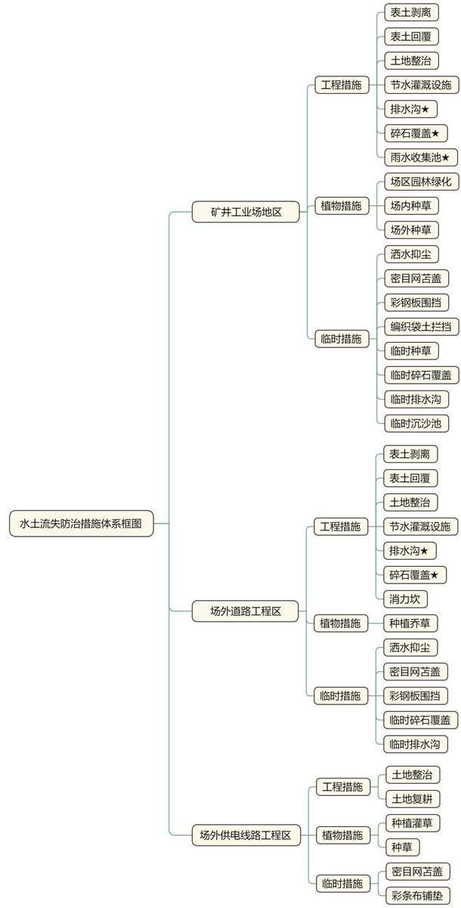

> **Zone C（应用范例层）使用边界**——仅可用于**写作风格、章节展开方式、表达逻辑、表格设计**的参考。
> **不得**用于合规判断；**不得**引入其项目数据（名称／地点／数字／单位名）；
> **不得**因其"曾经通过审批"而推定其做法在当前标准下仍然合规。
> 与 Zone A 冲突时**一律以 Zone A 为准**；Zone A 未明确规定时输出
> 「**Zone A 未明确规定，以下为参考写法，需人工判断**」。
>
> **坐标系警告**：本范例为**老八章结构**（GB 50433—2018 附录B），与 2026 版 10 章模板**同号不同义**
> （老 `1.5`＝防治目标，新 `1.5`＝水土流失预测结果；老 4→新 6 …偏移 +2；新版第 4/5 章老结构无独立章）。
> 因此 **`chapter_mapping: pending`——不得按章节号挂载**，检索一律走 `topic_tags`。
>
> **待加工**：`topic_tags`（主题标签）、`approval_basis_list`（编制依据逐字清单）、
> `structure_summary`（只提取结构：章节展开顺序／段落功能／表格栏目结构／句式模板／论证链步骤）。

1 综合说明....  
1.1 项目简况...  
1.2 编制依据... . 6  
1.3 设计水平年....  
1.4 水土流失防治责任范围.. .... 9  
1.5 水土流失防治目标... .... 10  
1.6 项目水土保持评价结论.. .... 11  
1.7 水土流失预测成果..... .... 15  
1.8 水土保持措施布设成果. .... 15  
1.9 水土保持监测方案...... .... 18  
1.10 水土保持投资及效益分析成果...... .....19  
1.11 结论 .... .... 19  
2 项目概况 ...... ..... 22  
2.1 项目组成及工程布置... .... 22  
2.2 施工组织... .... 63  
2.3 工程占地.. .... 68  
2.4 土石方平衡.... ... 68  
2.5 拆迁（移民）安置与专项设施改（迁）建... ..... 71  
2.6 施工进度... .... 71  
2.7 自然概况.... ..... 73  
3 项目水土保持评价... .... 78  
3.1 主体工程选址水土保持评价.... ....78  
3.2 建设方案与布局水土保持评价... ....80  
3.3 主体工程中水土保持措施界定...... ....93  
4 水土流失分析与预测.. ....95  
4.1 水土流失现状.. .. 95  
4.2 水土流失影响因素分析.. ... 96  
4.3 土壤流失量预测...... .... 99  
4.4 水土流失危害分析... .... 109  
4.5 指导性意见... ... 109  
5 水土保持措施...... .... 112  
5.1 防治分区划分... ... 112  
5.2 措施总体布局... .... 113  
5.3 分区措施布设... ... 116  
5.4 施工要求 ..... .... 139  
6 水土保持监测.... .... 147  
6.1 范围和时段... .... 147  
6.2 内容和方法... ... 147  
6.3 点位布设 ...... .... 153  
6.4实施条件和成果... .... 154  
7 水土保持投资估算及效益分析... ... 160  
7.1 投资估算... .... 160  
7.2 效益分析 ..... ..... 179  
8 水土保持管理.... .... 181  
8.1 组织管理.. ... 181  
8.2 后续设计 ..... .... 182  
8.3 水土保持监测.. .... 183  
8.4 水土保持监理.. ... 184  
8.5 水土保持施工 ..... ..... 185  
8.6 水土保持设施验收.. .... 186

## 1 综合说明

## 1.1 项目简况

## 1.1.1 项目基本情况

## （1）项目建设必要性

宁夏韦州矿区是宁东煤炭基地规划建设的重点矿区之一，韦州矿区的开发是建设国家大型煤炭基地的需要，更是宁东煤炭基地建设的需要。宁夏韦州矿区韦三煤矿项目的建设可以缓解宁东能源化工基地与宁夏回族自治区煤炭供不应求的紧张局面，有利于促进当地社会就业、巩固拓展脱贫攻坚成果以及加快当地经济发展，同时可以保障和促进同心县、宁东和宁夏经济的发展。

因此，宁夏韦州矿区韦三煤矿项目建设是十分必要的。

## （2）项目概况

宁夏韦州矿区韦三煤矿项目建设地点位于宁夏回族自治区吴忠市同心县韦州镇、下马关镇，煤矿西北邻韦四井田，东北邻韦二井田，东北、东以向斜轴部 F7、F7-1 断层与韦二井田为界，南、西以 20 煤层露头为界。井田地理坐标为：东经$1 0 6 ^ { \circ } 2 5 ^ { \prime } 0 8 . 0 8 ^ { \prime \prime } \sim 1 0 6 ^ { \circ } 2 9 ^ { \prime } 1 6 . 0 3 ^ { \prime \prime }$ 、北纬 $3 7 ^ { \circ } 0 8 ^ { \prime } 2 6 . 7 1 ^ { \prime \prime } \sim 3 7 ^ { \circ } 1 4 ^ { \prime } 3 0 . 1 9 ^ { \prime \prime } .$ 。工业场地中心地理坐标为：东经 106°27′29.01″、北纬 $3 7 ^ { \circ } 1 2 ^ { \prime } 5 2 . 5 3 "$ ，工业场地北侧为红五干渠，南侧为同红公路，东侧为S202 省道，西侧为灌木林地。项目区周边的道路有同红公路，S202省道，S310省道及乡村道路等，交通便利。

本项目属新建井采煤矿，年产原煤150万t，井田面积为31.1276km2，开采方式为井工开采方式（斜井开拓）。根据《储量核实报告》，截至2021年11月30日，估算地质资源量为 314.27Mt。矿井工业资源/储量 285.17Mt，矿井设计资源/储量为197.30Mt，矿井设计可采储量为145.59Mt。矿井服务年限为69.3 年（不含基建期），其中，一采区服务年限9.9年（首采区位于一采区内），二采区服务年限3.1 年，三采区服务年限7.5年，四采区服务年限 11.4 年，五采区服务年限8.1年，六采区服务年限 6.9 年，七采区服务年限 5.4 年，八采区服务年限 7.5 年，九采区服务年限 4.1年，十采区服务年限5.4年。项目主要建设内容为：新建矿井及选煤厂工业场地1座（主要包括：主斜井、副斜井、回风斜井、洗选煤系统、矸石充填系统、瓦斯抽采系统、污水处理站、供配电系统、办公生活区、仓库、危废品库、场内道路、硬化场地及绿化工程等），进场道路88m，运煤道路88m，场外供电线路 47.06km（塔基172 基）。项目总占地 30.54hm2，其中永久占地 23.60hm2，临时占地 6.94hm2，占地类型为灌木林地、耕地、草地。项目施工期土石方挖填总量 94.90 万 m3，其中挖方总量 47.45 万 m3（含表土剥离 5.58 万 m3），填方总量 47.45 万 m3（含表土回覆 5.58万 m3），挖填平衡。项目计划于 2026 年 1 月开工，2028 年 12 月完工，总工期 36个月。项目总投资28.94 亿元，其中土建投资11.20 亿元，资金来源为建设单位自筹33.28%，其余资金以项目融资的方式向金融机构贷款解决。本项目不涉及拆迁安置和专项设施改（迁）建问题。项目由矿井工业场地、场外道路工程、场外供电线路工程三部分组成。

项目依托情况：本项目依托工程为消防和救援站、爆破材料库、韦三煤矿的场外供水管线、运行初期矸石处理工程、建设期半煤岩洗选工程。①矿井应急救援和消防依托宁夏瑞鸿矿山应急救援队和消防站，驻地位于宁夏同心县韦州镇韦二南井，属于独立中队建制；②矿井爆破材料库依托永安矿井东南部设置的矿区爆破材料总库；③场外供水管线依托工程名称为同心县小西沟净水厂扩建+韦二、三四矿供水项目，项目建设单位为同心县水务局，该供水管线接至本项目围墙外2m处，该工程水土保持方案已委托编制单位正在编制中；④本项目运行初期矸石处理依托工程名称为宁夏庆华煤化集团有限公司韦二煤矿固废治理暨土地复垦项目，项目建设单位为宁夏庆华煤化集团有限公司，该项目于 2022 年 7 月 13 日由同心县发展和改革局予以备案，项目水土保持方案于2023年2月1 日由同心县水务局以同水审发〔202307 号文予以批复，项目环境影响报告表于 2022 年12 月7日由吴忠市生态环境局同心分局以同环发〔2022〕167 号文予以批复，建设用地手续于 2023 年5月 1日由宁夏回族自治区人民政府以宁政土批字〔2023〕92号文予以批复，项目用地手续于2023年 10 月 27 日由同心县自然资源局下发不动产证，项目于2025 年 11 月开工，2026年5月完工，该工程与本项目直线距离约 13.00km。⑤建设期半煤岩洗选依托宁夏韦州矿区韦二煤矿洗选煤厂，该煤矿责任单位为宁夏瑞鸿韦二矿业有限公司，宁夏韦州矿区韦二煤矿水土保持方案已于2012年1 月11日由水利部以水保函〔2012〕3号予以批复，该项目主体工程于2013年2月建设完成。2021年6 月1日，该项目完成水土保持设施自主验收工作，并于 2021 年 8 月 23 日取得自治区水利厅下发的《关于宁夏韦州矿区韦二煤矿水土保持设施自主验收报备的复函》（宁水函发〔2021〕188号）。该工程与本项目直线距离约5.50km。

本项目施工期临时施工用电共建设1回10kV线路，引自矿业工业场地南侧下马关变522 下罗线，该供电线路沿同红公路北侧东西向布置，距本项目南围墙101m，设计采用地埋电缆方式接入本项目设置的箱变，地埋电缆布设在运煤道路一侧空地，该占地位于永久占地红线范围内。施工用水引自宁夏水投中源水务有限公司供水管网，供水管网沿同红路东西向布置，本项目用水自既有供水管网引出后，沿运煤道路一侧空地引入本项目施工用水单元，该占地位于永久占地红线范围内。本项目矿井工业场地施工道路采用永临结合方式，新建的进场道路、运煤道路、工业场地内道路在施工期间作为临时施工道路，主体工程施工结束后硬化作为永久道路。施工道路长3331m，路面宽5.0m，采用碎石覆盖，覆盖厚度10cm，碎石覆盖面积1.67hm2。为满足供电线路塔基施工作业，需新建施工便道，共布置施工便道长7.90km，宽3.50m，占地2.77hm2。通信网络信号已覆盖施工区，在施工过程中可用手机进行对外通讯联系。

本项目布设5 处施工生产区，总占地0.44hm2，其中1处位于主斜井侧，主要布设临时工房、临时绞车房，占地面积0.08hm2；1处位于副斜井侧，主要布设临时工房、临时绞车房，占地面积0.08hm2；1 处位于回风斜井侧，主要布设临时工房、临时绞车房，占地面积0.08hm2；1 处位于选煤厂区产品仓东侧，用于建筑物建设时临时堆料及材料加工场地，占地0.10hm2；1处行政生活福利区食堂及接待楼西侧，用于建筑物建设时临时堆料及材料加工场地，占地0.10hm2。施工生产区属于重复占地，施工结束后及时清理场地，按主体工程设计内容进行布置。本项目共布置1处施工生活区，位于工业场地东南部后期规划的绿化区域，占地面积0.22hm²，主要包括临时办公室、临时宿舍、临时库房、临时停车场地等，临建房屋主要为一体式集装箱结构，临时停车场地等空地采用混凝土硬化。本项目设置临时表土堆场1座，位于工业场地中部、机修及综采设备中转库南侧，后期规划的龙门吊周围混凝土硬化场地区域，场地尺寸为112m×121m，占地面积1.36hm2，最大堆土高度 4.90m，堆土边坡比 1:2.0，计划堆存表土量 5.58 万m3，表土堆存时间约为2.5年（2026年2月至2028年6月）。供电线路每基塔布设1处施工场地，用于材料堆放、机械作业、土方堆放等，每基直线塔塔基施工场地占地239.40m²，耐张塔塔基施工场地占地253.38m²。

## 1.1.2 项目前期工作进展情况

## （1）项目前期立项、设计情况

2021年 12月，宁夏圣拓自然资源勘查开发有限公司编制完成《宁夏回族自治区吴忠市韦州矿区韦三煤矿煤炭资源储量核实报告》；

2022年 6月 7日，宁夏回族自治区矿产资源储量评审中心下发《宁夏吴忠市韦州矿区韦三煤矿煤炭资源储量核实报告矿产资源储量评审意见书》（宁矿储评字〔2022〕36 号）；

2022年 7月6日，宁夏回族自治区自然资源厅下发《关于<宁夏回族自治区吴忠市韦州矿区韦三煤矿煤炭资源储量核实报告>矿产资源储量评审备案的函》（宁自然资矿储备字〔2022〕11号）；

2022年 11月，中煤科工集团北京华宇工程有限公司编制完成《宁夏回族自治区韦州矿区总体规划（修编）环境影响报告书》；

2022年 11月28日，宁夏回族自治区生态环境厅下发《自治区生态环境厅关于<宁夏回族自治区韦州矿区总体规划（修编）环境影响报告书>审查意见的函》（宁环函〔2022〕885 号）；

2023年 2月，中煤科工集团北京华宇工程有限公司编制完成《宁夏回族自治区韦州矿区总体规划（修编）》；

2023年 2月13日，宁夏回族自治区发展和改革委员会下发《自治区发展改革委关于宁夏韦州矿区总体规划（修编）的批复》（宁发改能源（管理）审发〔2023〕13 号）；

2023年 3月，中煤科工集团北京华宇工程有限公司编制完成《宁夏庆华煤化集团有限公司韦三矿井矿产资源开发利用方案》；

2023年 3月，中煤科工集团北京华宇工程有限公司编制完成《宁夏韦州矿区韦三煤矿项目可行性研究报告》；

2023年 3月，长春建工勘测规划设计有限公司编制完成《宁夏韦州矿区韦三煤矿项目土地勘测定界报告书》；

2024年 2月6日，国家能源局下发了《国家能源局关于宁夏韦州矿区韦三煤矿项目核准的批复（国能发煤炭〔2024〕13 号）》（项目代码：2307-000000-60-05-962220）（详见附件2）；

2024年 2月6日，自治区自然资源厅颁发了《采矿许可证》（详见附件4）；

2025年 5月，中煤科工集团北京华宇工程有限公司编制完成《宁夏韦州矿区韦三煤矿项目初步设计》。

2025年 5月16日，宁夏回族自治区发展和改革委员会组织专家对《宁夏韦州矿区韦三煤矿项目初步设计》进行了技术审查；

2025年 6月25日，宁夏回族自治区发展和改革委员会下发了《自治区发展改革委关于宁夏韦州矿区韦三煤矿初步设计的批复》（宁发改煤炭油气审发〔2025〕117号）（详见附件3）。

（2）水土保持方案编制情况

2023年 3月，宁夏庆华煤化集团有限公司委托宁夏瑞沃水资源工程研究院（有限公司）（以下简称“我公司”）编制本项目水土保持方案。接受任务后，我公司根据《生产建设项目水土保持技术标准》（GB 50433-2018）和《生产建设项目水土流失防治标准》（GB/T50434-2018）等规范、标准，组织人员认真查勘现场，在与建设单位及主体工程设计单位认真沟通的基础上，按照水土保持方案编制的有关规范，于2025 年10月编制完成《宁夏韦州矿区韦三煤矿项目水土保持方案报告书》。

## 1.1.3 自然简况

韦三井田位于罗山东面，属于罗山山前平原的一部分，地形西高东低，南高北低，倾斜至井田东部的苦水河。地形高差较小，海拔一般为+1475m，最高位于井田南部，为+1540m，最低位于井田北部，为+1417m，相对高差一般为 123m，东部及南部散布许多冲沟。矿井工业场地原始地貌类型属罗山山前平原，原始地面高程在1439.71～1445.50m之间（1985国家高程基准，下同），地形平坦，南高北低，西高东低。

矿区所在区域气候类型属中温带干旱大陆性气候区，平均年降水量 266.1mm，降水主要集中在 7、8、9 月。年平均气温 9.8℃。年平均蒸发量为 2364.5mm，平均风速 3.2m/s，最大风速 22m/s，最大冻土深度 137cm。

韦三井田位于黄河流域，井田内无常年河流，只发育有几条冲沟，比较大的冲沟有甜水河和马庄子沟，此外还有人工修建的红寺堡扬水干渠以及 5 个蓄水池。矿井工业场地区及场外道路不涉及河流水系。

韦州矿区土壤母质主要是洪积冲积物和风积母质，洪积冲积物土层普遍深厚，一般质地层次变化较大，但1.0m 内多以沙质土和壤质土为主；风积母质是风力搬运堆积而成的细沙物质，沙粒含量大于 90%。矿区内土壤类型主要为灰钙土，南侧局部有少量风沙土。植被类型属于干旱草原植被，主要有短花针茅、沙生针茅、沙打旺、扁穗冰草、沙蓬、牛枝子、猫头刺、木蓼、狭叶锦鸡儿、芨芨草、黑沙蒿、骆驼蓬、白茨、红砂等。人工植被主要是种植的庄稼和栽种的乔木、灌木，庄稼有玉米、冬小麦、荞麦和土豆等，栽种的乔木、灌木多为旱柳、刺槐、柠条等。区域林草覆盖率在20%左右。

根据《水利部办公厅关于做好国家级水土流失重点预防区和重点治理区落地上图成果应用的通知》（办水保〔2025〕170号）及《宁夏回族自治区水土保持规划（2016—2030年）》，项目区不在国家级水土流失重点预防区和重点治理区内，项目所在区域属自治区级水土流失重点治理区（丘陵台地干旱草原风水蚀区）。项目区土壤侵蚀以中度风力侵蚀为主，兼有轻度水力侵蚀，风力侵蚀模数为2600t/km2·a，水力侵蚀模数为400t/km2·a。依据《土壤侵蚀分类分级标准》（SL190-2007），容许土壤流失量为 1000t/km2·a。

## 1.2 编制依据

## 1.2.1 法律法规

（1）《中华人民共和国水土保持法》（2010年12月25日通过了十一届全国人大常委会第十八次会议审议，以中华人民共和国主席令第39 号公布，于2011年3月1日起施行）；

（2）《中华人民共和国黄河保护法》（2022 年10 月30 日第十三届全国人民代

表大会常务委员会第三十七次会议通过，以中华人民共和国主席令第123号公布，于2023 年4月1日起施行）；

（3）《中华人民共和国防洪法》（2016年 7月2日第十二届全国人民代表大会常务委员会第二十一次会议修订通过，自 2016年9 月1日起施行）；

（4）《宁夏回族自治区实施＜中华人民共和国水土保持法＞办法》（1997 年10 月17 日通过，2015年 7月31日第一次修订，2024 年5月30日第二次修订）。

## 1.2.2 部委规章及规范性文件

（1）《生产建设项目水土保持方案管理办法》（水利部令第53号）；

（2）《水利部办公厅关于做好国家级水土流失重点预防区和重点治理区落地上图成果应用的通知》（办水保〔2025〕170号，2025年9 月19 日）；

（3）《水利部办公厅关于进一步加强部批项目水土保持监管工作的通知》（办水保〔2024〕57 号，2024 年 2 月 21 日）；

（4）《水利部办公厅关于印发生产建设项目水土保持技术文件编写和印制格式规定（试行）的通知》（办水保〔2018〕135号，2018 年7月12日）；

（5）《水利部关于进一步深化“放管服”改革全面加强水土保持监管的意见》（水保〔2019〕160 号，2019 年 5 月 31 日）；

（6）《水利部办公厅关于进一步加强生产建设项目水土保持监测工作的通知》（办水保〔2020〕161 号，2020 年 7 月 28 日）；

（7）《水利部关于加强事中事后监管规范生产建设项目水土保持设施自主验收的通知》（水保〔2017〕365号，2017年 11月13日）；

（8）《水利部办公厅关于印发生产建设项目水土保持设施自主验收规程（试行）的通知》（办水保〔2018〕133号，2018年7月10 日）；

（9）《水利部办公厅关于印发生产建设项目水土保持监督管理办法的通知》（办水保〔2019〕172 号，2019 年 7 月 30 日）；

（10）《水利部办公厅关于印发生产建设项目水土保持方案审查要点的通知》（办水保〔2023〕177 号，2023 年 7 月 6 日）；

（11）《自治区人民政府关于发布宁夏回族自治区生态保护红线的通知》（宁

政发〔2018〕23 号，2018 年 6 月 30 日）；

（12）《水利部办公厅关于实施生产建设项目水土保持信用监管“两单”制度的通知》（办水保〔2020〕157号）；

（13）住房和城乡建设部、国土资源部关于批准发布《煤炭工程项目建设用地指标—矿井、选煤厂、筛选厂及矿区辅助设施部分》的通知（建标〔2008〕233号，2008 年 12 月 31 日）。

## 1.2.3 技术标准

（1）《生产建设项目水土保持技术标准》（GB50433―2018）；

（2）《生产建设项目水土流失防治标准》（GB/T50434―2018）；

（3）《生产建设项目水土保持监测与评价标准》（GB/T51240―2018）；

（4）《土地利用现状分类》（GB/T21010―2017）；

（5）《土壤侵蚀分类分级标准》（SL190―2007）；

（6）《水土保持工程设计规范》（GB51018―2014）；

（7）《表土剥离及其再利用技术要求》（GB/T45107―2024）；

（8）《水土保持监测技术规范》（SL/T277―2024）；

（9）《水土保持监理规范》（SL/T523―2024）；

（10）《生产建设项目土壤流失量测算导则》（SL773―2018）；

（11）《水土保持工程调查与勘测标准》（GB/T51297―2018）；

（12）《水利水电工程制图标准水土保持图》（SL73.6―2015）；

（13）《水土保持工程质量验收与评价规范》（SL/T336-2025）；

（14）《防洪标准》（GB 50201―2014）；

（15）《室外排水设计标准》（GB50014―2021）；

（16）《喷灌工程技术规范》（GB/T50085―2007）；

（17）《煤炭企业总图运输设计标准》（GB51276―2018）；

（18）《煤炭工业矿井设计规范》（GB50215-2015）。

## 1.2.4 其他资料

（1）《宁夏回族自治区2024年水土保持公报》；

（2）《宁夏回族自治区水土保持规划（2016—2030年）》；

（3）《宁夏韦州矿区韦三煤矿项目可行性研究报告》（中煤科工集团北京华宇工程有限公司，2023 年3月）；

（4）《宁夏庆华煤化集团有限公司韦三矿井矿产资源开发利用方案》（中煤科工集团北京华宇工程有限公司，2023年3 月）；

（5）《国家能源局关于宁夏韦州矿区韦三煤矿项目核准的批复》（国能发煤炭〔2024〕13号）；

（6）《宁夏韦州矿区韦三煤矿项目土地勘测定界报告书》（长春建工勘测规划设计有限公司，2023 年3月）；

（7）《宁夏韦州矿区韦三煤矿项目初步设计》（中煤科工集团北京华宇工程有限公司，2025年6月）；

（8）《自治区发展改革委关于宁夏韦州矿区韦三煤矿初步设计的批复》（宁发改煤炭油气审发〔2025〕117号）。

## 1.3 设计水平年

设计水平年应为主体工程完工后的当年或后一年，根据主体工程完工时间和水土保持措施实施进度安排等综合确定。项目计划于 2026 年 1月开工，2028年 12月完工，方案设计的植物措施实施完成并初步发挥效益在主体工程完工的当年，即为2028 年，故本方案设计水平年定为2028年。

## 1.4 水土流失防治责任范围

## 1.4.1 防治责任范围界定的原则与依据

根据“谁开发，谁保护，谁造成水土流失，谁负责治理”的原则，依据《生产建设项目水土保持技术标准》（GB50433-2018）的规定，结合本项目总体布局及项目土地勘测定界技术报告，确定本项目的水土流失防治责任范围包括项目永久征地、临时占地及其他使用与管辖区域。

## 1.4.2 水土流失防治责任范围确定

根据项目土地勘测定界技术报告和主体工程设计资料，本项目占地 30.54hm2，由矿井工业场地、场外道路工程、场外供电线路工程 3 部分组成。经复核，本项目

水土流失防治责任范围面积 $3 0 . 5 4 \mathrm { h m } ^ { 2 }$ ，其中永久占地 $2 3 . 6 0 \mathrm { h m } ^ { 2 }$ ，临时占地 $6 . 9 4 \mathrm { h m } ^ { 2 }$ 水土流失防治主体责任单位为宁夏庆华煤化集团有限公司。水土流失防治责任范围面积表见表1-1，水土流失防治责任范围图见附图7。

表 1-1 水土流失防治责任范围面积表

单位：hm2

<table><tr><td rowspan=2 colspan=1>行政区划</td><td rowspan=2 colspan=1>名称</td><td rowspan=1 colspan=2>占地性质</td><td rowspan=2 colspan=1>水土流失防治责任范围面积</td><td rowspan=2 colspan=1>备注</td></tr><tr><td rowspan=1 colspan=1>永久占地</td><td rowspan=1 colspan=1>临时占地</td></tr><tr><td rowspan=3 colspan=1>吴忠市同心县</td><td rowspan=1 colspan=1>矿井工业场地</td><td rowspan=1 colspan=1>22.57</td><td rowspan=1 colspan=1></td><td rowspan=1 colspan=1>22.57</td><td rowspan=1 colspan=1>主要由建（构）筑物占地6.40hm²，场内道路及硬化场地占地10.89hm²，绿化区占地2.81hm²，排水沟占地0.22hm²，碎石场地占地0.15hm²，预留场地占地0.22hm²，围墙外边坡占地0.36hm²，坡脚至用地界限空地占地1.52hm²组成。</td></tr><tr><td rowspan=1 colspan=1>场外道路工程</td><td rowspan=1 colspan=1>0.51</td><td rowspan=1 colspan=1></td><td rowspan=1 colspan=1>0.51</td><td rowspan=1 colspan=1>主要由混凝土硬化路面占地0.14hm2，建构筑物占地0.04hm²，碎石场地占地0.17hm²，排水沟占地 0.02hm²，绿化带占地0.14hm²组成。</td></tr><tr><td rowspan=1 colspan=1>场外供电线路工程</td><td rowspan=1 colspan=1>0.52</td><td rowspan=1 colspan=1>6.94</td><td rowspan=1 colspan=1>7.46</td><td rowspan=1 colspan=1>主要由塔基及施工场地占地4.69hm²，施工便道占地2.77hm²组成。</td></tr><tr><td rowspan=1 colspan=2>合计</td><td rowspan=1 colspan=1>23.60</td><td rowspan=1 colspan=1>6.94</td><td rowspan=1 colspan=1>30.54</td><td rowspan=1 colspan=1></td></tr></table>

## 1.5 水土流失防治目标

## 1.5.1 执行标准等级

根据《水利部办公厅关于做好国家级水土流失重点预防区和重点治理区落地上图成果应用的通知》（办水保〔2025〕170号）及《宁夏回族自治区水土保持规划（2016—2030年）》，项目区不在国家级水土流失重点预防区和重点治理区内，项目所在区域属自治区级水土流失重点治理区（丘陵台地干旱草原风水蚀区），本项目水土保持区划属西北黄土高原区，则本项目水土流失防治执行西北黄土高原区一级标准。

## 1.5.2 防治目标

本项目水土流失防治的基本目标：

（1）项目建设范围内的新增水土流失得到有效控制，原有水土流失得到治理；

（2）项目建设区内各项水土保持设施安全有效；

（3）项目建设区内水土资源、林草植被得到最大限度的保护与恢复；

（4）各项水土流失防治指标达到《生产建设项目水土流失防治标准》（GB50434/T-2018）的规定。

本方案水土流失防治执行西北黄土高原区一级标准，水土流失防治指标值为：

水土流失治理度为93%，土壤流失控制比为0.80，渣土防护率为92%，表土保护率90%，林草植被恢复率为 95%，因项目位于自治区级水土流失重点治理区，林草覆盖率提高2 个百分点，则林草覆盖率24%。水土流失防治标准指标值见表1-2。

表1-2 项目水土流失防治指标表
<table><tr><td rowspan=2 colspan=1>防治目标</td><td rowspan=1 colspan=2>西北黄土高原区一级标准</td><td rowspan=2 colspan=1>标准修正</td><td rowspan=1 colspan=2>目标值</td></tr><tr><td rowspan=1 colspan=1>施工期</td><td rowspan=1 colspan=1>设计水平年</td><td rowspan=1 colspan=1>施工期</td><td rowspan=1 colspan=1>设计水平年</td></tr><tr><td rowspan=1 colspan=1>水土流失治理度（%）</td><td rowspan=1 colspan=1>1</td><td rowspan=1 colspan=1>93</td><td rowspan=3 colspan=1>项目选址无法避让自治区级水土流失</td><td rowspan=1 colspan=1>1</td><td rowspan=1 colspan=1>93</td></tr><tr><td rowspan=1 colspan=1>土壤流失控制比</td><td rowspan=1 colspan=1>一</td><td rowspan=1 colspan=1>0.80</td><td rowspan=1 colspan=1>一</td><td rowspan=1 colspan=1>0.80</td></tr><tr><td rowspan=1 colspan=1>渣土防护率（%）</td><td rowspan=1 colspan=1>90</td><td rowspan=1 colspan=1>92</td><td rowspan=1 colspan=1>90</td><td rowspan=1 colspan=1>92</td></tr><tr><td rowspan=1 colspan=1>表土保护率（%）</td><td rowspan=1 colspan=1>90</td><td rowspan=1 colspan=1>90</td><td rowspan=3 colspan=1>重点治理区，林草覆盖率提高2个百分点</td><td rowspan=1 colspan=1>90</td><td rowspan=1 colspan=1>90</td></tr><tr><td rowspan=1 colspan=1>林草植被恢复率（%）</td><td rowspan=1 colspan=1>1</td><td rowspan=1 colspan=1>95</td><td rowspan=1 colspan=1>1</td><td rowspan=1 colspan=1>95</td></tr><tr><td rowspan=1 colspan=1>林草覆盖率（%）</td><td rowspan=1 colspan=1>一</td><td rowspan=1 colspan=1>22</td><td rowspan=1 colspan=1>一</td><td rowspan=1 colspan=1>24</td></tr></table>

## 1.6 项目水土保持评价结论

## 1.6.1 主体工程选址评价

本项目选址基本符合《中华人民共和国水土保持法》《中华人民共和国黄河保护法》《生产建设项目水土保持技术标准》（GB50433-2018）等法律法规和技术标准的规定。鉴于项目位于自治区级水土保持重点治理区，且无法避让，矿井工业场地、场外道路截排水沟提高了防护标准，工业场地排水沟按照100 年一遇洪水标准设计，场外道路排水沟采用50年一遇洪水标准设计。煤矿工业场地竖向布置经过多次优化，消纳了建设期井巷工程产生的一部分废土石及矸石，减少了弃方。项目执行最高一级水土流失防治标准，林草覆盖率执行24%，其余防治目标值执行防治标准原值。施工中采用有利于水土保持的施工工艺，减少地表扰动和植被损坏范围等措施。从水土保持角度分析，韦三煤矿选址无水土保持制约性限制。

## 1.6.2 建设方案与布局评价

## （1）建设方案评价

本项目属于煤矿开发项目，受煤炭开采区域的局限性，选址无法避让水土流失重点治理区。按照技术标准的规定，本方案场外道路无高填路基及深挖路堑；工业场地位于罗山山前平原，采取平坡式布设，减少土石方量；布设雨水集蓄利用措施，并提高截排水工程的工程级别和防洪标准。根据井下煤层赋存情况及开拓要求，煤矿设主斜井、副斜井和回风斜井三个井口，三个井口均布置在矿井工业场地内。工业场地所处地段开阔平坦，工业场地总平面竖向设计采用平坡式布置，在建构筑物及其他设施之间的高程关系的基础上，充分利用原地形高程、减少土方挖填量及余方量，不足的土石方由建构筑物基础基坑回填余方、管线基槽及井巷工程掘进矸石补充，避免了余方的产生。工业场地设置本着与地形坡度相适应、满足平面布置需要和运输要求，场地尽量避免大填大挖，减少土石方工程量；土石方力求做到就近挖高填低，填挖平衡，避免长距离倒运；场地内各项设施布置相对比较紧凑，布局合理。场外供电线路选择适宜的杆塔根开，并且采用占地面积和挖填土石方量较小的挖孔桩基础，减少占地。牵张场充分利用塔基施工场地，临时施工场地严格控制临时施工扰动范围。从水土保持角度分析，本项目建设方案基本符合《生产建设项目水土保持技术标准》（GB50433-2018）的要求。

## （2）工程占地评价

根据主体工程设计资料，主体设计计列的项目总占地 30.54hm2，经本方案复核后项目占地无遗漏和缺项。根据同心县自然资源局《建设项目用地预审与选址意见书》（用字第640324202300017号），用地手续合法合规。

本方案工程占地主要从占地数量、占地性质及占地类型进行合理性分析。

韦三煤矿设计规模为 150万 t/a，属于大型矿井，配套同等规模的选煤厂，矿井工业场地主斜井、副斜井、回风斜井。依据《 宁夏回族自治区建设用地控制指标（2024年版）－宁夏煤炭开采和洗选业建设用地指标》《 宁夏回族自治区建设用地控制指标（2024年版）－宁夏煤炭开采和洗选业建设用地指标》，项目占地数量满足相关规范要求。矿井工业场地及场外道路施工生产生活区、临时堆土场布置在工业场地内，不新增占地。场外供电线路工程占地以临时占地为主，塔基施工道路充分利用已有乡村道路，减少了临时占地，施工结束后全部进行迹地恢复。从水土保持角度分析，占地性质满足水土保持要求。本项目占地类型为灌木林地、耕地、草地，工程建设用地符合当地的土地利用规划，且已征得当地土地管理部门和当地政府部门的同意。本方案认为：由于本项目属于国家同意开发建设的煤矿项目，对国民经济发展具有重要的意义，鉴于其占地面积较大且会造成大面积的土地扰动，项目施工期间应做好施工安排，切实有效地避免项目建设以外的地面扰动，并及时落实水土保持措施，以降低因工程建设带来的水土流失危害。本项目场外供电线路占用耕地基本上为临时占地，使用结束后全部进行土地复耕。工程在占地数量、占地性质和占地类型等方面对水土保持而言并未形成制约，占地合理，符合水土保持要求。

## （3）土石方平衡评价

为加强对表土资源的保护利用，本项目根据后期绿化和植被恢复需求，对占地范围内占用灌木林地、耕地、草地的开挖扰动范围内的表土资源做到应剥尽剥、保护利用。工程施工前，将矿井工业场地和进场道路占地内可利用的表土资源进行剥离，并堆存至矿井工业场地内设置的表土临时堆场。场外供电线路塔基及施工场地、施工道路扰动深度较浅，不对该区域进行表土剥离。矿井工业场地和进场道路堆放的表土采取拦挡和苫盖等临时防护措施，待施工结束后按照需求用于矿井工业场地、场外道路植被恢复覆土，回覆厚度0.6m-1.0 m；场外供电线路每基塔及施工场地剥离的表土量少，堆放在各塔基用地范围内，施工期间对堆放的表土进行苫盖防护。从水土保持角度考虑，表土剥离保护与利用措施合理，为后期植被恢复创造有利条件，符合水土保持要求。

本项目建设期主要土石方工程主要为矿井工业场地平整及建（构）筑物基础开挖回填、井巷开拓、场外道路路基挖填、塔基施工场地平整、塔基基坑开挖等。项目施工期土石挖方总量 47.45 万 m3（含表土剥离 5.58 万 m3），填方总量 47.45 万m3（含表土回覆 5.58万 m3），挖填平衡。工业场地平整土方不足部分利用建设期井筒掘进矸石，以及建构筑物基础基坑回填余方，避免产生弃方。场外道路工程区内建构筑物基础基坑回填余方用于道路修筑，实现了区内土石方平衡，减少了弃方。塔基基础基坑采用挖孔桩基础，该基础类型开挖土石方量少；塔基施工道路随地形布置，采用浅挖低填方式，减少了开挖土石方量，从而减少了水土流失。经分析，本项目工程建设按照施工时序，通过区间合理调配开挖土石方，充分综合利用余方，运距合理，减少了余方量，土石方调运符合施工工艺、施工时序及施工特点，工程土石方挖填数量和流向基本合理。

根据主体工程设计资料，生产运行期主要产生的土石方为矿井掘进矸石和洗选矸石。矿井采掘和选煤厂在生产初期（3.0年）产生的洗选矸石因生产初期工作面未全面打开无法及时充填，需全部外运至韦二煤矿固废治理暨土地复垦项目综合利用，本矿井不设矸石周转场地。运行期掘进矸石3万t/a，洗选矸石23.86万t/a，3 年生产期总矸石量80.58万t（折算体积30.41 万m3）。韦二煤矿固废治理暨土地复垦项目位于同心县韦州镇青龙山村，位于本矿井工业场地东北约13km，有效容积为264万m³。韦二煤矿年填埋利用煤矸石14.15万m3，服务年限为18年，待本项目堆放矸石后，韦二煤矿堆放矸石周期缩短至16 年，对韦二煤矿矸石堆放影响不大。该项目已取得水土保持方案批复、环境影响报告批复和土地相关手续，手续合法合规，同时容量可以满足本矿井的矸石利用要求。待运行满3 年后，地面矸石充填系统运行，矸石通过破碎加工，配置成矸石骨料，定量进入搅拌系统充分搅拌制成浓浆，再通过输浆管路输送至井下，利用综采工作面架后矸石膏体充填工艺回填井下采空区。煤矸石回用率100%。矸石在矿井建成运行 3年后用于充填井下形成的采空区和废弃巷道，实现矸石不出井，无矸石外运。减少了矸石对周边环境的影响，符合水土保持的要求。

综上所述，本工程土石方依据各类施工工艺分段进行调配，尽量做到各类施工工艺及各段土石方平衡，对表土进行综合保护利用，土石方挖填数量符合最优化原则，土石方调运符合节点适宜、时序可行、运距合理的原则，施工期土石方实现挖填平衡，运行初期产生的矸石全部运至韦二煤矿固废治理暨土地复垦项目综合利用，符合水土保持要求。

## （4）施工方法与工艺评价

主体土建工程采取同时施工，分区块平行流水施工的组织方式。采取有效的预防保护措施，强调源头控制、过程控制，避免重复开挖和多次倒运，最大程度地减少损坏原地貌及土石方开挖量。土方开挖、回填及场地平整等以机械为主，方案补充了表土单独剥离保护用于植被恢复覆土。管沟施工随挖随填，产生的临时堆土方案补充了临时防护措施。结合施工时序，施工场地全部布置在工业场地内的后期扰动区域或绿化区域。在建设工序上，水、电、路工程先行施工，井筒掘进与工业场地建设同步，施工结束后施工场地尽快恢复植被。从水土保持角度分析，项目施工安排紧凑合理，施工工艺先进，符合水土保持要求。

## （5）主体工程中具有水土保持功能工程分析评价

在主体工程设计中已考虑一部分防护措施，其中在满足主体工程需要的同时，也具有水土保持效果。主体工程中具有水土保持功能的措施包括矿井工业场地中的场地硬化、围墙工程、排水沟、雨水收集池、碎石覆盖、场区园林绿化，场外道路工程中的场地硬化、排水沟、碎石覆盖、种植乔草。主体工程注重工程措施，对建设过程中的临时防护措施设计不完善。针对工程建设过程中水土流失控制与防护措施不完善，方案需进一步补充上述方面防护措施，本方案补充矿井工业场地表土剥离、表土回覆、节水灌溉设施、土地整治、场内种草、场外种草、洒水抑尘、密目网苫盖、编织袋土拦挡、彩钢板围挡、临时种草、临时碎石覆盖、临时排水沟、临时沉沙池，场外道路工程表土剥离、表土回覆、土地整治、节水灌溉设施、消力坎、种植乔草、洒水抑尘、彩钢板围挡、密目网苫盖、临时碎石覆盖、临时排水沟，场外供电线路工程土地整治、土地复耕、种植灌草、种草、密目网苫盖、彩条布铺垫。使本方案水土保持措施形成一个完整、科学与可操作的防护体系。

综上所述，从水土保持角度来评价，本项目建设方案与布局基本合理。

## 1.7 水土流失预测成果

（1）经预测，本项目扰动地表总面积为 $3 0 . 5 4 \mathrm { h m } ^ { 2 }$ ，损毁植被总面积为 $2 8 . 5 4 \mathrm { h m } ^ { 2 }$

（2）项目施工期挖方总量47.45 万m3，填方总量47.45 万m3，挖填平衡。运行期掘进矸石3万 t/a，洗选矸石 23.86 万t/a，3年生产期总矸石量 80.58 万t（折算体积30.41 万m3），全部运至韦二煤矿固废治理暨土地复垦项目综合利用。待运行满3年后，地面矸石充填系统运行，矸石通过破碎加工，配置成矸石骨料，定量进入搅拌系统充分搅拌制成浓浆，再通过输浆管路输送至井下，利用综采工作面架后矸石膏体充填工艺回填井下采空区。

（3）通过水土流失预测，在预测时段内，本项目原地貌水土流失量为 4084t，可能造成的水土流失总量为 18869t，其中新增水土流失量为 14786t。在没有采取防护措施的情况下，矿井工业场地水土流失量最大，新增水土流失量为 11983t，占新增水土流失总量的81.05%，故确定水土流失防治的重点区域为矿井工业场地；施工期水土流失最大，新增水土流失量为12569t，占新增水土流失总量的85.00%，故确定水土流失防治的重点时段为施工期。

（4）项目地势相对平坦，不存在滑坡、泥石流危险，本项目造成的水土流失危害主要为对项目区生态环境的破坏，对周边影响较小，经过实施各项水土保持措施治理后，可以有效防治水土流失。

## 1.8 水土保持措施布设成果

工程水土流失防治分区划分为矿井工业场地区、场外道路工程区、场外供电线路工程区3 个防治分区。

本方案通过水土保持工程措施和植物措施有机结合，合理布局，形成完整的水土保持措施防治体系，实现良好的防治效果。

## （1）措施布局

## 1）矿井工业场地区

施工前，对用地界限处进行彩钢板围挡，对工业场地占用灌木林地区域进行表土剥离，集中堆放在工业场地中部设置的表土堆场。

施工过程中，对临时表土堆场表面临时种草，并采用密目网苫盖，堆场周围采用编织袋土拦挡；在场内施工道路侧、编织袋土挡墙外侧修建临时排水沟，排水沟末端设置临时沉沙池；场内施工道路路面采用临时碎石覆盖，并进行洒水抑尘；建构筑物基础基坑开挖临时堆土采用密目网苫盖；建构筑物周围空地采用密目网苫盖；对施工生产区场地采用临时碎石覆盖；在道路一侧布设排水沟，排水沟末端设置雨水收集池。

施工结束后，对行政生活福利区和公用设施区建构筑物周围空地、道路两侧空地、围墙内侧空地进行表土回覆、土地整治、节水灌溉设施、场区园林绿化；对预留场地区、围墙外边坡及空地进行表土回覆、土地整治、种草。

## 2）场外道路工程区

施工前，对道路两侧用地界限处进行彩钢板围挡，对道路占用灌木林地区域进行表土剥离，集中堆放在工业场地中部。

施工过程中，施工道路路面采用临时碎石覆盖，并进行洒水抑尘，道路侧修建临时排水沟；建构筑物基础基坑开挖临时堆土采用密目网苫盖；在运煤道路两侧空地布设碎石覆盖；在进场道路、运煤道路一侧布设排水沟，排水沟末端设置消力坎。

施工结束后，对进场道路两侧空地进行表土回覆、土地整治、节水灌溉设施、

种植乔草。

## 3）场外供电线路工程区

施工过程中，对塔基基础基坑开挖临时堆土采用密目网苫盖防护，对塔基施工场地采用彩条布进行铺垫保护表土。

施工结束后，对塔基周围空地、塔基施工场地、施工道路进行土地整治，占用草地区域采用种草植被恢复、占用灌木林地区域采用灌草植被恢复、占用耕地区域进行土地复耕。

## （2）措施类型及工程量

## 1）矿井工业场地区

①工程措施：排水沟2762m（主体已列），雨水收集池1座，碎石覆盖0.15hm2（主体已列），表土剥离5.45万m3（剥离面积21.79hm2），表土回覆5.50万m3（回覆面积 4.97hm2），土地整治 4.97hm2，节水灌溉设施 3.17hm2；

②植物措施：场区园林绿化 2.81hm2（主体已列），场内种草 0.22hm2，场外种草 1.94hm2；

③临时措施：密目网苫盖125724m2，洒水抑尘 17064m3，彩钢板围挡 1852m，编织袋土拦挡466m，临时种草1.36hm2，临时碎石覆盖1.78hm2，临时排水沟2930m，临时沉沙池5座。

## 2）场外道路工程区

①工程措施：排水沟 188m（主体已列），碎石覆盖 0.17hm2（主体已列），表土剥离 0.13 万 m3（剥离面积 0.51hm2），表土回覆 0.08 万 m3（回覆面积 0.14hm2），土地整治0.14hm2，节水灌溉设施 0.14hm2，消力坎2座；

②植物措施：种植乔草0.14hm2（主体已列）；

③临时措施：密目网苫盖 420m2，洒水抑尘 972m3，彩钢板围挡 352m，临时碎 石覆盖 0.09hm2，临时排水沟 160m。

## 3）场外供电线路工程区

①工程措施：土地整治5.45hm2，土地复耕 2.00hm2；

②植物措施：种植灌草 2.96hm2，种草 2.49hm2；

③临时措施：密目网苫盖3090m2，彩条布铺垫45819m2。

## （3）措施实施时间

## 1）矿井工业场地区

表土剥离、彩钢板围挡计划于2026年1 月实施，编织袋土拦挡、临时排水沟、临时沉沙池计划于 2026年2 月实施，密目网苫盖计划于 2026年 2月、2026年 5月—2027年7 月实施，洒水抑尘计划于2026年3月—11月、2027年3 月—11月实施，临时种草计划于2026年 4月实施，临时碎石覆盖计划于2026年5月—8 月实施，碎石覆盖计划于 2027 年 11 月实施，排水沟、雨水收集池计划于 2027 年10 月—11月实施，土地整治、表土回覆、节水灌溉设施计划于2026 年5月、2028年5月—6月实施，场区园林绿化计划于2028年6月—7月实施，场外种草计划于2026年6月实施，场内种草计划于2028年6月实施。

## 2）场外道路工程区

表土剥离、彩钢板围挡，临时碎石覆盖、临时排水沟计划于2026年1月实施，洒水抑尘计划于2026年 3月—11月、2027年3 月—11月实施，密目网苫盖计划于2028 年5月实施，排水沟、碎石覆盖、表土回覆、土地整治、节水灌溉设施、消力坎计划于2028 年6月实施，种植乔草计划于2028年7 月实施。

## 3）场外供电线路工程区

表土剥离计划于2026年3月—5月实施，密目网苫盖、彩条布铺垫计划于2026年3月—6月实施，表土回覆计划于2026年12月、2027年1月—2月实施，土地整治、土地复耕计划于2027年1 月—3月实施，种植灌草、种草计划于2027年4月实施。

## 1.9 水土保持监测方案

本项目水土保持监测范围为该工程的水土流失防治责任范围，面积30.54hm2。根据不同工程对地表扰动特点不同，按照工程类型将项目区分为矿井工业场地区、场外道路工程区、场外供电线路工程区共 3个监测分区。根据水土流失预测结果，矿井工业场地区为水土保持监测重点区域。项目水土保持监测应从施工准备期开始至设计水平年结束。本项目施工期为2026年1月至2028年12月，设计水平年为2028年，监测时段为2026年 1月—2028年12 月。项目监测内容主要包括项目施工全过程各阶段扰动土地情况、水土流失状况、水土保持措施及水土流失危害等。建设期主要采用的水土保持监测方法包括地面观测、调查巡查监测、遥感监测、无人机监测等方法。项目共布设固定监测点位10个，其中矿井工业场地区 4个、场外道路工程区2个、场外供电线路工程区2个、原始地貌2个。

## 1.10 水土保持投资及效益分析成果

本项目水土保持估算总投资为1239.39万元，其中，工程措施投资405.82万元，植物措施投资 213.29 万元，监测措施投资 93.47 万元，施工临时工程投资 210.52 万元，独立费用221.92 万元，基本预备费63.83万元，水土保持补偿费30.54 万元。

方案实施后，设计水平年各项防治目标均可达到目标值，方案各项水土保持措施建成并发挥效益后，可有效防治项目建设新增水土流失，减少土壤流失量17910t，使项目水土流失影响在可控范围，最大程度补偿项目建设对当地生态环境的不利影响。

本方案的实施可减少水土流失对工程的危害，对确保本项目安全生产及促进当地经济发展有着重要的作用。此外，项目区的绿化和美化创造了良好的生态环境，项目区生态环境能得到较好地维护。在发展地方经济、提高经济效益的同时，保护水土资源，实现工程建设经济、社会和生态效益的统一。

## 1.11 结论

根据《中华人民共和国水土保持法》《宁夏回族自治区实施<中华人民共和国水土保持法>办法》《生产建设项目水土保持技术标准》（GB 50433-2018）的相关要求，本项目选址无法避让自治区级水土流失重点治理区，施工过程中不可避免地扰动原地貌、损坏土地和植被，造成一定程度的水土流失，但本项目通过各项水土保持措施的实施，能有效地控制水土流失，达到经济发展和环境建设协调发展。因此，从项目选址、建设方案、水土流失防治等方面本工程不存在水土保持重大制约性因素，造成的水土流失可控，水土保持措施的实施可降低建设造成的水土流量。

下一阶段水土保持工作要求：

①主体工程设计单位在下阶段设计应对照本方案对主体工程的水土保持分析评价，进一步完善施工组织设计内容，优化各区域的竖向设计，减少土石方量。

②主体工程施工单位应选择手续齐全的砂石料场来进行砂石料的外购，并在签

订外购砂、石料的合同中明确水土流失防治责任。

③施工单位应在施工过程中全面落实各项水土流失防治措施。加强土石方运输和堆放管理，防止散落及乱堆乱弃。尤其要加强施工过程中的临时防护措施。并在施工场地树立水土保持相关告示标语，增强施工与管理人员的水土保持与环境保护意识。

④建设单位应按照水土保持方案的要求，及时开展水土保持监测、监理工作，监测工作可自行开展也可以委托有能力的技术单位开展，监理工作需委托具有水土保持专业监理资格工程师的单位开展水土保持监理工作。

⑤承担本项目水土保持方案技术评审、水土保持监测、水土保持监理工作的单位不得作为该生产建设项目水土保持设施验收报告编制的第三方机构。

⑥在水土保持方案批复后，建设单位应及时向有关税务部门足额缴纳水土保持补偿费；主体工程竣工验收前，应验收水土保持设施；水土保持设施验收合格后，建设单位应加强水土保持设施后续管护，确保其正常运行和发挥效益。

⑦建设过程中主动接受各级水行政主管部门的监督检查。

⑧施工期间不得随意扩大扰动范围。

⑨严格落实批复的水土保持措施。

⑩本水土保持方案自批准之日起满 3 年方开工建设的，其水土保持方案应当报原审批部门重新审核。

水土保持方案特性表
<table><tr><td rowspan=1 colspan=2>项目名称</td><td rowspan=1 colspan=4>宁夏韦州矿区韦三煤矿项目</td><td rowspan=1 colspan=3>流域管理机构</td><td rowspan=1 colspan=2>黄河水利委员会</td></tr><tr><td rowspan=1 colspan=2>涉及省区</td><td rowspan=1 colspan=3>宁夏回族自治区</td><td rowspan=1 colspan=1>涉及地市</td><td rowspan=1 colspan=2>吴忠市</td><td rowspan=1 colspan=1>涉及县/区</td><td rowspan=1 colspan=2>同心县</td></tr><tr><td rowspan=1 colspan=2>项目规模</td><td rowspan=1 colspan=3>年产原煤150万t</td><td rowspan=1 colspan=1>总投资</td><td rowspan=1 colspan=2>28.94亿元</td><td rowspan=1 colspan=1>土建投资</td><td rowspan=1 colspan=2>11.20亿元</td></tr><tr><td rowspan=1 colspan=2>动工时间</td><td rowspan=1 colspan=3>2026年1月</td><td rowspan=1 colspan=1>完工时间</td><td rowspan=1 colspan=2>2028年12月</td><td rowspan=1 colspan=1>设计水平年</td><td rowspan=1 colspan=2>2028年</td></tr><tr><td rowspan=5 colspan=2>项目组成</td><td rowspan=1 colspan=2>建设区域</td><td rowspan=1 colspan=1>面积（hm²）</td><td rowspan=1 colspan=2>挖方（万m³）</td><td rowspan=1 colspan=2>填方（万m³）</td><td rowspan=1 colspan=1>借方（万m³）</td><td rowspan=1 colspan=1>弃方（万m³）</td></tr><tr><td rowspan=1 colspan=2>矿井工业场地</td><td rowspan=1 colspan=1>22.57</td><td rowspan=1 colspan=2>46.51</td><td rowspan=1 colspan=2>46.56</td><td rowspan=1 colspan=1>1</td><td rowspan=1 colspan=1>1</td></tr><tr><td rowspan=1 colspan=2>场外道路工程</td><td rowspan=1 colspan=1>0.51</td><td rowspan=1 colspan=2>0.22</td><td rowspan=1 colspan=2>0.17</td><td rowspan=1 colspan=1>1</td><td rowspan=1 colspan=1>1</td></tr><tr><td rowspan=1 colspan=2>场外供电线路工程</td><td rowspan=1 colspan=1>7.46</td><td rowspan=1 colspan=2>0.72</td><td rowspan=1 colspan=2>0.72</td><td rowspan=1 colspan=1>/</td><td rowspan=1 colspan=1>1</td></tr><tr><td rowspan=1 colspan=2>合计</td><td rowspan=1 colspan=1>30.54</td><td rowspan=1 colspan=2>47.45</td><td rowspan=1 colspan=2>47.45</td><td rowspan=1 colspan=1>1</td><td rowspan=1 colspan=1>1</td></tr><tr><td rowspan=1 colspan=4>重点区名称</td><td rowspan=1 colspan=7>自治区级水土流失重点治理区（丘陵台地干旱草原风水蚀区）</td></tr><tr><td rowspan=1 colspan=4>地貌类型</td><td rowspan=1 colspan=2>罗山山前平原</td><td rowspan=1 colspan=3>水土保持区划</td><td rowspan=1 colspan=2>西北黄土高原区</td></tr><tr><td rowspan=1 colspan=4>土壤侵蚀类型</td><td rowspan=1 colspan=2>风力侵蚀为主，兼有水力侵蚀</td><td rowspan=1 colspan=3>土壤侵蚀强度</td><td rowspan=1 colspan=2>中度风力侵蚀，轻度水力侵蚀</td></tr><tr><td rowspan=1 colspan=4>防治责任范围面积（hm²）</td><td rowspan=1 colspan=2>30.54</td><td rowspan=1 colspan=3>容许土壤流失量[ $\mathbf { t } / \left( \mathbf { k } \mathbf { m } ^ { 2 } { \cdot } \mathbf { a } \right)$ ]</td><td rowspan=1 colspan=2>1000</td></tr><tr><td rowspan=1 colspan=4>土壤流失预测总量（t）</td><td rowspan=1 colspan=2>18869</td><td rowspan=1 colspan=3>新增土壤流失量（t）</td><td rowspan=1 colspan=2>14786</td></tr><tr><td rowspan=1 colspan=4>水土流失防治标准执行等级</td><td rowspan=1 colspan=2></td><td rowspan=1 colspan=5>西北黄土高原区一级标准</td></tr><tr><td rowspan=3 colspan=1>防治指标</td><td rowspan=1 colspan=3>水土流失治理度（%）</td><td rowspan=1 colspan=2>93</td><td rowspan=1 colspan=3>土壤流失控制比</td><td rowspan=1 colspan=2>0.80</td></tr><tr><td rowspan=1 colspan=3>渣土防护率（%）</td><td rowspan=1 colspan=2>92</td><td rowspan=1 colspan=3>表土保护率（%）</td><td rowspan=1 colspan=2>90</td></tr><tr><td rowspan=1 colspan=3>林草植被恢复率（%）</td><td rowspan=1 colspan=2>95</td><td rowspan=1 colspan=3>林草覆盖率（%）</td><td rowspan=1 colspan=2>24</td></tr><tr><td rowspan=4 colspan=1>防治措施</td><td rowspan=1 colspan=2>分区</td><td rowspan=1 colspan=3>工程措施</td><td rowspan=1 colspan=3>植物措施</td><td rowspan=1 colspan=2>临时措施</td></tr><tr><td rowspan=1 colspan=2>矿井工业场地区</td><td rowspan=1 colspan=3>排水沟2762m，雨水收集池1座，碎石覆盖0.15hm²，表土剥离5.45场万m³，表土回覆5.50万m³，土地种整治4.97hm²，节水灌溉设施1.3.17hm²。</td><td rowspan=1 colspan=3>区园林绿化2.81hm²，场内草0.22hm²，场外种草94hm²。</td><td rowspan=1 colspan=2>密目网苫盖125724m²，洒水抑尘17064m³，彩钢板围挡1852m，编织袋土拦挡466m，临时种草1.36hm²，临时碎石覆盖1.78hm²，临时排水沟2930m，临时沉沙池5座。</td></tr><tr><td rowspan=1 colspan=2>场外道路工程区</td><td rowspan=1 colspan=3>排水沟188m，碎石覆盖0.17hm²，表土剥离0.13万m³，表土回覆0.08万m³，土地整治0.14hm²，节水灌溉设施0.14hm²，消力坎2座。</td><td rowspan=1 colspan=3>种植乔草0.14hm²。</td><td rowspan=1 colspan=2>密目网苫盖420m²，洒水抑尘972m³，彩钢板围挡352m，临时碎石覆盖0.09hm²，临时排水沟160m。</td></tr><tr><td rowspan=1 colspan=2>场外供电线路工程区</td><td rowspan=1 colspan=3>土地整治5.45hm²，土地复耕2.00hm²。</td><td rowspan=1 colspan=3>种植灌草2.96hm²，种草2.49hm²。</td><td rowspan=1 colspan=2>密目网苫盖3090m²，彩条布铺垫45819m²。</td></tr><tr><td rowspan=1 colspan=3>投资（万元）</td><td rowspan=1 colspan=3>405.82</td><td rowspan=1 colspan=3>213.29</td><td rowspan=1 colspan=2>210.52</td></tr><tr><td rowspan=1 colspan=3>水土保持总投资（万元）</td><td rowspan=1 colspan=3></td><td rowspan=1 colspan=3>1239.39</td><td rowspan=1 colspan=2></td></tr><tr><td rowspan=1 colspan=3>监测措施费（万元）</td><td rowspan=1 colspan=2>93.47</td><td rowspan=1 colspan=1>监理费(万元)</td><td rowspan=1 colspan=3>115.00</td><td rowspan=1 colspan=1>补偿费（万元）</td><td rowspan=1 colspan=1>30.54</td></tr><tr><td rowspan=1 colspan=3>方案编制单位</td><td rowspan=1 colspan=3>宁夏瑞沃水资源工程研究院(有限公司)</td><td rowspan=1 colspan=3>建设单位</td><td rowspan=1 colspan=2>宁夏庆华煤化集团有限公司</td></tr><tr><td rowspan=1 colspan=3>统一社会信用代码</td><td rowspan=1 colspan=3>91640100799915999N</td><td rowspan=1 colspan=3>统一社会信用代码</td><td rowspan=1 colspan=2>91640300788223698U</td></tr><tr><td rowspan=1 colspan=3>法定代表人</td><td rowspan=1 colspan=3>闫国忠</td><td rowspan=1 colspan=3>法定代表人</td><td rowspan=1 colspan=2>孙永智</td></tr><tr><td rowspan=1 colspan=3>地址</td><td rowspan=1 colspan=3>宁夏回族自治区银川市金凤区西湖路首创金融商务中心15层</td><td rowspan=1 colspan=3>地址</td><td rowspan=1 colspan=2>宁夏回族自治区吴忠太阳山开发区宁夏庆华太阳山煤化工循环经济工业园</td></tr><tr><td rowspan=1 colspan=3>邮编</td><td rowspan=1 colspan=3>750000</td><td rowspan=1 colspan=3>邮编</td><td rowspan=1 colspan=2>751900</td></tr><tr><td rowspan=1 colspan=3>联系人及电话</td><td rowspan=1 colspan=3>王君/15209508497</td><td rowspan=1 colspan=3>联系人及电话</td><td rowspan=1 colspan=2>马兴武/18195276413</td></tr><tr><td rowspan=1 colspan=3>电子邮箱</td><td rowspan=1 colspan=3>461183940@qq.com</td><td rowspan=1 colspan=3>电子邮箱</td><td rowspan=1 colspan=2>18195276413@163.com</td></tr></table>

## 2 项目概况

## 2.1 项目组成及工程布置

## 2.1.1 项目基本情况

## （1）项目位置及交通情况

宁夏韦州矿区韦三煤矿项目建设地点位于宁夏回族自治区吴忠市同心县韦州镇、下马关镇，煤矿西北邻韦四井田，东北邻韦二井田，东北、东以向斜轴部 F7、F7-1 断层与韦二井田为界，南、西以 20 煤层露头为界。井田地理坐标为：东经106°25′08.08″～106°29′16.03″、北纬 37°08′26.71″～37°14′30.19″。矿井工业场地位于韦州镇，中心地理坐标为：东经 106°27′29.01″、北纬 37°12′52.53″，工业场地北侧为红五干渠，南侧为同红公路，东侧为S202省道，西侧为灌木林地。

井田内目前客运和货运主要依靠公路运输。S202（惠平公路）从井田东边沿南西方向穿过井田中南部，井田北至韦州镇约6km，南至下马关镇约10km，惠平公路在“太阳山”和惠安堡镇与G211公路及S302（盐兴公路）相接，经S302 公路可东去盐池并与GZ35（青岛～银川高速公路）相接、西去中卫可与 G109 公路及银川～武汉高速公路相接；经G211公路可北去吴忠、灵武及银川，往南经萌城可抵甘肃庆阳市、经下马关、预旺镇可抵固原市。韦州镇至吴忠101km，至同心县城85km。盐（池）－中（宁）高速公路已开通，井田北40km处有“太阳山”出入口。中太铁路从井田外北部三十余公里穿过。井田交通便利。项目地理位置详见附图1。

## （2）项目基本情况

工程名称：宁夏韦州矿区韦三煤矿项目

建设单位：宁夏庆华煤化集团有限公司

建设地点：宁夏回族自治区吴忠市同心县韦州镇、下马关镇

项目性质：新建工程

项目类型：井采煤矿

生产能力：年产原煤 150万t

井田面积：31.1276km2

煤矿储量：根据《储量核实报告》，截至 2021 年11月30日，估算地质资源量为 314.27Mt。矿井工业资源/储量 285.17Mt，矿井设计资源/储量为 197.30Mt，矿井设计可采储量为 145.59Mt。

开采方式：井工开采方式（斜井开拓）

服务年限：矿井服务年限为69.3年（不含基建期）

建设内容：新建矿井及选煤厂工业场地1座（主要包括：主斜井、副斜井、回风斜井、洗选煤系统、矸石充填系统、瓦斯抽采系统、污水处理站、供配电系统、办公生活区、仓库、危废品库、场内道路、硬化场地及绿化工程等），进场道路88m，运煤道路88m，场外供电线路47.06km（塔基172 基）。

项目占地：项目总占地 30.54hm2，其中永久占地 23.60hm2，临时占地 6.94hm2，占地类型为灌木林地、耕地、草地。

土石方量：项目施工期土石挖方总量47.45万m3（含表土剥离5.58 万m3），填方总量47.45万 m3（含表土回覆 5.58万m3），挖填平衡。

建设工期：项目计划于 2026 年 1 月开工，2028 年12 月完工，总工期36个月。

工程投资：项目总投资28.94亿元，其中土建投资11.20 亿元，资金来源为建设单位自筹33.28%，其余资金以项目融资的方式向金融机构贷款解决。

矿井主要技术经济指标见表2-1。

表2-1 矿井设计主要技术经济指标表
<table><tr><td colspan="1" rowspan="1">顺序</td><td colspan="1" rowspan="1">名称</td><td colspan="1" rowspan="1">单位</td><td colspan="1" rowspan="1">指标</td><td colspan="1" rowspan="1">备注</td></tr><tr><td colspan="1" rowspan="1">1</td><td colspan="1" rowspan="1">矿井设计生产能力</td><td colspan="1" rowspan="1"></td><td colspan="1" rowspan="1"></td><td colspan="1" rowspan="1"></td></tr><tr><td colspan="1" rowspan="1"></td><td colspan="1" rowspan="1">(1)年产量</td><td colspan="1" rowspan="1">Mt</td><td colspan="1" rowspan="1">1.50</td><td colspan="1" rowspan="1"></td></tr><tr><td colspan="1" rowspan="1"></td><td colspan="1" rowspan="1">(2)日产量</td><td colspan="1" rowspan="1">t</td><td colspan="1" rowspan="1">4545.5</td><td colspan="1" rowspan="1"></td></tr><tr><td colspan="1" rowspan="1">2</td><td colspan="1" rowspan="1">矿井服务年限</td><td colspan="1" rowspan="1">a</td><td colspan="1" rowspan="1">69.3</td><td colspan="1" rowspan="1"></td></tr><tr><td colspan="1" rowspan="1">3</td><td colspan="1" rowspan="1">矿井设计工作制度</td><td colspan="1" rowspan="1"></td><td colspan="1" rowspan="1"></td><td colspan="1" rowspan="1"></td></tr><tr><td colspan="1" rowspan="1"></td><td colspan="1" rowspan="1">(1)年工作天数</td><td colspan="1" rowspan="1">d</td><td colspan="1" rowspan="1">330</td><td colspan="1" rowspan="1"></td></tr><tr><td colspan="1" rowspan="1"></td><td colspan="1" rowspan="1">(2)日工作班数</td><td colspan="1" rowspan="1">班</td><td colspan="1" rowspan="1">地面3班，井下4班</td><td colspan="1" rowspan="1"></td></tr><tr><td colspan="1" rowspan="1">4</td><td colspan="1" rowspan="1">储量</td><td colspan="1" rowspan="1"></td><td colspan="1" rowspan="1"></td><td colspan="1" rowspan="1"></td></tr><tr><td colspan="1" rowspan="1"></td><td colspan="1" rowspan="1">(1)地质储量</td><td colspan="1" rowspan="1">Mt</td><td colspan="1" rowspan="1">314.27</td><td colspan="1" rowspan="1"></td></tr><tr><td colspan="1" rowspan="1"></td><td colspan="1" rowspan="1">(2)工业储量</td><td colspan="1" rowspan="1">Mt</td><td colspan="1" rowspan="1">285.17</td><td colspan="1" rowspan="1"></td></tr><tr><td colspan="1" rowspan="1"></td><td colspan="1" rowspan="1">(3)可采储量</td><td colspan="1" rowspan="1">Mt</td><td colspan="1" rowspan="1">145.59</td><td colspan="1" rowspan="1"></td></tr><tr><td colspan="1" rowspan="1">5</td><td colspan="1" rowspan="1">煤层情况</td><td colspan="1" rowspan="1"></td><td colspan="1" rowspan="1"></td><td colspan="1" rowspan="1"></td></tr><tr><td colspan="1" rowspan="1"></td><td colspan="1" rowspan="1">(1)可采煤层数</td><td colspan="1" rowspan="1">层</td><td colspan="1" rowspan="1">11</td><td colspan="1" rowspan="1"></td></tr><tr><td colspan="1" rowspan="1"></td><td colspan="1" rowspan="1">(2)可采煤层平均总厚度</td><td colspan="1" rowspan="1">m</td><td colspan="1" rowspan="1">19.32</td><td colspan="1" rowspan="1"></td></tr><tr><td colspan="1" rowspan="1"></td><td colspan="1" rowspan="1">(3)煤层倾角</td><td colspan="1" rowspan="1">度</td><td colspan="1" rowspan="1">2~30°</td><td colspan="1" rowspan="1"></td></tr><tr><td colspan="1" rowspan="1"></td><td colspan="1" rowspan="1">(4)煤的容重</td><td colspan="1" rowspan="1"> $\mathrm { t } / \mathrm { m } ^ { 3 }$ </td><td colspan="1" rowspan="1">1.40~1.48</td><td colspan="1" rowspan="1"></td></tr><tr><td colspan="1" rowspan="1">6</td><td colspan="1" rowspan="1">井田范围</td><td colspan="1" rowspan="1"></td><td colspan="1" rowspan="1"></td><td colspan="1" rowspan="1"></td></tr><tr><td colspan="1" rowspan="1"></td><td colspan="1" rowspan="1">(1)南北长度</td><td colspan="1" rowspan="1">km</td><td colspan="1" rowspan="1">15.0</td><td colspan="1" rowspan="1"></td></tr><tr><td colspan="1" rowspan="1"></td><td colspan="1" rowspan="1">(2)东西长度</td><td colspan="1" rowspan="1">km</td><td colspan="1" rowspan="1">3.0~4.0</td><td colspan="1" rowspan="1"></td></tr><tr><td colspan="1" rowspan="1"></td><td colspan="1" rowspan="1">(3)井田面积</td><td colspan="1" rowspan="1"> $\mathrm { k m } ^ { 2 }$ </td><td colspan="1" rowspan="1">31.1276</td><td colspan="1" rowspan="1"></td></tr><tr><td colspan="1" rowspan="1">7</td><td colspan="1" rowspan="1">开拓方式</td><td colspan="1" rowspan="1"></td><td colspan="1" rowspan="1">斜井开拓</td><td colspan="1" rowspan="1"></td></tr><tr><td colspan="1" rowspan="1">8</td><td colspan="1" rowspan="1">水平数目</td><td colspan="1" rowspan="1"></td><td colspan="1" rowspan="1">2</td><td colspan="1" rowspan="1"></td></tr><tr><td colspan="1" rowspan="1">9</td><td colspan="1" rowspan="1">水平标高</td><td colspan="1" rowspan="1">m</td><td colspan="1" rowspan="1">+1100m， +800m</td><td colspan="1" rowspan="1"></td></tr><tr><td colspan="1" rowspan="1">10</td><td colspan="1" rowspan="1">井筒类型</td><td colspan="1" rowspan="1"></td><td colspan="1" rowspan="1"></td><td colspan="1" rowspan="1"></td></tr><tr><td colspan="1" rowspan="1"></td><td colspan="1" rowspan="1">(1)主斜井（净宽、长度）</td><td colspan="1" rowspan="1"></td><td colspan="1" rowspan="1">D=5.6m、1=1001m</td><td colspan="1" rowspan="1"></td></tr><tr><td colspan="1" rowspan="1"></td><td colspan="1" rowspan="1">(2)副斜井（净宽、长度）</td><td colspan="1" rowspan="1"></td><td colspan="1" rowspan="1">D=5.8m、1=3832m</td><td colspan="1" rowspan="1"></td></tr><tr><td colspan="1" rowspan="1"></td><td colspan="1" rowspan="1">(3)回风斜井（净宽、长度）</td><td colspan="1" rowspan="1"></td><td colspan="1" rowspan="1">D=5.8m、1=809m</td><td colspan="1" rowspan="1"></td></tr><tr><td colspan="1" rowspan="1">11</td><td colspan="1" rowspan="1">采区个数</td><td colspan="1" rowspan="1">个</td><td colspan="1" rowspan="1">10个</td><td colspan="1" rowspan="1"></td></tr><tr><td colspan="1" rowspan="1">12</td><td colspan="1" rowspan="1">回采工作面个数</td><td colspan="1" rowspan="1">个</td><td colspan="1" rowspan="1">1</td><td colspan="1" rowspan="1"></td></tr><tr><td colspan="1" rowspan="1"></td><td colspan="1" rowspan="1">其中：1采区2煤工作面</td><td colspan="1" rowspan="1">个/m</td><td colspan="1" rowspan="1">1/180~260</td><td colspan="1" rowspan="1"></td></tr><tr><td colspan="1" rowspan="1">13</td><td colspan="1" rowspan="1">回采工作面年推进度</td><td colspan="1" rowspan="1"></td><td colspan="1" rowspan="1"></td><td colspan="1" rowspan="1"></td></tr><tr><td colspan="1" rowspan="1"></td><td colspan="1" rowspan="1">一采区2煤工作面</td><td colspan="1" rowspan="1">m/a</td><td colspan="1" rowspan="1">3630/4620</td><td colspan="1" rowspan="1"></td></tr><tr><td colspan="1" rowspan="1">14</td><td colspan="1" rowspan="1">采煤方法</td><td colspan="1" rowspan="1"></td><td colspan="1" rowspan="1">综合机械化采煤法</td><td colspan="1" rowspan="1"></td></tr><tr><td colspan="1" rowspan="1">15</td><td colspan="1" rowspan="1">顶板管理方法</td><td colspan="1" rowspan="1"></td><td colspan="1" rowspan="1">全部垮落法</td><td colspan="1" rowspan="1"></td></tr><tr><td colspan="1" rowspan="3">16</td><td colspan="1" rowspan="1">采煤机械化装备</td><td colspan="1" rowspan="1"></td><td colspan="1" rowspan="1">综采</td><td colspan="1" rowspan="1"></td></tr><tr><td colspan="1" rowspan="1">(1)采煤机械</td><td colspan="1" rowspan="1"></td><td colspan="1" rowspan="1">MG2*200/930-AWD 型</td><td colspan="1" rowspan="1"></td></tr><tr><td colspan="1" rowspan="1">(2)工作面支架型式</td><td colspan="1" rowspan="1"></td><td colspan="1" rowspan="1">ZY5200/12/28 型</td><td colspan="1" rowspan="1"></td></tr><tr><td colspan="1" rowspan="1">17</td><td colspan="1" rowspan="1">掘进工作面机械化装备</td><td colspan="1" rowspan="1">4</td><td colspan="1" rowspan="1">EBZ260 型掘进机</td><td colspan="1" rowspan="1"></td></tr><tr><td colspan="1" rowspan="4">18</td><td colspan="1" rowspan="1">井巷工程总量</td><td colspan="1" rowspan="1">m</td><td colspan="1" rowspan="1">23505</td><td colspan="1" rowspan="1"></td></tr><tr><td colspan="1" rowspan="1">岩巷</td><td colspan="1" rowspan="1">m</td><td colspan="1" rowspan="1">8501</td><td colspan="1" rowspan="1"></td></tr><tr><td colspan="1" rowspan="1">半煤岩巷</td><td colspan="1" rowspan="1">m</td><td colspan="1" rowspan="1">15004</td><td colspan="1" rowspan="1"></td></tr><tr><td colspan="1" rowspan="1">巷道掘进总体积</td><td colspan="1" rowspan="1">m³</td><td colspan="1" rowspan="1">522335</td><td colspan="1" rowspan="1"></td></tr><tr><td colspan="1" rowspan="3">19</td><td colspan="1" rowspan="1">井下大巷运输</td><td colspan="1" rowspan="1"></td><td colspan="1" rowspan="1"></td><td colspan="1" rowspan="1"></td></tr><tr><td colspan="1" rowspan="1">(1)煤炭运输方式</td><td colspan="1" rowspan="1"></td><td colspan="1" rowspan="1">带式输送机</td><td colspan="1" rowspan="1"></td></tr><tr><td colspan="1" rowspan="1">(2)辅助运输方式</td><td colspan="1" rowspan="1"></td><td colspan="1" rowspan="1">无轨运输</td><td colspan="1" rowspan="1"></td></tr><tr><td colspan="1" rowspan="3">20</td><td colspan="1" rowspan="1">提升</td><td colspan="1" rowspan="1"></td><td colspan="1" rowspan="1"></td><td colspan="1" rowspan="1"></td></tr><tr><td colspan="1" rowspan="1">(1)主斜井</td><td colspan="1" rowspan="1">型号</td><td colspan="1" rowspan="1">1200mm, ST/S3500, 2×1000kW</td><td colspan="1" rowspan="1"></td></tr><tr><td colspan="1" rowspan="1">(2)副斜井</td><td colspan="1" rowspan="1">型号</td><td colspan="1" rowspan="1">无轨运输</td><td colspan="1" rowspan="1"></td></tr><tr><td colspan="1" rowspan="2">21</td><td colspan="1" rowspan="1">通风</td><td colspan="1" rowspan="1"></td><td colspan="1" rowspan="1"></td><td colspan="1" rowspan="1"></td></tr><tr><td colspan="1" rowspan="1">(1)瓦斯预测</td><td colspan="1" rowspan="1"></td><td colspan="1" rowspan="1">高瓦斯</td><td colspan="1" rowspan="1"></td></tr><tr><td colspan="1" rowspan="2"></td><td colspan="1" rowspan="1">(2)通风方式</td><td colspan="1" rowspan="1"></td><td colspan="1" rowspan="1">抽出式</td><td colspan="1" rowspan="1"></td></tr><tr><td colspan="1" rowspan="1">回风立井通风机型号</td><td colspan="1" rowspan="1">型号/台</td><td colspan="1" rowspan="1">FCZN30/1800(I)型/2</td><td colspan="1" rowspan="1"></td></tr><tr><td colspan="1" rowspan="5">22</td><td colspan="1" rowspan="1">排水</td><td colspan="1" rowspan="1"></td><td colspan="1" rowspan="1"></td><td colspan="1" rowspan="1"></td></tr><tr><td colspan="1" rowspan="1">正常排水量</td><td colspan="1" rowspan="1">m³/h</td><td colspan="1" rowspan="1">140</td><td colspan="1" rowspan="1"></td></tr><tr><td colspan="1" rowspan="1">最大排水量</td><td colspan="1" rowspan="1">m³/h</td><td colspan="1" rowspan="1">270</td><td colspan="1" rowspan="1"></td></tr><tr><td colspan="1" rowspan="1">水泵型号及数量</td><td colspan="1" rowspan="1"></td><td colspan="1" rowspan="1"></td><td colspan="1" rowspan="1"></td></tr><tr><td colspan="1" rowspan="1">主排水泵房排水设备</td><td colspan="1" rowspan="1">型号/台</td><td colspan="1" rowspan="1">MD280-65×6（P）型/3台</td><td colspan="1" rowspan="1"></td></tr><tr><td colspan="1" rowspan="1">23</td><td colspan="1" rowspan="1">压缩空气设备</td><td colspan="1" rowspan="1">型号/台</td><td colspan="1" rowspan="1">SA+315A-8T 型/2 台；SAV+315A-8T 型 1 台</td><td colspan="1" rowspan="1"></td></tr><tr><td colspan="1" rowspan="1">24</td><td colspan="1" rowspan="1">地面生产系统</td><td colspan="1" rowspan="1"></td><td colspan="1" rowspan="1">配套矿井型选煤厂，1.50Mt/a</td><td colspan="1" rowspan="1"></td></tr><tr><td colspan="1" rowspan="1">25</td><td colspan="1" rowspan="1">矿井供电</td><td colspan="1" rowspan="1"></td><td colspan="1" rowspan="1"></td><td colspan="1" rowspan="1"></td></tr><tr><td colspan="1" rowspan="1"></td><td colspan="1" rowspan="1">地面变电所</td><td colspan="1" rowspan="1"></td><td colspan="1" rowspan="1">2 台 SZ22-25000/3535 变压器</td><td colspan="1" rowspan="1"></td></tr><tr><td colspan="1" rowspan="1">26</td><td colspan="1" rowspan="1">供水</td><td colspan="1" rowspan="1"></td><td colspan="1" rowspan="1"></td><td colspan="1" rowspan="1"></td></tr><tr><td colspan="1" rowspan="1"></td><td colspan="1" rowspan="1">(1)水源</td><td colspan="1" rowspan="1"></td><td colspan="1" rowspan="1">外部供水+复用矿井水</td><td colspan="1" rowspan="1"></td></tr><tr><td colspan="1" rowspan="1"></td><td colspan="1" rowspan="1">(2)总用水量</td><td colspan="1" rowspan="1">m³/d</td><td colspan="1" rowspan="1">4331.1</td><td colspan="1" rowspan="1"></td></tr><tr><td colspan="1" rowspan="1">27</td><td colspan="1" rowspan="1">供暖</td><td colspan="1" rowspan="1"></td><td colspan="1" rowspan="1"></td><td colspan="1" rowspan="1"></td></tr><tr><td colspan="1" rowspan="1">28</td><td colspan="1" rowspan="1">工业场地建（构）筑物</td><td colspan="1" rowspan="1"></td><td colspan="1" rowspan="1"></td><td colspan="1" rowspan="1"></td></tr><tr><td colspan="1" rowspan="1"></td><td colspan="1" rowspan="1">(1)工业建筑</td><td colspan="1" rowspan="1">m²/m³</td><td colspan="1" rowspan="1">28975/224381</td><td colspan="1" rowspan="1"></td></tr><tr><td colspan="1" rowspan="1"></td><td colspan="1" rowspan="1">(2)行政福利建筑</td><td colspan="1" rowspan="1">m²/m³</td><td colspan="1" rowspan="1">37171/144804</td><td colspan="1" rowspan="1"></td></tr><tr><td colspan="1" rowspan="1">29</td><td colspan="1" rowspan="1">矿井建设总用地</td><td colspan="1" rowspan="1"></td><td colspan="1" rowspan="1"></td><td colspan="1" rowspan="1"></td></tr><tr><td colspan="1" rowspan="1"></td><td colspan="1" rowspan="1">工业场地围墙内占地面积</td><td colspan="1" rowspan="1">hm²</td><td colspan="1" rowspan="1">20.50</td><td colspan="1" rowspan="1"></td></tr><tr><td colspan="1" rowspan="1"></td><td colspan="1" rowspan="1">矿井占地面积</td><td colspan="1" rowspan="1">hm2</td><td colspan="1" rowspan="1">22.57</td><td colspan="1" rowspan="1"></td></tr><tr><td colspan="1" rowspan="1">30</td><td colspan="1" rowspan="1">项目总在籍总人数（矿井）</td><td colspan="1" rowspan="1">人</td><td colspan="1" rowspan="1">994（后期1041）</td><td colspan="1" rowspan="1"></td></tr><tr><td colspan="1" rowspan="1">31</td><td colspan="1" rowspan="1">矿井生产人员效率</td><td colspan="1" rowspan="1">t/工</td><td colspan="1" rowspan="1">6.5</td><td colspan="1" rowspan="1"></td></tr><tr><td colspan="1" rowspan="1">32</td><td colspan="1" rowspan="1">项目静态投资</td><td colspan="1" rowspan="1">万元</td><td colspan="1" rowspan="1">264119.54</td><td colspan="1" rowspan="1"></td></tr><tr><td colspan="1" rowspan="1"></td><td colspan="1" rowspan="1">其中：土建工程投资</td><td colspan="1" rowspan="1">万元</td><td colspan="1" rowspan="1">111972.82</td><td colspan="1" rowspan="1"></td></tr><tr><td colspan="1" rowspan="1">33</td><td colspan="1" rowspan="1">项目建设期</td><td colspan="1" rowspan="1">月</td><td colspan="1" rowspan="1">36</td><td colspan="1" rowspan="1"></td></tr></table>

## （3）项目依托工程情况

经与建设单位和主体工程设计单位核实，消防和救援站、爆破材料库、韦三煤矿的场外供水管线、运行初期矸石处理工程、建设期半煤岩洗选工程属于依托工程，依托工程单独编报水土保持方案，不在韦三煤矿工程建设范围内，不纳入本方案水土流失防治责任范围。消防和救援站、爆破材料库为其他项目既有工程。依托工程基本情况如下：

## ①消防和救援站

本矿井应急救援依托宁夏瑞鸿矿山应急救援队，驻地位于宁夏同心县韦州镇韦二南井，属于独立中队建制，下辖3支救援小队。

本矿井消防站依托韦二煤矿北井消防站。

## ②爆破材料库

本矿井爆破材料库依托永安矿井东南部设置的矿区爆破材料总库。

## ③场外供水管线

场外供水管线依托工程名称为同心县小西沟净水厂扩建+韦二、三四矿供水项目，项目建设单位为同心县水务局，该工程可行性研究报告已于2025年5月15日由同心县发展和改革局以同发改审发〔2025〕123号文予以批复（详见附件10），项目计划开工时间2026年1月，2026年12月完工。该工程主要建设规模及内容为：扩建小西沟净水厂一座，扩建规模为2万m3/d，现状小西沟净水厂为备用水厂，扩建小西沟净水厂负担韦州镇及下马关镇生活用水及规模化养殖用水量18500m3/d，同时负担大朗顶净水厂远期新增 1500m3/d 人饮及规模化养殖供水量；新建韦二、韦三、韦四供水管道，管径为dn355-dn200，总长约18.6km，该管线接至本项目围墙外2m 处。

该项目水土保持方案已委托编制单位正在编制中。

## ④矸石处理工程

本项目运行初期矸石处理依托工程名称为宁夏庆华煤化集团有限公司韦二煤矿固废治理暨土地复垦项目，项目建设单位为宁夏庆华煤化集团有限公司，建设地点为吴忠市同心县韦州镇青龙山村，该项目已于 2022 年 7 月 13 日由同心县发展和改革局予以备案（项目代码：2207-640324-04-01-632367）（详见附件 11），项目于 2025年11月开工建设，2026年5月完工。该项目是利用矿井煤矸石对井田东北侧冲沟进行生态治理，经分区治理达到设计标高后利用黄土覆盖，种植植被，按照土地利用方向开展土地复垦。主要建设规模及内容为：设计年填埋利用煤矸石37.5 万吨（折合体积 14.15 万 m3），服务年限 18 年，新建 700 万吨（折合体积 264 万 m3）一般性工业固体废物填埋场1 座，渗滤液调节池1 座，基建道路700m，进场道路210m，值班室及设备库1 座，渗滤液导排系统，截水沟及绿化等基础设施。

2022年 9月，宁夏程迪环保技术咨询有限公司编制完成了《宁夏庆华煤化集团有限公司韦二煤矿固废治理暨土地复垦项目水土保持方案报告书》，2023 年 2 月 1日，同心县水务局以同水审发〔2023〕07号文对该项目水土保持方案予以批复（详见附件 12），批复水土流失防治责任范围面积 33.28hm²。2022 年 12 月7 日，吴忠市生态环境局同心分局以同环发〔2022〕167号文对该项目环境影响报告表予以批复（详见附件13）。2023年5月1日，宁夏回族自治区人民政府以宁政土批字〔2023〕92 号文对该项目建设用地予以批复（详见附件 14）；2023 年 8 月 29日，同心县自然资源局对该项目下发了建设用地规划许可证（详见附件15）；2023年10月27日，同心县自然资源局对该项目用地下发了不动产权证（证号：宁（2023）同心县不动产权第X0003821 号）（详见附件16）。该工程与本项目直线距离约13.00km。

## ⑤建设期半煤岩洗选

建设期半煤岩洗选依托宁夏韦州矿区韦二煤矿洗选煤厂，该煤矿责任单位为宁夏瑞鸿韦二矿业有限公司，宁夏韦州矿区韦二煤矿水土保持方案已于2012 年1月11日由水利部以水保函〔2012〕3号予以批复，该项目主体工程于 2013年2 月建设完成。2021 年 6 月 1 日，该项目完成水土保持设施自主验收工作，并于 2021 年 8 月23 日取得自治区水利厅下发的《关于宁夏韦州矿区韦二煤矿水土保持设施自主验收报备的复函》（宁水函发〔2021〕188号）。该工程与本项目直线距离约5.50km。

## 2.1.2 相邻煤矿关系

2023年 2月13日，宁夏回族自治区发展和改革委员会以宁发改能源（管理）审发〔2023〕13号文批复《宁夏韦州矿区总体规划（修编）》。批复的韦州矿区划分为9 个井田，规划煤矿规模合计 990 万吨/年。其中：小泉煤矿 60 万吨/年、新发煤矿60 万吨/年、永安煤矿120万吨/年、韦一煤矿90万吨/年、韦二煤矿北井120万吨/年、韦二煤矿南井 150 万吨/年、韦三煤矿 150 万吨/年、韦四煤矿 240万吨/年，韦五井田为矿区后期接续煤矿。

韦三矿井北边界毗邻韦四煤矿，东北边界毗邻韦二煤矿南井。

## 2.1.3 井田范围

2023年 8月，中煤科工集团北京华宇工程有限公司编制完成了《宁夏庆华煤化集团有限公司韦三煤矿矿产资源开发利用方案》。2023 年9 月宁夏回族自治区矿产资源量评审中心通过评审。

2024年 2月 6日，宁夏回族自治区自然资源厅颁发了韦三煤矿采矿许可证，采矿许可证证号：C6400002024021110156355，采矿权人：宁夏庆华煤化集团有限公司，矿山名称：宁夏庆华煤化集团有限公司韦三煤矿，开采矿种：煤，开采方式：地下开采，生产规模 1.50Mt/a，有效期 2024 年 6 月 6 日至 2054 年 2 月 6 日。

开采范围由 43 个拐点圈定，井田面积 31.1276km2，标高+1250m～+425m。

韦三井田北部与韦四井田相邻，东部北段以F7、F7-1断层为界，东部南段、南部、西部以20煤氧化带底界为界。沿煤层倾向东西宽3.0～4.0km，沿煤层走向南北长10km。

韦三井田境界范围拐点坐标见表2-2。

表2-2 韦三井田境界范围拐点坐标表（国家 2000 坐标）
<table><tr><td rowspan=1 colspan=1>拐点编号</td><td rowspan=1 colspan=1>纬距X（m）</td><td rowspan=1 colspan=1>经距Y（m）</td><td rowspan=1 colspan=1>拐点编号</td><td rowspan=1 colspan=1>纬距X（m）</td><td rowspan=1 colspan=1>经距Y（m）</td></tr><tr><td rowspan=1 colspan=1>1</td><td rowspan=1 colspan=1>4118448.22</td><td rowspan=1 colspan=1>35631864.57</td><td rowspan=1 colspan=1>23</td><td rowspan=1 colspan=1>4117276.36</td><td rowspan=1 colspan=1>35628015.32</td></tr><tr><td rowspan=1 colspan=1>2</td><td rowspan=1 colspan=1>4118174.39</td><td rowspan=1 colspan=1>35631781.10</td><td rowspan=1 colspan=1>24</td><td rowspan=1 colspan=1>4118029.01</td><td rowspan=1 colspan=1>35627565.37</td></tr><tr><td rowspan=1 colspan=1>3</td><td rowspan=1 colspan=1>4117987.24</td><td rowspan=1 colspan=1>35631740.63</td><td rowspan=1 colspan=1>25</td><td rowspan=1 colspan=1>4119087.08</td><td rowspan=1 colspan=1>35627273.68</td></tr><tr><td rowspan=1 colspan=1>4</td><td rowspan=1 colspan=1>4117409.86</td><td rowspan=1 colspan=1>35631713.73</td><td rowspan=1 colspan=1>26</td><td rowspan=1 colspan=1>4118417.48</td><td rowspan=1 colspan=1>35627904.75</td></tr><tr><td rowspan=1 colspan=1>5</td><td rowspan=1 colspan=1>4117185.46</td><td rowspan=1 colspan=1>35631682.38</td><td rowspan=1 colspan=1>27</td><td rowspan=1 colspan=1>4118793.42</td><td rowspan=1 colspan=1>35627732.25</td></tr><tr><td rowspan=1 colspan=1>6</td><td rowspan=1 colspan=1>4117159.25</td><td rowspan=1 colspan=1>35631671.73</td><td rowspan=1 colspan=1>28</td><td rowspan=1 colspan=1>4119142.84</td><td rowspan=1 colspan=1>35627878.21</td></tr><tr><td rowspan=1 colspan=1>7</td><td rowspan=1 colspan=1>4116995.43</td><td rowspan=1 colspan=1>35631686.11</td><td rowspan=1 colspan=1>29</td><td rowspan=1 colspan=1>4119244.56</td><td rowspan=1 colspan=1>35627754.37</td></tr><tr><td rowspan=1 colspan=1>8</td><td rowspan=1 colspan=1>4116344.19</td><td rowspan=1 colspan=1>35631530.54</td><td rowspan=1 colspan=1>30</td><td rowspan=1 colspan=1>4119377.25</td><td rowspan=1 colspan=1>35627449.19</td></tr><tr><td rowspan=1 colspan=1>9</td><td rowspan=1 colspan=1>4116012.83</td><td rowspan=1 colspan=1>35631378.66</td><td rowspan=1 colspan=1>31</td><td rowspan=1 colspan=1>4119456.86</td><td rowspan=1 colspan=1>35627387.27</td></tr><tr><td rowspan=1 colspan=1>10</td><td rowspan=1 colspan=1>4116017.43</td><td rowspan=1 colspan=1>35631769.86</td><td rowspan=1 colspan=1>32</td><td rowspan=1 colspan=1>4119784.16</td><td rowspan=1 colspan=1>35627378.41</td></tr><tr><td rowspan=1 colspan=1>11</td><td rowspan=1 colspan=1>4114330.00</td><td rowspan=1 colspan=1>35631922.45</td><td rowspan=1 colspan=1>33</td><td rowspan=1 colspan=1>4120005.53</td><td rowspan=1 colspan=1>35627167.12</td></tr><tr><td rowspan=1 colspan=1>12</td><td rowspan=1 colspan=1>4114148.36</td><td rowspan=1 colspan=1>35631894.71</td><td rowspan=1 colspan=1>34</td><td rowspan=1 colspan=1>4120220.95</td><td rowspan=1 colspan=1>35627075.62</td></tr><tr><td rowspan=1 colspan=1>13</td><td rowspan=1 colspan=1>4113976.82</td><td rowspan=1 colspan=1>35631803.90</td><td rowspan=1 colspan=1>35</td><td rowspan=1 colspan=1>4120368.88</td><td rowspan=1 colspan=1>35627012.73</td></tr><tr><td rowspan=1 colspan=1>14</td><td rowspan=1 colspan=1>4113787.60</td><td rowspan=1 colspan=1>35631566.76</td><td rowspan=1 colspan=1>36</td><td rowspan=1 colspan=1>4120891.92</td><td rowspan=1 colspan=1>35626972.02</td></tr><tr><td rowspan=1 colspan=1>15</td><td rowspan=1 colspan=1>4113661.48</td><td rowspan=1 colspan=1>35631243.85</td><td rowspan=1 colspan=1>37</td><td rowspan=1 colspan=1>4121245.64</td><td rowspan=1 colspan=1>35626769.88</td></tr><tr><td rowspan=1 colspan=1>16</td><td rowspan=1 colspan=1>4113608.50</td><td rowspan=1 colspan=1>35630845.26</td><td rowspan=1 colspan=1>38</td><td rowspan=1 colspan=1>4121324.61</td><td rowspan=1 colspan=1>35626605.69</td></tr><tr><td rowspan=1 colspan=1>17</td><td rowspan=1 colspan=1>4113701.84</td><td rowspan=1 colspan=1>35630469.38</td><td rowspan=1 colspan=1>39</td><td rowspan=1 colspan=1>4122961.31</td><td rowspan=1 colspan=1>35625909.49</td></tr><tr><td rowspan=1 colspan=1>18</td><td rowspan=1 colspan=1>4113984.38</td><td rowspan=1 colspan=1>35630156.56</td><td rowspan=1 colspan=1>40</td><td rowspan=1 colspan=1>4124336.00</td><td rowspan=1 colspan=1>35629118.68</td></tr><tr><td rowspan=1 colspan=1>19</td><td rowspan=1 colspan=1>4114317.39</td><td rowspan=1 colspan=1>35630027.90</td><td rowspan=1 colspan=1>41</td><td rowspan=1 colspan=1>4120283.38</td><td rowspan=1 colspan=1>35630290.91</td></tr><tr><td rowspan=1 colspan=1>20</td><td rowspan=1 colspan=1>4114874.91</td><td rowspan=1 colspan=1>35629901.76</td><td rowspan=1 colspan=1>42</td><td rowspan=1 colspan=1>4120160.82</td><td rowspan=1 colspan=1>35630342.14</td></tr><tr><td rowspan=1 colspan=1>21</td><td rowspan=1 colspan=1>4115520.72</td><td rowspan=1 colspan=1>35629639.39</td><td rowspan=1 colspan=1>43</td><td rowspan=1 colspan=1>4119611.22</td><td rowspan=1 colspan=1>35630696.01</td></tr><tr><td rowspan=1 colspan=1>22</td><td rowspan=1 colspan=1>4116113.56</td><td rowspan=1 colspan=1>35629107.09</td><td rowspan=1 colspan=1></td><td rowspan=1 colspan=1></td><td rowspan=1 colspan=1></td></tr><tr><td rowspan=1 colspan=6>井田面积为31.1276km²，开采深度为1250m~425m。</td></tr></table>

## 2.1.4 矿区资源情况及服务年限

## （1）井田可采煤层

根据主体工程设计资料，井田内共有 11层可采煤层，大部分为薄～中厚煤层，其中以中厚煤层为主，薄煤层（0.8～1.3m 煤）。井田范围内煤层赋存属于较稳定煤层有8层（编号2、3、4、5、12、15、17、20煤），不稳定煤层有3层（编号10、14、18 煤）。

井田可采煤层特征详见表2-3。

表2-3 韦三井田煤层特征表
<table><tr><td rowspan=2 colspan=1>煤层编号</td><td rowspan=1 colspan=1>煤层厚度(m)</td><td rowspan=1 colspan=1>可采煤层厚度(m)</td><td rowspan=1 colspan=1>到下层煤的间距(m)</td><td rowspan=2 colspan=1>稳定程度</td><td rowspan=2 colspan=1>可采程度可采平面积(km2)</td><td rowspan=2 colspan=1>对比可靠程度</td><td rowspan=2 colspan=1>顶板岩性</td><td rowspan=2 colspan=1>底板岩性</td></tr><tr><td rowspan=1 colspan=1>最小~最大平均（点数）</td><td rowspan=1 colspan=1>最小~最大平均（点数）</td><td rowspan=1 colspan=1>最小~最大平均</td></tr><tr><td rowspan=1 colspan=1>2</td><td rowspan=1 colspan=1>0.00~8.092.21(37)</td><td rowspan=1 colspan=1>1.09~ 8.092.80(28)</td><td rowspan=1 colspan=1>10.05~34.8622.39</td><td rowspan=1 colspan=1>较稳定</td><td rowspan=1 colspan=1>大部可采4.47</td><td rowspan=1 colspan=1>可靠</td><td rowspan=1 colspan=1>砂岩</td><td rowspan=1 colspan=1>砂岩/粉砂岩</td></tr><tr><td rowspan=1 colspan=1>3</td><td rowspan=1 colspan=1>0.00~ 6.361.54(40)</td><td rowspan=1 colspan=1>1.00 ~ 6.361.74(33)</td><td rowspan=1 colspan=1>6.27~32.5120.95</td><td rowspan=1 colspan=1>较稳定</td><td rowspan=1 colspan=1>全区可采5.59</td><td rowspan=1 colspan=1>可靠</td><td rowspan=1 colspan=1>砂岩/粉砂质泥岩</td><td rowspan=1 colspan=1>砂岩/粉砂质泥岩</td></tr><tr><td rowspan=1 colspan=1>4</td><td rowspan=1 colspan=1>0.00~3.821.61(44)</td><td rowspan=1 colspan=1>0.80 ~3.821.65(40)</td><td rowspan=1 colspan=1>29.15~56.8438.99</td><td rowspan=1 colspan=1>较稳定</td><td rowspan=1 colspan=1>全区可采6.39</td><td rowspan=1 colspan=1>可靠</td><td rowspan=1 colspan=1>砂岩/粉砂质泥岩</td><td rowspan=1 colspan=1>砂岩/粉砂质泥岩</td></tr><tr><td rowspan=1 colspan=1>5</td><td rowspan=1 colspan=1>0.00~2.431.03(55)</td><td rowspan=1 colspan=1>0.80~2.431.16(45)</td><td rowspan=1 colspan=1>126.82~267.38165.71</td><td rowspan=1 colspan=1>较稳定</td><td rowspan=1 colspan=1>大部可采7.33</td><td rowspan=1 colspan=1>可靠</td><td rowspan=1 colspan=1>砂岩/粉砂质泥岩</td><td rowspan=1 colspan=1>砂岩/粉砂质泥岩</td></tr><tr><td rowspan=1 colspan=1>10</td><td rowspan=1 colspan=1>0.00~3.140.75(78)</td><td rowspan=1 colspan=1>0.80~3.141.20(28)</td><td rowspan=1 colspan=1>72.71~122.0590.55</td><td rowspan=1 colspan=1>不稳定</td><td rowspan=1 colspan=1>局部可采5.02</td><td rowspan=1 colspan=1>可靠</td><td rowspan=1 colspan=1>砂岩/粉砂质泥岩</td><td rowspan=1 colspan=1>砂岩/粉砂质泥岩</td></tr><tr><td rowspan=1 colspan=1>12</td><td rowspan=1 colspan=1>0.00~7.401.69(85)</td><td rowspan=1 colspan=1>0.82~7.401.90(72)</td><td rowspan=1 colspan=1>20.27~40.4530.44</td><td rowspan=1 colspan=1>较稳定</td><td rowspan=1 colspan=1>大部可采14.01</td><td rowspan=1 colspan=1>可靠</td><td rowspan=1 colspan=1>灰岩(泥岩伪顶)</td><td rowspan=1 colspan=1>砂岩/粉砂质泥岩</td></tr><tr><td rowspan=1 colspan=1>14</td><td rowspan=1 colspan=1>0.00 ~2.030.73(84)</td><td rowspan=1 colspan=1>0.80~2.031.12(29)</td><td rowspan=1 colspan=1>22.48~67.6431.51</td><td rowspan=1 colspan=1>不稳定</td><td rowspan=1 colspan=1>局部可采6.27</td><td rowspan=1 colspan=1>可靠</td><td rowspan=1 colspan=1>泥岩/砂岩</td><td rowspan=1 colspan=1>砂岩</td></tr><tr><td rowspan=1 colspan=1>15</td><td rowspan=1 colspan=1>0.00~6.682.49(94)</td><td rowspan=1 colspan=1>0.80~ 6.682.67(86)</td><td rowspan=1 colspan=1>45.48~113.1081.26</td><td rowspan=1 colspan=1>较稳定</td><td rowspan=1 colspan=1>大部可采18.09</td><td rowspan=1 colspan=1>可靠</td><td rowspan=1 colspan=1>砂岩/粉砂质泥岩</td><td rowspan=1 colspan=1>砂岩/粉砂质泥岩</td></tr><tr><td rowspan=1 colspan=1>17</td><td rowspan=1 colspan=1>0.00~8.031.95(95)</td><td rowspan=1 colspan=1>0.80~8.032.19(78)</td><td rowspan=1 colspan=1>19.96~42.5231.04</td><td rowspan=1 colspan=1>较稳定</td><td rowspan=1 colspan=1>大部可采20.19</td><td rowspan=1 colspan=1>可靠</td><td rowspan=1 colspan=1>砂岩/粉砂质泥岩</td><td rowspan=1 colspan=1>砂岩/粉砂质泥岩</td></tr><tr><td rowspan=1 colspan=1>18</td><td rowspan=1 colspan=1>0.22~4.240.88(88)</td><td rowspan=1 colspan=1>0.82~4.241.39(39)</td><td rowspan=1 colspan=1>13.98~61.3336.93</td><td rowspan=1 colspan=1>不稳定</td><td rowspan=1 colspan=1>大部可采11.88</td><td rowspan=1 colspan=1>可靠</td><td rowspan=1 colspan=1>砂岩/粉砂质泥岩</td><td rowspan=1 colspan=1>砂岩/粉砂质泥岩</td></tr><tr><td rowspan=1 colspan=1>20</td><td rowspan=1 colspan=1>0.32~3.981.24(87)</td><td rowspan=1 colspan=1>0.80 ~3.981.50(62)</td><td rowspan=1 colspan=1></td><td rowspan=1 colspan=1>较稳定</td><td rowspan=1 colspan=1>大部可采24.12</td><td rowspan=1 colspan=1>可靠</td><td rowspan=1 colspan=1>砂岩/泥岩</td><td rowspan=1 colspan=1>砂岩/泥岩</td></tr></table>

## （2）矿产资源储量

根据《关于<宁夏回族自治区吴忠市韦州矿区韦三煤矿煤炭资源储量核实报告>矿产资源储量评审备案的函》（宁自然资矿储备字〔2022〕11号）、《宁夏韦州矿区韦三煤矿项目初步设计说明书》（中煤科工集团北京华宇工程有限公司，2025 年6月），截至2021年11月30日，韦三煤矿矿权范围内累计查明煤炭资源储量如下：

地质资源量：韦三井田区内参与资源储量估算的煤层有 2、3、4、5、10、12、

14、15、17、18、20 煤等共11层可采煤层，资源储量估算标高为+1250m～+425m。  
各煤层估算地质资源量为314.27Mt。其中，探明资源量98.38Mt，控制资源量70.37Mt；  
推断资源量 145.52Mt。

表2-4 井田地质资源量估算汇总表  
单位：Mt
<table><tr><td rowspan=2 colspan=1>煤层</td><td rowspan=1 colspan=4>地质资源量</td><td rowspan=2 colspan=1>探明和控制占比/%</td></tr><tr><td rowspan=1 colspan=1>探明（TM）</td><td rowspan=1 colspan=1>控制（KZ）</td><td rowspan=1 colspan=1>推断（TD）</td><td rowspan=1 colspan=1>合计</td></tr><tr><td rowspan=1 colspan=1>2</td><td rowspan=1 colspan=1>7.1192</td><td rowspan=1 colspan=1>1.9549</td><td rowspan=1 colspan=1>8.2179</td><td rowspan=1 colspan=1>17.2920</td><td rowspan=1 colspan=1>52.48%</td></tr><tr><td rowspan=1 colspan=1>3</td><td rowspan=1 colspan=1>5.9272</td><td rowspan=1 colspan=1>2.6644</td><td rowspan=1 colspan=1>4.4467</td><td rowspan=1 colspan=1>13.0383</td><td rowspan=1 colspan=1>65.90%</td></tr><tr><td rowspan=1 colspan=1>4</td><td rowspan=1 colspan=1>9.3765</td><td rowspan=1 colspan=1>2.3228</td><td rowspan=1 colspan=1>3.4266</td><td rowspan=1 colspan=1>15.1259</td><td rowspan=1 colspan=1>77.35%</td></tr><tr><td rowspan=1 colspan=1>5</td><td rowspan=1 colspan=1>6.8724</td><td rowspan=1 colspan=1>2.4964</td><td rowspan=1 colspan=1>2.5988</td><td rowspan=1 colspan=1>11.9676</td><td rowspan=1 colspan=1>78.28%</td></tr><tr><td rowspan=1 colspan=1>10</td><td rowspan=1 colspan=1>0</td><td rowspan=1 colspan=1>0</td><td rowspan=1 colspan=1>8.4682</td><td rowspan=1 colspan=1>8.4682</td><td rowspan=1 colspan=1>0.00%</td></tr><tr><td rowspan=1 colspan=1>12</td><td rowspan=1 colspan=1>15.1794</td><td rowspan=1 colspan=1>10.5334</td><td rowspan=1 colspan=1>9.6038</td><td rowspan=1 colspan=1>35.3166</td><td rowspan=1 colspan=1>72.81%</td></tr><tr><td rowspan=1 colspan=1>14</td><td rowspan=1 colspan=1>0</td><td rowspan=1 colspan=1>0</td><td rowspan=1 colspan=1>9.1071</td><td rowspan=1 colspan=1>9.1071</td><td rowspan=1 colspan=1>0.00%</td></tr><tr><td rowspan=1 colspan=1>15</td><td rowspan=1 colspan=1>37.4316</td><td rowspan=1 colspan=1>17.6577</td><td rowspan=1 colspan=1>14.8487</td><td rowspan=1 colspan=1>69.9380</td><td rowspan=1 colspan=1>78.77%</td></tr><tr><td rowspan=1 colspan=1>17</td><td rowspan=1 colspan=1>14.1762</td><td rowspan=1 colspan=1>15.3681</td><td rowspan=1 colspan=1>27.6699</td><td rowspan=1 colspan=1>57.2142</td><td rowspan=1 colspan=1>51.64%</td></tr><tr><td rowspan=1 colspan=1>18</td><td rowspan=1 colspan=1>0</td><td rowspan=1 colspan=1>0</td><td rowspan=1 colspan=1>20.0584</td><td rowspan=1 colspan=1>20.0584</td><td rowspan=1 colspan=1>0.00%</td></tr><tr><td rowspan=1 colspan=1>20</td><td rowspan=1 colspan=1>2.3009</td><td rowspan=1 colspan=1>17.3724</td><td rowspan=1 colspan=1>37.0728</td><td rowspan=1 colspan=1>56.7461</td><td rowspan=1 colspan=1>34.67%</td></tr><tr><td rowspan=1 colspan=1>合计</td><td rowspan=1 colspan=1>98.3834</td><td rowspan=1 colspan=1>70.3701</td><td rowspan=1 colspan=1>145.5189</td><td rowspan=1 colspan=1>314.2724</td><td rowspan=1 colspan=1>53.70%</td></tr></table>

矿井工业资源/储量：根据探明资源量、控制资源量、推断资源量，确定矿井工业资源/储量为 285.17Mt。

矿井设计资源/储量：本矿井的设计资源/储量为矿井工业资源/储量减去断层煤柱、井田境界煤柱、风氧化带煤柱、红寺堡扬水干渠保护煤柱、烽火台煤柱、明王陵煤柱、G85 银昆高速煤柱、村庄煤柱等永久保护煤柱损失后的资源/储量。矿井永久煤柱损失为87.87Mt，矿井设计资源/储量为197.30Mt。

矿井设计可采储量：矿井设计可采储量为矿井设计资源/储量减去工业场地和主要井巷煤柱的煤量后乘以采区回采率的资源/储量。薄煤层采区采出率不应小于85%，中厚煤层采区采出率不应小于 80%，厚煤层采区采出率不应小于 75%，其中一次采全高的厚煤层采区采出率不应小于80%。全矿井设计可采储量为145.59Mt。

矿井设计可采储量汇总情况见表2-5。

表2-5 矿井设计可采储量汇总表  
单位：Mt
<table><tr><td colspan="1" rowspan="1">煤层</td><td colspan="1" rowspan="1">工业资源/储量</td><td colspan="1" rowspan="1">永久煤柱</td><td colspan="1" rowspan="1">矿井设计资源/储量</td><td colspan="1" rowspan="1">工业场地和主要井巷保护煤柱</td><td colspan="1" rowspan="1">开采损失</td><td colspan="1" rowspan="1">设计可采储量</td></tr><tr><td colspan="1" rowspan="1">2</td><td colspan="1" rowspan="1">15.6484</td><td colspan="1" rowspan="1">4.8800</td><td colspan="1" rowspan="1">10.7684</td><td colspan="1" rowspan="1">6.4400</td><td colspan="1" rowspan="1">0.7304</td><td colspan="1" rowspan="1">3.5980</td></tr><tr><td colspan="1" rowspan="1">3</td><td colspan="1" rowspan="1">12.1490</td><td colspan="1" rowspan="1">3.3059</td><td colspan="1" rowspan="1">8.8431</td><td colspan="1" rowspan="1">1.3216</td><td colspan="1" rowspan="1">1.2407</td><td colspan="1" rowspan="1">6.2808</td></tr><tr><td colspan="1" rowspan="1">4</td><td colspan="1" rowspan="1">14.4406</td><td colspan="1" rowspan="1">3.6073</td><td colspan="1" rowspan="1">10.8333</td><td colspan="1" rowspan="1">1.5193</td><td colspan="1" rowspan="1">1.5186</td><td colspan="1" rowspan="1">7.7954</td></tr><tr><td colspan="1" rowspan="1">5</td><td colspan="1" rowspan="1">11.4478</td><td colspan="1" rowspan="1">2.6952</td><td colspan="1" rowspan="1">8.7526</td><td colspan="1" rowspan="1">1.0049</td><td colspan="1" rowspan="1">1.0967</td><td colspan="1" rowspan="1">6.6510</td></tr><tr><td colspan="1" rowspan="1">10</td><td colspan="1" rowspan="1">6.7746</td><td colspan="1" rowspan="1">2.3730</td><td colspan="1" rowspan="1">4.4016</td><td colspan="1" rowspan="1">0.0915</td><td colspan="1" rowspan="1">0.6256</td><td colspan="1" rowspan="1">3.6845</td></tr><tr><td colspan="1" rowspan="1">12</td><td colspan="1" rowspan="1">33.3958</td><td colspan="1" rowspan="1">10.4929</td><td colspan="1" rowspan="1">22.9029</td><td colspan="1" rowspan="1">1.4278</td><td colspan="1" rowspan="1">3.6203</td><td colspan="1" rowspan="1">17.8548</td></tr><tr><td colspan="1" rowspan="1">14</td><td colspan="1" rowspan="1">7.2857</td><td colspan="1" rowspan="1">2.5090</td><td colspan="1" rowspan="1">4.7767</td><td colspan="1" rowspan="1">0.8762</td><td colspan="1" rowspan="1">0.5748</td><td colspan="1" rowspan="1">3.3257</td></tr><tr><td colspan="1" rowspan="1">15</td><td colspan="1" rowspan="1">66.9683</td><td colspan="1" rowspan="1">22.4410</td><td colspan="1" rowspan="1">44.5273</td><td colspan="1" rowspan="1">2.2077</td><td colspan="1" rowspan="1">7.2899</td><td colspan="1" rowspan="1">35.0297</td></tr><tr><td colspan="1" rowspan="1">17</td><td colspan="1" rowspan="1">51.6802</td><td colspan="1" rowspan="1">19.0854</td><td colspan="1" rowspan="1">32.5948</td><td colspan="1" rowspan="1">3.0766</td><td colspan="1" rowspan="1">4.8710</td><td colspan="1" rowspan="1">24.6472</td></tr><tr><td colspan="1" rowspan="1">18</td><td colspan="1" rowspan="1">16.0467</td><td colspan="1" rowspan="1">4.8604</td><td colspan="1" rowspan="1">11.1863</td><td colspan="1" rowspan="1">1.8800</td><td colspan="1" rowspan="1">1.3832</td><td colspan="1" rowspan="1">7.9231</td></tr><tr><td colspan="1" rowspan="1">20</td><td colspan="1" rowspan="1">49.3315</td><td colspan="1" rowspan="1">11.6208</td><td colspan="1" rowspan="1">37.7107</td><td colspan="1" rowspan="1">3.2319</td><td colspan="1" rowspan="1">5.6826</td><td colspan="1" rowspan="1">28.7962</td></tr><tr><td colspan="1" rowspan="1">合计</td><td colspan="1" rowspan="1">285.1686</td><td colspan="1" rowspan="1">87.8709</td><td colspan="1" rowspan="1">197.2977</td><td colspan="1" rowspan="1">23.0775</td><td colspan="1" rowspan="1">28.6338</td><td colspan="1" rowspan="1">145.5864</td></tr></table>

## （3）矿井设计生产能力与服务年限

矿井设计年工作日为 330d。每天净提升时间为 18h。井下采用“四六”制作业，每天三班作业，一班准备。地面采用“三八”制作业。

矿井设计可采储量为 145.59Mt，设计生产能力为1.5Mt/a，考虑 1.4的储量备用系数，则服务年限为 69.3 年。其中，一采区服务年限9.9年（首采区位于一采区内），二采区服务年限3.1年，三采区服务年限7.5 年，四采区服务年限11.4年，五采区服务年限8.1年，六采区服务年限6.9年，七采区服务年限5.4年，八采区服务年限7.5年，九采区服务年限4.1 年，十采区服务年限5.4 年。

## 2.1.5 井田开拓与开采

## （1）开拓方式

矿井采用斜井开拓方式，工业场地内集中布置有主斜井、副斜井和回风斜井。后期在场地内增设副立井。

## （2）煤层分组

井田含煤地层为山西组（2、3、4煤）和太原组（5、10、12、14、15、17、18、20 煤）。太原组 5 煤下距离 10 煤距离较大 126.82～267.38m，平均间距 165.71m。太原组 15 煤下距离 17 煤距离较大 45.48～113.10m，平均间距 81.26m。

设计将山西组 2、3、4 煤划分为一煤组，将太原组 5 煤单独划分为二煤组，将

10、12、14、15煤划分为三煤组，将17、18、20煤划分为四煤组，全井田共划分四个煤组。

## （3）水平划分及标高

井田西部煤层隐伏露头处埋藏较浅，距地表仅240m左右，向东方向逐渐变深，最大埋深达1000m左右。井田设两个水平，一水平标高＋1100m，二水平标高＋800m。一水平开拓山西组煤层及井田北部+1100m至+800m 之间的太原组煤层。二水平开拓+800m 以深及井田南部采区各煤层。

## （4）采区划分及开采顺序

## ①采区划分

全井田共划分为10 个采区。W11勘探线以北划分5个采区，分别为一采区（2、3、4 煤层）、二采区（5 号煤层）、三采区（+1100m 至+800m 之间 10、12、14、15、17、18、20号煤层）、四采区（+800m 以深10、12、14、15号煤层）和五采区（+800m 以深17、18、20号煤层）；W11勘探线以南区域依据煤层走向、断层布置划分5个采区，分别为六采区（太原组 10、12、14、15 号煤层）、七采区（太原组17、18、20号煤层），以及开采太原组10、12、14、15、17、18、20号煤层的八采区、九采区和十采区。

## ②开采顺序

根据矿井设计生产能力及水平接替顺序，煤层间的开采顺序由上到下，采区开采由近至远。首先开采一采区，再依次为二采区、三采区、四采区、五采区、六采区、七采区、八采区、九采区和十采区。

## （5）开拓巷道布置

主、副斜井井筒落底一水平后，设+1100m水平井底车场，车场与一采区辅助运输巷、带式输送机巷、回风巷及+1100m 水平带式输送机石门、+1100m 水平辅助运输石门、+1100m水平回风石门相连接。主暗斜井、副暗斜井、回风暗斜井落底+800m水平后，设+800m 水平井底车场及石门。

设计沿煤层走向南北向布置+800m 水平大巷，大巷北部与暗斜井+800m 水平井底车场相接，南部与各采区巷道及后期南部进、回风立井相接。六采区以北区域布置+800m 水平带式输送机大巷、+800m 水平辅助运输大巷两条大巷，以南区域布置+800m 水平带式输送机大巷、+800m 水平辅助运输大巷、+800m 水平回风大巷三条大巷。+800m 水平大巷在W11勘探线北侧与沿倾向布置的六、七采区各煤层巷道连接，在第 9 勘探线附近与沿倾向布置的八采区各煤层巷道和南北向布置的九采区巷道连接。

一采区 2、3、4 号煤层赋存在井田东北部，煤层倾角较小，设计沿 2 号煤层布置一采区回风巷、2煤辅助运输巷，沿3号煤层布置3煤带式输送机巷、3煤辅助运输巷，4 号煤层利用上邻近层3煤巷道及共用的采区回风巷进行开采。二采区沿5号煤层布置5 煤带式输送机巷、5煤辅助运输巷和5煤回风巷。

井田北部+1100m 至+800m 之间三采区太原组煤层，倾角较大12～30°，依托主暗斜井、副暗斜井、回风暗斜井，布置若干区段石门开采采区内各煤层。

+800m 以深大部分区域煤倾角小于12°，沿主要煤层布置采区巷道。其中，四采区、六采区，沿 12 号煤层布置主运、辅运及回风三条采区巷道；沿 15 号煤层布置主运、辅运两条采区巷道；10煤和14煤仅局部零星可采，不再单独布置整体煤层巷道，利用相邻煤层巷道开采。

五采区、七采区，沿 17 号煤层布置主运、辅运及回风三条采区巷道；沿 20 号煤层布置主运、辅运两条采区巷道；18煤仅局部零星可采，利用相邻煤层巷道开采。

八采区煤层倾角较大，采用集中上山、区段石门回采各煤层；九采区、十采区分煤层布置采区巷道回采各煤层。

## （6）井筒布置

矿井移交时，在矿井工业场地内布置三个井筒，分别为主斜井、副斜井、回风斜井，井筒型式及装备分述如下：

## ①主斜井

井筒采用半圆拱断面，断面净宽5.6m，净断面积21.28m2，井口标高+1443.2m，井底标高+1100m，井筒倾角 20°，长度 1001m，装备带宽 1.20m 带式输送机，担负全矿井的煤炭提升任务，装备架空乘人器，上下零散人员和检修胶带机，辅助担负矿井进风任务，并兼作矿井安全出口，每间隔 40m 设置 1个躲避硐室。此外还敷设有消防洒水管路、通信、照明电缆等。在带式输送机和架空乘人器中间设置隔离防护网，以提高安全性。

## ②副斜井

井筒采用半圆拱断面，断面净宽5.8m，净断面积23.65m2，井口标高+1442.5m，井底标高+1100m，井筒倾角6°，长度3832m，运行无轨胶轮车，担负矿井的辅助提升、进风任务，兼作矿井安全出口，每间隔300m 设置1 个躲避硐室。副斜井井筒断面见图2-3。

## ③回风斜井

井筒采用半圆拱断面，断面净宽 5.8m，净断面积24.81m2，井口标高+1441.8m，井底标高+1100m，井筒倾角25°，长度809m，铺设瓦斯抽放管路，担负矿井的一采区、三采区回风任务，兼作矿井安全出口，每间隔40m设置1 个躲避硐室。

为满足后期开拓采区辅运、通风需要，在基建期结束，矿井后期开采二采区时在井田北半部的西部边界附近增设二号回风斜井，服务时间为第11年\~40 年；在工业场地辅助生产区新建副立井，服务井田深部二水平各采区；在井田南部 803 钻孔西侧200m处新建南部进风立井、南部回风立井，服务井田南部六、七、八、九、十采区，服务时间为第40 年\~69年。

考虑到二号回风斜井、南部进风立井、南部回风立井为开采中后期建设，建设内容不纳入本水土保持方案中，待项目建设前单独编报水土保持方案。

表2-6 井筒特征表
<table><tr><td colspan="2" rowspan="1">井筒名称</td><td colspan="1" rowspan="1">主斜井</td><td colspan="1" rowspan="1">副斜井</td><td colspan="1" rowspan="1">回风斜井</td></tr><tr><td colspan="1" rowspan="1">井筒</td><td colspan="1" rowspan="1">纬距(X)</td><td colspan="1" rowspan="1">4121312.814</td><td colspan="1" rowspan="1">4121388.614</td><td colspan="1" rowspan="1">4121477.466</td></tr><tr><td colspan="1" rowspan="1">坐标</td><td colspan="1" rowspan="1">经距(Y)</td><td colspan="1" rowspan="1">35629573.574</td><td colspan="1" rowspan="1">35629597.443</td><td colspan="1" rowspan="1">35629281.132</td></tr><tr><td colspan="2" rowspan="1">井筒(提升或风硐)方位角(°)</td><td colspan="1" rowspan="1">128°03′24″</td><td colspan="1" rowspan="1">263°55′12″</td><td colspan="1" rowspan="1">128°03'24"</td></tr><tr><td colspan="2" rowspan="1">井口标高(m)</td><td colspan="1" rowspan="1">+1443.20</td><td colspan="1" rowspan="1">+1442.5</td><td colspan="1" rowspan="1">+1441.8</td></tr><tr><td colspan="2" rowspan="1">井底标高(m)</td><td colspan="1" rowspan="1">+1100.0</td><td colspan="1" rowspan="1">+1100.0</td><td colspan="1" rowspan="1">+1100.0</td></tr><tr><td colspan="2" rowspan="1">井筒倾角(°)</td><td colspan="1" rowspan="1">20</td><td colspan="1" rowspan="1">6</td><td colspan="1" rowspan="1">25</td></tr><tr><td colspan="2" rowspan="1">井筒长度(m)</td><td colspan="1" rowspan="1">1001</td><td colspan="1" rowspan="1">3832</td><td colspan="1" rowspan="1">809</td></tr><tr><td colspan="2" rowspan="1">井筒净直径（或净宽）(m)</td><td colspan="1" rowspan="1">5.6</td><td colspan="1" rowspan="1">5.8</td><td colspan="1" rowspan="1">5.8</td></tr><tr><td colspan="1" rowspan="3">井筒断面</td><td colspan="1" rowspan="1">净断面(m²)</td><td colspan="1" rowspan="1">21.28</td><td colspan="1" rowspan="1">23.65</td><td colspan="1" rowspan="1">24.81</td></tr><tr><td colspan="1" rowspan="1">表土掘进断面(m²)</td><td colspan="1" rowspan="1">27.64</td><td colspan="1" rowspan="1">31.70</td><td colspan="1" rowspan="1">31.70</td></tr><tr><td colspan="1" rowspan="1">基岩掘进断面(m²)</td><td colspan="1" rowspan="1">23.70</td><td colspan="1" rowspan="1">27.42</td><td colspan="1" rowspan="1">27.42</td></tr><tr><td colspan="1" rowspan="2">井壁结构</td><td colspan="1" rowspan="1">表土段</td><td colspan="1" rowspan="1">钢砼 450mm</td><td colspan="1" rowspan="1">钢砼 450mm</td><td colspan="1" rowspan="1">钢砼 450mm</td></tr><tr><td colspan="1" rowspan="1">基岩段</td><td colspan="1" rowspan="1">锚网喷150mm</td><td colspan="1" rowspan="1">锚网喷150mm</td><td colspan="1" rowspan="1">锚网喷150mm</td></tr><tr><td colspan="1" rowspan="1">井筒装备</td><td colspan="1" rowspan="1">1200mm胶带、架空乘人器、台阶、扶手</td><td colspan="1" rowspan="1">1</td><td colspan="1" rowspan="1">台阶、扶手、玻璃钢封闭</td></tr></table>

## （7）矿井运输

矿井主运输为带式输送机运输，辅助运输方式采用防爆无轨胶轮车。

## （8）井底车场及硐室

根据开拓布置，设计在+1100m 水平设有一水平井底车场，承担全井田的辅助运输任务；在+800m 水平设有二水平井底车场，承担+800m 标高以深及井田南部采区的辅助运输任务。

设计一水平井底车场位于 3 煤层底板及煤层中，底板岩性以砂质泥岩、粉砂岩为主，岩体分类为Ⅲ级，属易软化中硬类底板。本矿井辅助运输采用无轨胶轮车，副井井底车场设置一水平排水泵房、一水平主变电所、管子道、一水平水仓、医疗等候硐室、永久避难硐室、消防材料库。二水平井底车场布置基本同一水平井底车场。主要硐室简述如下：

①一水平排水泵房：位于+1100m 水平井底车场，与主变电所联合布置，水泵房净宽 4.8m，长 30m，净断面积 23.45m2，水泵房通道内设密闭门和栅栏门，采用混凝土砌碹支护，厚度400mm。

②一水平主变电所：位于+1100m 水平井底车场，净宽5.8m，长40m，净断面积20.75m2，变电所通道内设密闭门和栅栏门，其与水泵房之间设防火栅栏两用门，采用混凝土砌碹支护，厚度 400mm。

③管子道：位于+1100m水平井底车场，与主排水泵房联合布置，净宽3.5m，净断面积10.41m2，锚网喷支护，支护厚度 120mm。

④一水平水仓：位于+1100m 水平井底车场，有主水仓和副水仓，当一个水仓清理时，另一个水仓能正常使用。水仓净宽 4.5m，净断面 12.90m2，水仓采用砌碹支护，支护厚度 300mm，总长 176m，有效容量为 1800m3。水仓采用无轨清理，清理设备型号 QW-ⅢA 型，该设备由抽排设备、输送及缓冲设备、加压设备及脱水设备组成，能够实现水仓的无人清理。此外，为防止大量的淤泥、杂质进入水仓，设计在水仓通道内设沉淀池两个（一用一备）。

⑤医疗等候硐室：采用半圆拱形断面，净宽 4.8m，净断面积 15.29m2，长度为

50m，锚喷支护，支护厚度150mm。

⑥永久避难硐室：采用半圆拱形断面，净宽 4.8m，净断面积 15.29m2，长度为 44m，混凝土砌碹支护，支护厚度300mm。

⑦消防材料库：采用硐室式布置，净宽5.5m，净断面积20.68m2，长度为40m，锚网喷支护，支护厚度150mm，两端设栅栏门。

## 2.1.6 首采区及巷道掘进

## （1）首采区

设计矿井移交时在 2 煤布置一个薄～中厚煤层回采工作面达到矿井设计生产能力，将井田一水平一采区定为首采区。

一采区 2、3、4 号煤层赋存在井田东北部，煤层倾角较小，设计沿 2 号煤层布置一采区回风巷、2煤辅助运输巷，沿3号煤层布置3煤带式输送机巷、3煤辅助运输巷；4 号煤层利用上邻近层3煤巷道及共用的采区回风巷进行开采。

矿井投产时开采井田一采区 2煤，首采工作面（110203 工作面）位于 2 煤最中东部。斜井开拓至+1100m 水平井底车场，由井底车场向煤层开凿三条水平石门，揭露3 煤后，沿 3 煤底板掘进一采区 3 煤辅助运输巷和一采区 3 煤带式输送机巷；由井底车场向 2 煤层掘进辅助运输和回风联络巷，揭露 2 煤后，沿 2 煤底板掘进一采区2煤辅助运输巷和一采区回风巷。

投产约3.0年后，工作面将生产接续至基本农田下，应生态环境保护的要求需要进行充填开采，为保证矿井达产 1.50Mt/a 需要增加一个工作面。设计在 2 煤第 4 个区段布置一个矸石膏体充填综采工作面（110204 工作面），在4 煤靠近井田边界处布置一个综采工作面（110401工作面），届时矿井将变为“一井两面”生产模式。

## （2）巷道掘进

① 巷道掘进、支护方式

## a．巷道断面和支护形式

井下巷道除回采巷道为矩形断面外，对其他服务年限比较长的开拓巷道、采区巷道及硐室，采用半圆拱形断面。所有巷道除局部必要的部位采用混凝土砌碹和支架支护外，其余均为锚喷、锚网喷、锚杆或锚网梁喷支护，锚杆为树脂锚杆；必要

时增加锚索；一般硐室采用锚喷支护，特殊大型硐室采用混凝土砌碹支护。

在工作面前25m 的巷道内，采用护巷支柱加强支护，以承受因工作面采动而增加的移动支撑压力。开切眼采用锚杆加锚网支护。

## b. 掘进设备

综掘面配备有 EBZ-260 型掘进机、可伸缩胶带输送机、激光指向仪、锚杆打眼安装机、局部通风机、湿式除尘风机、调度绞车、探水钻机和小水泵等设备。普掘设备配备有全液压岩石钻车、气腿式凿岩机、发爆器、铲斗装岩机、调度绞车等设备。

## c．巷道掘进进度

设计各类巷道平均成巷进度指标为：井筒（表土段） 90m/月，井筒（基岩段）120m/月，岩巷（平巷）200m/月，岩巷（斜巷）120m/月，煤巷（综掘） 400m/月，煤仓等硐室800m3/月。

## ② 井巷工程量

矿井投产时井巷工程量 23505m，掘进总体积 522335m3；其中：岩巷 8501m，掘进体积 $2 1 8 5 1 6 \mathrm { m } ^ { 3 }$ ；半煤岩巷 15004m，掘进体积 $3 0 3 8 1 8 \mathrm { m } ^ { 3 }$ ，半煤岩巷中煤的占比约为70%，则岩石量 $9 1 1 4 5 \mathrm { m } ^ { 3 }$ 。基建期井巷工程掘进体积52.23 万m3，其中：岩21.85万m3，半煤岩 30.38 万 m3（其中煤 21.27 万 m3，岩 9.11万 m3），则基建期井巷工程开挖土石方量为30.96 万m3。

移交时井巷工程量见表2-7。

表2-7 移交时井巷工程数量表
<table><tr><td colspan="1" rowspan="2">序号</td><td colspan="1" rowspan="2">工程名称</td><td colspan="1" rowspan="2">煤岩类别</td><td colspan="2" rowspan="1">工程量</td></tr><tr><td colspan="1" rowspan="1">长度(m)</td><td colspan="1" rowspan="1">掘进体积(m³)</td></tr><tr><td colspan="1" rowspan="2">1</td><td colspan="1" rowspan="2">井筒</td><td colspan="1" rowspan="1">小计</td><td colspan="1" rowspan="1">5682</td><td colspan="1" rowspan="1">154917</td></tr><tr><td colspan="1" rowspan="1">岩</td><td colspan="1" rowspan="1">5682</td><td colspan="1" rowspan="1">154917</td></tr><tr><td colspan="1" rowspan="3">2</td><td colspan="1" rowspan="3">大巷、车场及硐室</td><td colspan="1" rowspan="1">小计</td><td colspan="1" rowspan="1">10149</td><td colspan="1" rowspan="1">235103</td></tr><tr><td colspan="1" rowspan="1">岩</td><td colspan="1" rowspan="1">2621</td><td colspan="1" rowspan="1">59362</td></tr><tr><td colspan="1" rowspan="1">半煤岩</td><td colspan="1" rowspan="1">7528</td><td colspan="1" rowspan="1">175742</td></tr><tr><td colspan="1" rowspan="3">3</td><td colspan="1" rowspan="3">采区</td><td colspan="1" rowspan="1">小计</td><td colspan="1" rowspan="1">7674</td><td colspan="1" rowspan="1">132315</td></tr><tr><td colspan="1" rowspan="1">岩</td><td colspan="1" rowspan="1">198</td><td colspan="1" rowspan="1">4238</td></tr><tr><td colspan="1" rowspan="1">半煤岩</td><td colspan="1" rowspan="1">7476</td><td colspan="1" rowspan="1">128077</td></tr><tr><td colspan="1" rowspan="3">4</td><td colspan="1" rowspan="3">合计</td><td colspan="1" rowspan="1">总计</td><td colspan="1" rowspan="1">23505</td><td colspan="1" rowspan="1">522335</td></tr><tr><td colspan="1" rowspan="1">岩</td><td colspan="1" rowspan="1">8501</td><td colspan="1" rowspan="1">218516</td></tr><tr><td colspan="1" rowspan="1">半煤岩</td><td colspan="1" rowspan="1">15004</td><td colspan="1" rowspan="1">303818</td></tr></table>

## 2.1.7 项目组成及布置

## 2.1.7.1 平面布置

## （1）总平面布置

本项目总占地 30.54hm2，主要布置有矿井工业场地、场外道路工程、供电线路工程。

## 1）矿井工业场地

矿井工业场地占地 22.57hm2，布置在 202 省道与同红路交叉口西北侧，地块为矩形形状，东西长 525m，南北宽 426m。按照生产功能、建筑设施的不同用途，矿井工业场地布置分为四个区，即：主生产及辅助生产区、公用设施区、选煤厂区、行政生活福利区。公用设施根据服务对象的不同，就近布置。

## ① 主生产及辅助生产区

主生产及辅助生产区主要为主斜井及驱动机房、副斜井及提升机房，位于工业场地东部，北邻行政生活福利区；回风斜井及通风机房位于行政生活福利区西南侧。该区主要布置有机修及综采设备中转库、无轨胶轮车库、浴室灯房联建楼、器材库、器材棚、油脂库、井下消防洒水水池、配电间等。

## ②公用设施区

公用设施区主要布置在场地西北部，主要布置有35kV变电所、10/0.4kV变电所、净水设施、消防水泵房、雨水收集池、燃气锅炉房、生活污水处理站、瓦斯抽采泵房及循环水处理站等；在东南部主要布置井下水处理站，靠近主斜井。

## ③选煤厂

选煤厂布置在场地的南部，原煤通过带式输送机栈桥进入原煤仓，随后根据工艺流程依次布置主厂房、煤泥卸料点、矸石仓、块煤仓和产品仓，并在主厂房附近布置浓缩车间和压滤车间。矸石填充系统布置在洗煤厂区域北侧，矸石通过带式输

送机栈桥由矸石仓依次进入矸石破碎车间和矸石成品仓储存后，再进入搅拌和泵送车间。

## ④行政生活福利区

行政生活福利区布置在场地的北部，按人流流向及建筑物的自身特点，向西依次布置食堂及接待楼和2 栋单身宿舍楼。行政办公楼南面形成一个开放的中心广场，在广场内设置小品、绿地、灯饰、铺砌，形成了良好的自然环境和景观效果；食堂及接待楼和单身宿舍之间形成一个围合的空间，其间配置绿化、小品以及供员工休憩的活动场地，为企业营造一个良好的文化和休闲的场所。

场内运输以汽车运输和窄轨铁路运输为主，以满足生产、运输、安装、检修、消防及环境卫生的要求。道路型式采用城市型，其主干道和支路的路面宽度分别为7m 和 4m。窄轨铁路主要布置在矿井工业场地副斜井井口车场和机修及综采设备中转库。根据工业场地与周围场地公路的相互关系，工业场地共布置两个出入口，分别为人员及材料出入口和运煤出入口，人员及材料出入口和运煤出入口与同红公路相接。通过新建的进场道路、运煤道路与工业场地连通。

## 2）场外道路工程

本项目布置场外道路两条，分别为进场道路、运煤道路，进场道路和运煤道路均位于工业场地南侧，起点均为同红公路，进场道路终点为工业场地东南侧，运煤道路终点为工业场地西南侧，两条道路均由南向北布置。进场道路长 88m，运煤道路长88m，采用混凝土硬化道路。

## 3）场外供电线路工程

为满足矿井工业场地运行期间的生产生活用电需求，设计新建两路供电线路（电压等级为35kV），其中一路引自110kV同德变电站，线路长31.54km，自同德变电站西侧引出后，自东北向西南向布置，采用架空方式，最终从矿井工业场地东侧接入本项目新建的35kV变电所；另外一路引自110kV汪家河变电站，线路长15.52km，自汪家河变电站北侧引出后，自东北向西南向布置，采用架空方式，最终从矿井工业场地东侧接入本项目新建的35kV变电所。

项目总平面布置图见附图6。

## （2）竖向布置

## 1）矿井工业场地

矿井工业场地原始地貌类型属罗山山前平原，原始地面高程在 1439.71～1445.50m 之间，场地设计高程为 1441.40～1445.20m 之间，竖向布置采用平坡式布置形式。

工业场地建成后，场地北端形成填方边坡，边坡长505m，边坡高0.6m～2.60m之间，边坡比 1:1.5，边坡表面积 $1 6 3 6 \mathrm m ^ { 2 }$ （投影面积 0.14hm2）；场地南端形成填方边坡，边坡长 379m，挖方边坡段 167m，边坡高 0.5m～1.0m 之间，边坡比 1:1.5，填方边坡长212m，边坡高0.5m～1.50m之间，边坡比1:1.5，边坡表面积457m2（投影面积0.04hm2）；场地西端形成填方边坡，边坡长 285m，边坡高0.5m～1.90m 之间，边坡比1:1.5，边坡表面积680m2（投影面积0.06hm2）；场地东端形成填方边坡，边坡长 406m，边坡高 1.20m～2.50m 之间，边坡比 1:1.5，边坡表面积 1460m2（投影面积0.12hm2）。边坡斜坡总面积4233m2（投影面积0.36hm2），边坡占地均位于永久征地红线范围内，边坡采用种草防护。

矿井工业场地防洪排涝情况：工业场地地形较平坦，场地内无水系，场外北侧25m（北边界线距渠道坡顶）处为红寺堡扬水五干渠，渠道挖方边坡顶高程为1440.50m，矿井工业场地设计高程为 1441.40～1445.20m，最低点高出渠道顶高程0.90m，且场地设计高程均高于周边场地，场地不存在洪水威胁。工业场地内雨水排水采用排水明沟，在道路一侧布设排水沟，排水沟长 2762m，采用混凝土矩形沟，末端接雨水收集池，收集池设置溢流管，溢流管末端接场外北侧渠道防洪沟，距离本项目北边界10m。

## 2）场外道路工程

拟建场外道路位置地形平坦，采用浅挖低填方式，道路与周边场地基本不形成边坡。道路一侧布设排水沟，排水沟长196m，采用浆砌石梯形排水沟。道路周围无临近的自然水系和既有道路排水沟，考虑到道路排水沟主要排放路面汇集的雨水，汇水面积小，汇集的雨水经方案新增的消力坎消能后排至新建道路侧低洼处。

## 3）供电线路工程

塔基布设位置地势平坦，场地略微平整后直接在原有场地上进行开挖，塔基建设完成后场地与周边地面基本不存在边坡。

## 2.1.7.2 项目组成

本项目总占地 30.54hm2，主要由矿井工业场地、场外道路工程、场外供电线路工程3部分组成。

## 2.1.7.2.1 矿井工业场地

根据主体工程设计资料，矿井工业场地主要由建（构）筑物、场内道路及硬化场地、排水沟、碎石场地、绿化区、预留场地、围墙外边坡及空地 7 部分组成。矿井工业场地总占地 $2 2 . 5 7 \mathrm { h m } ^ { 2 }$ ，其中建（构）筑物占地6.40hm2，场内道路及硬化场地占地 10.89hm2，绿化区占地 $2 . 8 1 \mathrm { h m } ^ { 2 }$ ，排水沟占地 0.22hm2，碎石场地占地 0.15hm2，预留场地0.22hm2，围墙外边坡占地0.36hm2，围墙外边坡坡脚至用地界限空地占地1.52hm2。矿井工业场地占地性质为永久占地，占地类型为灌木林地。

## （1）建（构）筑物

根据主体工程设计资料，矿井工业场地建（构）筑物主要由主生产及辅助生产区、公用设施区、选煤厂区、行政生活福利区、各建（构）筑物组成。主生产及辅助生产区、公用设施区建（构）筑物占地4.73hm2，建筑面积30324m2；选煤厂区建（构）筑物占地0.64hm2，建筑面积7278m2；行政生活福利区建（构）筑物占地1.03hm2，建筑面积 $3 7 1 7 1 \mathrm { m } ^ { 2 }$ 。项目建（构）筑物总占地 6.40hm2，总建筑面积 74773m2，建筑系数 31.20%。

各建（构）筑物建筑结构类型主要为钢筋砼框架、门式钢架、地下钢筋砼，基础类型主要为钢筋砼独立基础、钢筋砼筏基、条形基础，基础埋深0.5m～7.2m 之间。

各建（构）筑物特性表见表2-8、表2-9、表2-10。

表2-8 主生产及辅助生产区、公用设施区建（构）筑物特征表
<table><tr><td rowspan=3 colspan=1>序号</td><td rowspan=3 colspan=1>工程名称</td><td rowspan=1 colspan=3>工程量</td><td rowspan=1 colspan=3>主要技术特征</td></tr><tr><td rowspan=2 colspan=1>占地面积(m²)</td><td rowspan=2 colspan=1>檐高和层数（m）</td><td rowspan=2 colspan=1>建筑面积（m²）</td><td rowspan=2 colspan=1>结构类型</td><td rowspan=1 colspan=2>基础</td></tr><tr><td rowspan=1 colspan=1>构造</td><td rowspan=1 colspan=1>深度（m）</td></tr><tr><td rowspan=1 colspan=2>一、提升系统</td><td rowspan=1 colspan=1></td><td rowspan=1 colspan=1></td><td rowspan=1 colspan=1></td><td rowspan=1 colspan=2></td><td rowspan=1 colspan=1></td></tr><tr><td rowspan=1 colspan=1>1</td><td rowspan=1 colspan=1>主斜井驱动机房</td><td rowspan=1 colspan=1>656.75</td><td rowspan=1 colspan=1>16.5</td><td rowspan=1 colspan=1>657</td><td rowspan=1 colspan=1>钢筋砼框架</td><td rowspan=1 colspan=1>钢筋砼独基</td><td rowspan=1 colspan=1>2</td></tr><tr><td rowspan=1 colspan=1></td><td rowspan=1 colspan=1>10/0.4kV变电所及空气加热</td><td rowspan=1 colspan=1>208.25</td><td rowspan=1 colspan=1>11/2</td><td rowspan=1 colspan=1>417</td><td rowspan=1 colspan=1>钢筋砼框架</td><td rowspan=1 colspan=1>钢筋砼独基</td><td rowspan=1 colspan=1>2</td></tr><tr><td rowspan=1 colspan=1></td><td rowspan=1 colspan=1>主斜井驱动基础</td><td rowspan=1 colspan=1>126</td><td rowspan=1 colspan=1>7</td><td rowspan=1 colspan=1></td><td rowspan=1 colspan=1>钢筋砼框架</td><td rowspan=1 colspan=1>钢筋砼筏板</td><td rowspan=1 colspan=1>2</td></tr><tr><td rowspan=1 colspan=1>2</td><td rowspan=1 colspan=1>副斜井井口房</td><td rowspan=1 colspan=1>139.75</td><td rowspan=1 colspan=1>6</td><td rowspan=1 colspan=1>140</td><td rowspan=1 colspan=1>钢筋砼框架</td><td rowspan=1 colspan=1>钢筋砼独基</td><td rowspan=1 colspan=1>2</td></tr><tr><td rowspan=1 colspan=1></td><td rowspan=1 colspan=1>空气加热室</td><td rowspan=1 colspan=1>182.75</td><td rowspan=1 colspan=1>12/2</td><td rowspan=1 colspan=1>366</td><td rowspan=1 colspan=1>钢筋砼框架</td><td rowspan=1 colspan=1>钢筋砼独基</td><td rowspan=1 colspan=1>2</td></tr><tr><td rowspan=1 colspan=1></td><td rowspan=1 colspan=1>小计</td><td rowspan=1 colspan=1>1313.5</td><td rowspan=1 colspan=1></td><td rowspan=1 colspan=1>1580</td><td rowspan=1 colspan=1></td><td rowspan=1 colspan=1></td><td rowspan=1 colspan=1></td></tr><tr><td rowspan=1 colspan=1>二、通风</td><td rowspan=1 colspan=1>系统</td><td rowspan=1 colspan=1></td><td rowspan=1 colspan=1></td><td rowspan=1 colspan=1></td><td rowspan=1 colspan=1></td><td rowspan=1 colspan=1></td><td rowspan=1 colspan=1></td></tr><tr><td rowspan=1 colspan=1>1</td><td rowspan=1 colspan=1>通风机房</td><td rowspan=1 colspan=1></td><td rowspan=1 colspan=1></td><td rowspan=1 colspan=1></td><td rowspan=1 colspan=1></td><td rowspan=1 colspan=1></td><td rowspan=1 colspan=1></td></tr><tr><td rowspan=1 colspan=1></td><td rowspan=1 colspan=1>风道</td><td rowspan=1 colspan=1></td><td rowspan=1 colspan=1></td><td rowspan=1 colspan=1></td><td rowspan=1 colspan=1>钢筋砼箱体</td><td rowspan=1 colspan=1></td><td rowspan=1 colspan=1>0.3</td></tr><tr><td rowspan=1 colspan=1></td><td rowspan=1 colspan=1>风机基础</td><td rowspan=1 colspan=1>580</td><td rowspan=1 colspan=2>钢筋砼基础，砼用量580m³</td><td rowspan=1 colspan=1></td><td rowspan=1 colspan=1>钢筋砼筏基</td><td rowspan=1 colspan=1>0.5</td></tr><tr><td rowspan=1 colspan=1></td><td rowspan=1 colspan=1>防雨棚</td><td rowspan=1 colspan=1>399.75</td><td rowspan=1 colspan=1>6.5</td><td rowspan=1 colspan=1>400</td><td rowspan=1 colspan=1>轻钢结构</td><td rowspan=1 colspan=1>钢筋砼独基</td><td rowspan=1 colspan=1>2</td></tr><tr><td rowspan=1 colspan=1></td><td rowspan=1 colspan=1>风门间（共2个）</td><td rowspan=1 colspan=1>60.5</td><td rowspan=1 colspan=1>5.5</td><td rowspan=1 colspan=1>60</td><td rowspan=1 colspan=1>钢筋砼框架</td><td rowspan=1 colspan=1>钢筋砼独基</td><td rowspan=1 colspan=1>2</td></tr><tr><td rowspan=1 colspan=1></td><td rowspan=1 colspan=1>小计</td><td rowspan=1 colspan=1>1040.25</td><td rowspan=1 colspan=1></td><td rowspan=1 colspan=1>460</td><td rowspan=1 colspan=1></td><td rowspan=1 colspan=1></td><td rowspan=1 colspan=1></td></tr><tr><td rowspan=1 colspan=1>三、给排</td><td rowspan=1 colspan=1>水系统</td><td rowspan=1 colspan=1></td><td rowspan=1 colspan=1></td><td rowspan=1 colspan=1></td><td rowspan=1 colspan=1></td><td rowspan=1 colspan=1></td><td rowspan=1 colspan=1></td></tr><tr><td rowspan=1 colspan=1>1</td><td rowspan=1 colspan=1>日用消防水池及泵房</td><td rowspan=1 colspan=1></td><td rowspan=1 colspan=1></td><td rowspan=1 colspan=1></td><td rowspan=1 colspan=1></td><td rowspan=1 colspan=1></td><td rowspan=1 colspan=1></td></tr><tr><td rowspan=1 colspan=1>1.1</td><td rowspan=1 colspan=1>日用消防水池（共2座）</td><td rowspan=1 colspan=1>424.32</td><td rowspan=1 colspan=1>地上 0.5 地下 3.5</td><td rowspan=1 colspan=1>V=780m³×2</td><td rowspan=1 colspan=1>地下钢筋砼</td><td rowspan=1 colspan=1></td><td rowspan=1 colspan=1>4</td></tr><tr><td rowspan=1 colspan=1>1.2</td><td rowspan=1 colspan=1>吸水井</td><td rowspan=1 colspan=1>52.56</td><td rowspan=1 colspan=1>地上 0.5 地下 3.5</td><td rowspan=1 colspan=1>V=168m³</td><td rowspan=1 colspan=1>地下钢筋砼</td><td rowspan=1 colspan=1></td><td rowspan=1 colspan=1>4</td></tr><tr><td rowspan=1 colspan=1>1.3</td><td rowspan=1 colspan=1>日用消防水泵房</td><td rowspan=1 colspan=1>247.5</td><td rowspan=1 colspan=1>地上 5.1 地下 4.0</td><td rowspan=1 colspan=1>248</td><td rowspan=1 colspan=1>钢筋砼框架</td><td rowspan=1 colspan=1>钢筋砼独基</td><td rowspan=1 colspan=1>4.5</td></tr><tr><td rowspan=1 colspan=1>2</td><td rowspan=1 colspan=1>井下消防洒水水池</td><td rowspan=1 colspan=1>267.12</td><td rowspan=1 colspan=1>地上 1.0 地下 3.0</td><td rowspan=1 colspan=1>V=480m³×2</td><td rowspan=1 colspan=1>地下钢筋砼</td><td rowspan=1 colspan=1></td><td rowspan=1 colspan=1>3.5</td></tr><tr><td rowspan=1 colspan=1>3</td><td rowspan=1 colspan=1>初期雨水收集池</td><td rowspan=1 colspan=1>123.25</td><td rowspan=1 colspan=1>地下4.5</td><td rowspan=1 colspan=1>V=400m³</td><td rowspan=1 colspan=1>地下钢筋砼</td><td rowspan=1 colspan=1></td><td rowspan=1 colspan=1>5.5</td></tr><tr><td rowspan=1 colspan=1>4</td><td rowspan=1 colspan=1>井下水处理站</td><td rowspan=1 colspan=1></td><td rowspan=1 colspan=1></td><td rowspan=1 colspan=1></td><td rowspan=1 colspan=1></td><td rowspan=1 colspan=1></td><td rowspan=1 colspan=1></td></tr><tr><td rowspan=1 colspan=1>4.1</td><td rowspan=1 colspan=1>调节预沉间</td><td rowspan=1 colspan=1>612.89</td><td rowspan=1 colspan=1>5.1</td><td rowspan=1 colspan=1>446</td><td rowspan=1 colspan=1>门式钢架</td><td rowspan=1 colspan=1>钢筋砼独基</td><td rowspan=1 colspan=1>2</td></tr></table>

宁夏瑞沃水资源工程研究院（有限公司）

<table><tr><td colspan="1" rowspan="3">序号</td><td colspan="1" rowspan="3">工程名称</td><td colspan="3" rowspan="1">工程量</td><td colspan="3" rowspan="1">主要技术特征</td></tr><tr><td colspan="1" rowspan="2">占地面积(m²)</td><td colspan="1" rowspan="2">檐高和层数（m）</td><td colspan="1" rowspan="2">建筑面积（m²）</td><td colspan="1" rowspan="2">结构类型</td><td colspan="2" rowspan="1">基础</td></tr><tr><td colspan="1" rowspan="1">构造</td><td colspan="1" rowspan="1">深度（m）</td></tr><tr><td colspan="1" rowspan="3"></td><td colspan="1" rowspan="1">调节预沉池（分2区格）</td><td colspan="1" rowspan="1">323.57</td><td colspan="1" rowspan="1">地上 0.25 地下 5.0</td><td colspan="1" rowspan="1">V=1500m³</td><td colspan="1" rowspan="1">地下钢筋砼</td><td colspan="1" rowspan="1">钢筋砼筏基</td><td colspan="1" rowspan="1">5.5</td></tr><tr><td colspan="1" rowspan="1">集水池</td><td colspan="1" rowspan="1">45.85</td><td colspan="1" rowspan="1">地上 0.25 地下 6.0</td><td colspan="1" rowspan="1">V=220m³</td><td colspan="1" rowspan="1">地下钢筋砼</td><td colspan="1" rowspan="1">钢筋砼筏基</td><td colspan="1" rowspan="1">6.5</td></tr><tr><td colspan="1" rowspan="1">地下泵房（2座）</td><td colspan="1" rowspan="1">83.5</td><td colspan="1" rowspan="1">地下 6.25</td><td colspan="1" rowspan="1">167</td><td colspan="1" rowspan="1">地下钢筋砼</td><td colspan="1" rowspan="1">钢筋砼筏基</td><td colspan="1" rowspan="1">6.75</td></tr><tr><td colspan="1" rowspan="4">4.2</td><td colspan="1" rowspan="1">预处理间</td><td colspan="1" rowspan="1">385</td><td colspan="1" rowspan="1">8.7</td><td colspan="1" rowspan="1">385</td><td colspan="1" rowspan="1">钢筋砼框架</td><td colspan="1" rowspan="1">钢筋砼独基</td><td colspan="1" rowspan="1">2</td></tr><tr><td colspan="1" rowspan="1">深度处理间</td><td colspan="1" rowspan="1">1672</td><td colspan="1" rowspan="1">12.3/2 局部地下室 5.7</td><td colspan="1" rowspan="1">3344</td><td colspan="1" rowspan="1">钢筋砼框架</td><td colspan="1" rowspan="1">钢筋砼独基</td><td colspan="1" rowspan="1">2</td></tr><tr><td colspan="1" rowspan="1">储泥棚（共2座）</td><td colspan="1" rowspan="1">61.75</td><td colspan="1" rowspan="1">5.7</td><td colspan="1" rowspan="1">124</td><td colspan="1" rowspan="1">钢筋砼框架</td><td colspan="1" rowspan="1">钢筋砼独基</td><td colspan="1" rowspan="1">2</td></tr><tr><td colspan="1" rowspan="1">污泥浓缩池（共2个）</td><td colspan="1" rowspan="1">100.48</td><td colspan="1" rowspan="1">地上 0.25/地下 4.5</td><td colspan="1" rowspan="1">V=240m³×2</td><td colspan="1" rowspan="1">地下钢筋砼</td><td colspan="1" rowspan="1">钢筋砼筏基</td><td colspan="1" rowspan="1">5</td></tr><tr><td colspan="1" rowspan="1">4.3</td><td colspan="1" rowspan="1">室外联合水池</td><td colspan="1" rowspan="1">711.36</td><td colspan="1" rowspan="1">地下4.5</td><td colspan="1" rowspan="1">V=2870m³</td><td colspan="1" rowspan="1">地下钢筋砼</td><td colspan="1" rowspan="1">钢筋砼筏基</td><td colspan="1" rowspan="1">5</td></tr><tr><td colspan="1" rowspan="1">4.4</td><td colspan="1" rowspan="1">场外道路浇洒存水池</td><td colspan="1" rowspan="1">114.49</td><td colspan="1" rowspan="1">地下5.5</td><td colspan="1" rowspan="1">V=550m³</td><td colspan="1" rowspan="1">地下钢筋砼</td><td colspan="1" rowspan="1">钢筋砼筏基</td><td colspan="1" rowspan="1">6</td></tr><tr><td colspan="1" rowspan="1">4.5</td><td colspan="1" rowspan="1">地下水泵房</td><td colspan="1" rowspan="1">32.5</td><td colspan="1" rowspan="1">地上 4.5 地下 6.5</td><td colspan="1" rowspan="1">33</td><td colspan="1" rowspan="1">地下钢筋砼</td><td colspan="1" rowspan="1">钢筋砼筏基</td><td colspan="1" rowspan="1">7</td></tr><tr><td colspan="1" rowspan="1">5</td><td colspan="1" rowspan="1">生活污水处理站</td><td colspan="1" rowspan="1"></td><td colspan="1" rowspan="1"></td><td colspan="1" rowspan="1"></td><td colspan="1" rowspan="1"></td><td colspan="1" rowspan="1"></td><td colspan="1" rowspan="1"></td></tr><tr><td colspan="1" rowspan="2">5.1</td><td colspan="1" rowspan="1">生活污水处理间</td><td colspan="1" rowspan="1">849.75</td><td colspan="1" rowspan="1">12.9/2</td><td colspan="1" rowspan="1">1510</td><td colspan="1" rowspan="1">钢筋砼框架</td><td colspan="1" rowspan="1">独立基础</td><td colspan="1" rowspan="1">2</td></tr><tr><td colspan="1" rowspan="1">地下泵房</td><td colspan="1" rowspan="1">61.75</td><td colspan="1" rowspan="1">地下5.7</td><td colspan="1" rowspan="1"></td><td colspan="1" rowspan="1">钢筋砼框架</td><td colspan="1" rowspan="1">钢筋砼筏型</td><td colspan="1" rowspan="1">6.3</td></tr><tr><td colspan="1" rowspan="1">5.2</td><td colspan="1" rowspan="1">污泥池与清水池</td><td colspan="1" rowspan="1">110.96</td><td colspan="1" rowspan="1">地下5.5</td><td colspan="1" rowspan="1">V=500m³</td><td colspan="1" rowspan="1">地下钢筋砼</td><td colspan="1" rowspan="1">钢筋砼筏基</td><td colspan="1" rowspan="1">7</td></tr><tr><td colspan="1" rowspan="1">5.3</td><td colspan="1" rowspan="1">调节池</td><td colspan="1" rowspan="1">152.29</td><td colspan="1" rowspan="1">地下5.5</td><td colspan="1" rowspan="1">V=750m³</td><td colspan="1" rowspan="1">地下钢筋砼</td><td colspan="1" rowspan="1">钢筋砼筏基</td><td colspan="1" rowspan="1">6.5</td></tr><tr><td colspan="1" rowspan="2">5.4</td><td colspan="1" rowspan="1">格栅除渣间</td><td colspan="1" rowspan="1">26.5</td><td colspan="1" rowspan="1">4.5</td><td colspan="1" rowspan="1">27</td><td colspan="1" rowspan="1">钢筋砼框架</td><td colspan="1" rowspan="1">独立基础</td><td colspan="1" rowspan="1">2</td></tr><tr><td colspan="1" rowspan="1">除渣井</td><td colspan="1" rowspan="1">6.4</td><td colspan="1" rowspan="1">地下4.9</td><td colspan="1" rowspan="1">V=20m³</td><td colspan="1" rowspan="1">地下钢筋砼</td><td colspan="1" rowspan="1">钢筋砼</td><td colspan="1" rowspan="1">5.4</td></tr><tr><td colspan="1" rowspan="1">5.5</td><td colspan="1" rowspan="1">集水井</td><td colspan="1" rowspan="1">6.25</td><td colspan="1" rowspan="1">地下4.9</td><td colspan="1" rowspan="1">V=20m³</td><td colspan="1" rowspan="1">地下钢筋砼</td><td colspan="1" rowspan="1">钢筋砼</td><td colspan="1" rowspan="1">5.4</td></tr><tr><td colspan="1" rowspan="1"></td><td colspan="1" rowspan="1">小计</td><td colspan="1" rowspan="1">6472.04</td><td colspan="1" rowspan="1"></td><td colspan="1" rowspan="1">6284</td><td colspan="1" rowspan="1"></td><td colspan="1" rowspan="1"></td><td colspan="1" rowspan="1"></td></tr><tr><td colspan="2" rowspan="1">四、供热、供气系统</td><td colspan="1" rowspan="1"></td><td colspan="1" rowspan="1"></td><td colspan="1" rowspan="1"></td><td colspan="1" rowspan="1"></td><td colspan="1" rowspan="1"></td><td colspan="1" rowspan="1"></td></tr><tr><td colspan="1" rowspan="1">1</td><td colspan="1" rowspan="1">压缩空气站</td><td colspan="1" rowspan="1">256.25</td><td colspan="1" rowspan="1">8</td><td colspan="1" rowspan="1">257</td><td colspan="1" rowspan="1">门式钢架</td><td colspan="1" rowspan="1">钢筋砼独基</td><td colspan="1" rowspan="1">2</td></tr><tr><td colspan="1" rowspan="1"></td><td colspan="1" rowspan="1">控制室与备品间</td><td colspan="1" rowspan="1">56.25</td><td colspan="1" rowspan="1">6.3</td><td colspan="1" rowspan="1">57</td><td colspan="1" rowspan="1">钢筋砼框架</td><td colspan="1" rowspan="1">钢筋砼独基</td><td colspan="1" rowspan="1">2</td></tr><tr><td colspan="1" rowspan="1"></td><td colspan="1" rowspan="1">10/0.4kV 变电所</td><td colspan="1" rowspan="1">168.75</td><td colspan="1" rowspan="1">4.8</td><td colspan="1" rowspan="1">169</td><td colspan="1" rowspan="1">钢筋砼框架</td><td colspan="1" rowspan="1">钢筋砼独基</td><td colspan="1" rowspan="1">2</td></tr><tr><td colspan="1" rowspan="1"></td><td colspan="1" rowspan="1">设备遮阳棚</td><td colspan="1" rowspan="1">159.25</td><td colspan="1" rowspan="1">6.6</td><td colspan="1" rowspan="1">160</td><td colspan="1" rowspan="1">轻钢结构</td><td colspan="1" rowspan="1">钢筋砼独基</td><td colspan="1" rowspan="1">2</td></tr><tr><td colspan="1" rowspan="1">2</td><td colspan="1" rowspan="1">锅炉房</td><td colspan="1" rowspan="1">931</td><td colspan="1" rowspan="1">6</td><td colspan="1" rowspan="1">931</td><td colspan="1" rowspan="1">钢筋砼框架</td><td colspan="1" rowspan="1">钢筋砼独基</td><td colspan="1" rowspan="1">2</td></tr><tr><td colspan="1" rowspan="1"></td><td colspan="1" rowspan="1">钢筋混凝土烟道</td><td colspan="1" rowspan="1">48.34</td><td colspan="1" rowspan="1"></td><td colspan="1" rowspan="1"></td><td colspan="1" rowspan="1">钢筋砼箱型</td><td colspan="1" rowspan="1"></td><td colspan="1" rowspan="1">2</td></tr><tr><td colspan="1" rowspan="1"></td><td colspan="1" rowspan="1">烟囱</td><td colspan="1" rowspan="1"></td><td colspan="2" rowspan="1">钢烟囱，型号 30/2.0-5-tn-M</td><td colspan="1" rowspan="1"></td><td colspan="1" rowspan="1"></td><td colspan="1" rowspan="1"></td></tr><tr><td colspan="1" rowspan="1"></td><td colspan="1" rowspan="1">小计</td><td colspan="1" rowspan="1">1619.84</td><td colspan="1" rowspan="1"></td><td colspan="1" rowspan="1">1603</td><td colspan="1" rowspan="1"></td><td colspan="1" rowspan="1"></td><td colspan="1" rowspan="1"></td></tr><tr><td colspan="1" rowspan="1">五、供配</td><td colspan="1" rowspan="1">电系统</td><td colspan="1" rowspan="1"></td><td colspan="1" rowspan="1"></td><td colspan="1" rowspan="1"></td><td colspan="1" rowspan="1"></td><td colspan="2" rowspan="1"></td></tr><tr><td colspan="1" rowspan="1">1</td><td colspan="1" rowspan="1">瓦斯抽采泵站 10/0.4kV 变电</td><td colspan="1" rowspan="1">180</td><td colspan="1" rowspan="1">4.8</td><td colspan="1" rowspan="1">180</td><td colspan="1" rowspan="1">钢筋砼框架</td><td colspan="1" rowspan="1">钢筋砼独基</td><td colspan="1" rowspan="1">2</td></tr><tr><td colspan="1" rowspan="1">2</td><td colspan="1" rowspan="1">回风斜井通风机房配电室</td><td colspan="1" rowspan="1">204</td><td colspan="1" rowspan="1">4.8</td><td colspan="1" rowspan="1">204</td><td colspan="1" rowspan="1">钢筋砼框架</td><td colspan="1" rowspan="1">钢筋砼独基</td><td colspan="1" rowspan="1">2</td></tr><tr><td colspan="1" rowspan="1">3</td><td colspan="1" rowspan="1">预留乏风源热泵机房/0.4kV变电所</td><td colspan="1" rowspan="1">132</td><td colspan="1" rowspan="1">4.8</td><td colspan="1" rowspan="1">124</td><td colspan="1" rowspan="1">钢筋砼框架</td><td colspan="1" rowspan="1">钢筋砼独基</td><td colspan="1" rowspan="1">2</td></tr><tr><td colspan="1" rowspan="1">4</td><td colspan="1" rowspan="1">工业场地 35/10k 变电站</td><td colspan="1" rowspan="1"></td><td colspan="1" rowspan="1"></td><td colspan="1" rowspan="1"></td><td colspan="1" rowspan="1"></td><td colspan="1" rowspan="1"></td><td colspan="1" rowspan="1"></td></tr><tr><td colspan="1" rowspan="1"></td><td colspan="1" rowspan="1">变电所</td><td colspan="1" rowspan="1">848.25</td><td colspan="1" rowspan="1">11.7/2</td><td colspan="1" rowspan="1">1677</td><td colspan="1" rowspan="1">钢筋砼框架</td><td colspan="1" rowspan="1">钢筋砼独基</td><td colspan="1" rowspan="1">2</td></tr><tr><td colspan="1" rowspan="1"></td><td colspan="1" rowspan="1">事故油池</td><td colspan="1" rowspan="1">7.5</td><td colspan="1" rowspan="1">地下1.5</td><td colspan="1" rowspan="1">V=9m³</td><td colspan="1" rowspan="1">地下钢筋砼</td><td colspan="1" rowspan="1">钢筋砼筏基</td><td colspan="1" rowspan="1">2</td></tr><tr><td colspan="1" rowspan="1"></td><td colspan="1" rowspan="1">主变压器基础（共2个）</td><td colspan="3" rowspan="1">钢筋砼基础，钢筋砼 V=50m³</td><td colspan="1" rowspan="1"></td><td colspan="1" rowspan="1"></td><td colspan="1" rowspan="1"></td></tr><tr><td colspan="1" rowspan="1"></td><td colspan="1" rowspan="1">避雷针及基础(3座)</td><td colspan="1" rowspan="1"></td><td colspan="2" rowspan="1">钢筋砼基础，钢筋砼V=27m³</td><td colspan="1" rowspan="1"></td><td colspan="1" rowspan="1"></td><td colspan="1" rowspan="1"></td></tr><tr><td colspan="1" rowspan="1"></td><td colspan="1" rowspan="1">柴油发电机组基础（2个）</td><td colspan="1" rowspan="1"></td><td colspan="2" rowspan="1">钢筋砼基础，钢筋砼 V=260m³</td><td colspan="1" rowspan="1"></td><td colspan="1" rowspan="1"></td><td colspan="1" rowspan="1"></td></tr><tr><td colspan="1" rowspan="1"></td><td colspan="1" rowspan="1">消弧线圈基础（2个）</td><td colspan="1" rowspan="1"></td><td colspan="2" rowspan="1">钢筋砼基础，钢筋砼V=40m³</td><td colspan="1" rowspan="1"></td><td colspan="1" rowspan="1"></td><td colspan="1" rowspan="1"></td></tr><tr><td colspan="1" rowspan="1"></td><td colspan="1" rowspan="1">小计</td><td colspan="1" rowspan="1">1371.75</td><td colspan="1" rowspan="1"></td><td colspan="1" rowspan="1">2217</td><td colspan="1" rowspan="1"></td><td colspan="1" rowspan="1"></td><td colspan="1" rowspan="1"></td></tr><tr><td colspan="1" rowspan="1">六、瓦斯</td><td colspan="1" rowspan="1">抽采系统</td><td colspan="1" rowspan="1"></td><td colspan="1" rowspan="1"></td><td colspan="1" rowspan="1"></td><td colspan="1" rowspan="1"></td><td colspan="1" rowspan="1"></td><td colspan="1" rowspan="1"></td></tr><tr><td colspan="1" rowspan="1">1</td><td colspan="1" rowspan="1">瓦斯抽采泵站</td><td colspan="1" rowspan="1"></td><td colspan="1" rowspan="1"></td><td colspan="1" rowspan="1"></td><td colspan="1" rowspan="1"></td><td colspan="1" rowspan="1"></td><td colspan="1" rowspan="1"></td></tr><tr><td colspan="1" rowspan="2">1.1</td><td colspan="1" rowspan="1">瓦斯抽采设备间</td><td colspan="1" rowspan="1">627.75</td><td colspan="1" rowspan="1">9</td><td colspan="1" rowspan="1">628</td><td colspan="1" rowspan="1">门式钢架</td><td colspan="1" rowspan="1">钢筋砼独基</td><td colspan="1" rowspan="1">2</td></tr><tr><td colspan="1" rowspan="1">瓦斯抽采设备基础（共6座）</td><td colspan="1" rowspan="1">28.7</td><td colspan="1" rowspan="1">基础厚 1.5，V</td><td colspan="1" rowspan="1">=258m³</td><td colspan="1" rowspan="1"></td><td colspan="1" rowspan="1">钢筋砼基础</td><td colspan="1" rowspan="1">1.2</td></tr><tr><td colspan="1" rowspan="1">1.2</td><td colspan="1" rowspan="1">管路室</td><td colspan="1" rowspan="1">425.25</td><td colspan="1" rowspan="1">6.9</td><td colspan="1" rowspan="1">425</td><td colspan="1" rowspan="1">门式钢架</td><td colspan="1" rowspan="1">钢筋砼独基</td><td colspan="1" rowspan="1">2</td></tr><tr><td colspan="1" rowspan="1">1.3</td><td colspan="1" rowspan="1">值班室与空气加热室联建</td><td colspan="1" rowspan="1">100.75</td><td colspan="1" rowspan="1">5.1</td><td colspan="1" rowspan="1">101</td><td colspan="1" rowspan="1">钢筋砼框架</td><td colspan="1" rowspan="1">钢筋砼独基</td><td colspan="1" rowspan="1">2</td></tr><tr><td colspan="1" rowspan="1">4</td><td colspan="1" rowspan="1">瓦斯抽采循环冷却水处理站</td><td colspan="1" rowspan="1"></td><td colspan="1" rowspan="1"></td><td colspan="1" rowspan="1"></td><td colspan="1" rowspan="1"></td><td colspan="1" rowspan="1"></td><td colspan="1" rowspan="1"></td></tr><tr><td colspan="1" rowspan="1"></td><td colspan="1" rowspan="1">净水车间</td><td colspan="1" rowspan="1">213.75</td><td colspan="1" rowspan="1">4.5</td><td colspan="1" rowspan="1">214</td><td colspan="1" rowspan="1">钢筋砼框架</td><td colspan="1" rowspan="1">钢筋砼独基</td><td colspan="1" rowspan="1">2</td></tr><tr><td colspan="1" rowspan="1"></td><td colspan="1" rowspan="1">室外水池联建</td><td colspan="1" rowspan="1">162.75</td><td colspan="1" rowspan="1">地上 0.3 地下 3.5</td><td colspan="1" rowspan="1">V=570m³</td><td colspan="1" rowspan="1">钢筋砼</td><td colspan="1" rowspan="1">钢筋砼筏基</td><td colspan="1" rowspan="1">4</td></tr><tr><td colspan="1" rowspan="1"></td><td colspan="1" rowspan="1">水塔</td><td colspan="1" rowspan="1">4.9</td><td colspan="1" rowspan="1">高20</td><td colspan="1" rowspan="1">V=50m³</td><td colspan="1" rowspan="1">钢筋砼</td><td colspan="1" rowspan="1">钢筋砼基础</td><td colspan="1" rowspan="1">2</td></tr><tr><td colspan="1" rowspan="1"></td><td colspan="1" rowspan="1">小计</td><td colspan="1" rowspan="1">1563.85</td><td colspan="1" rowspan="1"></td><td colspan="1" rowspan="1">1368</td><td colspan="1" rowspan="1"></td><td colspan="1" rowspan="1"></td><td colspan="1" rowspan="1"></td></tr><tr><td colspan="1" rowspan="1">七、辅助</td><td colspan="1" rowspan="1">厂房</td><td colspan="1" rowspan="1"></td><td colspan="1" rowspan="1"></td><td colspan="1" rowspan="1"></td><td colspan="2" rowspan="1"></td><td colspan="1" rowspan="1"></td></tr><tr><td colspan="1" rowspan="1">1</td><td colspan="1" rowspan="1">机修车间与综采设备中转库联建</td><td colspan="1" rowspan="1">2952.25</td><td colspan="1" rowspan="1">12</td><td colspan="1" rowspan="1">2952</td><td colspan="1" rowspan="1">排架结构</td><td colspan="1" rowspan="1">钢筋砼独基</td><td colspan="1" rowspan="1">2</td></tr><tr><td colspan="1" rowspan="1">2</td><td colspan="1" rowspan="1">10/0.4kV 变电所</td><td colspan="1" rowspan="1">101.25</td><td colspan="1" rowspan="1">4.8</td><td colspan="1" rowspan="1">101</td><td colspan="1" rowspan="1">钢筋砼框架</td><td colspan="1" rowspan="1">钢筋砼独基</td><td colspan="1" rowspan="1">2</td></tr><tr><td colspan="1" rowspan="1">3</td><td colspan="1" rowspan="1">器材棚、器材库、消防材料库联建</td><td colspan="1" rowspan="1">1131.25</td><td colspan="1" rowspan="1">9</td><td colspan="1" rowspan="1">1131</td><td colspan="1" rowspan="1">门式钢架</td><td colspan="1" rowspan="1">钢筋砼独基</td><td colspan="1" rowspan="1">2</td></tr><tr><td colspan="1" rowspan="1">4</td><td colspan="1" rowspan="1">无轨胶轮车库</td><td colspan="1" rowspan="1">2150.25</td><td colspan="1" rowspan="1">9</td><td colspan="1" rowspan="1">2150</td><td colspan="1" rowspan="1">排架结构</td><td colspan="1" rowspan="1">钢筋砼独基</td><td colspan="1" rowspan="1">2</td></tr><tr><td colspan="1" rowspan="1">5</td><td colspan="1" rowspan="1">辅助用房</td><td colspan="1" rowspan="1">625.25</td><td colspan="1" rowspan="1">8.2/2</td><td colspan="1" rowspan="1">1251</td><td colspan="1" rowspan="1">钢筋砼框架</td><td colspan="1" rowspan="1">钢筋砼独基</td><td colspan="1" rowspan="1">2</td></tr><tr><td colspan="1" rowspan="1">6</td><td colspan="1" rowspan="1">油脂库</td><td colspan="1" rowspan="1">118.75</td><td colspan="1" rowspan="1">4.5</td><td colspan="1" rowspan="1">119</td><td colspan="1" rowspan="1">钢筋砼框架</td><td colspan="1" rowspan="1">钢筋砼独基</td><td colspan="1" rowspan="1">2</td></tr><tr><td colspan="1" rowspan="1">7</td><td colspan="1" rowspan="1">危废品库</td><td colspan="1" rowspan="1">216</td><td colspan="1" rowspan="1">5.4</td><td colspan="1" rowspan="1">216</td><td colspan="1" rowspan="1">钢筋砼框架</td><td colspan="1" rowspan="1">钢筋砼独基</td><td colspan="1" rowspan="1">2</td></tr><tr><td colspan="1" rowspan="1">8</td><td colspan="1" rowspan="1">龙门吊</td><td colspan="1" rowspan="1">2080</td><td colspan="1" rowspan="1"></td><td colspan="1" rowspan="1"></td><td colspan="1" rowspan="1">钢筋砼</td><td colspan="1" rowspan="1">钢筋砼条基</td><td colspan="1" rowspan="1">2</td></tr><tr><td colspan="1" rowspan="1"></td><td colspan="1" rowspan="1">小计</td><td colspan="1" rowspan="1">9375</td><td colspan="1" rowspan="1"></td><td colspan="1" rowspan="1">7920</td><td colspan="1" rowspan="1"></td><td colspan="1" rowspan="1"></td><td colspan="1" rowspan="1"></td></tr><tr><td colspan="1" rowspan="1">八、矸石</td><td colspan="1" rowspan="1">生产系统</td><td colspan="1" rowspan="1"></td><td colspan="1" rowspan="1"></td><td colspan="1" rowspan="1"></td><td colspan="1" rowspan="1"></td><td colspan="1" rowspan="1"></td><td colspan="1" rowspan="1"></td></tr><tr><td colspan="1" rowspan="1">1</td><td colspan="1" rowspan="1">矸石棚</td><td colspan="1" rowspan="1">1540.25</td><td colspan="1" rowspan="1">10</td><td colspan="1" rowspan="1">1540</td><td colspan="1" rowspan="1">门式钢架</td><td colspan="1" rowspan="1">钢筋砼独基</td><td colspan="1" rowspan="1">2.5</td></tr><tr><td colspan="1" rowspan="1">2</td><td colspan="1" rowspan="1">矸石棚至转载点栈桥</td><td colspan="1" rowspan="1"></td><td colspan="1" rowspan="1">3.0×2.8(宽*高)</td><td colspan="1" rowspan="1"></td><td colspan="1" rowspan="1">钢筋砼框架</td><td colspan="1" rowspan="1">钢筋砼独基</td><td colspan="1" rowspan="1">2</td></tr><tr><td colspan="1" rowspan="1">3</td><td colspan="1" rowspan="1">转载点</td><td colspan="1" rowspan="1">30.25</td><td colspan="1" rowspan="1">11.4/2</td><td colspan="1" rowspan="1">60.5</td><td colspan="1" rowspan="1">钢筋砼框架</td><td colspan="1" rowspan="1">钢筋砼独基</td><td colspan="1" rowspan="1">2</td></tr><tr><td colspan="1" rowspan="1">4</td><td colspan="1" rowspan="1">矸石仓至矸石破碎车间栈桥</td><td colspan="3" rowspan="1"></td><td colspan="1" rowspan="1"></td><td colspan="1" rowspan="1"></td><td colspan="1" rowspan="1"></td></tr><tr><td colspan="1" rowspan="1"></td><td colspan="1" rowspan="1">A 段</td><td colspan="3" rowspan="1">3.0×2.8(宽*高)</td><td colspan="1" rowspan="1">钢桁架</td><td colspan="1" rowspan="1"></td><td colspan="1" rowspan="1"></td></tr><tr><td colspan="1" rowspan="1"></td><td colspan="1" rowspan="1">B段</td><td colspan="2" rowspan="1">3.0×2.8(宽*高)</td><td colspan="1" rowspan="1"></td><td colspan="1" rowspan="1">钢桁架</td><td colspan="1" rowspan="1"></td><td colspan="1" rowspan="1"></td></tr><tr><td colspan="1" rowspan="1"></td><td colspan="1" rowspan="1">拉紧间</td><td colspan="1" rowspan="1">12.25</td><td colspan="1" rowspan="1">14.8/4</td><td colspan="1" rowspan="1">49</td><td colspan="1" rowspan="1">钢筋砼框架</td><td colspan="1" rowspan="1">钢筋砼独基</td><td colspan="1" rowspan="1">2</td></tr><tr><td colspan="1" rowspan="1">5</td><td colspan="1" rowspan="1">矸石破碎车间</td><td colspan="1" rowspan="1">173.25</td><td colspan="1" rowspan="1">25.5/5</td><td colspan="1" rowspan="1">866</td><td colspan="1" rowspan="1">钢筋砼框架</td><td colspan="1" rowspan="1">钢筋砼独基</td><td colspan="1" rowspan="1">2.5</td></tr><tr><td colspan="1" rowspan="1">6</td><td colspan="1" rowspan="1">矸石破碎车间至矸石成品仓栈桥</td><td colspan="1" rowspan="1"></td><td colspan="1" rowspan="1">3.0×2.8(宽*高)</td><td colspan="1" rowspan="1"></td><td colspan="1" rowspan="1">钢桁架</td><td colspan="1" rowspan="1"></td><td colspan="1" rowspan="1"></td></tr><tr><td colspan="1" rowspan="1"></td><td colspan="1" rowspan="1">拉紧间</td><td colspan="1" rowspan="1">12.25</td><td colspan="1" rowspan="1">18.6/5</td><td colspan="1" rowspan="1">62</td><td colspan="1" rowspan="1">钢筋砼框架</td><td colspan="1" rowspan="1">钢筋砼独基</td><td colspan="1" rowspan="1">2</td></tr><tr><td colspan="1" rowspan="1">8</td><td colspan="1" rowspan="1">矸石成品仓</td><td colspan="1" rowspan="1">内径 8m</td><td colspan="1" rowspan="1">18.5</td><td colspan="1" rowspan="1">仓容600m³</td><td colspan="1" rowspan="1">钢筋砼筒仓</td><td colspan="1" rowspan="1">钢筋砼筏基</td><td colspan="1" rowspan="1">3</td></tr><tr><td colspan="1" rowspan="1"></td><td colspan="1" rowspan="1">仓上建筑</td><td colspan="1" rowspan="1">42.25</td><td colspan="1" rowspan="1">5.7</td><td colspan="1" rowspan="1">43</td><td colspan="1" rowspan="1">钢筋砼框架</td><td colspan="1" rowspan="1"></td><td colspan="1" rowspan="1"></td></tr><tr><td colspan="1" rowspan="1">9</td><td colspan="1" rowspan="1">矸石成品仓至搅拌与泵送车间栈桥</td><td colspan="1" rowspan="1"></td><td colspan="1" rowspan="1">3.0×2.8(宽*高)</td><td colspan="1" rowspan="1"></td><td colspan="1" rowspan="1">钢桁架</td><td colspan="1" rowspan="1"></td><td colspan="1" rowspan="1"></td></tr><tr><td colspan="1" rowspan="1">10</td><td colspan="1" rowspan="1">搅拌与泵送车间</td><td colspan="1" rowspan="1">1964.25</td><td colspan="1" rowspan="1">25.8/3</td><td colspan="1" rowspan="1">5893</td><td colspan="1" rowspan="1">钢筋砼框架</td><td colspan="1" rowspan="1">钢筋砼条形基础</td><td colspan="1" rowspan="1">2</td></tr><tr><td colspan="1" rowspan="1"></td><td colspan="1" rowspan="1">变电所及控制室</td><td colspan="1" rowspan="1">164</td><td colspan="1" rowspan="1">4.8</td><td colspan="1" rowspan="1">164</td><td colspan="1" rowspan="1">钢筋砼框架</td><td colspan="1" rowspan="1">钢筋砼独基</td><td colspan="1" rowspan="1">2</td></tr><tr><td colspan="1" rowspan="1"></td><td colspan="1" rowspan="1">事故池</td><td colspan="1" rowspan="1">238</td><td colspan="1" rowspan="1">地下3.5</td><td colspan="1" rowspan="1">V=200m³</td><td colspan="1" rowspan="1">钢筋砼</td><td colspan="1" rowspan="1">钢筋砼筏板</td><td colspan="1" rowspan="1">4</td></tr><tr><td colspan="1" rowspan="1"></td><td colspan="1" rowspan="1">小计</td><td colspan="1" rowspan="1">4176.75</td><td colspan="1" rowspan="1"></td><td colspan="1" rowspan="1">8678</td><td colspan="1" rowspan="1"></td><td colspan="1" rowspan="1"></td><td colspan="1" rowspan="1"></td></tr><tr><td colspan="1" rowspan="1"></td><td colspan="1" rowspan="1">合计</td><td colspan="1" rowspan="1">47349.01</td><td colspan="1" rowspan="1"></td><td colspan="1" rowspan="1">30324</td><td colspan="1" rowspan="1"></td><td colspan="1" rowspan="1"></td><td colspan="1" rowspan="1"></td></tr></table>

表2-9 选煤厂区建（构）筑物特征表
<table><tr><td colspan="1" rowspan="3">序号</td><td colspan="1" rowspan="3">工程名称</td><td colspan="4" rowspan="1">工程量</td><td colspan="3" rowspan="1">主要技术特征</td></tr><tr><td colspan="1" rowspan="2">占地面积(m²)</td><td colspan="2" rowspan="2">檐高和层数(m)</td><td colspan="1" rowspan="2">建筑面积(m²)</td><td colspan="1" rowspan="2">结构类型</td><td colspan="2" rowspan="1">基础</td></tr><tr><td colspan="1" rowspan="1">构造</td><td colspan="1" rowspan="1">深度(m)</td></tr><tr><td colspan="1" rowspan="1">1</td><td colspan="1" rowspan="1">主斜井驱动机房至1号转载点栈桥</td><td colspan="4" rowspan="1"></td><td colspan="1" rowspan="1"></td><td colspan="1" rowspan="1"></td><td colspan="1" rowspan="1"></td></tr><tr><td colspan="1" rowspan="1"></td><td colspan="1" rowspan="1">A 段</td><td colspan="4" rowspan="1">3.5×2.8(宽×高)</td><td colspan="1" rowspan="1">钢筋砼框架</td><td colspan="1" rowspan="1">钢筋砼</td><td colspan="1" rowspan="1">2</td></tr><tr><td colspan="1" rowspan="1"></td><td colspan="1" rowspan="1">B段</td><td colspan="4" rowspan="1">3.5×2.8(宽×高)</td><td colspan="1" rowspan="1">钢桁架</td><td colspan="1" rowspan="1"></td><td colspan="1" rowspan="1"></td></tr><tr><td colspan="1" rowspan="1"></td><td colspan="1" rowspan="1">两柱支架（共1个）</td><td colspan="4" rowspan="1">4.0×1.5</td><td colspan="1" rowspan="1">钢支架</td><td colspan="1" rowspan="1">钢筋砼独基</td><td colspan="1" rowspan="1">2</td></tr><tr><td colspan="1" rowspan="1"></td><td colspan="1" rowspan="1">四柱支架（共1个）</td><td colspan="4" rowspan="1">4.0×3.5</td><td colspan="1" rowspan="1">钢支架</td><td colspan="1" rowspan="1">钢筋砼独基</td><td colspan="1" rowspan="1">2</td></tr><tr><td colspan="1" rowspan="1">2</td><td colspan="1" rowspan="1">1号转载点</td><td colspan="1" rowspan="1">72.25</td><td colspan="1" rowspan="1">Jul-36</td><td colspan="2" rowspan="1">506</td><td colspan="1" rowspan="1">钢筋砼框架</td><td colspan="1" rowspan="1">钢筋砼独基</td><td colspan="1" rowspan="1">2</td></tr><tr><td colspan="1" rowspan="1">3</td><td colspan="1" rowspan="1">1号转载点至原煤仓栈桥</td><td colspan="4" rowspan="1">3.5×2.8(宽×高)</td><td colspan="1" rowspan="1">钢筋砼框架</td><td colspan="1" rowspan="1">钢筋砼独基</td><td colspan="1" rowspan="1">2</td></tr><tr><td colspan="1" rowspan="1">4</td><td colspan="1" rowspan="1">原煤仓（两个）</td><td colspan="1" rowspan="1">内径 18m</td><td colspan="1" rowspan="1">Feb-32</td><td colspan="2" rowspan="1">单仓容积 6000T</td><td colspan="1" rowspan="1">钢筋砼筒仓</td><td colspan="1" rowspan="1">筏板基础</td><td colspan="1" rowspan="1">3.5</td></tr><tr><td colspan="1" rowspan="1"></td><td colspan="1" rowspan="1">仓上建筑</td><td colspan="1" rowspan="1">318.75</td><td colspan="1" rowspan="1">3.8(局部二层9.6/2)</td><td colspan="2" rowspan="1">412</td><td colspan="1" rowspan="1">钢筋砼框架</td><td colspan="1" rowspan="1"></td><td colspan="1" rowspan="1"></td></tr><tr><td colspan="1" rowspan="1">5</td><td colspan="1" rowspan="1">原煤仓至主厂房栈桥</td><td colspan="4" rowspan="1"></td><td colspan="1" rowspan="1"></td><td colspan="1" rowspan="1"></td><td colspan="1" rowspan="1"></td></tr><tr><td colspan="1" rowspan="1"></td><td colspan="1" rowspan="1">A段</td><td colspan="4" rowspan="1">3.5×2.8(宽×高)</td><td colspan="1" rowspan="1">钢筋砼框架</td><td colspan="1" rowspan="1">钢筋砼独基</td><td colspan="1" rowspan="1">2</td></tr><tr><td colspan="1" rowspan="1"></td><td colspan="1" rowspan="1">B段</td><td colspan="4" rowspan="1">3.5×2.8(宽×高)</td><td colspan="1" rowspan="1">钢桁架</td><td colspan="1" rowspan="1"></td><td colspan="1" rowspan="1"></td></tr><tr><td colspan="1" rowspan="1"></td><td colspan="1" rowspan="1">两柱支架（共1个）</td><td colspan="4" rowspan="1">4.0×1.5</td><td colspan="1" rowspan="1">钢支架</td><td colspan="1" rowspan="1">钢筋砼独基</td><td colspan="1" rowspan="1">2</td></tr><tr><td colspan="1" rowspan="1">6</td><td colspan="1" rowspan="1">主厂房</td><td colspan="1" rowspan="1">1564</td><td colspan="2" rowspan="1">33</td><td colspan="1" rowspan="1">3404</td><td colspan="1" rowspan="1">钢筋砼框架</td><td colspan="1" rowspan="1">条形基础</td><td colspan="1" rowspan="1">2.5</td></tr><tr><td colspan="1" rowspan="1"></td><td colspan="1" rowspan="1">10/0.69kV 变电所</td><td colspan="1" rowspan="1">195.5</td><td colspan="2" rowspan="1">10.2/2</td><td colspan="1" rowspan="1">391</td><td colspan="1" rowspan="1">钢筋砼框架</td><td colspan="1" rowspan="1">钢筋砼独基</td><td colspan="1" rowspan="1">2</td></tr><tr><td colspan="1" rowspan="1">7</td><td colspan="1" rowspan="1">主厂房至矸石仓栈桥</td><td colspan="1" rowspan="1"></td><td colspan="2" rowspan="1"></td><td colspan="1" rowspan="1"></td><td colspan="1" rowspan="1"></td><td colspan="1" rowspan="1"></td><td colspan="1" rowspan="1"></td></tr><tr><td colspan="1" rowspan="1"></td><td colspan="1" rowspan="1">A 段</td><td colspan="4" rowspan="1">7.6×2.8(宽×高)</td><td colspan="1" rowspan="1">钢筋砼框架</td><td colspan="1" rowspan="1">钢筋砼独基</td><td colspan="1" rowspan="1">2</td></tr><tr><td colspan="1" rowspan="1"></td><td colspan="1" rowspan="1">B段</td><td colspan="4" rowspan="1">7.6×2.8(宽×高)</td><td colspan="1" rowspan="1">钢桁架</td><td colspan="1" rowspan="1"></td><td colspan="1" rowspan="1"></td></tr><tr><td colspan="1" rowspan="1"></td><td colspan="1" rowspan="1">两柱支架（共1个）</td><td colspan="4" rowspan="1">8.1×1.5</td><td colspan="1" rowspan="1">钢支架</td><td colspan="1" rowspan="1">钢筋砼独基</td><td colspan="1" rowspan="1">2</td></tr><tr><td colspan="1" rowspan="1"></td><td colspan="1" rowspan="1">四柱支架（共1个）</td><td colspan="4" rowspan="1">8.1×3.5</td><td colspan="1" rowspan="1">钢支架</td><td colspan="1" rowspan="1">钢筋砼独基</td><td colspan="1" rowspan="1">2.5</td></tr><tr><td colspan="1" rowspan="1">8</td><td colspan="1" rowspan="1">主厂房至块煤仓栈桥</td><td colspan="1" rowspan="1"></td><td colspan="3" rowspan="1"></td><td colspan="1" rowspan="1"></td><td colspan="1" rowspan="1"></td><td colspan="1" rowspan="1"></td></tr><tr><td colspan="1" rowspan="1"></td><td colspan="1" rowspan="1">A段</td><td colspan="1" rowspan="1"></td><td colspan="3" rowspan="1">3.0×2.8(宽×高)</td><td colspan="1" rowspan="1">钢筋砼框架</td><td colspan="1" rowspan="1">钢筋砼独基</td><td colspan="1" rowspan="1">2</td></tr><tr><td colspan="1" rowspan="1"></td><td colspan="1" rowspan="1">B段</td><td colspan="4" rowspan="1">3.0×2.8(宽×高)</td><td colspan="1" rowspan="1">钢桁架</td><td colspan="1" rowspan="1"></td><td colspan="1" rowspan="1"></td></tr><tr><td colspan="1" rowspan="1"></td><td colspan="1" rowspan="1">两柱支架（共1个）</td><td colspan="4" rowspan="1">3.5×1.5</td><td colspan="1" rowspan="1">钢支架</td><td colspan="1" rowspan="1">钢筋砼独基</td><td colspan="1" rowspan="1">2</td></tr><tr><td colspan="1" rowspan="1"></td><td colspan="1" rowspan="1">四柱支架（共1个）</td><td colspan="4" rowspan="1">3.5×3.5</td><td colspan="1" rowspan="1">钢支架</td><td colspan="1" rowspan="1">钢筋砼独基</td><td colspan="1" rowspan="1">2.5</td></tr><tr><td colspan="1" rowspan="1">9</td><td colspan="1" rowspan="1">主厂房至煤泥棚栈桥</td><td colspan="4" rowspan="1">3.0×2.8(宽×高)</td><td colspan="1" rowspan="1">钢筋砼框架</td><td colspan="1" rowspan="1">独立基础</td><td colspan="1" rowspan="1">2</td></tr><tr><td colspan="1" rowspan="1">10</td><td colspan="1" rowspan="1">煤泥棚</td><td colspan="1" rowspan="1">600.25</td><td colspan="1" rowspan="1">11.5</td><td colspan="2" rowspan="1">600</td><td colspan="1" rowspan="1">轻钢结构</td><td colspan="1" rowspan="1">钢筋砼独基</td><td colspan="1" rowspan="1">2</td></tr><tr><td colspan="1" rowspan="1"></td><td colspan="1" rowspan="1">机头支架</td><td colspan="1" rowspan="1">36</td><td colspan="1" rowspan="1">9.9/2</td><td colspan="2" rowspan="1">72</td><td colspan="1" rowspan="1">钢筋砼框架</td><td colspan="1" rowspan="1">独立基础</td><td colspan="1" rowspan="1">2</td></tr><tr><td colspan="1" rowspan="1">11</td><td colspan="1" rowspan="1">块煤矸石仓（2个）</td><td colspan="1" rowspan="1">内径 12m</td><td colspan="1" rowspan="1">3月30日</td><td colspan="2" rowspan="1">单仓容积 2000T</td><td colspan="1" rowspan="1">钢筋砼筒仓</td><td colspan="1" rowspan="1">筏板基础</td><td colspan="1" rowspan="1">3.5</td></tr><tr><td colspan="1" rowspan="1"></td><td colspan="1" rowspan="1">仓上建筑</td><td colspan="1" rowspan="1">138.75</td><td colspan="1" rowspan="1">7.8</td><td colspan="2" rowspan="1">139</td><td colspan="1" rowspan="1">钢筋砼框架</td><td colspan="1" rowspan="1"></td><td colspan="1" rowspan="1"></td></tr><tr><td colspan="1" rowspan="1">12</td><td colspan="1" rowspan="1">块煤矸石仓至产品仓栈桥</td><td colspan="1" rowspan="1"></td><td colspan="1" rowspan="1">5.5×2.8(宽×高</td><td colspan="2" rowspan="1">)</td><td colspan="1" rowspan="1">钢桁架</td><td colspan="1" rowspan="1"></td><td colspan="1" rowspan="1"></td></tr><tr><td colspan="1" rowspan="1">13</td><td colspan="1" rowspan="1">产品仓（3个）</td><td colspan="1" rowspan="1">内径18m</td><td colspan="1" rowspan="1">41.6/3</td><td colspan="2" rowspan="1">单仓容积 6000T</td><td colspan="1" rowspan="1">钢筋砼筒仓</td><td colspan="1" rowspan="1">筏板基础</td><td colspan="1" rowspan="1">4</td></tr><tr><td colspan="1" rowspan="1"></td><td colspan="1" rowspan="1">仓上建筑</td><td colspan="1" rowspan="1">497.25</td><td colspan="1" rowspan="1">3.8(局部二层9.5/2)</td><td colspan="2" rowspan="1">633</td><td colspan="1" rowspan="1">钢筋砼框架</td><td colspan="1" rowspan="1"></td><td colspan="1" rowspan="1"></td></tr><tr><td colspan="1" rowspan="1">14</td><td colspan="1" rowspan="1">浓缩车间</td><td colspan="1" rowspan="1"></td><td colspan="1" rowspan="1"></td><td colspan="2" rowspan="1"></td><td colspan="1" rowspan="1"></td><td colspan="1" rowspan="1"></td><td colspan="1" rowspan="1"></td></tr><tr><td colspan="1" rowspan="1">14.1</td><td colspan="1" rowspan="1">浓缩池(2个)</td><td colspan="1" rowspan="1">直径35.6</td><td colspan="1" rowspan="1">地上 4.2 地下 2.0</td><td colspan="2" rowspan="1">V=12336m³</td><td colspan="1" rowspan="1">钢筋砼圆筒</td><td colspan="1" rowspan="1">钢筋砼筏基</td><td colspan="1" rowspan="1"></td></tr></table>

<table><tr><td rowspan=3 colspan=1>序号</td><td rowspan=3 colspan=1>工程名称</td><td rowspan=1 colspan=5>工程量</td><td rowspan=1 colspan=3>主要技术特征</td></tr><tr><td rowspan=2 colspan=1>占地面积(m²)</td><td rowspan=2 colspan=2>檐高和层数(m)</td><td rowspan=2 colspan=2>建筑面积(m²)</td><td rowspan=2 colspan=1>结构类型</td><td rowspan=1 colspan=2>基础</td></tr><tr><td rowspan=1 colspan=1>构造</td><td rowspan=1 colspan=1>深度(m)</td></tr><tr><td rowspan=1 colspan=1></td><td rowspan=1 colspan=1>池上围护结构</td><td rowspan=1 colspan=1>1989.76</td><td rowspan=1 colspan=1>5.7</td><td rowspan=1 colspan=2></td><td rowspan=1 colspan=1>11342</td><td rowspan=1 colspan=1>钢筋砼框架</td><td rowspan=1 colspan=1>钢筋砼独基</td><td rowspan=1 colspan=1></td></tr><tr><td rowspan=1 colspan=1>14.2</td><td rowspan=1 colspan=1>地道</td><td rowspan=1 colspan=2>2.3×2.5</td><td rowspan=1 colspan=2></td><td rowspan=1 colspan=1></td><td rowspan=1 colspan=1>钢筋砼箱体</td><td rowspan=1 colspan=1>钢筋砼筏基</td><td rowspan=1 colspan=1>4.5</td></tr><tr><td rowspan=1 colspan=1>14.3</td><td rowspan=1 colspan=1>浓缩泵房</td><td rowspan=1 colspan=1>217.75</td><td rowspan=1 colspan=1>地上4.5（局部二层</td><td rowspan=1 colspan=3>308</td><td rowspan=1 colspan=1>钢筋砼框架</td><td rowspan=1 colspan=1>钢筋砼筏基</td><td rowspan=1 colspan=1>5.5</td></tr><tr><td rowspan=1 colspan=1>14.4</td><td rowspan=1 colspan=1>澄清水池</td><td rowspan=1 colspan=1>131.25</td><td rowspan=1 colspan=1>地上 4.5 地下 5.0</td><td rowspan=1 colspan=3>V=1214m³</td><td rowspan=1 colspan=1>钢筋砼箱体</td><td rowspan=1 colspan=1>钢筋砼筏基</td><td rowspan=1 colspan=1>5.5</td></tr><tr><td rowspan=1 colspan=1></td><td rowspan=1 colspan=1>池上建筑</td><td rowspan=1 colspan=1>131.25</td><td rowspan=1 colspan=1>9.9</td><td rowspan=1 colspan=3>132</td><td rowspan=1 colspan=1>钢筋砼框架</td><td rowspan=1 colspan=1></td><td rowspan=1 colspan=1></td></tr><tr><td rowspan=1 colspan=1>15</td><td rowspan=1 colspan=1>综合办公楼</td><td rowspan=1 colspan=1>421.83</td><td rowspan=1 colspan=1>7.8/2</td><td rowspan=1 colspan=3>681</td><td rowspan=1 colspan=1>钢筋砼框架</td><td rowspan=1 colspan=1>钢筋砼独基</td><td rowspan=1 colspan=1>2</td></tr><tr><td rowspan=1 colspan=1></td><td rowspan=1 colspan=1>小计</td><td rowspan=1 colspan=1>6356.39</td><td rowspan=1 colspan=1></td><td rowspan=1 colspan=3>7278</td><td rowspan=1 colspan=1></td><td rowspan=1 colspan=1></td><td rowspan=1 colspan=1></td></tr></table>

表2-10 行政生活福利区建（构）筑物特征表
<table><tr><td rowspan=3 colspan=1>序号</td><td rowspan=3 colspan=1>工程名称</td><td rowspan=1 colspan=3>工程量</td><td rowspan=1 colspan=3>主要技术特征</td></tr><tr><td rowspan=2 colspan=1>占地面积（m²）</td><td rowspan=2 colspan=1>檐高和层数（m）</td><td rowspan=2 colspan=1>建筑面积（m²）</td><td rowspan=2 colspan=1>结构类型</td><td rowspan=1 colspan=2>基础</td></tr><tr><td rowspan=1 colspan=1>构造</td><td rowspan=1 colspan=1>深度（m）</td></tr><tr><td rowspan=1 colspan=1>1</td><td rowspan=1 colspan=1>浴室灯房联建</td><td rowspan=1 colspan=1>2160</td><td rowspan=1 colspan=1>16.8/4 层</td><td rowspan=1 colspan=1>7512</td><td rowspan=1 colspan=1>钢筋砼框架</td><td rowspan=1 colspan=1>钢筋砼独立基础</td><td rowspan=1 colspan=1>7.2</td></tr><tr><td rowspan=1 colspan=1>2</td><td rowspan=1 colspan=1>行政办公楼</td><td rowspan=1 colspan=1>1350</td><td rowspan=1 colspan=1>18.9/5 层</td><td rowspan=1 colspan=1>5538</td><td rowspan=1 colspan=1>钢筋砼框架</td><td rowspan=1 colspan=1>钢筋砼独立基础</td><td rowspan=1 colspan=1>7.2</td></tr><tr><td rowspan=1 colspan=1>3</td><td rowspan=1 colspan=1>食堂及接待楼</td><td rowspan=1 colspan=1>2947</td><td rowspan=1 colspan=1>9.0/2 层</td><td rowspan=1 colspan=1>4126</td><td rowspan=1 colspan=1>钢筋砼框架</td><td rowspan=1 colspan=1>钢筋砼独立基础</td><td rowspan=1 colspan=1>2.0</td></tr><tr><td rowspan=1 colspan=1>5</td><td rowspan=1 colspan=1>单身宿舍（2栋）</td><td rowspan=1 colspan=1>3463</td><td rowspan=1 colspan=1>22.05/6 层</td><td rowspan=1 colspan=1>19657</td><td rowspan=1 colspan=1>钢筋砼框架</td><td rowspan=1 colspan=1>钢筋砼独立基础</td><td rowspan=1 colspan=1>7.2</td></tr><tr><td rowspan=1 colspan=1>6</td><td rowspan=1 colspan=1>门卫室（共2个）</td><td rowspan=1 colspan=1>80</td><td rowspan=1 colspan=1>3.3/1 层</td><td rowspan=1 colspan=1>80</td><td rowspan=1 colspan=1>砖混结构</td><td rowspan=1 colspan=1>条形基础</td><td rowspan=1 colspan=1>2.0</td></tr><tr><td rowspan=1 colspan=1>7</td><td rowspan=1 colspan=1>公共厕所（共2个）</td><td rowspan=1 colspan=1>60</td><td rowspan=1 colspan=1>3.3/1 层</td><td rowspan=1 colspan=1>60</td><td rowspan=1 colspan=1>砖混结构</td><td rowspan=1 colspan=1>条形基础</td><td rowspan=1 colspan=1>1.5</td></tr><tr><td rowspan=1 colspan=1>8</td><td rowspan=1 colspan=1>车棚（共1个）</td><td rowspan=1 colspan=1>234.6</td><td rowspan=1 colspan=1>3.0/1 层</td><td rowspan=1 colspan=1>198</td><td rowspan=1 colspan=1>轻钢结构</td><td rowspan=1 colspan=1>钢筋砼独立基础</td><td rowspan=1 colspan=1>0.5</td></tr><tr><td rowspan=1 colspan=1></td><td rowspan=1 colspan=1>合计</td><td rowspan=1 colspan=1>10294.6</td><td rowspan=1 colspan=1></td><td rowspan=1 colspan=1>37171</td><td rowspan=1 colspan=1></td><td rowspan=1 colspan=1></td><td rowspan=1 colspan=1></td></tr></table>

## （2）场内道路及硬化场地

场地内设置了环形道路，采用城市型混凝土道路，转弯半径 9.0m-12.0m，道路中心低于场地设计标高120mm，场内道路长3155m，路面宽度为7.0m，面层厚25cm，占地面积2.30hm2。场内硬化场地占地8.59hm2，采用混凝土面层，面层厚25cm。

## （3）排水沟

工业场地排水采用排水明沟，在道路一侧布设排水沟，排水沟长 2762m，采用现浇 C20 混凝土矩形结构，底宽 0.4m，深 0.6m，砌护厚 0.2m，排水沟末端接雨水收集池，雨水收集池有效容积为400m3，采用钢筋混凝土结构，水池深5.50m。排水沟占地 0.22hm2。

## （4）碎石场地

主体工程设计在35kV变电所内各建构筑物周围空地采用碎石覆盖，碎石覆盖面积 0.15hm2，覆盖厚度 0.10m，粒径 2cm，覆盖碎石量 150m3。

## （5）绿化区

根据矿井工业场地功能分区和当地的自然条件，结合总平面及竖向布置，绿化布置采用点、线、面相结合布置形式。重点绿化行政生活福利区，配置阔叶和针叶景观树、花坛、草坪、绿篱等；对树形、树种、色彩和配置方式上应作到与建筑及其周围环境相协调，并选择与当地气候、土壤、水分条件相适应的树种。在道路两侧以种植树荫浓密行道树为主，同时配置一些低矮的灌木。辅助生产区建构筑物周围空地配置对煤尘、二氧化硫等有较强抗性和吸收能力的植物。场区绿化为运行期煤矿职工的生产生活创造一个舒适优美的生产环境。

在场内道路两侧空地、行政生活福利区建构筑物周围空地、净水车间及净水池周围空地、围墙内侧空地布置绿化，绿化面积 2.81hm2，采用乔灌草绿化方式。

## （6）预留场地

预留场地为预留瓦斯发电机房、预留乏风热泵机房及井下降温制冷机房区域，预留瓦斯发电机房位于工业场地西北部、燃气锅炉南侧，预留乏风热泵机房及井下降温制冷机房位于工业场地西部、通风机房东侧。预留场地占地 0.22hm2，主体工程施工结束后进行土地整治，种草绿化。

## （7）围墙外边坡

工业场地建成后，围墙外形成填方和挖方边坡，边坡长1575m，边坡比1：1.5，边坡斜坡总面积 4233m2（投影面积 0.36hm2），边坡占地均位于永久占地红线范围内，边坡采用种草防护，植草护坡占地0.36hm2。

## （8）围墙外边坡坡脚至用地界限空地

工业场地建成后，围墙外边坡坡脚和征地界限处形成空地，该空地建设期间被扰动，围墙建设完成后对该区域进行种草植被恢复，围墙外边坡坡脚至用地界限空地占地 1.52hm2。

## （9）围墙

在工业场地周围设置围墙，采用通透式锌钢围墙，围墙高 2.2m，基础采用毛石基础，围墙长2100m。

## 2.1.7.1.2 场外道路工程

场外道路工程由进场道路、运煤道路组成，均引自同红公路，总占地0.51hm2。

## （1）进场道路

进场道路长88m，采用25cm 厚C30 水泥混凝土面层，路面宽7m，该道路主要承担建设期间以及建成后矿井及选煤厂材料、设备的运输任务，以及办公生活人员的出入。道路红线宽25m，由7.0m路面、1.4m 宽排水沟、16.6m 宽绿化带组成。进场道路占地0.21hm2，其中混凝土路面占地0.06hm2，绿化带占地 0.14hm2，排水沟占地 0.01hm2。

在进场道路西侧设置排水沟，排水沟长86m，采用浆砌石梯形结构，上开口0.8m，底宽0.4m，深0.4m，砌护厚0.3m，排水沟末端接场外低洼处。

## （2）运煤道路

运煤道路长 88m，采用 25cm 厚 C30 水泥混凝土面层，路面宽 12m，该道路主要承担矿井煤炭外运和矸石运输。在道路上设置地磅，一侧设置地磅控制室，地磅控制室占地60m2，地磅占地314m2。道路红线宽34m，由12.0m 路面、1.4m 宽排水沟、20.6m 宽碎石场地组成。运煤道路占地0.30hm2，其中混凝土路面占地0.08hm2，建构筑物占地 0.04hm2，碎石场地占地 0.17hm2，排水沟占地 0.01hm2。

在运煤道路西侧设置排水沟，排水沟长 102m，采用浆砌石梯形结构，上开口0.8m，底宽0.4m，深0.4m，砌护厚0.3m，排水沟末端接场外低洼处。

场外道路工程占地 $0 . 5 1 \mathrm { h m } ^ { 2 } .$ ，其中混凝土硬化路面占地 $0 . 1 4 \mathrm { h m } ^ { 2 }$ ，建构筑物占地$0 . 0 4 \mathrm { h m } ^ { 2 }$ ，碎石场地占地 $0 . 1 7 \mathrm { h m } ^ { 2 }$ ，排水沟占地0.02hm2，绿化带占地 $0 . 1 4 \mathrm { h m } ^ { 2 }$

道路主要技术条件及主要工程量分别见表 2-11 和表2-12。

表2-11 道路主要技术条件
<table><tr><td rowspan=1 colspan=1>主要技术标准</td><td rowspan=1 colspan=1>进场道路</td><td rowspan=1 colspan=1>运煤道路</td></tr><tr><td rowspan=1 colspan=1>道路等级</td><td rowspan=1 colspan=1>三级公路</td><td rowspan=1 colspan=1>二级公路</td></tr><tr><td rowspan=1 colspan=1>计算行车速度（km/h）</td><td rowspan=1 colspan=1>30</td><td rowspan=1 colspan=1>40</td></tr><tr><td rowspan=1 colspan=1>一般最小圆曲线半径（m）</td><td rowspan=1 colspan=1>-</td><td rowspan=1 colspan=1>1</td></tr><tr><td rowspan=1 colspan=1>最大纵坡（%）</td><td rowspan=1 colspan=1>1.4</td><td rowspan=1 colspan=1>2.2</td></tr><tr><td rowspan=1 colspan=1>路面宽度（m）</td><td rowspan=1 colspan=1>7.0</td><td rowspan=1 colspan=1>12.0</td></tr><tr><td rowspan=1 colspan=1>路基设计洪水频率</td><td rowspan=1 colspan=1>1/25</td><td rowspan=1 colspan=1>1/25</td></tr></table>

表2-12 道路主要工程量表
<table><tr><td rowspan=1 colspan=1>序号</td><td rowspan=1 colspan=4>项目名称</td><td rowspan=1 colspan=1>单位</td><td rowspan=1 colspan=1>进场道路</td><td rowspan=1 colspan=1>运煤道路</td></tr><tr><td rowspan=1 colspan=1>1</td><td rowspan=1 colspan=4>道路长度</td><td rowspan=1 colspan=1>m</td><td rowspan=1 colspan=1>88</td><td rowspan=1 colspan=1>88</td></tr><tr><td rowspan=1 colspan=1>2</td><td rowspan=3 colspan=3>路面结构形</td><td rowspan=1 colspan=1>25cm 厚 C30 水泥混凝土面层</td><td rowspan=2 colspan=1> $\mathrm { m } ^ { 2 }$ </td><td rowspan=1 colspan=1>714</td><td rowspan=1 colspan=1></td></tr><tr><td rowspan=1 colspan=1>3</td><td rowspan=1 colspan=1>30cm厚水泥稳定碎石基层</td><td rowspan=1 colspan=1>786</td><td rowspan=1 colspan=1></td></tr><tr><td rowspan=1 colspan=1>4</td><td rowspan=1 colspan=2>路</td><td rowspan=1 colspan=1>15cm 厚天然砂砾垫层</td><td rowspan=1 colspan=1></td><td rowspan=1 colspan=1>864</td><td rowspan=1 colspan=1></td></tr><tr><td rowspan=1 colspan=1>5</td><td rowspan=3 colspan=3>式</td><td rowspan=1 colspan=1></td><td rowspan=1 colspan=2>30cm 厚 C30 水泥混凝土面层</td><td rowspan=2 colspan=1> $\mathrm { m } ^ { 2 }$ </td></tr><tr><td rowspan=1 colspan=1>6</td><td rowspan=1 colspan=1>30cm厚水泥稳定碎石基层</td><td></td><td rowspan=1 colspan=1></td><td rowspan=1 colspan=1>1459</td></tr><tr><td rowspan=1 colspan=1>7</td><td rowspan=1 colspan=1>15cm 厚天然砂砾垫层</td><td rowspan=1 colspan=1></td><td rowspan=1 colspan=1></td><td rowspan=1 colspan=1>1605</td></tr><tr><td rowspan=1 colspan=1>8</td><td rowspan=1 colspan=4>浆砌片石排水沟</td><td rowspan=1 colspan=1>m</td><td rowspan=1 colspan=1>86</td><td rowspan=1 colspan=1>102</td></tr><tr><td rowspan=1 colspan=1>9</td><td rowspan=1 colspan=4>道路用地</td><td rowspan=1 colspan=1> $\mathrm { h m } ^ { 2 }$ </td><td rowspan=1 colspan=1>0.21</td><td rowspan=1 colspan=1>0.30</td></tr></table>

## 2.1.7.1.3 场外供电线路工程

场外供电线路电压等级为35kV，分两路建设，其中一路为110kV同德变电站至矿井变电所35kV线路，线路长31.54km；另外一路为110kV汪家河变电站至矿井变电所35kV线路，线路长15.52km；全线采用单回路架设。线路总长度47.06km，线路导线采用JL/G1A-150/25 钢芯铝绞线，地线为一根36 芯OPGW通信光缆。

## （1）110kV同德变电站至矿井变电所 35kV线路

110kV同德变电站至矿井变电所35kV线路布设塔基116 基（其中：直线塔93基，耐张塔 23 基），均为自立式角钢塔。架空线路分为塔基永久占地和施工区临时占地两部分，根据国家电网有限公司企业标准（Q/GDW11970.1-2023）输变电工程水土保持技术规程，塔基永久占地=[根开+主柱宽度+（1m）]2计算，角钢塔机械施工区临时占地=[（根开+10m）2-永久占地]×1.2。直线塔根开为3.70m，主柱宽度为0.6m；耐张塔根开为 4.40m，主柱宽度为 0.8m。

经计算，单基直线塔永久占地 $= [ 3 . 7 0 \mathrm { m } + 0 . 6 \mathrm { m } + \mathrm { ~ ( ~ 1 \mathrm { m } ~ ) ~ } ] ^ { 2 } = 2 8 . 0 9 \mathrm { m } ^ { 2 }$ ，单基直线塔临时占地=[ $( \ 3 . 7 0 + 1 0 \mathrm { m } ) \ ^ { 2 } - 2 8 . 0 9 ] \times 1 . 5 = 2 3 9 . 4 0 \mathrm { m } ^ { 2 }$ ，则93基直线塔永久占地 $0 . 2 6 \mathrm { h m } ^ { 2 }$ 临时占地 $2 . 2 3 \mathrm { h m } ^ { 2 }$ 。单基耐张塔永久占地 $= [ 4 . 4 0 \mathrm { m } + 0 . 8 \mathrm { m } + \mathrm { ~ ( ~ } 1 \mathrm { m ~ ) ~ } ] ^ { 2 } = 3 8 . 4 4 \mathrm { m } ^ { 2 }$ ，单基耐张塔临时占地=[ $( \ 4 . 4 0 + 1 0 \mathrm { m } ) \ ^ { 2 } - 3 8 . 4 4 ] \times 1 . 5 = 2 5 3 . 3 8 \mathrm { m } ^ { 2 }$ ，则23 基耐张塔永久占地$0 . 0 9 \mathrm { h m } ^ { 2 }$ ，临时占地 $0 . 5 8 \mathrm { h m } ^ { 2 }$ 。则110kV同德变电站至矿井变电所35kV线路塔基及施工场地总占地 $3 . 1 6 \mathrm { h m } ^ { 2 } .$ ，其中永久占地 $0 . 3 5 \mathrm { h m } ^ { 2 }$ ，临时占地 $2 . 8 1 \mathrm { h m } ^ { 2 }$

塔基基础型式均采用挖孔桩，直线塔塔基桩径为0.6m，桩长 7.2m（其中埋入土中7.0m，出露地面高度0.20m），耐张塔塔基桩径为0.8m，桩长8.70m（其中埋入土中8.50m，出露地面高度0.20m）。单基直线塔塔基基础开挖土石方量 $7 . 9 1 \mathrm { m } ^ { 3 }$ ，则93 基直线塔基础开挖土石方量 $7 3 6 { \mathrm m } ^ { 3 }$ ；单基耐张塔塔基基础开挖土石方量 $1 7 . 0 8 \mathrm { m } ^ { 3 }$ 则23 基直线塔基础开挖土石方量393m³；110kV 同德变电站至矿井变电所35kV线路塔基开挖土石方总量为1129m3，每基回填少量余方就近回填至防沉台和塔基施工场地。基础设计见图2-5。

根据供电线路路径情况，110kV同德变电站至矿井变电所35kV线路需设置塔基施工便道5.10km，道路宽 3.5m，施工便道占地 $1 . 7 9 \mathrm { h m } ^ { 2 }$

## （2）110kV 汪家河变电站至矿井变电所 35kV线路

110kV汪家河变电站至矿井变电所35kV线路布设塔基56基（其中：直线塔45基，耐张塔 11 基），均为自立式角钢塔。架空线路分为塔基永久占地和施工区临时占地两部分。

经计算，单基直线塔永久占地 $= [ 3 . 7 0 \mathrm { m } + 0 . 6 \mathrm { m } + \mathrm { ~ ( ~ } 1 \mathrm { m ~ ) ~ } ] ^ { 2 } = 2 8 . 0 9 \mathrm { m } ^ { 2 }$ ，单基直线塔临时占地=[ $( \ 3 . 7 0 + 1 0 \mathrm { m } ) \ ^ { 2 } - 2 8 . 0 9 ] \times 1 . 5 = 2 3 9 . 4 0 \mathrm { m } ^ { 2 }$ ，则45基直线塔永久占地 $0 . 1 3 \mathrm { h m } ^ { 2 }$ 临时占地 $1 . 0 8 \mathrm { h m } ^ { 2 }$ 。单基耐张塔永久占地 $= [ 4 . 4 0 \mathrm { m } + 0 . 8 \mathrm { m } + \mathrm { ~ ( ~ 1 \mathrm { m } ~ ) ~ } ] ^ { 2 } = 3 8 . 4 4 \mathrm { m } ^ { 2 }$ ，单基耐张塔临时占地=[ $( \ 4 . 4 0 + 1 0 \mathrm { m } ) \ ^ { 2 } - 3 8 . 4 4 ] \times 1 . 5 = 2 5 3 . 3 8 \mathrm { m } ^ { 2 }$ ，则11 基耐张塔永久占地$0 . 0 4 \mathrm { h m } ^ { 2 }$ ，临时占地 $0 . 2 8 \mathrm { h m } ^ { 2 }$ 。则110kV汪家河变电站至矿井变电所35kV线路塔基及施工场地总占地 $1 . 5 3 \mathrm { h m } ^ { 2 }$ ，其中永久占地 $0 . 1 7 \mathrm { h m } ^ { 2 }$ ，临时占地 $1 . 3 6 \mathrm { h m } ^ { 2 }$

塔基基础型式均采用挖孔桩，直线塔塔基桩径为0.6m，桩长 7.2m（其中埋入土中7.0m，出露地面高度0.20m），耐张塔塔基桩径为0.8m，桩长8.70m（其中埋入土中8.50m，出露地面高度0.20m）。单基直线塔塔基基础开挖土石方量7.91m³，则45 基直线塔基础开挖土石方量356m³；单基耐张塔塔基基础开挖土石方量17.08m³，则11基直线塔基础开挖土石方量188m³；110kV汪家河变电站至矿井变电所35kV线路塔基开挖土石方总量为544m3，每基回填少量余方就近回填至防沉台和塔基施工场地。

根据供电线路路径情况，110kV汪家河变电站至矿井变电所35kV线路需设置塔基施工便道 2.80km，道路宽 3.5m，施工便道占地 0.98hm²。

场外供电线路工程总占地7.46hm²，其中永久占地0.52hm²，临时占地6.94hm²。

## 2.1.9.3 给排水、供电、供热、通讯系统

1.给排水系统

（1）给水系统

1）供水水源

a.矿井水

矿井建成后，井下正常排水量为3360m3/d，最大排水量为6480m3/d。

韦三井田矿井水处理规模设为 3600m3/d，水处理站每天运行 17h，处理能力210m3/h，最大处理能力5040m3/d。矿井水处理装置产水回用于生产用水，剩余矿井水无法消化。按照自治区“加大矿井疏干水收集，拓宽利用途径，推动矿井疏干水应用尽用、就地利用”的节水规划要求，在严格实施定额用水管理的情况下，富余矿井水将暂存于场区新建蓄水池内。韦三井田设计生产用水全部采用矿井水。

## b.生活用水供水工程

同心县当地水资源匮乏，水资源供需矛盾突出，应充分借助煤田矿井水资源优势，充分利用矿井水，加大非常规水利用率，减少矿井水外排量，从而保护水环境。同时，考虑到宁夏水投中源水务有限公司现状供水能力尚有余量，且距离韦三井田工业场地较近，按照生产、生活用水水质要求，煤矿生产用水应采用矿井水，生活用水采用黄河水。本项目生活用水采用同心东部综合供水工程黄河水，生产及其他用水全部采用矿井水。

## 2）用水系统

矿井工业场地，采用分质供水系统。该场地内供水系统，分为地面生产生活给水系统、地面消防给水系统、除尘给水系统、复用水系统、循环冷却水系统及热水供水系统等。

## a.地面生产、生活给水系统

矿井地面生产、生活日用水采用中源水务公司供给的生活水。由水务公司将生活水供至工业场地日用消防水池内，再由设在日用消防泵房内的日用生活变频给水设备从日用水池取水加压供水至矿井工业场地各用水点，保证工业场地的生产、生活用水水量和水压的要求。个别高层生产厂房的生产、生活用水，在压力不能保证时，则单独设管道式加压泵方式解决。

## b.地面消防给水系统

地面消防给水系统水源同生活给水水源。地面消防给水系统设置独立的消火栓给水系统及自喷给水系统。

矿井工业场地室内外消火栓及水幕合用一个系统，消防采用临时高压制，设有独立的消火栓泵和消火栓给水管网，一次消防水量储存在日用消防水池内，并有消防水量不被动用的措施。火灾初期消防用水由设在产品仓仓上建筑内的消防水箱及增压稳压设备保证。发生火灾时，启动消防按钮等报警设施开启设在日用消防泵房内的消火栓泵，自日用消防水池吸水加压灭火，消防水压水量由消火栓泵保证。

矿井工业场地设置独立的自喷给水系统，采用临时高压制，设有独立的自喷泵和自喷给水管网，一次消防水量储存在日用消防水池内，并有消防水量不被动用的措施。火灾初期消防用水由设在最高福利建筑屋顶的消防水箱及增压稳压设备保证。发生火灾时，启动消防按钮等报警设施开启设在日用消防泵房内的自喷泵，自日用消防水池吸水加压灭火，消防水压水量由自喷泵保证。

## c.除尘给水系统

矿井除尘用水由刘家沟工业净水厂出水净化后供给。由刘家沟工业净水厂供水至生产给水净水站调节池，经净水车间净化处理后供至井下水处理站内的产水池，然后由二次提升设备从产水池取水加压供水至矿井工业场地各除尘用水点，保证工业场地的除尘用水水量和水压的要求。个别高层生产厂房的除尘用水，在压力不能保证时，则单独设管道式加压泵方式解决。

## d.复用水系统

生活污水经一体化设备处理，达到回用水水质要求后，分别回用于地面冲洗用水、绿化灌溉用水、瓦斯抽采补水及部分选煤补水。

井下排水根据回用水水质要求，经处理后回用于井下消防洒水、部分矸石充填制浆用水、部分选煤补水及部分瓦斯发电补水。

## e.瓦斯抽采循环冷却水系统

瓦斯抽采循环冷却水系统包含水环泵循环冷却水系统及减速机循环冷却水系统，在瓦斯抽采净水车间旁设地下式钢筋混凝土水池联建一座，设水塔一座，水池联建含热水池、冷水池及污泥池，设补水管向冷水池及软化水装置补水。在冷水池上设开式冷却塔，在净水车间内设自清洗过滤器，软化水装置、软化水箱及软水泵，在净水车间屋面设闭式冷却塔。

## f.瓦斯发电循环冷却水系统

在瓦斯发电循环水泵房旁设高低温循环冷水池联建一座，水池上设冷却塔，水泵房内设循环水泵、加药装置及电子除垢仪等。高低温循环水分别通过相应的循环水泵自高低温循环冷水池吸水加压供水至用水点，换出的热水直接进入冷水池上的冷却塔，冷却后的水自流进入冷水池。

## g.热水供水系统

场内主要生活热水建筑为浴室灯房洗浴用热。热水供水系统采用定时供热给水系统。热源为浴室灯房内换热站供给的60℃热水，循环方式为机械循环。

接待楼及办公楼套间内卫生间数量少且分布零散，洗浴用热采用太阳能热水器。

## 3）用水量

根据《宁夏韦州矿区韦三煤矿项目水资源论证报告》，核定后该煤矿用水情况分为采暖季用水和非采暖季用水，其中采暖期用水量 2566.7m3/d（矿井水量1770.4m3/d，同心东部综合供水工程供给黄河水 307.6m3/d，回用水量 488.7m3/d）；非采暖季总用水量2278.3m3/d，其中用矿井水量1515.3m3/d，同心东部综合供水工程供给黄河水307.6m3/d，回用水量455.4m3/d。核定后本项目水量平衡表见表2-13、表2-14。

表2-13 韦三煤矿核定水量平衡表（采暖期） 单位： $\mathbf { m } ^ { 3 } / \mathbf { d }$
<table><tr><td rowspan=1 colspan=1>序号</td><td rowspan=1 colspan=2>用水项目</td><td rowspan=1 colspan=1>用水量</td><td rowspan=1 colspan=1>同心东部综合供水工程</td><td rowspan=1 colspan=1>用矿井水量</td><td rowspan=1 colspan=1>回用水量</td><td rowspan=1 colspan=1>耗水量</td><td rowspan=1 colspan=1>污水量</td></tr><tr><td rowspan=1 colspan=1>1</td><td rowspan=1 colspan=2>职工日常生活用水</td><td rowspan=1 colspan=1>29.9</td><td rowspan=1 colspan=1>29.9</td><td rowspan=1 colspan=1></td><td rowspan=1 colspan=1></td><td rowspan=1 colspan=1>1.5</td><td rowspan=1 colspan=1>28.4</td></tr><tr><td rowspan=1 colspan=1>2</td><td rowspan=1 colspan=2>食堂用水</td><td rowspan=1 colspan=1>38.7</td><td rowspan=1 colspan=1>38.7</td><td rowspan=1 colspan=1></td><td rowspan=1 colspan=1></td><td rowspan=1 colspan=1>5.8</td><td rowspan=1 colspan=1>32.9</td></tr><tr><td rowspan=1 colspan=1>3</td><td rowspan=1 colspan=2>单身宿舍用水</td><td rowspan=1 colspan=1>88.2</td><td rowspan=1 colspan=1>88.2</td><td rowspan=1 colspan=1></td><td rowspan=1 colspan=1></td><td rowspan=1 colspan=1>4.4</td><td rowspan=1 colspan=1>83.8</td></tr><tr><td rowspan=1 colspan=1>4</td><td rowspan=1 colspan=2>洗衣用水</td><td rowspan=1 colspan=1>54.4</td><td rowspan=1 colspan=1>54.4</td><td rowspan=1 colspan=1></td><td rowspan=1 colspan=1></td><td rowspan=1 colspan=1>2.8</td><td rowspan=1 colspan=1>51.6</td></tr><tr><td rowspan=2 colspan=1>5</td><td rowspan=2 colspan=1>浴室用水</td><td rowspan=1 colspan=1>淋浴用水</td><td rowspan=1 colspan=1>94</td><td rowspan=1 colspan=1>94</td><td rowspan=1 colspan=1></td><td rowspan=1 colspan=1></td><td rowspan=2 colspan=1>4.8</td><td rowspan=2 colspan=1>91.6</td></tr><tr><td rowspan=1 colspan=1>洗脸盆用水</td><td rowspan=1 colspan=1>2.4</td><td rowspan=1 colspan=1>2.4</td><td rowspan=1 colspan=1></td><td rowspan=1 colspan=1></td></tr><tr><td rowspan=1 colspan=3>小计</td><td rowspan=1 colspan=1>307.6</td><td rowspan=1 colspan=1>307.6</td><td rowspan=1 colspan=1>0</td><td rowspan=1 colspan=1>0</td><td rowspan=1 colspan=1>19.33</td><td rowspan=1 colspan=1>288.28</td></tr><tr><td rowspan=1 colspan=1>6</td><td rowspan=1 colspan=2>锅炉补充水</td><td rowspan=1 colspan=1>350</td><td rowspan=1 colspan=1></td><td rowspan=1 colspan=1>236</td><td rowspan=1 colspan=1>114</td><td rowspan=1 colspan=1>315.0</td><td rowspan=1 colspan=1>35.0</td></tr><tr><td rowspan=1 colspan=1>7</td><td rowspan=1 colspan=2>瓦斯发电用水</td><td rowspan=1 colspan=1>700</td><td rowspan=1 colspan=1></td><td rowspan=1 colspan=1>700</td><td rowspan=1 colspan=1></td><td rowspan=1 colspan=1>525.0</td><td rowspan=1 colspan=1>175.0</td></tr><tr><td rowspan=1 colspan=1>8</td><td rowspan=1 colspan=2>瓦斯抽采用水</td><td rowspan=1 colspan=1>156</td><td rowspan=1 colspan=1></td><td rowspan=1 colspan=1></td><td rowspan=1 colspan=1>156</td><td rowspan=1 colspan=1>132.6</td><td rowspan=1 colspan=1>23.4</td></tr><tr><td rowspan=1 colspan=1>9</td><td rowspan=1 colspan=2>地面冲洗用水</td><td rowspan=1 colspan=1>50</td><td rowspan=1 colspan=1></td><td rowspan=1 colspan=1>13.3</td><td rowspan=1 colspan=1>36.7</td><td rowspan=1 colspan=1>16.8</td><td rowspan=1 colspan=1>33.2</td></tr><tr><td rowspan=1 colspan=1>10</td><td rowspan=1 colspan=2>道路浇洒用水</td><td rowspan=1 colspan=1>66</td><td rowspan=1 colspan=1></td><td rowspan=1 colspan=1>66</td><td rowspan=1 colspan=1></td><td rowspan=1 colspan=1>66.0</td><td rowspan=1 colspan=1></td></tr><tr><td rowspan=1 colspan=1>11</td><td rowspan=1 colspan=2>地面设施除尘用水</td><td rowspan=1 colspan=1>184.3</td><td rowspan=1 colspan=1></td><td rowspan=1 colspan=1>184.3</td><td rowspan=1 colspan=1></td><td rowspan=1 colspan=1>184.3</td><td rowspan=1 colspan=1></td></tr><tr><td rowspan=1 colspan=1>12</td><td rowspan=1 colspan=2>矸石充填制浆用水</td><td rowspan=1 colspan=1>32.7</td><td rowspan=1 colspan=1></td><td rowspan=1 colspan=1>32.7</td><td rowspan=1 colspan=1></td><td rowspan=1 colspan=1>32.7</td><td rowspan=1 colspan=1></td></tr><tr><td rowspan=1 colspan=1>13</td><td rowspan=1 colspan=2>选煤厂生产补水</td><td rowspan=1 colspan=1>337.7</td><td rowspan=1 colspan=1></td><td rowspan=1 colspan=1>155.7</td><td rowspan=1 colspan=1>182</td><td rowspan=1 colspan=1>337.7</td><td rowspan=1 colspan=1>0.0</td></tr><tr><td rowspan=1 colspan=1>14</td><td rowspan=1 colspan=2>井下消防洒水</td><td rowspan=1 colspan=1>382.4</td><td rowspan=1 colspan=1></td><td rowspan=1 colspan=1>382.4</td><td rowspan=1 colspan=1>0</td><td rowspan=1 colspan=1>382.4</td><td rowspan=1 colspan=1>0.0</td></tr><tr><td rowspan=1 colspan=3>小计</td><td rowspan=1 colspan=1>2396.4</td><td rowspan=1 colspan=1>0</td><td rowspan=1 colspan=1>1770.4</td><td rowspan=1 colspan=1>488.7</td><td rowspan=1 colspan=1>1992.5</td><td rowspan=1 colspan=1>266.6</td></tr><tr><td rowspan=1 colspan=3>合计</td><td rowspan=1 colspan=1>2566.7</td><td rowspan=1 colspan=1>307.6</td><td rowspan=1 colspan=1>1770.4</td><td rowspan=1 colspan=1>488.7</td><td rowspan=1 colspan=1>2011.83</td><td rowspan=1 colspan=1>554.88</td></tr></table>

注：煤矿及选煤厂采暖期总用水 2566.7m3/d，其中用矿井水量 1770.4m3/d，同心东部综合供水工程供水 307.6m3/d，回用水量 488.7m3/d。

表2-14 韦三煤矿核定水量平衡表（非采暖期）  
单位： $\mathbf { m } ^ { 3 } / \mathbf { d }$
<table><tr><td colspan="1" rowspan="1">序号</td><td colspan="2" rowspan="1">用水项目</td><td colspan="1" rowspan="1">用水量</td><td colspan="1" rowspan="1">同心东部综合供水工程</td><td colspan="1" rowspan="1">用矿井水量</td><td colspan="1" rowspan="1">回用水量</td><td colspan="1" rowspan="1">耗水量</td><td colspan="1" rowspan="1">污水量</td></tr><tr><td colspan="1" rowspan="1">1</td><td colspan="2" rowspan="1">职工日常生活用水</td><td colspan="1" rowspan="1">29.9</td><td colspan="1" rowspan="1">29.9</td><td colspan="1" rowspan="1"></td><td colspan="1" rowspan="1">0</td><td colspan="1" rowspan="1">1.5</td><td colspan="1" rowspan="1">28.4</td></tr><tr><td colspan="1" rowspan="1">2</td><td colspan="2" rowspan="1">食堂用水</td><td colspan="1" rowspan="1">38.7</td><td colspan="1" rowspan="1">38.7</td><td colspan="1" rowspan="1"></td><td colspan="1" rowspan="1">0</td><td colspan="1" rowspan="1">5.8</td><td colspan="1" rowspan="1">32.9</td></tr><tr><td colspan="1" rowspan="1">3</td><td colspan="2" rowspan="1">单身宿舍用水</td><td colspan="1" rowspan="1">88.2</td><td colspan="1" rowspan="1">88.2</td><td colspan="1" rowspan="1"></td><td colspan="1" rowspan="1">0</td><td colspan="1" rowspan="1">4.4</td><td colspan="1" rowspan="1">83.8</td></tr><tr><td colspan="1" rowspan="1">4</td><td colspan="2" rowspan="1">洗衣用水</td><td colspan="1" rowspan="1">54.4</td><td colspan="1" rowspan="1">54.4</td><td colspan="1" rowspan="1"></td><td colspan="1" rowspan="1">0</td><td colspan="1" rowspan="1">2.8</td><td colspan="1" rowspan="1">51.6</td></tr><tr><td colspan="1" rowspan="1">5</td><td colspan="1" rowspan="1">浴室</td><td colspan="1" rowspan="1">淋浴用水</td><td colspan="1" rowspan="1">94</td><td colspan="1" rowspan="1">94</td><td colspan="1" rowspan="1"></td><td colspan="1" rowspan="1">0</td><td colspan="1" rowspan="1">4.8</td><td colspan="1" rowspan="1">91.6</td></tr><tr><td colspan="1" rowspan="1"></td><td colspan="1" rowspan="1">用水</td><td colspan="1" rowspan="1">洗脸盆用水</td><td colspan="1" rowspan="1">2.4</td><td colspan="1" rowspan="1">2.4</td><td colspan="1" rowspan="1"></td><td colspan="1" rowspan="1">0</td><td colspan="1" rowspan="1"></td><td colspan="1" rowspan="1"></td></tr><tr><td colspan="3" rowspan="1">小计</td><td colspan="1" rowspan="1">307.6</td><td colspan="1" rowspan="1">307.6</td><td colspan="1" rowspan="1">0</td><td colspan="1" rowspan="1">0</td><td colspan="1" rowspan="1">19.3</td><td colspan="1" rowspan="1">288.3</td></tr><tr><td colspan="1" rowspan="1">6</td><td colspan="2" rowspan="1">绿化用水</td><td colspan="1" rowspan="1">61.6</td><td colspan="1" rowspan="1"></td><td colspan="1" rowspan="1"></td><td colspan="1" rowspan="1">61.6</td><td colspan="1" rowspan="1">61.6</td><td colspan="1" rowspan="1"></td></tr><tr><td colspan="1" rowspan="1">7</td><td colspan="2" rowspan="1">瓦斯发电用水</td><td colspan="1" rowspan="1">700</td><td colspan="1" rowspan="1"></td><td colspan="1" rowspan="1">700</td><td colspan="1" rowspan="1"></td><td colspan="1" rowspan="1">525</td><td colspan="1" rowspan="1">175</td></tr><tr><td colspan="1" rowspan="1">8</td><td colspan="2" rowspan="1">瓦斯抽采用水</td><td colspan="1" rowspan="1">156</td><td colspan="1" rowspan="1"></td><td colspan="1" rowspan="1"></td><td colspan="1" rowspan="1">156</td><td colspan="1" rowspan="1">132.6</td><td colspan="1" rowspan="1">23.4</td></tr><tr><td colspan="1" rowspan="1">9</td><td colspan="2" rowspan="1">地面冲洗用水</td><td colspan="1" rowspan="1">50</td><td colspan="1" rowspan="1"></td><td colspan="1" rowspan="1"></td><td colspan="1" rowspan="1">50</td><td colspan="1" rowspan="1">16.8</td><td colspan="1" rowspan="1">33.2</td></tr><tr><td colspan="1" rowspan="1">10</td><td colspan="2" rowspan="1">道路浇洒用水</td><td colspan="1" rowspan="1">66</td><td colspan="1" rowspan="1"></td><td colspan="1" rowspan="1">66</td><td colspan="1" rowspan="1"></td><td colspan="1" rowspan="1">66</td><td colspan="1" rowspan="1"></td></tr><tr><td colspan="1" rowspan="1">11</td><td colspan="2" rowspan="1">除尘用水</td><td colspan="1" rowspan="1">184.3</td><td colspan="1" rowspan="1"></td><td colspan="1" rowspan="1">184.3</td><td colspan="1" rowspan="1"></td><td colspan="1" rowspan="1">184.3</td><td colspan="1" rowspan="1"></td></tr><tr><td colspan="1" rowspan="1">12</td><td colspan="2" rowspan="1">矸石充填制浆用水</td><td colspan="1" rowspan="1">32.7</td><td colspan="1" rowspan="1"></td><td colspan="1" rowspan="1">32.7</td><td colspan="1" rowspan="1"></td><td colspan="1" rowspan="1">32.7</td><td colspan="1" rowspan="1"></td></tr><tr><td colspan="1" rowspan="1">13</td><td colspan="2" rowspan="1">选煤厂生产补水</td><td colspan="1" rowspan="1">337.7</td><td colspan="1" rowspan="1"></td><td colspan="1" rowspan="1">149.9</td><td colspan="1" rowspan="1">187.8</td><td colspan="1" rowspan="1">337.7</td><td colspan="1" rowspan="1">0</td></tr><tr><td colspan="1" rowspan="1">14</td><td colspan="2" rowspan="1">井下消防洒水</td><td colspan="1" rowspan="1">382.4</td><td colspan="1" rowspan="1"></td><td colspan="1" rowspan="1">382.4</td><td colspan="1" rowspan="1">0</td><td colspan="1" rowspan="1">382.4</td><td colspan="1" rowspan="1">0</td></tr><tr><td colspan="3" rowspan="1">合计</td><td colspan="1" rowspan="1">2278.3</td><td colspan="1" rowspan="1">307.6</td><td colspan="1" rowspan="1">1515.3</td><td colspan="1" rowspan="1">455.4</td><td colspan="1" rowspan="1">1758.4</td><td colspan="1" rowspan="1">519.9</td></tr></table>

注：煤矿及选煤厂非采暖季总用水量2278.3m3/d，其中用矿井水量1515.3m3/d，同心供水工程供给黄河水 307.6m3/d，回用水量 455.4m3/d。

## （2）排水系统

## 1）污水的来源与水量

矿井的地面污水、废水来源为：工业场地的生活污水，生产废水及井下排水等。

## ①工业场地生活污水

工业场地生活污水主要来自食堂、浴室、洗衣房、单身宿舍以及办公楼等，污水量为530.3m3/d，排水污染物主要为有机物及悬浮物。

## ②生产废水

生产废水主要有瓦斯抽采及发电排污、室内冲洗废水以及选煤厂的洗煤生产废水。

① 瓦斯抽采排污量为23.4m3/d，瓦斯发电排污量为175m3/d。

② 室内冲洗废水为 35m3/d。

③ 选煤厂洗煤生产废水为选煤厂洗水闭路循环，不外排。

## ⑶ 矿井排水

矿井建成后，井下正常排水量为3360m3/d，最大排水量为6480m3/d。

## 2）工业场地排水

工业场地排水采用雨、污分流制排水系统。

## ①雨水排水

雨水采用地面散流与明沟相结合的排水方式。矿井辅助生产区与选煤厂生产区前期雨水收集至场地地势最低处的初期雨水集水池。本项目矿井辅助生产区设400m3初期雨水集水池1 座，设置在最低点处，水池为地下式，水池覆土0.5m。

每次降雨后，初期雨水集水池内储存的初期雨水经沉淀后（沉淀时间不小于24h），打开上清液排放管上阀门，将上清液全部重力排放至冲沟后，再关闭该阀门；底部沉淀物由雨水提升泵加压供至井下水处理站进行处理。

## ②生活污废水

工业场地的生活污水、废水排入场地生活排水管道，浴室灯房洗浴排水应设毛发聚集器井，食堂餐饮排水应设隔油池等，经预处理再排入场地排水管道。换热站排水就近排至室外生活排水管道，最终送至生活污水处理站进行处理后回用。

生活污水、废水进入设在矿井的生活污水处理站进行处理后进行回用。污水处理站的污泥定期清理外运，用作农肥。

## ③瓦斯抽采及发电循环冷却水排污

瓦斯抽采循环冷却水排污量为23.4m3/d，瓦斯发电排污量为175m3/d，经收集后排至矿井水处理站进行处理后回用

## ④地面冲洗废水

室内防尘冲洗废水量为35m3/d，室内冲洗废水经地面排水明沟收集至集水坑内，再由设于集水坑内的排污泵将废水加压送至主厂房煤泥水系统，最终排至浓缩车间进行回收处理，作为选煤补充水进行回用，不外排。

## ⑤井下排水

井下排水管路沿斜井井筒出地面后，利用余压进入矿井水处理站进行处理。井下排水经深度处理达到生活饮用水标准回用于井下消防洒水用水、瓦斯发电及部分选煤补水等。深度处理产生的浓盐水回用于矸石充填系统制浆用水，不足部分由深度处理后的矿井排水补充。

## 3）采掘矿井水资源量及综合利用情况

①矿井井下排水水量、水质

矿井井下排水主要是各含水层的排水和少量井下生产废水。矿井正常排水量为3360m3/d，最大排水量为 6480m3/d，本项目没有黄泥灌浆防灭火系统，因此井下排水无黄泥灌浆析出水，主要为井下涌水。主要污染物为岩粉和煤粉、少量的有机物，矿化度较高。水质：SS：200～1000mg/L、PH：6～9、 $\mathrm { C O D } _ { \mathrm { c r } } .$ ：30～100mg/L，矿化度：15000mg/L。井下涌水经本项目设置的矿井水处理站处理后综合利用。

## ②矿井水处理站处理规模

井下水处理规模设为 3600m3/d，水处理站每天运行17h，处理能力210m3/h，最大处理能力 5040m3/d。

## ③处理后水资源综合利用情况

经处理后矿井涌水分为脱盐水和浓盐水，脱盐水经消毒后进入产品水池，浓盐水进入浓水池。进入产品水池的水回用于选煤厂生产补充水、井下消防洒水、瓦斯发电补水、除尘用水、锅炉房补水、绿化灌溉用水；进入浓水池的浓盐水回用于矸石充填制浆用水。

矿井水经处理后除 177.9m3/d为水处理站自用水量外，消毒后 120.7m3/d回用于选煤厂生产补充水，1193.7m3/d回用于井下消防洒水，900m3/d回用于矸石充填制浆用水，638.40m3/d 回用于瓦斯发电补水，400m3/d 回用于除尘用水，66.1m3/d 回用于锅炉房补水，61.6m3/d绿化灌溉用水。井下排水的回用率达到100%。

## 3）生活污水处理站

## ①生活污水产生量、水质

工业场地污水量为530.3m3/d，包括浴室、职工食堂、洗衣房、卫生间、单身宿舍排放的生活污水，以及矿灯房等生产部门排放的少量生产废水，主要污染物为CODcr、BOD5、SS 等。水质：水质：SS：150\~250mg/L、CODcr：200\~300mg/L、BOD5：100\~200mg/L。

## ②处理规模

生活污水处理规模设为 720m3/d，水处理站每天运行24h，处理能力30m3/h。

## ③工艺流程与回用方向

生活污水处理采用MBR中水一体化处理设备。该工艺把高效膜分离技术与传统的活性污泥法相结合，能够有效地去除有机污染物及氨氮、磷等污染物。从矿井工业场地排水管网来的污水首先进入集水井，经过提篮格栅，除去大颗粒及悬浮物后，进入调节池，在池内进行水质、水量的调节，再由提升泵将污水提升到中水回用一体化设备中，经过一体化设备的处理，产水水质达到回用水要求后，储存在清水池中，经消毒后回用于选煤厂生产补充水、绿化浇洒用水。处理过程中产生的污泥通过重力流入污泥池，再由污泥螺杆泵提升至全自动板框压滤机脱水后外运。

生活污水经处理后，除 26.5m3/d为水处理站自用水量外，50m3/d用于地面冲洗用水，156m3/d 用于瓦斯抽采补水，114m3/d 用于工业场地绿化浇洒道路用水，183.8m3/d用于选煤厂生产补充水。冬季非灌溉季生活污水用于绿化浇洒的部分回用于锅炉房补水。生活污水的回用率达到100%。回用于地面冲洗用水、绿化、浇洒道路用水水质需达到《城市污水再生利用 城市杂用水水质标准》（GB/T18920-2020）的城市绿化和道路清扫标准；回用于选煤厂生产补充水的水质应达到《煤炭洗选工程设计规范》（GB50359-2016）、《煤炭工业给水排水设计规范》（GB50810-2012）中选煤用水水质标准要求；回用于瓦斯抽采补水水质需达到《城市污水再生利用 工业用水水质》（GB/T19923-2005）中敞开式循环冷却水系统补充水水质标准。

## 2.供电系统

矿井供电电压等级为 35kV，在矿井工业场地建设 1 座35/10kV变电站，电压等级选择为35kV/10kV，矿井投产时变电站内安装2台容量为20MVA变压器，双回电源分别引自汪家河110kV变电站和同德110kV变电站35kV 母线段。

## 3.供热系统

矿井工业场地建筑物及生产系统均设置集中供暖系统，室内供暖系统一般采用上供下回或上供上回形式。行政公共建筑、工业建筑及生产系统的供暖热媒均为85/60℃热水，热媒均由工业场地新建的 1座燃气锅炉房通过室外管网提供，工业场地供暖季总供热负荷为25807.8kW。

本项目锅炉房采用天然气锅炉，本矿已与宁夏新凯天然气有限公司签订了《天然气供气意向协议》，有安全稳定的天然气气源，天然气采用罐车陆路运输方式。设计在燃气锅炉房附近配套建设一座LNG 气化站，包括2台有效容积60Nm3的卧式圆柱形储气罐、汽化器、调压箱等设施。

## 4.通讯系统

移动、联通、电信网络已覆盖该区域，通讯系统由各通信运营商负责建设。

## 2.1.8 生产工艺

## （1）采煤方法

根据首采区煤层赋存条件和开采技术条件，本矿井煤层属中厚煤层，设计采用走向长壁采煤法，顶板管理采用全部垮落法。

## （2）采煤工艺

根据井田内煤层的赋存条件和开采技术条件，设计选用综合机械化一次采全高采煤工艺。

## （3）洗选煤方法及工艺

本项目设计50～1mm原煤采用重介旋流器分选。

本项目设计选煤工艺为：原煤破碎至50mm，50～1.0mm 原煤采用不脱泥无压三产品重介旋流器分选，1.0～0.25mm粗煤泥采用煤泥重介分选，细煤泥采用浮选，浮选精矿采用穿流式隔膜压滤机回收，浮选尾煤采用浓缩机+快开式隔膜压滤机回收的工艺。工艺流程简述如下：

原煤准备：矿井生产原煤首先经过除铁器除铁后进入原煤仓存储。原煤经原煤仓缓冲后，经破碎机破碎至50mm。

原煤洗选：经定压漏斗给入无压三产品旋流器分选，经旋流器分选出的精煤、中煤和矸石分别进行脱介脱水。精煤、中煤和矸石分别经过固定筛和单层香蕉筛（筛缝1.0mm）进行脱介脱水，精煤采用卧式振动离心机进一步脱水后落入精煤产品皮带运至精煤仓，筛上中煤采用卧式振动离心机进一步脱水后落入洗混煤产品皮带运至混煤仓，矸石经脱水脱介后直接落入矸石皮带运至矸石仓。

介质回收及添加：由无压三产品旋流器的分选出的精煤经弧形筛筛脱介后，筛下合格介质，经分流分别进入煤泥合介桶和合格介质桶。煤泥重介经泵输送煤泥重介旋流器进行分选，煤泥重介旋流器溢流进入精煤磁选机，底流进入中煤磁选机。精煤脱介筛下合格介质进入合格介质桶，稀介进入精煤磁选机进行介质回收。精煤磁选机精矿分别给入合格介质桶和煤泥重介桶。无压三产品重介旋流器中煤、矸石弧形筛、脱介筛下合格介质进入合格介质桶供旋流器循环使用。中煤、矸石脱介筛下的稀介质分别进入中、矸磁选机中，进行重介质的回收。磁选精矿进入合格介质桶，磁选尾矿进入中、矸磁选尾矿桶。

粗煤泥回收：精煤磁选尾矿进入精煤分级旋流器分级浓缩，溢流进入浮选入料桶，1.0～0.25mm底流经叠层筛、煤泥离心机脱水后掺入精煤作为最终产品，弧形筛筛下水及精煤泥离心机离心液进入浮选入料桶。中煤磁尾经中煤泥分级旋流器分级浓缩，底流经弧形筛、粗中煤离心机脱水回收掺入洗混煤产品，溢流进入浓缩机；矸石磁选尾矿经粗矸石分级旋流器分级浓缩，底流经粗矸石脱水筛脱水掺入洗混煤，脱水筛下煤泥水及矸石分级旋流器溢流进入浓缩机。

细煤泥回收系统：浮选入料桶的煤泥水经泵打入浮选系统的矿浆预处理器，进行加药搅拌浮选前的预处理。预处理后的煤泥水进入浮选机进行浮选，浮选精矿依次进入浮选消泡池、浮选精矿池，再由精煤压滤机脱水回收后掺入精煤作为最终产品；浮选尾矿进入浓缩机。浓缩机溢流进入循环水池，并由循环水泵加压进入生产洗水系统，浓缩机底流由泵输送至主厂房后，用快开隔膜压滤机回收煤泥。回收的煤泥也和13mm原煤混合作为洗混煤产品。

选煤厂最终的产品方案见表2-15。

表2-15 韦三选煤厂最终产品方案表
<table><tr><td rowspan=2 colspan=2>产品名称</td><td rowspan=1 colspan=4>产量</td><td rowspan=1 colspan=3>质量</td></tr><tr><td rowspan=1 colspan=1>γ1%</td><td rowspan=1 colspan=1>t/h</td><td rowspan=1 colspan=1>t/d</td><td rowspan=1 colspan=1>10kt/a</td><td rowspan=1 colspan=1>Ad/%</td><td rowspan=1 colspan=1>Mt/%</td><td rowspan=1 colspan=1>Qnet,ar</td></tr><tr><td rowspan=4 colspan=1>精煤</td><td rowspan=1 colspan=1>主洗精煤</td><td rowspan=1 colspan=1>36.53</td><td rowspan=1 colspan=1>103.78</td><td rowspan=1 colspan=1>1660.53</td><td rowspan=1 colspan=1>54.80</td><td rowspan=1 colspan=1>9.37</td><td rowspan=1 colspan=1>7.94</td><td rowspan=1 colspan=1>6337.40</td></tr><tr><td rowspan=1 colspan=1>粗精煤（1~0.25mm）</td><td rowspan=1 colspan=1>6.50</td><td rowspan=1 colspan=1>18.46</td><td rowspan=1 colspan=1>295.36</td><td rowspan=1 colspan=1>9.75</td><td rowspan=1 colspan=1>10.59</td><td rowspan=1 colspan=1>15.86</td><td rowspan=1 colspan=1>5692.01</td></tr><tr><td rowspan=1 colspan=1>浮选精煤</td><td rowspan=1 colspan=1>5.96</td><td rowspan=1 colspan=1>16.93</td><td rowspan=1 colspan=1>270.81</td><td rowspan=1 colspan=1>8.94</td><td rowspan=1 colspan=1>11.50</td><td rowspan=1 colspan=1>18.83</td><td rowspan=1 colspan=1>5433.94</td></tr><tr><td rowspan=1 colspan=1>小计</td><td rowspan=1 colspan=1>48.99</td><td rowspan=1 colspan=1>139.17</td><td rowspan=1 colspan=1>2226.70</td><td rowspan=1 colspan=1>73.48</td><td rowspan=1 colspan=1>9.79</td><td rowspan=1 colspan=1>10.52</td><td rowspan=1 colspan=1>6125.23</td></tr><tr><td rowspan=4 colspan=1>洗混煤</td><td rowspan=1 colspan=1>主洗中煤（50~1mm）</td><td rowspan=1 colspan=1>23.93</td><td rowspan=1 colspan=1>67.97</td><td rowspan=1 colspan=1>1087.59</td><td rowspan=1 colspan=1>35.89</td><td rowspan=1 colspan=1>25.75</td><td rowspan=1 colspan=1>7.94</td><td rowspan=1 colspan=1>5563.02</td></tr><tr><td rowspan=1 colspan=1>粗尾煤（1~0.25mm）</td><td rowspan=1 colspan=1>7.48</td><td rowspan=1 colspan=1>21.25</td><td rowspan=1 colspan=1>340.04</td><td rowspan=1 colspan=1>11.22</td><td rowspan=1 colspan=1>45.01</td><td rowspan=1 colspan=1>20.81</td><td rowspan=1 colspan=1>3925.45</td></tr><tr><td rowspan=1 colspan=1>浮选煤泥（0.25-0mm）</td><td rowspan=1 colspan=1>3.70</td><td rowspan=1 colspan=1>10.51</td><td rowspan=1 colspan=1>168.16</td><td rowspan=1 colspan=1>5.55</td><td rowspan=1 colspan=1>60.00</td><td rowspan=1 colspan=1>22.79</td><td rowspan=1 colspan=1>3219.20</td></tr><tr><td rowspan=1 colspan=1>小计</td><td rowspan=1 colspan=1>35.11</td><td rowspan=1 colspan=1>99.74</td><td rowspan=1 colspan=1>1595.79</td><td rowspan=1 colspan=1>52.66</td><td rowspan=1 colspan=1>33.46</td><td rowspan=1 colspan=1>12.73</td><td rowspan=1 colspan=1>4899.31</td></tr><tr><td rowspan=1 colspan=2>矸石</td><td rowspan=1 colspan=1>15.91</td><td rowspan=1 colspan=1>45.18</td><td rowspan=1 colspan=1>722.96</td><td rowspan=1 colspan=1>23.86</td><td rowspan=1 colspan=1>71.43</td><td rowspan=1 colspan=1>11.90</td><td rowspan=1 colspan=1>3233.56</td></tr><tr><td rowspan=1 colspan=2>合计</td><td rowspan=1 colspan=1>100.00</td><td rowspan=1 colspan=1>284.09</td><td rowspan=1 colspan=1>4545.45</td><td rowspan=1 colspan=1>150.00</td><td rowspan=1 colspan=1>27.91</td><td rowspan=1 colspan=1>6.26</td><td rowspan=1 colspan=1>5571.05</td></tr></table>

（4）矸石填充工艺

生产期间井下掘进矸石原则不出井，设计布置 1 套井下矸石巷充系统，初期采用“连采连充”工艺置换三角煤，后期充填废弃巷道，投产时布置的充填工作面位于一采区 2 煤南翼。对于选煤厂洗选矸石，投产前 3 年，运往韦二煤矿固废填埋场统一处理；投产3年后，“综采工作面架后膏体充填”系统运行，回填工作面采空区。

设计采用矸石混凝土喷射机进行充填，即在井下充填工作面将矸石与水泥浆液通过混凝土喷射机进行混合、喷射充填。井下设置井下溜矸斜巷、矸石运输胶带输送机、防爆装载机、矸石混凝土喷射机及喷浆装置。

## （5）运行期矸石处理

根据主体工程设计资料，运行期掘进矸石 3 万 t/a，洗选矸石 23.86 万 t/a，3 年生产期总矸石量80.58万 t（折算体积30.41万m3），全部运至韦二煤矿固废治理暨土地复垦项目综合利用。待运行满 3 年后，地面矸石充填系统运行，矸石通过破碎加工，配置成矸石骨料，定量进入搅拌系统充分搅拌制成浓浆，再通过输浆管路输送至井下，利用综采工作面架后矸石膏体充填工艺回填井下采空区。煤矸石回用率100%。

## 2.2 施工组织

## 2.2.1 施工条件

## （1）交通运输条件

井田内目前客运和货运主要依靠公路运输。矿井工业场地南侧为同红公路，通过新建进场道路与工业场地连通，场地东侧为 202 省道和银昆高速，通过临近的道路可直达项目区，交通便利。

## （2）施工用电

本项目施工期需设置临时施工用电，共建设1回10kV线路，引自矿业工业场地南侧下马关变 522 下罗线，该供电线路沿同红公路北侧，东西向布置，距本项目南围墙101m，设计采用地埋电缆方式接引入至本项目设置的箱变，地埋电缆布设在运煤道路一侧空地，该占地位于永久占地红线范围内。

## （3）施工用水

施工用水引自宁夏水投中源水务有限公司供水管网，沿同红路东西向布置，本

项目用水自既有供水管网引出后，沿运煤道路侧空地引入本项目施工用水单元，该占地位于永久占地红线范围内。

## （4）施工道路

本项目施工道路采用永临结合方式，新建的进场道路、运煤道路、工业场地内道路在施工期间作为临时施工道路，主体工程施工结束后硬化作为永久道路。施工道路长3331m，路面宽5.0m，采用碎石覆盖，覆盖厚度10cm，碎石覆盖面积1.67hm2。为满足供电线路塔基施工作业，需新建施工便道，共布置施工便道长 7.90km，宽3.50m，占地 2.77hm2。

## （5）施工通信

根据现场情况，通信网络信号已覆盖施工区，在施工过程中可用手机进行对外通讯联系。

## （6）建筑材料供应

本项目施工所需砂、石料均采用外购方式，可从吴忠市、同心县购运。工程建筑材料运输的水土流失责任由供货方承担，在购买合同中应注明。

由以上分析可以得出，本矿井建设地面运输、电源、水源、通信条件良好，矿区配套设施完善，故本矿井建设的主要基础设施配套情况良好。

## 2.2.2 施工布置

## （1）施工生产区布置

本项目布设5 处施工生产区，总占地0.44hm2，其中1处位于主斜井侧，主要布设临时工房、临时绞车房，占地面积0.08hm2；1处位于副斜井侧，主要布设临时工房、临时绞车房，占地面积0.08hm2；1 处位于回风斜井侧，主要布设临时工房、临时绞车房，占地面积0.08hm2；1 处位于选煤厂区产品仓东侧，用于建筑物建设时临时堆料及材料加工场地，占地0.10hm2；1处行政生活福利区食堂及接待楼西侧，用于建筑物建设时临时堆料及材料加工场地，占地0.10hm2。施工生产区属于重复占地，施工结束后及时清理场地，按主体工程设计内容进行布置。

供电线路每基塔布设 1处施工场地，用于材料堆放、机械作业、土方堆放等，每基直线塔塔基施工场地占地239.40m²，耐张塔塔基施工场地占地253.38m²。

## （2）施工生活区布置

本项目共布置1处施工生活区，位于工业场地东南部，后期规划的绿化区域，占地面积0.22hm²，主要由临时办公室、临时宿舍、临时库房、临时停车场地组成等，临建房屋主要一体式集装箱结构，临时停车场地等空地采用混凝土硬化。

## （3）一般土方堆存

一般土方为各建构筑物基础基坑开挖临时堆土，基础类型主要采用的独立基础，单座建筑物开挖土方量较少，不集中设置土方堆存场，土方临时堆放在基坑周围，采用密目网苫盖防护。

## （4）临时表土堆场

本项目施工前对开挖扰动范围内的表土资源采取剥离措施，在场地内妥善堆存，后期用于项目绿化覆土。根据项目施工组织设计相关内容，本着“不影响主体工程施工”和“经济合理，易于管护”的原则，本项目设置临时表土堆场1 座，位于工业场地中部、机修及综采设备中转库南侧，后期规划的龙门吊周围混凝土硬化场地区域，场地尺寸为 112m×121m，占地面积 1.36hm2，最大堆土高度 4.90m，堆土边坡比 1:2.0，堆存表土量5.58万m3。根据主体工程施工计划，表土堆存时间约为 2.5 年（2026年2 月至 2028 年 6 月）。

临时表土堆场布置情况见表2-16，矿井工业场地施工布置见图2-10。

表2-16 临时表土堆场布置情况表
<table><tr><td rowspan=1 colspan=1>堆土区名称</td><td rowspan=1 colspan=1>布设位置</td><td rowspan=1 colspan=1>堆土量(万m³)</td><td rowspan=1 colspan=1>堆高(m)</td><td rowspan=1 colspan=1>坡比</td><td rowspan=1 colspan=1>占地面积(hm²)</td><td rowspan=1 colspan=1>堆存时间(年)</td><td rowspan=1 colspan=1>备注</td></tr><tr><td rowspan=1 colspan=1>表土堆场</td><td rowspan=1 colspan=1>矿井工业场地中部、机修及综采设备中转库南侧，后期规划的龙门吊周围混凝土硬化场地区域</td><td rowspan=1 colspan=1>5.58</td><td rowspan=1 colspan=1>4.90</td><td rowspan=1 colspan=1>1:2.0</td><td rowspan=1 colspan=1>1.36</td><td rowspan=1 colspan=1>2.5年（2026年2月至2028年6月）</td><td rowspan=1 colspan=1>堆存矿井工业场地和场外道路剥离的表土</td></tr><tr><td rowspan=1 colspan=2>合计</td><td rowspan=1 colspan=1>5.58</td><td rowspan=1 colspan=1></td><td rowspan=1 colspan=1></td><td rowspan=1 colspan=1>1.36</td><td rowspan=1 colspan=1></td><td rowspan=1 colspan=1></td></tr></table>

## 2.2.3 施工时序

本次建设项目主要建设工程为井巷工程和地面工程施工。

结合目前项目现场情况，在煤矿施工建设前需对矿井工业场地及井巷工程开展

前期准备工作。主要任务为通电、通水、通信、通路、场地清除、运输施工物资及器材。随着施工准备期的展开，水土保持措施也随之进行。矿井、土建、机电安装三类工程安排按照如下原则进行：

（1）以井巷工程为主，机电安装服从井巷工程工期；

（2）土建工程除与井下工程有关的以外，均应服从于机电安装工程的工期；

（3）机电安装工程和土建工程除服从于井巷工程施工的工期外，还应尽量考虑到劳动力的均衡使用；

（4）施工临时道路严格控制在指定区域内进行；

（5）施工生产区和生活区充分利用工业场地平面布局，设定区域利用工业场地占地。

## 2.2.4 施工工艺

本项目施工项目主要为井巷施工、场地平整、地面设施建设、道路施工等。

## （1）井巷施工

斜井表土及基岩风氧化带采用钢筋砼砌碹支护；基岩段采用挂网锚喷支护。斜井井筒第四系表土段浅部采用明槽开挖法施工，使用铲车、挖机、装载机配合施工，明槽形状均为梯形凹槽。过不稳定层辅以井点降水等措施，第三系表土段及基岩段采用普通钻爆法施工。施工期间黄土就近堆放至明槽两边，便于后期填埋。巷道采用掘进机破岩，施工期产生的废土石（矸石）全部用于工业场地填筑，运行初期产生的矸石采用自卸汽车直接运至韦二煤矿固废治理暨土地复垦项目综合利用。

## （2）工业场地平整

施工前先对工业场地进行表土剥离，采用推土机进行，剥离表土厚度30cm，将表土集中堆放在临时表土堆场内。场地平整采用平坡式平整方式，以挖作填，挖高垫低，利用工业场地开挖土方用作填方。场地平整时，填方地段应分层压实，填方每层填土厚度为200～300mm。后期绿化区域应充分预留表土回覆所需的填方高度。工业场地平整以挖掘机、推土机、压实机联合作业为主，人工配合机械对零星场地或边角区进行平整。本项目场地平整在施工准备期内完成，施工扰动时间较短，场地平整避开雨季，有利于控制场地平整施工过程产生水土流失量。

## （3）地面设施建设

地面建筑工程施工顺序为场地平整，基坑开挖，土料存放，基础砼浇筑，土方回填，地面压实，进料、砼搅拌、输送等。地面建筑、机电安装工程施工作业量相对较大，采取联合作业，交叉施工。地面建筑工程基础开挖：所有建（构）筑物的基础及大型设备基础、沟道、管道按先浅基浅沟、后深基深沟的顺序施工。结合主体工程基础开挖，一并完成地下管道埋设，尽量避免重复开挖。采用反铲挖掘机挖土，人工配合修整边坡。回填土临时堆放于基坑旁边，基础浇筑完成后及时进行机械回填。开挖回填后的余方全部用于场区平整，采用自卸汽车运土。

工业场地内管线施工工艺为：测量→放样→沟槽开挖→基础处理→连接、下管、校管→管槽回填。管沟施工的顺序上采取“先地下后地上、先管线后道路”的原则，现场按照设计图纸放线并开挖基坑、基槽，以机械开挖为主，载重汽车运送土石方，同时辅以人工开挖。合理安排施工工序，避免重复开挖和扰动。

## （4）道路施工

进场道路施工主要包括：放线、剥离表层土、平地机和推土机平整地基、压实地基、填筑路基、铺面层。场外道路工程施工采用挖掘机开挖，推土机铺平，压路机压实的施工方法。实行整个路基土石方综合调配利用，充分利用本项目余方作为填方，避免外借，实现项目区内土石方平衡。

## （5）场外供电线路工程施工

架空线路采用角钢塔架设，角钢塔钢材采用汽车通过新建的施工道路运输至塔基施工区域。在基础施工前先对场地进行表土剥离，表土剥离后进行场地平整，然后进行基础施工。线路塔基基础采用挖孔桩基础，塔基桩径0.60m、0.80m，桩长7.2m、8.70m。挖孔桩施工采用专业引孔机施工，开挖的土方采用密目网苫盖，成孔后，将在施工生产区制作的钢筋笼通过汽车运至施工点，放入孔内，浇筑混凝土，混凝土采用商品混凝土。基础施工结合后，采用人工安装铁塔组件，安装结束后采用汽车起重机进行铁塔安装。

本项目架线以小型架线机为主，无人机、动力伞为辅，利用塔基施工场地可以满足架线要求，不集中设置牵张场。

## 2.3 工程占地

项目总占地 30.54hm²，其中矿井工业场地占地 22.57hm²，场外道路工程占地0.51hm²，场外供电线路工程占地 7.46hm²；其中永久占地 23.60hm²，临时占地 6.94hm2。占地类型为灌木林地、耕地、草地，全部位于同心县境内。

在项目总占地中，主体工程设计计列占地30.54hm2，本方案复核后与主体工程设计计列占地一致。本项目占地性质、类型和面积汇总详见表2-17。

表 2-17 本项目占地性质、类型和面积汇总表

单位：hm2

<table><tr><td rowspan=2 colspan=2>项目名称</td><td rowspan=2 colspan=1>占地面积</td><td rowspan=1 colspan=2>占地性质</td><td rowspan=1 colspan=3>占地类型</td></tr><tr><td rowspan=1 colspan=1>永久占地</td><td rowspan=1 colspan=1>临时占地</td><td rowspan=1 colspan=1>灌木林地</td><td rowspan=1 colspan=1>耕地</td><td rowspan=1 colspan=1>草地</td></tr><tr><td rowspan=9 colspan=1>矿井工业场地</td><td rowspan=1 colspan=1>建（构）筑物</td><td rowspan=1 colspan=1>6.40</td><td rowspan=1 colspan=1>6.40</td><td rowspan=1 colspan=1></td><td rowspan=1 colspan=1>6.40</td><td rowspan=1 colspan=1></td><td rowspan=1 colspan=1></td></tr><tr><td rowspan=1 colspan=1>场内道路及硬化场地</td><td rowspan=1 colspan=1>10.89</td><td rowspan=1 colspan=1>10.89</td><td rowspan=1 colspan=1></td><td rowspan=1 colspan=1>10.89</td><td rowspan=1 colspan=1></td><td rowspan=1 colspan=1></td></tr><tr><td rowspan=1 colspan=1>绿化区</td><td rowspan=1 colspan=1>2.81</td><td rowspan=1 colspan=1>2.81</td><td rowspan=1 colspan=1></td><td rowspan=1 colspan=1>2.81</td><td rowspan=1 colspan=1></td><td rowspan=1 colspan=1></td></tr><tr><td rowspan=1 colspan=1>排水沟</td><td rowspan=1 colspan=1>0.22</td><td rowspan=1 colspan=1>0.22</td><td rowspan=1 colspan=1></td><td rowspan=1 colspan=1>0.22</td><td rowspan=1 colspan=1></td><td rowspan=1 colspan=1></td></tr><tr><td rowspan=1 colspan=1>碎石场地</td><td rowspan=1 colspan=1>0.15</td><td rowspan=1 colspan=1>0.15</td><td rowspan=1 colspan=1></td><td rowspan=1 colspan=1>0.15</td><td rowspan=1 colspan=1></td><td rowspan=1 colspan=1></td></tr><tr><td rowspan=1 colspan=1>预留场地</td><td rowspan=1 colspan=1>0.22</td><td rowspan=1 colspan=1>0.22</td><td rowspan=1 colspan=1></td><td rowspan=1 colspan=1>0.22</td><td rowspan=1 colspan=1></td><td rowspan=1 colspan=1></td></tr><tr><td rowspan=1 colspan=1>围墙外边坡</td><td rowspan=1 colspan=1>0.36</td><td rowspan=1 colspan=1>0.36</td><td rowspan=1 colspan=1></td><td rowspan=1 colspan=1>0.36</td><td rowspan=1 colspan=1></td><td rowspan=1 colspan=1></td></tr><tr><td rowspan=1 colspan=1>围墙外边坡坡脚至用地界限空地</td><td rowspan=1 colspan=1>1.52</td><td rowspan=1 colspan=1>1.52</td><td rowspan=1 colspan=1></td><td rowspan=1 colspan=1>1.52</td><td rowspan=1 colspan=1></td><td rowspan=1 colspan=1></td></tr><tr><td rowspan=1 colspan=1>小计</td><td rowspan=1 colspan=1>22.57</td><td rowspan=1 colspan=1>22.57</td><td rowspan=1 colspan=1></td><td rowspan=1 colspan=1>22.57</td><td rowspan=1 colspan=1></td><td rowspan=1 colspan=1></td></tr><tr><td rowspan=1 colspan=1>场外</td><td rowspan=1 colspan=1>道路工程</td><td rowspan=1 colspan=1>0.51</td><td rowspan=1 colspan=1>0.51</td><td rowspan=1 colspan=1></td><td rowspan=1 colspan=1>0.51</td><td rowspan=1 colspan=1></td><td rowspan=1 colspan=1></td></tr><tr><td rowspan=3 colspan=1>场外供电线路工程</td><td rowspan=1 colspan=1>110kV 同德变电站至矿井变电所35kV线路</td><td rowspan=1 colspan=1>4.95</td><td rowspan=1 colspan=1>0.35</td><td rowspan=1 colspan=1>4.60</td><td rowspan=1 colspan=1>2.10</td><td rowspan=1 colspan=1>0.74</td><td rowspan=1 colspan=1>2.11</td></tr><tr><td rowspan=1 colspan=1>110kV 汪家河变电站至矿井变电所 35kV 线路</td><td rowspan=1 colspan=1>2.51</td><td rowspan=1 colspan=1>0.17</td><td rowspan=1 colspan=1>2.34</td><td rowspan=1 colspan=1>0.87</td><td rowspan=1 colspan=1>1.26</td><td rowspan=1 colspan=1>0.38</td></tr><tr><td rowspan=1 colspan=1>小计</td><td rowspan=1 colspan=1>7.46</td><td rowspan=1 colspan=1>0.52</td><td rowspan=1 colspan=1>6.94</td><td rowspan=1 colspan=1>2.97</td><td rowspan=1 colspan=1>2.00</td><td rowspan=1 colspan=1>2.49</td></tr><tr><td rowspan=1 colspan=2>合计</td><td rowspan=1 colspan=1>30.54</td><td rowspan=1 colspan=1>23.60</td><td rowspan=1 colspan=1>6.94</td><td rowspan=1 colspan=1>26.05</td><td rowspan=1 colspan=1>2.00</td><td rowspan=1 colspan=1>2.49</td></tr></table>

## 2.4 土石方平衡

## 2.4.1 表土剥离及利用情况

## （1）项目区表土资源调查

经现场调查，项目区内占地类型主要为灌木林地、耕地和草地，表土资源调查结果为：项目区灌木林地以柠条为主，灌木林地土壤剖面层自上往下为腐殖质层与钙积层，腐殖质层呈黄棕色，夹杂有部分植物根系，钙积层位于腐殖质层之下，呈土黄色，植物根系少，土壤结构为团粒状，pH值8.42，土壤容重 1.21g/cm3，孔隙度

46.70%；耕地腐殖质层在0.5m～1.5m 之间，经多年耕作，有机质含量高。

根据现场调查，拟建矿井工业场地和场外道路用地范围内被其他项目管线建设扰动，现状已扰动面积0.78hm2，该区域已无表土，矿井工业场地和场外道路可剥离表土资源面积22.30hm2；场外供电线路工程可剥离表土资源面积4.69hm2，供电线路拟建塔基位置地形平坦，塔基施工场地不进行场地平整，采用铺垫彩条布方式进行保护表土，不对该区域进行表土剥离，共保护表土面积 4.17hm2，保护厚度 25cm，保护表土量 1.04 万 m3；塔基施工道路施工扰动深度较浅，平整深度 20cm，对表层土的有机质含量影响较小，对该区域不进行表土剥离。

## （2）表土剥离及利用

项目占地范围内的表土资源采用剥离利用的方式进行保护，剥离的表土后期作为项目绿化和植被恢复覆土来源。矿井工业场地和场外道路施工前均需进行场地平整挖填，破坏原有植被和表层土，应对该场地进行表土剥离并集中堆放，后期作为项目绿化区的绿化覆土来源。

项目占地范围内的表土剥离厚度按 0.25m 计，项目施工期剥离表土面积22.30hm2，剥离量 5.58 万 m3。绿化区、植被恢复区面积 5.11hm2，回覆表土量 5.58万m3，回覆厚度0.3m～1.7m。矿井工业场地及场外道路工程施工期间剥离的表土集中堆放在工业场地设置的表土堆场内。项目表土平衡见表2-18。

表2-18 项目表土平衡表

单位：万 m3

<table><tr><td rowspan=2 colspan=1>序号</td><td rowspan=2 colspan=1>工程分区</td><td rowspan=2 colspan=1>剥离位置</td><td rowspan=2 colspan=1>剥离面积(hm2)</td><td rowspan=2 colspan=1>剥离厚度(cm)</td><td rowspan=2 colspan=1>剥离量(万m³)</td><td rowspan=1 colspan=2>调入方(万m³)</td><td rowspan=1 colspan=2>调出方(万m³)</td><td rowspan=2 colspan=1>回覆面积(hm2)</td><td rowspan=2 colspan=1>回覆厚度(cm)</td><td rowspan=2 colspan=1>回覆量(万m³)</td></tr><tr><td rowspan=1 colspan=1>数量</td><td rowspan=1 colspan=1>来源</td><td rowspan=1 colspan=1>数量</td><td rowspan=1 colspan=1>去向</td></tr><tr><td rowspan=1 colspan=1>①</td><td rowspan=1 colspan=1>矿井工业场地</td><td rowspan=1 colspan=1>场地整个区域</td><td rowspan=1 colspan=1>21.79</td><td rowspan=1 colspan=1>25</td><td rowspan=1 colspan=1>5.45</td><td rowspan=1 colspan=1>0.05</td><td rowspan=1 colspan=1>③</td><td rowspan=1 colspan=1></td><td rowspan=1 colspan=1></td><td rowspan=1 colspan=1>4.97</td><td rowspan=1 colspan=1>30-172</td><td rowspan=1 colspan=1>5.50</td></tr><tr><td rowspan=1 colspan=1>②</td><td rowspan=3 colspan=1>场外道路工程</td><td rowspan=1 colspan=1>进场道路整个区域</td><td rowspan=1 colspan=1>0.21</td><td rowspan=1 colspan=1>25</td><td rowspan=1 colspan=1>0.05</td><td rowspan=1 colspan=1>0.03</td><td rowspan=1 colspan=1>③</td><td rowspan=1 colspan=1></td><td rowspan=1 colspan=1></td><td rowspan=1 colspan=1>0.14</td><td rowspan=1 colspan=1>60</td><td rowspan=1 colspan=1>0.08</td></tr><tr><td rowspan=1 colspan=1>③</td><td rowspan=1 colspan=1>运煤道路整个区域</td><td rowspan=1 colspan=1>0.30</td><td rowspan=1 colspan=1>25</td><td rowspan=1 colspan=1>0.08</td><td rowspan=1 colspan=1></td><td rowspan=1 colspan=1></td><td rowspan=1 colspan=1>0.08</td><td rowspan=1 colspan=1>①②</td><td rowspan=1 colspan=1></td><td rowspan=1 colspan=1></td><td rowspan=1 colspan=1></td></tr><tr><td rowspan=1 colspan=1></td><td rowspan=1 colspan=1>小计</td><td rowspan=1 colspan=1>0.51</td><td rowspan=1 colspan=1></td><td rowspan=1 colspan=1>0.13</td><td rowspan=1 colspan=1>0.03</td><td rowspan=1 colspan=1></td><td rowspan=1 colspan=1>0.08</td><td rowspan=1 colspan=1></td><td rowspan=1 colspan=1>0.14</td><td rowspan=1 colspan=1></td><td rowspan=1 colspan=1>0.08</td></tr><tr><td rowspan=1 colspan=3>合计</td><td rowspan=1 colspan=1>22.30</td><td rowspan=1 colspan=1></td><td rowspan=1 colspan=1>5.58</td><td rowspan=1 colspan=1>0.08</td><td rowspan=1 colspan=1></td><td rowspan=1 colspan=1>0.08</td><td rowspan=1 colspan=1></td><td rowspan=1 colspan=1>5.11</td><td rowspan=1 colspan=1></td><td rowspan=1 colspan=1>5.58</td></tr><tr><td rowspan=1 colspan=13>土方均为自然方。</td></tr></table>

## 2.4.2 项目土石方平衡

根据项目主体工程设计资料，本项目建设期主要土石方工程主要为矿井工业场地平整及建（构）筑物基础开挖回填、井巷开拓、场外道路路基挖填、塔基施工场

地平整、塔基基坑开挖等。项目施工期土石挖方总量 47.45 万 $\mathrm { m } ^ { 3 }$ （含表土剥离 5.58万m3），填方总量47.45 万 $\mathrm { m } ^ { 3 }$ （含表土回覆5.58万m3），挖填平衡。

## （1）矿井工业场地

## ①表土

矿井工业场地剥离表土量 5.45 万 $\mathrm { m } ^ { 3 }$ ，回覆表土量 5.50 万 $\mathrm { m } ^ { 3 }$ ，调入方 0.05 万m3，来源于场外道路工程剥离的表土。

## ②场地平整

矿井工业场地原始地面高程在 1439.71～1445.50m 之间，场地设计高程为1441.40～1445.20m 之间，场地平整主要采用填筑方式，最大填方高度 2.60m，平均填筑高度1.50m，场地平整开挖土石方量 $1 . 1 4 \mathrm { ~ } \overline { { { \mathrm { ~ \it ~ { ~ H ~ } ~ } } } } \mathrm { m } ^ { 3 }$ ，回填土石方量33.89万 $\mathrm { m } ^ { 3 }$ ，调入方 32.75 万 $\mathrm { m } ^ { 3 }$ ，其中 1.79 万 $\mathrm { m } ^ { 3 }$ 来源于本区建构筑物基础回填余方，30.96 万 $\mathrm { m } ^ { 3 }$ 来源于本区井巷掘进的土石方。

## ③建构筑物基础

矿井工业场地建构筑物基础开挖土石方量 8.96万 $\mathrm { m } ^ { 3 }$ ，回填土石方量7.17万 $\mathrm { m } ^ { 3 }$ 调出方 1.79 万 $\mathrm { m } ^ { 3 }$ ，调入至本区场地平整用土。

## ④井巷工程

矿井工业场地井巷工程开挖土石方量 30.96 万 $\mathrm { m } ^ { 3 }$ （不含采掘煤量），为井巷掘进的岩石和矸石，全部运至本区场地平整用土石。

## （2）场外道路工程

## ①表土

运煤道路和进场道路剥离表土量0.13 万 $\mathrm { m } ^ { 3 }$ ，回覆表土量0.08万 $\mathrm { m } ^ { 3 }$ ，调出方 0.05万m3，调入至矿井工业场地绿化覆土。

## ②道路修筑

运煤道路和进场道路开挖土石方量0.03万 $\mathrm { m } ^ { 3 }$ ，回填 0.06 万 $\mathrm { m } ^ { 3 }$ ，调入方0.03万$\mathrm { m } ^ { 3 }$ ，来源于本区建构筑物基础回填余方。

## ③建构筑物基础

建构筑物基础基坑开挖土石方量 0.06 万 $\mathrm { m } ^ { 3 }$ ，回填 0.03 万 $\mathrm { m } ^ { 3 }$ ，调出方 0.03 万$\mathrm { m } ^ { 3 }$ ，调运至本区道路填筑。

## （3）场外供电线路工程

## ①场地平整

供电线路拟建塔基位置地形平坦，塔基施工场地不再进行场地平整；施工前对塔基施工道路区域进行略微平整，平整平均厚 20cm，平整面积 2.77hm2，则开挖土石方量0.55 万m3，回填0.72万m3，区内调入方0.17 万m3，来源于本区塔基基础基坑开挖土石方。

## ②塔基基础

塔基基础基坑开挖土石方量0.17万m3，全部运至本区场地平整用土和塔基防沉台用土。

项目土石方平衡表见表2-19。

表2-19 项目土石方平衡表  
单位：万 m3
<table><tr><td rowspan=2 colspan=1>序号</td><td rowspan=2 colspan=3>分区</td><td rowspan=2 colspan=1>项目</td><td rowspan=2 colspan=1>挖方</td><td rowspan=2 colspan=1>填方</td><td rowspan=1 colspan=2>调入方</td><td rowspan=1 colspan=2>调出方</td><td rowspan=1 colspan=2>借方</td><td rowspan=1 colspan=2>余方</td></tr><tr><td rowspan=1 colspan=1>数量</td><td rowspan=1 colspan=1>来源</td><td rowspan=1 colspan=1>数量</td><td rowspan=1 colspan=1>去向</td><td rowspan=1 colspan=1>数量</td><td rowspan=1 colspan=1>来源</td><td rowspan=1 colspan=1>数量</td><td rowspan=1 colspan=1>去向</td></tr><tr><td rowspan=1 colspan=1>①</td><td rowspan=1 colspan=3></td><td rowspan=1 colspan=1>表土</td><td rowspan=1 colspan=1>5.45</td><td rowspan=1 colspan=1>5.50</td><td rowspan=1 colspan=1>0.05</td><td rowspan=1 colspan=1>⑤</td><td rowspan=1 colspan=1></td><td rowspan=1 colspan=1></td><td rowspan=1 colspan=1></td><td rowspan=1 colspan=1></td><td rowspan=1 colspan=1></td><td rowspan=1 colspan=1></td></tr><tr><td rowspan=2 colspan=1>②</td><td rowspan=2 colspan=2></td><td rowspan=1 colspan=1></td><td rowspan=2 colspan=1></td><td rowspan=2 colspan=1>场地平整</td><td rowspan=2 colspan=1>1.14</td><td rowspan=2 colspan=1>33.89</td><td rowspan=2 colspan=1>32.75</td><td rowspan=2 colspan=1>③④</td><td rowspan=2 colspan=1></td><td rowspan=2 colspan=1></td><td rowspan=2 colspan=1></td><td rowspan=2 colspan=1></td><td rowspan=2 colspan=1></td></tr><tr><td rowspan=1 colspan=2></td></tr><tr><td rowspan=1 colspan=1>③</td><td rowspan=1 colspan=3>矿井工业场地</td><td rowspan=1 colspan=1>建构筑物基础</td><td rowspan=1 colspan=1>8.96</td><td rowspan=1 colspan=1>7.17</td><td rowspan=1 colspan=1></td><td rowspan=1 colspan=1></td><td rowspan=1 colspan=1>1.79</td><td rowspan=1 colspan=1>②</td><td rowspan=1 colspan=1></td><td rowspan=1 colspan=1></td><td rowspan=1 colspan=1></td><td rowspan=1 colspan=1></td></tr><tr><td rowspan=2 colspan=1>④</td><td rowspan=2 colspan=2></td><td rowspan=1 colspan=1>场地</td><td rowspan=2 colspan=1></td><td rowspan=2 colspan=1>井巷工程</td><td rowspan=2 colspan=1>30.96</td><td rowspan=2 colspan=1></td><td rowspan=2 colspan=1></td><td rowspan=2 colspan=1></td><td rowspan=2 colspan=1>30.96</td><td rowspan=2 colspan=1>②</td><td rowspan=2 colspan=1></td><td rowspan=2 colspan=1></td><td rowspan=2 colspan=1></td></tr><tr><td rowspan=1 colspan=2></td></tr><tr><td rowspan=1 colspan=1></td><td rowspan=1 colspan=3></td><td rowspan=1 colspan=1>小计</td><td rowspan=1 colspan=1>46.51</td><td rowspan=1 colspan=1>46.56</td><td rowspan=1 colspan=1>32.80</td><td rowspan=1 colspan=1></td><td rowspan=1 colspan=1>32.75</td><td rowspan=1 colspan=1></td><td rowspan=1 colspan=1></td><td rowspan=1 colspan=1></td><td rowspan=1 colspan=1></td><td rowspan=1 colspan=1></td></tr><tr><td rowspan=1 colspan=1>⑤</td><td rowspan=1 colspan=3></td><td rowspan=1 colspan=1>表土</td><td rowspan=1 colspan=1>0.13</td><td rowspan=1 colspan=1>0.08</td><td rowspan=1 colspan=1></td><td rowspan=1 colspan=1></td><td rowspan=1 colspan=1>0.05</td><td rowspan=1 colspan=1>①</td><td rowspan=1 colspan=1></td><td rowspan=1 colspan=1></td><td rowspan=1 colspan=1></td><td rowspan=1 colspan=1></td></tr><tr><td rowspan=3 colspan=1>6</td><td rowspan=3 colspan=2>场</td><td rowspan=1 colspan=1></td><td></td><td></td><td></td><td></td><td></td><td></td><td></td><td></td><td></td><td></td><td></td></tr><tr><td rowspan=2 colspan=2>场外</td><td></td><td></td><td></td><td></td><td></td><td></td><td></td><td></td><td></td><td></td><td></td></tr><tr><td rowspan=1 colspan=1>外</td><td rowspan=1 colspan=1>道路修筑</td><td rowspan=1 colspan=1>0.03</td><td rowspan=1 colspan=1>0.06</td><td rowspan=1 colspan=1>0.03</td><td rowspan=1 colspan=1>⑦</td><td rowspan=1 colspan=1></td><td rowspan=1 colspan=1></td><td rowspan=1 colspan=1></td><td rowspan=1 colspan=1></td><td rowspan=1 colspan=1></td><td rowspan=1 colspan=1></td></tr><tr><td rowspan=1 colspan=1>⑦</td><td rowspan=1 colspan=3>道路工程</td><td rowspan=1 colspan=1>建构筑物基础</td><td rowspan=1 colspan=1>0.06</td><td rowspan=1 colspan=1>0.03</td><td rowspan=1 colspan=1></td><td rowspan=1 colspan=1></td><td rowspan=1 colspan=1>0.03</td><td rowspan=1 colspan=1>⑥</td><td rowspan=1 colspan=1></td><td rowspan=1 colspan=1></td><td rowspan=1 colspan=1></td><td rowspan=1 colspan=1></td></tr><tr><td rowspan=1 colspan=1></td><td rowspan=1 colspan=3></td><td rowspan=1 colspan=1>小计</td><td rowspan=1 colspan=1>0.22</td><td rowspan=1 colspan=1>0.17</td><td rowspan=1 colspan=1>0.03</td><td rowspan=1 colspan=1></td><td rowspan=1 colspan=1>0.08</td><td rowspan=1 colspan=1></td><td rowspan=1 colspan=1></td><td rowspan=1 colspan=1></td><td rowspan=1 colspan=1></td><td rowspan=1 colspan=1></td></tr><tr><td rowspan=1 colspan=1>⑧</td><td rowspan=1 colspan=3>场外</td><td rowspan=1 colspan=1>场地平整</td><td rowspan=1 colspan=1>0.55</td><td rowspan=1 colspan=1>0.72</td><td rowspan=1 colspan=1>0.17</td><td rowspan=1 colspan=1>⑨</td><td rowspan=1 colspan=1></td><td rowspan=1 colspan=1></td><td rowspan=1 colspan=1></td><td rowspan=1 colspan=1></td><td rowspan=1 colspan=1></td><td rowspan=1 colspan=1></td></tr><tr><td rowspan=2 colspan=1>⑨</td><td rowspan=2 colspan=2>供</td><td rowspan=1 colspan=1>供电</td><td rowspan=2 colspan=1>电</td><td rowspan=2 colspan=1>塔基基础</td><td rowspan=2 colspan=1>0.17</td><td rowspan=2 colspan=1></td><td rowspan=2 colspan=1></td><td rowspan=2 colspan=1></td><td rowspan=2 colspan=1>0.17</td><td rowspan=2 colspan=1>⑧</td><td rowspan=2 colspan=1></td><td rowspan=2 colspan=1></td><td rowspan=2 colspan=1></td></tr><tr><td rowspan=1 colspan=2></td></tr><tr><td rowspan=1 colspan=1></td><td rowspan=1 colspan=3>线路工程</td><td rowspan=1 colspan=1>小计</td><td rowspan=1 colspan=1>0.72</td><td rowspan=1 colspan=1>0.72</td><td rowspan=1 colspan=1>0.17</td><td rowspan=1 colspan=1></td><td rowspan=1 colspan=1>0.17</td><td rowspan=1 colspan=1></td><td rowspan=1 colspan=1></td><td rowspan=1 colspan=1></td><td rowspan=1 colspan=1></td><td rowspan=1 colspan=1></td></tr><tr><td rowspan=1 colspan=5>合计</td><td rowspan=1 colspan=1>47.45</td><td rowspan=1 colspan=1>47.45</td><td rowspan=1 colspan=1>33.00</td><td rowspan=1 colspan=1></td><td rowspan=1 colspan=1>33.00</td><td rowspan=1 colspan=1></td><td rowspan=1 colspan=1></td><td rowspan=1 colspan=1></td><td rowspan=1 colspan=1></td><td rowspan=1 colspan=1></td></tr><tr><td rowspan=1 colspan=15>注：土方均为自然方，单位为万m³。</td></tr></table>

## 2.5 拆迁（移民）安置与专项设施改（迁）建

本项目不涉及拆迁安置和专项设施改（迁）建问题。

## 2.6 施工进度

根据井巷工程综合进度安排，矿井施工准备期 4.0 个月，施工期 26.0 个月，联合试运转6.0个月，矿井建井总工期 36.0个月。项目计划于2026年1月开工，2028年12 月完工，总工期36 个月。工程施工进度横道图见图2-1。

<table><tr><td rowspan=2 colspan=1>序号</td><td rowspan=2 colspan=1>项目名称</td><td rowspan=1 colspan=12>2026年</td><td rowspan=1 colspan=12>2027年</td><td rowspan=1 colspan=12>2028年</td></tr><tr><td rowspan=1 colspan=1>1月</td><td rowspan=1 colspan=1>2月</td><td rowspan=1 colspan=1>3月</td><td rowspan=1 colspan=1>4月</td><td rowspan=1 colspan=1>5月</td><td rowspan=1 colspan=1>6月</td><td rowspan=1 colspan=1>7月</td><td rowspan=1 colspan=1>8月</td><td rowspan=1 colspan=1>9月</td><td rowspan=1 colspan=1>10月</td><td rowspan=1 colspan=1>11月</td><td rowspan=1 colspan=1>12月</td><td rowspan=1 colspan=1>1月</td><td rowspan=1 colspan=1>2月</td><td rowspan=1 colspan=1>3月</td><td rowspan=1 colspan=1>4月</td><td rowspan=1 colspan=1>5月</td><td rowspan=1 colspan=1>6月</td><td rowspan=1 colspan=1>7月</td><td rowspan=1 colspan=1>8月</td><td rowspan=1 colspan=1>9月</td><td rowspan=1 colspan=1>10月</td><td rowspan=1 colspan=1>11月</td><td rowspan=1 colspan=1>12月</td><td rowspan=1 colspan=1>1月</td><td rowspan=1 colspan=1>2月</td><td rowspan=1 colspan=1>3月</td><td rowspan=1 colspan=1>4月</td><td rowspan=1 colspan=1>5月</td><td rowspan=1 colspan=1>6月</td><td rowspan=1 colspan=1>7月</td><td rowspan=1 colspan=1>8月</td><td rowspan=1 colspan=1>9月</td><td rowspan=1 colspan=1>10月</td><td rowspan=1 colspan=1>11月</td><td rowspan=1 colspan=1>12月</td></tr><tr><td rowspan=1 colspan=1>1</td><td rowspan=1 colspan=1>施工准备</td><td rowspan=1 colspan=1></td><td rowspan=1 colspan=1></td><td rowspan=1 colspan=1></td><td rowspan=1 colspan=1></td><td rowspan=1 colspan=1></td><td rowspan=1 colspan=1></td><td rowspan=1 colspan=1></td><td rowspan=1 colspan=1></td><td rowspan=1 colspan=1></td><td rowspan=1 colspan=1></td><td rowspan=1 colspan=1></td><td rowspan=1 colspan=1></td><td rowspan=1 colspan=1></td><td rowspan=1 colspan=1></td><td rowspan=1 colspan=1></td><td rowspan=1 colspan=1></td><td rowspan=1 colspan=1></td><td rowspan=1 colspan=1></td><td rowspan=1 colspan=1></td><td rowspan=1 colspan=1></td><td rowspan=1 colspan=1></td><td rowspan=1 colspan=1></td><td rowspan=1 colspan=1></td><td rowspan=1 colspan=1></td><td rowspan=1 colspan=1></td><td rowspan=1 colspan=1></td><td rowspan=1 colspan=1></td><td rowspan=1 colspan=1></td><td rowspan=1 colspan=1></td><td rowspan=1 colspan=1></td><td rowspan=1 colspan=1></td><td rowspan=1 colspan=1></td><td rowspan=1 colspan=1></td><td rowspan=1 colspan=1></td><td rowspan=1 colspan=1></td><td rowspan=1 colspan=1></td></tr><tr><td rowspan=2 colspan=1>2</td><td rowspan=2 colspan=1>场地五通一平</td><td rowspan=2 colspan=1></td><td rowspan=1 colspan=1></td><td rowspan=1 colspan=1></td><td rowspan=1 colspan=1></td><td rowspan=2 colspan=1></td><td rowspan=2 colspan=1></td><td rowspan=2 colspan=1></td><td rowspan=2 colspan=1></td><td rowspan=2 colspan=1></td><td rowspan=2 colspan=1></td><td rowspan=2 colspan=1></td><td rowspan=2 colspan=1></td><td rowspan=2 colspan=1></td><td rowspan=2 colspan=1></td><td rowspan=2 colspan=1></td><td rowspan=2 colspan=1></td><td rowspan=2 colspan=1></td><td rowspan=2 colspan=1></td><td rowspan=2 colspan=1></td><td rowspan=2 colspan=1></td><td rowspan=2 colspan=1></td><td rowspan=2 colspan=1></td><td rowspan=2 colspan=1></td><td rowspan=2 colspan=1></td><td rowspan=2 colspan=1></td><td rowspan=2 colspan=1></td><td rowspan=2 colspan=1></td><td rowspan=2 colspan=1></td><td rowspan=2 colspan=1></td><td rowspan=2 colspan=1></td><td rowspan=2 colspan=1></td><td rowspan=2 colspan=1></td><td rowspan=2 colspan=1></td><td rowspan=2 colspan=1></td><td rowspan=2 colspan=1></td><td rowspan=2 colspan=1></td></tr><tr><td rowspan=1 colspan=1></td><td rowspan=1 colspan=1></td><td rowspan=1 colspan=1></td></tr><tr><td rowspan=2 colspan=1>3</td><td rowspan=2 colspan=1>井巷工程</td><td rowspan=2 colspan=1></td><td rowspan=2 colspan=1></td><td rowspan=2 colspan=1></td><td rowspan=2 colspan=1></td><td rowspan=1 colspan=1></td><td rowspan=1 colspan=1></td><td rowspan=1 colspan=1></td><td rowspan=1 colspan=1></td><td rowspan=1 colspan=1></td><td rowspan=1 colspan=1></td><td rowspan=1 colspan=1></td><td rowspan=1 colspan=1></td><td rowspan=1 colspan=1></td><td rowspan=1 colspan=1></td><td rowspan=1 colspan=1></td><td rowspan=1 colspan=1></td><td rowspan=1 colspan=1></td><td rowspan=1 colspan=1></td><td rowspan=1 colspan=1></td><td rowspan=1 colspan=1></td><td rowspan=1 colspan=1></td><td rowspan=1 colspan=1></td><td rowspan=1 colspan=1></td><td rowspan=1 colspan=1></td><td rowspan=1 colspan=1></td><td rowspan=1 colspan=1></td><td rowspan=1 colspan=1></td><td rowspan=1 colspan=1></td><td rowspan=1 colspan=1></td><td rowspan=1 colspan=1></td><td rowspan=2 colspan=1></td><td rowspan=2 colspan=1></td><td rowspan=2 colspan=1></td><td rowspan=2 colspan=1></td><td rowspan=2 colspan=1></td><td rowspan=2 colspan=1></td></tr><tr><td rowspan=1 colspan=1></td><td rowspan=1 colspan=1></td><td rowspan=1 colspan=1></td><td rowspan=1 colspan=1></td><td rowspan=1 colspan=1></td><td rowspan=1 colspan=1></td><td rowspan=1 colspan=1></td><td rowspan=1 colspan=1></td><td rowspan=1 colspan=1></td><td rowspan=1 colspan=1></td><td rowspan=1 colspan=1></td><td rowspan=1 colspan=1></td><td rowspan=1 colspan=1></td><td rowspan=1 colspan=1></td><td rowspan=1 colspan=1></td><td rowspan=1 colspan=1></td><td rowspan=1 colspan=1></td><td rowspan=1 colspan=1></td><td rowspan=1 colspan=1></td><td rowspan=1 colspan=1></td><td rowspan=1 colspan=1></td><td rowspan=1 colspan=1></td><td rowspan=1 colspan=1></td><td rowspan=1 colspan=1></td><td rowspan=1 colspan=1></td><td rowspan=1 colspan=1></td></tr><tr><td rowspan=2 colspan=1>4</td><td rowspan=2 colspan=1>地面建构筑物</td><td rowspan=2 colspan=1></td><td rowspan=2 colspan=1></td><td rowspan=2 colspan=1></td><td rowspan=2 colspan=1></td><td rowspan=1 colspan=1></td><td rowspan=1 colspan=1></td><td rowspan=1 colspan=1></td><td rowspan=1 colspan=1></td><td rowspan=1 colspan=1></td><td rowspan=1 colspan=1></td><td rowspan=1 colspan=1></td><td rowspan=2 colspan=1></td><td rowspan=2 colspan=1></td><td rowspan=2 colspan=1></td><td rowspan=1 colspan=1></td><td rowspan=1 colspan=1></td><td rowspan=1 colspan=1></td><td rowspan=1 colspan=1></td><td rowspan=1 colspan=1></td><td rowspan=1 colspan=1></td><td rowspan=1 colspan=1></td><td rowspan=1 colspan=1></td><td rowspan=1 colspan=1></td><td rowspan=2 colspan=1></td><td rowspan=2 colspan=1></td><td rowspan=2 colspan=1></td><td rowspan=1 colspan=1></td><td rowspan=1 colspan=1></td><td rowspan=2 colspan=1></td><td rowspan=2 colspan=1></td><td rowspan=2 colspan=1></td><td rowspan=2 colspan=1></td><td rowspan=2 colspan=1></td><td rowspan=2 colspan=1></td><td rowspan=2 colspan=1></td><td rowspan=2 colspan=1></td></tr><tr><td rowspan=1 colspan=1></td><td rowspan=1 colspan=1></td><td rowspan=1 colspan=1></td><td rowspan=1 colspan=1></td><td rowspan=1 colspan=1></td><td rowspan=1 colspan=1></td><td rowspan=1 colspan=1></td><td rowspan=1 colspan=1></td><td rowspan=1 colspan=1></td><td rowspan=1 colspan=1></td><td rowspan=1 colspan=1></td><td rowspan=1 colspan=1></td><td rowspan=1 colspan=1></td><td rowspan=1 colspan=1></td><td rowspan=1 colspan=1></td><td rowspan=1 colspan=1></td><td rowspan=1 colspan=1></td><td rowspan=1 colspan=1></td></tr><tr><td rowspan=2 colspan=1>5</td><td rowspan=2 colspan=1>地面生产系统设备安装</td><td rowspan=2 colspan=1></td><td rowspan=2 colspan=1></td><td rowspan=2 colspan=1></td><td rowspan=2 colspan=1></td><td rowspan=2 colspan=1></td><td rowspan=2 colspan=1></td><td rowspan=2 colspan=1></td><td rowspan=2 colspan=1></td><td rowspan=2 colspan=1></td><td rowspan=2 colspan=1></td><td rowspan=2 colspan=1></td><td rowspan=2 colspan=1></td><td rowspan=2 colspan=1></td><td rowspan=2 colspan=1></td><td rowspan=2 colspan=1></td><td rowspan=2 colspan=1></td><td rowspan=2 colspan=1></td><td rowspan=2 colspan=1></td><td rowspan=1 colspan=1></td><td rowspan=1 colspan=1></td><td rowspan=1 colspan=1></td><td rowspan=1 colspan=1></td><td rowspan=1 colspan=1></td><td rowspan=1 colspan=1></td><td rowspan=1 colspan=1></td><td rowspan=1 colspan=1></td><td rowspan=1 colspan=1></td><td rowspan=1 colspan=1></td><td rowspan=1 colspan=1></td><td rowspan=1 colspan=1></td><td rowspan=2 colspan=1></td><td rowspan=2 colspan=1></td><td rowspan=2 colspan=1></td><td rowspan=2 colspan=1></td><td rowspan=2 colspan=1></td><td rowspan=2 colspan=1></td></tr><tr><td rowspan=1 colspan=1></td><td rowspan=1 colspan=1></td><td rowspan=1 colspan=1></td><td rowspan=1 colspan=1></td><td rowspan=1 colspan=1></td><td rowspan=1 colspan=1></td><td rowspan=1 colspan=1></td><td rowspan=1 colspan=1></td><td rowspan=1 colspan=1></td><td rowspan=1 colspan=1></td><td rowspan=1 colspan=1></td><td rowspan=1 colspan=1></td></tr><tr><td rowspan=2 colspan=1>6</td><td rowspan=2 colspan=1>场外道路</td><td rowspan=2 colspan=1></td><td rowspan=2 colspan=1></td><td rowspan=2 colspan=1></td><td rowspan=2 colspan=1></td><td rowspan=2 colspan=1></td><td rowspan=2 colspan=1></td><td rowspan=2 colspan=1></td><td rowspan=2 colspan=1></td><td rowspan=2 colspan=1></td><td rowspan=2 colspan=1></td><td rowspan=2 colspan=1></td><td rowspan=2 colspan=1></td><td rowspan=2 colspan=1></td><td rowspan=2 colspan=1></td><td rowspan=2 colspan=1></td><td rowspan=2 colspan=1></td><td rowspan=2 colspan=1></td><td rowspan=2 colspan=1></td><td rowspan=2 colspan=1></td><td rowspan=2 colspan=1></td><td rowspan=2 colspan=1></td><td rowspan=2 colspan=1></td><td rowspan=2 colspan=1></td><td rowspan=2 colspan=1></td><td rowspan=2 colspan=1></td><td rowspan=2 colspan=1></td><td rowspan=2 colspan=1></td><td rowspan=2 colspan=1></td><td rowspan=1 colspan=1></td><td rowspan=1 colspan=1></td><td rowspan=2 colspan=1></td><td rowspan=2 colspan=1></td><td rowspan=2 colspan=1></td><td rowspan=2 colspan=1></td><td rowspan=2 colspan=1></td><td rowspan=2 colspan=1></td></tr><tr><td rowspan=1 colspan=1></td><td rowspan=1 colspan=1></td></tr><tr><td rowspan=2 colspan=1>7</td><td rowspan=2 colspan=1>场外供电线路</td><td rowspan=2 colspan=1></td><td rowspan=2 colspan=1></td><td rowspan=1 colspan=1></td><td rowspan=1 colspan=1></td><td rowspan=1 colspan=1></td><td rowspan=1 colspan=1></td><td rowspan=1 colspan=1></td><td rowspan=1 colspan=1></td><td rowspan=1 colspan=1></td><td rowspan=1 colspan=1></td><td rowspan=1 colspan=1></td><td rowspan=1 colspan=1></td><td rowspan=1 colspan=1></td><td rowspan=1 colspan=1></td><td rowspan=2 colspan=1></td><td rowspan=2 colspan=1></td><td rowspan=2 colspan=1></td><td rowspan=2 colspan=1></td><td rowspan=2 colspan=1></td><td rowspan=2 colspan=1></td><td rowspan=2 colspan=1></td><td rowspan=2 colspan=1></td><td rowspan=2 colspan=1></td><td rowspan=2 colspan=1></td><td rowspan=2 colspan=1></td><td rowspan=2 colspan=1></td><td rowspan=2 colspan=1></td><td rowspan=2 colspan=1></td><td rowspan=2 colspan=1></td><td rowspan=2 colspan=1></td><td rowspan=2 colspan=1></td><td rowspan=2 colspan=1></td><td rowspan=2 colspan=1></td><td rowspan=2 colspan=1></td><td rowspan=2 colspan=1></td><td rowspan=2 colspan=1></td></tr><tr><td rowspan=1 colspan=1></td><td rowspan=1 colspan=1></td><td rowspan=1 colspan=1></td><td rowspan=1 colspan=1></td><td rowspan=1 colspan=1></td><td rowspan=1 colspan=1></td><td rowspan=1 colspan=1></td><td rowspan=1 colspan=1></td><td rowspan=1 colspan=1></td><td rowspan=1 colspan=1></td><td rowspan=1 colspan=1></td><td rowspan=1 colspan=1></td></tr><tr><td rowspan=2 colspan=1>8</td><td rowspan=2 colspan=1>联合试运转</td><td rowspan=2 colspan=1></td><td rowspan=2 colspan=1></td><td rowspan=2 colspan=1></td><td rowspan=2 colspan=1></td><td rowspan=2 colspan=1></td><td rowspan=2 colspan=1></td><td rowspan=2 colspan=1></td><td rowspan=2 colspan=1></td><td rowspan=2 colspan=1></td><td rowspan=2 colspan=1></td><td rowspan=2 colspan=1></td><td rowspan=2 colspan=1></td><td rowspan=2 colspan=1></td><td rowspan=2 colspan=1></td><td rowspan=2 colspan=1></td><td rowspan=2 colspan=1></td><td rowspan=2 colspan=1></td><td rowspan=2 colspan=1></td><td rowspan=2 colspan=1></td><td rowspan=2 colspan=1></td><td rowspan=2 colspan=1></td><td rowspan=2 colspan=1></td><td rowspan=2 colspan=1></td><td rowspan=2 colspan=1></td><td rowspan=2 colspan=1></td><td rowspan=2 colspan=1></td><td rowspan=2 colspan=1></td><td rowspan=2 colspan=1></td><td rowspan=2 colspan=1></td><td rowspan=2 colspan=1></td><td rowspan=1 colspan=1></td><td rowspan=1 colspan=1></td><td rowspan=1 colspan=1></td><td rowspan=1 colspan=1></td><td rowspan=1 colspan=1></td><td rowspan=1 colspan=1></td></tr><tr><td rowspan=1 colspan=1></td><td rowspan=1 colspan=1></td><td rowspan=1 colspan=1></td><td rowspan=1 colspan=1></td><td rowspan=1 colspan=1></td><td rowspan=1 colspan=1></td></tr></table>

图2-1 工程施工进度横道图

## 2.7 自然概况

## 2.7.1 地质

## （1）地层岩性

韦三井田范围内大部分地区被第四系风成沙，冲积、洪积砂砾层及新近系亚粘土、亚砂土所覆盖，为全隐伏井田。经钻孔揭露井田内地层由老到新依次有：石炭系上统羊虎沟组 $\left( \mathbf { C } _ { 2 } \boldsymbol { y } \right)$ ；石炭～二叠系太原组 $\left( \mathbf { C } _ { 2 } \mathbf { - } \mathbf { P } _ { 1 } \mathbf { t } \right)$ ；二叠系下统山西组（P1s）、中上统石盒子组 $\left( \mathrm { { \bf P } _ { 1 - 2 } s h } \right)$ ；新近系红柳沟组 $\left( \mathrm { N _ { l } h } \right)$ 和第四系（Q）。现由老到新简述如下：

## ①石炭系上统羊虎沟组（ $( \mathbf { C } _ { 2 } \mathbf { \boldsymbol { y } } ^ { } )$

为一套海陆交互相含煤沉积，区域沉积厚度平均 243m，钻孔（韦 52 孔）最大揭露厚度398.26米，以深灰、灰黑色细粉砂岩、粉砂岩、砂质粘土岩为主，夹钙质粉、细砂岩，薄层铝土质泥岩，薄层泥灰岩、灰岩，炭质泥岩及煤线。本组上部含煤线 2～19 层（局部为薄煤层），薄而不稳定，底部以砂岩或铝土质泥岩与下伏奥陶系呈不整合接触关系。

## ②石炭～二叠系太原组 $\left( \mathbf { C } _ { 2 } \mathbf { - } \mathbf { P } _ { 1 } \mathbf { t } \right)$

为一套海陆交互相含煤地层，井田内无出露，仅在韦州矿区北部太阳山一带有零星出露，是井田主要含煤地层之一，钻孔揭露该组保存完整厚度 448～600m，平均厚度494m。井田内保存厚度 54～600m，平均厚度339m。岩性以深灰、黑灰色粉砂岩、泥岩为主，次为含云母长石石英砂岩、长石石英砂岩，少量石英砂岩，夹煤层、灰岩、炭质泥岩、钙质粉砂岩、磷铁质泥岩等。本组含煤层和煤线多达30余层。夹海相灰岩或钙质粉砂岩 6 层左右，层位较稳定，含较多的动物化石，是本区煤层对比的重要标志层，与下伏羊虎沟组呈整合接触关系。

## ③二叠系下统山西组 $\left( \mathrm { \bf ~ P } _ { 1 } \mathrm { \bf s ~ } \right)$

井田内无出露，仅零星出露于韦州矿区北部太阳山及蜗牛山西侧一带，为一套近海的陆相含煤碎屑沉积，是井田主要含煤地层之一，钻孔揭露该组保存完整厚度86～145m，平均厚112m。井田内保存厚度 48～145m，平均厚107m，岩性为灰白色中、细粒长石砂岩，少量长石石英砂岩，灰色粉砂质泥岩、粉砂岩，砂岩具缓波状层理及斜层理。本组含煤层和煤线10余层，底部以一厚层状中～细粒长石砂岩（标志层Ks1）与太原组分界，与下伏太原组呈整合接触关系。

## ④二叠系中上统石盒子组（P1-2sh）

井田内无出露，仅零星出露于韦州矿区北部太阳山及蜗牛山西侧一带，钻孔揭露厚度41.20～227.45m，平均厚101.48m，岩性以灰绿、黄棕、深灰色粉砂岩、细粒砂岩为主，夹灰白、棕黄色中粒～粗粒砂岩、少量含砾粗粒砂岩，含煤线2～3层，均不可采。与下伏山西组连续沉积，呈整合接触关系。

## ⑤新近系红柳沟组（N1h）

出露于卧牛山及大罗山南侧，钻孔揭露厚度 109.25－298.00m，平均厚度211.82m。岩性以紫红、橘红色亚粘土及亚砂土为主，夹网脉状石膏薄层，不整合于下伏老地层之上。

## ⑥第四系（Q）

井田广泛分布，地表主要由现代风成沙，冲积、洪积砂砾层组成，其下由黄土、亚粘土组成，底部常为固结的砾石层，钻孔揭露厚度2.95－44.62m，平均厚度16.07m。

## （2）地质构造

韦三井田大地构造位置处于鄂尔多斯西缘青龙山-云雾山南北向褶皱冲断带，东西方向的挤压为主应力场作用，由此形成了区域轴线近南北的褶皱、南北向大断层和在井田范围派生的次一级两组与东西向主压应力方向斜交的“X”共轭断层，井田内断层方向以北西、北北西为主。

井田范围内的褶皱构造基本呈北东倾的单斜构造。自W12线以北，浅部地层倾角一般为20°～30°，中深部倾角一般为 15°～25°，深部近向斜轴部倾角为5°～10°；W11线以南，浅部隐伏露头以下基岩倾角一般为10°～25°，深部<10°。

井田范围内地质构造复杂程度评价为中等构造。

## （3）地震

韦三矿井田位于鄂尔多斯盆地西缘的吴忠地震活动带东侧，地震震中多集中在黄河沿岸，1970年至1978年发生较大地震7次，震级在4.9～5.5 级之间。

该带历史上与现代地震的分布基本一致，至今构造活动一直在持续进行。

根据《煤炭工业矿井抗震设计规范》（GB 51185－2016）和《中国地震动参数区划图》（GB18306-2015），本区设计地震分组为第二组，地震基本烈度为Ⅷ，设计基本地震加速度值为 0.2g。

## （4）不良地质现象

场地内不存在不良地质现象。

## 2.7.2 地貌

井田地处黄土高原与内蒙古高原的交界地带，东有青龙山，西有罗山，两山走向近南北向，总体呈东、南、西三面高，向北西敞开的箕状地形。韦三井田位于罗山东面，属于罗山山前平原的一部分，地形西高东低，南高北低，倾斜至井田东部的苦水河。地形高差较小，海拔一般为+1475m，最高位于井田南部，为+1540m，最低位于井田北部，为+1417m，相对高差一般为123m，东部及南部散布许多冲沟。地貌总体表现为山前堆积和剥蚀构造地貌，地势平缓。井田地貌按成因可分为风成沙土地貌和苦水河沟壑冲洪积地貌两类。

矿井工业场地原始地貌类型属罗山山前平原，原始地面高程在 1439.71m～1445.50m之间（1985国家高程基准，下同），地形平坦，南高北低，西高东低。

## 2.7.3 气象

矿区所在区域气候类型属中温带干旱大陆性气候区，气候基本特点是：日照长，干旱少雨，蒸发强烈，风沙大，气温变化大，无霜期较短。根据同心县韦州气象站1971 年—2022 年资料，年平均气温 $9 . 8 \mathrm { { ^ \circ C } }$ ，极端最高气温 $3 7 . 4 \mathrm { { } ^ { \circ } C }$ （1997 年 7 月 21日），极端最低气温-27.1℃（1975年12 月12日）。地面平均温度 $1 1 . 3 ^ { \circ } \mathrm { C }$ ，极端最低地面温度-30.4℃（1975年12月 12日），极端最高地面温度 $6 8 . 4 ^ { \circ } \mathrm { C }$ （2000 年 7 月21 日），2005 年达 $7 1 ^ { \circ } \mathrm { C } ; \ \geq 1 0 ^ { \circ }$ 的积温为 $3 1 4 4 ^ { \circ } \mathrm { C }$ ，无霜期年均 152 天。降雨多以暴雨或大雨方式在短期内排泄于区外，年降水量 266.1mm，主要集中于7—9 月，年蒸发量 2364.5mm，平均风速 3.2m/s，最大风速 22m/s（1983 年 4 月 27 日），风向多为南风，年大风日数162 天，其中7、8、9三个月大风日数较少，年沙尘暴日数83天，3、4、5三个月较多。最大冻土深度137cm，冻结期为当年10月至次年4月。

## 2.7.4 水文

该矿区属黄河流域，涉及的比较大的冲沟有甜水河和马庄子沟，此外还有人工修建的红寺堡扬水干渠以及5个蓄水池。苦水河从矿区北侧21km处自西向东流过。

矿井工业场地和场外道路不涉及河流水系。

甜水河：为苦水河的一级支流，发源于同心县下马关以南，由南向北纵贯本区，流经韦州、巴庄子，于红沟窑注入苦水河，最后注入黄河，径流量小于苦水河。分布于井田中部，呈西南－东北向展布，矿区上游长度约21km，矿区内沟长约8500m，沟宽20～40m，平时干涸无水，只在雨季形成洪流，由南向北流出本区后汇入苦水河。

马庄子沟：分布于井田的东部，近南北向展布，矿区上游长度约 6km，矿区内沟长约 3500m，沟宽 15～30m，平时干涸无水，只在雨季形成洪流，由南向北流出本区后汇入苦水河。

苦水河：苦水河为黄河一级支流，又名山水河，位于宁夏回族自治区东部。源自甘肃省环县沙坡子沟脑，向北流入自治区境，经盐池县、同心县和吴忠市境，至同心县新华桥汇入黄河。流域总面积5218km²，河长233km，宁夏境内4942km²，河长 224km，河道宽度 100～200m，年平均径流量 1550 万 m³，年平均含沙量 350kg/m³。有甜水河、小河、石沟驿沟等主要支流。

红寺堡扬水干渠：流经矿区的红寺堡扬水干渠为红五干渠，位于矿区北部，矿区内干渠长度为4.8km，水渠为梯形截面，上宽5m，底宽2m，垂深2m，渠道有混凝土护坡或六边形砖护坡。矿产资源开发利用方案中已针对该干渠留设了保护煤柱。

蓄水池：根据现场调查，矿区范围内分布有 5 个蓄水池用于水浇地的灌溉，蓄水池长约 130～150m，宽约 100～120m。

项目区河流水系见附图2。

## 2.7.5 土壤

韦州矿区土壤母质主要是洪积冲积物和风积母质，洪积冲积物土层普遍深厚，一般质地层次变化较大，但1.0m 内多以沙质土和壤质土为主；风积母质是风力搬运堆积而成的细沙物质，沙粒含量大于 90%。本矿区内土壤类型主要为灰钙土，南侧局部有少量风沙土。灰钙土的形成过程以弱腐殖化，土壤通体钙化为主要特征，一般30cm 以下出现较坚实的钙积层，土质较差，土壤墒性差，有机质含量较少，自然肥力低。风沙土是在沙性母质上发育的土壤，气候干燥，温差大，物理风化强，沙源丰富，有机质和盐分含量很少，土壤肥力低。矿井工业场地和进场道路区域的土壤以灰钙土为主。

观察现场土壤剖面，自上往下为腐殖质层与钙积层，腐殖质层呈黄棕色，夹杂有部分植物根系，钙积层位于腐殖质层之下，呈土黄色，植物根系很少。

## 2.7.6 植被

同心县在区系上属于欧亚草原区，亚洲中部亚区，中国中部草原区的过渡地带。项目所在地天然植被以沙生植被为主，植被类型属于干旱草原植被，主要有短花针茅、沙生针茅、沙打旺、扁穗冰草、沙蓬、牛枝子、猫头刺、木蓼、狭叶锦鸡儿、芨芨草、黑沙蒿、骆驼蓬、白茨、红砂等。人工植被主要是种植的庄稼和栽种的乔木、灌木，庄稼有玉米、冬小麦、荞麦和土豆等，栽种的乔木、灌木多为旱柳、刺槐、柠条等。区域林草覆盖率在20%左右。

## 2.7.7 其他

根据查阅资料和现场调查，本项目不涉及国家级水土流失重点区，不涉及饮用水水源保护区、各级别的水功能区、自然保护区、世界文化和自然遗产地、风景名胜区、地质公园、森林公园、地质遗迹、重要湿地等保护区，不涉及生态保护红线、河湖管理范围。本项目位于自治区级水土流失重点治理区（丘陵台地干旱草原风水蚀区）内。

## 3 项目水土保持评价

## 3.1 主体工程选址水土保持评价

根据《中华人民共和国水土保持法》《中华人民共和国黄河保护法》和《生产建设项目水土保持技术标准》（GB50433-2018）对项目的要求，从水土保持技术方面对本项目水土保持制约因素进行对比分析，详见表3-1。

表3-1 与水土保持法及技术标准相符性分析表
<table><tr><td colspan="1" rowspan="1">序号</td><td colspan="1" rowspan="1">规定条款</td><td colspan="1" rowspan="1">制约性分析</td><td colspan="1" rowspan="1">相符性</td></tr><tr><td colspan="4" rowspan="1">一、《中华人民共和国水土保持法》</td></tr><tr><td colspan="1" rowspan="1">1</td><td colspan="1" rowspan="1">第十七条：禁止在崩塌、滑坡危险区和泥石流易发区从事取土、挖砂、采石等可能造成水土流失的活动。</td><td colspan="1" rowspan="1">本项目不在所属区域取土、挖砂、采石。</td><td colspan="1" rowspan="1">符合法律条款</td></tr><tr><td colspan="1" rowspan="1">2</td><td colspan="1" rowspan="1">第十八条：水土流失严重、生态脆弱的地区，应当限制或者禁止可能造成水土流失的生产建设活动，严格保护植物、沙壳、结皮、地衣等。</td><td colspan="1" rowspan="2">韦三煤矿位于国家规划的韦州矿区，井田均位于自治区级水土流失重点治理区，项目选址无法避让。</td><td colspan="1" rowspan="2">存在限制性因素，方案防治标准采用一级标准，施工中采用有利于水土保持的施工工艺，减少地表扰动和植被损毁范围等措施。</td></tr><tr><td colspan="1" rowspan="1">3</td><td colspan="1" rowspan="1">第二十四条：生产建设项目选址、选线应当避让水土流失重点预防区和重点治理区；无法避让的，应当提高防治标准，优化施工工艺，减少地表扰动和植被损毁范围，有效控制可能造成的水土流失。</td></tr><tr><td colspan="1" rowspan="1">4</td><td colspan="1" rowspan="1">第二十八条：依法应当编制水土保持方案的生产建设项目，其生产建设活动中排弃的砂、石、土、矸石、尾矿、废渣等应当综合利用；不能综合利用，确需废弃的，应当堆放在水土保持方案确定的专门存放地，并采取措施保证不产生新的危害。</td><td colspan="1" rowspan="1">本项目建设期矸石全部用于工业场地填筑，运行初期产生的矸石全部外运至韦二煤矿固废治理暨土地复垦项目综合利用。</td><td colspan="1" rowspan="1">符合法律条款</td></tr><tr><td colspan="1" rowspan="1">5</td><td colspan="1" rowspan="1">第三十八条：对生产建设活动所占用土地的地表土应当进行分层剥离、保存和利用，做到土石方挖填平衡，减少地表扰动范围；对废弃的砂、石、土、矸石、尾矿、废渣等存放地，应当采取拦挡、坡面防护、防洪排导等措施。生产建设活动结束后，应当及时在取土场、开挖面和存放地的裸露土地上植树种草、恢复植被，对闭库的尾矿库进行复垦。</td><td colspan="1" rowspan="1">本项目采用能剥尽剥的原则，充分保护表土资源；废弃的矸石全部综合利用；施工结束后，对地表裸露空地全部进行植被绿化。</td><td colspan="1" rowspan="1">符合法律条款</td></tr><tr><td colspan="4" rowspan="1">二、《中华人民共和国黄河保护法》</td></tr><tr><td colspan="1" rowspan="1">1</td><td colspan="1" rowspan="1">第二十六条：禁止在黄河干支流岸线管控范围内新建、扩建化工园区和化工项目。禁止在黄河干流岸线和重要支流岸线的管控范围内新建、改建、扩建尾矿库；但是以提升安全水平、生态环境保护水平为目的的改建除外。</td><td colspan="1" rowspan="1">本项目未涉及上述情况。</td><td colspan="1" rowspan="1">符合法律条款</td></tr><tr><td colspan="1" rowspan="1">2</td><td colspan="1" rowspan="1">第三十四条：禁止损坏、擅自占用淤地坝。</td><td colspan="1" rowspan="1">本项目不涉及淤地坝。</td><td colspan="1" rowspan="1">符合法律条款</td></tr><tr><td colspan="1" rowspan="1">3</td><td colspan="1" rowspan="1">第三十五条：禁止在黄河流域水土流失严重、生态脆弱区域开展可能造成水土流失的生产建设活动。确因国家发展战略和国计民生需要建设的，应当进行科学论证，并依法办理审批手续。生产建设单位应当依法编制并严格执行经批准的水土保持方案。从事生产建设活动造成水土流失的，应当按照国家规定的水土流失防治相关标准进行治理。</td><td colspan="1" rowspan="1">建设单位已委托编制水土保持方案，施工过程中将严格按照批复的水土保持方案落实各项水土保持措施。项目建设执行最高一级水土流失防治标准。</td><td colspan="1" rowspan="1">符合法律条款</td></tr><tr><td colspan="1" rowspan="1">4</td><td colspan="1" rowspan="1">第六十七条：禁止在河道、湖泊管理范围内建设妨碍行洪的建筑物、构筑物以及从事影响河势稳定、危害河岸堤防安全和其他妨碍河道行洪的活动。禁止违法利用、占用河道、湖泊水域和岸线。建设跨河、穿河、穿堤、临河的工程设施，应当符合防洪标准等要求，不得威胁堤防安全、影响河势稳定、擅自改变水域和滩地用途、降低行洪和调蓄能力、缩小水域面积；确实无法避免降低行洪和调蓄能力、缩小水域面积的，应当同时建设等效替代工程或者采取其他功能补救措施。</td><td colspan="1" rowspan="1">项目未在河道及管理范围内建设建筑物及构筑物。</td><td colspan="1" rowspan="1">符合法律条款</td></tr><tr><td colspan="1" rowspan="1"></td><td colspan="3" rowspan="1">三、《生产建设项目水土保持技术标准》（GB50433-2018）</td></tr><tr><td colspan="1" rowspan="1">1</td><td colspan="1" rowspan="1">3.2.1 第 1 款 主体工程选址（线）应避让水土流失重点预防区和重点治理区。</td><td colspan="1" rowspan="1">韦三煤矿位于国家规划的韦州矿区，受煤炭开采区域的局限性，井田均位于自治区级水土流失重点治理区，项目选址无法避让。</td><td colspan="1" rowspan="1">存在限制性因素，方案防治标准采用一级标准，施工中采用有利于水土保持的施工工艺，减少地表扰动和植被损坏范围等措施。</td></tr><tr><td colspan="1" rowspan="1">2</td><td colspan="1" rowspan="1">3.2.1 第 2 款 主体工程选址（线）应避让河流两岸、湖泊和水库周边的植物保护带</td><td colspan="1" rowspan="1">本项目不在所属区域。</td><td colspan="1" rowspan="1">符合条款要求</td></tr><tr><td colspan="1" rowspan="1">3</td><td colspan="1" rowspan="1">3.2.1第3 款主体工程选址（线）应避让全国水土保持监测网络中的水土保持监测站点、重点试验区及国家确定的水土保持长期定位观测站。</td><td colspan="1" rowspan="1">本项目不在所属区域。</td><td colspan="1" rowspan="1">符合条款要求</td></tr></table>

由表3-1 可见，本项目选址基本符合《中华人民共和国水土保持法》《中华人民共和国黄河保护法》《生产建设项目水土保持技术标准》（GB50433-2018）等法律法规和技术标准的规定。

鉴于项目位于自治区级水土保持重点治理区且无法避让，矿井工业场地、场外道路截排水沟提高了防护标准，工业场地排水沟按照100 年一遇洪水标准设计，场外道路排水沟采用50年一遇洪水标准设计。煤矿工业场地竖向布置经过多次优化，消纳了建设期井巷工程产生的一部分废土石及矸石，减少了弃方。项目执行最高一级水土流失防治标准，林草覆盖率执行24%，其余防治目标值执行防治标准原值。施工中采用有利于水土保持的施工工艺，减少地表扰动和植被损毁范围等措施。从水土保持角度分析，韦三煤矿选址是可行的。

## 3.2 建设方案与布局水土保持评价

## 3.2.1 建设方案评价

本项目建设方案与《生产建设项目水土保持技术标准》（GB50433-2018）中相关条款相符性分析，分析结果见表3-2。

表3-2 建设方案水土保持评价表
<table><tr><td rowspan=1 colspan=1>序号</td><td rowspan=1 colspan=1>《生产建设项目水土保持技术标准》（GB50433-2018）的约束性规定</td><td rowspan=1 colspan=1>本项目情况</td><td rowspan=1 colspan=1>相符性</td></tr><tr><td rowspan=1 colspan=1>1</td><td rowspan=1 colspan=1>3.2.2 第 1 款公路、铁路工程在高填深挖路段，应采用加大桥隧比例的方案，减少大填大挖。填高大于20m，挖深大于30m的，应进行桥隧替代方案论证；路堤、路堑在保证边坡稳定的基础上，应采用植物防护或工程与植物防护相结合的设计方案。</td><td rowspan=1 colspan=1>本项目场外道路不涉及高填深挖路段。</td><td rowspan=1 colspan=1>符合条款要求</td></tr><tr><td rowspan=1 colspan=1>2</td><td rowspan=1 colspan=1>3.2.2 第 2 款城镇新区的建设项目应提高植被建设标准，注重景观效果，配套建设灌溉、排水和雨水利用设施。</td><td rowspan=1 colspan=1>本项目不属于城镇建设项目，但工业场地布设了较为完善的排水、雨水利用设施，注重排水和景观建设。</td><td rowspan=1 colspan=1>符合条款要求</td></tr><tr><td rowspan=1 colspan=1>3</td><td rowspan=1 colspan=1>3.2.2 第 4 款对无法避让水土流失重点预防区和重点治理区的生产建设项目，建设方案应符合下列规定：</td><td rowspan=1 colspan=1></td><td rowspan=1 colspan=1></td></tr><tr><td rowspan=1 colspan=1>3.1</td><td rowspan=1 colspan=1>应优化方案，减少工程占地和土石方量。公路、铁路等项目填高大于8m宜采用桥梁方案；管道工程应压缩作业带宽度，穿越宜采用隧道、定向钻、顶管等方式；山丘区工业场地宜优先采取阶梯式布置。</td><td rowspan=1 colspan=1>本项目建设过程中尽量做到“永临结合”，减少施工扰动；各区域开挖土方尽可能回填利用，减少弃方，满足减少工程占地和土石方量的目的；本项目无填高大于8m的路基；工业场地位于罗山山前平原，不属于山丘区，故采用平坡式布置。</td><td rowspan=1 colspan=1>符合条款要求</td></tr><tr><td rowspan=1 colspan=1>3.2</td><td rowspan=1 colspan=1>截排水工程、拦挡工程的工程等级和防洪标准应提高一级。</td><td rowspan=1 colspan=1>矿井工业场地排水沟在设计时提高了工程级别和防洪标准。</td><td rowspan=1 colspan=1>符合条款要求</td></tr><tr><td rowspan=1 colspan=1>3.3</td><td rowspan=1 colspan=1>宜布设雨洪集蓄、沉沙设施。</td><td rowspan=1 colspan=1>矿井工业场地布设了雨水收集池。</td><td rowspan=1 colspan=1>符合条款要求</td></tr><tr><td rowspan=1 colspan=1>3.4</td><td rowspan=1 colspan=1>提高植物措施标准，林草覆盖率应提高1个~2个百分点。</td><td rowspan=1 colspan=1>本项目区地处自治区级水土流失重点治理区，无法避让，林草覆盖率提高2个百分点。</td><td rowspan=1 colspan=1>符合条款要求</td></tr></table>

通过表 3-2 分析可知，本项目属于煤矿开发项目，受煤炭开采区域的局限性，

选址无法避让水土流失重点治理区。按照技术标准的规定，本方案场外道路无高填路基及深挖路堑；工业场地位于罗山山前平原，采取平坡式布设，减少土石方量；布设雨水集蓄利用措施，并提高截排水工程的工程级别和防洪标准。

根据井下煤层赋存情况及开拓要求，煤矿设主斜井、副斜井和回风斜井三个井口，三个井口均布置在矿井工业场地内。工业场地所处地段开阔平坦，工业场地总平面竖向设计采用平坡式布置，在建构筑物及其他设施之间的高程关系的基础上，充分利用原地形高程、减少土方挖填量及余方量，不足的土石方由建构筑物基础基坑回填余方、管线基槽及井巷工程掘进矸石补充，避免了余方的产生。工业场地设置本着与地形坡度相适应、满足平面布置需要和运输要求，场地尽量避免大填大挖，减少土石方工程量；土石方力求做到就近挖高填低，填挖平衡，避免长距离倒运；场地内各项设施布置相对比较紧凑，布局合理。场外供电线路选择适宜的杆塔根开，并且采用占地面积和挖填土石方量较小的挖孔桩基础，减少占地。充分利用已有道路减少施工道路开挖扰动，合理安排架线施工，牵张场充分利用塔基施工场地，临时施工场地严格控制临时施工扰动范围。

从水土保持角度分析，本项目建设方案基本符合《生产建设项目水土保持技术标准》（GB50433-2018）的要求。

## 3.2.2 工程占地评价

根据主体工程设计资料，主体设计计列的项目总占地30.54hm2，经本方案复核后项目占地无遗漏和缺项。根据同心县自然资源局《建设项目用地预审与选址意见书》（用字第640324202300017号），用地手续合法合规。

本方案工程占地主要从占地数量、占地性质及占地类型进行合理性分析。

## （1）占地数量分析

韦三煤矿设计规模为 150万 t/a，属于大型矿井，配套同等规模的选煤厂，矿井工业场地主斜井、副斜井、回风斜井。依据《 宁夏回族自治区建设用地控制指标（2024年版）－宁夏煤炭开采和洗选业建设用地指标》规定，本项目矿井工业场地（有选煤厂）围墙轴线内用地指标不大于 14.70hm2（用地指标 0.0980hm2/万吨原煤）；大型矿井风井场地用地指标增加 0.60hm2；高瓦斯矿井用地指标增加 0.10hm2；瓦斯抽采场地用地指标增加0.50hm2；单身宿舍用地指标增加1.97hm2。根据《 宁夏回族自治区建设用地控制指标（2024 年版）－宁夏煤炭开采和洗选业建设用地指标》中内容为通常条件下选煤厂工业场地包含的工程设施及建（构）筑物，具体项目可根据实际情况进行调整。本煤矿需调整增加以下内容：

①矸石填充系统根据工艺要求，占地面积 2.24hm2；

②乏风余热利用系统占地面积0.13hm2；

③瓦斯发电场地占地面积0.31hm2。

故矿井工业场地用地指标面积=矿井及选煤厂工业场地占地+风井场地占地+高瓦斯矿井占地+瓦斯抽采场地占地+单身宿舍占地+矸石填充系统+乏风余热利用系统占地+瓦斯发电场地占地=14.70+0.60+0.10+0.50+1.97+2.24+0.13+0.31=20.55hm2。

因此，矿井工业场地围墙内实际占地面积 20.50hm2，符合各单项工程及总用地指标的要求。围墙外占地 1.88hm2，主要为场地边坡，根据场外边坡实际需求确定。场外进场道路占地根据实际布置情况确定。

场外供电线路占地严格按照国家电网有限公司企业标准（Q/GDW 11970.1-2023）输变电工程水土保持技术规程确定，占地合理。

项目总占地30.54hm2，占地数量满足相关规范要求。

（2）占地性质评价

本项目总占地 30.54hm2，其中永久占地 23.60hm2，临时占地 6.94hm2。矿井工业场地及场外道路施工生产生活区、临时堆土场布置在工业场地内，不新增占地。场外供电线路工程占地以临时占地为主，塔基施工道路充分利用已有乡村道路，减少了临时占地，施工结束后全部进行迹地恢复。项目最大限度地减少临时占地，避免了因工程建设过多占用土地造成挖损和占压，导致地表植被及地表结皮损毁，造成较大面积的人为水土流失的发生，尽可能的做到保护、节约利用水土资源。从水土保持角度分析，占地性质满足水土保持要求。

## （3）占地类型分析与评价

本项目占地类型为灌木林地、耕地、草地，工程建设用地符合当地的土地利用规划，且已征得当地土地管理部门和当地政府部门的同意。本方案认为：由于本项目属于国家同意开发建设的煤矿项目，对国民经济发展具有重要的意义，鉴于其占地面积较大且会造成大面积的土地扰动，项目施工期间应做好施工安排，切实有效地避免项目建设以外的地面扰动，并及时落实水土保持措施，以降低因工程建设带来的水土流失危害。本项目场外供电线路占用耕地基本上为临时占地，使用结束后全部进行土地复耕。

综上所述，工程在占地数量、占地性质和占地类型等方面对水土保持而言并未形成制约，占地合理，符合水土保持要求。

## 3.2.3 土石方平衡评价

## 3.2.3.1 表土剥离与保护分析评价

本方案从保护表土资源角度出发，根据立地条件以及现场调查情况，综合确定项目征占地范围内剥离表土量。占地类型为灌木林地、耕地、草地，地表土壤以灰钙土为主，根据对地类现场调查，表层腐殖土厚度约25cm。为加强对表土资源的保护利用，本项目根据后期绿化、植被恢复需求，对占地范围内占用灌木林地、耕地、草地的开挖扰动范围内的表土资源做到应剥尽剥、保护利用，共剥离表土 $5 . 5 8 \mathrm { ~ ‰ ~ }$

工程施工前，将矿井工业场地和进场道路占地内可利用的表土资源进行剥离，并堆存至矿井工业场地内设置的临时表土堆场。临时表土堆场占地1.36hm2，最大堆土高度4.90m，堆土边坡比 1:2.0。根据《水土保持工程设计规范》（GB 51018―2014），本项目剥离的表土主要成分为砂壤土（紧密细砂），规定的自然安息角为25°～45（堆土坡比1:2.80～1：1.5），本次设计堆土边坡比采用1:2.0，满足设计规范要求。

场外供电线路塔基及施工场地、施工道路扰动深度较浅，不对该区域进行表土剥离。矿井工业场地和进场道路堆放的表土采取拦挡和苫盖等临时防护措施，待施工结束后按照需求用于矿井工业场地、场外道路植被恢复覆土，回覆厚度0.3m-1.46m。

从水土保持角度考虑，表土剥离保护与利用措施合理，为后期植被恢复创造有利条件，符合水土保持要求。

## 3.2.3.2 工程建设期土石方平衡评价

根据主体工程设计资料，本项目建设期主要土石方工程主要为矿井工业场地平整及建（构）筑物基础开挖回填、井巷开拓、场外道路路基挖填、塔基施工场地平整、塔基基坑开挖等。项目施工期土石挖方总量 47.45 万 $\mathrm { m } ^ { 3 }$ （含表土剥离 5.58 万$\mathbf { m } ^ { 3 } )$ ，填方总量47.45 万 $\mathrm { m } ^ { 3 }$ （含表土回覆5.58万 $\mathbf { m } ^ { 3 } \mathbf { \epsilon } )$ ），挖填平衡。工业场地平整土方不足部分利用建设期井筒掘进矸石，以及建构筑物基础基坑回填余方，避免产生弃方。场外道路工程区内建构筑物基础基坑回填余方用于道路修筑，实现了区内土石方平衡，减少了弃方。塔基基础基坑采用挖孔桩基础，该基础类型开挖土石方量少；塔基施工道路随地形布置，采用浅挖低填方式，减少了开挖土石方量，从而减少了水土流失。

经分析，本项目工程建设按照施工时序，通过区间合理调配开挖土石方，充分综合利用余方，运距合理，减少了余方量，土石方调运符合施工工艺、施工时序及施工特点，工程土石方挖填数量和流向基本合理。

在工程建设过程中应加强土石方运输管理工作，避免土石方开挖过程中造成大规模的水土流失，通过及时布置相应的水土流失防治措施，有效控制建设期间土石方工程的水土流失。因此，本项目土石方平衡工程可行、土石方调配经济合理，满足水土保持要求。

## 3.2.3.3 生产运行期土石方平衡评价

根据主体工程设计资料，生产运行期主要产生的土石方为 $\bar { \varkappa } \dot { \Gamma }$ 井掘进矸石和洗选矸石。矿井采掘和选煤厂在生产初期（3.0年）产生的洗选矸石因生产初期工作面未全面打开无法及时充填，需全部外运至韦二煤矿固废治理暨土地复垦项目综合利用，本矿井不设矸石周转场地。运行期掘进矸石3万t/a，洗选矸石23.86万t/a，3 年生产期总矸石量80.58万t（折算体积30.41 万m3）。韦二煤矿固废治理暨土地复垦项目位于同心县韦州镇青龙山村，位于本矿井工业场地东北约13km，有效容积为264万 $\mathrm { m } ^ { 3 }$ 。韦二煤矿年填埋利用煤矸石14.15万 $\mathrm { m } ^ { 3 }$ ，服务年限为18年，待本项目堆放矸石后，韦二煤矿堆放矸石周期缩短至16 年，对韦二煤矿矸石堆放影响不大。该项目已取得水土保持方案批复、环境影响报告批复和土地相关手续，手续合法合规，同时容量可以满足本矿井的矸石利用要求。

待运行满3年后，地面矸石充填系统运行，矸石通过破碎加工，配置成矸石骨料，定量进入搅拌系统充分搅拌制成浓浆，再通过输浆管路输送至井下，利用综采工作面架后矸石膏体充填工艺回填井下采空区。煤矸石回用率100%。

矸石在 $\bar { \varkappa } \dot { \square }$ 井建成运行 3年后用于充填井下形成的采空区和废弃巷道，实现矸石

不出井，无矸石外运。减少了矸石对周边环境的影响，符合水土保持的要求。

综上所述，本工程土石方依据各类施工工艺分段进行调配，尽量做到各类施工工艺及各段土石方平衡，对表土进行综合保护利用，土石方挖填数量符合最优化原则，土石方调运符合节点适宜、时序可行、运距合理的原则，施工期土石方实现挖填平衡，运行初期产生的矸石全部运至韦二煤矿固废治理暨土地复垦项目综合利用，符合水土保持要求。

## 3.2.4 取土（石、砂）场设置评价

本项目所需砂石料全部外购，因此，本项目不设取土（石、砂）场。

## 3.2.5 弃土（石、渣、灰、矸石、尾矿）场设置评价

本项目充分考虑以挖作填，填筑土方首先考虑充分利用开挖土方，其次考虑纵向调用，各分区合理调配后尽量做到挖填平衡。项目施工期土石挖方总量 47.45 万m3（含表土剥离 5.58万 m3），填方总量47.45万m3（含表土回覆5.58万m3），挖填平衡。未设置弃土（石、砂、灰、矸石、尾矿）场。

## 3.2.6 施工方法与工艺评价

根据《生产建设项目水土保持技术标准》（GB50433-2018）对工程施工的要求，从水土保持技术方面对本项目施工合理性进行了分析，详见表3-3。

表 3-3 施工方法与工艺合理性分析表
<table><tr><td>序号</td><td>水保 GB50433-2018 的约束性规定</td><td>本项目情况</td><td>相符性</td></tr><tr><td>1</td><td>应控制施工场地占地，避开植被相对良 好的区域和基本农田区。</td><td>本项目矿井工业场地和进场道路施工 生产生活区设置在矿井工业场地内，不 新增占地；矿井工业场地施工进场道路 采用永临结合方式，均布置在永久占地 范围内，尽量减少新增扰动范围。供电 线路塔基施工场地布置尽量避让植被 良好区域，无法避让的占用后全部进行 灌草植被恢复。塔基施工场地和施工道 路无法避让耕地，但未占用永久基本农 田，均为旱地，施工结束后全部进行土 地复耕恢复为耕地。</td><td>符合条款 要求</td></tr><tr><td colspan="1" rowspan="1">2</td><td colspan="1" rowspan="1">应合理安排施工，防止重复开挖和多次倒运，减少裸露时间和范围。</td><td colspan="1" rowspan="1">本项目场地平整分区进行，土方随挖随运，最大化减少重复开挖和土方多次倒运，临时堆土集中堆放，减少堆放时间和范围，并采取苫盖措施，减少水土流失。</td><td colspan="1" rowspan="1">符合条款要求</td></tr><tr><td colspan="1" rowspan="1">3</td><td colspan="1" rowspan="1">在河岸陡坡开挖土石方，以及开挖边坡下方有河渠、公路、铁路、居民点和其他重要基础设施时，宜设计扎实渡槽、溜渣洞等专门设施，将开挖的土石导出。</td><td colspan="1" rowspan="1">本项目不涉及。</td><td colspan="1" rowspan="1">符合条款要求</td></tr><tr><td colspan="1" rowspan="1">4</td><td colspan="1" rowspan="1">弃土、弃石、弃渣应分类堆放。</td><td colspan="1" rowspan="1">本项目施工期土石方挖填平衡，运行初期产生的矸石全部运往韦二煤矿固废治理暨土地复垦项目综合利用。</td><td colspan="1" rowspan="1">符合条款要求</td></tr><tr><td colspan="1" rowspan="1">5</td><td colspan="1" rowspan="1">外借土石方应优先考虑利用其他工程废弃的土（石、渣），外购土（石、料）应选择合规的料场。</td><td colspan="1" rowspan="1">本项目不涉及。</td><td colspan="1" rowspan="1">符合条款要求</td></tr><tr><td colspan="1" rowspan="1">6</td><td colspan="1" rowspan="1">大型料场宜分台阶开采，控制开挖深度。爆破开挖应控制装药量和爆破范围。</td><td colspan="1" rowspan="1">本项目不涉及。</td><td colspan="1" rowspan="1">符合条款要求</td></tr><tr><td colspan="1" rowspan="1">7</td><td colspan="1" rowspan="1">工程标段划分应考虑合理调配土石方，减少取土（石）方，弃土（石、渣）方和临时占地数量。</td><td colspan="1" rowspan="1">本项目施工期井巷掘进矸石全部用于场地平整填筑，减少外借土方。剥离表土通过合理调配后可实现平衡。</td><td colspan="1" rowspan="1">符合条款要求</td></tr><tr><td colspan="1" rowspan="1">8</td><td colspan="1" rowspan="1">应符合减少水土流失的要求。</td><td colspan="1" rowspan="1">本项目严格控制施工扰动范围，降低土石方量，减少水土流失。</td><td colspan="1" rowspan="1">符合条款要求</td></tr></table>

综上所述，主体土建工程采取同时施工、分区块平行流水施工的组织方式。采取有效的预防保护措施，强调源头控制、过程控制，避免重复开挖和多次倒运，最大程度地减少损坏原地貌及土石方开挖量。项目施工时序及施工工艺较为合理，井筒施工均采用较为成熟先进的施工方法，塔基基础施工采用专业机械施工，避免大开挖施工，减少土石方量，符合减少水土流失的要求。本项目施工方法与工艺基本符合《生产建设项目水土保持技术标准》（GB50433-2018）的相关要求。

## 3.2.7 主体工程中具有水土保持功能工程的评价

分析主体工程中具有水土保持功能的工程，有利于充分利用主体工程中具有水土保持功能工程的防护作用，并在此基础上确定水土保持方案新增措施的类型和数量，不仅可避免措施的重复设计，而且有利于布设与主体工程相衔接的完整防治体

系。从水土保持角度评价，本项目工程设计中的部分措施在发挥主体工程所应有的功能和保障主体工程安全的同时，具备一定的水土保持功能，通过功能界定，将其纳入水保方案。

对于主体工程设计中水土保持工程的界定根据《生产建设项目水土保持技术标准》（GB50433-2018）进行判断，对主体工程设计的水土保持评价分析。

## 3.2.7.1 矿井工业场地

## （1）场地硬化工程

根据主体工程设计资料，矿井工业场地道路、硬化场地均采用混凝土硬化，可有效防治地表径流引发的水蚀和大风天气引发的风蚀，场地硬化具有一定的水土保持功能。

## （2）围墙工程

根据主体工程设计资料，在工业场地周围设置围墙，采用通透式锌钢围墙，围墙高2.2m，基础采用毛石基础，围墙长 2100m。围墙能防治水土流失，避免对周边区域造成影响，具有一定的水土保持功能。

## （3）防洪排导工程－排水沟

根据主体工程设计资料，工业场地排水采用排水明沟，在道路一侧布设排水沟，排水沟长2762m，采用现浇C20 混凝土矩形结构，底宽0.4m，深 0.6m，砌护厚0.2m，排水比降 1/50，排水沟末端接雨水收集池，经处理后用作工业场地绿化灌溉。排水沟措施具有水土保持功能。

根据《煤炭工业矿井设计规范》（GB50215-2015）要求，场内排水沟设计标准为3～5 年一遇10min短历时设计暴雨计算。本方案依据《水土保持工程设计规范》（GB51018-2014），采用 5年一遇 10min 短历时设计暴雨强度对本项目主体设计的矿井工业场地和场外道路排水沟的过流能力进行验算复核。

①5 年一遇10分钟短历时洪峰流量采用《水土保持工程设计规范》中设计径流量公式计算：

$$
\mathrm { Q _ { m } } { = } 1 6 . 6 7 \mathrm { \varphi } \mathrm { q F }
$$

式中： $\mathrm { Q } _ { \mathrm { m } }$ —设计洪峰流量，m3/s；

$\Phi ^ { - }$ —径流系数，根据《水土保持工程设计规范（GB51018-2014）》中查表

A.4.1-1 后取值。（矿井工业场地加权平均后为0.72；场外道路加权平均后为0.67）。q—在设计重现期和降雨历时内的降雨强度，mm/min；

F—汇水面积， $\mathrm { k m } ^ { 2 }$ （汇水区域选择同类型渠道单处最大汇水面积，注：在5年一遇10min降雨强度下，绿化及碎石覆盖场地不产生地表径流）；

降雨强度按下式计算：

$$
\scriptstyle \mathbf { q } = \mathbf { C } _ { \mathrm { p } } \times \mathbf { C } _ { \mathrm { t } } \times \mathbf { q } _ { 5 , \ 1 0 }
$$

$^ { \mathrm { q } 5 , \ 1 0 ^ { - } }$ —为 5 年重现期和 10min 降雨历时的标准降雨强度值，mm/min；根据《水土保持工程设计规范》图A.4.1-1 查得，本区域 $\mathsf { q } 5 , \mathsf { \Lambda } 1 0 ^ { = 1 } . 2 5 \mathrm { m m / m i n }$

$\mathrm { C _ { p } }$ —重现期转换系数，为设计重现期降雨强度 ${ \mathfrak { q } } _ { \mathfrak { p } }$ 同标准重现期降雨强度$\mathbf { q } 5$ 的比值 $\left( { \sf q _ { p } / q _ { 5 } } \right)$ ，按工程所在地区确定（查GB51018-2014《水土保持设计规范》表A.4.1-2 确定），经查，宁夏干旱区 5年重现期 ${ \mathrm { C } } _ { \mathrm { p } } { = } 1 . 0 0$

$\mathrm { C _ { t } }$ —降雨历时转换系数，按10min降雨考虑取值。降雨历时t 的降雨强度${ \bf q } _ { \mathrm { t } }$ 同10min 降雨历时的降雨强度 ${ \bf q } _ { 1 0 }$ 的比值 $\left( \mathsf { q } _ { \mathsf { t } } / \mathsf { q } _ { 1 0 } \right)$ ，按工程所在地区的60min 转换系数（C60）确定（查GB51018-2014《水土保持设计规范》表A.4.1-2）；经查， $\mathrm { C } _ { 6 0 }$ ${ \overline { { = 0 . 4 0 , \mathrm { C t } = \mathrm { C } _ { 1 0 } = 1 . 0 0 } } }$

计算得出 $\mathsf { q } { = } \mathsf { C } _ { \mathsf { p } } { \times } \mathsf { C } _ { \mathsf { t } } { \times } \mathsf { q } _ { 5 , 1 0 } { = } 1 . 2 5 { \times } 1 . 0 0 { \times } 1 . 0 0 { = } 1 . 2 5 \mathrm { m m } .$

设计洪峰流量计算见表3-1。

表3-1 设计洪峰流量计算表
<table><tr><td rowspan=1 colspan=1>排水沟位置</td><td rowspan=1 colspan=1>汇水面积F $( \mathbf { k m } ^ { 2 } )$ </td><td rowspan=1 colspan=1>径流系数 ${ \pmb \cdot \Phi }$ </td><td rowspan=1 colspan=1>降雨强度q(mm/min)</td><td rowspan=1 colspan=1>最大洪峰流量 $\mathbf { Q _ { m } }$  $( \mathbf { m } ^ { 3 } / \mathbf { s } )$ </td></tr><tr><td rowspan=1 colspan=1> $\left. \mathcal { E } \right. ^ { \dot { } }$ 井工业场地排水沟</td><td rowspan=1 colspan=1>0.02</td><td rowspan=1 colspan=1>0.72</td><td rowspan=1 colspan=1>1.25</td><td rowspan=1 colspan=1>0.30</td></tr><tr><td rowspan=1 colspan=1>场外道路排水沟</td><td rowspan=1 colspan=1>0.008</td><td rowspan=1 colspan=1>0.67</td><td rowspan=1 colspan=1>1.25</td><td rowspan=1 colspan=1>0.11</td></tr></table>

②过流能力计算

断面尺寸按明渠均匀流，采用谢才公式进行计算，其表达式如下：

$$
\scriptstyle { \mathrm { Q } } = { \mathrm { } } A C { \sqrt { R i } }
$$

式中：A——过水断面面积；

C——谢才系数，用公式 $\mathrm { C = } \frac { 1 } { n } R ^ { \frac { 1 } { 6 } }$ 计算；

R——水力半径，m， $\scriptstyle { \mathrm { R } } = \mathbf { A } / \chi ;$ 其中 $\chi$ 为湿周，m。

③校核结果

排水沟过流能力校核情况见下表3-2。

表3-2 排水沟水力计算表
<table><tr><td rowspan=1 colspan=1>排水沟位置</td><td rowspan=1 colspan=1>设计洪峰流量(m³/s)</td><td rowspan=1 colspan=1>设计过流能力(m³/s)</td><td rowspan=1 colspan=1>水深(m)</td><td rowspan=1 colspan=1>过水断面面积 $( \mathbf { m } ^ { 2 } )$ </td><td rowspan=1 colspan=1>湿周(m)</td><td rowspan=1 colspan=1>水力半径(m)</td><td rowspan=1 colspan=1>谢才系数 $\bf ( m ^ { 1 / 2 } / s )$ </td><td rowspan=1 colspan=1>糙率</td><td rowspan=1 colspan=1>比降</td></tr><tr><td rowspan=1 colspan=1>矿井工业场地排水沟</td><td rowspan=1 colspan=1>0.30</td><td rowspan=1 colspan=1>0.321</td><td rowspan=1 colspan=1>0.40</td><td rowspan=1 colspan=1>0.160</td><td rowspan=1 colspan=1>1.200</td><td rowspan=1 colspan=1>0.133</td><td rowspan=1 colspan=1>54.981</td><td rowspan=1 colspan=1>0.013</td><td rowspan=1 colspan=1>1/100</td></tr><tr><td rowspan=1 colspan=1>场外道路排水沟</td><td rowspan=1 colspan=1>0.11</td><td rowspan=1 colspan=1>0.199</td><td rowspan=1 colspan=1>0.20</td><td rowspan=1 colspan=1>0.160</td><td rowspan=1 colspan=1>1.294</td><td rowspan=1 colspan=1>0.124</td><td rowspan=1 colspan=1>35.289</td><td rowspan=1 colspan=1>0.02</td><td rowspan=1 colspan=1>1/100</td></tr></table>

经计算，排水沟过流能力均大于设计洪峰流量，满足过流要求。

## （4）降水蓄渗工程

## ①雨水收集池

为充分利用降雨资源，在矿井工业场地西北部设置一座雨水收集池，雨水收集池收集厂内雨水，经沉淀处理后用于绿化灌溉用水，雨水收集池采用矩形断面，净空尺寸为 $\mathrm { L } { \times } \mathrm { B } { \times } \mathrm { H } { = } 1 4 . 0 \mathrm { m } { \times } 8 . 0 \mathrm { m } { \times } 4 . 5 \mathrm { m }$ ，埋地式钢砼水池（地下 5.0m，地上 0.5m），敞口，四周设围栏，有效水深 4.0m，水池内设有雨水提升泵 2 台，一用一备，型号为 150WQZ100-40-30，单台水泵特性参数为 $\scriptstyle { \mathrm { Q = 1 0 0 m } ^ { 3 } } / \hbar$ $_ { \mathrm { H = } 4 0 \mathrm { m } }$ ，N=30kW。后期水量经截流井就近排入场外低洼处。根据《城镇雨水调蓄工程技术规范》（GB51174-2017），工业场地初期雨水收集池有效容积按收集初期降雨量8mm 收集设计，有效容积为 $4 0 0 \mathrm { m } ^ { 3 }$ 。雨水收集池符合降水蓄渗措施要求，具有水土保持功能。

## ②碎石覆盖

根据主体工程设计资料，主体工程设计在35kV变电所内各建构筑物周围空地采用碎石覆盖，碎石覆盖面积0.15hm2，覆盖厚度 0.10m，粒径2cm，覆盖碎石量150m3。碎石覆盖措施具有水土保持功能。

## （5）植被建设工程－场区园林绿化

根据矿井工业场地功能分区和当地的自然条件，结合总平面及竖向布置，绿化布置采用点、线、面相结合布置形式。重点绿化行政生活福利区，配置阔叶和针叶景观树、花坛、草坪、绿篱等；对树形、树种、色彩和配置方式上应作到与建筑及其周围环境相协调，并选择与当地气候、土壤、水分条件相适应的树种。在道路两侧以种植树荫浓密行道树为主，同时配置一些低矮的灌木。辅助生产区建构筑物周围空地配置对煤尘、二氧化硫等有较强抗性和吸收能力的植物。场区绿化为运行期煤矿职工的生产生活创造一个舒适优美的生产环境。

主体工程设计提出在矿井工业场地内场内道路两侧空地、行政生活福利区建构筑物周围空地、净水车间及净水池周围空地、围墙内侧空地布置乔灌草绿化，场区园林绿化2.81hm2。鉴于主体工程设计仅提出了绿化面积指标和投资费用，但绿化所需的树草品种、数量及栽植技术在主体工程中均未进行设计，本方案将进行进一步明确。在绿化工程实施前，需委托专门园林绿化设计单位进行设计。

## 3.2.7.2 场外道路工程

## （1）混凝土硬化工程

根据主体工程设计资料，场外道路均采用混凝土硬化，可有效防治地表径流引发的水蚀和大风天气引发的风蚀，混凝土硬化具有一定的水土保持功能。

## （2）防洪排导工程－排水沟

根据主体工程设计资料，在进场道路西侧和运煤道路西侧设置排水沟，排水沟总长188m，其中进场道路排水沟 86m，运煤道路排水沟 102m，均采用浆砌石梯形结构，上开口0.8m，底宽0.4m，深0.4m，砌护厚0.3m，排水沟末端接场外低洼处。

根据《煤炭工业矿井设计规范》（GB50215-2015）要求，道路排水沟设计标准为3～5 年一遇 3min～5min 短历时设计暴雨计算。本方案依据《水土保持工程设计规范》（GB51018-2014）截排水工程 1 级标准校核，采用 5 年一遇 10min 短历时设计暴雨强度对本项目主体设计的场外道路排水沟的过流能力进行验算复核（详见表3-2）。经复核，场外道路排水沟过流能力均大于设计洪峰流量，满足过流要求。

## （3）降水蓄渗工程－碎石覆盖

根据主体工程设计资料，主体设计在运煤道路两侧空地采用碎石覆盖，覆盖面积 0.17hm2，覆盖厚度 10cm，粒径 2cm，覆盖碎石量 170m3。碎石覆盖措施具有水土保持功能。

## （4）植被建设工程－种植乔草

主体工程设计提出在进场道路两侧布置乔草绿化，绿化面积0.14hm2。鉴于主体工程设计仅提出了绿化面积指标和投资费用，但绿化所需的树草品种、数量及栽植技术在主体工程中均未进行设计，本方案将进行进一步明确。在绿化工程实施前，

需委托专门园林绿化设计单位对矿井工业场地与场外道路一并进行设计。

## 3.2.7.3 分析评价结论

通过对各工程区分析可以看出，主体工程设计中凡涉及到生产运行安全的矿井工业场地、场外道路工程均设计了防护措施，基本达到了水土保持的要求。但就整个工程而言，主体工程在设计上虽然兼顾了水土保持功能，但体系并不完善，主体设计具有水土保持功能的措施主要布设在工程建设后期，且以工程措施为主，缺少植物措施和临时措施设计，不能形成综合防护体系，需本方案进行新增和完善设计。

## （1）矿井工业场地

主体设计针对矿井工业场地布设了场地硬化、围墙工程、排水沟、雨水收集池、碎石覆盖、场区园林绿化措施。

场地硬化工程可有效防治地表径流引发的水蚀和地表风蚀，布设位置，厚度满足水土保持要求。围墙工程可避免对周边区域造成影响，减少扰动范围。场内排水沟将场地雨水排至雨水收集池，减少场地无序地表径流造成冲刷，雨水收集池收集雨水进行利用，排水沟过流能力均大于设计洪峰流量，满足过流要求，满足水土保持要求，蓄水池容积和结构型式满足水土保持要求。主体设计的碎石覆盖场地可以有效延缓降水入渗、减轻土壤风蚀和水蚀，主体工程设计的碎石厚度、铺设位置、粒径满足水土保持要求。

主体工程设计给出了矿井工业场地区绿化区的位置、绿化面积、绿化要求和投资费用，但未考虑绿化区灌溉设施；未考虑工业场地的表土剥离及保护措施，以及后期绿化区的回覆措施；未考虑预留场地区的防护措施；未考虑围墙外边坡、围墙外边坡坡脚至用地界限空地的防护措施；同时，主体设计未针对施工过程中的水土流失布设临时防护措施。方案将对上述问题进行补充，增加表土剥离、表土回覆、土地整治、节水灌溉设施、场内种草、场外种草、洒水抑尘、密目网苫盖、编织袋土拦挡、彩钢板围挡、临时种草、临时碎石覆盖、临时排水沟、临时沉沙池。

## （2）场外道路工程

主体设计针对场外道路布设了场地硬化、排水沟、碎石覆盖、乔草绿化措施。

场地硬化工程可有效防治地表径流引发的水蚀和地表风蚀，布设位置，厚度满足水土保持要求。排水沟将道路汇集的雨水收集排放，减少场地无序地表径流造成冲刷，排水沟过流能力均大于设计洪峰流量，满足过流要求，满足水土保持要求，主体设计的碎石覆盖场地可以有效延缓降水入渗、减轻土壤风蚀和水蚀，主体工程设计的碎石厚度、铺设位置、粒径满足水土保持要求。

主体工程设计虽给出了场外道路绿化区的位置、绿化面积、绿化要求和投资费用，但未考虑绿化区灌溉设施；未考虑场外道路的表土剥离及保护措施，以及后期绿化区的回覆措施；未考虑排水沟末端的顺接工程；同时，主体设计未针对施工过程中的水土流失布设临时防护措施。方案将对上述问题进行补充，增加表土剥离、表土回覆、土地整治、消力坎、节水灌溉设施、洒水抑尘、彩钢板围挡、临时碎石覆盖、临时排水沟。

## （3）场外供电线路工程

根据主体工程设计资料，主体设计未考虑塔基及施工场地表土保护措施，施工期间塔基基础基坑开挖临时堆土防护措施，施工结束后塔基周围空地、塔基施工场地的迹地恢复措施。本方案补充在施工前对塔基施工场地铺垫彩条布进行保护表土，施工期间对塔基基础基坑开挖临时堆土采用密目网苫盖防护，施工结束后对塔基周围空地、塔基施工场地进行土地整治，占用草地区域采用种草植被恢复、占用灌木林地区域采用种植灌草植被恢复，占用耕地区域进行土地复耕。

针对工程建设过程中水土流失控制与防护措施不足，方案需进一步补充上述方面防护措施，使本方案水土保持措施形成一个完整、科学与可操作的防护体系，具体分析情况见表3-4。

表 3-4 主体工程具有水土保持功能工程分析
<table><tr><td colspan="2" rowspan="1">工程建设区及措施类型</td><td colspan="1" rowspan="1">主体工程具有水土保持功能工程</td><td colspan="1" rowspan="1">问题与不足</td><td colspan="1" rowspan="1">方案需要补充或优化的措施</td></tr><tr><td colspan="1" rowspan="3">矿井工业场地</td><td colspan="1" rowspan="1">工程措施</td><td colspan="1" rowspan="1">排水沟、雨水收集池、碎石覆盖</td><td colspan="1" rowspan="1">①未考虑表土保护利用；②未考虑绿化区整地及灌溉设施。</td><td colspan="1" rowspan="1">表土剥离、表土回覆、节水灌溉设施、土地整治。</td></tr><tr><td colspan="1" rowspan="1">植物措施</td><td colspan="1" rowspan="1">场区园林绿化</td><td colspan="1" rowspan="1">①未考虑场内预留场地区防护措施；②未考虑围墙外边坡及空地植被恢复措施。</td><td colspan="1" rowspan="1">场内种草、场外种草。</td></tr><tr><td colspan="1" rowspan="1">临时措施</td><td colspan="1" rowspan="1">/</td><td colspan="1" rowspan="1">①未考虑施工过程中临时防护。</td><td colspan="1" rowspan="1">洒水抑尘、密目网苫盖、编织袋土拦挡、彩钢板围挡、临时种草、临时碎石覆盖、临时排水沟、临时沉沙池。</td></tr><tr><td colspan="1" rowspan="3">场外道路工程</td><td colspan="1" rowspan="1">工程措施</td><td colspan="1" rowspan="1">排水沟、碎石覆盖</td><td colspan="1" rowspan="1">①未考虑表土保护利用；②未考虑绿化区灌溉设施；③未考虑排水沟末端的顺接工程。</td><td colspan="1" rowspan="1">表土剥离、表土回覆、土地整治、节水灌溉设施、消力坎。</td></tr><tr><td colspan="1" rowspan="1">植物措施</td><td colspan="1" rowspan="1">种植乔草</td><td colspan="1" rowspan="1">1</td><td colspan="1" rowspan="1">/</td></tr><tr><td colspan="1" rowspan="1">临时措施</td><td colspan="1" rowspan="1">/</td><td colspan="1" rowspan="1">①未考虑施工过程中临时防护。</td><td colspan="1" rowspan="1">洒水抑尘、彩钢板围挡、密目网苫盖、临时碎石覆盖、临时排水沟。</td></tr><tr><td colspan="1" rowspan="3">场外供电线路工程</td><td colspan="1" rowspan="1">工程措施</td><td colspan="1" rowspan="1">1</td><td colspan="1" rowspan="1">①未考虑施工扰动区域的迹地恢复措施；</td><td colspan="1" rowspan="1">土地整治、土地复耕</td></tr><tr><td colspan="1" rowspan="1">植物措施</td><td colspan="1" rowspan="1">1</td><td colspan="1" rowspan="1">①未考虑施工扰动区域的迹地恢复措施。</td><td colspan="1" rowspan="1">种植灌草、种草</td></tr><tr><td colspan="1" rowspan="1">临时措施</td><td colspan="1" rowspan="1">1</td><td colspan="1" rowspan="1">①未考虑施工过程中临时防护。</td><td colspan="1" rowspan="1">密目网苫盖、彩条布铺垫</td></tr></table>

## 3.3 主体工程中水土保持措施界定

## 3.3.1 水土保持工程界定原则

根据《生产建设项目水土保持技术标准》（GB50433-2018）规定：

①主导功能原则：以防治水土流失为主要目标的工程，其设计、工程量、投资应纳入水土保持设计中；以主体工程设计功能为主、同时具有水土保持功能的工程，其设计、工程量、投资不纳入水土保持设计中，仅对其进行水土保持分析与评价。

②责任区分原则：对建设过程中的临时征地、临时占地，因施工结束后将归还当地群众，基于水土保持工作具有技术性质的特点，需要将此范围的各项防护措施作为水土保持工程，应当纳入水土保持设计。

③试验排除原则：对主体设计功能和水土保持功能结合较紧密的工程，可按破坏性试验的原则进行排除。假定没有这些工程，主体设计功能仍旧可以发挥作用的，但是会产生较大的水土流失，应算作水土保持工程，计入水土保持设计。

通过对主体工程设计进行详细分析，对本项目各项具有水土保持功能的措施进行分析评价，将主体设计的措施作为水土保持方案的设计内容纳入本方案的投资。

另外，以主体工程设计功能为主，但是兼有一定的防治水土流失、改善项目区生态环境功能的工程，在水土保持方案中视情况要求主体设计予以完善，但不纳入本方案水土保持投资。

## 3.3.2 界定为水土保持措施的工程

根据《生产建设项目水土保持技术标准》（GB50433-2018）附录D 的规定，通过对主体工程中具有水土保持功能工程的分析评价，将以水土保持功能为主的工程界定为水土保持措施，纳入水土保持方案防治体系中。

## （1）主体工程设计中具有水土保持功能但不纳入本方案的水土保持措施

主体工程设计中场地硬化、围墙工程具有较强的水土保持功能，但上述措施以主体工程设计功能为主，不纳入水土保持防治措施体系，仅对其进行水土保持分析与评价。

## （2）主体工程设计中具有水土保持功能纳入本方案的水土保持措施

主体工程设计中排水沟、雨水收集池、碎石覆盖、场区园林绿化、乔草绿化措施以防治水土流失为主要目标，界定为水土保持措施，其工程量、投资纳入水土流失防治措施体系。具体界定分析详见表3-5。

表3-5 主体工程设计中界定为水土保持工程数量及投资表
<table><tr><td rowspan=2 colspan=1>序号</td><td rowspan=2 colspan=1>措施名称</td><td rowspan=2 colspan=1>单位</td><td rowspan=1 colspan=3>水土保持措施工程量</td><td rowspan=2 colspan=1>投资合计(万元)</td></tr><tr><td rowspan=1 colspan=1>矿井工业场地</td><td rowspan=1 colspan=1>场外道路工程</td><td rowspan=1 colspan=1>小计</td></tr><tr><td rowspan=1 colspan=1>1</td><td rowspan=1 colspan=1>混凝土矩形排水沟（底宽0.4m，深0.6m，砌护厚0.2m）</td><td rowspan=1 colspan=1>m</td><td rowspan=1 colspan=1>2762</td><td rowspan=1 colspan=1></td><td rowspan=1 colspan=1>2762</td><td rowspan=1 colspan=1>207.84</td></tr><tr><td rowspan=1 colspan=1>2</td><td rowspan=1 colspan=1>浆砌石矩形排水沟（上开口0.8m，底宽0.4m，深0.4m，砌护厚0.3m）</td><td rowspan=1 colspan=1>m</td><td rowspan=1 colspan=1></td><td rowspan=1 colspan=1>188</td><td rowspan=1 colspan=1>188</td><td rowspan=1 colspan=1>4.09</td></tr><tr><td rowspan=1 colspan=1>3</td><td rowspan=1 colspan=1>雨水收集池（净空尺寸为L×B×H=14.0m×8.0m×4.5m，有效水深4.0m，有效容积为400m³）</td><td rowspan=1 colspan=1>座</td><td rowspan=1 colspan=1>1</td><td rowspan=1 colspan=1></td><td rowspan=1 colspan=1>1</td><td rowspan=1 colspan=1>77.14</td></tr><tr><td rowspan=1 colspan=1>4</td><td rowspan=1 colspan=1>碎石覆盖（覆盖厚度10cm）</td><td rowspan=1 colspan=1> $\mathrm { h m } ^ { 2 }$ </td><td rowspan=1 colspan=1>0.15</td><td rowspan=1 colspan=1>0.17</td><td rowspan=1 colspan=1>0.32</td><td rowspan=1 colspan=1>6.56</td></tr><tr><td rowspan=1 colspan=1>①</td><td rowspan=1 colspan=1>碎石量</td><td rowspan=1 colspan=1>m³</td><td rowspan=1 colspan=1>150</td><td rowspan=1 colspan=1>170</td><td rowspan=1 colspan=1>320</td><td rowspan=1 colspan=1>6.56</td></tr><tr><td rowspan=1 colspan=1>5</td><td rowspan=1 colspan=1>场区园林绿化</td><td rowspan=1 colspan=1> $\mathrm { h m } ^ { 2 }$ </td><td rowspan=1 colspan=1>2.81</td><td rowspan=1 colspan=1></td><td rowspan=1 colspan=1></td><td rowspan=1 colspan=1>210.75</td></tr><tr><td rowspan=1 colspan=1>6</td><td rowspan=1 colspan=1>种植乔草</td><td rowspan=1 colspan=1> $\mathrm { h m } ^ { 2 }$ </td><td rowspan=1 colspan=1>0.14</td><td rowspan=1 colspan=1></td><td rowspan=1 colspan=1></td><td rowspan=1 colspan=1>0.33</td></tr><tr><td rowspan=1 colspan=3>总计</td><td rowspan=1 colspan=1></td><td rowspan=1 colspan=1></td><td rowspan=1 colspan=1></td><td rowspan=1 colspan=1>506.71</td></tr></table>

## 4 水土流失分析与预测

通过对项目组成分析，以及项目区自然条件与水土流失现状调查研究，本方案将以项目建设区为水土流失预测重点，根据工程布局、施工与建设特点，对本项目建设造成的水土流失分区、分时段进行分析，并对其危害进行分析评价，为水土流失监测、水土保持措施布设和单项防治措施设计提供依据。

## 4.1 水土流失现状

## （1）项目区所在行政区水土流失现状

根据《水利部办公厅关于做好国家级水土流失重点预防区和重点治理区落地上图成果应用的通知》（办水保〔2025〕170号）及《宁夏回族自治区水土保持规划（2016—2030 年）》，项目区不在国家级水土流失重点预防区和重点治理区内，项目所在区域属自治区级水土流失重点治理区（丘陵台地干旱草原风水蚀治理区）。土壤侵蚀以风力侵蚀为主，兼有水力侵蚀。

根据《宁夏回族自治区 2024 年水土保持公报》，同心县水土流失面积占国土面积比例为 29.99%，轻度水土流失面积占总流失面积的 51.30%，中度及以上侵蚀强度占总流失面积的48.70%。

同心县水土流失现状见表4-1。

表4-1 同心县水土流失现状表
<table><tr><td rowspan=1 colspan=2>侵蚀程度</td><td rowspan=1 colspan=1>水土流失面积（km²）</td><td rowspan=1 colspan=1>占水土流失面积的比例（%）</td></tr><tr><td rowspan=6 colspan=1>流失面积</td><td rowspan=1 colspan=1>轻度</td><td rowspan=1 colspan=1>871.95</td><td rowspan=1 colspan=1>51.30</td></tr><tr><td rowspan=1 colspan=1>中度</td><td rowspan=1 colspan=1>476.54</td><td rowspan=1 colspan=1>28.04</td></tr><tr><td rowspan=1 colspan=1>强烈</td><td rowspan=1 colspan=1>257.73</td><td rowspan=1 colspan=1>15.16</td></tr><tr><td rowspan=1 colspan=1>极强烈</td><td rowspan=1 colspan=1>90.10</td><td rowspan=1 colspan=1>5.3</td></tr><tr><td rowspan=1 colspan=1>剧烈</td><td rowspan=1 colspan=1>3.34</td><td rowspan=1 colspan=1>0.20</td></tr><tr><td rowspan=1 colspan=1>小计</td><td rowspan=1 colspan=1>1699.66</td><td rowspan=1 colspan=1>100.00</td></tr><tr><td rowspan=1 colspan=2>县国土总面积</td><td rowspan=1 colspan=2>5667</td></tr></table>

## （2）项目区水土流失现状

根据《水利部办公厅关于做好国家级水土流失重点预防区和重点治理区落地上图成果应用的通知》（办水保〔2025〕170号）及《宁夏回族自治区水土保持规划（2016—2030 年）》，项目区不在国家级水土流失重点预防区和重点治理区内，项目所在区域属自治区级水土流失重点治理区（丘陵台地干旱草原风水蚀区）。宁夏回族自治区水土流失重点区划图见附图4。

项目区土壤侵蚀以中度风力侵蚀为主，兼有轻度水力侵蚀。针对项目区域的地形、地貌、降雨、土壤、植被等水土流失影响因子的特性及预测区域土壤受扰动情况，结合项目区现场踏勘、周边项目工程经验并咨询当地专家后，综合分析后确定项目区土壤侵蚀模数背景值为 $3 0 0 0 \mathrm { t / k m ^ { 2 } { \cdot } a }$ ，其中风力侵蚀模数为 $2 6 0 0 \mathrm { t / k m ^ { 2 } { \cdot } a }$ ，水力侵蚀模数为 $4 0 0 \mathrm { t / k m } ^ { 2 } { \cdot } \mathbf { a }$ 。项目区土壤侵蚀强度见附图3。

根据《生产建设项目水土流失防治标准》（GB/T50434-2018），项目水土流失防治标准应执行西北黄土高原区一级标准。按照《土壤侵蚀分类分级标准》（SL190-2007），项目区土壤侵蚀分区为西北黄土高原区，区域容许土壤流失量为$1 0 0 0 \mathrm { t / k m ^ { 2 } { \cdot } a }$

## 4.2 水土流失影响因素分析

## 4.2.1 影响因素分析

矿区开发建设，特别是井巷掘进、场地平整、建筑物基础开挖、煤炭洗选，将排弃大量土、石渣废弃物，施工期人为扰动地面、构筑各类人工平台、边坡而造成水土资源的损坏和土地生产力的下降，同时在降雨和大风的作用下，诱发、加剧了新的水土流失，因而造成矿区水土流失的原因既有自然因素，又有人为因素。

## （1）自然因素

自然因素是引起水土流失的潜在因素，包括风力、降雨、地形、地表物质组成、植被以及土壤抗蚀性和抗冲性。本项目建设区自然条件恶劣，降雨稀少，植被盖度低，土壤以灰钙土为主，春季多风，风向多为南，3、4、5三个月较多，多年平均风速 3.2m/s，最大风速可达 22m/s。

本项目所在区域地表土壤松散，土壤胶结力差，植被盖度较低，在春季大风时极易形成风蚀。同时由于土壤抗冲蚀力差，在雨季短历时强降雨时极易发生水蚀。矿区自然条件决定了本项目区土壤侵蚀极易发生。

## （2）工程因素

人为因素包括土方开挖回填、场地平整，路基填筑，临时堆土等因素，是造成新增水土流失的主导因素。基础开挖回填、场地平整，沟槽开挖回填等建设，产生土方开挖及堆放等施工活动，扰动了土地和原地貌，形成大面积的裸露地表及松散堆积物，不仅抗冲抗蚀性差，而且为水土流失的发生提供了物质来源，加剧了水土流失。

基建完成后，地面设施建造完成，在施工结束后部分扰动区域被永久构筑物覆盖，部分扰动地表通过植被措施进行水土流失防治和生态恢复，自然植被和结皮需3～5 年时间才能逐渐恢复，水土流失将逐渐减少。

根据工程的建设特点，由于人为施工建设活动主要从以下几方面促使形成新增水土流失：

## ①地表结皮和植被由于扰动受到损坏

场地平整时表层土的破坏使得具有水土保持功能的地表结皮和植被层严重损坏，地表裸露，使其覆盖保护作用丧失殆尽； 土建施工活动、施工机械的碾压和人员往来等损坏了临时施工场地的地表结皮。

## ②土方开挖、机械碾压使土壤表层松散性加大

土壤是侵蚀过程中被侵蚀的对象。项目区土壤主要为灰钙土，项目建设区所处地势整体低平，林草植被和表层结皮具有较强的抗风蚀能力。由于煤矿的建设，大量的松散表土发生运移和重新堆积，结皮层被损坏，土体原结构被破坏，土壤水分大量散失，土体的机械组成混杂不一，丧失了原地表土壤的抗蚀力。

## ③土石方开挖回填使地形、地貌发生变化

本项目地面设施占地区地形相对平坦，原生状态下水蚀微弱。施工期建（构）筑物基础开挖与道路路基开挖、堆垫等形成表土疏松裸露、坡度较大的人工堆垫坡面和陡立的挖方边坡，增加了发生水蚀和重力侵蚀的可能。

## 4.2.2 扰动地表、损毁植被面积

## （1）扰动地表面积

通过主体工程设计资料，结合现场调查、自然资源专业图、地理信息数据综合

分析，对项目建设施工中开挖、占压土地、破坏林草植被的种类、数量、程度与面积进行分类统计。经统计，项目各类工程扰动地表面积30.54 hm2。项目建设扰动地表面积详见表 4-2。

表4-2 项目建设扰动地表面积统计表  
单位：hm2
<table><tr><td rowspan=2 colspan=2>项目名称</td><td rowspan=2 colspan=1>扰动地表面积</td><td rowspan=1 colspan=2>占地性质</td></tr><tr><td rowspan=1 colspan=1>永久占地</td><td rowspan=1 colspan=1>临时占地</td></tr><tr><td rowspan=9 colspan=1>矿井工业场地</td><td rowspan=1 colspan=1>建（构）筑物</td><td rowspan=1 colspan=1>6.40</td><td rowspan=1 colspan=1>6.40</td><td rowspan=1 colspan=1></td></tr><tr><td rowspan=1 colspan=1>场内道路及硬化场地</td><td rowspan=1 colspan=1>10.89</td><td rowspan=1 colspan=1>10.89</td><td rowspan=1 colspan=1></td></tr><tr><td rowspan=1 colspan=1>绿化区</td><td rowspan=1 colspan=1>2.81</td><td rowspan=1 colspan=1>2.81</td><td rowspan=1 colspan=1></td></tr><tr><td rowspan=1 colspan=1>排水沟</td><td rowspan=1 colspan=1>0.22</td><td rowspan=1 colspan=1>0.22</td><td rowspan=1 colspan=1></td></tr><tr><td rowspan=1 colspan=1>碎石场地</td><td rowspan=1 colspan=1>0.15</td><td rowspan=1 colspan=1>0.15</td><td rowspan=1 colspan=1></td></tr><tr><td rowspan=1 colspan=1>预留场地</td><td rowspan=1 colspan=1>0.22</td><td rowspan=1 colspan=1>0.22</td><td rowspan=1 colspan=1></td></tr><tr><td rowspan=1 colspan=1>围墙外边坡</td><td rowspan=1 colspan=1>0.24</td><td rowspan=1 colspan=1>0.24</td><td rowspan=1 colspan=1></td></tr><tr><td rowspan=1 colspan=1>围墙外边坡坡脚至用地界限空地</td><td rowspan=1 colspan=1>1.64</td><td rowspan=1 colspan=1>1.64</td><td rowspan=1 colspan=1></td></tr><tr><td rowspan=1 colspan=1>小计</td><td rowspan=1 colspan=1>22.57</td><td rowspan=1 colspan=1>22.57</td><td rowspan=1 colspan=1></td></tr><tr><td rowspan=1 colspan=2>场外道路工程</td><td rowspan=1 colspan=1>0.51</td><td rowspan=1 colspan=1>0.51</td><td rowspan=1 colspan=1></td></tr><tr><td rowspan=3 colspan=1>场外供电线路工程</td><td rowspan=1 colspan=1>110kV同德变电站至矿井变电所 35kV 线路</td><td rowspan=1 colspan=1>4.95</td><td rowspan=1 colspan=1>0.35</td><td rowspan=1 colspan=1>4.60</td></tr><tr><td rowspan=1 colspan=1>110kV汪家河变电站至矿井变电所 35kV 线路</td><td rowspan=1 colspan=1>2.51</td><td rowspan=1 colspan=1>0.17</td><td rowspan=1 colspan=1>2.34</td></tr><tr><td rowspan=1 colspan=1>小计</td><td rowspan=1 colspan=1>7.46</td><td rowspan=1 colspan=1>0.52</td><td rowspan=1 colspan=1>6.94</td></tr><tr><td rowspan=1 colspan=2>合计</td><td rowspan=1 colspan=1>30.54</td><td rowspan=1 colspan=1>23.60</td><td rowspan=1 colspan=1>6.94</td></tr></table>

## （2）损毁植被面积

根据主体设计资料及工程区现状，本项目损毁植被面积28.54hm2，主要为灌木林地和草地。项目建设损毁植被面积情况见表4-3。

表4-3 项目建设损毁植被面积统计表  
单位：hm2
<table><tr><td rowspan=2 colspan=2>项目名称</td><td rowspan=2 colspan=1>损毁植被面积</td><td rowspan=1 colspan=2>占地类型</td></tr><tr><td rowspan=1 colspan=1>灌木林地</td><td rowspan=1 colspan=1>草地</td></tr><tr><td rowspan=1 colspan=2>矿井工业场地</td><td rowspan=1 colspan=1>22.57</td><td rowspan=1 colspan=1>22.57</td><td rowspan=1 colspan=1></td></tr><tr><td rowspan=1 colspan=2>场外道路工程</td><td rowspan=1 colspan=1>0.51</td><td rowspan=1 colspan=1>0.51</td><td rowspan=1 colspan=1></td></tr><tr><td rowspan=3 colspan=1>场外供电线路工程</td><td rowspan=1 colspan=1>110kV同德变电站至矿井变电所 35kV 线路</td><td rowspan=1 colspan=1>4.21</td><td rowspan=1 colspan=1>2.10</td><td rowspan=1 colspan=1>2.11</td></tr><tr><td rowspan=1 colspan=1>110kV汪家河变电站至矿井变电所 35kV 线路</td><td rowspan=1 colspan=1>1.25</td><td rowspan=1 colspan=1>0.87</td><td rowspan=1 colspan=1>0.38</td></tr><tr><td rowspan=1 colspan=1>小计</td><td rowspan=1 colspan=1>5.46</td><td rowspan=1 colspan=1>2.97</td><td rowspan=1 colspan=1>2.49</td></tr><tr><td rowspan=1 colspan=2>合计</td><td rowspan=1 colspan=1>28.54</td><td rowspan=1 colspan=1>26.05</td><td rowspan=1 colspan=1>2.49</td></tr></table>

## 4.2.3 废弃土（石、渣、灰、矸石、尾矿）量

## （1）建设期

本项目施工期挖方总量47.45万m3，填方总量47.45 万 $\mathrm { m } ^ { 3 }$ ，挖填平衡。

## （2）运行期

本项目运行期产生的废土（石、矸石）为掘进矸石、选煤矸石等，运行期掘进矸石 3 万 t/a，洗选矸石 23.86 万 t/a，3 年生产期总矸石量 80.58 万 t（折算体积 30.41万m3），全部运至韦二煤矿固废治理暨土地复垦项目综合利用。待运行满 3年后，地面矸石充填系统运行，矸石通过破碎加工，配置成矸石骨料，定量进入搅拌系统充分搅拌制成浓浆，再通过输浆管路输送至井下，利用综采工作面架后矸石膏体充填工艺回填井下采空区。

## 4.3 土壤流失量预测

## 4.3.1 预测单元

根据项目所在区域地形地貌，结合工程性质、施工活动特点以及不同功能区水土流失的特点，将水土流失预测单元分为矿井工业场地、场外道路工程、场外供电线路工程 3个单元。水土流失预测单元及面积见表4-4。

表4-4 水土流失预测单元及面积统计表

单位：hm2

<table><tr><td rowspan=1 colspan=1>侵蚀类型</td><td rowspan=1 colspan=1>预测单元</td><td rowspan=1 colspan=1>扰动类型</td><td rowspan=1 colspan=1>施工期流失面积</td><td rowspan=1 colspan=1>自然恢复期流失面积</td></tr><tr><td rowspan=5 colspan=1>水力侵蚀</td><td rowspan=3 colspan=1>矿井工业场地</td><td rowspan=1 colspan=1>地表翻扰型一般扰动地表</td><td rowspan=1 colspan=1>21.12</td><td rowspan=3 colspan=1>4.91</td></tr><tr><td rowspan=1 colspan=1>上方无来水工程开挖面</td><td rowspan=1 colspan=1>0.24</td></tr><tr><td rowspan=1 colspan=1>上方无来水工程堆积体</td><td rowspan=1 colspan=1>1.36</td></tr><tr><td rowspan=1 colspan=1>场外道路工程</td><td rowspan=1 colspan=1>地表翻扰型一般扰动地表</td><td rowspan=1 colspan=1>0.51</td><td rowspan=1 colspan=1>0.14</td></tr><tr><td rowspan=1 colspan=1>场外供电线路工程</td><td rowspan=1 colspan=1>地表翻扰型一般扰动地表</td><td rowspan=1 colspan=1>7.46</td><td rowspan=1 colspan=1>7.45</td></tr><tr><td rowspan=4 colspan=1>风力侵蚀</td><td rowspan=2 colspan=1>矿井工业场地</td><td rowspan=1 colspan=1>一般扰动地表</td><td rowspan=1 colspan=1>21.36</td><td rowspan=2 colspan=1>4.91</td></tr><tr><td rowspan=1 colspan=1>工程堆积体</td><td rowspan=1 colspan=1>1.36</td></tr><tr><td rowspan=1 colspan=1>场外道路工程</td><td rowspan=1 colspan=1>一般扰动地表</td><td rowspan=1 colspan=1>0.51</td><td rowspan=1 colspan=1>0.14</td></tr><tr><td rowspan=1 colspan=1>场外供电线路工程</td><td rowspan=1 colspan=1>一般扰动地表</td><td rowspan=1 colspan=1>7.46</td><td rowspan=1 colspan=1>7.45</td></tr></table>

## 4.3.2 预测时段

根据本项目特征和生产建设的安排以及所在地区的自然条件，水土流失预测时段可分为施工期（含施工准备期）、自然恢复期。本方案预测时段的单位为年，根据项目所在地区各月平均降水量分布情况，各单项工程的预测时段均按最不利的情况考虑。根据各单元的施工扰动时间，结合产生土壤流失的季节，按最不利条件确定预测时段。当地水力侵蚀主要发生在 7～9 月，侵蚀性风力主要分布在 3～5 月、10～11月。施工期预测时间连续12个月按一年计；不足12个月，但达到一个雨（风）季长度的，按一年计；不足一个雨（风）季长度的，按占雨（风）季长度的比例计算。

项目计划工期 36 个月，结合项目前期的准备情况，计划于 2026 年 1 月开工，预计 2028 年7月投入联合试运转，2029 年1月正式投产。其中，施工准备期为4个月（2026 年1月—2026 年4月），矿井地面及井巷工程施工工期26个月（2026 年5月—2028年 6月），联合试运转6个月（2028年7 月—2028年12月）。

## （1）施工期（含施工准备期）

施工准备期及施工期的场地平整、建（构）筑物基槽开挖回填、管线管沟的开挖回填以及井下工程的建设，场外道路修建等，扰动土体结构，破坏了原有地貌、植被，致使土体抗蚀能力降低，使原地貌水土流失加剧。每项工程预测时段按照最不利施工时间考虑。

## （2）自然恢复期

自然恢复期，各项工程均已建成，施工活动产生的影响基本结束，工业场地除建构建物及硬化区域外，其他区域基本进行了植被恢复；场外道路的路基两侧扰动区域均进行了种草植被恢复。随着植被逐步恢复，水土流失强度和侵蚀将逐步降低和减少，项目建设区的生态环境将得到逐步改善。工程建设区属干旱区，确定自然恢复期预测时段为5年。

工程建设期各预测单元水土流失预测时段划分结果见表4-5。

表4-5 各预测单元预测时段划分表
<table><tr><td rowspan=3 colspan=1>序号</td><td rowspan=3 colspan=1>预测单元</td><td rowspan=1 colspan=3>建设期（含施工准备期）</td><td rowspan=1 colspan=1>自然恢复期</td></tr><tr><td rowspan=2 colspan=1>建设工期</td><td rowspan=1 colspan=2>预测时段（年）</td><td rowspan=2 colspan=1>预测时段（年）</td></tr><tr><td rowspan=1 colspan=1>风蚀</td><td rowspan=1 colspan=1>水蚀</td></tr><tr><td rowspan=1 colspan=1>1</td><td rowspan=1 colspan=1>矿井工业场地</td><td rowspan=1 colspan=1>2026年1月—2028年6月</td><td rowspan=1 colspan=1>3.0</td><td rowspan=1 colspan=1>2.0</td><td rowspan=1 colspan=1>5.0</td></tr><tr><td rowspan=1 colspan=1>2</td><td rowspan=1 colspan=1>场外道路工程</td><td rowspan=1 colspan=1>2026年1月—2028年6月</td><td rowspan=1 colspan=1>3.0</td><td rowspan=1 colspan=1>2.0</td><td rowspan=1 colspan=1>5.0</td></tr><tr><td rowspan=1 colspan=1>3</td><td rowspan=1 colspan=1>场外供电线路工程2</td><td rowspan=1 colspan=1>026年3月—2027年2月</td><td rowspan=1 colspan=1>1.0</td><td rowspan=1 colspan=1>1.0</td><td rowspan=1 colspan=1>5.0</td></tr></table>

## 4.3.3 土壤侵蚀模数

## 4.3.3.1原地貌土壤侵蚀模数确定

针对项目区域的地形、地貌、降雨、土壤、植被等水土流失影响因子的特性及预测区域土壤受扰动情况，结合项目区现场踏勘、周边项目工程经验并咨询当地专家后，综合分析后确定项目区土壤侵蚀模数背景值为：风力侵蚀模数为 $2 6 0 0 \mathrm { t / k m ^ { 2 } { \cdot } a }$ 水力侵蚀模数为 $4 0 0 \mathrm { t / k m } ^ { 2 } { \cdot } \mathbf { a }$ o

按照水利部行业标准《土壤侵蚀分类分级标准》（SL190—2007），结合项目区实际情况，本区域容许土壤流失量为 $1 0 0 0 ~ \mathrm { t / k m ^ { 2 } { \cdot } a }$

## 4.3.3.2扰动后土壤侵蚀模数确定

项目施工建设将损坏原有地形地貌和植被，增加土壤的可侵蚀性；另一方面，由于场地平整时，挖、填土方不仅造成大面积的裸露地面，而且会改变原地形，增大侵蚀扰动表面积。施工期土壤流失量根据《生产建设项目土壤流失量测算导则》（SL773-2018）推荐公式计算，扰动后的土壤侵蚀因子可根据项目区地形地貌、气候（降雨、风速等）、土地利用、植被情况等实际情况结合项目特点，参照《生产建设项目土壤流失量测算导则》（SL773-2018）采用数学模型法确定。

## （1）水力作用下和风力作用下的土壤侵蚀模数

根据项目情况，本项目主要是水力、风力作用下的土壤流失，主要分为一般扰动地表、工程开挖面和工程堆积体3种下垫面类型计算。

本项目施工期土壤流失预测计算公式详见表4-6。

表4-6 本项目施工期土壤流失预测计算公式表
<table><tr><td colspan="2" rowspan="1">土壤流失类型</td><td colspan="1" rowspan="1">计算公式</td><td colspan="1" rowspan="1">备注</td></tr><tr><td colspan="1" rowspan="3">水力作用</td><td colspan="1" rowspan="1">地表翻扰型一般扰动地表</td><td colspan="1" rowspan="1"> $\mathrm { M _ { y d } { = } R K _ { y d } L _ { y } S _ { y } B E T A }$ </td><td colspan="1" rowspan="1">式中： $\mathbf { M } _ { \mathrm { y d } }$ 为地表翻扰型一般扰动地表计算单元土壤流失量（t）； $\mathrm { K _ { y d } = N K }$   $\mathrm { K _ { y d } }$ 为地表翻扰后土壤可蚀性因子，N为地表翻扰后土壤可蚀性因子增大系数，取2.13，R 为降雨侵蚀力因子， $\operatorname { L } _ { \mathrm { y } }$ 为坡长因子， $\mathrm { S _ { y } }$ 为坡度因子，B为植被覆盖因子，E为工程措施因子，T为耕作措施因子，A为计算单元的水平投影面积  $\left( \mathrm { h m } ^ { 2 } \right)$ </td></tr><tr><td colspan="1" rowspan="1">上方无来水工程开挖面</td><td colspan="1" rowspan="1"> $\scriptstyle \mathrm { M _ { k w } = R G _ { k w } L _ { k w } S _ { k w } A }$ </td><td colspan="1" rowspan="1">式中： $\mathrm { M } _ { \mathrm { k w } }$ 为上方无来水工程开挖面计算单元土壤流失量(t); $\mathrm { G } _ { \mathrm { k w } }$ 为上方无来水工程开挖面土质因子， $\mathrm { L } _ { \mathrm { k w } }$ 为上方无来水工程开挖面坡长因子， $\mathrm { S } _ { \mathrm { k w } }$ 为上方无来水工程开挖面坡度因子，其他同上。</td></tr><tr><td colspan="1" rowspan="1">上方无来水工程堆积体</td><td colspan="1" rowspan="1"> $\scriptstyle \mathrm { M d w } = \mathrm { X R G d w L d w S d w A }$ </td><td colspan="1" rowspan="1">式中： $\boldsymbol { \mathrm { M } } _ { \mathrm { d w } }$ 为上方无来水工程堆积体土壤流失量（t）；X为堆积体形态因子， $\mathrm { G } _ { \mathrm { d w } }$ 为堆积体土质因子， $\mathrm { L } _ { \mathrm { d w } }$ 为堆积体坡长因子， $\mathrm { S _ { d w } }$ 为堆积体坡度因子，其他同上。</td></tr><tr><td colspan="1" rowspan="1">风力</td><td colspan="1" rowspan="1">一般扰动地表</td><td colspan="1" rowspan="1"> $\scriptstyle \mathrm { M _ { f 4 } = Q I J A G _ { f } }$ </td><td colspan="1" rowspan="1">式中： $\mathbf { M } _ { \mathrm { f 4 } }$ 为一般扰动地表计算单元风蚀量（t）；Q为单位面积风蚀率；  $\mathrm { I } { = } \mathrm { e } { - } 0 . 0 4 5 \mathrm { u } ,$  Ⅰ为粗糙干扰因子，v为</td></tr><tr><td colspan="1" rowspan="2">作用</td><td colspan="1" rowspan="1"></td><td colspan="1" rowspan="1"></td><td colspan="1" rowspan="1">地表植被覆盖度和砾石盖度；J为地表物质紧实程度系数；A为计算单元的水平投影面积  $\left( \mathrm { h m } ^ { 2 } \right)$ ； $\mathrm { G } _ { \mathrm { f } }$ 为风蚀可蚀因子。</td></tr><tr><td colspan="1" rowspan="1">工程堆积体</td><td colspan="1" rowspan="1"> $\scriptstyle \mathbf { M } _ { \mathrm { f d } 4 } = \mathbf { Q } \mathrm { I H A G } _ { \mathrm { f } }$ </td><td colspan="1" rowspan="1">式中：Mfd4为县域气象站累年月值气象资料工程堆积体计算单元风蚀量(t)；Q为单位面积风蚀率；I=e-0.045v，I为粗糙干扰因子；H为风力作用下工程堆积体堆放方式因子；A为计算单元的水平投影面积  $\left( \mathrm { h m } ^ { 2 } \right)$ ；Gf为风蚀可蚀因子。</td></tr></table>

## （2）自然恢复期土壤侵蚀模数

自然恢复期预测主要是在不采取任何防治措施的情况下，扰动后的地表在自然条件下恢复植被时产生的土壤流失量，根据项目区周边以往工程现场调查，在当地土壤、气候条件较适宜植被生长，通常停止扰动后，植被开始恢复，其达到与原地表相同的水土保持功能需要5年。

本项目各区域扰动后土壤侵蚀模数见表4-7。各扰动类型土壤侵蚀模数计算情况见表 4-8 至表 4-12。

表4-7 土壤侵蚀模数预测表  
单位： $\mathbf { t } / \mathbf { k } \mathbf { m } ^ { 2 } { \cdot } _ { \mathbf { a } }$
<table><tr><td rowspan=2 colspan=1>侵蚀类型</td><td rowspan=2 colspan=1>预测单元</td><td rowspan=2 colspan=1>扰动类型</td><td rowspan=2 colspan=1>施工期</td><td rowspan=1 colspan=5>自然恢复期</td></tr><tr><td rowspan=1 colspan=1>第1年</td><td rowspan=1 colspan=1>第2年</td><td rowspan=1 colspan=1>第3年</td><td rowspan=1 colspan=1>第4年</td><td rowspan=1 colspan=1>第5年</td></tr><tr><td rowspan=5 colspan=1>水力侵蚀</td><td rowspan=3 colspan=1>矿井工业场地</td><td rowspan=1 colspan=1>地表翻扰型一般扰动地表</td><td rowspan=1 colspan=1>1922</td><td rowspan=1 colspan=1>580</td><td rowspan=1 colspan=1>510</td><td rowspan=1 colspan=1>490</td><td rowspan=1 colspan=1>450</td><td rowspan=1 colspan=1>400</td></tr><tr><td rowspan=1 colspan=1>上方无来水工程开挖面</td><td rowspan=1 colspan=1>648</td><td rowspan=1 colspan=1>580</td><td rowspan=1 colspan=1>510</td><td rowspan=1 colspan=1>490</td><td rowspan=1 colspan=1>450</td><td rowspan=1 colspan=1>400</td></tr><tr><td rowspan=1 colspan=1>上方无来水工程堆积体</td><td rowspan=1 colspan=1>4435</td><td rowspan=1 colspan=1>1</td><td rowspan=1 colspan=1>/</td><td rowspan=1 colspan=1>1</td><td rowspan=1 colspan=1>1</td><td rowspan=1 colspan=1>/</td></tr><tr><td rowspan=1 colspan=1>场外道路工程</td><td rowspan=1 colspan=1>地表翻扰型一般扰动地表</td><td rowspan=1 colspan=1>1403</td><td rowspan=1 colspan=1>580</td><td rowspan=1 colspan=1>510</td><td rowspan=1 colspan=1>490</td><td rowspan=1 colspan=1>450</td><td rowspan=1 colspan=1>400</td></tr><tr><td rowspan=1 colspan=1>场外供电线路工程</td><td rowspan=1 colspan=1>地表翻扰型一般扰动地表</td><td rowspan=1 colspan=1>1649</td><td rowspan=1 colspan=1>580</td><td rowspan=1 colspan=1>510</td><td rowspan=1 colspan=1>490</td><td rowspan=1 colspan=1>450</td><td rowspan=1 colspan=1>400</td></tr><tr><td rowspan=4 colspan=1>风力侵蚀</td><td rowspan=2 colspan=1>矿井工业场地</td><td rowspan=1 colspan=1>一般扰动地表</td><td rowspan=1 colspan=1>17652</td><td rowspan=1 colspan=1>11800</td><td rowspan=1 colspan=1>7500</td><td rowspan=1 colspan=1>5100</td><td rowspan=1 colspan=1>3300</td><td rowspan=1 colspan=1>2600</td></tr><tr><td rowspan=1 colspan=1>工程堆积体</td><td rowspan=1 colspan=1>21862</td><td rowspan=1 colspan=1>1</td><td rowspan=1 colspan=1>1</td><td rowspan=1 colspan=1>1</td><td rowspan=1 colspan=1>1</td><td rowspan=1 colspan=1>1</td></tr><tr><td rowspan=1 colspan=1>场外道路工程</td><td rowspan=1 colspan=1>一般扰动地表</td><td rowspan=1 colspan=1>17652</td><td rowspan=1 colspan=1>11800</td><td rowspan=1 colspan=1>7500</td><td rowspan=1 colspan=1>5100</td><td rowspan=1 colspan=1>3300</td><td rowspan=1 colspan=1>2600</td></tr><tr><td rowspan=1 colspan=1>场外供电线路工程</td><td rowspan=1 colspan=1>一般扰动地表</td><td rowspan=1 colspan=1>17652</td><td rowspan=1 colspan=1>11800</td><td rowspan=1 colspan=1>7500</td><td rowspan=1 colspan=1>5100</td><td rowspan=1 colspan=1>3300</td><td rowspan=1 colspan=1>2600</td></tr></table>

表4-8 一般扰动地表（水力侵蚀）土壤侵蚀模数计算表
<table><tr><td rowspan=2 colspan=1>序号</td><td rowspan=2 colspan=1>项目</td><td rowspan=2 colspan=1>因子</td><td rowspan=2 colspan=1>公式</td><td rowspan=1 colspan=3>预测单元</td></tr><tr><td rowspan=1 colspan=1>矿井工业场地</td><td rowspan=1 colspan=1>场外道路工程</td><td rowspan=1 colspan=1>场外供电线路工程</td></tr><tr><td rowspan=1 colspan=1>1</td><td rowspan=1 colspan=1>地表翻扰型一般扰动地表</td><td rowspan=1 colspan=1>M</td><td rowspan=1 colspan=1> $\mathrm { M _ { y d } { = } 1 0 0 { \cdot } R { \cdot } K { \cdot } L _ { y } { \cdot } S _ { y } { \cdot } B { \cdot } E { \cdot } T }$ </td><td rowspan=1 colspan=1>1922</td><td rowspan=1 colspan=1>1403</td><td rowspan=1 colspan=1>1649</td></tr><tr><td rowspan=1 colspan=1>1.1</td><td rowspan=1 colspan=1>降雨侵蚀力因子</td><td rowspan=1 colspan=1>R</td><td rowspan=1 colspan=1>查算值</td><td rowspan=1 colspan=1>832.20</td><td rowspan=1 colspan=1>832.20</td><td rowspan=1 colspan=1>832.20</td></tr><tr><td rowspan=1 colspan=1>1.2</td><td rowspan=1 colspan=1>地表翻扰后土壤可蚀性因子</td><td rowspan=1 colspan=1> $\mathrm { K _ { y d } }$ </td><td rowspan=1 colspan=1> $\mathrm { K _ { y d } = N K }$ </td><td rowspan=1 colspan=1>0.04</td><td rowspan=1 colspan=1>0.04</td><td rowspan=1 colspan=1>0.04</td></tr><tr><td rowspan=1 colspan=1></td><td rowspan=1 colspan=1>可蚀性因子增大系数</td><td rowspan=1 colspan=1>N</td><td rowspan=1 colspan=1></td><td rowspan=1 colspan=1>2.13</td><td rowspan=1 colspan=1>2.13</td><td rowspan=1 colspan=1>2.13</td></tr><tr><td rowspan=1 colspan=1></td><td rowspan=1 colspan=1>土壤可蚀性因子</td><td rowspan=1 colspan=1>K</td><td rowspan=1 colspan=1>查算值</td><td rowspan=1 colspan=1>0.0179</td><td rowspan=1 colspan=1>0.0179</td><td rowspan=1 colspan=1>0.0179</td></tr><tr><td rowspan=1 colspan=1>1.3</td><td rowspan=1 colspan=1>一般扰动地表坡长因子</td><td rowspan=1 colspan=1>Ly</td><td rowspan=1 colspan=1>Ly =(λ/20)m</td><td rowspan=1 colspan=1>1.62</td><td rowspan=1 colspan=1>1.18</td><td rowspan=1 colspan=1>1.39</td></tr><tr><td rowspan=1 colspan=1></td><td rowspan=1 colspan=1>坡长（m）</td><td rowspan=1 colspan=1>λ</td><td rowspan=1 colspan=1>λ=λxcosθ</td><td rowspan=1 colspan=1>99.94</td><td rowspan=1 colspan=1>34.98</td><td rowspan=1 colspan=1>59.96</td></tr><tr><td rowspan=1 colspan=1></td><td rowspan=1 colspan=1>水平投影长度</td><td rowspan=1 colspan=1>λx</td><td rowspan=1 colspan=1></td><td rowspan=1 colspan=1>100</td><td rowspan=1 colspan=1>35</td><td rowspan=1 colspan=1>60</td></tr><tr><td rowspan=1 colspan=1></td><td rowspan=1 colspan=1>坡度（°）</td><td rowspan=1 colspan=1>θ</td><td rowspan=1 colspan=1></td><td rowspan=1 colspan=1>2</td><td rowspan=1 colspan=1>2</td><td rowspan=1 colspan=1>2</td></tr><tr><td rowspan=1 colspan=1></td><td rowspan=1 colspan=1>坡长指数</td><td rowspan=1 colspan=1>m</td><td rowspan=1 colspan=1></td><td rowspan=1 colspan=1>0.3</td><td rowspan=1 colspan=1>0.3</td><td rowspan=1 colspan=1>0.3</td></tr><tr><td rowspan=1 colspan=1>1.4</td><td rowspan=1 colspan=1>一般扰动地表坡度因子</td><td rowspan=1 colspan=1> $\mathrm { S _ { y } }$ </td><td rowspan=1 colspan=1>Sy=-1.5+17/[1+e(2.3-6.1sinθ)]</td><td rowspan=1 colspan=1>0.37</td><td rowspan=1 colspan=1>0.37</td><td rowspan=1 colspan=1>0.37</td></tr><tr><td rowspan=1 colspan=1></td><td rowspan=1 colspan=1>坡度（°）</td><td rowspan=1 colspan=1>θ</td><td rowspan=1 colspan=1></td><td rowspan=1 colspan=1>2</td><td rowspan=1 colspan=1>2</td><td rowspan=1 colspan=1>2</td></tr><tr><td rowspan=1 colspan=1>1.5</td><td rowspan=1 colspan=1>植被覆盖因子</td><td rowspan=1 colspan=1>B</td><td rowspan=1 colspan=1></td><td rowspan=1 colspan=1>1</td><td rowspan=1 colspan=1>1</td><td rowspan=1 colspan=1>1</td></tr><tr><td rowspan=1 colspan=1>1.6</td><td rowspan=1 colspan=1>工程措施因子</td><td rowspan=1 colspan=1>E</td><td rowspan=1 colspan=1></td><td rowspan=1 colspan=1>1</td><td rowspan=1 colspan=1>1</td><td rowspan=1 colspan=1>1</td></tr><tr><td rowspan=1 colspan=1>1.7</td><td rowspan=1 colspan=1>耕作措施因子</td><td rowspan=1 colspan=1>T</td><td rowspan=1 colspan=1></td><td rowspan=1 colspan=1>1</td><td rowspan=1 colspan=1>1</td><td rowspan=1 colspan=1>1</td></tr></table>

表 4-9 上方无来水工程开挖面（水力侵蚀）土壤侵蚀模数计算表
<table><tr><td rowspan=2 colspan=1>序号</td><td rowspan=2 colspan=1>项目</td><td rowspan=2 colspan=1>因子</td><td rowspan=2 colspan=1>公式</td><td rowspan=1 colspan=1>预测单元</td></tr><tr><td rowspan=1 colspan=1>矿井工业场地</td></tr><tr><td rowspan=1 colspan=1>1</td><td rowspan=1 colspan=1>上方无来水工程开挖面</td><td rowspan=1 colspan=1> $\mathbf { M } _ { \mathrm { k w } }$ </td><td rowspan=1 colspan=1> $\mathbf { M } _ { \mathrm { k w } } { = } 1 0 0 { \cdot } \mathbf { R } { \cdot } \mathbf { G } _ { \mathrm { k w } } \cdot \mathbf { L } _ { \mathrm { k w } } \cdot \mathbf { S } _ { \mathrm { k w } }$ </td><td rowspan=1 colspan=1>648</td></tr><tr><td rowspan=1 colspan=1>1.1</td><td rowspan=1 colspan=1>降雨侵蚀力因子</td><td rowspan=1 colspan=1>R</td><td rowspan=1 colspan=1>查算值</td><td rowspan=1 colspan=1>832.20</td></tr><tr><td rowspan=1 colspan=1>1.2</td><td rowspan=1 colspan=1>工程开挖面土质因子</td><td rowspan=1 colspan=1> $\mathrm { G } _ { \mathrm { k w } }$ </td><td rowspan=1 colspan=1> $\mathrm { G _ { k w } = 0 . 0 0 4 e 4 . 2 8 S _ { I L } ( 1 - C _ { L A } ) / \rho }$ </td><td rowspan=1 colspan=1>0.0082</td></tr><tr><td rowspan=1 colspan=1></td><td rowspan=1 colspan=1>土体密度</td><td rowspan=1 colspan=1>ρ</td><td rowspan=1 colspan=1></td><td rowspan=1 colspan=1>1.35</td></tr><tr><td rowspan=1 colspan=1></td><td rowspan=1 colspan=1>粉粒（0.002~0.05mm）含量</td><td rowspan=1 colspan=1> $\mathbf { S } _ { \mathrm { I L } }$ </td><td rowspan=1 colspan=1></td><td rowspan=1 colspan=1>0.25</td></tr><tr><td rowspan=1 colspan=1></td><td rowspan=1 colspan=1>粘粒（&lt;0.002mm）含量</td><td rowspan=1 colspan=1> $\mathrm { C _ { L A } }$ </td><td rowspan=1 colspan=1></td><td rowspan=1 colspan=1>0.1</td></tr><tr><td rowspan=1 colspan=1>1.3</td><td rowspan=1 colspan=1>开挖面坡长因子</td><td rowspan=1 colspan=1> $\mathrm { L } _ { \mathrm { k w } }$ </td><td rowspan=1 colspan=1> $\mathrm { L } _ { \mathrm { k w } } { = } ( \lambda / 5 ) - 0 . 5 7$ </td><td rowspan=1 colspan=1>1</td></tr><tr><td rowspan=1 colspan=1></td><td rowspan=1 colspan=1>坡长</td><td rowspan=1 colspan=1> $\gimel$ </td><td rowspan=1 colspan=1></td><td rowspan=1 colspan=1>5</td></tr><tr><td rowspan=1 colspan=1>1.4</td><td rowspan=1 colspan=1>开挖面坡度因子</td><td rowspan=1 colspan=1> $\mathrm { S } _ { \mathrm { k w } }$ </td><td rowspan=1 colspan=1> $\mathrm { S } _ { \mathrm { k w } } = 0 . 8 \mathrm { s i n } \Theta + 0 . 3 8$ </td><td rowspan=1 colspan=1>0.95</td></tr><tr><td rowspan=1 colspan=1></td><td rowspan=1 colspan=1>坡度（°）</td><td rowspan=1 colspan=1>θ</td><td rowspan=1 colspan=1></td><td rowspan=1 colspan=1>45</td></tr></table>

表 4-10 上方无来水工程堆积体（水力侵蚀）土壤侵蚀模数计算表
<table><tr><td colspan="1" rowspan="2">序号</td><td colspan="1" rowspan="2">项目</td><td colspan="1" rowspan="2">因子</td><td colspan="1" rowspan="2">公式</td><td colspan="1" rowspan="1">预测单元</td></tr><tr><td colspan="1" rowspan="1">矿井工业场地</td></tr><tr><td colspan="1" rowspan="1">1</td><td colspan="1" rowspan="1">工程堆积体</td><td colspan="1" rowspan="1"> $\mathrm { M } _ { \mathrm { d w } }$ </td><td colspan="1" rowspan="1"> $\mathrm { M } _ { \mathrm { d w } } { = } 1 0 0 { \cdot } \mathrm { X R } { \cdot } \mathrm { G } _ { \mathrm { d w } } \ { \cdot } \mathrm { L } _ { \mathrm { d w } } \ { \cdot } \mathrm { S } _ { \mathrm { d w } }$ </td><td colspan="1" rowspan="1">4435</td></tr><tr><td colspan="1" rowspan="1">1.1</td><td colspan="1" rowspan="1">工程堆积体形态因子</td><td colspan="1" rowspan="1"> $\mathrm { X }$ </td><td colspan="1" rowspan="1"></td><td colspan="1" rowspan="1">1</td></tr><tr><td colspan="1" rowspan="1">1.2</td><td colspan="1" rowspan="1">降雨侵蚀力因子</td><td colspan="1" rowspan="1">R</td><td colspan="1" rowspan="1">查算值</td><td colspan="1" rowspan="1">832.20</td></tr><tr><td colspan="1" rowspan="1">1.3</td><td colspan="1" rowspan="1">工程堆积体土石质因子</td><td colspan="1" rowspan="1"> $\mathrm { G } _ { \mathrm { d w } }$ </td><td colspan="1" rowspan="1"> $\mathrm { G _ { d w } = a l e b l \delta }$ </td><td colspan="1" rowspan="1">0.037</td></tr><tr><td colspan="1" rowspan="1"></td><td colspan="1" rowspan="1">侵蚀面土体砾石含量</td><td colspan="1" rowspan="1">δ</td><td colspan="1" rowspan="1"></td><td colspan="1" rowspan="1">0.20</td></tr><tr><td colspan="1" rowspan="1"></td><td colspan="1" rowspan="1">土石质因子系数</td><td colspan="1" rowspan="1">a1</td><td colspan="1" rowspan="1">查算值</td><td colspan="1" rowspan="1">0.075</td></tr><tr><td colspan="1" rowspan="1"></td><td colspan="1" rowspan="1"></td><td colspan="1" rowspan="1"> $\mathbf { b } 1$ </td><td colspan="1" rowspan="1">查算值</td><td colspan="1" rowspan="1">-3.570</td></tr><tr><td colspan="1" rowspan="1">1.4</td><td colspan="1" rowspan="1">堆积体坡长因子</td><td colspan="1" rowspan="1"> $\mathrm { L } _ { \mathrm { d w } }$ </td><td colspan="1" rowspan="1"> $\operatorname { L } _ { \mathrm { d w } } = ( \lambda / 5 ) \mathrm { f } _ { 1 }$ </td><td colspan="1" rowspan="1">1.00</td></tr><tr><td colspan="1" rowspan="1"></td><td colspan="1" rowspan="1">坡长（m）</td><td colspan="1" rowspan="1"> $\lambda$ </td><td colspan="1" rowspan="1"></td><td colspan="1" rowspan="1">5</td></tr><tr><td colspan="1" rowspan="1"></td><td colspan="1" rowspan="1">坡长因子系数</td><td colspan="1" rowspan="1"> $\mathrm { f _ { l } }$ </td><td colspan="1" rowspan="1"></td><td colspan="1" rowspan="1">0.751</td></tr><tr><td colspan="1" rowspan="1">1.5</td><td colspan="1" rowspan="1">堆积体坡度因子</td><td colspan="1" rowspan="1"> $\mathrm { S _ { d w } }$ </td><td colspan="1" rowspan="1">Sdw =(θ/25)d1</td><td colspan="1" rowspan="1">1.45</td></tr><tr><td colspan="1" rowspan="1"></td><td colspan="1" rowspan="1">坡度（°）</td><td colspan="1" rowspan="1">0</td><td colspan="1" rowspan="1"></td><td colspan="1" rowspan="1">34</td></tr><tr><td colspan="1" rowspan="1"></td><td colspan="1" rowspan="1">坡度因子系数</td><td colspan="1" rowspan="1"> ${ \mathrm { d } } _ { 1 }$ </td><td colspan="1" rowspan="1"></td><td colspan="1" rowspan="1">1.212</td></tr></table>

表4-11 一般扰动地表（风力侵蚀）土壤侵蚀模数计算表
<table><tr><td rowspan=2 colspan=1>序号</td><td rowspan=2 colspan=1>项目</td><td rowspan=2 colspan=1>因子</td><td rowspan=2 colspan=1>公式</td><td rowspan=1 colspan=3>预测单元</td></tr><tr><td rowspan=1 colspan=1>矿井工业场地</td><td rowspan=1 colspan=1>场外道路工程</td><td rowspan=1 colspan=1>场外供电线路工程</td></tr><tr><td rowspan=1 colspan=1>1</td><td rowspan=1 colspan=1>一般扰动地表</td><td rowspan=1 colspan=1>Mfd4</td><td rowspan=1 colspan=1> $\mathrm { M _ { f d 4 } = Q I J A G _ { f } }$ </td><td rowspan=1 colspan=1>17652</td><td rowspan=1 colspan=1>17652</td><td rowspan=1 colspan=1>17652</td></tr><tr><td rowspan=1 colspan=1>1.1</td><td rowspan=1 colspan=1>单位面积风蚀率</td><td rowspan=1 colspan=1>Q</td><td rowspan=1 colspan=1>查算值</td><td rowspan=1 colspan=1>34339</td><td rowspan=1 colspan=1>34339</td><td rowspan=1 colspan=1>34339</td></tr><tr><td rowspan=1 colspan=1>1.2</td><td rowspan=1 colspan=1>粗糙干扰因子</td><td rowspan=1 colspan=1>I</td><td rowspan=1 colspan=1> $\mathrm { I } = \mathrm { e } ^ { - 0 . 0 4 5 \mathrm { v } }$ </td><td rowspan=1 colspan=1>0.99</td><td rowspan=1 colspan=1>0.99</td><td rowspan=1 colspan=1>0.99</td></tr><tr><td rowspan=1 colspan=1></td><td rowspan=1 colspan=1>地表植被覆盖度和砾石盖度</td><td rowspan=1 colspan=1>v</td><td rowspan=1 colspan=1></td><td rowspan=1 colspan=1>0.2</td><td rowspan=1 colspan=1>0.2</td><td rowspan=1 colspan=1>0.2</td></tr><tr><td rowspan=1 colspan=1>1.3</td><td rowspan=1 colspan=1>地表物质紧实程度系数</td><td rowspan=1 colspan=1>J</td><td rowspan=1 colspan=1></td><td rowspan=1 colspan=1>1.33</td><td rowspan=1 colspan=1>1.33</td><td rowspan=1 colspan=1>1.33</td></tr><tr><td rowspan=1 colspan=1>1.4</td><td rowspan=1 colspan=1>风蚀可蚀性因子</td><td rowspan=1 colspan=1> $\mathrm { G } _ { \mathrm { f } }$ </td><td rowspan=1 colspan=1></td><td rowspan=1 colspan=1>0.39</td><td rowspan=1 colspan=1>0.39</td><td rowspan=1 colspan=1>0.39</td></tr></table>

表4-12 工程堆积体（风力侵蚀）土壤侵蚀模数计算表
<table><tr><td rowspan=2 colspan=1>序号</td><td rowspan=2 colspan=1>项目</td><td rowspan=2 colspan=1>因子</td><td rowspan=2 colspan=1>公式</td><td rowspan=1 colspan=1>预测单元</td></tr><tr><td rowspan=1 colspan=1>矿井工业场地</td></tr><tr><td rowspan=1 colspan=1>1</td><td rowspan=1 colspan=1>工程堆积体</td><td rowspan=1 colspan=1> $\mathbf { M } _ { \mathrm { f d } 4 }$ </td><td rowspan=1 colspan=1> $\mathrm { M _ { f d 4 } { = } Q I H P A G _ { f } }$ </td><td rowspan=1 colspan=1>22059</td></tr><tr><td rowspan=1 colspan=1>1.1</td><td rowspan=1 colspan=1>单位面积风蚀率</td><td rowspan=1 colspan=1>Q</td><td rowspan=1 colspan=1>查算值</td><td rowspan=1 colspan=1>34339</td></tr><tr><td rowspan=1 colspan=1>1.2</td><td rowspan=1 colspan=1>粗糙干扰因子</td><td rowspan=1 colspan=1>I</td><td rowspan=1 colspan=1>I=e -0.045v</td><td rowspan=1 colspan=1>1.00</td></tr><tr><td rowspan=1 colspan=1></td><td rowspan=1 colspan=1>地表植被覆盖度和砾石覆盖</td><td rowspan=1 colspan=1>2</td><td rowspan=1 colspan=1></td><td rowspan=1 colspan=1>0</td></tr><tr><td rowspan=1 colspan=1>1.3</td><td rowspan=1 colspan=1>工程堆积体高度因子</td><td rowspan=1 colspan=1>H</td><td rowspan=1 colspan=1>H=0.38In(h)+2.75</td><td rowspan=1 colspan=1>3.36</td></tr><tr><td rowspan=1 colspan=1></td><td rowspan=1 colspan=1>堆积体高度</td><td rowspan=1 colspan=1>h</td><td rowspan=1 colspan=1></td><td rowspan=1 colspan=1>5</td></tr><tr><td rowspan=1 colspan=1>1.4</td><td rowspan=1 colspan=1>工程堆积体堆放方式因子</td><td rowspan=1 colspan=1>p</td><td rowspan=1 colspan=1>查算值</td><td rowspan=1 colspan=1>0.49</td></tr><tr><td rowspan=1 colspan=1>1.5</td><td rowspan=1 colspan=1>风蚀可蚀性因子</td><td rowspan=1 colspan=1> $\mathrm { G } _ { \mathrm { f } }$ </td><td rowspan=1 colspan=1></td><td rowspan=1 colspan=1>0.39</td></tr></table>

## 4.3.4 预测结果

## 4.3.4.1土壤流失量预测方法

工程建设期、自然恢复期水土流失量计算采用经验公式法，根据造成水土流失

面积、土壤侵蚀背景值和扰动后土壤侵蚀模数及水土流失发生时间等因素，计算得出土壤流失量。土壤流失量预测按下式计算：

$$
W = \sum _ { j = 1 } ^ { 2 } \sum _ { i = 1 } ^ { n } F _ { j i } M _ { j i } T _ { j i }
$$

式中：W——扰动地土壤流失量，t；

j——预测时段，j=1，2即指施工期（含施工准备期）和自然恢复期两个时段；

i——预测单元，i=1，2，3，……，n-1，n；

$\mathrm { F _ { j i } }$ ——第j 预测时段、第i 预测单元的面积， $\mathrm { k m } ^ { 2 }$

$\mathrm { M _ { j i } }$ ——第j 预测时段、第i预测单元的土壤侵蚀模数， $\mathbf { t } / \mathrm { k m } ^ { 2 } { \cdot } \mathbf { a } ;$

$\mathrm { T _ { j i } }$ ——第j 预测时段、第i 预测单元的预测时段长，a。

## 4.3.4.2 水土流失量预测

在预测时段内，本项目原地貌水土流失量为4084t，可能造成的水土流失总量为18869t，其中新增水土流失量为 14786t。

施工期土壤流失量计算见表 4-13、自然恢复期土壤流失量计算见表 4-14、土壤流失量预测成果汇总见表 4-15。

表4-13 施工期土壤流失量计算表
<table><tr><td rowspan=1 colspan=1>侵蚀类型</td><td rowspan=1 colspan=1>预测单元</td><td rowspan=1 colspan=1>扰动类型</td><td rowspan=1 colspan=1>预测面积(hm2)</td><td rowspan=1 colspan=1>原地貌侵蚀模数(t/km2·a)</td><td rowspan=1 colspan=1>施工期侵蚀模数(t/km2·a)</td><td rowspan=1 colspan=1>预测时段(a)</td><td rowspan=1 colspan=1>原地貌土壤流失量(t)</td><td rowspan=1 colspan=1>扰动后土壤流失量(t)</td><td rowspan=1 colspan=1>新增土壤流失量（t）</td></tr><tr><td rowspan=6 colspan=1>水力侵蚀</td><td rowspan=3 colspan=1>矿井工业场地区</td><td rowspan=1 colspan=1>地表翻扰型一般扰动地表</td><td rowspan=1 colspan=1>20.97</td><td rowspan=1 colspan=1>400</td><td rowspan=1 colspan=1>1922</td><td rowspan=1 colspan=1>2</td><td rowspan=1 colspan=1>168</td><td rowspan=1 colspan=1>806</td><td rowspan=1 colspan=1>638</td></tr><tr><td rowspan=1 colspan=1>上方无来水工程开挖面</td><td rowspan=1 colspan=1>0.24</td><td rowspan=1 colspan=1>400</td><td rowspan=1 colspan=1>648</td><td rowspan=1 colspan=1>2</td><td rowspan=1 colspan=1>2</td><td rowspan=1 colspan=1>3</td><td rowspan=1 colspan=1>1</td></tr><tr><td rowspan=1 colspan=1>上方无来水工程堆积体</td><td rowspan=1 colspan=1>1.36</td><td rowspan=1 colspan=1>400</td><td rowspan=1 colspan=1>4435</td><td rowspan=1 colspan=1>2</td><td rowspan=1 colspan=1>11</td><td rowspan=1 colspan=1>121</td><td rowspan=1 colspan=1>110</td></tr><tr><td rowspan=1 colspan=1>场外道路工程</td><td rowspan=1 colspan=1>地表翻扰型一般扰动地表</td><td rowspan=1 colspan=1>0.51</td><td rowspan=1 colspan=1>400</td><td rowspan=1 colspan=1>1403</td><td rowspan=1 colspan=1>2</td><td rowspan=1 colspan=1>4</td><td rowspan=1 colspan=1>14</td><td rowspan=1 colspan=1>10</td></tr><tr><td rowspan=1 colspan=1>场外供电线路工程</td><td rowspan=1 colspan=1>地表翻扰型一般扰动地表</td><td rowspan=1 colspan=1>7.46</td><td rowspan=1 colspan=1>400</td><td rowspan=1 colspan=1>1649</td><td rowspan=1 colspan=1>1</td><td rowspan=1 colspan=1>30</td><td rowspan=1 colspan=1>123</td><td rowspan=1 colspan=1>93</td></tr><tr><td rowspan=1 colspan=2>小计</td><td rowspan=1 colspan=1>30.54</td><td rowspan=1 colspan=1></td><td rowspan=1 colspan=1></td><td rowspan=1 colspan=1></td><td rowspan=1 colspan=1>214</td><td rowspan=1 colspan=1>1067</td><td rowspan=1 colspan=1>853</td></tr><tr><td rowspan=5 colspan=1>风力侵蚀</td><td rowspan=2 colspan=1>矿井工业场地</td><td rowspan=1 colspan=1>一般扰动地表</td><td rowspan=1 colspan=1>21.21</td><td rowspan=1 colspan=1>2600</td><td rowspan=1 colspan=1>17652</td><td rowspan=1 colspan=1>3</td><td rowspan=1 colspan=1>1654</td><td rowspan=1 colspan=1>11232</td><td rowspan=1 colspan=1>9578</td></tr><tr><td rowspan=1 colspan=1>工程堆积体</td><td rowspan=1 colspan=1>1.36</td><td rowspan=1 colspan=1>2600</td><td rowspan=1 colspan=1>21862</td><td rowspan=1 colspan=1>3</td><td rowspan=1 colspan=1>106</td><td rowspan=1 colspan=1>892</td><td rowspan=1 colspan=1>786</td></tr><tr><td rowspan=1 colspan=1>场外道路工程</td><td rowspan=1 colspan=1>一般扰动地表</td><td rowspan=1 colspan=1>0.51</td><td rowspan=1 colspan=1>2600</td><td rowspan=1 colspan=1>17652</td><td rowspan=1 colspan=1>3</td><td rowspan=1 colspan=1>40</td><td rowspan=1 colspan=1>270</td><td rowspan=1 colspan=1>230</td></tr><tr><td rowspan=1 colspan=1>场外供电线路工程</td><td rowspan=1 colspan=1>一般扰动地表</td><td rowspan=1 colspan=1>7.46</td><td rowspan=1 colspan=1>2600</td><td rowspan=1 colspan=1>17652</td><td rowspan=1 colspan=1>1</td><td rowspan=1 colspan=1>194</td><td rowspan=1 colspan=1>1317</td><td rowspan=1 colspan=1>1123</td></tr><tr><td rowspan=1 colspan=2>小计</td><td rowspan=1 colspan=1>30.54</td><td rowspan=1 colspan=1></td><td rowspan=1 colspan=1></td><td rowspan=1 colspan=1></td><td rowspan=1 colspan=1>1994</td><td rowspan=1 colspan=1>13711</td><td rowspan=1 colspan=1>11717</td></tr><tr><td rowspan=1 colspan=3>合计</td><td rowspan=1 colspan=1></td><td rowspan=1 colspan=1></td><td rowspan=1 colspan=1></td><td rowspan=1 colspan=1></td><td rowspan=1 colspan=1>2209</td><td rowspan=1 colspan=1>14778</td><td rowspan=1 colspan=1>12569</td></tr></table>

表 4-14 自然恢复期土壤流失量计算表
<table><tr><td rowspan=2 colspan=1>侵蚀类型</td><td rowspan=2 colspan=1>预测单元</td><td rowspan=2 colspan=1>扰动类型</td><td rowspan=2 colspan=1>预测面积(hm²)</td><td rowspan=2 colspan=1>原地貌侵蚀模数(t/km²·a)</td><td rowspan=1 colspan=5>自然恢复期侵蚀模数（t/km²·a）</td><td rowspan=2 colspan=1>原地貌土壤流失量(t)</td><td rowspan=2 colspan=1>土壤流失量(t)</td><td rowspan=2 colspan=1>新增土壤流失量(t)</td></tr><tr><td rowspan=1 colspan=1>第一年</td><td rowspan=1 colspan=1>第二年</td><td rowspan=1 colspan=1>第三年</td><td rowspan=1 colspan=1>第四年</td><td rowspan=1 colspan=1>第五年</td></tr><tr><td rowspan=6 colspan=1>水力侵蚀</td><td rowspan=3 colspan=1>矿井工业场地区</td><td rowspan=1 colspan=1>地表翻扰型一般扰动地表</td><td rowspan=1 colspan=1>4.67</td><td rowspan=1 colspan=1>400</td><td rowspan=1 colspan=1>580</td><td rowspan=1 colspan=1>510</td><td rowspan=1 colspan=1>490</td><td rowspan=1 colspan=1>450</td><td rowspan=1 colspan=1>400</td><td rowspan=1 colspan=1>93.4</td><td rowspan=1 colspan=1>113</td><td rowspan=1 colspan=1>20</td></tr><tr><td rowspan=1 colspan=1>上方无来水工程开挖面</td><td rowspan=1 colspan=1>0.24</td><td rowspan=1 colspan=1>400</td><td rowspan=1 colspan=1>580</td><td rowspan=1 colspan=1>510</td><td rowspan=1 colspan=1>490</td><td rowspan=1 colspan=1>450</td><td rowspan=1 colspan=1>400</td><td rowspan=1 colspan=1>5</td><td rowspan=1 colspan=1>6</td><td rowspan=1 colspan=1>1</td></tr><tr><td rowspan=1 colspan=1>上方无来水工程堆积体</td><td rowspan=1 colspan=1>1</td><td rowspan=1 colspan=1>1</td><td rowspan=1 colspan=1>1</td><td rowspan=1 colspan=1>1</td><td rowspan=1 colspan=1>1</td><td rowspan=1 colspan=1>1</td><td rowspan=1 colspan=1>1</td><td rowspan=1 colspan=1>1</td><td rowspan=1 colspan=1>1</td><td rowspan=1 colspan=1>1</td></tr><tr><td rowspan=1 colspan=1>场外道路工程</td><td rowspan=1 colspan=1>地表翻扰型一般扰动地表</td><td rowspan=1 colspan=1>0.14</td><td rowspan=1 colspan=1>400</td><td rowspan=1 colspan=1>580</td><td rowspan=1 colspan=1>510</td><td rowspan=1 colspan=1>490</td><td rowspan=1 colspan=1>450</td><td rowspan=1 colspan=1>400</td><td rowspan=1 colspan=1>3</td><td rowspan=1 colspan=1>3</td><td rowspan=1 colspan=1>1</td></tr><tr><td rowspan=1 colspan=1>场外供电线路工程</td><td rowspan=1 colspan=1>地表翻扰型一般扰动地表</td><td rowspan=1 colspan=1>7.45</td><td rowspan=1 colspan=1>400</td><td rowspan=1 colspan=1>580</td><td rowspan=1 colspan=1>510</td><td rowspan=1 colspan=1>490</td><td rowspan=1 colspan=1>450</td><td rowspan=1 colspan=1>400</td><td rowspan=1 colspan=1>149</td><td rowspan=1 colspan=1>181</td><td rowspan=1 colspan=1>32</td></tr><tr><td rowspan=1 colspan=1></td><td rowspan=1 colspan=1>小计</td><td rowspan=1 colspan=1>12.5</td><td rowspan=1 colspan=1></td><td rowspan=1 colspan=1></td><td rowspan=1 colspan=1></td><td rowspan=1 colspan=1></td><td rowspan=1 colspan=1></td><td rowspan=1 colspan=1></td><td rowspan=1 colspan=1>250</td><td rowspan=1 colspan=1>304</td><td rowspan=1 colspan=1>54</td></tr><tr><td rowspan=5 colspan=1>风力侵蚀</td><td rowspan=2 colspan=1>矿井工业场地</td><td rowspan=1 colspan=1>一般扰动地表</td><td rowspan=1 colspan=1>4.91</td><td rowspan=1 colspan=1>2600</td><td rowspan=1 colspan=1>11800</td><td rowspan=1 colspan=1>7500</td><td rowspan=1 colspan=1>5100</td><td rowspan=1 colspan=1>3300</td><td rowspan=1 colspan=1>2600</td><td rowspan=1 colspan=1>638</td><td rowspan=1 colspan=1>1488</td><td rowspan=1 colspan=1>849</td></tr><tr><td rowspan=1 colspan=1>工程堆积体</td><td rowspan=1 colspan=1>1</td><td rowspan=1 colspan=1>1</td><td rowspan=1 colspan=1>/</td><td rowspan=1 colspan=1>1</td><td rowspan=1 colspan=1>1</td><td rowspan=1 colspan=1>1</td><td rowspan=1 colspan=1>1</td><td rowspan=1 colspan=1>1</td><td rowspan=1 colspan=1>1</td><td rowspan=1 colspan=1>1</td></tr><tr><td rowspan=1 colspan=1>场外道路工程</td><td rowspan=1 colspan=1>一般扰动地表</td><td rowspan=1 colspan=1>0.14</td><td rowspan=1 colspan=1>2600</td><td rowspan=1 colspan=1>11800</td><td rowspan=1 colspan=1>7500</td><td rowspan=1 colspan=1>5100</td><td rowspan=1 colspan=1>3300</td><td rowspan=1 colspan=1>2600</td><td rowspan=1 colspan=1>18</td><td rowspan=1 colspan=1>42</td><td rowspan=1 colspan=1>24</td></tr><tr><td rowspan=1 colspan=1>场外供电线路工程</td><td rowspan=1 colspan=1>一般扰动地表</td><td rowspan=1 colspan=1>7.45</td><td rowspan=1 colspan=1>2600</td><td rowspan=1 colspan=1>11800</td><td rowspan=1 colspan=1>7500</td><td rowspan=1 colspan=1>5100</td><td rowspan=1 colspan=1>3300</td><td rowspan=1 colspan=1>2600</td><td rowspan=1 colspan=1>969</td><td rowspan=1 colspan=1>2257</td><td rowspan=1 colspan=1>1289</td></tr><tr><td rowspan=1 colspan=2>小计</td><td rowspan=1 colspan=1>12.5</td><td rowspan=1 colspan=1></td><td rowspan=1 colspan=1></td><td rowspan=1 colspan=1></td><td rowspan=1 colspan=1></td><td rowspan=1 colspan=1></td><td rowspan=1 colspan=1></td><td rowspan=1 colspan=1>1625</td><td rowspan=1 colspan=1>3788</td><td rowspan=1 colspan=1>2163</td></tr><tr><td rowspan=1 colspan=3>合计</td><td rowspan=1 colspan=1></td><td rowspan=1 colspan=1></td><td rowspan=1 colspan=1></td><td rowspan=1 colspan=1></td><td rowspan=1 colspan=1></td><td rowspan=1 colspan=1></td><td rowspan=1 colspan=1></td><td rowspan=1 colspan=1>1875</td><td rowspan=1 colspan=1>4091</td><td rowspan=1 colspan=1>2216</td></tr></table>

表4-15 土壤流失量预测成果汇总表
<table><tr><td rowspan=2 colspan=1>预测单元</td><td rowspan=1 colspan=3>原地貌土壤流失量（t）</td><td rowspan=1 colspan=3>扰动后土壤流失量（t）</td><td rowspan=1 colspan=3>新增土壤流失量（t）</td><td rowspan=2 colspan=1>各单元新增流失量占新增总流失量比例(%)</td></tr><tr><td rowspan=1 colspan=1>施工期</td><td rowspan=1 colspan=1>自然恢复期</td><td rowspan=1 colspan=1>合计</td><td rowspan=1 colspan=1>施工期</td><td rowspan=1 colspan=1>自然恢复期</td><td rowspan=1 colspan=1>合计</td><td rowspan=1 colspan=1>施工期</td><td rowspan=1 colspan=1>自然恢复期</td><td rowspan=1 colspan=1>合计</td></tr><tr><td rowspan=1 colspan=1>矿井工业场地区</td><td rowspan=1 colspan=1>1941</td><td rowspan=1 colspan=1>737</td><td rowspan=1 colspan=1>2678</td><td rowspan=1 colspan=1>13054</td><td rowspan=1 colspan=1>1607</td><td rowspan=1 colspan=1>14661</td><td rowspan=1 colspan=1>11113</td><td rowspan=1 colspan=1>871</td><td rowspan=1 colspan=1>11983</td><td rowspan=1 colspan=1>81.05</td></tr><tr><td rowspan=1 colspan=1>场外道路工程</td><td rowspan=1 colspan=1>44</td><td rowspan=1 colspan=1>21</td><td rowspan=1 colspan=1>65</td><td rowspan=1 colspan=1>284</td><td rowspan=1 colspan=1>46</td><td rowspan=1 colspan=1>330</td><td rowspan=1 colspan=1>241</td><td rowspan=1 colspan=1>25</td><td rowspan=1 colspan=1>265</td><td rowspan=1 colspan=1>1.79</td></tr><tr><td rowspan=1 colspan=1>场外供电线路工程</td><td rowspan=1 colspan=1>224</td><td rowspan=1 colspan=1>1118</td><td rowspan=1 colspan=1>1341</td><td rowspan=1 colspan=1>1440</td><td rowspan=1 colspan=1>2438</td><td rowspan=1 colspan=1>3878</td><td rowspan=1 colspan=1>1216</td><td rowspan=1 colspan=1>1321</td><td rowspan=1 colspan=1>2537</td><td rowspan=1 colspan=1>17.16</td></tr><tr><td rowspan=1 colspan=1>小计</td><td rowspan=1 colspan=1>2209</td><td rowspan=1 colspan=1>1875</td><td rowspan=1 colspan=1>4084</td><td rowspan=1 colspan=1>14778</td><td rowspan=1 colspan=1>4091</td><td rowspan=1 colspan=1>18869</td><td rowspan=1 colspan=1>12569</td><td rowspan=1 colspan=1>2216</td><td rowspan=1 colspan=1>14786</td><td rowspan=1 colspan=1>100.00</td></tr></table>

## 4.4 水土流失危害分析

本项目所在区域生态环境脆弱是当地的主要环境特征。项目建设与生产过程中若不采取行之有效的防护措施，原地面水土流失加剧，造成的水土流失会使本区域的生态环境迅速恶化。

本项目新增土壤流失量集中产生于矿井工业场地区，其主要影响和危害表现为以下几方面：

## （1）扰动生态环境、破坏生态景观

工程建设扰动和破坏了原有的地表植被，工程施工期间的开挖、回填、堆垫过程加剧扰动区内生态环境，由于工程建设区属于生态脆弱区，扰动后地表土壤、植被较难恢复，对生态环境及景观有较大影响。

（2）破坏土地资源、降低土地生产力

工程建设中，破坏和占用一定数量的天然植被，产生裸露地表和边坡，一旦遇到大风和暴雨，将会产生较为严重的水土流失，降低土地生产力。

（3）损坏地表植被，加剧水土流失进程

项目建设会占用一定数量的天然植被，降低了项目区的植被覆盖度；施工期场地开挖及临时工程建设会破坏原有植被，加剧大风和降雨对地表土层的侵蚀，增加项目区水土流失量，一定程度上加剧区域及周边地区水土流失及荒漠化进程。

## （4）恶化生态环境，影响运营安全

拟建项目处于中度风蚀区，如防护不到位，风积沙将直接对工程施工的正常进行造成严重影响。

## 4.5 指导性意见

## 4.5.1 预测结论

（1）经预测，本项目扰动地表总面积为 $3 0 . 5 4 \mathrm { h m } ^ { 2 }$ ，损毁植被总面积为 $2 8 . 5 4 \mathrm { h m } ^ { 2 }$

（2）项目施工期挖方总量47.45 万m3，填方总量47.45 万m3，挖填平衡。运行期掘进矸石 3万t/a，洗选矸石 23.86 万t/a，3年生产期总矸石量 80.58 万t（折算体积 $3 0 . 4 1 \ \mathcal { F } \mathrm { ~ m } ^ { 3 } )$ ，全部运至韦二煤矿固废治理暨土地复垦项目综合利用。待运行满3年后，地面矸石充填系统运行，矸石通过破碎加工，配置成矸石骨料，定量进入搅拌系统充分搅拌制成浓浆，再通过输浆管路输送至井下，利用综采工作面架后矸石膏体充填工艺回填井下采空区。

（3）通过水土流失预测，在预测时段内，本项目原地貌水土流失量为 4084t，可能造成的水土流失总量为 18869t，其中新增水土流失量为 14786t。在没有采取防护措施的情况下，矿井工业场地水土流失量最大，新增水土流失量为 11983t，占新增水土流失总量的 81.05%，故确定水土流失防治的重点区域为矿井工业场地；施工期水土流失最大，新增水土流失量为 12569t，占新增水土流失总量的85.00%，故确定水土流失防治的重点时段为施工期。

（4）项目地势相对平坦，不存在滑坡、泥石流危险，本项目造成的水土流失危害主要为对项目区生态环境的破坏，对周边影响较小，经过实施各项水土保持措施治理后，可以有效防治水土流失。

## 4.5.2 指导意见

## （1）水土流失重点区域和时段

由预测结果可见，施工期新增土壤流失量最大，矿井工业场地区是项目水土流失的重点区域，因此煤矿建设应合理进行施工组织设计，避免新增场外临时施工场地，有效减小扰动范围，缩短施工时间。场地平整、基坑开挖施工尽量避开降雨和大风天气，并加强应急预防措施。

## （2）防治措施类型与布设

由项目区水土流失特点及项目建设可能造成的水土流失预测结果分析，本项目建设产生的水土流失应进行综合治理并及时布置施工区内的工程措施，局部适合区域采取植物措施进行防护。

项目区地处水蚀和风蚀区，因此，加强施工区的监管和临时防护措施，在风蚀多发期应加强苫盖措施，有针对性地采取不同的防护措施，重视天气预报，建立科学的水土保持防治预报系统。

## （3）水土保持监测

根据预测结果确定，本项目重点监测时段为施工期，重点监测区域为矿井工业

场地区。与此同时，在本项目建设及生产工程中，各施工区都应加强水土流失的防治，以便有效控制因项目建设而引起的新增水土流失，将项目建设对区域产生负面影响降低到最小，以实现区域生态环境的良性循环。

项目监测的主要内容应包括：建设土石方量、弃土弃渣量、土壤侵蚀量、扰动地表面积、植被的恢复状况及其它水土流失因子的变化等。

## 5 水土保持措施

## 5.1 防治分区划分

## 5.1.1防治分区原则

根据实地调查结果，在确定的防治责任范围内，依据工程布局、施工扰动特点、建设时序、地貌特征、自然属性、水土流失影响等进行水土流失防治分区。分区应符合下列规定：

（1）各区之间应具有显著差异性；

（2）同一区内造成水土流失的主导因子和防治措施应相近或相似；

（3）根据项目繁简程度和项目区自然情况，区可划分一级或多级；

（4）一级区应具有控制性、整体性、全局性，线性工程应按土壤侵蚀类型、地形地貌、气候类型等因素划分一级区、二级区及其以下分区应结合工程布局、项目组成、占地性质和扰动特点进行逐级分区；

（5）各级分区应层次分明，具有关联性和整体性。

## 5.1.2防治分区结果

根据防治分区原则，按照项目的特点、工程总体布置、施工特点、建设时序、地貌特征、自然属性以及不同场地水土流失特征、对水土流失的影响、水土流失防治重点，本次将水土流失防治分区分为矿井工业场地区、场外道路工程区、场外供电线路工程区3个区。水土流失防治分区见表5-1及附图7。

表5-1 水土流失防治分区表
<table><tr><td rowspan=1 colspan=1>地貌类型</td><td rowspan=1 colspan=1>防治分区</td><td rowspan=1 colspan=1>占地面积(hm2)</td><td rowspan=1 colspan=1>水土流失特征</td><td rowspan=1 colspan=1>分区特点</td></tr><tr><td rowspan=4 colspan=1>罗山山前平原</td><td rowspan=1 colspan=1>矿井工业场地区</td><td rowspan=1 colspan=1>22.57</td><td rowspan=1 colspan=1>场地开挖平整形成裸露地表和边坡，地面设施基础开挖临时堆土因水蚀造成的水土流失。</td><td rowspan=1 colspan=1>点型工程，场地占地面积大，施工期水土流失强度大。</td></tr><tr><td rowspan=1 colspan=1>场外道路工程区</td><td rowspan=1 colspan=1>0.51</td><td rowspan=1 colspan=1>水土流失主要发生在路基修筑施工过程中，对土壤的扰动强</td><td rowspan=1 colspan=1>线型工程，影响范围较大，施工期易发生水土流失。</td></tr><tr><td rowspan=1 colspan=1>场外供电线路工程区</td><td rowspan=1 colspan=1>7.46</td><td rowspan=1 colspan=1>水土流失主要发生在塔基及施工场地平整和塔基基础施工过程中，对土壤的扰动强烈。</td><td rowspan=1 colspan=1>线型工程，影响范围较大，施工期易发生水土流失。</td></tr><tr><td rowspan=1 colspan=1>合计</td><td rowspan=1 colspan=1>30.54</td><td rowspan=1 colspan=1></td><td rowspan=1 colspan=1></td></tr></table>

## 5.2 措施总体布局

## 5.2.1措施布局原则

（1）项目区土壤侵蚀以中度风力侵蚀为主，按照“生态优先、绿色发展”的理念、“因地制宜、因害设防、防治结合、全面布局、科学配置”的原则，将工程措施、植物措施、临时措施合理配置，形成综合的防护措施体系。

（2）防治措施布设时，应与主体工程相衔接，将主体设计已有的具有水土保持功能措施纳入措施体系，使项目建设引起的水土流失得到有效控制，节约投资。

（3）工程措施尽量选用当地材料，做到技术可靠、经济合理；植物措施尽量选用当地的适生树（草）种，矿井工业场地办公区、生活区综合考虑绿化美化效果。

（4）工程所处区域原生生态环境脆弱，应注重表土资源保护，工程建设应尽量减少对原地貌和地表植被的扰动破坏；项目建设过程中应注重采取临时防护措施，发挥临时防护措施的先导作用，做到费省效宏；注重生态环境保护，减少施工过程中造成的人为水土流失及产生的废弃渣。

（5）工程所处区域煤炭资源丰富，周边煤矿建设单位较多，措施布设时应借鉴当地已建煤矿的水土保持成功经验，便于取得更好的水土流失防治效果。

## 5.2.2各防治分区措施布局

根据水土流失预测结果、防治责任范围以及水土流失防治分区结果，按照与主体工程相衔接的原则，对不同的水土流失区域和重点工程进行对位治理，建立起工程措施、植物措施和临时防护措施相结合的水土流失综合防治措施体系。主体工程对矿井工业场地设计了排水沟、雨水收集池、碎石覆盖及场外道路排水、碎石覆盖等措施，本次设计从水土保持角度对主体工程设计进一步补充和完善。通过各项水土保持措施实施，充分发挥工程措施的控制性、临时防护措施的及时性、植物措施的长效性和美化效果，力求使建设项目造成的水土流失得以有效和全面治理，恢复和改善工程建设区的生态环境。

## （1）矿井工业场地区

施工前，对用地界限处进行彩钢板围挡，对工业场地占用灌木林地区域进行表土剥离，集中堆放在工业场地中部设置的表土堆场。

施工过程中，对临时表土堆场表面临时种草，并采用密目网苫盖，堆场周围采用编织袋土拦挡；在场内施工道路侧、编织袋土挡墙外侧修建临时排水沟，排水沟末端设置临时沉沙池；场内施工道路路面采用临时碎石覆盖，并进行洒水抑尘；建构筑物基础基坑开挖临时堆土采用密目网苫盖；建构筑物周围空地采用密目网苫盖；对施工生产区场地采用临时碎石覆盖；在道路一侧布设排水沟，排水沟末端设置雨水收集池。

施工结束后，对行政生活福利区和公用设施区建构筑物周围空地、道路两侧空地、围墙内侧空地进行表土回覆、土地整治、节水灌溉设施、场区园林绿化；对预留场地区、围墙外边坡及空地进行表土回覆、土地整治、种草。

## （2）场外道路工程区

施工前，对道路两侧用地界限处进行彩钢板围挡，对道路占用灌木林地区域进行表土剥离，集中堆放在工业场地中部。

施工过程中，施工道路路面采用临时碎石覆盖，并进行洒水抑尘，道路侧修建临时排水沟；建构筑物基础基坑开挖临时堆土采用密目网苫盖；在运煤道路两侧空地布设碎石覆盖；在进场道路、运煤道路一侧布设排水沟，排水沟末端设置消力坎。

施工结束后，对进场道路两侧空地进行表土回覆、土地整治、节水灌溉设施、种植乔草。

## （3）场外供电线路工程区

施工过程中，对塔基基础基坑开挖临时堆土采用密目网苫盖防护，对塔基施工场地采用彩条布进行铺垫保护表土。

施工结束后，对塔基周围空地、塔基施工场地、施工道路进行土地整治，占用草地区域采用种草植被恢复、占用灌木林地区域采用灌草植被恢复、占用耕地区域进行土地复耕。

本项目水土流失防治措施体系见图5-1，防治措施总体布局见附图9。

  
图5-1 水土流失防治措施体系图（★表示主体已列水保措施）

## 5.3分区措施布设

本方案水土保持工程设计是在已有的水土保持措施的基础上，对水土保持措施的补充和完善。本方案重点完成矿井工业场地区、场外道路工程区的水土流失防护措施。

## 5.3.1水土保持措施的工程级别和设计标准

设计标准确定原则：①主体已设计的或主体工程有要求的，采用主体工程的设计标准；②主体工程未设计或没有明确要求的采用水利、水保的相关规范标准。

## 5.3.1.1 工程措施

## （1）表土剥离

依据《水土保持工程设计规范》（GB50108-2014）、《表土剥离及其再利用技术要求》（GB/T45107―2024）规定，表土剥离厚度可取0.20m～0.80m，结合项目区实际情况，对项目建设开挖扰动范围内的灌木林地、草地进行表土剥离，设计表土剥离厚度0.25m。

## （2）表土回覆

依据《水土保持工程设计规范》（GB50108-2014），草地覆土厚度≥0.30m，林地覆土厚度≥0.60m，本次设计表土回覆厚度为：植被恢复覆土厚度0.30m，景观绿化覆土厚度 0.60m～1.50m。

## （3）土地整治

依据《生产建设项目水土保持技术标准》（GB50433-2018）规定，对项目占地范围内的除建（构）筑物、场地硬化外扰动及裸露土地应进行土地整治，采用人工和机械相结合整地方式，主要包括场地清理、平整和覆土等。

整治后的场地与周边地形顺接，要求就近挖填平衡，平整工作量应做到最小，运距最短，功效最高；宜选择机械化施工为主、人工为辅的土地整治方案。

## （4）排水工程

本项目工业场地和场外道路设计了排水工程，相关标准要求根据《煤炭工业矿井设计规范》（GB50215-2015）、《室外排水设计标准》（GB50014-2021）、《水土保持工程设计规范》（GB51018-2014）相关规定确定，本项目属自治区级水土流

失重点治理区，相关要求均提高一级。

工业场地防洪设计标准为重现期100年一遇，场内雨水沟排水设计标准为重现期5年。方案对工业场地雨水排水沟采用5年一遇10分钟短历时设计暴雨复核，主体设计的排水过流能力满足汇水排导要求。

## （5）节水灌溉设施

依据《喷灌工程技术规范》（GB/T50085-2007），选取喷灌基本参数、质量控制参数、设计参数及工作参数，计算设计流量及设计水头、水头损失等。

## 5.3.1.2 植物措施

## （1）植被恢复与建设工程级别

根据《水土保持工程设计规范》（GB51018-2014），生产建设项目植被恢复与建设工程级别，应根据生产建设项目主体工程所处的自然及人文环境、气候条件、立地条件、征地范围、绿化要求综合确定。

本项目年生产能力为 1.50Mt/a，为大型矿山项目，工业场地区执行1级标准，在改善生产生活区环境和生态防护要求的基础上，结合园林绿化美化要求进行植被建设。主体工程设计矿井工业场地绿化采用园林式绿化方式，本方案从水土保持角度对矿井工业场地园林绿化工程提出建议与要求。

## （2）植物措施立地条件分析及树草种选择

## 1）立地条件分析

项目区地貌为罗山山前平原，气候类型属中温带干旱大陆性气候区，年平均气温 9.8℃，平均年降水量 266.1mm，年均蒸发量 2364.5mm，最大冻土深度 137cm。土壤类型主要为灰钙土；植被以干旱草原植被（灌木林地）为主，林草植被覆盖率为20%左右。

通过以上地形地貌、自然环境、降雨、土壤等条件分析，项目区水热、土壤等条件可满足施工扰动迹地植被恢复生长需求，工业场地植被建设标准高，仅靠年降水量难以满足，故需配套灌溉设施。本方案结合项目总体布局及植物措施设计标准，依据“宜乔则乔、宜灌则灌、宜草则草”的原则，选择耐寒、耐旱、耐贫瘠的乔、灌、草本等植物，对项目区采取乔、灌、草相结合的植物措施进行绿化。

## 2）植物措施设计原则

本方案植物措施设计遵循的原则：一是根据工程建设区自然特点，在措施布设上，遵循因地制宜、适地适树（草）的原则，对树（草）种的选择尽量以乡土树（草）种为主；二是林草措施的设置以防治水土流失为前提，结合工程区的绿化美化需要，既达到保持水土，又美化环境的目的；三是树（草）种要抗 $\mathrm { S O } _ { 2 }$ 等有害气体和粉尘，适宜项目区特殊的小气候。

## 3）树草种选择

以防治水土流失为前提，结合项目建设区域特点和工程建设各区域功能进行树（草）种的选择。因本工程属于煤矿类建设项目，树（草）种的选择应遵循以下原则：

①选择抗污染性强，尤其是抗有害气体和有较强滞尘能力的树（草）种；

②选择保水固土能力强、根系发达、固沙能力强的树（草）种；

③选择易种植管理，耐寒、耐旱、耐贫瘠、抗病虫能力强的树（草）种；

④树（草）种具有良好的景观效果，与周围的植被和景观协调；

根据植物措施选择原则，通过比选选择的主要树（草）种生物学特性见表5-2。栽植时根据当地气候、土壤等条件按照区间段落选择相应的乔、灌、草搭配种植。

## （3）种苗要求

选择的苗木、种籽要求是一级苗和一级种。苗木为带土球苗，乔木树种为胸径6cm 的一级苗，花卉灌木树种为地径>1cm，苗高>120cm 的一级苗，绿篱灌木为2年生一级苗；草种要求颗粒饱满，发芽率＞90%。要有一签（标签）三证（植物检疫证、质量检验合格证、生产经营许可证），以确保苗木、种籽质量。

项目区所选树草种规格见表5-2，生态学特性见表5-3。

表5-2 主要推荐绿化美化树（草）种规格表
<table><tr><td colspan="1" rowspan="1">树（草）种</td><td colspan="1" rowspan="1">种类</td><td colspan="1" rowspan="1">规格</td></tr><tr><td colspan="1" rowspan="1">刺槐</td><td colspan="1" rowspan="1">落叶乔木</td><td colspan="1" rowspan="1">D：7.1~8cm，定杆高度&gt;2.8m，干形通直</td></tr><tr><td colspan="1" rowspan="1">垂柳</td><td colspan="1" rowspan="1">落叶乔木</td><td colspan="1" rowspan="1">D：6.1~8cm，定杆高度&gt;2.5m，干形通直</td></tr><tr><td colspan="1" rowspan="1">桧柏</td><td colspan="1" rowspan="1">常绿乔木</td><td colspan="1" rowspan="1">H: 2.1~2.5m，冠形丰满，无偏冠</td></tr><tr><td colspan="1" rowspan="1">金叶榆</td><td colspan="1" rowspan="1">落叶乔木</td><td colspan="1" rowspan="1">D：5.1~6cm，定杆高度≥1.8m，Φ≥100cm</td></tr><tr><td colspan="1" rowspan="1">紫叶李</td><td colspan="1" rowspan="1">落叶乔木</td><td colspan="1" rowspan="1">D: 5.1~6cm，有一定冠形</td></tr><tr><td colspan="1" rowspan="1">金银木</td><td colspan="1" rowspan="1">落叶灌木</td><td colspan="1" rowspan="1">单株 9-11 分枝</td></tr><tr><td colspan="1" rowspan="1">连翘</td><td colspan="1" rowspan="1">落叶灌木</td><td colspan="1" rowspan="1">单株 9-11 分枝</td></tr><tr><td colspan="1" rowspan="1">黄刺玫</td><td colspan="1" rowspan="1">灌木花卉</td><td colspan="1" rowspan="1">单株 9-11 分枝</td></tr><tr><td colspan="1" rowspan="1">四季玫瑰</td><td colspan="1" rowspan="1">灌木花卉</td><td colspan="1" rowspan="1">单株 9-11 分枝</td></tr><tr><td colspan="1" rowspan="1">柠条</td><td colspan="1" rowspan="1">柠条籽</td><td colspan="1" rowspan="1">新鲜饱满、纯度95 %以上、发芽率 85 %以上</td></tr><tr><td colspan="1" rowspan="1">早熟禾</td><td colspan="1" rowspan="1">多年生草本植物</td><td colspan="1" rowspan="1">新鲜饱满、纯度95%以上、发芽率85 %以上</td></tr><tr><td colspan="1" rowspan="1">高羊茅</td><td colspan="1" rowspan="1">多年生草本植物</td><td colspan="1" rowspan="1">新鲜饱满、纯度95%以上、发芽率 85 %以上</td></tr><tr><td colspan="1" rowspan="1">虎尾草</td><td colspan="1" rowspan="1">多年生草本植物</td><td colspan="1" rowspan="1">新鲜饱满、纯度95%以上、发芽率85 %以上</td></tr><tr><td colspan="1" rowspan="1">冰草</td><td colspan="1" rowspan="1">多年生草本植物</td><td colspan="1" rowspan="1">新鲜饱满、纯度95 %以上、发芽率 85 %以上</td></tr></table>

表5-3 适生树（草）种生态学特性一览表
<table><tr><td colspan="1" rowspan="1">树（草）种</td><td colspan="1" rowspan="1">生态学特性</td></tr><tr><td colspan="1" rowspan="1">刺槐(Black Locust)</td><td colspan="1" rowspan="1">喜光，不耐阴，不耐寒冷。对土壤要求不严，最喜土层深厚、肥沃、疏松的粉砂土、砂壤土和壤土，对土壤酸碱度不敏感，具有一定的抗旱能力。</td></tr><tr><td colspan="1" rowspan="1">垂柳(hankow willow)</td><td colspan="1" rowspan="1">喜光，不耐庇荫；耐寒性强；喜水湿，亦耐干旱。对土壤要求不严，生长快，萌芽力强，根系发达。</td></tr><tr><td colspan="1" rowspan="1">桧柏(Sabina chinensis)</td><td colspan="1" rowspan="1">喜光，耐寒、耐热，对土壤要求不严，对多种有害气体有一定抗性，阻尘隔音效果良好。</td></tr><tr><td colspan="1" rowspan="1">金叶榆(Ulmus pumila cv.jinye)</td><td colspan="1" rowspan="1">对寒冷、干旱气候具有极强的适应性，抗逆性强，同时有很强的抗盐碱性。</td></tr><tr><td colspan="1" rowspan="1">紫叶李(Prunuscerasiferaf.atropurpurea)</td><td colspan="1" rowspan="1">喜光、对土壤要求不严。</td></tr><tr><td colspan="1" rowspan="1">金银木Lonicera maackii(Rupr.)Maxim.)</td><td colspan="1" rowspan="1">性喜强光，稍耐旱，喜温暖的环境，较耐寒。</td></tr><tr><td colspan="1" rowspan="1">连翘Forsythia suspensa (Thunb.) Vahl)</td><td colspan="1" rowspan="1">喜光、略耐荫、耐寒、耐瘠薄，对土壤和气候要求不严</td></tr><tr><td colspan="1" rowspan="1">黄刺玫(Rosa xanthina)</td><td colspan="1" rowspan="1">对土壤要求不严，耐干旱瘠薄。</td></tr><tr><td colspan="1" rowspan="1">四季玫瑰(Rosa rugosa Thunb)</td><td colspan="1" rowspan="1">耐寒，耐旱、耐瘠薄、喜光，在微酸性和微碱性土壤中也能生长。</td></tr><tr><td colspan="1" rowspan="1">柠条(Caraganakorshinskii)</td><td colspan="1" rowspan="1">喜光，极耐寒，耐旱，耐瘠薄，耐沙埋，除重盐碱土外，其他土壤均能生长。</td></tr><tr><td colspan="1" rowspan="1">早熟禾(Poa pratensis)</td><td colspan="1" rowspan="1">喜光，耐旱性较强，耐阴性强、对土壤要求不严，耐瘠薄。</td></tr><tr><td colspan="1" rowspan="1">黑麦草(Lolium perenne)</td><td colspan="1" rowspan="1">适应性强，抗寒，耐旱能力强，对土壤要求不严，耐瘠薄。</td></tr><tr><td colspan="1" rowspan="1">冰草Agropyron cristatum(L.) Gaertn.)</td><td colspan="1" rowspan="1">具有高度抗旱、耐寒能力，适宜在干燥寒冷地区种植，对土壤要求不严。</td></tr><tr><td colspan="1" rowspan="1">虎尾草(Chloris virgataSw.)</td><td colspan="1" rowspan="1">多年生草本，对土壤要求不严，在沙土和粘土土壤上均能适应，在碱性土壤上亦能良好生长。</td></tr></table>

## 5.3.1.3 临时措施

（1）施工建设中，临时堆土需设置专门堆放地，并采取拦挡、苫盖等措施。

（2）对施工开挖、剥离的表土，应采取妥善的堆存保护措施，工程施工结束后覆土利用。

（3）施工中的裸露地，若裸露时间超过一个生长季节，应进行临时种草防护。

## 5.3.2 分区防治措施布设

## 5.3.2.1 矿井工业场地区水土保持措施布设及典型设计

## （1）工程措施

## 1）排水沟（主体已列）

根据主体工程设计资料，工业场地排水采用排水明沟，在道路一侧布设排水沟，排水沟长2762m，采用现浇C20 混凝土矩形结构，底宽0.4m，深 0.6m，砌护厚0.2m，排水比降1/50，排水沟末端接雨水收集池，经处理后用作工业场地绿化灌溉。

## 2）雨水收集池（主体已列）

为充分利用降雨资源，在矿井工业场地西北部设置一座雨水收集池，雨水收集池收集厂内雨水，经沉淀处理后用于绿化灌溉用水，雨水收集池采用矩形断面，净空尺寸为 $\mathrm { L } { \times } \mathrm { B } { \times } \mathrm { H } { = } 1 4 . 0 \mathrm { m } { \times } 8 . 0 \mathrm { m } { \times } 4 . 5 \mathrm { m }$ ，埋地式钢砼水池（地下 5.0m，地上 0.5m），敞口，四周设围栏，有效水深 4.0m，水池内设有雨水提升泵 2 台，一用一备，型号为 150WQZ100-40-30，单台水泵特性参数为 Q=100m3/h，H=40m，N=30kW。后期水量经截流井就近排入场外低洼处。根据《城镇雨水调蓄工程技术规范》（GB51174-2017），工业场地初期雨水收集池有效容积按收集初期降雨量8mm 收集设计，有效容积为400m3。

## 3）碎石覆盖（主体已列）

根据主体工程设计资料，主体工程设计在35kV变电所内各建构筑物周围空地采用碎石覆盖，碎石覆盖面积0.15hm2，覆盖厚度 0.10m，粒径2cm，覆盖碎石量150m3。

## 4）表土剥离（方案新增）

根据现场踏勘，结合土地利用现状资料分析，本项目工业场地区占地类型主要为灌木林地，该区域表层土壤具有剥离价值，可用于本项目绿化区覆土。方案设计施工前，按照“应剥尽剥”的原则，首先对工业场地可剥离区域的表土进行剥离，剥离表土集中堆存于新建的临时表土堆场。结合土地利用现状，表土剥离厚度为25cm，矿井工业场地区剥离表土面积21.79hm2，剥离量为5.45 万m3。

## 5）表土回覆（方案新增）

本方案补充矿井工业场地主体工程施工结束后对绿化区域进行回覆表土，回覆表土总量5.50万m3（回覆表土总面积4.97hm2），其中围墙内绿化区覆土量4.84万m3（回覆表土面积2.81hm2，回覆厚度 172cm），预留场地覆土量 0.07万 $\mathrm { m } ^ { 3 }$ （回覆表土面积0.22hm2，回覆厚度30cm），围墙外边坡覆土量0.13万 $\mathrm { m } ^ { 3 }$ （回覆表土面积0.42hm2，回覆厚度 30cm），围墙外坡脚处空地覆土量 0.46 万 $\mathrm { m } ^ { 3 }$ （回覆表土面积1.52hm2，回覆厚度 30cm）。

## 6）土地整治（方案新增）

方案补充主体工程施工结束后，对工业场地绿化区域进行土地整治，以利植被恢复。整地方法采用机械和人工相结合的方式进行全面整地。根据主体设计总平面布置情况，土地整治措施总面积 4.97hm2，其中围墙内绿化区 2.81hm2，预留场地0.22hm2，围墙外边坡0.42hm2（斜坡面积），围墙外坡脚处空地1.52hm2。土地整治采用机械清除各建筑物周围空地建筑垃圾，并将凹地回填整平及翻松，整地翻松深度为 0.30m。

## 7）节水灌溉设施（方案新增）

为满足工业场地绿化养护需求，方案设计在场内布设1 套半固定式喷灌系统，定期对场区空地及道路两侧绿化带进行灌溉，规划灌溉控制总面积为工业场地围墙内绿化区域和预留场地区域。灌溉水源取自雨水收集池和场地内井下水处理站处理后的回用水。灌溉系统应由主体设计在下阶段进行细化设计。

工业场地园林绿化工程具有景观、游憩、环保和生态防护等多种功能，在铺植草坪的基础上，辅以乔灌独植或片植的绿化方式，因此设计采用低压管道输水方式进行喷灌较为合理。喷灌干管从井下水处理站的供水水泵引接，沿场区围墙及道路铺设；支管垂直于干管布设，延伸至绿化用地；支管至各喷点用地面软管相连，构成绿地喷灌网络。

规划灌溉控制总面积为工业场地围墙内绿化区域、预留场地区域，以及进场道路两侧绿化带，面积总计 $3 . 1 7 \mathrm { h m } ^ { 2 }$ （含场外道路工程绿化区 $0 . 1 4 \mathrm { h m } ^ { 2 }$ ）。

## ①设计流量计算

## a.主要设计参数的确定

低压管道输水灌溉，灌溉保证率取 75%，管道系统水利用系数取 0.95，灌溉水利用系数取0.85。

## b.设计灌水定额

参考当地生产矿井园林绿化灌溉管理经验，常规栽植密度下，乔木、灌水定额一个灌水周期内取 $1 5 0 \mathrm { m } ^ { 3 } / \mathrm { h m } ^ { 2 }$ ，草坪一个灌水周期内灌水定额为 $6 5 0 \mathrm { m } ^ { 3 } / \mathrm { h m } ^ { 2 }$ ，合计$8 0 0 \mathrm { m } ^ { 3 } / \mathrm { h m } ^ { 2 }$

③设计流量

$$
Q = { \frac { \mathbf { m } \cdot \mathbf { A } } { \eta \cdot \mathrm { T } \cdot \mathrm { t } } }
$$

式中：Q：设计流量，m3/h；

m：灌水定额，m3/hm2；

A：设计灌溉面积， $\mathrm { h m } ^ { 2 }$ ，取 3.17hm2；

η:灌溉水利用系数，取 0.85；

T:次灌水延续时间，取15天；

t：日工作小时数，取12小时。

经计算得 $: \mathrm { Q } { = } 1 6 . 5 8 \mathrm { m } ^ { 3 } / \mathrm { h }$

②管道布置及水力计算

a.管道布置

根据灌溉区域的地形、水源位置、植物栽植方向等情况进行管道布置，干管和支管均采用PVC管，支管与干管垂直布设，支管控制面积 $2 . 0 \mathrm { h m } ^ { 2 }$ ，支管至各喷点用

地面软管相连，用给水栓接地面软管及喷头进行灌溉，地面软管控制面积0.50hm2。  
灌溉结束后，打开放水阀门将管道内积水排出，以防止冬季冻胀引起管道的破坏。

## b.管径

在一定的设计流量下，当管道流速在某一数值时，工程的投资和运行费之和最小，在这种情况下确定的管径为最经济合理。

管径计算经验公式为:

$$
\mathrm { d } = \sqrt { \frac { 4 Q } { 3 6 0 0 \pi \ V } }
$$

式中：d：管径，m

Q：流量，m3/h；

V：经济流速，m/s，PVC 干管和支管取1.1，地面软管取0.7；

经计算取整，PVC干管管径取 DN100，PVC 支管管径取 DN60，地面软管管径取Ф32。

## c.水力计算

管道的水头损失包括沿程摩阻力损失和局部阻力损失两种类型。沿程水头损失与局部水头损失之和即为管道的总水头损失。采用双向地面软管灌溉方式，软管末端的水头损失最大，管道按最长的计算。

## A.沿程水头损失的计算

根据《喷灌工程技术规范》（GB/T50085-2007），沿程水头损失采用如下公式计算：

$$
\mathrm { h } _ { \mathrm { f } } = \mathrm { f } { \frac { \mathrm { L Q } ^ { \mathrm { m } } } { \mathrm { d } ^ { \mathrm { b } } } }
$$

式中：f：摩阻系数，取值0.948×105；

L：管线长度（m）；

Q：流量 $\left( \mathrm { m } ^ { 3 } / \mathrm { h } \right)$

m：流量指数，取值1.77；

d：管径（mm）；

b：管径指数，取值4.77。

f.m、b参照《喷灌工程技术规范》取值，各级管道沿程水头损失计算见表5-4。

经计算，喷灌管道沿程水头损失为21.49m。

表5-4 各级管道沿程水头损失计算表
<table><tr><td rowspan=1 colspan=1>管道名称</td><td rowspan=1 colspan=1> ${ \bf Q } ( { \bf m } ^ { 3 } / { \bf h } )$ </td><td rowspan=1 colspan=1> $\mathbf { L } ( \mathbf { m } )$ </td><td rowspan=1 colspan=1>d(mm)</td><td rowspan=1 colspan=1>f</td><td rowspan=1 colspan=1>m</td><td rowspan=1 colspan=1>b</td><td rowspan=1 colspan=1> $\mathbf { H } _ { \mathbf { f } } ( \mathbf { m } )$ </td><td rowspan=1 colspan=1>合计 $\mathbf { H _ { f } } \ ( \mathbf { \mu _ { m } } )$ </td></tr><tr><td rowspan=1 colspan=1>干管（PVC）</td><td rowspan=1 colspan=1>16.58</td><td rowspan=1 colspan=1>1124</td><td rowspan=1 colspan=1>100</td><td rowspan=1 colspan=1>94800</td><td rowspan=1 colspan=1>1.77</td><td rowspan=1 colspan=1>4.77</td><td rowspan=1 colspan=1>4.43</td><td rowspan=3 colspan=1>21.49</td></tr><tr><td rowspan=1 colspan=1>支管（PVC）</td><td rowspan=1 colspan=1>10.46</td><td rowspan=1 colspan=1>770</td><td rowspan=1 colspan=1>60</td><td rowspan=1 colspan=1>94800</td><td rowspan=1 colspan=1>1.77</td><td rowspan=1 colspan=1>4.77</td><td rowspan=1 colspan=1>15.34</td></tr><tr><td rowspan=1 colspan=1>地面软管（PVC）</td><td rowspan=1 colspan=1>2.61</td><td rowspan=1 colspan=1>50</td><td rowspan=1 colspan=1>32</td><td rowspan=1 colspan=1>94800</td><td rowspan=1 colspan=1>1.77</td><td rowspan=1 colspan=1>4.77</td><td rowspan=1 colspan=1>1.72</td></tr></table>

注：地面软管无 f、m、b 相关取值标准，参照硬塑料管取值。

B.局部水头损失

管道局部水头损失可按沿程水头损失的10%进行估算，局部水头损失为2.15m。

d.喷灌系统设计水头计算

$$
H = Z _ { \mathrm { d } } - Z _ { \mathrm { a } } + \mathrm { h } _ { \mathrm { r } } + \mathrm { h } _ { \mathrm { p } } + \sum \mathrm { h } _ { \mathrm { f } } + \sum \mathrm { h } _ { \mathrm { j } }
$$

式中：H：喷灌系统设计水头；

$Z _ { \mathrm { d } } \colon$ 典型喷点的地面高程m；

$Z _ { \mathrm { a } } \mathrm { : }$ ：水源水面高程（m）；

$\mathrm { { h } } \mathrm { { r } } \mathrm { { : } }$ 典型喷点的竖管高度（m），取0.3m;

hp：典型点喷头工作水头（m），取5m；

∑hf：由水泵进水管至典型喷点喷头进口处之间管道的沿程水头损失（m）;

∑hj：由水泵进水管至典型喷点喷头进口处之间管道的局部水头损失（m）;

水源水面高程与典型喷点的地面高程之间差值取0.5m。经计算，喷灌干管首部设计水头为 29.44m。

工作人员要根据现场灌水要求，一条管灌完后，立即关闭水栓，保证灌水周期内全部灌完。

## ③节水灌溉设备配置

灌溉管网布置见附图 10，矿井工业场地绿化措施灌溉设备配置情况表见表5-5。

表5-5 节水灌溉设施设计材料用量表
<table><tr><td colspan="1" rowspan="1">序号</td><td colspan="1" rowspan="1">名称</td><td colspan="1" rowspan="1">单位</td><td colspan="1" rowspan="1">数量</td><td colspan="1" rowspan="1">备注</td></tr><tr><td colspan="1" rowspan="1">1</td><td colspan="1" rowspan="1">机电设备</td><td colspan="1" rowspan="1"></td><td colspan="1" rowspan="1"></td><td colspan="1" rowspan="1"></td></tr><tr><td colspan="1" rowspan="1">(1)</td><td colspan="1" rowspan="1">潜水泵</td><td colspan="1" rowspan="1">套</td><td colspan="1" rowspan="1">1</td><td colspan="1" rowspan="1">配压力表、闸阀</td></tr><tr><td colspan="1" rowspan="1">(2)</td><td colspan="1" rowspan="1">水表</td><td colspan="1" rowspan="1">块</td><td colspan="1" rowspan="1">1</td><td colspan="1" rowspan="1"></td></tr><tr><td colspan="1" rowspan="1">(3)</td><td colspan="1" rowspan="1">施肥罐</td><td colspan="1" rowspan="1">个</td><td colspan="1" rowspan="1">1</td><td colspan="1" rowspan="1"></td></tr><tr><td colspan="1" rowspan="1">2</td><td colspan="1" rowspan="1">管道及配件</td><td colspan="1" rowspan="1"></td><td colspan="1" rowspan="1"></td><td colspan="1" rowspan="1"></td></tr><tr><td colspan="1" rowspan="1">(1)</td><td colspan="1" rowspan="1">DN100 干管</td><td colspan="1" rowspan="1">m</td><td colspan="1" rowspan="1">1450</td><td colspan="1" rowspan="1">PVC管</td></tr><tr><td colspan="1" rowspan="1">(2)</td><td colspan="1" rowspan="1">DN60 支管</td><td colspan="1" rowspan="1">m</td><td colspan="1" rowspan="1">3012</td><td colspan="1" rowspan="1">PVC管</td></tr><tr><td colspan="1" rowspan="1">(3)</td><td colspan="1" rowspan="1">Φ32 地面软管</td><td colspan="1" rowspan="1">m</td><td colspan="1" rowspan="1">4550</td><td colspan="1" rowspan="1">PVC管</td></tr><tr><td colspan="1" rowspan="1">(4)</td><td colspan="1" rowspan="1">止回阀</td><td colspan="1" rowspan="1">个</td><td colspan="1" rowspan="1">50</td><td colspan="1" rowspan="1">铁件</td></tr><tr><td colspan="1" rowspan="1">(5)</td><td colspan="1" rowspan="1">空气阀</td><td colspan="1" rowspan="1">个</td><td colspan="1" rowspan="1">50</td><td colspan="1" rowspan="1">铁件</td></tr><tr><td colspan="1" rowspan="1">(6)</td><td colspan="1" rowspan="1">放水阀</td><td colspan="1" rowspan="1">个</td><td colspan="1" rowspan="1">50</td><td colspan="1" rowspan="1">铁件</td></tr><tr><td colspan="1" rowspan="1">(7)</td><td colspan="1" rowspan="1">蝶阀</td><td colspan="1" rowspan="1">个</td><td colspan="1" rowspan="1">50</td><td colspan="1" rowspan="1">铁件</td></tr><tr><td colspan="1" rowspan="1">(8)</td><td colspan="1" rowspan="1">90度弯头</td><td colspan="1" rowspan="1">个</td><td colspan="1" rowspan="1">50</td><td colspan="1" rowspan="1">铁件、含变径弯头</td></tr><tr><td colspan="1" rowspan="1">(9)</td><td colspan="1" rowspan="1">三通</td><td colspan="1" rowspan="1">个</td><td colspan="1" rowspan="1">50</td><td colspan="1" rowspan="1">铁件、含变径三通</td></tr><tr><td colspan="1" rowspan="1">3</td><td colspan="1" rowspan="1">地插式喷头</td><td colspan="1" rowspan="1">个</td><td colspan="1" rowspan="1">2212</td><td colspan="1" rowspan="1">高 60cm，喷洒半径 3.0m</td></tr></table>

## （2）植物措施

## 1）场区园林绿化（主体已列）

根据矿井工业场地功能分区和当地的自然条件，结合总平面及竖向布置，绿化布置采用点、线、面相结合布置形式。重点绿化行政生活福利区，配置阔叶和针叶景观树、花坛、草坪、绿篱等；对树形、树种、色彩和配置方式上应作到与建筑及其周围环境相协调，并选择与当地气候、土壤、水分条件相适应的树种。在道路两侧以种植树荫浓密行道树为主，同时配置一些低矮的灌木。辅助生产区建构筑物周围空地配置对煤尘、二氧化硫等有较强抗性和吸收能力的植物。场区绿化为运行期煤矿职工的生产生活创造一个舒适优美的生产环境。

主体工程设计提出在矿井工业场地内场内道路两侧空地、行政生活福利区建构筑物周围空地、净水车间及净水池周围空地、围墙内侧空地布置乔灌草绿化，场区园林绿化2.81hm2。本方案对矿井工业场地绿化工程提出建议及要求，建议及要求如下：

a. 建议布设方式：穴植乔木、灌木，树木规格较大时，带土球，人工撒播种草；

b. 建议选用植物种：乔木选用刺槐、垂柳、桧柏、金叶榆、紫叶李，灌木选用金银木、连翘、黄刺玫、四季玫瑰，草种选用早熟禾、黑麦草；

c. 建议整地方式：乔木、灌木采用穴状整地，乔木整地规格为穴径×坑深=0.8m×0.8m 或穴径×坑深=1.0m×1.0m，灌木整地规格为穴径×坑深= 0.4m×0.4m，种草全面整地；

d. 建议种植密度：乔木种植株行距 3.0m×3.0m，灌木种植株行距 1.0m×1.0m，早熟禾播种量为100kg/hm2，黑麦草播种量为300kg/hm2，草籽1:1 混合撒播。

## 2）场内种草（方案新增）

布设位置：预留场地区域；

布设方式：人工撒播种草；

选用植物种：草种选用早熟禾、黑麦草；

整地方式：全面整地；

布设面积：0.22hm2；

种植密度及数量：早熟禾播种量为 100kg/hm2，黑麦草播种量为 300kg/hm2，草籽 1:1 混合撒播；需黑麦草草籽 33.00kg、早熟禾草籽 11.00kg。

## 3）场外种草（方案新增）

布设位置：围墙外边坡坡脚至用地界限空地、围墙外边坡坡面；

布设方式：人工撒播种草；

选用植物种：草种选用冰草、虎尾草；

整地方式：全面整地；

布设面积：1.94hm2（其中坡脚至用地界限空地1.52hm2，边坡坡面0.42hm2）；

种植密度及数量：冰草播种量为 20kg/hm2，虎尾草播种量为 10kg/hm2，草籽 1:1混合撒播；需冰草草籽19.40kg、虎尾草草籽9.70kg。

## （3）临时措施

1）密目网苫盖（方案新增）

本方案补充工业场地内建构筑物基础基坑开挖临时堆土采用密目网苫盖，基础基坑开挖土方量 8.96 万 m3，占地面积 3.20hm2，堆土高度 3.5m 左右，堆土边坡比1:1.0，需密目网 44800m2；方案补充临时表土堆场采用密目网苫盖，场地尺寸为112m×121m，占地面积 1.36hm2，最大堆土高度 4.90m，堆土边坡比 1:2.0，堆存表土量5.58万m3，需密目网15924m2；方案补充建构筑物周围空地（不含施工生产生活区、临时堆土区）采用密目网苫盖，需密目网 65000m2；总计需密目网125724m2。

2）洒水抑尘（方案新增）

本方案补充施工期对工业场地内施工道路路面进行洒水抑尘，施工道路长

3155m，路面宽 5.0m，洒水面积 1.58hm2，洒水厚度 1mm，每天 2 次，每次洒水量  
15.8m3，洒水时间 18 个月，共需洒水量 17064m³。

## 3）彩钢板围挡（方案新增）

本方案补充在工业场地用地界限处布设彩钢板围挡，彩钢板围挡长度 1852m，彩钢板规格长 $\times \frac { 2 } { 1 0 } = 1 . 0 \mathrm { m } \times 2 . 0 \mathrm { m }$ ，共需布置彩钢板面积 $3 7 0 4 \mathrm { m } ^ { 2 }$

## 4）编织袋土拦挡（方案新增）

本方案补充对临时表土堆场采用编织袋土拦挡，编织袋土采用剥离的表土装填，挡墙高度 1.0m，底宽 1.5m，顶宽 0.5m，则每延米编织袋土挡墙需土 $1 . 1 8 \mathrm { m } ^ { 3 }$ （松实方系数1.18），设置编织袋土拦挡长466m，共需编织袋土549.88m3，编织袋18147个。

## 5）临时种草（方案新增）

临时表土堆场中的表土堆放时间超半年，采用临时种草防护方式，人工撒播种草，草种选用冰草、虎尾草，临时种草面积 $1 . 3 6 \mathrm { h m } ^ { 2 }$ ，冰草播种量为20kg/hm2，虎尾草播种量为10kg/hm2，草籽1:1 混合撒播；需冰草草籽13.60kg、虎尾草草籽6.80kg。

## 6）临时碎石覆盖（方案新增）

本项目施工道路采用永临结合方式，新建的工业场地内道路在施工期间作为临时施工道路，主体工程施工结束后硬化作为永久道路。施工道路长 3155m，路面宽5.0m，采用碎石覆盖，覆盖厚度10cm，碎石覆盖面积1.58hm2，碎石松实系数为1.31，则覆盖碎石量为2070m3；补充对施工生产区临时堆料及材料加工场场地采用碎石覆盖，碎石覆盖面积 0.20hm2，覆盖厚度 10cm，碎石松实系数为 1.31，则覆盖碎石量为262m3；总计临时碎石覆盖面积 1.78hm2，覆盖碎石量为2332m3。

## 7）临时排水沟（方案新增）

方案补充施工期间在场区施工道路一侧、临时表土堆场周围布置临时排水沟，布置排水沟总长2930m。本方案采用《水土保持工程设计规范》（GB51018-2014）5年一遇10min短历时设计暴雨强度计算临时排水沟断面尺寸和过流能力。

①5 年一遇10分钟短历时洪峰流量采用《水土保持工程设计规范》中设计径流量公式计算：

$$
\scriptstyle \mathrm { Q _ { m } = 1 6 . 6 7 \varphi q F }
$$

式中： $\mathrm { Q } _ { \mathrm { m } ^ { - } }$ —设计洪峰流量， $\mathrm { m } ^ { 3 } / \mathrm { s } ;$

$\Phi ^ { - }$ —径流系数，根据《水土保持工程设计规范（GB51018-2014）》中查表A.4.1-1 后取值，经查表计算径流系数为0.40。

${ \bf q } -$ —在设计重现期和降雨历时内的降雨强度，mm/min；

F—汇水面积， $\mathrm { k m } ^ { 2 }$ （汇水区域选择同类型渠道单处最大汇水面积）；

降雨强度按下式计算：

$$
\scriptstyle \mathbf { q } = \mathbf { C } _ { \mathrm { p } } \times \mathbf { C } _ { \mathrm { t } } \times \mathbf { q } _ { 5 , \ 1 0 }
$$

${ \textsc { q } } 5 , \ 1 0 ^ { - }$ —为5年重现期和 10min 降雨历时的标准降雨强度值，mm/min；根据《水土保持工程设计规范》图A.4.1-1 查得，本区域 $\begin{array} { r } { { \bf q } _ { 5 , ~ 1 0 } { = } 1 . 2 5 \mathrm { m m } / \mathrm { m i n } . } \end{array}$

$\mathrm { C _ { p ^ { - } } }$ —重现期转换系数，为设计重现期降雨强度 ${ \mathfrak { q } } _ { \mathfrak { p } }$ 同标准重现期降雨强度$\mathbf { q } 5$ 的比值 $\left( { \sf q _ { p } / q _ { 5 } } \right)$ ，按工程所在地区确定（查GB51018-2014《水土保持设计规范》表A.4.1-2 确定），经查，宁夏干旱区 5年重现期 ${ \mathrm { C } } _ { \mathrm { p } } { = } 1 . 0 0$

Ct—降雨历时转换系数，按10min降雨考虑取值。降雨历时t 的降雨强度${ \bf q } _ { \mathrm { t } }$ 同10min 降雨历时的降雨强度 ${ \bf q } _ { 1 0 }$ 的比值 $\left( \mathsf { q } _ { \mathrm { t } } / \mathsf { q } _ { 1 0 } \right)$ ，按工程所在地区的60min 转换系数（C60）确定（查GB51018-2014《水土保持设计规范》表A.4.1-2）；经查， $\mathrm { C } _ { 6 0 }$ ${ \overline { { = 0 . 4 0 , \mathrm { C t } = \mathrm { C } _ { 1 0 } = 1 . 0 0 } } }$

计算得出 $\mathsf { q } { = } \mathsf { C } _ { \mathsf { p } } { \times } \mathsf { C } _ { \mathsf { t } } { \times } \mathsf { q } _ { 5 , 1 0 } { = } 1 . 2 5 { \times } 1 . 0 0 { \times } 1 . 0 0 { = } 1 . 2 5 \mathrm { m m }$

设计洪峰流量计算见表5-6。

表5-6 设计洪峰流量计算表
<table><tr><td rowspan=1 colspan=1>排水沟位置</td><td rowspan=1 colspan=1>汇水面积F $( \mathbf { k } \mathbf { m } ^ { 2 } )$ </td><td rowspan=1 colspan=1>径流系数 ${ \bf \nabla } \cdot \Phi ^ { - } $ </td><td rowspan=1 colspan=1>降雨强度q(mm/min)</td><td rowspan=1 colspan=1>最大洪峰流量 $\mathbf { Q _ { m } }$  $( \mathbf { m } ^ { 3 } / \mathbf { s } )$ </td></tr><tr><td rowspan=1 colspan=1>矿井工业场地主排水沟</td><td rowspan=1 colspan=1>0.20</td><td rowspan=1 colspan=1>0.40</td><td rowspan=1 colspan=1>1.25</td><td rowspan=1 colspan=1>1.67</td></tr><tr><td rowspan=1 colspan=1>矿井工业场地次排水沟</td><td rowspan=1 colspan=1>0.03</td><td rowspan=1 colspan=1>0.40</td><td rowspan=1 colspan=1>1.25</td><td rowspan=1 colspan=1>0.25</td></tr><tr><td rowspan=1 colspan=1>场外道路工程排水沟</td><td rowspan=1 colspan=1>0.003</td><td rowspan=1 colspan=1>0.40</td><td rowspan=1 colspan=1>1.25</td><td rowspan=1 colspan=1>0.03</td></tr></table>

②断面型式

根据项目区地形地质及土壤条件，确定临时排水沟断面型式为土质梯形断面。

③断面设计

断面尺寸按明渠均匀流，采用谢才公式进行计算，其表达式如下：

$$
\scriptstyle { \mathrm { Q } } = { \mathrm { } } A C { \sqrt { R i } }
$$

式中：A——过水断面面积；

C——谢才系数，用公式 $\mathrm { C = } \frac { 1 } { n } R ^ { \frac { 1 } { 6 } }$ 计算；

R——水力半径，m， $\scriptstyle { \mathrm { R } } = \mathbf { A } / \chi ;$ 其中χ为湿周，m。根据上述公式，排水沟水力计算情况见下表5-7。

表5-7 临时排水沟水力计算表
<table><tr><td rowspan=1 colspan=1>排水沟位置</td><td rowspan=1 colspan=1>设计洪峰流量(m³/s)</td><td rowspan=1 colspan=1>设计过流能力(m³/s)</td><td rowspan=1 colspan=1>水深(m)</td><td rowspan=1 colspan=1>底宽(m)</td><td rowspan=1 colspan=1>过水断面面积 $( \mathbf { m } ^ { 2 } )$ </td><td rowspan=1 colspan=1>湿周(m)</td><td rowspan=1 colspan=1>小召(m)</td><td rowspan=1 colspan=1>谢才系数(m1/2/s)</td><td rowspan=1 colspan=1>糙率</td><td rowspan=1 colspan=1>比降</td></tr><tr><td rowspan=1 colspan=1>矿井工业场地主临时排水沟</td><td rowspan=1 colspan=1>1.67</td><td rowspan=1 colspan=1>1.76</td><td rowspan=1 colspan=1>0.40</td><td rowspan=1 colspan=1>0.40</td><td rowspan=1 colspan=1>0.48</td><td rowspan=1 colspan=1>2.189</td><td rowspan=1 colspan=1>0.219</td><td rowspan=1 colspan=1>55.468</td><td rowspan=1 colspan=1>0.014</td><td rowspan=1 colspan=1>1/50</td></tr><tr><td rowspan=1 colspan=1>矿井工业场地次临时排水沟</td><td rowspan=1 colspan=1>0.25</td><td rowspan=1 colspan=1>0.27</td><td rowspan=1 colspan=1>0.20</td><td rowspan=1 colspan=1>0.30</td><td rowspan=1 colspan=1>0.14</td><td rowspan=1 colspan=1>1.194</td><td rowspan=1 colspan=1>0.117</td><td rowspan=1 colspan=1>49.969</td><td rowspan=1 colspan=1>0.014</td><td rowspan=1 colspan=1>1/80</td></tr><tr><td rowspan=1 colspan=1>场外道路临时排水沟</td><td rowspan=1 colspan=1>0.03</td><td rowspan=1 colspan=1>0.27</td><td rowspan=1 colspan=1>0.20</td><td rowspan=1 colspan=1>0.30</td><td rowspan=1 colspan=1>0.14</td><td rowspan=1 colspan=1>1.194</td><td rowspan=1 colspan=1>0.117</td><td rowspan=1 colspan=1>49.969</td><td rowspan=1 colspan=1>0.014</td><td rowspan=1 colspan=1>1/80</td></tr></table>

临时排水沟为土质梯形断面，排水沟深度为渠道水深加安全超高，安全超高为20cm。排水沟结构尺寸见表5-8。

表5-8 临时排水沟结构尺寸表
<table><tr><td rowspan=1 colspan=1>布设位置</td><td rowspan=1 colspan=1>水深(m)</td><td rowspan=1 colspan=1>安全超高(m)</td><td rowspan=1 colspan=1>沟深(m)</td><td rowspan=1 colspan=1>底宽(m)</td><td rowspan=1 colspan=1>上开口宽(m)</td></tr><tr><td rowspan=1 colspan=1>矿井工业场地主临时排水沟</td><td rowspan=1 colspan=1>0.40</td><td rowspan=1 colspan=1>0.20</td><td rowspan=1 colspan=1>0.60</td><td rowspan=1 colspan=1>0.40</td><td rowspan=1 colspan=1>1.00</td></tr><tr><td rowspan=1 colspan=1>矿井工业场地次临时排水沟</td><td rowspan=1 colspan=1>0.20</td><td rowspan=1 colspan=1>0.20</td><td rowspan=1 colspan=1>0.40</td><td rowspan=1 colspan=1>0.30</td><td rowspan=1 colspan=1>0.70</td></tr><tr><td rowspan=1 colspan=1>场外道路次临时排水沟</td><td rowspan=1 colspan=1>0.20</td><td rowspan=1 colspan=1>0.20</td><td rowspan=1 colspan=1>0.40</td><td rowspan=1 colspan=1>0.30</td><td rowspan=1 colspan=1>0.70</td></tr></table>

经计算，方案新增布置两种不同断面尺寸排水沟，分为主、次排水沟，各排水沟布置情况如下：

## ①主排水沟

主排水沟长316m，为接纳场区各道路排水沟汇集的雨水，最终排入工业场地北侧既有防洪沟。临时排水沟上开口 100cm，底宽 40cm，深 60cm，沟坡比 1:0.5，排水沟比降1/50，排水沟沟坡、底面铺设土工膜防渗。排水沟每延米开挖土方量0.20m3，每延米铺土工膜 $2 . 1 4 \mathrm { m } ^ { 2 }$ （沟顶两侧各延长20cm），则主排水沟开挖总土方量63.2m3，需铺设土工膜677m2。

## ②次排水沟

次排水沟长 2614m，为接纳场区各道路侧场地、临时表土堆场汇集的雨水，最终排入主排水沟。临时排水沟上开口 70cm，底宽30cm，深40cm，沟坡比1:0.5，排

水沟比降1/80，排水沟沟坡、底面铺设土工膜防渗。排水沟每延米开挖土方量 $0 . 2 0 \mathrm { m } ^ { 3 }$ 每延米铺土工膜1.60m（2 沟顶两侧各延长 20cm），则次排水沟开挖总土方量 $5 2 2 . 8 \mathrm { m } ^ { 3 }$ 需铺设土工膜4183m2。

总计临时排水沟开挖总土方量586m3，需铺设土工膜4860m2。

## 8）临时沉沙池（方案新增）

本方案补充在临时表土堆场西北角排水沟处、排水沟末端设置临时沉沙池，共设临时沉沙池 5座，沉沙池净空尺寸：长 2.5m×宽1.2m×深 1.3m, 采用 M7.5 浆砌砖衬砌，砌护厚 25cm，池壁及池底采用水泥砂浆抹面。单座开挖土方量 7.91m³，M7.5 浆砌砖 $4 . 0 1 \mathrm { m } ^ { 3 }$ ，水泥砂浆抹面 $1 2 . 6 2 \mathrm { m } ^ { 2 }$ ；则 5 座总开挖土方量 39.55m³，M7.5浆砌砖总量20.05m³，水泥砂浆抹面 $6 3 . 1 0 \mathrm { m } ^ { 2 }$

施工期临时排水措施平面布置见附图10，矿井工业场地区场区园林绿化典型设计见附图12，矿井工业场地区种草及边坡种草典型设计见附图13，临时碎石覆盖典型设计见附图14，矿井工业场地区临时表土堆场防护典型设计见附图15，彩钢板围挡典型设计见附图20，临时排水沟典型设计见附图22，临时沉沙池典型设计见附图23，矿井工业场地区水土保持措施工程量汇总见表5-9。

表 5-9 矿井工业场地区水土保持措施工程量汇总表
<table><tr><td colspan="2" rowspan="1">措施类型</td><td colspan="1" rowspan="1">单位</td><td colspan="1" rowspan="1">水土保持措施数量</td><td colspan="1" rowspan="1">备注</td></tr><tr><td colspan="1" rowspan="10">工程措施</td><td colspan="1" rowspan="1">1. 排水沟</td><td colspan="1" rowspan="1">m</td><td colspan="1" rowspan="1">2762</td><td colspan="1" rowspan="1">主体已列，混凝土矩形结构，底宽0.4m，深0.6m，砌护厚0.2m。</td></tr><tr><td colspan="1" rowspan="1">2. 雨水收集池</td><td colspan="1" rowspan="1">座</td><td colspan="1" rowspan="1">1</td><td colspan="1" rowspan="1">主体已列，钢筋混凝土结构，有效容积为400m³。</td></tr><tr><td colspan="1" rowspan="1">3.碎石覆盖</td><td colspan="1" rowspan="1"> $\mathrm { h m } ^ { 2 }$ </td><td colspan="1" rowspan="1">0.15</td><td colspan="1" rowspan="1">主体已列</td></tr><tr><td colspan="1" rowspan="1">（1）碎石量</td><td colspan="1" rowspan="1"> $\mathrm { m } ^ { 3 }$ </td><td colspan="1" rowspan="1">150</td><td colspan="1" rowspan="1">覆盖厚度 0.10m</td></tr><tr><td colspan="1" rowspan="1">4.表土剥离</td><td colspan="1" rowspan="1"> $\mathrm { h m } ^ { 2 }$ </td><td colspan="1" rowspan="1">21.79</td><td colspan="1" rowspan="1">方案新增</td></tr><tr><td colspan="1" rowspan="1">（1）表土量</td><td colspan="1" rowspan="1"> $\mathcal { F } \mathrm { ~ m } ^ { 3 }$ </td><td colspan="1" rowspan="1">5.45</td><td colspan="1" rowspan="1">剥离厚度0.25m</td></tr><tr><td colspan="1" rowspan="1">5. 表土回覆</td><td colspan="1" rowspan="1"> $\mathrm { h m } ^ { 2 }$ </td><td colspan="1" rowspan="1">4.97</td><td colspan="1" rowspan="1">方案新增</td></tr><tr><td colspan="1" rowspan="1">（1）表土量</td><td colspan="1" rowspan="1"> $\mathcal { F } \mathrm { ~ m } ^ { 3 }$ </td><td colspan="1" rowspan="1">5.50</td><td colspan="1" rowspan="1">回覆厚度0.30m~1.72m</td></tr><tr><td colspan="1" rowspan="1">6. 土地整治</td><td colspan="1" rowspan="1"> $\mathrm { h m } ^ { 2 }$ </td><td colspan="1" rowspan="1">4.97</td><td colspan="1" rowspan="1">方案新增，整地深度0.30m</td></tr><tr><td colspan="1" rowspan="1">7.节水灌溉设施</td><td colspan="1" rowspan="1"> $\mathrm { h m } ^ { 2 }$ </td><td colspan="1" rowspan="1">3.17</td><td colspan="1" rowspan="1">方案新增，微喷灌方式，具体工程量见表5-5。</td></tr><tr><td colspan="1" rowspan="2">植物措施</td><td colspan="1" rowspan="1">1. 场区园林绿化</td><td colspan="1" rowspan="1"> $\mathrm { h m } ^ { 2 }$ </td><td colspan="1" rowspan="1">2.81</td><td colspan="1" rowspan="1">主体已列</td></tr><tr><td colspan="1" rowspan="1">2. 场内种草</td><td colspan="1" rowspan="1"> $\mathrm { h m } ^ { 2 }$ </td><td colspan="1" rowspan="1">0.22</td><td colspan="1" rowspan="1">方案新增，草籽1:1 混合撒播</td></tr><tr><td colspan="1" rowspan="3"></td><td colspan="1" rowspan="1">3. 场外种草</td><td colspan="1" rowspan="1"> $\mathrm { h m } ^ { 2 }$ </td><td colspan="1" rowspan="1">1.94</td><td colspan="1" rowspan="1">方案新增，草籽1:1混合撒播</td></tr><tr><td colspan="1" rowspan="1">（1） 冰草</td><td colspan="1" rowspan="1">kg</td><td colspan="1" rowspan="1">19.40</td><td colspan="1" rowspan="1">20kg/hm²</td></tr><tr><td colspan="1" rowspan="1">(2）虎尾草</td><td colspan="1" rowspan="1">kg</td><td colspan="1" rowspan="1">9.70</td><td colspan="1" rowspan="1">10kg/hm²</td></tr><tr><td colspan="1" rowspan="22">临时措施</td><td colspan="1" rowspan="1">1. 密目网苫盖</td><td colspan="1" rowspan="1"> $\mathrm { m } ^ { 2 }$ </td><td colspan="1" rowspan="1">125724</td><td colspan="1" rowspan="1">方案新增</td></tr><tr><td colspan="1" rowspan="1">2. 洒水抑尘</td><td colspan="1" rowspan="1"> $\mathrm { m } ^ { 3 }$ </td><td colspan="1" rowspan="1">17064</td><td colspan="1" rowspan="1">方案新增，每天2次</td></tr><tr><td colspan="1" rowspan="1">3. 彩钢板围挡</td><td colspan="1" rowspan="1">m</td><td colspan="1" rowspan="1">1852</td><td colspan="1" rowspan="1">方案新增</td></tr><tr><td colspan="1" rowspan="1">（1）彩钢板</td><td colspan="1" rowspan="1"> $\mathrm { m } ^ { 2 }$ </td><td colspan="1" rowspan="1">3704</td><td colspan="1" rowspan="1">彩钢板规格长×高=1.0m×2.0m</td></tr><tr><td colspan="1" rowspan="1">4.编织袋土拦挡</td><td colspan="1" rowspan="1">m</td><td colspan="1" rowspan="1">466</td><td colspan="1" rowspan="1">方案新增</td></tr><tr><td colspan="1" rowspan="1">（1）编织袋土</td><td colspan="1" rowspan="1"> $\mathrm { m } ^ { 3 }$ </td><td colspan="1" rowspan="1">549.88</td><td colspan="1" rowspan="1">高度1.0m，底宽1.5m，顶宽0.5m。</td></tr><tr><td colspan="1" rowspan="1">5.临时种草</td><td colspan="1" rowspan="1"> $\mathrm { h m } ^ { 2 }$ </td><td colspan="1" rowspan="1">1.36</td><td colspan="1" rowspan="1">方案新增，草籽1:1 混合撒播</td></tr><tr><td colspan="1" rowspan="1">（1)冰草</td><td colspan="1" rowspan="1">kg</td><td colspan="1" rowspan="1">13.60</td><td colspan="1" rowspan="1">20kg/hm²</td></tr><tr><td colspan="1" rowspan="1">（2） 虎尾草</td><td colspan="1" rowspan="1">kg</td><td colspan="1" rowspan="1">6.80</td><td colspan="1" rowspan="1">10kg/hm²</td></tr><tr><td colspan="1" rowspan="1">6.临时碎石覆盖</td><td colspan="1" rowspan="1"> $\mathrm { h m } ^ { 2 }$ </td><td colspan="1" rowspan="1">1.78</td><td colspan="1" rowspan="1">方案新增，覆盖厚度0.10m</td></tr><tr><td colspan="1" rowspan="1">(1）碎石量</td><td colspan="1" rowspan="1"> $\mathrm { m } ^ { 3 }$ </td><td colspan="1" rowspan="1">2332</td><td colspan="1" rowspan="1"></td></tr><tr><td colspan="1" rowspan="1">7.临时排水沟</td><td colspan="1" rowspan="1">m</td><td colspan="1" rowspan="1">2930</td><td colspan="1" rowspan="1"></td></tr><tr><td colspan="1" rowspan="1">（1）主排水沟</td><td colspan="1" rowspan="1">m</td><td colspan="1" rowspan="1">316</td><td colspan="1" rowspan="1">采用土质梯形结构，上开口100cm，底宽40cm，深60cm，沟坡比1:0.5，铺设土工膜防渗。</td></tr><tr><td colspan="1" rowspan="1">①开挖土方</td><td colspan="1" rowspan="1"> $\mathrm { m } ^ { 3 }$ </td><td colspan="1" rowspan="1">63.2</td><td colspan="1" rowspan="1"></td></tr><tr><td colspan="1" rowspan="1">②土工膜防渗</td><td colspan="1" rowspan="1"> $\mathrm { m } ^ { 2 }$ </td><td colspan="1" rowspan="1">677</td><td colspan="1" rowspan="1"></td></tr><tr><td colspan="1" rowspan="1">（2）次排水沟</td><td colspan="1" rowspan="1">m</td><td colspan="1" rowspan="1">2614</td><td colspan="1" rowspan="1">采用土质梯形结构，上开口70cm，底宽30cm，深40cm，沟坡比1:0.5，铺设土工膜防渗。</td></tr><tr><td colspan="1" rowspan="1">①开挖土方</td><td colspan="1" rowspan="1"> $\mathrm { m } ^ { 3 }$ </td><td colspan="1" rowspan="1">522.8</td><td colspan="1" rowspan="1"></td></tr><tr><td colspan="1" rowspan="1">②土工膜防渗</td><td colspan="1" rowspan="1"> $\mathrm { m } ^ { 2 }$ </td><td colspan="1" rowspan="1">4183</td><td colspan="1" rowspan="1"></td></tr><tr><td colspan="1" rowspan="1">8.临时沉沙池</td><td colspan="1" rowspan="1">座</td><td colspan="1" rowspan="1">5</td><td colspan="1" rowspan="1">沉沙池净空尺寸：长2.5m×宽1.2m×深1.3m，采用 M7.5浆砌砖衬砌，砌护厚25cm。</td></tr><tr><td colspan="1" rowspan="1">（1）开挖土方</td><td colspan="1" rowspan="1"> $\mathrm { m } ^ { 3 }$ </td><td colspan="1" rowspan="1">39.55</td><td colspan="1" rowspan="1"></td></tr><tr><td colspan="1" rowspan="1">（2）M7.5浆砌砖</td><td colspan="1" rowspan="1"> $\mathrm { m } ^ { 3 }$ </td><td colspan="1" rowspan="1">20.05</td><td colspan="1" rowspan="1"></td></tr><tr><td colspan="1" rowspan="1">（3）水泥砂浆抹面</td><td colspan="1" rowspan="1"> $\mathrm { m } ^ { 2 }$ </td><td colspan="1" rowspan="1">63.10</td><td colspan="1" rowspan="1"></td></tr></table>

5.3.2.2 场外道路工程区水土保持措施布设及典型设计

## （1）工程措施

## 1）排水沟（主体已列）

根据主体工程设计资料，在进场道路西侧和运煤道路西侧设置排水沟，排水沟总长188m，其中进场道路排水沟 86m，运煤道路排水沟 102m，均采用浆砌石梯形结构，上开口0.8m，底宽0.4m，深0.4m，砌护厚0.3m，排水沟末端接场外低洼处。

## 2）碎石覆盖（主体已列）

根据主体工程设计资料，主体设计在运煤道路两侧空地采用碎石覆盖，覆盖面积 0.17hm2，覆盖厚度 10cm，粒径 2cm，覆盖碎石量 170m3。

## 3）表土剥离（方案新增）

根据现场踏勘，结合土地利用现状资料分析，本项目场外道路工程占地类型主要为灌木林地，该区域表层土壤具有剥离价值，可用于本项目绿化区覆土。方案设计施工前，按照“应剥尽剥”的原则，首先对场外道路可剥离区域的表土进行剥离，剥离表土集中堆存于矿井工业场地新建的临时表土堆场。结合土地利用现状，表土剥离厚度为25cm，场外道路工程区剥离表土面积0.51hm2，剥离量为0.13万m3。

## 4）表土回覆（方案新增）

本方案补充场外道路工程主体工程施工结束后对绿化区域进行回覆表土，回覆表土总量0.08万m3，回覆厚度60cm，回覆表土面积0.14hm2，回覆表土区域为进场道路两侧绿化带内。

## 5）土地整治（方案新增）

方案补充场外道路工程施工结束后，对进场道路两侧绿化区域进行土地整治，以利植被恢复。整地方法采用机械和人工相结合的方式进行全面整地。根据主体设计总平面布置情况，土地整治面积0.14hm2。土地整治采用机械清除各建筑物周围空地建筑垃圾，并将凹地回填整平及翻松，整地翻松深度为0.30m。

## 6）节水灌溉设施（方案新增）

为保证进场道路两侧绿化成活率及灌溉便利，在道路两侧绿化带内布设节水灌溉设施，采用微喷灌设施，布置节水灌溉设施面积0.14hm2。

本区布设支管和软管，支管从矿井工业场地区支管接出，灌溉管网水利计算已包在矿井工业场地区中，此处不再计算。节水灌溉设施工程量见表5-10。

表5-10 节水灌溉设施设计材料用量表
<table><tr><td colspan="1" rowspan="1">序号</td><td colspan="1" rowspan="1">名称</td><td colspan="1" rowspan="1">单位</td><td colspan="1" rowspan="1">数量</td><td colspan="1" rowspan="1">备注</td></tr><tr><td colspan="1" rowspan="1">1</td><td colspan="1" rowspan="1">管道及配件</td><td colspan="1" rowspan="1"></td><td colspan="1" rowspan="1"></td><td colspan="1" rowspan="1"></td></tr><tr><td colspan="1" rowspan="1">(1)</td><td colspan="1" rowspan="1">DN60 支管</td><td colspan="1" rowspan="1">m</td><td colspan="1" rowspan="1">90</td><td colspan="1" rowspan="1">PVC管</td></tr><tr><td colspan="1" rowspan="1">(2)</td><td colspan="1" rowspan="1">Φ32 地面软管</td><td colspan="1" rowspan="1">m</td><td colspan="1" rowspan="1">264</td><td colspan="1" rowspan="1">PVC管</td></tr><tr><td colspan="1" rowspan="1">(3)</td><td colspan="1" rowspan="1">空气阀</td><td colspan="1" rowspan="1">个</td><td colspan="1" rowspan="1">2</td><td colspan="1" rowspan="1">铁件</td></tr><tr><td colspan="1" rowspan="1">(4)</td><td colspan="1" rowspan="1">放水阀</td><td colspan="1" rowspan="1">个</td><td colspan="1" rowspan="1">2</td><td colspan="1" rowspan="1">铁件</td></tr><tr><td colspan="1" rowspan="1">(5)</td><td colspan="1" rowspan="1">蝶阀</td><td colspan="1" rowspan="1">个</td><td colspan="1" rowspan="1">1</td><td colspan="1" rowspan="1">铁件</td></tr><tr><td colspan="1" rowspan="1">(6)</td><td colspan="1" rowspan="1">90度弯头</td><td colspan="1" rowspan="1">个</td><td colspan="1" rowspan="1">4</td><td colspan="1" rowspan="1">铁件、含变径弯头</td></tr><tr><td colspan="1" rowspan="1">(7)</td><td colspan="1" rowspan="1">三通</td><td colspan="1" rowspan="1">个</td><td colspan="1" rowspan="1">4</td><td colspan="1" rowspan="1">铁件、含变径三通</td></tr><tr><td colspan="1" rowspan="1">2</td><td colspan="1" rowspan="1">地插式喷头</td><td colspan="1" rowspan="1">个</td><td colspan="1" rowspan="1">88</td><td colspan="1" rowspan="1">高 60cm，喷洒半径3.0m</td></tr></table>

## 7）消力坎（方案新增）

本方案补充在场外道路侧排水沟末端设置消力坎，共设置消力坎 2 座，由出口八字墙、底板、齿墙组成，采用 M7.5 浆砌石衬砌，砌护厚 30cm。单座需开挖土方量 5.04m3，M7.5 浆砌石 4.13m3，则 2 座消力坎总计开挖土方量 10.08m3，M7.5 浆砌石8.26m3。消力坎典型设计见附图14。

## （2）植物措施

## 1）种植乔草（主体已列）

主体设计在进场道路两侧空地种植乔草，绿化面积0.14hm2。方案对进场道路绿化工程提出建议及要求，建议及要求如下：

e. 建议布设方式：穴植乔木，人工撒播种草；

f. 建议选用植物种：乔木选用刺槐、金叶榆、旱柳，草种选用早熟禾、黑麦草；

g. 建议整地方式：乔木穴状整地，整地规格为穴径×坑深=0.8m×0.8m 或穴径×坑深=1.0m×1.0m，种草全面整地；

h. 建议种植密度：乔木种植株行距 3.0m×3.0m，早熟禾播种量为100kg/hm2，黑麦草播种量为300kg/hm2，草籽1:1 混合撒播。

## （3）临时措施

## 1）密目网苫盖（方案新增）

本方案补充运煤道路侧建构筑物基础基坑开挖临时堆土采用密目网苫盖，基础基坑开挖土方量 0.06 万 m3，占地面积 0.03hm2，堆土高度 2.5m 左右，堆土边坡比1:1.0，需密目网 420m2。

## 2）洒水抑尘（方案新增）

本方案补充施工期对场外道路路面进行洒水抑尘，施工道路长 176m，路面宽5.0m，洒水面积0.09hm2，洒水厚度1mm，每天2 次，每次洒水量0.9m3，洒水时间

18 个月，共需洒水量972m³。

## 3）彩钢板围挡（方案新增）

本方案补充在场外道路两侧用地界限处布设彩钢板围挡，彩钢板围挡长度352m，彩钢板规格长×高=1.0m×2.0m，共需布置彩钢板面积704m2。

## 4）临时碎石覆盖（方案新增）

本项目施工道路采用永临结合方式，新建的场外道路在施工期间作为临时施工道路，主体工程施工结束后硬化作为永久道路。施工道路长176m，路面宽5.0m，采用碎石覆盖，覆盖厚度 10cm，碎石覆盖面积 0.09hm2，碎石松实系数为 1.31，则覆盖碎石量为115m3。

## 5）临时排水沟（方案新增）

方案补充施工期间在进场道路一侧布置临时排水沟，采用《水土保持工程设计规范》（GB51018-2014）5 年一遇 10min 短历时设计暴雨强度计算临时排水沟断面尺寸和过流能力（临时排水沟水力计算详见表 5-6、表5-7）。布置排水沟总长160m，采用土质梯形结构，排水沟末端与矿井工业场地临时排水沟衔接。排水沟上开口70cm，底宽30cm，深40cm，沟坡比1:0.5，排水沟比降1/80，排水沟沟坡、底面铺设土工膜防渗。排水沟每延米开挖土方量 0.20m3，每延米铺土工膜 1.60m2（沟顶两侧各延长20cm），则临时排水沟开挖总土方量32m3，需铺设土工膜256m2。

场外道路工程区乔草绿化典型设计见附图17，彩钢板围挡典型设计见附图20，临时堆土密目网苫盖防护典型见附图21，临时排水沟典型设计见附图22，场外道路工程区水土保持措施工程量汇总见表5-11。

表 5-11 场外道路工程区水土保持措施工程量汇总表
<table><tr><td colspan="2" rowspan="1">措施类型</td><td colspan="1" rowspan="1">单位</td><td colspan="1" rowspan="1">水土保持措施数量</td><td colspan="1" rowspan="1">备注</td></tr><tr><td colspan="1" rowspan="6">工程措施</td><td colspan="1" rowspan="1">1. 排水沟</td><td colspan="1" rowspan="1">m</td><td colspan="1" rowspan="1">188</td><td colspan="1" rowspan="1">主体已列，浆砌石梯形结构，上开口0.8m，底宽 0.4m，深0.4m，砌护厚0.3m。</td></tr><tr><td colspan="1" rowspan="1">2.碎石覆盖</td><td colspan="1" rowspan="1"> $\mathrm { h m } ^ { 2 }$ </td><td colspan="1" rowspan="1">0.17</td><td colspan="1" rowspan="1">主体已列</td></tr><tr><td colspan="1" rowspan="1">（1）碎石量</td><td colspan="1" rowspan="1"> $\mathrm { m } ^ { 3 }$ </td><td colspan="1" rowspan="1">170</td><td colspan="1" rowspan="1">覆盖厚度 0.10m</td></tr><tr><td colspan="1" rowspan="1">3.表土剥离</td><td colspan="1" rowspan="1"> $\mathrm { h m } ^ { 2 }$ </td><td colspan="1" rowspan="1">0.51</td><td colspan="1" rowspan="1">方案新增</td></tr><tr><td colspan="1" rowspan="1">（1）表土量</td><td colspan="1" rowspan="1"> $\mathcal { F } \mathrm { ~ m } ^ { 3 }$ </td><td colspan="1" rowspan="1">0.13</td><td colspan="1" rowspan="1">剥离厚度 0.25m</td></tr><tr><td colspan="1" rowspan="1">4.表土回覆</td><td colspan="1" rowspan="1"> $\mathrm { h m } ^ { 2 }$ </td><td colspan="1" rowspan="1">0.14</td><td colspan="1" rowspan="1">方案新增</td></tr><tr><td colspan="1" rowspan="3"></td><td colspan="1" rowspan="1">（1）表土量</td><td colspan="1" rowspan="1">万m³</td><td colspan="1" rowspan="1">0.08</td><td colspan="1" rowspan="1">回覆厚度 0.60m</td></tr><tr><td colspan="1" rowspan="1">5. 土地整治</td><td colspan="1" rowspan="1"> $\mathrm { h m } ^ { 2 }$ </td><td colspan="1" rowspan="1">0.14</td><td colspan="1" rowspan="1">方案新增，整地深度0.30m</td></tr><tr><td colspan="1" rowspan="1">6. 节水灌溉设施</td><td colspan="1" rowspan="1"> $\mathrm { h m } ^ { 2 }$ </td><td colspan="1" rowspan="1">0.14</td><td colspan="1" rowspan="1">方案新增，微喷灌方式，具体工程量见表5-7。</td></tr><tr><td colspan="1" rowspan="3"></td><td colspan="1" rowspan="1">7.消力坎</td><td colspan="1" rowspan="1">座</td><td colspan="1" rowspan="1">2</td><td colspan="1" rowspan="1">方案新增，由出口八字墙、底板、齿墙组成。</td></tr><tr><td colspan="1" rowspan="1">①开挖土方</td><td colspan="1" rowspan="1"> $\mathrm { m } ^ { 3 }$ </td><td colspan="1" rowspan="1">10.08</td><td colspan="1" rowspan="1"></td></tr><tr><td colspan="1" rowspan="1">②M7.5 浆砌石</td><td colspan="1" rowspan="1"> $\mathrm { m } ^ { 3 }$ </td><td colspan="1" rowspan="1">8.26</td><td colspan="1" rowspan="1"></td></tr><tr><td colspan="1" rowspan="1">植物措施</td><td colspan="1" rowspan="1">1. 种植乔草</td><td colspan="1" rowspan="1"> $\mathrm { h m } ^ { 2 }$ </td><td colspan="1" rowspan="1">0.14</td><td colspan="1" rowspan="1">主体已列</td></tr><tr><td colspan="1" rowspan="9">临时措施</td><td colspan="1" rowspan="1">1. 密目网苫盖</td><td colspan="1" rowspan="1"> $\mathrm { m } ^ { 2 }$ </td><td colspan="1" rowspan="1">420</td><td colspan="1" rowspan="1">方案新增</td></tr><tr><td colspan="1" rowspan="1">2. 洒水抑尘</td><td colspan="1" rowspan="1"> $\mathrm { m } ^ { 3 }$ </td><td colspan="1" rowspan="1">972</td><td colspan="1" rowspan="1">方案新增，每天2次</td></tr><tr><td colspan="1" rowspan="1">3. 彩钢板围挡</td><td colspan="1" rowspan="1">m</td><td colspan="1" rowspan="1">352</td><td colspan="1" rowspan="1">方案新增</td></tr><tr><td colspan="1" rowspan="1">（1）彩钢板</td><td colspan="1" rowspan="1"> $\mathrm { m } ^ { 2 }$ </td><td colspan="1" rowspan="1">704</td><td colspan="1" rowspan="1">彩钢板规格长×高=1.0m×2.0m</td></tr><tr><td colspan="1" rowspan="1">4.临时碎石覆盖</td><td colspan="1" rowspan="1"> $\mathrm { h m } ^ { 2 }$ </td><td colspan="1" rowspan="1">0.09</td><td colspan="1" rowspan="1">方案新增，覆盖厚度0.10m</td></tr><tr><td colspan="1" rowspan="1">（1）碎石量</td><td colspan="1" rowspan="1"> $\mathrm { m } ^ { 3 }$ </td><td colspan="1" rowspan="1">115</td><td colspan="1" rowspan="1"></td></tr><tr><td colspan="1" rowspan="1">5.临时排水沟</td><td colspan="1" rowspan="1">m</td><td colspan="1" rowspan="1">160</td><td colspan="1" rowspan="1">采用土质梯形结构，上开口70cm，底宽30cm，深 40cm，沟坡比1:0.5。</td></tr><tr><td colspan="1" rowspan="1">（1）开挖土方</td><td colspan="1" rowspan="1"> $\mathrm { m } ^ { 3 }$ </td><td colspan="1" rowspan="1">32</td><td colspan="1" rowspan="1"></td></tr><tr><td colspan="1" rowspan="1">（2）土工膜防渗</td><td colspan="1" rowspan="1"> $\mathrm { m } ^ { 2 }$ </td><td colspan="1" rowspan="1">256</td><td colspan="1" rowspan="1"></td></tr></table>

5.3.2.3 场外供电线路工程区水土保持措施布设及典型设计

## （1）工程措施

## 1）土地整治（方案新增）

方案补充塔基施工结束后，对塔基及施工场地、施工道路占用灌木林地、草地区域进行土地整治，以利植被恢复。整地方法采用机械和人工相结合的方式进行全面整地，土地整治面积 $5 . 4 5 \mathrm { h m } ^ { 2 }$ 。土地整治采用机械清除各建筑物周围空地建筑垃圾，并将凹地回填整平及翻松，整地翻松深度为0.30m。

## 2）土地复耕（方案新增）

方案补充塔基施工结束后，对塔基及施工场地、施工道路占用耕地区域进行土地复耕，采用机械翻耕，翻耕深度0.30m，土地复耕面积2.00hm2。

## （2）植物措施

## 1）种植灌草（方案新增）

布设位置：塔基下空地及施工场地占用灌木林地区域；

植物种：灌木选用柠条，草种选用冰草、虎尾草；

种植方式：柠条穴播，冰草、虎尾草撒播；

种植密度：冰草与虎尾草混合撒播，冰草播种量为20kg/hm2，虎尾草播种量为$1 0 \mathrm { k g / h m } ^ { 2 }$ ；柠条穴距 1m，人工挖穴，深 2～3cm，每穴种子 10 粒，柠条播种量=种植穴数（10000 穴/hm2）×穴播种数（10 粒/穴）/[柠条千粒重（55g/1000 粒）$/ 1 0 0 0 ] { = } 5 . 5 \mathrm { k g / h m ^ { 2 } } ;$

整地方式：全面整地；

布设面积：种植灌草 2.96hm2；

树草种数量：共穴播柠条籽16.28kg，撒播冰草草籽29.60kg，虎尾草草籽14.80kg。

2）种草（方案新增）

布设位置：塔基下空地及施工场地占用草地区域；

植物种：草种选用冰草、虎尾草；

种植方式：冰草、虎尾草撒播；

种植密度：冰草与虎尾草混合撒播，冰草播种量为20kg/hm2，虎尾草播种量为10kg/hm2；

整地方式：全面整地；

布设面积：种草2.49hm2；

草种数量：共撒播冰草草籽24.90kg，虎尾草草籽12.45kg。

## （3）临时措施

1）密目网苫盖（方案新增）

本方案补充对塔基基坑开挖临时堆土采用密目网苫盖。单基直线塔塔基基础开挖土石方量 7.91m³，临时堆土占地 11m2，堆土高度 1.5m，边坡比 1:1.0，单基需苫盖密目网15m²，138基直线塔需苫盖密目网2070m2；单基耐张塔塔基基础开挖土石方量17.08m³，临时堆土占地22m2，堆土高度1.5m，边坡比1:1.0，单基需苫盖密目网30m²，34基耐张塔需；总计需苫盖密目网3090m2。

## 2）彩条布铺垫（方案新增）

本方案补充对塔基施工场地区域表土进行保护，采用铺垫彩条布方式。场外供电线路工程共布置直线塔 138基，单基塔基施工场地占地 239.40m2，则 138 基直线

塔需铺垫彩条布 $3 3 0 3 8 \mathrm { m } ^ { 2 }$ ；布置耐张塔34基，单基塔基施工场地占地 $2 5 3 . 3 8 \mathrm { m } ^ { 2 }$ ，则 34基耐张塔需铺垫彩条布 $8 6 1 5 \mathrm { m } ^ { 2 } ;$ ；按占地1.1倍扩大，则需铺垫彩条布总量 $4 5 8 1 9 \mathrm { m } ^ { 2 }$ o

场外供电线路工程区水土保持措施工程量汇总见表 5-12，场外供电线路工程区水土保持措施典型设计见附图18，施工便道植物措施典型设计见附图19。

表5-12 场外供电线路工程区水土保持措施工程量汇总表
<table><tr><td rowspan=1 colspan=2>措施类型</td><td rowspan=1 colspan=1>单位</td><td rowspan=1 colspan=1>水土保持措施数量</td><td rowspan=1 colspan=1>备注</td></tr><tr><td rowspan=2 colspan=1>工程措施</td><td rowspan=1 colspan=1>1.土地整治</td><td rowspan=1 colspan=1> $\mathrm { h m } ^ { 2 }$ </td><td rowspan=1 colspan=1>5.45</td><td rowspan=1 colspan=1>方案新增，整地深度0.30m</td></tr><tr><td rowspan=1 colspan=1>2.土地复耕</td><td rowspan=1 colspan=1> $\mathrm { h m } ^ { 2 }$ </td><td rowspan=1 colspan=1>2.00</td><td rowspan=1 colspan=1>方案新增，翻耕深度0.30m</td></tr><tr><td rowspan=7 colspan=1>植物措施</td><td rowspan=1 colspan=1>1. 种植灌草</td><td rowspan=1 colspan=1> $\mathrm { h m } ^ { 2 }$ </td><td rowspan=1 colspan=1>2.96</td><td rowspan=1 colspan=1>方案新增</td></tr><tr><td rowspan=1 colspan=1>冰草草籽</td><td rowspan=1 colspan=1>kg</td><td rowspan=1 colspan=1>29.60</td><td rowspan=1 colspan=1>播种量 20kg/hm²</td></tr><tr><td rowspan=1 colspan=1>虎尾草草籽</td><td rowspan=1 colspan=1>kg</td><td rowspan=1 colspan=1>14.80</td><td rowspan=1 colspan=1>播种量 $1 0 \mathrm { k g / h m } ^ { 2 }$ </td></tr><tr><td rowspan=1 colspan=1>柠条籽</td><td rowspan=1 colspan=1> $\mathrm { k g }$ </td><td rowspan=1 colspan=1>16.28</td><td rowspan=1 colspan=1>穴播量 5.5kg/hm²</td></tr><tr><td rowspan=1 colspan=1>2、种草</td><td rowspan=1 colspan=1> $\mathrm { h m } ^ { 2 }$ </td><td rowspan=1 colspan=1>2.49</td><td rowspan=1 colspan=1>方案新增</td></tr><tr><td rowspan=1 colspan=1>冰草草籽</td><td rowspan=1 colspan=1> $\mathrm { k g }$ </td><td rowspan=1 colspan=1>24.90</td><td rowspan=1 colspan=1>播种量 20kg/hm²</td></tr><tr><td rowspan=1 colspan=1>虎尾草草籽</td><td rowspan=1 colspan=1>kg</td><td rowspan=1 colspan=1>12.45</td><td rowspan=1 colspan=1>播种量 10kg/hm²</td></tr><tr><td rowspan=2 colspan=1>临时措施</td><td rowspan=1 colspan=1>1. 密目网苫盖</td><td rowspan=1 colspan=1> $\mathrm { m } ^ { 2 }$ </td><td rowspan=1 colspan=1>3090</td><td rowspan=1 colspan=1>方案新增</td></tr><tr><td rowspan=1 colspan=1>2.彩条布铺垫</td><td rowspan=1 colspan=1> $\mathrm { m } ^ { 2 }$ </td><td rowspan=1 colspan=1>45819</td><td rowspan=1 colspan=1>方案新增</td></tr></table>

## 5.3.3 防治措施工程量

## （1）矿井工业场地区

①工程措施：排水沟2762m（主体已列），雨水收集池1座，碎石覆盖0.15hm2（主体已列），表土剥离5.45万m3（剥离面积 $2 1 . 7 9 \mathrm { h m } ^ { 2 } $ ），表土回覆5.50万 $\mathrm { m } ^ { 3 }$ （回覆面积4.97hm2），土地整治 $4 . 9 7 \mathrm { h m } ^ { 2 }$ ，节水灌溉设施3.17hm2；

②植物措施：场区园林绿化 2.81hm2（主体已列），场内种草 0.22hm2，场外种草 1.94hm2；

③临时措施：密目网苫盖 $1 2 5 7 2 4 \mathrm { m } ^ { 2 }$ ，洒水抑尘 17064m3，彩钢板围挡 1852m，编织袋土拦挡466m，临时种草 $1 . 3 6 \mathrm { h m } ^ { 2 }$ ，临时碎石覆盖 $1 . 7 8 \mathrm { h m } ^ { 2 }$ ，临时排水沟2930m，临时沉沙池5座。

## （2）场外道路工程区

①工程措施：排水沟 188m（主体已列），碎石覆盖 $0 . 1 7 \mathrm { h m } ^ { 2 }$ （主体已列），表

土剥离 0.13 万 $\mathrm { m } ^ { 3 }$ （剥离面积 $0 . 5 1 \mathrm { h m } ^ { 2 } \cdot$ ），表土回覆0.08 万 $\mathrm { m } ^ { 3 }$ （回覆面积 $0 . 1 4 \mathrm { h m } ^ { 2 }$ ），土地整治 $0 . 1 4 \mathrm { h m } ^ { 2 }$ ，节水灌溉设施 $0 . 1 4 \mathrm { h m } ^ { 2 }$ ，消力坎2座；

②植物措施：种植乔草 $0 . 1 4 \mathrm { h m } ^ { 2 }$ （主体已列）；

③临时措施：密目网苫盖 $4 2 0 \mathrm m ^ { 2 }$ ，洒水抑尘 $9 7 2 \mathrm { m } ^ { 3 }$ ，彩钢板围挡 352m，临时碎石覆盖 $0 . 0 9 \mathrm { h m } ^ { 2 }$ ，临时排水沟160m。

## （3）场外供电线路工程区

①工程措施：土地整治 $5 . 4 5 \mathrm { h m } ^ { 2 } .$ ，土地复耕 $2 . 0 0 \mathrm { h m } ^ { 2 }$ ；

②植物措施：种植灌草 $2 . 9 6 \mathrm { h m } ^ { 2 }$ ，种草 2.49hm2；

③临时措施：密目网苫盖 $3 0 9 0 \mathrm { m } ^ { 2 }$ ，彩条布铺垫 $4 5 8 1 9 \mathrm { m } ^ { 2 }$ 0

各区水土保持措施工程量汇总见表5-13。

表5-13 各区水土保持措施工程量汇总表
<table><tr><td colspan="2" rowspan="1">措施类型</td><td colspan="1" rowspan="1">单位</td><td colspan="1" rowspan="1">矿井工业场地区措施量</td><td colspan="1" rowspan="1">场外道路工程区措施量</td><td colspan="1" rowspan="1">场外供电线路工程区措施量</td><td colspan="1" rowspan="1">合计</td></tr><tr><td colspan="1" rowspan="14">工程措施</td><td colspan="1" rowspan="1">1. 排水沟</td><td colspan="1" rowspan="1">m</td><td colspan="1" rowspan="1">2762</td><td colspan="1" rowspan="1">188</td><td colspan="1" rowspan="1"></td><td colspan="1" rowspan="1">2950</td></tr><tr><td colspan="1" rowspan="1">2.雨水收集池</td><td colspan="1" rowspan="1">座</td><td colspan="1" rowspan="1">1</td><td colspan="1" rowspan="1"></td><td colspan="1" rowspan="1"></td><td colspan="1" rowspan="1">1</td></tr><tr><td colspan="1" rowspan="1">3.碎石覆盖</td><td colspan="1" rowspan="1"> $\mathrm { h m } ^ { 2 }$ </td><td colspan="1" rowspan="1">0.15</td><td colspan="1" rowspan="1">0.17</td><td colspan="1" rowspan="1"></td><td colspan="1" rowspan="1">0.32</td></tr><tr><td colspan="1" rowspan="1">（1）碎石量</td><td colspan="1" rowspan="1"> $\mathrm { m } ^ { 3 }$ </td><td colspan="1" rowspan="1">150</td><td colspan="1" rowspan="1">170</td><td colspan="1" rowspan="1"></td><td colspan="1" rowspan="1">320</td></tr><tr><td colspan="1" rowspan="1">4.表土剥离</td><td colspan="1" rowspan="1"> $\mathrm { h m } ^ { 2 }$ </td><td colspan="1" rowspan="1">21.79</td><td colspan="1" rowspan="1">0.51</td><td colspan="1" rowspan="1"></td><td colspan="1" rowspan="1">22.30</td></tr><tr><td colspan="1" rowspan="1">（1）表土量</td><td colspan="1" rowspan="1"> $\mathcal { F } \mathrm { ~ m } ^ { 3 }$ </td><td colspan="1" rowspan="1">5.45</td><td colspan="1" rowspan="1">0.13</td><td colspan="1" rowspan="1"></td><td colspan="1" rowspan="1">5.58</td></tr><tr><td colspan="1" rowspan="1">5. 表土回覆</td><td colspan="1" rowspan="1"> $\mathrm { h m } ^ { 2 }$ </td><td colspan="1" rowspan="1">4.97</td><td colspan="1" rowspan="1">0.14</td><td colspan="1" rowspan="1"></td><td colspan="1" rowspan="1">5.11</td></tr><tr><td colspan="1" rowspan="1">（1）表土量</td><td colspan="1" rowspan="1"> $\mathcal { F } \mathrm { ~ m } ^ { 3 }$ </td><td colspan="1" rowspan="1">5.50</td><td colspan="1" rowspan="1">0.08</td><td colspan="1" rowspan="1"></td><td colspan="1" rowspan="1">5.58</td></tr><tr><td colspan="1" rowspan="1">6.土地整治</td><td colspan="1" rowspan="1"> $\mathrm { h m } ^ { 2 }$ </td><td colspan="1" rowspan="1">4.97</td><td colspan="1" rowspan="1">0.14</td><td colspan="1" rowspan="1">5.45</td><td colspan="1" rowspan="1">10.56</td></tr><tr><td colspan="1" rowspan="1">7.土地复耕</td><td colspan="1" rowspan="1"> $\mathrm { h m } ^ { 2 }$ </td><td colspan="1" rowspan="1"></td><td colspan="1" rowspan="1"></td><td colspan="1" rowspan="1">2.00</td><td colspan="1" rowspan="1">2.00</td></tr><tr><td colspan="1" rowspan="1">8.节水灌溉设施</td><td colspan="1" rowspan="1"> $\mathrm { h m } ^ { 2 }$ </td><td colspan="1" rowspan="1">3.17</td><td colspan="1" rowspan="1">0.14</td><td colspan="1" rowspan="1"></td><td colspan="1" rowspan="1">3.31</td></tr><tr><td colspan="1" rowspan="1">9. 消力坎</td><td colspan="1" rowspan="1">座</td><td colspan="1" rowspan="1"></td><td colspan="1" rowspan="1">2</td><td colspan="1" rowspan="1"></td><td colspan="1" rowspan="1">2</td></tr><tr><td colspan="1" rowspan="1">①开挖土方</td><td colspan="1" rowspan="1"> $\mathrm { m } ^ { 3 }$ </td><td colspan="1" rowspan="1"></td><td colspan="1" rowspan="1">10.08</td><td colspan="1" rowspan="1"></td><td colspan="1" rowspan="1">10.08</td></tr><tr><td colspan="1" rowspan="1">②M7.5 浆砌石</td><td colspan="1" rowspan="1"> $\mathrm { m } ^ { 3 }$ </td><td colspan="1" rowspan="1"></td><td colspan="1" rowspan="1">8.26</td><td colspan="1" rowspan="1"></td><td colspan="1" rowspan="1">8.26</td></tr><tr><td colspan="1" rowspan="5">植物措施</td><td colspan="1" rowspan="1">1. 场区园林绿化</td><td colspan="1" rowspan="1"> $\mathrm { h m } ^ { 2 }$ </td><td colspan="1" rowspan="1">2.81</td><td colspan="1" rowspan="1"></td><td colspan="1" rowspan="1"></td><td colspan="1" rowspan="1">2.81</td></tr><tr><td colspan="1" rowspan="1">2.种植乔草</td><td colspan="1" rowspan="1"> $\mathrm { h m } ^ { 2 }$ </td><td colspan="1" rowspan="1"></td><td colspan="1" rowspan="1">0.14</td><td colspan="1" rowspan="1"></td><td colspan="1" rowspan="1">0.14</td></tr><tr><td colspan="1" rowspan="1">3.种植灌草</td><td colspan="1" rowspan="1"> $\mathrm { h m } ^ { 2 }$ </td><td colspan="1" rowspan="1"></td><td colspan="1" rowspan="1"></td><td colspan="1" rowspan="1">2.96</td><td colspan="1" rowspan="1">2.96</td></tr><tr><td colspan="1" rowspan="1">4.种草</td><td colspan="1" rowspan="1"> $\mathrm { h m } ^ { 2 }$ </td><td colspan="1" rowspan="1"></td><td colspan="1" rowspan="1"></td><td colspan="1" rowspan="1">2.49</td><td colspan="1" rowspan="1">2.49</td></tr><tr><td colspan="1" rowspan="1">5.场内种草</td><td colspan="1" rowspan="1"> $\mathrm { h m } ^ { 2 }$ </td><td colspan="1" rowspan="1">0.22</td><td colspan="1" rowspan="1"></td><td colspan="1" rowspan="1"></td><td colspan="1" rowspan="1">0.22</td></tr><tr><td colspan="1" rowspan="1"></td><td colspan="1" rowspan="1">6.场外种草</td><td colspan="1" rowspan="1"> $\mathrm { h m } ^ { 2 }$ </td><td colspan="1" rowspan="1">1.94</td><td colspan="1" rowspan="1"></td><td colspan="1" rowspan="1"></td><td colspan="1" rowspan="1">1.94</td></tr><tr><td colspan="1" rowspan="17">临时措施</td><td colspan="1" rowspan="1">1. 密目网苫盖</td><td colspan="1" rowspan="1"> $\mathrm { m } ^ { 2 }$ </td><td colspan="1" rowspan="1">125724</td><td colspan="1" rowspan="1">420</td><td colspan="1" rowspan="1">3090</td><td colspan="1" rowspan="1">129234</td></tr><tr><td colspan="1" rowspan="1">2.洒水抑尘</td><td colspan="1" rowspan="1"> $\mathbf { m } ^ { 3 }$ </td><td colspan="1" rowspan="1">17064</td><td colspan="1" rowspan="1">972</td><td colspan="1" rowspan="1"></td><td colspan="1" rowspan="1">18036</td></tr><tr><td colspan="1" rowspan="1">3.彩钢板围挡</td><td colspan="1" rowspan="1">m</td><td colspan="1" rowspan="1">1852</td><td colspan="1" rowspan="1">352</td><td colspan="1" rowspan="1"></td><td colspan="1" rowspan="1">2204</td></tr><tr><td colspan="1" rowspan="1">（1）彩钢板</td><td colspan="1" rowspan="1"> $\mathrm { m } ^ { 2 }$ </td><td colspan="1" rowspan="1">3704</td><td colspan="1" rowspan="1">704</td><td colspan="1" rowspan="1"></td><td colspan="1" rowspan="1">4408</td></tr><tr><td colspan="1" rowspan="1">4.临时碎石覆盖</td><td colspan="1" rowspan="1"> $\mathrm { h m } ^ { 2 }$ </td><td colspan="1" rowspan="1">1.78</td><td colspan="1" rowspan="1">0.09</td><td colspan="1" rowspan="1"></td><td colspan="1" rowspan="1">1.87</td></tr><tr><td colspan="1" rowspan="1">（1） 碎石量</td><td colspan="1" rowspan="1"> $\mathbf { m } ^ { 3 }$ </td><td colspan="1" rowspan="1">2332</td><td colspan="1" rowspan="1">115</td><td colspan="1" rowspan="1"></td><td colspan="1" rowspan="1">2447</td></tr><tr><td colspan="1" rowspan="1">5.编织袋土拦挡</td><td colspan="1" rowspan="1"> $\mathbf { m }$ </td><td colspan="1" rowspan="1">466</td><td colspan="1" rowspan="1"></td><td colspan="1" rowspan="1"></td><td colspan="1" rowspan="1">466</td></tr><tr><td colspan="1" rowspan="1">（1）编织袋土</td><td colspan="1" rowspan="1"> $\mathrm { m } ^ { 3 }$ </td><td colspan="1" rowspan="1">549.88</td><td colspan="1" rowspan="1"></td><td colspan="1" rowspan="1"></td><td colspan="1" rowspan="1">549.88</td></tr><tr><td colspan="1" rowspan="1">6.临时种草</td><td colspan="1" rowspan="1"> $\mathrm { h m } ^ { 2 }$ </td><td colspan="1" rowspan="1">1.36</td><td colspan="1" rowspan="1"></td><td colspan="1" rowspan="1"></td><td colspan="1" rowspan="1">1.36</td></tr><tr><td colspan="1" rowspan="1">7.临时排水沟</td><td colspan="1" rowspan="1">m</td><td colspan="1" rowspan="1">2930</td><td colspan="1" rowspan="1">160</td><td colspan="1" rowspan="1"></td><td colspan="1" rowspan="1">3090</td></tr><tr><td colspan="1" rowspan="1">（1）开挖土方</td><td colspan="1" rowspan="1"> $\mathrm { m } ^ { 3 }$ </td><td colspan="1" rowspan="1">586</td><td colspan="1" rowspan="1">32</td><td colspan="1" rowspan="1"></td><td colspan="1" rowspan="1">618</td></tr><tr><td colspan="1" rowspan="1">（2）土工膜防渗</td><td colspan="1" rowspan="1"> $\mathrm { m } ^ { 2 }$ </td><td colspan="1" rowspan="1">4860</td><td colspan="1" rowspan="1">256</td><td colspan="1" rowspan="1"></td><td colspan="1" rowspan="1">5116</td></tr><tr><td colspan="1" rowspan="1">8.临时沉沙池</td><td colspan="1" rowspan="1">座</td><td colspan="1" rowspan="1">5</td><td colspan="1" rowspan="1"></td><td colspan="1" rowspan="1"></td><td colspan="1" rowspan="1">5</td></tr><tr><td colspan="1" rowspan="1">（1）开挖土方</td><td colspan="1" rowspan="1"> $\mathbf { m } ^ { 3 }$ </td><td colspan="1" rowspan="1">39.55</td><td colspan="1" rowspan="1"></td><td colspan="1" rowspan="1"></td><td colspan="1" rowspan="1">39.55</td></tr><tr><td colspan="1" rowspan="1">（2）M7.5浆砌砖</td><td colspan="1" rowspan="1"> $\mathrm { m } ^ { 3 }$ </td><td colspan="1" rowspan="1">20.05</td><td colspan="1" rowspan="1"></td><td colspan="1" rowspan="1"></td><td colspan="1" rowspan="1">20.05</td></tr><tr><td colspan="1" rowspan="1">（3）水泥砂浆抹面</td><td colspan="1" rowspan="1"> $\mathrm { m } ^ { 2 }$ </td><td colspan="1" rowspan="1">63.10</td><td colspan="1" rowspan="1"></td><td colspan="1" rowspan="1"></td><td colspan="1" rowspan="1">63.10</td></tr><tr><td colspan="1" rowspan="1">9.彩条布铺垫</td><td colspan="1" rowspan="1"> $\mathrm { m } ^ { 2 }$ </td><td colspan="1" rowspan="1"></td><td colspan="1" rowspan="1"></td><td colspan="1" rowspan="1">45819</td><td colspan="1" rowspan="1">45819</td></tr></table>

## 5.4 施工要求

## 5.4.1 施工条件及材料来源

水土保持工程均围绕主体工程布设，实行同时施工，因此可以利用主体工程一切施工场地、交通道路、物资供应、供电供水等，施工条件良好。

水土保持工程措施建筑材料利用主体工程同类材料供给，植物措施苗木和草籽按设计质量等级和规格要求通过市场进行采购；临时措施材料亦按设计技术指标和性能要求通过市场采购。

外购砂、石料在具有开采生产许可证的料场集中购买，购买合同中应明确开采造成的水土流失由卖方负责治理。树种和草种从当地具有种子经营许可证的种子公司购买，苗木从当地具有经营许可证的苗圃公司购买，随植随运，由苗木公司运至栽植地点，运输过程包扎、洒水并苫盖苗木草种，坚持“三证一签”即：生产经营许可证、质量检验合格证、植物检疫证和标签，保证出苗率和保存率，苗木均为一级苗、草籽均为一级种。

## 5.4.2 施工组织形式

## 5.4.2.1 施工组织机构

为完成本工程的各项水土保持措施，以主体工程项目部为单位组织水土保持措施施工，实行项目承包制。项目部设专职人员，由项目经理统一领导，项目监理代表对水土保持工程质量、技术、进度、安全等全面负责。

## 5.4.2.2 施工组织管理

项目部对施工单位实行“三项”制，并签订施工合同，明确各自的“责、权、利”，建设单位对施工单位施工全程监督管理，并按进度拨付建设资金。

## 5.4.2.3 施工组织

本方案防护措施主要有工程措施、植物措施和临时措施，不同的措施其施工组织形式不同，应区别对待。

施工时应根据各区域具体的工程措施合理安排各施工工序，减少或避免各工序间的相互干扰。工业场地的防护措施是主体工程的一部分，应充分利用主体工程施工条件，与主体工程施工一并进行。其他区域施工结束后，及时进行土地整治。植物措施主要是结合主体工程进行植树种草或绿化美化。植物措施施工可选择雨季或雨季即将来临之前进行，可提高造林成活率。人工播撒草籽前，种草区域在回填表土基础上，还应施足底肥，为草种正常生长创造良好条件。

## 5.4.3水土保持工程施工方法

本方案防护措施主要有工程措施、植物措施和临时措施，不同的措施其施工时序和施工方法不同，一般先工程措施再植物措施，工程措施施工尽量安排在非汛期、避开大风天气，植物措施主要在春季和雨季进行，临时措施应与主体工程施工同时进行。本方案新增的水土保持工程施工项目主要有表土剥离、表土回覆、土地整治、土地复耕、消力坎、种草、洒水抑尘、彩钢板围挡、编织袋土拦挡、密目网苫盖、临时碎石覆盖、临时排水沟、临时沉沙池等。

## （1）工程措施

## 1）土地整治（土地复耕）

主体工程施工结束后，机械清除各建筑物周围空地建筑垃圾，并将凹地回填整平及翻松，整地翻松深度为0.30m，施有机肥，整地后区域地势不能有明显的凹凸不平现象。

## 2）表土剥离与回覆施工

为了合理地利用表土资源，场地平整前，对占地范围内可剥离表土区域进行表层土的剥离，表土剥离施工应在熟悉设计文件的基础上，进行现场调查、统计、核实施工范围内的障碍物及一切需拆迁的附着物（如地下电缆、光缆、管线等），并与相关部门及时联系解决。然后进行施工测量工作，放样出清表段的逐桩边桩，并沿边线洒石灰线，同时全面复测纵横断面高程。根据施工段的工程量的实际情况、土地类型及剥离表土厚度，选择合适的施工机械（人工配合挖掘机、推土机）施工形式并去除较大的残根、石块，采用以推土机、装载机等施工机械为主、人工为辅的施工形式，对地表以下一定深度范围内耕植土进行挖除，由自卸卡车运输至表土堆放场等堆放点集中堆放，并采取临时防护措施。主体工程施工结束后采用挖掘机和自卸汽车将表土运至指定绿化区域，采用推土机将表土推平。

## 3）消力坎

消力坎采用人工开挖基坑，人工砌筑，由出口八字墙、底板、齿墙组成，采用M7.5浆砌石衬砌，砌护厚 30cm。

## （2）植物措施

植物措施所需林木种苗和种子在栽植初期与本地苗圃合同订购，同时选择有经验的专业队伍进行施工。植物措施诸如整地、乔灌木植苗及种草等均采用人工施工。苗木选用优良种源种子培育的品种优良、植株健壮、根系发达、符合《主要造林树种苗木质量分级》（GB6000-1999）规定的2～3年生Ⅰ级苗木以及优良无性系苗木。一般应在造林一个月前整好地。春季造林，造林前根据树种、苗木特点和土壤墒情，对苗木进行剪梢、截干、修根、修枝、剪叶、摘芽、苗根浸水、蘸泥浆等处理；也可采用促根剂、蒸腾抑制剂和菌根制剂等新技术处理苗木。栽植穴的大小和深度应略大于苗木根系；定植后苗干要竖直，根系要舒展，深浅要适当，填土一半后提苗踩实，再填土踩实，最后覆上虚土，最终栽植深度应略超过苗木根径。植物措施施

工方法步骤具体如下：

## 1）造林技术

## ①整地

按设计规格进行机械挖穴，清除周围杂草。选择优质苗木栽植，每穴1株，然后填土压实。乔木种植，株行距3×3m，穴状整地0.8m×0.8m；灌木种植株行距1×1m，穴状整地0.4m×0.4m；带土大树苗栽植，树要栽正打紧，做坛，浇足定根水，并支撑加固。

## ②灌木色块栽植

均匀三角形布置，不宜种深，栽后修剪，高度适当，一致平整，边缘清晰，切边。

## ③水分

在挖运、栽植时要求迅速、及时，以免失水过多而影响成活。苗木移栽后，第一次定根水要及时，并且要浇足、浇透。

## ④修枝摘叶

通过修枝摘叶，可减少水分蒸发，缓解受伤根系供水压力。修枝应修掉内膛枝、重叠枝和病虫枝，并力求保持树形的完整；摘叶以摘光枝条叶片量的1/3为宜。

## ⑤其他应注意问题

大苗木栽植后应用草绳裹干1m左右以减少水分蒸发，干旱时可向草绳喷水营造一个湿润的小环境。如果移植后天气干旱，可向树冠喷雾以降低叶片温度。

## ⑥浇水管理

栽种时若遇天气干燥，应隔天浇水一次，延续一周，使树苗生根成活。

## ⑦抚育管理

绿化管护的主要内容为补植、土、肥、水管理、防治病、虫、杂草，修剪及保护管理、更新复壮等。树苗栽植一般在春季。绿化管理工作时间为栽植之后至2年内，其管护目标应以保证成活、恢复生长为主在各区醒目地方设立警示牌，防止人为破坏，并应根据管护期的不同，进行月份检查、季度检查和年度检查。月份检查和季度检查的重点是浇水、整形修剪、扶正、踏实以及病、虫、杂草防治等，年度检查的内容是保存率、覆盖率等。

## 2）种草技术

草籽在播种之前，先去芒并用农药拌种或用杀虫剂、保水剂、抗旱剂对种子进行包衣处理，以预防病虫对种子危害。播种时，处理的草籽与化肥按1:0.5 的比例拌合。播种以撒播为主，选择人工撒播，播撒均匀，播种选择在无风雨的天气播种。撒播结束后用草耙将草种耙入表土 3.0～5.0cm，并用镇压机具轻轻镇压，然后做覆盖处理。镇压、覆盖结束后对植草地段浇一次透水。出苗后对长势不好或缺苗断垄处进行补播。

## （3）临时措施

## 1）临时洒水

施工期洒水采用洒水车进行洒水，洒水时要将水均匀洒在地表，要勤洒，量少，使地表不起灰尘为宜，施工高峰期每天不少于 2次。

## 2）密目网苫盖

项目区水土流失以风蚀为主，施工时对建构筑物基础基坑开挖产生的临时堆土采取密目网苫盖。堆土结束后人工对堆土面洒水、拍压、苫盖，四周用石块固定。

## 3）彩钢板围挡

彩钢板规格选用长 1.0m×高 2.0m，布置在工业场地周围，主要施工工艺为：围挡定位→立柱及板块制作→基础施工→彩钢板安装→围挡维护。

彩钢板围挡的搭设应整齐、严密、牢固、美观；围挡完毕后，彩钢板施工完毕后板与板之间衔接平顺，直线段要在一条直线上，板与板之间不能留有明显较大的缝隙。

## 4）临时碎石覆盖

碎石覆盖采用汽车将碎石运至铺砌施工点后，采用推土机将碎石推平，再利用压路机将路面碎石压实，碎石铺砌厚度10cm，砾石粒径不超过 5cm，碎石要铺设均匀，不能有明显的裸露区域。

## 5）编织袋土拦挡

土源来自临时堆土，编织袋土为袋容量的 50%～75%左右，并用麻绳或绑扎丝缝好袋口。土袋码放时应采用人工抬放的方式，并要求上下层互相错缝，且尽可能错台堆码整齐，错台在6～10cm，以增强整体稳固性。

## 6）临时排水沟

临时排水沟采用土质梯形结构，沟槽采用人工开挖，沟坡比 1:0.5，开挖结束后人工夯实，沟坡及沟底铺设土工膜防渗。

## 7）临时沉沙池

沉沙池采用M7.5浆砌砖矩形结构，沉沙池基坑采用人工开挖，人工砌砖，砌筑结束后进行人工水泥砂浆抹面。

## 5.4.4 施工质量要求

水土保持工程实施后，各项治理措施必须符合规定的质量要求，并经规定的质量测定方法确定后，才能作为治理成果进行数量统计。

根据《生产建设项目水土保持技术标准》（GB50433-2018）、《水土保持工程质量验收与评价规范》（SL/T336-2025）、《生产建设项目水土保持设施自主验收规程（试行）》（办水保〔2018〕133号）及《水利部关于加强事中事后监管规范生产建设项目水土保持设施自主验收的通知》（水保〔2017〕365 号）等的相关规定：水土保持各项治理措施的基本要求是总体布局合理，各项措施位置符合规划要求，规格、尺寸、质量和使用材料、施工方法符合施工和设计标准，经暴雨考验后基本完好。

排水设施能有效地控制地表径流，在经设计频率的暴雨考验后，排水沟的完好率在90%以上。水土保持植物措施位置应符合各类品种所需要的立地条件，种植密度达到设计要求。当年出苗率与成活率在 80%以上，2年后保存率在70%以上。

## 5.4.5 水土保持措施施工进度安排

本工程水土保持措施的实施进度，本着预防为主、及时防治的原则，根据工程施工进度进行安排，以尽可能减少施工过程中的水土流失。由于水土保持工程措施受主体工程施工进度的影响较大，因而在此仅提出水土保持措施实施进度的初步规划，实施时应视主体工程的实际进度进行相应的调整。水土保持工作的进度是建立在主体工程施工进度的基础上的，在主体工程竣工时，同时完成所有水土保持工程。

根据项目建设施工计划安排，本项目水土保持措施实施时间如下：

## （1）矿井工业场地区

表土剥离、彩钢板围挡计划于2026年1 月实施，编织袋土拦挡、临时排水沟、临时沉沙池计划于 2026年2 月实施，密目网苫盖计划于 2026年 2月、2026年 5月—2027年7 月实施，洒水抑尘计划于2026年3月—11月、2027年3 月—11月实施，临时种草计划于2026年 4月实施，临时碎石覆盖计划于2026年5月—8 月实施，碎石覆盖计划于 2027 年 11 月实施，排水沟、雨水收集池计划于 2027 年10 月—11月实施，土地整治、表土回覆、节水灌溉设施计划于2026 年5月、2028年5月—6月实施，场区园林绿化计划于2028年6月—7月实施，场外种草计划于2026年6月实施，场内种草计划于2028年6月实施。

## （2）场外道路工程区

表土剥离、彩钢板围挡，临时碎石覆盖、临时排水沟计划于2026年1月实施，洒水抑尘计划于2026年 3月—11月、2027年3 月—11月实施，密目网苫盖计划于2028 年5月实施，排水沟、碎石覆盖、表土回覆、土地整治、节水灌溉设施、消力坎计划于2028 年6月实施，种植乔草计划于2028年7 月实施。

## （3）场外供电线路工程区

表土剥离计划于2026年3月—5月实施，密目网苫盖、彩条布铺垫计划于2026年3月—6月实施，表土回覆计划于2026年12月、2027年1月—2月实施，土地整治、土地复耕计划于2027年1 月—3月实施，种植灌草、种草计划于2027年4月实施。

本项目水土保持措施施工横道图见图 5-2。

<table><tr><td rowspan=2 colspan=1>防治分区</td><td rowspan=2 colspan=2>防治措施</td><td rowspan=1 colspan=12>2026年</td><td rowspan=1 colspan=12>2027年</td><td rowspan=1 colspan=4>2028年</td><td rowspan=1 colspan=3></td></tr><tr><td rowspan=1 colspan=1>1月2</td><td rowspan=1 colspan=1>月</td><td rowspan=1 colspan=1>3月</td><td rowspan=1 colspan=1>4月</td><td rowspan=1 colspan=1>5月</td><td rowspan=1 colspan=1>6月7</td><td rowspan=1 colspan=1>月</td><td rowspan=1 colspan=1>8月9</td><td rowspan=1 colspan=1>月1</td><td rowspan=1 colspan=1>0月1</td><td rowspan=1 colspan=1>1月</td><td rowspan=1 colspan=1>12月</td><td rowspan=1 colspan=1>1月</td><td rowspan=1 colspan=1>2月</td><td rowspan=1 colspan=1>3月</td><td rowspan=1 colspan=1>4月</td><td rowspan=1 colspan=1>5月</td><td rowspan=1 colspan=1>6月7</td><td rowspan=1 colspan=1>月8</td><td rowspan=1 colspan=1>月9</td><td rowspan=1 colspan=1>月10</td><td rowspan=1 colspan=1>月1</td><td rowspan=1 colspan=1>1月</td><td rowspan=1 colspan=1>12月</td><td rowspan=1 colspan=1>1月</td><td rowspan=1 colspan=1>2月</td><td rowspan=1 colspan=1>3月</td><td rowspan=1 colspan=1>4月</td><td rowspan=1 colspan=1>5月</td><td rowspan=1 colspan=1>6月</td><td rowspan=1 colspan=1>7月</td></tr><tr><td rowspan=19 colspan=1>矿井工业场地区</td><td rowspan=1 colspan=2>主体工程</td><td></td><td></td><td></td><td></td><td></td><td></td><td></td><td></td><td></td><td></td><td></td><td></td><td></td><td></td><td></td><td></td><td></td><td></td><td></td><td></td><td></td><td></td><td></td><td></td><td></td><td></td><td></td><td></td><td></td><td></td><td rowspan=1 colspan=1></td></tr><tr><td rowspan=7 colspan=1>工程措施</td><td rowspan=1 colspan=1>表土剥离</td><td rowspan=1 colspan=1>…</td><td rowspan=1 colspan=1></td><td rowspan=1 colspan=1></td><td rowspan=1 colspan=1></td><td rowspan=1 colspan=1></td><td rowspan=1 colspan=1></td><td rowspan=1 colspan=1></td><td rowspan=1 colspan=1></td><td rowspan=1 colspan=1></td><td rowspan=1 colspan=1></td><td rowspan=1 colspan=1></td><td rowspan=1 colspan=1></td><td rowspan=1 colspan=1></td><td rowspan=1 colspan=1></td><td rowspan=1 colspan=1></td><td rowspan=1 colspan=1></td><td rowspan=1 colspan=1></td><td rowspan=1 colspan=1></td><td rowspan=1 colspan=1></td><td rowspan=1 colspan=1></td><td rowspan=1 colspan=1></td><td rowspan=1 colspan=1></td><td rowspan=1 colspan=1></td><td rowspan=1 colspan=1></td><td rowspan=1 colspan=1></td><td rowspan=1 colspan=1></td><td rowspan=1 colspan=1></td><td rowspan=1 colspan=1></td><td rowspan=1 colspan=1></td><td rowspan=1 colspan=1></td><td rowspan=1 colspan=1></td></tr><tr><td rowspan=1 colspan=1>表土回覆</td><td rowspan=1 colspan=1></td><td rowspan=1 colspan=1></td><td rowspan=1 colspan=1></td><td rowspan=1 colspan=1></td><td rowspan=1 colspan=1>…</td><td rowspan=1 colspan=1></td><td rowspan=1 colspan=1></td><td rowspan=1 colspan=1></td><td rowspan=1 colspan=1></td><td rowspan=1 colspan=1></td><td rowspan=1 colspan=1></td><td rowspan=1 colspan=1></td><td rowspan=1 colspan=1></td><td rowspan=1 colspan=1></td><td rowspan=1 colspan=1></td><td rowspan=1 colspan=1></td><td rowspan=1 colspan=1></td><td rowspan=1 colspan=1></td><td rowspan=1 colspan=1></td><td rowspan=1 colspan=1></td><td rowspan=1 colspan=1></td><td rowspan=1 colspan=1></td><td rowspan=1 colspan=1></td><td rowspan=1 colspan=1></td><td rowspan=1 colspan=1></td><td rowspan=1 colspan=1></td><td rowspan=1 colspan=1></td><td rowspan=1 colspan=1></td><td rowspan=1 colspan=1></td><td rowspan=1 colspan=1></td><td rowspan=1 colspan=1></td></tr><tr><td rowspan=1 colspan=1>土地整治</td><td rowspan=1 colspan=1></td><td rowspan=1 colspan=1></td><td rowspan=1 colspan=1></td><td rowspan=1 colspan=1></td><td rowspan=1 colspan=1>…</td><td rowspan=1 colspan=1></td><td rowspan=1 colspan=1></td><td rowspan=1 colspan=1></td><td rowspan=1 colspan=1></td><td rowspan=1 colspan=1></td><td rowspan=1 colspan=1></td><td rowspan=1 colspan=1></td><td rowspan=1 colspan=1></td><td rowspan=1 colspan=1></td><td rowspan=1 colspan=1></td><td rowspan=1 colspan=1></td><td rowspan=1 colspan=1></td><td rowspan=1 colspan=1></td><td rowspan=1 colspan=1></td><td rowspan=1 colspan=1></td><td rowspan=1 colspan=1></td><td rowspan=1 colspan=1></td><td rowspan=1 colspan=1></td><td rowspan=1 colspan=1></td><td rowspan=1 colspan=1></td><td rowspan=1 colspan=1></td><td rowspan=1 colspan=1></td><td rowspan=1 colspan=1></td><td rowspan=1 colspan=1></td><td rowspan=1 colspan=1></td><td rowspan=1 colspan=1></td></tr><tr><td rowspan=1 colspan=1>节水灌溉设施</td><td rowspan=1 colspan=1></td><td rowspan=1 colspan=1></td><td rowspan=1 colspan=1></td><td rowspan=1 colspan=1></td><td rowspan=1 colspan=1></td><td rowspan=1 colspan=1></td><td rowspan=1 colspan=1></td><td rowspan=1 colspan=1></td><td rowspan=1 colspan=1></td><td rowspan=1 colspan=1></td><td rowspan=1 colspan=1></td><td rowspan=1 colspan=1></td><td rowspan=1 colspan=1></td><td rowspan=1 colspan=1></td><td rowspan=1 colspan=1></td><td rowspan=1 colspan=1></td><td rowspan=1 colspan=1></td><td rowspan=1 colspan=1></td><td rowspan=1 colspan=1></td><td rowspan=1 colspan=1></td><td rowspan=1 colspan=1></td><td rowspan=1 colspan=1></td><td rowspan=1 colspan=1></td><td rowspan=1 colspan=1></td><td rowspan=1 colspan=1></td><td rowspan=1 colspan=1></td><td rowspan=1 colspan=1></td><td rowspan=1 colspan=1></td><td rowspan=1 colspan=1></td><td rowspan=1 colspan=1>…</td><td rowspan=1 colspan=1></td></tr><tr><td rowspan=1 colspan=1>排水沟</td><td rowspan=1 colspan=1></td><td rowspan=1 colspan=1></td><td rowspan=1 colspan=1></td><td rowspan=1 colspan=1></td><td rowspan=1 colspan=1></td><td rowspan=1 colspan=1></td><td rowspan=1 colspan=1></td><td rowspan=1 colspan=1></td><td rowspan=1 colspan=1></td><td rowspan=1 colspan=1></td><td rowspan=1 colspan=1></td><td rowspan=1 colspan=1></td><td rowspan=1 colspan=1></td><td rowspan=1 colspan=1></td><td rowspan=1 colspan=1></td><td rowspan=1 colspan=1></td><td rowspan=1 colspan=1></td><td rowspan=1 colspan=1></td><td rowspan=1 colspan=1></td><td rowspan=1 colspan=1></td><td rowspan=1 colspan=1></td><td rowspan=1 colspan=1></td><td rowspan=1 colspan=1>•</td><td rowspan=1 colspan=1></td><td rowspan=1 colspan=1></td><td rowspan=1 colspan=1></td><td rowspan=1 colspan=1></td><td rowspan=1 colspan=1></td><td rowspan=1 colspan=1></td><td rowspan=1 colspan=1></td><td rowspan=1 colspan=1></td></tr><tr><td rowspan=1 colspan=1>碎石覆盖</td><td rowspan=1 colspan=1></td><td rowspan=1 colspan=1></td><td rowspan=1 colspan=1></td><td rowspan=1 colspan=1></td><td rowspan=1 colspan=1></td><td rowspan=1 colspan=1></td><td rowspan=1 colspan=1></td><td rowspan=1 colspan=1></td><td rowspan=1 colspan=1></td><td rowspan=1 colspan=1></td><td rowspan=1 colspan=1></td><td rowspan=1 colspan=1></td><td rowspan=1 colspan=1></td><td rowspan=1 colspan=1></td><td rowspan=1 colspan=1></td><td rowspan=1 colspan=1></td><td rowspan=1 colspan=1></td><td rowspan=1 colspan=1></td><td rowspan=1 colspan=1></td><td rowspan=1 colspan=1></td><td rowspan=1 colspan=1></td><td rowspan=1 colspan=1></td><td rowspan=1 colspan=1>•</td><td rowspan=1 colspan=1></td><td rowspan=1 colspan=1></td><td rowspan=1 colspan=1></td><td rowspan=1 colspan=1></td><td rowspan=1 colspan=1></td><td rowspan=1 colspan=1></td><td rowspan=1 colspan=1></td><td rowspan=1 colspan=1></td></tr><tr><td rowspan=1 colspan=1>雨水收集池</td><td rowspan=1 colspan=1></td><td rowspan=1 colspan=1></td><td rowspan=1 colspan=1></td><td rowspan=1 colspan=1></td><td rowspan=1 colspan=1></td><td rowspan=1 colspan=1></td><td rowspan=1 colspan=1></td><td rowspan=1 colspan=1></td><td rowspan=1 colspan=1></td><td rowspan=1 colspan=1></td><td rowspan=1 colspan=1></td><td rowspan=1 colspan=1></td><td rowspan=1 colspan=1></td><td rowspan=1 colspan=1></td><td rowspan=1 colspan=1></td><td rowspan=1 colspan=1></td><td rowspan=1 colspan=1></td><td rowspan=1 colspan=1></td><td rowspan=1 colspan=1></td><td rowspan=1 colspan=1></td><td rowspan=1 colspan=1></td><td rowspan=1 colspan=1>•</td><td rowspan=1 colspan=1></td><td rowspan=1 colspan=1></td><td rowspan=1 colspan=1></td><td rowspan=1 colspan=1></td><td rowspan=1 colspan=1></td><td rowspan=1 colspan=1></td><td rowspan=1 colspan=1></td><td rowspan=1 colspan=1></td><td rowspan=1 colspan=1></td></tr><tr><td rowspan=3 colspan=1>植物施</td><td rowspan=1 colspan=1>场区园林绿化</td><td rowspan=1 colspan=1></td><td rowspan=1 colspan=1></td><td rowspan=1 colspan=1></td><td rowspan=1 colspan=1></td><td rowspan=1 colspan=1></td><td rowspan=1 colspan=1></td><td rowspan=1 colspan=1></td><td rowspan=1 colspan=1></td><td rowspan=1 colspan=1></td><td rowspan=1 colspan=1></td><td rowspan=1 colspan=1></td><td rowspan=1 colspan=1></td><td rowspan=1 colspan=1></td><td rowspan=1 colspan=1></td><td rowspan=1 colspan=1></td><td rowspan=1 colspan=1></td><td rowspan=1 colspan=1></td><td rowspan=1 colspan=1></td><td rowspan=1 colspan=1></td><td rowspan=1 colspan=1></td><td rowspan=1 colspan=1></td><td rowspan=1 colspan=1></td><td rowspan=1 colspan=1></td><td rowspan=1 colspan=1></td><td rowspan=1 colspan=1></td><td rowspan=1 colspan=1></td><td rowspan=1 colspan=1></td><td rowspan=1 colspan=1></td><td rowspan=1 colspan=1></td><td rowspan=1 colspan=1>…</td><td rowspan=1 colspan=1>..</td></tr><tr><td rowspan=1 colspan=1>场内种草</td><td rowspan=1 colspan=1></td><td rowspan=1 colspan=1></td><td rowspan=1 colspan=1></td><td rowspan=1 colspan=1></td><td rowspan=1 colspan=1></td><td rowspan=1 colspan=1></td><td rowspan=1 colspan=1></td><td rowspan=1 colspan=1></td><td rowspan=1 colspan=1></td><td rowspan=1 colspan=1></td><td rowspan=1 colspan=1></td><td rowspan=1 colspan=1></td><td rowspan=1 colspan=1></td><td rowspan=1 colspan=1></td><td rowspan=1 colspan=1></td><td rowspan=1 colspan=1></td><td rowspan=1 colspan=1></td><td rowspan=1 colspan=1></td><td rowspan=1 colspan=1></td><td rowspan=1 colspan=1></td><td rowspan=1 colspan=1></td><td rowspan=1 colspan=1></td><td rowspan=1 colspan=1></td><td rowspan=1 colspan=1></td><td rowspan=1 colspan=1></td><td rowspan=1 colspan=1></td><td rowspan=1 colspan=1></td><td rowspan=1 colspan=1></td><td rowspan=1 colspan=1></td><td rowspan=1 colspan=1>..</td><td rowspan=1 colspan=1></td></tr><tr><td rowspan=1 colspan=1>场外种草</td><td rowspan=1 colspan=1></td><td rowspan=1 colspan=1></td><td rowspan=1 colspan=1></td><td rowspan=1 colspan=1></td><td rowspan=1 colspan=1></td><td rowspan=1 colspan=1></td><td rowspan=1 colspan=1></td><td rowspan=1 colspan=1></td><td rowspan=1 colspan=1></td><td rowspan=1 colspan=1></td><td rowspan=1 colspan=1></td><td rowspan=1 colspan=1></td><td rowspan=1 colspan=1></td><td rowspan=1 colspan=1></td><td rowspan=1 colspan=1></td><td rowspan=1 colspan=1></td><td rowspan=1 colspan=1></td><td rowspan=1 colspan=1></td><td rowspan=1 colspan=1></td><td rowspan=1 colspan=1></td><td rowspan=1 colspan=1></td><td rowspan=1 colspan=1></td><td rowspan=1 colspan=1></td><td rowspan=1 colspan=1></td><td rowspan=1 colspan=1></td><td rowspan=1 colspan=1></td><td rowspan=1 colspan=1></td><td rowspan=1 colspan=1></td><td rowspan=1 colspan=1></td><td rowspan=1 colspan=1></td><td rowspan=1 colspan=1></td></tr><tr><td rowspan=8 colspan=1>临时措施</td><td rowspan=1 colspan=1>密目网苫盖</td><td rowspan=1 colspan=1></td><td rowspan=1 colspan=1></td><td rowspan=1 colspan=1></td><td rowspan=1 colspan=1></td><td rowspan=1 colspan=1>•</td><td rowspan=1 colspan=1></td><td rowspan=1 colspan=1>…</td><td rowspan=1 colspan=1>…</td><td rowspan=1 colspan=1></td><td rowspan=1 colspan=1></td><td rowspan=1 colspan=1></td><td rowspan=1 colspan=1>…</td><td rowspan=1 colspan=1>…</td><td rowspan=1 colspan=1></td><td rowspan=1 colspan=1>…</td><td rowspan=1 colspan=1></td><td rowspan=1 colspan=1>…</td><td rowspan=1 colspan=1>…</td><td rowspan=1 colspan=1>…</td><td rowspan=1 colspan=1></td><td rowspan=1 colspan=1></td><td rowspan=1 colspan=1></td><td rowspan=1 colspan=1></td><td rowspan=1 colspan=1></td><td rowspan=1 colspan=1></td><td rowspan=1 colspan=1></td><td rowspan=1 colspan=1></td><td rowspan=1 colspan=1></td><td rowspan=1 colspan=1></td><td rowspan=1 colspan=1></td><td rowspan=1 colspan=1></td></tr><tr><td rowspan=1 colspan=1>洒水抑尘</td><td rowspan=1 colspan=1></td><td rowspan=1 colspan=1></td><td rowspan=1 colspan=1>…</td><td rowspan=1 colspan=1>.</td><td rowspan=1 colspan=1></td><td rowspan=1 colspan=1>…</td><td rowspan=1 colspan=1></td><td rowspan=1 colspan=1>…</td><td rowspan=1 colspan=1>…</td><td rowspan=1 colspan=1>…</td><td rowspan=1 colspan=1>•</td><td rowspan=1 colspan=1></td><td rowspan=1 colspan=1></td><td rowspan=1 colspan=1></td><td rowspan=1 colspan=1>…</td><td rowspan=1 colspan=1>…</td><td rowspan=1 colspan=1>…</td><td rowspan=1 colspan=1>…</td><td rowspan=1 colspan=1>…</td><td rowspan=1 colspan=1>…</td><td rowspan=1 colspan=1></td><td rowspan=1 colspan=1>…</td><td rowspan=1 colspan=1></td><td rowspan=1 colspan=1></td><td rowspan=1 colspan=1></td><td rowspan=1 colspan=1></td><td rowspan=1 colspan=1></td><td rowspan=1 colspan=1></td><td rowspan=1 colspan=1></td><td rowspan=1 colspan=1></td><td rowspan=1 colspan=1></td></tr><tr><td rowspan=1 colspan=1>彩钢板围挡</td><td rowspan=1 colspan=1>…</td><td rowspan=1 colspan=1></td><td rowspan=1 colspan=1></td><td rowspan=1 colspan=1></td><td rowspan=1 colspan=1></td><td rowspan=1 colspan=1></td><td rowspan=1 colspan=1></td><td rowspan=1 colspan=1></td><td rowspan=1 colspan=1></td><td rowspan=1 colspan=1></td><td rowspan=1 colspan=1></td><td rowspan=1 colspan=1></td><td rowspan=1 colspan=1></td><td rowspan=1 colspan=1></td><td rowspan=1 colspan=1></td><td rowspan=1 colspan=1></td><td rowspan=1 colspan=1></td><td rowspan=1 colspan=1></td><td rowspan=1 colspan=1></td><td rowspan=1 colspan=1></td><td rowspan=1 colspan=1></td><td rowspan=1 colspan=1></td><td rowspan=1 colspan=1></td><td rowspan=1 colspan=1></td><td rowspan=1 colspan=1></td><td rowspan=1 colspan=1></td><td rowspan=1 colspan=1></td><td rowspan=1 colspan=1></td><td rowspan=1 colspan=1></td><td rowspan=1 colspan=1></td><td rowspan=1 colspan=1></td></tr><tr><td rowspan=1 colspan=1>编织袋土拦挡</td><td rowspan=1 colspan=1></td><td rowspan=1 colspan=1>.</td><td rowspan=1 colspan=1></td><td rowspan=1 colspan=1></td><td rowspan=1 colspan=1></td><td rowspan=1 colspan=1></td><td rowspan=1 colspan=1></td><td rowspan=1 colspan=1></td><td rowspan=1 colspan=1></td><td rowspan=1 colspan=1></td><td rowspan=1 colspan=1></td><td rowspan=1 colspan=1></td><td rowspan=1 colspan=1></td><td rowspan=1 colspan=1></td><td rowspan=1 colspan=1></td><td rowspan=1 colspan=1></td><td rowspan=1 colspan=1></td><td rowspan=1 colspan=1></td><td rowspan=1 colspan=1></td><td rowspan=1 colspan=1></td><td rowspan=1 colspan=1></td><td rowspan=1 colspan=1></td><td rowspan=1 colspan=1></td><td rowspan=1 colspan=1></td><td rowspan=1 colspan=1></td><td rowspan=1 colspan=1></td><td rowspan=1 colspan=1></td><td rowspan=1 colspan=1></td><td rowspan=1 colspan=1></td><td rowspan=1 colspan=1></td><td rowspan=1 colspan=1></td></tr><tr><td rowspan=1 colspan=1>临时种草</td><td rowspan=1 colspan=1></td><td rowspan=1 colspan=1></td><td rowspan=1 colspan=1></td><td rowspan=1 colspan=1></td><td rowspan=1 colspan=1></td><td rowspan=1 colspan=1></td><td rowspan=1 colspan=1></td><td rowspan=1 colspan=1></td><td rowspan=1 colspan=1></td><td rowspan=1 colspan=1></td><td rowspan=1 colspan=1></td><td rowspan=1 colspan=1></td><td rowspan=1 colspan=1></td><td rowspan=1 colspan=1></td><td rowspan=1 colspan=1></td><td rowspan=1 colspan=1></td><td rowspan=1 colspan=1></td><td rowspan=1 colspan=1></td><td rowspan=1 colspan=1></td><td rowspan=1 colspan=1></td><td rowspan=1 colspan=1></td><td rowspan=1 colspan=1></td><td rowspan=1 colspan=1></td><td rowspan=1 colspan=1></td><td rowspan=1 colspan=1></td><td rowspan=1 colspan=1></td><td rowspan=1 colspan=1></td><td rowspan=1 colspan=1></td><td rowspan=1 colspan=1></td><td rowspan=1 colspan=1></td><td rowspan=1 colspan=1></td></tr><tr><td rowspan=1 colspan=1>临时碎石覆盖</td><td rowspan=1 colspan=1></td><td rowspan=1 colspan=1></td><td rowspan=1 colspan=1></td><td rowspan=1 colspan=1></td><td rowspan=1 colspan=1>…</td><td rowspan=1 colspan=1>…</td><td rowspan=1 colspan=1></td><td rowspan=1 colspan=1></td><td rowspan=1 colspan=1></td><td rowspan=1 colspan=1></td><td rowspan=1 colspan=1></td><td rowspan=1 colspan=1></td><td rowspan=1 colspan=1></td><td rowspan=1 colspan=1></td><td rowspan=1 colspan=1></td><td rowspan=1 colspan=1></td><td rowspan=1 colspan=1></td><td rowspan=1 colspan=1></td><td rowspan=1 colspan=1></td><td rowspan=1 colspan=1></td><td rowspan=1 colspan=1></td><td rowspan=1 colspan=1></td><td rowspan=1 colspan=1></td><td rowspan=1 colspan=1></td><td rowspan=1 colspan=1></td><td rowspan=1 colspan=1></td><td rowspan=1 colspan=1></td><td rowspan=1 colspan=1></td><td rowspan=1 colspan=1></td><td rowspan=1 colspan=1></td><td rowspan=1 colspan=1></td></tr><tr><td rowspan=1 colspan=1>临时排水沟</td><td rowspan=1 colspan=1></td><td rowspan=1 colspan=1></td><td rowspan=1 colspan=1></td><td rowspan=1 colspan=1></td><td rowspan=1 colspan=1></td><td rowspan=1 colspan=1></td><td rowspan=1 colspan=1></td><td rowspan=1 colspan=1></td><td rowspan=1 colspan=1></td><td rowspan=1 colspan=1></td><td rowspan=1 colspan=1></td><td rowspan=1 colspan=1></td><td rowspan=1 colspan=1></td><td rowspan=1 colspan=1></td><td rowspan=1 colspan=1></td><td rowspan=1 colspan=1></td><td rowspan=1 colspan=1></td><td rowspan=1 colspan=1></td><td rowspan=1 colspan=1></td><td rowspan=1 colspan=1></td><td rowspan=1 colspan=1></td><td rowspan=1 colspan=1></td><td rowspan=1 colspan=1></td><td rowspan=1 colspan=1></td><td rowspan=1 colspan=1></td><td rowspan=1 colspan=1></td><td rowspan=1 colspan=1></td><td rowspan=1 colspan=1></td><td rowspan=1 colspan=1></td><td rowspan=1 colspan=1></td><td rowspan=1 colspan=1></td></tr><tr><td rowspan=1 colspan=1>临时沉沙池</td><td rowspan=1 colspan=1></td><td rowspan=1 colspan=1></td><td rowspan=1 colspan=1></td><td rowspan=1 colspan=1></td><td rowspan=1 colspan=1></td><td rowspan=1 colspan=1></td><td rowspan=1 colspan=1></td><td rowspan=1 colspan=1></td><td rowspan=1 colspan=1></td><td rowspan=1 colspan=1></td><td rowspan=1 colspan=1></td><td rowspan=1 colspan=1></td><td rowspan=1 colspan=1></td><td rowspan=1 colspan=1></td><td rowspan=1 colspan=1></td><td rowspan=1 colspan=1></td><td rowspan=1 colspan=1></td><td rowspan=1 colspan=1></td><td rowspan=1 colspan=1></td><td rowspan=1 colspan=1></td><td rowspan=1 colspan=1></td><td rowspan=1 colspan=1></td><td rowspan=1 colspan=1></td><td rowspan=1 colspan=1></td><td rowspan=1 colspan=1></td><td rowspan=1 colspan=1></td><td rowspan=1 colspan=1></td><td rowspan=1 colspan=1></td><td rowspan=1 colspan=1></td><td rowspan=1 colspan=1></td><td rowspan=1 colspan=1></td></tr><tr><td rowspan=14 colspan=1>场外道路工程区</td><td rowspan=1 colspan=1></td><td rowspan=1 colspan=1>主体工程</td><td rowspan=1 colspan=1></td><td rowspan=1 colspan=1></td><td rowspan=1 colspan=1></td><td rowspan=1 colspan=1></td><td rowspan=1 colspan=1></td><td rowspan=1 colspan=1></td><td rowspan=1 colspan=1></td><td rowspan=1 colspan=1></td><td rowspan=1 colspan=1></td><td rowspan=1 colspan=1></td><td rowspan=1 colspan=1></td><td rowspan=1 colspan=1></td><td rowspan=1 colspan=1></td><td rowspan=1 colspan=1></td><td rowspan=1 colspan=1></td><td rowspan=1 colspan=1></td><td rowspan=1 colspan=1></td><td rowspan=1 colspan=1></td><td rowspan=1 colspan=1></td><td rowspan=1 colspan=1></td><td rowspan=1 colspan=1></td><td rowspan=1 colspan=1></td><td rowspan=1 colspan=1></td><td rowspan=1 colspan=1></td><td rowspan=1 colspan=1></td><td rowspan=1 colspan=1></td><td rowspan=1 colspan=1></td><td rowspan=1 colspan=1></td><td></td><td></td><td></td></tr><tr><td rowspan=7 colspan=1>工程措施</td><td rowspan=1 colspan=1>表土剥离</td><td rowspan=1 colspan=1>.</td><td rowspan=1 colspan=1></td><td rowspan=1 colspan=1></td><td rowspan=1 colspan=1></td><td rowspan=1 colspan=1></td><td rowspan=1 colspan=1></td><td rowspan=1 colspan=1></td><td rowspan=1 colspan=1></td><td rowspan=1 colspan=1></td><td rowspan=1 colspan=1></td><td rowspan=1 colspan=1></td><td rowspan=1 colspan=1></td><td rowspan=1 colspan=1></td><td rowspan=1 colspan=1></td><td rowspan=1 colspan=1></td><td rowspan=1 colspan=1></td><td rowspan=1 colspan=1></td><td rowspan=1 colspan=1></td><td rowspan=1 colspan=1></td><td rowspan=1 colspan=1></td><td rowspan=1 colspan=1></td><td rowspan=1 colspan=1></td><td rowspan=1 colspan=1></td><td rowspan=1 colspan=1></td><td rowspan=1 colspan=1></td><td rowspan=1 colspan=1></td><td rowspan=1 colspan=1></td><td rowspan=1 colspan=1></td><td rowspan=1 colspan=1></td><td rowspan=1 colspan=1></td><td rowspan=1 colspan=1></td></tr><tr><td rowspan=1 colspan=1>表土回覆</td><td rowspan=1 colspan=1></td><td rowspan=1 colspan=1></td><td rowspan=1 colspan=1></td><td rowspan=1 colspan=1></td><td rowspan=1 colspan=1></td><td rowspan=1 colspan=1></td><td rowspan=1 colspan=1></td><td rowspan=1 colspan=1></td><td rowspan=1 colspan=1></td><td rowspan=1 colspan=1></td><td rowspan=1 colspan=1></td><td rowspan=1 colspan=1></td><td rowspan=1 colspan=1></td><td rowspan=1 colspan=1></td><td rowspan=1 colspan=1></td><td rowspan=1 colspan=1></td><td rowspan=1 colspan=1></td><td rowspan=1 colspan=1></td><td rowspan=1 colspan=1></td><td rowspan=1 colspan=1></td><td rowspan=1 colspan=1></td><td rowspan=1 colspan=1></td><td rowspan=1 colspan=1></td><td rowspan=1 colspan=1></td><td rowspan=1 colspan=1></td><td rowspan=1 colspan=1></td><td rowspan=1 colspan=1></td><td rowspan=1 colspan=1></td><td rowspan=1 colspan=1></td><td rowspan=1 colspan=1>…</td><td rowspan=1 colspan=1></td></tr><tr><td rowspan=1 colspan=1>土地整治</td><td rowspan=1 colspan=1></td><td rowspan=1 colspan=1></td><td rowspan=1 colspan=1></td><td rowspan=1 colspan=1></td><td rowspan=1 colspan=1></td><td rowspan=1 colspan=1></td><td rowspan=1 colspan=1></td><td rowspan=1 colspan=1></td><td rowspan=1 colspan=1></td><td rowspan=1 colspan=1></td><td rowspan=1 colspan=1></td><td rowspan=1 colspan=1></td><td rowspan=1 colspan=1></td><td rowspan=1 colspan=1></td><td rowspan=1 colspan=1></td><td rowspan=1 colspan=1></td><td rowspan=1 colspan=1></td><td rowspan=1 colspan=1></td><td rowspan=1 colspan=1></td><td rowspan=1 colspan=1></td><td rowspan=1 colspan=1></td><td rowspan=1 colspan=1></td><td rowspan=1 colspan=1></td><td rowspan=1 colspan=1></td><td rowspan=1 colspan=1></td><td rowspan=1 colspan=1></td><td rowspan=1 colspan=1></td><td rowspan=1 colspan=1></td><td rowspan=1 colspan=1></td><td rowspan=1 colspan=1>…</td><td rowspan=1 colspan=1></td></tr><tr><td rowspan=1 colspan=1>节水灌溉设施</td><td rowspan=1 colspan=1></td><td rowspan=1 colspan=1></td><td rowspan=1 colspan=1></td><td rowspan=1 colspan=1></td><td rowspan=1 colspan=1></td><td rowspan=1 colspan=1></td><td rowspan=1 colspan=1></td><td rowspan=1 colspan=1></td><td rowspan=1 colspan=1></td><td rowspan=1 colspan=1></td><td rowspan=1 colspan=1></td><td rowspan=1 colspan=1></td><td rowspan=1 colspan=1></td><td rowspan=1 colspan=1></td><td rowspan=1 colspan=1></td><td rowspan=1 colspan=1></td><td rowspan=1 colspan=1></td><td rowspan=1 colspan=1></td><td rowspan=1 colspan=1></td><td rowspan=1 colspan=1></td><td rowspan=1 colspan=1></td><td rowspan=1 colspan=1></td><td rowspan=1 colspan=1></td><td rowspan=1 colspan=1></td><td rowspan=1 colspan=1></td><td rowspan=1 colspan=1></td><td rowspan=1 colspan=1></td><td rowspan=1 colspan=1></td><td rowspan=1 colspan=1></td><td rowspan=1 colspan=1>…</td><td rowspan=1 colspan=1></td></tr><tr><td rowspan=1 colspan=1>排水沟</td><td rowspan=1 colspan=1></td><td rowspan=1 colspan=1></td><td rowspan=1 colspan=1></td><td rowspan=1 colspan=1></td><td rowspan=1 colspan=1></td><td rowspan=1 colspan=1></td><td rowspan=1 colspan=1></td><td rowspan=1 colspan=1></td><td rowspan=1 colspan=1></td><td rowspan=1 colspan=1></td><td rowspan=1 colspan=1></td><td rowspan=1 colspan=1></td><td rowspan=1 colspan=1></td><td rowspan=1 colspan=1></td><td rowspan=1 colspan=1></td><td rowspan=1 colspan=1></td><td rowspan=1 colspan=1></td><td rowspan=1 colspan=1></td><td rowspan=1 colspan=1></td><td rowspan=1 colspan=1></td><td rowspan=1 colspan=1></td><td rowspan=1 colspan=1></td><td rowspan=1 colspan=1></td><td rowspan=1 colspan=1></td><td rowspan=1 colspan=1></td><td rowspan=1 colspan=1></td><td rowspan=1 colspan=1></td><td rowspan=1 colspan=1></td><td rowspan=1 colspan=1></td><td rowspan=1 colspan=1>.</td><td rowspan=1 colspan=1></td></tr><tr><td rowspan=1 colspan=1>碎石覆盖</td><td rowspan=1 colspan=1></td><td rowspan=1 colspan=1></td><td rowspan=1 colspan=1></td><td rowspan=1 colspan=1></td><td rowspan=1 colspan=1></td><td rowspan=1 colspan=1></td><td rowspan=1 colspan=1></td><td rowspan=1 colspan=1></td><td rowspan=1 colspan=1></td><td rowspan=1 colspan=1></td><td rowspan=1 colspan=1></td><td rowspan=1 colspan=1></td><td rowspan=1 colspan=1></td><td rowspan=1 colspan=1></td><td rowspan=1 colspan=1></td><td rowspan=1 colspan=1></td><td rowspan=1 colspan=1></td><td rowspan=1 colspan=1></td><td rowspan=1 colspan=1></td><td rowspan=1 colspan=1></td><td rowspan=1 colspan=1></td><td rowspan=1 colspan=1></td><td rowspan=1 colspan=1></td><td rowspan=1 colspan=1></td><td rowspan=1 colspan=1></td><td rowspan=1 colspan=1></td><td rowspan=1 colspan=1></td><td rowspan=1 colspan=1></td><td rowspan=1 colspan=1></td><td rowspan=1 colspan=1></td><td rowspan=1 colspan=1></td></tr><tr><td rowspan=1 colspan=1>消力坎</td><td rowspan=1 colspan=1></td><td rowspan=1 colspan=1></td><td rowspan=1 colspan=1></td><td rowspan=1 colspan=1></td><td rowspan=1 colspan=1></td><td rowspan=1 colspan=1></td><td rowspan=1 colspan=1></td><td rowspan=1 colspan=1></td><td rowspan=1 colspan=1></td><td rowspan=1 colspan=1></td><td rowspan=1 colspan=1></td><td rowspan=1 colspan=1></td><td rowspan=1 colspan=1></td><td rowspan=1 colspan=1></td><td rowspan=1 colspan=1></td><td rowspan=1 colspan=1></td><td rowspan=1 colspan=1></td><td rowspan=1 colspan=1></td><td rowspan=1 colspan=1></td><td rowspan=1 colspan=1></td><td rowspan=1 colspan=1></td><td rowspan=1 colspan=1></td><td rowspan=1 colspan=1></td><td rowspan=1 colspan=1></td><td rowspan=1 colspan=1></td><td rowspan=1 colspan=1></td><td rowspan=1 colspan=1></td><td rowspan=1 colspan=1></td><td rowspan=1 colspan=1></td><td rowspan=1 colspan=1></td><td rowspan=1 colspan=1></td></tr><tr><td rowspan=1 colspan=1>植物措施</td><td rowspan=1 colspan=1>种植乔草</td><td rowspan=1 colspan=1></td><td rowspan=1 colspan=1></td><td rowspan=1 colspan=1></td><td rowspan=1 colspan=1></td><td rowspan=1 colspan=1></td><td rowspan=1 colspan=1></td><td rowspan=1 colspan=1></td><td rowspan=1 colspan=1></td><td rowspan=1 colspan=1></td><td rowspan=1 colspan=1></td><td rowspan=1 colspan=1></td><td rowspan=1 colspan=1></td><td rowspan=1 colspan=1></td><td rowspan=1 colspan=1></td><td rowspan=1 colspan=1></td><td rowspan=1 colspan=1></td><td rowspan=1 colspan=1></td><td rowspan=1 colspan=1></td><td rowspan=1 colspan=1></td><td rowspan=1 colspan=1></td><td rowspan=1 colspan=1></td><td rowspan=1 colspan=1></td><td rowspan=1 colspan=1></td><td rowspan=1 colspan=1></td><td rowspan=1 colspan=1></td><td rowspan=1 colspan=1></td><td rowspan=1 colspan=1></td><td rowspan=1 colspan=1></td><td rowspan=1 colspan=1></td><td rowspan=1 colspan=1></td><td rowspan=1 colspan=1>• </td></tr><tr><td rowspan=5 colspan=1>临时施</td><td rowspan=1 colspan=1>密目网苫盖</td><td rowspan=1 colspan=1></td><td rowspan=1 colspan=1></td><td rowspan=1 colspan=1></td><td rowspan=1 colspan=1></td><td rowspan=1 colspan=1></td><td rowspan=1 colspan=1></td><td rowspan=1 colspan=1></td><td rowspan=1 colspan=1></td><td rowspan=1 colspan=1></td><td rowspan=1 colspan=1></td><td rowspan=1 colspan=1></td><td rowspan=1 colspan=1></td><td rowspan=1 colspan=1></td><td rowspan=1 colspan=1></td><td rowspan=1 colspan=1></td><td rowspan=1 colspan=1></td><td rowspan=1 colspan=1></td><td rowspan=1 colspan=1></td><td rowspan=1 colspan=1></td><td rowspan=1 colspan=1></td><td rowspan=1 colspan=1></td><td rowspan=1 colspan=1></td><td rowspan=1 colspan=1></td><td rowspan=1 colspan=1></td><td rowspan=1 colspan=1></td><td rowspan=1 colspan=1></td><td rowspan=1 colspan=1></td><td rowspan=1 colspan=1></td><td rowspan=1 colspan=1>…</td><td rowspan=1 colspan=1></td><td rowspan=1 colspan=1></td></tr><tr><td rowspan=1 colspan=1>洒水抑尘</td><td rowspan=1 colspan=1></td><td rowspan=1 colspan=1></td><td rowspan=1 colspan=1>…</td><td rowspan=1 colspan=1></td><td rowspan=1 colspan=1>…</td><td rowspan=1 colspan=1>…</td><td rowspan=1 colspan=1>…</td><td rowspan=1 colspan=1></td><td rowspan=1 colspan=1>…</td><td rowspan=1 colspan=1>…</td><td rowspan=1 colspan=1>…</td><td rowspan=1 colspan=1></td><td rowspan=1 colspan=1></td><td rowspan=1 colspan=1></td><td rowspan=1 colspan=1></td><td rowspan=1 colspan=1>…</td><td rowspan=1 colspan=1>…</td><td rowspan=1 colspan=1>…</td><td rowspan=1 colspan=1></td><td rowspan=1 colspan=1>…</td><td rowspan=1 colspan=1>…</td><td rowspan=1 colspan=1>…</td><td rowspan=1 colspan=1>…</td><td rowspan=1 colspan=1></td><td rowspan=1 colspan=1></td><td rowspan=1 colspan=1></td><td rowspan=1 colspan=1></td><td rowspan=1 colspan=1></td><td rowspan=1 colspan=1></td><td rowspan=1 colspan=1></td><td rowspan=1 colspan=1></td></tr><tr><td rowspan=1 colspan=1>彩钢板围挡</td><td rowspan=1 colspan=1>•</td><td rowspan=1 colspan=1></td><td rowspan=1 colspan=1></td><td rowspan=1 colspan=1></td><td rowspan=1 colspan=1></td><td rowspan=1 colspan=1></td><td rowspan=1 colspan=1></td><td rowspan=1 colspan=1></td><td rowspan=1 colspan=1></td><td rowspan=1 colspan=1></td><td rowspan=1 colspan=1></td><td rowspan=1 colspan=1></td><td rowspan=1 colspan=1></td><td rowspan=1 colspan=1></td><td rowspan=1 colspan=1></td><td rowspan=1 colspan=1></td><td rowspan=1 colspan=1></td><td rowspan=1 colspan=1></td><td rowspan=1 colspan=1></td><td rowspan=1 colspan=1></td><td rowspan=1 colspan=1></td><td rowspan=1 colspan=1></td><td rowspan=1 colspan=1></td><td rowspan=1 colspan=1></td><td rowspan=1 colspan=1></td><td rowspan=1 colspan=1></td><td rowspan=1 colspan=1></td><td rowspan=1 colspan=1></td><td rowspan=1 colspan=1></td><td rowspan=1 colspan=1></td><td rowspan=1 colspan=1></td></tr><tr><td rowspan=1 colspan=1>临时碎石覆盖</td><td rowspan=1 colspan=1>…</td><td rowspan=1 colspan=1></td><td rowspan=1 colspan=1></td><td rowspan=1 colspan=1></td><td rowspan=1 colspan=1></td><td rowspan=1 colspan=1></td><td rowspan=1 colspan=1></td><td rowspan=1 colspan=1></td><td rowspan=1 colspan=1></td><td rowspan=1 colspan=1></td><td rowspan=1 colspan=1></td><td rowspan=1 colspan=1></td><td rowspan=1 colspan=1></td><td rowspan=1 colspan=1></td><td rowspan=1 colspan=1></td><td rowspan=1 colspan=1></td><td rowspan=1 colspan=1></td><td rowspan=1 colspan=1></td><td rowspan=1 colspan=1></td><td rowspan=1 colspan=1></td><td rowspan=1 colspan=1></td><td rowspan=1 colspan=1></td><td rowspan=1 colspan=1></td><td rowspan=1 colspan=1></td><td rowspan=1 colspan=1></td><td rowspan=1 colspan=1></td><td rowspan=1 colspan=1></td><td rowspan=1 colspan=1></td><td rowspan=1 colspan=1></td><td rowspan=1 colspan=1></td><td rowspan=1 colspan=1></td></tr><tr><td rowspan=1 colspan=1>临时排水沟</td><td rowspan=1 colspan=1></td><td rowspan=1 colspan=1></td><td rowspan=1 colspan=1>_</td><td rowspan=1 colspan=1>_</td><td rowspan=1 colspan=1>_</td><td rowspan=1 colspan=1>_</td><td rowspan=1 colspan=1>_</td><td rowspan=1 colspan=1>_</td><td rowspan=1 colspan=1>_</td><td rowspan=1 colspan=1>_</td><td rowspan=1 colspan=1>_</td><td rowspan=1 colspan=1>_</td><td rowspan=1 colspan=1>_</td><td rowspan=1 colspan=1>_</td><td rowspan=1 colspan=1></td><td rowspan=1 colspan=1></td><td rowspan=1 colspan=1></td><td rowspan=1 colspan=1></td><td rowspan=1 colspan=1></td><td rowspan=1 colspan=1></td><td rowspan=1 colspan=1></td><td rowspan=1 colspan=1></td><td rowspan=1 colspan=1></td><td rowspan=1 colspan=1></td><td rowspan=1 colspan=1></td><td rowspan=1 colspan=1></td><td rowspan=1 colspan=1></td><td rowspan=1 colspan=1></td><td rowspan=1 colspan=1></td><td rowspan=1 colspan=1></td><td rowspan=1 colspan=1></td></tr><tr><td rowspan=7 colspan=1>场外供电线路工程区</td><td rowspan=1 colspan=1></td><td rowspan=1 colspan=1>主体工程</td><td rowspan=1 colspan=1></td><td rowspan=1 colspan=1></td><td rowspan=1 colspan=1></td><td rowspan=1 colspan=1></td><td rowspan=1 colspan=1></td><td rowspan=1 colspan=1></td><td rowspan=1 colspan=1></td><td rowspan=1 colspan=1></td><td rowspan=1 colspan=1></td><td rowspan=1 colspan=1></td><td rowspan=1 colspan=1></td><td rowspan=1 colspan=1></td><td rowspan=1 colspan=1></td><td rowspan=1 colspan=1></td><td rowspan=1 colspan=1></td><td rowspan=1 colspan=1></td><td rowspan=1 colspan=1></td><td rowspan=1 colspan=1></td><td rowspan=1 colspan=1></td><td rowspan=1 colspan=1></td><td rowspan=1 colspan=1></td><td rowspan=1 colspan=1></td><td rowspan=1 colspan=1></td><td rowspan=1 colspan=1></td><td rowspan=1 colspan=1></td><td rowspan=1 colspan=1></td><td rowspan=1 colspan=1></td><td rowspan=1 colspan=1></td><td></td><td></td><td></td></tr><tr><td rowspan=2 colspan=1>工程措施</td><td rowspan=1 colspan=1>土地整治</td><td rowspan=1 colspan=1></td><td rowspan=1 colspan=1></td><td rowspan=1 colspan=1></td><td rowspan=1 colspan=1></td><td rowspan=1 colspan=1></td><td rowspan=1 colspan=1></td><td rowspan=1 colspan=1></td><td rowspan=1 colspan=1></td><td rowspan=1 colspan=1></td><td rowspan=1 colspan=1></td><td rowspan=1 colspan=1></td><td rowspan=1 colspan=1></td><td rowspan=1 colspan=1></td><td rowspan=1 colspan=1></td><td rowspan=1 colspan=1>••</td><td rowspan=1 colspan=1></td><td rowspan=1 colspan=1></td><td rowspan=1 colspan=1></td><td rowspan=1 colspan=1></td><td rowspan=1 colspan=1></td><td rowspan=1 colspan=1></td><td rowspan=1 colspan=1></td><td rowspan=1 colspan=1></td><td rowspan=1 colspan=1></td><td rowspan=1 colspan=1></td><td rowspan=1 colspan=1></td><td rowspan=1 colspan=1></td><td rowspan=1 colspan=1></td><td rowspan=1 colspan=1></td><td rowspan=1 colspan=1></td><td rowspan=1 colspan=1></td></tr><tr><td rowspan=1 colspan=1>土地复耕</td><td rowspan=1 colspan=1></td><td rowspan=1 colspan=1></td><td rowspan=1 colspan=1></td><td rowspan=1 colspan=1></td><td rowspan=1 colspan=1></td><td rowspan=1 colspan=1></td><td rowspan=1 colspan=1></td><td rowspan=1 colspan=1></td><td rowspan=1 colspan=1></td><td rowspan=1 colspan=1></td><td rowspan=1 colspan=1></td><td rowspan=1 colspan=1></td><td rowspan=1 colspan=1></td><td rowspan=1 colspan=1>……</td><td rowspan=1 colspan=1></td><td rowspan=1 colspan=1></td><td rowspan=1 colspan=1></td><td rowspan=1 colspan=1></td><td rowspan=1 colspan=1></td><td rowspan=1 colspan=1></td><td rowspan=1 colspan=1></td><td rowspan=1 colspan=1></td><td rowspan=1 colspan=1></td><td rowspan=1 colspan=1></td><td rowspan=1 colspan=1></td><td rowspan=1 colspan=1></td><td rowspan=1 colspan=1></td><td rowspan=1 colspan=1></td><td rowspan=1 colspan=1></td><td rowspan=1 colspan=1></td><td rowspan=1 colspan=1></td></tr><tr><td rowspan=2 colspan=1>植物措施</td><td rowspan=1 colspan=1>种植灌草</td><td rowspan=1 colspan=1></td><td rowspan=1 colspan=1></td><td rowspan=1 colspan=1></td><td rowspan=1 colspan=1></td><td rowspan=1 colspan=1></td><td rowspan=1 colspan=1></td><td rowspan=1 colspan=1></td><td rowspan=1 colspan=1></td><td rowspan=1 colspan=1></td><td rowspan=1 colspan=1></td><td rowspan=1 colspan=1></td><td rowspan=1 colspan=1></td><td rowspan=1 colspan=1></td><td rowspan=1 colspan=1></td><td rowspan=1 colspan=1></td><td rowspan=1 colspan=1></td><td rowspan=1 colspan=1></td><td rowspan=1 colspan=1></td><td rowspan=1 colspan=1></td><td rowspan=1 colspan=1></td><td rowspan=1 colspan=1></td><td rowspan=1 colspan=1></td><td rowspan=1 colspan=1></td><td rowspan=1 colspan=1></td><td rowspan=1 colspan=1></td><td rowspan=1 colspan=1></td><td rowspan=1 colspan=1></td><td rowspan=1 colspan=1></td><td rowspan=1 colspan=1></td><td rowspan=1 colspan=1></td><td rowspan=1 colspan=1></td></tr><tr><td rowspan=1 colspan=1>种草</td><td rowspan=1 colspan=1></td><td rowspan=1 colspan=1></td><td rowspan=1 colspan=1></td><td rowspan=1 colspan=1></td><td rowspan=1 colspan=1></td><td rowspan=1 colspan=1></td><td rowspan=1 colspan=1></td><td rowspan=1 colspan=1></td><td rowspan=1 colspan=1></td><td rowspan=1 colspan=1></td><td rowspan=1 colspan=1></td><td rowspan=1 colspan=1></td><td rowspan=1 colspan=1></td><td rowspan=1 colspan=1></td><td rowspan=1 colspan=1></td><td rowspan=1 colspan=1></td><td rowspan=1 colspan=1></td><td rowspan=1 colspan=1></td><td rowspan=1 colspan=1></td><td rowspan=1 colspan=1></td><td rowspan=1 colspan=1></td><td rowspan=1 colspan=1></td><td rowspan=1 colspan=1></td><td rowspan=1 colspan=1></td><td rowspan=1 colspan=1></td><td rowspan=1 colspan=1></td><td rowspan=1 colspan=1></td><td rowspan=1 colspan=1></td><td rowspan=1 colspan=1></td><td rowspan=1 colspan=1></td><td rowspan=1 colspan=1></td></tr><tr><td rowspan=2 colspan=1>临时措施</td><td rowspan=1 colspan=1>彩条布铺垫</td><td rowspan=1 colspan=1></td><td rowspan=1 colspan=1></td><td rowspan=1 colspan=1></td><td rowspan=1 colspan=1></td><td rowspan=1 colspan=1>.</td><td rowspan=1 colspan=1>•</td><td rowspan=1 colspan=1></td><td rowspan=1 colspan=1></td><td rowspan=1 colspan=1></td><td rowspan=1 colspan=1></td><td rowspan=1 colspan=1></td><td rowspan=1 colspan=1></td><td rowspan=1 colspan=1></td><td rowspan=1 colspan=1></td><td rowspan=1 colspan=1></td><td rowspan=1 colspan=1></td><td rowspan=1 colspan=1></td><td rowspan=1 colspan=1></td><td rowspan=1 colspan=1></td><td rowspan=1 colspan=1></td><td rowspan=1 colspan=1></td><td rowspan=1 colspan=1></td><td rowspan=1 colspan=1></td><td rowspan=1 colspan=1></td><td rowspan=1 colspan=1></td><td rowspan=1 colspan=1></td><td rowspan=1 colspan=1></td><td rowspan=1 colspan=1></td><td rowspan=1 colspan=1></td><td rowspan=1 colspan=1></td><td rowspan=1 colspan=1></td></tr><tr><td rowspan=1 colspan=1>密目网苫盖</td><td rowspan=1 colspan=1></td><td rowspan=1 colspan=1></td><td rowspan=1 colspan=1></td><td rowspan=1 colspan=1></td><td rowspan=1 colspan=1></td><td rowspan=1 colspan=1></td><td rowspan=1 colspan=1></td><td rowspan=1 colspan=1></td><td rowspan=1 colspan=1></td><td rowspan=1 colspan=1></td><td rowspan=1 colspan=1></td><td rowspan=1 colspan=1></td><td rowspan=1 colspan=1></td><td rowspan=1 colspan=1></td><td rowspan=1 colspan=1></td><td rowspan=1 colspan=1></td><td rowspan=1 colspan=1></td><td rowspan=1 colspan=1></td><td rowspan=1 colspan=1></td><td rowspan=1 colspan=1></td><td rowspan=1 colspan=1></td><td rowspan=1 colspan=1></td><td rowspan=1 colspan=1></td><td rowspan=1 colspan=1></td><td rowspan=1 colspan=1></td><td rowspan=1 colspan=1></td><td rowspan=1 colspan=1></td><td rowspan=1 colspan=1></td><td rowspan=1 colspan=1></td><td rowspan=1 colspan=1></td><td rowspan=1 colspan=1></td></tr></table>

图5-2 项目水土保持措施施工横道图

## 6 水土保持监测

## 6.1范围和时段

## 6.1.1 监测范围

根据《生产建设项目水土保持技术标准》（GB50433-2018）和《生产建设项目水土保持监测与评价标准》（GB/T51240-2018）等有关技术规范要求，水土保持监测范围应为本方案确定的水土流失防治责任范围以及项目建设与生产过程中扰动与危害的其他区域。水土保持监测分区应以本方案确定的水土流失防治分区为基础，结合项目工程布局进行划分。

结合本项目特点，本项目水土保持监测范围为该工程的水土流失防治责任范围，面积30.54hm2。根据不同工程对地表扰动特点不同，按照工程类型将项目区分为矿井工业场地区、场外道路工程区、场外供电线路工程区共3个监测分区。根据水土流失预测结果，矿井工业场地区为水土保持监测重点区域。

## 6.1.2 监测时段

根据《生产建设项目水土保持监测与评价标准》（GB/T51240-2018）等规范要求，项目水土保持监测应从施工准备期开始至设计水平年结束。本项目施工期为2026年1月至2028 年12月，设计水平年为2028 年，监测时段为2026 年1月—2028 年12 月。

## 6.2内容和方法

## 6.2.1 监测内容

结合本项目的施工进度情况、水土流失与防治特点，本项目监测内容主要包括项目施工全过程各阶段扰动土地情况、水土流失状况、水土保持措施及水土流失危害等。

（1）施工全过程各阶段扰动土地情况监测

①根据卫星影像及航拍正射影像资料，监测开工后不同时期的施工扰动土地面

积（包括永久占地面积和临时占地面积、扰动地表植被面积、永久和临时堆土量及变化情况等），并记录其随工程进展的变化。

②采用调查法确定建设项目占用土地面积、扰动地表面积以及对原地表、植被的占压和损毁情况，与方案计列面积比较；采用调查法测量、计算项目土石方挖、填数量，调查临时堆土位置、面积；

## （2）水土流失状况监测

水土流失状况的监测包括人工、机械挖填方坡面的水土流失面积、水土流失量、程度的变化情况（包括坡面水土流失、重力侵蚀等）及对周边和下游地区造成的危害及其趋势。可采取地面观测、实地量测、遥感监测和资料分析的方法。

## （3）水土保持措施及防治成效监测

对工程措施、植物措施和临时措施进行全面监测，重点监测水土保持措施的位置、类型、数量，规格、尺寸、防治效果、运行状况，以及实施水土保持措施前后的防治效果对比情况等。采取实地测量、遥感监测和资料分析的方法。主要包括：

①工程措施的类型、数量、分布、稳定性、完好程度和运行情况；

②植物措施的种类、面积、分布、林草的生长发育情况（树高、乔木胸径、乔灌冠幅）、成活率、保存率、抗性及植被覆盖率；

③临时措施的类型、数量和分布；

④主体工程和各项水土保持措施的实施进展情况；

⑤水土保持措施对主体工程安全建设和运行发挥的作用；

⑥水土保持措施对周边生态环境发挥的作用。

## （4）水土流失危害监测

在水土流失危害方面，应重点监测水土流失对主体工程、周边重要设施等造成的影响及危害等。主要包括：

①水土流失对主体工程造成危害的方式、数量和程度。

②水土流失掩埋冲毁农田、道路、居民点等的数量、程度。

③对高等级公路、铁路、输变电、输油（气）管线等重大工程造成的危害。

④生产建设项目造成的沙化、崩塌、滑坡、泥石流等灾害。

⑤对水源地、生态保护区、河流的危害。

## 6.2.2 监测方法

根据《生产建设项目水土保持监测与评价标准》（GB/T51240-2018）、《水利部办公厅关于进一步加强生产建设项目水土保持监测工作的通知》（办水保〔2020〕161号），结合本项工程的实际情况确定监测方法，监测方法力求经济、适用和具备可操作性。

本项目建设期主要采用的水土保持监测方法包括地面观测、调查巡查监测、遥感监测、无人机监测等方法，可根据实际施工条件灵活采用，以全面有效开展项目区水土保持监测。为了提高技术含量，可适当采用互联网+、大数据、远程监控等其他先进技术，实现对生产建设项目水土流失的定量监测和过程控制。

## （1）调查监测法

根据水土保持监测技术规范（SL/T 277-2024）调查方法分为典型调查、抽样调查、专项调查和普查等。

典型调查包括资料搜集、实地考察和量测、访问等，调查典型灾害水土流失状况、重点水土保持工程情况等。

抽样调查采用统计学方法，通过抽查一定数量的土地利用类、水土保持措施、土壤侵蚀图斑等样地，调查土地利用类、水土流失状况、水土流失综合治理模式以及水土保持措施数量、质量和防治效果。

专项调查主要为侵蚀沟调查和典型暴雨调查。侵蚀沟调查采用遥感调查、现场调查和实地测量相结合的方法，调查侵蚀沟的位置、长度、面积、类型等内容，掌握侵蚀沟的数量、分布及变化情况。典型暴雨水土保持专项调查采用实地调查为主、遥感调查为辅，调查暴雨引起的土壤侵蚀及水土流失危害状况、水土保持措施损坏情况及发挥效益、暴雨与洪水时空分布等。

①资料搜集分析法：对项目区背景值有关的指标，通过收集气象、水文、土壤、土地利用等资料进行分析，结合实地调查分析对各项指标赋值；对水土流失危害监测涉及的指标主要通过对项目区重点地段进行典型调查和对周边居民进行访谈调查，获取监测数据。

②实地考察和测量法：对防治责任范围、扰动地表面积、损坏水土保持设施面积利用GPS卫星定位系统，沿扰动边界跟踪监测确定；对土石方量采用测量仪通过现场地形测量并结合施工资料和监理资料确定。

③样方抽样调查法：对植被状况采用样方调查法调查确定，调查样地的形状宜采用正方形、长方形、圆形样方，调查样地面积为：乔木林调查样地不小于400m2，宜为600m2；灌木林调查样地宜为 25\~100m2；草地调查样地宜为1\~4m2；每一样方重复3次，主要调查标准地内树高、地径、林地郁闭度、灌木（草地）盖度等。

④场地巡查法：对水土流失危害、水土保持措施实施情况、稳定性、完好程度、运行情况和重大水土流失等采用不定期巡查观察法进行监测。

⑤无人机监测法：定期用无人机对项目水土流失状况进行监测，利用影像资料详细分析施工期间工程对土地扰动情况、植被破坏情况、水土流失状况。

以调查区地形图为基础，根据调查区域地形、地貌设计航摄方案。主要包括航摄比例尺、重叠度、航摄时间等。在航摄区域布设一定数量的地面标志，检查无人机起飞后即可野外航摄。具体工作包括：整理航摄范围内航片、清除异常航片、错误纠正、重复航片的清除等。拍摄结束后，利用遥感影像处理软件对影像进行拼接、纠正、调色等处理。从而通过野外调查，获取工程建设现状，水土保持措施实施情况，发现工程建设完成后的遗留问题；建立解译标志；依据解译标志针对影像提取植被覆盖度及土地利用信息；利用 GIS 坡度分析功能从DEM 数据空间分析获取坡度信息等。

## （2）定位监测

地面观测主要用于测定水土流失强度。本项目的水土流失类型为风力、水力混合侵蚀，采用的监测方法主要有：

## 1）测钎法

测钎法可应用于简易径流小区进行水蚀监测也可用于风力侵蚀监测场进行风力侵蚀强度观测。

简易径流小区应选择土壤、坡度、坡长、宽度、作物、植被等有代表性的地块若干块，将直径0.5cm，长50～100cm 的钢钎（新堆积的土堆要考虑沉降的影响，沉降量大时可加长）根据坡面面积，按一定距离分上中下、左中右纵横3排（共9根）呈品字形布设。沿坡面垂直方向打入坡面，钢钎钉帽与坡面齐平，并在钉帽上涂上红漆，编号登记入册。坡面面积较大时，适当加大钢钎密度。每次大暴雨后和汛期结束，观测钉帽距地面高度，计算土壤侵蚀厚度和总的土壤流失量。

风力侵蚀观测场应选择地形地貌、土壤类型和土地利用方式具有典型性、代表性，且下垫面均匀、四周空旷开阔、无高大建筑物和树木的区域，测钎应多排布设，宜设置成10m×10m的方格，测钎不应少于9根，测钎间距宜为2.0m～3.0m。测钎应插入地面以下 0.6m。每次大风后，观测钉帽距地面高度，计算土壤侵蚀厚度和总的土壤流失量。土壤含水量采用烘干称重法，土壤容重采用环刀法。

$$
\scriptstyle \mathbf { A } _ { \mathrm { g } } = _ { \mathrm { p b } } \mathbf { A } \times 1 0 ^ { 3 }
$$

Av=ZS/1000cosθ

式中：Ag─土壤流失量（kg）；

Av—土壤流失量（m3）；

Z—侵蚀厚度（mm）；

S—水平投影面积（m2）；

θ—斜坡坡度值。

ρb—土壤干容重（g/cm3）；

新回填的土体由于沉降产生的影响，需在平坦地段设置对照观测或应用沉降率计算沉降高度。若钢钎不与土体同时沉降，则实际侵蚀厚度计算公式：

Z=Z0-β

式中：Z—实际侵蚀厚度（mm）；

Z0—新回填土体高度观测值（mm）；

β—沉降高度（mm）。

2）简易坡面量测法（侵蚀沟样方法）

主要用于土质边坡开挖面、土或土石混合或粒径较小的石砾堆等坡面的水土流失量的测定。在选定的坡面，量测坡面形成初期的坡度、坡长、坡面组成物质、容重等，并记录造成侵蚀沟的每次降雨。在每次降雨或多次降雨后，量测侵蚀沟的体积，得出沟蚀量，并通过沟蚀占水蚀的比例（50%～70%），计算水土流失量。

当观测坡面能保存一年以上时，应量测至少一年的流失量。本方法主要使用在工业场地，用以观测区域扰动后土壤侵蚀模数。

首先量测坡面形成初期的坡度、坡长、地面组成物质、容重等，每次降雨或多次降雨后侵蚀沟的体积。具体是在监测重点地段对一定面积内（实测样方面积根据具体情况确定，一般为100m2的坡面）的侵蚀沟分类统计，每条沟测定沟长和上、中上、中、中下、下各部位的沟顶宽、底宽、沟深，最终推算其流失量。

$$
\mathsf { W } = \mathsf { \rho } \left[ \frac { h S } { \cos \alpha \times 1 0 ^ { 3 } } + \sum _ { i = 1 } ^ { n } \frac { 1 } { 3 } ( S _ { i 1 } + S _ { i 2 } + S _ { i 3 } ) L \right]
$$

式中：W—土壤流失量（t）；

ρ—土样的密度 $\left( \mathrm { \ t / m } ^ { 3 } \right)$

h—土壤侵蚀厚度（mm）；

S—监测小区水平投影面积 $\left( \mathbf { m } ^ { 2 } \right)$

α—监测小区坡面坡度；

Si1、Si2、Si3—第i 条侵蚀沟上、中、下部位的断面面积 $\left( \mathbf { m } ^ { 2 } \right)$ ；

L—第i 条侵蚀沟的长度（m）。

## （3）遥感监测

水土保持遥感监测按照资料准备、遥感影像选择与预处理、解译标志建立、信息提取、分析评价和成果资料管理等程序进行。

①资料准备收集监测区域的地形图、土地利用类型、地貌、土壤、植被、水文、气象、水土流失防治等资料。

②遥感影像选择与预处理：选择适宜遥感影像空间分辨率，典型水土保持措施 专项调查宜选择1m或优于1m 空间分辨率的遥感影像，选择时项满足调查时段，采 用谱段范围分可见光、近红外、热红外和微波等。预处理应经过辐射校正、几何纠 正和必要的增强、融合、镶嵌等预处理，对地形起伏较大区域进行正射纠正。

③解译标志建立应具有代表性、实用性和稳定性，通过实地调查和解译经验，对照遥感影像与实地地物、已知或典型判读类型的对应关系；应通过野外验证。

④信息提取：主要包括土壤侵蚀因子、土壤侵蚀类型和水土保持措施等。土壤侵蚀因子应反映土地利用类型、植被覆盖度、坡度坡长、降雨侵蚀力、土壤及地表组成物质、水土保持措施、风力、表土湿度、地表粗糙等因素。

⑤野外验证：主要包括解译标志检验、信息提取结果验证、补充解译标志验证、与现有资料对比有较大差异的解译结果进行验证。

⑥分析评价与成果管理：采用综合评判法进行水力侵蚀、风力侵蚀分析，采用模型法进行土壤侵蚀分析，应结合观测小区、土壤侵蚀调查、水土流失防治等资料，对水土保持遥感监测结果进行合理性分析。

## 6.2.3 监测频次

项目建设单位在工程建设施工前，应对项目建设区各监测点控制区进行一次全面监测，以建立本工程水土保持监测的基础数据库。根据《水利部办公厅关于进一步加强生产建设项目水土保持监测工作的通知》（办水保〔2020〕161号），监测项目在整个建设期（含施工准备期）内必须全程开展监测。监测频次应根据建设项目类型、工程特征、监测时段、监测内容、监测方法等方面进行确定。具体监测频次如下：

（1）扰动土地情况应至少每月监测1次。

（2）水土流失状况应至少每月监测1 次，发生大风、强降水等情况后应及时加测。

（3）水土流失防治成效应至少每季度监测1 次，其中临时措施应至少每月监测1次。在措施实施时调查基本情况，12月底调查完成情况，次年6月调查保存情况。

（4）水土流失危害应结合上述监测内容一并开展，在灾害事件发生后1 周内完成监测。

（5）各项防护措施的完好程度在每年汛前、汛后各监测1 次，年底1次。

（6）各区域土地整治面积在工程开工前监测1 次，结束后1次。

（7）绿化措施在每年4月、8月、12月底各监测1次。

（8）施工准备期应对项目区水土流失背景值监测1次。

（9）风蚀定位监测应在风季前后各1 次，风季每月1次，遇 8级以上大风应加测1次。

（10）水蚀定位监测应在雨季前后各1次，雨季每月1次，遇日降水大于50mm应加测1 次。

## 6.3 点位布设

根据本工程建设项目扰动地表的面积、水土流失类型、扰动开挖和堆积形态、植被状况、水土保持设施及其布局，以及监测重点区域，依据水土保持监测技术规范（SL/T 277-2024）、《生产建设项目水土保持监测规程（试行）》等相关规范的要求，结合工程建设特点与扰动地表特征，确定本项目水土保持监测区域为矿井工业场地区、场外道路工程区、场外供电线路工程区。选择具有代表性的地段和场地，布设不同的监测点进行监测，共布设固定监测点位10个，其中矿井工业场地区4 个、场外道路工程区2 个、场外供电线路工程区2个、原始地貌2个。

各监测点详细情况见表6-2，水土保持监测点位布设见附图 9。

表6-2 定位监测点布设情况表
<table><tr><td rowspan=1 colspan=1>监测时段</td><td rowspan=1 colspan=1>监测区域</td><td rowspan=1 colspan=1>定点监测点位</td><td rowspan=1 colspan=1>监测方法</td><td rowspan=1 colspan=1>主要监测内容</td><td rowspan=1 colspan=1>监测频次</td></tr><tr><td rowspan=10 colspan=1>2026年1月一2028年12月</td><td rowspan=2 colspan=1>原始地貌</td><td rowspan=1 colspan=1>1#监测点（矿井工业场地西侧）</td><td rowspan=1 colspan=1>测钎法</td><td rowspan=1 colspan=1>风蚀监测</td><td rowspan=10 colspan=1>①风蚀监测主要安排在多风季节的春季(3~5月)、秋末冬初（9~11月），每月监测1次，遇8级以上大风应加测1次。②水蚀监测主要安排在多雨季节（6~9月），每月监测1次，每逢大雨或暴雨（≥50mm/24h）应加测1次，加强巡查和雨后的水土流失危害与隐患的调查。</td></tr><tr><td rowspan=1 colspan=1>2#监测点（矿井工业场地西侧）</td><td rowspan=1 colspan=1>测钎法</td><td rowspan=1 colspan=1>水蚀监测</td></tr><tr><td rowspan=4 colspan=1>矿井工业场地区</td><td rowspan=1 colspan=1>3#监测点（工业场地西部扰动区）</td><td rowspan=1 colspan=1>测钎法</td><td rowspan=1 colspan=1>风蚀监测</td></tr><tr><td rowspan=1 colspan=1>4#监测点（工业场地西部扰动区）</td><td rowspan=1 colspan=1>测钎法</td><td rowspan=1 colspan=1>水蚀监测</td></tr><tr><td rowspan=1 colspan=1>5#监测点（临时表土堆场）</td><td rowspan=1 colspan=1>测钎法</td><td rowspan=1 colspan=1>风蚀监测</td></tr><tr><td rowspan=1 colspan=1>6#监测点（临时表土堆场）</td><td rowspan=1 colspan=1>测钎法</td><td rowspan=1 colspan=1>水蚀监测</td></tr><tr><td rowspan=2 colspan=1>场外道路工程区</td><td rowspan=1 colspan=1>7#监测点（进场道路东侧扰动区）</td><td rowspan=1 colspan=1>测钎法</td><td rowspan=1 colspan=1>风蚀监测</td></tr><tr><td rowspan=1 colspan=1>8#监测点（进场道路东侧扰动区）</td><td rowspan=1 colspan=1>测钎法</td><td rowspan=1 colspan=1>水蚀监测</td></tr><tr><td rowspan=2 colspan=1>场外供电线路工程区</td><td rowspan=1 colspan=1>9#监测点（塔基施工场地）</td><td rowspan=1 colspan=1>测钎法</td><td rowspan=1 colspan=1>风蚀监测</td></tr><tr><td rowspan=1 colspan=1>10#监测点（塔基施工场地）</td><td rowspan=1 colspan=1>测钎法</td><td rowspan=1 colspan=1>水蚀监测</td></tr></table>

## 6.4实施条件和成果

## 6.4.1 实施条件

## 1）监测设施设备

依据本监测设计的监测内容及监测方法的要求，结合现场监测点布设情况，水土保持监测所需的设备仪器、消耗性材料配备情况详见表6-3。

表6-3 水土保持监测仪器、设备及土建工程表
<table><tr><td rowspan=1 colspan=3>设施与设备</td><td rowspan=1 colspan=1>单位</td><td rowspan=1 colspan=1>数量</td><td rowspan=1 colspan=1>备注</td></tr><tr><td rowspan=2 colspan=2>土建设施</td><td rowspan=1 colspan=1>风蚀监测小区</td><td rowspan=1 colspan=1>个</td><td rowspan=1 colspan=1>5</td><td rowspan=1 colspan=1>单个监测小区平整场地规格为：长10m×宽10m，单个监测小区刺铁围栏长 40m。</td></tr><tr><td rowspan=1 colspan=1>水蚀监测小区</td><td rowspan=1 colspan=1>个</td><td rowspan=1 colspan=1>5</td><td rowspan=1 colspan=1>单个监测小区平整场地规格为：长6.0m×宽6.0m，单个监测小区刺铁围栏长 24m。</td></tr><tr><td rowspan=2 colspan=2>监测点设备</td><td rowspan=1 colspan=1>测钎（10用2备）</td><td rowspan=1 colspan=1>个</td><td rowspan=1 colspan=1>108</td><td rowspan=1 colspan=1></td></tr><tr><td rowspan=1 colspan=1>标志牌</td><td rowspan=1 colspan=1>个</td><td rowspan=1 colspan=1>10</td><td rowspan=1 colspan=1></td></tr><tr><td rowspan=17 colspan=1>建设期观测设备</td><td rowspan=11 colspan=1>耐用设备</td><td rowspan=1 colspan=1>坡度仪</td><td rowspan=1 colspan=1>把</td><td rowspan=1 colspan=1>2</td><td rowspan=1 colspan=1></td></tr><tr><td rowspan=1 colspan=1>手持式 GPS</td><td rowspan=1 colspan=1>台</td><td rowspan=1 colspan=1>2</td><td rowspan=1 colspan=1></td></tr><tr><td rowspan=1 colspan=1>游标卡尺</td><td rowspan=1 colspan=1>把</td><td rowspan=1 colspan=1>2</td><td rowspan=1 colspan=1></td></tr><tr><td rowspan=1 colspan=1>红外测距仪</td><td rowspan=1 colspan=1>台</td><td rowspan=1 colspan=1>2</td><td rowspan=1 colspan=1></td></tr><tr><td rowspan=1 colspan=1>植被盖度测定仪</td><td rowspan=1 colspan=1>套</td><td rowspan=1 colspan=1>1</td><td rowspan=1 colspan=1></td></tr><tr><td rowspan=1 colspan=1>无人机航测设备</td><td rowspan=1 colspan=1>套</td><td rowspan=1 colspan=1>1</td><td rowspan=1 colspan=1>正射影像图14幅（建设前1幅、监测期11幅、建成后1幅）</td></tr><tr><td rowspan=1 colspan=1>数码照相机</td><td rowspan=1 colspan=1>台</td><td rowspan=1 colspan=1>2</td><td rowspan=1 colspan=1></td></tr><tr><td rowspan=1 colspan=1>打印机（复印、扫描）</td><td rowspan=1 colspan=1>台</td><td rowspan=1 colspan=1>1</td><td rowspan=1 colspan=1></td></tr><tr><td rowspan=1 colspan=1>笔记本电脑</td><td rowspan=1 colspan=1>台</td><td rowspan=1 colspan=1>2</td><td rowspan=1 colspan=1></td></tr><tr><td rowspan=1 colspan=1>烘箱</td><td rowspan=1 colspan=1>台</td><td rowspan=1 colspan=1>2</td><td rowspan=1 colspan=1></td></tr><tr><td rowspan=1 colspan=1>天平</td><td rowspan=1 colspan=1>台</td><td rowspan=1 colspan=1>2</td><td rowspan=1 colspan=1></td></tr><tr><td rowspan=6 colspan=1>消耗性设备</td><td rowspan=1 colspan=1>5m 卷尺</td><td rowspan=1 colspan=1>个</td><td rowspan=1 colspan=1>4</td><td rowspan=1 colspan=1></td></tr><tr><td rowspan=1 colspan=1>50m 皮尺</td><td rowspan=1 colspan=1>个</td><td rowspan=1 colspan=1>4</td><td rowspan=1 colspan=1></td></tr><tr><td rowspan=1 colspan=1>环刀</td><td rowspan=1 colspan=1>把</td><td rowspan=1 colspan=1>4</td><td rowspan=1 colspan=1></td></tr><tr><td rowspan=1 colspan=1>土样铝盒</td><td rowspan=1 colspan=1>个</td><td rowspan=1 colspan=1>10</td><td rowspan=1 colspan=1></td></tr><tr><td rowspan=1 colspan=1>标志绳</td><td rowspan=1 colspan=1>m</td><td rowspan=1 colspan=1>200</td><td rowspan=1 colspan=1></td></tr><tr><td rowspan=1 colspan=1>办公耗材</td><td rowspan=1 colspan=1>套</td><td rowspan=1 colspan=1>1</td><td rowspan=1 colspan=1></td></tr></table>

## 2）监测人员配备

## ①监测项目部

水土保持监测可由建设单位委托专业具有水土保持监测技术能力的水土保持监测单位或建设单位自行监测。按照《生产建设项目水土保持监测规程（试行）》（办水保〔2015〕139号）的要求，监测单位应在施工现场设立监测项目部。监测项目部主要职责为：负责监测项目的组织、协调和实施；负责监测进度、质量、设备配置和项目管理；负责与施工单位日常联络，收集主体工程进度、施工报表等资料；负责日常监测数据采集，做好原始记录；负责监测资料汇总、复核、成果编制与报送；开展施工现场突发性水土流失事件应急监测。

## （2）监测人员配备及岗位职责

本工程监测项目部下设总监测工程师（项目负责人）1人、监测工程师3 人，共安排4人。

各岗位职责为：总监测工程师为项目负责人，全面负责项目监测工作的组织领导及统筹安排工作，协调各方技术工作，审定相关技术成果，联络建设单位和施工单位，协助向水行政主管部门报送监测成果，签署有关文件等；监测工程师负责开展具体工作，包括地面观测、调查巡查监测、遥感监测、无人机监测等，负责监测数据的采集、整理、汇总、校核、原始记录、文档、图件、成果的管理，编制监测实施方案、监测季度报告、监测年度报告、监测总结报告等，并配合做好工程水土保持专项验收。

## 6.4.2 监测成果

水土保持监测成果主要包括监测实施方案、记录表、水土保持监测意见、监测季度报告、监测年度报告、监测汇报材料、监测总结报告及相关图件、影像资料等。监测成果按水利部办公厅关于印发《生产建设项目水土保持监测规程（试行）的通知》（办水保〔2015〕139号）和《生产建设项目水土保持监测与评价标准》（GB/T51240-2018）的要求编制。生产建设项目水土保持监测成果应按照档案管理相关规定建立档案，主要包括：

## （1）监测实施方案

建设单位应在方案批复后及时向有关水行政主管部门报送《生产建设项目水土保持监测实施方案》。监测实施方案的内容应包含建设项目及项目区概况、水土保持监测布局、监测内容与方法、预期成果及形式、监测工作组织与质量保证等5个部分。

## （2）监测季度报告

工程建设期间，应于每季度的第一个月内报送上季度的《生产建设项目水土保持监测季度报告》，同时需包含大型或重要位置的取土（石、料）弃土（石、渣）场的影像资料。季度报告应包含主体工程进度、扰动土地面积、植被占压面积、取土石场数量、弃土（渣）场数量、取土（石）量、弃土（渣）量、水土保持措施实施进度、水土流失影响因子、土壤流失量、水土流失危害、存在问题及建议等内容。

## （3）监测专项报告

因降雨、大风或人为原因发生严重水土流失及危害事件的，应于事件发生后1周内报告有关情况。

## （4）监测总结报告

水土保持监测任务完成后，应于3个月内报送水土保持总结报告，总结报告应包含建设项目及水土保持工作概况、监测内容与方法、重点部位水土流失动态监测、水土流失防治措施监测结果、土壤流失情况监测、水土流失防治效果监测结果、结论等内容。

## （5）监测记录

按监测实施方案和相关规定记录数据，包括原始记录表和汇总分析表，监测记录真实完整。

## （6）水土保持监测数据

监测数据主要包括项目区内不同类型区各监测点观测的水土流失量、各种防治措施面积、弃土量、扰动面积等数据，监测数据附于监测成果报告后面。

## （7）有关监测图件

监测图件主要包括工程地理位置图、水土流失防治责任范围图、工程建设前项目区水土流失现状图、水土保持措施布局图、工程竣工后项目区水土流失现状图等，作为监测成果报告的附图。

## （8）影像资料及图件

影像资料包括照片集和影音资料。照片集包含监测项目和监测点照片。同一监测点每次监测应拍摄同一位置、角度照片不少于三张。照片应标注拍摄时间。图件资料包括工程地理位置图、监测分区与监测点分布图、水土保持措施分布图等，作为监测成果报告的附图。

## 6.4.3 监测制度

（1）按照《水土保持监测技术规程》的要求，监测单位应严格按照本方案制定的监测方案进行监测。

（2）每次监测前，监测人员应对使用的仪器、设备进行检验、校正，合格后方

可使用。

（3）对每次的监测成果及时进行统计分析，并作出简要评价，发现问题应及时报告，并采取补救措施，使水土保持设施保持良好的状态。

（4）及时对监测数据进行整理、归档。监测工作结束后，监测人员应对监测结果进行统计分析，撰写监测报告，并作出简要评价，及时报送建设单位及当地水土保持行政主管部门，作为监督、检查、验收水土保持设施和水土保持效果是否达标的依据。

（5）监测期内，应于每季度的第一个月报送上季度的《水土保持监测季度报告表》，同时提供项目区的照片等影像资料；因降雨或人为原因发生严重水土流失及危害事件的，应于事件发生后一周内报告有关情况。每年第一个月内，报送上年度的《水土保持监测年度报告》，对上年度项目扰动面积、弃土弃渣进行统计。

## 6.4.4 三色评价

生产建设项目水土保持监测三色评价是指监测单位依据扰动土地情况、水土流失状况、防治成效及水土流失危害等监测结果，对生产建设项目水土流失防治情况进行评价，在监测季报和总结报告中明确“绿黄红”三色评价结论。三色评价结论是生产建设单位落实参建单位责任、控制施工过程水土流失的重要依据，也是各流域管理机构和地方各级水行政主管部门实施监管的重要依据。

三色评价以水土保持方案确定的防治目标为基础，以监测获取的实际数据为依据，针对不同的监测内容，采取定量评价和定性分析相结合的方式进行量化打分。三色评价采用评分法，满分为100 分；得分80分及以上的为“绿”色，60分及以上不足80 分的为“黄”色，不足60分的为“红”色。监测季报三色评价得分为本季度实际得分，监测总结报告三色评价得分为全部监测季报得分的平均值。

建设单位要根据水土保持监测成果和三色评价结论，不断优化水土保持设计，加强施工组织管理，对监测发现的问题建立台账，及时组织有关参建单位采取整改措施，有效控制新增水土流失。对监测总结报告三色评价结论为“红”色的，务必整改措施到位并发挥效益后，方可通过水土保持设施自主验收。

生产建设项目水土保持监测三色评价指标及赋分表见表6-4。

表6-4 生产建设项目水土保持监测三色评价指标及赋分表
<table><tr><td rowspan=1 colspan=2>项目名称</td><td rowspan=1 colspan=3></td></tr><tr><td rowspan=1 colspan=2>监测时段和防治责任范围</td><td rowspan=1 colspan=3>年第         季度，          公顷</td></tr><tr><td rowspan=1 colspan=2>三色评价结论(勾选）</td><td rowspan=1 colspan=3>绿色□     黄色口     红色口</td></tr><tr><td rowspan=1 colspan=2>评价指标</td><td rowspan=1 colspan=1>分值</td><td rowspan=1 colspan=1>得分</td><td rowspan=1 colspan=1>赋分说明</td></tr><tr><td rowspan=3 colspan=1>扰动土地情况</td><td rowspan=1 colspan=1>扰动范围控制</td><td rowspan=1 colspan=1>15</td><td rowspan=1 colspan=1></td><td rowspan=1 colspan=1>擅自扩大施工扰动面积达到1000平方米，存在1处扣1分，超过1000平方米的按照其倍数扣分（不足1000平方米的部分不扣分）。扣完为止</td></tr><tr><td rowspan=1 colspan=1>表土剥离保护</td><td rowspan=1 colspan=1>5</td><td rowspan=1 colspan=1></td><td rowspan=1 colspan=1>表土剥离保护措施未实施面积达到1000平方米，存在1处扣1分，超过1000平方米的按照其倍数扣分（不足1000平方米的部分不扣分）。扣完为止</td></tr><tr><td rowspan=1 colspan=1>弃土（石、渣）堆放</td><td rowspan=1 colspan=1>15</td><td rowspan=1 colspan=1></td><td rowspan=1 colspan=1>在水土保持方案确定的专门存在地外新设弃渣场且未按规定履行手续的，存在1处3级以上弃渣场的扣5分，存在1处3级以下弃渣场的扣3分；乱堆乱弃或者顺坡溜渣，存在1 处扣1分。扣完为止</td></tr><tr><td rowspan=1 colspan=2>水土流失状况</td><td rowspan=1 colspan=1>15</td><td rowspan=1 colspan=1></td><td rowspan=1 colspan=1>根据土壤流失总量扣分，每100立方米扣1分，不足100立方米的部分不扣分。扣完为止</td></tr><tr><td rowspan=3 colspan=1>水土流失防治成效</td><td rowspan=1 colspan=1>工程措施</td><td rowspan=1 colspan=1>20</td><td rowspan=1 colspan=1></td><td rowspan=1 colspan=1>水土保持工程措施（拦挡、截排水、工程护坡、土地整治等）落实不及时、不到位，存在1处扣1分；其中弃渣场“未拦先弃”的，存在1处3级以上弃渣场的扣3分，存在1处3级以下弃渣场的扣2分。扣完为止</td></tr><tr><td rowspan=1 colspan=1>植物措施</td><td rowspan=1 colspan=1>15</td><td rowspan=1 colspan=1></td><td rowspan=1 colspan=1>植物措施未落实或者已落实的成活率、覆盖率不达标面积达到1000平方米，存在1处扣1分，超过1000平方米的按照其倍数扣分（不足1000平方米的部分不扣分）。扣完为止</td></tr><tr><td rowspan=1 colspan=1>临时措施</td><td rowspan=1 colspan=1>10</td><td rowspan=1 colspan=1></td><td rowspan=1 colspan=1>水土保持临时防护措施（拦挡、排水、苫盖、种草、限定扰动范围等）落实不及时、不到位，存在1处扣1分。扣完为止</td></tr><tr><td rowspan=1 colspan=2>水土流失危害</td><td rowspan=1 colspan=1>5</td><td rowspan=1 colspan=1></td><td rowspan=1 colspan=1>一般危害扣分5分；严重危害总得分为0</td></tr><tr><td rowspan=1 colspan=2>合计</td><td rowspan=1 colspan=1>100</td><td rowspan=1 colspan=1></td><td rowspan=1 colspan=1></td></tr></table>

备注：1.监测季报三色评价得分为各项评价指标得分之和，满分为 100分。  
2.发生严重水土流失危害事件，或者拒不落实水土保持行政主管部门限期整改要求的生产建设项目，实行“一票否决”，三色评价结论为红色，总得分为 0。  
3.上述扣分规则使用超过 100公顷的生产建设项目；不超过 100 公顷的生产建设项目，各评价指标（除“水土流失危害”）按上述扣分规则的两倍扣分。

## 7 水土保持投资估算及效益分析

## 7.1 投资估算

## 7.1.1 编制原则及依据

## 7.1.1.1 编制原则

（1）遵循国家和地方颁布的有关水土保持政策法规；

（2）水土保持投资估算遵循“水保工程与主体工程保持一致”的原则，即价格水平年、主要材料价格、施工机械台时费、估算定额、取费项目及相关费率与主体工程保持一致，不足部分采用水土保持概估算定额；

（3）对于主体工程不包含的水土保持措施，投资估算以水利部水总〔2024〕323号文颁发的《水利工程设计概（估）算编制规定（水土保持工程）》《水土保持工程概算定额》《水利工程施工机械台时费定额》为依据，不足部分套用其他行业、地方标准的类似项目加以补充；

（4）主要材料估算单价采用主体工程的价格，不足部分采用现行市场调查价；

（5）编制深度为可行性研究阶段，根据水利部水总〔2024〕323号文颁发的《水利工程设计概（估）算编制规定（水土保持工程）》，各项工程单价扩大10%；

（6）本工程水土保持投资估算，作为主体工程投资组成部分，计入总投资中。建设期的水土保持投资从基建费中列支，运行期的水土保持投资从运营费用中列支；

（7）工程投资价格水平年与主体工程一致，为2024年第4期材料指导价，新增措施苗木价格依据当地市场价格水平确定。

## 7.1.1.2 编制依据

（1）水利部水总〔2024〕323号文颁发的《水利工程设计概（估）算编制规定（水土保持工程）》的通知；

（2）中华人民共和国水利部《水土保持工程概算定额》（2024年）；

（3）中华人民共和国水利部《水利工程施工机械台时费定额》（2024年）；

（4）发改价格〔2007〕670号“国家发展改革委、建设部关于印发《建设工程监理与相关服务收费管理规定》的通知”；

（5）国家发展改革委《关于进一步放开建设项目专业服务价格的通知》（发改价格〔2015〕299 号；

（6）《财政部、国家发展改革委、水利部、中国人民银行关于印发<水土保持补偿费征收使用管理办法>的通知》（财综〔2014〕8号）；

（7）《自治区物价局、财政厅、水利厅关于制定我区水土保持补偿费收费标准的通知》（宁价商发〔2017〕43号，2017年12 月29 日）；

（8）《宁夏回族自治区水土保持补偿费征收使用管理实施办法》（宁财规发〔2017〕12 号，2017 年 12 月 28 日印发，2023 年 3 月 24 日修订）；

（9）《自治区财政厅关于对部分行政规范性文件进行修改和延长有效期的决定》（宁财规发〔2023〕3号，2023年3月24日）；

（10）国家能源局〔2017〕8号公告中的《煤炭建设井巷工程概算定额》（2015基价）、《煤炭建设工程辅助费概算定额》（2015 基价）、《煤炭建设特殊凿井工程概算定额》（2015基价）、《煤炭建设地面建筑工程概算指标》（2015 基价）和《煤炭建设机电安装工程概算指标》（2015基价）；

（11）当地苗木、种子价格；

（12）主体工程设计文件的概（估）算资料；

（13）水土保持工程设计文件及图纸。

## 7.1.2 编制说明与估算成果

## 7.1.2.1 编制说明

## （1）编制方法

水土保持投资估算费用由工程措施、植物措施、监测措施、施工临时工程、独立费用、基本预备费和水土保持补偿费七部分构成。工程措施、植物措施、监测措施中单价采用水总〔2024〕323号《水利工程设计概（估）算编制规定（水土保持工程）》与《水土保持工程概算定额》《水利工程施工机械台时费定额》进行编制，单价计算先按相应费率及定额进行各项工程单价分析，再根据水土保持方案设计的工程量计算各项措施投资。建设期观测费按照主体工程土建投资采用直线内插法计列；其他临时工程按工程措施、植物措施和监测措施投资的1%～2%编制（大型工程取下限 1%，不含主体工程已列投资，本项目取下限1%）；施工安全生产专项按工程措施、植物措施、监测措施和施工临时工程建安工作量（不含设备购置费，不含主体工程已列投资）之和的2.5%计算；独立费用、基本预备费、水土保持补偿费按有关规定计算。

## （2）人工单价

按照水总〔2024〕323号《水利工程设计概（估）算编制规定（水土保持工程）》，同心县属于三类区，人工预算单价取7.00元/工时。

## （3）水、电预算价格

水、电预算价格采用主体工程价格，其中施工用水5.15元/m3，施工用电0.77元/kWh。

## （4）材料费

材料预算价格包含材料原价、运杂费、采购及保管费和运输保险费，预算价格可直接采用主体工程造价文件中选定的同类材料预算价格，不足部分采用宁夏工程造价信息价格。

## ①材料原价

依据最新的《宁夏工程造价信息》和市场调查计算。

## ②运杂费

公路运输按照宁夏回族自治区交通部门规定标准和市场调查标准计算，按照材料原价的5%计算。

## ③采购及保管费

主要材料预算价格按材料运到工地仓库不含增值税价格（不包括运输保险费）的2.3%计算；苗木、草、种子的采购及保管费费率按运到工地不含增值税价格的0.55%～1.1%计算，本方案费率取1.0%。

## ④运输保险费

运输保险费暂无法精准计算，暂不计列。

## （5）材料基价

当计算的材料除税预算价格超过规定的限制价格（材料基价）时，应按基价计入工程单价参加取费，超过部分以材料补差形式计算，列入单价表并计取税金。

## （6）机械费

施工机械使用费依据《水利工程施工机械台时费定额》及有关规定计算，费用包括折旧费、修理及替换设备费、安装拆卸费、机上人工费、动力燃料费。

## （7）工程、植物措施单价及费率取值

根据《水利工程设计概（估）算编制规定》（水土保持工程）计算方法与规定，工程、植物措施建筑安装工程费单价由直接费（包含基本直接费和其他直接费）、间接费、利润、税金及扩大系数组成。

1）直接费：包括基本直接费和其他直接费，其中基本直接费由人工费、材料费和机械使用费组成，人工费=定额劳动量（工时）×人工预算单价（元/工时），材料费=定额材料用量×材料预算单价，机械使用费按定额机械使用量（台时）×施工机械台时费（元/台时）；其他直接费=基本直接费×其他直接费费率。

其他直接费费率：

①冬雨季施工增加费：工程措施（固沙及土地整治工程）、植物措施取值1.5%，其他工程措施（除固沙及土地整治工程）取值2.0%。

②夜间施工增加费：工程措施（固沙及土地整治工程）、植物措施不计此项费用，其他工程措施（除固沙及土地整治工程）取值0.3%。

③临时设施费：工程措施（固沙及土地整治工程）、植物措施取值 1.0%，工程措施（除固沙及土地整治工程）、监测措施取值2.0%。

④其他：其他按基本直接费的0.5%计算。

2）间接费：间接费=直接费×间接费费率。

3）利润：利润=（直接费+间接费）×利润率。

4）材料补差：材料补差=（材料预算价格-材料基价）×材料消耗量。

表7-1 主要材料基价表
<table><tr><td rowspan=1 colspan=1>序号</td><td rowspan=1 colspan=1>材料名称</td><td rowspan=1 colspan=1>单位</td><td rowspan=1 colspan=1>材料基价（元）</td></tr><tr><td rowspan=1 colspan=1>1</td><td rowspan=1 colspan=1>水泥</td><td rowspan=1 colspan=1>t</td><td rowspan=1 colspan=1>260</td></tr><tr><td rowspan=1 colspan=1>2</td><td rowspan=1 colspan=1>砂石料</td><td rowspan=1 colspan=1> $\mathrm { m } ^ { 3 }$ </td><td rowspan=1 colspan=1>70</td></tr><tr><td rowspan=1 colspan=1>3</td><td rowspan=1 colspan=1>块石</td><td rowspan=1 colspan=1> $\mathrm { m } ^ { 3 }$ </td><td rowspan=1 colspan=1>70</td></tr><tr><td rowspan=1 colspan=1>4</td><td rowspan=1 colspan=1>柴油</td><td rowspan=1 colspan=1> $\mathrm { k g }$ </td><td rowspan=1 colspan=1>3.02</td></tr><tr><td rowspan=1 colspan=1>5</td><td rowspan=1 colspan=1>种子</td><td rowspan=1 colspan=1> $\mathrm { k g }$ </td><td rowspan=1 colspan=1>60</td></tr><tr><td rowspan=1 colspan=1>6</td><td rowspan=1 colspan=1>乔木</td><td rowspan=1 colspan=1>株</td><td rowspan=1 colspan=1>15</td></tr><tr><td rowspan=1 colspan=1>7</td><td rowspan=1 colspan=1>灌木</td><td rowspan=1 colspan=1>株</td><td rowspan=1 colspan=1>5</td></tr></table>

5）税金：税金=（直接费+间接费+利润+材料补差）×税率。

6）扩大系数：扩大系数=（直接费+间接费+利润+材料补差+税金）×费率。  
工程措施单价费率取值标准见表7-2，植物措施单价费率取值标准见表7-3。

表7-2 工程措施单价费率取值标准表
<table><tr><td rowspan=1 colspan=1>序号</td><td rowspan=1 colspan=2>项目及费用名称</td><td rowspan=1 colspan=1>计算基础</td><td rowspan=1 colspan=1>费率（%）</td></tr><tr><td rowspan=2 colspan=1>一</td><td rowspan=2 colspan=1>其他直接费</td><td rowspan=1 colspan=1>固沙及土地整治工程</td><td rowspan=1 colspan=1>基本直接费</td><td rowspan=1 colspan=1>3.0</td></tr><tr><td rowspan=1 colspan=1>除固沙及土地整治工程</td><td rowspan=1 colspan=1>基本直接费</td><td rowspan=1 colspan=1>4.8</td></tr><tr><td rowspan=1 colspan=1>二</td><td rowspan=1 colspan=2>间接费</td><td rowspan=1 colspan=1></td><td rowspan=1 colspan=1></td></tr><tr><td rowspan=1 colspan=1>1</td><td rowspan=1 colspan=2>土方工程</td><td rowspan=1 colspan=1>直接费</td><td rowspan=1 colspan=1>5.0</td></tr><tr><td rowspan=1 colspan=1>2</td><td rowspan=1 colspan=2>石方工程</td><td rowspan=1 colspan=1>直接费</td><td rowspan=1 colspan=1>8.0</td></tr><tr><td rowspan=1 colspan=1>3</td><td rowspan=1 colspan=2>混凝土工程</td><td rowspan=1 colspan=1>直接费</td><td rowspan=1 colspan=1>7.0</td></tr><tr><td rowspan=1 colspan=1>4</td><td rowspan=1 colspan=2>钢筋制安工程</td><td rowspan=1 colspan=1>直接费</td><td rowspan=1 colspan=1>5.0</td></tr><tr><td rowspan=1 colspan=1>5</td><td rowspan=1 colspan=2>基础处理工程</td><td rowspan=1 colspan=1>直接费</td><td rowspan=1 colspan=1>10.0</td></tr><tr><td rowspan=1 colspan=1>6</td><td rowspan=1 colspan=2>其他工程</td><td rowspan=1 colspan=1>直接费</td><td rowspan=1 colspan=1>7.0</td></tr><tr><td rowspan=1 colspan=1>三</td><td rowspan=1 colspan=2>利润</td><td rowspan=1 colspan=1>直接费+间接费</td><td rowspan=1 colspan=1>7.0</td></tr><tr><td rowspan=1 colspan=1>四</td><td rowspan=1 colspan=2>税金</td><td rowspan=1 colspan=1>直接费+间接费+利润+材料补差</td><td rowspan=1 colspan=1>9.0</td></tr><tr><td rowspan=1 colspan=1>五</td><td rowspan=1 colspan=2>扩大系数</td><td rowspan=1 colspan=1>直接费+间接费+利润+材料补差+税金</td><td rowspan=1 colspan=1>10.0</td></tr></table>

表7-3 植物措施单价费率取值标准表
<table><tr><td rowspan=1 colspan=1>序号</td><td rowspan=1 colspan=1>项目及费用名称</td><td rowspan=1 colspan=1>计算基础</td><td rowspan=1 colspan=1>费率（%）</td></tr><tr><td rowspan=1 colspan=1>二</td><td rowspan=1 colspan=1>其他直接费</td><td rowspan=1 colspan=1>基本直接费</td><td rowspan=1 colspan=1>3.0</td></tr><tr><td rowspan=1 colspan=1>二</td><td rowspan=1 colspan=1>间接费</td><td rowspan=1 colspan=1>直接费</td><td rowspan=1 colspan=1>6.0</td></tr><tr><td rowspan=1 colspan=1>三</td><td rowspan=1 colspan=1>利润</td><td rowspan=1 colspan=1>直接费+间接费</td><td rowspan=1 colspan=1>7.0</td></tr><tr><td rowspan=1 colspan=1>四</td><td rowspan=1 colspan=1>税金</td><td rowspan=1 colspan=1>直接费+间接费+利润+材料补差</td><td rowspan=1 colspan=1>9.0</td></tr><tr><td rowspan=1 colspan=1>五</td><td rowspan=1 colspan=1>扩大系数</td><td rowspan=1 colspan=1>直接费+间接费+利润+材料补差+税金</td><td rowspan=1 colspan=1>10.0</td></tr></table>

## （8）水土保持投资组成

水土保持总投资由工程措施费、植物措施费、监测措施费、施工临时工程费、独立费用、预备费、水土保持补偿费七部分构成。

## 1）工程措施费

工程措施按设计工程量乘以工程单价进行编制。

## 2）植物措施费

植物措施按设计工程量乘以工程单价进行编制。

## 3）监测措施费

①水土保持监测：土建设施及设备按设计工程量或设备清单乘以工程（设备）

单价进行编制。安装费按设备费的百分率计算，按设备费的10%考虑。

②弃渣场稳定监测：本项目不涉及弃渣场，故该费用不计列。

③建设期观测费：建设期观测费包括系统材料费、维护检修费和常规观测费，按照《水利工程设计概（估）算编制规定》（水土保持工程）中“第四章第三节第三部分建设期观测费标准”计算，本项目主体工程土建投资合计为 11.20 亿元，采用内插法计算，则建设期观测费为91.60万元。

表7-4 建设期观测费计算表
<table><tr><td rowspan=1 colspan=2>观测费计算标准</td><td rowspan=1 colspan=2>本项目观测费用</td></tr><tr><td rowspan=1 colspan=1>主体工程土建投资（亿元）</td><td rowspan=1 colspan=1>建设期观测费(万元)</td><td rowspan=1 colspan=1>主体工程土建投资（亿元）</td><td rowspan=1 colspan=1>观测费(万元)</td></tr><tr><td rowspan=1 colspan=1>11</td><td rowspan=1 colspan=1>90</td><td rowspan=2 colspan=1>11.20</td><td rowspan=2 colspan=1>91.60</td></tr><tr><td rowspan=1 colspan=1>12</td><td rowspan=1 colspan=1>98</td></tr></table>

## 4）施工临时工程费

①临时防护工程：按设计工程量乘以工程单价进行编制。

②其他临时工程：按工程措施、植物措施、监测措施投资合计的1.0%计列。

③施工安全生产专项：按工程措施、植物措施、监测措施和施工临时工程建安工作量（不含设备购置费）之和的2.5%计算。

## 5）独立费用

独立费用主要包括建设管理费、水土保持监理费、科研勘测设计费。

①建设管理费：包含项目经常费和技术咨询费。

a.项目经常费：按水土保持措施投资（工程措施费+植物措施费+监测措施费+施工临时工程费）×2.5％计算，该费用包含水土保持设施验收报告编制费。

b.技术咨询费：按水土保持措施投资（工程措施费+植物措施费+监测措施费+施工临时工程费）×1.5％计算。

②水土保持监理费：根据国家发展改革委、建设部关于印发《建设工程监理与相关服务收费管理规定》的通知（发改价格〔2007〕670号）计取，并参考行业标准及同类煤矿项目收费情况计列。根据本项目实际工作量，监理人工费按人/年费用计取，工程需配备水土保持监理人员4名，其中，监理总监1 名（人工费为18万元/年·人），监理工程师1名（人工费为 12万元/年·人），监理员2 名（人工费为8万元/年·人）；水土保持监理费计算期从施工准备期开始至工程施工结束，按2.5年计算，总计水土保持监理费 115.00万元。

③科研勘测设计费：包含水土保持方案编制费和后续设计费（含初步设计、施工图设计阶段的勘测费、设计费）。

a.水土保持方案编制费：按照水土保持方案编制合同额计列，为 20.00 万元。

b.后续设计费：参照《国家计委、建设部关于发布<工程勘察设计收费管理规定>的通知》（计价格〔2002〕10号）计算，后续设计费按50.00 万元计列。

## 6）预备费

基本预备费：基本预备费按新增水土保持投资一至五部投资合计的10%计算。

价差预备费：不计取。

## 7）水土保持补偿费

本项目属于开采矿产资源的生产建设项目，根据《国家发展改革委、财政部关于降低电信网码号资源占用费等部分行政事业性收费标准的通知》（发改价格〔20171186 号）、《宁夏回族自治区水土保持补偿费征收使用管理实施办法》（宁财规发〔2017〕12 号，2017年 12月28 日印发，2023年 3 月 24日修订）及《关于制定我区水土保持补偿费收费标准的通知》（宁夏回族自治区物价局、财政厅、水利厅宁价商发〔2017〕43号，2017年12月29日印发），建设期水土保持补偿费按照项目征占用地面积计算，缴纳标准为1.00元/m2。项目征占用地总面积为30.54hm2，则建设期水土保持补偿费总计 30.54万元。

生产运行期水土保持补偿费根据《关于制定我区水土保持补偿费收费标准的通知》（宁价商发〔2017〕43号）按开采量每吨 1.40元的标准计征，生产运行期水土保持补偿费在生产成本中支列，本方案不计列。

## 7.1.2.2 估算成果

本项目水土保持估算总投资为1239.39万元，其中，工程措施投资405.82万元，植物措施投资 213.29万元，监测措施投资 93.47 万元，施工临时工程投资 210.52 万元，独立费用 221.92万元，基本预备费63.83万元，水土保持补偿费30.54万元。

水土保持估算总投资见表 7-5，水土保持分部估算投资见表 7-6，水土保持分年度投资见表7-7，独立费用计算表见表7-8，水土保持补偿费计算表见表7-9，主要材

料预算价格汇总表见表 7-10，施工机械台时费汇总表见表 7-11，砂浆单价计算表见表7-12，工程单价汇总表见表7-13。

表7-5 水土保持估算总表  
单位：万元
<table><tr><td colspan="1" rowspan="1">序号</td><td colspan="1" rowspan="1">工程或费用名称</td><td colspan="1" rowspan="1">建筑安装工程费</td><td colspan="1" rowspan="1">设备购置费</td><td colspan="1" rowspan="1">独立费用</td><td colspan="1" rowspan="1">合计</td></tr><tr><td colspan="2" rowspan="1">第一部分 工程措施</td><td colspan="1" rowspan="1">387.26</td><td colspan="1" rowspan="1">18.56</td><td colspan="1" rowspan="1"></td><td colspan="1" rowspan="1">405.82</td></tr><tr><td colspan="1" rowspan="1">二</td><td colspan="1" rowspan="1">矿井工业场地区</td><td colspan="1" rowspan="1">375.20</td><td colspan="1" rowspan="1">18.03</td><td colspan="1" rowspan="1"></td><td colspan="1" rowspan="1">393.23</td></tr><tr><td colspan="1" rowspan="1">1</td><td colspan="1" rowspan="1">表土保护工程</td><td colspan="1" rowspan="1">84.29</td><td colspan="1" rowspan="1"></td><td colspan="1" rowspan="1"></td><td colspan="1" rowspan="1">84.29</td></tr><tr><td colspan="1" rowspan="1">2</td><td colspan="1" rowspan="1">土地整治工程</td><td colspan="1" rowspan="1">1.77</td><td colspan="1" rowspan="1"></td><td colspan="1" rowspan="1"></td><td colspan="1" rowspan="1">1.77</td></tr><tr><td colspan="1" rowspan="1">3</td><td colspan="1" rowspan="1">防洪排导工程</td><td colspan="1" rowspan="1">207.84</td><td colspan="1" rowspan="1"></td><td colspan="1" rowspan="1"></td><td colspan="1" rowspan="1">207.84</td></tr><tr><td colspan="1" rowspan="1">4</td><td colspan="1" rowspan="1">降水蓄渗工程</td><td colspan="1" rowspan="1">80.21</td><td colspan="1" rowspan="1"></td><td colspan="1" rowspan="1"></td><td colspan="1" rowspan="1">80.21</td></tr><tr><td colspan="1" rowspan="1">5</td><td colspan="1" rowspan="1">设备及安装工程</td><td colspan="1" rowspan="1">1.08</td><td colspan="1" rowspan="1">18.03</td><td colspan="1" rowspan="1"></td><td colspan="1" rowspan="1">19.11</td></tr><tr><td colspan="1" rowspan="1">二</td><td colspan="1" rowspan="1">场外道路工程区</td><td colspan="1" rowspan="1">9.41</td><td colspan="1" rowspan="1">0.53</td><td colspan="1" rowspan="1"></td><td colspan="1" rowspan="1">9.95</td></tr><tr><td colspan="1" rowspan="1">1</td><td colspan="1" rowspan="1">表土保护工程</td><td colspan="1" rowspan="1">1.44</td><td colspan="1" rowspan="1"></td><td colspan="1" rowspan="1"></td><td colspan="1" rowspan="1">1.44</td></tr><tr><td colspan="1" rowspan="1">2</td><td colspan="1" rowspan="1">土地整治工程</td><td colspan="1" rowspan="1">0.05</td><td colspan="1" rowspan="1"></td><td colspan="1" rowspan="1"></td><td colspan="1" rowspan="1">0.05</td></tr><tr><td colspan="1" rowspan="1">3</td><td colspan="1" rowspan="1">防洪排导工程</td><td colspan="1" rowspan="1">4.40</td><td colspan="1" rowspan="1"></td><td colspan="1" rowspan="1"></td><td colspan="1" rowspan="1">4.40</td></tr><tr><td colspan="1" rowspan="1">4</td><td colspan="1" rowspan="1">降水蓄渗工程</td><td colspan="1" rowspan="1">3.49</td><td colspan="1" rowspan="1"></td><td colspan="1" rowspan="1"></td><td colspan="1" rowspan="1">3.49</td></tr><tr><td colspan="1" rowspan="1">5</td><td colspan="1" rowspan="1">设备及安装工程</td><td colspan="1" rowspan="1">0.03</td><td colspan="1" rowspan="1">0.53</td><td colspan="1" rowspan="1"></td><td colspan="1" rowspan="1">0.57</td></tr><tr><td colspan="1" rowspan="1">三</td><td colspan="1" rowspan="1">场外供电线路工程区</td><td colspan="1" rowspan="1">2.65</td><td colspan="1" rowspan="1"></td><td colspan="1" rowspan="1"></td><td colspan="1" rowspan="1">2.65</td></tr><tr><td colspan="1" rowspan="1">1</td><td colspan="1" rowspan="1">土地整治工程</td><td colspan="1" rowspan="1">2.65</td><td colspan="1" rowspan="1"></td><td colspan="1" rowspan="1"></td><td colspan="1" rowspan="1">2.65</td></tr><tr><td colspan="1" rowspan="1"></td><td colspan="1" rowspan="1">第二部分植物措施</td><td colspan="1" rowspan="1">213.29</td><td colspan="1" rowspan="1"></td><td colspan="1" rowspan="1"></td><td colspan="1" rowspan="1">213.29</td></tr><tr><td colspan="1" rowspan="1">一</td><td colspan="1" rowspan="1">矿井工业场地区</td><td colspan="1" rowspan="1">211.37</td><td colspan="1" rowspan="1"></td><td colspan="1" rowspan="1"></td><td colspan="1" rowspan="1">211.37</td></tr><tr><td colspan="1" rowspan="1">1</td><td colspan="1" rowspan="1">绿化工程</td><td colspan="1" rowspan="1">211.06</td><td colspan="1" rowspan="1"></td><td colspan="1" rowspan="1"></td><td colspan="1" rowspan="1">211.06</td></tr><tr><td colspan="1" rowspan="1">2</td><td colspan="1" rowspan="1">植被恢复与建设工程</td><td colspan="1" rowspan="1">0.32</td><td colspan="1" rowspan="1"></td><td colspan="1" rowspan="1"></td><td colspan="1" rowspan="1">0.32</td></tr><tr><td colspan="1" rowspan="1">二</td><td colspan="1" rowspan="1">场外道路工程区</td><td colspan="1" rowspan="1">0.33</td><td colspan="1" rowspan="1"></td><td colspan="1" rowspan="1"></td><td colspan="1" rowspan="1">0.33</td></tr><tr><td colspan="1" rowspan="1">1</td><td colspan="1" rowspan="1">绿化工程</td><td colspan="1" rowspan="1">0.33</td><td colspan="1" rowspan="1"></td><td colspan="1" rowspan="1"></td><td colspan="1" rowspan="1">0.33</td></tr><tr><td colspan="1" rowspan="1">三</td><td colspan="1" rowspan="1">场外供电线路工程区</td><td colspan="1" rowspan="1">1.59</td><td colspan="1" rowspan="1"></td><td colspan="1" rowspan="1"></td><td colspan="1" rowspan="1">1.59</td></tr><tr><td colspan="1" rowspan="1">1</td><td colspan="1" rowspan="1">植被恢复与建设工程</td><td colspan="1" rowspan="1">1.59</td><td colspan="1" rowspan="1"></td><td colspan="1" rowspan="1"></td><td colspan="1" rowspan="1">1.59</td></tr><tr><td colspan="2" rowspan="1">第三部分 监测措施</td><td colspan="1" rowspan="1">92.56</td><td colspan="1" rowspan="1">0.91</td><td colspan="1" rowspan="1"></td><td colspan="1" rowspan="1">93.47</td></tr><tr><td colspan="1" rowspan="1">一</td><td colspan="1" rowspan="1">水土保持监测</td><td colspan="1" rowspan="1">0.96</td><td colspan="1" rowspan="1">0.91</td><td colspan="1" rowspan="1"></td><td colspan="1" rowspan="1">1.87</td></tr><tr><td colspan="1" rowspan="1">二</td><td colspan="1" rowspan="1">建设期观测费</td><td colspan="1" rowspan="1">91.60</td><td colspan="1" rowspan="1"></td><td colspan="1" rowspan="1"></td><td colspan="1" rowspan="1">91.60</td></tr><tr><td colspan="2" rowspan="1">第四部分 施工临时工程</td><td colspan="1" rowspan="1">210.52</td><td colspan="1" rowspan="1"></td><td colspan="1" rowspan="1"></td><td colspan="1" rowspan="1">210.52</td></tr><tr><td colspan="1" rowspan="1">二</td><td colspan="1" rowspan="1">临时防护工程</td><td colspan="1" rowspan="1">181.05</td><td colspan="1" rowspan="1"></td><td colspan="1" rowspan="1"></td><td colspan="1" rowspan="1">181.05</td></tr><tr><td colspan="1" rowspan="1">1</td><td colspan="1" rowspan="1">矿井工业场地区</td><td colspan="1" rowspan="1">152.87</td><td colspan="1" rowspan="1"></td><td colspan="1" rowspan="1"></td><td colspan="1" rowspan="1">152.87</td></tr><tr><td colspan="1" rowspan="1">(1)</td><td colspan="1" rowspan="1">苫盖防护</td><td colspan="1" rowspan="1">34.81</td><td colspan="1" rowspan="1"></td><td colspan="1" rowspan="1"></td><td colspan="1" rowspan="1">34.81</td></tr><tr><td colspan="1" rowspan="1">(2)</td><td colspan="1" rowspan="1">洒水抑尘</td><td colspan="1" rowspan="1">48.50</td><td colspan="1" rowspan="1"></td><td colspan="1" rowspan="1"></td><td colspan="1" rowspan="1">48.50</td></tr><tr><td colspan="1" rowspan="1">(3)</td><td colspan="1" rowspan="1">临时拦挡工程</td><td colspan="1" rowspan="1">24.32</td><td colspan="1" rowspan="1"></td><td colspan="1" rowspan="1"></td><td colspan="1" rowspan="1">24.32</td></tr><tr><td colspan="1" rowspan="1">(4)</td><td colspan="1" rowspan="1">临时绿化</td><td colspan="1" rowspan="1">0.22</td><td colspan="1" rowspan="1"></td><td colspan="1" rowspan="1"></td><td colspan="1" rowspan="1">0.22</td></tr><tr><td colspan="1" rowspan="1">(5)</td><td colspan="1" rowspan="1">覆盖</td><td colspan="1" rowspan="1">36.49</td><td colspan="1" rowspan="1"></td><td colspan="1" rowspan="1"></td><td colspan="1" rowspan="1">36.49</td></tr><tr><td colspan="1" rowspan="1">(6)</td><td colspan="1" rowspan="1">临时排水沟</td><td colspan="1" rowspan="1">7.05</td><td colspan="1" rowspan="1"></td><td colspan="1" rowspan="1"></td><td colspan="1" rowspan="1">7.05</td></tr><tr><td colspan="1" rowspan="1">(7)</td><td colspan="1" rowspan="1">临时沉沙池</td><td colspan="1" rowspan="1">1.47</td><td colspan="1" rowspan="1"></td><td colspan="1" rowspan="1"></td><td colspan="1" rowspan="1">1.47</td></tr><tr><td colspan="1" rowspan="1">2</td><td colspan="1" rowspan="1">场外道路工程区</td><td colspan="1" rowspan="1">7.78</td><td colspan="1" rowspan="1"></td><td colspan="1" rowspan="1"></td><td colspan="1" rowspan="1">7.78</td></tr><tr><td colspan="1" rowspan="1">(1)</td><td colspan="1" rowspan="1">苫盖防护</td><td colspan="1" rowspan="1">0.12</td><td colspan="1" rowspan="1"></td><td colspan="1" rowspan="1"></td><td colspan="1" rowspan="1">0.12</td></tr><tr><td colspan="1" rowspan="1">(2)</td><td colspan="1" rowspan="1">洒水抑尘</td><td colspan="1" rowspan="1">2.76</td><td colspan="1" rowspan="1"></td><td colspan="1" rowspan="1"></td><td colspan="1" rowspan="1">2.76</td></tr><tr><td colspan="1" rowspan="1">(3)</td><td colspan="1" rowspan="1">临时拦挡工程</td><td colspan="1" rowspan="1">2.68</td><td colspan="1" rowspan="1"></td><td colspan="1" rowspan="1"></td><td colspan="1" rowspan="1">2.68</td></tr><tr><td colspan="1" rowspan="1">(4)</td><td colspan="1" rowspan="1">覆盖</td><td colspan="1" rowspan="1">1.85</td><td colspan="1" rowspan="1"></td><td colspan="1" rowspan="1"></td><td colspan="1" rowspan="1">1.85</td></tr><tr><td colspan="1" rowspan="1">(5)</td><td colspan="1" rowspan="1">临时排水沟</td><td colspan="1" rowspan="1">0.37</td><td colspan="1" rowspan="1"></td><td colspan="1" rowspan="1"></td><td colspan="1" rowspan="1">0.37</td></tr><tr><td colspan="1" rowspan="1">3</td><td colspan="1" rowspan="1">场外供电线路工程区</td><td colspan="1" rowspan="1">20.40</td><td colspan="1" rowspan="1"></td><td colspan="1" rowspan="1"></td><td colspan="1" rowspan="1">20.40</td></tr><tr><td colspan="1" rowspan="1">(1)</td><td colspan="1" rowspan="1">苫盖防护</td><td colspan="1" rowspan="1">20.40</td><td colspan="1" rowspan="1"></td><td colspan="1" rowspan="1"></td><td colspan="1" rowspan="1">20.40</td></tr><tr><td colspan="1" rowspan="1">二</td><td colspan="1" rowspan="1">其他临时工程</td><td colspan="1" rowspan="1">7.13</td><td colspan="1" rowspan="1"></td><td colspan="1" rowspan="1"></td><td colspan="1" rowspan="1">7.13</td></tr><tr><td colspan="1" rowspan="1">三</td><td colspan="1" rowspan="1">施工安全生产专项</td><td colspan="1" rowspan="1">22.34</td><td colspan="1" rowspan="1"></td><td colspan="1" rowspan="1"></td><td colspan="1" rowspan="1">22.34</td></tr><tr><td colspan="1" rowspan="1"></td><td colspan="1" rowspan="1">第五部分 独立费用</td><td colspan="1" rowspan="1"></td><td colspan="1" rowspan="1"></td><td colspan="1" rowspan="1">221.92</td><td colspan="1" rowspan="1">221.92</td></tr><tr><td colspan="1" rowspan="1">1</td><td colspan="1" rowspan="1">建设管理费</td><td colspan="1" rowspan="1"></td><td colspan="1" rowspan="1"></td><td colspan="1" rowspan="1">36.92</td><td colspan="1" rowspan="1">36.92</td></tr><tr><td colspan="1" rowspan="1">(1)</td><td colspan="1" rowspan="1">项目经常费</td><td colspan="1" rowspan="1"></td><td colspan="1" rowspan="1"></td><td colspan="1" rowspan="1">23.08</td><td colspan="1" rowspan="1">23.08</td></tr><tr><td colspan="1" rowspan="1">①</td><td colspan="1" rowspan="1">水土保持设施验收费</td><td colspan="1" rowspan="1"></td><td colspan="1" rowspan="1"></td><td colspan="1" rowspan="1">20.00</td><td colspan="1" rowspan="1">20.00</td></tr><tr><td colspan="1" rowspan="1">②</td><td colspan="1" rowspan="1">其他项目经常费</td><td colspan="1" rowspan="1"></td><td colspan="1" rowspan="1"></td><td colspan="1" rowspan="1">3.08</td><td colspan="1" rowspan="1">3.08</td></tr><tr><td colspan="1" rowspan="1">(2)</td><td colspan="1" rowspan="1">技术咨询费</td><td colspan="1" rowspan="1"></td><td colspan="1" rowspan="1"></td><td colspan="1" rowspan="1">13.85</td><td colspan="1" rowspan="1">13.85</td></tr><tr><td colspan="1" rowspan="1">2</td><td colspan="1" rowspan="1">科研勘测设计费</td><td colspan="1" rowspan="1"></td><td colspan="1" rowspan="1"></td><td colspan="1" rowspan="1">70.00</td><td colspan="1" rowspan="1">70.00</td></tr><tr><td colspan="1" rowspan="1">(1)</td><td colspan="1" rowspan="1">水土保持方案编制费</td><td colspan="1" rowspan="1"></td><td colspan="1" rowspan="1"></td><td colspan="1" rowspan="1">20.00</td><td colspan="1" rowspan="1">20.00</td></tr><tr><td colspan="1" rowspan="1">(2)</td><td colspan="1" rowspan="1">后续设计费</td><td colspan="1" rowspan="1"></td><td colspan="1" rowspan="1"></td><td colspan="1" rowspan="1">50.00</td><td colspan="1" rowspan="1">50.00</td></tr><tr><td colspan="1" rowspan="1">3</td><td colspan="1" rowspan="1">水土保持监理费</td><td colspan="1" rowspan="1"></td><td colspan="1" rowspan="1"></td><td colspan="1" rowspan="1">115.00</td><td colspan="1" rowspan="1">115.00</td></tr><tr><td colspan="1" rowspan="1">I</td><td colspan="1" rowspan="1">一至五部分合计</td><td colspan="1" rowspan="1">903.63</td><td colspan="1" rowspan="1">19.47</td><td colspan="1" rowspan="1">221.92</td><td colspan="1" rowspan="1">1145.02</td></tr><tr><td colspan="1" rowspan="1">II</td><td colspan="1" rowspan="1">基本预备费</td><td colspan="1" rowspan="1"></td><td colspan="1" rowspan="1"></td><td colspan="1" rowspan="1"></td><td colspan="1" rowspan="1">63.83</td></tr><tr><td colspan="1" rowspan="1">ⅢⅢ</td><td colspan="1" rowspan="1">水土保持补偿费</td><td colspan="1" rowspan="1"></td><td colspan="1" rowspan="1"></td><td colspan="1" rowspan="1"></td><td colspan="1" rowspan="1">30.54</td></tr><tr><td colspan="1" rowspan="1"></td><td colspan="1" rowspan="1">水土保持总投资</td><td colspan="1" rowspan="1"></td><td colspan="1" rowspan="1"></td><td colspan="1" rowspan="1"></td><td colspan="1" rowspan="1">1239.39</td></tr></table>

表7-6 水土保持分部估算表
<table><tr><td colspan="1" rowspan="1">序号</td><td colspan="1" rowspan="1">工程或费用名称</td><td colspan="1" rowspan="1">单位</td><td colspan="1" rowspan="1">数量</td><td colspan="1" rowspan="1">单价(元)</td><td colspan="1" rowspan="1">合计（万元）</td></tr><tr><td colspan="2" rowspan="1">第一部分 工程措施</td><td colspan="1" rowspan="1"></td><td colspan="1" rowspan="1"></td><td colspan="1" rowspan="1"></td><td colspan="1" rowspan="1">405.82</td></tr><tr><td colspan="1" rowspan="1">一</td><td colspan="1" rowspan="1">矿井工业场地区</td><td colspan="1" rowspan="1"></td><td colspan="1" rowspan="1"></td><td colspan="1" rowspan="1"></td><td colspan="1" rowspan="1">393.23</td></tr><tr><td colspan="1" rowspan="1">1</td><td colspan="1" rowspan="1">表土保护工程</td><td colspan="1" rowspan="1"></td><td colspan="1" rowspan="1"></td><td colspan="1" rowspan="1"></td><td colspan="1" rowspan="1">84.29</td></tr><tr><td colspan="1" rowspan="1">(1)</td><td colspan="1" rowspan="1">表土剥离</td><td colspan="1" rowspan="1">hm²</td><td colspan="1" rowspan="1">21.79</td><td colspan="1" rowspan="1">11331.59</td><td colspan="1" rowspan="1">24.69</td></tr><tr><td colspan="1" rowspan="1">(2)</td><td colspan="1" rowspan="1">表土回覆</td><td colspan="1" rowspan="1">万m³</td><td colspan="1" rowspan="1">5.50</td><td colspan="1" rowspan="1">108366.81</td><td colspan="1" rowspan="1">59.60</td></tr><tr><td colspan="1" rowspan="1">2</td><td colspan="1" rowspan="1">土地整治工程</td><td colspan="1" rowspan="1"></td><td colspan="1" rowspan="1"></td><td colspan="1" rowspan="1"></td><td colspan="1" rowspan="1">1.77</td></tr><tr><td colspan="1" rowspan="1">(1)</td><td colspan="1" rowspan="1">土地整治</td><td colspan="1" rowspan="1">hm²</td><td colspan="1" rowspan="1">4.97</td><td colspan="1" rowspan="1">3555.02</td><td colspan="1" rowspan="1">1.77</td></tr><tr><td colspan="1" rowspan="1">3</td><td colspan="1" rowspan="1">防洪排导工程</td><td colspan="1" rowspan="1"></td><td colspan="1" rowspan="1"></td><td colspan="1" rowspan="1"></td><td colspan="1" rowspan="1">207.84</td></tr><tr><td colspan="1" rowspan="1">(1)</td><td colspan="1" rowspan="1">混凝土矩形排水沟（主体已列）</td><td colspan="1" rowspan="1">m</td><td colspan="1" rowspan="1">2762.00</td><td colspan="1" rowspan="1">752.50</td><td colspan="1" rowspan="1">207.84</td></tr><tr><td colspan="1" rowspan="1">4</td><td colspan="1" rowspan="1">降水蓄渗工程</td><td colspan="1" rowspan="1"></td><td colspan="1" rowspan="1"></td><td colspan="1" rowspan="1"></td><td colspan="1" rowspan="1">80.21</td></tr><tr><td colspan="1" rowspan="1">(1)</td><td colspan="1" rowspan="1">雨水收集池（主体已列）</td><td colspan="1" rowspan="1">座</td><td colspan="1" rowspan="1">1.00</td><td colspan="1" rowspan="1">771391.00</td><td colspan="1" rowspan="1">77.14</td></tr><tr><td colspan="1" rowspan="1">(2)</td><td colspan="1" rowspan="1">碎石覆盖（主体已列）</td><td colspan="1" rowspan="1">hm²</td><td colspan="1" rowspan="1">0.15</td><td colspan="1" rowspan="1">205000.00</td><td colspan="1" rowspan="1">3.08</td></tr><tr><td colspan="1" rowspan="1">5</td><td colspan="1" rowspan="1">设备及安装工程（节水灌溉）</td><td colspan="1" rowspan="1"></td><td colspan="1" rowspan="1"></td><td colspan="1" rowspan="1"></td><td colspan="1" rowspan="1">19.11</td></tr><tr><td colspan="1" rowspan="1">(1)</td><td colspan="1" rowspan="1">节水灌溉设备</td><td colspan="1" rowspan="1">hm²</td><td colspan="1" rowspan="1">3.17</td><td colspan="1" rowspan="1"></td><td colspan="1" rowspan="1">18.03</td></tr><tr><td colspan="1" rowspan="1">①</td><td colspan="1" rowspan="1">潜水泵</td><td colspan="1" rowspan="1">套</td><td colspan="1" rowspan="1">1</td><td colspan="1" rowspan="1">4292.00</td><td colspan="1" rowspan="1">0.43</td></tr><tr><td colspan="1" rowspan="1">②</td><td colspan="1" rowspan="1">水表</td><td colspan="1" rowspan="1">块</td><td colspan="1" rowspan="1">1</td><td colspan="1" rowspan="1">107.30</td><td colspan="1" rowspan="1">0.01</td></tr><tr><td colspan="1" rowspan="1">③</td><td colspan="1" rowspan="1">施肥罐</td><td colspan="1" rowspan="1">个</td><td colspan="1" rowspan="1">1</td><td colspan="1" rowspan="1">386.28</td><td colspan="1" rowspan="1">0.04</td></tr><tr><td colspan="1" rowspan="1">④</td><td colspan="1" rowspan="1">DN100 干管</td><td colspan="1" rowspan="1">m</td><td colspan="1" rowspan="1">1450</td><td colspan="1" rowspan="1">32.19</td><td colspan="1" rowspan="1">4.67</td></tr><tr><td colspan="1" rowspan="1">⑤</td><td colspan="1" rowspan="1">DN60 支管</td><td colspan="1" rowspan="1">m</td><td colspan="1" rowspan="1">3012</td><td colspan="1" rowspan="1">21.46</td><td colspan="1" rowspan="1">6.46</td></tr><tr><td colspan="1" rowspan="1">⑥</td><td colspan="1" rowspan="1">Φ32 地面软管</td><td colspan="1" rowspan="1">m</td><td colspan="1" rowspan="1">4550</td><td colspan="1" rowspan="1">10.73</td><td colspan="1" rowspan="1">4.88</td></tr><tr><td colspan="1" rowspan="1">⑦</td><td colspan="1" rowspan="1">止回阀</td><td colspan="1" rowspan="1">个</td><td colspan="1" rowspan="1">50</td><td colspan="1" rowspan="1">16.10</td><td colspan="1" rowspan="1">0.08</td></tr><tr><td colspan="1" rowspan="1">⑧</td><td colspan="1" rowspan="1">空气阀</td><td colspan="1" rowspan="1">个</td><td colspan="1" rowspan="1">50</td><td colspan="1" rowspan="1">51.50</td><td colspan="1" rowspan="1">0.26</td></tr><tr><td colspan="1" rowspan="1">⑨</td><td colspan="1" rowspan="1">放水阀</td><td colspan="1" rowspan="1">个</td><td colspan="1" rowspan="1">50</td><td colspan="1" rowspan="1">37.56</td><td colspan="1" rowspan="1">0.19</td></tr><tr><td colspan="1" rowspan="1">①</td><td colspan="1" rowspan="1">蝶阀</td><td colspan="1" rowspan="1">个</td><td colspan="1" rowspan="1">50</td><td colspan="1" rowspan="1">75.11</td><td colspan="1" rowspan="1">0.38</td></tr><tr><td colspan="1" rowspan="1">①</td><td colspan="1" rowspan="1">90度弯头</td><td colspan="1" rowspan="1">个</td><td colspan="1" rowspan="1">50</td><td colspan="1" rowspan="1">16.10</td><td colspan="1" rowspan="1">0.08</td></tr><tr><td colspan="1" rowspan="1">12</td><td colspan="1" rowspan="1">三通</td><td colspan="1" rowspan="1">个</td><td colspan="1" rowspan="1">50</td><td colspan="1" rowspan="1">16.10</td><td colspan="1" rowspan="1">0.08</td></tr><tr><td colspan="1" rowspan="1">13</td><td colspan="1" rowspan="1">地插式喷头</td><td colspan="1" rowspan="1">个</td><td colspan="1" rowspan="1">2212</td><td colspan="1" rowspan="1">2.15</td><td colspan="1" rowspan="1">0.47</td></tr><tr><td colspan="1" rowspan="1">(2)</td><td colspan="1" rowspan="1">安装费</td><td colspan="1" rowspan="1">%</td><td colspan="1" rowspan="1">6</td><td colspan="1" rowspan="1">18.03</td><td colspan="1" rowspan="1">1.08</td></tr><tr><td colspan="1" rowspan="1">二</td><td colspan="1" rowspan="1">场外道路工程区</td><td colspan="1" rowspan="1"></td><td colspan="1" rowspan="1"></td><td colspan="1" rowspan="1"></td><td colspan="1" rowspan="1">9.95</td></tr><tr><td colspan="1" rowspan="1">1</td><td colspan="1" rowspan="1">表土保护工程</td><td colspan="1" rowspan="1"></td><td colspan="1" rowspan="1"></td><td colspan="1" rowspan="1"></td><td colspan="1" rowspan="1">1.44</td></tr><tr><td colspan="1" rowspan="1">(1)</td><td colspan="1" rowspan="1">表土剥离</td><td colspan="1" rowspan="1">hm²</td><td colspan="1" rowspan="1">0.51</td><td colspan="1" rowspan="1">11331.59</td><td colspan="1" rowspan="1">0.58</td></tr><tr><td colspan="1" rowspan="1">(2)</td><td colspan="1" rowspan="1">表土回覆</td><td colspan="1" rowspan="1">万m³</td><td colspan="1" rowspan="1">0.08</td><td colspan="1" rowspan="1">108366.81</td><td colspan="1" rowspan="1">0.87</td></tr><tr><td colspan="1" rowspan="1">2</td><td colspan="1" rowspan="1">土地整治工程</td><td colspan="1" rowspan="1"></td><td colspan="1" rowspan="1"></td><td colspan="1" rowspan="1"></td><td colspan="1" rowspan="1">0.05</td></tr><tr><td colspan="1" rowspan="1">(1)</td><td colspan="1" rowspan="1">土地整治</td><td colspan="1" rowspan="1">hm²</td><td colspan="1" rowspan="1">0.14</td><td colspan="1" rowspan="1">3555.02</td><td colspan="1" rowspan="1">0.05</td></tr><tr><td colspan="1" rowspan="1">3</td><td colspan="1" rowspan="1">防洪排导工程</td><td colspan="1" rowspan="1"></td><td colspan="1" rowspan="1"></td><td colspan="1" rowspan="1"></td><td colspan="1" rowspan="1">4.40</td></tr><tr><td colspan="1" rowspan="1">(1)</td><td colspan="1" rowspan="1">浆砌石梯形排水沟（主体已列）</td><td colspan="1" rowspan="1">m</td><td colspan="1" rowspan="1">188.00</td><td colspan="1" rowspan="1">217.70</td><td colspan="1" rowspan="1">4.09</td></tr><tr><td colspan="1" rowspan="1">(2)</td><td colspan="1" rowspan="1">消力坎</td><td colspan="1" rowspan="1">座</td><td colspan="1" rowspan="1">2.00</td><td colspan="1" rowspan="1"></td><td colspan="1" rowspan="1">0.31</td></tr><tr><td colspan="1" rowspan="1">①</td><td colspan="1" rowspan="1">开挖土方</td><td colspan="1" rowspan="1">m³</td><td colspan="1" rowspan="1">10.08</td><td colspan="1" rowspan="1">9.45</td><td colspan="1" rowspan="1">0.01</td></tr><tr><td colspan="1" rowspan="1">②</td><td colspan="1" rowspan="1">M7.5 浆砌石</td><td colspan="1" rowspan="1">m³</td><td colspan="1" rowspan="1">8.26</td><td colspan="1" rowspan="1">363.29</td><td colspan="1" rowspan="1">0.30</td></tr><tr><td colspan="1" rowspan="1">4</td><td colspan="1" rowspan="1">降水蓄渗工程</td><td colspan="1" rowspan="1"></td><td colspan="1" rowspan="1"></td><td colspan="1" rowspan="1"></td><td colspan="1" rowspan="1">3.49</td></tr><tr><td colspan="1" rowspan="1">(1)</td><td colspan="1" rowspan="1">碎石覆盖（主体已列）</td><td colspan="1" rowspan="1">hm²</td><td colspan="1" rowspan="1">0.17</td><td colspan="1" rowspan="1">205000.00</td><td colspan="1" rowspan="1">3.49</td></tr><tr><td colspan="1" rowspan="1">5</td><td colspan="1" rowspan="1">设备及安装工程（节水灌溉）</td><td colspan="1" rowspan="1"></td><td colspan="1" rowspan="1"></td><td colspan="1" rowspan="1"></td><td colspan="1" rowspan="1">0.57</td></tr><tr><td colspan="1" rowspan="1">(1)</td><td colspan="1" rowspan="1">节水灌溉设备</td><td colspan="1" rowspan="1">hm²</td><td colspan="1" rowspan="1">0.14</td><td colspan="1" rowspan="1"></td><td colspan="1" rowspan="1">0.53</td></tr><tr><td colspan="1" rowspan="1">①</td><td colspan="1" rowspan="1">DN60 支管</td><td colspan="1" rowspan="1">m</td><td colspan="1" rowspan="1">90</td><td colspan="1" rowspan="1">21.46</td><td colspan="1" rowspan="1">0.19</td></tr><tr><td colspan="1" rowspan="1">②</td><td colspan="1" rowspan="1">Φ32 地面软管</td><td colspan="1" rowspan="1">m</td><td colspan="1" rowspan="1">264</td><td colspan="1" rowspan="1">10.73</td><td colspan="1" rowspan="1">0.28</td></tr><tr><td colspan="1" rowspan="1">③</td><td colspan="1" rowspan="1">空气阀</td><td colspan="1" rowspan="1">个</td><td colspan="1" rowspan="1">2</td><td colspan="1" rowspan="1">51.50</td><td colspan="1" rowspan="1">0.01</td></tr><tr><td colspan="1" rowspan="1">④</td><td colspan="1" rowspan="1">放水阀</td><td colspan="1" rowspan="1">个</td><td colspan="1" rowspan="1">2</td><td colspan="1" rowspan="1">37.56</td><td colspan="1" rowspan="1">0.01</td></tr><tr><td colspan="1" rowspan="1">⑤</td><td colspan="1" rowspan="1">蝶阀</td><td colspan="1" rowspan="1">个</td><td colspan="1" rowspan="1">1</td><td colspan="1" rowspan="1">75.11</td><td colspan="1" rowspan="1">0.01</td></tr><tr><td colspan="1" rowspan="1">⑥</td><td colspan="1" rowspan="1">90度弯头</td><td colspan="1" rowspan="1">个</td><td colspan="1" rowspan="1">4</td><td colspan="1" rowspan="1">16.10</td><td colspan="1" rowspan="1">0.01</td></tr><tr><td colspan="1" rowspan="1">⑦</td><td colspan="1" rowspan="1">三通</td><td colspan="1" rowspan="1">个</td><td colspan="1" rowspan="1">4</td><td colspan="1" rowspan="1">16.10</td><td colspan="1" rowspan="1">0.01</td></tr><tr><td colspan="1" rowspan="1">⑧</td><td colspan="1" rowspan="1">地插式喷头</td><td colspan="1" rowspan="1">个</td><td colspan="1" rowspan="1">88</td><td colspan="1" rowspan="1">2.15</td><td colspan="1" rowspan="1">0.02</td></tr><tr><td colspan="1" rowspan="1">(2)</td><td colspan="1" rowspan="1">安装费</td><td colspan="1" rowspan="1">%</td><td colspan="1" rowspan="1">6</td><td colspan="1" rowspan="1">0.53</td><td colspan="1" rowspan="1">0.03</td></tr><tr><td colspan="1" rowspan="1">三</td><td colspan="1" rowspan="1">场外供电线路工程区</td><td colspan="1" rowspan="1"></td><td colspan="1" rowspan="1"></td><td colspan="1" rowspan="1"></td><td colspan="1" rowspan="1">2.65</td></tr><tr><td colspan="1" rowspan="1">1</td><td colspan="1" rowspan="1">土地整治工程</td><td colspan="1" rowspan="1"></td><td colspan="1" rowspan="1"></td><td colspan="1" rowspan="1"></td><td colspan="1" rowspan="1">2.65</td></tr><tr><td colspan="1" rowspan="1">(1)</td><td colspan="1" rowspan="1">土地整治</td><td colspan="1" rowspan="1">hm²</td><td colspan="1" rowspan="1">5.45</td><td colspan="1" rowspan="1">3555.02</td><td colspan="1" rowspan="1">1.94</td></tr><tr><td colspan="1" rowspan="1">(2)</td><td colspan="1" rowspan="1">土地复耕</td><td colspan="1" rowspan="1">hm²</td><td colspan="1" rowspan="1">2.00</td><td colspan="1" rowspan="1">3555.02</td><td colspan="1" rowspan="1">0.71</td></tr><tr><td colspan="1" rowspan="1"></td><td colspan="1" rowspan="1">第二部分植物措施</td><td colspan="1" rowspan="1"></td><td colspan="1" rowspan="1"></td><td colspan="1" rowspan="1"></td><td colspan="1" rowspan="1">213.29</td></tr><tr><td colspan="1" rowspan="1">一</td><td colspan="1" rowspan="1">矿井工业场地区</td><td colspan="1" rowspan="1"></td><td colspan="1" rowspan="1"></td><td colspan="1" rowspan="1"></td><td colspan="1" rowspan="1">211.37</td></tr><tr><td colspan="1" rowspan="1">1</td><td colspan="1" rowspan="1">绿化工程</td><td colspan="1" rowspan="1"></td><td colspan="1" rowspan="1"></td><td colspan="1" rowspan="1"></td><td colspan="1" rowspan="1">211.06</td></tr><tr><td colspan="1" rowspan="1">(1)</td><td colspan="1" rowspan="1">场内园林绿化（主体已列）</td><td colspan="1" rowspan="1">hm²</td><td colspan="1" rowspan="1">2.81</td><td colspan="1" rowspan="1">750000.00</td><td colspan="1" rowspan="1">210.75</td></tr><tr><td colspan="1" rowspan="1">(2)</td><td colspan="1" rowspan="1">场内种草</td><td colspan="1" rowspan="1">hm²</td><td colspan="1" rowspan="1">0.22</td><td colspan="1" rowspan="1"></td><td colspan="1" rowspan="1">0.31</td></tr><tr><td colspan="1" rowspan="1">①</td><td colspan="1" rowspan="1">混合撒播黑麦草、早熟禾</td><td colspan="1" rowspan="1">hm²</td><td colspan="1" rowspan="1">0.22</td><td colspan="1" rowspan="1">13951.42</td><td colspan="1" rowspan="1">0.31</td></tr><tr><td colspan="1" rowspan="1">2</td><td colspan="1" rowspan="1">植被恢复与建设工程</td><td colspan="1" rowspan="1"></td><td colspan="1" rowspan="1"></td><td colspan="1" rowspan="1"></td><td colspan="1" rowspan="1">0.32</td></tr><tr><td colspan="1" rowspan="1">(1)</td><td colspan="1" rowspan="1">场外种草</td><td colspan="1" rowspan="1">hm²</td><td colspan="1" rowspan="1">1.94</td><td colspan="1" rowspan="1"></td><td colspan="1" rowspan="1">0.32</td></tr><tr><td colspan="1" rowspan="1"></td><td colspan="1" rowspan="1">混合撒播冰草、虎尾草</td><td colspan="1" rowspan="1">hm²</td><td colspan="1" rowspan="1">1.94</td><td colspan="1" rowspan="1">1635.46</td><td colspan="1" rowspan="1">0.32</td></tr><tr><td colspan="1" rowspan="1">二</td><td colspan="1" rowspan="1">场外道路工程区</td><td colspan="1" rowspan="1"></td><td colspan="1" rowspan="1"></td><td colspan="1" rowspan="1"></td><td colspan="1" rowspan="1">0.33</td></tr><tr><td colspan="1" rowspan="1">1</td><td colspan="1" rowspan="1">绿化工程</td><td colspan="1" rowspan="1"></td><td colspan="1" rowspan="1"></td><td colspan="1" rowspan="1"></td><td colspan="1" rowspan="1">0.33</td></tr><tr><td colspan="1" rowspan="1">(1)</td><td colspan="1" rowspan="1">种植乔草（主体已列）</td><td colspan="1" rowspan="1">hm²</td><td colspan="1" rowspan="1">0.14</td><td colspan="1" rowspan="1">23871.00</td><td colspan="1" rowspan="1">0.33</td></tr><tr><td colspan="1" rowspan="1">三</td><td colspan="1" rowspan="1">场外供电线路工程区</td><td colspan="1" rowspan="1"></td><td colspan="1" rowspan="1"></td><td colspan="1" rowspan="1"></td><td colspan="1" rowspan="1">1.59</td></tr><tr><td colspan="1" rowspan="1">1</td><td colspan="1" rowspan="1">植被恢复与建设工程</td><td colspan="1" rowspan="1"></td><td colspan="1" rowspan="1"></td><td colspan="1" rowspan="1"></td><td colspan="1" rowspan="1">1.59</td></tr><tr><td colspan="1" rowspan="1">(1)</td><td colspan="1" rowspan="1">种植灌草</td><td colspan="1" rowspan="1">hm²</td><td colspan="1" rowspan="1">2.96</td><td colspan="1" rowspan="1"></td><td colspan="1" rowspan="1">1.18</td></tr><tr><td colspan="1" rowspan="1"></td><td colspan="1" rowspan="1">混合撒播冰草、虎尾草</td><td colspan="1" rowspan="1">hm²</td><td colspan="1" rowspan="1">2.96</td><td colspan="1" rowspan="1">1635.46</td><td colspan="1" rowspan="1">0.48</td></tr><tr><td colspan="1" rowspan="1"></td><td colspan="1" rowspan="1">穴播柠条</td><td colspan="1" rowspan="1">hm²</td><td colspan="1" rowspan="1">2.96</td><td colspan="1" rowspan="1">2350.44</td><td colspan="1" rowspan="1">0.70</td></tr><tr><td colspan="1" rowspan="1">(2)</td><td colspan="1" rowspan="1">种草</td><td colspan="1" rowspan="1">hm²</td><td colspan="1" rowspan="1">2.49</td><td colspan="1" rowspan="1"></td><td colspan="1" rowspan="1">0.41</td></tr><tr><td colspan="1" rowspan="1"></td><td colspan="1" rowspan="1">混合撒播冰草、虎尾草</td><td colspan="1" rowspan="1">hm²</td><td colspan="1" rowspan="1">2.49</td><td colspan="1" rowspan="1">1635.46</td><td colspan="1" rowspan="1">0.41</td></tr><tr><td colspan="1" rowspan="1"></td><td colspan="1" rowspan="1">第三部分 监测措施</td><td colspan="1" rowspan="1"></td><td colspan="1" rowspan="1"></td><td colspan="1" rowspan="1"></td><td colspan="1" rowspan="1">93.47</td></tr><tr><td colspan="1" rowspan="1">一</td><td colspan="1" rowspan="1">水土保持监测</td><td colspan="1" rowspan="1"></td><td colspan="1" rowspan="1"></td><td colspan="1" rowspan="1"></td><td colspan="1" rowspan="1">1.87</td></tr><tr><td colspan="1" rowspan="1">1</td><td colspan="1" rowspan="1">土建设施</td><td colspan="1" rowspan="1">处</td><td colspan="1" rowspan="1">10</td><td colspan="1" rowspan="1"></td><td colspan="1" rowspan="1">0.87</td></tr><tr><td colspan="1" rowspan="1">(1)</td><td colspan="1" rowspan="1">观测场地</td><td colspan="1" rowspan="1"></td><td colspan="1" rowspan="1"></td><td colspan="1" rowspan="1"></td><td colspan="1" rowspan="1">0.87</td></tr><tr><td colspan="1" rowspan="1"></td><td colspan="1" rowspan="1">平整场地（不含背景值监测点）</td><td colspan="1" rowspan="1"> $\mathrm { m } ^ { 2 }$ </td><td colspan="1" rowspan="1">544</td><td colspan="1" rowspan="1">0.72</td><td colspan="1" rowspan="1">0.04</td></tr><tr><td colspan="1" rowspan="1"></td><td colspan="1" rowspan="1">刺铁围栏</td><td colspan="1" rowspan="1">m</td><td colspan="1" rowspan="1">320</td><td colspan="1" rowspan="1">26.09</td><td colspan="1" rowspan="1">0.83</td></tr><tr><td colspan="1" rowspan="1">(2)</td><td colspan="1" rowspan="1">设备及安装</td><td colspan="1" rowspan="1"></td><td colspan="1" rowspan="1"></td><td colspan="1" rowspan="1"></td><td colspan="1" rowspan="1">1.00</td></tr><tr><td colspan="1" rowspan="1">①</td><td colspan="1" rowspan="1">设备</td><td colspan="1" rowspan="1"></td><td colspan="1" rowspan="1"></td><td colspan="1" rowspan="1"></td><td colspan="1" rowspan="1">0.91</td></tr><tr><td colspan="1" rowspan="1"></td><td colspan="1" rowspan="1">测钎（10用2备）</td><td colspan="1" rowspan="1">根</td><td colspan="1" rowspan="1">108</td><td colspan="1" rowspan="1">64.38</td><td colspan="1" rowspan="1">0.70</td></tr><tr><td colspan="1" rowspan="1"></td><td colspan="1" rowspan="1">标志牌</td><td colspan="1" rowspan="1">个</td><td colspan="1" rowspan="1">10</td><td colspan="1" rowspan="1">214.60</td><td colspan="1" rowspan="1">0.21</td></tr><tr><td colspan="1" rowspan="1">②</td><td colspan="1" rowspan="1">安装工程</td><td colspan="1" rowspan="1">%</td><td colspan="1" rowspan="1">10</td><td colspan="1" rowspan="1">9099</td><td colspan="1" rowspan="1">0.09</td></tr><tr><td colspan="1" rowspan="1">二</td><td colspan="1" rowspan="1">建设期观测费</td><td colspan="1" rowspan="1"></td><td colspan="1" rowspan="1"></td><td colspan="1" rowspan="1"></td><td colspan="1" rowspan="1">91.60</td></tr><tr><td colspan="1" rowspan="1"></td><td colspan="1" rowspan="1">第四部分施工临时工程</td><td colspan="1" rowspan="1"></td><td colspan="1" rowspan="1"></td><td colspan="1" rowspan="1"></td><td colspan="1" rowspan="1">210.52</td></tr><tr><td colspan="1" rowspan="1">一</td><td colspan="1" rowspan="1">临时防护工程</td><td colspan="1" rowspan="1"></td><td colspan="1" rowspan="1"></td><td colspan="1" rowspan="1"></td><td colspan="1" rowspan="1">181.05</td></tr><tr><td colspan="1" rowspan="1">1</td><td colspan="1" rowspan="1">矿井工业场地区</td><td colspan="1" rowspan="1"></td><td colspan="1" rowspan="1"></td><td colspan="1" rowspan="1"></td><td colspan="1" rowspan="1">152.87</td></tr><tr><td colspan="1" rowspan="1">(1)</td><td colspan="1" rowspan="1">苫盖防护</td><td colspan="1" rowspan="1"></td><td colspan="1" rowspan="1"></td><td colspan="1" rowspan="1"></td><td colspan="1" rowspan="1">34.81</td></tr><tr><td colspan="1" rowspan="1">①</td><td colspan="1" rowspan="1">密目网苫盖</td><td colspan="1" rowspan="1"> $\mathrm { m } ^ { 2 }$ </td><td colspan="1" rowspan="1">125727</td><td colspan="1" rowspan="1">2.77</td><td colspan="1" rowspan="1">34.81</td></tr><tr><td colspan="1" rowspan="1">(2)</td><td colspan="1" rowspan="1">洒水抑尘</td><td colspan="1" rowspan="1"> $\mathrm { m } ^ { 3 }$ </td><td colspan="1" rowspan="1">17064</td><td colspan="1" rowspan="1">28.42</td><td colspan="1" rowspan="1">48.50</td></tr><tr><td colspan="1" rowspan="1">(3)</td><td colspan="1" rowspan="1">临时拦挡工程</td><td colspan="1" rowspan="1"></td><td colspan="1" rowspan="1"></td><td colspan="1" rowspan="1"></td><td colspan="1" rowspan="1">24.32</td></tr><tr><td colspan="1" rowspan="1">①</td><td colspan="1" rowspan="1">彩钢板围挡</td><td colspan="1" rowspan="1">m</td><td colspan="1" rowspan="1">1852</td><td colspan="1" rowspan="1"></td><td colspan="1" rowspan="1">14.10</td></tr><tr><td colspan="1" rowspan="1"></td><td colspan="1" rowspan="1">彩钢板</td><td colspan="1" rowspan="1"> $\mathrm { m } ^ { 2 }$ </td><td colspan="1" rowspan="1">3704</td><td colspan="1" rowspan="1">38.07</td><td colspan="1" rowspan="1">14.10</td></tr><tr><td colspan="1" rowspan="1">②</td><td colspan="1" rowspan="1">编织袋土拦挡</td><td colspan="1" rowspan="1">m</td><td colspan="1" rowspan="1">466</td><td colspan="1" rowspan="1"></td><td colspan="1" rowspan="1">10.22</td></tr><tr><td colspan="1" rowspan="1"></td><td colspan="1" rowspan="1">编织袋土填筑</td><td colspan="1" rowspan="1"> $\mathrm { m } ^ { 3 }$ </td><td colspan="1" rowspan="1">549.88</td><td colspan="1" rowspan="1">168.47</td><td colspan="1" rowspan="1">9.26</td></tr><tr><td colspan="1" rowspan="1"></td><td colspan="1" rowspan="1">编织袋土拆除</td><td colspan="1" rowspan="1"> $\mathrm { m } ^ { 3 }$ </td><td colspan="1" rowspan="1">549.88</td><td colspan="1" rowspan="1">17.43</td><td colspan="1" rowspan="1">0.96</td></tr><tr><td colspan="1" rowspan="1">(4)</td><td colspan="1" rowspan="1">临时绿化</td><td colspan="1" rowspan="1"></td><td colspan="1" rowspan="1"></td><td colspan="1" rowspan="1"></td><td colspan="1" rowspan="1">0.22</td></tr><tr><td colspan="1" rowspan="1">①</td><td colspan="1" rowspan="1">临时种草</td><td colspan="1" rowspan="1">hm²</td><td colspan="1" rowspan="1">1.36</td><td colspan="1" rowspan="1"></td><td colspan="1" rowspan="1">0.22</td></tr><tr><td colspan="1" rowspan="1"></td><td colspan="1" rowspan="1">混合撒播冰草、虎尾草</td><td colspan="1" rowspan="1">hm²</td><td colspan="1" rowspan="1">1.36</td><td colspan="1" rowspan="1">1635.46</td><td colspan="1" rowspan="1">0.22</td></tr><tr><td colspan="1" rowspan="1">(5)</td><td colspan="1" rowspan="1">覆盖</td><td colspan="1" rowspan="1"></td><td colspan="1" rowspan="1"></td><td colspan="1" rowspan="1"></td><td colspan="1" rowspan="1">36.49</td></tr><tr><td colspan="1" rowspan="1">①</td><td colspan="1" rowspan="1">临时碎石覆盖</td><td colspan="1" rowspan="1"> $\mathrm { h m } ^ { 2 }$ </td><td colspan="1" rowspan="1">1.78</td><td colspan="1" rowspan="1">205000.00</td><td colspan="1" rowspan="1">36.49</td></tr><tr><td colspan="1" rowspan="1">(6)</td><td colspan="1" rowspan="1">临时排水沟</td><td colspan="1" rowspan="1">m</td><td colspan="1" rowspan="1">2930.00</td><td colspan="1" rowspan="1"></td><td colspan="1" rowspan="1">7.05</td></tr><tr><td colspan="1" rowspan="1"></td><td colspan="1" rowspan="1">开挖土方</td><td colspan="1" rowspan="1"> $\mathrm { m } ^ { 3 }$ </td><td colspan="1" rowspan="1">586.00</td><td colspan="1" rowspan="1">18.78</td><td colspan="1" rowspan="1">1.10</td></tr><tr><td colspan="1" rowspan="1"></td><td colspan="1" rowspan="1">土工膜防渗</td><td colspan="1" rowspan="1"> $\mathrm { m } ^ { 2 }$ </td><td colspan="1" rowspan="1">4860.00</td><td colspan="1" rowspan="1">12.25</td><td colspan="1" rowspan="1">5.95</td></tr><tr><td colspan="1" rowspan="1">(7)</td><td colspan="1" rowspan="1">临时沉沙池</td><td colspan="1" rowspan="1">座</td><td colspan="1" rowspan="1">5.00</td><td colspan="1" rowspan="1"></td><td colspan="1" rowspan="1">1.47</td></tr><tr><td colspan="1" rowspan="1"></td><td colspan="1" rowspan="1">开挖土方</td><td colspan="1" rowspan="1"> $\mathrm { m } ^ { 3 }$ </td><td colspan="1" rowspan="1">39.55</td><td colspan="1" rowspan="1">9.45</td><td colspan="1" rowspan="1">0.04</td></tr><tr><td colspan="1" rowspan="1"></td><td colspan="1" rowspan="1">M7.5 浆砌砖</td><td colspan="1" rowspan="1"> $\mathrm { m } ^ { 3 }$ </td><td colspan="1" rowspan="1">20.05</td><td colspan="1" rowspan="1">660.06</td><td colspan="1" rowspan="1">1.32</td></tr><tr><td colspan="1" rowspan="1"></td><td colspan="1" rowspan="1">水泥砂浆抹面</td><td colspan="1" rowspan="1"> $\mathrm { m } ^ { 2 }$ </td><td colspan="1" rowspan="1">63.10</td><td colspan="1" rowspan="1">17.43</td><td colspan="1" rowspan="1">0.11</td></tr><tr><td colspan="1" rowspan="1">2</td><td colspan="1" rowspan="1">场外道路工程区</td><td colspan="1" rowspan="1"></td><td colspan="1" rowspan="1"></td><td colspan="1" rowspan="1"></td><td colspan="1" rowspan="1">7.78</td></tr><tr><td colspan="1" rowspan="1">(1)</td><td colspan="1" rowspan="1">苫盖防护</td><td colspan="1" rowspan="1"></td><td colspan="1" rowspan="1"></td><td colspan="1" rowspan="1"></td><td colspan="1" rowspan="1">0.12</td></tr><tr><td colspan="1" rowspan="1">①</td><td colspan="1" rowspan="1">密目网苫盖</td><td colspan="1" rowspan="1"> $\mathrm { m } ^ { 2 }$ </td><td colspan="1" rowspan="1">420</td><td colspan="1" rowspan="1">2.77</td><td colspan="1" rowspan="1">0.12</td></tr><tr><td colspan="1" rowspan="1">(2)</td><td colspan="1" rowspan="1">洒水抑尘</td><td colspan="1" rowspan="1"> $\mathrm { m } ^ { 3 }$ </td><td colspan="1" rowspan="1">972</td><td colspan="1" rowspan="1">28.42</td><td colspan="1" rowspan="1">2.76</td></tr><tr><td colspan="1" rowspan="1">(3)</td><td colspan="1" rowspan="1">临时拦挡工程</td><td colspan="1" rowspan="1"></td><td colspan="1" rowspan="1"></td><td colspan="1" rowspan="1"></td><td colspan="1" rowspan="1">2.68</td></tr><tr><td colspan="1" rowspan="1">①</td><td colspan="1" rowspan="1">彩钢板围挡</td><td colspan="1" rowspan="1">m</td><td colspan="1" rowspan="1">352</td><td colspan="1" rowspan="1"></td><td colspan="1" rowspan="1">2.68</td></tr><tr><td colspan="1" rowspan="1"></td><td colspan="1" rowspan="1">彩钢板</td><td colspan="1" rowspan="1"> $\mathrm { m } ^ { 2 }$ </td><td colspan="1" rowspan="1">704</td><td colspan="1" rowspan="1">38.07</td><td colspan="1" rowspan="1">2.68</td></tr><tr><td colspan="1" rowspan="1">(4)</td><td colspan="1" rowspan="1">覆盖</td><td colspan="1" rowspan="1"></td><td colspan="1" rowspan="1"></td><td colspan="1" rowspan="1"></td><td colspan="1" rowspan="1">1.85</td></tr><tr><td colspan="1" rowspan="1">①</td><td colspan="1" rowspan="1">临时碎石覆盖</td><td colspan="1" rowspan="1"> $\mathrm { h m } ^ { 2 }$ </td><td colspan="1" rowspan="1">0.09</td><td colspan="1" rowspan="1">205000.00</td><td colspan="1" rowspan="1">1.85</td></tr><tr><td colspan="1" rowspan="1">(5)</td><td colspan="1" rowspan="1">临时排水沟</td><td colspan="1" rowspan="1">m</td><td colspan="1" rowspan="1">160</td><td colspan="1" rowspan="1"></td><td colspan="1" rowspan="1">0.37</td></tr><tr><td colspan="1" rowspan="1">①</td><td colspan="1" rowspan="1">开挖土方</td><td colspan="1" rowspan="1"> $\mathrm { m } ^ { 3 }$ </td><td colspan="1" rowspan="1">32.00</td><td colspan="1" rowspan="1">18.78</td><td colspan="1" rowspan="1">0.06</td></tr><tr><td colspan="1" rowspan="1">②</td><td colspan="1" rowspan="1">土工膜防渗</td><td colspan="1" rowspan="1"> $\mathrm { m } ^ { 2 }$ </td><td colspan="1" rowspan="1">256.00</td><td colspan="1" rowspan="1">12.25</td><td colspan="1" rowspan="1">0.31</td></tr><tr><td colspan="1" rowspan="1">3</td><td colspan="1" rowspan="1">场外供电线路工程区</td><td colspan="1" rowspan="1"></td><td colspan="1" rowspan="1"></td><td colspan="1" rowspan="1"></td><td colspan="1" rowspan="1">20.40</td></tr><tr><td colspan="1" rowspan="1">(1)</td><td colspan="1" rowspan="1">苫盖防护</td><td colspan="1" rowspan="1"></td><td colspan="1" rowspan="1"></td><td colspan="1" rowspan="1"></td><td colspan="1" rowspan="1">20.40</td></tr><tr><td colspan="1" rowspan="1">①</td><td colspan="1" rowspan="1">密目网苫盖</td><td colspan="1" rowspan="1"> $\mathrm { m } ^ { 2 }$ </td><td colspan="1" rowspan="1">13300</td><td colspan="1" rowspan="1">2.77</td><td colspan="1" rowspan="1">3.68</td></tr><tr><td colspan="1" rowspan="1">②</td><td colspan="1" rowspan="1">彩条布铺垫</td><td colspan="1" rowspan="1"> $\mathrm { m } ^ { 2 }$ </td><td colspan="1" rowspan="1">45819</td><td colspan="1" rowspan="1">3.65</td><td colspan="1" rowspan="1">16.72</td></tr><tr><td colspan="1" rowspan="1">二</td><td colspan="1" rowspan="1">其它临时工程</td><td colspan="1" rowspan="1">%</td><td colspan="1" rowspan="1">1.00</td><td colspan="1" rowspan="1">712.59</td><td colspan="1" rowspan="1">7.13</td></tr><tr><td colspan="1" rowspan="1">三</td><td colspan="1" rowspan="1">施工安全生产专项</td><td colspan="1" rowspan="1">%</td><td colspan="1" rowspan="1">2.50</td><td colspan="1" rowspan="1">893.64</td><td colspan="1" rowspan="1">22.34</td></tr><tr><td colspan="1" rowspan="1"></td><td colspan="1" rowspan="1">第五部分 独立费用</td><td colspan="1" rowspan="1"></td><td colspan="1" rowspan="1"></td><td colspan="1" rowspan="1"></td><td colspan="1" rowspan="1">221.92</td></tr><tr><td colspan="1" rowspan="1">1</td><td colspan="1" rowspan="1">建设管理费</td><td colspan="1" rowspan="1"></td><td colspan="1" rowspan="1"></td><td colspan="1" rowspan="1"></td><td colspan="1" rowspan="1">36.92</td></tr><tr><td colspan="1" rowspan="1">(1)</td><td colspan="1" rowspan="1">项目经常费</td><td colspan="1" rowspan="1"> $\%$ </td><td colspan="1" rowspan="1">2.50</td><td colspan="1" rowspan="1">923.11</td><td colspan="1" rowspan="1">23.08</td></tr><tr><td colspan="1" rowspan="1">①</td><td colspan="1" rowspan="1">水土保持设施验收费</td><td colspan="1" rowspan="1"></td><td colspan="1" rowspan="1"></td><td colspan="1" rowspan="1"></td><td colspan="1" rowspan="1">20.00</td></tr><tr><td colspan="1" rowspan="1">②</td><td colspan="1" rowspan="1">其他项目经常费</td><td colspan="1" rowspan="1"></td><td colspan="1" rowspan="1"></td><td colspan="1" rowspan="1"></td><td colspan="1" rowspan="1">3.08</td></tr><tr><td colspan="1" rowspan="1">(2)</td><td colspan="1" rowspan="1">技术咨询费</td><td colspan="1" rowspan="1">%</td><td colspan="1" rowspan="1">1.50</td><td colspan="1" rowspan="1">923.11</td><td colspan="1" rowspan="1">13.85</td></tr><tr><td colspan="1" rowspan="1">2</td><td colspan="1" rowspan="1">科研勘测设计费</td><td colspan="1" rowspan="1"></td><td colspan="1" rowspan="1"></td><td colspan="1" rowspan="1"></td><td colspan="1" rowspan="1">70.00</td></tr><tr><td colspan="1" rowspan="1">(1)</td><td colspan="1" rowspan="1">水土保持方案编制费</td><td colspan="1" rowspan="1"></td><td colspan="1" rowspan="1"></td><td colspan="1" rowspan="1"></td><td colspan="1" rowspan="1">20.00</td></tr><tr><td colspan="1" rowspan="1">(2)</td><td colspan="1" rowspan="1">后续设计费</td><td colspan="1" rowspan="1"></td><td colspan="1" rowspan="1"></td><td colspan="1" rowspan="1"></td><td colspan="1" rowspan="1">50.00</td></tr><tr><td colspan="1" rowspan="1">3</td><td colspan="1" rowspan="1">水土保持监理费</td><td colspan="1" rowspan="1"></td><td colspan="1" rowspan="1"></td><td colspan="1" rowspan="1"></td><td colspan="1" rowspan="1">115.00</td></tr><tr><td colspan="2" rowspan="1">一至五部分合计</td><td colspan="1" rowspan="1"></td><td colspan="1" rowspan="1"></td><td colspan="1" rowspan="1"></td><td colspan="1" rowspan="1">1145.02</td></tr></table>

表7-7 水土保持分年度投资表
<table><tr><td colspan="1" rowspan="2">序号</td><td colspan="1" rowspan="2">工程费用或名称</td><td colspan="1" rowspan="2">合计</td><td colspan="3" rowspan="1">建设工期（年）</td></tr><tr><td colspan="1" rowspan="1">2026年</td><td colspan="1" rowspan="1">2027年</td><td colspan="1" rowspan="1">2028年</td></tr><tr><td colspan="2" rowspan="1">第一部分 工程措施</td><td colspan="1" rowspan="1">405.82</td><td colspan="1" rowspan="1">26.58</td><td colspan="1" rowspan="1">290.70</td><td colspan="1" rowspan="1">88.54</td></tr><tr><td colspan="1" rowspan="1">一</td><td colspan="1" rowspan="1">矿井工业场地区</td><td colspan="1" rowspan="1">393.23</td><td colspan="1" rowspan="1">26.00</td><td colspan="1" rowspan="1">288.05</td><td colspan="1" rowspan="1">79.17</td></tr><tr><td colspan="1" rowspan="1">1</td><td colspan="1" rowspan="1">表土保护工程</td><td colspan="1" rowspan="1">84.29</td><td colspan="1" rowspan="1">25.89</td><td colspan="1" rowspan="1"></td><td colspan="1" rowspan="1">58.40</td></tr><tr><td colspan="1" rowspan="1">2</td><td colspan="1" rowspan="1">土地整治工程</td><td colspan="1" rowspan="1">1.77</td><td colspan="1" rowspan="1">0.11</td><td colspan="1" rowspan="1"></td><td colspan="1" rowspan="1">1.66</td></tr><tr><td colspan="1" rowspan="1">3</td><td colspan="1" rowspan="1">防洪排导工程</td><td colspan="1" rowspan="1">207.84</td><td colspan="1" rowspan="1"></td><td colspan="1" rowspan="1">207.84</td><td colspan="1" rowspan="1"></td></tr><tr><td colspan="1" rowspan="1">4</td><td colspan="1" rowspan="1">降水蓄渗工程</td><td colspan="1" rowspan="1">80.21</td><td colspan="1" rowspan="1"></td><td colspan="1" rowspan="1">80.21</td><td colspan="1" rowspan="1"></td></tr><tr><td colspan="1" rowspan="1">5</td><td colspan="1" rowspan="1">设备及安装工程</td><td colspan="1" rowspan="1">19.11</td><td colspan="1" rowspan="1"></td><td colspan="1" rowspan="1"></td><td colspan="1" rowspan="1">19.11</td></tr><tr><td colspan="1" rowspan="1">二</td><td colspan="1" rowspan="1">场外道路工程区</td><td colspan="1" rowspan="1">9.95</td><td colspan="1" rowspan="1">0.58</td><td colspan="1" rowspan="1"></td><td colspan="1" rowspan="1">9.37</td></tr><tr><td colspan="1" rowspan="1">1</td><td colspan="1" rowspan="1">表土保护工程</td><td colspan="1" rowspan="1">1.44</td><td colspan="1" rowspan="1">0.58</td><td colspan="1" rowspan="1"></td><td colspan="1" rowspan="1">0.86</td></tr><tr><td colspan="1" rowspan="1">2</td><td colspan="1" rowspan="1">土地整治工程</td><td colspan="1" rowspan="1">0.05</td><td colspan="1" rowspan="1"></td><td colspan="1" rowspan="1"></td><td colspan="1" rowspan="1">0.05</td></tr><tr><td colspan="1" rowspan="1">3</td><td colspan="1" rowspan="1">防洪排导工程</td><td colspan="1" rowspan="1">4.40</td><td colspan="1" rowspan="1"></td><td colspan="1" rowspan="1"></td><td colspan="1" rowspan="1">4.40</td></tr><tr><td colspan="1" rowspan="1">4</td><td colspan="1" rowspan="1">降水蓄渗工程</td><td colspan="1" rowspan="1">3.49</td><td colspan="1" rowspan="1"></td><td colspan="1" rowspan="1"></td><td colspan="1" rowspan="1">3.49</td></tr><tr><td colspan="1" rowspan="1">5</td><td colspan="1" rowspan="1">设备及安装工程</td><td colspan="1" rowspan="1">0.57</td><td colspan="1" rowspan="1"></td><td colspan="1" rowspan="1"></td><td colspan="1" rowspan="1">0.57</td></tr><tr><td colspan="1" rowspan="1">三</td><td colspan="1" rowspan="1">场外供电线路工程区</td><td colspan="1" rowspan="1">2.65</td><td colspan="1" rowspan="1"></td><td colspan="1" rowspan="1">2.65</td><td colspan="1" rowspan="1"></td></tr><tr><td colspan="1" rowspan="1">2</td><td colspan="1" rowspan="1">土地整治工程</td><td colspan="1" rowspan="1">2.65</td><td colspan="1" rowspan="1"></td><td colspan="1" rowspan="1">2.65</td><td colspan="1" rowspan="1"></td></tr><tr><td colspan="2" rowspan="1">第二部分植物措施</td><td colspan="1" rowspan="1">213.29</td><td colspan="1" rowspan="1">0.32</td><td colspan="1" rowspan="1">1.59</td><td colspan="1" rowspan="1">211.39</td></tr><tr><td colspan="1" rowspan="1">一</td><td colspan="1" rowspan="1">矿井工业场地区</td><td colspan="1" rowspan="1">211.37</td><td colspan="1" rowspan="1">0.32</td><td colspan="1" rowspan="1"></td><td colspan="1" rowspan="1">211.06</td></tr><tr><td colspan="1" rowspan="1">1</td><td colspan="1" rowspan="1">绿化工程</td><td colspan="1" rowspan="1">211.06</td><td colspan="1" rowspan="1"></td><td colspan="1" rowspan="1"></td><td colspan="1" rowspan="1">211.06</td></tr><tr><td colspan="1" rowspan="1">2</td><td colspan="1" rowspan="1">植被恢复与建设工程</td><td colspan="1" rowspan="1">0.32</td><td colspan="1" rowspan="1">0.32</td><td colspan="1" rowspan="1"></td><td colspan="1" rowspan="1">0.00</td></tr><tr><td colspan="1" rowspan="1">二</td><td colspan="1" rowspan="1">场外道路工程区</td><td colspan="1" rowspan="1">0.33</td><td colspan="1" rowspan="1"></td><td colspan="1" rowspan="1"></td><td colspan="1" rowspan="1">0.33</td></tr><tr><td colspan="1" rowspan="1">1</td><td colspan="1" rowspan="1">绿化工程</td><td colspan="1" rowspan="1">0.33</td><td colspan="1" rowspan="1"></td><td colspan="1" rowspan="1"></td><td colspan="1" rowspan="1">0.33</td></tr><tr><td colspan="1" rowspan="1">三</td><td colspan="1" rowspan="1">场外供电线路工程区</td><td colspan="1" rowspan="1">1.59</td><td colspan="1" rowspan="1"></td><td colspan="1" rowspan="1">1.59</td><td colspan="1" rowspan="1"></td></tr><tr><td colspan="1" rowspan="1">1</td><td colspan="1" rowspan="1">植被恢复与建设工程</td><td colspan="1" rowspan="1">1.59</td><td colspan="1" rowspan="1"></td><td colspan="1" rowspan="1">1.59</td><td colspan="1" rowspan="1"></td></tr><tr><td colspan="2" rowspan="1">第三部分 监测措施</td><td colspan="1" rowspan="1">93.47</td><td colspan="1" rowspan="1">31.87</td><td colspan="1" rowspan="1">30.00</td><td colspan="1" rowspan="1">31.60</td></tr><tr><td colspan="1" rowspan="1">一</td><td colspan="1" rowspan="1">水土保持监测</td><td colspan="1" rowspan="1">1.87</td><td colspan="1" rowspan="1">1.87</td><td colspan="1" rowspan="1"></td><td colspan="1" rowspan="1">0.00</td></tr><tr><td colspan="1" rowspan="1">二</td><td colspan="1" rowspan="1">建设期观测费</td><td colspan="1" rowspan="1">91.60</td><td colspan="1" rowspan="1">30.00</td><td colspan="1" rowspan="1">30.00</td><td colspan="1" rowspan="1">31.60</td></tr><tr><td colspan="2" rowspan="1">第四部分临时措施</td><td colspan="1" rowspan="1">210.52</td><td colspan="1" rowspan="1">163.36</td><td colspan="1" rowspan="1">37.23</td><td colspan="1" rowspan="1">9.94</td></tr><tr><td colspan="1" rowspan="1">一</td><td colspan="1" rowspan="1">临时防护工程</td><td colspan="1" rowspan="1">181.05</td><td colspan="1" rowspan="1">153.84</td><td colspan="1" rowspan="1">25.63</td><td colspan="1" rowspan="1">1.59</td></tr><tr><td colspan="1" rowspan="1">1</td><td colspan="1" rowspan="1">矿井工业场地区</td><td colspan="1" rowspan="1">152.87</td><td colspan="1" rowspan="1">127.15</td><td colspan="1" rowspan="1">24.25</td><td colspan="1" rowspan="1">1.47</td></tr><tr><td colspan="1" rowspan="1">(1)</td><td colspan="1" rowspan="1">苫盖防护</td><td colspan="1" rowspan="1">34.81</td><td colspan="1" rowspan="1">34.81</td><td colspan="1" rowspan="1"></td><td colspan="1" rowspan="1"></td></tr><tr><td colspan="1" rowspan="1">(2)</td><td colspan="1" rowspan="1">洒水抑尘</td><td colspan="1" rowspan="1">48.50</td><td colspan="1" rowspan="1">24.25</td><td colspan="1" rowspan="1">24.25</td><td colspan="1" rowspan="1"></td></tr><tr><td colspan="1" rowspan="1">(3)</td><td colspan="1" rowspan="1">临时拦挡工程</td><td colspan="1" rowspan="1">24.32</td><td colspan="1" rowspan="1">22.85</td><td colspan="1" rowspan="1"></td><td colspan="1" rowspan="1">1.47</td></tr><tr><td colspan="1" rowspan="1">(4)</td><td colspan="1" rowspan="1">临时绿化</td><td colspan="1" rowspan="1">0.22</td><td colspan="1" rowspan="1">0.22</td><td colspan="1" rowspan="1"></td><td colspan="1" rowspan="1"></td></tr><tr><td colspan="1" rowspan="1">(5)</td><td colspan="1" rowspan="1">覆盖</td><td colspan="1" rowspan="1">36.49</td><td colspan="1" rowspan="1">36.49</td><td colspan="1" rowspan="1"></td><td colspan="1" rowspan="1"></td></tr><tr><td colspan="1" rowspan="1">(6)</td><td colspan="1" rowspan="1">临时排水沟</td><td colspan="1" rowspan="1">7.05</td><td colspan="1" rowspan="1">7.05</td><td colspan="1" rowspan="1"></td><td colspan="1" rowspan="1"></td></tr><tr><td colspan="1" rowspan="1">(7)</td><td colspan="1" rowspan="1">临时沉沙池</td><td colspan="1" rowspan="1">1.47</td><td colspan="1" rowspan="1">1.47</td><td colspan="1" rowspan="1"></td><td colspan="1" rowspan="1"></td></tr><tr><td colspan="1" rowspan="1">2</td><td colspan="1" rowspan="1">场外道路工程区</td><td colspan="1" rowspan="1">7.78</td><td colspan="1" rowspan="1">6.28</td><td colspan="1" rowspan="1">1.38</td><td colspan="1" rowspan="1">0.12</td></tr><tr><td colspan="1" rowspan="1">(1)</td><td colspan="1" rowspan="1">苫盖防护</td><td colspan="1" rowspan="1">0.12</td><td colspan="1" rowspan="1"></td><td colspan="1" rowspan="1"></td><td colspan="1" rowspan="1">0.12</td></tr><tr><td colspan="1" rowspan="1">(2)</td><td colspan="1" rowspan="1">洒水抑尘</td><td colspan="1" rowspan="1">2.76</td><td colspan="1" rowspan="1">1.38</td><td colspan="1" rowspan="1">1.38</td><td colspan="1" rowspan="1"></td></tr><tr><td colspan="1" rowspan="1">(3)</td><td colspan="1" rowspan="1">临时拦挡工程</td><td colspan="1" rowspan="1">2.68</td><td colspan="1" rowspan="1">2.68</td><td colspan="1" rowspan="1"></td><td colspan="1" rowspan="1"></td></tr><tr><td colspan="1" rowspan="1">(4)</td><td colspan="1" rowspan="1">覆盖</td><td colspan="1" rowspan="1">1.85</td><td colspan="1" rowspan="1">1.85</td><td colspan="1" rowspan="1"></td><td colspan="1" rowspan="1"></td></tr><tr><td colspan="1" rowspan="1">(5)</td><td colspan="1" rowspan="1">临时排水沟</td><td colspan="1" rowspan="1">0.37</td><td colspan="1" rowspan="1">0.37</td><td colspan="1" rowspan="1"></td><td colspan="1" rowspan="1"></td></tr><tr><td colspan="1" rowspan="1">3</td><td colspan="1" rowspan="1">场外供电线路工程区</td><td colspan="1" rowspan="1">20.40</td><td colspan="1" rowspan="1">20.40</td><td colspan="1" rowspan="1"></td><td colspan="1" rowspan="1"></td></tr><tr><td colspan="1" rowspan="1">(1)</td><td colspan="1" rowspan="1">苫盖防护</td><td colspan="1" rowspan="1">20.40</td><td colspan="1" rowspan="1">20.40</td><td colspan="1" rowspan="1"></td><td colspan="1" rowspan="1"></td></tr><tr><td colspan="1" rowspan="1">二</td><td colspan="1" rowspan="1">其他临时防护工程</td><td colspan="1" rowspan="1">7.13</td><td colspan="1" rowspan="1">4.21</td><td colspan="1" rowspan="1">2.90</td><td colspan="1" rowspan="1">0.02</td></tr><tr><td colspan="1" rowspan="1">三</td><td colspan="1" rowspan="1">施工安全生产专项</td><td colspan="1" rowspan="1">22.34</td><td colspan="1" rowspan="1">5.32</td><td colspan="1" rowspan="1">8.70</td><td colspan="1" rowspan="1">8.33</td></tr><tr><td colspan="1" rowspan="1"></td><td colspan="1" rowspan="1">第五部分独立费用</td><td colspan="1" rowspan="1">221.92</td><td colspan="1" rowspan="1">116.00</td><td colspan="1" rowspan="1">45.00</td><td colspan="1" rowspan="1">60.92</td></tr><tr><td colspan="1" rowspan="1">1</td><td colspan="1" rowspan="1">建设管理费</td><td colspan="1" rowspan="1">36.92</td><td colspan="1" rowspan="1">6.00</td><td colspan="1" rowspan="1">5.00</td><td colspan="1" rowspan="1">25.92</td></tr><tr><td colspan="1" rowspan="1">(1)</td><td colspan="1" rowspan="1">项目经常费</td><td colspan="1" rowspan="1">23.08</td><td colspan="1" rowspan="1">1.00</td><td colspan="1" rowspan="1">2.00</td><td colspan="1" rowspan="1">20.08</td></tr><tr><td colspan="1" rowspan="1">①</td><td colspan="1" rowspan="1">水土保持设施验收费</td><td colspan="1" rowspan="1">20.00</td><td colspan="1" rowspan="1"></td><td colspan="1" rowspan="1"></td><td colspan="1" rowspan="1">20.00</td></tr><tr><td colspan="1" rowspan="1">②</td><td colspan="1" rowspan="1">其他项目经常费</td><td colspan="1" rowspan="1">3.08</td><td colspan="1" rowspan="1">1.00</td><td colspan="1" rowspan="1">2.00</td><td colspan="1" rowspan="1">0.08</td></tr><tr><td colspan="1" rowspan="1">(2)</td><td colspan="1" rowspan="1">技术咨询费</td><td colspan="1" rowspan="1">13.85</td><td colspan="1" rowspan="1">5.00</td><td colspan="1" rowspan="1">3.00</td><td colspan="1" rowspan="1">5.85</td></tr><tr><td colspan="1" rowspan="1">2</td><td colspan="1" rowspan="1">科研勘测设计费</td><td colspan="1" rowspan="1">70.00</td><td colspan="1" rowspan="1">70.00</td><td colspan="1" rowspan="1"></td><td colspan="1" rowspan="1"></td></tr><tr><td colspan="1" rowspan="1">(1)</td><td colspan="1" rowspan="1">水土保持方案编制费</td><td colspan="1" rowspan="1">20.00</td><td colspan="1" rowspan="1">20.00</td><td colspan="1" rowspan="1"></td><td colspan="1" rowspan="1"></td></tr><tr><td colspan="1" rowspan="1">(2)</td><td colspan="1" rowspan="1">后续设计费</td><td colspan="1" rowspan="1">50.00</td><td colspan="1" rowspan="1">50.00</td><td colspan="1" rowspan="1"></td><td colspan="1" rowspan="1"></td></tr><tr><td colspan="1" rowspan="1">3</td><td colspan="1" rowspan="1">水土保持监理费</td><td colspan="1" rowspan="1">115.00</td><td colspan="1" rowspan="1">40.00</td><td colspan="1" rowspan="1">40.00</td><td colspan="1" rowspan="1">35.00</td></tr><tr><td colspan="2" rowspan="1">一至五部分合计</td><td colspan="1" rowspan="1">1145.02</td><td colspan="1" rowspan="1">338.13</td><td colspan="1" rowspan="1">404.51</td><td colspan="1" rowspan="1">402.38</td></tr><tr><td colspan="2" rowspan="1">基本预备费</td><td colspan="1" rowspan="1">63.83</td><td colspan="1" rowspan="1">18.00</td><td colspan="1" rowspan="1">33.33</td><td colspan="1" rowspan="1">12.50</td></tr><tr><td colspan="2" rowspan="1">水土保持补偿费</td><td colspan="1" rowspan="1">30.54</td><td colspan="1" rowspan="1">30.54</td><td colspan="1" rowspan="1"></td><td colspan="1" rowspan="1"></td></tr><tr><td colspan="2" rowspan="1">水土保持总投资</td><td colspan="1" rowspan="1">1239.39</td><td colspan="1" rowspan="1">386.67</td><td colspan="1" rowspan="1">437.84</td><td colspan="1" rowspan="1">414.88</td></tr></table>

表7-8 独立费用计算表
<table><tr><td rowspan=1 colspan=1>序号</td><td rowspan=1 colspan=1>费用名称</td><td rowspan=1 colspan=1>计费基础</td><td rowspan=1 colspan=1>费率</td><td rowspan=1 colspan=1>投资（万元）</td></tr><tr><td rowspan=1 colspan=1>1</td><td rowspan=1 colspan=1>建设管理费</td><td rowspan=1 colspan=1></td><td rowspan=1 colspan=1></td><td rowspan=1 colspan=1>36.92</td></tr><tr><td rowspan=1 colspan=1>(1)</td><td rowspan=1 colspan=1>项目经常费</td><td rowspan=1 colspan=1>一至四部分之和</td><td rowspan=1 colspan=1>2.50%</td><td rowspan=1 colspan=1>23.08</td></tr><tr><td rowspan=1 colspan=1>①</td><td rowspan=1 colspan=1>水土保持设施验收费</td><td rowspan=1 colspan=1></td><td rowspan=1 colspan=1></td><td rowspan=1 colspan=1>20.00</td></tr><tr><td rowspan=1 colspan=1>②</td><td rowspan=1 colspan=1>其他项目经常费</td><td rowspan=1 colspan=1></td><td rowspan=1 colspan=1></td><td rowspan=1 colspan=1>3.08</td></tr><tr><td rowspan=1 colspan=1>(2)</td><td rowspan=1 colspan=1>技术咨询费</td><td rowspan=1 colspan=1>一至四部分之和</td><td rowspan=1 colspan=1>1.50%</td><td rowspan=1 colspan=1>13.85</td></tr><tr><td rowspan=1 colspan=1>2</td><td rowspan=1 colspan=1>科研勘测设计费</td><td rowspan=1 colspan=1></td><td rowspan=1 colspan=1></td><td rowspan=1 colspan=1>70.00</td></tr><tr><td rowspan=1 colspan=1>(1)</td><td rowspan=1 colspan=1>水土保持方案编制费</td><td rowspan=1 colspan=1>根据合同额度计取</td><td rowspan=1 colspan=1></td><td rowspan=1 colspan=1>20.00</td></tr><tr><td rowspan=1 colspan=1>(2)</td><td rowspan=1 colspan=1>后续设计费</td><td rowspan=1 colspan=1>参照计价格〔2002〕10号文</td><td rowspan=1 colspan=1></td><td rowspan=1 colspan=1>50.00</td></tr><tr><td rowspan=1 colspan=1>3</td><td rowspan=1 colspan=1>水土保持监理费</td><td rowspan=1 colspan=1>据国家发展改革委、建设部关于印发《建设工程监理与相关服务收费管理规定》的通知（发改价格〔2007〕670号）计取，并参考行业标准及同类煤矿项目收费情况计列。根据本项目实际工作量，监理人工费按人/年费用计取，工程需配备水土保持监理人员4名，其中，监理总监1名（人工费为18万元/年·人），监理工程师1名(人工费为12万元/年·人），监理员2名（人工费为8万元/年·人）；水土保持监理费计算期从施工准备期开始至工程施工结束，按2.5年计算。</td><td rowspan=1 colspan=1></td><td rowspan=1 colspan=1>115.00</td></tr><tr><td rowspan=1 colspan=1></td><td rowspan=1 colspan=1>合计</td><td rowspan=1 colspan=1></td><td rowspan=1 colspan=1></td><td rowspan=1 colspan=1>221.92</td></tr></table>

表7-9 水土保持补偿费计算表
<table><tr><td rowspan=2 colspan=1>行政区</td><td rowspan=2 colspan=1>征占用地面积(hm²)</td><td rowspan=1 colspan=2>补偿费标准</td><td rowspan=2 colspan=1>建设期水土保持补偿费(万元)</td></tr><tr><td rowspan=1 colspan=1>(元/hm²)</td><td rowspan=1 colspan=1>(元/m³)</td></tr><tr><td rowspan=1 colspan=1>吴忠市同心县</td><td rowspan=1 colspan=1>30.54</td><td rowspan=1 colspan=1>10000.00</td><td rowspan=1 colspan=1></td><td rowspan=1 colspan=1>30.54</td></tr><tr><td rowspan=1 colspan=1>合计</td><td rowspan=1 colspan=1>30.54</td><td rowspan=1 colspan=1></td><td rowspan=1 colspan=1></td><td rowspan=1 colspan=1>30.54</td></tr><tr><td rowspan=1 colspan=5>备注：生产运行期水土保持补偿费根据《关于制定我区水土保持补偿费收费标准的通知》（宁价商发〔2017〕43号）按开采量每吨1.40元的标准计征，生产运行期水土保持补偿费在生产成本中支列，本方案不计列。</td></tr></table>

表7-10 主要材料预算价格汇总表  
单位：元
<table><tr><td colspan="1" rowspan="2">序号</td><td colspan="1" rowspan="2">名称及规格</td><td colspan="1" rowspan="2">单位</td><td colspan="1" rowspan="2">预算价格</td><td colspan="3" rowspan="1">其中</td><td colspan="1" rowspan="2">备注</td></tr><tr><td colspan="1" rowspan="1">材料原价</td><td colspan="1" rowspan="1">运杂费</td><td colspan="1" rowspan="1">采购及保管费</td></tr><tr><td colspan="1" rowspan="1">1</td><td colspan="1" rowspan="1">水</td><td colspan="1" rowspan="1"> $\mathrm { m } ^ { 3 }$ </td><td colspan="1" rowspan="1">5.15</td><td colspan="1" rowspan="1"></td><td colspan="1" rowspan="1"></td><td colspan="1" rowspan="1"></td><td colspan="1" rowspan="1">主体单价</td></tr><tr><td colspan="1" rowspan="1">2</td><td colspan="1" rowspan="1">电</td><td colspan="1" rowspan="1"> $\mathrm { k W \cdot h }$ </td><td colspan="1" rowspan="1">0.77</td><td colspan="1" rowspan="1"></td><td colspan="1" rowspan="1"></td><td colspan="1" rowspan="1"></td><td colspan="1" rowspan="1">主体单价</td></tr><tr><td colspan="1" rowspan="1">3</td><td colspan="1" rowspan="1">0#柴油</td><td colspan="1" rowspan="1"> $\mathrm { k g }$ </td><td colspan="1" rowspan="1">8.47</td><td colspan="1" rowspan="1"></td><td colspan="1" rowspan="1"></td><td colspan="1" rowspan="1"></td><td colspan="1" rowspan="1">主体单价</td></tr><tr><td colspan="1" rowspan="1">4</td><td colspan="1" rowspan="1">92#汽油</td><td colspan="1" rowspan="1"> $\mathrm { k g }$ </td><td colspan="1" rowspan="1">9.97</td><td colspan="1" rowspan="1"></td><td colspan="1" rowspan="1"></td><td colspan="1" rowspan="1"></td><td colspan="1" rowspan="1">主体单价</td></tr><tr><td colspan="1" rowspan="1">5</td><td colspan="1" rowspan="1">农家土杂肥</td><td colspan="1" rowspan="1"> $\mathrm { m } ^ { 3 }$ </td><td colspan="1" rowspan="1">42.00</td><td colspan="1" rowspan="1">40.00</td><td colspan="1" rowspan="1">2.00</td><td colspan="1" rowspan="1"></td><td colspan="1" rowspan="1">市场调查</td></tr><tr><td colspan="1" rowspan="1">6</td><td colspan="1" rowspan="1">农药</td><td colspan="1" rowspan="1"> $\mathrm { k g }$ </td><td colspan="1" rowspan="1">53.65</td><td colspan="1" rowspan="1">50.00</td><td colspan="1" rowspan="1">2.50</td><td colspan="1" rowspan="1">1.15</td><td colspan="1" rowspan="1">市场调查</td></tr><tr><td colspan="1" rowspan="1">7</td><td colspan="1" rowspan="1">密目网</td><td colspan="1" rowspan="1"> $\mathrm { m } ^ { 2 }$ </td><td colspan="1" rowspan="1">1.07</td><td colspan="1" rowspan="1">1.00</td><td colspan="1" rowspan="1">0.05</td><td colspan="1" rowspan="1">0.02</td><td colspan="1" rowspan="1">市场调查</td></tr><tr><td colspan="1" rowspan="1">8</td><td colspan="1" rowspan="1">彩钢板</td><td colspan="1" rowspan="1"> $\mathrm { m } ^ { 2 }$ </td><td colspan="1" rowspan="1">37.56</td><td colspan="1" rowspan="1">35.00</td><td colspan="1" rowspan="1">1.75</td><td colspan="1" rowspan="1">0.81</td><td colspan="1" rowspan="1">市场调查</td></tr><tr><td colspan="1" rowspan="1">9</td><td colspan="1" rowspan="1">测钎（带刻度）</td><td colspan="1" rowspan="1">根</td><td colspan="1" rowspan="1">64.38</td><td colspan="1" rowspan="1">60.00</td><td colspan="1" rowspan="1">3.00</td><td colspan="1" rowspan="1">1.38</td><td colspan="1" rowspan="1">市场调查</td></tr><tr><td colspan="1" rowspan="1">10</td><td colspan="1" rowspan="1">标志牌</td><td colspan="1" rowspan="1">个</td><td colspan="1" rowspan="1">214.60</td><td colspan="1" rowspan="1">200.00</td><td colspan="1" rowspan="1">10.00</td><td colspan="1" rowspan="1">4.60</td><td colspan="1" rowspan="1">市场调查</td></tr><tr><td colspan="1" rowspan="1">11</td><td colspan="1" rowspan="1">脚手架钢管（∅48×3.5）</td><td colspan="1" rowspan="1"> $\mathrm { k g }$ </td><td colspan="1" rowspan="1">5.18</td><td colspan="1" rowspan="1">4.83</td><td colspan="1" rowspan="1">0.24</td><td colspan="1" rowspan="1">0.11</td><td colspan="1" rowspan="1">造价信息</td></tr><tr><td colspan="1" rowspan="1">12</td><td colspan="1" rowspan="1">木桩（直径150mm，长2m）</td><td colspan="1" rowspan="1"> $\mathrm { m } ^ { 3 }$ </td><td colspan="1" rowspan="1">965.70</td><td colspan="1" rowspan="1">900.00</td><td colspan="1" rowspan="1">45.00</td><td colspan="1" rowspan="1">20.70</td><td colspan="1" rowspan="1">市场调查</td></tr><tr><td colspan="1" rowspan="1">13</td><td colspan="1" rowspan="1">刺铁丝网</td><td colspan="1" rowspan="1"> $\mathrm { k g }$ </td><td colspan="1" rowspan="1">8.58</td><td colspan="1" rowspan="1">8.00</td><td colspan="1" rowspan="1">0.40</td><td colspan="1" rowspan="1">0.18</td><td colspan="1" rowspan="1">市场调查</td></tr><tr><td colspan="1" rowspan="1">14</td><td colspan="1" rowspan="1">普通硅酸盐水泥（P·O42.5R）</td><td colspan="1" rowspan="1">t</td><td colspan="1" rowspan="1">541.87</td><td colspan="1" rowspan="1">505.00</td><td colspan="1" rowspan="1">25.25</td><td colspan="1" rowspan="1">11.62</td><td colspan="1" rowspan="1">市场调查</td></tr><tr><td colspan="1" rowspan="1">15</td><td colspan="1" rowspan="1">砂</td><td colspan="1" rowspan="1"> $\mathbf { m } ^ { 3 }$ </td><td colspan="1" rowspan="1">99.79</td><td colspan="1" rowspan="1">93.00</td><td colspan="1" rowspan="1">4.65</td><td colspan="1" rowspan="1">2.14</td><td colspan="1" rowspan="1">市场调查</td></tr><tr><td colspan="1" rowspan="1">16</td><td colspan="1" rowspan="1">块石</td><td colspan="1" rowspan="1"> $\mathrm { m } ^ { 3 }$ </td><td colspan="1" rowspan="1">118.03</td><td colspan="1" rowspan="1">110.00</td><td colspan="1" rowspan="1">5.50</td><td colspan="1" rowspan="1">2.53</td><td colspan="1" rowspan="1">市场调查</td></tr><tr><td colspan="1" rowspan="1">17</td><td colspan="1" rowspan="1">编织袋</td><td colspan="1" rowspan="1">个</td><td colspan="1" rowspan="1">1.07</td><td colspan="1" rowspan="1">1.00</td><td colspan="1" rowspan="1">0.05</td><td colspan="1" rowspan="1">0.02</td><td colspan="1" rowspan="1">市场调查</td></tr><tr><td colspan="1" rowspan="1">18</td><td colspan="1" rowspan="1">复合土工膜</td><td colspan="1" rowspan="1"> $\mathrm { m } ^ { 2 }$ </td><td colspan="1" rowspan="1">5.37</td><td colspan="1" rowspan="1">5.00</td><td colspan="1" rowspan="1">0.25</td><td colspan="1" rowspan="1">0.12</td><td colspan="1" rowspan="1">市场调查</td></tr><tr><td colspan="1" rowspan="1">19</td><td colspan="1" rowspan="1">工程胶</td><td colspan="1" rowspan="1">kg</td><td colspan="1" rowspan="1">3.76</td><td colspan="1" rowspan="1">3.50</td><td colspan="1" rowspan="1">0.18</td><td colspan="1" rowspan="1">0.08</td><td colspan="1" rowspan="1">市场调查</td></tr><tr><td colspan="1" rowspan="1">20</td><td colspan="1" rowspan="1">烧结普通砖（240mm×115mm×53mm）</td><td colspan="1" rowspan="1">千块</td><td colspan="1" rowspan="1">568.69</td><td colspan="1" rowspan="1">530.00</td><td colspan="1" rowspan="1">26.50</td><td colspan="1" rowspan="1">12.19</td><td colspan="1" rowspan="1">市场调查</td></tr><tr><td colspan="1" rowspan="1">21</td><td colspan="1" rowspan="1">潜水泵</td><td colspan="1" rowspan="1">套</td><td colspan="1" rowspan="1">4292.00</td><td colspan="1" rowspan="1">4000.00</td><td colspan="1" rowspan="1">200.00</td><td colspan="1" rowspan="1">92.00</td><td colspan="1" rowspan="1">市场调查</td></tr><tr><td colspan="1" rowspan="1">22</td><td colspan="1" rowspan="1">水表</td><td colspan="1" rowspan="1">块</td><td colspan="1" rowspan="1">107.30</td><td colspan="1" rowspan="1">100.00</td><td colspan="1" rowspan="1">5.00</td><td colspan="1" rowspan="1">2.30</td><td colspan="1" rowspan="1">市场调查</td></tr><tr><td colspan="1" rowspan="1">23</td><td colspan="1" rowspan="1">施肥罐</td><td colspan="1" rowspan="1">个</td><td colspan="1" rowspan="1">386.28</td><td colspan="1" rowspan="1">360.00</td><td colspan="1" rowspan="1">18.00</td><td colspan="1" rowspan="1">8.28</td><td colspan="1" rowspan="1">市场调查</td></tr><tr><td colspan="1" rowspan="1">24</td><td colspan="1" rowspan="1">DN100 干管</td><td colspan="1" rowspan="1">m</td><td colspan="1" rowspan="1">32.19</td><td colspan="1" rowspan="1">30.00</td><td colspan="1" rowspan="1">1.50</td><td colspan="1" rowspan="1">0.69</td><td colspan="1" rowspan="1">市场调查</td></tr><tr><td colspan="1" rowspan="1">25</td><td colspan="1" rowspan="1">DN60 支管</td><td colspan="1" rowspan="1">m</td><td colspan="1" rowspan="1">21.46</td><td colspan="1" rowspan="1">20.00</td><td colspan="1" rowspan="1">1.00</td><td colspan="1" rowspan="1">0.46</td><td colspan="1" rowspan="1">市场调查</td></tr><tr><td colspan="1" rowspan="1">26</td><td colspan="1" rowspan="1">Φ32 地面软管</td><td colspan="1" rowspan="1">m</td><td colspan="1" rowspan="1">10.73</td><td colspan="1" rowspan="1">10.00</td><td colspan="1" rowspan="1">0.50</td><td colspan="1" rowspan="1">0.23</td><td colspan="1" rowspan="1">市场调查</td></tr><tr><td colspan="1" rowspan="1">27</td><td colspan="1" rowspan="1">止回阀</td><td colspan="1" rowspan="1">个</td><td colspan="1" rowspan="1">16.10</td><td colspan="1" rowspan="1">15.00</td><td colspan="1" rowspan="1">0.75</td><td colspan="1" rowspan="1">0.35</td><td colspan="1" rowspan="1">市场调查</td></tr><tr><td colspan="1" rowspan="1">28</td><td colspan="1" rowspan="1">空气阀</td><td colspan="1" rowspan="1">个</td><td colspan="1" rowspan="1">51.50</td><td colspan="1" rowspan="1">48.00</td><td colspan="1" rowspan="1">2.40</td><td colspan="1" rowspan="1">1.10</td><td colspan="1" rowspan="1">市场调查</td></tr><tr><td colspan="1" rowspan="1">29</td><td colspan="1" rowspan="1">放水阀</td><td colspan="1" rowspan="1">个</td><td colspan="1" rowspan="1">37.56</td><td colspan="1" rowspan="1">35.00</td><td colspan="1" rowspan="1">1.75</td><td colspan="1" rowspan="1">0.81</td><td colspan="1" rowspan="1">市场调查</td></tr><tr><td colspan="1" rowspan="1">30</td><td colspan="1" rowspan="1">蝶阀</td><td colspan="1" rowspan="1">个</td><td colspan="1" rowspan="1">75.11</td><td colspan="1" rowspan="1">70.00</td><td colspan="1" rowspan="1">3.50</td><td colspan="1" rowspan="1">1.61</td><td colspan="1" rowspan="1">市场调查</td></tr><tr><td colspan="1" rowspan="1">31</td><td colspan="1" rowspan="1">90度弯头</td><td colspan="1" rowspan="1">个</td><td colspan="1" rowspan="1">16.10</td><td colspan="1" rowspan="1">15.00</td><td colspan="1" rowspan="1">0.75</td><td colspan="1" rowspan="1">0.35</td><td colspan="1" rowspan="1">市场调查</td></tr><tr><td colspan="1" rowspan="1">32</td><td colspan="1" rowspan="1">三通</td><td colspan="1" rowspan="1">个</td><td colspan="1" rowspan="1">16.10</td><td colspan="1" rowspan="1">15.00</td><td colspan="1" rowspan="1">0.75</td><td colspan="1" rowspan="1">0.35</td><td colspan="1" rowspan="1">市场调查</td></tr><tr><td colspan="1" rowspan="1">33</td><td colspan="1" rowspan="1">地插式喷头</td><td colspan="1" rowspan="1">个</td><td colspan="1" rowspan="1">2.15</td><td colspan="1" rowspan="1">2.00</td><td colspan="1" rowspan="1">0.10</td><td colspan="1" rowspan="1">0.05</td><td colspan="1" rowspan="1">市场调查</td></tr><tr><td colspan="1" rowspan="1">34</td><td colspan="1" rowspan="1">冰草</td><td colspan="1" rowspan="1"> $\mathrm { k g }$ </td><td colspan="1" rowspan="1">47.70</td><td colspan="1" rowspan="1">45.00</td><td colspan="1" rowspan="1">2.25</td><td colspan="1" rowspan="1">0.45</td><td colspan="1" rowspan="1">市场调查</td></tr><tr><td colspan="1" rowspan="1">35</td><td colspan="1" rowspan="1">虎尾草</td><td colspan="1" rowspan="1"> $\mathrm { k g }$ </td><td colspan="1" rowspan="1">53.00</td><td colspan="1" rowspan="1">50.00</td><td colspan="1" rowspan="1">2.50</td><td colspan="1" rowspan="1">0.50</td><td colspan="1" rowspan="1">市场调查</td></tr><tr><td colspan="1" rowspan="1">36</td><td colspan="1" rowspan="1">黑麦草</td><td colspan="1" rowspan="1"> $\mathrm { k g }$ </td><td colspan="1" rowspan="1">42.40</td><td colspan="1" rowspan="1">40.00</td><td colspan="1" rowspan="1">2.00</td><td colspan="1" rowspan="1">0.40</td><td colspan="1" rowspan="1">市场调查</td></tr><tr><td colspan="1" rowspan="1">37</td><td colspan="1" rowspan="1">早熟禾</td><td colspan="1" rowspan="1"> $\mathrm { k g }$ </td><td colspan="1" rowspan="1">55.12</td><td colspan="1" rowspan="1">52.00</td><td colspan="1" rowspan="1">2.60</td><td colspan="1" rowspan="1">0.52</td><td colspan="1" rowspan="1">市场调查</td></tr><tr><td colspan="1" rowspan="1">38</td><td colspan="1" rowspan="1">柠条籽</td><td colspan="1" rowspan="1"> $\mathrm { k g }$ </td><td colspan="1" rowspan="1">50.88</td><td colspan="1" rowspan="1">48.00</td><td colspan="1" rowspan="1">2.40</td><td colspan="1" rowspan="1">0.48</td><td colspan="1" rowspan="1">市场调查</td></tr><tr><td colspan="1" rowspan="1">39</td><td colspan="1" rowspan="1">密目网</td><td colspan="1" rowspan="1"> $\mathrm { m } ^ { 2 }$ </td><td colspan="1" rowspan="1">1.61</td><td colspan="1" rowspan="1">1.50</td><td colspan="1" rowspan="1">0.08</td><td colspan="1" rowspan="1">0.03</td><td colspan="1" rowspan="1">市场调查</td></tr></table>

表7-11 施工机械台时费汇总表  
单位：元
<table><tr><td rowspan=2 colspan=1>序号</td><td rowspan=2 colspan=1>名称及规格</td><td rowspan=2 colspan=1>台时费</td><td rowspan=1 colspan=5>其中</td></tr><tr><td rowspan=1 colspan=1>折旧费</td><td rowspan=1 colspan=1>修理及替换设备费</td><td rowspan=1 colspan=1>安拆费</td><td rowspan=1 colspan=1>人工费</td><td rowspan=1 colspan=1>动力燃料费</td></tr><tr><td rowspan=1 colspan=1>1</td><td rowspan=1 colspan=1>拖拉机 37kW</td><td rowspan=1 colspan=1>27.86</td><td rowspan=1 colspan=1>3.19</td><td rowspan=1 colspan=1>2.78</td><td rowspan=1 colspan=1>0.2</td><td rowspan=1 colspan=1>8.40</td><td rowspan=1 colspan=1>13.29</td></tr><tr><td rowspan=1 colspan=1>2</td><td rowspan=1 colspan=1>洒水车 $8 \mathrm { m } ^ { 3 }$ </td><td rowspan=1 colspan=1>75.09</td><td rowspan=1 colspan=1>16.01</td><td rowspan=1 colspan=1>22.90</td><td rowspan=1 colspan=1></td><td rowspan=1 colspan=1>8.40</td><td rowspan=1 colspan=1>27.78</td></tr><tr><td rowspan=1 colspan=1>3</td><td rowspan=1 colspan=1>推土机 74kW</td><td rowspan=1 colspan=1>79.27</td><td rowspan=1 colspan=1>16.81</td><td rowspan=1 colspan=1>20.92</td><td rowspan=1 colspan=1>0.86</td><td rowspan=1 colspan=1>14.70</td><td rowspan=1 colspan=1>25.97</td></tr><tr><td rowspan=1 colspan=1>4</td><td rowspan=1 colspan=1>推土机 59kW</td><td rowspan=1 colspan=1>57.54</td><td rowspan=1 colspan=1>9.17</td><td rowspan=1 colspan=1>12.36</td><td rowspan=1 colspan=1>0.47</td><td rowspan=1 colspan=1>14.70</td><td rowspan=1 colspan=1>20.84</td></tr><tr><td rowspan=1 colspan=1>5</td><td rowspan=1 colspan=1>挖掘机 $0 . 5 \mathrm { m } ^ { 3 }$ </td><td rowspan=1 colspan=1>87.62</td><td rowspan=1 colspan=1>21.28</td><td rowspan=1 colspan=1>20.55</td><td rowspan=1 colspan=1></td><td rowspan=1 colspan=1>16.80</td><td rowspan=1 colspan=1>28.99</td></tr><tr><td rowspan=1 colspan=1>6</td><td rowspan=1 colspan=1>装载机 $1 . 5 \mathrm { m } ^ { 3 }$ </td><td rowspan=1 colspan=1>57.78</td><td rowspan=1 colspan=1>11.64</td><td rowspan=1 colspan=1>7.84</td><td rowspan=1 colspan=1></td><td rowspan=1 colspan=1>8.40</td><td rowspan=1 colspan=1>29.90</td></tr><tr><td rowspan=1 colspan=1>7</td><td rowspan=1 colspan=1>自卸汽车 5t</td><td rowspan=1 colspan=1>42.91</td><td rowspan=1 colspan=1>9.20</td><td rowspan=1 colspan=1>4.77</td><td rowspan=1 colspan=1></td><td rowspan=1 colspan=1>8.40</td><td rowspan=1 colspan=1>20.54</td></tr><tr><td rowspan=1 colspan=1>8</td><td rowspan=1 colspan=1>载重汽车 5t</td><td rowspan=1 colspan=1>77.75</td><td rowspan=1 colspan=1>6.47</td><td rowspan=1 colspan=1>11.02</td><td rowspan=1 colspan=1></td><td rowspan=1 colspan=1>8.40</td><td rowspan=1 colspan=1>51.86</td></tr><tr><td rowspan=1 colspan=1>9</td><td rowspan=1 colspan=1>汽车起重机 8t</td><td rowspan=1 colspan=1>62.02</td><td rowspan=1 colspan=1>16.04</td><td rowspan=1 colspan=1>11.66</td><td rowspan=1 colspan=1></td><td rowspan=1 colspan=1>16.80</td><td rowspan=1 colspan=1>17.52</td></tr><tr><td rowspan=1 colspan=1>10</td><td rowspan=1 colspan=1>搅拌机 $0 . 4 \mathrm { m } ^ { 3 }$ </td><td rowspan=1 colspan=1>21.70</td><td rowspan=1 colspan=1>2.65</td><td rowspan=1 colspan=1>4.46</td><td rowspan=1 colspan=1>0.97</td><td rowspan=1 colspan=1>7.00</td><td rowspan=1 colspan=1>6.62</td></tr><tr><td rowspan=1 colspan=1>11</td><td rowspan=1 colspan=1>胶轮车</td><td rowspan=1 colspan=1>0.68</td><td rowspan=1 colspan=1>0.19</td><td rowspan=1 colspan=1>0.49</td><td rowspan=1 colspan=1></td><td rowspan=1 colspan=1></td><td rowspan=1 colspan=1></td></tr><tr><td rowspan=1 colspan=1>12</td><td rowspan=1 colspan=1>喷药车 $3 \mathrm { m } ^ { 3 }$ </td><td rowspan=1 colspan=1>86.70</td><td rowspan=1 colspan=1>15.04</td><td rowspan=1 colspan=1>7.47</td><td rowspan=1 colspan=1>0.68</td><td rowspan=1 colspan=1>16.10</td><td rowspan=1 colspan=1>47.41</td></tr></table>

表7-12 砂浆单价计算表
<table><tr><td rowspan=2 colspan=1>标号</td><td rowspan=1 colspan=3>水泥（425#）  $\left( \mathrm { ~ k g ~ } \right)$ </td><td rowspan=1 colspan=3>砂 $\left( \mathbf { m } ^ { 3 } \right)$ </td><td rowspan=1 colspan=3>水 $\left( \mathbf { m } ^ { 3 } \right)$ </td><td rowspan=2 colspan=1>合计(元)</td></tr><tr><td rowspan=1 colspan=1>数量</td><td rowspan=1 colspan=1>单价</td><td rowspan=1 colspan=1>小计</td><td rowspan=1 colspan=1>数量</td><td rowspan=1 colspan=1>单价</td><td rowspan=1 colspan=1>小计</td><td rowspan=1 colspan=1>数量</td><td rowspan=1 colspan=1>单价</td><td rowspan=1 colspan=1>小计</td></tr><tr><td rowspan=1 colspan=1>M7.5 砂浆</td><td rowspan=1 colspan=1>294.00</td><td rowspan=1 colspan=1>0.26</td><td rowspan=1 colspan=1>76.44</td><td rowspan=1 colspan=1>1.12</td><td rowspan=1 colspan=1>70.00</td><td rowspan=1 colspan=1>78.40</td><td rowspan=1 colspan=1>0.28</td><td rowspan=1 colspan=1>5.15</td><td rowspan=1 colspan=1>1.44</td><td rowspan=1 colspan=1>156.28</td></tr></table>

单位：元

表7-13 工程单价汇总表  
单位：元
<table><tr><td rowspan=2 colspan=1>序号</td><td rowspan=2 colspan=1>定额编号</td><td rowspan=2 colspan=1>工程名称</td><td rowspan=2 colspan=1>单位</td><td rowspan=2 colspan=1>单价</td><td rowspan=1 colspan=9>其                          中</td></tr><tr><td rowspan=1 colspan=1>人工费</td><td rowspan=1 colspan=1>材料费</td><td rowspan=1 colspan=1>机械费</td><td rowspan=1 colspan=1>其他直接费</td><td rowspan=1 colspan=1>间接费</td><td rowspan=1 colspan=1>利润</td><td rowspan=1 colspan=1>神</td><td rowspan=1 colspan=1>税金</td><td rowspan=1 colspan=1>扩大系数</td></tr><tr><td rowspan=1 colspan=1>1</td><td rowspan=1 colspan=1>水保定额 01005</td><td rowspan=1 colspan=1>人工挖排水沟</td><td rowspan=1 colspan=1>100m³自然方</td><td rowspan=1 colspan=1>1877.95</td><td rowspan=1 colspan=1>1291.50</td><td rowspan=1 colspan=1>38.745</td><td rowspan=1 colspan=1></td><td rowspan=1 colspan=1>63.85</td><td rowspan=1 colspan=1>69.70</td><td rowspan=1 colspan=1>102.47</td><td rowspan=1 colspan=1>0.00</td><td rowspan=1 colspan=1>140.96</td><td rowspan=1 colspan=1>170.72</td></tr><tr><td rowspan=1 colspan=1>2</td><td rowspan=1 colspan=1>水保定额 01087</td><td rowspan=1 colspan=1>人工挖土</td><td rowspan=1 colspan=1>100m³自然方</td><td rowspan=1 colspan=1>945.31</td><td rowspan=1 colspan=1>625.8</td><td rowspan=1 colspan=1>43.81</td><td rowspan=1 colspan=1></td><td rowspan=1 colspan=1>32.14</td><td rowspan=1 colspan=1>35.09</td><td rowspan=1 colspan=1>51.58</td><td rowspan=1 colspan=1></td><td rowspan=1 colspan=1>70.96</td><td rowspan=1 colspan=1>85.94</td></tr><tr><td rowspan=1 colspan=1>3</td><td rowspan=1 colspan=1>水保定额 01163</td><td rowspan=1 colspan=1>机械剥离表层腐殖土</td><td rowspan=1 colspan=1>100m²</td><td rowspan=1 colspan=1>113.32</td><td rowspan=1 colspan=1>4.90</td><td rowspan=1 colspan=1>8.51</td><td rowspan=1 colspan=1>45.18</td><td rowspan=1 colspan=1>1.76</td><td rowspan=1 colspan=1>3.02</td><td rowspan=1 colspan=1>4.44</td><td rowspan=1 colspan=1>26.70</td><td rowspan=1 colspan=1>8.51</td><td rowspan=1 colspan=1>10.30</td></tr><tr><td rowspan=1 colspan=1>4</td><td rowspan=1 colspan=1>水保定额01168</td><td rowspan=1 colspan=1>推土机平整场地</td><td rowspan=1 colspan=1>100m²</td><td rowspan=1 colspan=1>71.71</td><td rowspan=1 colspan=1>4.9</td><td rowspan=1 colspan=1>5.41</td><td rowspan=1 colspan=1>26.95</td><td rowspan=1 colspan=1>1.79</td><td rowspan=1 colspan=1>1.95</td><td rowspan=1 colspan=1>2.87</td><td rowspan=1 colspan=1>15.93</td><td rowspan=1 colspan=1>5.38</td><td rowspan=1 colspan=1>6.52</td></tr><tr><td rowspan=1 colspan=1>5</td><td rowspan=1 colspan=1>水保定额 01238</td><td rowspan=1 colspan=1>0.5m³挖掘机挖土自卸汽车运输</td><td rowspan=1 colspan=1>100m³自然方</td><td rowspan=1 colspan=1>1083.67</td><td rowspan=1 colspan=1>49.39</td><td rowspan=1 colspan=1>23.75</td><td rowspan=1 colspan=1>425.71</td><td rowspan=1 colspan=1>14.97</td><td rowspan=1 colspan=1>25.69</td><td rowspan=1 colspan=1>37.77</td><td rowspan=1 colspan=1>326.54</td><td rowspan=1 colspan=1>81.34</td><td rowspan=1 colspan=1>98.52</td></tr><tr><td rowspan=1 colspan=1>6</td><td rowspan=1 colspan=1>水保定额 03004</td><td rowspan=1 colspan=1>铺土工膜</td><td rowspan=1 colspan=1>100m²</td><td rowspan=1 colspan=1>1224.63</td><td rowspan=1 colspan=1>252.00</td><td rowspan=1 colspan=1>599.25</td><td rowspan=1 colspan=1></td><td rowspan=1 colspan=1>40.86</td><td rowspan=1 colspan=1>62.45</td><td rowspan=1 colspan=1>66.82</td><td rowspan=1 colspan=1>0.00</td><td rowspan=1 colspan=1>91.92</td><td rowspan=1 colspan=1>111.33</td></tr><tr><td rowspan=1 colspan=1>7</td><td rowspan=1 colspan=1>水保定额 03005</td><td rowspan=1 colspan=1>彩条布铺垫</td><td rowspan=1 colspan=1>100m²</td><td rowspan=1 colspan=1>364.97</td><td rowspan=1 colspan=1>70.00</td><td rowspan=1 colspan=1>183.69</td><td rowspan=1 colspan=1></td><td rowspan=1 colspan=1>12.18</td><td rowspan=1 colspan=1>18.61</td><td rowspan=1 colspan=1>19.91</td><td rowspan=1 colspan=1>0.00</td><td rowspan=1 colspan=1>27.40</td><td rowspan=1 colspan=1>33.18</td></tr><tr><td rowspan=1 colspan=1>8</td><td rowspan=1 colspan=1>水保定额 03005</td><td rowspan=1 colspan=1>密目网苫盖</td><td rowspan=1 colspan=1>100m²</td><td rowspan=1 colspan=1>276.88</td><td rowspan=1 colspan=1>70.00</td><td rowspan=1 colspan=1>122.46</td><td rowspan=1 colspan=1></td><td rowspan=1 colspan=1>9.24</td><td rowspan=1 colspan=1>14.12</td><td rowspan=1 colspan=1>15.11</td><td rowspan=1 colspan=1></td><td rowspan=1 colspan=1>20.78</td><td rowspan=1 colspan=1>25.17</td></tr><tr><td rowspan=1 colspan=1>9</td><td rowspan=1 colspan=1>水保定额 03007</td><td rowspan=1 colspan=1>M7.5 浆砌砖</td><td rowspan=1 colspan=1>100m³砌体方</td><td rowspan=1 colspan=1>66006.04</td><td rowspan=1 colspan=1>6224.4</td><td rowspan=1 colspan=1>34446.47</td><td rowspan=1 colspan=1>137.79</td><td rowspan=1 colspan=1>1958.82</td><td rowspan=1 colspan=1>2993.72</td><td rowspan=1 colspan=1>3203.28</td><td rowspan=1 colspan=1>6086.43</td><td rowspan=1 colspan=1>4954.58</td><td rowspan=1 colspan=1>6000.55</td></tr><tr><td rowspan=1 colspan=1>10</td><td rowspan=1 colspan=1>水保定额 03031</td><td rowspan=1 colspan=1>浆砌块石</td><td rowspan=1 colspan=1>100m³砌体方</td><td rowspan=1 colspan=1>36328.77</td><td rowspan=1 colspan=1>5842.20</td><td rowspan=1 colspan=1>13000.78</td><td rowspan=1 colspan=1>248.06</td><td rowspan=1 colspan=1>916.37</td><td rowspan=1 colspan=1>1400.52</td><td rowspan=1 colspan=1>1498.56</td><td rowspan=1 colspan=1>7392.74</td><td rowspan=1 colspan=1>2726.93</td><td rowspan=1 colspan=1>3302.62</td></tr><tr><td rowspan=1 colspan=1>11</td><td rowspan=1 colspan=1>水保定额 03056</td><td rowspan=1 colspan=1>编织袋装土（石）填筑</td><td rowspan=1 colspan=1>100m³堰体方</td><td rowspan=1 colspan=1>16846.76</td><td rowspan=1 colspan=1>8134.00</td><td rowspan=1 colspan=1>3576.31</td><td rowspan=1 colspan=1></td><td rowspan=1 colspan=1>562.09</td><td rowspan=1 colspan=1>859.07</td><td rowspan=1 colspan=1>919.20</td><td rowspan=1 colspan=1>0.00</td><td rowspan=1 colspan=1>1264.56</td><td rowspan=1 colspan=1>1531.52</td></tr><tr><td rowspan=1 colspan=1>12</td><td rowspan=1 colspan=1>水保定额 03057</td><td rowspan=1 colspan=1>编织袋装土（石）拆除</td><td rowspan=1 colspan=1>100m³堰体方</td><td rowspan=1 colspan=1>1742.58</td><td rowspan=1 colspan=1>1176.00</td><td rowspan=1 colspan=1>35.28</td><td rowspan=1 colspan=1></td><td rowspan=1 colspan=1>58.14</td><td rowspan=1 colspan=1>88.86</td><td rowspan=1 colspan=1>95.08</td><td rowspan=1 colspan=1>0.00</td><td rowspan=1 colspan=1>130.80</td><td rowspan=1 colspan=1>158.42</td></tr><tr><td rowspan=1 colspan=1>13</td><td rowspan=1 colspan=1>水保定额 03091</td><td rowspan=1 colspan=1>水泥砂浆抹面</td><td rowspan=1 colspan=1>100m²</td><td rowspan=1 colspan=1>1743.49</td><td rowspan=1 colspan=1>588.70</td><td rowspan=1 colspan=1>388.20</td><td rowspan=1 colspan=1>12.20</td><td rowspan=1 colspan=1>47.48</td><td rowspan=1 colspan=1>72.56</td><td rowspan=1 colspan=1>77.64</td><td rowspan=1 colspan=1>267.33</td><td rowspan=1 colspan=1>130.87</td><td rowspan=1 colspan=1>158.50</td></tr><tr><td rowspan=1 colspan=1>14</td><td rowspan=1 colspan=1>水保定额 08064</td><td rowspan=1 colspan=1>全面整地（土地复耕）</td><td rowspan=1 colspan=1>1hm²</td><td rowspan=1 colspan=1>3555.02</td><td rowspan=1 colspan=1>133.00</td><td rowspan=1 colspan=1>1943.51</td><td rowspan=1 colspan=1>278.58</td><td rowspan=1 colspan=1>70.65</td><td rowspan=1 colspan=1>121.29</td><td rowspan=1 colspan=1>178.29</td><td rowspan=1 colspan=1>239.67</td><td rowspan=1 colspan=1>266.85</td><td rowspan=1 colspan=1>323.18</td></tr><tr><td rowspan=1 colspan=1>15</td><td rowspan=1 colspan=1>水保定额 08081</td><td rowspan=1 colspan=1>直播种草（撒播冰草、虎尾草）</td><td rowspan=1 colspan=1>1hm²</td><td rowspan=1 colspan=1>1635.46</td><td rowspan=1 colspan=1>388.50</td><td rowspan=1 colspan=1>779.10</td><td rowspan=1 colspan=1></td><td rowspan=1 colspan=1>35.03</td><td rowspan=1 colspan=1>72.16</td><td rowspan=1 colspan=1>89.23</td><td rowspan=1 colspan=1></td><td rowspan=1 colspan=1>122.76</td><td rowspan=1 colspan=1>148.68</td></tr></table>

宁夏瑞沃水资源工程研究院（有限公司）

<table><tr><td rowspan=2 colspan=1>序号</td><td rowspan=2 colspan=1>定额编号</td><td rowspan=2 colspan=1>工程名称</td><td rowspan=2 colspan=1>单位</td><td rowspan=2 colspan=1>单价</td><td rowspan=1 colspan=9>其                           中</td></tr><tr><td rowspan=1 colspan=1>人工费</td><td rowspan=1 colspan=1>材料费</td><td rowspan=1 colspan=1>机械费</td><td rowspan=1 colspan=1>地</td><td rowspan=1 colspan=1>间接费</td><td rowspan=1 colspan=1>利润</td><td rowspan=1 colspan=1>排楼</td><td rowspan=1 colspan=1>税金</td><td rowspan=1 colspan=1>抄大效</td></tr><tr><td rowspan=1 colspan=1>16</td><td rowspan=1 colspan=1>水保定额 08081</td><td rowspan=1 colspan=1>直播种草（撒播黑麦草、早熟禾）</td><td rowspan=1 colspan=1>1hm²</td><td rowspan=1 colspan=1>13951.42</td><td rowspan=1 colspan=1>388.50</td><td rowspan=1 colspan=1>9571.80</td><td rowspan=1 colspan=1></td><td rowspan=1 colspan=1>298.81</td><td rowspan=1 colspan=1>615.55</td><td rowspan=1 colspan=1>761.23</td><td rowspan=1 colspan=1></td><td rowspan=1 colspan=1>1047.23</td><td rowspan=1 colspan=1>1268.31</td></tr><tr><td rowspan=1 colspan=1>17</td><td rowspan=1 colspan=1>水保定额 08099</td><td rowspan=1 colspan=1>穴播柠条</td><td rowspan=1 colspan=1>1hm²</td><td rowspan=1 colspan=1>2350.44</td><td rowspan=1 colspan=1>1295.00</td><td rowspan=1 colspan=1>291.03</td><td rowspan=1 colspan=1></td><td rowspan=1 colspan=1>47.58</td><td rowspan=1 colspan=1>98.02</td><td rowspan=1 colspan=1>228.71</td><td rowspan=1 colspan=1>0.00</td><td rowspan=1 colspan=1>176.43</td><td rowspan=1 colspan=1>213.68</td></tr><tr><td rowspan=1 colspan=1>18</td><td rowspan=1 colspan=1>水保定额 08239</td><td rowspan=1 colspan=1>刺铁围栏</td><td rowspan=1 colspan=1>100m</td><td rowspan=1 colspan=1>2608.77</td><td rowspan=1 colspan=1>371</td><td rowspan=1 colspan=1>1491.47</td><td rowspan=1 colspan=1></td><td rowspan=1 colspan=1>55.87</td><td rowspan=1 colspan=1>115.10</td><td rowspan=1 colspan=1>142.34</td><td rowspan=1 colspan=1></td><td rowspan=1 colspan=1>195.82</td><td rowspan=1 colspan=1>237.16</td></tr><tr><td rowspan=1 colspan=1>19</td><td rowspan=1 colspan=1>水保定额12040</td><td rowspan=1 colspan=1>钢围挡</td><td rowspan=1 colspan=1>100m²</td><td rowspan=1 colspan=1>3807.07</td><td rowspan=1 colspan=1>487.20</td><td rowspan=1 colspan=1>1683.07</td><td rowspan=1 colspan=1>475.48</td><td rowspan=1 colspan=1>127.00</td><td rowspan=1 colspan=1>138.64</td><td rowspan=1 colspan=1>203.80</td><td rowspan=1 colspan=1>60.03</td><td rowspan=1 colspan=1>285.77</td><td rowspan=1 colspan=1>346.10</td></tr><tr><td rowspan=1 colspan=1>20</td><td rowspan=1 colspan=1>参照公路定额1-25-1</td><td rowspan=1 colspan=1>洒水车洒水</td><td rowspan=1 colspan=1>100m³</td><td rowspan=1 colspan=1>2842.36</td><td rowspan=1 colspan=1>0.00</td><td rowspan=1 colspan=1>515.00</td><td rowspan=1 colspan=1>938.68</td><td rowspan=1 colspan=1>69.78</td><td rowspan=1 colspan=1>106.64</td><td rowspan=1 colspan=1>114.11</td><td rowspan=1 colspan=1>626.41</td><td rowspan=1 colspan=1>213.36</td><td rowspan=1 colspan=1>258.40</td></tr><tr><td rowspan=1 colspan=1>21</td><td rowspan=1 colspan=1></td><td rowspan=1 colspan=1>砾石覆盖（10cm）</td><td rowspan=1 colspan=1>m²</td><td rowspan=1 colspan=1>20.50</td><td rowspan=6 colspan=9>主体工程单价</td></tr><tr><td rowspan=1 colspan=1>22</td><td rowspan=1 colspan=1></td><td rowspan=1 colspan=1>浆砌石梯形排水沟</td><td rowspan=1 colspan=1>m</td><td rowspan=1 colspan=1>217.70</td></tr><tr><td rowspan=1 colspan=1>23</td><td rowspan=1 colspan=1></td><td rowspan=1 colspan=1>混凝土矩形排水沟</td><td rowspan=1 colspan=1>m</td><td rowspan=1 colspan=1>752.50</td></tr><tr><td rowspan=1 colspan=1>24</td><td rowspan=1 colspan=1></td><td rowspan=1 colspan=1>雨水收集池</td><td rowspan=1 colspan=1>座</td><td rowspan=1 colspan=1>771391</td></tr><tr><td rowspan=1 colspan=1>25</td><td rowspan=1 colspan=1></td><td rowspan=1 colspan=1>场区园林式绿化</td><td rowspan=1 colspan=1>hm²</td><td rowspan=1 colspan=1>750000</td></tr><tr><td rowspan=1 colspan=1>26</td><td rowspan=1 colspan=1></td><td rowspan=1 colspan=1>种植乔草</td><td rowspan=1 colspan=1>hm²</td><td rowspan=1 colspan=1>23871</td></tr></table>

## 7.2 效益分析

本方案效益分析的主要内容包括矿井工业场地区、场外道路工程区、场外供电线路工程区的工程措施、植物措施及临时防护工程，目的是为防治工程施工过程中由于开挖土石方等造成水土流失，保护水土资源，绿化美化环境，维持工程所在地区生态环境的良性循环和地区经济的持续稳定发展。因此，本方案的水土保持效益，主要体现在生态效益和社会效益两个方面，在此基础上，优化经济效益。

参照《生产建设项目水土保持技术标准》（GB50433-2018），结合项目建设过程中的水土流失预测，分析计算水土保持方案综合治理效果。

主要围绕水土流失治理度、土壤流失控制比、渣土防护率、表土保护率、林草覆盖率和林草植被恢复率这六大防治目标进行分析。

①水土流失治理度=（水土流失治理达标面积/水土流失总面积）×100%

②土壤流失控制比=项目建设区内容许土壤流失量/治理后的平均土壤流失量

③渣土防护率=（采取防护措施后实际拦挡的临时堆土数量/总的临时堆土数量） ×100%

④表土保护率=（防治责任范围内保护的表土数量/可剥离表土总量）×100%

⑤林草植被恢复率=（项目建设区内林草类植被面积/可恢复林草植被面积）×100%

⑥林草覆盖率=（林草类植被面积/项目建设区面积）×100%

工程建设将对所涉及的区域分别采取相应的水土流失治理措施，本方案项目建设区水土流失面积为整个项目区，水土流失治理区域主要为建构筑物及硬化场地、植物措施（场区园林绿化、种植乔草、种草）、工程措施（碎石覆盖、排水沟、雨水收集池）。

## （1）水土流失治理度

各项水土保持措施实施完毕并发挥效益后，水土流失治理度可达到目标值；至设计水平年末，可减少水土流失量17910t。

## （2）土壤流失控制比

本项目水土流失防治责任范围内实施水土保持措施并发挥效益后，每平方公里平均土壤流失量均小于等于当地容许土壤流失量，土壤流失控制比可达到目标值。

## （3）渣土防护率

本项目建设过程中临时堆土采取临时拦挡、临时排水沟、临时沉沙池、临时苫盖、临时种草等措施进行防护，渣土防护率可达到目标值。

## （4）表土保护率

本项目施工前对矿井工业场地区和场外道路工程区可剥离表土区域进行表土剥离，剥离的表土集中堆放并采用密目网苫盖、编织袋土拦挡、临时种草进行防护；对塔基施工场地采用铺垫彩条布措施进行保护表土。表土保护率可达到目标值。

## （5）林草植被恢复率

至设计水平年末，项目区内可恢复林草植被区域基本恢复林草植被，林草植被恢复率可达到目标值。

## （6）林草覆盖率

至设计水平年末，项目区内可恢复林草植被区域基本恢复林草植被，林草覆盖率可达到目标值。

## 8 水土保持管理

根据《中华人民共和国水土保持法》《生产建设项目水土保持方案管理办法》（水利部令第53号）等要求，生产建设单位是生产建设项目水土流失防治的责任主体，应当加强全过程水土保持管理，优化施工工艺和时序，提高水土资源利用效率，减少地表扰动和植被损坏，及时采取水土保持措施，有效控制可能造成的水土流失。水土保持方案报请水利部批准后，由项目建设单位—宁夏庆华煤化集团有限公司负责组织实施。为践行保护优先、绿色发展理念，确保项目建设造成的水土流失得到有效控制，项目建设区及周边生态环境良性发展，使本方案确定的各项水土流失防治措施得以顺利实施，根据“三同时”要求，应加强建设单位组织管理、水土保持措施施工管理及水土保持监理、监测、水土保持设施竣工验收等方面的组织管理，将本项目建设及生产过程中的水土保持工作纳入正常的生产工作程序当中，尽最大努力保护、恢复和提高水土资源的利用率，实现生态环境的良性循环，促进煤矿生产持续、健康、稳定地向前发展。

## 8.1 组织管理

为了保证本工程水土保持方案提出的各项水土保持防治措施的实施和落实，保证水土保持设施与主体工程同时设计、同时施工、同时投入使用，同时积极配合各级水行政主管部门对水土保持工作的监督检查和管理，建设单位应成立专门的水土保持管理机构，并配备专职工作人员，负责协调组织开展本项目水土保持相关工作。

水土保持项目管理机构负责水土保持工作的组织领导和协调，积极配合各级水行政主管部门对水土保持工作的监督检查和管理。项目管理中应实行“三制”措施，即实行项目管理制、工程招标投标制和工程监理制。并与承包商、监理单位、监测单位签订水土保持责任合同，以合同条款形式明确各方应承担的水保措施实施的责任范围、义务和惩罚措施。加强对各参建单位的管理和约束，组织学习和宣传水土保持有关法律法规，提高管理者和工程建设者的水土保持意识和认知。

工程开工前向当地水行政主管部门或者流域管理机构书面报告开工信息。开工信息主要包括：项目名称、开工时间、施工期、建设单位及联系人、联系方式、水土保持后续设计单位、水土保持施工单位、水土保持监测单位、水土保持监理单位、

水土保持补偿费缴纳情况等。

项目建设过程中，严格按照方案批复要求，开展水土保持方案的实施检查，掌握工程施工期间的水土流失状况及其防治措施落实情况，发现问题及时处理，保证水土保持工作按年度、按计划进行。主体工程投产使用前，应组织水土保持设施验收。运行期，建立水土保持工程养护责任制，使其水土保持功能不断加强、稳定，长期发挥作用。积极接受配合各级水行政主管部门监督检查，按照水行政主管部门提出的督查意见及时组织整改，并将整改情况反馈至各级水行政主管部门。

## 8.2 后续设计

本工程水土保持方案经水利部行政许可后，建设单位应当依据准予行政许可的水土保持方案，把水土保持方案确定的各项水土流失防治措施在主体工程施工图设计阶段予以落实，并纳入主体工程施工设计和工程建设计划中，按照程序审核批准，作为水土保持措施实施的依据。无后续设计的水土保持措施，不得通过水土保持设施自主验收。

后续设计时应进一步总结、借鉴煤矿工程水土保持防治成功经验，从而优化、完善本项目水土保持工程设计。主体工程施工图设计，应进一步优化施工工艺，合理安排施工顺序，以减少土石方开挖、临时堆土及对地面的扰动，最大限度减少水土流失。

依据《生产建设项目水土保持方案管理办法》（水利部令第53号）的要求，水土保持方案批准后，存在下列情形之一的，建设单位应当补充或者修改水土保持方案，报水利部审批：

①工程扰动涉及水土流失重点预防区或者重点治理区的；

②水土流失防治责任范围或者开挖填筑土石方总量增加30%以上的；

③线型工程山区、丘陵区部分线路横向位移超过300 米的长度累计达到该部分线路长度30%以上的；

④表土剥离量或者植物措施总面积减少30%以上的；

⑤水土保持重要单位工程措施发生变化，可能导致水土保持功能显著降低或者丧失的。

因工程扰动范围减少，相应表土剥离和植物措施数量减少的，不需要补充或者修改水土保持方案。在水土保持方案确定的弃渣场以外新设弃渣场的，或者因弃渣量增加导致弃渣场等级提高的，生产建设单位应当开展弃渣减量化、资源化论证，并在弃渣前编制水土保持方案补充报告，报原审批部门审批。

水土保持方案自批准之日起满3年，生产建设项目方开工建设的，其水土保持方案应当报水利部重新审核。

## 8.3 水土保持监测

依据《水利部办公厅关于进一步加强生产建设项目水土保持监测工作的通知》（办水保〔2020〕161 号）文件要求，结合本项目情况，应当依法开展水土保持监测工作。建设单位可自行进行项目监测或委托具有能力的水土保持技术服务单位进行水土保持监测。

本项目开工前应向有关水行政主管部门报送《生产建设项目水土保持监测实施方案》；工程建设期间，于每季度的第一个月内报送上季度的《生产建设项目水土保持监测季度报告表》，同时提供相应影像资料；每年 1 月底前报送上一年度《项目水土保持监测年度报告》，因降雨、大风或人为原因发生严重水土流失及危害事件的，于事件发生后 1 周内报告有关情况；水土保持监测任务完成后，于 3 个月内报送《生产建设项目水土保持监测总结报告》。上述报告均由监测单位向当地水行政主管部门按要求报送，报送的报告和报告表要有水土保持监测项目的负责人签字，并加盖生产建设单位公章和监测单位公章。

依据《水利部办公厅关于进一步加强生产建设项目水土保持监测工作的通知》（办水保〔2020〕161号），监测单位依据扰动土地情况、水土流失状况、防治成效及水土流失危害等监测结果，对生产建设项目水土流失防治情况进行三色评价，在监测季报和总结报告中明确“绿黄红”三色评价结论。三色评价采用评分法，根据赋分方法，满分为100分，80分≤最终得分≤100分为“绿”色，60分≤最终得分＜80分为“黄”色，最终得分＜60分为“红”色，监测季报三色评价得分为本季度实际得分，监测总结报告三色评价得分为全部监测季报得分的平均值。

监测成果应当公开，生产建设单位应当在工程建设期间将水土保持监测季报在其官方网站公开，同时在业主项目部和施工项目部公开。水行政主管部门对监测评价结论为“红”色的项目，纳入重点监测对象。生产建设单位要根据水土保持监测成果和三色评价结论，不断优化水土保持设计，加强施工组织管理，及时组织参建单位进行整改，有效控制新增水土流失。对监测总结报告三色评价结论为“红”色的，务必整改措施到位并发挥效益后，方可通过水土保持设施自主验收。

对存在未按时报送监测季报、监测季报不符合规定、作出不实三色评价结论以及监测工作未按有关规定开展等情形的，要根据生产建设项目水土保持问题分类和责任追究标准、水土保持信用监管“两单”制度等规定，依法依规追究生产建设单位、监测单位及相关人员的责任，列入水土保持“重点关注名单”及“黑名单”，纳入全国及自治区级水利建设市场监管服务平台及信用平台。

## 8.4 水土保持监理

根据《水利部关于进一步深化“放管服”改革全面加强水土保持监管的意见》水保〔2019〕160号相关要求，项目征占地面积在20hm2以上或者挖填土石方总量在20 万 $\mathrm { m } ^ { 3 }$ 以上的项目，应当配备具有水土保持专业监理资格的工程师，项目征占地面积在200hm2以上或者挖填土石方总量在200 万 $\mathrm { m } ^ { 3 }$ 以上的项目，应当由具有水土保持工程施工监理专业资质的单位承担监理任务。本项目征占地面积为 $3 0 . 5 4 \mathrm { h m } ^ { 2 }$ （在200hm2以下），项目土石方挖填总量为 94.90万m3（在200万m3以下），水土保持方案经批准后，为确保方案如期实施和方案实施质量，建设单位应当委托具有水土保持专业监理资格工程师的监理单位承担监理任务。对水土保持工程从质量、进度和投资等方面实行全方位、全过程控制，切实把水土保持方案落到实处。

应在开工前及时委托满足本项目监理要求的监理单位开展本工程的水土保持监理工作。水土保持监理单位在监理过程中，应对水土保持建设进行质量、进度和投资控制，建立施工过程中临时措施影像、照片等档案资料和质量评定的原始资料。承担水土保持工程监理工作的单位根据监理合同开展工作，并及时编制工程项目水土保持工程监理规划及实施细则，在施工建设各阶段随时进行质量监督。

监理单位对项目施工的全过程进行全方位的把关，使工程始终处于严格的质量保证体系控制之下，保证水土保持方案的顺利实施，并达到预期目标。监理任务具体包括以下内容：

（1）根据有关法律法规及工程承包合同中的水土保持要求，对施工单位的水土保持工作采取检查、旁站和指令文件等监理方式进行现场监督检查，监理工程建设的各项施工活动的水土保持措施是否与工程建设同步实施，通过质量控制、进度控制和投资控制，保证水土保持设施的如期建设和功能的正常发挥，结合现场巡查，提出要求限期完成的有关水土保持工作。

（2）在施工的各个阶段随时进行质量监督，提交监理月报，及时向建设单位汇报施工中出现的问题。

（3）对施工单位的水土保持月报、年报进行审查，提出审查、修改意见。

（4）依据有关法律法规及工程承包合同、协助处理各种水土保持纠纷。

（5）编制水土保持监理月报、年报以及监理工作报告，作为水土保持设施验收的基础和水土保持验收报告的专项报告；工作报告主要对水土保持监理工作进行总结，提出存在的重大水土保持问题和解决问题的方法，以及水土保持监理工作计划安排和工作重点；定期归档监理成果。

根据《水利部办公厅关于印发生产建设项目水土保持问题分类和责任追究标准的通知》（办水保函〔2020〕564号），建设单位和水土保持监理单位方面主要注意以下方面，否则水行政主管部门有权采取以下追责方式：

（1）未开展水土保持监理，责令生产建设单位整改。

（2）未按规定开展施工监理和设计变更管理，责令监理单位整改。

（3）对工程施工中出现的严重问题未及时制止和督促处理，约谈监理单位。

（4）未按要求完成水行政主管部门提出的整改要求，通报批评监理单位。

## 8.5 水土保持施工

水土保持方案实施过程中应实行工程招投标制度，以保证水土保持方案的顺利实施并达到预期的防治目标。

在工程发包标书中应有水土保持要求，将本工程各项水土保持措施列入招标合同，以合同条款形式明确承包商应承担的防治水土流失的责任、义务和惩罚措施。在主体工程招标文件中，应明确水土保持工程施工责任及技术要求，把水土保持工程各项内容纳入招标文件的正式条款中，中标后承包商与业主需签订水土保持责任合同，在主体工程施工中，必须按照水土保持方案要求实施水土保持措施，保证水土保持工程效益的充分发挥。

施工单位开工前编制详细的水土保持措施施工组织设计，购买砂石料时要选择具有合法经营手续的建材供应单位，工程建设中外购材料，要选择具有合法经营手续的供应商，采购时要在采购合同中明确各自的水土流失防治责任，各材料供应单位负责其自身造成的水土流失。购买苗木、草种要有“三签一证”，苗木为一级苗、草种为一级种，并按照方案设计要求适时栽种，并加强管护，保证成活率。施工中应确保表土单独剥离集中利用，洒水、苫盖、挡护及临时种草防护等临时措施落实到位，施工车辆拉运土方须采取苫盖措施，施工中应严格按照占地边界控制施工扰动范围，并合理安排施工时序，优化施工工艺，做到文明施工、绿色施工。

根据水利部办公厅《关于实施生产建设项目水土保持信用监管“两单”制度的通知》（办水保〔2020〕157号）规定，施工单位存在“水土保持工程、植物、临时措施落实到位不足50%的及未按照监督检查、监测、监理意见要求对未批先弃、乱弃乱倒、顺坡溜渣、随意开挖等问题进行整改的”等情形之一的，应当列入水土保持“重点关注名单”。根据《水利部办公厅关于印发生产建设项目水土保持问题分类和责任追究标准的通知》（办水保函〔2020〕564 号），施工单位主要注意以下方面，否则水行政主管部门有权采取以下追责方式：

（1）未严格控制施工扰动范围扩大施工扰动区域面积达到 1000m2及以上，责令施工单位整改。

（2）水土保持临时防护措施（洒水、碎石覆盖、苫盖、拦挡等）落实不及时、不到位，责令施工单位整改。

## 8.6 水土保持设施验收

## （1）水土保持验收

主体工程投入运行前，应根据水利部关于《加强事中事后监管规范生产建设项目水土保持设施自主验收》的通知（水保〔2017〕365号）要求，及时组织第三方机构编制水土保持设施验收报告，开展水土保持设施自主验收工作。通过官方网站或其他便于公众知悉的方式向社会公开水土保持设施验收鉴定书、水土保持设施验收报告和水土保持监测总结报告，并及时向水利部报备水土保持设施验收材料等。水土保持设施未经验收或者验收不合格的，项目不得投产使用。水土保持设施验收包括以下几个方面：

## （1）现场检查与落实整改

在方案实施过程中，建设单位要对照批准的水土保持方案，组织施工单位、监理单位、监测单位等单位进入现场进行初步验收，对单元工程、分部工程、单位工程进行质量评定，不符合方案设计的措施及时予以整改，确保水土流失防治效果。同时，应自觉接受各级水行政主管部门的监督管理，按照水行政主管部门提出的整改意见及时整改，并将整改情况上报水行政主管部门。

## （2）自主验收

组织第三方机构编制水土保持设施验收报告，其中，承担生产建设项目水土保持方案技术评审、水土保持监测、水土保持监理工作的单位不得作为该生产建设项目水土保持设施验收报告编制的第三方机构。水土保持设施验收报告编制完成后，生产建设单位按照水土保持法律法规、标准规范、水土保持方案及其审批决定、水土保持后续设计等，组织水土保持设施自主验收工作，形成水土保持设施验收鉴定书，明确水土保持设施验收合格结论。但存在下列情形之一的，水土保持设施验收结论应当为不合格：①未依法依规履行水土保持方案编报审批程序或者开展水土保持监测、监理的；②弃土弃渣未堆放在经批准的水土保持方案确定的专门存放地的；③水土保持措施体系、等级和标准或者水土流失防治指标未按照水土保持方案批复要求落实的；④存在水土流失风险隐患的；⑤水土保持设施验收材料明显不实、内容存在重大缺项、遗漏的；⑥存在法律法规和技术标准规定不得通过水土保持设施验收的其他情形的。

## （3）公开验收情况

除按照国家规定需要保密的情形外，生产建设单位应当在水土保持设施验收合格后，通过其官方网站或者其他便于公众知悉的方式向社会公开水土保持设施验收鉴定书、水土保持设施验收报告和水土保持监测总结报告。公示日期不得少于20个工作日。对于公众反映的主要问题和意见，生产建设单位应当及时给予处理或者回应。

## （4）报备验收材料

生产建设单位应在向社会公开水土保持设施验收材料后、生产建设项目投产使用前，向水利部报备水土保持设施验收材料。报备材料包括水土保持设施验收鉴定书、水土保持设施验收报告和水土保持监测总结报告。生产建设单位、第三方机构和水土保持监测机构分别对水土保持设施验收鉴定书、水土保持设施验收报告和水土保持监测总结报告等材料的真实性负责。

对核查中发现的弄虚作假，不符合水土保持设施验收标准和条件而通过验收的，视同为水土保持设施验收不合格，水行政主管部门以书面形式告知生产建设单位，并责令其依法依规履行水土流失防治责任，达到验收标准和条件后重新组织水土保持设施验收。

水土保持设施验收合格后，建设项目方可通过竣工验收和投产使用。对水土保持设施未经验收或验收不合格，生产建设项目投产使用的，要按照水土保持法第五十四条的规定进行处罚。

## （5）验收后水土保持管理

建设单位为本项目的责任主体，负责工程生产期的运营管理，通过水保验收后防治责任范围内的水土保持设施管护工作也统一纳入其管理范围。建设单位应在验收后设立专门运行管护部门或明确运行管护单位，由专人对水保措施进行长期管护，并拨付专项养护资金。管护人员要适时巡查排水、护坡设施等工程措施运行情况，出现毁坏及时维修，消除隐患；林草植物措施适时浇水、施肥养护，并对死苗、枯苗进行补植补种。同时，接受各级水行政主管部门的监督检查，确保各项措施安全有效运行。