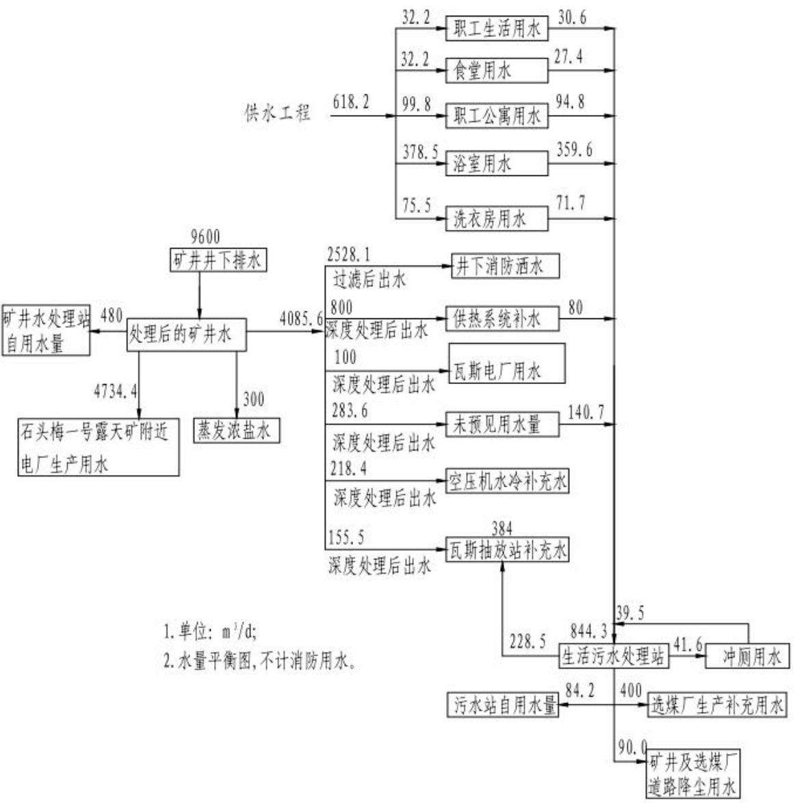
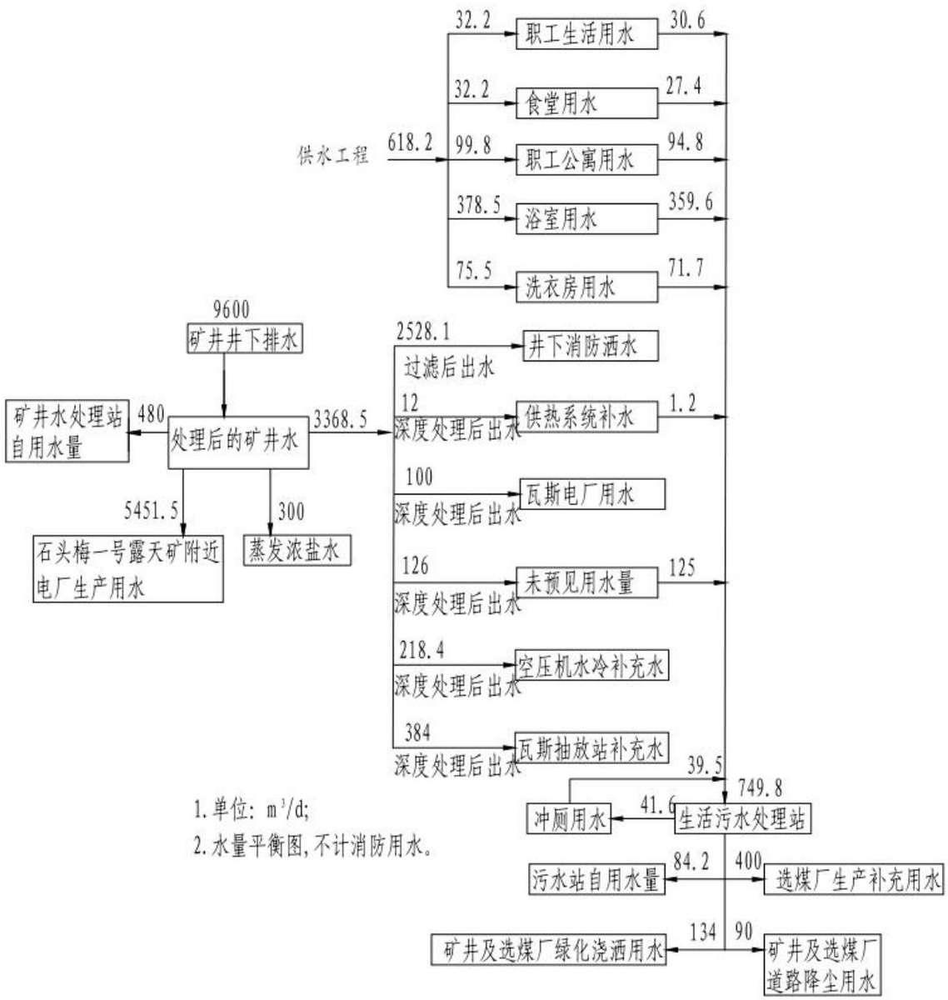
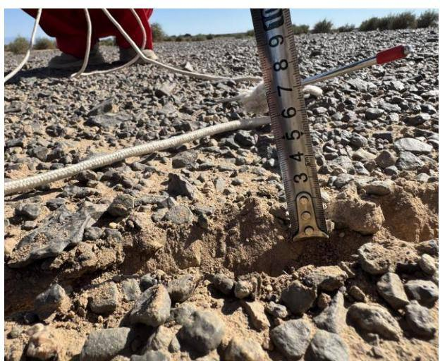
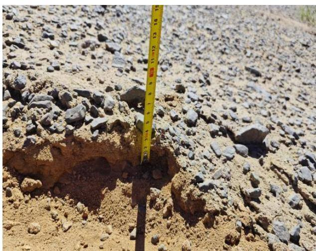
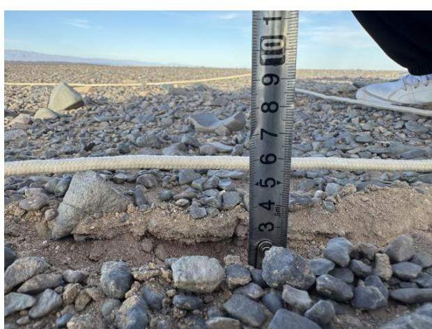
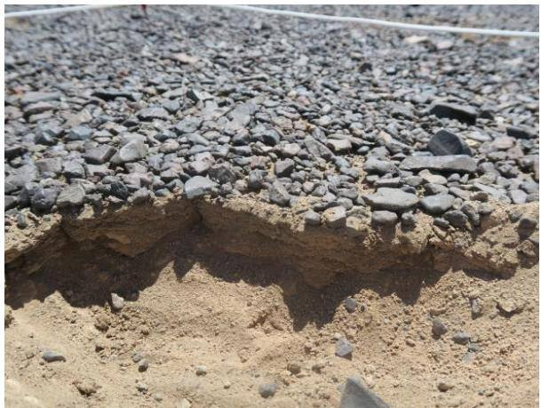
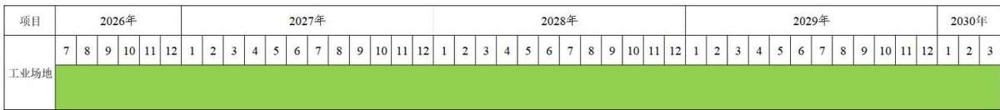
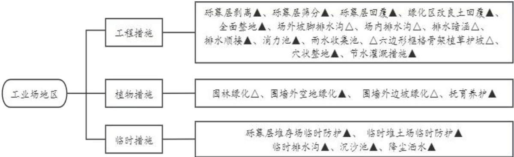
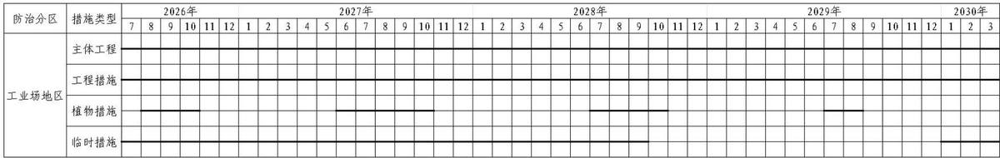
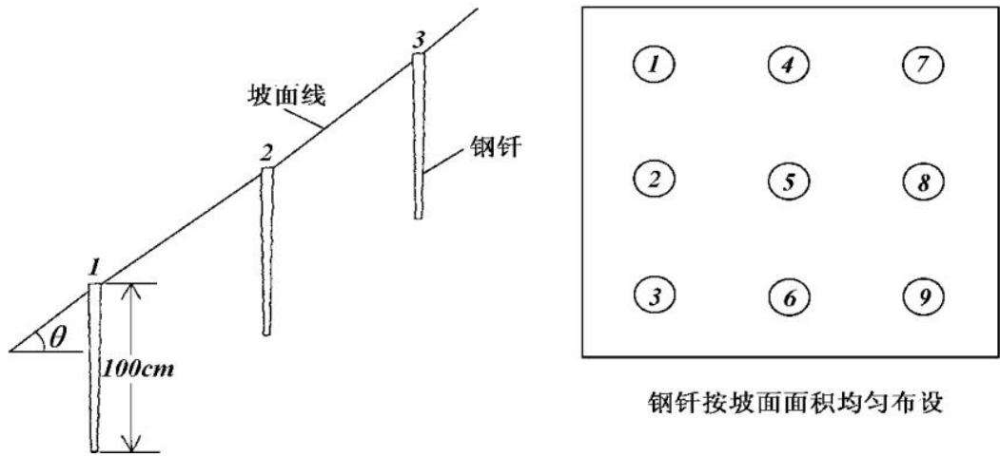

> **Zone C（应用范例层）使用边界**——仅可用于**写作风格、章节展开方式、表达逻辑、表格设计**的参考。
> **不得**用于合规判断；**不得**引入其项目数据（名称／地点／数字／单位名）；
> **不得**因其"曾经通过审批"而推定其做法在当前标准下仍然合规。
> 与 Zone A 冲突时**一律以 Zone A 为准**；Zone A 未明确规定时输出
> 「**Zone A 未明确规定，以下为参考写法，需人工判断**」。
>
> **坐标系警告**：本范例为**老八章结构**（GB 50433—2018 附录B），与 2026 版 10 章模板**同号不同义**
> （老 `1.5`＝防治目标，新 `1.5`＝水土流失预测结果；老 4→新 6 …偏移 +2；新版第 4/5 章老结构无独立章）。
> 因此 **`chapter_mapping: pending`——不得按章节号挂载**，检索一律走 `topic_tags`。
>
> **待加工**：`topic_tags`（主题标签）、`approval_basis_list`（编制依据逐字清单）、
> `structure_summary`（只提取结构：章节展开顺序／段落功能／表格栏目结构／句式模板／论证链步骤）。

新疆三塘湖矿区石头梅二号煤矿项目

# 水土保持方案报告书

建设单位：巴里坤丰信矿业有限公司

编制单位：中煤科工集团北京华宇工程有限公司

二〇二六年六月

## 目 录

1 综合说明 ......  
1.1 项目简况 ....  
1.2 编制依据 ....  
1.3 设计水平年 ...  
1.4水土流失防治责任范围.. .7  
1.5水土流失防治目标...  
1.6项目水土保持评价结论...  
1.7 水土流失预测结果 ...... ...11  
1.8水土保持措施布设成果. ...12  
1.9水土保持监测方案.... ...13  
1.10 水土保持投资及效益分析成果... ....13  
1.11 结论 .... ....14  
2 项目概况 ...... ...... 17  
2.1 项目组成及工程布置.. .... 17  
2.2 施工组织 ... .... 39  
2.3 工程占地 ... ...43  
2.4 土石方平衡 ... ...45  
2.5拆迁（移民）安置与专项设施改（迁）建.... ...50  
2.6 施工进度 ... ...50  
2.7 自然概况 .... ....50  
3 项目水土保持评价...... .... 55  
3.1主体工程选址（线）水土保持评价.. ...55  
3.2建设方案与布局水土保持评价.... ...57  
3.3主体工程设计中水土保持措施界定.. ..67  
4 水土流失分析与预测.... .... 68  
4.1 水土流失现状... ..68  
4.2水土流失影响因素分析... ..69  
4.3土壤流失量预测... ...71  
4.4水土流失危害分析... ....76  
4.5 指导性意见 .... .....76  
5 水土保持措施...... ...... 78  
5.1 防治区划分 .... ..... 78  
5.2措施总体布局.. .....79  
5.3 分区措施布设... ....82  
5.4 施工要求 ... ...94  
6 水土保持监测...... ..... 98  
6.1 范围和时段 ... ...98  
6.2内容和方法. ...98  
6.3 点位布设 .... ...102  
6.4实施条件和成果.. ...105  
7 水土保持投资估算及效益分析..... .... 107  
7.1 投资估算 ... ...107  
7.2 效益分析 .. ...119  
8 水土保持管理... ..... 123  
8.1 组织管理 .... ....123  
8.2 后续设计 ... ... 124  
8.3水土保持监测. ...124  
8.4 水土保持监理 .... ....125  
8.5 水土保持施工... ...125  
8.6水土保持设施验收... ...126

## 附表：

投资估算附表。

## 附件：

附件1：水土保持方案编制委托书；

附件2：国家发展改革委关于新疆三塘湖矿区总体规划（修编）的批复（发改能源〔2023〕1001 号，2023 年 7 月 16 日）；

附件3：《国家发展改革委关于新疆三塘湖矿区石头梅二号煤矿项目核准的批复》（发改能源〔2025〕190 号，2025 年 2 月 14 日）；

附件4：建设项目用地预审与选址意见书（2024 年8 月22 日）；

附件5：《巴里坤哈萨克自治县自然资源局关于哈密市巴里坤县新疆三塘湖矿区石头梅二号煤矿项目用地的审查报告》（巴自然资源字〔2026〕199 号，2026 年 4 月 29日）；

附件6：《巴里坤哈萨克自治县人民政府关于审批巴里坤县新疆三塘湖矿区石头梅二号煤矿项目农用地转用的请示》（巴政发〔2026〕6号，2026年5 月19 日）；

附件7：《关于淮南矿业集团巴里坤丰信矿业有限公司石头梅二号煤矿及选煤厂初步设计的批复》（新应急函〔2026〕37号，2026年4月24 日）；

附件8：石头梅二号煤矿场外道路工程建设项目备案证（巴里坤哈萨克自治县发展和改革委员会员会，2025年7月9日）；

附件9：《石头梅二号煤矿场外道路项目水土保持方案报告书批复》（巴水保字〔20265，2026 年 1 月 16 日）；

附件10：《哈密市发展改革委关于巴里坤三塘湖矿区石头梅二号井田110千伏输变电工程核准的批复》（哈市发改能源〔2025〕54号，2025年6 月26 日）；

附件11 《哈密市水利局关于巴里坤三塘湖矿区石头梅二号井田 110千伏输变电工程水土保持方案报告书的批复》（哈市水字〔2025〕182号，2025年9月17日）；

附件12 并网调度协议（110千伏石头梅二矿基建变电站）；

附件13：石头梅二号煤矿水源输水管线项目备案证（巴里坤哈萨克自治县发展和改革委员会员会，2025年12月18日）；

附件14：石头梅二号供热管线建设项目备案证（巴里坤哈萨克自治县发展和改革委员会员会，2026 年3月13日）；

附件 15：关于征求石头梅二号煤矿供热热源意见的复函（2025年8月2日）；

附件16：关于《关于征求使用石头梅二号煤矿矿井水处理意见的函》的复函（2025年8 月9日）；

附件17：《矸石回填协议》；

附件18：《石头梅一号露天煤矿一期工程（500万吨年）水土保持方案的批复》（新水水保〔2019〕14 号，2019 年 3 月 7 日）；

附件19：石头梅一号露天煤矿一期工程（500 万吨年）水土保持设施验收鉴定书；

附件20：《新疆能源（集团）有限责任公司新疆哈密三塘湖矿区石头梅一号露天煤矿一期工程（500万吨年）水土保持设施自主验收报备回执表》（验收回执〔2022〕78号，2022 年 12 月 27 日）；

附件21：《关于确认新疆哈密三塘湖矿区石头梅二号矿井井田及外扩两公里范围涉及基本草原、公益林、自然保护区和古树名木情况的函》（2025年5月22日）；

附件22：《关于确认新疆哈密三塘湖矿区石头梅二号矿井井田及外扩两公里范围是否涉及饮用水水源地保护区的函》（2025年5月22日）。

## 附图：

附图1 项目地理位置图

附图2 地表水系图

附图3 土壤侵蚀强度图

附图4 项目总体布置图

附图5 土地利用类型图

附图5.1-1 工业场地水土保持措施总体布局图

附图5.1-2 工业场地排水沟典型设计图

附图5.1-3 工业场地六边形框格骨架护坡典型设计图

附图5.1-4 消力池典型设计图

附图5.1-5 临时堆土防护典型设计图

附图5.1-6 临时土质排水沟典型设计图

附图5.1-7 沉沙池典型设计图

附图6 水土流失防治范围及监测点位图

## 1 综合说明

## 1.1项目简况

## 1.1.1 项目基本情况

## （1）项目建设必要性

新疆煤炭资源储量丰富，品种齐全，开发新疆煤炭资源对推进我国煤炭资源开发战略西移，提高国家能源安全稳定供应保障能力具有重要的战略意义。根据《科学发展的2030 年国家能源战略》研究报告，国家对新疆能源发展地位是：建设成为我国西部大型油气生产加工和储备基地、大型煤炭基地、煤电基地、煤化工基地和国家能源资源陆上安全大通道。

新疆三塘湖矿区石头梅二号煤矿项目所在的三塘湖矿区位于新疆东大门哈密，行政区划隶属哈密市巴里坤哈萨克自治县，是煤炭资源丰富地区，地处国家西部大开发的前沿，区位优势明显。新疆作为我国重要的能源接替区和战略能源储备区，将在国家能源安全战略中占据更加重要的地位；消费端随着“三基地一通道”战略目标的深入实施，新疆煤炭“本地转化，疆煤外运”双模式消费格局已经形成，煤电、煤化工发展潜力巨大，煤炭需求增长潜力大。石头梅二号煤矿由巴里坤丰信矿业有限公司开发，是“十四五”规划建设煤矿项目，能够充分将新疆的资源优势转化为经济优势，积极有序推进资源的开发利用，带动和增加地方及自治区财政收入，使资源开发更多惠及当地各族群众，对人民富裕、民族团结等起到了积极作用，同时也对新疆的长治久安奠定了坚实基础。因此，本项目建设是必要和可行的。

## （2）项目位置

新疆三塘湖矿区石头梅二号煤矿位于巴里坤哈萨克自治县城北东8°方向，直线距离约120km，按矿区划分属三塘湖矿区。石头梅二号井田面积 $7 2 . 4 8 \mathrm { k m } ^ { 2 }$ ，井田东西倾斜宽为 4.70\~10.73km，南北走向长 9.82\~16.59km。地理坐标范围为北纬 44°29′52″\~44°35′06″，东经 92°58′20″～93°12′40″，中心地理坐标为（CGCS2000 系）为：东经 93°05′30″，北纬 44°32′29″。

井田周边交通条件简单，井田附近既有及规划的公路集中分布于井田南侧，其中5条东西向公路自北向南依次为G331、S340、G7、G335 和G30，3 条南北向公路自西向东依次为 S238、巴里坤矿区公路和 G575，8 条公路构成井田“五横三纵”的对外交通系统。井田内其他道路为勘查施工临时修建的砂石便道。矿区内部及外部附近没有既有铁路通达，在距离矿区较近的外部有五条既有相邻铁路：兰新线、兰新客专、红淖线、哈额线、哈罗线；有一条建设实施已至初步设计阶段的铁路：将淖线。

## （3）建设性质

本项目为新建建设生产类项目。

## （4）规模与等级

石头梅二号煤矿为新建大型井工煤矿，根据《国家发展改革委关于新疆三塘湖矿区石头梅二号煤矿项目核准的批复》（发改能源〔2025〕190号），本次核准建设规模8.0Mt/a，配套建设同等规模的选煤厂。

地质资源储量 1212.33Mt，矿井工业资源储量为 1078.15Mt，设计可采储量为791.62Mt，设计生产能力为 8.0Mt/a，设计服务年限为 73.3a。

井田首采盘区为 11 盘区和 12 盘区，服务年限分别为 16.3a 和 45.5a，11 盘区倾向4.4km，走向 3.5km，面积约 6.2km2，12 盘区倾向 3.66km，走向 9.09km，面积约 24.39km2。采煤方法采用综采一次采全高和综采放顶煤工艺。

## （5）项目组成

本项目建设内容为工业场地。工业场地位于井田西部。场地地形平坦开阔，南高北低，自然地形标高为+719m～+725m，平均坡度为1.8%，占地面积 35.84hm2，其中，围墙内占地面积34.05hm2。工业场地东西向长664.76m，南北向宽461.17m。分为七个区：场前区、辅助生产区、主要生产区、动力设施区、水处理站区、1 号风井瓦斯区和 2号风井区。工业场地总共有三个出入口，场地南侧设人流出入口，西侧设物流出入口，东北侧设地销煤出入口。项目建设过程中需设置施工生产生活区1处，砾幕层堆存场1 处，临时堆土场2 处，均位于项目征地红线范围内，不新增占地。

## （6）占地面积与土石方

本项目占地面积35.84hm2，其中永久占地为35.84hm2，无临时占地，占地类型全部为裸岩石砾地。本项目建设期挖填方总量为 158.14 万m3，其中挖方 92.75万 m3（含砾幕层剥离 0.57 万 m3），填方 65.39 万 m3（含砾幕层回覆 0.57 万 m3，改良土回覆 4.90万m3），其中区间调配利用土石方 64.47 万m3，剩余27.36 万m3井巷掘进渣石全部运往石头梅一号露天煤矿采坑进行回填（土石方平衡计算均按照自然方计算）。

## （7）总投资

项目建设总投资85.02亿元，其中土建投资 9.66亿元，由巴里坤丰信矿业有限公司出资建设。

## （8）总工期

项目计划于2026年7月开工，2030年3月底完工，总工期45个月。

## 1.1.2 项目前期工作进展情况

2023 年 7 月，国家发展和改革委员会以“发改能源〔2023〕1001 号”批复了新疆三塘湖矿区总体规划（修编），石头梅二号煤矿建设规模符合总体规划产能（附件2）。

2025 年2月，国家发展和改革委员会以“发改能源〔2025〕190号”文件核准了新疆三塘湖矿区石头梅二号煤矿项目（附件 3）。

2025 年5月，巴里坤县林业和草原局以《关于确认新疆哈密三塘湖矿区石头梅二号矿井井田及外扩两公里范围涉及基本草原、公益林、自然保护区和古树名木情况的函》明确石头梅二号煤矿项目不涉及公益林，不涉及自然保护区，不涉及古树名木，不涉及基本草原（附件21）。

2025 年5月，巴里坤县生态环境局以《关于确认新疆哈密三塘湖矿区石头梅二号矿井井田及外扩两公里范围是否涉及饮用水水源地保护区的函》明确石头梅二号煤矿项目不涉及饮用水水源地保护区（附件22）。

2025 年9月，中煤科工集团北京华宇工程有限公司编制完成《淮南矿业集团巴里坤丰信矿业有限公司石头梅二号煤矿初步设计》。

根据有关法律法规的要求，建设单位于 2025 年 6 月委托中煤科工集团北京华宇工程有限公司（以下简称“我公司”）承担该项目水土保持方案编制工作。接受委托后，我公司即组织各专业技术人员，赴现场进行了实地踏勘和调查，收集了水土保持方案编制所需的自然、社会以及矿井主体设计等方面的资料。经对收集的基础资料进行了分析和识别，确定了本方案的防治责任范围、防治目标、防治措施类型。按照现行的技术规范和水土保持方案编制要求，编写完成了《新疆三塘湖矿区石头梅二号煤矿项目水土保持方案报告书》。

## 1.1.3 自然简况

井田位于欧亚大陆腹地，远离海洋，属典型的极端干旱大陆性气候，夏季酷热，冬季干冷，气候干燥，降水稀少，蒸发强烈，多风，昼夜温差大，气温年、日变化大。四季不分明，年平均气温 $1 0 . 5 ^ { \circ } \mathrm { C }$ ，极端最高气温 41.5℃，最低气温 $- 3 3 . 9 ^ { \circ } \mathrm { C }$ 。无霜期 98～104天，年降水量33.9 毫米，年蒸发量1785.5毫米，日照时数2858\~3373.4 小时，最大积雪厚度0.24m。高温期6～9月，冬季11～3 月，年均风速4.3m/s，最大风速28m/s，区内最大冻土1.33m左右。土壤类型以石膏灰棕漠土为主。植被类型主要为温带灌木、半灌木。项目区地势较为平坦，土地利用类型以戈壁为主，大部分土地被戈壁砾幕层所覆盖，仅在井田西南部河道周围稀疏生长有植被，主要为骆驼刺、戈壁藜等灌丛，植被盖度在3%左右。

根据《土壤侵蚀分类分级标准》（SL190-2007），项目区处于“三北”戈壁沙漠及沙地风沙区，水土流失以风力侵蚀为主，结合现场踏勘及专家咨询，确定项目区水土流失类型强度为轻度，容许土壤流失量为 $1 5 0 0 \mathrm { t / \Omega ( \mathrm { k m ^ { 2 } \cdot \mathrm { a } ) } }$

根据《全国水土保持规划国家级水土流失重点预防区和重点治理区复核划分成果》（办水保〔2013〕188 号文）、《全国水土保持规划（2015-2030 年）》（国函〔2015〕160号）、《水利部办公厅关于做好国家级水土流失重点预防区和重点治理区落地上图成果应用的通知》（办水保〔2025〕170 号文），项目区不涉及国家级水土流失重点预防区和重点治理区。根据《关于印发新疆维吾尔自治区水土流失重点预防区和重点治理区复核划分成果的通知》（新水水保〔2019〕4号）规定，项目区属自治区级水土流失重点治理区— $\cdot \operatorname { I I } _ { 2 }$ 天山北坡诸小河流域重点治理区。根据《中华人民共和国水土保持法》第二十四条规定，生产建设项目选址、选线应当避让水土流失重点预防区和重点治理区；无法避让的，应当提高防治标准，优化施工工艺，减少地表扰动和植被损坏范围，有效

控制可能造成的水土流失。

本项目不涉及饮用水水源保护区、水功能一级区的保护区和保留区、自然保护区、世界文化和自然遗产地、风景名胜区、地质公园、森林公园以及重要湿地等水土保持敏感区。

## 1.2编制依据

## 1.2.1 法律法规

（1）《中华人民共和国水土保持法》（1991年6月29日中华人民共和国主席令第49号，2010年12月25日以中华人民共和国主席令第 39号修订）；

（2）《新疆维吾尔自治区实施<中华人民共和国水土保持法>办法》（2013年7月31日修订通过，2013年10月1日施行）。

## 1.2.2 部委规章及规范性文件

（1）《生产建设项目水土保持方案管理办法》（水利部令第 53 号，2023 年 1 月17日发布）；

（2）《全国水土保持规划国家级水土流失重点预防区和重点治理区复核划分成果》（办水保〔2013〕188 号）；

（3）《水利部关于加强水土保持监测的通知》（水保〔2017〕36号）；

（4）《水利部关于加强事中事后监管规范生产建设项目水土保持设施自主验收的通知》（水保〔2017〕365号）；

（5）《水利部办公厅关于印发生产建设项目水土保持技术文件编写和印制格式规定（试行）的通知》（办水保〔2018〕135号）；

（6）《水利部办公厅关于印发生产建设项目水土保持设施自主验收规程（试行）的通知》（办水保〔2018〕133号）；

（7）《水利部关于进一步深化“放管服”改革全面加强水土保持监管的意见》（水保〔2019〕160 号）；

（8）《水利部办公厅关于印发生产建设项目水土保持监督管理办法的通知》（办

水保〔2019〕172 号）；

（9）《水利部水土保持司关于征求<关于实施生产建设项目水土保持监测三色评价强化人为水土流失监管的通知（征求意见稿）>意见的函》（水保监便字〔2020〕2号）；

（10）《水利部办公厅关于进一步加强生产建设项目水土保持监测工作的通知》（办水保〔2020〕161 号）；

（11）新疆维吾尔自治区水利厅《关于印发新疆自治区水土流失两区复核划分成果的通知》（新水水保〔2019〕4号）；

（12）《关于做好新疆维吾尔自治区生产建设项目水土保持方案管理工作的通知》（新水办〔2023〕30号）；

（13）《关于规范自治区生产建设项目水土保持方案审批加强事中事后监督管理的通知》（新水规〔2022〕1号）。

## 1.2.3 技术标准

（1）《生产建设项目水土保持技术标准》（GB 50433-2018）；

（2）《生产建设项目水土流失防治标准》（GB/T 50434-2018）；

（3）《水土保持工程设计规范》（GB 51018-2014）；

（4）《生产建设项目土壤流失量测算导则》（SL773-2018）；

（5）《生产建设项目水土保持监测与评价标准》（GB/T 51240-2018）；

（6）《土壤侵蚀分类分级标准》（SL190-2007）；

（7）《防洪标准》（GB 50201-2014）；

（8）《水利水电工程制图标准-水土保持图》（SL73.6-2015）；

（9）《土地利用现状分类》（GB/T 21010-2017）；

（10）《造林技术规程》（GB/T 15776-2016）；

（11）《公路排水设计规范》（JTG/T D33-2012）；

（12）《煤炭工业矿井设计规范》（GB 50215-2015）；

（13）《室外排水设计标准》（GB 50014-2021）；

（14）《喷灌工程技术规范》（GB/T 50085-2007）。

## 1.2.4 技术资料

（1）《淮南矿业集团巴里坤丰信矿业有限公司石头梅二号煤矿初步设计》（中煤科工集团北京华宇工程有限公司，2025年9月）。

## 1.3设计水平年

根据主体工程施工组织及进度计划安排，本项目计划2026年7月开工，到 2030年3月底完工，总工期 45 个月。其中施工准备期 6 个月，施工期 37 个月，联合运转期 2个月。因此，本方案设计水平年确定为项目投产后当年，即2030年。

## 1.4水土流失防治责任范围

本项目水土流失防治责任范围 $3 5 . 8 4 \mathrm { h m } ^ { 2 }$ ，共划分为1 个水土流失防治区，即工业场地区。

## 1.5水土流失防治目标

## 1.5.1 执行标准等级

本项目位于巴里坤哈萨克自治县，属自治区级水土流失重点治理区。按照《生产建设项目水土流失防治标准》（GB/T 50434-2018），确定本项目应执行北方风沙区一级防治标准。

## 1.5.2 防治目标

## （1）定性防治目标

本项目建设不仅要对新增的水土流失进行防治，还需结合工程涉及的行政区水土保持要求，对原有水土流失进行治理，促进当地水土资源可持续利用和生态系统良性发展。

## 主要定性目标有：

1）项目建设区的原有水土流失得到基本治理。

2）新增水土流失得到有效控制。

3）生态得到最大限度的保护，环境得到明显改善。

4）水土保持设施安全有效。

5）水土流失治理度、土壤流失控制比、渣土防护率、表土保护率、林草植被恢复率、林草覆盖率等指标达到现行国家标准《生产建设项目水土流失防治标准》（GB/T50434-2018）的要求。

## （2）定量防治目标

项目区年均蒸发量 1785.5mm，年均降水量33.9mm，根据《中国气候区划名称与代码—气候带和气候大区》（GB/T 17297）中干燥度计算公式：干燥度=最大可能蒸发量/降雨量，干燥度为 52.67。根据气候大区年干燥指数表可知，项目区属于极干旱地区，水土流失治理度可降低 5%\~8%，但由于项目无法避让Ⅱ2天山北坡诸小河流域自治区级重点治理区，水土流失治理度目标值不作调整，确定为85%。

本项目区以轻度风蚀为主，土壤流失控制比确定为1.0。

由于本项目无法避让自治区级水土流失重点治理区，本方案渣土防护率提高 1%，设计水平年渣土防护率目标值确定为 88%。

井田范围内的大部分地区为砾石戈壁，主要土壤类型为灰棕漠土，土壤抗蚀性差，土壤贫瘠，不具备表土剥离条件，表土保护率不作要求。

项目无法避让 $\mathrm { { I I } } _ { 2 }$ 天山北坡诸小河流域自治区级水土流失重点治理区，林草覆盖率应提高 1\~2 个百分点。但项目区位于极干旱区，林草植被恢复率和林草覆盖率可不作定量要求。结合项目区自然条件及植被现状，方案对林草植被恢复率及林草覆盖率作出定量要求，林草植被恢复率不作调整确定为 93%，林草覆盖率按设计情况确定为20%。

表1.5-1 水土流失防治指标
<table><tr><td colspan="1" rowspan="2">防治指标</td><td colspan="2" rowspan="1">一级标准</td><td colspan="1" rowspan="2">干旱程度修正</td><td colspan="1" rowspan="2">重点治理区修正</td><td colspan="1" rowspan="2">侵蚀程度修正</td><td colspan="1" rowspan="2">实际情况调整</td><td colspan="2" rowspan="1">采用标准</td></tr><tr><td colspan="1" rowspan="1">施工期</td><td colspan="1" rowspan="1">设计水平年</td><td colspan="1" rowspan="1">施工期</td><td colspan="1" rowspan="1">设计水平年</td></tr><tr><td colspan="1" rowspan="1">水土流失治理度（%）</td><td colspan="1" rowspan="1">一</td><td colspan="1" rowspan="1">85</td><td colspan="1" rowspan="1">-5</td><td colspan="1" rowspan="1">+5</td><td colspan="1" rowspan="1"></td><td colspan="1" rowspan="1">0</td><td colspan="1" rowspan="1">一</td><td colspan="1" rowspan="1">85</td></tr><tr><td colspan="1" rowspan="1">土壤流失控制比</td><td colspan="1" rowspan="1">一</td><td colspan="1" rowspan="1">0.80</td><td colspan="1" rowspan="1"></td><td colspan="1" rowspan="1"></td><td colspan="1" rowspan="1">+0.2</td><td colspan="1" rowspan="1">+0.2</td><td colspan="1" rowspan="1"></td><td colspan="1" rowspan="1">1.0</td></tr><tr><td colspan="1" rowspan="1">渣土防护率(%)</td><td colspan="1" rowspan="1">85</td><td colspan="1" rowspan="1">87</td><td colspan="1" rowspan="1"></td><td colspan="1" rowspan="1">+1</td><td colspan="1" rowspan="1"></td><td colspan="1" rowspan="1">+1</td><td colspan="1" rowspan="1">86</td><td colspan="1" rowspan="1">88</td></tr><tr><td colspan="1" rowspan="1">表土保护率(%)</td><td colspan="1" rowspan="1">*</td><td colspan="1" rowspan="1">*</td><td colspan="1" rowspan="1"></td><td colspan="1" rowspan="1"></td><td colspan="1" rowspan="1"></td><td colspan="1" rowspan="1"></td><td colspan="1" rowspan="1">*</td><td colspan="1" rowspan="1">*</td></tr><tr><td colspan="1" rowspan="1">林草植被恢复率（%）</td><td colspan="1" rowspan="1">一</td><td colspan="1" rowspan="1">93</td><td colspan="1" rowspan="1"></td><td colspan="1" rowspan="1"></td><td colspan="1" rowspan="1"></td><td colspan="1" rowspan="1">0</td><td colspan="1" rowspan="1">1</td><td colspan="1" rowspan="1">93</td></tr><tr><td colspan="1" rowspan="1">林草覆盖率(%)</td><td colspan="1" rowspan="1">一</td><td colspan="1" rowspan="1">20</td><td colspan="1" rowspan="1"></td><td colspan="1" rowspan="1"></td><td colspan="1" rowspan="1"></td><td colspan="1" rowspan="1">0</td><td colspan="1" rowspan="1">一</td><td colspan="1" rowspan="1">20</td></tr></table>

## 1.6项目水土保持评价结论

## 1.6.1 主体工程选址（线）评价

本项目建设符合国家产业政策、地方及煤炭行业发展规划，通过与《中华人民共和国水土保持法》、《生产建设项目水土保持技术标准》（GB 50433-2018）相关法律、规范性文件及标准进行相符性分析，对主体工程选址得出以下评价结论：

（1）本项目受煤炭资源赋存的局限性，选址无法避让自治区级水土流失重点治理区，存在水土保持制约性因素。主体设计以永临结合为原则布局建设方案，将工业场地和选煤厂联合布置并尽可能做到地面设施集中紧凑布置，合理安排施工组织、优化施工工艺及竖向设计，最大程度上减少了工程占地和土石方量，减轻工程施工可能造成的水土流失危害；主体通过布设雨水排水及拦蓄措施，对雨水资源进行充分利用。本方案通过加强水土保持工作，提高水土流失防治标准，严格控制地表扰动面积和损坏植被范围，最大限度地保护现有土地和植被的水土保持功能，减少项目建设对周边环境的影响，有效控制可能造成的水土流失。在优化设计及提高防治标准的基础上，主体工程建设方案与布局基本合理，满足水土保持要求。

（2）主体工程选址（线）不存在崩塌和滑坡危险区、泥石流易发区、易引起严重水土流失和生态恶化地区。

在采取上述措施的基础上，主体工程选址基本符合《中华人民共和国水土保持法》、《生产建设项目水土保持技术标准》（GB 50433-2018）等法律法规和技术标准的规定。

## 1.6.2 建设方案与布局评价

## （1）建设方案评价

本项目为新建大型煤矿项目，受煤炭资源赋存的局限性，选址无法避让 $\mathrm { I I } _ { 2 }$ 天山北坡诸小河流域自治区级水土流失重点治理区。主体设计优化地面生产系统区、工业场地区总平面布置，优化施工生产生活区、施工道路区、临时用电等施工布置，尽量减少工程占地和土石方量；在建（构）筑物及其他设施之间的高程关系的基础上，充分利用原地形，最大程度减少余方的产生，符合水土保持要求。本项目地形较平坦，不涉及高填深挖路段，在充分利用既有道路及永临结合的情况下，减少对土地资源占用及扰动。本项目工业场地及井口防洪标准按照100 年一遇，井口防洪标准采用300年一遇校核。主体工程设计已布设较为完善的排水系统，工业场地排水工程采用3年一遇15min设计暴雨强度，因项目区涉及自治区级水土流失重点治理区，需提高一级，因此按照 5 年一遇10min短历时设计暴雨计算。综上所述，工程建设方案与布局符合水土保持要求。

## （2）工程占地评价

本项目占地类型主要为裸岩石砾地，未占用耕地及永久基本农田；工业场地永久占地范围符合行业用地指标；施工生产生活区、砾幕层堆存场和临时堆土场均布设在项目永久占地范围内，不新增占地；施工交通、用水、用电充分利用本项目永久设施，有效控制临时占地规模。因此，本项目占地面积、类型、性质等方面基本不存在水土保持制约性因素。

## （3）土石方平衡评价

主体工程设计场地平整以移挖作填为原则，尽量减少土石方的二次搬运，建（构）筑物基础开挖临时堆土堆放于基坑周边并采取临时防护措施。工程土石方回填包括工业场地场平填筑、建（构）筑物基础回填、绿化改良土回覆、场内输水管线管沟回填。填筑土方首先考虑充分利用开挖土方，其次考虑纵向调用，避免填筑材料的外借。

工程建设按照施工时序，就近合理调配开挖土石方，充分综合利用余方，运距合理，减少了弃方量，土石方调运符合施工工艺、施工时序及施工特点，工程土石方挖填数量和流向基本合理，符合水土保持要求。

本方案从保护砾幕层资源角度出发，根据立地条件以及现场调查情况，综合确定项目征占地范围内剥离砾幕层量，施工前对开挖扰动范围内占用的裸岩石砾地表面的砾幕层进行砾幕层剥离，后期全部用于本项目砾幕层回覆。从水土保持角度考虑，砾幕层剥离保护与利用措施合理，符合水土保持要求。

## （4）施工方法与工艺

主体井巷工程与土建工程采取同时施工，分区块平行流水施工的组织方式。采取有效的预防保护措施，强调源头控制、过程控制，避免重复开挖和多次倒运，最大程度的减少损坏原地貌及土石方开挖量。项目施工时序及施工工艺较为合理，井筒施工均采用较为成熟先进的施工方法，避免大开挖施工，减少土石方量，符合减少水土流失的要求。

## （5）主体工程中具有水土保持功能工程分析评价

主体工程在设计上虽然兼顾了水土保持功能，但体系并不完善，主体设计具有水土保持功能的措施主要布设在工程建设后期，且以工程措施为主。对于建设过程中的临时水土保持措施布置不完善，也未设计对临时占地的恢复措施。项目区土壤侵蚀以风蚀为主，主体设计未考虑有针对性的风蚀防治措施。

针对工程建设过程中水土流失控制与防护措施不足，方案需进一步补充上述方面防护措施，使本方案水土保持措施形成一个完整、科学与可操作的防护体系。

## 1.7水土流失预测结果

本项目建设期施工扰动地表总面积 35.84hm2，项目建设期井巷工程掘进渣石经综合利用后仍剩余27.36万m3，运往石头梅一号露天煤矿采坑进行回填（详见附件10）；生产运行期产生的掘进矸石通过无轨胶轮车运至井下废弃巷道充填；选煤厂洗选矸石132.51万t/年，运输至南部石头梅一号露天煤矿采坑进行回填，矸石处置率达到100%。

项目建设可能产生土壤流失总量为 41046.31t，原地貌土壤流失量2270.55t，新增土壤流失量为38775.76t。其中施工期水土流失总量37525.91（t 原地貌土壤流失量2150.40t，新增土壤流失量35375.51t），自然恢复期水土流失总量为3520.40t（原地貌土壤流失量120.15t）。施工期土壤流失量占土壤流失总量的 91.42%，自然恢复期土壤流失量占土壤流失总量的8.58%，因此，施工期是产生土壤流失的重点时段。本项目水土流失防治的重点区域为工业场地。因此，工程建设过程中，应重点对以上区域进行综合防治，有效控制建设过程造成的人为水土流失。

通过预测结果分析，项目建设期是土壤流失的集中时期，水土流失主要危害是造成周边土地资源破坏、生态功能下降，还会增加项目自身施工和后期治理的难度。

## 1.8水土保持措施布设成果

## 1.8.1 工业场地区

施工前，按照“应剥尽剥”的原则对工业场地扰动范围内区域采取砾幕层剥离措施，集中存放于砾幕层堆存场，后期回覆于工业场地空地区域。砾幕层堆存、临时堆土期间采取临时拦挡和苫盖措施，并在拦挡四周布设临时土质排水沟。

施工过程中，对工业场地建构筑物基础开挖土方，分片集中堆放在建（构）筑物周边，并进行临时拦挡和苫盖。在工业场地场外填方边坡坡面布置六边形框格骨架植草护坡。在工业场地东侧、南侧防洪挡水围墙外侧，沿填方边坡坡脚布设排水沟，排泄坡面径流及沟外侧局部地表散流，有序导排至工业场地周边自然低洼处。在工业场地布设排水暗管、排水明沟和盖板明沟，将场区雨水集中收集后排至雨水收集池内；并在场外坡脚排水沟末端、雨水收集池布置排水顺接并顺接至消力池；同时施工过程中采取洒水降尘措施。

施工结束后，拆除临时拦挡、苫盖措施；工业场地内绿化区域回覆改良土，进行土地整治、施有机肥；工业场地围墙内布设园林绿化并配套灌溉措施，围墙与周边边坡之间空地栽植灌草恢复植被并进行抚育养护，灌木栽植前应进行穴状整地。各项措施工程量为：

## （1）工程措施

砾幕层剥离3.58万 $\mathrm { m } ^ { 3 }$ ，砾幕层筛分3.58万 $\mathrm { m } ^ { 3 }$ ，砾幕层（砾石）回覆0.57万 $\mathrm { m } ^ { 3 }$ 绿化区改良覆土4.90万m3，全面整地 $8 . 3 2 \mathrm { h m } ^ { 2 }$ ，场外坡脚排水沟1035m，排水暗管5800m，排水明沟1500m，盖板排水沟300m，雨水收集池2座，排水顺接 230m，消力池3座，六边形框格骨架植草护坡（含绿化 $) 0 . 5 9 \mathrm { h m } ^ { 2 }$ ，半固定喷灌系统1 套，穴状整地 $( 4 0 { \times } 4 0 \mathrm { c m } )$ 2398 个。

## （2）植物措施

场地园林绿化 $6 . 8 1 \mathrm { h m } ^ { 2 }$ ，新增场地园林绿化 $1 . 0 4 \mathrm { h m } ^ { 2 }$ ，围墙外空地栽植灌木（红柳）2398 株，围墙外空地栽植灌木（柠条）2398株，围墙外空地混播种草 $0 . 4 7 \mathrm { h m } ^ { 2 }$ （草籽18.80kg），抚育养护 $8 . 3 2 \mathrm { h m } ^ { 2 }$

## （3）临时措施

砾幕层堆存场袋装土临时拦挡及拆除 $2 8 . 6 \mathrm { m } ^ { 2 }$ ，砾幕层堆存场密目网苫盖 $6 0 0 0 \mathrm { m } ^ { 2 } ;$ 临时堆土场袋装土临时拦挡及拆除 $8 3 . 8 \mathrm { m } ^ { 3 }$ ，临时堆土场密目网苫盖 $1 4 0 0 0 \mathrm { m } ^ { 2 }$ ；临时排水沟开挖 $3 2 0 . 0 \mathrm { m } ^ { 3 }$ ，沉沙池 3 座，降尘洒水 87091.20m3。

## 1.9水土保持监测方案

水土保持监测时段从施工准备期开始至设计水平年结束。本项目计划于 2026 年 7月开工，到2030年3 月底完工，设计水平年为2030年。因此，本项目监测时段为2026年7 月\~2030年12 月。本项目水土保持监测采取地面观测、调查监测、遥感监测相结合的方法。监测内容主要包括水土流失自然影响因素、项目施工全过程各阶段扰动土地情况、水土流失状况、水土流失防治成效、水土流失危害等。

根据主体的总体平面布置情况、施工进度安排和水土保持的监测内容，建设期水土保持的监测分区为工业场地区。本项目水土保持监测共布设固定监测点位 12 处，分别是工业场地西边坡1处，工业场地北边坡1 处，工业场地南边坡1 处，工业场地东边坡1处，砾幕层堆存场2 处，临时堆土场 4处，工业场地绿化区域2 处。

监测频次：风蚀量监测期每个月监测一次，风速大于17.0m/s 时加测1 次；25mm/d暴雨时增加一次；施工高峰期每半个月监测一次，之后每个月监测一次；水土流失灾害事件发生后1 周内完成监测。

## 1.10水土保持投资及效益分析成果

## 1.10.1 水土保持投资

项目建设期水土保持估算总投资 2646.60万元。其中水土保持工程措施投资 1050.96万元，水土保持植物措施投资606.82 万元，监测工程措施投资149.81万元，施工临时工程措施投资371.73万元，独立费用338.00万元（建设管理费87.17万元，监理费84.93万元，科研勘测设计费 165.90万元），基本预备费75.52万元，水土保持补偿费53.76万元。

## 1.10.2 效益分析

本项目水土流失防治责任范围35.84hm²，建设期造成水土流失面积35.84hm²。至设计水平年末：工业场地区植物措施面积 8.32hm²；工程措施面积2.74hm²；建筑物及硬化面积 24.17hm²。

对各防治区分别采取相应的水土流失治理措施后，水土流失防治各项指标为：水土流失治理度98.30%，土壤流失控制比1.0，渣土防护率99.2%，林草植被恢复率93.17%，林草覆盖率23.21%，均达到目标值。

## 1.11 结论

## 1.11.1 结论

本项目建设符合国家建设大型煤矿的产业政策要求，项目选址无法避让自治区级水土流失重点治理区，采取提高防治标准，提高水土保持措施的工程级别和设计标准，优化施工工艺，减少地表扰动和植被损坏范围等措施，控制新增水土流失，基本符合水土保持法律和技术标准的相关要求。

项目建设通过落实本方案列出的各项水土保持措施后，能有效防治因工程建设的引起的水土流失，实现生态效益、经济效益和社会效益的统一。因此，从水土保持角度看，本项目的建设可行。

## 1.11.2 建议

为确保水土保持方案设计的措施发挥良好的水土保持功能，更好的为主体服务，本方案提出如下要求：

（1）主体工程在下一阶段设计中应按照本方案提出的水土保持措施及有关的水土保持工程设计要求，结合项目具体情况进行初步设计和施工图设计，切实把本方案提出的各项水土保持措施落到实处。

（2）重视水土保持监测和水土保持工程监理工作，确保本项目的各项水土保持措施落实到位，并做好相关资料档案管理工作，为后续工程验收提供技术支撑。

水土保持方案特性表
<table><tr><td colspan="2" rowspan="1">项目名称</td><td colspan="4" rowspan="1">新疆三塘湖矿区石头梅二号煤矿项目</td><td colspan="2" rowspan="1">流域管理机构</td><td colspan="4" rowspan="1">黄河水利委员会</td></tr><tr><td colspan="2" rowspan="1">涉及省(市、区)</td><td colspan="2" rowspan="1">新疆维吾尔自治区</td><td colspan="2" rowspan="1">涉及地市或个数</td><td colspan="2" rowspan="1">哈密市</td><td colspan="3" rowspan="1">涉及县或个数</td><td colspan="1" rowspan="1">巴里坤哈萨克自治县</td></tr><tr><td colspan="2" rowspan="1">项目规模</td><td colspan="2" rowspan="1">矿井及选煤厂8.0Mt/a</td><td colspan="2" rowspan="1">总投资(万元)</td><td colspan="2" rowspan="1">850200</td><td colspan="3" rowspan="1">土建投资(万元)</td><td colspan="1" rowspan="1">96600</td></tr><tr><td colspan="2" rowspan="1">动工时间</td><td colspan="2" rowspan="1">2026年7月</td><td colspan="2" rowspan="1">完工时间</td><td colspan="2" rowspan="1">2030年3月</td><td colspan="3" rowspan="1">设计水平年</td><td colspan="1" rowspan="1">2030年</td></tr><tr><td colspan="2" rowspan="1">工程占地(hm²)</td><td colspan="2" rowspan="1">35.84</td><td colspan="2" rowspan="1">永久占地（hm²）</td><td colspan="2" rowspan="1">35.84</td><td colspan="3" rowspan="1">临时占地(hm²)</td><td colspan="1" rowspan="1">1</td></tr><tr><td colspan="4" rowspan="2">土石方量(万m³)</td><td colspan="2" rowspan="1">挖方</td><td colspan="2" rowspan="1">填方</td><td colspan="3" rowspan="1">借方</td><td colspan="1" rowspan="1">余（弃）方</td></tr><tr><td colspan="2" rowspan="1">92.75</td><td colspan="2" rowspan="1">65.39</td><td colspan="3" rowspan="1">0</td><td colspan="1" rowspan="1">27.36</td></tr><tr><td colspan="4" rowspan="1">重点防治区名称</td><td colspan="8" rowspan="1">I2天山北坡诸小河流域自治区级重点治理区</td></tr><tr><td colspan="4" rowspan="1">地貌类型</td><td colspan="3" rowspan="1">戈壁荒漠</td><td colspan="3" rowspan="1">水土保持区划</td><td colspan="2" rowspan="1">北方风沙区</td></tr><tr><td colspan="4" rowspan="1">土壤侵蚀类型</td><td colspan="3" rowspan="1">风力侵蚀</td><td colspan="3" rowspan="1">土壤侵蚀强度</td><td colspan="2" rowspan="1">轻度</td></tr><tr><td colspan="4" rowspan="1">防治责任范围面积(hm²)</td><td colspan="3" rowspan="1">35.84</td><td colspan="3" rowspan="1">容许土壤流失量（t/km²·a）</td><td colspan="2" rowspan="1">1500</td></tr><tr><td colspan="4" rowspan="1">土壤流失预测总量(t)</td><td colspan="3" rowspan="1">41046.31</td><td colspan="3" rowspan="1">新增土壤流失量(t)</td><td colspan="2" rowspan="1">38775.76</td></tr><tr><td colspan="4" rowspan="1">水土流失防治标准执行等级</td><td colspan="8" rowspan="1">北方风沙区一级标准</td></tr><tr><td colspan="1" rowspan="3">防治指标</td><td colspan="3" rowspan="1">水土流失治理度(%)</td><td colspan="3" rowspan="1">85</td><td colspan="2" rowspan="1">土壤流失控制比</td><td colspan="3" rowspan="1">1.0</td></tr><tr><td colspan="3" rowspan="1">渣土防护率(%)</td><td colspan="3" rowspan="1">88</td><td colspan="2" rowspan="1">表土保护率(%)</td><td colspan="3" rowspan="1">1</td></tr><tr><td colspan="3" rowspan="1">林草植被恢复率(%)</td><td colspan="3" rowspan="1">93</td><td colspan="2" rowspan="1">林草覆盖率(%)</td><td colspan="3" rowspan="1">20</td></tr><tr><td colspan="1" rowspan="1">防治措施及工程量</td><td colspan="4" rowspan="1">工程措施</td><td colspan="4" rowspan="1">植物措施</td><td colspan="3" rowspan="1">临时措施</td></tr><tr><td colspan="1" rowspan="1">工业场地区</td><td colspan="4" rowspan="1">砾幕层剥离3.58万m³，砾幕层筛分3.58万m³，砾幕层（砾石）回覆0.57万m³，绿化区改良覆土4.90万m³，全面整地 8.32hm²，场外坡脚排水沟1035m，排水暗管5800m，排水明沟1500m，盖板排水沟300m，雨水收集池2座，排水顺接230m，消力池3座，六边形框格骨架植草护坡（含绿化）0.59hm²，半固定喷灌系统1套，穴状整地（40×40cm）2398个。</td><td colspan="4" rowspan="1">场地园林绿化6.81hm²，新增场地园林绿化1.04hm²，围墙外空地栽植灌木（红柳）2398株，围墙外空地栽植灌木（柠条）2398株，围墙外空地混播种草0.47hm²（草籽18.80kg），抚育养护8.32hm²。</td><td colspan="3" rowspan="1">砾幕层堆存场袋装土临时拦挡及拆除 28.6m²，砾幕层堆存场密目网苫盖6000m²；临时堆土场袋装土临时拦挡及拆除83.8m³，临时堆土场密目网苫盖 14000m²；临时排水沟开挖320.0m³，沉沙池3座，降尘洒水 87091.20m³。</td></tr><tr><td colspan="1" rowspan="1">投资(万元)</td><td colspan="4" rowspan="1">1050.96</td><td colspan="4" rowspan="1">606.82</td><td colspan="3" rowspan="1">371.74</td></tr><tr><td colspan="3" rowspan="1">水土保持总投资(万元)</td><td colspan="2" rowspan="1">2646.60</td><td colspan="4" rowspan="1">独立费用(万元)</td><td colspan="3" rowspan="1">338.00</td></tr><tr><td colspan="3" rowspan="1">监理费(万元)</td><td colspan="1" rowspan="1">84.93</td><td colspan="1" rowspan="1">监测费(万元)</td><td colspan="4" rowspan="1">149.81</td><td colspan="2" rowspan="1">补偿费(万元)</td><td colspan="1" rowspan="1">53.76</td></tr><tr><td colspan="3" rowspan="1">方案编制单位</td><td colspan="2" rowspan="1">中煤科工集团北京华宇工程有限公司</td><td colspan="4" rowspan="1">建设单位</td><td colspan="3" rowspan="1">巴里坤丰信矿业有限公司</td></tr><tr><td colspan="3" rowspan="1">法定代表人</td><td colspan="2" rowspan="1">李常文</td><td colspan="4" rowspan="1">法定代表人</td><td colspan="3" rowspan="1">张文才</td></tr><tr><td colspan="3" rowspan="1">地址</td><td colspan="2" rowspan="1">北京市西城区安德路67号</td><td colspan="4" rowspan="1">地址</td><td colspan="3" rowspan="1">新疆哈密市巴里坤哈萨克自治县城镇军民团结路22号2</td></tr><tr><td colspan="3" rowspan="1"></td><td colspan="2" rowspan="1"></td><td colspan="4" rowspan="1"></td><td colspan="3" rowspan="1">号楼204室</td></tr><tr><td colspan="3" rowspan="1">邮编</td><td colspan="2" rowspan="1">100120</td><td colspan="4" rowspan="1">邮编</td><td colspan="3" rowspan="1"></td></tr><tr><td colspan="3" rowspan="1">联系人及电话</td><td colspan="2" rowspan="1">联系人/【已脱敏】</td><td colspan="4" rowspan="1">联系人及电话</td><td colspan="3" rowspan="1">联系人/【已脱敏】</td></tr><tr><td colspan="3" rowspan="1">传真</td><td colspan="2" rowspan="1">010-82276550</td><td colspan="4" rowspan="1">传真</td><td colspan="3" rowspan="1">/</td></tr><tr><td colspan="3" rowspan="1">电子信箱</td><td colspan="2" rowspan="1">【已脱敏手机号】@qq.com</td><td colspan="4" rowspan="1">电子信箱</td><td colspan="3" rowspan="1">/</td></tr></table>

## 2 项目概况

## 2.1 项目组成及工程布置

## 2.1.1 项目基本情况

项目名称：新疆三塘湖矿区石头梅二号煤矿项目。

地理位置：新疆维吾尔自治区哈密市巴里坤哈萨克自治县。

建设性质：新建建设生产类项目。

规模与等级：设计生产能力8.0Mt/a，大型矿井工程。

工程投资：总投资 85.02亿元，其中土建投资 9.66亿元。

建设工期：2026年7月开工，2030年3 月完工，总工期45 个月，其中施工准备期6个月，施工期37个月，联合试运转 2个月。

## （1）地理位置

新疆三塘湖矿区石头梅二号煤矿地处新疆维吾尔自治区哈密市巴里坤哈萨克自治县城北东8°方向，直线距离约120km，行政区划隶属巴里坤哈萨克自治县，矿区划分属于三塘湖矿区，位于矿区中东部。地理坐标范围为北纬 44°29′52″\~44°35′06″，东经92°58′20″～93°12′40″，中心地理坐标为（CGCS2000 系）为：东经 93°05′30″，北纬 44°32′29″。新疆三塘湖矿区石头梅二号煤矿地理位置详见附图1。

## （2）交通条件

井田周边交通条件简单，井田附近既有及规划的公路集中分布于井田南侧，其中5条东西向公路自北向南依次为G331、S340、G7、G335 和G30，3 条南北向公路自西向东依次为 S238、巴里坤矿区公路和 G575，8 条公路构成井田“五横三纵”的对外交通系统。

根据2023年4 月北京华宇工程有限公司编制的《新疆哈密三塘湖矿区总体规划（修编）》，规划有条湖区矿区铁路专用线和石头梅二号矿井铁路专用线。石头梅二号煤矿周边已形成较完备的铁路网运输系统，井田 600km范围内主要有7条既有及规划铁路：乌将线、红淖线、兰新线、兰新客专、临哈线、哈罗线和将淖线。项目区周边交通条件

见图 2.1-1。

综上，目前新疆三塘湖矿区石头梅二号煤矿建成投产是已经形成较为完善的公路铁路交通网，项目周边交通条件良好。

（3）依托工程

## 1）条湖区矿区铁路专用线和石头梅二号矿井铁路专用线

根据 2023 年 4 月中煤科工集团北京华宇工程有限公司编制的《新疆哈密三塘湖矿区总体规划（修编）》，规划有条湖区矿区铁路专用线和石头梅二号矿井铁路专用线。条湖区矿区铁路专用线从三塘湖站西端接轨，结合地形条件和井田边界布线。主要沿条湖四号井田北边界、条湖三号井田北边界、条湖产业区南部布线，而后折向北偏东，抵达三号勘查区北站后折向东，沿条湖五号井田、条湖六号井田和条湖七号井田北边界附近布线，沿途所经过的井田工业场地附近、条湖产业区等均设站，终点为条湖七号井站。石头梅二号矿井铁路专用线自条湖产业区站西端引出后，向北偏西方向行进，沿井下大巷进入石头梅二号井田，终点抵达石头梅二号矿井及选煤厂工业场地东北侧，并在此设石头梅二号矿井装车站。

铁路专用线（含石头梅二号井装车站、工业场地至装车站的输煤栈桥）不包含在本项目范围内，其水土保持方案另行编报审批。

2）石头梅二号煤矿场外道路工程

根据中交公路规划设计院有限公司编制的《石头梅二号煤矿场外道路工程建设项目施工图设计》，石头梅二号煤矿场外道路工程全线长 20.18km，设计等级为三级公路，进场道路起于石头梅二号矿工业场地东南角，沿工业场地南侧、西侧边缘向矿井外布线，出石头梅二号矿井范围后，先后从石头梅一号矿排土场北侧、石头梅一号矿维修厂房北侧、电厂西侧绕行接入电厂外围道路，后利用电厂路至将淖铁路，从将淖铁路K517+926桩号顶推通道下穿将淖铁路后接入 G331 线，设计速度 40km/h，路基宽度为 8.5m、路面宽度为7m，桥涵汽车荷载等级为公路-II 级，全线共设置平面交叉1处，为加辅转角，共设置11 道涵洞，其中6处为钢筋混凝土圆管涵，5 处为盖板涵，框架桥1座。

2025年7月，石头梅二号煤矿场外道路工程建设项目已在巴里坤哈萨克自治县发改委完成备案（项目代码：2507-650521-04-01-435753，详见附件8）。建设单位已委托乌鲁木齐天启环安环保科技有限责任公司编制完成了《石头梅二号煤矿场外道路工程建设项目水土保持方案报告书》，并于2026年1 月由巴里坤县水利局以“巴水保字〔20265号文”对该报告书予以批复（详见附件 9）。目前，石头梅二号煤矿场外道路工程建设项目已开工建设，预计完工时间为 2026年7月。

## 3）石头梅二号井田110千伏输变电工程

石头梅二号井田110千伏输变电工程采用两回路电源供电：一回电源引自华润咸水泉220kV风电汇集站，220 千伏华润咸水泉汇集站至石头梅二号井田110千伏变电站之间新建110 千伏线路，线路长度约 25 千米，单回路架设，全线架设双地线。导线采用JL3/G1A-240 型。线路分裂运行电压损失分别为0.9%，满足规范要求；另一回电源引自峰峦220kV变电站，220千伏峰峦变电站至石头梅二号井田110千伏变电站之间新建110千伏线路，线路长度约37 千米，单回路架设，全线架设双地线。导线采用JL3/G1A-240型。线路分裂运行电压损失分别为1.3%，满足规范要求。

2025 年6 月，哈密市发改委以“哈市发改能源〔2025〕54 号文”对石头梅二号井田 110 千伏输变电工程予以核准（项目代码：2506-650521-04-01-502913，详见附件 10）。建设单位已委托新疆嘉美科环工程咨询有限公司编制完成了《巴里坤三塘湖矿区石头梅二号井田 110 千伏输变电工程水土保持方案报告书》，并于 2025 年 9 月由哈密市水利局以“哈市水字〔2025〕182号文”对该报告书予以批复（详见附件11）。目前，石头梅二号井田110 千伏输变电工程已开工建设，已完成1 条输电线和1座临时110千伏变电站的建设。

## 4）石头梅二号煤矿水源输水管线工程

石头梅二号煤矿水源输水管线工程从新疆三塘湖淖毛湖供水配套一期工程（SN供水工程）的条湖支线末端分水口（坐标 X=4914440.26，Y=31520884.30），向石头梅二号煤矿工业场地供水，起点是三塘湖工业园条湖区边界点，沿西北方向去石头梅二号煤矿工业场地直埋敷设一根DN250 的供水管线，距离27 公里，管材采用聚乙烯钢丝网骨架复合管，电容粘接，PN=1.6Mpa覆土埋深 1.53m。

2025年12月，石头梅二号煤矿水源输水管线工程已在巴里坤哈萨克自治县发改委完成备案（项目代码：2512-650521-04-01-542033，详见附件 13）。目前该工程还未开

## 工，建设单位正开展水土保持手续办理工作。

## 5）石头梅二号煤矿管线建设项目

石头梅二号煤矿管线建设项目建设内容包含供热管路和排水管路。本项目供热热源采用工业场地西侧直线距离约10km处的华润电厂，该电厂已于2025年建成投运，电厂热源充足，供热稳定，可承担矿井及选煤厂场地的全部供热负荷。新建供热管道沿两场地之间道路直埋敷设，直埋管道为2根聚氨酯预制保温管，管材选用D529x10的无缝钢管，采用一次性补偿器覆土预热安装，单程长度约 13.5 公里，覆土埋深 1.2m。管道进入工业场地后采用地沟敷设方式进入换热站内的分、集水器。新建排水管路与供热管路同沟敷设，直埋管道为1 根DN300PN=1.6MPa 聚乙烯钢丝网骨架增强复合管，长度12.5公里，覆土埋深1.53m。

2026 年 3 月，石头梅二号管线建设项目已在巴里坤哈萨克自治县发改委完成备案（项目代码：2603-650521-04-01-719858，详见附件 14）。目前该工程还未开工，建设单位正开展水土保持手续办理工作，并计划于2026年11月前完成石头梅二号煤矿水源输水管线工程建设，确保本项目冬季正常供暖。

## 2.1.2 矿区规划及开发现状

石头梅二号煤矿所在的新疆哈密三塘湖矿区由中煤科工集团北京华宇工程有限公司于 2023 年7月编制完成《新疆哈密三塘湖矿区总体规划（修编）》。2023年7月 19日，国家发展和改革委员会以发改能源〔2023〕1001 号文件“国家发展改革委关于新疆三塘湖矿区总体规划（修编）的批复”对规划进行了批复，矿区划分19 个井（矿）田、8个勘查区，规划建设总规模136.0Mt/a。

矿区属尚未大规模开发，石头梅一号露天煤矿一期工程（5.00Mt/a）建设项目于2022年9 月通过竣工验收进入正式生产阶段；2023年7月，新疆维吾尔自治区应急管理厅以新应急函〔2023〕53号出具《关于新疆哈密三塘湖矿区石头梅一号露天煤矿生产能力的批复》，同意新疆哈密三塘湖矿区石头梅一号露天煤矿由500万吨/年核增至1500万吨/年。2023 年4月，国家发展改革委以发改能源〔2023〕439号文核准批复了条湖一号矿井项目，建设规模10.00Mt/a，2024年7月正式开工建设。条湖三号矿井一期工程（1.20Mt/a）

已经获得国家能源局的核准，未开工建设。汉水泉三号矿井2013年动工，2014年停工，至今未建设。规划的其他项目均未建设。

石头梅二号煤矿在矿区中的位置关系见图 2.1-2。

## 2.1.3 建设规模及项目特性

本项目主要工程特性及规模见表2.1-1。

表 2.1-1 项目组成及工程特性一览表
<table><tr><td colspan="3" rowspan="1">一、总体概况</td></tr><tr><td colspan="2" rowspan="1">项目名称</td><td colspan="1" rowspan="1">新疆哈密三塘湖矿区石头梅二号煤矿</td></tr><tr><td colspan="2" rowspan="1">项目法人</td><td colspan="1" rowspan="1">巴里坤丰信矿业有限公司</td></tr><tr><td colspan="2" rowspan="1">建设地点</td><td colspan="1" rowspan="1">新疆维吾尔自治区哈密市巴里坤哈萨克自治县</td></tr><tr><td colspan="2" rowspan="1">工程性质及等级</td><td colspan="1" rowspan="1">新建大型矿井</td></tr><tr><td colspan="2" rowspan="1">设计服务年限</td><td colspan="1" rowspan="1">73.3年</td></tr><tr><td colspan="2" rowspan="1">工程总投资</td><td colspan="1" rowspan="1">85.02亿元（土建投资9.66亿元）</td></tr><tr><td colspan="2" rowspan="1">工程建设期</td><td colspan="1" rowspan="1">总工期45个月，其中施工准备期6个月，施工期37个月，联合试运转期2个月。</td></tr><tr><td colspan="2" rowspan="1">原煤与产品运输</td><td colspan="1" rowspan="1">本项目产品煤外运方式为公路运输与铁路运输结合。生产原煤洗选加工后，通过公路运输优先提供给规划电厂，规划电厂位于厂址西南方向约9.2km处。一部分产品通过规划铁路专用线，自选煤场区通过带式输送机栈桥至铁路快速装车站装车外运至三塘湖工业园条湖区。部分块煤产品，通过产品仓下汽车装车通过公路汽运地销。洗选后的产品有混煤产品（约4.96Mt/a）、块煤产品（约 2.39Mt/a），设计生产能力8.00Mt/a，扣除0.65Mt/a矸石。</td></tr><tr><td colspan="1" rowspan="3">井田概况</td><td colspan="1" rowspan="1">井田面积</td><td colspan="1" rowspan="1">72.48km²</td></tr><tr><td colspan="1" rowspan="1">设计可采储量</td><td colspan="1" rowspan="1">791.62Mt</td></tr><tr><td colspan="1" rowspan="1">煤层划分</td><td colspan="1" rowspan="1">侏罗系中统西山窑组（J2x）为井田的含煤地层。中侏罗统西山窑组地层平均厚约430.95m，含煤系数为4.92%。井田内共含煤层17层。可采煤层7层，分别为7、9-5、9-3、9-2、9-1、11、13号煤层。其中：7号、9-5、13号煤层为局部可采煤层；9-3、9-2、11号煤层为大部可采煤层；9-1号煤为全区可采煤层。</td></tr><tr><td colspan="1" rowspan="8">矿井工程</td><td colspan="1" rowspan="1">规模</td><td colspan="1" rowspan="1">8.0Mt/a</td></tr><tr><td colspan="1" rowspan="1">盘区划分</td><td colspan="1" rowspan="1">全井田共划分为6个盘区，均采用下行开采方式。</td></tr><tr><td colspan="1" rowspan="1">首采盘区</td><td colspan="1" rowspan="1">设计11盘区和12盘区作为矿井首盘区，其中，11盘区可采储量为67.31Mt，服务年限 16.3a;12盘区可采储量为 256.19Mt，服务年限 45.5a。</td></tr><tr><td colspan="1" rowspan="1">工业场地面积</td><td colspan="1" rowspan="1">矿井工业场地 35.84hm²</td></tr><tr><td colspan="1" rowspan="1">开采工艺</td><td colspan="1" rowspan="1">一次采全高的综采采煤工艺</td></tr><tr><td colspan="1" rowspan="1">开拓方式</td><td colspan="1" rowspan="1">立井开拓</td></tr><tr><td colspan="1" rowspan="1">建设期井巷矸石量</td><td colspan="1" rowspan="1">91.83 万m³</td></tr><tr><td colspan="1" rowspan="1">生产期掘进矸石量</td><td colspan="1" rowspan="1">生产期间掘进矸石量约4万t/a，通过无轨胶轮车运至井下废弃巷道</td></tr><tr><td colspan="1" rowspan="3">选煤厂</td><td colspan="1" rowspan="1">规模</td><td colspan="1" rowspan="1">8.0Mt/a</td></tr><tr><td colspan="1" rowspan="1">选煤方法</td><td colspan="1" rowspan="1">+80（50）mm原煤采用煤矸智能干选机分选，-80（50）mm原煤经6（3/8/10/13）mm脱粉后，80（50）~6（3/8/10/13）mm原煤采用无压三产品重介旋流器分选，-6（3/8/10/13）mm原煤不分选直接作为混煤产品，预留-6（3/8/10/13）mm重介旋流器分选工艺；0.75-0.25mm粗煤泥采用浓缩旋流器+高频筛+煤泥离心机脱水回收，-0.25mm细煤泥采用浓缩+高压压滤机脱水回收，洗水一级闭路循环，煤泥水不外排。</td></tr><tr><td colspan="1" rowspan="1">洗选矸石量及去向</td><td colspan="1" rowspan="1">132.51万t/a，运至邻近石头梅一号露天煤矿采坑进行回填，因此不再设排矸场地。</td></tr><tr><td colspan="2" rowspan="1">通讯工程</td><td colspan="1" rowspan="1">对外通信租用本地电信运营商的线路。场内配置基于5G标准的多功能无线通信系统，作为矿井调度交换机用户的延伸并配备应急广播通信系统。</td></tr></table>

## 2.1.4 井田及资源概况

## 2.1.4.1 井田境界

根据《新疆哈密三塘湖矿区总体规划（修编）》，石头梅二号井矿区范围由 10 个拐点圈定，井田东西倾斜宽为 4.70\~10.73km，南北走向长 9.82\~16.59km，矿区面积72.48km2，开采矿种为煤，规划生产能力为 8.00Mt/a。石头梅二号煤矿井田境界范围见上图 2.1-2。

## 2.1.4.2 煤层

## （1）中侏罗统西山窑组下段 $\left( \ J _ { 2 x } { } ^ { 2 } \right)$

中侏罗统西山窑组下段 ${ \left( \begin{array} { l } { \mathbf { J } _ { 2 x } { } ^ { 1 } } \end{array} \right) }$ ：含煤 5 层，编号为 11、12、13、14、15 煤，11煤区内发育较全，煤层总厚 0.40m\~18.21m，平均厚 9.74m，含煤地层平均厚约 196.06m，含煤系数为 4.97%，可采煤层为 11、13 煤，可采厚度 3.28m\~17.52m，平均厚度 9.40m。

## （2）中侏罗统西山窑组上段 ${ \left( \ J _ { 2 x } { } ^ { 2 } \right) }$

中侏罗统西山窑组上段 $\left( \ J _ { 2 x } { } ^ { 2 } \right)$ ：含煤12层，自上而下编号为 3、4、5、6、7、8、9-5、9-4、9-3、9-2、9-1、10煤，一般由1层结构简单-复杂的厚-特厚煤层和若干层薄-中厚煤层组成，含煤总厚 1.64m\~39.40m，平均厚 17.01m，含煤地层平均厚约 350.40m，含煤系数为 4.85%。含可采煤层 5 层，为 7、9-5、9-3、9-2、9-1 煤，可采煤层总厚0.77m\~35.91m，平均厚 16.12m。

井田内共含煤层17层。可采煤层7层，分别为7、9-5、9-3、9-2、9-1、11、13号煤层。其中：7号、9-5、13 号煤层为局部可采煤层；9-3、9-2、11 号煤层为大部可采煤层；9-1 号煤为全区可采煤层。不可采煤层10层，分别为3、4、5、6、8、9-4、10、12、

14、15 号煤层。

前20 年各煤层盘区接续时间如表2.1-2。

表2.1-2 工作面接续表
<table><tr><td rowspan=2 colspan=1>开采顺序</td><td rowspan=2 colspan=3>开采盘区</td><td rowspan=2 colspan=1>工作面编号</td><td rowspan=2 colspan=1>开采煤层</td><td rowspan=2 colspan=1>推进长度(m)</td><td rowspan=2 colspan=1>工作面长度(m)</td><td rowspan=2 colspan=1>平均</td><td rowspan=2 colspan=1>回采煤量(Mt)</td><td rowspan=2 colspan=1>年推进度(m)</td><td rowspan=2 colspan=1>生产能力(Mt/a)</td><td rowspan=2 colspan=1>服务年限(a)</td><td rowspan=1 colspan=20>接替顺序（a）</td></tr><tr><td rowspan=1 colspan=1>1</td><td rowspan=1 colspan=1>2</td><td rowspan=1 colspan=1>3</td><td rowspan=1 colspan=1>4</td><td rowspan=1 colspan=1>5</td><td rowspan=1 colspan=1>6</td><td rowspan=1 colspan=1>7</td><td rowspan=1 colspan=1>8</td><td rowspan=1 colspan=1>9</td><td rowspan=1 colspan=1>10</td><td rowspan=1 colspan=1>11</td><td rowspan=1 colspan=1>12</td><td rowspan=1 colspan=1>13</td><td rowspan=1 colspan=1>141</td><td rowspan=1 colspan=1>5</td><td rowspan=1 colspan=1>16</td><td rowspan=1 colspan=1>17</td><td rowspan=1 colspan=1>18</td><td rowspan=1 colspan=1>19</td><td rowspan=1 colspan=1>20</td></tr><tr><td rowspan=1 colspan=1></td><td rowspan=1 colspan=3></td><td rowspan=1 colspan=1>11705</td><td rowspan=1 colspan=1>7煤</td><td rowspan=1 colspan=1>4566</td><td rowspan=1 colspan=1>320</td><td rowspan=1 colspan=1>3.88</td><td rowspan=1 colspan=1>7.7</td><td rowspan=1 colspan=1>2838</td><td rowspan=1 colspan=1>4.5</td><td rowspan=1 colspan=1>1.61</td><td rowspan=1 colspan=1>_</td><td rowspan=1 colspan=1></td><td rowspan=1 colspan=1></td><td rowspan=1 colspan=1></td><td rowspan=1 colspan=1></td><td rowspan=1 colspan=1></td><td rowspan=1 colspan=1></td><td rowspan=1 colspan=1></td><td rowspan=1 colspan=1></td><td rowspan=1 colspan=1></td><td rowspan=1 colspan=1></td><td rowspan=1 colspan=1></td><td rowspan=1 colspan=1></td><td rowspan=1 colspan=1></td><td rowspan=1 colspan=1></td><td rowspan=1 colspan=1></td><td rowspan=1 colspan=1></td><td rowspan=1 colspan=1></td><td rowspan=1 colspan=1></td><td rowspan=1 colspan=1></td></tr><tr><td rowspan=1 colspan=1>2</td><td rowspan=1 colspan=3></td><td rowspan=1 colspan=1>11704</td><td rowspan=1 colspan=1>7煤</td><td rowspan=1 colspan=1>4150</td><td rowspan=1 colspan=1>320</td><td rowspan=1 colspan=1>3.73</td><td rowspan=1 colspan=1>6.7</td><td rowspan=1 colspan=1>2838</td><td rowspan=1 colspan=1>4.3</td><td rowspan=1 colspan=1>1.46</td><td rowspan=1 colspan=1></td><td rowspan=1 colspan=1></td><td rowspan=1 colspan=1>_</td><td rowspan=1 colspan=1></td><td rowspan=1 colspan=1></td><td rowspan=1 colspan=1></td><td rowspan=1 colspan=1></td><td rowspan=1 colspan=1></td><td rowspan=1 colspan=1></td><td rowspan=1 colspan=1></td><td rowspan=1 colspan=1></td><td rowspan=1 colspan=1></td><td rowspan=1 colspan=1></td><td rowspan=1 colspan=1></td><td rowspan=1 colspan=1></td><td rowspan=1 colspan=1></td><td rowspan=1 colspan=1></td><td rowspan=1 colspan=1></td><td rowspan=1 colspan=1></td><td rowspan=1 colspan=1></td></tr><tr><td rowspan=1 colspan=1>3</td><td rowspan=1 colspan=1></td><td></td><td rowspan=1 colspan=1></td><td rowspan=1 colspan=1>11706</td><td rowspan=1 colspan=1>7煤</td><td rowspan=1 colspan=1>2800</td><td rowspan=1 colspan=1>320</td><td rowspan=1 colspan=1>2.85</td><td rowspan=1 colspan=1>3.5</td><td rowspan=1 colspan=1>2838</td><td rowspan=1 colspan=1>3.3</td><td rowspan=1 colspan=1>0.99</td><td rowspan=1 colspan=1></td><td rowspan=1 colspan=1></td><td rowspan=1 colspan=1></td><td rowspan=1 colspan=1>_</td><td rowspan=1 colspan=1></td><td rowspan=1 colspan=1></td><td rowspan=1 colspan=1></td><td rowspan=1 colspan=1></td><td rowspan=1 colspan=1></td><td rowspan=1 colspan=1></td><td rowspan=1 colspan=1></td><td rowspan=1 colspan=1></td><td rowspan=1 colspan=1></td><td rowspan=1 colspan=1></td><td rowspan=1 colspan=1></td><td rowspan=1 colspan=1></td><td rowspan=1 colspan=1></td><td rowspan=1 colspan=1></td><td rowspan=1 colspan=1></td><td rowspan=1 colspan=1></td></tr><tr><td rowspan=1 colspan=1>4</td><td></td><td></td><td></td><td rowspan=1 colspan=1>11703</td><td rowspan=1 colspan=1>7煤</td><td rowspan=1 colspan=1>4200</td><td rowspan=1 colspan=1>320</td><td rowspan=1 colspan=1>3.01</td><td rowspan=1 colspan=1>5.5</td><td rowspan=1 colspan=1>2838</td><td rowspan=1 colspan=1>3.5</td><td rowspan=1 colspan=1>1.48</td><td rowspan=1 colspan=1></td><td rowspan=1 colspan=1></td><td rowspan=1 colspan=1></td><td rowspan=1 colspan=1></td><td rowspan=1 colspan=1>_</td><td rowspan=1 colspan=1></td><td rowspan=1 colspan=1></td><td rowspan=1 colspan=1></td><td rowspan=1 colspan=1></td><td rowspan=1 colspan=1></td><td rowspan=1 colspan=1></td><td rowspan=1 colspan=1></td><td rowspan=1 colspan=1></td><td rowspan=1 colspan=1></td><td rowspan=1 colspan=1></td><td rowspan=1 colspan=1></td><td rowspan=1 colspan=1></td><td rowspan=1 colspan=1></td><td rowspan=1 colspan=1></td><td rowspan=1 colspan=1></td></tr><tr><td rowspan=1 colspan=1>5</td><td rowspan=1 colspan=1></td><td rowspan=1 colspan=2></td><td rowspan=1 colspan=1></td><td rowspan=1 colspan=1>11707</td><td rowspan=1 colspan=1>7煤</td><td rowspan=1 colspan=1>2650</td><td rowspan=1 colspan=1>320</td><td rowspan=1 colspan=1>2.84</td><td rowspan=1 colspan=1>3.3</td><td rowspan=1 colspan=1>2838</td><td rowspan=1 colspan=1>3.3</td><td rowspan=1 colspan=1>0.93</td><td rowspan=1 colspan=1></td><td rowspan=1 colspan=1></td><td rowspan=1 colspan=1></td><td rowspan=1 colspan=1></td><td rowspan=1 colspan=1></td><td rowspan=1 colspan=1></td><td rowspan=1 colspan=1></td><td rowspan=1 colspan=1></td><td rowspan=1 colspan=1></td><td rowspan=1 colspan=1></td><td rowspan=1 colspan=1></td><td rowspan=1 colspan=1></td><td rowspan=1 colspan=1></td><td rowspan=1 colspan=1></td><td rowspan=1 colspan=1></td><td rowspan=1 colspan=1></td><td rowspan=1 colspan=1></td><td rowspan=1 colspan=1></td><td rowspan=1 colspan=1></td></tr><tr><td rowspan=1 colspan=1>6</td><td rowspan=1 colspan=1></td><td rowspan=1 colspan=2></td><td rowspan=1 colspan=1>11702</td><td rowspan=1 colspan=1>7煤</td><td rowspan=1 colspan=1>3150</td><td rowspan=1 colspan=1>320</td><td rowspan=1 colspan=1>2.94</td><td rowspan=1 colspan=1>4.0</td><td rowspan=1 colspan=1>2838</td><td rowspan=1 colspan=1>3.4</td><td rowspan=1 colspan=1>1.11</td><td rowspan=1 colspan=1></td><td rowspan=1 colspan=1></td><td rowspan=1 colspan=1></td><td rowspan=1 colspan=1></td><td rowspan=1 colspan=1></td><td rowspan=1 colspan=1></td><td rowspan=1 colspan=1></td><td rowspan=1 colspan=1></td><td rowspan=1 colspan=1></td><td rowspan=1 colspan=1></td><td rowspan=1 colspan=1></td><td rowspan=1 colspan=1></td><td rowspan=1 colspan=1></td><td rowspan=1 colspan=1></td><td rowspan=1 colspan=1></td><td rowspan=1 colspan=1></td><td rowspan=1 colspan=1></td><td rowspan=1 colspan=1></td><td rowspan=1 colspan=1></td><td rowspan=1 colspan=1></td></tr><tr><td rowspan=1 colspan=1>7</td><td rowspan=1 colspan=3></td><td rowspan=1 colspan=1>11708</td><td rowspan=1 colspan=1>7煤</td><td rowspan=1 colspan=1>2650</td><td rowspan=1 colspan=1>320</td><td rowspan=1 colspan=1>2.93</td><td rowspan=1 colspan=1>3.4</td><td rowspan=1 colspan=1>2838</td><td rowspan=1 colspan=1>3.4</td><td rowspan=1 colspan=1>0.93</td><td rowspan=1 colspan=1></td><td rowspan=1 colspan=1></td><td rowspan=1 colspan=1></td><td rowspan=1 colspan=1></td><td rowspan=1 colspan=1></td><td rowspan=1 colspan=1></td><td rowspan=1 colspan=1></td><td rowspan=1 colspan=1></td><td rowspan=1 colspan=1></td><td rowspan=1 colspan=1></td><td rowspan=1 colspan=1></td><td rowspan=1 colspan=1></td><td rowspan=1 colspan=1></td><td rowspan=1 colspan=1></td><td rowspan=1 colspan=1></td><td rowspan=1 colspan=1></td><td rowspan=1 colspan=1></td><td rowspan=1 colspan=1></td><td rowspan=1 colspan=1></td><td rowspan=1 colspan=1></td></tr><tr><td rowspan=1 colspan=1>8</td><td rowspan=1 colspan=3></td><td rowspan=1 colspan=1>11701</td><td rowspan=1 colspan=1>7煤</td><td rowspan=1 colspan=1>1650</td><td rowspan=1 colspan=1>320</td><td rowspan=1 colspan=1>2.73</td><td rowspan=1 colspan=1>2.0</td><td rowspan=1 colspan=1>3973</td><td rowspan=1 colspan=1>4.5</td><td rowspan=1 colspan=1>0.42</td><td rowspan=1 colspan=1></td><td rowspan=1 colspan=1></td><td rowspan=1 colspan=1></td><td rowspan=1 colspan=1></td><td rowspan=1 colspan=1></td><td rowspan=1 colspan=1></td><td rowspan=1 colspan=1></td><td rowspan=1 colspan=1></td><td rowspan=1 colspan=1></td><td rowspan=1 colspan=1></td><td rowspan=1 colspan=1></td><td rowspan=1 colspan=1></td><td rowspan=1 colspan=1></td><td rowspan=1 colspan=1></td><td rowspan=1 colspan=1></td><td rowspan=1 colspan=1></td><td rowspan=1 colspan=1></td><td rowspan=1 colspan=1></td><td rowspan=1 colspan=1></td><td rowspan=1 colspan=1></td></tr><tr><td rowspan=1 colspan=1>9</td><td rowspan=1 colspan=3></td><td rowspan=1 colspan=1>11709</td><td rowspan=1 colspan=1>7煤</td><td rowspan=1 colspan=1>2600</td><td rowspan=1 colspan=1>320</td><td rowspan=1 colspan=1>3.40</td><td rowspan=1 colspan=1>3.8</td><td rowspan=1 colspan=1>2838</td><td rowspan=1 colspan=1>4.0</td><td rowspan=1 colspan=1>0.92</td><td rowspan=1 colspan=1></td><td rowspan=1 colspan=1></td><td rowspan=1 colspan=1></td><td rowspan=1 colspan=1></td><td rowspan=1 colspan=1></td><td rowspan=1 colspan=1></td><td rowspan=1 colspan=1></td><td rowspan=1 colspan=1></td><td rowspan=1 colspan=1></td><td rowspan=1 colspan=1>_</td><td rowspan=1 colspan=1></td><td rowspan=1 colspan=1></td><td rowspan=1 colspan=1></td><td rowspan=1 colspan=1></td><td rowspan=1 colspan=1></td><td rowspan=1 colspan=1></td><td rowspan=1 colspan=1></td><td rowspan=1 colspan=1></td><td rowspan=1 colspan=1></td><td rowspan=1 colspan=1></td></tr><tr><td rowspan=1 colspan=1>10</td><td rowspan=1 colspan=3>11</td><td rowspan=1 colspan=1>11710</td><td rowspan=1 colspan=1>7煤</td><td rowspan=1 colspan=1>1650</td><td rowspan=1 colspan=1>320</td><td rowspan=1 colspan=1>4.61</td><td rowspan=1 colspan=1>3.3</td><td rowspan=1 colspan=1>2838</td><td rowspan=1 colspan=1>5.4</td><td rowspan=1 colspan=1>0.58</td><td rowspan=1 colspan=1></td><td rowspan=1 colspan=1></td><td rowspan=1 colspan=1></td><td rowspan=1 colspan=1></td><td rowspan=1 colspan=1></td><td rowspan=1 colspan=1></td><td rowspan=1 colspan=1></td><td rowspan=1 colspan=1></td><td rowspan=1 colspan=1></td><td rowspan=1 colspan=1></td><td rowspan=1 colspan=1></td><td rowspan=1 colspan=1></td><td rowspan=1 colspan=1></td><td rowspan=1 colspan=1></td><td rowspan=1 colspan=1></td><td rowspan=1 colspan=1></td><td rowspan=1 colspan=1></td><td rowspan=1 colspan=1></td><td rowspan=1 colspan=1></td><td rowspan=1 colspan=1></td></tr><tr><td rowspan=1 colspan=1>11</td><td rowspan=1 colspan=3>盘区</td><td rowspan=1 colspan=1>119505</td><td rowspan=1 colspan=1>9-5煤</td><td rowspan=1 colspan=1>4566</td><td rowspan=1 colspan=1>320</td><td rowspan=1 colspan=1>2.00</td><td rowspan=1 colspan=1>4.0</td><td rowspan=1 colspan=1>3973</td><td rowspan=1 colspan=1>3.3</td><td rowspan=1 colspan=1>1.15</td><td rowspan=1 colspan=1></td><td rowspan=1 colspan=1></td><td rowspan=1 colspan=1></td><td rowspan=1 colspan=1></td><td rowspan=1 colspan=1></td><td rowspan=1 colspan=1></td><td rowspan=1 colspan=1></td><td rowspan=1 colspan=1></td><td rowspan=1 colspan=1></td><td rowspan=1 colspan=1></td><td rowspan=1 colspan=1></td><td rowspan=1 colspan=1></td><td rowspan=1 colspan=1></td><td rowspan=1 colspan=1></td><td rowspan=1 colspan=1></td><td rowspan=1 colspan=1></td><td rowspan=1 colspan=1></td><td rowspan=1 colspan=1></td><td rowspan=1 colspan=1></td><td rowspan=1 colspan=1></td></tr><tr><td rowspan=1 colspan=1>12</td><td rowspan=1 colspan=3></td><td rowspan=1 colspan=1>119504</td><td rowspan=1 colspan=1>9-5煤</td><td rowspan=1 colspan=1>4150</td><td rowspan=1 colspan=1>320</td><td rowspan=1 colspan=1>2.18</td><td rowspan=1 colspan=1>4.0</td><td rowspan=1 colspan=1>3122</td><td rowspan=1 colspan=1>2.8</td><td rowspan=1 colspan=1>1.33</td><td rowspan=1 colspan=1></td><td rowspan=1 colspan=1></td><td rowspan=1 colspan=1></td><td rowspan=1 colspan=1></td><td rowspan=1 colspan=1></td><td rowspan=1 colspan=1></td><td rowspan=1 colspan=1></td><td rowspan=1 colspan=1></td><td rowspan=1 colspan=1></td><td rowspan=1 colspan=1></td><td rowspan=1 colspan=1></td><td rowspan=1 colspan=1></td><td rowspan=1 colspan=1>_</td><td rowspan=1 colspan=1></td><td rowspan=1 colspan=1></td><td rowspan=1 colspan=1></td><td rowspan=1 colspan=1></td><td rowspan=1 colspan=1></td><td rowspan=1 colspan=1></td><td rowspan=1 colspan=1></td></tr><tr><td rowspan=1 colspan=1>13</td><td rowspan=1 colspan=3></td><td rowspan=1 colspan=1>119506</td><td rowspan=1 colspan=1>9-5煤</td><td rowspan=1 colspan=1>2800</td><td rowspan=1 colspan=1>320</td><td rowspan=1 colspan=1>1.55</td><td rowspan=1 colspan=1>1.9</td><td rowspan=1 colspan=1>4541</td><td rowspan=1 colspan=1>2.9</td><td rowspan=1 colspan=1>0.62</td><td rowspan=1 colspan=1></td><td rowspan=1 colspan=1></td><td rowspan=1 colspan=1></td><td rowspan=1 colspan=1></td><td rowspan=1 colspan=1></td><td rowspan=1 colspan=1></td><td rowspan=1 colspan=1></td><td rowspan=1 colspan=1></td><td rowspan=1 colspan=1></td><td rowspan=1 colspan=1></td><td rowspan=1 colspan=1></td><td rowspan=1 colspan=1></td><td rowspan=1 colspan=1></td><td rowspan=1 colspan=1></td><td rowspan=1 colspan=1></td><td rowspan=1 colspan=1></td><td rowspan=1 colspan=1></td><td rowspan=1 colspan=1></td><td rowspan=1 colspan=1></td><td rowspan=1 colspan=1></td></tr><tr><td rowspan=1 colspan=1>14</td><td rowspan=1 colspan=3></td><td rowspan=1 colspan=1>119503</td><td rowspan=1 colspan=1>9-5煤</td><td rowspan=1 colspan=1>4200</td><td rowspan=1 colspan=1>320</td><td rowspan=1 colspan=1>1.26</td><td rowspan=1 colspan=1>2.3</td><td rowspan=1 colspan=1>4541</td><td rowspan=1 colspan=1>2.4</td><td rowspan=1 colspan=1>0.92</td><td rowspan=1 colspan=1></td><td rowspan=1 colspan=1></td><td rowspan=1 colspan=1></td><td rowspan=1 colspan=1></td><td rowspan=1 colspan=1></td><td rowspan=1 colspan=1></td><td rowspan=1 colspan=1></td><td rowspan=1 colspan=1></td><td rowspan=1 colspan=1></td><td rowspan=1 colspan=1></td><td rowspan=1 colspan=1></td><td rowspan=1 colspan=1></td><td rowspan=1 colspan=1></td><td rowspan=1 colspan=1></td><td rowspan=1 colspan=1></td><td rowspan=1 colspan=1></td><td rowspan=1 colspan=1></td><td rowspan=1 colspan=1></td><td rowspan=1 colspan=1></td><td rowspan=1 colspan=1></td></tr><tr><td rowspan=1 colspan=1>15</td><td rowspan=1 colspan=3></td><td rowspan=1 colspan=1>119507</td><td rowspan=1 colspan=1>9-5煤</td><td rowspan=1 colspan=1>2650</td><td rowspan=1 colspan=1>320</td><td rowspan=1 colspan=1>1.40</td><td rowspan=1 colspan=1>1.6</td><td rowspan=1 colspan=1>3122</td><td rowspan=1 colspan=1>1.8</td><td rowspan=1 colspan=1>0.85</td><td rowspan=1 colspan=1></td><td rowspan=1 colspan=1></td><td rowspan=1 colspan=1></td><td rowspan=1 colspan=1></td><td rowspan=1 colspan=1></td><td rowspan=1 colspan=1></td><td rowspan=1 colspan=1></td><td rowspan=1 colspan=1></td><td rowspan=1 colspan=1></td><td rowspan=1 colspan=1></td><td rowspan=1 colspan=1></td><td rowspan=1 colspan=1></td><td rowspan=1 colspan=1></td><td rowspan=1 colspan=1></td><td rowspan=1 colspan=1></td><td rowspan=1 colspan=1></td><td rowspan=1 colspan=1></td><td rowspan=1 colspan=1></td><td rowspan=1 colspan=1></td><td rowspan=1 colspan=1></td></tr><tr><td rowspan=1 colspan=1>16</td><td rowspan=1 colspan=3></td><td rowspan=1 colspan=1>119502</td><td rowspan=1 colspan=1>9-5煤</td><td rowspan=1 colspan=1>3150</td><td rowspan=1 colspan=1>320</td><td rowspan=1 colspan=1>1.2</td><td rowspan=1 colspan=1>1.7</td><td rowspan=1 colspan=1>3122</td><td rowspan=1 colspan=1>1.6</td><td rowspan=1 colspan=1>1.01</td><td rowspan=1 colspan=1></td><td rowspan=1 colspan=1></td><td rowspan=1 colspan=1></td><td rowspan=1 colspan=1></td><td rowspan=1 colspan=1></td><td rowspan=1 colspan=1></td><td rowspan=1 colspan=1></td><td rowspan=1 colspan=1></td><td rowspan=1 colspan=1></td><td rowspan=1 colspan=1></td><td rowspan=1 colspan=1></td><td rowspan=1 colspan=1></td><td rowspan=1 colspan=1></td><td rowspan=1 colspan=1></td><td rowspan=1 colspan=1></td><td rowspan=1 colspan=1></td><td rowspan=1 colspan=1></td><td rowspan=1 colspan=1></td><td rowspan=1 colspan=1></td><td rowspan=1 colspan=1></td></tr><tr><td rowspan=1 colspan=1>17</td><td rowspan=1 colspan=3></td><td rowspan=1 colspan=1>119508</td><td rowspan=1 colspan=1>9-5煤</td><td rowspan=1 colspan=1>2650</td><td rowspan=1 colspan=1>320</td><td rowspan=1 colspan=1>2.7</td><td rowspan=1 colspan=1>3.1</td><td rowspan=1 colspan=1>2554</td><td rowspan=1 colspan=1>2.9</td><td rowspan=1 colspan=1>1.04</td><td rowspan=1 colspan=1></td><td rowspan=1 colspan=1></td><td rowspan=1 colspan=1></td><td rowspan=1 colspan=1></td><td rowspan=1 colspan=1></td><td rowspan=1 colspan=1></td><td rowspan=1 colspan=1></td><td rowspan=1 colspan=1></td><td rowspan=1 colspan=1></td><td rowspan=1 colspan=1></td><td rowspan=1 colspan=1></td><td rowspan=1 colspan=1></td><td rowspan=1 colspan=1></td><td rowspan=1 colspan=1></td><td rowspan=1 colspan=1></td><td rowspan=1 colspan=1></td><td rowspan=1 colspan=1>_</td><td rowspan=1 colspan=1></td><td rowspan=1 colspan=1></td><td rowspan=1 colspan=1></td></tr><tr><td rowspan=1 colspan=1>18</td><td rowspan=1 colspan=3></td><td rowspan=1 colspan=1>119501</td><td rowspan=1 colspan=1>9-5煤</td><td rowspan=1 colspan=1>1650</td><td rowspan=1 colspan=1>320</td><td rowspan=1 colspan=1>1.2</td><td rowspan=1 colspan=1>0.9</td><td rowspan=1 colspan=1>2838</td><td rowspan=1 colspan=1>1.4</td><td rowspan=1 colspan=1>0.58</td><td rowspan=1 colspan=1></td><td rowspan=1 colspan=1></td><td rowspan=1 colspan=1></td><td rowspan=1 colspan=1></td><td rowspan=1 colspan=1></td><td rowspan=1 colspan=1></td><td rowspan=1 colspan=1></td><td rowspan=1 colspan=1></td><td rowspan=1 colspan=1></td><td rowspan=1 colspan=1></td><td rowspan=1 colspan=1></td><td rowspan=1 colspan=1></td><td rowspan=1 colspan=1></td><td rowspan=1 colspan=1></td><td rowspan=1 colspan=1></td><td rowspan=1 colspan=1></td><td rowspan=1 colspan=1></td><td rowspan=1 colspan=1>_</td><td rowspan=1 colspan=1></td><td rowspan=1 colspan=1></td></tr><tr><td rowspan=1 colspan=1>19</td><td rowspan=1 colspan=3></td><td rowspan=1 colspan=1>119509</td><td rowspan=1 colspan=1>9-5煤</td><td rowspan=1 colspan=1>2600</td><td rowspan=1 colspan=1>320</td><td rowspan=1 colspan=1>3.00</td><td rowspan=1 colspan=1>3.4</td><td rowspan=1 colspan=1>2554</td><td rowspan=1 colspan=1>3.2</td><td rowspan=1 colspan=1>1.02</td><td rowspan=1 colspan=1></td><td rowspan=1 colspan=1></td><td rowspan=1 colspan=1></td><td rowspan=1 colspan=1></td><td rowspan=1 colspan=1></td><td rowspan=1 colspan=1></td><td rowspan=1 colspan=1></td><td rowspan=1 colspan=1></td><td rowspan=1 colspan=1></td><td rowspan=1 colspan=1></td><td rowspan=1 colspan=1></td><td rowspan=1 colspan=1></td><td rowspan=1 colspan=1></td><td rowspan=1 colspan=1></td><td rowspan=1 colspan=1></td><td rowspan=1 colspan=1></td><td rowspan=1 colspan=1></td><td rowspan=1 colspan=1></td><td rowspan=1 colspan=1>_</td><td rowspan=1 colspan=1></td></tr><tr><td rowspan=1 colspan=1>20</td><td rowspan=1 colspan=3></td><td rowspan=1 colspan=1>119510</td><td rowspan=1 colspan=1>9-5煤</td><td rowspan=1 colspan=1>1650</td><td rowspan=1 colspan=1>320</td><td rowspan=1 colspan=1>2.80</td><td rowspan=1 colspan=1>2.0</td><td rowspan=1 colspan=1>2838</td><td rowspan=1 colspan=1>3.3</td><td rowspan=1 colspan=1>0.58</td><td rowspan=1 colspan=1></td><td rowspan=1 colspan=1></td><td rowspan=1 colspan=1></td><td rowspan=1 colspan=1></td><td rowspan=1 colspan=1></td><td rowspan=1 colspan=1></td><td rowspan=1 colspan=1></td><td rowspan=1 colspan=1></td><td rowspan=1 colspan=1></td><td rowspan=1 colspan=1></td><td rowspan=1 colspan=1></td><td rowspan=1 colspan=1></td><td rowspan=1 colspan=1></td><td rowspan=1 colspan=1></td><td rowspan=1 colspan=1></td><td rowspan=1 colspan=1></td><td rowspan=1 colspan=1></td><td rowspan=1 colspan=1></td><td rowspan=1 colspan=1></td><td rowspan=1 colspan=1>_</td></tr><tr><td rowspan=1 colspan=1>1</td><td rowspan=1 colspan=3></td><td rowspan=1 colspan=1>129310</td><td rowspan=1 colspan=1>9-3煤</td><td rowspan=1 colspan=1>3450</td><td rowspan=1 colspan=1>320</td><td rowspan=1 colspan=1>2.48</td><td rowspan=1 colspan=1>3.8</td><td rowspan=1 colspan=1>3689</td><td rowspan=1 colspan=1>3.7</td><td rowspan=1 colspan=1>0.94</td><td rowspan=1 colspan=1>_</td><td rowspan=1 colspan=1></td><td rowspan=1 colspan=1></td><td rowspan=1 colspan=1></td><td rowspan=1 colspan=1></td><td rowspan=1 colspan=1></td><td rowspan=1 colspan=1></td><td rowspan=1 colspan=1></td><td rowspan=1 colspan=1></td><td rowspan=1 colspan=1></td><td rowspan=1 colspan=1></td><td rowspan=1 colspan=1></td><td rowspan=1 colspan=1></td><td rowspan=1 colspan=1></td><td rowspan=1 colspan=1></td><td rowspan=1 colspan=1></td><td rowspan=1 colspan=1></td><td rowspan=1 colspan=1></td><td rowspan=1 colspan=1></td><td rowspan=1 colspan=1></td></tr><tr><td rowspan=1 colspan=1>2</td><td rowspan=1 colspan=3></td><td rowspan=1 colspan=1>129308</td><td rowspan=1 colspan=1>9-3煤</td><td rowspan=1 colspan=1>3800</td><td rowspan=1 colspan=1>320</td><td rowspan=1 colspan=1>1.39</td><td rowspan=1 colspan=1>2.3</td><td rowspan=1 colspan=1>6244</td><td rowspan=1 colspan=1>3.5</td><td rowspan=1 colspan=1>0.61</td><td rowspan=1 colspan=1></td><td rowspan=1 colspan=1></td><td rowspan=1 colspan=1></td><td rowspan=1 colspan=1></td><td rowspan=1 colspan=1></td><td rowspan=1 colspan=1></td><td rowspan=1 colspan=1></td><td rowspan=1 colspan=1></td><td rowspan=1 colspan=1></td><td rowspan=1 colspan=1></td><td rowspan=1 colspan=1></td><td rowspan=1 colspan=1></td><td rowspan=1 colspan=1></td><td rowspan=1 colspan=1></td><td rowspan=1 colspan=1></td><td rowspan=1 colspan=1></td><td rowspan=1 colspan=1></td><td rowspan=1 colspan=1></td><td rowspan=1 colspan=1></td><td rowspan=1 colspan=1></td></tr><tr><td rowspan=1 colspan=1>3</td><td rowspan=1 colspan=3></td><td rowspan=1 colspan=1>129306</td><td rowspan=1 colspan=1>9-3煤</td><td rowspan=1 colspan=1>4100</td><td rowspan=1 colspan=1>320</td><td rowspan=1 colspan=1>2.36</td><td rowspan=1 colspan=1>4.2</td><td rowspan=1 colspan=1>4825</td><td rowspan=1 colspan=1>4.6</td><td rowspan=1 colspan=1>0.85</td><td rowspan=1 colspan=1></td><td rowspan=1 colspan=1></td><td rowspan=1 colspan=1></td><td rowspan=1 colspan=1></td><td rowspan=1 colspan=1></td><td rowspan=1 colspan=1></td><td rowspan=1 colspan=1></td><td rowspan=1 colspan=1></td><td rowspan=1 colspan=1></td><td rowspan=1 colspan=1></td><td rowspan=1 colspan=1></td><td rowspan=1 colspan=1></td><td rowspan=1 colspan=1></td><td rowspan=1 colspan=1></td><td rowspan=1 colspan=1></td><td rowspan=1 colspan=1></td><td rowspan=1 colspan=1></td><td rowspan=1 colspan=1></td><td rowspan=1 colspan=1></td><td rowspan=1 colspan=1></td></tr><tr><td rowspan=1 colspan=1>4</td><td rowspan=1 colspan=3></td><td rowspan=1 colspan=1>129312</td><td rowspan=1 colspan=1>9-3煤</td><td rowspan=1 colspan=1>3100</td><td rowspan=1 colspan=1>320</td><td rowspan=1 colspan=1>3.69</td><td rowspan=1 colspan=1>5.0</td><td rowspan=1 colspan=1>2838</td><td rowspan=1 colspan=1>4.3</td><td rowspan=1 colspan=1>1.09</td><td rowspan=1 colspan=1></td><td rowspan=1 colspan=1></td><td rowspan=1 colspan=1>_</td><td rowspan=1 colspan=1></td><td rowspan=1 colspan=1></td><td rowspan=1 colspan=1></td><td rowspan=1 colspan=1></td><td rowspan=1 colspan=1></td><td rowspan=1 colspan=1></td><td rowspan=1 colspan=1></td><td rowspan=1 colspan=1></td><td rowspan=1 colspan=1></td><td rowspan=1 colspan=1></td><td rowspan=1 colspan=1></td><td rowspan=1 colspan=1></td><td rowspan=1 colspan=1></td><td rowspan=1 colspan=1></td><td rowspan=1 colspan=1></td><td rowspan=1 colspan=1></td><td rowspan=1 colspan=1></td></tr><tr><td rowspan=1 colspan=1>5</td><td rowspan=1 colspan=3></td><td rowspan=1 colspan=1>129304</td><td rowspan=1 colspan=1>9-3煤</td><td rowspan=1 colspan=1>4350</td><td rowspan=1 colspan=1>320</td><td rowspan=1 colspan=1>4.90</td><td rowspan=1 colspan=1>9.3</td><td rowspan=1 colspan=1>2270</td><td rowspan=1 colspan=1>4.6</td><td rowspan=1 colspan=1>1.92</td><td rowspan=1 colspan=1></td><td rowspan=1 colspan=1></td><td rowspan=1 colspan=1></td><td rowspan=1 colspan=1></td><td rowspan=1 colspan=1>_</td><td rowspan=1 colspan=1></td><td rowspan=1 colspan=1></td><td rowspan=1 colspan=1></td><td rowspan=1 colspan=1></td><td rowspan=1 colspan=1></td><td rowspan=1 colspan=1></td><td rowspan=1 colspan=1></td><td rowspan=1 colspan=1></td><td rowspan=1 colspan=1></td><td rowspan=1 colspan=1></td><td rowspan=1 colspan=1></td><td rowspan=1 colspan=1></td><td rowspan=1 colspan=1></td><td rowspan=1 colspan=1></td><td rowspan=1 colspan=1></td></tr><tr><td rowspan=1 colspan=1>6</td><td rowspan=1 colspan=3></td><td rowspan=1 colspan=1>129314</td><td rowspan=1 colspan=1>9-3煤</td><td rowspan=1 colspan=1>2300</td><td rowspan=1 colspan=1>320</td><td rowspan=1 colspan=1>3.69</td><td rowspan=1 colspan=1>3.7</td><td rowspan=1 colspan=1>2838</td><td rowspan=1 colspan=1>4.4</td><td rowspan=1 colspan=1>0.81</td><td rowspan=1 colspan=1></td><td rowspan=1 colspan=1></td><td rowspan=1 colspan=1></td><td rowspan=1 colspan=1></td><td rowspan=1 colspan=1></td><td rowspan=1 colspan=1></td><td rowspan=1 colspan=1></td><td rowspan=1 colspan=1></td><td rowspan=1 colspan=1></td><td rowspan=1 colspan=1></td><td rowspan=1 colspan=1></td><td rowspan=1 colspan=1></td><td rowspan=1 colspan=1></td><td rowspan=1 colspan=1></td><td rowspan=1 colspan=1></td><td rowspan=1 colspan=1></td><td rowspan=1 colspan=1></td><td rowspan=1 colspan=1></td><td rowspan=1 colspan=1></td><td rowspan=1 colspan=1></td></tr><tr><td rowspan=1 colspan=1>7</td><td rowspan=1 colspan=3></td><td rowspan=1 colspan=1>129302</td><td rowspan=1 colspan=1>9-3煤</td><td rowspan=1 colspan=1>4700</td><td rowspan=1 colspan=1>320</td><td rowspan=1 colspan=1>4.90</td><td rowspan=1 colspan=1>10.1</td><td rowspan=1 colspan=1>2270</td><td rowspan=1 colspan=1>4.6</td><td rowspan=1 colspan=1>2.07</td><td rowspan=1 colspan=1></td><td rowspan=1 colspan=1></td><td rowspan=1 colspan=1></td><td rowspan=1 colspan=1></td><td rowspan=1 colspan=1></td><td rowspan=1 colspan=1></td><td rowspan=1 colspan=1>_</td><td rowspan=1 colspan=1>_</td><td rowspan=1 colspan=1></td><td rowspan=1 colspan=1></td><td rowspan=1 colspan=1></td><td rowspan=1 colspan=1></td><td rowspan=1 colspan=1></td><td rowspan=1 colspan=1></td><td rowspan=1 colspan=1></td><td rowspan=1 colspan=1></td><td rowspan=1 colspan=1></td><td rowspan=1 colspan=1></td><td rowspan=1 colspan=1></td><td rowspan=1 colspan=1></td></tr><tr><td rowspan=1 colspan=1>8</td><td rowspan=1 colspan=3></td><td rowspan=1 colspan=1>129210</td><td rowspan=1 colspan=1>9-2煤</td><td rowspan=1 colspan=1>3450</td><td rowspan=1 colspan=1>320</td><td rowspan=1 colspan=1>1.55</td><td rowspan=1 colspan=1>2.3</td><td rowspan=1 colspan=1>5108</td><td rowspan=1 colspan=1>3.3</td><td rowspan=1 colspan=1>0.68</td><td rowspan=1 colspan=1></td><td rowspan=1 colspan=1></td><td rowspan=1 colspan=1></td><td rowspan=1 colspan=1></td><td rowspan=1 colspan=1></td><td rowspan=1 colspan=1></td><td rowspan=1 colspan=1></td><td rowspan=1 colspan=1></td><td rowspan=1 colspan=1>_</td><td rowspan=1 colspan=1></td><td rowspan=1 colspan=1></td><td rowspan=1 colspan=1></td><td rowspan=1 colspan=1></td><td rowspan=1 colspan=1></td><td rowspan=1 colspan=1></td><td rowspan=1 colspan=1></td><td rowspan=1 colspan=1></td><td rowspan=1 colspan=1></td><td rowspan=1 colspan=1></td><td rowspan=1 colspan=1></td></tr><tr><td rowspan=1 colspan=1>9</td><td rowspan=1 colspan=3>12盘</td><td rowspan=1 colspan=1>129208</td><td rowspan=1 colspan=1>9-2煤</td><td rowspan=1 colspan=1>3800</td><td rowspan=1 colspan=1>320</td><td rowspan=1 colspan=1>1.89</td><td rowspan=1 colspan=1>3.1</td><td rowspan=1 colspan=1>5108</td><td rowspan=1 colspan=1>4.0</td><td rowspan=1 colspan=1>0.74</td><td rowspan=1 colspan=1></td><td rowspan=1 colspan=1></td><td rowspan=1 colspan=1></td><td rowspan=1 colspan=1></td><td rowspan=1 colspan=1></td><td rowspan=1 colspan=1></td><td rowspan=1 colspan=1></td><td rowspan=1 colspan=1></td><td rowspan=1 colspan=1></td><td rowspan=1 colspan=1></td><td rowspan=1 colspan=1></td><td rowspan=1 colspan=1></td><td rowspan=1 colspan=1></td><td rowspan=1 colspan=1></td><td rowspan=1 colspan=1></td><td rowspan=1 colspan=1></td><td rowspan=1 colspan=1></td><td rowspan=1 colspan=1></td><td rowspan=1 colspan=1></td><td rowspan=1 colspan=1></td></tr><tr><td rowspan=1 colspan=1>10</td><td rowspan=1 colspan=3>区东</td><td rowspan=1 colspan=1>129206</td><td rowspan=1 colspan=1>9-2煤</td><td rowspan=1 colspan=1>4100</td><td rowspan=1 colspan=1>320</td><td rowspan=1 colspan=1>1.69</td><td rowspan=1 colspan=1>3.0</td><td rowspan=1 colspan=1>3973</td><td rowspan=1 colspan=1>2.8</td><td rowspan=1 colspan=1>1.03</td><td rowspan=1 colspan=1></td><td rowspan=1 colspan=1></td><td rowspan=1 colspan=1></td><td rowspan=1 colspan=1></td><td rowspan=1 colspan=1></td><td rowspan=1 colspan=1></td><td rowspan=1 colspan=1></td><td rowspan=1 colspan=1></td><td rowspan=1 colspan=1></td><td rowspan=1 colspan=1></td><td rowspan=1 colspan=1></td><td rowspan=1 colspan=1></td><td rowspan=1 colspan=1></td><td rowspan=1 colspan=1></td><td rowspan=1 colspan=1></td><td rowspan=1 colspan=1></td><td rowspan=1 colspan=1></td><td rowspan=1 colspan=1></td><td rowspan=1 colspan=1></td><td rowspan=1 colspan=1></td></tr><tr><td rowspan=1 colspan=1>11</td><td rowspan=1 colspan=3></td><td rowspan=1 colspan=1>129212</td><td rowspan=1 colspan=1>9-2煤</td><td rowspan=1 colspan=1>3100</td><td rowspan=1 colspan=1>320</td><td rowspan=1 colspan=1>1.38</td><td rowspan=1 colspan=1>1.9</td><td rowspan=1 colspan=1>7946</td><td rowspan=1 colspan=1>4.6</td><td rowspan=1 colspan=1>0.39</td><td rowspan=1 colspan=1></td><td rowspan=1 colspan=1></td><td rowspan=1 colspan=1></td><td rowspan=1 colspan=1></td><td rowspan=1 colspan=1></td><td rowspan=1 colspan=1></td><td rowspan=1 colspan=1></td><td rowspan=1 colspan=1></td><td rowspan=1 colspan=1></td><td rowspan=1 colspan=1></td><td rowspan=1 colspan=1></td><td rowspan=1 colspan=1></td><td rowspan=1 colspan=1></td><td rowspan=1 colspan=1></td><td rowspan=1 colspan=1></td><td rowspan=1 colspan=1></td><td rowspan=1 colspan=1></td><td rowspan=1 colspan=1></td><td rowspan=1 colspan=1></td><td rowspan=1 colspan=1></td></tr><tr><td rowspan=1 colspan=1>12</td><td rowspan=1 colspan=3></td><td rowspan=1 colspan=1>129204</td><td rowspan=1 colspan=1>9-2煤</td><td rowspan=1 colspan=1>4350</td><td rowspan=1 colspan=1>320</td><td rowspan=1 colspan=1>1.8</td><td rowspan=1 colspan=1>3.4</td><td rowspan=1 colspan=1>6811</td><td rowspan=1 colspan=1>5.1</td><td rowspan=1 colspan=1>0.64</td><td rowspan=1 colspan=1></td><td rowspan=1 colspan=1></td><td rowspan=1 colspan=1></td><td rowspan=1 colspan=1></td><td rowspan=1 colspan=1></td><td rowspan=1 colspan=1></td><td rowspan=1 colspan=1></td><td rowspan=1 colspan=1></td><td rowspan=1 colspan=1></td><td rowspan=1 colspan=1></td><td rowspan=1 colspan=1></td><td rowspan=1 colspan=1>_</td><td rowspan=1 colspan=1></td><td rowspan=1 colspan=1></td><td rowspan=1 colspan=1></td><td rowspan=1 colspan=1></td><td rowspan=1 colspan=1></td><td rowspan=1 colspan=1></td><td rowspan=1 colspan=1></td><td rowspan=1 colspan=1></td></tr><tr><td rowspan=1 colspan=1>13</td><td rowspan=1 colspan=3></td><td rowspan=1 colspan=1>129214</td><td rowspan=1 colspan=1>9-2煤</td><td rowspan=1 colspan=1>2300</td><td rowspan=1 colspan=1>320</td><td rowspan=1 colspan=1>1.7</td><td rowspan=1 colspan=1>1.7</td><td rowspan=1 colspan=1>6811</td><td rowspan=1 colspan=1>4.9</td><td rowspan=1 colspan=1>0.34</td><td rowspan=1 colspan=1></td><td rowspan=1 colspan=1></td><td rowspan=1 colspan=1></td><td rowspan=1 colspan=1></td><td rowspan=1 colspan=1></td><td rowspan=1 colspan=1></td><td rowspan=1 colspan=1></td><td rowspan=1 colspan=1></td><td rowspan=1 colspan=1></td><td rowspan=1 colspan=1></td><td rowspan=1 colspan=1></td><td rowspan=1 colspan=1></td><td rowspan=1 colspan=1></td><td rowspan=1 colspan=1></td><td rowspan=1 colspan=1></td><td rowspan=1 colspan=1></td><td rowspan=1 colspan=1></td><td rowspan=1 colspan=1></td><td rowspan=1 colspan=1></td><td rowspan=1 colspan=1></td></tr><tr><td rowspan=1 colspan=1>14</td><td rowspan=1 colspan=3></td><td rowspan=1 colspan=1>129202</td><td rowspan=1 colspan=1>9-2煤</td><td rowspan=1 colspan=1>4700</td><td rowspan=1 colspan=1>320</td><td rowspan=1 colspan=1>1.9</td><td rowspan=1 colspan=1>3.8</td><td rowspan=1 colspan=1>6811</td><td rowspan=1 colspan=1>5.3</td><td rowspan=1 colspan=1>0.69</td><td rowspan=1 colspan=1></td><td rowspan=1 colspan=1></td><td rowspan=1 colspan=1></td><td rowspan=1 colspan=1></td><td rowspan=1 colspan=1></td><td rowspan=1 colspan=1></td><td rowspan=1 colspan=1></td><td rowspan=1 colspan=1></td><td rowspan=1 colspan=1></td><td rowspan=1 colspan=1></td><td rowspan=1 colspan=1></td><td rowspan=1 colspan=1></td><td rowspan=1 colspan=1></td><td rowspan=1 colspan=1></td><td rowspan=1 colspan=1></td><td rowspan=1 colspan=1></td><td rowspan=1 colspan=1></td><td rowspan=1 colspan=1></td><td rowspan=1 colspan=1></td><td rowspan=1 colspan=1></td></tr><tr><td rowspan=1 colspan=1>15</td><td rowspan=1 colspan=3></td><td rowspan=1 colspan=1>129110</td><td rowspan=1 colspan=1>9-1煤</td><td rowspan=1 colspan=1>3450</td><td rowspan=1 colspan=1>320</td><td rowspan=1 colspan=1>5.1</td><td rowspan=1 colspan=1>7.8</td><td rowspan=1 colspan=1>2838</td><td rowspan=1 colspan=1>6.1</td><td rowspan=1 colspan=1>1.22</td><td rowspan=1 colspan=1></td><td rowspan=1 colspan=1></td><td rowspan=1 colspan=1></td><td rowspan=1 colspan=1></td><td rowspan=1 colspan=1></td><td rowspan=1 colspan=1></td><td rowspan=1 colspan=1></td><td rowspan=1 colspan=1></td><td rowspan=1 colspan=1></td><td rowspan=1 colspan=1></td><td rowspan=1 colspan=1></td><td rowspan=1 colspan=1></td><td rowspan=1 colspan=1></td><td rowspan=1 colspan=1>_</td><td rowspan=1 colspan=1></td><td rowspan=1 colspan=1></td><td rowspan=1 colspan=1></td><td rowspan=1 colspan=1></td><td rowspan=1 colspan=1></td><td rowspan=1 colspan=1></td></tr><tr><td rowspan=1 colspan=1>16</td><td rowspan=1 colspan=3></td><td rowspan=1 colspan=1>129108</td><td rowspan=1 colspan=1>9-1煤</td><td rowspan=1 colspan=1>3800</td><td rowspan=1 colspan=1>320</td><td rowspan=1 colspan=1>4.3</td><td rowspan=1 colspan=1>7.1</td><td rowspan=1 colspan=1>3689</td><td rowspan=1 colspan=1>6.7</td><td rowspan=1 colspan=1>1.03</td><td rowspan=1 colspan=1></td><td rowspan=1 colspan=1></td><td rowspan=1 colspan=1></td><td rowspan=1 colspan=1></td><td rowspan=1 colspan=1></td><td rowspan=1 colspan=1></td><td rowspan=1 colspan=1></td><td rowspan=1 colspan=1></td><td rowspan=1 colspan=1></td><td rowspan=1 colspan=1></td><td rowspan=1 colspan=1></td><td rowspan=1 colspan=1></td><td rowspan=1 colspan=1></td><td rowspan=1 colspan=1></td><td rowspan=1 colspan=1>_</td><td rowspan=1 colspan=1></td><td rowspan=1 colspan=1></td><td rowspan=1 colspan=1></td><td rowspan=1 colspan=1></td><td rowspan=1 colspan=1></td></tr><tr><td rowspan=1 colspan=1>17</td><td rowspan=1 colspan=3></td><td rowspan=1 colspan=1>129106</td><td rowspan=1 colspan=1>9-1煤</td><td rowspan=1 colspan=1>4100</td><td rowspan=1 colspan=1>320</td><td rowspan=1 colspan=1>6.0</td><td rowspan=1 colspan=1>10.7</td><td rowspan=1 colspan=1>1987</td><td rowspan=1 colspan=1>5.0</td><td rowspan=1 colspan=1>2.06</td><td rowspan=1 colspan=1></td><td rowspan=1 colspan=1></td><td rowspan=1 colspan=1></td><td rowspan=1 colspan=1></td><td rowspan=1 colspan=1></td><td rowspan=1 colspan=1></td><td rowspan=1 colspan=1></td><td rowspan=1 colspan=1></td><td rowspan=1 colspan=1></td><td rowspan=1 colspan=1></td><td rowspan=1 colspan=1></td><td rowspan=1 colspan=1></td><td rowspan=1 colspan=1></td><td rowspan=1 colspan=1></td><td rowspan=1 colspan=1></td><td rowspan=1 colspan=1>_</td><td rowspan=1 colspan=1>_</td><td rowspan=1 colspan=1></td><td rowspan=1 colspan=1></td><td rowspan=1 colspan=1></td></tr><tr><td rowspan=1 colspan=1>18</td><td rowspan=1 colspan=3></td><td rowspan=1 colspan=1>129112</td><td rowspan=1 colspan=1>9-1煤</td><td rowspan=1 colspan=1>3100</td><td rowspan=1 colspan=1>320</td><td rowspan=1 colspan=1>4.6</td><td rowspan=1 colspan=1>6.3</td><td rowspan=1 colspan=1>3406</td><td rowspan=1 colspan=1>6.7</td><td rowspan=1 colspan=1>0.91</td><td rowspan=1 colspan=1></td><td rowspan=1 colspan=1></td><td rowspan=1 colspan=1></td><td rowspan=1 colspan=1></td><td rowspan=1 colspan=1></td><td rowspan=1 colspan=1></td><td rowspan=1 colspan=1></td><td rowspan=1 colspan=1></td><td rowspan=1 colspan=1></td><td rowspan=1 colspan=1></td><td rowspan=1 colspan=1></td><td rowspan=1 colspan=1></td><td rowspan=1 colspan=1></td><td rowspan=1 colspan=1></td><td rowspan=1 colspan=1></td><td rowspan=1 colspan=1></td><td rowspan=1 colspan=1></td><td rowspan=1 colspan=1>_</td><td rowspan=1 colspan=1></td><td rowspan=1 colspan=1></td></tr><tr><td rowspan=1 colspan=1>19</td><td rowspan=1 colspan=3></td><td rowspan=1 colspan=1>129104</td><td rowspan=1 colspan=1>9-1煤</td><td rowspan=1 colspan=1>4350</td><td rowspan=1 colspan=1>320</td><td rowspan=1 colspan=1>4.65</td><td rowspan=1 colspan=1>8.9</td><td rowspan=1 colspan=1>2554</td><td rowspan=1 colspan=1>4.8</td><td rowspan=1 colspan=1>1.70</td><td rowspan=1 colspan=1></td><td rowspan=1 colspan=1></td><td rowspan=1 colspan=1></td><td rowspan=1 colspan=1></td><td rowspan=1 colspan=1></td><td rowspan=1 colspan=1></td><td rowspan=1 colspan=1></td><td rowspan=1 colspan=1></td><td rowspan=1 colspan=1></td><td rowspan=1 colspan=1></td><td rowspan=1 colspan=1></td><td rowspan=1 colspan=1></td><td rowspan=1 colspan=1></td><td rowspan=1 colspan=1></td><td rowspan=1 colspan=1></td><td rowspan=1 colspan=1></td><td rowspan=1 colspan=1></td><td rowspan=1 colspan=1></td><td rowspan=1 colspan=1>_</td><td rowspan=1 colspan=1></td></tr><tr><td rowspan=1 colspan=1>20</td><td rowspan=1 colspan=3></td><td rowspan=1 colspan=1>129114</td><td rowspan=1 colspan=1>9-1煤</td><td rowspan=1 colspan=1>2300</td><td rowspan=1 colspan=1>320</td><td rowspan=1 colspan=1>5.3</td><td rowspan=1 colspan=1>5.3</td><td rowspan=1 colspan=1>2270</td><td rowspan=1 colspan=1>4.9</td><td rowspan=1 colspan=1>1.01</td><td rowspan=1 colspan=1></td><td rowspan=1 colspan=1></td><td rowspan=1 colspan=1></td><td rowspan=1 colspan=1></td><td rowspan=1 colspan=1></td><td rowspan=1 colspan=1></td><td rowspan=1 colspan=1></td><td rowspan=1 colspan=1></td><td rowspan=1 colspan=1></td><td rowspan=1 colspan=1></td><td rowspan=1 colspan=1></td><td rowspan=1 colspan=1></td><td rowspan=1 colspan=1></td><td rowspan=1 colspan=1></td><td rowspan=1 colspan=1></td><td rowspan=1 colspan=1></td><td rowspan=1 colspan=1></td><td rowspan=1 colspan=1></td><td rowspan=1 colspan=1></td><td rowspan=1 colspan=1></td></tr></table>

## 2.1.4.3 储量及服务年限

石头梅二号煤矿井田范围内地质资源储量 1212.33Mt，矿井工业资源储量为1078.15Mt，设计可采储量为 791.62Mt，设计生产能力为 8.0Mt/a，设计服务年限为 73.3a。

首采盘区 11 盘区倾向 4.4km，走向 3.5km，面积约 6.2km2。设计可采资源量 67.31Mt，服务年限16.3a，11 盘区呈北高南低的单斜构造，倾角7°。

首采盘区 12 盘区倾向 3.66km，走向 9.09km，面积约 24.39km2。设计可采资源量256.19Mt，服务年限 45.5a，12盘区呈北高南低的单斜构造，倾角 7°。

## 2.1.5 生产工艺

## 2.1.5.1 矿井生产工艺

（1）井田开拓

本项目采用立井开拓方式。

## （2）煤组及水平划分

全井田设1 个开采水平，水平标高+150m，另在-50m设辅助车场。+150m 水平开采7 煤和 9 煤组；-50m 辅助车场担负 21 盘区辅助运输功能，11 煤和 13 煤主运输系统利用胶带斜巷与+150m 转载胶带巷搭接进入井底煤仓；11煤和13 煤回风通过总回风巷直接进入回风立井。

## （3）盘区划分及开采顺序

全井田共划分为6个盘区，其中7煤和9-5煤合并划分为1 个单翼盘区（11盘区）；9-3 煤、9-2 煤和9-1煤划分为3个盘区（12、13、14盘区），下部11 煤和13 煤层合并划分为 2 个盘区（21、22 盘区）。矿井投产 11 盘区（7 煤）和 12盘区（9-3煤）为首采盘区，达到8.00Mt/a生产能力。

## （4）大巷布置

矿井初期开采井田西部，井筒落底后布置盘区巷道。

11 盘区巷道均布置于 9-5 号煤层当中，巷道沿 7 煤和 9-5 煤 0.8m 可采边界线倾向布置，共设置3 条盘区巷道，分别为 11盘区胶带巷、11盘区辅运巷、11盘区回风巷，其中回风巷沿煤层顶板布置，其它巷道沿煤层底板布置。11盘区胶带巷通过转载胶带巷与井底煤仓相连，11 盘区辅助运输巷通过斜巷与井底车场相连，11 盘区回风巷通过总回风巷与2号回风立井相连。

12 盘区巷道布置于 9-1 号煤层当中，沿 12 盘区中部沿倾向布置，共设置 3 条，分别为 12 盘区胶带运输巷、12 盘区辅助运输巷、12 盘区回风巷，其中 12 盘区回风巷沿煤层顶板布置，其他巷道沿煤层底板布置。12 盘区胶带巷与井底煤仓相连，12 盘区辅助运输巷通过石门与+150m 井底车场直接相连。

## （5）井筒设计

矿井达产时共布置 4个井筒，即主立井、副立井、1 号回风立井和 2号回风立井。井筒特征如下：

## 1）主立井

井口标高+721.0m，井底标高+200.0m，井筒垂深 630.0m，井筒净直径 8.2m，井筒内布置装备2 对立井6绳40t提煤箕斗，担负矿井主提升和进风任务。

## 2）副立井

井口标高+722.5m，井底标高+150.0m，井筒垂深 808.0m，井筒净直径 10.6m，井筒内装备梯子间，另装备设置 2趟排水管路、1趟强排管路、1趟消防洒水管路、1趟压风管路和1趟注氮管路。井筒内布置有动力电缆和信号电缆，担负矿井材料、设备、人员上下井和进风任务，兼做矿井安全出口。

## 3）1号回风立井

井口标高+721.0m，井底标高+160.0m，井筒垂深 783.0m。井筒净直径 6.0m，井筒内装备梯子间和2趟瓦斯抽采管路，担负矿井回风任务兼做矿井安全出口。

## 4）2号回风立井

井口标高+724.0m，井底标高+250m，井筒垂深 594.0m，井筒净直径 6.0m。

## （6）采煤方法及采煤工艺

工作面采用走向长壁后退式开采。7煤、9-3 和9-5 煤采用综采一次采全高采煤方法；其他煤层5.5m以下部分采用综采一次采全高采煤方法，5.5m 以上部分采用综采放顶煤采煤方法。全部垮落法管理顶板。

## （7）井巷工程量

矿井移交时，设计井巷工程量68193.92m，掘进总体积1706620.66m3。其中表土597m，占 0.87%，掘进体积 48989.9m3，占 3.0%；岩巷 25022.92m，占 36.7%，掘进体积 869263.61m3，占 50.93%；煤巷 42574.0m，占 62.4%，掘进体积 788367.15m3，占 46.19%。矿井掘进率85.24m/万 t。矿井移交生产时井巷工程量见表 2.1-3。

表2.1-3 矿井移交生产时井巷工程数量表
<table><tr><td rowspan=2 colspan=1>序号</td><td rowspan=2 colspan=1>项目名称</td><td rowspan=1 colspan=4>长度（m）</td><td rowspan=1 colspan=4>体积（m³）</td></tr><tr><td rowspan=1 colspan=1>表土</td><td rowspan=1 colspan=1>煤巷</td><td rowspan=1 colspan=1>岩巷</td><td rowspan=1 colspan=1>小计</td><td rowspan=1 colspan=1>表土</td><td rowspan=1 colspan=1>煤巷</td><td rowspan=1 colspan=1>岩巷</td><td rowspan=1 colspan=1>小计</td></tr><tr><td rowspan=1 colspan=1>1</td><td rowspan=1 colspan=1>井筒</td><td rowspan=1 colspan=1>597.00</td><td rowspan=1 colspan=1>0.00</td><td rowspan=1 colspan=1>2280.00</td><td rowspan=1 colspan=1>2877.00</td><td rowspan=1 colspan=1>48989.90</td><td rowspan=1 colspan=1>0.00</td><td rowspan=1 colspan=1>163983.49</td><td rowspan=1 colspan=1>212973.39</td></tr><tr><td rowspan=1 colspan=1>2</td><td rowspan=1 colspan=1>井底车场巷道及硐室</td><td rowspan=1 colspan=1></td><td rowspan=1 colspan=1></td><td rowspan=1 colspan=1>4107.97</td><td rowspan=1 colspan=1>4107.97</td><td rowspan=1 colspan=1></td><td rowspan=1 colspan=1></td><td rowspan=1 colspan=1>107547.03</td><td rowspan=1 colspan=1>107547.03</td></tr><tr><td rowspan=1 colspan=1>3</td><td rowspan=1 colspan=1>大巷及主要进回风巷</td><td rowspan=1 colspan=1></td><td rowspan=1 colspan=1></td><td rowspan=1 colspan=1>1344.95</td><td rowspan=1 colspan=1>1344.95</td><td rowspan=1 colspan=1></td><td rowspan=1 colspan=1></td><td rowspan=1 colspan=1>30794.30</td><td rowspan=1 colspan=1>30794.30</td></tr><tr><td rowspan=1 colspan=1>4</td><td rowspan=1 colspan=1>盘区</td><td rowspan=1 colspan=1></td><td rowspan=1 colspan=1>42574.00</td><td rowspan=1 colspan=1>17290.00</td><td rowspan=1 colspan=1>59864.00</td><td rowspan=1 colspan=1></td><td rowspan=1 colspan=1>788367.15</td><td rowspan=1 colspan=1>566938.79</td><td rowspan=1 colspan=1>1355305.94</td></tr><tr><td rowspan=1 colspan=1></td><td rowspan=1 colspan=1>合计</td><td rowspan=1 colspan=1>597.00</td><td rowspan=1 colspan=1>42574.00</td><td rowspan=1 colspan=1>25022.92</td><td rowspan=1 colspan=1>68193.92</td><td rowspan=1 colspan=1>48989.90</td><td rowspan=1 colspan=1>788367.15</td><td rowspan=1 colspan=1>869263.61</td><td rowspan=1 colspan=1>1706620.66</td></tr></table>

## （8）矸石处置方式

本矿井生产期掘进矸石量4 万t/a，选煤厂矸石产生量约 132.51万t/a，井下掘进矸石通过无轨胶轮车运至井下废弃巷道充填。选煤厂矸石通过场外道路运输至南部石头梅一号露天煤矿采坑进行回填，达到全部利用，矸石利用率为100%。

## 2.1.5.2选煤厂及地面生产工艺

## （1）选煤厂

选煤厂位于矿井工业场地内，+80（50）mm 原煤采用煤矸智能干选机分选，-80（50）mm 原煤经 6（3/8/10/13）mm 脱粉后，80（50）\~6（3/8/10/13）mm 原煤采用无压三产品重介旋流器分选，-6（3/8/10/13）mm原煤不分选直接作为混煤产品，预留-6（3/8/10/13）mm 重介旋流器分选工艺；0.75-0.25mm 粗煤泥采用浓缩旋流器+高频筛+煤泥离心机脱水回收，-0.25mm 细煤泥采用浓缩+高压压滤机脱水回收，洗水一级闭路循环，煤泥水不外排。原煤也可 50mm 分级，+50mm 原煤采用煤矸智能干选机分选，-50mm 原煤不分选。选煤产品方案见表2.1-4。

表2.1-4 选煤产品方案表
<table><tr><td rowspan=2 colspan=2>产品名称</td><td rowspan=1 colspan=4>数量</td><td rowspan=1 colspan=3>质量</td></tr><tr><td rowspan=1 colspan=1>r/%</td><td rowspan=1 colspan=1>t/h</td><td rowspan=1 colspan=1>t/d</td><td rowspan=1 colspan=1>10kt/a</td><td rowspan=1 colspan=1>Ad/%</td><td rowspan=1 colspan=1>Mt/%</td><td rowspan=1 colspan=1>Qnet,ar</td></tr><tr><td rowspan=1 colspan=2>干选大块精煤（300-80mm）</td><td rowspan=1 colspan=1>15.08</td><td rowspan=1 colspan=1>228.52</td><td rowspan=1 colspan=1>3656.29</td><td rowspan=1 colspan=1>120.66</td><td rowspan=1 colspan=1>9.78</td><td rowspan=1 colspan=1>9.50</td><td rowspan=1 colspan=1>5648</td></tr><tr><td rowspan=3 colspan=1>洗精煤</td><td rowspan=1 colspan=1>中块精煤（80-30mm）</td><td rowspan=1 colspan=1>13.40</td><td rowspan=1 colspan=1>203..10</td><td rowspan=1 colspan=1>3249.67</td><td rowspan=1 colspan=1>107.24</td><td rowspan=1 colspan=1>5.73</td><td rowspan=1 colspan=1>12.00</td><td rowspan=1 colspan=1>5741</td></tr><tr><td rowspan=1 colspan=1>小块精煤（30-13mm）</td><td rowspan=1 colspan=1>6.40</td><td rowspan=1 colspan=1>96.95</td><td rowspan=1 colspan=1>1551.26</td><td rowspan=1 colspan=1>51.19</td><td rowspan=1 colspan=1>5.40</td><td rowspan=1 colspan=1>9.00</td><td rowspan=1 colspan=1>6027</td></tr><tr><td rowspan=1 colspan=1>小计（80-13mm）</td><td rowspan=1 colspan=1>19.80</td><td rowspan=1 colspan=1>300.06</td><td rowspan=1 colspan=1>4800.93</td><td rowspan=1 colspan=1>158.43</td><td rowspan=1 colspan=1>5.62</td><td rowspan=1 colspan=1>11.03</td><td rowspan=1 colspan=1>5833</td></tr><tr><td rowspan=1 colspan=2>精煤合计（300-13mm）</td><td rowspan=1 colspan=1>34.89</td><td rowspan=1 colspan=1>528.58</td><td rowspan=1 colspan=1>8457.21</td><td rowspan=1 colspan=1>279.09</td><td rowspan=1 colspan=1>7.42</td><td rowspan=1 colspan=1>10.37</td><td rowspan=1 colspan=1>5753</td></tr><tr><td rowspan=7 colspan=1>洗混煤</td><td rowspan=1 colspan=1>粉原煤（-6mm）</td><td rowspan=1 colspan=1>36.94</td><td rowspan=1 colspan=1>559.73</td><td rowspan=1 colspan=1>8955.65</td><td rowspan=1 colspan=1>295.54</td><td rowspan=1 colspan=1>21.34</td><td rowspan=1 colspan=1>12.50</td><td rowspan=1 colspan=1>4503</td></tr><tr><td rowspan=1 colspan=1>粒精煤（13-6mm）</td><td rowspan=1 colspan=1>6.79</td><td rowspan=1 colspan=1>102.81</td><td rowspan=1 colspan=1>1644.89</td><td rowspan=1 colspan=1>54.28</td><td rowspan=1 colspan=1>5.74</td><td rowspan=1 colspan=1>9.00</td><td rowspan=1 colspan=1>6001</td></tr><tr><td rowspan=1 colspan=1>中块中煤（80-30mm）</td><td rowspan=1 colspan=1>0.57</td><td rowspan=1 colspan=1>8.63</td><td rowspan=1 colspan=1>138.04</td><td rowspan=1 colspan=1>4.56</td><td rowspan=1 colspan=1>23.59</td><td rowspan=1 colspan=1>12.00</td><td rowspan=1 colspan=1>4375</td></tr><tr><td rowspan=1 colspan=1>小块中煤（30-6mm）</td><td rowspan=1 colspan=1>0.54</td><td rowspan=1 colspan=1>8.20</td><td rowspan=1 colspan=1>131.14</td><td rowspan=1 colspan=1>4.33</td><td rowspan=1 colspan=1>19.77</td><td rowspan=1 colspan=1>9.00</td><td rowspan=1 colspan=1>4928</td></tr><tr><td rowspan=1 colspan=1>粗精中（0.75-0.25mm）</td><td rowspan=1 colspan=1>0.23</td><td rowspan=1 colspan=1>3.54</td><td rowspan=1 colspan=1>56.67</td><td rowspan=1 colspan=1>1.87</td><td rowspan=1 colspan=1>25.50</td><td rowspan=1 colspan=1>15.00</td><td rowspan=1 colspan=1>3638</td></tr><tr><td rowspan=1 colspan=1>压滤煤泥（-0.25mm）</td><td rowspan=1 colspan=1>3.48</td><td rowspan=1 colspan=1>52.72</td><td rowspan=1 colspan=1>843.50</td><td rowspan=1 colspan=1>27.84</td><td rowspan=1 colspan=1>25.50</td><td rowspan=1 colspan=1>21.00</td><td rowspan=1 colspan=1>3446</td></tr><tr><td rowspan=1 colspan=1>小计（-30mm）</td><td rowspan=1 colspan=1>48.55</td><td rowspan=1 colspan=1>735.62</td><td rowspan=1 colspan=1>11769.89</td><td rowspan=1 colspan=1>388.41</td><td rowspan=1 colspan=1>19.48</td><td rowspan=1 colspan=1>12.61</td><td rowspan=1 colspan=1>4636</td></tr><tr><td rowspan=3 colspan=1>矸石</td><td rowspan=1 colspan=1>干选矸石（300-80mm）</td><td rowspan=1 colspan=1>9.20</td><td rowspan=1 colspan=1>139.39</td><td rowspan=1 colspan=1>2230.30</td><td rowspan=1 colspan=1>73.60</td><td rowspan=1 colspan=1>55.31</td><td rowspan=1 colspan=1>9.50</td><td rowspan=1 colspan=1></td></tr><tr><td rowspan=1 colspan=1>洗块矸（80-6mm）</td><td rowspan=1 colspan=1>7.36</td><td rowspan=1 colspan=1>111.56</td><td rowspan=1 colspan=1>1785.02</td><td rowspan=1 colspan=1>58.91</td><td rowspan=1 colspan=1>74.84</td><td rowspan=1 colspan=1>12.00</td><td rowspan=1 colspan=1></td></tr><tr><td rowspan=1 colspan=1>小计（300-6mm）</td><td rowspan=1 colspan=1>16.56</td><td rowspan=1 colspan=1>250.96</td><td rowspan=1 colspan=1>4015.32</td><td rowspan=1 colspan=1>132.51</td><td rowspan=1 colspan=1>64.00</td><td rowspan=1 colspan=1>10.61</td><td rowspan=1 colspan=1></td></tr><tr><td rowspan=1 colspan=2>原煤（-300mm）</td><td rowspan=1 colspan=1>100.00</td><td rowspan=1 colspan=1>1515.15</td><td rowspan=1 colspan=1>24242.42</td><td rowspan=1 colspan=1>800.00</td><td rowspan=1 colspan=1>22.65</td><td rowspan=1 colspan=1>11.00</td><td rowspan=1 colspan=1>4534</td></tr></table>

## （2）地面生产工艺

选煤厂地面生产系统以主井井口房为起点，铁路快速装车站为终点。主井井口房位于厂区东北角，原煤经带式输送机向南运至原煤仓储存，仓内原煤通过原煤仓向北经一号转载点向东运至筛分破碎车间；在筛分破碎车间内经80（50）mm 预先筛分，+80（50）mm大块原煤经智能干选排矸后，+80（50）mm大块精煤可向北经主厂房后至大块精煤仓，在仓上经150mm分级，+150mm 可破碎至-150mm，也可不破碎入1#～3#大块精煤仓存储，150～80（50）mm 入 4#～6#大块精煤仓储存，大块精煤仓内产品煤通过仓下给煤机经汽车衡称重后装汽车外运；+80（50）mm 大块矸石向北经主厂房后至矸石仓存储，矸石仓内矸石通过仓下装车闸门经汽车衡称重后装汽车外运至附近露天矿采坑回填。+80（50）mm 大块精煤也可破碎至-80（50）mm向北至主厂房后，掺入80（50）～30mm至产品仓存储。-80（50）mm原煤经6mm 脱粉后，-6mm 粉原煤向北运输至主厂房后，掺入30（50）～6mm混煤至产品仓。80（50）～6mm 块原煤向北至主厂房，在主厂房经无压三产品重介旋流器分选后，80（50）～6mm精煤经30mm 分级，80（50）～

30mm、30（50）～6mm 精煤分别向北至2#产品仓，80（50）～30mm经仓上转载后入3#产品仓，30（50）～6mm 精煤在 2#产品仓上经 13mm 分级后，30（50）～13mm 精煤经仓上转载后入 4#产品仓储存，13～6mm 经仓上转载后入 1#、2#产品仓储存。80（50）～6mm 中煤经 30mm 分级，80（50）～30mm 破碎至-30mm，掺入 30（50）～6mm 中煤，与来自筛分破碎车间-6mm 粉原煤向北至 2#产品仓，经仓上转载后入 1#、2#产品仓。产品仓内产品煤可通过仓下给煤机经汽车衡称重后装汽车外运，也可通过仓下预留的集运带式输送机向东运输经 2号转载点（预留）后，向北至火车快速装车站（预留）装火车外运。

## 2.1.6 项目组成与布局

本项目为新建建设生产类项目，建设内容为石头梅二号煤矿工业场地，占地35.84hm2。项目地面总体布局见附图4。

## 2.1.6.1 工业场地

本项目工业场地为矿井工业场地，选煤厂总体布置依托矿井工业场地总体布置。

## （1）矿井工业场地

## 1）场址

矿井工业场地位于井田西部。场地地形平坦开阔，南高北低，自然地形标高为+719m～+725m，平均坡度为 1.8%，占地面积 35.84hm2，其中围墙内占地面积 34.05hm2。

## 2）平面布置

矿井工业场地东西向长 664.76m，南北向宽 461.17m。分为七个区：场前区、辅助生产区、主要生产区、动力设施区、水处理站区、1号风井瓦斯区和 2 号风井区。矿井工业场地总共有三个出入口，场地南侧设人流出入口，西侧设物流出入口，东北侧设地销煤出入口。

## ①场前区

场前区位于工业场地西南部。为了对抗避免恶劣天气，营造良好的生活办公环境，生活区内主要建筑呈：整体围合、轴线对称布置形式。正对南大门是生活区主轴线，轴线上由南至北依次布置有：照壁、喷泉小品、主入口门厅、共享大厅及回廊、联合建筑。

南大门是工业场地的主形象大门，照壁与大门相对而立。主入口门厅两侧为安全培训中心和行政办公楼。安全培训中心以北是两栋职工公寓，三栋建筑在西侧二层以上相连通，西侧山墙主要起到围合防风沙的作用；行政办公楼以北是职工食堂及招待所，和联合建筑。该六栋建筑物围合成圆形主建筑群，主建筑物群内部可通过共享大厅及回廊相连通，建筑物外侧通过一圈二层连廊相贯通，楼与楼之间是围合起来的露天庭院。圆形主建筑群四周通过景观绿化的布置形成“外方内圆”的构图形式。

## ②辅助生产区

辅助生产区围绕副立井布置，位于工业场地中部，北侧主干道正对西物流出入口。副立井位于联合建筑以北，与联合建筑之间设连廊，方便工人上下井。副立井采用井塔提升，井口上设井口房。副立井井口房南侧布置油脂库、废旧油脂库、日用消防水池及泵房、井下消防洒水水池、制氮机房及空气压缩站；副立井井口房北侧布置露天堆场；副立井井口房西侧靠近物流出入口处布置有：氧气库、乙炔库、危化库、撬装加油站和汽车库；副立井井口房东侧由北向南依次布置有：综采设备中转库及维修间、胶轮车库及保养间、矿井修理车间、智能库房、消防材料库和岩粉库。

消防救护场地也位于该区域南部，靠近南大门，独立成院。场地内布置有：消防救护综合楼，氧气充填室，训练塔和训练场地。

③主要生产区

主要生产区位于工业场地东部。选煤厂地面生产系统以主井井口房为起点，铁路快速装车站（预留）为终点。主井井口房位于厂区东北角，原煤经带式输送机向南运至原煤仓储存，仓内原煤通过原煤仓向北经一号转载点向东运至筛分破碎车间。原煤向南运至主厂房，在主厂房经分选后，精煤分别向北经筛分破碎车间后至产品仓。产品仓内产品煤可通过仓下汽车衡装汽车外运，也可通过仓下集运带式输送机向东运输经2号转载点（预留）后，向北经带式输送机运至火车快速装车站（预留）装火车外运，矸石仓内矸石通过仓下装车闸门由汽车外运至矸石附近露天矿回填。大块精煤仓内产品煤通过仓下汽车衡装汽车外运。产品仓、大块精煤仓、矸石仓仓下均布置有重车地磅。厂区运煤车辆进出口道路设置有空、重车地磅房，其中重车出厂道路还布置有车辆冲洗装置，运煤车辆经重车地磅房后进入车间冲洗装置，经冲洗后驶离厂区。

## ④动力设施区

动力设施区内主要布置有：110kV变电站、换热站和柴油发电机房（预留位置）。该区域位于场地西北角，方便场地内外管线衔接。

## ⑤水处理站区

水处理站区内布置有：深度井下水处理站和生活污水处理站。该区域位于动力设施区东侧，四周建围墙，独立成院。

## ⑥1号风井瓦斯区

1号风井瓦斯区位于水处理站区东侧，区域内主要布置有：瓦斯电厂、瓦斯抽采站场地和1号风井场地。该区域集中布置，方便瓦斯管道的布置。

## ⑦2号风井区

2号风井区位于原煤仓东侧，紧邻工业场地东南部围墙，该区域内主要布置有 2号回风立井、乏风热汇机房和乏风热泵机房。

表2.1-5 工业场地技术经济指标表
<table><tr><td rowspan=1 colspan=1>序号</td><td rowspan=1 colspan=1>名称</td><td rowspan=1 colspan=1>单位</td><td rowspan=1 colspan=1>数量</td><td rowspan=1 colspan=1>备注</td></tr><tr><td rowspan=1 colspan=1>1</td><td rowspan=1 colspan=1>工业场地用地总面积</td><td rowspan=1 colspan=1>hm²</td><td rowspan=1 colspan=1>35.84</td><td rowspan=1 colspan=1>含围墙外用地</td></tr><tr><td rowspan=1 colspan=1>2</td><td rowspan=1 colspan=1>围墙内工业场地用地面积</td><td rowspan=1 colspan=1>hm²</td><td rowspan=1 colspan=1>34.05</td><td rowspan=1 colspan=1></td></tr><tr><td rowspan=9 colspan=1>其中</td><td rowspan=1 colspan=1>其中：矿井用地面积（含选煤厂）</td><td rowspan=1 colspan=1>hm²</td><td rowspan=1 colspan=1>24.00</td><td rowspan=1 colspan=1>建设规模 8.00Mt/a</td></tr><tr><td rowspan=1 colspan=1>风井场地用地面积</td><td rowspan=1 colspan=1>hm²</td><td rowspan=1 colspan=1>2.00</td><td rowspan=1 colspan=1></td></tr><tr><td rowspan=1 colspan=1>职工公寓用地面积</td><td rowspan=1 colspan=1>hm2</td><td rowspan=1 colspan=1>2.20</td><td rowspan=1 colspan=1></td></tr><tr><td rowspan=1 colspan=1>救护队消防站用地面积</td><td rowspan=1 colspan=1>hm²</td><td rowspan=1 colspan=1>1.00</td><td rowspan=1 colspan=1></td></tr><tr><td rowspan=1 colspan=1>瓦斯泵站及瓦斯电厂用地面积</td><td rowspan=1 colspan=1>hm²</td><td rowspan=1 colspan=1>1.20</td><td rowspan=1 colspan=1>高瓦斯矿井</td></tr><tr><td rowspan=1 colspan=1>深度井下水处理站</td><td rowspan=1 colspan=1>hm²</td><td rowspan=1 colspan=1>2.30</td><td rowspan=1 colspan=1></td></tr><tr><td rowspan=1 colspan=1>撬装加油站场地</td><td rowspan=1 colspan=1>hm²</td><td rowspan=1 colspan=1>0.35</td><td rowspan=1 colspan=1></td></tr><tr><td rowspan=1 colspan=1>雨水收集池及事故水池用地面积</td><td rowspan=1 colspan=1>hm²</td><td rowspan=1 colspan=1>0.30</td><td rowspan=1 colspan=1></td></tr><tr><td rowspan=1 colspan=1>矸石转运棚场地</td><td rowspan=1 colspan=1>hm²</td><td rowspan=1 colspan=1>0.70</td><td rowspan=1 colspan=1></td></tr><tr><td rowspan=1 colspan=1>3</td><td rowspan=1 colspan=1>建（构）筑物用地面积</td><td rowspan=1 colspan=1>hm²</td><td rowspan=1 colspan=1>10.26</td><td rowspan=1 colspan=1></td></tr><tr><td rowspan=1 colspan=1>4</td><td rowspan=1 colspan=1>道路及回车场用地面积</td><td rowspan=1 colspan=1>hm²</td><td rowspan=1 colspan=1>9.15</td><td rowspan=1 colspan=1></td></tr><tr><td rowspan=1 colspan=1>5</td><td rowspan=1 colspan=1>专用场地用地面积</td><td rowspan=1 colspan=1>hm²</td><td rowspan=1 colspan=1>4.76</td><td rowspan=1 colspan=1></td></tr><tr><td rowspan=1 colspan=1>6</td><td rowspan=1 colspan=1>绿化用地面积</td><td rowspan=1 colspan=1>hm2</td><td rowspan=1 colspan=1>6.81</td><td rowspan=1 colspan=1></td></tr><tr><td rowspan=1 colspan=1>7</td><td rowspan=1 colspan=1>建筑系数</td><td rowspan=1 colspan=1>%</td><td rowspan=1 colspan=1>30.13</td><td rowspan=1 colspan=1></td></tr><tr><td rowspan=1 colspan=1>8</td><td rowspan=1 colspan=1>场地利用系数</td><td rowspan=1 colspan=1>%</td><td rowspan=1 colspan=1>70.98</td><td rowspan=1 colspan=1></td></tr><tr><td rowspan=1 colspan=1>9</td><td rowspan=1 colspan=1>绿化系数</td><td rowspan=1 colspan=1>%</td><td rowspan=1 colspan=1>20.00</td><td rowspan=1 colspan=1></td></tr></table>

## （3）竖向布置

整个工业场地自然地形较为平坦，东南高西北低。在满足井口防洪标高、生产工艺要求的同时，方便场区与规划道路、货运道路衔接，竖向设计采用平坡式设计。

石头梅二号煤矿工业场地南高北低，自然地形标高为+719m～+725m，平均坡度为1.8%。根据《新疆巴里坤县三塘湖矿区石头梅二号井田勘探报告》，勘察工作对 14个钻孔进行近似稳定水位观测和 10 个抽水试验钻孔稳定水位观测，地下水埋深区间为25.51m\~97.6m，工业场地平行于井田边界布置，结合原始地形南高北低的特点，场地设计标高也按此地势设计，场地设计场平标高为+719.50m\~+726.20m。工业场地四周围墙采用六边形框格骨架护坡。工业场地平整土石方工程量，填方：59.92万m3，挖方0.35万m3，移挖作填，不足填方可用建井期间井筒开挖渣土补充。

矿井工业场地周边边坡分布情况见下表 2.1-6。

表2.1-6 矿井工业场地周边边坡分布情况统计
<table><tr><td rowspan=1 colspan=1>序号</td><td rowspan=1 colspan=1>名称</td><td rowspan=1 colspan=1>位置</td><td rowspan=1 colspan=1>类型</td><td rowspan=1 colspan=1>高度(m)</td><td rowspan=1 colspan=1>长度(m)</td><td rowspan=1 colspan=1>坡比</td></tr><tr><td rowspan=1 colspan=1>1</td><td rowspan=1 colspan=1>北边坡</td><td rowspan=1 colspan=1>场地北侧围墙外</td><td rowspan=1 colspan=1>填方边坡</td><td rowspan=1 colspan=1>1.5~5.4</td><td rowspan=1 colspan=1>679</td><td rowspan=1 colspan=1>1:1.25</td></tr><tr><td rowspan=1 colspan=1>2</td><td rowspan=1 colspan=1>西边坡</td><td rowspan=1 colspan=1>场地西侧围墙外</td><td rowspan=1 colspan=1>填方边坡</td><td rowspan=1 colspan=1>2.7~5.3</td><td rowspan=1 colspan=1>502</td><td rowspan=1 colspan=1>1:1.25</td></tr><tr><td rowspan=1 colspan=1>3</td><td rowspan=1 colspan=1>南边坡</td><td rowspan=1 colspan=1>场地南侧围墙外</td><td rowspan=1 colspan=1>填方边坡</td><td rowspan=1 colspan=1>0~3.4</td><td rowspan=1 colspan=1>611</td><td rowspan=1 colspan=1>1:1.25</td></tr><tr><td rowspan=1 colspan=1>4</td><td rowspan=1 colspan=1>东边坡</td><td rowspan=1 colspan=1>场地东侧围墙外</td><td rowspan=1 colspan=1>填方边坡</td><td rowspan=1 colspan=1>0.6~1.9</td><td rowspan=1 colspan=1>508</td><td rowspan=1 colspan=1>1:1.25</td></tr></table>

## （4）场内绿化

场内绿化主要包括场前区、辅助生产区、主要生产区、道路绿化及局部环境绿化布置。场前区的绿化布置采用规则式和自然式相结合的方式，使其既具有规则整齐的特点又不失灵活自然之势。辅助生产区的绿化主要是在副立井井塔南侧、机修库房两侧种植草原植被，以减轻井口煤尘对周围环境的污染，并分隔空间和美化环境。在主要生产区种沙棘树、杨树、柳树、榆树等耐旱耐寒树种，这些树种适应巴里坤的气候条件，具有防风固沙的作用。全厂绿化结合建筑造型、场地铺砌等一起进行，并配置绿篱、盆景等。在场地四周种植落叶乔木。道路绿化的布置采用一板两带式，人行道绿化带靠道路一侧栽植树冠落叶行道树，靠建筑物一侧栽植小树冠行道树，工业场地绿化面积 6.81hm2，绿化系数20%。

根据《煤炭工业矿井设计规范》（GB 50215-2015）第 10.2.26 条的相关规定“在不增加工业场地用地面积的条件下，设计应尽可能提高绿化覆盖率，以改善场地的生产和生活条件，提高环境质量”，通过对工业场地总平面布置的进一步分析，部分区域存在空地可采取绿化措施替代硬化，本方案予以补充工业场地绿化面积 1.04hm2，工业场地内绿化面积合计7.85hm2。

## （5）场内排水

工业场地排水采用雨、污分流制排水系统。

根据矿井工业场地的平面布置，场区雨水采用暗管和排水沟相结合的排水方式。在生活区和辅助生产区道路下设雨水管道，在主要生产区道路两侧设排水沟，将场区雨水集中收集后排至雨水收集池，收集沉淀后可进行绿化洒水回用，多余部分溢流至场外低洼处。将场地内雨水汇集后排至场地外的低处，以确保矿井井口及工业场地安全。

工业场地东侧、南侧防洪挡水围墙外侧，沿填方边坡坡脚布设排水沟，梯形断面，底宽 0.5m，高0.7m，坡比1:1，浆砌片石砌筑。该坡脚排水沟无防洪功能，仅排泄边坡坡面径流及沟外侧局部地表汇水，并疏导至工业场地周边地势较低处。

工业场地雨水排水按2个集水区进行排水规划，分别排入工业场地东北部的2座雨水收集池。雨水收集池单个容积为 1400m3，水池尺寸为：L×B=36×10m，池深4m，地下式布置。工业场地雨水收集池内设 WQ2210-2111-65 型2台，1用1备，单台流量Q=40m3/h，扬程H=0.4MPa。每次降雨后，初期雨水集水池内储存的初期雨水经沉淀后（沉淀时间不小于24h），打开上清液排放管上阀门，将上清液全部重力排放至冲沟后，再关闭该阀门；底部沉淀物由雨水提升泵加压供至污水处理站进行处理。

井下排水由副立井管路排至地面井下排水处理站，深度处理后用于矿井日用给水、井下消防洒水、瓦斯电厂用水及瓦斯抽采冷却用水等。

## （6）防洪

按《煤炭工业矿井设计规范》规定，大、中型矿井、大型洗煤厂等工业场地防洪设计频率为百年一遇，井口校核频率1/300，较为重要的变电所校核频率也为1/300。

根据《工业场地洪水影响评价报告》，石头梅二号工业场地西侧冲沟100 年一遇设计洪峰流量 37.1m3/s，300 年一遇设计洪峰流量 60.6m3/s。冲沟 100 年一遇设计洪水位712.76m，冲沟 300 年一遇校核洪水位 712.93m。石头梅二号工业场地西南角（X=4934812.657，Y=31503770.424）原始地面高程 723.97m，石头梅二号工业场地西北角（X=4935272.678，Y=31503619.858）原始地面高程 719.15m，工业场地均高于 100年一遇设计洪水位 11.04\~11.21m，高于 300 年一遇设计洪水位 6.22\~6.39m。经过现场调查，上游冲沟纵向相对稳定，河道走势不会有明显的摆动或走势变化，北侧岸坎高于冲沟3\~6m，冲沟改道可能性小，工业场地不会受西侧冲沟及校核洪水淹没影响。

石头梅二号工业场地东侧冲沟 100 年一遇设计洪峰流量 30.4m3/s，300 年一遇设计洪峰流量 75.5m3/s。冲沟 100 年一遇设计洪水位 736.03m，冲沟300 年一遇校核洪水位736.21m。石头梅二号工业场地东南角（X=4935016.224，Y=31504423.089）原始地面高程 723.77m，石头梅二号工业场地东北角（X=4935478.045，Y=31504277.355）原始地面高程 718.08m，工业场地均低于 100 年一遇设计洪水位 12.26\~12.44m，低于 300 年一遇设计洪水位17.95\~18.13m。经过现场调查，上游冲沟纵向相对稳定，东侧岸坎高于冲沟2\~3m，洪水条件下，河道以冲刷为主，泥沙将随水流流入下游；洪水后则表现为淤积，有可能淤积后，东侧冲沟洪水漫溢西侧岸坎，流向工业场地。通过水力计算石头梅二号工业场地的上游的洪水水位，100年一遇设计水深0.98m，300年一遇校核水深1.28m。为防止洪水对工业场地造成威胁，将工业场地东侧和南侧迎水面的围墙设置为防洪挡水墙。防洪挡水墙基础深1.5m，露出地表1.5m，采用钢筋混凝土结构，宽0.25m，1.5m以上为砖砌围墙，高0.6m。工业场地雨水排水流向见图2.1-3。

## （7）场内运输及道路

工业场地场内运输采用道路运输和无轨胶轮车运输相结合的方式。

道路运输：场内道路采用城市型，其主干道路面宽度为12m 和 9m 宽，次干道路面宽度为6m宽，分重车道和轻车道，支路路面宽4.0m。在场前区建筑楼前设置铺砌场地，在动力公用设施建筑楼前设置硬化场地，在副立井井塔北侧、仓库区、机修区设置专用场地。场地内的主要道路呈环型布置。

场内道路最大纵坡为1.5％，最小纵坡为0.3%。最小转弯半径为9.0m。道路横断面型式：12m、9.0m、6.0 m 宽的为双面坡，4.0m 宽的为单面坡。路面均采用沥青混凝土面层。12m、9.0m、6.0m（重车道）宽道路结构层为：50mm厚中粒式沥青混凝土路面层AC-16C 粘层油（PC-3 乳化沥青），80mm厚粗粒式沥青混凝土路面层AC-25C 透层油（PC-2 乳化沥青），180mm 厚水泥稳定砂砾上基层（5%水泥剂量），180mm厚水泥稳定砂砾下基层（4%水泥剂量），200mm 厚砂砾石垫层（压实度98%）。6.0m（轻车道）和4.0m宽道路结构层为：40mm 厚中粒式沥青混凝土路面层 AC-16C 粘层油（PC-3乳化沥青），60mm 厚粗粒式沥青混凝土路面层AC-25C 透层油（PC-2 乳化沥青），150mm厚水泥稳定砂砾上基层（5%水泥剂量），150mm厚水泥稳定砂砾下基层（4%水泥剂量），200mm厚砂砾石垫层（压实度98%）。专用场地结构层为：300mm厚C30 混凝土路面层，250mm 厚5%水泥稳定碎石基层，200mm厚砂砾石垫层。硬化场地结构层为：220mm厚C30混凝土路面层，300mm 厚5%水泥稳定碎石基层。人行道结构层为：（100x200x60）mm 混凝土路面砖，30mm 厚干硬性水泥砂浆，150mm 厚 3：7 灰土。为满足大型设备材料的中转运输，在露天堆场配置75/20t的门式起重机一套，另配叉车、汽车起重机、推土机、消防车等。全矿配备各种类型汽车 41 辆，以满足材料、设备、消防救护、生活以及职工通勤用车等需求。

无轨胶轮车运输：矿井地面材料和设备均通过无轨胶轮车由副立井运输至井下。

## 2.1.6.2 给排水系统

## （1）给水

## 1）用水量

项目用水量按照《煤炭工业矿井设计规范》（GB 50215-2015），并结合当地气候、建筑标准、井型及工效等因素进行计算，石头梅二号煤矿及选煤厂总用水量4652.2m3/d（非采暖季）。其中矿井及选煤厂生活用水 756.2m3/d，包括供热系统补充水 12m3/d；空压机水冷补充水量218.4m3/d；瓦斯抽采站补充水量384m3/d；瓦斯电厂用水100m3/d；冲厕用水41.6m3/d；矿井及选煤厂区道路浇洒用水90m3/d；矿井及选煤厂绿地浇洒用水134m3/d；选煤生产用水 400m3/d；井下洒水用水量 2528.1m3/d。

采暖季时石头梅二号煤矿及选煤厂总用水量 5463.8m3/d。其中矿井及选煤厂生活用水 1701.8m3/d，包括供热系统补充水 800m3/d；空压机水冷补充水量 218.4m3/d；瓦斯抽采站补充水量384m3/d；瓦斯电厂用水 100m3/d；冲厕用水41.6m3/d；矿井及选煤厂区道路浇洒用水 90m3/d；选煤生产用水 400m3/d；井下洒水用水量 2528.1m3/d。

## 2）供水水源

建设期，矿井用水由“石头梅二号煤矿输水管线工程”来解决，作为矿井建设期和井下排水系统形成前的临时水源。

矿井投产后随着井下排水量的增加，充分利用井下排水及生活污废水。矿井正常涌水量 369m3/h，最大涌水量480m3/h。矿井排水量按照正常400m3/h（考虑井下洒水等），最大 $5 5 0 \mathrm { m } ^ { 3 } / \mathrm { h }$ 进行设计。井下排水处理后作为水源分质回用于矿井及选煤厂日用、生产用水。工业场地采暖季、非采暖季生活污水产生量分别为 $8 4 4 . 3 \mathrm { m } ^ { 3 } / \mathrm { d }$ $7 4 9 . 8 \mathrm { m } ^ { 3 } / \mathrm { d }$ 。工业场地的污水经处理达标后作为场区道路绿化浇洒用水、冲厕用水、选煤厂生产补充用水，采暖季时也作为瓦斯抽放站补充水。

本项目水量平衡见图2.1-4、2.1-5。

图 2.1-4 项目水量平衡图（采暖季）  
  
图2.1-5 项目水量平衡图（非采暖季）

## 3）给水系统

## ①工业场地室外给水管道

工业场地室外给水管道采用独立分开的生活、消防给水系统，给水干管呈环状布置，在给水节点的适当位置设置阀门井，以便维护检修。给水管采用聚乙烯钢丝网骨架增强复合管，电熔粘接。

井下消防洒水管道地面部分、井下排水管道至地面矿井水处理站的管道采用无缝钢管，采用法兰连接。井下消防洒水管道地面部分管道管径DN250，井下排水管道至地面矿井水处理站的管道采用两根管道并联，管径 DN350，管顶埋深一般为1.53m。

道路及绿化浇洒中水管、瓦斯抽采站循环冷却补充水管、选煤厂生产补充水管道均采用聚乙烯钢丝网骨架增强复合管，电熔粘接。瓦斯抽采站循环冷却补充水管管径为DN80，室外中水干管管径为DN150，选煤厂生产补充水管道管径为DN100。管道管顶埋深一般为1.53m。

## ②场外输水管线

由石头梅二号煤矿水源输水管线工程向工业场地供水，直埋敷设一根 DN250 的水管输送到工业场地日用消防水池，距离约 27 公里。输水管道采用聚乙烯钢丝网骨架增强复合管，电熔粘接，管顶埋深一般为 1.53m。

## （2）排水

## 1）污、废水量

矿井的污、废水来源为：工业场地的生活污水、井下排水。工业场地生活污水量采暖季为 844.3m3/d；非采暖季为 749.8m3/d；矿井水正常排水量 9600m3/d，矿井水最大排水量为13200m3/d。井下排水和生活污水处理后回用。

## 2）场外排水管线

井下排水处理站利用深度处理后的多余水输送至石头梅一号露天矿附近的华润电厂生产用水，直埋敷设一根 DN300 的水管，输水管距离约 12.5公里。采暖季与非采暖季分别向华润电厂输送水量 4734.4m3/d、5451.5m3/d。

## 2.1.6.3 通讯工程

利用中国移动、中国联通的公用无线移动通信网实现矿井地面调度、管理、安全、电力、消防、救护、运销等移动通信。

## 2.2 施工组织

## 2.2.1 施工总体布置

## （1）施工生产生活区

根据本项目总平面布置和施工组织设计内容，本项目建设过程中不单独设置施工生产生活区，将综采设备中转库及维修间作为施工生活区，主要作用为施工期间的办公、居住，施工生活区不新增占地。

## （2）砾幕层堆存场

本项目施工前开挖扰动范围内的砾幕层采取剥离措施，在场地内集中堆存，后期用于项目场地砾幕回覆。根据项目施工组织设计相关内容，本着“不影响主体工程施工”和“经济合理，易于管护”的原则，设置砾幕层堆存场 1处，占地 0.60hm2，砾幕堆存场的堆放高度不超过3m，堆存场均设置在已征占地范围，不新增占地。

表2.2-1 砾幕层堆存场基本情况表
<table><tr><td rowspan=1 colspan=1>编号</td><td rowspan=1 colspan=1>位置</td><td rowspan=1 colspan=1>面积(hm2)</td><td rowspan=1 colspan=1>最大堆高(m)</td><td rowspan=1 colspan=1>堆存量 $\big ( \mathrm { \mathcal { F } } \mathrm { \mathtt { m } } ^ { 3 } \big )$ </td><td rowspan=1 colspan=1>坡比</td><td rowspan=1 colspan=1>等级</td><td rowspan=1 colspan=1>计划堆存时间</td><td rowspan=1 colspan=1>砾幕层后期利用方向</td></tr><tr><td rowspan=1 colspan=1>1#</td><td rowspan=1 colspan=1>综采设备中转库南侧</td><td rowspan=1 colspan=1>0.60</td><td rowspan=1 colspan=1>3</td><td rowspan=1 colspan=1>0.57</td><td rowspan=1 colspan=1>1:2</td><td rowspan=1 colspan=1>5</td><td rowspan=1 colspan=1>2026年7月~2030年3月</td><td rowspan=1 colspan=1>工业场地砾幕层回覆</td></tr></table>

## （3）临时堆土场

根据施工组织设计，设置临时堆土场 2 处，占地共计 $1 . 3 5 \mathrm { h m } ^ { 2 }$ ，临时堆土场的堆放高度不超过5m，随挖随用；堆存场均设置在永久征占地范围内，不新增占地。

表2.2-2 临时堆土场情况表
<table><tr><td rowspan=1 colspan=1>名称</td><td rowspan=1 colspan=1>位置</td><td rowspan=1 colspan=1>最大堆高(m)</td><td rowspan=1 colspan=1>堆存量 $( \mathcal { F } \mathrm { ~ m } ^ { 3 } )$ </td><td rowspan=1 colspan=1>坡比</td><td rowspan=1 colspan=1>堆存时间</td><td rowspan=1 colspan=1>等级</td><td rowspan=1 colspan=1>占地面积 $\left( \mathrm { h m } ^ { 2 } \right)$ </td></tr><tr><td rowspan=1 colspan=1>1#临时堆土场</td><td rowspan=1 colspan=1>矸石堆放棚北侧空地</td><td rowspan=1 colspan=1>5</td><td rowspan=1 colspan=1>2.0</td><td rowspan=1 colspan=1>1:2</td><td rowspan=1 colspan=1>2026年7月~2027年6月</td><td rowspan=1 colspan=1>5级</td><td rowspan=1 colspan=1>0.78</td></tr><tr><td rowspan=1 colspan=1>2#临时堆土场</td><td rowspan=1 colspan=1>制氮机房及空气压缩站南侧空地</td><td rowspan=1 colspan=1>5</td><td rowspan=1 colspan=1>1.5</td><td rowspan=1 colspan=1>1:2</td><td rowspan=1 colspan=1>2026年7月~2027年6月</td><td rowspan=1 colspan=1>5级</td><td rowspan=1 colspan=1>0.57</td></tr><tr><td rowspan=1 colspan=1>合计</td><td rowspan=1 colspan=1>/</td><td rowspan=1 colspan=1>1</td><td rowspan=1 colspan=1>1</td><td rowspan=1 colspan=1>/</td><td rowspan=1 colspan=1>1</td><td rowspan=1 colspan=1>1</td><td rowspan=1 colspan=1>1.35</td></tr></table>

## （4）施工道路

将本项目依托石头梅二号煤矿场外道路工程作为施工道路使用，该依托工程先于石头梅二号煤矿建设，将场内道路基础作为临时道路，场外道路修筑完成后兼作施工道路，

不再新建临时施工道路。

## （5）施工用水

本项目建设期供水依托的石头梅二号煤矿水源输水管线工程，该工程目前正在办理水保手续，预计于2027 年10月底建成通水。在供水管线建成前，项目建设期生产生活用水全部采用“外购商品水+密闭罐车运输+场内临时储存分配”的方式供应。可满足项目建设期施工用水需求，不需新设施工用水线路。

## （6）施工用电

将本项目依托石头梅二号井田110kV输变电工程作为施工用电使用，该依托工程先于石头梅二号煤矿建设，可满足项目建设期施工用电需求，不需新设施工临时用电线路。

## 2.2.2 施工条件

## （1）交通条件

井田周边交通条件简单，井田附近既有及规划的公路集中分布于井田南侧，其中5条东西向公路自北向南依次为G331、S340、G7、G335 和G30，3 条南北向公路自西向东依次为 S238、巴里坤矿区公路和 G575，8 条公路构成井田“五横三纵”的对外交通系统。

根据2023年4 月北京华宇工程有限公司编制的《新疆哈密三塘湖矿区总体规划（修编）》，规划有条湖区矿区铁路专用线和石头梅二号矿井铁路专用线。石头梅二号煤矿周边已形成较完备的铁路网运输系统，井田 600km范围内主要有7条既有及规划铁路：乌将线、红淖线、兰新线、兰新客专、临哈线、哈罗线和将淖线。

井田内其他道路为勘查施工临时修建的砂石便道。施工时尽量利用既有道路和规划建设的场外道路，将永久道路基础作为临时道路，再根据现场施工情况分段施工永久道路。

## （2）供水、供电条件

本项目施工区外部交通、供电、供水等施工条件较好，基本无制约工程施工的情况。

## （3）通信条件

场地现场通讯采用无线通讯的方式联络。

## （4）建筑材料

本项目施工所需砂、石料均采用外购方式，施工建筑材料运输的水土流失责任由供货方承担，在购买合同中应注明。

## 2.2.3 施工工序

本次建设项目主要建设工程为井巷工程和地面工程施工，为充分调配利用工程开挖土方、减少临时堆土，井巷工程与地面工程在施工时序上选择同时施工。

结合目前项目现场情况，在煤矿施工建设前对工业场地及井巷工程开展前期准备工作。本项目施工准备期为 6个月，主要任务为通电、通水、通信、通路、场地平整、井筒冻结、运输施工物资及器材。随着施工准备期的展开，水土保持措施也随之展开。矿井、土建、机电安装三类工程安排按照如下原则进行：

（1）以井巷工程为主，机电安装服从井巷工程工期；

（2）土建工程除与井下工程有关的以外，均应服从于机电安装工程的工期；

（3）机电安装工程和土建工程除服从于井巷工程施工的工期外，还应尽量考虑劳动力的均衡使用。

## 2.2.4 施工方法及工艺

## 2.2.4.1 井巷工程施工

本项目矿井采用立井开拓方式，矿井达产时共布置4 个井筒，即主立井、副立井、1号回风立井和 2 号回风立井。根据井筒检查孔最终地质报告，井筒穿过第四系、新近系、侏罗系头屯河组和侏罗系西山窑组地层，其具有岩石强度低、围岩稳定性差、富水性中等特点，采用普通法凿井安全风险大，工期不确定等因素，故确定4条井筒施工方法采用冻结法施工，且冻结深度宜穿过头屯河组进入西山窑组。

## （1）主立井井筒

主立井井筒冻结深度暂定480m，冻结孔采用主冻孔+辅助孔布置，主冻孔圈径16.4m， 防片帮孔圈径12.9m，测温孔布置3个，水文孔布置2个。

## （2）副立井井筒

副立井井筒冻结深度390m，冻结孔采用主冻孔+辅助孔布置，主冻孔圈径16.4m， 防片帮孔圈径12.9m，测温孔布置3个，水文孔布置2个。

## （3）1号回风立井井筒

1号回风立井井筒冻结深度暂定 150m，冻结孔采用主冻孔+辅助孔布置，主冻孔圈 径14.4m，防片帮孔圈径10.2m，测温孔布置3个，水文孔布置2 个。

## （4）2号回风立井井筒

2号回风立井井筒冻结深度暂定 351m，冻结孔采用主冻孔+辅助孔布置，主冻孔圈 径13.6m，防片帮孔圈径9.9m，测温孔布置3个，水文孔布置2 个。

## 2.2.4.2 地面工程施工

## （1）工业场地平整

场地平整采用平坡式平整方式，以挖作填，挖高垫低，利用工业场地开挖土方用作填方。场地平整时，填方地段应分层压实，填方每层填土厚度为 200\~300mm。粘性土的填方压实系数为：建筑地段不应小于 0.9；近期预留地段不应小于 0.85。后期绿化区域应充分预留表土回覆所需的填方高度。工业场地平整以挖掘机、推土机、压实机联合作业为主，人工配合机械对零星场地或边角区进行平整。

本项目场地场平在施工准备期内完成，施工扰动时间较短，场地平整避开雨季，有利于控制场平施工过程中产生水土流失量。

## （2）地面设施建设

地面建筑工程施工顺序为场地平整，基坑开挖，土料存放，基础砼浇筑，土方回填，地面压实，进料、砼搅拌、输送等。地面建筑、机电安装工程施工作业量相对较大，采取联合作业，交叉施工。

地面建筑工程基础开挖：所有建（构）筑物的基础及大型设备基础、沟道、管道按先浅基浅沟、后深基深沟的顺序施工。结合主体工程基础开挖，一并完成地下管道埋设，尽量避免重复开挖。采用反铲挖掘机挖土，人工配合修整边坡。回填土临时堆放于基坑旁边，基础浇筑完成后及时进行机械回填。开挖回填后的余方全部用于场区平整，采用自卸汽车运土。

## 2.3工程占地

本项目占地面积 $3 5 . 8 4 \mathrm { h m } ^ { 2 }$ ，其中永久占地为 $3 5 . 8 4 \mathrm { h m } ^ { 2 }$ ，无临时占地，占地类型全部为裸岩石砾地。具体如下：

## （1）工业场地区

根据主体设计，工业场地围墙内用地面积 34.05hm2，围墙外用地面积 $1 . 7 9 \mathrm { h m } ^ { 2 }$ ，总用地面积 $3 5 . 8 4 \mathrm { h m } ^ { 2 }$ 。方案复核后无新增临时占地，项目总占地35.84hm2。

工程占地及占地类型见表2.3-1 和表2.3-2。

表2.3-1 工程占地统计表  
单位：hm2
<table><tr><td rowspan=2 colspan=1>序号</td><td rowspan=2 colspan=1>项目分区</td><td rowspan=1 colspan=3>主体设计</td><td rowspan=1 colspan=3>复核新增</td><td rowspan=1 colspan=3>复核后占地</td></tr><tr><td rowspan=1 colspan=1>永久占地</td><td rowspan=1 colspan=1>临时占地</td><td rowspan=1 colspan=1>小计</td><td rowspan=1 colspan=1>永久占地</td><td rowspan=1 colspan=1>临时占地</td><td rowspan=1 colspan=1>小计</td><td rowspan=1 colspan=1>永久占地</td><td rowspan=1 colspan=1>临时占地</td><td rowspan=1 colspan=1>合计</td></tr><tr><td rowspan=1 colspan=1>1</td><td rowspan=1 colspan=1>工业场地区</td><td rowspan=1 colspan=1>35.84</td><td rowspan=1 colspan=1>1</td><td rowspan=1 colspan=1>35.84</td><td rowspan=1 colspan=1>1</td><td rowspan=1 colspan=1>1</td><td rowspan=1 colspan=1>1</td><td rowspan=1 colspan=1>35.84</td><td rowspan=1 colspan=1>/</td><td rowspan=1 colspan=1>35.84</td></tr><tr><td rowspan=1 colspan=2>合计</td><td rowspan=1 colspan=1>35.84</td><td rowspan=1 colspan=1>1</td><td rowspan=1 colspan=1>35.84</td><td rowspan=1 colspan=1>1</td><td rowspan=1 colspan=1>/</td><td rowspan=1 colspan=1>1</td><td rowspan=1 colspan=1>35.84</td><td rowspan=1 colspan=1>1</td><td rowspan=1 colspan=1>35.84</td></tr></table>

表2.3-2 工程占地类型统计表  
单位：hm2
<table><tr><td rowspan=2 colspan=1>工程名称</td><td rowspan=1 colspan=4>永久占地</td><td rowspan=1 colspan=4>临时占地</td><td rowspan=2 colspan=1>合计</td></tr><tr><td rowspan=1 colspan=1>裸土地</td><td rowspan=1 colspan=1>裸岩石砾地</td><td rowspan=1 colspan=1>公路用地</td><td rowspan=1 colspan=1>小计</td><td rowspan=1 colspan=1>裸土地</td><td rowspan=1 colspan=1>裸岩石砾地</td><td rowspan=1 colspan=1>公路用地</td><td rowspan=1 colspan=1>小计</td></tr><tr><td rowspan=1 colspan=1>工业场地区</td><td rowspan=1 colspan=1>1</td><td rowspan=1 colspan=1>35.84</td><td rowspan=1 colspan=1>1</td><td rowspan=1 colspan=1>35.84</td><td rowspan=1 colspan=1>/</td><td rowspan=1 colspan=1>1</td><td rowspan=1 colspan=1>/</td><td rowspan=1 colspan=1>1</td><td rowspan=1 colspan=1>35.84</td></tr><tr><td rowspan=1 colspan=1>合计</td><td rowspan=1 colspan=1>1</td><td rowspan=1 colspan=1>35.84</td><td rowspan=1 colspan=1>1</td><td rowspan=1 colspan=1>35.84</td><td rowspan=1 colspan=1>1</td><td rowspan=1 colspan=1>1</td><td rowspan=1 colspan=1>1</td><td rowspan=1 colspan=1>1</td><td rowspan=1 colspan=1>35.84</td></tr></table>

## 2.4土石方平衡

## 2.4.1 砾幕层平衡

## （1）砾幕层资源调查

根据现场调查及土地预审文件，项目建设区占地类型为裸岩石砾地，由于项目区特殊的区位因素形成的恶劣的水、热及土壤条件，致使项目区地表植被无法自然生长，经过长期的风蚀作用，地面表层布满了砾石，砾石磨圆度较好，粒径介于3\~60mm，粗细相对均匀。地表发育形成了砾幕层。砾幕层对保护土地资源方面具有重要的意义，可保护下层土壤不被风蚀，从而减少风沙物质来源和保护土壤资源。施工前应对地表砾幕层进行剥离，后期筛分后作为砾石覆盖材料。

通过地表观测法及土壤剖面法对本项目区砾幕层资源情况进行抽样调查，项目区砾幕层厚度约2cm。

  
坐标：北纬 44°33'13.1572"；东经 93°02'58.2242"；

  
坐标：北纬 44°33'16.2175"；东经 93°03'14.3478"；

  
坐标：北纬 44°33'06.9991"；东经 $9 3 ^ { \circ } 0 3 ^ { \prime } 0 1 . 0 9 2 3 " ;$

  
坐标：北纬 44°33'11.0500"；东经 93°03'17.3703"；

图2.4-2 砾幕层调查点

## （2）砾幕层剥离可操作性

本方案新增施工前对砾幕层进行剥离、筛分收集及保护。区内常年多风，年均风速4.3m/s，最大风力达10级以上（多集中于3～7月），并伴有风沙天气。当项目区内大风时，地表砾幕层被剥离后，下部土体极易风化成抗蚀能力差的细土并且会产生大量的扬尘，故剥离时应避免大风日，并且要采取洒水降尘措施。同时应注意合理安排施工时序，尽快进行后续施工，减少地表裸露时长。

项目地处戈壁荒漠，由于地势开阔，砾幕层剥离适用于机械剥离，考虑机械施工的可操作性，砾幕层剥离厚度取10cm。

## （3）砾幕层利用

由于剥离时考虑到机械施工的可操作性，剥离厚度（10cm）大于砾幕层厚度（2cm），剥离的砾幕层需进行筛分。经现场调查，该区域砾幕层中砾石含量为80%左右，因此筛分可得砾石量按剥离总量的16%计取。筛选出的砾石集中堆放至砾幕层堆存场内并进行临时防护；筛分出的土方作为回填土方回填。

## （4）砾幕层剥离利用及平衡

主体设计时未考虑砾幕层剥离，由于工业场地区的砾幕层剥离及土方挖填计算均是在原地形基础上进行的，故砾幕剥离量及砾幕层筛分产生的土方均已包含在土方计算的清表、开挖及回填方量中，不在砾幕层平衡中重复计算。为便于砾幕层及土石方分类计算，砾幕层平衡计算只针对筛分出的砾石（16%）进行平衡计算，剩余筛分产生的土方

均纳入一般土方挖填计算。

本项目施工前对工业场地区砾幕层进行剥离及筛分，剥离面积为35.84hm2，剥离厚度10cm，砾幕层厚度为2cm，砾幕层剥离后筛分出砾石量为0.57 万m3。经筛分后的砾石全部回覆至预留主厂房南北及东侧空地、预留浓缩池两侧及北侧空地、汽车库西侧空地、产品仓和矸石仓周边空地、场外边坡至用地边界空地，压盖面积为 1.92hm2，压盖厚度为 30cm，回覆量共计 0.57m3。

本项目砾幕层剥离及回覆利用情况见表 2.4-2。

表2.4-2 项目建设期砾幕层剥离及回覆统计表
<table><tr><td rowspan=2 colspan=1>序号</td><td rowspan=2 colspan=1>区域</td><td rowspan=1 colspan=3>砾幕层剥离筛分</td><td rowspan=1 colspan=3>砾幕层（砾石）回覆</td></tr><tr><td rowspan=1 colspan=1>剥离面积(hm²)</td><td rowspan=1 colspan=1>剥离厚度(cm)</td><td rowspan=1 colspan=1>剥离筛分量(万m³)</td><td rowspan=1 colspan=1>回覆面积(hm²)</td><td rowspan=1 colspan=1>回覆厚度(cm)</td><td rowspan=1 colspan=1>回覆量(万m³)</td></tr><tr><td rowspan=1 colspan=1>1</td><td rowspan=1 colspan=1>工业场地区</td><td rowspan=1 colspan=1>35.84</td><td rowspan=1 colspan=1>10</td><td rowspan=1 colspan=1>0.57</td><td rowspan=1 colspan=1>1.92</td><td rowspan=1 colspan=1>30</td><td rowspan=1 colspan=1>0.57</td></tr><tr><td rowspan=1 colspan=2>合计</td><td rowspan=1 colspan=1>35.84</td><td rowspan=1 colspan=1>1</td><td rowspan=1 colspan=1>0.57</td><td rowspan=1 colspan=1>1.92</td><td rowspan=1 colspan=1>1</td><td rowspan=1 colspan=1>0.57</td></tr></table>

## 2.4.2 建设期土石方平衡

## （1）场平及建（构）筑物挖填方

工业场地场平及建（构）筑物挖方 0.35万m3，填方59.92万 m3，移挖作填，不足填方可用建井期间井筒开挖渣土补充。

## （2）建井期井筒掘进土石方

建井期掘进总体积 170.66 万 m3（含煤巷 78.83 万 m3，一般土方 4.90 万 $\mathrm { m } ^ { 3 }$ ，岩巷86.93万m3），其中煤巷作为工程煤全部外销，则井巷工程掘进土石方为91.83万m3。掘进土石方中：4.90 万 $\mathrm { m } ^ { 3 }$ 一般土方全部用作工业场地改良土绿化覆土，59.57万 m3渣石调往工业场地用作填方，剩余27.36万m3渣石全部运往石头梅一号露天煤矿采坑进行回填，项目开工前期已经与石头梅一号煤矿签订《矸石回填协议》。渣石外运路径为：自工业场地起通过依托的石头煤二号煤矿场外道路运输至石头梅一号露天煤矿外排土场，再经石头梅一号露天矿现有排土场内部道路运输至露天矿采坑。

回填区域严格按照石头梅一号露天矿整体开采规划实施，与矿山采掘工序、工作面推进及生产时序保持同步，结合采坑开挖边界的动态演变，对具体回填位置进行灵活调整。

## （3）建设期土石方总量

根据主体设计及现场踏勘，项目建设期主要土石方挖填活动主要集中在工业场地区地平整、挖填及建构筑物基础开挖回填、井巷开拓、砾幕层剥离与回覆。土石方平衡计算均折算为自然方。

本项目建设期挖填方总量为158.14 万 $\mathrm { m } ^ { 3 }$ ，其中挖方92.75 万 $\mathrm { m } ^ { 3 } ( $ （ 含砾幕层剥离0.57万m3），填方 $6 5 . 3 9 \mathrm { ~ } \overline { { \mathrm { ~ \mathscr { H } ~ } } } \mathrm { ~ m } ^ { 3 }$ （含砾幕层回覆 $0 . 5 7 \ \overline { { \mathcal { H } } } \ \mathrm { m } ^ { 3 }$ ，改良土回覆 $4 . 9 0 \ \mathcal { F } \ \mathrm { m } ^ { 3 } \ )$ ，其中区间调配利用土石方 64.47 万 $\mathrm { m } ^ { 3 }$ ，剩余 27.36 万 $\mathrm { m } ^ { 3 }$ 井巷工程掘进渣石全部运往石头梅一号露天煤矿采坑进行回填（土石方平衡计算均按照自然方计算）。

详见图 2.1-1 和表 2.4-1。

## 2.4.3 生产期土石方平衡

本项目生产期掘进矸石4万t/年，洗选矸石 132.51万t/年，井下掘进矸石通过无轨胶轮车运至井下废弃巷道充填，洗选矸石全部运往石头梅一号露天煤矿采坑进行回填。洗选矸石运输途径与建设期剩余渣石一致。

图2.4-1 土石方平衡图

表2.4-1 土石方平衡表  
单位：万m3
<table><tr><td rowspan=2 colspan=1>序号</td><td rowspan=2 colspan=3>项目</td><td rowspan=2 colspan=1>合计</td><td rowspan=2 colspan=1>挖方</td><td rowspan=2 colspan=1>填方</td><td rowspan=1 colspan=1>本区</td><td rowspan=1 colspan=2>区间调入</td><td rowspan=1 colspan=2>区间调出</td><td rowspan=1 colspan=1>借方</td><td rowspan=1 colspan=2>弃（余）方</td></tr><tr><td rowspan=1 colspan=1>利用</td><td rowspan=1 colspan=1>数量</td><td rowspan=1 colspan=1>来源</td><td rowspan=1 colspan=1>数量</td><td rowspan=1 colspan=1>去向</td><td rowspan=1 colspan=1></td><td rowspan=1 colspan=1>数量</td><td rowspan=1 colspan=1>去向</td></tr><tr><td rowspan=5 colspan=1>1</td><td rowspan=5 colspan=1>工业场地区</td><td rowspan=1 colspan=2>砾幕层</td><td rowspan=1 colspan=1>1.14</td><td rowspan=1 colspan=1>0.57</td><td rowspan=1 colspan=1>0.57</td><td rowspan=1 colspan=1>0.57</td><td rowspan=1 colspan=1></td><td rowspan=1 colspan=1></td><td rowspan=1 colspan=1></td><td rowspan=1 colspan=1></td><td rowspan=1 colspan=1></td><td rowspan=1 colspan=1></td><td rowspan=1 colspan=1></td></tr><tr><td rowspan=1 colspan=2>场地平整及建构筑物基础</td><td rowspan=1 colspan=1>60.27</td><td rowspan=1 colspan=1>0.35</td><td rowspan=1 colspan=1>59.92</td><td rowspan=1 colspan=1>0.35</td><td rowspan=1 colspan=1>59.57</td><td rowspan=1 colspan=1>井巷工程</td><td rowspan=1 colspan=1></td><td rowspan=1 colspan=1></td><td rowspan=1 colspan=1></td><td rowspan=1 colspan=1></td><td rowspan=1 colspan=1></td></tr><tr><td rowspan=1 colspan=2>绿化改良土</td><td rowspan=1 colspan=1>4.90</td><td rowspan=1 colspan=1>/</td><td rowspan=1 colspan=1>4.90</td><td rowspan=1 colspan=1>1</td><td rowspan=1 colspan=1>4.90</td><td rowspan=1 colspan=1>井巷工程</td><td rowspan=1 colspan=1></td><td rowspan=1 colspan=1></td><td rowspan=1 colspan=1></td><td rowspan=1 colspan=1></td><td rowspan=1 colspan=1></td></tr><tr><td rowspan=2 colspan=1>井巷工程</td><td rowspan=1 colspan=1>一般土方</td><td rowspan=1 colspan=1>4.90</td><td rowspan=1 colspan=1>4.90</td><td rowspan=1 colspan=1>1</td><td rowspan=1 colspan=1>1</td><td rowspan=1 colspan=1></td><td rowspan=1 colspan=1></td><td rowspan=1 colspan=1>4.90</td><td rowspan=1 colspan=1>工业场地绿化改良土回覆</td><td rowspan=1 colspan=1></td><td rowspan=1 colspan=1></td><td rowspan=1 colspan=1></td></tr><tr><td rowspan=1 colspan=1>渣石</td><td rowspan=1 colspan=1>86.93</td><td rowspan=1 colspan=1>86.93</td><td rowspan=1 colspan=1>1</td><td rowspan=1 colspan=1>1</td><td rowspan=1 colspan=1></td><td rowspan=1 colspan=1></td><td rowspan=1 colspan=1>59.57</td><td rowspan=1 colspan=1>工业场地场平及建构筑物基础填方</td><td rowspan=1 colspan=1></td><td rowspan=1 colspan=1>27.36</td><td rowspan=1 colspan=1>石头梅一号露天煤矿采坑</td></tr><tr><td rowspan=1 colspan=3>合计</td><td rowspan=1 colspan=1></td><td rowspan=1 colspan=1>158.14</td><td rowspan=1 colspan=1>92.75</td><td rowspan=1 colspan=1>65.39</td><td rowspan=1 colspan=1>0.92</td><td rowspan=1 colspan=1>64.47</td><td rowspan=1 colspan=1></td><td rowspan=1 colspan=1>64.47</td><td rowspan=1 colspan=1></td><td rowspan=1 colspan=1></td><td rowspan=1 colspan=1>27.36</td><td rowspan=1 colspan=1></td></tr></table>

## 2.5拆迁（移民）安置与专项设施改（迁）建

本项目不涉及搬迁安置及专项设施迁建工程。

## 2.6施工进度

本项目计划于2026年7月开工，到 2030年3 月底完工，总工期45个月。其中施工准备期6个月，施工期37个月，联合运转期2个月。项目实施计划见图2.6-1。

  
图2.6-1 项目施工进度横道图

## 2.7自然概况

## 2.7.1 地质

## （1）工程地质

## 1）区域地层

石头梅二号井田位于石头梅凸起东北部，区域地层主要有泥盆系（D）、石炭系（C）、二叠系（P）、侏罗系（J）、新近系（N）、第四系（Q）。

区域古生界泥盆系、石炭系、二叠系广泛发育，为浅海相、滨海相、海陆交互相中基性火山岩、火山碎屑岩及正常碎屑岩，含腕足、珊瑚、三叶虫及植物等化石，厚度巨大；中生界侏罗系广泛发育，为多套陆相碎屑岩；新近系-古近系多为红层、第四系在各凹地中亦广泛发育。

## 2）构造

井田位于三塘湖盆地中央坳陷带中西部石头梅凸起的东北部，夹于汉水泉凹陷和条湖凹陷之间，西侧以北东向逆断层 DF20、SF3 为界，构造形态为北东转东南的宽缓波状起伏背斜构造。在内发育有SM1背斜，在本井田延伸16.43km，地层倾角一般在5\~10之间，南翼较缓，一倾角在5\~10°，受DF20 断层的牵引，倾角在 30\~75°左右，在西部发育有北北东的逆断层SF3、DF10 断层，属于中等构造类型。

## （2）水文地质

井田内依据地层岩性自上而下共划分了 7个含水层，均为孔隙、裂隙含水层；在井田无常年地表水流作用的地区，大气降水是井田矿坑充水的主要因素之一，未来井田的井工开盘区，大气降水可以顺采空裂隙进入井巷系统；暂时性地表洪流具有时间短，流量大之特点，对矿床充水主要表现在冲毁矿山设施，直接灌入矿坑上，而对地层渗透补给的意义不大。井田补给条件一般，有一定的补给水源，据此分析矿井水文地质类型为中等。

## （3）地震

依据《中国地震动峰值加速度区划图》，本区的地震动峰值加速度值为 0.10g，反应谱特征周期分区值为 0.45s，属Ⅶ度地震烈度设防区。建筑物需相应设防。近年来未发生过大于4 级的地震。

## 2.7.2 地貌

石头梅二号井田位于石头梅凸起北部，总体为南高北低的山前风蚀平原。最高处为井田东南部，地面标高为+770m，最低处为井田北部，地面标高为+687m，相对高差83m，总体地形较为平坦，多为第四系砾石及亚砂土所覆盖。

## 2.7.3 气象

石头梅二号井田位于欧亚大陆腹地，远离海洋，属典型的极端干旱大陆性气候，夏季酷热，冬季干冷，气候干燥，降水稀少，蒸发强烈，多风，昼夜温差大，气温年、日变化大。四季不分明，年平均气温10.5℃，极端最高气温41.5℃，最低气温-33.9℃。无霜期 98\~104 天，年均降水量 33.9mm，年均蒸发量 1785.5mm，日照时数 2858\~3373.4小时，最大积雪厚度 0.24m。高温期 6\~9 月，冬季 11\~3 月，年均风速 4.3m/s，最大风速28m/s，区内最大冻土1.33m 左右。

井田光能资源丰富，为全国光能资源较优地区之一。太阳辐射每年一般在146.5\~158kcal/cm2 之间。由于地形的原因，辐射由北向南递减。一年中总辐射以 12 月最少，从1月起逐月增多，5 月或6 月达到最大值，以后又逐月减少。在三塘湖戈壁地区，全年可出现能见度不足 10 千米的风沙日数（即扬沙日）30\~35 天，其中有 10\~25天能见度尚不足1千米（即沙暴日数）。风沙天多出现在春、夏季的3\~7 月份，其中又以4 月份最多，一般可有 3\~5天。每当风力达5\~6级，裸露地面即可出现风沙，能见度往往仅数十米，当地民众俗称其为“黑风”。平均大风日数 116.6 天，最大风力达十级以上，常年主导风向为NW向。

项目区气象特征详见表2.7-1。

表2.7-1 项目区气象要素表
<table><tr><td rowspan=1 colspan=1>序号</td><td rowspan=1 colspan=1>项目</td><td rowspan=1 colspan=1>数值</td></tr><tr><td rowspan=1 colspan=1>1</td><td rowspan=1 colspan=1>年平均气温（℃）</td><td rowspan=1 colspan=1>10.5</td></tr><tr><td rowspan=1 colspan=1>2</td><td rowspan=1 colspan=1>日极端最高气温（℃）</td><td rowspan=1 colspan=1>41.5</td></tr><tr><td rowspan=1 colspan=1>3</td><td rowspan=1 colspan=1>日极端最低气温（℃）</td><td rowspan=1 colspan=1>-33.9</td></tr><tr><td rowspan=1 colspan=1>4</td><td rowspan=1 colspan=1>年平均降水量（mm）</td><td rowspan=1 colspan=1>33.9</td></tr><tr><td rowspan=1 colspan=1>5</td><td rowspan=1 colspan=1>年最大降水量（mm）</td><td rowspan=1 colspan=1>250</td></tr><tr><td rowspan=1 colspan=1>9</td><td rowspan=1 colspan=1>年平均风速（m/s）</td><td rowspan=1 colspan=1>4.3</td></tr><tr><td rowspan=1 colspan=1>10</td><td rowspan=1 colspan=1>极端最大风速（m/s）</td><td rowspan=1 colspan=1>28.0</td></tr><tr><td rowspan=1 colspan=1>11</td><td rowspan=1 colspan=1>大风日数（d）</td><td rowspan=1 colspan=1>116.6</td></tr><tr><td rowspan=1 colspan=1>12</td><td rowspan=1 colspan=1>全年主导风向</td><td rowspan=1 colspan=1>西北风</td></tr><tr><td rowspan=1 colspan=1>13</td><td rowspan=1 colspan=1>年平均蒸发量（mm）</td><td rowspan=1 colspan=1>1785.5</td></tr><tr><td rowspan=1 colspan=1>14</td><td rowspan=1 colspan=1>最大冻土厚度（cm）</td><td rowspan=1 colspan=1>80</td></tr></table>

## 2.7.4 水文

井田内无地表水系。仅在雨季形成季节性冲沟，自东向西依次分布着麻黄沟、大长沟及结勒喀腊沟三条季节性冲沟，在旱季干涸，雨季则可能形成短暂洪流。

井田周边水系主要为莫钦乌拉山北坡的头道沟、二道沟、三道沟、四道沟、头道白杨沟、二道白杨沟、三道白杨沟等七条常年性河沟，依据《新疆哈密地区水资源评价》，在P=97%的频率下，三塘湖矿区七条河沟径流量为 $1 . 5 9 8 \times 1 0 ^ { 4 } \mathrm { m } ^ { 3 }$

巴里坤县域水资源补给主要依靠高山冰川融水和大气降水补给。全县有大小河沟 39条，年径流量3.45亿 $\mathrm { m } ^ { 3 }$ ，主要河流有西黑沟、乌沟、奎苏沟、二道白杨沟、大柳沟等，巴里坤县水资源总量4.2052亿 $\mathbf { m } ^ { 3 } .$ ，其中地表水径流量3.5733亿 $\mathbf { m } ^ { 3 } .$ ，地下水资源量0.6319亿 m3。

## 2.7.5 土壤

项目区属荒漠戈壁区，井田范围内的大部分地区为砾石戈壁，砾质戈壁基本寸草不生。主要土壤类型为灰棕漠土。

灰棕漠土为温带荒漠地区的土壤，是温带漠境气候条件下粗骨母质上发育的地带性土壤。有机质含量低，其成土过程表现为石灰的表聚作用、石膏和易溶性盐的聚积、残积粘化和铁质化作用。地表为一片黑色砾漠，表层为发育良好的灰色或浅灰色多孔状结皮，厚1\~2cm；其下为褐棕色或浅紧实层，厚 3\~15cm，粘化明显，多呈块状或团块状结构；再下为石膏与盐分聚积层。腐殖质累积不明显，表层有机质含量<0.5%，胡敏酸与富里酸比值为 2\~4；表层或亚表层石灰含量达 7\~9%，向下急剧减少；石膏聚积层的石膏含量可达20%以上，盐分含量达 1%以上，以硫酸盐为主。土壤呈碱性或强碱性反应，pH 值8.0\~9.5；交换量不超过10mg 当量；粘粒硅铁铝率3\~3.4，粘土矿物以水云母为主。

项目区土壤剖面形态的最显著特征是在地表以下 30cm 左右，在砾石背面和砾石层下，有一层或几层石膏聚积层，石膏多呈纤维状，总厚度 30\~45cm，石膏含量可达400\~500g/kg或更高。此外，表层碳酸钙聚积，含量可达200g/kg，全剖面卵、砾石居多，易溶盐在下层也有一定聚积。

## 2.7.6 植被

植被类型主要为温带灌木、半灌木。项目区地势较为平坦，土地利用类型以戈壁为主，大部分土地被戈壁砾幕层所覆盖，仅在井田西南部河道周围稀疏生长有植被，主要为骆驼刺、膜果麻黄、戈壁藜等灌丛，植被盖度在3%左右。

## 2.7.7 水土保持敏感区

根据《全国水土保持规划国家级水土流失重点预防区和重点治理区复核划分成果》（办水保〔2013〕188 号文）、《全国水土保持规划（2015-2030 年）》（国函〔2015160号）、《水利部办公厅关于做好国家级水土流失重点预防区和重点治理区落地上图成果应用的通知》（办水保〔2025〕170 号文），项目区不涉及国家级水土流失重点预防区和重点治理区。根据《关于印发新疆维吾尔自治区水土流失重点预防区和重点治理区复核划分成果的通知》（新水水保〔2019〕4号）规定，项目区属自治区级水土流失重点治理区— $- \mathrm { I I } _ { 2 }$ 天山北坡诸小河流域重点治理区。根据《中华人民共和国水土保持法》第二十四条规定，生产建设项目选址、选线应当避让水土流失重点预防区和重点治理区；无法避让的，应当提高防治标准，优化施工工艺，减少地表扰动和植被损坏范围，有效控制可能造成的水土流失。

根据主体设计资料及现场调查情况，在进行拟用地范围矢量图层解译后，项目地面建设区域不涉及公益林饮用水水源保护区、水功能一级区的保护区和保留区、生态保护红线、河湖管理范围、永久基本农田、自然保护区、世界文化和自然遗产地、风景名胜区、地质公园、森林公园以及重要湿地等水土保持敏感区。

## 3 项目水土保持评价

## 3.1主体工程选址（线）水土保持评价

根据《全国水土保持规划国家级水土流失重点预防区和重点治理区复核划分成果》（办水保〔2013〕188 号文）、《全国水土保持规划（2015-2030 年）》（国函〔2015〕160号）、《水利部办公厅关于做好国家级水土流失重点预防区和重点治理区落地上图成果应用的通知》（办水保〔2025〕170号文），项目区不涉及国家级水土流失重点预防区和重点治理区。根据《关于印发新疆维吾尔自治区水土流失重点预防区和重点治理区复核划分成果的通知》（新水水保〔2019〕4号）规定，项目区属自治区级水土流失重点治理区—Ⅱ2天山北坡诸小河流域重点治理区。本方案根据《中华人民共和国水土保持法》、《生产建设项目水土保持技术标准》（GB 50433-2018）等相关规范性文件关于工程选址（线）水土保持限制和约束规定，对本项目选址合理性进行了分析。

## 3.1.1 与《中华人民共和国水土保持法》制约性因素分析

项目区内无不良地质问题；本项目最大限度地控制扰动范围；项目建设过程中通过优化施工工艺，减少工程地表扰动和植被损坏范围，有效控制可能造成的水土流失；主体工程布置及施工尽量控制扰动面积，优化施工工艺和时序，水土保持方案补充砾幕剥离及回覆、工业场地区绿化设计等，最大限度地恢复原地貌及地表植被，降低水土流失程度，因此，本项目建设基本不存在绝对制约性因素，符合《中华人民共和国水土保持法》的相关要求。符合情况分析见表 3.1-1。

本项目建设用地不涉及国家级水土流失重点治理区和重点预防区，见图3.1.1。虽建设用地不涉及国家级水土流失重点治理区，但受煤炭资源赋存位置所限，石头梅二号煤矿涉及自治区级水土流失重点治理区— $- \mathrm { I I } _ { 2 }$ 天山北坡诸小河流域自治区级重点治理区。因此本项目从建设方案、施工工艺等方面采取优化措施，达到减少扰动或土石方量的效果。

表 3.1-1 主体工程选址制约性分析表
<table><tr><td rowspan=1 colspan=1>依据</td><td rowspan=1 colspan=1>规定条款</td><td rowspan=1 colspan=1>制约性分析</td><td rowspan=1 colspan=1>相符性</td></tr><tr><td rowspan=6 colspan=1>《中华人民共和国水土保持法》</td><td rowspan=1 colspan=1>第十七条禁止在崩塌、滑坡危险区和泥石流易发区从事取土、挖砂、采石等可能造成水土流失的活动。</td><td rowspan=1 colspan=1>本项目不涉及</td><td rowspan=1 colspan=1>符合</td></tr><tr><td rowspan=1 colspan=1>第十八条水土流失严重、生态脆弱的地区，应当限制或者禁止可能造成水土流失的生产建设活动，严格保护植物、沙壳、结皮、地衣等。</td><td rowspan=2 colspan=1>项目区不涉及国家级水土流失重点预防区和重点治理区，涉及自治区级水土流失重点治理区，原生生态环境较为脆弱，受煤炭资源赋存位置所限，项目选址无法避让，主体设计采用优化场地平面，紧凑布置工业场地各功能区减少扰动面积，分区块、分时段平整场地，优化竖向设计，充分利用场地开挖土石方进行回填，采取提高防治标准、优化施工工艺、减少地表扰动和植被损坏范围等措施，控制可能造成的水土流失，具体措施内容下文详述。</td><td rowspan=2 colspan=1>基本符合</td></tr><tr><td rowspan=1 colspan=1>第二十四条生产建设项目选址、选线应当避让水土流失重点预防区和重点治理成果区；无法避让的，应当提高防治标准，优化施工工艺，减少地表扰动和植被损坏范围，有效控制可能造成的水土流失。</td></tr><tr><td rowspan=1 colspan=1>第二十八条依法应当编制水土保持方案的生产建设项目，其生产建设活动中排弃的砂、石、土、矸石、尾矿、废渣等应当综合利用；不能综合利用，确需废弃的，应当堆放在水土保持方案确定的专门存放地，并采取措施保证不产生新的危害。</td><td rowspan=1 colspan=1>本项目建设期土石方进行了最大化调配利用后，将剩余井巷工程掘进渣石运往石头梅一号露天煤矿采坑进行回填，建设单位已与石头梅一号露天矿签订《矸石回填协议》。生产期洗选矸石同样运往石头梅一号露天煤矿采坑进行回填。</td><td rowspan=1 colspan=1>符合</td></tr><tr><td rowspan=1 colspan=1>第三十二条在山区、丘陵区、风沙区以及水土保持规划确定的容易发生水土流失的其他区域开办生产建设项目或者从事其他生产建设活动，损坏水土保持设施、地貌植被，不能恢复原有水土保持功能的，应当缴纳水土保持补偿费，专项用于水土流失预防和治理。</td><td rowspan=1 colspan=1>项目建设单位作为缴纳义务人，应当在项目开工前一次性缴纳水土保持补偿费。</td><td rowspan=1 colspan=1>符合</td></tr><tr><td rowspan=1 colspan=1>第三十八条对生产建设活动所占用土地的地表土应当进行分层剥离、保存和利用，做到土石方挖填平衡，减少地表扰动范围；对废弃的砂、石、土、矸石、尾矿、废渣等存放地，应当采取拦挡、坡面防护、防洪排导等措施。生产建设活动结束后，应当及时在取土场、开挖面和存放地的裸露土地上植树种草、恢复植被，对闭库的尾矿库进行复垦。</td><td rowspan=1 colspan=1>本方案布设了砾幕层剥离、筛分及回覆措施，砾幕层堆存期间采取临时拦挡、苫盖等保护措施。建设期土石方及掘进渣石经充分调配利用，施工结束后，及时对扰动区域采取土地整治、砾幕层回覆、改良土回覆、植被恢复等措施。</td><td rowspan=1 colspan=1>符合</td></tr></table>

## 3.1.2 与《生产建设项目水土保持技术标准》（GB 50433-2018）的相符性分析

本项目占地范围内无全国水土保持监测网络中的水土保持监测站点、重点试验区及国家确定的水土保持长期定位观测站；无位于河流两岸、湖泊和水库周边的植物保护带；本项目选线（址）无法避让自治区级水土流失重点治理区，通过提高防治标准，优化施工工艺，减少工程地表扰动和植被损坏范围，有效控制可能造成的水土流失。经分析，项目建设不存在水土保持绝对制约性因素，符合《生产建设项目水土保持技术标准》的要求。工程选址分析评价见表3.1-2。

表3.1-2 与《生产建设项目水土保持技术标准》的相符性分析
<table><tr><td rowspan=1 colspan=1>规定条款</td><td rowspan=1 colspan=1>本项目情况</td><td rowspan=1 colspan=1>相符性</td></tr><tr><td rowspan=1 colspan=1>选址（线）应避让水土流失重点预防区和重点治理区。</td><td rowspan=1 colspan=1>项目涉及自治区级水土流失重点治理区，受煤炭资源赋存位置所限，无法避让</td><td rowspan=1 colspan=1>通过提高防治标准，优化施工工艺，减少工程地表扰动和植被损坏范围，有效控制可能造成的水土流失</td></tr><tr><td rowspan=1 colspan=1>选址（线）应避让河流两岸、湖泊和水库周边的植物保护带。</td><td rowspan=1 colspan=1>不涉及</td><td rowspan=1 colspan=1>符合要求</td></tr><tr><td rowspan=1 colspan=1>选址（线）应避让全国水土保持监测网络中的水土保持监测站点、重点试验区及国家确定的水土保持长期定位观测站</td><td rowspan=1 colspan=1>不涉及</td><td rowspan=1 colspan=1>符合要求</td></tr><tr><td rowspan=1 colspan=1>严禁在崩塌和滑坡危险区、泥石流易发区内设置取土（石、砂）场。</td><td rowspan=1 colspan=1>不涉及</td><td rowspan=1 colspan=1>符合要求</td></tr></table>

由于本项目涉及自治区级水土流失重点治理区，无法避让，从建设方案、施工工艺等方面采取优化措施，达到减少扰动或土石方量的效果。

综上所述，本项目选址基本符合《中华人民共和国水土保持法》、《生产建设项目水土保持技术标准》（GB 50433-2018）等法律法规和技术标准的规定。

## 3.2建设方案与布局水土保持评价

## 3.2.1 建设方案评价

## （1）与《生产建设项目水土保持技术标准》的约束性规定评价

依据《生产建设项目水土保持技术标准》（GB 50433-2018），对工程建设方案与布局进行水土保持分析与评价，并提出相应要求后符合水土保持相关规定与要求，见表

## 3.2-1。

表3.2-1 建设方案水土保持评价表
<table><tr><td rowspan=1 colspan=1>名称</td><td rowspan=1 colspan=2>规定条款</td><td rowspan=1 colspan=1>本项目情况</td><td rowspan=1 colspan=1>相符性</td></tr><tr><td rowspan=6 colspan=1>建设</td><td rowspan=1 colspan=2>公路、铁路工程在高填深挖路段，应采用加大桥隧比例的方案，减少大填大挖；填高大于20m，挖深大于30m的，应进行桥隧替代方案论证；路堤、路堑在保证边坡稳定的基础上，应采用植物防护或工程与植物防护相结合的设计方案。</td><td rowspan=1 colspan=1>本项目工业场地内道路不存在高填深挖路段，沿线地形平坦，基本无边坡</td><td rowspan=1 colspan=1>符合</td></tr><tr><td rowspan=1 colspan=2>城镇区的建设项目应提高植被建设标准，注重景观效果，配套建设灌溉、排水和雨水利用设施。</td><td rowspan=1 colspan=1>本项目不涉及</td><td rowspan=1 colspan=1>符合</td></tr><tr><td rowspan=4 colspan=1>对无法避让水土流失重点预防区和重点治理区的建设项目，建设方案应符</td><td rowspan=1 colspan=1>1）应优化方案，减少工程占地和土石方量。公路、铁路等项目填高大于8m宜采用桥梁方案；管道工程应压缩作业带宽度，穿越宜采用隧道、定向钻、顶管等方式；山丘区工业场地宜优先采取阶梯式布置。</td><td rowspan=1 colspan=1>本项目不涉及</td><td rowspan=1 colspan=1>符合</td></tr><tr><td rowspan=1 colspan=1>2）截排水工程、拦挡工程的工程级别和防洪标准应提高一级</td><td rowspan=1 colspan=1>主体工程设计已布设较为完善的排水系统，工业场地场外坡脚排水沟、场内排水沟、排水暗管设计标准为3年一遇15min设计暴雨计算，因项目区涉及自治区级水土流失重点治理区，需提高一级，因此按照5年一遇10min短历时设计暴雨计算。</td><td rowspan=1 colspan=1>符合</td></tr><tr><td rowspan=1 colspan=1>3）宜布设雨洪集蓄、沉沙设施。</td><td rowspan=1 colspan=1>本项目在工业场地内东北部布设2座雨水收集池，用以集蓄雨水回用；砾幕层堆存场、临时堆土场周边设临时排水沟、沉沙池等措施。</td><td rowspan=1 colspan=1>符合</td></tr><tr><td rowspan=1 colspan=1>4）提高植物措施标准，林草覆盖率应提高1~2个百分点。</td><td rowspan=1 colspan=1>项目区处于极干旱区，林草覆盖率确定为 20%。</td><td rowspan=1 colspan=1>符合</td></tr></table>

对照《中华人民共和国水土保持法》和《生产建设项目水土保持技术标准》（GB50433-2018）要求分析，受煤炭资源赋存位置所限，工程无法避让自治区级水土流失重点治理区。主体设计优化地面生产工艺，将工业场地和选煤厂联合布置并尽可能做到地面设施集中紧凑布置，减少了占地及土石方开挖，同时通过优化施工工艺、严格控制扰动地表面积、加强工程管理等一系列措施，并做好施工期间的水土保持工作，符合生产建设项目水土保持技术标准。主体工程设计对工业场地区及井口防洪标准采用100年一遇，井口防洪标准采用300 年一遇校核，经验算、评价后满足水土保持要求。主体设计在工业场地东侧、南侧防洪挡水围墙外侧，沿填方边坡坡脚布设排水沟；在工业场地内布设了排水暗管和排水沟，主体设计工业场地场外坡脚排水沟、场内排水沟、排水暗管设计标准为3年一遇15min设计暴雨计算，因项目区涉及自治区级水土流失重点治理区，提高一级，按照5年一遇10min短历时设计暴雨计算，满足水土保持要求。但主体设计未明确临时工程的工程等级和防洪标准，本方案在临时工程布设时充分考虑了临时排水设施，并按照《水土保持工程设计规范》明确了临时排水沟防洪标准采用5 年一遇10min短历时设计暴雨。工程建设方案与布局符合水土保持要求。

## （2）与《生产建设项目水土保持技术标准》规定的水土保持敏感区评价

依据《生产建设项目水土保持技术标准》（GB 50433-2018）中关于水土保持敏感区的相关规定，结合主体工程设计资料和现场调查，方案对本项目涉及到的水土保持敏感区水土保持评价见表 3.2-2。

表3.2-2 本项目水土保持敏感区一览表
<table><tr><td rowspan=1 colspan=1>序号</td><td rowspan=1 colspan=1>水土保持敏感区</td><td rowspan=1 colspan=1>工程是否涉及</td><td rowspan=1 colspan=1>与本项目关系</td><td rowspan=1 colspan=1>水土保持相关要求</td></tr><tr><td rowspan=1 colspan=1>1</td><td rowspan=1 colspan=1>水土流失重点预防区</td><td rowspan=1 colspan=1>不涉及</td><td rowspan=1 colspan=1>1</td><td rowspan=1 colspan=1>1</td></tr><tr><td rowspan=1 colspan=1>2</td><td rowspan=1 colspan=1>水土流失重点治理区</td><td rowspan=1 colspan=1>项目涉及自治区级水土流失重点治理区</td><td rowspan=1 colspan=1>项目区属自治区级水土流失重点治理区</td><td rowspan=1 colspan=1>方案确定水土流失防治标准为北方风沙区一级标准，加强对临时土方的苫挡，提高工程、植物、临时防护措施的设计标准与施工维护要求。</td></tr><tr><td rowspan=1 colspan=1>3</td><td rowspan=1 colspan=1>饮用水水源保护区</td><td rowspan=1 colspan=1>不涉及</td><td rowspan=1 colspan=1>1</td><td rowspan=1 colspan=1>/</td></tr><tr><td rowspan=1 colspan=1>4</td><td rowspan=1 colspan=1>水功能一级区的保护区和保留区</td><td rowspan=1 colspan=1>不涉及</td><td rowspan=1 colspan=1>/</td><td rowspan=1 colspan=1>1</td></tr><tr><td rowspan=1 colspan=1>5</td><td rowspan=1 colspan=1>自然保护区</td><td rowspan=1 colspan=1>不涉及</td><td rowspan=1 colspan=1>/</td><td rowspan=1 colspan=1>项目建设完全避开公益林，符合水土保持要求</td></tr><tr><td rowspan=1 colspan=1>6</td><td rowspan=1 colspan=1>世界文化和自然遗产地</td><td rowspan=1 colspan=1>不涉及</td><td rowspan=1 colspan=1>1</td><td rowspan=1 colspan=1>1</td></tr><tr><td rowspan=1 colspan=1>7</td><td rowspan=1 colspan=1>风景名胜区</td><td rowspan=1 colspan=1>不涉及</td><td rowspan=1 colspan=1>1</td><td rowspan=1 colspan=1>1</td></tr><tr><td rowspan=1 colspan=1>8</td><td rowspan=1 colspan=1>地质公园、森林公园、重要湿地等</td><td rowspan=1 colspan=1>不涉及</td><td rowspan=1 colspan=1>1</td><td rowspan=1 colspan=1>/</td></tr></table>

## 3.2.2 工程占地评价

## 3.2.2.1 项目占地复核

本项目总占地35.84hm2，其中主体工程计列的占地面积为35.84hm2，为工业场地占地 $3 5 . 8 4 \mathrm { h m } ^ { 2 }$ ，全部为永久占地。本方案复核后无新增临时占地，方案复核后项目占地详见表 3.2-3。

表3.2-3 项目占地一览表  
单位：hm2
<table><tr><td rowspan=2 colspan=1>项目组成</td><td rowspan=1 colspan=3>主体设计</td><td rowspan=1 colspan=3>水保复核</td><td rowspan=1 colspan=3>复核后项目总占地</td></tr><tr><td rowspan=1 colspan=1>永久占地</td><td rowspan=1 colspan=1>临时占地</td><td rowspan=1 colspan=1>合计</td><td rowspan=1 colspan=1>永久占地</td><td rowspan=1 colspan=1>临时占地</td><td rowspan=1 colspan=1>合计</td><td rowspan=1 colspan=1>永久占地</td><td rowspan=1 colspan=1>临时占地</td><td rowspan=1 colspan=1>合计</td></tr><tr><td rowspan=1 colspan=1>工业场地区</td><td rowspan=1 colspan=1>35.84</td><td rowspan=1 colspan=1>/</td><td rowspan=1 colspan=1>35.84</td><td rowspan=1 colspan=1>/</td><td rowspan=1 colspan=1>/</td><td rowspan=1 colspan=1>1</td><td rowspan=1 colspan=1>35.84</td><td rowspan=1 colspan=1>/</td><td rowspan=1 colspan=1>35.84</td></tr><tr><td rowspan=1 colspan=1>合计</td><td rowspan=1 colspan=1>35.84</td><td rowspan=1 colspan=1>1</td><td rowspan=1 colspan=1>35.84</td><td rowspan=1 colspan=1>1</td><td rowspan=1 colspan=1>1</td><td rowspan=1 colspan=1>1</td><td rowspan=1 colspan=1>35.84</td><td rowspan=1 colspan=1>1</td><td rowspan=1 colspan=1>35.84</td></tr></table>

## 3.2.2.2行业用地指标分析

对照《煤炭工程项目建设用地指标—矿井、选煤厂、筛选厂及矿区辅助设施部分》等文件，对本项目相关建设内容与行业用地指标的相符性进行分析。

（1）矿井及选煤厂场地：按照《煤炭工程项目建设用地指标》建标〔2008〕233号，该矿井可以占地24.00hm2（含选煤厂）。本次设计申请矿井工业场地（含选煤厂）用地面积24.00hm2，符合用地指标要求。

（2）风井场地：主体设计共设置两个回风立井，均位于矿井工业场地内。根据《煤炭工程项目建设用地指标》第3.3.1条风井场地用地规定“大型井的用地面积为0.6hm2，高瓦斯和瓦斯突出矿井分别增加0.1hm2；兼作其他用途时，可按使用情况另行增加”。本矿井为高瓦斯矿井，本次设计申请 1 号风井场地用地面积为 0.70hm2，申请2 号风井场地用地面积为 0.7hm2，共计 1.40hm2，1 号风井场地内还布置有乏风热汇机房，占地0.2hm2；2 号风井场地内布置有乏风热汇机房和乏风热泵机房，占地0.4hm2；故风井场地用地面积共计2.00hm2，符合规范规定。

（3）救护队、消防站场地：根据《煤炭工程项目建设用地指标》第6.3.4 条用地规定“本矿山救护队人员35人，用地面积为0.50hm2”，本次申请矿山救护队用地0.50hm2，符合用地指标要求；根据《城市消防站建设标准》，普通二级消防站建筑面积为1800m2\~2700m2，根据《城市消防站设计规范》，普通二级消防站室外训练场面积不小于1500m2，且消防站容积率可按0.5\~0.6 进行测算，本次申请消防站用地面积0.50hm2，符合规范规定。

（4）职工公寓用地：根据《煤炭工业建筑结构设计标准》（GB 50583-2020）第107页续表A，标准化智能矿井单身宿舍建筑面积取26m2/人。本次设计矿井及选煤厂总计832 人，宿舍面积为 $8 3 2 \times 2 6 \mathrm { m } ^ { 2 } / \lambda = 2 1 6 3 2 \mathrm { m } ^ { 2 }$ ，实际采用 20000m2；探亲房面积为 832$\times 1 . 8 \mathrm { m } ^ { 2 } / \lambda = 1 4 9 8 \mathrm { m } ^ { 2 }$ ，实际采用 2000m2；活动室面积为 $8 3 2 \times 2 . 0 \mathrm { m } ^ { 2 } / \lambda = 1 6 6 4 \mathrm { m } ^ { 2 }$ ，实际采用 $2 0 0 0 \mathrm { m } ^ { 2 }$ ；职工公寓总用地面积为 $2 0 0 0 0 + 2 0 0 0 + 2 0 0 0 + 2 5 0 0 = 2 6 5 0 0 0 ^ { 2 }$ ，容积率取1.2，故用地指标为2.21hm2，本次申请单身宿舍用地2.20hm2，符合用地指标要求。

（5）瓦斯泵站及瓦斯电厂用地：按照《煤炭工程项目建设用地指标》第3.3.3条用地规定“瓦斯抽采站用地面积不得超过 $0 . 5 \mathrm { h m } ^ { 2 }$ ，当设有瓦斯利用设施时，增加的用地面积应按瓦斯利用工程情况另行计算”。本次申请瓦斯抽采站用地 $0 . 5 \mathrm { h m } ^ { 2 } .$ 。瓦斯电厂 $0 . 7 \mathrm { h m } ^ { 2 }$ 符合用地指标要求。工业场地部分见表 3.2-4。

表3.2-4 工业场地用地合理性分析表（井采、8.00Mt/a）
<table><tr><td rowspan=1 colspan=2>名称</td><td rowspan=1 colspan=1>单位</td><td rowspan=1 colspan=1>用地面积</td><td rowspan=1 colspan=1>控制指标</td><td rowspan=1 colspan=1>合理性</td><td rowspan=1 colspan=1>备注</td></tr><tr><td rowspan=6 colspan=1>工业场地（围墙内）</td><td rowspan=1 colspan=1>矿井用地面积(含选煤厂)</td><td rowspan=1 colspan=1> $\mathrm { h m } ^ { 2 }$ </td><td rowspan=1 colspan=1>24.00</td><td rowspan=1 colspan=1>24.00</td><td rowspan=1 colspan=1>合理</td><td rowspan=1 colspan=1></td></tr><tr><td rowspan=1 colspan=1>1号风井</td><td rowspan=1 colspan=1> $\mathrm { h m } ^ { 2 }$ </td><td rowspan=1 colspan=1>0.70</td><td rowspan=1 colspan=1>0.70</td><td rowspan=1 colspan=1>合理</td><td rowspan=1 colspan=1>本项目为高瓦斯矿井，增加0.1hm²</td></tr><tr><td rowspan=1 colspan=1>职工公寓</td><td rowspan=1 colspan=1> $\mathrm { h m } ^ { 2 }$ </td><td rowspan=1 colspan=1>2.20</td><td rowspan=1 colspan=1>2.21</td><td rowspan=1 colspan=1>合理</td><td rowspan=1 colspan=1>(15×居住人数)/（容积率 $\times 1 0 ^ { 4 } )$ 。居住人数：832人，容积率：1.20。</td></tr><tr><td rowspan=1 colspan=1>救护队消防站</td><td rowspan=1 colspan=1> $\mathrm { h m } ^ { 2 }$ </td><td rowspan=1 colspan=1>1.00</td><td rowspan=1 colspan=1>1.00</td><td rowspan=1 colspan=1>合理</td><td rowspan=1 colspan=1></td></tr><tr><td rowspan=1 colspan=1>2号风井</td><td rowspan=1 colspan=1> $\mathrm { h m } ^ { 2 }$ </td><td rowspan=1 colspan=1>0.70</td><td rowspan=1 colspan=1>0.70</td><td rowspan=1 colspan=1>合理</td><td rowspan=1 colspan=1>本项目为高瓦斯矿井，增加0.1hm²</td></tr><tr><td rowspan=1 colspan=1>瓦斯泵站</td><td rowspan=1 colspan=1> $\mathrm { h m } ^ { 2 }$ </td><td rowspan=1 colspan=1>0.50</td><td rowspan=1 colspan=1>0.50</td><td rowspan=1 colspan=1>合理</td><td rowspan=1 colspan=1></td></tr></table>

石头梅二号煤 矿现已取得建设项目用地预审与选址意见书（用字第6500002024000049 号）：“拟建总用地面积 $3 3 . 2 3 \mathrm { h m } ^ { 2 }$ ，均为未利用地，拟建设规模：新建年产800 万吨井工煤矿，配套建设相同规模的选煤厂，包括矿井及选煤厂场地、风井场地，停车场用地等。”本项目工业场地总用地 $3 5 . 8 4 \mathrm { h m } ^ { 2 }$ ，用地规模超过预审用地规模2.6048hm2。本次用地新增主要源于环保审查后的设施优化改造及配套工程建设：地面矿井水处理站因处理工艺发生变化，导致面积增加 $1 . 0 0 \mathrm { h m } ^ { 2 }$ ；风井场地内增设余热利用设施，用地面积相应增加 $0 . 6 \mathrm { h m } ^ { 2 }$ ；地面增设矸石转运棚，用地面积增加 $0 . 7 \mathrm { h m } ^ { 2 }$ ；考虑新疆地区冬季较为恶劣的环境，地面新增撬装加油站场地，用地面积0.305hm2。目前建设单位正在办理购地手续（详见附件 5、附件6）。

根据自然资源部《关于进一步改进优化能源、交通、水利等重大建设项目用地组卷报批工作的通知》，建设用地总面积超出用地预审总面积达到10%（或范围重合度低于

80%）时，才需要重新申请用地预审。本项目超出用地预审面积 7.84%，因此本项目无需重新申请用地预审。经对比分析，本项目工业场地占地面积均符合行业用地指标的要求，不存在超标准用地的情况。

## 3.2.2.3占地类型和性质分析

项目总占地面积为 35.84hm2，其中永久占地为 $3 5 . 8 4 \mathrm { h m } ^ { 2 }$ ，无临时占地，占地类型全部为裸岩石砾地。项目用地符合国家产业政策和供地政策，符合国家煤炭工程总体用地标准，不涉及永久基本农田。

本项目永久占地充分考虑行业用地指标，尽量缩小扰动面积，施工生产生活区、砾幕层堆存场和临时堆土场设置在工业场地永久占地范围内，无新增临时占地，可以满足本项目施工需求；将依托工程作为项目施工交通、用水、用电，有效控制临时占地规模。因此，本项目占地类型和性质基本符合《生产建设项目水土保持技术标准》要求。

综上所述，本项目占地类型主要为裸岩石砾地，未占用耕地及永久基本农田；工业场地范围符合行业用地指标；施工生活区、砾幕层堆存场和临时堆土场集中布置在工业场地永久征地范围内，将依托工程作为项目施工交通、用水、用电，有效控制临时占地规模。因此，本项目占地面积、类型、性质等方面基本不存在水土保持制约性因素。

## 3.2.3 土石方平衡评价

## （1）土石方平衡评价

本项目建设期挖填方总量为158.14 万 $\mathbf { m } ^ { 3 } ;$ ，其中挖方92.75 万 $\mathrm { m } ^ { 3 } ( $ （ 含砾幕层剥离0.57万 m3），填方 65.39 万 $\mathrm { m } ^ { 3 }$ （含砾幕层回覆 0.57万 $\mathrm { m } ^ { 3 } .$ ，改良土回覆 4.90万 $\mathbf { m } ^ { 3 } \mathbf { \Gamma } ,$ ），其中区间调配利用土石方 64.47 万 $\mathrm { m } ^ { 3 }$ ，剩余 27.36 万 $\mathrm { m } ^ { 3 }$ 井巷工程掘进渣石全部运往石头梅一号露天煤矿采坑进行回填，已签订《矸石回填协议》。

本项目土石方遵循“优先利用、区间调配”原则进行处置，计划于2028 年 7 月至2029 年12月期间，将剩余土石方运往石头梅一号露天煤矿采坑进行回填。石头梅一号露天煤矿已于 2024 年启动采坑内排作业，早于本项目剩余土石方的产出时段，因此在时序安排上完全可行，能够实现衔接顺畅、合理调配。

## （2）资源化、减量化评价

主体工程设计场地平整以移挖作填为原则，尽量减少土石方的二次搬运，建（构）筑物基础开挖临时堆土堆放于基坑周边并采取临时防护措施。工程土石方回填包括工业场地场平填筑、建（构）筑物基础回填。填筑土方首先考虑充分利用开挖土方，其次考虑纵向调用，避免填筑材料的外借。

项目建设期井巷掘进渣石经充分调配用于工业场地场平填方后，仍有剩余27.36万m3，运往石头梅一号露天煤矿采坑进行回填。

项目生产期的掘进矸石通过无轨胶轮车运至井下废弃巷道，洗选矸石全部运往石头梅一号露天煤矿采坑进行回填，利用率达 100%。

工程建设按照施工时序，就近合理调配开挖土石方，充分综合利用余方，运距合理，减少了弃方量，土石方调运符合施工工艺、施工时序及施工特点，工程土石方挖填数量和流向基本合理，符合水土保持要求。

## 3.2.4 取土（石、砂）场设置评价

本项目外借土方采用外购方式，不设专门的取土（石、砂）场。

## 3.2.5 弃土（石、砂、灰、矸石、尾矿）场设置评价

本项目剩余土方均运往石头梅一号露天煤矿采坑进行回填，不设专门的弃土（石、砂）场。

## 3.2.6 主体工程设计中具有水土保持功能工程的评价

（1）场地硬化

工业场地区内的硬化场地、建构筑物、内部通行道路硬化覆盖区无水土流失。虽然具有水土保持功能，但以主体使用为主，防护为辅，不界定为水土保持措施。

（2）排水工程

主体设计在工业场地东侧、南侧防洪挡水围墙外侧，沿填方边坡坡脚布设排水沟，梯形断面，底宽0.5m，高0.7m，坡比1:1，浆砌片石砌筑。该排水沟不具备防洪功能，仅排泄坡面径流及沟外侧局部地表散流，有序导排至工业场地周边自然低洼处。

主体设计工业场地内布设场内排水沟和排水暗管，将场地雨水有序排出场地，减少

场地无序地表径流造成冲刷，将场区雨水集中收集后排至雨水收集池，收集沉淀后可进行绿化洒水回用，具有水土保持功能，界定为水土保持措施。场内排水沟断面为矩形断面底宽0.5m，深0.7m；排水暗管为管道直径为1m。

## 1）设计流量验算

主体设计依据《煤炭企业总图运输设计标准》（GB 51276-2018）、《室外排水设计标准》（GB 50014-2021）相关规定，工业场区场外坡脚排水沟、场内排水沟和排水暗管设计标准采用3年一遇15min短历时设计暴雨计算，由于无法避让自治区级水土流失重点治理区，因此最终采用5年一遇10min短历时设计暴雨进行计算。

## ①暴雨强度公式

石头梅二号矿井距奇台市较近，根据《建筑给水排水设计手册》第二版上册，参照奇台市的暴雨强度公式。公式如下：

$$
q { = } 6 8 . 3 P ^ { 1 . 1 6 } / \ ( T ^ { 0 . 4 5 } P ^ { 0 . 3 7 } )
$$

式中：q—暴雨强度 $\left( \mathrm { L } / \mathrm { s } { \cdot } \mathrm { h m } ^ { 2 } \right)$

P—设计重现期（年）

T—降雨历时（min）

计算得出设计暴雨强度 $\scriptstyle \mathbf { q } = 8 6 . 4 2 \ \mathbf { \Sigma } ( \mathrm { L } / \mathbf { s } . \mathbf { h m } ^ { 2 } )$

②场外坡脚排水沟、场内排水沟、排水暗管雨水流量计算参照《室外排水设计标准》（GB 50014-2021），按照下列公式计算：

设计雨水流量：

$$
Q _ { s } = q \varphi F
$$

其中：

Qs—雨水设计流量（L/s）

$q _ { - }$ —设计暴雨强度 $\left( \mathrm { L } / \mathrm { s } { \cdot } \mathrm { h m } ^ { 2 } \right)$

$\varphi \mathrm { - }$ —综合径流系数

F—汇水面积（hm2）

表3.2-5 设计排水流量计算表
<table><tr><td rowspan=1 colspan=1>位置</td><td rowspan=1 colspan=1> $P \mathrm { ~ \bf ~ ( ~ a ~ ) ~ }$ </td><td rowspan=1 colspan=1> $t \ : \left( \operatorname* { m i n } \right)$ </td><td rowspan=1 colspan=1> $q \ \left( \mathrm { L } / \mathrm { s } . \mathrm { h m } ^ { 2 } \right)$ </td><td rowspan=1 colspan=1> $\varphi$ </td><td rowspan=1 colspan=1> $F \ ( \mathrm { h m } ^ { 2 } )$ </td><td rowspan=1 colspan=1> $Q _ { s } ~ ( \mathbf { m } ^ { 3 } / \mathbf { s } ~ )$ </td></tr><tr><td rowspan=1 colspan=1>场外坡脚排水沟</td><td rowspan=1 colspan=1>5</td><td rowspan=1 colspan=1>10</td><td rowspan=1 colspan=1>86.42</td><td rowspan=1 colspan=1>0.40</td><td rowspan=1 colspan=1>20.47</td><td rowspan=1 colspan=1>0.71</td></tr><tr><td rowspan=1 colspan=1>场内排水沟</td><td rowspan=1 colspan=1>5</td><td rowspan=1 colspan=1>10</td><td rowspan=1 colspan=1>86.42</td><td rowspan=1 colspan=1>0.65</td><td rowspan=1 colspan=1>9.49</td><td rowspan=1 colspan=1>0.53</td></tr><tr><td rowspan=1 colspan=1>排水暗管</td><td rowspan=1 colspan=1>5</td><td rowspan=1 colspan=1>10</td><td rowspan=1 colspan=1>86.42</td><td rowspan=1 colspan=1>0.65</td><td rowspan=1 colspan=1>24.56</td><td rowspan=1 colspan=1>1.38</td></tr></table>

③排水沟（管）断面过流能力

根据计算所得设计流量和曼宁公式计算排水工程过水能力，公式如下：

$$
Q { = } A V
$$

$$
V { = } \frac { 1 } { n } R ^ { \frac { 2 } { 3 } } I ^ { \frac { 1 } { 2 } }
$$

$$
R { = } \frac { { \cal A } } { X } { = } \frac { b { \mathrm { h } } { + } m { \mathrm { h } } ^ { 2 } } { b { + } 2 { \mathrm { h } } \sqrt { 1 { + } m ^ { 2 } } }
$$

$$
\scriptstyle \chi = b + 2 \ h { \sqrt { 1 + m ^ { 2 } } }
$$

式中，Q—过流能力， $\mathrm { m } ^ { 3 } / \mathfrak { s }$ s；

A—过水断面面积， $\mathrm { m } ^ { 2 } ;$

V—平均流速，m/s；

R—水力半径，m；

I—水力坡度，以小数计，取0.03；

X—过水断面湿周，m；

n—沟壁粗糙系数，由 GB 51018-2014 附录 A 表 A.4.2-2 查取；

b—底宽，m；

h—沟深，m；

$m -$ —边坡系数。

工业场地场外坡脚排水沟为梯形断面，底宽 0.5m，深0.7m，采用浆砌石梯形沟，粗糙系数取 0.025。工业场地排水沟采用混凝土排水沟，沟净宽 0.5m，深 0.7m，壁厚0.2m，粗糙系数取 0.012。工业场地排水暗管直径为 1.0m，粗糙系数取 0.027。计算结果详见表 3.2-6。

表 3.2-7 工业场地排水沟水力计算表
<table><tr><td rowspan=1 colspan=1>名称</td><td rowspan=1 colspan=1>设计排水流量(m³/s)</td><td rowspan=1 colspan=1>底宽(m)</td><td rowspan=1 colspan=1>深(m)</td><td rowspan=1 colspan=1>安全超高(m)</td><td rowspan=1 colspan=1>过水断面面积A(m²)</td><td rowspan=1 colspan=1>断面湿周X(m)</td><td rowspan=1 colspan=1>水力半径R(m)</td><td rowspan=1 colspan=1>粗糙系数n</td><td rowspan=1 colspan=1>水力坡度I</td><td rowspan=1 colspan=1>过流能力(m³/s)</td></tr><tr><td rowspan=1 colspan=1>场外坡脚排水沟</td><td rowspan=1 colspan=1>0.71</td><td rowspan=1 colspan=1>0.5</td><td rowspan=1 colspan=1>0.7</td><td rowspan=1 colspan=1>0.2</td><td rowspan=1 colspan=1>0.5</td><td rowspan=1 colspan=1>1.91</td><td rowspan=1 colspan=1>0.26</td><td rowspan=1 colspan=1>0.025</td><td rowspan=1 colspan=1>0.03</td><td rowspan=1 colspan=1>1.42</td></tr><tr><td rowspan=1 colspan=1>场内排水沟</td><td rowspan=1 colspan=1>0.53</td><td rowspan=1 colspan=1>0.5</td><td rowspan=1 colspan=1>0.7</td><td rowspan=1 colspan=1>0.2</td><td rowspan=1 colspan=1>0.25</td><td rowspan=1 colspan=1>1.5</td><td rowspan=1 colspan=1>0.17</td><td rowspan=1 colspan=1>0.012</td><td rowspan=1 colspan=1>0.03</td><td rowspan=1 colspan=1>1.09</td></tr><tr><td rowspan=1 colspan=1>排水暗管</td><td rowspan=1 colspan=1>1.38</td><td rowspan=1 colspan=1></td><td rowspan=1 colspan=1></td><td rowspan=1 colspan=1></td><td rowspan=1 colspan=1>0.79</td><td rowspan=1 colspan=1>3.14</td><td rowspan=1 colspan=1>0.25</td><td rowspan=1 colspan=1>0.027</td><td rowspan=1 colspan=1>0.03</td><td rowspan=1 colspan=1>2.00</td></tr></table>

## ④结论

复核结果，排水沟加安全超高0.2m、排水暗管满流情况下，排水沟和排水暗管排泄流量大于设计洪水流量，主体设计的排水沟和排水暗管可以满足场区排水要求。

## （3）护坡工程

主体设计的六边形框格骨架植草护坡对场地挖填方坡面土体进行防护，固化坡面表层土壤，为坡面植被恢复和防治水土流失提供了基础，具有水土保持功能，界定为水土保持措施。骨架植草护坡面积5900m2。

## （4）雨水收集池

主体设计在场地东北部设雨水收集池2座，将收集雨水用于后期绿化灌溉，具有水土保持功能，界定为水土保持措施。雨水收集池有效容积1400m3，单座水池尺寸为：L×B=36m×10m，池深4m；初期雨水收集池平面尺寸5×10m，深5.0m。

（5）主体设计工业场地建构筑物周边空地、道路两侧空地提出了采用乔、灌、草植物相结合的绿化要求，要求场地绿化系数不低于20%。植物措施减少裸露地表，减缓土壤侵蚀，符合水土保持要求，界定为水土保持措施。主体设计场地绿化面积6.81hm2。

## （6）水土保持评价

主体工程在设计上虽然兼顾了水土保持功能，但体系并不完善，主体设计具有水土保持功能的措施主要布设在工程建设后期，且以工程措施为主。主体设计未考虑砾幕层的剥离及回覆利用，也未考虑场内雨水排水沟末端与自然沟道的顺接及消能措施，易产生水土流失；仅提出绿化面积，未具体设计绿化，绿化未考虑灌溉系统，项目区土壤侵蚀以风蚀为主，主体设计未考虑有针对性的风蚀防治措施；同时，主体设计未针对施工

过程中的水土流失布设临时防护措施。

针对工程建设过程中水土流失控制与防护措施不足，方案需进一步补充上述方面防护措施，使本方案水土保持措施形成一个完整、科学与可操作的防护体系，具体分析情况见表 3.2-8。

表3.2-8 主体工程具有水土保持功能工程分析
<table><tr><td rowspan=1 colspan=2>工程建设区</td><td rowspan=1 colspan=1>主体工程具有水土保持功能工程</td><td rowspan=1 colspan=1>问题与不足</td><td rowspan=1 colspan=1>方案需要补充或优化的措施</td></tr><tr><td rowspan=3 colspan=1>工业场地区</td><td rowspan=1 colspan=1>工程措施</td><td rowspan=1 colspan=1>①场外坡脚排水沟；②场内排水暗管；③场内排水明沟；④盖板排水沟；⑤六边形框格骨架植草护坡；⑥雨水收集池</td><td rowspan=1 colspan=1>①未布设砾幕层剥离和回覆措施；②未考虑排水末端的顺接与消能措施；③未考虑施工结束后的土地整治</td><td rowspan=1 colspan=1>①砾幕层剥离和回覆；②改良土绿化覆土；③土地整治；④节水灌溉</td></tr><tr><td rowspan=1 colspan=1>植物措施</td><td rowspan=1 colspan=1>①场区园林绿化；②护坡植草</td><td rowspan=1 colspan=1>①未充分利用场内空地进行绿化；②未考虑围墙外空地绿化</td><td rowspan=1 colspan=1>①在原有园林绿化基础上，补充场内园林绿化；②围墙外空地植灌草绿化；③抚育养护</td></tr><tr><td rowspan=1 colspan=1>临时措施</td><td rowspan=1 colspan=1>1</td><td rowspan=1 colspan=1>①未考虑施工过程中的临时防护措施</td><td rowspan=1 colspan=1>①防尘网苫盖；②临时拦挡；③临时排水；④临时沉沙池；⑤洒水</td></tr></table>

## 3.3主体工程设计中水土保持措施界定

根据前述具有水土保持功能的工程分析，按照《生产建设项目水土保持技术标准》（GB 50433-2018）中附录D，界定主体工程设计中的水土保持措施。

经统计，主体工程中纳入水土保持措施的投资总计1403.34万元。详见表3.3-1。

表3.3-1 主体工程中纳入水土保持措施的工程量及投资统计表
<table><tr><td rowspan=1 colspan=1>序号</td><td rowspan=1 colspan=1>项目名称</td><td rowspan=1 colspan=1>单位</td><td rowspan=1 colspan=1>工程量</td><td rowspan=1 colspan=1>综合单价（元）</td><td rowspan=1 colspan=1>合计（万元）</td></tr><tr><td rowspan=1 colspan=1>二</td><td rowspan=1 colspan=1>工业场地区</td><td rowspan=1 colspan=1></td><td rowspan=1 colspan=1></td><td rowspan=1 colspan=1></td><td rowspan=1 colspan=1></td></tr><tr><td rowspan=1 colspan=1>1</td><td rowspan=1 colspan=1>六边形框格骨架植草护坡</td><td rowspan=1 colspan=1> $\mathrm { m } ^ { 2 }$ </td><td rowspan=1 colspan=1>5900</td><td rowspan=1 colspan=1>252.67</td><td rowspan=1 colspan=1>149.07</td></tr><tr><td rowspan=1 colspan=1>2</td><td rowspan=1 colspan=1>坡脚排水沟</td><td rowspan=1 colspan=1>m</td><td rowspan=1 colspan=1>1035</td><td rowspan=1 colspan=1>726.47</td><td rowspan=1 colspan=1>75.19</td></tr><tr><td rowspan=1 colspan=1>3</td><td rowspan=1 colspan=1>排水沟</td><td rowspan=1 colspan=1>m</td><td rowspan=1 colspan=1>1500</td><td rowspan=1 colspan=1>1138.27</td><td rowspan=1 colspan=1>170.74</td></tr><tr><td rowspan=1 colspan=1>4</td><td rowspan=1 colspan=1>盖板排水沟</td><td rowspan=1 colspan=1>m</td><td rowspan=1 colspan=1>300</td><td rowspan=1 colspan=1>1800.00</td><td rowspan=1 colspan=1>54.00</td></tr><tr><td rowspan=1 colspan=1>5</td><td rowspan=1 colspan=1>排水暗管</td><td rowspan=1 colspan=1>m</td><td rowspan=1 colspan=1>5800</td><td rowspan=1 colspan=1>231.93</td><td rowspan=1 colspan=1>134.52</td></tr><tr><td rowspan=1 colspan=1>6</td><td rowspan=1 colspan=1>雨水收集池（容积1400m³）</td><td rowspan=1 colspan=1>座</td><td rowspan=1 colspan=1>2</td><td rowspan=1 colspan=1>1545350.00</td><td rowspan=1 colspan=1>309.07</td></tr><tr><td rowspan=1 colspan=1>7</td><td rowspan=1 colspan=1>绿化</td><td rowspan=1 colspan=1> $\mathrm { h m } ^ { 2 }$ </td><td rowspan=1 colspan=1>6.81</td><td rowspan=1 colspan=1>750000.00</td><td rowspan=1 colspan=1>510.75</td></tr><tr><td rowspan=1 colspan=5>合计</td><td rowspan=1 colspan=1>1403.34</td></tr></table>

## 4 水土流失分析与预测

## 4.1水土流失现状

## （1）项目区水土流失防治分区

根据《全国水土保持规划国家级水土流失重点预防区和重点治理区复核划分成果》（办水保〔2013〕188 号文）、《全国水土保持规划（2015-2030 年）》（国函〔2015〕160号）、《水利部办公厅关于做好国家级水土流失重点预防区和重点治理区落地上图成果应用的通知》（办水保〔2025〕170号文），项目区不涉及国家级水土流失重点预防区和重点治理区。根据《关于印发新疆维吾尔自治区水土流失重点预防区和重点治理区复核划分成果的通知》（新水水保〔2019〕4号）规定，项目区属自治区级水土流失重点治理区—Ⅱ2天山北坡诸小河流域重点治理区。根据《生产建设项目水土流失防治标准》（GB/T 50434-2018）规定，项目区水土流失防治标准执行北方风沙区一级标准。

## （2）项目区容许土壤流失量

根据《土壤侵蚀分类分级标准》（SL 190-2007），项目区处于“三北”戈壁沙漠及沙地风沙区，水土流失以风力侵蚀为主，结合现场踏勘及专家咨询，确定项目区水土流失类型强度为轻度，容许土壤流失量 $1 5 0 0 \mathrm { t } / ( \mathrm { k m } ^ { 2 } { \cdot } \mathrm { a } )$

## （3）项目区水土流失现状

根据《新疆维吾尔自治区 2023 年水土流失动态监测数据》，巴里坤哈萨克自治县轻度以上风力侵蚀和水力侵蚀总面积 25990.47km2，占全县土地总面积的69.67%。其中水力侵蚀面积 3257.02km2，占土壤侵蚀总面积的 12.53%；风力侵蚀面积 22733.45km2，占土壤侵蚀总面积的 87.47%。巴里坤哈萨克自治县不同土壤侵蚀强度面积及占比如表4.1-1 所示。

表4.1-1 项目区土壤侵蚀面积表
<table><tr><td colspan="2" rowspan="2">侵蚀强度</td><td colspan="2" rowspan="1">风力侵蚀</td><td colspan="2" rowspan="1">水力侵蚀</td></tr><tr><td colspan="1" rowspan="1">水土流失面积(km²)</td><td colspan="1" rowspan="1">比例(%)</td><td colspan="1" rowspan="1">水土流失面积(km²)</td><td colspan="1" rowspan="1">比例(%)</td></tr><tr><td colspan="1" rowspan="4">流失面积(km²)</td><td colspan="1" rowspan="1">轻度</td><td colspan="1" rowspan="1">11921.84</td><td colspan="1" rowspan="1">82.57%</td><td colspan="1" rowspan="1">2515.61</td><td colspan="1" rowspan="1">77.24%</td></tr><tr><td colspan="1" rowspan="1">中度</td><td colspan="1" rowspan="1">3635.23</td><td colspan="1" rowspan="1">11.41%</td><td colspan="1" rowspan="1">671.85</td><td colspan="1" rowspan="1">20.63%</td></tr><tr><td colspan="1" rowspan="1">强度</td><td colspan="1" rowspan="1">717.41</td><td colspan="1" rowspan="1">3.20%</td><td colspan="1" rowspan="1">61.36</td><td colspan="1" rowspan="1">1.88%</td></tr><tr><td colspan="1" rowspan="1">极强度</td><td colspan="1" rowspan="1">2027.81</td><td colspan="1" rowspan="1">2.23%</td><td colspan="1" rowspan="1">8.20</td><td colspan="1" rowspan="1">0.25%</td></tr><tr><td colspan="1" rowspan="1"></td><td colspan="1" rowspan="1">剧烈</td><td colspan="1" rowspan="1">4431.16</td><td colspan="1" rowspan="1">0.59%</td><td colspan="1" rowspan="1">/</td><td colspan="1" rowspan="1">1</td></tr><tr><td colspan="2" rowspan="1">总计</td><td colspan="1" rowspan="1">22733.45</td><td colspan="1" rowspan="1">100.00%</td><td colspan="1" rowspan="1">3257.02</td><td colspan="1" rowspan="1">100.00%</td></tr></table>

## 4.2水土流失影响因素分析

## 4.2.1 项目建设对水土流失的影响

项目区的开发建设特别是工业场地场平、开挖及回填、人为扰动地面、构筑各类人工平台、边坡而造成水土资源的破坏和土地生产力的下降，同时在降雨和大风的作用下，诱发、加剧了新的水土流失，因而造成矿区水土流失的原因既有自然因素，又有人为因素。

## （1）自然因素

自然因素主要包括风力侵蚀外营力和地形地貌、土壤物质组成与结构及植被盖度等下垫面条件，是产生新增水土流失的潜在因素。

## 1）降水

项目区所在地区多年平均降水量 33.9mm，降水主要集中在 6\~8 月，当下垫面为地形具有一定坡度、植被盖度较低的条件时，短历时强降雨极易造成水力侵蚀和重力侵蚀。

## 2）风力

风是造成土壤风蚀的起因和形成风沙流的动力。项目属于中温带大陆性干旱气候，区内常年多风，尤以 3\~6 月和冬季最大，平均风速 4.3m/s，最大风速 28m/s，平均大风日数 116.6天，最大风力达十级以上，常年主导风向为NW向。项目区地表土壤松散，土壤胶结力差，原地貌植被覆盖度低约 3%，在植被稀疏的下垫面条件下，风力侵蚀较为显著。

## （2）人为因素

矿建时期，土方开挖、运移、回填、堆放、施工机械碾压和施工人员践踏等活动扰动地表，使地表植被和土壤结构都受到不同程度的破坏，植被、砾幕层防护能力和土壤抗蚀能力降低或丧失，引发或加剧水土流失。人为施工活动是造成水土流失的主要因素。工程建设生产施工活动造成的水土流失影响包括以下几方面：

## 1）地表受到扰动和破坏

项目的建设，施工前对原地貌进行清表，使得地表遭到破坏，地表裸露，降低了砾幕层对地表的覆盖保护作用。

## 2）土壤结构遭破坏、土体松散性加大

矿区的建设破坏了原状土体的结构组成，土壤的抗冲蚀能力降低，施工过程中各种临时堆土形成的松散堆积体土质松散，也增加了发生水蚀和风蚀的可能。

## 3）地形、地貌的变化

建（构）筑物基础开挖、管沟开挖、临时堆土及矸石堆存等形成疏松裸露、坡度较大的人工堆垫坡面，增加了发生水蚀和重力侵蚀的可能；由工程建设活动造成的水土流失，自然因素是潜在的，由人为因素引起的地表抗蚀力降低是造成新增水土流失的主导因素。工程建设新增水土流失的人为因素如表 4.2-1。

表4.2-1 工程产生水土流失的人为因素表
<table><tr><td rowspan=1 colspan=1>序号</td><td rowspan=1 colspan=1>分区</td><td rowspan=1 colspan=1>组成</td><td rowspan=1 colspan=1>阶段</td><td rowspan=1 colspan=1>水土流失影响因素及环节分析</td></tr><tr><td rowspan=1 colspan=1>1</td><td rowspan=1 colspan=1>工业场地区</td><td rowspan=1 colspan=1>场前区、辅助生产区、主要生产区、动力设施区、水处理站区、1号风井瓦斯区和2号风井区</td><td rowspan=1 colspan=1>施工期(含施工准备期）</td><td rowspan=1 colspan=1>砾幕层剥离、场地平整、建筑物基坑开挖、临时堆土等，使地面裸露、破损、破坏原地貌及植被，产生土壤侵蚀。</td></tr><tr><td rowspan=1 colspan=3>各施工区</td><td rowspan=1 colspan=1>自然恢复期</td><td rowspan=1 colspan=1>裸露地表尚未恢复原状、植物措施尚未完全发挥水土保持作用，产生水土流失仍将在一定时段内持续，并逐年降低。</td></tr></table>

## 4.2.2 扰动地表面积预测

本项目建设扰动地表面积是工程施工扰动地表范围，根据主体设计资料，在对工程建设占地进行复核的基础上结合现场踏勘，工程建设过程扰动地表面积主要是工业场地区等建设造成的扰动。工程共计扰动地表面积 35.84hm2。

## 4.2.3 弃土弃渣量预测

## （1）项目建设期

项目建设期挖填方总量为 158.14 万 $\mathrm { m } ^ { 3 }$ ，挖方 92.75 万 $\mathrm { m } ^ { 3 }$ （含砾幕层剥离 0.57 万$\mathbf { m } ^ { 3 } )$ ，填方 65.39 万 $\mathrm { m } ^ { 3 }$ （含砾幕层（砾石）回覆0.57万 $\mathrm { m } ^ { 3 }$ ，改良土回覆4.90万 $\mathrm { m } ^ { 3 } \mathrm { ~ . ~ }$ ），剩余 27.36 万 $\mathrm { m } ^ { 3 }$ 井巷工程掘进渣石全部运往石头梅一号露天煤矿采坑进行回填。建设期土石方调配具有可行性和合理性。

## （2）生产运行期

根据主体工程设计，生产运行期产生的掘进矸石通过无轨胶轮车运至井下废弃巷道，产生的洗选矸石132.51 万t/年，运输至石头梅一号露天煤矿采坑进行回填，达到全部利用。

## 4.3土壤流失量预测

## 4.3.1 预测单元

根据工程性质、分布、施工活动特点以及不同功能区水土流失的特点，结合本项目水土流失影响涉及的范围及工程进展情况，确定本方案水土流失预测的范围为工程建设区。本项目分为 1个预测单元，为工业场地。根据《生产建设项目土壤流失量测算导则》（SL773-2018）相关规定，结合本项目组成内容、施工组织与施工工艺、项目区自然概况，各预测单元具体划分情况见表4.3-1。

表4.3-1 水土流失预测单元面积
<table><tr><td rowspan=1 colspan=1>预测单元</td><td rowspan=1 colspan=2>土壤侵蚀类型</td><td rowspan=1 colspan=1>施工期（含施工准备期）流失面积 $\left( \mathrm { h m } ^ { 2 } \right)$ </td><td rowspan=1 colspan=1>自然恢复期流失面积 $\left( \mathrm { ~ h m } ^ { 2 } \right)$ </td></tr><tr><td rowspan=1 colspan=1>工业场地</td><td rowspan=1 colspan=1>风力作用</td><td rowspan=1 colspan=1>一般扰动地表</td><td rowspan=1 colspan=1>35.84</td><td rowspan=1 colspan=1>8.39</td></tr></table>

## 4.3.2 预测时段

根据本项目特征和生产建设的安排以及所在地区的自然条件，水土流失预测时段可分为施工期（含施工准备期）、自然恢复期。根据《生产建设项目水土保持技术标准》（GB50433-2018）规定，施工期根据各预测单元的工程施工进度安排，并结合产生水土流失的季节，以最不利的时段进行预测，施工时段超过风季长度的按全年计算，未超过风长度的按占风季长度的比例计算（本项目所在地大风季节为4\~9月）。本项目主体工程各施工单元施工时间不同，按照各施工单元施工期长短及施工期占风季长短的不同，分别确定其预测时段。由于工程地处干旱区，结合当地工程植被恢复情况，自然恢复为5年。

表 4.3-2 工程各预测单元可能造成水土流失预测时段表
<table><tr><td rowspan=1 colspan=1>序号</td><td rowspan=1 colspan=1>预测单元</td><td rowspan=1 colspan=1>预测时段</td><td rowspan=1 colspan=1>施工期（a）</td><td rowspan=1 colspan=1>自然恢复期（a）</td></tr><tr><td rowspan=1 colspan=1>1</td><td rowspan=1 colspan=1>工业场地区</td><td rowspan=1 colspan=1>2026.7~2030.3</td><td rowspan=1 colspan=1>4</td><td rowspan=1 colspan=1>5</td></tr></table>

## 4.3.3 土壤侵蚀模数

## （1）原地貌土壤侵蚀模数确定

本项目区地貌类型为戈壁荒漠区，在收集本项目所在地区的土地利用现状、水土流失状况、气象水文资料及邻近地区类似工程的水土流失调查监测等资料的基础上，开展了外业调查工作。结合现场地块调查，通过对植被覆盖度、地表组成物质、地貌类型等指标的综合分析，确定项目区水土流失背景侵蚀模数值为 $1 5 0 0 \mathrm { t } / ( \mathrm { k m } ^ { 2 } { \cdot } \mathrm { a } )$

## （2）扰动后地表土壤侵蚀模数的确定

本项目扰动后土壤流失量根据《生产建设项目土壤流失量测算导则》（SL 773-2018）推荐公式计算，扰动后的土壤侵蚀因子可根据项目区地形地貌、气候（降雨、风速等）、土地利用、植被情况等实际情况结合项目特点确定取值。

## 1）风力作用一般扰动地表

风力作用下一般扰动地表计算单元土壤侵蚀模数计算公式为：

$$
\scriptstyle M _ { f 4 } = Q I J G _ { f }
$$

$$
I { = } e ^ { - 0 . 0 4 5 \nu }
$$

式中：

$M _ { f 4 }$ —风力作用下一般扰动地表计算单元土壤侵蚀模数， $\mathbf { t } / ( \mathbf { k } \mathbf { m } ^ { 2 } { \cdot } \mathbf { a } )$

Q—计算当月单位面积风蚀率， $\mathrm { t } / \mathrm { k m } ^ { 2 }$

I—粗糙干扰因子，无量纲；

v—地表植被覆盖度和砾石盖度，%；

J—地表物质紧实度系数，无量纲；

$G _ { f }$ —风蚀可蚀性因子，无量纲；

预测风力作用下一般扰动地表土壤侵蚀模数计算详见表4.3-3 。

表4.3-3 风力作用下一般扰动地表土壤侵蚀模数计算表
<table><tr><td colspan="1" rowspan="1">序号</td><td colspan="1" rowspan="1">项目</td><td colspan="1" rowspan="1">因子</td><td colspan="1" rowspan="1">单位</td><td colspan="1" rowspan="1">工业场地区</td><td colspan="1" rowspan="1">备注</td></tr><tr><td colspan="1" rowspan="1">1</td><td colspan="1" rowspan="1">风力作用下一般扰动地表侵蚀模数</td><td colspan="1" rowspan="1"> $M _ { f 4 }$ </td><td colspan="1" rowspan="1"> $\mathrm { t } / ( \mathrm { k m } ^ { 2 } . \mathrm { a } )$ </td><td colspan="1" rowspan="1">26176</td><td colspan="1" rowspan="1"></td></tr><tr><td colspan="1" rowspan="1">2</td><td colspan="1" rowspan="1">计算当月单位面积风蚀率</td><td colspan="1" rowspan="1">Q</td><td colspan="1" rowspan="1"> $\mathrm { t } / \mathrm { k m } ^ { 2 }$ </td><td colspan="1" rowspan="1">50565</td><td colspan="1" rowspan="1">无气象资料，参考附录巴里坤哈萨克自治县取值</td></tr><tr><td colspan="1" rowspan="1">3</td><td colspan="1" rowspan="1">粗糙干扰因子</td><td colspan="1" rowspan="1">I</td><td colspan="1" rowspan="1">/</td><td colspan="1" rowspan="1">0.998</td><td colspan="1" rowspan="1"></td></tr><tr><td colspan="1" rowspan="1">序号</td><td colspan="1" rowspan="1">项目</td><td colspan="1" rowspan="1"> $\boxed { \star } \frac { \pi } { \surd }$ </td><td colspan="1" rowspan="1">单位</td><td colspan="1" rowspan="1">工业场地区</td><td colspan="1" rowspan="1">备注</td></tr><tr><td colspan="1" rowspan="1">4</td><td colspan="1" rowspan="1">地表植被覆盖度和砾石盖度</td><td colspan="1" rowspan="1">ν</td><td colspan="1" rowspan="1"> $\%$ </td><td colspan="1" rowspan="1">4</td><td colspan="1" rowspan="1"></td></tr><tr><td colspan="1" rowspan="1">5</td><td colspan="1" rowspan="1">地表物质紧实度系数</td><td colspan="1" rowspan="1">J</td><td colspan="1" rowspan="1">1</td><td colspan="1" rowspan="1">1.33</td><td colspan="1" rowspan="1">无测试数据时，取松方系数 1.33;</td></tr><tr><td colspan="1" rowspan="1">6</td><td colspan="1" rowspan="1">风蚀可蚀性因子</td><td colspan="1" rowspan="1"> $G _ { f }$ </td><td colspan="1" rowspan="1">/</td><td colspan="1" rowspan="1">0.39</td><td colspan="1" rowspan="1">砂壤土，取0.39</td></tr></table>

## （3）自然恢复期土壤侵蚀模数确定

自然恢复期的预测值是根据植被恢复和土体结构基本达到稳定状态所需的时限和与此同时地表逐渐增加的抗蚀力进行确定。随着植被盖度的逐年增加和土壤形成相对稳定的结构，土壤侵蚀模数逐年降低，到自然恢复期的第五年基本恢复到侵蚀模数背景值。综合分析后，项目区各预测单元不同时期土壤侵蚀模数具体数值见表4.3-4。

表4.3-4 自然恢复期各年度土壤侵蚀模数表
<table><tr><td rowspan=2 colspan=1>序号</td><td rowspan=2 colspan=1>水土流失预测单元</td><td rowspan=2 colspan=1>原地貌侵蚀模数 $\mathrm { t } / ( \mathrm { k m } ^ { 2 } . \mathrm { a } )$ </td><td rowspan=2 colspan=1>扰动后土壤侵蚀模数 $\mathrm { t } / ( \mathrm { k m } ^ { 2 } . \mathrm { a } )$ </td><td rowspan=1 colspan=5>自然恢复期土壤侵蚀模数 $\mathrm { t } / ( \mathrm { k m } ^ { 2 } . \mathrm { a } )$ </td></tr><tr><td rowspan=1 colspan=1>第1年</td><td rowspan=1 colspan=1>第2年</td><td rowspan=1 colspan=1>第3年</td><td rowspan=1 colspan=1>第4年</td><td rowspan=1 colspan=1>第5年</td></tr><tr><td rowspan=1 colspan=1>1</td><td rowspan=1 colspan=1>工业场地</td><td rowspan=1 colspan=1>1500</td><td rowspan=1 colspan=1>26176</td><td rowspan=1 colspan=1>20500</td><td rowspan=1 colspan=1>13400</td><td rowspan=1 colspan=1>5800</td><td rowspan=1 colspan=1>2750</td><td rowspan=1 colspan=1>1500</td></tr></table>

## 4.3.4 预测结果

在获得新增水土流失面积、土壤侵蚀模数的基础上，分别求得扰动地貌土壤侵蚀量，通过计算得出风蚀预测值，并求出工程建设中发生的土壤侵蚀总量，再与水土流失背景值相比，求得新增水土流失量。即：

$$
W = \sum _ { j = 1 } ^ { 2 } \sum _ { i = 1 } ^ { n } \left( \begin{array} { c } { { F _ { j i } \times M _ { , i i } \times T _ { j i } } } \end{array} \right) .
$$

式中：

W—土壤流失量，t；

i—预测单元（1，2，3，…，n-1，n）；

j—预测时段，j=1，2，3，…，n-1，n；

$F _ { j i }$ —第j 预测时段、第i 预测单元的面积， $\mathrm { k m } ^ { 2 } ;$

$M _ { j i }$ —第j预测时段、第 i 预测单元的土壤侵蚀模数， $\mathbf { t } / \mathrm { k m } ^ { 2 } { \cdot } \mathbf { a } ;$

$T _ { j i }$ —第j 预测时段、第 i预测单元的预测时段长（a）；

根据各个分区的土壤侵蚀模数及施工扰动地表面积，利用土壤流失量计算公式可以

计算出原地貌、施工期及自然恢复期土壤流失量。

项目建设可能产生土壤流失总量为 41046.31t，原地貌土壤流失量2270.55t，新增土壤流失量为38775.76t。其中施工期水土流失总量37525.91（t 原地貌土壤流失量2150.40t，新增土壤流失量35375.51t），自然恢复期水土流失总量为3520.40t（原地貌土壤流失量120.15t）。施工期土壤流失量占土壤流失总量的 91.42%，自然恢复期土壤流失量占土壤流失总量的8.58%，因此，施工期是产生土壤流失的重点时段。本项目水土流失防治的重点区域为工业场地。因此，工程建设过程中，应重点对以上区域进行综合防治，有效控制建设过程造成的人为水土流失。

本项目施工期土壤流失量预测结果汇总见表 4.3-5，自然恢复期土壤流失预测结果汇总见表4.3-6，土壤流失量汇总情况详见表4.3-7。

表4.3-5 施工期可能造成的水土流失总量
<table><tr><td rowspan=1 colspan=1>序号</td><td rowspan=1 colspan=1>水土流失预测单元</td><td rowspan=1 colspan=1>土壤流失类型</td><td rowspan=1 colspan=1>侵蚀面积 $\left( \mathrm { ~ h m } ^ { 2 } \right)$ </td><td rowspan=1 colspan=1>预测时段(a)</td><td rowspan=1 colspan=1>原地貌土壤侵蚀模数 $\left( \mathrm { { t } } / \mathrm { { k m } } ^ { 2 } \cdot \mathbf { a _ { \alpha } } \right)$ </td><td rowspan=1 colspan=1>施工期土壤侵蚀模数 $\left( \mathrm { { t } } / \mathrm { { k } } \mathrm { { m } } ^ { 2 } { \cdot } _ { \mathrm { { a } } } \right)$ </td><td rowspan=1 colspan=1>原地貌土壤流失量(t)</td><td rowspan=1 colspan=1>扰动地貌土壤流失量（t）</td><td rowspan=1 colspan=1>新增土壤流失量（t)</td></tr><tr><td rowspan=1 colspan=1>1</td><td rowspan=1 colspan=1>工业场地</td><td rowspan=1 colspan=1>风力作用下一般扰动地表</td><td rowspan=1 colspan=1>35.84</td><td rowspan=1 colspan=1>4</td><td rowspan=1 colspan=1>1500</td><td rowspan=1 colspan=1>26176</td><td rowspan=1 colspan=1>2150.40</td><td rowspan=1 colspan=1>37525.91</td><td rowspan=1 colspan=1>35375.51</td></tr><tr><td rowspan=1 colspan=3>合计</td><td rowspan=1 colspan=1>35.84</td><td rowspan=1 colspan=1>1</td><td rowspan=1 colspan=1>1</td><td rowspan=1 colspan=1>1</td><td rowspan=1 colspan=1>2150.40</td><td rowspan=1 colspan=1>37525.91</td><td rowspan=1 colspan=1>35375.51</td></tr></table>

表4.3-6 自然恢复期的水土流失总量
<table><tr><td rowspan=2 colspan=1>序号</td><td rowspan=2 colspan=1>水土流失预测单元</td><td rowspan=2 colspan=1>侵蚀面积(hm²)</td><td rowspan=2 colspan=1>原地貌土壤侵蚀模数 $\left( \mathrm { { t } } / \mathrm { { k m } } ^ { 2 \cdot } \mathrm { { a } } \right)$ </td><td rowspan=1 colspan=5>自然恢复期土壤侵蚀模数 $\left( \mathrm { { t } } / \mathrm { { k m } } ^ { 2 } \cdot \mathbf { { a } } \right)$ </td><td rowspan=2 colspan=1>原地貌土壤流失量（t）</td><td rowspan=2 colspan=1>扰动地貌土壤流失量（t）</td><td rowspan=2 colspan=1>新增土壤流失量（t）</td></tr><tr><td rowspan=1 colspan=1>第1年</td><td rowspan=1 colspan=1>第2年</td><td rowspan=1 colspan=1>第3年</td><td rowspan=1 colspan=1>第4年</td><td rowspan=1 colspan=1>第5年</td></tr><tr><td rowspan=1 colspan=1>1</td><td rowspan=1 colspan=1>工业场地</td><td rowspan=1 colspan=1>8.01</td><td rowspan=1 colspan=1>1500</td><td rowspan=1 colspan=1>20500</td><td rowspan=1 colspan=1>13400</td><td rowspan=1 colspan=1>5800</td><td rowspan=1 colspan=1>2750</td><td rowspan=1 colspan=1>1500</td><td rowspan=1 colspan=1>120.15</td><td rowspan=1 colspan=1>3520.40</td><td rowspan=1 colspan=1>3400.25</td></tr><tr><td rowspan=1 colspan=2>合计</td><td rowspan=1 colspan=1>8.01</td><td rowspan=1 colspan=1>/</td><td rowspan=1 colspan=1>1</td><td rowspan=1 colspan=1>/</td><td rowspan=1 colspan=1>1</td><td rowspan=1 colspan=1>1</td><td rowspan=1 colspan=1>1</td><td rowspan=1 colspan=1>120.15</td><td rowspan=1 colspan=1>3520.40</td><td rowspan=1 colspan=1>3400.25</td></tr></table>

表4.3-7 水土流失总量预测结果汇总表
<table><tr><td rowspan=2 colspan=1>序号</td><td rowspan=2 colspan=1>水土流失预测单元</td><td rowspan=1 colspan=3>原地貌侵蚀量（t）</td><td rowspan=1 colspan=3>扰动地貌侵蚀量（t）</td><td rowspan=1 colspan=3>新增侵蚀量（t）</td></tr><tr><td rowspan=1 colspan=1>施工期</td><td rowspan=1 colspan=1>自然恢复期</td><td rowspan=1 colspan=1>小计</td><td rowspan=1 colspan=1>施工期</td><td rowspan=1 colspan=1>自然恢复期</td><td rowspan=1 colspan=1>小计</td><td rowspan=1 colspan=1>施工期</td><td rowspan=1 colspan=1>自然恢复期</td><td rowspan=1 colspan=1>小计</td></tr><tr><td rowspan=1 colspan=1>1</td><td rowspan=1 colspan=1>工业场地</td><td rowspan=1 colspan=1>2150.40</td><td rowspan=1 colspan=1>120.15</td><td rowspan=1 colspan=1>2270.55</td><td rowspan=1 colspan=1>37525.91</td><td rowspan=1 colspan=1>3520.40</td><td rowspan=1 colspan=1>41046.31</td><td rowspan=1 colspan=1>35375.51</td><td rowspan=1 colspan=1>3400.25</td><td rowspan=1 colspan=1>38775.76</td></tr><tr><td rowspan=1 colspan=2>合计</td><td rowspan=1 colspan=1>2150.40</td><td rowspan=1 colspan=1>120.15</td><td rowspan=1 colspan=1>2270.55</td><td rowspan=1 colspan=1>37525.91</td><td rowspan=1 colspan=1>3520.40</td><td rowspan=1 colspan=1>41046.31</td><td rowspan=1 colspan=1>35375.51</td><td rowspan=1 colspan=1>3400.25</td><td rowspan=1 colspan=1>38775.76</td></tr></table>

## 4.4水土流失危害分析

本项目区处于“三北”戈壁沙漠及沙地风沙区，水土流失以风力侵蚀为主，工程建设与生产过程中若不采取行之有效的防护措施，水土流失强度加剧，造成的水土流失会使本区域的生态环境迅速恶化。主要影响和危害表现在以下方面：

## （1）对土地资源的影响

项目建设过程中，机械、人工作业会破坏原地貌，使得原本具有水土保持功能的地表结皮、砂砾层等被损坏，造成大面积的松散裸露表土，加剧水土流失的发生发展。水土流失的发生将使原始地表区土壤变得更加瘠薄，加剧土壤沙化、石化，而且流失的水土也会造成有机质的流失，将降低土壤肥力，流失的砂土也将使其他区域原始土壤结构被破坏，降低其他区域的土地生产力。本项目区土壤瘠薄，植被稀少，土地生产力的降低将加剧生态环境恶化。

## （2）对项目周边生态环境的影响

项目建设使得原有生态平衡遭到破坏，被扰动地表的抗蚀性减弱，该区属于多风区，在风力作用下，建设过程中松散的表土极易扬尘，扬尘飞沙影响空气质量，新增水土流失加剧，导致区域环境恶化。

## （3）对生产安全的影响

项目建设可能诱发的水土流失不仅会带来生态问题，而且会对项目的生产产生不利影响，扬尘飞沙会降低能见度，威胁运输和生产安全。

## 4.5指导性意见

## 4.5.1 水土流失重点区域和时段

由预测结果可见，施工期新增水土流失量最大，占新增土壤流失总量的91.23%，是本项目控制水土流失的重点时段。工业场地区是本项目水土流失的重点区域。本方案将结合工程建设现状进度和主体设计，对水土流失的重点区域和重点时段布设永久和临时防护措施。

## 4.5.2 防治措施类型与布设

由项目区水土流失特点及项目建设可能造成的水土流失预测结果分析，本项目建设产生的水土流失应进行综合治理；结合工程施工情况，及时布置施工区内的工程措施，场地内空地区域采取植物措施进行防护。后续工程建设过程中，应加强各场地水土保持监管，对建设区域及时开展水土保持措施的实施。针对性地采取不同的防护措施，重视天气预报，建立科学的水土保持防治预报系统。

## 4.5.3 施工进度安排

根据《中华人民共和国水土保持法》和“三同时”制度的有关要求，对施工场地要将各项水土保持工程和主体工程同时进行施工管理，落实水土保持措施，最终保证水土保持工程能够与主体工程同期验收。

施工场地在建设过程中应合理进行施工组织设计，避免新增场外临时施工场地，有效减小扰动范围，缩短施工时间。场地平整、基坑开挖施工等应尽量避开暴雨、大风天气，并加强应急预防措施。

## 5 水土保持措施

## 5.1 防治区划分

## 5.1.1 防治措施总体布局原则

水土流失防治分区应根据实地调查（勘测）结果，依据项目区所处土壤侵蚀强度、地形地貌等自然条件，以及主体工程布局、占地类型、施工扰动特点、建设时序等因素，在防治责任范围内进行水土流失防治分区。

## 5.1.2 防治区划分方法及原则

主要采取实地调查勘察、资料收集分析相结合的方法，按照以下原则进行项目水土流失防治分区划分：

（1）各区之间应具有显著差异性；

（2）相同分区内造成水土流失的主导因子和防治措施应相近或相似；

（3）各分区应层次分明，具有关联性和系统性；

（4）一级分区具有控制性、整体性、全局性；

（5）按照自然条件即气候、地形地貌、土壤植被类型等的差异划分一级分区。

依据《生产建设项目水土保持技术标准》（GB 50433-2018）的有关规定，生产建设项目水土流失防治责任范围包括项目永久征地、临时占地（含租赁土地）以及其他使用与管辖区域。本项目建设水土流失防治责任范围共计35.84hm2，均为永久占地。

## 5.1.3 防治区划分结果

依据工程布局、施工扰动特点、建设时序、地貌特征、自然属性和水土流失影响等，结合实地调查，确定本项目水土流失防治分区划分为1 个区，即工业场地区。水土流失防治分区情况见表5.1-1。

表5.1-1 防治分区一览表
<table><tr><td rowspan=1 colspan=1>序号</td><td rowspan=1 colspan=1>防治分区</td><td rowspan=1 colspan=1>组成</td><td rowspan=1 colspan=1>水土流失特征</td><td rowspan=1 colspan=1>分区特征</td></tr><tr><td rowspan=1 colspan=1>1</td><td rowspan=1 colspan=1>工业场地区</td><td rowspan=1 colspan=1>场前区、辅助生产区、主要生产区、动力设施区、水处理站区、1号风井瓦斯区和2号风井区</td><td rowspan=1 colspan=1>施工准备期场地开挖平整形成裸露地表和边坡，地面设施基础开挖临时堆土因风蚀和水蚀而造成的水土流失。</td><td rowspan=1 colspan=1>场地占地面积大，施工期水土流失强度大。</td></tr></table>

## 5.2措施总体布局

## 5.2.1 措施体系和总体布局

根据《生产建设项目水土保持技术标准》（GB 50433-2018）和《水土保持工程设计规范》（GB51018-2014），在分析工程建设对水土流失影响的基础上，制定出科学、安全、经济、实用的水土流失防治措施方案。防治措施布设原则如下：

（1）项目区土壤侵蚀以风力侵蚀为主，按照“生态优先、绿色发展”的理念、“因地制宜、因害设防、防治结合、全面布局、科学配置”的原则，合理配置工程措施、植物措施、临时措施，注重防风固沙措施的布设，形成综合防治措施体系。

（2）防治措施布设时，应与主体工程相衔接，将主体设计已有的具有水土保持功能措施纳入措施体系，使项目建设引起的水土流失得到有效控制。

（3）工程措施尽量选用当地材料，做到技术可靠、经济合理；植物措施尽量选用当地的适生树（草）种，工业场地生活区、办公区考虑绿化美化效果。

（4）工程所处区域原生生态环境较为脆弱，应注重砾幕层资源保护，工程建设应尽量减少对原地貌和地表植被的扰动破坏；项目建设过程中应注重采取临时防护措施，发挥临时防护措施的先导作用，减少施工过程中造成的人为水土流失。

（5）项目所处区域煤炭资源丰富，周边煤矿建设单位较多，措施布设时可借鉴当地已建煤矿的水土保持成功经验，便于取得更好的水土流失防治效果。

## 5.2.2 水土保持措施的工程级别和设计标准

参照《生产建设项目水土保持技术标准》（GB 50433-2018），结合主体工程设计标准，确定本方案工程措施设计标准。水土保持措施的标准等级应符合现行国家标准《水

土保持工程设计规范》（GB 51018-2014）的规定。

## （1）工程措施

## 1）砾幕层剥离

依据《水土保持工程设计规范》（GB 51018-2014），对项目建设占地范围内砾幕层进行剥离，由于剥离时考虑到机械施工的可操作性，剥离厚度（10cm）大于砾幕层厚度（2cm），剥离的砾幕层需进行人工筛分。

## 2）防洪工程

主体设计依据《煤炭工业矿井设计规范》（GB 50215-2015）第 10.3.1 条规定，本项目工业场地及井口防洪标准按照100 年一遇，井口防洪标准采用300年一遇校核。

## 3）排水工程

主体设计在工业场地东侧、南侧防洪挡水围墙外侧，沿填方边坡坡脚布设排水沟；在工业场地内布设了排水暗管和排水沟。主体设计依据《煤炭企业总图运输设计标准》（GB 51276-2018）、《室外排水设计标准》（GB 50014-2021）相关要求，工业场地场外坡脚排水沟、场内排水沟、排水暗管设计标准为3年一遇15min 设计暴雨计算，因项目区涉及自治区级水土流失重点治理区，因此按照5年一遇10min短历时设计暴雨计算。

## （2）植物措施

## 1）植被恢复与建设工程级别

本项目设计生产能力为8.00Mt/a，为大型矿山项目。根据《水土保持工程设计规范》（GB 51018-2014），生产建设项目植被恢复与建设工程级别应根据生产建设项目主体工程所处的自然及人文环境、气候条件、立地条件、征地范围、绿化要求综合确定。

工业场地植被恢复与建设工程级别执行 1级标准，在改善生产生活区环境和生态防护要求的基础上，结合园林绿化美化要求进行植被建设。

## 2）植物措施设计原则

本方案植物措施设计遵循的原则：一是根据工程建设区自然特点，在措施布设上，遵循因地制宜、适地适树（草）的原则，对树（草）种的选择尽量以乡土树（草）种为主；二是林草措施的设置以防治水土流失为前提，并考虑项目区的绿化美化需要；三是树（草）种要抗 $\mathrm { { S O } } _ { 2 }$ 等有害气体和粉尘，适宜项目区特殊的小气候。

## 3）树草种选择

树（草）种的选择应遵循以下原则：

①选择抗污染性强、尤其是抗有害气体和有较强滞尘能力的树（草）种；

②选择保水固土能力强、根系发达、固沙能力强的树（草）种；

③选择易种植管理，耐寒、耐旱、耐贫瘠、抗风沙、抗病虫能力强的树（草）种；

④树（草）种具有良好的景观效果，与周围的植被和景观协调。

## （3）临时措施

1）施工建设中，剥离的砾幕层、临时堆土需设置专门堆放地，应采取妥善的堆存保护措施（拦挡、苫盖等），并在施工结束后采取砾幕层回覆措施。

2）本方案补充了土质临时排水沟措施，并依据《水土保持工程设计规范》（GB51018-2014）确定临时排水沟设计标准采用5年一遇10min 短历时设计暴雨。

## 5.2.3 水土保持防治措施布设

根据本项目工程水土流失的特点，结合项目所在区域的自然和社会经济条件，在水土流失防治分区的基础上，合理布设水土保持措施。

## （1）工业场地防治区

施工前，对施工扰动区域可剥离砾幕层进行剥离，集中堆放在工业场地砾幕层堆存场，后期回覆于工业场地空地区域。砾幕层堆存、临时堆土期间采取临时拦挡和苫盖措施，并在拦挡四周布设临时土质排水沟，末端接沉沙池。

施工过程中，对工业场地建构筑物基础开挖土方，分片集中堆放在建（构）筑物周边，并进行临时拦挡和苫盖。在工业场地场外填方边坡坡面布置六边形框格骨架植草护坡。在工业场地东侧、南侧防洪挡水围墙外侧，沿填方边坡坡脚布设排水沟，排泄坡面径流及沟外侧局部地表散流，有序导排至工业场地周边自然低洼处；在工业场地布设排水暗管、排水明沟和盖板明沟，将场区雨水集中收集后排至雨水收集池内；并在场外坡脚排水沟末端、雨水收集池布置排水顺接并顺接至消力池；同时施工过程中采取洒水降尘措施。

施工结束后，拆除临时拦挡、苫盖措施；工业场地内绿化区域回覆改良土，进行土地整治、施有机肥；工业场地围墙内布设园林绿化并配套灌溉措施，围墙与周边边坡之间空地栽植灌草恢复植被并进行抚育养护，灌木栽植前应进行穴状整地。

防治措施体系框图见图5.2-1。

  
备注：△为主体设计措施，▲为方案新增措施。

图5.2-1 分区防治措施体系图

## 5.3分区措施布设

## 5.3.1 工业场地区

## 5.3.1.1 工程措施

## （1）砾幕层剥离、筛分（方案新增）

根据现场踏勘，结合土地利用现状资料分析，本项目工业场地区占地类型主要为裸岩石砾地，表层砾幕层具有剥离价值。施工前，按照“应剥尽剥”的原则，剥离厚度10cm，根据工业场地平面布置情况，确定剥离面积 35.84hm2，剥离量为3.58万 m3。砾幕层剥离后进行人工筛分，砾幕层厚度为2cm，砾石含量约80%，故筛分可得砾石含量按比例总量的16%计取，计算得筛分所得成品砾石 0.57万m3，暂存于工业场地内1#砾幕层堆存场区域。

表 5.3-1 工业场地砾幕层剥离工程量表
<table><tr><td rowspan=1 colspan=1>序号</td><td rowspan=1 colspan=1>剥离面积 $\left( \mathrm { h m } ^ { 2 } \right)$ </td><td rowspan=1 colspan=1>剥离厚度(cm)</td><td rowspan=1 colspan=1>剥离工程量(万m³)</td><td rowspan=1 colspan=1>筛分成品砾石(万m³)</td><td rowspan=1 colspan=1>备注</td></tr><tr><td rowspan=1 colspan=1>1</td><td rowspan=1 colspan=1>35.84</td><td rowspan=1 colspan=1>10</td><td rowspan=1 colspan=1>3.58</td><td rowspan=1 colspan=1>0.57</td><td rowspan=1 colspan=1>方案新增</td></tr></table>

## （2）砾幕层（砾石）回覆（方案新增）

为减轻工业场地区风蚀，对该区域采取砾幕层（砾石）回覆措施进行防护，回覆厚30cm，回覆面积 1.92hm2，砾幕回覆总量 0.57 万 m3。

表5.3-2 工业场地砾幕层（砾石）回覆工程量表
<table><tr><td rowspan=1 colspan=1>序号</td><td rowspan=1 colspan=1>回复区域</td><td rowspan=1 colspan=1>回覆面积 $\left( \mathrm { ~ h m } ^ { 2 } \right)$ </td><td rowspan=1 colspan=1>回覆厚度(cm)</td><td rowspan=1 colspan=1>回覆工程量(万m³)</td><td rowspan=1 colspan=1>备注</td></tr><tr><td rowspan=1 colspan=1>1</td><td rowspan=1 colspan=1>预留浓缩池两侧及以北空地</td><td rowspan=1 colspan=1>0.41</td><td rowspan=6 colspan=1>30</td><td rowspan=1 colspan=1>0.12</td><td rowspan=6 colspan=1>方案新增</td></tr><tr><td rowspan=1 colspan=1>2</td><td rowspan=1 colspan=1>预留主厂房南北及东侧空地</td><td rowspan=1 colspan=1>0.29</td><td rowspan=1 colspan=1>0.09</td></tr><tr><td rowspan=1 colspan=1>3</td><td rowspan=1 colspan=1>汽车库西侧空地</td><td rowspan=1 colspan=1>0.31</td><td rowspan=1 colspan=1>0.09</td></tr><tr><td rowspan=1 colspan=1>4</td><td rowspan=1 colspan=1>产品仓周边空地</td><td rowspan=1 colspan=1>0.18</td><td rowspan=1 colspan=1>0.05</td></tr><tr><td rowspan=1 colspan=1>5</td><td rowspan=1 colspan=1>矸石仓周边空地</td><td rowspan=1 colspan=1>0.23</td><td rowspan=1 colspan=1>0.07</td></tr><tr><td rowspan=1 colspan=1>6</td><td rowspan=1 colspan=1>边坡坡脚至用地边界间空地</td><td rowspan=1 colspan=1>0.50</td><td rowspan=1 colspan=1>0.15</td></tr><tr><td rowspan=1 colspan=1>7</td><td rowspan=1 colspan=1>合计</td><td rowspan=1 colspan=1>1.92</td><td rowspan=1 colspan=1>/</td><td rowspan=1 colspan=1>0.57</td><td rowspan=1 colspan=1>1</td></tr></table>

## （3）绿化区改良土回覆（方案新增）

根据现场调查及勘测，项目区土壤以荒漠土、风沙土、砾石土为主，土壤多以砾幕层为主，不具备植被种植条件。方案新增对工业场地区绿化区域改良土壤进行回覆，改良土来源为井巷工程所产生的一般土方，该土方位于砾幕层下部，多以砂壤土为主，具备植被种植条件。工业场地区景观绿化所需改良土回覆面积8.32hm2（围墙内7.85hm2，围墙外 0.47hm2），回覆厚度约 50\~60cm，回覆改良土约 4.90 万 m3。

表 5.3-3 工业场地绿化区回覆工程量表
<table><tr><td rowspan=1 colspan=1>序号</td><td rowspan=1 colspan=1>覆土区域</td><td rowspan=1 colspan=1>回覆厚度（cm）</td><td rowspan=1 colspan=1>回覆面积（hm²）</td><td rowspan=1 colspan=1>回覆工程量(万m³)</td><td rowspan=1 colspan=1>备注</td></tr><tr><td rowspan=1 colspan=1>1</td><td rowspan=1 colspan=1>场区绿化覆土</td><td rowspan=1 colspan=1>50~60</td><td rowspan=1 colspan=1>8.32</td><td rowspan=1 colspan=1>4.90</td><td rowspan=1 colspan=1>方案新增</td></tr></table>

## （4）全面整地（方案新增）

全面整地是绿化工程建设的重要部分，后期是进行生物化学技术措施的基础、把损坏土地变成可利用土地的前期工程，方案新增绿化覆土完成后，对绿化覆土区域进行土地平整、翻松地表并增肥改良，为后续绿化工程创造条件，全面整地8.32hm2。

## （5）排水措施

## 1）场外坡脚排水沟（主体设计）

主体设计在工业场地东侧、南侧防洪挡水围墙外侧，沿填方边坡坡脚布设排水沟，梯形断面，底宽0.5m，高0.7m，坡比1:1，浆砌片石砌筑，长度共计1035m。该排水沟不具备防洪功能，仅排泄坡面径流及沟外侧局部地表散流，有序导排至工业场地周边自然

低洼处。

## 2）场内排水沟与排水暗管（主体设计）

主体设计在矿井工业场地区地下埋设排水暗管，将场区雨水集中收集至矿井工业场地区的雨水收集池内。排水暗管为聚丙烯（PP）双立筋结构壁管，管径1m，长度共计5800m。

主体设计在选煤厂工业场地道路两侧设排水明沟和盖板明沟，将场区雨水集中收集至选煤厂工业场地区的雨水收集池内。排水明沟断面形式为矩形，混凝土结构，底宽0.5m，深0.7m，砌筑厚度为0.25m，排水明沟长度共计1500m。盖板明沟沟断面形式为矩形，混凝土结构，底宽0.5m，深0.8m，砌筑厚度为0.25m，汽车60级荷载明沟盖板，盖板厚度 0.19m，盖板明沟长度共计300m。

## 3）雨水收集池（主体设计）

由于项目区属干旱气候，降水量相对较少，为合理利用水资源，主体设计在矿井工业场地和选煤厂工业场地各布设了1 座雨水收集池与场内雨水排水管网相接，用以收集降雨初期汇水，用作绿化洒水。雨水收集池有效容积为 1400m3，水池尺寸为：L×B=36×10m，池深 4m，钢混凝土结构。

## 4）排水顺接（方案新增）

主体设计规划工业场地外坡脚排水沟排泄坡面径流及沟外侧局部地表散流至场外地势低洼处，但未布设排水顺接措施，本方案予以补充。在坡脚排水沟与场外地势低洼处补充排水沟顺接80m，采用毛石混凝土砌筑，底宽0.5m，高0.7m，边坡坡率1:1，砌筑厚度为0.3m，与主体设计坡脚排水沟断面型式保持一致。

主体设计规划工业场地雨水收集池收集雨水多余部分溢流至场外低洼处，但未布设排水顺接措施，本方案予以补充。补充排水顺接长度共计 150m，其中矿井工业场地雨水收集池与场外地势低洼处补充排水顺接30m，选煤厂工业场地雨水收集池与场外地势低洼处补充排水顺接120m。排水顺接采用M10 浆砌片石砌筑，矩形断面，底宽0.5m，深 0.7m，砌石厚度为 0.25m。

## 5）消力池（方案新增）

为避免排水沟排出雨水对场外地势低洼处冲刷破坏，在排水沟顺接末端共布置3处

铅丝石笼消力池，尺寸为 $2 \mathrm { m } \times 1 . 5 \mathrm { m } \times 1 \mathrm { m }$ ，砌筑厚为0.5m，并在底部铺卵石0.2m 厚。

表5.3-4 工业场地排水工程量
<table><tr><td rowspan=1 colspan=1>序号</td><td rowspan=1 colspan=1>措施类型</td><td rowspan=1 colspan=1>单位</td><td rowspan=1 colspan=1>工程量</td><td rowspan=1 colspan=1>备注</td></tr><tr><td rowspan=1 colspan=1>1</td><td rowspan=1 colspan=1>场外坡脚排水沟</td><td rowspan=1 colspan=1>m</td><td rowspan=1 colspan=1>1035</td><td rowspan=1 colspan=1>主体设计</td></tr><tr><td rowspan=1 colspan=1>2</td><td rowspan=1 colspan=1>排水暗管</td><td rowspan=1 colspan=1>m</td><td rowspan=1 colspan=1>5800</td><td rowspan=1 colspan=1>主体设计</td></tr><tr><td rowspan=1 colspan=1>3</td><td rowspan=1 colspan=1>排水明沟</td><td rowspan=1 colspan=1>m</td><td rowspan=1 colspan=1>1500</td><td rowspan=1 colspan=1>主体设计</td></tr><tr><td rowspan=1 colspan=1>4</td><td rowspan=1 colspan=1>盖板明沟</td><td rowspan=1 colspan=1>m</td><td rowspan=1 colspan=1>300</td><td rowspan=1 colspan=1>主体设计</td></tr><tr><td rowspan=1 colspan=1>5</td><td rowspan=1 colspan=1>排水顺接</td><td rowspan=1 colspan=1>m</td><td rowspan=1 colspan=1>230</td><td rowspan=1 colspan=1>方案新增</td></tr><tr><td rowspan=1 colspan=1>6</td><td rowspan=1 colspan=1>消力池</td><td rowspan=1 colspan=1>个</td><td rowspan=1 colspan=1>3</td><td rowspan=1 colspan=1>方案新增</td></tr><tr><td rowspan=1 colspan=1>7</td><td rowspan=1 colspan=1>雨水收集池</td><td rowspan=1 colspan=1>个</td><td rowspan=1 colspan=1>2</td><td rowspan=1 colspan=1>主体设计</td></tr></table>

## （6）六边形框格骨架植草护坡（主体设计）

主体设计在工业场地北侧、南侧和西侧填方边坡坡面布置六边形框格骨架植草护坡，纳入本项目水土流失防治措施体系，六角空心砖采用C20 砼预制，骨架肋布及底镶边采用 M10 浆砌片石砌筑。主体设计边坡采取六边形框格骨架护坡措施实施面积 0.59hm2（含绿化部分0.31hm2）。

## （7）穴状整地（方案新增）

工业场地围墙与周边边坡之间空地等位置采用灌草结合的方式进行防护，灌木采用带土球（20cm）苗木，栽植前进行穴状整地，规格 40×40cm，工业场地穴状整地 2398个。

## （8）节水灌溉措施（方案新增）

为满足工业场地区内绿化养护需求，方案设计在场内布设1套半固定式喷灌系统，定期对场区空地及道路两侧绿化带进行灌溉，规划灌溉控制总面积为矿井工业场地围墙内绿化区域。灌溉水源取自场地内生活污水处理站处理后的回用水。

工业场地园林绿化工程具有景观、游憩、环保和生态防护等多种功能，在铺植草坪的基础上，辅以乔灌独植或片植的绿化方式，设计采用低压管道输水方式进行喷灌较为合理。喷灌干管从生活污水处理站的供水水泵引接，沿场区围墙及道路铺设；支管垂直于干管布设，延伸至绿化用地；支管至各喷点用地面软管相连，构成绿地喷灌网络。

规划灌溉控制总面积为工业场地围墙内绿化区域，面积总计8.32hm2。

## 1）设计流量计算

## ①主要设计参数的确定

低压管道输水灌溉，灌溉保证率取75%，管道系统水利用系数取0.95，灌溉水利用系数取 0.85。

## ②设计灌水定额

参考同类型项目经验，常规栽植密度下，乔灌木（含绿篱）灌水定额一个灌水周期内取 200m3/hm2，草坪一个灌水周期内灌水定额为 450m3/hm2，合计 650m3/hm2。灌溉水利用系数取0.85，次灌水延续时间取15天，日工作小时数取12小时，经计算得设计流量为 31.62m3/h。

## 2）管道布设及水力计算

## ①管道布设

根据灌溉区域的地形、水源位置、植物栽植方向等情况进行管道布设，干管和支管均采用PVC管，支管与干管垂直布设，支管控制面积4.17hm2，支管至各喷点用地面软管相连，用给水栓接地面软管及喷头进行灌溉，地面软管控制面积 0.90hm2。灌溉结束后，排除管道内积水，以防止冬季冻胀引起管道的破坏。

## ②管径

在一定的设计流量下，当管道流速在某一数值时，工程的投资和运行费之和最小，在这种情况下确定的管径为最经济合理。

$$
\mathrm { d } { = } \sqrt { \frac { 4 Q } { 3 6 0 0 \pi V } } .
$$

管径计算经验公式为：

式中：

d—管径，m；

Q—流量，m3/h；

V—经济流速，m/s，PVC 干管和支管取1.1，地面软管取0.7；

经计算取整，PVC 干管管径取 DN110，PVC 支管管径取 DN70，地面软管管径取φ40。

## ③水力计算

管道的水头损失包括沿程摩阻力损失和局部阻力损失两种类型。沿程水头损失与局部水头损失之和即为管道的总水头损失。采用双向地面软管灌溉方式，软管末端的水头损失最大。

根据《喷灌工程技术规范》（GB/T 50085-2007），沿程水头损失采用如下公式计算：

$$
\hbar _ { \mathrm { f } } = f \frac { L Q ^ { \mathrm { m } } } { d ^ { \mathrm { b } } }
$$

式中：

$h _ { f }$ —沿程水头损失（m）：

f——沿程水头损失系数；

L——管线长度（m）；

Q——流量（m3/h）：

$m -$ ——流量指数：

$d -$ ——管径（mm）；

b——管径指数。

m、b参照《喷灌工程技术规范》取值，各级管道沿程水头损失计算见表 5.3-5，经计算，喷灌管道沿程水头损失为35.15m。

表5.3-5 沿程水头损失计算表
<table><tr><td rowspan=1 colspan=1>管道名称</td><td rowspan=1 colspan=1>f</td><td rowspan=1 colspan=1>管长L(m)</td><td rowspan=1 colspan=1>流量Q $\left( \mathrm { m } ^ { 3 } / \mathrm { h } \right)$ </td><td rowspan=1 colspan=1>管径d(mm)</td><td rowspan=1 colspan=1> $m$ </td><td rowspan=1 colspan=1>b</td><td rowspan=1 colspan=1> $H _ { f } \mathrm { ~ ( ~ m ~ ) ~ }$ </td><td rowspan=1 colspan=1> $h _ { f } \triangle \dot { } + ( \mathrm { ~ m ~ } )$ </td></tr><tr><td rowspan=1 colspan=1>干管</td><td rowspan=1 colspan=1>94800</td><td rowspan=1 colspan=1>5760</td><td rowspan=1 colspan=1>31.62</td><td rowspan=1 colspan=1>110</td><td rowspan=1 colspan=1>1.77</td><td rowspan=1 colspan=1>4.77</td><td rowspan=1 colspan=1>10.71</td><td rowspan=3 colspan=1>35.15</td></tr><tr><td rowspan=1 colspan=1>支管</td><td rowspan=1 colspan=1>94800</td><td rowspan=1 colspan=1>4970</td><td rowspan=1 colspan=1>15.85</td><td rowspan=1 colspan=1>70</td><td rowspan=1 colspan=1>1.77</td><td rowspan=1 colspan=1>4.77</td><td rowspan=1 colspan=1>14.97</td></tr><tr><td rowspan=1 colspan=1>地面软管</td><td rowspan=1 colspan=1>94800</td><td rowspan=1 colspan=1>2480</td><td rowspan=1 colspan=1>3.42</td><td rowspan=1 colspan=1>40</td><td rowspan=1 colspan=1>1.77</td><td rowspan=1 colspan=1>4.77</td><td rowspan=1 colspan=1>9.47</td></tr></table>

管道局部水头损失按沿程水头损失的10%进行估算，局部水头损失为3.5m。

④喷灌系统设计水头计算

$$
\begin{array} { r } { H { = } Z _ { \mathrm { d } } - Z _ { \mathrm { s } } + h _ { \mathrm { s } } + h _ { \mathrm { p } } + \sum h _ { \mathrm { f } } + \sum h _ { \mathrm { j } } } \end{array}
$$

式中：

H—喷灌系统设计水头；

$Z _ { d }$ —典型喷点的地面高程，m；

$Z _ { s ^ { - } }$ —水源水面高程，m；

$h _ { s }$ —典型喷点的竖管高度，m；

$h _ { p }$ —典型点喷头工作水头，m；

$\sum h _ { f }$ —由水泵进水管至典型喷点喷头进口处之间管道的沿程水头损失，m；

$\sum h _ { j }$ —由水泵进水管至典型喷点喷头进口处之间管道的局部水头损失，m；

水源水面高程与典型喷点的地面高程之间差值取 0.5m。经计算，喷灌干管首部设计水头为 40.77m。

## 3）节水灌溉设备配置

矿井工业场地绿化措施灌溉设备配置情况表见表 5.3-6。

表5.3-6 工业场地半固定式灌溉设备配置情况表
<table><tr><td rowspan=1 colspan=1>序号</td><td rowspan=1 colspan=1>设备名称</td><td rowspan=1 colspan=1>单位</td><td rowspan=1 colspan=1>数量</td><td rowspan=1 colspan=1>备注</td></tr><tr><td rowspan=1 colspan=1>1</td><td rowspan=1 colspan=1>机电设备</td><td rowspan=1 colspan=1></td><td rowspan=1 colspan=1></td><td rowspan=1 colspan=1></td></tr><tr><td rowspan=1 colspan=1>(1)</td><td rowspan=1 colspan=1>潜水泵</td><td rowspan=1 colspan=1>套</td><td rowspan=1 colspan=1>4</td><td rowspan=1 colspan=1>配压力表、闸阀</td></tr><tr><td rowspan=1 colspan=1>(2)</td><td rowspan=1 colspan=1>水表</td><td rowspan=1 colspan=1>块</td><td rowspan=1 colspan=1>4</td><td rowspan=1 colspan=1></td></tr><tr><td rowspan=1 colspan=1>(3)</td><td rowspan=1 colspan=1>施肥罐</td><td rowspan=1 colspan=1>个</td><td rowspan=1 colspan=1>2</td><td rowspan=1 colspan=1></td></tr><tr><td rowspan=1 colspan=1>2</td><td rowspan=1 colspan=1>管道及配件</td><td rowspan=1 colspan=1></td><td rowspan=1 colspan=1></td><td rowspan=1 colspan=1></td></tr><tr><td rowspan=1 colspan=1>(1)</td><td rowspan=1 colspan=1>DN110 主管</td><td rowspan=1 colspan=1>米</td><td rowspan=1 colspan=1>5760</td><td rowspan=1 colspan=1>PVC管</td></tr><tr><td rowspan=1 colspan=1>(2)</td><td rowspan=1 colspan=1>DN70 支管</td><td rowspan=1 colspan=1>米</td><td rowspan=1 colspan=1>4970</td><td rowspan=1 colspan=1>PVC管</td></tr><tr><td rowspan=1 colspan=1>(3)</td><td rowspan=1 colspan=1>Φ40 地面软管</td><td rowspan=1 colspan=1>米</td><td rowspan=1 colspan=1>2480</td><td rowspan=1 colspan=1></td></tr><tr><td rowspan=1 colspan=1>(4)</td><td rowspan=1 colspan=1>止回阀</td><td rowspan=1 colspan=1>个</td><td rowspan=1 colspan=1>10</td><td rowspan=1 colspan=1>铁件</td></tr><tr><td rowspan=1 colspan=1>(5)</td><td rowspan=1 colspan=1>空气阀</td><td rowspan=1 colspan=1>个</td><td rowspan=1 colspan=1>26</td><td rowspan=1 colspan=1>铁件</td></tr><tr><td rowspan=1 colspan=1>(6)</td><td rowspan=1 colspan=1>放水阀</td><td rowspan=1 colspan=1>个</td><td rowspan=1 colspan=1>52</td><td rowspan=1 colspan=1>铁件</td></tr><tr><td rowspan=1 colspan=1>(7)</td><td rowspan=1 colspan=1>蝶阀</td><td rowspan=1 colspan=1>个</td><td rowspan=1 colspan=1>17</td><td rowspan=1 colspan=1>铁件</td></tr><tr><td rowspan=1 colspan=1>(8)</td><td rowspan=1 colspan=1>90度弯头</td><td rowspan=1 colspan=1>个</td><td rowspan=1 colspan=1>56</td><td rowspan=1 colspan=1>铁件、含变径弯头</td></tr><tr><td rowspan=1 colspan=1>(9)</td><td rowspan=1 colspan=1>三通</td><td rowspan=1 colspan=1>个</td><td rowspan=1 colspan=1>38</td><td rowspan=1 colspan=1>铁件、含变径三通</td></tr><tr><td rowspan=1 colspan=1>3</td><td rowspan=1 colspan=1>双嘴摇臂式低压喷头</td><td rowspan=1 colspan=1>个</td><td rowspan=1 colspan=1>621</td><td rowspan=1 colspan=1></td></tr></table>

## 5.3.1.2 植物措施

（1）工业场地围墙内园林绿化

1）主体设计：本项目主体设计在工业场地区布设园林绿化措施，绿化面积6.81hm2，并在项目主体投资中计列费用。主体设计场内绿化主要包括场前区、辅助生产区、主要生产区、道路绿化及局部环境绿化布置。辅助生产区的绿化主要是在副立井井塔南侧、机修库房两侧种植草原植被；主要生产区种沙棘树、杨树、柳树、榆树等耐旱耐寒树种。全厂绿化结合建筑造型、场地铺砌等一起进行，并配置绿篱、盆景等。在场地四周种植落叶乔木。道路绿化的布置采用一板两带式，人行道绿化带靠道路一侧栽植树冠落叶行道树，靠建筑物一侧栽植小树冠行道树。

2）方案新增：根据《煤炭工业矿井设计规范》（GB 50215-2015）第 10.2.26 条的相关规定“在不增加工业场地用地面积的条件下，设计应尽可能提高绿化覆盖率，以改善场地的生产和生活条件，提高环境质量”，通过对工业场地总平面布置的进一步分析，部分区域存在部分空地可采取绿化措施替代硬化，因此本方案参照主体设计补充工业场地绿化面积 1.04hm2。

## 3）园林绿化建议

本方案明确工业场地区的植被恢复与建设工程的级别为1级，并从水土保持角度对工业场地园林绿化工程提出以下建议与要求。

## ①植物选择：

根据当地气象及土壤条件，优先选用当地适生的乔木、灌木及草本植物。拟备选适生植物如下：

乔木树种：新疆杨、旱柳、樟子松、榆树等；

灌木树种：柠条、梭梭、红柳、沙棘等；

草种：披碱草、芨芨草、冰草、早熟禾等。

## ②绿化设计

## A.道路两侧绿化带

工业场地内道路包括主干道路和次干道路。次干道路两侧主要以乔、灌木设置行道树的方式进行绿化布置；主干道路道路两侧可采用乔木列植、灌木设立绿篱的方式进行绿化布置，乔、灌结合，高低错落，以达到最佳的绿化美化效果。

## B.主要生产区

主要生产区位于工业场地东部，主要包括主井井口房、选煤厂地面生产系统等设施。可在矸石仓周边采取乔灌混交的方式进行绿化。

## C.辅助生产区

该区域位于工业场地中部，包括副立井井口房、综采设备中转库及维修间、胶轮车库及保养间、矿井修理车间、智能库房、消防材料库和岩粉库等设施。可在副井井口房周边绿化设计采取乔灌混交、紧密结构方式营造防护林；在修理车间周边宜配置高大落叶乔木，便于夏季遮荫降温，冬季采光等。同时在乔木间设置灌木花球或绿篱，以达到景观美化的目的；区域内其余空地根据空间大小，周边均应种植树木，中间空地种草坪，进行绿化。

## D.厂前区

该区域位于工业场地的西南部和东部，布置有行政办公楼、职工食堂和职工公寓等。可结合建筑造型、场地铺砌等，于绿地上配置花坛、草坪、小乔木、孤植大型乔木等，并配置具有观赏价值的常绿乔木。

## （2）围墙外空地绿化（方案新增）

工业场地围墙与周边边坡之间空地采用灌草结合的方式进行绿化及防护。

栽植灌木选用柠条和红柳，2年生一级苗，带营养土栽植（土球直径20cm），株行距 1.5m×1.5m，每穴栽植 2 株；草种选用披碱草和芨芨草的混合草籽，撒播量为40kg/hm2（披碱草和芨芨草各20kg/hm2）。本方案予以补充工业场地围墙外绿化面积 0.47hm2。灌木及草籽需量详见表 5.3-7。

表5.3-7 工业场地围墙外空地绿化工程量
<table><tr><td rowspan=2 colspan=1>序号</td><td rowspan=2 colspan=1>布设位置</td><td rowspan=2 colspan=1>防护方式</td><td rowspan=2 colspan=1>措施面积(hm²)</td><td rowspan=1 colspan=2>灌木需量（株）</td><td rowspan=2 colspan=1>草籽需量(kg)</td></tr><tr><td rowspan=1 colspan=1>柠条</td><td rowspan=1 colspan=1>红柳</td></tr><tr><td rowspan=1 colspan=1>1</td><td rowspan=1 colspan=1>工业场地围墙与边坡间空地</td><td rowspan=1 colspan=1>灌草结合</td><td rowspan=1 colspan=1>0.47</td><td rowspan=1 colspan=1>2398</td><td rowspan=1 colspan=1>2398</td><td rowspan=1 colspan=1>18.8</td></tr><tr><td rowspan=1 colspan=3>合计</td><td rowspan=1 colspan=1>0.47</td><td rowspan=1 colspan=1>2398</td><td rowspan=1 colspan=1>2398</td><td rowspan=1 colspan=1>18.8</td></tr></table>

## （3）围墙外边坡绿化（主体设计）

主体设计在工业场地北侧、南侧和西侧填方边坡坡面布置六边形框格骨架植草护坡，植草皮费用已计入护坡工程措施。

## （4）抚育养护（方案新增）

工业场地区植物措施实施后进行抚育养护，确保植物栽植成活率，抚育养护面积8.32hm2，养护时间按3年计，第一年抚育2 次，第二、三年各抚育1次。

## 5.3.1.3 临时措施

## （1）砾幕层堆存场临时防护（方案新增）

方案新增在工业场地区设1#砾幕层堆存场。

砾幕层堆放前，在堆放区坡脚四周布设袋装土拦挡（断面 0.5×0.5m），袋装土来源就地取用剥离的砾幕层；堆土表面采用密目网苫盖。施工结束后，对袋装土拦挡进行拆除，拆除砾幕层进行回填，回填数量计入工业场地区砾幕层回覆量。工业场地区砾幕层堆存场袋装土拦挡及拆除28.6m3，密目网苫盖6000m2。

## （2）临时堆土场临时防护（方案新增）

方案新增在工业场地区设1#、2#临时堆土场。

场区临时堆土前，在堆放区坡脚四周布设袋装土拦挡（断面 0.5×0.5m），袋装土来源就地取用场地开挖的土方；堆土表面采用密目网苫盖。施工结束后，对袋装土拦挡进行拆除，拆除土方进行场地平整，回填土方计入工业场地区挖填方量。1#临时堆土场袋装土拦挡及拆除44.5m3，密目网苫盖8000m2。2#临时堆土场袋装土拦挡及拆除39.3m3，密目网苫盖 6000m2。

表5.3-8 工业场地区临时堆土场临时防护措施工程量表
<table><tr><td rowspan=1 colspan=1>名称</td><td rowspan=1 colspan=1>最大堆高(m)</td><td rowspan=1 colspan=1>堆存量(万m³)</td><td rowspan=1 colspan=1>土袋拦挡 $\left( \mathbf { m } ^ { 3 } \right)$ </td><td rowspan=1 colspan=1>密目网苫盖 $\left( \mathbf { m } ^ { 2 } \right)$ </td></tr><tr><td rowspan=1 colspan=1>1#临时堆土场</td><td rowspan=1 colspan=1>5.0</td><td rowspan=1 colspan=1>2.00</td><td rowspan=1 colspan=1>44.5</td><td rowspan=1 colspan=1>8000</td></tr><tr><td rowspan=1 colspan=1>2#临时堆土场</td><td rowspan=1 colspan=1>5.0</td><td rowspan=1 colspan=1>1.50</td><td rowspan=1 colspan=1>39.3</td><td rowspan=1 colspan=1>6000</td></tr><tr><td rowspan=1 colspan=3>合计</td><td rowspan=1 colspan=1>83.8</td><td rowspan=1 colspan=1>14000</td></tr></table>

## （3）临时排水沟、临时沉沙池（方案新增）

砾幕层堆存、临时堆土期间，在临时拦挡措施四周布设临时土质排水沟，并铺土工布防渗，以疏导场内汇水。排水沟采用梯形断面，底宽0.4m，高0.4m，坡比1：1。工业场地需布设临时土质排水沟长度为 1000m，开挖土方量为 $3 2 0 . 0 \mathrm { m } ^ { 3 }$ ，铺设土工布量为$1 6 0 0 . 0 \mathrm { m } ^ { 2 }$ 。为拦截雨水冲刷泥沙，在临时排水沟末端布置沉沙池，共布置3座。沉沙池均采用梯形敞口式型式，底面尺寸2.5m×1.5m，深0.8m，池壁坡比1：1，采用C25 混凝土砌筑，表面铺复合土工膜防渗。

本方案临时排水沟防洪标准采用5年一遇10min短历时设计暴雨，水力计算公式前文已述（《水土保持工程设计规范》（GB 51018-2014）附录A 中的公式A.4.1-1 以及曼宁公式）。设计流量计算见表5.3-9，水力计算结果见下表5.3-10。

表5.3-9 临时排水沟设计流量
<table><tr><td rowspan=1 colspan=1>名称</td><td rowspan=1 colspan=1> $P \ ( \mathrm { \bf ~ a } )$ </td><td rowspan=1 colspan=1> $t \ : \left( \operatorname* { m i n } \right)$ </td><td rowspan=1 colspan=1> $q \ \mathrm { ( \ m m / m i n ) }$ </td><td rowspan=1 colspan=1>φ</td><td rowspan=1 colspan=1> $F \ ( \mathrm { k m } ^ { 2 } )$ </td><td rowspan=1 colspan=1> $Q _ { s } ~ ( \mathbf { m } ^ { 3 } / \mathbf { s } ~ )$ </td></tr><tr><td rowspan=1 colspan=1>临时排水沟</td><td rowspan=1 colspan=1>5</td><td rowspan=1 colspan=1>10</td><td rowspan=1 colspan=1>0.5</td><td rowspan=1 colspan=1>0.4</td><td rowspan=1 colspan=1>0.05</td><td rowspan=1 colspan=1>0.17</td></tr></table>

表5.3-10 临时排水沟水力计算表
<table><tr><td rowspan=1 colspan=1>名称</td><td rowspan=1 colspan=1>设计排水流量 $( \mathrm { m } ^ { 3 } / \mathrm { s } )$ </td><td rowspan=1 colspan=1>底宽</td><td rowspan=1 colspan=1>深</td><td rowspan=1 colspan=1>安金商(m)</td><td rowspan=1 colspan=1>过水断面面积 $A \ ( \mathbf { m } ^ { 2 } )$ </td><td rowspan=1 colspan=1>断面湿周X(m)</td><td rowspan=1 colspan=1>水力半径 $R  { \mathrm { ~ ( ~ } }  { \mathrm { m } }  { \mathrm { ) } }$ </td><td rowspan=1 colspan=1>粗糙系数n</td><td rowspan=1 colspan=1>水力坡度I</td><td rowspan=1 colspan=1>过流能力 $( \mathrm { m } ^ { 3 } / \mathrm { s } )$ </td></tr><tr><td rowspan=1 colspan=1>临时排水沟</td><td rowspan=1 colspan=1>0.17</td><td rowspan=1 colspan=1>0.4</td><td rowspan=1 colspan=1>0.4</td><td rowspan=1 colspan=1>0.2</td><td rowspan=1 colspan=1>0.12</td><td rowspan=1 colspan=1>0.97</td><td rowspan=1 colspan=1>0.12</td><td rowspan=1 colspan=1>0.027</td><td rowspan=1 colspan=1>0.03</td><td rowspan=1 colspan=1>0.19</td></tr></table>

根据上述计算成果，临时排水沟安全超高加 0.2m 情况下，排泄流量大于设计洪水流量，因此本方案新增临时排水沟过流能力可以满足排导需求。

（4）降尘洒水（方案新增）

施工过程中易产生扬尘，方案新增降尘洒水措施。按照少量多次的原则，洒水标准每次 $3 \mathrm { m } ^ { 3 } / \mathrm { h m } ^ { 2 }$ ，1 次/天，扣除冬季施工时间，洒水共计 9 个月。工业场地区洒水面积$3 5 . 8 4 \mathrm { h m } ^ { 2 }$ ，总洒水量为 $8 7 0 9 1 . 2 0 \mathrm { m } ^ { 3 }$ ；水源为处理后的矿井水、生产生活污水。

## 5.3.1.4工业场地区水土保持措施工程量

工业场地区水土保持措施工程量见表 5.3-11。

表5.3-11 工业场地区水土保持措施工程量汇总表
<table><tr><td rowspan=1 colspan=1>序号</td><td rowspan=1 colspan=1>措施类型</td><td rowspan=1 colspan=1>措施名称</td><td rowspan=1 colspan=1>单位</td><td rowspan=1 colspan=1>数量</td></tr><tr><td rowspan=2 colspan=1></td><td rowspan=12 colspan=1>工程措施</td><td rowspan=1 colspan=1>砾幕层剥离</td><td rowspan=1 colspan=1> $\mathcal { F } \mathrm { ~ m } ^ { 3 }$ </td><td rowspan=1 colspan=1>3.58</td></tr><tr><td rowspan=1 colspan=1></td><td rowspan=11 colspan=1>1</td><td rowspan=1 colspan=1>砾幕层筛分</td><td rowspan=1 colspan=1> $\mathcal { F } \mathrm { ~ m } ^ { 3 }$ </td><td rowspan=1 colspan=1>3.58</td></tr><tr><td></td><td rowspan=1 colspan=1>砾幕层（砾石）回覆</td><td rowspan=1 colspan=1> $\mathcal { F } \mathrm { ~ m } ^ { 3 }$ </td><td rowspan=1 colspan=1>0.57</td></tr><tr><td></td><td rowspan=1 colspan=1>绿化区改良土回覆</td><td rowspan=1 colspan=1> $\mathcal { F } \mathrm { ~ m } ^ { 3 }$ </td><td rowspan=1 colspan=1>4.90</td></tr><tr><td></td><td rowspan=1 colspan=1>全面整地</td><td rowspan=1 colspan=1> $\mathrm { h m } ^ { 2 }$ </td><td rowspan=1 colspan=1>8.32</td></tr><tr><td></td><td rowspan=1 colspan=1>场外坡脚排水沟</td><td rowspan=1 colspan=1>m</td><td rowspan=1 colspan=1>1035</td></tr><tr><td></td><td rowspan=1 colspan=1>排水暗管</td><td rowspan=1 colspan=1>m</td><td rowspan=1 colspan=1>5800</td></tr><tr><td></td><td rowspan=1 colspan=1>排水明沟</td><td rowspan=1 colspan=1>m</td><td rowspan=1 colspan=1>1500</td></tr><tr><td></td><td rowspan=1 colspan=1>盖板明沟</td><td rowspan=1 colspan=1>m</td><td rowspan=1 colspan=1>300</td></tr><tr><td></td><td rowspan=1 colspan=1>排水顺接</td><td rowspan=1 colspan=1>m</td><td rowspan=1 colspan=1>230</td></tr><tr><td></td><td rowspan=1 colspan=1>铅丝石笼消力池</td><td rowspan=1 colspan=1>个</td><td rowspan=1 colspan=1>3</td></tr><tr><td></td><td rowspan=1 colspan=1>雨水收集池</td><td rowspan=1 colspan=1>座</td><td rowspan=1 colspan=1>2</td></tr></table>

<table><tr><td rowspan=1 colspan=1>序号</td><td rowspan=1 colspan=1>措施类型</td><td rowspan=1 colspan=1>措施名称</td><td rowspan=1 colspan=1>单位</td><td rowspan=1 colspan=1>数量</td></tr><tr><td rowspan=3 colspan=1></td><td rowspan=3 colspan=1></td><td rowspan=1 colspan=1>六边形框格骨架植草护坡</td><td rowspan=1 colspan=1> $\mathrm { h m } ^ { 2 }$ </td><td rowspan=1 colspan=1>0.59</td></tr><tr><td rowspan=1 colspan=1>穴状整地 40×40cm</td><td rowspan=1 colspan=1> $\uparrow$ </td><td rowspan=1 colspan=1>2398</td></tr><tr><td rowspan=1 colspan=1>半固定喷灌系统</td><td rowspan=1 colspan=1>套</td><td rowspan=1 colspan=1>1</td></tr><tr><td rowspan=6 colspan=1>2</td><td rowspan=6 colspan=1>植物措施</td><td rowspan=1 colspan=1>园林绿化</td><td rowspan=1 colspan=1> $\mathrm { h m } ^ { 2 }$ </td><td rowspan=1 colspan=1>7.85</td></tr><tr><td rowspan=1 colspan=1>栽植灌木（红柳）</td><td rowspan=1 colspan=1>株</td><td rowspan=1 colspan=1>2398</td></tr><tr><td rowspan=1 colspan=1>栽植灌木（柠条）</td><td rowspan=1 colspan=1>株</td><td rowspan=1 colspan=1>2398</td></tr><tr><td rowspan=1 colspan=1>混播种草（披碱草、芨芨草）</td><td rowspan=1 colspan=1> $\mathrm { h m } ^ { 2 }$ </td><td rowspan=1 colspan=1>0.47</td></tr><tr><td rowspan=1 colspan=1>混合草籽用量</td><td rowspan=1 colspan=1> $\mathrm { k g }$ </td><td rowspan=1 colspan=1>18.8</td></tr><tr><td rowspan=1 colspan=1>抚育养护</td><td rowspan=1 colspan=1> $\mathrm { h m } ^ { 2 }$ </td><td rowspan=1 colspan=1>8.32</td></tr><tr><td rowspan=9 colspan=1>3</td><td rowspan=9 colspan=1>临时措施</td><td rowspan=1 colspan=1>砾幕层堆存场袋装土临时拦挡</td><td rowspan=1 colspan=1> $\mathrm { m } ^ { 3 }$ </td><td rowspan=1 colspan=1>28.6</td></tr><tr><td rowspan=1 colspan=1>砾幕层堆存场袋装土临时拦挡拆除</td><td rowspan=1 colspan=1> $\mathrm { m } ^ { 3 }$ </td><td rowspan=1 colspan=1>28.6</td></tr><tr><td rowspan=1 colspan=1>砾幕层堆存场密目网苫盖</td><td rowspan=1 colspan=1> $\mathrm { m } ^ { 2 }$ </td><td rowspan=1 colspan=1>6000</td></tr><tr><td rowspan=1 colspan=1>临时堆土场袋装土临时拦挡</td><td rowspan=1 colspan=1> $\mathrm { m } ^ { 3 }$ </td><td rowspan=1 colspan=1>83.8</td></tr><tr><td rowspan=1 colspan=1>临时堆土场袋装土临时拦挡拆除</td><td rowspan=1 colspan=1> $\mathrm { m } ^ { 3 }$ </td><td rowspan=1 colspan=1>83.8</td></tr><tr><td rowspan=1 colspan=1>临时堆土场密目网苫盖</td><td rowspan=1 colspan=1> $\mathrm { m } ^ { 2 }$ </td><td rowspan=1 colspan=1>14000</td></tr><tr><td rowspan=1 colspan=1>土质临时排水沟</td><td rowspan=1 colspan=1> $\mathrm { m } ^ { 3 }$ </td><td rowspan=1 colspan=1>320.0</td></tr><tr><td rowspan=1 colspan=1>沉沙池</td><td rowspan=1 colspan=1>座</td><td rowspan=1 colspan=1>1</td></tr><tr><td rowspan=1 colspan=1>降尘洒水</td><td rowspan=1 colspan=1> $\mathrm { m } ^ { 3 }$ </td><td rowspan=1 colspan=1>87091.20</td></tr></table>

## 5.3.2 水土保持措施工程量汇总

本项目建设期水土保持工程措施、植物措施、临时措施工程量详见表5.3-12、5.3-13、5.3-14。

表5.3-12 建设期水土保持工程措施工程量汇总表
<table><tr><td colspan="1" rowspan="1">序号</td><td colspan="1" rowspan="1">项目名称</td><td colspan="1" rowspan="1">单位</td><td colspan="1" rowspan="1">工程数量</td></tr><tr><td colspan="1" rowspan="1">(一)</td><td colspan="3" rowspan="1">工业场地区</td></tr><tr><td colspan="1" rowspan="1">1</td><td colspan="1" rowspan="1">砾幕层剥离</td><td colspan="1" rowspan="1"> $\mathcal { F } \mathrm { ~ m } ^ { 3 }$ </td><td colspan="1" rowspan="1">3.58</td></tr><tr><td colspan="1" rowspan="1">2</td><td colspan="1" rowspan="1">砾幕层筛分</td><td colspan="1" rowspan="1"> $\mathcal { F } \mathrm { ~ m } ^ { 3 }$ </td><td colspan="1" rowspan="1">3.58</td></tr><tr><td colspan="1" rowspan="1">3</td><td colspan="1" rowspan="1">砾幕层（砾石）回覆</td><td colspan="1" rowspan="1"> $\mathcal { F } \mathrm { ~ m } ^ { 3 }$ </td><td colspan="1" rowspan="1">0.57</td></tr><tr><td colspan="1" rowspan="1">4</td><td colspan="1" rowspan="1">绿化区改良土回覆</td><td colspan="1" rowspan="1"> $\mathcal { F } \mathrm { ~ m } ^ { 3 }$ </td><td colspan="1" rowspan="1">4.90</td></tr><tr><td colspan="1" rowspan="1">5</td><td colspan="1" rowspan="1">全面整地</td><td colspan="1" rowspan="1"> $\mathrm { h m } ^ { 2 }$ </td><td colspan="1" rowspan="1">8.32</td></tr><tr><td colspan="1" rowspan="1">6</td><td colspan="1" rowspan="1">场外坡脚排水沟</td><td colspan="1" rowspan="1">m</td><td colspan="1" rowspan="1">1035</td></tr><tr><td colspan="1" rowspan="1">7</td><td colspan="1" rowspan="1">排水暗管</td><td colspan="1" rowspan="1">m</td><td colspan="1" rowspan="1">5800</td></tr><tr><td colspan="1" rowspan="1">8</td><td colspan="1" rowspan="1">排水明沟</td><td colspan="1" rowspan="1">m</td><td colspan="1" rowspan="1">1500</td></tr><tr><td colspan="1" rowspan="1">9</td><td colspan="1" rowspan="1">盖板明沟</td><td colspan="1" rowspan="1">m</td><td colspan="1" rowspan="1">300</td></tr><tr><td colspan="1" rowspan="1">10</td><td colspan="1" rowspan="1">排水顺接</td><td colspan="1" rowspan="1">m</td><td colspan="1" rowspan="1">230</td></tr><tr><td colspan="1" rowspan="1">11</td><td colspan="1" rowspan="1">铅丝石笼消力池</td><td colspan="1" rowspan="1">个</td><td colspan="1" rowspan="1">3</td></tr><tr><td colspan="1" rowspan="1">12</td><td colspan="1" rowspan="1">雨水收集池</td><td colspan="1" rowspan="1">座</td><td colspan="1" rowspan="1">2</td></tr><tr><td colspan="1" rowspan="1">13</td><td colspan="1" rowspan="1">六边形框格骨架植草护坡</td><td colspan="1" rowspan="1"> $\mathrm { h m } ^ { 2 }$ </td><td colspan="1" rowspan="1">0.59</td></tr><tr><td colspan="1" rowspan="1">14</td><td colspan="1" rowspan="1">穴状整地 40×40cm</td><td colspan="1" rowspan="1">个</td><td colspan="1" rowspan="1">2398</td></tr><tr><td colspan="1" rowspan="1">15</td><td colspan="1" rowspan="1">半固定喷灌系统</td><td colspan="1" rowspan="1">套</td><td colspan="1" rowspan="1">1</td></tr></table>

表5.3-13 建设期水土保持植物措施工程量汇总表
<table><tr><td rowspan=1 colspan=1>序号</td><td rowspan=1 colspan=1>项目名称</td><td rowspan=1 colspan=1>单位</td><td rowspan=1 colspan=1>工程数量</td></tr><tr><td rowspan=1 colspan=1>(一)</td><td rowspan=1 colspan=3>工业场地区</td></tr><tr><td rowspan=1 colspan=1>1</td><td rowspan=1 colspan=1>园林绿化</td><td rowspan=1 colspan=1> $\mathrm { h m } ^ { 2 }$ </td><td rowspan=1 colspan=1>7.85</td></tr><tr><td rowspan=1 colspan=1>2</td><td rowspan=1 colspan=1>栽植灌木（红柳）</td><td rowspan=1 colspan=1>株</td><td rowspan=1 colspan=1>2398</td></tr><tr><td rowspan=1 colspan=1>3</td><td rowspan=1 colspan=1>栽植灌木（柠条）</td><td rowspan=1 colspan=1>株</td><td rowspan=1 colspan=1>2398</td></tr><tr><td rowspan=1 colspan=1>4</td><td rowspan=1 colspan=1>混播种草（披碱草、芨芨草）</td><td rowspan=1 colspan=1> $\mathrm { h m } ^ { 2 }$ </td><td rowspan=1 colspan=1>0.47</td></tr><tr><td rowspan=1 colspan=1>5</td><td rowspan=1 colspan=1>混合草籽用量</td><td rowspan=1 colspan=1> $\mathrm { k g }$ </td><td rowspan=1 colspan=1>18.8</td></tr><tr><td rowspan=1 colspan=1>6</td><td rowspan=1 colspan=1>抚育养护</td><td rowspan=1 colspan=1> $\mathrm { h m } ^ { 2 }$ </td><td rowspan=1 colspan=1>8.32</td></tr></table>

表5.3-14 建设期水土保持临时措施工程量汇总表
<table><tr><td rowspan=1 colspan=1>序号</td><td rowspan=1 colspan=1>项目名称</td><td rowspan=1 colspan=1>单位</td><td rowspan=1 colspan=1>工程数量</td></tr><tr><td rowspan=1 colspan=1>(一)</td><td rowspan=1 colspan=3>工业场地区</td></tr><tr><td rowspan=1 colspan=1>1</td><td rowspan=1 colspan=1>砾幕层堆存场袋装土临时拦挡</td><td rowspan=1 colspan=1> $\mathrm { m } ^ { 3 }$ </td><td rowspan=1 colspan=1>28.6</td></tr><tr><td rowspan=1 colspan=1>2</td><td rowspan=1 colspan=1>砾幕层堆存场袋装土临时拦挡拆除</td><td rowspan=1 colspan=1> $\mathrm { m } ^ { 3 }$ </td><td rowspan=1 colspan=1>28.6</td></tr><tr><td rowspan=1 colspan=1>3</td><td rowspan=1 colspan=1>砾幕层堆存场密目网苫盖</td><td rowspan=1 colspan=1> $\mathrm { m } ^ { 2 }$ </td><td rowspan=1 colspan=1>6000</td></tr><tr><td rowspan=1 colspan=1>4</td><td rowspan=1 colspan=1>临时堆土场袋装土临时拦挡</td><td rowspan=1 colspan=1> $\mathrm { m } ^ { 3 }$ </td><td rowspan=1 colspan=1>83.8</td></tr><tr><td rowspan=1 colspan=1>5</td><td rowspan=1 colspan=1>临时堆土场袋装土临时拦挡拆除</td><td rowspan=1 colspan=1> $\mathrm { m } ^ { 3 }$ </td><td rowspan=1 colspan=1>83.8</td></tr><tr><td rowspan=1 colspan=1>6</td><td rowspan=1 colspan=1>临时堆土场密目网苫盖</td><td rowspan=1 colspan=1> $\mathrm { m } ^ { 2 }$ </td><td rowspan=1 colspan=1>14000</td></tr><tr><td rowspan=1 colspan=1>7</td><td rowspan=1 colspan=1>土质临时排水沟开挖</td><td rowspan=1 colspan=1> $\mathrm { m } ^ { 3 }$ </td><td rowspan=1 colspan=1>320.0</td></tr><tr><td rowspan=1 colspan=1>8</td><td rowspan=1 colspan=1>沉沙池</td><td rowspan=1 colspan=1>座</td><td rowspan=1 colspan=1>3</td></tr><tr><td rowspan=1 colspan=1>9</td><td rowspan=1 colspan=1>降尘洒水</td><td rowspan=1 colspan=1> $\mathrm { m } ^ { 3 }$ </td><td rowspan=1 colspan=1>87091.20</td></tr></table>

## 5.4施工要求

## 5.4.1 水土保持工程施工组织设计

## （1）施工条件

水土保持工程的施工营地、交通、供水、供电及通讯条件皆与主体工程的外部条件一起统一部署。

## （2）建筑材料

水土保持工程砂、石料均与主体工程一起统一外购，施工建筑材料生产的水土流失责任由供货方承担，在购买合同中注明。

## （3）施工组织原则

1）施工过程中应本着少占地、少扰动的原则布置措施，避免因水土保持工程建设而造成额外的水土流失；

2）水土保持措施布置应结合主体工程实施进度及时布设，做到“预防为主、防治结合”的目的。不能片面的追求进度，而造成防治不到位；

3）根据当地的具体条件，因地制宜就地取材，积极采取措施，努力节约原材料，降低工程成本，节约国家建设资金，降低吨水土流失量的控制成本。

## （4）施工要求

## 1）砾幕层剥离与筛分

方案新增施工前对砾幕层进行剥离、收集及保护。由于剥离时考虑到机械施工的可操作性，剥离厚度（10cm）大于砾幕层厚度（2cm），剥离的砾幕层需进行人工筛分。区内常年多风，年均风速4.3m/s，最大风力达 10级以上（多集中于3～7月），并伴有风沙天气。当项目区内大风时，地表砾幕层被剥离后，下部土体极易风化成抗蚀能力差的细土并且会产生大量的扬尘，故剥离、筛分时应避免大风日，并且要采取洒水降尘措施。同时应注意合理安排施工时序，尽快进行后续施工，减少地表裸露时长。

## 2）土石方工程

开挖土石方应集中堆放，严禁凌乱堆弃，并做好土石方的临时防护，土石方回填时应分层夯实回填。土石方外运时，应采用专用车辆运输，严禁超载，并做好遮盖防护工作，避免因散落造成二次污染。

## 3）砌体工程

砌体基础宜坐落于坚硬岩石上，当岩石埋深较深时，砌体应布置于原状土下不小于0.5m，并对地基进行夯实处理，使地基满足承载要求；砌筑材料应符合强度要求，砌筑砂浆应符合设计要求，严格按挤浆法施工，确保砂浆饱满，严禁清浆灌缝；砌块应交错布置，严禁出现垂直通缝，避免通长的水平通缝。做好砌体的伸缩缝、泄水孔的施工。

## 4）土地整治

施工场地先清除废弃物、杂物、障碍物等，利用推土机进行平整，通过整地，提高造林种草的成活率。

## 5）林草工程

林草工程的整地应符合设计要求，开挖种植穴大小应上下大小一致，严禁出现上大下小的坑穴；用于种植的苗木及种子必须符合设计要求，要有苗木的质量合格证和植物检疫证，以保证苗木及种植的成活率；苗木运输时，应轻提轻放，避免苗木损伤；林草措施布置后，应浇透生根水，并做好蓄水保墒工作。

## 6）其他

各项措施的实施，必须严格实施布局和施工方法。工程施工除应符合上述要求外，还应符合现行法律规范的要求，以保证工程质量。同时，应做好施工记录，及时整理施工数据，为工程的验收提供有效数据。

## （5）管理维护

各项工程施工完成后，应加强后期的管护，及时对工程措施损坏部分进行修复、加固；对林草措施进行抚育，适时浇水追肥；对倒伏的乔灌木应及时扶正，对退化的林草措施应及时补植和更新，使其水土保持工程不断增强，以保证其水土保持功能的发挥。

## 5.4.2 水土保持工程施工进度安排

按照“三同时”原则，水土保持措施应与主体工程同时设计、同时施工、同时投入使用，本项目水土保持方案的实施主要根据主体工程施工进度进行安排，即水土保持措施设计工期与主体工程进度安排一致。水土保持措施实施进度详见图5.4-1。

  
图5.4-1 水土保持工程实施进度横道图

## 6 水土保持监测

## 6.1范围和时段

## 6.1.1 监测范围

根据《生产建设项目水土保持技术标准》（GB 50433-2018）的规定，本项目的水土保持监测范围为工程的水土流失防治责任范围。水土保持监测分区与水土流失防治范围分区一致，分为1个区，即工业场地区，为监测重点区域。

## 6.1.2 监测时段

监测时段从施工准备期开始至设计水平年结束。本项目计划于 2026 年 7月开工，到 2030年 3 月底完工，设计水平年为 2030年。因此，本项目监测时段为 2026 年 7 月\~2030 年 12 月。

## 6.2内容和方法

## 6.2.1 监测内容

根据《生产建设项目水土保持监测规程（试行）》、《生产建设项目水土保持监测与评价标准》（GB/T 51240-2018）和《水利部办公厅关于进一步加强生产建设项目水土保持监测工作的通知》（办水保〔2021〕161号）等的要求，结合本项目的水土流失与防治特点，本项目监测内容主要包括水土流失自然影响因素、项目施工全过程各阶段扰动土地情况、水土流失状况、水土流失防治成效、水土流失危害等。

## （1）水土流失自然影响因素

主要包括气象水文、地形地貌、地表物质组成、植被等自然影响因素。

## （2）扰动土地

包括项目建设对原地表、植被的占压和损毁情况，项目征占地和水土流失防治责任范围变化情况等。砾幕层堆放区和临时堆土区的数量、位置、占地面积、堆存量、堆放

方式及变化情况等。

## （3）水土流失状况

包括水土流失面积、分布、土壤流失量及变化情况等。

## （4）水土流失防治成效

重点监测采取水土保持工程、植物和临时措施的位置、数量，以及实施水土保持措施前后的防治效果对比情况等。计算6项水土流失防治目标（水土流失治理度、土壤流失控制比、渣土防护率、表土保护率、林草植被恢复率、林草覆盖率）。主要包括：

1）植物措施的种类、面积、分布、生长状况、成活率、保存率和林草覆盖率。

2）工程措施的类型、数量、分布和完好程度。

3）临时措施的类型、数量和分布。

4）主体工程和各项水土保持措施的实施进展情况。

5）水土保持措施对主体工程安全建设和运行发挥的作用。

6）水土保持措施对周边生态环境发挥的作用。

（5）水土流失危害

重点监测水土流失对主体工程、周边重要设施等造成的影响及危害等。

## 6.2.2 监测方法

根据《水利部办公厅关于进一步加强生产建设项目水土保持监测工作的通知》（办水保〔2020〕161 号文）和《生产建设项目水土保持监测与评价标准》（GB/T51240-2018）的要求，监测单位应当针对不同监测内容和重点，综合采取地面观测、调查监测、遥感监测相结合的方法，实现对生产建设项目水土流失的定量监测和过程监测。

## （1）地面观测

地面观测主要用于测定水土流失强度。本项目的水土流失类型以风力侵蚀为主，采用的监测方法主要有：

## 1）测钎法（风力侵蚀监测方法）

风力侵蚀采用测钎法监测，有条件的情况下可采用风蚀圈进行监测。在工程不同防治区选择开挖边坡、临时堆土坡面及平坦场地布设监测点，在选定的监测点，沿主风方向按照倒“品”字和田字格布置30个测钎，共布设3 组，共计90个测钎，每刮一次达到起沙风速以上的大风后，观测一次风力侵蚀厚度，进而可计算出土壤侵蚀量。同时设置多要素气象站，记录每天的风速资料，整理统计每年各级起沙风持续时间。监测场地的下垫面应均匀一致，并避免强烈干扰。风向、风速观测设备应设置在风蚀监测场中部。

土壤侵蚀量计算公式如下：

$$
\mathrm { A } = \mathrm { Z S } / 1 0 0 0 \mathrm { c o s } \theta
$$

式中：A—壤侵蚀量 $\left( \mathbf { m } ^ { 3 } \right)$ ；

Z—侵蚀厚度（mm）；

S—水平投影面积 $\left( \mathbf { m } ^ { 2 } \right)$ ；

θ—斜坡坡度值。

  
图6.2-1 测钎法布设示意图

## 2）集沙仪法（风力侵蚀监测方法）

集沙仪为高 0.5m、宽 0.3m、厚 3.0cm 的扁平金属盒。根据项目需要，需选用旋转式集沙仪对各个风向的风蚀强度进行监测。

（2）调查监测

1）资料收集分析法：对项目区背景值有关的指标，通过收集气象、水文、土壤、土地利用等资料进行分析，结合实地调查分析对各项指标赋值；对水土流失危害监测涉及的指标主要通过对项目区重点地段进行典型调查，获取监测数据。

2）实地测量法：对防治责任范围、扰动地表面积、损坏水土保持设施面积利用GPS卫星定位系统，沿扰动边界跟踪监测确定；对土石方量采用测量仪通过现场地形测量并

结合施工资料和监理资料确定。

3）样方调查法：对植被状况采用样方调查法调查确定，样方的投影面积为：乔灌木5m×5m，草地1m×1m，每一样方重复3次，查看林木生长情况、成活率、保存率。

4）场地巡查法：对水土流失危害、水土保持措施实施情况、稳定性、完好程度、运行情况和重大水土流失等采用不定期巡查观察法进行监测。

## （3）遥感监测

## 1）无人机监测

无人机监测以监测区地形图为基础，根据监测区域地形、地貌设计航摄方案（包括航摄比例尺、重叠度、航摄时间等）。在航摄区域布设一定数量的地面标志，监测无人机起飞后即可进行野外航摄。整理航摄范围内航片，通过清除异常航片、错误纠正、重复航片清除等进行数据预处理及格式标准化。利用遥感影像处理软件对影像进行拼接、纠正、调色等处理，通过野外调查，建立解译标志；根据解译标志针对影像提取植被覆盖度及土地利用信息；利用GIS 坡度分析功能从DEM 数据空间分析获取坡度信息。

结合土壤侵蚀分级指标，在建立的土地利用、植被覆盖和坡度三类信息的矢量图层基础上，利用GIS 矢量图层叠加分析，判别各划分单元的土壤侵蚀强度；通过对项目实施完成的航拍影像进行处理，得到项目监测末期的各项数据，通过对比分析，得到水土保持动态监测结果。

## 2）卫星遥感监测

对于扰动地表面积、损坏水土保持设施面积、水土流失面积等可采取卫星遥感监测进行辅助监测。

遥感监测是利用遥感系统（RS）、全球卫星定位系统（GPS）、地理信息系统（GIS）三者结合来进行监测。对1:10000 数字化地形图进行解译，得出监测所需因子数据，对照地面监测相互印证。遥感数据可通过中国资源卫星应用中心或遥感数据共享网站进行获取。遥感监测程序为资料准备、遥感影像选择与预处理、解译标志建立、信息提取、野外验证、分析评价和成果资料管理等。资料准备时应选择性的搜集已有成果资料，包括项目区地形图、土地利用状况、地貌、土壤、植被、水文、气象、水土流失防治等资料。基础地理信息数据应根据监测成果精度要求选择对应的比例尺收集。

针对本项目特点，方案采取遥感手段监测项目区施工期的扰动地表面积和水土保持措施实施情况，影像的空间分辨率不低于2.0m，1 景大小为35km×35km。根据工程实际情况，按监测季报要求，每季度需要 1 期卫星遥感影像，本工程监测时段共计约 18季度，需购买18期影像，1 期购买 1景，共需买18景。

## 6.2.3 监测频次

根据《水利部办公厅关于进一步加强生产建设项目水土保持监测工作的通知》（办水保〔2020〕161号），生产建设项目水土保持监测频次如下：

## （1）水土流失自然影响因素

地形地貌状况：整个监测期监测1次；地表物质：施工准备期和设计水平年各监测1次；植被状况：施工准备期前测定 1次；气象因子：每月1次。

## （2）扰动土地

地表扰动情况：每月监测1次。正在使用的临时堆土场每两周监测1次。

遥感监测应在施工期每年不少于 1次。

（3）水土流失状况

水土流失状况至少每月监测1次，发生强降水等情况后及时加测。

（4）水土流失防治成效

1）工程措施及防治成效每月监测记录 1次。

2）植物措施生长情况每季度监测记录 1次。

3）临时措施每月监测记录1次。

4）主体工程实施进展情况、水土保持措施对主体工程安全建设和运行发挥的作用、水土保持措施对周边生态环境发挥的作用至少每季度监测1 次。

## （5）水土流失危害

结合上述监测内容与水土流失状况一并开展，灾害事件发生后1 周内完成监测。

## 6.3点位布设

根据上述监测内容及监测重点，本项目划分为1 个监测区域，即工业场地区。各防治分区的扰动地表面积情况、损坏水土保持设施数量及面积、开挖及堆土情况以及实施水土保持措施的数量和质量、林草恢复状况主要采取调查监测、无人机监测、遥感监测的方式进行监测。风力侵蚀水土流失量及强度以定位监测为主，共布设固定监测点位 12处。具体监测点位布设、监测内容、方法及频次见表 6.3-1。

表6.3-1 水土保持监测点位布设表
<table><tr><td rowspan=1 colspan=2>监测点位数量</td><td rowspan=1 colspan=1>点位编号</td><td rowspan=1 colspan=1>监测点位置</td><td rowspan=1 colspan=1>监测内容</td><td rowspan=1 colspan=1>监测频率</td><td rowspan=1 colspan=1>监测方法</td></tr><tr><td rowspan=12 colspan=1>工业场地区(12个)</td><td rowspan=10 colspan=1>定位观测点10处</td><td rowspan=1 colspan=1>1#</td><td rowspan=1 colspan=1>工业场地西边坡</td><td rowspan=11 colspan=1>施工进度、扰动地表面积、水土流失量、水土保持实施情况及防治效果。树高、胸径、成活率、覆盖率、生长状况等。原地貌土壤侵蚀强度</td><td rowspan=11 colspan=1>风蚀量监测期每个月监测一次，风速大于17.0m/s时加测1 次；25mm/d暴雨时增加一次；施工高峰期每半个月监测一次，之后每个月监测一次；水土流失灾害事件发生后1周内完成监测。</td><td rowspan=11 colspan=1>定位观测、调查监测、遥感监测、无人机监测</td></tr><tr><td rowspan=1 colspan=1>2#</td><td rowspan=1 colspan=1>工业场地北边坡</td></tr><tr><td rowspan=1 colspan=1>3#</td><td rowspan=1 colspan=1>工业场地南边坡</td></tr><tr><td rowspan=1 colspan=1>4#</td><td rowspan=1 colspan=1>工业场地东边坡</td></tr><tr><td rowspan=1 colspan=1>5#</td><td rowspan=1 colspan=1>1#砾幕层堆存场</td></tr><tr><td rowspan=1 colspan=1>6#</td><td rowspan=1 colspan=1>砾幕层堆存场处沉沙池</td></tr><tr><td rowspan=1 colspan=1>7#</td><td rowspan=1 colspan=1>1#临时堆土场</td></tr><tr><td rowspan=1 colspan=1>8#</td><td rowspan=1 colspan=1>1#临时堆土场处沉沙池</td></tr><tr><td rowspan=1 colspan=1>9#</td><td rowspan=1 colspan=1>2#临时堆土场</td></tr><tr><td rowspan=1 colspan=1>10#</td><td rowspan=1 colspan=1>2#临时堆土场处沉沙池</td></tr><tr><td rowspan=2 colspan=1>调查监测点2处</td><td rowspan=1 colspan=1>11#</td><td rowspan=1 colspan=1>工业场地场内园林绿化区调查点</td></tr><tr><td rowspan=1 colspan=1>12#</td><td rowspan=1 colspan=1>工业场地场外空地绿化区调查点</td><td rowspan=1 colspan=1></td><td rowspan=1 colspan=1></td><td rowspan=1 colspan=1></td></tr></table>

## 6.4实施条件和成果

## 6.4.1 监测人员配备及材料设施

根据水土保持法相关要求，建设单位可自行开展或委托具备相应技术能力的单位开展水土保持监测工作。按照《生产建设项目水土保持监测规程（试行）》（水利部〔2015139号）的要求，监测单位应在施工现场设立监测项目部，监测项目部设总监测工程师1人，监测工程师 3人。

监测所需设施设备及材料情况见表 7.1-5。

## 6.4.2 监测成果

按照《生产建设项目水土保持监测与评价标准》（GB/T 51240-2018）、《水利部办公厅关于进一步加强生产建设项目水土保持监测工作的通知》（办水保〔2020〕161号）的相关要求，监测成果主要有监测实施方案、过程记录表、观测及调查数据、相关的监测图件和影像资料，水土保持监测季报、年报以及监测总结报告等。

## （1）监测实施方案

建设单位应在主体工程开工前1 个月向有关水行政主管部门报送《生产建设项目水土保持监测实施方案》。监测实施方案的内容至少应包含建设项目及项目区概况、水土保持监测布局、监测内容与方法、预期成果及形式、监测工作组织与质量保证等内容。

## （2）监测数据表

包括防治责任范围监测结果表、扰动地表监测表、水土流失强度分析确定表、土壤流失量监测表、水土保持防治措施监测表及水土流失防治效果监测表等，作为监测成果报告的附表。

## （3）影像资料及图件

影像资料包括照片集和影像资料。照片集包含监测项目部和监测点照片。同一监测点每次监测应拍摄同一位置、角度照片不少于三张。照片应标注拍摄时间。图件资料包括工程地理位置图、监测分区与监测点分布图、土壤侵蚀强度图、水土保持措施分布图等，作为监测成果报告的附图。

## （4）监测季报、年报

工程建设期间做好监测记录和数据整编，按季度、年度编制监测季报、年报。建设单位应于每季度的第一个月内报送上季度的《生产建设项目水土保持监测季报》，在每年度的第一个月内报送上一年度的《生产建设项目水土保持监测年报》提供相关影像资料。季报应包含主体工程进度、扰动土地面积、土石方工程量、水土保持措施实施进度、水土流失影响因子、土壤流失量、水土流失危害、存在问题及建议等内容。年报除包含上述内容外，还应依据扰动土地情况、水土流失状况、防治成效及水土流失危害等监测结果，对项目水土流失防治情况进行评价。在监测季报、年报中应明确“绿、黄、红”三色评价结论，并及时报送有关水行政主管部门及建设单位。

监测期间因降雨、大风或人为原因发生严重水土流失及危害事件的，应于事件发生后1 周内报送有关情况。监测单位发现可能发生水土流失危害情况的，应随时向生产建设单位报告。

## （5）监测总结报告

水土保持监测任务完成后，编写水土保持监测总结报告，总结报告应包含建设项目及水土保持工作概况、监测内容与方法、重点部位水土流失动态监测、水土流失防治措施监测结果、土壤流失情况监测、水土流失防治效果监测结果、结论等内容。在总结报告中明确“绿、黄、红”三色评价结论。

## 7 水土保持投资估算及效益分析

## 7.1投资估算

## 7.1.1 编制原则及依据

## 7.1.1.1 编制原则

（1）水土保持方案估算依据、编制定额、价格水平年、主要材料价格、人工单价及主要工程单价中的相关费率等与主体工程一致，主体工程没有明确规定的，采用水利部水总〔2024〕323号定额补充；

（2）本方案投资估算的编制遵循与主体工程一致的原则。工程措施的人工、材料及工程预算单价与主体工程相一致，不足部分参照当地市场价格和水总〔2024〕323号文的编制规定及相关专业定额补充；

（3）主体工程中具有水土保持功能的措施从主体投资估算中摘引其估算内容及结果计入本项目水土保持估算总投资；

（4）本项目水土保持设施的投资估算价格水平年与主体工程一致。

## 7.1.1.2 编制依据

（1）《关于颁发<水土保持工程概（估）算编制规定和定额>的通知》，水总〔2024323 号；

（2）《水利工程设计概（估）算编制规定》（水总〔2024〕323号）；

（3）《水土保持工程概算定额》（水总〔2024〕323号）；

（4）《水利工程施工机械台时费定额》（水总〔2024〕323号）；

（5）财政部 国家发展改革委 水利部 中国人民银行关于印发《水土保持补偿费征收使用管理办法的通知》（财综〔2014〕8号）；

（6）新疆维吾尔自治区发展和改革委员会、财政厅、水利厅文件《关于我区水土保持补偿费政策有关事宜的通知》（新发改规〔2021〕12号）；

（7）《国家发展改革委、建设部关于印发<建设工程监理与相关服务收费管理规定>

的通知》（发改价格〔2007〕670 号）；

（8）《国家计委、建设部关于发布<工程勘察设计收费管理规定>的通知》（计价格〔2002〕10 号）

（9）主体工程相关设计资料；

（10）哈密市2025年10月建设工程复合材料设备信息价格。

## 7.1.2 编制说明与估算成果

## 7.1.2.1 编制说明

## （1）基础单价编制

## 1）人工预算单价

根据《水利工程设计概（估）算编制规定》，巴里坤哈萨克自治县属于五类区，人工预算单价取8.31元/工时。

## 2）材料预算单价

①主要材料预算价格：采用主体工程材料预算价格，主体工程中没有的采用市场价，包含运杂费、采购保管费等费用，详见附表 2。

②其他材料预算价格：采用主体工程其他材料预算价格，主体工程中没有的采用当地物价部门发布的工程建设材料预算价格。

## ③电、水、风预算价格

水、电费采用主体工程施工用电、用水价格：施工用水水费按12.34元/m3计，电费按0.37 元/kw.h计，施工用风价格依据《水利工程设计概（估）算编制规定》按0.18元/m3计。

## 3）施工机械使用费

施工机械使用费应依据《水利工程施工机械台时费定额》（水总〔2024〕323号）及有关规定计算。机械台时二类费用人工单价执行《水利工程设计概（估）算编制规定》工资标准。对于定额缺项的施工机械，可参考有关行业的施工机械台时费定额。

## （2）建筑工程单价编制

主体工程中已有的工程、植物措施单价按主体工程实际单价计算，方案补充完善的

水保措施按照《水土保持工程概算定额》计算，并参照主体工程已有单价。工程单价由直接费、间接费、利润、材料补差和税金组成。

## 1）直接费

直接费指建筑安装工程施工过程中消耗的用于形成工程实体的直接费用，以及为完成工程项目施工发生的措施费用和设施费用。由基本直接费和其他直接费组成。

①基本直接费：包括人工费、材料费、施工机械使用费。材料费及施工机械使用费均为不含增值税进项税额的基础单价计算。

人工费=定额劳动量（工时）×人工预算单价（元/工时）

材料费=定额材料用量×材料预算单价

机械使用费=定额机械使用量（台班）×施工机械台班费

②其他直接费：包括冬雨季施工增加费、夜间施工增加费、临时设施费和其他。

A.冬雨季施工增加费

冬雨季施工增加费指在冬雨季施工期间为保证工程质量所需增加的费用。包括增加施工工序，增设防雨、保温、排水等设施增耗的动力、燃料、材料以及因人工、机械效率降低而增加的费用。该费用根据不同地区按基本直接费的百分率计算。依据《水利工程设计概（估）算编制规定》，本地区该费率取 2.0%。

## B.夜间施工增加费

夜间施工增加费指施工场地和公用施工道路的照明费用。该费按照基本直接费的0.3%计算。注：工程措施（固沙及土地整治工程）、植物措施不计此项费用。

## C.临时设施费

临时设施费指施工企业为进行建筑安装工程施工所必需的但又未被列入施工临时工程的小型临时设施的建设、维修、拆除、摊销等费用。该费按基本直接费的百分率计算，工程措施（除固沙及土地整治工程）、监测措施按基本直接费 2.0%计算。工程措施（固沙及土地整治工程）、植物措施按基本直接费的1.0%计算。

D.其他

其他指施工工具用具使用费、工程项目及设备仪表移交生产。该费按照基本直接费的 0.5%计算。

## 2）间接费

间接费指施工企业为完成建筑安装工程施工而组织施工生产和进行经营管理所发生的各项费用。由规费和企业管理费组成。

间接费=直接费×间接费费率；费率详见表7.1-1。

表7.1-1 间接费定额费率表
<table><tr><td rowspan=1 colspan=1>序号</td><td rowspan=1 colspan=1>费用名称</td><td rowspan=1 colspan=1>计算基础</td><td rowspan=1 colspan=1>费率（%）</td></tr><tr><td rowspan=1 colspan=1>一</td><td rowspan=1 colspan=1>工程措施、监测措施</td><td rowspan=1 colspan=1></td><td rowspan=1 colspan=1></td></tr><tr><td rowspan=1 colspan=1>1</td><td rowspan=1 colspan=1>土方工程</td><td rowspan=1 colspan=1>直接费</td><td rowspan=1 colspan=1>5</td></tr><tr><td rowspan=1 colspan=1>2</td><td rowspan=1 colspan=1>石方工程</td><td rowspan=1 colspan=1>直接费</td><td rowspan=1 colspan=1>8</td></tr><tr><td rowspan=1 colspan=1>3</td><td rowspan=1 colspan=1>混凝土工程</td><td rowspan=1 colspan=1>直接费</td><td rowspan=1 colspan=1>7</td></tr><tr><td rowspan=1 colspan=1>4</td><td rowspan=1 colspan=1>钢筋制安工程</td><td rowspan=1 colspan=1>直接费</td><td rowspan=1 colspan=1>5</td></tr><tr><td rowspan=1 colspan=1>5</td><td rowspan=1 colspan=1>基础处理工程</td><td rowspan=1 colspan=1>直接费</td><td rowspan=1 colspan=1>10</td></tr><tr><td rowspan=1 colspan=1>6</td><td rowspan=1 colspan=1>其他工程</td><td rowspan=1 colspan=1>直接费</td><td rowspan=1 colspan=1>7</td></tr><tr><td rowspan=1 colspan=1>二</td><td rowspan=1 colspan=1>植物措施</td><td rowspan=1 colspan=1>直接费</td><td rowspan=1 colspan=1>6</td></tr></table>

## 3）利润

利润指按规定应计入建筑安装工程费的利润。

利润=（直接费+间接费）×利润率；本项目利润率取7.0％。

## 4）材料补差

材料补差指根据相关主要材料的材料预算价格与材料基价的价格差值、材料消耗量，计算的相关材料的限制价格。

材料补差=（材料预算价格－材料基价）×材料消耗量

## 5）税金

税金指按规定应计入建筑安装工程费的增值税销项税额。

税金=（直接费+间接费+利润+材料补差）×税率；本项目所在区域增值税销项税率取 9%。

## （2）水土保持工程估算编制

本方案水土保持工程总投资由工程措施费、植物措施费、监测措施费、施工临时工程费、独立费用、预备费和水土保持补偿费共七项组成。

## 1）工程措施

工程措施估算按设计工程量乘以工程单价进行编制。

## 2）植物措施

植物措施估算按设计工程量乘以工程单价进行编制。

## 3）监测措施费

## ①水土保持监测费

A.土建设施及设备按设计工程量或设备清单乘以工程（设备）单价进行编制。

B.监测安装费按设备费的5%计算。

## ②弃渣场稳定监测费

根据弃渣场稳定监测需要，按照弃渣场稳定监测方案有关监测内容、设施设备等进行编制。

## ③建设期观测费

建设期观测费包括系统运行材料费、维护检修费和常规观测费，可在具体监测范围、监测内容、监测方法及监测时段的基础上分项计算，或按主体工程土建投资合计为基数，按《水利工程设计概（估）算编制规定》（水利部水总〔2024〕323 号）中表 1.4-4 所列标准计列。本项目主体工程土建投资 9.66亿元，建设期观测费为82.96万元。

## 4）施工临时工程费

## ①临时防护工程

临时防护工程指施工期为防治水土流失采取的临时防护措施，按设计工程量乘以单价编制。

## ②其他临时工程

其他临时工程按工程措施费、植物措施费、监测措施费3项之和的1.0%\~2.0%计列；本项目取2.0%计算。

## ③施工安全生产专项

依据现行规定，施工安全生产专项按一至四部分建安工作量（不含设备购置费）之和的 2.5%计算。费率变化时，应根据国家财政主管部门发布的文件适时调整。

## 5）独立费用

独立费用包括建设管理费、工程建设监理费、科研勘测设计费。

## ①建设管理费

## A.项目经常费

项目经常费按工程措施、植物措施、监测措施费和施工临时工程费 4 项之和的0.6%\~2.5%计算。（水土保持竣工验收费可按市场调节价计列或根据实际计算），本项目取 2.5%计算。

## B.技术咨询费

根据工作内容，按工程措施、植物措施、监测措施费和施工临时工程费4 项之和的0.4%\~1.5%计算（弃渣场稳定安全评估费可按市场调节价计列或根据实际计算，不涉及此项费用的不计列），本项目取1.5%计算。

## ②工程建设监理费

参照国家发改委、建设部以发改价格〔2007〕670号印发的《建设工程监理与相关服务收费管理规定》，本项目工程建设监理费=施工监理服务收费基准价×（1+浮动幅度值），浮动幅度值一般取20%。其中：

A.施工监理服务收费基准价=施工监理服务收费基价×专业调整系数×工程复杂程度调整系数×高程调整系数（参照《建设工程监理与相关服务收费管理规定》中相关附表，本项目专业调整系数取 1.1，工程复杂程度调整系数取 1.15，高程调整系数取1.0）。

B.施工监理服务收费基价参照《建设工程监理与相关服务收费管理规定》中附表二确定，计费额处于两个数值区间的，采用直线内插法确定施工监理服务收费基价（计费额为工程概算中的建筑安装工程费、设备购置费和联合试运转费之和，即工程概算投资额）。

## ③科研勘测设计费

## A.工程科学研究试验费

遇大型、特殊工程，经论证确需开展有关科学研究试验的可列此项费用，一般按工程措施、植物措施、监测措施费和施工临时工程费4项之和的0.2%\~0.5%计列，也可根据工程实际需求经方案论证后计列，本项目取 0.5%计算。

## B.工程勘测设计费

前期工作阶段（项目建议书、可行性研究阶段）的工程勘测设计费按照批复费用计列。初步设计、招标设计及施工图设计阶段的工程勘测费、设计费参照《国家计委、建

设部关于发布<工程勘察设计收费管理规定>的通知》（计价格〔2002〕10号）计算。水土保持方案编制费可按市场调节价计列或根据实际计算。本方案水土保持方案编制费75万元（已签合同）。参照市场价，水土保持后续设计费预计80 万元。

## 6）预备费

预备费包括基本预备费和价差预备费。

## ①基本预备费

按工程措施、植物措施、监测措施费、施工临时工程和独立费用5 项之和的3%\~6%计列。投资规模大的工程取中值或小值，反之取大值。本项目取3%。

## ②价差预备费

生产建设项目水土保持工程不单独计列价差预备费。

## 7）水土保持补偿费

根据新疆维吾尔自治区发展和改革委员会、财政厅、水利厅文件《关于我区水土保持补偿费政策有关事宜的通知》（新发改规〔2021〕12号），本项目建设期新增征占地水土保持补偿费按占用地表面积1.50 元/m2计征。

## 7.1.2.2 估算成果

项目建设期水土保持估算总投资 2646.60万元。其中水土保持工程措施投资 1050.96万元，水土保持植物措施投资606.82 万元，监测工程措施投资149.81万元，施工临时工程措施投资371.73万元，独立费用338.00万元（建设管理费87.17万元，监理费84.93万元，科研勘测设计费 165.90万元），基本预备费75.52万元，水土保持补偿费53.76万元。

## （1）水土保持投资估算总表

项目建设期水土保持投资估算详见表 7.1-2。

表 7.1-2 建设期水土保持投资总估算表
<table><tr><td rowspan=1 colspan=1>序号</td><td rowspan=1 colspan=1>工程或费用名称</td><td rowspan=1 colspan=1>建安工程费(万元)</td><td rowspan=1 colspan=1>设备购置费(万元)</td><td rowspan=1 colspan=1>独立费(万元)</td><td rowspan=1 colspan=1>合计(万元)</td></tr><tr><td rowspan=1 colspan=2>第一部分 工程措施</td><td rowspan=1 colspan=1>1050.96</td><td rowspan=1 colspan=1></td><td rowspan=1 colspan=1></td><td rowspan=1 colspan=1>1050.96</td></tr><tr><td rowspan=1 colspan=1>1</td><td rowspan=1 colspan=1>工业场地区</td><td rowspan=1 colspan=1>1050.96</td><td rowspan=1 colspan=1></td><td rowspan=1 colspan=1></td><td rowspan=1 colspan=1>1050.96</td></tr><tr><td rowspan=1 colspan=2>第二部分 植物措施</td><td rowspan=1 colspan=1>606.82</td><td rowspan=1 colspan=1></td><td rowspan=1 colspan=1></td><td rowspan=1 colspan=1>606.82</td></tr><tr><td rowspan=1 colspan=1>1</td><td rowspan=1 colspan=1>工业场地区</td><td rowspan=1 colspan=1>606.82</td><td rowspan=1 colspan=1></td><td rowspan=1 colspan=1></td><td rowspan=1 colspan=1>606.82</td></tr><tr><td rowspan=1 colspan=2>第三部分 监测措施</td><td rowspan=1 colspan=1>87.61</td><td rowspan=1 colspan=1>62.2</td><td rowspan=1 colspan=1></td><td rowspan=1 colspan=1>149.81</td></tr><tr><td rowspan=1 colspan=2>第四部分 临时措施</td><td rowspan=1 colspan=1>371.73</td><td rowspan=1 colspan=1></td><td rowspan=1 colspan=1></td><td rowspan=1 colspan=1>371.73</td></tr><tr><td rowspan=1 colspan=1>1</td><td rowspan=1 colspan=1>工业场地区</td><td rowspan=1 colspan=1>371.73</td><td rowspan=1 colspan=1></td><td rowspan=1 colspan=1></td><td rowspan=1 colspan=1>371.73</td></tr><tr><td rowspan=1 colspan=2>第五部分独立费用</td><td rowspan=1 colspan=1></td><td rowspan=1 colspan=1></td><td rowspan=1 colspan=1>338.00</td><td rowspan=1 colspan=1>338.00</td></tr><tr><td rowspan=1 colspan=1>1</td><td rowspan=1 colspan=1>建设管理费</td><td rowspan=1 colspan=1></td><td rowspan=1 colspan=1></td><td rowspan=1 colspan=1>87.17</td><td rowspan=1 colspan=1>87.17</td></tr><tr><td rowspan=1 colspan=1>2</td><td rowspan=1 colspan=1>工程建设监理费</td><td rowspan=1 colspan=1></td><td rowspan=1 colspan=1></td><td rowspan=1 colspan=1>84.93</td><td rowspan=1 colspan=1>84.93</td></tr><tr><td rowspan=1 colspan=1>3</td><td rowspan=1 colspan=1>科研勘测设计费</td><td rowspan=1 colspan=1></td><td rowspan=1 colspan=1></td><td rowspan=1 colspan=1>165.90</td><td rowspan=1 colspan=1>165.90</td></tr><tr><td rowspan=1 colspan=2>一至五部分合计</td><td rowspan=1 colspan=1></td><td rowspan=1 colspan=1></td><td rowspan=1 colspan=1></td><td rowspan=1 colspan=1>2517.32</td></tr><tr><td rowspan=1 colspan=2>基本预备费(3%)</td><td rowspan=1 colspan=1></td><td rowspan=1 colspan=1></td><td rowspan=1 colspan=1></td><td rowspan=1 colspan=1>75.52</td></tr><tr><td rowspan=1 colspan=2>水土保持补偿费</td><td rowspan=1 colspan=1></td><td rowspan=1 colspan=1></td><td rowspan=1 colspan=1></td><td rowspan=1 colspan=1>53.76</td></tr><tr><td rowspan=1 colspan=2>工程总投资</td><td rowspan=1 colspan=1></td><td rowspan=1 colspan=1></td><td rowspan=1 colspan=1></td><td rowspan=1 colspan=1>2646.60</td></tr></table>

（2）水土保持工程措施投资估算表  
项目建设期水土保持工程措施投资估算详见表7.1-3。

表7.1-3 建设期水土保持工程措施估算表
<table><tr><td colspan="1" rowspan="1">序号</td><td colspan="1" rowspan="1">工程或费用名称</td><td colspan="1" rowspan="1">单位</td><td colspan="1" rowspan="1">数量</td><td colspan="1" rowspan="1">单价 $( \bar { \pi } )$ </td><td colspan="1" rowspan="1">合计（万元）</td><td colspan="1" rowspan="1">备注</td></tr><tr><td colspan="1" rowspan="1"></td><td colspan="1" rowspan="1">第一部分 工程措施</td><td colspan="1" rowspan="1"></td><td colspan="1" rowspan="1"></td><td colspan="1" rowspan="1"></td><td colspan="1" rowspan="1">1050.96</td><td colspan="1" rowspan="1"></td></tr><tr><td colspan="1" rowspan="1">一</td><td colspan="4" rowspan="1">工业场地区</td><td colspan="1" rowspan="1">1050.96</td><td colspan="1" rowspan="1"></td></tr><tr><td colspan="1" rowspan="1">(一)</td><td colspan="1" rowspan="1">砾幕层保护工程</td><td colspan="1" rowspan="1"></td><td colspan="1" rowspan="1"></td><td colspan="1" rowspan="1"></td><td colspan="1" rowspan="1">85.36</td><td colspan="1" rowspan="1"></td></tr><tr><td colspan="1" rowspan="1">1</td><td colspan="1" rowspan="1">砾幕层剥离</td><td colspan="1" rowspan="1"> $\mathcal { F } \mathrm { ~ m } ^ { 3 }$ </td><td colspan="1" rowspan="1">3.58</td><td colspan="1" rowspan="1">7027.00</td><td colspan="1" rowspan="1">2.52</td><td colspan="1" rowspan="1">方案新增</td></tr><tr><td colspan="1" rowspan="1">2</td><td colspan="1" rowspan="1">砾幕层筛分</td><td colspan="1" rowspan="1">万 $\mathrm { m } ^ { 3 }$ </td><td colspan="1" rowspan="1">3.58</td><td colspan="1" rowspan="1">225302.00</td><td colspan="1" rowspan="1">80.66</td><td colspan="1" rowspan="1">方案新增</td></tr><tr><td colspan="1" rowspan="1">3</td><td colspan="1" rowspan="1">砾幕层回覆</td><td colspan="1" rowspan="1"> $\mathcal { F } \mathrm { ~ m } ^ { 3 }$ </td><td colspan="1" rowspan="1">0.57</td><td colspan="1" rowspan="1">38365.00</td><td colspan="1" rowspan="1">2.19</td><td colspan="1" rowspan="1">方案新增</td></tr><tr><td colspan="1" rowspan="1">(二)</td><td colspan="1" rowspan="1">拦渣工程</td><td colspan="1" rowspan="1">1</td><td colspan="1" rowspan="1">/</td><td colspan="1" rowspan="1">1</td><td colspan="1" rowspan="1">0.00</td><td colspan="1" rowspan="1"></td></tr><tr><td colspan="1" rowspan="1">(三)</td><td colspan="1" rowspan="1">边坡防护工程</td><td colspan="1" rowspan="1"></td><td colspan="1" rowspan="1"></td><td colspan="1" rowspan="1"></td><td colspan="1" rowspan="1">149.07</td><td colspan="1" rowspan="1"></td></tr><tr><td colspan="1" rowspan="1">1</td><td colspan="1" rowspan="1">六边形框格骨架植草护坡（含绿化）</td><td colspan="1" rowspan="1"> $\mathrm { m } ^ { 2 }$ </td><td colspan="1" rowspan="1">5900.00</td><td colspan="1" rowspan="1">252.66</td><td colspan="1" rowspan="1">149.07</td><td colspan="1" rowspan="1">主体设计</td></tr><tr><td colspan="1" rowspan="1">(四)</td><td colspan="1" rowspan="1">防洪排导工程</td><td colspan="1" rowspan="1"></td><td colspan="1" rowspan="1"></td><td colspan="1" rowspan="1"></td><td colspan="1" rowspan="1">460.96</td><td colspan="1" rowspan="1"></td></tr><tr><td colspan="1" rowspan="1">1</td><td colspan="1" rowspan="1">场外坡脚排水沟</td><td colspan="1" rowspan="1">m</td><td colspan="1" rowspan="1">1035.00</td><td colspan="1" rowspan="1">726.47</td><td colspan="1" rowspan="1">75.19</td><td colspan="1" rowspan="1">主体设计</td></tr><tr><td colspan="1" rowspan="1">2</td><td colspan="1" rowspan="1">排水暗管</td><td colspan="1" rowspan="1">m</td><td colspan="1" rowspan="1">5800.00</td><td colspan="1" rowspan="1">231.93</td><td colspan="1" rowspan="1">134.52</td><td colspan="1" rowspan="1">主体设计</td></tr><tr><td colspan="1" rowspan="1">3</td><td colspan="1" rowspan="1">排水明沟</td><td colspan="1" rowspan="1">m</td><td colspan="1" rowspan="1">1500.00</td><td colspan="1" rowspan="1">1138.27</td><td colspan="1" rowspan="1">170.74</td><td colspan="1" rowspan="1">主体设计</td></tr><tr><td colspan="1" rowspan="1">4</td><td colspan="1" rowspan="1">盖板排水沟</td><td colspan="1" rowspan="1">m</td><td colspan="1" rowspan="1">300.00</td><td colspan="1" rowspan="1">1800.00</td><td colspan="1" rowspan="1">54.00</td><td colspan="1" rowspan="1">主体设计</td></tr><tr><td colspan="1" rowspan="1">5</td><td colspan="1" rowspan="1">排水顺接</td><td colspan="1" rowspan="1">m</td><td colspan="1" rowspan="1">230.00</td><td colspan="1" rowspan="1">1138.27</td><td colspan="1" rowspan="1">26.18</td><td colspan="1" rowspan="1">方案新增</td></tr><tr><td colspan="1" rowspan="1">序号</td><td colspan="1" rowspan="1">工程或费用名称</td><td colspan="1" rowspan="1">单位</td><td colspan="1" rowspan="1">数量</td><td colspan="1" rowspan="1">单价（元）</td><td colspan="1" rowspan="1">合计（万元）</td><td colspan="1" rowspan="1">备注</td></tr><tr><td colspan="1" rowspan="1">6</td><td colspan="1" rowspan="1">消力池</td><td colspan="1" rowspan="1">个</td><td colspan="1" rowspan="1">3.00</td><td colspan="1" rowspan="1">1660.95</td><td colspan="1" rowspan="1">0.50</td><td colspan="1" rowspan="1">方案新增</td></tr><tr><td colspan="1" rowspan="1">(五)</td><td colspan="1" rowspan="1">降水蓄渗工程</td><td colspan="1" rowspan="1"></td><td colspan="1" rowspan="1"></td><td colspan="1" rowspan="1"></td><td colspan="1" rowspan="1">309.07</td><td colspan="1" rowspan="1"></td></tr><tr><td colspan="1" rowspan="1">1</td><td colspan="1" rowspan="1">雨水收集池</td><td colspan="1" rowspan="1">座</td><td colspan="1" rowspan="1">2.00</td><td colspan="1" rowspan="1">1545350.00</td><td colspan="1" rowspan="1">309.07</td><td colspan="1" rowspan="1">主体设计</td></tr><tr><td colspan="1" rowspan="1">(六)</td><td colspan="1" rowspan="1">土地整治工程</td><td colspan="1" rowspan="1"></td><td colspan="1" rowspan="1"></td><td colspan="1" rowspan="1"></td><td colspan="1" rowspan="1">7.64</td><td colspan="1" rowspan="1"></td></tr><tr><td colspan="1" rowspan="1">1</td><td colspan="1" rowspan="1">绿化区改良土覆土</td><td colspan="1" rowspan="1">万m³</td><td colspan="1" rowspan="1">4.90</td><td colspan="1" rowspan="1">13456.00</td><td colspan="1" rowspan="1">6.59</td><td colspan="1" rowspan="1">方案新增</td></tr><tr><td colspan="1" rowspan="1">2</td><td colspan="1" rowspan="1">全面整地</td><td colspan="1" rowspan="1"> $\mathrm { h m } ^ { 2 }$ </td><td colspan="1" rowspan="1">8.32</td><td colspan="1" rowspan="1">1053.07</td><td colspan="1" rowspan="1">0.88</td><td colspan="1" rowspan="1">方案新增</td></tr><tr><td colspan="1" rowspan="1">3</td><td colspan="1" rowspan="1">穴状整地（40*40cm）</td><td colspan="1" rowspan="1">100个</td><td colspan="1" rowspan="1">23.98</td><td colspan="1" rowspan="1">70.67</td><td colspan="1" rowspan="1">0.17</td><td colspan="1" rowspan="1"></td></tr><tr><td colspan="1" rowspan="1">(七)</td><td colspan="1" rowspan="1">固沙工程</td><td colspan="1" rowspan="1">/</td><td colspan="1" rowspan="1">/</td><td colspan="1" rowspan="1">/</td><td colspan="1" rowspan="1">0.00</td><td colspan="1" rowspan="1"></td></tr><tr><td colspan="1" rowspan="1">(八)</td><td colspan="1" rowspan="1">设备及安装工程</td><td colspan="1" rowspan="1"></td><td colspan="1" rowspan="1"></td><td colspan="1" rowspan="1"></td><td colspan="1" rowspan="1">38.86</td><td colspan="1" rowspan="1"></td></tr><tr><td colspan="1" rowspan="1">1</td><td colspan="1" rowspan="1">潜水泵</td><td colspan="1" rowspan="1">套</td><td colspan="1" rowspan="1">4.00</td><td colspan="1" rowspan="1">2800.00</td><td colspan="1" rowspan="1">1.12</td><td colspan="1" rowspan="1">方案新增</td></tr><tr><td colspan="1" rowspan="1">2</td><td colspan="1" rowspan="1">水表</td><td colspan="1" rowspan="1">块</td><td colspan="1" rowspan="1">4.00</td><td colspan="1" rowspan="1">100.00</td><td colspan="1" rowspan="1">0.04</td><td colspan="1" rowspan="1">方案新增</td></tr><tr><td colspan="1" rowspan="1">3</td><td colspan="1" rowspan="1">施肥罐</td><td colspan="1" rowspan="1">个</td><td colspan="1" rowspan="1">2.00</td><td colspan="1" rowspan="1">360.00</td><td colspan="1" rowspan="1">0.07</td><td colspan="1" rowspan="1">方案新增</td></tr><tr><td colspan="1" rowspan="1">4</td><td colspan="1" rowspan="1">DN110 主管</td><td colspan="1" rowspan="1">米</td><td colspan="1" rowspan="1">5760.00</td><td colspan="1" rowspan="1">30.00</td><td colspan="1" rowspan="1">17.28</td><td colspan="1" rowspan="1">方案新增</td></tr><tr><td colspan="1" rowspan="1">5</td><td colspan="1" rowspan="1">DN60 支管</td><td colspan="1" rowspan="1">米</td><td colspan="1" rowspan="1">4970.00</td><td colspan="1" rowspan="1">20.00</td><td colspan="1" rowspan="1">9.94</td><td colspan="1" rowspan="1">方案新增</td></tr><tr><td colspan="1" rowspan="1">6</td><td colspan="1" rowspan="1">Φ30 地面软管</td><td colspan="1" rowspan="1">米</td><td colspan="1" rowspan="1">2480.00</td><td colspan="1" rowspan="1">10.00</td><td colspan="1" rowspan="1">2.48</td><td colspan="1" rowspan="1">方案新增</td></tr><tr><td colspan="1" rowspan="1">7</td><td colspan="1" rowspan="1">止回阀</td><td colspan="1" rowspan="1">个</td><td colspan="1" rowspan="1">10.00</td><td colspan="1" rowspan="1">15.00</td><td colspan="1" rowspan="1">0.02</td><td colspan="1" rowspan="1">方案新增</td></tr><tr><td colspan="1" rowspan="1">8</td><td colspan="1" rowspan="1">空气阀</td><td colspan="1" rowspan="1">个</td><td colspan="1" rowspan="1">26.00</td><td colspan="1" rowspan="1">48.00</td><td colspan="1" rowspan="1">0.12</td><td colspan="1" rowspan="1">方案新增</td></tr><tr><td colspan="1" rowspan="1">9</td><td colspan="1" rowspan="1">放水阀</td><td colspan="1" rowspan="1">个</td><td colspan="1" rowspan="1">52.00</td><td colspan="1" rowspan="1">35.00</td><td colspan="1" rowspan="1">0.18</td><td colspan="1" rowspan="1">方案新增</td></tr><tr><td colspan="1" rowspan="1">10</td><td colspan="1" rowspan="1">蝶阀</td><td colspan="1" rowspan="1">个</td><td colspan="1" rowspan="1">17.00</td><td colspan="1" rowspan="1">70.00</td><td colspan="1" rowspan="1">0.12</td><td colspan="1" rowspan="1">方案新增</td></tr><tr><td colspan="1" rowspan="1">11</td><td colspan="1" rowspan="1">90度弯头</td><td colspan="1" rowspan="1">个</td><td colspan="1" rowspan="1">56.00</td><td colspan="1" rowspan="1">15.00</td><td colspan="1" rowspan="1">0.08</td><td colspan="1" rowspan="1">方案新增</td></tr><tr><td colspan="1" rowspan="1">12</td><td colspan="1" rowspan="1">三通</td><td colspan="1" rowspan="1">个</td><td colspan="1" rowspan="1">38.00</td><td colspan="1" rowspan="1">15.00</td><td colspan="1" rowspan="1">0.06</td><td colspan="1" rowspan="1">方案新增</td></tr><tr><td colspan="1" rowspan="1">13</td><td colspan="1" rowspan="1">双嘴摇臂式低压喷头</td><td colspan="1" rowspan="1">个</td><td colspan="1" rowspan="1">621.00</td><td colspan="1" rowspan="1">70.00</td><td colspan="1" rowspan="1">4.35</td><td colspan="1" rowspan="1">方案新增</td></tr><tr><td colspan="1" rowspan="1">14</td><td colspan="1" rowspan="1">施工及材料安装费</td><td colspan="1" rowspan="1">项</td><td colspan="1" rowspan="1">1.00</td><td colspan="1" rowspan="1">30000.00</td><td colspan="1" rowspan="1">3.00</td><td colspan="1" rowspan="1">方案新增</td></tr></table>

## （3）水土保持植物措施投资估算表

项目建设期水土保持植物措施投资估算详见表7.1-4。

表7.1-4 建设期水土保持植物措施估算表
<table><tr><td colspan="1" rowspan="1">序号</td><td colspan="1" rowspan="1">工程或费用名称</td><td colspan="1" rowspan="1">单位</td><td colspan="1" rowspan="1">数量</td><td colspan="1" rowspan="1">单价（元）</td><td colspan="1" rowspan="1">合计（万元）</td><td colspan="1" rowspan="1">备注</td></tr><tr><td colspan="1" rowspan="1"></td><td colspan="1" rowspan="1">第二部分 植物措施</td><td colspan="1" rowspan="1"></td><td colspan="1" rowspan="1"></td><td colspan="1" rowspan="1"></td><td colspan="1" rowspan="1">606.82</td><td colspan="1" rowspan="1"></td></tr><tr><td colspan="1" rowspan="1">一</td><td colspan="4" rowspan="1">工业场地区</td><td colspan="1" rowspan="1">606.82</td><td colspan="1" rowspan="1"></td></tr><tr><td colspan="1" rowspan="1">(一)</td><td colspan="1" rowspan="1">植被恢复与建设工程</td><td colspan="1" rowspan="1"></td><td colspan="1" rowspan="1"></td><td colspan="1" rowspan="1"></td><td colspan="1" rowspan="1">6.54</td><td colspan="1" rowspan="1"></td></tr><tr><td colspan="1" rowspan="1">1</td><td colspan="1" rowspan="1">栽植灌木</td><td colspan="1" rowspan="1"></td><td colspan="1" rowspan="1"></td><td colspan="1" rowspan="1"></td><td colspan="1" rowspan="1">3.22</td><td colspan="1" rowspan="1"></td></tr><tr><td colspan="1" rowspan="1">1.1</td><td colspan="1" rowspan="1">栽植费</td><td colspan="1" rowspan="1">100 株</td><td colspan="1" rowspan="1">47.96</td><td colspan="1" rowspan="1">258.10</td><td colspan="1" rowspan="1">1.24</td><td colspan="1" rowspan="1">方案新增</td></tr><tr><td colspan="1" rowspan="1">1.2</td><td colspan="1" rowspan="1">苗木费（柠条）</td><td colspan="1" rowspan="1">株</td><td colspan="1" rowspan="1">2398.00</td><td colspan="1" rowspan="1">2.76</td><td colspan="1" rowspan="1">0.66</td><td colspan="1" rowspan="1">方案新增</td></tr><tr><td colspan="1" rowspan="1">1.3</td><td colspan="1" rowspan="1">苗木费（红柳）</td><td colspan="1" rowspan="1">株</td><td colspan="1" rowspan="1">2398.00</td><td colspan="1" rowspan="1">5.52</td><td colspan="1" rowspan="1">1.32</td><td colspan="1" rowspan="1">方案新增</td></tr><tr><td colspan="1" rowspan="1">2</td><td colspan="1" rowspan="1">直播种草</td><td colspan="1" rowspan="1"></td><td colspan="1" rowspan="1"></td><td colspan="1" rowspan="1"></td><td colspan="1" rowspan="1">0.10</td><td colspan="1" rowspan="1"></td></tr><tr><td colspan="1" rowspan="1">2.1</td><td colspan="1" rowspan="1">栽植费</td><td colspan="1" rowspan="1"> $\mathrm { h m } ^ { 2 }$ </td><td colspan="1" rowspan="1">0.47</td><td colspan="1" rowspan="1">590.13</td><td colspan="1" rowspan="1">0.03</td><td colspan="1" rowspan="1">方案新增</td></tr><tr><td colspan="1" rowspan="1">2.2</td><td colspan="1" rowspan="1">草籽费（披碱草）</td><td colspan="1" rowspan="1"> $\mathrm { k g }$ </td><td colspan="1" rowspan="1">9.40</td><td colspan="1" rowspan="1">39.77</td><td colspan="1" rowspan="1">0.04</td><td colspan="1" rowspan="1">方案新增</td></tr><tr><td colspan="1" rowspan="1">2.3</td><td colspan="1" rowspan="1">草籽费（芨芨草）</td><td colspan="1" rowspan="1"> $\mathrm { k g }$ </td><td colspan="1" rowspan="1">9.40</td><td colspan="1" rowspan="1">33.15</td><td colspan="1" rowspan="1">0.03</td><td colspan="1" rowspan="1">方案新增</td></tr><tr><td colspan="1" rowspan="1">(二)</td><td colspan="1" rowspan="1">绿化工程</td><td colspan="1" rowspan="1"></td><td colspan="1" rowspan="1">/</td><td colspan="1" rowspan="1">/</td><td colspan="1" rowspan="1">588.75</td><td colspan="1" rowspan="1"></td></tr><tr><td colspan="1" rowspan="1">1</td><td colspan="1" rowspan="1">园林绿化</td><td colspan="1" rowspan="1"> $\mathrm { h m } ^ { 2 }$ </td><td colspan="1" rowspan="1">6.81</td><td colspan="1" rowspan="1">750000.00</td><td colspan="1" rowspan="1">510.75</td><td colspan="1" rowspan="1">主体设计</td></tr><tr><td colspan="1" rowspan="1">2</td><td colspan="1" rowspan="1">补充园林绿化</td><td colspan="1" rowspan="1"> $\mathrm { h m } ^ { 2 }$ </td><td colspan="1" rowspan="1">1.04</td><td colspan="1" rowspan="1">750000.00</td><td colspan="1" rowspan="1">78.00</td><td colspan="1" rowspan="1">方案新增</td></tr><tr><td colspan="1" rowspan="1">(三）</td><td colspan="1" rowspan="1">抚育工程</td><td colspan="1" rowspan="1"> $\mathrm { h m } ^ { 2 }$ </td><td colspan="1" rowspan="1"></td><td colspan="1" rowspan="1"></td><td colspan="1" rowspan="1">11.52</td><td colspan="1" rowspan="1"></td></tr><tr><td colspan="1" rowspan="1">1</td><td colspan="1" rowspan="1">抚育养护(第1年第1次)</td><td colspan="1" rowspan="1"> $\mathrm { h m } ^ { 2 }$ </td><td colspan="1" rowspan="1">8.32</td><td colspan="1" rowspan="1">4075.99</td><td colspan="1" rowspan="1">3.39</td><td colspan="1" rowspan="1">方案新增</td></tr><tr><td colspan="1" rowspan="1">2</td><td colspan="1" rowspan="1">抚育养护(第1年第2次)</td><td colspan="1" rowspan="1"> $\mathrm { h m } ^ { 2 }$ </td><td colspan="1" rowspan="1">8.32</td><td colspan="1" rowspan="1">4075.99</td><td colspan="1" rowspan="1">3.39</td><td colspan="1" rowspan="1">方案新增</td></tr><tr><td colspan="1" rowspan="1">3</td><td colspan="1" rowspan="1">抚育养护（第1年）</td><td colspan="1" rowspan="1"> $\mathrm { h m } ^ { 2 }$ </td><td colspan="1" rowspan="1">8.32</td><td colspan="1" rowspan="1">2967.27</td><td colspan="1" rowspan="1">2.47</td><td colspan="1" rowspan="1">方案新增</td></tr><tr><td colspan="1" rowspan="1">4</td><td colspan="1" rowspan="1">抚育养护（第1年）</td><td colspan="1" rowspan="1"> $\mathrm { h m } ^ { 2 }$ </td><td colspan="1" rowspan="1">8.32</td><td colspan="1" rowspan="1">2731.22</td><td colspan="1" rowspan="1">2.27</td><td colspan="1" rowspan="1">方案新增</td></tr></table>

## （4）水土保持监测措施投资估算表

项目建设期水土保持监测措施投资估算详见表7.1-5。

表7.1-5 建设期水土保持监测措施估算表
<table><tr><td colspan="1" rowspan="1">序号</td><td colspan="1" rowspan="1">工程或费用名称</td><td colspan="1" rowspan="1">单位</td><td colspan="1" rowspan="1">数量</td><td colspan="1" rowspan="1">单价（元）</td><td colspan="1" rowspan="1">合计（万元）</td><td colspan="1" rowspan="1">备注</td></tr><tr><td colspan="1" rowspan="1"></td><td colspan="1" rowspan="1">第三部分 监测措施</td><td colspan="1" rowspan="1"></td><td colspan="1" rowspan="1"></td><td colspan="1" rowspan="1"></td><td colspan="1" rowspan="1">149.81</td><td colspan="1" rowspan="1"></td></tr><tr><td colspan="1" rowspan="1">(一)</td><td colspan="1" rowspan="1">水土保持监测</td><td colspan="1" rowspan="1"></td><td colspan="1" rowspan="1"></td><td colspan="1" rowspan="1"></td><td colspan="1" rowspan="1">66.85</td><td colspan="1" rowspan="1"></td></tr><tr><td colspan="1" rowspan="1">1</td><td colspan="1" rowspan="1">土建设施</td><td colspan="1" rowspan="1"></td><td colspan="1" rowspan="1"></td><td colspan="1" rowspan="1"></td><td colspan="1" rowspan="1">2.39</td><td colspan="1" rowspan="1"></td></tr><tr><td colspan="1" rowspan="1">1.1</td><td colspan="1" rowspan="1">简易径流小区（含集流槽）</td><td colspan="1" rowspan="1">个</td><td colspan="1" rowspan="1">1</td><td colspan="1" rowspan="1">10000.00</td><td colspan="1" rowspan="1">1.00</td><td colspan="1" rowspan="1"></td></tr><tr><td colspan="1" rowspan="1">1.2</td><td colspan="1" rowspan="1">沉沙池</td><td colspan="1" rowspan="1">个</td><td colspan="1" rowspan="1">5</td><td colspan="1" rowspan="1">2000.00</td><td colspan="1" rowspan="1">1.00</td><td colspan="1" rowspan="1"></td></tr><tr><td colspan="1" rowspan="1">1.3</td><td colspan="1" rowspan="1">监测标志牌</td><td colspan="1" rowspan="1">个</td><td colspan="1" rowspan="1">13</td><td colspan="1" rowspan="1">300.00</td><td colspan="1" rowspan="1">0.39</td><td colspan="1" rowspan="1"></td></tr><tr><td colspan="1" rowspan="1">2</td><td colspan="1" rowspan="1">监测设备及安装费</td><td colspan="1" rowspan="1"></td><td colspan="1" rowspan="1"></td><td colspan="1" rowspan="1"></td><td colspan="1" rowspan="1">47.36</td><td colspan="1" rowspan="1"></td></tr><tr><td colspan="1" rowspan="1">2.1</td><td colspan="1" rowspan="1">手持 GPS</td><td colspan="1" rowspan="1">台</td><td colspan="1" rowspan="1">3</td><td colspan="1" rowspan="1">3000.00</td><td colspan="1" rowspan="1">0.90</td><td colspan="1" rowspan="1"></td></tr><tr><td colspan="1" rowspan="1">2.2</td><td colspan="1" rowspan="1">计算机</td><td colspan="1" rowspan="1">台</td><td colspan="1" rowspan="1">6</td><td colspan="1" rowspan="1">7000.00</td><td colspan="1" rowspan="1">4.20</td><td colspan="1" rowspan="1"></td></tr><tr><td colspan="1" rowspan="1">2.3</td><td colspan="1" rowspan="1">数码照相机</td><td colspan="1" rowspan="1">台</td><td colspan="1" rowspan="1">2</td><td colspan="1" rowspan="1">5000.00</td><td colspan="1" rowspan="1">1.00</td><td colspan="1" rowspan="1"></td></tr><tr><td colspan="1" rowspan="1">2.4</td><td colspan="1" rowspan="1">集沙仪</td><td colspan="1" rowspan="1">件</td><td colspan="1" rowspan="1">6</td><td colspan="1" rowspan="1">5000.00</td><td colspan="1" rowspan="1">3.00</td><td colspan="1" rowspan="1"></td></tr><tr><td colspan="1" rowspan="1">2.5</td><td colspan="1" rowspan="1">风向、风速仪</td><td colspan="1" rowspan="1">套</td><td colspan="1" rowspan="1">10</td><td colspan="1" rowspan="1">2000.00</td><td colspan="1" rowspan="1">2.00</td><td colspan="1" rowspan="1"></td></tr><tr><td colspan="1" rowspan="1">2.6</td><td colspan="1" rowspan="1">自记雨量计</td><td colspan="1" rowspan="1">套</td><td colspan="1" rowspan="1">2</td><td colspan="1" rowspan="1">3000.00</td><td colspan="1" rowspan="1">0.60</td><td colspan="1" rowspan="1"></td></tr><tr><td colspan="1" rowspan="1">2.7</td><td colspan="1" rowspan="1">天平</td><td colspan="1" rowspan="1">台</td><td colspan="1" rowspan="1">2</td><td colspan="1" rowspan="1">3000.00</td><td colspan="1" rowspan="1">0.60</td><td colspan="1" rowspan="1"></td></tr><tr><td colspan="1" rowspan="1">2.8</td><td colspan="1" rowspan="1">无人机</td><td colspan="1" rowspan="1">架</td><td colspan="1" rowspan="1">2</td><td colspan="1" rowspan="1">8000.00</td><td colspan="1" rowspan="1">1.60</td><td colspan="1" rowspan="1"></td></tr><tr><td colspan="1" rowspan="1">2.9</td><td colspan="1" rowspan="1">流速仪</td><td colspan="1" rowspan="1">台</td><td colspan="1" rowspan="1">2</td><td colspan="1" rowspan="1">2000.00</td><td colspan="1" rowspan="1">0.40</td><td colspan="1" rowspan="1"></td></tr><tr><td colspan="1" rowspan="1">2.10</td><td colspan="1" rowspan="1">烘箱</td><td colspan="1" rowspan="1">台</td><td colspan="1" rowspan="1">1</td><td colspan="1" rowspan="1">8000.00</td><td colspan="1" rowspan="1">0.80</td><td colspan="1" rowspan="1"></td></tr><tr><td colspan="1" rowspan="1">2.11</td><td colspan="1" rowspan="1">视频监测设备</td><td colspan="1" rowspan="1">套</td><td colspan="1" rowspan="1">1</td><td colspan="1" rowspan="1">300000.00</td><td colspan="1" rowspan="1">30.00</td><td colspan="1" rowspan="1"></td></tr><tr><td colspan="1" rowspan="1">2.12</td><td colspan="1" rowspan="1">安装费</td><td colspan="1" rowspan="1">%</td><td colspan="1" rowspan="1">45.10</td><td colspan="1" rowspan="1">5.00</td><td colspan="1" rowspan="1">2.26</td><td colspan="1" rowspan="1"></td></tr><tr><td colspan="1" rowspan="1">3</td><td colspan="1" rowspan="1">消耗性材料</td><td colspan="1" rowspan="1"></td><td colspan="1" rowspan="1"></td><td colspan="1" rowspan="1"></td><td colspan="1" rowspan="1">4.50</td><td colspan="1" rowspan="1"></td></tr><tr><td colspan="1" rowspan="1">3.1</td><td colspan="1" rowspan="1">径流瓶</td><td colspan="1" rowspan="1">个</td><td colspan="1" rowspan="1">30</td><td colspan="1" rowspan="1">15.00</td><td colspan="1" rowspan="1">0.05</td><td colspan="1" rowspan="1"></td></tr><tr><td colspan="1" rowspan="1">3.2</td><td colspan="1" rowspan="1">标志绳</td><td colspan="1" rowspan="1">m</td><td colspan="1" rowspan="1">550</td><td colspan="1" rowspan="1">15.00</td><td colspan="1" rowspan="1">0.83</td><td colspan="1" rowspan="1"></td></tr><tr><td colspan="1" rowspan="1">3.3</td><td colspan="1" rowspan="1">土样铝盒</td><td colspan="1" rowspan="1">个</td><td colspan="1" rowspan="1">50</td><td colspan="1" rowspan="1">20.00</td><td colspan="1" rowspan="1">0.10</td><td colspan="1" rowspan="1"></td></tr><tr><td colspan="1" rowspan="1">3.4</td><td colspan="1" rowspan="1">量卷尺(50m)</td><td colspan="1" rowspan="1">个</td><td colspan="1" rowspan="1">5</td><td colspan="1" rowspan="1">20.00</td><td colspan="1" rowspan="1">0.01</td><td colspan="1" rowspan="1"></td></tr><tr><td colspan="1" rowspan="1">3.5</td><td colspan="1" rowspan="1">测钎</td><td colspan="1" rowspan="1">根</td><td colspan="1" rowspan="1">900</td><td colspan="1" rowspan="1">20.00</td><td colspan="1" rowspan="1">1.80</td><td colspan="1" rowspan="1"></td></tr><tr><td colspan="1" rowspan="1">3.6</td><td colspan="1" rowspan="1">蒸发皿</td><td colspan="1" rowspan="1">个</td><td colspan="1" rowspan="1">10</td><td colspan="1" rowspan="1">500.00</td><td colspan="1" rowspan="1">0.50</td><td colspan="1" rowspan="1"></td></tr><tr><td colspan="1" rowspan="1">3.7</td><td colspan="1" rowspan="1">烘干器</td><td colspan="1" rowspan="1">个</td><td colspan="1" rowspan="1">10</td><td colspan="1" rowspan="1">30.00</td><td colspan="1" rowspan="1">0.03</td><td colspan="1" rowspan="1"></td></tr><tr><td colspan="1" rowspan="1">3.8</td><td colspan="1" rowspan="1">量杯</td><td colspan="1" rowspan="1">个</td><td colspan="1" rowspan="1">50</td><td colspan="1" rowspan="1">100.00</td><td colspan="1" rowspan="1">0.50</td><td colspan="1" rowspan="1"></td></tr><tr><td colspan="1" rowspan="1">3.9</td><td colspan="1" rowspan="1">烧杯</td><td colspan="1" rowspan="1">个</td><td colspan="1" rowspan="1">50</td><td colspan="1" rowspan="1">30.00</td><td colspan="1" rowspan="1">0.15</td><td colspan="1" rowspan="1"></td></tr><tr><td colspan="1" rowspan="1">3.10</td><td colspan="1" rowspan="1">集流桶</td><td colspan="1" rowspan="1">个</td><td colspan="1" rowspan="1">30</td><td colspan="1" rowspan="1">80.00</td><td colspan="1" rowspan="1">0.24</td><td colspan="1" rowspan="1"></td></tr><tr><td colspan="1" rowspan="1">3.11</td><td colspan="1" rowspan="1">环刀</td><td colspan="1" rowspan="1">个</td><td colspan="1" rowspan="1">50</td><td colspan="1" rowspan="1">60.00</td><td colspan="1" rowspan="1">0.30</td><td colspan="1" rowspan="1"></td></tr><tr><td colspan="1" rowspan="1">4</td><td colspan="1" rowspan="1">遥感监测</td><td colspan="1" rowspan="1"></td><td colspan="1" rowspan="1"></td><td colspan="1" rowspan="1"></td><td colspan="1" rowspan="1">12.60</td><td colspan="1" rowspan="1"></td></tr><tr><td colspan="1" rowspan="1">4.1</td><td colspan="1" rowspan="1">遥感影像</td><td colspan="1" rowspan="1">期</td><td colspan="1" rowspan="1">9</td><td colspan="1" rowspan="1">6000.00</td><td colspan="1" rowspan="1">5.40</td><td colspan="1" rowspan="1"></td></tr><tr><td colspan="1" rowspan="1">4.2</td><td colspan="1" rowspan="1">解译处理费用</td><td colspan="1" rowspan="1">期</td><td colspan="1" rowspan="1">9</td><td colspan="1" rowspan="1">8000.00</td><td colspan="1" rowspan="1">7.20</td><td colspan="1" rowspan="1"></td></tr><tr><td colspan="1" rowspan="1">(二)</td><td colspan="1" rowspan="1">弃渣场稳定监测</td><td colspan="1" rowspan="1">1</td><td colspan="1" rowspan="1">1</td><td colspan="1" rowspan="1">1</td><td colspan="1" rowspan="1">0.00</td><td colspan="1" rowspan="1"></td></tr><tr><td colspan="1" rowspan="1">(三)</td><td colspan="1" rowspan="1">建设期观测费</td><td colspan="1" rowspan="1">万元</td><td colspan="1" rowspan="1">1</td><td colspan="1" rowspan="1">/</td><td colspan="1" rowspan="1">82.96</td><td colspan="1" rowspan="1"></td></tr></table>

## （5）水土保持临时措施投资估算表

项目建设期水土保持临时措施投资估算详见表7.1-6。

表7.1-6 建设期水土保持临时措施估算表
<table><tr><td colspan="1" rowspan="1">序号</td><td colspan="1" rowspan="1">工程或费用名称</td><td colspan="1" rowspan="1">单位</td><td colspan="1" rowspan="1">数量</td><td colspan="1" rowspan="1">单价（元）</td><td colspan="1" rowspan="1">合计（万元）</td><td colspan="1" rowspan="1">备注</td></tr><tr><td colspan="1" rowspan="1"></td><td colspan="1" rowspan="1">第四部分 施工临时措施</td><td colspan="1" rowspan="1"></td><td colspan="1" rowspan="1"></td><td colspan="1" rowspan="1"></td><td colspan="1" rowspan="1">371.73</td><td colspan="1" rowspan="1"></td></tr><tr><td colspan="1" rowspan="1">一</td><td colspan="4" rowspan="1">工业场地区</td><td colspan="1" rowspan="1">371.73</td><td colspan="1" rowspan="1"></td></tr><tr><td colspan="1" rowspan="1">(一)</td><td colspan="1" rowspan="1">临时防护工程</td><td colspan="1" rowspan="1"></td><td colspan="1" rowspan="1"></td><td colspan="1" rowspan="1"></td><td colspan="1" rowspan="1">284.56</td><td colspan="1" rowspan="1"></td></tr><tr><td colspan="1" rowspan="1">1</td><td colspan="1" rowspan="1">砾幕层堆存场临时防护工程</td><td colspan="1" rowspan="1"></td><td colspan="1" rowspan="1"></td><td colspan="1" rowspan="1"></td><td colspan="1" rowspan="1">2.13</td><td colspan="1" rowspan="1"></td></tr><tr><td colspan="1" rowspan="1">1.1</td><td colspan="1" rowspan="1">袋装土临时拦挡</td><td colspan="1" rowspan="1"> $1 0 0 \mathrm { m } ^ { 3 }$ </td><td colspan="1" rowspan="1">0.29</td><td colspan="1" rowspan="1">14954.59</td><td colspan="1" rowspan="1">0.43</td><td colspan="1" rowspan="1">方案新增</td></tr><tr><td colspan="1" rowspan="1">1.2</td><td colspan="1" rowspan="1">袋装土临时拦挡拆除</td><td colspan="1" rowspan="1"> $1 0 0 \mathrm m ^ { 3 }$ </td><td colspan="1" rowspan="1">0.29</td><td colspan="1" rowspan="1">1817.14</td><td colspan="1" rowspan="1">0.05</td><td colspan="1" rowspan="1">方案新增</td></tr><tr><td colspan="1" rowspan="1">1.3</td><td colspan="1" rowspan="1">密目网苫盖施工</td><td colspan="1" rowspan="1"> $1 0 0 \mathrm { m } ^ { 2 }$ </td><td colspan="1" rowspan="1">60.00</td><td colspan="1" rowspan="1">107.33</td><td colspan="1" rowspan="1">0.64</td><td colspan="1" rowspan="1">方案新增</td></tr><tr><td colspan="1" rowspan="1">1.4</td><td colspan="1" rowspan="1">密目网费用</td><td colspan="1" rowspan="1"> $\mathrm { m } ^ { 2 }$ </td><td colspan="1" rowspan="1">6000.00</td><td colspan="1" rowspan="1">1.66</td><td colspan="1" rowspan="1">1.00</td><td colspan="1" rowspan="1">方案新增</td></tr><tr><td colspan="1" rowspan="1">2</td><td colspan="1" rowspan="1">临时堆土场临时防护工程</td><td colspan="1" rowspan="1"></td><td colspan="1" rowspan="1"></td><td colspan="1" rowspan="1"></td><td colspan="1" rowspan="1">5.24</td><td colspan="1" rowspan="1"></td></tr><tr><td colspan="1" rowspan="1">2.1</td><td colspan="1" rowspan="1">袋装土临时拦挡</td><td colspan="1" rowspan="1"> $\mathrm { m } ^ { 3 }$ </td><td colspan="1" rowspan="1">0.84</td><td colspan="1" rowspan="1">14954.59</td><td colspan="1" rowspan="1">1.26</td><td colspan="1" rowspan="1">方案新增</td></tr><tr><td colspan="1" rowspan="1">2.2</td><td colspan="1" rowspan="1">袋装土临时拦挡拆除</td><td colspan="1" rowspan="1"> $\mathrm { m } ^ { 3 }$ </td><td colspan="1" rowspan="1">0.84</td><td colspan="1" rowspan="1">1817.14</td><td colspan="1" rowspan="1">0.15</td><td colspan="1" rowspan="1">方案新增</td></tr><tr><td colspan="1" rowspan="1">2.3</td><td colspan="1" rowspan="1">密目网苫盖施工</td><td colspan="1" rowspan="1"> $1 0 0 \mathrm { m } ^ { 2 }$ </td><td colspan="1" rowspan="1">140.00</td><td colspan="1" rowspan="1">107.33</td><td colspan="1" rowspan="1">1.50</td><td colspan="1" rowspan="1">方案新增</td></tr><tr><td colspan="1" rowspan="1">2.4</td><td colspan="1" rowspan="1">密目网费用</td><td colspan="1" rowspan="1"> $\mathrm { m } ^ { 2 }$ </td><td colspan="1" rowspan="1">14000.00</td><td colspan="1" rowspan="1">1.66</td><td colspan="1" rowspan="1">2.32</td><td colspan="1" rowspan="1">方案新增</td></tr><tr><td colspan="1" rowspan="1">3</td><td colspan="1" rowspan="1">临时排水</td><td colspan="1" rowspan="1"></td><td colspan="1" rowspan="1"></td><td colspan="1" rowspan="1"></td><td colspan="1" rowspan="1">0.87</td><td colspan="1" rowspan="1"></td></tr><tr><td colspan="1" rowspan="1">3.1</td><td colspan="1" rowspan="1">临时土质排水沟土方开挖</td><td colspan="1" rowspan="1"> $1 0 0 \mathrm m ^ { 3 }$ </td><td colspan="1" rowspan="1">3.2</td><td colspan="1" rowspan="1">301.37</td><td colspan="1" rowspan="1">0.10</td><td colspan="1" rowspan="1">方案新增</td></tr><tr><td colspan="1" rowspan="1">3.2</td><td colspan="1" rowspan="1">土工布铺垫施工</td><td colspan="1" rowspan="1"> $1 0 0 \mathrm { m } ^ { 2 }$ </td><td colspan="1" rowspan="1">16</td><td colspan="1" rowspan="1">173.06</td><td colspan="1" rowspan="1">0.28</td><td colspan="1" rowspan="1">方案新增</td></tr><tr><td colspan="1" rowspan="1">3.3</td><td colspan="1" rowspan="1">土工布费用</td><td colspan="1" rowspan="1"> $\mathrm { m } ^ { 2 }$ </td><td colspan="1" rowspan="1">1600</td><td colspan="1" rowspan="1">2.21</td><td colspan="1" rowspan="1">0.35</td><td colspan="1" rowspan="1">方案新增</td></tr><tr><td colspan="1" rowspan="1">3.4</td><td colspan="1" rowspan="1">临时沉沙池</td><td colspan="1" rowspan="1">座</td><td colspan="1" rowspan="1">3</td><td colspan="1" rowspan="1">470.30</td><td colspan="1" rowspan="1">0.14</td><td colspan="1" rowspan="1">方案新增</td></tr><tr><td colspan="1" rowspan="1">4</td><td colspan="1" rowspan="1">降尘洒水</td><td colspan="1" rowspan="1"> $1 0 0 \mathrm m ^ { 3 }$ </td><td colspan="1" rowspan="1">870.91</td><td colspan="1" rowspan="1">3172.93</td><td colspan="1" rowspan="1">276.33</td><td colspan="1" rowspan="1">方案新增</td></tr><tr><td colspan="1" rowspan="1">（二）</td><td colspan="1" rowspan="1">其他临时工程</td><td colspan="1" rowspan="1">%</td><td colspan="1" rowspan="1">2.00</td><td colspan="1" rowspan="1">1807.58</td><td colspan="1" rowspan="1">36.15</td><td colspan="1" rowspan="1"></td></tr><tr><td colspan="1" rowspan="1">（三）</td><td colspan="1" rowspan="1">施工安全生产专项</td><td colspan="1" rowspan="1">/</td><td colspan="1" rowspan="1">2.5</td><td colspan="1" rowspan="1">2040.69</td><td colspan="1" rowspan="1">51.02</td><td colspan="1" rowspan="1"></td></tr></table>

## （6）独立费用估算表

独立费用估算详见表7.1-7。

表7.1-7 建设期独立费用估算表
<table><tr><td rowspan=1 colspan=1>序号</td><td rowspan=1 colspan=1>工程或费用名称</td><td rowspan=1 colspan=1>单位</td><td rowspan=1 colspan=1>数量</td><td rowspan=1 colspan=1>单价（万元）</td><td rowspan=1 colspan=1>合计（万元）</td><td rowspan=1 colspan=1>备注</td></tr><tr><td rowspan=1 colspan=1></td><td rowspan=1 colspan=1>第五部分 独立费用</td><td rowspan=1 colspan=1></td><td rowspan=1 colspan=1></td><td rowspan=1 colspan=1></td><td rowspan=1 colspan=1>338.00</td><td rowspan=1 colspan=1></td></tr><tr><td rowspan=1 colspan=1>(一)</td><td rowspan=1 colspan=1>建设管理费</td><td rowspan=1 colspan=1>万元</td><td rowspan=1 colspan=1></td><td rowspan=1 colspan=1></td><td rowspan=1 colspan=1>87.17</td><td rowspan=1 colspan=1></td></tr><tr><td rowspan=1 colspan=1>1</td><td rowspan=1 colspan=1>项目经常费</td><td rowspan=1 colspan=1>%</td><td rowspan=1 colspan=1>2.50</td><td rowspan=1 colspan=1>2179.32</td><td rowspan=1 colspan=1>54.48</td><td rowspan=1 colspan=1></td></tr><tr><td rowspan=1 colspan=1>2</td><td rowspan=1 colspan=1>技术咨询费</td><td rowspan=1 colspan=1>%</td><td rowspan=1 colspan=1>1.50</td><td rowspan=1 colspan=1>2179.32</td><td rowspan=1 colspan=1>32.69</td><td rowspan=1 colspan=1></td></tr><tr><td rowspan=1 colspan=1>（二）</td><td rowspan=1 colspan=1>工程建设监理费</td><td rowspan=1 colspan=1>万元</td><td rowspan=1 colspan=1></td><td rowspan=1 colspan=1></td><td rowspan=1 colspan=1>84.93</td><td rowspan=1 colspan=1></td></tr><tr><td rowspan=1 colspan=1>(三）</td><td rowspan=1 colspan=1>科研勘测设计费</td><td rowspan=1 colspan=1>万元</td><td rowspan=1 colspan=1></td><td rowspan=1 colspan=1></td><td rowspan=1 colspan=1>165.90</td><td rowspan=1 colspan=1></td></tr><tr><td rowspan=1 colspan=1>1</td><td rowspan=1 colspan=1>工程科学研究试验费</td><td rowspan=1 colspan=1>%</td><td rowspan=1 colspan=1>0.50</td><td rowspan=1 colspan=1>2179.32</td><td rowspan=1 colspan=1>10.90</td><td rowspan=1 colspan=1></td></tr><tr><td rowspan=1 colspan=1>2</td><td rowspan=1 colspan=1>工程勘测设计费</td><td rowspan=1 colspan=1>万元</td><td rowspan=1 colspan=1></td><td rowspan=1 colspan=1></td><td rowspan=1 colspan=1>155.00</td><td rowspan=1 colspan=1></td></tr><tr><td rowspan=1 colspan=1>2.1</td><td rowspan=1 colspan=1>水土保持方案编制</td><td rowspan=1 colspan=1>万元</td><td rowspan=1 colspan=1></td><td rowspan=1 colspan=1></td><td rowspan=1 colspan=1>75.00</td><td rowspan=1 colspan=1></td></tr><tr><td rowspan=1 colspan=1>2.2</td><td rowspan=1 colspan=1>水土保持设计费</td><td rowspan=1 colspan=1>万元</td><td rowspan=1 colspan=1></td><td rowspan=1 colspan=1></td><td rowspan=1 colspan=1>80.00</td><td rowspan=1 colspan=1></td></tr></table>

## （7）水土保持监测措施投资估算表

根据新疆维吾尔自治区发展和改革委员会、财政厅、水利厅文件《关于我区水土保持补偿费政策有关事宜的通知》（新发改规〔2021〕12号），本项目建设期新增征占地水土保持补偿费按占用地表面积1.50 元/m2计征。项目征占地总面积为35.84hm2，建设期本项目需缴纳的水土保持补偿费为53.76万元。项目水土保持补偿费计算详见表7.1-8。

表 7.1-8 建设期水土保持补偿费计算表
<table><tr><td rowspan=1 colspan=1>行政区划</td><td rowspan=1 colspan=1>项目</td><td rowspan=1 colspan=1>扰动面积（hm²）</td><td rowspan=1 colspan=1>补偿标准（元/m²）</td><td rowspan=1 colspan=1>金额（元）</td></tr><tr><td rowspan=1 colspan=1>哈密市巴里坤哈萨克自治县</td><td rowspan=1 colspan=1>辖区内占地</td><td rowspan=1 colspan=1>35.84</td><td rowspan=1 colspan=1>1.50</td><td rowspan=1 colspan=1>53.76</td></tr></table>

## （8）分年度投资表

建设期投资年度安排见表7.1-9。

表7.1-9 分年度投资表  
单位：万元
<table><tr><td colspan="1" rowspan="1">序号</td><td colspan="1" rowspan="1">工程或费用</td><td colspan="1" rowspan="1">合计</td><td colspan="1" rowspan="1">2026</td><td colspan="1" rowspan="1">2027</td><td colspan="1" rowspan="1">2028</td><td colspan="1" rowspan="1">2029</td><td colspan="1" rowspan="1">2030</td></tr><tr><td colspan="1" rowspan="1">1</td><td colspan="1" rowspan="1">第一部分 工程措施</td><td colspan="1" rowspan="1">1050.96</td><td colspan="1" rowspan="1">210.19</td><td colspan="1" rowspan="1">315.29</td><td colspan="1" rowspan="1">420.39</td><td colspan="1" rowspan="1">105.10</td><td colspan="1" rowspan="1"></td></tr><tr><td colspan="1" rowspan="1">1.1</td><td colspan="1" rowspan="1">工业场地区</td><td colspan="1" rowspan="1">1050.96</td><td colspan="1" rowspan="1">210.19</td><td colspan="1" rowspan="1">315.29</td><td colspan="1" rowspan="1">420.39</td><td colspan="1" rowspan="1">105.10</td><td colspan="1" rowspan="1"></td></tr><tr><td colspan="1" rowspan="1">2</td><td colspan="1" rowspan="1">第二部分 植物措施</td><td colspan="1" rowspan="1">606.82</td><td colspan="1" rowspan="1">121.36</td><td colspan="1" rowspan="1">242.73</td><td colspan="1" rowspan="1">182.04</td><td colspan="1" rowspan="1">60.68</td><td colspan="1" rowspan="1"></td></tr><tr><td colspan="1" rowspan="1">2.1</td><td colspan="1" rowspan="1">工业场地区</td><td colspan="1" rowspan="1">606.82</td><td colspan="1" rowspan="1">121.36</td><td colspan="1" rowspan="1">242.73</td><td colspan="1" rowspan="1">182.04</td><td colspan="1" rowspan="1">60.68</td><td colspan="1" rowspan="1"></td></tr><tr><td colspan="1" rowspan="1">3</td><td colspan="1" rowspan="1">第三部分 监测措施</td><td colspan="1" rowspan="1">149.81</td><td colspan="1" rowspan="1">29.96</td><td colspan="1" rowspan="1">32.96</td><td colspan="1" rowspan="1">35.95</td><td colspan="1" rowspan="1">37.45</td><td colspan="1" rowspan="1">13.48</td></tr><tr><td colspan="1" rowspan="1">3</td><td colspan="1" rowspan="1">第四部分 临时措施</td><td colspan="1" rowspan="1">371.73</td><td colspan="1" rowspan="1">111.52</td><td colspan="1" rowspan="1">185.87</td><td colspan="1" rowspan="1">74.35</td><td colspan="1" rowspan="1"></td><td colspan="1" rowspan="1"></td></tr><tr><td colspan="1" rowspan="1">4.1</td><td colspan="1" rowspan="1">工业场地区</td><td colspan="1" rowspan="1">371.73</td><td colspan="1" rowspan="1">111.52</td><td colspan="1" rowspan="1">185.87</td><td colspan="1" rowspan="1">74.35</td><td colspan="1" rowspan="1"></td><td colspan="1" rowspan="1"></td></tr><tr><td colspan="1" rowspan="1">5</td><td colspan="1" rowspan="1">第五部分 独立费用</td><td colspan="1" rowspan="1">338.00</td><td colspan="1" rowspan="1">126.26</td><td colspan="1" rowspan="1">114.90</td><td colspan="1" rowspan="1">51.49</td><td colspan="1" rowspan="1">32.28</td><td colspan="1" rowspan="1">13.08</td></tr><tr><td colspan="1" rowspan="1">5.1</td><td colspan="1" rowspan="1">建设管理费</td><td colspan="1" rowspan="1">87.17</td><td colspan="1" rowspan="1">17.43</td><td colspan="1" rowspan="1">22.66</td><td colspan="1" rowspan="1">18.31</td><td colspan="1" rowspan="1">15.69</td><td colspan="1" rowspan="1">13.08</td></tr><tr><td colspan="1" rowspan="1">5.2</td><td colspan="1" rowspan="1">工程建设监理费</td><td colspan="1" rowspan="1">84.93</td><td colspan="1" rowspan="1">42.47</td><td colspan="1" rowspan="1">42.47</td><td colspan="1" rowspan="1"></td><td colspan="1" rowspan="1"></td><td colspan="1" rowspan="1"></td></tr><tr><td colspan="1" rowspan="1">5.3</td><td colspan="1" rowspan="1">科研勘测设计费</td><td colspan="1" rowspan="1">165.90</td><td colspan="1" rowspan="1">66.36</td><td colspan="1" rowspan="1">49.77</td><td colspan="1" rowspan="1">33.18</td><td colspan="1" rowspan="1">16.59</td><td colspan="1" rowspan="1"></td></tr><tr><td colspan="2" rowspan="1">第一至五部分合计</td><td colspan="1" rowspan="1">2517.32</td><td colspan="1" rowspan="1">599.30</td><td colspan="1" rowspan="1">891.74</td><td colspan="1" rowspan="1">764.22</td><td colspan="1" rowspan="1">235.51</td><td colspan="1" rowspan="1">26.56</td></tr><tr><td colspan="1" rowspan="1">6</td><td colspan="1" rowspan="1">第六部分 预备费</td><td colspan="1" rowspan="1">75.52</td><td colspan="1" rowspan="1">17.98</td><td colspan="1" rowspan="1">26.75</td><td colspan="1" rowspan="1">22.93</td><td colspan="1" rowspan="1">7.07</td><td colspan="1" rowspan="1">0.80</td></tr><tr><td colspan="1" rowspan="1">7</td><td colspan="1" rowspan="1">水土保持补偿费</td><td colspan="1" rowspan="1">53.76</td><td colspan="1" rowspan="1">53.76</td><td colspan="1" rowspan="1"></td><td colspan="1" rowspan="1"></td><td colspan="1" rowspan="1"></td><td colspan="1" rowspan="1"></td></tr><tr><td colspan="1" rowspan="1">8</td><td colspan="1" rowspan="1">工程总投资</td><td colspan="1" rowspan="1">2646.60</td><td colspan="1" rowspan="1">671.03</td><td colspan="1" rowspan="1">918.49</td><td colspan="1" rowspan="1">787.14</td><td colspan="1" rowspan="1">242.58</td><td colspan="1" rowspan="1">27.36</td></tr></table>

## 7.2效益分析

## 7.2.1 防治效果预测

本项目水土流失防治责任范围35.84hm²，建设期造成水土流失面积35.84hm²。至设计水平年末：工业场地区植物措施面积 8.32hm²（其中主体设计场内园林绿化面积6.81hm²，方案补充场内园林绿化面积 1.04hm²，围墙至边坡空地绿化面积 0.47hm²）；工程措施面积2.74hm²（其中护坡面积0.59hm²，排水沟面积0.23hm²，砾幕层回覆面积1.92hm²）；建筑物及硬化面积 24.17hm²（其中建构筑物用地面积 10.26hm²，道路及回车场用地面积9.15hm²，专用场地用地面积4.76hm²）。

本项目水土流失治理度及林草措施防治效益计算详见表7.2-1。

## （1）水土流失治理度

水土流失治理度是指项目水土流失防治责任范围内水土流失治理达标面积占水土流失总面积的百分比。

本项目水土流失总面积35.84hm²，防治责任范围内水土流失治理达标区域为、及建构筑物与硬化区及工程、植物措施布设区，总面积35.23hm²，计算水土流失治理度98.30%。

## （2）土壤流失控制比

土壤流失控制比是指项目水土流失防治责任范围内容许土壤流失量与治理后每平

方公里年平均土壤流失量之比。

项目区容许土壤侵蚀模数为 $1 5 0 0 \mathrm { t / \Omega ( k m ^ { 2 } { \cdot } a \Omega ) }$ ，方案实施后土壤侵蚀模数可达1500t/$\left( \mathrm { { k m } } ^ { 2 } { \cdot } _ { \mathrm { { a } } } \right)$ ，土壤流失控制比为1.0。建设期未采取防护措施时的水土流失总量41046.31t，采取防护措施后的水土流失总量6977.87t，可减少水土流失量为34068.44t。

## （3）渣土防护率

渣土防护率是指项目水土流失防治责任范围内采取措施实际拦挡的永久弃渣、临时堆土数量占永久弃渣和临时堆土总量的百分比。

项目建设期挖方92.75万m3（含砾幕层剥离0.57万m3），填方65.39 万m3（含砾幕层回覆0.57万m3），剩余27.36万m3井巷工程掘进渣石全部运往石头梅一号露天煤矿采坑进行回填。临时堆土均采取了临时拦挡、苫盖等防护措施，初步预计渣土防护率可达到 99.2%。

## （4）表土保护率

井田范围内的大部分地区为砾石戈壁，主要土壤类型为灰棕漠土，土壤抗蚀性差，土壤贫瘠，不具备表土剥离条件，表土保护率不作要求。

## （5）林草植被恢复率

林草植被恢复率为项目水土流失防治责任范围内林草类植被面积占可恢复林草植被面积的百分比。

本项目可绿化面积 8.93hm（² 水土流失总面积减去工程措施、建构筑物及硬化区域），植物措施面积8.32hm²，计算得林草植被恢复率可达到93.17%。

## （6）林草覆盖率

林草覆盖率是指项目水土流失防治责任范围内林草类植被面积占总面积的百分比。  
本项目植物措施面积8.32hm²，计算得林草覆盖度可达23.21%。

表7.2-1 水土流失治理度及林草措施防治效益计算表
<table><tr><td rowspan=2 colspan=1>防治区</td><td rowspan=2 colspan=1>建设区面积 $\left( \mathrm { h m } ^ { 2 } \right)$ </td><td rowspan=2 colspan=1>水土流失面积(hm²)</td><td rowspan=1 colspan=2>水土保持措施面积 $\left( \mathrm { h m } ^ { 2 } \right)$ </td><td rowspan=1 colspan=1>建构筑物及硬</td><td rowspan=2 colspan=1>可绿化面积 $\left( \mathrm { h m } ^ { 2 } \right)$ </td><td rowspan=2 colspan=1>水土流失治理度（%）</td><td rowspan=2 colspan=1>林草植被恢复率（%）</td><td rowspan=2 colspan=1>林草覆盖率(%)</td></tr><tr><td rowspan=1 colspan=1>植物措施</td><td rowspan=1 colspan=1>工程措施</td><td rowspan=1 colspan=1>化面积 $\left( \mathrm { h m } ^ { 2 } \right)$ </td></tr><tr><td rowspan=1 colspan=1>工业场地区</td><td rowspan=1 colspan=1>35.84</td><td rowspan=1 colspan=1>35.84</td><td rowspan=1 colspan=1>8.32</td><td rowspan=1 colspan=1>2.74</td><td rowspan=1 colspan=1>24.17</td><td rowspan=1 colspan=1>8.93</td><td rowspan=1 colspan=1>98.30</td><td rowspan=1 colspan=1>93.17</td><td rowspan=1 colspan=1>23.21</td></tr><tr><td rowspan=1 colspan=1>合计</td><td rowspan=1 colspan=1>35.84</td><td rowspan=1 colspan=1>35.84</td><td rowspan=1 colspan=1>8.32</td><td rowspan=1 colspan=1>2.74</td><td rowspan=1 colspan=1>24.17</td><td rowspan=1 colspan=1>8.93</td><td rowspan=1 colspan=1>98.30</td><td rowspan=1 colspan=1>93.17</td><td rowspan=1 colspan=1>23.21</td></tr></table>

## 7.2.2 防治指标达标情况

本项目水土流失防治措施实施后，设计水平年水土流失防治目标分析结果详见表7.2-2。

表7.2-2 设计水平年水土流失防治效果分析表
<table><tr><td rowspan=1 colspan=1>防治指标</td><td rowspan=1 colspan=1>目标值</td><td rowspan=1 colspan=1>设计达到值</td><td rowspan=1 colspan=1>评价结果</td></tr><tr><td rowspan=1 colspan=1>水土流失治理度（%）</td><td rowspan=1 colspan=1> $8 5 ^ { * }$ </td><td rowspan=1 colspan=1>98.30%</td><td rowspan=1 colspan=1>达标</td></tr><tr><td rowspan=1 colspan=1>土壤流失控制比</td><td rowspan=1 colspan=1>1.0</td><td rowspan=1 colspan=1>1.0</td><td rowspan=1 colspan=1>达标</td></tr><tr><td rowspan=1 colspan=1>渣土防护率（%）</td><td rowspan=1 colspan=1>88%</td><td rowspan=1 colspan=1>99.20%</td><td rowspan=1 colspan=1>达标</td></tr><tr><td rowspan=1 colspan=1>表土保护率（%）</td><td rowspan=1 colspan=1>*</td><td rowspan=1 colspan=1>*</td><td rowspan=1 colspan=1>达标</td></tr><tr><td rowspan=1 colspan=1>林草植被恢复率（%）</td><td rowspan=1 colspan=1>93%</td><td rowspan=1 colspan=1>93.17%</td><td rowspan=1 colspan=1>达标</td></tr><tr><td rowspan=1 colspan=1>林草覆盖率（%）</td><td rowspan=1 colspan=1>20%</td><td rowspan=1 colspan=1>23.21%</td><td rowspan=1 colspan=1>达标</td></tr></table>

经上表对比分析可见，本方案水土保持防治措施实施后，各防治区水土流失治理度、土壤流失控制比、渣土防护率、表土保护率、林草植被恢复率和林草覆盖率六项指标均能达到预定的防治目标。

## 7.2.3 生态效益

随着各防治区水土保持措施的全面实施，以及防护效益的充分发挥，项目防治责任范围内的水土流失将得到基本控制，有效改善项目区的水土资源质量及自然生态环境，促进项目区与周边地区实现生态融合与协调发展。另外，随着植物措施效益的日益发挥，可形成一个完整的防护体系，改善小气候的作用逐渐得到体现，将为矿区的生产与生活创造一个良好、舒适的景观生态环境。

## 8 水土保持管理

为践行保护优先、生态发展的理念，确保项目建设造成的水土流失得到有效控制，项目建设区及周边生态环境良性发展，使本方案确定的各项水土流失防治措施得以顺利实施，根据《中华人民共和国水土保持法》关于“三同时”的要求，在组织领导、技术力量、资金来源以及后续设计、过程管理等方面制定切实可行的方案，将本项目建设及生产过程中的水土保持工作纳入正常的生产工作程序当中，尽最大努力保护、恢复和提高水土资源的利用率，实现生态环境的良性循环，促进煤矿生产持续、健康、稳定的向前发展。

## 8.1组织管理

为加强水土保持管理工作，确保水土保持方案顺利实施，建设单位应成立专门的水土保持管理机构，并配备专职工作人员，负责协调组织开展本项目水土保持相关工作，切实落实水土保持方案提出的各项防治措施，保证水土保持设施与主体工程同时设计、同时施工、同时投入使用，同时积极配合各级水行政主管部门对水土保持工作的监督检查和管理。

项目管理中应实行“三制”措施，即实行项目管理制、工程招标投标制和工程监理制，并与承包商、监理单位、监测单位签订水土保持责任合同，以合同条款形式明确各方应承担的水保措施实施的责任范围、义务和惩罚措施。制定可操作的水土保持管理制度和奖惩办法，加强对各参加单位的管理和约束，组织学习和宣传水土保持有关法律法规，提高管理者和工程建设者的水土保持意识和认知。

项目建设过程中，严格按照方案批复要求，开展水土保持方案的实施检查，掌握工程施工期间的水土流失状况及其防治措施落实情况，发现问题及时处理，保证水土保持工作按年度、按计划进行。主体工程投产使用前，应组织水土保持设施验收。运行期，建立水土保持工程养护责任制，使其水土保持功能不断加强、稳定，长期发挥作用。积极接受配合各级水行政主管部门监督检查，按照水行政主管部门提出督查意见及时组织整改，并将整改情况上报水行政主管部门。按照要求及时缴纳水土保持补偿费。

## 8.2 后续设计

水土保持方案经水行政主管部门批复后，建设单位应把水土保持方案确定的各项水土流失防治措施在主体工程初步设计或施工图设计阶段予以落实，按规定进行水土保持工程初步设计或施工图设计；设计单位进行后续设计时，应进一步总结已建煤矿工程水土保持防治成功经验，从而优化、完善本项目水土保持工程设计。主体工程初步设计或施工图设计，应进一步优化施工工艺，合理安排施工顺序，以减少土石方开挖、临时堆土及对地面的扰动，最大限度减少水土流失。

水土保持方案批准后，项目建设地点、规模发生重大变化或水土保持措施需要作出重大变更的，应当补充或者修改水土保持方案并报原审批机关批准。

## 8.3水土保持监测

项目开工前，建设单位应自行或委托具备相应技术能力的单位开展本项目水土保持监测工作。监测单位应按相关标准规范要求开展水土保持监测工作，对项目开工前的水土流失背景值、施工期和自然恢复期的水土流失量、水土保持措施实施情况进行监测，分析工程建设过程中产生的水土流失量及水土保持措施的防治效果。

水土保持监测单位应在开展监测工作前编制《水土保持监测实施方案》，监测成果应及时向各级水行政主管部门报送。对于在监测过程中发现的可能造成水土流失的问题，应及时向建设单位反馈。监测工作结束后应编制水土保持监测报告，所有监测数据、文件、原始资料、表格、成果、图件及报告均应建立档案，水土保持设施验收时需提交水土保持监测季度报告、年度报告和监测总结报告。

监测季报、年报和监测总结报告均应按照《水利部关于进一步深化“放管服”改革全面加强水土保持监管的意见》（水保〔2019〕160号）及《水利部办公厅关于进一步加强生产建设项目水土保持监测工作的通知》（办水保〔2020〕161号）的要求，明确“绿黄红”三色评价结论。生产建设单位应当在工程建设期间将水土保持监测季报在其官方网站公开，同时在业主项目部和施工项目部公开。

## 8.4水土保持监理

水土保持工程监理应列入工程监理任务，监理合同中应明确水土保持工程监理任务。本项目所在区域原生生态环境较为脆弱，一旦破坏很难恢复。为深入贯彻落实习近平生态文明思想，践行绿水青山就是金山银山的理念，切实做好本项目建设过程中的水土保持工作，严控人为水土流失，根据《水利部关于进一步深化“放管服”改革全面加强水土保持监管的意见（水保〔2019〕160 号）》，建设单位应委托具有水土保持工程施工监理专业资质的单位承担水土保持监理任务，按照水土保持监理标准和规范开展水土保持工程施工监理工作，从事水土保持监理工作的人员必须取得水土保持监理工程师证书或监理资格培训结业证书。

加强水土保持工程的建设监理工作，形成以项目法人、承包商、监理工程师三方相互制约，以监理工程师为核心的合同管理模式，以期达到降低造价，保证进度，提高水土保持工程的施工质量。水土保持监理的主要内容为水土保持工程合同管理，按照合同控制工程建设的投资、工期和质量，并协调有关各方的关系，包括水土保持方案实施阶段的招标工作、勘测设计、施工等建设全过程的监理。

施工期的水土保持监理措施主要为协助项目法人编写开工报告；审查承包商选择的分包单位；组织设计交底和图纸会审；审查承包商提出的施工技术措施、施工进度计划和资金、物资、设备计划等；督促承包商执行工程承包合同，按照国家和行业技术标准和批准的设计文件施工；监督工程进度和质量，检查安全防护措施；核实完成的工程量；签发工程付款凭证，整理合同文件和技术档案资料；处理违约事件；协助项目法人进行工程各阶段验收，提出竣工验收报告。水土保持竣工验收时需提交水土保持专项监理报告及临时措施的影像资料。

## 8.5水土保持施工

水土保持方案实施过程中应实行工程招投标制度，以保证水土保持方案的顺利实施并达到预期的防治目标。

在工程发包标书中应有水土保持要求，将各标段水土保持工程列入招标合同，以合同条款形式明确承包商应承担的防治水土流失的责任、义务和惩罚措施。工程建设中外购土石料，在购买合同中应标明料场应负的水土流失防治责任。

在招标文件中，详细列出水土保持工程内容，明确施工单位的施工责任及其防治水土流失的责任范围，明确其防治水土流失的责任范围。中标单位在实施本方案时，对设计内容如有变更，应按变更有关规定实施报批程序。

水土保持方案由项目法人或业主组织实施。为了保证水土保持方案提出的各项水土保持防治措施的顺利实施和落实，要求建设单位及时建立健全工程项目的水土保持组织领导体系，专人负责主体工程施工中的水土保持方案实施和管理工作，在组织实施过程中，要建立健全水土保持工程管理机构，配备专职工程技术人员、明确水土保持工程建设的目标责任制。制定《项目水土保持方案工程质量管理规定》《水土保持方案工程施工质量检查评分实施细则》《水土保持方案工程验收规程》等规章制度，使水土保持工程管理规范化、制度化，保证方案各项措施的顺利实施。同时应配合地方水土保持行政主管部门对水土保持措施实施情况进行监督和管理，组织学习、宣传《中华人民共和国水土保持法》的工作，加强工程建设者的水土保持意识。

建设单位在主体工程招标文件中，应明确水土保持工程施工责任及技术要求，把水土保持工程各项内容纳入招标文件的正式条款中，中标后承包商与业主需签订水土保持责任合同，在主体工程施工中，必须按照水土保持方案要求实施水土保持措施，保证水土保持工程效益的充分发挥。

建设单位必须严格按照水土保持方案的治理措施、进度安排、技术标准等要求，保质保量地完成各项水土保持措施；预防监督部门应定期对水土保持方案的实施进度、质量、资金落实等情况进行实地监督、检查。在监督方法上可采用建设单位定期汇报与实地勘查相结合，必要时采取行政、经济、司法等多种手段，促进水土保持方案的完全落实。

## 8.6水土保持设施验收

在主体工程投入运行前，建设单位应按照《水利部关于加强事中事后监管规范生产建设项目水土保持设施自主验收的通知》（水保〔2017〕365号）要求，及时组织第三方机构编制水土保持设施验收报告，开展水土保持设施自主验收工作。通过官方网站或其他便于公众知悉的方式向社会公开水土保持设施验收鉴定书、水土保持设施验收报告和水土保持监测总结报告，并及时向水利部报备水土保持设施验收材料等。水土保持设施验收包括以下几个方面：

## （1）现场检查与落实整改

在方案实施过程中，建设单位要对照批准的《水土保持方案》检查水土保持防治措施的实施和对周边的影响情况，对不符合方案设计的工程，必须及时予以整改，出现对周边造成直接影响的情况应及时处理，确保水土流失防治效果。同时，应自觉接受各级水行政主管部门的监督管理，按照水行政主管部门提出的整改意见及时整改，并将整改情况上报水行政主管部门。

## （2）水土保持设施验收

## 1）组织第三方机构编制水土保持设施验收报告

依法编制水土保持方案报告书的生产建设项目投产使用前，生产建设单位根据水土保持方案及其审批决定等，组织第三方机构编制水土保持设施验收报告，并明确验收成果的结论。

## 2）自主验收

水土保持设施验收报告编制完成后，生产建设单位按照水土保持法律法规、标准规范、水土保持方案及其审批决定、水土保持后续设计等，组织水土保持设施验收工作，形成水土保持设施验收鉴定书，明确水土保持设施验收合格结论。水土保持设施验收合格后，生产建设项目方可通过竣工验收和投产使用。

## 3）公示验收情况

建设单位组织水土保持设施自主验收合格后，通过其官方网站或者其他便于公众知悉的方式向社会公开验收情况，包括水土保持设施验收鉴定书、水土保持设施验收报告和水土保持监测总结报告，网上公开至少二十个工作日。对于公众反映的主要问题和意见，建设单位应当及时给予处理或者回应。

## 4）报备验收材料

建设单位在向社会公开水土保持设施验收材料后、生产建设项目投产使用前，向水

行政主管部门报备水土保持设施验收材料。

报备材料包括建设单位的报备函，水土保持设施验收鉴定书、水土保持设施验收报告、水土保持监测总结报告（监测周期内季报第一期和最后一期须一并装订在报告中）和光盘。

对核查中发现的弄虚作假，不符合水土保持设施验收标准和条件而通过验收的，视同为水土保持设施验收不合格，水行政主管部门以书面形式告知生产建设单位，并责令其依法依规履行水土流失防治责任，达到验收标准和条件后重新组织水土保持设施验收。

水土保持设施验收合格后，建设项目方可通过竣工验收和投产使用。对水土保持设施未经验收或验收不合格，生产建设项目投产使用的，要按照水土保持法第五十四条的规定进行处罚。