> **Zone C（应用范例层）使用边界**——仅可用于**写作风格、章节展开方式、表达逻辑、表格设计**的参考。
> **不得**用于合规判断；**不得**引入其项目数据（名称／地点／数字／单位名）；
> **不得**因其"曾经通过审批"而推定其做法在当前标准下仍然合规。
> 与 Zone A 冲突时**一律以 Zone A 为准**；Zone A 未明确规定时输出
> 「**Zone A 未明确规定，以下为参考写法，需人工判断**」。
>
> **坐标系警告**：本范例为**老八章结构**（GB 50433—2018 附录B），与 2026 版 10 章模板**同号不同义**
> （老 `1.5`＝防治目标，新 `1.5`＝水土流失预测结果；老 4→新 6 …偏移 +2；新版第 4/5 章老结构无独立章）。
> 因此 **`chapter_mapping: pending`——不得按章节号挂载**，检索一律走 `topic_tags`。
>
> **待加工**：`topic_tags`（主题标签）、`approval_basis_list`（编制依据逐字清单）、
> `structure_summary`（只提取结构：章节展开顺序／段落功能／表格栏目结构／句式模板／论证链步骤）。

1 综合说明…… ...- 1 -  
1.1 项目简况.... ..-1-  
1.2 编制依据... ....-8-  
1.3 设计水平年.... ...- 10-  
1.4 水土流失防治责任范围.. .. - 10 -  
1.5 水土流失防治目标..... ...- 11-  
1.6 项目水土保持评价结论.. .. - 12 -  
1.7 水土流失调查/预测结果.... .. - 14 -  
1.8 水土保持措施布设成果... .. - 15 -  
1.9 水土保持监测方…… ...- 18 -  
1.10 水土保持投资及效益分析成果.... ...- 19 -  
1.11 结论.. ....- 20 -  
2 项目概况……… ….-223-  
2.1 项目基本情况... ....- 23 -  
2.2 项目组成与工程布置.……….. …- 34-  
2.3 施工组织.... ...- 58 -  
2.4 工程占地.…… ...- 62 -  
2.5 土石方平衡.... ...- 64 -  
2.6拆迁（移民）安置与专项设施改（迁）建 .....- 73 --  
2.7 施工进度.…. ....- 73 -  
2.8 自然概况..... ...- 76 -  
3 项目水土保持评价… -- 82 -  
3.1主体工程选址（线）水土保持评价.. ...--- 82 -  
3.2 建设方案与布局水土保持评价.... ….- 84-  
3.3 主体工程设计中水土保持措施界定... ...- 101 -  
4 水土流失分析与调查/预测.... ....-104-  
4.1 水土流失现状.... ....- 104 -  
4.2 水土流失影响因素分析.... .... - 106-  
4.3 水土流失量调查/预测.... ... - 108 -  
4.4 水土流失危害分.... ...- 116-  
4.5 指导性意见... ...-116 -  
5 水土保持措施. ....- 119 -  
5.1 防治区划分. .- 119 -  
5.2 措施总体布局.. .- 120 -  
5.3 分区措施布设. ..- 124 -  
5.4 施工要求.. ..- 144 -  
6 水土保持监测.. ...- 152 -  
6.1 范围和时段. .- 152 -  
6.2 监测内容和方法. ..- 152 -  
6.3 点位布设... ...- 160 -  
6.4 实施条件和成果.... ...- 161 -  
7 水土保持投资估算及效益分析... ...- 166 -  
7.1 投资估算... ..- 166 -  
7.2 效益分析.. ....- 181 -  
8 水土保持管理.. ...- 182 -  
8.1 组织管理.. ..- 182 -  
8.2 后续设计 ..- 182 -  
8.3 水土保持监测. ..- 183 -  
8.4 水土保持监理. ..- 185 -  
8.5 水土保持施工 ...- 186 -  
8.6 水土保持设施验收. ....- -187 -

## 1 综合说明

## 1.1 项目简况

## 1.1.1 项目基本情况

## （1）项目建设必要性

根据国家战略部署，新疆为我国重要的战略储备能源基地，煤炭工业的可持续发展直接影响自治区甚至国家经济的可持续发展。根据国务院“利用国债资金重点支持大型煤炭基地建设，促进煤电联营，形成若干个亿t级煤炭骨干企业”的决策，结合煤炭开发布局，选择煤炭资源条件好，具有发展潜力的矿区作为煤炭基地。初步规划建设神东、陕北、黄陇（含华亭）、晋北、晋中、晋东、鲁西、两淮、冀中、豫西、云贵、东北（含蒙东）、宁东、新疆14个大型煤炭基地。国家发展改革委于2014年3月6日下发了“国家发展改革委关于新疆大型煤炭基地建设规划的批复”（发改能源〔2014〕387号）。新疆大型煤炭基地是国家“第十四个”大型煤炭基地，是我国煤炭生产力西移的重要承接区，已基本具备形成国家重要煤炭基地的条件。新疆大型煤炭基地由吐哈、准噶尔、伊犁、库拜四大区组成，主要包括36个矿区，本矿区位于新疆伊犁矿区北区，属于36个矿区之一，其符合国家煤炭基地规划。

随着霍城县周边经济社会的发展，尤其是煤电、煤化工项目开工、建设，将拉动地区煤炭资源的需求。该煤矿的开发，可解决当地部分人员的就业问题，拉动该地区能源市场的需求，带动该地区其它行业的发展，提高人民群众生活水平，对于构建和谐社会，加强民族团结和兴边富民战略方针的实施有着巨大的促进作用。

## （2）项目概况

伊犁宏禹矿业有限公司新建新疆伊宁矿区北区界梁子北矿井位于伊宁矿区北区中南部，东南至伊宁市12km，西北至霍城县20km，行政区划隶属伊宁市和霍城县管辖，工业场地中心坐标：E81°6′18.121″，N43°59′38.989″。建设性质为新建，矿井设计生产能力为3.0Mt/a，矿井地质资源量469.216Mt，工业资源量

413.3604Mt，设计可采储量269.6130Mt，矿井服务年限64.2a。煤炭外输方式采取带式输送机栈桥。

根据水平划分以及煤层分组情况，井田划分为三个水平8个采区。设计一采区为矿井首采区，面积2.03km²，可采储量56.5102Mt，服务年限13.5a。

矿井建设期掘进矸石产生量为0.36Mt，矸石松散容重2.4t/m³，掘进矸石体积15万m³，用于回填伊北二号露天矿采坑。

矿井生产期矸石包括掘进矸石(0.12Mt/a,即5万m³/a)和洗选矸石(0.19Mt/a，即7.9万m³/a），掘进矸石内排不出井，洗选矸石充填井下采空区，因此生产期矸石全部回填井下不排弃。

## （3）项目组成

本项目建设内容主要为工业场地、场外道路、供水工程和供电工程。

矿井设计移交生产时共布置3个井筒，分别为主、副斜井及斜风井，3条井筒位于同一工业场地内，按功能主要划分为四个区，即场前区、辅助生产仓库区、选煤生产储运区及风井区，总占地面积19.64hm²。本项目新建进场道路和货运道路各一条，道路等级为三级，长度分别为150m和160m，路基宽度8.5m，混凝土路面宽7m。矿区用水由伊宁市北山坡供水所供给，接入点为西南侧距离工业场地2.1km处的200m³蓄水池，在接入点设φ10.0m×H4.0m取水泵房，经3.0km长输水管线输送至工业场地，提升高度约170m。矿井供电采用2回35kV电源，分别引自南台子110kV变电站 35kV侧及北坡110kV变35kV侧，线路长度分别为8.0km及4.5km。

## （4）依托工程

## 1）改扩建矿区道路及其伴行排洪沟

井田内现有公路沿界梁子沟向南接国道G218线，由于设计工业场地井巷布置限制等因素，需将现状矿区道路向东偏移距离30m，沿工业场地围墙东侧进行改线，向南至场地南侧约400m处接现有道路，向北至场地东北角转绕过场地后接现有道路，总长0.9km，同时界梁子沟与改线道路伴行段一起向东改移。该改线道路和排洪沟属于单独立项工程，建设主体分别为霍城县交通运输局和霍城县水利局（建设主体确认函附后）。

针对该道路和界梁子沟的改移工程，2024年10月，新疆伊犁州水利电力勘测设计研究院有限公司编制了《霍城县界梁子沟北矿井段改造项目（K6+400-K7+300段）洪水影响评价报告》，并以“伊州水发〔2024〕355号”取得伊犁哈萨克自治州水利局《关于对〈霍城县界梁子沟北矿井段改造项目（K6+400-K7+300段）洪水影响评价报告〉的批复》（见附件）。

## 2）矿井水外排

本项目矿井涌水无法综合利用部分统一输送至距离矿井工业场地8.0km新天工业园作为工业用水。该输水工程作为单项工程立项，建设主体为伊犁宏禹矿业有限公司，方案编制阶段建设单位与新天工业园正在办理供水协议，拟于2026年开展项目设计并申请立项。

## 3）煤炭外输

根据本项目主体设计，煤炭外输方式采取带式输送机栈桥，带式输煤栈桥东出工业场地后平行工业场地用地边界向北沿界梁子沟布线约5.0km，转向东北沿现有的道路布线约7.0km至伊犁新天煤化工有限责任公司储煤场，线路长度约12.0km。带式输送机运输工程为单独立项工程，建设单位拟于2026年开展项目设计并申请立项。

## 4）建井掘进矸石综合利用

矿井建设期掘进矸石产生量为 $1 5 \ \overline { { \mathcal { H } } } \ \mathrm { m } ^ { 3 }$ ，用于回填伊北二号露天矿采坑。

伊犁庆华能源开发有限公司伊北二号露天煤矿400万吨/年工程于2018年3月，以“新水办水保〔2018〕15号”取得新疆维吾尔自治区水利厅《关于伊犁庆华能源开发有限公司伊北二号露天煤矿400万吨/年工程水土保持方案的批复》，于2019年10月，以“验收回执2019〔013〕号”取得新疆维吾自治区水利厅《伊犁庆华能源开发有限公司伊北二号露天煤矿4.00Mt/a工程水土保持设施自主验收报备回执表》。项目设计可采原煤量134.66Mt，剥离量648.17Mm³，平均剥采比4.81m³/t，服务年限为30.6年。方案编制阶段庆华二号露天煤矿已投产运行，采掘场现已形成露天采坑容积约 $1 7 0 \mathrm { M m } ^ { 3 }$ ，可接收本项目矸石15万m³排放需求。

伊犁庆华能源开发有限公司已与本项目建设单位签订了矸石接收协议(见附件）。

## （5）工程占地及土石方情况

本项目建设用地总规模为25.47hm²，其中工业场地用地19.64hm²，进场道路用地0.30hm²，货运道路用地0.32hm²，供水工程用地1.50hm²，供电工程用地$3 . 7 1 \mathrm { h m } ^ { 2 }$ 。项目占地涉及伊宁市和霍城县，项目永久占地20.41hm²（其中霍城县20.27hm²、伊宁市0.14hm²），临时用地5.06hm²（其中霍城县0.97hm²，伊宁市$4 . 0 9 \mathrm { h m } ^ { 2 } )$ 。

本工程施工期土石方挖填总量为48.35万m³，其中挖方31.75万m³，填方16.60万m³，借方0，弃方15.15万m³。弃方主要为建井掘进矸石，用于回填伊北二号露天矿采坑。

## （7）拆迁（移民）数量及安置方式

工业场地用地范围内北侧现状有地面建筑，占地4500m²，该建筑属于伊宁矿区前期建设的炸药库，已于2010年废弃不用，本项目已取得工业场地用地预审许可，后期开工建设时将对该区域拆除平整。

## （8）专项设施改迁建

井田内现有公路沿界梁子沟向南接国道G218线，由于设计工业场地井巷布置限制等因素，需将现状矿区道路向东偏移距离30m，沿工业场地围墙东侧进行改线，向南至场地南侧约400m处接现有道路，向北至场地东北角转绕过场地后接现有道路，总长0.9km，同时界梁子沟与改线道路伴行段一起向东改移。该改线道路和排洪沟属于单独立项工程，建设主体分别为霍城县交通运输局和霍城县水利局（建设主体确认函附后）。

（9）工期安排：本项目于2023年10月初开始施工，2023年11月底冬季停工，方案阶段拟于2025年10月开始施工，2028年6月结束，施工总工期35个月。

## （10）投资情况

本项目的建设项目总造价为195912.31万元，其中土建工程投资28266.47万元。

## 1.1.2 项目前期工作进展情况

## （1）前期手续办理情况

2014年7月，国家发展改革委以“发改能源〔2014〕1549号”文批复了《新疆伊宁矿区北区总体规划》，矿区规划了19个井（矿）田，规划生产建设总规模7410万吨/年，其中本项目（界梁子北矿井）为规划新建矿井之一，建设规模240万吨/年。

2018年11月，生态环境部出具“关于《新疆伊犁伊宁矿区北区总体规划环境影响报告书》的审查意见”（环审〔2018〕118号）。

2022年8月，新疆煤炭设计研究院有限责任公司编制完成了《新疆伊犁伊宁矿区北区界梁子北矿井可行性研究报告》和《新疆伊犁伊宁矿区北区界梁子北矿井选煤厂可行性研究报告》，2023年11月，以“咨能源〔2023〕43号”文取得中国国际工程咨询有限公司《关于<新疆伊犁伊宁矿区北区界梁子北矿井及选煤厂可行性研究报告>的评审报告》。

2024年10月，内蒙古安易达建设工程有限公司编制完成了《新疆霍城县伊宁矿区北区界梁子北井田（空白四区）煤炭勘探报告》，于2024年12月以“新自然资储备字〔2024〕66号”取得新疆维吾尔自治区自然资源厅评审备案复函。

项目于2022年10月取得伊犁州自然资源局出具的《建设项目用地预审与选址意见书》（用字第654000202200016号），同期以“新自然资预审字〔2022〕34号”取得新疆维吾尔自治区自然资源厅《关于新疆伊犁伊宁矿区北区界梁子北矿井项目用地的预审意见》。

2023年1月18日，国家能源局以“国能发煤炭〔2023〕10号”文下发《国家能源局关于新疆伊宁矿区北区界梁子北煤矿项目核准的批复》，项目代码：2208-000000-60-01-432957。

2025年3月6日，国家能源局综合司文件“国能综通煤炭〔2025〕35号”《国家能源局综合司关于确定首批产能储备煤矿项目名单的通知》，新疆伊宁矿区北区界梁子北矿井建设规模由原核准的240万吨/年调整为300万吨/年；配套选煤厂建设规模调整为300万吨/年；项目总投资调整为19.59亿元（取消了产能置换费）。除作上述调整外，其余事项仍按“国能发煤炭〔2023〕10号”文件核准的内容执行。

2025年5月，针对产能提升（240万吨/年调整为300万吨/年），新疆煤炭设计研究院有限责任公司修改完成了《新疆伊犁伊宁矿区北区界梁子北矿井可行性研究报告》和《新疆伊犁伊宁矿区北区界梁子北矿井选煤厂可行性研究报告》，2025年5月，以“咨能源〔2025〕841号”文取得中国国际工程咨询有限公司《关于<新疆伊犁伊宁矿区北区界梁子北矿井及选煤厂可行性研究报告>的评审报告》。

伊犁宏禹矿业有限公司于2024年7月委托新疆煤炭设计研究院有限责任公司进行该工程的环境影响评价报告编制工作，目前正在编制中，尚未取得环评批复。

## (2）工程建设情况

本项目于2023年10月初开始施工，2023年11月底停工，期间施工内容为：①完成了占地600m²的注氮机房建筑框架②注氮机房周围场地平整。

## （3）水土保持方案编制情况

根据《中华人民共和国水土保持法》（2011年3月1日）等法律法规要求，伊犁宏禹矿业有限公司于2024年7月委托新疆煤炭设计研究院有限责任公司(以下称“我公司”）进行该工程的水土保持方案编制工作。我公司在接受委托后立即组织有关专业人员在对设计资料认真分析的基础上，对工程进行了详细的现场调查，并依照《生产建设项目水土保持技术标准》（GB50433-2018）等相关水土保持技术规范，编制完成了《新疆伊宁矿区北区界梁子北矿井水土保持方案报告书》。

## （4）项目整改情况

2024年10月24日，霍城县水利局核查本项目存在“未批先建”行为，并以“霍改字〔2024〕2号”出具了整改通知书（见附件）。

水土保持方案提交水利部门后，于2025年3月12日组织评审组进行了现场查勘，并就现状扰动区域不符合水土保持要求的部分提出了整改建议，包括场平遗留边坡坡脚设置拦挡措施、扰动区域临时截排水设施建设、裸露地表防尘网苫盖等内容，后建设单位按以上要求于2025年3月18日前完成了整改。

## 1.1.3 自然简况

本项目位于新疆伊宁盆地北缘的低山丘陵区，地形总趋势呈北高南低的斜坡地形。区内标高一般在+700m\~+1011m之间，相对高差311m。区内沟谷较发育，多为“V”字形冲沟，只有降暴雨时才出现短暂洪流。

项目区所在伊宁盆地属中温带亚干旱型气候大区，盆地内气候较湿润，夏季热而多雨，冬季较冷，年平均气温 $7 . 9 \mathrm { { ^ \circ C } }$ ，极端最高气温为 $3 9 . 8 ^ { \circ } \mathrm { C }$ ，冬季冷而多雪，极端最低气温-43.2℃，最大积雪厚度1.5m，10月下旬开始冻结，至翌年3月中下旬完全解冻，最大冻结深度118cm。风向大多为偏西风，平均风速1.8m/s，最大风速28m/s，风季一般为4\~6月。正常年份降水量为231mm，蒸发量为1750mm，雨季一般为6\~8月。

项目区位于界梁子西沟内，界梁子西沟呈宽谷发育；东侧为苏勒阿勒玛塔河沟，呈喇叭形展布；此处井田内有两条北西向不连续“V”字形冲沟，北陡南缓。所有河沟均为季节性冲沟，沟内水量受大气降水控制，在丰雨季节，暴雨可形成短暂的山洪，井田内无常年性流水的河流。

项目区内的土壤类型为灰钙土，区域植被类型多为耐旱型物种，多系旱生、超旱生深根肉质的小半灌木和灌木荒漠类型，覆盖度约5\~20%。

本项目占地涉及伊宁市和霍城县，不属于国家级水土流失重点预防区和重点治理区，但属于自治区Ⅱ₄伊犁河流域重点治理区。从项目区的环境概况、水土流失现状调查及引起土壤侵蚀的外营力和侵蚀形式分析，以及对项目区降雨、风力特征、地形地貌、土壤、地面组成物质、土地利用与植被生长状况等分析的基础上，参照区域水土流失监测年报，确定项目区域土壤侵蚀主要类型为轻度风力、轻度水力侵蚀，以水力侵蚀为主，土壤侵蚀模数为 $2 1 0 0 \mathrm { t / k m ^ { 2 } { \cdot } a }$ ，容许土壤流失量为 $2 1 0 0 \mathrm { t / \Omega } \left( \mathrm { k m } ^ { 2 } { \cdot } \mathrm { a } \right)$

本项目不涉及饮用水水源保护区、水功能一级区的保护区和保留区、生态红线、自然保护区、水源保护区、世界文化和自然遗产地、风景名胜区、地质公园、森林公园以及重要湿地等水土保持敏感目标，不涉及黑土、砾幕层、高山草甸等区域。

## 1.2 编制依据

## 1.2.1 法律法规

（1）《中华人民共和国水土保持法》(2010年修订，2011年3月1日实施);

（2）《中华人民共和国土地管理法》(2019年修订，2020年1月1日实施);

（3）《中华人民共和国防洪法》（2016年修订，2016年7月2日实施）；

（4）《中华人民共和国草原法》（2021年修订，2021年4月29日实施）；

（5）《中华人民共和国水法》（2016年修订，2016年7月2日实施）；

（6）《新疆维吾尔自治区实施<中华人民共和国水土保持法>办法（2013年修正本）》。

## 1.2.2 部委规章与规范性文件

（1）《生产建设项目水土保持方案管理办法》（水利部令第53号，2023年3月1日）；

（2）《水利部关于加强事中事后监管规范生产建设项目水土保持设施自主验收的通知》（水保〔2017〕365号）。

(3）《水利部办公厅关于做好国家级水土流失重点预防区和重点治理区落地上图成果应用的通知》（办水保〔2025〕170号文）；

(4）《关于印发<生产建设项目水土保持技术文件编写和印制格式规定(试行）>的通知》（办水保〔2018〕135号）；

(5）《关于印发<生产建设项目水土保持监督管理办法>的通知》（办水保〔2019〕172号）;

（6）《关于<进一步加强生产建设项目水土保持监测工作>的通知》（办水保〔2020〕161号）；

(7）《关于印发生产建设项目水土保持问题分类和责任追究标准的通知》（办水保函〔2020〕564号）；

(8）《水利部贯彻落实关于加强新时代水土保持工作的意见实施方案》(水保〔2023〕25号）；

(9）《水利部办公厅关于印发生产建设项目水土保持方案审查要点的通知》（办水保〔2023〕177号）；

(10）《关于印发<新疆自治区级水土流失重点预防区和重点治理区复核划分成果>的通知》（新水水保〔2019〕4号）。

## 1.2.3 技术标准

（1）《生产建设项目水土保持技术标准》（GB50433-2018）；

（2）《生产建设项目水土流失防治标准》（GB/T50434-2018）；

（3）《生产建设项目水土保持监测与评价标准》（GB/T51240-2018）；

（4）《土壤侵蚀分类分级标准》（SL190-2007）；

（5）《水土保持工程质量评定规程》（SL336-2006）；

（6）《水利水电工程制图标准水土保持图》（SL73.6-2015）；

（7）《人工草地建设技术规程》（NY/T1342-2007）；

（8）《生产建设项目土壤流失量测算导则》（SL773—2018）；

（9）《水土保持监理规范》（SL/T523-2024）；

（10）《水土保持监测技术规范》（SL/T277-2024）；

（11）《水土保持工程设计规范》（GB51018-2014）；

（12）《土地利用现状分类》（GB/T21010-2017）；

（13）《水土保持工程调查与勘测标准》（GB/T51297-2018）。

## 1.2.4 相关资料

（1）《新疆维吾尔自治区2024年度水土流失动态监测年报》；

(2）《新疆霍城县伊宁矿区北区界梁子北井田（空白四区）煤炭勘探报告》（内蒙古安易达建设工程有限公司，2024年10月）；

（3）《新疆伊犁伊宁矿区北区界梁子北矿井可行性研究报告》（新疆煤炭设计研究院有限责任公司，2025年5月）；

（4）《霍城县界梁子沟北矿井段改造项目（K6+400-K7+300段）洪水影响评价报告》（新疆伊犁州水利电力勘测设计研究院有限公司，2024年9月）；

（5）新疆伊宁矿区北区界梁子北矿井水土保持方案编制委托书，2024年7月。

## 1.3 设计水平年

本项目于2023年10月初开始施工，2023年11月底冬季停工，方案阶段拟于2025年10月开始施工，2028年6月结束。根据《生产建设项目水土保持技术标准》（GB50433-2018），设计水平年应为主体工程完工后的当年或后一年，根据主体工程完工时间和水土保持措施实施进度安排等综合确定方案设计水平年为2028年。

## 1.4 水土流失防治责任范围

根据《生产建设项目水土流失防治标准》（GB/T50434-2018），水土流失防治责任范围是指生产建设单位依法应承担水土流失防治义务的区域，包括项目征地、占地、使用及管辖的土地等。

经分析统计，本项目水土流失防治责任总范围面积为 $2 5 . 4 7 \mathrm { h m } ^ { 2 }$ ，其中21.24hm²隶属霍城县管辖， $4 . 2 3 \mathrm { h m } ^ { 2 }$ 隶属伊宁市管辖。根据《中华人民共和国水土保持法》相关规定，项目建设引起的水土流失防治责任由项目建设单位承担，即伊犁宏禹矿业有限公司。防治责任范围详见附表1，防治责任范围面积如下表：

表 1.4-1 防治责任范围面积统计表
<table><tr><td rowspan=3 colspan=2>项目</td><td rowspan=1 colspan=4>占地性质及面积/hm²</td><td rowspan=3 colspan=1>合计</td></tr><tr><td rowspan=1 colspan=2>霍城县</td><td rowspan=1 colspan=2>伊宁市</td></tr><tr><td rowspan=1 colspan=1>永久占地</td><td rowspan=1 colspan=1>临时用地</td><td rowspan=1 colspan=1>永久占地</td><td rowspan=1 colspan=1>临时用地</td></tr><tr><td rowspan=1 colspan=2>工业场地</td><td rowspan=1 colspan=1>19.64</td><td rowspan=1 colspan=1></td><td rowspan=1 colspan=1></td><td rowspan=1 colspan=1></td><td rowspan=1 colspan=1>19.64</td></tr><tr><td rowspan=2 colspan=1>场外道路</td><td rowspan=1 colspan=1>进场道路</td><td rowspan=1 colspan=1>0.30</td><td rowspan=1 colspan=1></td><td rowspan=1 colspan=1></td><td rowspan=1 colspan=1></td><td rowspan=1 colspan=1>0.30</td></tr><tr><td rowspan=1 colspan=1>货运道路</td><td rowspan=1 colspan=1>0.32</td><td rowspan=1 colspan=1></td><td rowspan=1 colspan=1></td><td rowspan=1 colspan=1></td><td rowspan=1 colspan=1>0.32</td></tr><tr><td rowspan=2 colspan=1>供水工程</td><td rowspan=1 colspan=1>泵房</td><td rowspan=1 colspan=1></td><td rowspan=1 colspan=1></td><td rowspan=1 colspan=1>0.01</td><td rowspan=1 colspan=1>0.01</td><td rowspan=1 colspan=1>0.02</td></tr><tr><td rowspan=1 colspan=1>输水管线</td><td rowspan=1 colspan=1></td><td rowspan=1 colspan=1>0.92</td><td rowspan=1 colspan=1></td><td rowspan=1 colspan=1>0.56</td><td rowspan=1 colspan=1>1.48</td></tr><tr><td rowspan=6 colspan=1>供电工程</td><td rowspan=1 colspan=1>架空线路段</td><td rowspan=1 colspan=1>0.01</td><td rowspan=1 colspan=1>0.05</td><td rowspan=1 colspan=1>0.13</td><td rowspan=1 colspan=1>0.46</td><td rowspan=1 colspan=1>0.65</td></tr><tr><td rowspan=1 colspan=1>埋地电缆段</td><td rowspan=1 colspan=1></td><td rowspan=1 colspan=1></td><td rowspan=1 colspan=1></td><td rowspan=1 colspan=1>0.26</td><td rowspan=1 colspan=1>0.26</td></tr><tr><td rowspan=1 colspan=1>钻跨场地</td><td rowspan=1 colspan=1></td><td rowspan=1 colspan=1></td><td rowspan=1 colspan=1></td><td rowspan=1 colspan=1>0.36</td><td rowspan=1 colspan=1>0.36</td></tr><tr><td rowspan=1 colspan=1>1#牵张场</td><td rowspan=1 colspan=1></td><td rowspan=1 colspan=1></td><td rowspan=1 colspan=1></td><td rowspan=1 colspan=1>0.02</td><td rowspan=1 colspan=1>0.02</td></tr><tr><td rowspan=1 colspan=1>2#牵张场</td><td rowspan=1 colspan=1></td><td rowspan=1 colspan=1></td><td rowspan=1 colspan=1></td><td rowspan=1 colspan=1>0.02</td><td rowspan=1 colspan=1>0.02</td></tr><tr><td rowspan=1 colspan=1>施工便道</td><td rowspan=1 colspan=1></td><td rowspan=1 colspan=1></td><td rowspan=1 colspan=1></td><td rowspan=1 colspan=1>2.40</td><td rowspan=1 colspan=1>2.40</td></tr><tr><td rowspan=1 colspan=2>合计</td><td rowspan=1 colspan=1>20.27</td><td rowspan=1 colspan=1>0.97</td><td rowspan=1 colspan=1>0.14</td><td rowspan=1 colspan=1>4.09</td><td rowspan=1 colspan=1>25.47</td></tr></table>

## 1.5 水土流失防治目标

## 1.5.1 执行标准等级

根据《水利部办公厅关于做好国家级水土流失重点预防区和重点治理区落地上图成果应用的通知》（办水保〔2025〕170号文），项目占地所涉及伊宁市、霍城县均不属于国家级水土流失重点预防区和重点治理区。根据《关于印发<新疆自治区级水土流失重点预防区和重点治理区复核划分成果>的通知》（新水水保〔2019〕4号），项目占地所涉及伊宁市、霍城县均属于自治区级水土流失Ⅱ4伊犁河流域重点治理区。本项目不涉及饮用水水源保护区、水功能一级区的保护区和保留区、生态红线、自然保护区、水源保护区、世界文化和自然遗产地、风景名胜区、地质公园、森林公园以及重要湿地等水土保持敏感目标，不涉及黑土、砾幕层、高山草甸等区域。项目周边不涉水库、河道，500m范围内无乡镇、居民点。综上判定本工程水土流失防治执行《生产建设项目水土流失防治标准》(GB/T50434-2018）一级标准。

## 1.5.2 防治目标

依据《生产建设项目水土流失防治标准》（GB/T50434-2018）中北方风沙区水土流失防治一级标准指标值，结合本工程建设特点和工程所在区域的自然环境状况，对方案的计划和实施提出6项水土流失防治标准指标，用以指导防治措施布局，并作为水土保持验收的指标，包括水土流失治理度、土壤流失控制比、渣土防护率、表土保护率、林草植被恢复率和林草覆盖率。根据水土流失敏感程度、区域干旱程度、土壤侵蚀强度、陆地地貌类型以及工程实际情况，按相关文件和技术规范，确定本项目各防治指标值具体如下：

## （1）水土流失治理度

本项目水土流失治理区施工期不作要求，设计水平年为85%。

## （2）土壤流失控制比

项目区属轻度风蚀水蚀区，依据《生产建设项目水土流失防治标准》（GB/T50434-2018）4.0.7节规定，土壤流失控制比在轻度侵蚀为主的区域不应小于1，确定本项目施工期土壤流失控制比不作要求，设计水平年为1。

## （3）渣土防护率

本项目施工期渣土防护率为85%，设计水平年为87%。

## （4）表土保护率

本项目剥离的表土保护率施工期和设计水平年均为90%。

## （5）林草植被恢复率

本项目林草植被恢复率施工期不作要求，设计水平年为93%。

## （6）林草覆盖率

本项目所在伊宁市和霍城县属于自治区级水土流失重点治理区，林草覆盖率提高2%，即施工期不作要求，设计水平年为22%。

通过以上分析，本工程执行水土流失防治指标值具体如下：

表1.5-1 北方风沙区以及本项目水土流失防治执行标准值
<table><tr><td rowspan=2 colspan=1>防治指标</td><td rowspan=1 colspan=2>一级标准</td><td rowspan=1 colspan=2>修正情况</td><td rowspan=1 colspan=2>本项目执行标准值</td></tr><tr><td rowspan=1 colspan=1>施工期</td><td rowspan=1 colspan=1>设计水平年</td><td rowspan=1 colspan=1>施工期</td><td rowspan=1 colspan=1>设计水平年</td><td rowspan=1 colspan=1>施工期</td><td rowspan=1 colspan=1>设计水平年</td></tr><tr><td rowspan=1 colspan=1>水土流失治理度（%）</td><td rowspan=1 colspan=1>一</td><td rowspan=1 colspan=1>85</td><td rowspan=1 colspan=1>1</td><td rowspan=1 colspan=1>/</td><td rowspan=1 colspan=1>二</td><td rowspan=1 colspan=1>85</td></tr><tr><td rowspan=1 colspan=1>土壤流失控制比</td><td rowspan=1 colspan=1>一</td><td rowspan=1 colspan=1>0.80</td><td rowspan=1 colspan=1>1</td><td rowspan=1 colspan=1>+0.20</td><td rowspan=1 colspan=1>二</td><td rowspan=1 colspan=1>1.0</td></tr><tr><td rowspan=1 colspan=1>渣土防护率（%）</td><td rowspan=1 colspan=1>85</td><td rowspan=1 colspan=1>87</td><td rowspan=1 colspan=1>1</td><td rowspan=1 colspan=1>/</td><td rowspan=1 colspan=1>85</td><td rowspan=1 colspan=1>87</td></tr><tr><td rowspan=1 colspan=1>表土保护率（%）</td><td rowspan=1 colspan=1>90</td><td rowspan=1 colspan=1>90</td><td rowspan=1 colspan=1>1</td><td rowspan=1 colspan=1>1</td><td rowspan=1 colspan=1>90</td><td rowspan=1 colspan=1>90</td></tr><tr><td rowspan=1 colspan=1>林草植被恢复率（%）</td><td rowspan=1 colspan=1>一</td><td rowspan=1 colspan=1>93</td><td rowspan=1 colspan=1>/</td><td rowspan=1 colspan=1>/</td><td rowspan=1 colspan=1>一</td><td rowspan=1 colspan=1>93</td></tr><tr><td rowspan=1 colspan=1>林草覆盖率（%）</td><td rowspan=1 colspan=1>一</td><td rowspan=1 colspan=1>20</td><td rowspan=1 colspan=1>1</td><td rowspan=1 colspan=1>+2</td><td rowspan=1 colspan=1>一</td><td rowspan=1 colspan=1>22</td></tr></table>

## 1.6 项目水土保持评价结论

## 1.6.1主体工程选址（线）评价

整体来看，本项目建设不涉及全国水土保持监测网络中的水土保持监测站点、重点试验区，未占用国家确定的水土保持长期定位观测站，不涉及重要江河湖泊的水功能区。未涉及河流两岸、湖泊和水库周边的植物保护带。项目建设不在涉及饮水安全、防洪安全、水资源安全的区域；不涉及重要基础设施建设、重要民生工程、国防工程项目；不属于重要江河、湖泊以及跨省（自治区、直辖市）的其他江河、湖泊的水功能一级区的保护区和保留区内可能严重影响水质的开发建设项目，以及对水功能二级区的饮用水源区水质有影响的开发建设项目，符合相关约束性要求。

从水土保持角度出发，本项目选址（线）除无法避让自治区级水土流失重点治理区外，基本不存在水土保持制约性因素，项目选址可行。

## 1.6.2 建设方案与布局评价

## （1）建设方案评价

本项目施工生产生活区布置在永久征地范围内，不新增临时扰动。项目建设期的施工用水、矿区内施工道路等采取“永临结合”方式进行建设，场外供水管线尽量沿矿区道路敷设，减少扰动地表面积；施工准备期先行修筑场外道路兼作施工道路，作为项目建设期材料、设备、机械等的运输道路。

工业场地采取台阶式布置，减少土石方挖填量，开挖的土石方进行了综合调配利用，回填土石方首先利用本项目开挖土石方，减少了排放弃渣，同时减少填筑材料的外借。剥离表土，用于后期绿化用土，符合北方风沙区对水土保持措施的特殊规定，起到防治风蚀的效果。

从水土保持角度讲，工程建设方案和布局总体合理，符合水土保持要求。

## （2）工程占地评价

本工程主体设计占地面积25.47hm²。本项目占地类型主要为草地，未占用永久基本农田；工业场地和场外道路永久占地范围符合行业用地指标，不存在超指标用地的情况；施工生产生活区布设在项目永久占地范围内，施工交通、用水、用电充分利用本项目永久设施，有效控制临时占地规模。本项目占地面积、类型、性质等方面基本不存在水土保持制约性因素。

## （3）土石方平衡评价

本工程施工期土石方挖填总量为48.35万 $\mathrm { m } ^ { 3 }$ ，其中挖方31.75万 $\mathrm { m } ^ { 3 }$ ，填方$1 6 . 6 0 \mathrm { ~ } \mathcal { F } \mathrm { ~ m } ^ { 3 }$ ，借方0，弃方15.15万 $\mathrm { m } ^ { 3 }$ 。弃方主要为建井掘进矸石，用于回填伊北二号露天矿采坑。

本项目工程建设按照施工时序，通过区间合理调配开挖土石方，充分综合利用余方，运距合理，减少了弃方量，土石方调运符合施工工艺、施工时序及施工特点，工程土石方挖填数量和流向基本合理，符合水土保持要求。

## （4）取土（石、砂）场设置评价

本项目建设期填筑土方充分利用开挖土方，项目所需砂石料全部外购，不设置取石、采砂场。

## （5）弃土（石、渣、灰、矸石、尾矿）场设置评价

矿井建设掘进矸石用于回填伊北二号露天矿采坑，不设置弃土场，减少临时占地。

## （6）施工方法与工艺评价

本项目建设施工工艺结合了当地地形、环境等特点，均采用机械和人工配合下进行联合施工作业完成。井筒施工均采用较为成熟先进的施工方法，避免大开挖施工，减少土石方量；施工方法及施工工艺较为合理，符合水土保持要求。本方案建议在施工过程中应按照水土保持要求规范操作，注重保护表土资源，土石方挖填应做到随挖、随运、随填、随压，避免水土流失；对于剥离的表土及时运至场地内指定的表土堆放区，并加强施工过程中表土防护措施。

通过分析，项目满足《生产建设项目水土保持技术标准》（GB50433-2018）对项目施工组织设计的要求。

## 1.6.3 主体工程设计中具有水土保持功能工程的评价

根据工程主体设计及工程实际建设情况，主体工程中具有水土保持的措施进行分析，确定土地平整、截水沟、排水沟、浆砌片石护坡、绿化、节水灌溉等具有水土保持功能，保障主体工程安全施工的同时，更大程度地发挥其水土保持功能，减少扰动地表面积，减少水土流失的发生。本项目主体已列的各项防治措施布设位置合理，设计标准符合水土保持的要求，既可以满足主体工程运营安全，又能基本满足防治水土流失的要求。本方案在此基础上补充完善了对表土实施剥离回覆、场内及路基护坡、堆土采取拦挡和防尘网苫盖、土工布及钢板临时铺垫、临时占地植被恢复、线性工程彩条旗限界、施工区域普遍洒水、绿化工程整地和抚育等措施，与主体设计的水土保持措施相配合，可以形成较完善的水土流失防治措施体系，能够有效减少项目建设产生的水土流失量。

## 1.7 水土流失调查/预测结果

已开工建设部分：造成土壤侵蚀总量为51t，造成新增土壤侵蚀量为33t。

未开工建设部分：在不采取有效水土流失措施的情况下，预测本项目建设可能造成土壤侵蚀总量为7632t，造成新增土壤侵蚀量为4732t。

通过各防治单元水土流失量及危害的分析，施工期是水土流失重点发生时段，工业场地防治区是本工程水土流失防治和监测的重点。水土流失主要危害表现在改变土壤结构、降低土壤肥力，致使动植物生境条件改变、生物多样性降低、生态系统退化等。

## 1.8 水土保持措施布设成果

根据地形地貌、项目组成、占地性质和扰动特点等，划分为工业场地区、场外道路区、供水工程区、供电工程区4个防治分区。各防治分区具体措施如下：

## 1.8.1 工业场地区

## （1）措施布设位置与施工时序

2025年3月，针对已实施工程现状存在的问题实施水土保持措施有：对场平遗留边坡坡脚设置了拦挡措施，扰动区域设置截排水沟并铺设塑料层，防止沟体冲刷，对裸露地表采取了防尘网苫盖。

后期建设过程中：

施工前，对工业场地内符合表土剥离条件的灌草地区域采取表土剥离，集中存放于工业场地用地范围内的表土堆放区，并采取临时拦挡、苫盖措施。

施工过程中，裸露地表、基础开挖产生的土石方、表土堆放区，采取拦挡和防尘网苫盖措施。对场平挖填方边坡采取浆砌片石护坡和预制混凝土框格植草护坡。工业场地西北侧围墙外设置截水沟，在东西向小型冲沟经过工业场地段建设浆砌片石梯形排水沟，将工业场地西北侧坡面汇水通过改扩线道路过水涵洞导排至东侧界梁子沟内。在工业场地内依地势沿道路设置排水沟，将场地汇水导排至东侧的界梁子沟内。对土体开挖、装卸及扰动区域作业面普遍实施洒水措施。

施工结束后，对工业场地裸露土地进行平整，并对绿化区域覆盖表土并整地改良土壤条件，沿工业场地内道路栽植乔木、灌木，对日用、消防水池区域、斜风井井口房区域边坡采取预制混凝土框格植草护坡，其他区域采取乔、灌、草结合方式进行场区绿化，并配套敷设灌溉管网。乔木、灌木实施连续三年的幼林抚育，保证其成活率。

## （2）措施工程量

工程措施：场区1#排水沟（浆砌片石梯形明沟，厚度30cm，顶宽2.8m，底宽0.6m，深1.1m，边坡1：1）200m；场区2#截、排水沟（浆砌片石梯形明沟，厚度30cm，顶宽1.5m，底宽0.3m，深0.6m，边坡1：1）1440m；场区3#截水沟（浆砌片石梯形明沟，厚度30cm，顶宽1.9m，底宽0.5m，深0.7m，边坡1:1）410m；消力池（浆砌片石结构，长4.5m，宽2.0m，深0.6m，厚度40cm）1座；场内矩形排水明沟（宽0.40m×深0.40m×厚0.20m）1605m；矩形盖板排水沟（宽0.40m×深0.40m×厚0.20m)170m；表土剥离 $2 1 9 0 0 \mathrm { m } ^ { 3 } ;$ 表土回覆 $2 1 1 0 0 \mathrm { m } ^ { 3 }$ 土地平整9.53hm²；浆砌片石护坡 3460m²；节水灌溉6.51hm²。

植物措施：场区绿化6.51hm²，其中栽植乔木2893株（60×60×40cm穴状整地），栽植灌木8048株（40×40×30cm穴状整地），撒播草籽 $6 . 5 1 \mathrm { h m } ^ { 2 }$ (全面整地），草籽用量1294kg；幼林抚育3年；预制混凝土框格植草护坡 $0 . 4 4 \mathrm { h m } ^ { 2 }$ ，草籽用量 98kg。

临时措施：编织土袋拦挡200m（已实施），填筑和拆除量均为 $4 2 \mathrm { m } ^ { 3 } ;$ 编织土袋拦挡596m，填筑和拆除量均为 $7 1 6 \mathrm m ^ { 3 }$ ；铺塑料层 $8 6 0 \mathrm { m } ^ { 2 }$ （已实施）；防尘网苫盖 $2 1 0 0 0 \mathrm { m } ^ { 2 }$ （已实施）；防尘网苫盖25960m²；洒水8291m³。

## 1.8.2 场外道路区

## （1）措施布设位置与施工时序

施工前，在道路施工作业带两侧设置彩条旗限界，限定施工范围，防止车辆对占地区域外任意行驶、碾压，造成水土流失。

施工过程中，对土体开挖及扰动区域作业面普遍实施洒水措施。临时堆土、裸露地表等实施防尘网苫盖措施。在进场道路和货运道路一侧设置道路排水沟，顺接现状矿区道路排水。

施工结束后，对道路两侧边坡进行土地平整，利用工业场地多余表土整地改良土壤条件，并采取植草护坡；道路两侧采用穴状整地，栽植乔、灌木进行绿化，配套敷设灌溉管网；对乔木、灌木实施连续三年的幼林抚育，保证其成活率。

## （2）措施工程量

工程措施：道路排水沟（浆砌片石梯形明沟，厚度30cm，底宽0.4m，深0.4m，内侧边坡1:1.5，外侧边坡1:1）310.00m；表土回覆 $8 0 0 \mathrm { m } ^ { 3 } \mathrm { ; }$ 土地平整 $0 . 2 7 \mathrm { h m } ^ { 2 }$ 节水灌溉 0.25hm²。

植物措施：道路绿化 0.32km，其中栽植乔木310株(60×60×40cm 穴状整地)，栽植灌木620株（40×40×30cm穴状整地）；幼林抚育3年；植草护坡 $0 . 2 0 \mathrm { h m } ^ { 2 }$ （全面整地），草籽用量 $4 0 \mathrm { k g }$

临时措施：彩条旗限界620.00m；防尘网苫盖1200.00m²；洒水782.00m³。

## 1.8.3 供水工程区

## （1）措施布设位置与施工时序

泵房：施工前，对泵房占地区域进行表土剥离，在施工作业区域临时堆放，堆放过程采取防尘网苫盖。施工结束后，表土在施工作业区域就地平整回覆，撒播草籽自然恢复区域植被条件。

输水管线：施工前，在输水管线施工作业带两侧设置彩条旗限界，限定施工范围。施工过程中，管沟开挖需进行表土剥离，在沟体一侧分层堆放，施工结束后回覆沟体表层；堆土前需在堆土带采取土工布临时铺垫；临时堆土用防尘网苫盖，对输水管线进行分段施工，随挖随填。施工结束后，对施工作业带进行土地平整，撒播草籽自然恢复区域植被条件。

## （2）措施工程量

工程措施：表土剥离1020m³；表土回覆 $1 0 2 0 \mathrm { m } ^ { 3 } ;$ 土地平整 $1 . 4 9 \mathrm { h m } ^ { 2 }$

植物措施：撒播草籽1.49hm²，草籽 298kg。

临时措施:彩条旗限界6000m;土工布临时铺垫 $1 2 0 0 \mathrm { m } ^ { 2 } ;$ 防尘网苫盖 $1 8 5 0 \mathrm { m } ^ { 2 } .$

## 1.8.4 供电工程区

## （1）措施布设位置与施工时序

架空线路段：施工前，对塔基开挖区域实施表土剥离，在施工作业范围内临时堆放，并用防尘网苫盖；塔基施工占地区域实施土工布临时铺垫；位于坡面与坡顶的塔基建设过程中，下游施工边界采取拦挡措施，防止塔基开挖土石方溜坡、挂渣。施工结束后，清除临建措施，土石方和表土在施工作业区域就地平整回覆，撒播草籽自然恢复区域植被条件。

埋地电缆段：施工过程中，沟体开挖临时堆土用防尘网苫盖。施工结束后，堆土回填沟体并进行土地平整，撒播草籽自然恢复区域植被条件。

钻跨场地：施工前，对钻跨施工场地采取钢板铺垫，降低机械碾压对地表的扰动强度。

牵张场：施工前，对牵强场地采取钢板铺垫，降低机械碾压对地表的扰动强度。

施工便道：施工过程中，对道路推平、碾压以及车辆行驶等过程采取洒水措施。施工结束后，对施工便道区域进行土地平整，撒播草籽自然恢复区域植被条件。

## (2）措施工程量

工程措施：表土剥离300.00m³；表土回覆300.00m³；土地平整3.17hm²。

植物措施：撒播草籽3.17hm²，草籽634kg。

临时措施：钢板临时铺垫4000m²；土工布临时铺垫5100m²；编织土袋拦挡260m，填筑和拆除量均为321m³；防尘网苫盖1885m²；洒水576m³。

## 1.9 水土保持监测方案

## （1）监测范围

本项目的水土保持监测范围应以工程的水土流失防治责任范围为准，即25.47hm²。本工程的项目建设区包括工业场地区、场外道路区、供水工程区、供电工程区等。

## （2）监测内容

本项目属建设生产类项目，水土保持监测内容主要包括扰动土地情况、弃土（石、渣）情况、水土流失情况、水土保持措施及效果等。本项目主要围绕扰动土地、弃土（石、渣）、水土流失情况、水土保持措施及效果进行监测。

## （3）监测时段

建设期监测时段从施工准备期开始至设计水平年结束，即从2025年10月开始2028年6月结束，共33个月。

施工准备期和施工期应重点监测扰动地表面积、土壤流失量和水土保持措施实施情况；试运行期应重点监测植被措施恢复、工程措施运行及其防治效果。

## （4）监测方法

本项目采取调查监测与定位监测相结合的方法进行监测，以实地量测、调查观测为主，遥感监测为辅，同时结合项目的施工进度布设监测定位点。

## （5）监测点位

根据地貌特点和施工期所采取的措施，本项目共布4个定位监测点和4个调查监测点。工业场地设1个定位监测点和1个调查监测点，供水工程区布设1个调查监测点，供电工程区布设1个定位监测点和1个调查监测点，工业场地北侧未扰动区设1个定位监测点（背景监测）

## （6）监测频次

扰动土地情况监测，施工期不少于每月1次。实地量测监测频次应不少于每季度1次；土壤流失面积监测应不少于每季度1次；土壤流失量潜在土壤流失量应不少于每月1次，遇大风等应加测；工程措施及防治效果不少于每月监测记录1次；临时措施不少于每月监测记录1次。

## 1.10 水土保持投资及效益分析成果

本项目水土保持估算总投资为1980.01万元，其中主体工程已列投资1021.53万元，方案新增投资958.48万元。主体已列投资中工程措施投资753.46万元，植物措施投资263.77万元，临时措施投资4.29万元。新增水土保持总投资中工程措施57.25万元，植物措施投资261.39万元，监测措施投资43.80万元，施工临时工程投资291.11万元，独立费用183.06万元（其中建设管理费54.61万元、工程建设监理费28.82万元、科研勘测设计费99.64万元），预备费83.66万元，水土保持补偿费38.21万元。

方案实施后，设计水平年各项防治指标均可达到目标值。各项水土保持措施实施并发挥效益后，可减少水土流失量4100t，可有效防治项目建设新增水土流失，最大程度补偿项目建设对当地生态环境的不利影响。

## 1.11 结论

新疆伊宁矿区北区界梁子北矿井占地不涉及生态红线、自然保护区、水源保护区等敏感因素，不涉及黑土、砾幕层、高山草甸等区域，表土保护利用措施满足要求，不存在河道堆渣情况。项目选址除无法避让 $\mathrm { . I I } _ { 4 }$ 伊犁河流域重点治理区外，不存在其他环境制约因素，总体布局合理，占地面积，土石方量、施工组织等符合水土保持要求。通过实施一系列水土保持措施，永临结合，可有效防治区域水土流失，达到防治水土流失、保护生态环境的目标，工程建设从水土保持角度分析是可行的。

根据本项目建设内容、施工特点、项目区自然条件等因素，对本项目建设提出以下建议：

1）水土保持工程应与主体工程实行同时设计、同时施工、同时投产使用，确保水土保持方案既定的各项内容落到实处。建设单位须尽快委托有相应技术能力的单位开展水土保持监测、监理工作；建设过程中，严格落实施工管理和水土保持工作，若项目建设规模或建设内容发生重大变更，应及时履行变更审批手续。

2）主体工程在下一阶段设计中应按照本方案提出的水土保持措施及有关水土保持工程设计要求，结合项目具体情况，将水土保持措施纳入初步设计和施工图设计，并按照程序审核批准，作为水土保持措施实施的依据。

3）施工过程中应强化水土保持意识，完善施工组织，加强表土资源保护和施工过程中的临时防护措施，严格施工用地管理，切实落实方案提出的水土保持措施和施工管理要求。

4）项目投产使用前，及时完成水土保持设施自主验收及验收报备工作。

表1.11-1 新疆伊宁矿区北区界梁子北矿井水土保持方案特性表
<table><tr><td rowspan="2">项目名称</td><td colspan="2">新疆伊宁矿区北区界梁子北矿井</td><td rowspan="2">流域管理机 构</td><td colspan="2">水利部黄河水利委员会</td></tr><tr><td>新疆维吾尔 涉及地市或个数</td><td>伊犁哈萨克</td><td>涉及县或个数</td><td>霍城县、伊宁</td></tr><tr><td>涉及省（市、区）</td><td>自治区</td><td></td><td>自治州 195912.31</td><td>土建投资（万元）</td><td></td><td>市 28266.47</td></tr><tr><td>项目规模</td><td>3.0Mt/a</td><td>总投资（万元） 完工时间</td><td></td><td>2028.6</td><td>设计水平年</td><td>2028</td></tr><tr><td>动工时间 工程占地（hm²）</td><td>2023.10 25.47</td><td>永久占地（hm²）</td><td></td><td>临时占地（hm²）</td><td></td><td>5.06</td></tr><tr><td colspan="2" rowspan="2">土石方量（万m³）</td><td>挖方</td><td>20.41 填方</td><td></td><td>余(弃) 方</td></tr><tr><td>31.75</td><td>16.60</td><td>借方 0.00</td><td></td></tr><tr><td colspan="2" rowspan="2">重点防治区名称</td><td></td><td>II4伊犁河流域重点治理区</td><td></td><td>15.15</td></tr><tr><td>低山丘陵区</td><td colspan="2">水土保持区划</td><td>ⅡI北方风沙区</td></tr><tr><td colspan="2">地貌类型 土壤侵蚀类型</td><td>风蚀、水蚀</td><td>土壤侵蚀强度</td><td></td><td>轻度</td></tr><tr><td colspan="2"></td><td>25.47</td><td>容许土壤流失量</td><td> $\left[ { \bf t } / { \bf k m } ^ { 2 } \cdot { \bf a } \right]$ </td><td>2100</td></tr><tr><td colspan="2">防治责任范围面积（hm²） 土壤流失预测总量（t）</td><td>7683</td><td>新增土壤流失量（t）</td><td></td><td>4765</td></tr><tr><td colspan="2">水土流失防治标准执行等级</td><td></td><td>北方风沙区一级标准</td><td></td><td></td></tr><tr><td rowspan="3">防治指标</td><td rowspan="3"></td><td colspan="2">水土流失治理度（%）</td><td>85 土壤流失控制比</td><td></td><td>1.0</td></tr><tr><td colspan="2"></td><td>87</td><td>表土保护率（%）</td><td>90</td></tr><tr><td colspan="2">渣土防护率（%） 林草植被恢复率（%）</td><td>93</td><td colspan="2">林草覆盖率（%）</td><td>22</td></tr><tr><td rowspan="18">防治 措施 及工 程量 场外道路</td><td>防治分区 工业场地</td><td colspan="2">工程措施 场区1#排水沟（浆砌片石梯 形明沟，厚度30cm，顶宽 2.8m，底宽0.6m，深1.1m，</td><td>植物措施</td><td colspan="2">临时措施 编织土袋拦挡 200m （已实施），填筑和拆 除量均为42m³；编织 土袋拦挡596m，填筑 和拆除量均为716m³；</td></tr><tr><td></td><td colspan="3">边坡1：1）200m；场区2# 截、排水沟（浆砌片石梯形 137900.00m²；表土回覆 21100m³；土地平整 9.53hm²；浆砌片石护坡 3460m²；节水灌溉6.51hm²。</td><td rowspan="6">道路绿化0.32km，其中彩条旗限界620.00m;</td><td rowspan="6"></td></tr><tr><td colspan="3">明沟，厚度30cm，顶宽1.5m， 底宽0.3m，深0.6m，边坡1： 砌片石梯形明沟，厚度 区</td><td rowspan="5">场区绿化 6.51hm²，其中</td></tr><tr><td colspan="3">栽植乔木 2893 株 1 )1440m;场区 3#截水沟(浆 (60×60×40cm 穴状整</td></tr><tr><td colspan="2">30cm，顶宽1.9m，底宽0.5m， 深0.7m，边坡1：1）410m；</td><td colspan="2">地），栽植灌木8048株 (40×40×30cm 穴状整</td></tr><tr><td>消力池（浆砌片石结构，长</td><td>地），撒播草籽6.51hm²</td><td colspan="2"></td></tr><tr><td colspan="2">4.5m，宽2.0m，深0.6m，厚 度40cm）1座；场内矩形排</td><td colspan="2">（全面整地），草籽用 量 1294kg; 幼林抚育 3 年；预制混凝土框格植</td><td>铺塑料层 860m²（已实 施）；防尘网苫盖 21000m²（已实施）；</td></tr><tr><td colspan="3"></td><td colspan="2">草护坡 0.44hm²，草籽用</td></tr><tr><td colspan="2"></td><td colspan="3">水明沟(宽0.40m×深0.40m×</td><td colspan="2">防尘网苫盖 25960m²;</td></tr><tr><td colspan="2"></td><td colspan="3">厚0.20m）1605m；矩形盖板</td><td colspan="2">洒水 8291m³。</td></tr><tr><td colspan="2">排水沟(宽0.40m×深0.40m×</td><td colspan="3">量98kg。</td><td rowspan="2"></td></tr><tr><td colspan="2">厚0.20m）170m；表土剥离</td><td></td><td colspan="2"></td></tr><tr><td colspan="1" rowspan="1">区</td><td colspan="2" rowspan="1">明沟，厚度30cm，底宽0.4m，深 0.4m，内侧边坡1:1.5，外侧边坡1:1）310.00m；表土回覆 800m³；土地平整0.27hm²；节水灌溉0.25hm2</td><td colspan="2" rowspan="1">栽植乔木310株(60×60×40cm 穴状整地），栽植灌木620株(40×40×30cm穴状整。地）；幼林抚育3年；植草护坡 0.20hm²(全面整地），草籽用量40kg。</td><td colspan="2" rowspan="1">防尘网苫盖1200.00m²；洒水782.00m³。</td></tr><tr><td colspan="1" rowspan="1">供水工程区</td><td colspan="2" rowspan="1">表土剥离 5100.00m²;表土回覆1020m³；土地平整1.49hm²。</td><td colspan="2" rowspan="1">撒播草籽1.49hm2，草籽工298kg。</td><td colspan="2" rowspan="1">彩条旗限界 6000m;土布临时铺垫1200m²；防尘网苫盖1850m²。</td></tr><tr><td colspan="1" rowspan="1">供电工程区</td><td colspan="2" rowspan="1">表土剥离1400.00m³;表土回覆300.00m³；土地平整3.17hm²。</td><td colspan="2" rowspan="1">撒播草籽 3.17hm²，草籽634kg。</td><td colspan="2" rowspan="1">钢板临时铺垫4000m²；土工布临时铺垫5100m²；编织土袋拦挡260m，填筑和拆除量均为 321m³；防尘网苫盖1885m²；洒水576m³。</td></tr><tr><td colspan="2" rowspan="1">投资（万元）</td><td colspan="2" rowspan="1">810.71</td><td colspan="2" rowspan="1">525.17</td><td colspan="2" rowspan="1">295.40</td></tr><tr><td colspan="3" rowspan="1">水土保持总投资（万元）</td><td colspan="1" rowspan="1">1980.01</td><td colspan="2" rowspan="1">独立费用（万元）</td><td colspan="2" rowspan="1">183.06</td></tr><tr><td colspan="2" rowspan="1">监理费（万元）</td><td colspan="1" rowspan="1">28.82</td><td colspan="1" rowspan="1">监测费（万元）</td><td colspan="1" rowspan="1">43.80</td><td colspan="2" rowspan="1">补偿费（万元）</td><td colspan="1" rowspan="1">38.21</td></tr><tr><td colspan="3" rowspan="1">分省措施费（万元）</td><td colspan="1" rowspan="1">1</td><td colspan="3" rowspan="1">分省补偿费（万元）</td><td colspan="1" rowspan="1">1</td></tr><tr><td colspan="2" rowspan="1">方案编制单位</td><td colspan="2" rowspan="1">新疆煤炭设计研究院有限责任公司</td><td colspan="1" rowspan="1">建设单位</td><td colspan="3" rowspan="1">伊犁宏禹矿业有限公司</td></tr><tr><td colspan="2" rowspan="1">法定代表人</td><td colspan="2" rowspan="1">郭建新</td><td colspan="1" rowspan="1">法定代表人</td><td colspan="3" rowspan="1">蒋俊杰</td></tr><tr><td colspan="2" rowspan="1">地址</td><td colspan="2" rowspan="1">新疆乌鲁木齐市沙依巴克区南昌路177号</td><td colspan="1" rowspan="1">地址</td><td colspan="3" rowspan="1">新疆伊犁哈萨克自治州霍城县水定镇8区团结路63号1栋1-5层（农行二层办公区403室）</td></tr><tr><td colspan="2" rowspan="1">邮编</td><td colspan="2" rowspan="1">830017</td><td colspan="1" rowspan="1">邮编</td><td colspan="3" rowspan="1">835200</td></tr><tr><td colspan="2" rowspan="1">联系人及电话</td><td colspan="2" rowspan="1">王瑞明13639905975</td><td colspan="1" rowspan="1">联系人及电话</td><td colspan="3" rowspan="1">朱凤燕18196983182</td></tr><tr><td colspan="2" rowspan="1">传真</td><td colspan="2" rowspan="1">1</td><td colspan="1" rowspan="1">传真</td><td colspan="3" rowspan="1">1</td></tr><tr><td colspan="2" rowspan="1">电子信箱</td><td colspan="2" rowspan="1">390351449@qq.com</td><td colspan="1" rowspan="1">电子信箱</td><td colspan="3" rowspan="1">1</td></tr></table>

## 2 项目概况

## 2.1 项目基本情况

## 2.1.1 项目概况

项目名称：新疆伊宁矿区北区界梁子北矿井

建设单位：伊犁宏禹矿业有限公司

建设性质：新建

建设地点：项目位于伊宁矿区北区中南部，东南至伊宁市12km，西北至霍城县20km，行政区划隶属伊宁市和霍城县管辖。工业场地中心坐标：E81°6′18.121"，N43°59′38.989″。项目地理位置见附图1。

工期安排：本项目于2023年10月初开始施工，2023年11月底冬季停工，方案阶段拟于2025年10月开始施工，2028年6月结束，施工总工期35个月。

## 2.1.2 地理位置与交通

界梁子北井田位于伊宁矿区北区中南部，东南至伊宁市12km，西北至霍城县20km，行政区划隶属伊宁市和霍城县管辖。井田中心地理坐标（CGCS2000）为：东经81°07'27"，北纬43°59'59"。

国道G218线、伊（伊宁）一清（清水河）高速公路和精（精河）一伊（伊宁）一霍（霍尔果斯）铁路分别从矿井工业场地南部约4公里和5公里处近东西向通过。井田内现有矿区道路沿界梁子沟向南接国道G218线。本矿外部交通条件较为便利。

则，在同一采区内本着由上到下，先近后远的原则。考虑到矿井规模，生产接续，移交生产时考虑一个工作面，投产即达产。

矿井采区接续见下表：

表 2.1-1 采区可采储量及接续表
<table><tr><td rowspan=1 colspan=1>序号</td><td rowspan=1 colspan=1>采区名称</td><td rowspan=1 colspan=1>可采储量(Mt)</td><td rowspan=1 colspan=1>生产能力(Mt/a)</td><td rowspan=1 colspan=1>服务年限(a)</td><td rowspan=1 colspan=2>开采起止时间(a~a)</td><td rowspan=1 colspan=1>接续采区</td></tr><tr><td rowspan=1 colspan=1>1</td><td rowspan=1 colspan=1>一采区</td><td rowspan=1 colspan=1>56.5102</td><td rowspan=1 colspan=1>3.0</td><td rowspan=1 colspan=1>13.5</td><td rowspan=1 colspan=1>0</td><td rowspan=1 colspan=1>13.5</td><td rowspan=1 colspan=1>二采区</td></tr><tr><td rowspan=1 colspan=1>2</td><td rowspan=1 colspan=1>二采区</td><td rowspan=1 colspan=1>36.1173</td><td rowspan=1 colspan=1>3.0</td><td rowspan=1 colspan=1>8.6</td><td rowspan=1 colspan=1>13.5</td><td rowspan=1 colspan=1>22.1</td><td rowspan=1 colspan=1>三采区</td></tr><tr><td rowspan=1 colspan=1>3</td><td rowspan=1 colspan=1>三采区</td><td rowspan=1 colspan=1>48.7545</td><td rowspan=1 colspan=1>3.0</td><td rowspan=1 colspan=1>11.6</td><td rowspan=1 colspan=1>22.1</td><td rowspan=1 colspan=1>33.7</td><td rowspan=1 colspan=1>四盘区</td></tr><tr><td rowspan=1 colspan=1>4</td><td rowspan=1 colspan=1>四盘区</td><td rowspan=1 colspan=1>33.1767</td><td rowspan=1 colspan=1>3.0</td><td rowspan=1 colspan=1>7.9</td><td rowspan=1 colspan=1>33.7</td><td rowspan=1 colspan=1>41.6</td><td rowspan=1 colspan=1>五采区</td></tr><tr><td rowspan=1 colspan=1>5</td><td rowspan=1 colspan=1>五采区</td><td rowspan=1 colspan=1>31.4219</td><td rowspan=1 colspan=1>3.0</td><td rowspan=1 colspan=1>7.5</td><td rowspan=1 colspan=1>41.6</td><td rowspan=1 colspan=1>49.0</td><td rowspan=1 colspan=1>六采区</td></tr><tr><td rowspan=1 colspan=1>6</td><td rowspan=1 colspan=1>六采区</td><td rowspan=1 colspan=1>37.4747</td><td rowspan=1 colspan=1>3.0</td><td rowspan=1 colspan=1>8.9</td><td rowspan=1 colspan=1>49.0</td><td rowspan=1 colspan=1>58.0</td><td rowspan=1 colspan=1>七采区</td></tr><tr><td rowspan=1 colspan=1>7</td><td rowspan=1 colspan=1>七采区</td><td rowspan=1 colspan=1>17.7076</td><td rowspan=1 colspan=1>3.0</td><td rowspan=1 colspan=1>4.2</td><td rowspan=1 colspan=1>58.0</td><td rowspan=1 colspan=1>62.2</td><td rowspan=1 colspan=1>八采区</td></tr><tr><td rowspan=1 colspan=1>8</td><td rowspan=1 colspan=1>八采区</td><td rowspan=1 colspan=1>8.4501</td><td rowspan=1 colspan=1>3.0</td><td rowspan=1 colspan=1>2.0</td><td rowspan=1 colspan=1>62.2</td><td rowspan=1 colspan=1>64.2</td><td rowspan=1 colspan=1></td></tr><tr><td rowspan=1 colspan=1></td><td rowspan=1 colspan=1></td><td rowspan=1 colspan=1>269.6130</td><td rowspan=1 colspan=1></td><td rowspan=1 colspan=1>64.2</td><td rowspan=1 colspan=1></td><td rowspan=1 colspan=1></td><td rowspan=1 colspan=1></td></tr></table>

## 2.1.6 井田境界

根据工程设计文件，矿井东部以 $\mathrm { F } _ { 5 }$ 逆断层为界，南部以 $\mathrm { M } _ { 4 }$ 界梁子背余轴为界，西部以A组煤层露头为界，北部以 $\mathrm { F } _ { 5 }$ 逆断层为界。井田东西走向长5.0km\~8.1km，南北宽0.6km\~3.0km，面积约为13.33km²。

工程设计确定的井田范围拐点坐标见下表：

表 2.1-2 井田范围拐点坐标表
<table><tr><td rowspan=2 colspan=1>拐点</td><td rowspan=1 colspan=2>2000国家大地坐标系</td><td rowspan=1 colspan=2>2000经纬度坐标系</td></tr><tr><td rowspan=1 colspan=1>纬距（X）</td><td rowspan=1 colspan=1>经距（Y）</td><td rowspan=1 colspan=1>东经（E）</td><td rowspan=1 colspan=1>北纬（N）</td></tr><tr><td rowspan=1 colspan=1>1</td><td rowspan=1 colspan=1>4875797.925</td><td rowspan=1 colspan=1>14507366.033</td><td rowspan=1 colspan=1>81°05&#x27;30.718″</td><td rowspan=1 colspan=1>44°01&#x27;03.874″</td></tr><tr><td rowspan=1 colspan=1>2</td><td rowspan=1 colspan=1>4874795.919</td><td rowspan=1 colspan=1>14509894.053</td><td rowspan=1 colspan=1>81°07&#x27;24.153″</td><td rowspan=1 colspan=1>44°00&#x27;31.303″</td></tr><tr><td rowspan=1 colspan=1>3</td><td rowspan=1 colspan=1>4874151.906</td><td rowspan=1 colspan=1>14512346.101</td><td rowspan=1 colspan=1>81°09′14.173″</td><td rowspan=1 colspan=1>44°00′10.304&quot;</td></tr><tr><td rowspan=1 colspan=1>4</td><td rowspan=1 colspan=1>4873072.901</td><td rowspan=1 colspan=1>14513872.127</td><td rowspan=1 colspan=1>81°10&#x27;22.569″</td><td rowspan=1 colspan=1>43°59&#x27;35.246&quot;</td></tr><tr><td rowspan=1 colspan=1>5</td><td rowspan=1 colspan=1>4872500.902</td><td rowspan=1 colspan=1>14514168.130</td><td rowspan=1 colspan=1>81°10&#x27;35.798″</td><td rowspan=1 colspan=1>43°59′16.693&quot;</td></tr><tr><td rowspan=1 colspan=1>6</td><td rowspan=1 colspan=1>4872646.897</td><td rowspan=1 colspan=1>14513305.117</td><td rowspan=1 colspan=1>81°09&#x27;57.084″</td><td rowspan=1 colspan=1>43°59&#x27;21.482&quot;</td></tr><tr><td rowspan=1 colspan=1>7</td><td rowspan=1 colspan=1>4873022.910</td><td rowspan=1 colspan=1>14509826.053</td><td rowspan=1 colspan=1>81°07&#x27;20.982″</td><td rowspan=1 colspan=1>43°59′33.861″</td></tr><tr><td rowspan=1 colspan=1>8</td><td rowspan=1 colspan=1>4872758.903</td><td rowspan=1 colspan=1>14506049.025</td><td rowspan=1 colspan=1>81°04&#x27;31.463″</td><td rowspan=1 colspan=1>43°59′25.454″</td></tr></table>

## 2.1.7 采煤方法

根据首采区煤层赋存条件，并结合本井田大巷布置形式，设计采用走向长壁采煤法，全部垮落法管理顶板。

## 2.1.8 矸石综合利用

矿井建设期和生产期矸石产生情况如下表：

表 2.1-3 矸石产生量统计表
<table><tr><td rowspan=2 colspan=1>名称</td><td rowspan=1 colspan=3>建设期（a）</td><td rowspan=1 colspan=3>生产期（a）</td><td rowspan=2 colspan=1>备注</td></tr><tr><td rowspan=1 colspan=1>1</td><td rowspan=1 colspan=1>2</td><td rowspan=1 colspan=1>3</td><td rowspan=1 colspan=1>4</td><td rowspan=1 colspan=1>5</td><td rowspan=1 colspan=1>…</td></tr><tr><td rowspan=1 colspan=1>掘进矸石（Mt）</td><td rowspan=1 colspan=1>0.12</td><td rowspan=1 colspan=1>0.12</td><td rowspan=1 colspan=1>0.12</td><td rowspan=1 colspan=1>0.12</td><td rowspan=1 colspan=1>0.12</td><td rowspan=1 colspan=1>0.12</td><td rowspan=1 colspan=1></td></tr><tr><td rowspan=1 colspan=1>选煤矸石（Mt）</td><td rowspan=1 colspan=1></td><td rowspan=1 colspan=1></td><td rowspan=1 colspan=1></td><td rowspan=1 colspan=1>0.19</td><td rowspan=1 colspan=1>0.19</td><td rowspan=1 colspan=1>0.19</td><td rowspan=1 colspan=1></td></tr><tr><td rowspan=1 colspan=1></td><td rowspan=1 colspan=1>0.12</td><td rowspan=1 colspan=1>0.12</td><td rowspan=1 colspan=1>0.12</td><td rowspan=1 colspan=1>0.31</td><td rowspan=1 colspan=1>0.31</td><td rowspan=1 colspan=1>0.31</td><td rowspan=1 colspan=1></td></tr></table>

矿井建设期掘进矸石产生量为0.36Mt，矸石松散容重2.4t/m³，掘进矸石体积15万m³（5万m³/a，0.42万m3/月），主要成分为泥质页岩，掘进矸石拉运至伊犁庆华能源开发有限公司伊北二号露天煤矿露天采坑进行回填。

矿井生产期矸石包括掘进矸石(0.12Mt/a,即5万m³/a)和洗选矸石(0.19Mt/a，即7.9万m³/a），掘进矸石内排不出井，洗选矸石充填井下采空区，因此生产期矸石全部回填井下不排弃。

## 矸石利用可行性：

《煤矸石综合利用技术政策要点》（国经贸资源〔1999〕1005号）指出：“煤矸石综合利用以大宗量利用为重点，将煤矸石发电、煤矸石建材及制品、复垦回填以及煤矸石山无害化处理等大宗量利用煤矸石技术作为主攻方向。”根据《煤矸石综合利用管理办法（国家2014年修订版）》“第十七条国家鼓励煤矸石大宗利用和高附加值利用：（一）煤矸石井下充填；（二）煤矸石循环流化床发电和热电联产；（三）煤矸石生产建筑材料；（四）从煤矸石中回收矿产品；（五）煤矸石土地复垦及矸石山生态环境恢复；（六）其他大宗、高附加值利用方式。

根据目前的煤矸石综合利用的现状及经验，本项目建设产生的矸石首先考虑综合利用，用于回填伊犁庆华能源开发有限公司伊北二号露天矿采坑。

伊犁庆华能源开发有限公司伊北二号露天煤矿400万吨/年工程于2018年3月，以“新水办水保〔2018〕15号”取得新疆维吾自治区水利厅《关于伊犁庆华能源开发有限公司伊北二号露天煤矿400万吨/年工程水土保持方案的批复》，于2019年10月，以“验收回执2019〔013〕号”取得新疆维吾自治区水利厅《伊犁庆华能源开发有限公司伊北二号露天煤矿4.00Mt/a工程水土保持设施自主验

<table><tr><td rowspan=3 colspan=1></td><td rowspan=1 colspan=3>1#牵张场</td><td rowspan=1 colspan=3></td><td rowspan=1 colspan=3>0.02</td><td rowspan=1 colspan=3>0.02</td><td rowspan=1 colspan=2></td></tr><tr><td rowspan=1 colspan=3>2#牵张场</td><td rowspan=1 colspan=3></td><td rowspan=1 colspan=3>0.02</td><td rowspan=1 colspan=3>0.02</td><td rowspan=1 colspan=2></td></tr><tr><td rowspan=1 colspan=3>施工便路</td><td rowspan=1 colspan=3></td><td rowspan=1 colspan=3>2.40</td><td rowspan=1 colspan=3>2.40</td><td rowspan=1 colspan=2></td></tr><tr><td rowspan=1 colspan=4>合计</td><td rowspan=1 colspan=3>20.41</td><td rowspan=1 colspan=3>5.06</td><td rowspan=1 colspan=3>25.47</td><td rowspan=1 colspan=2></td></tr><tr><td rowspan=1 colspan=15>三、项目土石方工程量（万m³）</td></tr><tr><td rowspan=1 colspan=3>项目</td><td rowspan=1 colspan=2>挖方</td><td rowspan=1 colspan=1>填方</td><td rowspan=1 colspan=2>调入</td><td rowspan=1 colspan=1>调出</td><td rowspan=1 colspan=2>外借</td><td rowspan=1 colspan=1>来源</td><td rowspan=1 colspan=2>弃方</td><td rowspan=1 colspan=1>去向</td></tr><tr><td rowspan=3 colspan=1>工业场地</td><td rowspan=1 colspan=2>井巷掘进</td><td rowspan=1 colspan=2>15.00</td><td rowspan=1 colspan=1>0.00</td><td rowspan=1 colspan=2>0.00</td><td rowspan=1 colspan=1>0.00</td><td rowspan=1 colspan=2>0.00</td><td rowspan=1 colspan=1></td><td rowspan=1 colspan=2>15.00</td><td rowspan=1 colspan=1>露天采坑</td></tr><tr><td rowspan=1 colspan=2>场平</td><td rowspan=1 colspan=2>12.70</td><td rowspan=1 colspan=1>13.00</td><td rowspan=1 colspan=2>0.38</td><td rowspan=1 colspan=1>0.08</td><td rowspan=1 colspan=2>0.00</td><td rowspan=1 colspan=1></td><td rowspan=1 colspan=2>0.00</td><td rowspan=1 colspan=1></td></tr><tr><td rowspan=1 colspan=2>建构筑物基础</td><td rowspan=1 colspan=2>2.02</td><td rowspan=1 colspan=1>0.60</td><td rowspan=1 colspan=2>0.00</td><td rowspan=1 colspan=1>1.27</td><td rowspan=1 colspan=2>0.00</td><td rowspan=1 colspan=1></td><td rowspan=1 colspan=2>0.15</td><td rowspan=1 colspan=1>露天采坑</td></tr><tr><td rowspan=2 colspan=1>场外道路</td><td rowspan=1 colspan=2>进场道路</td><td rowspan=1 colspan=2>0.10</td><td rowspan=1 colspan=1>0.35</td><td rowspan=1 colspan=2>0.25</td><td rowspan=1 colspan=1>0.00</td><td rowspan=1 colspan=2>0.00</td><td rowspan=1 colspan=1></td><td rowspan=1 colspan=2>0.00</td><td rowspan=1 colspan=1></td></tr><tr><td rowspan=1 colspan=2>货运道路</td><td rowspan=1 colspan=2>0.50</td><td rowspan=1 colspan=1>1.22</td><td rowspan=1 colspan=2>0.72</td><td rowspan=1 colspan=1>0.00</td><td rowspan=1 colspan=2>0.00</td><td rowspan=1 colspan=1></td><td rowspan=1 colspan=2>0.00</td><td rowspan=1 colspan=1></td></tr><tr><td rowspan=2 colspan=1>供水工程</td><td rowspan=1 colspan=2>泵房</td><td rowspan=1 colspan=2>0.01</td><td rowspan=1 colspan=1>0.01</td><td rowspan=1 colspan=2>0.00</td><td rowspan=1 colspan=1>0.00</td><td rowspan=1 colspan=2>0.00</td><td rowspan=1 colspan=1></td><td rowspan=1 colspan=2>0.00</td><td rowspan=1 colspan=1></td></tr><tr><td rowspan=1 colspan=2>输水管线</td><td rowspan=1 colspan=2>0.46</td><td rowspan=1 colspan=1>0.46</td><td rowspan=1 colspan=2>0.00</td><td rowspan=1 colspan=1>0.00</td><td rowspan=1 colspan=2>0.00</td><td rowspan=1 colspan=1></td><td rowspan=1 colspan=2>0.00</td><td rowspan=1 colspan=1></td></tr><tr><td rowspan=2 colspan=1>供电工程</td><td rowspan=1 colspan=2>架空线路段</td><td rowspan=1 colspan=2>0.89</td><td rowspan=1 colspan=1>0.89</td><td rowspan=1 colspan=2>0.00</td><td rowspan=1 colspan=1>0.00</td><td rowspan=1 colspan=2>0.00</td><td rowspan=1 colspan=1></td><td rowspan=1 colspan=2>0.00</td><td rowspan=1 colspan=1></td></tr><tr><td rowspan=1 colspan=2>埋地电缆段</td><td rowspan=1 colspan=2>0.07</td><td rowspan=1 colspan=1>0.07</td><td rowspan=1 colspan=2>0.00</td><td rowspan=1 colspan=1>0.00</td><td rowspan=1 colspan=2>0.00</td><td rowspan=1 colspan=1></td><td rowspan=1 colspan=2>0.00</td><td rowspan=1 colspan=1></td></tr><tr><td rowspan=1 colspan=3>合计</td><td rowspan=1 colspan=2>31.75</td><td rowspan=1 colspan=1>16.60</td><td rowspan=1 colspan=2>1.35</td><td rowspan=1 colspan=1>1.35</td><td rowspan=1 colspan=2>0.00</td><td rowspan=1 colspan=1></td><td rowspan=1 colspan=2>15.15</td><td rowspan=1 colspan=1></td></tr><tr><td rowspan=1 colspan=15>四、主要技术指标</td></tr><tr><td rowspan=1 colspan=2>名称</td><td rowspan=1 colspan=5>指标</td><td rowspan=1 colspan=4>名称</td><td rowspan=1 colspan=4>指标</td></tr><tr><td rowspan=1 colspan=2>年生产能力</td><td rowspan=1 colspan=5>300万t/a</td><td rowspan=1 colspan=4>井田面积</td><td rowspan=1 colspan=4>13.33km²</td></tr><tr><td rowspan=1 colspan=2>矿井服务年限</td><td rowspan=1 colspan=5>64.2a</td><td rowspan=1 colspan=4>平均走向长度</td><td rowspan=1 colspan=4>东西5.0~8.1km</td></tr><tr><td rowspan=1 colspan=2>开拓方式</td><td rowspan=1 colspan=5>主、副斜井+斜风井开拓</td><td rowspan=1 colspan=4>平均宽度</td><td rowspan=1 colspan=4>南北 0.6~3.0km</td></tr><tr><td rowspan=1 colspan=2>水平数目</td><td rowspan=1 colspan=5>3个</td><td rowspan=1 colspan=4>地质资源储量</td><td rowspan=1 colspan=4>469.216Mt</td></tr><tr><td rowspan=1 colspan=2>水平标高</td><td rowspan=1 colspan=5>辅助水平+600m水平以上，一水平+600m~+400m，二水平+400m~+100m及+100m 水平以下</td><td rowspan=1 colspan=4>工业资源储量</td><td rowspan=1 colspan=4>413.3604Mt</td></tr><tr><td rowspan=1 colspan=2>采区</td><td rowspan=1 colspan=5>8个</td><td rowspan=1 colspan=4>设计可开采量</td><td rowspan=1 colspan=4>269.6130Mt</td></tr><tr><td rowspan=1 colspan=2>首采区可采储量</td><td rowspan=1 colspan=5>56.5102Mt</td><td rowspan=1 colspan=4>可采煤层数</td><td rowspan=1 colspan=4>18层</td></tr><tr><td rowspan=1 colspan=2>首采区服务年限</td><td rowspan=1 colspan=5>13.5a</td><td rowspan=1 colspan=4>首采煤层厚度</td><td rowspan=1 colspan=4>2.67</td></tr><tr><td rowspan=1 colspan=2>采煤工艺</td><td rowspan=1 colspan=5>走向长壁布置式采煤工艺</td><td rowspan=1 colspan=4>回采工作面个数</td><td rowspan=1 colspan=4>1个</td></tr><tr><td rowspan=1 colspan=2>采煤方法</td><td rowspan=1 colspan=5>综合机械化采煤法</td><td rowspan=1 colspan=4>掘进工作面个数</td><td rowspan=1 colspan=4>3个</td></tr><tr><td rowspan=1 colspan=2>顶板管理</td><td rowspan=1 colspan=5>全部跨落法</td><td rowspan=1 colspan=4></td><td rowspan=1 colspan=4></td></tr></table>

## 2.2 项目组成与工程布置

## 2.2.1 项目组成

本项目主要由工业场地、场外道路、供水工程以及供电工程四部分组成。项目组成及建设内容见下表：

表 2.2-1 项目组成情况
<table><tr><td>项目组成</td><td>工程内容</td></tr><tr><td>工业场地</td><td>矿井设计移交生产时共布置3个井筒，分别为主、副斜井及斜风井，3条井筒</td></tr><tr><td colspan="1" rowspan="1"></td><td colspan="1" rowspan="1">位于同一工业场地。工业场地按功能主要划分为四个区，即场前区、辅助生产仓库区、选煤生产储运区及风井区，总占地面积19.64hm²，海拔在+710.00m~+740.00m之间，竖向布置形式采用台阶式布置，平整场地采用连续式平土方式。</td></tr><tr><td colspan="1" rowspan="1">场外道路</td><td colspan="1" rowspan="1">本项目需新建进场道路和货运道路各一条，道路等级为三级，长度分别为150m和160m，路基宽为8.5m，混凝土路面宽7m。</td></tr><tr><td colspan="1" rowspan="1">供水工程</td><td colspan="1" rowspan="1">矿井生活用水由伊宁市北山坡供水所供给，接入点为西南侧距离工业场地2.1km处的200m³蓄水池。在接入点设φ10.0m×H4.0m取水泵房，泵房内安装2台潜水泵（一用一备）提升至工业场地日用水池，再由变频给水泵向工业场地地面加压供水。输水工程管道长度3.0km，提升高度约170m，冻土线以下埋设。</td></tr><tr><td colspan="1" rowspan="1">供电工程</td><td colspan="1" rowspan="1">矿井供电采用 2 回 35kV电源，分别引自南台子110kV变电站 35kV侧及北坡110kV变35kV侧；线路长度分别为8.0km（其中架空段长7.6公里，电缆段长 0.4公里）及4.5km（其中架空段长4.3 公里，电缆段长 0.2公里）。线路杆塔65基，塔基尺寸为4.7m×4.7m×4.5m，共涉及3处钻跨工程，设置两处牵张场，施工便道6.0km。</td></tr></table>

## 2.2.2 工业场地

可行性研究阶段，由于区域地形以及设计开采井巷布置限制等因素，工业场地东南侧区域占用了现状矿区道路及与之伴行的界梁子西沟，需将其向东偏移30m\~95m，改移长度1.20km。

根据本次水土保持现场查勘与评审组意见，需优化工业场地平面布置，最大程度减少道路及界梁子西沟改移工程量及对植被较好区域的破坏。

评审会议结束后，主体设计单位针对此意见开展了进一步论证，确定了以原煤缓冲仓为基点将选煤生产区占地整体逆时针旋转约12度，将选煤厂主厂房及风选车间向西北方向布置，同步考虑正在开展的初步设计内容，在原煤缓冲仓至准备车间带式输送机走廊的西北侧，增加了瓦斯抽采泵房预留用地约0.42hm²。

优化布置后，工业场地整体占地19.64hm²，较优化前（19.61hm²）增加了0.03hm²，扣除增加的瓦斯抽采泵房占地，选煤生产区实际较优化前缩小了0.39hm²的占地，减少了占用围墙东侧（改移道路一侧）面积约1.22hm²。

根据优化布置情况，改移道路在选煤生产区段向东偏移距离由原来的30m\~95m缩小为30m，道路工程截弯取直后，长度由原来的1.2km缩短为0.9km，并且避免了对改移道路K00+650\~K00+760段东侧山坡进行削坡，避免了道路工程直接占用K00+760\~K00+980段天然牧草地区，进而减少对东侧山丘、坡地植被较好区域的破坏面积约 0.87hm²。

## 2.2.2.1 开拓部署

矿井设计移交生产时共布置3个井筒，分别为主、副斜井及斜风井，3条井筒位于同一工业场地。各井筒特征详见下表：

表 2.2-2 投产时井筒特征表
<table><tr><td rowspan=2 colspan=1>序号</td><td rowspan=2 colspan=2>井筒特征</td><td rowspan=1 colspan=3>井筒名称</td></tr><tr><td rowspan=1 colspan=1>主斜井</td><td rowspan=1 colspan=1>副斜井</td><td rowspan=1 colspan=1>斜风井</td></tr><tr><td rowspan=2 colspan=1>1</td><td rowspan=2 colspan=1>井筒坐标</td><td rowspan=1 colspan=1>径距（m）</td><td rowspan=1 colspan=1>4873036.000</td><td rowspan=1 colspan=1>4872993.000</td><td rowspan=1 colspan=1>4873078.000</td></tr><tr><td rowspan=1 colspan=1>纬距（m）</td><td rowspan=1 colspan=1>14508428.000</td><td rowspan=1 colspan=1>14508393.000</td><td rowspan=1 colspan=1>14508464.000</td></tr><tr><td rowspan=1 colspan=1>2</td><td rowspan=1 colspan=2>井口高程（m）</td><td rowspan=1 colspan=1>+715.000</td><td rowspan=1 colspan=1>+715.000</td><td rowspan=1 colspan=1>+715.000</td></tr><tr><td rowspan=1 colspan=1>3</td><td rowspan=1 colspan=2>井筒倾角（°）</td><td rowspan=1 colspan=1>16</td><td rowspan=1 colspan=1>16</td><td rowspan=1 colspan=1>16</td></tr><tr><td rowspan=1 colspan=1>4</td><td rowspan=1 colspan=2>运输方位角</td><td rowspan=1 colspan=1>266°0&#x27;0″</td><td rowspan=1 colspan=1>266°0&#x27;0″</td><td rowspan=1 colspan=1>266°0&#x27;0″</td></tr><tr><td rowspan=2 colspan=1>6</td><td rowspan=2 colspan=1>井筒长度(m)</td><td rowspan=1 colspan=1>第一水平</td><td rowspan=1 colspan=1>1143</td><td rowspan=1 colspan=1>1141</td><td rowspan=1 colspan=1>1145</td></tr><tr><td rowspan=1 colspan=1>水平以下深度</td><td rowspan=1 colspan=1></td><td rowspan=1 colspan=1></td><td rowspan=1 colspan=1></td></tr><tr><td rowspan=2 colspan=1>7</td><td rowspan=2 colspan=1>井筒直径或宽度（m）</td><td rowspan=1 colspan=1>净</td><td rowspan=1 colspan=1>5.00</td><td rowspan=1 colspan=1>5.00</td><td rowspan=1 colspan=1>6.00</td></tr><tr><td rowspan=1 colspan=1>掘进</td><td rowspan=1 colspan=1>5.80/5.20</td><td rowspan=1 colspan=1>5.80/5.20</td><td rowspan=1 colspan=1>7.0/5.30</td></tr><tr><td rowspan=2 colspan=1>8</td><td rowspan=2 colspan=1>井筒断面(m²)</td><td rowspan=1 colspan=1>净</td><td rowspan=1 colspan=1>17.30</td><td rowspan=1 colspan=1>17.30</td><td rowspan=1 colspan=1>23.13</td></tr><tr><td rowspan=1 colspan=1>掘进</td><td rowspan=1 colspan=1>22.47/18.92</td><td rowspan=1 colspan=1>22.47/18.92</td><td rowspan=1 colspan=1>30.41/25.64</td></tr><tr><td rowspan=1 colspan=1>9</td><td rowspan=1 colspan=2>井筒装备</td><td rowspan=1 colspan=1>带式输送机</td><td rowspan=1 colspan=1>单轨吊</td><td rowspan=1 colspan=1></td></tr></table>

井巷开拓平剖布置见附图。

## 2.2.2.2 井巷工程量

矿井投产时井巷工程总量10717m/165665m³。其中煤巷4503m/55236m³，岩巷 $6 2 1 4 \mathrm { m } / 1 1 0 4 2 9 \mathrm { m } ^ { 3 }$ 。万吨掘进率44.65m/690.27m³。矿井井巷工程量汇总见下表：

表 2.2-3 矿井投产时井巷工程量表
<table><tr><td rowspan=2 colspan=1>顺序</td><td rowspan=2 colspan=1>项目名称</td><td rowspan=1 colspan=3>长度（m）</td><td rowspan=1 colspan=3>掘进体积（m³）</td><td rowspan=2 colspan=1>备注</td></tr><tr><td rowspan=1 colspan=1>煤</td><td rowspan=1 colspan=1>岩</td><td rowspan=1 colspan=1>小计</td><td rowspan=1 colspan=1>煤</td><td rowspan=1 colspan=1>岩</td><td rowspan=1 colspan=1>小计</td></tr><tr><td rowspan=1 colspan=1>1</td><td rowspan=1 colspan=1>井筒</td><td rowspan=1 colspan=1></td><td rowspan=1 colspan=1>3375</td><td rowspan=1 colspan=1>3375</td><td rowspan=1 colspan=1></td><td rowspan=1 colspan=1>64386</td><td rowspan=1 colspan=1>64386</td><td rowspan=1 colspan=1></td></tr><tr><td rowspan=1 colspan=1>2</td><td rowspan=1 colspan=1>井底车场及硐室</td><td rowspan=1 colspan=1></td><td rowspan=1 colspan=1>933</td><td rowspan=1 colspan=1>933</td><td rowspan=1 colspan=1></td><td rowspan=1 colspan=1>15343</td><td rowspan=1 colspan=1>15343</td><td rowspan=1 colspan=1></td></tr><tr><td rowspan=1 colspan=1>3</td><td rowspan=1 colspan=1>采区</td><td rowspan=1 colspan=1>4503</td><td rowspan=1 colspan=1>2006</td><td rowspan=1 colspan=1>6509</td><td rowspan=1 colspan=1>55236</td><td rowspan=1 colspan=1>32318</td><td rowspan=1 colspan=1>87554</td><td rowspan=1 colspan=1></td></tr><tr><td rowspan=1 colspan=1>4</td><td rowspan=1 colspan=1>合计</td><td rowspan=1 colspan=1>4503</td><td rowspan=1 colspan=1>62114</td><td rowspan=1 colspan=1>10717</td><td rowspan=1 colspan=1>55236</td><td rowspan=1 colspan=1>110429</td><td rowspan=1 colspan=1>165665</td><td rowspan=1 colspan=1>松散系数1.36</td></tr></table>

## 2.2.2.3 平面布置

## （1）功能区划分

工业场地按功能主要分为场前区、辅助生产仓库区、选煤生产储运区及风井区，具体布置如下：

场前区：布置在场地西南部。主要由矿办公楼、食堂、活动中心、灯房一浴室及任务交待室联合建筑、4栋5层单身宿舍楼、救护中队办公楼、中心广场及正大门等设施组成，建筑群体采用街区式布置。正大门基本向南开，与进场路相接。一进正大门是矿办公楼，两侧为食堂及活动中心。矿办公楼前设置近矩形中心广场、绿地和花卉。灯房一浴室及任务交待室联合建筑布置在矿办公楼东侧，主斜井西南侧。宿舍区主要位于场前区的东西北部，由4栋5层单身宿舍组成，呈近南北并列式布置。驻矿救护中队布置在宿舍区北侧。

辅助生产仓库区：基本位于场地中部，以副井为核心，承担着材料、设备的上下井任务，主要设施有副井井口棚一空气加热室联合建筑、器材棚一油脂库联合建筑、危废暂存间、消防材料库一器材库联合建筑、综采设备中转库、矿井综合修理间、停车场、设备检修场地、材料堆放场地、矿井水处理站、锅炉房、配电室及空压制氮联合建筑等建（构）筑物。以副井井口为中心，结合地形、地势，尽量集中联合布置在副井附近；矿井水处理系统布置在副井北侧。35kV变电所、电锅炉房和给水系统布置在本区北侧。根据生产需要主斜井及井口房亦布置在本区内。

选煤生产储运区：布置在场地北部，以主井为核心，承担着原煤的提升、加工、储存以及外运任务，采用折返式布置。主要设施有原煤缓冲仓、准备车间、风选车间、大块煤仓、矸石填充系统、末煤仓、混煤仓及带式输送机栈桥等，以满足煤炭的加工要求。准备车间、风选车间、混煤仓及块煤仓等，均集中设在场地北部，靠近货运门。

风井区：布置在场地中部偏东，辅助生产仓库区与选煤生产储运区东南侧，主要由斜风井、通风机房、乏风热泵机房及防火灌浆站等组成。

## (2)场内运输

为满足矿井生产、生活、消防及救护等方面的需要，本矿工业场地内采用带式输送机、单轨吊及道路相结合的运输方式。

原煤由主井井口房通过带式输送机栈桥向北送入原煤缓冲仓，原煤经缓冲后向东北送入准备车间，筛分后煤炭通过带式输送机栈桥均向东送入选煤厂风选车间进一步分选，矸石和块煤送入准备车间西南侧的矸石充填系统和块煤仓，分选后的煤炭通过带式输送机运至末煤及混煤仓通过输煤皮带栈桥外运，大块煤通过汽车外运。人员通过主井内的矿山架空乘人索道上下井。材料、设备出入副井及矸石出井通过单轨吊系统运行，地面辅助运输由汽车结合单轨吊运输。矿井生产所需材料设备及职工生活福利物资等运进采用汽车运输方式。

场内道路均采用城市型道路断面，路面宽度按其性质、任务不同分为9.00m、6.00m和4.00m三种，路面结构均采用沥青混凝土路面。根据需要在某些建构筑物前设置了专用场地，结构同道路。

## (3) 场区绿化

工业场地的绿化，根据煤矿的特点和条件，着重防止和减少污染为主，保护和改善环境，在节约用地的原则下，尽可能布置绿化，并适当考虑美化效果；加大绿化覆盖率，本设计确定之绿地率为20%（围墙内）。

选择树种时，考虑其生长速度，抗有害物性能以及对环境的适应性等，因地制宜优先选用当地树种，并根据长远要求考虑快长树和慢长树结合，落叶树和常绿树兼顾。

## （4）工业场地经济技术指标

矿井工业场地主要技术经济指标见下表：

表 2.2-4 矿井工业场地主要技术经济指标表
<table><tr><td colspan="1" rowspan="1">序号</td><td colspan="1" rowspan="1">资料名称</td><td colspan="1" rowspan="1">单位</td><td colspan="1" rowspan="1">数量</td><td colspan="1" rowspan="1">备注</td></tr><tr><td colspan="1" rowspan="1">1</td><td colspan="1" rowspan="1">工业场地占地面积</td><td colspan="1" rowspan="1"> $\mathrm { h m } ^ { 2 }$ </td><td colspan="1" rowspan="1">19.6442</td><td colspan="1" rowspan="1">永久占地</td></tr><tr><td colspan="1" rowspan="1">2</td><td colspan="1" rowspan="1">围墙内工业场地用地面积</td><td colspan="1" rowspan="1"> $\mathrm { h m } ^ { 2 }$ </td><td colspan="1" rowspan="1">17.5366</td><td colspan="1" rowspan="1"></td></tr><tr><td colspan="1" rowspan="1"></td><td colspan="1" rowspan="1">其中： $( 1 ) \bar { \varkappa } \dot { \mathfrak { s } }$ 井工业场地用地面积</td><td colspan="1" rowspan="1"> $\mathrm { h m } ^ { 2 }$ </td><td colspan="1" rowspan="1">9.8168</td><td colspan="1" rowspan="1"></td></tr><tr><td colspan="1" rowspan="1"></td><td colspan="1" rowspan="1">(2)选煤厂工业场地用地面积</td><td colspan="1" rowspan="1"> $\mathrm { h m } ^ { 2 }$ </td><td colspan="1" rowspan="1">4.6700</td><td colspan="1" rowspan="1"></td></tr><tr><td colspan="1" rowspan="1"></td><td colspan="1" rowspan="1">(3)风井区用地面积</td><td colspan="1" rowspan="1"> $\mathrm { h m } ^ { 2 }$ </td><td colspan="1" rowspan="1">0.9850</td><td colspan="1" rowspan="1">含防火灌浆站</td></tr><tr><td colspan="1" rowspan="1"></td><td colspan="1" rowspan="1">(4)救护中队用地面积</td><td colspan="1" rowspan="1"> $\mathrm { h m } ^ { 2 }$ </td><td colspan="1" rowspan="1">0.4850</td><td colspan="1" rowspan="1"></td></tr><tr><td colspan="1" rowspan="1"></td><td colspan="1" rowspan="1">(5)宿舍区用地面积</td><td colspan="1" rowspan="1"> $\mathrm { h m } ^ { 2 }$ </td><td colspan="1" rowspan="1">1.2050</td><td colspan="1" rowspan="1"></td></tr><tr><td colspan="1" rowspan="1"></td><td colspan="1" rowspan="1">(6)停车场用地面积</td><td colspan="1" rowspan="1"> $\mathrm { h m } ^ { 2 }$ </td><td colspan="1" rowspan="1">0.2400</td><td colspan="1" rowspan="1"></td></tr><tr><td colspan="1" rowspan="1"></td><td colspan="1" rowspan="1">(7)预留瓦斯抽采泵站用地面积</td><td colspan="1" rowspan="1"> $\mathrm { h m } ^ { 2 }$ </td><td colspan="1" rowspan="1">0.4280</td><td colspan="1" rowspan="1"></td></tr><tr><td colspan="1" rowspan="1">3</td><td colspan="1" rowspan="1">建（构）筑物占地面积</td><td colspan="1" rowspan="1"> $\mathrm { h m } ^ { 2 }$ </td><td colspan="1" rowspan="1">3.13</td><td colspan="1" rowspan="1"></td></tr><tr><td colspan="1" rowspan="1">4</td><td colspan="1" rowspan="1">各种场地占地面积</td><td colspan="1" rowspan="1"> $\mathrm { h m } ^ { 2 }$ </td><td colspan="1" rowspan="1">4.34</td><td colspan="1" rowspan="1"></td></tr><tr><td colspan="1" rowspan="1">5</td><td colspan="1" rowspan="1">道路、回车场地及人行道占地面积</td><td colspan="1" rowspan="1"> $\mathrm { h m } ^ { 2 }$ </td><td colspan="1" rowspan="1">3.41</td><td colspan="1" rowspan="1"></td></tr><tr><td colspan="1" rowspan="1">6</td><td colspan="1" rowspan="1">绿化面积</td><td colspan="1" rowspan="1"> $\mathrm { h m } ^ { 2 }$ </td><td colspan="1" rowspan="1">3.51</td><td colspan="1" rowspan="1"></td></tr><tr><td colspan="1" rowspan="1">7</td><td colspan="1" rowspan="1">建（构）筑物占地系数</td><td colspan="1" rowspan="1"> $\%$ </td><td colspan="1" rowspan="1">17.85</td><td colspan="1" rowspan="1"></td></tr><tr><td colspan="1" rowspan="1">8</td><td colspan="1" rowspan="1">各种场地占地系数</td><td colspan="1" rowspan="1"> $\%$ </td><td colspan="1" rowspan="1">24.75</td><td colspan="1" rowspan="1"></td></tr><tr><td colspan="1" rowspan="1">9</td><td colspan="1" rowspan="1">建筑系数</td><td colspan="1" rowspan="1">%</td><td colspan="1" rowspan="1">42.60</td><td colspan="1" rowspan="1"></td></tr><tr><td colspan="1" rowspan="1">10</td><td colspan="1" rowspan="1">道路、回车场地及人行道占地系数</td><td colspan="1" rowspan="1">%</td><td colspan="1" rowspan="1">19.46</td><td colspan="1" rowspan="1"></td></tr><tr><td colspan="1" rowspan="1">11</td><td colspan="1" rowspan="1">场地利用系数</td><td colspan="1" rowspan="1">%</td><td colspan="1" rowspan="1">62.06</td><td colspan="1" rowspan="1"></td></tr><tr><td colspan="1" rowspan="1">13</td><td colspan="1" rowspan="1">绿地率</td><td colspan="1" rowspan="1">%</td><td colspan="1" rowspan="1">20.00</td><td colspan="1" rowspan="1">围墙内</td></tr><tr><td colspan="1" rowspan="1">14</td><td colspan="1" rowspan="1">场地平整土方量，其中：挖方</td><td colspan="1" rowspan="1">万m³</td><td colspan="1" rowspan="1">12.70</td><td colspan="1" rowspan="1"></td></tr><tr><td colspan="1" rowspan="1"></td><td colspan="1" rowspan="1">填方</td><td colspan="1" rowspan="1">万m³</td><td colspan="1" rowspan="1">13.00</td><td colspan="1" rowspan="1"></td></tr></table>

工业场地平面布置见附图。

## 2.2.2.4 竖向布置

本项目矿井工业场地范围，海拔在+710.00m\~+740.00m之间，地势北高南低，平均坡度约4.85%。确定本矿工业场地竖向布置形式采用台阶式布置，平整场地采用连续式平土方式，平场坡度不小于5%。经初步推算，工业场地内最高标高为+732.00m，最低标高为+712.00m；最大挖方深度为13.5m，最大填方高度为3.50m。

工业场地内主要分为八个台阶布置。第一台阶主要布置有单身宿舍及矿山救护队，台阶地面标高在+718.00\~+726.00m之间；第二台阶主要布置有矿办公楼、职工食堂及活动中心，台阶地面标高在+715.00\~+716.50m之间；第三台阶主要布置有灯房-浴室及任务交待室联合建筑、污水处理站、制氮车间、空压机房及配电室，台阶地面标高在+713.50\~+716.50m之间；第四台阶主要布置有35KV变电所，台阶地面标高在+718.50\~+720.00m之间；第五台阶主要布置有辅助生产区及矿井水处理系统，台阶地面标高在+721.00\~+725.50m之间；第六台阶主要布置有主、副及斜风井井口场地等相关建构筑物，台阶地面标高在

+714.50\~+715.50m之间；第七台阶主要布置有黄泥灌浆站及通风机房，台阶地面标高在+717.50\~+721.00m之间；第八台阶主要布置有选煤厂中的末煤仓、混煤仓、煤样化验室、矸石填充系统及主厂房等，台阶地面标高在+723.00\~+730.00m之间。主体设计工业场地各台阶之间设置挡土墙，挡土墙采用俯斜式，平均高度4.0m，C30混凝土结构，墙顶宽0.5m，面坡1：0.2，背坡1:0.3，基础深1.0m，沿墙轴线方向每隔10m设置一道缝宽2cm的伸缩缝，间距2m设置一个排水孔。

工业场地内挡土墙剖面示意如下图：

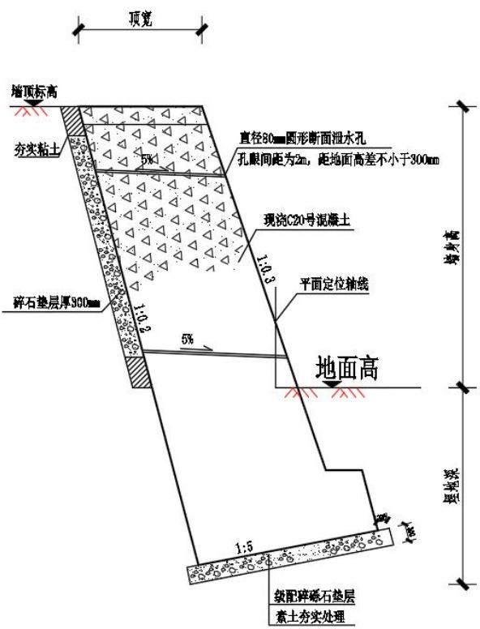  
图 2.2-1 挡土墙剖面示意图

工业场地挖方位于工业场地西北侧，长度1040m，最大挖深13.5m，平均挖深5m，挖方边坡坡比1：1\~1：1.5；填方位于工业场地东侧，长度156m，最大填方高3.5m，平均填高1.5m，填方护坡坡比1：1.5。高填深挖段边坡防护采用浆砌片石护坡，浆砌片石护坡厚度30cm，用M10水泥砂浆勾缝，每隔20m设置一道2cm的伸缩缝。

## 2.2.2.5防洪排水（依托）

井田内现有公路沿界梁子沟向南接国道G218线，由于设计工业场地井巷布置限制等因素，需将现状矿区道路向东偏移距离30m，沿工业场地围墙东侧进行改线，向南至场地南侧约400m处接现有道路，向北至场地东北角转绕过场地后接现有道路，总长0.9km，同时界梁子沟与改线道路伴行段一起向东改移。针对该道路和界梁子沟的改移工程，2024年10月，委托新疆伊犁州水利电力勘测设计研究院有限公司编制了《霍城县界梁子沟北矿井段改造项目（K6+400-K7+300段）洪水影响评价报告》，并以“伊州水发〔2024〕355号”取得伊犁哈萨克自治州水利局《关于对〈霍城县界梁子沟北矿井段改造项目（K6+400-K7+300段）洪水影响评价报告〉的批复》（见附件）。

## 洪水影响评价结果：

根据新疆伊犁州水利电力勘测设计研究院有限公司2024年10月编制完成的《霍城县界梁子沟北矿井段改造项目 $( \mathrm { K } 6 + 4 0 0  – \mathrm { K } 7 + 3 0 0$ 段)洪水影响评价报告》，本次改扩道路防洪标准为100年一遇。改扩道路防洪工程集水面积 $1 8 . 7 \mathrm { k m } ^ { 2 }$ ，设计洪峰流量为42.19m³/s。工程建设区域不涉及生态保护红线区域，符合相关“十四五”规划及相关法规的要求。排洪沟设计防洪标准满足要求，过洪能力满足要求，对排洪沟沟顶以上改建路段、蓄滞洪区、河势稳定无影响。

场外改扩道路和防洪工程布置图如下：

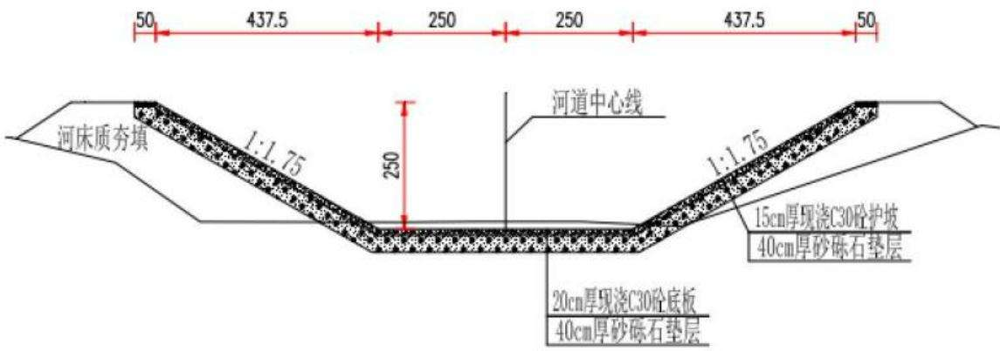  
图 2.2-2 排洪沟断面图 单位 cm

据有利雨水及融雪水排除和减少土石方量的原则，初步确定主斜井井口地面标高为+715.000m；副斜井井口地面标高为+714.500m；斜风井井口地面标高为+715.500m。

工业场地西东向小型冲沟进入工业场地前汇水面积1.29km²，洪水设计频率为100年一遇，洪水流量通过如下公式进行计算：

$$
\mathrm { Q } _ { 2 \% } { = } \mathrm { K F ^ { n } } ^ { \prime }\tag{50年一遇}
$$

$$
\mathrm { Q _ { 1 \% } } { = } 1 . 1 7 \mathrm { Q } _ { 2 \% }\tag{100年一遇}
$$

式中

$\mathrm { Q } _ { 2 \% } .$ ——50年一遇洪水流量， $\mathrm { m } ^ { 3 } / \mathrm { s }$ •2

$\mathrm { Q _ { l \% } } .$ ——100年一遇洪水流量， $\mathrm { m } ^ { 3 } / \mathrm { s }$

K一一经验参数，通过查全国分区经验公式成果表，可知工业场地所在的 $\mathcal { \sharp }$ 犁区为 1.00;

F——汇水面积， $\mathrm { k m } ^ { 2 } ;$

$\mathbf { n } ^ { \prime }$ ——经验指数，通过查全国分区经验公式成果表，可知 $\mathbf { n } ^ { \prime }$ 为 0.8。

经计算，场地围墙外西北侧及西侧坡地汇水形成的100年一遇洪水流量为$1 . 4 4 \mathrm { m } ^ { 3 } / \mathrm { s }$ 0

根据以上，西东向小型冲沟（场区1#排水沟）过工业场地段采用浆砌片石梯形明沟，厚度30cm，顶宽2.8m，底宽为0.6m，深1.1m，边坡1：1，用M10水泥砂浆勾缝，长度200m，占地位于工业场地内。

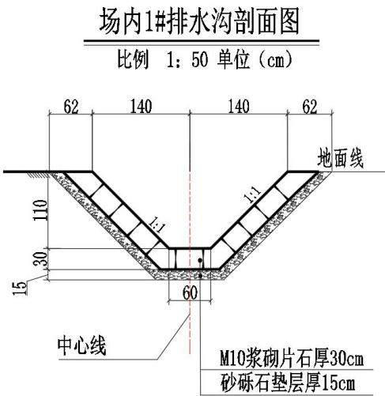  
图 2.2-4 场区1#排水沟（西东向小型冲沟过工业场地段）断面图

## （2）场区2#截、排水沟

场区外西北坡面中部汇水面积较小，为0.16km²，通过在围墙外建设截水沟，拦截此部分汇水，穿围墙过工业场地西南部，导排至工业场地东侧，再通过改扩道路过水涵洞进入界梁子沟内。场区2#截、排水沟排水标准设计为25年一遇。通过以上公式计算最大流量为0.15m³/s。

场区2#截、排水沟采用浆砌片石梯形明沟，厚度30cm，顶宽1.5m，底宽为0.3m，深0.6m，边坡1：1，用M10水泥砂浆勾缝，长度1440m，其中150m排水沟部分占地位于工业场地内。

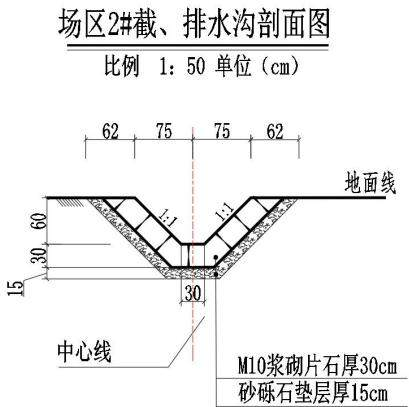  
图 2.2-5 场区 2#截、排水沟断面图

## （3）场区3#截水沟

场区外西北坡面西部汇水区面积0.58km²，在围墙外设置截水沟，将此部分汇水顺西侧围墙外向南导排至下游地势较低处，在末端设置消力池。场区3#截水沟排水标准设计为25年一遇。通过以上公式计算最大流量为0.40m³/s。

场区3#截水沟采用浆砌片石梯形明沟，厚度30cm，顶宽1.9m，底宽为0.5m，深0.7m，边坡1：1，用M10水泥砂浆勾缝，长度410m。

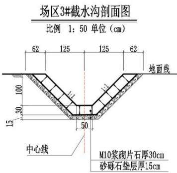  
图 2.2-6 场区 3#截水沟断面图

## （4）场内排水沟

本区属中温带亚干旱型气候大区，正常年份降水量为231mm，蒸发量为1750mm。为使场内地表雨水及融雪水迅速排除，在场内道路一侧设C30现浇混凝土矩形排水沟，穿道路及人行道设置盖板排水沟，雨水顺平场坡度，通过盖板泄水孔，汇集至沟内，然后排入场外公路边沟最终进入界梁子沟内，雨水沟尺寸设计为：宽0.40m×深0.40m×厚度0.20m。经统计，工业场地内矩形排水明沟长度1605m，矩形盖板排水沟长度170m。

场内排水沟平面布置见附图6，断面形式如下图：

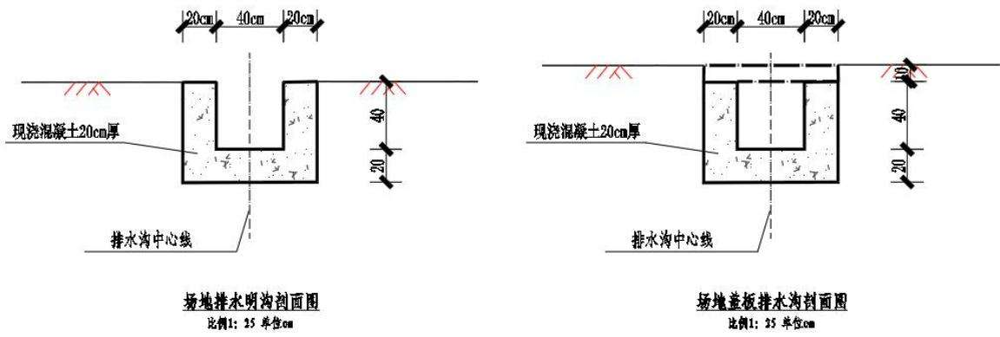  
图 2.2-8 场内排水沟断面图

## 2.2.3 场外道路

根据本矿实际运输需要，本矿需新建进场道路和货运道路。

## （1）道路布置

进场道路：自工业场地正大门向南约0.05km后向东南布线约0.1km，接井田内现有道路的改线段，总长0.15km。

货运道路：自工业场地货运门向北约0.05km后向东布线约0.11km接井田内现有道路的改线段，总长度0.16km。

进场道路、货运道路按混合行驶二车道三级公路标准设计。技术特征见下表：

表2.2-5 进场道路和货运道路技术特征表
<table><tr><td colspan="1" rowspan="1">项目</td><td colspan="1" rowspan="1">单位</td><td colspan="1" rowspan="1">进场道路和货运道路</td></tr><tr><td colspan="1" rowspan="1">公路等级</td><td colspan="1" rowspan="1"></td><td colspan="1" rowspan="1">三级</td></tr><tr><td colspan="1" rowspan="1">计算行车速度</td><td colspan="1" rowspan="1">km/h</td><td colspan="1" rowspan="1">60</td></tr><tr><td colspan="1" rowspan="1">路基宽度</td><td colspan="1" rowspan="1">m</td><td colspan="1" rowspan="1">8.5</td></tr><tr><td colspan="1" rowspan="1">路面宽度</td><td colspan="1" rowspan="1">m</td><td colspan="1" rowspan="1">7</td></tr><tr><td colspan="1" rowspan="1">路肩宽度</td><td colspan="1" rowspan="1">m</td><td colspan="1" rowspan="1">0.75</td></tr><tr><td colspan="1" rowspan="1">极限最小圆曲线半径</td><td colspan="1" rowspan="1">m</td><td colspan="1" rowspan="1">125</td></tr><tr><td colspan="1" rowspan="1">一般最小圆曲线半径</td><td colspan="1" rowspan="1">m</td><td colspan="1" rowspan="1">200</td></tr><tr><td colspan="1" rowspan="1">停车视距</td><td colspan="1" rowspan="1">m</td><td colspan="1" rowspan="1">75</td></tr><tr><td colspan="1" rowspan="1">最大纵坡</td><td colspan="1" rowspan="1"> $\%$ </td><td colspan="1" rowspan="1">6</td></tr></table>

进场道路与货运道路工程平面布置见附图。

## （2）路基工程

根据主体设计，进场及货运道路采用砾石土路基，整体式断面，设计防洪频率1/25。根据自然条件、填料类别、边坡高度、施工方法等确定，进场道路和货运道路现状场地较平整，路基整体填土高度H≤1.5m，路堤边坡坡度采用1:1.5。设计在进场道路西南一侧、货运道路西侧设置道路排水沟，顺接至矿区道路现状排水沟。以路堤排水沟外缘以外1m为场外道路用地范围。

表 2.2-6 路基工程量表
<table><tr><td rowspan=1 colspan=1>序号</td><td rowspan=1 colspan=1>工程名称</td><td rowspan=1 colspan=1>填方(m³)</td><td rowspan=1 colspan=1>挖方 $( \mathbf { m } ^ { 3 } )$ </td><td rowspan=1 colspan=1>占地面积 $( \mathrm { h } \mathrm { m } ^ { 2 } )$ </td><td rowspan=1 colspan=1>备注</td></tr><tr><td rowspan=1 colspan=1>2</td><td rowspan=1 colspan=1>进场道路</td><td rowspan=1 colspan=1>500</td><td rowspan=1 colspan=1>600</td><td rowspan=1 colspan=1>0.30</td><td rowspan=1 colspan=1>永久占地</td></tr><tr><td rowspan=1 colspan=1>3</td><td rowspan=1 colspan=1>货运道路</td><td rowspan=1 colspan=1>3150</td><td rowspan=1 colspan=1>150</td><td rowspan=1 colspan=1>0.32</td><td rowspan=1 colspan=1>永久占地</td></tr></table>

表 2.2-7 路基坡脚外侧排水沟技术参数表
<table><tr><td rowspan=1 colspan=1>名称</td><td rowspan=1 colspan=1>截面形式</td><td rowspan=1 colspan=1>长度/m</td><td rowspan=1 colspan=1>底宽/m</td><td rowspan=1 colspan=1>深/m</td><td rowspan=1 colspan=1>边坡比</td><td rowspan=1 colspan=1>厚/m</td><td rowspan=1 colspan=1>结构形式</td></tr><tr><td rowspan=1 colspan=1>进场道路排水沟</td><td rowspan=1 colspan=1>梯形明沟</td><td rowspan=1 colspan=1>150</td><td rowspan=1 colspan=1>0.4</td><td rowspan=1 colspan=1>0.4</td><td rowspan=1 colspan=1>内侧 1:1.5, 外</td><td rowspan=1 colspan=1>0.3</td><td rowspan=1 colspan=1>浆砌片石</td></tr><tr><td rowspan=1 colspan=1>货运道路排水沟</td><td rowspan=1 colspan=1>梯形明沟</td><td rowspan=1 colspan=1>160</td><td rowspan=1 colspan=1>0.4</td><td rowspan=1 colspan=1>0.4</td><td rowspan=1 colspan=1>侧 1:1</td><td rowspan=1 colspan=1>0.3</td><td rowspan=1 colspan=1>浆砌片石</td></tr></table>

## （3）路面工程

道路路面行车道横坡为1.5%，土路肩为2%，超高路段，路肩同行车道一起超高。场外道路路面技术参数与工程量见下表：

表 2.2-8 路面工程量表
<table><tr><td rowspan=1 colspan=1>序号</td><td rowspan=1 colspan=1>工程名称</td><td rowspan=1 colspan=1>规格标准</td><td rowspan=1 colspan=1>单位</td><td rowspan=1 colspan=1>数量</td><td rowspan=1 colspan=1>工程量 $\left( \mathbf { m } ^ { 3 } \right)$ </td></tr><tr><td rowspan=3 colspan=1>1</td><td rowspan=3 colspan=1>进场道路</td><td rowspan=1 colspan=1>面层：中粒式沥青混凝土，厚7cm</td><td rowspan=1 colspan=1> $\mathrm { m } ^ { 2 }$ </td><td rowspan=1 colspan=1>1050</td><td rowspan=1 colspan=1>73.5</td></tr><tr><td rowspan=1 colspan=1>基层：5%水泥稳定砂砾，厚28cm</td><td rowspan=1 colspan=1> $\mathrm { m } ^ { 2 }$ </td><td rowspan=1 colspan=1>1163</td><td rowspan=1 colspan=1>325.64</td></tr><tr><td rowspan=1 colspan=1>垫层：天然砂砾石，厚30cm</td><td rowspan=1 colspan=1> $\mathrm { m } ^ { 2 }$ </td><td rowspan=1 colspan=1>1275</td><td rowspan=1 colspan=1>382.5</td></tr><tr><td rowspan=3 colspan=1>2</td><td rowspan=3 colspan=1>货运道路</td><td rowspan=1 colspan=1>面层：中粒式沥青混凝土，厚7cm</td><td rowspan=1 colspan=1> $\mathrm { m } ^ { 2 }$ </td><td rowspan=1 colspan=1>1120</td><td rowspan=1 colspan=1>78.4</td></tr><tr><td rowspan=1 colspan=1>基层：5%水泥稳定砂砾，厚28cm</td><td rowspan=1 colspan=1> $\mathrm { m } ^ { 2 }$ </td><td rowspan=1 colspan=1>1240</td><td rowspan=1 colspan=1>347.2</td></tr><tr><td rowspan=1 colspan=1>垫层：天然砂砾石，厚30cm</td><td rowspan=1 colspan=1> $\mathrm { m } ^ { 2 }$ </td><td rowspan=1 colspan=1>1360</td><td rowspan=1 colspan=1>408</td></tr></table>

进场道路与货运道路及排水沟剖面布置情况如下：

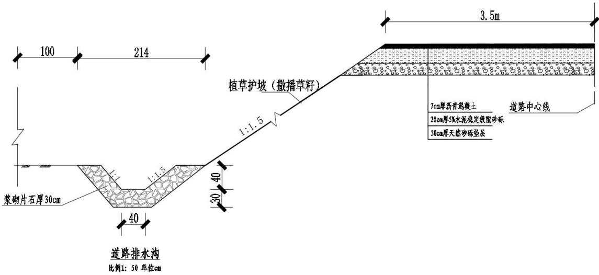  
图 2.2-9 路基工程边坡及排水沟剖面布置图

## 2.2.4 供排水工程

## 2.2.4.1 项目水平衡

煤矿井下正常涌水量约 $4 4 6 6 \mathrm { m } ^ { 3 } / \mathrm { d }$ 、防火灌浆析出水量约125m³/d及防尘洒水析出水量约246m³/d）、生产废水量约 $9 5 \mathrm { m } ^ { 3 } / \mathrm { d }$ ，合计约4837m³/d；矿井生活污水量394m³/d、选煤厂生活污水量25m³/d，合计约为420m³/d；从水源接入点取水量478m³/d。综上所述，煤矿水资源总量为5735m³/d。

生活污水处理成中水后全部用于工业场地绿化以及工业场地浇洒道路用水，实现“零排放”。

矿井水经常规净化处理后(4837m³/d)作为防火灌浆、矸石回填用水(815.66m3/d），经深度处理后（1242.4m³/d）用于选煤厂冲洗、矿区降尘及井下消防洒水，剩余2778.94m³/d，统一输送至距离矿井工业场地8.0km新天工业园作为工业用水。

## 2.2.4.2 场内给排水

## 1、给水

## （1）地面日用给水系统

工业场地福利区建1座半地下式日用给水泵房及1座 $\scriptstyle \mathrm { V } = 4 0 0 \mathrm { m } ^ { 3 }$ 日用水池，通过日用给水泵房内安装的1套全变频恒压供水设备 $( \mathrm { ~ Q { = } 8 7 m ^ { 3 } / h , H { = } 5 0 m , N { = } 2 } \times$

22kW）向地面各用水点压力供水。地面日用给水管网设计成环状，选用钢骨架塑料复合管，冻土线以下埋设。

## （2）地面生产给水系统

工业场地生产区建1座半地下式联合泵房及1座 $\mathrm { V } { = } 5 0 0 \mathrm { m } ^ { 3 }$ 生产水池，通过联合泵房内安装的1套台全变频恒压供水设备 $( \mathrm { \ Q } { = } 2 0 0 \mathrm { m } ^ { 3 } / \mathrm { h } , \mathrm { H } { = } 6 0 \mathrm { m } , \mathrm { N } { = } 6 \times 1 5 \mathrm { k W } )$ 向地面各用水点压力供水。地面生产给水管网设计成枝状，选用钢骨架塑料复合管，冻土线以下埋设。

## （3）中水利用系统

污水处理站内V=160m³装配式钢板中水箱用以贮存净化生活污水，通过2台变频调速绿化给水泵 $\scriptstyle ( \mathrm { Q = 5 0 m ^ { 3 } / h , H = 5 0 m , N = 1 5 k W } )$ 向工业场地绿化管网供水，同时安装2台洒水车上水泵( $\mathrm { Q } { = } 2 0 0 \mathrm { m } ^ { 3 } / \mathrm { h } , \mathrm { H } { = } 1 2 . 5 \mathrm { m } , \mathrm { N } { = } 1 5 \mathrm { k W } \ ,$ 向室外2座 SSG150型水鹤（PN1.0）供水。绿化给水管网设计成枝状，主要管道规格De200mm，采用PE80给水管（执行GB/T13663-2000），冻土线以下埋设。

## 2、排水

矿井工业场地采用雨污分流制，工业场地雨水经单独的管网收集后，通过排洪沟排至附近低洼处（详见工业场地截排水章节）。工业场地生活污水经污水管网收集后，经污水处理站处理后全部综合利用，矿井水经常规净化处理后充分综合利用，不用利用部分统一输送至距离矿井工业场地8.0km新天工业园作为工业用水。

## （1）内部回用水系统

室外排水管网采用DN300埋地HDPE双壁波纹管、承插式弹性橡胶圈柔性接口、中粗砂基础（管底以下100mm厚，管底以上中心角120°）。管道敷设坡度i≥2%，平均埋设深度按3.0m考虑。检查井采用∅1000圆形混凝土砌块污水检查井。

## （2）消防

地面消防采用临时高压消防给水系统，工业场地最高建筑为原煤缓冲仓（建筑高度70m）上部水箱间内设1座 ${ \mathrm { V } } { = } 2 5 { \mathrm { m } } ^ { 3 }$ 消防水箱用来贮存火灾初期室内消防水量，生产区 $\mathrm { V } { = } 2 \times 6 0 0 \mathrm { m } ^ { 3 }$ 消防水池主要用来贮存消防水量，联合泵房内的2台

XBD13.0/65-L150-316型固定消防泵 $\cdot \mathrm { Q } { = } 6 0 \mathrm { L } / \mathrm { s } , \mathrm { H } { = } 1 3 0 \mathrm { m } , \mathrm { N } { = } 1 3 2 \mathrm { k W } \ )$ 和2台XBD11/25-L100-285 型消防水幕给水泵 $( \mathrm { \ Q { = } 2 0 L / s , H { = } 1 1 0 m , N { = } 5 5 k W } )$ 用来提供消防时的水量及水压，设置2条出水管，与地面环状消防管网相连，室外消防管网和水幕管网合并设置。

## 2.2.4.3 场外供排水

## （1）场外供水方案

项目生活用水由伊宁市北山坡供水所供给，接入点为西南侧距离工业场地2.1km处的200m³蓄水池。由取水泵房→输水管线提升至工业场地日用水池，再由变频给水泵向工业场地地面动压供水。

## (2） 外排方案

本矿井下排水量预计达4837.16m³/d，预处理后剩余水量和深度处理后浓盐水共计2779m³/d，统一输送至距离矿井工业场地8.0km新天工业园作为工业用水，排水外输工程为单独立项工程，防治责任不纳入本次方案。

新天煤化工主要为煤制气项目，总规模 $2 0 { \times } 1 0 ^ { 8 } \mathrm { N m } ^ { 3 } / \mathrm { a }$ ，总日用水量约为18000m³/d，其中用水缺口为6300m³/d，在工业园统一设置矿井水处理设施，经处理后用水主要用作循环冷却水，使用能力可消纳本项目排水。

## （3）场外供水工程

在接入点设φ10.0m×H4.0m取水泵房，泵房内安装2台250QJ50—200/10型井用潜水泵（ $\scriptstyle { \mathrm { Q } = 5 0 \mathrm { m } ^ { 3 } / \mathrm { h } }$ 、H=200m、 $\mathrm { N } { = } 4 5 . 0 \mathrm { k W }$ 、一用一备）提升至工业场地$V { = } 4 0 0 \mathrm { m } ^ { 3 } , \mathrm { L } \times \mathrm { B } \times \mathrm { H } { = } 1 6 . 0 \mathrm { m } \times 8 . 0 \mathrm { m } \times 3 . 5 \mathrm { m }$ 日用水池，钢筋砼结构，再由变频给水泵向工业场地地面动压供水。取水泵房采用砖混结构，施工作业宽度4m，施工区域地形平坦，基础挖土就地平整。

表 2.2-9 取水泵房主要技术参数
<table><tr><td rowspan=2 colspan=1>名称</td><td rowspan=2 colspan=1>规格</td><td rowspan=2 colspan=1>基础深/m</td><td rowspan=2 colspan=1>施工作业宽度/m</td><td rowspan=1 colspan=2>占地面积/m²</td><td rowspan=2 colspan=1>结构形式</td></tr><tr><td rowspan=1 colspan=1>永久</td><td rowspan=1 colspan=1>临时</td></tr><tr><td rowspan=1 colspan=1>泵房</td><td rowspan=1 colspan=1>φ10.0m×H4.0m</td><td rowspan=1 colspan=1>1.2</td><td rowspan=1 colspan=1>4m</td><td rowspan=1 colspan=1>100</td><td rowspan=1 colspan=1>96</td><td rowspan=1 colspan=1>砖混结构</td></tr></table>

输水工程管道长度3.0km，提升高度约170m。输水管道选用Dn100钢骨架塑料复合管，管道公称压力为1.6MPa，2根输水管线并行敷设，冻土线以下埋设。

管沟开挖顶宽1.7m，底宽0.5m，深度1.2m，坡比1:0.5。输水管道从K00+700至工业场地段沿矿区现状道路敷设，施工机械作业带依托现状道路，沟体开挖及临时堆土占地宽度约4.0m。从接入点至00+700段根据施工区域地形需求布置，设置施工作业带宽度8.0m。施工过程中沿线临道路一侧用于机械场地，另外一侧用于堆土，堆土占地宽度约2.3m，坡比1：0.5，堆放高度<1.0m。施工全部采用机械作业，实行分段施工，随挖、随铺、随填。

场外输水管线主要技术参数见下表：

表 2.2-10 输水线路主要技术参数
<table><tr><td rowspan=2 colspan=1>名称</td><td rowspan=2 colspan=1>长度/m</td><td rowspan=2 colspan=1>沟体顶宽/m</td><td rowspan=2 colspan=1>底宽/m</td><td rowspan=2 colspan=1>埋深/m</td><td rowspan=2 colspan=1>边坡比</td><td rowspan=2 colspan=1>作业带宽度/m</td><td rowspan=1 colspan=2>占地面积 $/ \mathrm { m } ^ { 2 }$ </td><td rowspan=1 colspan=2>土石方 $\mathrm { \hbar } / \mathrm { m } ^ { 3 }$ </td></tr><tr><td rowspan=1 colspan=1>永久</td><td rowspan=1 colspan=1>临时</td><td rowspan=1 colspan=1>挖方</td><td rowspan=1 colspan=1>填方</td></tr><tr><td rowspan=2 colspan=1>输水线路</td><td rowspan=1 colspan=1>700</td><td rowspan=1 colspan=1>1.7m</td><td rowspan=1 colspan=1>0.5m</td><td rowspan=1 colspan=1>1.2m</td><td rowspan=1 colspan=1>1: 0.5</td><td rowspan=1 colspan=1>8.0</td><td rowspan=1 colspan=1>0</td><td rowspan=1 colspan=1>5600</td><td rowspan=1 colspan=1>1063</td><td rowspan=1 colspan=1>1063</td></tr><tr><td rowspan=1 colspan=1>2300</td><td rowspan=1 colspan=1>1.7m</td><td rowspan=1 colspan=1>0.5m</td><td rowspan=1 colspan=1>1.2m</td><td rowspan=1 colspan=1>1:0.5</td><td rowspan=1 colspan=1>4.0</td><td rowspan=1 colspan=1>0</td><td rowspan=1 colspan=1>9200</td><td rowspan=1 colspan=1>3492</td><td rowspan=1 colspan=1>3492</td></tr></table>

输水管线沟体剖面图如下：

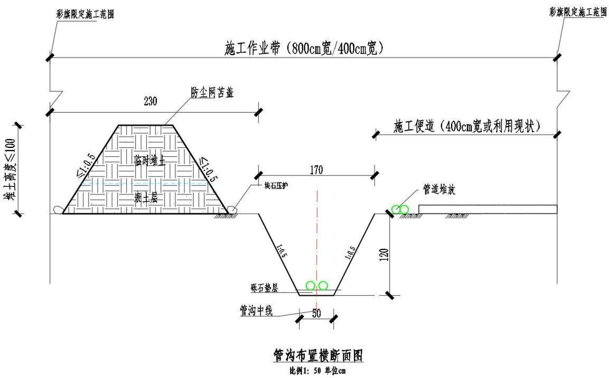  
图 2.2-10 管沟剖面布置图  
供水工程平面布置情况如下图：

侧配电。变电所内选用 2 台 SCB14-400/10 10±5%/0.4kV 400kVA 型配电变压器，同时工作，分列运行，负荷率53%，保证率95%。0.4kV侧为单母线分段接线。

## 2.2.5.2 场外供电工程

## （1）输电线路

供电线路一回由南台子110kV出线架设至本期拟建35kV变电站，线路全长8.0公里，其中架空段长7.6公里，电缆段长0.4公里。供电线路二回由北坡110kV出线架设至本期拟建35kV变电站，线路全长4.5公里，其中架空段长4.3公里，电缆段长 0.2 公里。

表 2.2-11 输电线路敷设方式及长度
<table><tr><td rowspan=1 colspan=1>线路</td><td rowspan=1 colspan=1>线路形式</td><td rowspan=1 colspan=1>长度/m</td><td rowspan=1 colspan=1>敷设方式</td><td rowspan=1 colspan=1>导线/电缆规格</td><td rowspan=1 colspan=1>备注</td></tr><tr><td rowspan=4 colspan=1>南台子一回</td><td rowspan=1 colspan=1>架空段</td><td rowspan=1 colspan=1>7600</td><td rowspan=1 colspan=1>架空</td><td rowspan=1 colspan=1>LGJ-240/30 型</td><td rowspan=1 colspan=1></td></tr><tr><td rowspan=3 colspan=1>电缆段</td><td rowspan=1 colspan=1>60</td><td rowspan=1 colspan=1>埋地</td><td rowspan=1 colspan=1>YJV22-26/35-1*300</td><td rowspan=1 colspan=1>变电站 35kV 出线</td></tr><tr><td rowspan=1 colspan=1>240</td><td rowspan=1 colspan=1>顶管</td><td rowspan=1 colspan=1>YJV22-26/35-1*300</td><td rowspan=1 colspan=1>钻越精伊霍铁路处</td></tr><tr><td rowspan=1 colspan=1>100</td><td rowspan=1 colspan=1>架空</td><td rowspan=1 colspan=1>YJV22-26/35-1*300</td><td rowspan=1 colspan=1>钻越 35kV 线路</td></tr><tr><td rowspan=2 colspan=1>北坡二回</td><td rowspan=1 colspan=1>架空段</td><td rowspan=1 colspan=1>4300</td><td rowspan=1 colspan=1>架空</td><td rowspan=1 colspan=1>LGJ-240/30 型</td><td rowspan=1 colspan=1></td></tr><tr><td rowspan=1 colspan=1>电缆段</td><td rowspan=1 colspan=1>200</td><td rowspan=1 colspan=1>埋地</td><td rowspan=1 colspan=1>YJV22-26/35-1*300</td><td rowspan=1 colspan=1>北坡变电站进站处</td></tr></table>

输电线路路由布置情况如下图：

南台子变所至线路K02+500段与现状公路伴行，施工道路依托现状，其他线路段需新建施工便道6.0km，道路宽度4.0m，占地面积2.40hm2；临时施工便道采用简易土质路面，施工结束后恢复原状地貌。

## 2.3 施工组织

## 2.3.1 施工布置

## (1）施工生产生活区

为便于施工和减少征占地，将施工生产生活区布置于工业场地内，临时搭建彩钢板房等。根据施工时序（建设时序空间推进依次为场前区→风井区→辅助生产仓库区→选煤生产储运区→场区硬化、绿化）及场地永久建筑布置情况（选煤生产仓库区中矿井综合修理车间和供热锅炉之间有大片硬化广场）综合考虑，本项目施工生产生活区布设于工业场地北部的辅助生产仓库区(矿井综合修理车间和供热锅炉之间），主要用于办公生活、设备停放和建材堆放加工等，占地面积$1 . 0 0 \mathrm { h m } ^ { 2 }$

## (2) 表土堆放区

本项目施工前开挖扰动范围内的表土资源采取剥离措施，在场地内集中堆存，后期用于项目绿化覆土。根据施工时序（建设时序空间推进依次为场前区→风井区→辅助生产仓库区→选煤生产储运区→场区硬化、绿化）及场地永久建筑布置情况（选煤生产储运区北侧规划较大绿化片区）综合考虑，在工业场地内东侧选煤厂绿化区域布置1处表土堆放区，区域地势平坦，占地面积0.80hm²。工程前期，工程剥离表土运至表土堆放区内临时堆放，堆放过程采取防尘网苫盖，临时堆土坡脚用编织土袋拦挡。表土最大临时堆放量约为2.35万m³，临时堆土高度小于3.5m，边坡比1：1.5。

## (3) 矸石周转区

计算建井期掘进矸石1个月的产生量约为4200m³，根据施工时序（建设时序空间推进依次为场前区→风井区→辅助生产仓库区→选煤生产储运区→场区硬化、绿化）及场地永久建筑布置情况（选煤生产区储矸系统和充填泵站为设计生产期的储矸系统）综合考虑，并考虑矸石接收单位冬季3个月停工期的最不利

## （4)取、弃土场

根据土石方平衡，本项目场地平整、路基填筑等填方充分利用本项目产生的挖方，不设置取土场。建井掘进矸石用于回填伊北二号露天矿采坑，不设置弃土（渣）场。

## (5) 建筑材料

建设所用砂石可由当地市场供应，施工建筑材料挖运的水土流失防治责任由供货方承担，在采购合同中应注明。水泥和钢材等可由伊宁市市场购进。

## (6)通讯条件

场地现场通讯采用无线通讯的方式联络。

## 2.3.3 施工方法工艺

## 2.3.3.1 井巷工程施工

井筒施工分表土段和基岩段两个部分。表土段施工工序为机械开挖、治水、砌筑筒壁，提升土石，回填；基岩段施工工序为钻爆法掘进、耙斗装岩机装岩、支护、铺设轨道、提升矸石、回填，推土机平整，碾压。

井巷工程主要包括井底车场、硐室、大巷，其施工与井筒基岩段施工相当。矿井前3年为建设期，产生掘进矸石15万m³。

## 2.3.3.2 地面工程施工

场地平整采用平坡式平整方式，以挖作填，挖高垫低。场地平整时，填方地段应分层压实，填方每层填土厚度为200\~300mm。粘性土的填方压实系数为：建筑地段不应小于0.9；近期预留地段不应小于0.85。后期绿化区域应充分预留表土回覆所需的填方高度。工业场地平整以挖掘机、推土机、压实机联合作业为主，人工配合机械对零星场地或边角区进行平整。

地面建筑工程施工顺序为场地平整，基坑开挖，土料存放，基础砼浇筑，土方回填，地面压实，进料、砼搅拌、输送等。地面建筑、机电安装工程施工作业量相对较大，采取联合作业，交叉施工。

## 2.3.3.3 场外道路施工

道路施工的程序为：路基地表清理→边坡开挖、回填→排水工程→路基面层施工，全部采用机械化施工。路基开挖采用挖掘机开挖运土，土方首先运往回填区回填，回填采用逐层填筑，分层压实的方法施工。

为保证路基具有足够的强度及稳定性，结合地质情况，挖方路段、部分加宽路段在路面结构以下换填天然砂砾。换填土应根据土质情况和换土深度，按设计范围将软土全部或分段清除，整平底部，再比照路堤相应部位规定的填料、压实标准和工艺进行回填。换填法根据现场实际情况，可以采用挖掘机辅以人工进行施工。换填深度内的软弱土层，再由人工将软土挖除到基底承载力满足设计要求为止，自卸汽车运输换填料，后倾法卸料，推土机摊铺，平地机平整，压路机碾压，分层填筑，直至达到设计标高。路基换填应分层填筑，分层压实，具体压实标准如下：原地面或地基表层，压实度>90%，零填及挖方路基，路床顶面以下0-80cm压实度>95%。

## 2.3.3.4 供水工程施工

取水泵房采用砖混结构，施工区域地形平坦，基础挖土就地用于场地平整。

供水管线在作业带中部开挖管沟，管沟一侧用于堆土，另一侧用作施工作业场地。管沟施工全部采用机械作业，实行分段施工，随挖、随铺、随填。开挖时，先清表土、置于下部，后挖深土、堆在上部；回填时，先深土、后表土，填土在扰动区域回填呈弧形并夯实。

## 2.3.3.5 输电线路施工

输电线路施工主要包括：施工材料运输、塔基础施工、杆塔组立以及导线和避雷线的架设等阶段。施工材料运输采用汽车运输方式。

输电线路架空段，人工结合吊装设备，基坑采用挖掘机开挖。塔基坑开挖土方堆放在塔基开挖外围，塔基浇筑后及时架设塔杆，并进行土方回填，少量余土就地人工摊平，避免产生弃土。架线采用张力架线工艺，用飞行器展放初级导引绳，分段展放后与邻段相连，用已放好的导引绳牵放其他高级别导引绳，用小牵张机收卷导引绳，逐渐将导引绳替换为牵引绳，用主牵引机收卷牵引绳，逐步将施工段内的牵引绳更换为导线。

## 2.4 工程占地

根据主体设计，本项目建设用地总规模为 $2 5 . 4 7 \mathrm { h m } ^ { 2 }$ ，其中工业场地(含矿井、选煤厂、防火灌浆站、救护中队、单身公寓等）用地 $1 9 . 6 4 \mathrm { h m } ^ { 2 }$ ，进场道路用地0.30hm²，货运道路用地0.32hm²，供水工程（含水源地及供水管线)用地1.50hm²，供电工程用地3.71hm²。

方案复核后增加了施工生产生活区、表土堆放区和矸石周转区占地，面积分别为1.00hm²、0.80hm²和0.60hm²，占地性质为临时占地，均位于工业场地用地范围内，属于重复占地。

方案复核本项目建设用地总规模为25.47hm²，其中工业场地用地 $1 9 . 6 4 \mathrm { h m } ^ { 2 }$ 进场道路用地0.30hm²，货运道路用地 $0 . 3 2 \mathrm { h m } ^ { 2 } .$ ，供水工程用地 $1 . 5 0 \mathrm { h m } ^ { 2 }$ ，供电工程用地3.71hm²。项目占地涉及伊宁市和霍城县，项目永久占地 $2 0 . 4 1 \mathrm { h m } ^ { 2 }$ (其中霍城县20.27hm²、伊宁市0.14hm²），临时用地5.06hm²（其中霍城县0.97hm²，伊宁市4.09hm²）。

方案复核后本项目用地性质及其面积较设计增减情况统计如下：

表2.4-1 方案复核工程占地性质及面积较设计变化情况统计表
<table><tr><td rowspan=2 colspan=2>项目</td><td rowspan=1 colspan=3>主体设计用地性质及面积 hm²</td><td rowspan=1 colspan=3>方案核增+（减-）占地性质及面积hm²</td><td rowspan=1 colspan=3>方案复核用地性质及面积 hm²</td><td rowspan=2 colspan=1>备注</td></tr><tr><td rowspan=1 colspan=1>永久占地</td><td rowspan=1 colspan=1>临时占地</td><td rowspan=1 colspan=1>合计</td><td rowspan=1 colspan=1>永久占地</td><td rowspan=1 colspan=1>临时占地</td><td rowspan=1 colspan=1>合计</td><td rowspan=1 colspan=1>永久占地</td><td rowspan=1 colspan=1>临时占地</td><td rowspan=1 colspan=1>合计</td></tr><tr><td rowspan=5 colspan=1>工业场地</td><td rowspan=1 colspan=1>工业场地</td><td rowspan=1 colspan=1>19.64</td><td rowspan=1 colspan=1></td><td rowspan=1 colspan=1>19.64</td><td rowspan=1 colspan=1></td><td rowspan=1 colspan=1></td><td rowspan=1 colspan=1>0</td><td rowspan=1 colspan=1>19.64</td><td rowspan=1 colspan=1></td><td rowspan=1 colspan=1>19.64</td><td rowspan=1 colspan=1></td></tr><tr><td rowspan=1 colspan=1>施工生产生活区*</td><td rowspan=1 colspan=1></td><td rowspan=1 colspan=1></td><td rowspan=1 colspan=1>0</td><td rowspan=1 colspan=1></td><td rowspan=1 colspan=1>+1.00*</td><td rowspan=1 colspan=1>+1.00*</td><td rowspan=1 colspan=1></td><td rowspan=1 colspan=1>1.00*</td><td rowspan=1 colspan=1>1.00*</td><td rowspan=1 colspan=1>*代表重复占地</td></tr><tr><td rowspan=1 colspan=1>表土堆放区*</td><td rowspan=1 colspan=1></td><td rowspan=1 colspan=1></td><td rowspan=1 colspan=1>0</td><td rowspan=1 colspan=1></td><td rowspan=1 colspan=1>+0.80*</td><td rowspan=1 colspan=1>+0.80*</td><td rowspan=1 colspan=1></td><td rowspan=1 colspan=1>0.80*</td><td rowspan=1 colspan=1>0.80*</td><td rowspan=1 colspan=1>*代表重复占地</td></tr><tr><td rowspan=1 colspan=1>矸石周转区*</td><td rowspan=1 colspan=1></td><td rowspan=1 colspan=1></td><td rowspan=1 colspan=1>0</td><td rowspan=1 colspan=1></td><td rowspan=1 colspan=1>+0.60*</td><td rowspan=1 colspan=1>+0.60*</td><td rowspan=1 colspan=1></td><td rowspan=1 colspan=1>0.60*</td><td rowspan=1 colspan=1>0.60*</td><td rowspan=1 colspan=1>*代表重复占地</td></tr><tr><td rowspan=1 colspan=1>小计</td><td rowspan=1 colspan=1>19.64</td><td rowspan=1 colspan=1>0</td><td rowspan=1 colspan=1>19.64</td><td rowspan=1 colspan=1>0</td><td rowspan=1 colspan=1>+2.40*</td><td rowspan=1 colspan=1>+2.40*</td><td rowspan=1 colspan=1>19.64</td><td rowspan=1 colspan=1>2.40*</td><td rowspan=1 colspan=1>19.64</td><td rowspan=1 colspan=1></td></tr><tr><td rowspan=3 colspan=1>场外道路</td><td rowspan=1 colspan=1>进场道路</td><td rowspan=1 colspan=1>0.30</td><td rowspan=1 colspan=1></td><td rowspan=1 colspan=1>0.30</td><td rowspan=1 colspan=1></td><td rowspan=1 colspan=1></td><td rowspan=1 colspan=1>0</td><td rowspan=1 colspan=1>0.30</td><td rowspan=1 colspan=1></td><td rowspan=1 colspan=1>0.30</td><td rowspan=1 colspan=1></td></tr><tr><td rowspan=1 colspan=1>货运道路</td><td rowspan=1 colspan=1>0.32</td><td rowspan=1 colspan=1></td><td rowspan=1 colspan=1>0.32</td><td rowspan=1 colspan=1></td><td rowspan=1 colspan=1></td><td rowspan=1 colspan=1>0</td><td rowspan=1 colspan=1>0.32</td><td rowspan=1 colspan=1></td><td rowspan=1 colspan=1>0.32</td><td rowspan=1 colspan=1></td></tr><tr><td rowspan=1 colspan=1>小计</td><td rowspan=1 colspan=1>0.62</td><td rowspan=1 colspan=1>0</td><td rowspan=1 colspan=1>0.62</td><td rowspan=1 colspan=1>0</td><td rowspan=1 colspan=1>0</td><td rowspan=1 colspan=1>0</td><td rowspan=1 colspan=1>0.62</td><td rowspan=1 colspan=1>0</td><td rowspan=1 colspan=1>0.62</td><td rowspan=1 colspan=1></td></tr><tr><td rowspan=3 colspan=1>供水工程</td><td rowspan=1 colspan=1>泵房</td><td rowspan=1 colspan=1>0.01</td><td rowspan=1 colspan=1>0.01</td><td rowspan=1 colspan=1>0.02</td><td rowspan=1 colspan=1></td><td rowspan=1 colspan=1></td><td rowspan=1 colspan=1>0</td><td rowspan=1 colspan=1>0.01</td><td rowspan=1 colspan=1>0.01</td><td rowspan=1 colspan=1>0.02</td><td rowspan=1 colspan=1></td></tr><tr><td rowspan=1 colspan=1>输水管线</td><td rowspan=1 colspan=1></td><td rowspan=1 colspan=1>1.48</td><td rowspan=1 colspan=1>1.48</td><td rowspan=1 colspan=1></td><td rowspan=1 colspan=1></td><td rowspan=1 colspan=1>0</td><td rowspan=1 colspan=1></td><td rowspan=1 colspan=1>1.48</td><td rowspan=1 colspan=1>1.48</td><td rowspan=1 colspan=1></td></tr><tr><td rowspan=1 colspan=1>小计</td><td rowspan=1 colspan=1>0.01</td><td rowspan=1 colspan=1>1.49</td><td rowspan=1 colspan=1>1.50</td><td rowspan=1 colspan=1>0</td><td rowspan=1 colspan=1>0</td><td rowspan=1 colspan=1>0</td><td rowspan=1 colspan=1>0.01</td><td rowspan=1 colspan=1>1.49</td><td rowspan=1 colspan=1>1.50</td><td rowspan=1 colspan=1></td></tr><tr><td rowspan=7 colspan=1>供电工程</td><td rowspan=1 colspan=1>架空线路段</td><td rowspan=1 colspan=1>0.14</td><td rowspan=1 colspan=1>0.51</td><td rowspan=1 colspan=1>0.65</td><td rowspan=1 colspan=1></td><td rowspan=1 colspan=1></td><td rowspan=1 colspan=1>0</td><td rowspan=1 colspan=1>0.14</td><td rowspan=1 colspan=1>0.51</td><td rowspan=1 colspan=1>0.65</td><td rowspan=1 colspan=1></td></tr><tr><td rowspan=1 colspan=1>埋地电缆段</td><td rowspan=1 colspan=1></td><td rowspan=1 colspan=1>0.26</td><td rowspan=1 colspan=1>0.26</td><td rowspan=1 colspan=1></td><td rowspan=1 colspan=1></td><td rowspan=1 colspan=1>0</td><td rowspan=1 colspan=1></td><td rowspan=1 colspan=1>0.26</td><td rowspan=1 colspan=1>0.26</td><td rowspan=1 colspan=1></td></tr><tr><td rowspan=1 colspan=1>钻跨场地</td><td rowspan=1 colspan=1></td><td rowspan=1 colspan=1>0.36</td><td rowspan=1 colspan=1>0.36</td><td rowspan=1 colspan=1></td><td rowspan=1 colspan=1></td><td rowspan=1 colspan=1>0</td><td rowspan=1 colspan=1></td><td rowspan=1 colspan=1>0.36</td><td rowspan=1 colspan=1>0.36</td><td rowspan=1 colspan=1></td></tr><tr><td rowspan=1 colspan=1>1#牵张场</td><td rowspan=1 colspan=1></td><td rowspan=1 colspan=1>0.02</td><td rowspan=1 colspan=1>0.02</td><td rowspan=1 colspan=1></td><td rowspan=1 colspan=1></td><td rowspan=1 colspan=1>0</td><td rowspan=1 colspan=1></td><td rowspan=1 colspan=1>0.02</td><td rowspan=1 colspan=1>0.02</td><td rowspan=1 colspan=1></td></tr><tr><td rowspan=1 colspan=1>2#牵张场</td><td rowspan=1 colspan=1></td><td rowspan=1 colspan=1>0.02</td><td rowspan=1 colspan=1>0.02</td><td rowspan=1 colspan=1></td><td rowspan=1 colspan=1></td><td rowspan=1 colspan=1>0</td><td rowspan=1 colspan=1></td><td rowspan=1 colspan=1>0.02</td><td rowspan=1 colspan=1>0.02</td><td rowspan=1 colspan=1></td></tr><tr><td rowspan=1 colspan=1>施工便道</td><td rowspan=1 colspan=1></td><td rowspan=1 colspan=1>2.40</td><td rowspan=1 colspan=1>2.40</td><td rowspan=1 colspan=1></td><td rowspan=1 colspan=1></td><td rowspan=1 colspan=1>0</td><td rowspan=1 colspan=1></td><td rowspan=1 colspan=1>2.40</td><td rowspan=1 colspan=1>2.40</td><td rowspan=1 colspan=1></td></tr><tr><td rowspan=1 colspan=1>小计</td><td rowspan=1 colspan=1>0.14</td><td rowspan=1 colspan=1>3.57</td><td rowspan=1 colspan=1>3.71</td><td rowspan=1 colspan=1>0</td><td rowspan=1 colspan=1>0</td><td rowspan=1 colspan=1>0</td><td rowspan=1 colspan=1>0.14</td><td rowspan=1 colspan=1>3.57</td><td rowspan=1 colspan=1>3.71</td><td rowspan=1 colspan=1></td></tr><tr><td rowspan=1 colspan=2>合计</td><td rowspan=1 colspan=1>20.41</td><td rowspan=1 colspan=1>5.06</td><td rowspan=1 colspan=1>25.47</td><td rowspan=1 colspan=1>0</td><td rowspan=1 colspan=1>+2.40*</td><td rowspan=1 colspan=1>+2.40*</td><td rowspan=1 colspan=1>20.41</td><td rowspan=1 colspan=1>5.06</td><td rowspan=1 colspan=1>25.47</td><td rowspan=1 colspan=1></td></tr></table>

项目占地涉及伊宁市和霍城县。目前，工业场地用地已取得用地预审意见。根据工业场地勘界资料，工业场地、进场道路和货运道路用地全部位于霍城县，供电工程和供水工程线路占地同时涉及霍城县和伊宁市。

项目区位于伊犁谷地，在中国植被区划中，项目所在区域属于新疆荒漠区，北疆荒漠亚区，准噶尔荒漠省，塔城一伊犁荒漠亚省，伊犁州。根据实地调查及历史资料，项目区所在区域植被类型多为耐旱型物种，多系旱生、超旱生深根肉质的小半灌木和灌木荒漠类型，覆盖度约5\~20%。根据现场调查，工业场地内植被覆盖度较低（5\~10%），部分区域植被不发育；输水和输电线路沿线植被覆盖度约 20%。

根据用地预审意见，结合现场核查复核后，本项目实际占地类型、占地性质情况如下表：

表 2.4-2 工程占地类型及面积统计表
<table><tr><td rowspan=3 colspan=2>项目</td><td rowspan=3 colspan=1>用地类型</td><td rowspan=1 colspan=4>占地性质及面积/hm²</td><td rowspan=3 colspan=1>合计</td></tr><tr><td rowspan=1 colspan=2>霍城县</td><td rowspan=1 colspan=2>伊宁市</td></tr><tr><td rowspan=1 colspan=1>永久占地</td><td rowspan=1 colspan=1>临时用地</td><td rowspan=1 colspan=1>永久占地</td><td rowspan=1 colspan=1>临时用地</td></tr><tr><td rowspan=3 colspan=2>工业场地</td><td rowspan=1 colspan=1>天然牧草地</td><td rowspan=1 colspan=1>13.79</td><td rowspan=1 colspan=1></td><td rowspan=1 colspan=1></td><td rowspan=1 colspan=1></td><td rowspan=1 colspan=1>13.79</td></tr><tr><td rowspan=1 colspan=1>农村道路</td><td rowspan=1 colspan=1>0.31</td><td rowspan=1 colspan=1></td><td rowspan=1 colspan=1></td><td rowspan=1 colspan=1></td><td rowspan=1 colspan=1>0.31</td></tr><tr><td rowspan=1 colspan=1>裸土地</td><td rowspan=1 colspan=1>5.54</td><td rowspan=1 colspan=1></td><td rowspan=1 colspan=1></td><td rowspan=1 colspan=1></td><td rowspan=1 colspan=1>5.54</td></tr><tr><td rowspan=2 colspan=1>场外道路</td><td rowspan=1 colspan=1>进场道路</td><td rowspan=1 colspan=1>裸土地</td><td rowspan=1 colspan=1>0.30</td><td rowspan=1 colspan=1></td><td rowspan=1 colspan=1></td><td rowspan=1 colspan=1></td><td rowspan=1 colspan=1>0.30</td></tr><tr><td rowspan=1 colspan=1>货运道路</td><td rowspan=1 colspan=1>裸土地</td><td rowspan=1 colspan=1>0.32</td><td rowspan=1 colspan=1></td><td rowspan=1 colspan=1></td><td rowspan=1 colspan=1></td><td rowspan=1 colspan=1>0.32</td></tr><tr><td rowspan=2 colspan=1>供水工程</td><td rowspan=1 colspan=1>泵房</td><td rowspan=1 colspan=1>天然牧草地</td><td rowspan=1 colspan=1></td><td rowspan=1 colspan=1></td><td rowspan=1 colspan=1>0.01</td><td rowspan=1 colspan=1>0.01</td><td rowspan=1 colspan=1>0.02</td></tr><tr><td rowspan=1 colspan=1>输水管线</td><td rowspan=1 colspan=1>天然牧草地</td><td rowspan=1 colspan=1></td><td rowspan=1 colspan=1>0.92</td><td rowspan=1 colspan=1></td><td rowspan=1 colspan=1>0.56</td><td rowspan=1 colspan=1>1.48</td></tr><tr><td rowspan=6 colspan=1>供电工程</td><td rowspan=1 colspan=1>架空线路段</td><td rowspan=1 colspan=1>天然牧草地</td><td rowspan=1 colspan=1>0.01</td><td rowspan=1 colspan=1>0.05</td><td rowspan=1 colspan=1>0.13</td><td rowspan=1 colspan=1>0.46</td><td rowspan=1 colspan=1>0.65</td></tr><tr><td rowspan=1 colspan=1>埋地电缆段</td><td rowspan=1 colspan=1>裸土地</td><td rowspan=1 colspan=1></td><td rowspan=1 colspan=1></td><td rowspan=1 colspan=1></td><td rowspan=1 colspan=1>0.26</td><td rowspan=1 colspan=1>0.26</td></tr><tr><td rowspan=1 colspan=1>钻跨场地</td><td rowspan=1 colspan=1>天然牧草地</td><td rowspan=1 colspan=1></td><td rowspan=1 colspan=1></td><td rowspan=1 colspan=1></td><td rowspan=1 colspan=1>0.36</td><td rowspan=1 colspan=1>0.36</td></tr><tr><td rowspan=1 colspan=1>1#牵张场</td><td rowspan=1 colspan=1>天然牧草地</td><td rowspan=1 colspan=1></td><td rowspan=1 colspan=1></td><td rowspan=1 colspan=1></td><td rowspan=1 colspan=1>0.02</td><td rowspan=1 colspan=1>0.02</td></tr><tr><td rowspan=1 colspan=1>2#牵张场</td><td rowspan=1 colspan=1>天然牧草地</td><td rowspan=1 colspan=1></td><td rowspan=1 colspan=1></td><td rowspan=1 colspan=1></td><td rowspan=1 colspan=1>0.02</td><td rowspan=1 colspan=1>0.02</td></tr><tr><td rowspan=1 colspan=1>施工便道</td><td rowspan=1 colspan=1>天然牧草地</td><td rowspan=1 colspan=1></td><td rowspan=1 colspan=1></td><td rowspan=1 colspan=1></td><td rowspan=1 colspan=1>2.40</td><td rowspan=1 colspan=1>2.40</td></tr><tr><td rowspan=1 colspan=2>合计</td><td rowspan=1 colspan=1></td><td rowspan=1 colspan=1>20.27</td><td rowspan=1 colspan=1>0.97</td><td rowspan=1 colspan=1>0.14</td><td rowspan=1 colspan=1>4.09</td><td rowspan=1 colspan=1>25.47</td></tr></table>

## 2.5 土石方平衡

## 2.5.1 表土平衡分析

根据以上要求及实地调查，本次需对工业场地占地类型为天然牧草地的区域、管线工程占地区域进行表土剥离，剥离厚度15\~20cm，其中输水管线施工过程实施分层开挖、分层堆放、反序分层回填，工业场地表土在表土堆放区存放。

施工结束后针对需要绿化的区域实施表土回覆，为实现表土全部利用，工业场地回覆厚度33cm，场外道路绿化区域回覆厚度36cm，其他区域为20cm。

本项目表土可剥离面积及回填区域面积统计如下表：

表 2.5-1 区域表层土壤剥离及回填情况表
<table><tr><td rowspan=2 colspan=2>项目扰动区域</td><td rowspan=1 colspan=3>表土剥离</td><td rowspan=1 colspan=3>表土回填</td></tr><tr><td rowspan=1 colspan=1>剥离面积/hm²</td><td rowspan=1 colspan=1>剥离厚度/cm</td><td rowspan=1 colspan=1>剥离量/万m³</td><td rowspan=1 colspan=1>回填面积/hm²</td><td rowspan=1 colspan=1>回填厚度/cm</td><td rowspan=1 colspan=1>回填量/万m³</td></tr><tr><td rowspan=2 colspan=2>工业场地</td><td rowspan=1 colspan=1>2.51</td><td rowspan=1 colspan=1>20</td><td rowspan=1 colspan=1>0.50</td><td rowspan=2 colspan=1>6.39</td><td rowspan=2 colspan=1>33</td><td rowspan=2 colspan=1>2.11</td></tr><tr><td rowspan=1 colspan=1>11.28</td><td rowspan=1 colspan=1>15</td><td rowspan=1 colspan=1>1.69</td></tr><tr><td rowspan=2 colspan=1>场外道路</td><td rowspan=1 colspan=1>进场道路</td><td rowspan=1 colspan=1></td><td rowspan=1 colspan=1></td><td rowspan=1 colspan=1></td><td rowspan=1 colspan=1>0.12</td><td rowspan=1 colspan=1>36</td><td rowspan=1 colspan=1>0.04</td></tr><tr><td rowspan=1 colspan=1>货运道路</td><td rowspan=1 colspan=1></td><td rowspan=1 colspan=1></td><td rowspan=1 colspan=1></td><td rowspan=1 colspan=1>0.12</td><td rowspan=1 colspan=1>36</td><td rowspan=1 colspan=1>0.04</td></tr><tr><td rowspan=2 colspan=1>供水工程</td><td rowspan=1 colspan=1>泵房</td><td rowspan=1 colspan=1>0.01</td><td rowspan=1 colspan=1>20</td><td rowspan=1 colspan=1>0.002</td><td rowspan=1 colspan=1>0.01</td><td rowspan=1 colspan=1>20</td><td rowspan=1 colspan=1>0.002</td></tr><tr><td rowspan=1 colspan=1>输水管线</td><td rowspan=1 colspan=1>0.51</td><td rowspan=1 colspan=1>20</td><td rowspan=1 colspan=1>0.10</td><td rowspan=1 colspan=1>0.51</td><td rowspan=1 colspan=1>20</td><td rowspan=1 colspan=1>0.10</td></tr><tr><td rowspan=6 colspan=1>供电工程</td><td rowspan=1 colspan=1>架空线路段</td><td rowspan=1 colspan=1>0.14</td><td rowspan=1 colspan=1>20</td><td rowspan=1 colspan=1>0.03</td><td rowspan=1 colspan=1>0.14</td><td rowspan=1 colspan=1>20</td><td rowspan=1 colspan=1>0.03</td></tr><tr><td rowspan=1 colspan=1>埋地电缆段</td><td rowspan=1 colspan=1></td><td rowspan=1 colspan=1></td><td rowspan=1 colspan=1>0</td><td rowspan=1 colspan=1></td><td rowspan=1 colspan=1></td><td rowspan=1 colspan=1>0</td></tr><tr><td rowspan=1 colspan=1>钻跨场地</td><td rowspan=1 colspan=1></td><td rowspan=1 colspan=1></td><td rowspan=1 colspan=1>0</td><td rowspan=1 colspan=1></td><td rowspan=1 colspan=1></td><td rowspan=1 colspan=1>0</td></tr><tr><td rowspan=1 colspan=1>1#牵张场</td><td rowspan=1 colspan=1></td><td rowspan=1 colspan=1></td><td rowspan=1 colspan=1>0</td><td rowspan=1 colspan=1></td><td rowspan=1 colspan=1></td><td rowspan=1 colspan=1>0</td></tr><tr><td rowspan=1 colspan=1>2#牵张场</td><td rowspan=1 colspan=1></td><td rowspan=1 colspan=1></td><td rowspan=1 colspan=1>0</td><td rowspan=1 colspan=1></td><td rowspan=1 colspan=1></td><td rowspan=1 colspan=1>0</td></tr><tr><td rowspan=1 colspan=1>施工便道</td><td rowspan=1 colspan=1></td><td rowspan=1 colspan=1></td><td rowspan=1 colspan=1>0</td><td rowspan=1 colspan=1></td><td rowspan=1 colspan=1></td><td rowspan=1 colspan=1>0</td></tr><tr><td rowspan=1 colspan=2>合计</td><td rowspan=1 colspan=1>14.45</td><td rowspan=1 colspan=1></td><td rowspan=1 colspan=1>2.32</td><td rowspan=1 colspan=1>7.29</td><td rowspan=1 colspan=1></td><td rowspan=1 colspan=1>2.32</td></tr></table>

根据以上统计本项目表土平衡情况如下表和图：

表 2.5-2 表土平衡统计表
<table><tr><td rowspan=1 colspan=2>工程单元</td><td rowspan=1 colspan=1>挖方(万m³)</td><td rowspan=1 colspan=1>填方（万m³)调</td><td rowspan=1 colspan=1>入（万m³)</td><td rowspan=1 colspan=1>来源</td><td rowspan=1 colspan=1>调出（万m³）</td><td rowspan=1 colspan=1>去向</td><td rowspan=1 colspan=1>借方（万m³）</td><td rowspan=1 colspan=1>弃方（万m³）</td></tr><tr><td rowspan=1 colspan=2>工业场地</td><td rowspan=1 colspan=1>2.19</td><td rowspan=1 colspan=1>2.11</td><td rowspan=1 colspan=1></td><td rowspan=1 colspan=1></td><td rowspan=1 colspan=1>0.08</td><td rowspan=1 colspan=1>场外道路</td><td rowspan=1 colspan=1></td><td rowspan=1 colspan=1></td></tr><tr><td rowspan=2 colspan=1>场外道路</td><td rowspan=1 colspan=1>进场道路</td><td rowspan=1 colspan=1></td><td rowspan=1 colspan=1>0.04</td><td rowspan=1 colspan=1>0.04</td><td rowspan=1 colspan=1>工业场地</td><td rowspan=1 colspan=1></td><td rowspan=1 colspan=1></td><td rowspan=1 colspan=1></td><td rowspan=1 colspan=1></td></tr><tr><td rowspan=1 colspan=1>货运道路</td><td rowspan=1 colspan=1></td><td rowspan=1 colspan=1>0.04</td><td rowspan=1 colspan=1>0.04</td><td rowspan=1 colspan=1>工业场地</td><td rowspan=1 colspan=1></td><td rowspan=1 colspan=1></td><td rowspan=1 colspan=1></td><td rowspan=1 colspan=1></td></tr><tr><td rowspan=2 colspan=1>供水工程</td><td rowspan=1 colspan=1>泵房</td><td rowspan=1 colspan=1>0.002</td><td rowspan=1 colspan=1>0.002</td><td rowspan=1 colspan=1></td><td rowspan=1 colspan=1></td><td rowspan=1 colspan=1></td><td rowspan=1 colspan=1></td><td rowspan=1 colspan=1></td><td rowspan=1 colspan=1></td></tr><tr><td rowspan=1 colspan=1>输水管线</td><td rowspan=1 colspan=1>0.10</td><td rowspan=1 colspan=1>0.10</td><td rowspan=1 colspan=1></td><td rowspan=1 colspan=1></td><td rowspan=1 colspan=1></td><td rowspan=1 colspan=1></td><td rowspan=1 colspan=1></td><td rowspan=1 colspan=1></td></tr><tr><td rowspan=6 colspan=1>供电工程</td><td rowspan=1 colspan=1>架空线路段</td><td rowspan=1 colspan=1>0.03</td><td rowspan=1 colspan=1>0.03</td><td rowspan=1 colspan=1></td><td rowspan=1 colspan=1></td><td rowspan=1 colspan=1></td><td rowspan=1 colspan=1></td><td rowspan=1 colspan=1></td><td rowspan=1 colspan=1></td></tr><tr><td rowspan=1 colspan=1>埋地电缆段</td><td rowspan=1 colspan=1></td><td rowspan=1 colspan=1></td><td rowspan=1 colspan=1></td><td rowspan=1 colspan=1></td><td rowspan=1 colspan=1></td><td rowspan=1 colspan=1></td><td rowspan=1 colspan=1></td><td rowspan=1 colspan=1></td></tr><tr><td rowspan=1 colspan=1>钻跨场地</td><td rowspan=1 colspan=1></td><td rowspan=1 colspan=1></td><td rowspan=1 colspan=1></td><td rowspan=1 colspan=1></td><td rowspan=1 colspan=1></td><td rowspan=1 colspan=1></td><td rowspan=1 colspan=1></td><td rowspan=1 colspan=1></td></tr><tr><td rowspan=1 colspan=1>1#牵张场</td><td rowspan=1 colspan=1></td><td rowspan=1 colspan=1></td><td rowspan=1 colspan=1></td><td rowspan=1 colspan=1></td><td rowspan=1 colspan=1></td><td rowspan=1 colspan=1></td><td rowspan=1 colspan=1></td><td rowspan=1 colspan=1></td></tr><tr><td rowspan=1 colspan=1>2#牵张场</td><td rowspan=1 colspan=1></td><td rowspan=1 colspan=1></td><td rowspan=1 colspan=1></td><td rowspan=1 colspan=1></td><td rowspan=1 colspan=1></td><td rowspan=1 colspan=1></td><td rowspan=1 colspan=1></td><td rowspan=1 colspan=1></td></tr><tr><td rowspan=1 colspan=1>施工便道</td><td rowspan=1 colspan=1></td><td rowspan=1 colspan=1></td><td rowspan=1 colspan=1></td><td rowspan=1 colspan=1></td><td rowspan=1 colspan=1></td><td rowspan=1 colspan=1></td><td rowspan=1 colspan=1></td><td rowspan=1 colspan=1></td></tr><tr><td rowspan=1 colspan=2>合计</td><td rowspan=1 colspan=1>2.32</td><td rowspan=1 colspan=1>2.32</td><td rowspan=1 colspan=1>0.08</td><td rowspan=1 colspan=1></td><td rowspan=1 colspan=1>0.08</td><td rowspan=1 colspan=1></td><td rowspan=1 colspan=1>0</td><td rowspan=1 colspan=1>0</td></tr></table>

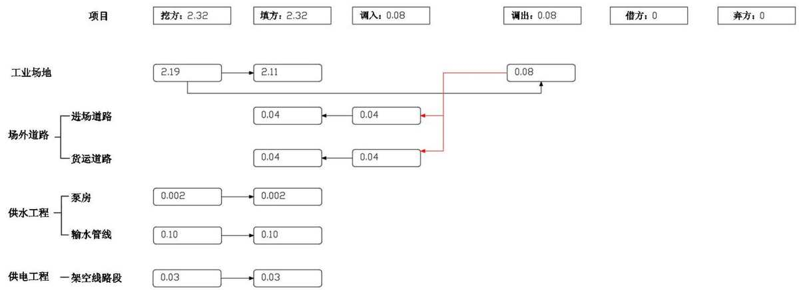  
图 2.5-2 表土平衡图 单位：万 m³

## 2.5.2 土石方平衡分析

## （1）工业场地

主体设计：矿井建设期共产生15.00万 $\mathrm { m } ^ { 3 }$ 的掘进矸石，部分用于场外道路路基填筑，其余堆放至矸石暂存场，最终用于回填露天矿采坑。工业场地平整挖方 $1 2 . 7 0 \mathrm { ~ } \mathcal { F } \mathrm { ~ m } ^ { 3 }$ ，填方13.00万 $\mathrm { m } ^ { 3 }$ ，充分利用挖方回填，不足部分利用建筑基础开挖土石方。工业场地建（构）筑基础开挖2.02万m³，回填量为0.60万 $\mathrm { m } ^ { 3 }$ 余方用于工业场地平整和场外道路路基填筑。

方案复核与主体设计一致。

## （2）场外道路

主体设计：场外道路挖方共计0.60万 $\mathrm { m } ^ { 3 }$ ，填方共计1.57万 $\mathrm { m } ^ { 3 }$ ，其中进场道路和货运道路挖方分别为0.10万 $\mathrm { m } ^ { 3 }$ 和 0.50 万 $\mathrm { m } ^ { 3 }$ ，填方分别为0.35万m³和1.22 万 m³。

方案复核与主体设计一致。

## （3）供水工程

主体设计未给出供水工程土石方量，方案复核为：

泵房基础挖方 0.01 万 $\mathrm { m } ^ { 3 }$ ，挖方除回填基础部分外，其余在场地周边作业带内就地平整。

输水管线挖方 0.46 万 $\mathrm { m } ^ { 3 }$ ，全部回填沟体。

## （4）供电工程

主体设计：供电工程塔基土石方开挖量0.89万 $\mathrm { m } ^ { 3 }$ ，除回填方量外，余方在基础作业区域就地平整。埋地电缆段电缆沟开挖土石方0.07万 $\mathrm { m } ^ { 3 }$ ，全部回填沟体。牵张场选取地势平坦处设置，施工道路依地势推平满足机械进场即可。

方案复核与主体设计一致。

综上分析，本工程施工期土石方挖填总量为 $4 8 . 3 5 \mathrm { ~ \mathscr ~ { ~ H ~ } ~ m ~ } ^ { 3 }$ ，其中挖方31.75万$\mathrm { m } ^ { 3 }$ ，填方 $1 6 . 6 0 \mathrm { ~ } \mathcal { F } \mathrm { ~ m } ^ { 3 }$ ，借方0，弃方 $1 5 . 1 5 \mathrm { ~ \mathscr ~ { ~ H ~ } ~ m ~ } ^ { 3 }$ 。弃方主要为建井掘进矸石，用于回填伊北二号露天矿采坑。本项目土石方平衡情况如下表和图：

表 2.5-3 主体设计土石方平衡统计表
<table><tr><td rowspan=1 colspan=2>工程单元</td><td rowspan=1 colspan=1>挖方 $( \mathcal { F } \mathrm { ~ m } ^ { 3 } )$ </td><td rowspan=1 colspan=1>填方 $( \mathcal { F } \mathrm { ~ m } ^ { 3 } )$ </td><td rowspan=1 colspan=1>调入 $( \mathcal { F } \mathrm { ~ m } ^ { 3 } )$ </td><td rowspan=1 colspan=1>来源</td><td rowspan=1 colspan=1>调出 $( \mathcal { F } \mathrm { ~ m } ^ { 3 } )$ </td><td rowspan=1 colspan=1>去向</td><td rowspan=1 colspan=1>借方 $( \mathcal { F } \mathrm { ~ m } ^ { 3 } )$ </td><td rowspan=1 colspan=1>来源</td><td rowspan=1 colspan=1>弃方 $( \mathcal { F } \mathrm { ~ m } ^ { 3 } )$ </td><td rowspan=1 colspan=1>去向</td></tr><tr><td rowspan=3 colspan=1>工业场地</td><td rowspan=1 colspan=1>井巷掘进</td><td rowspan=1 colspan=1>15.00</td><td rowspan=1 colspan=1>0.00</td><td rowspan=1 colspan=1></td><td rowspan=1 colspan=1></td><td rowspan=1 colspan=1></td><td rowspan=1 colspan=1>货运道路/排矸道路</td><td rowspan=1 colspan=1>0.00</td><td rowspan=1 colspan=1></td><td rowspan=1 colspan=1>15.00</td><td rowspan=1 colspan=1>采坑回填</td></tr><tr><td rowspan=1 colspan=1>场平</td><td rowspan=1 colspan=1>12.70</td><td rowspan=1 colspan=1>13.00</td><td rowspan=1 colspan=1>0.30</td><td rowspan=1 colspan=1>建构筑物基础</td><td rowspan=1 colspan=1></td><td rowspan=1 colspan=1></td><td rowspan=1 colspan=1>0.00</td><td rowspan=1 colspan=1></td><td rowspan=1 colspan=1>0.00</td><td rowspan=1 colspan=1></td></tr><tr><td rowspan=1 colspan=1>建构筑物基础</td><td rowspan=1 colspan=1>2.02</td><td rowspan=1 colspan=1>0.60</td><td rowspan=1 colspan=1></td><td rowspan=1 colspan=1></td><td rowspan=1 colspan=1>1.27</td><td rowspan=1 colspan=1>场平/进场道路/货运道路</td><td rowspan=1 colspan=1>0.00</td><td rowspan=1 colspan=1></td><td rowspan=1 colspan=1>0.15</td><td rowspan=1 colspan=1>采坑回填</td></tr><tr><td rowspan=2 colspan=1>场外道路</td><td rowspan=1 colspan=1>进场道路</td><td rowspan=1 colspan=1>0.10</td><td rowspan=1 colspan=1>0.35</td><td rowspan=1 colspan=1>0.25</td><td rowspan=1 colspan=1>建构筑物基础</td><td rowspan=1 colspan=1></td><td rowspan=1 colspan=1></td><td rowspan=1 colspan=1>0.00</td><td rowspan=1 colspan=1></td><td rowspan=1 colspan=1>0.00</td><td rowspan=1 colspan=1></td></tr><tr><td rowspan=1 colspan=1>货运道路</td><td rowspan=1 colspan=1>0.50</td><td rowspan=1 colspan=1>1.22</td><td rowspan=1 colspan=1>0.72</td><td rowspan=1 colspan=1>建构筑物基础/井巷掘进</td><td rowspan=1 colspan=1></td><td rowspan=1 colspan=1></td><td rowspan=1 colspan=1>0.00</td><td rowspan=1 colspan=1></td><td rowspan=1 colspan=1>0.00</td><td rowspan=1 colspan=1></td></tr><tr><td rowspan=2 colspan=1>供电工程</td><td rowspan=1 colspan=1>架空线路段</td><td rowspan=1 colspan=1>0.89</td><td rowspan=1 colspan=1>0.89</td><td rowspan=1 colspan=1></td><td rowspan=1 colspan=1></td><td rowspan=1 colspan=1></td><td rowspan=1 colspan=1></td><td rowspan=1 colspan=1>0.00</td><td rowspan=1 colspan=1></td><td rowspan=1 colspan=1>0.00</td><td rowspan=1 colspan=1></td></tr><tr><td rowspan=1 colspan=1>埋地电缆段</td><td rowspan=1 colspan=1>0.07</td><td rowspan=1 colspan=1>0.07</td><td rowspan=1 colspan=1></td><td rowspan=1 colspan=1></td><td rowspan=1 colspan=1></td><td rowspan=1 colspan=1></td><td rowspan=1 colspan=1>0.00</td><td rowspan=1 colspan=1></td><td rowspan=1 colspan=1>0.00</td><td rowspan=1 colspan=1></td></tr><tr><td rowspan=1 colspan=2>合计</td><td rowspan=1 colspan=1>31.28</td><td rowspan=1 colspan=1>16.13</td><td rowspan=1 colspan=1>1.27</td><td rowspan=1 colspan=1></td><td rowspan=1 colspan=1>1.27</td><td rowspan=1 colspan=1></td><td rowspan=1 colspan=1>0.00</td><td rowspan=1 colspan=1></td><td rowspan=1 colspan=1>15.15</td><td rowspan=1 colspan=1></td></tr></table>

表 2.5-4 方案复核土石方增减情况统计表
<table><tr><td rowspan=1 colspan=2>工程单元</td><td rowspan=1 colspan=1>挖方 $( \mathrm { \mathcal { F } } \mathrm { \mathfrak { m } } ^ { 3 } )$ </td><td rowspan=1 colspan=1>填方 $( \mathrm { \mathcal { F } } \mathrm { \mathfrak { m } } ^ { 3 } )$ </td><td rowspan=1 colspan=1>调入 $( \mathrm { \mathcal { F } } \mathrm { \mathfrak { m } } ^ { 3 } )$ </td><td rowspan=1 colspan=1>来源</td><td rowspan=1 colspan=1>调出 $( \mathrm { \mathcal { F } } \mathrm { \mathfrak { m } } ^ { 3 } )$ </td><td rowspan=1 colspan=1>去向</td><td rowspan=1 colspan=1>借方 $\big ( \mathrm { \mathcal { F } } \mathrm { \mathtt { m } } ^ { 3 } \big )$ </td><td rowspan=1 colspan=1>来源</td><td rowspan=1 colspan=1>弃方 $( \mathrm { \mathcal { F } } \mathrm { \mathfrak { m } } ^ { 3 } )$ </td><td rowspan=1 colspan=1>去向</td></tr><tr><td rowspan=2 colspan=1>供水工程</td><td rowspan=1 colspan=1>泵房</td><td rowspan=1 colspan=1>+0.01</td><td rowspan=1 colspan=1>+0.01</td><td rowspan=1 colspan=1>+0.08</td><td rowspan=1 colspan=1></td><td rowspan=1 colspan=1>+0.08</td><td rowspan=1 colspan=1></td><td rowspan=1 colspan=1></td><td rowspan=1 colspan=1></td><td rowspan=1 colspan=1></td><td rowspan=1 colspan=1></td></tr><tr><td rowspan=1 colspan=1>输水管线</td><td rowspan=1 colspan=1>+0.46</td><td rowspan=1 colspan=1>+0.46</td><td rowspan=1 colspan=1></td><td rowspan=1 colspan=1></td><td rowspan=1 colspan=1></td><td rowspan=1 colspan=1></td><td rowspan=1 colspan=1></td><td rowspan=1 colspan=1></td><td rowspan=1 colspan=1></td><td rowspan=1 colspan=1></td></tr><tr><td rowspan=1 colspan=2>合计</td><td rowspan=1 colspan=1>+0.47</td><td rowspan=1 colspan=1>+0.47</td><td rowspan=1 colspan=1>+0.08</td><td rowspan=1 colspan=1></td><td rowspan=1 colspan=1>+0.08</td><td rowspan=1 colspan=1></td><td rowspan=1 colspan=1>0.00</td><td rowspan=1 colspan=1></td><td rowspan=1 colspan=1>0.00</td><td rowspan=1 colspan=1></td></tr></table>

表 2.5-5 方案复核土石方平衡统计表
<table><tr><td colspan="2" rowspan="2">工程单元</td><td colspan="3" rowspan="1">挖方 $( \mathcal { F } \mathrm { ~ m } ^ { 3 } )$ </td><td colspan="3" rowspan="1">填方 $( \mathcal { F } \mathrm { ~ m } ^ { 3 } )$ </td><td colspan="3" rowspan="1">调入 $( \mathcal { F } \mathrm { ~ m } ^ { 3 } )$ </td><td colspan="3" rowspan="1">调出 $( \mathcal { F } \mathrm { ~ m } ^ { 3 } )$ </td><td colspan="2" rowspan="1">借方 $( \mathrm { \mathcal { F } } \mathrm { \mathfrak { m } } ^ { 3 } )$ </td><td colspan="2" rowspan="1">弃方 $( \mathcal { F } \mathrm { ~ m } ^ { 3 } )$ </td></tr><tr><td colspan="1" rowspan="1">表土</td><td colspan="1" rowspan="1">其他</td><td colspan="1" rowspan="1">小计</td><td colspan="1" rowspan="1">表土</td><td colspan="1" rowspan="1">其他</td><td colspan="1" rowspan="1">小计</td><td colspan="1" rowspan="1">表土</td><td colspan="1" rowspan="1">其他</td><td colspan="1" rowspan="1">小计</td><td colspan="1" rowspan="1">表土</td><td colspan="1" rowspan="1">其他</td><td colspan="1" rowspan="1">小计</td><td colspan="1" rowspan="1">其他</td><td colspan="1" rowspan="1">来源</td><td colspan="1" rowspan="1">其他</td><td colspan="1" rowspan="1">去向</td></tr><tr><td colspan="1" rowspan="3">工业场地</td><td colspan="1" rowspan="1">井巷掘进</td><td colspan="1" rowspan="1"></td><td colspan="1" rowspan="1">15.00</td><td colspan="1" rowspan="1">15.00</td><td colspan="1" rowspan="1"></td><td colspan="1" rowspan="1">0.00</td><td colspan="1" rowspan="1">0.00</td><td colspan="1" rowspan="1"></td><td colspan="1" rowspan="1"></td><td colspan="1" rowspan="1">0.00</td><td colspan="1" rowspan="1"></td><td colspan="1" rowspan="1"></td><td colspan="1" rowspan="1">0.00</td><td colspan="1" rowspan="1">0.00</td><td colspan="1" rowspan="1"></td><td colspan="1" rowspan="1">15.00</td><td colspan="1" rowspan="1">采坑回填</td></tr><tr><td colspan="1" rowspan="1">场平</td><td colspan="1" rowspan="1">2.19</td><td colspan="1" rowspan="1">10.51</td><td colspan="1" rowspan="1">12.70</td><td colspan="1" rowspan="1">2.11</td><td colspan="1" rowspan="1">10.89</td><td colspan="1" rowspan="1">13.00</td><td colspan="1" rowspan="1"></td><td colspan="1" rowspan="1">0.38</td><td colspan="1" rowspan="1">0.38</td><td colspan="1" rowspan="1">0.08</td><td colspan="1" rowspan="1"></td><td colspan="1" rowspan="1">0.08</td><td colspan="1" rowspan="1">0.00</td><td colspan="1" rowspan="1"></td><td colspan="1" rowspan="1">0.00</td><td colspan="1" rowspan="1"></td></tr><tr><td colspan="1" rowspan="1">建构筑物基础</td><td colspan="1" rowspan="1"></td><td colspan="1" rowspan="1">2.02</td><td colspan="1" rowspan="1">2.02</td><td colspan="1" rowspan="1"></td><td colspan="1" rowspan="1">0.60</td><td colspan="1" rowspan="1">0.60</td><td colspan="1" rowspan="1"></td><td colspan="1" rowspan="1"></td><td colspan="1" rowspan="1">0.00</td><td colspan="1" rowspan="1"></td><td colspan="1" rowspan="1">1.27</td><td colspan="1" rowspan="1">1.27</td><td colspan="1" rowspan="1">0.00</td><td colspan="1" rowspan="1"></td><td colspan="1" rowspan="1">0.15</td><td colspan="1" rowspan="1">采坑回填</td></tr><tr><td colspan="1" rowspan="1">场外</td><td colspan="1" rowspan="1">进场道路</td><td colspan="1" rowspan="1"></td><td colspan="1" rowspan="1">0.10</td><td colspan="1" rowspan="1">0.10</td><td colspan="1" rowspan="1">0.04</td><td colspan="1" rowspan="1">0.31</td><td colspan="1" rowspan="1">0.35</td><td colspan="1" rowspan="1">0.04</td><td colspan="1" rowspan="1">0.21</td><td colspan="1" rowspan="1">0.25</td><td colspan="1" rowspan="1"></td><td colspan="1" rowspan="1"></td><td colspan="1" rowspan="1">0.00</td><td colspan="1" rowspan="1">0.00</td><td colspan="1" rowspan="1"></td><td colspan="1" rowspan="1">0.00</td><td colspan="1" rowspan="1"></td></tr><tr><td colspan="1" rowspan="1">道路</td><td colspan="1" rowspan="1">货运道路</td><td colspan="1" rowspan="1"></td><td colspan="1" rowspan="1">0.50</td><td colspan="1" rowspan="1">0.50</td><td colspan="1" rowspan="1">0.04</td><td colspan="1" rowspan="1">1.18</td><td colspan="1" rowspan="1">1.22</td><td colspan="1" rowspan="1">0.04</td><td colspan="1" rowspan="1">0.68</td><td colspan="1" rowspan="1">0.72</td><td colspan="1" rowspan="1"></td><td colspan="1" rowspan="1"></td><td colspan="1" rowspan="1">0.00</td><td colspan="1" rowspan="1">0.00</td><td colspan="1" rowspan="1"></td><td colspan="1" rowspan="1">0.00</td><td colspan="1" rowspan="1"></td></tr><tr><td colspan="1" rowspan="1">供水</td><td colspan="1" rowspan="1">泵房</td><td colspan="1" rowspan="1">0.00</td><td colspan="1" rowspan="1">0.01</td><td colspan="1" rowspan="1">0.01</td><td colspan="1" rowspan="1">0.00</td><td colspan="1" rowspan="1">0.01</td><td colspan="1" rowspan="1">0.01</td><td colspan="1" rowspan="1"></td><td colspan="1" rowspan="1"></td><td colspan="1" rowspan="1">0.00</td><td colspan="1" rowspan="1"></td><td colspan="1" rowspan="1"></td><td colspan="1" rowspan="1">0.00</td><td colspan="1" rowspan="1">0.00</td><td colspan="1" rowspan="1"></td><td colspan="1" rowspan="1">0.00</td><td colspan="1" rowspan="1"></td></tr><tr><td colspan="1" rowspan="1">工程</td><td colspan="1" rowspan="1">输水管线</td><td colspan="1" rowspan="1">0.10</td><td colspan="1" rowspan="1">0.36</td><td colspan="1" rowspan="1">0.46</td><td colspan="1" rowspan="1">0.10</td><td colspan="1" rowspan="1">0.36</td><td colspan="1" rowspan="1">0.46</td><td colspan="1" rowspan="1"></td><td colspan="1" rowspan="1"></td><td colspan="1" rowspan="1">0.00</td><td colspan="1" rowspan="1"></td><td colspan="1" rowspan="1"></td><td colspan="1" rowspan="1">0.00</td><td colspan="1" rowspan="1">0.00</td><td colspan="1" rowspan="1"></td><td colspan="1" rowspan="1">0.00</td><td colspan="1" rowspan="1"></td></tr><tr><td colspan="1" rowspan="2">供电工程</td><td colspan="1" rowspan="1">架空线路段</td><td colspan="1" rowspan="1">0.03</td><td colspan="1" rowspan="1">0.86</td><td colspan="1" rowspan="1">0.89</td><td colspan="1" rowspan="1">0.03</td><td colspan="1" rowspan="1">0.86</td><td colspan="1" rowspan="1">0.89</td><td colspan="1" rowspan="1"></td><td colspan="1" rowspan="1"></td><td colspan="1" rowspan="1">0.00</td><td colspan="1" rowspan="1"></td><td colspan="1" rowspan="1"></td><td colspan="1" rowspan="1">0.00</td><td colspan="1" rowspan="1">0.00</td><td colspan="1" rowspan="1"></td><td colspan="1" rowspan="1">0.00</td><td colspan="1" rowspan="1"></td></tr><tr><td colspan="1" rowspan="1">埋地电缆段</td><td colspan="1" rowspan="1"></td><td colspan="1" rowspan="1">0.07</td><td colspan="1" rowspan="1">0.07</td><td colspan="1" rowspan="1"></td><td colspan="1" rowspan="1">0.07</td><td colspan="1" rowspan="1">0.07</td><td colspan="1" rowspan="1"></td><td colspan="1" rowspan="1"></td><td colspan="1" rowspan="1">0.00</td><td colspan="1" rowspan="1"></td><td colspan="1" rowspan="1"></td><td colspan="1" rowspan="1">0.00</td><td colspan="1" rowspan="1">0.00</td><td colspan="1" rowspan="1"></td><td colspan="1" rowspan="1">0.00</td><td colspan="1" rowspan="1"></td></tr><tr><td colspan="2" rowspan="1">合计</td><td colspan="1" rowspan="1">2.32</td><td colspan="1" rowspan="1">29.43</td><td colspan="1" rowspan="1">31.75</td><td colspan="1" rowspan="1">2.32</td><td colspan="1" rowspan="1">14.28</td><td colspan="1" rowspan="1">16.60</td><td colspan="1" rowspan="1">0.08</td><td colspan="1" rowspan="1">1.27</td><td colspan="1" rowspan="1">1.35</td><td colspan="1" rowspan="1">0.08</td><td colspan="1" rowspan="1">1.27</td><td colspan="1" rowspan="1">1.35</td><td colspan="1" rowspan="1">0.00</td><td colspan="1" rowspan="1"></td><td colspan="1" rowspan="1">15.15</td><td colspan="1" rowspan="1"></td></tr></table>

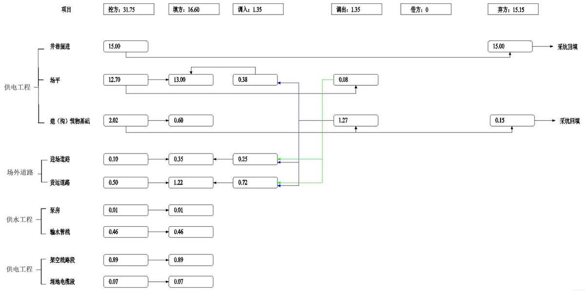  
图 2.5-3 土石方平衡图 单位：万 m³

## 2.6拆迁（移民）安置与专项设施改（迁）建

井田内现有公路沿界梁子沟向南接国道G218线，由于设计工业场地井巷布置限制等因素，需将现状矿区道路向东偏移距离30m，沿工业场地围墙东侧进行改线，向南至场地南侧约400m处接现有道路，向北至场地东北角转绕过场地后接现有道路，总长0.9km，同时界梁子沟与改线道路伴行段一起向东改移。

工业场地用地范围内北侧现状有地面建筑占地4500m²，该建筑属于界梁子北矿区前期建设的炸药库，已于2010年废弃不用，本项目已取得工业场地用地预审许可，后期开工建设时将拆除该废弃建筑。

## 2.7 施工进度

## （1）施工准备

矿井施工准备是保证矿井顺利建设的一项重要工作，直接关系到矿井能否按时开工和开工后能否连续快速施工。因此需根据矿井的实际情况统筹安排，尽可能缩短施工期，使施工前的各项准备工作充分做好，以求最佳效益。矿井施工准备工作应遵循的主要原则为：处理好矿井建设和施工人员生活之间的关系，完成矿井开工前应具备的条件和施工所必须的工业设施，为施工阶段创造基本的生活环境和居住条件，使矿井开工后能连续快速施工。

矿井准备期内应完成的主要工作有：

1）根据设计图纸征购土地。

2）进行场地测量，标定井口位置。

3）根据井筒检查钻技术要求施工井筒检查钻，为井筒设计及施工提供可靠依据。

4）做好工广的“四通一平”工作，具备场外公路，矿井供电、供水、通讯等外部建设条件，为矿井持续快速施工创造良好条件。

5）做好有关工程（如井筒掘砌、拟采用的大型永久建筑及设备安装等工程）的招标工作。

6）尽早开始建井期间利用的永久建筑和设施的施工，尽量减少大型临时工程。

7）做好有关设备的订货及采购工作。

8）落实好工程所需的钢材、木材、水泥、沙子、石子等建筑材料。

（2）建井工期及矿井建设主要连锁工程

为缩短建井工期，尽快投产，在矿井建设过程中，主要应遵循以下原则：

1）组织强有力的队伍快速施工斜风井和副斜井，尽快贯通副、风井，形成临时通风系统。

2）副、风井贯通后，形成井巷开拓提升系统。副斜井即进行永久的绞车设备安装，形成井下永久辅助运输系统。

3）在保证井巷施工的同时，安排好地面建筑及安装工程的施工。对建井期间可利用的永久工程，应提前组织施工，尽量减少大临工程。对必需的临时配套设施，应妥善安排，保证及时完成。对于一般工民建工程，可根据施工力量、资金情况、材料供应等情况，分期分批进行施工。

4）施工安排应保持连续性和均衡性，保持劳动力需求平衡，做到有计划陆续增减施工队伍。

通过井巷工程排队，对矿井建设主要连锁工程进行多方案分析比较，确定矿井建设关键线路为：

主、副斜井和斜风井→+400m水平车场→+400m水平车场及联络巷→车场硐室→永久提升、通风、排水、供电系统形成。

+532m车场（+565m车场）→+532m水平运输石门（+565m轨道石门）→工作面运输顺槽（工作面回风顺槽）→工作面开切眼。

## （3）项目工期安排与现状

结合主体设计与工程实施情况，本项目于2023年10月初开始施工，2023年11月底冬季停工，期间施工内容为：①完成了占地600m²的注氮机房建筑框架②注氮机房周围场地平整。项目拟于2025年10月接续施工，2028年6月建设结束，施工总工期35个月。

施工进度安排详见下表：

表 2.7-1 施工进度表
<table><tr><td rowspan=2 colspan=2>工程项目</td><td rowspan=1 colspan=1>施工期</td><td rowspan=1 colspan=1>2023（</td><td rowspan=1 colspan=3>已实施）2</td><td rowspan=1 colspan=1>024</td><td rowspan=1 colspan=6>2025</td><td rowspan=1 colspan=12>2026</td><td rowspan=1 colspan=12>2027</td><td rowspan=1 colspan=6>2028</td></tr><tr><td rowspan=1 colspan=1>月</td><td rowspan=1 colspan=1>1-9</td><td rowspan=1 colspan=1>10</td><td rowspan=1 colspan=2>1112</td><td rowspan=1 colspan=1>1-12</td><td rowspan=1 colspan=1>1-2</td><td rowspan=1 colspan=1>3</td><td rowspan=1 colspan=1>4-9</td><td rowspan=1 colspan=1>10</td><td rowspan=1 colspan=1>11</td><td rowspan=1 colspan=1>12</td><td rowspan=1 colspan=1></td><td rowspan=1 colspan=1>2</td><td rowspan=1 colspan=1>3</td><td rowspan=1 colspan=1>4</td><td rowspan=1 colspan=1>5</td><td rowspan=1 colspan=1>6</td><td rowspan=1 colspan=1>7</td><td rowspan=1 colspan=1>8</td><td rowspan=1 colspan=1>9</td><td rowspan=1 colspan=1>10</td><td rowspan=1 colspan=1>11</td><td rowspan=1 colspan=1>12</td><td rowspan=1 colspan=1></td><td rowspan=1 colspan=1>2</td><td rowspan=1 colspan=1>3</td><td rowspan=1 colspan=1>4</td><td rowspan=1 colspan=1>5</td><td rowspan=1 colspan=1>6</td><td rowspan=1 colspan=1>7</td><td rowspan=1 colspan=1>8</td><td rowspan=1 colspan=1>9</td><td rowspan=1 colspan=1>10</td><td rowspan=1 colspan=1>11</td><td rowspan=1 colspan=1>12</td><td rowspan=1 colspan=1></td><td rowspan=1 colspan=1>2</td><td rowspan=1 colspan=1>3</td><td rowspan=1 colspan=1>4</td><td rowspan=1 colspan=1>5</td><td rowspan=1 colspan=1>6</td></tr><tr><td rowspan=2 colspan=1>工业场地</td><td rowspan=1 colspan=1>注氮机房及部分场平2</td><td rowspan=1 colspan=1>2</td><td rowspan=1 colspan=1></td><td rowspan=1 colspan=1></td><td rowspan=1 colspan=1></td><td rowspan=1 colspan=1></td><td rowspan=1 colspan=1></td><td rowspan=1 colspan=1></td><td rowspan=1 colspan=1></td><td rowspan=1 colspan=1></td><td rowspan=1 colspan=1></td><td rowspan=1 colspan=1></td><td rowspan=1 colspan=1></td><td rowspan=1 colspan=1></td><td rowspan=1 colspan=1></td><td rowspan=1 colspan=1></td><td rowspan=1 colspan=1></td><td rowspan=1 colspan=1></td><td rowspan=1 colspan=1></td><td rowspan=1 colspan=1></td><td rowspan=1 colspan=1></td><td rowspan=1 colspan=1></td><td rowspan=1 colspan=1></td><td rowspan=1 colspan=1></td><td rowspan=1 colspan=1></td><td rowspan=1 colspan=1></td><td rowspan=1 colspan=1></td><td rowspan=1 colspan=1></td><td rowspan=1 colspan=1></td><td rowspan=1 colspan=1></td><td rowspan=1 colspan=1></td><td rowspan=1 colspan=1></td><td rowspan=1 colspan=1></td><td rowspan=1 colspan=1></td><td rowspan=1 colspan=1></td><td rowspan=1 colspan=1></td><td rowspan=1 colspan=1></td><td rowspan=1 colspan=1></td><td rowspan=1 colspan=1></td><td rowspan=1 colspan=1></td><td rowspan=1 colspan=1></td><td rowspan=1 colspan=1></td><td rowspan=1 colspan=1></td></tr><tr><td rowspan=1 colspan=1>工业场地</td><td rowspan=1 colspan=1>33</td><td rowspan=1 colspan=1></td><td rowspan=1 colspan=1></td><td rowspan=1 colspan=1></td><td rowspan=1 colspan=1></td><td rowspan=1 colspan=1></td><td rowspan=1 colspan=1></td><td rowspan=1 colspan=1></td><td rowspan=1 colspan=2></td><td rowspan=1 colspan=1>_</td><td rowspan=1 colspan=1>_</td><td rowspan=1 colspan=1></td><td rowspan=1 colspan=1></td><td rowspan=1 colspan=1>_</td><td rowspan=1 colspan=1></td><td rowspan=1 colspan=1></td><td rowspan=1 colspan=1></td><td rowspan=1 colspan=1>_</td><td rowspan=1 colspan=1></td><td rowspan=1 colspan=1>_</td><td rowspan=1 colspan=1></td><td rowspan=1 colspan=1>_</td><td rowspan=1 colspan=1></td><td rowspan=1 colspan=1>_</td><td rowspan=1 colspan=1>_</td><td rowspan=1 colspan=1></td><td rowspan=1 colspan=1></td><td rowspan=1 colspan=1>_</td><td rowspan=1 colspan=1></td><td rowspan=1 colspan=1></td><td rowspan=1 colspan=1>_</td><td rowspan=1 colspan=1></td><td rowspan=1 colspan=1></td><td rowspan=1 colspan=1>_</td><td rowspan=1 colspan=1>_</td><td rowspan=1 colspan=1>_</td><td rowspan=1 colspan=1></td><td rowspan=1 colspan=1>_</td><td rowspan=1 colspan=1>_</td><td rowspan=1 colspan=1></td><td rowspan=1 colspan=1>_</td></tr><tr><td rowspan=1 colspan=1>场外道路场</td><td rowspan=1 colspan=1>外道路</td><td rowspan=1 colspan=1>3</td><td rowspan=1 colspan=1></td><td rowspan=1 colspan=1></td><td rowspan=1 colspan=1></td><td rowspan=1 colspan=1></td><td rowspan=1 colspan=1></td><td rowspan=1 colspan=1></td><td rowspan=1 colspan=1></td><td rowspan=1 colspan=3></td><td rowspan=1 colspan=1></td><td rowspan=1 colspan=1></td><td rowspan=1 colspan=1></td><td rowspan=1 colspan=1></td><td rowspan=1 colspan=1></td><td rowspan=1 colspan=1></td><td rowspan=1 colspan=1></td><td rowspan=1 colspan=1></td><td rowspan=1 colspan=1></td><td rowspan=1 colspan=1></td><td rowspan=1 colspan=1></td><td rowspan=1 colspan=1></td><td rowspan=1 colspan=1></td><td rowspan=1 colspan=1></td><td rowspan=1 colspan=1></td><td rowspan=1 colspan=1></td><td rowspan=1 colspan=1></td><td rowspan=1 colspan=1></td><td rowspan=1 colspan=1></td><td rowspan=1 colspan=1></td><td rowspan=1 colspan=1></td><td rowspan=1 colspan=1></td><td rowspan=1 colspan=1></td><td rowspan=1 colspan=1></td><td rowspan=1 colspan=1></td><td rowspan=1 colspan=1></td><td rowspan=1 colspan=1></td><td rowspan=1 colspan=1></td><td rowspan=1 colspan=1></td><td rowspan=1 colspan=1></td><td rowspan=1 colspan=1></td></tr><tr><td rowspan=2 colspan=1>供水工程</td><td rowspan=1 colspan=1>泵房</td><td rowspan=1 colspan=1>1</td><td rowspan=1 colspan=1></td><td rowspan=1 colspan=1></td><td rowspan=1 colspan=1></td><td rowspan=1 colspan=1></td><td rowspan=1 colspan=1></td><td rowspan=1 colspan=1></td><td rowspan=1 colspan=1></td><td rowspan=1 colspan=3></td><td rowspan=1 colspan=1></td><td rowspan=1 colspan=1></td><td rowspan=1 colspan=1></td><td rowspan=1 colspan=1></td><td rowspan=1 colspan=1></td><td rowspan=1 colspan=1></td><td rowspan=1 colspan=1></td><td rowspan=1 colspan=1></td><td rowspan=1 colspan=1></td><td rowspan=1 colspan=1></td><td rowspan=1 colspan=1></td><td rowspan=1 colspan=1></td><td rowspan=1 colspan=1></td><td rowspan=1 colspan=1></td><td rowspan=1 colspan=1></td><td rowspan=1 colspan=1></td><td rowspan=1 colspan=1></td><td rowspan=1 colspan=1></td><td rowspan=1 colspan=1></td><td rowspan=1 colspan=1></td><td rowspan=1 colspan=1></td><td rowspan=1 colspan=1></td><td rowspan=1 colspan=1></td><td rowspan=1 colspan=1></td><td rowspan=1 colspan=1></td><td rowspan=1 colspan=1></td><td rowspan=1 colspan=1></td><td rowspan=1 colspan=1></td><td rowspan=1 colspan=1></td><td rowspan=1 colspan=1></td><td rowspan=1 colspan=1></td></tr><tr><td rowspan=1 colspan=1>输水管线</td><td rowspan=1 colspan=1>2</td><td rowspan=1 colspan=1></td><td rowspan=1 colspan=1></td><td rowspan=1 colspan=1></td><td rowspan=1 colspan=1></td><td rowspan=1 colspan=1></td><td rowspan=1 colspan=1></td><td rowspan=1 colspan=1></td><td rowspan=1 colspan=2></td><td rowspan=1 colspan=1></td><td rowspan=1 colspan=1></td><td rowspan=1 colspan=1></td><td rowspan=1 colspan=1></td><td rowspan=1 colspan=1></td><td rowspan=1 colspan=1></td><td rowspan=1 colspan=1></td><td rowspan=1 colspan=1></td><td rowspan=1 colspan=1></td><td rowspan=1 colspan=1></td><td rowspan=1 colspan=1></td><td rowspan=1 colspan=1></td><td rowspan=1 colspan=1></td><td rowspan=1 colspan=1></td><td rowspan=1 colspan=1></td><td rowspan=1 colspan=1></td><td rowspan=1 colspan=1></td><td rowspan=1 colspan=1></td><td rowspan=1 colspan=1></td><td rowspan=1 colspan=1></td><td rowspan=1 colspan=1></td><td rowspan=1 colspan=1></td><td rowspan=1 colspan=1></td><td rowspan=1 colspan=1></td><td rowspan=1 colspan=1></td><td rowspan=1 colspan=1></td><td rowspan=1 colspan=1></td><td rowspan=1 colspan=1></td><td rowspan=1 colspan=1></td><td rowspan=1 colspan=1></td><td rowspan=1 colspan=1></td><td rowspan=1 colspan=1></td></tr><tr><td rowspan=6 colspan=1>供电工程</td><td rowspan=1 colspan=1>架空线路段</td><td rowspan=1 colspan=1>2</td><td rowspan=1 colspan=1></td><td rowspan=1 colspan=1></td><td rowspan=1 colspan=1></td><td rowspan=1 colspan=1></td><td rowspan=1 colspan=1></td><td rowspan=1 colspan=1></td><td rowspan=1 colspan=1></td><td rowspan=1 colspan=2></td><td rowspan=1 colspan=2></td><td rowspan=1 colspan=1></td><td rowspan=1 colspan=1></td><td rowspan=1 colspan=1></td><td rowspan=1 colspan=1></td><td rowspan=1 colspan=1></td><td rowspan=1 colspan=1></td><td rowspan=1 colspan=1></td><td rowspan=1 colspan=1></td><td rowspan=1 colspan=1></td><td rowspan=1 colspan=1></td><td rowspan=1 colspan=1></td><td rowspan=1 colspan=1></td><td rowspan=1 colspan=1></td><td rowspan=1 colspan=1></td><td rowspan=1 colspan=1></td><td rowspan=1 colspan=1></td><td rowspan=1 colspan=1></td><td rowspan=1 colspan=1></td><td rowspan=1 colspan=1></td><td rowspan=1 colspan=1></td><td rowspan=1 colspan=1></td><td rowspan=1 colspan=1></td><td rowspan=1 colspan=1></td><td rowspan=1 colspan=1></td><td rowspan=1 colspan=1></td><td rowspan=1 colspan=1></td><td rowspan=1 colspan=1></td><td rowspan=1 colspan=1></td><td rowspan=1 colspan=1></td><td rowspan=1 colspan=1></td></tr><tr><td rowspan=1 colspan=1>埋地电缆段</td><td rowspan=1 colspan=1>2</td><td rowspan=1 colspan=1></td><td rowspan=1 colspan=1></td><td rowspan=1 colspan=1></td><td rowspan=1 colspan=1></td><td rowspan=1 colspan=1></td><td rowspan=1 colspan=1></td><td rowspan=1 colspan=1></td><td rowspan=1 colspan=2></td><td rowspan=1 colspan=2></td><td rowspan=1 colspan=1></td><td rowspan=1 colspan=1></td><td rowspan=1 colspan=1></td><td rowspan=1 colspan=1></td><td rowspan=1 colspan=1></td><td rowspan=1 colspan=1></td><td rowspan=1 colspan=1></td><td rowspan=1 colspan=1></td><td rowspan=1 colspan=1></td><td rowspan=1 colspan=1></td><td rowspan=1 colspan=1></td><td rowspan=1 colspan=1></td><td rowspan=1 colspan=1></td><td rowspan=1 colspan=1></td><td rowspan=1 colspan=1></td><td rowspan=1 colspan=1></td><td rowspan=1 colspan=1></td><td rowspan=1 colspan=1></td><td rowspan=1 colspan=1></td><td rowspan=1 colspan=1></td><td rowspan=1 colspan=1></td><td rowspan=1 colspan=1></td><td rowspan=1 colspan=1></td><td rowspan=1 colspan=1></td><td rowspan=1 colspan=1></td><td rowspan=1 colspan=1></td><td rowspan=1 colspan=1></td><td rowspan=1 colspan=1></td><td rowspan=1 colspan=1></td><td rowspan=1 colspan=1></td></tr><tr><td rowspan=1 colspan=1>钻跨场地</td><td rowspan=1 colspan=1>2</td><td rowspan=1 colspan=1></td><td rowspan=1 colspan=1></td><td rowspan=1 colspan=1></td><td rowspan=1 colspan=1></td><td rowspan=1 colspan=1></td><td rowspan=1 colspan=1></td><td rowspan=1 colspan=1></td><td rowspan=1 colspan=2></td><td rowspan=1 colspan=2></td><td rowspan=1 colspan=1></td><td rowspan=1 colspan=1></td><td rowspan=1 colspan=1></td><td rowspan=1 colspan=1></td><td rowspan=1 colspan=1></td><td rowspan=1 colspan=1></td><td rowspan=1 colspan=1></td><td rowspan=1 colspan=1></td><td rowspan=1 colspan=1></td><td rowspan=1 colspan=1></td><td rowspan=1 colspan=1></td><td rowspan=1 colspan=1></td><td rowspan=1 colspan=1></td><td rowspan=1 colspan=1></td><td rowspan=1 colspan=1></td><td rowspan=1 colspan=1></td><td rowspan=1 colspan=1></td><td rowspan=1 colspan=1></td><td rowspan=1 colspan=1></td><td rowspan=1 colspan=1></td><td rowspan=1 colspan=1></td><td rowspan=1 colspan=1></td><td rowspan=1 colspan=1></td><td rowspan=1 colspan=1></td><td rowspan=1 colspan=1></td><td rowspan=1 colspan=1></td><td rowspan=1 colspan=1></td><td rowspan=1 colspan=1></td><td rowspan=1 colspan=1></td><td rowspan=1 colspan=1></td></tr><tr><td rowspan=1 colspan=1>1#牵张场</td><td rowspan=1 colspan=1>2</td><td rowspan=1 colspan=1></td><td rowspan=1 colspan=1></td><td rowspan=1 colspan=1></td><td rowspan=1 colspan=1></td><td rowspan=1 colspan=1></td><td rowspan=1 colspan=1></td><td rowspan=1 colspan=1></td><td rowspan=1 colspan=2></td><td rowspan=1 colspan=2></td><td rowspan=1 colspan=1></td><td rowspan=1 colspan=1></td><td rowspan=1 colspan=1></td><td rowspan=1 colspan=1></td><td rowspan=1 colspan=1></td><td rowspan=1 colspan=1></td><td rowspan=1 colspan=1></td><td rowspan=1 colspan=1></td><td rowspan=1 colspan=1></td><td rowspan=1 colspan=1></td><td rowspan=1 colspan=1></td><td rowspan=1 colspan=1></td><td rowspan=1 colspan=1></td><td rowspan=1 colspan=1></td><td rowspan=1 colspan=1></td><td rowspan=1 colspan=1></td><td rowspan=1 colspan=1></td><td rowspan=1 colspan=1></td><td rowspan=1 colspan=1></td><td rowspan=1 colspan=1></td><td rowspan=1 colspan=1></td><td rowspan=1 colspan=1></td><td rowspan=1 colspan=1></td><td rowspan=1 colspan=1></td><td rowspan=1 colspan=1></td><td rowspan=1 colspan=1></td><td rowspan=1 colspan=1></td><td rowspan=1 colspan=1></td><td rowspan=1 colspan=1></td><td rowspan=1 colspan=1></td></tr><tr><td rowspan=1 colspan=1>2#牵张场</td><td rowspan=1 colspan=1>2</td><td rowspan=1 colspan=1></td><td rowspan=1 colspan=1></td><td rowspan=1 colspan=1></td><td rowspan=1 colspan=1></td><td rowspan=1 colspan=1></td><td rowspan=1 colspan=1></td><td rowspan=1 colspan=1></td><td rowspan=1 colspan=2></td><td rowspan=1 colspan=2></td><td rowspan=1 colspan=1></td><td rowspan=1 colspan=1></td><td rowspan=1 colspan=1></td><td rowspan=1 colspan=1></td><td rowspan=1 colspan=1></td><td rowspan=1 colspan=1></td><td rowspan=1 colspan=1></td><td rowspan=1 colspan=1></td><td rowspan=1 colspan=1></td><td rowspan=1 colspan=1></td><td rowspan=1 colspan=1></td><td rowspan=1 colspan=1></td><td rowspan=1 colspan=1></td><td rowspan=1 colspan=1></td><td rowspan=1 colspan=1></td><td rowspan=1 colspan=1></td><td rowspan=1 colspan=1></td><td rowspan=1 colspan=1></td><td rowspan=1 colspan=1></td><td rowspan=1 colspan=1></td><td rowspan=1 colspan=1></td><td rowspan=1 colspan=1></td><td rowspan=1 colspan=1></td><td rowspan=1 colspan=1></td><td rowspan=1 colspan=1></td><td rowspan=1 colspan=1></td><td rowspan=1 colspan=1></td><td rowspan=1 colspan=1></td><td rowspan=1 colspan=1></td><td rowspan=1 colspan=1></td></tr><tr><td rowspan=1 colspan=1>施工便道</td><td rowspan=1 colspan=1>2</td><td rowspan=1 colspan=1></td><td rowspan=1 colspan=1></td><td rowspan=1 colspan=1></td><td rowspan=1 colspan=1></td><td rowspan=1 colspan=1></td><td rowspan=1 colspan=1></td><td rowspan=1 colspan=1></td><td rowspan=1 colspan=2></td><td rowspan=1 colspan=2></td><td rowspan=1 colspan=1></td><td rowspan=1 colspan=1></td><td rowspan=1 colspan=1></td><td rowspan=1 colspan=1></td><td rowspan=1 colspan=1></td><td rowspan=1 colspan=1></td><td rowspan=1 colspan=1></td><td rowspan=1 colspan=1></td><td rowspan=1 colspan=1></td><td rowspan=1 colspan=1></td><td rowspan=1 colspan=1></td><td rowspan=1 colspan=1></td><td rowspan=1 colspan=1></td><td rowspan=1 colspan=1></td><td rowspan=1 colspan=1></td><td rowspan=1 colspan=1></td><td rowspan=1 colspan=1></td><td rowspan=1 colspan=1></td><td rowspan=1 colspan=1></td><td rowspan=1 colspan=1></td><td rowspan=1 colspan=1></td><td rowspan=1 colspan=1></td><td rowspan=1 colspan=1></td><td rowspan=1 colspan=1></td><td rowspan=1 colspan=1></td><td rowspan=1 colspan=1></td><td rowspan=1 colspan=1></td><td rowspan=1 colspan=1></td><td rowspan=1 colspan=1></td><td rowspan=1 colspan=1></td></tr></table>

## 2.8 自然概况

## 2.8.1 地形地貌

本项目位于新疆伊宁盆地北缘的低山丘陵区，地形总趋势呈北高南低的斜坡地形。区内标高一般在+700m\~+1011m之间，相对高差311m。区内沟谷较发育，多为“V”字型冲沟，只有降暴雨时才出现短暂洪流，沟谷之间的山顶较为平坦，项目区以南的地形较为平坦。

## 2.8.2 气象

根据对伊犁河谷气候特征的相关研究成果，伊宁盆地属中温带亚干旱型气候大区，昼夜温差大。因来自西北部的寒流和来自南部的干热风，多被盆地周围的高山阻挡，再加上天山积雪融化为盆地提供了丰富的地下水和地表水资源，因而盆地内气候较湿润，夏季热而多雨冬季较冷，年平均气温 $7 . 9 \mathrm { { ^ \circ C } } .$ 最大温差 $3 5 . 2 \mathrm { { } ^ { \circ } C }$ 温度日较差 $1 5 . 6 \mathrm { { ^ { \circ } C } ; }$ 夏季气温 $2 2 . 6 ^ { \circ } \mathrm { C } { \sim } 3 3 . 5 ^ { \circ } \mathrm { C }$ ，极端最高气温为 $3 9 . 8 ^ { \circ } \mathrm { C } ;$ 冬季冷而多雪，平均温度 $- 9 . 4 \mathrm { { ^ { \circ } C } }$ ，极端最低气温 $- 4 3 . 2 ^ { \circ } \mathrm { C }$ ，最大积雪厚度1.5m，10月下旬开始冻结，至翌年3月中下旬完全解冻，最大冻结深度118cm。风向大多为偏西风，平均风速1.8m/s，最大风速28m/s，风季一般为4\~6月。正常年份降水量为231mm，蒸发量为1750mm，雨季一般为6\~8月。相对湿度50%\~70%。

## 2.8.3 水文

项目区位于界梁子西沟内，界梁子西沟呈宽谷发育；东侧为苏勒阿勒玛塔河沟，呈喇叭形展布；此处井田内有两条北西向不连续“V”字型冲沟，北陡南缓。所有河沟均为季节性冲沟，沟内水量受大气降水控制，在丰雨季节，暴雨可形成短暂的山洪。井田内无常年性流水的河流。

项目区地表水系见附图2。

## 2.8.4 工程地质

## （1）区域地质构造

根据工程勘查报告，项目区前第四系地层出露齐全，从元古界一古生界一中生界一新生界均有出露，主要地层为元古界的蓟县系、青白口系、南华系以及震旦系；古生界主要出露地层为寒武系、奥陶系、志留系、石炭系、二叠系；中生界主要出露地层为三叠系、侏罗系，缺失白垩系地层；新生界出露古近系。第四系主要包括更新统的新疆群、西域组以及全新统，分布广泛。大地构造位于天山-兴安地槽褶皱区西南天山褶皱系西天山优地槽褶皱带，由博罗科努山复背斜、伊犁地块、哈尔克山复背斜3个四级构造单元构成。新构造运动主要表现明显的继承性、差异性升降运动，制约着新生界的发育，使第三系发生褶皱、断裂，也使中下更新统发生挠折、错动。总体上可划分为侵蚀褶皱断块山、剥蚀堆积块状隆起山和堆积平原3个大地貌单元及8个亚单元。

拟建场地地质构造不发育，无活动性断裂分布。

## （2）不良地质作用

经地质调查及钻探揭露，拟建物场地范围内及近场区域不存在对工程安全有影响的诸如岩溶、滑坡、崩塌、塌陷、采空区等不良地质作用，也未发现影响地基稳定性的古河道、沟浜、孤石等。拟建场地地质构造不发育，无活动性断裂分布，可忽略发震断裂错动对地面建筑的影响。

## 2.8.5 水文地质

伊宁北部煤矿区位于伊犁河谷中生代山间凹陷盆地西北部，北以天山北支婆罗科努山及伊连哈比尔尕山以南三叠系地层为相对隔水边界；南以伊犁河谷为地下水排泄边界；东以潘津皮里清河至伊宁为第四系含水层侧向径流补给边界；西以惠远萨尔布拉克河自然分水岭至伊犁河一线为第四系含水层排泄边界。区域水文地质条件主要受区域地质构造、岩性、地貌及气候条件的影响和制约。在南北向应力的共同作用下，区内形成地堑构造一断陷盆地型水文地质单元。

井田位于新疆伊宁盆地北缘的低山区，地形总趋势呈北高南低的斜坡地形。区内标高一般在+700m\~+1011m之间，相对高差311m。区内沟谷较发育，多为“V”字型冲沟，只有降暴雨时才出现短暂洪流。井田大面积被第四系覆盖，厚度不大。煤矿床位于当地侵蚀基准面以下，井田内无常年性地表径流。

井田内第四系覆盖较浅，煤系地层含水层主要以接受大气降水补给为主，区内沿两侧沟谷亦可接受少量洪水期地表水垂直入渗补给(其中东侧沟谷上游煤矿不定期排水对本区地下水也有补给作用）。井田北侧烧变岩区空洞、裂隙发育，是地下水良好的蓄水空间，对煤系地层含水层具有侧向补给作用，尤其烧变岩侵入煤层地段，侧向补给能力更强；虽然煤矿床位于当地侵蚀基准面以下，但煤系地层含水层水位高于区外的伊犁河水位近百米，且伊犁河距离本井田较远，伊犁河水不存在对含煤岩系地下水的间接补给。地下水径流方向以南偏西为主，其中西侧径流条件较好，八道湾组煤系含水层由于埋深较深，富水性较差，地下水循环交替缓慢，径流条件微弱。由于本区尚未进行任何开发，地下水以侧向径流方式补给第四系进行排泄为主，煤系地层地下水通过第四系含水层排入伊犁河。

## 2.8.6 土壤

项目区内的土壤类型为灰钙土，灰钙土是暖温带荒漠草原区弱淋溶的干旱土，表层弱腐殖化，土壤有机质含量1\~2.5%，15\~30cm处为假菌丝状或斑点状的钙积层，剖面中下部还可出现石膏淀积层与可溶盐淀积层。剖面构型与棕钙土近似，但干旱程度稍低，淋溶略强，且因多发育于黄土母质，土层通常较深厚。

## 2.8.7 植被

项目区位于伊犁谷地，在中国植被区划中，项目所在区域属于新疆荒漠区，北疆荒漠亚区，准噶尔荒漠省，塔城一伊犁荒漠亚省，伊犁州。项目区地处伊犁谷底低山丘陵地貌，原始植被以伊犁绢蒿为主要建群种，杂以多种禾本科、豆科、藜科、十字花科等多种草类，后者以地貌和坡向及海拔高度不同而变化，但绢蒿则始终均为建群种，只是有着高度、盖度的变化而已。

根据实地调查及历史资料，项目区所在区域植被类型多为耐旱型物种，多系旱生、超旱生深根肉质的小半灌木和灌木荒漠类型，常见的植物有伊犁绢蒿、早熟禾、骆驼蓬、羊茅等，覆盖度约5\~20%。根据现场调查，工业场地内植被覆盖度较低（5\~10%），部分区域植被不发育；输水和输电线路沿线植被覆盖度约20%。

本项目不涉及饮用水水源保护区、水功能一级区的保护区和保留区、生态红线、自然保护区、水源保护区、世界文化和自然遗产地、风景名胜区、地质公园、森林公园以及重要湿地等水土保持敏感目标，不涉及黑土、砾幕层、高山草甸等区域。

## 3 项目水土保持评价

## 3.1主体工程选址（线）水土保持评价

依据《中华人民共和国水土保持法》《生产建设项目水土保持技术标准》（GB50433-2018）和规范性文件关于工程选址（线）水土保持工程限制和约束规定，从水土保持技术方面对本项目选址合理性进行了分析，详见下表：

表3.1-1本工程选址（线）水土保持制约性因素分析评价表
<table><tr><td colspan="1" rowspan="1">序号</td><td colspan="1" rowspan="1">制约性条件</td><td colspan="1" rowspan="1">本工程选址（线）情况</td><td colspan="1" rowspan="1">相符性</td></tr><tr><td colspan="4" rowspan="1">一、《中华人民共和国水土保持法》</td></tr><tr><td colspan="1" rowspan="1">1</td><td colspan="1" rowspan="1">第十七条：禁止在崩塌、滑坡危险区和泥石流易发区从事取土、挖砂、采石等可能造成水土流失的活动。</td><td colspan="1" rowspan="1">根据主体设计，拟选场地在现状条件下不属于崩塌、滑坡、泥石流等地质灾害不发育区，属可进行建设的一般场地。且本项目为井工开采矿井，不涉及取土、挖砂、采石等。</td><td colspan="1" rowspan="1">符合</td></tr><tr><td colspan="1" rowspan="1">2</td><td colspan="1" rowspan="1">第十八条：水土流失严重、生态脆弱的地区，应限制或者禁止可能造成水土流失的生产建设活动，严格保护植物、沙壳、结皮、地衣等</td><td colspan="1" rowspan="1">项目所在区域不属于水土流失严重、生态脆弱的地区，且项目施工过程中控制了施工占地、施工结束后进行植被恢复。</td><td colspan="1" rowspan="1">符合</td></tr><tr><td colspan="1" rowspan="1">3</td><td colspan="1" rowspan="1">第二十四条：生产建设项目选址、选线应当避让水土流失重点预防和重点治理区；无法避让的，应当提高防治标准，优化施工工艺，减少地表扰动和植被损坏范围，有效控制可能造成的水土流失。</td><td colspan="1" rowspan="1">项目所在区域属于Ⅱ₄伊犁河河流域重点治理区，无法避让。项目截排水工程、工业场地植被恢复与建设工程级别执行1级标准，场外道路路基两侧绿化带植被恢复与建设工程级别为3级；施工过程中尽量利用已有道路，控制了施工扰动范围。</td><td colspan="1" rowspan="1">符合</td></tr><tr><td colspan="1" rowspan="1">4</td><td colspan="1" rowspan="1">第二十八条依法应当编制水土保持方案的生产建设项目，其生产建设活动中排弃的砂、石、土、矸石、尾矿、废渣等应当综合利用；不能综合利用，确需废弃的，应当堆放在水土保持方案确定的专门存放地，并采取措施保证不产生新的危害。</td><td colspan="1" rowspan="1">本项目建设期挖方用于填方，不足部分利用掘进矸石，多余掘进矸石用于回填露天矿采坑。运营期掘进矸石充填井下采空巷道不出井，洗选矸石经破碎搅拌泵送充填井下采空区。</td><td colspan="1" rowspan="1">符合</td></tr><tr><td colspan="1" rowspan="1">5</td><td colspan="1" rowspan="1">第三十二条：在山区、丘陵区、风沙区以及水土保持规划确定的容易发生水土流失的其他区域开办生产建设项目或者从事其他生产活动，损坏水土保持设施、地貌植被，不能恢复原有水土保持功能的，应当缴纳水土保持补偿费，专项用于水土流失预防和治理</td><td colspan="1" rowspan="1">水土保持已经计算出水土保持补偿费，项目建设单位作为缴纳义务人，按要求及时缴纳该费用。</td><td colspan="1" rowspan="1">符合</td></tr><tr><td colspan="1" rowspan="1">6</td><td colspan="1" rowspan="1">第三十八条对生产建设活动所占用土地的地表土应当进行分层剥离、保存和利用，做到土石方挖填平衡，减少地表扰动范围。</td><td colspan="1" rowspan="1">方案布设了表土剥离措施，并采取临时拦挡、苫盖等保护措施，后期用于植被恢复覆土。建设期土石方及井筒掘进土石经充分调配利用后，不设置弃土场。施工结束后，及时对扰动区域采取土地整治、表土回覆、植被恢复等措施。</td><td colspan="1" rowspan="1">符合</td></tr><tr><td colspan="1" rowspan="1"></td><td colspan="3" rowspan="1">二、《生产建设项目水土保持技术标准》（GB50433-2018）</td></tr><tr><td colspan="1" rowspan="1">3.2.1第1款</td><td colspan="1" rowspan="1">主体工程选址（线）应避让水土流失重点预防区和重点治理区；</td><td colspan="1" rowspan="1">受煤炭资源赋存所限，本项目选址无法避让自治区级水土流失Ⅱ₄伊犁河流域重点治理区，主体设计提出的截排水工程均满足一级标准；工业场地植被恢复与建设工程级别执行1级标准、场外道路路基两侧绿化带植被恢复与建设工程级别为3级。</td><td colspan="1" rowspan="1">基本符合</td></tr><tr><td colspan="1" rowspan="1">3.2.1第2款</td><td colspan="1" rowspan="1">主体工程选址(线)应避让河流两岸、湖泊和水库周边的植物保护带；</td><td colspan="1" rowspan="1">工程不涉及</td><td colspan="1" rowspan="1">符合</td></tr><tr><td colspan="1" rowspan="1">3.2.1第3款</td><td colspan="1" rowspan="1">主体工程选址（线）应避让全国水土保持监测网络中的水土保持监测站点、重点实验区及国家确定的水土保持长期定位观测站。</td><td colspan="1" rowspan="1">工程不涉及</td><td colspan="1" rowspan="1">符合</td></tr><tr><td colspan="1" rowspan="1">3.3.2</td><td colspan="1" rowspan="1">北方风沙区应符合下列规定：1.应控制施工扰动范围，保护地表结皮层、沙壳、砾幕；2.可采取砾（片、碎）石覆盖、沙障、植物固沙、化学固化等措施防治风蚀；3.植物措施宜配套灌溉设施。</td><td colspan="1" rowspan="1">1.工程建设过程中，施工生产生活区布置在永久占地范围内，线性工程施工过程中采用彩条旗限界等措施，严格控制施工区域；2.本项目对表土进行剥离保护。3.工业场地绿化区域配套了灌溉设施。</td><td colspan="1" rowspan="1">符合</td></tr><tr><td colspan="4" rowspan="1">三、其它</td></tr><tr><td colspan="3" rowspan="1">不涉及饮用水源保护区、自然保护区、世界文化和自然遗产地、风景名胜区、森林公园、重要湿地、地质公园等区域；不属于处于重要江河、湖泊以及跨省（自治区、直辖市）的其它江河、湖泊的水功能一级区的保护区和保留区内可能严重影响水质的开发建设项目以及对水功能二级区的饮用水源区水质有影响的开发建设项目</td><td colspan="1" rowspan="1">符合</td></tr></table>

整体来看，本项目建设不涉及全国水土保持监测网络中的水土保持监测站点、重点试验区，未占用国家确定的水土保持长期定位观测站，不涉及重要江河湖泊的水功能区。未涉及河流两岸、湖泊和水库周边的植物保护带。项目建设不在涉及饮水安全、防洪安全、水资源安全的区域；不涉及重要基础设施建设、重要民生工程、国防工程项目；不属于重要江河、湖泊以及跨省（自治区、直辖市）的其他江河、湖泊的水功能一级区的保护区和保留区内可能严重影响水质的开发建设项目，以及对水功能二级区的饮用水源区水质有影响的开发建设项目，符合相关约束性要求。

从水土保持角度出发，本项目选址（线）除无法避让自治区级水土流失重点治理区外，建设基本不存在水土保持制约性因素，项目建设可行。

## 3.2 建设方案与布局水土保持评价

## 3.2.1 建设方案评价

本工程地面设施主要包括：工业场地、场外道路、供排水工程、供电工程等组成。工业场地平面布局紧凑，各区域功能划分明确，竖向布置采用台阶式，分区块、分时段平整场地，利用场地平整挖方及井筒掘进土石进行工业场地平整填高，最大程度调配利用土石方。优化施工程序和施工工艺，起到了有效防治水土流失的作用。

本项目建设方案与《生产建设项目水土保持技术标准》（GB50433-2018）中相关条款相符性分析，分析结果见下表：

表 3.2-1 水土保持相符性分析表
<table><tr><td colspan="1" rowspan="1">序号</td><td colspan="2" rowspan="1">GB50433-2018 要求</td><td colspan="1" rowspan="1">本项目情况</td><td colspan="1" rowspan="1">相符性</td></tr><tr><td colspan="1" rowspan="1">3.2.2第1条</td><td colspan="2" rowspan="1">公路、铁路工程在高填深挖路段，应采用加大桥隧比例的方案，减少大填大挖。填高大于20m，挖深大于30m的，应进行桥隧替代方案论证；路堤、路堑在保证边坡稳定的基础上，应采用植物防护或工程与植物防护相结合的设计方案。</td><td colspan="1" rowspan="1">本项目场外道路无填高大于20m、挖深大于30m的路堤和路堑；场外道路边坡高度较小，采用植草护坡防护措施。</td><td colspan="1" rowspan="1">符合</td></tr><tr><td colspan="1" rowspan="1">3.2.2第2条</td><td colspan="2" rowspan="1">城镇新区的建设项目应提高植被建设标准，注重景观效果，配套建设灌溉、排水和雨水利用设施。</td><td colspan="1" rowspan="1">本项目不属于城镇建设项目，但工业场地注重景观效果，布设了较为完善的灌溉、排水设施。</td><td colspan="1" rowspan="1">符合</td></tr><tr><td colspan="1" rowspan="1">3.2.2第3条</td><td colspan="2" rowspan="1">山丘区输电工程塔基应优先考虑不等高基础，经过林区的采用加高杆塔跨越方式。</td><td colspan="1" rowspan="1">供电工程部分经过山丘区，采取了不等高基础；不经过林区。</td><td colspan="1" rowspan="1">符合</td></tr><tr><td colspan="1" rowspan="2">3.2.2第4条</td><td colspan="2" rowspan="1">对无法避让水土流失重点预防区和重点治理区的生产建设项目，建设方案应符合下列规定：</td><td colspan="1" rowspan="1">工程位于Ⅱ₄伊犁河流域重点治理区。</td><td colspan="1" rowspan="1"></td></tr><tr><td colspan="1" rowspan="1">1)</td><td colspan="1" rowspan="1">应优化方案，减少工程占地和土石方量。公路、铁路等项目填高大于8m宜采用桥梁方案；管道工</td><td colspan="1" rowspan="1">场外公路无填高大于 8m的路基；场外供水管线穿越了矿区三级道路，穿越采用顶管；供水管线尽</td><td colspan="1" rowspan="1">符合</td></tr><tr><td colspan="1" rowspan="1"></td><td colspan="1" rowspan="1">程应压缩作业带宽度，穿越宜采用隧道、定向钻、顶管等方式；山丘区工业场地宜优先采取阶梯式布置。</td><td colspan="1" rowspan="1">量沿矿区道路段布设，缩减了施工作业带宽度。</td><td colspan="1" rowspan="1"></td></tr><tr><td colspan="1" rowspan="1">2)</td><td colspan="1" rowspan="1">截排水工程、拦挡工程的工程级别和防洪标准应提高一级。</td><td colspan="1" rowspan="1">主体设计提高了工程级别和防洪标准。根据《煤炭工业矿井设计规范》场内排水沟设计要求为重现期采用2~5年，主体设计为25年；西东向小型冲沟设计洪水重现期为100年，工业场地截（排）水沟排水标准为50年一遇，矿井井口防洪设计标准的校核频重现期 300a。与道路伴行的排洪沟洪水频率 1/100。</td><td colspan="1" rowspan="1">符合</td></tr><tr><td colspan="1" rowspan="1">3)</td><td colspan="1" rowspan="1">提高植物措施标准，林草覆盖率应提高1~2个百分点。</td><td colspan="1" rowspan="1">方案要求林草覆盖率提高了2%。</td><td colspan="1" rowspan="1">符合</td></tr></table>

由上表分析可知，工程建设与布局较为合理，不存在绝对限制工程建设制约性因素。

本项目施工生产生活区布置在永久征地范围内，不新增临时扰动。项目建设期的施工用水、矿区内施工道路等采取“永临结合”方式进行建设，场外供水管线尽量沿道路敷设，减少扰动地表面积；施工准备期先行修筑场外道路兼作施工道路，作为项目建设期材料、设备、机械等的运输道路。

工业场地采取台阶式布置，减少土石方挖填量，开挖的土石方进行了综合调配利用，回填土石方首先利用本项目开挖土石方，减少了排放弃渣，同时减少填筑材料的外借。剥离表土用于后期绿化用土，符合北方风沙区对水土保持措施的特殊规定，起到防治风蚀的效果。

从水土保持角度讲，工程建设方案和布局总体合理，符合水土保持要求。

## 3.2.2 工程占地评价

## 3.2.2.1 项目占地复核

本工程主体设计占地面积25.47hm²，其中工业场地（含矿井、选煤厂、防火灌浆站、救护中队、单身公寓等）用地 $1 9 . 6 4 \mathrm { h m } ^ { 2 }$ ，进场道路用地0.30hm²，货运道路用地0.32hm²，供水工程（含水源地及供水管线）用地 $1 . 5 0 \mathrm { h m } ^ { 2 }$ ，供电线路用地3.71hm²。方案复核后增加了施工生产生活区、表土堆放区和矸石周转区占地，面积分别为1.00hm²、0.80hm²、0.60hm²，均位于工业场地用地范围内，属于重复占地，总占地面积25.47hm²，与主体一致。

综上所述，本项目征地面积是根据实际需要确定的用地范围，主体工程设计布局较为合理，工程占地数量基本合适，没有乱占乱挖土地和随意破坏地表植被等不合理占地情况，符合水土保持要求。

## 3.2.2.2 行业用地指标符合性分析

## （1）工业场地

根据《煤炭工程项目建设用地指标一矿井、选煤厂、筛选厂及矿区辅助设施部分》，当场地自然地形平均坡度大于4%时，其用地面积可按调整系数进行调整，本场地平均坡度大于4.85%，按1.07系数考虑；同时本项目所在区域为Ⅱ级自重湿陷性黄土区，按1.10系数调整。

本项目劳动定员约为554人，根据《煤炭工业建筑结构设计标准》GB50583-2020续表A，标准化智能矿井单身宿舍建筑面积取26m²/人，容积率取1.2可用地面积为1.20hm²。

工业场地（选煤厂）用地指标分析见下表：

表3.2-2 工业场地（选煤厂）用地指标分析表
<table><tr><td rowspan=1 colspan=3>名称</td><td rowspan=1 colspan=1>单位</td><td rowspan=1 colspan=1>设计用地</td><td rowspan=1 colspan=1>用地指标</td><td rowspan=1 colspan=1>调整后</td><td rowspan=1 colspan=1>合规性</td><td rowspan=1 colspan=1>备注</td></tr><tr><td rowspan=7 colspan=1>规模3.0Mt/a</td><td rowspan=7 colspan=1>矿井及选煤厂工业场地（围墙内）</td><td rowspan=1 colspan=1>矿井及选煤厂</td><td rowspan=1 colspan=1> $\mathrm { h m } ^ { 2 }$ </td><td rowspan=1 colspan=1>14.4546</td><td rowspan=1 colspan=1>20.00</td><td rowspan=1 colspan=1>23.540</td><td rowspan=1 colspan=1>符合</td><td rowspan=7 colspan=1>根据地形调整系数1.07，自重湿陷性黄土区调整系数1.10</td></tr><tr><td rowspan=1 colspan=1>风井场地</td><td rowspan=1 colspan=1> $\mathrm { h m } ^ { 2 }$ </td><td rowspan=2 colspan=1>0.9850</td><td rowspan=1 colspan=1>0.60</td><td rowspan=1 colspan=1>0.7062</td><td rowspan=2 colspan=1>符合</td></tr><tr><td rowspan=1 colspan=1>制浆站</td><td rowspan=1 colspan=1> $\mathrm { h m } ^ { 2 }$ </td><td rowspan=1 colspan=1>0.40</td><td rowspan=1 colspan=1>0.4708</td></tr><tr><td rowspan=1 colspan=1>驻救护队</td><td rowspan=1 colspan=1> $\mathrm { h m } ^ { 2 }$ </td><td rowspan=1 colspan=1>0.4850</td><td rowspan=1 colspan=1>0.50</td><td rowspan=1 colspan=1>0.5885</td><td rowspan=1 colspan=1>符合</td></tr><tr><td rowspan=1 colspan=1>单身宿舍</td><td rowspan=1 colspan=1> $\mathrm { h m } ^ { 2 }$ </td><td rowspan=1 colspan=1>1.2050</td><td rowspan=1 colspan=1>1.20</td><td rowspan=1 colspan=1>1.4124</td><td rowspan=1 colspan=1>符合</td></tr><tr><td rowspan=1 colspan=1>停车场面积</td><td rowspan=1 colspan=1> $\mathrm { h m } ^ { 2 }$ </td><td rowspan=1 colspan=1>0.2400</td><td rowspan=1 colspan=1>0.25</td><td rowspan=1 colspan=1>0.2943</td><td rowspan=1 colspan=1>符合</td></tr><tr><td rowspan=1 colspan=1>合计</td><td rowspan=1 colspan=1> $\mathrm { h m } ^ { 2 }$ </td><td rowspan=1 colspan=1>17.3696</td><td rowspan=1 colspan=1>22.95</td><td rowspan=1 colspan=1>27.0122</td><td rowspan=1 colspan=1>符合</td></tr></table>

主体设计考虑到本项目在矿井工业场地进行建设时最大挖方深度为13.5m，最大填方高度为3.5m。本次工业场填方段放坡比采用1:1.5，工业场地挖方段西部采用挡土墙及护坡砌护，放坡比采用1:1\~1：1.5。为防止雨水和融雪水汇集在场地，在围墙与挡土墙或挖方边坡间、填方坡脚外设置截水沟，故本矿其用地范围为：填方按放坡坡脚线外2m计算，挖方按波及范围外2m计算；砌挡墙时，按墙趾外或墙顶端外2m计算。自然地形平均坡度为15%或以上时，按斜面进行计算用地面积，本项目工业场地征地面积是19.6096hm²。符合《煤炭工程项目建设用地指标一矿井、选煤厂、筛选厂及矿区辅助设施部分》的规定。

## （2）场外道路

根据场地布置及运输需求，本矿需新建进场道路和货运道路，进场道路和货运道路均为三级，路基宽度8.5m，进场道路总长0.15km、货运道路总长度0.16km。根据《公路工程项目建设用地指标》（〔建标2011〕124号）中表3.0.5-4I类地形区三级公路工程项目建设用地总体指标三级道路路基宽8.5m，指标为2.1608hm²/km，进场道路、货运道路占地应分别为0.32hm²、0.34hm²，外运道路用地指标分析见下表：

表 3.2-3 道路工程用地指标分析表
<table><tr><td rowspan=1 colspan=1>序号</td><td rowspan=1 colspan=1>工程名称</td><td rowspan=1 colspan=1>路基宽</td><td rowspan=1 colspan=1>主体设计占地面积(hm²)</td><td rowspan=1 colspan=1>规范占地面积(hm²)</td></tr><tr><td rowspan=1 colspan=1>1</td><td rowspan=1 colspan=1>进场道路</td><td rowspan=1 colspan=1>8.5m</td><td rowspan=1 colspan=1>0.30</td><td rowspan=1 colspan=1>0.32</td></tr><tr><td rowspan=1 colspan=1>2</td><td rowspan=1 colspan=1>货运道路</td><td rowspan=1 colspan=1>8.5m</td><td rowspan=1 colspan=1>0.32</td><td rowspan=1 colspan=1>0.34</td></tr></table>

综上所述，道路工程占地满足《公路工程项目建设用地指标》（〔建标2011〕124号）要求。

2022年10月26日新疆维吾尔自治区自然资源厅以“新自然资预审字[2022】34号”文批复通过了建设项目用地预审，项目建设拟用地总面积19.6096公顷，其中农用地11.9102hm²，建设用地7.2838hm²，未利用地0.4156hm²，均为国有用地；2022年10月28日伊犁州自然资源局以“用字第654000202200016号”文下发了《建设项目用地预审与选址意见书》。根据建设项目用地预审意见，项目建设拟用地总面积 19.6096hm²，其中农用地11.9102hm²，建设用地 7.2838hm²，未利用地0.4156hm²。本矿工业场地围墙内实际占地面积为17.5366hm²，工业场地征占地面积19.6442hm²，工业场地征地面积超出了用地预审与选址意见书中的拟用地面积 0.0346hm²。

## 3.2.2.3 临时占地分析与评价

本工程占地面积25.47hm²，其中临时占地5.06hm²（其中伊宁市4.09hm²，霍城县0.97hm²），永久占地面积 20.41hm²（其中伊宁市0.14hm²，霍城县20.27hm²）。

## （1）供水工程

输水工程管道长度3.0km，输水管道从K00+700至工业场地段沿矿区现状道路敷设，施工机械作业带依托现状道路，沟体开挖及临时堆土占地宽度约4.0m。从接入点至00+700段根据施工区域地形需求布置，设置施工作业带宽度8.0m。施工过程中沿线临道路一侧用于机械场地，另外一侧用于堆土，堆土占地宽度约2.3m。工程临时占地1.48hm²。

供水管线管道作业带宽度满足施工的要求。

## （2）供电工程

主体计列本区塔基永久占地及施工占地，合计3.71hm²。

场外供电线路共涉及3处钻跨工程，两端设置施工场地共6处，作业范围20m×30m。

场外供电工程地处平原微丘地段地势开阔，优先选择距离周边已有道路附近、场地修建工作量小、无其他设施影响的塔位附近作为牵引场牵张场共设置两处，施工作业面40m×50m，每个占地0.20hm²，施工结束后恢复原状地貌。

工程采用吊车组塔，利用公路和施工便道运输到塔基。公路依托矿区现状道路，部分便道可以利用，运输过程中多为货车进行运输，设备材料采用吊车装卸。

南台子变所至线路K02+500段与现状公路伴行，施工道路依托现状，其他线路段需新建施工便道6.0km，道路宽度4.0m，占地面积2.40hm2；临时施工便道采用简易土质路面，施工结束后恢复原状地貌。

供电工程施工区域满足施工的要求。

## （3）施工生产生活区

本项目建设过程中设置施工生产生活区1处，主要用于办公生活、设备停放和建材堆放加工等，占地面积1.00hm²，均位于工业场地永久占地范围内，施工生产生活区数量满足施工的要求。施工生产生活区用地位于工业场地用地范围内，属于重复用地，施工结束后及时清理场地。

## （4）表土堆存场

本项目施工前开挖扰动范围内的表土资源采取剥离措施，在场地内集中堆存，后期用于项目绿化覆土。在工业场地内东侧选煤厂绿化区域布置1处表土堆放区，

区域地势平坦，占地面积0.80hm²。位于工业场地永久占地范围内，表土堆存场数量满足施工的要求。

## （3）矸石周转区

为减少新增占地，根据主体设计建设时序，在选煤厂储矸系统区域划定6000m²区域用于建井期掘进矸石周转，矸石堆放高度≤3.5m，边坡比1：1.5。

综上所述，项目临时用地符合《自然资源部关于规范临时用地管理的通知(自然资规〔2021〕2号）》有关要求，排水管线管道作业带宽度、施工场地数量满足施工要求。

## 3.2.2.4 占地类型分析与评价

本工程占地面积25.47hm²，从占地类型分析，本项目占地类型主要为天然牧草地（18.74hm²）、其次裸土地（6.42hm²），少部分的农村道路（0.31hm²）。没有占用农田、耕地等生产力较高的土地，符合《生产建设项目水土保持技术标准》（GB50433-2018）的相关规定，

项目施工过程中应加强管理，优化施工工艺，尽量控制扰动范围，施工结束后尽快恢复植被。

## 3.2.2.5 占地可恢复性分析

从占地可恢复性分析，项目区原生土壤为灰钙土，灰钙土是暖温带荒漠草原区弱淋溶的干旱土，表层弱腐殖化，土壤有机质含量1\~2.5%，15\~30cm处为假菌丝状或斑点状的钙积层，剖面中下部还可出现石膏淀积层与可溶盐淀积层。剖面构型与棕钙土近似，但干旱程度稍低，淋溶略强，且因多发育于黄土母质，土层通常较深厚。

本工程对工业场地、场外道路两侧边坡及两侧、供电工程、供水工程等可绿化区域基本采取了绿化措施，本项目占地可恢复性基本合理。

主体设计对场平挖填方边坡采取浆砌片石护坡，方案建议，施工过程中根据项目实际建设情况，尽量采取植草护坡，提高区域林草覆盖率。

## 3.2.2.6 工程占地评价结论

综上所述，本项目占地类型主要为草地，未占用永久基本农田；工业场地和场外道路永久占地范围符合行业用地指标，不存在超指标用地的情况；本项目临时占地主要为场外排水管线和供电线路，可以满足本项目施工需求，场外排水管线、供电线路在满足施工需求的前提下尽可能控制扰动范围；施工生产生活区布设在项目永久占地范围内，施工交通、用水、用电充分利用本项目永久设施，有效控制临时占地规模。因此，本项目占地面积、类型、性质等方面基本不存在水土保持制约性因素。

## 3.2.3 土石方平衡评价

## 3.2.3.1 弃渣减量化控制及资源化利用

项目建设期共产生挖方31.75万m³，其中建井期掘进渣15万 $\mathrm { m } ^ { 3 }$ ，其他工程 14.43万m³，剥离表土2.32万 $\mathrm { m } ^ { 3 }$

剥离表土全部用于各场地绿化覆土；场地其他土石方经过内部调配基本可以全部进行利用。矿井建设期共产生15.00万 $\mathrm { m } ^ { 3 }$ 的掘进矸石，用于回填露天矿采坑，不需设置弃渣场进行堆存。

## 3.2.3.2 土石方平衡评价

根据主体设计资料，主体仅计列了工业场地、建设期井巷掘进矸石、场外道路工程土石方数量，其中挖方31.28万m³，填方16.13万 $\mathrm { m } ^ { 3 }$ ，弃方15.15万 $\mathrm { m } ^ { 3 }$ （回填露天采坑）。

经分析，主体设计未考虑施工生产生活区、供水工程土石方量，方案予以补充完善。核定后，本工程施工期土石方挖填总量为48.35万m³，其中挖方31.75万m3，填方16.60万m³，借方0，弃方15.15万 $\mathrm { m } ^ { 3 }$ 。弃方主要为建井掘进矸石，用于回填伊北二号露天矿采坑。

综上，本项目土石方数量符合最优化原则；土石方调运符合节点及时序可行、运距合理的原则；挖方首先用于填方，多余的运往露天矿采坑回填；工程纵向合理调配土石方，减少取、弃方和临时占地数量。土石方平衡符合水土保持要求。

## 3.2.3.3 表土剥离保护分析评价

本方案从保护表土资源角度出发，根据立地条件以及现场调查情况，综合确定项目征占地范围内剥离表土量。本工程占地范围内现状植被以灌草为主，占地类型以天然草地为主，地表土壤主要以黄土为主，表层腐殖土厚度约20cm。为加强对表土资源的保护利用，本项目根据后期绿化和植被恢复需求，对永久占地开挖扰动范围内的表土资源做到应剥尽剥、保护利用。

本次对工业场地占地类型为天然牧草地的区域、管线工程占地区域进行表土剥离，剥离厚度15\~20cm，其中输水管线施工过程实施分层开挖、分层堆放、反序分层回填，工业场地表土在表土堆放区存放。经综合确定，剥离表土面积14.45hm²，剥离量2.32万m³。在工业场地内东侧选煤厂绿化区域布置1处表土堆放区，并采取临时拦挡和苫盖等防护措施，施工结束后用于工业场地和场外道路绿化覆土。输水管线剥离表土与开挖生土分开沿管道作业带堆存，供电线路塔基剥离表土集中堆存于塔基施工区内，施工结束后用于本区域绿化覆土。对其他未开挖仅占压扰动区域采取临时铺垫措施对表土进行保护，符合水土保持要求。

从水土保持角度考虑，表土剥离保护与利用措施合理，为后期植被恢复创造有利条件，符合水土保持要求。

## 3.2.4取土（石、砂）场设置评价

本项目建设期填筑土方充分利用开挖土方，项目所需砂石料全部外购；黄泥灌浆材料来源为矸石灰，矸石灰来自本矿井矸石充填系统破碎站产品，填筑材料和黄泥灌浆材料均来源于本项目，不设置取土（石、砂）场。

## 3.2.5弃土（石、渣、灰、矸石、尾矿）场设置评价

项目因剥离表土需临时存放，设置1处表土堆存场，主要堆放工业场地剥离的表土，工业场地剥离表土堆存于工业场地永久占地范围内，选址处地形平坦，堆放位置及容量满足项目需求。

本项目充分利用现有设施并且考虑移挖作填，尽量做到挖填平衡。建井期掘进矸石1个月的产生量约为4200m³，在选煤厂储矸系统区域划定6000m²区域用于建井期掘进矸石周转，矸石用于回填露天矿采坑，不设置弃土场，减少临时占地。

## 3.2.6 施工方法与工艺评价

## 3.2.6.1 施工工艺

分析工程建设特点可知，施工期水土流失产生的主要环节为：①井筒开挖、工业场地平整、供水工程等施工过程中进行的土方开挖、堆放、回填和清运过程；②建筑材料（石灰、水泥、沙子等）装卸、堆放、使用过程；③各种施工机械、施工车辆等带来的扬尘。

工业场地平整结合地形采取台阶式布置，分区块、分时段进行，以减少土石方挖填量，可减少施工场地建设造成的水土流失，然后进行建（构）筑物施工，对建（构）筑物开挖的临时堆土采取临时防护措施，施工后期采取土地整治后恢复植被，该施工工艺是可行的。

地面建筑工程施工顺序为场地平整，基坑开挖（开挖范围依据设计图纸标示红线，基础开挖深度依据设计图纸标高），土料存放，基础砼浇筑，土方回填，地面压实，进料、砼搅拌、输送等。地面建筑、机电安装工程施工作业量相对较大，采取联合作业，交叉施工。

工业场地截水沟采用人工开挖方式，将土方开挖堆砌在沟道一侧，修平拍实，沟槽挖到设计尺寸后，浆砌石进行衬砌，实行分段施工，随挖、随铺。

道路施工的程序为：路基地表清理→边坡开挖、回填→排水工程→路基面层施工，全部采用机械化施工。路基开挖采用挖掘机开挖运土，土方首先运往回填区回填，回填采用逐层填筑，分层压实的方法施工。施工结束后，路基坡面平整播撒草籽。

管道埋设在作业带中部，一侧用于堆土，另一侧用作施工场地。全部采用机械作业，实行分段施工，随挖、随铺、随填。开挖时，先清表土、置于一侧堆土区最外侧，后挖深土、堆在靠近管线一侧；回填时，先深土、后表土，填土在扰动区域回填呈弧形并夯实，最后在覆土区域播撒草籽。从而减少了施工过程中土壤的侵蚀。

建设过程中加强土石方运输管理工作，避免土石方挖填过程中造成大规模的水土流失，同时，做好生产期水土保持防护工作，通过及时布置相应的水土流失防治临时措施，有效控制土石方工程期间的水土流失。

工程施工组织设计、工艺、土石方平衡等指标评价见下表：

表 3.2-4 施工工艺合理性分析表
<table><tr><td rowspan=1 colspan=1>项目</td><td rowspan=1 colspan=1>标准约束性规定</td><td rowspan=1 colspan=1>项目情况</td><td rowspan=1 colspan=1>符合性</td></tr><tr><td rowspan=1 colspan=1>3.2.8 条第1款</td><td rowspan=1 colspan=1>施工活动应控制在设计的施工存道路、施工场地内。</td><td rowspan=1 colspan=1>本项目优先永久征占地范围内设置表土堆、施工生产生活区，采取永临结合的方式利用建设期的供水、供电和场外道路，减少临时占地，控制施工占地面积。</td><td rowspan=1 colspan=1>符合</td></tr><tr><td rowspan=1 colspan=1>3.2.8 条第2款</td><td rowspan=1 colspan=1>施工开始时应首先对表土进行剥离或保护，剥离的表土应集中堆放，并采取防护措施。</td><td rowspan=1 colspan=1>主体设计未考虑剥离表土，本方案补充，要求集中堆放，并采取防护措施。</td><td rowspan=1 colspan=1>符合</td></tr><tr><td rowspan=1 colspan=1>3.2.8 条第4款</td><td rowspan=1 colspan=1>临时堆土（石、渣）应集中堆放，并采取临时拦挡、苫盖、排水、沉沙等措施。</td><td rowspan=1 colspan=1>设置临时堆土场，集中堆放临时堆土，并采用苫盖、拦挡措施。</td><td rowspan=1 colspan=1>符合</td></tr><tr><td rowspan=1 colspan=1>3.2.8 条第7款</td><td rowspan=1 colspan=1>弃土（石、渣）场地应事先设置拦挡措施，弃土（石、渣）应有序堆放。</td><td rowspan=1 colspan=1>本项目不涉及弃土（石、渣、矸石）场。</td><td rowspan=1 colspan=1>符合</td></tr><tr><td rowspan=1 colspan=1>3.2.8 条第9款</td><td rowspan=1 colspan=1>土（石、料、渣、矸石）方在本方运输过程中应采取防护措施，防止沿途散溢。</td><td rowspan=1 colspan=1>案建议建设单位加强施工管理，合同中明确土（石、料、渣、矸石）方在运输过程中采取防护措施。</td><td rowspan=1 colspan=1>符合</td></tr></table>

本项目建设施工工艺结合了当地地形、环境等特点，均采用机械和人工配合下进行联合施工作业完成。井筒施工均采用较为成熟先进的施工方法，避免大开挖施工，减少土石方量；施工方法及施工工艺较为合理，符合水土保持要求。本方案建议在施工过程中应按照水土保持要求规范操作，注重保护表土资源，土石方挖填应做到随挖、随运、随填、随压，避免水土流失；对于剥离的表土要及时运至场地内指定的表土堆放区，并加强施工过程中表土防护措施。

## 3.2.6.2 施工组织评价

矿井施工组织是保证矿井顺利建设的一项重要工作，直接关系到矿井能否按时开工和开工后能否连续快速生产。因此需根据矿井的实际情况统筹安排，尽可能缩短施工期，使施工前的各项准备工作充分做好，以求最佳效益。

根据《生产建设项目水土保持技术标准》对项目施工组织设计的要求，从水土保持角度对本项目施工组织合理性进行分析。施工组织设计与《生产建设项目水土保持技术标准（GB50433-2018）》约束性条款的比较分析见下表：

表 3.2-5 施工组织合理性分析表
<table><tr><td colspan="1" rowspan="1">序号</td><td colspan="1" rowspan="1">标准约束性规定</td><td colspan="1" rowspan="1">项目情况</td><td colspan="1" rowspan="1">符合性</td></tr><tr><td colspan="1" rowspan="1">3.2.7 条第1款</td><td colspan="1" rowspan="1">应控制施工场地占地，避开植被相对良好的区域和基本农田区。</td><td colspan="1" rowspan="1">本项目严格控制施工场地占地，施工生产生活区布置在工业场地永久占地范围内，不占用基本农田。</td><td colspan="1" rowspan="1">符合</td></tr><tr><td colspan="1" rowspan="1">3.2.7 条第2款</td><td colspan="1" rowspan="1">应合理安排施工，防止重复开挖和多次倒运，减少裸露时间和范围。</td><td colspan="1" rowspan="1">本项目场地平整分区块、分时段进行，土方随挖随运，最大化减少重复开挖和土方多次倒运，临时堆土集中堆放，减少堆放时间和范围。管线工程分段施工，随挖、随铺管道、随回填夯实的施工方法可减少管线开挖土料裸露时间，土料裸露期间采取苫盖措施，减少水土流失。</td><td colspan="1" rowspan="1">符合</td></tr><tr><td colspan="1" rowspan="1">3.2.7 条第3款</td><td colspan="1" rowspan="1">在河岸陡坡开挖土石方，以及开挖边坡下方有河渠、公路、铁路、居民点和其他重要基础设施时，宜设计扎实渡槽、溜渣洞等专门设施，将开挖的土石导出。</td><td colspan="1" rowspan="1">本项目不涉及</td><td colspan="1" rowspan="1">符合</td></tr><tr><td colspan="1" rowspan="1">3.2.7 条第4款</td><td colspan="1" rowspan="1">弃土、弃石、弃渣应分类堆放。</td><td colspan="1" rowspan="1">本项目没有弃土、弃石、弃渣，剥离表土设置堆存场地，并采取防护措施。掘进矸石在工业场地专门设置的堆放区暂存，用于回填露天矿采坑。</td><td colspan="1" rowspan="1">符合</td></tr><tr><td colspan="1" rowspan="1">3.2.7 条第5款</td><td colspan="1" rowspan="1">外借土石方应优先考虑利用其他工程废弃的土（石、渣），外购土（石、料）应选择合规的料场。</td><td colspan="1" rowspan="1">本项目无外借土石方，外购砂石料来源于合规砂石料场。</td><td colspan="1" rowspan="1">符合</td></tr><tr><td colspan="1" rowspan="1">3.2.7 条第6款</td><td colspan="1" rowspan="1">大型料场宜分台阶开采，控制开挖深度。爆破开挖应控制装药量和爆破范围。</td><td colspan="1" rowspan="1">本项目不设取料场。</td><td colspan="1" rowspan="1">符合</td></tr><tr><td colspan="1" rowspan="1">3.2.7 条第7款</td><td colspan="1" rowspan="1">工程标段划分应考虑合理调配土石方，减少取土(石)方、弃土(石、渣）方和临时占地数量。</td><td colspan="1" rowspan="1">本项目开挖土方、井筒掘进土石用于场地平整，不设置取土，没有弃土(石、渣）方，剥离表土单独堆放在工业场地永久占地范围内，掘进矸石在工业场地专门设置的堆放场暂存，不新增临时占地数量。</td><td colspan="1" rowspan="1">符合</td></tr></table>

本方案认为，主体设计能正确处理好施工的前期准备工作，首先进行场地测量、做好工业场地的“五通一平”工作，当具备了场外公路，矿井供电、供水、通讯、场内外排水及弃渣等建设条件后，为矿井持续快速施工创造了良好条件。根据《矿井建设工期定额》的规定，结合项目区的自然条件、工程规模、本矿井开拓及井筒施工的特点，确定其施工准备期实际情况，结合矿井施工的实际情况，主体设计提出井下工程与矿井地面工程同时建设，确定施工期，节约了时间，安排合理。

除了施工期时间安排合理外，从水土保持角度认为其能够达到以下要求：

（1）施工场地经准确的场地测量后，工业场地布局紧凑，施工道路、供水管线和输电线路根据当地的地形条件尽量缩短了运距，施工布置减少了工程扰动和占用地表的面积。

（2）回填土石方和工程余方堆放时，要求避免二次扰动。

（3）为保证工业场地施工期间用电、用水以及对外联络需要，先进行道路工程、场外供电工程的建设合理。

(4)工程施工过程中临时堆土设置了专门的临时堆土区，方案设置了苫盖、拦挡、洒水等。

综合评价：本方案认为主体工程施工组织设计具有一定的水土保持功能，但为了进一步减少工程建设产生的水土流失，主体工程的施工组织设计还应达到以下要求：

（1）施工区内的开挖、填筑、堆置等裸露地表都应采取临时苫盖、拦挡等措施；

（2）大风和暴雨天气不能再进行施工扰动，并加强对裸露地表的防护；

（3）严格限定施工范围，主要是施工道路的范围，禁止对施工区域以外的地表进行扰动；

（4）临时堆料在专用场地集中堆放，并采用苫盖等防护措施，防止吹蚀和散溢。

## 3.2.7 主体工程设计中具有水土保持功能工程的评价

## 3.2.7.1 工业场地

主体设计具有水土保持功能的工程主要有：土地平整、场地硬化、浆砌片石护坡、截排水沟、挡土墙、场地绿化、节水灌溉、防尘网苫盖。

## （1）土地平整

施工结束后，对工业场地裸露凹凸不平的地面进行平整，采用推土机推平，机械无法平整的边角采取人工平整，土地平整后地面高差小于5cm，工业场地需实施土地平整面积 9.53hm²。

## （2）场地硬化

主体工程设计中对工业场地内部及道路采取了场地硬化措施，场地硬化具有水土保持功能，但不作为水土保持措施。

## （3）截、排水沟

## 1）截、排水布设

设计在西东向小型冲沟经过工业场地段建设浆砌片石梯形排水沟，将沟内汇水疏导至工业场地东侧，通过改扩道路的过水涵洞进入界梁子沟内。设计在工业场地围墙外设置截水沟拦截工业场地北、西两侧的汇水，结合场内排水沟疏导至工业场地东侧，通过改扩道路工程过水涵洞排入界梁子沟内。

为使场内地表雨水及融雪水迅速排除，在场内道路一侧设混凝土矩形排水沟，穿道路及人行道设置盖板排水沟，雨水顺平场坡度，通过盖板泄水孔，收集至场内排水沟内，然后排至工业场地东侧，再通过道路过水涵洞进入界梁子沟内。

西东向小型冲沟（场区1#排水沟）过工业场地段采用浆砌片石梯形明沟，厚度30cm，顶宽2.8m，底宽为0.6m，深1.1m，边坡1：1，用M10水泥砂浆勾缝，长度200m。场区2#截、排水沟采用浆砌片石梯形明沟，厚度30cm，顶宽1.5m，底宽为0.3m，深0.6m，边坡1：1，用M10水泥砂浆勾缝，长度1440m。场区3#截水沟采用浆砌片石梯形明沟，厚度30cm，顶宽1.9m，底宽为0.5m，深0.7m，边坡1：1，用M10水泥砂浆勾缝，长度410m。

为使场内地表雨水及融雪水迅速排除，在场内道路一侧设C30现浇混凝土矩形排水沟，穿道路及人行道设置盖板排水沟，雨水顺平场坡度，通过盖板泄水孔，汇集至沟内，然后排入场外公路边沟最终进入界梁子沟内，雨水沟尺寸设计宽0.40m×深0.40m×厚度0.20m。工业场地内矩形排水明沟长度1605m，矩形盖板排水沟长度170m。

## 2）过水能力校核

场区1#排水沟100年一遇洪水流量为1.44m³/s；场区2#截、排水沟25年一遇最大流量为0.15m³/s；场区3#截水沟排水标准设计为25年一遇最大流量为0.40m³/s。场内25年一遇最大流量为0.03m³/s。

工业场地截（排）水沟断面尺寸采用明渠均匀流公式进行试算和校核。

$$
Q = A C { \sqrt { R i } }
$$

式中：

Q—通过过水断面的流量（m³/s）。

A—设计截（排）水沟过水断面面积（m²），1.12m²。

C—谢才系数， ${ \sf C } = { \sf \Psi } \left( 1 / n \right) { \sf \Psi } \times { \sf R } ^ { 1 / 6 } .$

n—沟槽糙率系数，取0.032。

R—水力半径，矩形断面R=A/(b+2h)，梯形断面 $\mathrm { R } = \mathrm { A } / \mathit { \Omega } ( \mathrm { b } + 2 \mathrm { h } ( 1 + m ^ { 2 } ) ^ { 0 . 5 } )$ b为沟槽底宽，h为沟槽过水深，m为沟槽内边坡系数。

i—截（排）水沟沟底比降。

截水沟深需在设计计算沟深的基础上加上安全超高0.3m，场内安全超高0.2m。截、排水沟过水能力计算、过水能力分析见下表：

表 3.2-6 过水能力计算表
<table><tr><td rowspan=1 colspan=1>项目</td><td rowspan=1 colspan=1>尺寸（顶、底、深）（m）</td><td rowspan=1 colspan=1>壁厚(cm）</td><td rowspan=1 colspan=1>平均比降（i)</td><td rowspan=1 colspan=1>糙率(n)</td><td rowspan=1 colspan=1>设计水深h(m)</td><td rowspan=1 colspan=1>过流能力(m³/s)</td></tr><tr><td rowspan=1 colspan=1>场区1#排水沟</td><td rowspan=1 colspan=1>2.8×0.6×1.1</td><td rowspan=1 colspan=1>0.3</td><td rowspan=1 colspan=1>0.01</td><td rowspan=1 colspan=1>0.032</td><td rowspan=1 colspan=1>1.1</td><td rowspan=1 colspan=1>2.58</td></tr><tr><td rowspan=1 colspan=1>场区2#截、排水沟</td><td rowspan=1 colspan=1>1.5×0.3×0.6</td><td rowspan=1 colspan=1>0.3</td><td rowspan=1 colspan=1>0.01</td><td rowspan=1 colspan=1>0.032</td><td rowspan=1 colspan=1>0.6</td><td rowspan=1 colspan=1>0.32</td></tr><tr><td rowspan=1 colspan=1>场区3#截水沟</td><td rowspan=1 colspan=1>1.9×0.5×0.7</td><td rowspan=1 colspan=1>0.3</td><td rowspan=1 colspan=1>0.01</td><td rowspan=1 colspan=1>0.032</td><td rowspan=1 colspan=1>0.7</td><td rowspan=1 colspan=1>0.67</td></tr><tr><td rowspan=1 colspan=1>场内排水沟</td><td rowspan=1 colspan=1>0.4×0.4×0.4</td><td rowspan=1 colspan=1>0.2</td><td rowspan=1 colspan=1>0.01</td><td rowspan=1 colspan=1>0.032</td><td rowspan=1 colspan=1>0.4</td><td rowspan=1 colspan=1>0.08</td></tr></table>

表 3.2-7 过水能力分析表
<table><tr><td rowspan=1 colspan=1>型号</td><td rowspan=1 colspan=1>尺寸（顶、底、深）（m）</td><td rowspan=1 colspan=1>洪峰流量Q(m³/s)</td><td rowspan=1 colspan=1>设计过流能力（m³/s）</td><td rowspan=1 colspan=1>是否满足过流要求</td></tr><tr><td rowspan=1 colspan=1>场区1#排水沟</td><td rowspan=1 colspan=1>2.8×0.6×1.1</td><td rowspan=1 colspan=1>1.44</td><td rowspan=1 colspan=1>2.58</td><td rowspan=1 colspan=1>是</td></tr><tr><td rowspan=1 colspan=1>场区2#截、排水沟</td><td rowspan=1 colspan=1>1.5×0.3×0.6</td><td rowspan=1 colspan=1>0.15</td><td rowspan=1 colspan=1>0.32</td><td rowspan=1 colspan=1>是</td></tr><tr><td rowspan=1 colspan=1>场区3#截水沟</td><td rowspan=1 colspan=1>1.9×0.5×0.7</td><td rowspan=1 colspan=1>0.4</td><td rowspan=1 colspan=1>0.67</td><td rowspan=1 colspan=1>是</td></tr><tr><td rowspan=1 colspan=1>场内排水沟</td><td rowspan=1 colspan=1>0.4×0.4</td><td rowspan=1 colspan=1>0.03</td><td rowspan=1 colspan=1>0.08</td><td rowspan=1 colspan=1>是</td></tr></table>

综合分析，工业场地截、排水沟过水能力大于汇水区洪峰流量，断面尺寸能满足设计标准下的汇水排放要求。

## （4）挡土墙

主体设计结合地形高差采用台阶式布置，将工业场地分为八个台阶布置，相邻两台阶平均高度4.0m，挡土墙采用俯斜式，C30混凝土结构。工业场地布设的挡土墙对场地台阶边坡土体进行防护，稳定台阶边坡。

主体设计中挡墙具有水土保持功能，但其主要为主体工程建设的一部分，是以为主体工程服务为主要目标，因此不界定为水土保持措施。

## (5）浆砌片石护坡

工业场地挖方位于工业场地西北侧，长度1040m，最大挖深13.5m，平均挖深5m，挖方边坡坡比1：1\~1：1.5；填方位于工业场地东侧，长度156m，最大填方高3.5m，平均填高1.5m，填方护坡坡比1：1.5。高填深挖段边坡防护采用浆砌片石护坡，浆砌片石护坡厚度30cm，用M10水泥砂浆勾缝，每隔20m设置一道2cm的伸缩缝。

主体设计中浆砌片石护坡具有水土保持功能，满足水土保持要求。本次方案建议在边坡满足稳定性的条件下，尽量采取植草护坡。

## （6）绿化

主体设计对矿井工业场地围墙内进行绿化，场地植树种草3.51hm²，绿化系数20%。场地绿化可有效增加地表植被覆盖，改善生产环境，减小水土流失，符合水土保持要求，但为使工业场地治理分区水土流失治理度满足方案要求，在满足主体设计工业场地绿化率最低应达到20%的基础上，方案要求增加工业场地绿化率。

## （7）节水灌溉措施

为了满足工业场地绿化养护需求，主体设计在工业场地布设节水灌溉系统1套，分布于场地绿化区域，主要采用喷灌方式，灌溉控制面积3.51hm²。

主体设计的节水灌溉系统满足植树种草养护管理需要，可促进植树种草生长，保障植树种草持续发挥水土保持功能，符合水土保持要求。

## (8)防尘网苫盖

施工过程中，裸露地表、基础开挖产生的土石方区主体设计考虑了防尘网苫盖。工业场地需用防尘网5960m²。

## （9）已采取的措施

本项目于2023年10月初开始施工，2023年11月底停工，目前已完成了占注氮机房建筑框架、周围场地进行了平整。未采取苫盖、拦挡等措施。2024年10月24日，霍城县水利局核查本项目存在“未批先建”行为，并以“霍改字[2024〕

2号”出具了整改通知书。根据整改要求，建设单位已对场平遗留边坡坡脚设置拦挡措施、扰动区域临时截排水设施建设、裸露地表防尘网苫盖等内容。

根据整改要求，建设单位对场平遗留边坡坡脚采取了编织土袋拦挡，长度200m。顺接现状小冲沟，将区外汇水导排至扰动场地外，沟内及两侧铺设塑料膜，防止沟体冲刷。对现状已施工扰动区域裸露地表进行了防尘网苫盖，防尘网苫盖面积 21000m²。

## （10）存在问题

主体工程上述具有水土保持功能的措施符合水土保持要求，但未能全面解决全部水土流失问题。

主体设计在施工前未考虑表土剥离、编织土袋拦挡、防尘网苫盖等，施工过程中未考虑洒水、未对工业场地土质坡进行防护等，方案进行补充完善。施工过程中根据项目实际建设情况，尽量采取植草护坡，提高区域林草覆盖率。

## 3.2.7.2 场外道路

主体设计具有水土保持功能的工程主要有：土地平整、道路排水沟、节水灌溉、道路两侧绿化等。

## （1）土地平整

施工结束后，对场外道路施工作业带地面进行平整，采用推土机推平，机械无法平整的边角采取人工平整，土地平整后地面高差小于5cm。根据主体设计布置，实施土地平整面积0.27hm²。

## （2）道路排水沟

根据主体设计，在进场道路西南一侧、货运道路西侧设置道路边沟，接收来自于工业场地一侧的排水。道路排水沟采取浆砌片石梯形明沟。进场道路排水沟长度150m，货运道路排水沟长度160m，合计310m。

## （3）道路绿化

主体设计施工结束后，在道路两侧种植乔（灌）木进行道路绿化，绿化带长度 0.32km。

## （4）节水灌溉

主体设计考虑，道路绿化用地内乔（灌）木采取滴灌方式，乔木植坑布设滴灌管网。场外道路灌溉管网敷设面积共计0.25hm²。

## （5）存在问题

主体工程上述具有水土保持功能的措施符合水土保持要求，但未能全面解决全部水土流失问题。

主体设计未考虑边坡的防护，未针对道路建设期间布设临时防护措施；方案补充路基边坡表土回覆、采取植草护坡，施工过程中采取彩条旗限界、洒水、防尘网苫盖等。

## 3.2.7.3 供水工程

主体设计具有水土保持功能的工程有土地平整。

## （1）土地平整

施工结束后，对泵房及输水管线施工作业带地面进行平整，泵房、输水管线土地平整面积分别为0.01hm²、1.48hm²。

## （2）存在的问题

主体工程上述具有水土保持功能的措施符合水土保持要求，但未能全面解决全部水土流失问题。

主体设计在施工前未考虑表土剥离及回覆，临时铺垫，施工过程中未考虑苫盖、彩旗限界、洒水等，施工结束后未对临时占地进行植被恢复，方案将对此补充。

## 3.2.7.4 供电工程

主体设计具有水土保持功能的工程有土地平整。

## （1）土地平整

施工结束后，主体设计要求对塔基四周、钻跨施工场地、牵张场以及供电施工道路进行土地平整，土地平整面积3.17hm²，其中塔基四周平整面积0.51hm²、电缆沟土地平整面积0.26hm²、施工便道土地平整面积 2.40hm²。

## （2）存在的问题

主体工程上述具有水土保持功能的措施符合水土保持要求，但未能全面解决全部水土流失问题。

主体设计在施工前未考虑表土剥离，施工过程中未考虑苫盖、土工布临时铺垫、编织土袋拦挡、洒水等临时措施，施工结束后未对临时占地进行植被恢复，方案将对此补充。

表3.2-8 主体工程实施/设计中水土保持工程分析结果表
<table><tr><td rowspan=1 colspan=2>工程建设区</td><td rowspan=1 colspan=1>主体工程</td><td rowspan=1 colspan=2>问题与不足</td><td rowspan=1 colspan=1>方案需要补充或优化的措施</td></tr><tr><td rowspan=3 colspan=1>工业场地</td><td rowspan=1 colspan=1>工程措施</td><td rowspan=1 colspan=1>土地平整、截排水沟、节水灌溉</td><td rowspan=2 colspan=2>提出的措施满足水土保</td><td rowspan=1 colspan=1>表土剥离、回覆、排水末端消能</td></tr><tr><td rowspan=1 colspan=1>植物措施</td><td rowspan=1 colspan=1>绿化</td><td rowspan=2 colspan=2>决水土流失问题</td><td rowspan=1 colspan=1>植草护坡、整地</td></tr><tr><td rowspan=1 colspan=1>临时措施</td><td rowspan=1 colspan=1>防尘网苫盖</td><td rowspan=1 colspan=1>编织土袋拦挡、洒水、防尘网苫盖</td></tr><tr><td rowspan=3 colspan=1>场外道路</td><td rowspan=1 colspan=1>工程措施</td><td rowspan=1 colspan=1>土地平整、排水沟、节水灌溉</td><td rowspan=1 colspan=2>提出的措施满足水土保</td><td rowspan=1 colspan=1>表土回覆</td></tr><tr><td rowspan=1 colspan=1>植物措施</td><td rowspan=1 colspan=1>道路两侧绿化</td><td rowspan=2 colspan=2>持功能，但未能全面解决水土流失问题</td><td rowspan=1 colspan=1>植草护坡、整地</td></tr><tr><td rowspan=1 colspan=1>临时措施</td><td rowspan=1 colspan=1>1</td><td rowspan=1 colspan=1>彩条旗限界、洒水、防尘网苫盖</td></tr><tr><td rowspan=3 colspan=1>供水工程</td><td rowspan=1 colspan=1>工程措施</td><td rowspan=1 colspan=1>土地平整</td><td rowspan=3 colspan=2>提出的措施满足水土保持功能，但未能全面解决水土流失问题</td><td rowspan=1 colspan=1>表土剥离、回填</td></tr><tr><td rowspan=1 colspan=1>植物措施</td><td rowspan=1 colspan=1>1</td><td rowspan=1 colspan=1>撒播草籽</td></tr><tr><td rowspan=1 colspan=1>临时措施</td><td rowspan=1 colspan=1>1</td><td rowspan=1 colspan=1>彩旗限界、土工布临时铺垫、防尘网苫盖</td></tr><tr><td rowspan=3 colspan=1>供电工程区</td><td rowspan=1 colspan=1>工程措施</td><td rowspan=1 colspan=1>土地平整</td><td rowspan=2 colspan=2>提出的措施满足水土保</td><td rowspan=1 colspan=1>表土剥离、回填</td></tr><tr><td rowspan=1 colspan=1>植物措施</td><td rowspan=1 colspan=1>/</td><td rowspan=1 colspan=1>呆</td><td rowspan=1 colspan=1>撒播草籽</td></tr><tr><td rowspan=1 colspan=1>临时措施</td><td rowspan=1 colspan=1>/</td><td rowspan=1 colspan=2>持功能，但未能全面解决水土流失问题</td><td rowspan=1 colspan=1>钢板临时铺垫、土工布临时铺垫、编织土袋拦挡、洒水、防尘网苫盖</td></tr></table>

## 3.3 主体工程设计中水土保持措施界定

根据《生产建设项目水土保持技术标准》的界定原则，主体工程设计中以水土保持功能为主的工程，界定为水土保持措施；以主体工程设计功能为主、兼有水土保持功能的工程，不界定为水土保持措施。主体工程在设计上虽然兼顾了水土保持功能，但体系并不完善，针对项目建设过程中水土流失控制与防护措施不足，在后面的章节中将进一步补充防护措施，使本方案水土保持措施形成一个完整、科学与可操作的防护体系。通过对主体工程设计中具有水土保持功能工程的分析评价，具有水土保持功能的工程界定情况见下表：

表3.3-1 主体工程设计的具有水土保持功能的工程界定情况表
<table><tr><td>工程建设区</td><td>界定为水土保持措施</td><td>不界定为水土保持措施</td></tr></table>

<table><tr><td rowspan=3 colspan=1>工业场地</td><td rowspan=1 colspan=1>工程措施</td><td rowspan=1 colspan=1>土地平整、截排水沟、灌溉系统、浆砌片石护坡。</td><td rowspan=1 colspan=1>场地硬化、挡土墙</td></tr><tr><td rowspan=1 colspan=1>植物措施</td><td rowspan=1 colspan=1>场区绿化</td><td rowspan=1 colspan=1>1</td></tr><tr><td rowspan=1 colspan=1>临时措施</td><td rowspan=1 colspan=1>防尘网苫盖</td><td rowspan=1 colspan=1>1</td></tr><tr><td rowspan=3 colspan=1>场外道路</td><td rowspan=1 colspan=1>工程措施</td><td rowspan=1 colspan=1>土地平整、排水沟、灌溉系统。</td><td rowspan=1 colspan=1>1</td></tr><tr><td rowspan=1 colspan=1>植物措施</td><td rowspan=1 colspan=1>道路两侧绿化</td><td rowspan=1 colspan=1></td></tr><tr><td rowspan=1 colspan=1>临时措施</td><td rowspan=1 colspan=1>1</td><td rowspan=1 colspan=1>-</td></tr><tr><td rowspan=3 colspan=1>供电工程</td><td rowspan=1 colspan=1>工程措施</td><td rowspan=1 colspan=1>土地平整</td><td rowspan=1 colspan=1></td></tr><tr><td rowspan=1 colspan=1>植物措施</td><td rowspan=1 colspan=1>1</td><td rowspan=1 colspan=1>-</td></tr><tr><td rowspan=1 colspan=1>临时措施</td><td rowspan=1 colspan=1>-</td><td rowspan=1 colspan=1>-</td></tr><tr><td rowspan=3 colspan=1>供水工程</td><td rowspan=1 colspan=1>工程措施</td><td rowspan=1 colspan=1>土地平整</td><td rowspan=1 colspan=1></td></tr><tr><td rowspan=1 colspan=1>植物措施</td><td rowspan=1 colspan=1>1</td><td rowspan=1 colspan=1>1</td></tr><tr><td rowspan=1 colspan=1>临时措施</td><td rowspan=1 colspan=1>1</td><td rowspan=1 colspan=1>-</td></tr></table>

经统计，主体工程中纳入水土保持投资的措施总投资1021.53万元（其中工程措施投资为753.46万元，植物措施投资263.77万元，临时措施投资4.29万元。)，主体工程中界定为水保措施的工程及投资详见下表：

表3.3-2 主体工程纳入水土保持投资的水土保持措施工程量及投资统计表
<table><tr><td colspan="1" rowspan="1">序号</td><td colspan="1" rowspan="1">项目名称</td><td colspan="1" rowspan="1">单位</td><td colspan="1" rowspan="1">工程量</td><td colspan="1" rowspan="1">单价（元）</td><td colspan="1" rowspan="1">投资（万元）</td></tr><tr><td colspan="2" rowspan="1">第一部分 工程措施</td><td colspan="1" rowspan="1"></td><td colspan="1" rowspan="1"></td><td colspan="1" rowspan="1"></td><td colspan="1" rowspan="1">753.46</td></tr><tr><td colspan="1" rowspan="1">1</td><td colspan="1" rowspan="1">工业场地</td><td colspan="1" rowspan="1"></td><td colspan="1" rowspan="1"></td><td colspan="1" rowspan="1"></td><td colspan="1" rowspan="1">724.74</td></tr><tr><td colspan="1" rowspan="1">1.1</td><td colspan="1" rowspan="1">土地平整</td><td colspan="1" rowspan="1"> $\mathrm { h m } ^ { 2 }$ </td><td colspan="1" rowspan="1">9.53</td><td colspan="1" rowspan="1">14500</td><td colspan="1" rowspan="1">13.82</td></tr><tr><td colspan="1" rowspan="1">1.2</td><td colspan="1" rowspan="1">1#排水沟（浆砌片明沟，顶宽2.8m，底宽0.6m深1.1m）</td><td colspan="1" rowspan="1">m</td><td colspan="1" rowspan="1">200</td><td colspan="1" rowspan="1">3796</td><td colspan="1" rowspan="1">75.92</td></tr><tr><td colspan="1" rowspan="1">1.3</td><td colspan="1" rowspan="1">场区2#截、排水沟（浆砌片明沟，顶宽1.5m，底宽0.3m，深0.6m）</td><td colspan="1" rowspan="1">m</td><td colspan="1" rowspan="1">1440</td><td colspan="1" rowspan="1">1425.02</td><td colspan="1" rowspan="1">205.20</td></tr><tr><td colspan="1" rowspan="1">1.4</td><td colspan="1" rowspan="1">场区3#截水沟（浆砌片明沟，顶宽1.9m，底宽0.5m，深0.7m）</td><td colspan="1" rowspan="1">m</td><td colspan="1" rowspan="1">410</td><td colspan="1" rowspan="1">2216.7</td><td colspan="1" rowspan="1">90.88</td></tr><tr><td colspan="1" rowspan="1">1.5</td><td colspan="1" rowspan="1">场内排水沟（宽0.40m×深0.40m)</td><td colspan="1" rowspan="1">m</td><td colspan="1" rowspan="1">1605</td><td colspan="1" rowspan="1">1109.73</td><td colspan="1" rowspan="1">178.11</td></tr><tr><td colspan="1" rowspan="1">1.6</td><td colspan="1" rowspan="1">场内盖板排水沟（宽0.40m×深0.40m)</td><td colspan="1" rowspan="1">m</td><td colspan="1" rowspan="1">170</td><td colspan="1" rowspan="1">1913.83</td><td colspan="1" rowspan="1">32.54</td></tr><tr><td colspan="1" rowspan="1">1.5</td><td colspan="1" rowspan="1">节水灌溉</td><td colspan="1" rowspan="1"> $\mathrm { h m } ^ { 2 }$ </td><td colspan="1" rowspan="1">3.51</td><td colspan="1" rowspan="1">104200</td><td colspan="1" rowspan="1">36.57</td></tr><tr><td colspan="1" rowspan="1">1.6</td><td colspan="1" rowspan="1">浆砌片石护坡</td><td colspan="1" rowspan="1"> $\mathrm { m } ^ { 2 }$ </td><td colspan="1" rowspan="1">3460</td><td colspan="1" rowspan="1">265</td><td colspan="1" rowspan="1">91.69</td></tr><tr><td colspan="1" rowspan="1">2</td><td colspan="1" rowspan="1">场外道路</td><td colspan="1" rowspan="1"></td><td colspan="1" rowspan="1"></td><td colspan="1" rowspan="1"></td><td colspan="1" rowspan="1">21.97</td></tr><tr><td colspan="1" rowspan="1">2.1</td><td colspan="1" rowspan="1">土地平整</td><td colspan="1" rowspan="1"> $\mathrm { h m } ^ { 2 }$ </td><td colspan="1" rowspan="1">0.27</td><td colspan="1" rowspan="1">14500</td><td colspan="1" rowspan="1">0.39</td></tr><tr><td colspan="1" rowspan="1">2.2</td><td colspan="1" rowspan="1">进场道路排水沟（梯形明沟0.4m×0.4m)</td><td colspan="1" rowspan="1">m</td><td colspan="1" rowspan="1">150</td><td colspan="1" rowspan="1">612</td><td colspan="1" rowspan="1">9.18</td></tr><tr><td colspan="1" rowspan="1">2.3</td><td colspan="1" rowspan="1">货运道路排水沟（梯形明沟0.4m×0.4m)</td><td colspan="1" rowspan="1">m</td><td colspan="1" rowspan="1">160</td><td colspan="1" rowspan="1">612</td><td colspan="1" rowspan="1">9.79</td></tr><tr><td colspan="1" rowspan="1">2.4</td><td colspan="1" rowspan="1">节水灌溉</td><td colspan="1" rowspan="1"> $\mathrm { h m } ^ { 2 }$ </td><td colspan="1" rowspan="1">0.25</td><td colspan="1" rowspan="1">104200</td><td colspan="1" rowspan="1">2.61</td></tr><tr><td colspan="1" rowspan="1">3</td><td colspan="1" rowspan="1">供水工程</td><td colspan="1" rowspan="1"></td><td colspan="1" rowspan="1"></td><td colspan="1" rowspan="1"></td><td colspan="1" rowspan="1">2.16</td></tr><tr><td colspan="1" rowspan="1">3.1</td><td colspan="1" rowspan="1">土地平整</td><td colspan="1" rowspan="1"> $\mathrm { h m } ^ { 2 }$ </td><td colspan="1" rowspan="1">1.49</td><td colspan="1" rowspan="1">14500</td><td colspan="1" rowspan="1">2.16</td></tr><tr><td colspan="1" rowspan="1">4</td><td colspan="1" rowspan="1">供电工程</td><td colspan="1" rowspan="1"></td><td colspan="1" rowspan="1"></td><td colspan="1" rowspan="1"></td><td colspan="1" rowspan="1">4.60</td></tr><tr><td colspan="1" rowspan="1">4.1</td><td colspan="1" rowspan="1">土地平整</td><td colspan="1" rowspan="1"> $\mathrm { h m } ^ { 2 }$ </td><td colspan="1" rowspan="1">3.17</td><td colspan="1" rowspan="1">14500</td><td colspan="1" rowspan="1">4.60</td></tr><tr><td colspan="2" rowspan="1">第二部分 植物措施</td><td colspan="1" rowspan="1"></td><td colspan="1" rowspan="1"></td><td colspan="1" rowspan="1"></td><td colspan="1" rowspan="1">263.77</td></tr><tr><td colspan="1" rowspan="1">1</td><td colspan="1" rowspan="1">工业场地</td><td colspan="1" rowspan="1"></td><td colspan="1" rowspan="1"></td><td colspan="1" rowspan="1"></td><td colspan="1" rowspan="1">263.25</td></tr><tr><td colspan="1" rowspan="1">1.1</td><td colspan="1" rowspan="1">场区绿化</td><td colspan="1" rowspan="1"> $\mathrm { h m } ^ { 2 }$ </td><td colspan="1" rowspan="1">3.51</td><td colspan="1" rowspan="1">750000.00</td><td colspan="1" rowspan="1">263.25</td></tr><tr><td colspan="1" rowspan="1">2</td><td colspan="1" rowspan="1">道路工程</td><td colspan="1" rowspan="1"></td><td colspan="1" rowspan="1"></td><td colspan="1" rowspan="1"></td><td colspan="1" rowspan="1">0.52</td></tr><tr><td colspan="1" rowspan="1">2.1</td><td colspan="1" rowspan="1">两侧绿化</td><td colspan="1" rowspan="1">km</td><td colspan="1" rowspan="1">0.32</td><td colspan="1" rowspan="1">16380</td><td colspan="1" rowspan="1">0.52</td></tr><tr><td colspan="2" rowspan="1">第三部分 临时措施</td><td colspan="1" rowspan="1"></td><td colspan="1" rowspan="1"></td><td colspan="1" rowspan="1"></td><td colspan="1" rowspan="1">4.29</td></tr><tr><td colspan="1" rowspan="1">1</td><td colspan="1" rowspan="1">工业场地</td><td colspan="1" rowspan="1"></td><td colspan="1" rowspan="1"></td><td colspan="1" rowspan="1"></td><td colspan="1" rowspan="1">4.29</td></tr><tr><td colspan="1" rowspan="1">1.1</td><td colspan="1" rowspan="1">防尘网苫盖</td><td colspan="1" rowspan="1">m²</td><td colspan="1" rowspan="1">5960</td><td colspan="1" rowspan="1">7.20</td><td colspan="1" rowspan="1">4.29</td></tr><tr><td colspan="2" rowspan="1">合计</td><td colspan="1" rowspan="1"></td><td colspan="1" rowspan="1"></td><td colspan="1" rowspan="1"></td><td colspan="1" rowspan="1">1021.53</td></tr></table>

注：上表所列投资单价均来自主体设计估算书。

## 4 水土流失分析与调查/预测

## 4.1 水土流失现状

## 4.1.1 水土流失防治分区

项目位于伊宁矿区北区中南部，行政区划隶属伊宁市和霍城县管辖，根据《土壤侵蚀分类分级标准》（SL190-2007），项目区属于轻度风蚀水蚀区；根据《水利部办公厅关于做好国家级水土流失重点预防区和重点治理区落地上图成果应用的通知》（办水保〔2025〕170号文），项目区不属于国家级水土流失重点预防区和重点治理区；《关于印发<新疆自治区级水土流失重点预防区和重点治理区复核划分成果>的通知》（新水水保〔2019〕4号），项目区属于“Ⅱ.重点治理区”中 $^ { 6 6 } \mathrm { I I } _ { 4 }$ 伊犁河流域重点治理区”。

## 4.1.2 区域水土流失现状

根据《新疆维吾尔自治区2024年度水土流失动态监测年报》，2024年伊宁市水土流失面积238.06km²，占全市土地总面积32.61%，其中水力侵蚀面积为$1 6 4 . 2 1 \mathrm { k m } ^ { 2 }$ ，占水土流失面积的68.98%；风力侵蚀面积为 $7 3 . 8 5 \mathrm { k m } ^ { 2 }$ ，占水土流失面积的31.02%。伊宁市2024年水土流失面积比2023年减少了3.34km²。

根据《新疆维吾尔自治区2024年度水土流失动态监测年报》，2024年霍城县轻度以上风力侵蚀和水力侵蚀总面积 $9 8 8 . 3 9 \mathrm { k m } ^ { 2 }$ ，占全县土地总面积的33.73%，其中水力侵蚀面积为 $8 1 5 . 9 3 \mathrm { k m } ^ { 2 }$ ，占土壤侵蚀总面积的82.55%；风力侵蚀面积为$1 7 2 . 4 6 \mathrm { k m } ^ { 2 }$ ，占土壤侵蚀总面积的17.45%。霍城县2024年水土流失面积比2023年減少了 $2 2 . 3 5 \mathrm { k m } ^ { 2 }$

伊宁市、霍城县水土流失情况如下表：

表 4.1-1 2024 年伊宁市土壤侵蚀分类分级面积统计表 单位： $\mathbf { k } \mathbf { m } ^ { 2 }$
<table><tr><td rowspan=1 colspan=1>侵蚀类型</td><td rowspan=1 colspan=1>轻度侵蚀</td><td rowspan=1 colspan=1>中度侵蚀</td><td rowspan=1 colspan=1>强烈侵蚀</td><td rowspan=1 colspan=1>极强烈侵蚀</td><td rowspan=1 colspan=1>剧烈侵蚀</td><td rowspan=1 colspan=1>合计</td></tr><tr><td rowspan=1 colspan=1>水力侵蚀</td><td rowspan=1 colspan=1>142.74</td><td rowspan=1 colspan=1>19.62</td><td rowspan=1 colspan=1>1.85</td><td rowspan=1 colspan=1>0</td><td rowspan=1 colspan=1>0</td><td rowspan=1 colspan=1>164.21</td></tr><tr><td rowspan=1 colspan=1>风力侵蚀</td><td rowspan=1 colspan=1>73.84</td><td rowspan=1 colspan=1>0.01</td><td rowspan=1 colspan=1>0</td><td rowspan=1 colspan=1>0</td><td rowspan=1 colspan=1>0</td><td rowspan=1 colspan=1>73.85</td></tr><tr><td rowspan=1 colspan=6>合计</td><td rowspan=1 colspan=1>238.06</td></tr></table>

表 4.1-2 2024 年伊宁市水土流失动态变化 单位： $\mathbf { k m } ^ { 2 }$
<table><tr><td colspan="1" rowspan="1">年度</td><td colspan="1" rowspan="1">合计</td><td colspan="1" rowspan="1">轻度侵蚀</td><td colspan="1" rowspan="1">中度侵蚀</td><td colspan="1" rowspan="1">强烈侵蚀</td><td colspan="1" rowspan="1">极强烈侵蚀</td><td colspan="1" rowspan="1">剧烈侵蚀</td></tr><tr><td colspan="1" rowspan="1">2024年</td><td colspan="1" rowspan="1">238.06</td><td colspan="1" rowspan="1">216.58</td><td colspan="1" rowspan="1">19.63</td><td colspan="1" rowspan="1">1.85</td><td colspan="1" rowspan="1">0</td><td colspan="1" rowspan="1">0</td></tr><tr><td colspan="1" rowspan="1">2023年</td><td colspan="1" rowspan="1">241.49</td><td colspan="1" rowspan="1">219.84</td><td colspan="1" rowspan="1">19.61</td><td colspan="1" rowspan="1">2.04</td><td colspan="1" rowspan="1">0</td><td colspan="1" rowspan="1">0</td></tr><tr><td colspan="1" rowspan="1">消长情况</td><td colspan="1" rowspan="1">-3.43</td><td colspan="1" rowspan="1">-3.26</td><td colspan="1" rowspan="1">0.02</td><td colspan="1" rowspan="1">-0.19</td><td colspan="1" rowspan="1">0</td><td colspan="1" rowspan="1">0</td></tr></table>

表 4.1-3 2024年霍城县土壤侵蚀分类分级面积统计表 单位：km²
<table><tr><td rowspan=1 colspan=1>侵蚀类型</td><td rowspan=1 colspan=1>轻度侵蚀</td><td rowspan=1 colspan=1>中度侵蚀</td><td rowspan=1 colspan=1>强烈侵蚀</td><td rowspan=1 colspan=1>极强烈侵蚀</td><td rowspan=1 colspan=1>剧烈侵蚀</td><td rowspan=1 colspan=1>合计</td></tr><tr><td rowspan=1 colspan=1>水力侵蚀</td><td rowspan=1 colspan=1>617.87</td><td rowspan=1 colspan=1>158.28</td><td rowspan=1 colspan=1>35.34</td><td rowspan=1 colspan=1>4.44</td><td rowspan=1 colspan=1>0</td><td rowspan=1 colspan=1>815.93</td></tr><tr><td rowspan=1 colspan=1>风力侵蚀</td><td rowspan=1 colspan=1>172.11</td><td rowspan=1 colspan=1>0.30</td><td rowspan=1 colspan=1>0.05</td><td rowspan=1 colspan=1>0</td><td rowspan=1 colspan=1>0</td><td rowspan=1 colspan=1>172.46</td></tr><tr><td rowspan=1 colspan=6>合计</td><td rowspan=1 colspan=1>988.39</td></tr></table>

表 4.1-4 2024 年霍城县水土流失动态变化 单位：km²
<table><tr><td rowspan=1 colspan=1>年度</td><td rowspan=1 colspan=1>合计</td><td rowspan=1 colspan=1>轻度侵蚀</td><td rowspan=1 colspan=1>中度侵蚀</td><td rowspan=1 colspan=1>强烈侵蚀</td><td rowspan=1 colspan=1>极强烈侵蚀</td><td rowspan=1 colspan=1>剧烈侵蚀</td></tr><tr><td rowspan=1 colspan=1>2024年</td><td rowspan=1 colspan=1>988.39</td><td rowspan=1 colspan=1>789.98</td><td rowspan=1 colspan=1>158.58</td><td rowspan=1 colspan=1>35.39</td><td rowspan=1 colspan=1>4.44</td><td rowspan=1 colspan=1>0</td></tr><tr><td rowspan=1 colspan=1>2023年</td><td rowspan=1 colspan=1>1010.74</td><td rowspan=1 colspan=1>787.09</td><td rowspan=1 colspan=1>176.90</td><td rowspan=1 colspan=1>40.82</td><td rowspan=1 colspan=1>5.93</td><td rowspan=1 colspan=1>0</td></tr><tr><td rowspan=1 colspan=1>消长情况</td><td rowspan=1 colspan=1>-22.35</td><td rowspan=1 colspan=1>2.89</td><td rowspan=1 colspan=1>-18.32</td><td rowspan=1 colspan=1>-5.43</td><td rowspan=1 colspan=1>-1.49</td><td rowspan=1 colspan=1>0</td></tr></table>

## 4.1.3 项目区水土流失现状

## （1）水力侵蚀现状

井田位于新疆伊宁盆地北缘的低山丘陵区，地形总趋势呈北高南低的斜坡地形。属于中温带亚干旱型气候大区，昼夜温差大，降水量为231mm，蒸发量为1750mm，常见的植物有伊犁绢蒿、早熟禾、骆驼蓬、羊茅等，覆盖度约5\~20%。根据现场调查，结合伊宁市、霍城县2024年度水土流失动态监测成果，综合确定项目区在地表未扰动情况下水力侵蚀强度为“轻度”。

## （2）风力侵蚀现状

根据工程区的实际情况，发生风蚀需具备两个条件，一是大于起沙风力的风速，二是地表裸露、于燥或地表植被覆盖度低，并提供沙源。项目区位于新疆伊宁盆地北缘的低山丘陵区，常见的植物有伊犁绢蒿、早熟禾、骆驼蓬、羊茅等，覆盖度约5\~20%，风向大多为偏西风，平均风速1.8m/s，最大风速28m/s，具备风蚀发生的风力条件。项目区土壤类型为灰钙土，是暖温带荒漠草原区弱淋溶的干旱土，易受风蚀。如不存在人为扰动，具备一定的抗侵蚀能力。根据现场调查，结合伊宁市、霍城县2024年度水土流失动态监测成果，综合确定项目区在地表未扰动情况下风力侵蚀强度为“轻度”。

## （3）项目区水土流失现状

从项目区的环境概况、水土流失现状调查及引起土壤侵蚀的外营力和侵蚀形式分析，项目区土壤侵蚀主要类型为轻度风力、轻度水力侵蚀，以水力侵蚀为主。

在对项目区降雨、风力特征、地形地貌、土壤、地面组成物质、土地利用与植被生长状况等分析的基础上，同时根据《土壤侵蚀分类分级标准》（SL190-2007）以及类比项目《新汶矿业集团（伊犁）能源开发有限责任公司伊犁四号矿井及选煤厂》监测成果，最终确定项目区土壤侵蚀模数为 $2 1 0 0 \mathrm { t / k m ^ { 2 } { \cdot } a }$ ，容许土壤流失量为 $2 1 0 0 \mathrm { t / \Omega } \left( \mathrm { k m } ^ { 2 } { \cdot } \mathrm { a } \right)$ 。

## 4.2 水土流失影响因素分析

## 4.2.1 工程建设对水土流失的影响

工程建设中，造成土壤侵蚀加速发展的因素包括自然因素和人为因素，人为因素是主导因素。影响该区域水土流失的自然因素主要有气候、地质、地形、地貌、土壤和植被等；人为因素有场地平整、基础开挖等施工活动，以上施工活动改变了外营力与土体抵抗力之间形成的自然相对平衡，潜在的自然因素在人为因素的诱发下加速土壤侵蚀，形成新的水土流失。水土流失影响因素分析如下：

## （1）自然因素

项目区属中温带亚干旱型气候大区，昼夜温差大。降水量为231mm；蒸发量为1750mm；风向大多为偏西风，平均风速1.8m/s，最大风速28m/s；植被类型多为耐旱型物种，多系旱生、超旱生深根肉质的小半灌木和灌木荒漠类型，常见的植物有伊犁绢蒿、早熟禾、骆驼蓬、羊茅等，覆盖度约5\~20%。在人为不扰动的情况下不易发生大面积、较严重的侵蚀。

## (2) 人为因素

在没有人为干扰的情况下，一个地区的抗侵蚀力基本不变。在项目实施过程中，由于地形地貌、地表植被等遭受人为破坏和干扰，土壤结构变得松散，区域抗侵蚀力减弱，因而加剧了土壤侵蚀。根据工程的建设特点，施工建设活动主要从以下几方面形成新增水土流失：

## ①使原地貌破坏

由于项目的建设，扩大了人类活动范围，增大了对地表结皮的扰动强度。原地貌在以下几方面遭到破坏：项目区平整、开挖、填筑等形成较大范围的裸露面；

建筑物、道路的回填开挖等占压地面；施工机械的碾压和人员践踏等生产与生活活动破坏原地貌。

## ②使土壤表层松散性加大

土壤是侵蚀过程中被侵蚀的对象。比如供电工程、供水工程等区域基础开挖范围内临时堆置的松散土方，开挖土方堆置易产生风蚀。由于项目的建设，大量的松散土方发生运移和重新堆积，使土壤水分大量散失，土体的机械组成混杂不一，丧失了原地表结皮的抗蚀力。在当地大风的作用下，裸露带极易形成较强的水土流失。

## ③人为改变了原地貌形态

项目建设中，土方开挖、填筑处形成了有较大坡度的人工地貌，改变了相对平坦的原地貌，使地表结皮变得疏松、裸露，如果无适当的保护措施，易在人工开挖、回填扰动的裸露地表形成侵蚀。

水土流失影响主要发生在施工期，工程对土地占用而破坏原地貌和土壤结构，使原地貌所具有的水土保持功能迅速降低或丧失，并因主体工程挖填而产生大量的堆土，从而进一步加剧了项目区占地范围内水土流失。随着工程的实施，绿化措施、土地整治改良土壤工程也逐步发挥水土保持作用，因工程建设施工产生的水土流失将会得到有效的控制。

水土流失影响因素分析情况如下表：

表4.2-1 项目分区各阶段水土流失影响因素分析表
<table><tr><td rowspan=1 colspan=1>阶段</td><td rowspan=1 colspan=2>分区</td><td rowspan=1 colspan=1>水土流失环节及影响因素分析结果</td></tr><tr><td rowspan=7 colspan=1>施工期</td><td rowspan=4 colspan=1>工业场地</td><td rowspan=1 colspan=1>工业场地</td><td rowspan=4 colspan=1>施工准备期场地开挖整平形成裸露地表；以及地面设施地基开挖临时堆土因风蚀或水蚀而造成的水土流失。</td></tr><tr><td rowspan=1 colspan=1>施工生产生活区*</td></tr><tr><td rowspan=1 colspan=1>表土堆放区*</td></tr><tr><td rowspan=1 colspan=1>矸石周转区*</td></tr><tr><td rowspan=1 colspan=2>场外道路</td><td rowspan=1 colspan=1>水土流失主要发生在清表、路基修筑施工过程，对土壤的扰动强烈。</td></tr><tr><td rowspan=1 colspan=2>供水工程</td><td rowspan=1 colspan=1>沟体开挖及临时堆土，因风蚀或水蚀而造成的水土流失。</td></tr><tr><td rowspan=1 colspan=2>供电工程</td><td rowspan=1 colspan=1>塔基开挖以及施工临时占地，破坏地表现状，因风蚀或水蚀造成水土流失。</td></tr><tr><td rowspan=1 colspan=1>自然恢复期</td><td rowspan=1 colspan=2>各防治分区</td><td rowspan=1 colspan=1>施工扰动的区域进入自然恢复期，不再新增扰动或破坏面积，产生水土流失的量较小。</td></tr><tr><td rowspan=1 colspan=4>*重复占地</td></tr></table>

## 4.2.2建设过程扰动地表、损毁植被面积

根据主体工程设计资料，方案复核本工程建设占用、扰动区域面积，以及拟破坏地表植被的面积统计情况如下表：

表4.2-2工程占地、扰动、植被破坏面积统计表单位：hm²
<table><tr><td rowspan=1 colspan=2>分区</td><td rowspan=1 colspan=1>占地面积</td><td rowspan=1 colspan=1>扰动面积</td><td rowspan=1 colspan=1>占地类型</td><td rowspan=1 colspan=1>植被破坏面积</td><td rowspan=1 colspan=1>占地性质</td></tr><tr><td rowspan=5 colspan=1>工业场地</td><td rowspan=1 colspan=1>工业场地</td><td rowspan=1 colspan=1>19.64</td><td rowspan=1 colspan=1>19.64</td><td rowspan=4 colspan=1>天然牧草地、农村道路、裸土地</td><td rowspan=4 colspan=1>13.79</td><td rowspan=1 colspan=1>永久占地</td></tr><tr><td rowspan=1 colspan=1>施工生产生活区*</td><td rowspan=1 colspan=1>1.00*</td><td rowspan=1 colspan=1>1.00*</td><td rowspan=1 colspan=1>临时占地</td></tr><tr><td rowspan=1 colspan=1>表土堆放区*</td><td rowspan=1 colspan=1>0.80*</td><td rowspan=1 colspan=1>0.80*</td><td rowspan=1 colspan=1>临时占地</td></tr><tr><td rowspan=1 colspan=1>矸石周转区*</td><td rowspan=1 colspan=1>0.60*</td><td rowspan=1 colspan=1>0.60*</td><td rowspan=1 colspan=1>临时占地</td></tr><tr><td rowspan=1 colspan=1>小计</td><td rowspan=1 colspan=1>19.64</td><td rowspan=1 colspan=1>19.64</td><td rowspan=1 colspan=1></td><td rowspan=1 colspan=1>13.79</td><td rowspan=1 colspan=1></td></tr><tr><td rowspan=3 colspan=1>场外道路</td><td rowspan=1 colspan=1>进场道路</td><td rowspan=1 colspan=1>0.30</td><td rowspan=1 colspan=1>0.30</td><td rowspan=1 colspan=1>裸土地</td><td rowspan=1 colspan=1>0</td><td rowspan=1 colspan=1>永久占地</td></tr><tr><td rowspan=1 colspan=1>货运道路</td><td rowspan=1 colspan=1>0.32</td><td rowspan=1 colspan=1>0.32</td><td rowspan=1 colspan=1>裸土地</td><td rowspan=1 colspan=1>0</td><td rowspan=1 colspan=1>永久占地</td></tr><tr><td rowspan=1 colspan=1>小计</td><td rowspan=1 colspan=1>0.62</td><td rowspan=1 colspan=1>0.62</td><td rowspan=1 colspan=1></td><td rowspan=1 colspan=1>0</td><td rowspan=1 colspan=1></td></tr><tr><td rowspan=4 colspan=1>供水工程</td><td rowspan=2 colspan=1>泵房</td><td rowspan=2 colspan=1>0.02</td><td rowspan=2 colspan=1>0.02</td><td rowspan=2 colspan=1>天然牧草地</td><td rowspan=1 colspan=1>0.01</td><td rowspan=1 colspan=1>永久占地</td></tr><tr><td rowspan=1 colspan=1>0.01</td><td rowspan=1 colspan=1>临时占地</td></tr><tr><td rowspan=1 colspan=1>输水管线</td><td rowspan=1 colspan=1>1.48</td><td rowspan=1 colspan=1>1.48</td><td rowspan=1 colspan=1>天然牧草地</td><td rowspan=1 colspan=1>1.48</td><td rowspan=1 colspan=1>临时占地</td></tr><tr><td rowspan=1 colspan=1>小计</td><td rowspan=1 colspan=1>1.50</td><td rowspan=1 colspan=1>1.50</td><td rowspan=1 colspan=1></td><td rowspan=1 colspan=1>1.50</td><td rowspan=1 colspan=1></td></tr><tr><td rowspan=8 colspan=1>供电工程</td><td rowspan=2 colspan=1>架空线路段</td><td rowspan=1 colspan=1>0.14</td><td rowspan=1 colspan=1>0.14</td><td rowspan=2 colspan=1>天然牧草地</td><td rowspan=1 colspan=1>0.14</td><td rowspan=1 colspan=1>永久占地</td></tr><tr><td rowspan=1 colspan=1>0.51</td><td rowspan=1 colspan=1>0.51</td><td rowspan=1 colspan=1>0.51</td><td rowspan=1 colspan=1>临时占地</td></tr><tr><td rowspan=1 colspan=1>埋地电缆段</td><td rowspan=1 colspan=1>0.26</td><td rowspan=1 colspan=1>0.26</td><td rowspan=1 colspan=1>裸土地</td><td rowspan=1 colspan=1>0</td><td rowspan=1 colspan=1>临时占地</td></tr><tr><td rowspan=1 colspan=1>钻跨场地</td><td rowspan=1 colspan=1>0.36</td><td rowspan=1 colspan=1>0.36</td><td rowspan=1 colspan=1>天然牧草地</td><td rowspan=1 colspan=1>0.36</td><td rowspan=1 colspan=1>临时占地</td></tr><tr><td rowspan=1 colspan=1>1#牵张场</td><td rowspan=1 colspan=1>0.02</td><td rowspan=1 colspan=1>0.02</td><td rowspan=1 colspan=1>天然牧草地</td><td rowspan=1 colspan=1>0.02</td><td rowspan=1 colspan=1>临时占地</td></tr><tr><td rowspan=1 colspan=1>2#牵张场</td><td rowspan=1 colspan=1>0.02</td><td rowspan=1 colspan=1>0.02</td><td rowspan=1 colspan=1>天然牧草地</td><td rowspan=1 colspan=1>0.02</td><td rowspan=1 colspan=1>临时占地</td></tr><tr><td rowspan=1 colspan=1>施工便道</td><td rowspan=1 colspan=1>2.40</td><td rowspan=1 colspan=1>2.40</td><td rowspan=1 colspan=1>天然牧草地</td><td rowspan=1 colspan=1>2.40</td><td rowspan=1 colspan=1>临时占地</td></tr><tr><td rowspan=1 colspan=1>小计</td><td rowspan=1 colspan=1>3.71</td><td rowspan=1 colspan=1>3.71</td><td rowspan=1 colspan=1></td><td rowspan=1 colspan=1>3.45</td><td rowspan=1 colspan=1></td></tr><tr><td rowspan=1 colspan=2>合计</td><td rowspan=1 colspan=1>25.47</td><td rowspan=1 colspan=1>25.47</td><td rowspan=1 colspan=1></td><td rowspan=1 colspan=1>18.74</td><td rowspan=1 colspan=1></td></tr><tr><td rowspan=1 colspan=7>*重复占地</td></tr></table>

## 4.2.3 废弃土石方量

本工程施工期土石方挖填总量为48.35万m³，其中挖方31.75万 $\mathrm { m } ^ { 3 }$ ，填方$1 6 . 6 0 \mathrm { ~ } \mathcal { F } \mathrm { ~ m } ^ { 3 }$ ，借方0，弃方15.15万 $\mathrm { m } ^ { 3 }$ 。弃方主要为建井掘进矸石，用于回填 $\mathcal { \sharp }$ 北二号露天矿采坑。

## 4.3 水土流失量调查/预测

## 4.3.1 调查/预测单元

本项目已于2023年10月初开工，11月底冬季停工，期间完成了工业场地范围内占地600m²的注氮机房建筑框架及注氮机房周围场地平整。停工期间水土流失持续发生等情况，对已开工区域的水土流失采取回顾性调查（2023年10月初至11月底），后续工程建设中水土流失进行预测。

根据《生产建设项目水土保持技术标准》（GB50433-2018）水土流失预测的范围应为项目水土流失防治责任范围，预测单元确定应按地形地貌、扰动方式、扰动后地表的物质组成、气象特征等相近的原则划分。本项目已有开工建设部分工程，因此分为已开工部分的水土流失调查及后续工程建设中水土流失的预测。

表4.3-1 项目已开工调查单元及面积情况统计表 单位：hm²
<table><tr><td rowspan=2 colspan=1>调查单元</td><td rowspan=2 colspan=1>占地面积</td><td rowspan=2 colspan=1>施工扰动面积</td><td rowspan=1 colspan=2>扰动面积</td></tr><tr><td rowspan=1 colspan=1>施工期</td><td rowspan=1 colspan=1>自然恢复期</td></tr><tr><td rowspan=1 colspan=1>工业场地</td><td rowspan=1 colspan=1>2.10</td><td rowspan=1 colspan=1>2.10</td><td rowspan=1 colspan=1>2.10</td><td rowspan=1 colspan=1>/</td></tr></table>

根据本工程实际情况和对裸露地表变化、扰动的分析，本项目水土流失预测范围为 $2 5 . 4 7 \mathrm { h m } ^ { 2 } ; \quad$ 结合工程平面布置及地形条件，确定本项目预测单元为4个，即分为①工业场地②场外道路③供水工程④供电工程；由于工业场地还未完成施工，因此纳入水土流失预测范围。

根据《生产建设项目水土保持技术标准》（GB50434-2018）中4.5.7规定，水土流失预测范围应与项目建设区扰动范围一致，施工期预测面积为本次建设工程施工扰动面积；按最不利因素考虑，本项目自然恢复期预测面积为扣除建筑物占地及地面硬化面积之外的面积。

表 4.3-2 项目预测单元及面积情况统计表 单位：hm²
<table><tr><td rowspan=2 colspan=1>预测单元</td><td rowspan=2 colspan=1>占地面积</td><td rowspan=2 colspan=1>施工扰动面积</td><td rowspan=1 colspan=2>预测面积</td></tr><tr><td rowspan=1 colspan=1>施工期</td><td rowspan=1 colspan=1>自然恢复期</td></tr><tr><td rowspan=1 colspan=1>工业场地</td><td rowspan=1 colspan=1>19.64</td><td rowspan=1 colspan=1>19.64</td><td rowspan=1 colspan=1>19.64</td><td rowspan=1 colspan=1>9.56</td></tr><tr><td rowspan=1 colspan=1>场外道路</td><td rowspan=1 colspan=1>0.62</td><td rowspan=1 colspan=1>0.62</td><td rowspan=1 colspan=1>0.62</td><td rowspan=1 colspan=1>0.45</td></tr><tr><td rowspan=1 colspan=1>供水工程</td><td rowspan=1 colspan=1>1.50</td><td rowspan=1 colspan=1>1.50</td><td rowspan=1 colspan=1>1.50</td><td rowspan=1 colspan=1>1.49</td></tr><tr><td rowspan=1 colspan=1>供电工程</td><td rowspan=1 colspan=1>3.71</td><td rowspan=1 colspan=1>3.71</td><td rowspan=1 colspan=1>3.71</td><td rowspan=1 colspan=1>3.57</td></tr><tr><td rowspan=1 colspan=1>合计</td><td rowspan=1 colspan=1>25.47</td><td rowspan=1 colspan=1>25.47</td><td rowspan=1 colspan=1>25.47</td><td rowspan=1 colspan=1>15.07</td></tr></table>

## 4.3.2 调查/预测时段

本项目已有建设部分工程，因此分为已开工部分的水土流失调查及后续工程建设中水土流失的预测。

## （1）施工期

根据《生产建设项目水土保持技术标准》（GB50433-2018），本项目水土流失预测分为施工期和自然恢复期两个时段。项目建设可能产生的水土流失量按施工期和自然恢复期两个时段进行预测。施工期预测时间应按连续12个月为一年计；不足12个月，但达到一个雨（风）季长度的，按一年计；不足一个雨（风）季长度的，按占雨（风）季长度的比例计算；自然恢复期预测时间应根据当地自然条件确定，一般情况下湿润区取2年，半湿润区取3年，干旱半干旱区取5年。

结合主体设计与工程实施情况，基于本项目2023年10月初开工，11月底冬季停工，目前完成了工业场地范围内占地600m²的注氮机房建筑框架及注氮机房周围场地平整。项目拟于2025年10月接续施工，2028年6月建设结束，施工总工期35个月。项目所在区域风季为每年的4\~6月，雨季为每年的6\~8月。根据各防治分区施工进度安排，按最不利因素考虑且结合各预测单元扰动情况，判定各防治分区施工期预测时段。

## （2）自然恢复期

已开工建设部分工程，于2023年10月初开工，2023年11月底冬季停工，在后续工程建设时还会继续扰动，因此，不计算自然恢复期流失量。随着后续工程的完成，由施工活动产生的影响基本结束，此时的水土流失仅是施工期的延续，随着植被的逐步恢复，水土流失强度和侵蚀量将逐步降低和减少。

项目区属中温带亚干旱型气候大区，昼夜温差大。工程建设完工后土壤侵蚀达到扰动前侵蚀水平的时间取5年，届时地貌逐步恢复原始状态，水土流失强度和侵蚀量将逐步降低和减少，项目区生态环境得到改善。

表 4.3-3 项目已开工调查单元及时段统计表
<table><tr><td rowspan=2 colspan=1>调查单元</td><td rowspan=1 colspan=2>预测时段/（年）</td></tr><tr><td rowspan=1 colspan=1>施工期</td><td rowspan=1 colspan=1>自然恢复期</td></tr><tr><td rowspan=1 colspan=1>工业场地</td><td rowspan=1 colspan=1>0.4</td><td rowspan=1 colspan=1>/</td></tr></table>

表 4.3-4 各防治分区预测时段统计表
<table><tr><td colspan="1" rowspan="2">预测单元</td><td colspan="2" rowspan="1">预测时段/（年）</td></tr><tr><td colspan="1" rowspan="1">施工期</td><td colspan="1" rowspan="1">自然恢复期</td></tr><tr><td colspan="1" rowspan="1">工业场地</td><td colspan="1" rowspan="1">3</td><td colspan="1" rowspan="1">5</td></tr><tr><td colspan="1" rowspan="1">场外道路</td><td colspan="1" rowspan="1">3</td><td colspan="1" rowspan="1">5</td></tr><tr><td colspan="1" rowspan="1">供水工程</td><td colspan="1" rowspan="1">0.4</td><td colspan="1" rowspan="1">5</td></tr><tr><td colspan="1" rowspan="1">供电工程</td><td colspan="1" rowspan="1">0.4</td><td colspan="1" rowspan="1">5</td></tr></table>

## 4.3.3 土壤侵蚀模数

## （1）原生地貌土壤侵蚀模数

从项目区的环境概况、水土流失现状调查及引起土壤侵蚀的外营力和侵蚀形式分析，结合项目所在区域水土流失防治分区与水土流失现状，项目区土壤侵蚀主要类型为轻度风力、轻度水力侵蚀，以水力侵蚀为主。在对项目区降雨、风力特征、地形地貌、土壤、地面组成物质、土地利用与植被生长状况等分析的基础上，同时根据《土壤侵蚀分类分级标准》（SL190-2007）以及类比项目《新汶矿业集团（伊犁）能源开发有限责任公司伊犁四号矿井及选煤厂》监测成果，最终确定项目区土壤侵蚀模数为 $2 1 0 0 \mathrm { t / k m ^ { 2 } { \cdot } a }$ ，容许土壤流失量为 $2 1 0 0 \mathrm { t / k m ^ { 2 } { \cdot } a }$

## （2）扰动后土壤侵蚀模数

扰动后土壤侵蚀模数的确定采用类比分析法。根据本项目性质及所在区域，本方案根据收集资料的完整性及水土流失成因相似性的原则，选择“新汶矿业集团（伊犁）能源开发有限责任公司伊犁四号矿井及选煤厂”作为类比工程。该工程位于伊宁市北部20km处，距离本项目区直线距离约14km左右。该工程实际于2009年6月开工，于2014年9月完工，施工期64个月。该项目委托新疆绿疆源生态工程有限责任公司监测，通过现场调查、布设监测点位定点观测、无人机等监测方法，积累比较全面的水土流失现状调查资料和定点观测数据，其原生地貌土壤侵蚀模数为2100t/km²，扰动后土壤侵蚀模数为6400t/（km².a），与本项目在地形地貌、气候、土壤、土壤侵蚀类型、土壤侵蚀强度等方面的情况基本相同，可作为本工程水土流失预测的依据。结合实际调查情况，进而确定本项目施工期扰动地表可能产生的土壤流失量，具体如下：

表4.3-5 工程类比及水土流失量确定情况表
<table><tr><td colspan="1" rowspan="1">项目名称</td><td colspan="1" rowspan="1">本项目</td><td colspan="1" rowspan="1">新汶矿业集团（伊犁）能源开发有限责任公司伊犁四号矿井及选煤厂</td></tr><tr><td colspan="1" rowspan="1">地理位置</td><td colspan="1" rowspan="1">新疆伊宁盆地北缘的低山丘陵区</td><td colspan="1" rowspan="1">界梁子沟西侧的低山丘陵区</td></tr><tr><td colspan="1" rowspan="1">地形地貌</td><td colspan="1" rowspan="1">低山丘陵区</td><td colspan="1" rowspan="1">低山丘陵区</td></tr><tr><td colspan="1" rowspan="1">气候气象</td><td colspan="1" rowspan="1">属中温带亚干旱型气候大区</td><td colspan="1" rowspan="1">大陆性干旱~半干旱气候</td></tr><tr><td colspan="1" rowspan="1">土壤条件</td><td colspan="1" rowspan="1">灰钙土</td><td colspan="1" rowspan="1">灰钙土</td></tr><tr><td colspan="1" rowspan="1">植被情况</td><td colspan="1" rowspan="1">荒漠植被，覆盖度 5~20%</td><td colspan="1" rowspan="1">荒漠植被，覆盖度约 60%</td></tr><tr><td colspan="1" rowspan="1">土壤侵蚀强度</td><td colspan="1" rowspan="1">轻度风力、轻度水力侵蚀</td><td colspan="1" rowspan="1">轻度风力、中度水力侵蚀</td></tr><tr><td colspan="1" rowspan="1">年平均气温</td><td colspan="1" rowspan="1">7.9℃</td><td colspan="1" rowspan="1">9.2℃</td></tr><tr><td colspan="1" rowspan="1">年平均风速</td><td colspan="1" rowspan="1">1.8m/s</td><td colspan="1" rowspan="1">2.2m/s</td></tr><tr><td colspan="1" rowspan="1">年降水量</td><td colspan="1" rowspan="1">311mm</td><td colspan="1" rowspan="1">272.1mm</td></tr><tr><td colspan="1" rowspan="1">年蒸发量</td><td colspan="1" rowspan="1">1750mm</td><td colspan="1" rowspan="1">1631mm</td></tr><tr><td colspan="1" rowspan="1">背景模数</td><td colspan="1" rowspan="1">取 2100t/（km²·a）</td><td colspan="1" rowspan="1">2100t/（km²·a）</td></tr><tr><td colspan="1" rowspan="1">扰动模数</td><td colspan="1" rowspan="1">取6100t/（km²·a）</td><td colspan="1" rowspan="1">6400t/(km²·a)</td></tr><tr><td colspan="1" rowspan="1">水土流失影响因素</td><td colspan="2" rowspan="1">项目区开挖、机械、人员活动等，使占地区地表原状土壤结构和植被受到扰动，改变了现状地形，使原有水土保持功能减弱甚至丧失</td></tr><tr><td colspan="1" rowspan="1">结论</td><td colspan="2" rowspan="1">具有较强类比可行性</td></tr></table>

项目施工建设，不可避免会损坏原地形地貌及地表植被，降低土壤的抗侵蚀性，会使土壤侵蚀模数较扰动前增加。根据对类比工程的水土保持监测数据进行比较分析，新汶矿业集团（伊犁）能源开发有限责任公司伊犁四号矿井及选煤厂项目扰动后土壤侵蚀模数为 $6 4 0 0 \mathrm { { t } / \ ( \ k m ^ { 2 } { \cdot } a ) }$ ，参照《土壤侵蚀分类分级标准》，结合实地勘察资料，本项目相较于类比工程土壤侵蚀强度、植被情况等进行修正，最终确定本项目扰动后侵蚀模数修正后确定为 $6 1 0 0 \mathrm { t / k m ^ { 2 } { \cdot } a }$

表 4.3-6 侵蚀模数修正 t/（km²·a）
<table><tr><td rowspan=2 colspan=1>预测时段</td><td rowspan=1 colspan=4>侵蚀模数</td></tr><tr><td rowspan=1 colspan=1>类比工程</td><td rowspan=1 colspan=1>修正系数</td><td rowspan=1 colspan=1>本工程</td><td rowspan=1 colspan=1>修正原因</td></tr><tr><td rowspan=1 colspan=1>原地貌</td><td rowspan=1 colspan=1>2100</td><td rowspan=1 colspan=1>1</td><td rowspan=1 colspan=1>2100</td><td rowspan=1 colspan=1>施工前原地貌</td></tr><tr><td rowspan=1 colspan=1>施工扰动后</td><td rowspan=1 colspan=1>6400</td><td rowspan=1 colspan=1>0.95</td><td rowspan=1 colspan=1>6100</td><td rowspan=1 colspan=1>本项目植被覆盖度相较于类比工程偏低；土壤侵蚀强度相较于类比工程偏低；年降水量相较于类比工程偏高；年蒸发量相较于类比工程偏高。</td></tr></table>

## （3）自然恢复期土壤侵蚀模数

考虑到本项目位于低山丘陵区，且项目区属于干旱区，自然恢复期由于人为活动对地表的扰动基本消除，扰动地表面积不再扩大，扰动地表逐渐趋于稳定，土壤侵蚀模数逐年减小，判定土壤侵蚀模数在 $2 2 0 0 { \sim } 4 6 0 0 \mathrm { t / ~ } \left( \mathrm { k m } ^ { 2 } { \cdot } \mathbf { a } \right)$ 之间。

## （4）土壤侵蚀模数汇总

根据以上分析，项目区各预测时段土壤侵蚀模数汇总如下表：

表4.3-7 各防治分区不同时段土壤侵蚀模数汇总表 单位： $\mathbf { t } / \ \left( \mathbf { k } \mathbf { m } ^ { 2 } \cdot \mathbf { a } \right)$
<table><tr><td>预测单元</td><td>原始侵</td><td>施工期侵</td><td>自然恢复期侵蚀模数</td></tr></table>

<table><tr><td rowspan=1 colspan=1></td><td rowspan=1 colspan=1>蚀模数</td><td rowspan=1 colspan=1>蚀模数</td><td rowspan=1 colspan=1>第1年</td><td rowspan=1 colspan=1>第2年</td><td rowspan=1 colspan=1>第3年</td><td rowspan=1 colspan=1>第4年</td><td rowspan=1 colspan=1>第5年</td></tr><tr><td rowspan=1 colspan=1>工业场地</td><td rowspan=1 colspan=1>2100</td><td rowspan=1 colspan=1>6100</td><td rowspan=1 colspan=1>4600</td><td rowspan=1 colspan=1>3600</td><td rowspan=1 colspan=1>2900</td><td rowspan=1 colspan=1>2400</td><td rowspan=1 colspan=1>2200</td></tr><tr><td rowspan=1 colspan=1>场外道路</td><td rowspan=1 colspan=1>2100</td><td rowspan=1 colspan=1>6100</td><td rowspan=1 colspan=1>4600</td><td rowspan=1 colspan=1>3600</td><td rowspan=1 colspan=1>2900</td><td rowspan=1 colspan=1>2400</td><td rowspan=1 colspan=1>2200</td></tr><tr><td rowspan=1 colspan=1>供水工程</td><td rowspan=1 colspan=1>2100</td><td rowspan=1 colspan=1>6100</td><td rowspan=1 colspan=1>4600</td><td rowspan=1 colspan=1>3600</td><td rowspan=1 colspan=1>2900</td><td rowspan=1 colspan=1>2400</td><td rowspan=1 colspan=1>2200</td></tr><tr><td rowspan=1 colspan=1>供电工程</td><td rowspan=1 colspan=1>2100</td><td rowspan=1 colspan=1>6100</td><td rowspan=1 colspan=1>4600</td><td rowspan=1 colspan=1>3600</td><td rowspan=1 colspan=1>2900</td><td rowspan=1 colspan=1>2400</td><td rowspan=1 colspan=1>2200</td></tr></table>

## 4.3.4 调查/预测结果

## 4.3.4.1 已开工工程水土流失量调查

由于工程属于已开工工程，已建设工程造成的水土流失量按施工期（2023年10月初至11月底）进行调查计算。通过调查，项目于2023年10月初开工建设以来，造成土壤侵蚀总量为51t，造成新增土壤侵蚀量为33t。调查时段内未发生水土流失危害事件。

表 4.3-8 已开工工程水土流失量情况一览表
<table><tr><td rowspan=1 colspan=1>预测单元</td><td rowspan=1 colspan=1>土壤侵蚀背景值t/ $\left( \mathrm { { k m } ^ { 2 } { \cdot } { a } } \right)$ </td><td rowspan=1 colspan=1>施工期侵蚀模数t/ $\left( \mathrm { { k m } } ^ { 2 } { \cdot } _ { \mathrm { { a } } } \right)$ </td><td rowspan=1 colspan=1>侵蚀面积 $\left( \mathrm { h m } ^ { 2 } \right)$ </td><td rowspan=1 colspan=1>侵蚀时间（a）</td><td rowspan=1 colspan=1>背景流失量（t）</td><td rowspan=1 colspan=1>扰动后流失量(t)</td><td rowspan=1 colspan=1>新增流失量（t）</td></tr><tr><td rowspan=1 colspan=1>工业场地</td><td rowspan=1 colspan=1>2100</td><td rowspan=1 colspan=1>6100</td><td rowspan=1 colspan=1>2.10</td><td rowspan=1 colspan=1>0.4</td><td rowspan=1 colspan=1>18</td><td rowspan=1 colspan=1>51</td><td rowspan=1 colspan=1>33</td></tr></table>

## 4.3.4.2 未开工工程水土流失量预测

## （1）水土流失预测方法

建设项目水土流失预测方法主要有实地调查法、经验公式计算法和类比工程法等。项目建设区土壤流失量本底值采用实地调查法；建设期扰动地表面积及损坏水土保持设施面积预测采用调查统计法；扰动地表土壤流失量预测则采用经验公式和类比工程相结合的办法。

## ①实地调查法

实地调查法主要用于项目区背景值、占地、扰动地表、损坏水土保持设施等面积的确定和土地利用类型的调查统计。

## ②经验公式计算法

根据《生产建设项目水土保持技术标准》（GB/T50433-2018），项目各阶段土壤流失量预测按下式计算。当预测单元土壤侵蚀强度恢复到原地貌土壤侵蚀模数以下时，不再计算。

$$
\mathsf { W } = \sum _ { \mathrm { j } = 1 } ^ { 2 } \sum _ { \mathrm { i } = 1 } ^ { \mathrm { n } } \mathsf { F } _ { \mathrm { j i } } \mathsf { M } _ { \mathrm { j i } } \mathsf { T } _ { \mathrm { j i } }
$$

式中：

W——土壤流失量（t）；

j预测时段，j=1，2，即指施工期和自然恢复期两个时段；

i—预测单元，i=1，2，3...，n-1，n;

$\mathrm { F _ { j i } }$ ——第j预测时段、第i预测单元的面积 $\left( \mathrm { k m } ^ { 2 } \right)$

$\mathrm { M _ { j i } }$ ——第j预测时段、第i预测单元的土壤侵蚀模数[t/ $\left( \mathrm { { k m } } ^ { 2 } { \cdot } _ { \mathrm { { a } } } \right)$ ];

T——第j预测时段、第i预测单元的预测时段长（a）。

根据以上公式，在不采取有效水土流失措施的情况下，预测本项目建设可能造成土壤侵蚀总量为7632t，造成新增土壤侵蚀量为4732t。预测结果具体如下表：

表4.3-9 未开工工程施工期水土流失量预测情况一览表
<table><tr><td rowspan=1 colspan=1>预测单元</td><td rowspan=1 colspan=1>土壤侵蚀背景值t/ $\left( \mathrm { { k m } ^ { 2 } { \cdot } { a } } \right)$ </td><td rowspan=1 colspan=1>施工期侵蚀模数t/ $\left( \mathrm { { k m } } ^ { 2 } { \cdot } _ { \mathrm { { a } } } \right)$ </td><td rowspan=1 colspan=1>侵蚀面积 $\left( \mathrm { h m } ^ { 2 } \right)$ </td><td rowspan=1 colspan=1>侵蚀时间（a）</td><td rowspan=1 colspan=1>背景流失量（t)</td><td rowspan=1 colspan=1>预测流失量（t）</td><td rowspan=1 colspan=1>新增流失量（t）</td></tr><tr><td rowspan=1 colspan=1>工业场地</td><td rowspan=1 colspan=1>2100</td><td rowspan=1 colspan=1>6100</td><td rowspan=1 colspan=1>19.64</td><td rowspan=1 colspan=1>3</td><td rowspan=1 colspan=1>1237</td><td rowspan=1 colspan=1>3594</td><td rowspan=1 colspan=1>2357</td></tr><tr><td rowspan=1 colspan=1>场外道路</td><td rowspan=1 colspan=1>2100</td><td rowspan=1 colspan=1>6100</td><td rowspan=1 colspan=1>0.62</td><td rowspan=1 colspan=1>3</td><td rowspan=1 colspan=1>39</td><td rowspan=1 colspan=1>113</td><td rowspan=1 colspan=1>74</td></tr><tr><td rowspan=1 colspan=1>供水工程</td><td rowspan=1 colspan=1>2100</td><td rowspan=1 colspan=1>6100</td><td rowspan=1 colspan=1>1.50</td><td rowspan=1 colspan=1>0.4</td><td rowspan=1 colspan=1>13</td><td rowspan=1 colspan=1>37</td><td rowspan=1 colspan=1>24</td></tr><tr><td rowspan=1 colspan=1>供电工程</td><td rowspan=1 colspan=1>2100</td><td rowspan=1 colspan=1>6100</td><td rowspan=1 colspan=1>3.71</td><td rowspan=1 colspan=1>0.4</td><td rowspan=1 colspan=1>31</td><td rowspan=1 colspan=1>91</td><td rowspan=1 colspan=1>60</td></tr><tr><td rowspan=1 colspan=1>合计</td><td rowspan=1 colspan=1></td><td rowspan=1 colspan=1></td><td rowspan=1 colspan=1>25.47</td><td rowspan=1 colspan=1></td><td rowspan=1 colspan=1>1320</td><td rowspan=1 colspan=1>3835</td><td rowspan=1 colspan=1>2515</td></tr></table>

表4.3-10 未开工工程自然恢复期水土流失量预测情况一览表
<table><tr><td colspan="1" rowspan="1">预测单元</td><td colspan="1" rowspan="1">预测时段</td><td colspan="1" rowspan="1">土壤侵蚀背景值t/ $\left( \mathrm { { k m } } ^ { 2 } { \cdot } _ { \mathrm { { a } } } \right)$ </td><td colspan="1" rowspan="1">恢复期侵蚀模数t/ $\left( \mathrm { { k m } } ^ { 2 \cdot } \mathrm { { a } } \right)$ </td><td colspan="1" rowspan="1">侵蚀面积 $( \mathrm { h m } ^ { 2 } )$ </td><td colspan="1" rowspan="1">侵蚀时间（a）</td><td colspan="1" rowspan="1">背景流失量（t）</td><td colspan="1" rowspan="1">预测流失量（t）</td><td colspan="1" rowspan="1">新增流失量（t）</td></tr><tr><td colspan="1" rowspan="6">工业场地</td><td colspan="1" rowspan="1">第1年</td><td colspan="1" rowspan="1">2100</td><td colspan="1" rowspan="1">4600</td><td colspan="1" rowspan="1">9.56</td><td colspan="1" rowspan="1">1</td><td colspan="1" rowspan="1">201</td><td colspan="1" rowspan="1">440</td><td colspan="1" rowspan="1">239</td></tr><tr><td colspan="1" rowspan="1">第2年</td><td colspan="1" rowspan="1">2100</td><td colspan="1" rowspan="1">3600</td><td colspan="1" rowspan="1">9.56</td><td colspan="1" rowspan="1">1</td><td colspan="1" rowspan="1">201</td><td colspan="1" rowspan="1">344</td><td colspan="1" rowspan="1">143</td></tr><tr><td colspan="1" rowspan="1">第3年</td><td colspan="1" rowspan="1">2100</td><td colspan="1" rowspan="1">2900</td><td colspan="1" rowspan="1">9.56</td><td colspan="1" rowspan="1">1</td><td colspan="1" rowspan="1">201</td><td colspan="1" rowspan="1">277</td><td colspan="1" rowspan="1">76</td></tr><tr><td colspan="1" rowspan="1">第4年</td><td colspan="1" rowspan="1">2100</td><td colspan="1" rowspan="1">2400</td><td colspan="1" rowspan="1">9.56</td><td colspan="1" rowspan="1">1</td><td colspan="1" rowspan="1">201</td><td colspan="1" rowspan="1">229</td><td colspan="1" rowspan="1">28</td></tr><tr><td colspan="1" rowspan="1">第5年</td><td colspan="1" rowspan="1">2100</td><td colspan="1" rowspan="1">2200</td><td colspan="1" rowspan="1">9.56</td><td colspan="1" rowspan="1">1</td><td colspan="1" rowspan="1">201</td><td colspan="1" rowspan="1">210</td><td colspan="1" rowspan="1">9</td></tr><tr><td colspan="1" rowspan="1">小计</td><td colspan="1" rowspan="1"></td><td colspan="1" rowspan="1"></td><td colspan="1" rowspan="1"></td><td colspan="1" rowspan="1"></td><td colspan="1" rowspan="1">1005</td><td colspan="1" rowspan="1">1500</td><td colspan="1" rowspan="1">495</td></tr><tr><td colspan="1" rowspan="6">场外道路</td><td colspan="1" rowspan="1">第1年</td><td colspan="1" rowspan="1">2100</td><td colspan="1" rowspan="1">4600</td><td colspan="1" rowspan="1">0.45</td><td colspan="1" rowspan="1">1</td><td colspan="1" rowspan="1">9</td><td colspan="1" rowspan="1">21</td><td colspan="1" rowspan="1">12</td></tr><tr><td colspan="1" rowspan="1">第2年</td><td colspan="1" rowspan="1">2100</td><td colspan="1" rowspan="1">3600</td><td colspan="1" rowspan="1">0.45</td><td colspan="1" rowspan="1">1</td><td colspan="1" rowspan="1">9</td><td colspan="1" rowspan="1">16</td><td colspan="1" rowspan="1">7</td></tr><tr><td colspan="1" rowspan="1">第3年</td><td colspan="1" rowspan="1">2100</td><td colspan="1" rowspan="1">2900</td><td colspan="1" rowspan="1">0.45</td><td colspan="1" rowspan="1">1</td><td colspan="1" rowspan="1">9</td><td colspan="1" rowspan="1">13</td><td colspan="1" rowspan="1">4</td></tr><tr><td colspan="1" rowspan="1">第4年</td><td colspan="1" rowspan="1">2100</td><td colspan="1" rowspan="1">2400</td><td colspan="1" rowspan="1">0.45</td><td colspan="1" rowspan="1">1</td><td colspan="1" rowspan="1">9</td><td colspan="1" rowspan="1">11</td><td colspan="1" rowspan="1">2</td></tr><tr><td colspan="1" rowspan="1">第5年</td><td colspan="1" rowspan="1">2100</td><td colspan="1" rowspan="1">2200</td><td colspan="1" rowspan="1">0.45</td><td colspan="1" rowspan="1">1</td><td colspan="1" rowspan="1">9</td><td colspan="1" rowspan="1">10</td><td colspan="1" rowspan="1">1</td></tr><tr><td colspan="1" rowspan="1">小计</td><td colspan="1" rowspan="1"></td><td colspan="1" rowspan="1"></td><td colspan="1" rowspan="1"></td><td colspan="1" rowspan="1"></td><td colspan="1" rowspan="1">45</td><td colspan="1" rowspan="1">71</td><td colspan="1" rowspan="1">26</td></tr><tr><td colspan="1" rowspan="3">供水工程</td><td colspan="1" rowspan="1">第1年</td><td colspan="1" rowspan="1">2100</td><td colspan="1" rowspan="1">4600</td><td colspan="1" rowspan="1">1.49</td><td colspan="1" rowspan="1">1</td><td colspan="1" rowspan="1">31</td><td colspan="1" rowspan="1">69</td><td colspan="1" rowspan="1">38</td></tr><tr><td colspan="1" rowspan="1">第2年</td><td colspan="1" rowspan="1">2100</td><td colspan="1" rowspan="1">3600</td><td colspan="1" rowspan="1">1.49</td><td colspan="1" rowspan="1">1</td><td colspan="1" rowspan="1">31</td><td colspan="1" rowspan="1">54</td><td colspan="1" rowspan="1">23</td></tr><tr><td colspan="1" rowspan="1">第3年</td><td colspan="1" rowspan="1">2100</td><td colspan="1" rowspan="1">2900</td><td colspan="1" rowspan="1">1.49</td><td colspan="1" rowspan="1">1</td><td colspan="1" rowspan="1">31</td><td colspan="1" rowspan="1">43</td><td colspan="1" rowspan="1">12</td></tr><tr><td colspan="1" rowspan="3"></td><td colspan="1" rowspan="1">第4年</td><td colspan="1" rowspan="1">2100</td><td colspan="1" rowspan="1">2400</td><td colspan="1" rowspan="1">1.49</td><td colspan="1" rowspan="1">1</td><td colspan="1" rowspan="1">31</td><td colspan="1" rowspan="1">36</td><td colspan="1" rowspan="1">5</td></tr><tr><td colspan="1" rowspan="1">第5年</td><td colspan="1" rowspan="1">2100</td><td colspan="1" rowspan="1">2200</td><td colspan="1" rowspan="1">1.49</td><td colspan="1" rowspan="1">1</td><td colspan="1" rowspan="1">31</td><td colspan="1" rowspan="1">33</td><td colspan="1" rowspan="1">2</td></tr><tr><td colspan="1" rowspan="1">小计</td><td colspan="1" rowspan="1"></td><td colspan="1" rowspan="1"></td><td colspan="1" rowspan="1"></td><td colspan="1" rowspan="1"></td><td colspan="1" rowspan="1">155</td><td colspan="1" rowspan="1">235</td><td colspan="1" rowspan="1">80</td></tr><tr><td colspan="1" rowspan="6">供电工程</td><td colspan="1" rowspan="1">第1年</td><td colspan="1" rowspan="1">2100</td><td colspan="1" rowspan="1">4600</td><td colspan="1" rowspan="1">3.57</td><td colspan="1" rowspan="1">1</td><td colspan="1" rowspan="1">75</td><td colspan="1" rowspan="1">164</td><td colspan="1" rowspan="1">89</td></tr><tr><td colspan="1" rowspan="1">第2年</td><td colspan="1" rowspan="1">2100</td><td colspan="1" rowspan="1">3600</td><td colspan="1" rowspan="1">3.57</td><td colspan="1" rowspan="1">1</td><td colspan="1" rowspan="1">75</td><td colspan="1" rowspan="1">129</td><td colspan="1" rowspan="1">54</td></tr><tr><td colspan="1" rowspan="1">第3年</td><td colspan="1" rowspan="1">2100</td><td colspan="1" rowspan="1">2900</td><td colspan="1" rowspan="1">3.57</td><td colspan="1" rowspan="1">1</td><td colspan="1" rowspan="1">75</td><td colspan="1" rowspan="1">104</td><td colspan="1" rowspan="1">29</td></tr><tr><td colspan="1" rowspan="1">第4年</td><td colspan="1" rowspan="1">2100</td><td colspan="1" rowspan="1">2400</td><td colspan="1" rowspan="1">3.57</td><td colspan="1" rowspan="1">1</td><td colspan="1" rowspan="1">75</td><td colspan="1" rowspan="1">86</td><td colspan="1" rowspan="1">11</td></tr><tr><td colspan="1" rowspan="1">第5年</td><td colspan="1" rowspan="1">2100</td><td colspan="1" rowspan="1">2200</td><td colspan="1" rowspan="1">3.57</td><td colspan="1" rowspan="1">1</td><td colspan="1" rowspan="1">75</td><td colspan="1" rowspan="1">79</td><td colspan="1" rowspan="1">4</td></tr><tr><td colspan="1" rowspan="1">小计</td><td colspan="1" rowspan="1"></td><td colspan="1" rowspan="1"></td><td colspan="1" rowspan="1"></td><td colspan="1" rowspan="1"></td><td colspan="1" rowspan="1">375</td><td colspan="1" rowspan="1">562</td><td colspan="1" rowspan="1">187</td></tr><tr><td colspan="1" rowspan="5">合计</td><td colspan="1" rowspan="1">第1年</td><td colspan="1" rowspan="1"></td><td colspan="1" rowspan="1"></td><td colspan="1" rowspan="1"></td><td colspan="1" rowspan="1"></td><td colspan="1" rowspan="1">316</td><td colspan="1" rowspan="1">1113</td><td colspan="1" rowspan="1">797</td></tr><tr><td colspan="1" rowspan="1">第2年</td><td colspan="1" rowspan="1"></td><td colspan="1" rowspan="1"></td><td colspan="1" rowspan="1"></td><td colspan="1" rowspan="1"></td><td colspan="1" rowspan="1">316</td><td colspan="1" rowspan="1">871</td><td colspan="1" rowspan="1">555</td></tr><tr><td colspan="1" rowspan="1">第3年</td><td colspan="1" rowspan="1"></td><td colspan="1" rowspan="1"></td><td colspan="1" rowspan="1"></td><td colspan="1" rowspan="1"></td><td colspan="1" rowspan="1">316</td><td colspan="1" rowspan="1">701</td><td colspan="1" rowspan="1">385</td></tr><tr><td colspan="1" rowspan="1">第4年</td><td colspan="1" rowspan="1"></td><td colspan="1" rowspan="1"></td><td colspan="1" rowspan="1"></td><td colspan="1" rowspan="1"></td><td colspan="1" rowspan="1">316</td><td colspan="1" rowspan="1">580</td><td colspan="1" rowspan="1">264</td></tr><tr><td colspan="1" rowspan="1">第5年</td><td colspan="1" rowspan="1"></td><td colspan="1" rowspan="1"></td><td colspan="1" rowspan="1"></td><td colspan="1" rowspan="1"></td><td colspan="1" rowspan="1">316</td><td colspan="1" rowspan="1">532</td><td colspan="1" rowspan="1">216</td></tr></table>

表4.3-11 未开工工程水土流失量预测情况汇总表
<table><tr><td colspan="1" rowspan="1">预测单元</td><td colspan="1" rowspan="1">预测时段</td><td colspan="1" rowspan="1">侵蚀时间（t）</td><td colspan="1" rowspan="1">背景流失量(t</td><td colspan="1" rowspan="1">)预测流失量(t)</td><td colspan="1" rowspan="1">新增流失量（t)</td></tr><tr><td colspan="1" rowspan="7">工业场地</td><td colspan="1" rowspan="1">施工期</td><td colspan="1" rowspan="1">3</td><td colspan="1" rowspan="1">1237</td><td colspan="1" rowspan="1">3594</td><td colspan="1" rowspan="1">2357</td></tr><tr><td colspan="1" rowspan="6">自然恢复期</td><td colspan="1" rowspan="1">第1年</td><td colspan="1" rowspan="1">201</td><td colspan="1" rowspan="1">440</td><td colspan="1" rowspan="1">239</td></tr><tr><td colspan="1" rowspan="1">第2年</td><td colspan="1" rowspan="1">201</td><td colspan="1" rowspan="1">344</td><td colspan="1" rowspan="1">143</td></tr><tr><td colspan="1" rowspan="1">第3年</td><td colspan="1" rowspan="1">201</td><td colspan="1" rowspan="1">277</td><td colspan="1" rowspan="1">76</td></tr><tr><td colspan="1" rowspan="1">第4年</td><td colspan="1" rowspan="1">201</td><td colspan="1" rowspan="1">229</td><td colspan="1" rowspan="1">28</td></tr><tr><td colspan="1" rowspan="1">第5年</td><td colspan="1" rowspan="1">201</td><td colspan="1" rowspan="1">210</td><td colspan="1" rowspan="1">9</td></tr><tr><td colspan="1" rowspan="1">小计</td><td colspan="1" rowspan="1">1005</td><td colspan="1" rowspan="1">1500</td><td colspan="1" rowspan="1">495</td></tr><tr><td colspan="1" rowspan="7">场外道路</td><td colspan="1" rowspan="1">施工期</td><td colspan="1" rowspan="1">3</td><td colspan="1" rowspan="1">39</td><td colspan="1" rowspan="1">113</td><td colspan="1" rowspan="1">74</td></tr><tr><td colspan="1" rowspan="6">自然恢复期</td><td colspan="1" rowspan="1">第1年</td><td colspan="1" rowspan="1">9</td><td colspan="1" rowspan="1">21</td><td colspan="1" rowspan="1">12</td></tr><tr><td colspan="1" rowspan="1">第2年</td><td colspan="1" rowspan="1">9</td><td colspan="1" rowspan="1">16</td><td colspan="1" rowspan="1">7</td></tr><tr><td colspan="1" rowspan="1">第3年</td><td colspan="1" rowspan="1">9</td><td colspan="1" rowspan="1">13</td><td colspan="1" rowspan="1">4</td></tr><tr><td colspan="1" rowspan="1">第4年</td><td colspan="1" rowspan="1">9</td><td colspan="1" rowspan="1">11</td><td colspan="1" rowspan="1">2</td></tr><tr><td colspan="1" rowspan="1">第5年</td><td colspan="1" rowspan="1">9</td><td colspan="1" rowspan="1">10</td><td colspan="1" rowspan="1">1</td></tr><tr><td colspan="1" rowspan="1">小计</td><td colspan="1" rowspan="1">45</td><td colspan="1" rowspan="1">71</td><td colspan="1" rowspan="1">26</td></tr><tr><td colspan="1" rowspan="7">供水工程</td><td colspan="1" rowspan="1">施工期</td><td colspan="1" rowspan="1">0.4</td><td colspan="1" rowspan="1">13</td><td colspan="1" rowspan="1">37</td><td colspan="1" rowspan="1">24</td></tr><tr><td colspan="1" rowspan="6">自然恢复期</td><td colspan="1" rowspan="1">第1年</td><td colspan="1" rowspan="1">31</td><td colspan="1" rowspan="1">69</td><td colspan="1" rowspan="1">38</td></tr><tr><td colspan="1" rowspan="1">第2年</td><td colspan="1" rowspan="1">31</td><td colspan="1" rowspan="1">54</td><td colspan="1" rowspan="1">23</td></tr><tr><td colspan="1" rowspan="1">第3年</td><td colspan="1" rowspan="1">31</td><td colspan="1" rowspan="1">43</td><td colspan="1" rowspan="1">12</td></tr><tr><td colspan="1" rowspan="1">第4年</td><td colspan="1" rowspan="1">31</td><td colspan="1" rowspan="1">36</td><td colspan="1" rowspan="1">5</td></tr><tr><td colspan="1" rowspan="1">第5年</td><td colspan="1" rowspan="1">31</td><td colspan="1" rowspan="1">33</td><td colspan="1" rowspan="1">2</td></tr><tr><td colspan="1" rowspan="1">小计</td><td colspan="1" rowspan="1">155</td><td colspan="1" rowspan="1">235</td><td colspan="1" rowspan="1">80</td></tr><tr><td colspan="1" rowspan="6">供电工程</td><td colspan="1" rowspan="1">施工期</td><td colspan="1" rowspan="1">0.4</td><td colspan="1" rowspan="1">31</td><td colspan="1" rowspan="1">91</td><td colspan="1" rowspan="1">60</td></tr><tr><td colspan="1" rowspan="5">自然恢复期</td><td colspan="1" rowspan="1">第1年</td><td colspan="1" rowspan="1">75</td><td colspan="1" rowspan="1">164</td><td colspan="1" rowspan="1">89</td></tr><tr><td colspan="1" rowspan="1">第2年</td><td colspan="1" rowspan="1">75</td><td colspan="1" rowspan="1">129</td><td colspan="1" rowspan="1">54</td></tr><tr><td colspan="1" rowspan="1">第3年</td><td colspan="1" rowspan="1">75</td><td colspan="1" rowspan="1">104</td><td colspan="1" rowspan="1">29</td></tr><tr><td colspan="1" rowspan="1">第4年</td><td colspan="1" rowspan="1">75</td><td colspan="1" rowspan="1">86</td><td colspan="1" rowspan="1">11</td></tr><tr><td colspan="1" rowspan="1">第5年</td><td colspan="1" rowspan="1">75</td><td colspan="1" rowspan="1">79</td><td colspan="1" rowspan="1">4</td></tr><tr><td colspan="1" rowspan="1"></td><td colspan="1" rowspan="1"></td><td colspan="1" rowspan="1">小计</td><td colspan="1" rowspan="1">375</td><td colspan="1" rowspan="1">562</td><td colspan="1" rowspan="1">187</td></tr><tr><td colspan="1" rowspan="6">合计</td><td colspan="1" rowspan="1">施工期</td><td colspan="1" rowspan="1"></td><td colspan="1" rowspan="1">1320</td><td colspan="1" rowspan="1">3835</td><td colspan="1" rowspan="1">2515</td></tr><tr><td colspan="1" rowspan="5">自然恢复期</td><td colspan="1" rowspan="1">第1年</td><td colspan="1" rowspan="1">316</td><td colspan="1" rowspan="1">1113</td><td colspan="1" rowspan="1">797</td></tr><tr><td colspan="1" rowspan="1">第2年</td><td colspan="1" rowspan="1">316</td><td colspan="1" rowspan="1">871</td><td colspan="1" rowspan="1">555</td></tr><tr><td colspan="1" rowspan="1">第3年</td><td colspan="1" rowspan="1">316</td><td colspan="1" rowspan="1">701</td><td colspan="1" rowspan="1">385</td></tr><tr><td colspan="1" rowspan="1">第4年</td><td colspan="1" rowspan="1">316</td><td colspan="1" rowspan="1">580</td><td colspan="1" rowspan="1">264</td></tr><tr><td colspan="1" rowspan="1">第5年</td><td colspan="1" rowspan="1">316</td><td colspan="1" rowspan="1">532</td><td colspan="1" rowspan="1">216</td></tr></table>

## 4.4 水土流失危害分析

根据本项目地形地貌和施工建设的特点，本项目水土流失影响范围为井筒开挖、工业场地平整机供水工程等施工过程中进行的土石方开挖、堆放、回填和清运过程。施工建设中土石方开挖、堆放将破坏地表植被，扰动原地貌现状，改变土壤结构，如果水土保持措施布设不及时、相关管理措施不完善，会导致严重的水土流失。

本次工程建设过程中人为活动造成水土流失的原因主要是破坏地面表层植被，土壤抗蚀性能降低，加剧水土流失，主要危害有以下几个方面：

## （1）加大项目区水土流失强度

施工过程中地面建筑的基础开挖，将破坏地表表土，改变项目区地表现状，使其丧失抗侵蚀能力，如不采取合理的水土保持措施，将会加剧项目区内水力侵蚀及风力侵蚀强度将增大，进而影响施工进度和工程安全。

## （2）可能造成土地生产力的下降

在施工过程中，机械、人员不可避免地对项目区及周边临时占地的原地貌扰动，对原地表植被和土壤结构构成破坏，使地表土壤侵蚀强度增加，使土壤生产力的下降，直接导致土壤有机质含量下降，地表植被难以恢复，加剧水土流失。造成植被退化和地表裸露，进一步加剧水土流失，从而形成恶性循环。

## （3）对周边生态环境的影响

通过现场调查，本项目位于新疆伊宁盆地北缘的低山丘陵区，地形总趋势呈北高南低的斜坡地形。施工过程中将破坏原生地貌，打破原有生态系统形成的相对平衡，使水蚀及风蚀强度的增加，使区域水土流失加剧，使区域大气环境、水环境和生态环境受到一定影响。

## 4.5 指导性意见

## 4.5.1 水土流失重点区域和时段

## （1）水土流失重点时段

根据下表统计分析计算，未开工工程水土流失量由于自然恢复期土壤侵蚀逐年递减，且每年的新增土壤流失量均小于施工期新增土壤流失量，因此未开工工程产生新增水土流失比较严重的时段是施工期，因此须加强对施工期各单项工程的临时防护措施。

表 4.5-1 未开工工程各预测时段新增水土流失量汇总表
<table><tr><td rowspan=1 colspan=2>预测时段</td><td rowspan=1 colspan=1>新增流失量（t）</td><td rowspan=1 colspan=1>占比（%）</td></tr><tr><td rowspan=1 colspan=2>施工期</td><td rowspan=1 colspan=1>2515</td><td rowspan=1 colspan=1>53.15</td></tr><tr><td rowspan=5 colspan=1>自然恢复期</td><td rowspan=1 colspan=1>第1年</td><td rowspan=1 colspan=1>797</td><td rowspan=1 colspan=1>16.84</td></tr><tr><td rowspan=1 colspan=1>第2年</td><td rowspan=1 colspan=1>555</td><td rowspan=1 colspan=1>11.73</td></tr><tr><td rowspan=1 colspan=1>第3年</td><td rowspan=1 colspan=1>385</td><td rowspan=1 colspan=1>8.14</td></tr><tr><td rowspan=1 colspan=1>第4年</td><td rowspan=1 colspan=1>264</td><td rowspan=1 colspan=1>5.58</td></tr><tr><td rowspan=1 colspan=1>第5年</td><td rowspan=1 colspan=1>216</td><td rowspan=1 colspan=1>4.56</td></tr><tr><td rowspan=1 colspan=2>合计</td><td rowspan=1 colspan=1>4732</td><td rowspan=1 colspan=1>100</td></tr></table>

## （2）水土流失重点区域

根据水土流失量预测结果，未开工工程各防治单元不同时期新增水土流失量对比分析如下图：

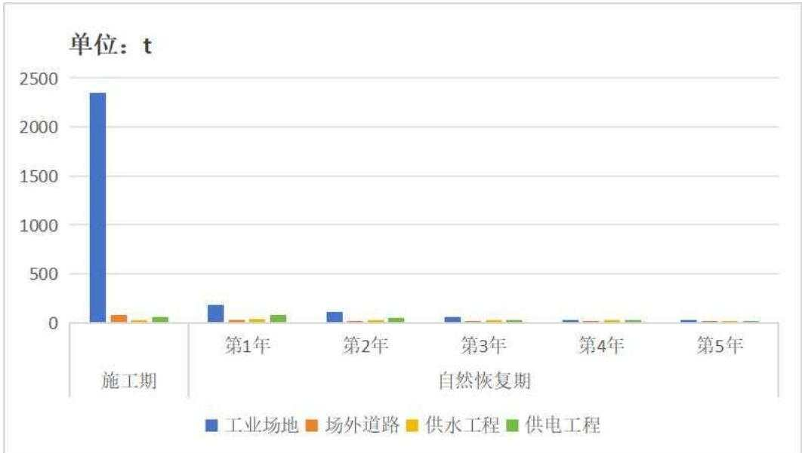  
图4.5-1 未开工工程各防治单元不同时期新增水土流失量对比图

根据以上图分析，未开工工程水土流失重点区域为工业场地；本方案将结合工程建设现状进度和主体设计，对水土流失的重点区域布设临时防护措施。

## 4.5.2 防治措施类型与布设

由项目区水土流失特点及项目建设可能造成的水土流失预测结果分析，本工程建设产生的水土流失应进行综合治理；工程建设过程中，应加强各防治区域水土保持监管，对各防治区域加强工程措施、植物措施和临时措施的综合防护。针对性地采取不同的防护措施重视天气预报，建立科学的水土流失防治预报系统。

## 4.5.3 施工进度安排

根据《中华人民共和国水土保持法》和“三同时”制度的有关要求，要将各项水土保持工程和主体工程同时进行施工管理，落实水土保持措施，最终保证水土保持工程能够与主体工程同期验收。

施工前开展施工组织设计，避免新增场外临时施工场地，有效减小扰动范围，缩短施工时间，优化施工时序。场地平整、开挖等应尽量避开大风、暴雨天气，并加强应急预防措施。

## 4.5.4 对水土流失监测的要求

根据预测结果确定，本项目重点监测时段为施工期，重点监测区域为工业场地。与此同时，在本项目建设及生产过程中，各防治区都应加强水土流失的防治，以便有效控制因项目建设而引起的新增水土流失，将项目建设对区域产生负面影响降低到最小，以实现区域生态环境的良性循环。

## 4.5.5 结论

综上所述，工程建设对当地的水土流失影响主要在施工期，由于施工活动扰动地表，损坏植被，导致地表裸露，降低原有地貌与植被的固土、抗蚀能力，加剧水土流失。从水土流失预测的结果可以看出，施工过程中水土流失主要发生在工业场地，工程建设对地面扰动范围较大，可能造成的水土流失量也较大，水土流失类型以轻度风力、轻度水力侵蚀为主，因此这些区域需采取工程措施及临时措施，构成行之有效的防治体系，遏制新增水土流失的发生和发展。

## 5 水土保持措施

## 5.1 防治区划分

## 5.1.1 分区依据

根据《生产建设项目水土保持技术标准》（GB50433-2018）4.4.2节规定中的相关规定，结合野外调查勘测结果，依据项目区所处土壤侵蚀类型与强度、地形地貌等自然条件，以及主体工程布局与类型、占地性质、施工扰动特点、建设时序等因素，在防治责任范围内，进行水土流失防治分区划分。

## 5.1.2 分区方法与原则

根据《生产建设项目水土保持技术标准》（GB50433-2018）4.4.2节规定，分区的原则应符合下列规定：

（1）各区之间应具有显著差异性；

（2）同一区内造成水土流失的主导因子和防治措施应相近或相似：

(3)根据项目的繁简程度和项目区自然情况，防治区可划分为一级或多级；

(4）一级区应具有控制性、整体性、全局性，线性工程应按土壤侵蚀类型、地形地貌、气候类型等因素划分一级区，二级区及其以下分区应结合工程布局、项目组成、占地性质和扰动特点进行逐级分区；

（5）各级分区应层次分明，具有关联性和系统性。

## 5.1.3 防治分区划分结果

根据地形地貌、项目组成、占地性质和扰动特点等，划分为工业场地区、场外道路区、供水工程区、供电工程区4个防治分区。根据各分区工程建设的特点，本项目防治分区详见下表：

表 5.1-1 水土流失防治分区表
<table><tr><td colspan="2" rowspan="1">防治分区</td><td colspan="1" rowspan="1">面积(hm²)</td><td colspan="1" rowspan="1">水土流失特点</td><td colspan="1" rowspan="1">分区特点</td></tr><tr><td colspan="2" rowspan="1">工业场地区</td><td colspan="1" rowspan="1">19.64</td><td colspan="1" rowspan="1">施工期场地开挖整平形成裸露地表；以及地面设施地基开挖、临时堆土因风蚀或水蚀而造成的水土流失。</td><td colspan="1" rowspan="1">场地占地面积大，施工土方工程量大，施工期水土流失强度大。</td></tr><tr><td colspan="1" rowspan="1">场外</td><td colspan="1" rowspan="1">进场道路</td><td colspan="1" rowspan="1">0.30</td><td colspan="1" rowspan="1">水土流失主要发生在路基修筑</td><td colspan="1" rowspan="1">属线性工程，施工土方工程量</td></tr><tr><td colspan="1" rowspan="1">道路区</td><td colspan="1" rowspan="1">货运道路</td><td colspan="1" rowspan="1">0.32</td><td colspan="1" rowspan="1">施工过程，对土壤的扰动强烈。</td><td colspan="1" rowspan="1">大，影响范围较大，施工期易发水土流失。</td></tr><tr><td colspan="1" rowspan="2">供水工程区</td><td colspan="1" rowspan="1">泵房</td><td colspan="1" rowspan="1">0.02</td><td colspan="1" rowspan="1">泵房基础开挖，土石方临时堆放，造成水土流失。</td><td colspan="1" rowspan="2">整体属线性工程，开挖量较大，施工作业带长，对周边的地表及植被破坏较大，形成裸露地表，水土流失较严重。</td></tr><tr><td colspan="1" rowspan="1">输水管线</td><td colspan="1" rowspan="1">1.48</td><td colspan="1" rowspan="1">沟体开挖及临时堆土，因风蚀或水蚀而造成的水土流失。</td></tr><tr><td colspan="1" rowspan="6">供电工程区</td><td colspan="1" rowspan="1">架空线路段</td><td colspan="1" rowspan="1">0.65</td><td colspan="1" rowspan="1">塔基开挖以及施工临时占地，破坏地表现状，因风蚀或水蚀造成水土流失。</td><td colspan="1" rowspan="1">施工作业带长，线形点状破坏，形成裸露地表，临时堆土潜在水土流失比较严重。</td></tr><tr><td colspan="1" rowspan="1">埋地电缆段</td><td colspan="1" rowspan="1">0.26</td><td colspan="1" rowspan="1">沟体开挖及临时堆土，因风蚀或水蚀而造成的水土流失。</td><td colspan="1" rowspan="1">属线性工程，因长度有限，开挖量较小，施工作业带较短，水土流失较轻。</td></tr><tr><td colspan="1" rowspan="1">钻跨场地</td><td colspan="1" rowspan="1">0.36</td><td colspan="1" rowspan="3">占地扰动地表，破坏植被及结皮层，造成土壤流失。</td><td colspan="1" rowspan="3">点状破坏，形成裸露地表，因面积较小且不挖土，水土流失比较轻。</td></tr><tr><td colspan="1" rowspan="1">1#牵张场</td><td colspan="1" rowspan="1">0.02</td></tr><tr><td colspan="1" rowspan="1">2#牵张场</td><td colspan="1" rowspan="1">0.02</td></tr><tr><td colspan="1" rowspan="1">施工便道</td><td colspan="1" rowspan="1">2.40</td><td colspan="1" rowspan="1">推平及机械碾压，破坏植被及结皮层，造成土壤流失。</td><td colspan="1" rowspan="1">属线性工程，不产生挖填土，但线路较长，机械和车辆碾压造成的扰动面积较大，水土流失较严重。</td></tr><tr><td colspan="2" rowspan="1">合计</td><td colspan="1" rowspan="1">25.47</td><td colspan="1" rowspan="1"></td><td colspan="1" rowspan="1"></td></tr></table>

## 5.2 措施总体布局

## 5.2.1 防治措施布设原则

本项目防治措施总体布局遵循“预防为主、保护优先、全面规划、综合治理、因地制宜、突出重点、科学管理、注重效益”的方针，坚持“水土保持工程必须与主体工程同时设计、同时施工、同时投产使用”的“三同时”原则，在满足设计深度与主体工程相适应外，做好水土保持措施与主体工程设计相互衔接，综合考虑工程建设时序，合理安排水保工程与主体工程建设之间的关系，树立人与自然和谐相处的理念，尊重自然规律，注重措施设计与周边景观相协调的原则。

按照预防和治理相结合的原则，坚持局部与整体防治、单项防治措施与综合防治措施相协调、兼顾生态效益与经济效益，按分区进行措施总体布置。

## 5.2.2 措施总体布局分析

根据该项目施工建设产生水土流失的特点、危害程度和防治目标，依据治理与防护相结合、植物措施与工程措施相结合、永久措施与临时措施相结合，统筹布局各种水土保持措施，形成完整的水土流失防治体系。

在防治措施布置上，充分利用工程措施的控制性和速效性，同时发挥生物措施的后效性和长效性，生物措施与固定管理工程单元相结合，工程措施与主体工程相结合的方法。同时拟对不同水土流失分区内的典型段进行典型设计，以代表该段的水土流失治理方向。

坚持分区防治的原则，根据工程区沿线所属水土流失防治分区来确定指导性防治措施。在各防治分区以侵蚀地貌划分治理单元，提出各治理单元的主导性防治措施体系；在各治理单元，根据主要侵蚀部位系统论证推荐布置经济、合理、安全的防治措施。

## （1）工业场地区

2025年3月，针对已实施工程现状存在的问题实施水土保持措施有：对场平遗留边坡坡脚设置了拦挡措施，扰动区域设置截排水沟并铺设塑料层，防止沟体冲刷，对裸露地表采取了防尘网苫盖。

## 后期建设过程中：

施工前，对工业场地内符合表土剥离条件的灌草地区域采取表土剥离，集中存放于工业场地用地范围内的表土堆放区，并采取临时拦挡、苫盖措施。

施工过程中，裸露地表、基础开挖产生的土石方、表土堆放区、矸石周转区，采取防尘网苫盖措施，同时针对表土堆放区、矸石周转区堆土边坡采取编织土袋拦挡措施。对场平挖填方边坡采取浆砌片石护坡和预制混凝土框格植草护坡。工业场地西北侧围墙外设置截水沟，在东西向小型冲沟经过工业场地段建设浆砌片石梯形排水沟，将工业场地西北侧坡面汇水通过改扩线道路过水涵洞导排至东侧界梁子沟内，西南围墙外截水沟末端设置消力池。在工业场地内依地势沿道路设置排水沟，将场地汇水导排至东侧的界梁子沟内。对土体开挖、装卸及扰动区域作业面普遍实施洒水措施。

施工结束后，对工业场地裸露土地进行平整，并对绿化区域覆盖表土并整地改良土壤条件，沿工业场地内道路栽植乔木、灌木，对日用、消防水池区域、斜风井井口房区域边坡采取预制混凝土框格植草护坡，其他区域采取乔、灌、草结合方式进行场区绿化，并配套敷设灌溉管网。乔木、灌木实施连续三年的幼林抚育，保证其成活率。

## （2）场外道路区

施工前，在道路施工作业带两侧设置彩条旗限界，限定施工范围，防止车辆对占地区域外任意行驶、碾压，造成水土流失。

施工过程中，对土体开挖及扰动区域作业面普遍实施洒水措施。临时堆土、裸露地表等实施防尘网苫盖措施。在进场道路和货运道路一侧设置道路排水沟，顺接现状矿区道路排水。

施工结束后，对道路两侧边坡进行土地平整，利用工业场地多余表土整地改良土壤条件，并采取植草护坡；道路两侧采用穴状整地，栽植乔、灌木进行绿化，配套敷设灌溉管网；对乔木、灌木实施连续三年的幼林抚育，保证其成活率。

## (3） 供水工程区

## 1）泵房

施工前，对泵房占地区域进行表土剥离，在施工作业区域临时堆放，堆放过程采取防尘网苫盖。

施工结束后，对泵房施工作业区域进行土地平整，表土在施工作业区域就地平整回覆，撒播草籽自然恢复区域植被条件。

## 2）输水管线

施工前，在输水管线施工作业带两侧设置彩条旗限界，限定施工范围。

施工过程中，管沟开挖需进行表土剥离，在沟体一侧分层堆放，施工结束后回覆沟体表层；堆土前需在堆土带采取土工布临时铺垫;临时堆土用防尘网苫盖，对输水管线进行分段施工，随挖随填。

施工结束后，对施工作业带进行土地平整，撒播草籽自然恢复区域植被条件。

## (4）供电工程区

## 1）架空线路段

施工前，对塔基开挖区域实施表土剥离，在施工作业范围内临时堆放，并用防尘网苫盖；塔基施工占地区域实施土工布临时铺垫；位于坡面与坡顶的塔基建设过程中，下游施工边界采取拦挡措施，防止塔基开挖土石方溜坡、挂渣。

施工结束后，清除临建措施，对塔基施工作业区域进行土地平整，表土在施工作业区域就地平整回覆，撒播草籽自然恢复区域植被条件。

## 2）埋地电缆段

施工过程中，沟体开挖临时堆土用防尘网苫盖。

施工结束后，堆土回填沟体并进行土地平整，撒播草籽自然恢复区域植被条件。

## 3）钻跨场地

施工前，对钻跨施工场地采取钢板铺垫，降低机械碾压对地表的扰动强度。

## 4）牵张场

施工前，对牵强场地采取钢板铺垫，降低机械碾压对地表的扰动强度。

## 5）施工便道

施工过程中，对道路推平、碾压以及车辆行驶等过程采取洒水措施。

施工结束后，对施工便道区域进行土地平整，撒播草籽自然恢复区域植被条件。

## 5.2.3 水土流失防治措施体系

根据项目建设特点和当地的自然条件，在水土流失调查及分析评价主体工程中具有水土保持功能工程的基础上，针对建设施工活动引发水土流失的特点和造成危害程度，依据分区治理、突出重点的原则，对工程区水土流失进行综合治理。本项目水土流失防治措施总体布局由主体工程具有水土保持功能的措施与方案新增措施组成，形成一个较为完整的防治措施体系。将水土保持工程措施和植物措施，永久措施和临时措施有机结合起来，合理确定水土保持措施的总体布局，以形成完整的、科学的水土保持防治体系。

本项目水土流失防治措施体系框图见下图：

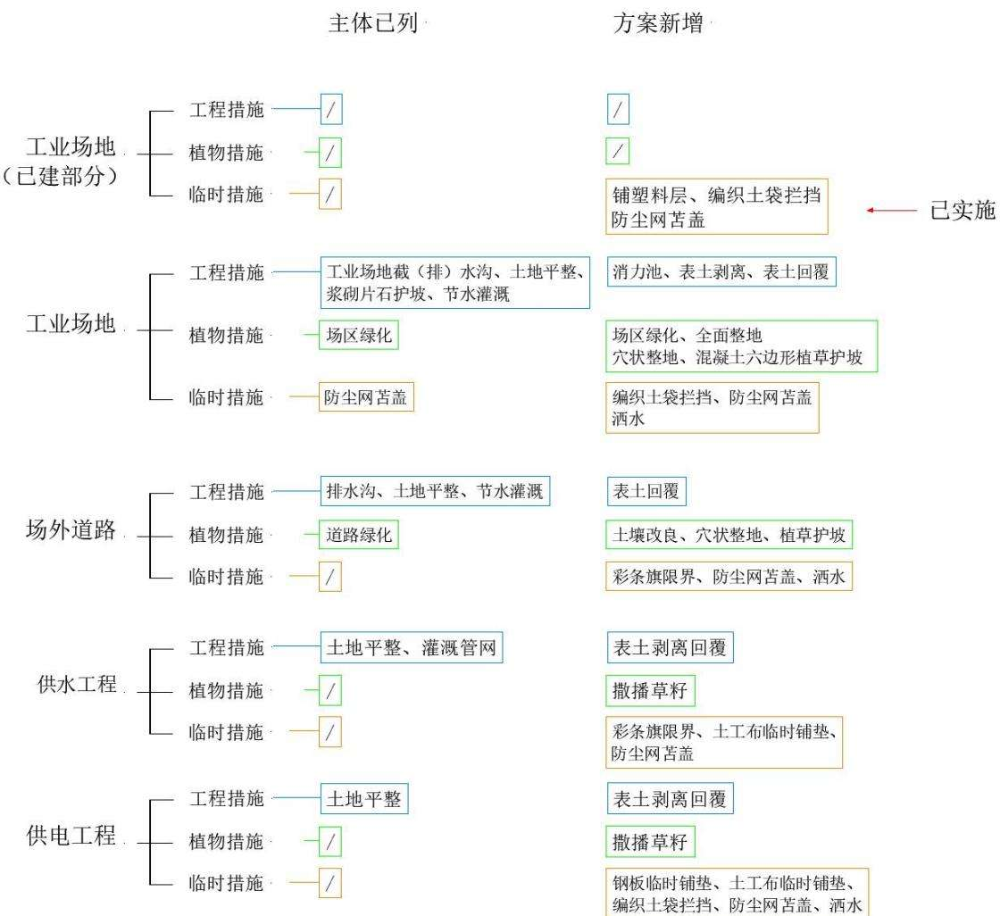  
图 5.2-1 工程水土流失防治措施体系框图

## 5.3 分区措施布设

## 5.3.1 工程措施设计标准

参照《生产建设项目水土保持技术标准》（GB50433-2018）4.6.5节\~4.6.14节，结合主体工程设计标准，确定本方案工程措施设计标准。水土保持措施的标准等级应符合现行国家标准《水土保持工程设计规范》（GB51018-2014）的规定。

## （1）表土保护措施

本次针对有地表植被发育的扰动区域实施表土剥离，根据土壤层发育情况，工业场地及管线沿线未受干扰的植被覆盖区域剥离厚度为20cm，工业场地小矿建设干扰后自然恢复区域剥离厚度为15cm。

表土在工业场地表土堆放区内堆放，采取防尘网苫盖和拦挡措施，施工结束后针对需要绿化的区域实施表土回覆，为实现表土全部利用，工业场地回覆厚度33cm，场外道路绿化区域回覆厚度36cm，其他区域为20cm。

## （2）边坡防护措施

工业场地挖方边坡在1:1\~1:1.25段采取浆砌片石护坡，挖方边坡在1:1.25\~1:1.5段、填方边坡、工业场地内边坡采取预制混凝土框格植草护坡，项目位于水土流失重点区域，工程级别提高一级为2级。

## （3）截排水措施

项目位于水土流失重点区域，工业场地西东向小型冲沟（场区1#排水沟）工程级别采取1级，洪水设计频率由50年一遇提高至100年一遇；围墙外坡面截、排水沟工程级别为一级，排水标准由10年一遇提高至25年一遇。

## （4）土地平整

施工结束后，对工业场地裸露区域、场外道路两侧、管线工程施工作业带等区域进行土地平整，土地平整后地面高差小于5cm。

## 5.3.2 植物措施设计标准

## 5.3.2.1 植物措施设计级别

本工程设计生产能力为240万t/a，为大型矿山项目。根据《水土保持工程设计规范》（GB51018-2014），生产建设项目植被恢复与建设工程级别应根据生产建设项目主体工程所处的自然及人文环境、气候条件、立地条件、征地范围、绿化要求综合确定。

（1）工业场地植被恢复与建设工程级别执行1级标准，在改善办公生活区环境和生态防护要求的基础上，结合园林绿化美化要求进行植被建设。

（2）进场道路和货运道路均为三级公路，《水土保持工程设计规范》中对应路基两侧植草护坡、绿化带建设工程级别为3级。

（3）《水土保持工程设计规范》（GB51018-2014）关于“生产建设项目的植被恢复与建设工程级别”相关要求为：弃渣取料、施工生产生活、施工交通等临时占地区域应执行3级标准。据此确定本项目供电线路以及场外供水管线植被恢复与建设工程级别为3级。

## 5.3.2.2 植物措施立地条件分析

本项目位于中温带亚干旱型气候大区，伊宁盆地属大陆型气候，昼夜温差大。盆地内气候较湿润，夏季热而多雨冬季较冷，最大积雪厚度1.5m。正常年份降水量为231mm，蒸发量为1750mm。

项目区内的土壤类型为灰钙土，灰钙土是暖温带荒漠草原区弱淋溶的干旱土，表层弱腐殖化，土壤有机质含量1\~2.5%，15\~30cm处为假菌丝状或斑点状的钙积层，剖面中下部还可出现石膏淀积层与可溶盐淀积层。

根据现场踏勘，由于气候条件致工程所在区域植被稀疏，在不采取整地改良土壤和灌溉养护的条件下，区域植被自然恢复较为缓慢。根据区域土壤条件，本次针对有地表植被发育的扰动区域实施表土剥离，表土在工业场地表土堆放区内堆放，采取防尘网苫盖以及拦挡措施，施工结束后回覆绿化区域。对工业场地内拟绿化区域施加有机肥改良土壤肥力。因工业场地和场外道路生产期活动频繁，为防止区域水土流失以及美化环境，针对工业场地及新建道路设计进行乔、灌、草等植被绿化。针对管线工程等临时施工区域，施工结束后进行土地平整，撒播草籽依靠自然降雨条件等以自然恢复为主。

## 5.3.2.3 植物物种选择

根据实地调查及历史资料，项目区所在区域植被类型多为耐旱型物种，多系旱生、超旱生深根肉质的小半灌木和灌木荒漠类型，常见的植物有伊犁绢蒿、早熟禾、骆驼蓬、羊茅等，覆盖度约5\~20%。

本方案植物措施设计遵循的原则：草种、树种的选择既具有水土保持功能，又要做到适地适树，且以地方树种为主；并要求施工时选择适龄壮苗，树、草种宜选用耐贫瘠、生长快、根系发达的水土保持树草种。

经对该矿区适生植被种类及同类项目绿化工程调查，苗木来源可自虞城县绿水青山林业科技有限公司伊宁市分公司采购，该基地主要任务是培育、筛选适应区域气候、土壤条件的耐旱，耐盐碱苗木。考虑植物种的生物学特性及其用途，本次方案植物物种选取如下：

表 5.3-1 本次选取植物物种及其生物学特征情况表
<table><tr><td rowspan=1 colspan=1>种类</td><td rowspan=1 colspan=1>名称</td><td rowspan=1 colspan=1>植物特征</td><td rowspan=1 colspan=1>主要用途</td></tr><tr><td rowspan=2 colspan=1>乔木</td><td rowspan=1 colspan=1>新疆杨</td><td rowspan=1 colspan=1>喜光，耐干旱，耐高温，耐瘠薄及盐碱土，生长快，深根性，抗风力强</td><td rowspan=2 colspan=1>为农田防护林、速生丰产林、防风固沙林和四旁绿化的优良树种。</td></tr><tr><td rowspan=1 colspan=1>白榆</td><td rowspan=1 colspan=1>喜光，耐旱，耐寒，耐瘠薄，不择土壤，适应性很强。根系发达，抗风力、保土力强。</td></tr><tr><td rowspan=2 colspan=1>灌木</td><td rowspan=1 colspan=1>柽柳</td><td rowspan=1 colspan=1>喜光不耐阴，在遮荫处多生长不良。根系发达，既耐干又耐水湿，抗风能力强，耐盐碱土，能在含盐量1.2%的盐碱地上正常生长。</td><td rowspan=1 colspan=1>作为防风、固沙、改良盐碱地的重要造林树种。</td></tr><tr><td rowspan=1 colspan=1>榆叶梅</td><td rowspan=1 colspan=1>多年生灌木，较耐寒、耐旱、不耐水涝，对土质质地要求不严。</td><td rowspan=1 colspan=1>榆叶梅是中国北方园林、街道、路边等重要的绿化观花灌木树种。是不可多得的园林绿化植物。</td></tr><tr><td rowspan=2 colspan=1>草种</td><td rowspan=1 colspan=1>早熟禾</td><td rowspan=1 colspan=1>禾本科早熟禾属一年生或冬性禾草。其喜温暖干燥的环境，耐旱、耐阴、耐寒性较强；喜微酸性至中性土壤。</td><td rowspan=1 colspan=1>生长条件较差区域绿化草种。</td></tr><tr><td rowspan=1 colspan=1>羊茅</td><td rowspan=1 colspan=1>是禾本科属的多年生草本植物。羊茅草坪是较为流行的冷季型草坪，羊茅具有很深的根系，中等绿色，叶细软，不仅具有较强的适生能力和较高的观赏价值，而且耐旱、耐践踏、耐修剪、绿色期长。</td><td rowspan=1 colspan=1>生长条件较差区域绿化草种。</td></tr></table>

## 5.3.2.4 灌溉与抚育管理

## （1）苗木（草）的种植

乔木、灌木宜采用胸径分别大于3cm、1cm的一级苗，要求苗木根系发育正常，苗干挺直，分枝正常，具有树种特有的色泽，无病虫害。草种选择一级种，草籽新鲜饱满，纯度≥95%，发芽率≥90%。

栽植带土球乔（灌）木，栽植方法采用穴植，栽种时做到：苗木端正，深浅适宜，根系舒展。乔木、灌木分别采取60×60×40cm、40×40×30cm穴状整地，乔木栽植株距2m，灌木栽植株距1m。草种种植方式采取人工撒播草籽的方式，将草籽按比例混掺入覆土内，在表土及绿化用土回覆、推平的同时可达到撒播草地的目的。

新疆种苗木最适合的时间是春秋两季，特别是春季的3月中旬至5月初和秋季的9月至11月，这两个时段的气候条件有利于苗木的生长和成活。春季栽苗不宜过早，应在土壤解冻之后栽植；秋季栽苗不宜过晚，以免幼苗无法安全过冬。

新疆草籽的播种时间取决于草种的类型以及当地的气候条件。借鉴新疆造林经验，结合项目施工组织，本次苗木栽植以及播种草选择在春季或秋季实施。

## （2）灌溉方式

乔（灌）木种植后，在略大于植穴直径的周围筑成高10\~15cm的灌水土堰进行灌水。树木定植后应在24小时内浇第一遍水，水要浇透，使泥土充分吸收水分，根系与土紧密结合，以利根系发育。草籽撒播后可根据天气情况每天或隔天喷水，灌溉设备选用喷灌装置。

## （3）绿化水源

根据水平衡分析，项目区采用处理达标后的生活污水进行绿化灌溉，年可用于绿化用水量约10.4万m³。生活污水处理站设计采用“生物处理+深度处理”净化方法。生物处理拟选用“二级接触氧化”工艺，深度处理拟选用“微絮凝过滤+活性炭吸附”工艺。通过采取上述措施，处理后的生活污水可满足《城镇污水处理厂污染物排放标准》（GB18918-2002）中一级A标准及《城市污水再生利用城市杂用水水质》（GB/T18920-2020）中的相关标准要求，可作为绿化灌溉用水，绿化灌溉用水水源有保障。

## （4）灌溉设计

## 1）灌溉管网设计

本工程所在区域属中温带亚干旱型气候，结合现场踏勘和工程实际情况，本项目工业场地用地内乔（灌）木采取滴灌方式，草坪灌溉采取喷灌方式，场外道路绿化采取滴灌的灌溉方式。

草坪中安装地埋式喷灌设备，乔木植坑布设滴灌管网。灌溉首部系统设置在工业场地污水处理设施附近，管道组成主要包括干管、支管和毛管三级管道；干管与支管沿道路和绿化区域周边布设，毛管垂直与支管布设，毛管双向控制输水，长度根据植物树种的情况进行调整。绿化区喷灌管网布设示意图如下：

个月后，全面普查生长情况，对生长不均匀的位置予以补种，清除杂草和喷农药除虫。重点部位加强保护。安排工作人员定期对灌溉系统进行检查及修复，保证水源及时供给绿化区，保证灌溉植物的成活率。

## 5.3.2.5 可绿化面积分析

本项目建设扰动地表面积总计为25.47hm²，扣除建（构）筑、回车场及道路、人行道、专用场地、截排水沟、浆砌片石护坡等硬化区域面积，扣除建筑周边、架空廊道、边沟等不宜绿化区域面积，扣除钢板铺垫不破坏表土层的区域面积后，可绿化面积统计见下表：

表 5.3-3 工程可绿化面积统计表单位：hm²
<table><tr><td rowspan=1 colspan=2>工程分区</td><td rowspan=1 colspan=1>分区面积</td><td rowspan=1 colspan=1>建（构）筑物及硬化</td><td rowspan=1 colspan=1>其他不宜绿化区域</td><td rowspan=1 colspan=1>可绿化面积</td></tr><tr><td rowspan=1 colspan=2>工业场地区</td><td rowspan=1 colspan=1>19.64</td><td rowspan=1 colspan=1>10.08</td><td rowspan=1 colspan=1>2.33</td><td rowspan=1 colspan=1>7.23</td></tr><tr><td rowspan=2 colspan=1>场外道路区</td><td rowspan=1 colspan=1>进场道路</td><td rowspan=1 colspan=1>0.30</td><td rowspan=1 colspan=1>0.17</td><td rowspan=1 colspan=1>0.01</td><td rowspan=1 colspan=1>0.12</td></tr><tr><td rowspan=1 colspan=1>货运道路</td><td rowspan=1 colspan=1>0.32</td><td rowspan=1 colspan=1>0.18</td><td rowspan=1 colspan=1>0.01</td><td rowspan=1 colspan=1>0.13</td></tr><tr><td rowspan=2 colspan=1>供水工程区</td><td rowspan=1 colspan=1>泵房</td><td rowspan=1 colspan=1>0.02</td><td rowspan=1 colspan=1>0.01</td><td rowspan=1 colspan=1></td><td rowspan=1 colspan=1>0.01</td></tr><tr><td rowspan=1 colspan=1>输水管线</td><td rowspan=1 colspan=1>1.48</td><td rowspan=1 colspan=1></td><td rowspan=1 colspan=1></td><td rowspan=1 colspan=1>1.48</td></tr><tr><td rowspan=6 colspan=1>供电工程区</td><td rowspan=1 colspan=1>架空线路段</td><td rowspan=1 colspan=1>0.65</td><td rowspan=1 colspan=1>0.14</td><td rowspan=1 colspan=1></td><td rowspan=1 colspan=1>0.51</td></tr><tr><td rowspan=1 colspan=1>埋地电缆段</td><td rowspan=1 colspan=1>0.26</td><td rowspan=1 colspan=1></td><td rowspan=1 colspan=1></td><td rowspan=1 colspan=1>0.26</td></tr><tr><td rowspan=1 colspan=1>钻跨场地</td><td rowspan=1 colspan=1>0.36</td><td rowspan=1 colspan=1></td><td rowspan=1 colspan=1>0.36</td><td rowspan=1 colspan=1>0.00</td></tr><tr><td rowspan=1 colspan=1>1#牵张场</td><td rowspan=1 colspan=1>0.02</td><td rowspan=1 colspan=1></td><td rowspan=1 colspan=1>0.02</td><td rowspan=1 colspan=1>0.00</td></tr><tr><td rowspan=1 colspan=1>2#牵张场</td><td rowspan=1 colspan=1>0.02</td><td rowspan=1 colspan=1></td><td rowspan=1 colspan=1>0.02</td><td rowspan=1 colspan=1>0.00</td></tr><tr><td rowspan=1 colspan=1>施工便道</td><td rowspan=1 colspan=1>2.40</td><td rowspan=1 colspan=1></td><td rowspan=1 colspan=1></td><td rowspan=1 colspan=1>2.40</td></tr><tr><td rowspan=1 colspan=2>合计</td><td rowspan=1 colspan=1>25.47</td><td rowspan=1 colspan=1>10.58</td><td rowspan=1 colspan=1>2.75</td><td rowspan=1 colspan=1>12.14</td></tr></table>

## 5.3.3 临时措施设计标准

本方案其他临时措施设计主要依据《生产建设项目水土保持技术标准》（GB50433-2018）、《水土保持工程设计规范》（GB51018-2014）中的相关规定，以简便、易行、实用、随主体工程施工进度及时布设的原则，作为本项目临时措施的设计标准。

## 5.3.4 工业场地区

## 5.3.4.1 工程措施

（1）场区1#排水沟（主体已列）

设计在西东向小型冲沟经过工业场地段建设场区1#排水沟，采用浆砌片石梯形结构，将沟内汇水疏导至工业场地东侧，通过改扩道路的过水涵洞进入界梁子沟内。西东向小型冲沟（场区1#排水沟）过工业场地段采用浆砌片石梯形明沟，厚度30cm，顶宽2.8m，底宽为0.6m，深1.1m，边坡1：1，用M10水泥砂浆勾缝，长度200m。

## （2）场区2#截、排水沟（主体已列）

场区外西北坡面中部汇水区段，在围墙外建设场区2#截、排水沟，拦截此部分汇水，穿围墙过工业场地西南部，导排至工业场地东侧，再通过改扩道路过水涵洞进入界梁子沟内。场区2#截、排水沟采用浆砌片石梯形明沟，厚度30cm，顶宽1.5m，底宽为0.3m，深0.6m，边坡1:1，用M10水泥砂浆勾缝，长度1440m。

## （3）场区3#截水沟（主体已列）

场区外西北坡面西部汇水区段，在围墙外设置场区3#截水沟，将此部分汇水顺西侧围墙外向南导排至下游地势较低处，在末端设置消力池。场区3#截水沟采用浆砌片石梯形明沟，厚度30cm，顶宽1.9m，底宽为0.5m，深0.7m，边坡1：1，用M10水泥砂浆勾缝，长度410m。

## （4）消力池（方案新增）

在场区3#截水沟末端设置消力池，采取浆砌片石结构，长4.5m，宽2.0m，深0.6m，厚度40cm，用M10水泥砂浆勾缝，池体挖方13.00m³，回填方量 2.00m³，砌体方量5m³。

## （5）场内排水沟（主体已列）

为使场内地表雨水及融雪水迅速排除，在场内道路一侧设C30现浇混凝土矩形排水沟，穿道路及人行道设置盖板排水沟，雨水顺平场坡度，通过盖板泄水孔，汇集至沟内，然后排入场外公路边沟最终进入界梁子沟内，雨水沟尺寸设计为：宽0.40m×深0.40m×厚度0.20m。经统计，工业场地内矩形排水明沟长度1605m；矩形盖板排水沟长度170m。

## （6）表土剥离与回覆（方案新增）

本次工业场地针对地表植被发育区域实施表土剥离，剥离后表土运到工业场地表土堆放区内统一堆放保存。工业场地表土剥离面积13.79hm²，剥离厚度15\~20cm，剥离量21900m³。

施工结束后，须对平整后的绿化区域进行表土回覆，以便于采取植物措施。工业场地表土回覆厚度为33cm，回覆面积6.39hm²，回覆表土量21100m³。

## （7）土地平整（主体已列）

施工结束后，对工业场地裸露土地进行平整，采用推土机推平，机械无法平整的边角采取人工平整，土地平整后地面高差小于5cm。根据主体设计布置，扣除建（构）筑、回车场及道路、人行道、专用场地等硬化区域、截排水沟及浆砌片石护坡等面积后，工业场地需实施土地平整面积9.53hm²。

## （8）浆砌片石护坡（主体已列）

工业场地挖方位于工业场地西北侧，平均挖深5m，最大挖深13.5m，挖方边坡坡比1：1\~1：1.5，长度1040m。其中边坡1：1.25\~1：1.5之间时防护采用浆砌片石护坡，厚度30cm，用M10水泥砂浆勾缝，每隔10m设置一道缝宽2cm的伸缩沉降缝。浆砌片石护坡面积3460m²。

## （9）节水灌溉（主体已列+方案新增）

本项目工业场地用地内乔（灌）木采取滴灌方式，草坪灌溉采取喷灌方式。草坪中安装地埋式喷灌设备，乔木植坑布设滴灌管网。灌溉首部系统设置在工业场地污水处理设施附近，输配水系统分为总干管、干管及支管三部分，形成环状管网。为使工业场地治理分区水土流失治理度满足方案要求，在满足主体设计工业场地绿化率最低应达到20%的基础上，增加了工业场地绿化面积3.00hm²，提高工业场地绿化面积后，工业场地灌溉管网敷设面积共计6.51hm²，其中3.51hm²为主体已列，3.00hm²为方案新增。

## 5.3.4.2 植物措施

## （1）工业场地绿化（主体已列+方案新增）

主体设计对工业场地采取乔、灌、草结合的方式进行绿化。根据现场踏勘由于气候条件致工程所在区域植被稀疏，在不采取整地改良土壤和灌溉养护的条件下，区域植被自然恢复较为缓慢。方案复核施工结束后，对实施土地平整后需植被恢复的区域实施整地，表土中掺入农家土杂肥改良土壤条件，回覆并采用机械翻耕，耕深0.3m。乔木、灌木分别采取60×60×40cm、 $4 0 \times 4 0 \times 3 0 \mathrm { { c m } }$ 穴状整地，乔灌木种植后还应实施幼林抚育，定期进行松土，清除杂草，进行修剪，使其整齐、美观，视生长情况浇水和施肥。

主体设计工业场地绿化面积为3.51hm²，主要分布于场前区空地、选煤生产储运区、道路两侧以及建（构）筑物外围，为满足林草覆盖率要求，方案新增在工业场地内，于制氮机房、变电所等区域空地绿化面积3.00hm²。

## 1）栽植乔木

乔木种植在道路两侧以及建（构）筑物外围，呈单排种植，若宽度适宜也可种植两排，可以绿化草坪中点缀观赏乔木，株行距2m×2m，种植树种选择新疆杨、白榆，种植方式采用穴植，种植时间选在施工期最后一年春季。所购树苗需带根系土球，乔木土球要求40cm，乔木穴坑60cm（直径）×40cm（深），种植前提前整地，工业场地共栽植乔木2893株，其中主体已列1552株，方案新增1341 株。

## 2）栽植灌木

灌木种植在乔木之间和草坪周边，形成错落有致景观，株行距1.0m×1.0m，呈“品”字形交错种植。灌木树种主要选用榆叶梅、柽柳，种植方式采用穴植，种植时间和乔木相同。所购树苗需带根系土球，灌木土球要求20cm，灌木穴坑40cm（直径）×30cm（深），种植前提前整地，工业场地共栽植灌木8048株，其中主体已列4316株，方案新增3732株。

## 3）撒播草籽

草种种植方式采取人工撒播草籽的方式，将草籽按比例混掺入覆土内，在表土及绿化用土回覆、推平的同时可达到撒播草地的目的，种植时间和乔木相同。草坪适宜种植在建筑物之间大面积绿化的区域内，草种选择早熟禾、羊茅的混合草种，混播比例1:1，撒播密度200kg/hm²，其中主体已列 694kg，方案新增600kg。

表 5.3-4 工业场地绿化工程相关技术参数及工程统计表
<table><tr><td colspan="1" rowspan="2">名称</td><td colspan="2" rowspan="1">面积/hm²</td><td colspan="1" rowspan="2">绿化方式</td><td colspan="2" rowspan="1">数量</td><td colspan="1" rowspan="2">整地方式（方案新增）</td><td colspan="1" rowspan="2">抚育要求（方案新增）</td></tr><tr><td colspan="1" rowspan="1">主体已列</td><td colspan="1" rowspan="1">方案新增</td><td colspan="1" rowspan="1">主体已列方</td><td colspan="1" rowspan="1">案新增</td></tr><tr><td colspan="1" rowspan="3">工业场地绿化</td><td colspan="1" rowspan="3">3.51</td><td colspan="1" rowspan="3">3.00</td><td colspan="1" rowspan="1">栽植乔木</td><td colspan="1" rowspan="1">1552 株</td><td colspan="1" rowspan="1">1341 株</td><td colspan="1" rowspan="1">60×60×40cm穴状整地</td><td colspan="1" rowspan="2">为期三年的幼林抚育</td></tr><tr><td colspan="1" rowspan="1">栽植灌木</td><td colspan="1" rowspan="1">4316株</td><td colspan="1" rowspan="1">3732 株</td><td colspan="1" rowspan="1">40×40×30cm穴状整地</td></tr><tr><td colspan="1" rowspan="1">撒播草籽</td><td colspan="1" rowspan="1">694kg</td><td colspan="1" rowspan="1">600kg</td><td colspan="1" rowspan="1">全面整地</td><td colspan="1" rowspan="1"></td></tr></table>

## （2）预制混凝土框格植草护坡（方案新增）

对填方边坡、挖方坡比在1：1.25\~1：1.5之间的边坡、日用、消防水池区域、斜风井井口房区域边坡采取预制混凝土框格植草护坡，设置边坡比1：1.25\~1:1.5之间，结构形式为预制正六边形C30混凝土框格，厚度20cm，M10水泥砂浆砌牢，用进行过土壤改良及掺入种植草籽的表土回填。草种选择早熟禾、羊茅混合草种，混播比例1:1，播种密度 $2 0 0 \mathrm { k g / h m } ^ { 2 }$ 。工业场地预制混凝土框格植草护坡面积、工程量统计情况如下表：

表 5.3-5 工业场地植草护坡相关技术参数及工程量统计表
<table><tr><td rowspan=1 colspan=1>名称</td><td rowspan=1 colspan=1>实施位置</td><td rowspan=1 colspan=1>面积 $/ \mathrm { m } ^ { 2 }$ </td><td rowspan=1 colspan=1>边坡比</td><td rowspan=1 colspan=1>结构形式</td><td rowspan=1 colspan=1>砌体量 $/ \mathrm { m } ^ { 3 }$ </td><td rowspan=1 colspan=1>种植密度</td><td rowspan=1 colspan=1>草种量/kg</td><td rowspan=1 colspan=1>整地方式</td></tr><tr><td rowspan=3 colspan=1>预制混凝土框格植草护坡</td><td rowspan=1 colspan=1>场内边坡</td><td rowspan=1 colspan=1>2400</td><td rowspan=1 colspan=1>1: 1.5</td><td rowspan=3 colspan=1>预制混凝土框格</td><td rowspan=1 colspan=1>96</td><td rowspan=1 colspan=1>200kg/hm²</td><td rowspan=1 colspan=1>48</td><td rowspan=3 colspan=1>全面整地</td></tr><tr><td rowspan=1 colspan=1>挖方边坡</td><td rowspan=1 colspan=1>1740</td><td rowspan=1 colspan=1>1:1.25~1:1.5</td><td rowspan=1 colspan=1>70</td><td rowspan=1 colspan=1>200kg/hm²</td><td rowspan=1 colspan=1>35</td></tr><tr><td rowspan=1 colspan=1>填方边坡</td><td rowspan=1 colspan=1>234</td><td rowspan=1 colspan=1>1: 1.5</td><td rowspan=1 colspan=1>10</td><td rowspan=1 colspan=1>200kg/hm²</td><td rowspan=1 colspan=1>5</td></tr><tr><td rowspan=1 colspan=1>合计</td><td rowspan=1 colspan=1></td><td rowspan=1 colspan=1>4374</td><td rowspan=1 colspan=1></td><td rowspan=1 colspan=1></td><td rowspan=1 colspan=1>176</td><td rowspan=1 colspan=1></td><td rowspan=1 colspan=1>98</td><td rowspan=1 colspan=1></td></tr></table>

## 5.3.4.3 临时措施

## （1）编织土袋拦挡（方案新增）

已实施：针对边坡坡脚采取编织土袋拦挡，长度200m。编织袋规格60cm（宽）×98cm（长），装土后厚度35cm。编织土袋单排码砌1层，考虑填筑缝隙后，每延米需用土袋1个。共需编织土袋200个，砌体方量42m³。方案后开工建设时对编织土袋进行拆除，土方清理，拆除量42m³。

未实施：针对工业场地表土堆放区、矸石周转区采取编织土袋拦挡措施，表土堆放区挡护长度416m，矸石周转区挡护长度180m，合计596m。编织袋规格60cm（宽）×98cm（长），装土后厚度35cm。编织土袋码砌3层，并排两个，砌筑高度为1.05m。考虑填筑缝隙后，每延米需用土袋6个，表土堆放区堆土场共需编织土袋3476个，砌体方量716m³。工程结束后对编织土袋进行拆除，土方清理，拆除量716m³。

## （2）铺塑料层（方案新增）

已实施：顺接现状小冲沟，将区外汇水导排至扰动场地外，沟内及两侧铺设塑料膜，防止沟体冲刷。塑料层铺设面积860m²。

（3）防尘网苫盖（主体已列+方案新增）

施工过程中，表土堆放、矸石堆放、裸露地表、基础开挖产生的土石方，在大风和暴雨天气时，易产生水土流失，针对此项要求对其采取防尘苫盖措施，人工场内运输、铺盖、搭接，重复搭接的宽度控制在20cm，在坡脚和重复搭接处压盖块石，施工结束后人工移除块石、收回防尘网。

已实施（方案新增）：对现状已施工扰动区域裸露地表进行了防尘网苫盖，防尘网苫盖面积 21000m²。

未实施：工业场地需用防尘网25960m²，其中主体设计防尘网苫盖面积5960m²，方案新增表土堆放区、矸石周转区防尘网面积20000m²。

（4）洒水（方案新增）

由于施工期内人员机械活动频繁，极易产生扬尘，引起水土流失，为此在施工范围实施洒水，日洒水量按照4m³/hm²统计，主要洒水区域为土石方开挖、装卸等作业面以及堆土区域、施工碾压区域。工业场地洒水面积按3.92hm²，扣除11月至翌年2月冬季月份，洒水天数为630d，则洒水量为8291m³。

## 5.3.5 场外道路区

## 5.3.5.1 工程措施

## （1）道路排水沟（主体已列）

在进场道路西南一侧、货运道路西侧设置道路边沟，接收来自于工业场地一侧的排水。道路排水沟采取浆砌片石梯形明沟，用M10水泥砂浆勾缝，厚度30cm。沟体顶宽2.14m，底宽0.4m，深0.4m，内侧边坡1:1.5，外侧边坡1:1。进场道路排水沟长度150m，货运道路排水沟长度160m，合计310m。

（2）土地平整（主体已列）

施工结束后，对场外道路施工作业带地面进行平整，采用推土机推平，机械无法平整的边角采取人工平整，土地平整后地面高差小于5cm。根据主体设计布置，扣除道路路面、排水工程等硬化区域面积后，需实施土地平整面积0.27hm²。

## （3）表土回覆（方案新增）

利用工业场地多余表土回覆道路两侧边坡，并采取植草护坡，表土覆盖厚度36cm，根据表土平衡，场外道路绿化表土覆盖用量800m³。

## （4）节水灌溉（主体已列）

道路绿化用地内乔（灌）木采取滴灌方式，乔木植坑布设滴灌管网。灌溉首部系统设置在工业场地污水处理设施附近，输配水系统分为总干管、干管两部分，形成带状管网。场外道路灌溉管网敷设面积共计0.25hm²。

## 5.3.5.2 植物措施

（1）道路绿化（主体已列+方案新增）

主体设计施工结束后，在道路两侧种植乔（灌）木进行道路绿化，绿化带长度320m。方案复核后增加对乔木、灌木分别采取60×60×40cm、40×40×30cm穴状整地，实施为期三年的幼林抚育，定期进行松土，清除杂草，进行修剪，使其整齐、美观，视生长情况浇水和施肥。

## 1）栽植乔木

乔木种植在道路两侧，呈单排种植，株行距2m×2m，种植树种选择新疆杨、白榆，种植方式采用穴植，种植时间选在施工期最后一年春季。所购树苗需带根系土球，乔木土球要求40cm，乔木穴坑60cm（直径）×40cm（深），种植前提前整地，共栽植乔木310株。

## 2）栽植灌木

灌木种植在乔木之间，形成错落有致景观，株行距1.0m×1.0m。灌木树种主要选用榆叶梅、柽柳，种植方式采用穴植，种植时间和乔木相同。所购树苗需带根系土球，灌木土球要求20cm，灌木穴坑40cm（直径）×30cm（深），种植前提前整地，共栽植灌木620株。

表5.3-6 场外道路绿化工程相关技术参数及工程统计表
<table><tr><td rowspan=2 colspan=2>名称</td><td rowspan=2 colspan=1>绿化带长度</td><td rowspan=1 colspan=2>苗木量/株</td><td rowspan=1 colspan=2>整地（方案新增）</td><td rowspan=2 colspan=1>幼林抚育/hm²（方案新增）</td></tr><tr><td rowspan=1 colspan=1>乔木</td><td rowspan=1 colspan=1>灌木</td><td rowspan=1 colspan=1>乔木</td><td rowspan=1 colspan=1>灌木</td></tr><tr><td rowspan=2 colspan=1>场外道路绿化</td><td rowspan=1 colspan=1>进场道路</td><td rowspan=1 colspan=1>150</td><td rowspan=1 colspan=1>150</td><td rowspan=1 colspan=1>300</td><td rowspan=1 colspan=1>60×60×40cm</td><td rowspan=1 colspan=1>40×40×30cm</td><td rowspan=1 colspan=1>0.02</td></tr><tr><td rowspan=1 colspan=1>货运道路</td><td rowspan=1 colspan=1>160</td><td rowspan=1 colspan=1>160</td><td rowspan=1 colspan=1>320</td><td rowspan=1 colspan=1>穴状整地</td><td rowspan=1 colspan=1>穴状整地</td><td rowspan=1 colspan=1>0.03</td></tr><tr><td rowspan=1 colspan=1>合计</td><td rowspan=1 colspan=1></td><td rowspan=1 colspan=1>320</td><td rowspan=1 colspan=1>310</td><td rowspan=1 colspan=1>620</td><td rowspan=1 colspan=1></td><td rowspan=1 colspan=1></td><td rowspan=1 colspan=1>0.05</td></tr></table>

## （2）植草护坡（方案新增）

对道路两侧边坡覆盖表土区域实施全面整地，掺入农家土杂肥改良土壤，回覆并采用人工翻耕，耕深0.3m。对路基边坡采取植草护坡，设置边坡比1：1.5，用进行过土壤改良及掺入种植草籽的表土回覆。草种选择早熟禾、羊茅的混合草种，混播比例1:1，播种密度200kg/hm²。场外道路植草护坡面积0.20hm²，草籽使用量40kg。

表 5.3-7 场外道路植草护坡工程量统计表
<table><tr><td rowspan=1 colspan=1>名称</td><td rowspan=1 colspan=1>项目</td><td rowspan=1 colspan=1>长度/m</td><td rowspan=1 colspan=1>面积/hm²</td><td rowspan=1 colspan=1>种植密度</td><td rowspan=1 colspan=1>草种量/kg</td><td rowspan=1 colspan=1>整地方式</td></tr><tr><td rowspan=2 colspan=1>植草护坡</td><td rowspan=1 colspan=1>进场道路</td><td rowspan=1 colspan=1>150</td><td rowspan=1 colspan=1>0.10</td><td rowspan=1 colspan=1>200kg/hm²</td><td rowspan=1 colspan=1>20</td><td rowspan=1 colspan=1>全面整地</td></tr><tr><td rowspan=1 colspan=1>货运道路</td><td rowspan=1 colspan=1>160</td><td rowspan=1 colspan=1>0.10</td><td rowspan=1 colspan=1>200kg/hm²</td><td rowspan=1 colspan=1>20</td><td rowspan=1 colspan=1>全面整地</td></tr><tr><td rowspan=1 colspan=1>合计</td><td rowspan=1 colspan=1></td><td rowspan=1 colspan=1></td><td rowspan=1 colspan=1>0.20</td><td rowspan=1 colspan=1></td><td rowspan=1 colspan=1>40</td><td rowspan=1 colspan=1></td></tr></table>

## 5.3.5.3 临时措施

## （1）彩条旗限界（方案新增）

施工前，在进场道路和货运道路两侧布设彩条旗，以限定施工扰动范围。彩条旗采用1m长的木条固定，每两根木条间隔5m，木条插入地面以下约30cm，地面以上70cm，在木条地面以上50cm处拉1道彩旗，彩旗间隔约50cm。本项目场外道路施工作业带两侧用彩条旗限界长度共计620m。

## （2）防尘网苫盖（方案新增）

施工过程中，对道路开挖临时堆土、裸露地表等实施防尘网苫盖措施。防尘网人工场内运输、铺盖、搭接，重复搭接的宽度控制在20cm，在坡脚和重复搭接处压盖块石，施工结束后人工移除块石、收回防尘网。道路工程需用防尘网面积1200m²。

## （3）洒水（方案新增）

由于施工期内人员机械活动频繁，极易产生扬尘，引起水土流失，为此在施工范围实施洒水，日洒水量按照 $4 \mathrm { m } ^ { 3 } / \mathrm { h m } ^ { 2 }$ 统计，主要洒水区域为土石方开挖、装卸等作业面以及施工碾压区域。洒水面积 $0 . 3 1 \mathrm { h m } ^ { 2 }$ ，扣除11月至翌年2月冬季月份，洒水天数为630d。则场外道路工程洒水量为782m³。

## 5.3.6 供水工程区

## 5.3.6.1 工程措施

（1）表土剥离与回覆（方案新增）

对泵房基础挖方区域、输水管线管沟区域进行表土剥离。泵房剥离表土在施工作业区域临时堆放，施工结束后就地平整；输水管沟剥离表土在堆土带分层堆放，施工结束后回覆沟体表层。

泵房区域表土剥离面积0.01hm²，剥离厚度20cm，剥离量20m³。施工结束后，泵房区域表土在施工作业区域就地平整回覆，回覆表土量20m³。

输水管沟表土剥离面积0.51hm²，剥离厚度20cm，根据表土平衡，剥离量1000m³。施工结束后回覆沟体表层，回覆量1000m³。

（2）土地平整（主体已列）

施工结束后，对泵房及输水管线施工作业带地面进行平整，采用推土机推平，机械无法平整的边角采取人工平整，泵房土地平整后地面高差小于5cm，输水线路沟体回填与两侧形成平缓过渡，坡度角小于35°，作业带其他区域平整后地面高差小于5cm。

泵房根据主体设计布置，扣除建（构）筑物及硬化区域面积后，需实施土地平整面积 0.01hm²。

输水管线实施土地平整面积1.48hm²。

## 5.3.6.2 植物措施

## （1）撒播草籽（方案新增）

施工结束后，对土地平整后施工作业带撒播草籽，依靠区域自然降雨等条件自然恢复区域植被条件。草种的选择当地适生、易成活的多年生草种。草籽人工撒播，将草籽按比例混合，土地平整过后均匀撒在地表，用耙子覆土。撒播草籽在秋季进行，利用冬季降雪融水及春季降雨进行萌发。草种选择早熟禾、羊茅的混合草种，混播比例1:1，播种量按200kg/hm²计。

泵房撒播草籽面积 0.01hm²，草籽用量 2kg。

输水管线撒播草籽面积 1.48hm²，草籽用量 296kg。

## 5.3.6.3 临时措施

## （1）彩条旗限界（方案新增）

施工前，在输水管线施工作业带两侧设置彩条旗，以限定施工扰动范围。彩条旗采用1m长的木条固定，每两根木条间隔5m，木条插入地面以下约30cm，地面以上70cm，在木条地面以上50cm处拉1道彩旗，彩旗间隔约50cm。

本项目供水工程输水管线施工作业带两侧用彩条旗限界长度共计6000m。

## （2）土工布临时铺垫（方案新增）

管沟开挖需进行表土剥离，在沟体一侧分层堆放，堆土前需在堆土带采取土工布临时铺垫。

输水管沟分段施工，随挖随填，土工布可回收利用，临时铺垫面积1200m²。

## （3）防尘网苫盖（方案新增）

施工过程中，泵房剥离表土及基础挖方临时堆放于施工作业区域，输水管线管沟分层开挖、分层堆放及反序分层回填，开挖土石方堆放于沟体一侧，土石方临时堆放在大风和暴雨天气时，易产生水土流失，针对此项要求对临时堆土采取防尘苫盖措施，人工场内运输、铺盖、搭接，重复搭接的宽度控制在20cm，在坡脚和重复搭接处压盖块石，施工结束后人工移除块石、收回防尘网。输水管线分段施工，供水工程需用防尘网1850m²。

## 5.3.7 供电工程区

## 5.3.7.1 工程措施

## （1）表土剥离与回覆（方案新增）

施工前，对供电工程架空线路塔基开挖区域实施表土剥离，在施工作业范围内临时堆放。输电线路塔基表土剥离面积0.14hm²，剥离厚度20cm，根据表土平衡剥离量300m³。施工结束后，塔基剥离表土在四周就地平整回覆，回覆表土量300m³。

## （2）土地平整（主体已列）

施工结束后，对塔基四周、电缆沟、施工道路扰动区域进行土地平整，采用推土机推平，机械无法平整的边角采取人工平整，土地平整后地面高差小于5cm。

塔基四周根据主体设计布置，扣除建（构）筑物及硬化区域面积后，实施土地平整面积 0.51hm²。

电缆沟土地平整面积 0.26hm²。

施工便道土地平整面积2.40hm²。

## 5.3.7.2 植物措施

## （1）撒播草籽（方案新增）

施工结束后，对塔基周围以及施工道路扰动区域实施平整后，撒播草籽，依靠区域自然降雨等条件自然恢复区域植被条件。草种的选择当地适生、易成活的多年生草种。草籽人工撒播，将草籽按比例混合，土地平整过后均匀撒在地表，用耙子覆土。撒播草籽在秋季进行，利用冬季降雪融水及春季降雨进行萌发。草种选择早熟禾、羊茅的混合草种，混播比例1:1，播种量按200kg/hm²计。

塔基周围撒播草籽面积 0.51hm²，草籽用量102kg。

电缆沟措施草籽面积 0.26hm²，草籽用量 52kg。

施工道路撒播草籽面积2.40hm²，草籽用量480kg。

## 5.3.7.3 临时措施

## （1）钢板临时铺垫（方案新增）

为降低机械碾压对地表的扰动强度，对牵张场、钻跨场地采取钢板铺垫，施工结束后清除回收。

牵张场钢板临时铺垫面积400m²。

钻跨场地钢板临时铺垫面积3600m²。

## （2）土工布临时铺垫（方案新增）

为降低机械碾压对地表的扰动强度，对塔基施工占地区域实施土工布临时铺垫，施工结束后清除回收。

塔基施工区域土工布临时铺垫面积5100m²。

## （3）编织土袋拦挡（方案新增）

位于坡面与坡顶的塔基建设过程中，需在其施工用地下游边界处采取拦挡措施，防止塔基开挖土石方溜坡、挂渣。

需实施拦挡措施的塔基数量26个，每个施工区域拦挡长度10m，合计260m。编织袋规格60cm（宽）×98cm（长），装土后厚度35cm。编织土袋码砌3层，并排两个，砌筑高度为1.05m。考虑填筑缝隙后，每延米需用土袋6个，共需编

织土袋1560个，砌体方量321m³。工程结束后对编织土袋进行拆除，土方清理，拆除量 $3 2 1 \mathrm { m } ^ { 3 }$

## （4）防尘网苫盖（方案新增）

土石方临时堆放在大风和暴雨天气时，易产生水土流失，针对此项要求对临时堆土采取防尘苫盖措施，人工场内运输、铺盖、搭接，重复搭接的宽度控制在20cm，在坡脚和重复搭接处压盖块石，施工结束后人工移除块石、收回防尘网。

塔基开挖土石方在施工作业范围内临时堆放，堆放过程采取防尘网苫盖面积975m²。

电缆沟开挖土石方在一侧堆放，堆放过程采取防尘网苫盖面积910m²。

（5）洒水（方案新增）

施工过程中，对道路推平、碾压等过程采取洒水措施。日洒水量按照4m³/hm²统计，供电工程施工便道洒水面积2.40hm²，洒水天数60d。则供电工程洒水量为 576m³。

## 5.3.8 防治措施工程量汇总

本工程水土流失防治措施作为工程的重要组成部分，包括工程措施、植物措施和临时措施三部分的内容。除主体工程中具有水土保持功能的措施外，本方案根据工程施工进度和施工情况对各水土流失防治分区新增了相关工程措施、植物措施和临时措施。本项目水土保持措施工程量汇总见下表：

表 5.3-8 水土保持措施工程量汇总
<table><tr><td colspan="1" rowspan="1">序号</td><td colspan="1" rowspan="1">措施类型与名称</td><td colspan="1" rowspan="1">单位</td><td colspan="1" rowspan="1">主体已列</td><td colspan="1" rowspan="1">方案新增</td><td colspan="1" rowspan="1">合计</td><td colspan="1" rowspan="1">备注</td></tr><tr><td colspan="1" rowspan="1">一</td><td colspan="1" rowspan="1">工程措施</td><td colspan="1" rowspan="1"></td><td colspan="1" rowspan="1"></td><td colspan="1" rowspan="1"></td><td colspan="1" rowspan="1"></td><td colspan="1" rowspan="1"></td></tr><tr><td colspan="1" rowspan="1">(一)</td><td colspan="1" rowspan="1">工业场地区</td><td colspan="1" rowspan="1"></td><td colspan="1" rowspan="1"></td><td colspan="1" rowspan="1"></td><td colspan="1" rowspan="1"></td><td colspan="1" rowspan="1"></td></tr><tr><td colspan="1" rowspan="1">1</td><td colspan="1" rowspan="1">场区1#排水沟（浆砌片石梯形明沟，厚度30cm，顶宽2.8m，底宽0.6m，深1.1m，边坡1:1）</td><td colspan="1" rowspan="1">m</td><td colspan="1" rowspan="1">200.00</td><td colspan="1" rowspan="1"></td><td colspan="1" rowspan="1">200.00</td><td colspan="1" rowspan="1"></td></tr><tr><td colspan="1" rowspan="1">2</td><td colspan="1" rowspan="1">场区2#截、排水沟（浆砌片石梯形明沟，厚度30cm，顶宽1.5m，底宽0.3m，深0.6m，边坡1：1）</td><td colspan="1" rowspan="1">m</td><td colspan="1" rowspan="1">1440.00</td><td colspan="1" rowspan="1"></td><td colspan="1" rowspan="1">1440.00</td><td colspan="1" rowspan="1"></td></tr><tr><td colspan="1" rowspan="1">3</td><td colspan="1" rowspan="1">场区3#截水沟（浆砌片石梯形明沟，厚度30cm，顶宽1.9m，底宽0.5m，深0.7m，边坡1：1）</td><td colspan="1" rowspan="1">m</td><td colspan="1" rowspan="1">410.00</td><td colspan="1" rowspan="1"></td><td colspan="1" rowspan="1">410.00</td><td colspan="1" rowspan="1"></td></tr><tr><td colspan="1" rowspan="1">4</td><td colspan="1" rowspan="1">消力池</td><td colspan="1" rowspan="1"></td><td colspan="1" rowspan="1"></td><td colspan="1" rowspan="1"></td><td colspan="1" rowspan="1"></td><td colspan="1" rowspan="1"></td></tr><tr><td colspan="1" rowspan="1">4.1</td><td colspan="1" rowspan="1">挖土</td><td colspan="1" rowspan="1"> $\mathrm { m } ^ { 3 }$ </td><td colspan="1" rowspan="1"></td><td colspan="1" rowspan="1">13.00</td><td colspan="1" rowspan="1">13.00</td><td colspan="1" rowspan="1"></td></tr><tr><td colspan="1" rowspan="1">4.2</td><td colspan="1" rowspan="1">回填土</td><td colspan="1" rowspan="1"> $\mathrm { m } ^ { 3 }$ </td><td colspan="1" rowspan="1"></td><td colspan="1" rowspan="1">2.00</td><td colspan="1" rowspan="1">2.00</td><td colspan="1" rowspan="1"></td></tr><tr><td colspan="1" rowspan="1">4.3</td><td colspan="1" rowspan="1">池体砌筑</td><td colspan="1" rowspan="1"> $\mathrm { m } ^ { 3 }$ </td><td colspan="1" rowspan="1"></td><td colspan="1" rowspan="1">5.00</td><td colspan="1" rowspan="1">5.00</td><td colspan="1" rowspan="1"></td></tr><tr><td colspan="1" rowspan="1">5</td><td colspan="1" rowspan="1">场内排水沟（矩形，宽0.40m×深0.40m×厚度0.20m）</td><td colspan="1" rowspan="1">m</td><td colspan="1" rowspan="1">1605.00</td><td colspan="1" rowspan="1"></td><td colspan="1" rowspan="1">1605.00</td><td colspan="1" rowspan="1"></td></tr><tr><td colspan="1" rowspan="1">6</td><td colspan="1" rowspan="1">场内盖板排水沟（矩形，宽0.40m×深0.40m×厚度0.20m)</td><td colspan="1" rowspan="1">m</td><td colspan="1" rowspan="1">170.00</td><td colspan="1" rowspan="1"></td><td colspan="1" rowspan="1">170.00</td><td colspan="1" rowspan="1"></td></tr><tr><td colspan="1" rowspan="1">7</td><td colspan="1" rowspan="1">表土剥离</td><td colspan="1" rowspan="1"> $\mathrm { m } ^ { 2 }$ </td><td colspan="1" rowspan="1"></td><td colspan="1" rowspan="1">137900.00</td><td colspan="1" rowspan="1">137900.00</td><td colspan="1" rowspan="1"></td></tr><tr><td colspan="1" rowspan="1">8</td><td colspan="1" rowspan="1">表土回覆</td><td colspan="1" rowspan="1"> $\mathrm { m } ^ { 3 }$ </td><td colspan="1" rowspan="1"></td><td colspan="1" rowspan="1">21100.00</td><td colspan="1" rowspan="1">21100.00</td><td colspan="1" rowspan="1"></td></tr><tr><td colspan="1" rowspan="1">9</td><td colspan="1" rowspan="1">土地平整</td><td colspan="1" rowspan="1"> $\mathrm { h m } ^ { 2 }$ </td><td colspan="1" rowspan="1">9.53</td><td colspan="1" rowspan="1"></td><td colspan="1" rowspan="1">9.53</td><td colspan="1" rowspan="1"></td></tr><tr><td colspan="1" rowspan="1">10</td><td colspan="1" rowspan="1">浆砌片石护坡</td><td colspan="1" rowspan="1"> $\mathrm { m } ^ { 2 }$ </td><td colspan="1" rowspan="1">3460.00</td><td colspan="1" rowspan="1"></td><td colspan="1" rowspan="1">3460.00</td><td colspan="1" rowspan="1"></td></tr><tr><td colspan="1" rowspan="1">11</td><td colspan="1" rowspan="1">节水灌溉</td><td colspan="1" rowspan="1"> $\mathrm { h m } ^ { 2 }$ </td><td colspan="1" rowspan="1">3.51</td><td colspan="1" rowspan="1">3.00</td><td colspan="1" rowspan="1">6.51</td><td colspan="1" rowspan="1"></td></tr><tr><td colspan="1" rowspan="1">(二)</td><td colspan="1" rowspan="1">场外道路区</td><td colspan="1" rowspan="1"></td><td colspan="1" rowspan="1"></td><td colspan="1" rowspan="1"></td><td colspan="1" rowspan="1"></td><td colspan="1" rowspan="1"></td></tr><tr><td colspan="1" rowspan="1">1</td><td colspan="1" rowspan="1">道路排水沟（浆砌片石梯形明沟，厚度30cm，顶宽2.14m，底宽0.4m，深0.4m，内侧边坡1:1.5，外侧边坡1:1）</td><td colspan="1" rowspan="1">m</td><td colspan="1" rowspan="1">310.00</td><td colspan="1" rowspan="1"></td><td colspan="1" rowspan="1">310.00</td><td colspan="1" rowspan="1"></td></tr><tr><td colspan="1" rowspan="1">2</td><td colspan="1" rowspan="1">土地平整</td><td colspan="1" rowspan="1"> $\mathrm { h m } ^ { 2 }$ </td><td colspan="1" rowspan="1">0.27</td><td colspan="1" rowspan="1"></td><td colspan="1" rowspan="1">0.27</td><td colspan="1" rowspan="1"></td></tr><tr><td colspan="1" rowspan="1">3</td><td colspan="1" rowspan="1">表土回覆</td><td colspan="1" rowspan="1"> $\mathrm { m } ^ { 3 }$ </td><td colspan="1" rowspan="1"></td><td colspan="1" rowspan="1">800.00</td><td colspan="1" rowspan="1">800.00</td><td colspan="1" rowspan="1"></td></tr><tr><td colspan="1" rowspan="1">4</td><td colspan="1" rowspan="1">节水灌溉</td><td colspan="1" rowspan="1"> $\mathrm { h m } ^ { 2 }$ </td><td colspan="1" rowspan="1">0.25</td><td colspan="1" rowspan="1"></td><td colspan="1" rowspan="1">0.25</td><td colspan="1" rowspan="1"></td></tr><tr><td colspan="1" rowspan="1">(三)</td><td colspan="1" rowspan="1">供水工程区</td><td colspan="1" rowspan="1"></td><td colspan="1" rowspan="1"></td><td colspan="1" rowspan="1"></td><td colspan="1" rowspan="1"></td><td colspan="1" rowspan="1"></td></tr><tr><td colspan="1" rowspan="1">1</td><td colspan="1" rowspan="1">表土剥离</td><td colspan="1" rowspan="1"> $\mathrm { m } ^ { 2 }$ </td><td colspan="1" rowspan="1"></td><td colspan="1" rowspan="1">5100.00</td><td colspan="1" rowspan="1">5100.00</td><td colspan="1" rowspan="1"></td></tr><tr><td colspan="1" rowspan="1">2</td><td colspan="1" rowspan="1">表土回覆</td><td colspan="1" rowspan="1"> $\mathrm { m } ^ { 3 }$ </td><td colspan="1" rowspan="1"></td><td colspan="1" rowspan="1">1020.00</td><td colspan="1" rowspan="1">1020.00</td><td colspan="1" rowspan="1"></td></tr><tr><td colspan="1" rowspan="1">3</td><td colspan="1" rowspan="1">土地平整</td><td colspan="1" rowspan="1"> $\mathrm { h m } ^ { 2 }$ </td><td colspan="1" rowspan="1">1.49</td><td colspan="1" rowspan="1"></td><td colspan="1" rowspan="1">1.49</td><td colspan="1" rowspan="1"></td></tr><tr><td colspan="1" rowspan="1">(四)</td><td colspan="1" rowspan="1">供电工程区</td><td colspan="1" rowspan="1"></td><td colspan="1" rowspan="1"></td><td colspan="1" rowspan="1"></td><td colspan="1" rowspan="1"></td><td colspan="1" rowspan="1"></td></tr><tr><td colspan="1" rowspan="1">1</td><td colspan="1" rowspan="1">表土剥离</td><td colspan="1" rowspan="1"> $\mathrm { m } ^ { 2 }$ </td><td colspan="1" rowspan="1"></td><td colspan="1" rowspan="1">1400.00</td><td colspan="1" rowspan="1">1400.00</td><td colspan="1" rowspan="1"></td></tr><tr><td colspan="1" rowspan="1">2</td><td colspan="1" rowspan="1">表土回覆</td><td colspan="1" rowspan="1"> $\mathrm { m } ^ { 3 }$ </td><td colspan="1" rowspan="1"></td><td colspan="1" rowspan="1">300.00</td><td colspan="1" rowspan="1">300.00</td><td colspan="1" rowspan="1"></td></tr><tr><td colspan="1" rowspan="1">3</td><td colspan="1" rowspan="1">土地平整</td><td colspan="1" rowspan="1"> $\mathrm { h m } ^ { 2 }$ </td><td colspan="1" rowspan="1">3.17</td><td colspan="1" rowspan="1"></td><td colspan="1" rowspan="1">3.17</td><td colspan="1" rowspan="1"></td></tr><tr><td colspan="1" rowspan="1">二</td><td colspan="1" rowspan="1">植物措施</td><td colspan="1" rowspan="1"></td><td colspan="1" rowspan="1"></td><td colspan="1" rowspan="1"></td><td colspan="1" rowspan="1"></td><td colspan="1" rowspan="1"></td></tr><tr><td colspan="1" rowspan="1">(一)</td><td colspan="1" rowspan="1">工业场地区</td><td colspan="1" rowspan="1"></td><td colspan="1" rowspan="1"></td><td colspan="1" rowspan="1"></td><td colspan="1" rowspan="1"></td><td colspan="1" rowspan="1"></td></tr><tr><td colspan="1" rowspan="1">1</td><td colspan="1" rowspan="1">场区绿化</td><td colspan="1" rowspan="1"></td><td colspan="1" rowspan="1"></td><td colspan="1" rowspan="1"></td><td colspan="1" rowspan="1"></td><td colspan="1" rowspan="1"></td></tr><tr><td colspan="1" rowspan="1">1.1</td><td colspan="1" rowspan="1">乔灌草栽（种）植</td><td colspan="1" rowspan="1"> $\mathrm { h m } ^ { 2 }$ </td><td colspan="1" rowspan="1">3.51</td><td colspan="1" rowspan="1">3.00</td><td colspan="1" rowspan="1">6.51</td><td colspan="1" rowspan="1"></td></tr><tr><td colspan="1" rowspan="1">1.2</td><td colspan="1" rowspan="1">乔木</td><td colspan="1" rowspan="1">株</td><td colspan="1" rowspan="1">1552.00</td><td colspan="1" rowspan="1">1341.00</td><td colspan="1" rowspan="1">2893.00</td><td colspan="1" rowspan="1"></td></tr><tr><td colspan="1" rowspan="1">1.3</td><td colspan="1" rowspan="1">灌木</td><td colspan="1" rowspan="1">株</td><td colspan="1" rowspan="1">4316.00</td><td colspan="1" rowspan="1">3732.00</td><td colspan="1" rowspan="1">8048.00</td><td colspan="1" rowspan="1"></td></tr><tr><td colspan="1" rowspan="1">1.4</td><td colspan="1" rowspan="1">草籽</td><td colspan="1" rowspan="1">kg</td><td colspan="1" rowspan="1">694.00</td><td colspan="1" rowspan="1">600.00</td><td colspan="1" rowspan="1">1294.00</td><td colspan="1" rowspan="1"></td></tr><tr><td colspan="1" rowspan="1">2</td><td colspan="1" rowspan="1">全面整地</td><td colspan="1" rowspan="1"> $\mathrm { h m } ^ { 2 }$ </td><td colspan="1" rowspan="1"></td><td colspan="1" rowspan="1">6.47</td><td colspan="1" rowspan="1">6.47</td><td colspan="1" rowspan="1"></td></tr><tr><td colspan="1" rowspan="1">3</td><td colspan="1" rowspan="1">穴状整地（60×60×40cm）</td><td colspan="1" rowspan="1">个</td><td colspan="1" rowspan="1"></td><td colspan="1" rowspan="1">2893.00</td><td colspan="1" rowspan="1">2893.00</td><td colspan="1" rowspan="1"></td></tr><tr><td colspan="1" rowspan="1">4</td><td colspan="1" rowspan="1">穴状整地（40×40×30cm）</td><td colspan="1" rowspan="1">个</td><td colspan="1" rowspan="1"></td><td colspan="1" rowspan="1">8048.00</td><td colspan="1" rowspan="1">8048.00</td><td colspan="1" rowspan="1"></td></tr><tr><td colspan="1" rowspan="1">5</td><td colspan="1" rowspan="1">幼林抚育第1年</td><td colspan="1" rowspan="1"> $\mathrm { h m } ^ { 2 }$ </td><td colspan="1" rowspan="1"></td><td colspan="1" rowspan="1">6.47</td><td colspan="1" rowspan="1">6.47</td><td colspan="1" rowspan="1"></td></tr><tr><td colspan="1" rowspan="1">6</td><td colspan="1" rowspan="1">幼林抚育第2年</td><td colspan="1" rowspan="1"> $\mathrm { h m } ^ { 2 }$ </td><td colspan="1" rowspan="1"></td><td colspan="1" rowspan="1">6.47</td><td colspan="1" rowspan="1">6.47</td><td colspan="1" rowspan="1"></td></tr><tr><td colspan="1" rowspan="1">7</td><td colspan="1" rowspan="1">幼林抚育第3年</td><td colspan="1" rowspan="1"> $\mathrm { h m } ^ { 2 }$ </td><td colspan="1" rowspan="1"></td><td colspan="1" rowspan="1">6.47</td><td colspan="1" rowspan="1">6.47</td><td colspan="1" rowspan="1"></td></tr><tr><td colspan="1" rowspan="1">8</td><td colspan="1" rowspan="1">预制混凝土框格植草护坡</td><td colspan="1" rowspan="1"> $\mathrm { h m } ^ { 2 }$ </td><td colspan="1" rowspan="1"></td><td colspan="1" rowspan="1">0.44</td><td colspan="1" rowspan="1">0.44</td><td colspan="1" rowspan="1"></td></tr><tr><td colspan="1" rowspan="1">8.1</td><td colspan="1" rowspan="1">框格砌筑</td><td colspan="1" rowspan="1"> $\mathrm { m } ^ { 3 }$ </td><td colspan="1" rowspan="1"></td><td colspan="1" rowspan="1">176.00</td><td colspan="1" rowspan="1">176.00</td><td colspan="1" rowspan="1"></td></tr><tr><td colspan="1" rowspan="1">8.2</td><td colspan="1" rowspan="1">直播种草</td><td colspan="1" rowspan="1">hm²</td><td colspan="1" rowspan="1"></td><td colspan="1" rowspan="1">0.44</td><td colspan="1" rowspan="1">0.44</td><td colspan="1" rowspan="1"></td></tr><tr><td colspan="1" rowspan="1">8.3</td><td colspan="1" rowspan="1">草籽</td><td colspan="1" rowspan="1">kg</td><td colspan="1" rowspan="1"></td><td colspan="1" rowspan="1">98.00</td><td colspan="1" rowspan="1">98.00</td><td colspan="1" rowspan="1"></td></tr><tr><td colspan="1" rowspan="1">(二)</td><td colspan="1" rowspan="1">场外道路区</td><td colspan="1" rowspan="1"></td><td colspan="1" rowspan="1"></td><td colspan="1" rowspan="1"></td><td colspan="1" rowspan="1"></td><td colspan="1" rowspan="1"></td></tr><tr><td colspan="1" rowspan="1">1</td><td colspan="1" rowspan="1">道路绿化</td><td colspan="1" rowspan="1">km</td><td colspan="1" rowspan="1">0.32</td><td colspan="1" rowspan="1"></td><td colspan="1" rowspan="1">0.32</td><td colspan="1" rowspan="1"></td></tr><tr><td colspan="1" rowspan="1">2</td><td colspan="1" rowspan="1">穴状整地（60×60×40cm）</td><td colspan="1" rowspan="1">个</td><td colspan="1" rowspan="1"></td><td colspan="1" rowspan="1">310.00</td><td colspan="1" rowspan="1">310.00</td><td colspan="1" rowspan="1"></td></tr><tr><td colspan="1" rowspan="1">3</td><td colspan="1" rowspan="1">穴状整地（40×40×30cm）</td><td colspan="1" rowspan="1">个</td><td colspan="1" rowspan="1"></td><td colspan="1" rowspan="1">620.00</td><td colspan="1" rowspan="1">620.00</td><td colspan="1" rowspan="1"></td></tr><tr><td colspan="1" rowspan="1">4</td><td colspan="1" rowspan="1">幼林抚育第1年</td><td colspan="1" rowspan="1">hm²</td><td colspan="1" rowspan="1"></td><td colspan="1" rowspan="1">0.02</td><td colspan="1" rowspan="1">0.02</td><td colspan="1" rowspan="1"></td></tr><tr><td colspan="1" rowspan="1">5</td><td colspan="1" rowspan="1">幼林抚育第2年</td><td colspan="1" rowspan="1">hm²</td><td colspan="1" rowspan="1"></td><td colspan="1" rowspan="1">0.02</td><td colspan="1" rowspan="1">0.02</td><td colspan="1" rowspan="1"></td></tr><tr><td colspan="1" rowspan="1">6</td><td colspan="1" rowspan="1">幼林抚育第3年</td><td colspan="1" rowspan="1">hm²</td><td colspan="1" rowspan="1"></td><td colspan="1" rowspan="1">0.02</td><td colspan="1" rowspan="1">0.02</td><td colspan="1" rowspan="1"></td></tr><tr><td colspan="1" rowspan="1">7</td><td colspan="1" rowspan="1">植草护坡</td><td colspan="1" rowspan="1">hm²</td><td colspan="1" rowspan="1"></td><td colspan="1" rowspan="1">0.20</td><td colspan="1" rowspan="1">0.20</td><td colspan="1" rowspan="1"></td></tr><tr><td colspan="1" rowspan="1">7.1</td><td colspan="1" rowspan="1">直播种草</td><td colspan="1" rowspan="1">hm²</td><td colspan="1" rowspan="1"></td><td colspan="1" rowspan="1">0.20</td><td colspan="1" rowspan="1">0.20</td><td colspan="1" rowspan="1"></td></tr><tr><td colspan="1" rowspan="1">7.2</td><td colspan="1" rowspan="1">草籽</td><td colspan="1" rowspan="1">kg</td><td colspan="1" rowspan="1"></td><td colspan="1" rowspan="1">40.00</td><td colspan="1" rowspan="1">40.00</td><td colspan="1" rowspan="1"></td></tr><tr><td colspan="1" rowspan="1">8</td><td colspan="1" rowspan="1">全面整地</td><td colspan="1" rowspan="1">hm²</td><td colspan="1" rowspan="1"></td><td colspan="1" rowspan="1">0.20</td><td colspan="1" rowspan="1">0.20</td><td colspan="1" rowspan="1"></td></tr><tr><td colspan="1" rowspan="1">(三)</td><td colspan="1" rowspan="1">供水工程区</td><td colspan="1" rowspan="1"></td><td colspan="1" rowspan="1"></td><td colspan="1" rowspan="1"></td><td colspan="1" rowspan="1"></td><td colspan="1" rowspan="1"></td></tr><tr><td colspan="1" rowspan="1">1</td><td colspan="1" rowspan="1">撒播草籽</td><td colspan="1" rowspan="1">hm²</td><td colspan="1" rowspan="1"></td><td colspan="1" rowspan="1">1.49</td><td colspan="1" rowspan="1">1.49</td><td colspan="1" rowspan="1"></td></tr><tr><td colspan="1" rowspan="1">1.1</td><td colspan="1" rowspan="1">直播种草</td><td colspan="1" rowspan="1">hm²</td><td colspan="1" rowspan="1"></td><td colspan="1" rowspan="1">1.49</td><td colspan="1" rowspan="1">1.49</td><td colspan="1" rowspan="1"></td></tr><tr><td colspan="1" rowspan="1">1.2</td><td colspan="1" rowspan="1">草籽</td><td colspan="1" rowspan="1">kg</td><td colspan="1" rowspan="1"></td><td colspan="1" rowspan="1">298.00</td><td colspan="1" rowspan="1">298.00</td><td colspan="1" rowspan="1"></td></tr><tr><td colspan="1" rowspan="1">(四)</td><td colspan="1" rowspan="1">供电工程区</td><td colspan="1" rowspan="1"></td><td colspan="1" rowspan="1"></td><td colspan="1" rowspan="1"></td><td colspan="1" rowspan="1"></td><td colspan="1" rowspan="1"></td></tr><tr><td colspan="1" rowspan="1">1</td><td colspan="1" rowspan="1">撒播草籽</td><td colspan="1" rowspan="1">hm²</td><td colspan="1" rowspan="1"></td><td colspan="1" rowspan="1">3.17</td><td colspan="1" rowspan="1">3.17</td><td colspan="1" rowspan="1"></td></tr><tr><td colspan="1" rowspan="1">1.1</td><td colspan="1" rowspan="1">直播种草</td><td colspan="1" rowspan="1">hm²</td><td colspan="1" rowspan="1"></td><td colspan="1" rowspan="1">3.17</td><td colspan="1" rowspan="1">3.17</td><td colspan="1" rowspan="1"></td></tr><tr><td colspan="1" rowspan="1">1.2</td><td colspan="1" rowspan="1">草籽</td><td colspan="1" rowspan="1">kg</td><td colspan="1" rowspan="1"></td><td colspan="1" rowspan="1">634.00</td><td colspan="1" rowspan="1">634.00</td><td colspan="1" rowspan="1"></td></tr><tr><td colspan="1" rowspan="1">三</td><td colspan="1" rowspan="1">临时措施</td><td colspan="1" rowspan="1"></td><td colspan="1" rowspan="1"></td><td colspan="1" rowspan="1"></td><td colspan="1" rowspan="1"></td><td colspan="1" rowspan="1"></td></tr><tr><td colspan="1" rowspan="1">(一)</td><td colspan="1" rowspan="1">工业场地区</td><td colspan="1" rowspan="1"></td><td colspan="1" rowspan="1"></td><td colspan="1" rowspan="1"></td><td colspan="1" rowspan="1"></td><td colspan="1" rowspan="1"></td></tr><tr><td colspan="1" rowspan="1">1</td><td colspan="1" rowspan="1">编织土袋拦挡</td><td colspan="1" rowspan="1">m</td><td colspan="1" rowspan="1"></td><td colspan="1" rowspan="1">200.00</td><td colspan="1" rowspan="1">200.00</td><td colspan="1" rowspan="1">已实施</td></tr><tr><td colspan="1" rowspan="1">1.1</td><td colspan="1" rowspan="1">编织土袋填筑</td><td colspan="1" rowspan="1">m³</td><td colspan="1" rowspan="1"></td><td colspan="1" rowspan="1">42.00</td><td colspan="1" rowspan="1">42.00</td><td colspan="1" rowspan="1">已实施</td></tr><tr><td colspan="1" rowspan="1">1.2</td><td colspan="1" rowspan="1">编织土袋拆除</td><td colspan="1" rowspan="1">m³</td><td colspan="1" rowspan="1"></td><td colspan="1" rowspan="1">42.00</td><td colspan="1" rowspan="1">42.00</td><td colspan="1" rowspan="1">已实施</td></tr><tr><td colspan="1" rowspan="1">2</td><td colspan="1" rowspan="1">编织土袋拦挡</td><td colspan="1" rowspan="1">m</td><td colspan="1" rowspan="1"></td><td colspan="1" rowspan="1">596.00</td><td colspan="1" rowspan="1">596.00</td><td colspan="1" rowspan="1"></td></tr><tr><td colspan="1" rowspan="1">2.1</td><td colspan="1" rowspan="1">编织土袋填筑</td><td colspan="1" rowspan="1">m³</td><td colspan="1" rowspan="1"></td><td colspan="1" rowspan="1">716.00</td><td colspan="1" rowspan="1">716.00</td><td colspan="1" rowspan="1"></td></tr><tr><td colspan="1" rowspan="1">2.2</td><td colspan="1" rowspan="1">编织土袋拆除</td><td colspan="1" rowspan="1">m³</td><td colspan="1" rowspan="1"></td><td colspan="1" rowspan="1">716.00</td><td colspan="1" rowspan="1">716.00</td><td colspan="1" rowspan="1"></td></tr><tr><td colspan="1" rowspan="1">3</td><td colspan="1" rowspan="1">铺塑料层</td><td colspan="1" rowspan="1">m²</td><td colspan="1" rowspan="1"></td><td colspan="1" rowspan="1">860.00</td><td colspan="1" rowspan="1">860.00</td><td colspan="1" rowspan="1">已实施</td></tr><tr><td colspan="1" rowspan="1">4</td><td colspan="1" rowspan="1">防尘网苫盖</td><td colspan="1" rowspan="1">m²</td><td colspan="1" rowspan="1"></td><td colspan="1" rowspan="1">21000.00</td><td colspan="1" rowspan="1">21000.00</td><td colspan="1" rowspan="1">已实施</td></tr><tr><td colspan="1" rowspan="1">5</td><td colspan="1" rowspan="1">防尘网苫盖</td><td colspan="1" rowspan="1"> $\mathrm { m } ^ { 2 }$ </td><td colspan="1" rowspan="1">5960.00</td><td colspan="1" rowspan="1">20000.00</td><td colspan="1" rowspan="1">25960.00</td><td colspan="1" rowspan="1"></td></tr><tr><td colspan="1" rowspan="1">6</td><td colspan="1" rowspan="1">洒水</td><td colspan="1" rowspan="1">m³</td><td colspan="1" rowspan="1"></td><td colspan="1" rowspan="1">8291.00</td><td colspan="1" rowspan="1">8291.00</td><td colspan="1" rowspan="1"></td></tr><tr><td colspan="1" rowspan="1">(二)</td><td colspan="1" rowspan="1">场外道路区</td><td colspan="1" rowspan="1"></td><td colspan="1" rowspan="1"></td><td colspan="1" rowspan="1"></td><td colspan="1" rowspan="1"></td><td colspan="1" rowspan="1"></td></tr><tr><td colspan="1" rowspan="1">1</td><td colspan="1" rowspan="1">彩条旗限界</td><td colspan="1" rowspan="1">m</td><td colspan="1" rowspan="1"></td><td colspan="1" rowspan="1">620.00</td><td colspan="1" rowspan="1">620.00</td><td colspan="1" rowspan="1"></td></tr><tr><td colspan="1" rowspan="1">2</td><td colspan="1" rowspan="1">防尘网苫盖</td><td colspan="1" rowspan="1">m²</td><td colspan="1" rowspan="1"></td><td colspan="1" rowspan="1">1200.00</td><td colspan="1" rowspan="1">1200.00</td><td colspan="1" rowspan="1"></td></tr><tr><td colspan="1" rowspan="1">3</td><td colspan="1" rowspan="1">洒水</td><td colspan="1" rowspan="1">m³</td><td colspan="1" rowspan="1"></td><td colspan="1" rowspan="1">782.00</td><td colspan="1" rowspan="1">782.00</td><td colspan="1" rowspan="1"></td></tr><tr><td colspan="1" rowspan="1">(三)</td><td colspan="1" rowspan="1">供水工程区</td><td colspan="1" rowspan="1"></td><td colspan="1" rowspan="1"></td><td colspan="1" rowspan="1"></td><td colspan="1" rowspan="1"></td><td colspan="1" rowspan="1"></td></tr><tr><td colspan="1" rowspan="1">1</td><td colspan="1" rowspan="1">彩条旗限界</td><td colspan="1" rowspan="1">m</td><td colspan="1" rowspan="1"></td><td colspan="1" rowspan="1">6000.00</td><td colspan="1" rowspan="1">6000.00</td><td colspan="1" rowspan="1"></td></tr><tr><td colspan="1" rowspan="1">2</td><td colspan="1" rowspan="1">土工布临时铺垫</td><td colspan="1" rowspan="1"> $\mathrm { m } ^ { 2 }$ </td><td colspan="1" rowspan="1"></td><td colspan="1" rowspan="1">1200.00</td><td colspan="1" rowspan="1">1200.00</td><td colspan="1" rowspan="1"></td></tr><tr><td colspan="1" rowspan="1">3</td><td colspan="1" rowspan="1">防尘网苫盖</td><td colspan="1" rowspan="1"> $\mathrm { m } ^ { 2 }$ </td><td colspan="1" rowspan="1"></td><td colspan="1" rowspan="1">1850.00</td><td colspan="1" rowspan="1">1850.00</td><td colspan="1" rowspan="1"></td></tr><tr><td colspan="1" rowspan="1">(四)</td><td colspan="1" rowspan="1">供电工程区</td><td colspan="1" rowspan="1"></td><td colspan="1" rowspan="1"></td><td colspan="1" rowspan="1"></td><td colspan="1" rowspan="1"></td><td colspan="1" rowspan="1"></td></tr><tr><td colspan="1" rowspan="1">1</td><td colspan="1" rowspan="1">钢板临时铺垫</td><td colspan="1" rowspan="1"> $\mathrm { m } ^ { 2 }$ </td><td colspan="1" rowspan="1"></td><td colspan="1" rowspan="1">4000.00</td><td colspan="1" rowspan="1">4000.00</td><td colspan="1" rowspan="1"></td></tr><tr><td colspan="1" rowspan="1">2</td><td colspan="1" rowspan="1">土工布临时铺垫</td><td colspan="1" rowspan="1"> $\mathrm { m } ^ { 2 }$ </td><td colspan="1" rowspan="1"></td><td colspan="1" rowspan="1">5100.00</td><td colspan="1" rowspan="1">5100.00</td><td colspan="1" rowspan="1"></td></tr><tr><td colspan="1" rowspan="1">3</td><td colspan="1" rowspan="1">编织土袋拦挡</td><td colspan="1" rowspan="1">m</td><td colspan="1" rowspan="1"></td><td colspan="1" rowspan="1">260.00</td><td colspan="1" rowspan="1">260.00</td><td colspan="1" rowspan="1"></td></tr><tr><td colspan="1" rowspan="1">3.1</td><td colspan="1" rowspan="1">编织土袋填筑</td><td colspan="1" rowspan="1"> $\mathrm { m } ^ { 3 }$ </td><td colspan="1" rowspan="1"></td><td colspan="1" rowspan="1">321.00</td><td colspan="1" rowspan="1">321.00</td><td colspan="1" rowspan="1"></td></tr><tr><td colspan="1" rowspan="1">3.2</td><td colspan="1" rowspan="1">编织土袋拆除</td><td colspan="1" rowspan="1"> $\mathrm { m } ^ { 3 }$ </td><td colspan="1" rowspan="1"></td><td colspan="1" rowspan="1">321.00</td><td colspan="1" rowspan="1">321.00</td><td colspan="1" rowspan="1"></td></tr><tr><td colspan="1" rowspan="1">4</td><td colspan="1" rowspan="1">防尘网苫盖</td><td colspan="1" rowspan="1"> $\mathrm { m } ^ { 2 }$ </td><td colspan="1" rowspan="1"></td><td colspan="1" rowspan="1">1885.00</td><td colspan="1" rowspan="1">1885.00</td><td colspan="1" rowspan="1"></td></tr><tr><td colspan="1" rowspan="1">5</td><td colspan="1" rowspan="1">洒水</td><td colspan="1" rowspan="1"> $\mathrm { m } ^ { 3 }$ </td><td colspan="1" rowspan="1"></td><td colspan="1" rowspan="1">576.00</td><td colspan="1" rowspan="1">576.00</td><td colspan="1" rowspan="1"></td></tr></table>

## 5.4 施工要求

## 5.4.1 施工条件

## （1）施工技术条件

1）熟悉、审查施工方案和措施

2）项目部组织技术人员和施工承包单位熟悉水土保持措施、实施地点和措施内容，布置掌握技术要求、施工方法及工程合格标准。

3）熟悉工程监理大纲、实施细则，监督检查方案。

4）签订水土保持工程实施合同，落实本方案规定的防治责任范围，按规定的范围进行施工。

5）施工前做好三级技术交底工作。

6）编制施工图纸及施工预算。

## （2）施工现场条件

1）在现场做好测量放线，场外线型施工立界标，防止施工车辆越界碾压和施工的乱取、乱弃。

2）水土保持植物措施种植用水不得使用受污染的水源。

3）临时建筑物依据现场情况设置。

## （3）施工机械设备

根据施工方案进场计划的要求，在施工时编制机具需要量计划及进场计划，并组织运输和确定机械停放场地。

## （4）劳动组织进场准备

为全面落实本方案的水土保持措施，施工前应对承包单位进行技术交底，内容包括：施工进度计划、施工工艺与质量标准、技术措施、质量保证措施、文明施工措施、施工验收与验评标准、设计变更和技术核定等事项。

## (5）施工布置

水土保持工程的施工营地、交通、供水及通信条件等皆与主体工程的外部条件一起统一部署。

## （6）物资以及施工期水、电供应条件

本次水土保持工程所需要的汽油、柴油及生活用品由伊宁市供应，距离15km。施工用水靠主体工程提供的水源点供给，施工前期由水罐车拉运，平均运距3km，待输水管线建设完成后，由工业场地供水点提供，平均运距1km。施工用电前期用柴油发电，待电源接入工业场地后，采取工业场地电源。

## （7）建筑材料

施工水泥从察布查尔县天山水泥厂购入，运距40km，砂砾、片石等由察布查尔县盛源砂石料场供应，运距55km。

## （8）树苗、草籽供应

本工程植物措施所需树苗可从虞城县绿水青山林业科技有限公司伊宁市分公司的苗圃购进，运距约15km。

## （9）其他物资

土杂肥、编织袋、防尘网、彩条旗、土工布从伊宁市购入，运输距离15km。

## 5.4.2 施工方法

## （1）工程措施

表土剥离与回覆：用59kW推土机剥离表层土，挖掘机1.0m³配合自卸汽车5t将表土运输至表土保存点卸除、空回，平均运距1km。表土回覆时，用挖掘机$1 . 0 \mathrm { m } ^ { 3 }$ 配合自卸汽车5t将表土运输至表土保存点卸除、空回，平均运距1km，用59kW推土机推平。

浆砌片石护坡：工业场地挖、填边坡成型后，开始边坡的修整，并对坡面进行人工整平。砌体与坡面紧密结合，砌筑片石咬口紧密，用M10水泥砂浆勾缝，用0.4m³砂浆搅拌机配合胶轮架子车供应水泥砂浆，每隔10m设置一道缝宽2cm的伸缩沉降缝。

工业场地截（排）水沟：浆砌片石梯形明沟，采用0.5m³挖掘机开挖沟体，人工整修边坡、打夯机配合人工夯实沟底以及堆土。沟体砌体用M10水泥砂浆勾缝处理，采用出料0.4m³砂浆搅拌机配合胶轮架子车施工，人工勾缝。

场区排水沟：测量和标记排水沟中心线和连线，按放线位置开挖基坑，使用挖掘机挖掘合适宽度和深度的沟槽，清理沟槽底部，确保底部平整，按设计尺寸安装模板，分层浇筑混凝土，每层厚度不超过30cm，使用振动棒振捣密实。浇筑后抹平表面，确保平整无裂缝。

道路排水沟：道路排水沟为浆砌片石梯形明沟，采用0.5m³挖掘机开挖沟体，人工整修边坡、打夯机配合人工夯实沟底以及堆土。沟体砌体用M10水泥砂浆勾缝处理，采用出料0.4m³砂浆搅拌机配合胶轮架子车施工，人工勾缝。

节水灌溉：管沟开挖——PVC主管道——支管安装——土方回填——配件及阀门安装一—滴灌管铺设及配套设备安装。

土地平整：土地平整采用74kW推土机推平，平均推距40m，部分需倒运的采用2m³装载机挖装10t自卸车运输，边角地或施工机械无法施工的区域采取人工平整，土地平整后地面高差小于5cm。

消力池：浆砌片石结构，采用0.5m³挖掘机开挖池体，人工整修边坡、打夯机配合人工夯实池底。池体砌体用M10水泥砂浆勾缝处理，采用出料0.4m³砂浆搅拌机配合胶轮架子车施工，人工勾缝。

## （2）植物措施

全面整地：全面整地采用机械施工，人工施肥，37kW拖拉机牵引铧犁耕翻地，耕深 0.2\~0.3m。

## 场区绿化：

1）栽植乔木：乔木种植在道路两侧以及建（构）筑物外围，呈单排种植，若宽度适宜也可种植两排，可以绿化草坪中点缀观赏乔木，株行距2m×2m，种植树种选择新疆杨、白榆，种植方式采用穴植，种植时间选在施工期最后一年春季。所购树苗需带根系土球，乔木土球要求40cm，乔木穴坑60cm（直径）×40cm（深），种植前提前整地。

2）栽植灌木：灌木种植在乔木之间和草坪周边，形成错落有致景观，株行距1.0m×1.0m，呈“品”字形交错种植。灌木树种主要选用榆叶梅、柽柳，种植方式采用穴植，种植时间和乔木相同。所购树苗需带根系土球，灌木土球要求20cm，灌木穴坑40cm（直径）×30cm（深），种植前提前整地。

3）撒播草籽：草种种植方式采取人工撒播草籽的方式，将草籽按比例混掺入覆土内，在表土及绿化用土回覆、推平的同时可达到撒播草地的目的，种植时间和乔木相同。草坪适宜种植在建筑物之间大面积绿化的区域内，草种选择早熟禾、羊茅的混合草种，混播比例1:1，撒播密度200kg/hm²。

## 道路绿化：

1）栽植乔木：乔木种植在道路两侧，呈单排种植，株行距2m×2m，种植树种选择新疆杨、白榆，种植方式采用穴植，种植时间选在施工期最后一年春季。所购树苗需带根系土球，乔木土球要求40cm，乔木穴坑60cm(直径)×40cm(深),种植前提前整地。

2)栽植灌木：灌木种植在乔木之间，形成错落有致景观，株行距1.0m×1.0m。灌木树种主要选用榆叶梅、柽柳，种植方式采用穴植，种植时间和乔木相同。所购树苗需带根系土球，灌木土球要求20cm，灌木穴坑40cm（直径）×30cm（深)，种植前提前整地。

穴状整地：清除杂草和残留物，确保土地表层干净整洁，人工挖土、翻土、 碎土。栽植乔木穴状整地规模为60×60×40cm，灌木40×40×30cm。

预制混凝土框格植草护坡：结构形式为预制正六边形C30混凝土框格，厚度10cm，砂浆搅拌机0.4m³供应水泥砂浆，M10水泥砂浆砌牢，用进行过土壤改良及掺入种植草籽的表土回填，表土采用胶轮架子车运输。草种选择早熟禾、羊茅混合草种，混播比例1:1，播种密度200kg/hm²。

幼林抚育：为保证乔（灌）木成活率，前三年实施幼林抚育工程。幼林抚育采取人工松土、除草、培垄、定株、修枝、施肥、浇水、喷药等。

植草护坡：草种种植方式采取人工撒播草籽的方式，将草籽按比例混掺入覆土内，在表土及绿化用土回覆、推平的同时可达到撒播草地的目的。草种选择早熟禾、羊茅的混合草种，混播比例1:1，撒播密度200kg/hm²。

## (3)临时措施

编织土袋拦挡：采用人工装石、封包、堆筑，施工结束后人工拆除、清理。

防尘网苫盖：人工将1.5×4.0米的防尘网边缘用18号细铁丝缝合连接在一起，然后运输到施工现场。将缝合好的防护网进行摊铺苫盖，边角用块石压实。防尘网拆除时，先用移除块石，分片折网，叠好后回收待用。

洒水：采用4m³洒水车洒水，洒水水源采用主体工程提供的水源点供给，前期由水罐车拉运，平均运距3km，待输水管线建设完成后，由工业场地供水点提供，平均运距1km。

彩条旗限界：首先沿边界每5m栽1根木杆，木杆选长100cm左右、直径3cm左右，人工挖坑、坑深30cm，将木杆埋入、四周踏实。在木条地面以上50cm处拉1道彩旗，彩旗间隔约50cm，（三角旗每边长为15cm，其中一边与彩布条重合为一体）的布条。工程完工后将彩条旗卷起，集中装袋，可重复利用到其他工程中。

钢板临时铺垫：选择厚度10mm，规格为1.5m×6m的钢板，使用5.0t汽车起重机将钢板搬运至指定位置，使用螺栓或卡扣将相邻钢板连接固定。施工结束后，使用5.0t汽车起重机钢板拆除。

土工布临时铺垫：选择符合设计要求的土工布，确保其强度、透水性和耐久性满足施工需求，清理场地进行初步平整，将土工布平铺在清理后的地面上，搭接宽度30cm\~50cm，缝合处理搭接部位，使用U型钉、砂袋或石块将土工布边缘固定在地面上，固定间距通常为1m\~2m，施工结束后，将土工布从地面拆除，卷存回收。

铺塑料层：将塑料薄膜人工铺垫在临时沟体及两侧，采用石块压住边沿，施 工结束后拆除回收。

## 5.4.3 施工进度

水土保持工程要求与主体工程同时设计、同时施工、同时验收。为达到防治水土流失的目的，应把握好施工工序和时机。实施过程中可结合主体工程及其施工特点和本地区的气候特点，利用主体工程的施工条件布设水土保持措施，合理使用资金、劳力、材料和机械设备，保证水土保持工程的施工进度和工程质量。

## （1）施工进度安排原则

1）根据水土保持与主体工程同步实施的原则，参照工程施工进度，各项水土保持措施的实施进度与相应的工程进度衔接，同时保证重点，又点面结合。

2）在生态效益优先的基础上，考虑经济效益。年度投资平衡和工程量平衡综合考虑，合理安排各项水土保持措施的实施进度。

3）水保工程措施施工应与主体工程施工同时进行。

## （2）水土保持工程实施进度

通过查阅主体工程设计报告及现场核实，本项目于2023年10月初开始施工，2023年11月底停工，期间施工内容为：①完成了占地600m²的注氮机房建筑框架②注氮机房周围场地平整。

2025年3月，就现状已扰动区域不符合水土保持要求的部分进行了整改。

方案阶段，项目拟于2025年10月开始施工，2028年6月结束。

本项目水土保持措施施工进度具体见下表：

表 5.4-1 水土保持措施实施进度  
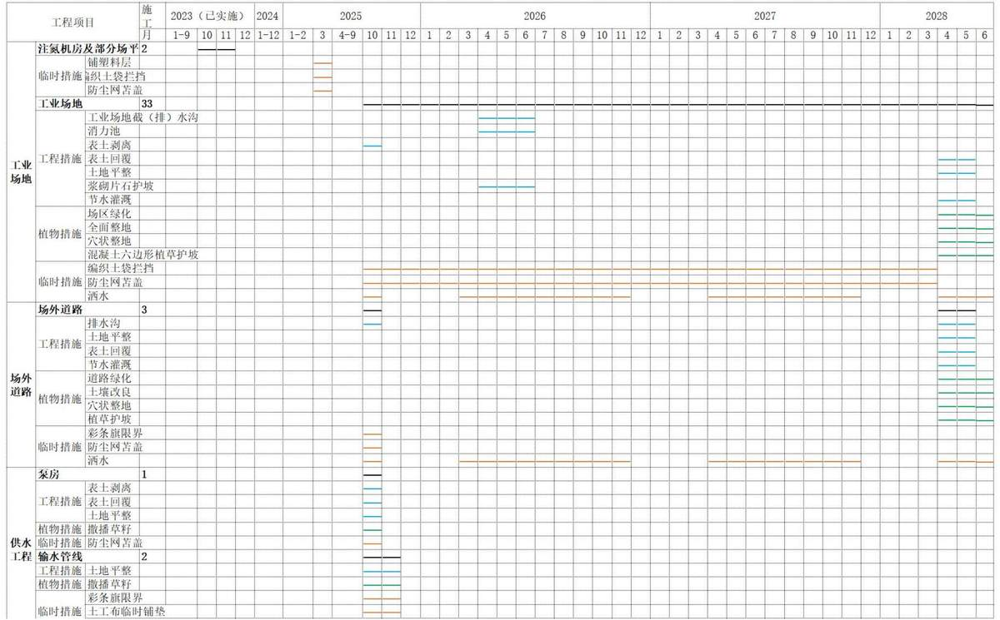

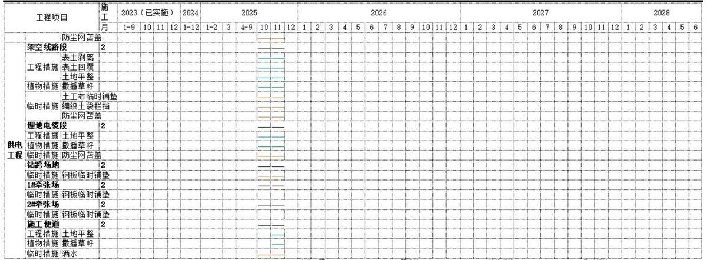

## 6 水土保持监测

## 6.1 范围和时段

## 1、监测范围

根据《生产建设项目水土保持技术标准》（GB50433-2018）、《水土保持监测技术规范》（SL/T277-2024）等相关文件规定，本项目的水土保持监测范围应以工程的水土流失防治责任范围为准，即25.47hm²。本工程的项目建设区包括工业场地、场外道路、供水工程、供电工程。

## 2、监测时段

按照《生产建设项目水土保持技术标准》（GB50433-2018）、《生产建设项目水土保持监测与评价标准》（GB/T51240-2018）。建设期监测时段从施工准备期开始至设计水平年结束，即从2025年10月开始2028年6月结束，共33个月。

## 6.2 监测内容和方法

## 6.2.1 监测内容

依据《生产建设项目水土保持技术标准》（GB50433-2018）、《水土保持监测技术规范》（SL/T277-2024）等文件规定，结合本期工程建设特点，本项目属建设生产类项目，生产建设项目水土保持监测内容主要包括扰动土地情况、弃土（石、渣）情况、水土流失情况、水土保持措施及效果等。本项目主要围绕以下内容开展监测工作。

## （1）扰动土地监测

扰动土地情况监测的内容包括扰动范围、面积、土地利用类型及其变化情况等。土地利用类型参照GB/T21010-2017土地利用类型一级类。扰动类型包括点型扰动和线型扰动：①点型扰动是指相对集中，呈点状分布的工业场地等扰动；②线型扰动是指跨度较大，呈线状分布的场外道路、供水工程、供电工程扰动。

## （2）弃土（石、渣）监测

①应对生产建设活动中所有的永久（临时）堆放场进行监测。

②监测内容包括临时堆放场的数量、位置、方量、防治措施落实情况等。

## （3）水土流失情况监测

水土流失情况监测主要包括土壤流失面积、土壤流失量、弃土（石、渣）潜在土壤流失量和水土流失危害等内容。

①土壤流失量是指输出项目建设区的土、石、沙数量。

②弃土（石、渣）潜在土壤流失量是指项目建设区内未实施防护措施，或者未按水土保持方案实施且未履行变更手续的弃土（石、渣）数量。

③水土流失危害是指项目建设引起的基础设施和民用设施的损毁，水库淤积、河道阻塞、滑坡、泥石流等危害。

## （4）水土保持措施及效果监测

①水土保持措施监测：应对工程措施、植物措施和临时措施进行全面监测。

②监测内容包括措施类型、开（完）工日期、位置、规格、尺寸、数量、防治效果、运行状况等。

## 6.2.2 监测方法

本项目采取调查监测、定位监测、遥感监测相结合的方法进行监测，以定位监测、调查观测为主，遥感监测为辅，同时结合项目的施工进度布设监测定位点。

## （1）调查监测

①资料收集分析法：对项目区背景值有关的指标，通过收集气象、水文、土壤、土地利用等资料进行分析，结合实地调查分析对各项指标赋值；对水土流失危害监测涉及的指标主要通过对项目区重点地段进行典型调查和对周边居民进行访谈调查，获取监测数据。

②实地测量法：对防治责任范围、扰动地表面积、损毁植被面积利用GPS卫星定位系统，沿扰动边界跟踪监测确定；对土石方量采用测量仪通过现场地形测量并结合施工资料和监理资料确定。

③样方调查法：对植被状况采用样方调查法调查确定，样方的投影面积为：乔灌木5m×5m，草地1m×1m，每一样方重复3次，查看林木生长情况、成活率、保存率。

场地巡查法：本项目调查监测法分为普查调查、抽样调查。

普查调查适用于面积较小的面上监测项目的调查，并根据需要对水土流失重点单元进行详查，调查内容和方法按《水土保持综合治理规划通则》（GB/T15772-2008）的规定执行。抽样调查适用于范围较大的面上监测项目的调查，由抽样方案设计、现场踏勘、预备调查、外业测定、内业分析等环节组成，按《水土保持监测与评价标准》（GB/T51240-2018）的规定执行。场地巡查监测采用定期或不定期方式对项目区水土流失和水土保持情况进行检查。主要适用于工业场地、场外道路、供水工程、供电工程等。

## （2）定位观测

定位观测主要用于测定水土流失强度。本项目的水土流失类型以水蚀为主，兼有风蚀，采用的监测方法主要有：

## ①简易径流小区法

参考《水土保持监测理论与方法》（郭索彦主编，中国水利水电出版社），本工程水蚀监测采用简易径流小区。在扰动面形成的水土流失坡面，用木板、铁皮、混凝土或其他隔湿材料围成矩形小区（根据本工程的实际情况，小区规格设计为10m×5m）。小区上方设截水沟，防止小区外径流进入小区。小区下方设集流槽，集流槽通过引水槽与径流池相连。径流池形状可为矩形或圆形，尺寸和容积按照一次可能产生的径流量确定。池内壁标有水尺，用以读取水位，据此计算观测时段内的径流量。取样时先将径流池的泥水搅拌均匀后再取水样，水样经过过滤、烘干、称重后，可算得含沙量和单位面积土壤流失量。主要用于场地背景水土流失量监测。土壤流失量计算公式采用：

$$
\scriptstyle \mathrm { W = L P } / \mathrm { S } \times 1 0 ^ { 3 }
$$

式中：W—土壤侵蚀量，t/km²

L—径流池总水量， $\mathrm { m } ^ { 3 }$

P—水样含沙量， $\mathrm { g } / \mathrm { l }$

S—径流小区面积， $\mathrm { m } ^ { 2 } ,$

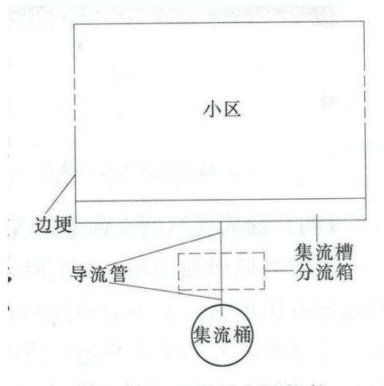  
图 6.2-1 监测小区平面示意图

## ②测钎法

监测小区考虑工程区施工用地情况，规格为6m×6m正方形监测小区，为防止监测小区被人为破坏需要修建防护围栏保护。（测钎品字形布设，见监测布点示意图），每月量取测钎离地面的高度变化，并计算侵蚀模数。观测场设置风速风向自记仪和自记雨量计，记录每天的地面风速、大风出现的时间、频次以及降雨时间、降雨强度和降雨历时等。土壤含水量采用烘干称重法，土壤容重采用环刀法，与侵蚀量观测同步进行。按以下公式计算风侵蚀模数。主要适用于各工程区水土流失量监测和水土流失背景值监测。

$$
\mathrm { M s } { = } 1 0 0 0 \mathrm { D s r }
$$

其中：

Ms—侵蚀模数，t/km²·a;

Ds—年平均侵蚀厚度，mm/a;

r—土壤容重，g/cm³。

插钎法小区布设典型设计图、典型案例以及监测数据统计方式见下图和表：

<table><tr><td rowspan=1 colspan=1></td><td rowspan=1 colspan=1>积(mm)</td><td rowspan=1 colspan=1>(。)</td><td rowspan=1 colspan=1>面积(m²)</td><td rowspan=1 colspan=1>宽A(m)</td><td rowspan=1 colspan=1>深h(m)</td><td rowspan=1 colspan=1>长L(m)</td><td rowspan=1 colspan=1>沟数(n)</td><td rowspan=1 colspan=1>均宽a(m)</td><td rowspan=1 colspan=1>均宽b(m)</td><td rowspan=1 colspan=1>深h(m)</td><td rowspan=1 colspan=1>沟长L(m)</td><td rowspan=1 colspan=1>沟数(n)</td><td rowspan=1 colspan=1></td><td rowspan=1 colspan=1></td></tr><tr><td rowspan=1 colspan=1>1</td><td rowspan=1 colspan=1></td><td rowspan=1 colspan=1></td><td rowspan=1 colspan=1></td><td rowspan=1 colspan=1></td><td rowspan=1 colspan=1></td><td rowspan=1 colspan=1></td><td rowspan=1 colspan=1></td><td rowspan=1 colspan=1></td><td rowspan=1 colspan=1></td><td rowspan=1 colspan=1></td><td rowspan=1 colspan=1></td><td rowspan=1 colspan=1></td><td rowspan=1 colspan=1></td><td rowspan=1 colspan=1></td></tr><tr><td rowspan=1 colspan=1>2</td><td rowspan=1 colspan=1></td><td rowspan=1 colspan=1></td><td rowspan=1 colspan=1></td><td rowspan=1 colspan=1></td><td rowspan=1 colspan=1></td><td rowspan=1 colspan=1></td><td rowspan=1 colspan=1></td><td rowspan=1 colspan=1></td><td rowspan=1 colspan=1></td><td rowspan=1 colspan=1></td><td rowspan=1 colspan=1></td><td rowspan=1 colspan=1></td><td rowspan=1 colspan=1></td><td rowspan=1 colspan=1></td></tr></table>

## ③集沙池法

集沙池法可适用于径流冲刷物颗粒较大、汇水面积不大、有集中出口汇水区的土壤流失监测。按照设计频次观测集沙池中的泥沙厚度，宜在集沙池的四个角及中心点分别测量泥沙厚度，并测算泥沙密度。土壤流失量计算公式采用：

$$
\begin{array} { r } { \mathrm { S T } = \frac { h 1 + h 2 + h 3 + h 4 + h 5 } { 5 } \mathrm { S } \rho \mathrm { s } \times 1 0 ^ { 4 } } \end{array}
$$

式中： $\mathrm { S _ { T } } .$ -汇水区土壤流失量（g）

hi 集沙池四角及中心点泥沙厚度（mm）

S 集沙池底面面积（m²）

ps -泥沙密度 $\mathrm { ( ~ g / c m ^ { 3 } ~ ) }$

本项目在厂区3#截水沟设置集沙池法监测点。

## （3）遥感监测

根据《水利部办公厅关于进一步加强生产建设项目水土保持监测工作的通知》（办水保〔2020〕161号）及《生产建设项目水土保持监测规程》2.0.7相关规定，本项目属于点状项目。常规遥感监测为卫星遥感监测，也可与新型的无人机监测配合应用。

1)卫星遥感监测法：遥感监测是通过遥感信息结合其他地理信息，通过专业处理系统，监测工程扰动面积状况、土壤侵蚀的类型、强度及空间分布状况，以及水土流失防治措施与效果情况，适用于区域水土流失状况监测。遥感监测主要技术内容包括：前期准备、遥感影像纠正处理、外业调查、遥感解译、空间分析、成果复核、数据统计分析等。主要适用于工业场地、场外道路、供水工程、供电工程等。根据《生产建设项目水土保持监测规程》要求，本项目需采用遥感监测方法。根据本项目具体情况，对扰动地表面积、损毁植被面积、水土流失面积等主要内容采取遥感监测方法。利用遥感影像资料，对工程建设前进行补充监测，本项目购买四期遥感影像，施工前，施工过程中，施工结束，植被恢复期各

（3）本项目土壤侵蚀强度、土壤流失量采用定位观测，在监测期内每月监测1次，遇到大风天气（风力大于17m/s）或暴雨天气（日降雨量≥25mm）加测，整个监测期加测次数控制在2\~3次。

## 6.3 点位布设

## 1、布设原则

本项目水土保持监测点布设原则为代表性、方便性、少受干扰的原则。

①每个监测点应根据各施工区可能造成水土流失大小来布设，同时都要有代表性，对所在水土流失类型区和监测重点要有代表意义，原地貌和扰动地貌应具有一定的可比性；

②各种监测应适当集中，不同监测项目应尽量结合；

③尽量避免人为活动的干扰；

④交通方便，便于监测管理；

⑤监测点分为长期性监测点和临时性监测点两类，本项目区建设期间布设临时性监测点。

## 2、监测点位布设

根据《水土保持监测技术规范》（SL/T277-2024）中监测点布设原则和选址要求，在实地踏勘的基础上，针对项目区工程特点、施工布置、水土流失的特点和水土保持措施的布局特征，为体现水土保持监测的全面性、典型性和代表性。本工程在其建设区共布设4个定位监测点和4个调查监测点。

根据地貌特点和施工期所采取的措施，本项目共布4个定位监测点和4个调查监测点。工业场地设1个定位监测点和1个调查监测点，供水工程区布设1个调查监测点，供电工程区布设1个定位监测点和1个调查监测点，工业场地北侧未扰动区设1个定位监测点（背景监测）。项目区水土保持监测点位布局详见附图5及下表。

表 6.3-1 各防治分区监测点位汇总表
<table><tr><td colspan="1" rowspan="1">监测分区</td><td colspan="1" rowspan="1">位置</td><td colspan="1" rowspan="1">监测内容</td><td colspan="1" rowspan="1">监测方法</td><td colspan="1" rowspan="1">监测频次</td></tr><tr><td colspan="1" rowspan="1">工业场地区</td><td colspan="1" rowspan="1">施工扰动区</td><td colspan="1" rowspan="1">水土流失量监测、水土流失程度监测、</td><td colspan="1" rowspan="1">1 个定位监测点、1个调查监测点</td><td colspan="1" rowspan="1">扰动土地情况监测，施工期不少于每月1次。实地量测监测频次应不少于每季度1</td></tr><tr><td colspan="1" rowspan="1">场外道路区</td><td colspan="1" rowspan="1">施工扰动区</td><td colspan="1" rowspan="1">扰动地表面积监测、水土流失影响因</td><td colspan="1" rowspan="1">1 个定位监测点、1个调查监测点</td><td colspan="1" rowspan="3">次；土壤流失面积监测应不少于每季度1次；土壤流失量潜在土壤流失量应不少于每月1次，遇大风等应加测；工程措施及防治效果不少于每月监测记录1次；临时措施不少于每月监测记录1次。</td></tr><tr><td colspan="1" rowspan="1">供电工程区</td><td colspan="1" rowspan="1">施工扰动区</td><td colspan="1" rowspan="2">子监测、工程措施布设情况及效果、临时措施实施效果</td><td colspan="1" rowspan="1">1 个定位监测点、1个调查监测点</td></tr><tr><td colspan="1" rowspan="1">供水工程区</td><td colspan="1" rowspan="1">施工扰动区</td><td colspan="1" rowspan="1">1 个调查监测点</td></tr><tr><td colspan="1" rowspan="1">工业场地外</td><td colspan="1" rowspan="1">工业场地北侧50m 未扰动区</td><td colspan="1" rowspan="1">水土流失背景值监测</td><td colspan="1" rowspan="1">1 个定位监测点</td><td colspan="1" rowspan="1">每年一次，遇暴雨、大风等情况及时加测。</td></tr></table>

## 3、监测频次

依据《生产建设项目水土保持技术标准》（GB50433-2018）、水土保持监测技术规范》（SL/T277-2024）、《水利部办公厅关于进一步加强生产建设项目水土保持监测工作的通知》（办水保〔2020〕161号），等文件规定，扰动土地情况监测，施工期不少于每月1次。实地量测监测频次应不少于每季度1次；土壤流失面积监测应不少于每季度1次；土壤流失量潜在土壤流失量应不少于每月1次，遇大风等应加测；工程措施及防治效果不少于每月监测记录1次；临时措施不少于每月监测记录1次。

## 6.4 实施条件和成果

## 6.4.1 监测设备

为准确获取各项地面定位观测及调查数据，水土保持监测必须采用现代技术与传统手段相结合的方法，借助一定的先进仪器设备，使监测方法更科学，监测结论更合理。如利用无人机、用土样分析仪器分析典型区域含沙量以及土壤养分等。

表 6.4-1 水土保持监测设备一览表
<table><tr><td colspan="1" rowspan="1">序号</td><td colspan="3" rowspan="1">设施与设备名称</td><td colspan="1" rowspan="1">单位</td><td colspan="1" rowspan="1">数量</td><td colspan="7" rowspan="1">耗损计费方式</td></tr><tr><td colspan="1" rowspan="1">1</td><td colspan="2" rowspan="1">人工费</td><td colspan="1" rowspan="1">人工</td><td colspan="1" rowspan="1">人</td><td colspan="1" rowspan="1">3</td><td colspan="7" rowspan="1">1</td></tr><tr><td colspan="1" rowspan="1">2</td><td colspan="2" rowspan="2">土建设施</td><td colspan="1" rowspan="1">测钎监测小区</td><td colspan="1" rowspan="1">个</td><td colspan="1" rowspan="1">3</td><td colspan="7" rowspan="2">土建</td></tr><tr><td colspan="1" rowspan="1">3</td><td colspan="1" rowspan="1">简易径流小区</td><td colspan="1" rowspan="1">个</td><td colspan="7" rowspan="1">1</td></tr><tr><td colspan="1" rowspan="1">4</td><td colspan="2" rowspan="3">固定设备</td><td colspan="1" rowspan="1">风向风速自记仪</td><td colspan="1" rowspan="1">台</td><td colspan="1" rowspan="1">2</td><td colspan="7" rowspan="5">年折旧按 20%</td></tr><tr><td colspan="1" rowspan="1">5</td><td colspan="1" rowspan="1">坡度仪</td><td colspan="1" rowspan="1">台</td><td colspan="7" rowspan="1">2</td></tr><tr><td colspan="1" rowspan="1">6</td><td colspan="1" rowspan="1">备</td><td colspan="1" rowspan="1">游标卡尺</td><td colspan="1" rowspan="1">把</td><td colspan="6" rowspan="1">2</td></tr><tr><td colspan="1" rowspan="1">7</td><td colspan="2" rowspan="2"></td><td colspan="1" rowspan="1"></td><td colspan="9" rowspan="1">罗盘</td></tr><tr><td colspan="1" rowspan="1">8</td><td colspan="1" rowspan="1">土壤水分快速测定仪</td><td colspan="1" rowspan="1">台</td><td colspan="7" rowspan="1">2</td></tr><tr><td colspan="2" rowspan="1">9</td><td colspan="4" rowspan="1"></td><td colspan="1" rowspan="1">GPS</td><td colspan="1" rowspan="1">台</td><td colspan="1" rowspan="1">1</td><td colspan="1" rowspan="9"></td></tr><tr><td colspan="2" rowspan="1">10</td><td colspan="4" rowspan="1"></td><td colspan="1" rowspan="1">天平</td><td colspan="1" rowspan="1">台</td><td colspan="1" rowspan="1">1</td></tr><tr><td colspan="2" rowspan="1">11</td><td colspan="4" rowspan="1"></td><td colspan="1" rowspan="1">烘箱</td><td colspan="1" rowspan="1">台</td><td colspan="1" rowspan="1">2</td></tr><tr><td colspan="2" rowspan="2">12</td><td colspan="3" rowspan="2"></td><td colspan="1" rowspan="1"></td><td colspan="1" rowspan="2"></td><td colspan="3" rowspan="2">土壤筛</td></tr><tr><td colspan="1" rowspan="1"></td><td></td></tr><tr><td colspan="2" rowspan="2">13</td><td colspan="3" rowspan="2"></td><td colspan="1" rowspan="1"></td><td colspan="1" rowspan="2"></td><td colspan="3" rowspan="2">相机</td></tr><tr><td colspan="2" rowspan="1"></td></tr><tr><td colspan="2" rowspan="1">14</td><td colspan="4" rowspan="2"></td><td colspan="1" rowspan="1"></td><td colspan="3" rowspan="1">测高测距仪</td></tr><tr><td colspan="2" rowspan="1">15</td><td colspan="1" rowspan="1">无人机</td><td colspan="1" rowspan="1">台</td><td colspan="1" rowspan="1">1</td></tr><tr><td colspan="2" rowspan="1">16</td><td colspan="4" rowspan="1">车辆</td><td colspan="1" rowspan="1">监测车辆</td><td colspan="1" rowspan="1">次</td><td colspan="1" rowspan="1">33</td><td colspan="1" rowspan="1">1</td></tr><tr><td colspan="2" rowspan="1">17</td><td colspan="4" rowspan="3"></td><td colspan="1" rowspan="1">测钎</td><td colspan="1" rowspan="1">根</td><td colspan="1" rowspan="1">36</td><td colspan="1" rowspan="14">易耗品</td></tr><tr><td colspan="2" rowspan="1">18</td><td colspan="1" rowspan="1">钢针</td><td colspan="1" rowspan="1">根</td><td colspan="1" rowspan="1">36</td></tr><tr><td colspan="2" rowspan="1">19</td><td colspan="2" rowspan="1"></td><td colspan="1" rowspan="1">50m卷尺</td><td colspan="1" rowspan="1">个</td><td colspan="1" rowspan="1">2</td></tr><tr><td colspan="2" rowspan="1">20</td><td colspan="3" rowspan="1"></td><td colspan="1" rowspan="1"></td><td colspan="1" rowspan="1"></td><td colspan="3" rowspan="1">5m卷尺</td></tr><tr><td colspan="2" rowspan="2">21</td><td colspan="3" rowspan="2"></td><td colspan="1" rowspan="2"></td><td colspan="1" rowspan="2"></td><td colspan="3" rowspan="2">标志绳</td></tr><tr><td colspan="2" rowspan="1"></td></tr><tr><td colspan="2" rowspan="1">22</td><td colspan="4" rowspan="3">消耗性设备</td><td colspan="1" rowspan="1">没备</td><td colspan="3" rowspan="1">蒸发皿</td></tr><tr><td colspan="2" rowspan="1">23</td><td colspan="1" rowspan="1">网围栏</td><td colspan="1" rowspan="1">m</td><td colspan="1" rowspan="1">72</td></tr><tr><td colspan="2" rowspan="1">24</td><td colspan="1" rowspan="1"></td><td colspan="2" rowspan="1"></td><td colspan="1" rowspan="1">标志牌</td><td colspan="1" rowspan="1">个</td><td colspan="1" rowspan="1">4</td></tr><tr><td colspan="2" rowspan="3">25</td><td></td><td></td><td></td><td></td><td></td><td></td><td></td></tr><tr><td colspan="2" rowspan="2"></td><td></td><td></td><td></td><td></td><td></td><td></td></tr><tr><td colspan="4" rowspan="3"></td><td colspan="2" rowspan="1"></td><td colspan="1" rowspan="1">铁筒</td><td colspan="1" rowspan="1">个</td><td colspan="1" rowspan="1">2</td></tr><tr><td colspan="2" rowspan="1">26</td><td colspan="1" rowspan="1">铁铲</td><td colspan="1" rowspan="1">个</td><td colspan="1" rowspan="1">2</td></tr><tr><td colspan="2" rowspan="1">27</td><td colspan="1" rowspan="1">量筒</td><td colspan="1" rowspan="1">个</td><td colspan="1" rowspan="1">4</td></tr><tr><td colspan="2" rowspan="1">28</td><td colspan="4" rowspan="1">遥感影像</td><td colspan="1" rowspan="1">购买遥感影像</td><td colspan="1" rowspan="1">期/景</td><td colspan="1" rowspan="1">4/4</td><td colspan="1" rowspan="1">外购</td></tr></table>

## 6.4.2 监测人员

监测所需人工主要指施工期间开展水土保持监测工作所需要的项目经理、监测工程师等外业和内业水土保持监测人员。

新疆伊宁矿区北区界梁子北矿井水土保持监测工作需配备监测人员3名。

## 6.4.3 监测成果

水土保持监测成果主要包括监测实施方案、记录表、水土保持监测意见、监测季度报告、监测年度报告、监测汇报材料、监测总结报告及相关图件、影像资料等。监测成果按水利部办公厅关于印发《生产建设项目水土保持监测规程（试行）的通知》（办水保〔2015〕139号）的要求编制。水土保持监测监管及成果报送工作按照《关于加强生产建设项目水土保持监测监管及成果报送工作的通知》（新疆维吾尔自治区水利厅新水办〔2021〕38号）要求执行。生产建设项目水土保持监测成果应按照档案管理相关规定建立档案，主要包括：

## （1）监测实施方案

建设单位应在主体工程开工前1个月向有关水行政主管部门报送《生产建设项目水土保持监测实施方案》。监测实施方案内容应包含建设项目及项目区概况、水土保持监测布局、监测内容与方法、预期成果及形式、监测工作组织与质量保证等5个部分。

## （2）监测季度报告

工程建设期间，应于每季度的第一个月内报送上季度的《生产建设项目水土保持监测季度报告》，同时需包含大型或重要位置的取土（石、料）弃土（石、渣）场的影像资料。季度报告应包含主体工程进度、扰动土地面积、植被占压面积、取土石场数量、弃土（渣）场数量、取土（石）量、弃土（渣）量、水土保持措施实施进度、水土流失影响因子、水土流失量、水土流失危害、存在问题及建议等方面内容。因降雨、大风或人为原因发生严重水土流失及危害事件的，应于事件发生后1周内报告有关情况。

## （3）监测年度报告

监测年报应于每年1月底报送上一年度监测报告，监测年报宜与第四季度报告结合上报。年度报告应包含建设项目及水土保持工作概况、重点部位水土流失动态监测结果、水土流失防治措施监测结果、水土流失情况动态监测、存在问题及建议、下一年工作计划等方面内容。

## （4）监测总结报告

水土保持监测任务完成后，应于3个月内报送《生产建设项目水土保持总结报告》，总结报告应包含建设项目及水土保持工作概况、监测内容与方法、重点部位水土流失动态监测、水土流失防治措施监测结果、土壤流失情况监测、水土流失防治效果监测结果、结论等方面内容。

## （5）监测记录

按监测实施方案和相关规定记录数据，监测记录真实完整。

## （6）影像资料及图件

影像资料包括照片集合影音资料。照片集包含监测项目区和监测点照片。同一监测点每次监测应拍摄同一位置、角度照片不少于三张。照片应标注拍摄时间。

图件资料包括工程地理位置图、工程建设前工程区水土流失现状图、水土保持措施布局图、工程竣工后项目区水土流失现状图等，作为监测成果报告的附图。

## （7）生产建设单位对监测成果报告工作负总责

编制水土保持方案报告书的项目，应当依法开展水土保持监测工作。实行水土保持监测“绿黄红”三色评价，水土保持监测单位根据监测情况，在监测季报和总结报告等监测成果中提出“绿黄红”三色评价结论。水土保持监测单位应根据监测情况，在监测季报和总结报告等监测成果中提出“绿红黄”三色评价结论。三色评价以水土保持方案确定的防治目标为基础，以监测获取的实际数据为依据，针对不同的监测内容，采取定量评价和定性分析相结合方式进行量化打分。三色评价采用评分法，满分为100分；得分80分及以上的为“绿”色，60分及以上不足80分的为“黄”色，不足60分的为“红”色。

监测季报三色评价得分为本季度实际得分，监测总结报告三色评价得分为全部监测季报得分的平均值。三色评价指标及赋分表、赋分方法见下表。

表6.4-2 生产建设项目水土保持监测三色评价指标及赋分表（试行）
<table><tr><td rowspan=1 colspan=2>项目名称</td><td rowspan=1 colspan=7></td></tr><tr><td rowspan=1 colspan=2>监测时段和防治责任范围</td><td rowspan=1 colspan=2>年第</td><td rowspan=1 colspan=2></td><td rowspan=1 colspan=1>季度，</td><td rowspan=1 colspan=1></td><td rowspan=1 colspan=1>公顷</td></tr><tr><td rowspan=1 colspan=2>三色评价结论（勾选）</td><td rowspan=1 colspan=2>绿色</td><td rowspan=1 colspan=2>黄色</td><td rowspan=1 colspan=1></td><td rowspan=1 colspan=1>红色</td><td rowspan=1 colspan=1></td></tr><tr><td rowspan=1 colspan=2>评价指标</td><td rowspan=1 colspan=1>分值</td><td rowspan=1 colspan=2>得分</td><td rowspan=1 colspan=4>赋分说明</td></tr><tr><td rowspan=3 colspan=1>扰动+地渣</td><td rowspan=1 colspan=1>扰动范围控制范围</td><td rowspan=1 colspan=1>15</td><td rowspan=1 colspan=2></td><td rowspan=1 colspan=4></td></tr><tr><td rowspan=1 colspan=1>表土剥离保护</td><td rowspan=1 colspan=1>5</td><td rowspan=1 colspan=2></td><td rowspan=1 colspan=4></td></tr><tr><td rowspan=1 colspan=1>土（石、渣）堆放</td><td rowspan=1 colspan=1>15</td><td rowspan=1 colspan=2></td><td rowspan=1 colspan=4></td></tr><tr><td rowspan=1 colspan=2>水土流失状况</td><td rowspan=1 colspan=1>15</td><td rowspan=1 colspan=2></td><td rowspan=1 colspan=4></td></tr><tr><td rowspan=3 colspan=1>水土流失防治成效</td><td rowspan=1 colspan=1>工程措施</td><td rowspan=1 colspan=1>20</td><td rowspan=1 colspan=2></td><td rowspan=1 colspan=4></td></tr><tr><td rowspan=1 colspan=1>植物措施</td><td rowspan=1 colspan=1>15</td><td rowspan=1 colspan=2></td><td rowspan=1 colspan=4></td></tr><tr><td rowspan=1 colspan=1>临时措施</td><td rowspan=1 colspan=1>10</td><td rowspan=1 colspan=2></td><td rowspan=1 colspan=4></td></tr><tr><td rowspan=1 colspan=2>水土流失危害</td><td rowspan=1 colspan=1>5</td><td rowspan=1 colspan=2></td><td rowspan=1 colspan=4></td></tr><tr><td rowspan=1 colspan=2>合计</td><td rowspan=1 colspan=1>100</td><td rowspan=1 colspan=2></td><td rowspan=1 colspan=4></td></tr></table>

表6.4-3 生产建设项目水土保持监测三色评价赋分方法（试行）
<table><tr><td colspan="2" rowspan="1">评价指标</td><td colspan="1" rowspan="1">分值</td><td colspan="1" rowspan="1">赋分方法</td></tr><tr><td colspan="1" rowspan="3">扰动土地情况</td><td colspan="1" rowspan="1">扰动范围控制范围</td><td colspan="1" rowspan="1">15</td><td colspan="1" rowspan="1">擅自扩大施工扰动面积达到1000平方米，存在1处扣1分，超过1000平方米的按照其倍数扣分（不足1000平方米的部分不扣分）。扣完为止</td></tr><tr><td colspan="1" rowspan="1">表土剥离保护</td><td colspan="1" rowspan="1">5</td><td colspan="1" rowspan="1">表土剥离保护措施未实施面积达到1000平方米，存在1处扣1分，超过1000平方米的按照其倍数扣分（不足1000平方米的部分不扣分）。扣完为止</td></tr><tr><td colspan="1" rowspan="1">渣土(石、渣)堆放</td><td colspan="1" rowspan="1">15</td><td colspan="1" rowspan="1">在水土保持方案确定的专门存放地外新设弃渣场且未按规定履行手续的，存在1处3级以上弃渣场的扣5分，存在1处3级</td></tr><tr><td colspan="1" rowspan="1"></td><td colspan="1" rowspan="1"></td><td colspan="1" rowspan="1"></td><td colspan="1" rowspan="1">以下弃渣场扣3分；乱堆乱弃或者顺坡溜渣，存在1处扣1分。扣完为止</td></tr><tr><td colspan="2" rowspan="1">水土流失状况</td><td colspan="1" rowspan="1">15</td><td colspan="1" rowspan="1">根据水土流失总量扣分，每100立方米扣1分，不足100立方米的部分不扣分。扣完为止</td></tr><tr><td colspan="1" rowspan="3">水土流失防治成效</td><td colspan="1" rowspan="1">工程措施</td><td colspan="1" rowspan="1">20</td><td colspan="1" rowspan="1">水土保持工程措施（截排水、工程护坡、土地平整等）落实不及时、不到位，存在1处扣1分；其中弃渣场“未拦先弃”的，存在1处3级以上弃渣场的扣3分，存在1处3级以下弃渣场的扣2分。扣完为止</td></tr><tr><td colspan="1" rowspan="1">植物措施</td><td colspan="1" rowspan="1">15</td><td colspan="1" rowspan="1">植物措施未落实或者已落实的成活率、覆盖率不达标面积达到1000平方米，存在1处扣1分，超过1000平方米的按照其倍数扣分（不足1000平方米的部分不扣分）。扣完为止</td></tr><tr><td colspan="1" rowspan="1">临时措施</td><td colspan="1" rowspan="1">10</td><td colspan="1" rowspan="1">水土保持临时防护措施（拦挡、排水、苫盖、植草、限界等）落实不及时、不到位，存在1处扣1分。扣完为止</td></tr><tr><td colspan="2" rowspan="1">水土流失危害</td><td colspan="1" rowspan="1">5</td><td colspan="1" rowspan="1">一般危害扣5分；严重危害总得分为0</td></tr></table>

监测成果应当公开，生产建设单位应当在工程建设期间将水土保持监测季报在其官方网站公开，同时在业主项目部和施工项目部公开。

水行政主管部门要将监测评价结论为“红”色的项目，纳入重点监管对象。

承担水土保持监测工作的单位，负责编制监测成果报告，并及时提交建设单位。建设单位按要求加盖公章后，通过网上将电子文档报送自治区水土保持生态环境监测总站的指定邮箱。同时应通过“全国水土保持信息管理系统”，及时上报监测实施方案、监测季度报告、监测年度报告、三色评价结论、监测总结报告等监测成果报告电子文档。

## （8）明确时限，做到及时准确规范

监测实施方案应在主体工程开工前1个月内报送，有特殊原因不能在开工前报送的，最迟在监测工作委托后1个月内报送；监测季度报告应在施工期每季度第一个月内，即每年1、4、7、10月报送上一季度监测报告；监测年度报告工期2年以上的项目，于每年2月1日前报送上年度监测报告；监测总结报告应在生产建设项目具备水土保持设施验收条件后的1个月内或水土保持监测任务完成后3个月内报送。

## 7 水土保持投资估算及效益分析

## 7.1 投资估算

## 7.1.1 编制原则及依据

## 7.1.1.1 编制原则

（1）遵循国家和地方颁布的有关水土保持政策法规；

（2）本工程主体已列措施按主体工程量及单价计列，新增措施按本次设计工程量计列，单价根据《生产建设项目水土保持工程概（估）算编制规定》及配套定额进行计算，并根据现行规定调整相关费率；

（3）人工单价、建筑材料单价按主体工程设计文件计列；

（4）编制深度与主体工程一致，按可行性研究阶段编制投资估算；

（5）水土保持投资费用构成按《水土保持工程概（估）算编制规定》执行；

（6）水土保持补偿费单列；

（7）本工程水土保持投资估算，作为主体工程投资组成部分，计入总投资中。建设期的水土保持投资从基建费中列支；

（8）新增措施投资价格水平年按2025年第1季度计列。

## 7.1.1.2 编制依据

（1）《水利工程设计概（估）算编制规定水土保持工程》《水土保持工程概算定额》《水利工程施工机械台时费定额》（水总〔2024〕323号）；

（2）《国家发展和改革委员会、财政部、水利部<关于水土保持补偿费收费标准（试行）>的通知》（发改价格〔2014〕886号）；

（3）《关于印发水土保持补偿费征收使用管理办法的通知》（财综〔2014〕8号）；

（4）《国家发展改革委、建设部关于印发<建设工程监理与相关服务收费管理规定>的通知》（发改价格〔2007〕670号）；

(5）《国家计委、建设部关于发布<工程勘察设计收费管理规定>的通知》（计价格〔2002〕10号）；

(6）《新疆维吾尔自治区公路工程建设项目估概预算编制办法补充规定》（新交建管〔2024〕64号）；

（7）《关于我区水土保持补偿费政策有关事宜的通知》（新发改规〔2021〕12号）。

## 7.1.1.3 编制说明

水土保持工程估算由工程措施费、植物措施费、监测措施费、施工临时工程费、独立费用五部分及预备费、水土保持补偿费构成。

第一部分工程措施费=设计工程量（设备清单）×工程（设备）单价，安装费按设备费百分率计算。

第二部分植物措施费=设计工程量×工程单价。

第三部分监测措施费由水土保持监测、弃渣场稳定监测和建设期观测费构成。按照监测方案有关监测内容、设施设备等进行编制，建设期观测费以主体工程土建投资合计为基数，按《水利工程设计概（估）算编制规定》表1.4-4建设期观测费标准所列标准计列。

第四部分施工临时工程费：包括临时防护工程、其他临时工程和施工安全生产专项。临时防护工程=设计工程量×工程单价；其他临时工程=（工程措施+植物措施+监测措施）×2%；施工安全生产专项=（工程措施+植物措施+监测措施+临时措施）（不含设备购置费）×2.5%。

第五部分独立费用：独立费用=建设管理费+工程建设监理费+科研勘测设计费。

水土流失补偿费按规定单列，最后计入项目总投资中。

最后将各项防治措施估算结果分类进行汇总，按规定计入投资总估算。

## (1） 基础单价

## 1）人工估算单价

本方案人工估算单价与主体工程保持一致，人工工日单价为98.50元/工日，12.32元/工时。

## 2）主要材料预算单价

主要材料价格采用主体工程价格，其他材料和植物措施材料价格根据市场调查价按照《水土保持工程概算定额》（水总〔2024〕323号）分析计算，材料预算价格=[材料原价（除税价）+运杂费（除税价）1×（1+采购及保管费费率）+运输保险费。

材料原价：按工程所在地区就近大的材料公司、材料交易中心的市场价或选定的生产厂家的出厂价计算。

运杂费：指材料自供应地点至工地仓库的运杂费用，包括运输费、装卸费和其他杂费。运率根据《新疆维吾尔自治区公路工程建设项目估概预算编制办法补充规定》（新交建管〔2024〕64号）文计取。公路为沥青混凝土路面，根据路况（二类）和海拔（+1630\~+1673m）运率加成系数1.0。

材料采购及保管费：以材料的原价加运杂费合计数为基数，费率取2.3%，其中苗木、草、种子采购及保管费率取1.1%。

## 3）其他材料价格

其他材料预算价格采用工程所在地信息价格或市场调查价格。

## 4）材料基价

当计算的材料除税预算价格超过规定的限制价格（材料基价）时，超过部分以材料补差形式计算。

## 5）风、水、电等价格

采用主体工程价格。

## 6）施工机械台时费

施工机械使用费采用《水利工程施工机械台时费定额》及有关规定计算。

## (2） 工程单价

建筑安装工程费由直接费、间接费、利润、材料补差和税金组成。

1）直接费：由基本直接费和其他直接费组成。

基本直接费包括人工费、材料费和施工机械使用费三项，按《水土保持工程概算定额》编制，本项目海拔+700m\~+1011m，根据海拔人工费调整系数取1.0，机械消耗费用调整系数取1.0。

其他直接费=基本直接费×其他直接费费率，包括冬雨季施工增加费、夜间施工增加费、临时设施费和其他。

2）间接费=直接费×间接费费率，指施工企业为完成建筑安装工程施工而组织施工生产和进行经营管理所发生的各项费用。间接费由规费和企业管理费组成。

3）利润=（直接费+间接费）×利润率，指按规定应计入建筑安装工程费的利润。

4）材料补差=（材料预算价格-材料基价）×材料消耗量，指根据相关主要材料的材料预算价格与材料基价的价格差值、材料消耗量，计算的相关材料费用的补差金额。材料基价指计入基本直接费的相关材料的限制价格。

5）税金=（直接费+间接费+利润+材料补差）×税率，指按规定应计入建筑安装工程费的增值税销项税额。

措施费率见下表：

表 7.1-1 措施费率汇总表
<table><tr><td rowspan=3 colspan=1>项目</td><td rowspan=3 colspan=1>计算基础</td><td rowspan=1 colspan=5>费率（%）</td></tr><tr><td rowspan=1 colspan=4>工程措施</td><td rowspan=2 colspan=1>植物措施</td></tr><tr><td rowspan=1 colspan=1>土方工程</td><td rowspan=1 colspan=1>石方工程</td><td rowspan=1 colspan=1>混凝土工程</td><td rowspan=1 colspan=1>其他工程</td></tr><tr><td rowspan=1 colspan=1>其他直接费</td><td rowspan=1 colspan=1>基本直接费</td><td rowspan=1 colspan=1>5.3</td><td rowspan=1 colspan=1>5.3</td><td rowspan=1 colspan=1>5.3</td><td rowspan=1 colspan=1>5.3</td><td rowspan=1 colspan=1>3</td></tr><tr><td rowspan=1 colspan=1>间接费</td><td rowspan=1 colspan=1>直接费</td><td rowspan=1 colspan=1>5</td><td rowspan=1 colspan=1>8</td><td rowspan=1 colspan=1>7</td><td rowspan=1 colspan=1>7</td><td rowspan=1 colspan=1>6</td></tr><tr><td rowspan=1 colspan=1>利润</td><td rowspan=1 colspan=1>直接费+间接费</td><td rowspan=1 colspan=1>7</td><td rowspan=1 colspan=1>7</td><td rowspan=1 colspan=1>7</td><td rowspan=1 colspan=1>7</td><td rowspan=1 colspan=1>7</td></tr><tr><td rowspan=1 colspan=1>税金</td><td rowspan=1 colspan=1>直接费+间接费+利润+材料补差</td><td rowspan=1 colspan=1>9</td><td rowspan=1 colspan=1>9</td><td rowspan=1 colspan=1>9</td><td rowspan=1 colspan=1>9</td><td rowspan=1 colspan=1>9</td></tr></table>

## （3）独立费用

独立费用由建设管理费、工程建设监理费、科研勘测设计费三项费用。

1）建设管理费包括项目经常费和技术咨询费。

项目经常费按一至四部分投资合计的2%计算（水土保持竣工验收费按市场调节价计列）。

技术咨询费按一至四部分投资合计的1%计算（弃渣场稳定安全评估费按市场调节价计列，不涉及此项费用的不计列）。

2）工程建设监理费参照国家发展改革委、建设部以发改价格〔2007〕670号印发的《建设工程监理与相关服务收费管理规定》计算。

## 3）科研勘测设计费

科研勘测设计费指生产建设项目水土保持工程中所发生的科研、勘测设计及水土保持方案编制等费用。

本项目仅涉及勘测设计费。前期工作阶段（可研）计费按照批复费用计列。施工图设计阶段的工程勘测费、设计费参照《国家计委、建设部关于发布<工程勘察设计收费管理规定>的通知》（计价格〔2002〕10号）计算。水土保持方案编制费按市场调节价计列。

## （4）预备费

## 1）基本预备费

基本预备费主要为解决在工程建设中，由于政策调整、设计变更和有关技术标准调整而增加的投资，以及工程遭受一般自然灾害所造成的损失和为预防自然灾害所采取的措施费用。本项目按基本预备费费率取10%。

## 2）价差预备费

价差预备费主要为解决在工程建设过程中，由于人工工资、材料和设备价格上涨以及费用标准调整而增加的投资。生产建设项目水土保持工程不单独计列价差预备费。

## （5）水土保持补偿费

水土保持补偿费：是指实施开发建设项目过程中，给予的一次性补偿费用。根据《水土保持补偿费征收使用管理办法》（财综〔2014〕8号）以及《我区水土保持补偿费政策有关事宜的通知》（新发改规〔2021〕12号）的相关规定：开采矿产资源的生产建设项目，建设期间，按照征占用土地面积每平方米1.5元一次性计征。本次补偿费缴纳基数按照总占地25.47hm²计列，需一次缴纳的水土保持补偿费38.21万元。

## 7.1.2 估算成果

本项目水土保持估算总投资为1980.01万元，其中主体工程已列投资1021.53万元，方案新增投资958.48万元。主体已列投资中工程措施投资753.46万元，植物措施投资263.77万元，临时措施投资4.29万元。新增水土保持总投资中工程措施57.25万元，植物措施投资261.39万元，监测措施投资43.80万元，施工临时工程投资291.11万元，独立费用183.06万元（其中建设管理费54.61万元、工程建设监理费28.82万元、科研勘测设计费99.64万元），预备费83.66万元，水土保持补偿费38.21万元。

表 7.1-2 总估算表 单位：万元
<table><tr><td rowspan=2 colspan=1>编号</td><td rowspan=2 colspan=1>工程或费用名称</td><td rowspan=1 colspan=4>方案新增投资</td><td rowspan=2 colspan=1>主体已列投资</td><td rowspan=2 colspan=1>投资总计</td></tr><tr><td rowspan=1 colspan=1>建筑安装工程费</td><td rowspan=1 colspan=1>设备购置费</td><td rowspan=1 colspan=1>独立费用</td><td rowspan=1 colspan=1>合计</td></tr><tr><td rowspan=1 colspan=1></td><td rowspan=1 colspan=1>第一部分 工程措施</td><td rowspan=1 colspan=1>57.25</td><td rowspan=1 colspan=1>0.00</td><td rowspan=1 colspan=1>0.00</td><td rowspan=1 colspan=1>57.25</td><td rowspan=1 colspan=1>753.46</td><td rowspan=1 colspan=1>810.71</td></tr><tr><td rowspan=1 colspan=1>一</td><td rowspan=1 colspan=1>工业场地区</td><td rowspan=1 colspan=1>55.62</td><td rowspan=1 colspan=1></td><td rowspan=1 colspan=1></td><td rowspan=1 colspan=1>55.62</td><td rowspan=1 colspan=1>724.74</td><td rowspan=1 colspan=1>780.36</td></tr><tr><td rowspan=1 colspan=1>二</td><td rowspan=1 colspan=1>场外道路区</td><td rowspan=1 colspan=1>0.35</td><td rowspan=1 colspan=1></td><td rowspan=1 colspan=1></td><td rowspan=1 colspan=1>0.35</td><td rowspan=1 colspan=1>21.97</td><td rowspan=1 colspan=1>22.32</td></tr><tr><td rowspan=1 colspan=1>三</td><td rowspan=1 colspan=1>供水工程区</td><td rowspan=1 colspan=1>1.00</td><td rowspan=1 colspan=1></td><td rowspan=1 colspan=1></td><td rowspan=1 colspan=1>1.00</td><td rowspan=1 colspan=1>2.16</td><td rowspan=1 colspan=1>3.16</td></tr><tr><td rowspan=1 colspan=1>四</td><td rowspan=1 colspan=1>供电工程区</td><td rowspan=1 colspan=1>0.28</td><td rowspan=1 colspan=1></td><td rowspan=1 colspan=1></td><td rowspan=1 colspan=1>0.28</td><td rowspan=1 colspan=1>4.60</td><td rowspan=1 colspan=1>4.88</td></tr><tr><td rowspan=1 colspan=1></td><td rowspan=1 colspan=1>第二部分植物措施</td><td rowspan=1 colspan=1>261.39</td><td rowspan=1 colspan=1>0.00</td><td rowspan=1 colspan=1>0.00</td><td rowspan=1 colspan=1>261.39</td><td rowspan=1 colspan=1>263.77</td><td rowspan=1 colspan=1>525.17</td></tr><tr><td rowspan=1 colspan=1>一</td><td rowspan=1 colspan=1>工业场地区</td><td rowspan=1 colspan=1>255.77</td><td rowspan=1 colspan=1></td><td rowspan=1 colspan=1></td><td rowspan=1 colspan=1>255.77</td><td rowspan=1 colspan=1>263.25</td><td rowspan=1 colspan=1>519.02</td></tr><tr><td rowspan=1 colspan=1>二</td><td rowspan=1 colspan=1>场外道路区</td><td rowspan=1 colspan=1>0.96</td><td rowspan=1 colspan=1></td><td rowspan=1 colspan=1></td><td rowspan=1 colspan=1>0.96</td><td rowspan=1 colspan=1>0.52</td><td rowspan=1 colspan=1>1.49</td></tr><tr><td rowspan=1 colspan=1>三</td><td rowspan=1 colspan=1>供水工程区</td><td rowspan=1 colspan=1>1.49</td><td rowspan=1 colspan=1></td><td rowspan=1 colspan=1></td><td rowspan=1 colspan=1>1.49</td><td rowspan=1 colspan=1>0.00</td><td rowspan=1 colspan=1>1.49</td></tr><tr><td rowspan=1 colspan=1>四</td><td rowspan=1 colspan=1>供电工程区</td><td rowspan=1 colspan=1>3.17</td><td rowspan=1 colspan=1></td><td rowspan=1 colspan=1></td><td rowspan=1 colspan=1>3.17</td><td rowspan=1 colspan=1>0.00</td><td rowspan=1 colspan=1>3.17</td></tr><tr><td rowspan=1 colspan=1></td><td rowspan=1 colspan=1>第三部分监测措施</td><td rowspan=1 colspan=1>42.86</td><td rowspan=1 colspan=1>0.94</td><td rowspan=1 colspan=1>0.00</td><td rowspan=1 colspan=1>43.80</td><td rowspan=1 colspan=1>0.00</td><td rowspan=1 colspan=1>43.80</td></tr><tr><td rowspan=1 colspan=1>一</td><td rowspan=1 colspan=1>水土保持监测</td><td rowspan=1 colspan=1>2.05</td><td rowspan=1 colspan=1>0.94</td><td rowspan=1 colspan=1></td><td rowspan=1 colspan=1>2.99</td><td rowspan=1 colspan=1>0.00</td><td rowspan=1 colspan=1>2.99</td></tr><tr><td rowspan=1 colspan=1>二</td><td rowspan=1 colspan=1>弃渣场稳定监测</td><td rowspan=1 colspan=1>0.00</td><td rowspan=1 colspan=1>0.00</td><td rowspan=1 colspan=1></td><td rowspan=1 colspan=1>0.00</td><td rowspan=1 colspan=1>0.00</td><td rowspan=1 colspan=1>0.00</td></tr><tr><td rowspan=1 colspan=1>三</td><td rowspan=1 colspan=1>建设期观测费</td><td rowspan=1 colspan=1>40.81</td><td rowspan=1 colspan=1></td><td rowspan=1 colspan=1></td><td rowspan=1 colspan=1>40.81</td><td rowspan=1 colspan=1>0.00</td><td rowspan=1 colspan=1>40.81</td></tr><tr><td rowspan=1 colspan=1></td><td rowspan=1 colspan=1>第四部分 施工临时工程</td><td rowspan=1 colspan=1>291.09</td><td rowspan=1 colspan=1>0.02</td><td rowspan=1 colspan=1>0.00</td><td rowspan=1 colspan=1>291.11</td><td rowspan=1 colspan=1>4.29</td><td rowspan=1 colspan=1>295.40</td></tr><tr><td rowspan=1 colspan=1>(一)</td><td rowspan=1 colspan=1>临时防护工程</td><td rowspan=1 colspan=1>268.12</td><td rowspan=1 colspan=1>0.00</td><td rowspan=1 colspan=1>0.00</td><td rowspan=1 colspan=1>268.12</td><td rowspan=1 colspan=1>4.29</td><td rowspan=1 colspan=1>272.41</td></tr><tr><td rowspan=1 colspan=1>一</td><td rowspan=1 colspan=1>工业场地区</td><td rowspan=1 colspan=1>60.04</td><td rowspan=1 colspan=1></td><td rowspan=1 colspan=1></td><td rowspan=1 colspan=1>60.04</td><td rowspan=1 colspan=1>4.29</td><td rowspan=1 colspan=1>64.33</td></tr><tr><td rowspan=1 colspan=1>二</td><td rowspan=1 colspan=1>场外道路区</td><td rowspan=1 colspan=1>1.63</td><td rowspan=1 colspan=1></td><td rowspan=1 colspan=1></td><td rowspan=1 colspan=1>1.63</td><td rowspan=1 colspan=1>0.00</td><td rowspan=1 colspan=1>1.63</td></tr><tr><td rowspan=1 colspan=1>三</td><td rowspan=1 colspan=1>供水工程区</td><td rowspan=1 colspan=1>5.23</td><td rowspan=1 colspan=1></td><td rowspan=1 colspan=1></td><td rowspan=1 colspan=1>5.23</td><td rowspan=1 colspan=1>0.00</td><td rowspan=1 colspan=1>5.23</td></tr><tr><td rowspan=1 colspan=1>四</td><td rowspan=1 colspan=1>供电工程区</td><td rowspan=1 colspan=1>201.22</td><td rowspan=1 colspan=1></td><td rowspan=1 colspan=1></td><td rowspan=1 colspan=1>201.22</td><td rowspan=1 colspan=1>0.00</td><td rowspan=1 colspan=1>201.22</td></tr><tr><td rowspan=1 colspan=1>(二)</td><td rowspan=1 colspan=1>其他临时工程</td><td rowspan=1 colspan=1>7.23</td><td rowspan=1 colspan=1>0.02</td><td rowspan=1 colspan=1>0.00</td><td rowspan=1 colspan=1>7.25</td><td rowspan=1 colspan=1></td><td rowspan=1 colspan=1>7.25</td></tr><tr><td rowspan=1 colspan=1>（三）</td><td rowspan=1 colspan=1>施工安全生产专项</td><td rowspan=1 colspan=1>15.74</td><td rowspan=1 colspan=1></td><td rowspan=1 colspan=1></td><td rowspan=1 colspan=1>15.74</td><td rowspan=1 colspan=1></td><td rowspan=1 colspan=1>15.74</td></tr><tr><td rowspan=1 colspan=1></td><td rowspan=1 colspan=1>第五部分 独立费用</td><td rowspan=1 colspan=1></td><td rowspan=1 colspan=1></td><td rowspan=1 colspan=1></td><td rowspan=1 colspan=1>183.06</td><td rowspan=1 colspan=1>0.00</td><td rowspan=1 colspan=1>183.06</td></tr><tr><td rowspan=1 colspan=1>1</td><td rowspan=1 colspan=1>建设管理费</td><td rowspan=1 colspan=1></td><td rowspan=1 colspan=1></td><td rowspan=1 colspan=1>54.61</td><td rowspan=1 colspan=1>54.61</td><td rowspan=1 colspan=1></td><td rowspan=1 colspan=1>54.61</td></tr><tr><td rowspan=1 colspan=1>2</td><td rowspan=1 colspan=1>工程建设监理费</td><td rowspan=1 colspan=1></td><td rowspan=1 colspan=1></td><td rowspan=1 colspan=1>28.82</td><td rowspan=1 colspan=1>28.82</td><td rowspan=1 colspan=1></td><td rowspan=1 colspan=1>28.82</td></tr><tr><td rowspan=1 colspan=1>3</td><td rowspan=1 colspan=1>科研勘测设计费</td><td rowspan=1 colspan=1></td><td rowspan=1 colspan=1></td><td rowspan=1 colspan=1>99.64</td><td rowspan=1 colspan=1>99.64</td><td rowspan=1 colspan=1></td><td rowspan=1 colspan=1>99.64</td></tr><tr><td rowspan=1 colspan=1>I</td><td rowspan=1 colspan=1>一至五部分合计</td><td rowspan=1 colspan=1></td><td rowspan=1 colspan=1></td><td rowspan=1 colspan=1></td><td rowspan=1 colspan=1>836.62</td><td rowspan=1 colspan=1>1021.53</td><td rowspan=1 colspan=1>1858.14</td></tr><tr><td rowspan=1 colspan=1>ⅡI</td><td rowspan=1 colspan=1>预备费</td><td rowspan=1 colspan=1></td><td rowspan=1 colspan=1></td><td rowspan=1 colspan=1></td><td rowspan=1 colspan=1>83.66</td><td rowspan=1 colspan=1></td><td rowspan=1 colspan=1>83.66</td></tr><tr><td rowspan=1 colspan=1>III</td><td rowspan=1 colspan=1>水土保持补偿费</td><td rowspan=1 colspan=1></td><td rowspan=1 colspan=1></td><td rowspan=1 colspan=1></td><td rowspan=1 colspan=1>38.21</td><td rowspan=1 colspan=1></td><td rowspan=1 colspan=1>38.21</td></tr><tr><td rowspan=1 colspan=2>水土保持总投资（I+Ⅱ+）</td><td rowspan=1 colspan=1></td><td rowspan=1 colspan=1></td><td rowspan=1 colspan=1></td><td rowspan=1 colspan=1>958.48</td><td rowspan=1 colspan=1>1021.53</td><td rowspan=1 colspan=1>1980.01</td></tr></table>

表 7.1-3 分部估算表
<table><tr><td colspan="1" rowspan="2">序号</td><td colspan="1" rowspan="2">工程或费用名称</td><td colspan="1" rowspan="2">单位</td><td colspan="3" rowspan="1">数量</td><td colspan="1" rowspan="2">单价（元）</td><td colspan="1" rowspan="2">合计(万元）</td><td colspan="1" rowspan="2">备注</td></tr><tr><td colspan="1" rowspan="1">主体已列</td><td colspan="1" rowspan="1">方案新增</td><td colspan="1" rowspan="1">合计</td></tr><tr><td colspan="1" rowspan="1"></td><td colspan="1" rowspan="1">第一部分 工程措施</td><td colspan="1" rowspan="1"></td><td colspan="1" rowspan="1"></td><td colspan="1" rowspan="1"></td><td colspan="1" rowspan="1"></td><td colspan="1" rowspan="1"></td><td colspan="1" rowspan="1">810.71</td><td colspan="1" rowspan="1"></td></tr><tr><td colspan="1" rowspan="1">一</td><td colspan="1" rowspan="1">工业场地区</td><td colspan="1" rowspan="1"></td><td colspan="1" rowspan="1"></td><td colspan="1" rowspan="1"></td><td colspan="1" rowspan="1"></td><td colspan="1" rowspan="1"></td><td colspan="1" rowspan="1">779.94</td><td colspan="1" rowspan="1"></td></tr><tr><td colspan="1" rowspan="1">1</td><td colspan="1" rowspan="1">场区1#排水沟</td><td colspan="1" rowspan="1">m</td><td colspan="1" rowspan="1">200.00</td><td colspan="1" rowspan="1"></td><td colspan="1" rowspan="1">200.00</td><td colspan="1" rowspan="1">3796.00</td><td colspan="1" rowspan="1">75.92</td><td colspan="1" rowspan="1"></td></tr><tr><td colspan="1" rowspan="1">2</td><td colspan="1" rowspan="1">场区2#截、排水沟</td><td colspan="1" rowspan="1">m</td><td colspan="1" rowspan="1">1440.00</td><td colspan="1" rowspan="1"></td><td colspan="1" rowspan="1">1440.00</td><td colspan="1" rowspan="1">1425.02</td><td colspan="1" rowspan="1">205.20</td><td colspan="1" rowspan="1"></td></tr><tr><td colspan="1" rowspan="1">3</td><td colspan="1" rowspan="1">场区3#截水沟</td><td colspan="1" rowspan="1">m</td><td colspan="1" rowspan="1">410.00</td><td colspan="1" rowspan="1"></td><td colspan="1" rowspan="1">410.00</td><td colspan="1" rowspan="1">2216.70</td><td colspan="1" rowspan="1">90.88</td><td colspan="1" rowspan="1"></td></tr><tr><td colspan="1" rowspan="1">4</td><td colspan="1" rowspan="1">消力池</td><td colspan="1" rowspan="1"></td><td colspan="1" rowspan="1"></td><td colspan="1" rowspan="1"></td><td colspan="1" rowspan="1"></td><td colspan="1" rowspan="1"></td><td colspan="1" rowspan="1"></td><td colspan="1" rowspan="1"></td></tr><tr><td colspan="1" rowspan="1">4.1</td><td colspan="1" rowspan="1">挖土</td><td colspan="1" rowspan="1"> $\mathrm { m } ^ { 3 }$ </td><td colspan="1" rowspan="1"></td><td colspan="1" rowspan="1">13.00</td><td colspan="1" rowspan="1">13.00</td><td colspan="1" rowspan="1">4.15</td><td colspan="1" rowspan="1">0.01</td><td colspan="1" rowspan="1"></td></tr><tr><td colspan="1" rowspan="1">4.2</td><td colspan="1" rowspan="1">回填土</td><td colspan="1" rowspan="1"> $\mathrm { m } ^ { 3 }$ </td><td colspan="1" rowspan="1"></td><td colspan="1" rowspan="1">2.00</td><td colspan="1" rowspan="1">2.00</td><td colspan="1" rowspan="1">57.51</td><td colspan="1" rowspan="1">0.01</td><td colspan="1" rowspan="1"></td></tr><tr><td colspan="1" rowspan="1">4.3</td><td colspan="1" rowspan="1">池体砌筑</td><td colspan="1" rowspan="1"> $\mathrm { m } ^ { 3 }$ </td><td colspan="1" rowspan="1"></td><td colspan="1" rowspan="1">5.00</td><td colspan="1" rowspan="1">5.00</td><td colspan="1" rowspan="1">480.98</td><td colspan="1" rowspan="1">0.24</td><td colspan="1" rowspan="1"></td></tr><tr><td colspan="1" rowspan="1">5</td><td colspan="1" rowspan="1">场内排水沟</td><td colspan="1" rowspan="1"> $\mathbf { m }$ </td><td colspan="1" rowspan="1">1605.00</td><td colspan="1" rowspan="1"></td><td colspan="1" rowspan="1">1605.00</td><td colspan="1" rowspan="1">1109.73</td><td colspan="1" rowspan="1">178.11</td><td colspan="1" rowspan="1"></td></tr><tr><td colspan="1" rowspan="1">6</td><td colspan="1" rowspan="1">场内盖板排水沟</td><td colspan="1" rowspan="1"> $\mathbf { m }$ </td><td colspan="1" rowspan="1">170.00</td><td colspan="1" rowspan="1"></td><td colspan="1" rowspan="1">170.00</td><td colspan="1" rowspan="1">1913.83</td><td colspan="1" rowspan="1">32.54</td><td colspan="1" rowspan="1"></td></tr><tr><td colspan="1" rowspan="1">7</td><td colspan="1" rowspan="1">表土剥离</td><td colspan="1" rowspan="1"> $\mathrm { m } ^ { 2 }$ </td><td colspan="1" rowspan="1"></td><td colspan="1" rowspan="1">137900.00</td><td colspan="1" rowspan="1">137900.00</td><td colspan="1" rowspan="1">1.08</td><td colspan="1" rowspan="1">14.85</td><td colspan="1" rowspan="1"></td></tr><tr><td colspan="1" rowspan="1">8</td><td colspan="1" rowspan="1">表土回覆</td><td colspan="1" rowspan="1"> $\mathbf { m } 3$ </td><td colspan="1" rowspan="1"></td><td colspan="1" rowspan="1">21100.00</td><td colspan="1" rowspan="1">21100.00</td><td colspan="1" rowspan="1">4.38</td><td colspan="1" rowspan="1">9.25</td><td colspan="1" rowspan="1"></td></tr><tr><td colspan="1" rowspan="1">9</td><td colspan="1" rowspan="1">土地平整</td><td colspan="1" rowspan="1"> $\mathrm { h m } ^ { 2 }$ </td><td colspan="1" rowspan="1">9.53</td><td colspan="1" rowspan="1"></td><td colspan="1" rowspan="1">9.53</td><td colspan="1" rowspan="1">14500.00</td><td colspan="1" rowspan="1">13.82</td><td colspan="1" rowspan="1"></td></tr><tr><td colspan="1" rowspan="1">10</td><td colspan="1" rowspan="1">浆砌片石护坡</td><td colspan="1" rowspan="1"> $\mathrm { m } ^ { 2 }$ </td><td colspan="1" rowspan="1">3460.00</td><td colspan="1" rowspan="1"></td><td colspan="1" rowspan="1">3460.00</td><td colspan="1" rowspan="1">265.00</td><td colspan="1" rowspan="1">91.69</td><td colspan="1" rowspan="1"></td></tr><tr><td colspan="1" rowspan="1">11</td><td colspan="1" rowspan="1">节水灌溉</td><td colspan="1" rowspan="1"> $\mathrm { h m } ^ { 2 }$ </td><td colspan="1" rowspan="1">3.51</td><td colspan="1" rowspan="1">3.00</td><td colspan="1" rowspan="1">6.51</td><td colspan="1" rowspan="1">104200.00</td><td colspan="1" rowspan="1">67.83</td><td colspan="1" rowspan="1"></td></tr><tr><td colspan="1" rowspan="1">二</td><td colspan="1" rowspan="1">场外道路区</td><td colspan="1" rowspan="1"></td><td colspan="1" rowspan="1"></td><td colspan="1" rowspan="1"></td><td colspan="1" rowspan="1"></td><td colspan="1" rowspan="1"></td><td colspan="1" rowspan="1">22.32</td><td colspan="1" rowspan="1"></td></tr><tr><td colspan="1" rowspan="1">1</td><td colspan="1" rowspan="1">道路排水沟</td><td colspan="1" rowspan="1">m</td><td colspan="1" rowspan="1">310.00</td><td colspan="1" rowspan="1"></td><td colspan="1" rowspan="1">310.00</td><td colspan="1" rowspan="1">612.00</td><td colspan="1" rowspan="1">18.97</td><td colspan="1" rowspan="1"></td></tr><tr><td colspan="1" rowspan="1">2</td><td colspan="1" rowspan="1">土地平整</td><td colspan="1" rowspan="1"> $\mathrm { h m } ^ { 2 }$ </td><td colspan="1" rowspan="1">0.27</td><td colspan="1" rowspan="1"></td><td colspan="1" rowspan="1">0.27</td><td colspan="1" rowspan="1">14500.00</td><td colspan="1" rowspan="1">0.39</td><td colspan="1" rowspan="1"></td></tr><tr><td colspan="1" rowspan="1">3</td><td colspan="1" rowspan="1">表土回覆</td><td colspan="1" rowspan="1"> $\mathrm { m } ^ { 3 }$ </td><td colspan="1" rowspan="1"></td><td colspan="1" rowspan="1">800.00</td><td colspan="1" rowspan="1">800.00</td><td colspan="1" rowspan="1">4.38</td><td colspan="1" rowspan="1">0.35</td><td colspan="1" rowspan="1"></td></tr><tr><td colspan="1" rowspan="1">4</td><td colspan="1" rowspan="1">节水灌溉</td><td colspan="1" rowspan="1"> $\mathrm { h m } ^ { 2 }$ </td><td colspan="1" rowspan="1">0.25</td><td colspan="1" rowspan="1"></td><td colspan="1" rowspan="1">0.25</td><td colspan="1" rowspan="1">104200.00</td><td colspan="1" rowspan="1">2.61</td><td colspan="1" rowspan="1"></td></tr><tr><td colspan="1" rowspan="1">三</td><td colspan="1" rowspan="1">供水工程区</td><td colspan="1" rowspan="1"></td><td colspan="1" rowspan="1"></td><td colspan="1" rowspan="1"></td><td colspan="1" rowspan="1"></td><td colspan="1" rowspan="1"></td><td colspan="1" rowspan="1">3.16</td><td colspan="1" rowspan="1"></td></tr><tr><td colspan="1" rowspan="1">1</td><td colspan="1" rowspan="1">表土剥离</td><td colspan="1" rowspan="1"> $\mathrm { m } ^ { 2 }$ </td><td colspan="1" rowspan="1"></td><td colspan="1" rowspan="1">5100.00</td><td colspan="1" rowspan="1">5100.00</td><td colspan="1" rowspan="1">1.08</td><td colspan="1" rowspan="1">0.55</td><td colspan="1" rowspan="1"></td></tr><tr><td colspan="1" rowspan="1">2</td><td colspan="1" rowspan="1">表土回覆</td><td colspan="1" rowspan="1"> $\mathrm { m } ^ { 3 }$ </td><td colspan="1" rowspan="1"></td><td colspan="1" rowspan="1">1020.00</td><td colspan="1" rowspan="1">1020.00</td><td colspan="1" rowspan="1">4.38</td><td colspan="1" rowspan="1">0.45</td><td colspan="1" rowspan="1"></td></tr><tr><td colspan="1" rowspan="1">3</td><td colspan="1" rowspan="1">土地平整</td><td colspan="1" rowspan="1"> $\mathrm { h m } ^ { 2 }$ </td><td colspan="1" rowspan="1">1.49</td><td colspan="1" rowspan="1"></td><td colspan="1" rowspan="1">1.49</td><td colspan="1" rowspan="1">14500.00</td><td colspan="1" rowspan="1">2.16</td><td colspan="1" rowspan="1"></td></tr><tr><td colspan="1" rowspan="1">四</td><td colspan="1" rowspan="1">供电工程区</td><td colspan="1" rowspan="1"></td><td colspan="1" rowspan="1"></td><td colspan="1" rowspan="1"></td><td colspan="1" rowspan="1"></td><td colspan="1" rowspan="1"></td><td colspan="1" rowspan="1">4.88</td><td colspan="1" rowspan="1"></td></tr><tr><td colspan="1" rowspan="1">1</td><td colspan="1" rowspan="1">表土剥离</td><td colspan="1" rowspan="1"> $\mathrm { m } ^ { 2 }$ </td><td colspan="1" rowspan="1"></td><td colspan="1" rowspan="1">1400.00</td><td colspan="1" rowspan="1">1400.00</td><td colspan="1" rowspan="1">1.08</td><td colspan="1" rowspan="1">0.15</td><td colspan="1" rowspan="1"></td></tr><tr><td colspan="1" rowspan="1">2</td><td colspan="1" rowspan="1">表土回覆</td><td colspan="1" rowspan="1"> $\mathrm { m } ^ { 3 }$ </td><td colspan="1" rowspan="1"></td><td colspan="1" rowspan="1">300.00</td><td colspan="1" rowspan="1">300.00</td><td colspan="1" rowspan="1">4.38</td><td colspan="1" rowspan="1">0.13</td><td colspan="1" rowspan="1"></td></tr><tr><td colspan="1" rowspan="1">3</td><td colspan="1" rowspan="1">土地平整</td><td colspan="1" rowspan="1"> $\mathrm { h m } ^ { 2 }$ </td><td colspan="1" rowspan="1">3.17</td><td colspan="1" rowspan="1"></td><td colspan="1" rowspan="1">3.17</td><td colspan="1" rowspan="1">14500.00</td><td colspan="1" rowspan="1">4.60</td><td colspan="1" rowspan="1"></td></tr><tr><td colspan="1" rowspan="1"></td><td colspan="1" rowspan="1">第二部分 植物措施</td><td colspan="1" rowspan="1"></td><td colspan="1" rowspan="1"></td><td colspan="1" rowspan="1"></td><td colspan="1" rowspan="1"></td><td colspan="1" rowspan="1"></td><td colspan="1" rowspan="1">525.17</td><td colspan="1" rowspan="1"></td></tr><tr><td colspan="1" rowspan="1">一</td><td colspan="1" rowspan="1">工业场地区</td><td colspan="1" rowspan="1"></td><td colspan="1" rowspan="1"></td><td colspan="1" rowspan="1"></td><td colspan="1" rowspan="1"></td><td colspan="1" rowspan="1"></td><td colspan="1" rowspan="1">516.02</td><td colspan="1" rowspan="1"></td></tr><tr><td colspan="1" rowspan="1">1</td><td colspan="1" rowspan="1">场区绿化</td><td colspan="1" rowspan="1"> $\mathrm { h m } ^ { 2 }$ </td><td colspan="1" rowspan="1">3.51</td><td colspan="1" rowspan="1">3.00</td><td colspan="1" rowspan="1">6.51</td><td colspan="1" rowspan="1">750000.00</td><td colspan="1" rowspan="1">488.25</td><td colspan="1" rowspan="1"></td></tr><tr><td colspan="1" rowspan="1">2</td><td colspan="1" rowspan="1">全面整地</td><td colspan="1" rowspan="1"> $\mathrm { h m } ^ { 2 }$ </td><td colspan="1" rowspan="1"></td><td colspan="1" rowspan="1">6.47</td><td colspan="1" rowspan="1">6.47</td><td colspan="1" rowspan="1">19745.74</td><td colspan="1" rowspan="1">12.78</td><td colspan="1" rowspan="1"></td></tr><tr><td colspan="1" rowspan="1">3</td><td colspan="1" rowspan="1">穴状整地（60×60×40cm)</td><td colspan="1" rowspan="1">个</td><td colspan="1" rowspan="1"></td><td colspan="1" rowspan="1">2893.00</td><td colspan="1" rowspan="1">2893.00</td><td colspan="1" rowspan="1">1.48</td><td colspan="1" rowspan="1">0.43</td><td colspan="1" rowspan="1"></td></tr><tr><td colspan="1" rowspan="1">4</td><td colspan="1" rowspan="1">穴状整地（40×40×30cm)</td><td colspan="1" rowspan="1">个</td><td colspan="1" rowspan="1"></td><td colspan="1" rowspan="1">8048.00</td><td colspan="1" rowspan="1">8048.00</td><td colspan="1" rowspan="1">4.99</td><td colspan="1" rowspan="1">4.02</td><td colspan="1" rowspan="1"></td></tr><tr><td colspan="1" rowspan="1">5</td><td colspan="1" rowspan="1">幼林抚育第1年</td><td colspan="1" rowspan="1">hm²</td><td colspan="1" rowspan="1"></td><td colspan="1" rowspan="1">6.47</td><td colspan="1" rowspan="1">6.47</td><td colspan="1" rowspan="1">2487.84</td><td colspan="1" rowspan="1">1.61</td><td colspan="1" rowspan="1"></td></tr><tr><td colspan="1" rowspan="1">6</td><td colspan="1" rowspan="1">幼林抚育第2年</td><td colspan="1" rowspan="1">hm²</td><td colspan="1" rowspan="1"></td><td colspan="1" rowspan="1">6.47</td><td colspan="1" rowspan="1">6.47</td><td colspan="1" rowspan="1">1918.27</td><td colspan="1" rowspan="1">1.24</td><td colspan="1" rowspan="1"></td></tr><tr><td colspan="1" rowspan="1">7</td><td colspan="1" rowspan="1">幼林抚育第3年</td><td colspan="1" rowspan="1">hm²</td><td colspan="1" rowspan="1"></td><td colspan="1" rowspan="1">6.47</td><td colspan="1" rowspan="1">6.47</td><td colspan="1" rowspan="1">1535.17</td><td colspan="1" rowspan="1">0.99</td><td colspan="1" rowspan="1"></td></tr><tr><td colspan="1" rowspan="1">8</td><td colspan="1" rowspan="1">预制混凝土框格植草护坡</td><td colspan="1" rowspan="1"></td><td colspan="1" rowspan="1"></td><td colspan="1" rowspan="1"></td><td colspan="1" rowspan="1"></td><td colspan="1" rowspan="1"></td><td colspan="1" rowspan="1"></td><td colspan="1" rowspan="1"></td></tr><tr><td colspan="1" rowspan="1">8.1</td><td colspan="1" rowspan="1">框格砌筑</td><td colspan="1" rowspan="1">m³</td><td colspan="1" rowspan="1"></td><td colspan="1" rowspan="1">176.00</td><td colspan="1" rowspan="1">176.00</td><td colspan="1" rowspan="1">526.69</td><td colspan="1" rowspan="1">9.27</td><td colspan="1" rowspan="1"></td></tr><tr><td colspan="1" rowspan="1">8.2</td><td colspan="1" rowspan="1">直播种草</td><td colspan="1" rowspan="1">hm²</td><td colspan="1" rowspan="1"></td><td colspan="1" rowspan="1">0.44</td><td colspan="1" rowspan="1">0.44</td><td colspan="1" rowspan="1">9987.45</td><td colspan="1" rowspan="1">0.44</td><td colspan="1" rowspan="1"></td></tr><tr><td colspan="1" rowspan="1">二</td><td colspan="1" rowspan="1">场外道路区</td><td colspan="1" rowspan="1"></td><td colspan="1" rowspan="1"></td><td colspan="1" rowspan="1"></td><td colspan="1" rowspan="1"></td><td colspan="1" rowspan="1"></td><td colspan="1" rowspan="1">1.49</td><td colspan="1" rowspan="1"></td></tr><tr><td colspan="1" rowspan="1">1</td><td colspan="1" rowspan="1">道路绿化</td><td colspan="1" rowspan="1">km</td><td colspan="1" rowspan="1">0.32</td><td colspan="1" rowspan="1"></td><td colspan="1" rowspan="1">0.32</td><td colspan="1" rowspan="1">16380.00</td><td colspan="1" rowspan="1">0.52</td><td colspan="1" rowspan="1"></td></tr><tr><td colspan="1" rowspan="1">2</td><td colspan="1" rowspan="1">穴状整地（60×60×40cm)</td><td colspan="1" rowspan="1">个</td><td colspan="1" rowspan="1"></td><td colspan="1" rowspan="1">310.00</td><td colspan="1" rowspan="1">310.00</td><td colspan="1" rowspan="1">1.48</td><td colspan="1" rowspan="1">0.05</td><td colspan="1" rowspan="1"></td></tr><tr><td colspan="1" rowspan="1">3</td><td colspan="1" rowspan="1">穴状整地（40×40×30cm)</td><td colspan="1" rowspan="1">个</td><td colspan="1" rowspan="1"></td><td colspan="1" rowspan="1">620.00</td><td colspan="1" rowspan="1">620.00</td><td colspan="1" rowspan="1">4.99</td><td colspan="1" rowspan="1">0.31</td><td colspan="1" rowspan="1"></td></tr><tr><td colspan="1" rowspan="1">4</td><td colspan="1" rowspan="1">幼林抚育第1年</td><td colspan="1" rowspan="1">hm²</td><td colspan="1" rowspan="1"></td><td colspan="1" rowspan="1">0.02</td><td colspan="1" rowspan="1">0.02</td><td colspan="1" rowspan="1">2487.84</td><td colspan="1" rowspan="1">0.00</td><td colspan="1" rowspan="1"></td></tr><tr><td colspan="1" rowspan="1">5</td><td colspan="1" rowspan="1">幼林抚育第2年</td><td colspan="1" rowspan="1">hm²</td><td colspan="1" rowspan="1"></td><td colspan="1" rowspan="1">0.02</td><td colspan="1" rowspan="1">0.02</td><td colspan="1" rowspan="1">1918.27</td><td colspan="1" rowspan="1">0.00</td><td colspan="1" rowspan="1"></td></tr><tr><td colspan="1" rowspan="1">6</td><td colspan="1" rowspan="1">幼林抚育第3年</td><td colspan="1" rowspan="1">hm²</td><td colspan="1" rowspan="1"></td><td colspan="1" rowspan="1">0.02</td><td colspan="1" rowspan="1">0.02</td><td colspan="1" rowspan="1">1535.17</td><td colspan="1" rowspan="1">0.00</td><td colspan="1" rowspan="1"></td></tr><tr><td colspan="1" rowspan="1">7</td><td colspan="1" rowspan="1">植草护坡</td><td colspan="1" rowspan="1"></td><td colspan="1" rowspan="1"></td><td colspan="1" rowspan="1"></td><td colspan="1" rowspan="1"></td><td colspan="1" rowspan="1"></td><td colspan="1" rowspan="1"></td><td colspan="1" rowspan="1"></td></tr><tr><td colspan="1" rowspan="1">7.1</td><td colspan="1" rowspan="1">直播种草</td><td colspan="1" rowspan="1">hm²</td><td colspan="1" rowspan="1"></td><td colspan="1" rowspan="1">0.20</td><td colspan="1" rowspan="1">0.20</td><td colspan="1" rowspan="1">9987.45</td><td colspan="1" rowspan="1">0.20</td><td colspan="1" rowspan="1"></td></tr><tr><td colspan="1" rowspan="1">8</td><td colspan="1" rowspan="1">全面整地</td><td colspan="1" rowspan="1">hm²</td><td colspan="1" rowspan="1"></td><td colspan="1" rowspan="1">0.20</td><td colspan="1" rowspan="1">0.20</td><td colspan="1" rowspan="1">19745.74</td><td colspan="1" rowspan="1">0.39</td><td colspan="1" rowspan="1"></td></tr><tr><td colspan="1" rowspan="1">三</td><td colspan="1" rowspan="1">供水工程区</td><td colspan="1" rowspan="1"></td><td colspan="1" rowspan="1"></td><td colspan="1" rowspan="1"></td><td colspan="1" rowspan="1"></td><td colspan="1" rowspan="1"></td><td colspan="1" rowspan="1">1.49</td><td colspan="1" rowspan="1"></td></tr><tr><td colspan="1" rowspan="1">1</td><td colspan="1" rowspan="1">撒播草籽</td><td colspan="1" rowspan="1"></td><td colspan="1" rowspan="1"></td><td colspan="1" rowspan="1"></td><td colspan="1" rowspan="1"></td><td colspan="1" rowspan="1"></td><td colspan="1" rowspan="1"></td><td colspan="1" rowspan="1"></td></tr><tr><td colspan="1" rowspan="1">1.1</td><td colspan="1" rowspan="1">直播种草</td><td colspan="1" rowspan="1">hm²</td><td colspan="1" rowspan="1"></td><td colspan="1" rowspan="1">1.49</td><td colspan="1" rowspan="1">1.49</td><td colspan="1" rowspan="1">9987.45</td><td colspan="1" rowspan="1">1.49</td><td colspan="1" rowspan="1"></td></tr><tr><td colspan="1" rowspan="1">四</td><td colspan="1" rowspan="1">供电工程区</td><td colspan="1" rowspan="1"></td><td colspan="1" rowspan="1"></td><td colspan="1" rowspan="1"></td><td colspan="1" rowspan="1"></td><td colspan="1" rowspan="1"></td><td colspan="1" rowspan="1">3.17</td><td colspan="1" rowspan="1"></td></tr><tr><td colspan="1" rowspan="1">1</td><td colspan="1" rowspan="1">撒播草籽</td><td colspan="1" rowspan="1"></td><td colspan="1" rowspan="1"></td><td colspan="1" rowspan="1"></td><td colspan="1" rowspan="1"></td><td colspan="1" rowspan="1"></td><td colspan="1" rowspan="1"></td><td colspan="1" rowspan="1"></td></tr><tr><td colspan="1" rowspan="1">1.1</td><td colspan="1" rowspan="1">直播种草</td><td colspan="1" rowspan="1">hm²</td><td colspan="1" rowspan="1"></td><td colspan="1" rowspan="1">3.17</td><td colspan="1" rowspan="1">3.17</td><td colspan="1" rowspan="1">9987.45</td><td colspan="1" rowspan="1">3.17</td><td colspan="1" rowspan="1"></td></tr><tr><td colspan="1" rowspan="1"></td><td colspan="1" rowspan="1">第三部分 监测措施</td><td colspan="1" rowspan="1"></td><td colspan="1" rowspan="1"></td><td colspan="1" rowspan="1"></td><td colspan="1" rowspan="1"></td><td colspan="1" rowspan="1"></td><td colspan="1" rowspan="1">43.80</td><td colspan="1" rowspan="1"></td></tr><tr><td colspan="1" rowspan="1">一</td><td colspan="1" rowspan="1">水土保持监测</td><td colspan="1" rowspan="1"></td><td colspan="1" rowspan="1"></td><td colspan="1" rowspan="1"></td><td colspan="1" rowspan="1"></td><td colspan="1" rowspan="1"></td><td colspan="1" rowspan="1">2.99</td><td colspan="1" rowspan="1"></td></tr><tr><td colspan="1" rowspan="1">(一)</td><td colspan="1" rowspan="1">土建设施</td><td colspan="1" rowspan="1"></td><td colspan="1" rowspan="1"></td><td colspan="1" rowspan="1"></td><td colspan="1" rowspan="1"></td><td colspan="1" rowspan="1"></td><td colspan="1" rowspan="1">2.00</td><td colspan="1" rowspan="1"></td></tr><tr><td colspan="1" rowspan="1">1</td><td colspan="1" rowspan="1">测钎监测小区</td><td colspan="1" rowspan="1">个</td><td colspan="1" rowspan="1"></td><td colspan="1" rowspan="1">3</td><td colspan="1" rowspan="1">3</td><td colspan="1" rowspan="1">5000</td><td colspan="1" rowspan="1">1.50</td><td colspan="1" rowspan="1"></td></tr><tr><td colspan="1" rowspan="1">2</td><td colspan="1" rowspan="1">简易径流小区</td><td colspan="1" rowspan="1">个</td><td colspan="1" rowspan="1"></td><td colspan="1" rowspan="1">1</td><td colspan="1" rowspan="1">1</td><td colspan="1" rowspan="1">5000</td><td colspan="1" rowspan="1">0.50</td><td colspan="1" rowspan="1"></td></tr><tr><td colspan="1" rowspan="1">(二)</td><td colspan="1" rowspan="1">设备安装</td><td colspan="1" rowspan="1"></td><td colspan="1" rowspan="1"></td><td colspan="1" rowspan="1"></td><td colspan="1" rowspan="1"></td><td colspan="1" rowspan="1"></td><td colspan="1" rowspan="1">0.99</td><td colspan="1" rowspan="1"></td></tr><tr><td colspan="1" rowspan="1">1</td><td colspan="1" rowspan="1">设备费</td><td colspan="1" rowspan="1"></td><td colspan="1" rowspan="1"></td><td colspan="1" rowspan="1"></td><td colspan="1" rowspan="1"></td><td colspan="1" rowspan="1"></td><td colspan="1" rowspan="1">0.94</td><td colspan="1" rowspan="1"></td></tr><tr><td colspan="1" rowspan="1">1.1</td><td colspan="1" rowspan="1">测钎</td><td colspan="1" rowspan="1">根</td><td colspan="1" rowspan="1"></td><td colspan="1" rowspan="1">36</td><td colspan="1" rowspan="1">36</td><td colspan="1" rowspan="1">12</td><td colspan="1" rowspan="1">0.04</td><td colspan="1" rowspan="1"></td></tr><tr><td colspan="1" rowspan="1">1.2</td><td colspan="1" rowspan="1">钢针</td><td colspan="1" rowspan="1">根</td><td colspan="1" rowspan="1"></td><td colspan="1" rowspan="1">36</td><td colspan="1" rowspan="1">36</td><td colspan="1" rowspan="1">10</td><td colspan="1" rowspan="1">0.04</td><td colspan="1" rowspan="1"></td></tr><tr><td colspan="1" rowspan="1">1.3</td><td colspan="1" rowspan="1">标志绳</td><td colspan="1" rowspan="1">m</td><td colspan="1" rowspan="1"></td><td colspan="1" rowspan="1">20</td><td colspan="1" rowspan="1">20</td><td colspan="1" rowspan="1">8</td><td colspan="1" rowspan="1">0.02</td><td colspan="1" rowspan="1"></td></tr><tr><td colspan="1" rowspan="1">1.4</td><td colspan="1" rowspan="1">蒸发皿</td><td colspan="1" rowspan="1">个</td><td colspan="1" rowspan="1"></td><td colspan="1" rowspan="1">3</td><td colspan="1" rowspan="1">3</td><td colspan="1" rowspan="1">80</td><td colspan="1" rowspan="1">0.02</td><td colspan="1" rowspan="1"></td></tr><tr><td colspan="1" rowspan="1">1.5</td><td colspan="1" rowspan="1">网围栏</td><td colspan="1" rowspan="1">m</td><td colspan="1" rowspan="1"></td><td colspan="1" rowspan="1">72</td><td colspan="1" rowspan="1">72</td><td colspan="1" rowspan="1">100</td><td colspan="1" rowspan="1">0.72</td><td colspan="1" rowspan="1"></td></tr><tr><td colspan="1" rowspan="1">1.6</td><td colspan="1" rowspan="1">标志牌</td><td colspan="1" rowspan="1">个</td><td colspan="1" rowspan="1"></td><td colspan="1" rowspan="1">4</td><td colspan="1" rowspan="1">4</td><td colspan="1" rowspan="1">250</td><td colspan="1" rowspan="1">0.10</td><td colspan="1" rowspan="1"></td></tr><tr><td colspan="1" rowspan="1">2</td><td colspan="1" rowspan="1">安装费</td><td colspan="1" rowspan="1"> $\%$ </td><td colspan="1" rowspan="1"></td><td colspan="1" rowspan="1">5</td><td colspan="1" rowspan="1">5</td><td colspan="1" rowspan="1">0.94</td><td colspan="1" rowspan="1">0.05</td><td colspan="1" rowspan="1"></td></tr><tr><td colspan="1" rowspan="1">二</td><td colspan="1" rowspan="1">弃渣场稳定监测</td><td colspan="1" rowspan="1"></td><td colspan="1" rowspan="1"></td><td colspan="1" rowspan="1"></td><td colspan="1" rowspan="1"></td><td colspan="1" rowspan="1"></td><td colspan="1" rowspan="1">0.00</td><td colspan="1" rowspan="1"></td></tr><tr><td colspan="1" rowspan="1">三</td><td colspan="1" rowspan="1">建设期观测费</td><td colspan="1" rowspan="1"></td><td colspan="1" rowspan="1"></td><td colspan="1" rowspan="1"></td><td colspan="1" rowspan="1"></td><td colspan="1" rowspan="1"></td><td colspan="1" rowspan="1">40.81</td><td colspan="1" rowspan="1"></td></tr><tr><td colspan="1" rowspan="1"></td><td colspan="1" rowspan="1">第四部分 施工临时工程</td><td colspan="1" rowspan="1"></td><td colspan="1" rowspan="1"></td><td colspan="1" rowspan="1"></td><td colspan="1" rowspan="1"></td><td colspan="1" rowspan="1"></td><td colspan="1" rowspan="1">295.40</td><td colspan="1" rowspan="1"></td></tr><tr><td colspan="1" rowspan="1">I</td><td colspan="1" rowspan="1">临时防护工程</td><td colspan="1" rowspan="1"></td><td colspan="1" rowspan="1"></td><td colspan="1" rowspan="1"></td><td colspan="1" rowspan="1"></td><td colspan="1" rowspan="1"></td><td colspan="1" rowspan="1">272.41</td><td colspan="1" rowspan="1"></td></tr><tr><td colspan="1" rowspan="1">一</td><td colspan="1" rowspan="1">工业场地区</td><td colspan="1" rowspan="1"></td><td colspan="1" rowspan="1"></td><td colspan="1" rowspan="1"></td><td colspan="1" rowspan="1"></td><td colspan="1" rowspan="1"></td><td colspan="1" rowspan="1">64.33</td><td colspan="1" rowspan="1"></td></tr><tr><td colspan="1" rowspan="1">1</td><td colspan="1" rowspan="1">编织土袋拦挡</td><td colspan="1" rowspan="1"></td><td colspan="1" rowspan="1"></td><td colspan="1" rowspan="1"></td><td colspan="1" rowspan="1"></td><td colspan="1" rowspan="1"></td><td colspan="1" rowspan="1"></td><td colspan="1" rowspan="1"></td></tr><tr><td colspan="1" rowspan="1">1.1</td><td colspan="1" rowspan="1">编织土袋填筑</td><td colspan="1" rowspan="1"> $\mathrm { m } ^ { 3 }$ </td><td colspan="1" rowspan="1"></td><td colspan="1" rowspan="1">42.00</td><td colspan="1" rowspan="1">42.00</td><td colspan="1" rowspan="1">276.13</td><td colspan="1" rowspan="1">1.16</td><td colspan="1" rowspan="1">已实施</td></tr><tr><td colspan="1" rowspan="1">1.2</td><td colspan="1" rowspan="1">编织土袋拆除</td><td colspan="1" rowspan="1"> $\mathrm { m } ^ { 3 }$ </td><td colspan="1" rowspan="1"></td><td colspan="1" rowspan="1">42.00</td><td colspan="1" rowspan="1">42.00</td><td colspan="1" rowspan="1">30.82</td><td colspan="1" rowspan="1">0.13</td><td colspan="1" rowspan="1">已实施</td></tr><tr><td colspan="1" rowspan="1">2</td><td colspan="1" rowspan="1">编织土袋拦挡</td><td colspan="1" rowspan="1"></td><td colspan="1" rowspan="1"></td><td colspan="1" rowspan="1"></td><td colspan="1" rowspan="1"></td><td colspan="1" rowspan="1"></td><td colspan="1" rowspan="1"></td><td colspan="1" rowspan="1"></td></tr><tr><td colspan="1" rowspan="1">2.1</td><td colspan="1" rowspan="1">编织土袋填筑</td><td colspan="1" rowspan="1"> $\mathrm { m } ^ { 3 }$ </td><td colspan="1" rowspan="1"></td><td colspan="1" rowspan="1">716.00</td><td colspan="1" rowspan="1">716.00</td><td colspan="1" rowspan="1">276.13</td><td colspan="1" rowspan="1">19.77</td><td colspan="1" rowspan="1"></td></tr><tr><td colspan="1" rowspan="1">2.2</td><td colspan="1" rowspan="1">编织土袋拆除</td><td colspan="1" rowspan="1"> $\mathrm { m } ^ { 3 }$ </td><td colspan="1" rowspan="1"></td><td colspan="1" rowspan="1">716.00</td><td colspan="1" rowspan="1">716.00</td><td colspan="1" rowspan="1">30.82</td><td colspan="1" rowspan="1">2.21</td><td colspan="1" rowspan="1"></td></tr><tr><td colspan="1" rowspan="1">3</td><td colspan="1" rowspan="1">铺塑料层</td><td colspan="1" rowspan="1"> $\mathrm { m } ^ { 2 }$ </td><td colspan="1" rowspan="1"></td><td colspan="1" rowspan="1">860.00</td><td colspan="1" rowspan="1">860.00</td><td colspan="1" rowspan="1">10.23</td><td colspan="1" rowspan="1">0.88</td><td colspan="1" rowspan="1">已实施</td></tr><tr><td colspan="1" rowspan="1">4</td><td colspan="1" rowspan="1">防尘网苫盖</td><td colspan="1" rowspan="1"> $\mathrm { m } ^ { 2 }$ </td><td colspan="1" rowspan="1"></td><td colspan="1" rowspan="1">21000.00</td><td colspan="1" rowspan="1">21000.00</td><td colspan="1" rowspan="1">7.20</td><td colspan="1" rowspan="1">15.12</td><td colspan="1" rowspan="1">已实施</td></tr><tr><td colspan="1" rowspan="1">5</td><td colspan="1" rowspan="1">防尘网苫盖</td><td colspan="1" rowspan="1"> $\mathrm { m } ^ { 2 }$ </td><td colspan="1" rowspan="1">5960.00</td><td colspan="1" rowspan="1">20000.00</td><td colspan="1" rowspan="1">25960.00</td><td colspan="1" rowspan="1">7.20</td><td colspan="1" rowspan="1">18.69</td><td colspan="1" rowspan="1"></td></tr><tr><td colspan="1" rowspan="1">6</td><td colspan="1" rowspan="1">洒水</td><td colspan="1" rowspan="1"> $\mathrm { m } ^ { 3 }$ </td><td colspan="1" rowspan="1"></td><td colspan="1" rowspan="1">8291.00</td><td colspan="1" rowspan="1">8291.00</td><td colspan="1" rowspan="1">7.68</td><td colspan="1" rowspan="1">6.37</td><td colspan="1" rowspan="1"></td></tr><tr><td colspan="1" rowspan="1">二</td><td colspan="1" rowspan="1">场外道路区</td><td colspan="1" rowspan="1"></td><td colspan="1" rowspan="1"></td><td colspan="1" rowspan="1"></td><td colspan="1" rowspan="1"></td><td colspan="1" rowspan="1"></td><td colspan="1" rowspan="1">1.63</td><td colspan="1" rowspan="1"></td></tr><tr><td colspan="1" rowspan="1">1</td><td colspan="1" rowspan="1">彩条旗限界</td><td colspan="1" rowspan="1">m</td><td colspan="1" rowspan="1"></td><td colspan="1" rowspan="1">620.00</td><td colspan="1" rowspan="1">620.00</td><td colspan="1" rowspan="1">2.69</td><td colspan="1" rowspan="1">0.17</td><td colspan="1" rowspan="1"></td></tr><tr><td colspan="1" rowspan="1">2</td><td colspan="1" rowspan="1">防尘网苫盖</td><td colspan="1" rowspan="1"> $\mathrm { m } ^ { 2 }$ </td><td colspan="1" rowspan="1"></td><td colspan="1" rowspan="1">1200.00</td><td colspan="1" rowspan="1">1200.00</td><td colspan="1" rowspan="1">7.20</td><td colspan="1" rowspan="1">0.86</td><td colspan="1" rowspan="1"></td></tr><tr><td colspan="1" rowspan="1">3</td><td colspan="1" rowspan="1">洒水</td><td colspan="1" rowspan="1"> $\mathrm { m } ^ { 3 }$ </td><td colspan="1" rowspan="1"></td><td colspan="1" rowspan="1">782.00</td><td colspan="1" rowspan="1">782.00</td><td colspan="1" rowspan="1">7.68</td><td colspan="1" rowspan="1">0.60</td><td colspan="1" rowspan="1"></td></tr><tr><td colspan="1" rowspan="1">三</td><td colspan="1" rowspan="1">供水工程区</td><td colspan="1" rowspan="1"></td><td colspan="1" rowspan="1"></td><td colspan="1" rowspan="1"></td><td colspan="1" rowspan="1"></td><td colspan="1" rowspan="1"></td><td colspan="1" rowspan="1">5.23</td><td colspan="1" rowspan="1"></td></tr><tr><td colspan="1" rowspan="1">1</td><td colspan="1" rowspan="1">彩条旗限界</td><td colspan="1" rowspan="1">m</td><td colspan="1" rowspan="1"></td><td colspan="1" rowspan="1">6000.00</td><td colspan="1" rowspan="1">6000.00</td><td colspan="1" rowspan="1">2.69</td><td colspan="1" rowspan="1">1.62</td><td colspan="1" rowspan="1"></td></tr><tr><td colspan="1" rowspan="1">2</td><td colspan="1" rowspan="1">土工布临时铺垫</td><td colspan="1" rowspan="1"> $\mathrm { m } ^ { 2 }$ </td><td colspan="1" rowspan="1"></td><td colspan="1" rowspan="1">1200.00</td><td colspan="1" rowspan="1">1200.00</td><td colspan="1" rowspan="1">19.01</td><td colspan="1" rowspan="1">2.28</td><td colspan="1" rowspan="1"></td></tr><tr><td colspan="1" rowspan="1">3</td><td colspan="1" rowspan="1">防尘网苫盖</td><td colspan="1" rowspan="1"> $\mathrm { m } ^ { 2 }$ </td><td colspan="1" rowspan="1"></td><td colspan="1" rowspan="1">1850.00</td><td colspan="1" rowspan="1">1850.00</td><td colspan="1" rowspan="1">7.20</td><td colspan="1" rowspan="1">1.33</td><td colspan="1" rowspan="1"></td></tr><tr><td colspan="1" rowspan="1">四</td><td colspan="1" rowspan="1">供电工程区</td><td colspan="1" rowspan="1"></td><td colspan="1" rowspan="1"></td><td colspan="1" rowspan="1"></td><td colspan="1" rowspan="1"></td><td colspan="1" rowspan="1"></td><td colspan="1" rowspan="1">201.22</td><td colspan="1" rowspan="1"></td></tr><tr><td colspan="1" rowspan="1">1</td><td colspan="1" rowspan="1">钢板临时铺垫</td><td colspan="1" rowspan="1"> $\mathrm { m } ^ { 2 }$ </td><td colspan="1" rowspan="1"></td><td colspan="1" rowspan="1">4000.00</td><td colspan="1" rowspan="1">4000.00</td><td colspan="1" rowspan="1">449.69</td><td colspan="1" rowspan="1">179.88</td><td colspan="1" rowspan="1"></td></tr><tr><td colspan="1" rowspan="1">2</td><td colspan="1" rowspan="1">土工布临时铺垫</td><td colspan="1" rowspan="1"> $\mathrm { m } ^ { 2 }$ </td><td colspan="1" rowspan="1"></td><td colspan="1" rowspan="1">5100.00</td><td colspan="1" rowspan="1">5100.00</td><td colspan="1" rowspan="1">19.01</td><td colspan="1" rowspan="1">9.69</td><td colspan="1" rowspan="1"></td></tr><tr><td colspan="1" rowspan="1">3</td><td colspan="1" rowspan="1">编织土袋拦挡</td><td colspan="1" rowspan="1"></td><td colspan="1" rowspan="1"></td><td colspan="1" rowspan="1"></td><td colspan="1" rowspan="1"></td><td colspan="1" rowspan="1"></td><td colspan="1" rowspan="1"></td><td colspan="1" rowspan="1"></td></tr><tr><td colspan="1" rowspan="1">3.1</td><td colspan="1" rowspan="1">编织土袋填筑</td><td colspan="1" rowspan="1"> $\mathrm { m } ^ { 3 }$ </td><td colspan="1" rowspan="1"></td><td colspan="1" rowspan="1">321.00</td><td colspan="1" rowspan="1">321.00</td><td colspan="1" rowspan="1">276.13</td><td colspan="1" rowspan="1">8.86</td><td colspan="1" rowspan="1"></td></tr><tr><td colspan="1" rowspan="1">3.2</td><td colspan="1" rowspan="1">编织土袋拆除</td><td colspan="1" rowspan="1"> $\mathrm { m } ^ { 3 }$ </td><td colspan="1" rowspan="1"></td><td colspan="1" rowspan="1">321.00</td><td colspan="1" rowspan="1">321.00</td><td colspan="1" rowspan="1">30.82</td><td colspan="1" rowspan="1">0.99</td><td colspan="1" rowspan="1"></td></tr><tr><td colspan="1" rowspan="1">4</td><td colspan="1" rowspan="1">防尘网苫盖</td><td colspan="1" rowspan="1"> $\mathrm { m } ^ { 2 }$ </td><td colspan="1" rowspan="1"></td><td colspan="1" rowspan="1">1885.00</td><td colspan="1" rowspan="1">1885.00</td><td colspan="1" rowspan="1">7.20</td><td colspan="1" rowspan="1">1.36</td><td colspan="1" rowspan="1"></td></tr><tr><td colspan="1" rowspan="1">5</td><td colspan="1" rowspan="1">洒水</td><td colspan="1" rowspan="1"> $\mathrm { m } ^ { 3 }$ </td><td colspan="1" rowspan="1"></td><td colspan="1" rowspan="1">576.00</td><td colspan="1" rowspan="1">576.00</td><td colspan="1" rowspan="1">7.68</td><td colspan="1" rowspan="1">0.44</td><td colspan="1" rowspan="1"></td></tr><tr><td colspan="1" rowspan="1">Ⅱ</td><td colspan="1" rowspan="1">其他临时工程</td><td colspan="1" rowspan="1"> $\%$ </td><td colspan="1" rowspan="1"></td><td colspan="1" rowspan="1">2</td><td colspan="1" rowspan="1">2</td><td colspan="1" rowspan="1">3624394.64</td><td colspan="1" rowspan="1">7.25</td><td colspan="1" rowspan="1"></td></tr><tr><td colspan="1" rowspan="1">ⅢI</td><td colspan="1" rowspan="1">施工安全生产专项</td><td colspan="1" rowspan="1"> $\%$ </td><td colspan="1" rowspan="1"></td><td colspan="1" rowspan="1">2.5</td><td colspan="1" rowspan="1">2.5</td><td colspan="1" rowspan="1">6296226.08</td><td colspan="1" rowspan="1">15.74</td><td colspan="1" rowspan="1"></td></tr></table>

表 7.1-4 独立费用估算表

<table><tr><td rowspan=1 colspan=2>编号</td><td rowspan=1 colspan=1>工程或费用名称</td><td rowspan=1 colspan=1>编制与计算依据</td><td rowspan=1 colspan=1>合价（万元）</td></tr><tr><td rowspan=1 colspan=2>①</td><td rowspan=1 colspan=1>工程措施费</td><td rowspan=1 colspan=1>新增工程措施费之和</td><td rowspan=1 colspan=1>57.25</td></tr><tr><td rowspan=1 colspan=2>②</td><td rowspan=1 colspan=1>植物措施费</td><td rowspan=1 colspan=1>新增植物措施费之和</td><td rowspan=1 colspan=1>261.39</td></tr><tr><td rowspan=1 colspan=2>③</td><td rowspan=1 colspan=1>监测措施费</td><td rowspan=1 colspan=1>水土保持监测费</td><td rowspan=1 colspan=1>43.80</td></tr><tr><td rowspan=1 colspan=2>④</td><td rowspan=1 colspan=1>施工临时工程费</td><td rowspan=1 colspan=1>新增施工临时工程费之和</td><td rowspan=1 colspan=1>291.11</td></tr><tr><td rowspan=8 colspan=1>独立费用</td><td rowspan=1 colspan=1>一</td><td rowspan=1 colspan=1>建设管理费</td><td rowspan=1 colspan=1></td><td rowspan=1 colspan=1>54.61</td></tr><tr><td rowspan=1 colspan=1>1</td><td rowspan=1 colspan=1>经常费</td><td rowspan=1 colspan=1>(①+②+③+④)× 2%</td><td rowspan=1 colspan=1>13.07</td></tr><tr><td rowspan=1 colspan=1>2</td><td rowspan=1 colspan=1>技术咨询费</td><td rowspan=1 colspan=1>(①+②+③+④)×1%</td><td rowspan=1 colspan=1>6.54</td></tr><tr><td rowspan=1 colspan=1>3</td><td rowspan=1 colspan=1>水土保持竣工验收费</td><td rowspan=1 colspan=1>按市场调节价计列</td><td rowspan=1 colspan=1>35.00</td></tr><tr><td rowspan=1 colspan=1>二</td><td rowspan=1 colspan=1>工程建设监理费</td><td rowspan=1 colspan=1>参照“发改价格〔2007〕670号”计算</td><td rowspan=1 colspan=1>28.82</td></tr><tr><td rowspan=1 colspan=1>三</td><td rowspan=1 colspan=1>科研勘测设计费</td><td rowspan=1 colspan=1></td><td rowspan=1 colspan=1>99.64</td></tr><tr><td rowspan=1 colspan=1>1</td><td rowspan=1 colspan=1>工程科学研究试验费</td><td rowspan=1 colspan=1></td><td rowspan=1 colspan=1>0.00</td></tr><tr><td rowspan=1 colspan=1>2</td><td rowspan=1 colspan=1>工程勘测设计费</td><td rowspan=1 colspan=1>合同编号 SL-2024-012</td><td rowspan=1 colspan=1>99.64</td></tr><tr><td rowspan=1 colspan=4>独立费用合计（万元）</td><td rowspan=1 colspan=1>183.06</td></tr></table>

表 7.1-5 水土保持补偿费计算表
<table><tr><td rowspan=2 colspan=1>项目</td><td rowspan=2 colspan=1>单位</td><td rowspan=1 colspan=3>数量</td><td rowspan=1 colspan=1>补偿标准</td><td rowspan=1 colspan=3>水土保持补偿费（元）</td></tr><tr><td rowspan=1 colspan=1>霍城县</td><td rowspan=1 colspan=1>伊宁市</td><td rowspan=1 colspan=1>合计</td><td rowspan=1 colspan=1> $( \mathrm { ~ \overline { { \pi } } / m ^ { 2 } } )$ </td><td rowspan=1 colspan=1>霍城县</td><td rowspan=1 colspan=1> $\{ \# \frac { \ d H } { \ d H } \frac { \ d H } { \ d H } \frac { \ d H } { \ d H }$ </td><td rowspan=1 colspan=1>合计</td></tr><tr><td rowspan=1 colspan=1>工业场地区</td><td rowspan=1 colspan=1> $\mathrm { m } ^ { 2 }$ </td><td rowspan=1 colspan=1>196400</td><td rowspan=1 colspan=1>0</td><td rowspan=1 colspan=1>196400</td><td rowspan=1 colspan=1>1.5</td><td rowspan=1 colspan=1>294600</td><td rowspan=1 colspan=1>0</td><td rowspan=1 colspan=1>294600</td></tr><tr><td rowspan=1 colspan=1>场外道路区</td><td rowspan=1 colspan=1> $\mathrm { m } ^ { 2 }$ </td><td rowspan=1 colspan=1>6200</td><td rowspan=1 colspan=1>0</td><td rowspan=1 colspan=1>6200</td><td rowspan=1 colspan=1>1.5</td><td rowspan=1 colspan=1>9300</td><td rowspan=1 colspan=1>0</td><td rowspan=1 colspan=1>9300</td></tr><tr><td rowspan=1 colspan=1>供水工程区</td><td rowspan=1 colspan=1> $\mathrm { m } ^ { 2 }$ </td><td rowspan=1 colspan=1>9200</td><td rowspan=1 colspan=1>5800</td><td rowspan=1 colspan=1>15000</td><td rowspan=1 colspan=1>1.5</td><td rowspan=1 colspan=1>13800</td><td rowspan=1 colspan=1>8700</td><td rowspan=1 colspan=1>22500</td></tr><tr><td rowspan=1 colspan=1>供电工程区</td><td rowspan=1 colspan=1> $\mathrm { m } ^ { 2 }$ </td><td rowspan=1 colspan=1>600</td><td rowspan=1 colspan=1>36500</td><td rowspan=1 colspan=1>37100</td><td rowspan=1 colspan=1>1.5</td><td rowspan=1 colspan=1>900</td><td rowspan=1 colspan=1>54750</td><td rowspan=1 colspan=1>55650</td></tr><tr><td rowspan=1 colspan=1>合计</td><td rowspan=1 colspan=1></td><td rowspan=1 colspan=1>212400</td><td rowspan=1 colspan=1>42300</td><td rowspan=1 colspan=1>254700</td><td rowspan=1 colspan=1></td><td rowspan=1 colspan=1>318600</td><td rowspan=1 colspan=1>63450</td><td rowspan=1 colspan=1>382050</td></tr></table>

表 7.1-6 分年度投资表单位：万元
<table><tr><td colspan="1" rowspan="2">编号</td><td colspan="1" rowspan="2">工程或费用名称</td><td colspan="1" rowspan="2">合计</td><td colspan="4" rowspan="1">建设工期（年）</td></tr><tr><td colspan="1" rowspan="1">2025</td><td colspan="1" rowspan="1">2026</td><td colspan="1" rowspan="1">2027</td><td colspan="1" rowspan="1">2028</td></tr><tr><td colspan="1" rowspan="1"></td><td colspan="1" rowspan="1">第一部分 工程措施</td><td colspan="1" rowspan="1">810.71</td><td colspan="1" rowspan="1">29.21</td><td colspan="1" rowspan="1">674.60</td><td colspan="1" rowspan="1">0.00</td><td colspan="1" rowspan="1">106.90</td></tr><tr><td colspan="1" rowspan="1">一</td><td colspan="1" rowspan="1">工业场地区</td><td colspan="1" rowspan="1">780.36</td><td colspan="1" rowspan="1">14.85</td><td colspan="1" rowspan="1">674.60</td><td colspan="1" rowspan="1">0.00</td><td colspan="1" rowspan="1">90.90</td></tr><tr><td colspan="1" rowspan="1">二</td><td colspan="1" rowspan="1">场外道路区</td><td colspan="1" rowspan="1">22.32</td><td colspan="1" rowspan="1">6.32</td><td colspan="1" rowspan="1">0.00</td><td colspan="1" rowspan="1">0.00</td><td colspan="1" rowspan="1">16.00</td></tr><tr><td colspan="1" rowspan="1">三</td><td colspan="1" rowspan="1">供水工程区</td><td colspan="1" rowspan="1">3.16</td><td colspan="1" rowspan="1">3.16</td><td colspan="1" rowspan="1">0.00</td><td colspan="1" rowspan="1">0.00</td><td colspan="1" rowspan="1">0.00</td></tr><tr><td colspan="1" rowspan="1">四</td><td colspan="1" rowspan="1">供电工程区</td><td colspan="1" rowspan="1">4.88</td><td colspan="1" rowspan="1">4.88</td><td colspan="1" rowspan="1">0.00</td><td colspan="1" rowspan="1">0.00</td><td colspan="1" rowspan="1">0.00</td></tr><tr><td colspan="1" rowspan="1"></td><td colspan="1" rowspan="1">第二部分 植物措施</td><td colspan="1" rowspan="1">525.17</td><td colspan="1" rowspan="1">4.65</td><td colspan="1" rowspan="1">0.00</td><td colspan="1" rowspan="1">0.00</td><td colspan="1" rowspan="1">520.51</td></tr><tr><td colspan="1" rowspan="1">一</td><td colspan="1" rowspan="1">工业场地区</td><td colspan="1" rowspan="1">519.02</td><td colspan="1" rowspan="1">0.00</td><td colspan="1" rowspan="1">0.00</td><td colspan="1" rowspan="1">0.00</td><td colspan="1" rowspan="1">519.02</td></tr><tr><td colspan="1" rowspan="1">二</td><td colspan="1" rowspan="1">场外道路区</td><td colspan="1" rowspan="1">1.49</td><td colspan="1" rowspan="1">0.00</td><td colspan="1" rowspan="1">0.00</td><td colspan="1" rowspan="1">0.00</td><td colspan="1" rowspan="1">1.49</td></tr><tr><td colspan="1" rowspan="1">三</td><td colspan="1" rowspan="1">供水工程区</td><td colspan="1" rowspan="1">1.49</td><td colspan="1" rowspan="1">1.49</td><td colspan="1" rowspan="1">0.00</td><td colspan="1" rowspan="1">0.00</td><td colspan="1" rowspan="1">0.00</td></tr><tr><td colspan="1" rowspan="1">四</td><td colspan="1" rowspan="1">供电工程区</td><td colspan="1" rowspan="1">3.17</td><td colspan="1" rowspan="1">3.17</td><td colspan="1" rowspan="1">0.00</td><td colspan="1" rowspan="1">0.00</td><td colspan="1" rowspan="1">0.00</td></tr><tr><td colspan="1" rowspan="1"></td><td colspan="1" rowspan="1">第三部分 监测措施</td><td colspan="1" rowspan="1">43.80</td><td colspan="1" rowspan="1">13.19</td><td colspan="1" rowspan="1">10.20</td><td colspan="1" rowspan="1">10.20</td><td colspan="1" rowspan="1">10.20</td></tr><tr><td colspan="1" rowspan="1">一</td><td colspan="1" rowspan="1">水土保持监测</td><td colspan="1" rowspan="1">2.99</td><td colspan="1" rowspan="1">2.99</td><td colspan="1" rowspan="1"></td><td colspan="1" rowspan="1"></td><td colspan="1" rowspan="1"></td></tr><tr><td colspan="1" rowspan="1">二</td><td colspan="1" rowspan="1">弃渣场稳定监测</td><td colspan="1" rowspan="1">0.00</td><td colspan="1" rowspan="1">0.00</td><td colspan="1" rowspan="1"></td><td colspan="1" rowspan="1"></td><td colspan="1" rowspan="1"></td></tr><tr><td colspan="1" rowspan="1">三</td><td colspan="1" rowspan="1">建设期观测费</td><td colspan="1" rowspan="1">40.81</td><td colspan="1" rowspan="1">10.20</td><td colspan="1" rowspan="1">10.20</td><td colspan="1" rowspan="1">10.20</td><td colspan="1" rowspan="1">10.20</td></tr><tr><td colspan="1" rowspan="1"></td><td colspan="1" rowspan="1">第四部分 施工临时工程</td><td colspan="1" rowspan="1">295.40</td><td colspan="1" rowspan="1">228.07</td><td colspan="1" rowspan="1">28.61</td><td colspan="1" rowspan="1">28.61</td><td colspan="1" rowspan="1">10.11</td></tr><tr><td colspan="1" rowspan="1">(一)</td><td colspan="1" rowspan="1">临时防护工程</td><td colspan="1" rowspan="1">272.41</td><td colspan="1" rowspan="1">222.32</td><td colspan="1" rowspan="1">22.86</td><td colspan="1" rowspan="1">22.86</td><td colspan="1" rowspan="1">4.36</td></tr><tr><td colspan="1" rowspan="1">二</td><td colspan="1" rowspan="1">工业场地区</td><td colspan="1" rowspan="1">64.33</td><td colspan="1" rowspan="1">23.32</td><td colspan="1" rowspan="1">18.69</td><td colspan="1" rowspan="1">18.69</td><td colspan="1" rowspan="1">3.62</td></tr><tr><td colspan="1" rowspan="1">二</td><td colspan="1" rowspan="1">场外道路区</td><td colspan="1" rowspan="1">1.63</td><td colspan="1" rowspan="1">1.09</td><td colspan="1" rowspan="1">0.23</td><td colspan="1" rowspan="1">0.23</td><td colspan="1" rowspan="1">0.09</td></tr><tr><td colspan="1" rowspan="1">三</td><td colspan="1" rowspan="1">供水工程区</td><td colspan="1" rowspan="1">5.23</td><td colspan="1" rowspan="1">5.23</td><td colspan="1" rowspan="1">0.00</td><td colspan="1" rowspan="1">0.00</td><td colspan="1" rowspan="1">0.00</td></tr><tr><td colspan="1" rowspan="1">四</td><td colspan="1" rowspan="1">供电工程区</td><td colspan="1" rowspan="1">201.22</td><td colspan="1" rowspan="1">192.69</td><td colspan="1" rowspan="1">3.94</td><td colspan="1" rowspan="1">3.94</td><td colspan="1" rowspan="1">0.66</td></tr><tr><td colspan="1" rowspan="1">(二)</td><td colspan="1" rowspan="1">其他临时工程</td><td colspan="1" rowspan="1">7.25</td><td colspan="1" rowspan="1">1.81</td><td colspan="1" rowspan="1">1.81</td><td colspan="1" rowspan="1">1.81</td><td colspan="1" rowspan="1">1.81</td></tr><tr><td colspan="1" rowspan="1">(三)</td><td colspan="1" rowspan="1">施工安全生产专项</td><td colspan="1" rowspan="1">15.74</td><td colspan="1" rowspan="1">3.94</td><td colspan="1" rowspan="1">3.94</td><td colspan="1" rowspan="1">3.94</td><td colspan="1" rowspan="1">3.94</td></tr><tr><td colspan="1" rowspan="1"></td><td colspan="1" rowspan="1">第五部分 独立费用</td><td colspan="1" rowspan="1">183.06</td><td colspan="1" rowspan="1">120.50</td><td colspan="1" rowspan="1">20.86</td><td colspan="1" rowspan="1">20.86</td><td colspan="1" rowspan="1">20.86</td></tr><tr><td colspan="1" rowspan="1">1</td><td colspan="1" rowspan="1">建设管理费</td><td colspan="1" rowspan="1">54.61</td><td colspan="1" rowspan="1">13.65</td><td colspan="1" rowspan="1">13.65</td><td colspan="1" rowspan="1">13.65</td><td colspan="1" rowspan="1">13.65</td></tr><tr><td colspan="1" rowspan="1">2</td><td colspan="1" rowspan="1">工程建设监理费</td><td colspan="1" rowspan="1">28.82</td><td colspan="1" rowspan="1">7.20</td><td colspan="1" rowspan="1">7.20</td><td colspan="1" rowspan="1">7.20</td><td colspan="1" rowspan="1">7.20</td></tr><tr><td colspan="1" rowspan="1">3</td><td colspan="1" rowspan="1">科研勘测设计费</td><td colspan="1" rowspan="1">99.64</td><td colspan="1" rowspan="1">99.64</td><td colspan="1" rowspan="1"></td><td colspan="1" rowspan="1"></td><td colspan="1" rowspan="1"></td></tr><tr><td colspan="1" rowspan="1">I</td><td colspan="1" rowspan="1">一至五部分合计</td><td colspan="1" rowspan="1">1858.14</td><td colspan="1" rowspan="1">395.62</td><td colspan="1" rowspan="1">734.27</td><td colspan="1" rowspan="1">59.67</td><td colspan="1" rowspan="1">668.58</td></tr><tr><td colspan="1" rowspan="1">ⅡI</td><td colspan="1" rowspan="1">预备费</td><td colspan="1" rowspan="1">83.66</td><td colspan="1" rowspan="1">83.66</td><td colspan="1" rowspan="1"></td><td colspan="1" rowspan="1"></td><td colspan="1" rowspan="1"></td></tr><tr><td colspan="1" rowspan="1">ⅢⅢ</td><td colspan="1" rowspan="1">水土保持补偿费</td><td colspan="1" rowspan="1">38.21</td><td colspan="1" rowspan="1">38.21</td><td colspan="1" rowspan="1"></td><td colspan="1" rowspan="1"></td><td colspan="1" rowspan="1"></td></tr><tr><td colspan="2" rowspan="1">水土保持总投资（I+II+III）</td><td colspan="1" rowspan="1">1980.01</td><td colspan="1" rowspan="1">517.49</td><td colspan="1" rowspan="1">734.27</td><td colspan="1" rowspan="1">59.67</td><td colspan="1" rowspan="1">668.58</td></tr></table>

表 7.1-7 主要材料预算价格汇总表 单位：元
<table><tr><td colspan="1" rowspan="2">序号</td><td colspan="1" rowspan="2">名称及规格</td><td colspan="1" rowspan="2">单位</td><td colspan="1" rowspan="2">预算价格</td><td colspan="3" rowspan="1">其中</td><td colspan="2" rowspan="1">备注</td></tr><tr><td colspan="1" rowspan="1">原价</td><td colspan="1" rowspan="1">运杂费</td><td colspan="1" rowspan="1">采购及保管费</td><td colspan="1" rowspan="1">限价</td><td colspan="1" rowspan="1">材差</td></tr><tr><td colspan="1" rowspan="1">1</td><td colspan="1" rowspan="1">水</td><td colspan="1" rowspan="1"> $\mathrm { m } ^ { 3 }$ </td><td colspan="1" rowspan="1">4.37</td><td colspan="3" rowspan="2"></td><td colspan="1" rowspan="1"></td><td colspan="1" rowspan="1"></td></tr><tr><td colspan="1" rowspan="1">2</td><td colspan="1" rowspan="1">电</td><td colspan="1" rowspan="1"> $\mathrm { k w } \cdot \mathrm { h }$ </td><td colspan="1" rowspan="1">0.64</td><td colspan="1" rowspan="1"></td><td colspan="1" rowspan="1"></td></tr><tr><td colspan="1" rowspan="1">3</td><td colspan="1" rowspan="1"> $\textstyle { \sqrt { \mathsf { X } } }$ </td><td colspan="1" rowspan="1"> $\mathrm { m } ^ { 3 }$ </td><td colspan="1" rowspan="1">0.12</td><td colspan="2" rowspan="1"></td><td colspan="1" rowspan="1"></td><td colspan="1" rowspan="1"></td><td colspan="1" rowspan="1"></td></tr><tr><td colspan="1" rowspan="1">4</td><td colspan="1" rowspan="1">汽油</td><td colspan="1" rowspan="1"> $\mathrm { k g }$ </td><td colspan="1" rowspan="1">8.60</td><td colspan="3" rowspan="1">参照主体工程</td><td colspan="1" rowspan="1"></td><td colspan="1" rowspan="1"></td></tr><tr><td colspan="1" rowspan="1">5</td><td colspan="1" rowspan="1">柴油</td><td colspan="1" rowspan="1"> $\mathrm { k g }$ </td><td colspan="1" rowspan="1">7.30</td><td colspan="2" rowspan="1"></td><td colspan="1" rowspan="1"></td><td colspan="1" rowspan="1">3.02</td><td colspan="1" rowspan="1">4.28</td></tr><tr><td colspan="1" rowspan="1">6</td><td colspan="1" rowspan="1">砂浆</td><td colspan="1" rowspan="1"> $\mathrm { m } ^ { 3 }$ </td><td colspan="1" rowspan="1">430.78</td><td colspan="3" rowspan="1"></td><td colspan="1" rowspan="1"></td><td colspan="1" rowspan="1"></td></tr><tr><td colspan="1" rowspan="1">7</td><td colspan="1" rowspan="1">混凝土预制块</td><td colspan="1" rowspan="1"> $\mathrm { m } ^ { 3 }$ </td><td colspan="1" rowspan="1">225.00</td><td colspan="3" rowspan="1"></td><td colspan="1" rowspan="1"></td><td colspan="1" rowspan="1"></td></tr><tr><td colspan="1" rowspan="1">8</td><td colspan="1" rowspan="1">有机肥</td><td colspan="1" rowspan="1"> $\mathrm { k g }$ </td><td colspan="1" rowspan="1">0.53</td><td colspan="1" rowspan="1">0.50</td><td colspan="1" rowspan="1">0.0157</td><td colspan="1" rowspan="1">0.01</td><td colspan="1" rowspan="1"></td><td colspan="1" rowspan="1"></td></tr><tr><td colspan="1" rowspan="1">9</td><td colspan="1" rowspan="1">农家肥</td><td colspan="1" rowspan="1"> $\mathrm { m } ^ { 3 }$ </td><td colspan="1" rowspan="1">261.63</td><td colspan="1" rowspan="1">240.00</td><td colspan="1" rowspan="1">15.7477</td><td colspan="1" rowspan="1">5.88</td><td colspan="1" rowspan="1"></td><td colspan="1" rowspan="1"></td></tr><tr><td colspan="1" rowspan="1">10</td><td colspan="1" rowspan="1">草籽</td><td colspan="1" rowspan="1"> $\mathrm { k g }$ </td><td colspan="1" rowspan="1">51.16</td><td colspan="1" rowspan="1">50.00</td><td colspan="1" rowspan="1">0.0128</td><td colspan="1" rowspan="1">1.15</td><td colspan="1" rowspan="1"></td><td colspan="1" rowspan="1"></td></tr><tr><td colspan="1" rowspan="1">11</td><td colspan="1" rowspan="1">片石</td><td colspan="1" rowspan="1"> $\mathrm { m } ^ { 3 }$ </td><td colspan="1" rowspan="1">90.80</td><td colspan="1" rowspan="1">70.00</td><td colspan="1" rowspan="1">18.7569</td><td colspan="1" rowspan="1">2.04</td><td colspan="1" rowspan="1">70</td><td colspan="1" rowspan="1">20.8</td></tr><tr><td colspan="1" rowspan="1">12</td><td colspan="1" rowspan="1">土工布</td><td colspan="1" rowspan="1"> $\mathrm { m } ^ { 2 }$ </td><td colspan="1" rowspan="1">10.24</td><td colspan="1" rowspan="1">10.00</td><td colspan="1" rowspan="1">0.0126</td><td colspan="1" rowspan="1">0.23</td><td colspan="1" rowspan="1"></td><td colspan="1" rowspan="1"></td></tr><tr><td colspan="1" rowspan="1">13</td><td colspan="1" rowspan="1">密目防尘网</td><td colspan="1" rowspan="1"> $\mathrm { m } ^ { 2 }$ </td><td colspan="1" rowspan="1">2.76</td><td colspan="1" rowspan="1">2.69</td><td colspan="1" rowspan="1">0.0059</td><td colspan="1" rowspan="1">0.06</td><td colspan="1" rowspan="1"></td><td colspan="1" rowspan="1"></td></tr><tr><td colspan="1" rowspan="1">14</td><td colspan="1" rowspan="1">编织袋</td><td colspan="1" rowspan="1">个</td><td colspan="1" rowspan="1">1.44</td><td colspan="1" rowspan="1">1.40</td><td colspan="1" rowspan="1">0.0039</td><td colspan="1" rowspan="1">0.03</td><td colspan="1" rowspan="1"></td><td colspan="1" rowspan="1"></td></tr><tr><td colspan="1" rowspan="1">15</td><td colspan="1" rowspan="1">彩条旗</td><td colspan="1" rowspan="1">m</td><td colspan="1" rowspan="1">0.53</td><td colspan="1" rowspan="1">0.52</td><td colspan="1" rowspan="1">0.0020</td><td colspan="1" rowspan="1">0.01</td><td colspan="1" rowspan="1"></td><td colspan="1" rowspan="1"></td></tr><tr><td colspan="1" rowspan="1">16</td><td colspan="1" rowspan="1">木桩子</td><td colspan="1" rowspan="1">根</td><td colspan="1" rowspan="1">6.13</td><td colspan="1" rowspan="1">5.97</td><td colspan="1" rowspan="1">0.0198</td><td colspan="1" rowspan="1">0.14</td><td colspan="1" rowspan="1"></td><td colspan="1" rowspan="1"></td></tr><tr><td colspan="1" rowspan="1">17</td><td colspan="1" rowspan="1">钢板 10mm 厚</td><td colspan="1" rowspan="1"> $\mathrm { m } ^ { 2 }$ </td><td colspan="1" rowspan="1">280.73</td><td colspan="1" rowspan="1">273.18</td><td colspan="1" rowspan="1">1.2362</td><td colspan="1" rowspan="1">6.31</td><td colspan="1" rowspan="1"></td><td colspan="1" rowspan="1"></td></tr><tr><td colspan="1" rowspan="1">18</td><td colspan="1" rowspan="1">塑料薄膜</td><td colspan="1" rowspan="1">m2</td><td colspan="1" rowspan="1">5.12</td><td colspan="1" rowspan="1">5.00</td><td colspan="1" rowspan="1">0.0059</td><td colspan="1" rowspan="1">0.12</td><td colspan="1" rowspan="1"></td><td colspan="1" rowspan="1"></td></tr></table>

表 7.1-8 主要材料运杂费用计算表
<table><tr><td rowspan=2 colspan=1>序号</td><td rowspan=2 colspan=1>材料名称</td><td rowspan=2 colspan=1>单位</td><td rowspan=2 colspan=1>体积（m³）</td><td rowspan=1 colspan=4>运输</td><td rowspan=1 colspan=2>装卸</td><td rowspan=1 colspan=1>运杂费</td></tr><tr><td rowspan=1 colspan=1>运距（km）</td><td rowspan=1 colspan=1>运率（元/t·km）</td><td rowspan=1 colspan=1>单重（t/m³）</td><td rowspan=1 colspan=1>运费（元）</td><td rowspan=1 colspan=1>装卸费（元/t）</td><td rowspan=1 colspan=1>装卸费（元）</td><td rowspan=1 colspan=1>（元）</td></tr><tr><td rowspan=1 colspan=1>1</td><td rowspan=1 colspan=1>有机肥</td><td rowspan=1 colspan=1>kg</td><td rowspan=1 colspan=1>0.001000</td><td rowspan=1 colspan=1>15.0</td><td rowspan=1 colspan=1>0.781</td><td rowspan=1 colspan=1>1.00</td><td rowspan=1 colspan=1>0.01</td><td rowspan=1 colspan=1>4.04</td><td rowspan=1 colspan=1>0.00</td><td rowspan=1 colspan=1>0.0157</td></tr><tr><td rowspan=1 colspan=1>2</td><td rowspan=1 colspan=1>农家肥</td><td rowspan=1 colspan=1>m³</td><td rowspan=1 colspan=1>1.000000</td><td rowspan=1 colspan=1>15.0</td><td rowspan=1 colspan=1>0.781</td><td rowspan=1 colspan=1>1.00</td><td rowspan=1 colspan=1>11.71</td><td rowspan=1 colspan=1>4.04</td><td rowspan=1 colspan=1>4.04</td><td rowspan=1 colspan=1>15.7477</td></tr><tr><td rowspan=1 colspan=1>3</td><td rowspan=1 colspan=1>草籽</td><td rowspan=1 colspan=1>kg</td><td rowspan=1 colspan=1>0.001250</td><td rowspan=1 colspan=1>15.0</td><td rowspan=1 colspan=1>0.781</td><td rowspan=1 colspan=1>0.65</td><td rowspan=1 colspan=1>0.01</td><td rowspan=1 colspan=1>4.04</td><td rowspan=1 colspan=1>0.00</td><td rowspan=1 colspan=1>0.0128</td></tr><tr><td rowspan=1 colspan=1>4</td><td rowspan=1 colspan=1>土工布</td><td rowspan=1 colspan=1>m²</td><td rowspan=1 colspan=1>0.003200</td><td rowspan=1 colspan=1>15.0</td><td rowspan=1 colspan=1>0.781</td><td rowspan=1 colspan=1>0.25</td><td rowspan=1 colspan=1>0.01</td><td rowspan=1 colspan=1>4.04</td><td rowspan=1 colspan=1>0.00</td><td rowspan=1 colspan=1>0.0126</td></tr><tr><td rowspan=1 colspan=1>5</td><td rowspan=1 colspan=1>密目防尘网</td><td rowspan=1 colspan=1>m²</td><td rowspan=1 colspan=1>0.001500</td><td rowspan=1 colspan=1>15.0</td><td rowspan=1 colspan=1>0.781</td><td rowspan=1 colspan=1>0.25</td><td rowspan=1 colspan=1>0.00</td><td rowspan=1 colspan=1>4.04</td><td rowspan=1 colspan=1>0.00</td><td rowspan=1 colspan=1>0.0059</td></tr><tr><td rowspan=1 colspan=1>6</td><td rowspan=1 colspan=1>塑料薄膜</td><td rowspan=1 colspan=1>m2</td><td rowspan=1 colspan=1>0.001500</td><td rowspan=1 colspan=1>15.0</td><td rowspan=1 colspan=1>0.781</td><td rowspan=1 colspan=1>0.25</td><td rowspan=1 colspan=1>0.00</td><td rowspan=1 colspan=1>4.04</td><td rowspan=1 colspan=1>0.00</td><td rowspan=1 colspan=1>0.0059</td></tr><tr><td rowspan=1 colspan=1>7</td><td rowspan=1 colspan=1>钢板 10mm 厚</td><td rowspan=1 colspan=1>m²</td><td rowspan=1 colspan=1>0.010000</td><td rowspan=1 colspan=1>15.0</td><td rowspan=1 colspan=1>0.781</td><td rowspan=1 colspan=1>7.85</td><td rowspan=1 colspan=1>0.92</td><td rowspan=1 colspan=1>4.04</td><td rowspan=1 colspan=1>0.32</td><td rowspan=1 colspan=1>1.2362</td></tr><tr><td rowspan=1 colspan=1>8</td><td rowspan=1 colspan=1>编织袋</td><td rowspan=1 colspan=1>个</td><td rowspan=1 colspan=1>0.001000</td><td rowspan=1 colspan=1>15.0</td><td rowspan=1 colspan=1>0.781</td><td rowspan=1 colspan=1>0.25</td><td rowspan=1 colspan=1>0.00</td><td rowspan=1 colspan=1>4.04</td><td rowspan=1 colspan=1>0.00</td><td rowspan=1 colspan=1>0.0039</td></tr><tr><td rowspan=1 colspan=1>9</td><td rowspan=1 colspan=1>彩条旗</td><td rowspan=1 colspan=1>m</td><td rowspan=1 colspan=1>0.000500</td><td rowspan=1 colspan=1>15.0</td><td rowspan=1 colspan=1>0.781</td><td rowspan=1 colspan=1>0.25</td><td rowspan=1 colspan=1>0.00</td><td rowspan=1 colspan=1>4.04</td><td rowspan=1 colspan=1>0.00</td><td rowspan=1 colspan=1>0.0020</td></tr><tr><td rowspan=1 colspan=1>10</td><td rowspan=1 colspan=1>片石</td><td rowspan=1 colspan=1>m³</td><td rowspan=1 colspan=1>1.000000</td><td rowspan=1 colspan=1>15.0</td><td rowspan=1 colspan=1>0.679</td><td rowspan=1 colspan=1>1.45</td><td rowspan=1 colspan=1>14.77</td><td rowspan=1 colspan=1>2.75</td><td rowspan=1 colspan=1>3.99</td><td rowspan=1 colspan=1>18.7569</td></tr></table>

表 7.1-9 工程单价汇总表 单位：元
<table><tr><td colspan="1" rowspan="2">序号</td><td colspan="1" rowspan="2">编号</td><td colspan="1" rowspan="2">工程名称</td><td colspan="1" rowspan="2">单位</td><td colspan="1" rowspan="2">单价</td><td colspan="9" rowspan="1">其中</td></tr><tr><td colspan="1" rowspan="1">人工费</td><td colspan="1" rowspan="1">材料费</td><td colspan="1" rowspan="1">机械使用费</td><td colspan="1" rowspan="1">其它直接费</td><td colspan="1" rowspan="1">间接费</td><td colspan="1" rowspan="1">利润</td><td colspan="1" rowspan="1">材料补差</td><td colspan="1" rowspan="1">税金</td><td colspan="1" rowspan="1">扩大系数</td></tr><tr><td colspan="1" rowspan="1">1</td><td colspan="1" rowspan="1">01091</td><td colspan="1" rowspan="1">回填土</td><td colspan="1" rowspan="1">100m³实方</td><td colspan="1" rowspan="1">5750.95</td><td colspan="1" rowspan="1">3936.24</td><td colspan="1" rowspan="1">118.09</td><td colspan="1" rowspan="1">0.00</td><td colspan="1" rowspan="1">214.88</td><td colspan="1" rowspan="1">213.46</td><td colspan="1" rowspan="1">313.79</td><td colspan="1" rowspan="1">0.00</td><td colspan="1" rowspan="1">431.68</td><td colspan="1" rowspan="1">522.81</td></tr><tr><td colspan="1" rowspan="1">2</td><td colspan="1" rowspan="1">01163</td><td colspan="1" rowspan="1">表土剥离</td><td colspan="1" rowspan="1">100m2</td><td colspan="1" rowspan="1">107.72</td><td colspan="1" rowspan="1">8.62</td><td colspan="1" rowspan="1">8.97</td><td colspan="1" rowspan="1">44.12</td><td colspan="1" rowspan="1">3.27</td><td colspan="1" rowspan="1">3.25</td><td colspan="1" rowspan="1">4.78</td><td colspan="1" rowspan="1">16.83</td><td colspan="1" rowspan="1">8.09</td><td colspan="1" rowspan="1">9.79</td></tr><tr><td colspan="1" rowspan="1">3</td><td colspan="1" rowspan="1">01166</td><td colspan="1" rowspan="1">表土回覆</td><td colspan="1" rowspan="1">100m³堆方</td><td colspan="1" rowspan="1">438.44</td><td colspan="1" rowspan="1">61.60</td><td colspan="1" rowspan="1">48.71</td><td colspan="1" rowspan="1">150.16</td><td colspan="1" rowspan="1">13.80</td><td colspan="1" rowspan="1">13.71</td><td colspan="1" rowspan="1">20.16</td><td colspan="1" rowspan="1">57.52</td><td colspan="1" rowspan="1">32.91</td><td colspan="1" rowspan="1">39.86</td></tr><tr><td colspan="1" rowspan="1">4</td><td colspan="1" rowspan="1">01227</td><td colspan="1" rowspan="1">挖土</td><td colspan="1" rowspan="1">100m³自然方</td><td colspan="1" rowspan="1">415.23</td><td colspan="1" rowspan="1">59.14</td><td colspan="1" rowspan="1">46.17</td><td colspan="1" rowspan="1">141.58</td><td colspan="1" rowspan="1">13.08</td><td colspan="1" rowspan="1">13.00</td><td colspan="1" rowspan="1">19.11</td><td colspan="1" rowspan="1">54.24</td><td colspan="1" rowspan="1">31.17</td><td colspan="1" rowspan="1">37.75</td></tr><tr><td colspan="1" rowspan="1">5</td><td colspan="1" rowspan="1">03003</td><td colspan="1" rowspan="1">土工布临时铺垫</td><td colspan="1" rowspan="1">100m²</td><td colspan="1" rowspan="1">1900.86</td><td colspan="1" rowspan="1">197.12</td><td colspan="1" rowspan="1">1117.91</td><td colspan="1" rowspan="1">0.00</td><td colspan="1" rowspan="1">69.70</td><td colspan="1" rowspan="1">96.93</td><td colspan="1" rowspan="1">103.72</td><td colspan="1" rowspan="1">0.00</td><td colspan="1" rowspan="1">142.68</td><td colspan="1" rowspan="1">172.81</td></tr><tr><td colspan="1" rowspan="1">6</td><td colspan="1" rowspan="1">参1-03003</td><td colspan="1" rowspan="1">钢板临时铺垫</td><td colspan="1" rowspan="1">100m²</td><td colspan="1" rowspan="1">44969.27</td><td colspan="1" rowspan="1">98.56</td><td colspan="1" rowspan="1">30638.63</td><td colspan="1" rowspan="1">372.86</td><td colspan="1" rowspan="1">1648.83</td><td colspan="1" rowspan="1">2293.12</td><td colspan="1" rowspan="1">2453.64</td><td colspan="1" rowspan="1">0.00</td><td colspan="1" rowspan="1">3375.51</td><td colspan="1" rowspan="1">4088.12</td></tr><tr><td colspan="1" rowspan="1">7</td><td colspan="1" rowspan="1">参</td><td colspan="1" rowspan="1">防尘网苫盖</td><td colspan="1" rowspan="1">100m²</td><td colspan="1" rowspan="1">720.03</td><td colspan="1" rowspan="1">197.12</td><td colspan="1" rowspan="1">301.00</td><td colspan="1" rowspan="1">0.00</td><td colspan="1" rowspan="1">26.40</td><td colspan="1" rowspan="1">36.72</td><td colspan="1" rowspan="1">39.29</td><td colspan="1" rowspan="1">0.00</td><td colspan="1" rowspan="1">54.05</td><td colspan="1" rowspan="1">65.46</td></tr><tr><td colspan="1" rowspan="1"></td><td colspan="1" rowspan="1">2-03003</td><td colspan="1" rowspan="1"></td><td colspan="1" rowspan="1"></td><td colspan="1" rowspan="1"></td><td colspan="1" rowspan="1"></td><td colspan="1" rowspan="1"></td><td colspan="1" rowspan="1"></td><td colspan="1" rowspan="1"></td><td colspan="1" rowspan="1"></td><td colspan="1" rowspan="1"></td><td colspan="1" rowspan="1"></td><td colspan="1" rowspan="1"></td><td colspan="1" rowspan="1"></td></tr><tr><td colspan="1" rowspan="1">8</td><td colspan="1" rowspan="1">03005</td><td colspan="1" rowspan="1">铺塑料层</td><td colspan="1" rowspan="1">100m²</td><td colspan="1" rowspan="1">1022.92</td><td colspan="1" rowspan="1">123.20</td><td colspan="1" rowspan="1">584.46</td><td colspan="1" rowspan="1">0.00</td><td colspan="1" rowspan="1">37.51</td><td colspan="1" rowspan="1">52.16</td><td colspan="1" rowspan="1">55.81</td><td colspan="1" rowspan="1">0.00</td><td colspan="1" rowspan="1">76.78</td><td colspan="1" rowspan="1">92.99</td></tr><tr><td colspan="1" rowspan="1">9</td><td colspan="1" rowspan="1">03030</td><td colspan="1" rowspan="1">池体砌筑</td><td colspan="1" rowspan="1">100m³砌体方</td><td colspan="1" rowspan="1">48097.57</td><td colspan="1" rowspan="1">8431.81</td><td colspan="1" rowspan="1">22317.55</td><td colspan="1" rowspan="1">469.34</td><td colspan="1" rowspan="1">1654.59</td><td colspan="1" rowspan="1">2301.13</td><td colspan="1" rowspan="1">2462.21</td><td colspan="1" rowspan="1">2478.11</td><td colspan="1" rowspan="1">3610.33</td><td colspan="1" rowspan="1">4372.51</td></tr><tr><td colspan="1" rowspan="1">10</td><td colspan="1" rowspan="1">03042</td><td colspan="1" rowspan="1">混凝土六边形砌筑</td><td colspan="1" rowspan="1">100m³砌体方</td><td colspan="1" rowspan="1">52668.53</td><td colspan="1" rowspan="1">8360.35</td><td colspan="1" rowspan="1">27730.44</td><td colspan="1" rowspan="1">254.98</td><td colspan="1" rowspan="1">1926.33</td><td colspan="1" rowspan="1">2679.05</td><td colspan="1" rowspan="1">2866.58</td><td colspan="1" rowspan="1">109.32</td><td colspan="1" rowspan="1">3953.43</td><td colspan="1" rowspan="1">4788.05</td></tr><tr><td colspan="1" rowspan="1">11</td><td colspan="1" rowspan="1">03056</td><td colspan="1" rowspan="1">编织土袋填筑</td><td colspan="1" rowspan="1">100m³堰体方</td><td colspan="1" rowspan="1">27612.89</td><td colspan="1" rowspan="1">14315.84</td><td colspan="1" rowspan="1">4786.95</td><td colspan="1" rowspan="1">0.00</td><td colspan="1" rowspan="1">1012.45</td><td colspan="1" rowspan="1">1408.07</td><td colspan="1" rowspan="1">1506.63</td><td colspan="1" rowspan="1">0.00</td><td colspan="1" rowspan="1">2072.69</td><td colspan="1" rowspan="1">2510.26</td></tr><tr><td colspan="1" rowspan="1">12</td><td colspan="1" rowspan="1">03057</td><td colspan="1" rowspan="1">编织土袋拆除</td><td colspan="1" rowspan="1">100m³堰体方</td><td colspan="1" rowspan="1">3081.57</td><td colspan="1" rowspan="1">2069.76</td><td colspan="1" rowspan="1">62.09</td><td colspan="1" rowspan="1">0.00</td><td colspan="1" rowspan="1">112.99</td><td colspan="1" rowspan="1">157.14</td><td colspan="1" rowspan="1">168.14</td><td colspan="1" rowspan="1">0.00</td><td colspan="1" rowspan="1">231.31</td><td colspan="1" rowspan="1">280.14</td></tr><tr><td colspan="1" rowspan="1">13</td><td colspan="1" rowspan="1">08046</td><td colspan="1" rowspan="1">穴状整地（40×40×30cm)</td><td colspan="1" rowspan="1">100个</td><td colspan="1" rowspan="1">148.06</td><td colspan="1" rowspan="1">96.10</td><td colspan="1" rowspan="1">9.61</td><td colspan="1" rowspan="1">0.00</td><td colspan="1" rowspan="1">3.17</td><td colspan="1" rowspan="1">6.53</td><td colspan="1" rowspan="1">8.08</td><td colspan="1" rowspan="1">0.00</td><td colspan="1" rowspan="1">11.11</td><td colspan="1" rowspan="1">13.46</td></tr><tr><td colspan="1" rowspan="1">14</td><td colspan="1" rowspan="1">08048</td><td colspan="1" rowspan="1">穴状整地（60×60×40cm）</td><td colspan="1" rowspan="1">100个</td><td colspan="1" rowspan="1">499.24</td><td colspan="1" rowspan="1">324.02</td><td colspan="1" rowspan="1">32.40</td><td colspan="1" rowspan="1">0.00</td><td colspan="1" rowspan="1">10.69</td><td colspan="1" rowspan="1">22.03</td><td colspan="1" rowspan="1">27.24</td><td colspan="1" rowspan="1">0.00</td><td colspan="1" rowspan="1">37.47</td><td colspan="1" rowspan="1">45.39</td></tr><tr><td colspan="1" rowspan="1">15</td><td colspan="1" rowspan="1">08064</td><td colspan="1" rowspan="1">全面整地</td><td colspan="1" rowspan="1">1hm²</td><td colspan="1" rowspan="1">19745.74</td><td colspan="1" rowspan="1">234.08</td><td colspan="1" rowspan="1">13303.88</td><td colspan="1" rowspan="1">397.86</td><td colspan="1" rowspan="1">418.07</td><td colspan="1" rowspan="1">861.23</td><td colspan="1" rowspan="1">1065.06</td><td colspan="1" rowspan="1">188.32</td><td colspan="1" rowspan="1">1482.17</td><td colspan="1" rowspan="1">1795.07</td></tr><tr><td colspan="1" rowspan="1">16</td><td colspan="1" rowspan="1">08081</td><td colspan="1" rowspan="1">直播种草</td><td colspan="1" rowspan="1">hm²</td><td colspan="1" rowspan="1">9987.45</td><td colspan="1" rowspan="1">683.76</td><td colspan="1" rowspan="1">6446.55</td><td colspan="1" rowspan="1">0.00</td><td colspan="1" rowspan="1">213.91</td><td colspan="1" rowspan="1">440.65</td><td colspan="1" rowspan="1">544.94</td><td colspan="1" rowspan="1">0.00</td><td colspan="1" rowspan="1">749.68</td><td colspan="1" rowspan="1">907.95</td></tr><tr><td colspan="1" rowspan="1">17</td><td colspan="1" rowspan="1">08181</td><td colspan="1" rowspan="1">幼林抚育第1年</td><td colspan="1" rowspan="1">每公顷年</td><td colspan="1" rowspan="1">2487.84</td><td colspan="1" rowspan="1">1641.02</td><td colspan="1" rowspan="1">135.11</td><td colspan="1" rowspan="1">0.00</td><td colspan="1" rowspan="1">53.28</td><td colspan="1" rowspan="1">109.77</td><td colspan="1" rowspan="1">135.74</td><td colspan="1" rowspan="1">0.00</td><td colspan="1" rowspan="1">186.74</td><td colspan="1" rowspan="1">226.17</td></tr><tr><td colspan="1" rowspan="1">18</td><td colspan="1" rowspan="1">08182</td><td colspan="1" rowspan="1">幼林抚育第2年</td><td colspan="1" rowspan="1">每公顷年</td><td colspan="1" rowspan="1">1918.27</td><td colspan="1" rowspan="1">1276.35</td><td colspan="1" rowspan="1">93.15</td><td colspan="1" rowspan="1">0.00</td><td colspan="1" rowspan="1">41.09</td><td colspan="1" rowspan="1">84.64</td><td colspan="1" rowspan="1">104.67</td><td colspan="1" rowspan="1">0.00</td><td colspan="1" rowspan="1">143.99</td><td colspan="1" rowspan="1">174.39</td></tr><tr><td colspan="1" rowspan="1">19</td><td colspan="1" rowspan="1">08183</td><td colspan="1" rowspan="1">幼林抚育第3年</td><td colspan="1" rowspan="1">每公顷年</td><td colspan="1" rowspan="1">1535.17</td><td colspan="1" rowspan="1">1002.85</td><td colspan="1" rowspan="1">93.15</td><td colspan="1" rowspan="1">0.00</td><td colspan="1" rowspan="1">32.88</td><td colspan="1" rowspan="1">67.73</td><td colspan="1" rowspan="1">83.76</td><td colspan="1" rowspan="1">0.00</td><td colspan="1" rowspan="1">115.23</td><td colspan="1" rowspan="1">139.56</td></tr><tr><td colspan="1" rowspan="1">20</td><td colspan="1" rowspan="1">8007040</td><td colspan="1" rowspan="1">洒水</td><td colspan="1" rowspan="1">1000m³水</td><td colspan="1" rowspan="1">7683.34</td><td colspan="1" rowspan="1">0.00</td><td colspan="1" rowspan="1">4474.22</td><td colspan="1" rowspan="1">841.16</td><td colspan="1" rowspan="1">281.72</td><td colspan="1" rowspan="1">391.80</td><td colspan="1" rowspan="1">419.22</td><td colspan="1" rowspan="1">0.00</td><td colspan="1" rowspan="1">576.73</td><td colspan="1" rowspan="1">698.49</td></tr><tr><td colspan="1" rowspan="1">21</td><td colspan="1" rowspan="1">补</td><td colspan="1" rowspan="1">彩条旗限界</td><td colspan="1" rowspan="1">100m</td><td colspan="1" rowspan="1">269.30</td><td colspan="1" rowspan="1">61.60</td><td colspan="1" rowspan="1">124.71</td><td colspan="1" rowspan="1">0.00</td><td colspan="1" rowspan="1">9.87</td><td colspan="1" rowspan="1">13.73</td><td colspan="1" rowspan="1">14.69</td><td colspan="1" rowspan="1">0.00</td><td colspan="1" rowspan="1">20.21</td><td colspan="1" rowspan="1">24.48</td></tr><tr><td colspan="1" rowspan="1">22</td><td colspan="1" rowspan="1">1</td><td colspan="1" rowspan="1">场区 1#排水沟</td><td colspan="1" rowspan="1">m</td><td colspan="1" rowspan="1">3796.00</td><td colspan="9" rowspan="7">参照主体设计</td></tr><tr><td colspan="1" rowspan="1">23</td><td colspan="1" rowspan="1">1</td><td colspan="1" rowspan="1">场区2#截、排水沟</td><td colspan="1" rowspan="1">m</td><td colspan="1" rowspan="1">1425.02</td></tr><tr><td colspan="1" rowspan="1">24</td><td colspan="1" rowspan="1">1</td><td colspan="1" rowspan="1">场区3#截水沟</td><td colspan="1" rowspan="1">m</td><td colspan="1" rowspan="1">2216.70</td></tr><tr><td colspan="1" rowspan="1">25</td><td colspan="1" rowspan="1">1</td><td colspan="1" rowspan="1">场内排水沟</td><td colspan="1" rowspan="1">m</td><td colspan="1" rowspan="1">1109.73</td></tr><tr><td colspan="1" rowspan="1">26</td><td colspan="1" rowspan="1">1</td><td colspan="1" rowspan="1">场内盖板排水沟</td><td colspan="1" rowspan="1">m</td><td colspan="1" rowspan="1">1913.83</td></tr><tr><td colspan="1" rowspan="1">27</td><td colspan="1" rowspan="1">1</td><td colspan="1" rowspan="1">土地平整</td><td colspan="1" rowspan="1">hm²</td><td colspan="1" rowspan="1">14500.00</td></tr><tr><td colspan="1" rowspan="1">28</td><td colspan="1" rowspan="1">1</td><td colspan="1" rowspan="1">浆砌片石护坡</td><td colspan="1" rowspan="1">m2</td><td colspan="1" rowspan="1">265.00</td></tr><tr><td colspan="1" rowspan="1">29</td><td colspan="1" rowspan="1">1</td><td colspan="1" rowspan="1">节水灌溉</td><td colspan="1" rowspan="1">hm²</td><td colspan="1" rowspan="1">104200.00</td></tr><tr><td colspan="1" rowspan="1">30</td><td colspan="1" rowspan="1">1</td><td colspan="1" rowspan="1">场区绿化</td><td colspan="1" rowspan="1">hm²</td><td colspan="1" rowspan="1">750000.00</td></tr><tr><td colspan="1" rowspan="1">31</td><td colspan="1" rowspan="1">一</td><td colspan="1" rowspan="1">防尘网苫盖</td><td colspan="1" rowspan="1">m²</td><td colspan="1" rowspan="1">7.20</td></tr><tr><td colspan="1" rowspan="1">32</td><td colspan="1" rowspan="1">1</td><td colspan="1" rowspan="1">道路排水沟</td><td colspan="1" rowspan="1">m</td><td colspan="1" rowspan="1">612.00</td></tr><tr><td colspan="1" rowspan="1">33</td><td colspan="1" rowspan="1">1</td><td colspan="1" rowspan="1">道路绿化</td><td colspan="1" rowspan="1">km</td><td colspan="1" rowspan="1">16380.00</td></tr></table>

## 7.2 效益分析

水土保持方案实施后，形成的综合防护体系起到了防治水土流失，保护生态环境的作用，将有效恢复和重塑因工程建设而破坏的植被和原生地貌。改善工程建设区及周边地区的生产和生活环境。设计水平年六项指标均达到了预期的防治目标，方案实施后效果显著。

## （1）水土流失治理度

设计水平年末，各项水土保持措施实施完成并初步发挥效益后，可减少水土流失量4100t。

## （2）土壤流失控制比

本项目防治责任范围内的施工扰动面、开挖面通过治理后，平均土壤流失量均小于等于当地容许土壤流失量，土壤流失控制比可达到目标值。

## （3）渣土防护率

工程建设过程中产生的临时堆土均采取了临时拦挡、苫盖等防护措施，渣土防护率可达到目标值。

## （4）表土保护率

本工程对存在表土资源且开挖深度超过15cm的区域采取表土剥离保护措施，对施工周期短、仅以占压扰动为主的区域采取苫盖措施对地表进行保护，表土保护率可达到目标值。

## （5）林草植被恢复率

至设计水平年末，防治责任范围内可恢复林草植被的区域基本进行了林草植被恢复，林草植被恢复率可达到目标值。

## （6）林草覆盖率

本项目工业场地绿化区域均进行了园林式绿化，其他各类临时占地区域有条件进行植被恢复的均实施了植物措施，林草覆盖率可达到目标值。

## 8 水土保持管理

## 8.1 组织管理

为了保证本工程水土保持方案提出的各项水土流失防治措施的实施和落实，保证水土保持设施与主体工程同时设计、同时施工、同时投入使用，同时积极配合各级水行政主管部门对水土保持工作的监督检查和管理，建设单位应成立专门的水土保持管理机构，并配备专职工作人员，负责协调组织开展本项目水土保持相关工作。

项目水土保持管理机构负责水土保持工作组织领导和协调，积极配合各级水行政主管部门对水土保持工作的监督检查和管理。项目管理中应实行“三制”措施，即实行项目管理制、工程招标投标制和工程监理制。并与承包商、监理单位、监测单位签订水土保持责任合同，以合同条款形式明确各方应承担的水保措施实施的责任范围、义务和惩罚措施。加强对各参建单位的管理和约束，组织学习和宣传水土保持有关法律法规，提高管理者和工程建设者的水土保持意识。

工程开工前向当地水行政主管部门或者流域管理机构书面报告开工信息。开工信息主要包括：项目名称、开工时间、施工期、建设单位及联系人、联系方式、水土保持后续设计单位、水土保持施工单位、水土保持监测单位、水土保持监理单位、水土保持补偿费缴纳情况等。

施工过程中，应积极接受各级水行政主管部门的监督检查，按照水行政主管部门提出的督查意见及时组织整改，并将整改情况上报水行政主管部门。

水土保持措施完工后，应组织水土保持竣工验收。项目在水土保持设施验收、核验完成后，进入生产期，建设单位应继续履行水土保持义务，落实水土流失防治要求，参照水土保持方案确定的各防治分区水土保持措施体系，结合生产期实际分区情况，开展生产期水土保持监测。

## 8.2 后续设计

本方案基于项目可行性研究报告编制，编制深度与主体工程一致，由于工程建设尚存在不确定性因素，因而本方案不足以指导建设项目实际过程中的水土流失防治，建设单位必须将水土保持方案有关措施内容的设计纳入主体工程的初步设计和施工设计中，编制单册或专门的章节，用以指导实际工作。在项目初步设计和施工设计审查时应有原方案审批的水行政主管部门参加。水土保持方案经水行政主管部门批复后，在主体工程后续设计中，建设单位应委托工程设计单位按设计程序将水土保持措施纳入主体工程的设计中，以便使水土保持措施能按设计要求顺利实施，并按有关规定达标验收。

根据《中华人民共和国水土保持法》第二十七条“依法应当编制水土保持方案的生产建设项目中的水土保持设施，应当与主体工程同时设计、同时施工、同时投产使用”，生产建设单位应当依据批准的水土保持方案与主体工程同步开展水土保持施工图设计，按程序与主体工程设计一并报经有关部门审核，作为水土保持措施实施的依据。

水土保持方案经批准后，生产建设项目的地点、规模发生重大变化的，应当补充或者修改水土保持方案并报原审批机关批准。水土保持方案实施过程中，水土保持措施需要作出重大变更的，应当经原审批机关批准。生产建设单位对新设小的弃渣场，可先征得所在地市级水行政主管部门同意；矸石周转场变化涉及稳定安全问题的，生产建设单位应当组织开展相应的技术论证工作，按规定程序审查审批。不属于生产建设项目地点、规模发生重大变化或水土保持措施发生重大变更的其他变化纳入水土保持验收管理。生产建设单位应该按照批复的水土保持方案开展水土保持后续设计，严格控制设计变更。

项目建设开工前应到水土保持方案审批部门完成开工备案手续。

（1）本工程为新建项目，下阶段初步设计和施工设计在满足相关规范要求的情况下，设计单位应根据水行政主管部门对报告的批复意见进行水土保持方案设计，并将水土保持工程费用纳入初步设计和施工设计预算。

（2）下阶段设计中，将水保方案新增措施纳入设计中，以完善整个项目的防治体系。

## 8.3 水土保持监测

根据《水利部办公厅关于进一步加强生产建设项目水土保持监测工作的通知》办水保〔2020〕161号，对编制水土保持方案报告书的生产建设项目（即征占地面积在5公顷以上或者挖填土石方总量在5万立方米以上的生产建设项目)：生产建设单位应当自行或者委托具备相应技术条件的机构开展水土保持监测工作。

承担生产建设项目水土保持监测任务的单位（以下简称监测单位），应当按照水土保持有关技术标准和水土保持方案的要求，根据不同生产建设项目的特点，明确监测内容、方法和频次，调查获取项目区水土流失背景值，定量分析评价自项目动土至投产使用过程中的水土流失状况和防治效果，及时向生产建设单位提出控制施工过程中水土流失的意见建议，并按规定向水行政主管部门定期报送监测过程资料。

生产建设单位是落实生产建设项目水土流失防治和监测责任的主体，对生产建设活动造成的水土流失，应当定期向水行政主管部门通报造成的水土流失防治工作和上报水土保持监测情况。建设单位应组织召开监测技术交底会议，水土保持监测人员（单位）、监理单位、工程设计单位、主体工程监理单位、施工单位的有关负责人参加会议。

建设单位应及时向水土保持方案审批机关报送监测情况，设计水平年应提交水土保持监测成果，包括合同、机构、制度、监测实施方案、大事记、项目建设期各季度报告、重大水土流失事件报告、临时措施及重点监测部位影像资料、项目水土保持监测报告（含监测数据、监测表格、监测图件和影像资料）。

项目水土保持监测报告应单独成册，并明确水土保持方案实施后已经治理的水土流失面积、整治扰动土地面积、林草植被建设面积、减少水土流失量、土石方综合利用率、表土剥离率和6项防治目标实际达到值。

水土保持监测单位应根据监测情况，在监测季报和总结报告等监测成果中提出“绿红黄”三色评价结论。监测成果应当公开，生产建设单位应当在工程建设期间将水土保持监测季报在其官方网站公开，同时在业主项目部和施工项目部公开。

根据《关于实施生产建设项目水土保持信用监管“两单”制度的通知》（办水保〔2020〕157号）的要求，水土保持监测单位迟于合同规定6个月以上未开展监测工作的；同一项目的监测季报2次未按时提交的；监测季报三色评价和总结报告结论与实际不符的，列入水土保持“重点关注名单”。根据新疆维吾尔自治区实施《中华人民共和国水土保持法》办法（2013年10月1日起施行):

第二十四条依法应当编制水土保持方案报告书的生产建设项目，生产建设单位应当自行或者委托具备相应水土保持监测资质的机构进行监测。生产建设单位应当定期向项目所在地的水行政主管部门报送监测情况。

第三十四条违反本办法规定，生产建设单位有下列行为之一的，由水行政主管部门责令停止违法行为，并处罚款；

(一)项目建设期间未开展水土保持监测工作的，责令整改，逾期未整改的，处以批准的水土保持监测费用额度一倍以下的罚款；

（二）主体工程已完工未开展水土保持监测工作的，处以批准的水土保持监测费用额度一倍以上三倍以下的罚款。

## 8.4 水土保持监理

建设单位应落实并做好水土保持监理工作，对水土保持工程从质量、进度和投资等方面实行全方位、全过程控制，切实把水土保持方案落到实处。根据《水利部关于进一步深化“放管服”改革全面加强水土保持监管的意见》(水保〔2019〕160号），凡主体工程开展监理工作的项目，应当按照水土保持监理标准和规范开展水土保持工程施工监理。其中，征占地面积在20公顷以上或者挖填土石方总量在20万立方米以上的项目，应当配备具有水土保持专业监理资格的工程师；征占地面积在200公顷以上或者挖填土石方总量在200万立方米以上的项目，应当由具有水土保持工程施工监理专业资质的单位承担监理任务。

本项目占地25.47hm²，挖填土石方总量48.35万m³，按要求应当委托具有水土保持工程施工监理专业资质的单位承担监理任务，监理单位应对水土保持措施进行全过程的监督管理。签订水土保持监理合同，明确水土保持监理工作责任，严格执行工程项目施工中的技术规定，对所有水土保持工程的估算投资、项目设计、施工工序、质量和数量等进行监理，对水土保持工程实施进行监督指导，同时加强对施工单位的监督管理，切实落实水土保持“三同时”。对项目施工过程中的临时措施等应该及时记录影像资料，工程施工结束和水土保持设施完成后以及运行初期结束，要提供水土保持监理报告。

## 8.5 水土保持施工

## 8.5.1 招标和投标

水土保持方案实施应采取“三制”质量保证措施，即实行项目法人制、工程招投标制和工程监理制，以保证水土保持方案的顺利实施，水土保持措施落实到位，并达到预期的设计标准。

主体工程招标时，项目法人已经将批准的水土保持方案纳入招标文件中，落实了原水土保持方案的具体要求；并在施工合同中明确参建单位的水土流失防治责任和防治责任范围，严格要求施工单位及时实施主体工程设计中具有的水土保持功能的防护措施和方案新增的各项水土保持措施。并按照水土保持工程技术要求，把水土保持工程各项内容纳入招标文件的正式条款中。

参建单位已在投标文件中对防治水土流失，落实水土保持方案做出明确承诺，与主体工程同时施工，承担防治水土流失的责任、义务和惩罚措施。

## 8.5.2 施工管理

为保证水土保持措施的落实和顺利实施，建设单位积极配合地方水行政主管部门对水土保持措施实施情况进行监督和管理，并组织各参建单位学习和宣传《中华人民共和国水土保持法》等法律法规，提高参建单位的水土保持意识。

施工过程中建设单位加强对施工人员的水土保持培训工作，确保水土保持工程达到设计标准。采用先进的施工手段和合理的施工程序，根据主体工程施工进度，合理安排各项水土保持工程的施工，保证项目水土保持工程与主体工程同时施工。

施工过程中制定了严格的施工管理运行条例，严格控制扰动和破坏地表面积，防止对占地范围外土地的侵占。严格控制和管理施工车辆、机械的行驶范围，设立相应的警示牌。合理安排施工工期，缩短产生水土流失的时间。

建设单位对水土保持工程的施工质量进行实时检测，对不符合设计要求或质量要求的工程，责令参建单位重建或修正，直到合格为止。确保工程安全及治理效果。对验收合格的水土保持工程进行观测，掌握其运行状态，进行日常维修养护，消除隐患，维护水土保持工程完整性。

## 8.5.3 水土保持施工

项目建设应将水土保持措施纳入主体工程招投标文件，一起招标。在发标书中应详细列出水土保持工程内容，并列入招标合同。标书中还应明确承包商防治水土流失的责任，外购料场应明确水土保持防治责任。方案和工程设计出现变更，应及时按规定报批。

本方案的实施应接受当地和上级水行政主管部门的监督检查，落实“三同时”制度。工程建设期由建设单位自费培训水土保持管理人员，以保证水土保持工程的后期管理。

施工期是水土流失的重点时段，应重点做好施工期的水土保持管理工作，主要内容包括：

（1）建设单位必须向水行政主管部门报送开工信息；

（2）建设单位有水土保持相关档案资料的收集与整理；

（3）做好临时弃土、弃渣的防护，减少弃土、弃渣流失量；

（4）施工期间车辆运输土石方应采用篷布遮盖；

（5）大风和暴雨天气禁止施工。

## 8.6 水土保持设施验收

## 8.6.1 监督检查

为防止水土保持方案流于形式，在工程实施过程中，建设单位应积极配合水行政主管部门监督，负责对工程水土保持方案的实施进度、质量、资金落实等情况进行监督，保证水土保持方案高标准、高质量、按进度完成。强化责任，加强检查力度，杜绝施工过程中各种不规范、不文明的行为发生，严防对当地生态环境造成严重破坏。还应检查建设项目是否存在《水利部办公厅关于印发生产建设项目水土保持问题分类和责任追究标准的通知》（办水保函〔2020〕564号）中涉及的有关方案编制和设计、弃渣堆置、水土保持措施落实、监测监理、水土保持设施、以及组织管理在内的各类问题。

## 8.6.2 验收

根据水土保持设施竣工验收管理规定以及“三同时”原则，水土保持工程应与主体工程同时竣工验收，主体工程投入运行前必须先自行组织的水土保持设施验收，分期建设、分期投产使用的生产建设项目，其水土保持设施应当分期进行验收。验收内容、程序及报备按《水利部关于加强事中事后监管规范生产建设项目水土保持设施自主验收的通知（水保〔2017〕365号）》《水利部办公厅关于印发生产建设项目水土保持设施自主验收规程（试行）的通知》（办水保〔2018】133号）、《水利部关于进一步深化“放管服”改革全面加强水土保持监管的意见》（水保〔2019〕160号）和《关于印发生产建设项目水土保持设施自主验收报备申请、报备回执及验收核查意见参考样式的通知》（水保监督函（2019）23号）的要求，建设单位可按以下要求开展验收工作：

1、组织第三方机构编制水土保持设施验收报告。依法编制水土保持方案报告书的生产建设项目投产使用前，生产建设单位应当根据水土保持方案及其审批决定等，组织第三方机构编制水土保持设施验收报告。第三方机构是指具有独立承担民事责任能力且具有相应水土保持技术条件的企业法人、事业单位法人或其他组织。

2、明确验收结论。水土保持设施验收报告编制完成后，生产建设单位应当按照水土保持法律法规、标准规范、水土保持方案及其审批决定、水土保持后续设计等，组织水土保持设施验收工作，形成水土保持设施验收鉴定书，明确水土保持设施验收合格的结论。水土保持设施验收合格后，生产建设项目方可通过竣工验收和投产使用。

3、公开验收情况。生产建设单位应当在水土保持设施验收合格后，通过其官方网站或者其他便于公众知悉的方式向社会公开水土保持设施验收鉴定书、水土保持设施验收报告和水土保持监测总结报告。对于公众反映的主要问题和意见，生产建设单位应当及时给予处理或者回应。

4、报备验收材料。生产建设单位应在向社会公开水土保持设施验收材料后、生产建设项目投产使用前，向水土保持方案审批机关报备水土保持设施验收材料。报备材料包括水土保持设施验收鉴定书、水土保持设施验收报告和水土保持监测总结报告。生产建设单位、第三方机构和水土保持监测机构分别对水土保持设施验收鉴定书、水土保持设施验收报告和水土保持监测总结报告等材料的真实性负责。

根据《生产建设项目水土保持方案管理办法》（水利部令第53号）第二十三条：水土保持设施未经验收或者验收不合格的，生产建设项目不得投产使用。存在下列情形之一的，水土保持设施验收结论应当为不合格：

（一）未依法依规履行水土保持方案编报审批程序或者开展水土保持监测、监理的；

（二）弃土弃渣未堆放在经批准的水土保持方案确定的专门存放地的；

(三）水土保持措施体系、等级和标准或者水土流失防治指标未按照水土保持方案批复要求落实的；

（四）存在水土流失风险隐患的；

（五）水土保持设施验收材料明显不实、内容存在重大缺项、遗漏的；

(六)存在法律法规和技术标准规定不得通过水土保持设施验收的其他情形的。

上述要求在落实生产建设项目水土流失防治责任过程中必须遵守，也是验收结果达标的基本要求。

## 5、处罚情况

根据《中华人民共和国水土保持法》规定，水土保持设施未经验收或者验收不合格的，主体工程不得竣工验收，生产建设项目不得投产使用。

根据《中华人民共和国水土保持法》第五十四条规定，水土保持设施未经验收或者验收不合格将生产建设项目投产使用的，由县级以上人民政府水行政主管部门责令停止生产或者使用，直至验收合格，并处五万元以上五十万元以下的罚款。

根据《关于实施生产建设项目水土保持信用监管“两单”制度的通知》（办水保〔2020〕157号）的要求，将监督检查查出的水土保持违法违规信息纳入全国水利建设市场信用信息平台，并报送国家统一信用信息平台，记入诚信档案，实行联合惩戒。验收报告编制单位在工程不满足验收标准和条件而作出验收合格结论的，列入水土保持“重点关注名单”。

## 8.6.3 水土保持设施后续管理

项目通过水土保持设施验收后，建设单位及时将各方资料整理归档，以备后期水行政主管部门或流域管理机构的监督核查。建设单位在工程运营期要安排专人对水土保持措施进行巡查管理，着重关注水土保持措施完好情况，对后期出现破损的水保措施，做到及时修补完善，以保证其能充分发挥水土保持功能。

建设单位应总结经验、提高认识，认真总结水土保持工作从管理到工程设计、施工、运行等方面的经验，理顺水土保持与主体工程、水土保持与环境保护的关系，进一步提高对水土保持工作的认识，为工程生产运行期的水土保持工作打下良好的基础。