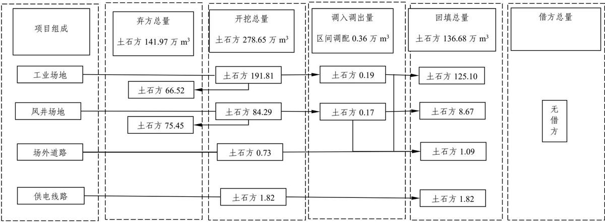
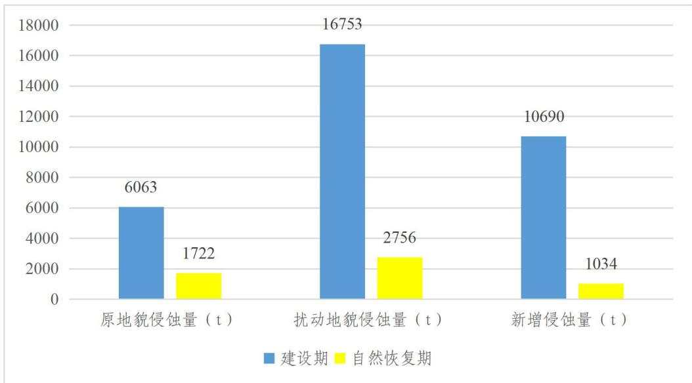
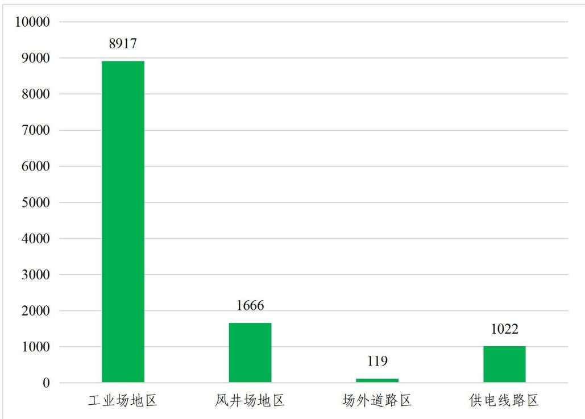
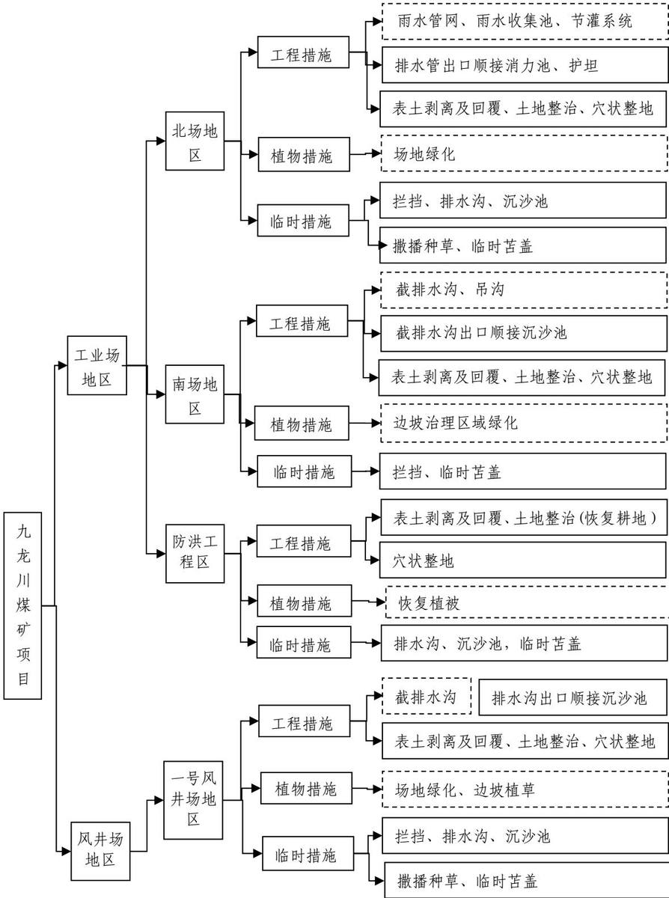
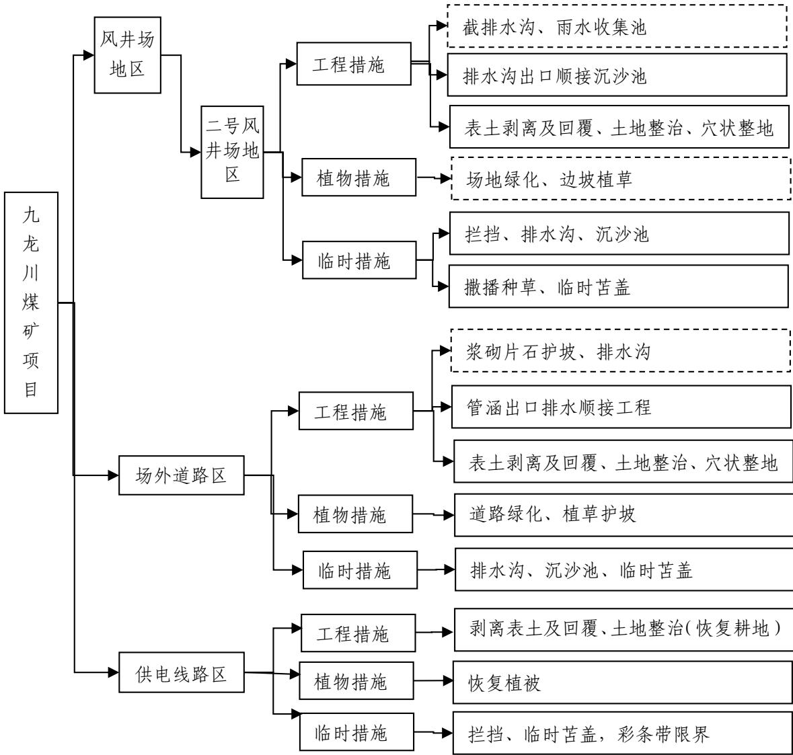
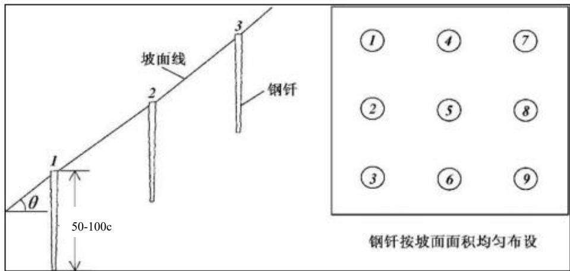

> **Zone C（应用范例层）使用边界**——仅可用于**写作风格、章节展开方式、表达逻辑、表格设计**的参考。
> **不得**用于合规判断；**不得**引入其项目数据（名称／地点／数字／单位名）；
> **不得**因其"曾经通过审批"而推定其做法在当前标准下仍然合规。
> 与 Zone A 冲突时**一律以 Zone A 为准**；Zone A 未明确规定时输出
> 「**Zone A 未明确规定，以下为参考写法，需人工判断**」。
>
> **坐标系警告**：本范例为**老八章结构**（GB 50433—2018 附录B），与 2026 版 10 章模板**同号不同义**
> （老 `1.5`＝防治目标，新 `1.5`＝水土流失预测结果；老 4→新 6 …偏移 +2；新版第 4/5 章老结构无独立章）。
> 因此 **`chapter_mapping: pending`——不得按章节号挂载**，检索一律走 `topic_tags`。
>
> **待加工**：`topic_tags`（主题标签）、`approval_basis_list`（编制依据逐字清单）、
> `structure_summary`（只提取结构：章节展开顺序／段落功能／表格栏目结构／句式模板／论证链步骤）。

<!-- 本文件由原方案 PDF 分段转换后拼接：共 2 段，原 258 页（MinerU 云单文件上限 200 页） -->

1 综合说明...  
1.1 项目简况.  
1.2 编制依据.... ... 8  
1.3 设计水平年... .... 10  
1.4 水土流失防治责任范围.. ...10  
1.5 水土流失防治目标....... .... 11  
1.6 项目水土保持评价结论.. ...12  
1.7 水土流失预测结果..... ... 17  
1.8 水土保持措施布设成果. ...17  
1.9 水土保持监测方案...... ... 23  
1.10 水土保持投资估算及效益分析.. ...24  
1.11 结论 .... ... 24  
2 项目概况.... ... 28  
2.1 项目组成及工程布置.. ...28  
2.2 施工组织... ... 66  
2.3 工程占地... ... 75  
2.4 土石方平衡... ... 79  
2.5 拆迁（移民）安置与专项设施改（迁）建.... ... 89  
2.6 施工进度... ... 89  
2.7 自然概况.. ... 91  
3 项目水土保持评价...... .... 99  
3.1 主体工程选址（线）水土保持评价... ... 99  
3.2 建设方案与布局水土保持评价.... ....102  
3.3 主体工程设计中水土保持措施界定.... .... 131  
4水土流失分析与预测.. ....134  
4.1 水土流失现状... ..134  
4.2 水土流失影响因素分析.. ...135  
4.3 土壤流失量预测.... ...137  
4.4 水土流失危害分析.. ...148  
4.5 指导性意见.. ... 149  
5 水土保持措施... .... 151  
5.1 防治区划分 ...... ..... 151  
5.2 措施总体布局.. ... 152  
5.3 分区措施布设... .... 161  
5.4 施工要求 ..... .... 210  
6水土保持监测... ...216  
6.1 范围和时段... ..216  
6.2 监测内容和方法.. ...216  
6.3 点位布设 ........ .... 222  
6.4 实施条件和成果... ...223  
7水土保持投资估算及效益分析.... ...228  
7.1 投资估算.... .. 228  
7.2 效益分析.... ... 244  
8 水土保持管理... ..247  
8.1 组织管理. .. 247  
8.2 后续设计.... ... 248  
8.3 水土保持监测... ... 248  
8.4 水土保持监理... ..249  
8.5 水土保持施工.... .... 250  
8.6 水土保持设施验收..... ..... 251

## 附表：

附表1：水土流失防治责任范围

附表2：工程单价分析表

## 附件

附件1：《国家发展改革委关于甘肃宁正矿区九龙川煤矿项目核准的批复》（发改能源〔2023〕1541 号）；

附件2：《国家发展改革委办公厅关于甘肃宁正矿区九龙川煤矿项目核准内容变更的复函》（发改办能源〔2025〕387号）；

附件3：《建设项目用地预审与选址意见书》（2025.03.06）；

附件4：《九龙川煤矿项目工业场地防洪工程可行性研究报告技术审查意见》；

附件5：《庆阳市水务局关于甘肃宁正矿区九龙川煤矿项目工业场地建设项目洪水影响评价审批的通知》（庆市水审字〔2024〕78号）；

附件6：《庆阳市水务局关于甘肃宁正矿区九龙川煤矿项目工业场地跨河桥梁工程洪水影响评价报告审批的通知》（庆市水审字〔2025〕120 号）；

附件7：《甘肃宁正矿区九龙川煤矿煤矸石综合利用处理协议》；

附件8：《宁县水土保持管理局关于宁县固废综合利用绿色建材产业园一般固体废弃物处置项目水土保持方案报告书审批准予行政许可书》（宁水保发〔20254号）；

附件9：《庆阳市林业和草原局关于九龙川煤矿项目矿区范围不涉及甘肃子午岭省级自然保护区的说明》（庆林函〔2023〕146号）；

附件10：《甘肃宁正矿区九龙川矿井及选煤厂项目建设用地预征收补偿协议》（宁县人民政府、甘肃能源庆阳煤电有限责任公司，2025 年4 月18 日）。

附件11：《甘肃能源庆阳煤电有限责任公司九龙川煤矿项目供电线路承诺函》

## 附图

附图1 项目地理位置图

附图2 项目区水系图

附图3 水土流失重点预防区和重点治理区划分图

附图4 宁县土壤侵蚀图  
附图5 项目总体布局图  
附图6 水土流失防治责任范围图  
附图7 水土保持措施总体布局图（含监测点位）  
附图8 工业场地区水土保持措施布设图  
附图 8-1 工业场地防洪工程平面布置、临时排水沟、沉沙池布设图  
附图 8-2 雨水排水管网、截排水沟、吊沟、沉沙池布设图  
附图 8-3 工业场地区植物措施布设图  
附图 8-4 工业场地边坡治理施工溜渣临时防护措施布设图  
附图 8-5 工业场地区表土剥离范围、表土堆存场布置图  
附图9 风井场地区水土保持措施布设图  
附图 9-1 截水沟、排水沟、沉沙池布设图  
附图 9-2 风井场地区植物措施布设图  
附图 9-3 风井场地区表土剥离范围、表土堆存场布置图  
附图 10 场外道路区水土保持措施布设图  
附图 10-1 场外道路区护坡、排水沟布设图  
附图 10-2 场外道路区植物措施布设图  
附图 10-3 场外道路区临时防护措施布设图  
附图 11 供电线路区水土保持措施布设图  
附图 12 剥离表土、土地整治措施布设图  
附图13 表土堆存场防护措施布设图  
附图14 施工生产生活区布置图

## 1 综合说明

## 1.1 项目简况

## 1.1.1 项目基本情况

## 1.1.1.1 项目建设必要性

甘肃宁正矿区九龙川煤矿项目（以下简称九龙川煤矿项目）位于原宁县中部勘查区的西南部，是甘肃省宁正矿区总体规划（修编）的6个井田之一，其开发建设不仅可以满足企业自身发展需要，也可以缓解本地区能源供应的需求，乃至促进区域经济和国家经济的发展。宁正矿区是建设陇东能源基地的重要组成部分，也是国家大型煤炭基地。九龙川矿井主要可采煤层赋存稳定，煤质优良，具备建设高产高效现代化大型矿井的资源条件。开发建设九龙川矿井，缓解地区煤炭供需紧张，符合国家能源安全战略，符合甘肃“十四五”能源发展规划，项目建设是必要的。

九龙川煤矿项目为甘肃能源庆阳煤电有限责任公司在陇东地区健康快速发展奠定了良好的基础，并为公司以此为契机进一步开发其他涉煤项目，延伸产业链提供了有力支撑。

《黄河流域生态保护和高质量发展规划纲要》提出：“有序有效开发山西、鄂尔多斯盆地综合能源基地资源，推动宁夏宁东、甘肃陇东、陕北、青海海西等重要能源基地高质量发展。根据《甘肃“十四五”能源发展规划》，项目所在的宁正矿区是“十四五”期间重点建设项目；根据《庆阳市国民经济和社会发展第十四个五年规划和二〇三五年远景目标纲要》，“十四五”期间至 2035年庆阳市稳步推动煤炭开发，确保核桃峪、甜水堡煤矿达产达标，新庄、马福川矿井建成投产，争取九龙川、罗川、宁西一号矿井开工建设。

综上所述，九龙川煤矿项目的建设符合国家产业政策、地方发展规划、企业发展目标，有利于保障能源供给，促进国民经济稳定快速发展。因此，该项目建设十分必要。

## 1.1.1.2 项目基本概况

## （1）项目位置及交通

九龙川井田位于庆阳市东南部，宁县县城南部，行政隶属庆阳市宁县新宁镇甘肃大江河生态环境规划设计有限公司

和早胜镇，地理坐标（国家 2000 坐标系）：东经 107°50′01″～107°57′22″，北纬35°22′31″～35°29′08″。

九龙川井田交通便利。G211 国道南北贯穿矿区的东部，其北连合水县，经过宁县县城、早胜镇，南接正宁县。在井田西界附近有南北向的202 省道，该公路自庆阳西峰区，经矿区西部和盛镇、太昌镇，至长庆桥，在长庆桥接G312 国道和福（州）银（川）高速公路。西平铁路在宁县米家沟设煤炭装运站、长庆桥设客货站。

## （2）建设性质

本项目为新建生产类项目。

## （3）项目建设规模与等级

九龙川煤矿项目设计生产规模为 8.0Mt/a，配套建设同等规模的选煤厂，为大型矿井工程。

九龙川井田划定矿区井田东西长 5.07～11.14km，南北宽 7.57～12.02km，井田面积 106.97km2，全矿井地质资源量 1490.906Mt，其中开采深度 1000m 以浅为1342.380Mt；全矿井工业资源量 1363.233Mt，其中开采深度 1000m 以浅为1224.221Mt；全矿井设计资源 887.823Mt，其中开采深度 1000m 以浅为 773.263Mt；全矿井设计可采储量 613.665Mt，其中开采深度 1000m 以浅为 536.091Mt。全井田共划分为 10 个盘区，矿井 1000m 开采深度以浅（-40m 标高以上）划分 9 个盘区，全矿井矿井服务年限 54.8a，开采深度 1000m 以浅服务年限 47.9a。首采盘区选择井田北部的 01 盘区和井田中部的 02（上）盘区；01 盘区可采储量为150.13Mt，盘区服务年限 22.7a。02（上）盘区可采储量 53.60Mt，盘区服务年限约18.6a。设计矿井采用长壁综采一次采全高采煤方法，全部垮落法管理顶板；选煤厂洗选采用块煤重介浅槽分选方法。矿井建设期余弃矸石141.97 万m3，年最大排放矸石量约 34.80 万 m3(62.64 万 t/a），拟拉运至庆阳绿材院科技产业发展有限公司综合利用；生产运行期井下掘进矸石10 万t/a充填废弃巷道不升井，选煤厂洗选矸石90万t/a，洗选矸石通过地面充填泵站制浆全部用作井下采空区充填。

## （4）项目组成

九龙川煤矿项目由工业场地、风井场地、场外道路及供电线路等4部分组成。

选煤厂为配套工程，与工业场地联合布置，并同步进行建设。

## ① 工业场地

矿井工业场地位于井田东北部，在九龙河南北两岸布置2 个场地，南场地布置主立井、副立井等，北场地布置行政福利区、辅助生产区、选煤厂等。工业场地占地面积31.88hm2；竖向设计采用平坡式布置，工业场地北场地区东高西低，设计最高点标高+961.80m，最低点标高+957.50m，整体为填方，填高为 5.5m；工业场地南场地区南高北低，设计平场标高+957.50～+958.50m，场地整体为挖方，最大挖深为62.5m，主立井、副立井井口标高均为958.50m。

九龙川煤矿项目工业场地防洪工程主要由堤防、护岸和护脚等建筑物组成，防护河道长度 2.30km，累计防护岸线总长度 4.67 km。九龙河整治河道沿工业场地段，由上游至下游，宽度由 67m 逐步拓宽为 101m。影响区间在横断面 H2（桩号0+160）～H14（桩号1+813）。整治后断面H2～H14由上游至下游100年一遇设计洪水位为+959.08m～+952.64m，深泓点高程为+953.30m～+946.50m，设计防洪堤顶高程为+960.84m～+953.70m，工业场地沿此区域的设计标高为+961.80m～+957.50m；断面 H6（桩号 0+907）、断面 H7（桩号 1+039）对应 300年一遇校核洪水位为+957.08m、+956.61m，设计堤防顶高程 957.65m，主立井、副立井井口标高为+958.50m；场地标高均高于对应河道100 年一遇设计洪水位，井口标高均高于对应河道300 年一遇校核洪水位，场地及井口不受洪水威胁。建设单位委托甘肃万晟鑫工程设计咨询有限公司编制了九龙川煤矿项目工业场地防洪影响评价报告，取得了《庆阳市水务局关于甘肃宁正矿区九龙川煤矿项目工业场地建设项目洪水影响评价审批的通知》（庆市水审字〔2024〕78 号），同意项目建设。

## ② 风井场地

风井场地位于工业场地西南部，布置为一号风井场地、二号风井场地。一号风井场地位于十里铺村西侧约187m处，担负矿井井下的回风的作用，主要布置一个回风立井、通风机房、消防泵房及水池等，占地面积为0.83hm2；场地自然地势整体较平坦，北高南低，自然标高在+1208.10～1208.60m，竖向布置采用平坡式，回风立井井口标高为+1208.50。二号风井场地位于院子村八组北侧 125m处，担负矿井井下的回风及进风的作用，主要布置一个回风立井、一个进风立井、通风机房、瓦斯抽放泵站、瓦斯电厂、地面制冷站、35kv 变电所、消防泵房及水池等，占地面积为6.86hm2。场地自然地势整体较平坦，东高西低，自然标高在+1196.10～1195.30m，竖向布置采用平坡式，回风立井标高为+1197.50；进风立井标高为+1197.00。

## ③ 场外道路

场外道路由工业场地进场道路、货运道路、工业场地南北区联络道路（中桥）、一号风井道路和二号风井道路等5条新建道路连接各场地与外部公路，此外，对1条既有道路改建，对 1条河堤路铺装沥青。工业场地进场道路自矿井工业场地北区西北门起，向北至宁九金路，全长 0.12km，采用平原微丘二级厂外道路标准，路面宽为 16.0m，路基宽 20.5m，路面采用沥青混凝土。货运道路自矿井工业场地北区东北门起，向北至宁九金路，全长约 0.02km，采用平原微丘二级厂外道路标准，路面宽7.0m，路基宽 10.0m，路面采用沥青混凝土。工业场地南北区联络道路（中桥）自矿井工业场地北区南门起，向南至矿井工业场地南区，跨河布设1 座中桥，全长 0.27km，采用平原微丘二级厂外道路标准，路面宽14.0m，路基宽 15.0m，桥长 97.0m，桥面宽 15.0m，桥面铺装 14.0m，路面、桥面采用沥青混凝土；建设单位委托甘肃万晟鑫工程设计咨询有限公司编制了甘肃宁正矿区九龙川煤矿项目工业场地跨河桥梁建设工程洪水影响评价报告，取得了《庆阳市水务局关于甘肃宁正矿区九龙川煤矿项目工业场地跨河桥梁工程洪水影响评价报告审批的通知》（庆市水审字〔2025〕120 号），同意项目建设。一号风井道路自一号风井场地北门起，向北至既有道路，全长约 0.09km，采用平原微丘四级道路标准，路面宽 6.0m，路基宽7.0m，采用沥青混凝土路面。二号风井道路自二号风井场地北门起，向北至既有村道，全长约 0.56km，采用平原微丘四级道路标准，路面宽6.0m，路基宽 7.0m，路面采用沥青混凝土路面。既有道路改建段自货运道路终点至高铁站东北侧“Y”型岔路口止，全线长约0.75km，采用平原微丘四级厂外道路标准，对既有道路路面拓宽为 6.0m，路基宽为7.0m，路面采用沥青混凝土路面。环河道路自矿井工业场地西北侧大门起，沿工业场地西侧、南侧及东侧围墙绕至矿井工业场地东北侧大门，全长1.7km，采用平原微丘四级厂外道路标准，路面宽 7.0m，采用沥青混凝土路面，道路用地包含于防洪工程用地内，不再单独列出。新建场外道路共长1.06 km、占地面积2.00 hm2，改建道路长0.75km、占地面积0.31hm2，铺装沥青路面的环河道路长1.70km、不新增占地面积（计入防洪工程用地）。

装车站联络道路（兼皮带栈桥检修道路，自货运道路终点至火车快速装车站）、产品煤皮带栈桥（自洗煤厂2号转载点至矿井专用铁路线火车快速装车站）随铁路专用线及火车快速装车站建设，单独立项。

## ④ 供排水

矿井建设初期用水采用市政供水，供水管线由供水公司敷设至工业场地围墙外，工业场地初期用水由此接入，待矿井正式生产运行后，矿井及选煤厂生活、消防、生产、绿化等各系统用水全部利用经不同程度处理后井下排水和生活污水。矿井及选煤厂总用水量9783m3/d，其中生活用水量 1333m3/d，生产用水量 8450m3/d；矿井井下正常排水量34800m3/d，最大排水量38400 m3/d，井下排水处理后作为水源回用于矿井及选煤厂日用、生产用水，并给瓦斯电厂输送水量212m3/d、向甘肃能源庆阳煤电联营项目输送生产水 7878.8m3/d、向宁县长庆桥工业集中区管委会化工园区输送生产水 8961m3/d；生活污水 1070.2 m3/d，污水全部回用不外排。工业场地排水采用雨、污分流制；南场地雨水采用自然散流汇入截排水沟后东西两侧排入九龙河；北场地雨水采用自然散流、暗管道汇集到雨水集水池，经沉淀、加压泵后进入污水处理站进行处理，用于浇洒回用。井下排水富余水量处理水质达到《地表水环境质量标准》GB3838-2002 中Ⅲ类水标准后排至九龙河。

## ⑤ 供电线路

工业场地内西南部建一座 110kV 变电站，从长庆桥 330kV 变电站及早胜110kV 变电站各引一回 110kV 线路为矿井供电，长庆桥 330kV 变电站至工业场地 110kV 变电站线路长度 30km，早胜 110kV 变电站至工业场地 110kV 变电站线路长度 15km。在二号风井场地建35kV变电站，2 回35kV 电源架空分别引自矿井工业场地 110kV 变电站及早胜 110kV 变电站 35kV 母线段，引自矿井工业场地110kV变电站供电线路长5.5km，引自早胜110kV变电站供电线路长5.6km。在一号风井场地建设 10kV 配电室，2回 10kV 电源架空引自工业场地 110kV 变电站 10kV不同母线段，输电线路长3km。供电线路总占地 15.01 hm2。

## （5）施工组织

工业场地、风井场地所处位置交通便利，场地通过进场道路与外部公路相接，施工期间可作为施工道路；工业场地施工用水由当地供水公司供给，风井场地施工用水采用邻近村庄水源，购买用水，拉水车拉运；施工用电充分利用本项目永久设施，永临结合，前期先行建设，满足施工用电；施工生产生活区、表土堆存场均布置在场地永久占地范围内，不新增占地，共布置施工生产生活区9处，占地面积2.28 hm2，表土堆存场9处，占地面积1.83 hm2。

## （6）工程占地

项目征占地总面积 66.20 hm2，其中永久占地 49.80 hm2，临时占地 16.40 hm2，占地类型为耕地 13.33 hm2、林地 14.52 hm2、草地 36.67 hm2、交通运输用地1.03hm2、水域及水利设施用地 0.65 hm2。

## （7）土石方量

项目建设期挖填方总量为 415.33 万 m3，其中挖方 278.65 万 m3（含剥离表土6.54万m3），填方136.68万m3（含回覆表土6.54万m3），区内调配利用土石方 36.71万m3，区间调配利用土石方0.36万m3，建设期余弃方141.97万m3，拉运至庆阳绿材院科技产业发展有限公司综合利用。

矿井达产年矸石总量 100 万 t/ a，其中选煤厂洗选矸石 90 万 t/a，井下掘进矸石 10万t/a，洗选矸石通过地面充填泵站制浆全部用作井下采空区充填，井下掘进矸石用来充填废弃巷道不升井；矿井生产初期为两个中厚煤层开采，掘进矸石及洗选矸石总量55万 t/a，全部制浆充填采空区，不外排。

## （8）拆迁（移民）安置与专项设施改（迁）建

本项目建设过程中需对矿井工业场地占地范围内的5户、占地面积9620m2进行搬迁。搬迁安置及专项设施改（迁）建均采用一次性货币补偿方式，由建设单位出资，当地县政府负责实施拆迁和安置。建设单位与县政府已签订九龙川矿井及选煤厂项目建设用地预征收补偿协议。

## （9）建设工期

九龙川煤矿项目计划于2026年5月开工建设，2031年9月完工，矿井建设总工期为 65个月。

## （10）工程投资

项目建设总投资168.70亿元，其中土建投资63.34亿元，由甘肃能源庆阳煤

电有限责任公司投资建设。

## 1.1.2 项目前期工作进展情况

## （1）项目前期工作进展情况

2023年11 月，项目取得了《国家发展改革委关于甘肃宁正矿区九龙川煤矿项目核准的批复》（发改能源〔2023〕1541号），批复的矿井生产规模为8.0Mt/a。

2024 年 9 月，中煤科工集团北京华宇工程有限公司编制完成了《甘肃能源庆阳煤电有限责任公司九龙川矿井及选煤厂可行性研究报告》，应急管理部研究中心（中国煤炭工业发展研究中心）出具了《甘肃能源庆阳煤电有限责任公司九龙川矿井及选煤厂可行性研究报告咨询评估报告》（煤研字〔2024〕17 号）。

2025 年 3 月 6 日，项目取得甘肃省自然资源厅《建设项目用地预审与选址意见书》（用字第 6210262025XS0001589 号）。

2025 年 4 月，项目取得“国家发展改革委办公厅关于甘肃宁正矿区九龙川煤矿项目核准内容变更的复函” （发改办能源〔2025〕387 号）。

## （2）方案编制情况

依据《中华人民共和国水土保持法》《生产建设项目水土保持方案管理办法》（水利部第 53 号令）等规定要求，甘肃能源庆阳煤电有限责任公司于 2024 年11 月委托甘肃大江河生态环境规划设计有限公司承担本项目水土保持方案报告书编制工作。接受委托后，随即组建了方案编制组，认真分析研究主体工程技术资料，深入现场查勘，采用无人机对工程关键节点收取影像资料。根据《生产建设项目水土保持技术标准》（GB50433-2018）的要求，于 2025 年 12 月编制完成了《甘肃宁正矿区九龙川煤矿项目水土保持方案报告书》。2026 年 2 月 4 日至5日水利部水土保持监测中心在甘肃省庆阳市主持召开了《甘肃宁正矿区九龙川煤矿项目水土保持方案报告书》技术评审会，会后我公司依据评审意见进行了修改、完善，并于 2026 年3月修改完成《甘肃宁正矿区九龙川煤矿项目水土保持方案报告书》。

## 1.1.3 自然简况

项目区地处陇东黄土高塬的东南部，地貌类型为高塬沟壑，全区地势东高西低，北高南低，海拔920m～1300m。

项目区属暖温带大陆性半湿润气候，年均气温 $1 0 . 2 ^ { \circ } \mathrm { C }$ $\geqslant 1 0 ^ { \circ } \mathrm { C }$ 的积温2783.6℃，多年平均降水量 581.1 mm，多年平均蒸发量为 1239.6 mm，无霜期249.6d；年平均风速 1.3m/s，主导风向NW，最大冻土深度 86cm。项目区土壤类型主要为黑垆土、黄绵土，沟谷零星分布红粘土。项目区植被类型为森林草原植被，荒坡草地主要有禾本科的针茅类，豆科的胡枝子，菊科的蒿类，蔷薇科的萎陵，藜科的伏地肤。人工植被适宜的乔木树种主要有油松、白皮松、旱柳，灌木主要有沙棘、柠条、紫穗槐，草种主要有紫花苜蓿、沙打旺、草木樨。植被覆盖率约30%。

项目区不属于国家级水土流失重点预防区和重点治理区，但属于泾河流域省级水土流失重点治理区。项目区水土流失以水力侵蚀为主，属轻度侵蚀区，侵蚀模数 2360 t/km2·a。依据《土壤侵蚀分类分级标准》（SL190-2007）和《生产建设项目水土流失防治标准》（GB/T50434-2018），容许土壤流失量 $1 0 0 0 \ : \mathrm { t / k m ^ { 2 } \cdot a }$

项目区不涉及饮用水源保护区，不占用水功能一级区的保护区和保留区、自然保护区、世界文化和自然遗产地、风景名胜区、地质公园、森林公园、重要湿地等生态敏感区。

## 1.2编制依据

## 1.2.1 法律法规

（1）《中华人民共和国水土保持法》（2010 年 12 月 25 日十一届全国人大常委会第十八次会议修订通过，中华人民共和国主席令第 39 号公布，自2011年3月1日起施行）；

（2）《中华人民共和国黄河保护法》（2022年10月30日第十三届全国人民代表大会常务委员会第三十七次会议通过，中华人民共和国主席令第 123 号公布，自 2023年4月1日起施行）；

（3）《甘肃省水土保持条例》（2023 年 9 月 27 日甘肃省第十四届人大常委会第五次会议修订通过，省人大常委会公告第 16 号公布，自2023年12 月1日起施行）。

## 1.2.2 部委规章、规范性文件

（1）《生产建设项目水土保持方案管理办法》（水利部令第53 号，2023 年

1 月 17日发布，2023 年3 月1 日实施）；

（2）《水利部办公厅关于做好国家级水土流失重点预防区和重点治理区落地上图成果应用的通知》（办水保〔2025〕170 号）；

（3）《水利部关于加强事中事后监管规范生产建设项目水土保持设施自主验收的通知》（水保〔2017〕365 号）；

（4）《水利部办公厅关于印发生产建设项目水土保持设施自主验收规程（试行）的通知》（办水保〔2018〕133 号）；

（5） 《水利部关于进一步深化“放管服”改革全面加强水土保持监管的意见》（水保〔2019〕160 号）；

（6）《水利部办公厅关于印发生产建设项目水土保持监督管理办法的通知》（办水保〔2019〕172 号）；

（7）《水利部办公厅关于进一步加强生产建设项目水土保持监测工作的通知》（办水保〔2020〕161 号）；

（8）《水利部办公厅关于印发生产建设项目水土保持技术文件编写和印制格式规定（试行）的通知》（办水保〔2018〕135 号）；

（9）《甘肃省人民政府关于划定省级水土流失重点预防区和重点治理区的公告》（甘政发〔2016〕59 号）。

## 1.2.3 规范标准

（1）《生产建设项目水土保持技术标准》（GB 50433-2018）；

（2）《生产建设项目水土流失防治标准》（GB/T50434-2018）；

（3）《水土保持工程调查与勘测标准》（GB/T51297-2018）；

（4）《土地利用现状分类》（GB/T21010-2017）；

（5）《土壤侵蚀分类分级标准》（SL190-2007）；

（6）《水土保持工程设计规范》（GB51018-2014）；

（7）《防洪标准》（GB/T 50201-2014）；

（8）《煤炭工业矿井设计规范》（GB50215-2015）

（9）《生产建设项目水土保持监测与评价标准》（GB/T 51240-2018）；

（10）《生产建设项目土壤流失量测算导则》（SL773-2018）；

（11）《水利水电工程制图标准-水土保持图》（SL73.6-2015）。

## 1.2.5 技术资料

（1）《甘肃能源庆阳煤电有限责任公司九龙川矿井及选煤厂可行性研究报告》（中煤科工集团北京华宇工程有限公司，2024年9月）；

（2）《甘肃宁正矿区九龙川煤矿项目工业场地防洪工程可行性研究报告》（甘肃省水利水电勘测设计研究院，2024年9 月）；

（3）《甘肃宁正矿区九龙川煤矿项目工业场地建设项目防洪评价报告》（甘肃万晟鑫工程设计咨询有限公司，2024 年9月）；

（4）《甘肃能源庆阳煤电有限责任公司九龙川煤矿工业场地边坡治理工程设计方案》（甘肃陇原地质勘察工程有限公司，2025年1 月）；

（5）《甘肃能源庆阳煤电有限责任公司九龙川矿井及选煤厂初步设计》（中煤科工集团北京华宇工程有限公司，2025年10月）；

（6）《甘肃宁正矿区九龙川煤矿项目工业场地防洪工程初步设计报告》（甘肃省水利水电勘测设计研究院，2025年11月）；

（7）《甘肃宁正矿区九龙川煤矿项目工业场地跨河桥梁建设工程洪水影响评价报告》（甘肃万晟鑫工程设计咨询有限公司，2025年12月）。

## 1.3 设计水平年

根据主体工程进度安排，项目计划2026年 5月施工准备（含井筒冻结），2027 年 3 月开工建设，2031 年 3 月井筒开挖至煤 6 层及煤 5-1 层首采工作面投产，2031 年 4 进入联合试运转，2031 年 9 月建成投产，矿井建设总工期为 65个月。方案设计水平年确定为项目建设完成的当年，即2031年。

## 1.4 水土流失防治责任范围

## 1.4.1 防治责任范围确定依据

根据《中华人民共和国水土保持法》的规定，按照“谁开发、谁保护，谁造成水土流失、谁负责治理”的原则，项目建设引起水土流失的防治责任由项目建设单位承担。

按照《生产建设项目水土保持技术标准》（GB 50433-2018）的有关规定，水土流失防治责任范围包括项目永久征地、临时占地（含租赁土地）以及其他使用与管辖区域。

甘肃大江河生态环境规划设计有限公司

## 1.4.2 防治责任范围

本项目建设期水土流失防治责任范围面积为 66.20hm2。其中永久占地面积49.80 hm2，包括工业场地、风井场地、场外道路、供电线路塔基占地，临时占地面积 16.40 hm2，包括工业场地防洪工程、供电线路施工占地等。本项目共划分为4个一级防治分区，即工业场地区、风井场地区、场外道路区和供电线路区。行政区划属甘肃省庆阳市宁县。水土流失防治责任主体为建设单位甘肃能源庆阳煤电有限责任公司。九龙川煤矿项目水土流失防治责任范围见附表1。

## 1.5 水土流失防治目标

## 1.5.1 执行标准等级

项目位于甘肃省庆阳市宁县，根据《全国水土保持规划（2015～2030）》，宁县属西北黄土高原区，依据《水利部办公厅关于做好国家级水土流失重点预防区和重点治理区落地上图成果应用的通知》（办水保〔2025〕170 号），项目区不属于国家级水土流失重点预防区和重点治理区。依据《甘肃省人民政府关于划定省级水土流失重点预防区和重点治理区的公告》（甘政发〔2016〕59 号），项目区属于省级泾河流域水土流失重点治理区，按照《生产建设项目水土流失防治标准》（GB/T 50434-2018）的规定，本项目水土流失防治标准执行西北黄土高原区一级防治标准。

## 1.5.2 防治目标值

## 1.5.2.1 基本目标

根据项目的建设特点、项目区地形地貌及环境现状等，本项目水土流失防治的基本目标为：

（1）项目建设范围内的新增水土流失得到有效控制，原有水土流失得到基本治理；

（2）项目建设区内各项水土保持设施安全有效；

（3）项目建设区内水土资源、林草植被得到最大限度的保护与恢复；

（4）水土流失治理度、土壤流失控制比、渣土防护率、表土保护率、林草植被恢复率、林草覆盖率六项指标应符合现行国家标准《生产建设项目水土流失防治标准》（GB/T50434-2018）的规定。

## 1.5.2.2 防治目标值

项目区地处省级水土流失重点治理区，结合项目区干旱程度、土壤侵蚀模数现状和地形地貌，经过修正后确定本项目水土流失防治指标值。

项目区属暖温带大陆性半湿润气候，土壤侵蚀属轻度侵蚀区，水土流失治理度、林草植被恢复率不作调整。项目区土壤侵蚀以轻度侵蚀为主，土壤流失控制比不应小于1，因此土壤流失控制比调整提高0.20；项目区地处省级水土流失重点治理区，应提高防治标准，林草覆盖率提高 2%。

本项目确定的设计水平年水土流失防治指标值分别为：水土流失治理度93％，土壤流失控制比 1.0，渣土防护率 92％，表土保护率 90％，林草植被恢复率 95％，林草覆盖率 24％。水土流失防治标准及防治指标值见表 1.5-1。

表1.5-1 水土流失防治目标计算表
<table><tr><td rowspan=2 colspan=1>防治指标</td><td rowspan=1 colspan=2>西北黄土高原区一级标准</td><td rowspan=2 colspan=1>侵蚀强度修正</td><td rowspan=2 colspan=1>重点治理区修正</td><td rowspan=1 colspan=2>方案确定目标值</td></tr><tr><td rowspan=1 colspan=1>施工期</td><td rowspan=1 colspan=1>设计水平年</td><td rowspan=1 colspan=1>施工期</td><td rowspan=1 colspan=1>设计水平年</td></tr><tr><td rowspan=1 colspan=1>水土流失治理度（%）</td><td rowspan=1 colspan=1>-</td><td rowspan=1 colspan=1>93</td><td rowspan=1 colspan=1></td><td rowspan=1 colspan=1></td><td rowspan=1 colspan=1>-</td><td rowspan=1 colspan=1>93</td></tr><tr><td rowspan=1 colspan=1>土壤流失控制比</td><td rowspan=1 colspan=1>一</td><td rowspan=1 colspan=1>0.80</td><td rowspan=1 colspan=1>+0.20</td><td rowspan=1 colspan=1></td><td rowspan=1 colspan=1>-</td><td rowspan=1 colspan=1>1.0</td></tr><tr><td rowspan=1 colspan=1>渣土防护率（%）</td><td rowspan=1 colspan=1>90</td><td rowspan=1 colspan=1>92</td><td rowspan=1 colspan=1></td><td rowspan=1 colspan=1></td><td rowspan=1 colspan=1>90</td><td rowspan=1 colspan=1>92</td></tr><tr><td rowspan=1 colspan=1>表土保护率（%）</td><td rowspan=1 colspan=1>90</td><td rowspan=1 colspan=1>90</td><td rowspan=1 colspan=1></td><td rowspan=1 colspan=1></td><td rowspan=1 colspan=1>90</td><td rowspan=1 colspan=1>90</td></tr><tr><td rowspan=1 colspan=1>林草植被恢复率（%）</td><td rowspan=1 colspan=1>-</td><td rowspan=1 colspan=1>95</td><td rowspan=1 colspan=1></td><td rowspan=1 colspan=1></td><td rowspan=1 colspan=1>二</td><td rowspan=1 colspan=1>95</td></tr><tr><td rowspan=1 colspan=1>林草覆盖率（%）</td><td rowspan=1 colspan=1>一</td><td rowspan=1 colspan=1>22</td><td rowspan=1 colspan=1></td><td rowspan=1 colspan=1>+2</td><td rowspan=1 colspan=1>一</td><td rowspan=1 colspan=1>24</td></tr><tr><td rowspan=1 colspan=7>注：生产期新增扰动范围的防治目标值不应低于施工期指标值，其他区域不应低于设计水平年指标值。</td></tr></table>

## 1.6 项目水土保持评价结论

## 1.6.1 主体工程选址（线）评价

项目选址不处于重要江河、湖泊以及跨省（自治区、直辖市）的其他江河、湖泊的水功能一级区的保护区和保留区及自然保护区，不属于饮用水水源保护区；不涉及世界文化和自然遗产地、风景名胜区、地质公园、森林公园以及重要湿地等，不涉及重要基础设施建设、重要民生工程、国防工程项目，也不涉及全国水土保持监测网络中的水土保持监测站点、水土保持长期定位观测站。

九龙川煤矿项目工业场地经多方案比选，推荐九龙河南北两岸布置方案，布设工业场地防洪工程，修建堤防、护岸，保障河势稳定；编制了工业场地防洪影响评价报告，庆阳市水务局决定准予甘肃宁正矿区九龙川煤矿项目工业场地建设项目洪水影响评价类审批行政许可。场外道路工程的工业场地南北区联络道路跨河布设1 座中桥，设计符合防洪标准等要求；编制了工业场地跨河桥梁建设工程防洪影响评价报告，庆阳市水务局决定准予甘肃宁正矿区九龙川煤矿项目工业场地跨河桥梁工程洪水影响评价类审批行政许可。

项目受资源赋存限制，无法避让泾河流域省级水土流失重点治理区，存在一定的制约性因素，根据《中华人民共和国水土保持法》和《生产建设项目水土保持技术标准》（GB50433-2018）的相关要求，在工程建设过程中，通过在项目建设过程中严格控制扰动地表和植被损坏范围，水土流失防治执行西北黄土高原一级标准并提高林草覆盖率2 个百分点，工业场地场外边坡治理截排水沟排水标准提高至 50年一遇标准复核，工业场地场内及场外道路截排水沟排水标准提高至10 年一遇标准复核，补充完善工程措施，优化施工工艺，加强工程管理，项目建成后及时治理各防治分区的临时用地，恢复原有土地利用类型，并严格执行水土保持防治目标，适度提高土地整治标准。

综上所述，本项目处在省级水土流失重点治理区，工程选址存在一定的制约性因素且无法避让，主体工程采取了优化设计方案，减少工程占地和土石方量，提高工程措施级别和防御标准，布设了护坡、截排水、绿化等一系列防护措施的实施后，可有效控制可能造成的水土流失，最大限度地保护现有土地和植被的水土保持功能，响应了水土保持法律法规和技术标准对选址的规定，基本满足水土保持要求，项目选址可行。

## 1.6.2建设方案与布局评价

本项目属井采煤矿项目，受资源赋存限制，地处泾河流域省级水土流失重点治理区。主体设计方案布置从技术、规划、环境等方面综合考虑，工业场地、风井场地总平面布置经多方案比选，推荐方案整体布局紧凑合理，各区域功能划分明确，提高了土地使用率、节约规划占地；工业场地、风井场地竖向布置采用平坡式，充分考虑了场地防洪要求，利用场地边坡治理挖方及井巷掘进土石回填场地，最大限度减少土石方余弃量；工业场地、风井场地布设雨水集蓄设施，提高雨水循环利用率，设计有系统完善的雨水排水措施。场外道路无高填路基及深挖路堑；场外供电线路工程位于塬面沟壑，线路沿线不涉及林区；施工生产生活设施、表土堆存场等布置在永久占地范围内，减少新增扰动土地。优化施工工序和施工工艺，起到了有效防治水土流失的作用。主体设计考虑了建设方案上减少项目总占地，减少工程移动土方量，降低水土流失影响，符合水土流失重点治理区优化方案减少工程占地和土石方量水土保持理念。本方案要求采取合理、积极的预防保护和临时防护措施，合理调配施工时序，尽量缩短临时堆土时间，施工结束后临时占地及时恢复为原土地利用类型，使新增的水土流失得到有效控制，降低水土流失危害，项目建设方案与布局合理，但主体设计中未明确建设中的施工临时工程，植被恢复不够明确，须在本水保方案中予以补充。

## （1）工程占地的评价结论

本项目建设用地严格执行国家土地管理法律法规规定，严格按照《煤炭工程项目建设用地指标》控制用地规模，实际用地满足用地预审要求。工程占地布置紧凑，规划布置合理，严格控制征占地面积，实际用地满足项目用地预审要求。

项目永久占地面积不超过相关用地指标限值，占地类型以草地、林地、耕地为主，但没有占用基本农田、公益林地，占用的耕地、林草地，施工前设计表土剥离措施，施工结束后对表土回覆利用。施工生产生活区、表土堆存场布置在工业场地、风井场地范围内，不新增占地。项目建设施工交通、施工用水、施工用电永临结合，充分利用本项目永久设施，有效控制临时占地规模，临时用地基本选择了生产能力较低的土地，临时占地使用完成后，采取相应的工程及植物措施恢复原有土地利用类型及植被，不改变占用土地原有的功能，不会引起项目所在地景观格局的永久破坏，通过水土保持防护措施的实施后，可以满足水土保持的要求。

## （2）土石方平衡的评价结论

建设期挖填方总量为415.33 万 $\mathrm { m } ^ { 3 }$ ，其中挖方 278.65 万 $\mathrm { m } ^ { 3 } ( $ （含剥离表土6.54$\mathcal { F } \mathrm { ~ m } ^ { 3 } \mathrm { ~ ) ~ }$ ），填方 $1 3 6 . 6 8 \mathrm { ~ \mathscr { H } ~ m ^ { 3 } }$ （含回覆表土 $6 . 5 4 ~ \mathcal { F } \mathrm { ~ m } ^ { 3 } )$ ，区内调配利用土石方36.71万 $\mathrm { m } ^ { 3 }$ ，区间调配利用土石方 $0 . 3 6 \mathrm { ~ } \mathcal { F } \mathrm { ~ m } ^ { 3 }$ ，建设期余弃方 141.97 万 $\mathrm { m } ^ { 3 }$ ，为建设期井巷掘进矸石，运至庆阳绿材院科技产业发展有限公司综合利用。本项目土石方挖填数量遵循了最优化原则，项目场地平整分区块、分时段进行，土石方调配遵循移挖作填、随挖随运，防止重复开挖和土方多次倒运，最大限度减少土石方量，减少堆放时间，通过调配利用符合场地平整要求的场地边坡治理、井筒掘进土石，优化了土石方流向，符合节点适宜、时序可行、运距合理原则，余方的综合利用达到了最大化。

表土资源保护按照应剥尽剥的要求，合理确定剥离表土范围及厚度，施工前对开挖扰动范围内占用的耕地、林地和草地进行表土剥离，施工结束后回填利用。

项目土石方量较大，在项目建设过程中应加强土石方运输管理、临时堆土防护，避免土石方开挖回填过程中造成大规模的水土流失。通过及时布置相应的水土流失防治措施，有效控制土石方工程施工期间的水土流失。因此，本项目土石方平衡可行、经济合理，满足水土保持要求。

## （3）弃方减量化

主体工程可研对工业场地、风井场地布置进行了多方案优化论证，推荐项目总体布局，优化井位布局，因地制宜推荐场地竖向布置方式，合理确定场地设计标高，多因素考虑土石方挖填数量最优化、减量化、资源化要求，以达到余弃方量最少。矿井建设期间区内调配挖填利用土石方量36.71万 m3，区间调配挖填利用土石方量 0.36 万 m3，不能挖填利用的土石方 141.97 万 m3，运至庆阳绿材院科技产业发展有限公司综合利用。项目开挖土石方、井巷掘进矸石资源化利用率100%，多方优化可实现土石方余弃量最少、开挖土石、井巷掘进矸石资源化利用，符合水土保持要求。

## （4）弃渣资源化综合利用

为深入落实水利部令第 53 号、办水保〔2023〕177 号等文件关于生产建设项目弃渣资源化综合利用要求，方案编制组和建设单位对项目所在地的煤矸石综合利用企业进行了深入调查，经调查，庆阳绿材院科技产业发展有限公司具备煤矸石综合利用处理能力，该公司位于甘肃省庆阳市宁县长庆桥镇工业集中区（一区）1号，是一家从事固体废物治理，煤炭销售，制品销售等业务的公司，该公司成立于 2024 年 6 月 12 日，统一社会信用代码为 91621026MADM0Q773M，注册资本2000 万元人民币，该公司宁县固废综合利用绿色建材产业园煤矸石综合利用处理规模为 160.00万 t/a（89 万m3/a），距离工业场地区41km。庆阳绿材院科技产业发展有限公司已编制完成《宁县固废综合利用绿色建材产业园一般固体废弃物处置项目水土保持方案报告书》，并取得宁县水土保持管理局出具的《关于宁县固废综合利用绿色建材产业园一般固体废弃物处置项目水土保持方案报告书审批准予行政许可书》（宁水保发〔2025〕4 号）。公司计划于 2026年 5 月底前完成该项目水土保持设施验收工作。九龙川煤矿项目预计 2027 年 3月起产生煤矸石，本项目可与九龙川煤矿矸石处理需求有效衔接。

本项目建设期掘进矸石余弃总量约 141.97万m3 （255.55 万t），年最大矸石排放量 34.80 万m3/a （62.64 万 t/a），庆阳绿材院科技产业发展有限公司年综合利用煤矸石处理能力满足本项目建设期间矸石排放量。2025 年 10 月 30 日，甘肃能源庆阳煤电有限责任公司与庆阳绿材院科技产业发展有限公司签署了煤矸石综合利用处理协议，并明确了双方在矸石提供、运输、利用过程中履行生态环境保护的责任和义务，符合水土保持要求。

## （5）取土场设置的评价结论

项目所需砂石料全部外购，因此，本项目不设取土（石、砂）场。

（6）施工方法与工艺的评价结论

主体土建工程采取同时施工，分区块平行流水施工的组织方式。采取有效的预防保护措施，强调源头控制、过程控制，避免重复开挖和多次倒运，最大程度地减少损坏原地貌及土石方开挖量。井筒采用冻结法施工，土方开挖、回填及场平等以机械为主，移挖作填，随挖随填；方案补充了表土单独剥离保护用于植被恢复覆土，基础开挖的临时堆土方案补充了临时防护措施。结合施工时序，施工生产生活区、表土堆存场全部布置在工业场地、风井场地内的后期硬化区域或绿化区域。在建设工序上，水、电、路工程先行施工，井筒掘进与工业场地建设同步，施工结束后施工场地尽快恢复植被。从水土保持角度分析，项目施工安排紧凑合理，施工工艺先进，不会对水土流失造成严重不良影响，基本满足有关规定和要求。

## （7）主体设计中具有水土保持功能工程的评价结论

主体设计根据工程特点，针对性地设计了工业场地截排水沟（雨水管道）及顺接工程、场地内排水沟、雨水收集池、灌溉系统及场地绿化，风井场地截排水沟及顺接工程、场地内排水沟、雨水收集池及场地绿化，场外道路区路基排水沟、边坡防护及绿化等具有水土保持功能的工程，能有效防治水土流失，工程标准、位置及结构指标符合水土保持要求。主体工程在设计上虽然兼顾了水土保持功能，但体系并不完善，缺乏表土剥离保护利用措施、临时占地防护措施及施工期的临时防护措施，针对工程建设过程中水土流失控制与防护措施不足，本方案补充设计，以达到不重不漏、全时段、全空间的防护效果，使水土保持措施形成一个完整、科学与可操作的防护体系。

## 1.7水土流失预测结果

项目建设期扰动地表面积66.20 hm2，损毁植被面积51.19 hm2。建设期余弃土石方141.97万m3，运至庆阳绿材院科技产业发展有限公司综合利用；生产运行期井下掘进矸石10万t/a充填废弃巷道不升井，选煤厂洗选矸石90万t/a，洗选矸石通过地面充填泵站制浆全部用作井下采空区充填。项目建设可能造成的水土流失总量为19509 t，新增水土流失量为11724 t，新增水土流失量占水土流失总量的60.1%。新增水土流失量中，建设期新增水土流失量10690 t，建设期新增水土流失量占新增总量的91.2%，是工程建设产生水土流失的重点时段。

工业场地区和风井场地区建设期新增水土流失量分别占建设期新增水土流失量的79.4%、14.9%，因此上述区域是产生水土流失的重点部位，为水土流失防治和水土保持监测的重点地段。

项目建设可能导致土地生产力的降低，损坏防治责任范围内林草植被，项目建设区内水土流失面积和强度将会增加，对周边生态环境可能造成一定影响。工程建设过程中的开挖回填和临时堆土如不采取防治措施，在遇到暴雨时将造成一定程度的水土流失，部分泥沙将会随径流进入周边的九龙川、马莲河等河沟，可能造成马莲河泥沙的增加。

## 1.8 水土保持措施布设成果

## 1.8.1水土流失防治分区与措施布设

依据主体工程布局、建设内容、扰动特点，将项目区划分为工业场地区、风井场地区、场外道路区和供电线路等4个一级防治分区。

## 1.8.1.1 工业场地区

## （1）北场地区

施工前对开挖扰动范围内具备剥离条件的耕地、林地、草地等进行表土剥离，就近集中堆放于永久占地范围内设置的1#、2#、3#、4#表土堆存场，后期回覆于场地绿化区域。表土堆存场采取临时拦挡、临时排水沟、沉沙池、撒播种草及苫

盖措施。

施工中北场地内雨水采取自然散流与雨水排水管道相结合的排水系统，雨水排入收集池，经沉淀、加压泵后进入复用水系统。井下排水富余水量处理水质达标后排入九龙河，排水管出口顺接消力池、护坦；建（构）筑物基础开挖临时堆土堆放在基坑周边，采取密目网临时苫盖；对场地相对固定的裸露区域采用密目网进行苫盖。

施工结束后，对场地绿化区域进行土地整治、回覆表土、穴状整地。场地绿化采取园林式绿化并配套灌溉措施。

## （2）南场地区

施工前对开挖扰动范围内具备剥离条件的林地、草地等进行表土剥离，就近集中堆放于北场地区永久占地范围内设置的5#表土堆存场，后期回覆于边坡治理绿化区域。

施工中南场地挖方边坡治理结合地形、因地制宜地布设截排水沟、吊沟，与场内排水沟在东西两侧汇合后顺接排入九龙河，截排水沟出口设置沉沙池。边坡治理开级削坡依据地形情况在开挖区域下部设置临时拦挡，拦截削坡开挖顺坡溜渣；建（构）筑物基础开挖临时堆土堆放在基坑周边，采取密目网临时苫盖；对场地相对固定的裸露区域采用密目网进行苫盖。

施工结束后，对边坡治理绿化区域进行土地整治、回覆表土、穴状整地。边坡治理绿化区域采取植树种草绿化。

## （3）防洪工程区

施工前对开挖扰动范围内具备剥离条件的耕地、林地、草地等进行表土剥离，就近集中堆放于北场地区永久占地范围内设置的6#表土堆存场，后期回覆于防洪工程恢复土地利用区域。

施工中防洪堤防、护岸和护脚等建（构）筑物开挖的边坡、相对固定的裸露区域采用密目网进行苫盖；防洪工程施工生产生活区、临时材料堆放场开挖临时排水沟、沉沙池。

施工结束后，对防洪工程恢复土地利用区域进行土地整治（恢复耕地）、回覆表土、穴状整地。场地防洪工程恢复植被区域采用植树种草恢复植被。

## 1.8.1.2 风井场地区

## （1）一号风井场地区

施工前对开挖扰动范围内具备剥离条件的耕地、草地等进行表土剥离，就近集中堆放于风井场地永久占地范围内设置的7#表土堆存场，后期回覆于场地绿化区域。表土堆存场采取临时拦挡、临时排水沟、沉沙池、撒播种草及苫盖措施。

施工中风井场地内雨水采取自然散流、截排水沟相结合的排水系统，沿道路一侧设置排水沟，沿围墙布设截水沟，从场地东南角顺接排水工程排入场外道路边沟，排水沟出口设置沉沙池；建（构）筑物基础开挖临时堆土堆放在基坑周边，采取密目网临时苫盖；对扰动场地相对固定的裸露区域采用密目网苫盖。

施工结束后，对风井场地绿化区域进行土地整治、回覆表土、穴状整地。场地绿化采取园林式绿化，边坡采取植草防护。

## （2）二号风井场地区

施工前对开挖扰动范围内具备剥离条件的耕地、草地等进行表土剥离，就近集中堆放于风井场地永久占地范围内设置的8#、9#表土堆存场，后期回覆于场地绿化区域。表土堆存场采取临时拦挡、临时排水沟、沉沙池、撒播种草及苫盖措施。

施工中风井场地内雨水采取自然散流、截排水沟相结合的排水系统，在主要道路一侧设置排水沟，沿围墙布设截水沟，汇集雨水排入雨水收集池，经沉淀后从场地西南角顺接排水工程排入场外道路边沟，排水沟出口设置沉沙池。建（构）筑物基础开挖临时堆土堆放在基坑周边，采取密目网临时苫盖；对扰动场地相对固定的裸露区域采用密目网苫盖。

施工结束后，对风井场地绿化区域进行土地整治、回覆表土、穴状整地。场地绿化采取园林式绿化，边坡采取植草防护。

## 1.8.1.3 场外道路区

施工前结合清表对开挖扰动范围内具备剥离条件的耕地、草地进行表土剥离，剥离表土沿线堆放在路基两侧后期绿化区域，后期回覆表土于路基两侧绿化区域。

施工中跨河桥梁锥坡布设浆砌片石护坡、路基边坡植草护坡；场外道路一侧或两侧布设浆砌片石排水沟，场外道路排水沟出口顺接管涵、公路（道路）排水沟，管涵出口顺接排水工程；跨河桥梁墩台基础开挖，基坑周边布设临时排水沟，

排水沟出口接沉沙池；对路基边坡、临时堆土采用密目网进行苫盖。

施工结束后，对路基两侧绿化区域进行土地整治、回覆表土、穴状整地；场外道路两侧采取植树种草绿化。

## 1.8.1.4 供电线路区

施工前对塔基施工扰动区域占用的耕地、草地进行表土剥离，堆存于塔基施工区域并采取拦挡、苫盖措施，后期回覆于塔基施工扰动恢复利用区域；在塔基施工场地周边及施工便道两侧设置彩条带限界。

施工中对塔基开挖临时堆土采取接挡、密目网苫盖措施进行防护。

施工结束后，对塔（杆）基、施工便道、牵张场等施工扰动区域进行土地整治（恢复耕地），塔基施工扰动恢复利用区域回覆表土，采取种草恢复植被。

## 1.8.2水土保持措施工程量

## 1.8.2.1 项目主要措施工程量

工程措施：表土剥离6.54万m3，场外道路浆砌片石护坡 $2 0 ~ \mathrm { m } ^ { 3 }$ ，混凝土截水沟5436m、排水沟1146m、吊沟1977m、浆砌片石排水沟1545m，雨水排水管网3900 m，雨水蓄水池6座，排水顺接工程沉沙池4座、消力池1座、护坦 $1 2 . 5 \mathrm { m } ^ { 2 }$ 排水沟60m，节水灌溉系统1套，土地整治 $2 7 . 3 9 \mathrm { h m } ^ { 2 }$ ，恢复耕地 $2 . 9 2 \ : \mathrm { h m } ^ { 2 }$ ，表土回覆 $6 . 5 4 \overline { { \mathrm { \mathscr { H } } } } \mathrm { m } ^ { 3 }$ ，穴状整地32380个。

植物措施：场地绿化 $6 . 6 6 \mathrm { h m } ^ { 2 }$ 、栽植乔木1890株，栽植灌木22000株，种草5.80$\mathrm { h m } ^ { 2 }$ ，边坡植草植树种草 $3 . 1 0 \mathrm { h m } ^ { 2 }$ 、栽植灌木5980株、种草 $3 . 1 0 \mathrm { h m } ^ { 2 }$ ，道路绿化0.79km、栽植乔木530株、种草 $0 . 3 9 \mathrm { h m } ^ { 2 }$ ，恢复植被 $1 4 . 6 1 \mathrm { h m } ^ { 2 }$ 、栽植乔木1980株、种草 $1 4 . 6 1 \mathrm { h m } ^ { 2 }$ ，抚育养护 $2 4 . 7 6 \ : \mathrm { h m } ^ { 2 }$ o

临时措施：临时堆土密目网苫盖 $3 0 5 0 0 \mathrm { m } ^ { 2 }$ ，表土堆存场临时防护编织袋装土挡墙 $1 6 2 1 ~ \mathrm { m } ^ { 3 }$ 、临时排水沟1616m、砖砌沉沙池9座、撒播种草 $1 . 6 7 \mathrm { h m } ^ { 2 }$ 、密目网苫盖 $2 6 9 6 7 \mathrm { m } ^ { 2 }$ ，裸露地表密目网苫盖 $. 4 3 4 3 5 \mathrm { m } ^ { 2 }$ ，边坡治理施工溜渣拦挡编织袋装土挡墙 $1 4 1 8 ~ \mathrm m ^ { 3 }$ ，防洪工程施工场地临时防护临时排水沟610m、土质沉沙池2座，工业场地联络道路（中桥）施工场地临时防护排水沟140m、沉沙池4座，供电线路施工临时防护编织袋装土挡墙 $2 7 2 0 \mathrm { m } ^ { 3 }$ ，密目网苫盖 $6 6 8 0 \mathrm { m } ^ { 2 }$ ，彩条带限界26500m。

## 1.8.2.2 防治分区主要措施工程量

甘肃大江河生态环境规划设计有限公司

## （1）工业场地区

工程措施：表土剥离5.01万m3，边坡治理混凝土截排水沟4532m，吊沟1977m，排水沟338m，混凝土沉沙池2座，雨水排水管网3900m、雨水检查井117个、雨水口92个，雨水收集池5座，浆砌片石消力池1座、护坦12.5m2，节水灌溉系统1套、控制灌溉面积 $\scriptstyle \left. 5 . 6 6 \mathrm { h m } ^ { 2 } ; \right.$ 土地整治 $1 0 . 0 5 \mathrm { h m } ^ { 2 }$ ，恢复耕地0.78 hm2，回覆表土5.01万m3，穴状整地30790个。

植物措施：栽植乔木3560株，栽植灌木27230株，种草8.75 hm2，抚育养护9.26hm2。

临时措施：表土堆存场防护编织袋装土挡墙1224 m3，临时排水沟1225m，砖砌沉沙池6座，撒播种草1.39hm2，密目网苫盖20397m2；建（构）筑物基础开挖堆土临时防护密目网苫盖25700m2，场地裸露地表临时防护密目网苫盖31900m2，边坡治理施工溜渣临时防护编织袋装土挡墙1418 m3，防洪工程施工场地临时防护临时排水沟610m、沉沙池2座。

## ① 北场地区

工程措施：表土剥离3.00万m3，雨水排水管网3900m、雨水检查井117个、雨水口92个，雨水收集池5座，井下排水顺接消力池1座、护坦12.5m2，节水灌溉系统1套、控制灌溉面积5.66hm2；土地整治5.66hm2，回覆表土3.00万m3，穴状整地22830个。

植物措施：栽植乔木1580株，栽植灌木21250株，种草5.15 hm2，抚育养护5.66hm2。

临时措施：编织袋装土挡墙 $1 2 2 4 ~ \mathrm { m } ^ { 3 }$ ，临时排水沟1225m，砖砌沉沙池6座，撒播种草1.39 hm2，密目网苫盖63497m2。

## ② 南场地区

工程措施：表土剥离0.39万m3，边坡治理混凝土截排水沟4532m，吊沟1977 m，排水沟338 m，混凝土沉沙池2座，土地整治1.79 hm2，回覆表土0.39万m3， 穴状整地5980个。

植物措施：栽植灌木5980株，种草1.79hm2，抚育养护1.79hm2。

临时措施：编织袋装土挡墙 $1 4 1 8 ~ \mathrm m ^ { 3 }$ ，密目网苫盖13100m2。

## ③ 防洪工程区

工程措施：表土剥离1.62万m3，土地整治2.59hm2（包含恢复耕地0.78hm2），回覆表土1.62万m3，穴状整地1980个。

植物措施：栽植乔木1980株，种草1.81hm2，抚育养护1.81hm2。

临时措施：临时排水沟610m、沉沙池2座，密目网苫盖1400m2。

## （2）风井场地区

工程措施：表土剥离1.02万m3，截水沟904m，排水沟808 m，混凝土沉沙池2座，雨水收集池1座；土地整治2.01hm2，回覆表土1.02万m3，穴状整地1060个。

植物措施：场地绿化栽植乔木310株，栽植灌木750株，种植草坪0.65hm2；边坡植草1.01 hm2，抚育养护2.01 hm2。

临时措施：编织袋装土挡墙397m3，临时排水沟391m，砖砌沉沙池3座，撒播种草0.28 hm2，密目网苫盖17645 m2。

## ① 一风井场地区

工程措施：表土剥离0.12万m3，截水沟154m，排水沟158 m，混凝土沉沙池 1座；土地整治0.22hm2，回覆表土0.12万m3，穴状整地83个。

植物措施：场地绿化栽植乔木43株，栽植灌木40株，种植草坪0.07hm2；边坡植草0.11 hm2，抚育养护面积0.22 hm2。

临时措施：编织袋装土挡墙100m3，临时排水沟100m，砖砌沉沙池1座，撒播种草0.05 hm2，密目网苫盖2525 m2。

## ② 二号风井场地区

工程措施：表土剥离0.90万m3，截水沟750m，排水沟650 m，混凝土沉沙池1座，雨水收集池1座；土地整治1.79 hm2，回覆表土0.90万m3，穴状整地977个。

植物措施：场地绿化栽植乔木267株，栽植灌木710株，种植草坪0.58hm2；边坡植草0.90 hm2，抚育养护面积1.79 hm2。

临时措施：编织袋装土挡墙297m3，临时排水沟291m，砖砌沉沙池2座，撒播种草0.23 hm2，密目网苫盖15120 m2。

## （3）场外道路区

工程措施布设表土剥离 0.25 万 m3，浆砌片石护坡 20m3，浆砌片石排水沟1545 m，排水顺接工程 60m，土地整治 0.39hm2，回覆表土0.25 万m3，穴状整地 530 个。

植物措施：栽植乔木530 株、种草0.69hm2，抚育养护 $0 . 6 9 \mathrm { h m } ^ { 2 }$

临时措施：密目网苫盖 $5 2 6 0 \mathrm { m } ^ { 2 }$ ，临时排水沟140 m，沉沙池4座。

（4）供电线路区

工程措施：表土剥离0.26万 $\mathrm { m } ^ { 3 }$ ，土地整治14.94 hm（2 包含恢复耕地 $2 . 1 4 \mathrm { h m } ^ { 2 } \textrm { , }$ ），回覆表土 0.26 万 m3。

植物措施：植被恢复撒播种草12.80hm2，抚育养护12.80 hm2。

临时措施：编织袋装土挡墙 $2 7 2 0 ~ \mathrm { m } ^ { 3 }$ ，密目网苫盖 $6 6 8 0 ~ \mathrm { m } ^ { 2 }$ ，彩条带限界26500m。

## 1.9水土保持监测方案

本项目水土保持监测范围为62.20hm2，划分为工业场地区、风井场地区、场外道路区和供电线路等4个监测分区，工业场地区、风井场地区为建设期重点监测区域。

水土保持监测应从2026年5月开始至设计水平年末（2031 年）结束。

监测内容主要包括水土流失自然影响因素、项目施工全过程各阶段扰动土地情况、水土流失状况、水土流失防治成效、水土流失危害。

监测方法采用实地调查量测、遥感、地面观测、查阅资料相结合的方法。具体方法主要包括：实地调查量测法、遥感监测、测钎法、侵蚀沟量测法。

项目建设期共布设 14 处定位监测点，其中工业场地区 5 处、风井场地区 4处、场外道路区2 处、供电线路区2 处、原地貌1处。

监测频次根据不同的监测方法和监测内容确定，监测开始对项目区进行一次全面调查；水土流失自然影响因素的地形地貌状况整个监测期监测 1 次，地表物质施工准备期和设计水平年各监测 1 次，植被状况施工准备期前测定 1 次，气象因子每月 1 次；土地扰动情况施工准备期每两周监测 1 次、施工期每月监测1 次，正在使用的临时堆土场每两周监测 1次；遥感监测施工前1 次；施工期每年1 次，施工结束后1 次；水土流失状况施工准备期每两周监测 1 次，施工期至少每月监测 1 次，发生强降水情况后及时加测；工程措施及防治效果每月监测1 次，植物措施生长情况每季度监测1次；临时措施每月监测1次；主体工程实施进展情况、水土保持措施对主体工程安全建设和运行发挥的作用、水土保持措施对周边生态环境发挥的作用至少每季度监测 1 次；水土流失危害监测结合上述监测内容与水土流失状况一并开展，在灾害事件发生后 1 周内完成监测；对重点部位、重点监测点位等进行不定期巡查，并收集相关资料。

监测单位在监测期间，要做好监测记录和资料整编，按季度编制监测季报，并应于每季度的第一个月内向水行政主管部门报送上季度的监测季报，监测季报对项目水土流失防治情况进行评价，明确“绿黄红”三色评价结论。监测单位发现可能发生水土流失危害情况的，应随时向生产建设单位报告；因暴雨或人为原因发生严重水土流失及危害事件要及时进行调查，一周内完成调查成果取证并上报。在水土保持设施验收前应编制监测总结报告。总结报告应对项目水土流失防治情况进行评价，明确“绿黄红”三色评价结论。

## 1.10 水土保持投资估算及效益分析

建设期水土保持估算总投资为 3582.42 万元，其中工程措施 1911.62 万元，植物措施 731.31 万元，监测措施 157.18 万元，施工临时工程 210.81万元，独立费用 381.92 万元，预备费96.91万元，水土保持补偿费92.68万元。

水土保持方案实施后，各项水土保持措施发挥防治水土流失、恢复改善生态环境的作用，可减少水土流失量 15951 t，设计水平年六项防治指标均可达到防治目标值。防治责任范围的水土流失得到有效控制，水土资源、林草植被得到最大限度地保护与恢复，植物种类得以改善，项目区水土保持生态将更趋稳定。

## 1.11 结论

通过对本项目建设选址、建设方案、水土流失防治以及区域水土流失特点分析，项目建设符合水土保持法律法规、技术标准的规定，符合国家建设大型煤矿的产业政策要求，项目选址受资源赋存限制，无法避让泾河流域省级水土流失重点治理区，选址方面存在制约性因素。项目建设方案主体设计在满足主体工程使用功能的前提下，持续优化工程方案和施工工艺，有效减少工程扰动范围和土石方挖填数量，提高项目挖方利用率和矸石综合利用率。实施本方案提出的各项水土保持措施后，工程扰动范围将得到全面整治，新增水土流失得到有效控制，原有水土流失得到治理，能够达到控制项目建设及运行中的水土流失，实现恢复和改善矿区生态环境。本项目建设不会对水土保持产生长期的不利影响，从水土保持的角度，项目建设可行。

本方案从水土保持角度对工程设计、施工和建设管理提出以下要求：甘肃大江河生态环境规划设计有限公司

（1）项目水土保持方案批复后，建设单位应及时成立水土保持组织机构，负责本项目各项水土保持设施的实施。制定水土保持管理的规章制度及体现保护优先、绿色发展理念的施工管理方案。及时实施水土保持措施，有效控制可能造成的水土流失。

（2）项目水土保持方案经水行政主管部门批准后，建设单位在项目开工前按批复的水土保持方案应及时足额一次性缴纳水土保持补偿费。

（3）主体工程初步设计应当包括水土保持篇章，明确水土流失防治措施、标准和水土保持投资，施工图设计应当细化水土保持措施设计。

（4）在施工过程中要坚决贯彻防治结合，以防为主的方针，落实“三同时”制度，加强施工管控，避免施工过程中随意扩大扰动面积。

（5）水土保持监测单位应加强现场监测，及时提出现场存在的问题及建议，协助做好水土流失防治工作，开展水土保持监测三色评价，及时报送水土保持监测报告。

（6）水土保持监理应加强现场监理，协助做好现场水土保持措施落实工作，做好现场记录，及时提交水土保持监理报告。

（7）项目投产使用前，建设单位应当按照水利部规定的标准和要求，开展水土保持设施自主验收，其中，水土保持设施验收报告由第三方技术服务机构编制。验收结果向社会公开并报审批水土保持方案的水行政主管部门备案，并取得备案回执。

（8）水土保持设施竣工验收后，建设单位应当依法防治运行过程中发生的水土流失，加强水土保持设施的管理、维护，对工程出现的局部问题进行修复、加固，对林草措施及时进行抚育、补植，使其水土保持功能不断增强、稳定、持续地发挥作用。

九龙川煤矿项目水土保持方案特性表
<table><tr><td rowspan=1 colspan=2>项目名称</td><td rowspan=1 colspan=6>甘肃宁正矿区九龙川煤矿项目</td><td rowspan=1 colspan=3>流域管理机构</td><td rowspan=1 colspan=1>黄河水利委员会</td></tr><tr><td rowspan=1 colspan=2>涉及省（区、市）</td><td rowspan=1 colspan=4>甘肃省</td><td rowspan=1 colspan=2>涉及地市或个数</td><td rowspan=1 colspan=1>庆阳市</td><td rowspan=1 colspan=2>涉及县市或个数</td><td rowspan=1 colspan=1>宁县</td></tr><tr><td rowspan=1 colspan=2>项目规模</td><td rowspan=1 colspan=4>设计生产能力为8.0M/a，配套同等规模选煤厂。</td><td rowspan=1 colspan=2>总投资（亿元）</td><td rowspan=1 colspan=1>168.70</td><td rowspan=1 colspan=2>土建投资（亿元）</td><td rowspan=1 colspan=1>63.34</td></tr><tr><td rowspan=1 colspan=3>动工时间</td><td rowspan=1 colspan=2>2026.05</td><td rowspan=1 colspan=3>完工时间</td><td rowspan=1 colspan=1>2031.09</td><td rowspan=1 colspan=2>设计水平年</td><td rowspan=1 colspan=1>2031年</td></tr><tr><td rowspan=1 colspan=3>工程占地(hm²)</td><td rowspan=1 colspan=2>66.20</td><td rowspan=1 colspan=3>永久占地 $\left( \mathrm { h m } ^ { 2 } \right)$ </td><td rowspan=1 colspan=1>49.80</td><td rowspan=1 colspan=2>临时占地(hm²)</td><td rowspan=1 colspan=1>16.40</td></tr><tr><td rowspan=2 colspan=5>土石方量（万m³）</td><td rowspan=1 colspan=3>挖方</td><td rowspan=1 colspan=1>填方</td><td rowspan=1 colspan=2>借方</td><td rowspan=1 colspan=1>余（弃）方</td></tr><tr><td rowspan=1 colspan=3>278.65</td><td rowspan=1 colspan=1>136.68</td><td rowspan=1 colspan=2></td><td rowspan=1 colspan=1>141.97</td></tr><tr><td rowspan=1 colspan=5>重点防治区名称</td><td rowspan=1 colspan=7>泾河流域省级水土流失重点治理区</td></tr><tr><td rowspan=1 colspan=5>地貌类型</td><td rowspan=1 colspan=2>黄土高塬沟壑</td><td rowspan=1 colspan=3>水土保持区划</td><td rowspan=1 colspan=2>西北黄土高原区</td></tr><tr><td rowspan=1 colspan=5>土壤侵蚀类型</td><td rowspan=1 colspan=2>水力侵蚀</td><td rowspan=1 colspan=3>土壤侵蚀强度</td><td rowspan=1 colspan=2>轻度</td></tr><tr><td rowspan=1 colspan=5>防治责任范围面积（hm²）</td><td rowspan=1 colspan=2>66.20</td><td rowspan=1 colspan=3>容许土壤流失量〔t/（km²·a）〕</td><td rowspan=1 colspan=2>1000</td></tr><tr><td rowspan=1 colspan=5>土壤流失预测总量（t）</td><td rowspan=1 colspan=2>19509</td><td rowspan=1 colspan=3>新增土壤流失量（t）</td><td rowspan=1 colspan=2>11724</td></tr><tr><td rowspan=1 colspan=5>水土流失防治标准执行等级</td><td rowspan=1 colspan=7>西北黄土高原区一级标准</td></tr><tr><td rowspan=3 colspan=1>防治指标</td><td rowspan=1 colspan=7>水土流失治理度（%）</td><td rowspan=1 colspan=1>93</td><td rowspan=1 colspan=2>土壤流失控制比</td><td rowspan=1 colspan=1>0.80</td></tr><tr><td rowspan=1 colspan=7>渣土防护率（%）</td><td rowspan=1 colspan=1>92</td><td rowspan=1 colspan=2>表土保护率（%）</td><td rowspan=1 colspan=1>90</td></tr><tr><td rowspan=1 colspan=7>林草植被恢复率（%）</td><td rowspan=1 colspan=1>95</td><td rowspan=1 colspan=2>林草覆盖率（%）</td><td rowspan=1 colspan=1>24</td></tr><tr><td rowspan=4 colspan=1>防治措施及工程量</td><td rowspan=1 colspan=3>防治分区</td><td rowspan=1 colspan=4>工程措施</td><td rowspan=1 colspan=3>植物措施</td><td rowspan=1 colspan=1>临时措施</td></tr><tr><td rowspan=3 colspan=2>工业场地区</td><td rowspan=1 colspan=1>北场地区</td><td rowspan=1 colspan=4>表土剥离3.00万m³，雨水排水管网3900m、雨水检查井117个、雨水口92个，雨水收集池5 座，井下排水顺接消力池1座、护坦12.5m²，节水灌溉系统 1 套、控制灌溉面积 5.66hm²；土地整治 5.66 hm²，回覆表土3.00万m³，穴状整地22830个。</td><td rowspan=1 colspan=3>栽植乔木1580株，栽植灌木21250株，种草5.15 hm²，抚育养护5.66 hm²。</td><td rowspan=1 colspan=1>编织袋装土挡墙1224m³，临时排水沟1225m，砖砌沉沙池6座，撒播种草1.39hm²，密目网苫盖63497m²。</td></tr><tr><td rowspan=1 colspan=1>南场地区</td><td rowspan=1 colspan=4>表土剥离0.39万m³，边坡治理混凝土截排水沟 4532 m，吊沟 1977 m，排水沟 338 m，混凝土沉沙池2座，土地整治1.79hm²，回覆表土0.39万m³，穴状整地 5980 个。</td><td rowspan=1 colspan=3>栽植灌木 5980 株，种草 1.79 hm²，抚育养护1.79 hm²。</td><td rowspan=1 colspan=1>编织袋装土挡墙1418m³，密目网苫盖13100m²。</td></tr><tr><td rowspan=1 colspan=1>防洪工程区</td><td rowspan=1 colspan=4>表土剥离1.62万m³，土地整治 2.59 hm²(包含恢复耕地 0.78hm²），回覆表土1.62万m³，穴状整地1980个。</td><td rowspan=1 colspan=3>乔木1980株，种草1.81 hm²，抚育养护1.81 hm²。</td><td rowspan=1 colspan=1>临时排水沟610m、沉沙池2座，密目网苫盖1400m²。</td></tr></table>

甘肃大江河生态环境规划设计有限公司

<table><tr><td rowspan=4 colspan=1></td><td rowspan=2 colspan=1>风井场地区</td><td rowspan=1 colspan=1>一号风井场地区</td><td rowspan=1 colspan=3>表土剥离0.12万m³，截水沟154m，排水沟158m，混凝土沉沙池 1 座；土地整治 0.22hm²，回覆表土0.12万m³，穴状整地 83 个。</td><td rowspan=1 colspan=3>场地绿化栽植乔木 43株，栽植灌木40株，种植草坪 0.07 hm²；边坡植草 0.11 hm2，抚育养护面积 0.22 hm²。</td><td rowspan=1 colspan=2>编织袋装土挡墙100m3，临时排水沟100m，砖砌沉沙池1座，撒播种草 0.05 hm²，密目网苫盖 2525 m²。</td></tr><tr><td rowspan=1 colspan=1>二号风井场地区</td><td rowspan=1 colspan=3>表土剥离0.90万m³，截水沟750 m，排水沟 650 m，混凝土沉沙池1座，雨水收集池1座；土地整治1.79 hm²，回覆表土0.90万m3，穴状整地977个。</td><td rowspan=1 colspan=3>场地绿化栽植乔木267 株，栽植灌木 710株，种植草坪 0.58 hm²;边坡植草 0.90 hm²，抚育养护面积 1.79 hm²。</td><td rowspan=1 colspan=2>编织袋装土挡墙 297m3，临时排水沟291m，砖砌沉沙池2座，撒播种草 0.23 hm²，密目网苫盖 15120 m²。</td></tr><tr><td rowspan=1 colspan=2>场外道路区</td><td rowspan=1 colspan=3>表土剥离0.25万m³，浆砌片石护坡20m³，浆砌片石排水沟1545 m，排水顺接工程 60m，土地整治 0.39 hm²，回覆表土0.25万m³，穴状整地530个。</td><td rowspan=1 colspan=3>栽植乔木530株、种草 0.69 hm²，抚育养护0.69 hm²。</td><td rowspan=1 colspan=2>密目网苫盖 5260m²，临时排水沟140 m，沉沙池4座。</td></tr><tr><td rowspan=1 colspan=2>供电线路区</td><td rowspan=1 colspan=3>表土剥离0.26万m³，土地整治14.94 hm²（包含恢复耕地2.14hm²），回覆表土0.26万m³。</td><td rowspan=1 colspan=3>植被恢复撒播种草12.80 hm²，抚育养护12.80 hm²。</td><td rowspan=1 colspan=2>编织袋装土挡墙2720m³，密目网苫盖6680 m²，彩条带限界26500 m。</td></tr><tr><td rowspan=1 colspan=3>投资（万元）</td><td rowspan=1 colspan=3>1911.62</td><td rowspan=1 colspan=3>731.31</td><td rowspan=1 colspan=2>210.81</td></tr><tr><td rowspan=1 colspan=4>水土保持总投资(万元)</td><td rowspan=1 colspan=1>3582.42</td><td rowspan=1 colspan=4>独立费用(万元)</td><td rowspan=1 colspan=2>381.92</td></tr><tr><td rowspan=1 colspan=4>监理费(万元)</td><td rowspan=1 colspan=1>128.93</td><td rowspan=1 colspan=2>监测措施费(万元)</td><td rowspan=1 colspan=1>157.18</td><td rowspan=1 colspan=2>补偿费(万元)</td><td rowspan=1 colspan=1>92.68</td></tr><tr><td rowspan=1 colspan=4>方案编制单位</td><td rowspan=1 colspan=2>甘肃大江河生态环境规划设计有限公司</td><td rowspan=1 colspan=2>建设单位</td><td rowspan=1 colspan=3>甘肃能源庆阳煤电有限责任公司</td></tr><tr><td rowspan=1 colspan=4>法定代表人</td><td rowspan=1 colspan=2>张鉴</td><td rowspan=1 colspan=2>法定代表人</td><td rowspan=1 colspan=3>王小斌</td></tr><tr><td rowspan=1 colspan=4>统一社会信用代码</td><td rowspan=1 colspan=2>91621000756556455R</td><td rowspan=1 colspan=2>统一社会信用代码</td><td rowspan=1 colspan=3>916210005716117105</td></tr><tr><td rowspan=1 colspan=4>地址</td><td rowspan=1 colspan=2>甘肃省庆阳市西峰区南大街51号</td><td rowspan=1 colspan=2>地址</td><td rowspan=1 colspan=3>甘肃省庆阳市宁县新宁镇九龙村55号</td></tr><tr><td rowspan=1 colspan=4>邮编</td><td rowspan=1 colspan=2>745000</td><td rowspan=1 colspan=2>邮编</td><td rowspan=1 colspan=3>745200</td></tr><tr><td rowspan=1 colspan=4>联系人及电话</td><td rowspan=1 colspan=2>马多荣（130 07791096）</td><td rowspan=1 colspan=2>联系人及电话</td><td rowspan=1 colspan=3>杨闯（187 1973 3887）</td></tr><tr><td rowspan=1 colspan=4>传真</td><td rowspan=1 colspan=2>0934-8212710</td><td rowspan=1 colspan=2>传真</td><td rowspan=1 colspan=3></td></tr><tr><td rowspan=1 colspan=4>电子信箱</td><td rowspan=1 colspan=2>1971494056 @qq.com</td><td rowspan=1 colspan=2>电子信箱</td><td rowspan=1 colspan=3></td></tr></table>

## 2 项目概况

## 2.1 项目组成及工程布置

## 2.1.1 项目基本情况

项目名称：甘肃宁正矿区九龙川煤矿项目

建设单位：甘肃能源庆阳煤电有限责任公司

建设地点：甘肃省庆阳市宁县新宁镇、早胜镇

建设性质：新建建设生产类项目

工程规模与等级：九龙川矿井设计生产能力为8.0M/a，配套同等规模选煤厂，为大型矿井。

工程投资：总投资168.70亿元，其中土建投资63.34亿元，资金筹措通过项目本金及贷款取得。

建设工期：计划2026年5月开工，2031年9月完工，总工期为65 个月。

## 2.1.2 地理位置及交通条件

## （1）地理位置

九龙川煤矿项目位于庆阳市东南部，宁县县城南部，行政隶属庆阳市宁县新宁镇和早胜镇，北距宁县县城1.5km，西北距庆阳市58km，地理坐标(国家2000坐标系)：东经 107°50′01″～107°57′22″，北纬 35°22′31″～35°29′08″。

## （2）对外交通

公路：井田周边主要公路为 G211 国道，G211 公路南北贯穿矿区的东部，其北连合水县，经过宁县县城、早胜镇，南接正宁县。矿区西界附近有南北向的S202省道，S202公路自庆阳市西峰区，经矿区西部和盛镇、太昌镇，至长庆桥，在长庆桥接G312 国道和福（州）银（川）高速公路。矿区南部有连接正宁县宫河镇、核桃峪煤矿、新庄煤矿工业场地的运煤专用公路，该公路沿泾河北岸向西，在长庆桥与国道G312 相接。甜永高速经过本矿井的东北部，甜永高速横贯庆阳市南北，途经环县、庆城、合水、宁县、正宁 5县，是纵贯庆阳境内煤炭、石油矿区的重要能源通道和红色旅游通道，也是连接宁夏银川至陕西西安、咸阳的快速高等级通道。

铁路：本井田南侧约25km有西（安）平（凉）铁路，其沿泾河河岸穿跨甘甘肃大江河生态环境规划设计有限公司

肃陕西两省，在宁正矿区附近建有宁县南站、长武站、长庆桥站；本矿区在建的新庄、核桃峪两矿合建的选煤厂就在该铁路的宁县南站东端建有装车站，两矿煤炭靠西平铁路外运。在矿区西北侧约56km有规划中的平（凉）庆（阳）铁路，该铁路南北向贯通矿区西部太昌镇、和盛镇、西峰区。银西高铁穿过九龙川矿区东北角，矿区内长度约2615m，紧邻工业场地，矿井工作人员出行便利。

井田交通条件较为便利。

## 2.1.3 矿区规划

九龙川井田位于国家 14 个大型煤炭基地—黄陇煤炭基地的宁正矿区。宁正矿区是一个正在开发的大型矿区，有条件以煤、电、化一体化项目的模式进行开发。 2010年1月 9日，国家发展改革委以发改能源〔2010〕37号下发了《国家发展改革委关于甘肃省宁正矿区总体规划的批复》，批复同意宁正矿区划分 2个井田和 1个勘查区，建设规模20.0Mt/a，其中：核桃峪矿井 12.0Mt/a，新庄矿井8.0Mt/a。随着矿区东北部宁中详查区及东部罗川勘查区勘查程度提高后，根据甘肃省发展改革委的委托，对宁正矿区总体规划进行了修编，2015 年12 月7日，国家发展改革委以发改能源〔2015〕2868号下发了《国家发展改革委关于甘肃宁正矿区总体规划（修编）的批复》，批复同意矿区划分为 6 个井田和 2个勘查区，规划总规模39.0Mt/a，分别为：在建矿井2 处，建设规模16.0Mt/a，其中：核桃峪矿井 8.0Mt/a、新庄矿井 8.0Mt/a；规划新建矿井 4 处，建设规模23.0Mt/a，其中：九龙川矿井 8.0Mt/a、早胜矿井 6.0Mt/a、春荣矿井 6.0Mt/a、罗川矿井 3.0Mt/a；第家川、宁正东部 2 处勘查区。九龙川矿井属修编规划新建矿井之一，九龙川井田位于甘肃宁正矿区东北部，是宁正矿区修编规划的6个井田之一，井田东以早胜井田为界，南以新庄井田为界，西以矿区边界为界（为宁西二号井东部边界），北以春荣井田为界，与周边井田边界无缝对接。

目前，宁正矿区由华能甘肃能源开发有限公司投资开发的核桃峪矿井已投产（核定生产能力8.0Mt/a），新庄矿井正在建设（核定生产能力8.0Mt/a）。

## 2.1.4 井田境界及资源条件

## 2.1.4.1 井田境界

根据 2015年12月7日国家发展改革委批复的宁正矿区总体规划（修编），九龙川矿井位于甘肃宁正矿区西部，井田北侧为春荣井田，西为矿区边界，南侧甘肃大江河生态环境规划设计有限公司

为新庄矿井，东侧为早胜井田。井田东西长 5.07～11.14km，南北宽 7.57～12.02km，由 6 个拐点坐标圈定，面积 106.97km2。九龙川井田境界拐点坐标见表 2.1-1。

表 2.1-1 矿区规划九龙川井田范围拐点坐标
<table><tr><td rowspan=2 colspan=1>坐标编号</td><td rowspan=1 colspan=2>1980西安直角坐标系</td><td rowspan=1 colspan=2>2000国家大地直角坐标系</td><td rowspan=1 colspan=2>2000国家经纬度坐标系</td></tr><tr><td rowspan=1 colspan=1>X</td><td rowspan=1 colspan=1>Y</td><td rowspan=1 colspan=1>X</td><td rowspan=1 colspan=1>Y</td><td rowspan=1 colspan=1>L</td><td rowspan=1 colspan=1>B</td></tr><tr><td rowspan=1 colspan=1>1</td><td rowspan=1 colspan=1>3928292</td><td rowspan=1 colspan=1>36496000</td><td rowspan=1 colspan=1>3928299.849</td><td rowspan=1 colspan=1>36496113.56</td><td rowspan=1 colspan=1>107°57&#x27;25.823</td><td rowspan=1 colspan=1>35°29&#x27;02.683&quot;</td></tr><tr><td rowspan=1 colspan=1>2</td><td rowspan=1 colspan=1>3916270</td><td rowspan=1 colspan=1>36496000</td><td rowspan=1 colspan=1>3916277.791</td><td rowspan=1 colspan=1>36496113.56</td><td rowspan=1 colspan=1>107°57&#x27;26.029</td><td rowspan=1 colspan=1>35°22&#x27;32.597&quot;</td></tr><tr><td rowspan=1 colspan=1>3</td><td rowspan=1 colspan=1>3916270</td><td rowspan=1 colspan=1>36484854</td><td rowspan=1 colspan=1>3916277.795</td><td rowspan=1 colspan=1>36484967.51</td><td rowspan=1 colspan=1>107°50&#x27;04.452</td><td rowspan=1 colspan=1>35°22&#x27;32.217&quot;</td></tr><tr><td rowspan=1 colspan=1>4</td><td rowspan=1 colspan=1>3923840</td><td rowspan=1 colspan=1>36484854</td><td rowspan=1 colspan=1>3923847.832</td><td rowspan=1 colspan=1>36484967.51</td><td rowspan=1 colspan=1>107°50&#x27;03.949</td><td rowspan=1 colspan=1>35°26&#x27;37.846&quot;</td></tr><tr><td rowspan=1 colspan=1>5</td><td rowspan=1 colspan=1>3923840</td><td rowspan=1 colspan=1>36490923</td><td rowspan=1 colspan=1>3923847.830</td><td rowspan=1 colspan=1>36491036.54</td><td rowspan=1 colspan=1>107°54&#x27;04.591</td><td rowspan=1 colspan=1>35°26&#x27;38.109&quot;</td></tr><tr><td rowspan=1 colspan=1>6</td><td rowspan=1 colspan=1>3928292</td><td rowspan=1 colspan=1>36490926</td><td rowspan=1 colspan=1>3928299.851</td><td rowspan=1 colspan=1>36491039.54</td><td rowspan=1 colspan=1>107°54&#x27;04.533</td><td rowspan=1 colspan=1>35°29&#x27;02.565&quot;</td></tr></table>

## 2.1.4.2 可采煤层

九龙川井田延安组所含煤层自上而下编号为煤2、煤5-1、煤5-2、煤6、煤8-1、煤 8 层 6 层煤，其中煤 2 层可采范围分布零星，属不稳定的不可采煤层，主要可采煤层5层，分别为煤5-1、煤5-2、煤6、煤8-1 和煤8 层煤。

煤5-1层为煤5层（组）的上分层，煤层厚0.80m～5.34m，平均厚度1.68m，可采面积为 61.96km2，分布面积为 94.89 km2，面积可采系数 58.4 %，煤层结构较简单，可采范围较连续，厚度变化有规律，属较稳定的大部可采煤层。

煤5-2层为煤5层（组）的下分层，煤层厚0.80m～3.00m，平均厚度1.21m，可采面积为 25.78 km2，分布面积为48.79 km2，面积可采系数 24.4%，煤层结构较简单，煤层分布和厚度变化有一定规律，可采范围局部分布，属较稳定的局部可采煤层。

煤 6 层位于延安组第二段下部，煤层厚 0.80m～3.82m，平均 1.81 m，可采面积为 61.43 km2，分布面积为 89.54km2，面积可采系数58.2%，煤层结构整体较复杂，可采范围较连续，厚度变化有规律，属较稳定的大部可采煤层。

煤 8-1 层为煤 8 层（组）的上部第一个分层，煤层厚 0.83m～9.11m，平均5.82 m。可采面积为 17.65 km2，分布面积为 18.06 km2，面积可采系数 16.7%，煤层结构简单，煤层厚度变化较小，可采范围分布局部但连片分布，属较稳定的局部可采煤层。

煤8 层位于延安组第一段顶部，煤层厚1.09m～17.40m，平均厚7.97 m。可甘肃大江河生态环境规划设计有限公司

采面积为 103.21 km2，分布面积为 105.56 km2，面积可采系数 97.8%，煤层结构较简单，层位、厚度及可采分布范围连续，煤层厚度有规律变化，属较稳定全区可采煤层，是煤矿的主要可采煤层。

井田范围内煤5-1层、煤5-2 层煤类为低灰、中硫、中高挥发分、高发热量弱黏煤，煤6层煤类为低灰、低硫、中高挥发分、高发热量弱黏煤，煤8-1层、煤8层煤类为低灰、低硫、中高挥发分、高发热量不黏煤。九龙川井田是良好的动力用煤和民用燃煤，有害元素含量都很低，燃烧后对环境影响较小。也可作为气化用煤的配煤。

## 2.1.4.3 煤矿资源及储量

## （1）留设维护带

九龙川井田地形复杂，地面工程地质条件较差，应充分考虑井下开采可能诱发滑坡、坍塌等地质灾害发生的情况，确保地面设施安全。

## ① 银西高铁

银西高铁平均时速250km/h，按特级保护等级留设煤柱考虑，设计煤8、煤8-1层保护煤柱取670m，煤5-1、煤6层取650m。

## ② 井田境界

本矿井由于水文地质条件属复杂型，各煤层边界煤柱宽度（本井田内单侧）为：煤5-1、煤5-2和煤6层取80m，煤8层取90m。

## ③ 村庄及宁县县城煤柱

井筒范围内村庄根据计划进行搬迁，不留设煤柱；宁县县城保护煤柱宽度煤5-1、5-1、6 层取 430m，煤 8 层取 450m。

## ④ 工业场地及风井场地

工业场地与银西高铁重叠的部分计入银西高铁保护煤柱，不再重复统计；一号风井场地煤8层、煤8-1层保护煤柱宽度取534m，煤6层取516m；二号风井场地煤8层保护煤柱宽度取516m，煤5-1、5-2、6层取501m。

## ⑤ 井筒保护煤柱

主、副井筒保护煤柱煤8层、煤8-1层取565m，煤6层取550m。

## （2）煤矿资源及储量

依据《甘肃省宁正矿区九龙川井田煤炭勘探报告》，参与资源储量估算的煤层为煤5-1、煤5-2、煤6、煤8-1和煤8共5层煤，九龙川井田划定矿区井田范围内地质资源量为1490.906Mt，其中开采深度1000m以浅为1342.380Mt，矿井工业资源量1363.233Mt，其中开采深度1000m以浅工业资源量为1224.221Mt，设计资源量887.823Mt；开采深度1000m以浅为773.263Mt，设计可采储量613.665Mt，其中开采深度1000m以浅为536.091Mt。九龙川井田资源储量见表2.1-2。

表2.1-2-1 全井田设计可采储量 单位：Mt
<table><tr><td rowspan=1 colspan=1>煤层编号</td><td rowspan=1 colspan=1>地质资源量</td><td rowspan=1 colspan=1>工业资源量</td><td rowspan=1 colspan=1>设计资源量</td><td rowspan=1 colspan=1>设计可采储量</td></tr><tr><td rowspan=1 colspan=1>煤5-1</td><td rowspan=1 colspan=1>143.454</td><td rowspan=1 colspan=1>122.753</td><td rowspan=1 colspan=1>77.544</td><td rowspan=1 colspan=1>54.893</td></tr><tr><td rowspan=1 colspan=1>煤5-2</td><td rowspan=1 colspan=1>39.603</td><td rowspan=1 colspan=1>35.960</td><td rowspan=1 colspan=1>21.509</td><td rowspan=1 colspan=1>14.623</td></tr><tr><td rowspan=1 colspan=1>煤6</td><td rowspan=1 colspan=1>120.529</td><td rowspan=1 colspan=1>106.293</td><td rowspan=1 colspan=1>68.369</td><td rowspan=1 colspan=1>47.728</td></tr><tr><td rowspan=1 colspan=1>煤8</td><td rowspan=1 colspan=1>1063.511</td><td rowspan=1 colspan=1>975.221</td><td rowspan=1 colspan=1>684.867</td><td rowspan=1 colspan=1>474.178</td></tr><tr><td rowspan=1 colspan=1>煤8-1</td><td rowspan=1 colspan=1>123.809</td><td rowspan=1 colspan=1>123.006</td><td rowspan=1 colspan=1>35.534</td><td rowspan=1 colspan=1>22.244</td></tr><tr><td rowspan=1 colspan=1>合计</td><td rowspan=1 colspan=1>1490.906</td><td rowspan=1 colspan=1>1363.233</td><td rowspan=1 colspan=1>887.823</td><td rowspan=1 colspan=1>613.665</td></tr></table>

表 2.1-2-2 1000m 以浅设计可采储量表 单位：Mt
<table><tr><td rowspan=1 colspan=1>煤层编号</td><td rowspan=1 colspan=1>地质资源量</td><td rowspan=1 colspan=1>工业资源量</td><td rowspan=1 colspan=1>设计资源量</td><td rowspan=1 colspan=1>设计可采储量</td></tr><tr><td rowspan=1 colspan=1>煤5-1</td><td rowspan=1 colspan=1>143.454</td><td rowspan=1 colspan=1>122.753</td><td rowspan=1 colspan=1>77.544</td><td rowspan=1 colspan=1>54.893</td></tr><tr><td rowspan=1 colspan=1>煤5-2</td><td rowspan=1 colspan=1>39.603</td><td rowspan=1 colspan=1>35.960</td><td rowspan=1 colspan=1>21.509</td><td rowspan=1 colspan=1>14.623</td></tr><tr><td rowspan=1 colspan=1>煤6</td><td rowspan=1 colspan=1>120.529</td><td rowspan=1 colspan=1>106.293</td><td rowspan=1 colspan=1>68.369</td><td rowspan=1 colspan=1>47.728</td></tr><tr><td rowspan=1 colspan=1>煤8</td><td rowspan=1 colspan=1>915.224</td><td rowspan=1 colspan=1>836.401</td><td rowspan=1 colspan=1>570.498</td><td rowspan=1 colspan=1>396.757</td></tr><tr><td rowspan=1 colspan=1>煤8-1</td><td rowspan=1 colspan=1>123.570</td><td rowspan=1 colspan=1>122.815</td><td rowspan=1 colspan=1>35.343</td><td rowspan=1 colspan=1>22.091</td></tr><tr><td rowspan=1 colspan=1>合计</td><td rowspan=1 colspan=1>1342.380</td><td rowspan=1 colspan=1>1224.221</td><td rowspan=1 colspan=1>773.263</td><td rowspan=1 colspan=1>536.091</td></tr></table>

## 2.1.4.4 生产能力及服务年限

九龙川矿井设计生产能力为8.0M/a，考虑1.4的储量备用系数，矿井开采1000m以浅资源时服务年限47.9a，开采1000-1200m资源时服务年限6.9a，全矿井服务年限为54.8a

## 2.1.5 矿井开拓开采

## 2.1.5.1 井田开拓

矿井工业场地选择在井田东北部，沿九龙河两岸分为南、北两部分，主、副立井均布置在九龙河南岸，选煤厂及生活、行政办公区域布置在九龙河北岸。井田开拓方案采用立井开拓，移交生产时在工业场地（九龙河南岸）布置主、副立甘肃大江河生态环境规划设计有限公司

井 2 条井筒；另在 211 国道东侧约 52m、十里铺村 NZ614 钻孔西侧 170m 处布置一号风井场地，场地内布置 1号回风立井；在211 国道西侧约1.6km、院子村NZ408钻孔与 402 钻孔之间布置二号风井场地，场地内布置进风立井和2号回风立井。矿井先期共布置5个井筒开拓，各井筒均采用冻结法施工。

## （1）主立井

主立井井口标高+958.5m，井底标高+5.0m，井筒直径9.0m，净断面积63.6m2，井筒全深 953.5m。井筒内布置2对40t 提煤箕斗，装备梯子间。敷设充填管路、消防洒水管路、排水管路、供水管路及信号电缆。担负矿井主提升和进风任务，兼做矿井安全出口。

## （2）副立井

副立井井口标高+958.5m，井底标高-25.5m，井筒直径 10.5m，净断面积86.5m2，井筒全深984m（含30m 井底水窝）。井筒内布置装备两套提升容器，一套为非标双层六绳宽罐笼+平衡锤，宽罐笼净尺寸为8100×2800mm；另一套为双层窄罐笼+平衡锤，窄罐笼净尺寸为7000×2300mm。井筒内布置有排水管路、动力电缆和信号电缆。担负矿井材料、设备、人员上下井和进风任务。

## （3）1 号回风立井

1 号回风立井井口标高+1208.5m，井底标高-38.5m，井筒直径7.0m，净断面积 38.5m2，井筒全深 1247m（含临时改绞）。井筒内装备玻璃钢梯子间和供水管路，担负矿井01盘区回风任务兼做矿井安全出口。

## （4）进风立井

进风立井井口标高+1197.00m，井底标高-46.0m，井筒直径7.5m，净断面积44.2m2，井筒全深1243m（含临时改绞）。井筒设有玻璃钢梯子间、供水管路、压风管路、注氮管路、动力及信号电缆。担负中部盘区的进风任务兼做安全出口。

## （5）2 号回风立井

2 号回风立井井口标高+1197.50m，井底标高-21.5m，井筒直径 7.5m，净断面积 44.2m2，井筒全深 1219m（含临时改绞）。井筒设有玻璃钢梯子间、瓦斯抽放管路及降温管路沿该井筒敷设。担负中部盘区的回风任务兼做安全出口。

移交生产时各井筒特征见表2.1-3。

表 2.1-3 移交生产时各井筒特征表
<table><tr><td rowspan=2 colspan=1>序号</td><td rowspan=2 colspan=2>井筒特征</td><td rowspan=1 colspan=5>井筒名称</td></tr><tr><td rowspan=1 colspan=1>主立井</td><td rowspan=1 colspan=1>副立井</td><td rowspan=1 colspan=1>1号回风立井</td><td rowspan=1 colspan=1>进风立井</td><td rowspan=1 colspan=1>2号回风立井</td></tr><tr><td rowspan=2 colspan=1>1</td><td rowspan=2 colspan=1>井筒坐标</td><td rowspan=1 colspan=1>纬距（X）</td><td rowspan=1 colspan=1>3927016.000</td><td rowspan=1 colspan=1>3927076.000</td><td rowspan=1 colspan=1>3925730.000</td><td rowspan=1 colspan=1>3922993.500</td><td rowspan=1 colspan=1>3923089.000</td></tr><tr><td rowspan=1 colspan=1>经距（Y）</td><td rowspan=1 colspan=1>36495701.000</td><td rowspan=1 colspan=1>36495579.000</td><td rowspan=1 colspan=1>36493946.000</td><td rowspan=1 colspan=1>36492854.500</td><td rowspan=1 colspan=1>36492798.500</td></tr><tr><td rowspan=1 colspan=1>2</td><td rowspan=1 colspan=2>方位角（°）</td><td rowspan=1 colspan=1>90</td><td rowspan=1 colspan=1>270</td><td rowspan=1 colspan=1>159°23&#x27;55″</td><td rowspan=1 colspan=1>0</td><td rowspan=1 colspan=1>270</td></tr><tr><td rowspan=1 colspan=1>3</td><td rowspan=1 colspan=2>井筒倾角(°)</td><td rowspan=1 colspan=1>90</td><td rowspan=1 colspan=1>90</td><td rowspan=1 colspan=1>90</td><td rowspan=1 colspan=1>90</td><td rowspan=1 colspan=1>90</td></tr><tr><td rowspan=1 colspan=1>4</td><td rowspan=1 colspan=2>井口标高(m)</td><td rowspan=1 colspan=1>+958.5</td><td rowspan=1 colspan=1>+958.50</td><td rowspan=1 colspan=1>+1208.50</td><td rowspan=1 colspan=1>+1197.00</td><td rowspan=1 colspan=1>+1197.50</td></tr><tr><td rowspan=2 colspan=1>5</td><td rowspan=2 colspan=1>落底标高(m)</td><td rowspan=1 colspan=1>第一水平</td><td rowspan=1 colspan=1>+5.0</td><td rowspan=1 colspan=1>+5.0</td><td rowspan=1 colspan=1>-32</td><td rowspan=1 colspan=1>-5</td><td rowspan=1 colspan=1>-5</td></tr><tr><td rowspan=1 colspan=1>井底</td><td rowspan=1 colspan=1>+5.0</td><td rowspan=1 colspan=1>-25.5</td><td rowspan=1 colspan=1>-38.5</td><td rowspan=1 colspan=1>-46</td><td rowspan=1 colspan=1>-21.5</td></tr><tr><td rowspan=2 colspan=1>6</td><td rowspan=2 colspan=1>井筒深度(m)</td><td rowspan=1 colspan=1>第一水平</td><td rowspan=1 colspan=1>953.5</td><td rowspan=1 colspan=1>953.5</td><td rowspan=1 colspan=1>1240.5</td><td rowspan=1 colspan=1>1202</td><td rowspan=1 colspan=1>1202.5</td></tr><tr><td rowspan=1 colspan=1>全深</td><td rowspan=1 colspan=1>953.5</td><td rowspan=1 colspan=1>984</td><td rowspan=1 colspan=1>1247</td><td rowspan=1 colspan=1>1243</td><td rowspan=1 colspan=1>1219</td></tr><tr><td rowspan=1 colspan=1>7</td><td rowspan=1 colspan=2>井筒净直径(mm)</td><td rowspan=1 colspan=1>9.0</td><td rowspan=1 colspan=1>10.5</td><td rowspan=1 colspan=1>7.0</td><td rowspan=1 colspan=1>7.5</td><td rowspan=1 colspan=1>7.5</td></tr><tr><td rowspan=3 colspan=1>8</td><td rowspan=3 colspan=1>井筒断面(m²)</td><td rowspan=1 colspan=1>凈</td><td rowspan=1 colspan=1>63.62</td><td rowspan=1 colspan=1>86.59</td><td rowspan=1 colspan=1>38.48</td><td rowspan=1 colspan=1>44.18</td><td rowspan=1 colspan=1>44.18</td></tr><tr><td rowspan=1 colspan=1>掘进(冻结)</td><td rowspan=1 colspan=1>102.07~156.15</td><td rowspan=1 colspan=1>141.03~201.06</td><td rowspan=1 colspan=1>65.04~102.07</td><td rowspan=1 colspan=1>72.38~114.99</td><td rowspan=1 colspan=1>72.38~114.99</td></tr><tr><td rowspan=1 colspan=1>掘进(普通）</td><td rowspan=1 colspan=1>95.03</td><td rowspan=1 colspan=1>128.68</td><td rowspan=1 colspan=1>60.82</td><td rowspan=1 colspan=1>69.40</td><td rowspan=1 colspan=1>69.40</td></tr><tr><td rowspan=1 colspan=1>9</td><td rowspan=1 colspan=2>支护方式</td><td rowspan=1 colspan=1>钢筋混凝土</td><td rowspan=1 colspan=1>钢筋混凝土</td><td rowspan=1 colspan=1>钢筋混凝土</td><td rowspan=1 colspan=1>钢筋混凝土</td><td rowspan=1 colspan=1>钢筋混凝土</td></tr><tr><td rowspan=1 colspan=1>10</td><td rowspan=1 colspan=2>井筒装备</td><td rowspan=1 colspan=1>两对40t提煤箕斗。设置玻璃钢梯子间。敷设消防洒水管路、供水管路、排水管路、信号电缆。</td><td rowspan=1 colspan=1>一套为非标双层宽罐笼+平衡锤，另一套为非标双层窄罐笼+平衡锤，敷设排水管路、动力和信号电缆。</td><td rowspan=1 colspan=1>供水管路、设置玻璃钢梯子间。</td><td rowspan=1 colspan=1>供水管路、压风管路、注氮管路、动力及信号电缆，设置玻璃钢梯子间。</td><td rowspan=1 colspan=1>降温管路、瓦斯抽采管路沿该井筒敷设，设置玻璃钢梯子间。</td></tr></table>

## 2.1.5.2 水平划分及煤组

本井田可采煤层共5层，由上至下依次为煤5-1、煤5-2、煤6、煤8-1 和煤8层。煤8 层为主要可采的厚度较大的厚煤层，其余为大部可采的薄～中厚煤层。各煤层倾角一般为6°以下，属近水平煤层。从全井田来看，煤5-2层上距煤5-1层平均间距3.21m，煤 6层上距煤5-2 层平均间距10.94m，煤 8层上距煤6层平均间距 30.32m，煤 8-1 层为煤 8 的上分层，仅井田东北部局部可采。各煤层层间距较小，为近距离煤层群开采。

根据煤层间距以及煤层赋存区域特征，将煤 5-1、煤 5-2 和煤 6 层划分为上煤组，将煤8-1、煤8层划分为下煤组。

矿井采用单水平开拓，设计全矿井共设置一个水平，水平标高为+5.0m（井底车场水平标高）。

## 2.1.5.3 盘区划分及开采顺序

## （1）盘区划分

设计根据煤层赋存范围和煤组划分，结合各煤层可采边界线、地面主要建构筑物布置情况，将矿井1000m开采深度以浅（-40m 标高以上）划分9个盘区，上组煤联合开采的煤5-1、煤5-2 和煤6层共布置4个盘区，分别为02（上）、03（上）、04（上）、05（上）盘区；下组煤共布置4 个盘区，分别为02（下）、03（下）、04（下）、05（下）盘区；上、下组煤大联合开采为 1 个盘区，为01 盘区。

将矿井1000m开采深度以深（-40m标高以下）划分1个盘区，即煤8层06（下）盘区。

## （2）开采顺序

全井田共划分为10个盘区。盘区内煤层开采顺序采用下行开采。盘区接续计划见表2.1-3。

首采盘区选择井田北部的01盘区和井田中部的02（上）盘区。01盘区位于井田北部，走向长约5.58km，倾向长约5.09km，面积约25.27km2，盘区内赋存可采煤层由上至下依次为煤6 层、煤8-1 层、煤8层。02（上）盘区位于井田中部，走向长约3.56km，倾向长约6.80km，面积约22.57km2，盘区内可采煤层由上至下依次为煤5-1层、煤5-2 层、煤6层。01盘区可采储量为 150.13Mt，盘区服务年限 22.7a。02（上）盘区可采储量53.60Mt，盘区服务年限约18.6a。

## 2.1.5.4 大巷布置

## （1）01盘区巷道布置

利用位于甜永高速保护煤柱下的煤8层北大巷兼作盘区准备巷道，大巷间距50m；另沿煤6 层额外布置一条辅助运输巷和一条回风巷，间距60m；共布置5条盘区巷道。01 盘区煤 6 层辅助运输巷通过 1 号辅运斜巷（6°）与集中辅助运输石门连接，煤6层回风巷通过回风斜巷（20°）与 1号回风立井回风绕道连接；

煤6层巷道中部设有行人斜巷，尾部设有 1、2 号联络斜巷勾通煤 8层北大巷，形成完整的通风、排水系统。

## （2）02（上）盘区巷道布置

02（上）盘区共布置3条巷道盘区准备巷，辅助运输巷沿煤6 层布置、带式输送机巷沿煤5-2层布置、回风巷沿煤5-1 层布置，巷道间距为50m。其中：02（上）盘区辅助运输巷与下部煤8层中央辅运大巷通过2号辅运（6°）连接，同时通过进风斜巷与进风立井勾通；02（上）盘区回风巷通过回风斜巷与 2号回风立井勾通；02（上）带式输送机巷与下部煤8层中央胶带大巷通过煤仓联系。从而形成盘区内完善的通风、运输等系统。

## （3）盘区车场和硐室布置

由于辅助运输采用无轨胶轮车运输，无需设盘区车场。移交时，盘区主要硐室包括盘区变电所、盘区泵房及水仓、盘区煤仓、带式输送机机头硐室等。

在01盘区中部煤8层北辅运大巷和回风大巷之间布置 01盘区变电所； 在02（上）盘区中部辅运大巷和回风大巷之间布置 02（上）盘区变电所；每个盘区变电所共设置2 道防火栅栏门和一处调节风门。

根据先期开采地段煤层赋存及倾角，采用集中设置盘区水仓。在煤8层北辅助运输大巷南端底板 30m 处设置盘区排水泵房、泵房变电所及盘区水仓，通过盘区泵房检修通道与煤8层大巷联系。上组煤排水通过联络斜巷及泄水小孔进入煤8层大巷，再通过斜巷自流入盘区水仓。盘区涌水量按全矿井正常设计涌水量1450m3/h 考虑，盘区水仓长度 1200m，净断面 13.8m2，有效容量＞1 万 m3，完全可容纳 4h的盘区正常涌水量。

在01盘区煤6层煤炭通过溜煤眼进入煤8层大巷带式输送机，在02（上）盘区北部设置02（上）盘区煤仓，直径为8m，容量约2000t。

移交时共设置 6 个机头硐室，分别为集中带式输送机石门上仓斜巷机头硐 室、煤8 层北带式输送机大巷机头硐室、02（上）盘区带式输送机巷机头硐室、 02（上）盘区煤仓下口转载巷机头硐室以及2个顺槽带式输送机均设置机头硐室。

## 2.1.5.5 工作面个数及布置

矿井移交时在01盘区布置1个煤6层中厚煤层综采工作面，在02（上）盘区布置 1 个煤 5-1 层薄～中厚综采工作面，矿井生产能力约 5.0Mt/a。上部煤层

压茬关系解决后即刻开采煤8 层，通过薄、厚搭配开采，工作面可达到设计生产能力 8.0Mt/a。

## 2.1.5.6 采煤方法及采煤工艺

根据矿井开拓部署，不同盘区的工作面采用走向（倾向）长壁式采煤方法，后退式回采，全部跨落法管理顶板

设计确定矿井各个可采煤层均采用综合机械化采煤工艺：上组煤采用一次采全高综采工艺；下组煤总体上采用分层综采工艺。

## 2.1.5.7 掘进工作面及井巷工程量

## （1）掘进工作面

矿井布置两个回采工作面，井下以煤巷为主，配备4个顺槽掘锚工作面、1个大巷综掘工作面和1 个泄水巷综掘工作面，每个掘进工作面均配有普掘设备，用于施工风桥、硐室等。采掘比为2∶6。

## （2）井巷工程量

矿井移交时井巷工程量77131.7m，掘进总体积2100332.3m3；其中：岩巷：43952.7m，占 57.0%；掘进体积： $1 4 5 1 4 2 3 . 2 \mathrm { m } ^ { 3 }$ ，占 69.1%；半煤岩：28928.0m，占 37.5%；掘进体积： $5 2 8 3 8 1 . 6 \mathrm { m } ^ { 3 }$ ，占 25.2%；煤巷：4251.0m，占 5.5%；掘进体积：120527.5m3，占 5.7%；万吨掘进率：96.4m/万 t（达产）。矿井移交时井巷工程量见表2.1-5。

表 2.1-5 矿井井巷工程量表
<table><tr><td rowspan=2 colspan=1>序号</td><td rowspan=2 colspan=1>项目名称</td><td rowspan=1 colspan=4>长度（m）</td><td rowspan=1 colspan=4>掘进体积 $( \mathbf { m } ^ { 3 } )$ </td></tr><tr><td rowspan=1 colspan=1>煤巷</td><td rowspan=1 colspan=1>半煤岩</td><td rowspan=1 colspan=1>岩巷</td><td rowspan=1 colspan=1>小计</td><td rowspan=1 colspan=1>煤巷</td><td rowspan=1 colspan=1>半煤岩</td><td rowspan=1 colspan=1>岩巷</td><td rowspan=1 colspan=1>小计</td></tr><tr><td rowspan=1 colspan=1>一</td><td rowspan=1 colspan=1>井筒</td><td rowspan=1 colspan=1></td><td rowspan=1 colspan=1></td><td rowspan=1 colspan=1>5723.7</td><td rowspan=1 colspan=1>5723.7</td><td rowspan=1 colspan=1></td><td rowspan=1 colspan=1></td><td rowspan=1 colspan=1>595311.3</td><td rowspan=1 colspan=1>595311.3</td></tr><tr><td rowspan=1 colspan=1>二</td><td rowspan=1 colspan=1>井底车场及硐室</td><td rowspan=1 colspan=1></td><td rowspan=1 colspan=1></td><td rowspan=1 colspan=1>3868.0</td><td rowspan=1 colspan=1>3868.0</td><td rowspan=1 colspan=1></td><td rowspan=1 colspan=1></td><td rowspan=1 colspan=1>112327.8</td><td rowspan=1 colspan=1>112327.8</td></tr><tr><td rowspan=1 colspan=1>三</td><td rowspan=1 colspan=1>主要运输道及回风道</td><td rowspan=1 colspan=1>4251.0</td><td rowspan=1 colspan=1></td><td rowspan=1 colspan=1>15300.0</td><td rowspan=1 colspan=1>19551.0</td><td rowspan=1 colspan=1>120527.5</td><td rowspan=1 colspan=1></td><td rowspan=1 colspan=1>427425.6</td><td rowspan=1 colspan=1>547953.1</td></tr><tr><td rowspan=1 colspan=1>四</td><td rowspan=1 colspan=1>盘区巷道</td><td rowspan=1 colspan=1></td><td rowspan=1 colspan=1>28798.0</td><td rowspan=1 colspan=1>12247.0</td><td rowspan=1 colspan=1>41045.0</td><td rowspan=1 colspan=1></td><td rowspan=1 colspan=1>525876.8</td><td rowspan=1 colspan=1>184517.6</td><td rowspan=1 colspan=1>710394.4</td></tr><tr><td rowspan=1 colspan=1>五</td><td rowspan=1 colspan=1>排水系统</td><td rowspan=1 colspan=1></td><td rowspan=1 colspan=1></td><td rowspan=1 colspan=1>5764.0</td><td rowspan=1 colspan=1>5764.0</td><td rowspan=1 colspan=1></td><td rowspan=1 colspan=1></td><td rowspan=1 colspan=1>113636.2</td><td rowspan=1 colspan=1>113636.2</td></tr><tr><td rowspan=1 colspan=1>六</td><td rowspan=1 colspan=1>供电系统</td><td rowspan=1 colspan=1></td><td rowspan=1 colspan=1>130.0</td><td rowspan=1 colspan=1>1050.0</td><td rowspan=1 colspan=1>1180.0</td><td rowspan=1 colspan=1></td><td rowspan=1 colspan=1>2504.8</td><td rowspan=1 colspan=1>18204.6</td><td rowspan=1 colspan=1>20709.5</td></tr><tr><td rowspan=1 colspan=2>合计</td><td rowspan=1 colspan=1>4251.0</td><td rowspan=1 colspan=1>28928.0</td><td rowspan=1 colspan=1>43952.7</td><td rowspan=1 colspan=1>77131.7</td><td rowspan=1 colspan=1>120527.5</td><td rowspan=1 colspan=1>528381.6</td><td rowspan=1 colspan=1>1451423.2</td><td rowspan=1 colspan=1>2100332.3</td></tr></table>

## 2.1.6 瓦斯抽采

甘肃大江河生态环境规划设计有限公司

根据《甘肃能源庆阳煤电有限责任公司九龙川矿井瓦斯涌出量预测报告》（中国矿业大学，2025 年 6 月），矿井投产时，开采煤 5-1 层 02（上）盘区与煤 6层01 盘区两个中厚煤层，生产能力为5.0Mt/a，矿井相对瓦斯涌出量为8.36m3/t，折合绝对瓦斯涌出量为 88.33m3/min。

矿井达产期，开采02（上）盘区东翼煤5-1 层、01盘区东翼煤8-1 层(上分层)，矿井生产能力达到实际设计生产能力 8.0Mt/a 时，矿井最大瓦斯相对涌出量为 9.79m3/t，折合绝对瓦斯涌出量为 182.31m3/min。

根据矿井瓦斯涌出量预测结果，依据《煤矿瓦斯等级鉴定规范》（GB40880-2021）7.4 条，九龙川矿井属于高瓦斯矿井。

## 2.1.7 选煤厂生产工艺

矿井原煤经主立井提升至地面后，经原煤带式输送机转载运至选煤厂原煤仓储存。主立井井口房位于工业场地（南区）内东侧，原煤仓位于工业场地（北区）选煤厂内北侧，选煤厂的主要生产车间包括原煤储存、洗选系统和产品储存，与矿井工业场地联合布置，位于矿井工业场地（北区）内东侧。

## 2.1.7.1 选煤方法

根据煤质特征及产品结构，主体设计推荐选煤方法为 150～13mm块煤重介浅槽分选，末原煤（13～0mm）不分选；煤泥水采用粗细煤泥分段回收工艺，即煤泥离心机+压滤机回收工艺。

## 2.1.7.2 选煤工艺流程

根据产品结构要求及确定的选煤方法，原则工艺流程为：150～13mm 块煤重介浅槽分选；煤泥水采用分段回收工艺，其中粗煤泥采用煤泥离心机回收，细煤泥采用压滤机回收。选煤厂选煤工艺流程分为原煤准备系统、块煤分选系统、煤泥水处理系统、介质系统。

## （1）原煤准备系统

矿井原煤首先经Φ150mm预先分级，其中，+150mm 大块煤经机械除杂作业，拣出杂物后，破碎至-150mm，原煤全部处理为-150mm物料。当原煤不入洗时，通过更换预先分级筛的筛板（Φ50mm），可经过Φ50mm 预先分级，+50mm 大块煤破碎至-50mm，与筛下物混合直接作为混煤产品。

原煤分级：需要分选的150-0mm 原煤经Φ13mm 分级，筛下-13mm 末煤不入甘肃大江河生态环境规划设计有限公司

洗，直接作为末煤产品，筛上+13mm 块原煤进入分选系统。

## （2）块煤分选系统

150～13mm粒级块原煤经Φ13mm 湿法分级后，进入重介浅槽分选，溢流经脱介、脱水后再经Φ80mm 及Φ25mm 分级、150～80mm 大块煤破碎至-80mm 后，得到 80～25mm块煤及25～13mm 精煤产品；精煤与混煤配煤后作为混煤产品；重介浅槽排出的矸石经脱介、脱水后成为最终矸石。

## （4）煤泥水处理系统

磁选尾矿自流至湿法分级筛上润湿物料，湿法分级筛筛下水首先经弧形筛和末煤离心机脱水，得到 13～1.5mm 末煤；弧形筛筛下和离心液进入分级旋流器分级，底流（粗煤泥）再经弧形筛、煤泥离心机脱水；分级旋流器溢流、弧形筛筛下水进入浓缩机澄清，浓缩机底流经压滤机脱水，滤饼与煤泥离心机脱水后的粗煤泥及前述原煤分级筛的筛下（-13mm）末原煤及离心机末煤（13～1.5mm）混合成为最终末煤产品。浓缩机溢流作为循环水重复使用。

## （5）介质系统

精煤固定筛下大部分介质和精煤脱介筛及矸石脱介筛的合格介质回流到合格介质桶循环使用；精煤固定筛下少部分分流后，与精煤脱介筛及矸石脱介筛的稀介质混合，经磁选机回收，进入合格介质桶循环使用。外购合格磁铁矿粉加水配制成浓介质，再用泵送至合格介质桶，形成介质添加系统。

## 2.1.7.3 产品平衡

矿井设计生产能力 8.0Mt/a，生产原煤全部由胶带运输进入矿井选煤厂，根据原煤煤质、产品结构、选煤方法及工艺流程，分选下限采用 13 mm 时就能满足产品质量要求，计算洗选产品煤710.00万t/a，其中，洗块煤225.84万t/a，洗精煤 139.68 万 t/a，洗混煤 344.48 万 t/a，矸石 90.00 万 t/a。选煤厂最终产品平衡表，见表 2.1-6。

表 2.1-6 最终产品平衡表
<table><tr><td rowspan=2 colspan=2>产品名称</td><td rowspan=2 colspan=1>粒度(mm)</td><td rowspan=1 colspan=4>数量</td><td rowspan=1 colspan=2>质量</td><td rowspan=1 colspan=1>Qnet, ar</td></tr><tr><td rowspan=1 colspan=1>r, %</td><td rowspan=1 colspan=1>t/h</td><td rowspan=1 colspan=1>t/d</td><td rowspan=1 colspan=1>10kt/a</td><td rowspan=1 colspan=1>灰分Ad,%</td><td rowspan=1 colspan=1>水分Mt,%</td><td rowspan=1 colspan=1>kcal/kg</td></tr><tr><td rowspan=1 colspan=2>块煤</td><td rowspan=1 colspan=1>80-25</td><td rowspan=1 colspan=1>28.23</td><td rowspan=1 colspan=1>427.73</td><td rowspan=1 colspan=1>6843.64</td><td rowspan=1 colspan=1>225.84</td><td rowspan=1 colspan=1>16.74</td><td rowspan=1 colspan=1>10.50</td><td rowspan=1 colspan=1>5676</td></tr><tr><td rowspan=1 colspan=2>精煤</td><td rowspan=1 colspan=1>25-13</td><td rowspan=1 colspan=1>17.46</td><td rowspan=1 colspan=1>264.55</td><td rowspan=1 colspan=1>4232.73</td><td rowspan=1 colspan=1>139.68</td><td rowspan=1 colspan=1>16.85</td><td rowspan=1 colspan=1>11.00</td><td rowspan=1 colspan=1>5617</td></tr><tr><td rowspan=5 colspan=1>混煤</td><td rowspan=1 colspan=1>末原煤</td><td rowspan=1 colspan=1>13-0</td><td rowspan=1 colspan=1>36.00</td><td rowspan=1 colspan=1>545.45</td><td rowspan=1 colspan=1>8727.27</td><td rowspan=1 colspan=1>288.00</td><td rowspan=1 colspan=1>16.95</td><td rowspan=1 colspan=1>11.54</td><td rowspan=1 colspan=1>5555</td></tr><tr><td rowspan=1 colspan=1>筛末煤</td><td rowspan=1 colspan=1>13-1.5</td><td rowspan=1 colspan=1>3.30</td><td rowspan=1 colspan=1>50.00</td><td rowspan=1 colspan=1>800.00</td><td rowspan=1 colspan=1>26.40</td><td rowspan=1 colspan=1>17.30</td><td rowspan=1 colspan=1>18.00</td><td rowspan=1 colspan=1>4878</td></tr><tr><td rowspan=1 colspan=1>粗煤泥</td><td rowspan=1 colspan=1>1.5-0.25</td><td rowspan=1 colspan=1>0.40</td><td rowspan=1 colspan=1>6.06</td><td rowspan=1 colspan=1>96.97</td><td rowspan=1 colspan=1>3.20</td><td rowspan=1 colspan=1>18.50</td><td rowspan=1 colspan=1>26.00</td><td rowspan=1 colspan=1>3979</td></tr><tr><td rowspan=1 colspan=1>压滤煤泥</td><td rowspan=1 colspan=1>0.25-0</td><td rowspan=1 colspan=1>3.36</td><td rowspan=1 colspan=1>50.91</td><td rowspan=1 colspan=1>814.55</td><td rowspan=1 colspan=1>26.88</td><td rowspan=1 colspan=1>26.95</td><td rowspan=1 colspan=1>26.00</td><td rowspan=1 colspan=1>3302</td></tr><tr><td rowspan=1 colspan=1>小计</td><td rowspan=1 colspan=1>13-0</td><td rowspan=1 colspan=1>43.06</td><td rowspan=1 colspan=1>652.42</td><td rowspan=1 colspan=1>10438.79</td><td rowspan=1 colspan=1>344.48</td><td rowspan=1 colspan=1>17.77</td><td rowspan=1 colspan=1>13.30</td><td rowspan=1 colspan=1>5313</td></tr><tr><td rowspan=1 colspan=2>矸石</td><td rowspan=1 colspan=1>150-25</td><td rowspan=1 colspan=1>11.25</td><td rowspan=1 colspan=1>170.45</td><td rowspan=1 colspan=1>2727.27</td><td rowspan=1 colspan=1>90.00</td><td rowspan=1 colspan=1>86.84</td><td rowspan=1 colspan=1>9.50</td><td rowspan=1 colspan=1></td></tr><tr><td rowspan=1 colspan=2>原煤</td><td rowspan=1 colspan=1>300-0</td><td rowspan=1 colspan=1>100.00</td><td rowspan=1 colspan=1>1515.15</td><td rowspan=1 colspan=1>24242.42</td><td rowspan=1 colspan=1>800.00</td><td rowspan=1 colspan=1>25.09</td><td rowspan=1 colspan=1>10.00</td><td rowspan=1 colspan=1>5057</td></tr></table>

## 2.1.8 矸石综合利用

九龙川矿井建设期井巷掘进产生土石（矸石）总量为172.3万m3，主要用来场地填方及铺路等，处理不完的采用公路运输方式拉运至庆阳绿材院科技产业发展有限公司综合利用。

矿井生产初期（1.3a）为两个中厚煤层开采，掘进矸石及洗选矸石总量为55万t/a，全部制浆充填采空区。

矿井达产年矸石总量 100 万 t/ a，其中选煤厂洗选矸石 90 万 t/a，井下掘进矸石 10万t/a。洗选矸石通过地面充填泵站制浆全部用作井下采空区充填，井下掘进矸石用来充填废弃巷道不升井。

根据《甘肃能源庆阳煤电有限责任公司九龙川煤矿煤矸石综合利用方案》（中煤科工集团南京设计研究院有限公司），推荐采用井下冒落带注浆充填方式。在生产区（选煤厂）中西部设立矸石注浆充填站，设计浆体充填系统处理矸石能力为100万 t。矸石注浆充填系统与矿井同步建成投产。

## 2.1.7.1 矸石充填系统

根据《甘肃能源庆阳煤电有限责任公司九龙川煤矿煤矸石综合利用方案》，九龙川矿井矸石综合利用采用浆体充填技术，在选煤厂内布置一套矸石充填系统（矸石充填站）。矸石充填站布置在选煤厂矸石仓西侧，占地面积1.30hm2。矸石注浆充填系统主要由充填材料加工储存系统、浆体配比球磨系统、搅拌泵送系

统及其他辅助系统组成。

矸石经过破碎、搅拌、泵送过程，地面充填站工艺流程见图2.1-4。

## 2.1.7.2 井下矸石注浆充填方案

矿井投产时（1.3 年）01盘区冒落带可充填矸石量为 34.7 万t，02（上）盘区冒落带充填矸石量为40.0万t，矸石充填量共计74.7万t，平均年处理矸石量57.5 万 t。

矿井达产后20年01盘区冒落带充填矸石量为1282.7 万t，02（上）盘区冒落带充填矸石量为454.1万t，03（上）盘区冒落带充填矸石量为77.6万t，矸石充填量共计1814.4万t，平均年处理矸石量90.7 万t。

设计冒落带注浆以邻位注浆为主，低位注浆作为邻位注浆的补充，两种注浆方式也可同时使用，以提高采空区注浆量，具体根据工作面采空区实际情况确定。

图2.1-4 充填站工艺流程图

## 2.1.9 工程建设规模及特性

九龙川煤矿设计生产能力为 800 万 t/a，设计服务年限 54.8a。工程主要技术经济指标见表 2.1-7。

表 2.1-7 九龙川煤矿主要技术经济指标表
<table><tr><td rowspan=1 colspan=1>序号</td><td rowspan=1 colspan=1>项目</td><td rowspan=1 colspan=1>单位</td><td rowspan=1 colspan=1>指标</td></tr><tr><td rowspan=1 colspan=1>1</td><td rowspan=1 colspan=1>井田范围</td><td rowspan=1 colspan=1></td><td rowspan=1 colspan=1></td></tr><tr><td rowspan=1 colspan=1>1.1</td><td rowspan=1 colspan=1>东西长</td><td rowspan=1 colspan=1>km</td><td rowspan=1 colspan=1>5.07~11.14</td></tr><tr><td rowspan=1 colspan=1>1.2</td><td rowspan=1 colspan=1>南北宽</td><td rowspan=1 colspan=1>km</td><td rowspan=1 colspan=1>7.57~12.02</td></tr><tr><td rowspan=1 colspan=1>1.3</td><td rowspan=1 colspan=1>井田面积</td><td rowspan=1 colspan=1> $\mathrm { k m } ^ { 2 }$ </td><td rowspan=1 colspan=1>106.97</td></tr><tr><td rowspan=1 colspan=1>2</td><td rowspan=1 colspan=1>煤层</td><td rowspan=1 colspan=1></td><td rowspan=1 colspan=1></td></tr><tr><td rowspan=1 colspan=1>2.1</td><td rowspan=1 colspan=1>可采煤层</td><td rowspan=1 colspan=1></td><td rowspan=1 colspan=1>5层（煤5-1、煤5-2、煤6、煤8-1、煤8层）</td></tr><tr><td rowspan=1 colspan=1>2.2</td><td rowspan=1 colspan=1>首采煤层</td><td rowspan=1 colspan=1></td><td rowspan=1 colspan=1>01盘区、02（上）盘区</td></tr><tr><td rowspan=1 colspan=1>3</td><td rowspan=1 colspan=1>资源/储量</td><td rowspan=1 colspan=1></td><td rowspan=1 colspan=1></td></tr><tr><td rowspan=1 colspan=1>3.1</td><td rowspan=1 colspan=1>地质资源量</td><td rowspan=1 colspan=1></td><td rowspan=1 colspan=1>1490.906Mt、1000m以浅为1342.380Mt</td></tr><tr><td rowspan=1 colspan=1>3.2</td><td rowspan=1 colspan=1>设计可采储量</td><td rowspan=1 colspan=1></td><td rowspan=1 colspan=1>613.665Mt、1000m以浅为536.091Mt</td></tr><tr><td rowspan=1 colspan=1>3.3</td><td rowspan=1 colspan=1>首采区设计可采储量</td><td rowspan=1 colspan=1></td><td rowspan=1 colspan=1>01盘区150.13Mt、02（上）盘区53.60Mt</td></tr><tr><td rowspan=1 colspan=1>4</td><td rowspan=1 colspan=1>煤类</td><td rowspan=1 colspan=1></td><td rowspan=1 colspan=1>不粘煤为主，少量弱黏煤</td></tr><tr><td rowspan=1 colspan=1>5</td><td rowspan=1 colspan=1>煤质</td><td rowspan=1 colspan=1></td><td rowspan=1 colspan=1>抵灰分，低硫～中硫，高发热量煤</td></tr></table>

甘肃大江河生态环境规划设计有限公司

<table><tr><td rowspan=1 colspan=1>序号</td><td rowspan=1 colspan=1>项目</td><td rowspan=1 colspan=1>单位</td><td rowspan=1 colspan=1>指标</td></tr><tr><td rowspan=1 colspan=1>6</td><td rowspan=1 colspan=1>矿井设计生产能力</td><td rowspan=1 colspan=1></td><td rowspan=1 colspan=1>8.0Mt/a、移交时为5.0Mt/a，</td></tr><tr><td rowspan=1 colspan=1>7</td><td rowspan=1 colspan=1>矿井服务年限</td><td rowspan=1 colspan=1></td><td rowspan=1 colspan=1>54.8a、1000m以浅为47.9a</td></tr><tr><td rowspan=1 colspan=1>8</td><td rowspan=1 colspan=1>井田开拓</td><td rowspan=1 colspan=1></td><td rowspan=1 colspan=1></td></tr><tr><td rowspan=1 colspan=1>8.1</td><td rowspan=1 colspan=1>开拓方式</td><td rowspan=1 colspan=1></td><td rowspan=1 colspan=1>立井开拓</td></tr><tr><td rowspan=1 colspan=1>8.2</td><td rowspan=1 colspan=1>水平数目</td><td rowspan=1 colspan=1>个</td><td rowspan=1 colspan=1>1</td></tr><tr><td rowspan=1 colspan=1>8.3</td><td rowspan=1 colspan=1>盘区</td><td rowspan=1 colspan=1>个</td><td rowspan=1 colspan=1>10</td></tr><tr><td rowspan=1 colspan=1>9</td><td rowspan=1 colspan=1>采煤方法</td><td rowspan=1 colspan=1></td><td rowspan=1 colspan=1>综采一次采全高、分区域、分条带综合采煤法</td></tr><tr><td rowspan=1 colspan=1>10</td><td rowspan=1 colspan=1>顶板管理方法</td><td rowspan=1 colspan=1></td><td rowspan=1 colspan=1>全部跨落法</td></tr><tr><td rowspan=1 colspan=1>11</td><td rowspan=1 colspan=1>井巷工程</td><td rowspan=1 colspan=1></td><td rowspan=1 colspan=1></td></tr><tr><td rowspan=1 colspan=1>11.1</td><td rowspan=1 colspan=1>井巷长度</td><td rowspan=1 colspan=1>m</td><td rowspan=1 colspan=1>77131.7</td></tr><tr><td rowspan=1 colspan=1>11.2</td><td rowspan=1 colspan=1>万t 掘进率</td><td rowspan=1 colspan=1>m/万t</td><td rowspan=1 colspan=1>96.4（达产）</td></tr><tr><td rowspan=1 colspan=1>11.3</td><td rowspan=1 colspan=1>掘进总体积</td><td rowspan=1 colspan=1>m³</td><td rowspan=1 colspan=1>2100332.3</td></tr><tr><td rowspan=1 colspan=1>12</td><td rowspan=1 colspan=1>井下运输</td><td rowspan=1 colspan=1></td><td rowspan=1 colspan=1></td></tr><tr><td rowspan=1 colspan=1>12.1</td><td rowspan=1 colspan=1>煤炭运输方式</td><td rowspan=1 colspan=1></td><td rowspan=1 colspan=1>带式输送机</td></tr><tr><td rowspan=1 colspan=1>12.2</td><td rowspan=1 colspan=1>辅助运输方式</td><td rowspan=1 colspan=1></td><td rowspan=1 colspan=1>无轨胶轮车</td></tr><tr><td rowspan=1 colspan=1>13</td><td rowspan=1 colspan=1>地面建筑</td><td rowspan=1 colspan=1></td><td rowspan=1 colspan=1></td></tr><tr><td rowspan=1 colspan=1>13.1</td><td rowspan=1 colspan=1>矿井总建筑</td><td rowspan=1 colspan=1></td><td rowspan=1 colspan=1>面积83942 m²、体积636771 m³</td></tr><tr><td rowspan=1 colspan=1>13.2</td><td rowspan=1 colspan=1>行政公共建筑</td><td rowspan=1 colspan=1></td><td rowspan=1 colspan=1>面积 78430 m²、体积 315937 m³</td></tr><tr><td rowspan=1 colspan=1>14</td><td rowspan=1 colspan=1>项目建设总投资</td><td rowspan=1 colspan=1>万元</td><td rowspan=1 colspan=1>1686993.89</td></tr><tr><td rowspan=1 colspan=1>14.1</td><td rowspan=1 colspan=1>矿井建设总投资</td><td rowspan=1 colspan=1>万元</td><td rowspan=1 colspan=1>1601883.01</td></tr><tr><td rowspan=1 colspan=1>14.2</td><td rowspan=1 colspan=1>选煤厂建设总投资</td><td rowspan=1 colspan=1>万元</td><td rowspan=1 colspan=1>85110.88</td></tr></table>

## 2.1.10 项目组成及布设

主体工程主要由工业场地、风井场地、场外道路、供电线路等 4 部分组成。项目组成及主要特性指标见表 2.1-8。项目总平面布置图见附图5。

表2.1-8 项目组成及主要特性表
<table><tr><td colspan="10" rowspan="1">一、项目的基本情况</td></tr><tr><td colspan="2" rowspan="1">项目名称</td><td colspan="8" rowspan="1">甘肃宁正矿区九龙川煤矿项目</td></tr><tr><td colspan="2" rowspan="1">建设单位</td><td colspan="8" rowspan="1">甘肃能源庆阳煤电有限责任公司</td></tr><tr><td colspan="2" rowspan="1">建设地点</td><td colspan="8" rowspan="1">甘肃省庆阳市宁县新宁镇、早胜镇</td></tr><tr><td colspan="2" rowspan="1">建设规模</td><td colspan="8" rowspan="1">设计生产能力8.0Mt，配套同等规模选煤厂</td></tr><tr><td colspan="2" rowspan="1">设计服务年限</td><td colspan="8" rowspan="1">54.8a、1000m 以浅为 47.9a</td></tr><tr><td colspan="2" rowspan="1">工程性质及等级</td><td colspan="8" rowspan="1">新建工程，大型井采煤矿</td></tr><tr><td colspan="2" rowspan="1">工程总投资</td><td colspan="8" rowspan="1">总投资168.70亿元，其中土建投资63.34亿元</td></tr><tr><td colspan="2" rowspan="1">工程建设期</td><td colspan="8" rowspan="1">计划2026年5月开工，2031年9月完工，总工期65个月</td></tr><tr><td colspan="10" rowspan="1">二、项目组成及主要技术指标</td></tr><tr><td colspan="1" rowspan="3">工业场地</td><td colspan="3" rowspan="1">南场地</td><td colspan="6" rowspan="1">主要布置副立井、主立井及其井口房，井下消防水池等。</td></tr><tr><td colspan="3" rowspan="1">北场地</td><td colspan="6" rowspan="1">主要布置行政福利区、辅助生产区、生产区（选煤厂）及零散分布的公用工程设施。选煤厂布置有原煤仓、原煤准备车间、原煤分级车间、洗煤厂的主厂房、浓缩车间、矸石仓、块煤仓、混煤仓及转载点，矸石充填站。</td></tr><tr><td colspan="3" rowspan="1">防洪工程</td><td colspan="6" rowspan="1">主要布置堤防、护岸和护脚等</td></tr><tr><td colspan="1" rowspan="2">风井场地</td><td colspan="3" rowspan="1">一号风井场地</td><td colspan="6" rowspan="1">主要布置一个回风立井、通风机房、消防泵房及水池等。</td></tr><tr><td colspan="3" rowspan="1">二号风井场地</td><td colspan="6" rowspan="1">主要布置35kv变电所、一个回风立井、一个进风立井、通风机房、地面制冷站、消防泵房及水池、瓦斯抽放泵站、瓦斯电厂等。</td></tr><tr><td colspan="1" rowspan="7">场外道路</td><td colspan="3" rowspan="1">工业场地进场道路</td><td colspan="6" rowspan="1">道路全长0.12km，采用城市型次干路标准，路基宽为20.5m，路面采用沥青混凝土。</td></tr><tr><td colspan="3" rowspan="1">货运道路</td><td colspan="6" rowspan="1">道路全长0.02km，采用平原微丘二级厂外道路标准，路基宽10.0m，路面采用沥青混凝土。</td></tr><tr><td colspan="3" rowspan="1">工业场地南北区联络道路（中桥）</td><td colspan="6" rowspan="1">道路（中桥）全长0.27km，平原微丘二级厂外道路标准，路基宽为15.0m，桥长97.0m，桥面宽15.0m，路面、桥面采用沥青混凝土。</td></tr><tr><td colspan="3" rowspan="1">一号风井道路</td><td colspan="6" rowspan="1">道路全长0.09km，采用平原微丘四级道路标准，路基宽7.0m，路面采用沥青混凝土。</td></tr><tr><td colspan="3" rowspan="1">二号风井道路</td><td colspan="6" rowspan="1">道路全长0.56km，采用平原微丘四级道路标准，路基宽7.0m，路面采用沥青混凝土。</td></tr><tr><td colspan="3" rowspan="1">环河道路</td><td colspan="6" rowspan="1">道路全长1.7km，采用平原微丘四级厂外道路标准，路面宽7.0m，采用沥青混凝土路面，路基土方、用地包含于防洪工程。</td></tr><tr><td colspan="3" rowspan="1">既有道路改建</td><td colspan="6" rowspan="1">道路全长0.75km，采用平原微丘四级厂外道路标准，对既有道路路面拓宽为6.0m，路基宽为7.0m，路面采用沥青混凝土。</td></tr><tr><td colspan="1" rowspan="3">供电线路</td><td colspan="3" rowspan="1">矿井工业场地110kV供电线路</td><td colspan="6" rowspan="1">矿井110kV电源1回引自长庆桥330kV变电站，线路长度30km；1回引自早胜110kV变电站，线路长度15km。</td></tr><tr><td colspan="3" rowspan="1">二号风井场地35kV供电线路</td><td colspan="6" rowspan="1">二号风井场地 35kV 电源 1 回引自工业场地 110kV变电站，线路长度 5.5km;1回引自早胜110kV变电站，线路长度 5.6km</td></tr><tr><td colspan="3" rowspan="1">一号风井场地10kV供电线路</td><td colspan="6" rowspan="1">一号风井场地 2回 10kV电源架空引自工业场地110kV变电站 10kV 不同母线段，输电线路单回长3km。</td></tr><tr><td colspan="10" rowspan="1">三、项目占地          单位：hm²</td></tr><tr><td colspan="1" rowspan="2">项目组成</td><td colspan="2" rowspan="2">占地面积</td><td colspan="2" rowspan="1">占地性质</td><td colspan="5" rowspan="1">占地类型</td></tr><tr><td colspan="1" rowspan="1">永久占地</td><td colspan="1" rowspan="1">临时占地</td><td colspan="1" rowspan="1">耕地</td><td colspan="1" rowspan="1">林地</td><td colspan="1" rowspan="1">草地</td><td colspan="1" rowspan="1">交通运输用地</td><td colspan="1" rowspan="1">水域及水利设施用地</td></tr><tr><td colspan="1" rowspan="1">工业场地</td><td colspan="2" rowspan="1">41.19</td><td colspan="1" rowspan="1">38.60</td><td colspan="1" rowspan="1">2.59</td><td colspan="1" rowspan="1">4.84</td><td colspan="1" rowspan="1">14.52</td><td colspan="1" rowspan="1">20.26</td><td colspan="1" rowspan="1">0.96</td><td colspan="1" rowspan="1">0.61</td></tr><tr><td colspan="1" rowspan="1">风井场地</td><td colspan="2" rowspan="1">7.69</td><td colspan="1" rowspan="1">7.69</td><td colspan="1" rowspan="1"></td><td colspan="1" rowspan="1">5.25</td><td colspan="1" rowspan="1"></td><td colspan="1" rowspan="1">2.37</td><td colspan="1" rowspan="1">0.07</td><td colspan="1" rowspan="1"></td></tr><tr><td colspan="1" rowspan="1">场外道路</td><td colspan="2" rowspan="1">2.31</td><td colspan="1" rowspan="1">2.31</td><td colspan="1" rowspan="1"></td><td colspan="1" rowspan="1">1.04</td><td colspan="1" rowspan="1"></td><td colspan="1" rowspan="1">1.23</td><td colspan="1" rowspan="1"></td><td colspan="1" rowspan="1">0.04</td></tr><tr><td colspan="1" rowspan="1">供电线路</td><td colspan="2" rowspan="1">15.01</td><td colspan="1" rowspan="1">1.20</td><td colspan="1" rowspan="1">13.81</td><td colspan="1" rowspan="1">2.20</td><td colspan="1" rowspan="1"></td><td colspan="1" rowspan="1">12.81</td><td colspan="1" rowspan="1"></td><td colspan="1" rowspan="1"></td></tr></table>

甘肃大江河生态环境规划设计有限公司

<table><tr><td rowspan=1 colspan=1>合计</td><td rowspan=1 colspan=1>66.20</td><td rowspan=1 colspan=1>49.80</td><td rowspan=1 colspan=2>16.40</td><td rowspan=1 colspan=2>13.33</td><td rowspan=1 colspan=1>14.52</td><td rowspan=1 colspan=1>36.67</td><td rowspan=1 colspan=2>1.03</td><td rowspan=1 colspan=1>0.65</td></tr><tr><td rowspan=1 colspan=12>四、项目土石方工程量          单位：万m³</td></tr><tr><td rowspan=1 colspan=1>项目</td><td rowspan=1 colspan=1>挖方</td><td rowspan=1 colspan=2>填方</td><td rowspan=1 colspan=2>区间调出</td><td rowspan=1 colspan=2>区间调入</td><td rowspan=1 colspan=2>借方</td><td rowspan=1 colspan=1>弃方</td><td rowspan=1 colspan=1>备注</td></tr><tr><td rowspan=1 colspan=1>工业场地</td><td rowspan=1 colspan=1>191.81</td><td rowspan=1 colspan=2>125.10</td><td rowspan=1 colspan=2>0.19</td><td rowspan=1 colspan=2></td><td rowspan=1 colspan=2></td><td rowspan=1 colspan=1>66.52</td><td rowspan=1 colspan=1>包含表土</td></tr><tr><td rowspan=1 colspan=1>风井场地</td><td rowspan=1 colspan=1>84.29</td><td rowspan=1 colspan=2>8.67</td><td rowspan=1 colspan=2>0.17</td><td rowspan=1 colspan=2></td><td rowspan=1 colspan=2></td><td rowspan=1 colspan=1>75.45</td><td rowspan=1 colspan=1>包含表土</td></tr><tr><td rowspan=1 colspan=1>场外道路</td><td rowspan=1 colspan=1>0.73</td><td rowspan=1 colspan=2>1.09</td><td rowspan=1 colspan=2></td><td rowspan=1 colspan=2>0.36</td><td rowspan=1 colspan=2></td><td rowspan=1 colspan=1></td><td rowspan=1 colspan=1>包含表土</td></tr><tr><td rowspan=1 colspan=1>供电线路</td><td rowspan=1 colspan=1>1.82</td><td rowspan=1 colspan=2>1.82</td><td rowspan=1 colspan=2></td><td rowspan=1 colspan=2></td><td rowspan=1 colspan=2></td><td rowspan=1 colspan=1></td><td rowspan=1 colspan=1>包含表土</td></tr><tr><td rowspan=1 colspan=1>合计</td><td rowspan=1 colspan=1>278.65</td><td rowspan=1 colspan=2>136.68</td><td rowspan=1 colspan=2>0.36</td><td rowspan=1 colspan=2>0.36</td><td rowspan=1 colspan=2></td><td rowspan=1 colspan=1>141.97</td><td rowspan=1 colspan=1></td></tr></table>

## 2.1.10.1 矿井工业场地

矿井工业场地布置在井田东北部，沿九龙河的几字弯布置三个场区，形成九龙河几字弯北、南、东三块场地布局。北场地区位于九龙河北岸，九龙河与宁九金路围合的区域，东高西低，自然地形标高为+951 m～+962 m；南场地区位于九龙河南岸，陈家沟西坡，自然标高为+961 m～+1016 m；东场地区（汽车装车站场地）位于九龙河东岸，布置汽车装车站、地磅房、汽车冲洗间等煤炭汽车外运设施，汽车装车站占地面积2.63hm2（土地预审未包含，单独立项）。

## （1）工业场地总平面布置

根据矿井开拓工艺、银西高铁禁采区的保护要求等，本项目工业场地总平面布置沿九龙河南北岸布置两个场地，形成隔河相对的南北两块场地布局，根据建筑物功能、性质的不同，主要分为行政福利区、辅助生产区、主副立井区、生产区（选煤厂）及零散分布的公用工程设施等。矿井工业场地占地面积31.88 hm2，其中北场地区占地26.64hm2，南场地区占地5.24hm2。

## ① 北场地区

北场地设置四个出入口，分别为西北出入口及东北出入口，西北出入口为人流及基建期材料出入口，东北出入口为选煤出入口，两个出入口向北连至宁九金路，实现场地对外联络；西南出入口及东北侧出入口为工业场地与环河道路相连的出入口，满足堤岸日常维护、巡查等要求。主要布置行政福利区、辅助生产区、生产区（选煤厂）及零散分布的公用工程设施。北场地占地面积26.64hm2，其中围墙内占地 26.26 hm2，围墙外占地 0.38 hm2。

行政福利区：位于北场地西部，北侧紧邻宁九金路，大致呈南北向布置，由南向北依次布置联合建筑、职工食堂、办公楼、职工公寓2栋、救护队等。办公甘肃大江河生态环境规划设计有限公司

楼南侧布置开阔广场，满足安全疏散需求，结合绿化布置升旗台、景观绿地、建筑小品等，打造工业场地环境优美的中心广场。

辅助生产区：位于行政福利区的东部，工业场地中部，呈南北向L形状，南侧紧邻九龙河，本区域由南向北依次布置无轨胶轮车库及维修保养间、矿井修理车间、物资超市（预留）、危废库、油脂库、消防材料库、岩粉库、器材棚、器材库、综采设备库等。本区建构筑物呈围合布置，围合空间布置专用场地，供胶轮车及材料堆放使用，场地并设置双梁门式起重机。

生产区（选煤厂）：选煤厂生产系统布置在矿井北场地中东侧，垂直九龙河大体呈南北向布置，依照洗选流程布置有原煤仓、原煤准备车间、原煤分级车间、洗煤厂的主厂房、浓缩车间、矸石仓、块煤仓、混煤仓及转载点。原煤经筛分破碎车间加工后运到洗选车间，洗选后，通过皮带运输机至混煤仓和块煤仓储存，一部分产品煤通过管带机运至工业场地东南部 10.219km 甘肃能化 2×660MW电厂，一部分产品煤通过皮带输送机至工业场地东北侧的铁路装车站。矸石通过皮带运输机运输至此区中部矸石充填站。

公用工程设施：井下水处理站布置在场地的最东侧的独立用地，呈南北向布置，由南向北主要布置综合水处理间、预处理车间、深度处理车间等，处理后的井下水为场区的生产生活水源。日用消防泵房及水池布置在井下水处理站东侧，紧邻其布置，满足矿井工业场地及选煤厂用水要求；污水处理站位于工业场地西南部，辅助生产区的南部，地势较低处，主导风向的下风向，污水处理站布置在此处对整个工业场地影响较小；热泵机房布置于工业场地的东南部，其北侧布置井下水处理站，便于取热工艺布置；110kv变电所布置在生产区（选煤厂）南侧，南侧紧邻九龙河及九龙河南场地（主、副立井区），负荷的中心位置。

② 南场地区

南场地位于九龙河南部，主要布置主立井、副立井及其井口房，井下消防水池等。场外道路布置工业场地南北区联络道路（中桥），跨越九龙河与北区场地相连，实现南北场地联络便捷。南场地占地面积5.24 hm2，其中围墙内占地2.06hm2，围墙外占地3.18 hm2。

矿井工业场地主要技术经济指标见表 2.1-9。

表2.1-9 工业场地主要技术经济指标表
<table><tr><td rowspan=1 colspan=1>序号</td><td rowspan=1 colspan=1>名       称</td><td rowspan=1 colspan=1>单位</td><td rowspan=1 colspan=1>数量</td><td rowspan=1 colspan=1>备注</td></tr><tr><td rowspan=1 colspan=1>1</td><td rowspan=1 colspan=1>工业场地用地总面积</td><td rowspan=1 colspan=1> $\mathrm { h m } ^ { 2 }$ </td><td rowspan=1 colspan=1>31.88</td><td rowspan=1 colspan=1></td></tr><tr><td rowspan=1 colspan=1></td><td rowspan=1 colspan=1>其中北区场地</td><td rowspan=1 colspan=1> $\mathrm { h m } ^ { 2 }$ </td><td rowspan=1 colspan=1>26.64</td><td rowspan=1 colspan=1></td></tr><tr><td rowspan=1 colspan=1></td><td rowspan=1 colspan=1>南区场地</td><td rowspan=1 colspan=1> $\mathrm { h m } ^ { 2 }$ </td><td rowspan=1 colspan=1>5.24</td><td rowspan=1 colspan=1></td></tr><tr><td rowspan=1 colspan=1>2</td><td rowspan=1 colspan=1>工业场地围墙内用地总面积</td><td rowspan=1 colspan=1> $\mathrm { h m } ^ { 2 }$ </td><td rowspan=1 colspan=1>28.32</td><td rowspan=1 colspan=1></td></tr><tr><td rowspan=1 colspan=1></td><td rowspan=1 colspan=1>其中北区场地</td><td rowspan=1 colspan=1> $\mathrm { h m } ^ { 2 }$ </td><td rowspan=1 colspan=1>26.26</td><td rowspan=1 colspan=1></td></tr><tr><td rowspan=1 colspan=1></td><td rowspan=1 colspan=1>南区场地</td><td rowspan=1 colspan=1> $\mathrm { h m } ^ { 2 }$ </td><td rowspan=1 colspan=1>2.60</td><td rowspan=1 colspan=1></td></tr><tr><td rowspan=1 colspan=1>3</td><td rowspan=1 colspan=1>围墙内工业场地用地面积</td><td rowspan=1 colspan=1> $\mathrm { h m } ^ { 2 }$ </td><td rowspan=1 colspan=1>28.32</td><td rowspan=1 colspan=1></td></tr><tr><td rowspan=1 colspan=1></td><td rowspan=1 colspan=1>其中矿井用地面积</td><td rowspan=1 colspan=1> $\mathrm { h m } ^ { 2 }$ </td><td rowspan=1 colspan=1>17.51</td><td rowspan=1 colspan=1></td></tr><tr><td rowspan=1 colspan=1></td><td rowspan=1 colspan=1>选煤厂用地面积</td><td rowspan=1 colspan=1> $\mathrm { h m } ^ { 2 }$ </td><td rowspan=1 colspan=1>7.56</td><td rowspan=1 colspan=1></td></tr><tr><td rowspan=1 colspan=1></td><td rowspan=1 colspan=1>救护队用地面积</td><td rowspan=1 colspan=1> $\mathrm { h m } ^ { 2 }$ </td><td rowspan=1 colspan=1>0.50</td><td rowspan=1 colspan=1></td></tr><tr><td rowspan=1 colspan=1></td><td rowspan=1 colspan=1>职工公寓用地面积</td><td rowspan=1 colspan=1> $\mathrm { h m } ^ { 2 }$ </td><td rowspan=1 colspan=1>1.45</td><td rowspan=1 colspan=1></td></tr><tr><td rowspan=1 colspan=1></td><td rowspan=1 colspan=1>矸石充填场地用地面积</td><td rowspan=1 colspan=1> $\mathrm { h m } ^ { 2 }$ </td><td rowspan=1 colspan=1>1.30</td><td rowspan=1 colspan=1></td></tr><tr><td rowspan=1 colspan=1>4</td><td rowspan=1 colspan=1>建、构筑物等用地</td><td rowspan=1 colspan=1> $\mathrm { h m } ^ { 2 }$ </td><td rowspan=1 colspan=1>8.58</td><td rowspan=1 colspan=1></td></tr><tr><td rowspan=1 colspan=1>5</td><td rowspan=1 colspan=1>道路及回车场用地面积</td><td rowspan=1 colspan=1> $\mathrm { h m } ^ { 2 }$ </td><td rowspan=1 colspan=1>5.63</td><td rowspan=1 colspan=1></td></tr><tr><td rowspan=1 colspan=1>6</td><td rowspan=1 colspan=1>专用场地用地面积</td><td rowspan=1 colspan=1> $\mathrm { h m } ^ { 2 }$ </td><td rowspan=1 colspan=1>5.02</td><td rowspan=1 colspan=1></td></tr><tr><td rowspan=1 colspan=1>7</td><td rowspan=1 colspan=1>绿化面积</td><td rowspan=1 colspan=1> $\mathrm { h m } ^ { 2 }$ </td><td rowspan=1 colspan=1>5.66</td><td rowspan=1 colspan=1></td></tr><tr><td rowspan=1 colspan=1>8</td><td rowspan=1 colspan=1>建筑系数</td><td rowspan=1 colspan=1> $\%$ </td><td rowspan=1 colspan=1>30.30</td><td rowspan=1 colspan=1></td></tr><tr><td rowspan=1 colspan=1>9</td><td rowspan=1 colspan=1>场地利用系数</td><td rowspan=1 colspan=1>%</td><td rowspan=1 colspan=1>67.90</td><td rowspan=1 colspan=1></td></tr><tr><td rowspan=1 colspan=1>10</td><td rowspan=1 colspan=1>绿化系数</td><td rowspan=1 colspan=1>%</td><td rowspan=1 colspan=1>20</td><td rowspan=1 colspan=1></td></tr></table>

## （2）工业场地竖向布置

矿井工业场地分为南北两个工业场地，北工业场地为九龙河与宁九金路围合的区域，东高西低，自然地形标高为+951.2m～+962.0m；南工业场地位于九龙河南岸，陈家沟西坡，自然标高为+961m～+1016m。根据矿井生产及生活需求，场地竖向布置采用平坡式布置。

为使工业场地不受洪水和内涝威胁，结合场地自然地形，工业场地南区及北区采用单坡式布置，依据甘肃省水利水电勘测设计研究院所做《甘肃宁正矿区九龙川煤矿项目工业场地防洪工程可行性研究报告》（2024 年 9 月）中九龙川矿井防洪工程图中设计洪水位标高，确定工业场地各点标高。平场后工业场地北区东高西低，设计最高点标高+961.80m，最低点标高+957.50m，呈平坡式布置，整体为填方，填高为 5.5m；工业场地南区南高北低，设计平场标高+957.50～+958.50m，呈平坡式布置，场地整体为挖方，最大挖深为62.5m，主立井、副立甘肃大江河生态环境规划设计有限公司

井井口标高均为958.50m。工业场地平整土石方工程量，挖方77.00万m3，填方105.00万 m3，填方不足利用井筒掘进余土。

## （3）场地边坡治理方案

根据甘肃陇原地质勘察工程有限公司编制完成的《甘肃能源庆阳煤电有限责任公司九龙川煤矿工业场地边坡治理工程设计方案》（2025 年 1 月），南场地拟治理边坡为老滑坡体，滑坡堆积体整体坡度较缓，一般小于 40°，现状山体处于稳定状态。为避免引发老滑坡复活，不宜开挖坡脚或其他大型工程，因此主体设计对于局部场坪与现状地形高差相差较大处拟采用“分级削坡+重力式挡土墙+抗滑桩+锚杆（索）格构+截排水+植草绿化”进行治理。

## ① 削坡工程

通过分级削坡开挖出坡脚所需工业场地，斜坡分5～7级削坡，分级高度8～10m，削坡坡率依次为 1∶0.75、1∶0.75、1∶0.75、1∶1.0、1∶1.0、1∶1.0、1∶1.0，第一级至第三级坡之间设置宽度为2.0m的马道，第三级马道处设置一道5.0m 宽的卸荷平台，第四级至第八级坡之间设置宽度为3.0m的马道。

## ② 挡土墙工程

在坡脚布置重力式挡土墙，长度 359m。挡墙总高4.5m，其中地面以上3.0m，基础埋深1.5m。顶宽0.5m，墙面坡度为1∶0.3，墙背坡度为 1∶0.1，墙底基础宽1.8m，墙体用C25 混凝土浇筑。

## ③ 抗滑桩工程

在场地南西侧、第三级马道处布置一排抗滑桩（锚拉式），共计 23根，抗滑桩总长 35m，截面为 2.0×3.0m，嵌固端长度为9m，桩心距为6.0m，桩身采用C30 混凝土浇筑。

## ④ 锚杆（索）格构护坡

在场地东西两侧坡面、场地南西侧布置锚杆格构、场地南东侧坡面布置锚索格构护坡，锚杆框架梁法向间距 3m×3m，竖向间距3.0m，水平间距3.0m，节点处设置锚杆（索），格构梁断面长×宽为 0.4m×0.3m，混凝土强度等级为 C30。框架内植树种草1.79hm2。

## ⑤ 截排水工程

在削坡后的坡顶、马道、挡土墙墙脚布置截排水沟，截排水沟采用 C25 混凝土浇筑，矩形断面，宽0.50m，深0.50m，壁厚、底厚均为0.15m，总长度4870m。坡面布置吊沟，吊沟采用C25 混凝土浇筑，矩形断面，宽0.50m，深0.50m，壁厚、底厚均为0.15m，内设减速石，总长度1977m。截排水沟汇合后通过东西两侧出口排入九龙河。

工业场地南场地区边坡治理主要工程量见表2.1-10。

表 2.1-10 工业场地南场地区边坡治理主要工程量表
<table><tr><td rowspan=1 colspan=1>序号</td><td rowspan=1 colspan=2>项目</td><td rowspan=1 colspan=1>单位</td><td rowspan=1 colspan=1>数量</td><td rowspan=1 colspan=1>备注</td></tr><tr><td rowspan=1 colspan=1>1</td><td rowspan=1 colspan=2>削坡</td><td rowspan=1 colspan=1> $\mathrm { m } ^ { 3 }$ </td><td rowspan=1 colspan=1>768743</td><td rowspan=1 colspan=1></td></tr><tr><td rowspan=1 colspan=1>2</td><td rowspan=1 colspan=2>挡土墙</td><td rowspan=1 colspan=1> $\mathrm { m } ^ { 3 }$ </td><td rowspan=1 colspan=1>1651.4</td><td rowspan=1 colspan=1>混凝土挡土墙长 359 m</td></tr><tr><td rowspan=1 colspan=1>3</td><td rowspan=1 colspan=2>抗滑桩</td><td rowspan=1 colspan=1> $\mathrm { m } ^ { 3 }$ </td><td rowspan=1 colspan=1>5697.0</td><td rowspan=1 colspan=1>抗滑桩（锚拉式）共计23根</td></tr><tr><td rowspan=1 colspan=1>4</td><td rowspan=1 colspan=2>锚杆（索）格构</td><td rowspan=1 colspan=1> $\mathrm { m } ^ { 3 }$ </td><td rowspan=1 colspan=1>1597</td><td rowspan=1 colspan=1>锚杆框架梁竖向间距3.0m，水平间距3.0 m，框架内植草面积 17937m²</td></tr><tr><td rowspan=2 colspan=1>5</td><td rowspan=2 colspan=1>截排水工程</td><td rowspan=1 colspan=1>截排水沟</td><td rowspan=1 colspan=1>m</td><td rowspan=1 colspan=1>4870</td><td rowspan=1 colspan=1>矩形，0.5×0.5m，加固厚0.15m</td></tr><tr><td rowspan=1 colspan=1>吊沟</td><td rowspan=1 colspan=1>m</td><td rowspan=1 colspan=1>1977</td><td rowspan=1 colspan=1>矩形，0.5×0.5m，加固厚0.15m</td></tr><tr><td rowspan=1 colspan=1>6</td><td rowspan=1 colspan=2>植树种草</td><td rowspan=1 colspan=1> $\mathrm { h m } ^ { 2 }$ </td><td rowspan=1 colspan=1>1.79</td><td rowspan=1 colspan=1>框架内</td></tr></table>

## （4）场地防洪工程

工业场地防洪工程治理任务是对九龙川煤矿项目工业场地所在河道进行防洪治理，兼顾上下游村庄、耕地防洪治理，提高河道防洪减灾能力，保障工业场地的防洪安全。根据甘肃省水利水电勘测设计研究院编制的《甘肃宁正矿区九龙川煤矿项目工业场地防洪工程可行性研究报告》（2024年 9 月），九龙河整治河道沿工业场地段，由上游至下游，宽度由67m 逐步拓宽为101m。影响区间在横断面 H2（桩号 0+160）～H14（桩号1+813），整治后断面 H2～H14 由上游至下游100 年一遇设计洪水位为+959.08m～+952.64m，深泓点高程为+953.30m～+946.50m，设计防洪堤顶高程为+960.84m～+953.70m，工业场地沿此区域的设计标高为+961.80m～+957.50m；场地标高均高于相对应河道 100 年一遇设计洪水位的标高，故工业场地不受洪水影响。

H6（桩号 0+907）横断面处（主立井）相应 100 年一遇设计洪水位为956.20m、300 年一遇校核洪水位为 957.08m，深泓点高程为+951.41m，设计堤防顶高程 957.65m，主立井井口标高为+958.50m；H7（桩号 1+039）横断面处（副立井）相应 100 年一遇设计洪水位为 955.24m、300 年一遇校核洪水位为956.61m，深泓点高程为+951.04m，设计堤防顶高程 957.65m，副立井井口标高为 958.50m。井口标高均高于相对应河道300年一遇校核洪水位的标高，故主立井、副立井均不受洪水影响。

建设单位委托甘肃万晟鑫工程设计咨询有限公司编制了《九龙川煤矿项目工业场地防洪影响评价报告》，取得了庆阳市水务局关于甘肃宁正矿区九龙川煤矿项目工业场地建设项目洪水影响评价审批的通知，同意项目建设。

场地防洪工程主要由堤防、护岸和护脚等建筑物组成，防护河道长度2.30km，累积防护岸线总长度 4.67 km。新建堤防 3.11km，其中左岸新建堤防1.54km，右岸新建堤防 1.57km，堤防型式为混凝土重力式防洪墙；新建护岸 1.06km，其中左岸新建护岸 0.99 km（混凝土仰斜式护岸 0.48km，绿滨垫格宾护岸0.51km），右岸新建护岸0.07km（混凝土仰斜式护岸）；新建右岸护脚 0.5km，型式为绿滨垫生态格宾护脚。场地防洪工程占地面积为 9.31 hm2，其中永久占地6.72 hm2，临时占地 2.59hm2。

## （5）防洪排水

## ① 水系现状

九龙河发源于子午岭西麓的龙池，流经宁县九岘、米桥、石鼓、平子、春荣、良平、早胜、新宁八个乡镇，在县城西南汇入马莲河，流域面积 642km²，河道总长 56km，年平均流量 0.71m³/s，在川口以上分为左家川和嘉峪川两条支流。九龙川煤矿项目工业场地防洪工程以上控制流域面积 632km2，300 年一遇洪峰流量 1759 m³/s，100 年一遇洪峰流量 1232m³/s，10 年一遇洪峰流量 324m³/s。

## ② 防洪设计标准

大、中型矿井、大型选煤厂等工业场地防洪设计频率为百年一遇。防洪设计标高按重现期百年一遇计算水位（包括雍水和风浪袭击高度）加安全高度。矿井井口标高还应以三百年一遇洪水流量校核，按两者中大值确定；工业场地雨水排水设计重现期选用3a。

## ③ 工业场地防洪

为使工业场地不受洪水威胁，结合场地自然地形，工业场地南区及北区采用单坡式布置，依据甘肃省水利水电勘测设计研究院编制的《甘肃宁正矿区九龙川煤矿项目工业场地防洪工程》（2024年09月）中九龙川矿井防洪工程图中设计洪水位标高，确定工业场地各点标高。平场后工业场地北区东南高西北低，设计最高点标高+961.00m，最低点标高+957.20 m，呈平坡式布置；工业场地南区南高北低，设计平场标高+957.50～+958.50m，呈平坡式布置，主、副立井井口标高均为 958.50m。

## ④ 工业场地排水

工业场地排水采用雨、污分流制排水系统。北场地区雨水采用自然散流、排水管网相结合的排水方式，地面排水坡度为0.5%～1%左右。在场内道路下设雨水管道，雨水汇至场内城市型道路上后，流入排水暗管内，雨水管道采用地埋D500～1000HDPE管，密封圈承插接口或电热熔连接，沿管道每40m 左右设置1 处雨水口，雨水口规格 380×680mm，将场区雨水集中汇入雨水收集池。北场地设置5 座雨水收集池，采用钢筋混凝土结构，单座有效容积为800m3，水池长20m、宽 10m、池深 4m；雨水收集池内各设 WQ2210-2111-65 型 2 台，1 用 1 备，单台流量 Q=40m3/h，扬程H=0.4MPa。雨水经沉淀、加压泵后进入污水处理站进行处理，用于浇洒回用。

南场地区雨水采用边坡截排水沟、吊沟及场地内散排、排水沟东西两侧分别汇合后排入九龙河。边坡治理布设截排水沟、吊沟，场地内布设排水沟，截排水沟采用矩形断面，宽0.5m，深0.5 m；吊沟采用矩形断面，宽0.5m，深0.5m。

井下排水经混凝、沉淀、过滤、超滤、反渗透、消毒等不同程度处理后，回用于选煤厂生产补充水、矸石充填用水、瓦斯抽放站补水、生活消防用水、井下消防洒水；富余水量处理水质达到《地表水环境质量标准》GB3838-2002 中Ⅲ类水标准后，给位于二号风井场地的瓦斯电厂输送水量212m3/d；向位于矿井工业场地东南侧约 9km 的甘肃能源庆阳煤电联营项目输送生产水 5454.5m3/d，供水管线由甘肃能源庆阳煤电公司负责投资建设管理；剩余水外排至九龙河（建设单位需完善排放行政许可及排出点具体位置的相关手续）。

## （6）场内运输

根据本场地自然地形坡度大，地形复杂，并结合外部运输条件和井下材料、设备运输方式以及场内总平面布置的要求，确定场内运输方式为：无轨胶轮车运输、汽车运输。

## ① 无轨胶轮车运输

矿井地面材料和设备均通过无轨胶轮车由副立井运输至井下。

## ② 汽车运输

工业场地道路型式采用城市型，场地内的主要道路呈环形布置。主干道宽度为 12m、9m、7m，主干道最小转弯半径 12m，次干道宽度 4m，最小转弯半径为9m。在人流集中的主、次干道两侧设人行道，人行道宽2m。道路的最大纵坡0.1%，最小纵坡为 0.3%。12m 宽道路长度为 50 m，9.0m 宽道路 184 m，7m 宽道路长度为1997m，4m 宽道路长度为463m。道路横断面型式：12m、9m、7m宽的为双面坡；4m宽的为单坡。重载道路结构均采用：C30 水泥混凝土面层厚28cm，水泥稳定砂砾基层厚 36cm，天然砂砾垫层厚 20cm。普通道路结构均采用：C30水泥混凝土面层厚20cm，水泥稳定砂砾基层厚25cm，天然砂砾垫层厚20cm。此外，在人流较集中的场前区、建筑物出入口处布置人行步道（宽2.0m）铺砌场地13740m2，在露天堆场、器材库棚及修理车间前布置专用场地81002m2，在停车场布置硬化场地5784m2。

## （7）场区绿化

工业场地位于九龙河两岸，绿化是实现自然生态系统良性循环、保护和美化环境的一项重要措施。场区绿化采取种植耐旱与常青树木相结合的园林式绿化，点线面相结合、乔灌草混交，改善人居生产环境。点上重点绿化行政生活区，线上绿化为道路两旁、种植行道树、绿篱，面上绿化利用场内闲散空地，在不影响管线敷设和工艺流程的基础上，合理布置景观树种、草皮扩大绿化面积，通过绿化美化力争做到既体现现代化矿井风貌又使其内部景观与周围环境协调。工业场地区绿化面积5.66hm2，绿化系数为20%。

为满足矿井工业场地绿化养护需求，在工业场地北场地内设置场区绿化灌溉系统，定期对行政生活美化小区、绿化小区及道路绿化带进行灌溉，设计灌溉控制总面积 5.66hm2。灌溉水源取自场地内生活污水处理站处理后的回用水。灌溉系统干管从生活污水处理站的供水水泵引接，沿场区围墙及道路铺设；支管垂直于干管布设，支管延伸至绿化用地；支管至各灌溉点用毛管相连，毛管垂直支管沿绿化用地方形布置，对采用软管浇灌的绿化区域，各绿化区域预留出水口，连接软管浇灌，构成绿地灌溉网络。

## （8）东场地区（汽车装车站场地）

东场地区（汽车装车站场地）位于工业场地北场区东侧，形成隔河相对的东

西两块场地布局，主要布置汽车装车点、重车地磅房、空车地磅房、汽车冲洗间、雨水收集池等。汽车装车站占地面积2.63hm2（土地预审未包含）。

东场地区（汽车装车站场地）、输煤栈桥同期建设投运，待东场地区（汽车装车站场地）单独立项后，依规另行委托开展项目水土保持方案编制工作，按照规定程序上报审批。

## （9）爆炸材料库

本矿井井下火药用量很少，为节省投资和有利安全，本矿井不建设爆破材料库，矿井所需炸药依托矿区爆破材料总库（位于矿井工业场地东侧57km处）。

## 2.1.10.2 风井场地

## （1）一号风井场地

一号风井场地位于十里铺村西侧约 187m 处，G211 国道东侧约 52m 处，场地为南北向矩形，担负矿井井下的回风的作用。

## ① 平面布置

一号风井场地设1 个出入口，位于场地北侧，连接场外既有道路。场地呈矩形布置，东侧为通风设施区、西侧为配套设施区，主要布置一个回风立井、通风机房、10kV 配电室、消防泵房及水池等，周边设置砖围墙。占地面积为0.83hm2，其中围墙内占地0.72hm2。

场内道路沿回风立井、通风机房周边环形布置，道路宽 4.0m，道路长度为288 m，采用 C30 混凝土面层。在通风机房周边布置硬化场地 $2 2 5 3 \ \mathrm { m } ^ { 2 } .$ ，在配电室前、停车场布置铺砌场地 $6 0 4 ~ \mathrm { m } ^ { 2 }$

场地绿化面积 0.11hm2，绿化率15%。

## ② 竖向布置

场地自然地势整体较平坦，北高南低，自然标高在+1207.4～1208.8m，竖向布置采用平坡式，设计标高+1207.95～1208.50m，回风立井井口标高为+1208.50；场地围墙外形成平均填高小于1.0m、坡比小于1:1.5的填方边坡，面积 $0 . 1 1 \mathrm { h m } ^ { 2 }$ 场地平整土石方工程量挖方 $0 \mathrm { m } ^ { 3 }$ ，填方0.65万m3，填方由井筒掘进土料回填 ，充分利用风井的掘进余土，减少矿井建设期的固废外排。

## ③ 防洪排水

一号风井场地位于塬面上，场地标高位于+1207.95m～+1208.50m 之间，回风立井口标高均为+1208.50m，高于周边地面。一号风井场地不受洪水威胁。

地面排水坡度为 0.3%～0.8%左右，场区雨水采用自然散排、排水沟的排水方式。沿道路一侧及东侧、南侧围墙内设置排水沟，将场区雨水集中收集后从场地东南角排至场外道路边沟。排水沟采用盖板混凝土结构，矩形断面，底宽0.5m，深0.5 m。布设混凝土矩形排水沟312 m。

## （2）二号风井场地

位于院子村八组北部 125m，距离211国道西侧约 1.6km，场地为东西较长的矩形，担负矿井井下的回风及进风的作用。

## ① 平面布置

二号风井场地设1个出入口，位于场地北侧东部。主要布置 35kv 变电所、回风立井、进风立井、通风机房、地面制冷站、消防泵房及水池、瓦斯抽放泵站、瓦斯电厂等，周边设置砖围墙。占地面积为6.86hm2，其中围墙内占地5.92hm2。

场内道路围绕建筑物周围环形布置，道路型式采用城市型，主干道宽 7.0m，次干道宽 4.0m。7m 宽道路长度为 165 m，4m 宽道路长度为 845 m。采用 C30混凝土面层。布置硬化场地16744m2，布置铺砌场地1960 m2。

场地绿化面积 0.89hm2，绿化率15%。

## ② 竖向布置

场地自然地势整体较平坦，东高西低，自然标高在+1195.1～1196.7m，竖向布置采用平坡式，设计标高+1196.10m～+1197.50m，回风立井井口标高为+1197.50，进风立井井口标高为+1197.00；场地围墙外形成平均填高小于1.0m、坡比小于 1:3.0的填方边坡，面积0.90hm2。场地平整土石方工程量挖方0m3，填方5.86万m3，填方由井筒掘进土料回填，充分利用风井的掘进余土，减少矿井建设期的固废外排。

## ③ 防洪排水

二号风井场地位于塬面上，场地标高+1196.10m～+1197.50m，回风立井井口标高为+1197.50；进风立井井口标高为+1197.00，高于周边地面。二号风井场地不受洪水威胁。

地面排水坡度为 0.3%～0.8%左右，场区雨水采用自然散排、截排水沟的排水方式。在主要道路一侧设置排水沟（盖板）、沿围墙布设截水沟，将场区雨水汇入南侧截水沟后排入雨水收集池，经沉淀、清液全部从场地西南角顺接排放至场外道路边沟，底部沉淀物由提升泵至污水罐车，运至工业场地的污水处理站处理。

排水沟采用盖板混凝土结构，矩形断面，底宽0.5 m，深0.5m；截水沟采用混凝土预制块结构，梯形断面，底宽0.5 m，深0.5m，边坡比1∶0.5；布设混凝土矩形排水沟650 m，梯形截水沟750m。

雨水收集池采用钢筋混凝土结构，地下式布置；布设雨水收集池1座，有效容积为 400m3，水池尺寸为：L×B=10m×10m，池深 4m；内设 WQ2175-207A 型2 台，1 用 1 备，单台流量 Q=30m3/h，扬程 H=0.2MPa。

## 2.1.10.3 场外道路

九龙川煤矿对外交通主要依托 G211 国道、S202省道、核桃峪煤矿（新庄煤矿）的运煤专用公路及乡村道路。为满足矿井生产、生活需要，本项目修建7条场外道路连接各场地与外部公路，其中5条为新建，即工业场地进场道路、货运道路、工业场地南北区联络道路（中桥）、一号风井道路和二号风井道路，此外，为提高矿井对外联系的舒适性，对1条既有道路改建，对 1条河堤路铺装沥青。新修场外道路1.06km、改建既有道路 0.75km，铺装环河道路1.70 km，场外道路新增占地面积 2.31hm2。

## （1）工业场地进场道路

进场道路自矿井工业场地北区西北门起，向北约120m 至宁九金路，全长约0.12km，占地约 0.34hm2。

进场道路采用平原微丘二级道路标准，设计时速 40km/h。路基宽 20.5m（0.75m 土路肩+1.5m 硬路肩+16m 路面+1.5m 硬路肩+0.75m 土路肩），路面宽16.0m（3.5m 行车道×2+2m 中央分隔带+3.5m 行车道×2），最大纵坡 7%。采用沥青混凝土路面，路面结构层从上至下依次为：5cm 厚中粒式沥青砼 AC-16 上面层、7cm 厚中粒式沥青砼AC-25下面层、18cm 厚水泥稳定碎石（5%）上基层、15cm 厚水泥稳定砂砾（4%）下基层、15cm 厚水泥石灰砂砾土（4:10:40:46）。涵洞的设计荷载等级采用公路—I 级，路基、涵洞设计防洪标准1/50 。全线设

1座圆管涵，孔径为 1-1.0m，在道路两侧布设排水沟长141m。

## （2）货运道路

货运道路自矿井工业场地北区东北门起，向北约 20 m 至宁九金路，全长0.02km，占地约 0.04hm2。

货运道路采用平原微丘二级道路标准，设计时速40km/h。路基宽10.0m，最大纵坡 7%。路面宽7.0m，采用沥青混凝土路面，路面结构层从上至下依次为：5cm 厚中粒式沥青砼AC-16上面层、7cm 厚粗粒式沥青砼AC-25下面层、18cm厚水泥稳定碎石（5%）上基层、15cm 厚水泥稳定砂砾（4%）下基层、15cm 厚水泥石灰砂砾土（4:10:40:46）。涵洞的设计荷载等级采用公路—I 级，路基、涵洞设计防洪标准1/50。在道路两侧布设排水沟长22 m。

## （3）工业场地南北区联络道路（中桥）

联络道路自矿井工业场地北区南门起，向南至矿井工业场地南区，跨河布设1 座中桥，桥长 97.0m，全长 0.27km，占地约 0.58hm2。

联络道路采用平原微丘二级道路标准，设计时速30km/h。路基宽15.0m，最大纵坡 4.5%。路面宽 14.0m，采用沥青混凝土路面，路面结构层从上至下依次为：5cm 厚中粒式沥青砼 AC-16 上面层、7cm 厚粗粒式沥青砼 AC-25 下面层、8cm 厚C40 水泥混凝土。跨河桥梁桥面宽15.0m，桥面铺装14.0m，桥梁上部为30m 预应力混凝土小箱梁，下部采用桩柱式桥墩，桥面采用沥青混凝土，10cm厚沥青混凝土+8cm 厚C50 混凝土调平层。桥涵设计荷载等级采用公路—I 级，路基、中桥设计防洪标准1/50。

跨河桥梁与河流斜交90°布设，桥梁长97.0 m，桥梁宽度 15.0m，桥梁最低下弦高程 956.78m、桩基埋深底高程 929.55m。跨河柱式桥墩 2 个，桥墩直径为1.6 m，阻水总宽度为 3.2m，50 年一遇洪水桥前壅水高度0.48m，壅水曲线长度 209m，波浪爬高0.12 m；根据《公路桥位勘测设计规范》确定，不通航河段，桥下净空值为 1.5m，经计算评价最低桥梁下弦高程 956.52m，净空值 0.26m，满足 50 年一遇洪水频率下设计桥梁最低下弦底标高要求。工业场地跨河中桥设计满足防洪安全要求，取得了庆阳市水务局关于甘肃宁正矿区九龙川煤矿项目工业场地跨河桥梁工程洪水影响评价报告审批的通知，同意项目建设。

## （4）一号风井道路

一号风井道路自一号风井场地北门起，向北约 0.09km 至既有农村道路，村道向西与 G211 相接，村道路面宽 6.0m，为水泥混凝土路面，目前路面条件较好，无需改扩建。一号风井道路长0.09km，占地0.14hm2。

一号风井道路采用平原微丘四级道路标准，设计时速40km/h。路基宽7.0m，最大纵坡 7%。路面宽 6.0m，采用沥青混凝土路面，路面结构层从上至下依次为：5cm 厚中粒式沥青砼 AC-16 上面层、7cm 厚粗粒式沥青砼 AC-25 下面层、18cm 厚水泥稳定碎石（5%）上基层、15cm 厚水泥稳定砂砾（4%）下基层、15cm厚水泥石灰砂砾土（4:10:40:46）。涵洞的设计荷载等级采用公路—I 级，路基、涵洞设计防洪标准 1/25。全线设 1 座圆管涵，孔径为 1-1.0m，道路两侧布设排水沟长 170m。

## （5）二号风井道路

二号风井道路自二号风井场地北门起，向北约500m 至既有村道，村道向东下穿银百高速后与G211 相接，村道路面宽约6.0m，为水泥混凝土路面，目前路面条件较好，无需改扩建。二号风井道路长0.56km，占地约0.90hm2。

二号风井道路采用平原微丘四级道路标准，设计时速40km/h。路基宽7.0m，最大纵坡 7%。路面宽 6.0m，采用沥青混凝土路面，路面结构层从上至下依次为：5cm 厚中粒式沥青砼AC-16上面层、7cm 厚粗粒式沥青砼AC-25 下面层、18cm 厚水泥稳定碎石（5%）上基层、15cm 厚水泥稳定砂砾（4%）下基层、15cm厚水泥石灰砂砾土（4:10:40:46）。涵洞的设计荷载等级采用公路—I级，路基、涵洞设计防洪标准 1/25。全线设 1 座圆管涵，孔径为 1-1.0m，道路两侧布设排水沟长 685m。

## （6）环河道路

环河道路自矿井工业场地西北侧大门起，沿工业场地西侧、南侧及东侧围墙绕至矿井工业场地东北侧大门，全长约 1.7km，道路用地包含于防洪工程用地内，不再单独列出。

环河道路采用平原微丘四级道路标准，设计时速 20km/h。最大纵坡 7%，路面宽 7.0m，采用沥青混凝土路面，路面结构层从上至下依次为：5cm 厚中粒式沥青砼 AC-16 上面层、7cm 厚粗粒式沥青砼AC-25下面层、18cm 厚水泥稳定碎石（5%）上基层、15cm 厚水泥稳定砂砾（4%）下基层、15cm 厚水泥石灰砂砾土（4:10:40:46）。环河道路路基及土方工程包含于防洪工程。

## （7）既有道路改建

工业场地北侧约40m为宁九金路，既有路面宽约3m，需对其改建以满足矿井建设生产，改建段自货运道路终点至高铁站东北侧“Y”型岔路口止，全线长约 0.75km，占地约 0.31hm2。

既有道路改建采用平原微丘四级道路标准，设计时速 20km/h。对既有道路路基拓宽为 7.0m，最大纵坡 7%。路面拓宽为 6.0m，采用沥青混凝土路面，路面结构层从上至下依次为：5cm 厚中粒式沥青砼 AC-16 上面层、7cm 厚粗粒式沥青砼 AC-25 下面层、18cm 厚水泥稳定碎石（5%）上基层、15cm 厚水泥稳定砂砾（4%）下基层、15cm 厚水泥石灰砂砾土（4:10:40:46）。

本项目场外道路技术指标详见表2.1-12。

表 2.1-12 场外道路主要技术标准表
<table><tr><td rowspan=1 colspan=2>道路名称</td><td rowspan=1 colspan=1>单位</td><td rowspan=1 colspan=1>工业场地进场道路</td><td rowspan=1 colspan=1>货运道路</td><td rowspan=1 colspan=1>工业场地南北区联络道路(含中桥)</td><td rowspan=1 colspan=1>一号风井道路</td><td rowspan=1 colspan=1>二号风井道路</td><td rowspan=1 colspan=1>环河道路</td><td rowspan=1 colspan=1>既有道路改建</td></tr><tr><td rowspan=1 colspan=2>公路等级</td><td rowspan=1 colspan=1></td><td rowspan=1 colspan=1>平原微丘二级道路</td><td rowspan=1 colspan=1>平原微丘二级道路</td><td rowspan=1 colspan=1>平原微丘二级道路</td><td rowspan=1 colspan=1>平原微丘四级道路</td><td rowspan=1 colspan=1>平原微丘四级道路</td><td rowspan=1 colspan=1>山岭重丘四级道路</td><td rowspan=1 colspan=1>平原微丘四级道路</td></tr><tr><td rowspan=1 colspan=2>路线总长</td><td rowspan=1 colspan=1>km</td><td rowspan=1 colspan=1>0.12</td><td rowspan=1 colspan=1>0.02</td><td rowspan=1 colspan=1>0.27</td><td rowspan=1 colspan=1>0.09</td><td rowspan=1 colspan=1>0.56</td><td rowspan=1 colspan=1>1.7</td><td rowspan=1 colspan=1>0.75</td></tr><tr><td rowspan=1 colspan=2>计算行车速</td><td rowspan=1 colspan=1>km/h</td><td rowspan=1 colspan=1>40</td><td rowspan=1 colspan=1>40</td><td rowspan=1 colspan=1>30</td><td rowspan=1 colspan=1>40</td><td rowspan=1 colspan=1>40</td><td rowspan=1 colspan=1>20</td><td rowspan=1 colspan=1>20</td></tr><tr><td rowspan=1 colspan=2>一般最小曲线半径</td><td rowspan=1 colspan=1>m</td><td rowspan=1 colspan=1>100</td><td rowspan=1 colspan=1>60</td><td rowspan=1 colspan=1>100</td><td rowspan=1 colspan=1>100</td><td rowspan=1 colspan=1>100</td><td rowspan=1 colspan=1>80</td><td rowspan=1 colspan=1>100</td></tr><tr><td rowspan=1 colspan=2>最大纵坡</td><td rowspan=1 colspan=1>%</td><td rowspan=1 colspan=1>7.0</td><td rowspan=1 colspan=1>7.0</td><td rowspan=1 colspan=1>4.5</td><td rowspan=1 colspan=1>7.0</td><td rowspan=1 colspan=1>7.0</td><td rowspan=1 colspan=1>7.0</td><td rowspan=1 colspan=1>7.0</td></tr><tr><td rowspan=1 colspan=2>路面宽度</td><td rowspan=1 colspan=1>m</td><td rowspan=1 colspan=1>16.00</td><td rowspan=1 colspan=1>7.00</td><td rowspan=1 colspan=1>14.00</td><td rowspan=1 colspan=1>6.00</td><td rowspan=1 colspan=1>6.00</td><td rowspan=1 colspan=1>7.0</td><td rowspan=1 colspan=1>6.00</td></tr><tr><td rowspan=1 colspan=2>路基宽度</td><td rowspan=1 colspan=1>m</td><td rowspan=1 colspan=1>20.50</td><td rowspan=1 colspan=1>10.00</td><td rowspan=1 colspan=1>15.00</td><td rowspan=1 colspan=1>7.00</td><td rowspan=1 colspan=1>7.00</td><td rowspan=1 colspan=1>--</td><td rowspan=1 colspan=1>7.00</td></tr><tr><td rowspan=1 colspan=2>桥涵设计荷载标准</td><td rowspan=1 colspan=1></td><td rowspan=1 colspan=1>公路I级</td><td rowspan=1 colspan=1>公路I级</td><td rowspan=1 colspan=1>公路I级</td><td rowspan=1 colspan=1>公路I级</td><td rowspan=1 colspan=1>公路I级</td><td rowspan=1 colspan=1>--</td><td rowspan=1 colspan=1>--</td></tr><tr><td rowspan=1 colspan=2>路基、中小桥涵设计防洪标准</td><td rowspan=1 colspan=1></td><td rowspan=1 colspan=1>1/50</td><td rowspan=1 colspan=1>1/50</td><td rowspan=1 colspan=1>1/50</td><td rowspan=1 colspan=1>1/25</td><td rowspan=1 colspan=1>1/25</td><td rowspan=1 colspan=1>--</td><td rowspan=1 colspan=1>--</td></tr><tr><td rowspan=2 colspan=1>土方</td><td rowspan=1 colspan=1>填方</td><td rowspan=1 colspan=1>万m³</td><td rowspan=1 colspan=1>0.16</td><td rowspan=1 colspan=1>0.023</td><td rowspan=1 colspan=1>0.21</td><td rowspan=1 colspan=1>0.09</td><td rowspan=1 colspan=1>0.52</td><td rowspan=1 colspan=1>--</td><td rowspan=1 colspan=1>0.09</td></tr><tr><td rowspan=1 colspan=1>挖方</td><td rowspan=1 colspan=1>万m³</td><td rowspan=1 colspan=1>0.12</td><td rowspan=1 colspan=1>0.013</td><td rowspan=1 colspan=1>0.07</td><td rowspan=1 colspan=1>0.05</td><td rowspan=1 colspan=1>0.39</td><td rowspan=1 colspan=1>--</td><td rowspan=1 colspan=1>0.09</td></tr><tr><td rowspan=1 colspan=1>排水</td><td rowspan=1 colspan=1>M7.5 浆砌片石水沟</td><td rowspan=1 colspan=1>m³</td><td rowspan=1 colspan=1>130.0</td><td rowspan=1 colspan=1>20.0</td><td rowspan=1 colspan=1>--</td><td rowspan=1 colspan=1>180.0</td><td rowspan=1 colspan=1>630.0</td><td rowspan=1 colspan=1></td><td rowspan=1 colspan=1>--</td></tr><tr><td rowspan=2 colspan=1>防护</td><td rowspan=1 colspan=1>植草护坡</td><td rowspan=1 colspan=1>m²</td><td rowspan=1 colspan=1>430</td><td rowspan=1 colspan=1>48</td><td rowspan=1 colspan=1>--</td><td rowspan=1 colspan=1>--</td><td rowspan=1 colspan=1>2500</td><td rowspan=1 colspan=1></td><td rowspan=1 colspan=1>--</td></tr><tr><td rowspan=1 colspan=1>M10浆砌片石护坡</td><td rowspan=1 colspan=1>m³</td><td rowspan=1 colspan=1>--</td><td rowspan=1 colspan=1>--</td><td rowspan=1 colspan=1>20.0</td><td rowspan=1 colspan=1>--</td><td rowspan=1 colspan=1>--</td><td rowspan=1 colspan=1></td><td rowspan=1 colspan=1>--</td></tr><tr><td rowspan=1 colspan=1>桥梁</td><td rowspan=1 colspan=1>1-30.0m中桥（预应力混凝土小箱梁）</td><td rowspan=1 colspan=1>延 m/道</td><td rowspan=1 colspan=1>--</td><td rowspan=1 colspan=1>--</td><td rowspan=1 colspan=1>中桥3×30</td><td rowspan=1 colspan=1>--</td><td rowspan=1 colspan=1>--</td><td rowspan=1 colspan=1></td><td rowspan=1 colspan=1>--</td></tr><tr><td rowspan=1 colspan=1></td><td rowspan=1 colspan=1>1-1.0m 圆管涵</td><td rowspan=1 colspan=1>延m/道</td><td rowspan=1 colspan=1>20/1</td><td rowspan=1 colspan=1>--</td><td rowspan=1 colspan=1>--</td><td rowspan=1 colspan=1>12/1</td><td rowspan=1 colspan=1>18/1</td><td rowspan=1 colspan=1></td><td rowspan=1 colspan=1>--</td></tr><tr><td rowspan=1 colspan=2>用地面积</td><td rowspan=1 colspan=1>hm²</td><td rowspan=1 colspan=1>0.34</td><td rowspan=1 colspan=1>0.04</td><td rowspan=1 colspan=1>0.58</td><td rowspan=1 colspan=1>0.15</td><td rowspan=1 colspan=1>0.90</td><td rowspan=1 colspan=1>计入防洪用地</td><td rowspan=1 colspan=1>0.31</td></tr></table>

## （8）装车站联络道路

装车站联络道路（兼皮带栈桥检修道路），单独立项。装车站联络道路自货运道路终点起，向东沿既有土路过九龙河后，从铁路桥下穿过，继续向东南沿铁路装车站约0.28km至铁路装车仓附近，而后转向西南0.15km至汽车装车站附近，路线全长约0.45km，采用辅助道路标准，路面宽3.5m，路基宽4.5m，采用泥结碎石路面，占地面积0.67 hm2。

九龙川煤矿产品煤需要建设一条选煤厂至铁路专用线装车站的输煤栈桥，单独立项。输煤栈桥起点为九龙川选煤厂2 号转载点，终点为九龙川煤矿铁路专用线火车快速装车站，产品煤经装车站火车外运。占地面积0.65hm2。

业主已委托兰州铁道设计院有限公司进行甘肃宁正矿区九龙川煤矿项目铁路专用线可行性研究报告编制（含初测）工作，矿井铁路专用线自拟建长庆桥至西峰工业园铁路专用线和盛站引出，矿区外部的长庆桥至西峰工业园铁路专用线还未建设。输煤栈桥、装车站联络道路与铁路专用线火车快速装车站同期建设投运，待输煤栈桥、装车站联络道路（兼皮带栈桥检修道路）单独立项后，依规另行委托开展项目水土保持方案编制工作，按照规定程序上报审批。

## （9）运煤道路

九龙川煤矿产品煤外运需要建设一条运煤道路，下阶段将由建设单位委托专业机构做专项设计，单独立项。运煤道路自选煤厂汽运出口起，向南沿陈家沟布线盘旋至塬顶，继续向西南绕过村庄后与国道G211 相接，全长约6.20km，采用山岭重丘二级厂外道路标准，路面宽9.0m，路基宽 12.0m，采用沥青混凝土路面，占地 45.70hm2（土地预审未包含）。

运煤道路、汽车装车站同期建设投运，待运煤道路单独立项后，依规另行委托开展项目水土保持方案编制工作，按照规定程序上报审批。

## 2.1.10.4 给排水系统

（1）给水

## ① 供水水源

矿井建设初期用水采用市政供水,供水管线由供水公司敷设至工业场地围墙外，工业场地初期用水由此接入，后期井下排水处理后作为水源分别回用于矿井及选煤厂日用、工业用水。

矿井及选煤厂建设期间用水以及生产前期的生产补充用水由当地水务公司供水。

矿井井下正常排水量 34800m3/d，最大排水量 38400m3/d。井下排水处理后作为水源分质回用于矿井及选煤厂日用、生产用水。

工业场地生活污水产生量为1070.2m3/d（采暖季）；1048.1m3/d（非采暖季）。工业场地的污水经处理达标后作为场区道路绿化浇洒用水、冲厕用水及矸石井下充填站用水。

## ② 用水量

矿井及选煤厂采暖季设计总用水量9783m3/d，非采暖季为9680m3/d。

采暖季时工业场地生活用水量1333.0m3/d，井下洒水用水量2755.5m3/d；场区道路降尘浇洒用水量为 168.9m3/d；冲厕用水量为 55.4m3/d；选煤厂生产补充水为 667m3/d；矸石井下充填用水 3547.2m3/d；二号风井场地内热泵机房用水量为 52m3/d，制冷站补充水量 464m3/d，瓦斯抽放站冷却补充水 528m3/d，瓦斯电厂用水 212m3/d。

非采暖季时工业场地生活用水量1112.2m3/d，井下洒水用水量2755.5m3/d；场区道路降尘浇洒用水量为168.9m3/d；场区绿化用水量为169.8m3/d；冲厕用水量为 55.4m3/d；选煤厂生产补充水为 667m3/d；矸石井下充填用水 3547.2m3/d；二号风井场地制冷站补充水量 464m3/d，瓦斯抽放站冷却补充水 528m3/d，瓦斯电厂用水 212m3/d。

工业场地一次消防用水量 972m3，消防补充水量 486m3/d。一号风井场地和二号风井场地一次消防用水量各为 486m3，消防补充水量 243m3/d。井下一次消防用水量 485m3，消防补充水量 242.5m3/d。

## ③ 水量平衡

（2） 给水系统

## ① 工业场地给水系统

工业场地给水系统分别为日用消防给水系统、井下消防洒水系统、选煤生产补充水系统、道路及绿化浇洒用水系统、矸石井下充填用水系统。

日用、消防给水系统采用各自独立的给水系统，高层建筑生活给水系统采用局部加压方式。工业场地设日用消防泵房1座、1000m3日用消防水池2座。

井下消防洒水系统在工业场地设2座600m3井下消防洒水水池，井下消防洒水管沿主立井敷设至井下各用水点。

选煤生产补充水系统由工业场地井下排水处理站处理水供给。

工业场地道路浇洒及绿化浇洒用水系统，各用水点的水量、水压由设在污水处理站的中水供水设备保证。

矸石井下充填用水部分利用处理后的井下排水，由工业场地井下排水处理站反渗透浓盐水及井下排水处理站预处理后的水混合，加压至矸石井下充填站，其他部分由污水处理站处理后的中水供给，污水处理站加压敷设至矸石井下充填站，其管道分别单独敷设。

## ② 风井场地给水系统

一号风井场地给水系统为消防给水系统；二号风井场地给水系统分别为消防给水系统、水源热泵机房用水系统、制冷站工艺生产水系统及瓦斯抽放冷却水系统。水源热泵机房用水系统及制冷站工艺生产水系统由工业场地矿井排水处理站深度处理后产水直接由日用给水系统供给。

一号风井场地消防给水系统在场地设日用消防泵房1座、600m3消防水池1座，水源利用工业场地井下排水处理站深度处理后产水，通过拉水方式送至一号风井场地消防水池。

二号风井场地日用、消防给水系统采用各自独立的给水系统，水源利用工业场地井下排水处理站深度处理后产水。在场地设日用消防泵房 1 座、1000m3日用消防水池1座，独立分成两格, 水池内贮存一次消防水量及部分日用水量。水源利用工业场地井下排水处理站深度处理后产水。

## ③ 室外给水管道

## A 工业场地室外给水管道

工业场地室外给水管道采用独立分开的生活、消防给水系统，给水干管呈环状布置，在给水节点的适当位置设置阀门井，以便维护检修。给水管采用聚乙烯钢丝网骨架增强复合管，电熔粘接。室外生活给水干管管径为 DN250，生活管道管顶埋深一般为1.2m。

井下消防洒水管道地面部分、井下排水管道至地面矿井水处理站的管道采用无缝钢管，采用法兰连接。

## 甘肃大江河生态环境规划设计有限公司

中水管及回用水管采用聚乙烯钢丝网骨架增强复合管，电熔粘接。室外中水干管管径为DN150，中水干管管道管顶埋深一般为1.2m。

选煤厂生产补充水管道、制冷站补充水管道、瓦斯抽放冷却补充水管道、矸石充填用水管道采用聚乙烯钢丝网骨架增强复合管，电熔粘接，管道管顶埋深一般为 1.2m。

## B 工业场地至二号风井场地输水管道

二号风井场地日用消防用水均由工业场地井下排水处理站深度处理产水提供。输水管线采用井下水处理站→副立井井筒→井下巷道→风井井筒→二号风井场地日用消防水池的敷设路线，通过井底输送。输水管选用D159×15无缝钢管，主井井底附近设置管道增压泵加压。

## C 管道埋深

矿井地面的日用给水、消防给水、井下消防洒水管道及井下排水管道至地面矿井水处理站的管道管顶埋深一般为1.2m。

## （3）排水系统

矿井排水主要是生活污水、场地雨水及井下排水。生活污水、雨水采用分流制排水系统，井下排水及生活污水处理后回用。

## ① 排水量

工业场地生活污水量采暖季为1070.2m3/d；非采暖季为1048.1m3/d；井下正常排水量为 34800m3/d，最大排水量为 38400m3/d。二号风井场地生活污水量很少，约为 0.5m3/d；

## ② 排水系统

排水系统采用雨、污分流制。

工业场地污水经污水管道排至污水处理站，污水处理站设计处理规模为1500m3/d，设计小时处理能力75m3/h。工业场地污水经处理达标后作为场区道路绿化浇洒用水、冲厕用水及矸石井下充填用水。

工业场地南场地雨水通过自然散流、截排水沟排至九龙河，工业场地北场地雨水通过自然散流、排水暗管汇集排至场地雨水收集池；工业场地北场地设置雨水收集池 5 座，单座有效容积为 800m3，单座水池尺寸为：L×B=20m×10m，池深4m，钢筋混凝土结构，地下式布置。工业场地北场地雨水经沉淀、加压供至

污水处理站进行处理回用。

一号风井场地内雨水通过自然散流、排水沟排至场外道路排水边沟。二号风井场地雨水通过自然散流、截排水沟汇集排至场地雨水收集池；二号风井场地设雨水收集池1座，水池有效容积为 $4 0 0 \mathrm { m } ^ { 3 }$ ，水池尺寸为：L×B=10m×10m，池深4m，钢筋混凝土结构，地下式布置。二号风井场地雨水经沉淀、清液全部重力排放至场外道路排水边沟，底部沉淀物由提升泵至污水罐车，运至工业场地的污水处理站处理。

矿井井下排水沿副立井排至工业场地井下排水处理站处理后回用。井下排水处理站设计处理规模38400m3/d，设计小时水量为1600 m3/h。井下排水经混凝、沉淀、过滤、超滤、反渗透、消毒等不同程度处理后回用于选煤厂生产补充水、矸石充填用水、瓦斯抽放站补水、生活消防用水、井下消防洒水，并给瓦斯电厂每年供水 7万m3，相当于输送给瓦斯电厂用水量为212m3/d。矿井投产后每年向甘肃能源庆阳煤电项目输送生产水约 260万 m3，供水管线投资由能源庆阳煤电公司负责；每年向宁县长庆桥工业集中区管委会化工园区输送生产水约295.7万m3，供水管线及泵站等项目由工业集中区管委会主导建设；井下排水富余水量处理水质达到《地表水环境质量标准》GB3838-2002 中Ⅲ类水标准后排至九龙河。

## ③ 室外排水管道

室外排水管道、雨水管道采用聚丙烯（PP）双立筋结构壁管，表面设计有抗扰动槽，管道连接方式采用不锈钢卡箍连接；管材环刚度要求为≥SN8（8KN/m2）。管顶最小埋深为1.0m。

## ④ 场外排水

工业场地南场地排水沟与边坡治理截水沟在东、西两侧场外汇合后排入九龙河，场外截（排）水占用场地防洪用地，不新增占地。

井下排水处理站地面处理单元设置在场地东端，场地围墙紧邻九龙河，井下排水经深度处理达标后富余水采用排水管通过北场地从场地西北角排至九龙河。排水量7891.5m3/d，排水管线管径DN300，排水管线长300m。场外排水管占用场地防洪用地，不新增占地。

## 2.1.10.5 供电系统

## （1）供电电源

甘肃大江河生态环境规划设计有限公司

根据“宁正煤田矿区总体规划”，考虑春荣矿井、早胜矿井均属于同一业主开发，预计三矿总用电负荷约 270MW，九龙川矿井设计生产能力 8.00Mt/a，电力负荷估算约97.92MW。矿井工业场地内设置 110kV 变电站，二号风井场地内设置 35kV 变电站，一号风井场地内设置 10kV 配电室；矿井工业场地 2 回110kV电源分别引自长庆桥330kV变电站及早胜110kV变电站，二号风井场地 2回35kV电源分别引自矿井工业场地110kV变电站及早胜110kV变电站35kV母线段，一号风井场地2 回10kV供电线路接自矿井工业场地110kV变电站。根据矿井地面供电的要求以及负荷性质与分布，3个场地均采用 10kV 供电，高压配电系统采用放射式，供配电线路采用阻燃交联聚乙烯绝缘电力电缆，地埋敷设。

## （2）供电线路

## ① 工业场地

矿井工业场地 110kV2回 110kV 电源分别引自长庆桥 330kV 变电站及早胜110kV 变电站。供电线路考虑三个矿井的负荷，导线型号为 JL/G1A-3×300，长庆桥 330kV 变电站至工业场地 110kV 变电站线路长度 30km，早胜 110kV 变电站至工业场地 110kV 供电线路长度 15km，线缆型号 JYLW02-64/103-1×400mm2，线路分裂运行电压损失分别为 2.6%，1.3%，满足规范要求。2 回架设线路杆塔型式全线选用 110kV 单回路定型铁塔，呼称高 15-35m，共设铁塔 155 基，分为直线塔、转角塔、终端塔。全线架设双避雷线，1 根型号为JG1A-120，1根为OPGW光纤复合地线。

铁塔基础采用现浇钢筋混凝土台阶式基础、钢筋混凝土板式基础，采用四角整体大开挖。长庆桥330kV变电站至工业场地110kV供电线路设铁塔103基（转角塔 24基、直线塔77 基、终端塔2基），早胜110kV变电站至工业场地110kV供电线路设铁塔52基（转角塔11基、直线塔 39 基、终端塔2 基）；塔基占地0.97 hm2（单座转角塔塔基占地 80 m2/基、直线塔塔基占地 55 m2/基、终端塔塔基占地125m2/基），施工区占地5.57hm2（单座转角塔施工占地385m2/基、直线塔施工占地350 m2/基、终端塔占地施工占地400m2/基），塔基及施工总占地6.31 hm2。

牵张场选择在坡度较缓、地形较平坦处，按架线施工的方向布设。长庆桥330kV变电站至工业场地110kV供电线路施工期设牵张场 5 处，早胜110kV 变电站至工业场地 110kV 供电线路施工期设牵张场 3 处，每处牵张场平均占地0.12hm2，2 回 110kV 供电线路施工牵张场占地 0.96hm2。

供电线路施工利用附近公路、场外道路与村道，不具备条件时修建施工便道，施工便道占地宽4m，经统计，长庆桥 330kV变电站至工业场地110kV 供电线路需修建 5.15km 施工便道，早胜 110kV变电站至工业场地110kV 供电线路需修建 2.60 km 施工便道，2 回 110kV 供电线路施工便道占地 3.10 hm2。

## ② 二号风井场地

二号风井场地2回35kV电源架空分别引自矿井工业场地110kV变电站及早胜110kV变电站35kV母线段，导线型号为JL/G1A-240，引自矿井工业场地110kV变电站供电线路长5.5km，引自早胜110kV变电站供电线路利用已建成35kV宁中一线1#～35#线路，在35kV宁中一线35#大号侧改接至二号风井场地35kV变电站，新建供电线路长5.6km，线缆型号ZR-YJV22-26/351×400mm2。在二号风井场地东北部建一座35kV变电站，变电站的北侧、东侧不设任何建筑物，便于35kV线路架空引入。共设铁塔 45 基，分为直线塔、转角塔、终端塔。全线架设避雷线，采用OPGW光纤复合地线。

工业场地至二号风井场地 35kV 供电线路设铁塔 23 基（转角塔 4 基、直线塔17 基、终端塔2 基），早胜110kV 变电站至二号风井场地供电线路设铁塔22基（转角塔 3 基、直线塔 17 基、终端塔 2 基）；塔基占地 0.22 hm2（单座转角塔塔基占地65m2/基、直线塔塔基占地40m2/基、终端塔塔基占地95 m2/基），施工区占地 1.49hm2（单座转角塔施工占地 360 m2/基、直线塔施工占地 320 m2/基、终端塔占地施工占地380 m2/基），塔基及施工总占地1.71hm2。

工业场地至二号风井场地35kV供电线路施工期设牵张场 1处，早胜110kV变电站至二号风井场地供电线路施工期设牵张场 1 处；每处牵张场平均占地0.12hm2，35kV 供电线路施工牵张场占地 0.24hm2。

供电线路施工利用附近公路、场外道路与村道，不具备条件时修建施工便道，施工便道占地宽 4m，工业场地至二号风井场地 35kV 供电线路需修建 1.15 km施工便道，早胜110kV变电站至二号风井场地35kV供电线路需修建 1.10km 施工便道，2回35kV供电线路施工便道0.90hm2。

## ③ 一号风井场地

一号风井场地2回10kV电源架空引自工业场地110kV变电站10kV不同母线段，在一号风井场地西南部建设一座10kV配电室，配电室的西侧、南侧不设任何建筑物，便于10kV线路架空引入。输电线路选择JL/G1A-70，线路长度3km，共设钢筋混凝土电杆125根。全线架设避雷线，采用OPGW光纤复合地线。

工业场地至一号风井场地10kV供电线路设钢筋混凝土电杆125根，杆基占地0.01hm2（单杆基占地1m2/基），施工区占地 $0 . 3 0 \mathrm { h m } ^ { 2 }$ （单杆基施工占地24m2/基），杆基及施工总占地0.31hm2。

供电线路施工利用附近公路、场外道路与村道，不具备条件时修建施工便道，施工便道占地宽4m，需修建 3.13km施工便道，2回10kV供电线路施工便道占地$1 . 2 5 \mathrm { h m } ^ { 2 }$

## 2.1.10.6 供暖工程

九龙河工业场地建筑物供暖由本场地井下水热泵机房和蓄热电锅炉房提供。一号风井场地建筑物较少，采用电供暖。二号风井场地供暖由二号风井场地空压机余热回收机组和冷却塔余热水源热泵机组提供。

九龙河工业场地及二号风井场地内的供热管网采用半通行和通行地沟敷设，管网均为枝状布置，不新增占地。

## 2.1.10.7 通讯工程

矿井建设一套一体化多网融合通信系统，设于矿井调度中心的通信机房。整个矿井的调度中心和数据中心机房均设在工业场地的办公楼内，工业场地至一号风井场地、二号风井场地架空敷设 2条 24 芯光缆线路，与 35kV、10kV 电力线路同杆架设，不新增占地。

## 2.2 施工组织

认真贯彻执行国家的各项建设方针、技术和经济政策，在确保安全和优质、高效、环保的前提下，合理安排施工顺序，优选施工方案和施工方法，认真组织地面与井下联合作业，矿建、土建、机电安装三类工程与矿井配套工程交叉施工。积极合理地采用和推广国内外行之有效的新技术、新工艺、新设备和先进经验，严格控制临时工程，因地制宜就地取材，合理安排劳动组织，尽量保持劳动力平衡，确保工程连续施工。

## 2.2.1 施工生产生活区布设

根据本项目总平面布置和施工组织设计内容，本项目建设过程中设置施工生产生活区 9处，占地2.28hm2。其中，工业场地6处，占地1.91hm2，一号风井场地 1处，占地0.05hm2，二号风井场地 2 处，占地 $0 . 3 2 \mathrm { h m } ^ { 2 }$ ，均位于项目永久征地范围内，无新增占地。施工生产生活区设置见表 2.2-1，施工生产生活区布置见图 2.1-6。

表 2.2-1 施工生产生活区设置情况表
<table><tr><td rowspan=1 colspan=1>名称</td><td rowspan=1 colspan=1>序号</td><td rowspan=1 colspan=1>名称</td><td rowspan=1 colspan=1>位置</td><td rowspan=1 colspan=1>占地面积</td></tr><tr><td rowspan=6 colspan=1>工业场地</td><td rowspan=1 colspan=1> $1 ^ { \# }$ </td><td rowspan=1 colspan=1>北场地施工办公、生活区</td><td rowspan=1 colspan=1>职工公寓西侧停车场硬化场地、南侧景观绿化用地</td><td rowspan=1 colspan=1>0.54</td></tr><tr><td rowspan=1 colspan=1> $2 ^ { \# }$ </td><td rowspan=1 colspan=1>北场地施工生产区</td><td rowspan=1 colspan=1>露天堆场硬化场地</td><td rowspan=1 colspan=1>0.62</td></tr><tr><td rowspan=1 colspan=1> $3 ^ { \# }$ </td><td rowspan=1 colspan=1>北场地施工生产区</td><td rowspan=1 colspan=1>无轨胶轮车库东侧硬化场地</td><td rowspan=1 colspan=1>0.31</td></tr><tr><td rowspan=1 colspan=1> $4 ^ { \# }$ </td><td rowspan=1 colspan=1>南场地施工办公、生活区</td><td rowspan=1 colspan=1>井下消防洒水池西北侧硬化场地</td><td rowspan=1 colspan=1>0.09</td></tr><tr><td rowspan=1 colspan=1> $5 ^ { \# }$ </td><td rowspan=1 colspan=1>南场地施工生产区</td><td rowspan=1 colspan=1>副立井房西北侧硬化场地</td><td rowspan=1 colspan=1>0.12</td></tr><tr><td rowspan=1 colspan=1> $6 ^ { \# }$ </td><td rowspan=1 colspan=1>场地防洪工程施工生产生活区</td><td rowspan=1 colspan=1>自行车棚东南侧场地</td><td rowspan=1 colspan=1>0.23</td></tr><tr><td rowspan=1 colspan=1>一号风井场地</td><td rowspan=1 colspan=1> $1 ^ { \# }$ </td><td rowspan=1 colspan=1>一号风井场地施工办公、生活区、生产区</td><td rowspan=1 colspan=1>回风立井西侧停车场硬化场地</td><td rowspan=1 colspan=1>0.05</td></tr><tr><td rowspan=2 colspan=1>二号风井场地</td><td rowspan=1 colspan=1> $1 ^ { \# }$ </td><td rowspan=1 colspan=1>二号风井场地施工办公、生活区</td><td rowspan=1 colspan=1>西北角主控楼北侧场地</td><td rowspan=1 colspan=1>0.19</td></tr><tr><td rowspan=1 colspan=1> $2 ^ { \# }$ </td><td rowspan=1 colspan=1>二号风井场地施工生产区</td><td rowspan=1 colspan=1>进风立井东侧硬化场地</td><td rowspan=1 colspan=1>0.13</td></tr></table>

场外 110kV 供电线路、35kV 供电线路、10kV 供电线路塔（杆）基施工区布设在塔（杆）基周边，另设牵张场10处，每处 $1 2 0 0 \mathrm { m } ^ { 2 } .$ 。输电线路施工区已计入临时占地，不再单列。

## 2.2.2 表土堆存场布设

本项目场地平整挖方随挖随填，不设临时堆土场。建筑物基坑开挖土方量较小，临时堆放在建筑基坑周边，采取临时苫盖措施，不设临时堆土场。

本项目施工前开挖扰动范围内的表土资源采取剥离措施，在场地内妥善堆存，后期用于项目绿化覆土。根据项目施工组织设计相关内容，本着“不影响主体工程施工”和“经济合理，易于管护”的原则，本项目设置表土堆存场9处，堆存表土 6.03万m3，占地面积 $1 . 8 3 \mathrm { h m } ^ { 2 }$

## （1）工业场地区表土堆存场

工业场地区表土堆存场位于工业场地永久占地范围内，属平地型表土堆存甘肃大江河生态环境规划设计有限公司

场。利用主体布设的硬化场地、绿化场地设置 6处表土堆存场，区域地势平坦，九龙河二级阶地，地基能够满足表土堆存场承载力要求，堆存量 0.39 万～1.62万m3，依据《水土保持工程设计规范》（GB51018-2014）中种植土堆渣坡比的规定，堆土坡比1:1.8，最大堆高5 m，占地面积1.51hm2。

表土堆存场下游附近无公共设施、基础设施、居民点，上游距宁九金公路、居民点较近的1#表土堆存场上游直线距宁九金公路147m、距附近居民点92m，居民点平均高程为 967m，宁九金路平均高程 963m，堆土高程为 927m。2#表土堆存场上游直线距宁九金公路 276m、距附近居民点 256m，居民点平均高程为967m，宁九金路平均高程 963m，堆土高程为 952m。3#表土堆存场上游直线距宁九金公路108m、距附近居民点 192m，居民点平均高程为967m，宁九金路平均高程 963m，堆土高程为 965m。4#表土堆存场距附近居民点 160m，上游居民点平均高程为 958m，堆土高程为 956m。5#表土堆存场距附近居民点 273m，上游居民点平均高程为958m，堆土高程为955m。6#表土堆存场距附近居民点342m，上游居民点平均高程为957m，堆土高程为952m。计划表土堆存时间为2026年5 月—2028 年 3 月（10—22 个月）。由于临时堆土时间较长，为防止发生雨水侵蚀，按照先拦后堆的原则，堆存表土前先砌筑编织袋装土挡墙、开挖临时排水沟、沉沙池，再分层堆放表土，堆放完成后及时撒播种草、苫盖密目网。

工业场地区表土堆存场布设情况见表 2.2-2，工业场地区表土堆存场与周边敏感对象的关系情况见表2.2-3，表土堆存场布置图2.1-7。

表 2.2-2 工业场地区表土堆存场设置情况表
<table><tr><td rowspan=1 colspan=1>序号</td><td rowspan=1 colspan=1>布设位置</td><td rowspan=1 colspan=1>堆存类型</td><td rowspan=1 colspan=1>占地面积 $\left( \mathbf { m } ^ { 2 } \right)$ </td><td rowspan=1 colspan=1>最大堆高 $\mathrm { ~ ( ~ m ~ ) ~ }$ </td><td rowspan=1 colspan=1>堆存量 $( \mathrm { ~ \mathcal { F } ~ m ^ { 3 } ~ } )$ </td><td rowspan=1 colspan=1>表土来源</td><td rowspan=1 colspan=1>计划堆存时间</td></tr><tr><td rowspan=1 colspan=1>1#</td><td rowspan=1 colspan=1>北场地西北部救护队西侧绿化、硬化场地</td><td rowspan=1 colspan=1>平地型</td><td rowspan=1 colspan=1>2520</td><td rowspan=1 colspan=1>5</td><td rowspan=1 colspan=1>0.84</td><td rowspan=4 colspan=1>北场地剥离表土</td><td rowspan=4 colspan=1>2026.05-2028.03(10~22个月）</td></tr><tr><td rowspan=1 colspan=1> $2 ^ { \# }$ </td><td rowspan=1 colspan=1>北场地北部食堂南侧绿化、硬化场地</td><td rowspan=1 colspan=1>平地型</td><td rowspan=1 colspan=1>2730</td><td rowspan=1 colspan=1>5</td><td rowspan=1 colspan=1>0.91</td></tr><tr><td rowspan=1 colspan=1>3#</td><td rowspan=1 colspan=1>北场地东北部主厂房北侧硬化场地</td><td rowspan=1 colspan=1>平地型</td><td rowspan=1 colspan=1>2150</td><td rowspan=1 colspan=1>5</td><td rowspan=1 colspan=1>0.70</td></tr><tr><td rowspan=1 colspan=1> $4 ^ { \# }$ </td><td rowspan=1 colspan=1>北场地中东部综合水处理间东侧硬化场地</td><td rowspan=1 colspan=1>平地型</td><td rowspan=1 colspan=1>1850</td><td rowspan=1 colspan=1>5</td><td rowspan=1 colspan=1>0.55</td></tr><tr><td rowspan=1 colspan=1> $5 ^ { \# }$ </td><td rowspan=1 colspan=1>北场地主井房西南侧硬化场地</td><td rowspan=1 colspan=1>平地型</td><td rowspan=1 colspan=1>1360</td><td rowspan=1 colspan=1>5</td><td rowspan=1 colspan=1>0.39</td><td rowspan=1 colspan=1>南场地剥离表土</td><td rowspan=1 colspan=1>2026.05-2027.03(10个月）</td></tr></table>

甘肃大江河生态环境规划设计有限公司

<table><tr><td rowspan=1 colspan=1>序号</td><td rowspan=1 colspan=1>布设位置</td><td rowspan=1 colspan=1>堆存类型</td><td rowspan=1 colspan=1>占地面积 $\left( \mathbf { m } ^ { 2 } \right)$ </td><td rowspan=1 colspan=1>最大堆高(m)</td><td rowspan=1 colspan=1>堆存量 $( \mathrm { ~ \mathcal { F } ~ m ^ { 3 } ~ } )$ </td><td rowspan=1 colspan=1>表土来源</td><td rowspan=1 colspan=1>计划堆存时间</td></tr><tr><td rowspan=1 colspan=1> $6 ^ { \# }$ </td><td rowspan=1 colspan=1>北场地原煤仓变配电室东南侧绿化场地</td><td rowspan=1 colspan=1>平地型</td><td rowspan=1 colspan=1>4500</td><td rowspan=1 colspan=1>5</td><td rowspan=1 colspan=1>1.62</td><td rowspan=1 colspan=1>防洪工程用地剥离表土</td><td rowspan=1 colspan=1>2026.05-2027.03(12个月）</td></tr><tr><td rowspan=1 colspan=2>合计</td><td rowspan=1 colspan=1></td><td rowspan=1 colspan=1>15110</td><td rowspan=1 colspan=1></td><td rowspan=1 colspan=1>5.01</td><td rowspan=1 colspan=1></td><td rowspan=1 colspan=1></td></tr></table>

表 2.2-3 工业场地区表土堆存场与周边敏感对象的关系情况表
<table><tr><td colspan="1" rowspan="1">序号</td><td colspan="1" rowspan="1">布设位置</td><td colspan="1" rowspan="1">保护对象</td><td colspan="1" rowspan="1">距离（m）</td><td colspan="1" rowspan="1">对应位置处最大堆高（m）</td><td colspan="1" rowspan="1">备注</td></tr><tr><td colspan="1" rowspan="2">1#</td><td colspan="1" rowspan="2">北场地西北部救护队西侧绿化、硬化场地</td><td colspan="1" rowspan="1">东侧/九龙村</td><td colspan="1" rowspan="1">92</td><td colspan="1" rowspan="2">5</td><td colspan="1" rowspan="1">居民点高程967m，宁九金路平均高程963m，堆土高程 927m</td></tr><tr><td colspan="1" rowspan="1">北侧/宁九金路</td><td colspan="1" rowspan="1">147</td><td colspan="1" rowspan="1">宁九金路平均高程 963m，堆土高程927m</td></tr><tr><td colspan="1" rowspan="2">2#</td><td colspan="1" rowspan="2">北场地北部食堂南侧绿化、硬化场地</td><td colspan="1" rowspan="1">东侧/九龙村</td><td colspan="1" rowspan="1">256</td><td colspan="1" rowspan="2">5</td><td colspan="1" rowspan="1">居民点高程967m，堆土高程952m</td></tr><tr><td colspan="1" rowspan="1">北侧/宁九金路</td><td colspan="1" rowspan="1">276</td><td colspan="1" rowspan="1">宁九金路平均高程 963m。堆土高程952m</td></tr><tr><td colspan="1" rowspan="2">3#</td><td colspan="1" rowspan="2">北场地东北部主厂房北侧硬化场地</td><td colspan="1" rowspan="1">东侧/九龙村</td><td colspan="1" rowspan="1">192</td><td colspan="1" rowspan="2">5</td><td colspan="1" rowspan="1">居民点高程967m，堆土高程965m</td></tr><tr><td colspan="1" rowspan="1">北侧/宁九金路</td><td colspan="1" rowspan="1">108</td><td colspan="1" rowspan="1">居民点高程967m，堆土高程965m</td></tr><tr><td colspan="1" rowspan="1">4#</td><td colspan="1" rowspan="1">北场地中东部综合水处理间东侧硬化场地</td><td colspan="1" rowspan="1">东侧/九龙村</td><td colspan="1" rowspan="1">160</td><td colspan="1" rowspan="1">5</td><td colspan="1" rowspan="1">居民点高程958m，堆土高程956m</td></tr><tr><td colspan="1" rowspan="1">5#</td><td colspan="1" rowspan="1">南场地主井房西南侧硬化场地</td><td colspan="1" rowspan="1">东侧/九龙村</td><td colspan="1" rowspan="1">273</td><td colspan="1" rowspan="1">5</td><td colspan="1" rowspan="1">居民点高程958m，堆土高程955m</td></tr><tr><td colspan="1" rowspan="1">6#</td><td colspan="1" rowspan="1">北场地原煤仓变配电室东南侧绿化场地</td><td colspan="1" rowspan="1">北侧/九龙村</td><td colspan="1" rowspan="1">342</td><td colspan="1" rowspan="1">5</td><td colspan="1" rowspan="1">居民点高程957m，堆土高程952m</td></tr></table>

## （2）风井场地区表土堆存场

风井场地区剥离表土，堆放在风井场地永久占地内设置的3处表土堆存场， 属平地型表土堆存场。

一号风井场地表土堆存场位于场地永久占地范围内，利用主体设计布设的绿化场地设置1处表土堆存场，区域地势平坦，黄土塬面，地基能够满足表土堆存场承载力要求，堆存量0.12 万m3，依据《水土保持工程设计规范》（GB51018-2014）中种植土堆渣坡比的规定，堆土坡比1:1.8，最大堆高5m，占地面积0.06hm2。7#表土堆存场下游距农村道路 164m、距居民点301m，西侧距G211 国道78m，上游距居民点171m；居民点平均高程为 1207m，农村道路平均高程1205m，G211国道平均高程 1210m，堆土高程 1214m。计划表土堆存时间 2026 年 5 月-2028年3月（10～20个月）。

二号风井场地表土堆存场位于场地永久占地范围内，属平地型表土堆存场。利用主体设计布设的硬化场地、绿化场地设置 2处表土堆存场，区域地势平坦，黄土塬面，地基能够满足表土堆存场承载力要求，堆存量0.40 万～0.50万m3，依据《水土保持工程设计规范》（GB51018-2014）中种植土堆渣坡比的规定，堆土坡比 1:1.8，最大堆高 5m，占地面积 0.26hm2。8#表土堆存场下游距农村道路104m、距西侧居民点 156m，距东南侧距居民点 221m，西侧居民点平均高程为1192m，东南侧居民点平均高程为1197m，农村道路平均高程1196m，堆土高程 1203m，计划表土堆存时间 2026 年 5 月-2028 年 3 月（10～20 个月）。9#表土堆存场下游距南侧居民点134m，东侧距居民点193m，北侧距农村道路667m，东侧居民点平均高程为1196m，农村道路平均高程为1195m，南侧居民点平均高程为 1197m，堆土高程 1202m。计划表土堆存时间 2026 年 5 月-2028 年 3 月（10～20 个月）。

由于临时堆土时间较长，为防止发生雨水侵蚀，按照先拦后堆的原则，堆存表土前先砌筑编织袋装土挡墙、开挖临时排水沟、沉沙池，再分层堆放表土，堆放完成后及时撒播种草、苫盖密目网。

风井场地表土堆存场布设情况见表 2.2-4，工业场地区表土堆存场与周边敏感对象的关系情况见表2.2-5。

表 2.2-4 风井场地表土堆存场设置情况表
<table><tr><td rowspan=1 colspan=1>名称</td><td rowspan=1 colspan=1>序号</td><td rowspan=1 colspan=1>布设位置</td><td rowspan=1 colspan=1>堆存类型</td><td rowspan=1 colspan=1>占地面积(m²)</td><td rowspan=1 colspan=1>最大堆高(m)</td><td rowspan=1 colspan=1>堆存量(万m³)</td><td rowspan=1 colspan=1>表土来源</td><td rowspan=1 colspan=1>计划堆存时间</td></tr><tr><td rowspan=1 colspan=1>一号风井场地</td><td rowspan=1 colspan=1> $7 ^ { \# }$ </td><td rowspan=1 colspan=1>西南角10kV配电室北侧绿化场地</td><td rowspan=1 colspan=1>平地型</td><td rowspan=1 colspan=1>600</td><td rowspan=1 colspan=1>5</td><td rowspan=1 colspan=1>0.12</td><td rowspan=1 colspan=1>一号风井场地剥离表土</td><td rowspan=1 colspan=1>2026.05-2028.03（10~20个月）</td></tr><tr><td rowspan=3 colspan=1>二号风井场地</td><td rowspan=1 colspan=1>8#</td><td rowspan=1 colspan=1>瓦斯抽放站南侧硬化场地</td><td rowspan=1 colspan=1>平地型</td><td rowspan=1 colspan=1>1160</td><td rowspan=1 colspan=1>5</td><td rowspan=1 colspan=1>0.40</td><td rowspan=1 colspan=1>二号风井场地剥离表土</td><td rowspan=1 colspan=1>2026.05-2028.03（10~20个月）</td></tr><tr><td rowspan=1 colspan=1>9#</td><td rowspan=1 colspan=1>场地西南角雨水收集池西侧场地</td><td rowspan=1 colspan=1>平地型</td><td rowspan=1 colspan=1>1440</td><td rowspan=1 colspan=1>5</td><td rowspan=1 colspan=1>0.50</td><td rowspan=1 colspan=1>二号风井场地剥离表土</td><td rowspan=1 colspan=1>2026.05-2028.03（10~20个月）</td></tr><tr><td rowspan=1 colspan=2>小计</td><td rowspan=1 colspan=1></td><td rowspan=1 colspan=1>2600</td><td rowspan=1 colspan=1></td><td rowspan=1 colspan=1>0.90</td><td rowspan=1 colspan=1></td><td rowspan=1 colspan=1></td></tr><tr><td rowspan=1 colspan=3>合计</td><td rowspan=1 colspan=1></td><td rowspan=1 colspan=1>3200</td><td rowspan=1 colspan=1></td><td rowspan=1 colspan=1>1.02</td><td rowspan=1 colspan=1></td><td rowspan=1 colspan=1></td></tr></table>

表 2.2-5 风井场地区表土堆存场与周边敏感对象的关系情况表
<table><tr><td rowspan=1 colspan=1>序号</td><td rowspan=1 colspan=1>布设位置</td><td rowspan=1 colspan=1>保护对象</td><td rowspan=1 colspan=1>距离（m）</td><td rowspan=1 colspan=1>对应位置处最大堆高（m）</td><td rowspan=1 colspan=1>备注</td></tr><tr><td rowspan=1 colspan=1>一</td><td rowspan=1 colspan=1>一号风井场地区</td><td rowspan=1 colspan=1></td><td rowspan=1 colspan=1></td><td rowspan=1 colspan=1></td><td rowspan=1 colspan=1></td></tr><tr><td rowspan=4 colspan=1>7#</td><td rowspan=4 colspan=1>西南角 10kV 配电室北侧绿化场地</td><td rowspan=1 colspan=1>北侧/村道</td><td rowspan=1 colspan=1>164</td><td rowspan=4 colspan=1>5</td><td rowspan=1 colspan=1>农村道路平均高程1205m，堆土高程1214m</td></tr><tr><td rowspan=1 colspan=1>东北侧/十里铺村</td><td rowspan=1 colspan=1>301</td><td rowspan=1 colspan=1>居民点高程1207m，堆土高程1214m</td></tr><tr><td rowspan=1 colspan=1>南侧/十里铺村</td><td rowspan=1 colspan=1>171</td><td rowspan=1 colspan=1>居民点高程1207m，堆土高程1214m</td></tr><tr><td rowspan=1 colspan=1>西侧/国道</td><td rowspan=1 colspan=1>78</td><td rowspan=1 colspan=1>G211 国道平均高程1210m，堆土高程1214m</td></tr><tr><td rowspan=3 colspan=1>8#</td><td rowspan=3 colspan=1>瓦斯抽放站南侧硬化场地</td><td rowspan=1 colspan=1>西侧/院子村</td><td rowspan=1 colspan=1>156</td><td rowspan=3 colspan=1>5</td><td rowspan=1 colspan=1>西侧居民点平均高程为1192m，堆土高程1203m</td></tr><tr><td rowspan=1 colspan=1>东南侧/院子村</td><td rowspan=1 colspan=1>221</td><td rowspan=1 colspan=1>东南侧居民点平均高程为1197m，堆土高程 1203m</td></tr><tr><td rowspan=1 colspan=1>南侧/村道</td><td rowspan=1 colspan=1>104</td><td rowspan=1 colspan=1>农村道路平均高程1196m，堆土高程1203m,</td></tr><tr><td rowspan=3 colspan=1>9#</td><td rowspan=3 colspan=1>场地西南角雨水收集池西侧场地</td><td rowspan=1 colspan=1>东侧//院子村</td><td rowspan=1 colspan=1>193</td><td rowspan=3 colspan=1>5</td><td rowspan=1 colspan=1>东侧居民点平均高程为1196m，堆土高程1202m。</td></tr><tr><td rowspan=1 colspan=1>南侧//院子村</td><td rowspan=1 colspan=1>134</td><td rowspan=1 colspan=1>南侧居民点平均高程为1197m，堆土高程1202m。</td></tr><tr><td rowspan=1 colspan=1>北侧/村道</td><td rowspan=1 colspan=1>667</td><td rowspan=1 colspan=1>农村道路平均高程为1195m，堆土高程1202m。</td></tr></table>

## 2.2.3 施工条件

## （1）施工道路

九龙川煤矿3 处场地所处位置交通便利，工业场地设计场外道路与宁九金路相接，风井场地设计场外道路与农村道路相接，农村道路与干线公路相连，村间都可通行汽车。施工时永临结合，利用既有道路和布设的场外道路，不再新建施工道路。

## （2）施工用水

工业场地施工用水采用市政供水,供水管线由供水公司敷设至工业场地围墙外。风井场地施工用水邻近采用村庄水源，购买用水，拉水车拉运。场外不铺设供水管线。

## （3）施工用电

工业场地考虑架设一回永久长庆桥330kV变电站-工业场地110kV线路，输电线路为 JL/G1A-3×300/30km，购置 1 台 SSZ22-63000/110 三绕组有载调压电力变压器，租赁（或购买）简易临时变配电设备（110kVGIS 间隔 1个，35kV 出线间隔 1个，10kV10 回出线箱变 1台）作为施工电源，施工单位自备柴油发电机组作为安保电源；风井场地考虑架设一回永久早胜 110kV 变电站～二号风井场地35kV线路，线路利用已建成 35kV宁中一线 1#～35#线路，在35kV宁中一线35# 大号 侧改接 至二号 风井场 地 35kV 变电 站， 1#-35# 原 输 电线路 为JL/G1A-240/5.6km，新建输电线路为 JL/G1A-240/5.6km，购置 1 台 SZ22-16000/35双绕组电力变压器，租赁（或购买）简易临时变配电设备（35kV 进出线间隔 1个、10kV10回出线箱变 1 台）作为施工电源，施工单位自备柴油发电机组作为安保电源。建成永久工业场地110kV变电站和风井场地35kV变电站后，将购置的 1 台 SSZ22-63000/110 变压器、1 台 SZ22-16000/35 变压器移入变电站，为矿井供电。

## （4）建筑材料

矿井建设所需的石料、砖、石灰等建筑材料可就地采购，钢筋、水泥、砂石、木材需从外地采购。建材供应渠道畅通，能满足项目建设需求。施工建筑材料的水土流失防治责任由供货方承担，在购买合同中应注明。

## （5）施工通讯

目前，矿区内固定电话已开通到各乡村，移动通讯也实现了全网络覆盖，宽带网已延伸至各乡镇，区内通信畅通，可满足场内外的施工通讯要求。

## 2.2.4 施工工序

项目主要建设工程为井巷工程和地面工程施工。

煤矿开工建设先对工业场地及井巷工程开展施工准备工作。在施工准备期间，应完成的主要准备工作：实测定位工作；工业场地的平整及障碍物拆迁；形成施工需要的“五通”（即通水、供电、场内外道路、通信、场内外排水）；完成井筒的冻结工程准备工作，完成必要的生活设施及施工需要的工业设施，尽量利用永久建筑及设备，以节省工程造价；充分准备建设期间需要的各种材料及设备；编制劳动力计划，并做好调整、培训工作。随着施工准备期的展开，水土保持措施也随之实施。地面与井下联合作业，矿建、土建、机电安装三类工程与矿井配套工程交叉施工，矿建、土建、机电安装三类工程安排按照如下原则进行：

（1）以井巷工程为主，机电安装服从井巷工程的工期。

（2）土建工程除与井下工程有关的以外，均应服从于机电安装工程的工期。

（3）机电安装工程和土建工程除服从于井巷工程施工的工期外，还应尽量考虑劳动力的均衡使用。

## 2.2.5 施工方法及工艺

## 2.2.5.1 井巷工程施工

设计移交时的5条井筒施工方法均采用冻结法施工，井筒掘进利用全断面掘进机或钻井掘进机掘进方法，结合爆破破岩、人工风钻打眼。掘支平行作业，应用智能探测、自动定向及导航等先进技术与装备，巷道断面自动切割成形、自动锚护、高效除尘，系统高效协同运行。井筒井壁结构内、外壁支护总厚度为1100mm～2750mm，内壁厚度 500～2750mm，外壁厚度 500～700mm，混凝土强度等级采用C40～C80。井筒掘进土石方部分用于场平，多余土石方（矸石）全部拉运至庆阳绿材院科技产业发展有限公司综合利用。

## 2.2.5.2 地面工程施工

## （1）场地平整

工业场地、风井场地均采用平坡式布置，场地平整移挖作填，挖高垫低，回填所需土方利用开挖土方、井筒掘进土石方。场地平整时，填方地段应分层压实，甘肃大江河生态环境规划设计有限公司

后期绿化区域应充分预留表土回覆所需的填方高度。场地平整以挖掘机、推土机、压实机联合作业为主，人工配合机械对零星场地或边角区进行平整。

场地场平在施工准备期内完成，施工扰动时间较短，场地平整避开雨季，有利于控制场平施工过程中产生水土流失。

## （2）地面设施施工

地面建筑工程施工顺序为场地平整，基坑开挖，土料存放，基础砼浇筑，土方回填，地面压实，进料、砼搅拌、输送等。地面建筑、机电安装工程施工作业量相对较大，采取联合作业，交叉施工。

地面建筑工程基础开挖：所有建（构）筑物的基础及大型设备基础、沟道、管道按先浅基浅沟、后深基深沟的顺序施工。结合主体工程基础开挖，一并完成地下管道埋设，尽量避免重复开挖。采用反铲挖掘机挖土，人工配合修整边坡。回填土临时堆放于基坑旁边，基础浇筑完成后及时进行机械回填。开挖回填后的余方全部用于场区平整，采用自卸汽车运土。

## 2.2.5.3 道路工程施工

场外道路施工主要包括：放线、平地机和推土机平整地基、压实地基、填筑路基、铺面层。道路工程施工采用挖掘机和人工开挖，推土机铺平，压路机压实的施工方法。实行整个路基土石方综合调配利用，充分利用工业场地平整开挖土石方作为填方，避免外借，使土石方量弃方降到最低。

## 2.2.5.4 管线施工

工业场地大部分管路基本沿道路两侧平行敷设,沿同一条道路敷设的给水管与供热管共沟敷设，其余采用地下直埋敷设，施工时自上而下分段分层进行开挖。施工以机械施工为主，人工施工为辅。开挖土料堆放于管线开挖区一侧，作回填用，表土放在最下层外侧，生土堆放在上面，然后修坡、拍实、平整等；开挖沟槽的另一侧作为施工作业区，管道安装完毕，进行土方回填，先生土夯实回填、后回覆表土，多余表土用于管线开挖区覆土，不产生弃土。

## 2.2.5.5 供电线路施工

供电线路施工主要包括：施工材料运输、塔（杆）基础施工、塔（杆）组立以及导线和避雷线的架设等阶段。施工材料运输采用汽车运输和人力运输相结合的方式。

供电线路采用架空线，人工结合吊装设备，基坑采用挖掘机开挖。塔（杆）基坑开挖土方堆放在塔（杆）基开挖外围，塔基浇筑后及时架设塔杆，并进行土方回填，少量余土就地人工摊平，避免产生弃土。架线采用张力架线工艺，用飞行器展放初级导引绳，分段展放后与邻段相连，用已放好的导引绳牵放其他高级别导引绳，用小牵张机收卷导引绳，逐渐将导引绳替换为牵引绳，用主牵引机收卷牵引绳，逐步将施工段内的牵引绳更换为导线。

## 2.3 工程占地

## 2.3.1 项目占地面积复核

本项目建设期总占地 66.20hm2，其中主体设计计列永久占地为51.12hm2，临时占地 2.59hm2；本方案复核后核增总占地 12.49hm2，其中核减永久占地1.32hm2（包括输煤栈桥占地 0.65 hm2、装车站联络道路 0.67 hm2），核增临时占地13.81 hm2（供电线路施工临时占地 13.81 hm2）。

## （1）工业场地

主体设计工业场地用地 41.79 hm2，考虑了场地场外顺接排水用地及防洪工程用地，防洪工程河道整治用地 6.72hm2，根据《甘肃宁正矿区九龙川煤矿项目工业场地防洪工程可行性研究报告》，防洪工程施工临时占地2.59hm2，其中施工生产生活区占地0.23hm2，临时材料堆放场占地0.80hm2、施工便道占地

## （2）风井场地

主体设计风井场地用地7.69 hm2，考虑了场外顺接排水用地。

## （3）场外道路

主体设计场外道路用地2.98 hm2，考虑了排水顺接工程用地。九龙川煤矿可研规划设计的货运道路终点至汽车装车站的装车站联络道路（兼皮带栈桥检修道路），单独立项，不包含在本项目中，故核减计列的永久占地0.67hm2。

## （4）输煤栈桥

九龙川煤矿可研规划设计的洗煤厂 2 号转载点至矿井铁路专用线火车快速装车站的产品煤皮带栈桥系统，单独立项，不包含在本项目中，故核减计列的永久占地 0.65 hm2。

## （5）供电线路

本项目场外供电线路 6 条，长庆桥 330kV 变电站至工业场地 110kV 变电站线路长度 30km，早胜 110kV 变电站至工业场地 110kV 变电站线路长度 15km；矿井工业场地至二号风井场地350kV 供电线路长度5.5km，早胜110kV 变电站至二号风井场地350kV 供电线路长度5.6 km；矿井工业场地至一号风场地2回10kV 供电线路、线路长度2×3 km，主体设计针对场外供电线路仅提出路径长度、塔型、导线型式等基本内容，仅计列塔基占地面积1.20hm2。本方案在查阅以往类似项目经验、根据主体工程供电线路设计走向和现场勘查情况，复核估算供电线路施工临时占地面积。复核后供电线路占地面积为 15.01 hm2，其中永久占地1.20hm2，计算核增临时占地13.81hm2，核增临时占地包括塔基施工区、牵张场和施工便道。

项目占地复核情况见表2.3-1。

表 2.3-1  
项目占地复核情况表  
单位：hm2
<table><tr><td rowspan=2 colspan=1>序号</td><td rowspan=2 colspan=2>工程单元</td><td rowspan=1 colspan=3>主体设计</td><td rowspan=1 colspan=3>水保复核</td><td rowspan=1 colspan=3>复核后项目总占地</td></tr><tr><td rowspan=1 colspan=1>永久占地</td><td rowspan=1 colspan=1>临时占地</td><td rowspan=1 colspan=1>小计</td><td rowspan=1 colspan=1>永久占地</td><td rowspan=1 colspan=1>临时占地</td><td rowspan=1 colspan=1>小计</td><td rowspan=1 colspan=1>永久占地</td><td rowspan=1 colspan=1>临时占地</td><td rowspan=1 colspan=1>小计</td></tr><tr><td rowspan=5 colspan=1>1</td><td rowspan=5 colspan=1>工业场地</td><td rowspan=1 colspan=1>北场地</td><td rowspan=1 colspan=1>26.64</td><td rowspan=1 colspan=1></td><td rowspan=1 colspan=1>26.64</td><td rowspan=1 colspan=1></td><td rowspan=1 colspan=1></td><td rowspan=1 colspan=1></td><td rowspan=1 colspan=1>26.64</td><td rowspan=1 colspan=1></td><td rowspan=1 colspan=1>26.64</td></tr><tr><td rowspan=1 colspan=1>南场地</td><td rowspan=1 colspan=1>5.24</td><td rowspan=1 colspan=1></td><td rowspan=1 colspan=1>5.24</td><td rowspan=1 colspan=1></td><td rowspan=1 colspan=1></td><td rowspan=1 colspan=1></td><td rowspan=1 colspan=1>5.24</td><td rowspan=1 colspan=1></td><td rowspan=1 colspan=1>5.24</td></tr><tr><td rowspan=1 colspan=1>场地小计</td><td rowspan=1 colspan=1>31.88</td><td rowspan=1 colspan=1></td><td rowspan=1 colspan=1>31.88</td><td rowspan=1 colspan=1></td><td rowspan=1 colspan=1></td><td rowspan=1 colspan=1></td><td rowspan=1 colspan=1>31.88</td><td rowspan=1 colspan=1></td><td rowspan=1 colspan=1>31.88</td></tr><tr><td rowspan=1 colspan=1>场地防洪工程</td><td rowspan=1 colspan=1>6.72</td><td rowspan=1 colspan=1>2.59</td><td rowspan=1 colspan=1>9.31</td><td rowspan=1 colspan=1></td><td rowspan=1 colspan=1></td><td rowspan=1 colspan=1></td><td rowspan=1 colspan=1>6.72</td><td rowspan=1 colspan=1>2.59</td><td rowspan=1 colspan=1>9.31</td></tr><tr><td rowspan=1 colspan=1>合计</td><td rowspan=1 colspan=1>38.60</td><td rowspan=1 colspan=1>2.59</td><td rowspan=1 colspan=1>41.19</td><td rowspan=1 colspan=1></td><td rowspan=1 colspan=1></td><td rowspan=1 colspan=1></td><td rowspan=1 colspan=1>38.60</td><td rowspan=1 colspan=1>2.59</td><td rowspan=1 colspan=1>41.19</td></tr><tr><td rowspan=3 colspan=1>2</td><td rowspan=3 colspan=1>风井场地</td><td rowspan=1 colspan=1>一号风井场地</td><td rowspan=1 colspan=1>0.83</td><td rowspan=1 colspan=1></td><td rowspan=1 colspan=1>0.83</td><td rowspan=1 colspan=1></td><td rowspan=1 colspan=1></td><td rowspan=1 colspan=1></td><td rowspan=1 colspan=1>0.83</td><td rowspan=1 colspan=1></td><td rowspan=1 colspan=1>0.83</td></tr><tr><td rowspan=1 colspan=1>二号风井场地</td><td rowspan=1 colspan=1>6.86</td><td rowspan=1 colspan=1></td><td rowspan=1 colspan=1>6.86</td><td rowspan=1 colspan=1></td><td rowspan=1 colspan=1></td><td rowspan=1 colspan=1></td><td rowspan=1 colspan=1>6.86</td><td rowspan=1 colspan=1></td><td rowspan=1 colspan=1>6.86</td></tr><tr><td rowspan=1 colspan=1>小计</td><td rowspan=1 colspan=1>7.69</td><td rowspan=1 colspan=1></td><td rowspan=1 colspan=1>7.69</td><td rowspan=1 colspan=1></td><td rowspan=1 colspan=1></td><td rowspan=1 colspan=1></td><td rowspan=1 colspan=1>7.69</td><td rowspan=1 colspan=1></td><td rowspan=1 colspan=1>7.69</td></tr><tr><td rowspan=8 colspan=1>3</td><td rowspan=8 colspan=1>场外道路</td><td rowspan=1 colspan=1>工业场地进场道路</td><td rowspan=1 colspan=1>0.34</td><td rowspan=1 colspan=1></td><td rowspan=1 colspan=1>0.34</td><td rowspan=1 colspan=1></td><td rowspan=1 colspan=1></td><td rowspan=1 colspan=1></td><td rowspan=1 colspan=1>0.34</td><td rowspan=1 colspan=1></td><td rowspan=1 colspan=1>0.34</td></tr><tr><td rowspan=1 colspan=1>货运道路</td><td rowspan=1 colspan=1>0.04</td><td rowspan=1 colspan=1></td><td rowspan=1 colspan=1>0.04</td><td rowspan=1 colspan=1></td><td rowspan=1 colspan=1></td><td rowspan=1 colspan=1></td><td rowspan=1 colspan=1>0.04</td><td rowspan=1 colspan=1></td><td rowspan=1 colspan=1>0.04</td></tr><tr><td rowspan=1 colspan=1>工业场地南北区联络道路（中桥）</td><td rowspan=1 colspan=1>0.58</td><td rowspan=1 colspan=1></td><td rowspan=1 colspan=1>0.58</td><td rowspan=1 colspan=1></td><td rowspan=1 colspan=1></td><td rowspan=1 colspan=1></td><td rowspan=1 colspan=1>0.58</td><td rowspan=1 colspan=1></td><td rowspan=1 colspan=1>0.58</td></tr><tr><td rowspan=1 colspan=1>装车站联络道路（兼输煤栈桥检修道路）</td><td rowspan=1 colspan=1>0.67</td><td rowspan=1 colspan=1></td><td rowspan=1 colspan=1>0.67</td><td rowspan=1 colspan=1>-0.67</td><td rowspan=1 colspan=1></td><td rowspan=1 colspan=1>-0.67</td><td rowspan=1 colspan=1>0.00</td><td rowspan=1 colspan=1></td><td rowspan=1 colspan=1>0.00</td></tr><tr><td rowspan=1 colspan=1>一号风井道路</td><td rowspan=1 colspan=1>0.14</td><td rowspan=1 colspan=1></td><td rowspan=1 colspan=1>0.14</td><td rowspan=1 colspan=1></td><td rowspan=1 colspan=1></td><td rowspan=1 colspan=1></td><td rowspan=1 colspan=1>0.14</td><td rowspan=1 colspan=1></td><td rowspan=1 colspan=1>0.14</td></tr><tr><td rowspan=1 colspan=1>二号风井道路</td><td rowspan=1 colspan=1>0.90</td><td rowspan=1 colspan=1></td><td rowspan=1 colspan=1>0.90</td><td rowspan=1 colspan=1></td><td rowspan=1 colspan=1></td><td rowspan=1 colspan=1></td><td rowspan=1 colspan=1>0.90</td><td rowspan=1 colspan=1></td><td rowspan=1 colspan=1>0.90</td></tr><tr><td rowspan=1 colspan=1>改建既有道路</td><td rowspan=1 colspan=1>0.31</td><td rowspan=1 colspan=1></td><td rowspan=1 colspan=1>0.31</td><td rowspan=1 colspan=1></td><td rowspan=1 colspan=1></td><td rowspan=1 colspan=1></td><td rowspan=1 colspan=1>0.31</td><td rowspan=1 colspan=1></td><td rowspan=1 colspan=1>0.31</td></tr><tr><td rowspan=1 colspan=1>小计</td><td rowspan=1 colspan=1>2.98</td><td rowspan=1 colspan=1></td><td rowspan=1 colspan=1>2.98</td><td rowspan=1 colspan=1>-0.67</td><td rowspan=1 colspan=1></td><td rowspan=1 colspan=1>-0.67</td><td rowspan=1 colspan=1>2.31</td><td rowspan=1 colspan=1></td><td rowspan=1 colspan=1>2.31</td></tr><tr><td rowspan=1 colspan=1>4</td><td rowspan=1 colspan=2>输煤栈桥</td><td rowspan=1 colspan=1>0.65</td><td rowspan=1 colspan=1></td><td rowspan=1 colspan=1>0.65</td><td rowspan=1 colspan=1>-0.65</td><td rowspan=1 colspan=1></td><td rowspan=1 colspan=1>-0.65</td><td rowspan=1 colspan=1>0.00</td><td rowspan=1 colspan=1></td><td rowspan=1 colspan=1>0.00</td></tr></table>

甘肃大江河生态环境规划设计有限公司

<table><tr><td rowspan=2 colspan=1>序号</td><td rowspan=2 colspan=2>工程单元</td><td rowspan=1 colspan=3>主体设计</td><td rowspan=1 colspan=3>水保复核</td><td rowspan=1 colspan=3>复核后项目总占地</td></tr><tr><td rowspan=1 colspan=1>永久占地</td><td rowspan=1 colspan=1>临时占地</td><td rowspan=1 colspan=1>小计</td><td rowspan=1 colspan=1>永久占地</td><td rowspan=1 colspan=1>临时占地</td><td rowspan=1 colspan=1>小计</td><td rowspan=1 colspan=1>永久占地</td><td rowspan=1 colspan=1>临时占地</td><td rowspan=1 colspan=1>小计</td></tr><tr><td rowspan=4 colspan=1>5</td><td rowspan=4 colspan=1>供电线路</td><td rowspan=1 colspan=1>110kV 供电线路</td><td rowspan=1 colspan=1>0.97</td><td rowspan=1 colspan=1></td><td rowspan=1 colspan=1>0.97</td><td rowspan=1 colspan=1></td><td rowspan=1 colspan=1>9.63</td><td rowspan=1 colspan=1>9.63</td><td rowspan=1 colspan=1>0.97</td><td rowspan=1 colspan=1>9.63</td><td rowspan=1 colspan=1>10.60</td></tr><tr><td rowspan=1 colspan=1>35kV 供电线路</td><td rowspan=1 colspan=1>0.22</td><td rowspan=1 colspan=1></td><td rowspan=1 colspan=1>0.22</td><td rowspan=1 colspan=1></td><td rowspan=1 colspan=1>2.63</td><td rowspan=1 colspan=1>2.63</td><td rowspan=1 colspan=1>0.22</td><td rowspan=1 colspan=1>2.63</td><td rowspan=1 colspan=1>2.85</td></tr><tr><td rowspan=1 colspan=1>10kV 供电线路</td><td rowspan=1 colspan=1>0.01</td><td rowspan=1 colspan=1></td><td rowspan=1 colspan=1>0.01</td><td rowspan=1 colspan=1></td><td rowspan=1 colspan=1>1.55</td><td rowspan=1 colspan=1>1.55</td><td rowspan=1 colspan=1>0.01</td><td rowspan=1 colspan=1>1.55</td><td rowspan=1 colspan=1>1.56</td></tr><tr><td rowspan=1 colspan=1>小计</td><td rowspan=1 colspan=1>1.20</td><td rowspan=1 colspan=1>0.00</td><td rowspan=1 colspan=1>1.20</td><td rowspan=1 colspan=1>0.00</td><td rowspan=1 colspan=1>13.81</td><td rowspan=1 colspan=1>13.81</td><td rowspan=1 colspan=1>1.20</td><td rowspan=1 colspan=1>13.81</td><td rowspan=1 colspan=1>15.01</td></tr><tr><td rowspan=1 colspan=3>合计</td><td rowspan=1 colspan=1>51.12</td><td rowspan=1 colspan=1>2.59</td><td rowspan=1 colspan=1>53.71</td><td rowspan=1 colspan=1>-1.32</td><td rowspan=1 colspan=1>13.81</td><td rowspan=1 colspan=1>12.49</td><td rowspan=1 colspan=1>49.80</td><td rowspan=1 colspan=1>16.40</td><td rowspan=1 colspan=1>66.20</td></tr></table>

## 2.3.2 项目占地

本项目建设期总占地面积 $6 6 . 2 0 \ \mathrm { h m } ^ { 2 }$ ，其中永久占地 $4 9 . 8 0 \ \mathrm { h m } ^ { 2 }$ ，临时占地$1 6 . 4 0 \mathrm { h m } ^ { 2 }$ ，占地类型为耕地 $1 3 . 3 3 \ : \mathrm { h m } ^ { 2 }$ ，林地 $1 4 . 5 2 \ : \mathrm { h m } ^ { 2 }$ 、草地 $3 6 . 6 7 \mathrm { h m } ^ { 2 }$ ，交通运输用地1.03hm2，水域及水利设施用地 $0 . 6 5 \mathrm { h m } ^ { 2 }$ 。项目占地情况见表2.3-2。

表 2.3-2 项目占地情况表 单位：hm2
<table><tr><td colspan="1" rowspan="2">序号</td><td colspan="2" rowspan="2">工程单元</td><td colspan="3" rowspan="1">建设区面积</td><td colspan="5" rowspan="1">占地类型</td></tr><tr><td colspan="1" rowspan="1">永久占地</td><td colspan="1" rowspan="1">临时占地</td><td colspan="1" rowspan="1">小计</td><td colspan="1" rowspan="1">耕地</td><td colspan="1" rowspan="1">林地</td><td colspan="1" rowspan="1">草地</td><td colspan="1" rowspan="1">交通运输用地</td><td colspan="1" rowspan="1">水域及水利设施用地</td></tr><tr><td colspan="1" rowspan="5">1</td><td colspan="1" rowspan="5">工业场地</td><td colspan="1" rowspan="1">北场地小计</td><td colspan="1" rowspan="1">26.64</td><td colspan="1" rowspan="1"></td><td colspan="1" rowspan="1">26.64</td><td colspan="1" rowspan="1">2.65</td><td colspan="1" rowspan="1">6.59</td><td colspan="1" rowspan="1">17.04</td><td colspan="1" rowspan="1">0.36</td><td colspan="1" rowspan="1"></td></tr><tr><td colspan="1" rowspan="1">南场地小计</td><td colspan="1" rowspan="1">5.24</td><td colspan="1" rowspan="1"></td><td colspan="1" rowspan="1">5.24</td><td colspan="1" rowspan="1"></td><td colspan="1" rowspan="1">2.90</td><td colspan="1" rowspan="1">2.34</td><td colspan="1" rowspan="1"></td><td colspan="1" rowspan="1"></td></tr><tr><td colspan="1" rowspan="1">场地小计</td><td colspan="1" rowspan="1">31.88</td><td colspan="1" rowspan="1"></td><td colspan="1" rowspan="1">31.88</td><td colspan="1" rowspan="1">2.65</td><td colspan="1" rowspan="1">9.49</td><td colspan="1" rowspan="1">19.38</td><td colspan="1" rowspan="1">0.36</td><td colspan="1" rowspan="1"></td></tr><tr><td colspan="1" rowspan="1">场地防洪工程</td><td colspan="1" rowspan="1">6.72</td><td colspan="1" rowspan="1">2.59</td><td colspan="1" rowspan="1">9.31</td><td colspan="1" rowspan="1">2.19</td><td colspan="1" rowspan="1">5.03</td><td colspan="1" rowspan="1">0.89</td><td colspan="1" rowspan="1">0.60</td><td colspan="1" rowspan="1">0.61</td></tr><tr><td colspan="1" rowspan="1">小计</td><td colspan="1" rowspan="1">38.60</td><td colspan="1" rowspan="1">2.59</td><td colspan="1" rowspan="1">41.19</td><td colspan="1" rowspan="1">4.84</td><td colspan="1" rowspan="1">14.52</td><td colspan="1" rowspan="1">20.26</td><td colspan="1" rowspan="1">0.96</td><td colspan="1" rowspan="1">0.61</td></tr><tr><td colspan="1" rowspan="3">2</td><td colspan="1" rowspan="3">风井场地</td><td colspan="1" rowspan="1">一号风井场地</td><td colspan="1" rowspan="1">0.83</td><td colspan="1" rowspan="1"></td><td colspan="1" rowspan="1">0.83</td><td colspan="1" rowspan="1">0.57</td><td colspan="1" rowspan="1"></td><td colspan="1" rowspan="1">0.26</td><td colspan="1" rowspan="1"></td><td colspan="1" rowspan="1"></td></tr><tr><td colspan="1" rowspan="1">二号风井场地</td><td colspan="1" rowspan="1">6.86</td><td colspan="1" rowspan="1">0.00</td><td colspan="1" rowspan="1">6.86</td><td colspan="1" rowspan="1">4.68</td><td colspan="1" rowspan="1"></td><td colspan="1" rowspan="1">2.11</td><td colspan="1" rowspan="1">0.07</td><td colspan="1" rowspan="1"></td></tr><tr><td colspan="1" rowspan="1">小计</td><td colspan="1" rowspan="1">7.69</td><td colspan="1" rowspan="1">0.00</td><td colspan="1" rowspan="1">7.69</td><td colspan="1" rowspan="1">5.25</td><td colspan="1" rowspan="1"></td><td colspan="1" rowspan="1">2.37</td><td colspan="1" rowspan="1">0.07</td><td colspan="1" rowspan="1"></td></tr><tr><td colspan="1" rowspan="7">3</td><td colspan="1" rowspan="7">场外道路</td><td colspan="1" rowspan="1">工业场地进场道路</td><td colspan="1" rowspan="1">0.34</td><td colspan="1" rowspan="1"></td><td colspan="1" rowspan="1">0.34</td><td colspan="1" rowspan="1"></td><td colspan="1" rowspan="1"></td><td colspan="1" rowspan="1">0.34</td><td colspan="1" rowspan="1"></td><td colspan="1" rowspan="1"></td></tr><tr><td colspan="1" rowspan="1">货运道路</td><td colspan="1" rowspan="1">0.04</td><td colspan="1" rowspan="1"></td><td colspan="1" rowspan="1">0.04</td><td colspan="1" rowspan="1"></td><td colspan="1" rowspan="1"></td><td colspan="1" rowspan="1">0.04</td><td colspan="1" rowspan="1"></td><td colspan="1" rowspan="1"></td></tr><tr><td colspan="1" rowspan="1">工业场地南北区联络道路（中桥）</td><td colspan="1" rowspan="1">0.58</td><td colspan="1" rowspan="1"></td><td colspan="1" rowspan="1">0.58</td><td colspan="1" rowspan="1"></td><td colspan="1" rowspan="1"></td><td colspan="1" rowspan="1">0.54</td><td colspan="1" rowspan="1"></td><td colspan="1" rowspan="1">0.04</td></tr><tr><td colspan="1" rowspan="1">一号风井道路</td><td colspan="1" rowspan="1">0.14</td><td colspan="1" rowspan="1"></td><td colspan="1" rowspan="1">0.14</td><td colspan="1" rowspan="1">0.14</td><td colspan="1" rowspan="1"></td><td colspan="1" rowspan="1"></td><td colspan="1" rowspan="1"></td><td colspan="1" rowspan="1"></td></tr><tr><td colspan="1" rowspan="1">二号风井道路</td><td colspan="1" rowspan="1">0.90</td><td colspan="1" rowspan="1"></td><td colspan="1" rowspan="1">0.90</td><td colspan="1" rowspan="1">0.90</td><td colspan="1" rowspan="1"></td><td colspan="1" rowspan="1"></td><td colspan="1" rowspan="1"></td><td colspan="1" rowspan="1"></td></tr><tr><td colspan="1" rowspan="1">改建既有道路</td><td colspan="1" rowspan="1">0.31</td><td colspan="1" rowspan="1"></td><td colspan="1" rowspan="1">0.31</td><td colspan="1" rowspan="1">0.00</td><td colspan="1" rowspan="1"></td><td colspan="1" rowspan="1">0.31</td><td colspan="1" rowspan="1"></td><td colspan="1" rowspan="1"></td></tr><tr><td colspan="1" rowspan="1">小计</td><td colspan="1" rowspan="1">2.31</td><td colspan="1" rowspan="1"></td><td colspan="1" rowspan="1">2.31</td><td colspan="1" rowspan="1">1.04</td><td colspan="1" rowspan="1"></td><td colspan="1" rowspan="1">1.23</td><td colspan="1" rowspan="1"></td><td colspan="1" rowspan="1">0.04</td></tr><tr><td colspan="1" rowspan="1">4</td><td colspan="1" rowspan="1">供电</td><td colspan="1" rowspan="1">110kV 供电线路</td><td colspan="1" rowspan="1">0.97</td><td colspan="1" rowspan="1">9.63</td><td colspan="1" rowspan="1">10.60</td><td colspan="1" rowspan="1">1.72</td><td colspan="1" rowspan="1"></td><td colspan="1" rowspan="1">8.88</td><td colspan="1" rowspan="1"></td><td colspan="1" rowspan="1"></td></tr><tr><td colspan="1" rowspan="3"></td><td colspan="1" rowspan="3">线路</td><td colspan="1" rowspan="1">35kV 供电线路</td><td colspan="1" rowspan="1">0.22</td><td colspan="1" rowspan="1">2.63</td><td colspan="1" rowspan="1">2.85</td><td colspan="1" rowspan="1">0.35</td><td colspan="1" rowspan="1"></td><td colspan="1" rowspan="1">2.50</td><td colspan="1" rowspan="1"></td><td colspan="1" rowspan="1"></td></tr><tr><td colspan="1" rowspan="1">10kV 供电线路</td><td colspan="1" rowspan="1">0.01</td><td colspan="1" rowspan="1">1.55</td><td colspan="1" rowspan="1">1.56</td><td colspan="1" rowspan="1">0.13</td><td colspan="1" rowspan="1"></td><td colspan="1" rowspan="1">1.43</td><td colspan="1" rowspan="1"></td><td colspan="1" rowspan="1"></td></tr><tr><td colspan="1" rowspan="1">小计</td><td colspan="1" rowspan="1">1.20</td><td colspan="1" rowspan="1">13.81</td><td colspan="1" rowspan="1">15.01</td><td colspan="1" rowspan="1">2.20</td><td colspan="1" rowspan="1"></td><td colspan="1" rowspan="1">12.81</td><td colspan="1" rowspan="1"></td><td colspan="1" rowspan="1"></td></tr><tr><td colspan="3" rowspan="1">合计</td><td colspan="1" rowspan="1">49.80</td><td colspan="1" rowspan="1">16.40</td><td colspan="1" rowspan="1">66.20</td><td colspan="1" rowspan="1">13.33</td><td colspan="1" rowspan="1">14.52</td><td colspan="1" rowspan="1">36.67</td><td colspan="1" rowspan="1">1.03</td><td colspan="1" rowspan="1">0.65</td></tr></table>

## 2.4 土石方平衡

## 2.4.1 项目土石方量

## 2.4.1.1 项目土石方量复核

根据项目初步设计及现场踏勘等资料，项目建设期主要土石方挖填活动集中于场地平整及建（构）筑物基础开挖回填、井巷开拓、场外道路路基挖填及供电线路塔基础挖填等。主体设计为实现土石方减量化控制和资源化利用，在满足工程技术要求、投资合理的前提下，优化竖向设计，合理确定场地标高，综合分析运距，充分调配利用井巷掘进土石方。

根据项目设计资料，项目建设期主体设计仅计列工业场地、风井场地、场外道路的土石方数量，其中挖方 $2 7 6 . 8 3 \ \overline { { \mathcal { H } } } \ \mathrm { m } ^ { 3 }$ ，填方 $1 3 4 . 8 6 \mathrm { ~ \mathscr { H } ~ m ^ { 3 } }$ ，余弃方 141.97$\mathcal { F } \mathrm { ~ m } ^ { 3 }$ 。根据地质勘探报告和地层综合柱状图，项目建设期井筒掘进土石方主要为黄土、砂岩和泥岩，均满足场地、路基回填要求，挖填调配利用井筒掘进土石方37.07 万m3，资源化综合利用余弃方141.97万 $\mathrm { m } ^ { 3 }$

经分析，主体设计未考虑供电线路挖填土方量，对方案进行补充完善，建设期共核增挖方1.82万 $\mathrm { m } ^ { 3 }$ ，填方 1.82 万 $\mathrm { m } ^ { 3 }$ 。

核定后，本项目建设期挖填方总量为 415.33 万 $\mathrm { m } ^ { 3 }$ ，其中挖方 278.65 万 $\mathrm { m } ^ { 3 }$ （含剥离表土6.54万 $\mathbf { m } ^ { 3 } )$ ），填方 $1 3 6 . 6 8 \mathrm { ~ \mathscr { H } ~ m ^ { 3 } }$ （含回覆表土6.54万 $\mathbf { m } ^ { 3 } )$ ），区内调配场地回填利用土石方 $3 6 . 7 1 ~ \overline { { \mathrm { ~ \mathscr { ~ A ~ } ~ m ~ } ^ { 3 } } } .$ ，区间调配路基填筑利用土石方 $0 . 3 6 \mathrm { ~ } \mathcal { F } \mathrm { ~ m } ^ { 3 }$ 建设期余弃方141.97 万 $\mathrm { m } ^ { 3 }$ ，拉运至庆阳绿材院科技产业发展有限公司综合利用。根据调查，庆阳绿材院科技产业发展有限公司是一家从事固体废物治理,煤炭销售,制品销售等业务的公司，该公司宁县固废综合利用绿色建材产业园煤矸石综合利用处理规模为 160 万t/a（89万m3/a），该公司的宁县固废综合利用绿色建材产业园一般固体废弃物处置项目，主要处理宁县固废综合利用绿色建材产业园煤矸石综合利用后产生的Ⅰ类一般固体废弃物，设计填埋场总用地面积 $4 2 . 6 7 \ : \mathrm { h m } ^ { 2 }$ 2填埋总库容 1377.91 万 $\textrm { m } ^ { 3 }$ （其中：填埋一区库容 $7 6 6 . 3 5 \mathrm { ~ \mathscr ~ { ~ H ~ } ~ m ~ } ^ { 3 }$ ，填埋二区库容611.56万 m3）。九龙川煤矿建井期余弃矸石 141.97万 $\mathrm { m } ^ { 3 }$ ，年最大排放矸石量约34.80 万 $\mathrm { m } ^ { 3 }$ (62.64万t/a)，拟拉运至庆阳绿材院科技产业发展有限公司综合利用，该公司煤矸石综合利用处理能力满足矿井建设期间矸石处理能力要求，建设单位已和庆阳绿材院科技产业发展有限公司签署综合利用处理协议。生产期间井下掘进矸石不升井、洗选矸石通过矸石充填系统进行井下充填。

## 2.4.1.2 项目土石方量

## （1）工业场地

工业场地建设期土石方量包括场地平整及建筑基础开挖回填、表土剥离及回填、井巷掘进和场地防洪工程，建设期土方开挖 191.81 万 $\mathrm { m } ^ { 3 }$ ，回填 125.10 万m3，余弃方66.52万m3，拉运至庆阳绿材院科技产业发展有限公司综合利用。

## ① 场地平整及建筑基础开挖回填

根据主体工程可研，工业场地场地平整及建筑基础开挖土方量为83.48万m3，回填总量为106.28万m3；区内调配利用井巷掘进土石方25.20万m3。

## ② 表土保护

施工前对工业场地占用耕地、林地和草地的区域进行表土剥离，剥离面积21.74hm2，表土剥离量 3.39 万 $\mathrm { m } ^ { 3 } ;$ ；回覆表土面积6.82hm2，回覆表土3.39万 $\mathrm { m } ^ { 3 }$

## ③ 井巷掘进

根据主体工程可研，建设期主立井、副立井井巷掘进产生土石总量为91.43万 $\mathrm { m } ^ { 3 }$ ，其中区内调入场地平整、场地防洪工程25.01 万 $\mathrm { m } ^ { 3 }$ ，区间调入场外道路0.19 万 $\mathrm { m } ^ { 3 } ;$ ；余弃方 66.23 万 $\mathrm { m } ^ { 3 }$

## ④ 场地防洪工程

根据《甘肃宁正矿区九龙川煤矿项目工业场地防洪工程可行性研究报告》，场地防洪工程开挖土方 13.51 万 $\mathrm { m } ^ { 3 }$ （含剥离表土 $1 . 6 2 \ \overline { { \mathcal { H } } } \ \mathrm { m } ^ { 3 } \ \mathrm { ) }$ ），回填土方 15.43万 $\mathrm { m } ^ { 3 }$ （含回覆表土1.62 万m3），从工业场地平整余方中调入符合回填土石料要求的土石方2.20万 $\mathrm { m } ^ { 3 }$ ，排弃不满足回填土石料要求的土石方0.29万 $\mathrm { m } ^ { 3 }$

## ⑤ 生产运行期矸石排放

矿井达产年矸石总量 100 万 t/ a，其中选煤厂洗选矸石 90 万 t/a，井下掘进矸石 10万t/a。洗选矸石通过地面充填泵站制浆全部用作井下采空区充填，井下掘进矸石用来充填废弃巷道不升井；矿井生产初期为两个中厚煤层开采，掘进矸石及洗选矸石总量55万 t/a，全部制浆充填采空区，不外排。

## （2）风井场地

风井场地建设期土石方量包括场地平整及建筑基础开挖回填和表土剥离及回填，建设期土方开挖 84.29 万 m3，回填 8.67 万 m3，调配利用土石方 6.68 万m3，其中区内调入场地平整 6.51 万 m3，区间调入场外道路 0.17 万 m3；余弃方75.45 万m3，拉运至庆阳绿材院科技产业发展有限公司综合利用。

## ① 场地平整及建筑基础开挖回填

根据主体工程可研，风井场地场地平整及建筑基础开挖土方量为2.40万m3，回填总量为7.65万m3，区内调配利用井筒掘进土石6.51万m3。其中一号风井场地平整及建筑基础开挖土方量0.25万m3，回填总量为0.77万m3，区内调配利用井筒掘进土石0.52万m3；二号风井场地平整及建筑基础开挖土方量为2.15万m3，回填总量为6.88万m3，区内调配利用井巷掘进土石4.73万m3。

## ② 表土保护

施工前对风井场地占用耕地和草地的区域进行表土剥离，剥离面积5.65hm2，表土剥离量为1.02万m3；回覆表土面积2.01hm2，表土回填1.02万m3。其中一号风井场地剥离面积0.63hm2，表土剥离量0.12 万m3；回覆表土面积0.22hm2，回覆表土 0.12万m3；二号风井场地剥离面积5.02hm2，表土剥离量0.90万m3；回覆表土面积 1.79hm2，回覆表土 0.90 万 m3。

## ③ 井巷掘进

根据主体工程可研，建设期回风立井、进风立井井巷掘进产生土石总量为80.87万m3，井巷掘进土石满足场地回填土石料要求，风井场地平整回填利用5.25万m3，其中一号风井场地平整回填利用0.52万m3，二号风井场地平整回填利用4.73万m3；区间调入场外道路0.17万m3；余弃方75.45万m3。

## （3）场外道路

场外道路土石方量包括路基挖填和表土剥离及回填，建设期土方开挖 0.73万m3，回填1.09万m3，调配利用井巷掘进土石方0.36万m3。

## ① 路基挖填

根据主体工程可研，场外道路土石方量主要为路基挖填，建设期路基土方开挖 0.48 万 $\mathrm { m } ^ { 3 }$ ，回填总量为 $0 . 8 4 \mathrm { ~ } \mathcal { F } \mathrm { ~ m } ^ { 3 }$ ；区间调配利用井巷掘进土石方 $0 . 3 6 \mathrm { ~ \mathcal ~ { ~ H ~ } ~ m ~ } ^ { 3 }$

## ② 表土保护

施工前结合清表对场外道路路基具备表土剥离条件的施工扰动区域进行表土剥离，剥离面积 $1 . 0 9 \mathrm { h m } ^ { 2 }$ ，表土剥离量为0.25 万m3，表土回填面积 $0 . 4 1 \mathrm { h m } ^ { 2 }$ 覆土量 0.25 万 m3。

## （4）供电线路

供电线路土石方量为杆塔基础开挖及施工区域表土剥离，建设期土方开挖$1 . 8 2 \sqrt { \mathrm { \Omega } } \mathrm { m } ^ { 3 }$ ，回填1.82万m3。

## ① 塔杆基础挖填

塔杆基础开挖土方1.56万m3，回填土方1.56万m3。

## ② 表土保护

施工前对塔基础开挖扰动区域进行表土剥离，剥离面积 $1 . 1 9 \mathrm { h m } ^ { 2 }$ ，表土剥离量为 $0 . 2 6 \mathrm { ~ \mathcal ~ { ~ H ~ } ~ m ~ } ^ { 3 }$ ，施工后期塔基区域回填表土面积 $1 . 1 3 \ : \mathrm { h m } ^ { 2 }$ ，回覆量 0.26 万 m3。

项目土石方平衡计算均折算为自然方，建设期土石方平衡见表 2.4-1，土石方流向框图见图 2.4-1。

表2.4-1 项目建设期土石方工程量表 单位：万m3
<table><tr><td colspan="3" rowspan="2">项目</td><td colspan="1" rowspan="2">挖方</td><td colspan="1" rowspan="2">填方</td><td colspan="2" rowspan="1">调出</td><td colspan="2" rowspan="1">调入</td><td colspan="2" rowspan="1">借方</td><td colspan="2" rowspan="1">弃方</td></tr><tr><td colspan="1" rowspan="1">数量</td><td colspan="1" rowspan="1">去向</td><td colspan="1" rowspan="1">数量</td><td colspan="1" rowspan="1">来源</td><td colspan="1" rowspan="1">数量</td><td colspan="1" rowspan="1">来源</td><td colspan="1" rowspan="1">数量</td><td colspan="1" rowspan="1">去向</td></tr><tr><td colspan="1" rowspan="7">工业场地</td><td colspan="1" rowspan="4">工业场地</td><td colspan="1" rowspan="1">表土剥离</td><td colspan="1" rowspan="1">3.39</td><td colspan="1" rowspan="1">3.39</td><td colspan="1" rowspan="1"></td><td colspan="1" rowspan="1"></td><td colspan="1" rowspan="1"></td><td colspan="1" rowspan="1"></td><td colspan="1" rowspan="1"></td><td colspan="1" rowspan="1"></td><td colspan="1" rowspan="1"></td><td colspan="1" rowspan="1"></td></tr><tr><td colspan="1" rowspan="1">场地平整</td><td colspan="1" rowspan="1">73.61</td><td colspan="1" rowspan="1">101.61</td><td colspan="1" rowspan="1"></td><td colspan="1" rowspan="1"></td><td colspan="1" rowspan="1">(28.00)</td><td colspan="1" rowspan="1">区内调配</td><td colspan="1" rowspan="1"></td><td colspan="1" rowspan="1"></td><td colspan="1" rowspan="1"></td><td colspan="1" rowspan="1"></td></tr><tr><td colspan="1" rowspan="1">基础施工</td><td colspan="1" rowspan="1">9.87</td><td colspan="1" rowspan="1">4.68</td><td colspan="1" rowspan="1">(5.19)</td><td colspan="1" rowspan="1">区内场平</td><td colspan="1" rowspan="1"></td><td colspan="1" rowspan="1"></td><td colspan="1" rowspan="1"></td><td colspan="1" rowspan="1"></td><td colspan="1" rowspan="1"></td><td colspan="1" rowspan="1"></td></tr><tr><td colspan="1" rowspan="1">井巷掘进</td><td colspan="1" rowspan="1">91.43</td><td colspan="1" rowspan="1"></td><td colspan="1" rowspan="1">25.20(25.01)</td><td colspan="1" rowspan="1">场地平整、河道整治、场外道路</td><td colspan="1" rowspan="1"></td><td colspan="1" rowspan="1"></td><td colspan="1" rowspan="1"></td><td colspan="1" rowspan="1"></td><td colspan="1" rowspan="1">66.23</td><td colspan="1" rowspan="1">综合利用</td></tr><tr><td colspan="1" rowspan="2">防洪工程</td><td colspan="1" rowspan="1">剥离表土</td><td colspan="1" rowspan="1">1.62</td><td colspan="1" rowspan="1">1.62</td><td colspan="1" rowspan="1"></td><td colspan="1" rowspan="1"></td><td colspan="1" rowspan="1"></td><td colspan="1" rowspan="1"></td><td colspan="1" rowspan="1"></td><td colspan="1" rowspan="1"></td><td colspan="1" rowspan="1"></td><td colspan="1" rowspan="1"></td></tr><tr><td colspan="1" rowspan="1">基础挖填</td><td colspan="1" rowspan="1">11.89</td><td colspan="1" rowspan="1">13.80</td><td colspan="1" rowspan="1"></td><td colspan="1" rowspan="1"></td><td colspan="1" rowspan="1">(2.20)</td><td colspan="1" rowspan="1">工业场地</td><td colspan="1" rowspan="1"></td><td colspan="1" rowspan="1"></td><td colspan="1" rowspan="1">0.29</td><td colspan="1" rowspan="1"></td></tr><tr><td colspan="2" rowspan="1">小计</td><td colspan="1" rowspan="1">191.81</td><td colspan="1" rowspan="1">125.10</td><td colspan="1" rowspan="1">0.19</td><td colspan="1" rowspan="1"></td><td colspan="1" rowspan="1"></td><td colspan="1" rowspan="1"></td><td colspan="1" rowspan="1"></td><td colspan="1" rowspan="1"></td><td colspan="1" rowspan="1">66.52</td><td colspan="1" rowspan="1"></td></tr><tr><td colspan="1" rowspan="9">风井场地</td><td colspan="1" rowspan="5">一号风井场地</td><td colspan="1" rowspan="1">场地平整</td><td colspan="1" rowspan="1"></td><td colspan="1" rowspan="1">0.65</td><td colspan="1" rowspan="1"></td><td colspan="1" rowspan="1"></td><td colspan="1" rowspan="1">0.65</td><td colspan="1" rowspan="1">区内调配</td><td colspan="1" rowspan="1"></td><td colspan="1" rowspan="1"></td><td colspan="1" rowspan="1"></td><td colspan="1" rowspan="1"></td></tr><tr><td colspan="1" rowspan="1">剥离表土</td><td colspan="1" rowspan="1">0.12</td><td colspan="1" rowspan="1">0.12</td><td colspan="1" rowspan="1"></td><td colspan="1" rowspan="1"></td><td colspan="1" rowspan="1"></td><td colspan="1" rowspan="1"></td><td colspan="1" rowspan="1"></td><td colspan="1" rowspan="1"></td><td colspan="1" rowspan="1"></td><td colspan="1" rowspan="1"></td></tr><tr><td colspan="1" rowspan="1">基础施工</td><td colspan="1" rowspan="1">0.25</td><td colspan="1" rowspan="1">0.12</td><td colspan="1" rowspan="1">(0.13)</td><td colspan="1" rowspan="1">区内场平</td><td colspan="1" rowspan="1"></td><td colspan="1" rowspan="1"></td><td colspan="1" rowspan="1"></td><td colspan="1" rowspan="1"></td><td colspan="1" rowspan="1"></td><td colspan="1" rowspan="1"></td></tr><tr><td colspan="1" rowspan="1">井巷掘进</td><td colspan="1" rowspan="1">32.37</td><td colspan="1" rowspan="1"></td><td colspan="1" rowspan="1">0.56(0.52)</td><td colspan="1" rowspan="1">区内场平、场外道路</td><td colspan="1" rowspan="1"></td><td colspan="1" rowspan="1"></td><td colspan="1" rowspan="1"></td><td colspan="1" rowspan="1"></td><td colspan="1" rowspan="1">31.81</td><td colspan="1" rowspan="1">综合利用</td></tr><tr><td colspan="1" rowspan="1">小计</td><td colspan="1" rowspan="1">32.74</td><td colspan="1" rowspan="1">0.89</td><td colspan="1" rowspan="1">0.04</td><td colspan="1" rowspan="1"></td><td colspan="1" rowspan="1"></td><td colspan="1" rowspan="1"></td><td colspan="1" rowspan="1"></td><td colspan="1" rowspan="1"></td><td colspan="1" rowspan="1">31.81</td><td colspan="1" rowspan="1"></td></tr><tr><td colspan="1" rowspan="4">二号风井场地</td><td colspan="1" rowspan="1">场地平整</td><td colspan="1" rowspan="1"></td><td colspan="1" rowspan="1">5.86</td><td colspan="1" rowspan="1"></td><td colspan="1" rowspan="1"></td><td colspan="1" rowspan="1">5.86</td><td colspan="1" rowspan="1">区内调配</td><td colspan="1" rowspan="1"></td><td colspan="1" rowspan="1"></td><td colspan="1" rowspan="1"></td><td colspan="1" rowspan="1"></td></tr><tr><td colspan="1" rowspan="1">剥离表土</td><td colspan="1" rowspan="1">0.90</td><td colspan="1" rowspan="1">0.90</td><td colspan="1" rowspan="1"></td><td colspan="1" rowspan="1"></td><td colspan="1" rowspan="1"></td><td colspan="1" rowspan="1"></td><td colspan="1" rowspan="1"></td><td colspan="1" rowspan="1"></td><td colspan="1" rowspan="1"></td><td colspan="1" rowspan="1"></td></tr><tr><td colspan="1" rowspan="1">基础施工</td><td colspan="1" rowspan="1">2.15</td><td colspan="1" rowspan="1">1.02</td><td colspan="1" rowspan="1">(1.13)</td><td colspan="1" rowspan="1">区内场平</td><td colspan="1" rowspan="1"></td><td colspan="1" rowspan="1"></td><td colspan="1" rowspan="1"></td><td colspan="1" rowspan="1"></td><td colspan="1" rowspan="1"></td><td colspan="1" rowspan="1"></td></tr><tr><td colspan="1" rowspan="1">井巷开拓</td><td colspan="1" rowspan="1">48.50</td><td colspan="1" rowspan="1"></td><td colspan="1" rowspan="1">4.86(4.73)</td><td colspan="1" rowspan="1">场地平整、场外道路</td><td colspan="1" rowspan="1"></td><td colspan="1" rowspan="1"></td><td colspan="1" rowspan="1"></td><td colspan="1" rowspan="1"></td><td colspan="1" rowspan="1">43.64</td><td colspan="1" rowspan="1">综合利用</td></tr><tr><td colspan="1" rowspan="2"></td><td colspan="1" rowspan="1"></td><td colspan="1" rowspan="1">小计</td><td colspan="1" rowspan="1">51.55</td><td colspan="1" rowspan="1">7.78</td><td colspan="1" rowspan="1">0.13</td><td colspan="1" rowspan="1"></td><td colspan="1" rowspan="1"></td><td colspan="1" rowspan="1"></td><td colspan="1" rowspan="1"></td><td colspan="1" rowspan="1"></td><td colspan="1" rowspan="1">43.64</td><td colspan="1" rowspan="1"></td></tr><tr><td colspan="2" rowspan="1">小计</td><td colspan="1" rowspan="1">84.29</td><td colspan="1" rowspan="1">8.67</td><td colspan="1" rowspan="1">0.17</td><td colspan="1" rowspan="1"></td><td colspan="1" rowspan="1"></td><td colspan="1" rowspan="1"></td><td colspan="1" rowspan="1"></td><td colspan="1" rowspan="1"></td><td colspan="1" rowspan="1">75.45</td><td colspan="1" rowspan="1"></td></tr><tr><td colspan="1" rowspan="19">场外道路</td><td colspan="1" rowspan="3">工业场地进场道路</td><td colspan="1" rowspan="1">剥离表土</td><td colspan="1" rowspan="1">0.03</td><td colspan="1" rowspan="1">0.03</td><td colspan="1" rowspan="1"></td><td colspan="1" rowspan="1"></td><td colspan="1" rowspan="1"></td><td colspan="1" rowspan="1"></td><td colspan="1" rowspan="1"></td><td colspan="1" rowspan="1"></td><td colspan="1" rowspan="1"></td><td colspan="1" rowspan="1"></td></tr><tr><td colspan="1" rowspan="1">路基挖填</td><td colspan="1" rowspan="1">0.09</td><td colspan="1" rowspan="1">0.13</td><td colspan="1" rowspan="1"></td><td colspan="1" rowspan="1"></td><td colspan="1" rowspan="1">0.04</td><td colspan="1" rowspan="1">井巷掘进</td><td colspan="1" rowspan="1"></td><td colspan="1" rowspan="1"></td><td colspan="1" rowspan="1"></td><td colspan="1" rowspan="1"></td></tr><tr><td colspan="1" rowspan="1">小计</td><td colspan="1" rowspan="1">0.12</td><td colspan="1" rowspan="1">0.16</td><td colspan="1" rowspan="1"></td><td colspan="1" rowspan="1"></td><td colspan="1" rowspan="1">0.04</td><td colspan="1" rowspan="1"></td><td colspan="1" rowspan="1"></td><td colspan="1" rowspan="1"></td><td colspan="1" rowspan="1"></td><td colspan="1" rowspan="1"></td></tr><tr><td colspan="1" rowspan="3">货运道路</td><td colspan="1" rowspan="1">剥离表土</td><td colspan="1" rowspan="1">0.005</td><td colspan="1" rowspan="1">0.005</td><td colspan="1" rowspan="1"></td><td colspan="1" rowspan="1"></td><td colspan="1" rowspan="1"></td><td colspan="1" rowspan="1"></td><td colspan="1" rowspan="1"></td><td colspan="1" rowspan="1"></td><td colspan="1" rowspan="1"></td><td colspan="1" rowspan="1"></td></tr><tr><td colspan="1" rowspan="1">路基挖填</td><td colspan="1" rowspan="1">0.008</td><td colspan="1" rowspan="1">0.018</td><td colspan="1" rowspan="1"></td><td colspan="1" rowspan="1"></td><td colspan="1" rowspan="1">0.01</td><td colspan="1" rowspan="1">井巷掘进</td><td colspan="1" rowspan="1"></td><td colspan="1" rowspan="1"></td><td colspan="1" rowspan="1"></td><td colspan="1" rowspan="1"></td></tr><tr><td colspan="1" rowspan="1">小计</td><td colspan="1" rowspan="1">0.013</td><td colspan="1" rowspan="1">0.023</td><td colspan="1" rowspan="1"></td><td colspan="1" rowspan="1"></td><td colspan="1" rowspan="1">0.01</td><td colspan="1" rowspan="1"></td><td colspan="1" rowspan="1"></td><td colspan="1" rowspan="1"></td><td colspan="1" rowspan="1"></td><td colspan="1" rowspan="1"></td></tr><tr><td colspan="1" rowspan="3">工业场地南北区联络道路（中桥）</td><td colspan="1" rowspan="1">剥离表土</td><td colspan="1" rowspan="1">0.00</td><td colspan="1" rowspan="1">0.00</td><td colspan="1" rowspan="1"></td><td colspan="1" rowspan="1"></td><td colspan="1" rowspan="1"></td><td colspan="1" rowspan="1"></td><td colspan="1" rowspan="1"></td><td colspan="1" rowspan="1"></td><td colspan="1" rowspan="1"></td><td colspan="1" rowspan="1"></td></tr><tr><td colspan="1" rowspan="1">路基挖填</td><td colspan="1" rowspan="1">0.07</td><td colspan="1" rowspan="1">0.21</td><td colspan="1" rowspan="1"></td><td colspan="1" rowspan="1"></td><td colspan="1" rowspan="1">0.14</td><td colspan="1" rowspan="1">井巷掘进</td><td colspan="1" rowspan="1"></td><td colspan="1" rowspan="1"></td><td colspan="1" rowspan="1"></td><td colspan="1" rowspan="1"></td></tr><tr><td colspan="1" rowspan="1">小计</td><td colspan="1" rowspan="1">0.07</td><td colspan="1" rowspan="1">0.21</td><td colspan="1" rowspan="1"></td><td colspan="1" rowspan="1"></td><td colspan="1" rowspan="1">0.14</td><td colspan="1" rowspan="1"></td><td colspan="1" rowspan="1"></td><td colspan="1" rowspan="1"></td><td colspan="1" rowspan="1"></td><td colspan="1" rowspan="1"></td></tr><tr><td colspan="1" rowspan="3">一号风井道路</td><td colspan="1" rowspan="1">剥离表土</td><td colspan="1" rowspan="1">0.04</td><td colspan="1" rowspan="1">0.04</td><td colspan="1" rowspan="1"></td><td colspan="1" rowspan="1"></td><td colspan="1" rowspan="1"></td><td colspan="1" rowspan="1"></td><td colspan="1" rowspan="1"></td><td colspan="1" rowspan="1"></td><td colspan="1" rowspan="1"></td><td colspan="1" rowspan="1"></td></tr><tr><td colspan="1" rowspan="1">路基挖填</td><td colspan="1" rowspan="1">0.01</td><td colspan="1" rowspan="1">0.05</td><td colspan="1" rowspan="1"></td><td colspan="1" rowspan="1"></td><td colspan="1" rowspan="1">0.04</td><td colspan="1" rowspan="1">井巷掘进</td><td colspan="1" rowspan="1"></td><td colspan="1" rowspan="1"></td><td colspan="1" rowspan="1"></td><td colspan="1" rowspan="1"></td></tr><tr><td colspan="1" rowspan="1">小计</td><td colspan="1" rowspan="1">0.05</td><td colspan="1" rowspan="1">0.09</td><td colspan="1" rowspan="1"></td><td colspan="1" rowspan="1"></td><td colspan="1" rowspan="1">0.04</td><td colspan="1" rowspan="1"></td><td colspan="1" rowspan="1"></td><td colspan="1" rowspan="1"></td><td colspan="1" rowspan="1"></td><td colspan="1" rowspan="1"></td></tr><tr><td colspan="1" rowspan="3">二号风井道路</td><td colspan="1" rowspan="1">剥离表土</td><td colspan="1" rowspan="1">0.13</td><td colspan="1" rowspan="1">0.13</td><td colspan="1" rowspan="1"></td><td colspan="1" rowspan="1"></td><td colspan="1" rowspan="1"></td><td colspan="1" rowspan="1"></td><td colspan="1" rowspan="1"></td><td colspan="1" rowspan="1"></td><td colspan="1" rowspan="1"></td><td colspan="1" rowspan="1"></td></tr><tr><td colspan="1" rowspan="1">路基挖填</td><td colspan="1" rowspan="1">0.26</td><td colspan="1" rowspan="1">0.39</td><td colspan="1" rowspan="1"></td><td colspan="1" rowspan="1"></td><td colspan="1" rowspan="1">0.13</td><td colspan="1" rowspan="1">井巷掘进</td><td colspan="1" rowspan="1"></td><td colspan="1" rowspan="1"></td><td colspan="1" rowspan="1"></td><td colspan="1" rowspan="1"></td></tr><tr><td colspan="1" rowspan="1">小计</td><td colspan="1" rowspan="1">0.39</td><td colspan="1" rowspan="1">0.52</td><td colspan="1" rowspan="1">0.00</td><td colspan="1" rowspan="1">0.00</td><td colspan="1" rowspan="1">0.13</td><td colspan="1" rowspan="1"></td><td colspan="1" rowspan="1"></td><td colspan="1" rowspan="1"></td><td colspan="1" rowspan="1"></td><td colspan="1" rowspan="1"></td></tr><tr><td colspan="1" rowspan="3">改建既有道路</td><td colspan="1" rowspan="1">剥离表土</td><td colspan="1" rowspan="1">0.05</td><td colspan="1" rowspan="1">0.05</td><td colspan="1" rowspan="1"></td><td colspan="1" rowspan="1"></td><td colspan="1" rowspan="1"></td><td colspan="1" rowspan="1"></td><td colspan="1" rowspan="1"></td><td colspan="1" rowspan="1"></td><td colspan="1" rowspan="1"></td><td colspan="1" rowspan="1"></td></tr><tr><td colspan="1" rowspan="1">路基挖填</td><td colspan="1" rowspan="1">0.04</td><td colspan="1" rowspan="1">0.04</td><td colspan="1" rowspan="1"></td><td colspan="1" rowspan="1"></td><td colspan="1" rowspan="1"></td><td colspan="1" rowspan="1"></td><td colspan="1" rowspan="1"></td><td colspan="1" rowspan="1"></td><td colspan="1" rowspan="1"></td><td colspan="1" rowspan="1"></td></tr><tr><td colspan="1" rowspan="1">小计</td><td colspan="1" rowspan="1">0.09</td><td colspan="1" rowspan="1">0.09</td><td colspan="1" rowspan="1"></td><td colspan="1" rowspan="1"></td><td colspan="1" rowspan="1"></td><td colspan="1" rowspan="1"></td><td colspan="1" rowspan="1"></td><td colspan="1" rowspan="1"></td><td colspan="1" rowspan="1"></td><td colspan="1" rowspan="1"></td></tr><tr><td colspan="1" rowspan="1">小计</td><td colspan="1" rowspan="1"></td><td colspan="1" rowspan="1">0.73</td><td colspan="1" rowspan="1">1.09</td><td colspan="1" rowspan="1"></td><td colspan="1" rowspan="1"></td><td colspan="1" rowspan="1">0.36</td><td colspan="1" rowspan="1"></td><td colspan="1" rowspan="1"></td><td colspan="1" rowspan="1"></td><td colspan="1" rowspan="1"></td><td colspan="1" rowspan="1"></td></tr></table>

甘肃大江河生态环境规划设计有限公司

<table><tr><td rowspan=2 colspan=3>项目</td><td rowspan=2 colspan=1>挖方</td><td rowspan=2 colspan=1>填方</td><td rowspan=1 colspan=2>调出</td><td rowspan=1 colspan=2>调入</td><td rowspan=1 colspan=2>借方</td><td rowspan=1 colspan=2>弃方</td></tr><tr><td rowspan=1 colspan=1>数量</td><td rowspan=1 colspan=1>去向</td><td rowspan=1 colspan=1>数量</td><td rowspan=1 colspan=1>来源</td><td rowspan=1 colspan=1>数量</td><td rowspan=1 colspan=1>来源</td><td rowspan=1 colspan=1>数量</td><td rowspan=1 colspan=1>去向</td></tr><tr><td rowspan=10 colspan=1>供电线路</td><td rowspan=3 colspan=1>110kV 供电线路</td><td rowspan=1 colspan=1>表土剥离</td><td rowspan=1 colspan=1>0.21</td><td rowspan=1 colspan=1>0.21</td><td rowspan=1 colspan=1></td><td rowspan=1 colspan=1></td><td rowspan=1 colspan=1></td><td rowspan=1 colspan=1></td><td rowspan=1 colspan=1></td><td rowspan=1 colspan=1></td><td rowspan=1 colspan=1></td><td rowspan=1 colspan=1></td></tr><tr><td rowspan=1 colspan=1>基础施工</td><td rowspan=1 colspan=1>1.11</td><td rowspan=1 colspan=1>1.11</td><td rowspan=1 colspan=1></td><td rowspan=1 colspan=1></td><td rowspan=1 colspan=1></td><td rowspan=1 colspan=1></td><td rowspan=1 colspan=1></td><td rowspan=1 colspan=1></td><td rowspan=1 colspan=1></td><td rowspan=1 colspan=1></td></tr><tr><td rowspan=1 colspan=1>小计</td><td rowspan=1 colspan=1>1.32</td><td rowspan=1 colspan=1>1.32</td><td rowspan=1 colspan=1></td><td rowspan=1 colspan=1></td><td rowspan=1 colspan=1></td><td rowspan=1 colspan=1></td><td rowspan=1 colspan=1></td><td rowspan=1 colspan=1></td><td rowspan=1 colspan=1></td><td rowspan=1 colspan=1></td></tr><tr><td rowspan=3 colspan=1>35kV 供电线路</td><td rowspan=1 colspan=1>表土剥离</td><td rowspan=1 colspan=1>0.05</td><td rowspan=1 colspan=1>0.05</td><td rowspan=1 colspan=1></td><td rowspan=1 colspan=1></td><td rowspan=1 colspan=1></td><td rowspan=1 colspan=1></td><td rowspan=1 colspan=1></td><td rowspan=1 colspan=1></td><td rowspan=1 colspan=1></td><td rowspan=1 colspan=1></td></tr><tr><td rowspan=1 colspan=1>基础施工</td><td rowspan=1 colspan=1>0.33</td><td rowspan=1 colspan=1>0.33</td><td rowspan=1 colspan=1></td><td rowspan=1 colspan=1></td><td rowspan=1 colspan=1></td><td rowspan=1 colspan=1></td><td rowspan=1 colspan=1></td><td rowspan=1 colspan=1></td><td rowspan=1 colspan=1></td><td rowspan=1 colspan=1></td></tr><tr><td rowspan=1 colspan=1>小计</td><td rowspan=1 colspan=1>0.38</td><td rowspan=1 colspan=1>0.38</td><td rowspan=1 colspan=1></td><td rowspan=1 colspan=1></td><td rowspan=1 colspan=1></td><td rowspan=1 colspan=1></td><td rowspan=1 colspan=1></td><td rowspan=1 colspan=1></td><td rowspan=1 colspan=1></td><td rowspan=1 colspan=1></td></tr><tr><td rowspan=3 colspan=1>10kV 供电线路</td><td rowspan=1 colspan=1>表土剥离</td><td rowspan=1 colspan=1></td><td rowspan=1 colspan=1></td><td rowspan=1 colspan=1></td><td rowspan=1 colspan=1></td><td rowspan=1 colspan=1></td><td rowspan=1 colspan=1></td><td rowspan=1 colspan=1></td><td rowspan=1 colspan=1></td><td rowspan=1 colspan=1></td><td rowspan=1 colspan=1></td></tr><tr><td rowspan=1 colspan=1>基础施工</td><td rowspan=1 colspan=1>0.12</td><td rowspan=1 colspan=1>0.12</td><td rowspan=1 colspan=1></td><td rowspan=1 colspan=1></td><td rowspan=1 colspan=1></td><td rowspan=1 colspan=1></td><td rowspan=1 colspan=1></td><td rowspan=1 colspan=1></td><td rowspan=1 colspan=1></td><td rowspan=1 colspan=1></td></tr><tr><td rowspan=1 colspan=1>小计</td><td rowspan=1 colspan=1>0.12</td><td rowspan=1 colspan=1>0.12</td><td rowspan=1 colspan=1></td><td rowspan=1 colspan=1></td><td rowspan=1 colspan=1></td><td rowspan=1 colspan=1></td><td rowspan=1 colspan=1></td><td rowspan=1 colspan=1></td><td rowspan=1 colspan=1></td><td rowspan=1 colspan=1></td></tr><tr><td rowspan=1 colspan=2>小计</td><td rowspan=1 colspan=1>1.82</td><td rowspan=1 colspan=1>1.82</td><td rowspan=1 colspan=1></td><td rowspan=1 colspan=1></td><td rowspan=1 colspan=1></td><td rowspan=1 colspan=1></td><td rowspan=1 colspan=1></td><td rowspan=1 colspan=1></td><td rowspan=1 colspan=1></td><td rowspan=1 colspan=1></td></tr><tr><td rowspan=1 colspan=3>合计</td><td rowspan=1 colspan=1>278.65</td><td rowspan=1 colspan=1>136.68</td><td rowspan=1 colspan=1>0.36</td><td rowspan=1 colspan=1></td><td rowspan=1 colspan=1>0.36</td><td rowspan=1 colspan=1></td><td rowspan=1 colspan=1></td><td rowspan=1 colspan=1></td><td rowspan=1 colspan=1>141.97</td><td rowspan=1 colspan=1></td></tr></table>

  
图 2.4-1 工程建设期土石方平衡及流向框图

## 2.4.2 表土剥离及利用情况

## 2.4.2.1 表土资源调查

根据项目占地类型，结合现场表土剥离可行性、表土层厚度调查，项目区可剥离表土面积 $3 7 . 7 7 \ : \mathrm { h m } ^ { 2 }$ ，可剥离表土厚度约 15～30cm，项目区可剥离表土情况见表 2.4-2。

表2.4-2 项目区可剥离表土情况表
<table><tr><td rowspan=2 colspan=1>项目</td><td rowspan=2 colspan=1>可剥离表土面积 $\left( \mathrm { h m } ^ { 2 } \right)$ </td><td rowspan=1 colspan=3>可剥离表土厚度（cm）</td><td rowspan=2 colspan=1>可剥离表土量(万m³)</td></tr><tr><td rowspan=1 colspan=1>耕地</td><td rowspan=1 colspan=1>林地</td><td rowspan=1 colspan=1>草地</td></tr><tr><td rowspan=1 colspan=1>工业场地</td><td rowspan=1 colspan=1>29.84</td><td rowspan=1 colspan=1>30</td><td rowspan=1 colspan=1>20</td><td rowspan=1 colspan=1>15</td><td rowspan=1 colspan=1>5.22</td></tr><tr><td rowspan=1 colspan=1>风井场地</td><td rowspan=1 colspan=1>5.65</td><td rowspan=1 colspan=1>30</td><td rowspan=1 colspan=1>20</td><td rowspan=1 colspan=1>15</td><td rowspan=1 colspan=1>1.08</td></tr><tr><td rowspan=1 colspan=1>场外道路</td><td rowspan=1 colspan=1>1.09</td><td rowspan=1 colspan=1>30</td><td rowspan=1 colspan=1>20</td><td rowspan=1 colspan=1>15</td><td rowspan=1 colspan=1>0.26</td></tr><tr><td rowspan=1 colspan=1>供电线路</td><td rowspan=1 colspan=1>1.19</td><td rowspan=1 colspan=1>30</td><td rowspan=1 colspan=1>20</td><td rowspan=1 colspan=1>15</td><td rowspan=1 colspan=1>0.28</td></tr><tr><td rowspan=1 colspan=1>合计</td><td rowspan=1 colspan=1>37.77</td><td rowspan=1 colspan=1></td><td rowspan=1 colspan=1></td><td rowspan=1 colspan=1></td><td rowspan=1 colspan=1>6.84</td></tr></table>

## 2.4.2.2 表土剥离利用及平衡

本项目表土剥离总量6.28万m3，全部用于本项目恢复土地利用区域覆土。

## （1）工业场地

根据现场踏勘，结合土地利用现状资料分析，工业场地占用的耕地、林地、草地，表层土壤厚度为15～30cm，具有保护利用价值，可用于本项目后期绿化区域覆土。因此，施工前对工业场地占地范围内具有剥离条件的耕地、林地和草地采取表土剥离保护措施。工业场地剥离表土面积29.84 hm2，剥离表土量5.01万m3，临时堆存在工业场地内设置的表土堆存场。

工业场地剥离表土后期用于绿化区域覆土，回覆厚度23～50cm。工业场地回覆表土量为5.01万m3。

## （2）风井场地

根据现场踏勘，结合土地利用现状资料分析，风井场地占用的耕地、草地，表层土壤厚度为15～30cm，具有保护利用价值，可用于本项目后期绿化区域覆土。因此，施工前对风井场地占地范围内具备剥离条件的耕地和草地采取表土剥离保护措施。风井场地剥离表土面积5.65hm2，剥离表土量1.02万m3，临时堆存在风井场地内设置的表土堆存场。

风井场地剥离表土后期用于绿化区域覆土，回覆厚度51cm。风井场地回覆表土量为1.02万m3。

## （3）场外道路

场外道路区占用的耕地、草地，施工前结合清表对具备剥离条件的施工扰动范围采取表土剥离措施，剥离厚度为 15～30cm，表土剥离面积1.09 hm2，剥离表土量0.25 万m3，剥离表土沿线堆放在路基两侧后期绿化区域。

道路绿化区域土地整治时，对路基两侧绿化区域回覆表土，表土回覆面积0.39 hm2，回覆表土量 0.25 万 m3。

## （4）供电线路

施工前对110kV、35kV供电线路塔基开挖扰动区域进行表土剥离措施，剥离厚度15～30cm，表土剥离面积 1.19 hm2，剥离量为0.26万m3，剥离表土临时堆放在塔基施工区范围内一侧。施工结束后全部回覆至塔基开挖扰动区域，表土回覆面积1.13 hm2，回覆表土量0.26万m3。

10kV施工供电线路杆基开挖扰动范围有限，大部分为机械碾压和材料堆存占压扰动，本次考虑不进行表土剥离。

项目建设期表土剥离及回覆利用情况见表 2.4-3。

表 2.4-3 项目建设期表土平衡情况表
<table><tr><td colspan="2" rowspan="2">项目</td><td colspan="3" rowspan="1">剥离表土</td><td colspan="3" rowspan="1">回覆表土</td></tr><tr><td colspan="1" rowspan="1">面积(hm²)</td><td colspan="1" rowspan="1">厚度(m)</td><td colspan="1" rowspan="1">土方(万m³)</td><td colspan="1" rowspan="1">面积(hm²)</td><td colspan="1" rowspan="1">厚度(m)</td><td colspan="1" rowspan="1">土方(万m³)</td></tr><tr><td colspan="1" rowspan="4">工业场地</td><td colspan="1" rowspan="1">北场地</td><td colspan="1" rowspan="1">19.12</td><td colspan="1" rowspan="1">0.16</td><td colspan="1" rowspan="1">3.00</td><td colspan="1" rowspan="1">5.66</td><td colspan="1" rowspan="1">0.53</td><td colspan="1" rowspan="1">3.00</td></tr><tr><td colspan="1" rowspan="1">南场地</td><td colspan="1" rowspan="1">2.61</td><td colspan="1" rowspan="1">0.15</td><td colspan="1" rowspan="1">0.39</td><td colspan="1" rowspan="1">1.79</td><td colspan="1" rowspan="1">0.22</td><td colspan="1" rowspan="1">0.39</td></tr><tr><td colspan="1" rowspan="1">防洪工程</td><td colspan="1" rowspan="1">8.11</td><td colspan="1" rowspan="1">0.20</td><td colspan="1" rowspan="1">1.62</td><td colspan="1" rowspan="1">2.59</td><td colspan="1" rowspan="1">0.63</td><td colspan="1" rowspan="1">1.62</td></tr><tr><td colspan="1" rowspan="1">小计</td><td colspan="1" rowspan="1">29.84</td><td colspan="1" rowspan="1"></td><td colspan="1" rowspan="1">5.01</td><td colspan="1" rowspan="1">10.05</td><td colspan="1" rowspan="1"></td><td colspan="1" rowspan="1">5.01</td></tr><tr><td colspan="1" rowspan="3">风井场地</td><td colspan="1" rowspan="1">一号风井场地</td><td colspan="1" rowspan="1">0.63</td><td colspan="1" rowspan="1">0.19</td><td colspan="1" rowspan="1">0.12</td><td colspan="1" rowspan="1">0.22</td><td colspan="1" rowspan="1">0.55</td><td colspan="1" rowspan="1">0.12</td></tr><tr><td colspan="1" rowspan="1">二号风井场地</td><td colspan="1" rowspan="1">5.02</td><td colspan="1" rowspan="1">0.18</td><td colspan="1" rowspan="1">0.90</td><td colspan="1" rowspan="1">1.79</td><td colspan="1" rowspan="1">0.50</td><td colspan="1" rowspan="1">0.90</td></tr><tr><td colspan="1" rowspan="1">小计</td><td colspan="1" rowspan="1">5.65</td><td colspan="1" rowspan="1"></td><td colspan="1" rowspan="1">1.02</td><td colspan="1" rowspan="1">2.01</td><td colspan="1" rowspan="1"></td><td colspan="1" rowspan="1">1.02</td></tr><tr><td colspan="1" rowspan="5">场外道路</td><td colspan="1" rowspan="1">工业场地进场道路</td><td colspan="1" rowspan="1">0.18</td><td colspan="1" rowspan="1">0.15</td><td colspan="1" rowspan="1">0.03</td><td colspan="1" rowspan="1">0.03</td><td colspan="1" rowspan="1">0.85</td><td colspan="1" rowspan="1">0.03</td></tr><tr><td colspan="1" rowspan="1">货运道路</td><td colspan="1" rowspan="1">0.04</td><td colspan="1" rowspan="1">0.15</td><td colspan="1" rowspan="1">0.005</td><td colspan="1" rowspan="1">0.01</td><td colspan="1" rowspan="1">0.78</td><td colspan="1" rowspan="1">0.005</td></tr><tr><td colspan="1" rowspan="1">一号风井道路</td><td colspan="1" rowspan="1">0.14</td><td colspan="1" rowspan="1">0.30</td><td colspan="1" rowspan="1">0.04</td><td colspan="1" rowspan="1">0.06</td><td colspan="1" rowspan="1">0.67</td><td colspan="1" rowspan="1">0.04</td></tr><tr><td colspan="1" rowspan="1">二号风井道路</td><td colspan="1" rowspan="1">0.42</td><td colspan="1" rowspan="1">0.30</td><td colspan="1" rowspan="1">0.13</td><td colspan="1" rowspan="1">0.13</td><td colspan="1" rowspan="1">0.95</td><td colspan="1" rowspan="1">0.13</td></tr><tr><td colspan="1" rowspan="1">改建既有道路</td><td colspan="1" rowspan="1">0.31</td><td colspan="1" rowspan="1">0.15</td><td colspan="1" rowspan="1">0.05</td><td colspan="1" rowspan="1">0.16</td><td colspan="1" rowspan="1">0.29</td><td colspan="1" rowspan="1">0.05</td></tr><tr><td colspan="1" rowspan="1"></td><td colspan="1" rowspan="1">小计</td><td colspan="1" rowspan="1">1.09</td><td colspan="1" rowspan="1"></td><td colspan="1" rowspan="1">0.25</td><td colspan="1" rowspan="1">0.39</td><td colspan="1" rowspan="1"></td><td colspan="1" rowspan="1">0.25</td></tr><tr><td colspan="1" rowspan="3">供电线路</td><td colspan="1" rowspan="1">110kV 供电线路</td><td colspan="1" rowspan="1">0.97</td><td colspan="1" rowspan="1">0.22</td><td colspan="1" rowspan="1">0.21</td><td colspan="1" rowspan="1">0.92</td><td colspan="1" rowspan="1">0.23</td><td colspan="1" rowspan="1">0.21</td></tr><tr><td colspan="1" rowspan="1">35kV 供电线路</td><td colspan="1" rowspan="1">0.22</td><td colspan="1" rowspan="1">0.21</td><td colspan="1" rowspan="1">0.05</td><td colspan="1" rowspan="1">0.21</td><td colspan="1" rowspan="1">0.23</td><td colspan="1" rowspan="1">0.05</td></tr><tr><td colspan="1" rowspan="1">小计</td><td colspan="1" rowspan="1">1.19</td><td colspan="1" rowspan="1"></td><td colspan="1" rowspan="1">0.26</td><td colspan="1" rowspan="1">1.13</td><td colspan="1" rowspan="1"></td><td colspan="1" rowspan="1">0.26</td></tr><tr><td colspan="2" rowspan="1">合计</td><td colspan="1" rowspan="1">37.77</td><td colspan="1" rowspan="1"></td><td colspan="1" rowspan="1">6.54</td><td colspan="1" rowspan="1">12.52</td><td colspan="1" rowspan="1"></td><td colspan="1" rowspan="1">6.54</td></tr></table>

## 2.5 拆迁（移民）安置与专项设施改（迁）建

本项目建设过程中需对矿井工业场地占地范围内的 5户、占地面积 9620m2进行搬迁。搬迁安置及专项设施改（迁）建均采用一次性货币补偿方式，由建设单位出资，当地县政府负责实施拆迁和安置。

## 2.6 施工进度

九龙川煤矿项目计划于2026年5月开工建设，2031年9月完工，施工准备期（含井筒冻结）按10个月考虑，矿井从井筒开挖至煤5-1层及煤6层首采工作面投产纯建井工期为49个月，考虑联合试运转6个月，矿井建设总工期为65个月。

矿井设计生产能力 8.0Mt/a，一次性建成移交。移交煤 6 层和煤 5-1 层各 1个中厚煤层综采工作面生产能力达到 5.0Mt/a左右，1.3a 后煤8层接续煤6层投入生产，形成一薄一厚搭配开采达到设计生产能力。

项目施工进度计划安排见表2.6-1。

表 2.6-1 项目施工进度计划安排表
<table><tr><td rowspan=2 colspan=2>看日</td><td rowspan=1 colspan=10>2026年</td><td rowspan=1 colspan=13>2027年</td><td rowspan=1 colspan=12>2028年</td><td rowspan=1 colspan=12>2029年</td><td rowspan=1 colspan=12>2030年</td><td rowspan=1 colspan=12>2031年</td></tr><tr><td rowspan=1 colspan=1></td><td rowspan=1 colspan=1></td><td rowspan=1 colspan=1></td><td rowspan=1 colspan=1></td><td rowspan=1 colspan=1></td><td rowspan=1 colspan=1></td><td rowspan=1 colspan=1></td><td rowspan=1 colspan=1>10</td><td rowspan=1 colspan=1>u</td><td rowspan=1 colspan=1></td><td rowspan=1 colspan=1></td><td rowspan=1 colspan=1></td><td rowspan=1 colspan=2></td><td rowspan=1 colspan=1></td><td rowspan=1 colspan=1></td><td rowspan=1 colspan=1></td><td rowspan=1 colspan=1></td><td rowspan=1 colspan=1></td><td rowspan=1 colspan=1></td><td rowspan=1 colspan=1>10</td><td rowspan=1 colspan=1></td><td rowspan=1 colspan=1></td><td rowspan=1 colspan=1></td><td rowspan=1 colspan=1></td><td rowspan=1 colspan=1>3</td><td rowspan=1 colspan=1></td><td rowspan=1 colspan=1></td><td rowspan=1 colspan=1></td><td rowspan=1 colspan=1></td><td rowspan=1 colspan=1></td><td rowspan=1 colspan=1></td><td rowspan=1 colspan=1>10</td><td rowspan=1 colspan=1>n1</td><td rowspan=1 colspan=1>12</td><td rowspan=1 colspan=1></td><td rowspan=1 colspan=1></td><td rowspan=1 colspan=1></td><td rowspan=1 colspan=1></td><td rowspan=1 colspan=1></td><td rowspan=1 colspan=1></td><td rowspan=1 colspan=1></td><td rowspan=1 colspan=1></td><td rowspan=1 colspan=1></td><td rowspan=1 colspan=1>10</td><td rowspan=1 colspan=1>u1</td><td rowspan=1 colspan=1>12</td><td rowspan=1 colspan=1></td><td rowspan=1 colspan=1></td><td rowspan=1 colspan=1></td><td rowspan=1 colspan=1></td><td rowspan=1 colspan=1></td><td rowspan=1 colspan=1></td><td rowspan=1 colspan=1></td><td rowspan=1 colspan=1></td><td rowspan=1 colspan=1></td><td rowspan=1 colspan=1>10</td><td rowspan=1 colspan=1>n1</td><td rowspan=1 colspan=1>12</td><td rowspan=1 colspan=1></td><td rowspan=1 colspan=1></td><td rowspan=1 colspan=1></td><td rowspan=1 colspan=1></td><td rowspan=1 colspan=1></td><td rowspan=1 colspan=1></td><td rowspan=1 colspan=1></td><td rowspan=1 colspan=1></td><td rowspan=1 colspan=1></td><td rowspan=1 colspan=1>10</td><td rowspan=1 colspan=1></td><td rowspan=1 colspan=1>12</td></tr><tr><td rowspan=2 colspan=2>施工准备</td><td rowspan=2 colspan=1></td><td rowspan=2 colspan=1></td><td rowspan=1 colspan=1></td><td rowspan=1 colspan=1></td><td rowspan=1 colspan=1></td><td rowspan=1 colspan=1></td><td rowspan=1 colspan=1></td><td rowspan=1 colspan=1></td><td rowspan=1 colspan=1></td><td rowspan=1 colspan=1></td><td rowspan=1 colspan=1></td><td rowspan=1 colspan=1></td><td rowspan=2 colspan=2></td><td rowspan=2 colspan=1></td><td rowspan=2 colspan=1></td><td rowspan=2 colspan=1></td><td rowspan=2 colspan=1></td><td rowspan=2 colspan=1></td><td rowspan=2 colspan=1></td><td rowspan=2 colspan=1></td><td rowspan=2 colspan=1></td><td rowspan=2 colspan=1></td><td rowspan=2 colspan=1></td><td rowspan=2 colspan=1></td><td rowspan=2 colspan=1></td><td rowspan=2 colspan=1></td><td rowspan=2 colspan=1></td><td rowspan=2 colspan=1></td><td rowspan=2 colspan=1></td><td rowspan=2 colspan=1></td><td rowspan=2 colspan=1></td><td rowspan=2 colspan=1></td><td rowspan=2 colspan=1></td><td rowspan=2 colspan=1></td><td rowspan=2 colspan=1></td><td rowspan=2 colspan=1></td><td rowspan=2 colspan=1></td><td rowspan=2 colspan=1></td><td rowspan=2 colspan=1></td><td rowspan=2 colspan=1></td><td rowspan=2 colspan=1></td><td rowspan=2 colspan=1></td><td rowspan=2 colspan=1></td><td rowspan=2 colspan=1></td><td rowspan=2 colspan=1></td><td rowspan=2 colspan=1></td><td rowspan=2 colspan=1></td><td rowspan=2 colspan=1></td><td rowspan=2 colspan=1></td><td rowspan=2 colspan=1></td><td rowspan=2 colspan=1></td><td rowspan=2 colspan=1></td><td rowspan=2 colspan=1></td><td rowspan=2 colspan=1></td><td rowspan=2 colspan=1></td><td rowspan=2 colspan=1></td><td rowspan=2 colspan=1></td><td rowspan=2 colspan=1></td><td rowspan=2 colspan=1></td><td rowspan=2 colspan=1></td><td rowspan=2 colspan=1></td><td rowspan=2 colspan=1></td><td rowspan=2 colspan=1></td><td rowspan=2 colspan=1></td><td rowspan=2 colspan=1></td><td rowspan=2 colspan=1></td><td rowspan=2 colspan=1></td><td rowspan=2 colspan=1></td><td rowspan=2 colspan=1></td><td rowspan=2 colspan=1></td></tr><tr><td rowspan=1 colspan=1></td><td rowspan=1 colspan=1></td><td rowspan=1 colspan=1></td><td rowspan=1 colspan=1></td><td rowspan=1 colspan=1></td><td rowspan=1 colspan=1></td><td rowspan=1 colspan=1></td><td rowspan=1 colspan=1></td><td rowspan=1 colspan=1></td><td rowspan=1 colspan=1></td></tr><tr><td rowspan=10 colspan=1>并巷工程</td><td rowspan=2 colspan=1>主文井</td><td rowspan=2 colspan=1></td><td rowspan=2 colspan=1></td><td rowspan=2 colspan=1></td><td rowspan=2 colspan=1></td><td rowspan=2 colspan=1></td><td rowspan=2 colspan=1></td><td rowspan=2 colspan=1></td><td rowspan=2 colspan=1></td><td rowspan=2 colspan=1></td><td rowspan=2 colspan=1></td><td rowspan=2 colspan=1></td><td rowspan=2 colspan=1></td><td rowspan=1 colspan=2></td><td rowspan=1 colspan=1></td><td rowspan=1 colspan=1></td><td rowspan=1 colspan=1></td><td rowspan=1 colspan=1></td><td rowspan=1 colspan=1></td><td rowspan=1 colspan=1></td><td rowspan=1 colspan=1></td><td rowspan=1 colspan=1></td><td rowspan=1 colspan=1></td><td rowspan=1 colspan=1></td><td rowspan=1 colspan=1></td><td rowspan=1 colspan=1></td><td rowspan=1 colspan=1></td><td rowspan=1 colspan=1></td><td rowspan=1 colspan=1></td><td rowspan=1 colspan=1></td><td rowspan=1 colspan=1></td><td rowspan=1 colspan=1></td><td rowspan=1 colspan=1></td><td rowspan=1 colspan=1></td><td rowspan=1 colspan=1></td><td rowspan=1 colspan=1></td><td rowspan=1 colspan=1></td><td rowspan=1 colspan=1></td><td rowspan=1 colspan=1></td><td rowspan=1 colspan=1></td><td rowspan=1 colspan=1></td><td rowspan=1 colspan=1></td><td rowspan=1 colspan=1></td><td rowspan=1 colspan=1></td><td rowspan=1 colspan=1></td><td rowspan=1 colspan=1></td><td rowspan=2 colspan=1></td><td rowspan=2 colspan=1></td><td rowspan=2 colspan=1></td><td rowspan=2 colspan=1></td><td rowspan=2 colspan=1></td><td rowspan=2 colspan=1></td><td rowspan=2 colspan=1></td><td rowspan=2 colspan=1></td><td rowspan=2 colspan=1></td><td rowspan=2 colspan=1></td><td rowspan=2 colspan=1></td><td rowspan=2 colspan=1></td><td rowspan=2 colspan=1></td><td rowspan=2 colspan=1></td><td rowspan=2 colspan=1></td><td rowspan=2 colspan=1></td><td rowspan=2 colspan=1></td><td rowspan=2 colspan=1></td><td rowspan=2 colspan=1></td><td rowspan=2 colspan=1></td><td rowspan=2 colspan=1></td><td rowspan=2 colspan=1></td><td rowspan=2 colspan=1></td><td rowspan=2 colspan=1></td><td rowspan=2 colspan=1></td></tr><tr><td rowspan=1 colspan=2></td><td rowspan=1 colspan=1></td><td rowspan=1 colspan=1></td><td rowspan=1 colspan=1></td><td rowspan=1 colspan=1></td><td rowspan=1 colspan=1></td><td rowspan=1 colspan=1></td><td rowspan=1 colspan=1></td><td rowspan=1 colspan=1></td><td rowspan=1 colspan=1></td><td rowspan=1 colspan=1></td><td rowspan=1 colspan=1></td><td rowspan=1 colspan=1></td><td rowspan=1 colspan=1></td><td rowspan=1 colspan=1></td><td rowspan=1 colspan=1></td><td rowspan=1 colspan=1></td><td rowspan=1 colspan=1></td><td rowspan=1 colspan=1></td><td rowspan=1 colspan=1></td><td rowspan=1 colspan=1></td><td rowspan=1 colspan=1></td><td rowspan=1 colspan=1></td><td rowspan=1 colspan=1></td><td rowspan=1 colspan=1></td><td rowspan=1 colspan=1></td><td rowspan=1 colspan=1></td><td rowspan=1 colspan=1></td><td rowspan=1 colspan=1></td><td rowspan=1 colspan=1></td><td rowspan=1 colspan=1></td><td rowspan=1 colspan=1></td><td rowspan=1 colspan=1></td></tr><tr><td rowspan=2 colspan=1>副文并</td><td rowspan=2 colspan=1></td><td rowspan=2 colspan=1></td><td rowspan=2 colspan=1></td><td rowspan=2 colspan=1></td><td rowspan=2 colspan=1></td><td rowspan=2 colspan=1></td><td rowspan=2 colspan=1></td><td rowspan=2 colspan=1></td><td rowspan=2 colspan=1></td><td rowspan=2 colspan=1></td><td rowspan=2 colspan=1></td><td rowspan=2 colspan=1></td><td rowspan=1 colspan=2></td><td rowspan=1 colspan=1></td><td rowspan=1 colspan=1></td><td rowspan=1 colspan=1></td><td rowspan=1 colspan=1></td><td rowspan=1 colspan=1></td><td rowspan=1 colspan=1></td><td rowspan=1 colspan=1></td><td rowspan=1 colspan=1></td><td rowspan=1 colspan=1></td><td rowspan=1 colspan=1></td><td rowspan=1 colspan=1></td><td rowspan=1 colspan=1></td><td rowspan=1 colspan=1></td><td rowspan=1 colspan=1></td><td rowspan=1 colspan=1></td><td rowspan=1 colspan=1></td><td rowspan=1 colspan=1></td><td rowspan=1 colspan=1></td><td rowspan=1 colspan=1></td><td rowspan=1 colspan=1></td><td rowspan=1 colspan=1></td><td rowspan=1 colspan=1></td><td rowspan=1 colspan=1></td><td rowspan=1 colspan=1></td><td rowspan=2 colspan=1></td><td rowspan=2 colspan=1></td><td rowspan=2 colspan=1></td><td rowspan=2 colspan=1></td><td rowspan=2 colspan=1></td><td rowspan=2 colspan=1></td><td rowspan=2 colspan=1></td><td rowspan=2 colspan=1></td><td rowspan=2 colspan=1></td><td rowspan=2 colspan=1></td><td rowspan=2 colspan=1></td><td rowspan=2 colspan=1></td><td rowspan=2 colspan=1></td><td rowspan=2 colspan=1></td><td rowspan=2 colspan=1></td><td rowspan=2 colspan=1></td><td rowspan=2 colspan=1></td><td rowspan=2 colspan=1></td><td rowspan=2 colspan=1></td><td rowspan=2 colspan=1></td><td rowspan=2 colspan=1></td><td rowspan=2 colspan=1></td><td rowspan=2 colspan=1></td><td rowspan=2 colspan=1></td><td rowspan=2 colspan=1></td><td rowspan=2 colspan=1></td><td rowspan=2 colspan=1></td><td rowspan=2 colspan=1></td><td rowspan=2 colspan=1></td><td rowspan=2 colspan=1></td><td rowspan=2 colspan=1></td><td rowspan=2 colspan=1></td><td rowspan=2 colspan=1></td></tr><tr><td rowspan=1 colspan=2></td><td rowspan=1 colspan=1></td><td rowspan=1 colspan=1></td><td rowspan=1 colspan=1></td><td rowspan=1 colspan=1></td><td rowspan=1 colspan=1></td><td rowspan=1 colspan=1></td><td rowspan=1 colspan=1></td><td rowspan=1 colspan=1></td><td rowspan=1 colspan=1></td><td rowspan=1 colspan=1></td><td rowspan=1 colspan=1></td><td rowspan=1 colspan=1></td><td rowspan=1 colspan=1></td><td rowspan=1 colspan=1></td><td rowspan=1 colspan=1></td><td rowspan=1 colspan=1></td><td rowspan=1 colspan=1></td><td rowspan=1 colspan=1></td><td rowspan=1 colspan=1></td><td rowspan=1 colspan=1></td><td rowspan=1 colspan=1></td><td rowspan=1 colspan=1></td><td rowspan=1 colspan=1></td><td rowspan=1 colspan=1></td></tr><tr><td rowspan=2 colspan=1>一号民井</td><td rowspan=2 colspan=1></td><td rowspan=2 colspan=1></td><td rowspan=2 colspan=1></td><td rowspan=2 colspan=1></td><td rowspan=2 colspan=1></td><td rowspan=2 colspan=1></td><td rowspan=2 colspan=1></td><td rowspan=2 colspan=1></td><td rowspan=2 colspan=1></td><td rowspan=2 colspan=1></td><td rowspan=2 colspan=1></td><td rowspan=1 colspan=1></td><td rowspan=1 colspan=2></td><td rowspan=1 colspan=1></td><td rowspan=1 colspan=1></td><td rowspan=1 colspan=1></td><td rowspan=1 colspan=1></td><td rowspan=1 colspan=1></td><td rowspan=1 colspan=1></td><td rowspan=1 colspan=1></td><td rowspan=1 colspan=1></td><td rowspan=1 colspan=1></td><td rowspan=1 colspan=1></td><td rowspan=1 colspan=1></td><td rowspan=1 colspan=1></td><td rowspan=1 colspan=1></td><td rowspan=1 colspan=1></td><td rowspan=1 colspan=1></td><td rowspan=1 colspan=1></td><td rowspan=1 colspan=1></td><td rowspan=1 colspan=1></td><td rowspan=1 colspan=1></td><td rowspan=1 colspan=1></td><td rowspan=1 colspan=1></td><td rowspan=1 colspan=1></td><td rowspan=1 colspan=1></td><td rowspan=1 colspan=1></td><td rowspan=1 colspan=1></td><td rowspan=1 colspan=1></td><td rowspan=1 colspan=1></td><td rowspan=1 colspan=1></td><td rowspan=1 colspan=1></td><td rowspan=1 colspan=1></td><td rowspan=1 colspan=1></td><td rowspan=1 colspan=1></td><td rowspan=2 colspan=1></td><td rowspan=2 colspan=1></td><td rowspan=2 colspan=1></td><td rowspan=2 colspan=1></td><td rowspan=2 colspan=1></td><td rowspan=2 colspan=1></td><td rowspan=2 colspan=1></td><td rowspan=2 colspan=1></td><td rowspan=2 colspan=1></td><td rowspan=2 colspan=1></td><td rowspan=2 colspan=1></td><td rowspan=2 colspan=1></td><td rowspan=2 colspan=1></td><td rowspan=2 colspan=1></td><td rowspan=2 colspan=1></td><td rowspan=2 colspan=1></td><td rowspan=2 colspan=1></td><td rowspan=2 colspan=1></td><td rowspan=2 colspan=1></td><td rowspan=2 colspan=1></td><td rowspan=2 colspan=1></td><td rowspan=2 colspan=1></td><td rowspan=2 colspan=1></td><td rowspan=2 colspan=1></td><td rowspan=2 colspan=1></td></tr><tr><td rowspan=1 colspan=1></td><td rowspan=1 colspan=2></td><td rowspan=1 colspan=1></td><td rowspan=1 colspan=1></td><td rowspan=1 colspan=1></td><td rowspan=1 colspan=1></td><td rowspan=1 colspan=1></td><td rowspan=1 colspan=1></td><td rowspan=1 colspan=1></td><td rowspan=1 colspan=1></td><td rowspan=1 colspan=1></td><td rowspan=1 colspan=1></td><td rowspan=1 colspan=1></td><td rowspan=1 colspan=1></td><td rowspan=1 colspan=1></td><td rowspan=1 colspan=1></td><td rowspan=1 colspan=1></td><td rowspan=1 colspan=1></td><td rowspan=1 colspan=1></td><td rowspan=1 colspan=1></td><td rowspan=1 colspan=1></td><td rowspan=1 colspan=1></td><td rowspan=1 colspan=1></td><td rowspan=1 colspan=1></td><td rowspan=1 colspan=1></td><td rowspan=1 colspan=1></td><td rowspan=1 colspan=1></td><td rowspan=1 colspan=1></td><td rowspan=1 colspan=1></td><td rowspan=1 colspan=1></td><td rowspan=1 colspan=1></td><td rowspan=1 colspan=1></td><td rowspan=1 colspan=1></td><td rowspan=1 colspan=1></td></tr><tr><td rowspan=2 colspan=1>二号民井</td><td rowspan=2 colspan=1></td><td rowspan=2 colspan=1></td><td rowspan=2 colspan=1></td><td rowspan=2 colspan=1></td><td rowspan=2 colspan=1></td><td rowspan=2 colspan=1></td><td rowspan=2 colspan=1></td><td rowspan=2 colspan=1></td><td rowspan=2 colspan=1></td><td rowspan=2 colspan=1></td><td rowspan=2 colspan=1></td><td rowspan=2 colspan=1></td><td rowspan=1 colspan=2></td><td rowspan=1 colspan=1></td><td rowspan=1 colspan=1></td><td rowspan=1 colspan=1></td><td rowspan=1 colspan=1></td><td rowspan=1 colspan=1></td><td rowspan=1 colspan=1></td><td rowspan=1 colspan=1></td><td rowspan=1 colspan=1></td><td rowspan=1 colspan=1></td><td rowspan=1 colspan=1></td><td rowspan=1 colspan=1></td><td rowspan=1 colspan=1></td><td rowspan=1 colspan=1></td><td rowspan=1 colspan=1></td><td rowspan=1 colspan=1></td><td rowspan=1 colspan=1></td><td rowspan=1 colspan=1></td><td rowspan=1 colspan=1></td><td rowspan=1 colspan=1></td><td rowspan=1 colspan=1></td><td rowspan=1 colspan=1></td><td rowspan=1 colspan=1></td><td rowspan=1 colspan=1></td><td rowspan=1 colspan=1></td><td rowspan=1 colspan=1></td><td rowspan=1 colspan=1></td><td rowspan=1 colspan=1></td><td rowspan=1 colspan=1></td><td rowspan=1 colspan=1></td><td rowspan=1 colspan=1></td><td rowspan=1 colspan=1></td><td rowspan=1 colspan=1></td><td rowspan=1 colspan=1></td><td rowspan=1 colspan=1></td><td rowspan=1 colspan=1></td><td rowspan=1 colspan=1></td><td rowspan=1 colspan=1></td><td rowspan=1 colspan=1></td><td rowspan=2 colspan=1></td><td rowspan=2 colspan=1></td><td rowspan=2 colspan=1></td><td rowspan=2 colspan=1></td><td rowspan=2 colspan=1></td><td rowspan=2 colspan=1></td><td rowspan=2 colspan=1></td><td rowspan=2 colspan=1></td><td rowspan=2 colspan=1></td><td rowspan=2 colspan=1></td><td rowspan=2 colspan=1></td><td rowspan=2 colspan=1></td><td rowspan=2 colspan=1></td><td rowspan=2 colspan=1></td><td rowspan=2 colspan=1></td><td rowspan=2 colspan=1></td><td rowspan=2 colspan=1></td><td rowspan=2 colspan=1></td><td rowspan=2 colspan=1></td></tr><tr><td rowspan=1 colspan=2></td><td rowspan=1 colspan=1></td><td rowspan=1 colspan=1></td><td rowspan=1 colspan=1></td><td rowspan=1 colspan=1></td><td rowspan=1 colspan=1></td><td rowspan=1 colspan=1></td><td rowspan=1 colspan=1></td><td rowspan=1 colspan=1></td><td rowspan=1 colspan=1></td><td rowspan=1 colspan=1></td><td rowspan=1 colspan=1></td><td rowspan=1 colspan=1></td><td rowspan=1 colspan=1></td><td rowspan=1 colspan=1></td><td rowspan=1 colspan=1></td><td rowspan=1 colspan=1></td><td rowspan=1 colspan=1></td><td rowspan=1 colspan=1></td><td rowspan=1 colspan=1></td><td rowspan=1 colspan=1></td><td rowspan=1 colspan=1></td><td rowspan=1 colspan=1></td><td rowspan=1 colspan=1></td><td rowspan=1 colspan=1></td><td rowspan=1 colspan=1></td><td rowspan=1 colspan=1></td><td rowspan=1 colspan=1></td><td rowspan=1 colspan=1></td><td rowspan=1 colspan=1></td><td rowspan=1 colspan=1></td><td rowspan=1 colspan=1></td><td rowspan=1 colspan=1></td><td rowspan=1 colspan=1></td><td rowspan=1 colspan=1></td><td rowspan=1 colspan=1></td><td rowspan=1 colspan=1></td><td rowspan=1 colspan=1></td><td rowspan=1 colspan=1></td></tr><tr><td rowspan=2 colspan=1>并下巷道</td><td rowspan=2 colspan=1></td><td rowspan=2 colspan=1></td><td rowspan=2 colspan=1></td><td rowspan=2 colspan=1></td><td rowspan=2 colspan=1></td><td rowspan=2 colspan=1></td><td rowspan=2 colspan=1></td><td rowspan=2 colspan=1></td><td rowspan=2 colspan=1></td><td rowspan=2 colspan=1></td><td rowspan=2 colspan=1></td><td rowspan=2 colspan=1></td><td rowspan=2 colspan=2></td><td rowspan=2 colspan=1></td><td rowspan=2 colspan=1></td><td rowspan=2 colspan=1></td><td rowspan=2 colspan=1></td><td rowspan=2 colspan=1></td><td rowspan=2 colspan=1></td><td rowspan=2 colspan=1></td><td rowspan=2 colspan=1></td><td rowspan=2 colspan=1></td><td rowspan=2 colspan=1></td><td rowspan=2 colspan=1></td><td rowspan=2 colspan=1></td><td rowspan=2 colspan=1></td><td rowspan=2 colspan=1></td><td rowspan=2 colspan=1></td><td rowspan=2 colspan=1></td><td rowspan=2 colspan=1></td><td rowspan=2 colspan=1></td><td rowspan=2 colspan=1></td><td rowspan=2 colspan=1></td><td rowspan=2 colspan=1></td><td rowspan=2 colspan=1></td><td rowspan=2 colspan=1></td><td rowspan=2 colspan=1></td><td rowspan=1 colspan=1></td><td rowspan=1 colspan=1></td><td rowspan=1 colspan=1></td><td rowspan=1 colspan=1></td><td rowspan=1 colspan=1></td><td rowspan=1 colspan=1></td><td rowspan=1 colspan=1></td><td rowspan=1 colspan=1></td><td rowspan=1 colspan=1></td><td rowspan=1 colspan=1></td><td rowspan=1 colspan=1></td><td rowspan=1 colspan=1></td><td rowspan=1 colspan=1></td><td rowspan=1 colspan=1></td><td rowspan=1 colspan=1></td><td rowspan=1 colspan=1></td><td rowspan=1 colspan=1></td><td rowspan=1 colspan=1></td><td rowspan=1 colspan=1></td><td rowspan=1 colspan=1></td><td rowspan=1 colspan=1></td><td rowspan=1 colspan=1></td><td rowspan=1 colspan=1></td><td rowspan=1 colspan=1></td><td rowspan=2 colspan=1></td><td rowspan=2 colspan=1></td><td rowspan=2 colspan=1></td><td rowspan=2 colspan=1></td><td rowspan=2 colspan=1></td><td rowspan=2 colspan=1></td><td rowspan=2 colspan=1></td><td rowspan=2 colspan=1></td><td rowspan=2 colspan=1></td></tr><tr><td rowspan=1 colspan=1></td><td rowspan=1 colspan=1></td><td rowspan=1 colspan=1></td><td rowspan=1 colspan=1></td><td rowspan=1 colspan=1></td><td rowspan=1 colspan=1></td><td rowspan=1 colspan=1></td><td rowspan=1 colspan=1></td><td rowspan=1 colspan=1></td><td rowspan=1 colspan=1></td><td rowspan=1 colspan=1></td><td rowspan=1 colspan=1></td><td rowspan=1 colspan=1></td><td rowspan=1 colspan=1></td><td rowspan=1 colspan=1></td><td rowspan=1 colspan=1></td><td rowspan=1 colspan=1></td><td rowspan=1 colspan=1></td><td rowspan=1 colspan=1></td><td rowspan=1 colspan=1></td><td rowspan=1 colspan=1></td><td rowspan=1 colspan=1></td><td rowspan=1 colspan=1></td><td rowspan=1 colspan=1></td></tr><tr><td rowspan=4 colspan=1>工业场增</td><td rowspan=2 colspan=1>土建工程及设备安</td><td rowspan=2 colspan=1></td><td rowspan=2 colspan=1></td><td rowspan=2 colspan=1></td><td rowspan=2 colspan=1></td><td rowspan=2 colspan=1></td><td rowspan=2 colspan=1></td><td rowspan=2 colspan=1></td><td rowspan=2 colspan=1></td><td rowspan=2 colspan=1></td><td rowspan=2 colspan=1></td><td rowspan=2 colspan=1></td><td rowspan=2 colspan=1></td><td rowspan=1 colspan=2></td><td rowspan=1 colspan=1></td><td rowspan=1 colspan=1></td><td rowspan=1 colspan=1></td><td rowspan=1 colspan=1></td><td rowspan=1 colspan=1></td><td rowspan=1 colspan=1></td><td rowspan=1 colspan=1></td><td rowspan=1 colspan=1></td><td rowspan=1 colspan=1></td><td rowspan=1 colspan=1></td><td rowspan=1 colspan=1></td><td rowspan=1 colspan=1></td><td rowspan=1 colspan=1></td><td rowspan=1 colspan=1></td><td rowspan=1 colspan=1></td><td rowspan=1 colspan=1></td><td rowspan=1 colspan=1></td><td rowspan=1 colspan=1></td><td rowspan=1 colspan=1></td><td rowspan=1 colspan=1></td><td rowspan=1 colspan=1></td><td rowspan=1 colspan=1></td><td rowspan=1 colspan=1></td><td rowspan=1 colspan=1></td><td rowspan=1 colspan=1></td><td rowspan=1 colspan=1></td><td rowspan=1 colspan=1></td><td rowspan=1 colspan=1></td><td rowspan=1 colspan=1></td><td rowspan=1 colspan=1></td><td rowspan=1 colspan=1></td><td rowspan=1 colspan=1></td><td rowspan=1 colspan=1></td><td rowspan=1 colspan=1></td><td rowspan=1 colspan=1></td><td rowspan=1 colspan=1></td><td rowspan=1 colspan=1></td><td rowspan=1 colspan=1></td><td rowspan=1 colspan=1></td><td rowspan=1 colspan=1></td><td rowspan=1 colspan=1></td><td rowspan=1 colspan=1></td><td rowspan=1 colspan=1></td><td rowspan=1 colspan=1></td><td rowspan=1 colspan=1></td><td rowspan=1 colspan=1></td><td rowspan=1 colspan=1></td><td rowspan=1 colspan=1></td><td rowspan=2 colspan=1></td><td rowspan=2 colspan=1></td><td rowspan=2 colspan=1></td><td rowspan=2 colspan=1></td><td rowspan=2 colspan=1></td><td rowspan=2 colspan=1></td><td rowspan=2 colspan=1></td><td rowspan=2 colspan=1></td><td rowspan=2 colspan=1></td></tr><tr><td rowspan=1 colspan=2></td><td rowspan=1 colspan=1></td><td rowspan=1 colspan=1></td><td rowspan=1 colspan=1></td><td rowspan=1 colspan=1></td><td rowspan=1 colspan=1></td><td rowspan=1 colspan=1></td><td rowspan=1 colspan=1></td><td rowspan=1 colspan=1></td><td rowspan=1 colspan=1></td><td rowspan=1 colspan=1></td><td rowspan=1 colspan=1></td><td rowspan=1 colspan=1></td><td rowspan=1 colspan=1></td><td rowspan=1 colspan=1></td><td rowspan=1 colspan=1></td><td rowspan=1 colspan=1></td><td rowspan=1 colspan=1></td><td rowspan=1 colspan=1></td><td rowspan=1 colspan=1></td><td rowspan=1 colspan=1></td><td rowspan=1 colspan=1></td><td rowspan=1 colspan=1></td><td rowspan=1 colspan=1></td><td rowspan=1 colspan=1></td><td rowspan=1 colspan=1></td><td rowspan=1 colspan=1></td><td rowspan=1 colspan=1></td><td rowspan=1 colspan=1></td><td rowspan=1 colspan=1></td><td rowspan=1 colspan=1></td><td rowspan=1 colspan=1></td><td rowspan=1 colspan=1></td><td rowspan=1 colspan=1></td><td rowspan=1 colspan=1></td><td rowspan=1 colspan=1></td><td rowspan=1 colspan=1></td><td rowspan=1 colspan=1></td><td rowspan=1 colspan=1></td><td rowspan=1 colspan=1></td><td rowspan=1 colspan=1></td><td rowspan=1 colspan=1></td><td rowspan=1 colspan=1></td><td rowspan=1 colspan=1></td><td rowspan=1 colspan=1></td><td rowspan=1 colspan=1></td><td rowspan=1 colspan=1></td><td rowspan=1 colspan=1></td><td rowspan=1 colspan=1></td></tr><tr><td rowspan=2 colspan=1>际供工程</td><td rowspan=2 colspan=1></td><td rowspan=2 colspan=1></td><td rowspan=1 colspan=1></td><td rowspan=1 colspan=1></td><td rowspan=1 colspan=1></td><td rowspan=1 colspan=1></td><td rowspan=1 colspan=1></td><td rowspan=1 colspan=1></td><td rowspan=1 colspan=1></td><td rowspan=1 colspan=1></td><td rowspan=1 colspan=1></td><td rowspan=1 colspan=1></td><td rowspan=1 colspan=2></td><td rowspan=1 colspan=1></td><td rowspan=2 colspan=1></td><td rowspan=2 colspan=1></td><td rowspan=2 colspan=1></td><td rowspan=2 colspan=1></td><td rowspan=2 colspan=1></td><td rowspan=2 colspan=1></td><td rowspan=2 colspan=1></td><td rowspan=2 colspan=1></td><td rowspan=2 colspan=1></td><td rowspan=2 colspan=1></td><td rowspan=2 colspan=1></td><td rowspan=2 colspan=1></td><td rowspan=2 colspan=1></td><td rowspan=2 colspan=1></td><td rowspan=2 colspan=1></td><td rowspan=2 colspan=1></td><td rowspan=2 colspan=1></td><td rowspan=2 colspan=1></td><td rowspan=2 colspan=1></td><td rowspan=2 colspan=1></td><td rowspan=2 colspan=1></td><td rowspan=2 colspan=1></td><td rowspan=2 colspan=1></td><td rowspan=2 colspan=1></td><td rowspan=2 colspan=1></td><td rowspan=2 colspan=1></td><td rowspan=2 colspan=1></td><td rowspan=2 colspan=1></td><td rowspan=2 colspan=1></td><td rowspan=2 colspan=1></td><td rowspan=2 colspan=1></td><td rowspan=2 colspan=1></td><td rowspan=2 colspan=1></td><td rowspan=2 colspan=1></td><td rowspan=2 colspan=1></td><td rowspan=2 colspan=1></td><td rowspan=2 colspan=1></td><td rowspan=2 colspan=1></td><td rowspan=2 colspan=1></td><td rowspan=2 colspan=1></td><td rowspan=2 colspan=1></td><td rowspan=2 colspan=1></td><td rowspan=2 colspan=1></td><td rowspan=2 colspan=1></td><td rowspan=2 colspan=1></td><td rowspan=2 colspan=1></td><td rowspan=2 colspan=1></td><td rowspan=2 colspan=1></td><td rowspan=2 colspan=1></td><td rowspan=2 colspan=1></td><td rowspan=2 colspan=1></td><td rowspan=2 colspan=1></td><td rowspan=2 colspan=1></td><td rowspan=2 colspan=1></td><td rowspan=2 colspan=1></td><td rowspan=2 colspan=1></td></tr><tr><td rowspan=1 colspan=1></td><td rowspan=1 colspan=1></td><td rowspan=1 colspan=1></td><td rowspan=1 colspan=1></td><td rowspan=1 colspan=1></td><td rowspan=1 colspan=1></td><td rowspan=1 colspan=1></td><td rowspan=1 colspan=1></td><td rowspan=1 colspan=1></td><td rowspan=1 colspan=1></td><td rowspan=1 colspan=2></td><td rowspan=1 colspan=1></td></tr><tr><td rowspan=2 colspan=1>风并场地</td><td rowspan=2 colspan=1>土建工程及设备安</td><td rowspan=2 colspan=1></td><td rowspan=2 colspan=1></td><td rowspan=2 colspan=1></td><td rowspan=2 colspan=1></td><td rowspan=2 colspan=1></td><td rowspan=2 colspan=1></td><td rowspan=2 colspan=1></td><td rowspan=2 colspan=1></td><td rowspan=2 colspan=1></td><td rowspan=2 colspan=1></td><td rowspan=2 colspan=1></td><td rowspan=2 colspan=1></td><td rowspan=1 colspan=2></td><td rowspan=1 colspan=1></td><td rowspan=1 colspan=1></td><td rowspan=1 colspan=1></td><td rowspan=1 colspan=1></td><td rowspan=1 colspan=1></td><td rowspan=1 colspan=1></td><td rowspan=1 colspan=1></td><td rowspan=1 colspan=1></td><td rowspan=1 colspan=1></td><td rowspan=1 colspan=1></td><td rowspan=1 colspan=1></td><td rowspan=1 colspan=1></td><td rowspan=1 colspan=1></td><td rowspan=1 colspan=1></td><td rowspan=1 colspan=1></td><td rowspan=1 colspan=1></td><td rowspan=1 colspan=1></td><td rowspan=1 colspan=1></td><td rowspan=1 colspan=1></td><td rowspan=1 colspan=1></td><td rowspan=1 colspan=1></td><td rowspan=1 colspan=1></td><td rowspan=1 colspan=1></td><td rowspan=1 colspan=1></td><td rowspan=1 colspan=1></td><td rowspan=1 colspan=1></td><td rowspan=1 colspan=1></td><td rowspan=1 colspan=1></td><td rowspan=1 colspan=1></td><td rowspan=1 colspan=1></td><td rowspan=1 colspan=1></td><td rowspan=1 colspan=1></td><td rowspan=1 colspan=1></td><td rowspan=1 colspan=1></td><td rowspan=1 colspan=1></td><td rowspan=1 colspan=1></td><td rowspan=1 colspan=1></td><td rowspan=1 colspan=1></td><td rowspan=1 colspan=1></td><td rowspan=1 colspan=1></td><td rowspan=1 colspan=1></td><td rowspan=1 colspan=1></td><td rowspan=1 colspan=1></td><td rowspan=1 colspan=1></td><td rowspan=1 colspan=1></td><td rowspan=1 colspan=1></td><td rowspan=1 colspan=1></td><td rowspan=1 colspan=1></td><td rowspan=1 colspan=1></td><td rowspan=2 colspan=1></td><td rowspan=2 colspan=1></td><td rowspan=2 colspan=1></td><td rowspan=2 colspan=1></td><td rowspan=2 colspan=1></td><td rowspan=2 colspan=1></td><td rowspan=2 colspan=1></td><td rowspan=2 colspan=1></td></tr><tr><td rowspan=1 colspan=2></td><td rowspan=1 colspan=1></td><td rowspan=1 colspan=1></td><td rowspan=1 colspan=1></td><td rowspan=1 colspan=1></td><td rowspan=1 colspan=1></td><td rowspan=1 colspan=1></td><td rowspan=1 colspan=1></td><td rowspan=1 colspan=1></td><td rowspan=1 colspan=1></td><td rowspan=1 colspan=1></td><td rowspan=1 colspan=1></td><td rowspan=1 colspan=1></td><td rowspan=1 colspan=1></td><td rowspan=1 colspan=1></td><td rowspan=1 colspan=1></td><td rowspan=1 colspan=1></td><td rowspan=1 colspan=1></td><td rowspan=1 colspan=1></td><td rowspan=1 colspan=1></td><td rowspan=1 colspan=1></td><td rowspan=1 colspan=1></td><td rowspan=1 colspan=1></td><td rowspan=1 colspan=1></td><td rowspan=1 colspan=1></td><td rowspan=1 colspan=1></td><td rowspan=1 colspan=1></td><td rowspan=1 colspan=1></td><td rowspan=1 colspan=1></td><td rowspan=1 colspan=1></td><td rowspan=1 colspan=1></td><td rowspan=1 colspan=1></td><td rowspan=1 colspan=1></td><td rowspan=1 colspan=1></td><td rowspan=1 colspan=1></td><td rowspan=1 colspan=1></td><td rowspan=1 colspan=1></td><td rowspan=1 colspan=1></td><td rowspan=1 colspan=1></td><td rowspan=1 colspan=1></td><td rowspan=1 colspan=1></td><td rowspan=1 colspan=1></td><td rowspan=1 colspan=1></td><td rowspan=1 colspan=1></td><td rowspan=1 colspan=1></td><td rowspan=1 colspan=1></td><td rowspan=1 colspan=1></td><td rowspan=1 colspan=1></td><td rowspan=1 colspan=1></td><td></td></tr><tr><td rowspan=2 colspan=1>场外道路</td><td rowspan=2 colspan=1></td><td rowspan=2 colspan=1></td><td rowspan=2 colspan=1></td><td rowspan=1 colspan=1></td><td rowspan=1 colspan=1></td><td rowspan=1 colspan=1></td><td rowspan=1 colspan=1></td><td rowspan=1 colspan=1></td><td rowspan=1 colspan=1></td><td rowspan=1 colspan=1></td><td rowspan=1 colspan=1></td><td rowspan=1 colspan=1></td><td rowspan=1 colspan=1></td><td rowspan=2 colspan=2></td><td rowspan=2 colspan=1></td><td rowspan=2 colspan=1></td><td rowspan=2 colspan=1></td><td rowspan=2 colspan=1></td><td rowspan=2 colspan=1></td><td rowspan=2 colspan=1></td><td rowspan=2 colspan=1></td><td rowspan=2 colspan=1></td><td rowspan=2 colspan=1></td><td rowspan=2 colspan=1></td><td rowspan=2 colspan=1></td><td rowspan=2 colspan=1></td><td rowspan=2 colspan=1></td><td rowspan=2 colspan=1></td><td rowspan=2 colspan=1></td><td rowspan=2 colspan=1></td><td rowspan=2 colspan=1></td><td rowspan=2 colspan=1></td><td rowspan=2 colspan=1></td><td rowspan=2 colspan=1></td><td rowspan=2 colspan=1></td><td rowspan=2 colspan=1></td><td rowspan=2 colspan=1></td><td rowspan=2 colspan=1></td><td rowspan=2 colspan=1></td><td rowspan=2 colspan=1></td><td rowspan=2 colspan=1></td><td rowspan=2 colspan=1></td><td rowspan=2 colspan=1></td><td rowspan=2 colspan=1></td><td rowspan=2 colspan=1></td><td rowspan=2 colspan=1></td><td rowspan=2 colspan=1></td><td rowspan=2 colspan=1></td><td rowspan=2 colspan=1></td><td rowspan=2 colspan=1></td><td rowspan=2 colspan=1></td><td rowspan=2 colspan=1></td><td rowspan=2 colspan=1></td><td rowspan=2 colspan=1></td><td rowspan=2 colspan=1></td><td rowspan=2 colspan=1></td><td rowspan=2 colspan=1></td><td rowspan=2 colspan=1></td><td rowspan=2 colspan=1></td><td rowspan=2 colspan=1></td><td rowspan=2 colspan=1></td><td rowspan=2 colspan=1></td><td rowspan=2 colspan=1></td><td rowspan=2 colspan=1></td><td rowspan=2 colspan=1></td><td rowspan=2 colspan=1></td><td rowspan=2 colspan=1></td><td rowspan=2 colspan=1></td><td rowspan=2 colspan=1></td><td rowspan=2 colspan=1></td><td rowspan=2 colspan=1></td></tr><tr><td rowspan=1 colspan=1></td><td rowspan=1 colspan=1></td><td rowspan=1 colspan=1></td><td rowspan=1 colspan=1></td><td rowspan=1 colspan=1></td><td rowspan=1 colspan=1></td><td rowspan=1 colspan=1></td><td rowspan=1 colspan=1></td><td rowspan=1 colspan=1></td><td rowspan=1 colspan=1></td></tr><tr><td rowspan=2 colspan=1>供电线路</td><td rowspan=2 colspan=1></td><td rowspan=2 colspan=1></td><td rowspan=2 colspan=1></td><td rowspan=1 colspan=1></td><td rowspan=1 colspan=1></td><td rowspan=1 colspan=1></td><td rowspan=1 colspan=1></td><td rowspan=1 colspan=1></td><td rowspan=1 colspan=1></td><td rowspan=1 colspan=1></td><td rowspan=1 colspan=1></td><td rowspan=1 colspan=1></td><td rowspan=1 colspan=1></td><td rowspan=2 colspan=2></td><td rowspan=2 colspan=1></td><td rowspan=2 colspan=1></td><td rowspan=2 colspan=1></td><td rowspan=2 colspan=1></td><td rowspan=2 colspan=1></td><td rowspan=2 colspan=1></td><td rowspan=2 colspan=1></td><td rowspan=2 colspan=1></td><td rowspan=2 colspan=1></td><td rowspan=2 colspan=1></td><td rowspan=2 colspan=1></td><td rowspan=2 colspan=1></td><td rowspan=2 colspan=1></td><td rowspan=2 colspan=1></td><td rowspan=2 colspan=1></td><td rowspan=2 colspan=1></td><td rowspan=2 colspan=1></td><td rowspan=2 colspan=1></td><td rowspan=2 colspan=1></td><td rowspan=2 colspan=1></td><td rowspan=2 colspan=1></td><td rowspan=2 colspan=1></td><td rowspan=2 colspan=1></td><td rowspan=2 colspan=1></td><td rowspan=2 colspan=1></td><td rowspan=2 colspan=1></td><td rowspan=2 colspan=1></td><td rowspan=2 colspan=1></td><td rowspan=2 colspan=1></td><td rowspan=2 colspan=1></td><td rowspan=2 colspan=1></td><td rowspan=2 colspan=1></td><td rowspan=2 colspan=1></td><td rowspan=2 colspan=1></td><td rowspan=2 colspan=1></td><td rowspan=2 colspan=1></td><td rowspan=2 colspan=1></td><td rowspan=2 colspan=1></td><td rowspan=2 colspan=1></td><td rowspan=2 colspan=1></td><td rowspan=2 colspan=1></td><td rowspan=2 colspan=1></td><td rowspan=2 colspan=1></td><td rowspan=2 colspan=1></td><td rowspan=2 colspan=1></td><td rowspan=2 colspan=1></td><td rowspan=2 colspan=1></td><td rowspan=2 colspan=1></td><td rowspan=2 colspan=1></td><td rowspan=2 colspan=1></td><td rowspan=2 colspan=1></td><td rowspan=2 colspan=1></td><td rowspan=2 colspan=1></td><td rowspan=2 colspan=1></td><td rowspan=2 colspan=1></td><td rowspan=2 colspan=1></td><td rowspan=2 colspan=1></td></tr><tr><td rowspan=1 colspan=1></td><td rowspan=1 colspan=1></td><td rowspan=1 colspan=1></td><td rowspan=1 colspan=1></td><td rowspan=1 colspan=1></td><td rowspan=1 colspan=1></td><td rowspan=1 colspan=1></td><td rowspan=1 colspan=1></td><td rowspan=1 colspan=1></td><td rowspan=1 colspan=1></td></tr><tr><td rowspan=2 colspan=1>联合试运转</td><td rowspan=2 colspan=1></td><td rowspan=2 colspan=1></td><td rowspan=2 colspan=1></td><td rowspan=2 colspan=1></td><td rowspan=2 colspan=1></td><td rowspan=2 colspan=1></td><td rowspan=2 colspan=1></td><td rowspan=2 colspan=1></td><td rowspan=2 colspan=1></td><td rowspan=2 colspan=1></td><td rowspan=2 colspan=1></td><td rowspan=2 colspan=1></td><td rowspan=2 colspan=1></td><td rowspan=2 colspan=2></td><td rowspan=2 colspan=1></td><td rowspan=2 colspan=1></td><td rowspan=2 colspan=1></td><td rowspan=2 colspan=1></td><td rowspan=2 colspan=1></td><td rowspan=2 colspan=1></td><td rowspan=2 colspan=1></td><td rowspan=2 colspan=1></td><td rowspan=2 colspan=1></td><td rowspan=2 colspan=1></td><td rowspan=2 colspan=1></td><td rowspan=2 colspan=1></td><td rowspan=2 colspan=1></td><td rowspan=2 colspan=1></td><td rowspan=2 colspan=1></td><td rowspan=2 colspan=1></td><td rowspan=2 colspan=1></td><td rowspan=2 colspan=1></td><td rowspan=2 colspan=1></td><td rowspan=2 colspan=1></td><td rowspan=2 colspan=1></td><td rowspan=2 colspan=1></td><td rowspan=2 colspan=1></td><td rowspan=2 colspan=1></td><td rowspan=2 colspan=1></td><td rowspan=2 colspan=1></td><td rowspan=2 colspan=1></td><td rowspan=2 colspan=1></td><td rowspan=2 colspan=1></td><td rowspan=2 colspan=1></td><td rowspan=2 colspan=1></td><td rowspan=2 colspan=1></td><td rowspan=2 colspan=1></td><td rowspan=2 colspan=1></td><td rowspan=2 colspan=1></td><td rowspan=2 colspan=1></td><td rowspan=2 colspan=1></td><td rowspan=2 colspan=1></td><td rowspan=2 colspan=1></td><td rowspan=2 colspan=1></td><td rowspan=2 colspan=1></td><td rowspan=2 colspan=1></td><td rowspan=2 colspan=1></td><td rowspan=2 colspan=1></td><td rowspan=2 colspan=1></td><td rowspan=2 colspan=1></td><td rowspan=2 colspan=1></td><td rowspan=2 colspan=1></td><td rowspan=1 colspan=1></td><td rowspan=1 colspan=1></td><td rowspan=1 colspan=1></td><td rowspan=1 colspan=1></td><td rowspan=1 colspan=1></td><td rowspan=1 colspan=1></td><td rowspan=2 colspan=1></td><td rowspan=2 colspan=1></td><td rowspan=2 colspan=1></td></tr><tr><td rowspan=1 colspan=1></td><td rowspan=1 colspan=1></td><td rowspan=1 colspan=1></td><td rowspan=1 colspan=1></td><td rowspan=1 colspan=1></td><td rowspan=1 colspan=1></td></tr></table>

甘肃大江河生态环境规划设计有限公司

## 2.7 自然概况

## 2.7.1 地质地层

## （1）地质构造

本项目位于陕北斜坡的南端，主体构造走向近南北向，以平缓状态向北西倾斜，平均坡降10m/km，次级构造为一系列短轴状的宽缓的背斜（隆起）和向斜（凹陷），各背、向斜轴线弯曲以“S”形为主，轴部宽短，两翼倾角平缓。区内尚未发现断层，井田构造复杂程度属简单。

## （2）地层岩性

井田位于鄂尔多斯盆地南部，地层区划属华北地层区鄂尔多斯分区。井田范围内大部分地区为第四系覆盖，仅在沟谷中出露下白垩统志丹群，出露面积小。区内钻探揭示地层自下而上有上三叠统延长群、侏罗系富县组、延安组、直罗组、安定组、下白垩统志丹群及第四系。受后期构造抬升剥蚀的影响，缺失上侏罗纪和上白垩纪。

① 三叠系上统延长群（T3yn）：岩性为灰、灰白、灰黑色细砂岩。水平层理比较发育，局部脉状层理，岩石胶结程度较上覆地层好。最大揭露厚度158.74m，与上覆地层呈平行不整合接触。

② 侏罗系（J）富县组（J1f）：岩性上部为浅灰、浅紫褐、深灰、黑褐、褐红等杂色中砂岩、粉砂岩、细砂岩、砂质泥岩、泥岩，具“似鲕状”结构；下部为灰绿色细砂岩、泥岩，灰白色中粒砂岩。整套地层少层理，为明显的先河流相和后浅水氧化湖泊的沉积特征。地层厚度0.80m～48.08m，平均厚度13.17m，与下伏地层呈平行不整合接触。

③ 中侏罗纪 $\left( \ J _ { 2 } \right)$ ：自下而上分别为延安组（J2y）、侏罗组（J2z）和安定组（J2a），其中延安组为本区域的主要含煤地层。

延安组（J2y）：岩性为灰、灰白、深灰色粗、中、细粒砂岩、粉砂岩及灰黑、黑色泥岩、炭质泥岩和煤层，多为均匀层理、微波状层理、脉状层理及水平纹理。地层厚度5.28m～133.54m，平均 74.89m，与下伏富县组为平行不整合接触。

直罗组 $\left( \begin{array} { l } { \mathbf { J } _ { 2 Z } } \end{array} \right)$ ：岩性以灰绿、灰白色砂岩为主，少量为紫红、紫褐色的粗、中、细粒砂岩，还有少量粉砂岩、泥岩。地层厚度12.13m～115.93m，平均62.90m，甘肃大江河生态环境规划设计有限公司

全井田分布，与下伏延安组平行不整合接触。

安定组 $( \ J _ { 2 } a \ )$ ：岩性为暗紫红、褐红、灰绿、蓝灰色各粒级砂岩及粉砂岩、泥岩，颜色以暗紫红色为主，灰绿等色较少，底部多为灰白色、浅紫红色含砾粗砂岩或中砂岩。地层厚度 1.79m～111.44m，平均27.27m，与下伏直罗组整合接触。

④ 白垩系下统志丹群 $\left( \mathrm { ~ K } _ { 1 } z h \right)$ ：区内广泛分布的下白垩统志丹群为宜君组、洛河组和环河华池组。

宜君组（K1y）：岩性为紫褐、紫红、灰白、灰色等杂色的砾岩夹砂、泥岩条带或砂岩透镜体。地层厚度0.50m～78.52m，平均5.57m，与下伏地层呈角度不整合接触。

洛河组 $( \mathrm { K } _ { 1 } l ) ^ { \prime }$ ：岩性为棕红－紫红色粗、中粒长石砂岩或者长石石英砂岩夹泥质粉砂岩、泥岩，局部地方夹砾岩。地层厚度334.34m～578.44m，平均446.38m，全区均有分布，与下伏地层呈整合接触。

环河华池组 $\left( \mathrm { \bf ~ K } _ { 1 } h \right)$ ：岩性为紫红、灰绿、灰白色长石石英砂岩、含岩屑石英砂岩、粉砂岩泥质粉砂岩和泥岩，夹紫红色薄层粉砂岩和杂色泥岩，颜色以紫红色为主。地层厚度152.25m～458.66m，平均 312.24m，全区分布，与下伏地层呈整合接触。

⑤ 第四系（Q）：第四系区内大面积分布，构成黄土塬、梁、峁等地貌。在各大沟谷区均见及全新统地层，具二元结构，厚度在1.0～10.0m；更新统黄土地层广泛分布在黄土塬、梁、峁及沟谷中，厚度随地形而变化，一般在200m 左右，钻孔揭露最大厚度 280.29m。自下而上有更新统湖相沉积的三门组、离石组老黄土、马兰组新黄土和全新统次生黄土。

下更新统三门组 $( { \mathsf { Q } } { \mathsf { p } } ^ { 1 } )$ ：全区大部分地段有分布，出露于河谷两侧及其支沟中下游一带。为红褐、黄褐色粉质粘土，含大量灰色钙质结核、斑点与条纹，密实。一般厚度100.0m左右，最厚150.0m，与下伏下白垩纪地层呈不整合接触。

中更新统离石组（ $\mathrm { ~  ~ { ~ Q p ^ { 2 } ~ } ~ } )$ ：全区大部分地段有分布，出露于塬侧和冲沟中上游一带。为褐黄色粉土，土质疏松，垂直节理发育，具黑色斑点与条纹，结构较密实，含钙质结核，风化裂隙发育。地层厚度约 85～120m，与下伏地层呈假整合接触。

上更新统马兰组（Qp3-2）：出露于黄土塬、粱、峁的顶部，为浅黄色粉土，底部为厚 1.0m左右的棕红色古土壤层。具大孔隙，垂直节理、裂隙发育，疏松。厚度变化在8.0～25.0m，与下伏离石组黄土呈平行不整合接触。

全新统（Qh）：主要分布于各大河谷中，为河流冲、洪积物。上部为褐黄色黄土状粉土，具针状、虫孔状孔隙，疏松；下部为杂色卵砾石层。厚度 1.0～10.0m，与下伏地层呈不整合接触。

## （3）工程地质

项目区内工程地质类型属第三类层状岩类中等－复杂类型，以碎屑沉积岩为主，具层状结构，岩体力学性质具各向异性，强度变化大，岩体质量等级以Ⅲ～Ⅳ为主，岩体质量差－中等。

## （4）水文地质

井田水文地质属于以裂隙充水为主、孔隙充水次之，水文地质勘查条件中等的矿床；矿井正常涌水量为 1450m3/h，最大涌水量 1600 m3/h，水文地质类型为复杂型。根据地下水的水力性质及含水介质的特征，井田内地下水分为第四系松散岩类孔隙潜水、前第四系碎屑岩类裂隙承压水两大类。

## ① 第四系松散层孔隙潜水含水层(第一含水层)

河谷地区全新统冲积卵、砾石潜水含水层：分布在马莲河、九龙河等较大河谷的河漫滩和Ⅰ级阶地下部卵、砾石层中，厚度不大，一般在 1.64～30m，推算最大涌水量在 5～400m3/d。

河间地区中更新统风积冲积老黄土及古土壤孔隙潜水含水层：主要分布在河间地区大的黄土塬(院子－南庄)下部，沿大的沟谷两侧有零星下降泉出露。流量1～20m3/d，矿化度一般较低。塬区村庄通过机井以该层为主要目的含水层取水，井深 180～200m，水位 100～120m，降深 40～60m，出水量 50～200m3/d。

## ② 下白垩统志丹群孔隙、裂隙承压含水层

环河组孔隙、裂隙承压含水层(第二含水层)：含水层岩性为暗紫红色粉砂岩、泥岩、砂质泥岩夹细砂岩，局部发育溶蚀空洞。含水层厚度60～90m，水位标高990～998m，降深 9.93～74.82m，涌水量 0.91～7.13L/S，该含水层属弱富水性的含水层。

洛河组砂岩类孔隙、裂隙承压含水层(第三含水层)：含水层岩性主要为紫红、棕红色中粗粒砂岩，中下部岩性以泥岩为主。含水层厚度298～503m，水位标高985.98～1101.80m，降深 9.65～36.0m，涌水量 5.0～44.12L/s，该含水层属中等富水性－强富水性含水层。在马莲河、九龙河等较大河谷地区属强富水性含水层，在塬区下方属中等富水性含水层。

直罗组、延安组砂岩复合承压含水层(第四含水层)：岩性主要为粉－细砂岩、中砂岩、粗砂岩与泥岩、砂质泥岩互层，在延安组夹有煤层。含水层厚度 67～119m，水位标高 1025.57～1169.55m，降深 23.64～209.97m，涌水量 0.61～2.40L/S，该含水层属弱富水性含水层。

## （5）地震烈度

工程区内无活动性地震断裂带分布，地震活动相对较弱。史载以来未发生大于4.1 级的地震，为邻区地震波及区。根据 1/400万《中国地震动参数区划图》（GB18306-2015），所在区 50 年超越概率 10%时地震动峰值加速度为 0.05g，相应地震基本烈度为Ⅵ度，地震动反应谱特征周期为0.45s。

## （6）不良地质情况

项目区处于马莲河河谷及其Ⅲ级阶地和支离破碎的黄土残塬侵蚀堆积地貌，塬面高出河床达 200～300m。项目区未见滑坡、泥石流分布，区内不良物理地质现象主要为土质边坡局部土体坍塌、浅表层溜滑。将来采煤后引起的不良地质问题有地面变形、塌陷、水资源枯竭、新增荒漠化等。

## 2.7.2 地形地貌

井田位于陇东黄土高塬的东南部，地貌主要有黄土塬和沟谷阶地。全区地势东高西低，北高南低，海拔920m～1300m，全区相对高差380m，最低侵蚀基准面位于白马庙附近的马莲河沟谷，海拔 920m。黄土塬面地形平坦开阔，塬面高程由北而南及由东向西从 1300m 逐渐降低到 1180m。纵横交错的黄土冲沟将黄土塬切割得较破碎，冲沟窄小，沟深坡陡，地形条件复杂。

工业场地地处九龙川井田的东北角、九龙河南北两岸的阶地上，九龙河河谷开阔，各段宽窄不一，呈“U”形，谷底一般宽 200～500m，其中河床宽 3～10m。两岸不对称发育Ⅰ、Ⅱ级阶地，阶地面一般较开阔，地形起伏不大，Ⅰ级阶地面一般高出河床 2～5m，Ⅱ级阶地面一般高出河床 6～10m，村庄和公路一般位于Ⅱ级阶地上。北工业场地位于九龙河北岸与宁九金路围合的区域，东高西低，自然地形标高+951.2m～+957m；南工业场地位于九龙河南岸，北低南高，自然标高为+961m～+1016m。

风井场地布置在工业场地西南向的塬面上，自然地势整体较平坦。一号风井场地东南高西北低，自然标高在+1207.9～1208.60m。二号风井场地东高西低，自然标高在+1196.10～1195.30m。

## 2.7.3 气象

项目区位于宁县境内，地处中纬度带，深居内陆，属暖温带大陆性半湿润气候，其特点是冬季雨雪少，寒冷时间长；春季升温快，冷暖变化大；夏季气温高，时间短，降水集中；秋季降温快，阴雨多。根据宁县气象站（1985年～2024 年）气象要素统计，多年平均气温 $1 0 . 2 ^ { \circ } \mathrm { C }$ $\geqslant 1 0 ^ { \circ } C$ 的积温 2783.6℃，年蒸发量1239.6mm；平均无霜期 249.6 天；多年平均降水量 581.1mm，7～9 月份降水量占全年降水量的 65.2%，多年平均风速 1.3m/s，主导风向 NW，历年最大冻土深度 86cm。宁县气象站主要气象要素见表2.7-1、各月平均降水量见表2.7-2。

表2.7-1 气象特征表
<table><tr><td rowspan=1 colspan=1>序号</td><td rowspan=1 colspan=1>项  目</td><td rowspan=1 colspan=1>单位</td><td rowspan=1 colspan=1>准格尔旗</td><td rowspan=1 colspan=1>统计年限</td></tr><tr><td rowspan=1 colspan=1>1</td><td rowspan=1 colspan=1>多年平均气温</td><td rowspan=1 colspan=1> $^ \circ \mathrm { C }$ </td><td rowspan=1 colspan=1>10.2</td><td rowspan=1 colspan=1>1985年~2014年</td></tr><tr><td rowspan=1 colspan=1>2</td><td rowspan=1 colspan=1>极端最高气温</td><td rowspan=1 colspan=1> $^ \circ \mathrm { C }$ </td><td rowspan=1 colspan=1>39.0</td><td rowspan=1 colspan=1>2006年6月17日</td></tr><tr><td rowspan=1 colspan=1>3</td><td rowspan=1 colspan=1>极端最低气温</td><td rowspan=1 colspan=1> $^ \circ \mathrm { C }$ </td><td rowspan=1 colspan=1>-21.1</td><td rowspan=1 colspan=1>2003年1月3日</td></tr><tr><td rowspan=1 colspan=1>4</td><td rowspan=1 colspan=1>≥10℃积温</td><td rowspan=1 colspan=1>℃</td><td rowspan=1 colspan=1>2783.6</td><td rowspan=1 colspan=1>1985年~2014年</td></tr><tr><td rowspan=1 colspan=1>5</td><td rowspan=1 colspan=1>年均相对湿度</td><td rowspan=1 colspan=1>%</td><td rowspan=1 colspan=1>68</td><td rowspan=1 colspan=1>1985年~2014年</td></tr><tr><td rowspan=1 colspan=1>6</td><td rowspan=1 colspan=1>多年平均降水量</td><td rowspan=1 colspan=1>mm</td><td rowspan=1 colspan=1>581.1</td><td rowspan=1 colspan=1>1985年~2014年</td></tr><tr><td rowspan=1 colspan=1>7</td><td rowspan=1 colspan=1>多年平均蒸发量</td><td rowspan=1 colspan=1>mm</td><td rowspan=1 colspan=1>1239.6</td><td rowspan=1 colspan=1>1985年~2014年</td></tr><tr><td rowspan=1 colspan=1>8</td><td rowspan=1 colspan=1>年最大降水量</td><td rowspan=1 colspan=1>mm</td><td rowspan=1 colspan=1>827.7</td><td rowspan=1 colspan=1>出现在1988年</td></tr><tr><td rowspan=1 colspan=1>9</td><td rowspan=1 colspan=1>年最小降水量</td><td rowspan=1 colspan=1>mm</td><td rowspan=1 colspan=1>357.7</td><td rowspan=1 colspan=1>出现在 1993 年</td></tr><tr><td rowspan=1 colspan=1>10</td><td rowspan=1 colspan=1>日最大降雨量</td><td rowspan=1 colspan=1>mm</td><td rowspan=1 colspan=1>119.5</td><td rowspan=1 colspan=1>2013年7月22日</td></tr><tr><td rowspan=1 colspan=1>11</td><td rowspan=1 colspan=1>多年平均风速</td><td rowspan=1 colspan=1>m/s</td><td rowspan=1 colspan=1>1.3</td><td rowspan=1 colspan=1>1985年~2014年</td></tr><tr><td rowspan=1 colspan=1>12</td><td rowspan=1 colspan=1>最大风速</td><td rowspan=1 colspan=1>m/s</td><td rowspan=1 colspan=1>12.8</td><td rowspan=1 colspan=1>2012年4月2日</td></tr><tr><td rowspan=1 colspan=1>13</td><td rowspan=1 colspan=1>主导风向</td><td rowspan=1 colspan=1></td><td rowspan=1 colspan=1>NW</td><td rowspan=1 colspan=1></td></tr><tr><td rowspan=1 colspan=1>14</td><td rowspan=1 colspan=1>多年平均无霜期</td><td rowspan=1 colspan=1>d</td><td rowspan=1 colspan=1>249.6</td><td rowspan=1 colspan=1>1985年~2014年</td></tr><tr><td rowspan=1 colspan=1>15</td><td rowspan=1 colspan=1>多年平均日照时数</td><td rowspan=1 colspan=1>h</td><td rowspan=1 colspan=1>2257.9</td><td rowspan=1 colspan=1>1971年~2021年</td></tr><tr><td rowspan=1 colspan=1>16</td><td rowspan=1 colspan=1>土壤最大冻结深度</td><td rowspan=1 colspan=1>m</td><td rowspan=1 colspan=1>86</td><td rowspan=1 colspan=1>1987年</td></tr></table>

表2.7-2 全年各月平均降水量 单位：mm
<table><tr><td rowspan=1 colspan=1>月</td><td rowspan=1 colspan=1>1</td><td rowspan=1 colspan=1>2</td><td rowspan=1 colspan=1>3</td><td rowspan=1 colspan=1>4</td><td rowspan=1 colspan=1>5</td><td rowspan=1 colspan=1>6</td><td rowspan=1 colspan=1>7</td><td rowspan=1 colspan=1>8</td><td rowspan=1 colspan=1>9</td><td rowspan=1 colspan=1>10</td><td rowspan=1 colspan=1>11</td><td rowspan=1 colspan=1>12</td><td rowspan=1 colspan=1>全年</td></tr><tr><td rowspan=1 colspan=1>降水量</td><td rowspan=1 colspan=1>4.8</td><td rowspan=1 colspan=1>10.0</td><td rowspan=1 colspan=1>14.4</td><td rowspan=1 colspan=1>21.8</td><td rowspan=1 colspan=1>49.1</td><td rowspan=1 colspan=1>46.3</td><td rowspan=1 colspan=1>129.4</td><td rowspan=1 colspan=1>130.7</td><td rowspan=1 colspan=1>118.9</td><td rowspan=1 colspan=1>37.5</td><td rowspan=1 colspan=1>15.5</td><td rowspan=1 colspan=1>2.7</td><td rowspan=1 colspan=1>581.1</td></tr></table>

## 2.7.4 水文

项目区地表水系属黄河二级支流泾河水系，地处泾河一级支流马莲河流域。

马莲河发源于宁夏回族自治区盐池县麻黄山，于环县甜水堡流入庆阳市辖区，沿南北向流经环县、庆城县、合水县，在铁莲川口流入宁县境内，于正宁县政平汇入泾河。马莲河总河长 374.8km，在庆阳市区内流长 366km，汇水面积19080km2，宁县境内河长59km，河道平均坡降1.45‰。根据马莲河出口控制站雨落坪水文站 50年实测资料统计，多年平均流量为 14.2 m3/s，多年平均径流量为44900 万m3。径流年内变化较大，汛期5～10 月径流量占年径流量的78.3%，主汛期7、8、9三个月径流量占年径流量的60.4%，非汛期11～4 月径流量占年径流量的 21.7%。多年平均含沙量为 250kg/m3，多年平均输沙量为12200万t，多年平均输沙模数为 6400t/km2。马莲河宁县段现状水质为劣Ⅴ类，政平段现状水质Ⅴ类，矿化度 1465mg/L。

九龙河发源于子午岭西麓的龙池，流经宁县九岘、米桥、石鼓、平子、春荣、良平、早胜、新宁八个乡镇，在县城西南汇入马莲河，流域面积 642km2，河长56km，河道平均坡降 7.25‰，在川口以上分为左家川和嘉峪川两条支流。根据九龙河宁县水文站（1983～2012）30年实测资料统计，多年平均流量0.71 m3/s，多年平均径流量为1327万 m3。川口河段现状水质为Ⅳ类，九龙河出口河段现状水质为劣Ⅴ类，矿化度 556mg/L。

## 2.7.5 土壤

项目区主要土壤为黑垆土、黄绵土、淤积土和红粘土。黑垆土呈零星分布在塬面、沟台地和河谷阶地，暗灰棕色，粉壤土，强石灰性反应，团粒和团块状结构，腐殖质层厚20～30cm，具有良好的透水性和蓄水能力，有机质含量较高。黄绵土主要分布于塬面、梁峁、沟坡，灰棕色或暗灰棕色，粒状、团块状结构，腐殖质层厚度15～20cm，其结构疏松，渗水性强，抗蚀能力差，容易产生流失。淤积土主要分布在沟谷或河道流水线两侧，由细砂和各类土壤淤积而成，质地中壤，疏松绵软，耕性良好，保肥保水性强。红粘土散见于沟谷的沟床上部，质地粘重，耕性不良，肥力低。

根据现场调查及查阅资料，可剥离表土区域为耕地和部分林地、草地，可剥离表土厚度为30～15m，可剥离表土面积46.32hm2。本方案从保护表土资源角度出发，根据立地条件、施工方法、后期植被恢复需求表土等情况，综合确定项目建设区挖填扰动较大区域应剥尽剥。

## 2.7.6 植被

项目区植被类型为森林草原植被，地带性植被以暖温带落叶阔叶林为主，天然植被组成简单，分布较少，主要是荒坡牧草，散生有小片灌木林地，乔木多为散生木。天然牧草主要有冰草、白草、麻蒿、大针蒿、狗尾巴草、鹅冠草、小叶锦鸡儿等，天然灌木有狼牙刺、沙棘、扁核木、枸杞、胡枝子等，乔木有山杨、小叶杨、杜梨等。人工栽植的乔木主要有刺槐、山杏、油松、白皮松、国槐、侧柏、旱柳、杨树、泡桐、臭椿、楸树等，经济树种主要有苹果、梨、桃、杏、李、核桃和花椒等；灌木有沙棘、柠条、紫穗槐等；人工牧草主要为紫花苜蓿、沙打旺、草木樨，项目区林草覆盖率30%。

## 2.7.7 水土保持敏感区

项目区不属于国家级水土流失重点预防区和重点治理区，但属于泾河流域省级水土流失重点治理区。项目区不涉及水功能一级区的保护区和保留区、自然保护区、世界文化和自然遗产地、风景名胜区、地质公园、森林公园以及重要湿地等，也不涉及全国水土保持监测网络中的水土保持监测站点、重点试验区、国家确定的水土保持长期定位观测站。

九龙川煤矿项目工业场地沿九龙河南北两岸布置2 个场地，南场区布置主立井、副立井，北场区布置行政福利区、辅助生产区、选煤厂等，防洪工程主要由堤防、护岸和护脚等建筑物组成，防护河道长度 2.30km，累计防护岸线总长度4.67 km。庆阳市水务局《关于甘肃宁正矿区九龙川煤矿项目工业场地建设项目洪水影响评价审批的通知》（庆市水审字〔2024〕78号），同意项目建设。

本项目工业场地南北区联络道路布设1座跨河中桥，桥梁长97.0m，以跨径30m的预应力混凝土小箱梁、柱式墩形式跨越九龙河。庆阳市水务局《关于甘肃宁正矿区九龙川煤矿项目工业场地跨河桥梁工程洪水影响评价报告审批的通知》（庆市水审字〔2025〕120 号），同意项目建设。

## 3 项目水土保持评价

## 3.1 主体工程选址（线）水土保持评价

根据《中华人民共和国水土保持法》、《中华人民共和国黄河保护法》和《生产建设项目水土保持技术标准》（GB50433-2018）等规范性文件关于工程选址（线）水土保持限制和约束规定，对本项目选址合理性进行了分析。

## （1）《中华人民共和国水土保持法》相符性分析

本项目的建设与《中华人民共和国水土保持法》的限制性因素的比较分析详见表3.1-1。

表3.1-1 项目执行《中华人民共和国水土保持法》有关条款情况
<table><tr><td colspan="1" rowspan="1">条款</td><td colspan="1" rowspan="1">要求内容</td><td colspan="1" rowspan="1">项目情况</td><td colspan="1" rowspan="1">相符性</td></tr><tr><td colspan="1" rowspan="1">第十七条</td><td colspan="1" rowspan="1">禁止在崩塌、滑坡危险区和泥石流易发区从事取土、挖砂、采石等可能造成水土流失的活动。</td><td colspan="1" rowspan="1">本项目不涉及。</td><td colspan="1" rowspan="1">符合要求</td></tr><tr><td colspan="1" rowspan="1">第十八条</td><td colspan="1" rowspan="1">水土流失严重、生态脆弱的地区，应当限制或者禁止可能造成水土流失的生产建设活动，严格保护植物、沙壳、结皮、地衣等。</td><td colspan="1" rowspan="1">项目区水土流失以轻度侵蚀为主，生态环境较为脆弱，采取提高防治标准、优化施工工艺、减少地表扰动和植被损坏范围等措施，可以有效防止水土流失。</td><td colspan="1" rowspan="2">基本符合要求</td></tr><tr><td colspan="1" rowspan="1">第二十四条</td><td colspan="1" rowspan="1">生产建设项目选址、选址应当避让水土流失重点预防区和重点治理区；无法避让的，应当提高防治标准，优化施工工艺减少地表扰动和植被损坏范围，有效控制可能造成的水土流失。</td><td colspan="1" rowspan="1">项目区属省级水土流失重点治理区，受煤炭资源赋存所限，项目选址无法避让，主体设计采取优化工业场地平面、竖向布置，综合调配，充分利用建设期井巷掘进土石。水土流失防治标准执行西北黄土高原一级标准，并强化防护措施。</td></tr><tr><td colspan="1" rowspan="1">第二十八条</td><td colspan="1" rowspan="1">依法应当编制水土保持方案的生产建设项目，其生产建设活动中排弃的砂石、土、矸石、尾矿、废渣等应当综合利用不能综合利用的，确需废弃的，应当堆放在水土保持方案确定的专门存放地，并采取措施保证不产生新的危害。</td><td colspan="1" rowspan="1">建设期土石方及井筒掘进土石进行了优化调配利用，余弃方拉运至庆阳绿材院科技产业发展有限公司综合利用。生产期矸石已设计矸石充填系统，并同期建设，掘进矸石不升井、洗选矸石采用浆体充填技术充填井下。</td><td colspan="1" rowspan="1">符合要求</td></tr><tr><td colspan="1" rowspan="1">第三十二条</td><td colspan="1" rowspan="1">在山区、丘陵区、风沙区以及水土保持规划确定的容易发生水土流失的其他区域开办生产建设项目或者从事其他生产建设活动，损坏水土保持设施、地貌植被，不能恢复原有水土保持功能的，应当缴纳水土保持补偿费，专项用于水土流失预防和治理。</td><td colspan="1" rowspan="1">方案已计算水土保持补偿费，项目建设单位作为缴纳义务人，应当在项目开工前一次性缴纳水土保持补偿费。</td><td colspan="1" rowspan="1">符合要求</td></tr><tr><td>第三十 八条</td><td>对生产建设活动所占用土地的地表 土应当进行分层剥离、保存和利用， 做到土石方挖填平衡，减少地表扰动 范围；对废弃的砂、石、土、矸石、 尾矿、废渣等存放地，应当采取拦挡、 坡面防护、防洪排导等措施。生产建 设活动结束后，应当及时在取土场、 开挖面和存放地的裸露土地上植树种 草、恢复植被，对闭库的尾矿库进行 复垦。</td><td>本方案布设了表土剥离措施，并采取 临时拦挡、苫盖等保护措施，后期用 于植被恢复覆土。建设期土石方及井 筒掘进土石经充分调配利用后，余弃 方全部拉运至庆阳绿材院科技产业 发展有限公司综合利用。施工结束 后，及时对扰动区域采取土地整治、 表土回覆、植被恢复等措施。</td><td>符合 要求</td></tr></table>

## （2）《中华人民共和国黄河保护法》相符性分析

本项目的建设与《中华人民共和国黄河保护法》的限制性因素的比较分析详见表3.1-2。

表3.1-2 项目执行《中华人民共和国黄河保护法》有关条款情况
<table><tr><td rowspan=1 colspan=1>条款</td><td rowspan=1 colspan=1>要求内容</td><td rowspan=1 colspan=1>项目情况</td><td rowspan=1 colspan=1>相符性</td></tr><tr><td rowspan=1 colspan=1>第二十五条</td><td rowspan=1 colspan=1>禁止违反国家有关规定、未经国务院批准，占用永久基本农田。禁止擅自占用耕地进行非农业建设，严格控制耕地转为林地、草地、园地等其他农用地。</td><td rowspan=1 colspan=1>本项目未占用永久基本农田。不存在占用永久基本农田或擅自占用耕地进行非农业建设。</td><td rowspan=1 colspan=1>符合要求</td></tr><tr><td rowspan=1 colspan=1>第二十六条</td><td rowspan=1 colspan=1>禁止在黄河干支流岸线管控范围内新建、扩建化工园区和化工项目。禁止在黄河干流岸线和重要支流岸线的管控范围内新建、改建、扩建尾矿库；但是以提升安全水平、生态环境保护水平为目的的改建除外。</td><td rowspan=1 colspan=1>本项目不属于化工项目，不在黄河干流岸线和重要支流岸线的管控范围内新建、改建、扩建尾矿库。</td><td rowspan=1 colspan=1>符合要求</td></tr><tr><td rowspan=1 colspan=1>第三十四条</td><td rowspan=1 colspan=1>禁止损坏、擅自占用淤地坝。</td><td rowspan=1 colspan=1>项目未损坏、擅自占用淤地坝。</td><td rowspan=1 colspan=1>符合要求</td></tr><tr><td rowspan=1 colspan=1>第三十五条</td><td rowspan=1 colspan=1>禁止在黄河流域水土流失严重、生态脆弱区域开展可能造成水土流失的生产建设活动。确因国家发展战略和国计民生需要建设的，应当进行科学论证，并依法办理审批手续。生产建设单位应当依法编制并严格执行经批准的水土保持方案。从事生产建设活动造成水土流失的，应当按照国家规定的水土流失防治相关标准进行治理。</td><td rowspan=1 colspan=1>2023年11月项目已取得国家发展改革委核准批复（发改能源〔2023〕1541号)。建设单位已委托编制水土保持方案，施工过程中严格按照批复的水土保持方案落实各项水土保持措施。项目建设过程按西北黄土高原一级标准进行水土流失治理，林草植被覆盖度提高 2%。</td><td rowspan=1 colspan=1>符合要求</td></tr><tr><td rowspan=1 colspan=1>第六十七条</td><td rowspan=1 colspan=1>建设跨河、穿河、穿堤、临河的工程设施，应当符合防洪标准等要求，不得威胁堤防安全、影响河势稳定、擅自改变水域和滩地用途、降低行洪和调蓄能力、缩小水域面积；确实无法避免降低行洪和调蓄能力、缩小水域面积的，应当同时建设等效替代工程或者采取其他功能补救措施。</td><td rowspan=1 colspan=1>工业场地防洪工程，修建堤防、护岸、护脚，保障河势稳定；工业场地跨河桥梁建设工程，修建中桥联络工业场地南北区道路；防洪工程、跨河桥梁工程设计符合防洪标准等要求，已按规定要求办理了建设项目防洪影响评价审批。</td><td rowspan=1 colspan=1>符合要求</td></tr></table>

## （3）《生产建设项目水土保持技术标准》的约束性分析

本项目的建设与《生产建设项目水土保持技术标准》（GB50433-2018）的限制性因素的比较分析详见表3.1-3。

表3.1-3 项目执行《生产建设项目水土保持技术标准》有关条款情况表
<table><tr><td rowspan=1 colspan=1>条款</td><td rowspan=1 colspan=1>要求内容</td><td rowspan=1 colspan=1>项目情况</td><td rowspan=1 colspan=1>相符性</td></tr><tr><td rowspan=1 colspan=1>3.2.1 条第1款</td><td rowspan=1 colspan=1>主体工程选址（线）应避让水土流失重点预防区和重点治理区</td><td rowspan=1 colspan=1>受煤炭资源赋存所限，本项目选址无法避让泾河流域省级水土流失重点治理区，采取提高防治标准、提高水土保持措施的工程级别和设计标准、优化施工工艺，减少地表扰动和植被损坏范围等措施，控制可能造成的水土流失。</td><td rowspan=1 colspan=1>基本符合</td></tr><tr><td rowspan=1 colspan=1>3.2.1条第2款</td><td rowspan=1 colspan=1>主体工程选址（线）应避让河流两岸、湖泊和水库周边的植物保护带</td><td rowspan=1 colspan=1>工业场地经多方案比选，推荐九龙河南北两岸布置方案，实施九龙河防洪工程，修建堤防、护岸、护脚，保障河势稳定。</td><td rowspan=1 colspan=1>基本符合</td></tr><tr><td rowspan=1 colspan=1>3.2.1条第 3 款</td><td rowspan=1 colspan=1>主体工程选址（线）应避让全国水土保持监测网络中的水土保持监测站点、重点试验区及国家确定的水土保持长期定位观测站</td><td rowspan=1 colspan=1>项目区不涉及</td><td rowspan=1 colspan=1>符合</td></tr><tr><td rowspan=1 colspan=1>3.3.4条</td><td rowspan=1 colspan=1>西北黄土高原区应符合下列规定：1.坡面应采取截（排）水和排水顺接、消能措施；2.宜设置雨水集蓄利用设施</td><td rowspan=1 colspan=1>1.本项目在工业场地、风井场地和场外道路边坡有可能受到汇水冲刷的部位布设截排水措施；2.本项目在矿井工业场地内布设800m³雨水收集池5座，风井场地内布设400m³雨水收集池1座，用以集蓄雨水回用。</td><td rowspan=1 colspan=1>符合</td></tr></table>

项目建设选址（线）重视水土保持因素，不涉及国家级水土流失重点预防区和重点治理区，未涉及全国水土保持监测网络中的水土保持监测站点、重点试验区，未占用国家确定的水土保持长期定位观测站，不属于饮用水水源保护区；不涉及重要江河湖泊的水功能区。虽涉及河流两岸，但场地防洪工程采取河道整治措施，修建堤防、护岸，可以保障河势稳定及防洪安全。项目建设不在涉及饮水安全、水资源安全的区域；不涉及重要基础设施建设、重要民生工程、国防工程项目；不属于重要江河、湖泊以及跨省（自治区、直辖市）的其他江河、湖泊的水功能一级区的保护区和保留区内可能严重影响水质的开发建设项目，以及对水功能二级区的饮用水源区水质有影响的开发建设项目，基本符合水土保持要求。

项目选址无法避让省级水土流失重点治理区，采取提高防治标准，水土流失防治严格依据《生产建设项目水土流失防治标准》第4.0.1 第一条规定，执行西北黄土高原一级标准并提高林草覆盖率2个百分点；提高水土保持措施的工程级别和设计标准，工业场地、风井场地及场外道路截、排水沟排水标准提高至10年一遇标准进行复核；优化施工工序和施工工艺，减少地表扰动和植被损坏范围等措施，项目建设期的施工道路采取“永临结合”方式，前期建设满足施工需求，后期作为项目生产期间的场外道路，减少临时占地。控制可能造成的水土流失。

本项目选址基本符合《中华人民共和国水土保持法》、《中华人民共和国黄河保护法》、《生产建设项目水土保持技术标准》（GB50433-2018）等法律法规和技术标准的规定要求，项目建设可行。

## 3.2 建设方案与布局水土保持评价

## 3.2.1 建设方案评价

九龙川煤矿项目由工业场地、风井场地、场外道路、供电线路等4部分组成。工业场地平面布局紧凑，各区域功能划分明确，竖向布置采用平坡式，分区块、分时段平整场地，利用场地平整挖方及井筒掘进土石进行工业场地、风井场地和场外道路回填，最大程度综合调配利用土石方，实现土石方减量化控制和资源化利用。优化施工程序和施工工艺，最大限度减少地表扰动和植被损坏范围，起到了有效防治水土流失的作用。根据《生产建设项目水土保持技术标准》（GB50433-2018）规定对项目建设方案与布局进行分析，对照评价见表3.2-1。

表3.2-1 项目执行《生产建设项目水土保持技术标准》有关条款情况表
<table><tr><td colspan="1" rowspan="1">条款</td><td colspan="1" rowspan="1">约束性规定</td><td colspan="1" rowspan="1">工程情况</td><td colspan="1" rowspan="1">相符性</td></tr><tr><td colspan="1" rowspan="1">3.2.2条第1款</td><td colspan="1" rowspan="1">公路、铁路工程在高填深挖路段，应采用加大桥隧比例的方案，减少大填大挖；填高大于20m，挖深大于30m的，应进行桥隧替代方案论证；路堤、路堑在保证边坡稳定的基础上，应采用植物防护或工程与植物防护相结合的设计方案。</td><td colspan="1" rowspan="1">本项目场外道路不涉及高填深挖路段，路堤、路堑边坡高度小，采用浆砌片石、植物护坡方案。</td><td colspan="1" rowspan="1">符合要求</td></tr><tr><td colspan="1" rowspan="1">3.2.2 条第2款</td><td colspan="1" rowspan="1">城镇区的建设项目应提高植被建设标准，注重景观效果配套建设灌溉、排水和雨水利用设施；</td><td colspan="1" rowspan="1">项目不处于城镇区，但工业场地、风井场地采用园林式绿化，注重景观效果；布设了较为完善的排水和雨水利用设施；工业场地配套了绿化灌溉系统。</td><td colspan="1" rowspan="1">符合要求</td></tr><tr><td colspan="1" rowspan="1">3.2.2 条第3款</td><td colspan="1" rowspan="1">山丘区输电工程塔基采取不等高基础，经过林区的应采用加高杆塔跨越方式；</td><td colspan="1" rowspan="1">本项目不属于山丘区输电工程，不经过林区。</td><td colspan="1" rowspan="1">符合要求</td></tr><tr><td colspan="1" rowspan="1">3.2.2条第4款</td><td colspan="1" rowspan="1">对无法避让水土流失重点预防区和重点治理区的生产建设项目，建设方案应符合下列规定：</td><td colspan="1" rowspan="1">项目位于省级水土流失重点治理区，客观上无法避让。</td><td colspan="1" rowspan="1">符合要求</td></tr><tr><td colspan="1" rowspan="4"></td><td colspan="1" rowspan="1">1)应优化方案，减少工程占地和土石方量；公路、铁路等项目填高大于8m宜采用桥梁方案；管道工程应压缩作业带宽度，穿越宜采用隧道、定向钻、顶管等方式；山丘区工业场地宜优先采取阶梯式布置。</td><td colspan="1" rowspan="1">通过优化场地布置，施工道路永临结合，综合调配、充分利用场地平整、井筒掘进土石回填等措施减少工程占地和土石方量；场外道路无填高大于 8m的路基；工业场地、风井场地布置在河谷阶地和黄土塬面，自然地形平缓。</td><td colspan="1" rowspan="4"></td></tr><tr><td colspan="1" rowspan="1">2）截排水工程、拦挡工程的工程等级和防洪标准应提高一级；</td><td colspan="1" rowspan="1">截排水工程等级和防洪标准提高一级复核。</td></tr><tr><td colspan="1" rowspan="1">3）宜布设雨洪收集蓄、沉沙设施；</td><td colspan="1" rowspan="1">在工业场地布设5座雨水收集池，二号风井场地布设1座雨水收集池。</td></tr><tr><td colspan="1" rowspan="1">4)提高植物措施标准，林草覆盖率应提高 1 个~2 个百分点。</td><td colspan="1" rowspan="1">本方案提高植物措施标准，林草覆盖率提高了2%。</td></tr></table>

本项目的建设方案符合国家的能源战略和甘肃省陇东能源基地建设的总体规划及经济增长极的发展目标，煤炭资源开发项目的建设有利于经济发展、保障能源安全，符合安全生产环保要求和相关水土保持方案审批管理规定。

项目方案场外道路布设不存在填高＞20m，挖深＞30m 路段，不涉及城镇区工程，但项目位于省级水土流失重点治理区，存在水土保持制约性因素，主体设计在满足主体工程使用功能的前提下，已优化了方案，减少了工程土石方量，方案要求工程应减少临时占地；项目区管线不涉及穿越铁路、公路等区域，跨越河流采用随桥施工；工业场地不属于山丘区，采取平坡式布置，移挖作填；主体设计的截排水工程等级均提高一级，布设了雨水收集设施；方案设计提高植物措施标准，林草覆盖率提高2%。

因此，从水土保持角度分析工程建设方案可行、布局合理，但主体设计中未明确建设中的临时保护措施，植被恢复不够明确，本水土保持方案予以补充，使水土流失能够得到有效控制。

## 3.2.2 工程占地评价

## 3.2.2.1 占地面积分析

本项目主体工程计列占地面积 $5 3 . 7 1 \mathrm { h m } ^ { 2 }$ ，其中，永久占地 $5 1 . 1 2 \ : \mathrm { h m } ^ { 2 }$ ，临时占地 $2 . 5 9 \mathrm { h m } ^ { 2 }$ ，本方案复核后永久占地核减 $1 . 3 2 \mathrm { h m } ^ { 2 }$ ，临时占地核增 $1 3 . 8 1 \mathrm { h m } ^ { 2 }$ 项目建设期总占地面积 $6 6 . 2 0 \mathrm { h m } ^ { 2 }$ ，其中永久占地 $4 9 . 8 0 \mathrm { h m } ^ { 2 }$ ，临时占地 $1 6 . 4 0 \mathrm { h m } ^ { 2 } ;$ 占地类型为耕地 $1 3 . 3 3 \mathrm { h m } ^ { 2 }$ ，林地 $1 4 . 5 2 \ : \mathrm { h m } ^ { 2 }$ 、草地 $3 6 . 6 7 \mathrm { h m } ^ { 2 }$ ，交通运输用地 1.03甘肃大江河生态环境规划设计有限公司

hm2，水域及水利设施用地 0.65 hm2。经过核算，工程占地考虑了场外顺接排水用地及防洪工程用地，占地面积计算合理，无漏项，工程占地面积及类型符合实际，准确可靠。

## 3.2.2.2 永久占地合理性分析

本项目建设用地严格执行国家土地管理法律法规规定，永久占地 $4 9 . 8 0 \mathrm { h m } ^ { 2 } .$ 工业场地、风井场地用地严格按照《煤炭工程项目建设用地指标》（建标〔2008233 号）确定永久占地，场外道路按《公路工程项目建设用地指标》（建标〔2011124 号）确定永久占地。项目建设规模和位置符合甘肃省自然资源厅《建设项目用地预审与选址意见书》要求，项目占地布置紧凑，规划布置合理，严格控制各建基面占地面积，考虑了尽量减少对土地资源的占用和地表植被的破坏，贯彻了保护优先的生态理念，符合水土保持规范要求。

## （1）矿井场地建设用地合规性分析

## ① 用地预审符合性分析

根据甘肃省自然资源厅《建设项目用地预审与选址意见书》（用字第6210262025XS0001589号），其用地预审范围主要包括矿井工业场地、一号风井场地、二号风井场地、防洪工程用地、一号风井道路、二号风井道路、工业场地进场道路、货运道路，用地共 $4 7 . 7 1 5 0 \mathrm { h m } ^ { 2 }$ ，其中农用地 46.9094 公顷（耕地 11.2360公顷），建设用地 0.0987公顷，未利用地 0.7069公顷。本项目主体设计工业场地用地 28.6992hm2（不含南场地边坡治理面积），风井场地用地 7.6925hm2，防洪工程用地 6.7204hm²，场外道路用地 2.3109，总计 45.4230hm2，主体设计用地全部在用地预审红线内，实际用地满足用地预审要求。

## ② 行业用地指标符合性分析

本矿井设计生产能力8.00Mt/a，按照《煤炭工程项目建设用地指标》（建标〔2008〕233 号），该矿井工业场地（含选煤厂）可以占地24.00hm2；职工公寓用地面积 1.45hm2；救护队用地面积0.50hm2；矸石充填场地用地面积1.30hm2。由于矿井及选煤厂工业场地位于湿陷性黄土地区，故工业场地用地面积的调整系数采用 1.2。指标用地规定为： $( \ 2 4 . 0 + 1 . 4 5 + 0 . 5 0 + 1 . 3 0 \ ) \times 1 . 2 \mathrm { = } 3 2 . 7 0 \mathrm { h m ^ { 2 } }$ ，设计矿井工业场地围墙内占地面积28.32hm2，符合用地指标要求。

一号风井场地主要包括回风立井、通风机房、泵房及水池，按照《煤炭工程项目建设用地指标》（建标〔2008〕233 号），高瓦斯单独风井可以占地 $0 . 7 0 \mathrm { h m } ^ { 2 }$ 由于一号风井场地位于湿陷性黄土地区，故采用1.2的调整系数，一号风井场地指标用地规定为： $0 . 7 0 { \times } 1 . 2 { = } 0 . 8 4 \mathrm { h m } ^ { 2 }$ ，设计一号风井场地围墙内占地 0.72 hm2，符合用地指标要求。

二号风井场地主要包括回风立井、进风立井、瓦斯抽放泵站、压缩空气站和制氮机房、35KV 变电所、热泵机房、制冷站、 $\overline { { E \backslash } }$ 斯电厂，按照《煤炭工程项目建设用地指标》（建标〔2008〕233 号），高瓦斯单独风井可以占地0.70hm2，由于二号风井场地位于湿陷性黄土地区，故采用1.2的调整系数，根据建设内容，场地指标用地规定为： $( \ 0 . 7 + 0 . 5 + 0 . 6 5 + 0 . 2 5 + 0 . 4 5 + 0 . 1 5 + 0 . 2 7 + 2 . 2 5 \ ) \times 1 . 2 = 6 . 2 6 \ \mathrm { h m ^ { 2 } }$ 设计二号风井场地围墙内占 $5 . 9 2 \ : \mathrm { h m } ^ { 2 }$ ，符合用地指标要求。

工业场地（选煤厂）及风井场地用地合规性分析见表3.2-2。

表 3.2-2 工业场地（选煤厂）及风井场地用地合规性分析表
<table><tr><td rowspan=1 colspan=2>名称</td><td rowspan=1 colspan=1>单位</td><td rowspan=1 colspan=1>设计用地</td><td rowspan=1 colspan=1>用地指标</td><td rowspan=1 colspan=1>合规性</td><td rowspan=1 colspan=1>备注</td></tr><tr><td rowspan=5 colspan=1>矿井及选煤厂工业场地（规模8.0Mt/a）</td><td rowspan=1 colspan=1>矿井及选煤厂</td><td rowspan=1 colspan=1> $\mathrm { h m } ^ { 2 }$ </td><td rowspan=1 colspan=1>25.07</td><td rowspan=1 colspan=1>28.80</td><td rowspan=5 colspan=1>符合</td><td rowspan=4 colspan=1>根据场地位于湿陷性黄土地区调整系数 1.2</td></tr><tr><td rowspan=1 colspan=1>救护队</td><td rowspan=1 colspan=1> $\mathrm { h m } ^ { 2 }$ </td><td rowspan=1 colspan=1>0.50</td><td rowspan=1 colspan=1>0.60</td></tr><tr><td rowspan=1 colspan=1>职工公寓用地</td><td rowspan=1 colspan=1> $\mathrm { h m } ^ { 2 }$ </td><td rowspan=1 colspan=1>1.45</td><td rowspan=1 colspan=1>1.74</td></tr><tr><td rowspan=1 colspan=1>矸石充填用地</td><td rowspan=1 colspan=1> $\mathrm { h m } ^ { 2 }$ </td><td rowspan=1 colspan=1>1.30</td><td rowspan=1 colspan=1>1.56</td></tr><tr><td rowspan=1 colspan=1>小计</td><td rowspan=1 colspan=1></td><td rowspan=1 colspan=1>28.32</td><td rowspan=1 colspan=1>32.70</td><td rowspan=1 colspan=1></td></tr><tr><td rowspan=1 colspan=1>一号风井场地用地</td><td rowspan=1 colspan=1></td><td rowspan=1 colspan=1> $\mathrm { h m } ^ { 2 }$ </td><td rowspan=1 colspan=1>0.72</td><td rowspan=1 colspan=1>0.84</td><td rowspan=1 colspan=1>符合</td><td rowspan=10 colspan=1>根据场地位于湿陷性黄土地区调整系数 1.2</td></tr><tr><td rowspan=9 colspan=1>二号风井场地用地</td><td rowspan=1 colspan=1>风井场地用地</td><td rowspan=1 colspan=1> $\mathrm { h m } ^ { 2 }$ </td><td rowspan=1 colspan=1></td><td rowspan=1 colspan=1>0.84</td><td rowspan=9 colspan=1>符合</td></tr><tr><td rowspan=1 colspan=1>瓦斯抽放泵站</td><td rowspan=1 colspan=1> $\mathrm { h m } ^ { 2 }$ </td><td rowspan=1 colspan=1></td><td rowspan=1 colspan=1>0.60</td></tr><tr><td rowspan=1 colspan=1>压缩空气站</td><td rowspan=1 colspan=1> $\mathrm { h m } ^ { 2 }$ </td><td rowspan=1 colspan=1></td><td rowspan=1 colspan=1>0.78</td></tr><tr><td rowspan=1 colspan=1>制氮机房</td><td rowspan=1 colspan=1> $\mathrm { h m } ^ { 2 }$ </td><td rowspan=1 colspan=1></td><td rowspan=1 colspan=1>0.30</td></tr><tr><td rowspan=1 colspan=1>35KV变电所</td><td rowspan=1 colspan=1> $\mathrm { h m } ^ { 2 }$ </td><td rowspan=1 colspan=1></td><td rowspan=1 colspan=1>0.54</td></tr><tr><td rowspan=1 colspan=1>热泵机房</td><td rowspan=1 colspan=1> $\mathrm { h m } ^ { 2 }$ </td><td rowspan=1 colspan=1></td><td rowspan=1 colspan=1>0.18</td></tr><tr><td rowspan=1 colspan=1>制冷站</td><td rowspan=1 colspan=1> $\mathrm { h m } ^ { 2 }$ </td><td rowspan=1 colspan=1></td><td rowspan=1 colspan=1>0.32</td></tr><tr><td rowspan=1 colspan=1>瓦斯电厂</td><td rowspan=1 colspan=1> $\mathrm { h m } ^ { 2 }$ </td><td rowspan=1 colspan=1></td><td rowspan=1 colspan=1>2.70</td></tr><tr><td rowspan=1 colspan=1>小计</td><td rowspan=1 colspan=1></td><td rowspan=1 colspan=1>5.92</td><td rowspan=1 colspan=1>6.26</td></tr><tr><td rowspan=1 colspan=1>合计</td><td rowspan=1 colspan=1></td><td rowspan=1 colspan=1></td><td rowspan=1 colspan=1>34.96</td><td rowspan=1 colspan=1>39.80</td><td rowspan=1 colspan=1></td><td rowspan=1 colspan=1></td></tr></table>

## （2）场外道路建设用地合规性分析

场外道路占地按照《公路工程项目建设用地指标》（建标〔2011〕124 号）

的规定，Ⅱ类地区公路工程项目建设用地总体指标：二级公路路基宽度12 m为2.9864 hm2/km、路基宽度 10m 为 2.7708 hm2/km（二级公路路基宽度每增减 1 m、调整指标为 0.1186 hm2/km），四级公路路基宽度 6.5m 为 1.9531 hm2/km，对照本项目场外道路对应用地指标，均未超过用地指标，符合现行公路工程项目用地标准。场外道路用地合规性分析见表3.2-3。

表 3.2-3 场外道路用地合规性分析
<table><tr><td rowspan=2 colspan=1>序号</td><td rowspan=2 colspan=1>项目名称</td><td rowspan=1 colspan=4>项目技术指标</td><td rowspan=2 colspan=1>控制指标</td><td rowspan=2 colspan=1>合规性</td></tr><tr><td rowspan=1 colspan=1>公路标准</td><td rowspan=1 colspan=1>路基宽度</td><td rowspan=1 colspan=1>用地面积</td><td rowspan=1 colspan=1>设计指标</td></tr><tr><td rowspan=1 colspan=1>1</td><td rowspan=1 colspan=1>工业场地进场道路</td><td rowspan=1 colspan=1>二级公路</td><td rowspan=1 colspan=1>20.5</td><td rowspan=1 colspan=1>0.34</td><td rowspan=1 colspan=1>2.8700</td><td rowspan=1 colspan=1>3.9352</td><td rowspan=1 colspan=1>符合</td></tr><tr><td rowspan=1 colspan=1>2</td><td rowspan=1 colspan=1>货运道路</td><td rowspan=1 colspan=1>二级公路</td><td rowspan=1 colspan=1>10</td><td rowspan=1 colspan=1>0.04</td><td rowspan=1 colspan=1>1.7500</td><td rowspan=1 colspan=1>2.7708</td><td rowspan=1 colspan=1>符合</td></tr><tr><td rowspan=1 colspan=1>3</td><td rowspan=1 colspan=1>工业场地南北区联络道路(中桥)</td><td rowspan=1 colspan=1>二级公路</td><td rowspan=1 colspan=1>15</td><td rowspan=1 colspan=1>0.58</td><td rowspan=1 colspan=1>2.1481</td><td rowspan=1 colspan=1>3.3422</td><td rowspan=1 colspan=1>符合</td></tr><tr><td rowspan=1 colspan=1>4</td><td rowspan=1 colspan=1>一号风井道路</td><td rowspan=1 colspan=1>四级公路</td><td rowspan=1 colspan=1>7.0</td><td rowspan=1 colspan=1>0.14</td><td rowspan=1 colspan=1>1.6078</td><td rowspan=1 colspan=1>1.9531</td><td rowspan=1 colspan=1>符合</td></tr><tr><td rowspan=1 colspan=1>5</td><td rowspan=1 colspan=1>二号风井道路</td><td rowspan=1 colspan=1>四级公路</td><td rowspan=1 colspan=1>7.0</td><td rowspan=1 colspan=1>0.90</td><td rowspan=1 colspan=1>1.6014</td><td rowspan=1 colspan=1>1.9531</td><td rowspan=1 colspan=1>符合</td></tr><tr><td rowspan=1 colspan=1>6</td><td rowspan=1 colspan=1>既有道路改建</td><td rowspan=1 colspan=1>四级公路</td><td rowspan=1 colspan=1>7.0</td><td rowspan=1 colspan=1>0.31</td><td rowspan=1 colspan=1>0.4133</td><td rowspan=1 colspan=1>1.9531</td><td rowspan=1 colspan=1>符合</td></tr></table>

## 3.2.2.3 临时占地合理性分析

本项目临时占地面积 16.40 hm2，主要为工业场地防洪工程、供电线路等施工区域临时占地。

## （1）工业场地防洪工程施工区域

考虑到工业场地防洪工程施工材料堆放加工、施工便道等，计入临时占地2.59hm2，施工结束后对临时占地进行植被恢复，满足临时用地要求。

## （2）供电线路

供电线路考虑了塔基施工区、牵张场区、施工便道区用地，计入临时占地13.81 hm2，施工结束后对临时占地进行植被恢复，满足临时用地要求

## 3.2.2.4 占地类型合理性分析

项目占地类型主要为耕地、林地和草地，占用耕地 13.33hm2，占总面积的20.1%；林地 14.52 hm2，占总面积的 21.9%，草地 36.67 hm2，占总面积的 55.4%。项目用地不占用永久基本农田，项目施工过程中应加强管理，优化施工工艺，尽量控制扰动范围；从保护林草地及水土保持设施的角度来看，项目建设将不可避免地破坏林草地，项目开工前应征求林草行政管理部门意见，施工过程中严格控制施工扰动范围，施工结束后尽快恢复植被。

综上分析，项目建设用地严格执行国家土地管理法律法规规定，严格按照《煤炭工程项目建设用地指标》（建标〔2008〕233 号）、公路工程项目建设用地指标》（建标〔2011〕124 号）控制用地规模和位置，符合甘肃省自然资源厅《建设项目用地预审与选址意见书》要求。项目占地符合工程实际建设需要，没有占用永久基本农田，临时占地满足施工阶段各项目建设区的施工用地需要，在施工结束后恢复植被，恢复原来的功能。本项目主体设计占地面积合理，不存在漏项及冗余占地，符合水土保持要求。

## 3.2.3 土石方平衡评价

## 3.2.3.1 土石方数量合理性分析评价

根据主体设计资料，主体计列了工业场地、风井场地、建设期井巷掘进矸石、场外道路土石方数量，其中挖方 276.83 万 $\mathrm { m } ^ { 3 }$ ，填方 134.86 万 $\mathrm { m } ^ { 3 }$ ，弃方 141.97万 $\mathrm { m } ^ { 3 }$ （综合利用）。

经分析，主体设计未单独考虑工业场地、风井场地、场外道路表土剥离挖填的土石方量，方案予以补充完善，同时，方案补充了供电线路挖填土石方量及供电线路表土剥离、回覆土方量，建设期共核增挖方1.82 万 $\mathrm { m } ^ { 3 }$ ，填方 $1 . 8 2 \mathrm { ~ } \mathcal { F } \mathrm { ~ m } ^ { 3 }$

核定后，本项目建设期总挖填土石方 415.33 万 $\mathrm { m } ^ { 3 }$ ，其中挖方量 278.65 万$\mathrm { m } ^ { 3 }$ （含剥离表土6.54万 $\mathbf { m } ^ { 3 } \mathbf { \Psi } ,$ ），填方量 136.68 万 $\mathrm { m } ^ { 3 }$ （含回覆表土6.54万 $\mathbf { m } ^ { 3 } )$ ），填方全部利用挖方；区内调配利用36.71万 $\mathrm { m } ^ { 3 }$ ，区间调配利用0.36万 $\mathrm { m } ^ { 3 }$ ，为建设期工业场地平整、井筒掘进土石；无外借方；弃方141.97 万 $\mathrm { m } ^ { 3 }$ ，全部拉运至庆阳绿材院科技产业发展有限公司综合利用。。

## 3.2.3.2 土石方平衡分析

项目建设期井巷掘进土石（矸石） 172.30万 $\mathrm { m } ^ { 3 }$ ，经充分调配后，其中30.61万 $\mathrm { m } ^ { 3 }$ 用于矿井及选煤厂工业场地和进场道路路基填方后，仍有剩余 141.79 万$\mathrm { m } ^ { 3 }$ （含防洪工程弃土0.29万 $\mathrm { m } ^ { 3 }$ ）需拉运至庆阳绿材院科技产业发展有限公司综合利用。

主体工程设计工业场地平整、风井场地平整、场外道路路基修整以挖作填，尽量减少土石方的二次搬运，建（构）筑物基础开挖临时堆土堆放于基坑周边并采取临时防护措施。工业场地平整分区块、分时段进行，尽量就地利用或移挖作填，不足部分区内调配利用，填方全部利用挖方；风井场地平整填方全部利用挖方；场外道路路基移挖作填，就近调入井筒掘进土石填筑；填筑土方首先考虑充分利用开挖土方，其次考虑纵向调用，避免填筑材料的外借。工业场地场平填筑、风井场地场平、场外道路路基填筑土方不足部分主要利用建设期井筒掘进土石、建（构）筑物基础开挖的土方。供电线路挖填量较小，开挖土方就地回填平整，无借方、无余弃方。

工程建设按照施工时序，就近合理调配开挖土石方，充分综合利用余方，节点适宜、时序可行、运距合理，减少了余弃方量，土石方调运符合施工工艺、施工时序及施工特点，工程土石方挖填数量符合最优化原则，调配流向基本合理，符合水土保持要求。

土石方挖填平衡的水土保持分析评价见表 3.2-4。

表 3.2-4 土石方挖填平衡的水土保持分析评价
<table><tr><td rowspan=1 colspan=1>限制行为性质</td><td rowspan=1 colspan=1>要求内容</td><td rowspan=1 colspan=1>分析评价意见</td></tr><tr><td rowspan=4 colspan=1>严格限制行为与要求</td><td rowspan=1 colspan=1>充分考虑弃土、石的综合利用，尽量就地利用，减少排弃量。</td><td rowspan=1 colspan=1>工业场地及风井场地场平填筑土方利用建构筑物基础挖填余方、建设期井筒掘进矸石，场外道路路基挖填调配利用建设期井筒掘进矸石，供电线路达到挖填平衡，符合要求。</td></tr><tr><td rowspan=1 colspan=1>应充分利用取料场(坑)作为弃土(石、渣)场，减少弃土(石、渣)占地和水土流失。</td><td rowspan=1 colspan=1>余弃土（矸石）拉运至庆阳绿材院科技产业发展有限公司的宁县固废综合利用绿色建材产业园综合利用。</td></tr><tr><td rowspan=1 colspan=1>开挖、排弃和堆垫场地应采取拦挡、护坡、截排水等防治措施。</td><td rowspan=1 colspan=1>主体设计了拦挡、护坡、截排水等防护措施，但未设计临时防护措施，方案予以补充。</td></tr><tr><td rowspan=1 colspan=1>施工时序应做到先拦后弃</td><td rowspan=1 colspan=1>在施工时序上，做到了先拦后弃，满足要求。</td></tr><tr><td rowspan=2 colspan=1>普遍要求行为</td><td rowspan=1 colspan=1>充分考虑调运，移挖作填，尽量做到挖、填平衡，不借，不弃。</td><td rowspan=1 colspan=1>土石方挖填充分考虑了移挖作填，区内调配、区间调运，做到了不外借土方；井巷掘进土石（矸石）充分进行调配利用后全部拉运至庆阳绿材院科技产业发展有限公司综合利用，不弃土石（矸石）；生产期井下矸石不升井、洗选矸石全部制浆充填采空区，不外排，满足要求。</td></tr><tr><td rowspan=1 colspan=1>尽量缩短调运距离，减少调运程序。</td><td rowspan=1 colspan=1>土石方挖填平衡做到了就近利用，临时堆土不能利用的就近平整，需要转运的，充分考虑在经济运距内就近转运，满足要求。</td></tr></table>

## 3.2.3.3 表土剥离保护分析

从保护表土资源角度出发，根据工程占地类型、表层土厚度、剥离表土可行性以及后期恢复植被回覆表土需求情况，综合确定项目建设区剥离表土量。根据甘肃大江河生态环境规划设计有限公司

现场调查，项目区土地利用现状以耕地、林草地为主，地表土以黑垆土、黄绵土为主，表土层厚度15cm～30cm。根据后期绿化和植被恢复需求，对永久占地范围内占用耕地、林草地的开挖扰动范围内的表土资源做到应剥尽剥、保护利用。

施工前对工业场地占地范围内具备剥离条件的耕地、林草地区域进行表土剥离。剥离表土面积 29.84 hm2，剥离表土量 5.01 万 $\mathrm { m } ^ { 3 }$ ；对风井场地施工扰动范围内具备剥离条件的耕地、草地区域采取表土剥离保护措施，剥离表土面积5.65hm2，剥离表土量 1.02 万 $\mathrm { m } ^ { 3 }$ 。工业场地、风井场地剥离的表土分别集中堆存于设置在工业场地、风井场地的表土堆存场，并采取临时拦挡、排水沟、沉沙池、撒播种草和苫盖等防护措施，施工结束后用于工业场地和风井场地绿化覆土，符合水土保持要求。

场外道路施工前对路基及开挖范围内占用的耕地、草地结合清表采取表土剥离措施，剥离表土面积 1.09 hm2，剥离表土量0.25 万m3，剥离表土沿线堆放在路基两侧后期绿化区域，并采取苫盖措施。

供电线路施工前对塔基开挖扰动范围内占用的耕地和草地进行表土剥离，剥离表土面积1.19hm2，剥离表土 0.26万m3。剥离表土集中堆存于塔基施工区内，施工结束后用于本区域绿化覆土。对其他未开挖仅占压、碾压扰动区域不剥离表土。

从水土保持角度考虑，表土剥离做到应剥尽剥，临时堆放、保护与利用措施合理可行，为后期植被恢复创造先行条件，符合水土保持要求。

## 3.2.3.4 减量化、资源化评价

根据井田范围内现状综合条件及井下的开拓方案，工业场地选址分为两个方案比选。九龙河场地方案位于井田东北部，九龙河南岸为主、副井口场地，北岸为辅助设施及选煤厂场地，采用立井开拓，占地类型为一般耕地，北侧紧邻宁九金路，交通便捷，地势平坦。古益沟场地方案位于井田最南部，古益沟北侧的二级台地，采用立井开拓；主井场地位于陈家沟东坡台地上。两方案均不涉及基本农田，九龙河场地方案地面平坦，各设施布置集中紧凑，土方量填挖基本平衡；古益沟场地方案场地内地形复杂，自然标高落差较大，土方工程量大，边坡治理难度较大，可利用场地为南北向两处二级塬面，被自然冲沟阻隔，给工业场地布置造成一定困难，由于受地形条件限制，进场道路、铁路专用线布置较为困难，且投资巨大。故从地面设施考虑选址推荐九龙河场地方案。

方案要求施工前对项目占地范围内具备剥离条件的耕地、林草地区域进行表土剥离。布设剥离表土面积 37.77 hm2，剥离表土量 6.54 万m3。从保护表土资源角度出发，根据工程占地，以及现场调查立地条件情况，综合确定项目建设区剥离表土量，表土剥离做到应剥尽剥，临时堆放、保护与利用程序合理可行，为后期恢复土地利用创造先行条件。

场地竖向布置结合自然地形，采用单坡式布置，工业场地南场地整体为挖方，工业场地北场地、风井场地整体为填方。项目建设期挖方量278.65万m3，填方量136.68万 m3，填方全部利用挖方；区内调配利用36.71 万m3，区间调配利用0.36万m3。弃方141.97 万m3，为建设期井筒掘进矸石，全部拉运至庆阳绿材院科技产业发展有限公司综合利用。

主体工程可研多方案比选，以达到减少借方、弃方量最少的目的，推荐项目总体布局，优化井位布局，因地制宜推荐场地竖向布置方式，合理确定场地设计标高，多因素考虑土石方挖填数量最优化、减量化、资源化要求。可实现土石方余量最少，符合水土保持要求。

项目建设期不能挖填利用的土石（矸石）141.97 万m3，拉运至庆阳绿材院科技产业发展有限公司综合利用。根据调查，庆阳绿材院科技产业发展有限公司是一家从事固体废物治理，煤炭销售，制品销售等业务的公司，该公司宁县固废综合利用绿色建材产业园综合利用煤矸石，该公司的宁县固废综合利用绿色建材产业园一般固体废弃物处置项目，主要处理宁县固废综合利用绿色建材产业园煤矸石综合利用后产生的Ⅰ类一般固体废弃物。该公司煤矸石综合利用处理规模满足矿井建设期间矸石处理能力要求，建设单位已和庆阳绿材院科技产业发展有限公司签署综合利用协议。生产期间掘进矸石不升井、洗选矸石全部通过矸石充填系统充填井下。项目开挖、井巷掘进土石方资源化利用率100%，多方优化实现开挖土石、掘进矸石资源化利用。

项目土石方资源化情况见表3.2-5。

表 3.2-5 项目土石方资源化情况
<table><tr><td rowspan=2 colspan=3>项目</td><td rowspan=2 colspan=1>挖方</td><td rowspan=2 colspan=1>填方</td><td rowspan=1 colspan=2>调出</td><td rowspan=1 colspan=2>调入</td><td rowspan=1 colspan=2>借方</td><td rowspan=1 colspan=2>弃方</td></tr><tr><td rowspan=1 colspan=1>数量</td><td rowspan=1 colspan=1>去向</td><td rowspan=1 colspan=1>数量</td><td rowspan=1 colspan=1>来源</td><td rowspan=1 colspan=1>数量</td><td rowspan=1 colspan=1>来源</td><td rowspan=1 colspan=1>数量</td><td rowspan=1 colspan=1>去向</td></tr><tr><td rowspan=17 colspan=1>工业场地</td><td rowspan=5 colspan=1>北场地区</td><td rowspan=2 colspan=1>场地平整</td><td rowspan=2 colspan=1></td><td rowspan=2 colspan=1>105.00</td><td rowspan=1 colspan=1></td><td rowspan=1 colspan=1></td><td rowspan=1 colspan=1>4.70</td><td rowspan=1 colspan=1>区内调配</td><td rowspan=1 colspan=1></td><td rowspan=1 colspan=1></td><td rowspan=1 colspan=1></td><td rowspan=1 colspan=1></td></tr><tr><td rowspan=1 colspan=1></td><td rowspan=1 colspan=1></td><td rowspan=1 colspan=1>100.29</td><td rowspan=1 colspan=1>北场地区</td><td rowspan=1 colspan=1></td><td rowspan=1 colspan=1></td><td rowspan=1 colspan=1></td><td rowspan=1 colspan=1></td></tr><tr><td rowspan=1 colspan=1>基础施工</td><td rowspan=1 colspan=1>8.95</td><td rowspan=1 colspan=1>4.25</td><td rowspan=1 colspan=1>4.70</td><td rowspan=1 colspan=1>区内场平</td><td rowspan=1 colspan=1></td><td rowspan=1 colspan=1></td><td rowspan=1 colspan=1></td><td rowspan=1 colspan=1></td><td rowspan=1 colspan=1></td><td rowspan=1 colspan=1></td></tr><tr><td rowspan=1 colspan=1>井巷掘进</td><td rowspan=1 colspan=1></td><td rowspan=1 colspan=1></td><td rowspan=1 colspan=1></td><td rowspan=1 colspan=1></td><td rowspan=1 colspan=1></td><td rowspan=1 colspan=1></td><td rowspan=1 colspan=1></td><td rowspan=1 colspan=1></td><td rowspan=1 colspan=1></td><td rowspan=1 colspan=1></td></tr><tr><td rowspan=1 colspan=1>小计</td><td rowspan=1 colspan=1>8.95</td><td rowspan=1 colspan=1>109.25</td><td rowspan=1 colspan=1>4.70</td><td rowspan=1 colspan=1></td><td rowspan=1 colspan=1>104.99</td><td rowspan=1 colspan=1></td><td rowspan=1 colspan=1></td><td rowspan=1 colspan=1></td><td rowspan=1 colspan=1></td><td rowspan=1 colspan=1></td></tr><tr><td rowspan=6 colspan=1>南场地区</td><td rowspan=1 colspan=1>场地平整</td><td rowspan=1 colspan=1>77.00</td><td rowspan=1 colspan=1></td><td rowspan=1 colspan=1>77.00</td><td rowspan=1 colspan=1>北场地区</td><td rowspan=1 colspan=1></td><td rowspan=1 colspan=1></td><td rowspan=1 colspan=1></td><td rowspan=1 colspan=1></td><td rowspan=1 colspan=1></td><td rowspan=1 colspan=1></td></tr><tr><td rowspan=1 colspan=1>基础施工</td><td rowspan=1 colspan=1>0.9200</td><td rowspan=1 colspan=1>0.43</td><td rowspan=1 colspan=1>0.49</td><td rowspan=1 colspan=1>北场地区</td><td rowspan=1 colspan=1></td><td rowspan=1 colspan=1></td><td rowspan=1 colspan=1></td><td rowspan=1 colspan=1></td><td rowspan=1 colspan=1></td><td rowspan=1 colspan=1></td></tr><tr><td rowspan=3 colspan=1>井巷掘进</td><td rowspan=3 colspan=1>91.43</td><td rowspan=1 colspan=1></td><td rowspan=1 colspan=1>22.81</td><td rowspan=1 colspan=1>北场地区</td><td rowspan=1 colspan=1></td><td rowspan=1 colspan=1></td><td rowspan=1 colspan=1></td><td rowspan=1 colspan=1></td><td rowspan=3 colspan=1>66.23</td><td rowspan=3 colspan=1>庆阳绿材院科技产业发展有限公司</td></tr><tr><td rowspan=1 colspan=1></td><td rowspan=1 colspan=1>2.20</td><td rowspan=1 colspan=1>防洪工程</td><td rowspan=1 colspan=1></td><td rowspan=1 colspan=1></td><td rowspan=1 colspan=1></td><td rowspan=1 colspan=1></td></tr><tr><td rowspan=1 colspan=1></td><td rowspan=1 colspan=1>0.19</td><td rowspan=1 colspan=1>场外道路</td><td rowspan=1 colspan=1></td><td rowspan=1 colspan=1></td><td rowspan=1 colspan=1></td><td rowspan=1 colspan=1></td></tr><tr><td rowspan=1 colspan=1>小计</td><td rowspan=1 colspan=1>169.35</td><td rowspan=1 colspan=1>0.43</td><td rowspan=1 colspan=1>102.68</td><td rowspan=1 colspan=1></td><td rowspan=1 colspan=1>0.00</td><td rowspan=1 colspan=1>0.00</td><td rowspan=1 colspan=1></td><td rowspan=1 colspan=1></td><td rowspan=1 colspan=1>66.23</td><td rowspan=1 colspan=1></td></tr><tr><td rowspan=2 colspan=1>防洪工程</td><td rowspan=1 colspan=1>场地平整</td><td rowspan=1 colspan=1>1.62</td><td rowspan=1 colspan=1>1.62</td><td rowspan=1 colspan=1></td><td rowspan=1 colspan=1></td><td rowspan=1 colspan=1></td><td rowspan=1 colspan=1></td><td rowspan=1 colspan=1></td><td rowspan=1 colspan=1></td><td rowspan=1 colspan=1></td><td rowspan=1 colspan=1></td></tr><tr><td rowspan=1 colspan=1>基础挖填</td><td rowspan=1 colspan=1>11.89</td><td rowspan=1 colspan=1>13.80</td><td rowspan=1 colspan=1></td><td rowspan=1 colspan=1></td><td rowspan=1 colspan=1>2.20</td><td rowspan=1 colspan=1></td><td rowspan=1 colspan=1></td><td rowspan=1 colspan=1></td><td rowspan=1 colspan=1>0.29</td><td rowspan=1 colspan=1>庆阳绿材院</td></tr><tr><td rowspan=4 colspan=1>合计</td><td rowspan=1 colspan=1>场地平整</td><td rowspan=1 colspan=1>78.62</td><td rowspan=1 colspan=1>106.62</td><td rowspan=1 colspan=1></td><td rowspan=1 colspan=1></td><td rowspan=1 colspan=1>28.00</td><td rowspan=1 colspan=1></td><td rowspan=1 colspan=1></td><td rowspan=1 colspan=1></td><td rowspan=1 colspan=1></td><td rowspan=1 colspan=1></td></tr><tr><td rowspan=1 colspan=1>基础施工</td><td rowspan=1 colspan=1>21.76</td><td rowspan=1 colspan=1>18.48</td><td rowspan=1 colspan=1>5.19</td><td rowspan=1 colspan=1></td><td rowspan=1 colspan=1>2.20</td><td rowspan=1 colspan=1></td><td rowspan=1 colspan=1></td><td rowspan=1 colspan=1></td><td rowspan=1 colspan=1>0.29</td><td rowspan=1 colspan=1></td></tr><tr><td rowspan=1 colspan=1>井巷掘进</td><td rowspan=1 colspan=1>91.43</td><td rowspan=1 colspan=1></td><td rowspan=1 colspan=1>25.20</td><td rowspan=1 colspan=1></td><td rowspan=1 colspan=1></td><td rowspan=1 colspan=1></td><td rowspan=1 colspan=1></td><td rowspan=1 colspan=1></td><td rowspan=1 colspan=1>66.23</td><td rowspan=1 colspan=1></td></tr><tr><td rowspan=1 colspan=1>合计</td><td rowspan=1 colspan=1>191.81</td><td rowspan=1 colspan=1>125.10</td><td rowspan=1 colspan=1>30.39</td><td rowspan=1 colspan=1></td><td rowspan=1 colspan=1>30.20</td><td rowspan=1 colspan=1></td><td rowspan=1 colspan=1></td><td rowspan=1 colspan=1></td><td rowspan=1 colspan=1>66.52</td><td rowspan=1 colspan=1></td></tr><tr><td rowspan=2 colspan=1>风井场地</td><td rowspan=2 colspan=1>一号风井场地</td><td rowspan=1 colspan=1>场地平整</td><td rowspan=1 colspan=1>0.12</td><td rowspan=1 colspan=1>0.77</td><td rowspan=1 colspan=1></td><td rowspan=1 colspan=1></td><td rowspan=1 colspan=1>0.65</td><td rowspan=1 colspan=1>区内调配</td><td rowspan=1 colspan=1></td><td rowspan=1 colspan=1></td><td rowspan=1 colspan=1></td><td rowspan=1 colspan=1></td></tr><tr><td rowspan=1 colspan=1>基础施工</td><td rowspan=1 colspan=1>0.25</td><td rowspan=1 colspan=1>0.12</td><td rowspan=1 colspan=1>0.13</td><td rowspan=1 colspan=1>区内场平</td><td rowspan=1 colspan=1></td><td rowspan=1 colspan=1></td><td rowspan=1 colspan=1></td><td rowspan=1 colspan=1></td><td rowspan=1 colspan=1></td><td rowspan=1 colspan=1></td></tr></table>

甘肃大江河生态环境规划设计有限公司

<table><tr><td rowspan=2 colspan=3>项目</td><td rowspan=2 colspan=1>挖方</td><td rowspan=2 colspan=1>填方</td><td rowspan=1 colspan=2>调出</td><td rowspan=1 colspan=2>调入</td><td rowspan=1 colspan=2>借方</td><td rowspan=1 colspan=2>弃方</td></tr><tr><td rowspan=1 colspan=1>数量</td><td rowspan=1 colspan=1>去向</td><td rowspan=1 colspan=1>数量</td><td rowspan=1 colspan=1>来源</td><td rowspan=1 colspan=1>数量</td><td rowspan=1 colspan=1>来源</td><td rowspan=1 colspan=1>数量</td><td rowspan=1 colspan=1>去向</td></tr><tr><td rowspan=9 colspan=1></td><td rowspan=3 colspan=1></td><td rowspan=2 colspan=1>井巷掘进</td><td rowspan=2 colspan=1>32.37</td><td rowspan=2 colspan=1></td><td rowspan=1 colspan=1>0.52</td><td rowspan=1 colspan=1>区内场平</td><td rowspan=1 colspan=1></td><td rowspan=1 colspan=1></td><td rowspan=1 colspan=1></td><td rowspan=1 colspan=1></td><td rowspan=2 colspan=1>31.81</td><td rowspan=1 colspan=1></td></tr><tr><td rowspan=1 colspan=1>0.04</td><td rowspan=1 colspan=1>场外道路</td><td rowspan=1 colspan=1></td><td rowspan=1 colspan=1></td><td rowspan=1 colspan=1></td><td rowspan=1 colspan=1></td><td rowspan=1 colspan=1></td></tr><tr><td rowspan=1 colspan=1>小计</td><td rowspan=1 colspan=1>32.74</td><td rowspan=1 colspan=1>0.89</td><td rowspan=1 colspan=1>0.69</td><td rowspan=1 colspan=1></td><td rowspan=1 colspan=1>0.65</td><td rowspan=1 colspan=1></td><td rowspan=1 colspan=1></td><td rowspan=1 colspan=1></td><td rowspan=1 colspan=1>31.81</td><td rowspan=1 colspan=1></td></tr><tr><td rowspan=5 colspan=1>二号风井场地</td><td rowspan=1 colspan=1>场地平整</td><td rowspan=1 colspan=1>0.90</td><td rowspan=1 colspan=1>6.76</td><td rowspan=1 colspan=1></td><td rowspan=1 colspan=1></td><td rowspan=1 colspan=1>5.86</td><td rowspan=1 colspan=1>区内调配</td><td rowspan=1 colspan=1></td><td rowspan=1 colspan=1></td><td rowspan=1 colspan=1></td><td rowspan=1 colspan=1></td></tr><tr><td rowspan=1 colspan=1>基础施工</td><td rowspan=1 colspan=1>2.15</td><td rowspan=1 colspan=1>1.02</td><td rowspan=1 colspan=1>1.13</td><td rowspan=1 colspan=1>区内场平</td><td rowspan=1 colspan=1></td><td rowspan=1 colspan=1></td><td rowspan=1 colspan=1></td><td rowspan=1 colspan=1></td><td rowspan=1 colspan=1></td><td rowspan=1 colspan=1></td></tr><tr><td rowspan=2 colspan=1>井巷开拓</td><td rowspan=2 colspan=1>48.50</td><td rowspan=2 colspan=1></td><td rowspan=1 colspan=1>4.73</td><td rowspan=1 colspan=1>场地平整</td><td rowspan=1 colspan=1></td><td rowspan=1 colspan=1></td><td rowspan=1 colspan=1></td><td rowspan=1 colspan=1></td><td rowspan=1 colspan=1>43.64</td><td rowspan=2 colspan=1>庆阳绿材院科技产业发展有限公司</td></tr><tr><td rowspan=1 colspan=1>0.13</td><td rowspan=1 colspan=1>场外道路</td><td rowspan=1 colspan=1></td><td rowspan=1 colspan=1></td><td rowspan=1 colspan=1></td><td rowspan=1 colspan=1></td><td rowspan=1 colspan=1></td></tr><tr><td rowspan=1 colspan=1>小计</td><td rowspan=1 colspan=1>51.55</td><td rowspan=1 colspan=1>7.78</td><td rowspan=1 colspan=1>5.99</td><td rowspan=1 colspan=1></td><td rowspan=1 colspan=1>5.86</td><td rowspan=1 colspan=1></td><td rowspan=1 colspan=1></td><td rowspan=1 colspan=1></td><td rowspan=1 colspan=1>43.64</td><td rowspan=1 colspan=1></td></tr><tr><td rowspan=1 colspan=1></td><td rowspan=1 colspan=1>合计</td><td rowspan=1 colspan=1>84.29</td><td rowspan=1 colspan=1>8.67</td><td rowspan=1 colspan=1>6.68</td><td rowspan=1 colspan=1>0.00</td><td rowspan=1 colspan=1>6.51</td><td rowspan=1 colspan=1>0.00</td><td rowspan=1 colspan=1>0.00</td><td rowspan=1 colspan=1>0.00</td><td rowspan=1 colspan=1>75.45</td><td rowspan=1 colspan=1></td></tr><tr><td rowspan=1 colspan=2>合计</td><td rowspan=1 colspan=1></td><td rowspan=1 colspan=1>276.10</td><td rowspan=1 colspan=1>133.77</td><td rowspan=1 colspan=1>37.07</td><td rowspan=1 colspan=1>0.00</td><td rowspan=1 colspan=1>36.71</td><td rowspan=1 colspan=1>0.00</td><td rowspan=1 colspan=1>0.00</td><td rowspan=1 colspan=1>0.00</td><td rowspan=1 colspan=1>141.97</td><td rowspan=1 colspan=1></td></tr></table>

## 3.2.3.5 临时堆土分析评价

项目临时堆土包含建构筑物基础回填土方、用于后期回覆的剥离表土等。

项目建设一般场地建（构）筑物基础回填土方就近堆放在开挖面周边空地，便于基础完工后及时回填，尽量减少土方的二次搬运。

工业场地、风井场地剥离表土分片集中堆放在占地范围内的适宜空地，场外道路剥离表土沿线堆放在路基两侧后期绿化区域。

临时堆土利用既有占地，设计最大堆土高 5 m，边坡比 1:1.8，堆土位置及方式安全合理，但主体未设计临时防护措施，不符合水土保持要求，需本方案补充拦挡、排水沟、沉沙池、撒播种草、苫盖措施，最大限度地保护及利用表土资源、减少临时堆土土壤流失。临时堆土堆放量及堆放位置分析见表 3.2-6。

表 3.2-6 临时堆土堆放量及堆放位置分析表
<table><tr><td rowspan=1 colspan=2>防治分区</td><td rowspan=1 colspan=1>临时堆土类型</td><td rowspan=1 colspan=1>临时堆土量(万m³)</td><td rowspan=1 colspan=1>堆放位置</td></tr><tr><td rowspan=2 colspan=1>工业场地</td><td rowspan=1 colspan=1></td><td rowspan=1 colspan=1>基础回填土</td><td rowspan=1 colspan=1>4.67</td><td rowspan=1 colspan=1>行政福利区、辅助生产区、主副立井区、选煤厂及零散分布的公用工程设施空地各堆放1处，便于回填。</td></tr><tr><td rowspan=1 colspan=1></td><td rowspan=1 colspan=1>表土</td><td rowspan=1 colspan=1>5.01</td><td rowspan=1 colspan=1>分别堆放于北场地设置的1#-4#、南场地设置的5#、防洪工程堆放于北场地设置的6#表土堆存场，便于后期回覆。</td></tr><tr><td rowspan=4 colspan=1>风井场地</td><td rowspan=2 colspan=1>一号风井场地</td><td rowspan=1 colspan=1>基础回填土</td><td rowspan=1 colspan=1>0.12</td><td rowspan=1 colspan=1>回风立井区、配电室、泵房及水池空地各堆放1处，便于回填。</td></tr><tr><td rowspan=1 colspan=1>表土</td><td rowspan=1 colspan=1>0.12</td><td rowspan=1 colspan=1>堆放于场地设置的7#表土堆存场，便于后期回覆。</td></tr><tr><td rowspan=2 colspan=1>二号风井场地</td><td rowspan=1 colspan=1>基础回填土</td><td rowspan=1 colspan=1>1.02</td><td rowspan=1 colspan=1>回风立井区、进风立井区、地面制冷站、瓦斯抽放泵站、瓦斯电厂、变电所池空地各堆放1处，便于回填。</td></tr><tr><td rowspan=1 colspan=1>表土</td><td rowspan=1 colspan=1>0.90</td><td rowspan=1 colspan=1>堆放于场地设置的8#、9#表土堆存场，便于后期回覆。</td></tr><tr><td rowspan=1 colspan=1>场外道路</td><td rowspan=1 colspan=1></td><td rowspan=1 colspan=1>表土</td><td rowspan=1 colspan=1>0.25</td><td rowspan=1 colspan=1>沿线堆放在路基两侧后期绿化区域</td></tr><tr><td rowspan=2 colspan=1>供电线路</td><td rowspan=2 colspan=1></td><td rowspan=1 colspan=1>基础回填土</td><td rowspan=1 colspan=1>1.56</td><td rowspan=1 colspan=1>塔（杆）基施工作业区内一侧</td></tr><tr><td rowspan=1 colspan=1>表土</td><td rowspan=1 colspan=1>0.26</td><td rowspan=1 colspan=1>塔基施工作业区内一侧</td></tr></table>

## 3.2.3.6 土石方评价结论

工程建设按施工时序安排，通过土石方合理调配利用，工程填方尽量利用挖方，其中直接利用量99.61万m3，达回填总量的72.8%，不足部分就近调用建构筑物基础开挖、井筒掘进产生的土石，余弃土石（矸石）拉运至庆阳绿材院科技产业发展有限公司综合利用，符合减量化与资源化要求，土石方调运符合施工工艺、施工时序及施工特点，工程土石方挖填数量符合最优化原则，土石方流向基本合理，表土剥离、临时堆土方案可靠，符合水土保持要求。

## 3.2.4 取土（石、砂）场设置评价

项目通过区内、区间调用，填方全部利用挖方、井巷掘进土石，建筑所需砂石料全部外购，不设置取土（石、砂）场。

## 3.2.5 弃土（石、矸石）场设置评价

矿井建设期井巷掘进土石量较大，井下采空区有限不能形成井下充填条件，考虑项目场地平整、场外道路综合利用量后，建设期剩余矸石141.97万m3全部拉运至庆阳绿材院科技产业发展有限公司综合利用，未设置弃土（石、砂、灰、矸石、尾矿）场。

## 3.2.6 施工方法与工艺评价

根据《生产建设项目水土保持技术标准》（GB50433-2018）对工程施工的要求，从水土保持角度对施工方法与工艺进行评价，分析评价见表3.2-7。

表3.2-7 施工方法与工艺合理性分析评价表
<table><tr><td colspan="1" rowspan="1">序号</td><td colspan="1" rowspan="1">要求内容</td><td colspan="1" rowspan="1">项目情况分析</td><td colspan="1" rowspan="1">符合性</td></tr><tr><td colspan="1" rowspan="1">1</td><td colspan="1" rowspan="1">施工方法是否符合减少水土流失的要求。</td><td colspan="1" rowspan="1">主体设计的场地平整、基础开挖、井筒施工、场外道路等施工方法均采用国内较成熟工艺，并要求在施工过程中应做到随挖、随运、随填、随压。临时堆土集中堆放，堆存期间采取苫盖措施。</td><td colspan="1" rowspan="1">符合要求</td></tr><tr><td colspan="1" rowspan="1">2</td><td colspan="1" rowspan="1">施工场地是否避开植被相对良好的区域和基本农田区。</td><td colspan="1" rowspan="1">本项目优先在永久征占地范围内设置施工生产生活区和表土堆存场，采取永临结合的方式利用建设期的供排水、供电和场外道路，减少临时占地，控制施工占地面积。本项目施工场地不占用基本农田，尽量避让植被相对良好的区域，施工结束后及时采取迹地恢复措施。</td><td colspan="1" rowspan="1">符合要求</td></tr><tr><td colspan="1" rowspan="1">3</td><td colspan="1" rowspan="1">在河流陡坡开挖土石方，以及开挖边坡下方有河渠、公路、铁路、居民点和其他重要基础设施时，是否设计渣石渡槽、溜渣洞等专门导渣或防护设施。</td><td colspan="1" rowspan="1">本项目不涉及。</td><td colspan="1" rowspan="1">符合要求</td></tr><tr><td colspan="1" rowspan="1">4</td><td colspan="1" rowspan="1">大型料场宜分台阶开采，控制开挖深度。爆破开挖应控制装药量和爆破范围。</td><td colspan="1" rowspan="1">本项目不设置取料场。</td><td colspan="1" rowspan="1">符合要求</td></tr><tr><td colspan="1" rowspan="1">5</td><td colspan="1" rowspan="1">土石方在运输是否采取防止沿途散溢等保护措施。</td><td colspan="1" rowspan="1">主体设计拟要求土石方运输车辆在施工过程中应采取篷布覆盖、按规定路线行驶、不超载和超速、转弯慢行等措施防止土石方散溢。</td><td colspan="1" rowspan="1">符合要求</td></tr><tr><td colspan="1" rowspan="1">6</td><td colspan="1" rowspan="1">是否采取表土剥离或保护措施及具体施工方法。</td><td colspan="1" rowspan="1">方案设计采用机械为主、人工为辅的方法进行表土剥离，堆存采取临时拦挡、排水沟、沉沙池、种草、苫盖等措施。</td><td colspan="1" rowspan="1">符合要求</td></tr><tr><td colspan="1" rowspan="1">7</td><td colspan="1" rowspan="1">裸露地表是否及时采取防护措施，填筑土方是否做到随挖、随运、随填、随压。</td><td colspan="1" rowspan="1">方案要求在施工过程中对项目区较固定的裸露区采取密目网苫盖措施。填筑土方将根据主体设计、施工工序要求，做到随挖、随运、随填、随压</td><td colspan="1" rowspan="1">符合要求</td></tr><tr><td colspan="1" rowspan="1">8</td><td colspan="1" rowspan="1">临时堆土应集中堆放，并采取临时拦挡、苫盖、排水、沉沙等措施。</td><td colspan="1" rowspan="1">方案要求临时堆土集中堆放，并设临时拦挡、排水、沉沙、种草、苫盖措施。</td><td colspan="1" rowspan="1">符合要求</td></tr><tr><td colspan="1" rowspan="1">9</td><td colspan="1" rowspan="1">施工产生的泥浆是否设置泥浆沉淀池，泥浆沉淀后的处置措施是否明确。</td><td colspan="1" rowspan="1">本项目不涉及</td><td colspan="1" rowspan="1">符合要求</td></tr><tr><td colspan="1" rowspan="1">10</td><td colspan="1" rowspan="1">围堰填筑、拆除是否采取减少流失的有效措施。</td><td colspan="1" rowspan="1">本项目不涉及</td><td colspan="1" rowspan="1">符合要求</td></tr><tr><td colspan="1" rowspan="1">11</td><td colspan="1" rowspan="1">弃渣场是否满足“先拦后弃”原则。</td><td colspan="1" rowspan="1">本项目不设置弃渣场。</td><td colspan="1" rowspan="1">符合要求</td></tr><tr><td colspan="1" rowspan="1">12</td><td colspan="1" rowspan="1">取土场开挖前是否按要求设置截（排、挡）水、沉沙等措施。</td><td colspan="1" rowspan="1">本项目不涉及</td><td colspan="1" rowspan="1">符合要求</td></tr></table>

综上分析，主体设计采取同时施工、分区块平行流水施工的组织方式。采取有效的预防保护措施，强调源头控制、过程控制，避免重复开挖和多次倒运，最大程度地减少损坏原地貌及土石方开挖量。场地平整、土方开挖回填等均采用机械和人工配合进行联合作业施工完成，井筒施工采用成熟先进的方法与工艺，科学合理地进行土石方的开挖回填、井巷掘进及调配利用，有利于减少施工过程中的水土流失；施工组织优化安排施工时序，有利于缩短施工工期和减少地表裸露时间。施工方法与工艺基本符合《生产建设项目水土保持技术标准》的相关要求，本方案将在此基础上针对不足之处进行补充完善。

## 3.2.7 主体设计中具有水土保持功能工程的评价

## 3.2.7.1 工业场地区

## （1）场地边坡治理

工业场地南区整体为挖方，南侧边坡最大高度为 62.5m，斜坡分 5～7 级削甘肃大江河生态环境规划设计有限公司

坡，挖方边坡坡比1∶0.75～1∶1.00，边坡高度8～10m，设置平台，平台宽2.0～5.0m，场地南西侧、第三级马道处布置一排抗滑桩共计 23根，坡面布置锚杆（索）格构护坡，锚杆框架梁法向间距 3m×3m，竖向间距3.0m，水平间距3.0m，节点处设置锚杆（索），框架内植树种草1.79hm2。

主体设计采用抗滑桩、锚杆（索）格构护坡对场地挖方边坡土体进行加固，保障场地边坡稳定，具有水土保持功能。

## （2）防洪工程

场地防洪工程主要由堤防、护岸和护脚等建筑物组成。新建堤防 3.11 km，其中左岸新建堤防 1.54km，右岸新建堤防 1.57 km，堤防型式为混凝土重力式防洪墙；新建护岸 1.06 km，其中左岸新建护岸 0.99 km（混凝土仰斜式护岸0.48km，绿滨垫格宾护岸 0.51km），右岸新建护岸0.07 km（混凝土仰斜式护岸）；新建右岸护脚 0.5 km，型式为绿滨垫生态格宾护脚。

主体设计采用防洪墙、护岸和护脚对河岸土体进行加固，保障河岸边坡稳定，具有水土保持功能。

## （3）挡土墙

工业场地北区呈平坡式布置，整体为填方，填高为 5.5m，主体设计为减少填方边坡占地，结合地形设置挡土墙620m，C30混凝土浇筑，北场地布设的挡土墙对场地回填土体进行加固防护，稳定回填土体。

工业场地南区整体为挖方，主体设计为保障挖方边坡稳定，在坡脚布置重力式挡土墙，挡墙总高 4.5m，其中地面以上 3.0m，基础埋深 1.5m。墙体用 C25混凝土浇筑，长度359m。

主体设计的北场地周边挡土墙可防止场地回填土体滑塌造成土壤流失，南场地挖方边坡坡脚挡土墙可保障边坡土体稳定，具有水土保持功能。

## （4）场地硬化

主体设计场地内道路工程和后期停车、堆放材料的区域采用混凝土硬化，硬化厚度 20\~28cm，硬化面积 10.49 hm2，人行步道和铺砌场地采用彩砖硬化，硬化厚度 6cm，硬化面积 1.37 hm2。

硬化场地可以有效减少地表径流冲刷，防止造成水土流失，具有一定的水土保持功能。

## （5）截排水系统

工业场地区雨水采用自然散流、明沟与暗管相结合的排水方式，在南场地区边坡治理区域布设截排水沟、吊沟，南场地布设排水沟，截排水沟与排水沟东西两侧汇合后排入九龙河，排水出口方案新增顺接沉沙池；北场地区布设排水管网，沿场内道路一侧布设雨水管道，雨水集中收集后排入雨水收集池，经沉淀、加压泵后进入复用水系统，用于浇洒回用。

## 1）截排水沟

主体设计南场地区边坡治理截排水沟、吊沟及排水沟汇水排至九龙河。截排水沟、吊沟采用矩形断面，C25 混凝土浇筑，宽0.5m，深0.5m，截排水沟长4532m，吊沟长1577m；排水沟采用矩形断面，C25 混凝土浇筑，排水沟宽0.5m、深0.5m、长 338m。

根据《煤炭企业总图运输设计标准》（GB 51276-2018）和《室外排水设计标准》（GB50014-2021）相关要求，主体设计边坡治理区域截排水设计标准为 25年一遇，场地排水设计标准为 3～5 年一遇 4min～8min 短历时设计暴雨计算。由于地处省级水土流失重点治理区，防洪标准应提高一级，边坡治理区域截排水沟设计标准按 50 年一遇 1h 设计暴雨复核，场地排水设计标准为 10 年一遇10min 短历时设计暴雨复核。

## Ⅰ、边坡治理截排水沟

## ① 设计暴雨量计算

设计暴雨量按《水土保持工程设计规范》（GB51018-2014）A.2.3-2推理公式计算：

$$
H _ { 2 4 p } { = } K _ { p } { \times } \overline { { H } } _ { 2 4 }\tag{3.2-1}
$$

式中： $H _ { 2 4 P }$ —设计断面以上流域不同频率 24 小时降雨量；

$\overline { { H } } _ { 2 4 }$ —多年平均年最大 24 小时降雨量（mm），查《甘肃省暴雨洪水图集》得 $\overline { { H } } _ { 2 4 } = 5 7 . 8 \mathrm { m m }$

$$
k p - \mathrm { \frac { 1 4 } { 1 5 } } \mathrm { ~ } [ \mathrm { k } , \mathrm { Z } \ll \frac { 4 } { \mathcal { K } } \ll \frac { 2 } { \mathcal { K } } ] , ~ \mathrm { C } _ { \mathrm { V } } = 0 . 5 0 , ~ \mathrm { C } _ { \mathrm { s } } = 3 . 5 \mathrm { C } _ { \mathrm { V } } , ~ \mathrm { K } _ { \mathrm { P } - 2 \% } = 2 . 4 2 \mathrm { } _ { \circ }
$$

经计算：H24P＝139.9 mm

## ② 设计流量计算

边坡治理截排水沟设计标准按 50 年一遇暴雨复核。

设计流量按《水土保持综合治理技术规范沟壑治理技术》（GB/T16453.3-2008）第 5.3.2.2.2 条 c 款推理公式计算：

$$
\begin{array} { l } { { Q _ { m p } { = } 0 . 2 7 8 \alpha _ { p } i _ { p } F } } \\ { { \ } } \\ { { i _ { p } { = } H _ { 2 4 p } { \times } 2 4 ^ { n - l } } } \end{array}\tag{3.2-2}
$$

式中： $\mathcal { Q } _ { m p }$ —设计洪峰流量 $\mathrm { ( ~ m ^ { 3 } / s ~ ) }$ ；

$\alpha _ { p }$ —不同频率径流系数；

$i _ { p }$ —不同频率平均1 小时最大降雨强度（mm/h）。

$F$ —设计断面以上流域集水面积 $\left( \mathrm { k m } ^ { 2 } \right)$ ；

n —暴雨递减指数，查《甘肃省暴雨特性研究》得n=0.71。

边坡治理截排水沟设计流量计算结果见表 3.2-8。

表 3.2-8 边坡治理截排水沟设计流量计算表
<table><tr><td rowspan=1 colspan=1>名称</td><td rowspan=1 colspan=1>设计频率(%)</td><td rowspan=1 colspan=1>24小时降雨量 $\mathrm { H } _ { 2 4 \mathrm { p } }$ </td><td rowspan=1 colspan=1>降雨强度 $\mathrm { i _ { p } }$ (mm/h)</td><td rowspan=1 colspan=1>径流系数 $\underline { { \mathbf { a } _ { \mathrm { p } } } }$ </td><td rowspan=1 colspan=1>汇水面积F $\left( \mathrm { h m } ^ { 2 } \right)$ </td><td rowspan=1 colspan=1>设计流量 $\underline { { \mathrm { Q } _ { \mathrm { m p } } \mathrm { ~ ( ~ m ^ { 3 } / s ~ ) ~ } } }$ </td></tr><tr><td rowspan=1 colspan=1>截排水沟</td><td rowspan=1 colspan=1>2</td><td rowspan=1 colspan=1>139.9</td><td rowspan=1 colspan=1>55.7</td><td rowspan=1 colspan=1>0.45</td><td rowspan=1 colspan=1>6.29</td><td rowspan=1 colspan=1>0.438</td></tr></table>

## ③ 截排水沟断面验算

主体设计截排水沟采用矩形断面，底宽0.5m、深0.5m，C25混凝土加固。其排水能力根据明渠均匀流公式试算：

$$
\mathrm { ~ Q ~ } _ { \mathrm { c } } = \omega C \sqrt { i R }\tag{3.2-3}
$$

式中： QC— 设计流量，m3/s；

ω— 过水断面面积， $\scriptstyle { \omega = ( b + m h ) h , } \ m ^ { 2 } ;$

C— 谢才系数； $C { = } 1 / n R ^ { 1 / 6 }$

i— 水力坡度，可取用沟或渠的底坡

R — 水力半径，R＝ω/x，m；

n— 糙率系数；

x— 湿周， $\chi = b + 2 h \sqrt { 1 + m ^ { \ 2 } }$ ，m。

截排水沟断面尺寸试算结果见表3.2-9。

表3.2-9 截排水沟断面设计试算结果表
<table><tr><td rowspan=2 colspan=1>名称</td><td rowspan=2 colspan=1>设计洪水流量 $\mathrm { ( ~ m ^ { 3 } / s ~ ) }$ </td><td rowspan=1 colspan=2>断面尺寸（m）</td><td rowspan=2 colspan=1>安全超高(m)</td><td rowspan=2 colspan=1>过水面积ω $\left( \mathbf { m } ^ { 2 } \right)$ </td><td rowspan=2 colspan=1>谢才系数C</td><td rowspan=2 colspan=1>湿周 X(m)</td><td rowspan=2 colspan=1>水力半径R(m)</td><td rowspan=2 colspan=1>糙率n</td><td rowspan=2 colspan=1>沟底坡降i</td><td rowspan=2 colspan=1>设计过流能力 $\mathrm { ( ~ m ^ { 3 } / s ~ ) }$ </td></tr><tr><td rowspan=1 colspan=1>底宽b</td><td rowspan=1 colspan=1>水深h</td></tr><tr><td rowspan=1 colspan=1>截排水沟</td><td rowspan=1 colspan=1>0.438</td><td rowspan=1 colspan=1>0.5</td><td rowspan=1 colspan=1>0.3</td><td rowspan=1 colspan=1>0.2</td><td rowspan=1 colspan=1>0.150</td><td rowspan=1 colspan=1>47.829</td><td rowspan=1 colspan=1>1.100</td><td rowspan=1 colspan=1>0.136</td><td rowspan=1 colspan=1>0.015</td><td rowspan=1 colspan=1>0.05</td><td rowspan=1 colspan=1>0.592</td></tr></table>

复核结果，截排水沟加安全超高 0.2m，排泄流量均大于设计洪水流量，主体设计的截排水沟可以满足场外边坡排水要求。

## Ⅱ、场地排水沟

## ① 设计流量计算

场地排水沟设计标准按 10 年一遇10 min暴雨复核。

设计流量按下式计算：

$$
Q _ { \mathrm { m } } = 1 6 . 6 7 \Phi q F\tag{3.2-4}
$$

式中： $\mathrm { Q } _ { \mathrm { m } } .$ —设计流量， $\mathbf { m } ^ { 3 } / \mathbf { s } ;$

φ—径流系数，根据《水土保持工程设计规范》（GB51018-2014），查表 A.4.1-1，加权平均取 0.55；

q—设计重现期和降雨历时内的平均降雨强度，mm/min，本项目为 10年一遇 10min 历时内的降雨强度；

F—汇水面积，km2；

上式中 q 按下式计算：

$$
q { = } C _ { \mathrm { p } } C _ { t } q _ { 5 , 1 0 }
$$

式中： $\mathrm { C _ { p } }$ —重现期转换系数，根据《水土保持工程设计规范》（GB51018-2014），查表 A.4.1-2 ，10 年一遇取 ${ \mathrm { C } } _ { \mathrm { p } } { = } 1 . 3 4$

Ct—降雨历时转换系数，根据《水土保持工程设计规范》（GB51018-2014），查表 A.4.1-3 ，10 分钟取 ${ \mathrm { C } } _ { \mathrm { f } } { = } 1 . 0 0 $

q5,10—5 年重现期和 10min 降雨历时的标准降雨强度，mm/min，根据工程所在地区，根据《水土保持工程设计规范》（GB51018-2014），查图 4.1-1，取 $\mathsf { q } _ { 5 , 1 0 } \mathrm { = } 1 . 5 \ \mathrm { m m }$ 0

排水沟设计流量计算结果见表3.2-10。

表 3.2-10 排水沟设计流量计算表
<table><tr><td rowspan=1 colspan=1>名称</td><td rowspan=1 colspan=1>重现期转换系数 $\mathrm { C _ { p } }$ </td><td rowspan=1 colspan=1>降雨历时转换系数 $\mathrm { C _ { t } }$ </td><td rowspan=1 colspan=1>降雨强度q(mm/min)</td><td rowspan=1 colspan=1>径流系数φ</td><td rowspan=1 colspan=1>汇水面积F $\left( \mathrm { h m } ^ { 2 } \right)$ </td><td rowspan=1 colspan=1>设计流量 $\mathrm { Q } _ { \mathrm { m } }$  $\mathrm { ( ~ m } ^ { 3 } / \mathrm { s } \mathrm { ) }$ </td></tr><tr><td rowspan=1 colspan=1>场内排水沟</td><td rowspan=1 colspan=1>1.34</td><td rowspan=1 colspan=1>1.0</td><td rowspan=1 colspan=1>2.01</td><td rowspan=1 colspan=1>0.55</td><td rowspan=1 colspan=1>1.83</td><td rowspan=1 colspan=1>0.367</td></tr></table>

## ② 排水沟断面验算

主体设计场地排水沟采用矩形断面，底宽0.50m、深0.5m，C25混凝土加固。其排水能力根据明渠均匀流公式（3.2-3）试算。

$$
\mathrm { ~ Q ~ } _ { \mathrm { c } } = \omega C \sqrt { i R }\tag{3.2-3}
$$

式中： QC— 设计流量，m3/s；

ω— 过水断面面积， $\scriptstyle { \omega = ( b + m h ) h , } \ m ^ { 2 } ;$

C— 谢才系数； $C { = } 1 / n R ^ { 1 / 6 }$

i — 水力坡度，可取用沟或渠的底坡

R— 水力半径， $R = \omega / x , \mathrm { m } ;$

n— 糙率系数；

x— 湿周， $\chi = b + 2 h \sqrt { 1 + m ^ { \ 2 } }$ ，m。

排水沟断面尺寸试算结果见表3.2-11。

表3.2-11 排水沟断面设计试算结果表
<table><tr><td rowspan=2 colspan=1>名称</td><td rowspan=2 colspan=1>设计洪水流量 $\mathrm { ( ~ m ^ { 3 } / s ~ ) }$ </td><td rowspan=1 colspan=2>断面尺寸 $\left( \textrm { m } \right)$ </td><td rowspan=2 colspan=1>安全超高(m)</td><td rowspan=2 colspan=1>过水面积ω $\left( \mathbf { m } ^ { 2 } \right)$ </td><td rowspan=2 colspan=1>谢才系数C</td><td rowspan=2 colspan=1>湿周X(m)</td><td rowspan=2 colspan=1>水力半径R(m)</td><td rowspan=2 colspan=1>糙率n</td><td rowspan=2 colspan=1>沟底坡降i</td><td rowspan=2 colspan=1>设计过流能力 $\mathrm { ( ~ m ^ { 3 } / s ~ ) }$ </td></tr><tr><td rowspan=1 colspan=1>底宽b</td><td rowspan=1 colspan=1>水深 h</td></tr><tr><td rowspan=1 colspan=1>排水沟</td><td rowspan=1 colspan=1>0.367</td><td rowspan=1 colspan=1>0.5</td><td rowspan=1 colspan=1>0.3</td><td rowspan=1 colspan=1>0.2</td><td rowspan=1 colspan=1>0.150</td><td rowspan=1 colspan=1>47.829</td><td rowspan=1 colspan=1>1.100</td><td rowspan=1 colspan=1>0.136</td><td rowspan=1 colspan=1>0.015</td><td rowspan=1 colspan=1>0.02</td><td rowspan=1 colspan=1>0.375</td></tr></table>

复核结果，排水沟加安全超高 0.2m，排水沟排泄流量大于设计洪水流量，主体设计的排水沟可以满足场地排水要求。

## 2）雨水排水管网

主体设计在北场地内道路一侧布设雨水排水管道，降雨径流汇至场内城市型道路上后，流入排水暗管内，排至雨水收集池内复用，现设置2 座雨水收集池（复核后建议设置5座雨水收集池），收集矿井区域及选煤厂区域的雨水。北场地排水管网采用地埋D500～D1000HDPE 雨水管道，管顶最小埋深为1.0m。排水管网共长3900m，沿管道设置检查井117 个，雨水口92 个。

## ① 设计流量计算

甘肃大江河生态环境规划设计有限公司

北场地雨水排水管设计标准按 10 年一遇 10 min暴雨复核。

雨水排水管D500 接雨水口，汇水面积取场地雨水口平均汇水区域面积，排水管 D1000 接雨水收集池，汇水面积依现设置2座雨水收集池分区域面积验算。设计流量按公式（3.2-4）计算。

雨水排水管设计流量计算结果见表3.2-12。  
表 3.2-12 雨水排水管设计流量计算表
<table><tr><td rowspan=1 colspan=1>名称</td><td rowspan=1 colspan=1>重现期转换系数 $\mathrm { C _ { p } }$ </td><td rowspan=1 colspan=1>降雨历时转换系数 $\mathrm { C _ { t } }$ </td><td rowspan=1 colspan=1>降雨强度q(mm/min)</td><td rowspan=1 colspan=1>径流系数φ</td><td rowspan=1 colspan=1>汇水面积F $\left( \mathrm { h m } ^ { 2 } \right)$ </td><td rowspan=1 colspan=1>设计流量 $\mathrm { Q } _ { \mathrm { m } }$  $\mathrm { ( ~ m } ^ { 3 } / \mathrm { s } \mathrm { ) }$ </td></tr><tr><td rowspan=1 colspan=1>接雨水口排水管</td><td rowspan=1 colspan=1>1.34</td><td rowspan=1 colspan=1>1.0</td><td rowspan=1 colspan=1>2.01</td><td rowspan=1 colspan=1>0.65</td><td rowspan=1 colspan=1>0.29</td><td rowspan=1 colspan=1>0.063</td></tr><tr><td rowspan=1 colspan=1>接雨水池排水管</td><td rowspan=1 colspan=1>1.34</td><td rowspan=1 colspan=1>1.0</td><td rowspan=1 colspan=1>2.01</td><td rowspan=1 colspan=1>0.65</td><td rowspan=1 colspan=1>13.32</td><td rowspan=1 colspan=1>2.901</td></tr></table>

## ② 排水管管径验算

主体设计场内雨水排水管道采用圆形HDPE管，管径D500～D1000，充满度D500～D900取0.70、D1000取0.75，排水坡度为0.5%～1.2%。其排水能力根据公式（3.2-5）复核。

$$
Q { = } v A\tag{3.2-5}
$$

式中：A—过水断面面积： $\mathrm { A } { = } \mathrm { ~ ( ~ d } ^ { 2 } / 8 \mathrm { ~ ) ~ } \times \mathrm { ~ ( ~ } \Theta { - } \mathrm { s i n } \Theta \mathrm { ~ ) ~ }$ ， $\mathrm { m } ^ { 2 }$ ；

υ—流速： $\scriptstyle \mathsf { \Delta } \mathsf { \Lambda } _ { \mathsf { U } } = \mathbf { C } \sqrt { \mathsf { R } \mathrm { ~ i ~ } } \ , \ \mathsf { m } / \mathrm { s } .$

R—水力半径： $R = \frac { A } { \chi }$ ，m；

χ —湿周： $\scriptstyle \chi = \frac { d } { 2 } \theta , \mathrm { ~ m ~ }$

C—谢才系数： $C { = } \frac { 1 } { \mathrm { n } } \ R ^ { 1 / 6 }$ ；

�—充满度： $\alpha { = } \frac { h } { d }$

d—管道直径；

h—管内水深；

θ—充满角（弧度）。

雨水排水管道管径试算结果见表3.2-13。

表3.2-13 雨水排水管道管径验算结果表
<table><tr><td rowspan=1 colspan=1>名称</td><td rowspan=1 colspan=1>设计洪水流量 $\mathrm { ( ~ m ^ { 3 } / s ~ ) }$ </td><td rowspan=1 colspan=1>管道直径d(mm)</td><td rowspan=1 colspan=1>管内水深 $\mathrm { ~ h ~ } ( \mathrm { ~ m } )$ </td><td rowspan=1 colspan=1>过水断面面积 $\mathbf { A _ { \lambda } } ( \mathbf { \mu _ { m } } ^ { 2 } )$ </td><td rowspan=1 colspan=1>湿周 $x \left( \textrm { m } \right)$ </td><td rowspan=1 colspan=1>水力半径 $\operatorname { R } \left( \mathrm { ~ m ~ } \right)$ </td><td rowspan=1 colspan=1>谢才系数C</td><td rowspan=1 colspan=1>管道底坡降i</td><td rowspan=1 colspan=1>排水管道泄流量 $\mathrm { ( ~ m ^ { 3 } / s ~ ) }$ </td></tr><tr><td rowspan=1 colspan=1>接雨水口排水管道</td><td rowspan=1 colspan=1>0.063</td><td rowspan=1 colspan=1>500</td><td rowspan=1 colspan=1>0.35</td><td rowspan=1 colspan=1>0.147</td><td rowspan=1 colspan=1>0.99</td><td rowspan=1 colspan=1>0.148</td><td rowspan=1 colspan=1>72.74</td><td rowspan=1 colspan=1>0.005</td><td rowspan=1 colspan=1>0.291</td></tr><tr><td rowspan=1 colspan=1>接雨水池排水管</td><td rowspan=1 colspan=1>2.901</td><td rowspan=1 colspan=1>1000</td><td rowspan=1 colspan=1>0.75</td><td rowspan=1 colspan=1>0.632</td><td rowspan=1 colspan=1>2.09</td><td rowspan=1 colspan=1>0.302</td><td rowspan=1 colspan=1>81.89</td><td rowspan=1 colspan=1>0.012</td><td rowspan=1 colspan=1>3.113</td></tr></table>

复核结果，排水管道排泄流量大于设计洪水流量，主体设计的北场地雨水排水管道可以满足场地雨水排水要求。

## 3）雨水收集池

工业场地北场地需设雨水收集池 5座(现主体设计雨水收集池 2座，单座有效容积为 $8 0 0 \mathrm { m } ^ { 3 }$ ，复核验算单座收集区域设计频率暴雨径流量 $1 4 0 3 \mathrm { m } ^ { 3 }$ ，不满足雨水集蓄容量要求，建议建设单位增加雨水收集池，建设单位同意后续设计增加雨水收集池3座），收集矿井区域及选煤厂区域的雨水，雨水经沉淀、加压泵后进入污水处理站进行处理，用于浇洒回用。雨水收集池采用钢筋混凝土结构，单座有效容积为 $8 0 0 \mathrm { m } ^ { 3 }$ ，单座水池尺寸为： $_ { \mathrm { L } \times \mathrm { B } = 2 0 \mathrm { m } \times 1 0 \mathrm { m } }$ ，池深4m。雨水收集池内各设 WQ2210-2111-65 型 2 台，1 用 1 备，单台流量 $\scriptstyle { \mathrm { Q = 4 0 m } ^ { 3 } } / { \mathrm { h } }$ ，扬程 $\mathrm { H { = } 0 . 4 M P a }$

## ① 设计频率暴雨径流量计算

雨水收集池容量验算设计标准按 10 年一遇10 min暴雨复核。

设计频率暴雨径流量按公式（3.2-6）计算：

$$
\mathrm { V _ { w } { = } 1 0 } \varphi \mathrm { R } _ { \mathrm { ~ ( } \mathrm { m } , \mathrm { ~ n ~ ) ~ } } \mathrm { F }\tag{3.2-6}
$$

式中： $\mathrm { V } _ { \mathrm { w } } -$ 设计频率暴雨径流量， $1 0 ^ { 4 } \mathrm { m } ^ { 3 }$ ；

$\mathrm { R } _ { ( \mathrm { m } , \mathrm { ~ n ~ } ) } - 1 0$ 年一遇10分钟暴雨量，查《甘肃省暴雨洪水图集》得

$$
\mathrm { ~ R ~ } _ { ( 1 0 , ~ 1 0 ) } { = } 1 6 . 2 \mathrm { m m } ;
$$

φ —径流系数；

F—汇水面积， $\mathrm { h m } ^ { 2 }$ ，按雨水收集池分区域面积验算。

雨水收集池设计暴雨径流量计算结果见表 3.2-14。

表 3.2-14 雨水收集池设计暴雨径流量计算表
<table><tr><td rowspan=1 colspan=1>名称</td><td rowspan=1 colspan=1>降雨强度R(mm)</td><td rowspan=1 colspan=1>径流系数φ</td><td rowspan=1 colspan=1>汇水面积F $\left( \mathrm { h m } ^ { 2 } \right)$ </td><td rowspan=1 colspan=1>设计径流量 $\mathrm { V _ { w } }$  $\left( \mathrm { m } ^ { 3 } \right)$ </td><td rowspan=1 colspan=1>备注</td></tr><tr><td rowspan=2 colspan=1>雨水收集池</td><td rowspan=1 colspan=1>16.2</td><td rowspan=1 colspan=1>0.65</td><td rowspan=1 colspan=1>13.32</td><td rowspan=1 colspan=1>1403</td><td rowspan=1 colspan=1>布设雨水收集池2座</td></tr><tr><td rowspan=1 colspan=1>16.2</td><td rowspan=1 colspan=1>0.65</td><td rowspan=1 colspan=1>5.33</td><td rowspan=1 colspan=1>561</td><td rowspan=1 colspan=1>布设雨水收集池 5座</td></tr></table>

## ② 雨水收集池容量验算

雨水收集池容量按公式（3.2-7）计算：

$$
\mathrm { { V = K \hbar \left( \ V _ { w } + V _ { s } \right) } }\tag{3.2-7}
$$

式中：V—收集池容量， $\mathbf { m } ^ { 3 } \mathbf { ; }$

$\mathrm { V _ { w } }$ —设计频率暴雨径流量， $\mathrm { m } ^ { 3 } ;$

$\mathrm { V _ { s } } .$ —设计清淤年累计泥沙淤积量， $\mathbf { m } ^ { 3 }$ ；主体设计雨水经沉淀、加压泵后进入污水处理站进行处理，用于浇洒回用，空池迎汛。

K—安全系数，取1.2。

计算结果： $\mathrm { V } { = } 1 . 2 \times \mathrm { ~ ( ~ } 5 6 1 { + } 0 \mathrm { ~ ) ~ } = 6 7 3 \mathrm { m } ^ { 3 }$

复核结果，增加雨水收集池数量后，设计雨水收集池容量大于设计频率暴雨径流蓄水池容量，主体设计的北场地雨水收集池可以满足集蓄建筑物和地表硬化后产生的径流要求。

主体设计的截排水沟、排水沟、雨水排水管网、雨水收集池可防止场地雨水散排造成土壤流失，具有水土保持功能。

## （6）场地绿化

主体设计对矿井工业场地围墙内进行园林式绿化，场地植树种草 $5 . 6 6 \mathrm { h m } ^ { 2 }$ 绿化系数 20%。场地绿化可有效增加地表植被覆盖，改善生产环境，减小水土流失，符合水土保持要求。

主体设计针对工业场地的绿化措施可行，但未进行场地绿化具体植物配置，本方案在后面章节中予以补充。

## （7）节水灌溉措施

为了满足工业场地绿化养护需求，主体设计在工业场地布设节水灌溉系统1套，分布于场地绿化区域，主要采用喷灌方式，灌溉控制面积 $5 . 6 6 \mathrm { h m } ^ { 2 }$

设计灌水定额一个灌水周期内乔灌木（含绿篱） $2 5 0 0 \mathrm { m } ^ { 3 } / \mathrm { h m } ^ { 2 }$ 、草坪 $3 1 0 0 \mathrm { m } ^ { 3 }$

$/ \mathrm { h m } ^ { 2 }$ ，设计流量 $7 5 \mathrm { m } ^ { 3 } \mathrm { / h }$

根据灌溉区域的地形、水源位置、植物栽植方向等情况进行管道布设，干管和支管均采用聚氯乙烯管（PVC 管），干管管径取 D120，支管管径取 D80，支管控制面积 2.0 hm2，支管至各喷点用毛管相连，毛管采用聚乙烯管（PE 管），毛管管径取D30，喷头由内径 4mm 的 PE 管直接从毛管引接，并由插杆固定，喷头距地面高 30～50cm。

## ① 灌水定额及设计参数

《甘肃省人民政府关于印发〈甘肃省行业用水定额（2023 版）〉的通知》（甘政发〔2023〕15 号），造林绿化用水定额165m3 /亩、其他草类205m3 /亩。参照《微灌工程技术规范》，灌溉水利用系数，滴灌不应低于0.9 ，微喷灌不应低于 0.85；树木滴灌耗水强度为3mm/d，冷季型草微喷耗水强度为5mm/d。

② 灌水周期（T）

灌水周期采用下式计算：

$$
T = m { \frac { \eta } { e } }
$$

式中：T—灌水周期（d）；

m—灌水定额（mm) ，取 60mm；

ŋ—灌溉水利用系数，取 0.85；

e—日平均耗水量（mm) ，取 5mm；

经计算确定，灌水周期T=10d。

③ 灌溉设计流量计算

灌溉设计流量采用下式计算：

$$
Q = { \frac { m A } { T t \eta } }
$$

式中：Q—主干管设计流量（m3/h）；

m—灌水定额（mm），取60 mm；

t—每天灌水时间（h），取 8h；

A—灌溉面积 max（亩）；

经计算得出， $\mathrm { ~ Q ~ } _ { \mp } = 7 4 . 9 1 \mathrm { m } ^ { 3 } / \mathrm { h } ; \mathrm { ~ Q ~ } _ { \pm } = 2 6 . 4 7 \mathrm { m } ^ { 3 } / \mathrm { h } ; \mathrm { ~ Q ~ } _ { \mp } = 2 . 6 5 \mathrm { m } ^ { 3 } / \mathrm { h } _ { \circ }$

## ④ 输水管径

在一定的设计流量下，当管道流速在某一数值时，工程的投资和运行费之和甘肃大江河生态环境规划设计有限公司

最小，在这种情况下确定的管径为最经济合理。

管径采用经验公式计算：

$$
D = 1 3 * { \sqrt { Q } }
$$

式中：D—管径，mm；

Q—流量， $\mathrm { m } ^ { 3 } ;$

经计算取整，PVC 干管管径取 D120 ，PVC 支管管径取 D80 ，PE 毛管管径取 D30。

节水灌溉定额符合甘肃省行业用水定额规定，设计流量、输水管径满足灌溉要求，主体设计的北场地节水灌溉管网可以满足场地绿化养护要求。

主体设计的节水灌溉系统满足植树种草养护管理需要，可促进植树种草生长，保障植树种草持续发挥水土保持功能，符合水土保持要求。

## 3.2.7.2 风井场地区

## （1）边坡防护

风井场地采用平坡式布置，整体为填方，平均填高小于 1.0m，填方边坡布设植草护坡 $1 . 0 1 \mathrm { h m } ^ { 2 }$ ，其中一号风井场地区 $0 . 1 1 \mathrm { m } ^ { 2 }$ ，二号风井场地区 $0 . 9 0 \mathrm { m } ^ { 2 }$

主体设计采用植草护坡对场地填方坡面土体进行防护，具有水土保持功能。

## （2）场地硬化

主体设计场地内道路工程和后期停车、堆放材料的区域采用混凝土硬化，铺砌场地采用彩砖硬化；一号风井场地混凝土硬化厚度20cm，硬化面积 $0 . 3 4 \mathrm { h m } ^ { 2 }$ 铺砌场地硬化厚度6cm，硬化面积 $0 . 0 6 \mathrm { h m } ^ { 2 } ;$ ；二号风井场地混凝土硬化厚度20cm，硬化面积 2.13hm2，铺砌场地硬化厚度6cm，硬化面积0.20hm2。

硬化场地可以有效减少地表径流冲刷，防止造成水土流失，具有一定的水土保持功能。

## （3）截排水系统

风井场地区雨水采用自然散流与截排水沟相结合的排水方式。一号风井场地沿道路一侧设置排水沟、沿围墙布设截水沟，将场区雨水集中收集后从场地东南角排至场外道路边沟，排水出口方案新增顺接沉沙池。二号风井场地在主要道路一侧设置排水沟、沿围墙布设截水沟，将场区雨水排入雨水收集池，经沉淀、清液全部从场地西南角顺接排放至场外道路边沟，排水出口方案新增顺接沉沙池。

## 1）截排水沟

一号风井场截水沟、排水沟采用矩形断面，宽 0.5m、深 0.5m，C25 混凝土浇筑，截水沟长154m，排水沟长158m。

二号风井场截水沟采用梯形断面，底宽 0.5m，深 0.5m，边坡比 1∶0.25，C25 混凝土预制块加固，截水长750m。排水沟采用矩形断面，宽0.5m、深0.5m、C25 混凝土浇筑，排水沟长650m；

根据《煤炭企业总图运输设计标准》（GB 51276-2018）和《室外排水设计标准》（GB 50014-2021）相关要求，主体设计截水沟设计标准为 25 年一遇，排水沟设计标准为 3～5 年一遇 4min～8min 短历时设计暴雨计算。由于地处省级水土流失重点治理区，防洪标准应提高一级，截水沟设计标准按 50 年一遇1h 设计暴雨复核，排水沟设计标准为 10 年一遇 10min 短历时设计暴雨复核。

## ① 设计流量计算

## Ⅰ、风井场地截水沟设计流量

设计暴雨量按《水土保持工程设计规范》（GB51018-2014）A.2.3-2推理公式计算：

$$
H _ { 2 4 p } { = } K _ { p } { \times } \overline { { H } } _ { 2 4 }\tag{3.2-1}
$$

式中： $H _ { 2 4 P } \mathrm { \cdot }$ —设计断面以上流域不同频率 24 小时降雨量；

$\overline { { H } } _ { 2 4 }$ —多年平均年最大 24 小时降雨量（mm），查《甘肃省暴雨洪水图集》得 $\overline { { H } } _ { 2 4 } = 5 7 . 8 \mathrm { m m }$

$$
k p - \mathrm { \frac { 1 4 } { 1 5 } } \mathrm { ~ } [ \mathrm { k } , \mathrm { Z } \ll \frac { 4 } { \mathcal { K } } \ll \frac { 2 } { \mathcal { K } } ] , ~ \mathrm { C } _ { \mathrm { V } } = 0 . 5 0 , ~ \mathrm { C } _ { \mathrm { s } } = 3 . 5 \mathrm { C } _ { \mathrm { V } } , ~ \mathrm { K } _ { \mathrm { P } = 2 \% } = 2 . 4 2 \mathrm { } _ { \circ }
$$

经计算：H24P＝139.9 mm

设计流量按《水土保持综合治理技术规范沟壑治理技术》（GB/T16453.3-2008）第 5.3.2.2.2 条 c 款推理公式计算：

$$
\begin{array} { l } { { Q _ { m p } { = } 0 . 2 7 8 \alpha _ { p } i _ { p } F } } \\ { { \ } } \\ { { i _ { p } { = } H _ { 2 4 p } { \times } 2 4 ^ { n - l } } } \end{array}\tag{3.2-2}
$$

式中： $\mathcal { Q } _ { m p }$ —设计洪峰流量 $\mathrm { ( ~ m ^ { 3 } / s ~ ) }$ ；

$\alpha _ { p }$ —不同频率径流系数；

$i _ { p }$ —不同频率平均1 小时最大降雨强度（mm/h）。

$F$ —设计断面以上流域集水面积 $\left( \mathrm { k m } ^ { 2 } \right)$ ；

n —暴雨递减指数，查《甘肃省暴雨特性研究》得n=0.71。

风井场地截水沟设计流量计算结果见表3.2-15-1。

表 3.2-15-1 风井场地截水沟设计流量计算表
<table><tr><td rowspan=1 colspan=1>名称</td><td rowspan=1 colspan=1>设计频率 $( \% )$ </td><td rowspan=1 colspan=1>24小时降雨量 $\mathrm { H } _ { 2 4 \mathrm { p } }$ </td><td rowspan=1 colspan=1>降雨强度 $\mathrm { i _ { p } }$ (mm/h)</td><td rowspan=1 colspan=1>径流系数 $\underline { { \mathbf { a } _ { \mathrm { p } } } }$ </td><td rowspan=1 colspan=1>汇水面积 $\mathrm { ~ F ~ } ( \mathrm { h m } ^ { 2 } )$ </td><td rowspan=1 colspan=1>设计流量 $\underline { { \mathrm { Q } _ { \mathrm { m p } } \mathrm { ~ ( ~ m ^ { 3 } / s ~ ) ~ } } }$ </td></tr><tr><td rowspan=1 colspan=1>一号风井场地</td><td rowspan=1 colspan=1>2</td><td rowspan=1 colspan=1>145.2</td><td rowspan=1 colspan=1>57.8</td><td rowspan=1 colspan=1>0.65</td><td rowspan=1 colspan=1>0.72</td><td rowspan=1 colspan=1>0.075</td></tr><tr><td rowspan=1 colspan=1>二号风井场地</td><td rowspan=1 colspan=1>2</td><td rowspan=1 colspan=1>145.2</td><td rowspan=1 colspan=1>57.8</td><td rowspan=1 colspan=1>0.65</td><td rowspan=1 colspan=1>5.92</td><td rowspan=1 colspan=1>0.618</td></tr></table>

## Ⅱ、风井场地排水沟设计流量

风井场地排水沟设计流量按公式（3.2-4）计算。

$$
Q _ { \mathrm { m } } = 1 6 . 6 7 \Phi q F\tag{3.2-4}
$$

式中： $\mathrm { Q } _ { \mathrm { m } ^ { - } }$ —设计流量， $\mathrm { m } ^ { 3 } / \mathrm { s }$

φ—径流系数，根据《水土保持工程设计规范》（GB51018-2014）, 查表 A.4.1-1，加权平均取 0.65；

q—设计重现期和降雨历时内的平均降雨强度，mm/min，本项目为 10年一遇 10min 历时内的降雨强度；

F—汇水面积， $\mathrm { k m } ^ { 2 } ;$

上式中 q 按下式计算：

$$
q { = } C _ { \mathrm { p } } C _ { t } q _ { 5 , 1 0 }
$$

式中： $\mathrm { C _ { p } }$ —重现期转换系数，根据《水土保持工程设计规范》（GB51018-2014），查表 A.4.1-2 ，10 年一遇取 ${ \mathrm { C } } _ { \mathrm { p } } { = } 1 { . } 3 4 ;$

Ct—降雨历时转换系数，根据《水土保持工程设计规范》（GB51018-2014），查表 A.4.1-3 ，10 分钟取 $\mathrm { C } _ { \mathrm { t } } { = } 1 . 0 0 $

$\mathsf { q } _ { 5 , 1 0 } - 5$ 年重现期和 10min 降雨历时的标准降雨强度，mm/min，根据工程所在地区，根据《水土保持工程设计规范》（GB51018-2014），查图 4.1-1，取 $\mathsf { q } _ { 5 , 1 0 } \mathrm { = } 1 . 5 \ \mathrm { m m }$

风井场地排水沟设计流量计算结果见表3.2-15-2。

表 3.2-15-2 风井场地排水沟设计流量计算表
<table><tr><td rowspan=1 colspan=1>名称</td><td rowspan=1 colspan=1>重现期转换系数 $\underline { { \mathbf { C } _ { \mathtt { p } } } }$ </td><td rowspan=1 colspan=1>降雨历时转换系数 $\mathrm { C _ { t } }$ </td><td rowspan=1 colspan=1>降雨强度 $\mathsf { q }$ (mm/min)</td><td rowspan=1 colspan=1>径流系数 $\underline { { \boldsymbol { \Phi } } }$ </td><td rowspan=1 colspan=1>汇水面积F $\left( \mathrm { h m } ^ { 2 } \right)$ </td><td rowspan=1 colspan=1>设计流量 $\mathrm { Q } _ { \mathrm { m } }$  $\mathrm { ( ~ m } ^ { 3 } / \mathrm { s } \mathrm { ) }$ </td></tr><tr><td rowspan=1 colspan=1>一号风井场地</td><td rowspan=1 colspan=1>1.34</td><td rowspan=1 colspan=1>1.0</td><td rowspan=1 colspan=1>2.01</td><td rowspan=1 colspan=1>0.65</td><td rowspan=1 colspan=1>0.25</td><td rowspan=1 colspan=1>0.053</td></tr><tr><td rowspan=1 colspan=1>二号风井场地</td><td rowspan=1 colspan=1>1.34</td><td rowspan=1 colspan=1>1.0</td><td rowspan=1 colspan=1>2.01</td><td rowspan=1 colspan=1>0.65</td><td rowspan=1 colspan=1>1.48</td><td rowspan=1 colspan=1>0.322</td></tr></table>

甘肃大江河生态环境规划设计有限公司

## ② 截排水沟断面验算

主体设计一号风井场地截水沟、排水沟采用矩形断面，底宽0.5m、深0.5m， 现浇混凝土加固；二号风井场地截水沟采用梯形断面，底宽0.5m、深0.5m、边坡 比1∶0.5，混凝土预制块加固；排水沟采用矩形断面，底宽0.50m、深0.5m，现 浇混凝土加固。

风井场地截排水沟设计断面验算采用公式（3.2-3）试算。

$$
\mathrm { ~ Q ~ } _ { \mathrm { c } } = \omega C \sqrt { i R }\tag{3.2-3}
$$

式中： QC— 设计流量，m3/s；

ω— 过水断面面积， $\omega = ( b + m h ) h , \mathrm { m ^ { 2 } ; }$

C— 谢才系数； $C { = } 1 / n R ^ { 1 / 6 }$

i — 水力坡度，可取用沟或渠的底坡

R— 水力半径， $R = \omega / x , \mathrm { m } ;$

n— 糙率系数；

x— 湿周， $\chi = b + 2 h \sqrt { 1 + m ^ { \ 2 } }$ ，m。

风井场地截排水沟断面尺寸试算结果见表 3.2-16。

表3.2-16 风井场地截排水沟断面设计试算结果表
<table><tr><td rowspan=2 colspan=2>名称</td><td rowspan=2 colspan=1>设计洪水流量 $\mathrm { ( m ^ { 3 } / s ) }$ </td><td rowspan=1 colspan=2>断面尺寸（m）</td><td rowspan=2 colspan=1>安全超高 $\mathrm { ~ ( ~ m ~ ) ~ }$ </td><td rowspan=2 colspan=1>过水面积ω $\left( \mathbf { m } ^ { 2 } \right)$ </td><td rowspan=2 colspan=1>谢才系数C</td><td rowspan=2 colspan=1>湿周X(m)</td><td rowspan=2 colspan=1>水力半径R(m)</td><td rowspan=2 colspan=1>糙率n</td><td rowspan=2 colspan=1>沟底坡降i</td><td rowspan=2 colspan=1>设计过流能力 $\mathrm { ( ~ m ^ { 3 } / s ~ ) }$ </td></tr><tr><td rowspan=1 colspan=1>底宽b</td><td rowspan=1 colspan=1>水深h</td></tr><tr><td rowspan=2 colspan=1>一号风井场地</td><td rowspan=1 colspan=1>截水沟</td><td rowspan=1 colspan=1>0.075</td><td rowspan=1 colspan=1>0.5</td><td rowspan=1 colspan=1>0.3</td><td rowspan=1 colspan=1>0.2</td><td rowspan=1 colspan=1>0.150</td><td rowspan=1 colspan=1>47.829</td><td rowspan=1 colspan=1>1.100</td><td rowspan=1 colspan=1>0.136</td><td rowspan=1 colspan=1>0.015</td><td rowspan=1 colspan=1>0.02</td><td rowspan=1 colspan=1>0.375</td></tr><tr><td rowspan=1 colspan=1>排水沟</td><td rowspan=1 colspan=1>0.053</td><td rowspan=1 colspan=1>0.5</td><td rowspan=1 colspan=1>0.3</td><td rowspan=1 colspan=1>0.2</td><td rowspan=1 colspan=1>0.150</td><td rowspan=1 colspan=1>47.829</td><td rowspan=1 colspan=1>1.100</td><td rowspan=1 colspan=1>0.136</td><td rowspan=1 colspan=1>0.015</td><td rowspan=1 colspan=1>0.01</td><td rowspan=1 colspan=1>0.265</td></tr><tr><td rowspan=2 colspan=1>二号风井场地</td><td rowspan=1 colspan=1>截水沟</td><td rowspan=1 colspan=1>0.618</td><td rowspan=1 colspan=1>0.5</td><td rowspan=1 colspan=1>0.3</td><td rowspan=1 colspan=1>0.2</td><td rowspan=1 colspan=1>0.236</td><td rowspan=1 colspan=1>50.287</td><td rowspan=1 colspan=1>1.283</td><td rowspan=1 colspan=1>0.184</td><td rowspan=1 colspan=1>0.015</td><td rowspan=1 colspan=1>0.03</td><td rowspan=1 colspan=1>0.682</td></tr><tr><td rowspan=1 colspan=1>排水沟</td><td rowspan=1 colspan=1>0.322</td><td rowspan=1 colspan=1>0.5</td><td rowspan=1 colspan=1>0.3</td><td rowspan=1 colspan=1>0.2</td><td rowspan=1 colspan=1>0.175</td><td rowspan=1 colspan=1>48.367</td><td rowspan=1 colspan=1>1.200</td><td rowspan=1 colspan=1>0.146</td><td rowspan=1 colspan=1>0.015</td><td rowspan=1 colspan=1>0.02</td><td rowspan=1 colspan=1>0.375</td></tr></table>

复核结果，截排水沟加安全超高 0.2m，截排水沟排泄流量大于设计洪水流量，主体设计的截排水沟可以满足风井场地排水要求。

## 2）雨水收集池

二号风井工业场地设雨水收集池1座，收集场地区域雨水，主体设计收集池蓄满后的来水、经沉淀的雨水清液全部从场地西南角顺接排放至场外道路边沟。雨水收集池采用钢筋混凝土结构，有效容积为 $4 0 0 \mathrm { m } ^ { 3 }$ ，水池尺寸为：

$_ { \mathrm { L } \times \mathrm { B } = 1 0 \mathrm { m } \times 1 0 \mathrm { m } }$ ，池深 4m。雨水收集池内设 WQ2175-207A型 2台，1 用1备，单台流量 $\scriptstyle { \mathrm { Q = } } 3 0 { \mathrm { m } } ^ { 3 } / { \mathrm { h } }$ ，扬程 H=0.2MPa。

## ① 设计频率暴雨径流量计算

雨水收集池容量验算设计标准按 10 年一遇10 min暴雨复核。

设计频率暴雨径流量按公式（3.2-6）计算：

$$
\mathrm { V _ { w } { = } 1 0 } \varphi \mathrm { R } _ { \mathrm { ~ ( } \mathrm { m } , \mathrm { ~ n ~ ) ~ } } \mathrm { F }\tag{3.2-6}
$$

式中： $\mathrm { V } _ { \mathrm { w } } .$ —设计频率暴雨径流量， $1 0 ^ { 4 } \mathrm { m } ^ { 3 }$

$\mathrm { R } _ { \mathrm { ~ ( ~ m , ~ n ~ ) ~ } } - 1 0$ 年一遇10分钟暴雨量，查《甘肃省暴雨洪水图集》得$\mathrm { ~ R ~ } _ { ( 1 0 , ~ 1 0 ) } { = } 1 6 . 2 \mathrm { m m } ;$

$\boldsymbol { \Phi }$ —径流系数；

F—汇水面积， $\mathrm { h m } ^ { 2 } .$

雨水收集池设计暴雨径流量计算结果见表3.2-17。

表 3.2-17 雨水收集池设计暴雨径流量计算表
<table><tr><td rowspan=1 colspan=1>名称</td><td rowspan=1 colspan=1>降雨强度R(mm)</td><td rowspan=1 colspan=1>径流系数φ</td><td rowspan=1 colspan=1>汇水面积F $\left( \mathrm { h m } ^ { 2 } \right)$ </td><td rowspan=1 colspan=1>设计径流量 $\mathrm { V _ { w } } \ \mathrm { ( } \ m ^ { 3 } \mathrm { ) }$ </td></tr><tr><td rowspan=1 colspan=1>雨水收集池</td><td rowspan=1 colspan=1>16.2</td><td rowspan=1 colspan=1>0.65</td><td rowspan=1 colspan=1>5.92</td><td rowspan=1 colspan=1>623</td></tr></table>

② 雨水收集池容量验算

雨水收集池容量按公式（3.2-7）计算：

$$
\mathrm { { V = K \hbar \left( \ V _ { w } + V _ { s } \right) } }\tag{3.2-7}
$$

式中：V—收集池容量， $\mathrm { m } ^ { 3 }$ ；

$\mathrm { V _ { w } }$ —设计频率暴雨径流量， $\mathrm { m } ^ { 3 }$ ；

$\mathrm { V _ { s } } .$ —设计清淤年累计泥沙淤积量， $\mathrm { m } ^ { 3 }$ ；主体设计雨水沉淀的沉淀物由提升泵至污水罐车，运至工业场地的污水处理站处理，空池迎汛。

K—安全系数，取1.2。

计算结果： $\mathrm { V } { = } 1 . 2 \times \ \mathrm { ( } \ 6 2 3 { + } 0 \ \mathrm { ) } \ { = } 7 4 8 \mathrm { m } ^ { 3 }$

复核结果，雨水收集区域设计频率暴雨径流量 $6 2 3 \mathrm { m } ^ { 3 }$ ，雨水收集池有效容积为 $4 0 0 \mathrm { m } ^ { 3 }$ ，设计雨水收集池容量小于设计频率暴雨径流蓄水池容量，不满足雨水全部集蓄容量要求，主体设计的雨水收集池可以满足集蓄建筑物和地表硬化后初期产生的径流要求。

主体设计的截排水沟、雨水收集池可防止场地雨水散排造成土壤流失，具有甘肃大江河生态环境规划设计有限公司

水土保持功能。

## （4）场地绿化

主体设计对风井场地围墙内进行园林式绿化，场地植树种草1.01hm2，绿化系数 15%。场地绿化可有效增加地表植被覆盖，改善生产环境，减小水土流失，符合水土保持要求。

主体设计针对风井场地的绿化措施可行，但未进行场地绿化具体植物配置，本方案在后面章节中予以补充。

## 3.2.7.3 场外道路区

## （1）斜坡防护

主体设计工业场地南北区联络道路（含中桥）填方边坡采用浆砌片石护坡，场外道路挖填边坡高度小于 3.0m 的采用植草护坡。布设浆砌片石护坡 20 m3，植草护坡 2978m2。护坡对路基坡面土体进行防护，固化坡面表层土壤，可有效防治水土流失。

主体设计的浆砌片石护坡固化路基坡面，植草护坡防止雨水冲刷，具有水土保持功能。

## （2）道路排水沟

场外道路布设的排水沟汇集路面径流、将路面雨水排至排水系统。工业场地进场道路排水沟顺接管涵、宁九金公路排水沟，货运道路排水沟顺接宁九金公路排水沟，一号风井道路、二号风井道路排水沟顺接管涵、既有道路排水系统。排水沟采用矩形断面，浆砌片石结构，排水沟断面为底宽0.5m、深0.5m，砌筑厚度 0.3m。排水沟长度 1545m，M7.5 浆砌片石 960 m3。

根据《公路排水设计规范》（JTG/T D33-2012），主体设计场外道路排雨水采用设计暴雨重现期10年一遇。较《水土保持工程设计规范》（GB51018-2014）3～5 年一遇短历时坡面排水标准提高了设计防御标准。排水沟位置适当，断面结构满足相应标准洪水排泄，可有组织排除路面及外侧汇水，防止雨水冲刷路基，具有水土保持功能。

## （4）道路绿化

主体设计考虑对场外道路两侧进行绿化，栽植行道树混交种草0.39hm2。道路绿化可有效增加地表植被覆盖，改善路域景观，减小水土流失，符合水土保持

要求。

主体设计针对场外道路的绿化措施可行，但未进行道路绿化具体植物配置，本方案在后面章节中对场外道路两侧植被恢复进行补充设计。

## 3.2.7.5 主体工程设计中具有水土保持功能工程的总体分析评价

主体设计的具有水土保持功能的工程虽然兼顾了水土保持功能，但体系并不完善。主体设计的具有水土保持功能的措施主要布设在工程建设后期，且以工程措施和植物措施为主，缺少临时措施设计，不能形成综合防护体系。针对主体设计中对水土流失防治措施设计的不足，方案需进一步补充完善，使方案形成一个完整、科学与可操作的防护体系。

## 3.3 主体工程设计中水土保持措施界定

## 3.3.1水土保持措施界定原则

## （1）主导功能原则

以防治水土流失为主要目标的工程，其设计、工程量、投资应纳入水土保持设计中；以主体工程设计功能为主、同时具有水土保持功能的工程，其设计、工程量、投资不纳入水土保持设计中，仅对其进行水土保持分析与评价。

## （2）责任区分原则

基于水土保持工作具有技术性质的特点，需要将此范围的各项防护措施作为水土保持工程，计入水土保持设计。

## （3）试验排除原则

对主体设计功能和水土保持功能结合较紧密的工程，可按破坏性试验的原则进行排除。假定没有这些工程，在没有受到土壤侵蚀外营力的同时，主体设计功能仍可以发挥作用的，此类工程即可看作以防止土壤侵蚀为主要目标，应算作水土保持工程，计入水土保持设计。

## 3.3.2主体工程设计中水土保持措施界定

按照《生产建设项目水土保持技术标准》（GB 50433-2018）附录 D，界定主体工程设计中的水土保持措施。依据对主体工程设计中具有水土保持功能工程的分析，具有水土保持功能的工程界定情况见表3.3-1。

表3.3-1 主体工程设计的具有水土保持功能的工程界定情况表
<table><tr><td rowspan=1 colspan=2>工程建设区</td><td rowspan=1 colspan=1>界定为水土保持措施</td><td rowspan=1 colspan=1>不界定为水土保持措施</td><td rowspan=1 colspan=1>方案需补充新增水土保持措施</td></tr><tr><td rowspan=3 colspan=1>工业场地区</td><td rowspan=1 colspan=1>工程措施</td><td rowspan=1 colspan=1>截排水沟，雨水排水管网、雨水收集池、节水灌溉系统。</td><td rowspan=1 colspan=1>锚杆（索）格构护坡、防洪墙、护岸、护脚、挡土墙、场地硬化</td><td rowspan=1 colspan=1>沉沙池，表土剥离，土地整治、表土回覆，井下排水富余水排水管出口顺接消力池、护坦</td></tr><tr><td rowspan=1 colspan=1>植物措施</td><td rowspan=1 colspan=1>场地绿化</td><td rowspan=1 colspan=1></td><td rowspan=1 colspan=1>植物措施配置</td></tr><tr><td rowspan=1 colspan=1>临时措施</td><td rowspan=1 colspan=1></td><td rowspan=1 colspan=1></td><td rowspan=1 colspan=1>拦挡、排水沟、沉沙池、撒播种草、苫盖</td></tr><tr><td rowspan=3 colspan=1>风井场地区</td><td rowspan=1 colspan=1>工程措施</td><td rowspan=1 colspan=1>截排水沟，雨水收集池。</td><td rowspan=1 colspan=1>场地硬化</td><td rowspan=1 colspan=1>沉沙池，表土剥离，土地整治、表土回覆</td></tr><tr><td rowspan=1 colspan=1>植物措施</td><td rowspan=1 colspan=1>植草护坡、场地绿化</td><td rowspan=1 colspan=1></td><td rowspan=1 colspan=1>植物措施配置</td></tr><tr><td rowspan=1 colspan=1>临时措施</td><td rowspan=1 colspan=1></td><td rowspan=1 colspan=1></td><td rowspan=1 colspan=1>拦挡、排水沟、沉沙池、撒播种草、苫盖</td></tr><tr><td rowspan=3 colspan=1>场外道路区</td><td rowspan=1 colspan=1>工程措施</td><td rowspan=1 colspan=1>道路排水沟、浆砌片石护坡</td><td rowspan=1 colspan=1></td><td rowspan=1 colspan=1>表土剥离、土地整治、表土回覆，管涵出口顺接排水工程</td></tr><tr><td rowspan=1 colspan=1>植物措施</td><td rowspan=1 colspan=1>植草护坡、道路绿化</td><td rowspan=1 colspan=1></td><td rowspan=1 colspan=1>植物措施配置</td></tr><tr><td rowspan=1 colspan=1>临时措施</td><td rowspan=1 colspan=1></td><td rowspan=1 colspan=1></td><td rowspan=1 colspan=1>排水沟、沉沙池、临时苫盖</td></tr></table>

对界定为水土保持措施的工程及数量，按分区、措施类别进行统计，界定为水土保持措施的工程总投资2423.70万元，工程量及投资情况见表3.3-2。

表3.3-2 主体工程界定为水土保持措施的工程量及投资统计表
<table><tr><td colspan="1" rowspan="1">序号</td><td colspan="1" rowspan="1">项目名称</td><td colspan="1" rowspan="1">单位</td><td colspan="1" rowspan="1">工程量</td><td colspan="1" rowspan="1">投资（万元）</td></tr><tr><td colspan="2" rowspan="1">第一部分 工程措施</td><td colspan="1" rowspan="1"></td><td colspan="1" rowspan="1"></td><td colspan="1" rowspan="1">1823.84</td></tr><tr><td colspan="1" rowspan="1">1</td><td colspan="1" rowspan="1">工业场地区</td><td colspan="1" rowspan="1"></td><td colspan="1" rowspan="1"></td><td colspan="1" rowspan="1">1561.49</td></tr><tr><td colspan="1" rowspan="1">1.1</td><td colspan="1" rowspan="1">截排水工程</td><td colspan="1" rowspan="1"></td><td colspan="1" rowspan="1"></td><td colspan="1" rowspan="1">1496.40</td></tr><tr><td colspan="1" rowspan="1">1.1.1</td><td colspan="1" rowspan="1">混凝土截水沟</td><td colspan="1" rowspan="1">m</td><td colspan="1" rowspan="1">4532</td><td colspan="1" rowspan="1">425.67</td></tr><tr><td colspan="1" rowspan="1">1.1.2</td><td colspan="1" rowspan="1">混凝土排水沟</td><td colspan="1" rowspan="1">m</td><td colspan="1" rowspan="1">338</td><td colspan="1" rowspan="1">30.75</td></tr><tr><td colspan="1" rowspan="1">1.1.3</td><td colspan="1" rowspan="1">混凝土吊沟</td><td colspan="1" rowspan="1">m</td><td colspan="1" rowspan="1">1977</td><td colspan="1" rowspan="1">179.85</td></tr><tr><td colspan="1" rowspan="1">1.1.4</td><td colspan="1" rowspan="1">雨水排水管网</td><td colspan="1" rowspan="1">m</td><td colspan="1" rowspan="1">3900</td><td colspan="1" rowspan="1">358.36</td></tr><tr><td colspan="1" rowspan="1">1.1.5</td><td colspan="1" rowspan="1">雨水收集池</td><td colspan="1" rowspan="1">座</td><td colspan="1" rowspan="1">5</td><td colspan="1" rowspan="1">501.77</td></tr><tr><td colspan="1" rowspan="1">1.2</td><td colspan="1" rowspan="1">节水灌溉系统</td><td colspan="1" rowspan="1">套</td><td colspan="1" rowspan="1">1</td><td colspan="1" rowspan="1">65.09</td></tr><tr><td colspan="1" rowspan="1"></td><td colspan="1" rowspan="1">灌溉控制面积</td><td colspan="1" rowspan="1"> $\mathrm { h m } ^ { 2 }$ </td><td colspan="1" rowspan="1">5.66</td><td colspan="1" rowspan="1">65.09</td></tr><tr><td colspan="1" rowspan="1">2</td><td colspan="1" rowspan="1">风井场地区</td><td colspan="1" rowspan="1"></td><td colspan="1" rowspan="1"></td><td colspan="1" rowspan="1">215.17</td></tr><tr><td colspan="1" rowspan="1">1.1</td><td colspan="1" rowspan="1">截排水工程</td><td colspan="1" rowspan="1"></td><td colspan="1" rowspan="1"></td><td colspan="1" rowspan="1">215.17</td></tr><tr><td colspan="1" rowspan="1">1.1.1</td><td colspan="1" rowspan="1">混凝土截水沟</td><td colspan="1" rowspan="1">m</td><td colspan="1" rowspan="1">904</td><td colspan="1" rowspan="1">84.91</td></tr><tr><td colspan="1" rowspan="1">1.1.2</td><td colspan="1" rowspan="1">混凝土排水沟</td><td colspan="1" rowspan="1">m</td><td colspan="1" rowspan="1">808</td><td colspan="1" rowspan="1">73.50</td></tr><tr><td colspan="1" rowspan="1">1.1.3</td><td colspan="1" rowspan="1">雨水收集池</td><td colspan="1" rowspan="1">座</td><td colspan="1" rowspan="1">1</td><td colspan="1" rowspan="1">56.76</td></tr><tr><td colspan="1" rowspan="1">3</td><td colspan="1" rowspan="1">场外道路区</td><td colspan="1" rowspan="1"></td><td colspan="1" rowspan="1"></td><td colspan="1" rowspan="1">47.19</td></tr><tr><td colspan="1" rowspan="1">2.1</td><td colspan="1" rowspan="1">护坡工程</td><td colspan="1" rowspan="1"></td><td colspan="1" rowspan="1"></td><td colspan="1" rowspan="1">0.97</td></tr><tr><td colspan="1" rowspan="1"></td><td colspan="1" rowspan="1">浆砌片石护坡</td><td colspan="1" rowspan="1"> $\mathrm { m } ^ { 3 }$ </td><td colspan="1" rowspan="1">20</td><td colspan="1" rowspan="1">0.97</td></tr><tr><td colspan="1" rowspan="1">2.2</td><td colspan="1" rowspan="1">排水工程</td><td colspan="1" rowspan="1"></td><td colspan="1" rowspan="1"></td><td colspan="1" rowspan="1">46.21</td></tr><tr><td colspan="1" rowspan="1"></td><td colspan="1" rowspan="1">浆砌片石排水沟</td><td colspan="1" rowspan="1">m</td><td colspan="1" rowspan="1">1545</td><td colspan="1" rowspan="1">46.21</td></tr><tr><td colspan="2" rowspan="1">第二部分 植物措施</td><td colspan="1" rowspan="1"></td><td colspan="1" rowspan="1"></td><td colspan="1" rowspan="1">599.86</td></tr><tr><td colspan="1" rowspan="1">1</td><td colspan="1" rowspan="1">工业场地区</td><td colspan="1" rowspan="1"></td><td colspan="1" rowspan="1"></td><td colspan="1" rowspan="1">484.34</td></tr><tr><td colspan="1" rowspan="1">1.1</td><td colspan="1" rowspan="1">植树种草绿化</td><td colspan="1" rowspan="1"></td><td colspan="1" rowspan="1"></td><td colspan="1" rowspan="1">484.34</td></tr><tr><td colspan="1" rowspan="1">1.1.1</td><td colspan="1" rowspan="1">场地绿化</td><td colspan="1" rowspan="1"> $\mathrm { h m } ^ { 2 }$ </td><td colspan="1" rowspan="1">5.66</td><td colspan="1" rowspan="1">424.50</td></tr><tr><td colspan="1" rowspan="1">1.1.2</td><td colspan="1" rowspan="1">边坡植树种草绿化</td><td colspan="1" rowspan="1">hm²</td><td colspan="1" rowspan="1">1.79</td><td colspan="1" rowspan="1">53.70</td></tr><tr><td colspan="1" rowspan="1">1.1.3</td><td colspan="1" rowspan="1">防洪工程恢复植被</td><td colspan="1" rowspan="1"> $\mathrm { h m } ^ { 2 }$ </td><td colspan="1" rowspan="1">1.81</td><td colspan="1" rowspan="1">6.14</td></tr><tr><td colspan="1" rowspan="1">2</td><td colspan="1" rowspan="1">风井场地区</td><td colspan="1" rowspan="1"></td><td colspan="1" rowspan="1"></td><td colspan="1" rowspan="1">105.29</td></tr><tr><td colspan="1" rowspan="1">1.1</td><td colspan="1" rowspan="1">植树种草绿化</td><td colspan="1" rowspan="1"></td><td colspan="1" rowspan="1"></td><td colspan="1" rowspan="1">105.29</td></tr><tr><td colspan="1" rowspan="1">1.1.1</td><td colspan="1" rowspan="1">场地绿化</td><td colspan="1" rowspan="1"> $\mathrm { h m } ^ { 2 }$ </td><td colspan="1" rowspan="1">1.00</td><td colspan="1" rowspan="1">75.00</td></tr><tr><td colspan="1" rowspan="1">1.1.2</td><td colspan="1" rowspan="1">边坡植草绿化</td><td colspan="1" rowspan="1"> $\mathrm { h m } ^ { 2 }$ </td><td colspan="1" rowspan="1">1.01</td><td colspan="1" rowspan="1">30.29</td></tr><tr><td colspan="1" rowspan="1">3</td><td colspan="1" rowspan="1">场外道路区</td><td colspan="1" rowspan="1"></td><td colspan="1" rowspan="1"></td><td colspan="1" rowspan="1">10.23</td></tr><tr><td colspan="1" rowspan="1">3.1</td><td colspan="1" rowspan="1">道路绿化</td><td colspan="1" rowspan="1">km</td><td colspan="1" rowspan="1">0.79</td><td colspan="1" rowspan="1">1.29</td></tr><tr><td colspan="1" rowspan="1">3.2</td><td colspan="1" rowspan="1">边坡植草</td><td colspan="1" rowspan="1"> $\mathrm { h m } ^ { 2 }$ </td><td colspan="1" rowspan="1">0.30</td><td colspan="1" rowspan="1">8.93</td></tr><tr><td colspan="2" rowspan="1">合计</td><td colspan="1" rowspan="1"></td><td colspan="1" rowspan="1"></td><td colspan="1" rowspan="1">2423.70</td></tr></table>

## 4 水土流失分析与预测

## 4.1水土流失现状

## （1）项目区水土流失防治分区

根据《全国水土保持规划（2015-2030 年）》（水规计〔2015〕507 号），项目所在的宁县属于西北黄土高原区（一级区）—晋陕甘高塬沟壑区（二级区）—晋陕甘高塬沟壑保土蓄水区（三级区）。

根据《水利部办公厅关于做好国家级水土流失重点预防区和重点治理区落地上图成果应用的通知》（办水保〔2025〕170 号），项目区不属于国家级水土流失重点预防区和重点治理区；依据《甘肃省人民政府关于划定省级水土流失重点预防区和重点治理区的公告》（甘政发〔2016〕59 号），项目区属于泾河流域省级水土流失重点治理区。

## （2）项目区容许土壤流失量

按照《土壤侵蚀分类分级标准》（SL 190-2007），项目区在全国土壤侵蚀类型分区中属于“水力侵蚀类型区—西北黄土高原区”，项目区容许土壤流失量为 $1 0 0 0 \mathrm { t / k m ^ { 2 } { \cdot } a }$

## （3）项目区水土流失现状

根据《甘肃省水土保持公报（2024 年）》，宁县水土流失面积 $5 8 8 . 9 3 \mathrm { k m } ^ { 2 }$ 水土保持率77.63%。项目所在县域水土流失情况见表 4.1-1。

表 4.1-1 项目所在县域水土流失情况表
<table><tr><td rowspan=2 colspan=1>行政区划</td><td rowspan=2 colspan=1>项目</td><td rowspan=1 colspan=6>水土流失面积</td></tr><tr><td rowspan=1 colspan=1>轻度</td><td rowspan=1 colspan=1>中度</td><td rowspan=1 colspan=1>强烈</td><td rowspan=1 colspan=1>极强烈</td><td rowspan=1 colspan=1>剧烈</td><td rowspan=1 colspan=1>流失面积</td></tr><tr><td rowspan=2 colspan=1>庆阳市宁县</td><td rowspan=1 colspan=1>面积（km²）</td><td rowspan=1 colspan=1>507.58</td><td rowspan=1 colspan=1>55.36</td><td rowspan=1 colspan=1>16.67</td><td rowspan=1 colspan=1>8.19</td><td rowspan=1 colspan=1>1.13</td><td rowspan=1 colspan=1>588.93</td></tr><tr><td rowspan=1 colspan=1>占比（%）</td><td rowspan=1 colspan=1>86.19</td><td rowspan=1 colspan=1>9.40</td><td rowspan=1 colspan=1>2.83</td><td rowspan=1 colspan=1>1.39</td><td rowspan=1 colspan=1>0.19</td><td rowspan=1 colspan=1>100</td></tr></table>

项目区地貌类型属黄土高原沟壑，黄土塬面地势较平坦，塬边倾斜，沟壑深切、沟坡陡峻，土层深厚。项目区现状地类主要有耕地、林草地、交通运输用地、水域及水利设施用地，植被覆盖度为 30%左右。根据项目区土壤侵蚀强度分布图及现场调查等综合分析，土壤侵蚀以轻度水力侵蚀为主，确定项目区土壤侵蚀模数为 $2 3 6 0 ~ \mathrm { t / k m ^ { 2 } { \cdot } a }$

## 4.2水土流失影响因素分析

水土流失类型分为自然侵蚀和人为侵蚀两大类。自然因素包括地形地貌、气候、土壤及植被等，其中气候、地形及土壤是客观存在的潜在因素，植被是影响土壤侵蚀的决定性因素。人为侵蚀主要是工程建设等不合理的水土保持措施不落实的开发所造成的。本项目新增水土流失的成因主要是工程建设扰动地表的影响。

## 4.2.1 自然因素

## （1）气候因素。

本项目区属水力侵蚀区，降雨是影响本区水土流失的主要气候因子，且降雨多以强度较大的暴雨形式出现，侵蚀主要发生在当年的6～9月份，其侵蚀量占全年侵蚀量的90%以上。

## （2）地形因素

项目区塬面坡度多小于7°，土壤侵蚀轻微；塬边地面坡度在7°～15°之间，土壤侵蚀为中度侵蚀；沟坡坡度多大于15°，为强烈侵蚀区；川台地面坡度多在5°～8°，土壤侵蚀轻微。

## （3）土壤因素

项目区以黄土为主，土壤结构疏松。黑垆土、黄绵土质地松软、遇水易崩解、抗蚀力很低，极易产生水土流失；红粘土渗透性差，遇干湿冷热变化，易发生红土泻溜现象；其余土壤分布范围小，总体均有疏松易蚀特点。因此，项目区土壤抗侵蚀力低。

## （4）植被因素

项目区所在地区因降水、气候等原因导致项目区总体林草植被覆盖度低；在雨季较易出现大面积耕地裸露现象（例如：汛期耕翻倒茬轮耕地），因此植被条件差也是区域严重水土流失的主要原因之一。

## 4.2.2 人为因素

工程施工期伴随着场地清表、挖填、临时堆土，形成再塑地貌，施工场地机械碾压等施工活动，改变项目区原地形和土地利用方式，使地表土体结构发生变化，原地表的水土保持功能降低或丧失，遇到暴雨会产生水土流失。在自然恢复期，扰动地表、损坏植被的施工活动基本停止，水土流失程度较施工期大为降低，但由于此期扰动区施工活动结束时间较短，植被未完全恢复，水土流失强度仍将高于工程建设前的状况，工程建设导致新增水土流失情况依然存在。工程建设人为影响因素分析见表4.2-1。

表4.2-1 工程建设人为影响因素分析表
<table><tr><td rowspan=1 colspan=1>防治分区</td><td rowspan=1 colspan=1>时期</td><td rowspan=1 colspan=1>水土流失影响因素及环节分析</td></tr><tr><td rowspan=1 colspan=1>工业场地区</td><td rowspan=4 colspan=1>施工期（含施工准备期）</td><td rowspan=1 colspan=1>场地平整、井巷掘进、建（构）筑物施工，临时堆土、表土堆存，破坏原地貌及植被，对土壤的扰动强烈，新增水土流失。</td></tr><tr><td rowspan=1 colspan=1>风井场地区</td><td rowspan=1 colspan=1>场地平整、井巷掘进、建（构）筑物施工，临时堆土、表土堆存，破坏原地貌及植被，对土壤的扰动强烈，新增水土流失。</td></tr><tr><td rowspan=1 colspan=1>场外道路区</td><td rowspan=1 colspan=1>场地清表、路基开挖回填，运输车辆碾压，形成裸露地表，易产生水土流失。</td></tr><tr><td rowspan=1 colspan=1>供电线路区</td><td rowspan=1 colspan=1>场地清理、塔基开挖回填，破坏原地貌及植被，对土壤的扰动强烈，新增水土流失。</td></tr><tr><td rowspan=1 colspan=1>各施工区</td><td rowspan=1 colspan=1>自然恢复期</td><td rowspan=1 colspan=1>损坏的土体结构及植被尚未完全恢复，自然因素仍有新增水土流失。</td></tr></table>

## 4.2.3 扰动地表、损毁植被面积预测

## 4.2.3.1 扰动地表面积预测

扰动地表面积根据主体可研资料、结合现场调查预测，本项目建设期扰动地表面积共计62.20hm2，在自然恢复期，整治土地区域由于植被尚未恢复而仍有一定的水土流失，面积为24.32hm2。项目区可能扰动地表面积见表4.2-2。

表4.2-2 项目区可能扰动地表面积预测表 单位：hm2
<table><tr><td rowspan=2 colspan=1>序号</td><td rowspan=2 colspan=1>预测单元</td><td rowspan=2 colspan=1>占地面积</td><td rowspan=1 colspan=1>建设期</td><td rowspan=1 colspan=2>自然恢复期</td></tr><tr><td rowspan=1 colspan=1>扰动地表面积</td><td rowspan=1 colspan=1>建（构）筑物及硬化面积</td><td rowspan=1 colspan=1>恢复植被区面积</td></tr><tr><td rowspan=1 colspan=1>1</td><td rowspan=1 colspan=1>工业场地区</td><td rowspan=1 colspan=1>41.19</td><td rowspan=1 colspan=1>41.19</td><td rowspan=1 colspan=1>29.53</td><td rowspan=1 colspan=1>9.27</td></tr><tr><td rowspan=1 colspan=1>2</td><td rowspan=1 colspan=1>风井场地区</td><td rowspan=1 colspan=1>7.69</td><td rowspan=1 colspan=1>7.69</td><td rowspan=1 colspan=1>5.90</td><td rowspan=1 colspan=1>1.57</td></tr><tr><td rowspan=1 colspan=1>3</td><td rowspan=1 colspan=1>场外道路区</td><td rowspan=1 colspan=1>2.31</td><td rowspan=1 colspan=1>2.31</td><td rowspan=1 colspan=1>1.45</td><td rowspan=1 colspan=1>0.69</td></tr><tr><td rowspan=1 colspan=1>4</td><td rowspan=1 colspan=1>供电线路区</td><td rowspan=1 colspan=1>15.01</td><td rowspan=1 colspan=1>15.01</td><td rowspan=1 colspan=1>0.07</td><td rowspan=1 colspan=1>12.80</td></tr><tr><td rowspan=1 colspan=2>合计</td><td rowspan=1 colspan=1>66.20</td><td rowspan=1 colspan=1>66.20</td><td rowspan=1 colspan=1>36.95</td><td rowspan=1 colspan=1>24.32</td></tr></table>

## 4.2.3.2 损毁植被面积预测

根据主体设计资料，结合现场调查，工程建设期可能损毁植被面积总计为甘肃大江河生态环境规划设计有限公司

$5 1 . 1 9 \mathrm { h m } ^ { 2 } .$ 。工程建设期可能损坏植被面积预测情况见表4.2-3。

表4.2-3 建设期可能损毁植被面积预测表 单位： $\mathrm { h m } ^ { 2 }$
<table><tr><td rowspan=2 colspan=1>序号</td><td rowspan=2 colspan=1>项目组成</td><td rowspan=2 colspan=1>合计</td><td rowspan=1 colspan=2>占地类型 $\left( \mathrm { h m } ^ { 2 } \right)$ </td></tr><tr><td rowspan=1 colspan=1>林地</td><td rowspan=1 colspan=1>草地</td></tr><tr><td rowspan=1 colspan=1>1</td><td rowspan=1 colspan=1>工业场地区</td><td rowspan=1 colspan=1>34.78</td><td rowspan=1 colspan=1>14.52</td><td rowspan=1 colspan=1>20.26</td></tr><tr><td rowspan=1 colspan=1>2</td><td rowspan=1 colspan=1>风井场地区</td><td rowspan=1 colspan=1>2.37</td><td rowspan=1 colspan=1></td><td rowspan=1 colspan=1>2.37</td></tr><tr><td rowspan=1 colspan=1>3</td><td rowspan=1 colspan=1>场外道路区</td><td rowspan=1 colspan=1>1.23</td><td rowspan=1 colspan=1></td><td rowspan=1 colspan=1>1.23</td></tr><tr><td rowspan=1 colspan=1>4</td><td rowspan=1 colspan=1>供电线路区</td><td rowspan=1 colspan=1>12.81</td><td rowspan=1 colspan=1></td><td rowspan=1 colspan=1>12.81</td></tr><tr><td rowspan=1 colspan=1></td><td rowspan=1 colspan=1>合计</td><td rowspan=1 colspan=1>51.19</td><td rowspan=1 colspan=1>14.52</td><td rowspan=1 colspan=1>36.67</td></tr></table>

## 4.2.4 弃土、弃石、弃渣量预测

## （1）项目建设期

根据项目土石方分析，建设期挖填方总量为 $4 1 5 . 3 3 \sqrt { \mathrm { \Omega } } \mathrm { m } ^ { 3 }$ ，其中挖方278.65万m3（含剥离表土6.54万m3），填方136.68万m3（含回覆表 $\pm 6 . 5 4 \mathcal { F } \mathrm { m } ^ { 3 } )$ ，区间调配利用土石方0.36万m3，为建设期井筒掘进土石；余弃方141.97万m3，拉运至庆阳绿材院科技产业发展有限公司综合利用。

## （2）生产运行期

矿井生产初期（1.3a）开采两个中厚煤层，掘进矸石及洗选矸石总量为 55万t/a，输送至矸石充填站，采用浆体充填技术全部制浆充填采空区。

矿井达产年矸石总量 100 万 t/ a，其中选煤厂洗选矸石 90 万 t/a，井下掘进矸石 10万t/a。洗选矸石通过地面充填泵站制浆全部用作井下采空区充填，井下掘进矸石用来充填废弃巷道不升井。

## 4.3土壤流失量预测

## 4.3.1 预测单元

水土流失预测范围为项目建设区。根据项目布局及工程建设造成水土流失的特点，确定本方案预测单元划分为工业场地区、风井场地区、场外道路区和供电线路区。水土流失预测单元及面积见表4.3-1。

表 4.3-1 水土流失预测单元及面积 单位： $\mathrm { h m } ^ { 2 }$
<table><tr><td rowspan=1 colspan=1>预测单元</td><td rowspan=1 colspan=2>扰动类型</td><td rowspan=1 colspan=1>施工期</td><td rowspan=1 colspan=1>自然恢复期</td></tr><tr><td rowspan=13 colspan=1>工业场地区</td><td rowspan=4 colspan=1>北场地区</td><td rowspan=1 colspan=1>地表翻扰型一般扰动地表</td><td rowspan=1 colspan=1>25.13</td><td rowspan=3 colspan=1>5.66</td></tr><tr><td rowspan=1 colspan=1>上方无来水工程开挖面</td><td rowspan=1 colspan=1></td></tr><tr><td rowspan=1 colspan=1>上方无来水工程堆积体</td><td rowspan=1 colspan=1>1.51</td></tr><tr><td rowspan=1 colspan=1>小计</td><td rowspan=1 colspan=1>26.64</td><td rowspan=1 colspan=1></td></tr><tr><td rowspan=4 colspan=1>南场地区</td><td rowspan=1 colspan=1>地表翻扰型一般扰动地表</td><td rowspan=1 colspan=1>2.06</td><td rowspan=3 colspan=1>1.79</td></tr><tr><td rowspan=1 colspan=1>上方无来水工程开挖面</td><td rowspan=1 colspan=1>3.18</td></tr><tr><td rowspan=1 colspan=1>上方无来水工程堆积体</td><td rowspan=1 colspan=1></td></tr><tr><td rowspan=1 colspan=1>小计</td><td rowspan=1 colspan=1>5.24</td><td rowspan=1 colspan=1></td></tr><tr><td rowspan=4 colspan=1>防洪工程区</td><td rowspan=1 colspan=1>地表翻扰型一般扰动地表</td><td rowspan=1 colspan=1>6.78</td><td rowspan=3 colspan=1>1.81</td></tr><tr><td rowspan=1 colspan=1>上方无来水工程开挖面</td><td rowspan=1 colspan=1>2.53</td></tr><tr><td rowspan=1 colspan=1>上方无来水工程堆积体</td><td rowspan=1 colspan=1></td></tr><tr><td rowspan=1 colspan=1>小计</td><td rowspan=1 colspan=1>9.31</td><td rowspan=1 colspan=1></td></tr><tr><td rowspan=1 colspan=1></td><td rowspan=1 colspan=1>小计</td><td rowspan=1 colspan=1>41.19</td><td rowspan=1 colspan=1>9.27</td></tr><tr><td rowspan=9 colspan=1>风井场地区</td><td rowspan=4 colspan=1>一号风井场地区</td><td rowspan=1 colspan=1>地表翻扰型一般扰动地表</td><td rowspan=1 colspan=1>0.69</td><td rowspan=3 colspan=1>0.19</td></tr><tr><td rowspan=1 colspan=1>上方无来水工程开挖面</td><td rowspan=1 colspan=1>0.08</td></tr><tr><td rowspan=1 colspan=1>上方无来水工程堆积体</td><td rowspan=1 colspan=1>0.06</td></tr><tr><td rowspan=1 colspan=1>小计</td><td rowspan=1 colspan=1>0.83</td><td rowspan=1 colspan=1></td></tr><tr><td rowspan=4 colspan=1>二号风井场地区</td><td rowspan=1 colspan=1>地表翻扰型一般扰动地表</td><td rowspan=1 colspan=1>6.12</td><td rowspan=3 colspan=1>1.38</td></tr><tr><td rowspan=1 colspan=1>上方无来水工程开挖面</td><td rowspan=1 colspan=1>0.49</td></tr><tr><td rowspan=1 colspan=1>上方无来水工程堆积体</td><td rowspan=1 colspan=1>0.26</td></tr><tr><td rowspan=1 colspan=1>小计</td><td rowspan=1 colspan=1>6.86</td><td rowspan=1 colspan=1></td></tr><tr><td rowspan=1 colspan=1></td><td rowspan=1 colspan=1>小计</td><td rowspan=1 colspan=1>7.69</td><td rowspan=1 colspan=1>1.57</td></tr><tr><td rowspan=4 colspan=1>场外道路区</td><td rowspan=3 colspan=1></td><td rowspan=1 colspan=1>地表翻扰型一般扰动地表</td><td rowspan=1 colspan=1>1.90</td><td rowspan=3 colspan=1>0.69</td></tr><tr><td rowspan=1 colspan=1>上方无来水工程开挖面</td><td rowspan=1 colspan=1>0.41</td></tr><tr><td rowspan=1 colspan=1>上方无来水工程堆积体</td><td rowspan=1 colspan=1></td></tr><tr><td rowspan=1 colspan=1></td><td rowspan=1 colspan=1>小计</td><td rowspan=1 colspan=1>2.31</td><td rowspan=1 colspan=1></td></tr><tr><td rowspan=4 colspan=1>供电线路区</td><td rowspan=3 colspan=1></td><td rowspan=1 colspan=1>植被破坏型一般扰动地表</td><td rowspan=1 colspan=1>13.08</td><td rowspan=3 colspan=1>12.80</td></tr><tr><td rowspan=1 colspan=1>地表翻扰型一般扰动地表</td><td rowspan=1 colspan=1>1.20</td></tr><tr><td rowspan=1 colspan=1>上方无来水工程堆积体</td><td rowspan=1 colspan=1>0.73</td></tr><tr><td rowspan=1 colspan=1></td><td rowspan=1 colspan=1>小计</td><td rowspan=1 colspan=1>15.01</td><td rowspan=1 colspan=1></td></tr><tr><td rowspan=1 colspan=1>合计</td><td rowspan=1 colspan=1></td><td rowspan=1 colspan=1></td><td rowspan=1 colspan=1>66.20</td><td rowspan=1 colspan=1>24.32</td></tr></table>

## 4.3.2 预测时段

甘肃大江河生态环境规划设计有限公司

工程属建设生产类项目，预测时段包括建设期和自然恢复期两个阶段。根据各单项工程的施工进度安排，各个时期水土流失的不同特点，确定各预测单元的预测时段。主体工程计划施工准备期10个月，建设期为49 个月，联合试运转6个月，，总工期 65 个月。当地水力侵蚀主要发生在 6～9 月。各预测单元施工时段长短不一，建设期水土流失预测时段按最不利情况确定，超过雨季长度不足一年的按全年计，未超过雨季长度的按雨季长度的比例计算。进入自然恢复期后，随着土体结构逐步稳定和天然植被的逐渐恢复，水土流失将有所降低，项目区属于半湿润大陆性气候，确定本项目自然恢复期水土流失预测时段为 3年。各预测单元的预测时段划分见表4.3-2。

表4.3-2 各预测单元的预测时段划分情况表
<table><tr><td rowspan=2 colspan=1>预测单元</td><td rowspan=2 colspan=1>建设工期</td><td rowspan=1 colspan=2>预测时段（a）</td></tr><tr><td rowspan=1 colspan=1>建设期</td><td rowspan=1 colspan=1>自然恢复期</td></tr><tr><td rowspan=1 colspan=1>工业场地区</td><td rowspan=1 colspan=1>2026.05-2031.09</td><td rowspan=1 colspan=1>4.9</td><td rowspan=1 colspan=1>3.0</td></tr><tr><td rowspan=1 colspan=1>风井场地区</td><td rowspan=1 colspan=1>2026.05-2031.09</td><td rowspan=1 colspan=1>4.9</td><td rowspan=1 colspan=1>3.0</td></tr><tr><td rowspan=1 colspan=1>场外道路区</td><td rowspan=1 colspan=1>2026.05-2027.02</td><td rowspan=1 colspan=1>1.0</td><td rowspan=1 colspan=1>3.0</td></tr><tr><td rowspan=1 colspan=1>供电线路区</td><td rowspan=1 colspan=1>2026.05-2027.02</td><td rowspan=1 colspan=1>1.0</td><td rowspan=1 colspan=1>3.0</td></tr></table>

## 4.3.3 土壤侵蚀模数

项目区地貌属黄土高塬沟壑，项目建设将改变原有地形地貌、损坏植被、翻扰地表，开挖回填土方、临时堆土不仅造成大面积的裸露地面，而且会形成开挖面、堆积体，增大侵蚀扰动表面积，增加土壤的可侵蚀性。根据《生产建设项目土壤流失量测算导则》（SL773-2018）推荐公式测算土壤侵蚀模数。

## 4.3.3.1 水力作用下土壤流失量测算公式

（1）植被破坏型一般扰动地表

$$
\mathrm { M _ { y z } = R K L _ { y } S _ { y } B E T A }\tag{4.3-1}
$$

式中： $\mathrm { M } _ { \mathrm { y z } }$ —植被破坏型一般扰动地表计算单元土壤流失量，t；

R—降雨侵蚀力因子， $\mathbf { M J } \mathbf { \cdot } \mathbf { m } \mathbf { m } / ( \mathbf { h } \mathbf { m } ^ { 2 } \mathbf { \cdot } \mathbf { h } )$ ；

K—土壤可蚀性因子， $\mathrm { \Delta t { \bullet h m ^ { 2 } { \bullet h / ( h m ^ { 2 } { \bullet \mathrm { M J \bullet } } _ { m m } ) } } } ;$

$\mathrm { L _ { y } }$ —坡长因子，无量纲；

$\mathrm { S _ { y } }$ —坡度因子，无量纲；

B—植被覆盖因子，无量纲；

甘肃大江河生态环境规划设计有限公司

E—工程措施因子，无量纲；

T—耕作措施因子，无量纲；

A—计算单元的水平投影面积， $\mathrm { h m } ^ { 2 }$

（2）地表翻扰型一般扰动地表

$$
\mathrm { M _ { y d } = R K _ { y d } L _ { y } S _ { y } B E T A }\tag{4.3-2}
$$

$$
\operatorname { K } _ { \mathrm { y d } } = \operatorname { N K }
$$

式中： $\mathrm { M _ { y d } }$ —地表翻扰型一般扰动地表计算单元土壤流失量，t；R—降雨侵蚀力因子， $\mathbf { M J } \mathbf { \cdot } \mathbf { m } \mathbf { m } / ( \mathbf { h } \mathbf { m } ^ { 2 } \mathbf { \cdot } \mathbf { h } )$ $\mathrm { K } _ { \mathrm { y d } } .$ —地表翻扰后土壤可蚀性因子， $\mathrm { \Delta t { \bullet h m ^ { 2 } { \bullet h / ( h m ^ { 2 } { \bullet } M J { \bullet } m m ) } } }$ $\mathrm { L _ { y } }$ —坡长因子，无量纲；$\mathrm { S _ { y } }$ —坡度因子，无量纲；B—植被覆盖因子，无量纲；E—工程措施因子，无量纲；T—耕作措施因子，无量纲；A—计算单元的水平投影面积， $\mathrm { h m } ^ { 2 }$ N—地表翻扰后土壤可蚀性因子增大系数，无量纲；K—土壤可蚀性因子， $\mathrm { \Delta t { \bullet h m ^ { 2 } { \bullet h / ( h m ^ { 2 } { \bullet } M J { \bullet } m m ) } } }$

（3）上方无来水工程开挖面

$$
\mathrm { M } _ { \mathrm { k w } } { = } \mathrm { R G } _ { \mathrm { k w } } \mathrm { L } _ { \mathrm { k w } } \mathrm { S } _ { \mathrm { k w } } \mathrm { A }\tag{4.3-3}
$$

式中： $\mathrm { M } _ { \mathrm { k w } }$ —上方无来水工程开挖面计算单元土壤流失量，t；$\mathrm { G } _ { \mathrm { k w } }$ —上方无来水工程开挖面土质因子， $\mathrm { \Delta t { \bullet h m ^ { 2 } { \bullet h / ( h m ^ { 2 } { \bullet } M J { \bullet } m m ) } } }$ $\operatorname { L } _ { \mathrm { k w } }$ —上方无来水工程开挖面坡长因子，无量纲；$\mathbf { S } _ { \mathrm { k w } }$ —上方无来水工程开挖面坡度因子，无量纲。

（4）上方无来水工程堆积体

$$
\mathrm { M } _ { \mathrm { d w } } { = } \mathrm { X R G } _ { \mathrm { d w } } \mathrm { L } _ { \mathrm { d w } } \mathrm { S } _ { \mathrm { d w } } \mathrm { A }\tag{4.3-4}
$$

式中： $\mathrm { M } _ { \mathrm { k w } }$ —上方无来水工程堆积体计算单元土壤流失量，t；

X—工程堆积体形态因子，无量纲；

$\mathrm { G } _ { \mathrm { d w } }$ —上方无来水工程堆积体土石质因子， $\mathrm { \Delta t { \bullet h m ^ { 2 } { \bullet h / ( h m ^ { 2 } { \bullet } M J { \bullet } m m ) } } }$ ；

$\mathrm { L } _ { \mathrm { d w } }$ —上方无来水工程堆积体坡长因子，无量纲；

$\mathbf { S } _ { \mathrm { d w } }$ —上方无来水工程堆积体坡度因子，无量纲。

## 4.3.3.2 土壤流失预测计算指标选取

土壤侵蚀因子可根据项目区土质、降雨量、扰动形态、植被情况等实际情况结合项目特点，依据《生产建设项目土壤流失量测算导则》（SL773-2018）确定取值。计算单元土壤流失因子取值表（水力侵蚀）见表 4.3-3。

表 4.3-3 建设期计算单元土壤流失指标取值表（水力侵蚀）
<table><tr><td rowspan=1 colspan=1>土壤流失因子</td><td rowspan=1 colspan=1>计算依据</td><td rowspan=1 colspan=1>取值</td></tr><tr><td rowspan=1 colspan=1>降雨侵蚀力因子R（全年）</td><td rowspan=1 colspan=1></td><td rowspan=1 colspan=1>1713.1</td></tr><tr><td rowspan=1 colspan=1>土壤可蚀性因子K</td><td rowspan=1 colspan=1></td><td rowspan=1 colspan=1>0.0163</td></tr><tr><td rowspan=1 colspan=1>坡长因子 $L _ { \mathrm { y } }$ </td><td rowspan=1 colspan=1> $L _ { \mathrm { y } } = \mathrm { ~ ( ~ } \lambda / 2 0 \mathrm { ~ ) ~ } ^ { \mathrm { ~ m ~ } } , \mathrm { ~ m ~ }$ 取值0.5，水平投影长度λ=λx×cosθ，λx取值 100m</td><td rowspan=1 colspan=1>2.236</td></tr><tr><td rowspan=1 colspan=1>坡度因子 Sy</td><td rowspan=1 colspan=1> $S y { = } { - } 1 . 5 { + } 1 7 / [ 1 { + } \mathrm { e } \ ( \ 2 . 3 { - } 6 . 1 \sin \theta \ )$ 〕，其中θ为坡度。θ取5~25°</td><td rowspan=1 colspan=1>0.975-8.174</td></tr><tr><td rowspan=2 colspan=1>植被覆盖因子B工程措施因子E</td><td rowspan=1 colspan=1>植被覆盖因子</td><td rowspan=1 colspan=1>0.418</td></tr><tr><td rowspan=1 colspan=1>扰动地表前原地貌无工程措施</td><td rowspan=1 colspan=1>1</td></tr><tr><td rowspan=1 colspan=1>耕作措施因子 T</td><td rowspan=1 colspan=1>非农地</td><td rowspan=1 colspan=1>1</td></tr><tr><td rowspan=1 colspan=1>计算单元的水平投影面积A</td><td rowspan=1 colspan=1>按各防治分区占地面积计</td><td rowspan=1 colspan=1></td></tr><tr><td rowspan=1 colspan=1>地表翻扰后土壤可蚀因子  $K _ { y d }$ </td><td rowspan=1 colspan=1> $K _ { y d } { = } \mathrm { N K } , \ \mathrm { N }$ 取值 2.13</td><td rowspan=1 colspan=1>0.0264</td></tr><tr><td rowspan=1 colspan=1>上方无来水工程开挖面土质因子 $G _ { k w }$ </td><td rowspan=1 colspan=1> $G _ { k w } { = } 0 . 0 0 4 \mathrm { e } ^ { 4 . 2 8 \mathrm { S I L } ^ { \mathrm { ~ ( } 1 . \mathrm { C L A ) } / \mathrm { p } } } ,$  SIL 取值 0.65，CLA取值 0.20，ρ取值 1.62</td><td rowspan=1 colspan=1>0.0241</td></tr><tr><td rowspan=1 colspan=1>上方无来水工程开挖面坡长因子Lkw</td><td rowspan=1 colspan=1> $L _ { k w } = \left( { \lambda } / { 5 } \right) \ { \cdot } 0 . 5 7$ </td><td rowspan=1 colspan=1>1.686</td></tr><tr><td rowspan=1 colspan=1>上方无来水工程开挖面坡度因子Skw</td><td rowspan=1 colspan=1> $S _ { k w } { = } 0 . 8 0 { \sin } { \theta } + 0 . 3 8$ θ取 $4 5 ^ { \circ }$ </td><td rowspan=1 colspan=1>0.946</td></tr><tr><td rowspan=1 colspan=1>上方有来水工程开挖面径流冲蚀力因子 $\mathrm { F _ { \mathrm { k } y } }$ </td><td rowspan=1 colspan=1> $\scriptstyle { F _ { k y } = 1 0 0 0 0 } \mathrm { W } ^ { 0 . 9 5 }$ </td><td rowspan=1 colspan=1>8655.53</td></tr><tr><td rowspan=1 colspan=1>上方有来水工程开挖面土质因子 $G _ { k y }$ </td><td rowspan=1 colspan=1> $G _ { k w } { = } 0 . 0 0 4 \mathrm { e } ^ { 1 }$ .86SIL (1-CLA)/ρ，SIL 取值 0.65，CLA取值 0.20，ρ取值 1.62</td><td rowspan=1 colspan=1>0.00727</td></tr><tr><td rowspan=1 colspan=1>上方有来水工程开挖面坡长因子 $L k y$ </td><td rowspan=1 colspan=1> $L _ { k w } = \left( { \lambda } / { 5 } \right) \mathbf { \Omega } ^ { - 0 . 7 3 }$ </td><td rowspan=1 colspan=1>1.177</td></tr><tr><td rowspan=1 colspan=1>上方有来水工程开挖面坡度因子Sky</td><td rowspan=1 colspan=1> $S _ { k w } { = } 1 . 1 8 \mathrm { s i n } \Theta + 0 . 1 0 , \Theta$ 取 $4 5 ^ { \circ }$ </td><td rowspan=1 colspan=1>0.934</td></tr><tr><td rowspan=1 colspan=1>工程堆积体形态因子 X</td><td rowspan=1 colspan=1></td><td rowspan=1 colspan=1>1</td></tr><tr><td rowspan=1 colspan=1>上方无来水堆积体土质因子  $G _ { \mathrm { d w } }$ </td><td rowspan=1 colspan=1> $G _ { \mathrm { d w } } { = } a _ { 1 } \mathrm { e } ^ { b I \delta } ;$ 砂壤土 a1 取 0.046，b1 取-3.379</td><td rowspan=1 colspan=1>0.0445</td></tr><tr><td rowspan=1 colspan=1>上方无来水堆积体坡长因子  $L _ { \mathrm { d w } }$ </td><td rowspan=1 colspan=1> $L _ { \mathrm { d w } } \mathrm { = } \ ( \lambda / 5 \ ) \ f I$ 。λ水平投影坡长，λ=λx×cosθ， $\lambda \mathbf { x }$ 取值 7m~10m；坡长因子系数 fi取 0.632</td><td rowspan=1 colspan=1>1.346</td></tr><tr><td rowspan=1 colspan=1>上方无来水堆积体坡度因子  $S _ { \mathrm { d w } }$ </td><td rowspan=1 colspan=1> $S _ { \mathrm { d w } } { = } \ ( \ 6 / 2 5 \ ) \ ^ { \mathrm { ~ d ~ l ~ } }$ 。坡角 35°；坡度因子系数 d1取1.245</td><td rowspan=1 colspan=1>1.520</td></tr></table>

甘肃大江河生态环境规划设计有限公司

## 4.3.3.3 预测单元土壤侵蚀模数的确定

## （1）原地貌土壤侵蚀模数

九龙川煤矿项目位于黄土高原沟壑区。项目区原土地利用类型主要为耕地、林地、草地、交通运输用地、水域及水利设施用地，根据项目区土壤侵蚀模数分布图，项目区总体侵蚀强度属轻度侵蚀区，借鉴项目区历年同类工程监测成果资料，确定项目区原地貌土壤侵蚀模数 $2 3 6 0 \mathrm { t / k m ^ { 2 } { \cdot } a }$

## （2）扰动后土壤侵蚀模数

项目施工开挖回填土方、损坏植被、翻扰地表、临时堆土，形成上方无来水工程开挖面、堆积体，增大侵蚀扰动表面积，增加土壤的可侵蚀性。根据上述测算公式、土壤流失因子取值，结合现场调查，确定项目区扰动后土壤侵蚀模数$6 3 8 8 ~ \mathrm { t / k m ^ { 2 } { \cdot } a } .$ 。水力作用下建设期预测单元土壤侵蚀量计算见表 4.3-4。

表 4.3-4 水力作用下建设期预测单元土壤侵蚀量计算表
<table><tr><td rowspan=1 colspan=2>预测单元</td><td rowspan=1 colspan=1>扰动类型</td><td rowspan=1 colspan=1>预测单元面积（hm²)</td><td rowspan=1 colspan=1>计算单元年侵蚀量（t）</td><td rowspan=1 colspan=1>侵蚀模数 $\left( \mathbf { \ t } / \mathbf { k } \mathbf { m } ^ { 2 } { \cdot } _ { \mathbf { a } } \right)$ </td></tr><tr><td rowspan=13 colspan=1>工业场地区</td><td rowspan=4 colspan=1>北场地区</td><td rowspan=1 colspan=1>地表翻扰型一般扰动地表</td><td rowspan=1 colspan=1>25.13</td><td rowspan=1 colspan=1>1548</td><td rowspan=1 colspan=1>6162</td></tr><tr><td rowspan=1 colspan=1>上方无来水工程开挖面</td><td rowspan=1 colspan=1></td><td rowspan=1 colspan=1></td><td rowspan=1 colspan=1></td></tr><tr><td rowspan=1 colspan=1>上方无来水工程堆积体</td><td rowspan=1 colspan=1>1.51</td><td rowspan=1 colspan=1>236</td><td rowspan=1 colspan=1>15597</td></tr><tr><td rowspan=1 colspan=1>小计</td><td rowspan=1 colspan=1>26.64</td><td rowspan=1 colspan=1>1784</td><td rowspan=1 colspan=1>6697</td></tr><tr><td rowspan=4 colspan=1>南场地区</td><td rowspan=1 colspan=1>地表翻扰型一般扰动地表</td><td rowspan=1 colspan=1>2.06</td><td rowspan=1 colspan=1>127</td><td rowspan=1 colspan=1>6162</td></tr><tr><td rowspan=1 colspan=1>上方无来水工程开挖面</td><td rowspan=1 colspan=1>3.18</td><td rowspan=1 colspan=1>209</td><td rowspan=1 colspan=1>6585</td></tr><tr><td rowspan=1 colspan=1>上方无来水工程堆积体</td><td rowspan=1 colspan=1></td><td rowspan=1 colspan=1></td><td rowspan=1 colspan=1></td></tr><tr><td rowspan=1 colspan=1>小计</td><td rowspan=1 colspan=1>5.24</td><td rowspan=1 colspan=1>336</td><td rowspan=1 colspan=1>6419</td></tr><tr><td rowspan=4 colspan=1>防洪工程区</td><td rowspan=1 colspan=1>地表翻扰型一般扰动地表</td><td rowspan=1 colspan=1>6.78</td><td rowspan=1 colspan=1>418</td><td rowspan=1 colspan=1>6162</td></tr><tr><td rowspan=1 colspan=1>上方无来水工程开挖面</td><td rowspan=1 colspan=1>2.53</td><td rowspan=1 colspan=1>167</td><td rowspan=1 colspan=1>6585</td></tr><tr><td rowspan=1 colspan=1>上方无来水工程堆积体</td><td rowspan=1 colspan=1></td><td rowspan=1 colspan=1></td><td rowspan=1 colspan=1></td></tr><tr><td rowspan=1 colspan=1>小计</td><td rowspan=1 colspan=1>9.31</td><td rowspan=1 colspan=1>584</td><td rowspan=1 colspan=1>6277</td></tr><tr><td rowspan=1 colspan=2>合计</td><td rowspan=1 colspan=1>41.19</td><td rowspan=1 colspan=1>2705</td><td rowspan=1 colspan=1>6567</td></tr><tr><td rowspan=6 colspan=1>风井场地区</td><td rowspan=4 colspan=1>一号风井场地区</td><td rowspan=1 colspan=1>地表翻扰型一般扰动地表</td><td rowspan=1 colspan=1>0.69</td><td rowspan=1 colspan=1>43</td><td rowspan=1 colspan=1>6162</td></tr><tr><td rowspan=1 colspan=1>上方无来水工程开挖面</td><td rowspan=1 colspan=1>0.08</td><td rowspan=1 colspan=1>5</td><td rowspan=1 colspan=1>6585</td></tr><tr><td rowspan=1 colspan=1>上方无来水工程堆积体</td><td rowspan=1 colspan=1>0.06</td><td rowspan=1 colspan=1>9</td><td rowspan=1 colspan=1>15597</td></tr><tr><td rowspan=1 colspan=1>小计</td><td rowspan=1 colspan=1>0.83</td><td rowspan=1 colspan=1>57</td><td rowspan=1 colspan=1>6885</td></tr><tr><td rowspan=2 colspan=1>二号风井场地区</td><td rowspan=1 colspan=1>地表翻扰型一般扰动地表</td><td rowspan=1 colspan=1>6.12</td><td rowspan=1 colspan=1>377</td><td rowspan=1 colspan=1>6162</td></tr><tr><td rowspan=1 colspan=1>上方无来水工程开挖面</td><td rowspan=1 colspan=1>0.49</td><td rowspan=1 colspan=1>32</td><td rowspan=1 colspan=1>6585</td></tr></table>

甘肃大江河生态环境规划设计有限公司

<table><tr><td rowspan=1 colspan=2>预测单元</td><td rowspan=1 colspan=1>扰动类型</td><td rowspan=1 colspan=1>预测单元面积 $\left( \mathrm { h m } ^ { 2 } \right)$ </td><td rowspan=1 colspan=1>计算单元年侵蚀量（t）</td><td rowspan=1 colspan=1>侵蚀模数 $\left( \mathbf { \ t } / \mathbf { k } \mathbf { m } ^ { 2 } { \cdot } _ { \mathbf { a } } \right)$ </td></tr><tr><td rowspan=3 colspan=1></td><td rowspan=2 colspan=1></td><td rowspan=1 colspan=1>上方无来水工程堆积体</td><td rowspan=1 colspan=1>0.26</td><td rowspan=1 colspan=1>41</td><td rowspan=1 colspan=1>15597</td></tr><tr><td rowspan=1 colspan=1>小计</td><td rowspan=1 colspan=1>6.86</td><td rowspan=1 colspan=1>450</td><td rowspan=1 colspan=1>6549</td></tr><tr><td rowspan=1 colspan=2>合计</td><td rowspan=1 colspan=1>7.69</td><td rowspan=1 colspan=1>507</td><td rowspan=1 colspan=1>6585</td></tr><tr><td rowspan=4 colspan=1>场外道路区</td><td rowspan=3 colspan=1></td><td rowspan=1 colspan=1>地表翻扰型一般扰动地表</td><td rowspan=1 colspan=1>1.90</td><td rowspan=1 colspan=1>117</td><td rowspan=1 colspan=1>6162</td></tr><tr><td rowspan=1 colspan=1>上方无来水工程开挖面</td><td rowspan=1 colspan=1>0.41</td><td rowspan=1 colspan=1>27</td><td rowspan=1 colspan=1>6585</td></tr><tr><td rowspan=1 colspan=1>上方无来水工程堆积体</td><td rowspan=1 colspan=1></td><td rowspan=1 colspan=1></td><td rowspan=1 colspan=1></td></tr><tr><td rowspan=1 colspan=2>合计</td><td rowspan=1 colspan=1>2.31</td><td rowspan=1 colspan=1>144</td><td rowspan=1 colspan=1>6237</td></tr><tr><td rowspan=4 colspan=1>供电线路区</td><td rowspan=3 colspan=1></td><td rowspan=1 colspan=1>植被破坏型一般扰动地表</td><td rowspan=1 colspan=1>13.08</td><td rowspan=1 colspan=1>686</td><td rowspan=1 colspan=1>5243</td></tr><tr><td rowspan=1 colspan=1>地表翻扰型一般扰动地表</td><td rowspan=1 colspan=1>1.20</td><td rowspan=1 colspan=1>74</td><td rowspan=1 colspan=1>6162</td></tr><tr><td rowspan=1 colspan=1>上方无来水工程堆积体</td><td rowspan=1 colspan=1>0.73</td><td rowspan=1 colspan=1>114</td><td rowspan=1 colspan=1>15597</td></tr><tr><td rowspan=1 colspan=2>合计</td><td rowspan=1 colspan=1>15.01</td><td rowspan=1 colspan=1>873</td><td rowspan=1 colspan=1>5819</td></tr><tr><td rowspan=1 colspan=3>合计</td><td rowspan=1 colspan=1>66.20</td><td rowspan=1 colspan=1>4229</td><td rowspan=1 colspan=1>6388</td></tr></table>

## （3）自然恢复期土壤侵蚀模数

自然恢复期土壤侵蚀模数将逐渐降低，最终达到原地貌水平。生产建设活动停止后，施工扰动区随植被恢复侵蚀模数逐步减小。根据项目区的自然环境状况、各预测单元扰动状况，测算自然恢复期植被覆盖率可由5%恢复到30%，自然恢复期平均土壤侵蚀模数 $5 0 7 3 \sim 2 4 5 0 ~ \mathrm { t / k m ^ { 2 } { \cdot } a }$

## （4）预测单元土壤侵蚀模数

项目区各预测单元原地貌、扰动后、自然恢复期土壤侵蚀模数见表4.3-5。

表4.3-5 各预测单元扰动后土壤侵蚀模数 单位：t/km2.a
<table><tr><td rowspan=2 colspan=1>序号</td><td rowspan=2 colspan=1>预测单元</td><td rowspan=2 colspan=1>原地貌</td><td rowspan=2 colspan=1>建设期</td><td rowspan=1 colspan=3>自然恢复期</td></tr><tr><td rowspan=1 colspan=1>第1年</td><td rowspan=1 colspan=1>第2年</td><td rowspan=1 colspan=1>第3年</td></tr><tr><td rowspan=1 colspan=1>1</td><td rowspan=1 colspan=1>工业场地区</td><td rowspan=1 colspan=1>2360</td><td rowspan=1 colspan=1>6567</td><td rowspan=1 colspan=1>5339</td><td rowspan=1 colspan=1>3938</td><td rowspan=1 colspan=1>2404</td></tr><tr><td rowspan=1 colspan=1>2</td><td rowspan=1 colspan=1>风井场地区</td><td rowspan=1 colspan=1>2360</td><td rowspan=1 colspan=1>6585</td><td rowspan=1 colspan=1>5455</td><td rowspan=1 colspan=1>3956</td><td rowspan=1 colspan=1>2440</td></tr><tr><td rowspan=1 colspan=1>3</td><td rowspan=1 colspan=1>场外道路区</td><td rowspan=1 colspan=1>2360</td><td rowspan=1 colspan=1>6237</td><td rowspan=1 colspan=1>5187</td><td rowspan=1 colspan=1>3822</td><td rowspan=1 colspan=1>2476</td></tr><tr><td rowspan=1 colspan=1>4</td><td rowspan=1 colspan=1>供电线路区</td><td rowspan=1 colspan=1>2360</td><td rowspan=1 colspan=1>5819</td><td rowspan=1 colspan=1>4830</td><td rowspan=1 colspan=1>3698</td><td rowspan=1 colspan=1>2484</td></tr><tr><td rowspan=1 colspan=2>项目区</td><td rowspan=1 colspan=1>2360</td><td rowspan=1 colspan=1>6388</td><td rowspan=1 colspan=1>5073</td><td rowspan=1 colspan=1>3807</td><td rowspan=1 colspan=1>2450</td></tr></table>

## 4.3.4 预测结果

土壤流失量预测采取数学公式计算，求得工程建设期、自然恢复期的土壤流失总量。

土壤流失量按以下公式计算：

$$
\mathrm { ~  ~ W ~ } \ = \ \sum _ { i = 1 } ^ { n } \ \sum _ { k \ = 1 } ^ { 2 } \ F _ { \ i } \ \times \ M _ { \ i k } \ \times \ T _ { \ i k }
$$

式中：W－扰动地表土壤流失量，t；

i－预测单元，1，2，3，……，n-1，n；

k－预测时段，1，2，指施工期（施工准备期）和自然恢复期；

$\mathrm { F } _ { i } -$ 第i个预测单元的面积， $\mathrm { k m } ^ { 2 }$

$\mathbf { M } _ { \mathrm { i k } }$ －第i 预测单元、第k预测时段的土壤侵蚀模数， $\mathbf { t } / \mathbf { \Gamma } ( \mathrm { k m } ^ { 2 } \bullet \mathbf { a } )$ ；

$\mathrm { T _ { i k } }$ －第i 预测单元、第k预测时段的预测时段长，a。

## 4.3.4.1 原地貌土壤侵蚀量预测

按预测单元预测项目区原地貌土壤侵蚀量。预测项目区原地貌土壤侵蚀总量为7785t，其中建设期6063t，自然恢复期1722 t。原地貌各预测单元预测结果见表4.3-6。

表 4.3-6 原地貌土壤侵蚀量预测结果表
<table><tr><td rowspan=2 colspan=2>预测单元</td><td rowspan=1 colspan=2>预测时段（a）</td><td rowspan=1 colspan=2>水土流失面积  $\left( \mathrm { h m } ^ { 2 } \right)$ </td><td rowspan=2 colspan=1>侵蚀模数 $\left( \mathrm { { t } } / \mathrm { { k m } } ^ { 2 } \cdot \mathbf { a _ { \alpha } } \right)$ </td><td rowspan=1 colspan=3>侵蚀总量（t）</td></tr><tr><td rowspan=1 colspan=1>建设期</td><td rowspan=1 colspan=1>自然恢复期</td><td rowspan=1 colspan=1>建设期</td><td rowspan=1 colspan=1>自然恢复期</td><td rowspan=1 colspan=1>建设期</td><td rowspan=1 colspan=1>自然恢复期</td><td rowspan=1 colspan=1>合计</td></tr><tr><td rowspan=4 colspan=1>工业场地区</td><td rowspan=1 colspan=1>北场地区</td><td rowspan=1 colspan=1>4.9</td><td rowspan=1 colspan=1>3.0</td><td rowspan=1 colspan=1>26.64</td><td rowspan=1 colspan=1>5.66</td><td rowspan=1 colspan=1>2360</td><td rowspan=1 colspan=1>3081</td><td rowspan=1 colspan=1>401</td><td rowspan=1 colspan=1>3482</td></tr><tr><td rowspan=1 colspan=1>南场地区</td><td rowspan=1 colspan=1>4.9</td><td rowspan=1 colspan=1>3.0</td><td rowspan=1 colspan=1>5.24</td><td rowspan=1 colspan=1>1.79</td><td rowspan=1 colspan=1>2360</td><td rowspan=1 colspan=1>606</td><td rowspan=1 colspan=1>127</td><td rowspan=1 colspan=1>733</td></tr><tr><td rowspan=1 colspan=1>防洪工程区</td><td rowspan=1 colspan=1>4.9</td><td rowspan=1 colspan=1>3.0</td><td rowspan=1 colspan=1>9.31</td><td rowspan=1 colspan=1>1.81</td><td rowspan=1 colspan=1>2360</td><td rowspan=1 colspan=1>1077</td><td rowspan=1 colspan=1>128</td><td rowspan=1 colspan=1>1205</td></tr><tr><td rowspan=1 colspan=1>小计</td><td rowspan=1 colspan=1></td><td rowspan=1 colspan=1></td><td rowspan=1 colspan=1>41.19</td><td rowspan=1 colspan=1>9.27</td><td rowspan=1 colspan=1>2360</td><td rowspan=1 colspan=1>4764</td><td rowspan=1 colspan=1>656</td><td rowspan=1 colspan=1>5420</td></tr><tr><td rowspan=3 colspan=1>风井场地区</td><td rowspan=1 colspan=1>一号风井场地区</td><td rowspan=1 colspan=1>4.9</td><td rowspan=1 colspan=1>3.0</td><td rowspan=1 colspan=1>0.83</td><td rowspan=1 colspan=1>0.19</td><td rowspan=1 colspan=1>2360</td><td rowspan=1 colspan=1>96</td><td rowspan=1 colspan=1>13</td><td rowspan=1 colspan=1>109</td></tr><tr><td rowspan=1 colspan=1>二号风井场地区</td><td rowspan=1 colspan=1>4.9</td><td rowspan=1 colspan=1>3.0</td><td rowspan=1 colspan=1>6.86</td><td rowspan=1 colspan=1>1.38</td><td rowspan=1 colspan=1>2360</td><td rowspan=1 colspan=1>794</td><td rowspan=1 colspan=1>98</td><td rowspan=1 colspan=1>892</td></tr><tr><td rowspan=1 colspan=1>小计</td><td rowspan=1 colspan=1></td><td rowspan=1 colspan=1></td><td rowspan=1 colspan=1>7.69</td><td rowspan=1 colspan=1>1.57</td><td rowspan=1 colspan=1>2360</td><td rowspan=1 colspan=1>890</td><td rowspan=1 colspan=1>111</td><td rowspan=1 colspan=1>1001</td></tr><tr><td rowspan=1 colspan=1>场外道路区</td><td rowspan=1 colspan=1></td><td rowspan=1 colspan=1>1.0</td><td rowspan=1 colspan=1>3.0</td><td rowspan=1 colspan=1>2.31</td><td rowspan=1 colspan=1>0.69</td><td rowspan=1 colspan=1>2360</td><td rowspan=1 colspan=1>55</td><td rowspan=1 colspan=1>49</td><td rowspan=1 colspan=1>104</td></tr><tr><td rowspan=1 colspan=1>供电线路区</td><td rowspan=1 colspan=1></td><td rowspan=1 colspan=1>1.0</td><td rowspan=1 colspan=1>3.0</td><td rowspan=1 colspan=1>15.01</td><td rowspan=1 colspan=1>12.80</td><td rowspan=1 colspan=1>2360</td><td rowspan=1 colspan=1>354</td><td rowspan=1 colspan=1>906</td><td rowspan=1 colspan=1>1260</td></tr><tr><td rowspan=1 colspan=2>合计</td><td rowspan=1 colspan=1></td><td rowspan=1 colspan=1></td><td rowspan=1 colspan=1>66.20</td><td rowspan=1 colspan=1>24.32</td><td rowspan=1 colspan=1></td><td rowspan=1 colspan=1>6063</td><td rowspan=1 colspan=1>1722</td><td rowspan=1 colspan=1>7785</td></tr></table>

## 4.3.4.2 扰动后土壤侵蚀量预测

按预测单元预测项目区扰动后土壤侵蚀量。预测项目区扰动后土壤侵蚀总量

为19509 t，其中建设期16753t，自然恢复期2756 t。建设期各预测单元预测结果见表4.3-7，自然恢复期各预测单元预测结果见表4.3-8。

表4.3-7 建设期土壤侵蚀量预测结果表
<table><tr><td rowspan=1 colspan=2>预测单元</td><td rowspan=1 colspan=1>预测时段(a)</td><td rowspan=1 colspan=1>水土流失面积 $\left( \mathrm { h m } ^ { 2 } \right)$ </td><td rowspan=1 colspan=1>侵蚀模数 $\left( \mathrm { { t } } / \mathrm { { k m } } ^ { 2 \cdot } \mathrm { { a } } \right)$ </td><td rowspan=1 colspan=1>侵蚀总量(t)</td></tr><tr><td rowspan=4 colspan=1>工业场地区</td><td rowspan=1 colspan=1>北场地区</td><td rowspan=1 colspan=1>4.9</td><td rowspan=1 colspan=1>26.64</td><td rowspan=1 colspan=1>6567</td><td rowspan=1 colspan=1>8572</td></tr><tr><td rowspan=1 colspan=1>南场地区</td><td rowspan=1 colspan=1>4.9</td><td rowspan=1 colspan=1>5.24</td><td rowspan=1 colspan=1>6567</td><td rowspan=1 colspan=1>1686</td></tr><tr><td rowspan=1 colspan=1>防洪工程区</td><td rowspan=1 colspan=1>4.9</td><td rowspan=1 colspan=1>9.31</td><td rowspan=1 colspan=1>6567</td><td rowspan=1 colspan=1>2996</td></tr><tr><td rowspan=1 colspan=1>小计</td><td rowspan=1 colspan=1></td><td rowspan=1 colspan=1>41.19</td><td rowspan=1 colspan=1>6567</td><td rowspan=1 colspan=1>13254</td></tr><tr><td rowspan=3 colspan=1>风井场地区</td><td rowspan=1 colspan=1>一号风井场地区</td><td rowspan=1 colspan=1>4.9</td><td rowspan=1 colspan=1>0.83</td><td rowspan=1 colspan=1>6585</td><td rowspan=1 colspan=1>267</td></tr><tr><td rowspan=1 colspan=1>二号风井场地区</td><td rowspan=1 colspan=1>4.9</td><td rowspan=1 colspan=1>6.86</td><td rowspan=1 colspan=1>6585</td><td rowspan=1 colspan=1>2215</td></tr><tr><td rowspan=1 colspan=1>小计</td><td rowspan=1 colspan=1></td><td rowspan=1 colspan=1>7.69</td><td rowspan=1 colspan=1>6585</td><td rowspan=1 colspan=1>2482</td></tr><tr><td rowspan=1 colspan=1>场外道路区</td><td rowspan=1 colspan=1></td><td rowspan=1 colspan=1>1.0</td><td rowspan=1 colspan=1>2.31</td><td rowspan=1 colspan=1>6237</td><td rowspan=1 colspan=1>144</td></tr><tr><td rowspan=1 colspan=1>供电线路区</td><td rowspan=1 colspan=1></td><td rowspan=1 colspan=1>1.0</td><td rowspan=1 colspan=1>15.01</td><td rowspan=1 colspan=1>5819</td><td rowspan=1 colspan=1>873</td></tr><tr><td rowspan=1 colspan=2>合计</td><td rowspan=1 colspan=1></td><td rowspan=1 colspan=1>66.20</td><td rowspan=1 colspan=1></td><td rowspan=1 colspan=1>16753</td></tr></table>

表4.3-8 自然恢复期土壤侵蚀量预测结果表
<table><tr><td rowspan=1 colspan=2>预测单元</td><td rowspan=1 colspan=1>预测时段(a)</td><td rowspan=1 colspan=1>水土流失面积(hm2)</td><td rowspan=1 colspan=1>侵蚀模数 $\left( \mathbf { \ t } / \mathbf { k } \mathbf { m } ^ { 2 } { \cdot } _ { \mathbf { a } } \right)$ </td><td rowspan=1 colspan=1>侵蚀总量(t)</td></tr><tr><td rowspan=16 colspan=1>工业场地区</td><td rowspan=4 colspan=1>北场地区</td><td rowspan=1 colspan=1>第1年</td><td rowspan=3 colspan=1>5.66</td><td rowspan=1 colspan=1>5339</td><td rowspan=1 colspan=1>302</td></tr><tr><td rowspan=1 colspan=1>第2年</td><td rowspan=1 colspan=1>3938</td><td rowspan=1 colspan=1>223</td></tr><tr><td rowspan=1 colspan=1>第3年</td><td rowspan=1 colspan=1>2404</td><td rowspan=1 colspan=1>136</td></tr><tr><td rowspan=1 colspan=2>小计</td><td rowspan=1 colspan=1></td><td rowspan=1 colspan=1>661</td></tr><tr><td rowspan=4 colspan=1>南场地区</td><td rowspan=1 colspan=1>第1年</td><td rowspan=3 colspan=1>1.79</td><td rowspan=1 colspan=1>5339</td><td rowspan=1 colspan=1>96</td></tr><tr><td rowspan=1 colspan=1>第2年</td><td rowspan=1 colspan=1>3938</td><td rowspan=1 colspan=1>71</td></tr><tr><td rowspan=1 colspan=1>第3年</td><td rowspan=1 colspan=1>2404</td><td rowspan=1 colspan=1>43</td></tr><tr><td rowspan=1 colspan=2>小计</td><td rowspan=1 colspan=1></td><td rowspan=1 colspan=1>210</td></tr><tr><td rowspan=4 colspan=1>防洪工程区</td><td rowspan=1 colspan=1>第1年</td><td rowspan=3 colspan=1>1.81</td><td rowspan=1 colspan=1>5339</td><td rowspan=1 colspan=1>97</td></tr><tr><td rowspan=1 colspan=1>第2年</td><td rowspan=1 colspan=1>3938</td><td rowspan=1 colspan=1>71</td></tr><tr><td rowspan=1 colspan=1>第3年</td><td rowspan=1 colspan=1>2404</td><td rowspan=1 colspan=1>44</td></tr><tr><td rowspan=1 colspan=2>小计</td><td rowspan=1 colspan=1></td><td rowspan=1 colspan=1>212</td></tr><tr><td rowspan=4 colspan=1>合计</td><td rowspan=1 colspan=1>第1年</td><td rowspan=3 colspan=1>9.27</td><td rowspan=1 colspan=1>5339</td><td rowspan=1 colspan=1>495</td></tr><tr><td rowspan=1 colspan=1>第2年</td><td rowspan=1 colspan=1>3938</td><td rowspan=1 colspan=1>365</td></tr><tr><td rowspan=1 colspan=1>第3年</td><td rowspan=1 colspan=1>2404</td><td rowspan=1 colspan=1>223</td></tr><tr><td rowspan=1 colspan=2>合计</td><td rowspan=1 colspan=1></td><td rowspan=1 colspan=1>1083</td></tr><tr><td rowspan=1 colspan=1>风井场地区</td><td rowspan=1 colspan=1>一号风井场地区</td><td rowspan=1 colspan=1>第1年</td><td rowspan=1 colspan=1>0.19</td><td rowspan=1 colspan=1>5455</td><td rowspan=1 colspan=1>10</td></tr></table>

甘肃大江河生态环境规划设计有限公司

<table><tr><td rowspan=1 colspan=2>预测单元</td><td rowspan=1 colspan=1>预测时段(a)</td><td rowspan=1 colspan=1>水土流失面积(hm2)</td><td rowspan=1 colspan=1>侵蚀模数 $\left( \mathbf { \ t } / \mathbf { k } \mathbf { m } ^ { 2 } { \cdot } _ { \mathbf { a } } \right)$ </td><td rowspan=1 colspan=1>侵蚀总量(t)</td></tr><tr><td rowspan=11 colspan=1></td><td rowspan=3 colspan=1></td><td rowspan=1 colspan=1>第2年</td><td rowspan=2 colspan=1></td><td rowspan=1 colspan=1>3956</td><td rowspan=1 colspan=1>7</td></tr><tr><td rowspan=1 colspan=1>第3年</td><td rowspan=1 colspan=1>2440</td><td rowspan=1 colspan=1>4</td></tr><tr><td rowspan=1 colspan=2>小计</td><td rowspan=1 colspan=1></td><td rowspan=1 colspan=1>21</td></tr><tr><td rowspan=4 colspan=1>二号风井场地区</td><td rowspan=1 colspan=1>第1年</td><td rowspan=3 colspan=1>1.38</td><td rowspan=1 colspan=1>5455</td><td rowspan=1 colspan=1>75</td></tr><tr><td rowspan=1 colspan=1>第2年</td><td rowspan=1 colspan=1>3956</td><td rowspan=1 colspan=1>55</td></tr><tr><td rowspan=1 colspan=1>第3年</td><td rowspan=1 colspan=1>2440</td><td rowspan=1 colspan=1>34</td></tr><tr><td rowspan=1 colspan=2>小计</td><td rowspan=1 colspan=1></td><td rowspan=1 colspan=1>164</td></tr><tr><td rowspan=4 colspan=1>合计</td><td rowspan=1 colspan=1>第1年</td><td rowspan=3 colspan=1>1.57</td><td rowspan=1 colspan=1>5455</td><td rowspan=1 colspan=1>85</td></tr><tr><td rowspan=1 colspan=1>第2年</td><td rowspan=1 colspan=1>3956</td><td rowspan=1 colspan=1>62</td></tr><tr><td rowspan=1 colspan=1>第3年</td><td rowspan=1 colspan=1>2440</td><td rowspan=1 colspan=1>38</td></tr><tr><td rowspan=1 colspan=2>合计</td><td rowspan=1 colspan=1></td><td rowspan=1 colspan=1>185</td></tr><tr><td rowspan=4 colspan=1>场外道路区</td><td rowspan=4 colspan=1></td><td rowspan=1 colspan=1>第1年</td><td rowspan=3 colspan=1>0.69</td><td rowspan=1 colspan=1>5187</td><td rowspan=1 colspan=1>36</td></tr><tr><td rowspan=1 colspan=1>第2年</td><td rowspan=1 colspan=1>3822</td><td rowspan=1 colspan=1>26</td></tr><tr><td rowspan=1 colspan=1>第3年</td><td rowspan=1 colspan=1>2476</td><td rowspan=1 colspan=1>17</td></tr><tr><td rowspan=1 colspan=2>合计</td><td rowspan=1 colspan=1></td><td rowspan=1 colspan=1>79</td></tr><tr><td rowspan=4 colspan=1>供电线路区</td><td rowspan=4 colspan=1></td><td rowspan=1 colspan=1>第1年</td><td rowspan=3 colspan=1>12.80</td><td rowspan=1 colspan=1>4830</td><td rowspan=1 colspan=1>618</td></tr><tr><td rowspan=1 colspan=1>第2年</td><td rowspan=1 colspan=1>3698</td><td rowspan=1 colspan=1>473</td></tr><tr><td rowspan=1 colspan=1>第3年</td><td rowspan=1 colspan=1>2484</td><td rowspan=1 colspan=1>318</td></tr><tr><td rowspan=1 colspan=2>合计</td><td rowspan=1 colspan=1></td><td rowspan=1 colspan=1>1409</td></tr><tr><td rowspan=1 colspan=1></td><td rowspan=1 colspan=1>合计</td><td rowspan=1 colspan=1></td><td rowspan=1 colspan=1>24.32</td><td rowspan=1 colspan=1></td><td rowspan=1 colspan=1>2756</td></tr></table>

## 4.3.4.3 新增土壤侵蚀量计算

按预测单元计算新增土壤流失量，项目区原地貌土壤侵蚀总量为7785t，扰动后土壤侵蚀总量为19509 t，新增土壤侵蚀总量为11724t。各预测单元新增水土流失量计算结果见表4.3-9。

表4.3-9 新增土壤侵蚀量计算结果表
<table><tr><td rowspan=2 colspan=1>预测单元</td><td rowspan=1 colspan=3>原地貌土壤侵蚀量（t）</td><td rowspan=1 colspan=3>扰动后土壤侵蚀量（t）</td><td rowspan=2 colspan=1>新增土壤侵蚀量(t)</td></tr><tr><td rowspan=1 colspan=1>建设期</td><td rowspan=1 colspan=1>自然恢复期</td><td rowspan=1 colspan=1>小计</td><td rowspan=1 colspan=1>建设期</td><td rowspan=1 colspan=1>自然恢复期</td><td rowspan=1 colspan=1>小计</td></tr><tr><td rowspan=1 colspan=1>工业场地区</td><td rowspan=1 colspan=1>4764</td><td rowspan=1 colspan=1>656</td><td rowspan=1 colspan=1>5420</td><td rowspan=1 colspan=1>13254</td><td rowspan=1 colspan=1>1083</td><td rowspan=1 colspan=1>14337</td><td rowspan=1 colspan=1>8917</td></tr><tr><td rowspan=1 colspan=1>风井场地区</td><td rowspan=1 colspan=1>890</td><td rowspan=1 colspan=1>111</td><td rowspan=1 colspan=1>1001</td><td rowspan=1 colspan=1>2482</td><td rowspan=1 colspan=1>185</td><td rowspan=1 colspan=1>2667</td><td rowspan=1 colspan=1>1666</td></tr><tr><td rowspan=1 colspan=1>场外道路区</td><td rowspan=1 colspan=1>55</td><td rowspan=1 colspan=1>49</td><td rowspan=1 colspan=1>104</td><td rowspan=1 colspan=1>144</td><td rowspan=1 colspan=1>79</td><td rowspan=1 colspan=1>223</td><td rowspan=1 colspan=1>119</td></tr><tr><td rowspan=1 colspan=1>供电线路区</td><td rowspan=1 colspan=1>354</td><td rowspan=1 colspan=1>906</td><td rowspan=1 colspan=1>1260</td><td rowspan=1 colspan=1>873</td><td rowspan=1 colspan=1>1409</td><td rowspan=1 colspan=1>2282</td><td rowspan=1 colspan=1>1022</td></tr><tr><td rowspan=1 colspan=1>合计</td><td rowspan=1 colspan=1>6063</td><td rowspan=1 colspan=1>1722</td><td rowspan=1 colspan=1>7785</td><td rowspan=1 colspan=1>16753</td><td rowspan=1 colspan=1>2756</td><td rowspan=1 colspan=1>19509</td><td rowspan=1 colspan=1>11724</td></tr></table>

## 4.3.4.4 预测结果综合分析

项目建设新增土壤流失量 11724t，其中建设期新增土壤流失量 10690t（水土流失总量 16753 t，原地貌土壤流失量 6063 t），自然恢复期新增土壤流失量1034 t（水土流失总量为2756t，原地貌土壤流失量1722t）。建设期新增土壤流失量占新增土壤流失总量的 91.2%，自然恢复期新增土壤流失量占新增土壤流失总量的 8.8%，因此，建设期是产生土壤流失的重点时段。

项目建设期工业场地区、风井场地区、场外道路区、供电线路区新增土壤流失量分别占新增土壤流失总量的 79.4%、14.9%、0.8%、4.9%。综合考虑各防治分区土壤流失量和水土流失强度，确定工业场地区、风井场地区是本项目水土流失防治的重点区域。

综上分析，项目建设过程中，应重点对建设期的工业场地区、风井场地区进行综合防治，有效控制施工过程造成的人为水土流失。预测新增土壤侵蚀重点时段和区域分析见表4.3-10，建设期和自然恢复期预测水土流失量对照柱状图见图4.3-1，预测单元新增水土流失量对照图见 4.3-2。

表 4.3-10 预测新增土壤侵蚀重点时段和区域分析表
<table><tr><td rowspan=2 colspan=1>预测单元</td><td rowspan=1 colspan=2>建设期</td><td rowspan=1 colspan=2>自然恢复期</td><td rowspan=1 colspan=2>新增土壤侵蚀</td><td rowspan=2 colspan=1>建设期占总新增比(%)</td></tr><tr><td rowspan=1 colspan=1>新增量(t)</td><td rowspan=1 colspan=1>单元占比(%)</td><td rowspan=1 colspan=1>新增量(t)</td><td rowspan=1 colspan=1>单元占比(%)</td><td rowspan=1 colspan=1>新增量(t)</td><td rowspan=1 colspan=1>单元占比(%)</td></tr><tr><td rowspan=1 colspan=1>工业场地区</td><td rowspan=1 colspan=1>8490</td><td rowspan=1 colspan=1>79.4</td><td rowspan=1 colspan=1>427</td><td rowspan=1 colspan=1>41.3</td><td rowspan=1 colspan=1>8917</td><td rowspan=1 colspan=1>76.1</td><td rowspan=1 colspan=1>72.4</td></tr><tr><td rowspan=1 colspan=1>风井场地区</td><td rowspan=1 colspan=1>1592</td><td rowspan=1 colspan=1>14.9</td><td rowspan=1 colspan=1>74</td><td rowspan=1 colspan=1>7.1</td><td rowspan=1 colspan=1>1666</td><td rowspan=1 colspan=1>14.2</td><td rowspan=1 colspan=1>13.6</td></tr><tr><td rowspan=1 colspan=1>场外道路区</td><td rowspan=1 colspan=1>89</td><td rowspan=1 colspan=1>0.8</td><td rowspan=1 colspan=1>30</td><td rowspan=1 colspan=1>2.9</td><td rowspan=1 colspan=1>119</td><td rowspan=1 colspan=1>1.0</td><td rowspan=1 colspan=1>0.8</td></tr><tr><td rowspan=1 colspan=1>供电线路区</td><td rowspan=1 colspan=1>519</td><td rowspan=1 colspan=1>4.9</td><td rowspan=1 colspan=1>503</td><td rowspan=1 colspan=1>48.7</td><td rowspan=1 colspan=1>1022</td><td rowspan=1 colspan=1>8.7</td><td rowspan=1 colspan=1>4.4</td></tr><tr><td rowspan=1 colspan=1>合计</td><td rowspan=1 colspan=1>10690</td><td rowspan=1 colspan=1>100.0</td><td rowspan=1 colspan=1>1034</td><td rowspan=1 colspan=1>100.0</td><td rowspan=1 colspan=1>11724</td><td rowspan=1 colspan=1>100.0</td><td rowspan=1 colspan=1>91.2</td></tr></table>

  
图4.3-1 施工期和自然恢复期预测水土流失量对照图

  
图4.3-2 预测单元新增水土流失量对照图

## 4.4水土流失危害分析

项目建设过程中破坏了原地貌和地表植被，如不采取有效的水土保持措施，必然引发和加剧区域水土流失，造成的水土流失会使本区域的生态环境迅速恶化，而且对周边生态环境可能造成不良影响。

## （1）项目建设导致土地生产力的降低

项目建设扰动地表，不同程度地改变原有地貌形态及土壤结构，打破原有水土保持生态系统形成的相对平衡。地表翻扰及临时堆土形成的堆积体，形成地表裸露疏松，致使土地生产力降低，加剧土壤流失，威胁项目安全。

## （2）破坏植被，加速土壤侵蚀

项目不同施工区域的建设难免要破坏现有稳定的植被群落、林草植被。植被防止土壤侵蚀的作用主要表现在覆盖地表、截持降雨、减小流速、分散流量以及固定土壤和改良土壤等方面。据预测，本项目水土流失特别是强烈以上流失几乎都发生在地表原生植被遭破坏的地方。植被的好与坏，直接影响土壤侵蚀的形成和侵蚀量的大小。

## （3）对生态环境的影响

项目建设使土地利用现状发生了变化，施工扰动改变地貌形态，使自然体系生产能力受到一定程度的影响，自然体系的生产能力降低，地表的破坏及产生的水土流失将影响项目区及周边的生态环境。

## （4）对河流水域的危害

由于工程的土石方开挖回填，占地扰动，改变地形地貌，如不采取必要的措施必然使土壤流失对九龙河、马莲河及其他周边沟渠造成一定的淤积，增加水体的含沙量，有必要对项目建设区布设水土保持措施，以减少对河沟的危害。

## （5）破坏水土保持设施造成的影响

项目建设将损坏、降低原地表水土保持设施的抗蚀能力，单位面积的土壤侵蚀量直线上升。因此在项目建设过程中要尽量减少水土保持设施的损毁，保护当地生态环境。

## 4.5指导性意见

## （1）水土流失重点时段和区域

由预测结果可知，建设期是水土流失重点发生时段。工业场地区、风井场地区新增水土流失最为严重，是本项目水土流失的重点区域；同时也应做好场外道路区、供电线路区的防护措施。本方案将结合工程建设进度和主体设计，对水土流失的重点区域布设永久和临时防护措施。

## （2）合理安排施工时序

在项目建设过程中应合理进行施工组织设计，避免新增场外临时施工场地，甘肃大江河生态环境规划设计有限公司

有效减小扰动范围，缩短施工时间。场地平整、路基开挖填筑施工等应尽量避开大风、暴雨天气，并加强应急预防措施。根据《中华人民共和国水土保持法》和“三同时”制度的有关要求，将各项水土保持工程和主体工程同时进行施工管理，各施工区结合主体工程施工进度安排，及时分期、分批实施水土保持防治措施，最终保证水土保持措施同时投入使用。

## （3）防治措施类型分析

方案采取的防护措施包括工程措施、植物措施和临时防护措施。为有效遏制项目建设引起的水土流失，根据各预测单元预测时段内可能产土壤侵蚀强度和侵蚀量的情况，结合施工区域、地段、工程特点及施工季节，因地制宜，因害设防，制定行之有效的防治方案。工业场地区、风井场地区和场外道路区在施工过程中以工程措施和临时措施为主，场地内及边坡布设护坡、截排水措施有效拦截导流雨水，对临时堆土采取拦挡、排水、沉沙、种草、苫盖等防护措施，有效拦截、控制建设过程中工程堆积体产生的水土流失，施工结束后进行土地整治及植被恢复措施。供电线路区应加强施工过程中的临时防护措施，最大程度地减少项目建设引起的水土流失，施工结束后及时进行土地整治，采取植被恢复措施。

## （4）水土保持监测

根据水土流失预测结果，本项目水土流失主要发生在项目建设期，因此需加强建设期水土保持监测，特别是应对表土堆存场堆存、防治措施实施情况进行及时监测，监测预报水土流失动态，了解项目建设对水土流失发展和变化规律以及对生态环境的影响，掌握该项目在建设期造成水土流失的主要因素、对周围环境的影响范围，以便及时采取措施或调整措施有效控制水土流失。

## 5 水土保持措施

## 5.1防治区划分

项目防治分区应根据实地调查（勘测）结果，在确定的防治责任范围内，依据工程布局、施工扰动特点、建设时序、地貌特征、自然属性、水土流失影响等进行分区。

## 5.1.1 防治分区划分原则

（1）各区之间应具有显著差异性；

（2）同一区内造成水土流失的主导因子和防治措施应相近或相似；

（3）根据项目的繁简程度和项目区自然情况，防治区可划分为一级或多级，一级区应具有控制性、整体性、全局性，二级区及其以下分区应结合工程布局、项目组成、占地性质和扰动特点进行逐级分区；

（4）各级分区应层次分明，具有关联性和系统性。

## 5.2.1 防治分区划分

依据主体工程布局、建设内容、扰动特点、建设时序、水土流失特点和防治措施类型等因素，本项目划分为工业场地区、风井场地区、场外道路区、供电线路区等4 个一级防治分区，工业场地区再划分为北场地区、南场地区、防洪工程区等 3个二级防治分区，风井场地区划分为一号风井场地区、二号风井场地区等2个二级防治分区。水土流失防治分区划分结果见表5.1-1。

表 5.1-1 水土流失防治分区划分结果
<table><tr><td rowspan=1 colspan=1>序号</td><td rowspan=1 colspan=2>防治分区</td><td rowspan=1 colspan=1>防治区面积 $\left( \mathrm { h m } ^ { 2 } \right)$ </td><td rowspan=1 colspan=1>防治范围</td><td rowspan=1 colspan=1>分区特征</td></tr><tr><td rowspan=4 colspan=1>1</td><td rowspan=4 colspan=1>工业场地区</td><td rowspan=1 colspan=1>北场地区</td><td rowspan=1 colspan=1>26.64</td><td rowspan=1 colspan=1>工业场地北场地征占地面积</td><td rowspan=1 colspan=1>场地平整、建构筑物基础开挖回填、运输车辆碾压、临时堆土。</td></tr><tr><td rowspan=1 colspan=1>南场地区</td><td rowspan=1 colspan=1>5.24</td><td rowspan=1 colspan=1>工业场地南场地征占地面积</td><td rowspan=1 colspan=1>边坡治理、场地平整、井巷掘进、建构筑物基础开挖回填、运输车辆碾压。</td></tr><tr><td rowspan=1 colspan=1>防洪工程区</td><td rowspan=1 colspan=1>9.31</td><td rowspan=1 colspan=1>工业场地防洪工程征占地面积</td><td rowspan=1 colspan=1>防洪堤防、护岸和护脚等建构筑物基础开挖回填、运输车辆碾压。</td></tr><tr><td rowspan=1 colspan=1>小计</td><td rowspan=1 colspan=1>41.19</td><td rowspan=1 colspan=1></td><td rowspan=1 colspan=1></td></tr></table>

甘肃大江河生态环境规划设计有限公司

<table><tr><td rowspan=1 colspan=1>序号</td><td rowspan=1 colspan=2>防治分区</td><td rowspan=1 colspan=1>防治区面积 $\left( \mathrm { h m } ^ { 2 } \right)$ </td><td rowspan=1 colspan=1>防治范围</td><td rowspan=1 colspan=1>分区特征</td></tr><tr><td rowspan=3 colspan=1>2</td><td rowspan=3 colspan=1>风井场地区</td><td rowspan=1 colspan=1>一号风井场地区</td><td rowspan=1 colspan=1>0.83</td><td rowspan=1 colspan=1>一号风井场地征占地面积</td><td rowspan=1 colspan=1>场地平整、井巷掘进、建构筑物基础开挖回填、运输车辆碾压、临时堆土。</td></tr><tr><td rowspan=1 colspan=1>二号风井场地区</td><td rowspan=1 colspan=1>6.86</td><td rowspan=1 colspan=1>二号风井场地征占地面积</td><td rowspan=1 colspan=1>场地平整、井巷掘进、建构筑物基础开挖回填、运输车辆碾压、临时堆土。</td></tr><tr><td rowspan=1 colspan=1>小计</td><td rowspan=1 colspan=1>7.69</td><td rowspan=1 colspan=1></td><td rowspan=1 colspan=1></td></tr><tr><td rowspan=1 colspan=1>3</td><td rowspan=1 colspan=2>场外道路区</td><td rowspan=1 colspan=1>2.31</td><td rowspan=1 colspan=1>场外道路征占地面积</td><td rowspan=1 colspan=1>路基开挖回填、运输车辆碾压，扰动时间较短。</td></tr><tr><td rowspan=1 colspan=1>4</td><td rowspan=1 colspan=2>供电线路区</td><td rowspan=1 colspan=1>15.01</td><td rowspan=1 colspan=1>塔基、牵张场及施工便道征占地面积</td><td rowspan=1 colspan=1>塔杆基开挖回填、临时堆土，扰动时间较短。</td></tr><tr><td rowspan=1 colspan=3>合计</td><td rowspan=1 colspan=1>66.20</td><td rowspan=1 colspan=1></td><td rowspan=1 colspan=1></td></tr></table>

## 5.2措施总体布局

## 5.2.1 防治措施布设原则

## （1）贯彻落实“三同时”制度

水土保持设施的设计与主体工程设计相协调，设计深度与主体工程相一致，并与主体工程同时实施、同时投产使用。

## （2）预防为主、保护优先

施工前剥离表土，加以防护措施，减少对地表的扰动破坏。

## （3）全面治理

在项目建设区布设水土保持工程措施、植物措施、临时措施，进行全面治理。

## （4）与主体工程相衔接的原则

补充和新增水土保持措施与主体工程设计相衔接，同时合理地安排水土保持工程的实施进度和施工工序，统一协调施工。

## （5）分区防治、因地制宜

根据水土流失防治区的划分，各防治区布设相应的防治措施。按照工程施工时序、工程布局，因地制宜、因害设防，全面合理地配置各项防治措施。

## （6）突出重点

对建设期水土流失重点区域的工业场地防治区、风井场地防治区大面积裸露甘肃大江河生态环境规划设计有限公司

地表区域、临时堆土区域等重点部位，进行重点治理。

## （7）经济合理

通过对主体工程中具有水土保持功能的工程进行分析和评价，确定补充完善或新增的水土保持措施项目，提出经济及合理减少水土流失的布设方案。

## 5.2.2 防治措施总体布局

## 5.2.2.1防治措施总体布局要求

措施总体布局结合工程实际和项目区水土流失特点，因地制宜地采取各类水土保持防治措施，恢复和保护项目区植被和其他水土保持措施，有效治理防治责任范围内的水土流失，使项目区扰动土地全面整治，新增水土流失得到有效控制，原有水土流失得到治理，达到绿化美化项目区生态环境，促进项目建设和水土保持生态协调发展。

## 5.2.2.2分区防治措施总体布局

## （1）工业场地防治区

## ① 北场地区

施工前对开挖扰动范围内具备剥离条件的耕地、林地、草地等进行表土剥离，就近集中堆放于永久占地范围内设置的1#、2#、3#、4#表土堆存场，后期回覆于场地绿化区域。表土堆存场采取临时拦挡、临时排水沟、沉沙池、撒播种草及苫盖措施。

施工中北场地内雨水采取自然散流与雨水排水管道相结合的排水系统，雨水排入收集池，经沉淀、加压泵后进入复用水系统。井下排水富余水量处理水质达标后排入九龙河，井下排水富余水排水管出口顺接消力池、护坦；建（构）筑物基础开挖临时堆土堆放在基坑周边，采取密目网临时苫盖；对场地相对固定的裸露区域采用密目网进行苫盖。

施工结束后，对场地绿化区域进行土地整治、回覆表土、穴状整地。场地绿化采取园林式绿化并配套灌溉措施。

## ② 南场地区

施工前对开挖扰动范围内具备剥离条件的林地、草地等进行表土剥离，就近集中堆放于北场地区永久占地范围内设置的5#表土堆存场，后期回覆于边坡治理绿化区域。

## 甘肃大江河生态环境规划设计有限公司

施工中南场地挖方边坡治理结合地形、因地制宜地布设截排水沟、吊沟，与场内排水沟在东西两侧汇合后顺接排入九龙河，截排水沟出口设置沉沙池。边坡治理开级削坡依据地形情况在开挖区域下部设置临时拦挡，拦截削坡开挖顺坡溜渣；建（构）筑物基础开挖临时堆土堆放在基坑周边，采取密目网临时苫盖；对场地相对固定的裸露区域采用密目网进行苫盖。

施工结束后，对边坡治理绿化区域进行土地整治、回覆表土、穴状整地。边坡治理绿化区域采取植树种草绿化。

## ③ 防洪工程区

施工前对开挖扰动范围内具备剥离条件的耕地、林地、草地等进行表土剥离，就近集中堆放于北场地区永久占地范围内设置的6#表土堆存场，后期回覆于防洪工程恢复土地利用区域。

施工中防洪堤防、护岸和护脚等建（构）筑物开挖的裸露地表区域采用密目网进行苫盖；防洪工程施工生产生活区、临时材料堆放场开挖临时排水沟、沉沙池。

施工结束后，对防洪工程恢复土地利用区域进行土地整治（恢复耕地）、回覆表土、穴状整地。场地防洪工程恢复植被区域采用植树种草恢复植被。

## （2）风井场地防治区

## ① 一号风井场地区

施工前对开挖扰动范围内具备剥离条件的耕地、草地等进行表土剥离，就近集中堆放于风井场地永久占地范围内设置的7#表土堆存场，后期回覆于场地绿化区域。表土堆存场采取临时拦挡、临时排水沟、沉沙池、撒播种草及苫盖措施。

施工中风井场地内雨水采取自然散流、截排水沟相结合的排水系统，沿道路一侧设置排水沟，沿围墙布设截水沟，从场地东南角顺接排水工程排入场外道路边沟，排水沟出口设置沉沙池；建（构）筑物基础开挖临时堆土堆放在基坑周边，采取密目网临时苫盖；对扰动场地相对固定的裸露区域采用密目网苫盖。

施工结束后，对风井场地绿化区域进行土地整治、回覆表土、穴状整地。场地绿化采取园林式绿化，边坡采取植草防护。

## ② 二号风井场地区

施工前对开挖扰动范围内具备剥离条件的耕地、草地等进行表土剥离，就近集中堆放于风井场地永久占地范围内设置的8#、9#表土堆存场，后期回覆于场地绿化区域。表土堆存场采取临时拦挡、临时排水沟、沉沙池、撒播种草及苫盖措施。

施工中风井场地内雨水采取自然散流、截排水沟相结合的排水系统，在主要道路一侧设置排水沟，沿围墙布设截水沟，汇集雨水排入雨水收集池，经沉淀后从场地西南角顺接排水工程排入场外道路边沟，排水沟出口设置沉沙池。建（构）筑物基础开挖临时堆土堆放在基坑周边，采取密目网临时苫盖；对扰动场地相对固定的裸露区域采用密目网苫盖。

施工结束后，对风井场地绿化区域进行土地整治、回覆表土、穴状整地。场地绿化采取园林式绿化，边坡采取植草防护。

## （3）场外道路防治区

施工前结合清表对开挖扰动范围内具备剥离条件的耕地、草地进行表土剥离，剥离表土沿线堆放在路基两侧后期绿化区域，后期回覆表土于路基两侧绿化区域。

施工中跨河桥梁锥坡布设浆砌片石护坡、路基边坡植草护坡；场外道路一侧或两侧布设浆砌片石排水沟，场外道路排水沟出口顺接管涵、公路（道路）排水沟，管涵出口顺接排水工程；跨河桥梁墩台基础开挖，基坑周边布设临时排水沟，排水沟出口接沉沙池；对路基边坡、临时堆土采用密目网进行苫盖。

施工结束后，对路基两侧绿化区域进行土地整治、回覆表土、穴状整地；场外道路两侧采取植树种草绿化。

## （4）供电线路防治区

施工前对塔基施工扰动区域占用的耕地、草地进行表土剥离，堆存于塔基施工区域并采取拦挡、苫盖措施，后期回覆于塔基施工扰动恢复利用区域；在塔基施工场地周边及施工便道两侧设置彩条带限界。

施工中对塔基开挖临时堆土采取拦挡、密目网苫盖措施进行防护。

施工结束后，对塔（杆）基、施工便道、牵张场等施工扰动区域进行土地整治（恢复耕地），塔基施工扰动恢复利用区域回覆表土，采取种草恢复植被。

## 5.2.2.3水土流失防治措施体系

根据水土流失预测结果、水土流失重点区域和水土流失防治分区，针对工程建设过程中及工程建成后可能引发水土流失的特点和危害程度，水土流失防治将以植物措施与工程措施相结合、永久措施和临时防治措施相结合，建立完整有效的水土保持防护体系。各防治分区的防治措施体系见表5.2-1，水土流失防治措施体系框图见图5.2-1。水土流失防治措施总体布局见附图7。

表5.2-1 项目工程水土保持防治措施布局表
<table><tr><td rowspan=2 colspan=2>防治分区</td><td rowspan=1 colspan=2>工程措施</td><td rowspan=1 colspan=2>植物措施</td><td rowspan=1 colspan=2>临时措施</td></tr><tr><td rowspan=1 colspan=1>主体设计</td><td rowspan=1 colspan=1>方案新增</td><td rowspan=1 colspan=1>主体设计</td><td rowspan=1 colspan=1>方案新增</td><td rowspan=1 colspan=1>主体设计</td><td rowspan=1 colspan=1>方案新增</td></tr><tr><td rowspan=3 colspan=1>工业场地区</td><td rowspan=1 colspan=1>北场地区</td><td rowspan=1 colspan=1>雨水排水管网、雨水收集池，节水灌溉系统</td><td rowspan=1 colspan=1>表土剥离及回覆，井下排水富余水排水管出口顺接消力池、护坦，土地整治、穴状整地</td><td rowspan=1 colspan=1>场地绿化</td><td rowspan=1 colspan=1></td><td rowspan=1 colspan=1></td><td rowspan=1 colspan=1>拦挡、排水沟、沉沙池、撒播种草、临时苫盖</td></tr><tr><td rowspan=1 colspan=1>南场地区</td><td rowspan=1 colspan=1>截排水沟、吊沟</td><td rowspan=1 colspan=1>表土剥离及回覆，截排水沟出口顺接沉沙池，土地整治、穴状整地</td><td rowspan=1 colspan=1>边坡治理区域绿化</td><td rowspan=1 colspan=1></td><td rowspan=1 colspan=1></td><td rowspan=1 colspan=1>拦挡、临时苫盖</td></tr><tr><td rowspan=1 colspan=1>防洪工程区</td><td rowspan=1 colspan=1></td><td rowspan=1 colspan=1>表土剥离及回覆，土地整治（恢复耕地）、穴状整地</td><td rowspan=1 colspan=1>恢复植被</td><td rowspan=1 colspan=1></td><td rowspan=1 colspan=1></td><td rowspan=1 colspan=1>排水沟、沉沙池，临时苫盖</td></tr><tr><td rowspan=2 colspan=1>风井场地区</td><td rowspan=1 colspan=1>一号风井场地区</td><td rowspan=1 colspan=1>截排水沟</td><td rowspan=1 colspan=1>表土剥离及回覆，排水沟出口顺接沉沙池，土地整治、穴状整地</td><td rowspan=1 colspan=1>场地绿化、边坡植草</td><td rowspan=1 colspan=1></td><td rowspan=1 colspan=1></td><td rowspan=1 colspan=1>拦挡、排水沟、沉沙池、撒播种草、临时苫盖</td></tr><tr><td rowspan=1 colspan=1>二号风井场地区</td><td rowspan=1 colspan=1>截排水沟、雨水收集池</td><td rowspan=1 colspan=1>表土剥离及回覆，排水沟出口顺接沉沙池，土地整治、穴状整地</td><td rowspan=1 colspan=1>场地绿化、边坡植草</td><td rowspan=1 colspan=1></td><td rowspan=1 colspan=1></td><td rowspan=1 colspan=1>拦挡、排水沟、沉沙池、撒播种草、临时苫盖</td></tr><tr><td rowspan=1 colspan=1>场外道路区</td><td rowspan=1 colspan=1></td><td rowspan=1 colspan=1>浆砌片石护坡，排水沟</td><td rowspan=1 colspan=1>表土剥离及回覆，管涵出口排水顺接工程，土地整治、穴状整地</td><td rowspan=1 colspan=1>道路绿化、边坡植草</td><td rowspan=1 colspan=1></td><td rowspan=1 colspan=1></td><td rowspan=1 colspan=1>排水沟、沉沙池，临时苫盖</td></tr><tr><td rowspan=1 colspan=1>供电线路区</td><td rowspan=1 colspan=1></td><td rowspan=1 colspan=1></td><td rowspan=1 colspan=1>表土剥离及回覆，土地整治（恢复耕地）</td><td rowspan=1 colspan=1></td><td rowspan=1 colspan=1>恢复植被</td><td rowspan=1 colspan=1></td><td rowspan=1 colspan=1>拦挡、临时苫盖，彩条带限界</td></tr></table>

  
注：虚线框为主体已有措施，实线框为本方案新增措施  
图 5.2-1 水土流失防治措施体系框图

## 5.2.3 防治措施设计原则及标准

依据《生产建设项目水土保持技术标准》、《水土保持工程设计规范》，结合主体设计等相关规范的要求，确定水土保持措施设计采用标准及要求。

## 5.2.3.1工程措施设计原则及标准

工程措施设计标准与主体工程相一致，工程措施与植物措施相结合，构建或恢复防护、截排水、集蓄体系。

## （1）表土剥离

依据《水土保持工程设计规范》（GB 51018-2014），表土保护根据土地利用类型、表土厚度确定剥离表土范围和深度。项目区表土剥离范围主要是耕地、林地、草地，其中耕地剥离厚度 30cm，林草地剥离厚度20～15cm。

## （2）截排水沟

根据《煤炭企业总图运输设计标准》（GB 51276-2018）和《室外排水设计标准》（GB50014-2021）相关要求，主体设计场地外边坡截排水沟设计标准为 25年一遇，场内排水沟设计标准为 3～5 年一遇 4min～8min 短历时设计暴雨计算。由于无法避让省级水土流失重点治理区，防洪标准应提高一级，场外边坡截排水沟设计标准按 50 年一遇 1h 设计暴雨复核，场内排水沟设计标准按 10 年一遇 10min 短历时设计暴雨复核。根据《公路排水设计规范》（JTG/T D33-2012），主体设计场外道路排水沟设计标准为 10 年一遇，较《水土保持工程设计规范》（GB51018-2014）3～5 年一遇短历时坡面排水标准提高了设计防御标准。

## （3）土地整治

根据《水土保持工程设计规范》(GB 51018-2014)，工程后期恢复土地利用区域对凹凸不平的地面应削凸填凹，进行平整，本项目措施设计时，恢复土地利用区域实施土地整治、回覆表土。

## 5.2.3.2植物措施设计原则及标准

## （1）设计原则

植物措施设计标准与主体工程相一致。植物措施布局在服从运行、保障安全、保持水土、改善环境的基础上，力求因地制宜、因害设防，适地适树适草、采用乡土树种，乔灌草、深浅根、禾本科与豆科草种相结合，合理布局形式，点、线、面结合，组成较完整的植物防护体系，以减少项目建设对周围环境的影响。

## （2）设计标准

本项目设计生产能力为 800 万 t/a，为大型井采煤矿项目。根据《水土保持工程设计规范》（GB51018-2014），生产建设项目植被恢复与建设工程级别应根据生产建设项目主体工程所处的自然及人文环境、气候条件、立地条件、征地范围、绿化要求综合确定。

工业场地、风井场地植被恢复与建设工程级别执行 1 级标准，在改善生产办公生活区环境和生态防护要求的基础上，结合园林绿化要求进行植被建设；边坡治理、防洪工程施工场地植被恢复与建设工程级别采用 2 级标准。

场外道路中工业场地进场道路、货运道路、工业场地南北区联络道路（中桥）为二级公路，其他为四级公路，《水土保持工程设计规范》中对应路基两侧绿化带植被恢复与建设工程级别为 3 级。根据生产建设项目水土保持技术标准相关规定，确定将工业场地进场道路、货运道路路基两侧绿化带植被恢复与建设工程级别提高为 2 级，其他道路路基两侧绿化带植被恢复与建设工程级别采用 3级。

根据《水土保持工程设计规范》（GB51018-2014），弃渣取料、施工生产生活、施工交通等临时占地区域应执行 3 级标准。供电线路区植被恢复与建设工程级别采用3级。

## （3）树草种选择

水土保持植物措施设计在选择树草种时，不仅考虑树种的生物、生态学特征，同时考虑树草种的绿化美化效果。推荐树草种的生态学特性、栽植技术、规格等列于表5.2-2。

表5.2-2 适生树种生态学特性及造林技术表
<table><tr><td rowspan=2 colspan=1>序号</td><td rowspan=2 colspan=1>种名</td><td rowspan=2 colspan=1>科属分类</td><td rowspan=2 colspan=1>生物学特性</td><td rowspan=1 colspan=3>栽植技术</td><td rowspan=2 colspan=1>规格（cm）</td></tr><tr><td rowspan=1 colspan=1>整地方式</td><td rowspan=1 colspan=1>种植方法</td><td rowspan=1 colspan=1>株行距(m)</td></tr><tr><td rowspan=1 colspan=1>1</td><td rowspan=1 colspan=1>油松</td><td rowspan=1 colspan=1>松科、松属</td><td rowspan=1 colspan=1>常绿乔木，喜光，耐旱，耐瘠薄的土壤。适应性强。</td><td rowspan=1 colspan=1>穴状整地0.6×0.6m</td><td rowspan=1 colspan=1>植苗</td><td rowspan=1 colspan=1>3×4</td><td rowspan=1 colspan=1>H≥250</td></tr><tr><td rowspan=1 colspan=1>2</td><td rowspan=1 colspan=1>白皮松</td><td rowspan=1 colspan=1>松科、松属</td><td rowspan=1 colspan=1>常绿乔木，喜光，耐旱、耐瘠薄、抗寒力强，稍耐阴。</td><td rowspan=1 colspan=1>穴状整地0.6×0.6m</td><td rowspan=1 colspan=1>植苗</td><td rowspan=1 colspan=1>3×4</td><td rowspan=1 colspan=1>H≥250</td></tr><tr><td rowspan=1 colspan=1>3</td><td rowspan=1 colspan=1>国槐</td><td rowspan=1 colspan=1>豆科、槐属</td><td rowspan=1 colspan=1>落叶乔木，喜光、耐寒，耐旱，耐烟尘，深根，对土壤要求不严。</td><td rowspan=1 colspan=1>穴状整地0.6×0.6m</td><td rowspan=1 colspan=1>植苗</td><td rowspan=1 colspan=1>3×4</td><td rowspan=1 colspan=1>H≥250</td></tr><tr><td rowspan=1 colspan=1>4</td><td rowspan=1 colspan=1>金枝垂柳</td><td rowspan=1 colspan=1>杨柳科、柳属</td><td rowspan=1 colspan=1>落叶乔木，适应性强，在含盐2%o的土壤上能正常生长。</td><td rowspan=1 colspan=1>穴状整地0.6×0.6m</td><td rowspan=1 colspan=1>植苗</td><td rowspan=1 colspan=1>3×4</td><td rowspan=1 colspan=1>H≥250</td></tr><tr><td rowspan=1 colspan=1>5</td><td rowspan=1 colspan=1>圆柏</td><td rowspan=1 colspan=1>柏科、圆柏属</td><td rowspan=1 colspan=1>常绿乔木，喜光，耐阴，耐寒，耐瘠薄，对干旱有一定抗性，对土壤的适应性强。</td><td rowspan=1 colspan=1>穴状整地0.6×0.6m</td><td rowspan=1 colspan=1>植苗</td><td rowspan=1 colspan=1>3×4</td><td rowspan=1 colspan=1>H≥150</td></tr><tr><td rowspan=1 colspan=1>6</td><td rowspan=1 colspan=1>紫叶李</td><td rowspan=1 colspan=1>蔷薇科、李属</td><td rowspan=1 colspan=1>灌木或小乔木，喜光，有一定的抗旱能力。对土壤适应性强，较耐水湿，不耐碱。</td><td rowspan=1 colspan=1>穴状整地0.6×0.6m</td><td rowspan=1 colspan=1>植苗</td><td rowspan=1 colspan=1>2×3</td><td rowspan=1 colspan=1>H≥150</td></tr><tr><td rowspan=1 colspan=1>7</td><td rowspan=1 colspan=1>榆叶梅</td><td rowspan=1 colspan=1>蔷薇科、桃属</td><td rowspan=1 colspan=1>落叶灌木，喜光、耐旱，耐寒，对土壤要求不严，根系发达。</td><td rowspan=1 colspan=1>穴状整地0.4×0.4m</td><td rowspan=1 colspan=1>植苗</td><td rowspan=1 colspan=1>2×3</td><td rowspan=1 colspan=1>H≥150</td></tr></table>

甘肃大江河生态环境规划设计有限公司

<table><tr><td rowspan=2 colspan=1>序号</td><td rowspan=2 colspan=1>种名</td><td rowspan=2 colspan=1>科属分类</td><td rowspan=2 colspan=1>生物学特性</td><td rowspan=1 colspan=3>栽植技术</td><td rowspan=2 colspan=1>规格（cm）</td></tr><tr><td rowspan=1 colspan=1>整地方式</td><td rowspan=1 colspan=1>种植方法</td><td rowspan=1 colspan=1>株行距(m)</td></tr><tr><td rowspan=1 colspan=1>8</td><td rowspan=1 colspan=1>紫丁香</td><td rowspan=1 colspan=1>木犀科、丁香属</td><td rowspan=1 colspan=1>落叶灌木或小乔木，耐旱，耐寒，花紫色，香气浓。</td><td rowspan=1 colspan=1>穴状整地0.4×0.4m</td><td rowspan=1 colspan=1>植苗</td><td rowspan=1 colspan=1>2×3</td><td rowspan=1 colspan=1>H≥100</td></tr><tr><td rowspan=1 colspan=1>9</td><td rowspan=1 colspan=1>连翘</td><td rowspan=1 colspan=1>木犀科、连翘属</td><td rowspan=1 colspan=1>喜光，耐荫性，耐寒，耐干旱瘠薄，对土壤要求不严。</td><td rowspan=1 colspan=1>穴状整地0.4×0.4m</td><td rowspan=1 colspan=1>植苗</td><td rowspan=1 colspan=1>2×3</td><td rowspan=1 colspan=1>H≥100</td></tr><tr><td rowspan=1 colspan=1>10</td><td rowspan=1 colspan=1>紫叶小檗</td><td rowspan=1 colspan=1>檗科、小檗属</td><td rowspan=1 colspan=1>落叶灌木，喜阳、耐阴，耐寒、耐旱，不耐水涝，萌蘖性强，耐修剪。</td><td rowspan=1 colspan=1>穴状整地0.3×0.3m</td><td rowspan=1 colspan=1>植苗</td><td rowspan=1 colspan=1>1×2</td><td rowspan=1 colspan=1>H≥40</td></tr><tr><td rowspan=1 colspan=1>11</td><td rowspan=1 colspan=1>小叶黄杨</td><td rowspan=1 colspan=1>黄杨科，黄杨属</td><td rowspan=1 colspan=1>常绿灌木。耐修剪，抗污染。主要用于庭植观赏、绿篱。</td><td rowspan=1 colspan=1>穴状整地0.3×0.3m</td><td rowspan=1 colspan=1>植苗</td><td rowspan=1 colspan=1>1×2</td><td rowspan=1 colspan=1>H≥40</td></tr><tr><td rowspan=1 colspan=1>12</td><td rowspan=1 colspan=1>紫穗槐</td><td rowspan=1 colspan=1>豆科、紫穗槐属</td><td rowspan=1 colspan=1>落叶灌木，喜光，耐寒，耐旱，耐瘠，耐水湿，耐盐碱。</td><td rowspan=1 colspan=1>穴状整地0.3×0.3m</td><td rowspan=1 colspan=1>植苗</td><td rowspan=1 colspan=1>1.5×2</td><td rowspan=1 colspan=1>H≥60</td></tr><tr><td rowspan=1 colspan=1>13</td><td rowspan=1 colspan=1>黄刺玫</td><td rowspan=1 colspan=1>蔷薇科、蔷薇属</td><td rowspan=1 colspan=1>落叶灌木，喜光，稍耐阴，耐寒。耐干旱和瘠薄，耐盐碱。</td><td rowspan=1 colspan=1>穴状整地0.3×0.3m</td><td rowspan=1 colspan=1>植苗</td><td rowspan=1 colspan=1>1.5×2</td><td rowspan=1 colspan=1>H≥60</td></tr><tr><td rowspan=1 colspan=1>14</td><td rowspan=1 colspan=1>波斯菊</td><td rowspan=1 colspan=1>菊科、秋英属</td><td rowspan=1 colspan=1>多年生草本，喜光，生性强健，生长快速，繁殖容易。</td><td rowspan=1 colspan=1>全面整地</td><td rowspan=1 colspan=1>撒播草籽</td><td rowspan=1 colspan=1>25kg/hm²</td><td rowspan=1 colspan=1>一级种</td></tr><tr><td rowspan=1 colspan=1>15</td><td rowspan=1 colspan=1>草地早熟禾禾</td><td rowspan=1 colspan=1>本科、早熟禾属</td><td rowspan=1 colspan=1>多年生草本，喜光，耐寒、抗旱，其根茎大多集中于地表层。</td><td rowspan=1 colspan=1>全面整地</td><td rowspan=1 colspan=1>撒播草籽</td><td rowspan=1 colspan=1>25kg/hm²</td><td rowspan=1 colspan=1>一级种</td></tr><tr><td rowspan=1 colspan=1>16</td><td rowspan=1 colspan=1>草木樨</td><td rowspan=1 colspan=1>豆科、草木樨属</td><td rowspan=1 colspan=1>二年生草本，喜潮湿，耐干旱、耐盐碱、抗寒，耐瘠薄，根系发达，对土壤要求不严。</td><td rowspan=1 colspan=1>全面整地</td><td rowspan=1 colspan=1>撒播草籽</td><td rowspan=1 colspan=1>25kg/hm²</td><td rowspan=1 colspan=1>一级种</td></tr><tr><td rowspan=1 colspan=1>17</td><td rowspan=1 colspan=1>紫花苜蓿</td><td rowspan=1 colspan=1>豆科、苜蓿属</td><td rowspan=1 colspan=1>多年生草本，适应性广，较喜温暖、耐寒、耐旱。主根发达，入土很深，根冠膨大。</td><td rowspan=1 colspan=1>全面整地</td><td rowspan=1 colspan=1>撒播草籽</td><td rowspan=1 colspan=1>25kg/hm²</td><td rowspan=1 colspan=1>一级种</td></tr></table>

## 5.2.3.3临时措施设计原则及标准

临时防护措施与主体工程紧密配合，以防治施工期的水土流失为重点。施工建设中，临时堆土需设置专门堆放地，并采取拦挡、临时排水沟、沉沙池、撒播种草及苫盖等措施。根据《水土保持工程设计规范》（GB51018-2014），临时排水沟设计流量采用 5 年一遇 10 分钟短历时设计暴雨计算。

## 5.3分区措施布设

## 5.3.1 工业场地区

## 5.3.1.1 北场地区

Ⅰ、工程措施

## （1）表土剥离及回覆（方案新增）

甘肃大江河生态环境规划设计有限公司

北场地区平整施工前对具备剥离表土条件的耕地、林地、草地进行表土剥离。剥离表土面积 19.12 hm2，剥离量为 3.00 万 m3。剥离表土就近堆放于设置在场地永久占地范围内的 1#、2#、3#、4#表土堆存场，后期回覆于北场地绿化区域。表土回覆面积5.66hm2，表土回覆量为3.00 万m3。

## （2）截排水工程

北场地雨水采用自然散流与雨水排水管道相结合的排水方式，场内沿道路布设雨水管道，场内雨水汇集后排入雨水收集池，经沉淀、加压后进入复用水系统，用于浇洒回用。

## ① 雨水排水管网（主体设计）

主体设计在场地内道路一侧布设雨水排水管网，降雨径流通过硬化及路面坡度汇入雨水口进入地下管网，初期雨水排入雨水收集池，沉淀后提水泵抽出用于场地内绿化、洒水等。排水管网采用地埋 HDPE 雨水管道 D500～D1000，排水管网共长 3900m，管顶最小埋深为1.0m，沿管道设置检查井117个，雨水口92个。雨水排水管网工程量见表5.3-1。

表 5.3-1 雨水排水管网工程量表
<table><tr><td rowspan=1 colspan=1>序号</td><td rowspan=1 colspan=2>项目名称</td><td rowspan=1 colspan=1>单位</td><td rowspan=1 colspan=1>工程量</td><td rowspan=1 colspan=1>备注</td></tr><tr><td rowspan=1 colspan=1>1</td><td rowspan=1 colspan=1>排水管道</td><td rowspan=1 colspan=1></td><td rowspan=1 colspan=1>m</td><td rowspan=1 colspan=1>3900</td><td rowspan=1 colspan=1></td></tr><tr><td rowspan=1 colspan=1>(1)</td><td rowspan=5 colspan=1>HDPE 雨水管</td><td rowspan=1 colspan=1>D500</td><td rowspan=1 colspan=1>m</td><td rowspan=1 colspan=1>1200</td><td rowspan=5 colspan=1>HDPE 雨水管道</td></tr><tr><td rowspan=1 colspan=1>(2)</td><td rowspan=1 colspan=1>D600</td><td rowspan=1 colspan=1>m</td><td rowspan=1 colspan=1>700</td></tr><tr><td rowspan=1 colspan=1>(3)</td><td rowspan=1 colspan=1>D700</td><td rowspan=1 colspan=1>m</td><td rowspan=1 colspan=1>800</td></tr><tr><td rowspan=1 colspan=1>(4)</td><td rowspan=1 colspan=1>D900</td><td rowspan=1 colspan=1>m</td><td rowspan=1 colspan=1>800</td></tr><tr><td rowspan=1 colspan=1>(5)</td><td rowspan=1 colspan=1>D1000</td><td rowspan=1 colspan=1>m</td><td rowspan=1 colspan=1>400</td></tr><tr><td rowspan=1 colspan=1>2</td><td rowspan=1 colspan=1>圆形雨水检查井</td><td rowspan=1 colspan=1></td><td rowspan=1 colspan=1>个</td><td rowspan=1 colspan=1>117</td><td rowspan=1 colspan=1>Φ1000mm</td></tr><tr><td rowspan=1 colspan=1>3</td><td rowspan=1 colspan=1>偏沟式单算雨水口</td><td rowspan=1 colspan=1></td><td rowspan=1 colspan=1>个</td><td rowspan=1 colspan=1>92</td><td rowspan=1 colspan=1>B×L×H=380×680×1000mm</td></tr></table>

## ② 雨水收集池（主体设计）

主体设计北场地布设雨水收集池5座，单座容积为800m3，地下式布置。场内雨水通过雨水排水管道汇集排入雨水收集池，雨水收集池内的雨水经沉淀、加压泵后用于绿化灌溉和道路洒水。雨水收集池内设2台WQ2210-2111-65 型潜水泵，1 用1备，单台流量Q=40m3/h，H=0.4MPa。雨水收集池采用矩形断面，钢筋混凝土结构，长20m，宽10m，深4m。

③ 井下排水场外顺接消能措施（方案新增）

井下排水经深度处理达标后富余水从场地西北角排至九龙河，排水量7891.5m3/d，外排水管线管径DN300。为避免井下排水排出场地后对低洼地冲刷破坏，在其出口顺接消力池，消力池后设护坦。

排水管道出口接消力池，采用下式计算：

消力池深度： ${ \mathrm { d } } { = } 1 . 1 { \mathrm { h } } _ { 2 } { - } { \mathrm { h } }$

第二共轭水深： $h _ { 2 } = \frac { h _ { 1 } } { 2 } ( \sqrt { 1 + \frac { 8 a Q ^ { 2 } } { g b ^ { 2 } h _ { 1 } } } - 1 )$

消力池长： ${ \mathrm { L } } _ { 2 } { = } \left( 3 { - } 5 \right) { \mathrm { h } } _ { 2 }$

式中：h1—第一共轭水深，m，近似采取管道末端水深；

a—流速不均匀系数，取1.0；

g—重力加速度，采取9.81m/s2；

Q—设计流量。取 0.091m3/s，

b—上游底宽，取0.30m。

排水管道出口消力池试算结果见表5.3-2。

表5.3-2 排水管道出口消力池试算结果表
<table><tr><td rowspan=1 colspan=1>名称</td><td rowspan=1 colspan=1>设计泄流量(m³/s)</td><td rowspan=1 colspan=1>第一共轭水深 h1(m)</td><td rowspan=1 colspan=1>流速不均匀系数a</td><td rowspan=1 colspan=1>重力加速度g $\left( { \bf { \sigma } } _ { \mathrm { m } } / { \bf { s } } ^ { 2 } \right)$ </td><td rowspan=1 colspan=1>上游底宽b(m)</td><td rowspan=1 colspan=1>第二共轭水深h2</td><td rowspan=1 colspan=1>消力池深度(m)</td><td rowspan=1 colspan=1>消力池长度(m)</td></tr><tr><td rowspan=1 colspan=1>排水顺接消力池</td><td rowspan=1 colspan=1>0.091</td><td rowspan=1 colspan=1>0.21</td><td rowspan=1 colspan=1>1</td><td rowspan=1 colspan=1>9.81</td><td rowspan=1 colspan=1>0.30</td><td rowspan=1 colspan=1>0.212</td><td rowspan=1 colspan=1>0.23</td><td rowspan=1 colspan=1>0.64</td></tr></table>

根据试算结果，确定消力池池长2.5m，池宽1.5m，池深1.5m，采用 M10 浆砌石砌筑，砌筑厚度 30cm。布设消力池1座，开挖土方27m3，浆砌片石 $1 2 \mathrm { m } ^ { 3 }$

消力池出口布设护坦，护坦长 5.0m，宽 2.5m，采用 M10浆砌石砌筑，砌筑厚度 30cm。布设护坦 $1 2 . 5 \mathrm { m } ^ { 2 }$ ，共开挖土方8m3，浆砌片石 4m3。

（3）节水灌溉措施（主体设计）

为满足矿井工业场地绿化养护需求，主体设计在工业场地北场地内设置场区绿化灌溉系统，定期对行政生活美化小区、绿化小区及道路绿化带进行灌溉，设计灌溉控制总面积5.66hm2。

灌溉水源取自场地内生活污水处理站处理后的回用水。灌溉系统干管从生活污水处理站的供水水泵引接，沿场区围墙及道路铺设；支管垂直于干管布设，支甘肃大江河生态环境规划设计有限公司

管延伸至绿化用地；支管至各灌溉点用毛管相连，毛管垂直支管沿绿化用地方形布置，对采用软管浇灌的绿化区域，各绿化区域预留出水口，连接软管浇灌，构成绿地灌溉网络。

设计灌水定额一个灌水周期内乔灌木（含绿篱）2500m3/hm2、草坪 3100m3/hm2，设计流量 75m3 /h。

根据灌溉区域的地形、水源位置、植物栽植方向等情况进行管道布设，干管和支管均采用聚氯乙烯管（PVC 管），干管管径取 D120，支管管径取 D80，支管控制面积 2.0 hm2，支管至各喷点用毛管相连，毛管采用聚乙烯管（PE 管），毛管管径取D30，喷头由内径 4mm 的 PE 管直接从毛管引接，并由插杆固定，喷头距地面高 30～50cm。对采用软管浇灌的绿化区域，软管从各绿化区域预留出水口接引，地面软管管径取Φ30，地面软管控制面积0.5hm2。灌溉结束后，排除管道内积水，以防止冬季冻胀引起管道的破坏。

北工业场地绿化节水灌溉设备配置情况见表 5.3-3。

表5.3-3 北工业场地绿化节水灌溉设备配置情况表
<table><tr><td rowspan=1 colspan=1>序号</td><td rowspan=1 colspan=1>设备名称</td><td rowspan=1 colspan=1>单位</td><td rowspan=1 colspan=1>数量</td><td rowspan=1 colspan=1>备注</td></tr><tr><td rowspan=1 colspan=1>1</td><td rowspan=1 colspan=1>机电设备</td><td rowspan=1 colspan=1></td><td rowspan=1 colspan=1></td><td rowspan=1 colspan=1></td></tr><tr><td rowspan=1 colspan=1>1.1</td><td rowspan=1 colspan=1>潜水泵</td><td rowspan=1 colspan=1>台</td><td rowspan=1 colspan=1>2</td><td rowspan=1 colspan=1>配备压力表、闸阀</td></tr><tr><td rowspan=1 colspan=1>1.2</td><td rowspan=1 colspan=1>水表</td><td rowspan=1 colspan=1>块</td><td rowspan=1 colspan=1>2</td><td rowspan=1 colspan=1></td></tr><tr><td rowspan=1 colspan=1>1.3</td><td rowspan=1 colspan=1>施肥罐</td><td rowspan=1 colspan=1>个</td><td rowspan=1 colspan=1>2</td><td rowspan=1 colspan=1></td></tr><tr><td rowspan=1 colspan=1>2</td><td rowspan=1 colspan=1>管道及配件</td><td rowspan=1 colspan=1></td><td rowspan=1 colspan=1></td><td rowspan=1 colspan=1></td></tr><tr><td rowspan=1 colspan=1>2.1</td><td rowspan=1 colspan=1>主管 D120</td><td rowspan=1 colspan=1>m</td><td rowspan=1 colspan=1>1280</td><td rowspan=1 colspan=1>PVC管</td></tr><tr><td rowspan=1 colspan=1>2.2</td><td rowspan=1 colspan=1>支管 D80</td><td rowspan=1 colspan=1>m</td><td rowspan=1 colspan=1>1750</td><td rowspan=1 colspan=1>PVC管</td></tr><tr><td rowspan=1 colspan=1>2.3</td><td rowspan=1 colspan=1>毛管 D30</td><td rowspan=1 colspan=1>m</td><td rowspan=1 colspan=1>2450</td><td rowspan=1 colspan=1>PE管</td></tr><tr><td rowspan=1 colspan=1>2.4</td><td rowspan=1 colspan=1>软管Φ30</td><td rowspan=1 colspan=1>m</td><td rowspan=1 colspan=1>130</td><td rowspan=1 colspan=1></td></tr><tr><td rowspan=1 colspan=1>2.5</td><td rowspan=1 colspan=1>阀门井</td><td rowspan=1 colspan=1>个</td><td rowspan=1 colspan=1>15</td><td rowspan=1 colspan=1></td></tr><tr><td rowspan=1 colspan=1>3</td><td rowspan=1 colspan=1>低压喷头</td><td rowspan=1 colspan=1>个</td><td rowspan=1 colspan=1>470</td><td rowspan=1 colspan=1></td></tr></table>

（4）土地整治（方案新增）、穴状整地（方案新增）

施工结束后，对北场地区绿化区域进行平整、疏松，以利植被恢复。绿化区域回覆表土来源于剥离的表土。整地方法采用机械和人工相结合的方式进行全面整地。北场地土地整治面积5.66 hm2，穴状整地22830个。

## Ⅱ、植物措施

场地绿化（主体设计）

主体设计场地绿化，并在项目主体投资中计列费用。方案补充绿化具体植物配置。

## （1）立地条件

北场地区绿化区域，场地平整，回覆表土，土质疏松，土壤水分含量低，配置节水灌溉系统。

## （2）布设方案

北场地绿化采用园林绿化标准进行植被建设，绿化面积5.66 hm2，绿化区域主要包括行政福利区、生产区、辅助生产区以及场内道路两侧等。推荐乔木树种选用白皮松、金枝垂柳、圆柏、紫叶李等，灌木树种选用榆叶梅、紫丁香、连翘、紫叶小檗、小叶黄杨等，草种推荐选用草地早熟禾、波斯菊，撒播种植，播种量25 kg/hm2。

北场地区植物措施布设见表5.3-4。

表5.3-4 北场地区植物措施布设表
<table><tr><td rowspan=2 colspan=1>位置</td><td rowspan=1 colspan=4>树草种</td><td rowspan=1 colspan=2>工程量</td></tr><tr><td rowspan=1 colspan=2>名称</td><td rowspan=1 colspan=1>苗木规格(cm)</td><td rowspan=1 colspan=1>种子等级</td><td rowspan=1 colspan=1>单位</td><td rowspan=1 colspan=1>数量</td></tr><tr><td rowspan=16 colspan=1>场地绿化</td><td rowspan=1 colspan=2>绿化面积</td><td rowspan=1 colspan=1></td><td rowspan=1 colspan=1></td><td rowspan=1 colspan=1>hm²</td><td rowspan=1 colspan=1>5.66</td></tr><tr><td rowspan=5 colspan=1>推荐乔木树种</td><td rowspan=1 colspan=1>白皮松</td><td rowspan=1 colspan=1>H≥250</td><td rowspan=1 colspan=1></td><td rowspan=1 colspan=1>株</td><td rowspan=1 colspan=1>760</td></tr><tr><td rowspan=1 colspan=1>金枝垂柳</td><td rowspan=1 colspan=1>H≥250</td><td rowspan=1 colspan=1></td><td rowspan=1 colspan=1>株</td><td rowspan=1 colspan=1>210</td></tr><tr><td rowspan=1 colspan=1>圆柏</td><td rowspan=1 colspan=1>H≥150</td><td rowspan=1 colspan=1></td><td rowspan=1 colspan=1>株</td><td rowspan=1 colspan=1>270</td></tr><tr><td rowspan=1 colspan=1>紫叶李</td><td rowspan=1 colspan=1>H≥150</td><td rowspan=1 colspan=1></td><td rowspan=1 colspan=1>株</td><td rowspan=1 colspan=1>340</td></tr><tr><td rowspan=1 colspan=1>小计</td><td rowspan=1 colspan=1></td><td rowspan=1 colspan=1></td><td rowspan=1 colspan=1>株</td><td rowspan=1 colspan=1>1580</td></tr><tr><td rowspan=6 colspan=1>推荐灌木树种</td><td rowspan=1 colspan=1>榆叶梅</td><td rowspan=1 colspan=1>H≥150</td><td rowspan=1 colspan=1></td><td rowspan=1 colspan=1>株</td><td rowspan=1 colspan=1>1200</td></tr><tr><td rowspan=1 colspan=1>紫丁香</td><td rowspan=1 colspan=1>H≥100</td><td rowspan=1 colspan=1></td><td rowspan=1 colspan=1>株</td><td rowspan=1 colspan=1>1750</td></tr><tr><td rowspan=1 colspan=1>连翘</td><td rowspan=1 colspan=1>H≥100</td><td rowspan=1 colspan=1></td><td rowspan=1 colspan=1>株</td><td rowspan=1 colspan=1>1300</td></tr><tr><td rowspan=1 colspan=1>紫叶小檗</td><td rowspan=1 colspan=1>H≥40</td><td rowspan=1 colspan=1></td><td rowspan=1 colspan=1>株</td><td rowspan=1 colspan=1>7250</td></tr><tr><td rowspan=1 colspan=1>小叶黄杨</td><td rowspan=1 colspan=1>H≥40</td><td rowspan=1 colspan=1></td><td rowspan=1 colspan=1>株</td><td rowspan=1 colspan=1>9750</td></tr><tr><td rowspan=1 colspan=1>小计</td><td rowspan=1 colspan=1></td><td rowspan=1 colspan=1></td><td rowspan=1 colspan=1>株</td><td rowspan=1 colspan=1>21250</td></tr><tr><td rowspan=4 colspan=1>推荐草种</td><td rowspan=2 colspan=1>早熟禾</td><td rowspan=1 colspan=1></td><td rowspan=1 colspan=1></td><td rowspan=1 colspan=1>hm2</td><td rowspan=1 colspan=1>3.90</td></tr><tr><td rowspan=1 colspan=1></td><td rowspan=1 colspan=1>一级种</td><td rowspan=1 colspan=1>kg</td><td rowspan=1 colspan=1>98</td></tr><tr><td rowspan=2 colspan=1>波斯菊</td><td rowspan=1 colspan=1></td><td rowspan=1 colspan=1></td><td rowspan=1 colspan=1>hm2</td><td rowspan=1 colspan=1>1.25</td></tr><tr><td rowspan=1 colspan=1></td><td rowspan=1 colspan=1>一级种</td><td rowspan=1 colspan=1>kg</td><td rowspan=1 colspan=1>31</td></tr></table>

甘肃大江河生态环境规划设计有限公司

<table><tr><td rowspan=2 colspan=1>位置</td><td rowspan=1 colspan=4>树草种</td><td rowspan=1 colspan=2>工程量</td></tr><tr><td rowspan=1 colspan=2>名称</td><td rowspan=1 colspan=1>苗木规格(cm)</td><td rowspan=1 colspan=1>种子等级</td><td rowspan=1 colspan=1>单位</td><td rowspan=1 colspan=1>数量</td></tr><tr><td rowspan=2 colspan=1></td><td rowspan=2 colspan=1></td><td rowspan=2 colspan=1>小计</td><td rowspan=1 colspan=1></td><td rowspan=1 colspan=1></td><td rowspan=1 colspan=1>hm²</td><td rowspan=1 colspan=1>5.15</td></tr><tr><td rowspan=1 colspan=1></td><td rowspan=1 colspan=1>一级种</td><td rowspan=1 colspan=1>kg</td><td rowspan=1 colspan=1>129</td></tr></table>

## （3）整地方式

植树采用穴状（圆形）整地，乔木树种整地规格60×60cm，灌木树种整地规格40×40cm。种草采用全面整地。

## （4）植树种草技术要求

植树：穴状整地，春季或秋季随整地随栽植，苗木选用带土球苗木，苗木栽植要竖直，根系要舒展，深浅要适当。栽植后及时浇灌养护。

撒播植草：春季或秋季随整地随种草，种草选用一级种，均匀撒种，覆土厚1cm～2cm。种草后及时浇灌养护。

## （5）抚育管理（方案新增）

植树种草后应及时浇水，生长期定期浇灌、松土、除杂草、防治病虫害。植树种草翌年，缺苗断垄处进行补植补种，加强后期管护。抚育养护面积5.66 hm2。

## Ⅲ、临时措施

## （1）表土堆存场防护

北场地区内共布设6处表土堆存场，堆土场布设于场内空地区域，堆放时按照先拦后堆的原则，由于临时堆土时间较长，采取拦挡、临时排水沟、沉沙池、撒播种草、苫盖防护措施。

## ① 编织袋装土拦挡（方案新增）

拦挡采用编织袋装土挡墙，挡墙顶宽50cm、高100cm，底宽150cm，装土袋装土利用临时堆土，垒筑时上下层间要咬茬错缝踩实，然后再堆放土方，堆土边坡比为 1:1.8，最大堆土高度 5 m。北场地区表土堆存场拦挡1166 m，编织袋装土 1224 m3。

## ② 撒播种草、苫盖（方案新增）

堆土结束后，进行修整撒播种植草木樨，播种量 50kg/hm2，撒播种草后，顶面及周边用密目网苫盖防护。撒播种植草木樨1.39 hm2，密目网苫盖20397m2。

北场地区表土堆存场拦挡、撒播种草及苫盖防护工程量见表 5.3-5。

表 5.3-5 表土堆存场拦挡、撒播种草及苫盖防护工程量表
<table><tr><td rowspan=2 colspan=1>堆土位置</td><td rowspan=1 colspan=2>堆存场地</td><td rowspan=1 colspan=2>编织袋装土拦挡</td><td rowspan=1 colspan=2>撒播种草</td><td rowspan=1 colspan=1>密目网苫盖</td></tr><tr><td rowspan=1 colspan=1>长度 $\mathrm { ~ ( ~ m ~ ) ~ }$ </td><td rowspan=1 colspan=1>宽度 $\left( \textrm { m } \right)$ </td><td rowspan=1 colspan=1>长度 $\mathrm { ~ ( ~ m ~ ) ~ }$ </td><td rowspan=1 colspan=1>袋装土量 $\left( \mathbf { m } ^ { 3 } \right)$ </td><td rowspan=1 colspan=1>面积 $\left( \mathrm { h m } ^ { 2 } \right)$ </td><td rowspan=1 colspan=1>草木樨 $\mathrm { ( \ k g \Omega ) }$ </td><td rowspan=1 colspan=1>面积 $\left( \mathbf { m } ^ { 2 } \right)$ </td></tr><tr><td rowspan=1 colspan=1>1#表土堆存场</td><td rowspan=1 colspan=1>60</td><td rowspan=1 colspan=1>42</td><td rowspan=1 colspan=1>199</td><td rowspan=1 colspan=1>209</td><td rowspan=1 colspan=1>0.23</td><td rowspan=1 colspan=1>11.6</td><td rowspan=1 colspan=1>3402</td></tr><tr><td rowspan=1 colspan=1>2#表土堆存场</td><td rowspan=1 colspan=1>65</td><td rowspan=1 colspan=1>42</td><td rowspan=1 colspan=1>209</td><td rowspan=1 colspan=1>219</td><td rowspan=1 colspan=1>0.25</td><td rowspan=1 colspan=1>12.6</td><td rowspan=1 colspan=1>3685</td></tr><tr><td rowspan=1 colspan=1>3#表土堆存场</td><td rowspan=1 colspan=1>50</td><td rowspan=1 colspan=1>43</td><td rowspan=1 colspan=1>181</td><td rowspan=1 colspan=1>190</td><td rowspan=1 colspan=1>0.20</td><td rowspan=1 colspan=1>9.8</td><td rowspan=1 colspan=1>2902</td></tr><tr><td rowspan=1 colspan=1>4#表土堆存场</td><td rowspan=1 colspan=1>50</td><td rowspan=1 colspan=1>37</td><td rowspan=1 colspan=1>169</td><td rowspan=1 colspan=1>178</td><td rowspan=1 colspan=1>0.17</td><td rowspan=1 colspan=1>8.4</td><td rowspan=1 colspan=1>2497</td></tr><tr><td rowspan=1 colspan=1>5#表土堆存场</td><td rowspan=1 colspan=1>40</td><td rowspan=1 colspan=1>34</td><td rowspan=1 colspan=1>143</td><td rowspan=1 colspan=1>150</td><td rowspan=1 colspan=1>0.12</td><td rowspan=1 colspan=1>6.1</td><td rowspan=1 colspan=1>1836</td></tr><tr><td rowspan=1 colspan=1>6#表土堆存场</td><td rowspan=1 colspan=1>75</td><td rowspan=1 colspan=1>60</td><td rowspan=1 colspan=1>265</td><td rowspan=1 colspan=1>278</td><td rowspan=1 colspan=1>0.42</td><td rowspan=1 colspan=1>21.2</td><td rowspan=1 colspan=1>6075</td></tr><tr><td rowspan=1 colspan=1>合计</td><td rowspan=1 colspan=1></td><td rowspan=1 colspan=1></td><td rowspan=1 colspan=1>1166</td><td rowspan=1 colspan=1>1224</td><td rowspan=1 colspan=1>1.39</td><td rowspan=1 colspan=1>69.7</td><td rowspan=1 colspan=1>20397</td></tr></table>

## ③ 临时排水沟（方案新增）

在表土堆存场周边修建临时砖砌排水沟，排水沟末端连接沉沙池，收集雨水经沉淀后排入场地区雨水排水系统。临时排水沟采用矩形断面，宽 0.3m，深0.3m，采用 M7.5 砖砌，砌筑厚度 0.24m，修建临时排水沟 1225m。

根据《水土保持工程设计规范》（GB51018-2014），临时排水沟设计流量采用 5 年一遇 10 分钟短历时设计暴雨计算。

## ⅰ、设计流量计算

设计流量按下式计算：

$$
Q _ { \mathrm { m } } = 1 6 . 6 7 \Phi q F\tag{5.3-1}
$$

式中： $\mathrm { Q } _ { \mathrm { m } } .$ —设计流量，m/s；

φ—径流系数，根据《水土保持工程设计规范》（GB51018-2014）, 查表 A.4.1-1，取φ = 0.45；

q—设计重现期和降雨历时内的平均降雨强度，mm/min，本项目为 5年一遇 10min 历时内的降雨强度；

F—汇水面积，km2；

上式中 q 按下式计算：

$$
q { = } C _ { \mathrm { p } } C _ { t } q _ { 5 , 1 0 }
$$

式中： $\mathrm { C _ { p } }$ —重现期转换系数，根据《水土保持工程设计规范》（GB51018-2014），查表 A.4.1-2 ，取 $\mathrm { C _ { p } { = } 1 } . 0 0 $

$\mathrm { C _ { t } }$ —降雨历时转换系数，根据《水土保持工程设计规范》甘肃大江河生态环境规划设计有限公司

（GB51018-2014），查表 A.4.1-3 ，取 $\mathrm { C } _ { \mathrm { t } } { = } 1 . 0 0 $

q5,10—5 年重现期和 10min 降雨历时的标准降雨强度，mm/min，根据工程所在地区，根据《水土保持工程设计规范》（GB51018-2014），查图 4.1-1，取 $\mathrm { q } 5 , 1 0 ^ { = 1 . 5 }$ o

北场地区临时排水沟设计流量计算结果见表5.3-6。

表 5.3-6 临时排水沟设计流量计算表
<table><tr><td rowspan=1 colspan=1>位置</td><td rowspan=1 colspan=1>重现期转换系数 $\underline { { \mathbf { C } _ { \mathtt { p } } } }$ </td><td rowspan=1 colspan=1>降雨历时转换系数Ct</td><td rowspan=1 colspan=1>降雨强度q(mm/min)</td><td rowspan=1 colspan=1>径流系数φ</td><td rowspan=1 colspan=1>汇水面积F $\left( \mathrm { h m } ^ { 2 } \right)$ </td><td rowspan=1 colspan=1>设计流量 $\mathrm { Q } _ { \mathrm { m } }$  $\mathrm { ( ~ m } ^ { 3 } / \mathrm { s } \mathrm { ) }$ </td></tr><tr><td rowspan=1 colspan=1>1#表土堆存场地</td><td rowspan=1 colspan=1>1.0</td><td rowspan=1 colspan=1>1.0</td><td rowspan=1 colspan=1>1.5</td><td rowspan=1 colspan=1>0.45</td><td rowspan=1 colspan=1>0.25</td><td rowspan=1 colspan=1>0.028</td></tr><tr><td rowspan=1 colspan=1>2#表土堆存场地</td><td rowspan=1 colspan=1>1.0</td><td rowspan=1 colspan=1>1.0</td><td rowspan=1 colspan=1>1.5</td><td rowspan=1 colspan=1>0.45</td><td rowspan=1 colspan=1>0.27</td><td rowspan=1 colspan=1>0.031</td></tr><tr><td rowspan=1 colspan=1>3#表土堆存场地</td><td rowspan=1 colspan=1>1.0</td><td rowspan=1 colspan=1>1.0</td><td rowspan=1 colspan=1>1.5</td><td rowspan=1 colspan=1>0.45</td><td rowspan=1 colspan=1>0.22</td><td rowspan=1 colspan=1>0.024</td></tr><tr><td rowspan=1 colspan=1>4#表土堆存场地</td><td rowspan=1 colspan=1>1.0</td><td rowspan=1 colspan=1>1.0</td><td rowspan=1 colspan=1>1.5</td><td rowspan=1 colspan=1>0.45</td><td rowspan=1 colspan=1>0.19</td><td rowspan=1 colspan=1>0.021</td></tr><tr><td rowspan=1 colspan=1>5#表土堆存场地</td><td rowspan=1 colspan=1>1.0</td><td rowspan=1 colspan=1>1.0</td><td rowspan=1 colspan=1>1.5</td><td rowspan=1 colspan=1>0.45</td><td rowspan=1 colspan=1>0.14</td><td rowspan=1 colspan=1>0.015</td></tr><tr><td rowspan=1 colspan=1>6#表土堆存场地</td><td rowspan=1 colspan=1>1.0</td><td rowspan=1 colspan=1>1.0</td><td rowspan=1 colspan=1>1.5</td><td rowspan=1 colspan=1>0.45</td><td rowspan=1 colspan=1>0.45</td><td rowspan=1 colspan=1>0.051</td></tr></table>

## ⅱ、排水沟断面试算

临时排水沟采用矩形断面，底宽0.3m、深0.3m，砌砖砂浆抹面加固。其排水能力根据明渠均匀流公式试算：

$$
\mathrm { ~ Q ~ } _ { \mathrm { c } } = \omega C \sqrt { i R }\tag{5.3-2}
$$

式中： QC— 设计流量，m3/s；

ω— 过水断面面积， $\omega = ( b + m h ) h , \mathrm { m ^ { 2 } ; }$

C — 谢才系数； C=1/n R1/6 ；

i— 水力坡度，可取用沟或渠的底坡

R — 水力半径，R＝ω/x，m；

n— 糙率系数；

x— 湿周， $\chi = b + 2 h \sqrt { 1 + m ^ { \ 2 } }$ ，m。

工业场地区临时排水沟断面尺寸试算结果见表5.3-7。

表5.3-7 临时排水沟断面设计试算结果表
<table><tr><td rowspan=2 colspan=1>位置</td><td rowspan=2 colspan=1>设计洪水流量 $\mathrm { ( ~ m ^ { 3 } / s ~ ) }$ </td><td rowspan=1 colspan=2>断面尺寸（m）</td><td rowspan=2 colspan=1>安全超高(m)</td><td rowspan=2 colspan=1>过水面积ω $\left( \mathbf { m } ^ { 2 } \right)$ </td><td rowspan=2 colspan=1>谢才系数C</td><td rowspan=2 colspan=1>湿周X(m)</td><td rowspan=2 colspan=1>水力半径R(m)</td><td rowspan=2 colspan=1>糙率n</td><td rowspan=2 colspan=1>沟底坡降i</td><td rowspan=2 colspan=1>设计过流能力 $\mathrm { ( ~ m ^ { 3 } / s ~ ) }$ </td></tr><tr><td rowspan=1 colspan=1>底宽b</td><td rowspan=1 colspan=1>水深h</td></tr><tr><td rowspan=1 colspan=1>1#表土堆存场地</td><td rowspan=1 colspan=1>0.028</td><td rowspan=1 colspan=1>0.3</td><td rowspan=1 colspan=1>0.1</td><td rowspan=1 colspan=1>0.2</td><td rowspan=1 colspan=1>0.030</td><td rowspan=1 colspan=1>41.71</td><td rowspan=1 colspan=1>0.500</td><td rowspan=1 colspan=1>0.060</td><td rowspan=1 colspan=1>0.015</td><td rowspan=1 colspan=1>0.01</td><td rowspan=1 colspan=1>0.031</td></tr></table>

甘肃大江河生态环境规划设计有限公司

<table><tr><td rowspan=2 colspan=1>位置</td><td rowspan=2 colspan=1>设计洪水流量(m³/s)</td><td rowspan=1 colspan=2>断面尺寸（m）</td><td rowspan=2 colspan=1>安全超高(m)</td><td rowspan=2 colspan=1>过水面积ω $\left( \mathbf { m } ^ { 2 } \right)$ </td><td rowspan=2 colspan=1>谢才系数C</td><td rowspan=2 colspan=1>湿周X(m)</td><td rowspan=2 colspan=1>水力半径R(m)</td><td rowspan=2 colspan=1>糙率n</td><td rowspan=2 colspan=1>沟底坡降i</td><td rowspan=2 colspan=1>设计过流能力(m³/s)</td></tr><tr><td rowspan=1 colspan=1>底宽b</td><td rowspan=1 colspan=1>水深h</td></tr><tr><td rowspan=1 colspan=1>2#表土堆存场地</td><td rowspan=1 colspan=1>0.031</td><td rowspan=1 colspan=1>0.3</td><td rowspan=1 colspan=1>0.1</td><td rowspan=1 colspan=1>0.2</td><td rowspan=1 colspan=1>0.030</td><td rowspan=1 colspan=1>41.71</td><td rowspan=1 colspan=1>0.500</td><td rowspan=1 colspan=1>0.060</td><td rowspan=1 colspan=1>0.015</td><td rowspan=1 colspan=1>0.01</td><td rowspan=1 colspan=1>0.031</td></tr><tr><td rowspan=1 colspan=1>3#表土堆存场地</td><td rowspan=1 colspan=1>0.024</td><td rowspan=1 colspan=1>0.3</td><td rowspan=1 colspan=1>0.1</td><td rowspan=1 colspan=1>0.2</td><td rowspan=1 colspan=1>0.030</td><td rowspan=1 colspan=1>41.71</td><td rowspan=1 colspan=1>0.500</td><td rowspan=1 colspan=1>0.060</td><td rowspan=1 colspan=1>0.015</td><td rowspan=1 colspan=1>0.01</td><td rowspan=1 colspan=1>0.031</td></tr><tr><td rowspan=1 colspan=1>4#表土堆存场地</td><td rowspan=1 colspan=1>0.021</td><td rowspan=1 colspan=1>0.3</td><td rowspan=1 colspan=1>0.1</td><td rowspan=1 colspan=1>0.2</td><td rowspan=1 colspan=1>0.030</td><td rowspan=1 colspan=1>41.71</td><td rowspan=1 colspan=1>0.500</td><td rowspan=1 colspan=1>0.060</td><td rowspan=1 colspan=1>0.015</td><td rowspan=1 colspan=1>0.01</td><td rowspan=1 colspan=1>0.031</td></tr><tr><td rowspan=1 colspan=1>5#表土堆存场地</td><td rowspan=1 colspan=1>0.015</td><td rowspan=1 colspan=1>0.3</td><td rowspan=1 colspan=1>0.1</td><td rowspan=1 colspan=1>0.2</td><td rowspan=1 colspan=1>0.030</td><td rowspan=1 colspan=1>41.71</td><td rowspan=1 colspan=1>0.500</td><td rowspan=1 colspan=1>0.060</td><td rowspan=1 colspan=1>0.015</td><td rowspan=1 colspan=1>0.01</td><td rowspan=1 colspan=1>0.031</td></tr><tr><td rowspan=1 colspan=1>6#表土堆存场地</td><td rowspan=1 colspan=1>0.051</td><td rowspan=1 colspan=1>0.3</td><td rowspan=1 colspan=1>0.1</td><td rowspan=1 colspan=1>0.2</td><td rowspan=1 colspan=1>0.036</td><td rowspan=1 colspan=1>42.45</td><td rowspan=1 colspan=1>0.540</td><td rowspan=1 colspan=1>0.067</td><td rowspan=1 colspan=1>0.015</td><td rowspan=1 colspan=1>0.02</td><td rowspan=1 colspan=1>0.056</td></tr></table>

试算结果，排水沟加安全超高 0.2m，排水沟排泄流量大于设计洪水流量，排水沟断面可以满足排水要求。

## ④ 沉沙池（方案新增）

为防止临时排水沟中的泥沙流出场地造成水土流失，在临时排水沟末端设置沉沙池进行防护。根据《水土保持工程设计规范》（GB51018-2014），沉沙池采用矩形砖砌结构，断面尺寸为池长4m，池宽2m，池深1.5m，采用M7.5砖砌，砌筑厚度 0.24m。施工过程中，定期清理排水沟、沉沙池内淤积泥沙，保证功能正常发挥。布设砖砌沉沙池 6 座。

工业场地区表土堆存场临时排水沟、沉沙池工程量见表 5.3-8。

表 5.3-8 表土堆存场临时排水沟、沉沙池工程量表
<table><tr><td rowspan=2 colspan=1>堆土位置</td><td rowspan=1 colspan=4>临时排水沟</td><td rowspan=1 colspan=4>沉沙池</td></tr><tr><td rowspan=1 colspan=1>长度(m)</td><td rowspan=1 colspan=1>开挖土方 $\left( \mathbf { m } ^ { 3 } \right)$ </td><td rowspan=1 colspan=1>砌砖 $\left( \mathbf { m } ^ { 3 } \right)$ </td><td rowspan=1 colspan=1>砂浆抹面 ${ \bigl ( } \mathbf { m } ^ { 2 } { \bigr ) }$ </td><td rowspan=1 colspan=1>数量(座)</td><td rowspan=1 colspan=1>开挖土方 $\left( \mathbf { m } ^ { 3 } \right)$ </td><td rowspan=1 colspan=1>砌砖 $\left( \mathbf { m } ^ { 3 } \right)$ </td><td rowspan=1 colspan=1>砂浆抹面 ${ \bigl ( } \mathbf { m } ^ { 2 } { \bigr ) }$ </td></tr><tr><td rowspan=1 colspan=1>1#表土堆存场</td><td rowspan=1 colspan=1>206</td><td rowspan=1 colspan=1>95</td><td rowspan=1 colspan=1>69</td><td rowspan=1 colspan=1>186</td><td rowspan=1 colspan=1>1</td><td rowspan=1 colspan=1>20</td><td rowspan=1 colspan=1>8</td><td rowspan=1 colspan=1>26</td></tr><tr><td rowspan=1 colspan=1>2#表土堆存场</td><td rowspan=1 colspan=1>219</td><td rowspan=1 colspan=1>101</td><td rowspan=1 colspan=1>73</td><td rowspan=1 colspan=1>198</td><td rowspan=1 colspan=1>1</td><td rowspan=1 colspan=1>20</td><td rowspan=1 colspan=1>8</td><td rowspan=1 colspan=1>26</td></tr><tr><td rowspan=1 colspan=1>3#表土堆存场</td><td rowspan=1 colspan=1>189</td><td rowspan=1 colspan=1>87</td><td rowspan=1 colspan=1>63</td><td rowspan=1 colspan=1>171</td><td rowspan=1 colspan=1>1</td><td rowspan=1 colspan=1>20</td><td rowspan=1 colspan=1>8</td><td rowspan=1 colspan=1>26</td></tr><tr><td rowspan=1 colspan=1>4#表土堆存场</td><td rowspan=1 colspan=1>184</td><td rowspan=1 colspan=1>85</td><td rowspan=1 colspan=1>61</td><td rowspan=1 colspan=1>166</td><td rowspan=1 colspan=1>1</td><td rowspan=1 colspan=1>20</td><td rowspan=1 colspan=1>8</td><td rowspan=1 colspan=1>26</td></tr><tr><td rowspan=1 colspan=1>5#表土堆存场</td><td rowspan=1 colspan=1>155</td><td rowspan=1 colspan=1>72</td><td rowspan=1 colspan=1>52</td><td rowspan=1 colspan=1>140</td><td rowspan=1 colspan=1>1</td><td rowspan=1 colspan=1>20</td><td rowspan=1 colspan=1>8</td><td rowspan=1 colspan=1>26</td></tr><tr><td rowspan=1 colspan=1>6#表土堆存场</td><td rowspan=1 colspan=1>272</td><td rowspan=1 colspan=1>125</td><td rowspan=1 colspan=1>91</td><td rowspan=1 colspan=1>245</td><td rowspan=1 colspan=1>1</td><td rowspan=1 colspan=1>20</td><td rowspan=1 colspan=1>8</td><td rowspan=1 colspan=1>26</td></tr><tr><td rowspan=1 colspan=1>合计</td><td rowspan=1 colspan=1>1225</td><td rowspan=1 colspan=1>565</td><td rowspan=1 colspan=1>409</td><td rowspan=1 colspan=1>1106</td><td rowspan=1 colspan=1>6</td><td rowspan=1 colspan=1>120</td><td rowspan=1 colspan=1>48</td><td rowspan=1 colspan=1>156</td></tr></table>

## （2）建（构）筑物基础开挖临时堆土防护（方案新增）

北场地区项目施工过程中，建（构）筑物基础开挖临时堆土堆放在基坑周边，甘肃大江河生态环境规划设计有限公司

采取密目网临时苫盖防护措施。初步估算密目网临时苫盖面积 $2 3 4 0 0 \mathrm { m } ^ { 2 }$

## （3）裸露地表临时苫盖 （方案新增）

北场地平整施工结束后，在实施场地硬化、绿化前，对场地相对固定的裸露区域采用密目网进行苫盖。估算北场地裸露区域布设苫盖措施面积 $2 9 7 0 0 \mathrm { m } ^ { 2 }$

## Ⅳ、工程量统计

北场地区工程措施布设表土剥离3.00万m3，雨水排水管网3900m、雨水检查井117个、雨水口92个，雨水收集池5座，井下排水顺接消力池1座、护坦 $1 2 . 5 \mathrm { m } ^ { 2 }$ 节水灌溉系统1套、控制灌溉面积 $5 . 6 6 \mathrm { h m } ^ { 2 } ;$ ；土地整治 $5 . 6 6 \mathrm { h m } ^ { 2 }$ ，回覆表 $\pm 3 . 0 0 \mathcal { F }$ $\mathrm { m } ^ { 3 }$ ，穴状整地22830个。植物措施栽植乔木1580株，栽植灌木21250株，种草5.15$\mathrm { h m } ^ { 2 }$ ，抚育养护 $5 . 6 6 \mathrm { h m } ^ { 2 }$ 。临时措施布设编织袋装土挡墙 $1 2 2 4 ~ \mathrm { m } ^ { 3 }$ ，临时排水沟1225m，砖砌沉沙池6座，撒播种草 $1 . 3 9 \mathrm { h m } ^ { 2 }$ ，密目网苫盖 $6 3 4 9 7 \mathrm { m } ^ { 2 }$ 。水土保持措施工程量统计见表5.3-9。

5.3-9 北场地区水土保持措施工程量统计表
<table><tr><td colspan="1" rowspan="2">序号</td><td colspan="1" rowspan="2">项目名称</td><td colspan="2" rowspan="1">措施量</td><td colspan="3" rowspan="1">工程量</td><td colspan="1" rowspan="2">备注</td></tr><tr><td colspan="1" rowspan="1">单位</td><td colspan="1" rowspan="1">数量</td><td colspan="1" rowspan="1">项目</td><td colspan="1" rowspan="1">单位</td><td colspan="1" rowspan="1">数量</td></tr><tr><td colspan="1" rowspan="1">1</td><td colspan="1" rowspan="1">工程措施</td><td colspan="1" rowspan="1"></td><td colspan="1" rowspan="1"></td><td colspan="1" rowspan="1"></td><td colspan="1" rowspan="1"></td><td colspan="1" rowspan="1"></td><td colspan="1" rowspan="1"></td></tr><tr><td colspan="1" rowspan="1">1.1</td><td colspan="1" rowspan="1">表土剥离</td><td colspan="1" rowspan="1"> $\mathrm { h m } ^ { 2 }$ </td><td colspan="1" rowspan="1">19.12</td><td colspan="1" rowspan="1">剥离表土</td><td colspan="1" rowspan="1"> $\mathcal { F } \mathrm { ~ m } ^ { 3 }$ </td><td colspan="1" rowspan="1">3.00</td><td colspan="1" rowspan="1">方案新增</td></tr><tr><td colspan="1" rowspan="1">1.2</td><td colspan="1" rowspan="1">截排水工程</td><td colspan="1" rowspan="1"></td><td colspan="1" rowspan="1"></td><td colspan="1" rowspan="1"></td><td colspan="1" rowspan="1"></td><td colspan="1" rowspan="1"></td><td colspan="1" rowspan="1"></td></tr><tr><td colspan="1" rowspan="1">1.2.1</td><td colspan="1" rowspan="1">雨水排水管网</td><td colspan="1" rowspan="1">m</td><td colspan="1" rowspan="1">3900</td><td colspan="1" rowspan="1">HDPE 排水管</td><td colspan="1" rowspan="1"></td><td colspan="1" rowspan="1"></td><td colspan="1" rowspan="1">主体设计</td></tr><tr><td colspan="1" rowspan="1"></td><td colspan="1" rowspan="1">雨水检查井</td><td colspan="1" rowspan="1">个</td><td colspan="1" rowspan="1">117</td><td colspan="1" rowspan="1"></td><td colspan="1" rowspan="1"></td><td colspan="1" rowspan="1"></td><td colspan="1" rowspan="1"></td></tr><tr><td colspan="1" rowspan="1"></td><td colspan="1" rowspan="1">雨水口</td><td colspan="1" rowspan="1">个</td><td colspan="1" rowspan="1">92</td><td colspan="1" rowspan="1"></td><td colspan="1" rowspan="1"></td><td colspan="1" rowspan="1"></td><td colspan="1" rowspan="1"></td></tr><tr><td colspan="1" rowspan="1">1.2.2</td><td colspan="1" rowspan="1">雨水蓄水池</td><td colspan="1" rowspan="1">座</td><td colspan="1" rowspan="1">5</td><td colspan="1" rowspan="1">钢筋混凝土结构</td><td colspan="1" rowspan="1"></td><td colspan="1" rowspan="1"></td><td colspan="1" rowspan="1">主体设计</td></tr><tr><td colspan="1" rowspan="1">1.2.3</td><td colspan="1" rowspan="1">井下排水顺接消能措施</td><td colspan="1" rowspan="1"></td><td colspan="1" rowspan="1"></td><td colspan="1" rowspan="1"></td><td colspan="1" rowspan="1"></td><td colspan="1" rowspan="1"></td><td colspan="1" rowspan="1">方案新增</td></tr><tr><td colspan="1" rowspan="1"></td><td colspan="1" rowspan="2">消力池</td><td colspan="1" rowspan="2">座</td><td colspan="1" rowspan="2">1</td><td colspan="1" rowspan="1">开挖土方</td><td colspan="1" rowspan="1"> $\mathrm { m } ^ { 3 }$ </td><td colspan="1" rowspan="1">27</td><td colspan="1" rowspan="1"></td></tr><tr><td colspan="1" rowspan="1"></td><td colspan="1" rowspan="1">浆砌片石</td><td colspan="1" rowspan="1"> $\mathrm { m } ^ { 3 }$ </td><td colspan="1" rowspan="1">12</td><td colspan="1" rowspan="1"></td></tr><tr><td colspan="1" rowspan="1"></td><td colspan="1" rowspan="2">护坦</td><td colspan="1" rowspan="2"> $\mathrm { m } ^ { 2 }$ </td><td colspan="1" rowspan="2">12.5</td><td colspan="1" rowspan="1">开挖土方</td><td colspan="1" rowspan="1"> $\mathrm { m } ^ { 3 }$ </td><td colspan="1" rowspan="1">8</td><td colspan="1" rowspan="1"></td></tr><tr><td colspan="1" rowspan="1"></td><td colspan="1" rowspan="1">浆砌片石</td><td colspan="1" rowspan="1"> $\mathrm { m } ^ { 3 }$ </td><td colspan="1" rowspan="1">4</td><td colspan="1" rowspan="1"></td></tr><tr><td colspan="1" rowspan="1">1.3</td><td colspan="1" rowspan="1">节水灌溉系统</td><td colspan="1" rowspan="1">套</td><td colspan="1" rowspan="1">1</td><td colspan="1" rowspan="1">灌溉控制面积</td><td colspan="1" rowspan="1"> $\mathrm { h m } ^ { 2 }$ </td><td colspan="1" rowspan="1">5.66</td><td colspan="1" rowspan="1">主体设计</td></tr><tr><td colspan="1" rowspan="1">1.4</td><td colspan="1" rowspan="1">土地整治</td><td colspan="1" rowspan="1"> $\mathrm { h m } ^ { 2 }$ </td><td colspan="1" rowspan="1">5.66</td><td colspan="1" rowspan="1"></td><td colspan="1" rowspan="1"></td><td colspan="1" rowspan="1"></td><td colspan="1" rowspan="1">方案新增</td></tr><tr><td colspan="1" rowspan="1">1.5</td><td colspan="1" rowspan="1">表土回覆</td><td colspan="1" rowspan="1"> $\mathrm { h m } ^ { 2 }$ </td><td colspan="1" rowspan="1">5.66</td><td colspan="1" rowspan="1">回覆表土</td><td colspan="1" rowspan="1"> $\overline { { \mathcal { H } } } \mathrm { ~ m } ^ { 3 }$ </td><td colspan="1" rowspan="1">3.00</td><td colspan="1" rowspan="1">方案新增</td></tr><tr><td colspan="1" rowspan="1">1.6</td><td colspan="1" rowspan="1">穴状整地</td><td colspan="1" rowspan="1">个</td><td colspan="1" rowspan="1">22830</td><td colspan="1" rowspan="1"></td><td colspan="1" rowspan="1"></td><td colspan="1" rowspan="1"></td><td colspan="1" rowspan="1">方案新增</td></tr><tr><td colspan="1" rowspan="1"></td><td colspan="1" rowspan="1">穴状整地 60×60cm</td><td colspan="1" rowspan="1">个</td><td colspan="1" rowspan="1">1580</td><td colspan="1" rowspan="1"></td><td colspan="1" rowspan="1"></td><td colspan="1" rowspan="1"></td><td colspan="1" rowspan="1"></td></tr><tr><td colspan="1" rowspan="1"></td><td colspan="1" rowspan="1">穴状整地 40×40cm</td><td colspan="1" rowspan="1">个</td><td colspan="1" rowspan="1">21250</td><td colspan="1" rowspan="1"></td><td colspan="1" rowspan="1"></td><td colspan="1" rowspan="1"></td><td colspan="1" rowspan="1"></td></tr><tr><td colspan="1" rowspan="1">2</td><td colspan="1" rowspan="1">植物措施</td><td colspan="1" rowspan="1"></td><td colspan="1" rowspan="1"></td><td colspan="1" rowspan="1"></td><td colspan="1" rowspan="1"></td><td colspan="1" rowspan="1"></td><td colspan="1" rowspan="1"></td></tr><tr><td colspan="1" rowspan="3">2.1</td><td colspan="1" rowspan="3">场地绿化</td><td colspan="1" rowspan="3"> $\mathrm { h m } ^ { 2 }$ </td><td colspan="1" rowspan="3">5.66</td><td colspan="1" rowspan="1">栽植乔木</td><td colspan="1" rowspan="1">株</td><td colspan="1" rowspan="1">1580</td><td colspan="1" rowspan="3">主体设计</td></tr><tr><td colspan="1" rowspan="1">栽植灌木</td><td colspan="1" rowspan="1">株</td><td colspan="1" rowspan="1">21250</td></tr><tr><td colspan="1" rowspan="1">种植草坪</td><td colspan="1" rowspan="1"> $\mathrm { h m } ^ { 2 }$ </td><td colspan="1" rowspan="1">5.15</td></tr><tr><td colspan="1" rowspan="1">2.2</td><td colspan="1" rowspan="1">抚育养护</td><td colspan="1" rowspan="1"> $\mathrm { h m } ^ { 2 }$ </td><td colspan="1" rowspan="1">5.66</td><td colspan="1" rowspan="1"></td><td colspan="1" rowspan="1"></td><td colspan="1" rowspan="1"></td><td colspan="1" rowspan="1">方案新增</td></tr><tr><td colspan="1" rowspan="1">3</td><td colspan="1" rowspan="1">临时措施</td><td colspan="1" rowspan="1"></td><td colspan="1" rowspan="1"></td><td colspan="1" rowspan="1"></td><td colspan="1" rowspan="1"></td><td colspan="1" rowspan="1"></td><td colspan="1" rowspan="1"></td></tr><tr><td colspan="1" rowspan="1">3.1</td><td colspan="1" rowspan="1">表土堆存场临时防护</td><td colspan="1" rowspan="1"></td><td colspan="1" rowspan="1"></td><td colspan="1" rowspan="1"></td><td colspan="1" rowspan="1"></td><td colspan="1" rowspan="1"></td><td colspan="1" rowspan="1"></td></tr><tr><td colspan="1" rowspan="1">3.1.1</td><td colspan="1" rowspan="1">编织袋装土挡墙</td><td colspan="1" rowspan="1">m</td><td colspan="1" rowspan="1">1166</td><td colspan="1" rowspan="1">编织袋装土</td><td colspan="1" rowspan="1"> $\mathrm { m } ^ { 3 }$ </td><td colspan="1" rowspan="1">1224</td><td colspan="1" rowspan="1">方案新增</td></tr><tr><td colspan="1" rowspan="3">3.1.2</td><td colspan="1" rowspan="3">临时排水沟</td><td colspan="1" rowspan="3">m</td><td colspan="1" rowspan="3">1225</td><td colspan="1" rowspan="1">开挖土方</td><td colspan="1" rowspan="1"> $\mathrm { m } ^ { 3 }$ </td><td colspan="1" rowspan="1">565</td><td colspan="1" rowspan="3">方案新增</td></tr><tr><td colspan="1" rowspan="1">砌砖</td><td colspan="1" rowspan="1"> $\mathrm { m } ^ { 3 }$ </td><td colspan="1" rowspan="1">409</td></tr><tr><td colspan="1" rowspan="1">砂浆抹面</td><td colspan="1" rowspan="1"> $\mathrm { m } ^ { 2 }$ </td><td colspan="1" rowspan="1">1106</td></tr><tr><td colspan="1" rowspan="3">3.1.3</td><td colspan="1" rowspan="3">沉沙池</td><td colspan="1" rowspan="3">座</td><td colspan="1" rowspan="3">6</td><td colspan="1" rowspan="1">开挖土方</td><td colspan="1" rowspan="1"> $\mathrm { m } ^ { 3 }$ </td><td colspan="1" rowspan="1">120</td><td colspan="1" rowspan="3">方案新增</td></tr><tr><td colspan="1" rowspan="1">砌砖</td><td colspan="1" rowspan="1"> $\mathrm { m } ^ { 3 }$ </td><td colspan="1" rowspan="1">48</td></tr><tr><td colspan="1" rowspan="1">砂浆抹面</td><td colspan="1" rowspan="1"> $\mathrm { m } ^ { 2 }$ </td><td colspan="1" rowspan="1">156</td></tr><tr><td colspan="1" rowspan="1">3.1.4</td><td colspan="1" rowspan="1">撒播种草</td><td colspan="1" rowspan="1"> $\mathrm { h m } ^ { 2 }$ </td><td colspan="1" rowspan="1">1.39</td><td colspan="1" rowspan="1">草木樨</td><td colspan="1" rowspan="1"> $\mathrm { k g }$ </td><td colspan="1" rowspan="1">70</td><td colspan="1" rowspan="1">方案新增</td></tr><tr><td colspan="1" rowspan="1">3.1.5</td><td colspan="1" rowspan="1">防尘网苫盖</td><td colspan="1" rowspan="1"> $\mathrm { m } ^ { 2 }$ </td><td colspan="1" rowspan="1">20397</td><td colspan="1" rowspan="1"></td><td colspan="1" rowspan="1"></td><td colspan="1" rowspan="1"></td><td colspan="1" rowspan="1">方案新增</td></tr><tr><td colspan="1" rowspan="1">3.2</td><td colspan="1" rowspan="1">建（构）筑物基础开挖堆土临时防护</td><td colspan="1" rowspan="1"></td><td colspan="1" rowspan="1"></td><td colspan="1" rowspan="1"></td><td colspan="1" rowspan="1"></td><td colspan="1" rowspan="1"></td><td colspan="1" rowspan="1">方案新增</td></tr><tr><td colspan="1" rowspan="1"></td><td colspan="1" rowspan="1">防尘网苫盖</td><td colspan="1" rowspan="1"> $\mathrm { m } ^ { 2 }$ </td><td colspan="1" rowspan="1">23400</td><td colspan="1" rowspan="1"></td><td colspan="1" rowspan="1"></td><td colspan="1" rowspan="1"></td><td colspan="1" rowspan="1"></td></tr><tr><td colspan="1" rowspan="1">3.3</td><td colspan="1" rowspan="1">场地裸露地表临时防护</td><td colspan="1" rowspan="1"></td><td colspan="1" rowspan="1"></td><td colspan="1" rowspan="1"></td><td colspan="1" rowspan="1"></td><td colspan="1" rowspan="1"></td><td colspan="1" rowspan="1">方案新增</td></tr><tr><td colspan="1" rowspan="1"></td><td colspan="1" rowspan="1">防尘网苫盖</td><td colspan="1" rowspan="1"> $\mathrm { m } ^ { 2 }$ </td><td colspan="1" rowspan="1">19700</td><td colspan="1" rowspan="1"></td><td colspan="1" rowspan="1"></td><td colspan="1" rowspan="1"></td><td colspan="1" rowspan="1"></td></tr></table>

## 5.3.1.2 南场地区

## Ⅰ、工程措施

## （1）表土剥离及回覆（方案新增）

南场地区平整施工前对具备剥离表土条件的林地、草地进行表土剥离。剥离表土面积 2.61 hm2，剥离量为 0.39 万 $\mathrm { m } ^ { 3 }$ 。剥离表土就近堆放于设置在北场地区永久占地范围内的 $5 ^ { \# } .$ 表土堆存场，后期回覆于北场地绿化区域。表土回覆面积1.79hm2，表土回覆量为 0.39 万 m3。

## （2）截排水工程

南场地雨水采用自然散流与明沟相结合的排水方式，主体设计场外边坡治理的坡顶、马道、挡土墙墙脚布置截排水沟，坡面布置吊沟排水，场内沿围墙布设

排水沟，边坡截排水沟与场内排水沟在东西两侧分别汇合后顺接排入九龙河，截排水沟出口设置沉沙池。

## ① 截排水沟（主体设计）

南场地边坡治理截水沟、排水沟采用矩形断面，C25 混凝土浇筑，宽0.5m，深 0.5 m，加固厚 0.15 m，基础处理为对原土夯实处理后铺设 20 cm 厚 2:8 水泥土垫层，截排水沟共长4532m。

## ② 吊沟（主体设计）

南场地边坡治理吊沟采用矩形断面，C25混凝土浇筑，宽0.5m、深0.5m，内设减速石，加固厚 15cm，基础处理为对原土夯实处理后铺设 20 cm 厚 2:8 水泥土垫层，共长1977m。

## ③ 排水沟（主体设计）

场内排水沟采用矩形断面，场内排水沟宽 0.5 m、深 0.5 m、加固厚15cm、C25混凝土浇筑、共长338m。

## ④ 沉沙池（方案新增）

南场地边坡截排水沟与场内排水沟在西侧汇合后排入九龙河，截排水沟出口顺接沉沙池；南场地边坡截排水沟与场内排水沟在东侧汇合后排入九龙河，截排水沟出口顺接沉沙池；沉沙池采用 C25混凝土浇筑，池长3.0m，池宽1.5m，池深1.0 m，加固厚度 20 cm。雨后及时清理沉沙池内淤积泥沙，保证功能正常发挥。设置沉沙2座。

## （3）土地整治（方案新增）、穴状整地（方案新增）

施工结束后，对南场地边坡治理绿化区域进行平整、疏松，以利植被恢复。绿化区域回覆表土来源于剥离的表土。整地方法采用机械和人工相结合的方式进行全面整地。南场地土地整治面积1.79 hm2，穴状整地5980个。

## Ⅱ、植物措施

边坡治理绿化（主体设计）

主体设计边坡治理框架梁间绿化，并在项目主体投资中计列费用。方案补充绿化具体植物配置。

## （1）立地条件

南场地边坡治理绿化区域，边坡坡比1∶0.75-1∶1.0，锚杆框架梁间回覆表

土，土质疏松，土壤水分含量低。

## （2）布设方案

南场地边坡治理绿化采用灌草混交绿化，绿化面积1.79hm2。推荐灌木树种选用紫穗槐、黄刺玫，推荐种草采用早熟禾和紫花苜蓿按 1∶1比例混播，播种量 $5 0 \mathrm { k g } / \mathrm { h m } ^ { 2 }$

南场地区植物措施布设见表5.3-10。

表5.3-10 南场地区植物措施布设表
<table><tr><td rowspan=2 colspan=1>位置</td><td rowspan=1 colspan=4>树草种</td><td rowspan=1 colspan=2>工程量</td></tr><tr><td rowspan=1 colspan=2>名称</td><td rowspan=1 colspan=1>苗木规格(cm)</td><td rowspan=1 colspan=1>种子等级</td><td rowspan=1 colspan=1>单位</td><td rowspan=1 colspan=1>数量</td></tr><tr><td rowspan=7 colspan=1>边坡治理绿化区域</td><td rowspan=1 colspan=2>绿化面积</td><td rowspan=1 colspan=1></td><td rowspan=1 colspan=1></td><td rowspan=1 colspan=1>hm²</td><td rowspan=1 colspan=1>1.79</td></tr><tr><td rowspan=3 colspan=1>推荐灌木树种</td><td rowspan=1 colspan=1>紫穗槐</td><td rowspan=1 colspan=1>H≥60</td><td rowspan=1 colspan=1></td><td rowspan=1 colspan=1>株</td><td rowspan=1 colspan=1>2990</td></tr><tr><td rowspan=1 colspan=1>黄刺玫</td><td rowspan=1 colspan=1>H≥60</td><td rowspan=1 colspan=1></td><td rowspan=1 colspan=1>株</td><td rowspan=1 colspan=1>2990</td></tr><tr><td rowspan=1 colspan=1>小计</td><td rowspan=1 colspan=1></td><td rowspan=1 colspan=1></td><td rowspan=1 colspan=1></td><td rowspan=1 colspan=1>5980</td></tr><tr><td rowspan=3 colspan=1>推荐草种</td><td rowspan=2 colspan=1>早熟禾紫花苜蓿</td><td rowspan=1 colspan=1></td><td rowspan=1 colspan=1>一级种</td><td rowspan=1 colspan=1>kg</td><td rowspan=1 colspan=1>45</td></tr><tr><td rowspan=1 colspan=1></td><td rowspan=1 colspan=1>一级种</td><td rowspan=1 colspan=1>kg</td><td rowspan=1 colspan=1>45</td></tr><tr><td rowspan=1 colspan=1>小计</td><td rowspan=1 colspan=1></td><td rowspan=1 colspan=1></td><td rowspan=1 colspan=1>hm²</td><td rowspan=1 colspan=1>90</td></tr></table>

## （3）整地方式

植树采用穴状（圆形）整地，灌木树种整地规格40×40cm。种草采用全面整地。

## （4）植树种草技术要求

植树：穴状整地，春季或秋季随整地随栽植，苗木选用带土球苗木，苗木栽植要竖直，根系要舒展，深浅要适当。

撒播植草：春季或秋季随整地随种草，种草选用一级种，均匀撒种，覆土厚1cm～2cm。种草后及时浇灌养护。

## （5）抚育管理（方案新增）

植树种草后应及时浇水，生长期定期松土、除杂草、防治病虫害。植树种草翌年，缺苗断垄处进行补植补种，加强后期管护。抚育养护面积1.79 hm2。

## Ⅲ、临时措施

（1）边坡治理施工溜渣临时拦挡

边坡治理分级削坡开挖可能产生顺坡溜渣，依据地形情况，采取分级沿等高布设编织袋装土挡墙拦挡，随施工进度拆除。编织袋装土挡墙顶宽50cm、高100cm，底宽 150 cm，编织袋装土利用边坡治理开挖土，垒筑时上下层间要咬茬错缝踩实。南场地区边坡治理施工溜渣临时拦挡 1350 m，编织袋装 $\pm \ 1 4 1 8 \ \mathrm { m } ^ { 3 }$

## （2）建（构）筑物基础开挖临时堆土防护

南场地区项目施工过程中，建（构）筑物基础开挖临时堆土堆放在基坑周边，采取密目网临时苫盖防护措施。初步估算密目网临时苫盖面积 $2 3 0 0 \mathrm { m } ^ { 2 }$

## （3）裸露地表临时苫盖

南场地平整施工结束后，在实施边坡防护、场地硬化、绿化前，对场地相对固定的裸露区域采用密目网进行苫盖。估算南场地裸露区域布设苫盖措施面积$1 0 8 0 0 \mathrm { m } ^ { 2 }$

## Ⅳ、工程量统计

南场地区工程措施布设表土剥离0.39万m3，边坡治理混凝土截排水沟4532m，吊沟1977 m，排水沟338 m，混凝土沉沙池2座，土地整治 $1 . 7 9 \mathrm { h m } ^ { 2 } .$ ，回覆表$\pm 0 . 3 9 \sqrt { \mathrm { \hbar m } } ^ { 3 }$ ，穴状整地5980个。植物措施栽植灌木5980株，种草1.79 hm2，抚育养护 $1 . 7 9 \mathrm { h m } ^ { 2 }$ 。临时措施布设编织袋装土挡墙 $1 4 1 8 ~ \mathrm m ^ { 3 }$ ，密目网苫盖 $1 3 1 0 0 \mathrm { m } ^ { 2 }$ 。水土保持措施工程量统计见表5.3-11。

5.3-11 南场地区水土保持措施工程量统计表
<table><tr><td colspan="1" rowspan="2">序号</td><td colspan="1" rowspan="2">项目名称</td><td colspan="2" rowspan="1">措施量</td><td colspan="3" rowspan="1">工程量</td><td colspan="1" rowspan="2">备注</td></tr><tr><td colspan="1" rowspan="1">单位</td><td colspan="1" rowspan="1">数量</td><td colspan="1" rowspan="1">项目</td><td colspan="1" rowspan="1">单位</td><td colspan="1" rowspan="1">数量</td></tr><tr><td colspan="1" rowspan="1">1</td><td colspan="1" rowspan="1">工程措施</td><td colspan="1" rowspan="1"></td><td colspan="1" rowspan="1"></td><td colspan="1" rowspan="1"></td><td colspan="1" rowspan="1"></td><td colspan="1" rowspan="1"></td><td colspan="1" rowspan="1"></td></tr><tr><td colspan="1" rowspan="1">1.1</td><td colspan="1" rowspan="1">表土剥离</td><td colspan="1" rowspan="1"> $\mathrm { h m } ^ { 2 }$ </td><td colspan="1" rowspan="1">2.61</td><td colspan="1" rowspan="1">剥离表土</td><td colspan="1" rowspan="1"> $\mathcal { F } \mathrm { ~ m } ^ { 3 }$ </td><td colspan="1" rowspan="1">0.39</td><td colspan="1" rowspan="1">方案新增</td></tr><tr><td colspan="1" rowspan="1">1.2</td><td colspan="1" rowspan="1">截排水工程</td><td colspan="1" rowspan="1"></td><td colspan="1" rowspan="1"></td><td colspan="1" rowspan="1"></td><td colspan="1" rowspan="1"></td><td colspan="1" rowspan="1"></td><td colspan="1" rowspan="1"></td></tr><tr><td colspan="1" rowspan="1">1.2.1</td><td colspan="1" rowspan="1">边坡治理截排水沟</td><td colspan="1" rowspan="1">m</td><td colspan="1" rowspan="1">4532</td><td colspan="1" rowspan="1">C25 混凝土浇筑</td><td colspan="1" rowspan="1"> $\mathrm { m } ^ { 3 }$ </td><td colspan="1" rowspan="1">1224</td><td colspan="1" rowspan="1">主体设计</td></tr><tr><td colspan="1" rowspan="1">1.2.2</td><td colspan="1" rowspan="1">边坡治理吊沟</td><td colspan="1" rowspan="1">m</td><td colspan="1" rowspan="1">1977</td><td colspan="1" rowspan="1">C20 混凝土现浇</td><td colspan="1" rowspan="1"> $\mathrm { m } ^ { 3 }$ </td><td colspan="1" rowspan="1">534</td><td colspan="1" rowspan="1">主体设计</td></tr><tr><td colspan="1" rowspan="1">1.2.3</td><td colspan="1" rowspan="1">排水沟</td><td colspan="1" rowspan="1">m</td><td colspan="1" rowspan="1">338</td><td colspan="1" rowspan="1">C20 混凝土现浇</td><td colspan="1" rowspan="1"> $\mathrm { m } ^ { 3 }$ </td><td colspan="1" rowspan="1">92</td><td colspan="1" rowspan="1">主体设计</td></tr><tr><td colspan="1" rowspan="1">1.2.4</td><td colspan="1" rowspan="1">截排水顺接工程</td><td colspan="1" rowspan="1"></td><td colspan="1" rowspan="1"></td><td colspan="1" rowspan="1"></td><td colspan="1" rowspan="1"></td><td colspan="1" rowspan="1"></td><td colspan="1" rowspan="1">方案新增</td></tr><tr><td colspan="1" rowspan="2"></td><td colspan="1" rowspan="2">沉沙池</td><td colspan="1" rowspan="2">座</td><td colspan="1" rowspan="2">2</td><td colspan="1" rowspan="1">开挖土方</td><td colspan="1" rowspan="1"> $\mathrm { m } ^ { 3 }$ </td><td colspan="1" rowspan="1">18</td><td colspan="1" rowspan="1"></td></tr><tr><td colspan="1" rowspan="1">C25 混凝土现浇</td><td colspan="1" rowspan="1"> $\mathrm { m } ^ { 3 }$ </td><td colspan="1" rowspan="1">8</td><td colspan="1" rowspan="1"></td></tr><tr><td colspan="1" rowspan="1">1.3</td><td colspan="1" rowspan="1">土地整治</td><td colspan="1" rowspan="1"> $\mathrm { h m } ^ { 2 }$ </td><td colspan="1" rowspan="1">1.79</td><td colspan="1" rowspan="1"></td><td colspan="1" rowspan="1"></td><td colspan="1" rowspan="1"></td><td colspan="1" rowspan="1">方案新增</td></tr><tr><td colspan="1" rowspan="1">1.4</td><td colspan="1" rowspan="1">表土回覆</td><td colspan="1" rowspan="1"> $\mathrm { h m } ^ { 2 }$ </td><td colspan="1" rowspan="1">1.79</td><td colspan="1" rowspan="1">回覆表土</td><td colspan="1" rowspan="1"> $\mathcal { F } \mathrm { ~ m } ^ { 3 }$ </td><td colspan="1" rowspan="1">0.39</td><td colspan="1" rowspan="1">方案新增</td></tr><tr><td colspan="1" rowspan="1">1.5</td><td colspan="1" rowspan="1">穴状整地</td><td colspan="1" rowspan="1">个</td><td colspan="1" rowspan="1">5980</td><td colspan="1" rowspan="1"></td><td colspan="1" rowspan="1"></td><td colspan="1" rowspan="1"></td><td colspan="1" rowspan="1">方案新增</td></tr><tr><td colspan="1" rowspan="1"></td><td colspan="1" rowspan="1">穴状整地 40×40cm</td><td colspan="1" rowspan="1">个</td><td colspan="1" rowspan="1">5980</td><td colspan="1" rowspan="1"></td><td colspan="1" rowspan="1"></td><td colspan="1" rowspan="1"></td><td colspan="1" rowspan="1"></td></tr><tr><td colspan="1" rowspan="1">2</td><td colspan="1" rowspan="1">植物措施</td><td colspan="1" rowspan="1"></td><td colspan="1" rowspan="1"></td><td colspan="1" rowspan="1"></td><td colspan="1" rowspan="1"></td><td colspan="1" rowspan="1"></td><td colspan="1" rowspan="1"></td></tr><tr><td colspan="1" rowspan="2">2.1</td><td colspan="1" rowspan="2">边坡治理绿化</td><td colspan="1" rowspan="2"> $\mathrm { h m } ^ { 2 }$ </td><td colspan="1" rowspan="2">1.79</td><td colspan="1" rowspan="1">栽植灌木</td><td colspan="1" rowspan="1">株</td><td colspan="1" rowspan="1">5980</td><td colspan="1" rowspan="2">主体设计</td></tr><tr><td colspan="1" rowspan="1">混播种草</td><td colspan="1" rowspan="1"> $\mathrm { h m } ^ { 2 }$ </td><td colspan="1" rowspan="1">1.79</td></tr><tr><td colspan="1" rowspan="1">2.2</td><td colspan="1" rowspan="1">抚育养护</td><td colspan="1" rowspan="1"> $\mathrm { h m } ^ { 2 }$ </td><td colspan="1" rowspan="1">1.79</td><td colspan="1" rowspan="1"></td><td colspan="1" rowspan="1"></td><td colspan="1" rowspan="1"></td><td colspan="1" rowspan="1">方案新增</td></tr><tr><td colspan="1" rowspan="1">3</td><td colspan="1" rowspan="1">临时措施</td><td colspan="1" rowspan="1"></td><td colspan="1" rowspan="1"></td><td colspan="1" rowspan="1"></td><td colspan="1" rowspan="1"></td><td colspan="1" rowspan="1"></td><td colspan="1" rowspan="1"></td></tr><tr><td colspan="1" rowspan="1">3.1</td><td colspan="1" rowspan="1">边坡治理施工溜渣临时防护</td><td colspan="1" rowspan="1"></td><td colspan="1" rowspan="1"></td><td colspan="1" rowspan="1"></td><td colspan="1" rowspan="1"></td><td colspan="1" rowspan="1"></td><td colspan="1" rowspan="1">方案新增</td></tr><tr><td colspan="1" rowspan="1"></td><td colspan="1" rowspan="1">编织袋装土挡墙</td><td colspan="1" rowspan="1">m</td><td colspan="1" rowspan="1">1350</td><td colspan="1" rowspan="1">编织袋装土</td><td colspan="1" rowspan="1"> $\mathrm { m } ^ { 3 }$ </td><td colspan="1" rowspan="1">1418</td><td colspan="1" rowspan="1"></td></tr><tr><td colspan="1" rowspan="1">3.2</td><td colspan="1" rowspan="1">建（构）筑物基础开挖堆土临时防护</td><td colspan="1" rowspan="1"></td><td colspan="1" rowspan="1"></td><td colspan="1" rowspan="1"></td><td colspan="1" rowspan="1"></td><td colspan="1" rowspan="1"></td><td colspan="1" rowspan="1">方案新增</td></tr><tr><td colspan="1" rowspan="1"></td><td colspan="1" rowspan="1">防尘网苫盖</td><td colspan="1" rowspan="1"> $\mathrm { m } ^ { 2 }$ </td><td colspan="1" rowspan="1">2300</td><td colspan="1" rowspan="1"></td><td colspan="1" rowspan="1"></td><td colspan="1" rowspan="1"></td><td colspan="1" rowspan="1"></td></tr><tr><td colspan="1" rowspan="1">3.3</td><td colspan="1" rowspan="1">场地裸露地表临时防护</td><td colspan="1" rowspan="1"></td><td colspan="1" rowspan="1"></td><td colspan="1" rowspan="1"></td><td colspan="1" rowspan="1"></td><td colspan="1" rowspan="1"></td><td colspan="1" rowspan="1">方案新增</td></tr><tr><td colspan="1" rowspan="1"></td><td colspan="1" rowspan="1">防尘网苫盖</td><td colspan="1" rowspan="1"> $\mathrm { m } ^ { 2 }$ </td><td colspan="1" rowspan="1">10800</td><td colspan="1" rowspan="1"></td><td colspan="1" rowspan="1"></td><td colspan="1" rowspan="1"></td><td colspan="1" rowspan="1"></td></tr></table>

## 5.3.1.3 防洪工程区

## Ⅰ、工程措施

## （1）表土剥离及回覆（方案新增）

工业场地防洪工程施工前对具备剥离表土条件的耕地、林地、草地结合施工清表进行表土剥离。剥离表土面积8.11hm2，剥离量为 1.62 万m3。剥离表土就近堆放于设置在北场地区永久占地范围内的6#表土堆存场，后期回覆于防洪工程恢复土地利用区域。表土回覆面积2.59hm2，表土回覆量为1.62万m3。

## （2）土地整治（方案新增）、穴状整地（方案新增）

施工结束后，对工业场地防洪工程恢复土地利用区域进行平整、疏松，以利于土地利用。恢复土地利用区域回覆表土来源于剥离的表土。整地方法采用机械和人工相结合的方式进行全面整地。工业场地防洪工程土地整治面积 2.59 hm2（包含恢复耕地0.78 hm2），穴状整地1980个。

## Ⅱ、植物措施

## 植被恢复（主体设计）

主体设计防洪工程施工场地恢复植被，并在项目主体投资中计列费用。方案

补充植被恢复具体植物配置。

## （1）立地条件

场地防洪工程区植被恢复区域，土地整治，回覆表土，土质疏松，土壤水分含量较好。

## （2）布设方案

场地防洪工程区恢复植被区域采用乔木行植或乔草混交恢复植被，植被恢复面积 1.81hm2。推荐乔木树种选用国槐，推荐种草采用早熟禾和紫花苜蓿按 1∶1比例混播，播种量为50kg/hm2。

防洪工程区植物措施布设见表5.3-12。

表5.3-12 防洪工程区植物措施布设表
<table><tr><td rowspan=2 colspan=1>位置</td><td rowspan=1 colspan=4>树草种</td><td rowspan=1 colspan=2>工程量</td></tr><tr><td rowspan=1 colspan=2>名称</td><td rowspan=1 colspan=1>苗木规格(cm)</td><td rowspan=1 colspan=1>种子等级</td><td rowspan=1 colspan=1>单位</td><td rowspan=1 colspan=1>数量</td></tr><tr><td rowspan=5 colspan=1>场地防洪工程</td><td rowspan=1 colspan=2>恢复植被</td><td rowspan=1 colspan=1></td><td rowspan=1 colspan=1></td><td rowspan=1 colspan=1></td><td rowspan=1 colspan=1>1.81</td></tr><tr><td rowspan=1 colspan=1>推荐乔木树种</td><td rowspan=1 colspan=1>国槐</td><td rowspan=1 colspan=1>H≥250</td><td rowspan=1 colspan=1></td><td rowspan=1 colspan=1>株</td><td rowspan=1 colspan=1>1980</td></tr><tr><td rowspan=3 colspan=1>推荐草种</td><td rowspan=1 colspan=1>早熟禾</td><td rowspan=1 colspan=1></td><td rowspan=1 colspan=1>一级种</td><td rowspan=1 colspan=1>kg</td><td rowspan=1 colspan=1>45</td></tr><tr><td rowspan=1 colspan=1>紫花苜蓿</td><td rowspan=1 colspan=1></td><td rowspan=1 colspan=1>一级种</td><td rowspan=1 colspan=1>kg</td><td rowspan=1 colspan=1>45</td></tr><tr><td rowspan=1 colspan=1>小计</td><td rowspan=1 colspan=1></td><td rowspan=1 colspan=1></td><td rowspan=1 colspan=1></td><td rowspan=1 colspan=1>90</td></tr></table>

## （3）整地方式

植树采用穴状（圆形）整地，乔木树种整地规格60×60cm。种草采用全面整地。

## （4）植树种草技术要求

植树：穴状整地，春季或秋季随整地随栽植，苗木选用带土球苗木，苗木栽植要竖直，根系要舒展，深浅要适当。

撒播植草：春季或秋季随整地随种草，种草选用一级种，均匀撒种，覆土厚1cm～2cm。

## （5）抚育管理（方案新增）

植树种草后应及时浇水，生长期定期松土、除杂草、防治病虫害。植树种草翌年，缺苗断垄处进行补植补种，加强后期管护。抚育养护面积1.81 hm2。

## Ⅲ、临时措施

（1）裸露地表临时苫盖甘肃大江河生态环境规划设计有限公司

场地防洪工程在实施堤防、护岸、护脚等防护前，对相对固定的裸露地表区域采用密目网进行苫盖。估算裸露地表布设苫盖措施面积1400 m2。

## （2）临时排水沟

在防洪工程施工生产生活区、临时材料堆放场周边布设临时排水沟，雨水经沉沙池沉淀后排入附近自然水系。临时排水沟采用梯形断面，底宽 0.4m，深0.4m，顶宽 0.8m。开挖边坡拍实，内铺土工膜防护。布设排水沟长 610 m。

根据《水土保持工程设计规范》（GB51018-2014），临时排水沟设计流量采用 5 年一遇 10 分钟短历时设计暴雨计算。

## ① 设计流量计算

设计流量按下式计算：

$$
Q _ { \mathrm { m } } = 1 6 . 6 7 \Phi q F\tag{5.3-1}
$$

式中： $\mathrm { Q } _ { \mathrm { m } }$ —设计流量，m/s；

φ—径流系数，根据《水土保持工程设计规范》（GB51018-2014）, 查表 A.4.1-1，取 $\ L _ { \mathbb { 0 } } = 0 . 6 5$

q—设计重现期和降雨历时内的平均降雨强度，mm/min，本项目为 5年一遇 10min 历时内的降雨强度；

F—汇水面积，km2；

上式中 q 按下式计算：

$$
q { = } C _ { \mathfrak { p } } C _ { t } q { \mathfrak { s } } { \mathrm { , } } 1 0
$$

式中： $\mathrm { C _ { p } - }$ 重现期转换系数，根据《水土保持工程设计规范》（GB51018-2014），查表 A.4.1-2 ，取 $\mathrm { C _ { p } { = } 1 } . 0 0 $

Ct—降雨历时转换系数，根据《水土保持工程设计规范》（GB51018-2014），查表 A.4.1-3 ，取 Ct=1.00；

q5,10—5 年重现期和 10min 降雨历时的标准降雨强度，mm/min，根据工程所在地区，根据《水土保持工程设计规范》（GB51018-2014），查图 4.1-1，取 $\mathrm { q } 5 , 1 0 ^ { = 1 . 5 }$

防洪工程区临时排水沟设计流量计算结果见表5.3-13。

表 5.3-13 临时排水沟设计流量计算表
<table><tr><td rowspan=1 colspan=1>位置</td><td rowspan=1 colspan=1>重现期转换系数 $\underline { { \mathbf { C } _ { \mathtt { p } } } }$ </td><td rowspan=1 colspan=1>降雨历时转换系数 $\mathrm { C _ { t } }$ </td><td rowspan=1 colspan=1>降雨强度q(mm/min)</td><td rowspan=1 colspan=1>径流系数φ</td><td rowspan=1 colspan=1>汇水面积F $\left( \mathrm { h m } ^ { 2 } \right)$ </td><td rowspan=1 colspan=1>设计流量 $\mathrm { Q } _ { \mathrm { m } }$  $\mathrm { ( ~ m } ^ { 3 } / \mathrm { s } \mathrm { ) }$ </td></tr><tr><td rowspan=1 colspan=1>施工生产生活区</td><td rowspan=1 colspan=1>1.0</td><td rowspan=1 colspan=1>1.0</td><td rowspan=1 colspan=1>1.5</td><td rowspan=1 colspan=1>0.65</td><td rowspan=1 colspan=1>0.23</td><td rowspan=1 colspan=1>0.037</td></tr><tr><td rowspan=1 colspan=1>临时材料堆放场</td><td rowspan=1 colspan=1>1.0</td><td rowspan=1 colspan=1>1.0</td><td rowspan=1 colspan=1>1.5</td><td rowspan=1 colspan=1>0.65</td><td rowspan=1 colspan=1>0.80</td><td rowspan=1 colspan=1>0.130</td></tr></table>

## ② 排水沟断面试算

临时排水沟采用梯形断面，底宽0.4m、深0.4m、坡比1:0.5，内铺土工膜。其排水能力根据明渠均匀流公式试算：

$$
\mathrm { ~ Q ~ } _ { \mathrm { c } } = \omega C \sqrt { i R }\tag{5.3-2}
$$

式中： QC— 设计流量， $\mathbf { m } ^ { 3 } / \mathbf { s } ;$

ω— 过水断面面积， $\scriptstyle { \omega = ( b + m h ) h , } \ m ^ { 2 } ;$

C— 谢才系数； $C { = } 1 / n R ^ { 1 / 6 }$

i— 水力坡度，可取用沟或渠的底坡

R— 水力半径， $R = \omega / x , \mathrm { m } ;$

n— 糙率系数；

x— 湿周， $\chi = b + 2 h \sqrt { 1 + m ^ { \ 2 } }$ ，m。

工业场地区临时排水沟断面尺寸试算结果见表5.3-14。

表5.3-14 临时排水沟断面设计试算结果表
<table><tr><td rowspan=2 colspan=1>位置</td><td rowspan=2 colspan=1>设计洪水流量 $\mathrm { ( ~ m ^ { 3 } / s ~ ) }$ </td><td rowspan=1 colspan=2>断面尺寸（m）</td><td rowspan=2 colspan=1>安全超高(m)</td><td rowspan=2 colspan=1>过水面积ω $\left( \mathbf { m } ^ { 2 } \right)$ </td><td rowspan=2 colspan=1>谢才系数C</td><td rowspan=2 colspan=1>湿周X(m)</td><td rowspan=2 colspan=1>水力半径R(m)</td><td rowspan=2 colspan=1>糙率n</td><td rowspan=2 colspan=1>沟底坡降i</td><td rowspan=2 colspan=1>设计过流能力 $\mathrm { ( ~ m ^ { 3 } / s ~ ) }$ </td></tr><tr><td rowspan=1 colspan=1>底宽b</td><td rowspan=1 colspan=1>水深h</td></tr><tr><td rowspan=1 colspan=1>施工生产生活区</td><td rowspan=1 colspan=1>0.037</td><td rowspan=1 colspan=1>0.4</td><td rowspan=1 colspan=1>0.2</td><td rowspan=1 colspan=1>0.2</td><td rowspan=1 colspan=1>0.100</td><td rowspan=1 colspan=1>38.910</td><td rowspan=1 colspan=1>0.847</td><td rowspan=1 colspan=1>0.118</td><td rowspan=1 colspan=1>0.018</td><td rowspan=1 colspan=1>0.01</td><td rowspan=1 colspan=1>0.134</td></tr><tr><td rowspan=1 colspan=1>临时材料堆放场</td><td rowspan=1 colspan=1>0.130</td><td rowspan=1 colspan=1>0.4</td><td rowspan=1 colspan=1>0.2</td><td rowspan=1 colspan=1>0.2</td><td rowspan=1 colspan=1>0.100</td><td rowspan=1 colspan=1>38.910</td><td rowspan=1 colspan=1>0.847</td><td rowspan=1 colspan=1>0.118</td><td rowspan=1 colspan=1>0.018</td><td rowspan=1 colspan=1>0.01</td><td rowspan=1 colspan=1>0.134</td></tr></table>

试算结果，排水沟加安全超高 0.2m，排水沟排泄流量大于设计洪水流量，排水沟断面可以满足排水要求。

## （3）沉沙池

为防止临时排水沟中的泥沙流出场地造成水土流失，在临时排水沟末端顺接沉沙池进行防护。根据《水土保持工程设计规范》（GB51018-2014），沉沙池采用梯形土质结构，沉沙池底长2.0m，宽1.5m，沉沙池顶长3.5m，顶宽3.0m，甘肃大江河生态环境规划设计有限公司

深为 1.5m。施工过程中，定期清理排水沟、沉沙池内淤积泥沙，保证功能正常发挥。布设土质沉沙池2座。

防洪工程区临时排水沟、沉沙池工程量见表 5.3-15。

表 5.3-15 临时排水沟、沉沙池工程量表
<table><tr><td rowspan=2 colspan=1>位置</td><td rowspan=1 colspan=3>临时排水沟</td><td rowspan=1 colspan=2>沉沙池</td></tr><tr><td rowspan=1 colspan=1>长度(m)</td><td rowspan=1 colspan=1>开挖土方 $\left( \mathbf { m } ^ { 3 } \right)$ </td><td rowspan=1 colspan=1>内铺土工膜 $\left( \mathbf { m } ^ { 2 } \right)$ </td><td rowspan=1 colspan=1>数量(座)</td><td rowspan=1 colspan=1>开挖土方 $\left( \mathbf { m } ^ { 3 } \right)$ </td></tr><tr><td rowspan=1 colspan=1>施工生产生活区</td><td rowspan=1 colspan=1>395</td><td rowspan=1 colspan=1>109</td><td rowspan=1 colspan=1>669</td><td rowspan=1 colspan=1>1</td><td rowspan=1 colspan=1>11</td></tr><tr><td rowspan=1 colspan=1>临时材料堆放场</td><td rowspan=1 colspan=1>215</td><td rowspan=1 colspan=1>59</td><td rowspan=1 colspan=1>365</td><td rowspan=1 colspan=1>1</td><td rowspan=1 colspan=1>11</td></tr><tr><td rowspan=1 colspan=1>合计</td><td rowspan=1 colspan=1>610</td><td rowspan=1 colspan=1>168</td><td rowspan=1 colspan=1>1034</td><td rowspan=1 colspan=1>2</td><td rowspan=1 colspan=1>22</td></tr></table>

## Ⅳ、工程量统计

防洪工程区工程措施布设表土剥离 $1 . 6 2 \sqrt { \mathrm { \mathscr { H } } } \mathrm { m } ^ { 3 }$ ，土地整治 $2 . 5 9 \mathrm { h m } ^ { 2 }$ ，恢复耕地$0 . 7 8 \mathrm { h m } ^ { 2 }$ ，回覆表 $\pm 1 . 6 2 \sqrt { \mathrm { { \ ; } } }  { \mathrm { m } } ^ { 3 }$ ，穴状整地1980个。植物措施栽植乔木1980株，种草 $1 . 8 1 \ \mathrm { h m } ^ { 2 }$ ，抚育养护 $1 . 8 1 \ \mathrm { h m } ^ { 2 }$ 。临时措施布设临时排水沟610m、沉沙池2座，密目网苫盖 $1 4 0 0 \mathrm { m } ^ { 2 } .$ 。水土保持措施工程量统计见表5.3-16。

表 5.3-16 防洪工程区水土保持措施工程量统计表
<table><tr><td colspan="1" rowspan="2">序号</td><td colspan="1" rowspan="2">项目名称</td><td colspan="2" rowspan="1">措施量</td><td colspan="3" rowspan="1">工程量</td><td colspan="1" rowspan="2">备注</td></tr><tr><td colspan="1" rowspan="1">单位</td><td colspan="1" rowspan="1">数量</td><td colspan="1" rowspan="1">项目</td><td colspan="1" rowspan="1">单位</td><td colspan="1" rowspan="1">数量</td></tr><tr><td colspan="1" rowspan="1">1</td><td colspan="1" rowspan="1">工程措施</td><td colspan="1" rowspan="1"></td><td colspan="1" rowspan="1"></td><td colspan="1" rowspan="1"></td><td colspan="1" rowspan="1"></td><td colspan="1" rowspan="1"></td><td colspan="1" rowspan="1"></td></tr><tr><td colspan="1" rowspan="1">1.1</td><td colspan="1" rowspan="1">表土剥离</td><td colspan="1" rowspan="1"> $\mathrm { h m } ^ { 2 }$ </td><td colspan="1" rowspan="1">8.10</td><td colspan="1" rowspan="1">剥离表土</td><td colspan="1" rowspan="1"> $\mathcal { F } \mathrm { ~ m } ^ { 3 }$ </td><td colspan="1" rowspan="1">1.62</td><td colspan="1" rowspan="1">方案新增</td></tr><tr><td colspan="1" rowspan="1">1.2</td><td colspan="1" rowspan="1">土地整治</td><td colspan="1" rowspan="1"> $\mathrm { h m } ^ { 2 }$ </td><td colspan="1" rowspan="1">2.59</td><td colspan="1" rowspan="1"></td><td colspan="1" rowspan="1"></td><td colspan="1" rowspan="1"></td><td colspan="1" rowspan="1">方案新增</td></tr><tr><td colspan="1" rowspan="1"></td><td colspan="1" rowspan="1">恢复耕地</td><td colspan="1" rowspan="1"> $\mathrm { h m } ^ { 2 }$ </td><td colspan="1" rowspan="1">0.78</td><td colspan="1" rowspan="1"></td><td colspan="1" rowspan="1"></td><td colspan="1" rowspan="1"></td><td colspan="1" rowspan="1"></td></tr><tr><td colspan="1" rowspan="1">1.3</td><td colspan="1" rowspan="1">表土回覆</td><td colspan="1" rowspan="1"> $\mathrm { h m } ^ { 2 }$ </td><td colspan="1" rowspan="1">2.59</td><td colspan="1" rowspan="1">回覆表土</td><td colspan="1" rowspan="1"> $\mathcal { F } \mathrm { ~ m } ^ { 3 }$ </td><td colspan="1" rowspan="1">1.62</td><td colspan="1" rowspan="1">方案新增</td></tr><tr><td colspan="1" rowspan="1">1.4</td><td colspan="1" rowspan="1">穴状整地</td><td colspan="1" rowspan="1">个</td><td colspan="1" rowspan="1">1980</td><td colspan="1" rowspan="1"></td><td colspan="1" rowspan="1"></td><td colspan="1" rowspan="1"></td><td colspan="1" rowspan="1">方案新增</td></tr><tr><td colspan="1" rowspan="1"></td><td colspan="1" rowspan="1">穴状整地 60×60cm</td><td colspan="1" rowspan="1">个</td><td colspan="1" rowspan="1">1980</td><td colspan="1" rowspan="1"></td><td colspan="1" rowspan="1"></td><td colspan="1" rowspan="1"></td><td colspan="1" rowspan="1"></td></tr><tr><td colspan="1" rowspan="1">2</td><td colspan="1" rowspan="1">植物措施</td><td colspan="1" rowspan="1"></td><td colspan="1" rowspan="1"></td><td colspan="1" rowspan="1"></td><td colspan="1" rowspan="1"></td><td colspan="1" rowspan="1"></td><td colspan="1" rowspan="1"></td></tr><tr><td colspan="1" rowspan="2">2.1</td><td colspan="1" rowspan="2">恢复植被</td><td colspan="1" rowspan="2"> $\mathrm { h m } ^ { 2 }$ </td><td colspan="1" rowspan="2">1.81</td><td colspan="1" rowspan="1">栽植乔木</td><td colspan="1" rowspan="1">株</td><td colspan="1" rowspan="1">1980</td><td colspan="1" rowspan="2">主体设计</td></tr><tr><td colspan="1" rowspan="1">混播种草</td><td colspan="1" rowspan="1"> $\mathrm { h m } ^ { 2 }$ </td><td colspan="1" rowspan="1">1.81</td></tr><tr><td colspan="1" rowspan="1">2.2</td><td colspan="1" rowspan="1">抚育养护</td><td colspan="1" rowspan="1"> $\mathrm { h m } ^ { 2 }$ </td><td colspan="1" rowspan="1">1.81</td><td colspan="1" rowspan="1"></td><td colspan="1" rowspan="1"></td><td colspan="1" rowspan="1"></td><td colspan="1" rowspan="1">方案新增</td></tr><tr><td colspan="1" rowspan="1">3</td><td colspan="1" rowspan="1">临时措施</td><td colspan="1" rowspan="1"></td><td colspan="1" rowspan="1"></td><td colspan="1" rowspan="1"></td><td colspan="1" rowspan="1"></td><td colspan="1" rowspan="1"></td><td colspan="1" rowspan="1"></td></tr><tr><td colspan="1" rowspan="1">3.1</td><td colspan="1" rowspan="1">施工场地临时防护</td><td colspan="1" rowspan="1"></td><td colspan="1" rowspan="1"></td><td colspan="1" rowspan="1"></td><td colspan="1" rowspan="1"></td><td colspan="1" rowspan="1"></td><td colspan="1" rowspan="1">方案新增</td></tr><tr><td colspan="1" rowspan="1">3.1.1</td><td colspan="1" rowspan="1">临时排水沟</td><td colspan="1" rowspan="1">m</td><td colspan="1" rowspan="1">610</td><td colspan="1" rowspan="1">开挖土方</td><td colspan="1" rowspan="1"> $\mathrm { m } ^ { 3 }$ </td><td colspan="1" rowspan="1">168</td><td colspan="1" rowspan="1"></td></tr><tr><td colspan="1" rowspan="1"></td><td colspan="1" rowspan="1"></td><td colspan="1" rowspan="1"></td><td colspan="1" rowspan="1"></td><td colspan="1" rowspan="1">铺土工布</td><td colspan="1" rowspan="1"> $\mathrm { m } ^ { 2 }$ </td><td colspan="1" rowspan="1">1034</td><td colspan="1" rowspan="1"></td></tr><tr><td colspan="1" rowspan="1">3.1.2</td><td colspan="1" rowspan="1">沉沙池</td><td colspan="1" rowspan="1"> $\uparrow$ </td><td colspan="1" rowspan="1">2</td><td colspan="1" rowspan="1">开挖土方</td><td colspan="1" rowspan="1"> $\mathrm { m } ^ { 3 }$ </td><td colspan="1" rowspan="1">22</td><td colspan="1" rowspan="1"></td></tr><tr><td colspan="1" rowspan="1">3.2</td><td colspan="1" rowspan="1">场地裸露地表临时防护</td><td colspan="1" rowspan="1"></td><td colspan="1" rowspan="1"></td><td colspan="1" rowspan="1"></td><td colspan="1" rowspan="1"></td><td colspan="1" rowspan="1"></td><td colspan="1" rowspan="1">方案新增</td></tr><tr><td colspan="1" rowspan="1"></td><td colspan="1" rowspan="1">防尘网苫盖</td><td colspan="1" rowspan="1"> $\mathrm { m } ^ { 2 }$ </td><td colspan="1" rowspan="1">1400</td><td colspan="1" rowspan="1"></td><td colspan="1" rowspan="1"></td><td colspan="1" rowspan="1"></td><td colspan="1" rowspan="1"></td></tr></table>

## 5.3.1.4 工程量统计

工业场地区工程措施布设表土剥离 $5 . 0 1 \overline { { \mathcal { H } } } \mathrm { m } ^ { 3 }$ ，边坡治理混凝土截排水沟4532m，吊沟1977m，排水沟338m，混凝土沉沙池2座，雨水排水管网3900m、雨水检查井117个、雨水口92个，雨水收集池5座，浆砌片石消力池1座、护坦 $1 2 . 5 \mathrm { m } ^ { 2 }$ 节水灌溉系统1套、控制灌溉面积 $5 . 6 6 \mathrm { h m } ^ { 2 } ;$ 土地整治 $1 0 . 0 5 \mathrm { h m } ^ { 2 }$ ，恢复耕地0.78$\mathrm { h m } ^ { 2 }$ ，回覆表土5.01万m3，穴状整地30790个。植物措施栽植乔木3560株，栽植灌木27230株，种草 $8 . 7 5 \mathrm { h m } ^ { 2 }$ ，抚育养护 $9 . 2 6 \mathrm { h m } ^ { 2 }$ 。临时措施布设表土堆存场防护编织袋装土挡墙 $1 2 2 4 ~ \mathrm { m } ^ { 3 }$ ，临时排水沟1225m，砖砌沉沙池6座，撒播种草 $1 . 3 9 \mathrm { h m } ^ { 2 }$ 密目网苫盖 $2 0 3 9 7 \mathrm { m } ^ { 2 } ;$ 建（构）筑物基础开挖堆土临时防护密目网苫盖 $2 5 7 0 0 \mathrm { m } ^ { 2 }$ 场地裸露地表临时防护密目网苫盖 $3 1 9 0 0 \mathrm { m } ^ { 2 }$ ，边坡治理施工溜渣临时防护编织袋装土挡墙 $1 4 1 8 ~ \mathrm m ^ { 3 }$ ，防洪工程施工场地临时防护临时排水沟610m、沉沙池2座。

水土保持措施工程量统计见表5.3-17。

表 5.3-17 工业场地区水土保持措施工程量统计表
<table><tr><td rowspan=2 colspan=1>序号</td><td rowspan=2 colspan=1>项目名称</td><td rowspan=1 colspan=2>措施量</td><td rowspan=1 colspan=3>工程量</td></tr><tr><td rowspan=1 colspan=1>单位</td><td rowspan=1 colspan=1>数量</td><td rowspan=1 colspan=1>项目</td><td rowspan=1 colspan=1>单位</td><td rowspan=1 colspan=1>数量</td></tr><tr><td rowspan=1 colspan=1>1</td><td rowspan=1 colspan=1>工程措施</td><td rowspan=1 colspan=1></td><td rowspan=1 colspan=1></td><td rowspan=1 colspan=1></td><td rowspan=1 colspan=1></td><td rowspan=1 colspan=1></td></tr><tr><td rowspan=1 colspan=1>1.1</td><td rowspan=1 colspan=1>表土剥离</td><td rowspan=1 colspan=1> $\mathrm { h m } ^ { 2 }$ </td><td rowspan=1 colspan=1>29.84</td><td rowspan=1 colspan=1>剥离表土</td><td rowspan=1 colspan=1> $\mathcal { F } \mathrm { ~ m } ^ { 3 }$ </td><td rowspan=1 colspan=1>5.01</td></tr><tr><td rowspan=1 colspan=1>1.2</td><td rowspan=1 colspan=1>截排水</td><td rowspan=1 colspan=1></td><td rowspan=1 colspan=1></td><td rowspan=1 colspan=1></td><td rowspan=1 colspan=1></td><td rowspan=1 colspan=1></td></tr><tr><td rowspan=1 colspan=1>1.2.1</td><td rowspan=1 colspan=1>边坡治理截排水沟</td><td rowspan=1 colspan=1>m</td><td rowspan=1 colspan=1>4532</td><td rowspan=1 colspan=1>C25 混凝土浇筑</td><td rowspan=1 colspan=1> $\mathrm { m } ^ { 3 }$ </td><td rowspan=1 colspan=1>1224</td></tr><tr><td rowspan=1 colspan=1>1.2.2</td><td rowspan=1 colspan=1>边坡治理吊沟</td><td rowspan=1 colspan=1>m</td><td rowspan=1 colspan=1>1977</td><td rowspan=1 colspan=1>C25 混凝土现浇</td><td rowspan=1 colspan=1> $\mathrm { m } ^ { 3 }$ </td><td rowspan=1 colspan=1>534</td></tr><tr><td rowspan=1 colspan=1>1.2.3</td><td rowspan=1 colspan=1>排水沟</td><td rowspan=1 colspan=1>m</td><td rowspan=1 colspan=1>338</td><td rowspan=1 colspan=1>C25 混凝土现浇</td><td rowspan=1 colspan=1> $\mathrm { m } ^ { 3 }$ </td><td rowspan=1 colspan=1>92</td></tr><tr><td rowspan=2 colspan=1>1.2.4</td><td rowspan=2 colspan=1>沉沙池</td><td rowspan=2 colspan=1>座</td><td rowspan=2 colspan=1>2</td><td rowspan=1 colspan=1>开挖土方</td><td rowspan=1 colspan=1> $\mathrm { m } ^ { 3 }$ </td><td rowspan=1 colspan=1>18</td></tr><tr><td rowspan=1 colspan=1>C25 混凝土现浇</td><td rowspan=1 colspan=1> $\mathrm { m } ^ { 3 }$ </td><td rowspan=1 colspan=1>8</td></tr><tr><td rowspan=1 colspan=1>1.2.3</td><td rowspan=1 colspan=1>井下排水顺接消能措施</td><td rowspan=1 colspan=1></td><td rowspan=1 colspan=1></td><td rowspan=1 colspan=1></td><td rowspan=1 colspan=1></td><td rowspan=1 colspan=1></td></tr><tr><td rowspan=1 colspan=1></td><td rowspan=2 colspan=1>消力池</td><td rowspan=2 colspan=1>座</td><td rowspan=2 colspan=1>1</td><td rowspan=1 colspan=1>开挖土方</td><td rowspan=1 colspan=1> $\mathrm { m } ^ { 3 }$ </td><td rowspan=1 colspan=1>27</td></tr><tr><td rowspan=1 colspan=1></td><td rowspan=1 colspan=1>M10 浆砌片石</td><td rowspan=1 colspan=1> $\mathrm { m } ^ { 3 }$ </td><td rowspan=1 colspan=1>12</td></tr><tr><td rowspan=1 colspan=1></td><td rowspan=2 colspan=1>护坦</td><td rowspan=2 colspan=1> $\mathrm { m } ^ { 2 }$ </td><td rowspan=2 colspan=1>12.5</td><td rowspan=1 colspan=1>开挖土方</td><td rowspan=1 colspan=1> $\mathrm { m } ^ { 3 }$ </td><td rowspan=1 colspan=1>8</td></tr><tr><td rowspan=1 colspan=1></td><td rowspan=1 colspan=1>M10 浆砌片石</td><td rowspan=1 colspan=1> $\mathrm { m } ^ { 3 }$ </td><td rowspan=1 colspan=1>4</td></tr></table>

甘肃大江河生态环境规划设计有限公司

<table><tr><td colspan="1" rowspan="2">序号</td><td colspan="1" rowspan="2">项目名称</td><td colspan="2" rowspan="1">措施量</td><td colspan="3" rowspan="1">工程量</td></tr><tr><td colspan="1" rowspan="1">单位</td><td colspan="1" rowspan="1">数量</td><td colspan="1" rowspan="1">项目</td><td colspan="1" rowspan="1">单位</td><td colspan="1" rowspan="1">数量</td></tr><tr><td colspan="1" rowspan="1">1.2.5</td><td colspan="1" rowspan="1">雨水排水管网</td><td colspan="1" rowspan="1">m</td><td colspan="1" rowspan="1">3900</td><td colspan="1" rowspan="1">HDPE 排水管道</td><td colspan="1" rowspan="1"></td><td colspan="1" rowspan="1"></td></tr><tr><td colspan="1" rowspan="1"></td><td colspan="1" rowspan="1">雨水检查井</td><td colspan="1" rowspan="1">个</td><td colspan="1" rowspan="1">117</td><td colspan="1" rowspan="1"></td><td colspan="1" rowspan="1"></td><td colspan="1" rowspan="1"></td></tr><tr><td colspan="1" rowspan="1"></td><td colspan="1" rowspan="1">雨水口</td><td colspan="1" rowspan="1">个</td><td colspan="1" rowspan="1">92</td><td colspan="1" rowspan="1"></td><td colspan="1" rowspan="1"></td><td colspan="1" rowspan="1"></td></tr><tr><td colspan="1" rowspan="1">1.2.6</td><td colspan="1" rowspan="1">雨水收集池</td><td colspan="1" rowspan="1">座</td><td colspan="1" rowspan="1">5</td><td colspan="1" rowspan="1">钢筋混凝土结构</td><td colspan="1" rowspan="1"></td><td colspan="1" rowspan="1"></td></tr><tr><td colspan="1" rowspan="1">1.3</td><td colspan="1" rowspan="1">节水灌溉系统</td><td colspan="1" rowspan="1">套</td><td colspan="1" rowspan="1">1</td><td colspan="1" rowspan="1">灌溉控制面积</td><td colspan="1" rowspan="1"> $\mathrm { h m } ^ { 2 }$ </td><td colspan="1" rowspan="1">5.66</td></tr><tr><td colspan="1" rowspan="1">1.4</td><td colspan="1" rowspan="1">土地整治</td><td colspan="1" rowspan="1"> $\mathrm { h m } ^ { 2 }$ </td><td colspan="1" rowspan="1">10.05</td><td colspan="1" rowspan="1"></td><td colspan="1" rowspan="1"></td><td colspan="1" rowspan="1"></td></tr><tr><td colspan="1" rowspan="1"></td><td colspan="1" rowspan="1">恢复耕地</td><td colspan="1" rowspan="1"></td><td colspan="1" rowspan="1">0.78</td><td colspan="1" rowspan="1"></td><td colspan="1" rowspan="1"></td><td colspan="1" rowspan="1"></td></tr><tr><td colspan="1" rowspan="1">1.5</td><td colspan="1" rowspan="1">表土回覆</td><td colspan="1" rowspan="1"> $\mathrm { h m } ^ { 2 }$ </td><td colspan="1" rowspan="1">10.05</td><td colspan="1" rowspan="1">回覆表土</td><td colspan="1" rowspan="1"> $\mathcal { F } \mathrm { ~ m } ^ { 3 }$ </td><td colspan="1" rowspan="1">5.01</td></tr><tr><td colspan="1" rowspan="1">1.6</td><td colspan="1" rowspan="1">穴状整地</td><td colspan="1" rowspan="1">个</td><td colspan="1" rowspan="1">30790</td><td colspan="1" rowspan="1"></td><td colspan="1" rowspan="1"></td><td colspan="1" rowspan="1"></td></tr><tr><td colspan="1" rowspan="1"></td><td colspan="1" rowspan="1">穴状整地 60×60cm</td><td colspan="1" rowspan="1">个</td><td colspan="1" rowspan="1">3560</td><td colspan="1" rowspan="1"></td><td colspan="1" rowspan="1"></td><td colspan="1" rowspan="1"></td></tr><tr><td colspan="1" rowspan="1"></td><td colspan="1" rowspan="1">穴状整地 40×40cm</td><td colspan="1" rowspan="1">个</td><td colspan="1" rowspan="1">27230</td><td colspan="1" rowspan="1"></td><td colspan="1" rowspan="1"></td><td colspan="1" rowspan="1"></td></tr><tr><td colspan="1" rowspan="1">2</td><td colspan="1" rowspan="1">植物措施</td><td colspan="1" rowspan="1"></td><td colspan="1" rowspan="1"></td><td colspan="1" rowspan="1"></td><td colspan="1" rowspan="1"></td><td colspan="1" rowspan="1"></td></tr><tr><td colspan="1" rowspan="3">2.1</td><td colspan="1" rowspan="3">场地绿化</td><td colspan="1" rowspan="3"> $\mathrm { h m } ^ { 2 }$ </td><td colspan="1" rowspan="3">5.66</td><td colspan="1" rowspan="1">栽植乔木</td><td colspan="1" rowspan="1">株</td><td colspan="1" rowspan="1">1580</td></tr><tr><td colspan="1" rowspan="1">栽植灌木</td><td colspan="1" rowspan="1">株</td><td colspan="1" rowspan="1">21250</td></tr><tr><td colspan="1" rowspan="1">种植草坪</td><td colspan="1" rowspan="1"> $\mathrm { h m } ^ { 2 }$ </td><td colspan="1" rowspan="1">5.15</td></tr><tr><td colspan="1" rowspan="2">2.2</td><td colspan="1" rowspan="2">边坡治理绿化</td><td colspan="1" rowspan="2"> $\mathrm { h m } ^ { 2 }$ </td><td colspan="1" rowspan="2">1.79</td><td colspan="1" rowspan="1">栽植灌木</td><td colspan="1" rowspan="1">株</td><td colspan="1" rowspan="1">5980</td></tr><tr><td colspan="1" rowspan="1">混播种草</td><td colspan="1" rowspan="1"> $\mathrm { h m } ^ { 2 }$ </td><td colspan="1" rowspan="1">1.79</td></tr><tr><td colspan="1" rowspan="2">2.3</td><td colspan="1" rowspan="2">恢复植被</td><td colspan="1" rowspan="2"> $\mathrm { h m } ^ { 2 }$ </td><td colspan="1" rowspan="2">1.81</td><td colspan="1" rowspan="1">栽植乔木</td><td colspan="1" rowspan="1">株</td><td colspan="1" rowspan="1">1980</td></tr><tr><td colspan="1" rowspan="1">混播种草</td><td colspan="1" rowspan="1"> $\mathrm { h m } ^ { 2 }$ </td><td colspan="1" rowspan="1">1.81</td></tr><tr><td colspan="1" rowspan="1">2.4</td><td colspan="1" rowspan="1">抚育养护</td><td colspan="1" rowspan="1"> $\mathrm { h m } ^ { 2 }$ </td><td colspan="1" rowspan="1">9.26</td><td colspan="1" rowspan="1"></td><td colspan="1" rowspan="1"></td><td colspan="1" rowspan="1"></td></tr><tr><td colspan="1" rowspan="1">3</td><td colspan="1" rowspan="1">临时措施</td><td colspan="1" rowspan="1"></td><td colspan="1" rowspan="1"></td><td colspan="1" rowspan="1"></td><td colspan="1" rowspan="1"></td><td colspan="1" rowspan="1"></td></tr><tr><td colspan="1" rowspan="1">3.1</td><td colspan="1" rowspan="1">表土堆存场临时防护</td><td colspan="1" rowspan="1"></td><td colspan="1" rowspan="1"></td><td colspan="1" rowspan="1"></td><td colspan="1" rowspan="1"></td><td colspan="1" rowspan="1"></td></tr><tr><td colspan="1" rowspan="1">3.1.1</td><td colspan="1" rowspan="1">编织袋装土挡墙</td><td colspan="1" rowspan="1">m</td><td colspan="1" rowspan="1">1166</td><td colspan="1" rowspan="1">编织袋装土</td><td colspan="1" rowspan="1"> $\mathrm { m } ^ { 3 }$ </td><td colspan="1" rowspan="1">1224</td></tr><tr><td colspan="1" rowspan="3">3.1.2</td><td colspan="1" rowspan="3">临时排水沟</td><td colspan="1" rowspan="3">m</td><td colspan="1" rowspan="3">1225</td><td colspan="1" rowspan="1">开挖土方</td><td colspan="1" rowspan="1"> $\mathrm { m } ^ { 3 }$ </td><td colspan="1" rowspan="1">565</td></tr><tr><td colspan="1" rowspan="1">砌砖</td><td colspan="1" rowspan="1"> $\mathrm { m } ^ { 3 }$ </td><td colspan="1" rowspan="1">409</td></tr><tr><td colspan="1" rowspan="1">砂浆抹面</td><td colspan="1" rowspan="1"> $\mathrm { m } ^ { 2 }$ </td><td colspan="1" rowspan="1">1106</td></tr><tr><td colspan="1" rowspan="3">3.1.3</td><td colspan="1" rowspan="3">沉沙池</td><td colspan="1" rowspan="3">座</td><td colspan="1" rowspan="3">6</td><td colspan="1" rowspan="1">开挖土方</td><td colspan="1" rowspan="1"> $\mathrm { m } ^ { 3 }$ </td><td colspan="1" rowspan="1">120</td></tr><tr><td colspan="1" rowspan="1">砌砖</td><td colspan="1" rowspan="1"> $\mathrm { m } ^ { 3 }$ </td><td colspan="1" rowspan="1">48</td></tr><tr><td colspan="1" rowspan="1">砂浆抹面</td><td colspan="1" rowspan="1"> $\mathrm { m } ^ { 2 }$ </td><td colspan="1" rowspan="1">156</td></tr><tr><td colspan="1" rowspan="1">3.1.4</td><td colspan="1" rowspan="1">撒播种草</td><td colspan="1" rowspan="1"> $\mathrm { h m } ^ { 2 }$ </td><td colspan="1" rowspan="1">1.39</td><td colspan="1" rowspan="1">草木樨</td><td colspan="1" rowspan="1"> $\mathrm { k g }$ </td><td colspan="1" rowspan="1">70</td></tr><tr><td colspan="1" rowspan="1">3.1.5</td><td colspan="1" rowspan="1">密目网苫盖</td><td colspan="1" rowspan="1"> $\mathrm { m } ^ { 2 }$ </td><td colspan="1" rowspan="1">20397</td><td colspan="1" rowspan="1"></td><td colspan="1" rowspan="1"></td><td colspan="1" rowspan="1"></td></tr><tr><td colspan="1" rowspan="1">3.2</td><td colspan="1" rowspan="1">建（构）筑物基础开挖堆土临时防护</td><td colspan="1" rowspan="1"></td><td colspan="1" rowspan="1"></td><td colspan="1" rowspan="1"></td><td colspan="1" rowspan="1"></td><td colspan="1" rowspan="1"></td></tr><tr><td colspan="1" rowspan="1"></td><td colspan="1" rowspan="1">密目网苫盖</td><td colspan="1" rowspan="1"> $\mathrm { m } ^ { 2 }$ </td><td colspan="1" rowspan="1">25700</td><td colspan="1" rowspan="1"></td><td colspan="1" rowspan="1"></td><td colspan="1" rowspan="1"></td></tr><tr><td colspan="1" rowspan="1">3.3</td><td colspan="1" rowspan="1">场地裸露地表临时防护</td><td colspan="1" rowspan="1"></td><td colspan="1" rowspan="1"></td><td colspan="1" rowspan="1"></td><td colspan="1" rowspan="1"></td><td colspan="1" rowspan="1"></td></tr><tr><td colspan="1" rowspan="1"></td><td colspan="1" rowspan="1">密目网苫盖</td><td colspan="1" rowspan="1"> $\mathrm { m } ^ { 2 }$ </td><td colspan="1" rowspan="1">31900</td><td colspan="1" rowspan="1"></td><td colspan="1" rowspan="1"></td><td colspan="1" rowspan="1"></td></tr><tr><td colspan="1" rowspan="1">3.4</td><td colspan="1" rowspan="1">边坡治理施工溜渣临时防护</td><td colspan="1" rowspan="1"></td><td colspan="1" rowspan="1"></td><td colspan="1" rowspan="1"></td><td colspan="1" rowspan="1"></td><td colspan="1" rowspan="1"></td></tr><tr><td colspan="1" rowspan="1"></td><td colspan="1" rowspan="1">编织袋装土挡墙</td><td colspan="1" rowspan="1">m</td><td colspan="1" rowspan="1">1350</td><td colspan="1" rowspan="1">编织袋装土</td><td colspan="1" rowspan="1"> $\mathrm { m } ^ { 3 }$ </td><td colspan="1" rowspan="1">1418</td></tr><tr><td colspan="1" rowspan="1">3.5</td><td colspan="1" rowspan="1">防洪工程施工场地临时防护</td><td colspan="1" rowspan="1"></td><td colspan="1" rowspan="1"></td><td colspan="1" rowspan="1"></td><td colspan="1" rowspan="1"></td><td colspan="1" rowspan="1"></td></tr><tr><td colspan="1" rowspan="2">3.5.1</td><td colspan="1" rowspan="2">临时排水沟</td><td colspan="1" rowspan="2">m</td><td colspan="1" rowspan="2">610</td><td colspan="1" rowspan="1">开挖土方</td><td colspan="1" rowspan="1"> $\mathrm { m } ^ { 3 }$ </td><td colspan="1" rowspan="1">168</td></tr><tr><td colspan="1" rowspan="1">铺土工膜</td><td colspan="1" rowspan="1"> $\mathrm { m } ^ { 2 }$ </td><td colspan="1" rowspan="1">1034</td></tr><tr><td colspan="1" rowspan="1">3.5.2</td><td colspan="1" rowspan="1">沉沙池</td><td colspan="1" rowspan="1">座</td><td colspan="1" rowspan="1">2</td><td colspan="1" rowspan="1">开挖土方</td><td colspan="1" rowspan="1"> $\mathrm { m } ^ { 3 }$ </td><td colspan="1" rowspan="1">22</td></tr></table>

## 5.3.2 风井场地区

## 5.3.2.1 一号风井场地区

## Ⅰ、工程措施

## （1）表土剥离及回覆（方案新增）

一号风井场地平整施工前对具备剥离表土条件的耕地、草地结合施工清表进 行表土剥离。剥离表土面积 0.63hm2，剥离量为0.12万m3。剥离表土就近堆放 于设置在场地永久占地范围内的7#表土堆存场，后期回覆于风井场地绿化区域。 表土回覆面积0.22hm2，表土回覆量为0.12万m3。

## （2）截排水工程

场地雨水采用自然散流与排水沟相结合的排水方式，沿道路一侧设置排水沟，沿围墙设置截水沟，汇集雨水从场地东南角顺接排入场外道路边沟，排水沟出口设置沉沙池。

## ① 截水沟（主体设计）

混凝土截水沟采用矩形断面，排水沟宽 0.5m、深0.5 m、加固厚20cm、C25混凝土浇筑、共长154 m。

## ② 排水沟（主体设计）

混凝土排水沟采用矩形断面，排水沟宽 0.5m、深0.5 m、加固厚20cm、C25混凝土浇筑、共长158 m。

## ③ 沉沙池（方案新增）

排水沟出口顺接沉沙池，沉沙池采用C25混凝土现浇，池长3.0m，池宽1.5m，池深 1.0m，加固厚度 20 cm。雨后及时清理沉沙池内淤积泥沙，保证功能甘肃大江河生态环境规划设计有限公司

正常发挥。设置沉沙池1座、开挖土方9m3，C25 混凝土 $4 \mathrm { m } ^ { 3 }$

## （3）土地整治（方案新增）、穴状整地（方案新增）

施工结束后，对风井场地绿化区域进行平整、疏松，以利植被恢复。绿化区域回覆表土来源于剥离的表土。整地方法采用机械和人工相结合的方式进行全面整地。土地整治面积0.22 hm2，穴状整地83个。

## Ⅱ、植物措施

场地绿化（主体设计）

主体设计场地绿化、边坡植草，并在项目主体投资中计列费用。方案补充绿化、植草具体植物配置。

## （1）立地条件

场地绿化区域，场地平整，回覆表土，土质疏松，土壤水分含量低。边坡区域，回填边坡，土地整治，回覆表土，土质疏松，土壤水分含量低。

## （2）布设方案

风井场地绿化采用园林绿化标准进行植被建设，绿化面积0.11hm2，场地绿化主要沿围墙布置。推荐乔木树种选用白皮松、金枝垂柳等，灌木树种选用榆叶梅、紫丁香等，草种推荐选用草地早熟禾，撒播种植，播种量25kg/hm2。

风井场地边坡采用植草防护，植草面积0.11hm2。植草推荐采用早熟禾和紫花苜蓿按 1∶1 比例混播，播种量50kg/hm2。

一号风井场地区植物措施布设见表5.3-18。

表5.3-18 一号风井场地区植物措施布设表
<table><tr><td rowspan=2 colspan=1>序号</td><td rowspan=2 colspan=1>位置</td><td rowspan=1 colspan=4>树草种</td><td rowspan=1 colspan=2>工程量</td></tr><tr><td rowspan=1 colspan=2>名称</td><td rowspan=1 colspan=1>苗木规格(cm)</td><td rowspan=1 colspan=1>种子等级</td><td rowspan=1 colspan=1>单位</td><td rowspan=1 colspan=1>数量</td></tr><tr><td rowspan=9 colspan=1>(1)</td><td rowspan=9 colspan=1>场地绿化</td><td rowspan=1 colspan=2>场地绿化</td><td rowspan=1 colspan=1></td><td rowspan=1 colspan=1></td><td rowspan=1 colspan=1>hm²</td><td rowspan=1 colspan=1>0.11</td></tr><tr><td rowspan=3 colspan=1>推荐乔木树种</td><td rowspan=1 colspan=1>白皮松</td><td rowspan=1 colspan=1>H≥250</td><td rowspan=1 colspan=1></td><td rowspan=1 colspan=1>株</td><td rowspan=1 colspan=1>28</td></tr><tr><td rowspan=1 colspan=1>金枝垂柳</td><td rowspan=1 colspan=1>H≥250</td><td rowspan=1 colspan=1></td><td rowspan=1 colspan=1>株</td><td rowspan=1 colspan=1>15</td></tr><tr><td rowspan=1 colspan=1>小计</td><td rowspan=1 colspan=1></td><td rowspan=1 colspan=1></td><td rowspan=1 colspan=1>株</td><td rowspan=1 colspan=1>43</td></tr><tr><td rowspan=3 colspan=1>推荐灌木树种</td><td rowspan=1 colspan=1>榆叶梅</td><td rowspan=1 colspan=1>H≥150</td><td rowspan=1 colspan=1></td><td rowspan=1 colspan=1>株</td><td rowspan=1 colspan=1>15</td></tr><tr><td rowspan=1 colspan=1>紫丁香</td><td rowspan=1 colspan=1>H≥100</td><td rowspan=1 colspan=1></td><td rowspan=1 colspan=1>株</td><td rowspan=1 colspan=1>25</td></tr><tr><td rowspan=1 colspan=1>小计</td><td rowspan=1 colspan=1></td><td rowspan=1 colspan=1></td><td rowspan=1 colspan=1>株</td><td rowspan=1 colspan=1>40</td></tr><tr><td rowspan=2 colspan=1>推荐草种</td><td rowspan=2 colspan=1>早熟禾</td><td rowspan=1 colspan=1></td><td rowspan=1 colspan=1></td><td rowspan=1 colspan=1>hm²</td><td rowspan=1 colspan=1>0.07</td></tr><tr><td rowspan=1 colspan=1></td><td rowspan=1 colspan=1></td><td rowspan=1 colspan=1>kg</td><td rowspan=1 colspan=1>2</td></tr></table>

甘肃大江河生态环境规划设计有限公司

<table><tr><td rowspan=2 colspan=1>序号</td><td rowspan=2 colspan=1>位置</td><td rowspan=1 colspan=4>树草种</td><td rowspan=1 colspan=2>工程量</td></tr><tr><td rowspan=1 colspan=2>名称</td><td rowspan=1 colspan=1>苗木规格(cm)</td><td rowspan=1 colspan=1>种子等级</td><td rowspan=1 colspan=1>单位</td><td rowspan=1 colspan=1>数量</td></tr><tr><td rowspan=3 colspan=1>(2)</td><td rowspan=3 colspan=1>边坡植草</td><td rowspan=1 colspan=2>植草面积</td><td rowspan=1 colspan=1></td><td rowspan=1 colspan=1></td><td rowspan=1 colspan=1>hm2</td><td rowspan=1 colspan=1>0.11</td></tr><tr><td rowspan=2 colspan=1>推荐草种</td><td rowspan=1 colspan=1>早熟禾</td><td rowspan=1 colspan=1></td><td rowspan=1 colspan=1>一级种</td><td rowspan=1 colspan=1>kg</td><td rowspan=1 colspan=1>3</td></tr><tr><td rowspan=1 colspan=1>紫花苜蓿</td><td rowspan=1 colspan=1></td><td rowspan=1 colspan=1>一级种</td><td rowspan=1 colspan=1>kg</td><td rowspan=1 colspan=1>3</td></tr></table>

## （3）整地方式

植树采用穴状（圆形）整地，乔木树种整地规格60×60cm，灌木树种整地规格40×40cm。种草采用全面整地。

## （4）植树种草技术要求

植树：穴状整地，春季或秋季随整地随栽植，苗木选用带土球苗木，苗木栽植要竖直，根系要舒展，深浅要适当。栽植后及时浇灌养护。

撒播植草：春季或秋季随整地随种草，种草选用一级种，均匀撒种，覆土厚1cm～2cm。种草后及时浇灌养护。

## （5）抚育管理（方案新增）

植树种草后应及时浇水，生长期定期浇灌、松土、除杂草、防治病虫害。植树种草翌年，缺苗断垄处进行补植补种，加强后期管护。抚育养护面积0.22 hm2。

## Ⅲ、临时措施

## （1）表土堆存场防护

一号风井场地内布设7#表土堆存场，堆土场布设于场内空地区域，堆放时按照先拦后堆的原则，由于临时堆土时间较长，采取拦挡、临时排水沟、沉沙池、撒播种草、苫盖防护措施。

## ① 编织袋装土拦挡（方案新增）

拦挡采用编织袋装土挡墙，挡墙顶宽50cm、高100cm，底宽150cm，装土袋装土利用临时堆土，垒筑时上下层间要咬茬错缝踩实，然后再堆放土方，堆土边坡比为 1:1.8，最大堆土高度 5.0m。一号风井场地表土堆存场拦挡95m，编织袋装土 100 m3。

## ② 撒播种草、苫盖（方案新增）

堆土结束后，进行修整撒播种植草木樨，播种量 50kg/hm2，撒播种草后，顶面及周边用密目网苫盖防护。撒播种植草木樨0.05hm2，密目网苫盖810m2。

一号风井场地区表土堆存场拦挡、撒播种草及苫盖防护工程量见下表5.3-19。

表 5.3-19 表土堆存场拦挡、撒播种草及苫盖防护工程数量表
<table><tr><td rowspan=2 colspan=1>堆土位置</td><td rowspan=1 colspan=2>堆存场地</td><td rowspan=1 colspan=2>编织袋装土拦挡</td><td rowspan=1 colspan=2>撒播种草</td><td rowspan=1 colspan=1>密目网苫盖</td></tr><tr><td rowspan=1 colspan=1>长度(m)</td><td rowspan=1 colspan=1>宽度(m)</td><td rowspan=1 colspan=1>拦挡长度(m)</td><td rowspan=1 colspan=1>袋装土量 $\left( \mathbf { m } ^ { 3 } \right)$ </td><td rowspan=1 colspan=1>面积(hm²)</td><td rowspan=1 colspan=1>草木樨(kg)</td><td rowspan=1 colspan=1>面积(m²)</td></tr><tr><td rowspan=1 colspan=1>7#表土堆存场</td><td rowspan=1 colspan=1>30</td><td rowspan=1 colspan=1>20</td><td rowspan=1 colspan=1>95</td><td rowspan=1 colspan=1>100</td><td rowspan=1 colspan=1>0.05</td><td rowspan=1 colspan=1>2.5</td><td rowspan=1 colspan=1>810</td></tr></table>

## ③ 临时排水沟（方案新增）

在表土堆存场周边修建临时砖砌排水沟，排水沟末端连接沉沙池，收集雨水经沉淀后排入场地区雨水排水系统。临时排水沟采用矩形断面，宽 0.3m，深0.3m，采用 M7.5 砖砌，砌筑厚度 0.24m，修建临时排水沟 100m。

根据《水土保持工程设计规范》（GB51018-2014），临时排水沟设计流量采用 5 年一遇 10 分钟短历时设计暴雨计算。

## ① 设计流量计算

设计流量按下式计算：

$$
Q _ { \mathrm { m } } = 1 6 . 6 7 \Phi q F\tag{5.3-1}
$$

式中： $\mathrm { Q } _ { \mathrm { m } } .$ —设计流量，m/s；

φ—径流系数，根据《水土保持工程设计规范》（GB51018-2014）, 查表 A.4.1-1，取 $\ L _ { \Phi } = 0 . 4 5$

q—设计重现期和降雨历时内的平均降雨强度，mm/min，本项目为 5年一遇 10min 历时内的降雨强度；

F—汇水面积，km2；

上式中 q 按下式计算：

$$
q { = } C _ { \mathrm { p } } C _ { t } q _ { 5 , 1 0 }
$$

式中： $\mathrm { C _ { p } - }$ 重现期转换系数，根据《水土保持工程设计规范》（GB51018-2014），查表 A.4.1-2 ，取 $\mathrm { C _ { p } { = } 1 } . 0 0 $

Ct—降雨历时转换系数，根据《水土保持工程设计规范》（GB51018-2014），查表 A.4.1-3 ，取 $\mathrm { C _ { t } } { = } 1 . 0 0 ;$

$\mathsf { q } _ { 5 , 1 0 } - 5$ 年重现期和 10min 降雨历时的标准降雨强度，mm/min，根

据工程所在地区，根据《水土保持工程设计规范》（GB51018-2014），查图 4.1-1，取 ${ \sf q } 5 , { \sf q } 0 ^ { = 1 . 5 }$

一号风井场地区临时排水沟设计流量计算结果见表5.3-20。

表 5.3-20 临时排水沟设计流量计算表
<table><tr><td rowspan=1 colspan=1>位置</td><td rowspan=1 colspan=1>重现期转换系数 $\underline { { \mathbf { C } _ { \mathtt { p } } } }$ </td><td rowspan=1 colspan=1>降雨历时转换系数 $\mathrm { C _ { t } }$ </td><td rowspan=1 colspan=1>降雨强度q(mm/min)</td><td rowspan=1 colspan=1>径流系数φ</td><td rowspan=1 colspan=1>汇水面积F $\left( \mathrm { h m } ^ { 2 } \right)$ </td><td rowspan=1 colspan=1>设计流量 $\mathrm { Q } _ { \mathrm { m } }$  $\mathrm { ~ ( ~ m ^ { 3 } / s ~ ) ~ }$ </td></tr><tr><td rowspan=1 colspan=1>1#表土堆存场地</td><td rowspan=1 colspan=1>1.0</td><td rowspan=1 colspan=1>1.0</td><td rowspan=1 colspan=1>1.5</td><td rowspan=1 colspan=1>0.45</td><td rowspan=1 colspan=1>0.06</td><td rowspan=1 colspan=1>0.007</td></tr></table>

## ② 排水沟断面试算

临时排水沟采用矩形断面，底宽0.3m、深0.3m，砌砖砂浆抹面加固。其排水能力根据明渠均匀流公式试算：

$$
\mathrm { ~ Q ~ } _ { \mathrm { c } } = \omega C \sqrt { i R }\tag{5.3-2}
$$

式中： $\varrho _ { C }$ — 设计流量，m3/s；

ω— 过水断面面积， $\omega = ( b + m h ) h , \mathrm { m ^ { 2 } ; }$

C— 谢才系数； $C { = } 1 / n R ^ { 1 / 6 }$

i — 水力坡度，可取用沟或渠的底坡

R — 水力半径，R＝ω/x，m；

n— 糙率系数；

x— 湿周， $\chi = b + 2 h \sqrt { 1 + m ^ { \ 2 } }$ ，m。

一号风井场地区临时排水沟断面尺寸试算结果见表5.3-21。

表5.3-21 临时排水沟断面设计试算结果表
<table><tr><td rowspan=2 colspan=1>位置</td><td rowspan=2 colspan=1>设计洪水流量 $\mathrm { ( ~ m ^ { 3 } / s ~ ) }$ </td><td rowspan=1 colspan=2>断面尺寸（m）</td><td rowspan=2 colspan=1>安全超高(m)</td><td rowspan=2 colspan=1>过水面积ω $\left( \mathbf { m } ^ { 2 } \right)$ </td><td rowspan=2 colspan=1>谢才系数C</td><td rowspan=2 colspan=1>湿周X $\mathrm { ~ ( ~ m ~ ) ~ }$ </td><td rowspan=2 colspan=1>水力半径R(m)</td><td rowspan=2 colspan=1>糙率n</td><td rowspan=2 colspan=1>沟底坡降i</td><td rowspan=2 colspan=1>设计过流能力 $\mathrm { ( ~ m ^ { 3 } / s ~ ) }$ </td></tr><tr><td rowspan=1 colspan=1>底宽b</td><td rowspan=1 colspan=1>水深h</td></tr><tr><td rowspan=1 colspan=1>7#表土堆存场地</td><td rowspan=1 colspan=1>0.007</td><td rowspan=1 colspan=1>0.3</td><td rowspan=1 colspan=1>0.1</td><td rowspan=1 colspan=1>0.2</td><td rowspan=1 colspan=1>0.030</td><td rowspan=1 colspan=1>41.713</td><td rowspan=1 colspan=1>0.500</td><td rowspan=1 colspan=1>0.060</td><td rowspan=1 colspan=1>0.015</td><td rowspan=1 colspan=1>0.01</td><td rowspan=1 colspan=1>0.031</td></tr></table>

试算结果，排水沟加安全超高 0.2m，排水沟排泄流量大于设计洪水流量，排水沟断面可以满足排水要求。

④ 沉沙池（方案新增）

为防止临时排水沟中的泥沙流出场地造成水土流失，在临时排水沟末端设置沉沙池进行防护。根据《水土保持工程设计规范》（GB51018-2014），沉沙池甘肃大江河生态环境规划设计有限公司

采用矩形砖砌结构，断面尺寸为池长4m，池宽2m，池深1.5m，采用M7.5砖砌，砌筑厚度 0.24m。施工过程中，定期清理排水沟、沉沙池内淤积泥沙，保证功能正常发挥。布设砖砌沉沙池 1 座。

一号风井场地区表土堆存场临时排水沟、沉沙池工程量见表 5.3-22。

表 5.3-22 表土堆存场临时排水沟、沉沙池工程量表
<table><tr><td rowspan="2">堆土位置</td><td colspan="4">临时排水沟</td><td colspan="4">沉沙池</td></tr><tr><td>长度 (m)</td><td>开挖土方 (m³)</td><td>砌砖  $\left( \mathbf { m } ^ { 3 } \right)$ </td><td>砂浆抹面 (m2)</td><td>数量 (座)</td><td>开挖土方  $\left( \mathbf { m } ^ { 3 } \right)$ </td><td>砌砖  $\left( \mathbf { m } ^ { 3 } \right)$ </td><td>砂浆抹面  $\left( \mathbf { m } ^ { 2 } \right)$ </td></tr><tr><td>7#表土堆存场</td><td>100</td><td>46</td><td>34</td><td>90</td><td>1</td><td>20</td><td>8</td><td>26</td></tr></table>

## （2）建（构）筑物基础开挖临时堆土防护（方案新增）

项目施工过程中，建（构）筑物基础开挖临时堆土堆放在基坑周边，采取密目网临时苫盖防护措施。初步估算密目网临时苫盖面积 500m2。

## （3）裸露地表临时苫盖（方案新增）

风井场地平整施工结束后，在实施边坡防护、场地硬化、绿化前，采用密目网对场地相对固定的裸露地表区域进行苫盖。估算场地裸露地表布设苫盖措施面积 $1 2 1 5 \mathrm { m } ^ { 2 }$

## Ⅳ、工程量统计

一风井场地区工程措施布设表土剥离 $0 . 1 2 \sqrt { \mathrm { \mathscr { H } } } \mathrm { m } ^ { 3 }$ ，截水沟154 m，排水沟158m，混凝土沉沙池1座；土地整治 $0 . 2 2 \ : \mathrm { h m } ^ { 2 }$ ，回覆表土 $. 0 . 1 2 \sqrt { \mathrm { \hbar m } } ^ { 3 }$ ，穴状整地83个。植物措施场地绿化栽植乔木43株，栽植灌木40株，种植草坪 $\cdot 0 . 0 7 \mathrm { h m } ^ { 2 }$ ；边坡植草0.11hm2，抚育养护面积 $\scriptstyle { \mathrm { : } 0 . 2 2 \mathrm { h m } ^ { 2 } }$ 。临时措施布设编织袋装土挡墙 $1 0 0 \mathrm { m } ^ { 3 }$ ，临时排水沟100m，砖砌沉沙池1座，撒播种草 $0 . 0 5 \mathrm { h m } ^ { 2 }$ ，密目网苫盖 $2 5 2 5 \mathrm { m } ^ { 2 } .$ 。一号风井场地区水土保持措施工程量统计见表5.3-23。

表 5.3-23 一号风井场地区水土保持措施工程量统计表
<table><tr><td rowspan=2 colspan=1>序号</td><td rowspan=2 colspan=1>项目名称</td><td rowspan=1 colspan=2>措施量</td><td rowspan=1 colspan=3>工程量</td></tr><tr><td rowspan=1 colspan=1>单位</td><td rowspan=1 colspan=1>数量</td><td rowspan=1 colspan=1>项目</td><td rowspan=1 colspan=1>单位</td><td rowspan=1 colspan=1>数量</td></tr><tr><td rowspan=1 colspan=1>1</td><td rowspan=1 colspan=1>工程措施</td><td rowspan=1 colspan=1></td><td rowspan=1 colspan=1></td><td rowspan=1 colspan=1></td><td rowspan=1 colspan=1></td><td rowspan=1 colspan=1></td></tr><tr><td rowspan=1 colspan=1>1.1</td><td rowspan=1 colspan=1>表土剥离</td><td rowspan=1 colspan=1> $\mathrm { h m } ^ { 2 }$ </td><td rowspan=1 colspan=1>0.63</td><td rowspan=1 colspan=1>剥离表土</td><td rowspan=1 colspan=1> $\mathcal { F } \mathrm { ~ m } ^ { 3 }$ </td><td rowspan=1 colspan=1>0.12</td></tr><tr><td rowspan=1 colspan=1>1.2</td><td rowspan=1 colspan=1>截排水</td><td rowspan=1 colspan=1></td><td rowspan=1 colspan=1></td><td rowspan=1 colspan=1></td><td rowspan=1 colspan=1></td><td rowspan=1 colspan=1></td></tr><tr><td rowspan=1 colspan=1>1.2.1</td><td rowspan=1 colspan=1>混凝土截水沟</td><td rowspan=1 colspan=1>m</td><td rowspan=1 colspan=1>154</td><td rowspan=1 colspan=1>C25 混凝土浇筑</td><td rowspan=1 colspan=1> $\mathrm { m } ^ { 3 }$ </td><td rowspan=1 colspan=1>57</td></tr><tr><td rowspan=1 colspan=1>1.2.2</td><td rowspan=1 colspan=1>混凝土排水沟</td><td rowspan=1 colspan=1>m</td><td rowspan=1 colspan=1>158</td><td rowspan=1 colspan=1>C25 混凝土浇筑</td><td rowspan=1 colspan=1> $\mathrm { m } ^ { 3 }$ </td><td rowspan=1 colspan=1>58</td></tr></table>

甘肃大江河生态环境规划设计有限公司

<table><tr><td rowspan=2 colspan=1>序号</td><td rowspan=2 colspan=1>项目名称</td><td rowspan=1 colspan=2>措施量</td><td rowspan=1 colspan=3>工程量</td></tr><tr><td rowspan=1 colspan=1>单位</td><td rowspan=1 colspan=1>数量</td><td rowspan=1 colspan=1>项目</td><td rowspan=1 colspan=1>单位</td><td rowspan=1 colspan=1>数量</td></tr><tr><td rowspan=2 colspan=1>1.2.3</td><td rowspan=2 colspan=1>沉沙池</td><td rowspan=2 colspan=1>座</td><td rowspan=2 colspan=1>1</td><td rowspan=1 colspan=1>开挖土方</td><td rowspan=1 colspan=1> $\mathrm { m } ^ { 3 }$ </td><td rowspan=1 colspan=1>9</td></tr><tr><td rowspan=1 colspan=1>C20 混凝土现浇</td><td rowspan=1 colspan=1> $\mathrm { m } ^ { 3 }$ </td><td rowspan=1 colspan=1>4</td></tr><tr><td rowspan=1 colspan=1>1.3</td><td rowspan=1 colspan=1>土地整治</td><td rowspan=1 colspan=1> $\mathrm { h m } ^ { 2 }$ </td><td rowspan=1 colspan=1>0.22</td><td rowspan=1 colspan=1></td><td rowspan=1 colspan=1></td><td rowspan=1 colspan=1></td></tr><tr><td rowspan=1 colspan=1>1.4</td><td rowspan=1 colspan=1>表土回填</td><td rowspan=1 colspan=1> $\mathrm { h m } ^ { 2 }$ </td><td rowspan=1 colspan=1>0.22</td><td rowspan=1 colspan=1>回填表土</td><td rowspan=1 colspan=1> $\mathcal { F } \mathrm { ~ m } ^ { 3 }$ </td><td rowspan=1 colspan=1>0.12</td></tr><tr><td rowspan=1 colspan=1>1.5</td><td rowspan=1 colspan=1>穴状整地</td><td rowspan=1 colspan=1>个</td><td rowspan=1 colspan=1>83</td><td rowspan=1 colspan=1></td><td rowspan=1 colspan=1></td><td rowspan=1 colspan=1></td></tr><tr><td rowspan=1 colspan=1></td><td rowspan=1 colspan=1>穴状整地 60×60cm</td><td rowspan=1 colspan=1>个</td><td rowspan=1 colspan=1>43</td><td rowspan=1 colspan=1></td><td rowspan=1 colspan=1></td><td rowspan=1 colspan=1></td></tr><tr><td rowspan=1 colspan=1></td><td rowspan=1 colspan=1>穴状整地 40×40cm</td><td rowspan=1 colspan=1>个</td><td rowspan=1 colspan=1>40</td><td rowspan=1 colspan=1></td><td rowspan=1 colspan=1></td><td rowspan=1 colspan=1></td></tr><tr><td rowspan=1 colspan=1>2</td><td rowspan=1 colspan=1>植物措施</td><td rowspan=1 colspan=1></td><td rowspan=1 colspan=1></td><td rowspan=1 colspan=1></td><td rowspan=1 colspan=1></td><td rowspan=1 colspan=1></td></tr><tr><td rowspan=3 colspan=1>2.1</td><td rowspan=3 colspan=1>场地绿化</td><td rowspan=3 colspan=1>hm2</td><td rowspan=3 colspan=1>0.11</td><td rowspan=1 colspan=1>栽植乔木</td><td rowspan=1 colspan=1>株</td><td rowspan=1 colspan=1>43</td></tr><tr><td rowspan=1 colspan=1>栽植灌木</td><td rowspan=1 colspan=1>株</td><td rowspan=1 colspan=1>40</td></tr><tr><td rowspan=1 colspan=1>种植草坪</td><td rowspan=1 colspan=1> $\mathrm { h m } ^ { 2 }$ </td><td rowspan=1 colspan=1>0.07</td></tr><tr><td rowspan=1 colspan=1>2.2</td><td rowspan=1 colspan=1>边坡植草</td><td rowspan=1 colspan=1>hm2</td><td rowspan=1 colspan=1>0.11</td><td rowspan=1 colspan=1>混播种草</td><td rowspan=1 colspan=1> $\mathrm { h m } ^ { 2 }$ </td><td rowspan=1 colspan=1>0.11</td></tr><tr><td rowspan=1 colspan=1>2.3</td><td rowspan=1 colspan=1>抚育养护</td><td rowspan=1 colspan=1> $\mathrm { h m } ^ { 2 }$ </td><td rowspan=1 colspan=1>0.22</td><td rowspan=1 colspan=1></td><td rowspan=1 colspan=1></td><td rowspan=1 colspan=1></td></tr><tr><td rowspan=1 colspan=1>3</td><td rowspan=1 colspan=1>临时措施</td><td rowspan=1 colspan=1></td><td rowspan=1 colspan=1></td><td rowspan=1 colspan=1></td><td rowspan=1 colspan=1></td><td rowspan=1 colspan=1></td></tr><tr><td rowspan=1 colspan=1>3.1</td><td rowspan=1 colspan=1>表土堆存场临时防护</td><td rowspan=1 colspan=1></td><td rowspan=1 colspan=1></td><td rowspan=1 colspan=1></td><td rowspan=1 colspan=1></td><td rowspan=1 colspan=1></td></tr><tr><td rowspan=1 colspan=1>3.1.1</td><td rowspan=1 colspan=1>编织袋装土挡墙</td><td rowspan=1 colspan=1>m</td><td rowspan=1 colspan=1>95</td><td rowspan=1 colspan=1>编织袋装土</td><td rowspan=1 colspan=1> $\mathrm { m } ^ { 3 }$ </td><td rowspan=1 colspan=1>100</td></tr><tr><td rowspan=3 colspan=1>3.1.2</td><td rowspan=3 colspan=1>临时排水沟</td><td rowspan=3 colspan=1>m</td><td rowspan=3 colspan=1>100</td><td rowspan=1 colspan=1>开挖土方</td><td rowspan=1 colspan=1> $\mathrm { m } ^ { 3 }$ </td><td rowspan=1 colspan=1>46</td></tr><tr><td rowspan=1 colspan=1>砌砖</td><td rowspan=1 colspan=1> $\mathrm { m } ^ { 3 }$ </td><td rowspan=1 colspan=1>34</td></tr><tr><td rowspan=1 colspan=1>砂浆抹面</td><td rowspan=1 colspan=1> $\mathrm { m } ^ { 2 }$ </td><td rowspan=1 colspan=1>90</td></tr><tr><td rowspan=3 colspan=1>3.1.3</td><td rowspan=3 colspan=1>沉沙池</td><td rowspan=3 colspan=1>座</td><td rowspan=3 colspan=1>1</td><td rowspan=1 colspan=1>开挖土方</td><td rowspan=1 colspan=1> $\mathrm { m } ^ { 3 }$ </td><td rowspan=1 colspan=1>20</td></tr><tr><td rowspan=1 colspan=1>砌砖</td><td rowspan=1 colspan=1> $\mathrm { m } ^ { 3 }$ </td><td rowspan=1 colspan=1>8</td></tr><tr><td rowspan=1 colspan=1>砂浆抹面</td><td rowspan=1 colspan=1> $\mathrm { m } ^ { 2 }$ </td><td rowspan=1 colspan=1>26</td></tr><tr><td rowspan=1 colspan=1>3.1.4</td><td rowspan=1 colspan=1>撒播种草</td><td rowspan=1 colspan=1> $\mathrm { h m } ^ { 2 }$ </td><td rowspan=1 colspan=1>0.05</td><td rowspan=1 colspan=1>草木樨</td><td rowspan=1 colspan=1>kg</td><td rowspan=1 colspan=1>3</td></tr><tr><td rowspan=1 colspan=1>3.1.5</td><td rowspan=1 colspan=1>防尘网苫盖</td><td rowspan=1 colspan=1> $\mathrm { m } ^ { 2 }$ </td><td rowspan=1 colspan=1>810</td><td rowspan=1 colspan=1></td><td rowspan=1 colspan=1></td><td rowspan=1 colspan=1></td></tr><tr><td rowspan=1 colspan=1>3.2</td><td rowspan=1 colspan=1>建（构）筑物基础开挖堆土临时防护</td><td rowspan=1 colspan=1></td><td rowspan=1 colspan=1></td><td rowspan=1 colspan=1></td><td rowspan=1 colspan=1></td><td rowspan=1 colspan=1></td></tr><tr><td rowspan=1 colspan=1></td><td rowspan=1 colspan=1>防尘网苫盖</td><td rowspan=1 colspan=1> $\mathrm { m } ^ { 2 }$ </td><td rowspan=1 colspan=1>500</td><td rowspan=1 colspan=1></td><td rowspan=1 colspan=1></td><td rowspan=1 colspan=1></td></tr><tr><td rowspan=1 colspan=1>3.3</td><td rowspan=1 colspan=1>场地裸露地表临时防护</td><td rowspan=1 colspan=1></td><td rowspan=1 colspan=1></td><td rowspan=1 colspan=1></td><td rowspan=1 colspan=1></td><td rowspan=1 colspan=1></td></tr><tr><td rowspan=1 colspan=1></td><td rowspan=1 colspan=1>防尘网苫盖</td><td rowspan=1 colspan=1> $\mathrm { m } ^ { 2 }$ </td><td rowspan=1 colspan=1>1215</td><td rowspan=1 colspan=1></td><td rowspan=1 colspan=1></td><td rowspan=1 colspan=1></td></tr></table>

## 5.3.2.2 二号风井场地区

## Ⅰ、工程措施

（1）表土剥离及回覆（方案新增）

二号风井场地平整施工前对具备剥离表土条件的耕地、草地结合施工清表进行表土剥离。剥离表土面积 $5 . 0 2 \mathrm { h m } ^ { 2 }$ ，剥离量为0.90万m3。剥离表土就近堆放

于设置在风井场地永久占地范围内的8#、9#表土堆存场，后期回覆于风井场地绿化区域。表土回覆面积1.79hm2，表土回覆量为0.90 万m3。

## （2）截排水工程

二号风井场地雨水采取自然散流、排水沟相结合的排水系统，在主要道路一侧设置排水沟，沿围墙布设截水沟，汇集雨水排入雨水收集池，经沉淀后从场地西南角顺接排入场外道路边沟，排水沟出口设置沉沙池。

## ① 截水沟（主体设计）

截水沟采用梯形断面，底宽0.5m，深0.5 m，边坡比1∶0.5，厚10cm、C25 混凝土预制块加固，截水沟共长750m。

## ② 排水沟（主体设计）

排水沟（盖板）采用矩形断面，排水沟宽 0.5 m、深 0.5 m、加固厚20cm、C20 混凝土浇筑、共长650m。

## ③ 雨水收集池（主体设计）

二号风井工业场地设初期雨水收集池1座，水池有效容积为400m3，水池尺寸为：L×B=10m×10m，池深4m，钢筋混凝土结构，地下式布置。雨水收集池内设 WQ2175-207A 型 2 台，1 用 1 备，单台流量 Q=30m3/h，扬程 H=0.2MPa。

## ④ 沉沙池（方案新增）

排水沟出口顺接沉沙池，沉沙池采用C25混凝土现浇，池长3.0m，池宽1.5m，池深 1.0m，加固厚度 20 cm。雨后及时清理沉沙池内淤积泥沙，保证功能正常发挥。设置沉沙池1座、开挖土方9m3，C25 混凝土4 m3。

## （3）土地整治（方案新增）、穴状整地（方案新增）

施工结束后，对风井场地绿化区域进行平整、疏松，以利植被恢复。绿化区域回覆表土来源于剥离的表土。整地方法采用机械和人工相结合的方式进行全面整地。土地整治面积1.79 hm2，穴状整地977个。

## Ⅱ、植物措施

## 场地绿化（主体设计）

主体设计场地绿化、边坡植草，并在项目主体投资中计列费用。方案补充绿化、植草具体植物配置。

## （1）立地条件

二号风井场地绿化区域，场地平整，土地整治，回覆表土，土质疏松，土壤水分含量低；边坡区域，回填边坡，土地整治，回覆表土，土质疏松，土壤水分含量低。

## （2）布设方案

风井场地绿化采用园林绿化标准进行植被建设，绿化面积1.00hm2，主要在主控楼、预处理车间、汽机间、瓦斯电厂区以及沿场内道路等布设。推荐乔木树种选用白皮松、金枝垂柳、紫叶李等，灌木树种选用榆叶梅、紫丁香、小叶黄杨等，草种推荐选用草地早熟禾，撒播种植，播种量25kg/hm2。

风井场地边坡采用植草防护，植草面积0.90hm2。植草推荐采用早熟禾和紫花苜蓿按 1∶1 比例混播，播种量50kg/hm2。

## 二号风井场地区植物措施布设见表5.3-24。

表5.3-24 二号风井场地区植物措施布设表
<table><tr><td rowspan=2 colspan=1>序号</td><td rowspan=2 colspan=1>位置</td><td rowspan=1 colspan=4>树草种</td><td rowspan=1 colspan=2>工程量</td></tr><tr><td rowspan=1 colspan=2>名称</td><td rowspan=1 colspan=1>苗木规格(cm)</td><td rowspan=1 colspan=1>种子等级</td><td rowspan=1 colspan=1>单位</td><td rowspan=1 colspan=1>数量</td></tr><tr><td rowspan=10 colspan=1>(1)</td><td rowspan=10 colspan=1>场地绿化</td><td rowspan=1 colspan=2>场地绿化</td><td rowspan=1 colspan=1></td><td rowspan=1 colspan=1></td><td rowspan=1 colspan=1>hm²</td><td rowspan=1 colspan=1>0.89</td></tr><tr><td rowspan=4 colspan=1>推荐乔木树种</td><td rowspan=1 colspan=1>白皮松</td><td rowspan=1 colspan=1>H≥250</td><td rowspan=1 colspan=1></td><td rowspan=1 colspan=1>株</td><td rowspan=1 colspan=1>85</td></tr><tr><td rowspan=1 colspan=1>金枝垂柳</td><td rowspan=1 colspan=1>H≥250</td><td rowspan=1 colspan=1></td><td rowspan=1 colspan=1>株</td><td rowspan=1 colspan=1>52</td></tr><tr><td rowspan=1 colspan=1>紫叶李</td><td rowspan=1 colspan=1>H≥150</td><td rowspan=1 colspan=1></td><td rowspan=1 colspan=1>株</td><td rowspan=1 colspan=1>130</td></tr><tr><td rowspan=1 colspan=1>小计</td><td rowspan=1 colspan=1></td><td rowspan=1 colspan=1></td><td rowspan=1 colspan=1>株</td><td rowspan=1 colspan=1>267</td></tr><tr><td rowspan=3 colspan=1>推荐灌木树种</td><td rowspan=1 colspan=1>榆叶梅</td><td rowspan=1 colspan=1>H≥150</td><td rowspan=1 colspan=1></td><td rowspan=1 colspan=1>株</td><td rowspan=1 colspan=1>280</td></tr><tr><td rowspan=1 colspan=1>紫丁香</td><td rowspan=1 colspan=1>H≥100</td><td rowspan=1 colspan=1></td><td rowspan=1 colspan=1>株</td><td rowspan=1 colspan=1>430</td></tr><tr><td rowspan=1 colspan=1>小计</td><td rowspan=1 colspan=1></td><td rowspan=1 colspan=1></td><td rowspan=1 colspan=1>株</td><td rowspan=1 colspan=1>710</td></tr><tr><td rowspan=2 colspan=1>推荐草种</td><td rowspan=2 colspan=1>早熟禾</td><td rowspan=1 colspan=1></td><td rowspan=1 colspan=1></td><td rowspan=1 colspan=1>hm²</td><td rowspan=1 colspan=1>0.58</td></tr><tr><td rowspan=1 colspan=1></td><td rowspan=1 colspan=1>一级种</td><td rowspan=1 colspan=1>kg</td><td rowspan=1 colspan=1>15</td></tr><tr><td rowspan=3 colspan=1>(2)</td><td rowspan=3 colspan=1>边坡植草</td><td rowspan=1 colspan=2>植草面积</td><td rowspan=1 colspan=1></td><td rowspan=1 colspan=1></td><td rowspan=1 colspan=1>hm²</td><td rowspan=1 colspan=1>0.90</td></tr><tr><td rowspan=2 colspan=1>推荐草种</td><td rowspan=1 colspan=1>早熟禾</td><td rowspan=1 colspan=1></td><td rowspan=1 colspan=1></td><td rowspan=1 colspan=1>kg</td><td rowspan=1 colspan=1>23</td></tr><tr><td rowspan=1 colspan=1>紫花苜蓿</td><td rowspan=1 colspan=1></td><td rowspan=1 colspan=1>一级种</td><td rowspan=1 colspan=1>kg</td><td rowspan=1 colspan=1>23</td></tr></table>

## （3）整地方式

植树采用穴状（圆形）整地，乔木树种整地规格60×60cm，灌木树种整地规格40×40cm。种草采用全面整地。

## （4）植树种草技术要求

甘肃大江河生态环境规划设计有限公司

植树：穴状整地，春季或秋季随整地随栽植，苗木选用带土球苗木，苗木栽植要竖直，根系要舒展，深浅要适当。栽植后及时浇灌养护。

撒播植草：春季或秋季随整地随种草，种草选用一级种，均匀撒种，覆土厚1cm～2cm。种草后及时浇灌养护。

## （5）抚育管理（方案新增）

植树种草后应及时浇水，生长期定期浇灌、松土、除杂草、防治病虫害。植树种草翌年，缺苗断垄处进行补植补种，加强后期管护。抚育养护面积1.79 hm2。

## Ⅲ、临时措施

## （1）表土堆存场防护

二号风井场地内布设8#、9#表土堆存场，堆土场布设于场内空地区域，堆放时按照先拦后堆的原则，由于临时堆土时间较长，采取拦挡、临时排水沟、沉沙池、撒播种草、苫盖防护措施。

## ① 编织袋装土拦挡（方案新增）

拦挡采用编织袋装土挡墙，挡墙顶宽50cm、高100cm，底宽150cm，装土袋装土利用临时堆土，垒筑时上下层间要咬茬错缝踩实，然后再堆放土方，堆土边坡比为 1:1.8，最大堆土高度 5.0m。风井场地表土堆存场拦挡 282 m，编织袋装土 297 m3。

## ② 撒播种草、苫盖（方案新增）

堆土结束后，进行修整撒播种植草木樨，播种量 50kg/hm2，撒播种草后，顶面及周边用密目网苫盖防护。撒播种植草木樨0.23hm2，密目网苫盖3510m2。

二号风井场地区表土堆存场拦挡、撒播种草及苫盖防护工程量见下表5.3-25。

表 5.3-25 表土堆存场拦挡、撒播种草及苫盖防护工程数量表
<table><tr><td rowspan=2 colspan=1>堆土位置</td><td rowspan=1 colspan=2>堆存场地</td><td rowspan=1 colspan=2>编织袋装土拦挡</td><td rowspan=1 colspan=2>撒播种草</td><td rowspan=1 colspan=1>密目网苫盖</td></tr><tr><td rowspan=1 colspan=1>长度(m)</td><td rowspan=1 colspan=1>宽度(m)</td><td rowspan=1 colspan=1>拦挡长度(m)</td><td rowspan=1 colspan=1>袋装土量(m³)</td><td rowspan=1 colspan=1>面积(hm²)</td><td rowspan=1 colspan=1>草木樨(kg)</td><td rowspan=1 colspan=1>面积(m²)</td></tr><tr><td rowspan=1 colspan=1>8#表土堆存场</td><td rowspan=1 colspan=1>40</td><td rowspan=1 colspan=1>29</td><td rowspan=1 colspan=1>133</td><td rowspan=1 colspan=1>140</td><td rowspan=1 colspan=1>0.10</td><td rowspan=1 colspan=1>5</td><td rowspan=1 colspan=1>1566</td></tr><tr><td rowspan=1 colspan=1>9#表土堆存场</td><td rowspan=1 colspan=1>45</td><td rowspan=1 colspan=1>32</td><td rowspan=1 colspan=1>149</td><td rowspan=1 colspan=1>157</td><td rowspan=1 colspan=1>0.13</td><td rowspan=1 colspan=1>7</td><td rowspan=1 colspan=1>1944</td></tr><tr><td rowspan=1 colspan=1>小计</td><td rowspan=1 colspan=1></td><td rowspan=1 colspan=1></td><td rowspan=1 colspan=1>282</td><td rowspan=1 colspan=1>297</td><td rowspan=1 colspan=1>0.23</td><td rowspan=1 colspan=1>12</td><td rowspan=1 colspan=1>3510</td></tr></table>

## ③ 临时排水沟（方案新增）

在表土堆存场周边修建临时砖砌排水沟，排水沟末端连接沉沙池，收集雨水经沉淀后排入场地区雨水排水系统。临时排水沟采用矩形断面，宽 0.3m，深0.3m，采用 M7.5 砖砌，砌筑厚度 0.24m，修建临时排水沟 291m。

根据《水土保持工程设计规范》（GB51018-2014），临时排水沟设计流量采用 5 年一遇 10 分钟短历时设计暴雨计算。

## ① 设计流量计算

设计流量按下式计算：

$$
Q _ { \mathrm { m } } = 1 6 . 6 7 \Phi q F\tag{5.3-1}
$$

式中： $\mathrm { Q } _ { \mathrm { m } ^ { - } }$ —设计流量，m/s；

φ—径流系数，根据《水土保持工程设计规范》（GB51018-2014）, 查表 A.4.1-1，取 $\ L _ { \Phi } = 0 . 4 5$

q—设计重现期和降雨历时内的平均降雨强度，mm/min，本项目为 5年一遇 10min 历时内的降雨强度；

F—汇水面积， $\mathrm { k m } ^ { 2 } ;$

上式中 q 按下式计算：

$$
q { = } C _ { \mathfrak { p } } C _ { t } q { \mathfrak { s } } { \mathrm { , } } 1 0
$$

式中： $\mathrm { C _ { P } }$ —重现期转换系数，根据《水土保持工程设计规范》（GB51018-2014），查表 A.4.1-2 ，取 $\mathrm { C _ { p } { = } 1 . 0 0 } ;$

Ct—降雨历时转换系数，根据《水土保持工程设计规范》（GB51018-2014），查表 A.4.1-3 ，取 Ct=1.00；

q5,10—5 年重现期和 10min 降雨历时的标准降雨强度，mm/min，根据工程所在地区，根据《水土保持工程设计规范》（GB51018-2014），查图 4.1-1，取 $\mathrm { q } 5 , 1 0 ^ { = 1 . 5 }$ o

二风井场地区临时排水沟设计流量计算结果见表5.3-26。

表 5.3-26 临时排水沟设计流量计算表
<table><tr><td rowspan=1 colspan=1>位置</td><td rowspan=1 colspan=1>重现期转换系数 $\mathrm { C _ { p } }$ </td><td rowspan=1 colspan=1>降雨历时转换系数 $\mathrm { C _ { t } }$ </td><td rowspan=1 colspan=1>降雨强度 $\mathsf { q }$ (mm/min)</td><td rowspan=1 colspan=1>径流系数 $\boldsymbol { \Phi }$ </td><td rowspan=1 colspan=1>汇水面积F $\left( \mathrm { h m } ^ { 2 } \right)$ </td><td rowspan=1 colspan=1>设计流量 $\mathrm { Q } _ { \mathrm { m } }$  $\mathrm { ( ~ m } ^ { 3 } / \mathrm { s } \mathrm { ) }$ </td></tr><tr><td rowspan=1 colspan=1>8#表土堆存场地</td><td rowspan=1 colspan=1>1.0</td><td rowspan=1 colspan=1>1.0</td><td rowspan=1 colspan=1>1.5</td><td rowspan=1 colspan=1>0.45</td><td rowspan=1 colspan=1>0.12</td><td rowspan=1 colspan=1>0.013</td></tr><tr><td rowspan=1 colspan=1>9#表土堆存场地</td><td rowspan=1 colspan=1>1.0</td><td rowspan=1 colspan=1>1.0</td><td rowspan=1 colspan=1>1.5</td><td rowspan=1 colspan=1>0.45</td><td rowspan=1 colspan=1>0.14</td><td rowspan=1 colspan=1>0.016</td></tr></table>

甘肃大江河生态环境规划设计有限公司

## ② 排水沟断面试算

临时排水沟采用矩形断面，底宽0.3m、深0.3m，砌砖砂浆抹面加固。其排水能力根据明渠均匀流公式试算：

$$
\mathrm { ~ Q ~ } _ { \mathrm { c } } = \omega C \sqrt { i R }\tag{5.3-2}
$$

式中： QC— 设计流量，m3/s；

ω— 过水断面面积， $\omega = ( b + m h ) h , \mathrm { m } ^ { 2 }$ ；

C— 谢才系数； $C { = } 1 / n R ^ { 1 / 6 }$

i— 水力坡度，可取用沟或渠的底坡

R — 水力半径，R＝ω/x，m；

n— 糙率系数；

x— 湿周， $\chi = b + 2 h \sqrt { 1 + m ^ { \ 2 } }$ ，m。

二号风井场地区临时排水沟断面尺寸试算结果见表5.3-27。

表5.3-27 临时排水沟断面设计试算结果表
<table><tr><td rowspan=2 colspan=1>位置</td><td rowspan=2 colspan=1>设计洪水流量(m³/s)</td><td rowspan=1 colspan=2>断面尺寸（m）</td><td rowspan=2 colspan=1>安全超高(m)</td><td rowspan=2 colspan=1>过水面积ω $\left( { \mathrm { m } } ^ { 2 } \right)$ </td><td rowspan=2 colspan=1>谢才系数C</td><td rowspan=2 colspan=1>湿周X(m)</td><td rowspan=2 colspan=1>水力半径R(m)</td><td rowspan=2 colspan=1>糙率n</td><td rowspan=2 colspan=1>沟底坡降i</td><td rowspan=2 colspan=1>设计过流能力(m³/s)</td></tr><tr><td rowspan=1 colspan=1>底宽b</td><td rowspan=1 colspan=1>水深 h</td></tr><tr><td rowspan=1 colspan=1>8#表土堆存场地</td><td rowspan=1 colspan=1>0.013</td><td rowspan=1 colspan=1>0.3</td><td rowspan=1 colspan=1>0.1</td><td rowspan=1 colspan=1>0.2</td><td rowspan=1 colspan=1>0.030</td><td rowspan=1 colspan=1>41.713</td><td rowspan=1 colspan=1>0.500</td><td rowspan=1 colspan=1>0.060</td><td rowspan=1 colspan=1>0.015</td><td rowspan=1 colspan=1>0.01</td><td rowspan=1 colspan=1>0.031</td></tr><tr><td rowspan=1 colspan=1>9#表土堆存场地</td><td rowspan=1 colspan=1>0.016</td><td rowspan=1 colspan=1>0.3</td><td rowspan=1 colspan=1>0.1</td><td rowspan=1 colspan=1>0.2</td><td rowspan=1 colspan=1>0.030</td><td rowspan=1 colspan=1>41.713</td><td rowspan=1 colspan=1>0.500</td><td rowspan=1 colspan=1>0.060</td><td rowspan=1 colspan=1>0.015</td><td rowspan=1 colspan=1>0.01</td><td rowspan=1 colspan=1>0.031</td></tr></table>

试算结果，排水沟加安全超高 0.2m，排水沟排泄流量大于设计洪水流量，排水沟断面可以满足排水要求。

④ 沉沙池（方案新增）

为防止临时排水沟中的泥沙流出场地造成水土流失，在临时排水沟末端设置沉沙池进行防护。根据《水土保持工程设计规范》（GB51018-2014），沉沙池采用矩形砖砌结构，断面尺寸为池长4m，池宽2m，池深1.5m，采用M7.5砖砌，砌筑厚度 0.24m。施工过程中，定期清理排水沟、沉沙池内淤积泥沙，保证功能正常发挥。布设砖砌沉沙池 2 座。

二号风井场地区表土堆存场临时排水沟、沉沙池工程量见表 5.3-28。

表 5.3-28 表土堆存场临时排水沟、沉沙池工程量表
<table><tr><td rowspan=2 colspan=1>堆土位置</td><td rowspan=1 colspan=4>临时排水沟</td><td rowspan=1 colspan=4>沉沙池</td></tr><tr><td rowspan=1 colspan=1>长度 $\mathrm { ~ ( ~ m ~ ) ~ }$ </td><td rowspan=1 colspan=1>开挖土方 $\left( \mathbf { m } ^ { 3 } \right)$ </td><td rowspan=1 colspan=1>砌砖 $\left( \mathbf { m } ^ { 3 } \right)$ </td><td rowspan=1 colspan=1>砂浆抹面 $\left( \mathbf { m } ^ { 2 } \right)$ </td><td rowspan=1 colspan=1>数量(座)</td><td rowspan=1 colspan=1>开挖土方 $\left( \mathbf { m } ^ { 3 } \right)$ </td><td rowspan=1 colspan=1>砌砖 $\left( \mathbf { m } ^ { 3 } \right)$ </td><td rowspan=1 colspan=1>砂浆抹面 $\left( \mathbf { m } ^ { 2 } \right)$ </td></tr><tr><td rowspan=1 colspan=1>8#表土堆存场</td><td rowspan=1 colspan=1>137</td><td rowspan=1 colspan=1>63</td><td rowspan=1 colspan=1>46</td><td rowspan=1 colspan=1>124</td><td rowspan=1 colspan=1>1</td><td rowspan=1 colspan=1>20</td><td rowspan=1 colspan=1>8</td><td rowspan=1 colspan=1>26</td></tr><tr><td rowspan=1 colspan=1>9#表土堆存场</td><td rowspan=1 colspan=1>154</td><td rowspan=1 colspan=1>71</td><td rowspan=1 colspan=1>51</td><td rowspan=1 colspan=1>139</td><td rowspan=1 colspan=1>1</td><td rowspan=1 colspan=1>20</td><td rowspan=1 colspan=1>8</td><td rowspan=1 colspan=1>26</td></tr><tr><td rowspan=1 colspan=1>合计</td><td rowspan=1 colspan=1>291</td><td rowspan=1 colspan=1>134</td><td rowspan=1 colspan=1>97</td><td rowspan=1 colspan=1>263</td><td rowspan=1 colspan=1>2</td><td rowspan=1 colspan=1>40</td><td rowspan=1 colspan=1>16</td><td rowspan=1 colspan=1>52</td></tr></table>

## （2）建（构）筑物基础开挖临时堆土防护（方案新增）

项目施工过程中，建（构）筑物基础开挖临时堆土堆放在基坑周边，采取密目网临时苫盖防护措施。初步估算密目网临时苫盖面积 4300m2。

## （3）裸露地表临时苫盖（方案新增）

风井场地平整施工结束后，在实施边坡防护、场地硬化、绿化前，采用密目网对场地相对固定的裸露区域进行苫盖。估算场地裸露地表布设苫盖措施面积7310m2。

## Ⅳ、工程量统计

二号风井场地区布设工程措施表土剥离0.90 万m3，截水沟750 m，排水沟650m，混凝土沉沙池 1座，雨水收集池1座；土地整治1.79 hm2，回覆表土0.90万m3，穴状整地977个。植物措施场地绿化栽植乔木267株，栽植灌木710 株，种植草坪0.58 hm2；边坡植草0.90hm2，抚育养护面积 1.79hm2。临时措施布设编织袋装土挡墙297m3，临时排水沟291m，砖砌沉沙池2座，撒播种草 $0 . 2 3 \mathrm { h m } ^ { 2 }$ 密目网苫盖 $1 5 1 2 0 ~ \mathrm { m } ^ { 2 } .$ 。二号风井场地区水土保持措施工程量统计见表5.3-29。

表 5.3-29 二号风井场地区水土保持措施工程量统计表
<table><tr><td rowspan=2 colspan=1>序号</td><td rowspan=2 colspan=1>项目名称</td><td rowspan=1 colspan=2>措施量</td><td rowspan=1 colspan=3>工程量</td></tr><tr><td rowspan=1 colspan=1>单位</td><td rowspan=1 colspan=1>数量</td><td rowspan=1 colspan=1>项目</td><td rowspan=1 colspan=1>单位</td><td rowspan=1 colspan=1>数量</td></tr><tr><td rowspan=1 colspan=1>1</td><td rowspan=1 colspan=1>工程措施</td><td rowspan=1 colspan=1></td><td rowspan=1 colspan=1></td><td rowspan=1 colspan=1></td><td rowspan=1 colspan=1></td><td rowspan=1 colspan=1></td></tr><tr><td rowspan=1 colspan=1>1.1</td><td rowspan=1 colspan=1>表土剥离</td><td rowspan=1 colspan=1> $\mathrm { h m } ^ { 2 }$ </td><td rowspan=1 colspan=1>5.02</td><td rowspan=1 colspan=1>剥离表土</td><td rowspan=1 colspan=1> $\overline { { \mathcal { H } } } \mathrm { ~ m } ^ { 3 }$ </td><td rowspan=1 colspan=1>0.90</td></tr><tr><td rowspan=1 colspan=1>1.2</td><td rowspan=1 colspan=1>截排水</td><td rowspan=1 colspan=1></td><td rowspan=1 colspan=1></td><td rowspan=1 colspan=1></td><td rowspan=1 colspan=1></td><td rowspan=1 colspan=1></td></tr><tr><td rowspan=1 colspan=1>1.2.1</td><td rowspan=1 colspan=1>混凝土截水沟</td><td rowspan=1 colspan=1>m</td><td rowspan=1 colspan=1>750</td><td rowspan=1 colspan=1>C25 混凝土预制块</td><td rowspan=1 colspan=1> $\mathrm { m } ^ { 3 }$ </td><td rowspan=1 colspan=1>215</td></tr><tr><td rowspan=1 colspan=1>1.2.2</td><td rowspan=1 colspan=1>混凝土排水沟</td><td rowspan=1 colspan=1>m</td><td rowspan=1 colspan=1>650</td><td rowspan=1 colspan=1>C25 混凝土浇筑</td><td rowspan=1 colspan=1> $\mathrm { m } ^ { 3 }$ </td><td rowspan=1 colspan=1>241</td></tr><tr><td rowspan=2 colspan=1>1.2.3</td><td rowspan=2 colspan=1>沉沙池</td><td rowspan=2 colspan=1>座</td><td rowspan=2 colspan=1>1</td><td rowspan=1 colspan=1>开挖土方</td><td rowspan=1 colspan=1> $\mathrm { m } ^ { 3 }$ </td><td rowspan=1 colspan=1>9</td></tr><tr><td rowspan=1 colspan=1>C20 混凝土现浇</td><td rowspan=1 colspan=1> $\mathrm { m } ^ { 3 }$ </td><td rowspan=1 colspan=1>4</td></tr><tr><td rowspan=1 colspan=1>1.3</td><td rowspan=1 colspan=1>土地整治</td><td rowspan=1 colspan=1> $\mathrm { h m } ^ { 2 }$ </td><td rowspan=1 colspan=1>1.79</td><td rowspan=1 colspan=1></td><td rowspan=1 colspan=1></td><td rowspan=1 colspan=1></td></tr></table>

甘肃大江河生态环境规划设计有限公司

<table><tr><td rowspan=2 colspan=1>序号</td><td rowspan=2 colspan=1>项目名称</td><td rowspan=1 colspan=2>措施量</td><td rowspan=1 colspan=3>工程量</td></tr><tr><td rowspan=1 colspan=1>单位</td><td rowspan=1 colspan=1>数量</td><td rowspan=1 colspan=1>项目</td><td rowspan=1 colspan=1>单位</td><td rowspan=1 colspan=1>数量</td></tr><tr><td rowspan=1 colspan=1>1.4</td><td rowspan=1 colspan=1>表土回填</td><td rowspan=1 colspan=1> $\mathrm { h m } ^ { 2 }$ </td><td rowspan=1 colspan=1>1.79</td><td rowspan=1 colspan=1>回填表土</td><td rowspan=1 colspan=1> $\overline { { \mathcal { H } } } \mathrm { ~ m } ^ { 3 }$ </td><td rowspan=1 colspan=1>0.90</td></tr><tr><td rowspan=1 colspan=1>1.5</td><td rowspan=1 colspan=1>穴状整地</td><td rowspan=1 colspan=1>个</td><td rowspan=1 colspan=1>977</td><td rowspan=1 colspan=1></td><td rowspan=1 colspan=1></td><td rowspan=1 colspan=1></td></tr><tr><td rowspan=1 colspan=1></td><td rowspan=1 colspan=1>穴状整地 60×60cm</td><td rowspan=1 colspan=1>个</td><td rowspan=1 colspan=1>267</td><td rowspan=1 colspan=1></td><td rowspan=1 colspan=1></td><td rowspan=1 colspan=1></td></tr><tr><td rowspan=1 colspan=1></td><td rowspan=1 colspan=1>穴状整地 40×40cm</td><td rowspan=1 colspan=1>个</td><td rowspan=1 colspan=1>710</td><td rowspan=1 colspan=1></td><td rowspan=1 colspan=1></td><td rowspan=1 colspan=1></td></tr><tr><td rowspan=1 colspan=1>2</td><td rowspan=1 colspan=1>植物措施</td><td rowspan=1 colspan=1></td><td rowspan=1 colspan=1></td><td rowspan=1 colspan=1></td><td rowspan=1 colspan=1></td><td rowspan=1 colspan=1></td></tr><tr><td rowspan=3 colspan=1>2.1</td><td rowspan=3 colspan=1>场地绿化</td><td rowspan=3 colspan=1> $\mathrm { h m } ^ { 2 }$ </td><td rowspan=3 colspan=1>0.89</td><td rowspan=1 colspan=1>栽植乔木</td><td rowspan=1 colspan=1>株</td><td rowspan=1 colspan=1>267</td></tr><tr><td rowspan=1 colspan=1>栽植灌木</td><td rowspan=1 colspan=1>株</td><td rowspan=1 colspan=1>710</td></tr><tr><td rowspan=1 colspan=1>种植草坪</td><td rowspan=1 colspan=1> $\mathrm { h m } ^ { 2 }$ </td><td rowspan=1 colspan=1>0.58</td></tr><tr><td rowspan=1 colspan=1>2.2</td><td rowspan=1 colspan=1>边坡植草</td><td rowspan=1 colspan=1> $\mathrm { h m } ^ { 2 }$ </td><td rowspan=1 colspan=1>0.90</td><td rowspan=1 colspan=1>混播种草</td><td rowspan=1 colspan=1> $\mathrm { h m } ^ { 2 }$ </td><td rowspan=1 colspan=1>0.90</td></tr><tr><td rowspan=1 colspan=1>2.3</td><td rowspan=1 colspan=1>抚育养护</td><td rowspan=1 colspan=1> $\mathrm { h m } ^ { 2 }$ </td><td rowspan=1 colspan=1>1.79</td><td rowspan=1 colspan=1></td><td rowspan=1 colspan=1></td><td rowspan=1 colspan=1></td></tr><tr><td rowspan=1 colspan=1>3</td><td rowspan=1 colspan=1>临时措施</td><td rowspan=1 colspan=1></td><td rowspan=1 colspan=1></td><td rowspan=1 colspan=1></td><td rowspan=1 colspan=1></td><td rowspan=1 colspan=1></td></tr><tr><td rowspan=1 colspan=1>3.1</td><td rowspan=1 colspan=1>表土堆存场临时防护</td><td rowspan=1 colspan=1></td><td rowspan=1 colspan=1></td><td rowspan=1 colspan=1></td><td rowspan=1 colspan=1></td><td rowspan=1 colspan=1></td></tr><tr><td rowspan=1 colspan=1>3.1.1</td><td rowspan=1 colspan=1>编织袋装土挡墙</td><td rowspan=1 colspan=1>m</td><td rowspan=1 colspan=1>282</td><td rowspan=1 colspan=1>编织袋装土</td><td rowspan=1 colspan=1> $\mathrm { m } ^ { 3 }$ </td><td rowspan=1 colspan=1>297</td></tr><tr><td rowspan=3 colspan=1>3.1.2</td><td rowspan=3 colspan=1>临时排水沟</td><td rowspan=3 colspan=1>m</td><td rowspan=3 colspan=1>291</td><td rowspan=1 colspan=1>开挖土方</td><td rowspan=1 colspan=1> $\mathrm { m } ^ { 3 }$ </td><td rowspan=1 colspan=1>134</td></tr><tr><td rowspan=1 colspan=1>砌砖</td><td rowspan=1 colspan=1> $\mathrm { m } ^ { 3 }$ </td><td rowspan=1 colspan=1>97</td></tr><tr><td rowspan=1 colspan=1>砂浆抹面</td><td rowspan=1 colspan=1> $\mathrm { m } ^ { 2 }$ </td><td rowspan=1 colspan=1>263</td></tr><tr><td rowspan=3 colspan=1>3.1.3</td><td rowspan=3 colspan=1>沉沙池</td><td rowspan=3 colspan=1>座</td><td rowspan=3 colspan=1>2</td><td rowspan=1 colspan=1>开挖土方</td><td rowspan=1 colspan=1> $\mathrm { m } ^ { 3 }$ </td><td rowspan=1 colspan=1>40</td></tr><tr><td rowspan=1 colspan=1>砌砖</td><td rowspan=1 colspan=1> $\mathrm { m } ^ { 3 }$ </td><td rowspan=1 colspan=1>16</td></tr><tr><td rowspan=1 colspan=1>砂浆抹面</td><td rowspan=1 colspan=1> $\mathrm { m } ^ { 2 }$ </td><td rowspan=1 colspan=1>52</td></tr><tr><td rowspan=1 colspan=1>3.1.4</td><td rowspan=1 colspan=1>撒播种草</td><td rowspan=1 colspan=1> $\mathrm { h m } ^ { 2 }$ </td><td rowspan=1 colspan=1>0.23</td><td rowspan=1 colspan=1>草木樨</td><td rowspan=1 colspan=1>kg</td><td rowspan=1 colspan=1>12</td></tr><tr><td rowspan=1 colspan=1>3.1.5</td><td rowspan=1 colspan=1>防尘网苫盖</td><td rowspan=1 colspan=1> $\mathrm { m } ^ { 2 }$ </td><td rowspan=1 colspan=1>3510</td><td rowspan=1 colspan=1></td><td rowspan=1 colspan=1></td><td rowspan=1 colspan=1></td></tr><tr><td rowspan=1 colspan=1>3.2</td><td rowspan=1 colspan=1>建（构）筑物基础开挖堆土临时防护</td><td rowspan=1 colspan=1></td><td rowspan=1 colspan=1></td><td rowspan=1 colspan=1></td><td rowspan=1 colspan=1></td><td rowspan=1 colspan=1></td></tr><tr><td rowspan=1 colspan=1></td><td rowspan=1 colspan=1>防尘网苫盖</td><td rowspan=1 colspan=1> $\mathrm { m } ^ { 2 }$ </td><td rowspan=1 colspan=1>4300</td><td rowspan=1 colspan=1></td><td rowspan=1 colspan=1></td><td rowspan=1 colspan=1></td></tr><tr><td rowspan=1 colspan=1>3.3</td><td rowspan=1 colspan=1>场地裸露地表临时防护</td><td rowspan=1 colspan=1></td><td rowspan=1 colspan=1></td><td rowspan=1 colspan=1></td><td rowspan=1 colspan=1></td><td rowspan=1 colspan=1></td></tr><tr><td rowspan=1 colspan=1></td><td rowspan=1 colspan=1>防尘网苫盖</td><td rowspan=1 colspan=1> $\mathrm { m } ^ { 2 }$ </td><td rowspan=1 colspan=1>7310</td><td rowspan=1 colspan=1></td><td rowspan=1 colspan=1></td><td rowspan=1 colspan=1></td></tr></table>

## 5.3.2.4 工程量统计

风井场地区工程措施布设表土剥离 $1 . 0 2 \sqrt { \cdot } \mathrm { m } ^ { 3 }$ ，截水沟904m，排水沟808 m，混凝土沉沙池2座，雨水收集池1座；土地整治 $2 . 0 1 \ \mathrm { h m } ^ { 2 }$ ，回覆表 $\pm 1 . 0 2 \sqrt { \mathrm { { \ m } } } ^ { 3 }$ ，穴状整地1060个。植物措施场地绿化栽植乔木310株，栽植灌木750株，种植草坪0.65$\mathrm { h m } ^ { 2 }$ ；边坡植草 $1 . 0 1 \ \mathrm { h m } ^ { 2 }$ ，抚育养 $\sharp \sharp 2 . 0 1 \ \mathrm { h m } ^ { 2 }$ 。临时措施布设编织袋装土挡墙397$\mathrm { m } ^ { 3 }$ ，临时排水沟391m，砖砌沉沙池3座，撒播种草 $0 . 2 8 \mathrm { h m } ^ { 2 }$ ，密目网苫盖 $1 7 6 4 5 \mathrm { m } ^ { 2 }$

风井场地区水土保持措施工程量统计见表5.3-30。

表 5.3-30 风井场地区水土保持措施工程量统计表
<table><tr><td rowspan=2 colspan=1>序号</td><td rowspan=2 colspan=1>项目名称</td><td rowspan=1 colspan=2>措施量</td><td rowspan=1 colspan=3>工程量</td></tr><tr><td rowspan=1 colspan=1>单位</td><td rowspan=1 colspan=1>数量</td><td rowspan=1 colspan=1>项目</td><td rowspan=1 colspan=1>单位</td><td rowspan=1 colspan=1>数量</td></tr><tr><td rowspan=1 colspan=1>1</td><td rowspan=1 colspan=1>工程措施</td><td rowspan=1 colspan=1></td><td rowspan=1 colspan=1></td><td rowspan=1 colspan=1></td><td rowspan=1 colspan=1></td><td rowspan=1 colspan=1></td></tr><tr><td rowspan=1 colspan=1>1.1</td><td rowspan=1 colspan=1>表土剥离</td><td rowspan=1 colspan=1> $\mathrm { h m } ^ { 2 }$ </td><td rowspan=1 colspan=1>5.65</td><td rowspan=1 colspan=1>剥离表土</td><td rowspan=1 colspan=1> $\mathcal { F } \mathrm { ~ m } ^ { 3 }$ </td><td rowspan=1 colspan=1>1.02</td></tr><tr><td rowspan=1 colspan=1>1.2</td><td rowspan=1 colspan=1>截排水</td><td rowspan=1 colspan=1></td><td rowspan=1 colspan=1></td><td rowspan=1 colspan=1></td><td rowspan=1 colspan=1></td><td rowspan=1 colspan=1></td></tr><tr><td rowspan=1 colspan=1>1.2.1</td><td rowspan=1 colspan=1>混凝土截水沟</td><td rowspan=1 colspan=1>m</td><td rowspan=1 colspan=1>904</td><td rowspan=1 colspan=1>C25 混凝土预制块</td><td rowspan=1 colspan=1> $\mathrm { m } ^ { 3 }$ </td><td rowspan=1 colspan=1>272</td></tr><tr><td rowspan=1 colspan=1>1.2.2</td><td rowspan=1 colspan=1>混凝土排水沟</td><td rowspan=1 colspan=1>m</td><td rowspan=1 colspan=1>808</td><td rowspan=1 colspan=1>C25 混凝土浇筑</td><td rowspan=1 colspan=1> $\mathrm { m } ^ { 3 }$ </td><td rowspan=1 colspan=1>299</td></tr><tr><td rowspan=2 colspan=1>1.2.3</td><td rowspan=2 colspan=1>沉沙池</td><td rowspan=2 colspan=1>座</td><td rowspan=2 colspan=1>2</td><td rowspan=1 colspan=1>开挖土方</td><td rowspan=1 colspan=1> $\mathrm { m } ^ { 3 }$ </td><td rowspan=1 colspan=1>18</td></tr><tr><td rowspan=1 colspan=1>C25 混凝土现浇</td><td rowspan=1 colspan=1> $\mathrm { m } ^ { 3 }$ </td><td rowspan=1 colspan=1>8</td></tr><tr><td rowspan=1 colspan=1>1.2.4</td><td rowspan=1 colspan=1>雨水收集池</td><td rowspan=1 colspan=1>座</td><td rowspan=1 colspan=1>1</td><td rowspan=1 colspan=1>钢筋混凝土结构</td><td rowspan=1 colspan=1></td><td rowspan=1 colspan=1></td></tr><tr><td rowspan=1 colspan=1>1.3</td><td rowspan=1 colspan=1>土地整治</td><td rowspan=1 colspan=1></td><td rowspan=1 colspan=1>2.01</td><td rowspan=1 colspan=1></td><td rowspan=1 colspan=1></td><td rowspan=1 colspan=1></td></tr><tr><td rowspan=1 colspan=1>1.4</td><td rowspan=1 colspan=1>表土回填</td><td rowspan=1 colspan=1> $\mathrm { h m } ^ { 2 }$ </td><td rowspan=1 colspan=1>2.01</td><td rowspan=1 colspan=1>回填表土</td><td rowspan=1 colspan=1> $\mathcal { F } \mathrm { ~ m } ^ { 3 }$ </td><td rowspan=1 colspan=1>1.02</td></tr><tr><td rowspan=1 colspan=1>1.5</td><td rowspan=1 colspan=1>穴状整地</td><td rowspan=1 colspan=1>个</td><td rowspan=1 colspan=1>1060</td><td rowspan=1 colspan=1></td><td rowspan=1 colspan=1></td><td rowspan=1 colspan=1></td></tr><tr><td rowspan=1 colspan=1></td><td rowspan=1 colspan=1>穴状整地 60×60cm</td><td rowspan=1 colspan=1>个</td><td rowspan=1 colspan=1>310</td><td rowspan=1 colspan=1></td><td rowspan=1 colspan=1></td><td rowspan=1 colspan=1></td></tr><tr><td rowspan=1 colspan=1></td><td rowspan=1 colspan=1>穴状整地 40×40cm</td><td rowspan=1 colspan=1>个</td><td rowspan=1 colspan=1>750</td><td rowspan=1 colspan=1></td><td rowspan=1 colspan=1></td><td rowspan=1 colspan=1></td></tr><tr><td rowspan=1 colspan=1>2</td><td rowspan=1 colspan=1>植物措施</td><td rowspan=1 colspan=1></td><td rowspan=1 colspan=1></td><td rowspan=1 colspan=1></td><td rowspan=1 colspan=1></td><td rowspan=1 colspan=1></td></tr><tr><td rowspan=3 colspan=1>2.1</td><td rowspan=3 colspan=1>场地绿化</td><td rowspan=3 colspan=1> $\mathrm { h m } ^ { 2 }$ </td><td rowspan=3 colspan=1>1.00</td><td rowspan=1 colspan=1>栽植乔木</td><td rowspan=1 colspan=1>株</td><td rowspan=1 colspan=1>310</td></tr><tr><td rowspan=1 colspan=1>栽植灌木</td><td rowspan=1 colspan=1>株</td><td rowspan=1 colspan=1>750</td></tr><tr><td rowspan=1 colspan=1>种植草坪</td><td rowspan=1 colspan=1> $\mathrm { h m } ^ { 2 }$ </td><td rowspan=1 colspan=1>0.65</td></tr><tr><td rowspan=1 colspan=1>2.2</td><td rowspan=1 colspan=1>边坡植草</td><td rowspan=1 colspan=1> $\mathrm { h m } ^ { 2 }$ </td><td rowspan=1 colspan=1>1.01</td><td rowspan=1 colspan=1>混播种草</td><td rowspan=1 colspan=1> $\mathrm { h m } ^ { 2 }$ </td><td rowspan=1 colspan=1>1.01</td></tr><tr><td rowspan=1 colspan=1>2.3</td><td rowspan=1 colspan=1>抚育养护</td><td rowspan=1 colspan=1> $\mathrm { h m } ^ { 2 }$ </td><td rowspan=1 colspan=1>2.01</td><td rowspan=1 colspan=1></td><td rowspan=1 colspan=1></td><td rowspan=1 colspan=1></td></tr><tr><td rowspan=1 colspan=1>3</td><td rowspan=1 colspan=1>临时措施</td><td rowspan=1 colspan=1></td><td rowspan=1 colspan=1></td><td rowspan=1 colspan=1></td><td rowspan=1 colspan=1></td><td rowspan=1 colspan=1></td></tr><tr><td rowspan=1 colspan=1>3.1</td><td rowspan=1 colspan=1>表土堆存场临时防护</td><td rowspan=1 colspan=1></td><td rowspan=1 colspan=1></td><td rowspan=1 colspan=1></td><td rowspan=1 colspan=1></td><td rowspan=1 colspan=1></td></tr><tr><td rowspan=1 colspan=1>3.1.1</td><td rowspan=1 colspan=1>编织袋装土挡墙</td><td rowspan=1 colspan=1>m</td><td rowspan=1 colspan=1>377</td><td rowspan=1 colspan=1>编织袋装土</td><td rowspan=1 colspan=1> $\mathrm { m } ^ { 3 }$ </td><td rowspan=1 colspan=1>397</td></tr><tr><td rowspan=3 colspan=1>3.1.2</td><td rowspan=3 colspan=1>临时排水沟</td><td rowspan=3 colspan=1>m</td><td rowspan=3 colspan=1>391</td><td rowspan=1 colspan=1>开挖土方</td><td rowspan=1 colspan=1> $\mathrm { m } ^ { 3 }$ </td><td rowspan=1 colspan=1>180</td></tr><tr><td rowspan=1 colspan=1>砌砖</td><td rowspan=1 colspan=1> $\mathrm { m } ^ { 3 }$ </td><td rowspan=1 colspan=1>131</td></tr><tr><td rowspan=1 colspan=1>砂浆抹面</td><td rowspan=1 colspan=1> $\mathrm { m } ^ { 2 }$ </td><td rowspan=1 colspan=1>353</td></tr><tr><td rowspan=3 colspan=1>3.1.3</td><td rowspan=3 colspan=1>沉沙池</td><td rowspan=3 colspan=1>座</td><td rowspan=3 colspan=1>3</td><td rowspan=1 colspan=1>开挖土方</td><td rowspan=1 colspan=1> $\mathrm { m } ^ { 3 }$ </td><td rowspan=1 colspan=1>60</td></tr><tr><td rowspan=1 colspan=1>砌砖</td><td rowspan=1 colspan=1> $\mathrm { m } ^ { 3 }$ </td><td rowspan=1 colspan=1>24</td></tr><tr><td rowspan=1 colspan=1>砂浆抹面</td><td rowspan=1 colspan=1> $\mathrm { m } ^ { 2 }$ </td><td rowspan=1 colspan=1>78</td></tr><tr><td rowspan=1 colspan=1>3.1.4</td><td rowspan=1 colspan=1>撒播种草</td><td rowspan=1 colspan=1> $\mathrm { h m } ^ { 2 }$ </td><td rowspan=1 colspan=1>0.28</td><td rowspan=1 colspan=1>草木樨</td><td rowspan=1 colspan=1> $\mathrm { k g }$ </td><td rowspan=1 colspan=1>14</td></tr><tr><td rowspan=1 colspan=1>3.1.5</td><td rowspan=1 colspan=1>密目网苫盖</td><td rowspan=1 colspan=1> $\mathrm { m } ^ { 2 }$ </td><td rowspan=1 colspan=1>4320</td><td rowspan=1 colspan=1></td><td rowspan=1 colspan=1></td><td rowspan=1 colspan=1></td></tr><tr><td rowspan=1 colspan=1>3.2</td><td rowspan=1 colspan=1>建（构）筑物基础开挖堆土临时防 $\sharp ^ { \flat }$ </td><td rowspan=1 colspan=1></td><td rowspan=1 colspan=1></td><td rowspan=1 colspan=1></td><td rowspan=1 colspan=1></td><td rowspan=1 colspan=1></td></tr><tr><td rowspan=1 colspan=1></td><td rowspan=1 colspan=1>密目网苫盖</td><td rowspan=1 colspan=1> $\mathrm { m } ^ { 2 }$ </td><td rowspan=1 colspan=1>4800</td><td rowspan=1 colspan=1></td><td rowspan=1 colspan=1></td><td rowspan=1 colspan=1></td></tr><tr><td rowspan=1 colspan=1>3.3</td><td rowspan=1 colspan=1>场地裸露地表临时防护</td><td rowspan=1 colspan=1></td><td rowspan=1 colspan=1></td><td rowspan=1 colspan=1></td><td rowspan=1 colspan=1></td><td rowspan=1 colspan=1></td></tr><tr><td rowspan=1 colspan=1></td><td rowspan=1 colspan=1>密目网苫盖</td><td rowspan=1 colspan=1> $\mathrm { m } ^ { 2 }$ </td><td rowspan=1 colspan=1>8525</td><td rowspan=1 colspan=1></td><td rowspan=1 colspan=1></td><td rowspan=1 colspan=1></td></tr></table>

## 5.3.3 场外道路区

## 5.3.3.1 工程措施

## （1）表土剥离及回覆（方案新增）

主体设计施工前结合清表对征占地施工范围的耕地、草地采取表土剥离措施，表土剥离面积 1.09 hm2，剥离量为 0.25万 m3，剥离表土沿线堆放在路基两侧后期绿化区域，并进行临时防护，后期回覆于绿化区域。表土回覆面积 0.39hm2，表土回覆量为 0.25 万 m3。

## （2）护坡工程（主体设计）

主体设计工业场地南北区联络道路（含中桥）填方边坡布设浆砌片石护坡25 m2、M10 浆砌片石 20 m3。

## （3）道路排水沟（主体设计）

主体设计在场外道路一侧或两侧布设浆砌片石排水沟，工业场地进场道路排水沟顺接管涵、宁九金公路排水沟，货运道路顺接宁九金公路排水沟，一号风井道路、二号风井道路排水沟顺接管涵、既有道路边沟。排水沟采用矩形断面，浆砌片石结构，排水沟断面为底宽0.5m、深0.5m，砌筑厚度0.3m。排水沟长度1545m，M7.5 浆砌片石 960 m3。

## （4）道路排水顺接工程（方案新增）

工业场地进场道路排水沟顺接管涵、宁九金公路排水沟，一号风井道路、二号风井道路排水沟顺接管涵、既有道路边沟。为保障道路排水与既有公路、道路排水沟平纵面形态圆顺连接，管涵进出口布设顺接排水沟。顺接排水沟采用矩形断面，浆砌片石结构，排水沟断面为底宽0.5m、深0.5m，砌筑厚度0.3m。顺接排水沟长度 60 m，M7.5 浆砌片石 38 m3。

## （5）土地整治（方案新增）、穴状整地（方案新增）

施工后期对场外道路绿化区域进行平整、疏松，以利植被恢复。绿化区域回覆表土来源于剥离的表土。整地方法采用机械和人工相结合的方式进行。土地整治面积 0.39 hm2，穴状整地 530 个。

## 5.3.3.2 植物措施

## 道路绿化（主体设计）

主体设计场地绿化、边坡植草，并在项目主体投资中计列费用。方案补充绿甘肃大江河生态环境规划设计有限公司

化、植草具体植物配置。

## （1）立地条件

路基两侧绿化区域，整治土地，回覆表土，土质疏松，土壤水分含量低。

## （2）布设方案

道路绿化采用植草护坡+行道树绿化，绿化面积 0.69 hm2。行道树推荐乔木油松，植草推荐早熟禾和紫花苜蓿按 1∶1比例混播，种草密度为 50kg/hm2。场外道路区植物措施布设见表5.3-31。

表 5.3-31 场外道路区植物措施布设表
<table><tr><td rowspan=2 colspan=1>序号</td><td rowspan=2 colspan=1>位置</td><td rowspan=1 colspan=4>树草种</td><td rowspan=1 colspan=2>工程量</td></tr><tr><td rowspan=1 colspan=2>名称</td><td rowspan=1 colspan=1>苗木规格</td><td rowspan=1 colspan=1>种子等级</td><td rowspan=1 colspan=1>单位</td><td rowspan=1 colspan=1>数量</td></tr><tr><td rowspan=5 colspan=1>1</td><td rowspan=5 colspan=1>工业场地进场道路</td><td rowspan=1 colspan=2>边坡植草</td><td rowspan=1 colspan=1></td><td rowspan=1 colspan=1></td><td rowspan=1 colspan=1>hm²</td><td rowspan=1 colspan=1>0.04</td></tr><tr><td rowspan=1 colspan=1>推荐草种</td><td rowspan=1 colspan=1>早熟禾+紫花苜蓿</td><td rowspan=1 colspan=1></td><td rowspan=1 colspan=1>一级种</td><td rowspan=1 colspan=1>kg</td><td rowspan=1 colspan=1>2</td></tr><tr><td rowspan=1 colspan=2>行道树绿化</td><td rowspan=1 colspan=1></td><td rowspan=1 colspan=1></td><td rowspan=1 colspan=1>hm²</td><td rowspan=1 colspan=1>0.03</td></tr><tr><td rowspan=1 colspan=1>栽植乔木</td><td rowspan=1 colspan=1>油松</td><td rowspan=1 colspan=1>H≥250</td><td rowspan=1 colspan=1></td><td rowspan=1 colspan=1>株</td><td rowspan=1 colspan=1>82</td></tr><tr><td rowspan=1 colspan=1>推荐草种</td><td rowspan=1 colspan=1>早熟禾+紫花苜蓿</td><td rowspan=1 colspan=1></td><td rowspan=1 colspan=1>一级种</td><td rowspan=1 colspan=1>kg</td><td rowspan=1 colspan=1>2</td></tr><tr><td rowspan=5 colspan=1>2</td><td rowspan=5 colspan=1>货运道路</td><td rowspan=1 colspan=2>边坡植草</td><td rowspan=1 colspan=1></td><td rowspan=1 colspan=1></td><td rowspan=1 colspan=1>hm²</td><td rowspan=1 colspan=1>0.0048</td></tr><tr><td rowspan=1 colspan=1>推荐草种</td><td rowspan=1 colspan=1>早熟禾+紫花苜蓿</td><td rowspan=1 colspan=1></td><td rowspan=1 colspan=1>一级种</td><td rowspan=1 colspan=1>kg</td><td rowspan=1 colspan=1>1</td></tr><tr><td rowspan=1 colspan=2>行道树绿化</td><td rowspan=1 colspan=1></td><td rowspan=1 colspan=1></td><td rowspan=1 colspan=1>hm²</td><td rowspan=1 colspan=1>0.0064</td></tr><tr><td rowspan=1 colspan=1>栽植乔木</td><td rowspan=1 colspan=1>油松</td><td rowspan=1 colspan=1>H≥250</td><td rowspan=1 colspan=1></td><td rowspan=1 colspan=1>株</td><td rowspan=1 colspan=1>14</td></tr><tr><td rowspan=1 colspan=1>推荐草种</td><td rowspan=1 colspan=1>早熟禾+紫花苜蓿</td><td rowspan=1 colspan=1></td><td rowspan=1 colspan=1>一级种</td><td rowspan=1 colspan=1>kg</td><td rowspan=1 colspan=1>1</td></tr><tr><td rowspan=3 colspan=1>3</td><td rowspan=3 colspan=1>一号风井场地</td><td rowspan=1 colspan=2>行道树绿化</td><td rowspan=1 colspan=1></td><td rowspan=1 colspan=1></td><td rowspan=1 colspan=1>hm²</td><td rowspan=1 colspan=1>0.06</td></tr><tr><td rowspan=1 colspan=1>栽植乔木</td><td rowspan=1 colspan=1>油松</td><td rowspan=1 colspan=1>H≥250</td><td rowspan=1 colspan=1></td><td rowspan=1 colspan=1>株</td><td rowspan=1 colspan=1>60</td></tr><tr><td rowspan=1 colspan=1>推荐草种</td><td rowspan=1 colspan=1>披碱草+紫花苜蓿</td><td rowspan=1 colspan=1></td><td rowspan=1 colspan=1>一级种</td><td rowspan=1 colspan=1>kg</td><td rowspan=1 colspan=1>3</td></tr><tr><td rowspan=5 colspan=1>4</td><td rowspan=5 colspan=1>二号风井道路</td><td rowspan=1 colspan=2>边坡植草</td><td rowspan=1 colspan=1></td><td rowspan=1 colspan=1></td><td rowspan=1 colspan=1>hm²</td><td rowspan=1 colspan=1>0.25</td></tr><tr><td rowspan=1 colspan=1>推荐草种</td><td rowspan=1 colspan=1>早熟禾+紫花苜蓿</td><td rowspan=1 colspan=1></td><td rowspan=1 colspan=1>一级种</td><td rowspan=1 colspan=1>kg</td><td rowspan=1 colspan=1>13</td></tr><tr><td rowspan=1 colspan=2>行道树绿化</td><td rowspan=1 colspan=1></td><td rowspan=1 colspan=1></td><td rowspan=1 colspan=1>hm²</td><td rowspan=1 colspan=1>0.13</td></tr><tr><td rowspan=1 colspan=1>栽植乔木</td><td rowspan=1 colspan=1>油松</td><td rowspan=1 colspan=1>H≥250</td><td rowspan=1 colspan=1></td><td rowspan=1 colspan=1>株</td><td rowspan=1 colspan=1>374</td></tr><tr><td rowspan=1 colspan=1>推荐草种</td><td rowspan=1 colspan=1>披碱草+紫花苜蓿</td><td rowspan=1 colspan=1></td><td rowspan=1 colspan=1>一级种</td><td rowspan=1 colspan=1>kg</td><td rowspan=1 colspan=1>7</td></tr><tr><td rowspan=5 colspan=1>5</td><td rowspan=5 colspan=1>改建既有道路</td><td rowspan=1 colspan=2>边坡植草</td><td rowspan=1 colspan=1></td><td rowspan=1 colspan=1></td><td rowspan=1 colspan=1>hm²</td><td rowspan=1 colspan=1></td></tr><tr><td rowspan=1 colspan=1>推荐草种</td><td rowspan=1 colspan=1>早熟禾+紫花苜蓿</td><td rowspan=1 colspan=1></td><td rowspan=1 colspan=1>一级种</td><td rowspan=1 colspan=1>kg</td><td rowspan=1 colspan=1></td></tr><tr><td rowspan=1 colspan=2>行道树绿化</td><td rowspan=1 colspan=1></td><td rowspan=1 colspan=1></td><td rowspan=1 colspan=1>hm²</td><td rowspan=1 colspan=1>0.16</td></tr><tr><td rowspan=1 colspan=1>栽植乔木</td><td rowspan=1 colspan=1>油松</td><td rowspan=1 colspan=1>H≥250</td><td rowspan=1 colspan=1></td><td rowspan=1 colspan=1>株</td><td rowspan=1 colspan=1></td></tr><tr><td rowspan=1 colspan=1>推荐草种</td><td rowspan=1 colspan=1>早熟禾+紫花苜蓿</td><td rowspan=1 colspan=1></td><td rowspan=1 colspan=1>一级种</td><td rowspan=1 colspan=1>kg</td><td rowspan=1 colspan=1>8</td></tr><tr><td rowspan=1 colspan=2>合计</td><td rowspan=1 colspan=2>边坡植草</td><td rowspan=1 colspan=1></td><td rowspan=1 colspan=1></td><td rowspan=1 colspan=1>hm²</td><td rowspan=1 colspan=1>0.30</td></tr></table>

甘肃大江河生态环境规划设计有限公司

<table><tr><td rowspan=2 colspan=1>序号</td><td rowspan=2 colspan=1>位置</td><td rowspan=1 colspan=4>树草种</td><td rowspan=1 colspan=2>工程量</td></tr><tr><td rowspan=1 colspan=2>名称</td><td rowspan=1 colspan=1>苗木规格</td><td rowspan=1 colspan=1>种子等级</td><td rowspan=1 colspan=1>单位</td><td rowspan=1 colspan=1>数量</td></tr><tr><td rowspan=4 colspan=2></td><td rowspan=1 colspan=1>推荐草种</td><td rowspan=1 colspan=1>早熟禾+紫花苜蓿</td><td rowspan=1 colspan=1></td><td rowspan=1 colspan=1>一级种</td><td rowspan=1 colspan=1>kg</td><td rowspan=1 colspan=1>16</td></tr><tr><td rowspan=1 colspan=2>行道树绿化</td><td rowspan=1 colspan=1></td><td rowspan=1 colspan=1></td><td rowspan=1 colspan=1>hm²</td><td rowspan=1 colspan=1>0.39</td></tr><tr><td rowspan=1 colspan=1>栽植乔木</td><td rowspan=1 colspan=1>油松</td><td rowspan=1 colspan=1>H≥250</td><td rowspan=1 colspan=1></td><td rowspan=1 colspan=1>株</td><td rowspan=1 colspan=1>530</td></tr><tr><td rowspan=1 colspan=1>推荐草种</td><td rowspan=1 colspan=1>早熟禾+紫花苜蓿</td><td rowspan=1 colspan=1></td><td rowspan=1 colspan=1>一级种</td><td rowspan=1 colspan=1>kg</td><td rowspan=1 colspan=1>21</td></tr></table>

## （3）整地方式

植树采用穴状整地，乔木规格穴径60cm、穴深60cm。种草采用全面整地。

## （4）植树种草技术要求

植树：春季或秋季随整地随栽植，苗木选用带土球树苗，苗木栽植要竖直，根系要舒展，深浅要适当，填土高于地迹3～5cm。栽植后及时浇水养护。

混播植草：春季或秋季随整地随种草，种草选用一级种，播种前，草种按比例混合均匀。撒播种植，覆土厚1cm～2cm。种草后及时洒水养护。

## （5）抚育管理（方案新增）

植树种草后应加强抚育管理，生长期松土、防治病虫害。植树种草翌年，缺苗断垄处进行补植补种，加强后期管护。抚育养护面积0.69 hm2。

## 5.3.3.3 临时措施

## （1）裸露地表临时苫盖 （方案新增）

场外道路路基施工结束后，在实施防护前，采用密目网对裸露地表进行苫盖。估算场外道路区布设苫盖措施面积3010m2。

## （2）堆存表土防护 （方案新增）

场外道路剥离表土沿线堆放在路基外侧后期绿化区域，由于剥离表土堆放时间较短，堆放高度小于 2.0m，采取苫盖防护措施，密目网在坡脚处用土压实。估算场外道路区表土堆存防护布设苫盖措施面积2250m2。

## （3）工业场地南北联络道路（中桥）施工场地临时防护（方案新增）

工业场地南北联络道路（中桥）墩台基础放坡开挖，基坑周边布设临时排水沟，排水沟出口接沉沙池。排水沟采用梯形断面，底宽 0.3m，深 0.3m，顶宽 0.6m。开挖边坡拍实，内铺土工膜防护。布设临时排水沟 140 m，需开挖土方 23 m3，铺土工膜 192 m2。

临时排水沟末端顺接沉沙池。沉沙池采用梯形土质结构，尺寸为沉沙池底长2.0m，宽 1.5m，沉沙池顶长 3.5m，顶宽 3.0m，深为 1.5m。设置沉沙池 4 座，开挖土方 $4 4 \mathrm { m } ^ { 3 }$

## 5.3.3.4 工程量统计

场外道路区工程措施布设表土剥离0.25万 $\mathrm { m } ^ { 3 }$ ，浆砌片石护坡 $2 0 \mathrm m ^ { 3 }$ ，浆砌片石排水沟 1545m，排水顺接工程60m，土地整治 $0 . 3 9 \mathrm { h m } ^ { 2 }$ ，回覆表土 $0 . 2 5 \mathrm { ~ \mathscr ~ { ~ H ~ } ~ m ~ } ^ { 3 }$ 穴状整地 530个。植物措施栽植乔木530 株、种草 $0 . 6 9 \mathrm { h m } ^ { 2 }$ ，抚育养护 $0 . 6 9 \mathrm { h m } ^ { 2 }$ 临时措施布设密目网苫盖 $5 2 6 0 \mathrm { m } ^ { 2 }$ ，临时排水沟 140 m，沉沙池 4 座。水土保持措施工程量统计见表5.3-32。

表 5.3-32 场外道路区水土保持措施工程量表
<table><tr><td colspan="1" rowspan="2">序号</td><td colspan="1" rowspan="2">项目名称</td><td colspan="2" rowspan="1">措施量</td><td colspan="3" rowspan="1">工程量</td><td colspan="1" rowspan="2">备注</td></tr><tr><td colspan="1" rowspan="1">单位</td><td colspan="1" rowspan="1">数量</td><td colspan="1" rowspan="1">项目</td><td colspan="1" rowspan="1">单位</td><td colspan="1" rowspan="1">数量</td></tr><tr><td colspan="1" rowspan="1">1</td><td colspan="1" rowspan="1">工程措施</td><td colspan="1" rowspan="1"></td><td colspan="1" rowspan="1"></td><td colspan="1" rowspan="1"></td><td colspan="1" rowspan="1"></td><td colspan="1" rowspan="1"></td><td colspan="1" rowspan="1"></td></tr><tr><td colspan="1" rowspan="1">1.1</td><td colspan="1" rowspan="1">表土剥离</td><td colspan="1" rowspan="1"> $\mathrm { h m } ^ { 2 }$ </td><td colspan="1" rowspan="1">1.09</td><td colspan="1" rowspan="1">剥离表土</td><td colspan="1" rowspan="1"> $\mathcal { F } \mathrm { ~ m } ^ { 3 }$ </td><td colspan="1" rowspan="1">0.25</td><td colspan="1" rowspan="1">方案新增</td></tr><tr><td colspan="1" rowspan="1">1.2</td><td colspan="1" rowspan="1">排水工程</td><td colspan="1" rowspan="1"></td><td colspan="1" rowspan="1"></td><td colspan="1" rowspan="1"></td><td colspan="1" rowspan="1"></td><td colspan="1" rowspan="1"></td><td colspan="1" rowspan="1"></td></tr><tr><td colspan="1" rowspan="1">1.2.1</td><td colspan="1" rowspan="1">排水沟</td><td colspan="1" rowspan="1">m</td><td colspan="1" rowspan="1">1545</td><td colspan="1" rowspan="1">M7.5 浆砌片石</td><td colspan="1" rowspan="1"> $\mathrm { m } ^ { 3 }$ </td><td colspan="1" rowspan="1">960</td><td colspan="1" rowspan="1">主体设计</td></tr><tr><td colspan="1" rowspan="1">1.2.2</td><td colspan="1" rowspan="1">排水顺接工程</td><td colspan="1" rowspan="1">m</td><td colspan="1" rowspan="1">60</td><td colspan="1" rowspan="1">M7.5 浆砌片石</td><td colspan="1" rowspan="1"> $\mathrm { m } ^ { 3 }$ </td><td colspan="1" rowspan="1">38</td><td colspan="1" rowspan="1">方案新增</td></tr><tr><td colspan="1" rowspan="1">1.3</td><td colspan="1" rowspan="1">护坡工程</td><td colspan="1" rowspan="1"></td><td colspan="1" rowspan="1"></td><td colspan="1" rowspan="1"></td><td colspan="1" rowspan="1"></td><td colspan="1" rowspan="1"></td><td colspan="1" rowspan="1"></td></tr><tr><td colspan="1" rowspan="1">1.3.1</td><td colspan="1" rowspan="1">浆砌片石护坡</td><td colspan="1" rowspan="1"> $\mathrm { m } ^ { 2 }$ </td><td colspan="1" rowspan="1">25</td><td colspan="1" rowspan="1">M10浆砌片石</td><td colspan="1" rowspan="1"> $\mathrm { m } ^ { 3 }$ </td><td colspan="1" rowspan="1">20</td><td colspan="1" rowspan="1">主体设计</td></tr><tr><td colspan="1" rowspan="1">1.4</td><td colspan="1" rowspan="1">土地整治</td><td colspan="1" rowspan="1"> $\mathrm { h m } ^ { 2 }$ </td><td colspan="1" rowspan="1">0.39</td><td colspan="1" rowspan="1"></td><td colspan="1" rowspan="1"></td><td colspan="1" rowspan="1"></td><td colspan="1" rowspan="1">方案新增</td></tr><tr><td colspan="1" rowspan="1">1.5</td><td colspan="1" rowspan="1">表土回填</td><td colspan="1" rowspan="1"> $\mathrm { h m } ^ { 2 }$ </td><td colspan="1" rowspan="1">0.39</td><td colspan="1" rowspan="1">回填表土</td><td colspan="1" rowspan="1"> $\overline { { \mathcal { H } } } \mathrm { ~ m } ^ { 3 }$ </td><td colspan="1" rowspan="1">0.25</td><td colspan="1" rowspan="1">方案新增</td></tr><tr><td colspan="1" rowspan="1">1.6</td><td colspan="1" rowspan="1">穴状整地</td><td colspan="1" rowspan="1">个</td><td colspan="1" rowspan="1">530</td><td colspan="1" rowspan="1"></td><td colspan="1" rowspan="1"></td><td colspan="1" rowspan="1"></td><td colspan="1" rowspan="1">方案新增</td></tr><tr><td colspan="1" rowspan="1"></td><td colspan="1" rowspan="1">穴状整地 60×60cm</td><td colspan="1" rowspan="1">个</td><td colspan="1" rowspan="1">530</td><td colspan="1" rowspan="1"></td><td colspan="1" rowspan="1"></td><td colspan="1" rowspan="1"></td><td colspan="1" rowspan="1"></td></tr><tr><td colspan="1" rowspan="1">2</td><td colspan="1" rowspan="1">植物措施</td><td colspan="1" rowspan="1"></td><td colspan="1" rowspan="1"></td><td colspan="1" rowspan="1"></td><td colspan="1" rowspan="1"></td><td colspan="1" rowspan="1"></td><td colspan="1" rowspan="1"></td></tr><tr><td colspan="1" rowspan="2">2.1</td><td colspan="1" rowspan="2">护坡植草</td><td colspan="1" rowspan="2"> $\mathrm { h m } ^ { 2 }$ </td><td colspan="1" rowspan="2">0.30</td><td colspan="1" rowspan="1">早熟禾</td><td colspan="1" rowspan="1"> $\mathrm { k g }$ </td><td colspan="1" rowspan="1">7.4</td><td colspan="1" rowspan="1">主体设计</td></tr><tr><td colspan="1" rowspan="1">紫花苜蓿</td><td colspan="1" rowspan="1"> $\mathrm { k g }$ </td><td colspan="1" rowspan="1">7.5</td><td colspan="1" rowspan="1"></td></tr><tr><td colspan="1" rowspan="1">2.2</td><td colspan="1" rowspan="1">行道树绿化</td><td colspan="1" rowspan="1">km</td><td colspan="1" rowspan="1">0.79</td><td colspan="1" rowspan="1"></td><td colspan="1" rowspan="1"></td><td colspan="1" rowspan="1"></td><td colspan="1" rowspan="1">方案设计</td></tr><tr><td colspan="1" rowspan="1">2.2.1</td><td colspan="1" rowspan="1">栽植乔木</td><td colspan="1" rowspan="1">m</td><td colspan="1" rowspan="1">790</td><td colspan="1" rowspan="1">油松</td><td colspan="1" rowspan="1">株</td><td colspan="1" rowspan="1">530</td><td colspan="1" rowspan="1"></td></tr><tr><td colspan="1" rowspan="2">2.2.2</td><td colspan="1" rowspan="2">撒播种草</td><td colspan="1" rowspan="2"> $\mathrm { h m } ^ { 2 }$ </td><td colspan="1" rowspan="2">0.39</td><td colspan="1" rowspan="1">紫花苜蓿</td><td colspan="1" rowspan="1"> $\mathrm { k g }$ </td><td colspan="1" rowspan="1">9.8</td><td colspan="1" rowspan="1"></td></tr><tr><td colspan="1" rowspan="1">早熟禾</td><td colspan="1" rowspan="1"> $\mathrm { k g }$ </td><td colspan="1" rowspan="1">9.8</td><td colspan="1" rowspan="1"></td></tr><tr><td colspan="1" rowspan="1">2.3</td><td colspan="1" rowspan="1">抚育养护</td><td colspan="1" rowspan="1"> $\mathrm { h m } ^ { 2 }$ </td><td colspan="1" rowspan="1">0.69</td><td colspan="1" rowspan="1"></td><td colspan="1" rowspan="1"></td><td colspan="1" rowspan="1"></td><td colspan="1" rowspan="1">方案新增</td></tr><tr><td colspan="1" rowspan="1">3</td><td colspan="1" rowspan="1">临时措施</td><td colspan="1" rowspan="1"></td><td colspan="1" rowspan="1"></td><td colspan="1" rowspan="1"></td><td colspan="1" rowspan="1"></td><td colspan="1" rowspan="1"></td><td colspan="1" rowspan="1"></td></tr><tr><td colspan="1" rowspan="1">3.1</td><td colspan="1" rowspan="1">裸露地表防护</td><td colspan="1" rowspan="1"></td><td colspan="1" rowspan="1"></td><td colspan="1" rowspan="1"></td><td colspan="1" rowspan="1"></td><td colspan="1" rowspan="1"></td><td colspan="1" rowspan="1">方案新增</td></tr><tr><td colspan="1" rowspan="1"></td><td colspan="1" rowspan="1">密目网苫盖</td><td colspan="1" rowspan="1"> $\mathrm { h m } ^ { 2 }$ </td><td colspan="1" rowspan="1">3010</td><td colspan="1" rowspan="1"></td><td colspan="1" rowspan="1"></td><td colspan="1" rowspan="1"></td><td colspan="1" rowspan="1"></td></tr><tr><td colspan="1" rowspan="1">3.2</td><td colspan="1" rowspan="1">路基外沿线堆存表土防护</td><td colspan="1" rowspan="1"></td><td colspan="1" rowspan="1"></td><td colspan="1" rowspan="1"></td><td colspan="1" rowspan="1"></td><td colspan="1" rowspan="1"></td><td colspan="1" rowspan="1">方案新增</td></tr><tr><td colspan="1" rowspan="1"></td><td colspan="1" rowspan="1">密目网苫盖</td><td colspan="1" rowspan="1">hm²</td><td colspan="1" rowspan="1">2250</td><td colspan="1" rowspan="1"></td><td colspan="1" rowspan="1"></td><td colspan="1" rowspan="1"></td><td colspan="1" rowspan="1"></td></tr><tr><td colspan="1" rowspan="1">3.3</td><td colspan="1" rowspan="1">工业场地联络道路（中桥）施工场地临时防护</td><td colspan="1" rowspan="1"></td><td colspan="1" rowspan="1"></td><td colspan="1" rowspan="1"></td><td colspan="1" rowspan="1"></td><td colspan="1" rowspan="1"></td><td colspan="1" rowspan="1">方案新增</td></tr><tr><td colspan="1" rowspan="2">3.3.1</td><td colspan="1" rowspan="2">临时排水沟</td><td colspan="1" rowspan="2">m</td><td colspan="1" rowspan="2">140</td><td colspan="1" rowspan="1">开挖土方</td><td colspan="1" rowspan="1">m³</td><td colspan="1" rowspan="1">23</td><td colspan="1" rowspan="1"></td></tr><tr><td colspan="1" rowspan="1">铺土工膜</td><td colspan="1" rowspan="1">m²</td><td colspan="1" rowspan="1">192</td><td colspan="1" rowspan="1"></td></tr><tr><td colspan="1" rowspan="1">3.3.2</td><td colspan="1" rowspan="1">沉沙池</td><td colspan="1" rowspan="1">座</td><td colspan="1" rowspan="1">4</td><td colspan="1" rowspan="1">开挖土方</td><td colspan="1" rowspan="1">m³</td><td colspan="1" rowspan="1">44</td><td colspan="1" rowspan="1"></td></tr></table>

## 5.3.4 供电线路区

## 5.3.5.1 工程措施

## （1）表土剥离及回覆（方案新增）

110kV 供电线路塔基施工扰动区域面积为 $0 . 9 7 \mathrm { h m } ^ { 2 }$ ，占地类型为耕地、草地，施工前采取表土剥离措施，剥离表土在塔基施工区范围内集中堆存。施工临时占地面积9.63 hm2，主要为机械碾压和材料堆存占压扰动，考虑不进行表土剥离。表土剥离量为 0.21万m3。表土回覆面积0.92hm2，表土回覆量为0.21 万m3。

35kV 供电线路塔基施工扰动区域面积为 0.22hm2，占地类型为耕地、草地，施工前采取表土剥离措施，剥离表土在塔基施工区范围内集中堆存。施工临时占地面积2.63 hm2，主要为机械碾压和材料堆存占压扰动，考虑不进行表土剥离。表土剥离量为 0.05万m3。表土回覆面积0.21hm2，表土回覆量为0.05 万m3。

10kV 供电线路采用钢筋混凝土电杆架设，占地面积 1.56hm2，杆基开挖扰动范围有限，大部分为机械碾压和材料堆存占压扰动，考虑不进行表土剥离。

## （2）土地整治（方案新增）

施工完成后，对施工扰动区域进行清理、平整、疏松，塔基施工扰动恢复土地利用区域回覆表土，表土来源于剥离表土。土地整治面积 14.94 hm2，恢复耕地 2.14 hm2。

## 5.3.5.2 植物措施

## （1）植被恢复（方案新增）

供电线路区塔基、牵张场及施工便道施工扰动区域土地整治后，土质疏松，土壤水分含量低，采用撒播草籽恢复植被。种草推荐采用早熟禾+紫花苜蓿按甘肃大江河生态环境规划设计有限公司

1∶1 比例混播，播种量为 $5 0 \mathrm { k g / h m } ^ { 2 }$ 。供电线路区恢复植被面积 $1 2 . 8 0 \mathrm { h m } ^ { 2 }$ 。供电线路区植物措施布设见表5.3-33。

表 5.3-33 供电线路区植物措施布设表
<table><tr><td rowspan=2 colspan=1>序号</td><td rowspan=2 colspan=2>位置</td><td rowspan=1 colspan=2>树草种</td><td rowspan=1 colspan=2>工程量</td></tr><tr><td rowspan=1 colspan=1>名称</td><td rowspan=1 colspan=1>规格</td><td rowspan=1 colspan=1>单位</td><td rowspan=1 colspan=1>数量</td></tr><tr><td rowspan=10 colspan=1>1</td><td rowspan=10 colspan=1>110kV供电线路</td><td rowspan=1 colspan=1></td><td rowspan=1 colspan=1>撒播种草恢复植被</td><td rowspan=1 colspan=1></td><td rowspan=1 colspan=1>hm²</td><td rowspan=1 colspan=1>8.87</td></tr><tr><td rowspan=3 colspan=1>塔基施工区域</td><td rowspan=1 colspan=1>面积</td><td rowspan=1 colspan=1></td><td rowspan=1 colspan=1>hm²</td><td rowspan=1 colspan=1>6.18</td></tr><tr><td rowspan=1 colspan=1>早熟禾</td><td rowspan=1 colspan=1>一级种</td><td rowspan=1 colspan=1>kg</td><td rowspan=1 colspan=1>154.5</td></tr><tr><td rowspan=1 colspan=1>紫花苜蓿</td><td rowspan=1 colspan=1>一级种</td><td rowspan=1 colspan=1>kg</td><td rowspan=1 colspan=1>154.5</td></tr><tr><td rowspan=3 colspan=1>施工便道区域</td><td rowspan=1 colspan=1>面积</td><td rowspan=1 colspan=1></td><td rowspan=1 colspan=1>hm²</td><td rowspan=1 colspan=1>1.73</td></tr><tr><td rowspan=1 colspan=1>早熟禾</td><td rowspan=1 colspan=1>一级种</td><td rowspan=1 colspan=1>kg</td><td rowspan=1 colspan=1>43.3</td></tr><tr><td rowspan=1 colspan=1>紫花苜蓿</td><td rowspan=1 colspan=1>一级种</td><td rowspan=1 colspan=1>kg</td><td rowspan=1 colspan=1>43.3</td></tr><tr><td rowspan=3 colspan=1>牵张场区域</td><td rowspan=1 colspan=1>面积</td><td rowspan=1 colspan=1></td><td rowspan=1 colspan=1>hm²</td><td rowspan=1 colspan=1>0.96</td></tr><tr><td rowspan=1 colspan=1>早熟禾</td><td rowspan=1 colspan=1>一级种</td><td rowspan=1 colspan=1>kg</td><td rowspan=1 colspan=1>24.0</td></tr><tr><td rowspan=1 colspan=1>紫花苜蓿</td><td rowspan=1 colspan=1>一级种</td><td rowspan=1 colspan=1>kg</td><td rowspan=1 colspan=1>24.0</td></tr><tr><td rowspan=10 colspan=1>2</td><td rowspan=10 colspan=1>35kV供电线路</td><td rowspan=1 colspan=1></td><td rowspan=1 colspan=1>撒播种草恢复植被</td><td rowspan=1 colspan=1></td><td rowspan=1 colspan=1>hm²</td><td rowspan=1 colspan=1>2.50</td></tr><tr><td rowspan=3 colspan=1>塔基施工区域</td><td rowspan=1 colspan=1>面积</td><td rowspan=1 colspan=1></td><td rowspan=1 colspan=1>hm²</td><td rowspan=1 colspan=1>1.55</td></tr><tr><td rowspan=1 colspan=1>早熟禾</td><td rowspan=1 colspan=1>一级种</td><td rowspan=1 colspan=1>kg</td><td rowspan=1 colspan=1>38.9</td></tr><tr><td rowspan=1 colspan=1>紫花苜蓿</td><td rowspan=1 colspan=1>一级种</td><td rowspan=1 colspan=1>kg</td><td rowspan=1 colspan=1>38.9</td></tr><tr><td rowspan=3 colspan=1>施工便道区域</td><td rowspan=1 colspan=1>面积</td><td rowspan=1 colspan=1></td><td rowspan=1 colspan=1>hm²</td><td rowspan=1 colspan=1>0.71</td></tr><tr><td rowspan=1 colspan=1>早熟禾</td><td rowspan=1 colspan=1>一级种</td><td rowspan=1 colspan=1>kg</td><td rowspan=1 colspan=1>17.8</td></tr><tr><td rowspan=1 colspan=1>紫花苜蓿</td><td rowspan=1 colspan=1>一级种</td><td rowspan=1 colspan=1>kg</td><td rowspan=1 colspan=1>17.8</td></tr><tr><td rowspan=3 colspan=1>牵张场区域</td><td rowspan=1 colspan=1>面积</td><td rowspan=1 colspan=1></td><td rowspan=1 colspan=1>hm²</td><td rowspan=1 colspan=1>0.24</td></tr><tr><td rowspan=1 colspan=1>早熟禾</td><td rowspan=1 colspan=1>一级种</td><td rowspan=1 colspan=1>kg</td><td rowspan=1 colspan=1>6.0</td></tr><tr><td rowspan=1 colspan=1>紫花苜蓿</td><td rowspan=1 colspan=1>一级种</td><td rowspan=1 colspan=1>kg</td><td rowspan=1 colspan=1>6.0</td></tr><tr><td rowspan=7 colspan=1>3</td><td rowspan=7 colspan=1>10kV施工供电线路</td><td rowspan=1 colspan=1></td><td rowspan=1 colspan=1>撒播种草恢复植被</td><td rowspan=1 colspan=1></td><td rowspan=1 colspan=1>hm²</td><td rowspan=1 colspan=1>1.43</td></tr><tr><td rowspan=3 colspan=1>杆基施工区域</td><td rowspan=1 colspan=1>面积</td><td rowspan=1 colspan=1></td><td rowspan=1 colspan=1>hm²</td><td rowspan=1 colspan=1>0.31</td></tr><tr><td rowspan=1 colspan=1>早熟禾</td><td rowspan=1 colspan=1>一级种</td><td rowspan=1 colspan=1>kg</td><td rowspan=1 colspan=1>7.6</td></tr><tr><td rowspan=1 colspan=1>紫花苜蓿</td><td rowspan=1 colspan=1>一级种</td><td rowspan=1 colspan=1>kg</td><td rowspan=1 colspan=1>7.6</td></tr><tr><td rowspan=3 colspan=1>施工便道区域</td><td rowspan=1 colspan=1>面积</td><td rowspan=1 colspan=1></td><td rowspan=1 colspan=1>hm²</td><td rowspan=1 colspan=1>1.12</td></tr><tr><td rowspan=1 colspan=1>早熟禾</td><td rowspan=1 colspan=1>一级种</td><td rowspan=1 colspan=1>kg</td><td rowspan=1 colspan=1>28.0</td></tr><tr><td rowspan=1 colspan=1>紫花苜蓿</td><td rowspan=1 colspan=1>一级种</td><td rowspan=1 colspan=1>kg</td><td rowspan=1 colspan=1>28.0</td></tr><tr><td rowspan=3 colspan=2>合计</td><td rowspan=3 colspan=1>恢复植被区域</td><td rowspan=1 colspan=1>撒播种草面积</td><td rowspan=1 colspan=1></td><td rowspan=1 colspan=1>hm²</td><td rowspan=1 colspan=1>12.80</td></tr><tr><td rowspan=1 colspan=1>早熟禾</td><td rowspan=1 colspan=1>一级种</td><td rowspan=1 colspan=1>kg</td><td rowspan=1 colspan=1>320.0</td></tr><tr><td rowspan=1 colspan=1>紫花苜蓿</td><td rowspan=1 colspan=1>一级种</td><td rowspan=1 colspan=1>kg</td><td rowspan=1 colspan=1>320.0</td></tr></table>

## （2）抚育管理

甘肃大江河生态环境规划设计有限公司

种草后应及时浇水，生长期定期松土、除杂草、防治病虫害。种草翌年，缺 苗断垄处进行补植补种，加强后期管护。抚育养护面积 $1 2 . 8 0 \mathrm { h m } ^ { 2 }$

## 5.3.5.3 临时措施

## （1）编织土袋拦挡（方案新增）

对供电线路塔基施工场地临时堆土区域坡脚设置编织土袋拦挡措施，挡墙顶宽50cm、高100cm，底宽150cm，装土袋装土利用剥离表土。布设编织土袋拦挡长度 2590m，编织袋装土 $2 7 2 0 \mathrm { m } ^ { 3 }$

## （2）临时苫盖（方案新增）

单个塔基施工时间较短，堆土高度小于 2.0 m，对塔基施工剥离表土、基础开挖临时堆土及裸露区域采取密目网苫盖进行防护。供电线路塔基施工场地布设临时苫盖防护面积6680m2。

## （3）彩条带限界（方案新增）

为防止输电线路施工扰动越界，造成新增地表扰动，在施工期内对施工道路两侧、塔基施工场地周边采用彩条旗进行拦挡以限定施工扰动区域。彩条旗采用 1m 长的木条固定，每两根木条间隔 5m，木条插入地面以下约 30cm，地面以上 70cm，在木条地面以上 50cm 处拉 1 道彩带。共布设彩条带限界 26500m。

## 5.3.5.4 工程量统计

供电线路区工程措施布设表土剥离0.26万 $\mathrm { m } ^ { 3 } .$ ，土地整治 $1 4 . 9 4 \ : \mathrm { h m } ^ { 2 }$ ，恢复耕地 $2 . 1 4 \mathrm { h m } ^ { 2 }$ ，回覆表土 $0 . 2 6 \ \mathcal { F } \ \mathrm { m } ^ { 3 } ;$ 植物措施植被恢复撒播种草 $1 2 . 8 0 \mathrm { h m } ^ { 2 }$ ，抚育养护 $1 2 . 8 0 \mathrm { h m } ^ { 2 }$ ；临时措施布设编织袋装土挡墙 $2 7 2 0 \mathrm { m } ^ { 3 }$ ，密目网苫盖 $6 6 8 0 \mathrm { m } ^ { 2 }$ 彩条带限界26500 m。水土保持措施工程量统计见表5.3-34。

表 5.3-34 供电线路区水土保持措施工程量表
<table><tr><td rowspan=2 colspan=1>序号</td><td rowspan=2 colspan=1>项目名称</td><td rowspan=1 colspan=2>措施量</td><td rowspan=1 colspan=3>工程量</td></tr><tr><td rowspan=1 colspan=1>单位</td><td rowspan=1 colspan=1>数量</td><td rowspan=1 colspan=1>项目</td><td rowspan=1 colspan=1>单位</td><td rowspan=1 colspan=1>数量</td></tr><tr><td rowspan=1 colspan=1>1</td><td rowspan=1 colspan=1>工程措施</td><td rowspan=1 colspan=1></td><td rowspan=1 colspan=1></td><td rowspan=1 colspan=1></td><td rowspan=1 colspan=1></td><td rowspan=1 colspan=1></td></tr><tr><td rowspan=1 colspan=1>1.1</td><td rowspan=1 colspan=1>表土剥离</td><td rowspan=1 colspan=1> $\mathrm { h m } ^ { 2 }$ </td><td rowspan=1 colspan=1>1.19</td><td rowspan=1 colspan=1>剥离表土</td><td rowspan=1 colspan=1> $\mathcal { F } \mathrm { ~ m } ^ { 3 }$ </td><td rowspan=1 colspan=1>0.26</td></tr><tr><td rowspan=1 colspan=1>1.2</td><td rowspan=1 colspan=1>土地整治</td><td rowspan=1 colspan=1> $\mathrm { h m } ^ { 2 }$ </td><td rowspan=1 colspan=1>14.94</td><td rowspan=1 colspan=1></td><td rowspan=1 colspan=1></td><td rowspan=1 colspan=1></td></tr><tr><td rowspan=1 colspan=1></td><td rowspan=1 colspan=1>恢复耕地</td><td rowspan=1 colspan=1> $\mathrm { h m } ^ { 2 }$ </td><td rowspan=1 colspan=1>2.14</td><td rowspan=1 colspan=1></td><td rowspan=1 colspan=1></td><td rowspan=1 colspan=1></td></tr><tr><td rowspan=1 colspan=1>1.3</td><td rowspan=1 colspan=1>表土回填</td><td rowspan=1 colspan=1> $\mathrm { h m } ^ { 2 }$ </td><td rowspan=1 colspan=1>1.13</td><td rowspan=1 colspan=1>回填表土</td><td rowspan=1 colspan=1> $\mathcal { F } \mathrm { ~ m } ^ { 3 }$ </td><td rowspan=1 colspan=1>0.26</td></tr><tr><td rowspan=1 colspan=1>2</td><td rowspan=1 colspan=1>植物措施</td><td rowspan=1 colspan=1></td><td rowspan=1 colspan=1></td><td rowspan=1 colspan=1></td><td rowspan=1 colspan=1></td><td rowspan=1 colspan=1></td></tr><tr><td rowspan=1 colspan=1>2.1</td><td rowspan=1 colspan=1>植被恢复</td><td rowspan=1 colspan=1> $\mathrm { h m } ^ { 2 }$ </td><td rowspan=1 colspan=1>12.80</td><td rowspan=1 colspan=1></td><td rowspan=1 colspan=1></td><td rowspan=1 colspan=1></td></tr><tr><td rowspan=1 colspan=1></td><td rowspan=1 colspan=1>撒播种草</td><td rowspan=1 colspan=1> $\mathrm { h m } ^ { 2 }$ </td><td rowspan=1 colspan=1>12.80</td><td rowspan=1 colspan=1>早熟禾</td><td rowspan=1 colspan=1>kg</td><td rowspan=1 colspan=1>320</td></tr></table>

甘肃大江河生态环境规划设计有限公司

<table><tr><td rowspan=2 colspan=1>序号</td><td rowspan=2 colspan=1>项目名称</td><td rowspan=1 colspan=2>措施量</td><td rowspan=1 colspan=3>工程量</td></tr><tr><td rowspan=1 colspan=1>单位</td><td rowspan=1 colspan=1>数量</td><td rowspan=1 colspan=1>项目</td><td rowspan=1 colspan=1>单位</td><td rowspan=1 colspan=1>数量</td></tr><tr><td rowspan=1 colspan=1></td><td rowspan=1 colspan=1></td><td rowspan=1 colspan=1></td><td rowspan=1 colspan=1></td><td rowspan=1 colspan=1>紫花苜蓿</td><td rowspan=1 colspan=1> $\mathrm { k g }$ </td><td rowspan=1 colspan=1>320</td></tr><tr><td rowspan=1 colspan=1>2.2</td><td rowspan=1 colspan=1>抚育养护</td><td rowspan=1 colspan=1> $\mathrm { h m } ^ { 2 }$ </td><td rowspan=1 colspan=1>12.80</td><td rowspan=1 colspan=1></td><td rowspan=1 colspan=1></td><td rowspan=1 colspan=1></td></tr><tr><td rowspan=1 colspan=1>3</td><td rowspan=1 colspan=1>临时措施</td><td rowspan=1 colspan=1></td><td rowspan=1 colspan=1></td><td rowspan=1 colspan=1></td><td rowspan=1 colspan=1></td><td rowspan=1 colspan=1></td></tr><tr><td rowspan=1 colspan=1>3.1</td><td rowspan=1 colspan=1>编织袋装土挡墙</td><td rowspan=1 colspan=1>m</td><td rowspan=1 colspan=1>2590</td><td rowspan=1 colspan=1>编织袋装土</td><td rowspan=1 colspan=1> $\mathrm { m } ^ { 3 }$ </td><td rowspan=1 colspan=1>2720</td></tr><tr><td rowspan=1 colspan=1>3.2</td><td rowspan=1 colspan=1>密目网苫盖</td><td rowspan=1 colspan=1> $\mathrm { m } ^ { 2 }$ </td><td rowspan=1 colspan=1>6680</td><td rowspan=1 colspan=1></td><td rowspan=1 colspan=1></td><td rowspan=1 colspan=1></td></tr><tr><td rowspan=1 colspan=1>3.3</td><td rowspan=1 colspan=1>彩条带限界</td><td rowspan=1 colspan=1>m</td><td rowspan=1 colspan=1>26500</td><td rowspan=1 colspan=1></td><td rowspan=1 colspan=1></td><td rowspan=1 colspan=1></td></tr></table>

## 5.3.6 水土保持措施工程量汇总

工程措施布设表土剥离 $6 . 5 4 \mathcal { F } \mathrm { m } ^ { 3 }$ ，场外道路浆砌片石护坡 $2 0 ~ \mathrm { m } ^ { 3 }$ ，混凝土截水沟5436m、排水沟1146m、吊沟1977m、浆砌片石排水沟1545 m，雨水排水管网3900m，雨水蓄水池6座，排水顺接工程沉沙池4座、消力池1座、护坦 $1 2 . 5 \mathrm { m } ^ { 2 }$ 排水沟60m，节水灌溉系统1套，土地整治 $2 7 . 3 9 \mathrm { h m } ^ { 2 }$ ，恢复耕地 $2 . 9 2 \ : \mathrm { h m } ^ { 2 }$ ，表土回覆6.54万m3，穴状整地32380个。

植物措施布设场地绿化 $6 . 6 6 \mathrm { h m } ^ { 2 }$ 、栽植乔木1890株，栽植灌木22000株，种草$5 . 8 0 \mathrm { h m } ^ { 2 }$ ，边坡植草植树种草 $3 . 1 0 \mathrm { h m } ^ { 2 }$ 、栽植灌木5980株、种草 $3 . 1 0 \mathrm { h m } ^ { 2 }$ ，道路绿化0.79km、栽植乔木530株、种草 $0 . 3 9 \mathrm { h m } ^ { 2 }$ ，恢复植被 $1 4 . 6 1 \mathrm { h m } ^ { 2 }$ 、栽植乔木1980株、种草 $1 4 . 6 1 \mathrm { h m } ^ { 2 }$ ，抚育养护 $2 4 . 7 6 \ : \mathrm { h m } ^ { 2 }$

临时措施布设临时堆土密目网苫盖 $3 0 5 0 0 \mathrm { m } ^ { 2 }$ ，表土堆存场临时防护编织袋装土挡墙 $1 6 2 1 ~ \mathrm { m } ^ { 3 }$ 、临时排水沟1616m、砖砌沉沙池9座、撒播种草 $1 . 6 7 \mathrm { h m } ^ { 2 }$ 、密目网苫盖 $2 6 9 6 7 \mathrm { m } ^ { 2 }$ ，裸露地表密目网苫盖 $4 3 4 3 5 \mathrm { m } ^ { 2 }$ ，边坡治理施工溜渣拦挡编织袋装土挡墙 $1 4 1 8 ~ \mathrm m ^ { 3 }$ ，防洪工程施工场地临时防护临时排水沟610 m、土质沉沙池2座，工业场地联络道路（中桥）施工场地临时防护排水沟140m、沉沙池4座，供电线路施工临时防护编织袋装土挡墙 $2 7 2 0 \mathrm { m } ^ { 3 }$ ，密目网苫盖 $6 6 8 0 \mathrm { m } ^ { 2 }$ ，彩条带限界26500 m。

水土保持措施工程量汇总见表5.3-35。

表 5.3-35 水土保持措施工程量汇总
<table><tr><td colspan="1" rowspan="2">序号</td><td colspan="1" rowspan="2">项目名称</td><td colspan="1" rowspan="2">单位</td><td colspan="4" rowspan="1">工业场地区</td><td colspan="3" rowspan="1">风井场地区</td><td colspan="1" rowspan="1">场外道路区</td><td colspan="1" rowspan="1">供电线路区</td><td colspan="1" rowspan="2">合计</td></tr><tr><td colspan="1" rowspan="1">小计</td><td colspan="1" rowspan="1">北场地</td><td colspan="1" rowspan="1">南场地</td><td colspan="1" rowspan="1">防洪工程</td><td colspan="1" rowspan="1">小计</td><td colspan="1" rowspan="1">一号风井场地</td><td colspan="1" rowspan="1">二号风井场地</td><td colspan="1" rowspan="1"></td><td colspan="1" rowspan="1"></td></tr><tr><td colspan="1" rowspan="1">1</td><td colspan="1" rowspan="1">工程措施</td><td colspan="1" rowspan="1"></td><td colspan="1" rowspan="1"></td><td colspan="1" rowspan="1"></td><td colspan="1" rowspan="1"></td><td colspan="1" rowspan="1"></td><td colspan="1" rowspan="1"></td><td colspan="1" rowspan="1"></td><td colspan="1" rowspan="1"></td><td colspan="1" rowspan="1"></td><td colspan="1" rowspan="1"></td><td colspan="1" rowspan="1"></td></tr><tr><td colspan="1" rowspan="1">1.1</td><td colspan="1" rowspan="1">表土剥离</td><td colspan="1" rowspan="1">万m³</td><td colspan="1" rowspan="1">5.01</td><td colspan="1" rowspan="1">3.00</td><td colspan="1" rowspan="1">0.39</td><td colspan="1" rowspan="1">1.62</td><td colspan="1" rowspan="1">1.02</td><td colspan="1" rowspan="1">0.12</td><td colspan="1" rowspan="1">0.90</td><td colspan="1" rowspan="1">0.25</td><td colspan="1" rowspan="1">0.26</td><td colspan="1" rowspan="1">6.54</td></tr><tr><td colspan="1" rowspan="1">1.2</td><td colspan="1" rowspan="1">护坡工程</td><td colspan="1" rowspan="1"></td><td colspan="1" rowspan="1"></td><td colspan="1" rowspan="1"></td><td colspan="1" rowspan="1"></td><td colspan="1" rowspan="1"></td><td colspan="1" rowspan="1"></td><td colspan="1" rowspan="1"></td><td colspan="1" rowspan="1"></td><td colspan="1" rowspan="1"></td><td colspan="1" rowspan="1"></td><td colspan="1" rowspan="1"></td></tr><tr><td colspan="1" rowspan="1">1.2.1</td><td colspan="1" rowspan="1">浆砌片石护坡</td><td colspan="1" rowspan="1">m²</td><td colspan="1" rowspan="1"></td><td colspan="1" rowspan="1"></td><td colspan="1" rowspan="1"></td><td colspan="1" rowspan="1"></td><td colspan="1" rowspan="1"></td><td colspan="1" rowspan="1"></td><td colspan="1" rowspan="1"></td><td colspan="1" rowspan="1">25</td><td colspan="1" rowspan="1"></td><td colspan="1" rowspan="1">25</td></tr><tr><td colspan="1" rowspan="1"></td><td colspan="1" rowspan="1">M10浆砌片石</td><td colspan="1" rowspan="1">m³</td><td colspan="1" rowspan="1"></td><td colspan="1" rowspan="1"></td><td colspan="1" rowspan="1"></td><td colspan="1" rowspan="1"></td><td colspan="1" rowspan="1"></td><td colspan="1" rowspan="1"></td><td colspan="1" rowspan="1"></td><td colspan="1" rowspan="1">20</td><td colspan="1" rowspan="1"></td><td colspan="1" rowspan="1">20</td></tr><tr><td colspan="1" rowspan="1">1.3</td><td colspan="1" rowspan="1">截排水工程</td><td colspan="1" rowspan="1"></td><td colspan="1" rowspan="1"></td><td colspan="1" rowspan="1"></td><td colspan="1" rowspan="1"></td><td colspan="1" rowspan="1"></td><td colspan="1" rowspan="1"></td><td colspan="1" rowspan="1"></td><td colspan="1" rowspan="1"></td><td colspan="1" rowspan="1"></td><td colspan="1" rowspan="1"></td><td colspan="1" rowspan="1"></td></tr><tr><td colspan="1" rowspan="1">1.3.1</td><td colspan="1" rowspan="1">截水沟</td><td colspan="1" rowspan="1">m</td><td colspan="1" rowspan="1">4532</td><td colspan="1" rowspan="1"></td><td colspan="1" rowspan="1">4532</td><td colspan="1" rowspan="1"></td><td colspan="1" rowspan="1">904</td><td colspan="1" rowspan="1">154</td><td colspan="1" rowspan="1">750</td><td colspan="1" rowspan="1"></td><td colspan="1" rowspan="1"></td><td colspan="1" rowspan="1">5436</td></tr><tr><td colspan="1" rowspan="1"></td><td colspan="1" rowspan="1">C25 混凝土</td><td colspan="1" rowspan="1">m³</td><td colspan="1" rowspan="1">1224</td><td colspan="1" rowspan="1"></td><td colspan="1" rowspan="1">1224</td><td colspan="1" rowspan="1"></td><td colspan="1" rowspan="1">272</td><td colspan="1" rowspan="1">57</td><td colspan="1" rowspan="1">215</td><td colspan="1" rowspan="1"></td><td colspan="1" rowspan="1"></td><td colspan="1" rowspan="1">1496</td></tr><tr><td colspan="1" rowspan="1">1.3.2</td><td colspan="1" rowspan="1">排水沟</td><td colspan="1" rowspan="1">m</td><td colspan="1" rowspan="1">338</td><td colspan="1" rowspan="1"></td><td colspan="1" rowspan="1">338</td><td colspan="1" rowspan="1"></td><td colspan="1" rowspan="1">808</td><td colspan="1" rowspan="1">158</td><td colspan="1" rowspan="1">650</td><td colspan="1" rowspan="1"></td><td colspan="1" rowspan="1"></td><td colspan="1" rowspan="1">1146</td></tr><tr><td colspan="1" rowspan="1"></td><td colspan="1" rowspan="1">C25 混凝土</td><td colspan="1" rowspan="1">m³</td><td colspan="1" rowspan="1">92</td><td colspan="1" rowspan="1"></td><td colspan="1" rowspan="1">91</td><td colspan="1" rowspan="1"></td><td colspan="1" rowspan="1">299</td><td colspan="1" rowspan="1">58</td><td colspan="1" rowspan="1">241</td><td colspan="1" rowspan="1"></td><td colspan="1" rowspan="1"></td><td colspan="1" rowspan="1">390</td></tr><tr><td colspan="1" rowspan="1">1.3.3</td><td colspan="1" rowspan="1">混凝土吊沟</td><td colspan="1" rowspan="1">m</td><td colspan="1" rowspan="1">1977</td><td colspan="1" rowspan="1"></td><td colspan="1" rowspan="1">1977</td><td colspan="1" rowspan="1"></td><td colspan="1" rowspan="1"></td><td colspan="1" rowspan="1"></td><td colspan="1" rowspan="1"></td><td colspan="1" rowspan="1"></td><td colspan="1" rowspan="1"></td><td colspan="1" rowspan="1">1977</td></tr><tr><td colspan="1" rowspan="1"></td><td colspan="1" rowspan="1">C25 混凝土</td><td colspan="1" rowspan="1">m³</td><td colspan="1" rowspan="1">534</td><td colspan="1" rowspan="1"></td><td colspan="1" rowspan="1">201</td><td colspan="1" rowspan="1"></td><td colspan="1" rowspan="1"></td><td colspan="1" rowspan="1"></td><td colspan="1" rowspan="1"></td><td colspan="1" rowspan="1"></td><td colspan="1" rowspan="1"></td><td colspan="1" rowspan="1">201</td></tr><tr><td colspan="1" rowspan="1">1.3.4</td><td colspan="1" rowspan="1">浆砌片石排水沟</td><td colspan="1" rowspan="1">m</td><td colspan="1" rowspan="1"></td><td colspan="1" rowspan="1"></td><td colspan="1" rowspan="1"></td><td colspan="1" rowspan="1"></td><td colspan="1" rowspan="1"></td><td colspan="1" rowspan="1"></td><td colspan="1" rowspan="1"></td><td colspan="1" rowspan="1">1545</td><td colspan="1" rowspan="1"></td><td colspan="1" rowspan="1">1545</td></tr><tr><td colspan="1" rowspan="1"></td><td colspan="1" rowspan="1">M7.5 浆砌片石</td><td colspan="1" rowspan="1">m³</td><td colspan="1" rowspan="1"></td><td colspan="1" rowspan="1"></td><td colspan="1" rowspan="1"></td><td colspan="1" rowspan="1"></td><td colspan="1" rowspan="1"></td><td colspan="1" rowspan="1"></td><td colspan="1" rowspan="1"></td><td colspan="1" rowspan="1">960</td><td colspan="1" rowspan="1"></td><td colspan="1" rowspan="1">960</td></tr><tr><td colspan="1" rowspan="1">1.3.5</td><td colspan="1" rowspan="1">排水顺接工程</td><td colspan="1" rowspan="1"></td><td colspan="1" rowspan="1"></td><td colspan="1" rowspan="1"></td><td colspan="1" rowspan="1"></td><td colspan="1" rowspan="1"></td><td colspan="1" rowspan="1"></td><td colspan="1" rowspan="1"></td><td colspan="1" rowspan="1"></td><td colspan="1" rowspan="1"></td><td colspan="1" rowspan="1"></td><td colspan="1" rowspan="1"></td></tr><tr><td colspan="1" rowspan="1">(1)</td><td colspan="1" rowspan="1">井下排水顺接消能措施</td><td colspan="1" rowspan="1"></td><td colspan="1" rowspan="1"></td><td colspan="1" rowspan="1"></td><td colspan="1" rowspan="1"></td><td colspan="1" rowspan="1"></td><td colspan="1" rowspan="1"></td><td colspan="1" rowspan="1"></td><td colspan="1" rowspan="1"></td><td colspan="1" rowspan="1"></td><td colspan="1" rowspan="1"></td><td colspan="1" rowspan="1"></td></tr><tr><td colspan="1" rowspan="1"></td><td colspan="1" rowspan="1">消力池</td><td colspan="1" rowspan="1">座</td><td colspan="1" rowspan="1">1</td><td colspan="1" rowspan="1">1</td><td colspan="1" rowspan="1"></td><td colspan="1" rowspan="1"></td><td colspan="1" rowspan="1"></td><td colspan="1" rowspan="1"></td><td colspan="1" rowspan="1"></td><td colspan="1" rowspan="1"></td><td colspan="1" rowspan="1"></td><td colspan="1" rowspan="1">1</td></tr><tr><td colspan="1" rowspan="1"></td><td colspan="1" rowspan="1">M7.5 浆砌片石</td><td colspan="1" rowspan="1">m³</td><td colspan="1" rowspan="1">12</td><td colspan="1" rowspan="1">12</td><td colspan="1" rowspan="1"></td><td colspan="1" rowspan="1"></td><td colspan="1" rowspan="1"></td><td colspan="1" rowspan="1"></td><td colspan="1" rowspan="1"></td><td colspan="1" rowspan="1"></td><td colspan="1" rowspan="1"></td><td colspan="1" rowspan="1">12</td></tr><tr><td colspan="1" rowspan="1"></td><td colspan="1" rowspan="1">护坦</td><td colspan="1" rowspan="1">m²</td><td colspan="1" rowspan="1">12.5</td><td colspan="1" rowspan="1">12.5</td><td colspan="1" rowspan="1"></td><td colspan="1" rowspan="1"></td><td colspan="1" rowspan="1"></td><td colspan="1" rowspan="1"></td><td colspan="1" rowspan="1"></td><td colspan="1" rowspan="1"></td><td colspan="1" rowspan="1"></td><td colspan="1" rowspan="1">12.5</td></tr><tr><td colspan="1" rowspan="1"></td><td colspan="1" rowspan="1">M7.5 浆砌片石</td><td colspan="1" rowspan="1">m³</td><td colspan="1" rowspan="1">4</td><td colspan="1" rowspan="1">4</td><td colspan="1" rowspan="1"></td><td colspan="1" rowspan="1"></td><td colspan="1" rowspan="1"></td><td colspan="1" rowspan="1"></td><td colspan="1" rowspan="1"></td><td colspan="1" rowspan="1"></td><td colspan="1" rowspan="1"></td><td colspan="1" rowspan="1">4</td></tr><tr><td colspan="1" rowspan="1">(2)</td><td colspan="1" rowspan="1">截排水顺接工程</td><td colspan="1" rowspan="1"></td><td colspan="1" rowspan="1"></td><td colspan="1" rowspan="1"></td><td colspan="1" rowspan="1"></td><td colspan="1" rowspan="1"></td><td colspan="1" rowspan="1"></td><td colspan="1" rowspan="1"></td><td colspan="1" rowspan="1"></td><td colspan="1" rowspan="1"></td><td colspan="1" rowspan="1"></td><td colspan="1" rowspan="1"></td></tr><tr><td colspan="1" rowspan="1"></td><td colspan="1" rowspan="1">沉沙池</td><td colspan="1" rowspan="1">座</td><td colspan="1" rowspan="1">2</td><td colspan="1" rowspan="1"></td><td colspan="1" rowspan="1">2</td><td colspan="1" rowspan="1"></td><td colspan="1" rowspan="1">2</td><td colspan="1" rowspan="1">1</td><td colspan="1" rowspan="1">1</td><td colspan="1" rowspan="1"></td><td colspan="1" rowspan="1"></td><td colspan="1" rowspan="1">4</td></tr><tr><td colspan="1" rowspan="1"></td><td colspan="1" rowspan="1">C25 混凝土</td><td colspan="1" rowspan="1">m³</td><td colspan="1" rowspan="1">8</td><td colspan="1" rowspan="1"></td><td colspan="1" rowspan="1">8</td><td colspan="1" rowspan="1"></td><td colspan="1" rowspan="1">8</td><td colspan="1" rowspan="1">4</td><td colspan="1" rowspan="1">4</td><td colspan="1" rowspan="1"></td><td colspan="1" rowspan="1"></td><td colspan="1" rowspan="1">16</td></tr><tr><td colspan="1" rowspan="1">(3)</td><td colspan="1" rowspan="1">场外道路排水顺接工程</td><td colspan="1" rowspan="1"></td><td colspan="1" rowspan="1"></td><td colspan="1" rowspan="1"></td><td colspan="1" rowspan="1"></td><td colspan="1" rowspan="1"></td><td colspan="1" rowspan="1"></td><td colspan="1" rowspan="1"></td><td colspan="1" rowspan="1"></td><td colspan="1" rowspan="1"></td><td colspan="1" rowspan="1"></td><td colspan="1" rowspan="1"></td></tr><tr><td colspan="1" rowspan="1"></td><td colspan="1" rowspan="1">排水沟</td><td colspan="1" rowspan="1">m</td><td colspan="1" rowspan="1"></td><td colspan="1" rowspan="1"></td><td colspan="1" rowspan="1"></td><td colspan="1" rowspan="1"></td><td colspan="1" rowspan="1"></td><td colspan="1" rowspan="1"></td><td colspan="1" rowspan="1"></td><td colspan="1" rowspan="1">60</td><td colspan="1" rowspan="1"></td><td colspan="1" rowspan="1">60</td></tr><tr><td colspan="1" rowspan="1"></td><td colspan="1" rowspan="1">M7.5 浆砌片石</td><td colspan="1" rowspan="1">m³</td><td colspan="1" rowspan="1"></td><td colspan="1" rowspan="1"></td><td colspan="1" rowspan="1"></td><td colspan="1" rowspan="1"></td><td colspan="1" rowspan="1"></td><td colspan="1" rowspan="1"></td><td colspan="1" rowspan="1"></td><td colspan="1" rowspan="1">38</td><td colspan="1" rowspan="1"></td><td colspan="1" rowspan="1">38</td></tr><tr><td colspan="1" rowspan="1">1.3.6</td><td colspan="1" rowspan="1">雨水排水管网</td><td colspan="1" rowspan="1">m</td><td colspan="1" rowspan="1">3900</td><td colspan="1" rowspan="1">3900</td><td colspan="1" rowspan="1"></td><td colspan="1" rowspan="1"></td><td colspan="1" rowspan="1"></td><td colspan="1" rowspan="1"></td><td colspan="1" rowspan="1"></td><td colspan="1" rowspan="1"></td><td colspan="1" rowspan="1"></td><td colspan="1" rowspan="1">3900</td></tr><tr><td colspan="1" rowspan="1"></td><td colspan="1" rowspan="1">雨水井</td><td colspan="1" rowspan="1">座</td><td colspan="1" rowspan="1">117</td><td colspan="1" rowspan="1">117</td><td colspan="1" rowspan="1"></td><td colspan="1" rowspan="1"></td><td colspan="1" rowspan="1"></td><td colspan="1" rowspan="1"></td><td colspan="1" rowspan="1"></td><td colspan="1" rowspan="1"></td><td colspan="1" rowspan="1"></td><td colspan="1" rowspan="1">117</td></tr><tr><td colspan="1" rowspan="1"></td><td colspan="1" rowspan="1">雨水口</td><td colspan="1" rowspan="1">座</td><td colspan="1" rowspan="1">92</td><td colspan="1" rowspan="1">92</td><td colspan="1" rowspan="1"></td><td colspan="1" rowspan="1"></td><td colspan="1" rowspan="1"></td><td colspan="1" rowspan="1"></td><td colspan="1" rowspan="1"></td><td colspan="1" rowspan="1"></td><td colspan="1" rowspan="1"></td><td colspan="1" rowspan="1">92</td></tr><tr><td colspan="1" rowspan="1">1.3.7</td><td colspan="1" rowspan="1">雨水蓄水池</td><td colspan="1" rowspan="1">座</td><td colspan="1" rowspan="1">5</td><td colspan="1" rowspan="1">5</td><td colspan="1" rowspan="1"></td><td colspan="1" rowspan="1"></td><td colspan="1" rowspan="1">1</td><td colspan="1" rowspan="1"></td><td colspan="1" rowspan="1">1</td><td colspan="1" rowspan="1"></td><td colspan="1" rowspan="1"></td><td colspan="1" rowspan="1">6</td></tr><tr><td colspan="1" rowspan="1">1.4</td><td colspan="1" rowspan="1">节水灌溉系统</td><td colspan="1" rowspan="1">套</td><td colspan="1" rowspan="1">1</td><td colspan="1" rowspan="1">1</td><td colspan="1" rowspan="1"></td><td colspan="1" rowspan="1"></td><td colspan="1" rowspan="1"></td><td colspan="1" rowspan="1"></td><td colspan="1" rowspan="1"></td><td colspan="1" rowspan="1"></td><td colspan="1" rowspan="1"></td><td colspan="1" rowspan="1">1</td></tr><tr><td colspan="1" rowspan="1"></td><td colspan="1" rowspan="1">灌溉控制面积</td><td colspan="1" rowspan="1">hm²</td><td colspan="1" rowspan="1">5.66</td><td colspan="1" rowspan="1">5.66</td><td colspan="1" rowspan="1"></td><td colspan="1" rowspan="1"></td><td colspan="1" rowspan="1"></td><td colspan="1" rowspan="1"></td><td colspan="1" rowspan="1"></td><td colspan="1" rowspan="1"></td><td colspan="1" rowspan="1"></td><td colspan="1" rowspan="1">5.66</td></tr><tr><td colspan="1" rowspan="1">1.5</td><td colspan="1" rowspan="1">土地整治</td><td colspan="1" rowspan="1">hm2</td><td colspan="1" rowspan="1">10.05</td><td colspan="1" rowspan="1">5.66</td><td colspan="1" rowspan="1">1.79</td><td colspan="1" rowspan="1">2.59</td><td colspan="1" rowspan="1">2.01</td><td colspan="1" rowspan="1">0.22</td><td colspan="1" rowspan="1">1.79</td><td colspan="1" rowspan="1">0.39</td><td colspan="1" rowspan="1">14.94</td><td colspan="1" rowspan="1">27.39</td></tr><tr><td colspan="1" rowspan="1"></td><td colspan="1" rowspan="1">恢复耕地</td><td colspan="1" rowspan="1">hm²</td><td colspan="1" rowspan="1">0.78</td><td colspan="1" rowspan="1"></td><td colspan="1" rowspan="1"></td><td colspan="1" rowspan="1">0.78</td><td colspan="1" rowspan="1"></td><td colspan="1" rowspan="1"></td><td colspan="1" rowspan="1"></td><td colspan="1" rowspan="1"></td><td colspan="1" rowspan="1">2.14</td><td colspan="1" rowspan="1">2.92</td></tr><tr><td colspan="1" rowspan="1">1.6</td><td colspan="1" rowspan="1">表土回填</td><td colspan="1" rowspan="1">万m³</td><td colspan="1" rowspan="1">5.01</td><td colspan="1" rowspan="1">3.00</td><td colspan="1" rowspan="1">0.39</td><td colspan="1" rowspan="1">1.62</td><td colspan="1" rowspan="1">1.02</td><td colspan="1" rowspan="1">0.12</td><td colspan="1" rowspan="1">0.90</td><td colspan="1" rowspan="1">0.25</td><td colspan="1" rowspan="1">0.26</td><td colspan="1" rowspan="1">6.54</td></tr><tr><td colspan="1" rowspan="1">1.7</td><td colspan="1" rowspan="1">穴状整地</td><td colspan="1" rowspan="1">个</td><td colspan="1" rowspan="1">30790</td><td colspan="1" rowspan="1">22830</td><td colspan="1" rowspan="1">5980</td><td colspan="1" rowspan="1">1980</td><td colspan="1" rowspan="1">1060</td><td colspan="1" rowspan="1">83</td><td colspan="1" rowspan="1">977</td><td colspan="1" rowspan="1">530</td><td colspan="1" rowspan="1"></td><td colspan="1" rowspan="1">32380</td></tr><tr><td colspan="1" rowspan="1"></td><td colspan="1" rowspan="1">穴状整地 60×60cm</td><td colspan="1" rowspan="1">个</td><td colspan="1" rowspan="1">3560</td><td colspan="1" rowspan="1">1580</td><td colspan="1" rowspan="1"></td><td colspan="1" rowspan="1">1980</td><td colspan="1" rowspan="1">310</td><td colspan="1" rowspan="1">43</td><td colspan="1" rowspan="1">267</td><td colspan="1" rowspan="1">530</td><td colspan="1" rowspan="1"></td><td colspan="1" rowspan="1">4400</td></tr><tr><td colspan="1" rowspan="1"></td><td colspan="1" rowspan="1">穴状整地 40×40cm</td><td colspan="1" rowspan="1">个</td><td colspan="1" rowspan="1">27230</td><td colspan="1" rowspan="1">21250</td><td colspan="1" rowspan="1">5980</td><td colspan="1" rowspan="1"></td><td colspan="1" rowspan="1">750</td><td colspan="1" rowspan="1">40</td><td colspan="1" rowspan="1">710</td><td colspan="1" rowspan="1"></td><td colspan="1" rowspan="1"></td><td colspan="1" rowspan="1">27980</td></tr><tr><td colspan="1" rowspan="1">2</td><td colspan="1" rowspan="1">植物措施</td><td colspan="1" rowspan="1"></td><td colspan="1" rowspan="1"></td><td colspan="1" rowspan="1"></td><td colspan="1" rowspan="1"></td><td colspan="1" rowspan="1"></td><td colspan="1" rowspan="1"></td><td colspan="1" rowspan="1"></td><td colspan="1" rowspan="1"></td><td colspan="1" rowspan="1"></td><td colspan="1" rowspan="1"></td><td colspan="1" rowspan="1">0.00</td></tr><tr><td colspan="1" rowspan="1">2.1</td><td colspan="1" rowspan="1">场地绿化</td><td colspan="1" rowspan="1">hm²</td><td colspan="1" rowspan="1">5.66</td><td colspan="1" rowspan="1">5.66</td><td colspan="1" rowspan="1"></td><td colspan="1" rowspan="1"></td><td colspan="1" rowspan="1">1.00</td><td colspan="1" rowspan="1">0.11</td><td colspan="1" rowspan="1">0.89</td><td colspan="1" rowspan="1"></td><td colspan="1" rowspan="1"></td><td colspan="1" rowspan="1">6.66</td></tr><tr><td colspan="1" rowspan="1"></td><td colspan="1" rowspan="1">栽植乔木</td><td colspan="1" rowspan="1">株</td><td colspan="1" rowspan="1">1580</td><td colspan="1" rowspan="1">1580</td><td colspan="1" rowspan="1"></td><td colspan="1" rowspan="1"></td><td colspan="1" rowspan="1">310</td><td colspan="1" rowspan="1">43</td><td colspan="1" rowspan="1">267</td><td colspan="1" rowspan="1"></td><td colspan="1" rowspan="1"></td><td colspan="1" rowspan="1">1890</td></tr><tr><td colspan="1" rowspan="1"></td><td colspan="1" rowspan="1">栽植灌木</td><td colspan="1" rowspan="1">株</td><td colspan="1" rowspan="1">21250</td><td colspan="1" rowspan="1">21250</td><td colspan="1" rowspan="1"></td><td colspan="1" rowspan="1"></td><td colspan="1" rowspan="1">750</td><td colspan="1" rowspan="1">40</td><td colspan="1" rowspan="1">710</td><td colspan="1" rowspan="1"></td><td colspan="1" rowspan="1"></td><td colspan="1" rowspan="1">22000</td></tr><tr><td colspan="1" rowspan="1"></td><td colspan="1" rowspan="1">撒播种草</td><td colspan="1" rowspan="1">hm²</td><td colspan="1" rowspan="1">5.15</td><td colspan="1" rowspan="1">5.15</td><td colspan="1" rowspan="1"></td><td colspan="1" rowspan="1"></td><td colspan="1" rowspan="1">0.65</td><td colspan="1" rowspan="1">0.07</td><td colspan="1" rowspan="1">0.58</td><td colspan="1" rowspan="1"></td><td colspan="1" rowspan="1"></td><td colspan="1" rowspan="1">5.80</td></tr><tr><td colspan="1" rowspan="1">2.2</td><td colspan="1" rowspan="1">边坡植树种草</td><td colspan="1" rowspan="1">hm²</td><td colspan="1" rowspan="1">1.79</td><td colspan="1" rowspan="1"></td><td colspan="1" rowspan="1">1.79</td><td colspan="1" rowspan="1"></td><td colspan="1" rowspan="1">1.01</td><td colspan="1" rowspan="1">0.11</td><td colspan="1" rowspan="1">0.90</td><td colspan="1" rowspan="1">0.30</td><td colspan="1" rowspan="1"></td><td colspan="1" rowspan="1">3.10</td></tr><tr><td colspan="1" rowspan="1"></td><td colspan="1" rowspan="1">栽植灌木</td><td colspan="1" rowspan="1">株</td><td colspan="1" rowspan="1">5980.00</td><td colspan="1" rowspan="1"></td><td colspan="1" rowspan="1">5980</td><td colspan="1" rowspan="1"></td><td colspan="1" rowspan="1"></td><td colspan="1" rowspan="1"></td><td colspan="1" rowspan="1"></td><td colspan="1" rowspan="1"></td><td colspan="1" rowspan="1"></td><td colspan="1" rowspan="1">5980</td></tr><tr><td colspan="1" rowspan="1"></td><td colspan="1" rowspan="1">撒播种草</td><td colspan="1" rowspan="1">hm²</td><td colspan="1" rowspan="1">1.79</td><td colspan="1" rowspan="1"></td><td colspan="1" rowspan="1">1.79</td><td colspan="1" rowspan="1"></td><td colspan="1" rowspan="1">1.01</td><td colspan="1" rowspan="1">0.11</td><td colspan="1" rowspan="1">0.90</td><td colspan="1" rowspan="1">0.30</td><td colspan="1" rowspan="1"></td><td colspan="1" rowspan="1">3.10</td></tr><tr><td colspan="1" rowspan="1">2.3</td><td colspan="1" rowspan="1">场外道路绿化</td><td colspan="1" rowspan="1">km</td><td colspan="1" rowspan="1"></td><td colspan="1" rowspan="1"></td><td colspan="1" rowspan="1"></td><td colspan="1" rowspan="1"></td><td colspan="1" rowspan="1"></td><td colspan="1" rowspan="1"></td><td colspan="1" rowspan="1"></td><td colspan="1" rowspan="1">0.79</td><td colspan="1" rowspan="1"></td><td colspan="1" rowspan="1">0.79</td></tr><tr><td colspan="1" rowspan="1"></td><td colspan="1" rowspan="1">栽植乔木</td><td colspan="1" rowspan="1">株</td><td colspan="1" rowspan="1"></td><td colspan="1" rowspan="1"></td><td colspan="1" rowspan="1"></td><td colspan="1" rowspan="1"></td><td colspan="1" rowspan="1"></td><td colspan="1" rowspan="1"></td><td colspan="1" rowspan="1"></td><td colspan="1" rowspan="1">530</td><td colspan="1" rowspan="1"></td><td colspan="1" rowspan="1">530</td></tr><tr><td colspan="1" rowspan="1"></td><td colspan="1" rowspan="1">撒播种草</td><td colspan="1" rowspan="1">hm²</td><td colspan="1" rowspan="1"></td><td colspan="1" rowspan="1"></td><td colspan="1" rowspan="1"></td><td colspan="1" rowspan="1"></td><td colspan="1" rowspan="1"></td><td colspan="1" rowspan="1"></td><td colspan="1" rowspan="1"></td><td colspan="1" rowspan="1">0.39</td><td colspan="1" rowspan="1"></td><td colspan="1" rowspan="1">0.39</td></tr><tr><td colspan="1" rowspan="1">2.4</td><td colspan="1" rowspan="1">恢复植被</td><td colspan="1" rowspan="1">hm²</td><td colspan="1" rowspan="1">1.81</td><td colspan="1" rowspan="1"></td><td colspan="1" rowspan="1"></td><td colspan="1" rowspan="1">1.81</td><td colspan="1" rowspan="1"></td><td colspan="1" rowspan="1"></td><td colspan="1" rowspan="1"></td><td colspan="1" rowspan="1"></td><td colspan="1" rowspan="1">12.80</td><td colspan="1" rowspan="1">14.61</td></tr><tr><td colspan="1" rowspan="1"></td><td colspan="1" rowspan="1">栽植乔木</td><td colspan="1" rowspan="1">株</td><td colspan="1" rowspan="1">1980</td><td colspan="1" rowspan="1"></td><td colspan="1" rowspan="1"></td><td colspan="1" rowspan="1">1980</td><td colspan="1" rowspan="1"></td><td colspan="1" rowspan="1"></td><td colspan="1" rowspan="1"></td><td colspan="1" rowspan="1"></td><td colspan="1" rowspan="1"></td><td colspan="1" rowspan="1">1980</td></tr><tr><td colspan="1" rowspan="1"></td><td colspan="1" rowspan="1">撒播种草</td><td colspan="1" rowspan="1">hm2</td><td colspan="1" rowspan="1">1.81</td><td colspan="1" rowspan="1"></td><td colspan="1" rowspan="1"></td><td colspan="1" rowspan="1">1.81</td><td colspan="1" rowspan="1"></td><td colspan="1" rowspan="1"></td><td colspan="1" rowspan="1"></td><td colspan="1" rowspan="1"></td><td colspan="1" rowspan="1">12.80</td><td colspan="1" rowspan="1">14.61</td></tr><tr><td colspan="1" rowspan="1">2.5</td><td colspan="1" rowspan="1">抚育养护</td><td colspan="1" rowspan="1">hm²</td><td colspan="1" rowspan="1">9.26</td><td colspan="1" rowspan="1">5.66</td><td colspan="1" rowspan="1">1.79</td><td colspan="1" rowspan="1">1.81</td><td colspan="1" rowspan="1">2.01</td><td colspan="1" rowspan="1">0.22</td><td colspan="1" rowspan="1">1.79</td><td colspan="1" rowspan="1">0.69</td><td colspan="1" rowspan="1">12.80</td><td colspan="1" rowspan="1">24.76</td></tr><tr><td colspan="1" rowspan="1">3</td><td colspan="1" rowspan="1">临时措施</td><td colspan="1" rowspan="1"></td><td colspan="1" rowspan="1"></td><td colspan="1" rowspan="1"></td><td colspan="1" rowspan="1"></td><td colspan="1" rowspan="1"></td><td colspan="1" rowspan="1"></td><td colspan="1" rowspan="1"></td><td colspan="1" rowspan="1"></td><td colspan="1" rowspan="1"></td><td colspan="1" rowspan="1"></td><td colspan="1" rowspan="1"></td></tr><tr><td colspan="1" rowspan="1">3.1</td><td colspan="1" rowspan="1">临时堆土防护</td><td colspan="1" rowspan="1"></td><td colspan="1" rowspan="1"></td><td colspan="1" rowspan="1"></td><td colspan="1" rowspan="1"></td><td colspan="1" rowspan="1"></td><td colspan="1" rowspan="1"></td><td colspan="1" rowspan="1"></td><td colspan="1" rowspan="1"></td><td colspan="1" rowspan="1"></td><td colspan="1" rowspan="1"></td><td colspan="1" rowspan="1"></td></tr><tr><td colspan="1" rowspan="1"></td><td colspan="1" rowspan="1">防尘网苫盖</td><td colspan="1" rowspan="1">m²</td><td colspan="1" rowspan="1">25700</td><td colspan="1" rowspan="1">23400</td><td colspan="1" rowspan="1">2300</td><td colspan="1" rowspan="1"></td><td colspan="1" rowspan="1">4800</td><td colspan="1" rowspan="1">500</td><td colspan="1" rowspan="1">4300</td><td colspan="1" rowspan="1"></td><td colspan="1" rowspan="1">6680</td><td colspan="1" rowspan="1">37180</td></tr><tr><td colspan="1" rowspan="1">3.2</td><td colspan="1" rowspan="1">表土堆存场防护</td><td colspan="1" rowspan="1"></td><td colspan="1" rowspan="1"></td><td colspan="1" rowspan="1"></td><td colspan="1" rowspan="1"></td><td colspan="1" rowspan="1"></td><td colspan="1" rowspan="1"></td><td colspan="1" rowspan="1"></td><td colspan="1" rowspan="1"></td><td colspan="1" rowspan="1"></td><td colspan="1" rowspan="1"></td><td colspan="1" rowspan="1"></td></tr><tr><td colspan="1" rowspan="1">3.2.1</td><td colspan="1" rowspan="1">编织袋装土挡墙</td><td colspan="1" rowspan="1">m3</td><td colspan="1" rowspan="1">1224</td><td colspan="1" rowspan="1">1224</td><td colspan="1" rowspan="1"></td><td colspan="1" rowspan="1"></td><td colspan="1" rowspan="1">397</td><td colspan="1" rowspan="1">100</td><td colspan="1" rowspan="1">297</td><td colspan="1" rowspan="1"></td><td colspan="1" rowspan="1"></td><td colspan="1" rowspan="1">1621</td></tr><tr><td colspan="1" rowspan="1">3.2.2</td><td colspan="1" rowspan="1">临时排水沟</td><td colspan="1" rowspan="1">m</td><td colspan="1" rowspan="1">1225</td><td colspan="1" rowspan="1">1225</td><td colspan="1" rowspan="1"></td><td colspan="1" rowspan="1"></td><td colspan="1" rowspan="1">391</td><td colspan="1" rowspan="1">100</td><td colspan="1" rowspan="1">291</td><td colspan="1" rowspan="1"></td><td colspan="1" rowspan="1"></td><td colspan="1" rowspan="1">1616</td></tr><tr><td colspan="1" rowspan="1">3.2.3</td><td colspan="1" rowspan="1">沉沙池</td><td colspan="1" rowspan="1">座</td><td colspan="1" rowspan="1">6</td><td colspan="1" rowspan="1">6</td><td colspan="1" rowspan="1"></td><td colspan="1" rowspan="1"></td><td colspan="1" rowspan="1">3</td><td colspan="1" rowspan="1">1</td><td colspan="1" rowspan="1">2</td><td colspan="1" rowspan="1"></td><td colspan="1" rowspan="1"></td><td colspan="1" rowspan="1">9</td></tr><tr><td colspan="1" rowspan="1">3.2.4</td><td colspan="1" rowspan="1">撒播种草</td><td colspan="1" rowspan="1">hm2</td><td colspan="1" rowspan="1">1.3944</td><td colspan="1" rowspan="1">1.39</td><td colspan="1" rowspan="1"></td><td colspan="1" rowspan="1"></td><td colspan="1" rowspan="1">0.2823</td><td colspan="1" rowspan="1">0.05</td><td colspan="1" rowspan="1">0.2318</td><td colspan="1" rowspan="1"></td><td colspan="1" rowspan="1"></td><td colspan="1" rowspan="1">1.67</td></tr><tr><td colspan="1" rowspan="1">3.2.5</td><td colspan="1" rowspan="1">防尘网苫盖</td><td colspan="1" rowspan="1">hm²</td><td colspan="1" rowspan="1">20397</td><td colspan="1" rowspan="1">20397</td><td colspan="1" rowspan="1"></td><td colspan="1" rowspan="1"></td><td colspan="1" rowspan="1">4320</td><td colspan="1" rowspan="1">810</td><td colspan="1" rowspan="1">3510</td><td colspan="1" rowspan="1">2250</td><td colspan="1" rowspan="1"></td><td colspan="1" rowspan="1">26967</td></tr><tr><td colspan="1" rowspan="1">3.3</td><td colspan="1" rowspan="1">裸露地表防护</td><td colspan="1" rowspan="1"></td><td colspan="1" rowspan="1"></td><td colspan="1" rowspan="1"></td><td colspan="1" rowspan="1"></td><td colspan="1" rowspan="1"></td><td colspan="1" rowspan="1"></td><td colspan="1" rowspan="1"></td><td colspan="1" rowspan="1"></td><td colspan="1" rowspan="1"></td><td colspan="1" rowspan="1"></td><td colspan="1" rowspan="1">0</td></tr><tr><td colspan="1" rowspan="1"></td><td colspan="1" rowspan="1">防尘网苫盖</td><td colspan="1" rowspan="1">m²</td><td colspan="1" rowspan="1">31900</td><td colspan="1" rowspan="1">19700</td><td colspan="1" rowspan="1">10800</td><td colspan="1" rowspan="1">1400</td><td colspan="1" rowspan="1">8525</td><td colspan="1" rowspan="1">1215</td><td colspan="1" rowspan="1">7310</td><td colspan="1" rowspan="1">3010</td><td colspan="1" rowspan="1"></td><td colspan="1" rowspan="1">43435</td></tr><tr><td colspan="1" rowspan="1">3.4</td><td colspan="1" rowspan="1">边坡治理施工溜渣临时防护</td><td colspan="1" rowspan="1"></td><td colspan="1" rowspan="1"></td><td colspan="1" rowspan="1"></td><td colspan="1" rowspan="1"></td><td colspan="1" rowspan="1"></td><td colspan="1" rowspan="1"></td><td colspan="1" rowspan="1"></td><td colspan="1" rowspan="1"></td><td colspan="1" rowspan="1"></td><td colspan="1" rowspan="1"></td><td colspan="1" rowspan="1"></td></tr><tr><td colspan="1" rowspan="1"></td><td colspan="1" rowspan="1">编织袋装土挡墙</td><td colspan="1" rowspan="1">m³</td><td colspan="1" rowspan="1">1418</td><td colspan="1" rowspan="1"></td><td colspan="1" rowspan="1">1418</td><td colspan="1" rowspan="1"></td><td colspan="1" rowspan="1"></td><td colspan="1" rowspan="1"></td><td colspan="1" rowspan="1"></td><td colspan="1" rowspan="1"></td><td colspan="1" rowspan="1"></td><td colspan="1" rowspan="1">1418</td></tr><tr><td colspan="1" rowspan="1">3.5</td><td colspan="1" rowspan="1">防洪工程施工场地临时防护</td><td colspan="1" rowspan="1"></td><td colspan="1" rowspan="1"></td><td colspan="1" rowspan="1"></td><td colspan="1" rowspan="1"></td><td colspan="1" rowspan="1"></td><td colspan="1" rowspan="1"></td><td colspan="1" rowspan="1"></td><td colspan="1" rowspan="1"></td><td colspan="1" rowspan="1"></td><td colspan="1" rowspan="1"></td><td colspan="1" rowspan="1"></td></tr><tr><td colspan="1" rowspan="1">3.5.1</td><td colspan="1" rowspan="1">临时排水沟</td><td colspan="1" rowspan="1">m</td><td colspan="1" rowspan="1">610</td><td colspan="1" rowspan="1"></td><td colspan="1" rowspan="1"></td><td colspan="1" rowspan="1">610</td><td colspan="1" rowspan="1"></td><td colspan="1" rowspan="1"></td><td colspan="1" rowspan="1"></td><td colspan="1" rowspan="1"></td><td colspan="1" rowspan="1"></td><td colspan="1" rowspan="1">610</td></tr><tr><td colspan="1" rowspan="1">3.5.2</td><td colspan="1" rowspan="1">沉沙池</td><td colspan="1" rowspan="1">座</td><td colspan="1" rowspan="1">2</td><td colspan="1" rowspan="1"></td><td colspan="1" rowspan="1"></td><td colspan="1" rowspan="1">2</td><td colspan="1" rowspan="1"></td><td colspan="1" rowspan="1"></td><td colspan="1" rowspan="1"></td><td colspan="1" rowspan="1"></td><td colspan="1" rowspan="1"></td><td colspan="1" rowspan="1">2</td></tr><tr><td colspan="1" rowspan="1">3.6</td><td colspan="1" rowspan="1">工业场地联络道路（中桥）施工场地临时防护</td><td colspan="1" rowspan="1"></td><td colspan="1" rowspan="1"></td><td colspan="1" rowspan="1"></td><td colspan="1" rowspan="1"></td><td colspan="1" rowspan="1"></td><td colspan="1" rowspan="1"></td><td colspan="1" rowspan="1"></td><td colspan="1" rowspan="1"></td><td colspan="1" rowspan="1"></td><td colspan="1" rowspan="1"></td><td colspan="1" rowspan="1"></td></tr><tr><td colspan="1" rowspan="1">3.6.1</td><td colspan="1" rowspan="1">临时排水沟</td><td colspan="1" rowspan="1">m</td><td colspan="1" rowspan="1"></td><td colspan="1" rowspan="1"></td><td colspan="1" rowspan="1"></td><td colspan="1" rowspan="1"></td><td colspan="1" rowspan="1"></td><td colspan="1" rowspan="1"></td><td colspan="1" rowspan="1"></td><td colspan="1" rowspan="1">140</td><td colspan="1" rowspan="1"></td><td colspan="1" rowspan="1">140</td></tr><tr><td colspan="1" rowspan="1">3.6.2</td><td colspan="1" rowspan="1">沉沙池</td><td colspan="1" rowspan="1">座</td><td colspan="1" rowspan="1"></td><td colspan="1" rowspan="1"></td><td colspan="1" rowspan="1"></td><td colspan="1" rowspan="1"></td><td colspan="1" rowspan="1"></td><td colspan="1" rowspan="1"></td><td colspan="1" rowspan="1"></td><td colspan="1" rowspan="1">4</td><td colspan="1" rowspan="1"></td><td colspan="1" rowspan="1">4</td></tr><tr><td colspan="1" rowspan="1">3.7</td><td colspan="1" rowspan="1">供电线路施工临时防护</td><td colspan="1" rowspan="1"></td><td colspan="1" rowspan="1"></td><td colspan="1" rowspan="1"></td><td colspan="1" rowspan="1"></td><td colspan="1" rowspan="1"></td><td colspan="1" rowspan="1"></td><td colspan="1" rowspan="1"></td><td colspan="1" rowspan="1"></td><td colspan="1" rowspan="1"></td><td colspan="1" rowspan="1"></td><td colspan="1" rowspan="1"></td></tr><tr><td colspan="1" rowspan="1">3.7.1</td><td colspan="1" rowspan="1">供电线路区编织袋装土挡墙</td><td colspan="1" rowspan="1"> $\mathrm { m } ^ { 3 }$ </td><td colspan="1" rowspan="1"></td><td colspan="1" rowspan="1"></td><td colspan="1" rowspan="1"></td><td colspan="1" rowspan="1"></td><td colspan="1" rowspan="1"></td><td colspan="1" rowspan="1"></td><td colspan="1" rowspan="1"></td><td colspan="1" rowspan="1"></td><td colspan="1" rowspan="1">2720</td><td colspan="1" rowspan="1">2720</td></tr><tr><td colspan="1" rowspan="1">3.7.2</td><td colspan="1" rowspan="1">密目网苫盖</td><td colspan="1" rowspan="1"> $\mathrm { m } ^ { 2 }$ </td><td colspan="1" rowspan="1"></td><td colspan="1" rowspan="1"></td><td colspan="1" rowspan="1"></td><td colspan="1" rowspan="1"></td><td colspan="1" rowspan="1"></td><td colspan="1" rowspan="1"></td><td colspan="1" rowspan="1"></td><td colspan="1" rowspan="1"></td><td colspan="1" rowspan="1">6680</td><td colspan="1" rowspan="1">6680</td></tr><tr><td colspan="1" rowspan="1">3.7.3</td><td colspan="1" rowspan="1">彩条带限界</td><td colspan="1" rowspan="1">m</td><td colspan="1" rowspan="1"></td><td colspan="1" rowspan="1"></td><td colspan="1" rowspan="1"></td><td colspan="1" rowspan="1"></td><td colspan="1" rowspan="1"></td><td colspan="1" rowspan="1"></td><td colspan="1" rowspan="1"></td><td colspan="1" rowspan="1"></td><td colspan="1" rowspan="1">26500</td><td colspan="1" rowspan="1">26500</td></tr></table>

## 5.4施工要求

## 5.4.1 施工组织

## 5.4.1.1 施工组织原则

（1）与主体工程相结合、协调，在不影响主体工程施工的前提下，尽可能利用主体工程建立的水、电、交通等施工条件，减少施工辅助设施工程量。

（2）按照“三同时”的原则，水土保持措施实施进度与主体工程建设进度相适应，及时防治新增水土流失。

（3）施工进度安排坚持“保护优先、先挡后弃、及时跟进”的原则，表土堆存先采取拦挡措施，临建工程施工区完毕后，按原占地类型及时进行恢复，植物措施在整地的基础上尽快实施。

## 5.4.1.2 施工条件及材料来源

水土保持工程均围绕主体工程布设，实行同时施工，因此可以利用主体工程一切施工场地、交通道路、物资供应、供电供水等，施工条件良好。

水土保持工程措施建筑材料利用主体工程同类材料供给，植物措施苗木和草籽按设计质量等级和规格要求通过市场进行采购；临时措施材料亦按设计技术指标和性能要求通过市场采购。

外购砂、石料在具有开采生产许可证的料场集中购买，购买合同中应明确开采造成的水土流失由卖方负责治理。草种从当地具有种子经营许可证的种子公司购买，苗木从当地具有经营许可证的苗圃公司购买，随植随运，由苗木公司运至栽植地点，运输过程包扎、洒水并苫盖苗木草种，坚持“三证一签”即：生产经营许可证、质量检验合格证、植物检疫证和标签，保证出苗率和保存率，苗木均为一级苗、草籽均为一级种。

## 5.4.1.3 施工管理

本项目水土保持措施应纳入主体工程招投标内容，签订施工合同，明确各自的“责、权、利”，建设单位对施工单位施工全过程监督管理。

## 5.4.2 施工方法

## 5.4.2.1 工程措施

## （1）表土剥离

甘肃大江河生态环境规划设计有限公司

施工前对开挖范围内的耕地、林草地定线划定区域。结合清表采用推土机（挖掘机）与人工配合剥离表层土，并由推土机推至表土堆存场或临时堆土区存放，用于后期恢复区域覆土。

## （2）截排水沟

截排水沟采用机械结合人工开挖，施工前首先根据设计图对截排水沟进行施工放样，放好边沟沟底沟沿边线后，并用白灰在地上画出，采用挖掘机械开挖，人工修整至设计尺寸，不能扰动沟底及坡面原土层，不允许超挖。排水沟施工应遵循先纵后横的原则，自上而下分段连续完成，开挖沟道顺直，平纵面形态圆顺连接。

混凝土截排水沟加固施工采用现浇法。混凝土应满足设计强度要求，混凝土浇筑应震动密实，严禁出现大面积麻蜂，混凝土浇筑后用草袋及时覆盖、洒水，定时养护不少于 14 天。

浆砌片石排水沟加固施工采用挤浆法。砌筑材料应符合强度要求，砌筑砂浆应符合设计要求，砌筑确保砂浆饱满，严禁清浆灌缝；砌块应交错布置，严禁出现垂直通缝，避免通长的水平通缝。砌筑后用草袋及时覆盖、洒水，定时养护不少于 14 天。

## （3）边坡防护

防护边坡根据放样桩线，采用小型反铲挖掘机作业为主，辅以人工开挖修整，人工修整坡度，使之达到设计要求。浆砌片石护坡施工采用挤浆法，砌筑材料应符合强度要求，砌筑砂浆应符合设计要求，砌筑确保砂浆饱满，严禁清浆灌缝；砌块应交错布置，严禁出现垂直通缝，避免通长的水平通缝。做好砌体的伸缩缝、排水孔的施工。砌筑后用草袋及时覆盖、洒水，定时养护不少于 14 天。

## （4）排水管网

排水管网敷设采用分段施工，边开挖、边铺设管道、边回填夯实的施工方法。施工以小型挖掘机为主，人工配合施工。

管道敷设施工首先对施工作业带进行清理、平整。然后进行管沟开挖，管沟开挖用小型挖掘机开挖，至距设计高程 0.3m 时改为人工施工继续下挖，直至设计高程并清理槽底，后进行管道敷设。开挖土料堆放在管沟一侧，堆高不大于

1.5 m，并进行临时防护，管道等材料堆放在缆沟另一侧。管沟回填时分层回填夯实，回填余土平铺于管沟上部或用于场地平整。

## （5）土地整治、回覆表土

施工场地先清除废弃物、杂物等，扰动场地凹凸不平的地面应削凸填凹，进行粗平整，扰动场地地面相对平整或粗平整后的土地采用机械或人工辅助机械对田面进行细平整、回覆表土、犁耕。回覆表土来源于剥离的表土，整治后土地要求达到外观平整、整洁，无沉陷坑、覆土厚度均匀、疏松。

## 5.4.2.2 植物措施

## （1）植树施工

严格按植树布设的位置、规格整地，开挖种植穴大小应上下大小一致，严禁出现上大下小的坑穴；用于种植的苗木必须符合设计要求，要有苗木的质量合格证和植物检疫证，以保证苗木成活率；苗木运输时，应轻提轻放，避免苗木损伤；栽植后苗干要竖直，根系要舒展，深浅要适当，填土一半后提苗踩实，再填土踩实，最后覆上虚土，最终栽植深度应略超过苗木根茎。苗木栽植后，随即浇水，并应做好管护工作。

## （2）种草施工

种草前先整治土地，用于种植的种子必须符合设计要求，要有种子的质量合格证和植物检疫证，以保证种植的出苗率。草籽在播种之前，先去芒并用农药拌种或用杀虫剂、保水剂、抗旱剂对种子进行包衣处理，以预防病虫对种子危害。播种时，处理的草籽与化肥按 1∶0.5 的比例拌合。为了撒播均匀，草籽可采用有机肥腐殖土和植物生长促进剂营养土伴种。撒播种草后，应做好管护抚育工作。

## 5.4.2.3 临时措施

## （1）密目网苫盖

密目网苫盖采用人工施工，要求全面压盖，并用土或编织袋装土压实，施工结束后拆除、并清理场地。

## （2）编织袋装土挡墙

编织袋装土挡墙采用人工装土、封袋、砌筑，土源利用堆存的表土，砌筑时同一层、上下层间要咬茬错缝踩实。防护结束后，拆除装土编织袋，并清理场地。

## （3）临时排水沟、沉沙池

排水沟、沉沙池采用机械结合人工开挖，按断面尺寸开挖，排水沟尽可能平顺，严禁出现倒坡。砌砖加固施工采用坐浆法。砌筑材料应符合强度要求，砌筑砂浆应符合设计要求，砌筑确保砂浆饱满；砌砖应交错布置，严禁出现垂直通缝，避免通长的水平通缝。砌筑后用草袋及时覆盖、洒水，定时养护。

## 5.4.3 施工质量要求

水土保持措施实施后，各项防治措施必须符合规定的质量要求，并经规定的质量测定方法检测后，才能作为防治成果进行工程量统计。

根据《生产建设项目水土保持技术标准》（GB 50433-2018）、《水土保持工程质量评定规程》（SL336-2006）和相关行业的规定：水土保持各项防治措施的基本要求是总体布局合理，各项措施位置符合布设要求，规格、尺寸、使用材料、施工方法、质量符合施工和设计标准，经暴雨考验后基本完好。

护坡工程稳定，截排水沟能有效地控制地表径流，排水去处要妥善处理。在经过设计频率的暴雨考验后，工程的完好率在90％以上。

水土保持植树种草的位置应符合各类树草种所需要的立地条件，种植密度达到设计要求。当年出苗率与成活率在80％以上，2年后保存率在70％以上。

## 5.4.4 水土保持措施施工进度安排

根据“三同时”制度的要求，水土保持措施应与主体工程同时实施。在制定具体计划时，首先要在可能产生水土流失的区域采取防治措施；其次，部分工程在主体工程建设前就要布设水土保持措施，植物措施按完工季节穿插适时进行。主体工程竣工验收时，对水土保持设施同时验收。主体工程计划于 2026年5 月开工，2031年9 月完工，矿井建设总工期65个月。根据主体工程的建设工期计划，水土保持措施随主体工程同时开工，同时完工。根据主体工程的概略进度计划，水土保持措施实施进度计划见表5.4-1。

表 5.4-1 水土保持措施实施进度计划表
<table><tr><td rowspan=3 colspan=1>防治分区</td><td rowspan=3 colspan=1>措施类型</td><td rowspan=3 colspan=1>工程名称</td><td rowspan=1 colspan=2></td><td rowspan=1 colspan=58>建设期</td><td rowspan=1 colspan=6>联合试运转期</td></tr><tr><td rowspan=1 colspan=10>2026年</td><td rowspan=1 colspan=12>2027年</td><td rowspan=1 colspan=12>2028年</td><td rowspan=1 colspan=11>2029年</td><td rowspan=1 colspan=12>2030年</td><td rowspan=1 colspan=3></td><td rowspan=1 colspan=6>2031年</td></tr><tr><td rowspan=1 colspan=1>3</td><td rowspan=1 colspan=1>4</td><td rowspan=1 colspan=1>5</td><td rowspan=1 colspan=1>6</td><td rowspan=1 colspan=1></td><td rowspan=1 colspan=1>8</td><td rowspan=1 colspan=1>9</td><td rowspan=1 colspan=1>10</td><td rowspan=1 colspan=1></td><td rowspan=1 colspan=1>12</td><td rowspan=1 colspan=1></td><td rowspan=1 colspan=1>2</td><td rowspan=1 colspan=1>3</td><td rowspan=1 colspan=1></td><td rowspan=1 colspan=1>5</td><td rowspan=1 colspan=1>6</td><td rowspan=1 colspan=1></td><td rowspan=1 colspan=1>8</td><td rowspan=1 colspan=1>9</td><td rowspan=1 colspan=1>10</td><td rowspan=1 colspan=1>ll</td><td rowspan=1 colspan=1>12</td><td rowspan=1 colspan=1></td><td rowspan=1 colspan=1>2</td><td rowspan=1 colspan=1>3</td><td rowspan=1 colspan=1>4</td><td rowspan=1 colspan=1>5</td><td rowspan=1 colspan=1>6</td><td rowspan=1 colspan=1></td><td rowspan=1 colspan=1>8</td><td rowspan=1 colspan=1>9</td><td rowspan=1 colspan=1>10</td><td rowspan=1 colspan=1>ll</td><td rowspan=1 colspan=1>12</td><td rowspan=1 colspan=1></td><td rowspan=1 colspan=1>2</td><td rowspan=1 colspan=1>3</td><td rowspan=1 colspan=1></td><td rowspan=1 colspan=1>5</td><td rowspan=1 colspan=1>6</td><td rowspan=1 colspan=1>7</td><td rowspan=1 colspan=1>9</td><td rowspan=1 colspan=1>10</td><td rowspan=1 colspan=1>1l</td><td rowspan=1 colspan=1>12</td><td rowspan=1 colspan=1></td><td rowspan=1 colspan=1>2</td><td rowspan=1 colspan=1>3</td><td rowspan=1 colspan=1></td><td rowspan=1 colspan=1>5</td><td rowspan=1 colspan=1></td><td rowspan=1 colspan=1></td><td rowspan=1 colspan=1>8</td><td rowspan=1 colspan=1>9</td><td rowspan=1 colspan=1>10</td><td rowspan=1 colspan=1>ll</td><td rowspan=1 colspan=1>12</td><td rowspan=1 colspan=1></td><td rowspan=1 colspan=1>2</td><td rowspan=1 colspan=1>3</td><td rowspan=1 colspan=1>4</td><td rowspan=1 colspan=1>5</td><td rowspan=1 colspan=1>6</td><td rowspan=1 colspan=1></td><td rowspan=1 colspan=1>8</td><td rowspan=1 colspan=1>9</td></tr><tr><td rowspan=14 colspan=1>工业场地区</td><td rowspan=2 colspan=1></td><td rowspan=2 colspan=1>主体工程</td><td rowspan=2 colspan=1></td><td rowspan=2 colspan=1></td><td rowspan=1 colspan=1></td><td rowspan=1 colspan=1></td><td rowspan=1 colspan=1></td><td rowspan=1 colspan=1></td><td rowspan=1 colspan=1></td><td rowspan=1 colspan=1></td><td rowspan=1 colspan=1></td><td rowspan=1 colspan=1></td><td rowspan=1 colspan=1></td><td rowspan=1 colspan=1></td><td rowspan=1 colspan=1></td><td rowspan=1 colspan=1></td><td rowspan=1 colspan=1></td><td rowspan=1 colspan=1></td><td rowspan=1 colspan=1></td><td rowspan=1 colspan=1></td><td rowspan=1 colspan=1></td><td rowspan=1 colspan=1></td><td rowspan=1 colspan=1></td><td rowspan=1 colspan=1></td><td rowspan=1 colspan=1></td><td rowspan=1 colspan=1></td><td rowspan=1 colspan=1></td><td rowspan=1 colspan=1></td><td rowspan=1 colspan=1></td><td rowspan=1 colspan=1></td><td rowspan=1 colspan=1></td><td rowspan=1 colspan=1></td><td rowspan=1 colspan=1></td><td rowspan=1 colspan=1></td><td rowspan=1 colspan=1></td><td rowspan=1 colspan=1></td><td rowspan=1 colspan=1></td><td rowspan=1 colspan=1></td><td rowspan=1 colspan=1></td><td rowspan=1 colspan=1></td><td rowspan=1 colspan=1></td><td rowspan=1 colspan=1></td><td rowspan=1 colspan=1></td><td rowspan=1 colspan=1></td><td rowspan=1 colspan=1></td><td rowspan=1 colspan=1></td><td rowspan=1 colspan=1></td><td rowspan=1 colspan=1></td><td rowspan=1 colspan=1></td><td rowspan=1 colspan=1></td><td rowspan=1 colspan=1></td><td rowspan=1 colspan=1></td><td rowspan=1 colspan=1></td><td rowspan=1 colspan=1></td><td rowspan=1 colspan=1></td><td rowspan=1 colspan=1></td><td rowspan=1 colspan=1></td><td rowspan=1 colspan=1></td><td rowspan=1 colspan=1></td><td rowspan=1 colspan=1></td><td rowspan=1 colspan=1></td><td rowspan=1 colspan=1></td><td rowspan=2 colspan=1></td><td rowspan=2 colspan=1></td><td rowspan=2 colspan=1></td><td rowspan=2 colspan=1></td><td rowspan=2 colspan=1></td><td rowspan=2 colspan=1></td></tr><tr><td rowspan=1 colspan=1></td><td rowspan=1 colspan=1></td><td rowspan=1 colspan=1></td><td rowspan=1 colspan=1></td><td rowspan=1 colspan=1></td><td rowspan=1 colspan=1></td><td rowspan=1 colspan=1></td><td rowspan=1 colspan=1></td><td rowspan=1 colspan=1></td><td rowspan=1 colspan=1></td><td rowspan=1 colspan=1></td><td rowspan=1 colspan=1></td><td rowspan=1 colspan=1></td><td rowspan=1 colspan=1></td><td rowspan=1 colspan=1></td><td rowspan=1 colspan=1></td><td rowspan=1 colspan=1></td><td rowspan=1 colspan=1></td><td rowspan=1 colspan=1></td><td rowspan=1 colspan=1></td><td rowspan=1 colspan=1></td><td rowspan=1 colspan=1></td><td rowspan=1 colspan=1></td><td rowspan=1 colspan=1></td><td rowspan=1 colspan=1></td><td rowspan=1 colspan=1></td><td rowspan=1 colspan=1></td><td rowspan=1 colspan=1></td><td rowspan=1 colspan=1></td><td rowspan=1 colspan=1></td><td rowspan=1 colspan=1></td><td rowspan=1 colspan=1></td><td rowspan=1 colspan=1></td><td rowspan=1 colspan=1></td><td rowspan=1 colspan=1></td><td rowspan=1 colspan=1></td><td rowspan=1 colspan=1></td><td rowspan=1 colspan=1></td><td rowspan=1 colspan=1></td><td rowspan=1 colspan=1></td><td rowspan=1 colspan=1></td><td rowspan=1 colspan=1></td><td rowspan=1 colspan=1></td><td rowspan=1 colspan=1></td><td rowspan=1 colspan=1></td><td rowspan=1 colspan=1></td><td rowspan=1 colspan=1></td><td rowspan=1 colspan=1></td><td rowspan=1 colspan=1></td><td rowspan=1 colspan=1></td><td rowspan=1 colspan=1></td><td rowspan=1 colspan=1></td><td rowspan=1 colspan=1></td><td rowspan=1 colspan=1></td><td rowspan=1 colspan=1></td><td rowspan=1 colspan=1></td><td rowspan=1 colspan=1></td><td rowspan=1 colspan=1></td></tr><tr><td rowspan=6 colspan=1>工程措施</td><td rowspan=1 colspan=1>剥离表土</td><td rowspan=1 colspan=1></td><td rowspan=1 colspan=1></td><td rowspan=1 colspan=1>-</td><td rowspan=1 colspan=1>-</td><td rowspan=1 colspan=1>-</td><td rowspan=1 colspan=1></td><td rowspan=1 colspan=1></td><td rowspan=1 colspan=1>-</td><td rowspan=1 colspan=1>--</td><td rowspan=1 colspan=1>--</td><td rowspan=1 colspan=1>-</td><td rowspan=1 colspan=1>-</td><td rowspan=1 colspan=1></td><td rowspan=1 colspan=1></td><td rowspan=1 colspan=1></td><td rowspan=1 colspan=1></td><td rowspan=1 colspan=1></td><td rowspan=1 colspan=1></td><td rowspan=1 colspan=1></td><td rowspan=1 colspan=1></td><td rowspan=1 colspan=1></td><td rowspan=1 colspan=1></td><td rowspan=1 colspan=1></td><td rowspan=1 colspan=1></td><td rowspan=1 colspan=1></td><td rowspan=1 colspan=1></td><td rowspan=1 colspan=1></td><td rowspan=1 colspan=1></td><td rowspan=1 colspan=1></td><td rowspan=1 colspan=1></td><td rowspan=1 colspan=1></td><td rowspan=1 colspan=1></td><td rowspan=1 colspan=1></td><td rowspan=1 colspan=1></td><td rowspan=1 colspan=1></td><td rowspan=1 colspan=1></td><td rowspan=1 colspan=1></td><td rowspan=1 colspan=1></td><td rowspan=1 colspan=1></td><td rowspan=1 colspan=1></td><td rowspan=1 colspan=1></td><td rowspan=1 colspan=1></td><td rowspan=1 colspan=1></td><td rowspan=1 colspan=1></td><td rowspan=1 colspan=1></td><td rowspan=1 colspan=1></td><td rowspan=1 colspan=1></td><td rowspan=1 colspan=1></td><td rowspan=1 colspan=1></td><td rowspan=1 colspan=1></td><td rowspan=1 colspan=1></td><td rowspan=1 colspan=1></td><td rowspan=1 colspan=1></td><td rowspan=1 colspan=1></td><td rowspan=1 colspan=1></td><td rowspan=1 colspan=1></td><td rowspan=1 colspan=1></td><td rowspan=1 colspan=1></td><td rowspan=1 colspan=1></td><td rowspan=1 colspan=1></td><td rowspan=1 colspan=1></td><td rowspan=1 colspan=1></td><td rowspan=1 colspan=1></td><td rowspan=1 colspan=1></td><td rowspan=1 colspan=1></td><td rowspan=1 colspan=1></td></tr><tr><td rowspan=1 colspan=1>边坡治理截排水</td><td rowspan=1 colspan=1></td><td rowspan=1 colspan=1></td><td rowspan=1 colspan=1></td><td rowspan=1 colspan=1></td><td rowspan=1 colspan=1></td><td rowspan=1 colspan=1></td><td rowspan=1 colspan=1></td><td rowspan=1 colspan=1>--</td><td rowspan=1 colspan=1>-</td><td rowspan=1 colspan=1></td><td rowspan=1 colspan=1>-</td><td rowspan=1 colspan=1>--</td><td rowspan=1 colspan=1></td><td rowspan=1 colspan=1></td><td rowspan=1 colspan=1></td><td rowspan=1 colspan=1></td><td rowspan=1 colspan=1></td><td rowspan=1 colspan=1></td><td rowspan=1 colspan=1></td><td rowspan=1 colspan=1></td><td rowspan=1 colspan=1></td><td rowspan=1 colspan=1></td><td rowspan=1 colspan=1></td><td rowspan=1 colspan=1></td><td rowspan=1 colspan=1></td><td rowspan=1 colspan=1></td><td rowspan=1 colspan=1></td><td rowspan=1 colspan=1></td><td rowspan=1 colspan=1></td><td rowspan=1 colspan=1></td><td rowspan=1 colspan=1></td><td rowspan=1 colspan=1></td><td rowspan=1 colspan=1></td><td rowspan=1 colspan=1></td><td rowspan=1 colspan=1></td><td rowspan=1 colspan=1></td><td rowspan=1 colspan=1></td><td rowspan=1 colspan=1></td><td rowspan=1 colspan=1></td><td rowspan=1 colspan=1></td><td rowspan=1 colspan=1></td><td rowspan=1 colspan=1></td><td rowspan=1 colspan=1></td><td rowspan=1 colspan=1></td><td rowspan=1 colspan=1></td><td rowspan=1 colspan=1></td><td rowspan=1 colspan=1></td><td rowspan=1 colspan=1></td><td rowspan=1 colspan=1></td><td rowspan=1 colspan=1></td><td rowspan=1 colspan=1></td><td rowspan=1 colspan=1></td><td rowspan=1 colspan=1></td><td rowspan=1 colspan=1></td><td rowspan=1 colspan=1></td><td rowspan=1 colspan=1></td><td rowspan=1 colspan=1></td><td rowspan=1 colspan=1></td><td rowspan=1 colspan=1></td><td rowspan=1 colspan=1></td><td rowspan=1 colspan=1></td><td rowspan=1 colspan=1></td><td rowspan=1 colspan=1></td><td rowspan=1 colspan=1></td><td rowspan=1 colspan=1></td><td rowspan=1 colspan=1></td></tr><tr><td rowspan=2 colspan=1>雨水排水系统</td><td rowspan=2 colspan=1></td><td rowspan=2 colspan=1></td><td rowspan=2 colspan=1></td><td rowspan=2 colspan=1></td><td rowspan=2 colspan=1></td><td rowspan=2 colspan=1></td><td rowspan=2 colspan=1></td><td rowspan=2 colspan=1></td><td rowspan=2 colspan=1></td><td rowspan=2 colspan=1></td><td rowspan=2 colspan=1></td><td rowspan=2 colspan=1></td><td rowspan=1 colspan=1></td><td rowspan=1 colspan=1></td><td rowspan=1 colspan=1></td><td rowspan=1 colspan=1></td><td rowspan=1 colspan=1></td><td rowspan=1 colspan=1></td><td rowspan=1 colspan=1></td><td rowspan=2 colspan=1>-</td><td rowspan=2 colspan=1></td><td rowspan=2 colspan=1>-</td><td rowspan=2 colspan=1>-</td><td rowspan=2 colspan=1></td><td rowspan=2 colspan=1>-</td><td rowspan=2 colspan=1></td><td rowspan=2 colspan=1></td><td rowspan=2 colspan=1></td><td rowspan=2 colspan=1></td><td rowspan=2 colspan=1></td><td rowspan=2 colspan=1></td><td rowspan=2 colspan=1></td><td rowspan=2 colspan=1></td><td rowspan=2 colspan=1></td><td rowspan=2 colspan=1></td><td rowspan=2 colspan=1></td><td rowspan=2 colspan=1></td><td rowspan=2 colspan=1></td><td rowspan=2 colspan=1></td><td rowspan=2 colspan=1></td><td rowspan=2 colspan=1></td><td rowspan=2 colspan=1></td><td rowspan=2 colspan=1></td><td rowspan=2 colspan=1></td><td rowspan=2 colspan=1></td><td rowspan=2 colspan=1></td><td rowspan=2 colspan=1></td><td rowspan=2 colspan=1></td><td rowspan=2 colspan=1></td><td rowspan=2 colspan=1></td><td rowspan=2 colspan=1></td><td rowspan=2 colspan=1></td><td rowspan=2 colspan=1></td><td rowspan=2 colspan=1></td><td rowspan=2 colspan=1></td><td rowspan=2 colspan=1></td><td rowspan=2 colspan=1></td><td rowspan=2 colspan=1></td><td rowspan=2 colspan=1></td><td rowspan=2 colspan=1></td><td rowspan=2 colspan=1></td><td rowspan=2 colspan=1></td><td rowspan=2 colspan=1></td><td rowspan=2 colspan=1></td><td rowspan=2 colspan=1></td><td rowspan=2 colspan=1></td></tr><tr><td rowspan=1 colspan=1></td><td rowspan=1 colspan=1></td><td rowspan=1 colspan=1></td><td rowspan=1 colspan=1></td><td rowspan=1 colspan=1></td><td rowspan=1 colspan=1></td><td rowspan=1 colspan=1></td></tr><tr><td rowspan=1 colspan=1>节水灌溉系统</td><td rowspan=1 colspan=1></td><td rowspan=1 colspan=1></td><td rowspan=1 colspan=1></td><td rowspan=1 colspan=1></td><td rowspan=1 colspan=1></td><td rowspan=1 colspan=1></td><td rowspan=1 colspan=1></td><td rowspan=1 colspan=1></td><td rowspan=1 colspan=1></td><td rowspan=1 colspan=1></td><td rowspan=1 colspan=1></td><td rowspan=1 colspan=1></td><td rowspan=1 colspan=1></td><td rowspan=1 colspan=1></td><td rowspan=1 colspan=1></td><td rowspan=1 colspan=1></td><td rowspan=1 colspan=1></td><td rowspan=1 colspan=1></td><td rowspan=1 colspan=1></td><td rowspan=1 colspan=1></td><td rowspan=1 colspan=1></td><td rowspan=1 colspan=1></td><td rowspan=1 colspan=1></td><td rowspan=1 colspan=1></td><td rowspan=1 colspan=1></td><td rowspan=1 colspan=1></td><td rowspan=1 colspan=1></td><td rowspan=1 colspan=1></td><td rowspan=1 colspan=1></td><td rowspan=1 colspan=1></td><td rowspan=1 colspan=1></td><td rowspan=1 colspan=1></td><td rowspan=1 colspan=1></td><td rowspan=1 colspan=1>-</td><td rowspan=1 colspan=1></td><td rowspan=1 colspan=1></td><td rowspan=1 colspan=1>-</td><td rowspan=1 colspan=1>-</td><td rowspan=1 colspan=1>-</td><td rowspan=1 colspan=1>•</td><td rowspan=1 colspan=1></td><td rowspan=1 colspan=1></td><td rowspan=1 colspan=1></td><td rowspan=1 colspan=1></td><td rowspan=1 colspan=1></td><td rowspan=1 colspan=1></td><td rowspan=1 colspan=1></td><td rowspan=1 colspan=1></td><td rowspan=1 colspan=1></td><td rowspan=1 colspan=1></td><td rowspan=1 colspan=1></td><td rowspan=1 colspan=1></td><td rowspan=1 colspan=1></td><td rowspan=1 colspan=1></td><td rowspan=1 colspan=1></td><td rowspan=1 colspan=1></td><td rowspan=1 colspan=1></td><td rowspan=1 colspan=1></td><td rowspan=1 colspan=1></td><td rowspan=1 colspan=1></td><td rowspan=1 colspan=1></td><td rowspan=1 colspan=1></td><td rowspan=1 colspan=1></td><td rowspan=1 colspan=1></td><td rowspan=1 colspan=1></td><td rowspan=1 colspan=1></td></tr><tr><td rowspan=1 colspan=1>土地整治、回覆表土</td><td rowspan=1 colspan=1></td><td rowspan=1 colspan=1></td><td rowspan=1 colspan=1></td><td rowspan=1 colspan=1></td><td rowspan=1 colspan=1></td><td rowspan=1 colspan=1></td><td rowspan=1 colspan=1></td><td rowspan=1 colspan=1></td><td rowspan=1 colspan=1></td><td rowspan=1 colspan=1></td><td rowspan=1 colspan=1></td><td rowspan=1 colspan=1></td><td rowspan=1 colspan=1>-</td><td rowspan=1 colspan=1></td><td rowspan=1 colspan=1>-</td><td rowspan=1 colspan=1>-</td><td rowspan=1 colspan=1>-</td><td rowspan=1 colspan=1></td><td rowspan=1 colspan=1></td><td rowspan=1 colspan=1>-</td><td rowspan=1 colspan=1>-</td><td rowspan=1 colspan=1></td><td rowspan=1 colspan=1></td><td rowspan=1 colspan=1>-</td><td rowspan=1 colspan=1>-</td><td rowspan=1 colspan=1></td><td rowspan=1 colspan=1></td><td rowspan=1 colspan=1>-</td><td rowspan=1 colspan=1>-</td><td rowspan=1 colspan=1></td><td rowspan=1 colspan=1></td><td rowspan=1 colspan=1></td><td rowspan=1 colspan=1></td><td rowspan=1 colspan=1></td><td rowspan=1 colspan=1></td><td rowspan=1 colspan=1></td><td rowspan=1 colspan=1></td><td rowspan=1 colspan=1></td><td rowspan=1 colspan=1></td><td rowspan=1 colspan=1></td><td rowspan=1 colspan=1></td><td rowspan=1 colspan=1></td><td rowspan=1 colspan=1></td><td rowspan=1 colspan=1></td><td rowspan=1 colspan=1></td><td rowspan=1 colspan=1></td><td rowspan=1 colspan=1></td><td rowspan=1 colspan=1></td><td rowspan=1 colspan=1></td><td rowspan=1 colspan=1></td><td rowspan=1 colspan=1></td><td rowspan=1 colspan=1></td><td rowspan=1 colspan=1></td><td rowspan=1 colspan=1></td><td rowspan=1 colspan=1></td><td rowspan=1 colspan=1></td><td rowspan=1 colspan=1></td><td rowspan=1 colspan=1></td><td rowspan=1 colspan=1></td><td rowspan=1 colspan=1></td><td rowspan=1 colspan=1></td><td rowspan=1 colspan=1></td><td rowspan=1 colspan=1></td><td rowspan=1 colspan=1></td><td rowspan=1 colspan=1></td><td rowspan=1 colspan=1></td></tr><tr><td rowspan=3 colspan=1>植物措施</td><td rowspan=1 colspan=1>场区绿化</td><td rowspan=1 colspan=1></td><td rowspan=1 colspan=1></td><td rowspan=1 colspan=1></td><td rowspan=1 colspan=1></td><td rowspan=1 colspan=1></td><td rowspan=1 colspan=1></td><td rowspan=1 colspan=1></td><td rowspan=1 colspan=1></td><td rowspan=1 colspan=1></td><td rowspan=1 colspan=1></td><td rowspan=1 colspan=1></td><td rowspan=1 colspan=1></td><td rowspan=1 colspan=1></td><td rowspan=1 colspan=1></td><td rowspan=1 colspan=1></td><td rowspan=1 colspan=1></td><td rowspan=1 colspan=1></td><td rowspan=1 colspan=1></td><td rowspan=1 colspan=1></td><td rowspan=1 colspan=1></td><td rowspan=1 colspan=1></td><td rowspan=1 colspan=1></td><td rowspan=1 colspan=1></td><td rowspan=1 colspan=1></td><td rowspan=1 colspan=1></td><td rowspan=1 colspan=1></td><td rowspan=1 colspan=1></td><td rowspan=1 colspan=1></td><td rowspan=1 colspan=1></td><td rowspan=1 colspan=1></td><td rowspan=1 colspan=1></td><td rowspan=1 colspan=1></td><td rowspan=1 colspan=1></td><td rowspan=1 colspan=1></td><td rowspan=1 colspan=1></td><td rowspan=1 colspan=1></td><td rowspan=1 colspan=1></td><td rowspan=1 colspan=1></td><td rowspan=1 colspan=1></td><td rowspan=1 colspan=1></td><td rowspan=1 colspan=1></td><td rowspan=1 colspan=1></td><td rowspan=1 colspan=1></td><td rowspan=1 colspan=1></td><td rowspan=1 colspan=1></td><td rowspan=1 colspan=1></td><td rowspan=1 colspan=1></td><td rowspan=1 colspan=1></td><td rowspan=1 colspan=1></td><td rowspan=1 colspan=1></td><td rowspan=1 colspan=1></td><td rowspan=1 colspan=1></td><td rowspan=1 colspan=1></td><td rowspan=1 colspan=1></td><td rowspan=1 colspan=1></td><td rowspan=1 colspan=1></td><td rowspan=1 colspan=1></td><td rowspan=1 colspan=1></td><td rowspan=1 colspan=1></td><td rowspan=1 colspan=1></td><td rowspan=1 colspan=1></td><td rowspan=1 colspan=1></td><td rowspan=1 colspan=1></td><td rowspan=1 colspan=1></td><td rowspan=1 colspan=1></td><td rowspan=1 colspan=1></td></tr><tr><td rowspan=1 colspan=1>边坡植草</td><td rowspan=1 colspan=1></td><td rowspan=1 colspan=1></td><td rowspan=1 colspan=1></td><td rowspan=1 colspan=1></td><td rowspan=1 colspan=1></td><td rowspan=1 colspan=1></td><td rowspan=1 colspan=1></td><td rowspan=1 colspan=1></td><td rowspan=1 colspan=1></td><td rowspan=1 colspan=1></td><td rowspan=1 colspan=1></td><td rowspan=1 colspan=1></td><td rowspan=1 colspan=1></td><td rowspan=1 colspan=1></td><td rowspan=1 colspan=1></td><td rowspan=1 colspan=1></td><td rowspan=1 colspan=1></td><td rowspan=1 colspan=1></td><td rowspan=1 colspan=1></td><td rowspan=1 colspan=1></td><td rowspan=1 colspan=1></td><td rowspan=1 colspan=1></td><td rowspan=1 colspan=1></td><td rowspan=1 colspan=1></td><td rowspan=1 colspan=1></td><td rowspan=1 colspan=1></td><td rowspan=1 colspan=1></td><td rowspan=1 colspan=1></td><td rowspan=1 colspan=1></td><td rowspan=1 colspan=1></td><td rowspan=1 colspan=1></td><td rowspan=1 colspan=1></td><td rowspan=1 colspan=1></td><td rowspan=1 colspan=1></td><td rowspan=1 colspan=1></td><td rowspan=1 colspan=1></td><td rowspan=1 colspan=1></td><td rowspan=1 colspan=1></td><td rowspan=1 colspan=1></td><td rowspan=1 colspan=1></td><td rowspan=1 colspan=1></td><td rowspan=1 colspan=1></td><td rowspan=1 colspan=1></td><td rowspan=1 colspan=1></td><td rowspan=1 colspan=1></td><td rowspan=1 colspan=1></td><td rowspan=1 colspan=1></td><td rowspan=1 colspan=1></td><td rowspan=1 colspan=1></td><td rowspan=1 colspan=1></td><td rowspan=1 colspan=1></td><td rowspan=1 colspan=1></td><td rowspan=1 colspan=1></td><td rowspan=1 colspan=1></td><td rowspan=1 colspan=1></td><td rowspan=1 colspan=1></td><td rowspan=1 colspan=1></td><td rowspan=1 colspan=1></td><td rowspan=1 colspan=1></td><td rowspan=1 colspan=1></td><td rowspan=1 colspan=1></td><td rowspan=1 colspan=1></td><td rowspan=1 colspan=1></td><td rowspan=1 colspan=1></td><td rowspan=1 colspan=1></td><td rowspan=1 colspan=1></td></tr><tr><td rowspan=1 colspan=1>场地防洪工程恢复植被</td><td rowspan=1 colspan=1></td><td rowspan=1 colspan=1></td><td rowspan=1 colspan=1></td><td rowspan=1 colspan=1></td><td rowspan=1 colspan=1></td><td rowspan=1 colspan=1></td><td rowspan=1 colspan=1></td><td rowspan=1 colspan=1></td><td rowspan=1 colspan=1></td><td rowspan=1 colspan=1></td><td rowspan=1 colspan=1></td><td rowspan=1 colspan=1></td><td rowspan=1 colspan=1></td><td rowspan=1 colspan=1></td><td rowspan=1 colspan=1></td><td rowspan=1 colspan=1></td><td rowspan=1 colspan=1></td><td rowspan=1 colspan=1></td><td rowspan=1 colspan=1></td><td rowspan=1 colspan=1></td><td rowspan=1 colspan=1></td><td rowspan=1 colspan=1></td><td rowspan=1 colspan=1></td><td rowspan=1 colspan=1></td><td rowspan=1 colspan=1></td><td rowspan=1 colspan=1></td><td rowspan=1 colspan=1></td><td rowspan=1 colspan=1></td><td rowspan=1 colspan=1></td><td rowspan=1 colspan=1></td><td rowspan=1 colspan=1></td><td rowspan=1 colspan=1></td><td rowspan=1 colspan=1></td><td rowspan=1 colspan=1></td><td rowspan=1 colspan=1></td><td rowspan=1 colspan=1></td><td rowspan=1 colspan=1></td><td rowspan=1 colspan=1></td><td rowspan=1 colspan=1></td><td rowspan=1 colspan=1></td><td rowspan=1 colspan=1></td><td rowspan=1 colspan=1></td><td rowspan=1 colspan=1></td><td rowspan=1 colspan=1></td><td rowspan=1 colspan=1></td><td rowspan=1 colspan=1></td><td rowspan=1 colspan=1></td><td rowspan=1 colspan=1></td><td rowspan=1 colspan=1></td><td rowspan=1 colspan=1></td><td rowspan=1 colspan=1></td><td rowspan=1 colspan=1></td><td rowspan=1 colspan=1></td><td rowspan=1 colspan=1></td><td rowspan=1 colspan=1></td><td rowspan=1 colspan=1></td><td rowspan=1 colspan=1></td><td rowspan=1 colspan=1></td><td rowspan=1 colspan=1></td><td rowspan=1 colspan=1></td><td rowspan=1 colspan=1></td><td rowspan=1 colspan=1></td><td rowspan=1 colspan=1></td><td rowspan=1 colspan=1></td><td rowspan=1 colspan=1></td><td rowspan=1 colspan=1></td></tr><tr><td rowspan=3 colspan=1>临时措施</td><td rowspan=1 colspan=1>表土堆存防护</td><td rowspan=1 colspan=1></td><td rowspan=1 colspan=1></td><td rowspan=1 colspan=1></td><td rowspan=1 colspan=1></td><td rowspan=1 colspan=1></td><td rowspan=1 colspan=1></td><td rowspan=1 colspan=1></td><td rowspan=1 colspan=1></td><td rowspan=1 colspan=1></td><td rowspan=1 colspan=1></td><td rowspan=1 colspan=1></td><td rowspan=1 colspan=1>-</td><td rowspan=1 colspan=1></td><td rowspan=1 colspan=1></td><td rowspan=1 colspan=1></td><td rowspan=1 colspan=1>-</td><td rowspan=1 colspan=1>-</td><td rowspan=1 colspan=1></td><td rowspan=1 colspan=1>·</td><td rowspan=1 colspan=1></td><td rowspan=1 colspan=1>-</td><td rowspan=1 colspan=1>-</td><td rowspan=1 colspan=1>.</td><td rowspan=1 colspan=1></td><td rowspan=1 colspan=1></td><td rowspan=1 colspan=1>-</td><td rowspan=1 colspan=1></td><td rowspan=1 colspan=1></td><td rowspan=1 colspan=1></td><td rowspan=1 colspan=1>-</td><td rowspan=1 colspan=1>-</td><td rowspan=1 colspan=1></td><td rowspan=1 colspan=1></td><td rowspan=1 colspan=1></td><td rowspan=1 colspan=1></td><td rowspan=1 colspan=1></td><td rowspan=1 colspan=1></td><td rowspan=1 colspan=1></td><td rowspan=1 colspan=1></td><td rowspan=1 colspan=1></td><td rowspan=1 colspan=1></td><td rowspan=1 colspan=1></td><td rowspan=1 colspan=1></td><td rowspan=1 colspan=1></td><td rowspan=1 colspan=1></td><td rowspan=1 colspan=1></td><td rowspan=1 colspan=1></td><td rowspan=1 colspan=1></td><td rowspan=1 colspan=1></td><td rowspan=1 colspan=1></td><td rowspan=1 colspan=1></td><td rowspan=1 colspan=1></td><td rowspan=1 colspan=1></td><td rowspan=1 colspan=1></td><td rowspan=1 colspan=1></td><td rowspan=1 colspan=1></td><td rowspan=1 colspan=1></td><td rowspan=1 colspan=1></td><td rowspan=1 colspan=1></td><td rowspan=1 colspan=1></td><td rowspan=1 colspan=1></td><td rowspan=1 colspan=1></td><td rowspan=1 colspan=1></td><td rowspan=1 colspan=1></td><td rowspan=1 colspan=1></td><td rowspan=1 colspan=1></td></tr><tr><td rowspan=1 colspan=1>临时堆土防护</td><td rowspan=1 colspan=1></td><td rowspan=1 colspan=1></td><td rowspan=1 colspan=1></td><td rowspan=1 colspan=1></td><td rowspan=1 colspan=1></td><td rowspan=1 colspan=1></td><td rowspan=1 colspan=1></td><td rowspan=1 colspan=1></td><td rowspan=1 colspan=1></td><td rowspan=1 colspan=1></td><td rowspan=1 colspan=1></td><td rowspan=1 colspan=1></td><td rowspan=1 colspan=1>-</td><td rowspan=1 colspan=1>-</td><td rowspan=1 colspan=1></td><td rowspan=1 colspan=1></td><td rowspan=1 colspan=1></td><td rowspan=1 colspan=1>-</td><td rowspan=1 colspan=1>-</td><td rowspan=1 colspan=1></td><td rowspan=1 colspan=1></td><td rowspan=1 colspan=1>-</td><td rowspan=1 colspan=1>-</td><td rowspan=1 colspan=1></td><td rowspan=1 colspan=1></td><td rowspan=1 colspan=1></td><td rowspan=1 colspan=1></td><td rowspan=1 colspan=1>-</td><td rowspan=1 colspan=1></td><td rowspan=1 colspan=1></td><td rowspan=1 colspan=1></td><td rowspan=1 colspan=1></td><td rowspan=1 colspan=1>-</td><td rowspan=1 colspan=1></td><td rowspan=1 colspan=1></td><td rowspan=1 colspan=1></td><td rowspan=1 colspan=1>-</td><td rowspan=1 colspan=1></td><td rowspan=1 colspan=1></td><td rowspan=1 colspan=1></td><td rowspan=1 colspan=1></td><td rowspan=1 colspan=1></td><td rowspan=1 colspan=1></td><td rowspan=1 colspan=1></td><td rowspan=1 colspan=1>-</td><td rowspan=1 colspan=1>-</td><td rowspan=1 colspan=1></td><td rowspan=1 colspan=1></td><td rowspan=1 colspan=1></td><td rowspan=1 colspan=1></td><td rowspan=1 colspan=1></td><td rowspan=1 colspan=1>·</td><td rowspan=1 colspan=1></td><td rowspan=1 colspan=1></td><td rowspan=1 colspan=1>-</td><td rowspan=1 colspan=1></td><td rowspan=1 colspan=1></td><td rowspan=1 colspan=1></td><td rowspan=1 colspan=1></td><td rowspan=1 colspan=1></td><td rowspan=1 colspan=1></td><td rowspan=1 colspan=1></td><td rowspan=1 colspan=1></td><td rowspan=1 colspan=1></td><td rowspan=1 colspan=1></td><td rowspan=1 colspan=1></td></tr><tr><td rowspan=1 colspan=1>裸露地表防护</td><td rowspan=1 colspan=1></td><td rowspan=1 colspan=1></td><td rowspan=1 colspan=1></td><td rowspan=1 colspan=1></td><td rowspan=1 colspan=1>– –</td><td rowspan=1 colspan=1>·</td><td rowspan=1 colspan=1>- ·</td><td rowspan=1 colspan=1>-</td><td rowspan=1 colspan=1>·</td><td rowspan=1 colspan=1>– ·</td><td rowspan=1 colspan=1>–</td><td rowspan=1 colspan=1>:</td><td rowspan=1 colspan=1>- :</td><td rowspan=1 colspan=1>- :</td><td rowspan=1 colspan=1>–</td><td rowspan=1 colspan=1>-</td><td rowspan=1 colspan=1>.</td><td rowspan=1 colspan=1></td><td rowspan=1 colspan=1></td><td rowspan=1 colspan=1>-</td><td rowspan=1 colspan=1></td><td rowspan=1 colspan=1></td><td rowspan=1 colspan=1></td><td rowspan=1 colspan=1>-</td><td rowspan=1 colspan=1>-</td><td rowspan=1 colspan=1></td><td rowspan=1 colspan=1></td><td rowspan=1 colspan=1></td><td rowspan=1 colspan=1>-</td><td rowspan=1 colspan=1></td><td rowspan=1 colspan=1>.</td><td rowspan=1 colspan=1></td><td rowspan=1 colspan=1>-</td><td rowspan=1 colspan=1>-</td><td rowspan=1 colspan=1></td><td rowspan=1 colspan=1></td><td rowspan=1 colspan=1></td><td rowspan=1 colspan=1></td><td rowspan=1 colspan=1>-</td><td rowspan=1 colspan=1></td><td rowspan=1 colspan=1></td><td rowspan=1 colspan=1>-</td><td rowspan=1 colspan=1></td><td rowspan=1 colspan=1></td><td rowspan=1 colspan=1></td><td rowspan=1 colspan=1>-</td><td rowspan=1 colspan=1>-</td><td rowspan=1 colspan=1></td><td rowspan=1 colspan=1></td><td rowspan=1 colspan=1>.</td><td rowspan=1 colspan=1>-</td><td rowspan=1 colspan=1>-</td><td rowspan=1 colspan=1></td><td rowspan=1 colspan=1>•</td><td rowspan=1 colspan=1></td><td rowspan=1 colspan=1>-</td><td rowspan=1 colspan=1></td><td rowspan=1 colspan=1></td><td rowspan=1 colspan=1></td><td rowspan=1 colspan=1></td><td rowspan=1 colspan=1></td><td rowspan=1 colspan=1></td><td rowspan=1 colspan=1></td><td rowspan=1 colspan=1></td><td rowspan=1 colspan=1></td><td rowspan=1 colspan=1></td></tr><tr><td rowspan=12 colspan=1>风井场地区</td><td rowspan=2 colspan=1></td><td rowspan=2 colspan=1>主体工程</td><td rowspan=2 colspan=1></td><td rowspan=2 colspan=1></td><td rowspan=1 colspan=1></td><td rowspan=1 colspan=1></td><td rowspan=1 colspan=1></td><td rowspan=1 colspan=1></td><td rowspan=1 colspan=1></td><td rowspan=1 colspan=1></td><td rowspan=1 colspan=1></td><td rowspan=1 colspan=1></td><td rowspan=1 colspan=1></td><td rowspan=1 colspan=1></td><td rowspan=1 colspan=1></td><td rowspan=1 colspan=1></td><td rowspan=1 colspan=1></td><td rowspan=1 colspan=1></td><td rowspan=1 colspan=1></td><td rowspan=1 colspan=1></td><td rowspan=1 colspan=1></td><td rowspan=1 colspan=1></td><td rowspan=1 colspan=1></td><td rowspan=1 colspan=1></td><td rowspan=1 colspan=1></td><td rowspan=1 colspan=1></td><td rowspan=1 colspan=1></td><td rowspan=1 colspan=1></td><td rowspan=1 colspan=1></td><td rowspan=1 colspan=1></td><td rowspan=1 colspan=1></td><td rowspan=1 colspan=1></td><td rowspan=1 colspan=1></td><td rowspan=1 colspan=1></td><td rowspan=1 colspan=1></td><td rowspan=1 colspan=1></td><td rowspan=1 colspan=1></td><td rowspan=1 colspan=1></td><td rowspan=1 colspan=1></td><td rowspan=1 colspan=1></td><td rowspan=1 colspan=1></td><td rowspan=1 colspan=1></td><td rowspan=1 colspan=1>T</td><td rowspan=1 colspan=1></td><td rowspan=1 colspan=1></td><td rowspan=1 colspan=1></td><td rowspan=1 colspan=1></td><td rowspan=1 colspan=1></td><td rowspan=1 colspan=1></td><td rowspan=1 colspan=1></td><td rowspan=1 colspan=1></td><td rowspan=1 colspan=1></td><td rowspan=1 colspan=1></td><td rowspan=1 colspan=1></td><td rowspan=1 colspan=1></td><td rowspan=1 colspan=1></td><td rowspan=1 colspan=1></td><td rowspan=1 colspan=1></td><td rowspan=1 colspan=1></td><td rowspan=1 colspan=1></td><td rowspan=1 colspan=1></td><td rowspan=1 colspan=1></td><td rowspan=2 colspan=1></td><td rowspan=2 colspan=1></td><td rowspan=2 colspan=1></td><td rowspan=2 colspan=1></td><td rowspan=2 colspan=1></td><td rowspan=2 colspan=1></td></tr><tr><td rowspan=1 colspan=1></td><td rowspan=1 colspan=1></td><td rowspan=1 colspan=1></td><td rowspan=1 colspan=1></td><td rowspan=1 colspan=1></td><td rowspan=1 colspan=1></td><td rowspan=1 colspan=1></td><td rowspan=1 colspan=1></td><td rowspan=1 colspan=1></td><td rowspan=1 colspan=1></td><td rowspan=1 colspan=1></td><td rowspan=1 colspan=1></td><td rowspan=1 colspan=1></td><td rowspan=1 colspan=1></td><td rowspan=1 colspan=1></td><td rowspan=1 colspan=1></td><td rowspan=1 colspan=1></td><td rowspan=1 colspan=1></td><td rowspan=1 colspan=1></td><td rowspan=1 colspan=1></td><td rowspan=1 colspan=1></td><td rowspan=1 colspan=1></td><td rowspan=1 colspan=1></td><td rowspan=1 colspan=1></td><td rowspan=1 colspan=1></td><td rowspan=1 colspan=1></td><td rowspan=1 colspan=1></td><td rowspan=1 colspan=1></td><td rowspan=1 colspan=1></td><td rowspan=1 colspan=1></td><td rowspan=1 colspan=1></td><td rowspan=1 colspan=1></td><td rowspan=1 colspan=1></td><td rowspan=1 colspan=1></td><td rowspan=1 colspan=1></td><td rowspan=1 colspan=1></td><td rowspan=1 colspan=1></td><td rowspan=1 colspan=1></td><td rowspan=1 colspan=1></td><td rowspan=1 colspan=1></td><td rowspan=1 colspan=1></td><td rowspan=1 colspan=1></td><td rowspan=1 colspan=1></td><td rowspan=1 colspan=1></td><td rowspan=1 colspan=1></td><td rowspan=1 colspan=1></td><td rowspan=1 colspan=1></td><td rowspan=1 colspan=1></td><td rowspan=1 colspan=1></td><td rowspan=1 colspan=1></td><td rowspan=1 colspan=1></td><td rowspan=1 colspan=1></td><td rowspan=1 colspan=1></td><td rowspan=1 colspan=1></td><td rowspan=1 colspan=1></td><td rowspan=1 colspan=1></td><td rowspan=1 colspan=1></td><td rowspan=1 colspan=1></td></tr><tr><td rowspan=5 colspan=1>工程措施</td><td rowspan=2 colspan=1>剥离表土</td><td rowspan=2 colspan=1></td><td rowspan=2 colspan=1></td><td rowspan=1 colspan=1></td><td rowspan=1 colspan=1></td><td rowspan=1 colspan=1></td><td rowspan=1 colspan=1></td><td rowspan=1 colspan=1></td><td rowspan=1 colspan=1></td><td rowspan=1 colspan=1></td><td rowspan=1 colspan=1></td><td rowspan=1 colspan=1></td><td rowspan=1 colspan=1></td><td rowspan=2 colspan=1></td><td rowspan=2 colspan=1></td><td rowspan=2 colspan=1></td><td rowspan=2 colspan=1></td><td rowspan=2 colspan=1></td><td rowspan=2 colspan=1></td><td rowspan=2 colspan=1></td><td rowspan=2 colspan=1></td><td rowspan=2 colspan=1></td><td rowspan=2 colspan=1></td><td rowspan=2 colspan=1></td><td rowspan=2 colspan=1></td><td rowspan=2 colspan=1></td><td rowspan=2 colspan=1></td><td rowspan=2 colspan=1></td><td rowspan=2 colspan=1></td><td rowspan=2 colspan=1></td><td rowspan=2 colspan=1></td><td rowspan=2 colspan=1></td><td rowspan=2 colspan=1></td><td rowspan=2 colspan=1></td><td rowspan=2 colspan=1></td><td rowspan=2 colspan=1></td><td rowspan=2 colspan=1></td><td rowspan=2 colspan=1></td><td rowspan=2 colspan=1></td><td rowspan=2 colspan=1></td><td rowspan=2 colspan=1></td><td rowspan=2 colspan=1></td><td rowspan=2 colspan=1></td><td rowspan=2 colspan=1></td><td rowspan=2 colspan=1></td><td rowspan=2 colspan=1></td><td rowspan=2 colspan=1></td><td rowspan=2 colspan=1></td><td rowspan=2 colspan=1></td><td rowspan=2 colspan=1></td><td rowspan=2 colspan=1></td><td rowspan=2 colspan=1></td><td rowspan=2 colspan=1></td><td rowspan=2 colspan=1></td><td rowspan=2 colspan=1></td><td rowspan=2 colspan=1></td><td rowspan=2 colspan=1></td><td rowspan=2 colspan=1></td><td rowspan=2 colspan=1></td><td rowspan=2 colspan=1></td><td rowspan=2 colspan=1></td><td rowspan=2 colspan=1></td><td rowspan=2 colspan=1></td><td rowspan=2 colspan=1></td><td rowspan=2 colspan=1></td><td rowspan=2 colspan=1></td><td rowspan=2 colspan=1></td></tr><tr><td rowspan=1 colspan=1></td><td rowspan=1 colspan=1></td><td rowspan=1 colspan=1></td><td rowspan=1 colspan=1>-</td><td rowspan=1 colspan=1></td><td rowspan=1 colspan=1></td><td rowspan=1 colspan=1></td><td rowspan=1 colspan=1></td><td rowspan=1 colspan=1></td><td rowspan=1 colspan=1></td></tr><tr><td rowspan=1 colspan=1>雨水排水系统</td><td rowspan=1 colspan=1></td><td rowspan=1 colspan=1></td><td rowspan=1 colspan=1></td><td rowspan=1 colspan=1></td><td rowspan=1 colspan=1></td><td rowspan=1 colspan=1></td><td rowspan=1 colspan=1></td><td rowspan=1 colspan=1></td><td rowspan=1 colspan=1></td><td rowspan=1 colspan=1></td><td rowspan=1 colspan=1></td><td rowspan=1 colspan=1></td><td rowspan=1 colspan=1>-</td><td rowspan=1 colspan=1>-</td><td rowspan=1 colspan=1>-</td><td rowspan=1 colspan=1>-</td><td rowspan=1 colspan=1></td><td rowspan=1 colspan=1>-</td><td rowspan=1 colspan=1></td><td rowspan=1 colspan=1></td><td rowspan=1 colspan=1></td><td rowspan=1 colspan=1></td><td rowspan=1 colspan=1></td><td rowspan=1 colspan=1></td><td rowspan=1 colspan=1></td><td rowspan=1 colspan=1></td><td rowspan=1 colspan=1></td><td rowspan=1 colspan=1></td><td rowspan=1 colspan=1></td><td rowspan=1 colspan=1></td><td rowspan=1 colspan=1></td><td rowspan=1 colspan=1></td><td rowspan=1 colspan=1></td><td rowspan=1 colspan=1></td><td rowspan=1 colspan=1></td><td rowspan=1 colspan=1></td><td rowspan=1 colspan=1></td><td rowspan=1 colspan=1></td><td rowspan=1 colspan=1></td><td rowspan=1 colspan=1></td><td rowspan=1 colspan=1></td><td rowspan=1 colspan=1></td><td rowspan=1 colspan=1></td><td rowspan=1 colspan=1></td><td rowspan=1 colspan=1></td><td rowspan=1 colspan=1></td><td rowspan=1 colspan=1></td><td rowspan=1 colspan=1></td><td rowspan=1 colspan=1></td><td rowspan=1 colspan=1></td><td rowspan=1 colspan=1></td><td rowspan=1 colspan=1></td><td rowspan=1 colspan=1></td><td rowspan=1 colspan=1></td><td rowspan=1 colspan=1></td><td rowspan=1 colspan=1></td><td rowspan=1 colspan=1></td><td rowspan=1 colspan=1></td><td rowspan=1 colspan=1></td><td rowspan=1 colspan=1></td><td rowspan=1 colspan=1></td><td rowspan=1 colspan=1></td><td rowspan=1 colspan=1></td><td rowspan=1 colspan=1></td><td rowspan=1 colspan=1></td><td rowspan=1 colspan=1></td></tr><tr><td rowspan=2 colspan=1>土地整治、回覆表土</td><td rowspan=2 colspan=1></td><td rowspan=2 colspan=1></td><td rowspan=2 colspan=1></td><td rowspan=2 colspan=1></td><td rowspan=2 colspan=1></td><td rowspan=2 colspan=1></td><td rowspan=2 colspan=1></td><td rowspan=2 colspan=1></td><td rowspan=2 colspan=1></td><td rowspan=2 colspan=1></td><td rowspan=2 colspan=1></td><td rowspan=2 colspan=1></td><td rowspan=1 colspan=1></td><td rowspan=1 colspan=1></td><td rowspan=1 colspan=1></td><td rowspan=1 colspan=1></td><td rowspan=1 colspan=1></td><td rowspan=1 colspan=1></td><td rowspan=1 colspan=1></td><td rowspan=1 colspan=1></td><td rowspan=1 colspan=1></td><td rowspan=1 colspan=1></td><td rowspan=1 colspan=1></td><td rowspan=1 colspan=1></td><td rowspan=1 colspan=1></td><td rowspan=1 colspan=1></td><td rowspan=1 colspan=1></td><td rowspan=1 colspan=1></td><td rowspan=1 colspan=1></td><td rowspan=2 colspan=1>-</td><td rowspan=2 colspan=1></td><td rowspan=2 colspan=1></td><td rowspan=2 colspan=1></td><td rowspan=2 colspan=1></td><td rowspan=2 colspan=1></td><td rowspan=2 colspan=1></td><td rowspan=2 colspan=1></td><td rowspan=2 colspan=1></td><td rowspan=2 colspan=1></td><td rowspan=2 colspan=1></td><td rowspan=2 colspan=1></td><td rowspan=2 colspan=1></td><td rowspan=2 colspan=1></td><td rowspan=2 colspan=1></td><td rowspan=2 colspan=1></td><td rowspan=2 colspan=1></td><td rowspan=2 colspan=1></td><td rowspan=2 colspan=1></td><td rowspan=2 colspan=1></td><td rowspan=2 colspan=1></td><td rowspan=2 colspan=1></td><td rowspan=2 colspan=1></td><td rowspan=2 colspan=1></td><td rowspan=2 colspan=1></td><td rowspan=2 colspan=1></td><td rowspan=2 colspan=1></td><td rowspan=2 colspan=1></td><td rowspan=2 colspan=1></td><td rowspan=2 colspan=1></td><td rowspan=2 colspan=1></td><td rowspan=2 colspan=1></td><td rowspan=2 colspan=1></td><td rowspan=2 colspan=1></td><td rowspan=2 colspan=1></td><td rowspan=2 colspan=1></td><td rowspan=2 colspan=1></td></tr><tr><td rowspan=1 colspan=1></td><td rowspan=1 colspan=1></td><td rowspan=1 colspan=1>-</td><td rowspan=1 colspan=1>-</td><td rowspan=1 colspan=1>-</td><td rowspan=1 colspan=1></td><td rowspan=1 colspan=1>-</td><td rowspan=1 colspan=1></td><td rowspan=1 colspan=1>- -</td><td rowspan=1 colspan=1>- </td><td rowspan=1 colspan=1></td><td rowspan=1 colspan=1></td><td rowspan=1 colspan=1></td><td rowspan=1 colspan=1></td><td rowspan=1 colspan=1></td><td rowspan=1 colspan=1>-</td><td rowspan=1 colspan=1></td></tr><tr><td rowspan=2 colspan=1>植物措施</td><td rowspan=1 colspan=1>场区绿化</td><td rowspan=1 colspan=1></td><td rowspan=1 colspan=1></td><td rowspan=1 colspan=1></td><td rowspan=1 colspan=1></td><td rowspan=1 colspan=1></td><td rowspan=1 colspan=1></td><td rowspan=1 colspan=1></td><td rowspan=1 colspan=1></td><td rowspan=1 colspan=1></td><td rowspan=1 colspan=1></td><td rowspan=1 colspan=1></td><td rowspan=1 colspan=1></td><td rowspan=1 colspan=1></td><td rowspan=1 colspan=1></td><td rowspan=1 colspan=1></td><td rowspan=1 colspan=1></td><td rowspan=1 colspan=1></td><td rowspan=1 colspan=1></td><td rowspan=1 colspan=1></td><td rowspan=1 colspan=1></td><td rowspan=1 colspan=1></td><td rowspan=1 colspan=1></td><td rowspan=1 colspan=1></td><td rowspan=1 colspan=1></td><td rowspan=1 colspan=1></td><td rowspan=1 colspan=1></td><td rowspan=1 colspan=1></td><td rowspan=1 colspan=1></td><td rowspan=1 colspan=1></td><td rowspan=1 colspan=1></td><td rowspan=1 colspan=1></td><td rowspan=1 colspan=1></td><td rowspan=1 colspan=1></td><td rowspan=1 colspan=1></td><td rowspan=1 colspan=1></td><td rowspan=1 colspan=1></td><td rowspan=1 colspan=1></td><td rowspan=1 colspan=1></td><td rowspan=1 colspan=1></td><td rowspan=1 colspan=1></td><td rowspan=1 colspan=1></td><td rowspan=1 colspan=1></td><td rowspan=1 colspan=1></td><td rowspan=1 colspan=1></td><td rowspan=1 colspan=1></td><td rowspan=1 colspan=1></td><td rowspan=1 colspan=1></td><td rowspan=1 colspan=1></td><td rowspan=1 colspan=1></td><td rowspan=1 colspan=1></td><td rowspan=1 colspan=1></td><td rowspan=1 colspan=1></td><td rowspan=1 colspan=1></td><td rowspan=1 colspan=1></td><td rowspan=1 colspan=1></td><td rowspan=1 colspan=1></td><td rowspan=1 colspan=1></td><td rowspan=1 colspan=1></td><td rowspan=1 colspan=1></td><td rowspan=1 colspan=1></td><td rowspan=1 colspan=1></td><td rowspan=1 colspan=1></td><td rowspan=1 colspan=1></td><td rowspan=1 colspan=1></td><td rowspan=1 colspan=1></td><td rowspan=1 colspan=1></td></tr><tr><td rowspan=1 colspan=1>边坡植草</td><td rowspan=1 colspan=1></td><td rowspan=1 colspan=1></td><td rowspan=1 colspan=1></td><td rowspan=1 colspan=1></td><td rowspan=1 colspan=1></td><td rowspan=1 colspan=1></td><td rowspan=1 colspan=1></td><td rowspan=1 colspan=1></td><td rowspan=1 colspan=1></td><td rowspan=1 colspan=1></td><td rowspan=1 colspan=1></td><td rowspan=1 colspan=1></td><td rowspan=1 colspan=1></td><td rowspan=1 colspan=1></td><td rowspan=1 colspan=1></td><td rowspan=1 colspan=1></td><td rowspan=1 colspan=1></td><td rowspan=1 colspan=1></td><td rowspan=1 colspan=1></td><td rowspan=1 colspan=1></td><td rowspan=1 colspan=1></td><td rowspan=1 colspan=1></td><td rowspan=1 colspan=1></td><td rowspan=1 colspan=1></td><td rowspan=1 colspan=1></td><td rowspan=1 colspan=1></td><td rowspan=1 colspan=1></td><td rowspan=1 colspan=1></td><td rowspan=1 colspan=1></td><td rowspan=1 colspan=1></td><td rowspan=1 colspan=1></td><td rowspan=1 colspan=1></td><td rowspan=1 colspan=1></td><td rowspan=1 colspan=1></td><td rowspan=1 colspan=1></td><td rowspan=1 colspan=1></td><td rowspan=1 colspan=1></td><td rowspan=1 colspan=1></td><td rowspan=1 colspan=1></td><td rowspan=1 colspan=1></td><td rowspan=1 colspan=1>T</td><td rowspan=1 colspan=1></td><td rowspan=1 colspan=1></td><td rowspan=1 colspan=1></td><td rowspan=1 colspan=1></td><td rowspan=1 colspan=1></td><td rowspan=1 colspan=1></td><td rowspan=1 colspan=1></td><td rowspan=1 colspan=1></td><td rowspan=1 colspan=1></td><td rowspan=1 colspan=1></td><td rowspan=1 colspan=1></td><td rowspan=1 colspan=1></td><td rowspan=1 colspan=1></td><td rowspan=1 colspan=1></td><td rowspan=1 colspan=1></td><td rowspan=1 colspan=1></td><td rowspan=1 colspan=1></td><td rowspan=1 colspan=1></td><td rowspan=1 colspan=1></td><td rowspan=1 colspan=1></td><td rowspan=1 colspan=1></td><td rowspan=1 colspan=1></td><td rowspan=1 colspan=1></td><td rowspan=1 colspan=1></td><td rowspan=1 colspan=1></td></tr><tr><td rowspan=3 colspan=1>临时措施</td><td rowspan=1 colspan=1>表土堆存防护</td><td rowspan=1 colspan=1></td><td rowspan=1 colspan=1></td><td rowspan=1 colspan=1></td><td rowspan=1 colspan=1></td><td rowspan=1 colspan=1></td><td rowspan=1 colspan=1></td><td rowspan=1 colspan=1></td><td rowspan=1 colspan=1></td><td rowspan=1 colspan=1></td><td rowspan=1 colspan=1></td><td rowspan=1 colspan=1></td><td rowspan=1 colspan=1></td><td rowspan=1 colspan=1>-</td><td rowspan=1 colspan=1>-</td><td rowspan=1 colspan=1></td><td rowspan=1 colspan=1></td><td rowspan=1 colspan=1>.</td><td rowspan=1 colspan=1>-</td><td rowspan=1 colspan=1>-</td><td rowspan=1 colspan=1>.</td><td rowspan=1 colspan=1></td><td rowspan=1 colspan=1></td><td rowspan=1 colspan=1>-</td><td rowspan=1 colspan=1>-</td><td rowspan=1 colspan=1>.</td><td rowspan=1 colspan=1></td><td rowspan=1 colspan=1></td><td rowspan=1 colspan=1>-</td><td rowspan=1 colspan=1></td><td rowspan=1 colspan=1></td><td rowspan=1 colspan=1></td><td rowspan=1 colspan=1></td><td rowspan=1 colspan=1></td><td rowspan=1 colspan=1></td><td rowspan=1 colspan=1></td><td rowspan=1 colspan=1></td><td rowspan=1 colspan=1></td><td rowspan=1 colspan=1></td><td rowspan=1 colspan=1></td><td rowspan=1 colspan=1></td><td rowspan=1 colspan=1></td><td rowspan=1 colspan=1></td><td rowspan=1 colspan=1></td><td rowspan=1 colspan=1></td><td rowspan=1 colspan=1></td><td rowspan=1 colspan=1></td><td rowspan=1 colspan=1></td><td rowspan=1 colspan=1></td><td rowspan=1 colspan=1></td><td rowspan=1 colspan=1></td><td rowspan=1 colspan=1></td><td rowspan=1 colspan=1></td><td rowspan=1 colspan=1></td><td rowspan=1 colspan=1></td><td rowspan=1 colspan=1></td><td rowspan=1 colspan=1></td><td rowspan=1 colspan=1></td><td rowspan=1 colspan=1></td><td rowspan=1 colspan=1></td><td rowspan=1 colspan=1></td><td rowspan=1 colspan=1></td><td rowspan=1 colspan=1></td><td rowspan=1 colspan=1></td><td rowspan=1 colspan=1></td><td rowspan=1 colspan=1></td><td rowspan=1 colspan=1></td></tr><tr><td rowspan=1 colspan=1>临时堆土苫盖</td><td rowspan=1 colspan=1></td><td rowspan=1 colspan=1></td><td rowspan=1 colspan=1></td><td rowspan=1 colspan=1></td><td rowspan=1 colspan=1></td><td rowspan=1 colspan=1></td><td rowspan=1 colspan=1></td><td rowspan=1 colspan=1></td><td rowspan=1 colspan=1></td><td rowspan=1 colspan=1></td><td rowspan=1 colspan=1></td><td rowspan=1 colspan=1></td><td rowspan=1 colspan=1>-</td><td rowspan=1 colspan=1>-</td><td rowspan=1 colspan=1></td><td rowspan=1 colspan=1></td><td rowspan=1 colspan=1></td><td rowspan=1 colspan=1>-</td><td rowspan=1 colspan=1></td><td rowspan=1 colspan=1></td><td rowspan=1 colspan=1></td><td rowspan=1 colspan=1>-</td><td rowspan=1 colspan=1>-</td><td rowspan=1 colspan=1></td><td rowspan=1 colspan=1></td><td rowspan=1 colspan=1></td><td rowspan=1 colspan=1>-</td><td rowspan=1 colspan=1>-</td><td rowspan=1 colspan=1></td><td rowspan=1 colspan=1></td><td rowspan=1 colspan=1></td><td rowspan=1 colspan=1>-</td><td rowspan=1 colspan=1>-</td><td rowspan=1 colspan=1></td><td rowspan=1 colspan=1></td><td rowspan=1 colspan=1></td><td rowspan=1 colspan=1>-</td><td rowspan=1 colspan=1></td><td rowspan=1 colspan=1></td><td rowspan=1 colspan=1></td><td rowspan=1 colspan=1>-1</td><td rowspan=1 colspan=1></td><td rowspan=1 colspan=1></td><td rowspan=1 colspan=1>-</td><td rowspan=1 colspan=1>-</td><td rowspan=1 colspan=1>-</td><td rowspan=1 colspan=1>-:</td><td rowspan=1 colspan=1>-</td><td rowspan=1 colspan=1>-</td><td rowspan=1 colspan=1>:</td><td rowspan=1 colspan=1>.</td><td rowspan=1 colspan=1>-</td><td rowspan=1 colspan=1>-</td><td rowspan=1 colspan=1></td><td rowspan=1 colspan=1>-.</td><td rowspan=1 colspan=1>-</td><td rowspan=1 colspan=1>:</td><td rowspan=1 colspan=1></td><td rowspan=1 colspan=1></td><td rowspan=1 colspan=1></td><td rowspan=1 colspan=1></td><td rowspan=1 colspan=1></td><td rowspan=1 colspan=1></td><td rowspan=1 colspan=1></td><td rowspan=1 colspan=1></td><td rowspan=1 colspan=1></td></tr><tr><td rowspan=1 colspan=1>裸露地表苫盖</td><td rowspan=1 colspan=1></td><td rowspan=1 colspan=1></td><td rowspan=1 colspan=1></td><td rowspan=1 colspan=1></td><td rowspan=1 colspan=1></td><td rowspan=1 colspan=1></td><td rowspan=1 colspan=1></td><td rowspan=1 colspan=1></td><td rowspan=1 colspan=1></td><td rowspan=1 colspan=1>-</td><td rowspan=1 colspan=1></td><td rowspan=1 colspan=1></td><td rowspan=1 colspan=1></td><td rowspan=1 colspan=1></td><td rowspan=1 colspan=1>-</td><td rowspan=1 colspan=1></td><td rowspan=1 colspan=1></td><td rowspan=1 colspan=1></td><td rowspan=1 colspan=1></td><td rowspan=1 colspan=1>-</td><td rowspan=1 colspan=1>.</td><td rowspan=1 colspan=1></td><td rowspan=1 colspan=1></td><td rowspan=1 colspan=1>-</td><td rowspan=1 colspan=1></td><td rowspan=1 colspan=1></td><td rowspan=1 colspan=1></td><td rowspan=1 colspan=1>7</td><td rowspan=1 colspan=1>-</td><td rowspan=1 colspan=1></td><td rowspan=1 colspan=1></td><td rowspan=1 colspan=1>..</td><td rowspan=1 colspan=1></td><td rowspan=1 colspan=1></td><td rowspan=1 colspan=1>.</td><td rowspan=1 colspan=1></td><td rowspan=1 colspan=1></td><td rowspan=1 colspan=1>-</td><td rowspan=1 colspan=1>-</td><td rowspan=1 colspan=1>.</td><td rowspan=1 colspan=1></td><td rowspan=1 colspan=1>-</td><td rowspan=1 colspan=1></td><td rowspan=1 colspan=1></td><td rowspan=1 colspan=1></td><td rowspan=1 colspan=1></td><td rowspan=1 colspan=1>-</td><td rowspan=1 colspan=1>.</td><td rowspan=1 colspan=1></td><td rowspan=1 colspan=1></td><td rowspan=1 colspan=1>-</td><td rowspan=1 colspan=1>-</td><td rowspan=1 colspan=1></td><td rowspan=1 colspan=1></td><td rowspan=1 colspan=1></td><td rowspan=1 colspan=1>-</td><td rowspan=1 colspan=1>-</td><td rowspan=1 colspan=1></td><td rowspan=1 colspan=1></td><td rowspan=1 colspan=1></td><td rowspan=1 colspan=1></td><td rowspan=1 colspan=1></td><td rowspan=1 colspan=1></td><td rowspan=1 colspan=1></td><td rowspan=1 colspan=1></td><td rowspan=1 colspan=1></td></tr></table>

甘肃大江河生态环境规划设计有限公司

<table><tr><td rowspan=3 colspan=1></td><td rowspan=3 colspan=1>措施类型</td><td rowspan=3 colspan=1>工程名称</td><td rowspan=1 colspan=2></td><td rowspan=1 colspan=57>建设期</td><td rowspan=1 colspan=6>联合试运转期</td></tr><tr><td rowspan=1 colspan=10>2026年</td><td rowspan=1 colspan=12>2027年</td><td rowspan=1 colspan=10>2028年</td><td rowspan=1 colspan=12>2029年</td><td rowspan=1 colspan=12>2030年</td><td rowspan=1 colspan=9>2031年</td></tr><tr><td rowspan=1 colspan=1>3</td><td rowspan=1 colspan=1>4</td><td rowspan=1 colspan=1>5</td><td rowspan=1 colspan=1>6</td><td rowspan=1 colspan=1></td><td rowspan=1 colspan=1>8</td><td rowspan=1 colspan=1>9</td><td rowspan=1 colspan=1>10</td><td rowspan=1 colspan=1>ll</td><td rowspan=1 colspan=1>12</td><td rowspan=1 colspan=1></td><td rowspan=1 colspan=1>2</td><td rowspan=1 colspan=1>3</td><td rowspan=1 colspan=1>4</td><td rowspan=1 colspan=1>5</td><td rowspan=1 colspan=1>6</td><td rowspan=1 colspan=1></td><td rowspan=1 colspan=1>8</td><td rowspan=1 colspan=1>9</td><td rowspan=1 colspan=1>10</td><td rowspan=1 colspan=1>ll</td><td rowspan=1 colspan=1>12</td><td rowspan=1 colspan=1></td><td rowspan=1 colspan=1>2</td><td rowspan=1 colspan=1>3</td><td rowspan=1 colspan=1>4 5</td><td rowspan=1 colspan=1>6</td><td rowspan=1 colspan=1></td><td rowspan=1 colspan=1>8</td><td rowspan=1 colspan=1>9</td><td rowspan=1 colspan=1>1011</td><td rowspan=1 colspan=1>12</td><td rowspan=1 colspan=1></td><td rowspan=1 colspan=1>2</td><td rowspan=1 colspan=1>3</td><td rowspan=1 colspan=1></td><td rowspan=1 colspan=1>5</td><td rowspan=1 colspan=1>6</td><td rowspan=1 colspan=1></td><td rowspan=1 colspan=1>8</td><td rowspan=1 colspan=1>9</td><td rowspan=1 colspan=1>10</td><td rowspan=1 colspan=1>1l</td><td rowspan=1 colspan=1>12</td><td rowspan=1 colspan=1></td><td rowspan=1 colspan=1>2</td><td rowspan=1 colspan=1>3</td><td rowspan=1 colspan=1></td><td rowspan=1 colspan=1>5</td><td rowspan=1 colspan=1>6</td><td rowspan=1 colspan=1></td><td rowspan=1 colspan=1>8</td><td rowspan=1 colspan=1>9</td><td rowspan=1 colspan=1>10</td><td rowspan=1 colspan=1></td><td rowspan=1 colspan=1>12</td><td rowspan=1 colspan=1></td><td rowspan=1 colspan=1>2</td><td rowspan=1 colspan=1></td><td rowspan=1 colspan=2>45</td><td rowspan=1 colspan=1>6</td><td rowspan=1 colspan=1></td><td rowspan=1 colspan=1>8</td><td rowspan=1 colspan=1>9</td></tr><tr><td rowspan=9 colspan=1>场外道路区</td><td rowspan=2 colspan=1></td><td rowspan=2 colspan=1>主体工程</td><td rowspan=2 colspan=1></td><td rowspan=2 colspan=1></td><td rowspan=1 colspan=1></td><td rowspan=1 colspan=1></td><td rowspan=1 colspan=1></td><td rowspan=1 colspan=1></td><td rowspan=1 colspan=1></td><td rowspan=1 colspan=1></td><td rowspan=1 colspan=1></td><td rowspan=1 colspan=1></td><td rowspan=1 colspan=1></td><td rowspan=1 colspan=1></td><td rowspan=2 colspan=1></td><td rowspan=2 colspan=1></td><td rowspan=2 colspan=1></td><td rowspan=2 colspan=1></td><td rowspan=2 colspan=1></td><td rowspan=2 colspan=1></td><td rowspan=2 colspan=1></td><td rowspan=2 colspan=1></td><td rowspan=2 colspan=1></td><td rowspan=2 colspan=1></td><td rowspan=2 colspan=1></td><td rowspan=2 colspan=1></td><td rowspan=2 colspan=1></td><td rowspan=2 colspan=1></td><td rowspan=2 colspan=1></td><td rowspan=2 colspan=1></td><td rowspan=2 colspan=1></td><td rowspan=2 colspan=1></td><td rowspan=2 colspan=1></td><td rowspan=2 colspan=1></td><td rowspan=2 colspan=1></td><td rowspan=2 colspan=1></td><td rowspan=2 colspan=1></td><td rowspan=2 colspan=1></td><td rowspan=2 colspan=1></td><td rowspan=2 colspan=1></td><td rowspan=2 colspan=1></td><td rowspan=2 colspan=1></td><td rowspan=2 colspan=1></td><td rowspan=2 colspan=1></td><td rowspan=2 colspan=1></td><td rowspan=2 colspan=1></td><td rowspan=2 colspan=1></td><td rowspan=2 colspan=1></td><td rowspan=2 colspan=1></td><td rowspan=2 colspan=1></td><td rowspan=2 colspan=1></td><td rowspan=2 colspan=1></td><td rowspan=2 colspan=1></td><td rowspan=2 colspan=1></td><td rowspan=2 colspan=1></td><td rowspan=2 colspan=1></td><td rowspan=2 colspan=1></td><td rowspan=2 colspan=1></td><td rowspan=2 colspan=1></td><td rowspan=2 colspan=1></td><td rowspan=2 colspan=1></td><td rowspan=2 colspan=1></td><td rowspan=2 colspan=1></td><td rowspan=2 colspan=1></td><td rowspan=2 colspan=1></td><td rowspan=2 colspan=1></td><td rowspan=2 colspan=1></td></tr><tr><td rowspan=1 colspan=1></td><td rowspan=1 colspan=1></td><td rowspan=1 colspan=1></td><td rowspan=1 colspan=1></td><td rowspan=1 colspan=1></td><td rowspan=1 colspan=1></td><td rowspan=1 colspan=1></td><td rowspan=1 colspan=1></td><td rowspan=1 colspan=1></td><td rowspan=1 colspan=1></td></tr><tr><td rowspan=4 colspan=1>工程措施</td><td rowspan=1 colspan=1>剥离表土</td><td rowspan=1 colspan=1></td><td rowspan=1 colspan=1></td><td rowspan=1 colspan=1>--</td><td rowspan=1 colspan=1>-</td><td rowspan=1 colspan=1>-</td><td rowspan=1 colspan=1>--</td><td rowspan=1 colspan=1>-</td><td rowspan=1 colspan=1></td><td rowspan=1 colspan=1></td><td rowspan=1 colspan=1></td><td rowspan=1 colspan=1></td><td rowspan=1 colspan=1></td><td rowspan=1 colspan=1></td><td rowspan=1 colspan=1></td><td rowspan=1 colspan=1></td><td rowspan=1 colspan=1></td><td rowspan=1 colspan=1></td><td rowspan=1 colspan=1></td><td rowspan=1 colspan=1></td><td rowspan=1 colspan=1></td><td rowspan=1 colspan=1></td><td rowspan=1 colspan=1></td><td rowspan=1 colspan=1></td><td rowspan=1 colspan=1></td><td rowspan=1 colspan=1></td><td rowspan=1 colspan=1></td><td rowspan=1 colspan=1></td><td rowspan=1 colspan=1></td><td rowspan=1 colspan=1></td><td rowspan=1 colspan=1></td><td rowspan=1 colspan=1></td><td rowspan=1 colspan=1></td><td rowspan=1 colspan=1></td><td rowspan=1 colspan=1></td><td rowspan=1 colspan=1></td><td rowspan=1 colspan=1></td><td rowspan=1 colspan=1></td><td rowspan=1 colspan=1></td><td rowspan=1 colspan=1></td><td rowspan=1 colspan=1></td><td rowspan=1 colspan=1></td><td rowspan=1 colspan=1></td><td rowspan=1 colspan=1></td><td rowspan=1 colspan=1></td><td rowspan=1 colspan=1></td><td rowspan=1 colspan=1></td><td rowspan=1 colspan=1></td><td rowspan=1 colspan=1></td><td rowspan=1 colspan=1></td><td rowspan=1 colspan=1></td><td rowspan=1 colspan=1></td><td rowspan=1 colspan=1></td><td rowspan=1 colspan=1></td><td rowspan=1 colspan=1></td><td rowspan=1 colspan=1></td><td rowspan=1 colspan=1></td><td rowspan=1 colspan=1></td><td rowspan=1 colspan=1></td><td rowspan=1 colspan=1></td><td rowspan=1 colspan=1></td><td rowspan=1 colspan=1></td><td rowspan=1 colspan=1></td><td rowspan=1 colspan=1></td><td rowspan=1 colspan=1></td><td rowspan=1 colspan=1></td></tr><tr><td rowspan=1 colspan=1>边坡防护</td><td rowspan=1 colspan=1></td><td rowspan=1 colspan=1></td><td rowspan=1 colspan=1></td><td rowspan=1 colspan=1></td><td rowspan=1 colspan=1></td><td rowspan=1 colspan=1></td><td rowspan=1 colspan=1></td><td rowspan=1 colspan=1></td><td rowspan=1 colspan=1></td><td rowspan=1 colspan=1></td><td rowspan=1 colspan=1></td><td rowspan=1 colspan=1></td><td rowspan=1 colspan=1></td><td rowspan=1 colspan=1></td><td rowspan=1 colspan=1></td><td rowspan=1 colspan=1></td><td rowspan=1 colspan=1></td><td rowspan=1 colspan=1></td><td rowspan=1 colspan=1></td><td rowspan=1 colspan=1></td><td rowspan=1 colspan=1></td><td rowspan=1 colspan=1></td><td rowspan=1 colspan=1></td><td rowspan=1 colspan=1></td><td rowspan=1 colspan=1></td><td rowspan=1 colspan=1></td><td rowspan=1 colspan=1></td><td rowspan=1 colspan=1></td><td rowspan=1 colspan=1></td><td rowspan=1 colspan=1></td><td rowspan=1 colspan=1></td><td rowspan=1 colspan=1></td><td rowspan=1 colspan=1></td><td rowspan=1 colspan=1></td><td rowspan=1 colspan=1></td><td rowspan=1 colspan=1></td><td rowspan=1 colspan=1></td><td rowspan=1 colspan=1></td><td rowspan=1 colspan=1></td><td rowspan=1 colspan=1></td><td rowspan=1 colspan=1></td><td rowspan=1 colspan=1></td><td rowspan=1 colspan=1></td><td rowspan=1 colspan=1></td><td rowspan=1 colspan=1></td><td rowspan=1 colspan=1></td><td rowspan=1 colspan=1></td><td rowspan=1 colspan=1></td><td rowspan=1 colspan=1></td><td rowspan=1 colspan=1></td><td rowspan=1 colspan=1></td><td rowspan=1 colspan=1></td><td rowspan=1 colspan=1></td><td rowspan=1 colspan=1></td><td rowspan=1 colspan=1></td><td rowspan=1 colspan=1></td><td rowspan=1 colspan=1></td><td rowspan=1 colspan=1></td><td rowspan=1 colspan=1></td><td rowspan=1 colspan=1></td><td rowspan=1 colspan=1></td><td rowspan=1 colspan=1></td><td rowspan=1 colspan=1></td><td rowspan=1 colspan=1></td><td rowspan=1 colspan=1></td></tr><tr><td rowspan=1 colspan=1>路基排水沟</td><td rowspan=1 colspan=1></td><td rowspan=1 colspan=1></td><td rowspan=1 colspan=1></td><td rowspan=1 colspan=1></td><td rowspan=1 colspan=1>--</td><td rowspan=1 colspan=1>-</td><td rowspan=1 colspan=2>--</td><td rowspan=1 colspan=1></td><td rowspan=1 colspan=1></td><td rowspan=1 colspan=1></td><td rowspan=1 colspan=1></td><td rowspan=1 colspan=1></td><td rowspan=1 colspan=1></td><td rowspan=1 colspan=1></td><td rowspan=1 colspan=1></td><td rowspan=1 colspan=1></td><td rowspan=1 colspan=1></td><td rowspan=1 colspan=1></td><td rowspan=1 colspan=1></td><td rowspan=1 colspan=1></td><td rowspan=1 colspan=1></td><td rowspan=1 colspan=1></td><td rowspan=1 colspan=1></td><td rowspan=1 colspan=1></td><td rowspan=1 colspan=1></td><td rowspan=1 colspan=1></td><td rowspan=1 colspan=1></td><td rowspan=1 colspan=1></td><td rowspan=1 colspan=1></td><td rowspan=1 colspan=1></td><td rowspan=1 colspan=1></td><td rowspan=1 colspan=1></td><td rowspan=1 colspan=1></td><td rowspan=1 colspan=1></td><td rowspan=1 colspan=1></td><td rowspan=1 colspan=1></td><td rowspan=1 colspan=1></td><td rowspan=1 colspan=1></td><td rowspan=1 colspan=1></td><td rowspan=1 colspan=1></td><td rowspan=1 colspan=1></td><td rowspan=1 colspan=1></td><td rowspan=1 colspan=1></td><td rowspan=1 colspan=1></td><td rowspan=1 colspan=1></td><td rowspan=1 colspan=1></td><td rowspan=1 colspan=1></td><td rowspan=1 colspan=1></td><td rowspan=1 colspan=1></td><td rowspan=1 colspan=1></td><td rowspan=1 colspan=1></td><td rowspan=1 colspan=1></td><td rowspan=1 colspan=1></td><td rowspan=1 colspan=1></td><td rowspan=1 colspan=1></td><td rowspan=1 colspan=1></td><td rowspan=1 colspan=1></td><td rowspan=1 colspan=1></td><td rowspan=1 colspan=1></td><td rowspan=1 colspan=1></td><td rowspan=1 colspan=1></td><td rowspan=1 colspan=1></td><td rowspan=1 colspan=1></td><td rowspan=1 colspan=1></td></tr><tr><td rowspan=1 colspan=1>土地整治、回覆表土</td><td rowspan=1 colspan=1></td><td rowspan=1 colspan=1></td><td rowspan=1 colspan=1></td><td rowspan=1 colspan=1></td><td rowspan=1 colspan=1></td><td rowspan=1 colspan=1></td><td rowspan=1 colspan=2>---</td><td rowspan=1 colspan=1></td><td rowspan=1 colspan=1></td><td rowspan=1 colspan=1></td><td rowspan=1 colspan=1></td><td rowspan=1 colspan=1></td><td rowspan=1 colspan=1>--</td><td rowspan=1 colspan=1>-</td><td rowspan=1 colspan=1></td><td rowspan=1 colspan=1></td><td rowspan=1 colspan=1></td><td rowspan=1 colspan=1></td><td rowspan=1 colspan=1></td><td rowspan=1 colspan=1></td><td rowspan=1 colspan=1></td><td rowspan=1 colspan=1></td><td rowspan=1 colspan=1></td><td rowspan=1 colspan=1></td><td rowspan=1 colspan=1></td><td rowspan=1 colspan=1></td><td rowspan=1 colspan=1></td><td rowspan=1 colspan=1></td><td rowspan=1 colspan=1></td><td rowspan=1 colspan=1></td><td rowspan=1 colspan=1></td><td rowspan=1 colspan=1></td><td rowspan=1 colspan=1></td><td rowspan=1 colspan=1></td><td rowspan=1 colspan=1></td><td rowspan=1 colspan=1></td><td rowspan=1 colspan=1></td><td rowspan=1 colspan=1></td><td rowspan=1 colspan=1></td><td rowspan=1 colspan=1></td><td rowspan=1 colspan=1></td><td rowspan=1 colspan=1></td><td rowspan=1 colspan=1></td><td rowspan=1 colspan=1></td><td rowspan=1 colspan=1></td><td rowspan=1 colspan=1></td><td rowspan=1 colspan=1></td><td rowspan=1 colspan=1></td><td rowspan=1 colspan=1></td><td rowspan=1 colspan=1></td><td rowspan=1 colspan=1></td><td rowspan=1 colspan=1></td><td rowspan=1 colspan=1></td><td rowspan=1 colspan=1></td><td rowspan=1 colspan=1></td><td rowspan=1 colspan=1></td><td rowspan=1 colspan=1></td><td rowspan=1 colspan=1></td><td rowspan=1 colspan=1></td><td rowspan=1 colspan=1></td><td rowspan=1 colspan=1></td><td rowspan=1 colspan=1></td><td rowspan=1 colspan=1></td><td rowspan=1 colspan=1></td></tr><tr><td rowspan=1 colspan=1>植物措施</td><td rowspan=1 colspan=1>边坡植草、路基绿化</td><td rowspan=1 colspan=1></td><td rowspan=1 colspan=1></td><td rowspan=1 colspan=1></td><td rowspan=1 colspan=1></td><td rowspan=1 colspan=1></td><td rowspan=1 colspan=1></td><td rowspan=1 colspan=1></td><td rowspan=1 colspan=1></td><td rowspan=1 colspan=1></td><td rowspan=1 colspan=1></td><td rowspan=1 colspan=1></td><td rowspan=1 colspan=1></td><td rowspan=1 colspan=1></td><td rowspan=1 colspan=1></td><td rowspan=1 colspan=1></td><td rowspan=1 colspan=1></td><td rowspan=1 colspan=1></td><td rowspan=1 colspan=1></td><td rowspan=1 colspan=1></td><td rowspan=1 colspan=1></td><td rowspan=1 colspan=1></td><td rowspan=1 colspan=1></td><td rowspan=1 colspan=1></td><td rowspan=1 colspan=1></td><td rowspan=1 colspan=1></td><td rowspan=1 colspan=1></td><td rowspan=1 colspan=1></td><td rowspan=1 colspan=1></td><td rowspan=1 colspan=1></td><td rowspan=1 colspan=1></td><td rowspan=1 colspan=1></td><td rowspan=1 colspan=1></td><td rowspan=1 colspan=1></td><td rowspan=1 colspan=1></td><td rowspan=1 colspan=1></td><td rowspan=1 colspan=1></td><td rowspan=1 colspan=1></td><td rowspan=1 colspan=1></td><td rowspan=1 colspan=1></td><td rowspan=1 colspan=1></td><td rowspan=1 colspan=1></td><td rowspan=1 colspan=1></td><td rowspan=1 colspan=1></td><td rowspan=1 colspan=1></td><td rowspan=1 colspan=1></td><td rowspan=1 colspan=1></td><td rowspan=1 colspan=1></td><td rowspan=1 colspan=1></td><td rowspan=1 colspan=1></td><td rowspan=1 colspan=1></td><td rowspan=1 colspan=1></td><td rowspan=1 colspan=1></td><td rowspan=1 colspan=1></td><td rowspan=1 colspan=1></td><td rowspan=1 colspan=1></td><td rowspan=1 colspan=1></td><td rowspan=1 colspan=1></td><td rowspan=1 colspan=1></td><td rowspan=1 colspan=1></td><td rowspan=1 colspan=1></td><td rowspan=1 colspan=1></td><td rowspan=1 colspan=1></td><td rowspan=1 colspan=1></td><td rowspan=1 colspan=1></td><td rowspan=1 colspan=1></td></tr><tr><td rowspan=2 colspan=1>临时措施</td><td rowspan=1 colspan=1>临时苫盖</td><td rowspan=1 colspan=1></td><td rowspan=1 colspan=1></td><td rowspan=1 colspan=1>−  -</td><td rowspan=1 colspan=1>:</td><td rowspan=1 colspan=1>- :</td><td rowspan=1 colspan=1>- :</td><td rowspan=1 colspan=1>−</td><td rowspan=1 colspan=1>:</td><td rowspan=1 colspan=1>- :</td><td rowspan=1 colspan=1>- :</td><td rowspan=1 colspan=1>−</td><td rowspan=1 colspan=1>-</td><td rowspan=1 colspan=1></td><td rowspan=1 colspan=1></td><td rowspan=1 colspan=1></td><td rowspan=1 colspan=1></td><td rowspan=1 colspan=1></td><td rowspan=1 colspan=1></td><td rowspan=1 colspan=1></td><td rowspan=1 colspan=1></td><td rowspan=1 colspan=1></td><td rowspan=1 colspan=1></td><td rowspan=1 colspan=1></td><td rowspan=1 colspan=1></td><td rowspan=1 colspan=1></td><td rowspan=1 colspan=1></td><td rowspan=1 colspan=1></td><td rowspan=1 colspan=1></td><td rowspan=1 colspan=1></td><td rowspan=1 colspan=1></td><td rowspan=1 colspan=1></td><td rowspan=1 colspan=1></td><td rowspan=1 colspan=1></td><td rowspan=1 colspan=1></td><td rowspan=1 colspan=1></td><td rowspan=1 colspan=1></td><td rowspan=1 colspan=1></td><td rowspan=1 colspan=1></td><td rowspan=1 colspan=1></td><td rowspan=1 colspan=1></td><td rowspan=1 colspan=1></td><td rowspan=1 colspan=1></td><td rowspan=1 colspan=1></td><td rowspan=1 colspan=1></td><td rowspan=1 colspan=1></td><td rowspan=1 colspan=1></td><td rowspan=1 colspan=1></td><td rowspan=1 colspan=1></td><td rowspan=1 colspan=1></td><td rowspan=1 colspan=1></td><td rowspan=1 colspan=1></td><td rowspan=1 colspan=1></td><td rowspan=1 colspan=1></td><td rowspan=1 colspan=1></td><td rowspan=1 colspan=1></td><td rowspan=1 colspan=1></td><td rowspan=1 colspan=1></td><td rowspan=1 colspan=1></td><td rowspan=1 colspan=1></td><td rowspan=1 colspan=1></td><td rowspan=1 colspan=1></td><td rowspan=1 colspan=1></td><td rowspan=1 colspan=1></td><td rowspan=1 colspan=1></td><td rowspan=1 colspan=1></td></tr><tr><td rowspan=1 colspan=1>临时排水沟、沉沙池</td><td rowspan=1 colspan=1></td><td rowspan=1 colspan=1></td><td rowspan=1 colspan=1></td><td rowspan=1 colspan=1>一</td><td rowspan=1 colspan=1>—:</td><td rowspan=1 colspan=1>-</td><td rowspan=1 colspan=1>: -</td><td rowspan=1 colspan=1>:</td><td rowspan=1 colspan=1>–</td><td rowspan=1 colspan=1></td><td rowspan=1 colspan=1></td><td rowspan=1 colspan=1></td><td rowspan=1 colspan=1></td><td rowspan=1 colspan=1></td><td rowspan=1 colspan=1></td><td rowspan=1 colspan=1></td><td rowspan=1 colspan=1></td><td rowspan=1 colspan=1></td><td rowspan=1 colspan=1></td><td rowspan=1 colspan=1></td><td rowspan=1 colspan=1></td><td rowspan=1 colspan=1></td><td rowspan=1 colspan=1></td><td rowspan=1 colspan=1></td><td rowspan=1 colspan=1></td><td rowspan=1 colspan=1></td><td rowspan=1 colspan=1></td><td rowspan=1 colspan=1></td><td rowspan=1 colspan=1></td><td rowspan=1 colspan=1></td><td rowspan=1 colspan=1></td><td rowspan=1 colspan=1></td><td rowspan=1 colspan=1></td><td rowspan=1 colspan=1></td><td rowspan=1 colspan=1></td><td rowspan=1 colspan=1></td><td rowspan=1 colspan=1></td><td rowspan=1 colspan=1></td><td rowspan=1 colspan=1></td><td rowspan=1 colspan=1></td><td rowspan=1 colspan=1></td><td rowspan=1 colspan=1></td><td rowspan=1 colspan=1></td><td rowspan=1 colspan=1></td><td rowspan=1 colspan=1></td><td rowspan=1 colspan=1></td><td rowspan=1 colspan=1></td><td rowspan=1 colspan=1></td><td rowspan=1 colspan=1></td><td rowspan=1 colspan=1></td><td rowspan=1 colspan=1></td><td rowspan=1 colspan=1></td><td rowspan=1 colspan=1></td><td rowspan=1 colspan=1></td><td rowspan=1 colspan=1></td><td rowspan=1 colspan=1></td><td rowspan=1 colspan=1></td><td rowspan=1 colspan=1></td><td rowspan=1 colspan=1></td><td rowspan=1 colspan=1></td><td rowspan=1 colspan=1></td><td rowspan=1 colspan=1></td><td rowspan=1 colspan=1></td><td rowspan=1 colspan=1></td><td rowspan=1 colspan=1></td></tr><tr><td rowspan=6 colspan=1>供电线路区</td><td rowspan=2 colspan=1></td><td rowspan=2 colspan=1>主体工程</td><td rowspan=2 colspan=1></td><td rowspan=2 colspan=1></td><td rowspan=1 colspan=1></td><td rowspan=1 colspan=1></td><td rowspan=1 colspan=1></td><td rowspan=1 colspan=1></td><td rowspan=1 colspan=1></td><td rowspan=1 colspan=1></td><td rowspan=1 colspan=1></td><td rowspan=1 colspan=1></td><td rowspan=1 colspan=1></td><td rowspan=1 colspan=1></td><td rowspan=2 colspan=1></td><td rowspan=2 colspan=1></td><td rowspan=2 colspan=1></td><td rowspan=2 colspan=1></td><td rowspan=2 colspan=1></td><td rowspan=2 colspan=1></td><td rowspan=2 colspan=1></td><td rowspan=2 colspan=1></td><td rowspan=2 colspan=1></td><td rowspan=2 colspan=1></td><td rowspan=2 colspan=1></td><td rowspan=2 colspan=1></td><td rowspan=2 colspan=1></td><td rowspan=2 colspan=1></td><td rowspan=2 colspan=1></td><td rowspan=2 colspan=1></td><td rowspan=2 colspan=1></td><td rowspan=2 colspan=1></td><td rowspan=2 colspan=1></td><td rowspan=2 colspan=1></td><td rowspan=2 colspan=1></td><td rowspan=2 colspan=1></td><td rowspan=2 colspan=1></td><td rowspan=2 colspan=1></td><td rowspan=2 colspan=1></td><td rowspan=2 colspan=1></td><td rowspan=2 colspan=1></td><td rowspan=2 colspan=1></td><td rowspan=2 colspan=1></td><td rowspan=2 colspan=1></td><td rowspan=2 colspan=1></td><td rowspan=2 colspan=1></td><td rowspan=2 colspan=1></td><td rowspan=2 colspan=1></td><td rowspan=2 colspan=1></td><td rowspan=2 colspan=1></td><td rowspan=2 colspan=1></td><td rowspan=2 colspan=1></td><td rowspan=2 colspan=1></td><td rowspan=2 colspan=1></td><td rowspan=2 colspan=1></td><td rowspan=2 colspan=1></td><td rowspan=2 colspan=1></td><td rowspan=2 colspan=1></td><td rowspan=2 colspan=1></td><td rowspan=2 colspan=1></td><td rowspan=2 colspan=1></td><td rowspan=2 colspan=1></td><td rowspan=2 colspan=1></td><td rowspan=2 colspan=1></td><td rowspan=2 colspan=1></td><td rowspan=2 colspan=1></td><td rowspan=2 colspan=1></td></tr><tr><td rowspan=1 colspan=1></td><td rowspan=1 colspan=1></td><td rowspan=1 colspan=1></td><td rowspan=1 colspan=1></td><td rowspan=1 colspan=1></td><td rowspan=1 colspan=1></td><td rowspan=1 colspan=1></td><td rowspan=1 colspan=1></td><td rowspan=1 colspan=1></td><td rowspan=1 colspan=1></td></tr><tr><td rowspan=2 colspan=1>工程措施</td><td rowspan=1 colspan=1>剥离表土</td><td rowspan=1 colspan=1></td><td rowspan=1 colspan=1></td><td rowspan=1 colspan=1>- -</td><td rowspan=1 colspan=1>-</td><td rowspan=1 colspan=1>-</td><td rowspan=1 colspan=1>-</td><td rowspan=1 colspan=1>-</td><td rowspan=1 colspan=1>-</td><td rowspan=1 colspan=1>-</td><td rowspan=1 colspan=1>-</td><td rowspan=1 colspan=1>-</td><td rowspan=1 colspan=1></td><td rowspan=1 colspan=1></td><td rowspan=1 colspan=1></td><td rowspan=1 colspan=1></td><td rowspan=1 colspan=1></td><td rowspan=1 colspan=1></td><td rowspan=1 colspan=1></td><td rowspan=1 colspan=1></td><td rowspan=1 colspan=1></td><td rowspan=1 colspan=1></td><td rowspan=1 colspan=1></td><td rowspan=1 colspan=1></td><td rowspan=1 colspan=1></td><td rowspan=1 colspan=1></td><td rowspan=1 colspan=1></td><td rowspan=1 colspan=1></td><td rowspan=1 colspan=1></td><td rowspan=1 colspan=1></td><td rowspan=1 colspan=1></td><td rowspan=1 colspan=1></td><td rowspan=1 colspan=1></td><td rowspan=1 colspan=1></td><td rowspan=1 colspan=1></td><td rowspan=1 colspan=1></td><td rowspan=1 colspan=1></td><td rowspan=1 colspan=1></td><td rowspan=1 colspan=1></td><td rowspan=1 colspan=1></td><td rowspan=1 colspan=1></td><td rowspan=1 colspan=1></td><td rowspan=1 colspan=1></td><td rowspan=1 colspan=1></td><td rowspan=1 colspan=1></td><td rowspan=1 colspan=1></td><td rowspan=1 colspan=1></td><td rowspan=1 colspan=1></td><td rowspan=1 colspan=1></td><td rowspan=1 colspan=1></td><td rowspan=1 colspan=1></td><td rowspan=1 colspan=1></td><td rowspan=1 colspan=1></td><td rowspan=1 colspan=1></td><td rowspan=1 colspan=1></td><td rowspan=1 colspan=1></td><td rowspan=1 colspan=1></td><td rowspan=1 colspan=1></td><td rowspan=1 colspan=1></td><td rowspan=1 colspan=1></td><td rowspan=1 colspan=1></td><td rowspan=1 colspan=1></td><td rowspan=1 colspan=1></td><td rowspan=1 colspan=1></td><td rowspan=1 colspan=1></td><td rowspan=1 colspan=1></td></tr><tr><td rowspan=1 colspan=1>土地整治、回覆表土</td><td rowspan=1 colspan=1></td><td rowspan=1 colspan=1></td><td rowspan=1 colspan=1></td><td rowspan=1 colspan=1>-</td><td rowspan=1 colspan=1></td><td rowspan=1 colspan=1></td><td rowspan=1 colspan=2>--</td><td rowspan=1 colspan=1></td><td rowspan=1 colspan=1></td><td rowspan=1 colspan=1>-</td><td rowspan=1 colspan=1>-</td><td rowspan=1 colspan=1></td><td rowspan=1 colspan=1></td><td rowspan=1 colspan=1></td><td rowspan=1 colspan=1></td><td rowspan=1 colspan=1></td><td rowspan=1 colspan=1></td><td rowspan=1 colspan=1></td><td rowspan=1 colspan=1></td><td rowspan=1 colspan=1></td><td rowspan=1 colspan=1></td><td rowspan=1 colspan=1></td><td rowspan=1 colspan=1></td><td rowspan=1 colspan=1></td><td rowspan=1 colspan=1></td><td rowspan=1 colspan=1></td><td rowspan=1 colspan=1></td><td rowspan=1 colspan=1></td><td rowspan=1 colspan=1></td><td rowspan=1 colspan=1></td><td rowspan=1 colspan=1></td><td rowspan=1 colspan=1></td><td rowspan=1 colspan=1></td><td rowspan=1 colspan=1></td><td rowspan=1 colspan=1></td><td rowspan=1 colspan=1></td><td rowspan=1 colspan=1></td><td rowspan=1 colspan=1></td><td rowspan=1 colspan=1></td><td rowspan=1 colspan=1></td><td rowspan=1 colspan=1></td><td rowspan=1 colspan=1></td><td rowspan=1 colspan=1></td><td rowspan=1 colspan=1></td><td rowspan=1 colspan=1></td><td rowspan=1 colspan=1></td><td rowspan=1 colspan=1></td><td rowspan=1 colspan=1></td><td rowspan=1 colspan=1></td><td rowspan=1 colspan=1></td><td rowspan=1 colspan=1></td><td rowspan=1 colspan=1></td><td rowspan=1 colspan=1></td><td rowspan=1 colspan=1></td><td rowspan=1 colspan=1></td><td rowspan=1 colspan=1></td><td rowspan=1 colspan=1></td><td rowspan=1 colspan=1></td><td rowspan=1 colspan=1></td><td rowspan=1 colspan=1></td><td rowspan=1 colspan=1></td><td rowspan=1 colspan=1></td><td rowspan=1 colspan=1></td><td rowspan=1 colspan=1></td></tr><tr><td rowspan=1 colspan=1>植物措施</td><td rowspan=1 colspan=1>恢复植被</td><td rowspan=1 colspan=1></td><td rowspan=1 colspan=1></td><td rowspan=1 colspan=1></td><td rowspan=1 colspan=1></td><td rowspan=1 colspan=1></td><td rowspan=1 colspan=1></td><td rowspan=1 colspan=2></td><td rowspan=1 colspan=1></td><td rowspan=1 colspan=1></td><td rowspan=1 colspan=1></td><td rowspan=1 colspan=1></td><td rowspan=1 colspan=1></td><td rowspan=1 colspan=1></td><td rowspan=1 colspan=1></td><td rowspan=1 colspan=1></td><td rowspan=1 colspan=1></td><td rowspan=1 colspan=1></td><td rowspan=1 colspan=1></td><td rowspan=1 colspan=1></td><td rowspan=1 colspan=1></td><td rowspan=1 colspan=1></td><td rowspan=1 colspan=1></td><td rowspan=1 colspan=1></td><td rowspan=1 colspan=1></td><td rowspan=1 colspan=1></td><td rowspan=1 colspan=1></td><td rowspan=1 colspan=1></td><td rowspan=1 colspan=1></td><td rowspan=1 colspan=1></td><td rowspan=1 colspan=1></td><td rowspan=1 colspan=1></td><td rowspan=1 colspan=1></td><td rowspan=1 colspan=1></td><td rowspan=1 colspan=1></td><td rowspan=1 colspan=1></td><td rowspan=1 colspan=1></td><td rowspan=1 colspan=1></td><td rowspan=1 colspan=1></td><td rowspan=1 colspan=1></td><td rowspan=1 colspan=1></td><td rowspan=1 colspan=1></td><td rowspan=1 colspan=1></td><td rowspan=1 colspan=1></td><td rowspan=1 colspan=1></td><td rowspan=1 colspan=1></td><td rowspan=1 colspan=1></td><td rowspan=1 colspan=1></td><td rowspan=1 colspan=1></td><td rowspan=1 colspan=1></td><td rowspan=1 colspan=1></td><td rowspan=1 colspan=1></td><td rowspan=1 colspan=1></td><td rowspan=1 colspan=1></td><td rowspan=1 colspan=1></td><td rowspan=1 colspan=1></td><td rowspan=1 colspan=1></td><td rowspan=1 colspan=1></td><td rowspan=1 colspan=1></td><td rowspan=1 colspan=1></td><td rowspan=1 colspan=1></td><td rowspan=1 colspan=1></td><td rowspan=1 colspan=1></td><td rowspan=1 colspan=1></td><td rowspan=1 colspan=1></td></tr><tr><td rowspan=1 colspan=1>临时措施</td><td rowspan=1 colspan=1>临时堆土防护</td><td rowspan=1 colspan=1></td><td rowspan=1 colspan=1></td><td rowspan=1 colspan=1>- --</td><td rowspan=1 colspan=1>-</td><td rowspan=1 colspan=1>- -</td><td rowspan=1 colspan=1>-</td><td rowspan=1 colspan=1>--</td><td rowspan=1 colspan=1>- -</td><td rowspan=1 colspan=1>·</td><td rowspan=1 colspan=1>- -</td><td rowspan=1 colspan=1>-</td><td rowspan=1 colspan=1>-</td><td rowspan=1 colspan=1></td><td rowspan=1 colspan=1></td><td rowspan=1 colspan=1></td><td rowspan=1 colspan=1></td><td rowspan=1 colspan=1></td><td rowspan=1 colspan=1></td><td rowspan=1 colspan=1></td><td rowspan=1 colspan=1></td><td rowspan=1 colspan=1></td><td rowspan=1 colspan=1></td><td rowspan=1 colspan=1></td><td rowspan=1 colspan=1></td><td rowspan=1 colspan=1></td><td rowspan=1 colspan=1></td><td rowspan=1 colspan=1></td><td rowspan=1 colspan=1></td><td rowspan=1 colspan=1></td><td rowspan=1 colspan=1></td><td rowspan=1 colspan=1></td><td rowspan=1 colspan=1></td><td rowspan=1 colspan=1></td><td rowspan=1 colspan=1></td><td rowspan=1 colspan=1></td><td rowspan=1 colspan=1></td><td rowspan=1 colspan=1></td><td rowspan=1 colspan=1></td><td rowspan=1 colspan=1></td><td rowspan=1 colspan=1></td><td rowspan=1 colspan=1></td><td rowspan=1 colspan=1></td><td rowspan=1 colspan=1></td><td rowspan=1 colspan=1></td><td rowspan=1 colspan=1></td><td rowspan=1 colspan=1></td><td rowspan=1 colspan=1></td><td rowspan=1 colspan=1></td><td rowspan=1 colspan=1></td><td rowspan=1 colspan=1></td><td rowspan=1 colspan=1></td><td rowspan=1 colspan=1></td><td rowspan=1 colspan=1></td><td rowspan=1 colspan=1></td><td rowspan=1 colspan=1></td><td rowspan=1 colspan=1></td><td rowspan=1 colspan=1></td><td rowspan=1 colspan=1></td><td rowspan=1 colspan=1></td><td rowspan=1 colspan=1></td><td rowspan=1 colspan=1></td><td rowspan=1 colspan=1></td><td rowspan=1 colspan=1></td><td rowspan=1 colspan=1></td><td rowspan=1 colspan=1></td></tr><tr><td rowspan=1 colspan=3>图例</td><td rowspan=1 colspan=1></td><td rowspan=1 colspan=1></td><td rowspan=1 colspan=1></td><td rowspan=1 colspan=1></td><td rowspan=1 colspan=3>主体工程</td><td rowspan=1 colspan=3></td><td rowspan=1 colspan=1></td><td rowspan=1 colspan=1></td><td rowspan=1 colspan=3>工程措</td><td rowspan=1 colspan=3>施</td><td rowspan=1 colspan=1></td><td rowspan=1 colspan=1></td><td rowspan=1 colspan=3>植物措施</td><td rowspan=1 colspan=3>_</td><td rowspan=1 colspan=3>临时措</td><td rowspan=1 colspan=1>施</td><td rowspan=1 colspan=1>·</td><td rowspan=1 colspan=1></td><td rowspan=1 colspan=1></td><td rowspan=1 colspan=1></td><td rowspan=1 colspan=1></td><td rowspan=1 colspan=1></td><td rowspan=1 colspan=1></td><td rowspan=1 colspan=1></td><td rowspan=1 colspan=1></td><td rowspan=1 colspan=1></td><td rowspan=1 colspan=1></td><td rowspan=1 colspan=1></td><td rowspan=1 colspan=1></td><td rowspan=1 colspan=1></td><td rowspan=1 colspan=1></td><td rowspan=1 colspan=1></td><td rowspan=1 colspan=1></td><td rowspan=1 colspan=1></td><td rowspan=1 colspan=1></td><td rowspan=1 colspan=1></td><td rowspan=1 colspan=1></td><td rowspan=1 colspan=1></td><td rowspan=1 colspan=1></td><td rowspan=1 colspan=1></td><td rowspan=1 colspan=1></td><td rowspan=1 colspan=1></td><td rowspan=1 colspan=1></td><td rowspan=1 colspan=1></td><td rowspan=1 colspan=1></td><td rowspan=1 colspan=1></td><td rowspan=1 colspan=1></td><td rowspan=1 colspan=1></td><td rowspan=1 colspan=1></td><td rowspan=1 colspan=1></td><td rowspan=1 colspan=1></td></tr></table>

## 6 水土保持监测

## 6.1范围和时段

## 6.1.1 监测范围与分区

水土保持监测范围是以本项目的水土流失防治责任范围为准。根据项目建设的实际情况，水土保持监测范围包括项目建设区的永久占地和临时占地，至设计水平年监测范围面积总计62.20hm2。

依据项目总体布局和建设内容，水土保持监测分区与水土流失防治分区一致，分为工业场地区、风井场地区、场外道路区和供电线路区等4 个监测分区。根据水土流失预测结果分析，工业场地区、风井场地区为重点监测区域。

## 6.1.2 监测时段

根据《生产建设项目水土保持监测与评价标准》（GB/T51240-2018）规定，监测时段从施工准备期开始至设计水平年结束。本项目施工期为2026年5 月至2031 年9月，设计水平年为2031年，根据主体工程建设进度安排，水土保持监测时段应自2026年5月开始，2031年结束，监测的重点时段为施工期。生产运行期的水土保持监测另行计列，列入生产运行期投资之中。

## 6.2监测内容和方法

## 6.2.1 监测内容

根据《生产建设项目水土保持监测与评价标准》（GB/T 51240-2018）和《水利部办公厅关于进一步加强生产建设项目水土保持监测工作的通知》（办水保〔2020〕161 号）等要求，结合本项目的水土流失与防治特点，本项目监测内容主要包括水土流失自然影响因素、项目施工全过程各阶段扰动土地情况、水土流失状况、水土流失防治成效、水土流失危害等。

## （1）水土流失自然影响因素

主要包括气象水文、地形地貌、地表物质组成、植被等自然影响因素。

## （2）扰动土地情况

包括项目建设对原地表、植被的占压和损毁情况，项目征占地和水土流失防治责任范围变化情况等。临时堆土的数量、位置、占地面积、堆存量、堆放方式甘肃大江河生态环境规划设计有限公司

及变化情况等。

① 实际发生的永久和临时占地、水土流失防治责任范围变化情况；

② 项目建设扰动地表植被面积；

③ 工程余方量及余方去向；

④ 表土堆存场的占地面积、堆量及堆存方式。

（3）水土流失状况

① 项目区水土流失背景值；

② 实际造成的水土流失的面积、类型、形式、分布及强度；

③ 各监测分区及其重点对象的土壤流失量及变化情况。

（4）水土流失防治成效

重点监测采取水土保持工程、植物和临时措施的位置、数量，以及实施水土保持措施前后的防治效果对比情况等。

① 工程措施的类型、数量、分布和完好程度。

② 植物措施的种类、面积、分布、生长状况、成活率、保存率和林草覆盖率。

③ 临时措施的类型、数量和分布。

④ 主体工程和各项水土保持措施的实施进展情况。

⑤ 水土保持措施对主体工程安全建设和运行发挥的作用。

⑥ 水土保持措施对周边生态环境发挥的作用。

（5）水土流失危害

重点监测水土流失对矿井、河沟、公路等的影响及程度等。

① 水土流失对九龙川煤矿项目造成危害的方式、数量和程度。

② 水土流失对周边林草地、公路、输变电等工程造成的危害。

③ 工程建设造成的崩塌、滑坡等灾害。

## 6.2.2 监测方法

根据项目施工区域特点和可能造成水土流失的实际情况，本项目采取调查监测与定位监测相结合的方法进行监测，以实地调查量测、查阅资料为主，遥感监测为辅，同时结合项目的施工进度布设定位监测点。

## 6.2.2.1 水土流失影响因素监测

甘肃大江河生态环境规划设计有限公司

## （1）气象监测

在工业场地适当位置设置临时降雨观测点，利用自记雨量计测得基本信息，分析整理获得降雨量、降雨强度、降雨历时、降雨类型等。降雨径流量可用径流系数法计算。通过收集当地气象站、水文站实测资料来分析计算本项目建设区的暴雨量、降雨强度、降雨历时以及产生的径流量。资料收集可在降雨后进行，并与现场观测值对比，综合分析降雨特征值的合理性。

统计每月的降水量。日降水量超过 25mm 或 1h 降水量超过 8mm 的降水应统计降水量和历时。

## （2）地形地貌状况

采用实地调查和查阅资料等方法获取。

（3）地表物质组成

采用实地调查的方法获取。

（4）植被状况

采用实地调查的方法获取，主要确定植被类型和优势种。应按植被类型选择3\~5 个有代表性的样地，测定林地郁闭度和灌草地覆盖率，取其平均值作为林草植被覆盖率。

## 6.2.2.2 调查巡视监测

包括地面调查和遥感调查。地面调查巡视监测采取每年 4～5 次巡查为宜，重点监测工业场地区、风井场地区、场外道路区。根据不同典型区域的实地调查，监测项目工程在施工期及自然恢复期水土流失程度和强度的变化，同时收集当地有关部门资料与之进行对比。调查内容主要有：植物措施成活率和保存率、临时堆土对周边造成的危害以及影响因素等。结合定位监测和典型监测，得出 6 项量化的防治目标值，作为水土保持设施验收的依据。

（1）地形地貌、土地利用变化监测、施工前后地形地貌。

## （2）扰动地表面积监测

采用 GPS 定位仪结合实地测量进行，利用遥感监测项目进展、地貌变化等扰动情况。首先对调查区按扰动类型进行分区（如堆土、开挖面等）、同时记录调查点的名称、工程类型、扰动类型和监测数据编号等。实地量测每个监测点的占地面积、扰动地面面积。

## （3）植被监测

植被类型及面积应在综合分析相关资料的基础上，实地调查确定。每季度调查 1 次。成活率、保存率及生长状况宜采用抽样调查的方法确定。应在栽植 6 个月后调查成活率，且每年调查 1 次保存率及生长状况。乔木的成活率与保存率应采用样地或样线调查法。灌木的成活率与保存率应采用样地调查法。林地郁闭度可采用样线法和照相法确定。灌草地盖度可采用针刺法、网格法和照相法确定。郁闭度、盖度应每年在植被生长最茂盛的季节监测 1 次。林草覆盖率应在统计林草地面积的基础上分析计算获得。

在植被恢复区域选择代表性的地块作为监测点，在每个监测点内选择 3 个不同生长状况的样地进行监测。监测样地面积为投影面积，要求乔木林10m×10m\~30m×30m、灌木林 2m×2m\~5m×5m、草地 1m×1m\~2m×2m。林地郁闭度、灌草地盖度和类型区林草植被覆盖度计算公式如下：

D =fd /fc

C =f/F

式中：D —林地郁闭度（或草地的盖度）；

C—林草覆盖率（％）；

fc—样方面积（m²）；

fd—样方内树冠（或草冠）垂直投影面积（m2）；

f—林草地面积（m²）；

F—监测分区面积（m2）。

（4）表土保护利用量监测、土石方开挖与回填量、排矸量监测。

（5）防治措施监测

各项防治措施的面积、数量，工程措施的稳定性、完好程度和运行情况。

（6）水土流失危害、生态环境变化监测

施工期、运行期对周边水质、植被等带来的不利影响。

（7）遥感遥测

卫星遥感监测采用卫星遥感监测技术动态监测扰动面积、水土保持措施落实情况、临时堆土场等重点部位土壤流失量。根据《水土保持遥感监测技术规范》（SL 592-2012）要求，本项目每期需要卫星遥感影像 2 景，卫星遥感分辨率要

求不低于 2.0m。

无人机遥感用于辅助卫星遥感进行水土流失监测，无人机对项目区进行航拍，监测扰动土地情况、水土流失状况、水土流失防治成效以及水土流失危害等情况，无人机可结合 ArcGIS 等软件分析实际扰动土地面积、水土保持措施实施工程量等。

## 6.2.2.3 定位监测

定位监测用于测定土壤侵蚀强度。本项目区的水土流失类型为水力侵蚀，监测采用简易径流小区法、桩钉法、侵蚀沟量测法。

## （1）简易径流小区监测

在扰动地表的坡面用木板、铁皮或预制混凝土块围成矩形小区（小区规格为10m×4m）。并在周边地区选择原地貌小区，简易径流小区和原地貌小区的原有植被状况、坡度、土体结构等主要影响水土流失的因子应基本一致和相似，使扰动地貌的简易径流小区和原地貌小区的资料具有可比性。

小区上方设置截水沟，小区周边围挡高出地面10～20cm，埋入地下30cm。小区围挡埋设完毕后，应将围挡两侧的土壤夯实，防止小区内径流直接流出小区或小区外径流流入小区。

小区下方设置集流槽，集流槽顺接导流管或导流槽，引入径流池。径流池形状可为矩形或圆形，尺寸和容积按照一次可能产生的径流量确定。

每场暴雨结束后观测径流和泥沙量。泥沙量采用烘干称重法测定。

土壤流失量可采用公式（6.2-1）计算：

$$
W { = } L P / S \times 1 0 ^ { - 3 }
$$

式中： W—土壤侵蚀量（t/km2）；

L—径流池总水量（m3）；

P—水样含沙量（g/l）；

S—径流小区面积（m2）。

## （2）测钎法

选择开挖、回填和临时堆土场坡面布设规格为 5m× 3m 的简易监测场地，将直径 $0 . 5 \mathrm { c m } \sim 1 \mathrm { c m }$ 、长 50cm～100cm 的测钎，根据坡面面积，按一定距离（一般相距为 1m × 1m）分上中下、左中右纵横各 3 排（共 9 根），沿垂直方向打入坡面，测钎顶与坡面齐平，并在钎顶涂红漆，编号登记入册。坡面面积较长时，布设排数应适当增加，测钎应适当加密。每次暴雨后、汛期结束和监测时段末，观测钎顶距地面高度变化，同时取样观测土壤容重，计算土壤侵蚀深度和侵蚀量。土壤容重采用环刀法，土壤含水量采用烘干称重法。

土壤流失量可采用公式（6.2-2）计算：

$$
S _ { \mathrm { T } } { = } { \gamma } _ { s } S L c o s \Theta \times 1 0 ^ { 3 }\tag{6.2-2}
$$

式中：ST—土壤侵蚀量（g）；

γs—观测区土样容重 $\mathrm { ( ~ g / c m ^ { 3 } ~ ) }$

S—观测区坡面面积（m2）；

L—平均土壤流失厚度（mm）；

θ—观测区坡面坡度（°）。

测钎法监测布点示意图见图 6.2-1。

  
图6.2-1 测钎法监测布点示意图

## （3）侵蚀沟量测法

选择具有代表性、能够存放一定时间的开挖面或堆垫面设量测场地，监测点长度应为整个坡面长度，宽度不应小于5m，监测断面宜均匀布设在侵蚀沟的上、中、下部。当侵蚀沟变化较大时，应加密监测断面。首先量测坡面形成初期的坡度、坡长、地面组成物质、容重等。记录造成侵蚀沟的次降雨。每次降雨或多次降雨后，对坡面上的侵蚀沟数量及断面形状进行统计，每条沟测定沟长和上、中上、中、中下、下各部位的沟顶宽、底宽、沟深，最终推算其流失量。

## 6.2.3 监测频次

甘肃大江河生态环境规划设计有限公司

## （1）水土流失自然影响因素

地形地貌状况：整个监测期监测 1 次；地表物质：施工开工前和设计水平年各监测 1 次；植被状况：施工开工前测定 1 次；气象因子：每月 1 次。

## （2）扰动土地

地表扰动情况：施工准备期每两周监测 1 次，其他时段每月监测 1 次。正在使用的临时堆土场每两周监测 1 次。

遥感监测为施工前一次，施工期每年不少于 1 次，施工结束后一次。

## （3）水土流失状况

水土流失状况至少每月监测 1 次，施工准备期每两周监测 1 次，发生强降水情况后及时加测。

## （4）水土流失防治成效

工程措施及防治成效每月监测记录 1 次，植物措施生长情况每季度监测记录 1 次，临时措施每月监测记录 1 次。

主体工程实施进展情况、水土保持措施对主体工程安全建设和运行发挥的作用、水土保持措施对周边生态环境发挥的作用至少每季度监测 1 次。

## （5）水土流失危害

水土流失灾害事件发生后 1 周内完成监测。

## 6.3点位布设

依据主体工程建设特点，施工中易产生新增水土流失的区域及项目区原有水土流失类型、强度等，确定水土保持重点监测地段和部位，本项目建设区共布设监测点位14处。

水土流失地面定位监测点位布设情况见表 6.3-1，水土保持监测方案情况见表 6.3-2。

表 6.3-1 定位监测点布设情况表
<table><tr><td colspan="1" rowspan="1">监测分区</td><td colspan="1" rowspan="1">监测点号</td><td colspan="1" rowspan="1">监测点位置</td><td colspan="1" rowspan="1">监测方法</td><td colspan="1" rowspan="1">备注</td></tr><tr><td colspan="1" rowspan="5">工业场地区</td><td colspan="1" rowspan="1"> $1 ^ { \# }$ </td><td colspan="1" rowspan="1">北场地区扰动区域</td><td colspan="1" rowspan="1">测钎法</td><td colspan="1" rowspan="1">重点监测</td></tr><tr><td colspan="1" rowspan="1"> $2 ^ { \# }$ </td><td colspan="1" rowspan="1">南场地区边坡治理扰动区域</td><td colspan="1" rowspan="1">侵蚀沟量测法</td><td colspan="1" rowspan="1">重点监测</td></tr><tr><td colspan="1" rowspan="1"> $3 ^ { \# }$ </td><td colspan="1" rowspan="1">表土堆存场</td><td colspan="1" rowspan="1">测钎法</td><td colspan="1" rowspan="1">重点监测</td></tr><tr><td colspan="1" rowspan="1"> $4 ^ { \# }$ </td><td colspan="1" rowspan="1">施工期临时堆土</td><td colspan="1" rowspan="1">侵蚀沟量测法</td><td colspan="1" rowspan="1">重点监测</td></tr><tr><td colspan="1" rowspan="1"> $5 ^ { \# }$ </td><td colspan="1" rowspan="1">防洪工程扰动区域</td><td colspan="1" rowspan="1">简易径流小区法</td><td colspan="1" rowspan="1">重点监测</td></tr><tr><td colspan="1" rowspan="4">风井场地区</td><td colspan="1" rowspan="1"> $6 ^ { \# }$ </td><td colspan="1" rowspan="1">一号风井场地围墙内扰动区域</td><td colspan="1" rowspan="1">测钎法</td><td colspan="1" rowspan="1">重点监测</td></tr><tr><td colspan="1" rowspan="1"> $7 ^ { \# }$ </td><td colspan="1" rowspan="1">一号风井场地表土堆存场</td><td colspan="1" rowspan="1">测钎法</td><td colspan="1" rowspan="1">重点监测</td></tr><tr><td colspan="1" rowspan="1"> $8 ^ { \# }$ </td><td colspan="1" rowspan="1">二号风井场地围墙外扰动区域</td><td colspan="1" rowspan="1">测钎法</td><td colspan="1" rowspan="1">重点监测</td></tr><tr><td colspan="1" rowspan="1"> $9 ^ { \# }$ </td><td colspan="1" rowspan="1">二号风井场地施工期临时堆土</td><td colspan="1" rowspan="1">侵蚀沟量测法</td><td colspan="1" rowspan="1">重点监测</td></tr><tr><td colspan="1" rowspan="2">场外道路区</td><td colspan="1" rowspan="1"> $1 0 ^ { \# }$ </td><td colspan="1" rowspan="1">工业场地南北区联络道路边坡</td><td colspan="1" rowspan="1">测钎法</td><td colspan="1" rowspan="1">一般监测</td></tr><tr><td colspan="1" rowspan="1">11#</td><td colspan="1" rowspan="1">二号风井道路路基侧扰动区域</td><td colspan="1" rowspan="1">测钎法</td><td colspan="1" rowspan="1">一般监测</td></tr><tr><td colspan="1" rowspan="2">供电线路区</td><td colspan="1" rowspan="1">12#</td><td colspan="1" rowspan="1">塔基施工扰动区域</td><td colspan="1" rowspan="1">侵蚀沟量测法</td><td colspan="1" rowspan="1">一般监测</td></tr><tr><td colspan="1" rowspan="1">13#</td><td colspan="1" rowspan="1">施工便道扰动区域</td><td colspan="1" rowspan="1">侵蚀沟量测法</td><td colspan="1" rowspan="1">一般监测</td></tr><tr><td colspan="1" rowspan="1">原地貌</td><td colspan="1" rowspan="1"> $1 4 ^ { \# }$ </td><td colspan="1" rowspan="1">工业场地外原地貌</td><td colspan="1" rowspan="1">简易径流小区法</td><td colspan="1" rowspan="1">背景值</td></tr></table>

表6.3-2 水土保持监测方案表
<table><tr><td rowspan=2 colspan=1>监测分区</td><td rowspan=2 colspan=2>监测内容</td><td rowspan=2 colspan=1>监测方法</td><td rowspan=1 colspan=2>监测时期及频次</td><td rowspan=2 colspan=1>监测点位</td></tr><tr><td rowspan=1 colspan=1>施工期</td><td rowspan=1 colspan=1>施工结束至设计水平年</td></tr><tr><td rowspan=4 colspan=1>项目建设区</td><td rowspan=4 colspan=1>水土流失自然影响因素</td><td rowspan=1 colspan=1>降雨和风力等气象</td><td rowspan=1 colspan=1>气象观测、气象站收集</td><td rowspan=1 colspan=1>每月1次，</td><td rowspan=1 colspan=1>每月1次，</td><td rowspan=1 colspan=1>气象观测点部门收集</td></tr><tr><td rowspan=1 colspan=1>地形地貌</td><td rowspan=1 colspan=1>实地调查、查阅资料</td><td rowspan=1 colspan=1>监测1次</td><td rowspan=1 colspan=1></td><td rowspan=1 colspan=1></td></tr><tr><td rowspan=1 colspan=1>地表组成物质</td><td rowspan=1 colspan=1>实地调查</td><td rowspan=1 colspan=1>监测1次</td><td rowspan=1 colspan=1>监测1次</td><td rowspan=1 colspan=1></td></tr><tr><td rowspan=1 colspan=1>植被状况</td><td rowspan=1 colspan=1>样方调查法</td><td rowspan=1 colspan=1>监测1次</td><td rowspan=1 colspan=1></td><td rowspan=1 colspan=1></td></tr><tr><td rowspan=1 colspan=1>工业场地区</td><td rowspan=5 colspan=2>（1）扰动土地、临时堆土场等；（2）水土流失分布、面积及侵蚀量；(3)采取水土保持工程、植物和临时措施的位置、数量，以及实施水土保持措施前后的防治效果对比情况等；(4)水土流失危害监测。</td><td rowspan=5 colspan=1>调查巡视监测、定位观测</td><td rowspan=5 colspan=1>扰动地表面积每月1次；临时堆土量、排矸量每2周1次；土壤流失量每月1次；防治措施每月监测1 次</td><td rowspan=5 colspan=1>每季度监测1 次。</td><td rowspan=1 colspan=1>1#、2#、3#、4#、5#、</td></tr><tr><td rowspan=1 colspan=1>风井场地区</td><td rowspan=1 colspan=1>6#、7#、8#、9#</td></tr><tr><td rowspan=1 colspan=1>场外道路区</td><td rowspan=1 colspan=1>10#、11#</td></tr><tr><td rowspan=1 colspan=1>供电线路区</td><td rowspan=1 colspan=1>12#、13#</td></tr><tr><td rowspan=1 colspan=1>原地貌</td><td rowspan=1 colspan=1> $1 4 ^ { \# }$ </td></tr><tr><td rowspan=1 colspan=1>合计</td><td rowspan=1 colspan=2></td><td rowspan=1 colspan=1></td><td rowspan=1 colspan=1></td><td rowspan=1 colspan=1></td><td rowspan=1 colspan=1>14 处</td></tr><tr><td rowspan=1 colspan=1>备注</td><td rowspan=1 colspan=6>土壤流失量若遇暴雨应加测。重大水土流失事件发生后1周内完成监测并提交水土流失危害事件监测报告。</td></tr></table>

## 6.4实施条件和成果

## 6.4.1 监测设施、设备及人员配备

## （1）监测设施设备

甘肃大江河生态环境规划设计有限公司

依据本方案监测设计的监测内容及监测方法的要求，结合现场监测点布设情况，需要配备水土保持监测所需的设施、设备仪器、消耗性材料见表6.4-1，在进行投资估算时，设施计列设置费，仪器设备只计列使用费。

表 6.4-1 水土保持监测设施、设备及土建工程表
<table><tr><td rowspan=1 colspan=1>序号</td><td rowspan=1 colspan=1>项目、名称</td><td rowspan=1 colspan=1>单位</td><td rowspan=1 colspan=1>数量</td><td rowspan=1 colspan=1></td></tr><tr><td rowspan=1 colspan=1>二</td><td rowspan=1 colspan=1>消耗性材料费</td><td rowspan=1 colspan=1></td><td rowspan=1 colspan=1></td><td rowspan=8 colspan=1>调查监测</td></tr><tr><td rowspan=1 colspan=1>1</td><td rowspan=1 colspan=1>测钎</td><td rowspan=1 colspan=1>根</td><td rowspan=1 colspan=1>350</td></tr><tr><td rowspan=1 colspan=1>2</td><td rowspan=1 colspan=1>50米皮尺</td><td rowspan=1 colspan=1>个</td><td rowspan=1 colspan=1>1</td></tr><tr><td rowspan=1 colspan=1>3</td><td rowspan=1 colspan=1>钢卷尺</td><td rowspan=1 colspan=1>个</td><td rowspan=1 colspan=1>3</td></tr><tr><td rowspan=1 colspan=1>4</td><td rowspan=1 colspan=1>环刀</td><td rowspan=1 colspan=1>把</td><td rowspan=1 colspan=1>2</td></tr><tr><td rowspan=1 colspan=1>5</td><td rowspan=1 colspan=1>铲刀</td><td rowspan=1 colspan=1>把</td><td rowspan=1 colspan=1>2</td></tr><tr><td rowspan=1 colspan=1>6</td><td rowspan=1 colspan=1>标志绳</td><td rowspan=1 colspan=1>m</td><td rowspan=1 colspan=1>1360</td></tr><tr><td rowspan=1 colspan=1>7</td><td rowspan=1 colspan=1>标志牌</td><td rowspan=1 colspan=1>个</td><td rowspan=1 colspan=1>17</td></tr><tr><td rowspan=1 colspan=1>二</td><td rowspan=1 colspan=1>设备费</td><td rowspan=1 colspan=1></td><td rowspan=1 colspan=1></td><td rowspan=14 colspan=1>设备费折旧费按 20%计算</td></tr><tr><td rowspan=1 colspan=1>1</td><td rowspan=1 colspan=1>旋转式无人机及配套系统</td><td rowspan=1 colspan=1>套</td><td rowspan=1 colspan=1>1</td></tr><tr><td rowspan=1 colspan=1>2</td><td rowspan=1 colspan=1>激光测距仪</td><td rowspan=1 colspan=1>台</td><td rowspan=1 colspan=1>1</td></tr><tr><td rowspan=1 colspan=1>3</td><td rowspan=1 colspan=1>植被盖度测定仪</td><td rowspan=1 colspan=1>台</td><td rowspan=1 colspan=1>1</td></tr><tr><td rowspan=1 colspan=1>4</td><td rowspan=1 colspan=1>风向风速自记仪</td><td rowspan=1 colspan=1>台</td><td rowspan=1 colspan=1>1</td></tr><tr><td rowspan=1 colspan=1>5</td><td rowspan=1 colspan=1>无线雨量监测站</td><td rowspan=1 colspan=1>台</td><td rowspan=1 colspan=1>1</td></tr><tr><td rowspan=1 colspan=1>6</td><td rowspan=1 colspan=1>电子天平</td><td rowspan=1 colspan=1>台</td><td rowspan=1 colspan=1>1</td></tr><tr><td rowspan=1 colspan=1>7</td><td rowspan=1 colspan=1>烘箱</td><td rowspan=1 colspan=1>台</td><td rowspan=1 colspan=1>1</td></tr><tr><td rowspan=1 colspan=1>8</td><td rowspan=1 colspan=1>手持RTK</td><td rowspan=1 colspan=1>台</td><td rowspan=1 colspan=1>1</td></tr><tr><td rowspan=1 colspan=1>9</td><td rowspan=1 colspan=1>手持 GPS</td><td rowspan=1 colspan=1>部</td><td rowspan=1 colspan=1>2</td></tr><tr><td rowspan=1 colspan=1>10</td><td rowspan=1 colspan=1>坡度仪</td><td rowspan=1 colspan=1>个</td><td rowspan=1 colspan=1>2</td></tr><tr><td rowspan=1 colspan=1>11</td><td rowspan=1 colspan=1>照相机</td><td rowspan=1 colspan=1>台</td><td rowspan=1 colspan=1>1</td></tr><tr><td rowspan=1 colspan=1>12</td><td rowspan=1 colspan=1>摄像设备</td><td rowspan=1 colspan=1>台</td><td rowspan=1 colspan=1>1</td></tr><tr><td rowspan=1 colspan=1>13</td><td rowspan=1 colspan=1>笔记本电脑</td><td rowspan=1 colspan=1>台</td><td rowspan=1 colspan=1>1</td></tr><tr><td rowspan=1 colspan=1>三</td><td rowspan=1 colspan=1>土建设施费</td><td rowspan=1 colspan=1></td><td rowspan=1 colspan=1></td><td rowspan=3 colspan=1>土建工程</td></tr><tr><td rowspan=1 colspan=1>1</td><td rowspan=1 colspan=1>固定监测小区建设</td><td rowspan=1 colspan=1>个</td><td rowspan=1 colspan=1>14</td></tr><tr><td rowspan=1 colspan=1>(1)</td><td rowspan=1 colspan=1>径流小区</td><td rowspan=1 colspan=1>处</td><td rowspan=1 colspan=1>2</td></tr><tr><td rowspan=1 colspan=1>四</td><td rowspan=1 colspan=1>遥感监测</td><td rowspan=1 colspan=1></td><td rowspan=1 colspan=1></td><td rowspan=2 colspan=1>遥感影像</td></tr><tr><td rowspan=1 colspan=1></td><td rowspan=1 colspan=1>遥感图片</td><td rowspan=1 colspan=1>景</td><td rowspan=1 colspan=1>共计14景</td></tr></table>

## （2）监测机构及人员配备

根据《关于印发〈生产建设项目水土保持监测规程（试行）〉的通知》（办甘肃大江河生态环境规划设计有限公司

水保〔2015〕139号）的要求，监测单位应在现场设立监测项目部，监测项目部应设总监测工程师、监测工程师岗位，需配备4名水土保持监测人员。根据本项目的实际情况，监测项目部应配备监测人员详见表6.4-2。

表 6.4-2 监测人员安排表
<table><tr><td rowspan=1 colspan=1>序号</td><td rowspan=1 colspan=1>人员</td><td rowspan=1 colspan=1>单位</td><td rowspan=1 colspan=1>数量</td><td rowspan=1 colspan=1>工作内容</td></tr><tr><td rowspan=1 colspan=1>1</td><td rowspan=1 colspan=1>总监测工程师</td><td rowspan=1 colspan=1>人</td><td rowspan=1 colspan=1>1</td><td rowspan=1 colspan=1>全面负责项目监测工作的组织、协调、实施和监测成果质量</td></tr><tr><td rowspan=1 colspan=1>2</td><td rowspan=1 colspan=1>监测工程师</td><td rowspan=1 colspan=1>人</td><td rowspan=1 colspan=1>2</td><td rowspan=1 colspan=1>监测数据的采集、整理，编制监测实施方案、监测季度报告、监测年度报告、监测总结报告等。</td></tr><tr><td rowspan=1 colspan=1>3</td><td rowspan=1 colspan=1>监测员</td><td rowspan=1 colspan=1>人</td><td rowspan=1 colspan=1>1</td><td rowspan=1 colspan=1>协助监测工程师完成监测数据的采集和整理，并负责监测原始记录、文档、图件、成果的管理。</td></tr></table>

## 6.4.2 监测成果

## 6.4.2.1 监测成果要求

根据水利部办公厅《关于进一步加强生产建设项目水土保持监测工作的通知》（办水保〔2020〕161号）、《生产建设项目水土保持监测规程（试行）》的要求：本项目监测成果要求如下：

（1）监测单位在监测工作开展前要制定监测实施方案，同时对项目建设区进行一次全面监测。

（2）监测单位在监测期间，要做好监测记录和资料整编，按季度编制监测季报，并应于每季度的第一个月内向水行政主管部门报送上季度的水土保持监测季度报告，同时提供影像资料。监测季报对项目水土流失防治情况进行评价，明确“绿黄红”三色评价结论。影像资料包括照片集和影像资料，照片集应包含监测项目部和监测点照片。同一监测点每次监测应拍摄同一位置、角度照片不少于三张，照片应标注拍摄时间。

（3）监测单位发现可能发生水土流失危害情况的，应随时向建设单位报告。因降雨或人为原因发生严重水土流失及危害事件的，应现场通知建设单位，并开展监测，于事件发生后1周内编制危害事件监测报告并提交建设单位。

（4）监测单位应在每年1月底前报送上一年度监测报告，监测年度报告宜与第四季度报告结合上报。年度报告应对年度水土流失防治情况进行评价，明确“绿黄红”三色评价结论。

（5）在水土保持设施验收前应编制监测总结报告。总结报告应对项目水土甘肃大江河生态环境规划设计有限公司

流失防治情况进行评价，明确“绿黄红”三色评价结论。

（6）监测实施方案、日常监测记录和数据、监测意见、监测季度报告、监测年度报告和监测总结报告，应及时报送建设单位及当地水行政主管部门，作为监督、检查、验收水土保持设施的依据。

## 6.4.2.2水土保持监测三色评价

## （1）明确“绿黄红”三色评价结论

生产建设项目水土保持监测三色评价是指监测单位依据扰动土地情况、水土流失状况、防治成效及水土流失危害等监测结果，对生产建设项目水土流失防治情况进行评价，在监测季报和总结报告中明确“绿黄红”三色评价结论。三色评价结论是生产建设单位落实参建单位责任、控制施工过程水土流失的重要依据，也是流域管理机构和地方各级水行政主管部门实施监管的重要依据。

三色评价以水土保持方案确定的防治目标为基础，以监测获取的实际数据为依据，针对不同的监测内容，采取定量评价和定性分析相结合的方式进行量化打分。三色评价采用评分法，满分为 100 分；得分 80 分及以上的为“绿”色，60 分及以上不足 80 分的为“黄”色，不足 60 分的为“红”色。监测季报三色评价得分为本季度实际得分，监测总结报告三色评价得分为全部监测季报得分的平均值。

## （2）强化水土保持监测成果应用

生产建设单位：要根据水土保持监测成果和三色评价结论，不断优化水土保持设计，加强施工组织管理，对监测发现的问题建立台账，及时组织有关参建单位采取整改措施，有效控制新增水土流失。

监管部门：对监测季报和总结报告三色评价结论为“绿”色的，可不进行现场检查和验收核查。对监测季报和总结报告三色评价结论为“黄”色的，应随机抽取不少于 20% 的项目开展现场检查和验收核查。对监测季报和总结报告三色评价结论为“红”色的，应进行现场检查和验收核查。

监测单位：对存在未按时报送监测季报、监测季报不符合规定、作出不实三色评价结论以及监测工作未按有关规定开展等情形的，要根据生产建设项目水土保持问题分类和责任追究标准、水土保持信用监管“两单”制度等规定，依法依规追究生产建设单位、监测单位及相关人员的责任，列入水土保持“重点关注名单”及“黑名单”，纳入全国及省级水利建设市场监管服务平台及信用平台。

## 7 水土保持投资估算及效益分析

## 7.1投资估算

## 7.1.1 编制原则及依据

## 7.1.1.1 编制原则

（1）水土保持投资估算依据、编制定额、价格水平年、主要材料价格、施工机械台时费、人工单价等与主体工程一致，工程单价主体工程已有的采用主体工程单价，不足部分采用《水土保持工程概算定额》和当地现行价格补充。

（2）所有纳入本方案的水土保持措施一并在估算表中计列。

（3）本项目投资估算价格水平年为2025 年第三季度，与主体工程一致。

## 7.1.1.2编制依据

（1）《水利部关于发布〈水利工程设计概（估）算编制规定〉及水利工程系列定额的通知》（水总〔2024〕323号）；

（2）《煤炭建设地面建筑工程概算指标（2015 基价）》（国家能源局 2017年第 8 号公告）；

（3）《煤炭建设凿井措施工程费指标（2015 基价）》（国家能源局 2016 年第 6 号公告）；

（4）《煤炭建设工程费用定额及造价管理有关规定（2015）》（国家能源局 2016 年第 6 号公告）；

（5）《关于调整煤炭建设工程计价标准（2015 基价）人工单价及有关规定的通知》（中煤建协字〔2021〕125 号）；

（6）国家发展改革委《关于进一步放开建设项目专业服务价格的通知》（发改价格〔2015〕299 号）；

（7）《水利部关于进一步深化“放管服”改革 全面加强水土保持监管的意见》（水保〔2019〕160 号）；

（8）水利部办公厅关于调整《水利工程计价依据增值税计算标准》的通知，（办财务函〔2019〕448 号）；

（9）《甘肃省财政厅、甘肃省发展和改革委员会、甘肃省水利厅、国家税务总局甘肃省税务局、中国人民银行甘肃省分行关于印发〈甘肃省水土保持补偿甘肃大江河生态环境规划设计有限公司

费征收使用管理办法〉的通知》（甘财税〔2023〕19 号）；

（10）甘肃省发展和改革委员会、甘肃省财政厅、甘肃省水利厅《关于水土保持补偿收费标准的通知》（甘发改收费〔2017〕590 号）；

（11）主体工程相关资料。

## 7.1.2 编制说明与估算成果

## 7.1.2.1 编制方法

水土保持投资估算费用由工程措施、植物措施、监测措施、施工临时工程和独立费用共五部分及预备费、水土保持补偿费构成。工程措施、植物措施、监测措施、施工临时工程的单价先按相应费率及定额进行各项工程单价分析，再根据水土保持方案设计的工程量计算各项措施投资，其他临时工程按工程措施、植物措施和监测措施投资之和乘以其他临时工程费率编制，施工安全生产专项按工程措施、植物措施、监测措施和施工临时工程投资（不含设备购置费）之和乘以施工安全生产专项费率编制，独立费用、预备费、水土保持补偿费按有关规定计算。

## 7.1.2.2 基础单价

## （1）人工预算单价

工程地处甘肃省庆阳市宁县，属一类区，人工预算单价定为6.57 元/工时。

## （2）材料预算单价

## ① 主要材料预算价格

主要材料预算价格采用主体工程同类材料预算价格，不足部分采用庆阳市住房和城乡建设局公布的庆阳市 2025 年第三期建设工程材料信息价和机械租赁信息价；材料预算价格由材料原价、运杂费、采购及保管费组成，材料原价采用除税价；材料采购及保管费按照购买到场地价的2.3%计算。

## ② 苗木种子预算价格

苗木、种子预算价格按当地现行市场价格加运杂费和采购及保管费计算，价格不含增值税进项税额。苗木种子采购及保管费按照购买到场地价的1.1%计算。

## ③ 材料基价

当计算的材料除税预算价格超过规定的限制价格(材料基价）时．应按基价计入工程单价参加取费，超过部分以材料补差形式计算，列入单价表并计取税金。

## （3）施工用水、电价格

施工用水、电的单价与主体工程一致，分别为5.70元/m3，0.78元/（kW.h）。

## （4）施工机械台时费

采用《水利工程施工机械台时费定额》及有关规定计算。

## 7.1.2.3建筑工程单价及取费标准

工程单价由直接费（由基本直接费和其他直接费组成）、间接费、利润、材料补差和税金组成。水土保持方案编制深度为可研阶段，工程单价扩大 10%。

（1）直接费

## ① 基本直接费

基本直接费由人工费、材料费、机械使用费组成。

## ② 其他直接费

其他直接费包括冬雨季施工增加费、夜间施工增加费、临时设施费及其他费。

## （2）间接费

按直接费乘以间接费率计算。

## （3）利润

按直接费、间接费之和乘以利润率计算。

## （4）材料补差

按材料预算价格与材料基价的差值乘以材料消耗量。

## （5）税金

按直接费、间接费、利润与材料补差四项之和乘以税率计算。

## （6）建筑工程单价

建筑工程单价按直接费、间接费、利润、材料补差、税金之和计算。  
其他直接费费率、间接费费率、利润率、税金率见表7.1-1。

表7.1-1 工程单价取费费率表 单位：%
<table><tr><td rowspan=2 colspan=1>序号</td><td rowspan=2 colspan=1>费用名称</td><td rowspan=2 colspan=1>计算基础</td><td rowspan=1 colspan=4>工程措施</td><td rowspan=1 colspan=1>植物措施</td></tr><tr><td rowspan=1 colspan=1>土方工程</td><td rowspan=1 colspan=1>石方工程</td><td rowspan=1 colspan=1>其他工程</td><td rowspan=1 colspan=1>土地整治</td><td rowspan=1 colspan=1></td></tr><tr><td rowspan=1 colspan=1>1</td><td rowspan=1 colspan=1>其他直接费</td><td rowspan=1 colspan=1>基本直接费</td><td rowspan=1 colspan=1>4.3</td><td rowspan=1 colspan=1>4.3</td><td rowspan=1 colspan=1>4.3</td><td rowspan=1 colspan=1>3.0</td><td rowspan=1 colspan=1>3.0</td></tr><tr><td rowspan=1 colspan=1>2</td><td rowspan=1 colspan=1>间接费</td><td rowspan=1 colspan=1>直接费</td><td rowspan=1 colspan=1>5.0</td><td rowspan=1 colspan=1>8.0</td><td rowspan=1 colspan=1>7.0</td><td rowspan=1 colspan=1>7.0</td><td rowspan=1 colspan=1>6.0</td></tr><tr><td rowspan=1 colspan=1>3</td><td rowspan=1 colspan=1>利润</td><td rowspan=1 colspan=1>直接费+间接费</td><td rowspan=1 colspan=5>7.0</td></tr><tr><td rowspan=1 colspan=1>4</td><td rowspan=1 colspan=1>税金</td><td rowspan=1 colspan=1>直接费+间接费+利润+材料补差</td><td rowspan=1 colspan=5>9.0</td></tr><tr><td rowspan=1 colspan=1>5</td><td rowspan=1 colspan=1>估算扩大系数</td><td rowspan=1 colspan=1>直接费+间接费+利润+税金</td><td rowspan=1 colspan=5>10</td></tr></table>

甘肃大江河生态环境规划设计有限公司

## 7.1.2.4水土保持工程估算编制

## （1）工程措施

工程措施按设计工程量乘以工程单价进行编制。

## （2）植物措施

植物措施按设计工程量乘以工程单价进行编制。

## （3）监测措施

水土保持监测土建设施及设备按设计工程量或设备清单乘以工程（设备）单价进行编制。

建设期观测费包括系统运行材料费、维护检修费和常规观测费，按水利工程设计概(估)算编制规定计列。

## （4）施工临时工程

临时防护工程按设计工程量乘以单价编制。

其他临时工程投资按工程措施、植物措施、监测措施投资合计的2.0%。

施工安全生产专项按一至四部分建安工作量（不含设备购置费）之和的2.5%计算。

## 7.1.2.5 独立费用

## （1）建设管理费

项目经常费按一至四部分投资合计（不含主体工程已列投资）的2.5 %计算，水土保持竣工验收费参考同类地区同类项目，结合工程实际计取。

技术咨询费一至四部分投资合计的1.5%计算。

## （2）工程建设监理费

项目水土保持工程监理应当委托具有水土保持工程施工监理专业资质单位承担监理任务。参照国家发展改革委、建设部颁发的《建设工程监理与相关服务收费管理规定》（发改价格〔2007〕670号）计算。

## （3）科研勘测设计费

水土保持方案编制费按市场调节价计列。

## 7.1.2.6 预备费

基本预备费按一至五部分合计的10%计算。本项目不单独计列差价预备费。

## 7.1.2.7 水土保持补偿费

甘肃大江河生态环境规划设计有限公司

根据甘肃省发展和改革委员会、甘肃省财政厅、甘肃省水利厅《关于水土保持补偿收费标准的通知》（甘发改收费〔2017〕590 号）的相关规定，对一般性生产建设项目，按照征占用土地面积每平方米1.4元一次性计征。本项目征占用土地面积为 $6 6 1 9 9 6 \mathrm { m } ^ { 2 }$ ，应缴纳水土保持补偿费92.68万元。

7.1-2 水土保持补偿费计算表
<table><tr><td rowspan=1 colspan=1>序号</td><td rowspan=1 colspan=1>行政区划</td><td rowspan=1 colspan=1>征占地面积（m²）</td><td rowspan=1 colspan=1>补偿标准（元/m²）</td><td rowspan=1 colspan=1>补偿费（万元）</td></tr><tr><td rowspan=1 colspan=1>1</td><td rowspan=1 colspan=1>宁县</td><td rowspan=1 colspan=1>661996</td><td rowspan=1 colspan=1>1.4</td><td rowspan=1 colspan=1>92.68</td></tr></table>

## 7.1.2.8 投资估算结果

九龙川煤矿项目水土保持估算总投资为3582.42万元，其中工程措施1911.62万元，植物措施731.31万元，监测措施157.18万元，施工临时工程210.81万元，独立费用381.92万元，预备费96.91万元，水土保持补偿费92.68万元。

## 7.1.2.9 投资估算表

（1）水土保持投资总估算表（表7.1-3）

（2）分部工程投资估算表（表7.1-4）

（3）分年度投资表（表7.1-5）

表7.1-3 建设期水土保持投资总估算表 单位：万元
<table><tr><td rowspan=1 colspan=1>序号</td><td rowspan=1 colspan=1>工程或费用名称</td><td rowspan=1 colspan=1>建筑安装工程费</td><td rowspan=1 colspan=1>设备购置费</td><td rowspan=1 colspan=1>独立费用</td><td rowspan=1 colspan=1>合计</td></tr><tr><td rowspan=1 colspan=1>一</td><td rowspan=1 colspan=1>第一部分 工程措施</td><td rowspan=1 colspan=1>1911.62</td><td rowspan=1 colspan=1></td><td rowspan=1 colspan=1></td><td rowspan=1 colspan=1>1911.62</td></tr><tr><td rowspan=1 colspan=1>1</td><td rowspan=1 colspan=1>工业场地区</td><td rowspan=1 colspan=1>1616.65</td><td rowspan=1 colspan=1></td><td rowspan=1 colspan=1></td><td rowspan=1 colspan=1>1616.65</td></tr><tr><td rowspan=1 colspan=1>2</td><td rowspan=1 colspan=1>风井场地区</td><td rowspan=1 colspan=1>226.47</td><td rowspan=1 colspan=1></td><td rowspan=1 colspan=1></td><td rowspan=1 colspan=1>226.47</td></tr><tr><td rowspan=1 colspan=1>3</td><td rowspan=1 colspan=1>场外道路区</td><td rowspan=1 colspan=1>51.24</td><td rowspan=1 colspan=1></td><td rowspan=1 colspan=1></td><td rowspan=1 colspan=1>51.24</td></tr><tr><td rowspan=1 colspan=1>4</td><td rowspan=1 colspan=1>供电线路区</td><td rowspan=1 colspan=1>17.26</td><td rowspan=1 colspan=1></td><td rowspan=1 colspan=1></td><td rowspan=1 colspan=1>17.26</td></tr><tr><td rowspan=1 colspan=1>二</td><td rowspan=1 colspan=1>第二部分 植物措施</td><td rowspan=1 colspan=1>731.31</td><td rowspan=1 colspan=1></td><td rowspan=1 colspan=1></td><td rowspan=1 colspan=1>731.31</td></tr><tr><td rowspan=1 colspan=1>1</td><td rowspan=1 colspan=1>工业场地区</td><td rowspan=1 colspan=1>583.49</td><td rowspan=1 colspan=1></td><td rowspan=1 colspan=1></td><td rowspan=1 colspan=1>583.49</td></tr><tr><td rowspan=1 colspan=1>2</td><td rowspan=1 colspan=1>风井场地区</td><td rowspan=1 colspan=1>126.85</td><td rowspan=1 colspan=1></td><td rowspan=1 colspan=1></td><td rowspan=1 colspan=1>126.85</td></tr><tr><td rowspan=1 colspan=1>3</td><td rowspan=1 colspan=1>场外道路区</td><td rowspan=1 colspan=1>12.44</td><td rowspan=1 colspan=1></td><td rowspan=1 colspan=1></td><td rowspan=1 colspan=1>12.44</td></tr><tr><td rowspan=1 colspan=1>4</td><td rowspan=1 colspan=1>供电线路区</td><td rowspan=1 colspan=1>8.52</td><td rowspan=1 colspan=1></td><td rowspan=1 colspan=1></td><td rowspan=1 colspan=1>8.52</td></tr><tr><td rowspan=1 colspan=1>三</td><td rowspan=1 colspan=1>第三部分 监测措施</td><td rowspan=1 colspan=1>157.18</td><td rowspan=1 colspan=1></td><td rowspan=1 colspan=1></td><td rowspan=1 colspan=1>157.18</td></tr><tr><td rowspan=1 colspan=1>1</td><td rowspan=1 colspan=1>水土保持监测</td><td rowspan=1 colspan=1>22.89</td><td rowspan=1 colspan=1></td><td rowspan=1 colspan=1></td><td rowspan=1 colspan=1>22.89</td></tr><tr><td rowspan=1 colspan=1>2</td><td rowspan=1 colspan=1>建设期观测费</td><td rowspan=1 colspan=1>134.29</td><td rowspan=1 colspan=1></td><td rowspan=1 colspan=1></td><td rowspan=1 colspan=1>134.29</td></tr><tr><td rowspan=1 colspan=1>四</td><td rowspan=1 colspan=1>第四部分 施工临时工程</td><td rowspan=1 colspan=1>210.81</td><td rowspan=1 colspan=1></td><td rowspan=1 colspan=1></td><td rowspan=1 colspan=1>210.81</td></tr><tr><td rowspan=1 colspan=1>1</td><td rowspan=1 colspan=1>临时防护工程</td><td rowspan=1 colspan=1>189.14</td><td rowspan=1 colspan=1></td><td rowspan=1 colspan=1></td><td rowspan=1 colspan=1>189.14</td></tr><tr><td rowspan=1 colspan=1>1.1</td><td rowspan=1 colspan=1>工业场地区</td><td rowspan=1 colspan=1>105.30</td><td rowspan=1 colspan=1></td><td rowspan=1 colspan=1></td><td rowspan=1 colspan=1>105.30</td></tr><tr><td rowspan=1 colspan=1>1.2</td><td rowspan=1 colspan=1>风井场地区</td><td rowspan=1 colspan=1>22.35</td><td rowspan=1 colspan=1></td><td rowspan=1 colspan=1></td><td rowspan=1 colspan=1>22.35</td></tr><tr><td rowspan=1 colspan=1>1.3</td><td rowspan=1 colspan=1>场外道路区</td><td rowspan=1 colspan=1>2.14</td><td rowspan=1 colspan=1></td><td rowspan=1 colspan=1></td><td rowspan=1 colspan=1>2.14</td></tr><tr><td rowspan=1 colspan=1>1.4</td><td rowspan=1 colspan=1>供电线路区</td><td rowspan=1 colspan=1>59.36</td><td rowspan=1 colspan=1></td><td rowspan=1 colspan=1></td><td rowspan=1 colspan=1>59.36</td></tr><tr><td rowspan=1 colspan=1>2</td><td rowspan=1 colspan=1>其他临时工程</td><td rowspan=1 colspan=1>7.53</td><td rowspan=1 colspan=1></td><td rowspan=1 colspan=1></td><td rowspan=1 colspan=1>7.53</td></tr><tr><td rowspan=1 colspan=1>2</td><td rowspan=1 colspan=1>施工安全生产专项目</td><td rowspan=1 colspan=1>14.14</td><td rowspan=1 colspan=1></td><td rowspan=1 colspan=1></td><td rowspan=1 colspan=1>14.14</td></tr><tr><td rowspan=1 colspan=1>五</td><td rowspan=1 colspan=1>第五部分 独立费用</td><td rowspan=1 colspan=1></td><td rowspan=1 colspan=1></td><td rowspan=1 colspan=1>381.92</td><td rowspan=1 colspan=1>381.92</td></tr><tr><td rowspan=1 colspan=1>1</td><td rowspan=1 colspan=1>建设管理费</td><td rowspan=1 colspan=1></td><td rowspan=1 colspan=1></td><td rowspan=1 colspan=1>108.49</td><td rowspan=1 colspan=1>108.49</td></tr><tr><td rowspan=1 colspan=1>1.1</td><td rowspan=1 colspan=1>项目经常费</td><td rowspan=1 colspan=1></td><td rowspan=1 colspan=1></td><td rowspan=1 colspan=1>99.68</td><td rowspan=1 colspan=1>99.68</td></tr><tr><td rowspan=1 colspan=1>(1)</td><td rowspan=1 colspan=1>项目经常费</td><td rowspan=1 colspan=1></td><td rowspan=1 colspan=1></td><td rowspan=1 colspan=1>14.68</td><td rowspan=1 colspan=1>14.68</td></tr><tr><td rowspan=1 colspan=1>(2)</td><td rowspan=1 colspan=1>水土保持竣工验收费</td><td rowspan=1 colspan=1></td><td rowspan=1 colspan=1></td><td rowspan=1 colspan=1>85.00</td><td rowspan=1 colspan=1>85.00</td></tr><tr><td rowspan=1 colspan=1>1.2</td><td rowspan=1 colspan=1>技术咨询费</td><td rowspan=1 colspan=1></td><td rowspan=1 colspan=1></td><td rowspan=1 colspan=1>8.81</td><td rowspan=1 colspan=1>8.81</td></tr><tr><td rowspan=1 colspan=1>2</td><td rowspan=1 colspan=1>工程建设监理费</td><td rowspan=1 colspan=1></td><td rowspan=1 colspan=1></td><td rowspan=1 colspan=1>128.93</td><td rowspan=1 colspan=1>128.93</td></tr><tr><td rowspan=1 colspan=1>3</td><td rowspan=1 colspan=1>科研勘测设计费</td><td rowspan=1 colspan=1></td><td rowspan=1 colspan=1></td><td rowspan=1 colspan=1>144.50</td><td rowspan=1 colspan=1>144.50</td></tr><tr><td rowspan=1 colspan=1>(1)</td><td rowspan=1 colspan=1>水土保持方案编制费</td><td rowspan=1 colspan=1></td><td rowspan=1 colspan=1></td><td rowspan=1 colspan=1>61.10</td><td rowspan=1 colspan=1>61.10</td></tr><tr><td rowspan=1 colspan=1>(2)</td><td rowspan=1 colspan=1>水土保持后续设计费</td><td rowspan=1 colspan=1></td><td rowspan=1 colspan=1></td><td rowspan=1 colspan=1>83.40</td><td rowspan=1 colspan=1>83.40</td></tr><tr><td rowspan=1 colspan=1>I</td><td rowspan=1 colspan=1>一至五部分合计</td><td rowspan=1 colspan=1>3010.91</td><td rowspan=1 colspan=1>0.00</td><td rowspan=1 colspan=1>381.92</td><td rowspan=1 colspan=1>3392.83</td></tr><tr><td rowspan=1 colspan=1>Ⅱ</td><td rowspan=1 colspan=1>预备费</td><td rowspan=1 colspan=1></td><td rowspan=1 colspan=1></td><td rowspan=1 colspan=1></td><td rowspan=1 colspan=1>96.91</td></tr><tr><td rowspan=1 colspan=1>ⅢⅢI</td><td rowspan=1 colspan=1>水土保持补偿费</td><td rowspan=1 colspan=1></td><td rowspan=1 colspan=1></td><td rowspan=1 colspan=1></td><td rowspan=1 colspan=1>92.68</td></tr><tr><td rowspan=1 colspan=1></td><td rowspan=1 colspan=1>水土保持总投资（I+II+III）</td><td rowspan=1 colspan=1></td><td rowspan=1 colspan=1></td><td rowspan=1 colspan=1></td><td rowspan=1 colspan=1>3582.42</td></tr></table>

表7.1-4 分部工程投资估算表
<table><tr><td rowspan=1 colspan=1>序号</td><td rowspan=1 colspan=1>工程或费用名称</td><td rowspan=1 colspan=1>单位</td><td rowspan=1 colspan=1>数量</td><td rowspan=1 colspan=1>单价（元）</td><td rowspan=1 colspan=1>合计（万元）</td></tr><tr><td rowspan=1 colspan=2>第一部分     工程措施</td><td rowspan=1 colspan=1></td><td rowspan=1 colspan=1></td><td rowspan=1 colspan=1></td><td rowspan=1 colspan=1>1911.62</td></tr><tr><td rowspan=1 colspan=1>一</td><td rowspan=1 colspan=1>工业场地区</td><td rowspan=1 colspan=1></td><td rowspan=1 colspan=1></td><td rowspan=1 colspan=1></td><td rowspan=1 colspan=1>1616.65</td></tr><tr><td rowspan=1 colspan=1>1</td><td rowspan=1 colspan=1>表土剥离</td><td rowspan=1 colspan=1>m²</td><td rowspan=1 colspan=1>298404</td><td rowspan=1 colspan=1>0.75</td><td rowspan=1 colspan=1>22.43</td></tr><tr><td rowspan=1 colspan=1>2</td><td rowspan=1 colspan=1>截排水</td><td rowspan=1 colspan=1></td><td rowspan=1 colspan=1></td><td rowspan=1 colspan=1></td><td rowspan=1 colspan=1>1498.37</td></tr><tr><td rowspan=1 colspan=1>2.1</td><td rowspan=1 colspan=1>混凝土截水沟</td><td rowspan=1 colspan=1>m</td><td rowspan=1 colspan=1>4532</td><td rowspan=1 colspan=1>939.26</td><td rowspan=1 colspan=1>425.67</td></tr><tr><td rowspan=1 colspan=1>2.2</td><td rowspan=1 colspan=1>混凝土排水沟</td><td rowspan=1 colspan=1>m</td><td rowspan=1 colspan=1>338</td><td rowspan=1 colspan=1>909.69</td><td rowspan=1 colspan=1>30.75</td></tr><tr><td rowspan=1 colspan=1>2.3</td><td rowspan=1 colspan=1>混凝土吊沟</td><td rowspan=1 colspan=1>m</td><td rowspan=1 colspan=1>1977</td><td rowspan=1 colspan=1>909.69</td><td rowspan=1 colspan=1>179.85</td></tr><tr><td rowspan=1 colspan=1>2.4</td><td rowspan=1 colspan=1>排水顺接工程</td><td rowspan=1 colspan=1></td><td rowspan=1 colspan=1></td><td rowspan=1 colspan=1></td><td rowspan=1 colspan=1>1.97</td></tr><tr><td rowspan=1 colspan=1>2.4.1</td><td rowspan=1 colspan=1>井下排水顺接消能措施</td><td rowspan=1 colspan=1></td><td rowspan=1 colspan=1></td><td rowspan=1 colspan=1></td><td rowspan=1 colspan=1>0.77</td></tr><tr><td rowspan=1 colspan=1></td><td rowspan=1 colspan=1>M7.5 浆砌片石消力池</td><td rowspan=1 colspan=1>m³</td><td rowspan=1 colspan=1>12</td><td rowspan=1 colspan=1>481.38</td><td rowspan=1 colspan=1>0.58</td></tr><tr><td rowspan=1 colspan=1></td><td rowspan=1 colspan=1>M7.5 浆砌片石护坦</td><td rowspan=1 colspan=1>m³</td><td rowspan=1 colspan=1>4</td><td rowspan=1 colspan=1>481.38</td><td rowspan=1 colspan=1>0.19</td></tr><tr><td rowspan=1 colspan=1>2.4.2</td><td rowspan=1 colspan=1>截排水顺接工程</td><td rowspan=1 colspan=1></td><td rowspan=1 colspan=1></td><td rowspan=1 colspan=1></td><td rowspan=1 colspan=1>1.20</td></tr><tr><td rowspan=1 colspan=1></td><td rowspan=1 colspan=1>沉沙池</td><td rowspan=1 colspan=1></td><td rowspan=1 colspan=1></td><td rowspan=1 colspan=1></td><td rowspan=1 colspan=1>1.20</td></tr><tr><td rowspan=1 colspan=1></td><td rowspan=1 colspan=1>开挖土方</td><td rowspan=1 colspan=1>m³</td><td rowspan=1 colspan=1>18</td><td rowspan=1 colspan=1>9.17</td><td rowspan=1 colspan=1>0.02</td></tr><tr><td rowspan=1 colspan=1></td><td rowspan=1 colspan=1>C25 混凝土现浇</td><td rowspan=1 colspan=1>m³</td><td rowspan=1 colspan=1>8</td><td rowspan=1 colspan=1>1482.94</td><td rowspan=1 colspan=1>1.19</td></tr><tr><td rowspan=1 colspan=1>2.5</td><td rowspan=1 colspan=1>雨水排水管网</td><td rowspan=1 colspan=1></td><td rowspan=1 colspan=1></td><td rowspan=1 colspan=1></td><td rowspan=1 colspan=1>358.36</td></tr><tr><td rowspan=1 colspan=1></td><td rowspan=1 colspan=1>排水管网</td><td rowspan=1 colspan=1>m</td><td rowspan=1 colspan=1>3900</td><td rowspan=1 colspan=1>493.94</td><td rowspan=1 colspan=1>192.64</td></tr><tr><td rowspan=1 colspan=1></td><td rowspan=1 colspan=1>雨水井</td><td rowspan=1 colspan=1>座</td><td rowspan=1 colspan=1>117</td><td rowspan=1 colspan=1>11905.00</td><td rowspan=1 colspan=1>139.29</td></tr><tr><td rowspan=1 colspan=1></td><td rowspan=1 colspan=1>雨水口</td><td rowspan=1 colspan=1>座</td><td rowspan=1 colspan=1>92</td><td rowspan=1 colspan=1>2874.00</td><td rowspan=1 colspan=1>26.44</td></tr><tr><td rowspan=1 colspan=1>2.6</td><td rowspan=1 colspan=1>雨水蓄水池</td><td rowspan=1 colspan=1>座</td><td rowspan=1 colspan=1>5</td><td rowspan=1 colspan=1>1003531.00</td><td rowspan=1 colspan=1>501.77</td></tr><tr><td rowspan=1 colspan=1>3</td><td rowspan=1 colspan=1>节水灌溉系统</td><td rowspan=1 colspan=1>套</td><td rowspan=1 colspan=1>1</td><td rowspan=1 colspan=1></td><td rowspan=1 colspan=1>65.09</td></tr><tr><td rowspan=1 colspan=1></td><td rowspan=1 colspan=1>控制灌溉面积</td><td rowspan=1 colspan=1>hm²</td><td rowspan=1 colspan=1>5.66</td><td rowspan=1 colspan=1>115000.00</td><td rowspan=1 colspan=1>65.09</td></tr><tr><td rowspan=1 colspan=1>4</td><td rowspan=1 colspan=1>土地整治（包含恢复耕地）</td><td rowspan=1 colspan=1>m²</td><td rowspan=1 colspan=1>100467</td><td rowspan=1 colspan=1>1.03</td><td rowspan=1 colspan=1>10.39</td></tr><tr><td rowspan=1 colspan=1>5</td><td rowspan=1 colspan=1>表土回覆</td><td rowspan=1 colspan=1>m³</td><td rowspan=1 colspan=1>50136</td><td rowspan=1 colspan=1>3.58</td><td rowspan=1 colspan=1>17.94</td></tr><tr><td rowspan=1 colspan=1>6</td><td rowspan=1 colspan=1>穴状整地</td><td rowspan=1 colspan=1>个</td><td rowspan=1 colspan=1>30790</td><td rowspan=1 colspan=1></td><td rowspan=1 colspan=1>2.43</td></tr><tr><td rowspan=1 colspan=1></td><td rowspan=1 colspan=1>穴状整地 60×60cm</td><td rowspan=1 colspan=1>个</td><td rowspan=1 colspan=1>3560</td><td rowspan=1 colspan=1>2.10</td><td rowspan=1 colspan=1>0.75</td></tr><tr><td rowspan=1 colspan=1></td><td rowspan=1 colspan=1>穴状整地 40×40cm</td><td rowspan=1 colspan=1>个</td><td rowspan=1 colspan=1>27230</td><td rowspan=1 colspan=1>0.62</td><td rowspan=1 colspan=1>1.68</td></tr><tr><td rowspan=1 colspan=1>二</td><td rowspan=1 colspan=1>风井场地区</td><td rowspan=1 colspan=1></td><td rowspan=1 colspan=1></td><td rowspan=1 colspan=1></td><td rowspan=1 colspan=1>226.47</td></tr><tr><td rowspan=1 colspan=1>1</td><td rowspan=1 colspan=1>表土剥离</td><td rowspan=1 colspan=1>m²</td><td rowspan=1 colspan=1>56475</td><td rowspan=1 colspan=1>0.75</td><td rowspan=1 colspan=1>4.25</td></tr><tr><td rowspan=1 colspan=1>2</td><td rowspan=1 colspan=1>截排水</td><td rowspan=1 colspan=1></td><td rowspan=1 colspan=1></td><td rowspan=1 colspan=1></td><td rowspan=1 colspan=1>216.37</td></tr><tr><td rowspan=1 colspan=1>2.1</td><td rowspan=1 colspan=1>混凝土梯形截水沟</td><td rowspan=1 colspan=1>m</td><td rowspan=1 colspan=1>904</td><td rowspan=1 colspan=1>939.26</td><td rowspan=1 colspan=1>84.91</td></tr><tr><td rowspan=1 colspan=1>2.2</td><td rowspan=1 colspan=1>混凝土盖板矩形排水沟</td><td rowspan=1 colspan=1>m</td><td rowspan=1 colspan=1>808</td><td rowspan=1 colspan=1>909.69</td><td rowspan=1 colspan=1>73.50</td></tr><tr><td rowspan=1 colspan=1>2.3</td><td rowspan=1 colspan=1>截排水顺接工程</td><td rowspan=1 colspan=1></td><td rowspan=1 colspan=1></td><td rowspan=1 colspan=1></td><td rowspan=1 colspan=1>1.20</td></tr><tr><td rowspan=1 colspan=1></td><td rowspan=1 colspan=1>沉沙池</td><td rowspan=1 colspan=1></td><td rowspan=1 colspan=1></td><td rowspan=1 colspan=1></td><td rowspan=1 colspan=1>1.20</td></tr></table>

甘肃大江河生态环境规划设计有限公司

<table><tr><td rowspan=1 colspan=1>序号</td><td rowspan=1 colspan=1>工程或费用名称</td><td rowspan=1 colspan=1>单位</td><td rowspan=1 colspan=1>数量</td><td rowspan=1 colspan=1>单价（元）</td><td rowspan=1 colspan=1>合计（万元）</td></tr><tr><td rowspan=1 colspan=1></td><td rowspan=1 colspan=1>开挖土方</td><td rowspan=1 colspan=1> $\mathrm { m } ^ { 3 }$ </td><td rowspan=1 colspan=1>18</td><td rowspan=1 colspan=1>9.17</td><td rowspan=1 colspan=1>0.02</td></tr><tr><td rowspan=1 colspan=1></td><td rowspan=1 colspan=1>C25 混凝土现浇</td><td rowspan=1 colspan=1> $\mathrm { m } ^ { 3 }$ </td><td rowspan=1 colspan=1>8</td><td rowspan=1 colspan=1>1482.94</td><td rowspan=1 colspan=1>1.19</td></tr><tr><td rowspan=1 colspan=1>2.4</td><td rowspan=1 colspan=1>雨水蓄水池</td><td rowspan=1 colspan=1> $\nVDash$ </td><td rowspan=1 colspan=1>1</td><td rowspan=1 colspan=1>567598.00</td><td rowspan=1 colspan=1>56.76</td></tr><tr><td rowspan=1 colspan=1>3</td><td rowspan=1 colspan=1>土地整治</td><td rowspan=1 colspan=1> $\mathrm { h m } ^ { 2 }$ </td><td rowspan=1 colspan=1>20097</td><td rowspan=1 colspan=1>1.03</td><td rowspan=1 colspan=1>2.08</td></tr><tr><td rowspan=1 colspan=1>4</td><td rowspan=1 colspan=1>表土回覆</td><td rowspan=1 colspan=1> $\mathrm { m } ^ { 3 }$ </td><td rowspan=1 colspan=1>10221</td><td rowspan=1 colspan=1>3.58</td><td rowspan=1 colspan=1>3.66</td></tr><tr><td rowspan=1 colspan=1></td><td rowspan=1 colspan=1>穴状整地</td><td rowspan=1 colspan=1>个</td><td rowspan=1 colspan=1>1060</td><td rowspan=1 colspan=1></td><td rowspan=1 colspan=1>0.11</td></tr><tr><td rowspan=1 colspan=1></td><td rowspan=1 colspan=1>穴状整地 60×60cm</td><td rowspan=1 colspan=1>个</td><td rowspan=1 colspan=1>310</td><td rowspan=1 colspan=1>2.10</td><td rowspan=1 colspan=1>0.06</td></tr><tr><td rowspan=1 colspan=1></td><td rowspan=1 colspan=1>穴状整地 40×40cm</td><td rowspan=1 colspan=1>个</td><td rowspan=1 colspan=1>750</td><td rowspan=1 colspan=1>0.62</td><td rowspan=1 colspan=1>0.05</td></tr><tr><td rowspan=1 colspan=1>三</td><td rowspan=1 colspan=1>场外道路区</td><td rowspan=1 colspan=1></td><td rowspan=1 colspan=1></td><td rowspan=1 colspan=1></td><td rowspan=1 colspan=1>51.24</td></tr><tr><td rowspan=1 colspan=1>1</td><td rowspan=1 colspan=1>表土剥离</td><td rowspan=1 colspan=1> $\mathrm { m } ^ { 2 }$ </td><td rowspan=1 colspan=1>10945</td><td rowspan=1 colspan=1>0.75</td><td rowspan=1 colspan=1>0.82</td></tr><tr><td rowspan=1 colspan=1>2</td><td rowspan=1 colspan=1>截排水</td><td rowspan=1 colspan=1></td><td rowspan=1 colspan=1></td><td rowspan=1 colspan=1></td><td rowspan=1 colspan=1>48.04</td></tr><tr><td rowspan=1 colspan=1>2.1</td><td rowspan=1 colspan=1>浆砌片石矩形排水沟</td><td rowspan=1 colspan=1> $\mathrm { m } ^ { 3 }$ </td><td rowspan=1 colspan=1>960</td><td rowspan=1 colspan=1>481.38</td><td rowspan=1 colspan=1>46.21</td></tr><tr><td rowspan=1 colspan=1>2.2</td><td rowspan=1 colspan=1>场外道路排水顺接工程</td><td rowspan=1 colspan=1></td><td rowspan=1 colspan=1></td><td rowspan=1 colspan=1></td><td rowspan=1 colspan=1>1.83</td></tr><tr><td rowspan=1 colspan=1></td><td rowspan=1 colspan=1>M7.5 浆砌片石</td><td rowspan=1 colspan=1> $\mathrm { m } ^ { 3 }$ </td><td rowspan=1 colspan=1>38</td><td rowspan=1 colspan=1>481.38</td><td rowspan=1 colspan=1>1.83</td></tr><tr><td rowspan=1 colspan=1>3</td><td rowspan=1 colspan=1>工程护坡</td><td rowspan=1 colspan=1></td><td rowspan=1 colspan=1></td><td rowspan=1 colspan=1></td><td rowspan=1 colspan=1>0.97</td></tr><tr><td rowspan=1 colspan=1></td><td rowspan=1 colspan=1>浆砌片石护坡</td><td rowspan=1 colspan=1> $\mathrm { m } ^ { 3 }$ </td><td rowspan=1 colspan=1>20</td><td rowspan=1 colspan=1>486.44</td><td rowspan=1 colspan=1>0.97</td></tr><tr><td rowspan=1 colspan=1>4</td><td rowspan=1 colspan=1>土地整治</td><td rowspan=1 colspan=1> $\mathrm { m } ^ { 2 }$ </td><td rowspan=1 colspan=1>3921</td><td rowspan=1 colspan=1>1.03</td><td rowspan=1 colspan=1>0.41</td></tr><tr><td rowspan=1 colspan=1>5</td><td rowspan=1 colspan=1>表土回覆</td><td rowspan=1 colspan=1> $\mathrm { m } ^ { 3 }$ </td><td rowspan=1 colspan=1>2490</td><td rowspan=1 colspan=1>3.58</td><td rowspan=1 colspan=1>0.89</td></tr><tr><td rowspan=1 colspan=1></td><td rowspan=1 colspan=1>穴状整地</td><td rowspan=1 colspan=1>个</td><td rowspan=1 colspan=1>530</td><td rowspan=1 colspan=1></td><td rowspan=1 colspan=1>0.11</td></tr><tr><td rowspan=1 colspan=1></td><td rowspan=1 colspan=1>穴状整地 60×60cm</td><td rowspan=1 colspan=1>个</td><td rowspan=1 colspan=1>530</td><td rowspan=1 colspan=1>2.10</td><td rowspan=1 colspan=1>0.11</td></tr><tr><td rowspan=1 colspan=1></td><td rowspan=1 colspan=1>穴状整地 40×40cm</td><td rowspan=1 colspan=1>个</td><td rowspan=1 colspan=1>0</td><td rowspan=1 colspan=1></td><td rowspan=1 colspan=1></td></tr><tr><td rowspan=1 colspan=1>四</td><td rowspan=1 colspan=1>供电线路区</td><td rowspan=1 colspan=1></td><td rowspan=1 colspan=1></td><td rowspan=1 colspan=1></td><td rowspan=1 colspan=1>17.26</td></tr><tr><td rowspan=1 colspan=1>1</td><td rowspan=1 colspan=1>表土剥离</td><td rowspan=1 colspan=1> $\mathrm { m } ^ { 2 }$ </td><td rowspan=1 colspan=1>11875</td><td rowspan=1 colspan=1>0.75</td><td rowspan=1 colspan=1>0.89</td></tr><tr><td rowspan=1 colspan=1>2</td><td rowspan=1 colspan=1>土地整治（包含恢复耕地）</td><td rowspan=1 colspan=1> $\mathrm { m } ^ { 2 }$ </td><td rowspan=1 colspan=1>149393</td><td rowspan=1 colspan=1>1.03</td><td rowspan=1 colspan=1>15.45</td></tr><tr><td rowspan=1 colspan=1></td><td rowspan=1 colspan=1>表土回覆</td><td rowspan=1 colspan=1> $\mathrm { m } ^ { 3 }$ </td><td rowspan=1 colspan=1>2558</td><td rowspan=1 colspan=1>3.58</td><td rowspan=1 colspan=1>0.92</td></tr><tr><td rowspan=1 colspan=1></td><td rowspan=1 colspan=1>第二部分       植物措施</td><td rowspan=1 colspan=1></td><td rowspan=1 colspan=1></td><td rowspan=1 colspan=1></td><td rowspan=1 colspan=1>731.31</td></tr><tr><td rowspan=1 colspan=1>一</td><td rowspan=1 colspan=1>工业场地区</td><td rowspan=1 colspan=1></td><td rowspan=1 colspan=1></td><td rowspan=1 colspan=1></td><td rowspan=1 colspan=1>583.49</td></tr><tr><td rowspan=1 colspan=1>1</td><td rowspan=1 colspan=1>植树种草绿化</td><td rowspan=1 colspan=1></td><td rowspan=1 colspan=1></td><td rowspan=1 colspan=1></td><td rowspan=1 colspan=1>484.34</td></tr><tr><td rowspan=1 colspan=1>1.1</td><td rowspan=1 colspan=1>场地绿化</td><td rowspan=1 colspan=1> $\mathrm { m } ^ { 2 }$ </td><td rowspan=1 colspan=1>56600</td><td rowspan=1 colspan=1>75.00</td><td rowspan=1 colspan=1>424.50</td></tr><tr><td rowspan=1 colspan=1>1.2</td><td rowspan=1 colspan=1>边坡治理植树种草</td><td rowspan=1 colspan=1> $\mathrm { m } ^ { 2 }$ </td><td rowspan=1 colspan=1>17900</td><td rowspan=1 colspan=1>30.00</td><td rowspan=1 colspan=1>53.70</td></tr><tr><td rowspan=1 colspan=1>1.3</td><td rowspan=1 colspan=1>植树种草恢复植被</td><td rowspan=1 colspan=1> $\mathrm { m } ^ { 2 }$ </td><td rowspan=1 colspan=1>18100</td><td rowspan=1 colspan=1>3.39</td><td rowspan=1 colspan=1>6.14</td></tr><tr><td rowspan=1 colspan=1>2</td><td rowspan=1 colspan=1>补植补种</td><td rowspan=1 colspan=1></td><td rowspan=1 colspan=1></td><td rowspan=1 colspan=1></td><td rowspan=1 colspan=1>96.87</td></tr><tr><td rowspan=1 colspan=1>2.1</td><td rowspan=1 colspan=1>场地绿化补植补种费</td><td rowspan=1 colspan=1></td><td rowspan=1 colspan=1></td><td rowspan=1 colspan=1></td><td rowspan=1 colspan=1>84.90</td></tr><tr><td rowspan=1 colspan=1>2.2</td><td rowspan=1 colspan=1>边坡治理植树种草补植补种费</td><td rowspan=1 colspan=1></td><td rowspan=1 colspan=1></td><td rowspan=1 colspan=1></td><td rowspan=1 colspan=1>10.74</td></tr><tr><td rowspan=1 colspan=1>2.3</td><td rowspan=1 colspan=1>防洪工程补植补种费</td><td rowspan=1 colspan=1></td><td rowspan=1 colspan=1></td><td rowspan=1 colspan=1></td><td rowspan=1 colspan=1>1.23</td></tr><tr><td rowspan=1 colspan=1>3</td><td rowspan=1 colspan=1>抚育养护</td><td rowspan=1 colspan=1></td><td rowspan=1 colspan=1></td><td rowspan=1 colspan=1></td><td rowspan=1 colspan=1>2.29</td></tr></table>

甘肃大江河生态环境规划设计有限公司

<table><tr><td rowspan=1 colspan=1>序号</td><td rowspan=1 colspan=1>工程或费用名称</td><td rowspan=1 colspan=1>单位</td><td rowspan=1 colspan=1>数量</td><td rowspan=1 colspan=1>单价（元）</td><td rowspan=1 colspan=1>合计（万元）</td></tr><tr><td rowspan=1 colspan=1>3.1</td><td rowspan=1 colspan=1>幼林抚育（第一年）</td><td rowspan=1 colspan=1>hm²</td><td rowspan=1 colspan=1>9.26</td><td rowspan=1 colspan=1>1397.84</td><td rowspan=1 colspan=1>1.30</td></tr><tr><td rowspan=1 colspan=1>3.2</td><td rowspan=1 colspan=1>幼林抚育（第二年）</td><td rowspan=1 colspan=1>hm²</td><td rowspan=1 colspan=1>9.26</td><td rowspan=1 colspan=1>1069.69</td><td rowspan=1 colspan=1>0.99</td></tr><tr><td rowspan=1 colspan=1>二</td><td rowspan=1 colspan=1>风井场地区</td><td rowspan=1 colspan=1></td><td rowspan=1 colspan=1></td><td rowspan=1 colspan=1></td><td rowspan=1 colspan=1>126.85</td></tr><tr><td rowspan=1 colspan=1>1</td><td rowspan=1 colspan=1>植树种草绿化</td><td rowspan=1 colspan=1></td><td rowspan=1 colspan=1></td><td rowspan=1 colspan=1></td><td rowspan=1 colspan=1>105.29</td></tr><tr><td rowspan=1 colspan=1>1.1</td><td rowspan=1 colspan=1>场地绿化</td><td rowspan=1 colspan=1>m²</td><td rowspan=1 colspan=1>10000</td><td rowspan=1 colspan=1>75.00</td><td rowspan=1 colspan=1>75.00</td></tr><tr><td rowspan=1 colspan=1>1.2</td><td rowspan=1 colspan=1>边坡植草</td><td rowspan=1 colspan=1>m²</td><td rowspan=1 colspan=1>10097</td><td rowspan=1 colspan=1>30.00</td><td rowspan=1 colspan=1>30.29</td></tr><tr><td rowspan=1 colspan=1>2</td><td rowspan=1 colspan=1>补植补种</td><td rowspan=1 colspan=1></td><td rowspan=1 colspan=1></td><td rowspan=1 colspan=1></td><td rowspan=1 colspan=1>21.06</td></tr><tr><td rowspan=1 colspan=1>2.1</td><td rowspan=1 colspan=1>场地绿化补植补种费</td><td rowspan=1 colspan=1></td><td rowspan=1 colspan=1></td><td rowspan=1 colspan=1></td><td rowspan=1 colspan=1>15.00</td></tr><tr><td rowspan=1 colspan=1>2.2</td><td rowspan=1 colspan=1>边坡植草补植补种费</td><td rowspan=1 colspan=1></td><td rowspan=1 colspan=1></td><td rowspan=1 colspan=1></td><td rowspan=1 colspan=1>6.06</td></tr><tr><td rowspan=1 colspan=1>3</td><td rowspan=1 colspan=1>抚育养护</td><td rowspan=1 colspan=1>hm²</td><td rowspan=1 colspan=1>2.01</td><td rowspan=1 colspan=1></td><td rowspan=1 colspan=1>0.50</td></tr><tr><td rowspan=1 colspan=1>3.1</td><td rowspan=1 colspan=1>幼林抚育（第一年）</td><td rowspan=1 colspan=1>hm²</td><td rowspan=1 colspan=1>2.01</td><td rowspan=1 colspan=1>1397.84</td><td rowspan=1 colspan=1>0.28</td></tr><tr><td rowspan=1 colspan=1>3.2</td><td rowspan=1 colspan=1>幼林抚育（第二年）</td><td rowspan=1 colspan=1>hm²</td><td rowspan=1 colspan=1>2.01</td><td rowspan=1 colspan=1>1069.69</td><td rowspan=1 colspan=1>0.21</td></tr><tr><td rowspan=1 colspan=1>三</td><td rowspan=1 colspan=1>场外道路区</td><td rowspan=1 colspan=1></td><td rowspan=1 colspan=1></td><td rowspan=1 colspan=1></td><td rowspan=1 colspan=1>12.44</td></tr><tr><td rowspan=1 colspan=1>1</td><td rowspan=1 colspan=1>道路绿化</td><td rowspan=1 colspan=1></td><td rowspan=1 colspan=1></td><td rowspan=1 colspan=1></td><td rowspan=1 colspan=1>1.29</td></tr><tr><td rowspan=1 colspan=1>1.1</td><td rowspan=1 colspan=1>栽植行道树</td><td rowspan=1 colspan=1>km</td><td rowspan=1 colspan=1>0.79</td><td rowspan=1 colspan=1>16380.00</td><td rowspan=1 colspan=1>1.29</td></tr><tr><td rowspan=1 colspan=1>1.2</td><td rowspan=1 colspan=1>边坡植草</td><td rowspan=1 colspan=1>m²</td><td rowspan=1 colspan=1>2978</td><td rowspan=1 colspan=1>30.00</td><td rowspan=1 colspan=1>8.93</td></tr><tr><td rowspan=1 colspan=1>2</td><td rowspan=1 colspan=1>补植补种费</td><td rowspan=1 colspan=1></td><td rowspan=1 colspan=1></td><td rowspan=1 colspan=1></td><td rowspan=1 colspan=1>2.05</td></tr><tr><td rowspan=1 colspan=1>2.1</td><td rowspan=1 colspan=1>行道树补植补种费</td><td rowspan=1 colspan=1></td><td rowspan=1 colspan=1></td><td rowspan=1 colspan=1></td><td rowspan=1 colspan=1>0.26</td></tr><tr><td rowspan=1 colspan=1>2.2</td><td rowspan=1 colspan=1>边坡植草补植补种费</td><td rowspan=1 colspan=1></td><td rowspan=1 colspan=1></td><td rowspan=1 colspan=1></td><td rowspan=1 colspan=1>1.79</td></tr><tr><td rowspan=1 colspan=1>3</td><td rowspan=1 colspan=1>抚育养护</td><td rowspan=1 colspan=1></td><td rowspan=1 colspan=1></td><td rowspan=1 colspan=1></td><td rowspan=1 colspan=1>0.17</td></tr><tr><td rowspan=1 colspan=1>3.1</td><td rowspan=1 colspan=1>幼林抚育（第一年）</td><td rowspan=1 colspan=1>hm²</td><td rowspan=1 colspan=1>0.69</td><td rowspan=1 colspan=1>1397.84</td><td rowspan=1 colspan=1>0.10</td></tr><tr><td rowspan=1 colspan=1>3.2</td><td rowspan=1 colspan=1>幼林抚育（第二年）</td><td rowspan=1 colspan=1>hm²</td><td rowspan=1 colspan=1>0.69</td><td rowspan=1 colspan=1>1069.69</td><td rowspan=1 colspan=1>0.07</td></tr><tr><td rowspan=1 colspan=1>四</td><td rowspan=1 colspan=1>供电线路区</td><td rowspan=1 colspan=1></td><td rowspan=1 colspan=1></td><td rowspan=1 colspan=1></td><td rowspan=1 colspan=1>8.52</td></tr><tr><td rowspan=1 colspan=1>1</td><td rowspan=1 colspan=1>撒播种草恢复植被</td><td rowspan=1 colspan=1></td><td rowspan=1 colspan=1></td><td rowspan=1 colspan=1></td><td rowspan=1 colspan=1>4.47</td></tr><tr><td rowspan=1 colspan=1>1.1</td><td rowspan=1 colspan=1>种植费</td><td rowspan=1 colspan=1>m²</td><td rowspan=1 colspan=1>127991</td><td rowspan=1 colspan=1>0.07</td><td rowspan=1 colspan=1>0.90</td></tr><tr><td rowspan=1 colspan=1>1.2</td><td rowspan=1 colspan=1>草籽费</td><td rowspan=1 colspan=1></td><td rowspan=1 colspan=1></td><td rowspan=1 colspan=1></td><td rowspan=1 colspan=1>3.57</td></tr><tr><td rowspan=1 colspan=1></td><td rowspan=1 colspan=1>早熟禾</td><td rowspan=1 colspan=1>kg</td><td rowspan=1 colspan=1>320.0</td><td rowspan=1 colspan=1>58.4</td><td rowspan=1 colspan=1>1.87</td></tr><tr><td rowspan=1 colspan=1></td><td rowspan=1 colspan=1>紫花苜蓿</td><td rowspan=1 colspan=1>kg</td><td rowspan=1 colspan=1>320.0</td><td rowspan=1 colspan=1>53.1</td><td rowspan=1 colspan=1>1.70</td></tr><tr><td rowspan=1 colspan=1>2</td><td rowspan=1 colspan=1>补植补种费</td><td rowspan=1 colspan=1></td><td rowspan=1 colspan=1></td><td rowspan=1 colspan=1></td><td rowspan=1 colspan=1>0.89</td></tr><tr><td rowspan=1 colspan=1>3</td><td rowspan=1 colspan=1>抚育养护</td><td rowspan=1 colspan=1>hm²</td><td rowspan=1 colspan=1>12.80</td><td rowspan=1 colspan=1></td><td rowspan=1 colspan=1>3.16</td></tr><tr><td rowspan=1 colspan=1>3.1</td><td rowspan=1 colspan=1>幼林抚育（第一年）</td><td rowspan=1 colspan=1>hm²</td><td rowspan=1 colspan=1>12.80</td><td rowspan=1 colspan=1>1397.84</td><td rowspan=1 colspan=1>1.79</td></tr><tr><td rowspan=1 colspan=1>3.2</td><td rowspan=1 colspan=1>幼林抚育（第二年）</td><td rowspan=1 colspan=1>hm²</td><td rowspan=1 colspan=1>12.80</td><td rowspan=1 colspan=1>1069.69</td><td rowspan=1 colspan=1>1.37</td></tr><tr><td rowspan=1 colspan=2>第三部分     监测措施</td><td rowspan=1 colspan=1></td><td rowspan=1 colspan=1></td><td rowspan=1 colspan=1></td><td rowspan=1 colspan=1>157.18</td></tr><tr><td rowspan=1 colspan=1>一</td><td rowspan=1 colspan=1>水土保持监测</td><td rowspan=1 colspan=1></td><td rowspan=1 colspan=1></td><td rowspan=1 colspan=1></td><td rowspan=1 colspan=1>22.89</td></tr><tr><td rowspan=1 colspan=1>1</td><td rowspan=1 colspan=1>径流小区建设</td><td rowspan=1 colspan=1>处</td><td rowspan=1 colspan=1>2</td><td rowspan=1 colspan=1>2000</td><td rowspan=1 colspan=1>0.40</td></tr><tr><td rowspan=1 colspan=1>2</td><td rowspan=1 colspan=1>监测设备</td><td rowspan=1 colspan=1></td><td rowspan=1 colspan=1></td><td rowspan=1 colspan=1></td><td rowspan=1 colspan=1>13.39</td></tr></table>

甘肃大江河生态环境规划设计有限公司

<table><tr><td rowspan=1 colspan=1>序号</td><td rowspan=1 colspan=1>工程或费用名称</td><td rowspan=1 colspan=1>单位</td><td rowspan=1 colspan=1>数量</td><td rowspan=1 colspan=1>单价（元）</td><td rowspan=1 colspan=1>合计（万元）</td></tr><tr><td rowspan=1 colspan=1></td><td rowspan=1 colspan=1>测钎</td><td rowspan=1 colspan=1>根</td><td rowspan=1 colspan=1>350</td><td rowspan=1 colspan=1>10</td><td rowspan=1 colspan=1>0.35</td></tr><tr><td rowspan=1 colspan=1></td><td rowspan=1 colspan=1>旋转式无人机及配套系统</td><td rowspan=1 colspan=1>套</td><td rowspan=1 colspan=1>1</td><td rowspan=1 colspan=1>50000</td><td rowspan=1 colspan=1>5.00</td></tr><tr><td rowspan=1 colspan=1></td><td rowspan=1 colspan=1>激光测距仪</td><td rowspan=1 colspan=1>台</td><td rowspan=1 colspan=1>1</td><td rowspan=1 colspan=1>3000</td><td rowspan=1 colspan=1>0.30</td></tr><tr><td rowspan=1 colspan=1></td><td rowspan=1 colspan=1>植被盖度测定仪</td><td rowspan=1 colspan=1>台</td><td rowspan=1 colspan=1>1</td><td rowspan=1 colspan=1>5000</td><td rowspan=1 colspan=1>0.50</td></tr><tr><td rowspan=1 colspan=1></td><td rowspan=1 colspan=1>风向风速自记仪</td><td rowspan=1 colspan=1>台</td><td rowspan=1 colspan=1>1</td><td rowspan=1 colspan=1>2000</td><td rowspan=1 colspan=1>0.20</td></tr><tr><td rowspan=1 colspan=1></td><td rowspan=1 colspan=1>无线雨量监测站</td><td rowspan=1 colspan=1>台</td><td rowspan=1 colspan=1>1</td><td rowspan=1 colspan=1>15000</td><td rowspan=1 colspan=1>1.50</td></tr><tr><td rowspan=1 colspan=1></td><td rowspan=1 colspan=1>电子天平</td><td rowspan=1 colspan=1>台</td><td rowspan=1 colspan=1>1</td><td rowspan=1 colspan=1>8000</td><td rowspan=1 colspan=1>0.80</td></tr><tr><td rowspan=1 colspan=1></td><td rowspan=1 colspan=1>烘箱</td><td rowspan=1 colspan=1>台</td><td rowspan=1 colspan=1>1</td><td rowspan=1 colspan=1>5000</td><td rowspan=1 colspan=1>0.50</td></tr><tr><td rowspan=1 colspan=1></td><td rowspan=1 colspan=1>手持 RTK</td><td rowspan=1 colspan=1>台</td><td rowspan=1 colspan=1>1</td><td rowspan=1 colspan=1>12000</td><td rowspan=1 colspan=1>1.20</td></tr><tr><td rowspan=1 colspan=1></td><td rowspan=1 colspan=1>手持 GPS</td><td rowspan=1 colspan=1>部</td><td rowspan=1 colspan=1>2</td><td rowspan=1 colspan=1>4000</td><td rowspan=1 colspan=1>0.40</td></tr><tr><td rowspan=1 colspan=1></td><td rowspan=1 colspan=1>坡度仪</td><td rowspan=1 colspan=1>个</td><td rowspan=1 colspan=1>2</td><td rowspan=1 colspan=1>400</td><td rowspan=1 colspan=1>0.04</td></tr><tr><td rowspan=1 colspan=1></td><td rowspan=1 colspan=1>照相机</td><td rowspan=1 colspan=1>台</td><td rowspan=1 colspan=1>1</td><td rowspan=1 colspan=1>8000</td><td rowspan=1 colspan=1>0.80</td></tr><tr><td rowspan=1 colspan=1></td><td rowspan=1 colspan=1>摄像设备</td><td rowspan=1 colspan=1>台</td><td rowspan=1 colspan=1>1</td><td rowspan=1 colspan=1>6000</td><td rowspan=1 colspan=1>0.60</td></tr><tr><td rowspan=1 colspan=1></td><td rowspan=1 colspan=1>笔记本电脑</td><td rowspan=1 colspan=1>台</td><td rowspan=1 colspan=1>1</td><td rowspan=1 colspan=1>12000</td><td rowspan=1 colspan=1>1.20</td></tr><tr><td rowspan=1 colspan=1>3</td><td rowspan=1 colspan=1>卫星遥感影像</td><td rowspan=1 colspan=1></td><td rowspan=1 colspan=1></td><td rowspan=1 colspan=1></td><td rowspan=1 colspan=1>9.10</td></tr><tr><td rowspan=1 colspan=1></td><td rowspan=1 colspan=1>遥感影像</td><td rowspan=1 colspan=1>期</td><td rowspan=1 colspan=1>7景</td><td rowspan=1 colspan=1>12000</td><td rowspan=1 colspan=1>8.40</td></tr><tr><td rowspan=1 colspan=1></td><td rowspan=1 colspan=1>遥感影像解译处理费</td><td rowspan=1 colspan=1>期</td><td rowspan=1 colspan=1>7景</td><td rowspan=1 colspan=1>1000</td><td rowspan=1 colspan=1>0.70</td></tr><tr><td rowspan=1 colspan=1>二</td><td rowspan=1 colspan=1>建设期观测费</td><td rowspan=1 colspan=1>年</td><td rowspan=1 colspan=1>7</td><td rowspan=1 colspan=1></td><td rowspan=1 colspan=1>134.29</td></tr><tr><td rowspan=1 colspan=2>第四部分     施工临时工程</td><td rowspan=1 colspan=1></td><td rowspan=1 colspan=1></td><td rowspan=1 colspan=1></td><td rowspan=1 colspan=1>210.81</td></tr><tr><td rowspan=1 colspan=1>一</td><td rowspan=1 colspan=1>临时防护工程</td><td rowspan=1 colspan=1></td><td rowspan=1 colspan=1></td><td rowspan=1 colspan=1></td><td rowspan=1 colspan=1>189.14</td></tr><tr><td rowspan=1 colspan=1>(一)</td><td rowspan=1 colspan=1>工业场地区</td><td rowspan=1 colspan=1></td><td rowspan=1 colspan=1></td><td rowspan=1 colspan=1></td><td rowspan=1 colspan=1>105.30</td></tr><tr><td rowspan=1 colspan=1>1</td><td rowspan=1 colspan=1>表土堆存场防护</td><td rowspan=1 colspan=1></td><td rowspan=1 colspan=1></td><td rowspan=1 colspan=1></td><td rowspan=1 colspan=1>55.78</td></tr><tr><td rowspan=1 colspan=1>(1)</td><td rowspan=1 colspan=1>临时拦挡</td><td rowspan=1 colspan=1></td><td rowspan=1 colspan=1></td><td rowspan=1 colspan=1></td><td rowspan=1 colspan=1>23.90</td></tr><tr><td rowspan=1 colspan=1></td><td rowspan=1 colspan=1>编织袋装土挡墙填筑</td><td rowspan=1 colspan=1>m³</td><td rowspan=1 colspan=1>1224</td><td rowspan=1 colspan=1>179.02</td><td rowspan=1 colspan=1>21.91</td></tr><tr><td rowspan=1 colspan=1></td><td rowspan=1 colspan=1>编织袋装土挡墙拆除</td><td rowspan=1 colspan=1>m³</td><td rowspan=1 colspan=1>1224</td><td rowspan=1 colspan=1>16.28</td><td rowspan=1 colspan=1>1.99</td></tr><tr><td rowspan=1 colspan=1>(2)</td><td rowspan=1 colspan=1>临时排水沟</td><td rowspan=1 colspan=1></td><td rowspan=1 colspan=1></td><td rowspan=1 colspan=1></td><td rowspan=1 colspan=1>21.50</td></tr><tr><td rowspan=1 colspan=1></td><td rowspan=1 colspan=1>开挖土方</td><td rowspan=1 colspan=1>m³</td><td rowspan=1 colspan=1>565</td><td rowspan=1 colspan=1>9.50</td><td rowspan=1 colspan=1>0.54</td></tr><tr><td rowspan=1 colspan=1></td><td rowspan=1 colspan=1>砌砖</td><td rowspan=1 colspan=1>m³</td><td rowspan=1 colspan=1>409</td><td rowspan=1 colspan=1>466.65</td><td rowspan=1 colspan=1>19.09</td></tr><tr><td rowspan=1 colspan=1></td><td rowspan=1 colspan=1>砂浆抹面</td><td rowspan=1 colspan=1>m2</td><td rowspan=1 colspan=1>1106</td><td rowspan=1 colspan=1>16.95</td><td rowspan=1 colspan=1>1.87</td></tr><tr><td rowspan=1 colspan=1>(3)</td><td rowspan=1 colspan=1>沉沙池</td><td rowspan=1 colspan=1></td><td rowspan=1 colspan=1></td><td rowspan=1 colspan=1></td><td rowspan=1 colspan=1>2.62</td></tr><tr><td rowspan=1 colspan=1></td><td rowspan=1 colspan=1>开挖土方</td><td rowspan=1 colspan=1>m³</td><td rowspan=1 colspan=1>120</td><td rowspan=1 colspan=1>9.50</td><td rowspan=1 colspan=1>0.11</td></tr><tr><td rowspan=1 colspan=1></td><td rowspan=1 colspan=1>砌砖</td><td rowspan=1 colspan=1>m³</td><td rowspan=1 colspan=1>48</td><td rowspan=1 colspan=1>466.65</td><td rowspan=1 colspan=1>2.24</td></tr><tr><td rowspan=1 colspan=1></td><td rowspan=1 colspan=1>砂浆抹面</td><td rowspan=1 colspan=1>m²</td><td rowspan=1 colspan=1>156</td><td rowspan=1 colspan=1>16.95</td><td rowspan=1 colspan=1>0.26</td></tr><tr><td rowspan=1 colspan=1>(4)</td><td rowspan=1 colspan=1>撒播种草</td><td rowspan=1 colspan=1></td><td rowspan=1 colspan=1></td><td rowspan=1 colspan=1></td><td rowspan=1 colspan=1>0.47</td></tr><tr><td rowspan=1 colspan=1></td><td rowspan=1 colspan=1>种植费</td><td rowspan=1 colspan=1>m²</td><td rowspan=1 colspan=1>13944</td><td rowspan=1 colspan=1>0.07</td><td rowspan=1 colspan=1>0.10</td></tr><tr><td rowspan=1 colspan=1></td><td rowspan=1 colspan=1>种子费（草木樨）</td><td rowspan=1 colspan=1>kg</td><td rowspan=1 colspan=1>69.72</td><td rowspan=1 colspan=1>53.08</td><td rowspan=1 colspan=1>0.37</td></tr></table>

甘肃大江河生态环境规划设计有限公司

<table><tr><td rowspan=1 colspan=1>序号</td><td rowspan=1 colspan=1>工程或费用名称</td><td rowspan=1 colspan=1>单位</td><td rowspan=1 colspan=1>数量</td><td rowspan=1 colspan=1>单价（元）</td><td rowspan=1 colspan=1>合计（万元）</td></tr><tr><td rowspan=1 colspan=1>(5)</td><td rowspan=1 colspan=1>临时苫盖</td><td rowspan=1 colspan=1></td><td rowspan=1 colspan=1></td><td rowspan=1 colspan=1></td><td rowspan=1 colspan=1>7.29</td></tr><tr><td rowspan=1 colspan=1></td><td rowspan=1 colspan=1>密目网苫盖</td><td rowspan=1 colspan=1> $\mathrm { m } ^ { 2 }$ </td><td rowspan=1 colspan=1>20397</td><td rowspan=1 colspan=1>3.57</td><td rowspan=1 colspan=1>7.29</td></tr><tr><td rowspan=1 colspan=1>2</td><td rowspan=1 colspan=1>建（构）筑物基础开挖堆土临时防护</td><td rowspan=1 colspan=1></td><td rowspan=1 colspan=1></td><td rowspan=1 colspan=1></td><td rowspan=1 colspan=1>9.18</td></tr><tr><td rowspan=1 colspan=1></td><td rowspan=1 colspan=1>密目网苫盖</td><td rowspan=1 colspan=1> $\mathrm { m } ^ { 2 }$ </td><td rowspan=1 colspan=1>25700</td><td rowspan=1 colspan=1>3.57</td><td rowspan=1 colspan=1>9.18</td></tr><tr><td rowspan=1 colspan=1>3</td><td rowspan=1 colspan=1>场地裸露地表临时防护</td><td rowspan=1 colspan=1></td><td rowspan=1 colspan=1></td><td rowspan=1 colspan=1></td><td rowspan=1 colspan=1>11.40</td></tr><tr><td rowspan=1 colspan=1></td><td rowspan=1 colspan=1>密目网苫盖</td><td rowspan=1 colspan=1> $\mathrm { m } ^ { 2 }$ </td><td rowspan=1 colspan=1>31900</td><td rowspan=1 colspan=1>3.57</td><td rowspan=1 colspan=1>11.40</td></tr><tr><td rowspan=1 colspan=1>4</td><td rowspan=1 colspan=1>边坡治理施工溜渣临时防护</td><td rowspan=1 colspan=1></td><td rowspan=1 colspan=1></td><td rowspan=1 colspan=1></td><td rowspan=1 colspan=1>27.69</td></tr><tr><td rowspan=1 colspan=1></td><td rowspan=1 colspan=1>编织袋装土挡墙填筑</td><td rowspan=1 colspan=1> $\mathrm { m } ^ { 3 }$ </td><td rowspan=1 colspan=1>1418</td><td rowspan=1 colspan=1>179.02</td><td rowspan=1 colspan=1>25.38</td></tr><tr><td rowspan=1 colspan=1></td><td rowspan=1 colspan=1>编织袋装土挡墙拆除</td><td rowspan=1 colspan=1> $\mathrm { m } ^ { 3 }$ </td><td rowspan=1 colspan=1>1418</td><td rowspan=1 colspan=1>16.28</td><td rowspan=1 colspan=1>2.31</td></tr><tr><td rowspan=1 colspan=1>5</td><td rowspan=1 colspan=1>防洪工程施工场地临时防护</td><td rowspan=1 colspan=1></td><td rowspan=1 colspan=1></td><td rowspan=1 colspan=1></td><td rowspan=1 colspan=1>1.24</td></tr><tr><td rowspan=1 colspan=1></td><td rowspan=1 colspan=1>临时排水沟</td><td rowspan=1 colspan=1>m</td><td rowspan=1 colspan=1></td><td rowspan=1 colspan=1></td><td rowspan=1 colspan=1>1.22</td></tr><tr><td rowspan=1 colspan=1></td><td rowspan=1 colspan=1>开挖土方</td><td rowspan=1 colspan=1> $\mathrm { m } ^ { 3 }$ </td><td rowspan=1 colspan=1>168</td><td rowspan=1 colspan=1>9.50</td><td rowspan=1 colspan=1>0.16</td></tr><tr><td rowspan=1 colspan=1></td><td rowspan=1 colspan=1>铺土工膜</td><td rowspan=1 colspan=1> $\mathrm { m } ^ { 2 }$ </td><td rowspan=1 colspan=1>1034</td><td rowspan=1 colspan=1>10.29</td><td rowspan=1 colspan=1>1.06</td></tr><tr><td rowspan=1 colspan=1></td><td rowspan=1 colspan=1>沉沙池</td><td rowspan=1 colspan=1></td><td rowspan=1 colspan=1></td><td rowspan=1 colspan=1></td><td rowspan=1 colspan=1>0.02</td></tr><tr><td rowspan=1 colspan=1></td><td rowspan=1 colspan=1>开挖土方</td><td rowspan=1 colspan=1> $\mathrm { m } ^ { 3 }$ </td><td rowspan=1 colspan=1>22</td><td rowspan=1 colspan=1>9.50</td><td rowspan=1 colspan=1>0.02</td></tr><tr><td rowspan=1 colspan=1>(二)</td><td rowspan=1 colspan=1>风井场地区</td><td rowspan=1 colspan=1></td><td rowspan=1 colspan=1></td><td rowspan=1 colspan=1></td><td rowspan=1 colspan=1>22.35</td></tr><tr><td rowspan=1 colspan=1>1</td><td rowspan=1 colspan=1>表土堆存场防 $\sharp ^ { \flat }$ </td><td rowspan=1 colspan=1></td><td rowspan=1 colspan=1></td><td rowspan=1 colspan=1></td><td rowspan=1 colspan=1>17.58</td></tr><tr><td rowspan=1 colspan=1>(1)</td><td rowspan=1 colspan=1>临时拦挡</td><td rowspan=1 colspan=1></td><td rowspan=1 colspan=1></td><td rowspan=1 colspan=1></td><td rowspan=1 colspan=1>7.75</td></tr><tr><td rowspan=1 colspan=1></td><td rowspan=1 colspan=1>编织袋装土挡墙填筑</td><td rowspan=1 colspan=1> $\mathrm { m } ^ { 3 }$ </td><td rowspan=1 colspan=1>397</td><td rowspan=1 colspan=1>179.02</td><td rowspan=1 colspan=1>7.11</td></tr><tr><td rowspan=1 colspan=1></td><td rowspan=1 colspan=1>编织袋装土挡墙拆除</td><td rowspan=1 colspan=1> $\mathrm { m } ^ { 3 }$ </td><td rowspan=1 colspan=1>397</td><td rowspan=1 colspan=1>16.28</td><td rowspan=1 colspan=1>0.65</td></tr><tr><td rowspan=1 colspan=1>(2)</td><td rowspan=1 colspan=1>临时排水沟</td><td rowspan=1 colspan=1></td><td rowspan=1 colspan=1></td><td rowspan=1 colspan=1></td><td rowspan=1 colspan=1>6.88</td></tr><tr><td rowspan=1 colspan=1></td><td rowspan=1 colspan=1>开挖土方</td><td rowspan=1 colspan=1> $\mathrm { m } ^ { 3 }$ </td><td rowspan=1 colspan=1>180</td><td rowspan=1 colspan=1>9.50</td><td rowspan=1 colspan=1>0.17</td></tr><tr><td rowspan=1 colspan=1></td><td rowspan=1 colspan=1>砌砖</td><td rowspan=1 colspan=1> $\mathrm { m } ^ { 3 }$ </td><td rowspan=1 colspan=1>131</td><td rowspan=1 colspan=1>466.65</td><td rowspan=1 colspan=1>6.11</td></tr><tr><td rowspan=1 colspan=1></td><td rowspan=1 colspan=1>砂浆抹面</td><td rowspan=1 colspan=1> $\mathrm { m } ^ { 2 }$ </td><td rowspan=1 colspan=1>353</td><td rowspan=1 colspan=1>16.95</td><td rowspan=1 colspan=1>0.60</td></tr><tr><td rowspan=1 colspan=1>(3)</td><td rowspan=1 colspan=1>沉沙池</td><td rowspan=1 colspan=1></td><td rowspan=1 colspan=1></td><td rowspan=1 colspan=1></td><td rowspan=1 colspan=1>1.31</td></tr><tr><td rowspan=1 colspan=1></td><td rowspan=1 colspan=1>开挖土方</td><td rowspan=1 colspan=1> $\mathrm { m } ^ { 3 }$ </td><td rowspan=1 colspan=1>60</td><td rowspan=1 colspan=1>9.50</td><td rowspan=1 colspan=1>0.06</td></tr><tr><td rowspan=1 colspan=1></td><td rowspan=1 colspan=1>砌砖</td><td rowspan=1 colspan=1> $\mathrm { m } ^ { 3 }$ </td><td rowspan=1 colspan=1>24</td><td rowspan=1 colspan=1>466.65</td><td rowspan=1 colspan=1>1.12</td></tr><tr><td rowspan=1 colspan=1></td><td rowspan=1 colspan=1>砂浆抹面</td><td rowspan=1 colspan=1> $\mathrm { m } ^ { 2 }$ </td><td rowspan=1 colspan=1>78</td><td rowspan=1 colspan=1>16.95</td><td rowspan=1 colspan=1>0.13</td></tr><tr><td rowspan=1 colspan=1>(4)</td><td rowspan=1 colspan=1>撒播种草</td><td rowspan=1 colspan=1></td><td rowspan=1 colspan=1></td><td rowspan=1 colspan=1></td><td rowspan=1 colspan=1>0.09</td></tr><tr><td rowspan=1 colspan=1></td><td rowspan=1 colspan=1>种植费</td><td rowspan=1 colspan=1> $\mathrm { m } ^ { 2 }$ </td><td rowspan=1 colspan=1>2823</td><td rowspan=1 colspan=1>0.07</td><td rowspan=1 colspan=1>0.02</td></tr><tr><td rowspan=1 colspan=1></td><td rowspan=1 colspan=1>种子费（草木樨）</td><td rowspan=1 colspan=1> $\mathrm { k g }$ </td><td rowspan=1 colspan=1>14.1</td><td rowspan=1 colspan=1>53.08</td><td rowspan=1 colspan=1>0.07</td></tr><tr><td rowspan=1 colspan=1>(5)</td><td rowspan=1 colspan=1>临时苫盖</td><td rowspan=1 colspan=1></td><td rowspan=1 colspan=1></td><td rowspan=1 colspan=1></td><td rowspan=1 colspan=1>1.54</td></tr><tr><td rowspan=1 colspan=1></td><td rowspan=1 colspan=1>密目网苫盖</td><td rowspan=1 colspan=1> $\mathrm { m } ^ { 2 }$ </td><td rowspan=1 colspan=1>4320</td><td rowspan=1 colspan=1>3.57</td><td rowspan=1 colspan=1>1.54</td></tr><tr><td rowspan=1 colspan=1>2</td><td rowspan=1 colspan=1>建（构）筑物基础开挖堆土临时防护</td><td rowspan=1 colspan=1></td><td rowspan=1 colspan=1></td><td rowspan=1 colspan=1></td><td rowspan=1 colspan=1>1.72</td></tr><tr><td rowspan=1 colspan=1></td><td rowspan=1 colspan=1>密目网苫盖</td><td rowspan=1 colspan=1> $\mathrm { m } ^ { 2 }$ </td><td rowspan=1 colspan=1>4800</td><td rowspan=1 colspan=1>3.57</td><td rowspan=1 colspan=1>1.72</td></tr><tr><td rowspan=1 colspan=1>3</td><td rowspan=1 colspan=1>场地裸露地表临时防护</td><td rowspan=1 colspan=1></td><td rowspan=1 colspan=1></td><td rowspan=1 colspan=1></td><td rowspan=1 colspan=1>3.05</td></tr></table>

甘肃大江河生态环境规划设计有限公司

<table><tr><td rowspan=1 colspan=1>序号</td><td rowspan=1 colspan=1>工程或费用名称</td><td rowspan=1 colspan=1>单位</td><td rowspan=1 colspan=1>数量</td><td rowspan=1 colspan=1>单价（元）</td><td rowspan=1 colspan=1>合计（万元）</td></tr><tr><td rowspan=1 colspan=1></td><td rowspan=1 colspan=1>密目网苫盖</td><td rowspan=1 colspan=1> $\mathrm { m } ^ { 2 }$ </td><td rowspan=1 colspan=1>8525</td><td rowspan=1 colspan=1>3.57</td><td rowspan=1 colspan=1>3.05</td></tr><tr><td rowspan=1 colspan=1>(三)</td><td rowspan=1 colspan=1>场外道路区</td><td rowspan=1 colspan=1></td><td rowspan=1 colspan=1></td><td rowspan=1 colspan=1></td><td rowspan=1 colspan=1>2.14</td></tr><tr><td rowspan=1 colspan=1>1</td><td rowspan=1 colspan=1>裸露地表防护</td><td rowspan=1 colspan=1></td><td rowspan=1 colspan=1></td><td rowspan=1 colspan=1></td><td rowspan=1 colspan=1>1.08</td></tr><tr><td rowspan=1 colspan=1></td><td rowspan=1 colspan=1>密目网苫盖</td><td rowspan=1 colspan=1> $\mathrm { m } ^ { 2 }$ </td><td rowspan=1 colspan=1>3010</td><td rowspan=1 colspan=1>3.57</td><td rowspan=1 colspan=1>1.08</td></tr><tr><td rowspan=1 colspan=1>2</td><td rowspan=1 colspan=1>路基外沿线堆存表土防护</td><td rowspan=1 colspan=1></td><td rowspan=1 colspan=1></td><td rowspan=1 colspan=1></td><td rowspan=1 colspan=1>0.80</td></tr><tr><td rowspan=1 colspan=1></td><td rowspan=1 colspan=1>密目网苫盖</td><td rowspan=1 colspan=1> $\mathrm { m } ^ { 2 }$ </td><td rowspan=1 colspan=1>2250</td><td rowspan=1 colspan=1>3.57</td><td rowspan=1 colspan=1>0.80</td></tr><tr><td rowspan=1 colspan=1>3</td><td rowspan=1 colspan=1>联络道路（中桥）施工场地临时防护</td><td rowspan=1 colspan=1></td><td rowspan=1 colspan=1></td><td rowspan=1 colspan=1></td><td rowspan=1 colspan=1>0.26</td></tr><tr><td rowspan=1 colspan=1>(1)</td><td rowspan=1 colspan=1>临时排水沟</td><td rowspan=1 colspan=1></td><td rowspan=1 colspan=1></td><td rowspan=1 colspan=1></td><td rowspan=1 colspan=1>0.22</td></tr><tr><td rowspan=1 colspan=1></td><td rowspan=1 colspan=1>开挖土方</td><td rowspan=1 colspan=1> $\mathrm { m } ^ { 3 }$ </td><td rowspan=1 colspan=1>23</td><td rowspan=1 colspan=1>9.50</td><td rowspan=1 colspan=1>0.02</td></tr><tr><td rowspan=1 colspan=1></td><td rowspan=1 colspan=1>铺土工膜</td><td rowspan=1 colspan=1> $\mathrm { m } ^ { 2 }$ </td><td rowspan=1 colspan=1>192</td><td rowspan=1 colspan=1>10.29</td><td rowspan=1 colspan=1>0.20</td></tr><tr><td rowspan=1 colspan=1>(2)</td><td rowspan=1 colspan=1>沉沙池</td><td rowspan=1 colspan=1></td><td rowspan=1 colspan=1></td><td rowspan=1 colspan=1></td><td rowspan=1 colspan=1>0.04</td></tr><tr><td rowspan=1 colspan=1></td><td rowspan=1 colspan=1>开挖土方</td><td rowspan=1 colspan=1> $\mathrm { m } ^ { 3 }$ </td><td rowspan=1 colspan=1>44</td><td rowspan=1 colspan=1>9.50</td><td rowspan=1 colspan=1>0.04</td></tr><tr><td rowspan=1 colspan=1>(四)</td><td rowspan=1 colspan=1>供电线路区</td><td rowspan=1 colspan=1></td><td rowspan=1 colspan=1></td><td rowspan=1 colspan=1></td><td rowspan=1 colspan=1>59.36</td></tr><tr><td rowspan=1 colspan=1>1</td><td rowspan=1 colspan=1>施工临时防护</td><td rowspan=1 colspan=1></td><td rowspan=1 colspan=1></td><td rowspan=1 colspan=1></td><td rowspan=1 colspan=1>59.36</td></tr><tr><td rowspan=1 colspan=1>1.1</td><td rowspan=1 colspan=1>防尘网苫盖</td><td rowspan=1 colspan=1> $\mathrm { m } ^ { 2 }$ </td><td rowspan=1 colspan=1>6680</td><td rowspan=1 colspan=1>3.57</td><td rowspan=1 colspan=1>2.39</td></tr><tr><td rowspan=1 colspan=1>1.2</td><td rowspan=1 colspan=1>临时拦挡</td><td rowspan=1 colspan=1></td><td rowspan=1 colspan=1></td><td rowspan=1 colspan=1></td><td rowspan=1 colspan=1></td></tr><tr><td rowspan=1 colspan=1></td><td rowspan=1 colspan=1>编织袋装土挡墙填筑</td><td rowspan=1 colspan=1> $\mathrm { m } ^ { 3 }$ </td><td rowspan=1 colspan=1>2720</td><td rowspan=1 colspan=1>179.02</td><td rowspan=1 colspan=1></td></tr><tr><td rowspan=1 colspan=1></td><td rowspan=1 colspan=1>编织袋装土挡墙拆除</td><td rowspan=1 colspan=1> $\mathrm { m } ^ { 3 }$ </td><td rowspan=1 colspan=1>2720</td><td rowspan=1 colspan=1>16.28</td><td rowspan=1 colspan=1></td></tr><tr><td rowspan=1 colspan=1>1.3</td><td rowspan=1 colspan=1>彩条带限界</td><td rowspan=1 colspan=1>m</td><td rowspan=1 colspan=1>26500</td><td rowspan=1 colspan=1>1.45</td><td rowspan=1 colspan=1></td></tr><tr><td rowspan=1 colspan=1>二</td><td rowspan=1 colspan=1>其他临时工程</td><td rowspan=1 colspan=1></td><td rowspan=1 colspan=1></td><td rowspan=1 colspan=1></td><td rowspan=1 colspan=1>7.53</td></tr><tr><td rowspan=1 colspan=1>三</td><td rowspan=1 colspan=1>施工安全生产专项</td><td rowspan=1 colspan=1></td><td rowspan=1 colspan=1></td><td rowspan=1 colspan=1></td><td rowspan=1 colspan=1>14.14</td></tr><tr><td rowspan=1 colspan=1></td><td rowspan=1 colspan=1>第五部分     独立费用</td><td rowspan=1 colspan=1></td><td rowspan=1 colspan=1></td><td rowspan=1 colspan=1></td><td rowspan=1 colspan=1>381.92</td></tr><tr><td rowspan=1 colspan=1>一</td><td rowspan=1 colspan=1>建设管理费</td><td rowspan=1 colspan=1></td><td rowspan=1 colspan=1></td><td rowspan=1 colspan=1></td><td rowspan=1 colspan=1>108.49</td></tr><tr><td rowspan=1 colspan=1>1</td><td rowspan=1 colspan=1>项目经常费</td><td rowspan=1 colspan=1></td><td rowspan=1 colspan=1></td><td rowspan=1 colspan=1></td><td rowspan=1 colspan=1>99.68</td></tr><tr><td rowspan=1 colspan=1>(1)</td><td rowspan=1 colspan=1>项目经常费</td><td rowspan=1 colspan=1></td><td rowspan=1 colspan=1></td><td rowspan=1 colspan=1></td><td rowspan=1 colspan=1>14.68</td></tr><tr><td rowspan=1 colspan=1>(2)</td><td rowspan=1 colspan=1>水土保持竣工验收费</td><td rowspan=1 colspan=1></td><td rowspan=1 colspan=1></td><td rowspan=1 colspan=1></td><td rowspan=1 colspan=1>85.00</td></tr><tr><td rowspan=1 colspan=1>2</td><td rowspan=1 colspan=1>技术咨询费</td><td rowspan=1 colspan=1></td><td rowspan=1 colspan=1></td><td rowspan=1 colspan=1></td><td rowspan=1 colspan=1>8.81</td></tr><tr><td rowspan=1 colspan=1>二</td><td rowspan=1 colspan=1>工程建设监理费</td><td rowspan=1 colspan=1></td><td rowspan=1 colspan=1></td><td rowspan=1 colspan=1></td><td rowspan=1 colspan=1>128.93</td></tr><tr><td rowspan=1 colspan=1></td><td rowspan=1 colspan=1>水土保持监理费</td><td rowspan=1 colspan=1></td><td rowspan=1 colspan=1></td><td rowspan=1 colspan=1></td><td rowspan=1 colspan=1>128.93</td></tr><tr><td rowspan=1 colspan=1>三</td><td rowspan=1 colspan=1>科研勘测设计费</td><td rowspan=1 colspan=1></td><td rowspan=1 colspan=1></td><td rowspan=1 colspan=1></td><td rowspan=1 colspan=1>144.50</td></tr><tr><td rowspan=1 colspan=1>1</td><td rowspan=1 colspan=1>水土保持方案编制费</td><td rowspan=1 colspan=1></td><td rowspan=1 colspan=1></td><td rowspan=1 colspan=1></td><td rowspan=1 colspan=1>61.10</td></tr><tr><td rowspan=1 colspan=1>2</td><td rowspan=1 colspan=1>水土保持后续设计费</td><td rowspan=1 colspan=1></td><td rowspan=1 colspan=1></td><td rowspan=1 colspan=1></td><td rowspan=1 colspan=1>83.40</td></tr><tr><td rowspan=1 colspan=1></td><td rowspan=1 colspan=1>合计</td><td rowspan=1 colspan=1></td><td rowspan=1 colspan=1></td><td rowspan=1 colspan=1></td><td rowspan=1 colspan=1>3392.83</td></tr></table>

表7.1-5 水土保持分年度投资表 单位：万元
<table><tr><td rowspan=2 colspan=1>序号</td><td rowspan=2 colspan=1>工程或费用名称</td><td rowspan=2 colspan=1>合计</td><td rowspan=1 colspan=6>年度投资</td></tr><tr><td rowspan=1 colspan=1>2026年</td><td rowspan=1 colspan=1>2027年</td><td rowspan=1 colspan=1>2028年</td><td rowspan=1 colspan=1>2029年</td><td rowspan=1 colspan=1>2030年</td><td rowspan=1 colspan=1>3031年</td></tr><tr><td rowspan=1 colspan=1>一</td><td rowspan=1 colspan=1>第一部分 工程措施</td><td rowspan=1 colspan=1>1911.62</td><td rowspan=1 colspan=1>328.03</td><td rowspan=1 colspan=1>293.40</td><td rowspan=1 colspan=1>239.60</td><td rowspan=1 colspan=1>368.62</td><td rowspan=1 colspan=1>405.49</td><td rowspan=1 colspan=1>276.47</td></tr><tr><td rowspan=1 colspan=1>1</td><td rowspan=1 colspan=1>工业场地区</td><td rowspan=1 colspan=1>1616.65</td><td rowspan=1 colspan=1>242.50</td><td rowspan=1 colspan=1>242.50</td><td rowspan=1 colspan=1>210.16</td><td rowspan=1 colspan=1>323.33</td><td rowspan=1 colspan=1>355.66</td><td rowspan=1 colspan=1>242.50</td></tr><tr><td rowspan=1 colspan=1>2</td><td rowspan=1 colspan=1>风井场地区</td><td rowspan=1 colspan=1>226.47</td><td rowspan=1 colspan=1>33.97</td><td rowspan=1 colspan=1>33.97</td><td rowspan=1 colspan=1>29.44</td><td rowspan=1 colspan=1>45.29</td><td rowspan=1 colspan=1>49.82</td><td rowspan=1 colspan=1>33.97</td></tr><tr><td rowspan=1 colspan=1>3</td><td rowspan=1 colspan=1>场外道路区</td><td rowspan=1 colspan=1>51.24</td><td rowspan=1 colspan=1>36.90</td><td rowspan=1 colspan=1>14.35</td><td rowspan=1 colspan=1></td><td rowspan=1 colspan=1></td><td rowspan=1 colspan=1></td><td rowspan=1 colspan=1></td></tr><tr><td rowspan=1 colspan=1>4</td><td rowspan=1 colspan=1>供电线路区</td><td rowspan=1 colspan=1>17.26</td><td rowspan=1 colspan=1>14.67</td><td rowspan=1 colspan=1>2.59</td><td rowspan=1 colspan=1></td><td rowspan=1 colspan=1></td><td rowspan=1 colspan=1></td><td rowspan=1 colspan=1></td></tr><tr><td rowspan=1 colspan=1>二</td><td rowspan=1 colspan=1>第二部分植物措施</td><td rowspan=1 colspan=1>731.31</td><td rowspan=1 colspan=1>39.75</td><td rowspan=1 colspan=1>109.07</td><td rowspan=1 colspan=1>106.55</td><td rowspan=1 colspan=1>198.89</td><td rowspan=1 colspan=1>227.31</td><td rowspan=1 colspan=1>49.72</td></tr><tr><td rowspan=1 colspan=1>1</td><td rowspan=1 colspan=1>工业场地区</td><td rowspan=1 colspan=1>583.49</td><td rowspan=1 colspan=1>17.50</td><td rowspan=1 colspan=1>87.52</td><td rowspan=1 colspan=1>87.52</td><td rowspan=1 colspan=1>163.38</td><td rowspan=1 colspan=1>186.72</td><td rowspan=1 colspan=1>40.84</td></tr><tr><td rowspan=1 colspan=1>2</td><td rowspan=1 colspan=1>风井场地区</td><td rowspan=1 colspan=1>126.85</td><td rowspan=1 colspan=1>3.81</td><td rowspan=1 colspan=1>19.03</td><td rowspan=1 colspan=1>19.03</td><td rowspan=1 colspan=1>35.52</td><td rowspan=1 colspan=1>40.59</td><td rowspan=1 colspan=1>8.88</td></tr><tr><td rowspan=1 colspan=1>3</td><td rowspan=1 colspan=1>场外道路区</td><td rowspan=1 colspan=1>12.44</td><td rowspan=1 colspan=1>11.20</td><td rowspan=1 colspan=1>1.24</td><td rowspan=1 colspan=1></td><td rowspan=1 colspan=1></td><td rowspan=1 colspan=1></td><td rowspan=1 colspan=1></td></tr><tr><td rowspan=1 colspan=1>4</td><td rowspan=1 colspan=1>供电线路区</td><td rowspan=1 colspan=1>8.52</td><td rowspan=1 colspan=1>7.24</td><td rowspan=1 colspan=1>1.28</td><td rowspan=1 colspan=1></td><td rowspan=1 colspan=1></td><td rowspan=1 colspan=1></td><td rowspan=1 colspan=1></td></tr><tr><td rowspan=1 colspan=1>三</td><td rowspan=1 colspan=1>第三部分 监测措施</td><td rowspan=1 colspan=1>157.18</td><td rowspan=1 colspan=1>31.44</td><td rowspan=1 colspan=1>28.06</td><td rowspan=1 colspan=1>23.58</td><td rowspan=1 colspan=1>23.58</td><td rowspan=1 colspan=1>32.12</td><td rowspan=1 colspan=1>18.40</td></tr><tr><td rowspan=1 colspan=1>1</td><td rowspan=1 colspan=1>水土保持监测</td><td rowspan=1 colspan=1>22.89</td><td rowspan=1 colspan=1>4.58</td><td rowspan=1 colspan=1>3.89</td><td rowspan=1 colspan=1>3.43</td><td rowspan=1 colspan=1>3.43</td><td rowspan=1 colspan=1>5.26</td><td rowspan=1 colspan=1>2.29</td></tr><tr><td rowspan=1 colspan=1>2</td><td rowspan=1 colspan=1>建设期观测费</td><td rowspan=1 colspan=1>134.29</td><td rowspan=1 colspan=1>26.86</td><td rowspan=1 colspan=1>24.17</td><td rowspan=1 colspan=1>20.14</td><td rowspan=1 colspan=1>20.14</td><td rowspan=1 colspan=1>26.86</td><td rowspan=1 colspan=1>16.11</td></tr><tr><td rowspan=1 colspan=1>四</td><td rowspan=1 colspan=1>第四部分施工临时工程</td><td rowspan=1 colspan=1>210.81</td><td rowspan=1 colspan=1>104.40</td><td rowspan=1 colspan=1>40.99</td><td rowspan=1 colspan=1>23.35</td><td rowspan=1 colspan=1>23.06</td><td rowspan=1 colspan=1>17.21</td><td rowspan=1 colspan=1>1.80</td></tr><tr><td rowspan=1 colspan=1>1</td><td rowspan=1 colspan=1>临时防护工程</td><td rowspan=1 colspan=1>189.14</td><td rowspan=1 colspan=1>99.50</td><td rowspan=1 colspan=1>37.31</td><td rowspan=1 colspan=1>20.42</td><td rowspan=1 colspan=1>19.15</td><td rowspan=1 colspan=1>12.76</td><td rowspan=1 colspan=1>0.00</td></tr><tr><td rowspan=1 colspan=1>1.1</td><td rowspan=1 colspan=1>工业场地区</td><td rowspan=1 colspan=1>105.30</td><td rowspan=1 colspan=1>38.96</td><td rowspan=1 colspan=1>23.17</td><td rowspan=1 colspan=1>16.85</td><td rowspan=1 colspan=1>15.79</td><td rowspan=1 colspan=1>10.53</td><td rowspan=1 colspan=1></td></tr><tr><td rowspan=1 colspan=1>1.2</td><td rowspan=1 colspan=1>风井场地区</td><td rowspan=1 colspan=1>22.35</td><td rowspan=1 colspan=1>8.27</td><td rowspan=1 colspan=1>4.92</td><td rowspan=1 colspan=1>3.58</td><td rowspan=1 colspan=1>3.35</td><td rowspan=1 colspan=1>2.23</td><td rowspan=1 colspan=1></td></tr><tr><td rowspan=1 colspan=1>1.3</td><td rowspan=1 colspan=1>场外道路区</td><td rowspan=1 colspan=1>2.14</td><td rowspan=1 colspan=1>1.82</td><td rowspan=1 colspan=1>0.32</td><td rowspan=1 colspan=1></td><td rowspan=1 colspan=1></td><td rowspan=1 colspan=1></td><td rowspan=1 colspan=1></td></tr><tr><td rowspan=1 colspan=1>1.4</td><td rowspan=1 colspan=1>供电线路区</td><td rowspan=1 colspan=1>59.36</td><td rowspan=1 colspan=1>50.45</td><td rowspan=1 colspan=1>8.90</td><td rowspan=1 colspan=1></td><td rowspan=1 colspan=1></td><td rowspan=1 colspan=1></td><td rowspan=1 colspan=1></td></tr><tr><td rowspan=1 colspan=1>2</td><td rowspan=1 colspan=1>其他临时工程</td><td rowspan=1 colspan=1>7.53</td><td rowspan=1 colspan=1>1.07</td><td rowspan=1 colspan=1>1.22</td><td rowspan=1 colspan=1>1.07</td><td rowspan=1 colspan=1>1.53</td><td rowspan=1 colspan=1>1.83</td><td rowspan=1 colspan=1>0.80</td></tr><tr><td rowspan=1 colspan=1>3</td><td rowspan=1 colspan=1>施工安全生产专项目</td><td rowspan=1 colspan=1>14.14</td><td rowspan=1 colspan=1>3.83</td><td rowspan=1 colspan=1>2.46</td><td rowspan=1 colspan=1>1.85</td><td rowspan=1 colspan=1>2.38</td><td rowspan=1 colspan=1>2.61</td><td rowspan=1 colspan=1>1.00</td></tr><tr><td rowspan=1 colspan=1>五</td><td rowspan=1 colspan=1>第五部分 独立费用</td><td rowspan=1 colspan=1>381.92</td><td rowspan=1 colspan=1>174.03</td><td rowspan=1 colspan=1>26.00</td><td rowspan=1 colspan=1>25.00</td><td rowspan=1 colspan=1>24.60</td><td rowspan=1 colspan=1>30.14</td><td rowspan=1 colspan=1>102.15</td></tr><tr><td rowspan=1 colspan=1>1</td><td rowspan=1 colspan=1>建设管理费</td><td rowspan=1 colspan=1>108.49</td><td rowspan=1 colspan=1>6.32</td><td rowspan=1 colspan=1>4.09</td><td rowspan=1 colspan=1>3.08</td><td rowspan=1 colspan=1>3.97</td><td rowspan=1 colspan=1>4.35</td><td rowspan=1 colspan=1>86.67</td></tr><tr><td rowspan=1 colspan=1>1.1</td><td rowspan=1 colspan=1>项目经常费</td><td rowspan=1 colspan=1>99.68</td><td rowspan=1 colspan=1>3.95</td><td rowspan=1 colspan=1>2.55</td><td rowspan=1 colspan=1>1.93</td><td rowspan=1 colspan=1>2.48</td><td rowspan=1 colspan=1>2.72</td><td rowspan=1 colspan=1>86.05</td></tr><tr><td rowspan=1 colspan=1>(1)</td><td rowspan=1 colspan=1>项目经常费</td><td rowspan=1 colspan=1>14.68</td><td rowspan=1 colspan=1>3.95</td><td rowspan=1 colspan=1>2.55</td><td rowspan=1 colspan=1>1.93</td><td rowspan=1 colspan=1>2.48</td><td rowspan=1 colspan=1>2.72</td><td rowspan=1 colspan=1>1.05</td></tr><tr><td rowspan=1 colspan=1>(2)</td><td rowspan=1 colspan=1>水土保持竣工验收费</td><td rowspan=1 colspan=1>85.00</td><td rowspan=1 colspan=1></td><td rowspan=1 colspan=1></td><td rowspan=1 colspan=1></td><td rowspan=1 colspan=1></td><td rowspan=1 colspan=1></td><td rowspan=1 colspan=1>85.00</td></tr><tr><td rowspan=1 colspan=1>1.2</td><td rowspan=1 colspan=1>技术咨询费</td><td rowspan=1 colspan=1>8.81</td><td rowspan=1 colspan=1>2.37</td><td rowspan=1 colspan=1>1.53</td><td rowspan=1 colspan=1>1.16</td><td rowspan=1 colspan=1>1.49</td><td rowspan=1 colspan=1>1.63</td><td rowspan=1 colspan=1>0.63</td></tr><tr><td rowspan=1 colspan=1>2</td><td rowspan=1 colspan=1>工程建设监理费</td><td rowspan=1 colspan=1>128.93</td><td rowspan=1 colspan=1>23.21</td><td rowspan=1 colspan=1>21.92</td><td rowspan=1 colspan=1>21.92</td><td rowspan=1 colspan=1>20.63</td><td rowspan=1 colspan=1>25.79</td><td rowspan=1 colspan=1>15.47</td></tr><tr><td rowspan=1 colspan=1>3</td><td rowspan=1 colspan=1>科研勘测设计费</td><td rowspan=1 colspan=1>144.50</td><td rowspan=1 colspan=1>144.50</td><td rowspan=1 colspan=1></td><td rowspan=1 colspan=1></td><td rowspan=1 colspan=1></td><td rowspan=1 colspan=1></td><td rowspan=1 colspan=1></td></tr><tr><td rowspan=1 colspan=1>(1)</td><td rowspan=1 colspan=1>水土保持方案编制费</td><td rowspan=1 colspan=1>61.10</td><td rowspan=1 colspan=1>61.10</td><td rowspan=1 colspan=1></td><td rowspan=1 colspan=1></td><td rowspan=1 colspan=1></td><td rowspan=1 colspan=1></td><td rowspan=1 colspan=1></td></tr><tr><td rowspan=1 colspan=1>(2)</td><td rowspan=1 colspan=1>水土保持后续设计费</td><td rowspan=1 colspan=1>83.40</td><td rowspan=1 colspan=1>83.40</td><td rowspan=1 colspan=1></td><td rowspan=1 colspan=1></td><td rowspan=1 colspan=1></td><td rowspan=1 colspan=1></td><td rowspan=1 colspan=1></td></tr><tr><td rowspan=1 colspan=1>I</td><td rowspan=1 colspan=1>一至五部分合计</td><td rowspan=1 colspan=1>3392.83</td><td rowspan=1 colspan=1>677.65</td><td rowspan=1 colspan=1>497.53</td><td rowspan=1 colspan=1>418.09</td><td rowspan=1 colspan=1>638.75</td><td rowspan=1 colspan=1>712.26</td><td rowspan=1 colspan=1>448.54</td></tr><tr><td rowspan=1 colspan=1>Ⅱ</td><td rowspan=1 colspan=1>预备费</td><td rowspan=1 colspan=1>96.91</td><td rowspan=1 colspan=1>33.21</td><td rowspan=1 colspan=1>12.81</td><td rowspan=1 colspan=1>10.21</td><td rowspan=1 colspan=1>12.39</td><td rowspan=1 colspan=1>13.89</td><td rowspan=1 colspan=1>14.40</td></tr></table>

甘肃大江河生态环境规划设计有限公司

<table><tr><td rowspan=2 colspan=1>序号</td><td rowspan=2 colspan=1>工程或费用名称</td><td rowspan=2 colspan=1>合计</td><td rowspan=1 colspan=6>年度投资</td></tr><tr><td rowspan=1 colspan=1>2026年</td><td rowspan=1 colspan=1>2027年</td><td rowspan=1 colspan=1>2028年</td><td rowspan=1 colspan=1>2029年</td><td rowspan=1 colspan=1>2030年</td><td rowspan=1 colspan=1>3031年</td></tr><tr><td rowspan=1 colspan=1>Ⅲ</td><td rowspan=1 colspan=1>水土保持补偿费</td><td rowspan=1 colspan=1>92.68</td><td rowspan=1 colspan=1>92.68</td><td rowspan=1 colspan=1></td><td rowspan=1 colspan=1></td><td rowspan=1 colspan=1></td><td rowspan=1 colspan=1></td><td rowspan=1 colspan=1></td></tr><tr><td rowspan=1 colspan=1></td><td rowspan=1 colspan=1>水土保持总投资(I+II+III)</td><td rowspan=1 colspan=1>3582.42</td><td rowspan=1 colspan=1>803.54</td><td rowspan=1 colspan=1>510.35</td><td rowspan=1 colspan=1>428.29</td><td rowspan=1 colspan=1>651.14</td><td rowspan=1 colspan=1>726.15</td><td rowspan=1 colspan=1>462.94</td></tr></table>

## 7.1.2.10 投资估算附表

（1）主要材料预算价格汇总表（附表7.1-1）

（2）工程单价汇总表（附表7.1-2）

（3）施工机械台时费汇总表（附表7.1-3）

附表 7.1-1 主要材料预算价格表
<table><tr><td rowspan=2 colspan=1>序号</td><td rowspan=2 colspan=1>名称及规格</td><td rowspan=2 colspan=1>单位</td><td rowspan=2 colspan=1>预算价(元)</td><td rowspan=1 colspan=3>其中</td><td rowspan=2 colspan=1>基价</td></tr><tr><td rowspan=1 colspan=1>原价</td><td rowspan=1 colspan=1>运杂费</td><td rowspan=1 colspan=1>采购及保管费</td></tr><tr><td rowspan=1 colspan=1>1</td><td rowspan=1 colspan=1>水</td><td rowspan=1 colspan=1> $\mathrm { m } ^ { 3 }$ </td><td rowspan=1 colspan=1>5.70</td><td rowspan=1 colspan=1>5.70</td><td rowspan=1 colspan=1></td><td rowspan=1 colspan=1></td><td rowspan=1 colspan=1></td></tr><tr><td rowspan=1 colspan=1>2</td><td rowspan=1 colspan=1>电</td><td rowspan=1 colspan=1> $\mathrm { k w h }$ </td><td rowspan=1 colspan=1>0.78</td><td rowspan=1 colspan=1></td><td rowspan=1 colspan=1></td><td rowspan=1 colspan=1></td><td rowspan=1 colspan=1></td></tr><tr><td rowspan=1 colspan=1>3</td><td rowspan=1 colspan=1>柴油  $0 ^ { \# }$ </td><td rowspan=1 colspan=1> $\mathrm { k g }$ </td><td rowspan=1 colspan=1>7.34</td><td rowspan=1 colspan=1></td><td rowspan=1 colspan=1></td><td rowspan=1 colspan=1></td><td rowspan=1 colspan=1>3.02</td></tr><tr><td rowspan=1 colspan=1>4</td><td rowspan=1 colspan=1>汽油  $9 2 ^ { \# }$ </td><td rowspan=1 colspan=1> $\mathrm { k g }$ </td><td rowspan=1 colspan=1>8.28</td><td rowspan=1 colspan=1></td><td rowspan=1 colspan=1></td><td rowspan=1 colspan=1></td><td rowspan=1 colspan=1></td></tr><tr><td rowspan=1 colspan=1>5</td><td rowspan=1 colspan=1>水泥（42.5级）</td><td rowspan=1 colspan=1>t</td><td rowspan=1 colspan=1>451.14</td><td rowspan=1 colspan=1>420.00</td><td rowspan=1 colspan=1>21.00</td><td rowspan=1 colspan=1>10.14</td><td rowspan=1 colspan=1>260.00</td></tr><tr><td rowspan=1 colspan=1>6</td><td rowspan=1 colspan=1>中砂</td><td rowspan=1 colspan=1> $\mathrm { m } ^ { 3 }$ </td><td rowspan=1 colspan=1>128.90</td><td rowspan=1 colspan=1>120.00</td><td rowspan=1 colspan=1>6.00</td><td rowspan=1 colspan=1>2.90</td><td rowspan=1 colspan=1>70.00</td></tr><tr><td rowspan=1 colspan=1>7</td><td rowspan=1 colspan=1>机砖</td><td rowspan=1 colspan=1>千块</td><td rowspan=1 colspan=1>375.95</td><td rowspan=1 colspan=1>350.00</td><td rowspan=1 colspan=1>17.50</td><td rowspan=1 colspan=1>8.45</td><td rowspan=1 colspan=1></td></tr><tr><td rowspan=1 colspan=1>8</td><td rowspan=1 colspan=1>M7.5 水泥砂浆</td><td rowspan=1 colspan=1> $\mathrm { m } ^ { 3 }$ </td><td rowspan=1 colspan=1>155.27</td><td rowspan=1 colspan=1></td><td rowspan=1 colspan=1></td><td rowspan=1 colspan=1></td><td rowspan=1 colspan=1></td></tr><tr><td rowspan=1 colspan=1>9</td><td rowspan=1 colspan=1>C25 商品混凝土</td><td rowspan=1 colspan=1> $\mathrm { m } ^ { 3 }$ </td><td rowspan=1 colspan=1>1482.94</td><td rowspan=1 colspan=1></td><td rowspan=1 colspan=1></td><td rowspan=1 colspan=1></td><td rowspan=1 colspan=1></td></tr><tr><td rowspan=1 colspan=1>10</td><td rowspan=1 colspan=1>铅丝 8~12#</td><td rowspan=1 colspan=1> $\mathrm { k g }$ </td><td rowspan=1 colspan=1>5.91</td><td rowspan=1 colspan=1>5.50</td><td rowspan=1 colspan=1>0.28</td><td rowspan=1 colspan=1>0.13</td><td rowspan=1 colspan=1></td></tr><tr><td rowspan=1 colspan=1>11</td><td rowspan=1 colspan=1>编织袋</td><td rowspan=1 colspan=1>个</td><td rowspan=1 colspan=1>1.46</td><td rowspan=1 colspan=1>1.36</td><td rowspan=1 colspan=1>0.07</td><td rowspan=1 colspan=1>0.03</td><td rowspan=1 colspan=1></td></tr><tr><td rowspan=1 colspan=1>12</td><td rowspan=1 colspan=1>防尘密目网</td><td rowspan=1 colspan=1> $\mathrm { m } ^ { 2 }$ </td><td rowspan=1 colspan=1>1.61</td><td rowspan=1 colspan=1>1.50</td><td rowspan=1 colspan=1>0.08</td><td rowspan=1 colspan=1>0.04</td><td rowspan=1 colspan=1></td></tr><tr><td rowspan=1 colspan=1>13</td><td rowspan=1 colspan=1>复合土工膜</td><td rowspan=1 colspan=1> $\mathrm { m } ^ { 2 }$ </td><td rowspan=1 colspan=1>4.00</td><td rowspan=1 colspan=1>3.72</td><td rowspan=1 colspan=1>0.19</td><td rowspan=1 colspan=1>0.09</td><td rowspan=1 colspan=1></td></tr><tr><td rowspan=1 colspan=1>14</td><td rowspan=1 colspan=1>工程胶</td><td rowspan=1 colspan=1> $\mathrm { k g }$ </td><td rowspan=1 colspan=1>19.87</td><td rowspan=1 colspan=1>18.50</td><td rowspan=1 colspan=1>0.93</td><td rowspan=1 colspan=1>0.45</td><td rowspan=1 colspan=1></td></tr><tr><td rowspan=1 colspan=1>15</td><td rowspan=1 colspan=1>木桩</td><td rowspan=1 colspan=1>根</td><td rowspan=1 colspan=1>2.15</td><td rowspan=1 colspan=1>2.00</td><td rowspan=1 colspan=1>0.10</td><td rowspan=1 colspan=1>0.05</td><td rowspan=1 colspan=1></td></tr><tr><td rowspan=1 colspan=1>16</td><td rowspan=1 colspan=1>彩条带</td><td rowspan=1 colspan=1>m</td><td rowspan=1 colspan=1>0.16</td><td rowspan=1 colspan=1>0.15</td><td rowspan=1 colspan=1>0.01</td><td rowspan=1 colspan=1>0.00</td><td rowspan=1 colspan=1></td></tr><tr><td rowspan=1 colspan=1>17</td><td rowspan=1 colspan=1>农家土杂肥</td><td rowspan=1 colspan=1> $\mathrm { m } ^ { 3 }$ </td><td rowspan=1 colspan=1>53.71</td><td rowspan=1 colspan=1>50.00</td><td rowspan=1 colspan=1>2.50</td><td rowspan=1 colspan=1>1.21</td><td rowspan=1 colspan=1></td></tr><tr><td rowspan=1 colspan=1>18</td><td rowspan=1 colspan=1>农家土杂肥</td><td rowspan=1 colspan=1> $\mathrm { k g }$ </td><td rowspan=1 colspan=1>0.04</td><td rowspan=1 colspan=1>0.04</td><td rowspan=1 colspan=1>0.00</td><td rowspan=1 colspan=1>0.00</td><td rowspan=1 colspan=1></td></tr><tr><td rowspan=1 colspan=1>19</td><td rowspan=1 colspan=1>紫花苜蓿</td><td rowspan=1 colspan=1> $\mathrm { k g }$ </td><td rowspan=1 colspan=1>53.08</td><td rowspan=1 colspan=1>50.0</td><td rowspan=1 colspan=1>2.50</td><td rowspan=1 colspan=1>0.58</td><td rowspan=1 colspan=1></td></tr><tr><td rowspan=1 colspan=1>20</td><td rowspan=1 colspan=1>草地早熟禾</td><td rowspan=1 colspan=1>kg</td><td rowspan=1 colspan=1>58.39</td><td rowspan=1 colspan=1>55.0</td><td rowspan=1 colspan=1>2.75</td><td rowspan=1 colspan=1>0.64</td><td rowspan=1 colspan=1></td></tr></table>

附表 7.1-2 工程单价汇总表
<table><tr><td colspan="1" rowspan="2">序号</td><td colspan="1" rowspan="2">工程名称</td><td colspan="1" rowspan="2">单位</td><td colspan="1" rowspan="2">估算单价(元)</td><td colspan="8" rowspan="1">其中(元)</td></tr><tr><td colspan="1" rowspan="1">人工费</td><td colspan="1" rowspan="1">材料费</td><td colspan="1" rowspan="1">机械使用费</td><td colspan="1" rowspan="1">其他直接费</td><td colspan="1" rowspan="1">间接费</td><td colspan="1" rowspan="1">利润</td><td colspan="1" rowspan="1">材料补差</td><td colspan="1" rowspan="1">税金</td></tr><tr><td colspan="1" rowspan="1">1</td><td colspan="1" rowspan="1">M10浆砌片石护坡</td><td colspan="1" rowspan="1"> $\mathrm { m } ^ { 3 }$ </td><td colspan="1" rowspan="1">486.40</td><td colspan="1" rowspan="1"></td><td colspan="1" rowspan="1"></td><td colspan="1" rowspan="1"></td><td colspan="1" rowspan="1"></td><td colspan="1" rowspan="1"></td><td colspan="1" rowspan="1"></td><td colspan="1" rowspan="1"></td><td colspan="1" rowspan="1"></td></tr><tr><td colspan="1" rowspan="1">2</td><td colspan="1" rowspan="1">梯形混凝土截水沟</td><td colspan="1" rowspan="1">m</td><td colspan="1" rowspan="1">939.26</td><td colspan="1" rowspan="1"></td><td colspan="1" rowspan="1"></td><td colspan="1" rowspan="1"></td><td colspan="1" rowspan="1"></td><td colspan="1" rowspan="1"></td><td colspan="1" rowspan="1"></td><td colspan="1" rowspan="1"></td><td colspan="1" rowspan="1"></td></tr><tr><td colspan="1" rowspan="1">3</td><td colspan="1" rowspan="1">矩形混凝土排水沟</td><td colspan="1" rowspan="1">m</td><td colspan="1" rowspan="1">909.69</td><td colspan="1" rowspan="1"></td><td colspan="1" rowspan="1"></td><td colspan="1" rowspan="1"></td><td colspan="1" rowspan="1"></td><td colspan="1" rowspan="1"></td><td colspan="1" rowspan="1"></td><td colspan="1" rowspan="1"></td><td colspan="1" rowspan="1"></td></tr><tr><td colspan="1" rowspan="1">4</td><td colspan="1" rowspan="1">M7.5 浆砌片石排水沟</td><td colspan="1" rowspan="1"> $\mathrm { m } ^ { 3 }$ </td><td colspan="1" rowspan="1">481.38</td><td colspan="1" rowspan="1"></td><td colspan="1" rowspan="1"></td><td colspan="1" rowspan="1"></td><td colspan="1" rowspan="1"></td><td colspan="1" rowspan="1"></td><td colspan="1" rowspan="1"></td><td colspan="1" rowspan="1"></td><td colspan="1" rowspan="1"></td></tr><tr><td colspan="1" rowspan="1">5</td><td colspan="1" rowspan="1">雨水排水管网 D500-D1000</td><td colspan="1" rowspan="1">m</td><td colspan="1" rowspan="1">493.94</td><td colspan="1" rowspan="1"></td><td colspan="1" rowspan="1"></td><td colspan="1" rowspan="1"></td><td colspan="1" rowspan="1"></td><td colspan="1" rowspan="1"></td><td colspan="1" rowspan="1"></td><td colspan="1" rowspan="1"></td><td colspan="1" rowspan="1"></td></tr><tr><td colspan="1" rowspan="1">6</td><td colspan="1" rowspan="1">雨水井</td><td colspan="1" rowspan="1">座</td><td colspan="1" rowspan="1">11905.00</td><td colspan="1" rowspan="1"></td><td colspan="1" rowspan="1"></td><td colspan="1" rowspan="1"></td><td colspan="1" rowspan="1"></td><td colspan="1" rowspan="1"></td><td colspan="1" rowspan="1"></td><td colspan="1" rowspan="1"></td><td colspan="1" rowspan="1"></td></tr><tr><td colspan="1" rowspan="1">7</td><td colspan="1" rowspan="1">雨水口</td><td colspan="1" rowspan="1">座</td><td colspan="1" rowspan="1">2874.00</td><td colspan="1" rowspan="1"></td><td colspan="1" rowspan="1"></td><td colspan="1" rowspan="1"></td><td colspan="1" rowspan="1"></td><td colspan="1" rowspan="1"></td><td colspan="1" rowspan="1"></td><td colspan="1" rowspan="1"></td><td colspan="1" rowspan="1"></td></tr><tr><td colspan="1" rowspan="1">8</td><td colspan="1" rowspan="1">雨水收集池 800m³</td><td colspan="1" rowspan="1">座</td><td colspan="1" rowspan="1">1003531.00</td><td colspan="1" rowspan="1"></td><td colspan="1" rowspan="1"></td><td colspan="1" rowspan="1"></td><td colspan="1" rowspan="1"></td><td colspan="1" rowspan="1"></td><td colspan="1" rowspan="1"></td><td colspan="1" rowspan="1"></td><td colspan="1" rowspan="1"></td></tr><tr><td colspan="1" rowspan="1">9</td><td colspan="1" rowspan="1">雨水收集池400m³</td><td colspan="1" rowspan="1">座</td><td colspan="1" rowspan="1">567598.00</td><td colspan="1" rowspan="1"></td><td colspan="1" rowspan="1"></td><td colspan="1" rowspan="1"></td><td colspan="1" rowspan="1"></td><td colspan="1" rowspan="1"></td><td colspan="1" rowspan="1"></td><td colspan="1" rowspan="1"></td><td colspan="1" rowspan="1"></td></tr><tr><td colspan="1" rowspan="1">10</td><td colspan="1" rowspan="1">场区绿化费</td><td colspan="1" rowspan="1"> $\mathrm { m } ^ { 2 }$ </td><td colspan="1" rowspan="1">75.00</td><td colspan="1" rowspan="1"></td><td colspan="1" rowspan="1"></td><td colspan="1" rowspan="1"></td><td colspan="1" rowspan="1"></td><td colspan="1" rowspan="1"></td><td colspan="1" rowspan="1"></td><td colspan="1" rowspan="1"></td><td colspan="1" rowspan="1"></td></tr><tr><td colspan="1" rowspan="1">11</td><td colspan="1" rowspan="1">植草防护</td><td colspan="1" rowspan="1">m²</td><td colspan="1" rowspan="1">30.00</td><td colspan="1" rowspan="1"></td><td colspan="1" rowspan="1"></td><td colspan="1" rowspan="1"></td><td colspan="1" rowspan="1"></td><td colspan="1" rowspan="1"></td><td colspan="1" rowspan="1"></td><td colspan="1" rowspan="1"></td><td colspan="1" rowspan="1"></td></tr><tr><td colspan="1" rowspan="1">12</td><td colspan="1" rowspan="1">场外道路绿化费</td><td colspan="1" rowspan="1">km</td><td colspan="1" rowspan="1">16380.00</td><td colspan="1" rowspan="1"></td><td colspan="1" rowspan="1"></td><td colspan="1" rowspan="1"></td><td colspan="1" rowspan="1"></td><td colspan="1" rowspan="1"></td><td colspan="1" rowspan="1"></td><td colspan="1" rowspan="1"></td><td colspan="1" rowspan="1"></td></tr><tr><td colspan="1" rowspan="1">13</td><td colspan="1" rowspan="1">机械剥离表层腐殖土</td><td colspan="1" rowspan="1">100m²</td><td colspan="1" rowspan="1">75.17</td><td colspan="1" rowspan="1">4.60</td><td colspan="1" rowspan="1">5.98</td><td colspan="1" rowspan="1">30.56</td><td colspan="1" rowspan="1">1.77</td><td colspan="1" rowspan="1">2.15</td><td colspan="1" rowspan="1">3.15</td><td colspan="1" rowspan="1">14.49</td><td colspan="1" rowspan="1">5.64</td></tr><tr><td colspan="1" rowspan="1">14</td><td colspan="1" rowspan="1">推土机平整场地</td><td colspan="1" rowspan="1">100m²</td><td colspan="1" rowspan="1">58.12</td><td colspan="1" rowspan="1">4.60</td><td colspan="1" rowspan="1">4.65</td><td colspan="1" rowspan="1">22.73</td><td colspan="1" rowspan="1">0.96</td><td colspan="1" rowspan="1">2.30</td><td colspan="1" rowspan="1">2.47</td><td colspan="1" rowspan="1">10.77</td><td colspan="1" rowspan="1">4.36</td></tr><tr><td colspan="1" rowspan="1">15</td><td colspan="1" rowspan="1">全面整地</td><td colspan="1" rowspan="1">hm²</td><td colspan="1" rowspan="1">4529.54</td><td colspan="1" rowspan="1">124.83</td><td colspan="1" rowspan="1">2731.03</td><td colspan="1" rowspan="1">218.74</td><td colspan="1" rowspan="1">92.24</td><td colspan="1" rowspan="1">221.68</td><td colspan="1" rowspan="1">237.20</td><td colspan="1" rowspan="1">152.06</td><td colspan="1" rowspan="1">340.00</td></tr><tr><td colspan="1" rowspan="1">16</td><td colspan="1" rowspan="1">表土回覆</td><td colspan="1" rowspan="1">100m³堆方</td><td colspan="1" rowspan="1">357.81</td><td colspan="1" rowspan="1">32.85</td><td colspan="1" rowspan="1">37.63</td><td colspan="1" rowspan="1">130.75</td><td colspan="1" rowspan="1">8.65</td><td colspan="1" rowspan="1">10.49</td><td colspan="1" rowspan="1">15.43</td><td colspan="1" rowspan="1">62.62</td><td colspan="1" rowspan="1">26.86</td></tr><tr><td colspan="1" rowspan="1">17</td><td colspan="1" rowspan="1">编织袋土（石）填筑</td><td colspan="1" rowspan="1">100m³堰体方</td><td colspan="1" rowspan="1">17901.81</td><td colspan="1" rowspan="1">7634.34</td><td colspan="1" rowspan="1">4868.99</td><td colspan="1" rowspan="1"></td><td colspan="1" rowspan="1">537.64</td><td colspan="1" rowspan="1">912.87</td><td colspan="1" rowspan="1">976.77</td><td colspan="1" rowspan="1">0.00</td><td colspan="1" rowspan="1">1343.76</td></tr><tr><td colspan="1" rowspan="1">18</td><td colspan="1" rowspan="1">编织袋土（石）拆除</td><td colspan="1" rowspan="1">100m³堰体方</td><td colspan="1" rowspan="1">1627.73</td><td colspan="1" rowspan="1">1103.76</td><td colspan="1" rowspan="1">33.11</td><td colspan="1" rowspan="1"></td><td colspan="1" rowspan="1">48.89</td><td colspan="1" rowspan="1">83.00</td><td colspan="1" rowspan="1">88.81</td><td colspan="1" rowspan="1">0.00</td><td colspan="1" rowspan="1">122.18</td></tr><tr><td colspan="1" rowspan="1">19</td><td colspan="1" rowspan="1">人工挖沟槽</td><td colspan="1" rowspan="1">100m³自然方</td><td colspan="1" rowspan="1">916.55</td><td colspan="1" rowspan="1">633.35</td><td colspan="1" rowspan="1">19.00</td><td colspan="1" rowspan="1"></td><td colspan="1" rowspan="1">28.05</td><td colspan="1" rowspan="1">34.02</td><td colspan="1" rowspan="1">50.01</td><td colspan="1" rowspan="1"></td><td colspan="1" rowspan="1">68.80</td></tr><tr><td colspan="1" rowspan="1">20</td><td colspan="1" rowspan="1">人工挖排水沟、截水沟</td><td colspan="1" rowspan="1">100m³自然方</td><td colspan="1" rowspan="1">949.83</td><td colspan="1" rowspan="1">656.34</td><td colspan="1" rowspan="1">19.69</td><td colspan="1" rowspan="1">0.00</td><td colspan="1" rowspan="1">29.07</td><td colspan="1" rowspan="1">35.26</td><td colspan="1" rowspan="1">51.83</td><td colspan="1" rowspan="1">0.00</td><td colspan="1" rowspan="1">71.30</td></tr><tr><td colspan="1" rowspan="1">21</td><td colspan="1" rowspan="1">砌砖</td><td colspan="1" rowspan="1"> $1 0 0 \mathrm m ^ { 3 }$ </td><td colspan="1" rowspan="1">46625.46</td><td colspan="1" rowspan="1">5842.04</td><td colspan="1" rowspan="1">24055.73</td><td colspan="1" rowspan="1">136.24</td><td colspan="1" rowspan="1">1291.46</td><td colspan="1" rowspan="1">2192.78</td><td colspan="1" rowspan="1">2346.28</td><td colspan="1" rowspan="1">3022.41</td><td colspan="1" rowspan="1">3499.83</td></tr><tr><td colspan="1" rowspan="1">22</td><td colspan="1" rowspan="1">水泥砂浆抹面</td><td colspan="1" rowspan="1"> $1 0 0 \mathrm { m } ^ { 2 }$ </td><td colspan="1" rowspan="1">1693.98</td><td colspan="1" rowspan="1">552.54</td><td colspan="1" rowspan="1">385.68</td><td colspan="1" rowspan="1">12.06</td><td colspan="1" rowspan="1">40.86</td><td colspan="1" rowspan="1">69.38</td><td colspan="1" rowspan="1">74.24</td><td colspan="1" rowspan="1">278.06</td><td colspan="1" rowspan="1">127.15</td></tr><tr><td colspan="1" rowspan="1">23</td><td colspan="1" rowspan="1">密目网铺设</td><td colspan="1" rowspan="1">100m²</td><td colspan="1" rowspan="1">357.35</td><td colspan="1" rowspan="1">65.70</td><td colspan="1" rowspan="1">183.89</td><td colspan="1" rowspan="1"></td><td colspan="1" rowspan="1">10.73</td><td colspan="1" rowspan="1">18.22</td><td colspan="1" rowspan="1">19.50</td><td colspan="1" rowspan="1">0.00</td><td colspan="1" rowspan="1">26.82</td></tr><tr><td colspan="1" rowspan="1">24</td><td colspan="1" rowspan="1">铺土工膜</td><td colspan="1" rowspan="1">100m²</td><td colspan="1" rowspan="1">1028.51</td><td colspan="1" rowspan="1">236.52</td><td colspan="1" rowspan="1">481.83</td><td colspan="1" rowspan="1"></td><td colspan="1" rowspan="1">30.89</td><td colspan="1" rowspan="1">52.45</td><td colspan="1" rowspan="1">56.12</td><td colspan="1" rowspan="1">0.00</td><td colspan="1" rowspan="1">77.20</td></tr><tr><td colspan="1" rowspan="1">25</td><td colspan="1" rowspan="1">彩条带限界</td><td colspan="1" rowspan="1">100m</td><td colspan="1" rowspan="1">145.32</td><td colspan="1" rowspan="1">3.29</td><td colspan="1" rowspan="1">98.21</td><td colspan="1" rowspan="1"></td><td colspan="1" rowspan="1">4.36</td><td colspan="1" rowspan="1">7.41</td><td colspan="1" rowspan="1">7.93</td><td colspan="1" rowspan="1"></td><td colspan="1" rowspan="1">10.91</td></tr><tr><td colspan="1" rowspan="1">26</td><td colspan="1" rowspan="1">穴状整地(60cm×60cm)</td><td colspan="1" rowspan="1">100个</td><td colspan="1" rowspan="1">209.54</td><td colspan="1" rowspan="1">136.00</td><td colspan="1" rowspan="1">13.60</td><td colspan="1" rowspan="1"></td><td colspan="1" rowspan="1">4.49</td><td colspan="1" rowspan="1">9.25</td><td colspan="1" rowspan="1">11.43</td><td colspan="1" rowspan="1"></td><td colspan="1" rowspan="1">15.73</td></tr><tr><td colspan="1" rowspan="1">27</td><td colspan="1" rowspan="1">穴状整地(40cm×40cm)</td><td colspan="1" rowspan="1">100个</td><td colspan="1" rowspan="1">61.75</td><td colspan="1" rowspan="1">40.08</td><td colspan="1" rowspan="1">4.01</td><td colspan="1" rowspan="1"></td><td colspan="1" rowspan="1">1.32</td><td colspan="1" rowspan="1">2.72</td><td colspan="1" rowspan="1">3.37</td><td colspan="1" rowspan="1"></td><td colspan="1" rowspan="1">4.64</td></tr><tr><td colspan="1" rowspan="1">28</td><td colspan="1" rowspan="1">撒播种草</td><td colspan="1" rowspan="1"> $\mathrm { h m } ^ { 2 }$ </td><td colspan="1" rowspan="1">705.90</td><td colspan="1" rowspan="1">364.64</td><td colspan="1" rowspan="1">139.33</td><td colspan="1" rowspan="1"></td><td colspan="1" rowspan="1">15.12</td><td colspan="1" rowspan="1">31.14</td><td colspan="1" rowspan="1">38.52</td><td colspan="1" rowspan="1"></td><td colspan="1" rowspan="1">52.99</td></tr><tr><td colspan="1" rowspan="1">29</td><td colspan="1" rowspan="1">幼林抚育（第一年）</td><td colspan="1" rowspan="1"> $\mathrm { h m } ^ { 2 }$ </td><td colspan="1" rowspan="1">1716.10</td><td colspan="1" rowspan="1">875.12</td><td colspan="1" rowspan="1">350.05</td><td colspan="1" rowspan="1"></td><td colspan="1" rowspan="1">36.76</td><td colspan="1" rowspan="1">75.72</td><td colspan="1" rowspan="1">93.64</td><td colspan="1" rowspan="1"></td><td colspan="1" rowspan="1">128.82</td></tr><tr><td colspan="1" rowspan="1">30</td><td colspan="1" rowspan="1">幼林抚育（第二年）</td><td colspan="1" rowspan="1"> $\mathrm { h m } ^ { 2 }$ </td><td colspan="1" rowspan="1">1069.69</td><td colspan="1" rowspan="1">680.65</td><td colspan="1" rowspan="1">83.03</td><td colspan="1" rowspan="1"></td><td colspan="1" rowspan="1">22.91</td><td colspan="1" rowspan="1">47.20</td><td colspan="1" rowspan="1">58.37</td><td colspan="1" rowspan="1"></td><td colspan="1" rowspan="1">80.29</td></tr></table>

附表 7.1-3 施工机械台时费汇总表
<table><tr><td rowspan=2 colspan=1>序号</td><td rowspan=2 colspan=1>名称及规格</td><td rowspan=2 colspan=1>台时费</td><td rowspan=1 colspan=7>其中</td></tr><tr><td rowspan=1 colspan=1>折旧费</td><td rowspan=1 colspan=1>修换设备费</td><td rowspan=1 colspan=1>安拆费</td><td rowspan=1 colspan=1>人工费</td><td rowspan=1 colspan=1>柴油</td><td rowspan=1 colspan=1>汽油</td><td rowspan=1 colspan=1>电</td></tr><tr><td rowspan=1 colspan=1>1</td><td rowspan=1 colspan=1>推土机 74 kw</td><td rowspan=1 colspan=1>78.36</td><td rowspan=1 colspan=1>16.81</td><td rowspan=1 colspan=1>20.92</td><td rowspan=1 colspan=1>0.86</td><td rowspan=1 colspan=1>13.80</td><td rowspan=1 colspan=1>63.12</td><td rowspan=1 colspan=1></td><td rowspan=1 colspan=1></td></tr><tr><td rowspan=1 colspan=1>2</td><td rowspan=1 colspan=1>拖拉机 37kW</td><td rowspan=1 colspan=1>27.34</td><td rowspan=1 colspan=1>3.19</td><td rowspan=1 colspan=1>2.78</td><td rowspan=1 colspan=1>0.20</td><td rowspan=1 colspan=1>7.88</td><td rowspan=1 colspan=1>32.30</td><td rowspan=1 colspan=1></td><td rowspan=1 colspan=1></td></tr><tr><td rowspan=1 colspan=1>3</td><td rowspan=1 colspan=1>铲运机  $9 { \mathrm { - } } 1 2 { \mathrm { ~ m } } ^ { 3 }$ </td><td rowspan=1 colspan=1>125.91</td><td rowspan=1 colspan=1>33.29</td><td rowspan=1 colspan=1>36.24</td><td rowspan=1 colspan=1>0.00</td><td rowspan=1 colspan=1>13.80</td><td rowspan=1 colspan=1>103.49</td><td rowspan=1 colspan=1></td><td rowspan=1 colspan=1></td></tr><tr><td rowspan=1 colspan=1>4</td><td rowspan=1 colspan=1>挖掘机  $0 . 5 \mathrm { m } ^ { 3 }$ </td><td rowspan=1 colspan=1>86.59</td><td rowspan=1 colspan=1>21.28</td><td rowspan=1 colspan=1>20.55</td><td rowspan=1 colspan=1>0</td><td rowspan=1 colspan=1>15.77</td><td rowspan=1 colspan=1>70.46</td><td rowspan=1 colspan=1></td><td rowspan=1 colspan=1></td></tr><tr><td rowspan=1 colspan=1>5</td><td rowspan=1 colspan=1>混凝土搅拌机    $0 . 5 \mathrm { m } ^ { 3 }$ </td><td rowspan=1 colspan=1>21.36</td><td rowspan=1 colspan=1>2.65</td><td rowspan=1 colspan=1>4.46</td><td rowspan=1 colspan=1>0.97</td><td rowspan=1 colspan=1>6.57</td><td rowspan=1 colspan=1></td><td rowspan=1 colspan=1></td><td rowspan=1 colspan=1>6.71</td></tr><tr><td rowspan=1 colspan=1>6</td><td rowspan=1 colspan=1>胶轮车</td><td rowspan=1 colspan=1>0.68</td><td rowspan=1 colspan=1>0.19</td><td rowspan=1 colspan=1>0.49</td><td rowspan=1 colspan=1></td><td rowspan=1 colspan=1></td><td rowspan=1 colspan=1></td><td rowspan=1 colspan=1></td><td rowspan=1 colspan=1></td></tr></table>

## 7.2效益分析

## 7.2.1 水土流失防治效果

## 7.2.1.1 防治目标分析

根据《生产建设项目水土保持技术标准》（GB50433―2018），水土保持防治效果以减轻和控制水土流失为主。通过本方案的实施，使项目建设区的水土流失得到有效治理，损坏的水土保持设施得到恢复和改善，原有水土流失也得到控制。本方案各项水土保持措施实施后，将有效拦截工程建设过程中的土壤流失量、减轻地表径流的冲刷，使土壤侵蚀强度降低，可减少水土流失量 15951 t。到方案设计水平年，项目区的六项防治指标预测值均达到目标值，实现了预期的防治效果。水土流失将得到有效控制，扰动的土壤有机质含量提高，持水能力不断增强，植物种类得以改善，项目区的水土流失趋于稳定状态，项目区水土保持生态将更趋稳定。

## 7.2.2.2 防治目标预测

至设计水平年末，本工程防治责任范围内建设区面积 66.20 hm2，造成水土流失面积 $6 6 . 2 0 \mathrm { h m } ^ { 2 }$ ；对各建设区域分别采取相应的水土流失治理措施后，预测达标水土保持措施面积 $2 9 . 0 2 \ : \mathrm { h m } ^ { 2 }$ （工程措施面积 $4 . 9 2 \ : \mathrm { h m } ^ { 2 }$ ，植物措施面积24.09hm2），建（构）筑物及硬化面积 $3 6 . 5 0 \mathrm { h m } ^ { 2 }$ ，可恢复植面积 $2 4 . 7 6 \ : \mathrm { h m } ^ { 2 }$ 。预测各防治分区扰动土地整治情况见表7.2-1。

表 7.2-1 项目区设计水平年预测扰动土地整治情况表
<table><tr><td rowspan=2 colspan=1>防治分区</td><td rowspan=2 colspan=1>扰动面积 $\left( \mathrm { h m } ^ { 2 } \right)$ </td><td rowspan=2 colspan=1>可剥离表土量 $( \mathrm { \mathcal { F } } \mathrm { \mathfrak { m } } ^ { 3 } )$ </td><td rowspan=2 colspan=1>实际剥离表土量 $( \mathrm { \mathcal { F } } \mathrm { \mathfrak { m } } ^ { 3 } )$ </td><td rowspan=2 colspan=1>建筑物及硬化面积 $\left( \mathrm { h m } ^ { 2 } \right)$ </td><td rowspan=2 colspan=1>水土流失面积 $\left( \mathrm { h m } ^ { 2 } \right)$ </td><td rowspan=2 colspan=1>可恢复植被面积 $\left( \mathrm { h m } ^ { 2 } \right)$ </td><td rowspan=1 colspan=3>预测达标措施面积 $\left( \mathrm { h m } ^ { 2 } \right)$ </td></tr><tr><td rowspan=1 colspan=1>工程措施</td><td rowspan=1 colspan=1>植物措施</td><td rowspan=1 colspan=1>小计</td></tr><tr><td rowspan=1 colspan=1>工业场地区</td><td rowspan=1 colspan=1>41.19</td><td rowspan=1 colspan=1>5.22</td><td rowspan=1 colspan=1>5.01</td><td rowspan=1 colspan=1>29.53</td><td rowspan=1 colspan=1>11.66</td><td rowspan=1 colspan=1>9.26</td><td rowspan=1 colspan=1>2.40</td><td rowspan=1 colspan=1>9.26</td><td rowspan=1 colspan=1>11.66</td></tr><tr><td rowspan=1 colspan=1>风井场地区</td><td rowspan=1 colspan=1>7.69</td><td rowspan=1 colspan=1>1.08</td><td rowspan=1 colspan=1>1.02</td><td rowspan=1 colspan=1>5.46</td><td rowspan=1 colspan=1>2.23</td><td rowspan=1 colspan=1>2.01</td><td rowspan=1 colspan=1>0.22</td><td rowspan=1 colspan=1>2.01</td><td rowspan=1 colspan=1>2.23</td></tr><tr><td rowspan=1 colspan=1>场外道路区</td><td rowspan=1 colspan=1>2.31</td><td rowspan=1 colspan=1>0.26</td><td rowspan=1 colspan=1>0.25</td><td rowspan=1 colspan=1>1.45</td><td rowspan=1 colspan=1>0.86</td><td rowspan=1 colspan=1>0.69</td><td rowspan=1 colspan=1>0.17</td><td rowspan=1 colspan=1>0.66</td><td rowspan=1 colspan=1>0.83</td></tr><tr><td rowspan=1 colspan=1>供电线路区</td><td rowspan=1 colspan=1>15.01</td><td rowspan=1 colspan=1>0.28</td><td rowspan=1 colspan=1>0.26</td><td rowspan=1 colspan=1>0.07</td><td rowspan=1 colspan=1>14.94</td><td rowspan=1 colspan=1>12.80</td><td rowspan=1 colspan=1>2.14</td><td rowspan=1 colspan=1>12.16</td><td rowspan=1 colspan=1>14.30</td></tr><tr><td rowspan=1 colspan=1>合计</td><td rowspan=1 colspan=1>66.20</td><td rowspan=1 colspan=1>6.84</td><td rowspan=1 colspan=1>6.54</td><td rowspan=1 colspan=1>36.50</td><td rowspan=1 colspan=1>29.70</td><td rowspan=1 colspan=1>24.76</td><td rowspan=1 colspan=1>4.92</td><td rowspan=1 colspan=1>24.09</td><td rowspan=1 colspan=1>29.02</td></tr></table>

## （1）水土流失治理度

工程造成水土流失面积 $2 9 . 7 0 \ : \mathrm { h m } ^ { 2 }$ ，水土保持措施面积 $2 9 . 6 8 \ : \mathrm { h m } ^ { 2 }$ ，达到水土甘肃大江河生态环境规划设计有限公司

流失治理度93%的防治目标。

## （2）土壤流失控制比

根据《土壤侵蚀分类分级标准》（SL190-2007），本区属我国土壤侵蚀分区的西北黄土高原区，土壤容许流失量为 $1 0 0 0 ~ \mathrm { t / k m ^ { 2 } { \cdot } a }$ 。本方案对工程建设扰动范围内可能造成水土流失的区域均采取了水土保持综合治理措施，治理后土壤流失控制比为 1.02。

## （3）渣土防护率及

施工期间弃渣随弃随运、剥离表土集中堆放，并采取了拦挡、苫盖等措施，使工程产生的松散堆体得到有效拦挡，渣土防护率可达到92%的防治目标。

## （4）表土保护率

通过采取相应的措施，对防治责任范围内表土进行有效保护，表土保护率可达到 90%的防治目标。

## （5）林草植被恢复率及林草覆盖率措施指标

方案实施后，将恢复和改善项目区的生态环境状况，在工程建设产生的裸露地表可恢复植被的区域植树种草，防治责任范围内林草覆盖率可达到24%的防治目标。

各项措施实施后，裸露地面得到有效的防护，施工过程中破坏的植被恢复，植物种类得以改善，地表植被覆盖度将逐步增加，保水保土能力将有所提高，工程建设带来的水土流失将得到有效控制，同时减轻工程建设区域的原有水土流失，水土保持生态系统将更趋稳定，六项指标均可达到预期的防治目标。设计水平年预测水土流失防治效果分析见表7.2-2。

表7.2-2 设计水平年预测水土流失防治效果计算表
<table><tr><td colspan="1" rowspan="1">防治指标</td><td colspan="2" rowspan="1">分析参数</td><td colspan="1" rowspan="1">预测防治目标</td><td colspan="1" rowspan="1">防治目标</td><td colspan="1" rowspan="1">达标评价</td></tr><tr><td colspan="1" rowspan="3">水土流失治理度（%）</td><td colspan="1" rowspan="1">造成水土流失面积（hm²）</td><td colspan="1" rowspan="1">29.70</td><td colspan="1" rowspan="3">97.7</td><td colspan="1" rowspan="3">93</td><td colspan="1" rowspan="3">达到防治目标</td></tr><tr><td colspan="1" rowspan="1">建筑物及硬化面积（hm²）</td><td colspan="1" rowspan="1">36.50</td></tr><tr><td colspan="1" rowspan="1">达标水土保持措施面积（hm²）</td><td colspan="1" rowspan="1">29.02</td></tr><tr><td colspan="1" rowspan="2">土壤流失控制比</td><td colspan="1" rowspan="1">项目区治理后的年平均土壤流失量（t/km²·a）</td><td colspan="1" rowspan="1">985</td><td colspan="1" rowspan="2">1.02</td><td colspan="1" rowspan="2">1.00</td><td colspan="1" rowspan="2">达到防治目标</td></tr><tr><td colspan="1" rowspan="1">项目区容许土壤流失量 $\left( \mathrm { { t } } / \mathrm { { k m } } ^ { 2 } \cdot \mathbf { a _ { \alpha } } \right)$ </td><td colspan="1" rowspan="1">1000</td></tr><tr><td colspan="1" rowspan="2">渣土防护率(%)</td><td colspan="1" rowspan="1">永久弃渣和临时堆土总量(万m³)</td><td colspan="1" rowspan="1">8.11</td><td colspan="1" rowspan="2">97.7</td><td colspan="1" rowspan="2">92</td><td colspan="1" rowspan="2">达到防治目标</td></tr><tr><td colspan="1" rowspan="1">实际挡护的永久弃渣、临时堆土数量（万m³）</td><td colspan="1" rowspan="1">7.92</td></tr><tr><td colspan="1" rowspan="2">表土保护率(%)</td><td colspan="1" rowspan="1">保护的表土数量（万m³）</td><td colspan="1" rowspan="1">6.54</td><td colspan="1" rowspan="2">95.7</td><td colspan="1" rowspan="2">90</td><td colspan="1" rowspan="2">达到防治目标</td></tr><tr><td colspan="1" rowspan="1">可剥离表土总量（万m³）</td><td colspan="1" rowspan="1">6.84</td></tr><tr><td colspan="1" rowspan="2">林草植被恢复率（%）</td><td colspan="1" rowspan="1">林草类植被面积（hm²）</td><td colspan="1" rowspan="1">24.09</td><td colspan="1" rowspan="2">97.3</td><td colspan="1" rowspan="2">95</td><td colspan="1" rowspan="2">达到防治目标</td></tr><tr><td colspan="1" rowspan="1">可恢复林草植被面积（hm²）</td><td colspan="1" rowspan="1">24.76</td></tr><tr><td colspan="1" rowspan="2">林草覆盖率(%)</td><td colspan="1" rowspan="1">达标林草类植被面积（hm²）</td><td colspan="1" rowspan="1">24.09</td><td colspan="1" rowspan="2">36.4</td><td colspan="1" rowspan="2">24</td><td colspan="1" rowspan="2">达到防治目标</td></tr><tr><td colspan="1" rowspan="1">工程建设区面积（hm²）</td><td colspan="1" rowspan="1">66.20</td></tr></table>

## 7.2.2 水土流失防治效益

## （1）生态效益

随着各防治区水土保持措施的全面实施，以及防护效益的充分发挥，项目建设区的水土流失将得到基本控制，有效改善矿区的水、土资源质量、保护当地自然生态环境，使矿区与周边林草地实现生态融合与协调发展，保障生态安全。

另外，随着植物措施效益的日益发挥，可形成一个完整的工程防护体系，改善小气候的作用逐渐得到体现，将为项目的生产与生活创造一个良好、舒适的景观生态环境。

## （2）社会效益

通过实施水土保持方案设计的工程措施和植物措施，可大大降低运营的防护费用，防治水土流失给主体工程带来的危害，保障项目的安全、正常运行；同时减轻水土流失对项目区土地生产力的破坏，提高土地生产率，使环境与经济发展走上良性循环，提高矿区的环境容量，实现人与自然和谐发展。

## （3）经济效益

水土保持措施通过发挥生态效益和社会效益，提高项目的运行效率，减少项目的维护费用等，间接地发挥其经济效益。

## 8 水土保持管理

根据《中华人民共和国水土保持法》、《生产建设项目水土保持方案管理办法》（水利部令第 53 号）等要求，建设单位是生产建设项目水土流失防治的责任主体，应当加强全过程水土保持管理，优化施工工艺和时序，提高水土资源利用效率，减少地表扰动和植被损坏，及时采取水土保持措施，有效控制可能造成的水土流失。水土保持方案报请水利部批准后，由项目建设单位负责组织实施。为践行保护优先、绿色发展的理念，使项目建设造成的水土流失得到有效控制，项目建设区及周边生态环境良性发展，确保水土保持方案的顺利实施，建设单位应设立水土保持管理部门，强化组织管理、施工管理，及时开展水土保持的后续设计、水土保持监测、水土保持监理、水土保持设施竣工验收，全面落实施工单位的水土流失防治责任，确保水土保持设施与主体工程同时设计、同时施工、同时投产使用，实现煤矿生产持续、绿色、稳定发展。

## 8.1 组织管理

（1）为了保障水土保持方案提出的各项水土保持防治措施的落实，建设单位应设置水土保持管理机构，配备水土保持工作人员，负责协调组织开展水土保持工作，优化施工工艺和时序，提高水土资源利用效率，减少地表扰动和植被损坏，及时采取水土保持措施，有效控制可能造成的水土流失。

（2）水土保持管理机构应制定水土保持管理的规章制度及体现保护优先、绿色发展理念的施工管理方案，加强对各参加单位的管理和约束，认真组织学习和宣传水土保持有关法律法规，提高管理者和工程建设者的水土保持意识。

（3）建设单位要接受各级水行政主管部门的监督和检查，与当地各级水行政主管部门密切配合，按要求一次性缴纳水土保持补偿费。

（4）定期向当地水行政主管部门报告水土保持工程的实施进展情况、存在的问题，结合工程进度提出具体的改进和补救措施，确保水土保持工程的全面完成，把“三同时”制度落到实处。

（5）建设单位应对水土保持方案实施进行定期检查和不定期抽查，掌握工程施工和试运行期间的水土流失状况及其防治措施落实状况，做好水土保持施工记录和其他资料（如临时措施的影像资料、照片等）的管理、存档，以备监督检查和验收时查阅。施工结束后、投入运营前，应组织水土保持设施验收，并向水土保持方案批准机关备案。

## 8.2 后续设计

按照水利部水保〔2019〕160 号文件要求，本工程水土保持方案经水行政部门准予行政许可后，建设单位应当依据准予行政许可的水土保持方案，在主体工程后续初步设计时，要求设计单位按设计程序将水土保持内容以专章的形式纳入主体设计中，一并按照程序审核批准，作为水土保持措施实施的依据。无设计的水土保持措施，不得通过水土保持设施自主验收。

后续设计时应进一步借鉴晋陕甘高原沟壑区同类煤矿工程水土流失防治成功经验，从而优化、完善本项目水土保持工程设计。主体工程初步设计或施工图设计，应进一步优化施工工艺，合理安排施工顺序，以减少土石方开挖、临时堆土及对地面的扰动，最大限度减少水土流失。

水土保持方案经批准后存在下列情形之一的，生产建设单位应当补充或者修改水土保持方案，报原审批部门审批：

（1）工程扰动新涉及水土流失重点预防区或者重点治理区的；

（2）水土流失防治责任范围或者开挖填筑土石方总量增加 30%以上的；

（3）线型工程山区、丘陵区部分线路横向位移超过 300 米的长度累计达到该部分线路长度30%以上的；

（4）表土剥离量或者植物措施总面积减少30%以上的；

（5）水土保持重要单位工程措施发生变化，可能导致水土保持功能显著降低或者丧失的。

因工程扰动范围减少，相应表土剥离和植物措施数量减少的，不需要补充或者修改水土保持方案。

水土保持方案自批准之日起满3年，生产建设项目方开工建设的，其水土保持方案应当报原审批部门重新审核。

## 8.3 水土保持监测

依据《水利部办公厅关于进一步加强生产建设项目水土保持监测工作的通知》（办水保〔2020〕161号），项目应在开工前开展水土保持监测工作，建设单位自行开展或委托具有相应水平的水土保持监测单位承担水土保持监测。监测甘肃大江河生态环境规划设计有限公司

单位应设立监测项目部，按要求配备监测人员及设施设备，编制监测实施方案并实施监测，收集调查主体工程施工情况、项目水土流失影响因子资料，布设监测点位，及时定量掌握水土流失及防治状况，科学评价防治成效，按照有关规定向水行政主管部门报送监测情况。发现问题及时提出监测意见或建议，以便采取行之有效的整改措施。

监测单位应按期编制水土保持监测季度报告、监测年度报告和监测总结报告，并报送建设单位和水行政主管部门，监测季报、年度报告、总结报告应对项目水土流失防治情况进行评价，明确“绿黄红”三色评价结论。监测成果应当公开，生产建设单位应当在项目建设期间将水土保持监测季报在其官方网站公开，同时在业主项目部和施工项目部公开。水土保持管理部门对监测评价结论为“红”色的项目，纳入重点监管对象。水土保持设施竣工验收时需提交水土保持监测总结报告（含监测季报、年度报告、监测原始记录等）和影像资料等，作为监督检查和水土保持设施竣工验收的依据之一。

## 8.4 水土保持监理

依据《水利部关于进一步深化“放管服”改革全面加强水土保持监管的意见》（水保〔2019〕160 号）规定，凡主体工程开展监理工作的项目，应当按照水土保持监理标准和规范开展水土保持工程施工监理。其中，征占地面积在 20 公顷以上或者挖填土石方总量在 20 万立方米以上的项目，应当配备具有水土保持专业监理资格的工程师；征占地面积在200公顷以上或者挖填土石方总量在200万立方米以上的项目，应当由具有水土保持工程施工监理专业资质的单位承担监理任务”。本项目征占地面积62.20hm2，土石方挖填总量415.33万m3，按规定水土保持监理任务应由具有水土保持工程施工监理专业资质的单位承担。

监理单位应组织具备水土保持专业监理资格书的工程师组建监理机构，编制项目水土保持监理规划，按照水利工程建设监理的规定和水土保持监理规范执行。建设单位应加强水土保持工程的建设监理工作，形成以建设单位、施工单位、监理单位三方相互制约，以水土保持监理工程师为依托的合同管理模式，以期达到降低造价，保证进度，提高水土保持工程的施工质量。

水土保持监理应全过程实施监理。参与水土保持相关的招标、合同、施工技术方案等文件的审核，组织施工单位编制的表土剥离保护利用规划及年度利用计划的审核，以及风险预控、变更管控、建设单位授权的协调机制建立和宣传培训等相关事项。落实水土保持监理工作制度，通过巡视检查、现场记录、发布文件、协调解决等方式，对批复水土保持方案及后续设计确定的水土保持措施开展质量监督、进度监督、投资监督、变更监督和信息管理等工作。应参与涉及水土保持的分部工程、单位工程验收，以及工程阶段水土保持设施验收、临时占地水土保持设施验收、工程竣工水土保持设施验收（含分段（片、项）水土保持设施验收）。

水土保持监理过程中注意收集水土保持工程措施、植物措施、临时措施实施的影像资料，编写水土保持监理日志，及时提交监理季报、年报。水土保持工程完工后，监理单位应编制水土保持工程监理总结报告，作为水土保持设施竣工验收的技术依据。

## 8.5 水土保持施工

生产建设单位应当将水土保持工作任务和内容纳入施工合同，落实施工单位水土保持责任，规范施工行为，明确施工界限，严格控制施工扰动范围，禁止随意占压破坏地表植被，减少扰动地表面积和重复土石方挖填量。在建设过程中同步实施水土保持方案提出的水土保持措施，保证水土保持措施的质量、实施进度和资金投入。配备专人进行水土保持工程施工管理，建立施工记录、影像资料、施工总结等施工档案。

在水土保持措施施工过程中，施工管理应满足以下要求：

（1）水土保持措施施工前，建设单位需对施工单位提出具体的水土保持措施施工要求，并要求施工单位对其责任范围内的水土流失负责。施工单位应严格按照措施设计和施工技术要求施工，并满足施工进度的要求。施工期应严格控制和管理车辆机械的运行范围，防止扩大对地表的扰动，设立保护地表的警示牌，施工过程中应注意保护表土。注意施工及生活用火的安全，防止火灾烧毁地表植被。

（2）各类工程措施，从总体部署、施工设计到剥离表土、备料、开挖、填筑、砌石、浇筑、土地整治、表土回覆等全部完成，各道工序的质量都应及时进行测定，不合要求的应及时改正，以确保工程安全及治理效果。

（3）植物措施从总体部署、施工设计到全面整地、植物选择、播种栽植等全部完成，各道工序的质量都应及时进行测定，不合要求的应及时更改。此外，还应加强植物的后期抚育工作，做好植树种草的抚育和管护，确保其成活率与保存率，以求尽早发挥植物措施的水土保持效益。

（4）在水土保持施工过程中，如需进行设计调整，施工单位需及时与建设单位、设计单位和监理单位协商，按相应程序要求实施调整或补充设计，并经批准后方可实施。

## 8.6 水土保持设施验收

生产建设项目投产使用前，生产建设单位应当按照水利部规定的标准和要求，开展水土保持设施自主验收，验收结果向社会公开并报审批水土保持方案的水行政主管部门备案。水土保持设施未经验收或者验收不合格的，生产建设项目不得投产使用。

## 8.6.1 水土保持设施检查与整改落实

在方案实施过程中，建设单位要对照批准的水土保持方案检查水土保持防治措施的实施和对周边的影响情况，对不符合方案设计的工程，必须及时予以整改，出现对周边造成直接影响的情况应及时处理，确保水土流失防治效果。同时，应自觉接受各级水行政主管部门的监督管理，按照水行政主管部门提出的整改意见及时整改，并将整改情况上报水行政主管部门。

## 8.6.2 水土保持设施验收

## （1）组织第三方机构编制水土保持设施验收报告

编制水土保持方案报告书的，生产建设单位组织第三方机构编制水土保持设施验收报告。第三方机构是指具有独立承担民事责任能力且具有相应水土保持技术条件的企业法人、事业单位法人或其他组织，其中，承担生产建设项目水土保持方案技术评审、水土保持监测、水土保持监理工作的单位不得作为该生产建设项目水土保持设施验收报告编制的第三方机构。

## （2）自主验收

水土保持设施验收报告编制完成后，生产建设单位按照水土保持法律法规、标准规范、水土保持方案及其审批决定、水土保持后续设计等，组织水土保持设施验收工作，形成水土保持设施验收鉴定书，明确水土保持设施验收合格结论。水土保持设施验收合格后，生产建设项目方可通过竣工验收和投产使用。

## （3）公开验收情况

建设单位组织水土保持设施自主验收合格后，通过其官方网站或者其他便于公众知悉的方式向社会公开验收情况，包括水土保持设施验收鉴定书、水土保持设施验收报告和水土保持监测总结报告。网上公示时间不得少于 20个工作日，对于公众反映的主要问题和意见，建设单位应当及时给予处理或者回应。

## （4）报备验收材料

建设单位在向社会公开水土保持设施验收材料后、生产建设项目投产使用前，向水土保持方案审批机关报备水土保持设施验收材料。报备材料包括建设单位的报备函，水土保持设施验收鉴定书、水土保持设施验收报告、水土保持监测总结报告（监测周期内季报第一期和最后一期须一并装订在报告中）和光盘。生产建设单位、第三方机构和水土保持监测机构分别对水土保持设施验收鉴定书、水土保持设施验收报告和水土保持监测总结报告等材料的真实性负责。

水土保持设施验收合格后，建设项目方可通过竣工验收和投产使用。对水土保持设施未经验收或验收不合格，生产建设项目投产使用的，要按照水土保持法第五十四条的规定进行处罚。

## 8.6.3 验收后水土保持管理

生产建设项目水土保持设施验收合格后，生产建设单位或者运行管理单位应当依法防治生产运行过程中发生的水土流失，加强对水土保持设施的管理维护，确保水土保持设施长期发挥效益。

运行管理和维护人员要适时巡查监测，边坡防护、截排水沟等工程措施出现淤堵毁坏及时清理维修，消除隐患，保障工程措施正常运行；林草植物措施适时浇水、施肥、修剪，并对缺苗断垅处进行补植补种，确保植物措施正常生长、持续发挥水土流失防治效果。

## 附表

## 附表1：水土流失防治责任范围

水土流失防治责任范围面积表 单位：hm2

<table><tr><td rowspan=2 colspan=1>序号</td><td rowspan=2 colspan=2>工程单元</td><td rowspan=1 colspan=3>建设区面积</td><td rowspan=1 colspan=5>占地类型</td></tr><tr><td rowspan=1 colspan=1>永久占地</td><td rowspan=1 colspan=1>临时占地</td><td rowspan=1 colspan=1>小计</td><td rowspan=1 colspan=1>耕地</td><td rowspan=1 colspan=1>林地</td><td rowspan=1 colspan=1>草地</td><td rowspan=1 colspan=1>交通运输用地</td><td rowspan=1 colspan=1>水域及水利设施用地</td></tr><tr><td rowspan=5 colspan=1>1</td><td rowspan=5 colspan=1>工业场地</td><td rowspan=1 colspan=1>北场地小计</td><td rowspan=1 colspan=1>26.64</td><td rowspan=1 colspan=1></td><td rowspan=1 colspan=1>26.64</td><td rowspan=1 colspan=1>2.65</td><td rowspan=1 colspan=1>6.59</td><td rowspan=1 colspan=1>17.04</td><td rowspan=1 colspan=1>0.36</td><td rowspan=1 colspan=1></td></tr><tr><td rowspan=1 colspan=1>南场地小计</td><td rowspan=1 colspan=1>5.24</td><td rowspan=1 colspan=1></td><td rowspan=1 colspan=1>5.24</td><td rowspan=1 colspan=1></td><td rowspan=1 colspan=1>2.90</td><td rowspan=1 colspan=1>2.34</td><td rowspan=1 colspan=1></td><td rowspan=1 colspan=1></td></tr><tr><td rowspan=1 colspan=1>场地小计</td><td rowspan=1 colspan=1>31.88</td><td rowspan=1 colspan=1></td><td rowspan=1 colspan=1>31.88</td><td rowspan=1 colspan=1>2.65</td><td rowspan=1 colspan=1>9.49</td><td rowspan=1 colspan=1>19.38</td><td rowspan=1 colspan=1>0.36</td><td rowspan=1 colspan=1></td></tr><tr><td rowspan=1 colspan=1>场地防洪工程</td><td rowspan=1 colspan=1>6.72</td><td rowspan=1 colspan=1>2.59</td><td rowspan=1 colspan=1>9.31</td><td rowspan=1 colspan=1>2.19</td><td rowspan=1 colspan=1>5.03</td><td rowspan=1 colspan=1>0.89</td><td rowspan=1 colspan=1>0.60</td><td rowspan=1 colspan=1>0.61</td></tr><tr><td rowspan=1 colspan=1>小计</td><td rowspan=1 colspan=1>38.60</td><td rowspan=1 colspan=1>2.59</td><td rowspan=1 colspan=1>41.19</td><td rowspan=1 colspan=1>4.84</td><td rowspan=1 colspan=1>14.52</td><td rowspan=1 colspan=1>20.26</td><td rowspan=1 colspan=1>0.96</td><td rowspan=1 colspan=1>0.61</td></tr><tr><td rowspan=3 colspan=1>2</td><td rowspan=3 colspan=1>风井场地</td><td rowspan=1 colspan=1>一号风井场地</td><td rowspan=1 colspan=1>0.83</td><td rowspan=1 colspan=1></td><td rowspan=1 colspan=1>0.83</td><td rowspan=1 colspan=1>0.57</td><td rowspan=1 colspan=1></td><td rowspan=1 colspan=1>0.26</td><td rowspan=1 colspan=1></td><td rowspan=1 colspan=1></td></tr><tr><td rowspan=1 colspan=1>二号风井场地</td><td rowspan=1 colspan=1>6.86</td><td rowspan=1 colspan=1>0.00</td><td rowspan=1 colspan=1>6.86</td><td rowspan=1 colspan=1>4.68</td><td rowspan=1 colspan=1></td><td rowspan=1 colspan=1>2.11</td><td rowspan=1 colspan=1>0.07</td><td rowspan=1 colspan=1></td></tr><tr><td rowspan=1 colspan=1>小计</td><td rowspan=1 colspan=1>7.69</td><td rowspan=1 colspan=1>0.00</td><td rowspan=1 colspan=1>7.69</td><td rowspan=1 colspan=1>5.25</td><td rowspan=1 colspan=1></td><td rowspan=1 colspan=1>2.37</td><td rowspan=1 colspan=1>0.07</td><td rowspan=1 colspan=1></td></tr><tr><td rowspan=7 colspan=1>3</td><td rowspan=7 colspan=1>场外道路</td><td rowspan=1 colspan=1>工业场地进场道路</td><td rowspan=1 colspan=1>0.34</td><td rowspan=1 colspan=1></td><td rowspan=1 colspan=1>0.34</td><td rowspan=1 colspan=1></td><td rowspan=1 colspan=1></td><td rowspan=1 colspan=1>0.34</td><td rowspan=1 colspan=1></td><td rowspan=1 colspan=1></td></tr><tr><td rowspan=1 colspan=1>货运道路</td><td rowspan=1 colspan=1>0.04</td><td rowspan=1 colspan=1></td><td rowspan=1 colspan=1>0.04</td><td rowspan=1 colspan=1></td><td rowspan=1 colspan=1></td><td rowspan=1 colspan=1>0.04</td><td rowspan=1 colspan=1></td><td rowspan=1 colspan=1></td></tr><tr><td rowspan=1 colspan=1>工业场地南北区联络道路（大桥）</td><td rowspan=1 colspan=1>0.58</td><td rowspan=1 colspan=1></td><td rowspan=1 colspan=1>0.58</td><td rowspan=1 colspan=1></td><td rowspan=1 colspan=1></td><td rowspan=1 colspan=1>0.54</td><td rowspan=1 colspan=1></td><td rowspan=1 colspan=1>0.04</td></tr><tr><td rowspan=1 colspan=1>一号风井道路</td><td rowspan=1 colspan=1>0.14</td><td rowspan=1 colspan=1></td><td rowspan=1 colspan=1>0.14</td><td rowspan=1 colspan=1>0.14</td><td rowspan=1 colspan=1></td><td rowspan=1 colspan=1></td><td rowspan=1 colspan=1></td><td rowspan=1 colspan=1></td></tr><tr><td rowspan=1 colspan=1>二号风井道路</td><td rowspan=1 colspan=1>0.90</td><td rowspan=1 colspan=1></td><td rowspan=1 colspan=1>0.90</td><td rowspan=1 colspan=1>0.90</td><td rowspan=1 colspan=1></td><td rowspan=1 colspan=1></td><td rowspan=1 colspan=1></td><td rowspan=1 colspan=1></td></tr><tr><td rowspan=1 colspan=1>改建既有道路</td><td rowspan=1 colspan=1>0.31</td><td rowspan=1 colspan=1></td><td rowspan=1 colspan=1>0.31</td><td rowspan=1 colspan=1>0.00</td><td rowspan=1 colspan=1></td><td rowspan=1 colspan=1>0.31</td><td rowspan=1 colspan=1></td><td rowspan=1 colspan=1></td></tr><tr><td rowspan=1 colspan=1>小计</td><td rowspan=1 colspan=1>2.31</td><td rowspan=1 colspan=1></td><td rowspan=1 colspan=1>2.31</td><td rowspan=1 colspan=1>1.04</td><td rowspan=1 colspan=1></td><td rowspan=1 colspan=1>1.23</td><td rowspan=1 colspan=1></td><td rowspan=1 colspan=1>0.04</td></tr><tr><td rowspan=4 colspan=1>4</td><td rowspan=4 colspan=1>供电线路</td><td rowspan=1 colspan=1>110kV 供电线路</td><td rowspan=1 colspan=1>0.97</td><td rowspan=1 colspan=1>9.63</td><td rowspan=1 colspan=1>10.60</td><td rowspan=1 colspan=1>1.72</td><td rowspan=1 colspan=1></td><td rowspan=1 colspan=1>8.88</td><td rowspan=1 colspan=1></td><td rowspan=1 colspan=1></td></tr><tr><td rowspan=1 colspan=1>35kV 供电线路</td><td rowspan=1 colspan=1>0.22</td><td rowspan=1 colspan=1>2.63</td><td rowspan=1 colspan=1>2.85</td><td rowspan=1 colspan=1>0.35</td><td rowspan=1 colspan=1></td><td rowspan=1 colspan=1>2.50</td><td rowspan=1 colspan=1></td><td rowspan=1 colspan=1></td></tr><tr><td rowspan=1 colspan=1>10kV 供电线路</td><td rowspan=1 colspan=1>0.01</td><td rowspan=1 colspan=1>1.55</td><td rowspan=1 colspan=1>1.56</td><td rowspan=1 colspan=1>0.13</td><td rowspan=1 colspan=1></td><td rowspan=1 colspan=1>1.43</td><td rowspan=1 colspan=1></td><td rowspan=1 colspan=1></td></tr><tr><td rowspan=1 colspan=1>小计</td><td rowspan=1 colspan=1>1.20</td><td rowspan=1 colspan=1>13.81</td><td rowspan=1 colspan=1>15.01</td><td rowspan=1 colspan=1>2.20</td><td rowspan=1 colspan=1></td><td rowspan=1 colspan=1>12.81</td><td rowspan=1 colspan=1></td><td rowspan=1 colspan=1></td></tr><tr><td rowspan=1 colspan=3>合计</td><td rowspan=1 colspan=1>49.80</td><td rowspan=1 colspan=1>16.40</td><td rowspan=1 colspan=1>66.20</td><td rowspan=1 colspan=1>13.33</td><td rowspan=1 colspan=1>14.52</td><td rowspan=1 colspan=1>36.67</td><td rowspan=1 colspan=1>1.03</td><td rowspan=1 colspan=1>0.65</td></tr></table>